{0}------------------------------------------------

# VisualDedup: Visual Fuzzy Deduplication for Secure Batch Duplicates Detection without Server Aided

Shengke Zeng*<sup>a</sup>* , Zehui Tang*<sup>b</sup>*,<sup>∗</sup> , Song Han*<sup>c</sup>* and Mingxing He*<sup>a</sup>*

## A R T I C L E I N F O

*Keywords*: Storage Optimization Fuzzy Deduplication Brute-force Guessing Attacks Privacy

# A B S T R A C T

Deduplication of encrypted data is a feasible way to optimize cloud storage against cloud curious. However, encrypted data is prone to incurring the attention for its chaotic form. In this work, we focus on the improvement of security and efficiency of deduplication technology. We introduce a notion of *Visual Fuzzy Deduplication* to hide the sensitive multi-media data (i.e., images) to retain only one copy of cloud storage. Moreover, our deduplication realizes batch detection for duplicates and Brute Force Attacks (BFA) resistance without server aided. We simulate our experiments on three datasets to achieve the desired results, which shows our scheme is practical and efficient to optimize privacy-preserving cloud storage.

# <span id="page-0-0"></span>**1. Introduction**

Data outsourcing benefits users a lot in data management [\[16\]](#page-13-0),[\[22\]](#page-13-1),[\[21\]](#page-13-2),[\[18\]](#page-13-3),[\[17\]](#page-13-4). Currently, the data stored in cloud servers is mainly multimedia data (especially images) [\[47\]](#page-14-0). Identical or similar redundant data occupies storage space. Thus duplicates check is necessary for the storage optimization. On the other hand, data security and user privacy is a growing concern along with the popularization of cloud storage. Traditional encryption protects data confidentiality but also brings infeasibility to check duplicates since the same data turns into difference under different encryption keys [\[43,](#page-14-1) [40,](#page-14-2) [37\]](#page-14-3). Moreover, the encrypted data in chaotic form is also a potential threat to incur attacker attention.

To balance confidentiality and detectability, Convergent Encryption (CE) [\[7\]](#page-12-0) and Message Lock Encryption (MLE) [\[42\]](#page-14-4) were proposed and widely used to check duplicates under cross-user encryption. The cryptographic primitives of both CE/MLE derive keys from the plaintext data, and then use these keys to encrypt the plaintext data so that duplicate plaintexts are encrypted to identical ciphertexts (ciphertext equality introduces identical plaintexts). However, the CE/MLE architectures are still vulnerable to information leakage since they are built on the deterministic encryption that always maps duplicate plaintext blocks to identical ciphertext blocks via content-based key derivation. The deterministic nature of CE/MLE inevitably leaks the distribution of frequencies (i.e., the number of duplicate block copies) of a plaintext block, which makes the encrypted files vulnerable to Brute-Force Attacks (BFA) from Frequency Analysis [\[15\]](#page-13-5) and thus infers the original plaintext blocks. Therefore, such

ORCID(s):

content-based encrypted deduplication schemes suffer from the BFA especially the underlying data is predictable.

Currently, there are kinds of methodologies to be against BFA: (1). **Dependent Server (DS)** [\[12\]](#page-13-6). Additional server is required to take part in deduplication, i.e., the ciphertext is stored in the primary server and the encryption key, data fingerprint and access token are stored in the auxiliary server. DS aims to resist against BFA by segmenting administrative privileges. However, such server aided mechanism faces the conspiracy attack and it adds extra cost. (2). **Short Hash** [\[20\]](#page-13-7)[\[35\]](#page-14-5). With the property of high collision, short hash resists against guessing attacks naturally. However, how to choose the appropriate hash length is a challenge (short length means high conflict rate which leads to increase classification error rate easily). (3). **Differential Privacy**. Interfering data (i.e., noise) is added to the query result to achieve privacy protection, thus making it impossible for an attacker to determine the privacy data contained in this record even if it is informed of all the record information.

Besides data confidentiality, deduplication efficiency is also very important. Most of outsourcing data is similar not exactly same. Exact deduplication is not as efficient as fuzzy deduplication in terms of optimizing storage space. Therefore, fuzzy deduplications [\[5\]](#page-12-1) [\[9\]](#page-12-2)[\[12\]](#page-13-6)[\[28\]](#page-14-6)[\[32\]](#page-14-7) [\[33\]](#page-14-8)[\[34\]](#page-14-9) were proposed to check the similar data. [\[32\]](#page-14-7) implements secure deduplication of similar data within groups based on locally sensitive hashing and password authenticated key exchange. [\[5\]](#page-12-1) uses the gray-scale entropy of the image as a data fingerprint and securely compares the similarity between image fingerprints by XoR-based blinding technique. [\[9\]](#page-12-2) and [\[34\]](#page-14-9) designed a security level approximate data deletion scheme that determines the encryption key according to the data type for the characteristics of data diversity in IoT scenarios. With the help of fuzzy extractor, [\[12\]](#page-13-6) and [\[28\]](#page-14-6) converge the similar files into fixed encoding and public parameters, and then derives the encryption key based on the public parameters, and finally realizes the secure deduplication of

*<sup>a</sup>School of Computer and Software Engineering, Xihua University, Chengdu, 610039, China*

*<sup>b</sup>School of College of Computer Science and Technology, Nanjing University of Aeronautics and Astronautics, Nanjing, 211106, China*

*<sup>c</sup>School of Computer and Computing Science, Hangzhou City University, Hangzhou, 310015, China*

*<sup>⋆</sup>* This work is sponsored by Natural Science Foundation of Sichuan under Grant 2023NSFSC1400 and the National Natural Science Foundation of China under Grant 62072403, in part by Hangzhou Key Research and Development Program under Grant 2025SZD1A03.

<sup>∗</sup>Corresponding author: Zehui Tang

zehuitang@nuaa.edu.cn (Z. Tang)

{1}------------------------------------------------

approximate data and non-interactive transmission of the key. [33] proposed an efficient and secure dual-feature based fuzzy deduplication system that does not require additional servers to reduce the false deletion rate, and proposed the concept of label consistency pre-verification to compensate for the loss that cannot be repaired by post-verification.

The above methods can resist against BFA and realize approximate data deletion, but these models are designed for "client-side deduplication" and cannot be directly applied to "server-side deduplication" model. Moreover, they check duplicates one by one and they are impossible to be extended to support batch deduplication. In the era of big data, checking and processing the similar data at once is on demand. Batch deduplication can improve deduplication efficiency greatly. Existing encryption techniques typically convert confidential images into visually chaotic, meaningless ciphertext [1][14][30][4]for transmission. However, these conspicuous visual anomalies may inadvertently attract attackers' attention, producing counterproductive results.

## 1.1. Related Works

Secure data deduplication is a technique that reduces storage space redundancy and protects data privacy. Douceur et al. [7] first proposed a convergent encryption (CE) algorithm for secure duplicate data, which uses H(F) as the key for encrypting F, where H() is a well-known cryptographic hash function. This method ensures that identical copies of F produce identical ciphertexts. However, if the entropy of F is small (or medium), a malicious cloud server can perform an offline brute force attack. Later, Bellar et al. [2] proposed message-locked encryption (MLE), which uses a text-content secure encryption scheme. Since both (CE) and (MLE) are based on deterministic encryption frameworks, both are difficult to resist offline brute force attacks. Li et al. [17] proposed the *TED* scheme, which supports adjustable cryptographic deduplication, where the user can balance the tradeoff between storage efficiency and data confidentiality with a configurable storage explosion factor from compensating for the determinism of the (MLE) primitive and defending against frequency analysis. However, TED cannot be applied to approximate data deduplication.

Bellare et al. [13] proposed the *DupLESS* scheme, which is a server-assisted secure deduplication scheme which core idea is to introduce additional key servers to resist offline brute-force attacks. DupLESS opens up a new path to deduplication, and thus several researches have improved (*DupLESS*) in different aspects such as arbitration-based key management [8], efficient key generation through cross-user file-level deduplication for efficient key generation [46], and decentralized key negotiation between users without a dedicated key manager [20], dynamic access control deduplication [25][39], and blockchain deduplication [23].

Xhafa et al. [38] proposed that the performance of image deduplication would be greatly improved if cloud servers could support fuzzy deduplication of perceptually similar images. Li et al. [19] relied on a trusted entity to design

a medium fuzzy deduplication scheme based on imageaware hashing, but the scheme does not work across different groups. [6][32][35] all propose secure fuzzy deduplication schemes, but all require the data owner to be online at all times. [12] has designed a fuzzy-style deduplication encryption scheme (FuzzyMLE) to achieve ciphertext-based deduplication of similar data, but the scheme is difficult to resist conspiracy attacks. [10] proposed a popularity-based secure deduplication scheme with completely randomized labels that avoids the storage of deterministic labels and thus resists brute force attacks.

## 1.2. Motivation and Contribution

To achieve *data privacy* and *deduplication efficiency*, we present the notion of Visual Fuzzy Deduplication (VisualDedup) to realize checking similar encrypted multimedia data in visual form. Our scheme supports secure batch deduplication in which checking similar data in constant computation complexity, i.e., other than checking data one by one. Moreover, we do not depend on additional server to resist against BFA. However achieving secure visual fuzzy deduplication of batches is not trivial. We present four challenges that we address in 4.1.

- Q1: How to balance detectability and confidentiality of data without additional server or Online user? For the privacy, the cloud server can only check the duplicates without knowing the content. The traditional encryption algorithms can protect data confidentiality but fail in duplicate detectability. CE/MLE solve the detectability of encrypted data but exist data leakage for the predicable data. Although server-aided technology can efficiently balance the data detectability and confidentiality, however it incurs the collusion attacks. [5] and [33] avoid collusion attacks by introducing an online user in place of additional server, unfortunately the idea requires the user to be online at all times.
- Q2: How to extend exact deduplication to fuzzy deduplication for the encrypted data? The same data in exact deduplication can be easily indexed identical or not by the same mapping rules. For instance, if  $F_1$  and  $F_2$  are identical, then  $H(F_1) = H(F_2)$ , and vice versa. (here  $H(\cdot)$  is a hash function). Therefore, CE/MLE can not be applied to the similar data obviously. In addition, the  $e(F_1^{r1}, g^{r2}) = e(F_2^{r2}, g^{r1})$  based on pairwise operations (the equation holds when  $F_1 = F_2$ ), is not adapted to similar data deduplication. CE/MLE and pairwise operations are based on traditional cryptographic constructs with avalanche properties, so such techniques for balancing security and availability of data are not applicable when there are tiny differences for data.
- Q3: How to solve batch deduplication processing of similar multimedia data? When data amount is large, one by one check takes a lot of time. Batch processing can effectively save time and improve processing

{2}------------------------------------------------

speed. However, adopting a batch approach requires consideration of how to define similarity and how to handle possible anomalies in the data, which is crucial.

• *Q4: How to avoid exposing the encryption process itself by eliminating the visually cluttered characteristics of secret state data?* Chaotic ciphertext visually functions as a signpost, not concealing data but actively announcing its presence. This exposes the data's significance, offering adversaries a target for attack.

We propose VisualDedup, which uses random sampling to construct short hashes to classify the similar data, and then blinds the file fingerprints (the blinded fingerprints still retain the identifying properties) for batch processing using Displacement Synergy Table (DST), see Figure[.1,](#page-4-0) and finally retains only one copy of the file. The sharing of the copy key to legitimate members is accomplished using a one-to-many distribution technique. Through information hiding, the original image is embedded into the carrier image, achieving visual encryption of the stored image. We simulate the experiment on three datasets to achieve the desired simulation results. Our main contributions can be summarized as follows:

- Our deduplication solution (Color-Awareness deduplication) is designed for *image* data and supports *batch* deduplication for encrypted approximate data. (Techniques for processing multiple duplicates at the same time without decryption). What's more, our solution can be against brute-force guessing attacks without requiring any additional servers and all the users are not necessary to be online.
- We propose a strongly robust and color-aware data fingerprint extraction method and we first combine the information hiding technology with deduplication technology, so that the encrypted image is still visually meaningful and further saves cloud storage space (encryption that hides the large image in a small image with visual meaning does not have the appearance of a conventional ciphertext, and therefore does not arouse the suspicion of an attacker during the data transmission process).
- Our scheme can effectively resist against attacks except guessing, such as replay and forgery. Meanwhile, we use One-to-Many key distribution technique to realize encryption key sharing for similar data users, and verify the deduplication efficiency of our scheme through experiments on real datasets. Our average deduplication efficiency is as high as 95% in the presence of various noise disturbances.

# **1.3. Organization**

The paper is organized as follows: Section [1](#page-0-0) gives the introduction and problem statement. Section [2](#page-2-0) gives the relevant basics. Section [3](#page-3-0) gives the model and design objectives. Section [4](#page-5-1) gives the detailed construction of our scheme. Sections [5](#page-8-0) includes the security analysis and the performance evaluation. We conclusion in Section [6.](#page-12-9)

# <span id="page-2-0"></span>**2. Preliminaries**

# **2.1. Deduplication Technique**

**Deduplication** is a data reduction technique, typically used in disk-based backup systems [\[31\]](#page-14-15)[\[44\]](#page-14-16)[\[45\]](#page-14-17), designed to reduce the amount of storage capacity used in a storage system. It effectively saves storage space by identifying duplicate data within a pool of data storage and keeping only one copy of those duplicates while pointing the address pointers of the other data to this unique data.

**Encrypted Deduplication.** The server should have capability to check duplicates although the data stored in server is encrypted. These techniques are often referred to as precision deduplication and generally based on CE or MLE algorithms. However, such content-based encrypted deduplications are vulnerable to offline brute-force guessing attacks. In addition, they can only handle the identical data not similar data.

**Fuzzy Deduplication.** This kind of approaches focus on the multimedia data, i.e., images or videos. Therefore, fuzzy deduplication checks the similar data. It is more efficient than exact deduplication in terms of optimizing storage space. File similarity check is mainly through hamming distance, cosine similarity theorem, Euler distance and clustering. The fuzzy degree of the data needs to be considered for intervention. The larger fuzzy degree, the better deduplication effect, but it is also easy to delete mistakenly, and vice versa.

**Batch Deduplication** v.s. **Single Deduplication.** Single deduplication checks the duplicates one by one. The design of single deduplication is relatively simple. However, it is unpractical for the large-scale data. Batch deduplication is to process the duplicate data simultaneously among multiple datasets. Formally, the processing complexity of batch deduplication is independent of the size of data or less than a linear relationship. Obviously, it has advantage for largescale datasets.

**Client-side Deduplication** v.s. **Server-side Deduplication.** According to the performing place, there are clientside deduplication and server-side deduplication. Client-side deduplication operation is performed by client side. Before outsourcing data to the server, users perform deduplication operation by checking the existence of data on the server. If the server has the same data, outsourcing is not necessary. Obviously, client-side deduplication saves communication bandwidth and it lowers the resource consumption. However, it requires the proof of ownership by users additionally and thus increases the computation and processing burden of users. Server-side deduplication is to perform deduplication operation at the server side. Users are unaware of operation thus alleviates their computational burden. However, serverside deduplication increases the processing pressure and 

{3}------------------------------------------------

resource consumption on the server side since the underlying duplicates would be uploaded.

## 2.2. Perceptual Hashing

**Perceptual Hashing** (phash) is a unidirectional mapping that converts a multimedia dataset into a perceptual digest set and detects images with the same perceptual content [5]. The phash function has the following properties:

- Digest similarity: If the input data is similar, the generated digests are also similar.
- One-wayness: it is difficult to recover the original image using summaries.

In VisualDedup, we design a color-aware perceptual hash extraction algorithm. The algorithm is not only able to discriminate whether the geometric fingerprints of the images are similar or not but also able to judge the color differences between the images, thus avoiding the easy to mistakenly delete the images with similar geometric fingerprints but dissimilar color distributions in [35][5][29]. The design steps are described in the Appendix A.

# 2.3. Hamming Distance and Threshold

**Hamming Distance** represents the number of distinct characters in corresponding positions of two (same length) strings. Let  $X = (x_1, x_2, ..., x_n)$  and  $Y = (y_1, y_2, ..., y_n)$ , then the Hamming distance between X and Y is shown in Eq.1:

<span id="page-3-1"></span>
$$H(X,Y) = \sum_{i=0}^{n} d(x_i, y_i)$$
 (1)

Here,  $d(x_i, y_i)$  means that when the characters in each corresponding position of X and Y are the same, they are equal to 0 and vice versa.

**Threshold:** In the field of computing, a threshold usually refers to a critical value in an algorithm or system used to determine whether an event has occurred or not. Thresholds are crucial for fuzzy deduplication, and we set T (T > 0) to denote the threshold between Hamming distances to measure the similarity between strings X and Y. The judgment process is shown in Algorithm 1.

Algorithm 1 Determine the Degree of String Similarity

- 1: **InPut:** Strings *X* and *Y*, and threshold T
- 2: **OutPut:** *X* and *Y* similarity
- 3: *X* is similar to  $Y \leftarrow \mathbf{if} \ d(x,y) \leq T$
- 4: X is same to  $Y \leftarrow \mathbf{if} \ d(x,y) = T$
- <span id="page-3-2"></span>5: X is not similar  $Y \leftarrow \mathbf{if} \ d(x,y) > T$

## 2.4. Displacement Synergy Table

We have developed a set of exchange rules for the balance between privacy and usability of image fingerprints. Figure.1 provides a transformation case study, where the cloud server assigns the exchange sequence number for a group, and the members in the group combine the exchange rules  $(ET_i)$  by themselves. Then the members share the replaced image fingerprints to the group, each member obtains all the image fingerprints except the one provided by itself, and again uses the same exchange rule to replace the image fingerprints from other members, and finally each member sends these image fingerprints to the cloud server. At this point, the cloud server can quickly determine which members have similar data within the group through these fingerprints.

Displacement Synergy Table (DST) is a blinding operation that protects the privacy of image fingerprints during the comparison process. The binary string after swapping can still be used for logical operations. The implementation details of DST are as follows:

- The cloud server randomly generates the combination sequence of the image's fingerprint (i.e., the exchange factor (ef)) and publicizes it within the swarm (all potential users with similar or identical data are considered a swarm).
- The group members formulate a secret blinding rule based on the combination order  $(ET_1, ET_2, ..., ET_n)$ , where n represents the number of group members).
- Using the  $(ET_1, ET_2, ..., ET_n)$ , group members obtain the blinded string  $(ET_1(str), ..., ET_n(str))$  and share the string in the group.
- Each group member uses it's own  $(ET_1, ET_2, ..., ET_n)$  to blind strings shared from other members and sends the blinding results to the cloud server.

**Comparability:** For a binary string (str) and two exchange tables  $ET_1$  and  $ET_2$  generated from the same set of exchange factors, there exists  $ET_1(ET_i(str)) = ET_i(ET_1(str))$ .

**Reversibility:** For the *str* and the exchange table  $ET_1$ , there is  $ET_1(ET_1(str)) = str$ .

# <span id="page-3-0"></span>3. Models and Design Goals

#### 3.1. System Model

Unlike existing research related to cloud storage, our system does not rely on additional auxiliary servers and does not require users to be always online. As shown in Figure.2, there are 2 kinds of entities in our model: users  $U_i = \{u_1, u_2, ...., u_n\}$ , and cloud servers. Here n represents the number of users.

- Users  $(U_i)$ :  $U_i$  is the owner of the uploaded file. To protect the confidentiality of the files,  $U_i$  encrypts his/her files before outsourcing them to a cloud server for storage.
- Cloud Server (S): S is a model of network-based online storage (i.e., storing data on multiple virtual servers usually hosted by a third party). S is characterized by elastic expansion, high reliability, easy

{4}------------------------------------------------

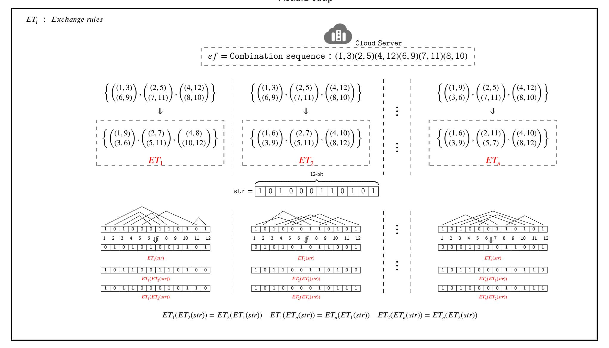

Figure 1: 12-bit Binary Sequence Conversion Case

<span id="page-4-0"></span>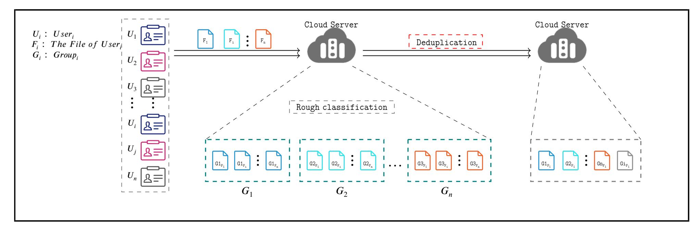

Figure 2: System Model

<span id="page-4-1"></span>backup, and easy migration, and therefore has become the preferred choice of many enterprises and individuals, which can help to reduce costs and improve flexibility and security. However, for S, in order to save hard disk space, improve write performance, save network bandwidth, etc., it is necessary to delete the duplicates to optimize its storage.

#### 3.2. Threat Model

Based on the utilization scenarios of data outsourcing, we believe that there is no completely viable entity. We categorize attackers that jeopardize system security and maliciously misappropriate system resources into the following 2 groups:

- Honest and Curious Server: It is able to truthfully deliver the promised computing resources and data storage services and does not deceive users. On the other hand, it is curious about the outsourced data and tries to learn the underlying plaintext through internal offline guessing attacks.
- Malicious Users: It may use various means to trick the system in order to gain undue advantage or to disrupt the normal operation of the system (e.g., U<sub>i</sub> attempts to trick the server by transmitting outdated or forged data in order to gain ownership of files that do not belong to him or her).

## <span id="page-4-2"></span>3.3. Design Goals

Based on analyzing the threat model, we design the following design goals:

{5}------------------------------------------------

<span id="page-5-2"></span>Table 1 Notations

| Notation         | Description                                    |
|------------------|------------------------------------------------|
| 𝙸𝙳               | The identity of 𝙲                              |
| 𝚙𝚔𝚒              | The public key of the i-th user                |
| 𝚜𝚔𝚒              | The private key of the i-th user               |
| 𝚔𝚎𝚢              | The key to encrypt the image                   |
| 𝚙𝚑𝚒              | The image fingerprint                          |
| 𝚙𝚑′              | Sampling fingerprints of images                |
| 𝙷𝚊𝚖(∗)           | The Hamming distance calculation operation     |
| 𝙴𝚃𝚒              | Exchange rules for the i-th user               |
| , 𝙶𝟸<br>(𝙶𝟷<br>) | Cyclic group                                   |
| (𝚟, 𝚐)           | The generators from 𝐺1                         |
| 𝙵𝚒               | File i                                         |
| ⊕                | Exclusive XoR operation                        |
| ∥                | Cascade symbol                                 |
| 𝚃                | Thresholds for similarity determination        |
| 𝚍𝚕               | Grouping distance for users with similar files |
| 𝚎𝚏               | Blinding 𝚙𝚑𝚒<br>exchange factor                |

- 1. Data Confidentiality: The deduplication system needs to ensure data security to prevent unauthorized access and data leakage.
- 2. Resistance to Replay Attacks: Only users who actually own the same or similar images can take ownership of the files, while users with non-similar images cannot use previous data to obtain authorized services.
- 3. Resistance to Complicity Attacks: Even if entities in the system exchange communication data and other information through collusion, the colluder cannot gain access to the underlying plaintext information of authorized users.
- 4. Resistance to Brute-force Guessing Attacks: With limited space for plaintext, an attacker also cannot reverse-guess the connection between plaintext and ciphertext by selecting specific data.
- 5. Efficiency: The deduplication system needs to process data efficiently, including operations such as reading, matching and deduplication. The design goal is to maximize the processing power of the system while minimizing latency and resource consumption.

# <span id="page-5-1"></span>**4. The Proposed Scheme**

We detail our scheme in this section. Instead of checking files one by one, the massive encrypted images in our scheme are divided into groups (in which the files are similar or identical) by a cloud server, and then the data within each group is deleted, keeping only the unique copy. It consists of 3 main phases: *Upload Preparation*, *Group and Deduplication* and *File Retrieval*. The required symbols are described in Table [1.](#page-5-2)

# <span id="page-5-0"></span>**4.1. Overview**

In this subsection, we provide a brief overview of the design of VisualDedup, and in order to achieve the design goals described in Section [3.3,](#page-4-2) a key challenge is to overcome the difficulty of achieving semantic security with deterministic encryption. Specifically, in order to make the encrypted data still recognizable and achieve semantic security, fingerprints are extracted from the file, and then the file is encrypted using a symmetric encryption algorithm and the fingerprints are blinded using DST. Specifically, data fingerprints are sampled unidirectionally from the original data, and then the fingerprints are used instead of the original data for similarity verification at the same time the original data is encrypted using traditional symmetric encryption to ensure the semantic security of the data. In order to resist bruteforce attacks on fingerprints, we adopt the idea of "private computation" to make the data fingerprints available but invisible. Meanwhile, batch deletion of similar data by the cloud server is also a challenge. Previous works [\[24\]](#page-13-12)[\[41\]](#page-14-19) fail to achieve this goal because they all use a single matching pattern (e.g., bilinear pairs), which leads to low retrieval rates. To solve this problem, we first group the data using short hash, then each member of the group privately computes the fingerprints of the other members and makes the computation results public in the group, and finally the cloud server can find out the non-similar data by simply verifying the shared data of one member of the group.

*(1). Unidirectional extraction of image fingerprints and* DST *blind fingerprints.* To address *Q1*, if the original image is encrypted directly, the encrypted image will lack detectability. Therefore, we extract the fingerprint (*ℎ* ) from the image before encrypting it, and then use the *ℎ* instead of the image for the recognition operation. Special emphasis is placed on the extraction of *ℎ* to satisfy unidirectionality ( ⇒ *ℎ* ; *ℎ* ⇏ ), and the extraction process can be briefly summarized as follows: reduce the size, simplify the color (grayscaling), compute the DST, denoise and normalize (generate a hash value). If we directly use *ℎ* for similarity judgment, although we can avoid the adversary to obtain the original image information directly from *ℎ* , we cannot avoid the adversary to launch Dictionary Attack. At this moment, the confidentiality of the data receives a serious challenge. Therefore, we use DST to blind *ℎ* and leverage the comparability of *DST* (<sup>1</sup> ( ()) = (<sup>1</sup> ())) so that the adversary cannot obtain any information about the original graph from *ℎ* . In summary, we balance the detectability and confidentiality of the data.

*(2). Similarity metric distance and perception algorithms.* To address *Q2*, exact deduplication means that data that are exactly the same are considered as duplicates and removed, while fuzzy deduplication means that data whose similarity exceeds a certain threshold are considered as duplicates and removed. Any image can be mapped into geometric space (similar images with similar locations in geometric space), so image perceptual fingerprint extraction and metric distances between fingerprints are particularly important. We use a perceptual hashing algorithm to extract image fingerprints and measure the similarity between fingerprints using the Hamming distance. Briefly, we map images in space and determine whether the images are 

{6}------------------------------------------------

similar or not by their distances in space. Here, we want to emphasize in particular that the current accuracy of using neural networks to determine image similarity will be better than the perceptual hash algorithm, but the method is based on plaintext and is not applicable to secure outsourcing application scenarios.

- (3). Grouping and anomaly detection. To address Q3, the Cloud Server (S) groups the data when it accepts the data uploaded by the user (as depicted in Figure.2). The S compares the short hash (ph') provided by the user with its own private hash  $(ph_s')$  and records the distance between ph'and  $ph_s'$  and groups the data indexed by ph' according to the distance. At this point, the same or similar data are grouped into the same group. The S broadcasts the Combination sequence within the group and each user  $(U_{(1-n)})$  generates a private  $ET_{(1-n)}$  based on the Combination sequence.  $U_{(1-n)}$  use the  $ET_{(1-n)}$  to blind the  $ph_i$  and broadcast the  $ET_{(1-n)}(str)$  within the group. Each  $U_{1-n}$  again uses its own  $ET_{(1-n)}$  to blind the  $ET_{(1-n)}(ET_i(str))$  of other members and sends the result to the group. The S calculates the Hamming distance of the data given by the members of the group and determines whether the images are similar based on the distance and threshold. It is especially emphasized that the cloud server does not have to traverse the data provided by all the members to find out the dissimilar data, e.g., there are 50 data members in the group, and suppose NO.21 is dissimilar. Firstly, the S checks the data provided by NO.1 and will find that the  $ET_1(ET_{21}(str))$  data is abnormal, at this time, the S checks the  $ET_{i\neq 21}(ET_{21}(str))$  provided by the other members, and if it still finds an abnormality, NO.21 is considered as dissimilar data.
- (4). Visual encryption based on information hiding. To address Q4, the secret image (or other data types) is first compressed, then embedded into a visually meaningful carrier image using steganography techniques. Visual encryption requires particular emphasis on two aspects: the carrier image must not suffer excessive distortion after embedding the secret image (to maintain the visual integrity of the stored data), and the extracted secret image must not differ visually too significantly from the embedded image (to ensure the usability of the recovered image).

## **4.2.** Upload Preparation

As shown in Figure.3, all users who need to outsource data in this system need to provide relevant information according to the following steps. The details of the implementation are as follows:

- 1. The user extracts the fingerprint of the image  $(ph_i)$  using Algorithm 2
- 2. The cloud server initializes the system. Randomly generate a string of length 32 bits  $ph'_s$ .

$$(ph_s)' = \{0,1\}^{32}.$$

3. The cloud server (S) generates 8 sets of random samples at [1, 64] (each of the 8 sets of samples is different  $(n_i - n_k, 0 < i < k < 64)$ ).

4. The user samples in  $ph_i$  according to  $(n_i - n_k)$  to generate ph'.

$$(ph)' = \{\emptyset, ..., \emptyset\} = \{\emptyset \mid |...| \mid \emptyset\}.$$

5. Securely conceal the original image using information hiding algorithms (see 4.5) and ph' and  $M_1$  are sent to the cloud server.

$$M_1 = En_{key}(image).$$

6. The *S* computes the Hamming distance  $d_l$  between ph' and  $ph'_s$  and records variable phase ( $\{\emptyset, ..., \emptyset\}$ ), where  $j \in (1,32)$ .

$$d_1 = Ham(ph', ph_s') = \sum_{i=0}^{n} (x_i \oplus y_i).$$

7. S roughly groups images and  $U_i$  according to  $d_1 \mid \mid \{\mathbb{Q}, ..., \mathbb{Q}\}$ 

## **Algorithm 2** Similarity Validation with Color-awareness

- 1: **InPut:** Image
- 2: **OutPut:** d
- 3:  $N \times N \leftarrow$  reset image size
- 4:  $arry[r,g,b] \leftarrow separates the three primary colors$
- 5:  $dct[r,g,b] \leftarrow arry[r,g,b]$  do the DST transform
- 6:  $avg[r,g,b] \leftarrow calculate$  the mean of the L-th row and L-th column of Arry[r,g,b]
- 7:  $abs(dct[r,g,b]) \leftarrow Taking absolute values for avg[r,g,b]$
- 8: low-frequency  $\leftarrow dct[r,g,b] \times (abs(dct[r,g,b]) > T)$
- 9: image ← DCT inversion for low-frequencies
- 10: image block  $\leftarrow$  Split the image into h  $\times$  h chunks
- 11:  $H(r,g,b) \leftarrow -\sum_{v_{r,g,b} \in R_i} p(v_{r,g,b}) \log_{p(v_{r,g,b})}$
- 12:  $avg[H(r,g,b)] \leftarrow calculate the mean of H(r,g,b)$
- 13:  $\{0,1\}^r$ ,  $\{0,1\}^g$ ,  $\{0,1\}^b \leftarrow H(r,g,b)$  is greater than avg[H(r,g,b)] is taken as 0, less than is taken as 1.
- <span id="page-6-0"></span>14:  $d \leftarrow Ham(g_i, g_i') \times 0.578 + Ham(r_i, r_i') \times 0.299 + Ham(b_i, b_i') \times 0.114$

## 4.3. Group and Deduplication

Figure.4 shows the deduplication principle of our scheme. Since the deduplication principle is the same for each group, we only give the deduplication schematic for a certain group. The specific realization process is shown below:

- 1. The cloud server gives a random order of combinations of serial numbers.
- 2. Each member of the group generates its own private exchange table  $(ET_i)$  and blinds the image fingerprint using the DST. Finally the blinded fingerprints are shared within the group.
- 3. A group member acquires blinded fingerprints from other members' shares and again blinds the acquired blinded fingerprints using its own private swap table.
- 4. Once again, group members share blinded data.
- 5. The cloud server calculates the Hamming distance between these blinded data. If the distance between fingerprint 1 and fingerprint 2 is less than a set threshold, then fingerprint 1 is considered similar to fingerprint 2 (i.e., image 1 is similar to image 2).

{7}------------------------------------------------

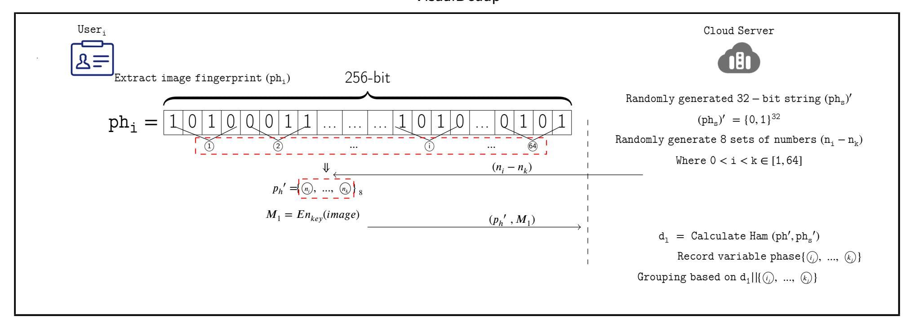

Figure 3: Upload Preparation

<span id="page-7-0"></span>6. The cloud server deletes all similar images and retains only one copy of the image.

Since the DST we so out are comparable  $ET_1(ET_2(str)) = ET_1(ET_2(str))$ , the balance between privacy and usability of image fingerprints can be effectively realized. At the same time, the data after blinding using the DST can help the cloud server to quickly identify those members of the group whose images are similar to each other. As shown in Algorithm 3.  $U_{(1-6)}$ , the image of  $U_6$  is not similar to the image of  $U_{(1-5)}$ , if it is traversal judgment needs to be performed 15 times to determine that the image of  $U_6$  is not the same as user  $U_{(1-5)}$ , while the DST can determine that the image of  $U_6$  is not the same as  $U_{(1-5)}$  in 6 times.

#### 4.4. File Retrieval

Authorized users should not be hindered in any way when they need to download data from the cloud server. Users within the same group have different encryption keys that they use during the upload preparation phase. Since the system ends up deleting similar images to retain only unique copies, only the user who originally owned the copy has the decryption key. For key distribution there are more mature schemes, such as: proxy re-encryption, group negotiation and so on. Here, we give a key distribution scheme. As shown in Figure.5, we use 1-to-M key distribution technique to implement the cloud server proxy key distribution effectively reduces the bandwidth consumption and alleviates the difficulty of always-on users. The detailed steps of implementation are as follows:

- 1. Choose 2 cyclic groups  $G_1$ ,  $G_2$  of large prime order p
- 2. Select a bilinear pair.  $\hat{e}: G_1 \times G_1 \to G_2$ .
- 3. Select the generating element (v, g) from  $G_1$
- 4.  $C_1 = K \ \hat{e}(v, g)^t$ . Where, K stands for the key to be transmitted and  $t \leftarrow Z_n$ .
- $5. C_i = (pk_i)^t$

#### **Decryption:**

$$C_1 = K * \widehat{e}(v, g)^t \Rightarrow K = \frac{C_1}{\widehat{e}(v, g)^t}$$
.  
We can obtain  $g^t$  based on  $C_i$ .

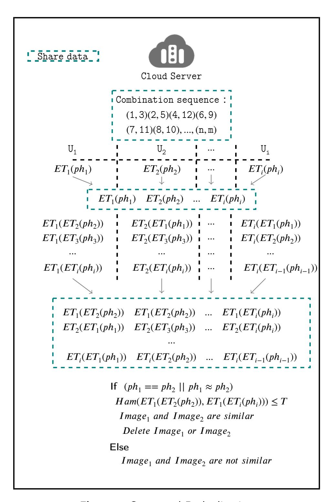

Figure 4: Group and Deduplication

<span id="page-7-2"></span>
$$C_{i} = pk_{i}^{t} = g^{sk_{i}t} \Rightarrow g^{t} = C_{i}^{\frac{1}{sk_{i}}}.$$

$$K = \frac{C_{1}}{\widehat{e}(v,C_{i})^{\frac{1}{sk_{i}}}}.$$

#### <span id="page-7-1"></span>4.5. Visual Encryption

Optimization of Encryption Method.

{8}------------------------------------------------

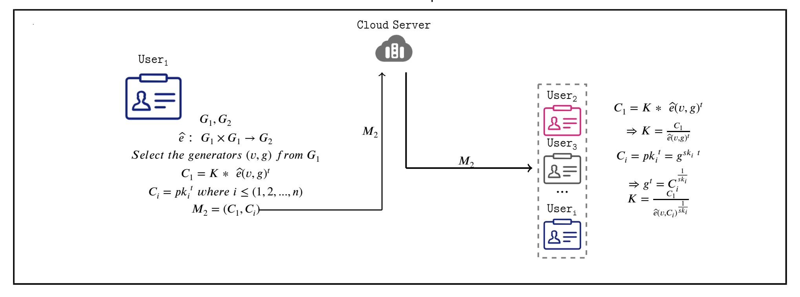

Figure 5: File Retrieval

<span id="page-8-1"></span>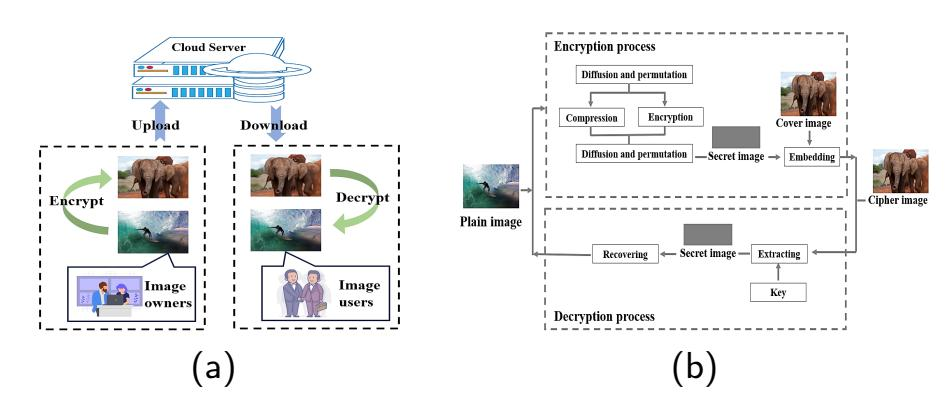

**Figure 6:** (a) Framework for Cryptosystems and (b)Schematic Diagram of Program

Existing encryption methods [1, 14, 30, 4] typically transform confidential images into meaningless ciphertext images for transmission, which may attract attackers' attention. Simultaneously, the doubling of bandwidth poses significant challenges for network transmission and storage. Therefore, combining image compression with steganography techniques offers an effective solution to these issues. Visual-preserving image encryption schemes based on steganographic compression coding ensure that only authorized clients can recover the original image from the carrier image. The framework of a steganographic visible encryption system is illustrated in Figure.6 (a), with the proposed scheme depicted in Figure.6 (b). Specifically, the process comprises two stages: encryption and decryption. The encryption process can be broadly divided into two phases. 1) Compress and encrypt the plaintext image to generate a secret image. The proposed scheme performs encryption and compression simultaneously, effectively preventing attackers from exploiting compressed but unencrypted information. 2) Embed the secret image into the high-frequency regions of the overlay image. Since the highfrequency components of an image represent its fine details, subtle alterations within these regions are difficult for the human eye to detect. Therefore, by embedding the secret image into the high-frequency subbands (HH, HL, LH) of the cover image, an encrypted image is generated. This image maintains nearly identical appearance to the cover image and retains high visual quality and meaningfulness,

thereby minimizing the likelihood of attack during transmission. The disordered embedding operation also enhances the algorithm's resistance to attacks. Figure.7 presents a case study of visual encryption. From a visual perspective, it is difficult to determine whether  $I_2$  or  $I_3$  embeds  $I_1$ . Although slight differences exist between  $I_2$  and  $I_4$ , these variations are negligible in fuzzy deduplication. Here, we emphasize that while numerous methods exist for image encryption in deduplication scenarios, employing visual encryption effectively diverts adversary attention and further conserves cloud storage space.

<span id="page-8-2"></span>VisualDedup's Limitation. VisualDedup is designed to safely remove similar images to conserve storage space. However, there are instances where users prefer not to delete similar images (e.g., keeping both original and edited versions). From VisualDedup, it is evident that VisualDedup functions as precise deduplication when the threshold T is set to 0. Therefore, in practical applications, if a customer wishes to retain approximate data, they simply need to request CS to preserve this data and then adjust the threshold T to 0 during the deduplication process. If all system users opt to keep similar data, VisualDedup's storage-saving capabilities are significantly diminished, making VisualDedup primarily suitable for deduplication scenarios where users can tolerate minor alterations in the recovered image.

# <span id="page-8-0"></span>5. Analysis

In this section, we analyze the security and evaluate performance of the proposed scheme.

## 5.1. Security Analysis

## <span id="page-8-3"></span>5.1.1. Data Confidentiality

The stored data is encrypted using a symmetric encryption algorithm, the security depends on the confidentiality and length of the key. Therefore, our security analysis focuses on the security of batch key sharing, which satisfies IND-CPA security. The specific security model is defined by a security game  $\mathcal{G}$  played between an adversary  $\mathcal{A}$  and a

{9}------------------------------------------------

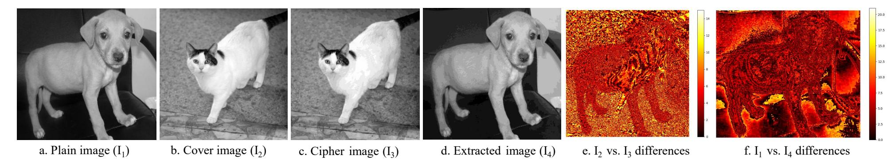

**Figure 7:** Visual Encryption Based on Information Hiding. e. is the difference between  $I_2$  and  $I_3$ , representing the visual quality of the encrypted visualization. f. is the difference between  $I_2$  and  $I_4$ , representing the difference between the decrypted image and the plain image

## **Algorithm 3** Batch Recognition Algorithm

<span id="page-9-0"></span>**Require:**  $U_1, U_2, \dots, U_i$  i is the number of users involved in the deduplication

**Ensure:**  $U_k$ . k is the number of the user not involved in the deduplication

```
1: S shares the ef of this round of agreements
2: for U_1, U_2, ..., U_i do
```

 $ET_{\gamma} \leftarrow U_{\gamma}$  uses ef to generate their own private 3: exchange rules  $\gamma \in (1, i)$ 

```
ET_{\gamma}(str) \leftarrow U_{\gamma} \text{ uses } ET_{\gamma} \text{ to blind the } ph_{\gamma}
4:
5:
             U_{\gamma} open ET_{\gamma} in the group
```

6: end for

```
7: for U_{\gamma} do
8:
```

Receive  $ET_{\beta}$ ,  $\beta \neq \gamma$ 

for U<sub>v</sub> do 9:

 $ET_{\gamma}(ET_{\beta}(str)) \leftarrow U_{\gamma}$  again uses its own  $ET_{\gamma}$  to 10: blind the received  $ET_{\beta}(str)$ 

end for 11:

 $U_{\gamma}$  send all the  $ET_{\gamma}(ET_{\beta}(str))$  to S12:

13: **end for** 

14: S generates a temporary array Arry[i][j] for  $U_{\gamma}$   $\gamma \in$ (1, i)

```
15: for h = 1 to i do
       for j do
                           // j=h+1
16:
           if Ham(Arry[h][j]) < D then
17:
               j \leftarrow j + 1
18:
           else
19:
               d = Ham(Arry[h+1][j])
20:
               if d > D then
21:
```

return U<sub>i</sub> is not involved in deduplica-22:

tion end if 23: end if 24: end for 25: **26**: **end for** 

challenger C, which simulates the honest but curious S and the honest  $U_i$ , respectively.

Assumption 1: For random a,b,c  $\leftarrow \mathbb{Z}_p$ , given  $(g, g^a, g^b, g^c, T)$ , distinguishing  $T = \hat{e}(g, g)^{abc}$  is difficult. ( DBDH Assumption )

Assumption 2: In  $G_1$ , given  $(g, g^x)$ , computing x is difficult. (DL Assumption)

<span id="page-9-1"></span>Game 0 : C generate (pk, sk), send pk = (g, v) = $g^a$ ,  $\{pk_i\}$ ) to A; A submitted  $m_0, m_1$ ; C randomly selects  $b \leftarrow \{0,1\}$ , encrypts  $m_b$  to get  $c^* = (C_1^*, C_i^*)$ ;  $\mathcal{A}$  output b'.

We define the advantage  $Adv_A$  of A in the above game G as:

$$Adv_{\mathcal{A}}^{\text{IND-CPA}} = \left| \Pr[b = b'] - \frac{1}{2} \right| \tag{2}$$

Game 1: C receives  $(g, g^a, g^b, g^c, T)$ , define  $v = g^a, t =$ c; C generates:  $C_1^* = KT$ ,  $C_i^* = (g^{sk_i})^c$ .

If  $T = \hat{e}(g, g)^{abc}$  is equivalent to Game 0; if T is random, then  $C_1^*$  contains no information about  $m_b$ .

Advantage Analysis: If A can distinguish between Game 0 and Game 1, it can break the DBDH problem. Therefore,

in Game 1,  $Adv_{\mathcal{A}}^{1} = 0$ . Proof of key confidentiality;  $\mathcal{A}$  recovers K from  $(C_{1}^{*}, C_{i}^{*})$ , it is necessary to compute  $\hat{e}(v,g)^t = \hat{e}(g^a,g)^c = \hat{e}(g,g)^{ac}$ , which is equivalent to solving the DBDH problem, so that the confidentiality of the key is guaranteed.

Image fingerprint security: If a malicious adversary obtains the fingerprint of an image, it is possible to guess the information of the original image through an offline brute force attack. In our scheme, for efficient grouping, the user gets ph' ( $\iota'$  bits) by fixed sampling in  $ph_i$  ( $\iota$  bits). A bit has 2 choices (i.e., 0 or 1), so the probability that the adversary guesses phi based on ph' is  $\delta = (1/2)^{i'-i}$ . Generally  $128 \le \iota' - \iota$ , so  $\delta$  is too small, the probability that A successfully guesses  $ph_i$  based on ph' is negligible (The short hash length, denoted by  $\iota' - \iota$ , is employed to resist BFA. Typically,  $\iota'$  is set to a value less than 32. The data integrity fingerprint, denoted by  $\iota$ , is usually set to a value 192 or 256). For the security analysis of *DST* we will give it in 5.1.4. It should be especially emphasized that the output length of the data fingerprint in VisualDedup can be selected according to the actual situation.

#### 5.1.2. Anti-replay Attack

Replay-resistant attacks usually occur in communication protocols where the attacker tries to deceive the receiver by recording and replaying previously sent messages. In our scheme, if the A obtains ph', then the cloud server will include the adversary in the group. In the deduplication

{10}------------------------------------------------

<span id="page-10-1"></span>**Table 2**Comparison of Related Programss

| Test Group                 | ВС | FD        | CR        | BFAR      | RAR       | CG        | CA        | VP |
|----------------------------|----|-----------|-----------|-----------|-----------|-----------|-----------|----|
| Jiang <i>et al.'s</i> [12] | ×  |           | ×         |           |           |           | ×         | ×  |
| Chen <i>et al.'s</i> [3]   | ×  | ×         | ×         | $\sqrt{}$ | ×         | ×         | ×         | X  |
| Li <i>et al.'s</i> [19]    | ×  | $\sqrt{}$ | ×         | $\sqrt{}$ | ×         | ×         | ×         | X  |
| Peng <i>et al.'s</i> [24]  | ×  | ×         | ×         | $\sqrt{}$ | $\sqrt{}$ | $\sqrt{}$ | ×         | X  |
| Zheng <i>et al.'s</i> [45] |    | ×         | ×         | $\sqrt{}$ | ×         | $\sqrt{}$ | ×         | X  |
| Cheng et al.'s [5]         | ×  | $\sqrt{}$ | $\sqrt{}$ | $\sqrt{}$ | $\sqrt{}$ |           | ×         | X  |
| Tang <i>et al.'s</i> [33]  | ×  | $\sqrt{}$ | $\sqrt{}$ | $\sqrt{}$ |           |           | $\sqrt{}$ | X  |
| Huang <i>et al.'s</i> [11] | ×  | $\sqrt{}$ | ×         | $\sqrt{}$ |           |           | ×         | X  |
| Our'scheme                 |    |           |           | $\sqrt{}$ | $\sqrt{}$ |           |           |    |

FD = Fuzzy Deduplication CR = Collusion Resistance BFAR = Brute-Force Attacks Resistance

BC = Batch Checking RAR = Replay Attacks Resistance CG = Cross Group CA = Color Awareness VP = Visual Presentation

phase, each member of the group has a private  $ET_i$ . The image fingerprints shared into the group are blinded by  $ET_i$ , and the probability that the  $\mathcal{A}$  correctly guesses  $ET_i$  is  $\delta' = (1/2)^{i/4}$ . Therefore, even if the  $\mathcal{A}$  obtains ph',  $\mathcal{A}$  cannot obtain the key to decrypt the image.

#### 5.1.3. Anti-collusion Attack

If a malicious user cooperates with the cloud server and tries to guess the private information of other users, the process is called a conspiracy attack. As mentioned in 5.1.1, when multiple users conspire to share  $\{sk_i\}$ , it is impossible to derive a based on the DL assumption, and thus it is impossible to decrypt other users'  $C_1 = K\hat{e}(g,g)^{ac}$ . Once a malicious user conspires with the cloud server, then the malicious user tries to guess the image fingerprints through  $ET_i(ET_n(str)) = ET_n(ET_i(str))$  shared by other users. Although the malicious adversary obtains  $ET_i(ET_n(str)) = ET_i(ET_n(str))$ , it cannot guess the  $ET_i$ , and thus cannot obtain the key to decrypt the image.

#### <span id="page-10-0"></span>5.1.4. Anti-Brute-Force Attack

The initiator of a brute force attack can be either a user within a group or a cloud server. Once the malicious attacker obtains the  $ph_i$ , the privacy security of legitimate users will be threatened. Although perceived hash is a one-way function, which means we cannot utilize  $ph_i$  to compute plaintext I directly. However, in a limited plaintext space. Guessing the  $ph_i$  will also indirectly expose the privacy of the client. As shown in Figure.1, in the case of an image fingerprint of i bits, there are a total of  $2^{i/4}$  cases of usergenerated private  $ET_i$ , thus the probability of an adversary finding the correct  $ET_i$  from  $2^{i/4}$  is negligible.

## 5.2. Comparative Analysis

Table 2 shows a comparison of our proposal with some typical schemes in terms of security and functionality. Peng et al. [24] achieved block-level data deduplication using  $e(F_1^{r1}, g^{r2}) = e(F_2^{r2}, g^{r1})$ , but this is intolerant of subtle differences between  $F_1$  and  $F_2$ . Chen et al. [3] proposed a secure deduplication scheme for images. However, their scheme is based on group key sharing and can only delete

redundant data within a group. In scenarios with multiple users and cross-domain interactions, this deduplication mechanism and security are severely limited. Moreover, the need to share private keys within a group makes the scheme difficult to resist sociological attacks. Jiang et al. [12]proposed FuzzyMLE and FuzzyPOW there. Effectively implemented multimedia data deduplication, unfortunately, FuzzyMLE is proposed based on fully trusted servers. Li et al. [19] designed a secure fuzzy image deduplication scheme based on sensing and cryptographic hashing for group users with shared group keys. However, it relies on a trusted entity to manage the keys of all group users and does not work across groups. Cheng et al. [5] proposed "exchange rules" to achieve usable invisibility of data fingerprints, and Tang et al. [33] introduced color awareness into image deduplication for the first time. Zheng et al. [45] proposed the first batch dense state data deduplication scheme based on group key writing, but the scheme cannot be applied to media data deduplication.

#### **5.3.** Performance Evaluation

#### 5.3.1. Simulation Settings

Our system is implemented on Windows 10 with 2.30GH i5-8300H and 8G RAM. The programming language we use is Python 3.90. We test on three datasets, the details of which are shown in Table 3. (We prefer to select the right amount of images in the three datasets and then constructed 7 classes of noise generation algorithms and randomly selected 5 of the 7 classes of noise algorithms to generate redundant data). <sup>1</sup>

# 5.3.2. Simulation Result

**Overhead of data fingerprint generation for different lengths.** From 5.1.4 it is known that the longer the data fingerprint the higher the security. We measured the average time required to generate data fingerprints of different lengths (len=48,75,108,147,192,243,300,363) for 1000 images on DB1, DB2, and DB3 datasets. As shown in

<span id="page-10-2"></span><sup>&</sup>lt;sup>1</sup>The 7 types of noise generation algorithms are: Gaussian noise, Poisson noise, motion blur, 2\*2 random masking, random scaling, and transformed RGB channels. Five of these 7 classes of noise algorithms are randomly selected for generating redundant data. If you need the code, please contact us.

{11}------------------------------------------------

<span id="page-11-0"></span>**Table 3** Evaluation Datasets

| Evaluation Index   | DB1 <b>[5]</b> | DB2 <b>[5]</b> | DB3 <b>[26]</b> |
|--------------------|----------------|----------------|-----------------|
| Original DB-Number | 8340           | 1000           | 6016            |
| Original DB-Size   | 0.077GB        | 0.148GB        | 0.15GB          |
| Noise-Number       | 41700          | 5000           | 30075           |
| Noise-Size         | 1.27GB         | 0.70GB         | 1.52GB          |

Figure.8, the generation time is constant for data fingerprints of different lengths. This means that there is no additional computational cost to improve security by increasing the length of data fingerprints in VisualDedup.

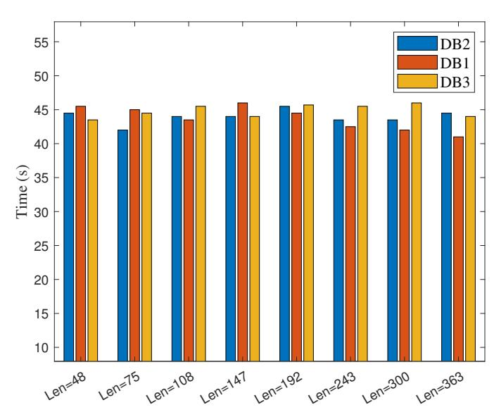

Figure 8: The Average Overhead of Generating Data Fingerprints of Different Lengths is on Datasets DB1-3 (1000 Runs)

Evaluation of VisualDedup Data Fingerprint Generation (len=192). We randomly selected 5000 images from DB1-DB3 respectively (with the fingerprint length set to 192) and tested the relationship between data volume and fingerprint generation time. As shown in Figure.9, the amount of data is linearly and positively correlated with the time required. The time required to generate an image is about 0.09s, which is acceptable for users.

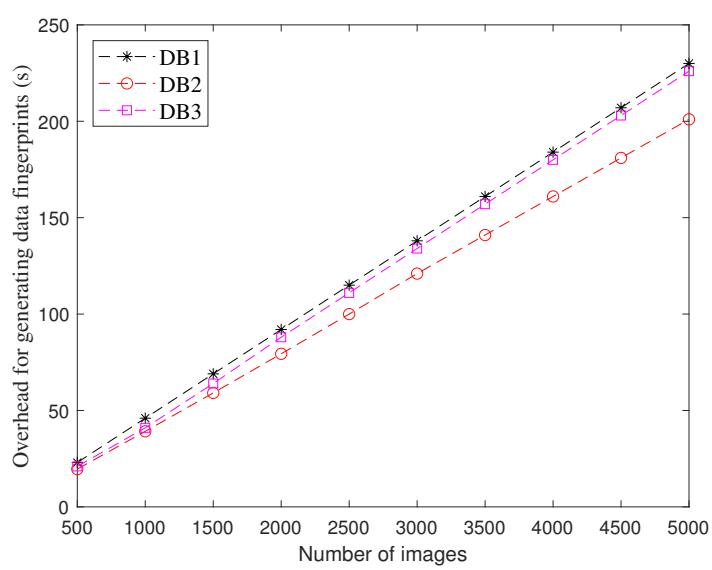

**Figure 9:** Cost of Generating Data Fingerprints on Different Datasets

Interference of Different Sampling Order Numbers on Grouping. As shown in Figure.3, we are utilizing fixed sampling to achieve the primitive classification of images. We randomly generate 8 combinations of fixed sampling and tested the correct grouping rate of each combination under

different distortion environments (sampling ordinal length of 32, threshold of 3). As shown in Table 4, the correct grouping rate is almost unaffected by the fixed sampling combinations, thus indicating the good robustness of our scheme.

Comparison of Related Schemes in terms of Data Fingerprint Generation Cost. We replicated the data fingerprint generation algorithms of Zheng et al. [45], Cheng et al. [5], Tang et al. [33] and Chen et al. [3]. We ran each fingerprint generation algorithm 10,000 times and averaged the fingerprint generation cost. As shown in Figure. 10, our fingerprint generation cost is significantly lower than [5][33], and slightly higher than [45][5]. The data labels of [45] are generated by SHA256, and its label generation cost is better than our scheme, but the data labels generated by SHA256 will not be able to be used for fuzzy deduplication. [5] does not consider image color for deduplication, so its data label cost generation cost is slightly lower than ours. Compared to the scheme [33] which also considers image color, our fingerprint generation cost is 5 times lower than it.

<span id="page-11-1"></span>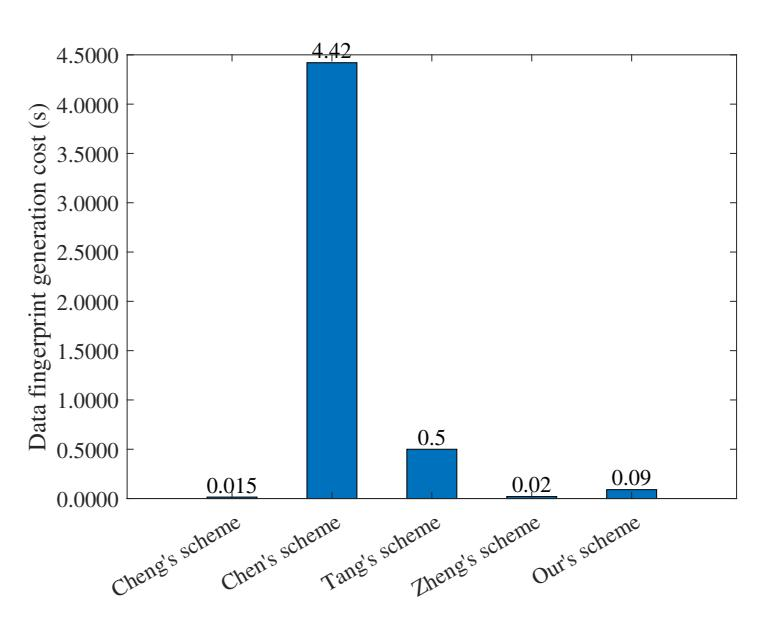

<span id="page-11-3"></span>Figure 10: Average Generation Cost of Data Fingerprints

Comparison of Time to Perform Redundant Data Deduplication by Related Programs. We compare Zheng et al. [45], Cheng et al. [5], Tang et al. [33], Chen et al. [3] and our scheme in terms of deduplication time. As shown in Figure. 11, our scheme is significantly more efficient in performing deduplication than [5] persons [33][3], and the required deduplication time does not increase significantly with the increase of data volume. Compared with the scheme [45], which is also a batch deduplication scheme, the deduplication time required by our scheme is slightly higher than that of [45], but [45] does not achieve deduplication of approximate data.

<span id="page-11-2"></span>Comparison of Related Programs in terms of Deduplication Rate. We evaluate the deduplication rates

 $(\frac{\text{Space occupied after weight removal}}{\text{Space occupied by the original data}})$  of the relevant schemes and our scheme on multiple datasets. As with [5], we noisily interfered with the three base datasets and derived redundant datasets (see Table 3). The deduplication rate was then evaluated on these datasets. As shown in Figure.12, we tested the storage space saving rate under different threshold selections (T=1 to 5). A smaller threshold value represents a higher

{12}------------------------------------------------

<span id="page-12-11"></span>**Table 4**Interference of Different Sampling Order Numbers on Grouping.

|                 | Test <sub>1</sub> | Test <sub>2</sub> | Test <sub>3</sub> | Test <sub>4</sub> | Test <sub>5</sub> | Test <sub>6</sub> | Test <sub>7</sub> | Test <sub>8</sub> | mean value | error |
|-----------------|-------------------|-------------------|-------------------|-------------------|-------------------|-------------------|-------------------|-------------------|------------|-------|
| Gaussian noise  | 0.970             | 0.974             | 0.965             | 0.968             | 0.970             | 0.968             | 0.974             | 0.969             | 0.970      | 0.009 |
| Motion blur     | 0.779             | 0.806             | 0.769             | 0.771             | 0.776             | 0.772             | 0.799             | 0.773             | 0.781      | 0.037 |
| Possion noise   | 0.946             | 0.949             | 0.943             | 0.944             | 0.944             | 0.946             | 0.948             | 0.941             | 0.945      | 0.008 |
| Mask 2*2        | 0.740             | 0.773             | 0.714             | 0.727             | 0.746             | 0.739             | 0.762             | 0.736             | 0.742      | 0.059 |
| Salt and pepper | 0.796             | 0.823             | 0.776             | 0.787             | 0.800             | 0.796             | 0.819             | 0.794             | 0.799      | 0.047 |

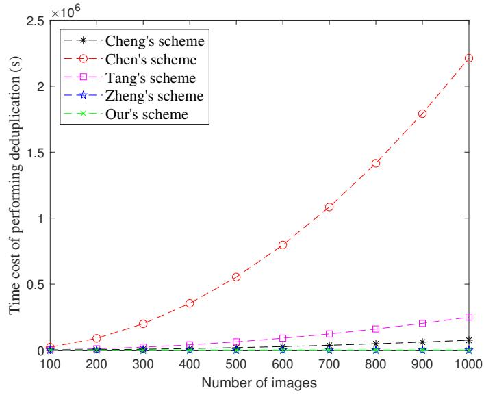

Figure 11: Comparison of Related Deduplication Schemes in terms of Execution Efficiency

degree of similarity between the data. The experimental results show that our deduplication efficiencies all outperform similar schemes, especially when the threshold selection is smaller. It is especially emphasized that the scheme of Zheng et al. [45] is only applicable to batch deletion of exact data, and the deduplication rate is low since [45] is constructed based on traditional cryptography and is not robust.

Evaluation of Storage Efficiency. We test the degree of storage freeing by VisualDedup on DB1-DB3 with different thresholds (T=1, 2, 3, 4) selected. As shown in Figure.13, VisualDedup saves more storage overhead compared to non-deduplication. On the DB1, 90%-97+% storage savings. On the DB2, 64%-96+% storage savings. 79%-96+% storage savings on the DB3. In addition, we can find that a smaller threshold t results in higher storage efficiency. This is due to the higher accuracy of the fingerprints of the data we generate, which avoids the misidentification problem.

The Robustness of the Scheme is Verified from the Point of View of Image Quality. Peak Signal-to-Noise Ratio (PSNR) is the main metric used to measure the image. When  $40 \le psnr$ , the image quality is excellent. When 30 < psnr < 40, distortion is detectable but acceptable. When 20 < psnr < 30, the image quality is poor. When psnr < 20 image quality is very poor. As shown in Figure.14, we have performed noise interference on the images of "airplane" (O: original image, S: Salt-and-pepper noise, G: Gaussian noise, G: motion noise, G: random masking, G: Random color changes), when the image quality is very poor, our scheme can still effectively recognize similar data and remove the redundant copies, which demonstrates the good robustness of our scheme.

# <span id="page-12-9"></span>6. Conclusion

In this paper, we address the challenge in terms of security and efficiency in encrypted data deduplication. We propose VisualDedup, which utilizes the short hash of data fingerprints to group data, and uses DST to blind and compare data fingerprints within a group, and ultimately achieves cross-user batch deletion of similar or identical data in a secure and efficient manner. Our scheme is against guessing attack without additional servers thus prevents collusion attacks naturally. The experimental analysis shows that the scheme achieves satisfactory deduplication efficiency while ensuring the data confidentiality.

# <span id="page-12-12"></span>References

- <span id="page-12-3"></span>[1] Belazi, A., Abd El-Latif, A.A., Belghith, S., 2016. A novel image encryption scheme based on substitution-permutation network and chaos. Signal Processing 128, 155–170.
- <span id="page-12-5"></span>[2] Bellare, M., Keelveedhi, S., Ristenpart, T., 2013. Message-locked encryption and secure deduplication, in: Annual international conference on the theory and applications of cryptographic techniques, Springer. pp. 296–312.
- <span id="page-12-10"></span>[3] Chen, L., Xiang, F., Sun, Z., 2021. Image deduplication based on hashing and clustering in cloud storage. KSII Transactions on Internet and Information Systems (TIIS) 15, 1448–1463.
- <span id="page-12-4"></span>[4] Chen, W., 2016. Optical multiple-image encryption using three-dimensional space. IEEE Photonics Journal 8, 1–8.
- <span id="page-12-1"></span>[5] Cheng, S., Tang, Z., Zeng, S., Cui, X., Li, T., 2024. Pfdup: Practical fuzzy deduplication for encrypted multimedia data. Journal of Industrial Information Integration 40, 100613.
- <span id="page-12-7"></span>[6] Cheng, S., Zeng, S., Feng, Y., Xiao, J., Zheng, H., 2022. Secure single-server fuzzy deduplication without interactive proof-of-ownership in cloud, in: 2022 IEEE 24th Int Conf on High Performance Computing & Communications; 8th Int Conf on Data Science & Systems; 20th Int Conf on Smart City; 8th Int Conf on Dependability in Sensor, Cloud & Big Data Systems & Application (HPCC/DSS/SmartCity/DependSys), IEEE. pp. 1525–1530.
- <span id="page-12-0"></span>[7] Douceur, J.R., Adya, A., Bolosky, W.J., Simon, P., Theimer, M., 2002. Reclaiming space from duplicate files in a serverless distributed file system, in: Proceedings 22nd international conference on distributed computing systems, IEEE. pp. 617–624.
- <span id="page-12-6"></span>[8] Duan, Y., 2014. Distributed key generation for encrypted deduplication: Achieving the strongest privacy, in: Proceedings of the 6th edition of the ACM Workshop on Cloud Computing Security, pp. 57–68.
- <span id="page-12-2"></span>[9] Gao, Y., Chen, L., Lai, J., Wang, T., Wu, X., Yu, S., 2025. Iot-dedup: Device relationship-based iot data deduplication scheme. IEEE Transactions on Parallel and Distributed Systems.
- <span id="page-12-8"></span>[10] Ha, G., Jia, C., Huang, Y., Chen, H., Li, R., Jia, Q., 2023. Scalable and popularity-based secure deduplication schemes with fully random tags. IEEE Transactions on Dependable and Secure Computing 21, 1484–1500.

{13}------------------------------------------------

#### VisualDedup


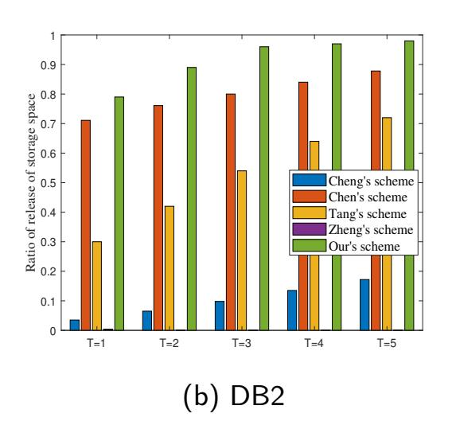

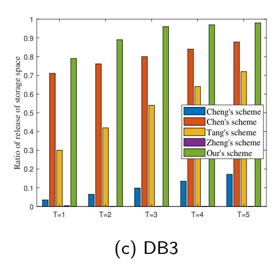

Figure 12: Comparison of Deduplication Rates of Related Deduplication Schemes

<span id="page-13-14"></span>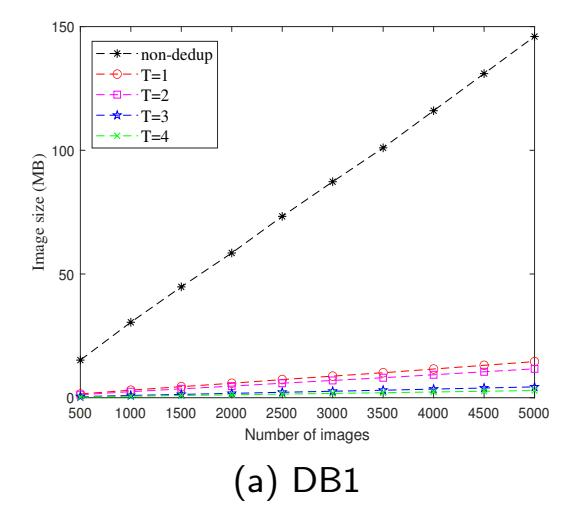

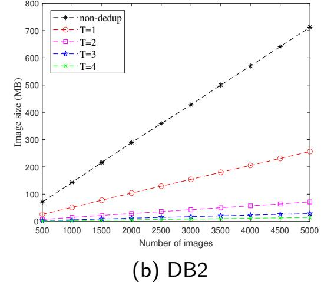

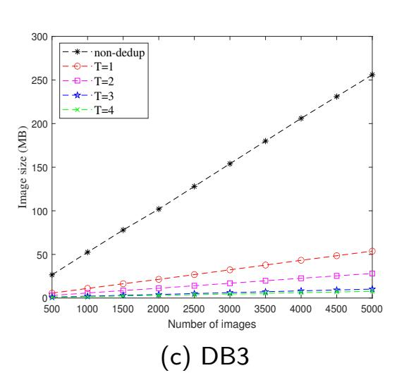

Figure 13: Storage Overheads of Our Scheme

<span id="page-13-15"></span>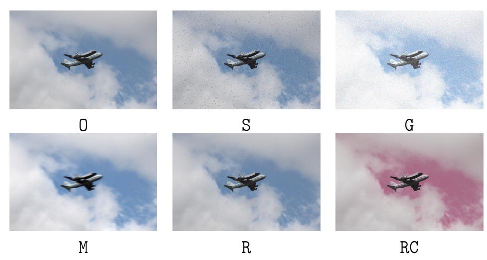

**Figure 14:** Verifying Robustness from the Perspective of PSNR. Ham(O,S) = 0,  $psnr(O,S) = 43.28 \ Ham(O,G) = 1$ , psnr(O,G) = 27.4; Ham(O,M) = 1,  $psnr(O,M) = 27.6 \ Ham(O,R) = 0$ , psnr(O,R) = 46.1; Ham(O,RC) = 24, psnr(O,RC) = 47

- <span id="page-13-16"></span><span id="page-13-13"></span>[11] Huang, L., Mao, X., Zhou, L., Wu, D., Gao, L., Luan, T.H., 2025. Fidd: Secure fine-grained deduplication and dynamic auditing scheme for cloud storage. IEEE Transactions on Networking.
- <span id="page-13-6"></span>[12] Jiang, T., Yuan, X., Chen, Y., Cheng, K., Wang, L., Chen, X., Ma, J., 2022. Fuzzydedup: Secure fuzzy deduplication for cloud storage. IEEE Transactions on Dependable and Secure Computing 20, 2466–2483.
- <span id="page-13-9"></span>[13] Keelveedhi, S., Bellare, M., Ristenpart, T., 2013. {DupLESS}:{Server-Aided} encryption for deduplicated storage, in: 22nd USENIX security symposium (USENIX security 13), pp. 179–194.
- <span id="page-13-8"></span>[14] Kumar, M., Iqbal, A., Kumar, P., 2016. A new rgb image encryption algorithm based on dna encoding and elliptic curve diffie–hellman cryptography. Signal Processing 125, 187–202.
- <span id="page-13-5"></span>[15] Li, J., Qin, C., Lee, P.P., Zhang, X., 2017. Information leakage in encrypted deduplication via frequency analysis, in: 2017 47th

- Annual IEEE/IFIP international conference on dependable systems and networks (DSN), IEEE. pp. 1–12.
- <span id="page-13-0"></span>[16] Li, J., Yan, H., Zhang, Y., 2018. Certificateless public integrity checking of group shared data on cloud storage. IEEE Transactions on Services Computing 14, 71–81.
- <span id="page-13-4"></span>[17] Li, J., Yang, Z., Ren, Y., Lee, P.P., Zhang, X., 2020. Balancing storage efficiency and data confidentiality with tunable encrypted deduplication, in: Proceedings of the Fifteenth European Conference on Computer Systems, pp. 1–15.
- <span id="page-13-3"></span>[18] Li, S., Xu, C., Zhang, Y., Du, Y., Wen, X., Chen, K., Ma, J., 2021. Efficient data retrieval over encrypted attribute-value type databases in cloud-assisted ehealth systems. IEEE Systems Journal 16, 3096–3107.
- <span id="page-13-11"></span>[19] Li, X., Li, J., Huang, F., 2016. A secure cloud storage system supporting privacy-preserving fuzzy deduplication. Soft Computing 20, 1437–1448.
- <span id="page-13-7"></span>[20] Liu, J., Asokan, N., Pinkas, B., 2015. Secure deduplication of encrypted data without additional independent servers, in: Proceedings of the 22nd ACM SIGSAC Conference on Computer and Communications Security, pp. 874–885.
- <span id="page-13-2"></span>[21] Miao, Y., Deng, R.H., Liu, X., Choo, K.K.R., Wu, H., Li, H., 2019. Multi-authority attribute-based keyword search over encrypted cloud data. IEEE Transactions on Dependable and Secure Computing 18, 1667–1680.
- <span id="page-13-1"></span>[22] Miao, Y., Ma, J., Liu, X., Li, X., Jiang, Q., Zhang, J., 2017. Attribute-based keyword search over hierarchical data in cloud computing. IEEE Transactions on Services Computing 13, 985–998.
- <span id="page-13-10"></span>[23] Ming, Y., Wang, C., Liu, H., Zhao, Y., Feng, J., Zhang, N., Shi, W., 2022. Blockchain-enabled efficient dynamic cross-domain deduplication in edge computing. IEEE Internet of Things Journal 9, 15639– 15656.
- <span id="page-13-12"></span>[24] Peng, L., Yan, Z., Liang, X., Yu, X., 2023. Secdedup: Secure data deduplication with dynamic auditing in the cloud. Information Sciences 644, 119279.

{14}------------------------------------------------

- <span id="page-14-12"></span>[25] Qin, C., Li, J., Lee, P.P., 2017. The design and implementation of a rekeying-aware encrypted deduplication storage system. ACM Transactions on Storage (TOS) 13, 1–30.
- <span id="page-14-20"></span>[26] Rosenfeld, A., Solbach, M.D., Tsotsos, J.K., 2018. Totally looks like-how humans compare, compared to machines, in: Proceedings of the IEEE Conference on Computer Vision and Pattern Recognition Workshops, pp. 1961–1964.
- [27] Saha, S., 2000. Image compression—from dct to wavelets: a review. XRDS: Crossroads, The ACM Magazine for Students 6, 12–21.
- <span id="page-14-6"></span>[28] Song, M., Hua, Z., Zheng, Y., Xiang, T., Jia, X., 2024a. Simless: a secure deduplication system over similar data in cloud media sharing. IEEE Transactions on Information Forensics and Security .
- <span id="page-14-18"></span>[29] Song, M., Hua, Z., Zheng, Y., Xiang, T., Jia, X., 2024b. Simless: A secure deduplication system over similar data in cloud media sharing. IEEE Transactions on Information Forensics and Security .
- <span id="page-14-10"></span>[30] Souyah, A., Faraoun, K.M., 2016. Fast and efficient randomized encryption scheme for digital images based on quadtree decomposition and reversible memory cellular automata. Nonlinear Dynamics 84, 715–732.
- <span id="page-14-15"></span>[31] Sun, Z., Kuenning, G., Mandal, S., Shilane, P., Tarasov, V., Xiao, N., et al., 2016. A long-term user-centric analysis of deduplication patterns, in: 2016 32nd Symposium on Mass Storage Systems and Technologies (MSST), IEEE. pp. 1–7.
- <span id="page-14-7"></span>[32] Takeshita, J., Karl, R., Jung, T., 2020. Secure single-server nearlyidentical image deduplication, in: 2020 29th International Conference on Computer Communications and Networks (ICCCN), IEEE. pp. 1– 6.
- <span id="page-14-8"></span>[33] Tang, Z., Zeng, S., Han, S., Feng, Y., Li, T., He, M., 2024a. Fuzzy deduplication: Color-aware deduplication for multi-media data. IEEE Transactions on Services Computing 17, 2459–2472.
- <span id="page-14-9"></span>[34] Tang, Z., Zeng, S., Han, S., Liu, J., He, M., 2024b. Hdefc: Hierarchical secure fuzzy deduplication based on fog computing. IEEE Internet of Things Journal .
- <span id="page-14-5"></span>[35] Tang, Z., Zeng, S., Li, T., Cheng, S., Zheng, H., 2023. Fuzzy deduplication scheme supporting pre-verification of label consistency. Cryptology ePrint Archive .
- [36] Thévenaz, P., Blu, T., Unser, M., 2000. Image interpolation and resampling. Handbook of medical imaging, processing and analysis 1, 393–420.
- <span id="page-14-3"></span>[37] Wang, Y., Sun, S.F., Wang, J., Liu, J.K., Chen, X., 2020. Achieving searchable encryption scheme with search pattern hidden. IEEE Transactions on Services Computing 15, 1012–1025.
- <span id="page-14-14"></span>[38] Xhafa, F., Wang, J., Chen, X., Liu, J.K., Li, J., Krause, P., 2014. An efficient phr service system supporting fuzzy keyword search and finegrained access control. Soft computing 18, 1795–1802.
- <span id="page-14-13"></span>[39] Yang, X., Lu, R., Shao, J., Tang, X., Ghorbani, A.A., 2020. Achieving efficient secure deduplication with user-defined access control in cloud. IEEE Transactions on Dependable and Secure Computing 19, 591–606.
- <span id="page-14-2"></span>[40] Zhang, X., Xu, C., Wang, H., Zhang, Y., Wang, S., 2019. Fs-peks: Lattice-based forward secure public-key encryption with keyword search for cloud-assisted industrial internet of things. IEEE Transactions on dependable and secure computing 18, 1019–1032.
- <span id="page-14-19"></span>[41] Zhang, Y., Xu, C., Cheng, N., Shen, X., 2021. Secure passwordprotected encryption key for deduplicated cloud storage systems. IEEE Transactions on Dependable and Secure Computing 19, 2789– 2806.
- <span id="page-14-4"></span>[42] Zhang, Y., Xu, C., Li, H., Yang, K., Zhou, J., Lin, X., 2018. Healthdep: An efficient and secure deduplication scheme for cloud-assisted ehealth systems. IEEE Transactions on Industrial Informatics 14, 4101–4112.
- <span id="page-14-1"></span>[43] Zhang, Y., Xu, C., Liang, X., Li, H., Mu, Y., Zhang, X., 2016. Efficient public verification of data integrity for cloud storage systems from indistinguishability obfuscation. IEEE Transactions on Information Forensics and Security 12, 676–688.
- <span id="page-14-16"></span>[44] Zhao, X., Zhang, Y., Wu, Y., Chen, K., Jiang, J., Li, K., 2013. Liquid: A scalable deduplication file system for virtual machine images. IEEE transactions on parallel and distributed systems 25, 1257–1266.

- <span id="page-14-17"></span>[45] Zheng, H., Zeng, S., Li, H., Li, Z., 2024. Secure batch deduplication without dual servers in backup system. IEEE Transactions on Dependable and Secure Computing , 1–13.
- <span id="page-14-11"></span>[46] Zhou, Y., Feng, D., Xia, W., Fu, M., Huang, F., Zhang, Y., Li, C., 2015. Secdep: A user-aware efficient fine-grained secure deduplication scheme with multi-level key management, in: 2015 31st symposium on mass storage systems and technologies (MSST), IEEE. pp. 1–14.
- <span id="page-14-0"></span>[47] Zikopoulos, P., Eaton, C., 2011. Understanding big data: Analytics for enterprise class hadoop and streaming data. McGraw-Hill Osborne Media.


Shengke Zeng is a professor at the School of Computer and Software Engineering, Xihua University, Chengdu, China. She received her Ph.D. degree from University of Electronic Science and Technology of China (UESTC) in 2013. Her research interests include: Cryptography and Network Security. Her research has been published in International conferences including COCOON, ACISP and ProvSec and journals including IEEE TDSC, IEEE TSC, IEEE TCC, IEEE TBE and JIII.

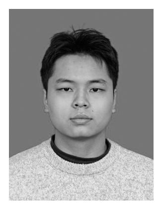

Zehui Tang is a PhD student at the School of Computer Science and Technology, Nanjing University of Aeronautics and Astronautics. His research interests include Machine Learning Security, Ciphertext Deduplication, Cloud Security and Privacy. His research has been published in international journals and conferences including IEEE TSC, IEEE IoT, JIII, TVC, ProvSec, PST.

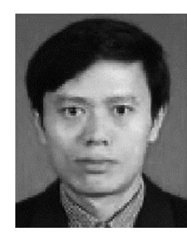

Song Han is currently a Full Professor at the School of Computer and Computing Science, Hangzhou City University. He is also with Zhejiang Ponshine Information Technology Company, Ltd., Hangzhou, China. His current research interests include data security, privacy protection, IoT, artificial intelligence, and Industrial Internet of Things. He is a Qianjiang Scholar Distinguished Professor in Zhejiang Province. His research has been published in international conferences and journals including IEEE TIFS, IEEE TWC, IEEE TNNLS and IEEE TPDS.


Mingxing He received the M.S. degree from Chongqing University and the Ph.D. degree from Southwest Jiaotong University, China, in 1990 and 2003, respectively. He is a member of the IEEE and ACM, a senior member of CAAC. He is currently a professor and the director of the Key Lab of Cyberspace Security Insurance of Sichuan, Xihua University. He has published over 90 research papers in refereed journals and conferences. He has been a reviewer for several international academic journals. His research interests include information security and cryptography.