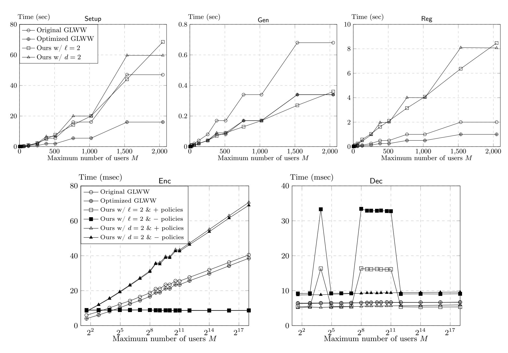

{0}------------------------------------------------

# Towards Practical Registered ABE: More Efficient, Non-monotone, and CCA-secure

Yannis Rouselakis and Junichi Tomida

NTT Research

Abstract. Registered attribute-based encryption (Reg-ABE) is a new variant of attribute-based encryption (ABE) that was introduced to resolve the notorious key escrow problem. In a Reg-ABE system, there is no authority that generates secret keys, and each user joins the system by generating its own public/secret key pair. Because of its public-key infrastructure-like model and versatile access control functionality, Reg-ABE is a promising alternative of ABE. In this work, we present a highly space efficient non-monotone Reg-ABE scheme with strong security. Specifically, the sizes of MPK and ciphertext of our scheme are both about 7.5KB, which could be more than 2000× and 5× smaller than those of the state-of-the-art scheme by Garg et al. (Crypto'24, GLWW), respectively, in a realistic parameter setting. The sizes of other elements such as helper secret key and a state that the system maintains could also become more than 40× smaller. Furthermore, our scheme supports non-monotone policies and CCA-security, neither of which GLWW supports. We implement our scheme together with GLWW and show that encryption of ours outperforms that of GLWW even with the above features, while decryption of ours is a few times less efficient than that of GLWW but still takes less than 0.1 seconds with a laptop. Our scheme is proven secure in the generic group model. We also present a dual system variant of our main scheme, which is CPA-secure under the MDDH assumption in the plain model. The variant is much simpler and more efficient than the only known non-monotone Reg-ABE scheme by Attrapadung et al. (Crypto'24).

Keywords: attribute-based encryption, registered attribute-based encryption, registration-based encryption

{1}------------------------------------------------

# Table of Contents

| 1  | Introduction                                                               | 3               |
|----|----------------------------------------------------------------------------|-----------------|
|    | 1.1 Our Contributions                                                      | 4               |
|    | 1.2 More Details of Our New Scheme                                         | 5               |
|    | 1.3 Related Works                                                          | 8               |
| 2  | Technical Overview                                                         | 9               |
| 3  | Preliminaries                                                              | 15              |
| Ŭ  | 3.1 Definitions                                                            | 15              |
| 4  | Our fsReg-ABK Schemes                                                      | 20              |
| •  | 4.1 Warm-up: Our fsReg-ABE for Unbounded Span Programs                     | 20              |
|    | 4.2 Our fsReg-ABK for General Non-monotone Span Programs                   | $\frac{20}{21}$ |
|    | 4.3 Security                                                               | 26              |
|    | 4.4 Lemmas and Proofs                                                      | 31              |
| 5  | From fsReg-ABE to Reg-ABE                                                  | 37              |
| 0  | 5.1 Construction                                                           | 37              |
|    |                                                                            | 40              |
| c  | 0.2                                                                        |                 |
| 6  | Implementation and Evaluation                                              | 41              |
| 7  | fsReg-ABE for General Non-monotone Span Programs from Standard Assumptions | 44              |
|    | 7.1 Preliminaries                                                          | 44              |
|    | 7.2 Construction                                                           | 45              |
|    | 7.3 Security                                                               | 48              |
| Re | eferences                                                                  | 57              |
| A  | Definitions Continued                                                      | 62              |
| В  | Range Policies                                                             | 62              |

{2}------------------------------------------------

# <span id="page-2-0"></span>1 Introduction

Attribute-based encryption (ABE) [\[SW05,](#page-59-0)[GPSW06\]](#page-58-0) is a generalization of public-key encryption and allows fine-grained access over encrypted data. ABE has a variety of applications such as electronic medical records [\[APG](#page-57-0)+11], online social networks [\[BBS](#page-57-1)+09], key distribution system [\[LVV](#page-58-1)+23], and there are many ABE schemes that are practically efficient and scalable, e.g., [\[AC17a,](#page-56-1)[TKN20,](#page-59-1)[RW22\]](#page-59-2). Nevertheless, the usage of ABE in the real world is still limited. A major reason for this slow spread would be the notorious key-escrow problem: an ABE system needs to maintain a central authority (also known as private-key generator (PKG)) for the lifetime of the system that has an ability to decrypt all encrypted data in the system. The existence of such an authority is often unacceptable and has been criticized [\[Rog15\]](#page-59-3). Another issue of this model is that the authority remains a single point of failure for the lifetime of the system, that is, once the authority is compromised, all data in the system is exposed to the risk of breach.

Registered ABE [\[HLWW23\]](#page-58-2) (Reg-ABE) is an emerging variant of ABE that can be captured as a hybrid of ABE and a public key infrastructure. It completely removes the necessity of the authority and has no concerns mentioned above. In a Reg-ABE system, each user generates its own public key and secret key and registers the public key to a key curator in the system together with its attributes such as (Title:Professor, Department:Engineering). Then, the key curator validates the attributes that the user claims and aggregates the registered public keys and attributes into a compact master public key (MPK). An encryptor uses the master public key and a policy such as 'Title:Professor AND Department:Economics' to encrypt data, and the encrypted data can be decrypted only by users whose attributes satisfy the policy. For decryption, a user needs its secret key and a small public information called helper secret key (HSK). The point is that the key curator does not hold any secret information, and its behavior can be completely transparent: anyone can check if it works correctly.

After the introduction of Reg-ABE, various schemes are proposed from pairings [\[HLWW23,](#page-58-2)[ZZGQ23,](#page-60-0) [GLWW24,](#page-58-3)[AT24,](#page-57-2)[PS25,](#page-59-4)[ZZZ](#page-60-1)<sup>+</sup>25], lattices [\[CHW25a,](#page-57-3)[ZZC](#page-60-2)<sup>+</sup>25,[WW25,](#page-60-3)[AMR25\]](#page-56-2), and indistinguishability obfuscation (iO) or witness encryption (WE) [\[HLWW23,](#page-58-2)[FWW23\]](#page-58-4). From the practical viewpoint, the schemes from iO or WE are prohibitively expensive due to the use of the heavy machinery and the nonblack-box constructions. The lattice-based schemes are better than those but rather theoretical results and far from practical: the ciphertext size could exceed 1GB for a realistic parameter setting. On the other hand, pairing-based constructions are much more efficient. Among the schemes from pairings, the most efficient scheme is arguably the prime-order scheme by [\[GLWW24\]](#page-58-3) (GLWW) because all the other schemes are redundant due to the dual system constructions [\[Wat09\]](#page-59-5). Concretely, the ciphertext size of GLWW for 2 <sup>18</sup> users and a policy with a length of 30 attributes is about 42KB.[1](#page-2-1) Nevertheless, there is a large gap between the practical vanilla ABE such as [\[AC17a,](#page-56-1)[TKN20,](#page-59-1)[RW22\]](#page-59-2) and GLWW.

Size of MPK. In contrast to ABE, the MPK in a Reg-ABE system is updated each time a user joins the system, and thus users need to fetch the latest MPK frequently. Therefore, in Reg-ABE systems it is crucial that the MPK size is small. However, the MPK size of GLWW is far from desirable because it depends linearly on the number of attributes used in the system. Considering attributes that is unique to each user such as an email address, the number of attributes used in the system may increase linearly in the number of users. In such a setting, the MPK size would be about 301KB for 2 <sup>12</sup> users and 19MB for 2 <sup>18</sup> users.[2](#page-2-2)

Size of Ciphertext. The ciphertext size of GLWW is still considerably large compared with FABEO [\[RW22\]](#page-59-2), one of the state-of-the-art ABE schemes. Specifically the ciphertext size of FABEO for a policy with a length of 30 attributes is about 1.34KB, which is more than 30 times smaller than that of GLWW (note that the ciphertext size of FABEO is independent of the number of users).

<span id="page-2-1"></span><sup>1</sup> Here and in what follows, we assume that every scheme is instantiated using the BN254 curve [\[BN06\]](#page-57-4) as underlying bilinear groups for estimations and comparisons.

<span id="page-2-2"></span><sup>2</sup> We can largely reduce the communication cost of the MPK updates on average by downloading the difference between the local MPK and the latest MPK, but even using this method large-size MPK updates periodically occur in GLWW if the number of attributes used in the system increases linearly in the number of users, which may be inconvenient for many applications.

{3}------------------------------------------------

Non-monotone Policies. GLWW does not allow us to use NOT in policies, i.e., a black-listing access control, which is essential for many applications. For example, Cloudflare deployed a key distribution system named Portunus using ABE as a core technology [\[LVV](#page-58-1)+23]. This system controls the distribution of customers' secret key to edge servers by geographic attributes on the request of customers. Given the relationship between Countries A and B, it is realistic that customers in Country A are prohibited from storing their secret keys in Country B. In such a case, it is necessary to use a policy such as 'Country:NOT B AND Year:2025' so that edge servers with the attribute Country:B cannot decrypt encrypted secret keys of customers in Country A. Although a non-monotone Reg-ABE was recently constructed by Attrapdung and Tomida [\[AT24\]](#page-57-2), it is much less efficient than GLWW. For vanilla ABE, there is a much more efficient non-monotone ABE scheme used in Portunus [\[TKN20\]](#page-59-1).

CCA-security The security against chosen ciphertext attacks (CCA-security) is the de facto standard of the required security level of encryption in practice. Including GLWW, there is no CCA-secure Reg-ABE scheme or even no formal definition of the CCA-security of Reg-ABE. Possible techniques to achieve CCA-security would be the Fujisaki-Okamoto transformation [\[FO13\]](#page-58-5) or the Canetti-Halevi-Katz (CHK) transformation [\[CHK04\]](#page-57-5). However, a quick attempt reveals that the CHK transformation and its variants do not work in Reg-ABE. Roughly speaking, to apply CHK, we need the property that an owner of a secret key can derive a more restricted secret key that is bound to a verification key of one-time signatures [\[YAHK11\]](#page-60-4). However, in Reg-ABE, secret keys are independent of access control, and we cannot define a secret key bound to the verification key.

The FO transformation makes decryption inefficient because it requires the decryption algorithm to run the encryption algorithm. In contrast to public key encryption schemes, encryption algorithms of Reg-ABE are not so efficient because of the powers-of-two construction [\[HLWW23\]](#page-58-2) and the fact that the computational cost of encryption depends on the policy size. For vanilla ABE schemes, CHK or the Boneh-Katz transformation [\[BK05\]](#page-57-6) (a variant of CHK) allows us to achieve CCA-secure schemes with a small efficiency loss [\[YAHK11,](#page-60-4)[TKN21\]](#page-59-6).

#### <span id="page-3-0"></span>1.1 Our Contributions

Our contributions are three-fold.

- 1. New Reg-ABE Scheme. To narrow the gap between vanilla ABE and Reg-ABE and make Reg-ABE more practical, we present a Reg-ABE scheme with the following properties.
  - In a typical parameter setting with 2 <sup>18</sup> users (concrete parameters are discribed in [Tables 1](#page-6-0) and [2,](#page-7-1) Ours 2 refers to the said scheme), the MPK and ciphertext sizes of our scheme are both about 7.5KB and more than 2,000× and 5× smaller than those of GLWW, respectively. The sizes of HSK and a state (auxiliary data) maintained by a key curator are also more than 40× and 70× smaller than those of GLWW, respectively. The size of common reference string of ours is a bit worse, i.e., about 1.3× larger than that of GLWW. As well as GLWW and [\[AT24\]](#page-57-2), our scheme is completely unbounded in a sense that we can use any string as an attribute (large universe), and there is no bound on the number of attributes each user owns, policy size, and the maximum number of the same attributes appeared in a single policy.[3](#page-3-1) A main efficiency disadvantage against GLWW is the maximum number of updates of HSK, which is about 190 times in the lifetime of the system while that of GLWW is 19 times. However, considering the typical update frequency for apps and the fact that the communication cost of each HSK update is about 8KB, the disadvantage would barely matter in most applications.[4](#page-3-2)

<span id="page-3-1"></span><sup>3</sup> In [\[GLWW24\]](#page-58-3), they do not explicitly describe that GLWW is a large-universe scheme, i.e., the attribute universe is super-poly size. However, their scheme [\[GLWW24,](#page-58-3) Construction 4.3] can be easily modified into a large-universe scheme by using S = S <sup>i</sup>∈[L] S<sup>i</sup> in place of U<sup>λ</sup> in Agg and setting C3,k = C4,k = ⊥ if ρ(k) ̸∈ S in Enc.

<span id="page-3-2"></span><sup>4</sup> Note that a user basically downloads a HSK of slotted scheme for each update, and the communication cost of each update of our scheme corresponds to |hsk′ | in [Table 2.](#page-7-1)

{4}------------------------------------------------

- Our scheme can handle the most general type of unbounded non-monotone policies expressed by span programs or Boolean formulas, i.e., general non-monotone span programs (GNMS) [AT24] (referred to as the OSWOT type in [AT20]). The previous Reg-ABE scheme for GNMS by [AT24] is obtained by extending the techniques developed for a vanilla ABE scheme for GNMS [AT20], and this approach makes the scheme complex and inefficient. In contrast, our scheme is based on a new technique that is specific to Reg-ABE, which allows us to construct a simpler and more efficient Reg-ABE scheme for GNMS.
- Our scheme satisfies CCA-security in the generic group model (GGM) [Sho97] and the random oracle model (ROM) [BR93]. Furthermore, our scheme is as efficient as the CPA-secure variant of our scheme, i.e., it achieves CCA-security with little cost. Giving the first formal definition of the CCA-security for Reg-ABE is also one of our contributions.
- Our scheme needs a one-time trusted setup to generate a common reference string as well as many other schemes [HLWW23, ZZGQ23, GLWW24, AT24, CHW25b]. We emphasize that this is quite different from the authority in ABE because a trusted party is needed only at the beginning of the system, or we can even eliminate the necessity of the trusted party by relying on multi-party computation to generate the common reference string.
- 2. Implementation. We implement our main scheme using a highly efficient proprietary C/C++ library, which is specifically suited for functional encryption constructions and can be used across a variety of applications. Our implementation supports all the aforementioned features, including the general non-monotone span programs and CCA-security. For comparison, we implement the asymmetric prime-order GLWW, which is obtained by applying the "powers-of-two" transformation [HLWW23, Section 6] to the slotted construction of GLWW from [GLWW24, Section 6]. The benchmarks show that encryption of ours outperforms that of GLWW even with the aforementioned features, while decryption of ours is a few times less efficient than that of GLWW due to the overhead of handling non-monotone policies but takes still less than 0.1 seconds with a laptop.
- **3. Variants.** We present two variants of our main scheme. The first variant is Reg-ABE scheme for monotone policies, i.e., we cannot use NOT in policies. Instead, this variant is simpler and more efficient than our main scheme. A caveat is that this scheme has a limitation such that we can use only attribute labels, the corresponding value of which is uniquely determined for each user, such as age, gender, ZIP-Code, etc.

The second variant is the scheme based on standard assumptions and the standard model. Following [ZZGQ23,AT24], we adapt our main scheme to the dual system construction. The resulting scheme supports completely unbounded general non-monotone span programs and achieves CPA-security under the MDDH assumption. While this variant is less efficient than our main scheme, it is still much more efficient than general non-monotone Reg-ABE by [AT24], which is the only known scheme with the same functionality as ours.

#### <span id="page-4-0"></span>1.2 More Details of Our New Scheme

We elaborate on our new scheme below.

**Attributes.** Following [OT10, OT12], we identify an attribute as a pair of a *label* and a *value*. For instance, an attribute 'Title:Professor' consists of a label 'Title' and a value 'Professor'. Each user is associated with a set of attributes as  $S = \{(\mathsf{L}_1, \mathsf{V}_1), \dots, (\mathsf{L}_n, \mathsf{V}_n)\}$  where  $\mathsf{L}_i \in \mathcal{L}, \mathsf{V}_i \in \mathcal{V}$  for some label space  $\mathcal{L}$  and value space  $\mathcal{V}$ . Note that we do not require  $\mathsf{L}_i \neq \mathsf{L}_j$  for  $i \neq j$  unless otherwise specified. Such a set S of attributes can be represented by a function  $\phi : \mathcal{L} \to 2^{\mathcal{V}}$  where  $2^{\mathcal{V}}$  is the power set of  $\mathcal{V}$ , i.e., we can define  $S = \{(\mathsf{L}, \mathsf{V}) \in \mathcal{L} \times \mathcal{V} \mid \mathsf{V} \in \phi(\mathsf{L})\}$ . We call  $\phi$  a user attribute.

**Policies.** There have been two types of unbounded non-monotone (vanilla) ABE schemes, namely the OSW type [OSW07, YAHK14] and the OT type [OT12, TKN20]. While there are no limitations for policies and the size of user attributes in both types of unbounded ABE, they have some limitation for the form of user attributes. Roughly speaking, the OSW type can handle only the case where

{5}------------------------------------------------

L = ∅, and the OT type can handle only the case where |ϕ(L)| ≤ 1 for all L ∈ L. As discussed in [\[TKN20,](#page-59-1)[AT20\]](#page-57-7), the OSW type is very inconvenient for systems where attributes used in the system increases dynamically, which is likely in the schemes allowing us to use any string as an attribute. Having the limitation of one value per one label as the OT type is also sometimes inconvenient: for instance, an employee who belongs to more than one department cannot be properly handled in systems with the OT type attributes. Unbounded general non-monotone ABE, introduced by [\[AT20\]](#page-57-7), is a new type of non-monotone ABE that does not suffer from either of limitations, i.e., any user attribute with the form specified above can be used in the scheme. As well as the unbounded general non-monotone Reg-ABE scheme in [\[AT24\]](#page-57-2), our Reg-ABE scheme supports all general non-monotone policies expressed by span programs (see [Definition 3.4](#page-18-0) for the formal definition).

Efficiency Improvement. There are two major technical developments to achieve our efficient scheme over GLWW. The first key technique is to separate an attribute into a label and a value as described above. In fact, this treatment of attributes is quite natural in the real world, thinking of something like a relational database. On the other hand, GLWW treats an attribute just as a single element or a string. This is why the sizes of MPK, HSK, and the state of the key curator in GLWW are all linear in the number of attributes used in the system. In more detail, to handle attributes consisting of a label and a value in the GLWW scheme where L users with user attributes ϕ1, . . . , ϕ<sup>L</sup> were registered, those sizes need to be linear in a = |{(L, V) ∈ L×V | ∃i ∈ [L], V ∈ ϕi(L)}|. Considering a label L ∈ L such as an email address, it is realistic that ϕ1(L)[1], . . . , ϕL(L)[1] are all distinct values, where we denote the first element of a set ϕi(L) by ϕi(L)[1]. In such a case, those sizes increase linearly in the number of users, which is not desirable.

In contrast to GLWW, our scheme handles a label and a value separately. This handling of attributes allows us to construct a scheme where the MPK, HSK, and state sizes are linear in the number b of labels used in the system and the maximum number δ<sup>1</sup> of attributes with the same label owned by a single user, while they are logarithmic in the number L of users (i.e., b = |{L ∈ L | ∃i ∈ [L], ϕi(L) ̸= ∅}| and δ<sup>1</sup> = maxi∈[L],L∈L |ϕi(L)|).[5](#page-5-0) It is reasonable to assume that b and δ<sup>1</sup> are independent of the number L of users and much smaller than L. Hence, as the number of users increases, our scheme becomes more efficient compared to GLWW. From the viewpoint of scheme design, GLWW can be seen as a special case of our scheme where V = {1}. Hence, we need to handle all attributes in the label space L in GLWW, which brings the size dependence with the number of attributes used in the system. Note that, even though the schemes in [\[AT24\]](#page-57-2) also handle a label and a value separately, and the sizes of MPK, HSK, and state in their schemes can be assumed to be logarithmic to the number of users, their schemes are so inefficient that these sizes are larger than those of GLWW in the case for 2 <sup>18</sup> users with typical parameters [\(Table 2\)](#page-7-1).

Theoretically, our scheme naturally satisfies the requirement of (weakly efficient) registration-based encryption [\[GHMR18\]](#page-58-6), which corresponds to identity-based encryption in the registration model. However, this is not the case for GLWW because if we use identity as attribute in GLWW, the MPK size will be linear in the number of users, while registration-based encryption requires that the MPK size is sublinear in the number of users.

The second key technique is a generalization of the powers-of-two construction [\[HLWW23\]](#page-58-2), which is a common technique to lift a slotted Reg-ABE scheme to a (full-fledged) Reg-ABE scheme. In this construction supporting at most L users, the sizes of MPK, HSK, and ciphertext in the Reg-ABE scheme are log<sup>2</sup> L+ 1 times larger than those in the underlying slotted Reg-ABE scheme (if these sizes of the slotted scheme are independent of L), and the number of the HSK updates is at most log<sup>2</sup> L + 1 during the lifetime of the system. Our observation is that we can generalize it to the powers-of-d construction, which allows us to reduce the size increase of MPK and ciphertext to a factor of log<sup>d</sup> L, while it makes the size increase of HSK become a factor of (d − 1) log<sup>d</sup> L. Additionally, the number of the HSK updates becomes (d − 1) log<sup>d</sup> L. For instance, let L = 2<sup>18</sup> and d = 2<sup>6</sup> . Then, the powers-of-d construction enables us to achieve a 6× space efficient scheme than the powers-of-two construction with

<span id="page-5-0"></span><sup>5</sup> Precisely, the MPK, HSK, and state sizes of our scheme all depend linearly on c = P <sup>L</sup>∈L:g(L)̸=0(g(L) + 1) where g(L) = maxi∈[L] |ϕi(L)|, and it is easy to see that c ≤ b(δ<sup>1</sup> + 1).

{6}------------------------------------------------

<span id="page-6-0"></span>Table 1: Comparison among black-box slotted Reg-ABK from pairings supporting a large attribute universe.

| Reference                | crs                                          | mpk                                     | hsk                             | ct                                                    | Assumption      | Security        |  |  |  |  |
|--------------------------|----------------------------------------------|-----------------------------------------|---------------------------------|-------------------------------------------------------|-----------------|-----------------|--|--|--|--|
| Monotone slotted Reg-ABK |                                              |                                         |                                 |                                                       |                 |                 |  |  |  |  |
| AT24-UMS<br>[AT24]       | $(36L+3) G_1  + (18L^2 - 2L) G_2  +  G_T $   | $(15 + 2\alpha_1\alpha_2) G_1  +  G_T $ | $(23 + 3\alpha_1\alpha_2) G_2 $ | $(3 + (7n_1 + 3)\alpha_1 + (2n_1 + 1)\alpha_2) G_1 $  | SXDH            | CPA<br>adaptive |  |  |  |  |
| GLWW24<br>[GLWW24]       | $(L+1) G_1 $ $+(f(L)+3L) G_2 $ $+ G_T $      | $(2+a) G_1  +  G_T $                    | $(3+a) G_2 $                    | $(2n_1+2) G_1 $                                       | BDHE<br>variant | CPA<br>static   |  |  |  |  |
| Ours 1<br>(§4.1)         | $(L+1) G_1 $ $+(f(L)+2L) G_2 $ $+ G_T $      | $(1+2b) G_1  +  G_T $                   | $(3+2b) G_2 $                   | $(2n_1+1) G_1 $                                       | GGM<br>ROM      | CCA<br>adaptive |  |  |  |  |
|                          | General non-monotone slotted Reg-ABK         |                                         |                                 |                                                       |                 |                 |  |  |  |  |
| AT24-GNMS<br>[AT24]      | $(56L+3) G_1  + (48L^2 - 32L) G_2  +  G_T $  | $(35 + 2\alpha_3\alpha_4) G_1  +  G_T $ | $(53 + 3\alpha_3\alpha_4) G_2 $ | $(3 + (18n_1 + 3)\alpha_3 + (4n_1 + 2)\alpha_4) G_1 $ | SXDH            | CPA<br>adaptive |  |  |  |  |
| Ours 2<br>(§4.2)         | $2L G_1 $ $+(2f(L) + 2L) G_2 $ $+ G_T $      | $2c G_1  +  G_T $                       | $(2+2c) G_2 $                   | $(2n_1 + n_2) G_1 $                                   | GGM<br>ROM      | CCA<br>adaptive |  |  |  |  |
| Ours 3<br>(§7.2)         | $(28L + 3) G_1  + (6L^2 + 10L) G_2  +  G_T $ | $4c G_1  +  G_T $                       | $(6+6c) G_2 $                   | $(6n_1 + 3n_2) G_1 $                                  | SXDH            | CPA<br>adaptive |  |  |  |  |

Note: We ignore the elements other than group elements. L refers to the number of slots. Let  $\phi_1,\ldots,\phi_L$  be the user attributes to be registered. AT24-UMS and AT24-GNMS refer to the slotted Reg-ABK scheme for unbounded monotone span programs and that for general non-monotone span programs in [AT24], respectively. For AT24,  $\alpha_1 = \alpha_2 = \delta_2 + 1$ ,  $\alpha_3 = \delta_2(\delta_1 + 1) + 1$ ,  $\alpha_4 = \delta_2(3\delta_1 + 2) + 1$  where  $\delta_1 = \max_{i \in [L], L \in \mathcal{L}} |\phi_i(L)|$  and  $\delta_2 = \max_{i \in [L]} |\{L \in \mathcal{L} \mid \phi_i(L) \neq \emptyset\}|$ . GLWW24 refers to the prime-order scheme in [GLWW24, Section 6] where we switch  $G_1$  and  $G_2$  for apple-to-apple comparison. In GLWW24,  $a = |\{(L, V) \in \mathcal{L} \times \mathcal{V} \mid \exists i \in [L], V \in \phi_i(L)\}|$ . For Ours 1,  $b = |\{L \in \mathcal{L} \mid \exists i \in [L], \phi_i(L) \neq \emptyset\}|$ . For Ours 2 and 3,  $c = \sum_{L \in \mathcal{L}: g(L) \neq 0} (g(L) + 1)$  where  $g(L) = \max_{i \in [L]} |\phi_i(L)|$ . f(L) is a function that satisfies  $f(L) < 2L^{\log_2 3}$ . The parameters  $n_1, n_2$  specify the size of the span program  $\mathbf{M}$  used in encryption, i.e.,  $\mathbf{M} \in \mathbb{Z}_p^{n_1 \times n_2}$ . AT24 and Ours 3 are constructed from MDDH, but we use the most efficient case, i.e., SXDH, for this comparison. As mentioned in Remark 3.2, Ours 1 has a restriction on attribute  $\phi$ , that is,  $\phi(L) \in \mathcal{V} \cup \{\emptyset\}$  instead of  $\phi(L) \in \mathcal{V}$ .

respect to the sizes of MPK and ciphertext. On the other hand, the HSK size and the number of the HSK updates get worse by factor of about 10. However, considering the fact that the communication frequency of MPK and ciphertext is much higher than that of HSK in the powers-of-two construction, the benefits of this trade-off far outweigh the drawbacks.

Note that we slightly optimize the previous powers-of-two construction [HLWW23], that is, in the case of d=2, the factor of the size increase in the powers-of-d construction is exactly  $\log_2 L$  while that was  $\log_2 L + 1$  in the original construction. Additionally, previous slotted Reg-ABE are not compatible with the powers-of-d construction for d>2, and we introduce an extended notion that we call flexible slotted Reg-ABE to make it compatible with the powers-of-d construction.

Comparisons. We show comparisons of our schemes and previous schemes in the key encapsulation mechanism (KEM) setting in Tables 1 and 2. Table 1 shows a comparison among all known slotted Reg-ABK schemes from pairings that supports a large-universe span programs. Ours 2 refers to our main scheme, Ours 1 refers to the monotone variant, and Ours 3 refers to the variant from standard

{7}------------------------------------------------

<span id="page-7-1"></span>Table 2: Comparison among black-box full-fledged Reg-ABK from pairings supporting a large attribute universe.

|                                          |                                | O                              | U                              | O                  | I O O I I                                                                                                                         | 0 0    |                         |               |
|------------------------------------------|--------------------------------|--------------------------------|--------------------------------|--------------------|-----------------------------------------------------------------------------------------------------------------------------------|--------|-------------------------|---------------|
| Reference                                | crs                            | mpk                            | hsk                            | ct                 | aux                                                                                                                               | #Upd   | Assumption & Security   | Non-<br>mntn. |
| GLWW24<br>[GLWW24]<br>w/p-o-2 & incl-agg | $\sum_{i=0}^{\ell-1}  crs_i' $ | $\sum_{i=0}^{\ell-1}  mpk_i' $ | $\sum_{i=0}^{\ell-1}  hsk_i' $ | $\ell  ct' $       | $\begin{array}{c} \sum_{i=0}^{\ell-1} (a(i)+1)  G_1  \ + \sum_{i=0}^{\ell-1} 2^i (a(i)+1)  G_2  \ +  mpk  + L'  hsk  \end{array}$ | $\ell$ | BDHE-var.<br>CPA-static | ×             |
| $L' = 2^{18}$                            | 153GB                          | 18.9MB                         | $68.7 \mathrm{MB}$             | 42.4KB             | 30.0TB                                                                                                                            | 19     |                         |               |
| $L'=2^{12}$                              | 212MB                          | 301KB                          | 1.08MB                         | 29.0 KB            | 7.35 GB                                                                                                                           | 13     |                         |               |
| AT24-GNMS [AT24] w/p-o-2                 | $\sum_{i=0}^{\ell-1}  crs_i' $ | $\ell mpk' $                   | $\ell hsk' $                   |                    | $\begin{aligned} &10\ell(2L'-1) G_1 \\ +3(2L'-\ell-1)(2L'-1) G_2 \\ &+ mpk +L' hsk  \end{aligned}$                                | $\ell$ | SXDH<br>CPA-adaptive    | <b>√</b>      |
| $L' = 2^{18}$                            | 576TB                          | 56.5MB                         | 308MB                          | 73.4MB             | 188TB                                                                                                                             | 19     |                         |               |
| $L' = 2^{12}$                            | 140GB                          | 38.6MB                         | 211MB                          | 50.2MB             | 890GB                                                                                                                             | 13     |                         |               |
| Ours 2 $(\S4.2)$ w/p-o- $d$              | $ crs''_{L'} $                 | $\ell_d mpk' $                 | $(d-1)\ell_d hsk' $            | $\ell_d  ct' $     | $ mpk  + L'( hsk  + \ell_d hsk' ) \ \ (d-1)\ell_d$                                                                                |        | GGM+ROM                 | <b>√</b>      |
| $L' = 2^{18} - 1$                        | 203GB                          | 7.64KB                         | 1.54MB                         | 7.56KB             | 409GB                                                                                                                             | 189    | ··· CCA-adaptive        |               |
| $L' = 2^{12} - 1$                        | 280MB                          | 5.10KB                         | 1.02MB                         | $5.04 \mathrm{KB}$ | 4.26GB                                                                                                                            | 126    |                         |               |

Note: The first scheme in the table is obtained by applying the powers-of-two construction [HLWW23] together with the incremental aggregation [GLWW24] to the prime-order scheme in [GLWW24]. The second scheme is obtained by applying the powers-of-two construction [HLWW23] to the scheme for AT24-GNMS in Table 1. The third scheme is obtained by applying the powers-of-d construction in Section 5.1 to Ours 2 in Section 4.2. L' refers to the maximum number of users, and  $|crs'_i|$ , |mpk'|, |hsk'|, |ct'| refer to the sizes of the corresponding elements of the underlying slotted Reg-ABK scheme for  $L=2^i$  (note that |mpk'|, |hsk'|, |ct'| are independent of L). For GLWW24,  $|mpk'_i|$ ,  $|hsk'_i|$  refer to the sizes of the corresponding elements of the underlying slotted Reg-ABK schemes for a=a(i), and a(i) refers to the number of the pairs of a label and a value used in the i-th instance of the powers-of-two construction. For Ours 2,  $|crs''_{L'}|$  refers the sizes of the corresponding elements of the underlying slotted Reg-ABK schemes for L=L'. We assume that L' has the form  $2^{\ell-1}$  for GLWW24 and AT24-GNMS and  $d^{\ell_d}-1$  for Ours 2. For the estimate of concrete sizes, we choose parameters in Table 1 as  $n_1=30, n_2=10, f(L)=2L^{\log 3}, |G_1|=36$ byte,  $|G_2|=131$ byte,  $|G_T|=388$ byte. Additionally, we choose  $a(i)=2^i$  for GLWW24,  $\delta_1=5, \delta_2=20$  for AT24-GNMS, and  $c=30, d=2^6$  for Ours 2. For this comparison, we assume that  $\delta_1, \delta_2, c$  in Table 1 are independent of L while a is linear in L. This is reasonable because the number of labels used in the system and the maximum number of label-value pairs each user has are not relevant to the number of users while the number of the pairs of a label and a value used in the system increase linearly in the number of users considering attributes such as an email address. The size of each element is for group elements at the point when the system reaches the maximum number of users.

assumptions. All our schemes are compatible with the powers-of-d construction. Table 2 shows a comparison among full-fledged Reg-ABK schemes. We compare our scheme with two schemes, namely, the only known Reg-ABK scheme that supports general non-monotone span programs [AT24] other than ours, and the most efficient Reg-ABE scheme [GLWW24], although it does not support non-monotone policies. We also provide concrete sizes of each element for a typical parameter setting. For comparisons of computational costs, see Section 6.

### <span id="page-7-0"></span>1.3 Related Works

The study of registration-based model started with registration-based encryption [GHMR18, GHM<sup>+</sup>19, GV20, CES21], which is the registration variant of identity-based encryption [BF01]. The registration-based variant of functional encryption [O'N10, BSW11] is also intensively studied [FWW23, FFM<sup>+</sup>23, DPY24, ZCHZ24]. Another line of works that has tried to solve the key-escrow problem in ABE is for multi-authority ABE, e.g., [Cha07, LW11, DKW21, WWW22, DKW23, Ven23, RVV24], in which the power of the authority in ABE is distributed to multiple parties, but still each authority maintains some secret information throughout the lifetime of the system. More generalized distributed models are considered in the context of functional encryption, e.g., [CDSG<sup>+</sup>20, AGT21], but they are incomparable to the registration-based model. Very recently, a new notion called multi-authority registered ABE was proposed [LWW25], which is a generalization of Reg-ABE but not of multi-authority ABE. Concurrently and independently, Garg et al. presented a large-universe slotted Reg-ABE scheme for disjunctive normal form (DNF) [GHK<sup>+</sup>25] via special-purpose witness encryption. Their scheme is

{8}------------------------------------------------

based on the GGM and concretely efficient. Notably, the CRS size of their scheme is linear in the number of users. On the other hand, the supported predicate class of their scheme is more limited than ours. Furthermore, their scheme is not flexible, and thus it is not compatible with the powers-of-d construction.

# <span id="page-8-0"></span>2 Technical Overview

As mentioned in [Section 1.2,](#page-4-0) we first construct a flexible slotted Reg-ABK (fsReg-ABK, an extension of the KEM variant of slotted Reg-ABE [\[HLWW23\]](#page-58-2)) and lift it to a full-fledged Reg-ABK by the powers-of-d construction. For simplicity, we basically consider the standard (i.e., not flexible) slotted variant of our fsReg-ABK scheme for general non-monotone span programs in this overview.

Slotted Reg-ABK. A slotted Reg-ABK scheme is activated by publishing common reference string crs. Each user generates a pair of its own public and secret keys (pk,sk) from crs. The number L of users who can join the slotted Reg-ABK scheme is fixed in advance, and all users join the system all at once by registering their pk and user attribute ϕ. Then, the key curator generates a compact master public key mpk and helper secret keys hsk<sup>i</sup> for user i in a deterministic manner. An encryptor takes mpk, a policy P such as a Boolean formula or a span program, and generates ciphertext ct and a key K. Finally, ct can be decrypted to K with sk<sup>i</sup> and hsk<sup>i</sup> for user i if and only if P accepts ϕ<sup>i</sup> (see [Definition A.1](#page-61-2) for the formal definition of slotted Reg-ABE). The main difference between slotted Reg-ABK and full-fledged Reg-ABK is whether the registration is dynamic. In what follows, we assume that the policy is expressed by a span program.

Recap of GLWW. Our starting point is the slotted Reg-ABE scheme of GLWW [\[GLWW24\]](#page-58-3). Let e : G<sup>1</sup> × G<sup>2</sup> → G<sup>T</sup> be bilinear groups, and [·]<sup>i</sup> denotes element-wise exponentiation to g<sup>i</sup> ∈ G<sup>i</sup> . As mentioned in [Section 1.2,](#page-4-0) each attribute of GLWW can be seen as an element in L × V where L = {0, 1} ∗ , V = {1}, and a user attribute for user i can be represented by ϕ<sup>i</sup> : L → {∅, {1}}. In other words, ϕi(L) = {1} means that user i has an attribute L ∈ {0, 1} ∗ . Let S = {L ∈ L | ∃i ∈ [L], ϕi(L) ̸= ∅} be the set of all labels used by some user. The KEM variant of their scheme with slight modifications is described as follows:

<span id="page-8-1"></span>
$$\operatorname{crs} = ([v, \{v_j\}_{j \in [L]}]_1, [\{r_j, r_j v + \alpha\}_{j \in [L]}, \{w_z\}_{z \in \Gamma}]_2, [\alpha]_T)$$

$$\operatorname{pk}_i = ([u_i]_1, \{[u_i r_j]_2\}_{j \neq i}), \quad \operatorname{sk}_i = u_i$$

$$\operatorname{mpk} = ([v + \sum_{j \in [L]} u_j, \{\sum_{j \in [L]: \phi_j(\mathsf{L}) = \emptyset} v_j\}_{\mathsf{L} \in \mathcal{S}}]_1, [\alpha]_T)$$

$$\operatorname{hsk}_i = [r_i, \{\sum_{j \in [L] \setminus \{i\}: \phi_j(\mathsf{L}) = \emptyset} w_{\delta_i + \delta_j}\}_{\mathsf{L} \in \mathcal{S}}, \sum_{j \in [L] \setminus \{i\}} u_j r_i, \underbrace{r_i v + \alpha}_{h_{i,3}}]_2$$

$$\operatorname{ct} = [s, s_1, \dots, s_{n_1}, \{\underbrace{\mathbf{m}_{\ell} \mathbf{s}^{\top} + s_{\ell} q_{\sigma(\ell)}}_{\mathsf{ct}_{\ell}}\}_{\ell \in [n_1]: \sigma(\ell) \in \mathcal{S}}]_1, \quad \mathsf{K} = [s\alpha]_T$$

where L is the number of slots, ct is for a span program (M, σ) such that M ∈ Z n1×n<sup>2</sup> <sup>p</sup> and σ : [n1] → L, m<sup>ℓ</sup> is the ℓ-th row of M, ∆ = {δj}j∈[L] and Γ are sets specified below, and we choose α, a, b, v, s, sℓ, sˆ<sup>k</sup> ← Z<sup>p</sup> for (ℓ, k) ∈ [n1]×[2, n2] and set r<sup>j</sup> = a δj , v<sup>j</sup> = ba<sup>δ</sup><sup>j</sup> , w<sup>z</sup> = ba<sup>z</sup> , s = (sq, sˆ2, . . . , sˆ<sup>n</sup><sup>2</sup> ). ∆ is a set satisfying that δ<sup>i</sup> +δ<sup>j</sup> ̸= 2δ<sup>k</sup> and δ<sup>i</sup> ̸= 2δ<sup>k</sup> for all i, j, k ∈ [L] such that i ̸= j. Γ is the set such that Γ = {δ<sup>i</sup> + δ<sup>j</sup> | δ<sup>i</sup> , δ<sup>j</sup> ∈ ∆, i ̸= j}. Observe that we have riv<sup>j</sup> = w<sup>δ</sup>i+δ<sup>j</sup> , and the sizes of mpk, hsk are linear in |S| where S is the set of attributes used in the system.

In decryption, since a user can compute e([s]1, [hi,3]2) = [sriv + sα]<sup>T</sup> for all i ∈ [L] (recall that mpk and hsk<sup>i</sup> are publicly computable from crs), whether the user can compute K = [sα]<sup>T</sup> depends on whether it can compute [sriv]<sup>T</sup> for some i ∈ [L]. The only way to compute [sriv]<sup>T</sup> is to find T ⊆ [n1] 

{9}------------------------------------------------

and {tℓ}ℓ∈T such that P <sup>ℓ</sup>∈T tℓm<sup>ℓ</sup> = (1, 0), compute

$$\prod_{\ell \in \mathcal{T}} e([\mathsf{ct}_{\ell}]_1, [r_i]_2)^{t_{\ell}} = \left[ r_i \left( \sum_{\ell \in \mathcal{T}} t_{\ell} \mathbf{m}_{\ell} \mathbf{s}^{\top} + \sum_{\ell \in \mathcal{T}} t_{\ell} s_{\ell} q_{\sigma(\ell)} \right) \right]_T$$

$$= [sr_i v + sr_i \sum_{j \in [L]} u_j + r_i \sum_{\ell \in \mathcal{T}} t_{\ell} s_{\ell} q_{\sigma(\ell)}]_T$$

and remove the terms [x1]<sup>T</sup> and [x2]<sup>T</sup> . User i can compute [x1]<sup>T</sup> = e([s]1, [hi,2]2) · e([s]1, [r<sup>i</sup> ]2) <sup>u</sup><sup>i</sup> with sk<sup>i</sup> = u<sup>i</sup> and hsk<sup>i</sup> , Observe also that we have riqσ(ℓ) = hi,1,σ(ℓ) if and only if user i has attribute σ(ℓ), i.e., ϕi(σ(ℓ)) ̸= ∅. Thus, user i can compute [x2]<sup>T</sup> = Q <sup>ℓ</sup>∈T e([sℓ]1, [hi,1,σ(ℓ) ]2) <sup>t</sup><sup>ℓ</sup> only when the span program (M, σ) accepts ϕ<sup>i</sup> . From the view point of security, user j for j ̸= i cannot compute [x1]<sup>T</sup> due to the non-possession of u<sup>i</sup> , and user i not satisfying the span program (M, σ) cannot compute [x2]<sup>T</sup> since there must exist ℓ ∈ T such that riqσ(ℓ) − hi,1,σ(ℓ) = riv<sup>i</sup> , where [riv<sup>i</sup> ]<sup>T</sup> is not efficiently computable.

In what follows, let us consider the simplest case where L = n<sup>1</sup> = n<sup>2</sup> = 1 and M = (1) to ease the exposition of our ideas, and GLWW in this case can be described as

$$\begin{split} & \operatorname{crs} = ([v]_1, [r_1, r_1 v + \alpha]_2, [\alpha]_T), \quad \operatorname{pk}_1 = [u_1]_1, \quad \operatorname{sk}_1 = u_1 \\ & \operatorname{mpk} = ([v + u_1]_1, \ [\alpha]_T), \quad \operatorname{hsk}_1 = [r_1, r_1 v + \alpha]_2 \\ & \operatorname{ct} = [s, \{s(v + u_1)\}_{\operatorname{if} \ \sigma(1) \in \mathcal{S}}]_1, \quad \operatorname{K} = [s\alpha]_T \end{split}$$

where {x}if prop = x if prop is true, and {x}if prop = ⊥ otherwise. We also use this notation in what follows. Note that now S corresponds to the set of labels (or attributes) that user 1 has. The intuition for the security is the same as the multi-user scheme, that is, [sr1v]<sup>T</sup> is computable only when the decryptor has u1, and ct contains [s(v + u1)]1, i.e., user 1 has attribute σ(1).

Expanding Value Space. The modification of expanding the value space V from {1} to Zp\{0}, [6](#page-9-0) while keeping the size of mpk and hsk<sup>1</sup> being O(|S|), is simple. Specifically, we change GLWW as follows. Note that the user attribute of user 1 is now specified by ϕ<sup>1</sup> : L → V ∪ {∅}, and the labeling function in the span program is defined as σ : [n1] → L × V.

$$\begin{aligned} &\mathsf{crs} = ([v, v_1]_1, [r_1, r_1 v + \alpha]_2, [\alpha]_T), \quad \mathsf{pk}_1 = [u_1]_1, \quad \mathsf{sk}_1 = u_1 \\ &\mathsf{mpk} = ([v + u_1, v_1, \{-\phi_1(\mathsf{L})v_1\}_{\mathsf{L} \in \mathcal{S}}]_1, \ [\alpha]_T), \quad \mathsf{hsk}_1 = [r_1, r_1 v + \alpha]_2 \\ &\mathsf{ct} = [s, s_1, \{s(v + u_1) + (\mathsf{V}_1 - \phi_1(\mathsf{L}_1))s_1 v_1\}_{\mathsf{if} \ \mathsf{L}_1 \in \mathcal{S}}]_1, \quad \mathsf{K} = [s\alpha]_T \end{aligned}$$

where σ(1) = (L1, V1). Recall that the span program (M, σ) where M = (1) accepts ϕ<sup>1</sup> if user 1 has an attribute σ(1) = (L1, V1), i.e., ϕ1(L1) = V1. In this case, user 1 having sk<sup>1</sup> = u<sup>1</sup> can compute [sr1v]<sup>T</sup> and thus K by

<span id="page-9-1"></span>
$$e([s(v+u_1) + \underbrace{(V_1 - \phi_1(L_1))s_1v_1}_{=0}]_1, [r_1]_2)/e([s]_1, [r_1]_2)^{u_1}$$

On the other hand, it cannot efficiently compute [sr1v]<sup>T</sup> if (M, σ) does not accept ϕ1, i.e., ϕi(L1) ̸= V1. Intuitively, this is because [sr1v]<sup>T</sup> is not efficiently computable from [s, v]1, [r1]2, and additionally [(V<sup>1</sup> − ϕ1(L1))s1v1]<sup>1</sup> hides [sv]<sup>1</sup> in ct in the case L<sup>1</sup> ∈ S but ϕ1(L1) ̸= V1. The general version of the above scheme is basically the monotone variant of our main scheme in [Section 4.1.](#page-19-1)

Multiple Values per Label. Allowing users to have a bounded number of multiple values for each label is doable with zero testing of polynomial evaluation. Intuitively, in the scheme in [Eq. \(2\),](#page-9-1) the coefficient of s1v<sup>1</sup> in the ciphertext is a degree-1 polynomial in V<sup>1</sup> that evaluates to 0 if V<sup>1</sup> = ϕ1(L1),

<span id="page-9-0"></span><sup>6</sup> We exclude 0 from V to use it as a dummy attribute in the next paragraph.

{10}------------------------------------------------

which leads to the limitation that each user can have at most one value per label. To make the bound B > 1, we use degree-B polynomial for the membership testing. Let us consider the case  $\phi_1 : \mathcal{L} \to 2^{\mathcal{V}}$  and  $|\phi_1(\mathsf{L})| \leq 2$  for all  $\mathsf{L} \in \mathcal{L}$ , i.e., B = 2. Specifically, we modify mpk and ct of the above scheme as follows:

<span id="page-10-2"></span>
$$\mathsf{mpk} = \left( \begin{bmatrix} v + u_1, v_1, \\ \{ -(\phi_1(\mathsf{L})[1] + \phi_1(\mathsf{L})[2])v_1, \ \phi_1(\mathsf{L})[1]\phi_1(\mathsf{L})[2]v_1 \}_{\mathsf{L} \in \mathcal{S}} \end{bmatrix}_1, \ [\alpha]_T \right)$$

$$\mathsf{ct} = \left[ s, s_1, \begin{cases} s(v + u_1) + \\ (\mathsf{V}_1 - \phi_1(\mathsf{L}_1)[1])(\mathsf{V}_1 - \phi_1(\mathsf{L}_1)[2])s_1v_1 \end{cases}_{\mathsf{if} \ \mathsf{L}_1 \in \mathcal{S}} \right]_1$$

$$(3)$$

where  $\phi_1(\mathsf{L})[\ell]$  denotes the  $\ell$ -th element of  $\phi_1(\mathsf{L})$ , and  $\phi_1(\mathsf{L})[2]$  is set to 0 if  $|\phi_1(\mathsf{L})| = 1$ . Note that we exclude 0 from  $\mathcal{V}$  to use it as a dummy attribute as above, which allows users to have less than B values for each label. Similar to the scheme in Eq. (2), if and only if  $\mathsf{V}_1 \in \phi_1(\mathsf{L}_1)$ , i.e., user 1 has attribute  $(\mathsf{L}_1,\mathsf{V}_1)$ , the coefficient of  $s_1v_1$  becomes 0, and user 1 can compute the critical term  $[sr_1v]_T$ . It is easy to extend the above construction to for any bound  $B \in \mathbb{N}$ .

Our crucial observation is that this scheme is seemingly bounded by B, but actually it is not. In contrast to vanilla ABE, mpk in slotted Reg-ABE is generated after all users that join the system are fixed. Therefore, the system can choose B depending on all users to be registered in the aggregation algorithm. Furthermore, crs is independent of B. From these reasons, this scheme has no bound on the number of values per label. The core mechanism of our scheme is rather similar to vanilla ABE for inner product predicate with bounded length where we can embed zero testing of bounded-degree polynomial as in KSW08, Section 5.3. Nonetheless, this mechanism suffices for zero testing of unbounded degree polynomials in the context of slotted Reg-ABE. On the other hand, the unbounded slotted Reg-ABE scheme by AT24 follows the technique developed for constructing unbounded vanilla ABE schemes in [AT20] and thus is much more complex and inefficient. Specifically, they introduced a series of transformations of slotted Reg-ABE and apply them to a known slotted Reg-ABE many times to obtain an unbounded slotted Reg-ABE. Since these transformations generate byproduct group elements in every application of transformations, the resulting scheme tends to be inefficient and complicated. A caveat of our new technique to construct unbounded slotted Reg-ABE is that while it works for the original slotted Reg-ABE, it doesn't work straightforwardly for flexible slotted Reg-ABE, and we need an additional technique. We will discuss it later.

**Non-monotone Policies.** Next, we extend the multi-value scheme for B=2 to the non-monotone scheme. For non-monotone policies, in which we can use non-possession of an attribute as a Boolean variable, the labeling function is defined as  $\sigma: [n_1] \to \{0,1\} \times \mathcal{L} \times \mathcal{V}$ . The span program  $(\mathbf{M}, \sigma)$  where  $\mathbf{M} = (1)$  and  $\sigma(1) = (\mathsf{B}_1, \mathsf{L}_1, \mathsf{V}_1)$  accepts  $\phi_1$  if  $\mathsf{B}_1 = 1$  and user 1 has an attribute  $(\mathsf{L}_1, \mathsf{V}_1)$ , i.e.,  $\mathsf{V}_1 \in \phi_1(\mathsf{L}_1)$ , or  $\mathsf{B}_1 = 0$  and user 1 has an attribute for  $\mathsf{L}_1$ , i.e.,  $\phi_1(\mathsf{L}_1) \neq \emptyset$ , but its value is not  $\mathsf{V}_1$ , i.e.,  $\mathsf{V}_1 \notin \phi_1(\mathsf{L}_1)$ . The scheme that allows non-monotone policies can be achieved as follows:

<span id="page-10-1"></span>
$$\begin{aligned} &\mathsf{crs} = ([v,v_1]_1,[r_1,r_1v+\alpha]_2,[\alpha]_T), \quad \mathsf{pk}_1 = [u_1]_1, \quad \mathsf{sk}_1 = u_1 \\ &\mathsf{mpk} = \left( \begin{bmatrix} v+u_1,v_1, \\ -(\phi_1(\mathsf{L})[1]+\phi_1(\mathsf{L})[2])(v+u_1), \ \phi_1(\mathsf{L})[1]\phi_1(\mathsf{L})[2](v+u_1) \\ -(\phi_1(\mathsf{L})[1]+\phi_1(\mathsf{L})[2])v_1, \ \phi_1(\mathsf{L})[1]\phi_1(\mathsf{L})[2]v_1 \end{bmatrix} \right)_{\mathsf{L}\in\mathcal{S}} \right]_1, \quad [\alpha]_T \end{aligned} \tag{4}$$
 
$$\mathsf{hsk}_1 = [r_1,r_1v+\alpha]_2, \quad \mathsf{ct} = [s,s_1,\{\mathsf{ct}_1\}_{\mathsf{if}}\ \mathsf{L}_1\in\mathcal{S}]_1, \quad \mathsf{K} = [s\alpha]_T$$

<span id="page-10-0"></span>As discussed in [TKN20], defining non-possession of an attribute as just user 1 not having  $(L_1, V_1)$ , i.e., only requiring  $\phi_1(L_1) \neq V_1$  is inconvenient for the case where attributes used in the system increase dynamically. This would apply to our schemes, as they can handle any string as an attribute.

{11}------------------------------------------------

where  $\operatorname{ct}_1 = \begin{cases} s(v+u_1)(\mathsf{V}_1 - \phi_1(\mathsf{L}_1)[1])(\mathsf{V}_1 - \phi_1(\mathsf{L}_1)[2]) & (\mathsf{B}_1 = 0) \\ s(v+u_1) + (\mathsf{V}_1 - \phi_1(\mathsf{L}_1)[1])(\mathsf{V}_1 - \phi_1(\mathsf{L}_1)[2])s_1v_1 & (\mathsf{B}_1 = 1) \end{cases}$ . We can observe that the case for  $\mathsf{B}_1 = 1$  is the same as the monotone scheme, while in the case  $\mathsf{B}_1 = 0$ ,  $\operatorname{ct}_1$  reveals no information on sv if  $\mathsf{V}_1 \in \phi_1(\mathsf{L}_1)$ , which prevents user 1 from efficiently computing  $[sr_1v]_T$ .

Coming Back to Multi-user Case. Based on these ideas, we describe a candidate slotted Reg-ABE scheme for non-monotone policies with the bound B = 2 for L users, i.e., the multi-user version of the scheme in Eq. (4):

$$\begin{split} &\operatorname{crs} = \left( [\{v_{1,j}, v_{2,j}\}_{j \in [L]}]_1, \ [\{r_j, r_j v_{1,j} + \alpha\}_{j \in [L]}, \{w_{1,z}, w_{2,z}\}_{z \in \Gamma}]_2, [\alpha]_T \ \right) \\ &\operatorname{pk}_i = \left( [u_i]_1, \{[u_i r_j]_2\}_{j \neq i}), \quad \operatorname{sk}_i = u_i \\ & = \left( \underbrace{\sum_{j \in [L]} (v_{1,j} + u_j), \sum_{j \in [L]} v_{2,j}]_1, \ [\alpha]_T}_{q} \right) \\ & = \left( \underbrace{\sum_{j \in [L]} (\phi_j(\mathsf{L})[1] + \phi_j(\mathsf{L})[2])(v_{1,j} + u_j), \sum_{j \in [L]} \phi_j(\mathsf{L})[1] \phi_j(\mathsf{L})[2](v_{1,j} + u_j)}_{q_{\mathsf{L},1}} \right) \\ & = \underbrace{\left\{ \underbrace{\sum_{j \in [L]} (\phi_j(\mathsf{L})[1] + \phi_j(\mathsf{L})[2])v_{2,j}, \sum_{j \in [L]} \phi_j(\mathsf{L})[1] \phi_j(\mathsf{L})[2]v_{2,j}}_{q_{\mathsf{L},2}} \right\}_{\mathsf{L} \in \mathcal{S}} \right]_1}_{\mathsf{L} \in \mathcal{S}} \\ & + \underbrace{\sum_{j \in [L] \setminus \{i\}} (w_{1,\delta_i + \delta_j} + u_j r_i), \sum_{j \in [L] \setminus \{i\}} w_{2,\delta_i + \delta_j}, r_i, r_i v_{1,i} + \alpha}_{h_{\mathsf{L},1}} \right. \\ & + \underbrace{\sum_{j \in [L] \setminus \{i\}} (\phi_j(\mathsf{L})[1] + \phi_j(\mathsf{L})[2])(w_{1,\delta_i + \delta_j} + u_j r_i)}_{h_{\mathsf{L},1}} \\ & + \underbrace{\sum_{j \in [L] \setminus \{i\}} (\phi_j(\mathsf{L})[1] + \phi_j(\mathsf{L})[2])(w_{1,\delta_i + \delta_j} + u_j r_i)}_{h_{\mathsf{L},2}} \right. \\ & + \underbrace{\underbrace{\sum_{j \in [L] \setminus \{i\}} (\phi_j(\mathsf{L})[1] + \phi_j(\mathsf{L})[2])w_{2,\delta_i + \delta_j}, \sum_{j \in [L] \setminus \{i\}} \phi_j(\mathsf{L})[1] \phi_j(\mathsf{L})[2]w_{2,\delta_i + \delta_j}}_{h_{\mathsf{L},2}} \right)}_{\mathsf{L} \in \mathcal{S}} \right]_2} \\ & = \underbrace{\operatorname{ct} = [s, s_1, \{\mathsf{ct}_1\}_{\mathsf{if}} \, \mathsf{L}_1 \in \mathcal{S}]_1, \quad \mathsf{K} = [s\alpha]_T} \end{aligned} }_{\mathsf{L} \in \mathcal{S}}$$

where  $L, \Delta = \{\delta_j\}_{j \in [L]}, \Gamma, \mathcal{S}$  are the same as GLWW in Eq. (1),  $\alpha, a, b_1, b_2, s, s_1 \leftarrow \mathbb{Z}_p, r_j = a^{\delta_j}, v_{1,j} = b_1 a^{\delta_j}, v_{2,j} = b_2 a^{\delta_j}, w_{1,z} = b_1 a^z, w_{2,z} = b_2 a^z$ , and

<span id="page-11-0"></span>
$$\mathsf{ct}_1 = \begin{cases} s(\mathsf{V}_1^2 q + \mathsf{V}_1 q_{\mathsf{L}_1,1} + q_{\mathsf{L}_1,2}) & (\mathsf{B}_1 = 0) \\ sq + s_1(\mathsf{V}_1^2 \hat{q} + \mathsf{V}_1 \hat{q}_{\mathsf{L}_1,1} + \hat{q}_{\mathsf{L}_1,2}) & (\mathsf{B}_1 = 1) \end{cases}$$

Note that ct is for  $(\mathbf{M}, \sigma)$  where  $\mathbf{M} = (1)$  and  $\sigma(1) = (\mathsf{B}_1, \mathsf{L}_1, \mathsf{V}_1)$  as the single-user case. In the above scheme, v in GLWW (Eq. (1)) is replaced with  $v_{1,j}$ , which is independently chosen for each j. Intuitively, this modification is necessary in the non-monotone scheme as otherwise the adversary can manipulate the coefficient of v in  $\mathsf{ct}_1$  for  $\mathsf{B}_1 = 0$ . Decryption for user i satisfying the policy  $(\mathbf{M}, \sigma)$  works from the following equalities:

$$\frac{e([\mathsf{ct}_1]_1, [r_i]_2)}{e([s]_1, [\mathsf{V}_1^2 h + \mathsf{V}_1 h_{\mathsf{L}_1, 1} + h_{\mathsf{L}_1, 2} + (\mathsf{V}_1 - \phi_j(\mathsf{L}_1)[1])(\mathsf{V}_1 - \phi_j(\mathsf{L}_1)[2]) u_i r_i]_2)} \\ = \underbrace{[(\mathsf{V}_1 - \phi_j(\mathsf{L}_1)[1])(\mathsf{V}_1 - \phi_j(\mathsf{L}_1)[2])}_{\neq 0} s r_i v_{1,i}]_T }_{}$$

{12}------------------------------------------------

if  $B_1 = 0$ , and

$$\frac{e([\mathsf{ct}_1]_1, [r_i]_2)}{e([s]_1, [h + u_i r_i]_2)e([s_1]_1, [\mathsf{V}_1^2 \hat{h} + \mathsf{V}_1 \hat{h}_{\mathsf{L}_1, 1} + \hat{h}_{\mathsf{L}_1, 2}]_2)} \\ = [sr_i v_{1,i} + \underbrace{(\mathsf{V}_1 - \phi_j(\mathsf{L}_1)[1])(\mathsf{V}_1 - \phi_j(\mathsf{L}_1)[2])}_{=0} s_1 r_i v_{2,i}]_T$$

if  $B_1 = 1$ . In both cases, the decryptor can compute  $[sr_iv_{1,i}]_T$  and thus  $[s\alpha]_T$ .

Although this candidate works for the simplest span program  $\mathbf{M}=(1)$ , it turns out that it does not work for the general case. Let us consider the case  $\mathbf{M}=\binom{1,1}{0,-1}$  and  $\sigma(\ell)=(\mathsf{B}_\ell,\mathsf{L}_\ell,\mathsf{V}_\ell)$  for  $\ell\in\{1,2\}$  where  $\mathsf{B}_1=1,\mathsf{B}_2=0$ . Then, the ciphertext ct for  $(\mathbf{M},\sigma)$  will be  $[s,s_1,\{\mathsf{ct}_1\}_{\mathrm{if}}\,_{\mathsf{L}_1\in\mathcal{S}},\{\mathsf{ct}_2\}_{\mathrm{if}}\,_{\mathsf{L}_2\in\mathcal{S}}]_1$  where

$$\begin{split} \mathsf{ct}_1 &= \sum_{j \in [L]} (s(v_{1,j} + u_j) + \hat{s}_{2,j}) + \sum_{j \in [L]} (\mathsf{V}_1 - \phi_j(\mathsf{L}_1)[1]) (\mathsf{V}_1 - \phi_j(\mathsf{L}_1)[2]) s_1 v_{2,j} \\ \mathsf{ct}_2 &= -\sum_{j \in [L]} (\mathsf{V}_2 - \phi_j(\mathsf{L}_2)[1]) (\mathsf{V}_2 - \phi_j(\mathsf{L}_2)[2]) \hat{s}_{2,j} \end{split}$$

where  $\hat{s}_{2,j} \leftarrow \mathbb{Z}_p$  for  $j \in [L]$  is sampled by the encryptor<sup>8</sup>, and  $\mathsf{hsk}_i$  needs to allow user i to compute  $[-sr_i(v_{1,i}+u_i)+\hat{s}_{2,i}r_i]_T$  from  $[\mathsf{ct}_1]_1$  if  $\mathsf{V}_1 \in \phi_i(\mathsf{L}_1)$ , and  $[\hat{s}_{2,i}r_i]_T$  from  $[\mathsf{ct}_2]_1$  if  $\mathsf{V}_2 \not\in \phi_i(\mathsf{L}_2)$ . In contrast to GLWW in Eq. (1) where the share generating random element  $\hat{s}_2$  is the single element, we require that the corresponding element  $\hat{s}_{2,j}$  in our scheme needs to be sampled independently for each  $j \in [L]$ . This stems from the fact that our scheme supports non-monotone span programs. Specifically, if we use  $\hat{s}_2$  in place of  $\hat{s}_{2,j}$ , anyone can compute  $[\hat{s}_2r_i]_T$  unless  $\sum_{j\in[L]}(\mathsf{V}_2-\phi_j(\mathsf{L}_2)[1])(\mathsf{V}_2-\phi_j(\mathsf{L}_2)[2])=0$  from  $\mathsf{ct}_2$ , while it should be computable only when  $(\mathsf{V}_2-\phi_i(\mathsf{L}_2)[1])(\mathsf{V}_2-\phi_i(\mathsf{L}_2)[2])\neq 0$ .

The problem of the candidate scheme is that the encryptor cannot compute the terms

$$C_1 = [\mathsf{V}_2 \sum_{j \in [L]} (\phi_j(\mathsf{L}_2)[1] + \phi_j(\mathsf{L}_2)[2]) \hat{s}_{2,j}]_1, \ C_2 = [\sum_{j \in [L]} \phi_j(\mathsf{L}_2)[1] \phi_j(\mathsf{L}_2)[2] \hat{s}_{2,j}]_1$$

in  $\operatorname{ct}_2$ . This is because  $\hat{s}_{2,j}$  for  $j \in [L]$  is chosen by the encryptor, and thus  $C_1, C_2$  cannot be included in mpk. Note that the encryptor cannot obtain  $\phi_j(\mathsf{L}_2)$  for  $j \in [L]$  separately because the size of mpk should be  $O(\log L)$ . We resolve this issue by replacing  $C_1, C_2$  with

$$\begin{split} C_1' &= [\mathsf{V}_2 \hat{s}_2 \hat{q}_{\mathsf{L}_2,1}]_1 = [\mathsf{V}_2 \sum_{j \in [L]} (\phi_j(\mathsf{L}_2)[1] + \phi_j(\mathsf{L}_2)[2]) \hat{s}_{2,j} v_{2,j}]_1 \\ C_2' &= [\hat{s}_2 \hat{q}_{\mathsf{L}_2,2}]_1 = [\sum_{j \in [L]} \phi_j(\mathsf{L}_2)[1] \phi_j(\mathsf{L}_2)[2] \hat{s}_{2,j} v_{2,j}]_1 \end{split}$$

where  $\hat{s}_2 \leftarrow \mathbb{Z}_p$ , and  $[\hat{q}_{\mathsf{L}_2,1}, \hat{q}_{\mathsf{L}_2,2}]_1$  are the elements in mpk. Then, intuitively we have  $(C_1, C_2) \approx_c (C_1', C_2')$  even given  $[\hat{s}_2, v_{2,1}, \dots, v_{2,L}]_1$  in the SXDH fashion. This is basically the non-flexible variant of our fsReg-ABE scheme for general non-monotone span programs in Section 4.2.

Overview of Security Proof. We prove the security of our slotted Reg-ABK scheme in the generic group model [Sho97], where group elements are given only via group operation oracles. The goal of the security proof is basically the same as those for vanilla ABE schemes such as [ABGW17, RW22, dlPVA23], i.e., making the group oracle simulation based on formal variables instead of  $\mathbb{Z}_p$  values and showing that the products of the variables in  $G_1$  and  $G_2$  never span the special term  $s\alpha$ . In the case of slotted Reg-ABE, since mpk and hsk<sub>i</sub> are computable from crs, it is sufficient to prove that the product of variables in crs, a set of honest pk, and the challenge ct that is not decryptable with corrupted secret keys do not span  $s\alpha$ . The intuition of the proof is that while the only way to compute  $s\alpha$  in

<span id="page-12-0"></span><sup>&</sup>lt;sup>8</sup> In the terminology by [AC17b],  $\hat{s}_{2,j}$  corresponds to a lone variable.

{13}------------------------------------------------

the scheme Eq. (5) is to compute  $sr_jv_{1,j}$  for some j, it is always masked by a term that cannot be computed efficiently, or its coefficient is 0.

Compared to vanilla ABE schemes based on the GGM [ABGW17, RW22, dlPVA23], the main difference in the security proof is that we need to handle secret key corruptions and decryption queries for the CCA-security game. For secret key corruptions, we follow the security proof of registered functional encryption schemes based on the GGM in [FFM+23,DPY24]. CCA-security in the ROM is relatively easy. The idea is in the scheme Eq. (5), we compute  $K = H(ct, [s\alpha]_T)$  instead of  $K = [s\alpha]_T$  where H is a hash function modeled as a random oracle. Then, the decryption oracle is basically not helpful since it never returns  $H(ct^*,*)$  where  $ct^*$  is the challenge ciphertext, which follows from the query condition. See Section 4.3 for the formal security proof.

Powers-of-d Construction. The role of the powers-of-two construction [HLWW23], which convert slotted Reg-ABK to Reg-ABK, is to allow users to dynamically join the system without frequent updates of HSK. Suppose  $L=2^{\ell}-1$  where L is the maximum number of users in the resulting Reg-ABK system by the powers-of-two construction. The Reg-ABK system executes  $\ell$  slotted schemes where the k-th scheme has  $2^{k-1}$  slots. When the j-th user joins the system, it is assigned to LS(j)-th scheme where LS(j) is the index of the least significant bit that is 1 in the binary representation of j. At the registration of the user j, users in the schemes with a lower index than LS(j) are moved to the LS(j)-th scheme and their public keys are aggregated into the MPK of the LS(j)-th scheme. The HSK updates of each user are needed when the location of the user is changed, and the maximum number of updates is at most  $\ell$  as the user location never decreases in this construction. Due to the parallel construction, the sizes of MPK, HSK, ciphertext become  $\ell$  times larger than those of the underlying slotted scheme, since the MPK, HSK, ciphertext of the resulting Reg-ABE scheme contain those of the  $\ell$  instances of the underlying slotted schemes, respectively.

Our idea to reduce the sizes of MPK and ciphertext is to reduce the number of parallel instances of slotted scheme by generalizing the powers-of-two to the powers-of-d, that is, we change the definition of LS(j) as the index of the least significant digit that is not 0 in the base-d representation of j for  $d \geq 2$ . In the powers-of-d construction, the k-th scheme has  $(d-1)d^{k-1}$  slots, and we can handle  $L = d^{\ell_d} - 1$  users by  $\ell_d$  instances of the slotted scheme Then, the sizes of MPK and ciphertext of the powers-of-two construction can be reduced by a factor of  $\log_2 d$ . The downside of it is the size of HSK and the number of updates become  $\frac{d-1}{\log_2 d}$  times worse than the powers-of-two construction.

Flexible Slotted Reg-ABK A caveat of the "the powers-of-d" construction for d > 2 is that the underlying slotted scheme needs to support partial aggregation, meaning that it can aggregate any number of public keys. When the j-th user joins the system, the number of users to be registered to the LS(j)-th system is  $bd^{LS(j)-1}$  where b is the LS(j)-th digit of j in base d. In the case d = 2, we always have b = 1, and thus the slotted Reg-ABE scheme suffices where all users are registered at once. However, in the case d > 2, b can be smaller than d - 1, and thus the aggregation with a smaller number of users than the number of slots is necessary. We call such slotted Reg-ABK flexible slotted Reg-ABK.

We remark that we make further modifications to slotted Reg-ABE for the following reasons. First, the incremental aggregation, introduced by [GLWW24], which is a technique to reduce the state size of a key curator, is not compatible with the powers-of-d construction for d > 2. Roughly speaking, we solve this by modifying the compressed state to valid MPK and HSK generated from the partial aggregation in flexible slotted Reg-ABK, which can be used for further aggregation afterwards. In other words, our definition allows sequential aggregation: for user sets  $U_1 \subset U_2$ , the aggregation can be done with MPK and HSK with respect to  $U_1$  and public keys for  $U_2 \setminus U_1$  to create MPK and HSK for  $U_2$ . Second, to achieve CCA-security in Reg-ABE efficiently, we introduce a new methodology. Specifically, we first construct a CCA-secure slotted Reg-ABE scheme and then lift it to a CCA-secure Reg-ABE scheme. Compared with applying the FO transformation to a (full-fledged) Reg-ABE scheme, our

<span id="page-13-0"></span>In the original construction by [HLWW23], we need  $\ell$  instances of the slotted scheme for  $L = 2^{\ell-1}$  users, but we can optimize it to support almost twice users with a slight modification as mentioned in the introduction.

{14}------------------------------------------------

approach brings little efficiency loss in decryption. However, to preserve CCA security in this upgrade needs structural modifications to underlying slotted Reg-ABE scheme.

Bound B in Flexible Slotted Reg-ABE As mentioned earlier, we need an additional technique to make the flexible variant of [Eq.\(3\)](#page-10-2) unbounded with respect to the bound B on the number of values per label. Since the flexible scheme allows the sequential aggregation, mpk for bound B should be usable to create mpk′ for new bound B′ > B. Our observation is that the coefficients of the membership testing polynomial are all embedded in the coefficient of v<sup>1</sup> in [Eq. \(3\),](#page-10-2) which is independent of the degree of the coefficients. Therefore, by just changing the mapping between a coefficient and its associated degree, we can increase the degree of the polynomial. Intuitively, this operation corresponds to the change, for instance, from x <sup>2</sup> + ax + b to x <sup>3</sup> + ax<sup>2</sup> + bx.

# <span id="page-14-0"></span>3 Preliminaries

Notations. For n, m ∈ N, [m] and [n, m] denotes {1, . . . , m} and {n, . . . , m}, respectively. A digit string y<sup>n</sup> . . . y<sup>0</sup> in x = (y<sup>n</sup> . . . y0)<sup>d</sup> where y<sup>i</sup> ∈ [0, d − 1] is the base d representation of x. For a vector v, [v]<sup>x</sup> for x ∈ {1, 2, T} denotes element-wise exponentiation to gx. For vectors u = (u1, . . . , un), v = (v1, . . . , vn), u⊙v = (u1v1, . . . , unvn) denotes the element-wise multiplication, ⟨u, v⟩ = Puiv<sup>i</sup> denotes the inner product, and e([u]1, [v]2) denotes the computation Q e([u<sup>i</sup> ]1, [v<sup>i</sup> ]2) = [⟨u, v⟩]<sup>T</sup> . For elements a1, . . . , an, t ∈ span(a1, . . . , an) ⇔ ∃c1, . . . , c<sup>n</sup> ∈ Zp, t = P i∈[n] cia<sup>i</sup> . For set S, s ← S means that s is uniformly chosen from S, and S[i] means the i-th element of S in the lexicographical order. For a function f, Im(f) is the image of f. For two families of distributions A, B, A ≈<sup>c</sup> B and A ≈<sup>s</sup> B mean A and B are computationally and statistically indistinguishable, respectively.

### <span id="page-14-1"></span>3.1 Definitions

<span id="page-14-3"></span>Definition 3.1 (Bilinear Groups). Let {Gλ}λ∈<sup>N</sup> be a family of bilinear groups. Bilinear groups Gλ=(p, G1, G2, G<sup>T</sup> , g1, g2, e) are specified by a prime p, cyclic groups G1, G2, G<sup>T</sup> of order p, generators g<sup>1</sup> and g<sup>2</sup> of G<sup>1</sup> and G<sup>2</sup> respectively, and a bilinear map e : G<sup>1</sup> × G<sup>2</sup> → G<sup>T</sup> , which has two properties.

```
– ∀h1 ∈ G1, h2 ∈ G2, a, b ∈ Zp, e(h
                                      a
                                      1
                                       , hb
                                          2
                                           ) = e(h1, h2)
                                                         ab
                                                           .
– For g1 and g2, gT = e(g1, g2) is a generator of GT .
```

In what follows, we omit the index λ from G<sup>λ</sup> and abuse notation by denoting a family of bilinear groups {Gλ}λ∈<sup>N</sup> also by G if it is clear in the context.

We follow the definition of registered ABE in [\[HLWW23\]](#page-58-2) with the notation by [\[ZZGQ23\]](#page-60-0) except CCA-security (they consider only CPA-security). We consider KEM instead of encryption since it is simpler.

<span id="page-14-4"></span>Definition 3.2 ((Bounded) Registered AB-KEM [\[HLWW23,](#page-58-2)[ZZGQ23\]](#page-60-0)). [10](#page-14-2) Let P : X × Y → {0, 1} be a predicate. Let K be a key space. A registered AB-KEM (Reg-ABK) scheme for P consists of the following algorithms.

Setup(1<sup>λ</sup> , 1 <sup>L</sup>): It takes a security parameter 1 <sup>λ</sup> and the number of users 1 <sup>L</sup>, and outputs a common reference string crs.

Gen(crs, aux): It takes crs and a public state aux as input, and outputs a public key pk and a secret key sk.

Reg(crs, aux, pk, y): It takes crs, aux, pk, y ∈ Y as input, and outputs a master public key mpk and updated state aux.

Enc(mpk, x): It takes mpk, x ∈ X as inputs, and outputs a ciphertext ct<sup>x</sup> and a key K ∈ K.

<span id="page-14-2"></span><sup>10</sup> If the maximum number of users that can join the system is bounded by a polynomial, it is called a bounded registered AB-KEM scheme [\[HLWW23\]](#page-58-2).

{15}------------------------------------------------

Upd(crs, aux, pk): It takes (crs, aux, pk) and outputs a helper secret key hsk.

Dec(sk, hsk, ct<sub>x</sub>): It takes (sk<sub>i</sub>, hsk<sub>i</sub>, ct<sub>x</sub>) and outputs a key K or a symbol  $\perp$  or a special flag getupd to indicate the need of an updated helper key.

**Correctness.** For all stateful adversaries  $\mathcal{A}$ , the following advantage function is negligible in  $\lambda$ :

$$\Pr\left[\beta = 1: \frac{\mathsf{crs} \leftarrow \mathsf{Setup}(1^\lambda, 1^L), \ \beta = 0,}{\mathcal{A}^{\mathsf{ORegNT}(\cdot), \mathsf{ORegT}(\cdot), \mathsf{OEnc}(\cdot), \mathsf{ODec}(\cdot)}(\mathsf{crs})}\right]$$

where the oracles work as follows with initial setting  $aux = \bot$ ,  $\mathcal{E} = \emptyset$ ,  $\mathcal{R} = \emptyset$ ,  $t = \bot$ :

- ORegNT(pk, y): run (mpk, aux')  $\leftarrow$  Reg(crs, aux, pk, y), update aux = aux', append (mpk, y, aux) to  $\mathcal{R}$  and return ( $|\mathcal{R}|$ , mpk, aux);
- $\mathsf{ORegT}(y^*)$ : run  $(\mathsf{pk}^*, \mathsf{sk}^*) \leftarrow \mathsf{Gen}(\mathsf{crs}, \mathsf{aux}), (\mathsf{mpk}, \mathsf{aux}') \leftarrow \mathsf{Reg}(\mathsf{crs}, \mathsf{aux}, \mathsf{pk}^*, y^*), \text{ update } \mathsf{aux} = \mathsf{aux}',$ compute  $\mathsf{hsk}^* \leftarrow \mathsf{Upd}(\mathsf{crs}, \mathsf{aux}, \mathsf{pk}^*), \text{ append } (\mathsf{mpk}, y^*, \mathsf{aux}) \text{ to } \mathcal{R}, \text{ return } (t = |\mathcal{R}|, \mathsf{mpk}, \mathsf{aux}, \mathsf{pk}^*, \mathsf{sk}^*, \mathsf{hsk}^*);$
- $\mathsf{OEnc}(i,x)$ : let  $\mathcal{R}[i] = (\mathsf{mpk},*,*)$ , run  $(\mathsf{ct}_x,\mathsf{K}) \leftarrow \mathsf{Enc}(\mathsf{mpk},x)$ , append  $(x,\mathsf{K},\mathsf{ct}_x)$  to  $\mathcal{E}$  and return  $(|\mathcal{E}|,\mathsf{ct})$ ;
- $\mathsf{ODec}(j): \mathsf{let}\ \mathcal{E}[j] = (x_j, \mathsf{K}_j, \mathsf{ct}_{x_j}), \ \mathsf{compute}\ \mathsf{K}_j' \leftarrow \mathsf{Dec}(\mathsf{sk}^*, \mathsf{hsk}^*, \mathsf{ct}_{x_j}), \ \mathsf{if}\ \mathsf{K}_j' = \mathsf{getupd}, \ \mathsf{run}\ \mathsf{hsk}^* \leftarrow \mathsf{Upd}(\mathsf{crs}, \mathsf{aux}, \mathsf{pk}^*) \ \mathsf{and}\ \mathsf{recompute}\ \mathsf{K}_j' \leftarrow \mathsf{Dec}(\mathsf{sk}^*, \mathsf{hsk}^*, \mathsf{ct}_{x_j}). \ \mathsf{Set}\ \beta = 1 \ \mathsf{when}\ \mathsf{K}_j' \neq \mathsf{K}_j;$

with the following restrictions:

- there exists one query to ORegT (we can consider  $y^*$ ,  $pk^*$ ,  $sk^*$ ,  $hsk^*$  to be global);
- for query (i, x) to OEnc, it holds that  $i \geq t$ ,  $\mathcal{R}[i] \neq \bot$  and  $\mathsf{P}(x, y^*) = 1$ ;
- for query j to ODec, it holds that  $\mathcal{E}[j] \neq \bot$ .

Perfect correctness requires the above probability to equal 1.

Compactness and Efficiency.<sup>11</sup> Let  $\mathcal{R}$  be defined as before. Compactness refers to the property that

$$|\mathsf{mpk}_i| = \mathsf{poly}(\lambda, \log |\mathcal{Y}|, \log i), \quad |\mathsf{hsk}^*| = \mathsf{poly}(\lambda, \log |\mathcal{Y}|, \log |\mathcal{R}|)$$

where we let  $\mathcal{R}[i] = (\mathsf{mpk}_i, y_i, *)$  for all  $i \in [|\mathcal{R}|]$ . Furthermore, update efficiency means that the number of invocations of Upd in ODec is at most  $O(\log |\mathcal{R}|)$  and each invocation costs  $\mathsf{poly}(\log |\mathcal{R}|)$  time in  $|\mathcal{R}|$  (in the RAM model).

**CCA-Security.** For all stateful admissible adversaries  $\mathcal{A}$ , the advantage

$$\Pr\left[ \beta \leftarrow \{0,1\}; \ L \leftarrow \mathcal{A}(1^{\lambda}); \ \mathsf{crs} \leftarrow \mathsf{Setup}(1^{\lambda}, 1^{L}) \right] \\ \beta = \beta': \frac{x^* \leftarrow \mathcal{A}^{\mathsf{ORegCK}(\cdot), \mathsf{ORegHK}(\cdot), \mathsf{OCor}(\cdot), \mathsf{ODec}(\cdot)}(\mathsf{crs})}{(\mathsf{ct}_x^*, \mathsf{K}_0) \leftarrow \mathsf{Enc}(\mathsf{mpk}, x); \ \mathsf{K}_1 \leftarrow \mathcal{K}} \\ \beta' \leftarrow \mathcal{A}^{\mathsf{ODec}(\cdot)}(\mathsf{ct}_x^*, \mathsf{K}_{\beta}) \right] \\ -\frac{1}{2}$$

is negligible in  $\lambda$ , where the oracles work as follows with initial setting  $\mathsf{aux}, \mathsf{mpk} = \bot, \mathcal{R} = \emptyset, \mathcal{Z} = \emptyset,$  and  $\mathcal{D}$  is a dictionary with initial setting  $\mathcal{D}[\mathsf{pk}] = \emptyset$  for all possible  $\mathsf{pk}$ :

- ORegCK(pk, y): run (mpk', aux')  $\leftarrow$  Reg(crs, aux, pk, y), update mpk = mpk', aux = aux',  $\mathcal{D}[pk] \cup \{y\}$ , append pk to  $\mathcal{Z}$  and return (mpk, aux);
- ORegHK(y): run (pk, sk)  $\leftarrow$  Gen(crs, aux) and (mpk', aux')  $\leftarrow$  Reg(crs, aux, pk, y), update mpk = mpk', aux = aux',  $\mathcal{D}[pk] \cup \{y\}$ , append (pk, sk) to  $\mathcal{R}$  and return ( $|\mathcal{R}|$ , mpk, aux, pk);
- $\mathsf{OCor}(i)$ : let  $\mathcal{R}[i] = (\mathsf{pk}, \mathsf{sk})$ , append  $\mathsf{pk}$  to  $\mathcal{Z}$  and return  $\mathsf{sk}$ ; and
- $\mathsf{ODec}(i,\mathsf{ct}_x)$ : let  $\mathcal{R}[i] = (\mathsf{pk},\mathsf{sk})$  and return  $\mathsf{K} = \mathsf{Dec}(\mathsf{sk},\mathsf{Upd}(\mathsf{crs},\mathsf{aux},\mathsf{pk}),\mathsf{ct}_x)$ ;

<span id="page-15-0"></span>Since we consider only large-universe Reg-ABE in this paper, we use the compactness for large-universe constructions as defined in [HLWW23].

{16}------------------------------------------------

with the following restrictions

- $-\mathcal{A}$  is allowed to query ORegCK and ORegHK at most L times in total;
- for query i to OCor, it holds that  $\mathcal{R}[i] \neq \bot$ ;
- for all  $y \in \bigcup_{\mathsf{pk} \in \mathcal{Z}} \mathcal{D}[\mathsf{pk}]$ , it holds that  $\mathsf{P}(x,y) = 0$ ; and
- after  $\mathcal{A}$  being given  $(\mathsf{ct}_x^*, \mathsf{K}_\beta)$ , it cannot query ODec on  $(*, \mathsf{ct}_x^*)$ .

The CPA security of Reg-ABE is defined the same as above except that ODec is not available to A.

In previous works, e.g., [HLWW23, ZZGQ23, AT24, GLWW24], they first construct a simpler cryptosystem called slotted registered ABE (sReg-ABE), and then lift it to a full-fledged registered ABE by the "powers-of-two" construction [HLWW23]. We basically follow this roadmap, but make several major modifications to sReg-ABE as described below. We call the KEM variant of the modified scheme flexible slotted registered AB-KEM (fsReg-ABK). For reference, we present the definition of the original sReg-ABE in Definition A.1.

- The aggregation algorithm Agg in fsReg-ABK allows partial aggregation, that is, it can aggregate public keys for any set  $\mathcal{U} \subseteq [L]$  into a master public key and helper secret keys. This is in contrast to sReg-ABE, which aggregates public keys only for all slots [L]. The purpose of this modification is to make it compatible with the powers-of-d construction in Section 5.1, which requires aggregation with a smaller number of users than the number of slots.
- The aggregation algorithm Agg can sequentially aggregate public keys. In particular, for any disjoint sets  $\widehat{\mathcal{U}}$  and  $\mathcal{U}$  such that  $\widehat{\mathcal{U}} \cup \mathcal{U} \subseteq \mathcal{U}^*$  where  $\mathcal{U}^*$  is a target set, we can first aggregate  $\{\mathsf{pk}_j\}_{j\in\widehat{\mathcal{U}}}$  into a master public key mpk and helper secret keys  $\{\mathsf{hsk}_j\}_{j\in\mathcal{U}^*}$  with respect to  $\widehat{\mathcal{U}}$ , and then we can aggregate  $\{\mathsf{pk}_j\}_{j\in\mathcal{U}}$  together with  $(\mathsf{mpk}, \{\mathsf{hsk}_j\}_{j\in\mathcal{U}^*})$  for  $\widehat{\mathcal{U}}$  into a master public key  $\mathsf{mpk}'$  and helper secret keys  $\{\mathsf{hsk}'_j\}_{j\in\mathcal{U}^*}$  with respect to  $\widehat{\mathcal{U}} \cup \mathcal{U}$ . This functionality is a generalization of the incremental aggregation in  $[\mathsf{GLWW24}]$ . The incremental aggregation allows a curator to have a compact state that accumulates public keys registered so far in the full-fledged scheme. Intuitively, our sequential aggregation carves out the state of the incremental aggregation as an actual master public key and helper secret key, and thus this is rather a syntactical modification. This modification is necessary to make the incremental aggregation compatible with the partial aggregation described above, where the public keys can be aggregated into a master public key before the slots get full.
- The encapsulation algorithm Enc can encapsulate a key with respect to multiple master public keys and include a header such as metadata into a ciphertext. The purpose of this modification is to achieve efficient CCA-secure Reg-ABK via the powers-of-d construction. As mentioned in the introduction, the standard method to achieve CCA-security would be the Fujisaki-Okamoto (FO) transformation [FO99], but it is not so efficient in the context of Reg-ABE. Instead, our strategy is to construct a CCA-secure fsReg-ABE scheme and then lift it to a CCA-secure Reg-ABE scheme. However, the parallel execution of CCA-secure slotted scheme as in the powers-of-two construction does not result in the CCA-secure full-fledged scheme as the parallel execution of CCA-secure PKE scheme does not result in a CCA-secure PKE scheme. To overcome this problem, we allow the slotted scheme to encapsulate a key with respect to multiple master public keys so that the parallel structure is constructible within a single execution of the slotted scheme. By this modification, we can lift a CCA-secure slotted scheme to a CCA-secure full-fledged scheme. The role of header is to embed a state related to the powers-of-d construction in the ciphertext of underlying slotted scheme, which also necessary to preserve CCA-security.

<span id="page-16-0"></span>**Definition 3.3 (Flexible Slotted Registered AB-KEM).** Let  $P: \mathcal{X} \times \mathcal{Y} \to \{0,1\}$  be a predicate. Let  $\mathcal{K}$  be a key space. A flexible slotted registered AB-KEM (fsReg-ABK) scheme for P consists of the following algorithms.

Setup $(1^{\lambda}, 1^{L})$ : It takes a security parameter  $1^{\lambda}$  and the number of slots  $1^{L}$ , and outputs a common reference string crs.

{17}------------------------------------------------

Gen(crs, i): It takes crs and an index  $i \in [L]$  as input, and outputs a public key  $\mathsf{pk}_i$  and a secret key  $\mathsf{sk}_i$ .

 $Ver(crs, i, pk_i)$ : It takes  $crs, i, pk_i$  and outputs 1 if  $pk_i$  is valid, and 0 otherwise.

Agg(crs,  $\{pk_i, y_i\}_{i \in \mathcal{U}}, \mathcal{U}^*$ ,  $\mathsf{mpk'}$ ,  $\{\mathsf{hsk'_i}\}_{i \in \mathcal{U}^*}$ ): It takes crs, a set of pairs of  $\mathsf{pk}_i$  and attribute  $y_i \in \mathcal{Y}$  of newcomers corresponding to a set  $\mathcal{U}$  of indices, and a target set  $\mathcal{U}^*$  s.t.  $\mathcal{U} \subseteq \mathcal{U}^* \subseteq [L]$ . It optionally takes a current master public key  $\mathsf{mpk'}$  and current helper secret keys  $\{\mathsf{hsk'_i}\}_{i \in \mathcal{U}^*}$  as input, and outputs an (updated) master public key  $\mathsf{mpk}$  and a set of (updated) helper secret keys  $\mathsf{hsk}_i$  for  $i \in \mathcal{U}^*$ . This algorithm must be deterministic.

Enc(mpk<sub>1</sub>,..., mpk<sub>n</sub>, x, hdr): It takes a set of master public keys mpk<sub>1</sub>,..., mpk<sub>n</sub> for any  $n \in \mathbb{N}$ ,  $x \in \mathcal{X}$ , and a header hdr  $\in \{0,1\}^*$  as inputs, and outputs a ciphertext ct<sub>x</sub> and a key  $K \in \mathcal{K}$ .

 $\mathsf{Dec}(\mathsf{sk}_i,\mathsf{hsk}_i,\mathsf{ct}_x)$ : It takes  $\mathsf{sk}_i,\mathsf{hsk}_i,\mathsf{ct}_x$  as input, and outputs a key K or  $\bot$ .

Completeness. For all  $\lambda, L \in \mathbb{N}, i \in [L]$ , we have

$$\Pr\left[ \mathsf{Ver}(\mathsf{crs}, i, \mathsf{pk}_i) = 1 : \frac{\mathsf{crs} \leftarrow \mathsf{Setup}(1^\lambda, 1^L)}{(\mathsf{pk}_i, \mathsf{sk}_i) \leftarrow \mathsf{Gen}(\mathsf{crs}, i)} \right] = 1$$

**Header Retrievability.** For all  $n \in \mathbb{N}$ ,  $\mathsf{mpk}_1, \ldots, \mathsf{mpk}_n$ ,  $\mathsf{hdr} \in \{0,1\}^*$ ,  $x \in \mathcal{X}$ ,  $\mathsf{ct}_x$  contains  $\mathsf{hdr}$  in the clear for all  $\mathsf{ct}_x \leftarrow \mathsf{Enc}(\mathsf{mpk}_1, \ldots, \mathsf{mpk}_n, x, \mathsf{hdr})$ .

**Aggregation Correctness.** For all  $\lambda, L \in \mathbb{N}, \mathcal{U}^* \subseteq [L], \widehat{\mathcal{U}}, \mathcal{U} \subseteq \mathcal{U}^*$  s.t.  $\widehat{\mathcal{U}} \cap \mathcal{U} = \emptyset$ , crs  $\leftarrow$  Setup $(1^{\lambda}, 1^L)$ ,  $\{\mathsf{pk}_j\}_{j \in \widehat{\mathcal{U}} \cup \mathcal{U}}$  such that  $\mathsf{Ver}(\mathsf{crs}, j, \mathsf{pk}_j) = 1$ , and  $\{y_j\}_{j \in \widehat{\mathcal{U}} \cup \mathcal{U}} \in \mathcal{Y}$ , we have  $\mathsf{mpk} = \mathsf{mpk}''$  and  $\mathsf{hsk}_j = \mathsf{hsk}_j''$  for  $j \in \mathcal{U}^*$  where

$$\begin{split} &(\mathsf{mpk}, \{\mathsf{hsk}_j\}_{j \in \mathcal{U}^\star}) = \mathsf{Agg}(\mathsf{crs}, \{\mathsf{pk}_j, y_j\}_{j \in \widehat{\mathcal{U}} \cup \mathcal{U}}, \mathcal{U}^\star) \quad \text{and} \\ &(\mathsf{mpk}', \{\mathsf{hsk}_j'\}_{j \in \mathcal{U}^\star}) = \mathsf{Agg}(\mathsf{crs}, \{\mathsf{pk}_j, y_j\}_{j \in \widehat{\mathcal{U}}}, \mathcal{U}^\star); \\ &(\mathsf{mpk}'', \{\mathsf{hsk}_j''\}_{j \in \mathcal{U}^\star}) = \mathsf{Agg}(\mathsf{crs}, \{\mathsf{pk}_j, y_j\}_{j \in \mathcal{U}}, \mathcal{U}^\star, \mathsf{mpk}', \{\mathsf{hsk}_j'\}_{j \in \mathcal{U}^\star}) \end{split}$$

Correctness. For all  $\lambda, n, L, \in \mathbb{N}$ ,  $\mathsf{hdr} \in \{0,1\}^*$ ,  $\mathcal{U} \subseteq \mathcal{U}^* \subseteq [L]$ ,  $i \in \mathcal{U}$ ,  $\mu' \in [n]$ ,  $\{\mathsf{mpk}_{\mu}\}_{\mu \in [n] \setminus \{\mu'\}} \in \{0,1\}^*$ ,  $\{\mathsf{pk}_j\}_{j \in \mathcal{U} \setminus \{i\}}$  such that  $\mathsf{Ver}(\mathsf{crs},j,\mathsf{pk}_j) = 1$ ,  $x \in \mathcal{X}$ , and  $\{y_j \in \mathcal{Y}\}_{j \in \mathcal{U}}$  such that  $\mathsf{P}(x,y_j) = 1$ , the following probability is negligibly close to 1:

$$\Pr \begin{bmatrix} \mathsf{crs} \leftarrow \mathsf{Setup}(1^\lambda, 1^L), \ (\mathsf{pk}_i, \mathsf{sk}_i) \leftarrow \mathsf{Gen}(\mathsf{crs}, i) \\ \mathsf{K} = \mathsf{K}' : \frac{(\mathsf{mpk}_{\mu'}, \{\mathsf{hsk}_j\}_{j \in \mathcal{U}^\star}) = \mathsf{Agg}(\mathsf{crs}, \{\mathsf{pk}_j, y_j\}_{j \in \mathcal{U}}, \mathcal{U}^\star)}{(\mathsf{ct}_x, \mathsf{K}) \leftarrow \mathsf{Enc}(\mathsf{mpk}_1, \dots, \mathsf{mpk}_n, x, \mathsf{hdr})} \\ \mathsf{K}' = \mathsf{Dec}(\mathsf{sk}_i, \mathsf{hsk}_i, \mathsf{ct}_x) \end{bmatrix}$$

Perfect correctness requires the above probability to equal 1.

Compactness. For all  $\lambda, L \in \mathbb{N}$ ,  $\mathcal{U} \subseteq \mathcal{U}^* \subseteq [L]$ ,  $y_j \in \mathcal{Y}$  for  $j \in \mathcal{U}$ ,  $i \in \mathcal{U}^*$ , the sizes of mpk and hsk<sub>i</sub> obtained from Agg(crs,  $\{\mathsf{pk}_j, y_j\}_{j \in \mathcal{U}}, \mathcal{U}^*$ ) are both  $\mathsf{poly}(\lambda, \log |\mathcal{Y}|, \log |\mathcal{U}^*|)$ .

**CCA-Security.** For all stateful admissible adversaries  $\mathcal{A}$ , the following advantage  $\mathsf{Adv}_{\mathcal{A}}^{\mathsf{fsRegABE}}(\lambda)$  is negligibly close to 1/2:

$$\begin{cases} \beta \leftarrow \{0,1\}; \ L \leftarrow \mathcal{A}(1^{\lambda}); \ \mathsf{crs} \leftarrow \mathsf{Setup}(1^{\lambda},1^{L}) \\ (\{\{\mathsf{pk}_{j}^{*},y_{j}\}_{j \in \mathcal{U}_{\mu}},\mathcal{U}_{\mu}^{\star}\}_{\mu \in [n]},x^{*},\mathsf{hdr}^{*}) \leftarrow \mathcal{A}^{\mathsf{OGen}(\cdot),\mathsf{OCor}(\cdot),\mathsf{ODec}(\cdot)}(\mathsf{crs}) \end{cases}$$
 
$$\mathsf{Pr} \begin{bmatrix} \beta = \beta' : \{(\mathsf{mpk}_{\mu},\{\mathsf{hsk}_{\mu,j}\}_{j \in \mathcal{U}_{\mu}^{\star}}) = \mathsf{Agg}(\mathsf{crs},\{\mathsf{pk}_{j}^{*},y_{j}\}_{j \in \mathcal{U}_{\mu}},\mathcal{U}_{\mu}^{\star})\}_{\mu \in [n]} \\ (\mathsf{ct}_{x}^{*},\mathsf{K}_{0}) \leftarrow \mathsf{Enc}(\mathsf{mpk}_{1},\ldots,\mathsf{mpk}_{n},x^{*},\mathsf{hdr}^{*}) \\ \mathsf{K}_{1} \leftarrow \mathcal{K}, \ \beta' \leftarrow \mathcal{A}^{\mathsf{ODec}(\cdot)}(\mathsf{ct}_{x}^{*},\mathsf{K}_{\beta}) \end{cases}$$

{18}------------------------------------------------

where  $\mathcal{D}_j$  and  $\mathcal{Z}$  are dictionaries that are initially empty,  $\mathsf{OGen}(j)$  runs  $(\mathsf{pk}, \mathsf{sk}) \leftarrow \mathsf{Gen}(\mathsf{crs}, j)$ , set  $\mathcal{D}_j[\mathsf{pk}] = \mathsf{sk}$  and returns  $\mathsf{pk}$ ,  $\mathsf{OCor}(j, \mathsf{pk})$  returns  $\mathcal{D}_j[\mathsf{pk}]$  and set  $\mathcal{Z} = \mathcal{Z} \cup \{(j, \mathsf{pk})\}$ , and  $\mathsf{ODec}(j, \mathsf{pk}, \mathsf{hsk}_j, \mathsf{ct}_x)$  returns  $\mathsf{Dec}(\mathcal{D}_j[\mathsf{pk}], \mathsf{hsk}_j, \mathsf{ct}_x)$  if  $\mathcal{D}_j[\mathsf{pk}] \neq \bot$ .  $\mathcal{A}$  is admissible if its queries satisfy  $\mathcal{U}_\mu \subseteq \mathcal{U}_\mu^\star$ ,

$$\begin{split} \mathcal{D}_j[\mathsf{pk}_j^*] = \bot \Rightarrow \mathsf{Ver}(\mathsf{crs}, j, \mathsf{pk}) = 1 \\ (j, \mathsf{pk}_j^*) \in \mathcal{Z} \vee \mathcal{D}_j[\mathsf{pk}_j^*] = \bot \Rightarrow \mathsf{P}(x, y_j) = 0 \end{split}$$

and  $\mathsf{ODec}(*,*,*,\mathsf{ct}_x^*)$  is not made after  $\mathcal{A}$  is given  $(\mathsf{ct}_x^*,\mathsf{K}_\beta)$ . The CPA security is defined the same as above except that  $\mathsf{ODec}$  is not available to  $\mathcal{A}$ .

<span id="page-18-0"></span>**Definition 3.4 (General Non-monotone Span Programs [AT20, AT24]).** A Reg-ABK scheme for general non-monotone span programs is a Reg-ABK scheme that supports the following predicate  $P: \mathcal{X} \times \mathcal{Y} \to \{0,1\}$ . To define P, we first define a subpredicate  $P': \mathcal{X}' \times \mathcal{Y} \to \{0,1\}$  as follows:

$$\begin{split} \mathcal{X}' &= \{0,1\} \times \mathcal{L} \times \mathcal{V}, \quad \mathcal{Y} = (2^{\mathcal{V}})^{\mathcal{L}} \\ \mathsf{P}'((\mathsf{B},\mathsf{L},\mathsf{V}),\phi) &= 1 \Leftrightarrow \phi(\mathsf{L}) \neq \emptyset \land \mathsf{V} \in \phi(\mathsf{L}) = \mathsf{B} \end{split}$$

where  $\mathcal{L} = \{0,1\}^*$  is the label space,  $\mathcal{V} = \mathbb{Z}_p \setminus \{0\}$  is the value space,  $2^{\mathcal{V}}$  denotes the power set of  $\mathcal{V}$ , and  $(2^{\mathcal{V}})^{\mathcal{L}}$  denotes all maps from  $\mathcal{L}$  to  $2^{\mathcal{V}}$ . Then,  $\mathsf{P}$  is defined as follows:

$$\begin{split} \mathcal{X} &= \bigcup_{i,j \in \mathbb{N}} (\mathbb{Z}_p^{i \times j} \times \mathcal{X}'^{[i]}), \\ \mathsf{P}((\mathbf{M}, \sigma), \phi) &= 1 \Leftrightarrow (1, \mathbf{0}) \in \mathsf{span}(\{\mathbf{m}_i\}_{i: \mathsf{P}'(\sigma(i), \phi) = 1}) \end{split}$$

where  $\mathcal{X}^{\prime[i]}$  denotes all maps from [i] to  $\mathcal{X}^{\prime}$ ,  $\mathbf{m}_{i}$  is the *i*-th row of  $\mathbf{M}$ , and  $\mathsf{span}(\{\mathbf{m}_{i}\})$  is the space spanned by  $\{\mathbf{m}_{i}\}$ . Similarly, we call fsReg-ABK for P fsReg-ABK for general non-monotone span programs.

In Definition 3.4,  $x \in \mathcal{X}$  and  $y \in \mathcal{Y}$  correspond to a policy and a user attribute, respectively. Note that Boolean formula can be easily converted into a span program [LW10, Appendix G].

Remark 3.1 (Range Policies). We call a policy that contains a Boolean variable such as 'ZIP-Code:  $17000 \le X \le 25000$ ' a range policy, where the variable is satisfied (evaluates to true) by an attribute ZIP-Code: X such that  $17000 \le X \le 25000$ . We can efficiently handle range policies in Reg-ABE for general non-monotone span programs by using technique by [AHO+16]. The formal definition of range policies is presented at Appendix B.

<span id="page-18-2"></span>**Definition 3.5 (Unbounded Span Programs).** A Reg-ABK for unbounded span programs is a special case of the Reg-ABK for general non-monotone span programs in Definition 3.4. Specifically, it is defined the same as general non-monotone Reg-ABK except that the subpredicate  $P': \mathcal{X}' \times \mathcal{Y} \to \{0, 1\}$  is defined as follows:

$$\mathcal{X}' = \mathcal{L} \times \mathcal{V}, \quad \mathcal{Y} = (\mathcal{V} \cup \{\emptyset\})^{\mathcal{L}}$$
  
 $\mathsf{P}'((\mathsf{L},\mathsf{V}),\phi) = 1 \Leftrightarrow \mathsf{V} = \phi(\mathsf{L})$ 

where  $\mathcal{L}$  and  $\mathcal{V}$  is the same as in Definition 3.4, and  $(\mathcal{V} \cup \{\emptyset\})^{\mathcal{L}}$  denotes all maps from  $\mathcal{L}$  to  $\mathcal{V} \cup \{\emptyset\}$ . We can similarly define fsReg-ABK for unbounded span programs.

<span id="page-18-1"></span>Remark 3.2 (Completely Unbounded Span Programs). The predicate defined in Definition 3.5 is less expressive than the standard definition of completely unbounded span programs [RW13, Att14], where  $\mathcal{Y}$  is defined as  $(2^{\mathcal{V}})^{\mathcal{L}}$  rather than  $(\mathcal{V} \cup \{\emptyset\})^{\mathcal{L}}$ . In other words, one can take multiple values for each label for a user attribute. The first reason that we employ the less expressive definition in Definition 3.5 is that it allows us to construct a simpler fsReg-ABE scheme as shown in Section 4.1 than that for traditional completely unbounded span programs. This would be suitable for a step to follow our more complex

{19}------------------------------------------------

fsReg-ABE scheme for general non-monotone span programs presented in Section 4.2. The second reason is that Reg-ABK for unbounded span programs as per Definition 3.5 can be easily converted to that for completely unbounded span programs by pushing values into the label space, while some parameters such as the sizes of mpk and hsk<sub>i</sub> get worse. Specifically, we can map  $x' = (L, V) \in \mathcal{L} \times \mathcal{V}$  for completely unbounded span programs to  $x = (x', 1) \in \mathcal{L} \times \mathcal{V}$  for unbounded span programs and  $\phi' : \mathcal{L} \to 2^{\mathcal{V}}$  for completely unbounded span programs to  $\phi : \mathcal{L} \to \mathcal{V} \cup \{\emptyset\}$  for unbounded span programs where  $\phi((L, \phi'(L)[i])) = 1$  for all  $i \in \mathbb{N}$  if  $\phi'(L)[i] \in \mathcal{V}$  and  $\phi((L, \phi'(L)[i])) = \emptyset$  otherwise.

**Definition 3.6 (Progression-free and Double-free Sets [GLWW24]).** A set  $\Delta_n \subset \mathbb{N}$  where  $|\Delta_n| = n$  is progression-free and double-free if for all  $i, j, k \in \Delta_n \cup \{0\}$  such that  $i \neq j$ , we have  $i + j \neq 2k$ .

### <span id="page-19-0"></span>4 Our fsReg-ABK Schemes

#### <span id="page-19-1"></span>4.1 Warm-up: Our fsReg-ABE for Unbounded Span Programs

As a warm-up, we present our fsReg-ABK scheme for unbounded span programs (Definition 3.5), which is a special case of our fsReg-ABK for general non-monotone span programs presented in Section 4.2. Let  $\mathbb{G}$  be a family of bilinear groups of order p. Let  $H_1: \{0,1\}^* \to \{0,1\}^{p_1(\lambda)}$  and  $H_2: \{0,1\}^* \to \{0,1\}^{p_2(\lambda)}$  be hash functions where  $p_1, p_2$  are some polynomial. We construct our fsReg-ABK scheme for unbounded span programs as follows. Since this scheme is basically the special case of the scheme in Section 4.2, we omit the analysis of correctness, security, etc.

Setup( $1^{\lambda}, 1^{L}$ ): Let  $\Delta = \{\delta_{j}\}_{j \in [L]}$  be an efficiently computable progression-free and double-free set of size L. In what follows, we define  $f(i,j) = \delta_{i} + \delta_{j}$  and  $\Gamma = \{f(i,j) \mid i,j \in [L], i \neq j\}$ . It outputs crs as follows:

$$\begin{split} &\alpha, a, b, v \leftarrow \mathbb{Z}_p, \ r_j = a^{\delta_j}, v_j = ba^{\delta_j}, w_z = ba^z \\ &\text{crs} = ([v, \{v_j\}_{j \in [L]}]_1, [\{r_j, r_j v + \alpha\}_{j \in [L]}, \{w_z\}_{z \in \Gamma}]_2, [\alpha]_T) \end{split}$$

Gen(crs, i): It chooses  $u_i \leftarrow \mathbb{Z}_p$  and outputs  $\mathsf{pk}_i$  and  $\mathsf{sk}_i$  as follows:  $\mathsf{pk}_i = ([u_i]_1, [\{u_i r_j\}_{j \in [L] \setminus \{i\}}]_2)$ ,  $\mathsf{sk}_i = u_i$ .

Ver(crs, i, pk<sub>i</sub>): It parses pk<sub>i</sub> =  $([p_i]_1, [\{p_{i,j}\}_{j \in [L] \setminus \{i\}}]_2)$ . It outputs 1 if  $\forall j \neq i : e([p_i]_1, [r_j]_2) = e([1]_1, [p_{i,j}]_2)$ , and outputs 0 otherwise.

Agg(crs,  $\{\mathsf{pk}_i, \phi_i\}_{i \in \mathcal{U}}, \mathcal{U}^{\star}, \mathsf{mpk}', \{\mathsf{hsk}_i'\}_{i \in \mathcal{U}^{\star}}\}$ : It first parses  $\mathsf{pk}_i = ([p_i]_1, [\{p_{i,j}\}_{j \in [L] \setminus \{i\}}]_2)$ . If it took  $\mathsf{mpk}', \{\mathsf{hsk}_i'\}_{i \in \mathcal{U}^{\star}}$  as additional input, it also parses

$$\begin{split} & \mathsf{mpk'} = (\mathcal{S'}, \{d'_\mathsf{L}\}_{\mathsf{L} \in \mathcal{S'}}, [q', \{\hat{q}'_\mathsf{L,0}, \hat{q}'_\mathsf{L,1}\}_{\mathsf{L} \in \mathcal{S'}}]_1[\alpha]_T) \\ & \mathsf{hsk}'_i = (\mathsf{h'}, \phi_i, \mathcal{S'}, \{d'_\mathsf{L}\}_{\mathsf{L} \in \mathcal{S'}}, [r_i, r_i v + \alpha, h', \{\hat{h}'_{i,\mathsf{L},0}, \hat{h}'_{i,\mathsf{L},1}\}_{\mathsf{L} \in \mathcal{S'}}]_2) \end{split}$$

and otherwise it sets  $S' = \emptyset$ , q' = v, h = 0. Let  $S'' = \{L \in \{0,1\}^* \mid \exists j \in \mathcal{U} : \phi_j(L) \neq \emptyset\}$ , i.e., S'' is the set of labels used by newcomers, and  $S = S' \cup S''$ . For  $(j, L) \in \mathcal{U} \times S$ , if  $\phi_j(L) = \emptyset$ , it sets  $c_{j,L} = 0$ . Otherwise, it sets  $c_{j,L} = -\phi_j(L)$ . It sets  $\hat{q}'_{L,0} = \hat{q}'_{L,1} = \hat{h}'_{L,0} = \hat{h}'_{L,1} = 0$  for  $L \in S \setminus S'$  and outputs mpk as

$$\mathsf{mpk} = \left( \mathcal{S}, \{ d_\mathsf{L} \}_{\mathsf{L} \in \mathcal{S}}, [q, \{ \hat{q}_{\mathsf{L},0}, \hat{q}_{\mathsf{L},1} \}_{\mathsf{L} \in \mathcal{S}}]_1, [\alpha]_T \right)$$
 where 
$$(q, \hat{q}_{\mathsf{L},0}, \hat{q}_{\mathsf{L},1}) = \sum_{j \in \mathcal{U}} \left( p_j, c_{j,\mathsf{L}} v_j, v_j \right) + (q', \hat{q}'_{\mathsf{L},0}, \hat{q}'_{\mathsf{L},1})$$

and  $\mathsf{hsk}_i$  for  $i \in \mathcal{U}^*$  as

$$\mathsf{hsk}_i = \left(H_1(\mathsf{mpk}), \phi_i', \mathcal{S}, \{d_\mathsf{L}\}_{\mathsf{L} \in \mathcal{S}}, [r_i, r_i v + \alpha, h, \{\hat{h}_{i,\mathsf{L},0}, \hat{h}_{i,\mathsf{L},1}\}_{\mathsf{L} \in \mathcal{S}}]_2\right)$$

{20}------------------------------------------------

where

$$(h, \hat{h}_{i,\mathsf{L},0}, \hat{h}_{i,\mathsf{L},1}) = \begin{cases} \sum_{j \in \mathcal{U}} (p_{j,i}, c_{j,\mathsf{L}} w_{f(i,j)}, w_{f(i,j)}) + (h', \hat{h}'_{i,\mathsf{L},0}, \hat{h}'_{i,\mathsf{L},1}) & (i \in \mathcal{U}^* \backslash \mathcal{U}) \\ \sum_{j \in \mathcal{U} \backslash \{i\}} (p_{j,i}, c_{j,\mathsf{L}} w_{f(i,j)}, w_{f(i,j)}) + (h', \hat{h}'_{i,\mathsf{L},0}, \hat{h}'_{i,\mathsf{L},1}) & (i \in \mathcal{U}) \end{cases}$$

$$\phi_i' = \begin{cases} \phi_i & (i \in \mathcal{U}) \\ \phi_i & (i \in \mathcal{U}^* \backslash \mathcal{U} \text{ and if Agg took the optional input)} \\ \bot & (i \in \mathcal{U}^* \backslash \mathcal{U} \text{ and if Agg did not take the optional input)} \end{cases}$$

Enc((mpk<sub>\mu</sub>)<sub>\mu \in [n]</sub>, (M, \sigma), hdr): It parses mpk<sub>\mu</sub> =  $(S_{\mu}, \{d_{\mu, \mathsf{L}}\}_{\mathsf{L} \in S_{\mu}}, [q, \{(\hat{q}_{\mu, \mathsf{L}, 0}, \hat{q}_{\mu, \mathsf{L}, 1})\}_{\mathsf{L} \in S_{\mu}}]_1, [\alpha]_T)$  for  $\mu \in [n]$ . Let  $\mathcal{W} \subseteq [n]$  be the index set such that mpk<sub>\mu</sub> for  $\mu \in \mathcal{W}$  satisfies the above format. If  $\mathcal{W} = \emptyset$ , outputs hdr. Let  $\mathbf{M} \in \mathbb{Z}_p^{n_1 \times n_2}$  and  $\sigma(\ell) = (\mathsf{L}_{\ell}, \mathsf{V}_{\ell})$ . It chooses  $\hat{\mathbf{s}} \leftarrow \mathbb{Z}_p^{n_2 - 1}, s, s_{\mu, 1}, \dots, s_{\mu, n_1} \leftarrow \mathbb{Z}_p$  for  $\mu \in \mathcal{W}$ , sets  $\mathbf{s} = (sq, \hat{\mathbf{s}})$ , and computes  $\mathsf{h}_{\mu} = H_1(\mathsf{mpk}_{\mu})$  for  $\mu \in \mathcal{W}$  and

$$[\mathsf{ct}_{\mu,\ell}]_1 = \begin{cases} [0]_1 & (\mathsf{L}_\ell \not\in \mathcal{S}_\mu) \\ [\langle \mathbf{m}_\ell, \mathbf{s} \rangle + s_{\mu,\ell} (\hat{q}_{\mu,\mathsf{L}_\ell,0} + \mathsf{V}_\ell \hat{q}_{\mu,\mathsf{L}_\ell,1})]_1 & (\mathsf{L}_\ell \in \mathcal{S}_\mu) \end{cases}$$

for  $(\mu, \ell) \in \mathcal{W} \times [n_1]$ , where  $\mathbf{m}_{\ell}$  is the  $\ell$ -th row of  $\mathbf{M}$ . Then, it outputs

$$\begin{split} \mathsf{ct} &= (\mathsf{hdr}, \{\mathsf{h}_{\mu}\}_{\mu \in \mathcal{W}}, \mathbf{M}, \sigma, [s, \{s_{\mu,\ell}, \mathsf{ct}_{\mu,\ell}\}_{(\mu,\ell) \in \mathcal{W} \times [n_1]}]_1) \\ \mathsf{K} &= H_2(\mathsf{ct}, [s\alpha]_T) \end{split}$$

 $Dec(sk_i, hsk_i, ct)$ : It parses

$$\begin{aligned} &\mathsf{hsk}_i = (\mathsf{h}, \phi_i, \mathcal{S}, \{d_{\mathsf{L}}\}_{\mathsf{L} \in \mathcal{S}}, [r_i, r_i v + \alpha, h, \{\hat{h}_{i,\mathsf{L},0}, \hat{h}_{i,\mathsf{L},1}\}_{\mathsf{L} \in \mathcal{S}}]_2) \\ &\mathsf{ct} = (\mathsf{hdr}, \{\mathsf{h}_{\mu}\}_{\mu \in [n]}, \mathbf{M}, \sigma, [s, \{s_{\mu,\ell}, \mathsf{ct}_{\mu,\ell}\}_{(\mu,\ell) \in [n] \times [n_1]}]_1) \end{aligned}$$

Let  $\mu' \in [n]$  be the smallest index such that  $h = h_{\mu'}$ . If such  $\mu'$  does not exist, then outputs  $\bot$  and halts. For conciseness, we denote  $s_{\mu',\ell}$ ,  $\operatorname{ct}_{\mu',\ell}$  by  $s_{\ell}$ ,  $\operatorname{ct}_{\ell}$ , respectively in what follows. It computes  $\mathcal{T} \subseteq [n_1]$  and  $\{t_\ell\}_{\ell \in \mathcal{T}}$  such that  $\sum_{\ell \in \mathcal{T}} t_\ell \mathbf{m}_\ell = (1, \mathbf{0})$  and  $\mathsf{P}'(\sigma(\ell), \phi_i) = 1$  for  $\ell \in \mathcal{T}$  where  $\mathsf{P}'$  is the subpredicate defined in Definition 3.5 (such  $\{t_\ell\}_{\ell \in \mathcal{T}}$  exist if  $\mathsf{P}((\mathbf{M}, \sigma), \phi_i) = 1$ ). Then, for  $\ell \in \mathcal{T}$ , it computes

$$\begin{split} [\omega_{\ell}]_T &= e([\mathsf{ct}_{\ell}]_1, [r_i]_2) / e([s_{\ell}]_1, [\hat{h}_{i, \mathsf{L}_{\ell}, 0} + \mathsf{V}_{\ell} \hat{h}_{i, \mathsf{L}_{\ell}, 1}]_2) \\ [\omega]_T &= e([s]_1, [r_i v + \alpha]_2) / \left( \left[ \sum_{\ell \in \mathcal{T}} t_{\ell} \omega_{\ell} \right]_T / e([s]_1, [r_i \mathsf{sk}_i + h]_2) \right) \end{split}$$

and outputs  $H_2(\mathsf{ct}, [\omega]_T)$ .

#### <span id="page-20-0"></span>4.2 Our fsReg-ABK for General Non-monotone Span Programs

Compared with the construction in Section 4.1, our fsReg-ABE for general non-monotone span programs has a more intricate mechanism in the aggregation algorithm. This mechanism is necessary due to the sequential aggregation described just above Definition 3.3. Specifically, while we can easily remove the bound B on the number of values per label in the slotted Reg-ABE as discussed in the technical overview, this is not the case for a fsReg-ABE scheme. This is because a master public key can be sequentially aggregated in fsReg-ABE, and the bound B needs to be updated each time the master public key aggregated. We implement this mechanism by sliding coefficients of polynomials during the sequential aggregation.

Let  $\mathbb{G}$  be bilinear groups of order p (Definition 3.1),  $H_1: \{0,1\}^* \to \{0,1\}^{p_1(\lambda)}$  and  $H_2: \{0,1\}^* \to \{0,1\}^{p_2(\lambda)}$  be hash functions where  $p_1, p_2$  are some polynomial. We construct our fsReg-ABK scheme for general non-monotone span programs (Definition 3.4) as follows.

{21}------------------------------------------------

Setup( $1^{\lambda}, 1^{L}$ ): Let  $\Delta = \{\delta_{j}\}_{j \in [L]}$  be an efficiently computable progression-free and double-free set of size L. In what follows, we define  $f(i,j) = \delta_{i} + \delta_{j}$  and  $\Gamma = \{f(i,j) \mid i,j \in [L], i \neq j\}$ . It outputs crs as follows:

$$\alpha, a, b_1, b_2, \leftarrow \mathbb{Z}_p, \ r_j = a^{\delta_j}, v_{1,j} = b_1 a^{\delta_j}, v_{2,j} = b_2 a^{\delta_j}, \ w_{1,z} = b_1 a^z, w_{2,z} = b_2 a^z$$
 
$$\operatorname{crs} = \left( [\{v_{1,j}, v_{2,j}\}_{j \in [L]}]_1, \ [\{r_j, r_j v_{1,j} + \alpha\}_{j \in [L]}, \{w_{1,z}, w_{2,z}\}_{z \in \Gamma}]_2, [\alpha]_T \right)$$

Gen(crs, i): It chooses  $u_i \leftarrow \mathbb{Z}_p$  and outputs  $\mathsf{pk}_i$  and  $\mathsf{sk}_i$  as follows:  $\mathsf{pk}_i = ([u_i]_1, [\{u_i r_j\}_{j \in [L] \setminus \{i\}}]_2), \quad \mathsf{sk}_i = u_i$ 

Ver(crs, i, pk<sub>i</sub>): It parses pk<sub>i</sub> =  $([p_i]_1, [\{p_{i,j}\}_{j \in [L] \setminus \{i\}}]_2)$ . It outputs 1 if  $\forall j \neq i : e([p_i]_1, [r_j]_2) = e([1]_1, [p_{i,j}]_2)$ , and outputs 0 otherwise.

Agg(crs,  $\{pk_i, \phi_i\}_{i \in \mathcal{U}}, \mathcal{U}^*$ , mpk',  $\{hsk_i'\}_{i \in \mathcal{U}^*}$ ): It first parses  $pk_i = ([p_i]_1, [\{p_{i,j}\}_{j \in [L] \setminus \{i\}}]_2)$ . If it took mpk',  $\{hsk_i'\}_{i \in \mathcal{U}^*}$  as additional input, it also parses

$$\begin{split} \mathsf{mpk'} &= (\mathcal{S'}, \{d'_{\mathsf{L}}\}_{\mathsf{L} \in \mathcal{S'}}, [\{q'_{\mathsf{L},k}, \hat{q}'_{\mathsf{L},k}\}_{(\mathsf{L},k) \in \mathcal{S'} \times [0,d'_{\mathsf{L}}]}]_1[\alpha]_T) \\ \mathsf{hsk}'_i &= \left(\mathsf{h'}, \phi_i, \mathcal{S'}, \{d'_{\mathsf{L}}\}_{\mathsf{L} \in \mathcal{S'}}, \; [r_i, r_i v_{1,i} + \alpha, \{h'_{i,\mathsf{L},k}, \hat{h}'_{i,\mathsf{L},k}\}_{(\mathsf{L},k) \in \mathcal{S'} \times [0,d'_{\mathsf{L}}]}]_2 \quad \right) \end{split}$$

and otherwise it sets  $S' = \emptyset$ . Let  $S'' = \{L \in \{0,1\}^* \mid \exists j \in \mathcal{U} : \phi_j(\mathsf{L}) \neq \emptyset\}$ , i.e., S'' is the set of labels used by newcomers, and  $S = S' \cup S''$ . For  $\mathsf{L} \in \mathcal{S}$ , let  $d_{\mathsf{L}} = \max\{\max_{j \in \mathcal{U}} |\phi_j(\mathsf{L})|, d'_{\mathsf{L}}\}$  where  $d'_{\mathsf{L}} = 0$  for  $\mathsf{L} \notin S'$ , i.e.,  $d_{\mathsf{L}}$  is the maximum number of values for label  $\mathsf{L}$  held by each user. For  $(j, \mathsf{L}) \in \mathcal{U} \times \mathcal{S}$ , if  $\phi_j(\mathsf{L}) = \emptyset$ , it sets  $c_{j,\mathsf{L},0} = \cdots = c_{j,\mathsf{L},d_{\mathsf{L}}} = 0$ . Otherwise, it computes  $c_{j,\mathsf{L},0}, \ldots, c_{j,\mathsf{L},d_{\mathsf{L}}}$  such that  $\sum_{k \in [0,d_{\mathsf{L}}]} c_{j,\mathsf{L},k} x^k = \prod_{k \in [d_{\mathsf{L}}]} (x - \phi_j(\mathsf{L})[k])$  where x is a formal variable and  $\phi_j(\mathsf{L})[k] = 0$  for  $k > |\phi_j(\mathsf{L})|$ . For  $X \in \{q, \hat{q}\}, Y \in \{h, \hat{h}\}, \mathsf{L} \in \mathcal{S}, k \in [0, d_{\mathsf{L}}], i \in \mathcal{U}^*$ , it defines

$$X_{\mathsf{L},k}^{\prime\prime} = \begin{cases} X_{\mathsf{L},k-(d_{\mathsf{L}}-d_{\mathsf{L}}^{\prime})}^{\prime} & (\mathsf{L} \in \mathcal{S}^{\prime} \wedge d_{\mathsf{L}} - d_{\mathsf{L}}^{\prime} \leq k) \\ 0 & (\text{otherwise}) \end{cases}$$

It outputs mpk as

$$\mathsf{mpk} = \left(\mathcal{S}, \{d_\mathsf{L}\}_{\mathsf{L} \in \mathcal{S}}, \left[\{q_{\mathsf{L},k}, \hat{q}_{\mathsf{L},k}\}_{(\mathsf{L},k) \in \mathcal{S} \times [0,d_\mathsf{L}]}\right]_1, [\alpha]_T\right)$$

where  $(q_{L,k}, \hat{q}_{L,k}) = \sum_{j \in \mathcal{U}} c_{j,L,k}(v_{1,j} + p_j, v_{2,j}) + (q''_{L,k}, \hat{q}''_{L,k})$  and  $\mathsf{hsk}_i$  for  $i \in \mathcal{U}^*$  as

$$\mathsf{hsk}_i = \left(H_1(\mathsf{mpk}), \phi_i', \mathcal{S}, \{d_\mathsf{L}\}_{\mathsf{L} \in \mathcal{S}}, \ \left[r_i, r_i v_{1,i} + \alpha, \{h_{i,\mathsf{L},k}, \hat{h}_{i,\mathsf{L},k}\}_{(\mathsf{L},k) \in \mathcal{S} \times [0,d_\mathsf{L}]}\right]_2\right)$$

where

$$(h_{i,\mathsf{L},k},\hat{h}_{i,\mathsf{L},k}) = \begin{cases} \sum_{j \in \mathcal{U}} c_{j,\mathsf{L},k}(w_{1,f(i,j)} + p_{j,i},w_{2,f(i,j)}) + (h''_{i,\mathsf{L},k},\hat{h}''_{i,\mathsf{L},k}) & (i \in \mathcal{U}^{\star} \backslash \mathcal{U}) \\ \sum_{j \in \mathcal{U} \backslash \{i\}} c_{j,\mathsf{L},k}(w_{1,f(i,j)} + p_{j,i},w_{2,f(i,j)}) + (h''_{i,\mathsf{L},k},\hat{h}''_{i,\mathsf{L},k}) & (i \in \mathcal{U}) \end{cases}$$

$$\phi_i' = \begin{cases} \phi_i & (i \in \mathcal{U}) \\ \phi_i & (i \in \mathcal{U}^* \backslash \mathcal{U} \text{ and if Agg took the optional input)} \\ \bot & (i \in \mathcal{U}^* \backslash \mathcal{U} \text{ and if Agg did not take the optional input)} \end{cases}$$

 $\mathsf{Enc}((\mathsf{mpk}_{\mu})_{\mu \in [n]}, (\mathbf{M}, \sigma), \mathsf{hdr})$ : It parses

$$\mathsf{mpk}_{\mu} = (\mathcal{S}_{\mu}, \{d_{\mu,\mathsf{L}}\}_{\mathsf{L} \in \mathcal{S}_{\mu}}, [\{(q_{\mu,\mathsf{L},k}, \hat{q}_{\mu,\mathsf{L},k})\}_{(\mathsf{L},k) \in \mathcal{S}_{\mu} \times [0,d_{\mu,\mathsf{L}}]}]_1[\alpha]_T)$$

for  $\mu \in [n]$ . Let  $\mathcal{W} \subseteq [n]$  be the index set such that  $\mathsf{mpk}_{\mu}$  for  $\mu \in \mathcal{W}$  satisfies the above format. If  $\mathcal{W} = \emptyset$ , outputs hdr. Let  $\mathbf{M} \in \mathbb{Z}_p^{n_1 \times n_2}$  and  $\sigma(\ell) = (\mathsf{B}_\ell, \mathsf{L}_\ell, \mathsf{V}_\ell)$ . It chooses  $\hat{\mathbf{s}} \leftarrow \mathbb{Z}_p^{n_2 - 1}$ ,

{22}------------------------------------------------

 $s, s_{\mu,1}, \dots, s_{\mu,n_1} \leftarrow \mathbb{Z}_p \text{ for } \mu \in \mathcal{W}, \text{ sets } \mathbf{s} = (s, \hat{\mathbf{s}}), \ \mathbf{q}_{\mu,\mathsf{L},k} = (q_{\mu,\mathsf{L},k}, \underbrace{\hat{q}_{\mu,\mathsf{L},k}, \dots, \hat{q}_{\mu,\mathsf{L},k}}_{n_2-1}) \text{ for } (\mu,\mathsf{L},k) \in \mathcal{W} \times \mathcal{S}_{\mu} \times [0, d_{\mu,\mathsf{L}}], \text{ and computes } \mathsf{h}_{\mu} = H_1(\mathsf{mpk}_{\mu}) \text{ for } \mu \in \mathcal{W} \text{ and } [\mathsf{ct}_{\mu,\ell}]_1 \text{ as}$ 

$$\begin{cases}
[0]_{1} & (\mathsf{L}_{\ell} \not\in \mathcal{S}_{\mu}) \\
[\sum_{k \in [0, d_{\mu, \mathsf{L}_{\ell}}]} \langle \mathsf{V}_{\ell}^{k}(\mathbf{m}_{\ell} \odot \mathbf{s}), \mathbf{q}_{\mu, \mathsf{L}_{\ell}, k} \rangle]_{1} & (\mathsf{L}_{\ell} \in \mathcal{S}_{\mu} \wedge \mathsf{B}_{\ell} = 0) \\
[\langle (\mathbf{m}_{\ell} \odot \mathbf{s}), \mathbf{q}_{\mu, \mathsf{L}_{\ell}, d_{\mu, \mathsf{L}_{\ell}}} \rangle + \sum_{k \in [0, d_{\mu, \mathsf{L}_{\ell}}]} s_{\mu, \ell} \mathsf{V}_{\ell}^{k} \hat{q}_{\mu, \mathsf{L}_{\ell}, k} & \\
[1mm]_{1} & (\mathsf{L}_{\ell} \in \mathcal{S}_{\mu} \wedge \mathsf{B}_{\ell} = 1)
\end{cases}$$

for  $(\mu, \ell) \in \mathcal{W} \times [n_1]$ , where  $\mathbf{m}_{\ell}$  is the  $\ell$ -th row of  $\mathbf{M}$ . Then, it outputs

$$\mathsf{ct} = (\mathsf{hdr}, \{\mathsf{h}_{\mu}\}_{\mu \in \mathcal{W}}, \mathbf{M}, \sigma, [s, \hat{\mathbf{s}}, \{s_{\mu,\ell}, \mathsf{ct}_{\mu,\ell}\}_{(\mu,\ell) \in \mathcal{W} \times [n_1]}]_1), \quad \mathsf{K} = H_2(\mathsf{ct}, [s\alpha]_T)$$

 $Dec(sk_i, hsk_i, ct)$ : It parses

$$\begin{aligned} \mathsf{hsk}_i &= \left(\mathsf{h}, \phi_i, \mathcal{S}, \{d_\mathsf{L}\}_{\mathsf{L} \in \mathcal{S}}, \; [r_i, r_i v_{1,i} + \alpha, \{h_{i,\mathsf{L},k}, \hat{h}_{i,\mathsf{L},k}\}_{(\mathsf{L},k) \in \mathcal{S} \times [0,d_\mathsf{L}]}]_2 \quad \right) \\ \mathsf{ct} &= \left(\mathsf{hdr}, \{\mathsf{h}_{\mu}\}_{\mu \in [n]}, \mathbf{M}, \sigma, [s, \hat{\mathbf{s}}, \{s_{\mu,\ell}, \mathsf{ct}_{\mu,\ell}\}_{(\mu,\ell) \in [n] \times [n_1]}]_1\right) \end{aligned}$$

Let  $\mu' \in [n]$  be the smallest index such that  $h = h_{\mu'}$ . If such  $\mu'$  does not exist, then outputs  $\bot$  and halts. For conciseness, we omit  $\mu'$  in subscripts and denote such as  $s_{\mu',\ell}$ ,  $\operatorname{ct}_{\mu',\ell}$  by  $s_{\ell}$ ,  $\operatorname{ct}_{\ell}$  in what follows. It computes  $\mathcal{T} \subseteq [n_1]$  and  $\{t_{\ell}\}_{\ell \in \mathcal{T}}$  such that  $\sum_{\ell \in \mathcal{T}} t_{\ell} \mathbf{m}_{\ell} = (1, \mathbf{0})$  and  $P'(\sigma(\ell), \phi_i) = 1$  for  $\ell \in \mathcal{T}$  where P' is the subpredicate defined in Definition 3.4 (such  $\{t_{\ell}\}_{\ell \in \mathcal{T}}$  exist if  $P((\mathbf{M}, \sigma), \phi_i) = 1$ ). It sets  $\mathbf{h}_{i,\mathsf{L},k} = (h_{i,\mathsf{L},k}, \hat{h}_{i,\mathsf{L},k}, \dots, \hat{h}_{i,\mathsf{L},k})$  for  $(\mathsf{L},k) \in \mathcal{S} \times [0,d_{\mathsf{L}}]$ . Then, it computes

$$[\omega_{\ell}]_{T} = \begin{cases} \left(\frac{e([\mathsf{ct}_{\ell}]_{1}, [r_{i}]_{2})}{\prod_{k \in [0, d_{\mathsf{L}_{\ell}}]} e([\mathbf{m}_{\ell} \odot \mathbf{s}]_{1}, [\mathbf{h}_{i, \mathsf{L}_{\ell}, k}]_{2})^{\mathsf{V}_{\ell}^{k}}}\right)^{\frac{1}{\prod_{k \in [d_{\mathsf{L}_{\ell}}]} (\mathsf{V}_{\ell} - \phi_{i}(\mathsf{L}_{\ell})[k])}}{e([\mathsf{ct}_{\ell}]_{1}, [r_{i}]_{2})} & (\mathsf{B}_{\ell} = 0)\\ \frac{e([\mathsf{ct}_{\ell}]_{1}, [r_{i}]_{2})}{e([\mathbf{m}_{\ell} \odot \mathbf{s}]_{1}, [\mathbf{h}_{i, \mathsf{L}_{\ell}, d_{\mathsf{L}_{\ell}}}]_{2}) \prod_{k \in [0, d_{\mathsf{L}_{\ell}}]} e([s_{\ell}]_{1}, [\hat{h}_{i, \mathsf{L}_{\ell}, k} \mathsf{V}_{\ell}^{k}]_{2})} & (\mathsf{B}_{\ell} = 1) \end{cases}$$

Finally, it computes

$$[\omega]_T = e([s]_1, [r_i v_{1,i} + \alpha]_2) / \left( \left[ \sum_{\ell \in \mathcal{T}} t_\ell \omega_\ell \right]_T / e([s]_1, [r_i]_2)^{\mathsf{sk}_i} \right)$$

where  $\mathbf{s} = (s, \hat{\mathbf{s}})$ , and outputs  $H_2(\mathsf{ct}, [\omega]_T)$ .

Remark 4.1 (Cost of CCA-security). The additional cost to achieve CCA-security over a CPA-secure scheme is just computing  $K = H_2(\mathsf{ct}, [s\alpha]_T)$  instead of  $K = [s\alpha]_T$  in encryption. Since the cost of evaluating hash functions is quite small compared with group computations, the additional cost is negligible.

Completeness and Header Retrievability. It is trivial from the construction.

{23}------------------------------------------------

**Aggregation Correctness.** For all  $\lambda, L \in \mathbb{N}, \mathcal{U}^* \subseteq [L], \widehat{\mathcal{U}}, \mathcal{U} \subseteq \mathcal{U}^*$  s.t.  $\widehat{\mathcal{U}} \cap \mathcal{U} = \emptyset$ , crs  $\leftarrow \mathsf{Setup}(1^\lambda, 1^L)$ ,  $\{\mathsf{pk}_j\}_{j \in \widehat{\mathcal{U}} \cup \mathcal{U}}$  such that  $\mathsf{Ver}(\mathsf{crs}, j, \mathsf{pk}_j) = 1$ , and  $\phi_j \in \mathcal{Y}$  for  $j \in \widehat{\mathcal{U}} \cap \mathcal{U}$ , let for  $j \in \mathcal{U}^*$ ,

$$\begin{split} & \mathsf{mpk} = (\mathcal{S}, \{d_{\mathsf{L}}\}_{\mathsf{L} \in \mathcal{S}}, [\{q_{\mathsf{L},k}, \hat{q}_{\mathsf{L},k}\}_{(\mathsf{L},k) \in \mathcal{S} \times [0,d_{\mathsf{L}}]}]_1[\alpha]_T) \\ & \mathsf{mpk'} = (\mathcal{S'}, \{d'_{\mathsf{L}}\}_{\mathsf{L} \in \mathcal{S'}}, [\{q'_{\mathsf{L},k}, \hat{q}'_{\mathsf{L},k}\}_{(\mathsf{L},k) \in \mathcal{S'} \times [0,d'_{\mathsf{L}}]}]_1[\alpha]_T) \\ & \mathsf{mpk''} = (\mathcal{S''}, \{d''_{\mathsf{L}}\}_{\mathsf{L} \in \mathcal{S''}}, [\{q''_{\mathsf{L},k}, \hat{q}''_{\mathsf{L},k}\}_{(\mathsf{L},k) \in \mathcal{S''} \times [0,d''_{\mathsf{L}}]}]_1[\alpha]_T) \\ & \mathsf{hsk}_j = \begin{pmatrix} & \mathsf{h}, \phi_j, \mathcal{S}, \{d_{\mathsf{L}}\}_{\mathsf{L} \in \mathcal{S}} \\ [r_j, r_j v_{1,j} + \alpha, \{h'_{j,\mathsf{L},k}, \hat{h}_{j,\mathsf{L},k}\}_{(\mathsf{L},k) \in \mathcal{S} \times [0,d_{\mathsf{L}}]}]_2 \end{pmatrix} \\ & \mathsf{hsk}'_j = \begin{pmatrix} & \mathsf{h'}, \phi'_j, \mathcal{S'}, \{d'_{\mathsf{L}}\}_{\mathsf{L} \in \mathcal{S'}} \\ [r_j, r_j v_{1,j} + \alpha, \{h'_{j,\mathsf{L},k}, \hat{h}'_{j,\mathsf{L},k}\}_{(\mathsf{L},k) \in \mathcal{S'} \times [0,d'_{\mathsf{L}}]}]_2 \end{pmatrix} \\ & \mathsf{hsk}''_j = \begin{pmatrix} & \mathsf{h''}, \phi''_j, \mathcal{S''}, \{d''_{\mathsf{L}}\}_{\mathsf{L} \in \mathcal{S''}} \\ [r_j, r_j v_{1,j} + \alpha, \{h''_{j,\mathsf{L},k}, \hat{h}''_{j,\mathsf{L},k}\}_{(\mathsf{L},k) \in \mathcal{S''} \times [0,d''_{\mathsf{L}}]}]_2 \end{pmatrix} \end{split}$$

where

$$\begin{split} (\mathsf{mpk}, \{\mathsf{hsk}_j\}_{j \in \mathcal{U}^\star}) &= \mathsf{Agg}(\mathsf{crs}, \{\mathsf{pk}_j, \phi_j\}_{j \in \widehat{\mathcal{U}} \cup \mathcal{U}}, \mathcal{U}^\star) \\ (\mathsf{mpk}', \{\mathsf{hsk}_j'\}_{j \in \mathcal{U}^\star}) &= \mathsf{Agg}(\mathsf{crs}, \{\mathsf{pk}_j, \phi_j\}_{j \in \widehat{\mathcal{U}}}, \mathcal{U}^\star) \\ (\mathsf{mpk}'', \{\mathsf{hsk}_j''\}_{j \in \mathcal{U}^\star}) \\ &= \mathsf{Agg}(\mathsf{crs}, \{\mathsf{pk}_j, \phi_j\}_{j \in \mathcal{U}}, \mathcal{U}^\star, \mathsf{mpk}', \{\mathsf{hsk}_j'\}_{j \in \widehat{\mathcal{U}}}) \end{split}$$

Observe that  $\phi_j'' = \phi_j$ , and for  $\mathcal{S}, \mathcal{S}', \mathcal{S}''$ ,

$$S = \{ \mathsf{L} \in \{0,1\}^* \mid \exists j \in \widehat{\mathcal{U}} \cup \mathcal{U} : \phi_j(\mathsf{L}) \neq \emptyset \}$$

$$S' = \{ \mathsf{L} \in \{0,1\}^* \mid \exists j \in \widehat{\mathcal{U}} : \phi_j(\mathsf{L}) \neq \emptyset \}$$

$$S'' = S' \cup \{ \mathsf{L} \in \{0,1\}^* \mid \exists j \in \mathcal{U} : \phi_j(\mathsf{L}) \neq \emptyset \} = S$$

for  $d_{\mathsf{L}}, d'_{\mathsf{L}}, d''_{\mathsf{L}}$ ,

$$\begin{split} d_{\mathsf{L}} &= \max\{ \max_{j \in \widehat{\mathcal{U}} \cup \mathcal{U}} |\phi_j(\mathsf{L})| \}, \quad d'_{\mathsf{L}} = \max\{ \max_{j \in \widehat{\mathcal{U}}} |\phi_j(\mathsf{L})| \} \\ d''_{\mathsf{L}} &= \max\{ \max_{j \in \mathcal{U}} |\phi_j(\mathsf{L})|, d'_{\mathsf{L}} \} = d_{\mathsf{L}} \end{split}$$

and for  $q_{\mathsf{L},k}, q'_{\mathsf{L},k}, q''_{\mathsf{L},k}$ ,

$$\begin{aligned} q_{\mathsf{L},k} &= \sum_{j \in \widehat{\mathcal{U}} \cup \mathcal{U}} c_{j,\mathsf{L},k}(v_{i,j} + p_j) \\ \text{where} \quad &\sum_{k \in [0,d_{\mathsf{L}}]} c_{j,\mathsf{L},k} x^k = \prod_{k \in [d_{\mathsf{L}}]} (x - \phi_j(\mathsf{L})[k]) \\ q'_{\mathsf{L},k} &= \sum_{j \in \widehat{\mathcal{U}}} c'_{j,\mathsf{L},k}(v_{i,j} + p_j) \\ \text{where} \quad &\sum_{k \in [0,d'_{\mathsf{L}}]} c'_{j,\mathsf{L},k} x^k = \prod_{k \in [d'_{\mathsf{L}}]} (x - \phi_j(\mathsf{L})[k]) \\ q''_{\mathsf{L},k} &= \\ &\sum_{j \in \mathcal{U}} c_{j,\mathsf{L},k}(v_{i,j} + p_j) + q'_{\mathsf{L},k - (d_{\mathsf{L}} - d'_{\mathsf{L}})} \quad (\mathsf{L} \in \mathcal{S}' \wedge d_{\mathsf{L}} - d'_{\mathsf{L}} \leq k) \\ \sum_{j \in \mathcal{U}} c_{j,\mathsf{L},k}(v_{i,j} + p_j) & \text{(otherwise)} \end{aligned}$$

{24}------------------------------------------------

By definition, we have  $c'_{j,\mathsf{L},k} = c_{j,\mathsf{L},k+(d_\mathsf{L}-d'_\mathsf{L})}$  for  $j \in \widehat{\mathcal{U}}$  if  $\mathsf{L} \in \mathcal{S}' \land d_\mathsf{L} - d'_\mathsf{L} \le k$ , and thus  $q_{\mathsf{L},k} = q''_{\mathsf{L},k}$  in the first case. Since  $c_{j,\mathsf{L},k} = 0$  for  $j \in \widehat{\mathcal{U}}$  if  $\mathsf{L} \in \mathcal{S}' \land d_\mathsf{L} - d'_\mathsf{L} > k$  or  $\mathsf{L} \not\in \mathcal{S}'$ , we have  $q_{\mathsf{L},k} = q''_{\mathsf{L},k}$  in the second case. We can similarly confirm  $\hat{q}_{\mathsf{L},k} = \hat{q}'_{\mathsf{L},k}$ . This concludes the proof that  $\mathsf{mpk} = \mathsf{mpk}''$ , which implies  $\mathsf{h} = \mathsf{h}''$ .

For  $h_{i,\mathsf{L},k}, h'_{i,\mathsf{L},k}, h''_{i,\mathsf{L},k}$ , we have

$$h_{i,\mathsf{L},k} = \begin{cases} \sum_{j \in \widehat{\mathcal{U}} \cup \mathcal{U}} c_{j,\mathsf{L},k}(w_{1,f(i,j)} + p_{j,i}) & (i \in \mathcal{U}^* \backslash \widehat{\mathcal{U}} \cup \mathcal{U}) \\ \sum_{j \in \widehat{\mathcal{U}} \cup \mathcal{U} \backslash \{i\}} c_{j,\mathsf{L},k}(w_{1,f(i,j)} + p_{j,i}) & (i \in \widehat{\mathcal{U}} \cup \mathcal{U}) \end{cases}$$

$$h'_{i,\mathsf{L},k} = \begin{cases} \sum_{j \in \widehat{\mathcal{U}}} c'_{j,\mathsf{L},k}(w_{1,f(i,j)} + p_{j,i}) & (i \in \mathcal{U}^* \backslash \widehat{\mathcal{U}}) \\ \sum_{j \in \widehat{\mathcal{U}} \backslash \{i\}} c'_{j,\mathsf{L},k}(w_{1,f(i,j)} + p_{j,i}) & (i \in \widehat{\mathcal{U}}) \end{cases}$$

$$h''_{i,\mathsf{L},k} = \begin{cases} \sum_{j \in \mathcal{U}} c_{j,\mathsf{L},k}(w_{1,f(i,j)} + p_{j,i}) + \widetilde{h}_{i,\mathsf{L},k} & (i \in \mathcal{U}^* \backslash \mathcal{U}) \\ \sum_{j \in \mathcal{U} \backslash \{i\}} c_{j,\mathsf{L},k}(w_{1,f(i,j)} + p_{j,i}) + \widetilde{h}_{i,\mathsf{L},k} & (i \in \mathcal{U}) \end{cases}$$

$$\text{where} \quad \widetilde{h}_{i,\mathsf{L},k} = \begin{cases} h'_{i,\mathsf{L},k-(d_{\mathsf{L}}-d'_{\mathsf{L}})} & (\mathsf{L} \in \mathcal{S}' \wedge d_{\mathsf{L}} - d'_{\mathsf{L}} \leq k) \\ 0 & (\text{otherwise}) \end{cases}$$

By the similar observation as above, it is not hard to see that we have  $h_{i,\mathsf{L},k} = h''_{i,\mathsf{L},k}$ . Proving  $\hat{h}_{i,\mathsf{L},k} = \hat{h}''_{i,\mathsf{L},k}$  is also similar.

Correctness. If  $H_1$  is modeled as a random oracle, our scheme is correct. Let  $\mathsf{ct} = (\mathsf{hdr}, \{\mathsf{h}_{\mu}\}_{\mu \in [n]}, \ldots)$  where  $\mathsf{h}_{\mu} = H_1(\mathsf{mpk}_{\mu})$ . Then, the probability that  $H_1(\mathsf{mpk}_{\mu'}) \neq H_1(\mathsf{mpk}_{\mu})$  for all  $\mu \in \mathcal{W}'$  is overwhelming (at least  $1 - |\mathcal{W}'|/2^{p_1(\lambda)}$ ), where  $\mathcal{W}' = \{\mu \in [n] \setminus \{\mu'\} \mid \mathsf{mpk}_{\mu} \neq \mathsf{mpk}_{\mu'}\}$ . If the above event occurs,  $\mathsf{mpk}_{\mu'}$  and  $\mathsf{hsk}_i$  are the part of the output of  $\mathsf{Agg}(\mathsf{crs}, \{\mathsf{pk}_j, \phi_j\}_{j \in \mathcal{U}}, \mathcal{U}^*)$ . In decryption for user  $i \in \mathcal{U}$ , we have for  $\ell \in \mathcal{T}$  such that  $\mathsf{B}_{\ell} = 0$ ,

$$\omega_{\ell} = \frac{r_{i} \sum_{k \in [0, d_{\mathsf{L}_{\ell}}]} \langle \mathsf{V}_{\ell}^{k}(\mathbf{m}_{\ell} \odot \mathbf{s}), \mathbf{q}_{\mathsf{L}_{\ell}, k} \rangle - \sum_{k \in [0, d_{\mathsf{L}_{\ell}}]} \mathsf{V}_{\ell}^{k} \langle \mathbf{m}_{\ell} \odot \mathbf{s}, \mathbf{h}_{i, \mathsf{L}_{\ell}, k} \rangle}{\prod_{k \in [d_{\mathsf{L}_{\ell}}]} (\mathsf{V}_{\ell} - \phi_{i}(\mathsf{L}_{\ell})[k])}$$

$$= \frac{\sum_{k \in [0, d_{\mathsf{L}_{\ell}}]} \mathsf{V}_{\ell}^{k} \langle \mathbf{m}_{\ell} \odot \mathbf{s}, r_{i} \mathbf{q}_{\mathsf{L}_{\ell}, k} - \mathbf{h}_{i, \mathsf{L}_{\ell}, k} \rangle}{\sum_{k \in [0, d_{\mathsf{L}_{\ell}}]} c_{i, \mathsf{L}_{\ell}, k} \mathsf{V}_{\ell}^{k}}$$

$$= \frac{\sum_{k \in [0, d_{\mathsf{L}_{\ell}}]} \mathsf{V}_{\ell}^{k} \langle \mathbf{m}_{\ell} \odot \mathbf{s}, r_{i} \sum_{j \in \mathcal{U}} c_{j, \mathsf{L}_{\ell}, k} \mathbf{v}_{j} - \sum_{j \in \mathcal{U} \setminus \{i\}} c_{j, \mathsf{L}_{\ell}, k} \mathbf{w}_{f(i, j)} \rangle}{\sum_{k \in [0, d_{\mathsf{L}_{\ell}}]} c_{i, \mathsf{L}_{\ell}, k} \mathsf{V}_{\ell}^{k}}$$

$$= \frac{\sum_{k \in [0, d_{\mathsf{L}_{\ell}}]} \mathsf{V}_{\ell}^{k} \langle \mathbf{m}_{\ell} \odot \mathbf{s}, c_{i, \mathsf{L}_{\ell}, k} r_{i} \mathbf{v}_{i} \rangle}{\sum_{k \in [0, d_{\mathsf{L}_{\ell}}]} c_{i, \mathsf{L}_{\ell}, k} \mathsf{V}_{\ell}^{k}} = \langle \mathbf{m}_{\ell}, r_{i} \mathbf{v}_{i} \odot \mathbf{s} \rangle$$

where  $\mathbf{v}_j = (v_{1,j} + p_j, v_{2,j}, \dots, v_{2,j}), \mathbf{w}_{f(i,j)} = (w_{1,f(i,j)} + p_{j,i}, w_{2,f(i,j)}, \dots, w_{2,f(i,j)}).$  In the fourth equality, we use the fact that  $r_i \mathbf{v}_j = \mathbf{w}_{f(i,j)}$ , which follows from  $r_i p_j = p_{j,i}$ . On the other hand, we

<span id="page-24-0"></span>Since we assume  $H_2$  is a random oracle for the security proof, we also assume  $H_1$  is a random oracle here. However, it is easy to see that collision resistant hash functions suffice for  $H_1$ .

{25}------------------------------------------------

have for ℓ ∈ T such that B<sup>ℓ</sup> = 1,

$$\begin{aligned} \omega_{\ell} = & r_{i} \langle (\mathbf{m}_{\ell} \odot \mathbf{s}), \mathbf{q}_{\mathsf{L}_{\ell}, d_{\mathsf{L}_{\ell}}} \rangle + r_{i} \sum_{k \in [0, d_{\mathsf{L}_{\ell}}]} s_{\ell} \mathsf{V}_{\ell}^{k} \hat{q}_{\mathsf{L}_{\ell}, k} \\ & - \langle (\mathbf{m}_{\ell} \odot \mathbf{s}), \mathbf{h}_{i, \mathsf{L}_{\ell}, d_{\mathsf{L}_{\ell}}} \rangle - \sum_{k \in [0, d_{\mathsf{L}_{\ell}}]} s_{\ell} \mathsf{V}_{\ell}^{k} \hat{h}_{i, \mathsf{L}_{\ell}, k} \\ = & \langle (\mathbf{m}_{\ell} \odot \mathbf{s}), r_{i} \mathbf{q}_{\mathsf{L}_{\ell}, d_{\mathsf{L}_{\ell}}} - \mathbf{h}_{i, \mathsf{L}_{\ell}, d_{\mathsf{L}_{\ell}}} \rangle \\ & + s_{\ell} \sum_{k \in [0, d_{\mathsf{L}_{\ell}}]} \mathsf{V}_{\ell}^{k} (r_{i} \hat{q}_{\mathsf{L}_{\ell}, k} - \hat{h}_{i}, \mathsf{L}_{\ell}, k) \\ = & \langle \mathbf{m}_{\ell} \odot \mathbf{s}, r_{i} \sum_{j \in \mathcal{U}} c_{j, \mathsf{L}_{\ell}, d_{\mathsf{L}_{\ell}}} \mathbf{v}_{j} - \sum_{j \in \mathcal{U} \setminus \{i\}} c_{j, \mathsf{L}_{\ell}, d_{\mathsf{L}_{\ell}}} \mathbf{w}_{f(i, j)} \rangle \\ + s_{\ell} \sum_{k \in [0, d_{\mathsf{L}_{\ell}}]} \mathsf{V}_{\ell}^{k} \left( r_{i} \sum_{j \in \mathcal{U}} c_{j, \mathsf{L}_{\ell}, k} v_{2, j} - \sum_{j \in \mathcal{U} \setminus \{i\}} c_{j, \mathsf{L}_{\ell}, k} w_{2, f(i, j)} \right) \\ = & \langle \mathbf{m}_{\ell}, r_{i} \mathbf{v}_{i} \odot \mathbf{s} \rangle + s_{\ell} r_{i} v_{2, i} \sum_{k \in [0, d_{\mathsf{L}_{\ell}}]} c_{i, \mathsf{L}_{\ell}, k} \mathsf{V}_{\ell}^{k} = \langle \mathbf{m}_{\ell}, r_{i} \mathbf{v}_{i} \odot \mathbf{s} \rangle \end{aligned}$$

where in the fourth equality we use ci,Lℓ,dL<sup>ℓ</sup> = 1 and in the fifth equality we use P k∈[0,dL<sup>ℓ</sup> ] ci,Lℓ,kV k <sup>ℓ</sup> = 0 which follows from V<sup>ℓ</sup> ∈ ϕi(Lℓ). Hence, we have

$$\omega = s(r_i v_{1,i} + \alpha) - sr_i(v_{1,i} + p_i) + sr_i u_i = s\alpha$$

Since p<sup>i</sup> = u<sup>i</sup> , and thus the correctness holds.

Remark 4.2. Perfect correctness can be achieved by including corresponding {mpkµ} and mpk instead of the hash values of these in ct and hsk<sup>i</sup> , respectively, while this makes these sizes larger.

Compactness. It is not hard to see that |mpk| = poly(λ,P <sup>L</sup>∈S dL) and |hsk<sup>i</sup> | = poly(λ,P <sup>L</sup>∈S dL). Since P <sup>L</sup>∈S d<sup>L</sup> < log |Y|, our scheme satisfies compactness.

#### <span id="page-25-0"></span>4.3 Security

Overview. Our security proof for the fsReg-ABE scheme in [Section 4.2](#page-20-0) is rather different from the security proof of vanilla ABE schemes based on the GGM such as [\[ABGW17,](#page-56-4) [RW22,](#page-59-2) [dlPVA23\]](#page-58-13) because of the structural difference between vanilla ABE and fsReg-ABE. This difference comes from the following facts:

- In fsReg-ABE, the corrupted secret keys consisting of Z<sup>p</sup> elements are given to the adversary while no Z<sup>p</sup> elements are given to the adversary in typical ABE schemes [\[ABGW17,](#page-56-4)[RW22,](#page-59-2)[dlPVA23\]](#page-58-13).
- There are no elements in fsReg-ABE corresponding to secret keys in vanilla ABE. Instead, a common reference string is given to the adversary in the security game of fsReg-ABE. Note that since master public keys and helper secret keys are publicly computable from the common reference string, they are not given to the adversary.

Nonetheless, the goal of our proof is the same as those of vanilla ABE, i.e., the variables given to the adversary do not span the special term sα that is used to compute the challenge KEM key K0.

Technically, the hybrids of the security proof for our fsReg-ABE scheme basically follows the security proofs of the registered functional encryption schemes based on the GGM in [\[DPY24,](#page-58-10)[ZCHZ24\]](#page-60-6). At a high level, we change all random Z<sup>p</sup> elements into formal variables in the GGM oracle simulation via the Schwatrz-Zipple lemma, and then show that all the terms that the adversary can compute never

{26}------------------------------------------------

spans the critical term  $s\alpha$  for decrypting the challenge ciphertext, which is the common strategy in security proofs in the GGM. However, the main difference from proofs of vanilla ABE is that random exponents in corrupted secret keys cannot be changed to formal variables since the random  $\mathbb{Z}_p$  values are revealed to the adversary. Hence, we change all random exponents into formal variables except for those in corrupted secret keys.

Another deviation from the security proof of vanilla ABE is the analysis of the independence of the term the critical term  $s\alpha$ . Since the structure of the common reference string of our scheme is more complex than the set of secret keys in vanilla ABE, we need more dedicated analysis for our fsReg-ABE scheme.

Generic Bilinear Group Model. For security proof of our scheme, we recall the generic group model and some related lemmas. There are basically two types of the generic group model, namely, Shoup's model |Sho97| and Maurer's model |Mau05|. In this paper, we need an explicit representation of group elements because we compute hash functions on group elements in our constructions. Thus, we employ Shoup's model.

<span id="page-26-0"></span>**Definition 4.1 (Generic Bilinear Group Model).** We use the generic (asymmetric) bilinear group model based on Shoup's model [Sho97]. In what follows, we call this model just the generic group model (GGM). Let  $\lambda \in \mathbb{N}$  be a security parameter,  $p \in \mathbb{N}$  be a prime number,  $\mathcal{G}$  be a set of bit strings where  $p/|\mathcal{G}| \leq \mathsf{negl}(\lambda)$ , and  $\mathsf{G}_1, \mathsf{G}_2, \mathsf{G}_T : \mathbb{Z}_p \to \mathcal{G}$  be random injective labeling functions. In the GGM, parties can access the following oracles.

- $\mathsf{OLab}(x,t)$ : It takes  $(x,t) \in \{1,2,T\} \times \mathbb{Z}_p$  as input and returns  $\mathsf{G}_x(t)$ .
- $\mathsf{OGrp}(x,\mathsf{g}_1,\mathsf{g}_2,t_1,t_2)$ : It takes  $(x,\mathsf{g}_1,\mathsf{g}_2,t_1,t_2) \in \{1,2,T\} \times \mathcal{G}^2 \times \mathbb{Z}_p^2$  as input. If  $\mathsf{G}_x^{-1}(\mathsf{g}_1)$  and  $\mathsf{G}_x^{-1}(\mathsf{g}_2)$  exist, returns  $\mathsf{G}_x(t_1\mathsf{G}_x^{-1}(\mathsf{g}_1)+t_2\mathsf{G}_x^{-1}(\mathsf{g}_2))$ . Otherwise, outputs  $\bot$ .

    $\mathsf{OPair}(\mathsf{g}_1,\mathsf{g}_2)$ : It takes  $(\mathsf{g}_1,\mathsf{g}_2) \in \mathcal{G}^2$  as input. If  $\mathsf{G}_1^{-1}(\mathsf{g}_1)$  and  $\mathsf{G}_2^{-1}(\mathsf{g}_2)$  exist, returns  $\mathsf{G}_T(\mathsf{G}_1^{-1}(\mathsf{g}_1) \cdot \mathsf{G}_1^{-1}(\mathsf{g}_2))$ .
- $\mathsf{G}_2^{-1}(\mathsf{g}_2)$ ). Otherwise, outputs  $\perp$ .

In this model,  $G_x(a)$  corresponds to  $g_x^a$  in bilinear groups for  $(x, a) \in \{1, 2, T\} \times \mathbb{Z}_p$ .

<span id="page-26-1"></span>**Lemma 4.1** (Schwatrz-Zipple Lemma). Let R be an integral domain,  $f \in R[x_1, \ldots, x_n]$  be a non-zero n-variate polynomial over R of degree at most d, and S be a finite subset of R. Then, we have

$$\Pr[f(\hat{x}_1, \dots, \hat{x}_n) = 0 : \hat{x}_1, \dots, \hat{x}_n \leftarrow S] \le d/|S|$$

<span id="page-26-2"></span>**Lemma 4.2.** If R is an integral domain, then the polynomial ring  $R[x_1, \ldots, x_n]$  in n variables is also an integral domain. Especially,  $\mathbb{Z}_p[x_1,\ldots,x_n]$  is an integral domain since  $\mathbb{Z}_p$  is a field and thus an integral domain.

The security of our fsReg-ABK scheme for general non-monotone span programs is given in the following theorem.

**Theorem 4.1.** Suppose p is superpolynomial in  $\lambda$ . In the generic group model and the random oracle model (ROM), our scheme described in Section 4.2 is CCA-secure as per Definition 3.3. More precisely, we assume  $H_2$  is a random oracle.

*Proof.* To prove the theorem, we consider a series of hybrids. First, we define the real game  $\mathsf{G}^{\beta}$  in the ROM and the GGM. In  $G^{\beta}$ , the challenger  $\mathcal{C}$  simulates the oracles for the hash functions and the group operations in addition to the oracles for the security game.

**Random Oracles.** C prepares a dictionary  $H_2: \{0,1\}^* \to \{0,1\}^{p_2(\lambda)}$  that are initially empty. When a party (the adversary  $\mathcal{A}$  or  $\mathcal{C}$ ) queries  $H_2$  on t,  $\mathcal{C}$  fetches  $y = H_2[t]$ . If  $y \neq \bot$ ,  $\mathcal{C}$  replies y to the party. Otherwise, C samples  $y \leftarrow \{0,1\}^{p_2(\lambda)}$ , sets  $H_2[t] = y$ , and returns y to the party. Note that for security,  $H_1$  can be any hash function.

Generic Group Oracles.  $\mathcal{C}$  chooses three random injective functions  $G_x: \mathbb{Z}_p \to \mathcal{G}$  for  $x \in$  $\{1,2,T\}$  and simulates the three oracles defined in Definition 4.1, which both  $\mathcal{A}$  and  $\mathcal{C}$  can access.

{27}------------------------------------------------

For  $\mathsf{OLab}, \mathsf{G}_x, \mathsf{G}_x^{-1}$ , we use the vector notations such as the following:  $\mathsf{OLab}(x, (t_1, \ldots, t_n))$  denotes  $(\mathsf{OLab}(x, t_1), \ldots, \mathsf{OLab}(x, t_n))$ .

We next describe C's behavior in the real game  $G^{\beta}$ .

**Setup.** On input L from A, C computes a progressive-free and double-free set  $\Delta = \{\delta_j\}_{j \in [L]}$  of size L, samples  $\alpha, a, b_1, b_2 \leftarrow \mathbb{Z}_p$  and gives crs to A as

$$\operatorname{crs} = \begin{pmatrix} \operatorname{OLab}(1, \{b_1 a^{\delta_j}, b_2 a^{\delta_j}\}_{j \in [L]}) \\ \operatorname{OLab}(2, (\{a^{\delta_j}, b_1 a^{2\delta_j} + \alpha\}_{j \in [L]}, \{b_1 a^z, b_2 a^z\}_{z \in \varGamma})) \\ \operatorname{OLab}(T, \alpha) \end{pmatrix}$$

where  $f(i,j) = \delta_i + \delta_j$ ,  $\Gamma = \{f(i,j) \mid i,j \in [L], i \neq j\}$ . C prepares the dictionary  $\mathcal{D}_i$  of public keys for  $i \in [L]$  and  $\mathcal{Z}$  for corrupted public keys, which are initially empty.

**Key Generation.** On the q-th query to OGen, where  $\mathcal{A}$  asks for a public key for slot i,  $\mathcal{C}$  samples  $u_q \leftarrow \mathbb{Z}_p$  and returns  $\mathsf{pk}_q$  to  $\mathcal{A}$  as

$$\mathsf{pk}_q = (\mathsf{OLab}(1, u_q), \mathsf{OLab}(2, \{u_q a^{\delta_j}\}_{j \in [L] \backslash \{i\}}))$$

and sets  $\mathcal{D}_i[\mathsf{pk}_q] = u_q$ .

**Corruption.** On query  $\mathsf{OCor}(i, \mathsf{pk})$  by  $\mathcal{A}, \mathcal{C}$  returns  $\mathcal{D}_i[\mathsf{pk}]$  and adds  $(i, \mathsf{pk})$  to  $\mathcal{Z}$ .

**Decryption (Pre-Challenge).** On query  $\mathsf{ODec}(i, \mathsf{pk}, \mathsf{hsk}_i, \mathsf{ct})$  by  $\mathcal{A}$  before the challenge,  $\mathcal{C}$  does the followings.

- It fetches  $sk = \mathcal{D}_i[pk]$ . If  $sk = \bot$ , returns  $\bot$ . Otherwise, it proceeds to the next step.
- It parses

$$\begin{split} &\mathsf{hsk}_i = (\mathsf{h}, \phi_i, \mathcal{S}, \{d_{\mathsf{L}}\}_{\mathsf{L} \in \mathcal{S}}, \mathsf{g}_1, \mathsf{g}_2, \{\mathsf{g}_{\mathsf{L}, k}, \hat{\mathsf{g}}_{\mathsf{L}, k}\}_{(\mathsf{L}, k) \in \mathcal{S} \times [0, \mathsf{d}_{\mathsf{L}}]}) \\ &\mathsf{ct} = (\mathsf{hdr}, \{\mathsf{h}_{\mu}\}_{\mu \in [n]}, \mathbf{M}, \sigma, \mathsf{f}, \{\mathbf{f}_{\mu}\}_{\mu \in [n]}, \{\mathsf{f}_{\mu, \ell}, \hat{\mathsf{f}}_{\mu, \ell}\}_{(\mu, \ell) \in [n] \times [n_1]}) \end{split}$$

If they do not follow the above format, C returns  $\bot$ . Let  $\mu' \in [n]$  be the smallest index such that  $h_{\mu'} = h$ . If such  $\mu'$  does not exist, it outputs  $\bot$ . Otherwise, it checks all the elements of  $(g_1, g_2, \{g_{\downarrow,k}, \hat{g}_{\downarrow,k}\}_{(\downarrow,k) \in S \times [0,d_{\downarrow}]})$  are in  $Im(G_2)$ , and all the elements of  $(f, f, \{f_{\mu',\ell}, \hat{f}_{\mu',\ell}\}_{\ell \in [n_{\downarrow}]})$  are in  $Im(G_1)$ . If it is not the case, it returns  $\bot$ . Otherwise, it proceeds to the next step.

- It computes  $\mathcal{T} \subseteq [n_1]$  and  $\{t_\ell\}_{\ell \in \mathcal{T}}$  such that  $\sum_{\ell \in \mathcal{T}} t_\ell \mathbf{m}_\ell = (1, \mathbf{0})$  and  $\mathsf{P}'(\sigma(\ell), \phi_i) = 1$  for  $\ell \in \mathcal{T}$  where  $\mathsf{P}'$  is the subpredicate defined in Definition 3.4. If such  $\mathcal{T}$  and  $\{t_\ell\}_{\ell \in \mathcal{T}}$  do not exist, it returns  $\bot$ . Otherwise, it computes  $\omega_\ell$  as

$$\begin{cases}
\frac{\mathsf{G}_{1}^{-1}(\hat{\mathsf{f}}_{\mu',\ell})\cdot\mathsf{G}_{2}^{-1}(\mathsf{g}_{1})-\sum_{k\in[0,d_{\mathsf{L}_{\ell}}]}\mathsf{V}_{\ell}^{k}\langle\mathbf{m}_{\ell}\odot\mathsf{G}_{1}^{-1}((\mathsf{f},\mathsf{f})),\mathsf{G}_{2}^{-1}(\mathsf{g}_{\mathsf{L}_{\ell},k})\rangle}{\prod_{k\in[d_{\mathsf{L}_{\ell}}]}(\mathsf{V}_{\ell}-\phi_{i}(\mathsf{L}_{\ell})[k])} & (\mathsf{B}_{\ell}=0) \\
\mathsf{G}_{1}^{-1}(\hat{\mathsf{f}}_{\mu',\ell})\cdot\mathsf{G}_{2}^{-1}(\mathsf{g}_{1})-\langle\mathbf{m}_{\ell}\odot\mathsf{G}_{1}^{-1}((\mathsf{f},\mathsf{f})),\mathsf{G}_{2}^{-1}(\mathsf{g}_{\mathsf{L}_{\ell},d_{\mathsf{L}_{\ell}}})\rangle & \\
-\sum_{k\in[0,d_{\mathsf{L}_{\ell}}]}\mathsf{V}_{\ell}^{k}\mathsf{G}_{1}^{-1}(\mathsf{f}_{\mu',\ell})\cdot\mathsf{G}_{2}^{-1}(\hat{\mathsf{g}}_{\mathsf{L}_{\ell},k}) & (\mathsf{B}_{\ell}=1)
\end{cases} (\mathsf{B}_{\ell}=1)$$

and  $\omega$  as

<span id="page-27-1"></span><span id="page-27-0"></span>
$$\omega = \mathsf{G}_{1}^{-1}(\mathsf{f}) \cdot \mathsf{G}_{2}^{-1}(\mathsf{g}_{2}) - \left( \sum_{\ell \in \mathcal{T}} t_{\ell} \omega_{\ell} - \mathsf{sk} \cdot \mathsf{G}_{1}^{-1}(\mathsf{f}) \cdot \mathsf{G}_{2}^{-1}(\mathsf{g}_{1}) \right)$$
(7)

where  $\sigma(\ell) = (\mathsf{B}_{\ell}, \mathsf{L}_{\ell}, \mathsf{V}_{\ell})$  and  $\mathbf{g}_{\mathsf{L}_{\ell},k} = (\mathsf{g}_{\mathsf{L}_{\ell},k}, \hat{\mathsf{g}}_{\mathsf{L}_{\ell},k}, \dots, \hat{\mathsf{g}}_{\mathsf{L}_{\ell},k})$ . Then, it returns  $H_2(\mathsf{ct}, \mathsf{OLab}(T, \omega))$ .

**Challenge.** At the challenge phase,  $\mathcal{A}$  outputs  $(\{\{\mathsf{pk}_i^*, \phi_i\}_{i \in [\mathcal{U}_{\mu}]}, \mathcal{U}_{\mu}^{\star}\}_{\mu \in [n]}, (\mathbf{M}^*, \sigma^*), \mathsf{hdr}^*)$  as the challenge instance.  $\mathcal{C}$  does the followings.

{28}------------------------------------------------

- $-\mathcal{C}$  chooses  $\beta \leftarrow \{0,1\}$ .
- $\mathcal{C}$  parses  $\mathsf{pk}_i^* = (\mathsf{g}_i, \{\mathsf{g}_{i,j}\}_{j \in [L] \setminus \{i\}})$  and fetches  $u_i^* = \mathsf{G}_1^{-1}(\mathsf{g}_i)$  for all i. Due to the admissibility of  $\mathcal{A}, u_i^*$  always exists.
- For  $\mu \in [n]$ ,  $\mathcal{C}$  computes

$$(S_{\mu}, \{d_{\mu,\mathsf{L}}\}_{\mathsf{L}\in\mathcal{S}}, \{q_{\mu,\mathsf{L},k}, \hat{q}_{\mu,\mathsf{L},k}\}_{(\mathsf{L},k)\in\mathcal{S}\times[0,d_{\mathsf{L}}]})$$

as

$$\mathcal{S}_{\mu} = \{\mathsf{L} \in \{0,1\}^* \mid \exists j \in \mathcal{U}_{\mu} : \phi_j(\mathsf{L}) \neq \emptyset\}, \quad d_{\mu,\mathsf{L}} = \max_{j \in \mathcal{U}_{\mu}} |\phi_j(\mathsf{L})|$$
$$(q_{\mu,\mathsf{L},k}, \hat{q}_{\mu,\mathsf{L},k}) = \sum_{j \in \mathcal{U}_{\mu}} c_{\mu,j,\mathsf{L},k} (b_1 a^{\delta_j} + u_j^*, b_2 a^{\delta_j})$$

where  $c_{\mu,j,\mathsf{L},k} = 0$  if  $\phi_j(\mathsf{L}) = \emptyset$ , and otherwise  $c_{\mu,j,\mathsf{L},k}$  satisfies for formal variable x,

<span id="page-28-0"></span>
$$\sum_{k \in [0, d_{\mu, \mathsf{L}}]} c_{\mu, j, \mathsf{L}, k} x^k = \prod_{k \in [d_{\mu, \mathsf{L}}]} (x - \phi_j(\mathsf{L})[k])$$

where  $\phi_i(\mathsf{L})[k] = 0$  for  $k > |\phi_j(\mathsf{L})|$ .

where  $\phi_{j}(\mathsf{L})[k] = \mathsf{U}$  for  $\kappa > |\varphi_{j}(\mathsf{L})|$ . - Let  $\mathbf{M}^{*} \in \mathbb{Z}_{p}^{n_{1} \times n_{2}}$  and  $\sigma^{*}(\ell) = (\mathsf{B}_{\ell}, \mathsf{L}_{\ell}, \mathsf{V}_{\ell})$ . It chooses  $\hat{\mathbf{s}} = (\hat{s}_{2}, \dots, \hat{s}_{n_{2}}) \leftarrow \mathbb{Z}_{p}^{n_{2}-1}, s, s_{\mu,1}, \dots, s_{\mu,n_{1}} \leftarrow \mathbb{Z}_{p}$  for  $\mu \in [n]$  and sets  $\mathbf{s} = (s, \hat{\mathbf{s}}), \mathbf{q}_{\mu,\mathsf{L},k} = (q_{\mu,\mathsf{L},k}, \underline{\hat{q}_{\mu,\mathsf{L},k}, \dots, \hat{q}_{\mu,\mathsf{L},k}})$  for  $(\mu, \mathsf{L}, k) \in [n] \times \mathcal{S} \times [0, d_{\mathsf{L}}]$ ,

and computes, for  $(\mu, \ell) \in [n] \times [n_1]$ ,

$$\operatorname{ct}_{\mu,\ell} = \begin{cases}
0 & (\mathsf{L}_{\ell} \not\in \mathcal{S}_{\mu}) \\
\sum_{k \in [0,d_{\mu,\mathsf{L}_{\ell}}]} \langle \mathsf{V}_{\ell}^{k}(\mathbf{m}_{\ell}^{*} \odot \mathbf{s}), \mathbf{q}_{\mu,\mathsf{L}_{\ell},k} \rangle & (\mathsf{L}_{\ell} \in \mathcal{S}_{\mu} \wedge \mathsf{B}_{\ell} = 0) \\
\langle (\mathbf{m}_{\ell}^{*} \odot \mathbf{s}), \mathbf{q}_{\mu,\mathsf{L}_{\ell},d_{\mu,\mathsf{L}_{\ell}}} \rangle & \\
+ \sum_{k \in [0,d_{\mu,\mathsf{L}_{\ell}}]} s_{\mu,\ell} \mathsf{V}_{\ell}^{k} \hat{q}_{\mu,\mathsf{L}_{\ell},k} & (\mathsf{L}_{\ell} \in \mathcal{S}_{\mu} \wedge \mathsf{B}_{\ell} = 1)
\end{cases} \tag{8}$$

and  $h_{\mu} = H_1(\mathsf{mpk}_{\mu})$ .  $\mathcal{C}$  sets

$$\mathsf{ct}^* = \begin{pmatrix} \mathsf{hdr}^*, \{\mathsf{h}_{\mu}\}_{\mu \in [n]}, \mathbf{M}^*, \sigma^*, \\ \mathsf{OLab}(1, (s, \hat{\mathbf{s}}, \{s_{\mu,\ell}, \mathsf{ct}_{\mu,\ell}\}_{(\mu,\ell) \in [n] \times [n_1]})) \end{pmatrix}$$

 $\mathsf{K}_0 = H_2(\mathsf{ct}^*, \mathsf{OLab}(T, s\alpha)) \text{ and } \mathsf{K}_1 \leftarrow \{0, 1\}^{p_2(\lambda)}. \text{ Then, } \mathcal{C} \text{ returns } (\mathsf{ct}^*, \mathsf{K}_\beta) \text{ to } \mathcal{A}.$ 

**Decryption (Post-Challenge).** On query  $ODec(i, pk, hsk_i, ct)$  by A after the challenge, C does the same as decryption queries before the challenge except that  $\mathcal{C}$  returns  $\perp$  if  $\mathsf{ct} = \mathsf{ct}^*$ .

**Hybrids.** Next, we define the hybrids as follows.

- $-\mathsf{H}_0^\beta$ : In this hybrid, we change how  $\mathcal C$  answers queries to the GGM oracles as follows. Let  $\mathsf{F}_1,\mathsf{F}_2,\mathsf{F}_T$ :  $\mathbb{Z}_p \to \mathcal{G}$  be three dictionaries that are initially empty. Let  $\mathsf{Key}(\mathsf{F}_x) = \{t \in \mathbb{Z}_p \mid \mathsf{F}_x[t] \neq \bot\}$  and  $\mathsf{Val}(\mathsf{F}_x) = \{\mathsf{F}_x[t] \mid t \in \mathbb{Z}_p \land \mathsf{F}_x[t] \neq \bot\}.$ 
  - When a party (A or C) queries  $\mathsf{OLab}(x,t)$ , C fetches  $\mathsf{g} = \mathsf{F}_x[t]$ . If  $\mathsf{g} \neq \bot$ , returns  $\mathsf{g}$  to the party. Otherwise,  $\mathcal{C}$  sets  $\mathsf{F}_x[t] = \mathsf{G}_x(t)$ , and returns it.
  - When a party queries  $\mathsf{OGrp}(x,\mathsf{g}_1,\mathsf{g}_2,t_1,t_2),\;\mathcal{C}$  fetches  $y_1,y_2$  such that  $\mathsf{g}_1=\mathsf{F}_x[y_1]$  and  $\mathsf{g}_2=\mathsf{F}_x[y_1]$  $\mathsf{F}_x[y_2]$  (we sometimes use the notation as  $y_1 = \mathsf{F}_x^{-1}[\mathsf{g}_1]$ ). If  $y_1$  or  $y_2$  does not exist, returns  $\perp$ . Otherwise,  $\mathcal{C}$  fetches  $g = F_x[t_1y_1 + t_2y_2]$ . If  $g \neq \bot$ , returns g. Otherwise,  $\mathcal{C}$  sets  $F_x[t_1y_1 + t_2y_2] =$  $G_x(t_1y_1+t_2y_2)$ , and returns it.

{29}------------------------------------------------

• When a party queries  $\mathsf{OPair}(\mathsf{g}_1,\mathsf{g}_2)$ ,  $\mathcal{C}$  fetches  $y_1 = \mathsf{F}_1^{-1}[\mathsf{g}_1], y_2 = \mathsf{F}_2^{-1}[\mathsf{g}_2]$ . If  $y_1$  or  $y_2$  does not exist, returns  $\bot$ . Otherwise,  $\mathcal{C}$  fetches  $\mathsf{g} = \mathsf{F}_T[y_1y_2]$ . If  $\mathsf{g} \ne \bot$ , returns  $\mathsf{g}$ . Otherwise,  $\mathcal{C}$  sets  $\mathsf{F}_T[y_1y_2] = \mathsf{G}_T(y_1y_2)$ , and returns it.

We also change the behaviors of the decryption oracle and the challenge as follows.

- The part with the wavy line in the description of the decryption oracle is changed as follows: it checks all the elements of  $(g_1, g_2, \{g_{L,k}, \hat{g}_{L,k}\}_{(L,k) \in \mathcal{S} \times [0,d_L]})$  are in  $Val(F_2)$ , and all the elements of  $(f, f, \{f_{\mu',\ell}, \hat{f}_{\mu',\ell}\}_{\ell \in [n_1]})$  are in  $Val(F_1)$ .
- The part with the wavy line in the description of the challenge phase is changed as follows: C parses  $\mathsf{pk}_i^* = (\mathsf{g}_i, \{\mathsf{g}_{i,j}\}_{j \in [L] \setminus \{i\}})$  and fetches  $u_i^* = \mathsf{F}_1^{-1}[\mathsf{g}_i]$  for all i. If  $u_i^*$  for some i does not exist, C chooses  $\beta' \leftarrow \{0,1\}$  and halts.

Observe that  $\mathsf{G}^{\beta}$  and  $\mathsf{H}_{0}^{\beta}$  is identical unless  $\mathcal{A}$  makes the following queries:

- $\mathsf{OGrp}(x,\mathsf{g}_1,\mathsf{g}_2,a_1,a_2)$  where  $\mathsf{g}_1,\mathsf{g}_2\in\mathsf{Im}(\mathsf{G}_x)\backslash\mathsf{Val}(\mathsf{F}_x)$ .
- $\bullet \ \ \mathsf{OPair}(\mathsf{g}_1,\mathsf{g}_2) \ \mathrm{where} \ \mathsf{g}_1 \in \mathsf{Im}(\mathsf{G}_1) \backslash \mathsf{Val}(\mathsf{F}_1) \ \mathrm{and} \ \mathsf{g}_2 \in \mathsf{Im}(\mathsf{G}_2) \backslash \mathsf{Val}(\mathsf{F}_2).$
- $ODec(i, pk, hsk_i, ct)$  where some group elements in  $hsk_i$  are in  $Im(G_2)\backslash Val(F_2)$  or some group elements in ct are in  $Im(G_1)\backslash Val(F_1)$ .
- The challenge query with  $(\{\{\mathsf{pk}_i^*, \phi_i\}_{i \in [\mathcal{U}_{\mu}]}, \mathcal{U}_{\mu}^{\star}\}_{\mu \in [n]}, (\mathbf{M}^*, \sigma^*))$  where  $\mathsf{pk}_i^* = (\mathsf{g}_i, \{\mathsf{g}_{i,j}\}_{j \in [L] \setminus \{i\}})$  and  $\mathsf{g}_i \in \mathsf{Im}(\mathsf{G}_1) \setminus \mathsf{Val}(\mathsf{F}_1)$  for some i.

Since  $p/|\mathcal{G}| \leq \mathsf{negl}(\lambda)$ , the probability that  $\mathcal{A}$  finds a valid label that is not given by the GGM oracles is negligible. Hence,  $\mathsf{G}^{\beta} \approx_s \mathsf{H}_0^{\beta}$ .

- $H_1^{\beta}$ : This hybrid is the same as  $H_0^{\beta}$  except that the three GGM oracles behaves as follows. The wavy lined parts are changed from the previous hybrid.
  - When a party (A or C) queries  $\mathsf{OLab}(x,t)$ , C fetches  $\mathsf{g} = \mathsf{F}_x[t]$ . If  $\mathsf{g} \neq \bot$ , returns  $\mathsf{g}$  to the party. Otherwise, C samples  $\mathsf{g} \leftarrow \mathcal{G} \backslash \mathsf{Val}(\mathsf{F}_x)$ , sets  $\mathsf{F}_x[t] = \mathsf{g}$ , and returns  $\mathsf{g}$ .
  - When a party queries  $\mathsf{OGrp}(x, \mathsf{g}_1, \mathsf{g}_2, t_1, t_2)$ ,  $\mathcal{C}$  fetches  $y_1, y_2$  such that  $\mathsf{g}_1 = \mathsf{F}_x[y_1]$  and  $\mathsf{g}_2 = \mathsf{F}_x[y_2]$  (we sometimes use the notation as  $y_1 = \mathsf{F}_x^{-1}[\mathsf{g}_1]$ ). If  $y_1$  or  $y_2$  does not exist, returns  $\bot$ . Otherwise,  $\mathcal{C}$  fetches  $\mathsf{g} = \mathsf{F}_x[t_1y_1 + t_2y_2]$ . If  $\mathsf{g} \neq \bot$ , returns  $\mathsf{g}$ . Otherwise,  $\mathcal{C}$  samples  $\mathsf{g} \leftarrow \mathcal{G} \backslash \mathsf{Val}(\mathsf{F}_x)$ , sets  $\mathsf{F}_x[t_1y_1 + t_2y_2] = \mathsf{g}$ , and returns  $\mathsf{g}$ .
  - When a party queries  $\mathsf{OPair}(\mathsf{g}_1,\mathsf{g}_2)$ ,  $\mathcal{C}$  fetches  $y_1 = \mathsf{F}_1^{-1}[\mathsf{g}_1]$ ,  $y_2 = \mathsf{F}_2^{-1}[\mathsf{g}_2]$ . If  $y_1$  or  $y_2$  does not exist, returns  $\bot$ . Otherwise,  $\mathcal{C}$  fetches  $\mathsf{g} = \mathsf{F}_T[y_1y_2]$ . If  $\mathsf{g} \neq \bot$ , returns  $\mathsf{g}$ . Otherwise,  $\mathcal{C}$  samples  $\mathsf{g} \leftarrow \mathcal{G} \setminus \mathsf{Val}(\mathsf{F}_T)$ , sets  $\mathsf{F}_T[y_1y_2] = \mathsf{g}$ , and returns  $\mathsf{g}$ .

Observe that the difference between  $\mathsf{H}_0^\beta$  and  $\mathsf{H}_1^\beta$  is conceptual. Specifically, new entries of  $\mathsf{F}_x$  are taken from  $\mathsf{G}_x$  in  $\mathsf{H}_0^\beta$  while those are randomly chosen from  $\mathcal{G}\backslash\mathsf{Val}(\mathsf{F}_x)$  in an ad-hoc manner. Since  $\mathsf{G}_x$  is a randomly chosen injective function, the input-output behaviors of the GGM oracles in both games are identical. Thus,  $\mathsf{H}_0^\beta \equiv \mathsf{H}_1^\beta$ .

-  $\mathsf{H}_2^\beta$ : In this hybrid, we change how  $\mathcal{C}$  answers  $\mathcal{A}$ 's queries to the GGM oracles as follows. The dictionaries are now defined as  $\mathsf{F}_1, \mathsf{F}_2, \mathsf{F}_T : \mathbb{T}_0 \to \mathcal{G}$  where  $\mathbb{T}_0$  is the polynomial ring over  $\mathbb{Z}_p$  such that

$$\mathbb{T}_0 = \mathbb{Z}_p[\alpha, a, b_1, b_2, s, \hat{s}_2, \dots, \hat{s}_{n_2}, \{s_{\mu,1}, \dots, s_{\mu,n_1}\}_{\mu \in [n]}]$$

and  $\alpha, a, b_1, b_2, s, \hat{s}_2, \dots, \hat{s}_{n_2}, \{s_{\mu,1}, \dots, s_{\mu,n_1}\}_{\mu \in [n]}$  are formal variables. In what follows, we use the typewriter font for formal variables for clarity, i.e.,

$$\mathbb{T}_0 = \mathbb{Z}_p[\mathtt{A},\mathtt{a},\mathtt{b}_1,\mathtt{b}_2,\mathtt{s},\hat{\mathtt{s}}_2,\ldots,\hat{\mathtt{s}}_{n_2},\{\mathtt{s}_{\mu,1},\ldots,\mathtt{s}_{\mu,n_1}\}_{\mu\in[n]}]$$

Additionally, only  $\mathcal{C}$  is allowed to query the GGM oracles on the elements in  $\mathbb{T}_0$ , and  $\mathcal{A}$  is allowed to ask about only  $\mathbb{Z}_p$  elements. Accordingly,  $\mathcal{C}$  computes crs in the setup and ct\* and  $\mathsf{K}_0$  in the

{30}------------------------------------------------

challenge as

$$\begin{split} &\mathsf{crs} = \begin{pmatrix} \mathsf{OLab}(1, \{ \mathsf{b}_1 \mathsf{a}^{\delta_j}, \mathsf{b}_2 \mathsf{a}^{\delta_j} \}_{j \in [L]}), \\ \mathsf{OLab}(2, (\{ \mathsf{a}^{\delta_j}, \mathsf{b}_1 \mathsf{a}^{2\delta_j} + \mathsf{A} \}_{j \in [L]}, \{ \mathsf{b}_1 \mathsf{a}^z, \mathsf{b}_2 \mathsf{a}^z \}_{z \in \varGamma})) \\ \mathsf{OLab}(T, \mathsf{A}) \\ &\mathsf{ct}^* = \begin{pmatrix} \mathsf{hdr}^*, \{ \mathsf{h}_{\mu} \}_{\mu \in [n]}, \mathbf{M}^*, \sigma^* \\ \mathsf{OLab}(1, (\mathsf{s}, \hat{\mathsf{s}}_2, \dots, \hat{\mathsf{s}}_{n_2}, \{ \mathsf{s}_{\mu, \ell}, \mathsf{ct}_{\mu, \ell} \}_{(\mu, \ell) \in [n] \times [n_1]})) \end{pmatrix} \\ \mathsf{K}_0 = H_2(\mathsf{ct}^*, \mathsf{OLab}(T, \mathsf{s} \mathsf{A})) \end{split}$$

where  $\{\mathsf{ct}_{\mu,\ell}\}_{(\mu,\ell)\in[n]\times[n_1]}$  is computed as in Eq.(8) but with  $\alpha, a, b_1, b_2, s, \hat{s}_2, \ldots, \hat{s}_{n_2}, \{s_{\mu,1}, \ldots, s_{\mu,n_1}\}_{\mu\in[n]}$  being formal variables. In decryption queries,  $\omega_\ell$  and  $\omega$  in Eq.(6) and (7) are computed in  $\mathbb{T}_0$  instead of  $\mathbb{Z}_p$ . We prove that  $\mathsf{H}_1^\beta \approx_s \mathsf{H}_2^\beta$  in Lemma 4.3.

-  $\mathsf{H}_{3,q}^{\beta}$  for  $q \in [Q_{\mathsf{Gen}}]$ : Let  $Q_{\mathsf{Gen}}$  be the maximum number of  $\mathcal{A}$ 's queries to  $\mathsf{OGen}$ , and  $\mathsf{H}_{3,0}^{\beta} = \mathsf{H}_2^{\beta}$ . This hybrid is the same as  $\mathsf{H}_{3,q-1}^{\beta}$  except that we change how  $\mathcal{C}$  answers  $\mathcal{A}$ 's queries to the GGM oracles as follows. The dictionaries are now defined as  $\mathsf{F}_1, \mathsf{F}_2, \mathsf{F}_T : \mathbb{T}_q \to \mathcal{G}$  where  $\mathbb{T}_q$  is the polynomial ring such that  $\mathbb{T}_q = \mathbb{T}_{q-1}[\mathsf{u}_q]$ . We also redefine  $\mathsf{Key}(\mathsf{F}_x)$  and  $\mathsf{Val}(\mathsf{F}_x)$  as  $\mathsf{Key}(\mathsf{F}_x) = \{t \in \mathbb{T}_q \mid \mathsf{F}_x[t] \neq \bot\}$  and  $\mathsf{Val}(\mathsf{F}_x) = \{\mathsf{F}_x[t] \mid t \in \mathbb{T}_q \land \mathsf{F}_x[t] \neq \bot\}$ . Accordingly,  $\mathcal{C}$  computes  $\mathsf{pk}_q$  for slot i as

$$\mathsf{pk}_q = (\mathsf{OLab}(1, \mathbf{u}_q), \mathsf{OLab}(2, \{\mathbf{u}_q \mathbf{a}^{\delta_j}\}_{j \in [L] \backslash \{i\}}))$$

and sets  $\mathcal{D}_1[\mathsf{pk}_q] = \mathsf{u}_q \in \mathbb{T}_q$ . In decryption queries,  $\omega_\ell$  and  $\omega$  in Eq. (6) and (7) are computed in  $\mathbb{T}_q$  instead of  $\mathbb{T}_{q-1}$ . If  $\mathcal{A}$  makes a query  $\mathsf{OCor}(i,\mathsf{pk}_q)$ ,  $\mathcal{C}$  chooses  $u_q \leftarrow \mathbb{Z}_p$  and updates  $\mathcal{D}_1[\mathsf{pk}_q] = u_q$ . Then,  $\mathcal{C}$  returns  $u_q$  to  $\mathcal{A}$  and substitute  $u_q$  for  $\mathsf{u}_q$  in all polynomials  $t = t(\mathsf{u}_q) \in \mathsf{Key}(\mathsf{F}_x)$  for all  $x \in \{1, 2, T\}$ . Note that  $\mathcal{C}$  uses  $u_q \in \mathbb{Z}_p$  instead of  $\mathsf{u}_q \in \mathbb{T}_q$  as  $\mathsf{sk}$  in decryption queries after  $\mathsf{OCor}(i,\mathsf{pk}_q)$  is made. We prove that  $\mathsf{H}_{3,q-1}^\beta \approx_s \mathsf{H}_{3,q}^\beta$  in Lemma 4.4.

- H<sub>4</sub><sup>β</sup>: This hybrid is the same as H<sub>3,Q<sub>Gen</sub></sub> except that if  $\mathcal{A}$  queries ODec on  $(*,*,*,*,\mathsf{ct}^*)$  before the challenge phase,  $\mathcal{C}$  chooses  $\beta' \leftarrow \{0,1\}$  and halts. Since H<sub>4</sub><sup>β</sup> and H<sub>3,Q<sub>Gen</sub></sub> are identical unless  $\mathcal{A}$  queries ODec on  $(*,*,*,*,\mathsf{ct}^*)$  before the challenge phase, the difference of advantages of  $\mathcal{A}$  in H<sub>3,Q<sub>Gen</sub></sub> and H<sub>4</sub> is bounded by the probability that the above event occurs. Since the labels of the group elements in  $\mathsf{ct}^*$  such as F<sub>1</sub>[s] are uniformly chosen from  $\mathcal{G}\setminus\mathsf{Val}(\mathsf{F}_1)$  at the challenge phase, the probability that the above event occurs is at most  $Q_{\mathsf{Dec}}/|\mathcal{G}\setminus\mathsf{Val}(\mathsf{F}_1^*)|$  where  $Q_{\mathsf{Dec}}$  is the number of  $\mathcal{A}$ 's queries to ODec and F<sub>1</sub>\* is the dictionary F<sub>1</sub> as of the beginning of the challenge phase. Hence, H<sub>3,Q<sub>Gen</sub></sub>  $\approx_s \mathsf{H}_4^\beta$ , which follows from the fact that  $|\mathcal{G}|$  is superpolynomial in  $\lambda$ .
- $\mathsf{H}_5^{\beta}$ : This hybrid is the same as  $\mathsf{H}_4^{\beta}$  except that if  $\mathcal{A}$  queries  $H_2$  on  $(\mathsf{ct}^*, \mathsf{OLab}(T, \mathsf{sA}))$ ,  $\mathcal{C}$  chooses  $\beta' \leftarrow \{0, 1\}$  and halts. We prove that  $\mathsf{H}_4^{\beta} \approx_s \mathsf{H}_5^{\beta}$  in Lemma 4.5.

Observe that  $\mathcal{A}$ 's view is independent of  $\beta$  in  $\mathsf{H}_5^{\beta}$ , and its advantage is 1/2. This follows from the following facts:

- $-\mathcal{A}$ 's view is independent of  $\beta$  if it does not obtain any information on  $H_2(\mathsf{ct}^*,\mathsf{OLab}(T,\mathsf{sA}))$ .
- $\mathcal{A}$  never queries  $H_2$  on  $(\mathsf{ct}^*, \mathsf{OLab}(T, \mathsf{sA}))$  in  $\mathsf{H}_5^\beta$ .
- Since  $\mathcal{A}$  queries ODec only on  $(*, *, *, \mathsf{ct})$  such that  $\mathsf{ct} \neq \mathsf{ct}^*$  and thus ODec always replies  $H_2(\mathsf{ct}, *)$  such that  $\mathsf{ct} \neq \mathsf{ct}^*$ , the reply of ODec is independent of  $H_2(\mathsf{ct}^*, \mathsf{OLab}(T, \mathsf{sA}))$ .

- There are no other ways that  $\mathcal{A}$  obtains information on  $H_2(\mathsf{ct}^*,\mathsf{OLab}(T,\mathsf{sA}))$ .

This concludes the proof.

#### <span id="page-30-0"></span>4.4 Lemmas and Proofs

<span id="page-30-1"></span>**Lemma 4.3.** A's views in  $H_1^{\beta}$  and  $H_2^{\beta}$  are statistically indistinguishable.

{31}------------------------------------------------

*Proof.* It is not hard to see that  $\mathsf{H}_1^\beta$  and  $\mathsf{H}_2^\beta$  are identical unless the following event bad occurs. That is, for some  $x \in \{1, 2, T\}$ , there are two polynomials  $t_1, t_2 \in \mathsf{Key}(\mathsf{F}_x) = \{t \in \mathbb{T}_0 \mid \mathsf{F}_x[t] \neq \bot\}$  such that  $t_1 \neq t_2$  while evaluating  $t_1, t_2$  with randomly chosen elements makes them equal, i.e.,

$$t_1(\mathsf{var}) - t_2(\mathsf{var}) = 0$$

where  $\text{var} = (\alpha, a, b_1, b_2, s, \hat{s}_2, \dots, \hat{s}_{n_2}, \{s_{\mu,1}, \dots, s_{\mu,n_1}\}_{\mu \in [n]})$  is uniformly taken from  $\mathbb{Z}_p^{n(n_1+n_2-1)+5}$ . In the setup, we have

$$\begin{split} \mathsf{Key}(\mathsf{F}_1^\mathsf{setup}) &= \{ \mathsf{b}_1 \mathsf{a}^{\delta_j}, \mathsf{b}_2 \mathsf{a}^{\delta_j} \}_{j \in [L]}, \\ \mathsf{Key}(\mathsf{F}_2^\mathsf{setup}) &= \{ \{ \mathsf{a}^{\delta_j}, \mathsf{b}_1 \mathsf{a}^{2\delta_j} + \mathsf{A} \}_{j \in [L]}, \{ \mathsf{b}_1 \mathsf{a}^z, \mathsf{b}_2 \mathsf{a}^z \}_{z \in \varGamma} \} \\ \mathsf{Key}(\mathsf{F}_T^\mathsf{setup}) &= \{ \mathsf{A} \} \end{split}$$

Let  $\delta_{\max} = \max_{j \in [L]} \delta_j$ . Then, we can see that  $t \in \mathsf{Key}(\mathsf{F}_1^{\mathsf{setup}})$  is at most degree  $\delta_{\max} + 1$ ,  $t \in \mathsf{Key}(\mathsf{F}_2^{\mathsf{setup}})$  is at most degree 1. At the challenge,  $q_{\mu,\mathsf{L},k}$  and  $\hat{q}_{\mu,\mathsf{L},k}$  are at most degree  $\delta_{\max} + 1$  and thus  $\mathsf{ct}_{\mu,\ell}$  is at most degree  $\delta_{\max} + 2$ . Hence, a polynomial that  $\mathcal{A}$  can generate in  $\mathsf{Key}(\mathsf{F}_1)$  at the end of the game is at most degree  $\delta_{\max} + 2$ , that in  $\mathsf{Key}(\mathsf{F}_2)$  is at most  $2\delta_{\max} + 1$ , and thus that in  $\mathsf{Key}(\mathsf{F}_T)$  is at most  $(2\delta_{\max} + 1)(\delta_{\max} + 2)$ . Then, by letting  $Q = \max\{\mathsf{Key}(\mathsf{F}_1) + \mathsf{Key}(\mathsf{F}_2) + \mathsf{Key}(\mathsf{F}_T)\}$  at the end of the game, we have

$$\Pr[\mathsf{bad}] \leq \frac{3Q(Q-1)}{2} \cdot \frac{(2\delta_{\max} + 1)(\delta_{\max} + 2)}{p} \leq \mathsf{negl}(\lambda)$$

which follows from Lemma 4.1. This concludes the proof.

<span id="page-31-0"></span>**Lemma 4.4.** For  $q \in [Q_{\mathsf{Gen}}]$ ,  $\mathcal{A}$ 's views in  $\mathsf{H}_{3,q-1}^{\beta}$  and  $\mathsf{H}_{3,q}^{\beta}$  are statistically indistinguishable.

Proof.  $\mathsf{H}_{3,q-1}^\beta$  and  $\mathsf{H}_{3,q}^\beta$  are identical unless the following event bad occurs before  $\mathsf{OCor}(i,\mathsf{pk}_q)$  is made. That is, for some  $x \in [1,2,T]$ , there are two polynomials  $t_1,t_2 \in \mathsf{Key}(\mathsf{F}_x) = \{t \in \mathbb{T}_q \mid \mathsf{F}_x[t] \neq \bot\}$  such that  $t_1 \neq t_2$  while substituting  $u_q \leftarrow \mathbb{Z}_p$  for  $u_q$  in  $t_1,t_2$  makes them equal, i.e.,  $t_1(u_q) - t_2(u_q) = 0$ . Polynomials containing the formal variable  $u_q$  are registered to  $\mathsf{Key}(\mathsf{F}_1)$  as  $u_q$  and to  $\mathsf{Key}(\mathsf{F}_2)$  as  $\{u_q \mathsf{a}^{\delta_j}\}_{j \in [L] \setminus \{i\}}$  when the q-th query to  $\mathsf{OGen}$ , which is on i, is made. Via the decryption oracle,  $\mathcal{A}$  can generate in  $\mathsf{Key}(\mathsf{F}_T)$  an element of the form  $t_1t_2u_q + t_3$  where  $t_1 \in \mathsf{Key}(\mathsf{F}_1)$ ,  $t_2 \in \mathsf{Key}(\mathsf{F}_2)$ , and  $t_3$  is a polynomial in  $\mathbb{T}_q$  of at most degree 2 in  $u_q$ . Other than those, the terms related to  $u_q$  that  $\mathcal{A}$  can generate in  $\mathsf{Key}(\mathsf{F}_x)$  for some x are computed only via the GGM oracles  $\mathsf{OGrp}$  and  $\mathsf{OPair}$  with elements in  $\mathsf{Key}(\mathsf{F}_x)$ . Hence, the degree of  $t \in \mathsf{Key}(\mathsf{F}_1)$  as an element in  $\mathbb{T}_{q-1}[u_q]$  at the point when  $\mathsf{OCor}(i,\mathsf{pk}_q)$  is made or at the end of the game if  $\mathsf{OCor}(i,\mathsf{pk}_q)$  is not made is at most 1, that of  $t \in \mathsf{Key}(\mathsf{F}_2)$  is at most 1, and that of  $t \in \mathsf{Key}(\mathsf{F}_T)$  is at most 3. Then, by letting  $Q = \max\{\mathsf{Key}(\mathsf{F}_1) + \mathsf{Key}(\mathsf{F}_2) + \mathsf{Key}(\mathsf{F}_T)\}$  at the point when  $\mathsf{OCor}(i,\mathsf{pk}_q)$  is made or at the end of the game if  $\mathsf{OCor}(i,\mathsf{pk}_q)$  is not made, we have

$$\Pr[\mathsf{bad}] \leq \frac{3Q(Q-1)}{2} \cdot \frac{3}{p} \leq \mathsf{negl}(\lambda)$$

which follows from Lemmas 4.1 and 4.2. This concludes the proof.

<span id="page-31-1"></span>**Lemma 4.5.** A's views in  $H_4^{\beta}$  and  $H_5^{\beta}$  are statistically indistinguishable.

Proof. Let  $\mathcal{H} \subseteq [Q_{\mathsf{Gen}}]$  be the set of query indices that are not corrupted throughout the game, i.e.,  $\mathcal{H} = \{q \in [Q_{\mathsf{Gen}}] \mid \mathsf{u}_q \in \mathsf{Key}(\mathsf{F}_1^{\mathsf{end}})\}$  where  $\mathsf{u}_q$  is a formal variable and  $\mathsf{F}_1^{\mathsf{end}}$  is the dictionary  $\mathsf{F}_1$  at the end of the game. Then, it is not hard to see that, for all  $t \in \mathsf{Key}(\mathsf{F}_1^*)$ , we have  $t \in \mathsf{span}(1, \{\mathsf{b}_1\mathsf{a}^{\delta_j}, \mathsf{b}_2\mathsf{a}^{\delta_j}\}_{j \in [L]}, \{\mathsf{u}_q\}_{q \in \mathcal{H}})$ , where  $\mathsf{F}_1^*$  is the dictionary  $\mathsf{F}_1$  at the beginning of the challenge phase, and thus  $u_j^* \in \mathsf{span}(1, \{\mathsf{b}_1\mathsf{a}^{\delta_j}, \mathsf{b}_2\mathsf{a}^{\delta_j}\}_{j \in [L]}, \{\mathsf{u}_q\}_{q \in \mathcal{H}})$  for all  $j \in \bigcup_{\mu \in [n]} \mathcal{U}_\mu$ . Furthermore, for

{32}------------------------------------------------

all t<sup>1</sup> ∈ Key(F end 1 ) and t<sup>2</sup> ∈ Key(F end 2 ), we have

$$t_1 \in \operatorname{span} \left( \begin{matrix} 1, \{ \underbrace{\mathtt{b}_1 \mathtt{a}^{\delta_j}, \mathtt{b}_2 \mathtt{a}^{\delta_j}}_{v_{1,j}, v_{2,j}} \}_{j \in [L]}, \{ \mathtt{u}_q \}_{q \in \mathcal{H}}, \\ \\ \mathbf{s}, \hat{\mathbf{s}}_2, \dots, \hat{\mathbf{s}}_{n_2}, \{ \mathbf{s}_{\mu,\ell}, \operatorname{ct}_{\mu,\ell} \}_{(\mu,\ell) \in [n] \times [n_1]} \end{matrix} \right)$$

where

$$\operatorname{ct}_{\mu,\ell} = \begin{cases} 0 & (\mathsf{L}_{\ell} \not\in \mathcal{S}_{\mu}) \\ \left\langle \mathbf{m}_{\ell}^{*}, (\mathbf{s}, \hat{\mathbf{s}}_{2}, \dots, \hat{\mathbf{s}}_{n_{2}}) \\ \vdots \\ \sum_{k \in [0, d_{\mu, \mathsf{L}_{\ell}}]} \mathsf{V}_{\ell}^{k} \sum_{j \in \mathcal{U}_{\mu}} c_{\mu, j, \mathsf{L}_{\ell}, k} (\underbrace{\mathbf{b}_{1} \mathbf{a}^{\delta_{j}}}_{v_{1, j}} + u_{j}^{*}, \underbrace{\mathbf{b}_{2} \mathbf{a}^{\delta_{j}}, \dots, \mathbf{b}_{2} \mathbf{a}^{\delta_{j}}}_{v_{2, j}, \dots, v_{2, j}}) \right\rangle & \left( \mathsf{L}_{\ell} \in \mathcal{S}_{\mu} \right) \\ \left\langle \mathbf{m}_{\ell}^{*}, (\mathbf{s}, \hat{\mathbf{s}}_{2}, \dots, \hat{\mathbf{s}}_{n_{2}}) \\ \vdots \\ \sum_{j \in \mathcal{U}_{\mu}} c_{\mu, j, \mathsf{L}_{\ell}, d_{\mu, \mathsf{L}_{\ell}}} (\underbrace{\mathbf{b}_{1} \mathbf{a}^{\delta_{j}}}_{v_{1, j}} + u_{j}^{*}, \underbrace{\mathbf{b}_{2} \mathbf{a}^{\delta_{j}}}_{v_{2, j}, \dots, v_{2, j}}) \right\rangle & \left( \mathsf{L}_{\ell} \in \mathcal{S}_{\mu} \right) \\ + \sum_{k \in [0, d_{\mu, \mathsf{L}_{\ell}}]} \mathbf{s}_{\mu, \ell} \mathsf{V}_{\ell}^{k} \sum_{j \in \mathcal{U}_{\mu}} c_{\mu, j, \mathsf{L}_{\ell}, k} \underbrace{\mathbf{b}_{2} \mathbf{a}^{\delta_{j}}}_{v_{2, j}} \right) \end{cases}$$
(9)

and

<span id="page-32-0"></span>
$$t_2 \in \operatorname{span} \left( \begin{aligned} & \{\underbrace{\mathbf{a}^{\delta_j}}_{r_j}, \underbrace{\mathbf{b}_1 \mathbf{a}^{2\delta_j}}_{r_j v_{1,j}} + \mathbf{A} \}_{j \in [L]}, \{\underbrace{\mathbf{b}_1 \mathbf{a}^z, \mathbf{b}_2 \mathbf{a}^z}_{w_{1,z}, w_{2,z}} \}_{z \in \varGamma}, \\ & \{ \mathbf{u}_q \underbrace{\mathbf{a}^{\delta_j}}_{r_j} \}_{q \in \mathcal{H}, j \in [L] \backslash \tau(q)} \end{aligned} \right)$$

where τ : [QGen] → [L] is defined as τ (q) = i iff the q-th query to OGen is for slot i. Recall that the only label in Val(F<sup>T</sup> ) that A can obtain other than it gets from OGrp, OPair throughout the game is for A, which follows from the fact that decryption queries update F<sup>T</sup> but returns only the hashed value of labels in Val(F<sup>T</sup> ). Thus, the labels in Val(F<sup>T</sup> ) that A can obtain throughout the game are for set P of polynomials of the form P ν∈[N] cˆ1,νt1,νt2,ν + ˆc2A where N ∈ N,

$$\begin{split} t_{1,\nu} \in T_1 &= \left\{ \begin{aligned} &1, \{\underbrace{\mathbf{b}_1 \mathbf{a}^{\delta_j}, \mathbf{b}_2 \mathbf{a}^{\delta_j}}_{v_{1,j}, v_{2,j}} \}_{j \in [L]}, \{\mathbf{u}_q\}_{q \in \mathcal{H}}, \\ &\mathbf{s}, \hat{\mathbf{s}}_2, \dots, \hat{\mathbf{s}}_{n_2}, \{\mathbf{s}_{\mu,\ell}, \mathsf{ct}_{\mu,\ell}\}_{(\mu,\ell) \in [n] \times [n_1]} \end{aligned} \right\} \\ t_{2,\nu} \in T_2 &= \left\{ \begin{aligned} &1, \{\underbrace{\mathbf{a}^{\delta_j}, \underbrace{\mathbf{b}_1 \mathbf{a}^{2\delta_j}}_{r_j} + \mathbf{A}\}_{j \in [L]}, \{\underbrace{\mathbf{b}_1 \mathbf{a}^z, \mathbf{b}_2 \mathbf{a}^z}_{w_{1,z}, w_{2,z}} \}_{z \in \Gamma}, \\ &\mathbf{t}_{2,\nu} \in T_2 \end{aligned} \right\} \\ &\{ \mathbf{u}_q, \underbrace{\mathbf{a}^{\delta_j}}_{r_j} \}_{q \in \mathcal{H}, j \in [L] \setminus \tau(q)} \end{split} \end{split}$$

cˆ1,ν, cˆ<sup>2</sup> ∈ Z<sup>p</sup> and (t1,ν, t2,ν) ̸= (t1,ν′ , t2,ν′ ) for all ν ̸= ν ′ . Moreover, since we have

$$\mathbf{A} = \underbrace{1}_{\in T_1} \cdot \underbrace{(r_j v_{1,j} + \mathbf{A})}_{\in T_2} - \underbrace{v_{1,j}}_{\in T_1} \cdot \underbrace{r_j}_{\in T_2},$$

we can assume cˆ<sup>2</sup> = 0. In the above and in what follows, we abuse the notation, such as x ∈ {{yi}i∈[n] , {zi}i∈[m]} representing x ∈ {y1, . . . , yn, z1, . . . , zm}.

If sA ̸∈ P, F<sup>T</sup> [sA] is uniformly distributed in G from the viewpoint of A, and the probability that A make a query H2(ct<sup>∗</sup> , F<sup>T</sup> [sA]) is at most Q<sup>H</sup><sup>2</sup> /|G| ≤ negl(λ) where Q<sup>H</sup><sup>2</sup> is the number of A's queries to H2. Hence, we prove sA ̸∈ P in what follows. To this end, we suppose that sA ∈ P and induce a 

{33}------------------------------------------------

contradiction. We consider the following lemmas and prove these later. For these lemmas, we define a set  $\mathcal{KM}_i$  of monomials for  $i \in [L]$  as

$$\mathcal{KM}_i = \left\{ \begin{aligned} \mathbf{s} r_i v_{1,i}, \{\mathbf{s} r_i \mathbf{u}_q\}_{\substack{q \in \mathcal{H} \\ q: \tau(q) = i}}, \hat{\mathbf{s}}_2 r_i v_{2,i}, \ldots, \hat{\mathbf{s}}_{n_2} r_i v_{2,i} \\ \{\mathbf{s}_{\mu,\ell} r_i v_{2,i}\}_{(\mu,\ell) \in [n] \times [n_1]} \end{aligned} \right\}$$

Here, recall that  $\tau:[Q_{\mathsf{Gen}}]\to [L]$  is defined as  $\tau(q)=i$  iff the q-th query to  $\mathsf{OGen}$  is for slot i.

<span id="page-33-0"></span>Lemma 4.6. Let  $\mathcal{J} \subseteq [n] \times [n_1]$  be the set such that  $\operatorname{ct}_{\mu,\ell}$  contains the term  $\mathfrak{s}$  iff  $(\mu,\ell) \in \mathcal{J}$ . If  $\mathfrak{s} \mathbb{A} = \sum_{\nu \in [N]} \hat{c}_{1,\nu} t_{1,\nu} t_{2,\nu}$ , there exist  $i \in [L]$  such that  $\gamma_1 \mathfrak{s} \mathbb{A} + \gamma_2 \mathfrak{s} r_i v_{1,i} + \hat{t} = \sum_{\nu \in [N']} \hat{c}'_{1,\nu} t'_{1,\nu} t'_{2,\nu}$  where  $\gamma_1, \gamma_2, \hat{c}'_{1,\nu} \in \mathbb{Z}_p$ ,  $\hat{t}$  is a polynomial not having terms in  $\mathcal{KM}_i$ ,  $t'_{1,\nu} \in T_1, t'_{2,\nu} \in T_2$  and  $(t'_{1,\nu}, t'_{2,\nu}) \notin \{(\mathfrak{s}, r_i v_{1,i} + \mathbb{A}), (\operatorname{ct}_{\mu,\ell}, r_i v_{1,i} + \mathbb{A})\}$  for all  $(\nu, (\mu, \ell)) \in [N'] \times \mathcal{J}$ .

<span id="page-33-1"></span>**Lemma 4.7.** Let  $\mathcal{J}$  be the same as in Lemma 4.6. For any  $i \in [L]$ , if  $t_1t_2$  includes any of the terms in  $\mathcal{KM}_i$  where  $t_1 \in T_1, t_2 \in T_2$ ,  $(t_1, t_2) \notin \{(\mathbf{s}, r_i v_{1,i} + \mathbf{A}), (\mathsf{ct}_{\mu,\ell}, r_i v_{1,i} + \mathbf{A})\}$  for all  $(\mu, \ell) \in \mathcal{J}$ , then  $(t_1, t_2) = (\mathsf{ct}_{\mu,\ell}, r_i)$  for some  $(\mu, \ell) \in [n] \times [n_1]$ .

<span id="page-33-2"></span>**Lemma 4.8.** Let  $\gamma_1, \gamma_2, \hat{t}$  be the same as in Lemma 4.6. For some  $i \in [L]$ , if  $\exists \mathsf{pk}_i^*, (i, \mathsf{pk}_i^*) \not\in \mathcal{Z} \land \mathcal{D}_i[\mathsf{pk}_i^*] \neq \bot$ , then  $\gamma_1 \mathsf{sA} + \gamma_2 \mathsf{sr}_i v_{1,i} + \hat{t} \neq \sum_{\nu \in [N]} \hat{c}_{1,\nu} t_{1,\nu} t_{2,\nu}$  for all  $N, \hat{c}_{1,\nu}, t_{1,\nu}, t_{2,\nu}$ .

<span id="page-33-7"></span>**Lemma 4.9.** For all  $(j, \mu, \ell) \in [L] \times [n] \times [n_1]$  that satisfy at least one of the followings, the coefficients of the terms  $\mathfrak{s}v_{1,j}, \hat{\mathfrak{s}}_2v_{2,j}, \ldots, \hat{\mathfrak{s}}_{n_2}v_{2,j}$  in  $\mathsf{ct}_{\mu,\ell}$  are all 0:

 $-j \notin \mathcal{U}_{\mu}$   $-\mathsf{L}_{\ell} \notin \mathcal{S}_{\mu}$   $-j \in \mathcal{U}_{\mu} \wedge \mathsf{L}_{\ell} \in \mathcal{S}_{\mu} \wedge \mathsf{B}_{\ell} = 0 \wedge \mathsf{P}'(\sigma^{*}(\ell), \phi_{j}) = 0.$ 

where P' is the subpredicate defined in Definition 3.4.

<span id="page-33-3"></span>**Lemma 4.10.** Let  $\gamma_1, \gamma_2, \hat{t}$  be the same as in Lemma 4.6. If  $\gamma_1 sA + \gamma_2 sr_i v_{1,i} + \hat{t} = \sum_{\nu \in [N]} \hat{c}_{1,\nu} t_{1,\nu} t_{2,\nu}$  for some  $i \in [L]$ , then  $\hat{c}_{1,\nu} = 0$  for all  $\nu \in [N]$  satisfying the both two conditions:

$$-\exists (\mu,\ell) \in [n] \times [n_1], t_{1,\nu} = \mathsf{ct}_{\mu,\ell} \land i \in \mathcal{U}_{\mu} \land \mathsf{L}_{\ell} \in \mathcal{S}_{\mu} \land \mathsf{B}_{\ell} = 1 \land \mathsf{P}'(\sigma^*(\ell),\phi_i) = 0$$
$$-t_{2,\nu} = r_i$$

<span id="page-33-5"></span>**Lemma 4.11.** In the challenge,  $u_i^*$  includes neither the term  $v_{1,j} = b_1 a^{\delta_j}$  such that  $j \neq i$  nor  $u_q$  such that  $q \in \mathcal{H}$  and  $\tau(q) \neq i$ , i.e.,  $\mathcal{D}_j[\mathsf{pk}] = u_q$  for some  $\mathsf{pk}$ , and  $i \neq j$ .

Thanks to Lemma 4.6, to prove  $\mathtt{sA} \not\in \mathcal{P}$ , it suffices to prove that  $\gamma_1 \mathtt{sA} + \gamma_2 \mathtt{s} r_j v_{1,j} + \hat{t} \neq \sum_{\nu \in [N']} \hat{c}'_{1,\nu} t'_{1,\nu} t'_{2,\nu}$  given  $(t_{1,\nu},t_{2,\nu}) \not\in \{(\mathtt{s},r_j v_{1,j}+\mathtt{A}), (\mathtt{ct}_{\mu,\ell},r_j v_{1,j}+\mathtt{A})\}$  for all  $(j,(\mu,\ell)) \in [L] \times \mathcal{J}$ . Suppose  $\gamma_1 \mathtt{sA} + \gamma_2 \mathtt{s} r_i v_{1,i} + \hat{t} = \sum_{\nu \in [N]} \hat{c}_{1,\nu} t_{1,\nu} t_{2,\nu}$  for some i. Then, from Lemma 4.7, all expressions  $t_{1,\nu} t_{2,\nu}$  involving at least one of the terms  $\mathtt{s} r_i v_{1,i}, \hat{\mathtt{s}}_2 r_i v_{2,i}, \ldots, \hat{\mathtt{s}}_{n_2} r_i v_{2,i}$  with non-zero coefficient have the form  $(t_{1,\nu},t_{2,\nu}) = (\mathtt{ct}_{\mu,\ell},r_i)$  for some  $(\mu,\ell)$ . Thanks to Lemmas 4.8 to 4.10,  $(i,\mu,\ell)$  in the above satisfy

<span id="page-33-4"></span>
$$(\exists \mathsf{pk}_i^*, (i, \mathsf{pk}_i^*) \in \mathcal{Z} \vee \mathcal{D}_i[\mathsf{pk}_i^*] = \bot) \wedge i \in \mathcal{U}_\mu \wedge \mathsf{P}'(\sigma^*(\ell), \phi_i) = 1 \tag{10}$$

Note that  $i \in \mathcal{U}_{\mu} \wedge \mathsf{P}'(\sigma^*(\ell), \phi_i) = 1$  implies  $\mathsf{L}_{\ell} \in \mathcal{S}_{\mu}$ , and thus we omit this condition.

Let  $\mathcal{E}_i = \{(\mu, \ell) \in [n] \times [n_1] \mid (i, \mu, \ell) \text{ satisfies } \mathbf{Eq.}(\mathbf{10})\}$ ,  $\mathcal{N} = \{\nu \in [N] \mid \exists (\mu, \ell) \in \mathcal{E}_i, (t_{1,\nu}, t_{2,\nu}) = (\mathsf{ct}_{\mu,\ell}, r_i)\}$  and  $\eta(\mu, \ell) = \nu \Leftrightarrow (t_{1,\nu}, t_{2,\nu}) = (\mathsf{ct}_{\mu,\ell}, r_i) \text{ for } (\mu, \ell) \in \mathcal{E}_i$ . Note that since  $(t_{1,\nu}, t_{2,\nu})$  for  $\nu \in [N]$  are mutually distinct, such  $\eta$  exists. Then, we have

<span id="page-33-6"></span>
$$\gamma_1 \mathbf{s} \mathbf{A} + \gamma_2 \mathbf{s} r_i v_{1,i} + \hat{t} = \sum_{\nu \in \mathcal{N}} \hat{c}_{1,\nu} t_{1,\nu} t_{2,\nu} + \sum_{\nu \in [N] \setminus \mathcal{N}} \hat{c}_{1,\nu} t_{1,\nu} t_{2,\nu}$$
(11)

{34}------------------------------------------------

where  $\sum_{\nu \in [N] \setminus \mathcal{N}} \hat{c}_{1,\nu} t_{1,\nu} t_{2,\nu}$  includes none of the terms in  $\mathbf{s} r_i v_{1,i}$ ,  $\hat{\mathbf{s}}_2 r_i v_{2,i}$ , ...,  $\hat{\mathbf{s}}_{n_2} r_i v_{2,i}$ , and

$$\begin{split} \sum_{\nu \in \mathcal{N}} \hat{c}_{1,\nu} t_{1,\nu} t_{2,\nu} &= \sum_{(\mu,\ell) \in \mathcal{E}_i} \hat{c}_{1,\eta(\mu,\ell)} \mathsf{ct}_{\mu,\ell} r_i \\ &= \sum_{(\mu,\ell) \in \mathcal{E}_i} \hat{c}_{1,\eta(\mu,\ell)} \left( (1 - \mathsf{B}_\ell) \sum_{k \in [0,d_{\mu,\mathsf{L}_\ell}]} \mathsf{V}_\ell^k c_{\mu,i,\mathsf{L}_\ell,k} + \mathsf{B}_\ell \right) \\ &\qquad \qquad \qquad \qquad \qquad \qquad \qquad \qquad \qquad \qquad \qquad \qquad \qquad \qquad \qquad \qquad \qquad \qquad$$

where  $\hat{t}'$  is a polynomial that includes none of the terms in  $\mathbf{s}r_i v_{1,i}, \hat{\mathbf{s}}_2 r_i v_{2,i}, \dots, \hat{\mathbf{s}}_{n_2} r_i v_{2,i}$ , and we use  $c_{\mu,i,\mathsf{L}_\ell,d_{\mu,\mathsf{L}_\ell}} = 1$  and Lemma 4.11 in the second equality. We also have that  $\{\mathbf{m}_\ell^*\}_{\ell:\mathsf{P}'(\sigma^*(\ell),\phi_i)=1}$  do not span  $(1,\mathbf{0})$ . This is because we have  $(\exists \mathsf{pk}_i^*, (i,\mathsf{pk}_i^*) \in \mathcal{Z} \vee \mathcal{D}_i[\mathsf{pk}_i^*] = \bot)$  and thus  $\mathsf{P}((\mathbf{M}^*,\sigma^*),\phi_i) = 0$  from the game condition, where  $\mathsf{P}$  is the predicate defined in Definition 3.4. Hence,  $\sum_{(\mu,\ell)\in\mathcal{E}_i} \tilde{c}_{\mu,\ell} \mathbf{m}_\ell^* \neq (1,\mathbf{0})$ . This means the RHS of Eq. (11) either includes at least one of  $\hat{\mathbf{s}}_2 r_i v_{2,i}, \dots, \hat{\mathbf{s}}_{n_2} r_i v_{2,i}$  or does not include  $\mathbf{s}r_i v_{1,i}$ . This contradicts with the LHS because  $\hat{t}$  does not have none of the terms in  $\mathcal{KM}_i$ .

We prove Lemmas 4.6 to 4.11 in what follows.

Proof of Lemma 4.6. Suppose  $\mathtt{sA} = \sum_{\nu \in [N]} \hat{c}_{1,\nu} t_{1,\nu} t_{2,\nu}$ , where

$$\begin{split} t_{1,\nu} \in T_1 &= \left\{ \begin{aligned} &1, \{ \underbrace{\mathbf{b}_1 \mathbf{a}^{\delta_j}, \mathbf{b}_2 \mathbf{a}^{\delta_j}}_{v_{1,j}, v_{2,j}} \}_{j \in [L]}, \{ \mathbf{u}_q \}_{q \in \mathcal{H}}, \\ &\mathbf{s}, \hat{\mathbf{s}}_2, \dots, \hat{\mathbf{s}}_{n_2}, \{ \mathbf{s}_{\mu,\ell}, \mathsf{ct}_{\mu,\ell} \}_{(\mu,\ell) \in [n] \times [n_1]} \end{aligned} \right\} \\ t_{2,\nu} \in T_2 &= \left\{ \begin{aligned} &1, \{ \underbrace{\mathbf{a}^{\delta_j}}_{r_j}, \underbrace{\mathbf{b}_1 \mathbf{a}^{2\delta_j}}_{r_j v_{1,j}} + \mathbf{A} \}_{j \in [L]}, \{ \underbrace{\mathbf{b}_1 \mathbf{a}^z, \mathbf{b}_2 \mathbf{a}^z}_{w_{1,z}, w_{2,z}} \}_{z \in \Gamma}, \\ &\mathbf{t}_{2,\nu} \in T_2 \end{aligned} \right\} \\ &\{ \mathbf{u}_q \underbrace{\mathbf{a}^{\delta_j}}_{r_j} \}_{q \in \mathcal{H}, j \in [L] \setminus \tau(q)} \end{aligned}$$

For  $(\mu, \ell) \in \mathcal{J}$ ,  $\operatorname{ct}_{\mu, \ell}$  can be written as  $\gamma_{\mu, \ell} \operatorname{s} + \hat{t}_{\mu, \ell}$  where  $\gamma_{\mu, \ell} \in \mathbb{Z}_p$  and  $\hat{t}_{\mu, \ell}$  is a polynomial not containing the term  $\operatorname{\mathfrak{s}}$ . Let  $\mathcal{N}_i \subseteq [N]$  be the set such that  $\nu \in \mathcal{N}_i \Leftrightarrow (t_{1,\nu}, t_{2,\nu}) \in \{(\operatorname{\mathfrak{s}}, r_i v_{1,i} + \operatorname{A}), (\operatorname{\operatorname{ct}}_{\mu, \ell}, r_i v_{1,i} + \operatorname{A})\}$  for  $i \in [L]$  and  $(\mu, \ell) \in \mathcal{J}$ . Note that there exists  $i \in [L]$  such that  $\mathcal{N}_i \neq \emptyset$ , as otherwise the RHS of  $\operatorname{\mathfrak{s}} \operatorname{A} = \sum_{\nu \in [N]} \hat{c}_{1,\nu} t_{1,\nu} t_{2,\nu}$  does not have the term  $\operatorname{\mathfrak{s}} \operatorname{A}$ . Thus, we can write for i such that  $\mathcal{N}_i \neq \emptyset$ ,

$$\begin{split} \mathbf{s}\mathbf{A} &= \sum_{\nu \in \mathcal{N}_i} \hat{c}_{1,\nu} t_{1,\nu} t_{2,\nu} + \sum_{\nu \in [N] \backslash \mathcal{N}_i} \hat{c}_{1,\nu} t_{1,\nu} t_{2,\nu} \\ &= (\gamma \mathbf{s} + \hat{t}') (r_i v_{1,i} + \mathbf{A}) + \sum_{\nu \in [N] \backslash \mathcal{N}_i} \hat{c}_{1,\nu} t_{1,\nu} t_{2,\nu} \\ \Leftrightarrow \underbrace{(1 - \gamma)}_{\gamma_1} \mathbf{s}\mathbf{A} \underbrace{-\gamma}_{\gamma_2} \mathbf{s} r_i v_{1,i} \underbrace{-\hat{t}'(r_i v_{1,i} + \mathbf{A})}_{\hat{t}} = \sum_{\nu \in [N] \backslash \mathcal{N}_i} \hat{c}_{1,\nu} t_{1,\nu} t_{2,\nu} \end{split}$$

with some  $\gamma \in \mathbb{Z}_p$  and a polynomial  $\hat{t}'$  not containing the term s. Then, it is not hard to see that  $\hat{t}$  does not have the terms in  $\mathcal{KM}_i$ . Since  $(t_{1,\nu}, t_{2,\nu})$  for  $\nu \in [N]$  are mutually distinct,  $(t_{1,\nu}, t_{2,\nu}) \notin \{(s, r_i v_{1,i} + A), (ct_{\mu,\ell}, r_i v_{1,i} + A)\}$  for all  $\nu \in [N] \setminus \mathcal{N}_i$  and  $(\mu, \ell) \in \mathcal{J}$ . This concludes the proof.

Proof of Lemma 4.7. Suppose  $t_1t_2$  includes any terms in  $\mathcal{KM}_i$ . The lemma follows from the following observations:

{35}------------------------------------------------

- Since  $T_2$  does not have polynomials containing any of the variables  $\mathbf{s}, \hat{\mathbf{s}}_2, \dots, \hat{\mathbf{s}}_{n_2}, \{\mathbf{s}_{\mu,\ell}\}_{(\mu,\ell)\in[n]\times[n_1]}$ , we have  $t_1 \in \{\mathbf{s}, \hat{\mathbf{s}}_2, \dots, \hat{\mathbf{s}}_{n_2}, \{\mathbf{s}_{\mu,\ell}, \mathsf{ct}_{\mu,\ell}\}_{(\mu,\ell)\in[n]\times[n_1]}\}$ .
- If  $t_1 = \mathbf{s}$  and  $t_2 \in T_2 \setminus \{r_i v_{1,i} + \mathbf{A}\}$ ,  $t_1 t_2$  does not include any terms in  $\mathcal{KM}_i$ . Especially,  $t_1 t_2$  does not include  $\mathbf{s} r_i v_{1,i}$  because  $\delta_i \neq \delta_j$  for  $j \neq i$  and  $2\delta_i \notin \Gamma$ , i.e.,  $r_i v_{1,i} \neq r_j v_{1,j}$  for  $j \neq i$  and  $r_i v_{1,i} \notin \{w_{1,z}\}_{z \in \Gamma}$ , which follows from the fact that  $\Delta$  is progression-free and double-free. We also note that  $T_2$  does not include  $r_{\tau(q)} \mathbf{u}_q = r_i \mathbf{u}_q$ .
- If  $t_1 \in \{\hat{s}_2, \dots, \hat{s}_{n_2}\}$  and  $t_2 \in T_2$ ,  $t_1t_2$  does not include any terms in  $\mathcal{KM}_i$  by the same reason as the above item.
- If  $t_1 \in \{\mathbf{s}_{\mu,\ell}\}_{(\mu,\ell)\in[n]\times[n_1]}$  and  $t_2 \in T_2$ ,  $t_1t_2$  does not include any terms in  $\mathcal{KM}_i$  by the same reason as the above item.
- If  $t_1 \in \{\mathsf{ct}_{\mu,\ell}\}_{(\mu,\ell) \not\in \mathcal{J}}$  and  $t_2 \in T_2 \setminus \{r_i\}$ ,  $t_1t_2$  does not include any terms in  $\mathcal{KM}_i$ . The terms involving any of the variables  $\mathsf{s}, \hat{\mathsf{s}}_2, \ldots, \hat{\mathsf{s}}_{n_2}, \{\mathsf{s}_{\mu,\ell}\}$  in  $\mathsf{ct}_{\mu,\ell}$  for  $(\mu,\ell) \not\in \mathcal{J}$  have one of the forms  $\mathsf{s} v_{1,j}, \mathsf{s} v_{2,j}, \mathsf{su}_q, \hat{\mathsf{s}}_\iota v_{2,j}, \mathsf{s}_{\mu,\ell} v_{2,j}$  as we can see in Eq. (9) (recall also  $u_j^* \in \mathsf{span}(1, \{v_{1,j}, v_{2,j}\}_{j \in [L]}, \{\mathsf{u}_q\}_{q \in \mathcal{H}})$ ). For  $t_2 \in \{r_j\}_{j \neq i}$ , we have  $\mathsf{s} r_j v_{1,j'} \neq \mathsf{s} r_i v_{1,i}$ ,  $\mathsf{s} r_i \mathsf{u}_q \neq \mathsf{s} r_j \mathsf{u}_q$ ,  $\hat{\mathsf{s}}_\iota r_j v_{2,j'} \neq \hat{\mathsf{s}}_\iota r_i v_{2,i}$ , and  $\mathsf{s}_{\mu,\ell} r_j v_{2,j'} \neq \mathsf{s}_{\mu,\ell} r_i v_{2,i}$  for all  $j \in [L] \setminus \{i\}, j' \in [L]$  in  $t_1 t_2$  because  $\Delta$  is progression-free and double-free. For the other pairs  $(t_1, t_2), t_1 t_2$  clearly does not have the terms in  $\mathcal{KM}_i$ .
- If  $t_1 \in \{\mathsf{ct}_{\mu,\ell}\}_{(\mu,\ell)\in\mathcal{J}}$  and  $t_2 \in T_2 \setminus \{r_i, r_i v_{1,i} + \mathtt{A}\}, t_1 t_2$  does not include any terms in  $\mathcal{KM}_i$ . The terms involving any of the variables  $\mathsf{s}, \hat{\mathsf{s}}_2, \ldots, \hat{\mathsf{s}}_{n_2}, \{\mathsf{s}_{\mu,\ell}\}$  in  $\mathsf{ct}_{\mu,\ell}$  have one of the forms  $\mathsf{s}, \mathsf{s} v_{1,j}, \mathsf{s} v_{2,j}, \mathsf{su}_q, \hat{\mathsf{s}}_\iota v_{2,j}, \mathsf{s}_{\mu,\ell} v_{2,j}$  as we can see in Eq.(9) (recall also  $u_j^* \in \mathsf{span}(1, \{\mathsf{b}_1 \mathsf{a}^{\delta_j}, \mathsf{b}_2 \mathsf{a}^{\delta_j}\}_{j \in [L]}, \{\mathsf{u}_q\}_{q \in \mathcal{H}})$ ). By similar arguments to previous items, the proposition of this item holds.

- The only remaining option is  $t_1 \in \{\mathsf{ct}_{\mu,\ell}\}_{(\mu,\ell) \in [n] \times [n_1]}$  and  $t_2 = r_i$ .

This concludes the proof.

Proof of Lemma 4.8. Suppose  $\exists \mathsf{pk}_i^*, (i, \mathsf{pk}_i^*) \not\in \mathcal{Z} \land \mathcal{D}_i[\mathsf{pk}_i^*] \neq \bot$  for some  $i \in [L]$ . Then, we have  $u_i^* = \mathsf{u}_q$  where  $\mathsf{u}_q = \mathcal{D}_i[\mathsf{pk}_i^*]$  in the challenge. Hence, from Eq. (9) and Lemma 4.11, the coefficients of  $\mathsf{s}v_{1,i}$  and  $\mathsf{s}\mathsf{u}_q$  are the same in  $\mathsf{ct}_{\mu,\ell}$  for all  $(\mu,\ell) \in [n] \times [n_1]$ . Thanks to Lemma 4.7, if we have  $\gamma_1 \mathsf{s} \mathsf{A} + \gamma_2 \mathsf{s} r_i v_{1,i} + \hat{t} = \sum_{\nu \in [N]} \hat{c}_{1,\nu} t_{1,\nu} t_{2,\nu}$ , the above means that the coefficients of  $\mathsf{s}r_i v_{1,i}$  and  $\mathsf{s}r_i \mathsf{u}_q$  are the same in the RHS. This contradicts with the LHS and concludes the proof.

*Proof of Lemma 4.9.* We consider each case.

- $-j \notin \mathcal{U}_{\mu}$ : This is obvious from Eq. (9).
- $L_{\ell} \notin S_{\mu}$ : This is also obvious from Eq. (9).
- $-j \in \mathcal{U}_{\mu} \wedge \mathsf{L}_{\ell} \in \mathcal{S}_{\mu} \wedge \mathsf{B}_{\ell} = 0 \wedge \mathsf{P}'(\sigma^{*}(\ell), \phi_{j}) = 0$ : By construction, we have

$$\sum_{k \in [0, d_{\mu, \mathsf{L}_{\ell}}]} c_{\mu, j, \mathsf{L}_{\ell}, k} \mathsf{V}_{\ell}^{k} = \prod_{k \in [d_{\mu, \mathsf{L}_{\ell}}]} (\mathsf{V}_{\ell} - \phi_{j}(\mathsf{L}_{\ell})[k])$$

Recall that  $\mathsf{B}_{\ell} = 0 \land \mathsf{P}'(\sigma^*(\ell), \phi_j) = 0$  means  $\mathsf{V}_{\ell} \in \phi_j(\mathsf{L}_{\ell})$ . Hence,  $\sum_{k \in [0, d_{\mu}, \mathsf{L}_{\ell}]} c_{\mu, j, \mathsf{L}_{\ell}, k} \mathsf{V}_{\ell}^k$ , which is the coefficient of  $\mathsf{s}v_{1,j}, \hat{\mathsf{s}}_2 v_{2,j}, \ldots, \hat{\mathsf{s}}_{n_2} v_{2,j}$  is equal to 0 for all  $(j, \mu, \ell)$  satisfying the condition of this item.

This concludes the proof.

Proof of Lemma 4.10. Suppose

$$\gamma_1 \mathtt{sA} + \gamma_2 \mathtt{s} r_i v_{1,i} + \hat{t} = \sum_{\nu \in [N]} \hat{c}_{1,\nu} t_{1,\nu} t_{2,\nu}$$

for some  $i \in [L]$ , and  $\nu$  satisfies

$$- \ \exists (\mu,\ell) \in [n] \times [n_1], t_{1,\nu} = \mathsf{ct}_{\mu,\ell} \wedge i \in \mathcal{U}_{\mu} \wedge \mathsf{L}_{\ell} \in \mathcal{S}_{\mu} \wedge \mathsf{B}_{\ell} = 1 \wedge \mathsf{P}'(\sigma^*(\ell),\phi_i) = 0$$

 $- t_{2,\nu} = r_i$ 

{36}------------------------------------------------

Let  $(\mu, \ell)$  be indices as above. From Eq. (9), we have

$$\begin{split} \mathsf{ct}_{\mu,\ell} = & \left\langle \mathbf{m}_{\ell}^*, (\mathbf{s}, \hat{\mathbf{s}}_2, \dots, \hat{\mathbf{s}}_{n_2}) \right. \\ & \left. \odot \sum_{j \in \mathcal{U}_{\mu}} c_{\mu,j,\mathsf{L}_{\ell},d_{\mu,\mathsf{L}_{\ell}}} (\underbrace{\mathbf{b}_1 \mathbf{a}^{\delta_j}}_{v_{1,j}} + u_j^*, \underbrace{\mathbf{b}_2 \mathbf{a}^{\delta_j}, \dots, \mathbf{b}_2 \mathbf{a}^{\delta_j}}_{v_{2,j},\dots,v_{2,j}}) \right\rangle \\ & + \sum_{k \in [0,d_{\mu,\mathsf{L}_{\ell}}]} \mathbf{s}_{\mu,\ell} \mathsf{V}_{\ell}^k \sum_{j \in \mathcal{U}_{\mu}} c_{\mu,j,\mathsf{L}_{\ell},k} \underbrace{\mathbf{b}_2 \mathbf{a}^{\delta_j}}_{v_{2,j}} \end{split}$$

Because  $\mathsf{P}'(\sigma^*(\ell),\phi_i)=0$ , we have  $\sum_{k\in[0,d_{\mu,\mathsf{L}_\ell}]}c_{\mu,i,\mathsf{L}_\ell,k}\mathsf{V}^k_\ell\neq 0$ . In other words, the coefficient of  $\mathsf{s}_{\mu,\ell}v_{2,i}$  is not 0 in  $\mathsf{ct}_{\mu,\ell}$ . Observe that for  $t_1\in T_1$  and  $t_2\in T_2$ , the only pair  $(t_1,t_2)$  such that  $t_1t_2$  have the term  $\mathsf{s}_{\mu,\ell}r_iv_{2,i}$  is  $(t_1,t_2)=(\mathsf{ct}_{\mu,\ell},r_i)$ . Note that  $\mathsf{s}_{\mu,\ell}r_iv_{2,i}\not\in\{\mathsf{s}_{\mu,\ell}w_{2,z}\}_{z\in\Gamma}$  because  $\Delta$  is progression-free and double-free. Since the LHS of  $\gamma_1\mathsf{s}\mathtt{A}+\gamma_2\mathsf{s}r_iv_{1,i}+\hat{t}=\sum_{\nu\in[N]}\hat{c}_{1,\nu}t_{1,\nu}t_{2,\nu}$  does not have the term  $\mathsf{s}_{\mu,\ell}r_iv_{2,i}$ , we have  $\hat{c}_{1,\nu}=0$ .

Proof of Lemma 4.11. In the challenge,  $\mathcal{A}$  outputs  $\mathsf{pk}_i^* = (\mathsf{g}_i, \{\mathsf{g}_{i,j}\}_{j \in [L] \setminus \{i\}})$  as challenge public keys, and  $\mathcal{C}$  fetches  $u_i^* = \mathsf{F}_1^{-1}[\mathsf{g}_i]$ . Due to the admissibility of  $\mathcal{A}$ , it must satisfy that  $u_i^* r_j = \mathsf{F}_2^{-1}[\mathsf{g}_{i,j}] \Leftrightarrow \mathsf{F}_2[u_i^* r_j] = \mathsf{g}_{i,j}$  for all  $j \in [L] \setminus \{i\}$ . If  $u_i^*$  includes the term  $v_{1,j}$  s.t.  $j \neq i$  or  $u_q$  s.t.  $\tau(q) \neq i$ , then  $u_i^* r_j$  has the term  $r_j v_{1,j}$  or  $r_{\tau(q)} u_q$ . Recall that  $t_2 \in \mathsf{Key}(\mathsf{F}_2)$  satisfies

$$t_2 \in \operatorname{span} \left( \{ 1, \{ \underbrace{\mathbf{a}^{\delta_j}}_{r_j}, \underbrace{\mathbf{b}_1 \mathbf{a}^{2\delta_j}}_{r_j v_{1,j}} + \mathbf{A} \}_{j \in [L]}, \{ \underbrace{\mathbf{b}_1 \mathbf{a}^z, \mathbf{b}_2 \mathbf{a}^z}_{w_{1,z}, w_{2,z}} \}_{z \in \varGamma}, \right)$$
 
$$\left\{ \{ \mathbf{u}_q, \underbrace{\mathbf{a}^{\delta_j}}_{r_j} \}_{q \in \mathcal{H}, j \in [L] \backslash \varGamma(q)} \} \right)$$

and thus  $u_i^*r_j \notin \mathsf{Key}(\mathsf{F}_2)$  throughout the game. Hence,  $u_i^*$  does not include the terms  $v_{1,j}$  s.t.  $j \neq i$  and  $\mathsf{u}_q$  s.t.  $\tau(q) \neq i$ . This concludes the proof.

#### <span id="page-36-0"></span>5 From fsReg-ABE to Reg-ABE

#### <span id="page-36-1"></span>5.1 Construction

We construct a Reg-ABE scheme for a predicate P from a fsReg-ABE scheme for the same predicate P as follows. Let  $d \geq 2$  be a constant parameter in N. Let fsReg-ABE = (fsSetup, fsGen, fsVer, fsAgg, fsEnc, fsDec) be a fsReg-ABE scheme. Wlog, we assume  $L = d^{\ell} - 1$  to be the maximum number of users in the Reg-ABE scheme. We define a function  $f_k : [L] \times [0, d-1] \to \mathbb{N}$  for  $k \in [0, \ell-1]$  as

$$f_k(j,b) = j - (j \mod d^{k+1}) + bd^k = (b_{\ell-1} \cdots b_{k+1}b0 \dots 0)_d$$
 (12)

where  $j = (b_{\ell-1} \cdots b_0)_d$ . Our construction is basically the generalization of the "powers-of-two" construction in [HLWW23] to the powers-of-d construction. Intuitively, the k-th system handles at most  $(d-1)d^k$  users. The Reg-ABE system maintains a public state  $\mathsf{aux} = (\mathcal{D}_1, \mathcal{D}_2, \mathcal{D}_3, \mathsf{mpk})$ , which is specified as follows:

- the dictionary  $\mathcal{D}_1$  that maps (k, j) for  $k \in [0, \ell 1]$  and  $j \in [L]$  to a (preparatory) helper secret key of the underlying fsReg-ABE scheme;
- the dictionary  $\mathcal{D}_2$  that maps (k, b, j) for  $k \in [0, \ell 1]$ ,  $b \in [d 1]$ , and  $j \in [L]$  to an (activated) helper secret key of the underlying fsReg-ABE scheme;
- the dictionary  $\mathcal{D}_3$  that maps k for  $k \in [0, \ell 1]$  to a (preparatory) master public key of the underlying fsReg-ABE scheme;

{37}------------------------------------------------

- the current master public key  $\mathsf{mpk} = (\mathsf{ctr}, \mathsf{mpk}_0, \dots, \mathsf{mpk}_{\ell-1})$  where  $\mathsf{ctr} \in \mathbb{N}$  specifies the number of current users and  $\mathsf{mpk}_k$  for  $k \in [0, \ell-1]$  is an (activated) master public key of the underlying fsReg-ABE scheme.

Initially, the system sets  $\mathcal{D}_1, \mathcal{D}_2, \mathcal{D}_3 = \emptyset$  and  $\mathsf{mpk} = (0, \bot, \ldots, \bot)$ .

Setup $(1^{\lambda}, 1^L)$ : It outputs crs  $\leftarrow$  fsSetup $(1^{\lambda}, 1^L)$ .

Gen(crs, aux): It fetches ctr from mpk in aux. It computes  $(pk', sk') \leftarrow fsGen(crs, ctr + 1)$ , sets  $ctr_{pk} = ctr_{sk} = ctr + 1$  and outputs  $pk = (ctr_{pk}, pk')$ ,  $sk = (ctr_{sk}, sk')$ .

Reg(crs, aux, pk, y): It parses aux =  $(\mathcal{D}_1, \mathcal{D}_2, \mathcal{D}_3, \mathsf{mpk})$ , mpk =  $(\mathsf{ctr}, \mathsf{mpk}_0, \dots, \mathsf{mpk}_{\ell-1})$ , pk =  $(\mathsf{ctr}_{\mathsf{pk}}, \mathsf{pk}')$ . If  $\mathsf{ctr}_{\mathsf{pk}} = \mathsf{ctr} + 1$  and  $\mathsf{fsVer}(\mathsf{crs}, \mathsf{ctr}_{\mathsf{pk}}, \mathsf{pk}') = 1$ , it does the following steps for  $k \in [0, \ell-1]$  satisfying  $\mathsf{ctr}_{\mathsf{pk}} \in [f_k(\mathsf{ctr}_{\mathsf{pk}}, 0) + 1, f_k(\mathsf{ctr}_{\mathsf{pk}}, d-1)]$ ; otherwise halts and outputs (mpk, aux):

- lets  $\mathsf{ctr}_{\mathsf{pk}} = (b_{\ell-1} \cdots b_0)_d$ ,  $\mathcal{U}_k^{\star} = [f_k(\mathsf{ctr}_{\mathsf{pk}}, 0) + 1, f_k(\mathsf{ctr}_{\mathsf{pk}}, d-1)]$ , and  $\mathcal{U}_k = [f_k(\mathsf{ctr}_{\mathsf{pk}}, 0) + 1, f_k(\mathsf{ctr}_{\mathsf{pk}}, b_k)]$ ;
- computes  $(\mathsf{mpk}'_k, \{\mathsf{hsk}_{k,j}\}_{j \in \mathcal{U}_k^{\star}}) = \mathsf{fsAgg}(\mathsf{crs}, (\mathsf{pk}', y), \mathcal{U}_k^{\star}, \mathcal{D}_3[k], \{\mathcal{D}_1[k, j]\}_{j \in \mathcal{U}_k^{\star}}) \text{ and updates } \mathcal{D}_3[k] = \mathsf{mpk}'_k \text{ and } \mathcal{D}_1[k, j] = \mathsf{hsk}_{k,j} \text{ for } j \in \mathcal{U}_k^{\star};$
- if k is the minimum digit such that  $b_k \neq 0$ , updates  $\mathsf{mpk}_k = \mathcal{D}_3[k]$ ,  $\mathsf{mpk}_{k'} = \bot$  for  $k' \in [0, k-1]$ , and  $\mathcal{D}_2[k, b_k, j] = \mathcal{D}_1[k, j]$  for  $j \in \mathcal{U}_k$ ; and
- if k is the minimum digit such that  $b_k \neq 0$  and  $b_k = d-1$ , updates  $\mathcal{D}_3[k] = \bot$  and  $\mathcal{D}_1[k,j] = \bot$  for  $j \in \mathcal{U}_k^*$ .

It finally sets  $\mathsf{ctr} = \mathsf{ctr} + 1$ ,  $\mathsf{updates} \; \mathsf{mpk} = (\mathsf{ctr}, \mathsf{mpk}_0, \dots, \mathsf{mpk}_{\ell-1})$ ,  $\mathsf{aux} = (\mathcal{D}_1, \mathcal{D}_2, \mathcal{D}_3, \mathsf{mpk})$  and  $\mathsf{outputs} \; (\mathsf{mpk}, \mathsf{aux})$ .

Enc(mpk, x): It parses mpk = (ctr, mpk<sub>0</sub>, ..., mpk<sub> $\ell$ -1</sub>) and sets hdr = ctr<sub>ct</sub> = ctr. Let  $\mathcal{W} = \{k \mid \mathsf{msk}_k \neq \bot\}$ . It outputs (ct<sub>x</sub>, K)  $\leftarrow$  fsEnc((mpk<sub>k</sub>) $_{k \in \mathcal{W}}$ , x, hdr).

Upd(crs, aux, pk): It parses aux =  $(\mathcal{D}_1, \mathcal{D}_2, \mathcal{D}_3, \mathsf{mpk})$ ,  $\mathsf{mpk} = (\mathsf{ctr}, \mathsf{mpk}_0, \dots, \mathsf{mpk}_{\ell-1})$ , and  $\mathsf{pk} = (\mathsf{ctr}_{\mathsf{pk}}, \mathsf{pk}')$ . It outputs  $\mathsf{hsk} = \{\mathcal{D}_2[k, b, \mathsf{ctr}_{\mathsf{pk}}]\}_{(k,b) \in [0,\ell-1] \times [d-1]}$  iff  $\mathsf{ctr}_{\mathsf{pk}} \leq \mathsf{ctr}$ .

Dec(sk, hsk, ct<sub>x</sub>): It parses hsk =  $\{\text{hsk}_{k,b}\}_{(k,b)\in[0,\ell-1]\times[d-1]}$ , sk =  $(\text{ctr}_{\text{sk}},\text{sk}')$ , ct<sub>x</sub> =  $(\text{hdr},\ldots)$ , and hdr =  $\text{ctr}_{\text{ct}}$ . If  $\text{ctr}_{\text{sk}} > \text{ctr}_{\text{ct}}$ , outputs  $\perp$ . Otherwise, let  $\text{ctr}_{\text{sk}} - 1 = (b_{\ell-1} \ldots b_0)_d$  and  $\text{ctr}_{\text{ct}} = (b'_{\ell-1} \ldots b'_0)_d$ . It computes the maximum k such that  $b_k \neq b'_k$  and does the followings:

- $\mathsf{hsk}_{k,b'_k} \neq \bot$ , outputs  $\mathsf{fsDec}(\mathsf{sk'}, \mathsf{hsk}_{k,b'_k}, \mathsf{ct}_x)$ ;
- otherwise, output getupd.

Correctness. If fsReg-ABE has (perfect) correctness, the proposed Reg-ABE scheme also has (perfect) correctness. First, for any  $j \in \mathbb{N}$ , the result of  $\mathsf{ODec}(j)$  is not affected by the queries to  $\mathsf{OEnc}$  and  $\mathsf{ODec}$  except the j-th query to  $\mathsf{OEnc}$ . This is because the result of  $\mathsf{ODec}(j)$  depends only on (crs, sk\*, hsk\*, ct<sub>xj</sub>, aux, pk\*), which are independent of the query to  $\mathsf{OEnc}$  and  $\mathsf{ODec}$  except the j-th query to  $\mathsf{OEnc}$ . Similarly, the result of the j-th query to  $\mathsf{OEnc}$  is independent of other queries to  $\mathsf{OEnc}$  and  $\mathsf{ODec}$ . Thus, it is sufficient to prove that  $\beta = 0$  after the adversary makes one query to  $\mathsf{OEnc}$  on some (i, x), which sets  $\mathcal{E}[1] = (x, \mathsf{K}, \mathsf{ct}_x)$ , and then one query to  $\mathsf{ODec}$  on 1 (recall that  $i \geq t$  where t is the number of registered users just after the adversary makes the query  $\mathsf{ORegT}(y^*)$ ).

We next consider the following lemma.

**Lemma 5.1.** Let  $t-1=(b_{\ell-1}\dots b_0)_d$ ,  $i=(b'_{\ell-1}\dots b'_0)_d$ , k be the maximum digit such that  $b_k\neq b'_k$ ,  $\mathcal{R}[i]=(\mathsf{mpk},\cdots)$  where  $\mathsf{mpk}=(i,\mathsf{mpk}_0,\ldots,\mathsf{mpk}_{\ell-1})$ ,  $\mathsf{pk}^*=(t,\mathsf{pk}')$ ,  $\mathsf{sk}^*=(t,\mathsf{sk}')$ ,  $\mathsf{ct}_x=(\mathsf{hdr},\ldots)$  where  $\mathsf{hdr}=i$ , and  $(\mathsf{pk}_j=(j,\mathsf{pk}'_j),y_j)$  be the public key and the attribute related to the j-th query in total to  $\mathsf{ORegNT}$  or  $\mathsf{ORegT}$ , i.e.,  $\mathsf{pk}_t=\mathsf{pk}^*$  and  $y_t=y^*$ . Let  $\mathcal{U}_k^*=[f_k(i,0)+1,f_k(i,d-1)]$ , and  $\mathcal{U}_k=[f_k(i,0)+1,f_k(i,b'_k)]$ . Then, we have

<span id="page-37-1"></span><span id="page-37-0"></span>
$$t \in \mathcal{U}_k \tag{13}$$

<span id="page-37-2"></span>
$$(\mathsf{mpk}_k, (\mathcal{D}_2[k, b_k', j])_{j \in \mathcal{U}_k}) = (\widehat{\mathsf{mpk}}, (\widehat{\mathsf{hsk}}_j)_{j \in \mathcal{U}_k}) \tag{14}$$

 $where \ (\widehat{\mathsf{mpk}}, (\widehat{\mathsf{hsk}_j})_{j \in \mathcal{U}_k^\star}) = \mathsf{fsAgg}(\mathsf{crs}, \{\mathsf{pk}_j', y_j\}_{j \in \mathcal{U}_k}, \mathcal{U}_k^\star).$ 

{38}------------------------------------------------

Suppose Lemma 5.1 holds. Then, by construction, we have  $\mathsf{pk}' = \mathsf{pk}_t' \in \{\mathsf{pk}_j'\}_{j \in \mathcal{U}_k}$ ,  $\mathsf{fsVer}(\mathsf{crs}, j, \mathsf{pk}_j') = 1$  for  $j \in \mathcal{U}_k$ ,  $(\mathsf{ct}_x, \mathsf{K}) \in \mathsf{fsEnc}((\mathsf{mpk}_{k'})_{k' \in \mathcal{W}}, x, \mathsf{hdr})$  where  $k \in \mathcal{W}$  and  $\mathsf{hdr} = i$ , and  $\mathsf{ODec}(1)$  sets  $\beta = 1$  if  $\mathsf{K}' \neq \mathsf{K}$  where  $\mathsf{K}' = \mathsf{Dec}(\mathsf{sk}^*, \mathsf{hsk}^*, \mathsf{ct}_x) = \mathsf{fsDec}(\mathsf{sk}', \mathcal{D}_2[k, b_k', t], \mathsf{ct}_x) = \mathsf{fsDec}(\mathsf{sk}', \widehat{\mathsf{hsk}}_t, \mathsf{ct}_x)$ . Thanks to the correctness of  $\mathsf{fsReg-ABE}$ ,  $\beta = 0$  after the query  $\mathsf{ODec}(1)$  with overwhelming probability. If  $\mathsf{fsReg-ABE}$  has perfect correctness, then we always have  $\beta = 0$  after the query  $\mathsf{ODec}(1)$ . Thus, the remaining thing is to prove Lemma 5.1.

Proof of Lemma 5.1. First, we prove Eq. (13). Since t-1 < i, and the k is the largest digit such that  $b_k \neq b'_k$ , we have  $0 \leq b_k \leq b'_k - 1$ . Hence, we have  $f_k(i,0) \leq t-1 \leq f_k(i,b'_k) - 1$ , which readily implies Eq. (13).

Next, we prove Eq. (14) via induction. The base case is that i = t. By definition, we have  $i = (b'_{\ell-1} \dots b'_k 0 \dots 0)_d$  where  $b'_k \neq 0$ . Thus, when the query  $\mathsf{ORegT}(y^*)$  is made,  $(\mathsf{mpk}_k, (\mathcal{D}_2[k, b'_k, j])_{j \in \mathcal{U}_k})$  is set to  $(\mathcal{D}_3[k], \{\mathcal{D}_1[k, j]\}_{j \in \mathcal{U}_k})$ , which contains  $(\widehat{\mathsf{mpk}}, (\widehat{\mathsf{hsk}_j})_{j \in \mathcal{U}_k})$  generated by sequentially aggregating  $\{\mathsf{pk}'_j, y_j\}_{j \in \mathcal{U}_k}$ . This follows from the following observations.

- If  $i = b'_k d^k$ , the above holds since  $j \in \mathcal{U}_k^*$  for all  $j \in [i]$ .
- If  $i = b'_k d^k + \alpha d^{k+1}$  for some  $\alpha \in \mathbb{N}$ , the above holds since  $\mathcal{D}_3[k]$  and  $\{\mathcal{D}_1[k,j]\}_{j \in \mathcal{U}_k^*}$  are cleared at the registration of the  $(\alpha d^{k+1} d^k)$ -th user where  $\alpha d^{k+1} d^k = f_k(\alpha d^{k+1} d^k, d 1)$ , and then  $(\mathcal{D}_3[k], \{\mathcal{D}_1[k,j]\}_{j \in \mathcal{U}_k})$  are set as  $(\widehat{\mathsf{mpk}}, (\widehat{\mathsf{hsk}}_j)_{j \in \mathcal{U}_k})$  generated by sequentially aggregating  $\{\mathsf{pk}'_j, y_j\}_{j \in \mathcal{U}_k}$ , which follows from  $[\alpha d^{k+1} d^k + 1, \alpha d^{k+1}] \cup \mathcal{U}_k^* = \emptyset$ , and  $[\alpha d^{k+1} + 1, \alpha d^{k+1} + b'_k d^k] = \mathcal{U}_k$ .

Hence, thanks to the aggregation correctness of fsReg-ABE, Eq. (14) holds in the base case.

We next prove the case where the adversary makes  $\mathsf{OEnc}(i+1,x)$  assuming that  $\mathsf{Eq.}(14)$  holds for the case where the adversary makes  $\mathsf{OEnc}(i,x)$  for any  $i \geq t$ . Let  $i+1 = (b''_{\ell-1} \dots b''_0)_d$ . We have the three cases.

- $-b'_k = b''_k \neq 0$ : In this case,  $(\mathsf{mpk}_k, (\mathcal{D}_2[k, b'_k, j])_{j \in \mathcal{U}_k})$  are unchanged between i and i+1. This is because the above elements being changed means  $i+1=(b''_{\ell-1}\dots b''_k 0\dots 0)_d$  where  $b''_k \neq 0$ . This contradicts with  $b'_k = b''_k$ . Hence, the case where  $\mathsf{OEnc}(i+1,x)$  is made follows from the case where  $\mathsf{OEnc}(i,x)$  is made.
- $-b_k'' = b_k' + 1$ : We have  $i + 1 = (b_{\ell-1}'' \dots b_k'' 0 \dots 0)_d$  where  $b_k'' \neq 0$ , and by the same argument with the case for i = t, Eq. (14) holds in this case.
- $-b_k''=0$ : We have  $i+1=(b_{\ell-1}''\ldots b_{k'}''0\ldots 0)_d$  where  $b_{k'}''\neq 0$  and k'>k, and by the same argument with the case for i=t, Eq. (14) holds in this case.

This concludes the proof.

**Compactness.** Let  $\mathsf{mpk}_i = (i, \mathsf{mpk}_{i,0}, \dots, \mathsf{mpk}_{i,\ell-1})$ , and  $\mathsf{hsk}^* = \{\mathsf{hsk}_{k,b}^*\}_{(k,b) \in [0,\ell-1] \times [d-1]}$ . Observe that  $\mathsf{mpk}_{i,k} = \bot$  for  $(i,k) : d^k - 1 \ge i$  and  $\mathsf{hsk}_{k,b}^* = \bot$  for  $(k,b) : bd^k - 1 \ge |\mathcal{R}|$ . Thanks to the compactness of fsReg-ABE, the sizes of  $\mathsf{mpk}_{i,k}$  and  $\mathsf{hsk}_{k,b}$  for  $k \in [0,\ell-1]$  are  $\mathsf{poly}(\lambda,\log|\mathcal{Y}|,\log(d-1)d^k)$ . Hence, we have

$$|\mathsf{mpk}_i| = \mathsf{poly}(\lambda, \log |\mathcal{Y}|, \log i), \quad |\mathsf{hsk}^*| = \mathsf{poly}(\lambda, \log |\mathcal{Y}|, \log |\mathcal{R}|)$$

**Update Efficiency.** By construction, once  $\mathsf{hsk}_{k,b}^*$  is generated, it will never be updated in the entire system life. This follows from Lemma 5.1, which says that  $\mathsf{hsk}_{k,b}^* = \mathcal{D}_2[k,b,t]$  is deterministically generated by  $\mathsf{fsAgg}(\mathsf{crs}_k, \{\mathsf{pk}_{j,k}, y_j\}_{j \in \mathcal{U}_k})$  for any  $(t,k) \in [L] \times [0,\ell-1]$  such that  $t \in \mathcal{U}_k^*$ . Thus, the maximum number of updates in  $\mathsf{hsk}^*$  is  $\ell(d-1)$ , which is  $O(\log L)$ .

The update operation only fetches  $O(\log L)$  elements of size  $\mathsf{poly}(\log L)$  from  $\mathcal{D}_2$ . Thus, this can be done in  $\mathsf{poly}(\log L)$  time in the RAM model.

{39}------------------------------------------------

#### <span id="page-39-0"></span>5.2 Security

The Reg-ABE scheme described in Section 5.1 is CCA-secure as formally stated in the following theorem.

**Theorem 5.1.** If fsReg-ABE is CCA-secure as per Definition 3.3, then the Reg-ABE scheme in Section 5.1 is CCA-secure as per Definition 3.2.

*Proof.* To prove the theorem, we construct a PPT reduction algorithm  $\mathcal{B}$  that breaks the CCA-security of fsReg-ABE that internally uses a PPT adversary against the CCA-security of the Reg-ABE scheme as follows.

- 1.  $\mathcal{B}$  prepares two dictionaries  $\mathcal{R}_H, \mathcal{R}_T$  that are initially empty and a public state  $\mathsf{aux} = (\mathcal{D}_1, \mathcal{D}_2, \mathcal{D}_3, \mathsf{mpk})$  where  $\mathsf{mpk} = (\mathsf{ctr}, \mathsf{mpk}_0, \dots, \mathsf{mpk}_\ell)$  in the same manner as the construction in Section 5.1.
- 2. On input  $1^{\lambda}$  to  $\mathcal{B}$ , it inputs  $1^{\lambda}$  to  $\mathcal{A}$ . If  $\mathcal{A}$  outputs  $L = d^{\ell} 1$ ,  $\mathcal{B}$  outputs L.
- 3. If  $\mathcal{B}$  is given crs, it gives crs to  $\mathcal{A}$  as it is.
- 4.  $\mathcal{B}$  answers the queries by  $\mathcal{A}$  as follows:
  - ORegCK(pk, y):  $\mathcal{B}$  parses pk = (ctr<sub>pk</sub>, pk'), runs (mpk', aux')  $\leftarrow$  Reg(crs, aux, pk, y), updates mpk = mpk', aux = aux',  $\mathcal{R}_T[\text{ctr} + 1] = (\text{pk'}, y)$ , and returns (mpk, aux), where Reg is the algorithm described in Section 5.1.
  - ORegHK(y):  $\mathcal{B}$  makes a query OGen(ctr + 1), receives  $\mathsf{pk}'$  and sets  $\mathsf{pk} = (\mathsf{ctr} + 1, \mathsf{pk}')$ . Then,  $\mathcal{B}$  runs ( $\mathsf{mpk}', \mathsf{aux}'$ )  $\leftarrow \mathsf{Reg}(\mathsf{crs}, \mathsf{aux}, \mathsf{pk}, y)$ , updates  $\mathsf{mpk} = \mathsf{mpk}', \mathsf{aux} = \mathsf{aux}', \mathcal{R}_H[|\mathcal{R}_H| + 1] = \mathsf{pk}, \mathcal{R}_T[\mathsf{ctr} + 1] = (\mathsf{pk}', y)$ , and returns ( $|\mathcal{R}_H|, \mathsf{mpk}, \mathsf{aux}, \mathsf{pk}$ ).
  - $\mathsf{OCor}(i)$ :  $\mathcal{B}$  fetches  $\mathsf{pk} = \mathcal{R}_H[i]$ , parses it as  $\mathsf{pk} = (\mathsf{ctr}_{\mathsf{pk}}, \mathsf{pk}')$ , makes a query  $\mathsf{OCor}(\mathsf{ctr}_{\mathsf{pk}}, \mathsf{pk}')$  in the security game for fsReg-ABE, receives  $\mathsf{sk}'$ , and returns  $\mathsf{sk} = (\mathsf{ctr}_{\mathsf{pk}}, \mathsf{sk}')$ .
  - ODec $(i, \operatorname{ct}_x)$ :  $\mathcal{B}$  fetches  $\operatorname{pk} = \mathcal{R}_H[i]$ , computes  $\operatorname{hsk} = \operatorname{Upd}(\operatorname{crs}, \operatorname{aux}, \operatorname{pk})$  where  $\operatorname{Upd}$  is the algorithm described in Section 5.1, and parses them as  $\operatorname{pk} = (\operatorname{ctr}_{\operatorname{pk}}, \operatorname{pk}'), \operatorname{ct}_x = (\operatorname{ctr}_{\operatorname{ct}}, \ldots), \operatorname{hsk} = \{\operatorname{hsk}_{k,b}\}_{(k,n)\in[0,\ell-1]\times[d-1]}$ . Let  $\operatorname{ctr}_{\operatorname{pk}} 1 = (b_{\ell-1}\ldots b_0)_d$  and  $\operatorname{ctr}_{\operatorname{ct}} = (b'_{\ell-1}\ldots b'_0)_d$ . It computes the maximum k such that  $b_k \neq b'_k$  and makes a query  $\operatorname{ODec}(\operatorname{ctr}_{\operatorname{pk}}, \operatorname{pk}', \operatorname{hsk}_{k,b'_k}, \operatorname{ct}_x)$  in the security game for fsReg-ABE. It then receives K, and returns K.
- 5. Let  $\operatorname{ctr} = (b'_{\ell-1} \dots b'_0)_d$  and  $t-1 = (b_{t,\ell-1} \dots b_{t,0})_d$  for  $t \in [\operatorname{ctr}]$ . Let k(t) be the maximum k such that  $b'_k \neq b_{t,k}$  and  $\mathcal{W} = \{k' \in [0,\ell-1] \mid \exists t \in [\operatorname{ctr}], k' = k(t)\}$ . If  $\mathcal{A}$  outputs  $x^*$ ,  $\mathcal{B}$  outputs  $(\{\{\mathcal{R}_T[j]\}_{j \in \mathcal{U}_k}, \mathcal{U}_k^{\star}\}_{k \in \mathcal{W}}, x^*, \operatorname{hdr})$  as the challenge instance, where  $\operatorname{hdr} = \operatorname{ctr}$  and  $\mathcal{U}_k, \mathcal{U}_k^{\star}$  are the same as in Lemma 5.1 by setting  $i = \operatorname{ctr}$ .
- 6.  $\mathcal{B}$  receives the challenge ciphertext and key  $(\mathsf{ct}_x^*, \mathsf{K}_\beta)$  and gives it  $\mathcal{A}$  as it is.
- 7. If  $\mathcal{A}$  outputs  $\beta'$ ,  $\mathcal{B}$  outputs  $\beta'$  as it is.

We observe that  $\mathcal{A}$ 's view is exactly the same as in the CCA-security game for Reg-ABE as follows. First, it is not hard to see that the oracle simulations by  $\mathcal{B}$  are perfect by constructions of  $\mathcal{B}$  and the Reg-ABE scheme. Hence, what we need to confirm is the followings.

- 1.  $\mathsf{mpk}_k$  is the first element of  $\mathsf{fsAgg}(\mathsf{crs}, \{\mathcal{R}_T[j]\}_{j \in \mathcal{U}_k}, \mathcal{U}_k^{\star})$  for all  $k \in \mathcal{W}$  and  $\mathsf{mpk}_k = \bot$  for all  $k \in [0, \ell 1] \setminus \mathcal{W}$ .
- 2. For  $(pk, y) = \mathcal{R}_T[j]$  for  $j \in [\mathsf{ctr}]$ , if pk is not registered via  $\mathsf{ORegHK}$ , then  $\mathsf{fsVer}(\mathsf{crs}, j, pk) = 1$  (note that  $\mathsf{ctr} = \max \bigcup_{k \in \mathcal{W}} \mathcal{U}_k$ ).
- 3. For all  $(pk, y) \in \mathcal{R}_T$ , if pk is not registered via ORegHK or is corrupted via OCor, then  $P(x^*, y) = 0$ .

**Proof of Item 1.** The case for  $k \in \mathcal{W}$  in item 1 readily follows from Lemma 5.1. We prove the case for  $k \notin \mathcal{W}$  via induction. First, it is easy to see that  $k \in \mathcal{W} \Leftrightarrow b'_k \neq 0$  because if  $b'_k \neq 0$ , k(t) = k for  $t = \mathsf{ctr} - d^k$ , while  $b'_k = 0$ ,  $t \leq \mathsf{ctr}$ , and k(t) = k do not hold simultaneously (recall that  $b'_{k'} = b_{t,k'}$  for all k' > k by definition of k). Thus, we prove that  $\mathsf{mpk}_k = \bot$  for all  $k : b'_k = 0$ .

We can assume  $\mathsf{ctr} > 0$  at the challenge phase as otherwise  $\mathsf{ct}_x^* = \bot$ . For the base case where  $\mathsf{ctr} = 1$ , only  $\mathsf{pk}_1 = (\mathsf{ctr}_{\mathsf{pk}_1}, \mathsf{pk}_1')$  for attribute  $y_1$  is registered to the system, and thus  $\mathcal{W} = \{0\}$ . In this case,  $\mathsf{mpk}_k = \bot$  for k > 0 because  $\mathsf{ctr}_{\mathsf{pk}_1} = (0 \dots 01)_d$ , which means  $\mathsf{Reg}(\mathsf{crs}, \mathsf{aux}, \mathsf{pk}_1, y_1)$  only updates

{40}------------------------------------------------

 $\mathsf{mpk}_0$ . We next assume  $\mathsf{mpk}_k = \bot$  for all k such that  $b'_k = 0$  where  $\mathsf{ctr} = n = (b'_{\ell-1} \dots b'_0)$  as induction hypothesis. Let  $n+1 = (b_{\ell-1} \dots b_0)_d$  and k be the minimum digit such that  $b_k \neq 0$ . When  $\mathsf{ctr}$  is incremented from n to n+1,  $\mathsf{pk}_{n+1} = (\mathsf{ctr}_{\mathsf{pk}_{n+1}}, \mathsf{pk}'_{n+1})$  for attribute  $y_{n+1}$  where  $\mathsf{ctr}_{\mathsf{pk}_{n+1}} = n+1$  is registered to the system. At this time,  $\mathsf{Reg}(\mathsf{crs}, \mathsf{aux}, \mathsf{pk}_{n+1}, y_{n+1})$  updates  $\mathsf{mpk}_k = \mathcal{D}_3[k]$  and  $\mathsf{mpk}_{k'} = \bot$  for  $k' \in [0, k-1]$ . Since  $b_{k'} = b'_{k'}$  for all  $k' \in [k+1, \ell-1]$ , we have  $\mathsf{mpk}_{k'} = \bot$  for all  $k' : b'_{k'} = 0$  in the case  $\mathsf{ctr} = n+1$ .

**Proof of Item 2.** Recall that Reg(crs, aux, pk, y) does not update mpk, which include ctr, if fsVer(crs, j, pk) = 0. Hence, all pk such that  $(pk, y) = \mathcal{R}_T[j]$  for some  $j \in [ctr]$  and registered via ORegCK satisfies fsVer(crs, j, pk) = 1.

**Proof of Item 3.** It immediately follows from the admissibility of A.

Remark 5.1. It is easy to see that if fsReg-ABE is CPA-secure as per Definition 3.3, then the Reg-ABE scheme in Section 5.1 is CPA-secure as per Definition 3.2. This can be proven similarly to the above proof by removing the simulation of ODec.

# <span id="page-40-0"></span>6 Implementation and Evaluation



<span id="page-40-1"></span>Fig 1: Actual running times for *one* call of Setup, Gen, Reg, Enc, or Dec algorithms. Setup and Reg are meant to be executed on a server / key curator, while the rest on users' machines. The x-axis is the maximum number of users requested at Setup. The probed values for Setup, Gen, and Reg are  $\mathcal{V} = \{3,7,15,31,63,127,255,383,511,767,1023,1535,2047\}$ . For the Enc and Dec algorithms the horizontal axis is logarithmic, and the probed values are  $\mathcal{V} \cup \{2^{12}-1,2^{14}-1,2^{16}-1,2^{18}-1\}$ .

{41}------------------------------------------------

We implemented two Reg-ABE schemes using a proprietary C/C++ library (and thus the code cannot be provided). The main goal of this toolkit is to develop an efficient implementation that embeds security guarantees at the architectural level. One of its main qualities is extensibility, which allows the implementation of several additional functional encryption schemes with relatively little effort. The lower level elliptic curve operations are also easily configurable through the math library submodule. This can be instantiated with one of the three commercial elliptic curve libraries (MCL [\[Shi\]](#page-59-19), OpenSSL [\[Pro14\]](#page-59-20), or Relic [\[AG\]](#page-56-7)) and various configurations choosing the elliptic curve, random number generation, optimizations, and others.

Environment and Configuration. Our implementations were compiled and executed in a macOS Sequoia environment (Version 15.6.1) running on a MacBook Pro laptop with an Apple M4 Pro (10 performance and 4 efficiency cores) and 48 GB RAM. The underlying math library was MCL 2.14, and we used the Barreto-Naehring curve BN254 [\[BN06\]](#page-57-4). All benchmarks were run with the "sudo nice -n -20 " command to set the scheduling priority to highest.

Our Reg-ABE. We implemented the fsReg-ABK scheme from section [4.2](#page-20-0) and the Reg-ABE scheme from section [5.1.](#page-36-1) Both schemes (and the GLWW constructions) are of the KEM variant, and as such they encrypt a 256 bit string, which is meant to be used as the symmetric key of an AES 256 via the hybrid encryption paradigm.

For the concrete implementation, we had to apply some additional design choices. All hash functions (H<sup>1</sup> and H<sup>2</sup> modeled as random oracles, and the hashing of attribute labels and values into Z<sup>p</sup> elements) were instantiated using the OpenSSL SHA256 implementation with appropriate prefixes. We instantiated the progression-free and double-free family set in the same way as [\[GLWW24\]](#page-58-3).

The parameters d, ℓ in section [5.1](#page-36-1) both depend on the maximum number of users L = d <sup>ℓ</sup> − 1. Due to the long operating times of the Setup and Reg algorithms with L > 2 <sup>12</sup>, we restricted the maximum number of users on the results of Setup, Gen, Reg, up to this threshold. To obtain Enc and Dec measurements for L > 2 <sup>12</sup>, we did not calculate the proper terms originating from the set Γ during Setup. Instead, we inserted a random element in all positions, which affects correctness but not the execution time of the other algorithms. In addition, the Reg algorithm was run only once for each scheme (registering a single user).

We implemented two versions of our scheme, one with constant d = 2 and varying ℓ (i.e., the powers-of-2 construction) and one with ℓ = 2 and varying d. For these ranges of maximum users, it is beneficial to have small ℓ and vary the parameter d as L increases as discussed in the introduction; thus showcasing an important feature of our construction. We expect that higher values of ℓ would scale better for larger numbers of maximum users.

GLWW / HLWW. For the slotted Reg-ABK from GLWW, we swapped the design choice of the asymmetric group setting to match our scheme, in order to achieve an "apples-to-apples" comparison. More specifically, in [\[GLWW24,](#page-58-3) Section 6] they specify that the user public key and the helper decryption key contain G<sup>1</sup> terms, while the master public key and the ciphertext contain G<sup>2</sup> terms. Since our scheme is focused more on efficient encryption (ran by the end users) versus registration (ran by the server), we decided to use the typically-faster G<sup>1</sup> subgroup on the encryption side and G<sup>2</sup> on the key generation / registration side. To achieve meaningful comparisons, we followed the same choice as ours for the GLWW.

Since the GLWW construction is a small universe construction and the aggregation algorithm depends on the size of the attribute universe, we set it conservatively to 20 maximum attributes. For practical implementations, one can expect the aggregation time (and thus the registration time) to increase linearly with respect to the size of the current attribute universe (see footnote [3](#page-3-1) on p. [4\)](#page-3-1).

Finally, we noticed that the "powers-of-two" construction from [\[HLWW23,](#page-58-2) Section 6], which on Setup creates ℓ + 1 instances of the slotted Reg-ABK scheme for L = 2<sup>ℓ</sup> users, can accommodate up to 2 <sup>ℓ</sup>+1 − 1 users. Therefore, we implemented the "powers-of-two" transformation with two variants: the "original", with the 2 ℓ threshold and ℓ + 1 slotted Reg-ABK schemes, and the "optimized", with the 2 <sup>ℓ</sup> − 1 threshold and ℓ slotted Reg-ABK schemes.

{42}------------------------------------------------

Benchmark Configuration. We measured the execution times for the Setup, Gen, Reg, Enc, Dec algorithms for the Reg-ABK schemes of the two GLWW / "powers-of-two" constructions and our scheme / "powers-of-d" construction. The Upd algorithm for all schemes is excluded from the results as it involves only the simple transfer of key material from the dictionaries to the users and therefore its running time is negligible compared to the other algorithms.

For most graphs, the controlled variable was the requested maximum number of users M. Then for each (M, scheme) pair, the Setup algorithm was run once and reported the single timing measurement. Subsequently, the Gen and Reg algorithms were run min(M, 25) times and we calculated the average time of these (up to 25) measurements[13](#page-42-0). Thus, the values in the graphs report the execution time of a single call of these algorithms. The attribute list for each user of the GLWW construction (resp., our construction) consisted of the same 10 attributes (resp., 10 pairs of <label:value>): "Attr0, Attr1, . . . , Attr9" (resp., "Attr0 : 0, Attr1 : 1, . . . , Attr9 : 9").

After these measurements, the resulting Reg-ABE mpk's (for GLWW and our scheme) would be filled artificially in all the slotted levels with the first available slotted mpk. We did this to simulate a system where the maximum number of users is registered without actually running the time-consuming registration for all of them (up to 2 <sup>11</sup> − 1). Using this mpk, we executed the Enc algorithm 100 times and calculated the average time of all encryption calls (i.e. the execution time of a single call). The policy used for encryption was the conjunction containing all the attributes from Gen. For the GLWW schemes this was "((. . .(Attr0 ∧ Attr1) ∧ . . .) ∧ Attr9)". Due to the fact that our scheme also supports negative policies (with different running times), we ran the encryption benchmarks twice. That is, 100x with the policy "((. . .(Attr0 = 0 ∧ Attr1 = 1) ∧ . . .) ∧ Attr9 = 9)" and 100x with "((. . .(Attr0 ̸= 1 ∧ Attr1 ̸= 2) ∧ . . .) ∧ Attr9 ̸= 10)". These algorithms are referred to in the graphs in Fig. [1](#page-40-1) as + and − policies, respectively. Finally, for the Dec calls we updated the hsk of the last registered user and decrypted the last ciphertext 100x with the specific pair of (hsk,sk). As before, we calculated the average running time for the different settings.

Discussions. The algorithms of Reg-ABE can be classified into server-side and client-side algorithms. Specifically, Setup and Reg are run by a server while Gen, Enc, and Dec are run by a client. The algorithms run by a server could use significant computational resources and storage and still be practical even if they involve a relatively large amount of computation, input, and output. On the other hand, these resources of clients are typically limited, and the algorithms run by a client should be efficient.

From the graphs in Fig. [1,](#page-40-1) we can see that the performance of our scheme is comparable to the GLWW original construction for Setup, while it is relatively slower compared to the optimized variant. Concretely, our Setup takes about a minute for 2 <sup>11</sup> users. Considering the fact that the running time of Setup is O(L log 3), and the CRS generation by Setup is needed only once at the beginning of the system, we believe that the CRS generation of our scheme for 2 <sup>18</sup> users could already be practical for powerful servers.

For Reg, our scheme is consistently slower than GLWW, but within the same order of magnitude (for example, for a 1000 maximum users' setup, the time for the registration of one user increases from ∼1 sec to ∼4 sec). Note that the sizes of the parts of crs and aux that each invocation of Reg uses are both linear in the maximum number L of users. Additionally, the computational cost of Reg is also linear in L. Thus, if we assume sufficient RAM, the running time of Reg for 2 <sup>18</sup> users would be about 2 7 times the benchmark for 2 <sup>11</sup>, i.e., 17 minutes, which would be efficient enough for batch registration. The total size of crs and aux of our scheme is about 600GB, and such an amount of RAM is supported by cloud services such as AWS.

Next, we discuss the benchmarks of our algorithms run by a client. For Gen, which is run by individual users, ours even matches the performance of the optimized GLWW. Since the size of the part of crs that is used for each invocation of Gen and its computational cost are both linear in L, we can presume that the running time of Gen is 0.4s × 2 7 , i.e., less than 1 minutes for 2 <sup>18</sup> users if only

<span id="page-42-0"></span><sup>13</sup> The execution time of Reg depends slightly on the ctr value of the user being registered as it reaches certain thresholds. Therefore, the calculated average time is actually the amortized cost of each registration.

{43}------------------------------------------------

the necessary part of crs is given to the user. Note that the size of the part of crs needed for each invocation of Gen is about 34MB. Since Gen is run by a client only once before registration, the current computation and communication costs would already be acceptable for up to  $2^{18}$  users.

For Enc and Dec, which are the most time sensitive algorithms in practice, the execution time of our schemes (for the  $\ell=2$  constructions) drops to less than 0.1 seconds, and it still remains on the same order of magnitude as GLWW. For encryption, our scheme for  $\ell=2$  performs in constant time with respect to the number of users while the "powers-of-2" construction increases logarithmically. Hence, as we move to higher numbers of users, the advantage of our schemes over GLWW becomes more significant. For decryption, our scheme is slower both for negative and positive policies; again within an order of magnitude. Considering the facts that at most  $\ell=2$  or 3 would suffice for the powers-of-d construction for  $L<2^{18}$  users, and the decryption time is constant in L, we can conclude that encryption and decryption of our scheme can be executed within 0.1 and 0.01 seconds, respectively, in the number of users we assume.

Therefore, our scheme achieves a series of new features simultaneously, such as smaller component sizes, general non-monotone span programs, and CCA-security, with a small (if any) degradation in performance over GLWW and could potentially be practical for up to  $2^{18}$  users if a sufficiently powerful server is available.

# <span id="page-43-0"></span>7 fsReg-ABE for General Non-monotone Span Programs from Standard Assumptions

In this section, we present a variant of our main scheme in Section 4.2 from standard assumption in the standard model. At a high level, we apply the construction in Section 4.2 to the dual system slotted Reg-ABE framework by [ZZGQ23, AT24].

#### <span id="page-43-1"></span>7.1 Preliminaries

**Notations.** For matrices  $\mathbf{A}, \mathbf{B}$  where  $\mathbf{AB}$  is defined,  $[\mathbf{AB}]_T$  is efficiently computable from  $[\mathbf{A}]_1$  and  $[\mathbf{B}]_2$ . We denote this computation by  $e([\mathbf{A}]_1, [\mathbf{B}]_2)$ .

**Definition 7.1 (MDDH Assumption [EHK**<sup>+</sup>**13]).** Let  $\{\mathbb{G}\}$  be a family of bilinear groups. We consider the following distribution, for any n > k and  $m \in \mathbb{N}$ :  $\mathbf{A} \leftarrow \mathbb{Z}_p^{k \times n}, \mathbf{R} \leftarrow \mathbb{Z}_p^{m \times k}, \mathbf{Z}_0 = \mathbf{R}\mathbf{A}, \mathbf{Z}_1 \leftarrow \mathbb{Z}_p^{m \times n}, P_{i,\beta} = (\mathbb{G}, [\mathbf{A}]_i, [\mathbf{Z}_{\beta}]_i)$ . We say that the MDDH<sub>k</sub> assumption holds with respect to  $\{\mathbb{G}\}$  if  $P_{i,0} \approx_c P_{i,1}$  for  $i \in \{1,2\}$ .

**Definition 7.2 (QA-NIZK [JR13]).** Quasi-adaptive non-interactive zero knowledge argument (QA-NIZK) for linear space over bilinear groups  $\mathbb{G}$  consists of the four algorithms.

LGen( $1^{\lambda}$ ,  $[\mathbf{A}]_1$ ): It takes a security parameter  $1^{\lambda}$  and  $[\mathbf{A}]_1 \in G_1^{n \times m}$  as input and outputs a common reference string crs and a trapdoor td.

LProve(crs,  $[\mathbf{X}]_1$ ,  $\mathbf{V}$ ): It takes crs,  $[\mathbf{X}]_1 \in G_1^{n \times \ell}$  with a witness  $\mathbf{V} \in \mathbb{Z}_p^{m \times \ell}$  as input and outputs a proof  $\pi$ .

LVerify(crs,  $[\mathbf{X}]_1, \pi$ ): It takes crs,  $[\mathbf{X}]_1, \pi$  as input and outputs  $\beta \in \{0, 1\}$ . LSim(crs, td,  $[\mathbf{X}]_1$ ): It takes crs, td,  $[\mathbf{X}]_1$  and outputs a simulated proof  $\tilde{\pi}$ .

**Perfect Completeness.** For all  $n, m, \ell, \lambda, \mathbf{A}, \mathbf{V}, \mathbf{X}$  such that  $\mathbf{X} = \mathbf{A}\mathbf{V}$ ,

$$\Pr\left[\mathsf{LVerify}(\mathsf{crs}, [\mathbf{X}]_1, \pi) = 1 \ : \ \frac{(\mathsf{crs}, \mathsf{td}) \leftarrow \mathsf{LGen}(1^\lambda, [\mathbf{A}]_1)}{\pi \leftarrow \mathsf{LProve}(\mathsf{crs}, [\mathbf{X}]_1, \mathbf{V})}\right] = 1$$

**Perfect Zero-knowledge.** For all  $n, m, \ell, \lambda, \mathbf{A}, \mathbf{V}, \mathbf{X}$  such that  $\mathbf{X} = \mathbf{A}\mathbf{V}$ , LProve(crs,  $[\mathbf{X}]_1, \mathbf{V}$ ) and LSim(crs, td,  $[\mathbf{X}]_1$ ) are identically distributed where (crs, td)  $\leftarrow \mathsf{LGen}(1^{\lambda}, [\mathbf{A}]_1)$ .

{44}------------------------------------------------

Stronger Unbounded Simulation Soundness. For all PPT adversaries  $\mathcal{A}$  and  $n, m \in \mathbb{N}$ , the following advantage of  $\mathcal{A}$  is negligible in  $\lambda$ :

$$\Pr \begin{bmatrix} ([\mathbf{X}^*]_1, \pi^*) \not\in \mathcal{L} & \mathbf{A} \leftarrow \mathbb{Z}_p^{n \times m} \\ \wedge \not\equiv \mathbf{V}, \mathbf{X}^* = \mathbf{A} \mathbf{V} & : (\mathsf{crs}, \mathsf{td}) \leftarrow \mathsf{LGen}(1^\lambda, [\mathbf{A}]_1) \\ \wedge \mathsf{LVerify}(\mathsf{crs}, [\mathbf{X}^*]_1, \pi^*) = 1 & : ([\mathbf{X}^*]_1, \pi^*) \\ & \leftarrow \mathcal{A}^{\mathsf{LSim}(\mathsf{crs}, \mathsf{td}, \cdot)}(1^\lambda, \mathsf{crs}, \mathbf{A}) \end{bmatrix}$$

where  $\mathcal{L}$  is a list of pairs of  $\mathcal{A}$ 's query to LSim and the corresponding response.

A QA-NIZK scheme that satisfies the above properties from MDDH is given in [KW15] (see also [ZZGQ23, Appindix B]).

**Definition 7.3 (Target Collision Resistance).** Let  $\mathcal{H} = \{\mathcal{H}_{\lambda}\}_{{\lambda} \in \mathbb{N}}$  be a family of functions such that  $\mathcal{H}_{\lambda}$  consists of functions  $H: \{0,1\}^* \to \{0,1\}^{\tau(\lambda)}$  for some polynomial  $\tau$ . We say  $\mathcal{H}$  is target collision resistant hash functions (TCR) if the following probability is negligible in  $\lambda$  for all stateful adversaries  $\mathcal{A}$ :

$$\Pr[x \neq x' \land H(x) = H(x') : x \leftarrow \mathcal{A}(1^{\lambda}), H \leftarrow \mathcal{H}_{\lambda}, x' \leftarrow \mathcal{A}(H)]$$

#### <span id="page-44-0"></span>7.2 Construction

Let  $\mathbb{G} = {\mathbb{G}_{\lambda}}_{{\lambda} \in \mathbb{N}}$  be a family of bilinear groups where  $\mathbb{G}_{\lambda} = (p, G_1, G_2, G_T, g_1, g_2, e)$ . Let  $\mathcal{H} = {\mathcal{H}_{\lambda}}_{{\lambda} \in \mathbb{N}}$  be TCR. Let  $\mathcal{H} = (\mathsf{LGen}, \mathsf{LProve}, \mathsf{LVerify}, \mathsf{LSim})$  be a QA-NIZK scheme. We construct a fsReg-ABE scheme for general non-monotone span programs as follows.

Setup $(1^{\lambda}, 1^{L})$ : It outputs crs as follows:

$$\mathbf{A} \leftarrow \mathbb{Z}_p^{k \times (2k+1)}, \ \mathbf{B} \leftarrow \mathbb{Z}_p^{(k+1) \times k}, \ \mathbf{k} \leftarrow \mathbb{Z}_p^{2k+1}$$

$$\mathbf{V}_j, \mathbf{W}_j \leftarrow \mathbb{Z}_p^{(2k+1) \times (k+1)}, H \leftarrow \mathcal{H}_{\lambda}$$

$$\mathbf{R}_j \leftarrow \mathbb{Z}_p^{(2k+2) \times (2k+1)}, \ \mathbf{r}_j \leftarrow \mathbb{Z}_p^k, \ (\mathsf{crs}_j, \mathsf{td}_j) \leftarrow \mathsf{LGen}(1^{\lambda}, [\mathbf{A}_j])$$

$$\text{where } \mathbf{A}_j = \begin{pmatrix} \mathbf{A} \\ \mathbf{R}_j \end{pmatrix}$$

$$\mathsf{crs} = \begin{pmatrix} \{\mathsf{crs}_j\}_{j \in L}, H, [\mathbf{A}, \{\mathbf{R}_j, \mathbf{A}\mathbf{V}_j, \mathbf{A}\mathbf{W}_j\}_{j \in [L]}]_1 \\ [\{\mathbf{B}\mathbf{r}_j^\top, \mathbf{V}_j \mathbf{B}\mathbf{r}_j^\top + \mathbf{k}^\top\}_{j \in [L]}, \{\mathbf{V}_i \mathbf{B}\mathbf{r}_j^\top, \mathbf{W}_i \mathbf{B}\mathbf{r}_j^\top\}_{i,j \in [L], i \neq j}]_2 \end{pmatrix}$$

Gen(crs, i): It outputs  $pk_i$  and  $sk_i$  as follows:

$$\begin{split} \mathbf{U}_i &\leftarrow \mathbb{Z}_p^{(2k+1)\times(k+1)}, \ \mathbf{X}_i = \mathbf{A}_i \mathbf{U}_i = \left( \begin{smallmatrix} \mathbf{A} \\ \mathbf{R}_i \end{smallmatrix} \right) \mathbf{U}_i \\ \pi_i &\leftarrow \mathsf{LProve}(\mathsf{crs}_i, [\mathbf{X}_i]_1, \mathbf{U}_i) \\ \mathsf{pk}_i = ([\underbrace{\mathbf{A}\mathbf{U}_i}_{\mathbf{T}_i}, \underbrace{\mathbf{R}_i\mathbf{U}_i}_{\mathbf{Q}_i}]_1, [\{\underbrace{\mathbf{U}_i\mathbf{Br}_j}_{\mathbf{p}_{i,j}^\top}\}_{j \in [L] \setminus \{i\}}]_2, \pi_i), \quad \mathsf{sk}_i = \mathbf{U}_i \end{split}$$

 $\text{Ver}(\mathsf{crs}, i, \mathsf{pk}_i) \text{: It parses } \mathsf{pk}_i = ([\mathbf{T}_i, \mathbf{Q}_i]_1, [\{\mathbf{p}_{i,j}^\top\}_{j \in [L] \setminus \{i\}}]_2, \pi_i). \text{ It outputs 1 if LVerify}(\mathsf{crs}_i, [\left(\begin{smallmatrix} \mathbf{T}_i \\ \mathbf{Q}_i \end{smallmatrix}\right)]_1, \pi_i) = 1 \text{ and } \forall j \neq i, e([\mathbf{A}]_1, [\mathbf{p}_{i,j}^\top]_2) = e([\mathbf{T}_i]_1, [\mathbf{Br}_j^\top]_2), \text{ and outputs 0 otherwise.}$ 

Agg(crs,  $\{\mathsf{pk}_i, \phi_i\}_{i \in \mathcal{U}}, \mathcal{U}^{\star}, \mathsf{mpk}', \{\mathsf{hsk}_i'\}_{i \in \mathcal{U}^{\star}}\}$ : It first parses  $\mathsf{pk}_i = ([\mathbf{T}_i, \mathbf{Q}_i]_1, [\{\mathbf{p}_{i,j}^{\top}\}_{j \in [L] \setminus \{i\}}]_2, \pi_i)$ . If it additionally took  $\mathsf{mpk}', \{\mathsf{hsk}_i'\}_{i \in \mathcal{U}^{\star}}$  as input, it also parses

$$\begin{split} \mathsf{mpk'} &= (\mathcal{S'}, \{d_\mathsf{L}'\}_{\mathsf{L} \in \mathcal{S'}}, [\{\mathbf{N}_\mathsf{L,k}', \widehat{\mathbf{N}}_\mathsf{L,k}'\}_{(\mathsf{L},k) \in \mathcal{S'} \times [0,d_\mathsf{L}']}]_1, [\mathbf{Ak}^\top]_T) \\ \mathsf{hsk}_i' &= \begin{pmatrix} \mathsf{h'}, \phi_i, \mathcal{S'}, \{d_\mathsf{L}'\}_{\mathsf{L} \in \mathcal{S'}} \\ [\mathbf{Br}_i^\top, \mathbf{V}_i \mathbf{Br}_i^\top + \mathbf{k}^\top, \{\mathbf{h}_{i,\mathsf{L},k}'^\top, \widehat{\mathbf{h}}_{i,\mathsf{L},k}'^\top\}_{(\mathsf{L},k) \in \mathcal{S'} \times [0,d_\mathsf{L}']}]_2 \end{pmatrix} \end{split}$$

{45}------------------------------------------------

and otherwise it sets  $S' = \emptyset$ . Let  $S'' = \{L \in \{0,1\}^* \mid \exists j \in \mathcal{U} : \phi_j(\mathsf{L}) \neq \emptyset\}$ , i.e., S'' is the set of labels used by newcomers, and  $S = S' \cup S''$ . For  $\mathsf{L} \in S$ , let  $d_{\mathsf{L}} = \max\{\max_{j \in \mathcal{U}} |\phi_j(\mathsf{L})|, d'_{\mathsf{L}}\}$  where  $d'_{\mathsf{L}} = 0$  for  $\mathsf{L} \notin S'$ , i.e.,  $d_{\mathsf{L}}$  is the maximum number of values for label  $\mathsf{L}$  held by each user. For  $(j, \mathsf{L}) \in \mathcal{U} \times S$ , if  $\phi_j(\mathsf{L}) = \emptyset$ , it sets  $c_{j,\mathsf{L},0} = \cdots = c_{j,\mathsf{L},d_{\mathsf{L}}} = 0$ . Otherwise, it computes  $c_{j,\mathsf{L},0}, \ldots, c_{j,\mathsf{L},d_{\mathsf{L}}}$  such that

$$\sum_{k \in [0,d_{\mathsf{L}}]} c_{j,\mathsf{L},k} x^k = \prod_{k \in [d_{\mathsf{L}}]} (x - \phi_j(\mathsf{L})[k])$$

where x is a formal variable and  $\phi_j(\mathsf{L})[k] = 0$  for  $k > |\phi_j(\mathsf{L})|$ . For  $X \in \{\mathbf{N}, \widehat{\mathbf{N}}\}, Y \in \{\mathbf{h}, \widehat{\mathbf{h}}\}, \mathsf{L} \in \mathcal{S}, k \in [0, d_{\mathsf{L}}], i \in \mathcal{U}^*$ , it defines

$$X_{\mathsf{L},k}^{"} = \begin{cases} X_{\mathsf{L},k-(d_{\mathsf{L}}-d_{\mathsf{L}}^{\prime})}^{\prime} & (\mathsf{L} \in \mathcal{S}^{\prime} \wedge d_{\mathsf{L}} - d_{\mathsf{L}}^{\prime} \leq k) \\ 0 & (\text{otherwise}) \end{cases}$$
$$Y_{i,\mathsf{L},k}^{"} = \begin{cases} Y_{i,\mathsf{L},k-(d_{\mathsf{L}}-d_{\mathsf{L}}^{\prime})}^{\prime} & (\mathsf{L} \in \mathcal{S}^{\prime} \wedge d_{\mathsf{L}} - d_{\mathsf{L}}^{\prime} \leq k) \\ 0 & (\text{otherwise}) \end{cases}$$

It outputs mpk as

$$\begin{aligned} \mathsf{mpk} &= \left( \mathcal{S}, \{d_\mathsf{L}\}_{\mathsf{L} \in \mathcal{S}}, \left[ \left\{ \mathbf{N}_{\mathsf{L},k}, \widehat{\mathbf{N}}_{\mathsf{L},k} \right\}_{(\mathsf{L},k) \in \mathcal{S} \times [0,d_\mathsf{L}]} \right]_1, [\mathbf{A} \mathbf{k}^\top]_T \right) \\ \mathsf{where} \quad \left( \mathbf{N}_{\mathsf{L},k}, \widehat{\mathbf{N}}_{\mathsf{L},k} \right) &= \sum_{j \in \mathcal{U}} c_{j,\mathsf{L},k} (\mathbf{A} \mathbf{V}_j + \mathbf{T}_j, \mathbf{A} \mathbf{W}_j) + (\mathbf{N}''_{\mathsf{L},k}, \widehat{\mathbf{N}}''_{\mathsf{L},k}) \end{aligned}$$

and  $\mathsf{hsk}_i$  for  $i \in \mathcal{U}^*$  as

$$\mathsf{hsk}_i = \begin{pmatrix} H(\mathsf{mpk}), \phi_i', \mathcal{S}, \{d_\mathsf{L}\}_{\mathsf{L} \in \mathcal{S}} \\ \left[ \mathbf{Br}_i^\top, \mathbf{V}_i \mathbf{Br}_i^\top + \mathbf{k}^\top, \{\mathbf{h}_{i,\mathsf{L},k}^\top, \hat{\mathbf{h}}_{i,\mathsf{L},k}^\top\}_{(\mathsf{L},k) \in \mathcal{S} \times [0,d_\mathsf{L}]} \right]_2 \end{pmatrix}$$

where

$$\begin{aligned} &(\mathbf{h}_{i,\mathsf{L},k}^{\top}, \hat{\mathbf{h}}_{i,\mathsf{L},k}^{\top}) \\ &= \begin{cases} \sum_{j \in \mathcal{U}} c_{j,\mathsf{L},k} (\mathbf{V}_{j} \mathbf{B} \mathbf{r}_{i}^{\top} + \mathbf{p}_{j,i}^{\top}, \mathbf{W}_{j} \mathbf{B} \mathbf{r}_{i}^{\top}) \\ &+ (\mathbf{h}_{i,\mathsf{L},k}^{\prime\prime\top}, \hat{\mathbf{h}}_{i,\mathsf{L},k}^{\prime\prime\top}) \\ &\sum_{j \in \mathcal{U} \setminus \{i\}} c_{j,\mathsf{L},k} (\mathbf{V}_{j} \mathbf{B} \mathbf{r}_{i}^{\top} + \mathbf{p}_{j,i}^{\top}, \mathbf{W}_{j} \mathbf{B} \mathbf{r}_{i}^{\top}) \\ &+ (\mathbf{h}_{i,\mathsf{L},k}^{\prime\prime\top}, \hat{\mathbf{h}}_{i,\mathsf{L},k}^{\prime\prime\top}) \end{cases} \\ &\phi_{i}^{\prime} = \begin{cases} \phi_{i} & (i \in \mathcal{U}) \\ \phi_{i} & (i \in \mathcal{U}^{\star} \setminus \mathcal{U} \text{ and if Agg took the optional input)} \\ \bot & (i \in \mathcal{U}^{\star} \setminus \mathcal{U} \text{ and if Agg did not take the optional input)} \end{cases}$$

 $\mathsf{Enc}((\mathsf{mpk}_{\mu})_{\mu \in [n]}, (\mathbf{M}, \sigma), \mathsf{hdr}) \text{: It parses } \mathsf{mpk}_{\mu} = (\mathcal{S}_{\mu}, \{d_{\mu,\mathsf{L}}\}_{\mathsf{L} \in \mathcal{S}_{\mu}}, [\{\mathbf{N}_{\mu,\mathsf{L},k}, \widehat{\mathbf{N}}_{\mu,\mathsf{L},k}\}_{(\mathsf{L},k) \in \mathcal{S}_{\mu} \times [0,d_{\mu,\mathsf{L}}]}]_1, [\mathbf{Ak}^{\top}]_T) \text{ for } \mu \in [n]. \text{ Let } \mathcal{W} \subseteq [n] \text{ be the index set such that } \mathsf{mpk}_{\mu} \text{ for } \mu \in \mathcal{W} \text{ satisfies the above format. If } \mathcal{W} = \emptyset, \text{ outputs } \mathsf{hdr}. \text{ Let } \mathbf{M} \in \mathbb{Z}_p^{n_1 \times n_2} \text{ and } \sigma(\ell) = (\mathsf{B}_{\ell}, \mathsf{L}_{\ell}, \mathsf{V}_{\ell}). \text{ It chooses } \hat{\mathbf{s}}_1, \dots, \hat{\mathbf{s}}_{n_2}, \mathbf{s}_{\mu,1}, \dots, \mathbf{s}_{\mu,n_1} \leftarrow \mathbb{Z}_p^k \text{ for } \mu \in \mathcal{W}, \text{ sets}$ 

$$\mathbf{N}_{\iota,\mu,\mathsf{L},k} = \begin{cases} \mathbf{N}_{\mu,\mathsf{L},k} & (\iota = 1) \\ \widehat{\mathbf{N}}_{\mu,\mathsf{L},k} & (\iota \in [2,n_2]) \end{cases}$$

{46}------------------------------------------------

for  $(\mu, \mathsf{L}, k) \in \mathcal{W} \times \mathcal{S}_{\mu} \times [0, d_{\mu, \mathsf{L}}]$ , and computes  $\mathsf{h}_{\mu} = H(\mathsf{mpk}_{\mu})$  for  $\mu \in \mathcal{W}$  and

$$[\mathsf{ct}_{\mu,\ell}]_1 = \begin{cases} [0]_1 & (\mathsf{L}_{\ell} \not\in \mathcal{S}_{\mu}) \\ [\sum_{k \in [0,d_{\mu,\mathsf{L}_{\ell}}]} \mathsf{V}_{\ell}^k \sum_{\iota \in [n_2]} m_{\ell,\iota} \hat{\mathbf{s}}_{\iota} \mathbf{N}_{\iota,\mu,\mathsf{L}_{\ell},k}]_1 & (\mathsf{L}_{\ell} \in \mathcal{S}_{\mu} \wedge \mathsf{B}_{\ell} = 0) \\ [\sum_{\iota \in [n_2]} m_{\ell,\iota} \hat{\mathbf{s}}_{\iota} \mathbf{N}_{\iota,\mu,\mathsf{L}_{\ell},d_{\mu,\mathsf{L}_{\ell}}} \\ + \sum_{k \in [0,d_{\mu,\mathsf{L}_{\ell}}]} \mathsf{V}_{\ell}^k \mathbf{s}_{\mu,\ell} \widehat{\mathbf{N}}_{\mu,\mathsf{L}_{\ell},k} \end{bmatrix}_1 & (\mathsf{L}_{\ell} \in \mathcal{S}_{\mu} \wedge \mathsf{B}_{\ell} = 1) \end{cases}$$

for  $(\mu, \ell) \in \mathcal{W} \times [n_1]$ , where  $m_{\ell, \iota}$  is the  $(\ell, \iota)$ -th element of **M**. Then, it outputs

$$\mathsf{ct} = \left( \underbrace{ [\hat{\mathbf{s}}_1 \mathbf{A}, \dots, \hat{\mathbf{s}}_{n_2} \mathbf{A}, \{\mathbf{s}_{\mu,\ell} \mathbf{A}, \mathsf{ct}_{\mu,\ell}\}_{(\mu,\ell) \in \mathcal{W} \times [n_1]}]_1}_{\hat{\mathbf{c}}_1} \right)$$
$$\mathsf{K} = [\hat{\mathbf{s}}_1 \mathbf{A} \mathbf{k}^\top]_T$$

 $Dec(sk_i, hsk_i, ct)$ : It parses

$$\begin{split} \mathsf{hsk}_i &= \begin{pmatrix} \mathsf{h}, \phi_i, \mathcal{S}, \{d_\mathsf{L}\}_{\mathsf{L} \in \mathcal{S}}, \\ [\mathbf{B}\mathbf{r}_i^\top, \mathbf{V}_i \mathbf{B}\mathbf{r}_i^\top + \mathbf{k}^\top, \{\mathbf{h}_{i,\mathsf{L},k}^\top, \hat{\mathbf{h}}_{i,\mathsf{L},k}^\top\}_{(\mathsf{L},k) \in \mathcal{S} \times [0,d_\mathsf{L}]}]_2 \end{pmatrix} \\ \mathsf{ct} &= (\mathsf{hdr}, \{\mathsf{h}_{\mu}\}_{\mu \in [n]}, \mathbf{M}, \sigma, [\hat{\mathbf{c}}_1, \dots, \hat{\mathbf{c}}_{n_2}, \{\mathbf{c}_{\mu,\ell}, \mathsf{ct}_{\mu,\ell}\}_{(\mu,\ell) \in [n] \times [n_1]}]_1) \end{split}$$

Let  $\mu' \in [n]$  be the smallest index such that  $h = h_{\mu'}$ . If such  $\mu'$  does not exist, then outputs  $\bot$  and halts. For conciseness, we omit  $\mu'$  in subscripts and denote such as  $\mathbf{c}_{\mu',\ell}$ ,  $\mathsf{ct}_{\mu',\ell}$  by  $\mathbf{c}_{\ell}$ ,  $\mathsf{ct}_{\ell}$  in what follows. It computes  $\mathcal{T} \subseteq [n_1]$  and  $\{t_\ell\}_{\ell \in \mathcal{T}}$  such that  $\sum_{\ell \in \mathcal{T}} t_\ell \mathbf{m}_\ell = (1,\mathbf{0})$  and  $\mathsf{P}'(\sigma(\ell),\phi_i) = 1$  for  $\ell \in \mathcal{T}$  where  $\mathsf{P}'$  is the subpredicate defined in Definition 3.4 (such  $\{t_\ell\}_{\ell \in \mathcal{T}}$  exist if  $\mathsf{P}((\mathbf{M},\sigma),\phi_i) = 1$ ).

It sets 
$$\mathbf{h}_{\iota,i,\mathsf{L}_{\ell},k} = \begin{cases} \mathbf{h}_{i,\mathsf{L}_{\ell},k} & (\iota = 1) \\ \hat{\mathbf{h}}_{i,\mathsf{L}_{\ell},k} & (\iota \in [2,n_2]) \end{cases}$$
 for  $(\ell,k) \in [n_1] \times [0,d_{\mu,\mathsf{L}}]$ . Then, it computes, if  $\mathsf{B}_{\ell} = 0$ ,

$$[\omega_{\ell}]_{T} = \left(\frac{e([\mathsf{ct}_{\ell}]_{1}, [\mathbf{Br}_{i}^{\top}]_{2})}{\prod_{k \in [0, d_{\mathsf{L}_{\ell}}]} \prod_{\iota \in [n_{2}]} e([m_{\ell, \iota} \hat{\mathbf{c}}_{\iota}]_{1}, [\mathbf{h}_{\iota, i, \mathsf{L}_{\ell}, k}^{\top}]_{2})^{\mathsf{V}_{\ell}^{k}}}\right)^{\frac{1}{\prod_{k \in [d_{\mathsf{L}_{\ell}}]} (\mathsf{V}_{\ell} - \phi_{i}(\mathsf{L}_{\ell})[k])}}$$

and if  $B_{\ell} = 1$ ,

$$[\omega_{\ell}]_T = \frac{e([\mathsf{ct}_{\ell}]_1, [\mathbf{Br}_i^{\top}]_2)}{\prod_{\iota \in [n_2]} e([m_{\ell, \iota} \hat{\mathbf{c}}_{\iota}]_1, [\mathbf{h}_{\iota, i, \mathsf{L}_{\ell}, d_{\mathsf{L}_{\ell}}}^{\top}]_2) \prod_{k \in [0, d_{\mathsf{L}_{\ell}}]} e([\mathbf{c}_{\ell}]_1, [\mathsf{V}_{\ell}^k \hat{\mathbf{h}}_{i, \mathsf{L}_{\ell}, k}^{\top}]_2)}$$

Finally, it computes

$$[\omega]_T = \frac{e([\hat{\mathbf{c}}_1]_1, [\mathbf{V}_i \mathbf{B} \mathbf{r}_i^\top + \mathbf{k}^\top]_2)}{\left[\sum_{\ell \in \mathcal{T}} t_\ell \omega_\ell\right]_T / e([\hat{\mathbf{c}}_1 \mathsf{sk}_i]_1, [\mathbf{B} \mathbf{r}_i^\top]_2)}$$

and outputs  $[\omega]_T$ .

Completeness and Header Retrievability. It is trivial from the construction.

**Aggregation Correctness.** We can confirm it similar to the construction in Section 4.2.

Correctness. Let  $\mathsf{ct} = (\mathsf{hdr}, \{\mathsf{h}_{\mu}\}_{\mu \in [n]}, \ldots)$ . The probability that  $H(\mathsf{mpk}_{\mu'}) \neq H(\mathsf{mpk}_{\mu})$  for all  $\mu \in \mathcal{W}'$  is overwhelming where  $\mathcal{W}' = \{\mu \in [n] \setminus \{\mu'\} \mid \mathsf{mpk}_{\mu} \neq \mathsf{mpk}_{\mu'}\}$  as otherwise we can construct an adversary that breaks target collision resistance of  $\mathcal{H}$  from Gen and Agg. If the above event occurs,

{47}------------------------------------------------

 $\mathsf{mpk}_{\mu'}$  and  $\mathsf{hsk}_i$  are the part of the output of  $\mathsf{Agg}(\mathsf{crs}, \{\mathsf{pk}_j, \phi_j\}_{j \in \mathcal{U}}, \mathcal{U}^{\star})$ . In decryption for user  $i \in \mathcal{U}$ , we have for  $\ell \in \mathcal{T}$  such that  $\mathsf{B}_{\ell} = 0$ ,

$$\begin{split} \omega_{\ell} = & \frac{\sum_{k \in [0,d_{\mu,\mathsf{L}_{\ell}}]} \mathsf{V}_{\ell}^{k} \sum_{\iota \in [n_{2}]} m_{\ell,\iota} \hat{\mathbf{s}}_{\iota} \mathbf{N}_{\iota,\mathsf{L}_{\ell},k} \mathbf{B} \mathbf{r}_{i}^{\top} - \sum_{k \in [0,d_{\mathsf{L}_{\ell}}]} \mathsf{V}_{\ell}^{k} \sum_{\iota \in [n_{2}]} m_{\ell,\iota} \hat{\mathbf{c}}_{\iota} \mathbf{h}_{\iota,i,\mathsf{L}_{\ell},k}^{\top}}{\prod_{k \in [d_{\mathsf{L}_{\ell}}]} (\mathsf{V}_{\ell} - \phi_{i}(\mathsf{L}_{\ell})[k])} \\ = & \frac{\sum_{k \in [0,d_{\mu,\mathsf{L}_{\ell}}]} \mathsf{V}_{\ell}^{k} \sum_{\iota \in [n_{2}]} m_{\ell,\iota} (\hat{\mathbf{s}}_{\iota} \mathbf{N}_{\iota,\mathsf{L}_{\ell},k} \mathbf{B} \mathbf{r}_{i}^{\top} - \hat{\mathbf{c}}_{\iota} \mathbf{h}_{\iota,i,\mathsf{L}_{\ell},k}^{\top})}{\sum_{k \in [0,d_{\mathsf{L}_{\ell}}]} c_{i,\mathsf{L}_{\ell},k} \mathsf{V}_{\ell}^{k}} \\ = & \frac{\sum_{k \in [0,d_{\mu,\mathsf{L}_{\ell}}]} \mathsf{V}_{\ell}^{k} c_{i,\mathsf{L}_{\ell},k} \langle \mathbf{m}_{\ell}, (\hat{\mathbf{s}}_{1} \mathbf{A} (\mathbf{V}_{i} + \mathbf{U}_{i}) \mathbf{B} \mathbf{r}_{i}^{\top}, \hat{\mathbf{s}}_{2} \mathbf{A} \mathbf{W}_{i} \mathbf{B} \mathbf{r}_{i}^{\top}, \dots, \hat{\mathbf{s}}_{n_{2}} \mathbf{A} \mathbf{W}_{i} \mathbf{B} \mathbf{r}_{i}^{\top}) \rangle}{\sum_{k \in [0,d_{\mathsf{L}_{\ell}}]} c_{i,\mathsf{L}_{\ell},k} \mathsf{V}_{\ell}^{k}} \\ = & \langle \mathbf{m}_{\ell}, (\hat{\mathbf{s}}_{1} \mathbf{A} (\mathbf{V}_{i} + \mathbf{U}_{i}) \mathbf{B} \mathbf{r}_{i}^{\top}, \hat{\mathbf{s}}_{2} \mathbf{A} \mathbf{W}_{i} \mathbf{B} \mathbf{r}_{i}^{\top}, \dots, \hat{\mathbf{s}}_{n_{2}} \mathbf{A} \mathbf{W}_{i} \mathbf{B} \mathbf{r}_{i}^{\top}) \rangle \end{split}$$

In the third equality, we use the fact that  $\mathbf{A}\mathbf{p}_{j,i}^{\top} = \mathbf{T}_{j}\mathbf{B}\mathbf{r}_{i}^{\top}$ . On the other hand, we have for  $\ell \in \mathcal{T}$  such that  $\mathsf{B}_{\ell} = 1$ ,

$$\begin{aligned} \omega_{\ell} &= \left(\sum_{\iota \in [n_{2}]} m_{\ell,\iota} \hat{\mathbf{s}}_{\iota} \mathbf{N}_{\iota,\mathsf{L}_{\ell},d_{\mathsf{L}_{\ell}}} + \sum_{k \in [0,d_{\mathsf{L}_{\ell}}]} \mathsf{V}_{\ell}^{k} \mathbf{s}_{\ell} \widehat{\mathbf{N}}_{\mu,\mathsf{L}_{\ell},k}\right) \mathbf{B} \mathbf{r}_{i}^{\top} \\ &- \sum_{\iota \in [n_{2}]} m_{\ell,\iota} \hat{\mathbf{c}}_{\iota} \mathbf{h}_{\iota,i,\mathsf{L}_{\ell},d_{\mathsf{L}_{\ell}}}^{\top} - \sum_{k \in [0,d_{\mathsf{L}_{\ell}}]} \mathsf{V}_{\ell}^{k} \mathbf{c}_{\ell} \hat{\mathbf{h}}_{i,\mathsf{L}_{\ell},k}^{\top} \\ &= \langle \mathbf{m}_{\ell}, (\hat{\mathbf{s}}_{1} \mathbf{A} (\mathbf{V}_{i} + \mathbf{U}_{i}) \mathbf{B} \mathbf{r}_{i}^{\top}, \hat{\mathbf{s}}_{2} \mathbf{A} \mathbf{W}_{i} \mathbf{B} \mathbf{r}_{i}^{\top}, \dots, \hat{\mathbf{s}}_{n_{2}} \mathbf{A} \mathbf{W}_{i} \mathbf{B} \mathbf{r}_{i}^{\top}) \rangle \\ &+ \sum_{k \in [0,d_{\mathsf{L}_{\ell}}]} \mathsf{V}_{\ell}^{k} \mathbf{s}_{\ell} \mathbf{A} \mathbf{W}_{i} \mathbf{B} \mathbf{r}_{i}^{\top} \\ &= \langle \mathbf{m}_{\ell}, (\hat{\mathbf{s}}_{1} \mathbf{A} (\mathbf{V}_{i} + \mathbf{U}_{i}) \mathbf{B} \mathbf{r}_{i}^{\top}, \hat{\mathbf{s}}_{2} \mathbf{A} \mathbf{W}_{i} \mathbf{B} \mathbf{r}_{i}^{\top}, \dots, \hat{\mathbf{s}}_{n_{2}} \mathbf{A} \mathbf{W}_{i} \mathbf{B} \mathbf{r}_{i}^{\top}) \rangle \end{aligned}$$

where in the second equality we use  $c_{i,\mathsf{L}_{\ell},d_{\mathsf{L}_{\ell}}} = 1$  and in the third equality we use  $\sum_{k \in [0,d_{\mathsf{L}_{\ell}}]} c_{i,\mathsf{L}_{\ell},k} \mathsf{V}_{\ell}^{k} = 0$  which follows from  $\mathsf{V}_{\ell} \in \phi_{i}(\mathsf{L}_{\ell})$ . Hence, we have

$$\omega = \hat{\mathbf{s}}_1 \mathbf{A} (\mathbf{V}_i \mathbf{B} \mathbf{r}_i^\top + \mathbf{k}^\top) - \hat{\mathbf{s}}_1 \mathbf{A} (\mathbf{V}_i + \mathbf{U}_i) \mathbf{B} \mathbf{r}_i^\top + \hat{\mathbf{s}}_1 \mathbf{A} \mathbf{U}_i \mathbf{B} \mathbf{r}_i^\top = \hat{\mathbf{s}}_1 \mathbf{A} \mathbf{k}^\top$$

Remark 7.1. As well as the construction in Section 4.2, perfect correctness can be achieved by including corresponding  $\{\mathsf{mpk}_{\mu}\}$  and  $\mathsf{mpk}$  instead of the hash values of these in  $\mathsf{ct}$  and  $\mathsf{hsk}_i$ , respectively, while this makes these sizes larger.

**Compactness.** It is not hard to see that  $|\mathsf{mpk}| = \mathsf{poly}(\lambda, \sum_{\mathsf{L} \in \mathcal{S}} d_{\mathsf{L}})$  and  $|\mathsf{hsk}_i| = \mathsf{poly}(\lambda, \sum_{\mathsf{L} \in \mathcal{S}} d_{\mathsf{L}})$ . Since  $\sum_{\mathsf{L} \in \mathcal{S}} d_{\mathsf{L}} < |\mathcal{Y}|$ , our scheme satisfies compactness.

#### <span id="page-47-0"></span>7.3 Security

For security, we have the following theorem.

**Theorem 7.1.** If the MDDH assumption holds in  $\mathbb{G}$ , the proposed scheme is CPA-secure as per Definition 3.3.

*Proof.* We consider a series of hybrids as follows.

 $\mathsf{G}_0^\beta$ : This is the original game. In this game, the adversary is given the following elements from the challenger:

$$\mathsf{crs} = \begin{pmatrix} \{\mathsf{crs}_j\}_{j \in [L]}, [\mathbf{A}, \{\mathbf{R}_j, \mathbf{A}\mathbf{V}_j, \mathbf{A}\mathbf{W}_j\}_{j \in [L]}]_1 \\ [\{\mathbf{Br}_j^\top, \underbrace{\mathbf{V}_j \mathbf{Br}_j^\top + \mathbf{k}^\top}_{\mathbf{g}_j}\}_{j \in [L]}, \{\mathbf{V}_i \mathbf{Br}_j^\top, \mathbf{W}_i \mathbf{Br}_j^\top\}_{i,j \in [L], i \neq j}]_2 \\ [[\mathbf{Ak}^\top]_T \end{pmatrix}$$

{48}------------------------------------------------

where each element is computed as described in Setup in Section 7.2,

$$\mathsf{pk}_i^\ell = \Big( [\underbrace{\mathbf{A} \mathbf{U}_i^\ell}_{\mathbf{T}_i^\ell}, \underbrace{\mathbf{R}_i \mathbf{U}_i^\ell}_{\mathbf{Q}_i^\ell}]_1, \{ [\underbrace{\mathbf{U}_i^\ell \mathbf{B} \mathbf{r}_j^\top}_{\mathbf{p}_i^{\ell^\top}}]_2 \}_{j \in [L] \backslash \{i\}}, \pi_i^\ell \Big), \quad \mathsf{sk}_i^\ell = \mathbf{U}_i^\ell$$

from the  $\ell$ -th query  $\mathsf{OGen}(i)$  and  $\mathsf{OCor}(i,\mathsf{pk}_i^\ell)$ , respectively, where each element is computed as described in  $\mathsf{Gen}$  in Section 7.2, and the challenge ciphertext  $\mathsf{ct}^*$  and the challenge  $\mathsf{key}\ \mathsf{K}_\beta$ :

$$\mathsf{ct}^* = \begin{pmatrix} \mathsf{hdr}^*, \{\mathsf{h}_{\mu}\}_{\mu \in [n]}, \mathbf{M}^*, \sigma^* \\ [\hat{\underline{\mathbf{s}}}_1 \mathbf{A}, \dots, \hat{\underline{\mathbf{s}}}_{n_2} \mathbf{A}, \{\underbrace{\mathbf{s}_{\mu,\ell} \mathbf{A}}, \mathsf{ct}_{\mu,\ell}\}_{(\mu,\ell) \in [n] \times [n_1]}]_1 \end{pmatrix}$$

$$\mathsf{K}_0 = [\hat{\mathbf{s}}_1 \mathbf{A} \mathbf{k}^\top]_T, \quad \mathsf{K}_1 \leftarrow G_T$$

with respect to the challenge instance

$$(\{\{\mathsf{pk}_j^*,\phi_j\}_{j\in\mathcal{U}_\mu},\mathcal{U}_\mu^\star\}_{\mu\in[n]},(\mathbf{M}^*,\sigma^*),\mathsf{hdr}^*)$$

where  $\mathsf{pk}_i^* = ([\mathbf{T}_i^*, \mathbf{Q}_i^*]_1, \{[\mathbf{p}_{i,j}^{*^\top}]_2\}_{j \in [L] \setminus \{i\}}, \pi_i^*), \, \mathbf{M}^* \in \mathbb{Z}_p^{n_1 \times n_2},$ 

$$\mathsf{ct}_{\mu,\ell} = \begin{cases} 0 & (\mathsf{L}_{\ell} \not\in \mathcal{S}_{\mu}) \\ \sum_{k \in [0,d_{\mu,\mathsf{L}_{\ell}}]} \mathsf{V}_{\ell}^{k} \sum_{\iota \in [n_{2}]} m_{\ell,\iota} \hat{\mathbf{s}}_{\iota} \mathbf{N}_{\iota,\mu,\mathsf{L}_{\ell},k} & (\mathsf{L}_{\ell} \in \mathcal{S}_{\mu} \land \mathsf{B}_{\ell} = 0) \\ \sum_{\iota \in [n_{2}]} m_{\ell,\iota} \hat{\mathbf{s}}_{\iota} \mathbf{N}_{\iota,\mu,\mathsf{L}_{\ell},d_{\mu,\mathsf{L}_{\ell}}} \\ + \sum_{k \in [0,d_{\mu,\mathsf{L}_{\ell}}]} \mathsf{V}_{\ell}^{k} \mathbf{s}_{\mu,\ell} \hat{\mathbf{N}}_{\mu,\mathsf{L}_{\ell},k} & (\mathsf{L}_{\ell} \in \mathcal{S}_{\mu} \land \mathsf{B}_{\ell} = 1) \end{cases}$$

and

$$\mathbf{N}_{\iota,\mu,\mathsf{L},k} = \begin{cases} \mathbf{N}_{\mu,\mathsf{L},k} = \sum_{j \in \mathcal{U}_{\mu}} c_{j,\mathsf{L},k} (\mathbf{A} \mathbf{V}_{j} + \mathbf{T}_{j}^{*}) & (\iota = 1) \\ \widehat{\mathbf{N}}_{\mu,\mathsf{L},k} = \sum_{j \in \mathcal{U}_{\mu}} c_{j,\mathsf{L},k} \mathbf{A} \mathbf{W}_{j} & (\iota \in [2, n_{2}]) \end{cases}$$

 $\mathsf{H}_1^{\beta}$ : It is the same as  $\mathsf{G}_0$  except that the reply from  $\mathsf{OGen}(i)$  is changed. Specifically,  $\pi_i^{\ell}$  for all  $(i,\ell)$  is generated as  $\pi_i^{\ell} \leftarrow \mathsf{LSim}(\mathsf{crs}_i, \mathsf{td}_i, [\mathbf{X}_i^{\ell}]_1)$  instead of  $\mathsf{LProve}(\mathsf{crs}_i, [\mathbf{X}_i^{\ell}]_1, \mathbf{U}_i^{\ell})$  where  $\mathbf{X}_i^{\ell} = \begin{pmatrix} \mathbf{T}_i^{\ell} \\ \mathbf{Q}_i^{\ell} \end{pmatrix}$ .

 $\mathsf{H}_2^{\beta}$ : It is the same as  $\mathsf{H}_1^{\beta}$  except that  $[\mathbf{R}_i]_1$  in crs is defined as  $\mathbf{R}_i = \widetilde{\mathbf{R}}_i \begin{pmatrix} \hat{\mathbf{s}}_1 \mathbf{A} \\ \mathbf{I}_{2k+1} \end{pmatrix}$  where  $\widetilde{\mathbf{R}}_i \leftarrow \mathbb{Z}_p^{(2k+2)\times(2k+2)}$ , instead of  $\mathbf{R}_i \leftarrow \mathbb{Z}_p^{(2k+2)\times(2k+1)}$ .

 $\mathsf{H}_3^\beta$ : It is the same as  $\mathsf{H}_2^\beta$  except that we change the way  $[\mathsf{ct}_{\mu,\ell}]_1$  in ct is generated. In  $\mathsf{H}_3^\beta$ ,  $\mathsf{ct}_{\mu,\ell}$  is defined as

$$\begin{cases} 0 & (\mathsf{L}_{\ell} \not\in \mathcal{S}_{\mu}) \\ \sum_{k \in [0, d_{\mu, \mathsf{L}_{\ell}}]} \mathsf{V}_{\ell}^{k} \Big( \sum_{\iota \in [2, n_{2}]} m_{\ell, \iota} \sum_{j \in \mathcal{U}_{\mu}} c_{j, \mathsf{L}_{\ell}, k} \hat{\mathbf{s}}_{\iota} \mathbf{A} \mathbf{W}_{j} \\ + m_{\ell, 1} \sum_{j \in \mathcal{U}_{\mu}} c_{j, \mathsf{L}_{\ell}, k} (\hat{\mathbf{s}}_{1} \mathbf{A} \mathbf{V}_{j} + \mathbf{e}_{1} \widetilde{\mathbf{R}}_{j}^{-1} \mathbf{Q}_{j}^{*}) \Big) \end{cases}$$

$$\sum_{\iota \in [2, n_{2}]} m_{\ell, \iota} \sum_{j \in \mathcal{U}_{\mu}} \hat{\mathbf{s}}_{\iota} \mathbf{A} \mathbf{W}_{j} \\ + m_{\ell, 1} \sum_{j \in \mathcal{U}_{\mu}} (\hat{\mathbf{s}}_{1} \mathbf{A} \mathbf{V}_{j} + \mathbf{e}_{1} \widetilde{\mathbf{R}}_{j}^{-1} \mathbf{Q}_{j}^{*})$$

$$+ \sum_{k \in [0, d_{\mu, \mathsf{L}_{\ell}}]} \mathsf{V}_{\ell}^{k} \sum_{j \in \mathcal{U}_{\mu}} c_{j, \mathsf{L}_{\ell}, k} \mathbf{s}_{\mu, \ell} \mathbf{A} \mathbf{W}_{j}$$

$$(\mathsf{L}_{\ell} \in \mathcal{S}_{\mu} \wedge \mathsf{B}_{\ell} = 1)$$

where  $\mathbf{e}_1 = (1, 0, ..., 0)$  and we use  $c_{j, L_{\ell}, d_{\mu, L_{\ell}}} = 1$ .

{49}------------------------------------------------

 $\mathsf{H}_4^{\beta}$ : It is the same as  $\mathsf{H}_3^{\beta}$  except that we replace the term  $\hat{\mathbf{s}}_{\iota}\mathbf{A}$  with  $\hat{\mathbf{c}}_{\iota} \leftarrow \mathbb{Z}_p^{2k+1}$  for  $\iota \in [n_2]$  and  $\mathbf{s}_{\mu,\ell}\mathbf{A}$  with  $\hat{\mathbf{c}}_{\mu,\ell} \leftarrow \mathbb{Z}_p^{2k+1}$  for  $(\mu,\ell) \in [n] \times [n_1]$ . Specifically, we define  $\mathbf{R}_i = \widetilde{\mathbf{R}}_i \begin{pmatrix} \hat{\mathbf{c}}_1 \\ \mathbf{I}_{2k+1} \end{pmatrix}$  in crs,  $\mathsf{ct}_{\mu,\ell}$  as

<span id="page-49-1"></span>
$$\begin{cases}
0 & (\mathsf{L}_{\ell} \notin \mathcal{S}_{\mu}) \\
\sum_{k \in [0, d_{\mu, \mathsf{L}_{\ell}}]} \mathsf{V}_{\ell}^{k} \left( \sum_{\iota \in [2, n_{2}]} m_{\ell, \iota} \sum_{j \in \mathcal{U}_{\mu}} c_{j, \mathsf{L}_{\ell}, k} \widehat{\mathbf{c}}_{\iota} \mathbf{W}_{j} \\
+ m_{\ell, 1} \sum_{j \in \mathcal{U}_{\mu}} c_{j, \mathsf{L}_{\ell}, k} (\widehat{\mathbf{c}}_{1}) \mathbf{V}_{j} + \mathbf{e}_{1} \widetilde{\mathbf{R}}_{j}^{-1} \mathbf{Q}_{j}^{*}) \right) \\
\sum_{\iota \in [2, n_{2}]} m_{\ell, \iota} \sum_{j \in \mathcal{U}_{\mu}} \widehat{\mathbf{c}}_{\iota} \mathbf{W}_{j} \\
+ m_{\ell, 1} \sum_{j \in \mathcal{U}_{\mu}} (\widehat{\mathbf{c}}_{1}) \mathbf{V}_{j} + \mathbf{e}_{1} \widetilde{\mathbf{R}}_{j}^{-1} \mathbf{Q}_{j}^{*}) \\
+ \sum_{k \in [0, d_{\mu, \mathsf{L}_{\ell}}]} \mathsf{V}_{\ell}^{k} \sum_{j \in \mathcal{U}_{\mu}} c_{j, \mathsf{L}_{\ell}, k} \widehat{\mathbf{c}}_{\mu, \ell} \mathbf{W}_{j}
\end{cases} (15)$$

and  $\mathsf{K}_0 = [\hat{\mathbf{c}}_1 | \mathbf{k}^\top]_T$  in ct.

 $\mathsf{H}_{5,v}^{\beta}(v \in [L])$ : It is the same as  $\mathsf{H}_{4}^{\beta}$  except that  $\mathbf{g}_{i}$  in crs is defined as  $\mathbf{g}_{i} = \mathbf{V}_{i}\mathbf{B}\mathbf{r}_{i}^{\top} + \mathbf{k}^{\top} + \boxed{\alpha_{i}\mathbf{a}^{\perp^{\top}}}$  for  $i \in [v]$  instead of  $\mathbf{V}_{i}\mathbf{B}\mathbf{r}_{i}^{\top} + \mathbf{k}^{\top}$  where  $\alpha_{i} \leftarrow \mathbb{Z}_{p}, \mathbf{a}^{\perp} \leftarrow \mathbb{Z}_{p}^{2k+1}$  conditioned on  $\mathbf{A}\mathbf{a}^{\perp^{\top}} = \mathbf{0}^{\top}$ .  $\mathsf{H}_{6}^{\beta}$ : It is the same as  $\mathsf{H}_{5,L}^{\beta}$  except that  $\mathcal{C}$  chooses  $\mathsf{K}_{0} \leftarrow G_{T}$ .

Observe that  $\mathcal{A}$ 's view is independent of  $\beta$  in  $\mathsf{H}_6^{\beta}$ , and its advantage is 1/2. In the following lemmas, we prove that each pair of hybrids is indistinguishable. This concludes the proof.

<span id="page-49-0"></span>**Lemma 7.1.** If  $\Pi$  satisfies perfect zero-knowledge, then  $\mathsf{H}_0^\beta = \mathsf{H}_1^\beta$ .

*Proof.* Lemma 7.1 is obvious from perfect zero-knowledge of  $\Pi$  since  $\mathbf{X}_i^{\ell} = \mathbf{A}_i \mathbf{U}_i^{\ell}$  for all  $(i, \ell)$  in  $\mathsf{pk}_i^{\ell}$  from the  $\ell$ -query to  $\mathsf{OGen}(i)$ .

Lemma 7.2.  $\mathsf{H}_1^\beta \approx_s \mathsf{H}_2^\beta$ .

Proof. Since  $\begin{pmatrix} \hat{\mathbf{s}}_1 \mathbf{A} \\ \mathbf{I}_{2k+1} \end{pmatrix}$  is full-rank, it suffices to prove that  $\mathbf{R} \approx_s \widetilde{\mathbf{R}} \mathbf{Y}$  where  $\mathbf{R} \leftarrow \mathbb{Z}_p^{(2k+2)\times(2k+1)}$ , and  $\mathbf{Y}$  is a full-rank matrix in  $\mathbb{Z}_p^{(2k+2)\times(2k+1)}$  independent of  $\mathbf{R}$ ,  $\widetilde{\mathbf{R}}$ . As long as  $\mathbf{R}$  and  $\widetilde{\mathbf{R}}$  are full-rank, which occurs with overwhelming probability,  $\mathbf{R}$  and  $\widetilde{\mathbf{R}} \mathbf{Y}$  are uniformly distributed in a set of full-rank matrices over  $\mathbb{Z}_p^{(2k+2)\times(2k+1)}$ . Hence, these distributions are statistically close.  $\square$ 

**Lemma 7.3.** If  $\Pi$  satisfies unbounded simulation soundness,  $H_2^{\beta} \approx_c H_3^{\beta}$ .

*Proof.* If for all challenge public keys  $\{\mathsf{pk}_i^*\}_{i\in[L]}$  that  $\mathcal{A}$  outputs, there exists  $\mathbf{U}_i^* \in \mathbb{Z}_p^{(2k+1)\times(k+1)}$  such that  $\begin{pmatrix} \mathbf{T}_i^* \\ \mathbf{Q}_i^* \end{pmatrix} = \mathbf{A}_i \mathbf{U}_i^*$  where  $\mathbf{A}_i = \begin{pmatrix} \mathbf{A} \\ \mathbf{\tilde{k}}_i \begin{pmatrix} \mathbf{\hat{s}}_1 \mathbf{A} \\ \mathbf{I}_{2k+1} \end{pmatrix} \end{pmatrix}$ , then we have

$$\hat{\mathbf{s}}_1\mathbf{T}_i^* = \hat{\mathbf{s}}_1\mathbf{A}\mathbf{U}_i^* = \mathbf{e}_1\widetilde{\mathbf{R}}_i^{-1}\widetilde{\mathbf{R}}_i\left(\begin{matrix} \hat{\mathbf{s}}_1\mathbf{A} \ \mathbf{I}_{2k+1} \end{matrix}\right)\mathbf{U}_i^* = \mathbf{e}_1\widetilde{\mathbf{R}}_i^{-1}\mathbf{Q}_i^*$$

Thus, as long as the above condition holds, the views of  $\mathcal{A}$  in  $\mathsf{H}_2^\beta$  and  $\mathsf{H}_3^\beta$  are identical. Furthermore, the condition always holds if  $\mathsf{pk}^*$  is obtained from  $\mathsf{OGen}(i)$ . Hence,  $\mathsf{H}_2^\beta$  and  $\mathsf{H}_3^\beta$  are identical unless the following  $\mathsf{Bad}$  event happens: let  $\mathsf{Bad}$  be the event such that there exist  $\mathsf{pk}_i^* = ([\mathbf{T}_i^*, \mathbf{Q}_i^*]_1, \{[\mathbf{p}_{i,j}^{*^\top}]_2\}_{j \in [L] \setminus \{i\}}, \pi_i^*)$  such that for all  $\mathbf{U}_i^* \in \mathbb{Z}_p^{(2k+1) \times (k+1)}$ ,  $\mathbf{X}_i^* = \begin{pmatrix} \mathbf{T}_i^* \\ \mathbf{Q}_i^* \end{pmatrix} \neq \mathbf{A}_i \mathbf{U}_i^*$  and  $\mathsf{LVerify}(\mathsf{crs}_i, [\mathbf{X}_i^*]_1, \pi_i^*) = 1$ . Hence, to prove the lemma it suffices to show  $\mathsf{Pr}[\mathsf{Bad}]$  is negligible.

We show that if  $\mathcal{A}$  makes Bad happen with non-negligible probability, we can construct  $\mathcal{B}$  that breaks strong unbounded simulation soundness of  $\Pi$  as follows.

{50}------------------------------------------------

- 1.  $\mathcal{B}$  randomly chooses  $i^* \leftarrow [L]$  as a guess of the slot for which Bad occurs.
- 2.  $\mathcal{B}$  is given an input for the unbounded simulation soundness game  $(1^{\lambda}, \operatorname{crs}_{i^*}, \mathbf{A}_{i^*})$ , samples  $\hat{\mathbf{s}}_1 \leftarrow \mathbb{Z}_p^k$ , and parses  $\mathbf{A}_{i^*} = \begin{pmatrix} \mathbf{A} \\ \mathbf{R}_{i^*} \end{pmatrix} = \begin{pmatrix} \mathbf{A} \\ \mathbf{\tilde{s}}_1 \mathbf{A} \\ \mathbf{I}_{2k+1} \end{pmatrix}$ , i.e, randomly samples  $\widetilde{\mathbf{R}}_{i^*} \in \mathbb{Z}_p^{(2k+2)\times(2k+2)}$  satisfying the equality.
- 3.  $\mathcal{B}$  samples  $\widetilde{\mathbf{R}}_i \leftarrow \mathbb{Z}_p^{(2k+2)\times(2k+2)}$  and sets  $\mathbf{R}_i = \widetilde{\mathbf{R}}_i \begin{pmatrix} \hat{\mathbf{s}}_1 \mathbf{A} \\ \mathbf{I}_{2k+1} \end{pmatrix}$  for  $i \in [L] \setminus \{i^*\}$ , samples all variable other than  $\mathbf{A}, \mathsf{crs}_{i^*}, \{\mathbf{R}_i\}_{i \in [L]}$  in the same manner as  $\mathsf{Setup}(1^\lambda, 1^L)$ , and gives  $\mathsf{crs}$  to  $\mathcal{A}$  as follows:

$$\mathsf{crs} = \begin{pmatrix} \{\mathsf{crs}_j\}_{j \in L}, [\mathbf{A}, \{\mathbf{R}_j, \mathbf{A}\mathbf{V}_j, \mathbf{A}\mathbf{W}_j\}_{j \in [L]}]_1 \\ [\{\mathbf{B}\mathbf{r}_j^\top, \mathbf{V}_j \mathbf{B}\mathbf{r}_j^\top + \mathbf{k}^\top\}_{j \in [L]}, \{\mathbf{V}_i \mathbf{B}\mathbf{r}_j^\top, \mathbf{W}_i \mathbf{B}\mathbf{r}_j^\top\}_{i,j \in [L], i \neq j}]_2 \end{pmatrix}$$

4. When  $\mathcal{A}$  queries  $\mathsf{OGen}(i)$ ,  $\mathcal{B}$  computes

$$\begin{aligned} \mathbf{U}_i &\leftarrow \mathbb{Z}_p^{(2k+1)\times(k+1)}, \ \mathbf{X}_i = \left( \begin{smallmatrix} \mathbf{A}\mathbf{U}_i \\ \mathbf{R}_i \mathbf{U}_i \end{smallmatrix} \right), \ \pi_i \leftarrow \mathsf{LSim}(\mathsf{crs}_i, \mathsf{td}_i, [\mathbf{X}_i]_1) \\ \mathsf{pk}_i &= ([\mathbf{A}\mathbf{U}_i, \mathbf{R}_i \mathbf{U}_i]_1, \{[\mathbf{U}_i \mathbf{Br}_j^\top]_2\}_{j \in [L] \setminus \{i\}}, \pi_i), \ \ \mathsf{sk}_i = \mathbf{U}_i \end{aligned}$$

where  $\mathcal{B}$  uses the simulation oracle in the unbounded simulation soundness game of  $\Pi$  when generating  $\pi_{i^*}$ . Then,  $\mathcal{B}$  sets  $\mathcal{D}_i[\mathsf{pk}_i] = \mathsf{sk}_i$  and gives  $\mathsf{pk}_i$  to  $\mathcal{A}$ .

- 5. When  $\mathcal{A}$  queries  $\mathsf{OCor}(i, \mathsf{pk})$ ,  $\mathcal{B}$  replies  $\mathcal{D}_i[\mathsf{pk}]$ .
- 6. When  $\mathcal{A}$  outputs a set of challenge public keys  $\{\mathsf{pk}_i^*\}_{i\in\bigcup_{\mu}\mathcal{U}_{\mu}}$  where  $\mathsf{pk}_{i^*}^* = ([\mathbf{T}_{i^*}^*,\mathbf{Q}_{i^*}^*]_1,\{[\mathbf{p}_{i^*,j}^*]_2\}_{j\in[L]\setminus\{i^*\}},$   $\pi_{i^*}^*)$ ,  $\mathcal{B}$  outputs  $\left(\left[\left(\begin{array}{c}\mathbf{T}_{i^*}^*\\\mathbf{Q}_{i^*}^*\end{array}\right)\right]_1,\pi_{i^*}^*\right)$  and halts.

If Bad occurs, then  $\binom{\mathbf{T}_{i^*}^*}{\mathbf{Q}_{i^*}^*}$  is not in the space spanned by the columns of  $\mathbf{A}_{i^*}$  with probability at least 1/L since  $i^*$  is uniformly chosen from [L]. Hence,  $\mathcal{B}$  breaks strong unbounded simulation soundness of  $\Pi$  with  $\Pr[\mathsf{Bad}]/L$ , which is non-negligible if  $\Pr[\mathsf{Bad}]$  is non-negligible.

**Lemma 7.4.** If the MDDH assumption holds in  $\mathbb{G}$ ,  $\mathsf{H}_3^\beta \approx_c \mathsf{H}_4^\beta$ .

*Proof.* Let

$$P_0 = (\mathbf{A}, \hat{\mathbf{s}}_1 \mathbf{A}, \dots, \hat{\mathbf{s}}_{n_2} \mathbf{A}, \mathbf{s}_{1,1} \mathbf{A}, \dots, \mathbf{s}_{n,n_1} \mathbf{A})$$

$$P_1 = (\mathbf{A}, \hat{\mathbf{c}}_1, \dots, \hat{\mathbf{c}}_{n_2}, \mathbf{c}_{1,1}, \dots, \mathbf{s}_{n,n_1})$$

where  $\mathbf{A} \leftarrow \mathbb{Z}_p^{k \times (2k+1)}$ ,  $\hat{\mathbf{s}}_1, \dots, \hat{\mathbf{s}}_{n_2}, \mathbf{s}_{1,1}, \dots, \mathbf{s}_{n,n_1} \leftarrow \mathbb{Z}_p^k$ ,  $\hat{\mathbf{c}}_1, \dots, \hat{\mathbf{c}}_{n_2}, \mathbf{c}_{1,1}, \dots, \mathbf{c}_{n,n_1} \leftarrow \mathbb{Z}_p^{2k+1}$ . Thanks to the MDDH assumption, we have  $[P_0]_1 \approx_c [P_1]_1$ . Observe that all elements that  $\mathcal{A}$  obtains in  $\mathsf{H}_3^\beta$  and  $\mathsf{H}_4^\beta$  are affine in the elements of  $P_0$  or  $P_1$ . Hence, we can easily construct a reduction  $\mathcal{B}$  from the MDDH problem to distinguishing  $\mathsf{H}_3^\beta$  and  $\mathsf{H}_4^\beta$ .

Lemma 7.5.  $\mathsf{H}_{5,L}^{\beta} \approx_s \mathsf{H}_6^{\beta}$ .

Proof. Recall that the terms that involve  $\mathbf{k}$  in  $\mathsf{H}_{5,L}^{\beta}$  are  $[\mathbf{A}\mathbf{k}^{\top}]_T$  and  $\{[\mathbf{V}\mathbf{B}\mathbf{r}_i^{\top} + \mathbf{k}^{\top} + \alpha_i \mathbf{a}^{\bot^{\top}}]_2\}_{i \in [L]}$  in crs and  $[\hat{\mathbf{c}}_1\mathbf{k}^{\top}]_T$  in  $\mathsf{K}_0$ . Let us define  $\mathbf{k}^{\top} = \mathbf{k}'^{\top} + \alpha' \mathbf{a}^{\bot^{\top}}$  where  $\mathbf{k}' \leftarrow \mathbb{Z}_p^{2k+1}, \alpha' \leftarrow \mathbb{Z}_p$ . This does not change the distribution of  $\mathbf{k}$ . Then, the above terms can be written as  $[\mathbf{A}\mathbf{k}'^{\top}]_T$ ,  $\{[\mathbf{W}_{i,0}\mathbf{B}\mathbf{r}_i^{\top} + \mathbf{k}'^{\top} + (\alpha_i + \alpha')\mathbf{a}^{\bot^{\top}}]_2\}$ ,  $[\hat{\mathbf{c}}_1(\mathbf{k}'^{\top} + \alpha'\mathbf{a}^{\bot^{\top}})]_T$ . Since  $\alpha_i + \alpha'$  does not leak the information of  $\alpha'$  for all  $i \in [L]$ ,  $\alpha'\hat{\mathbf{c}}_1\mathbf{a}^{\bot^{\top}}$  is randomly distributed in  $\mathbb{Z}_p$  from the viewpoint of  $\mathcal{A}$  unless  $\hat{\mathbf{c}}_1\mathbf{a}^{\bot^{\top}} = 0$ , which occurs with negligible probability. This concludes the proof.

<span id="page-50-0"></span>**Lemma 7.6.** Let  $\mathsf{H}_{5,0}^{\beta} = \mathsf{H}_{4}^{\beta}$ . If the MDDH assumption holds in  $\mathbb{G}$ , then  $\mathsf{H}_{5,v-1}^{\beta} \approx_{c} \mathsf{H}_{5,v}^{\beta}$  for  $v \in [L]$ .

{51}------------------------------------------------

*Proof.* We define intermediate hybrids  $\widehat{\mathsf{H}}_{v,1}^{\beta}$ ,  $\widehat{\mathsf{H}}_{v,2}^{\beta}$ ,  $\widehat{\mathsf{H}}_{v,3}^{\beta}$  between  $\mathsf{H}_{5,v-1}^{\beta}$  and  $\mathsf{H}_{5,v}^{\beta}$  and show that  $\mathsf{H}_{5,v-1}^{\beta} \approx_c \widehat{\mathsf{H}}_{v,3}^{\beta} \approx_c \widehat{\mathsf{H}}_{v,3}^{\beta} \approx_c \mathsf{H}_{5,v}^{\beta}$ . These hybrids are defined as follows.

 $\widehat{\mathsf{H}}_{v,1}^{\beta}$ : It is the same as  $\mathsf{H}_{5,v-1}^{\beta}$  except that  $\mathbf{Br}_v^{\top}$  is replaced with  $\mathbf{d}^{\top}$  where  $\mathbf{d} \leftarrow \mathbb{Z}_p^{k+1}$ . Recall that  $\mathsf{crs}$  in  $\mathsf{H}_{5,v-1}^{\beta}$  is described as

$$\mathsf{crs} = \begin{pmatrix} \{\mathsf{crs}_j\}_{j \in [L]}, [\mathbf{A}, \{\mathbf{R}_j, \mathbf{A}\mathbf{V}_j, \mathbf{A}\mathbf{W}_j\}_{j \in [L]}]_1 \\ \begin{bmatrix} \{\mathbf{B}\mathbf{r}_j^\top, \mathbf{V}_j \mathbf{B}\mathbf{r}_j^\top + \mathbf{k}^\top + \alpha_i \mathbf{a}^{\perp^\top}\}_{j \in [L]} \\ \mathbf{f}_j^\top, \mathbf{W}_i \mathbf{B}\mathbf{r}_j^\top, \mathbf{W}_i \mathbf{B}\mathbf{r}_j^\top \}_{i,j \in [L], i \neq j} \end{bmatrix}_2, [\mathbf{A}\mathbf{k}^\top]_T \end{pmatrix}$$

where  $\alpha_i \leftarrow \mathbb{Z}_p$  if  $i \leq v-1$  and otherwise  $\alpha_i = 0$ , and  $\mathsf{pk}_i^\ell$  obtained from the  $\ell$ -th query to  $\mathsf{OGen}(i)$  in  $\mathsf{H}_{5,v-1}^\beta$  is described as

$$\mathsf{pk}_i^\ell = \left( [\mathbf{A}\mathbf{U}_i^\ell, \mathbf{R}_i \mathbf{U}_i^\ell]_1, \{ [\underbrace{\mathbf{U}_i^\ell \mathbf{B}\mathbf{r}_j^\top}_{\mathbf{p}_{i \ j}^{\ell^\top}}]_2 \}_{j \in [L] \setminus \{i\}}, \pi_i^\ell \right)$$

In  $\widehat{\mathsf{H}}_{v,1}^{\beta}$ , the following terms are changed as

$$\mathbf{f}_v^{\top} = \mathbf{d}^{\top}, \ \ \mathbf{g}_v^{\top} = \mathbf{V}_v \mathbf{d}^{\top} + \mathbf{k}^{\top}, \ \ \mathbf{m}_{i,v}^{\top} = \mathbf{V}_i \mathbf{d}^{\top}, \ \ \mathbf{n}_{i,v}^{\top} = \mathbf{W}_i \mathbf{d}^{\top}$$
 $\mathbf{p}_{i,v}^{\ell^{\top}} = \mathbf{U}_i^{\ell} \mathbf{d}^{\top}$ 

 $\widehat{\mathsf{H}}_{v,2}^{\beta}$ : It is the same as  $\widehat{\mathsf{H}}_{v,1}^{\beta}$  except that if  $v \in \mathcal{U}_{\mu}$ , then  $\mathsf{ct}_{\mu,\ell}$  for all  $(\mu,\ell)$  are generated as

$$\mathsf{ct}_{\mu,\ell} = \begin{cases} 0 & (\mathsf{L}_{\ell} \not\in \mathcal{S}_{\mu}) \\ \sum_{k \in [0,d_{\mu,\mathsf{L}_{\ell}}]} \mathsf{V}_{\ell}^{k} \Big( \sum_{\iota \in [2,n_{2}]} m_{\ell,\iota} \sum_{j \in \mathcal{U}_{\mu}} c_{j,\mathsf{L}_{\ell},k} \hat{\mathbf{c}}_{\iota} \mathbf{W}_{j} \\ + m_{\ell,1} \Big( \sum_{j \in \mathcal{U}_{\mu}} c_{j,\mathsf{L}_{\ell},k} (\hat{\mathbf{c}}_{1} \mathbf{V}_{j} + \mathbf{e}_{1} \widetilde{\mathbf{R}}_{j}^{-1} \mathbf{Q}_{j}^{*}) \Big| + c_{v,\mathsf{L}_{\ell},k} \mathbf{b}^{\perp} \Big) \Big) & \begin{pmatrix} \mathsf{L}_{\ell} \in \mathcal{S}_{\mu} \\ \land \mathsf{B}_{\ell} = 0 \end{pmatrix} \\ \sum_{\iota \in [2,n_{2}]} m_{\ell,\iota} \sum_{j \in \mathcal{U}_{\mu}} \hat{\mathbf{c}}_{\iota} \mathbf{W}_{j} \\ + m_{\ell,1} \Big( \sum_{j \in \mathcal{U}_{\mu}} (\hat{\mathbf{c}}_{1} \mathbf{V}_{j} + \mathbf{e}_{1} \widetilde{\mathbf{R}}_{j}^{-1} \mathbf{Q}_{j}^{*}) \Big| + \mathbf{b}^{\perp} \Big) \\ + \sum_{k \in [0,d_{\mu,\mathsf{L}_{\ell}}]} \mathsf{V}_{\ell}^{k} \sum_{j \in \mathcal{U}_{\mu}} c_{j,\mathsf{L}_{\ell},k} \mathbf{c}_{\mu,\ell} \mathbf{W}_{j} \end{cases} & \begin{pmatrix} \mathsf{L}_{\ell} \in \mathcal{S}_{\mu} \\ \land \mathsf{B}_{\ell} = 1 \end{pmatrix} \end{cases}$$

where  $\mathbf{b}^{\perp} \leftarrow \mathbb{Z}_p^{k+1}$  conditioned on  $\mathbf{b}^{\perp}\mathbf{B} = \mathbf{0}$ , instead of Eq. (15). If  $v \notin \mathcal{U}_{\mu}$ , then  $\mathsf{ct}_{\mu,\ell}$  is defined the same as in  $\widehat{\mathsf{H}}_{v,1}^{\beta}$ .

 $\widehat{\mathsf{H}}_{v,3}^{\beta}$ : It is the same as  $\widehat{\mathsf{H}}_{v,2}^{\beta}$  except that  $\mathbf{g}_v^{\top} = \mathbf{V}_v \mathbf{d}^{\top} + \mathbf{k}^{\top} + \boxed{\alpha_v \mathbf{a}^{\perp^{\top}}}$  where  $\alpha_v \leftarrow \mathbb{Z}_p$ .

Thanks to Lemmas 7.7 to 7.10, Lemma 7.6 holds.

<span id="page-51-0"></span>**Lemma 7.7.** If the MDDH assumption holds in  $\mathbb{G}$ , then  $\mathsf{H}_{5,v-1}^{\beta} \approx_c \widehat{\mathsf{H}}_{v,1}^{\beta}$  for  $v \in [L]$ .

*Proof.* This lemma is straightforward from the MDDH assumption, which asserts that  $[\mathbf{B}, \mathbf{Br}_v^{\top}]_2 \approx_c [\mathbf{B}, \mathbf{d}]_2$  where  $\mathbf{B} \leftarrow \mathbb{Z}_p^{(k+1)\times k}, \mathbf{r}_v \leftarrow \mathbb{Z}_p^k, \mathbf{d} \leftarrow \mathbb{Z}_p^{k+1}$ . Since all the terms that the adversary is given are affine in  $\mathbf{B}$  or  $\mathbf{Br}_v^{\top}$  (resp.  $\mathbf{d}$ ) in  $\mathsf{H}_{5,v-1}^{\beta}$  (resp.  $\widehat{\mathsf{H}}_{v,1}^{\beta}$ ), they are simulatable given the MDDH instance.  $\square$ 

{52}------------------------------------------------

**Lemma 7.8.** If the MDDH assumption holds in  $\mathbb{G}$ , then  $\widehat{\mathsf{H}}_{v,1}^{\beta} \approx_c \widehat{\mathsf{H}}_{v,2}^{\beta}$  for  $v \in [L]$ .

*Proof.* Recall that if  $v \notin \mathcal{U}_{\mu}$  for all  $\mu \in [n]$ ,  $\widehat{\mathsf{H}}_{v,2}^{\beta}$  is equivalent to  $\widehat{\mathsf{H}}_{v,1}^{\beta}$ . Thus, we can assume  $v \in \bigcup_{\mu \in [n]} \mathcal{U}_{\mu}$ . We consider two cases of the adversary's behavior, namely, the honest case and the dishonest case. The honest case refers to the one in which the adversary outputs the challenge public key  $\mathsf{pk}_v^*$  for the v-th slot such that  $\mathcal{D}_v[\mathsf{pk}_v^*] \neq \bot$  and  $(v, \mathsf{pk}_v^*) \notin \mathcal{Z}$ . On the other hand, the dishonest case refers to the one that is not the honest case, that is,  $\mathcal{D}_v[\mathsf{pk}_v^*] = \bot$  or  $(v, \mathsf{pk}_v^*) \in \mathcal{Z}$ . Thus, it suffices to prove  $\widehat{\mathsf{H}}_{v,1}^{\beta} \approx_c \widehat{\mathsf{H}}_{v,2}^{\beta}$  under both cases.

<u>Honest Case.</u> We prove that  $\widehat{\mathsf{H}}_{v,1}^{\beta} \approx_c \widehat{\mathsf{H}}_{v,2}^{\beta}$  in the honest case if the MDDH assumption holds in  $\mathbb{G}$ . First, we show the following indistinguishability holds under the MDDH assumption, which we will use later in the proof:

$$\{[\mathbf{R}, \mathbf{R}\mathbf{U}]_1, \mathbf{A}, \mathbf{A}\mathbf{U}, \mathbf{b}^{\perp}, \mathbf{c}, \mathbf{c}\mathbf{U}\} \approx_c \{[\mathbf{R}, \mathbf{R}\mathbf{U}]_1, \mathbf{A}, \mathbf{A}\mathbf{U}, \mathbf{b}^{\perp}, \mathbf{c}, \mathbf{c}\mathbf{U} + \mathbf{b}^{\perp}\}$$
 (16)

where  $\mathbf{R} \leftarrow \mathbb{Z}_p^{(2k+2)\times(2k+1)}$ ,  $\mathbf{U} \leftarrow \mathbb{Z}_p^{(2k+1)\times(k+1)}$ ,  $\mathbf{A} \leftarrow \mathbb{Z}_p^{k\times(2k+1)}$ ,  $\mathbf{b}^{\perp} \leftarrow \mathbb{Z}_p^{k+1}$ ,  $\mathbf{c} \leftarrow \mathbb{Z}_p^{2k+1}$ . The proof of the indistinguishability is found in [AT24, Section D]

We construct a distinguisher  $\mathcal{B}$  between the LHS and RHS in Eq. (16) that internally uses a distinguisher  $\mathcal{A}$  between  $\widehat{\mathsf{H}}_{v,1}^{\beta}$  and  $\widehat{\mathsf{H}}_{v,2}^{\beta}$  in the honest case as follows. Let Q be the maximum number of  $\mathcal{A}$ 's queries of the form  $\mathsf{OGen}(v)$ .

1.  $\mathcal{B}$  is given an instance  $([\mathbf{R}_v, \mathbf{R}_v \mathbf{U}]_1, \mathbf{A}, \mathbf{A}\mathbf{U}, \mathbf{b}^{\perp}, \hat{\mathbf{c}}_1, \mathbf{z}_{\beta'})$  of Eq. (16) where  $\mathbf{z}_{\beta'} = \hat{\mathbf{c}}_1 \mathbf{U} + \beta' \mathbf{b}^{\perp}$  for  $\beta' \in \{0, 1\}$ .  $\mathcal{B}$  computes crs as follows and gives it to  $\mathcal{A}$ :

<span id="page-52-0"></span>
$$\mathsf{crs} = \begin{pmatrix} \{\mathsf{crs}_i\}_{i \in [L]}, [\mathbf{A}, \{\mathbf{R}_i, \mathbf{AV}_i, \mathbf{AW}_i\}_{i \in [L]}]_1 \\ \{[\mathbf{f}_i^\top, \mathbf{g}_i^\top]_2\}_{i \in [L]}, \{[\mathbf{m}_{i,j}^\top, \mathbf{n}_{i,j}^\top]_2\}_{\substack{i,j \in [L], \\ i \neq j}} (\mathbf{Ak}^\top]_T \end{pmatrix}$$

where

$$\mathbf{k} \leftarrow \mathbb{Z}_{p}^{2k+1}, \; (\mathsf{crs}_{i}, \mathsf{td}_{i}) \leftarrow \mathsf{LGen}(1^{\lambda}), \; \mathbf{V}_{i}, \mathbf{W}_{i} \leftarrow \mathbb{Z}_{p}^{(2k+1) \times (k+1)}$$

$$\widetilde{\mathbf{R}}_{i \neq v} \leftarrow \mathbb{Z}_{p}^{(2k+2) \times (2k+2)}, \; \mathbf{R}_{i \neq v} = \widetilde{\mathbf{R}}_{i} \begin{pmatrix} \hat{\mathbf{c}}_{1} \\ \mathbf{I}_{2k+1} \end{pmatrix}, \; \mathbf{r}_{i \neq v} \leftarrow \mathbb{Z}_{p}^{k}, \; \mathbf{d} \leftarrow \mathbb{Z}_{p}^{k+1}$$

$$\alpha_{i < v} \leftarrow \mathbb{Z}_{p}, \; \alpha_{i > v} = 0, \; \mathbf{a}^{\perp} \leftarrow \mathbb{Z}_{p}^{2k+1} \; \text{conditioned on } \mathbf{a}^{\perp} \mathbf{A}^{\top} = \mathbf{0}$$

$$\mathbf{B} \leftarrow \mathbb{Z}_{p}^{(k+1) \times k} \; \text{conditioned on } \mathbf{b}^{\perp} \mathbf{B} = \mathbf{0}$$

$$\mathbf{f}_{i}^{\top} = \begin{cases} \mathbf{B} \mathbf{r}_{i}^{\top} & (i \neq v) \\ \mathbf{d}^{\top} & (i = v) \end{cases}, \quad \mathbf{g}_{i}^{\top} = \begin{cases} \mathbf{V}_{i} \mathbf{B} \mathbf{r}_{i}^{\top} + \mathbf{k}^{\top} + \alpha_{i} \mathbf{a}^{\perp^{\top}} & (i \neq v) \\ \mathbf{V}_{i} \mathbf{d}^{\top} + \mathbf{k}^{\top} & (i = v) \end{cases}$$

$$\mathbf{m}_{i,j}^{\top} = \begin{cases} \mathbf{V}_{i} \mathbf{B} \mathbf{r}_{j}^{\top} & (j \neq v) \\ \mathbf{V}_{i} \mathbf{d}^{\top} & (j = v) \end{cases}, \quad \mathbf{n}_{i,j}^{\top} = \begin{cases} \mathbf{W}_{i} \mathbf{B} \mathbf{r}_{j}^{\top} & (j \neq v) \\ \mathbf{W}_{i} \mathbf{d}^{\top} & (j = v) \end{cases}$$

2.  $\mathcal{B}$  randomly samples  $q \leftarrow [Q]$  as a guess of the challenge public key for slot v. When  $\mathcal{A}$  makes the  $\ell$ -th query  $\mathsf{OGen}(i)$ ,  $\mathcal{B}$  gives  $\mathsf{pk}_i^\ell$  to  $\mathcal{A}$  as follows:

$$\mathsf{pk}_i^\ell = ([\mathbf{T}_i^\ell, \mathbf{Q}_i^\ell]_1, \{[\mathbf{p}_{i,j}^{\ell^\top}]_2\}_{i \in [L] \setminus \{i\}}, \pi_i^\ell)$$

where  $\mathbf{U}_i^{\ell} \leftarrow \mathbb{Z}_p^{(2k+1)\times(k+1)}$  and

$$\begin{split} \mathbf{T}_i^\ell &= \begin{cases} \mathbf{A} \mathbf{U}_i^\ell & ((i,\ell) \neq (v,q)) \\ \mathbf{A} \mathbf{U} & ((i,\ell) = (v,q)) \end{cases}, \quad \mathbf{Q}_i^\ell = \begin{cases} \mathbf{R}_i \mathbf{U}_i^\ell & ((i,\ell) \neq (v,q)) \\ \mathbf{R}_i \mathbf{U} & ((i,\ell) = (v,q)) \end{cases} \\ \mathbf{p}_{i,j}^{\ell^\top} &= \begin{cases} \mathbf{U}_i^\ell \mathbf{B} \mathbf{r}_j^\top & (j \neq v, (i,\ell) \neq (v,q)) \\ \mathbf{U} \mathbf{B} \mathbf{r}_j^\top & ((i,\ell) = (v,q)) \\ \mathbf{U}_i^\ell \mathbf{d}^\top & (j = v) \end{cases} \\ \pi_i^\ell \leftarrow \mathsf{LSim} \left( \mathsf{crs}_i, \mathsf{td}_i, \left[ \begin{pmatrix} \mathbf{T}_i^\ell \\ \mathbf{Q}_i^\ell \end{pmatrix} \right]_1 \right) \end{split}$$

{53}------------------------------------------------

That is,  $\mathcal{B}$  implicitly defines  $\mathbf{U}_v^q = \mathbf{U}$ . Then,  $\mathcal{B}$  sets  $\mathcal{D}_i[\mathsf{pk}_i^\ell] = \mathbf{U}_i^\ell$  if  $(i,\ell) \neq (v,q)$ .

- 3. When  $\mathcal{A}$  makes a query  $\mathsf{OCor}(i, \mathsf{pk})$ ,  $\mathcal{B}$  checks if i = v and  $\mathsf{pk} = \mathsf{pk}_v^q$ , and if it is the case,  $\mathcal{B}$  returns a random bit and halts. Otherwise,  $\mathcal{B}$  gives  $\mathsf{sk}$  to  $\mathcal{A}$  if  $\mathcal{D}_i[\mathsf{pk}] = \mathsf{sk}$ .
- 4. When  $\mathcal{A}$  outputs the challenge  $(\{\{\mathsf{pk}_j^*, \phi_j\}_{j \in \mathcal{U}_{\mu}}, \mathcal{U}_{\mu}^*\}_{\mu \in [n]}, (\mathbf{M}^*, \sigma^*), \mathsf{hdr}^*), \mathcal{B}$  checks if  $\mathsf{pk}_v^* = \mathsf{pk}_v^q$ . If it is not the case,  $\mathcal{B}$  returns a random bit and halts. Otherwise, it parses  $\mathsf{pk}_i^* = ([\mathbf{T}_i^*, \mathbf{Q}_i^*]_1, \{[\mathbf{p}_{i,j}^{*^\top}]_2\}_{j \in [L] \setminus \{i\}}, \pi_i^*)$  and gives

$$\mathsf{ct}^* = \begin{pmatrix} \mathsf{hdr}^*, \{\mathsf{h}_{\mu}\}_{\mu \in [n]}, \mathbf{M}^*, \sigma^* \\ [\hat{\mathbf{c}}_1, \dots, \hat{\mathbf{c}}_{n_2}, \{\mathbf{c}_{\mu,\ell}, \mathsf{ct}_{\mu,\ell}\}_{(\mu,\ell) \in [n] \times [n_1]}]_1 \end{pmatrix}$$

and  $\mathsf{K}_{\beta}$  to  $\mathcal{A}$ , where  $\beta \leftarrow \{0,1\}$ ,  $\hat{\mathbf{c}}_1,\ldots,\hat{\mathbf{c}}_{n_2},\mathbf{c}_{1,1},\ldots,\mathbf{c}_{n,n_1} \leftarrow \mathbb{Z}_p^{2k+1}$ ,  $\mathsf{K}_0 = [\hat{\mathbf{c}}_1\mathbf{k}^{\top}]_T$ ,  $\mathsf{K}_1 \leftarrow G_T$ 

$$\mathsf{ct}_{\mu,\ell} = \begin{cases} 0 & (\mathsf{L}_{\ell} \not\in \mathcal{S}_{\mu}) \\ \sum_{k \in [0,d_{\mu},\mathsf{L}_{\ell}]} \mathsf{V}_{\ell}^{k} \Big( \sum_{\iota \in [2,n_{2}]} m_{\ell,\iota} \sum_{j \in \mathcal{U}_{\mu}} c_{j,\mathsf{L}_{\ell},k} \hat{\mathbf{c}}_{\iota} \mathbf{W}_{j} \\ + m_{\ell,1} \Big( \sum_{j \in \mathcal{U}_{\mu} \setminus \{v\}} c_{j,\mathsf{L}_{\ell},k} (\hat{\mathbf{c}}_{1} \mathbf{V}_{j} + \mathbf{e}_{1} \widetilde{\mathbf{R}}_{j}^{-1} \mathbf{Q}_{j}^{*}) & \Big( \mathsf{L}_{\ell} \in \mathcal{S}_{\mu} \\ + c_{v,\mathsf{L}_{\ell},k} (\hat{\mathbf{c}}_{1} \mathbf{V}_{v} + \mathbf{z}_{\beta'}) \Big) \Big) \\ \sum_{\iota \in [2,n_{2}]} m_{\ell,\iota} \sum_{j \in \mathcal{U}_{\mu}} \hat{\mathbf{c}}_{\iota} \mathbf{W}_{j} \\ + m_{\ell,1} \Big( \sum_{j \in \mathcal{U}_{\mu} \setminus \{v\}} (\hat{\mathbf{c}}_{1} \mathbf{V}_{j} + \mathbf{e}_{1} \widetilde{\mathbf{R}}_{j}^{-1} \mathbf{Q}_{j}^{*}) + \hat{\mathbf{c}}_{1} \mathbf{V}_{v} + \mathbf{z}_{\beta'} \Big) & \Big( \mathsf{L}_{\ell} \in \mathcal{S}_{\mu} \\ \mathsf{A} \mathsf{B}_{\ell} = 1 \Big) \\ + \sum_{k \in [0,d_{\mu},\mathsf{L}_{\ell}]} \mathsf{V}_{\ell}^{k} \sum_{j \in \mathcal{U}_{\mu}} \mathbf{c}_{\mu,\ell} \mathbf{W}_{j} \end{cases}$$

for  $\mu: v \in \mathcal{U}_{\mu}$ , and

$$\mathsf{ct}_{\mu,\ell} = \begin{cases} 0 & (\mathsf{L}_{\ell} \not\in \mathcal{S}_{\mu}) \\ \sum_{k \in [0,d_{\mu,\mathsf{L}_{\ell}}]} \mathsf{V}_{\ell}^{k} \Big( \sum_{\iota \in [2,n_{2}]} m_{\ell,\iota} \sum_{j \in \mathcal{U}_{\mu}} c_{j,\mathsf{L}_{\ell},k} \hat{\mathbf{c}}_{\iota} \mathbf{W}_{j} \\ + m_{\ell,1} \Big( \sum_{j \in \mathcal{U}_{\mu}} c_{j,\mathsf{L}_{\ell},k} (\hat{\mathbf{c}}_{1} \mathbf{V}_{j} + \mathbf{e}_{1} \widetilde{\mathbf{R}}_{j}^{-1} \mathbf{Q}_{j}^{*}) \Big) \Big) & \begin{pmatrix} \mathsf{L}_{\ell} \in \mathcal{S}_{\mu} \\ \land \mathsf{B}_{\ell} = 0 \end{pmatrix} \\ \sum_{\iota \in [2,n_{2}]} m_{\ell,\iota} \sum_{j \in \mathcal{U}_{\mu}} \hat{\mathbf{c}}_{\iota} \mathbf{W}_{j} \\ + m_{\ell,1} \Big( \sum_{j \in \mathcal{U}_{\mu}} (\hat{\mathbf{c}}_{1} \mathbf{V}_{j} + \mathbf{e}_{1} \widetilde{\mathbf{R}}_{j}^{-1} \mathbf{Q}_{j}^{*}) \Big) & \begin{pmatrix} \mathsf{L}_{\ell} \in \mathcal{S}_{\mu} \\ \land \mathsf{B}_{\ell} = 1 \end{pmatrix} \\ + \sum_{k \in [0,d_{\mu,\mathsf{L}_{\ell}}]} \mathsf{V}_{\ell}^{k} \sum_{j \in \mathcal{U}_{\mu}} \mathbf{c}_{\mu,\ell} \mathbf{W}_{j} \end{cases}$$

for  $\mu: v \notin \mathcal{U}_{\mu}$ .

5.  $\mathcal{B}$  outputs  $\mathcal{A}$ , output as it is.

Observe that  $\mathcal{A}$ 's view corresponds to  $\widehat{\mathsf{H}}_{v,1}^{\beta}$  if  $\beta' = 0$  and  $\widehat{\mathsf{H}}_{v,2}^{\beta}$  otherwise. This follows from the fact that  $\mathsf{pk}_v^* = \mathsf{pk}_v^q$  implies  $\mathbf{Q}_v^* = \mathbf{R}_v \mathbf{U}$ ,  $\mathbf{R}_v = \widetilde{\mathbf{R}}_v \begin{pmatrix} \widehat{\mathbf{c}}_1 \\ \mathbf{I}_{2k+1} \end{pmatrix}$ , and thus  $\mathbf{e}_1 \widetilde{\mathbf{R}}_v^{-1} \mathbf{Q}_v^* = \widehat{\mathbf{c}}_1 \mathbf{U}$ . Finally, since we are considering the honest case, i.e.,  $\mathcal{A}$  outputs  $\mathsf{pk}_v^*$  such that  $\mathcal{D}_v[\mathsf{pk}_v^*] \neq \bot$  and  $(v, \mathsf{pk}_v^*) \notin \mathcal{Z}$ ,  $\mathcal{B}$  does not halt in step 3 or 4 with the probability at least 1/Q. Thus, if  $\mathcal{A}$  distinguishes  $\widehat{\mathsf{H}}_{v,1}^{\beta}$  and  $\widehat{\mathsf{H}}_{v,2}^{\beta}$  with non-negligible advantage, then  $\mathcal{B}$  distinguishes the two cases of Eq. (16) with non-negligible advantage, which breaks the MDDH assumption.

**<u>Dishonest Case.</u>** We prove that  $\widehat{\mathsf{H}}_{v,1}^{\beta} \approx_c \widehat{\mathsf{H}}_{v,2}^{\beta}$  in the dishonest case via the hybrids, i.e., we prove that  $\widehat{\mathsf{H}}_{v,1}^{\beta} \approx_s \widetilde{\mathsf{H}}_{v,1}^{\beta} \approx_c \widetilde{\mathsf{H}}_{v,2}^{\beta} \approx_c \widehat{\mathsf{H}}_{v,2}^{\beta}$ .

{54}------------------------------------------------

 $\widetilde{\mathsf{H}}_{v,1}^{\beta}$ : This hybrid is the same as  $\widehat{\mathsf{H}}_{v,1}^{\beta}$  except that  $\mathsf{ct}_{\mu,\ell}$  for  $\mu: v \in \mathcal{U}_{\mu}$  is defined as

$$\begin{cases}
0 & (\mathsf{L}_{\ell} \not\in \mathcal{S}_{\mu}) \\
\sum_{k \in [0, d_{\mu, \mathsf{L}_{\ell}}]} \mathsf{V}_{\ell}^{k} \left( \sum_{\iota \in [2, n_{2}]} m_{\ell, \iota} \left( \sum_{j \in \mathcal{U}_{\mu}} c_{j, \mathsf{L}_{\ell}, k} \hat{\mathbf{c}}_{\iota} \mathbf{W}_{j} \middle| + c_{v, \mathsf{L}_{\ell}, k} \hat{\mathbf{c}}_{\iota} \mathbf{A}^{\perp} \mathbf{x}^{\top} \mathbf{b}^{\perp} \right) \\
+ m_{\ell, 1} \sum_{j \in \mathcal{U}_{\mu}} c_{j, \mathsf{L}_{\ell}, k} (\hat{\mathbf{c}}_{1} \mathbf{V}_{j} + \mathbf{e}_{1} \widetilde{\mathbf{R}}_{j}^{-1} \mathbf{Q}_{j}^{*}) \right) \\
\sum_{\iota \in [2, n_{2}]} m_{\ell, \iota} \left( \sum_{j \in \mathcal{U}_{\mu}} \hat{\mathbf{c}}_{\iota} \mathbf{W}_{j} \middle| + \hat{\mathbf{c}}_{\iota} \mathbf{A}^{\perp} \mathbf{x}^{\top} \mathbf{b}^{\perp} \middle| \right) \\
+ m_{\ell, 1} \sum_{j \in \mathcal{U}_{\mu}} (\hat{\mathbf{c}}_{1} \mathbf{V}_{j} + \mathbf{e}_{1} \widetilde{\mathbf{R}}_{j}^{-1} \mathbf{Q}_{j}^{*}) \\
+ \sum_{k \in [0, d_{\mu, \mathsf{L}_{\ell}}]} \mathsf{V}_{\ell}^{k} \left( \sum_{j \in \mathcal{U}_{\mu}} c_{j, \mathsf{L}_{\ell}, k} \mathbf{c}_{\mu, \ell} \mathbf{W}_{j} \middle| + c_{v, \mathsf{L}_{\ell}, k} \mathbf{c}_{\mu, \ell} \mathbf{A}^{\perp} \mathbf{x}^{\top} \mathbf{b}^{\perp} \middle| \right) \\
+ \sum_{k \in [0, d_{\mu, \mathsf{L}_{\ell}}]} \mathsf{V}_{\ell}^{k} \left( \sum_{j \in \mathcal{U}_{\mu}} c_{j, \mathsf{L}_{\ell}, k} \mathbf{c}_{\mu, \ell} \mathbf{W}_{j} \middle| + c_{v, \mathsf{L}_{\ell}, k} \mathbf{c}_{\mu, \ell} \mathbf{A}^{\perp} \mathbf{x}^{\top} \mathbf{b}^{\perp} \middle| \right)
\end{cases}$$

where  $\mathbf{A}^{\perp} \leftarrow \mathbb{Z}_p^{(2k+1)\times k}$ ,  $\mathbf{b}^{\perp} \leftarrow \mathbb{Z}_p^{k+1}$  conditioned on  $\mathbf{A}\mathbf{A}^{\perp} = \mathbf{O}$ ,  $\mathbf{b}^{\perp}\mathbf{B} = \mathbf{0}$ , respectively, and  $\mathbf{x} \leftarrow \mathbb{Z}_p^k$ . Proving  $\widehat{\mathbf{H}}_{v,1}^{\beta} \approx_s \widetilde{\mathbf{H}}_{v,1}^{\beta}$  is straightforward by setting  $\mathbf{W}_v = \widetilde{\mathbf{W}}_v + \mathbf{A}^{\perp}\mathbf{x}^{\top}\mathbf{b}^{\perp}$  where  $\widetilde{\mathbf{W}}_v \leftarrow \mathbb{Z}_p^{(2k+1)\times(k+1)}$ . More precisely, we use the facts that  $\mathbf{W}_v$  and  $\widetilde{\mathbf{W}}_v$  are distributed the same and  $\mathbf{A}\mathbf{W}_v = \mathbf{A}\widetilde{\mathbf{W}}_v$ ,  $\mathbf{W}_v\mathbf{B}\mathbf{r}_j = \widetilde{\mathbf{W}}_v\mathbf{B}\mathbf{r}_j$  for  $j \neq v$  in crs.

 $\widetilde{\mathsf{H}}_{v,2}^{\beta}$ : This hybrid is the same as  $\widetilde{\mathsf{H}}_{v,1}^{\beta}$  except that  $\mathsf{ct}_{\mu,\ell}$  for  $\mu: v \in \mathcal{U}_{\mu}$  is defined as

$$\begin{cases}
0 & (\mathsf{L}_{\ell} \not\in \mathcal{S}_{\mu}) \\
\sum_{k \in [0, d_{\mu, \mathsf{L}_{\ell}}]} \mathsf{V}_{\ell}^{k} \left( \sum_{\iota \in [2, n_{2}]} m_{\ell, \iota} \left( \sum_{j \in \mathcal{U}_{\mu}} c_{j, \mathsf{L}_{\ell}, k} \hat{\mathbf{c}}_{\iota} \mathbf{W}_{j} + c_{v, \mathsf{L}_{\ell}, k} \hat{y}_{\iota} \mathbf{b}^{\perp} \right) \\
+ m_{\ell, 1} \sum_{j \in \mathcal{U}_{\mu}} c_{j, \mathsf{L}_{\ell}, k} (\hat{\mathbf{c}}_{1} \mathbf{V}_{j} + \mathbf{e}_{1} \widetilde{\mathbf{R}}_{j}^{-1} \mathbf{Q}_{j}^{*}) \right) \\
\sum_{\iota \in [2, n_{2}]} m_{\ell, \iota} \left( \sum_{j \in \mathcal{U}_{\mu}} \hat{\mathbf{c}}_{\iota} \mathbf{W}_{j} + \hat{y}_{\iota} \mathbf{b}^{\perp} \right) \\
+ m_{\ell, 1} \sum_{j \in \mathcal{U}_{\mu}} (\hat{\mathbf{c}}_{1} \mathbf{V}_{j} + \mathbf{e}_{1} \widetilde{\mathbf{R}}_{j}^{-1} \mathbf{Q}_{j}^{*}) \\
+ \sum_{k \in [0, d_{\mu, \mathsf{L}_{\ell}}]} \mathsf{V}_{\ell}^{k} \left( \sum_{j \in \mathcal{U}_{\mu}} c_{j, \mathsf{L}_{\ell}, k} \mathbf{c}_{\mu, \ell} \mathbf{W}_{j} + c_{v, \mathsf{L}_{\ell}, k} y_{\mu, \ell} \mathbf{b}^{\perp} \right) \\
+ \sum_{k \in [0, d_{\mu, \mathsf{L}_{\ell}}]} \mathsf{V}_{\ell}^{k} \left( \sum_{j \in \mathcal{U}_{\mu}} c_{j, \mathsf{L}_{\ell}, k} \mathbf{c}_{\mu, \ell} \mathbf{W}_{j} + c_{v, \mathsf{L}_{\ell}, k} y_{\mu, \ell} \mathbf{b}^{\perp} \right)$$

where  $\hat{y}_{\iota}, y_{\mu,\ell} \leftarrow \mathbb{Z}_p$  for all  $\iota \in [2, n_2]$  and  $(\mu, \ell) \in [n] \times [n_1]$ . To prove  $\widetilde{\mathsf{H}}_{v,1}^{\beta} \approx_c \widetilde{\mathsf{H}}_{v,2}^{\beta}$ , it suffices to prove that

<span id="page-54-0"></span>
$$[\mathbf{A}, \mathbf{C}, \mathbf{C}\mathbf{A}^{\perp}\mathbf{x}^{\top}]_1 \approx_c [\mathbf{A}, \mathbf{C}, \mathbf{y}^{\top}]_1$$
 (17)

where  $\mathbf{A} \leftarrow \mathbb{Z}_p^{k \times (2k+1)}$ ,  $\mathbf{A}^{\perp} \leftarrow \mathbb{Z}_p^{(2k+1) \times k}$  conditioned on  $\mathbf{A}\mathbf{A}^{\perp} = \mathbf{O}$ ,  $\mathbf{C} \leftarrow \mathbb{Z}_p^{(nn_1+n_2-1) \times (2k+1)}$ ,  $\mathbf{x} \leftarrow \mathbb{Z}_p^k$ , and  $\mathbf{y} \leftarrow \mathbb{Z}_p^{nn_1+n_2-1}$ . Note that each row of  $\mathbf{C}$  (resp. each element of  $\mathbf{y}$ ) corresponds to  $\hat{\mathbf{c}}_{\iota}$  or  $\mathbf{c}_{\mu,\ell}$  (resp.  $\hat{y}_{\iota}$  or  $y_{\mu,\ell}$ ). We prove the above indistinguishability under the MDDH assumption, which states that  $[\mathbf{G}, \mathbf{G}\mathbf{x}^{\top}]_1 \approx_c [\mathbf{G}, \mathbf{y}^{\top}]_1$  where  $\mathbf{G} \leftarrow \mathbb{Z}_p^{(nn_1+n_2-1) \times k}$ ,  $\mathbf{x} \leftarrow \mathbb{Z}_p^k$ , and  $\mathbf{y} \leftarrow \mathbb{Z}_p^{nn_1+n_2-1}$ . We sample  $\mathbf{H} \leftarrow \mathbb{Z}_p^{(nn_1+n_2-1) \times (k+1)}$ ,  $\hat{\mathbf{A}} \leftarrow \mathbb{Z}_p^{(2k+1) \times (2k+1)}$  and define  $\mathbf{C}' = (\mathbf{G}||\mathbf{H})\hat{\mathbf{A}}$ ,  $\mathbf{A}'$  as the last k rows of  $\hat{\mathbf{A}}$ , and  $\mathbf{A}'^{\perp}$  as the first k columns of  $\hat{\mathbf{A}}^{-1}$ . Since  $\hat{\mathbf{A}}$  is invertible with overwhelming probability, the distributions of above elements are statistically close to the corresponding elements in  $\mathbf{Eq.}$  (17). That is, we have

$$\begin{split} [\mathbf{A}, \mathbf{C}, \mathbf{C}\mathbf{A}^{\perp}\mathbf{x}^{\top}]_{1} \approx_{s} [\mathbf{A}', \underbrace{\mathbf{C}'}_{(\mathbf{G}||\mathbf{H})\widehat{\mathbf{A}}}, \underbrace{\mathbf{C}'\mathbf{A}'^{\perp}}_{\mathbf{G}}\mathbf{x}^{\top}]_{1} \approx_{c} [\mathbf{A}', \mathbf{C}', \mathbf{y}^{\top}]_{1} \\ \approx_{s} [\mathbf{A}, \mathbf{C}, \mathbf{y}^{\top}]_{1} \end{split}$$

{55}------------------------------------------------

 $\widetilde{\mathsf{H}}_{v,3}^{\beta}$ : This hybrid is the same as  $\widetilde{\mathsf{H}}_{v,2}^{\beta}$  except that  $\mathsf{ct}_{\mu,\ell}$  for  $\mu: v \in \mathcal{U}_{\mu}$  is defined as

$$\begin{cases}
0 & (\mathsf{L}_{\ell} \not\in \mathcal{S}_{\mu}) \\
\sum_{k \in [0, d_{\mu, \mathsf{L}_{\ell}}]} \mathsf{V}_{\ell}^{k} \Big( \sum_{\iota \in [2, n_{2}]} m_{\ell, \iota} \Big( \sum_{j \in \mathcal{U}_{\mu}} c_{j, \mathsf{L}_{\ell}, k} \hat{\mathbf{c}}_{\iota} \mathbf{W}_{j} + c_{v, \mathsf{L}_{\ell}, k} \hat{y}_{\iota} \mathbf{b}^{\perp} \Big) \\
+ m_{\ell, 1} \Big( \sum_{j \in \mathcal{U}_{\mu}} c_{j, \mathsf{L}_{\ell}, k} (\hat{\mathbf{c}}_{1} \mathbf{V}_{j} + \mathbf{e}_{1} \widetilde{\mathbf{R}}_{j}^{-1} \mathbf{Q}_{j}^{*}) \Big[ + c_{v, \mathsf{L}_{\ell}, k} \mathbf{b}^{\perp} \Big] \Big) \Big) \\
\sum_{\iota \in [2, n_{2}]} m_{\ell, \iota} \Big( \sum_{j \in \mathcal{U}_{\mu}} \hat{\mathbf{c}}_{\iota} \mathbf{W}_{j} + \hat{y}_{\iota} \mathbf{b}^{\perp} \Big) \\
+ m_{\ell, 1} \Big( \sum_{j \in \mathcal{U}_{\mu}} (\hat{\mathbf{c}}_{1} \mathbf{V}_{j} + \mathbf{e}_{1} \widetilde{\mathbf{R}}_{j}^{-1} \mathbf{Q}_{j}^{*}) \Big[ + \mathbf{b}^{\perp} \Big] \Big) \\
+ \sum_{k \in [0, d_{\mu, \mathsf{L}_{\ell}}]} \mathsf{V}_{\ell}^{k} \Big( \sum_{j \in \mathcal{U}_{\mu}} c_{j, \mathsf{L}_{\ell}, k} \mathbf{c}_{\mu, \ell} \mathbf{W}_{j} + c_{v, \mathsf{L}_{\ell}, k} y_{\mu, \ell} \mathbf{b}^{\perp} \Big) \\
+ \sum_{k \in [0, d_{\mu, \mathsf{L}_{\ell}}]} \mathsf{V}_{\ell}^{k} \Big( \sum_{j \in \mathcal{U}_{\mu}} c_{j, \mathsf{L}_{\ell}, k} \mathbf{c}_{\mu, \ell} \mathbf{W}_{j} + c_{v, \mathsf{L}_{\ell}, k} y_{\mu, \ell} \mathbf{b}^{\perp} \Big)$$

We can prove  $\widetilde{\mathsf{H}}_{v,2}^{\beta} \approx_s \widetilde{\mathsf{H}}_{v,3}^{\beta}$  by considering two cases for each  $\ell \in [n_1]$ , namely,  $\mathsf{P}'(\sigma^*(\ell), \phi_v) = 0$  and  $\mathsf{P}'(\sigma^*(\ell), \phi_v) = 1$  where  $\mathsf{P}'$  is the subpredicate as per Definition 3.4. For  $\ell$  such that  $\mathsf{P}'(\sigma^*(\ell), \phi_v) = 0$ , if  $\mathsf{L}_{\ell} \in \mathcal{S}_{\mu} \wedge \mathsf{B}_{\ell} = 0$ , then  $\widetilde{\mathsf{H}}_{v,2}^{\beta} \approx_s \widetilde{\mathsf{H}}_{v,3}^{\beta}$  because  $\sum_{k \in [0,d_{\mu,\mathsf{L}_{\ell}}]} c_{v,\mathsf{L}_{\ell},k} \mathsf{V}_{\ell}^{k} = 0$ . If  $\mathsf{L}_{\ell} \in \mathcal{S}_{\mu} \wedge \mathsf{B}_{\ell} = 1$ , then  $\widetilde{\mathsf{H}}_{v,2}^{\beta} \approx_s \widetilde{\mathsf{H}}_{v,3}^{\beta}$  because  $\sum_{k \in [0,d_{\mu,\mathsf{L}_{\ell}}]} c_{v,\mathsf{L}_{\ell},k} \mathsf{V}_{\ell}^{k} \neq 0$  and the coefficient of  $\mathbf{b}^{\perp}$  in  $\mathsf{ct}_{\mu,\ell}$  is randomly distributed in  $\mathbb{Z}_p$ , which follows from the fact that  $y_{\mu,\ell}$  appears only in  $\mathsf{ct}_{\mu,\ell}$ . Next we consider  $\ell$  such that  $\mathsf{P}'(\sigma^*(\ell),\phi_v) = 1$ . Recall that in the dishonest case we have  $\mathsf{P}((\mathbf{M}^*,\sigma^*),\phi_v) = 0$ , and thus there exists  $\mathbf{u} = (1,u_2,\ldots,u_{n_2}) \in \mathbb{Z}_p^{n_2}$  such that  $\mathbf{m}_{\ell}\mathbf{u}^{\top} = 0$  for  $\ell:\mathsf{P}'(\sigma^*(\ell),\phi_v) = 1$ . In other words,  $m_{\ell,1} = -\sum_{\ell \in [2,n_2]} m_{\ell,\ell} u_{\ell}$  and thus

$$m_{\ell,1}c_{v,\mathsf{L}_\ell,k}\mathbf{b}^\perp = -\sum_{\iota\in[2,n_2]}m_{\ell,\iota}c_{v,\mathsf{L}_\ell,k}u_\iota\mathbf{b}^\perp$$

Therefore, we can see that  $\widetilde{\mathsf{H}}_{v,2}^{\beta} \approx_s \widetilde{\mathsf{H}}_{v,3}^{\beta}$  by defining  $\widetilde{y}_{\iota} = \widehat{y}_{\iota} - u_{\iota}$  because  $\widetilde{y}_{\iota}$  and  $\widehat{y}_{\iota}$  are identically distributed.

 $\widetilde{\mathsf{H}}_{v,3}^{\beta} \approx_c \widehat{\mathsf{H}}_{v,2}^{\beta}$  can be proven similarly to  $\widehat{\mathsf{H}}_{v,1}^{\beta} \approx_c \widetilde{\mathsf{H}}_{v,2}^{\beta}$ . This concludes the proof.

**Lemma 7.9.**  $\widehat{\mathsf{H}}_{v,2}^{\beta} \approx_s \widehat{\mathsf{H}}_{v,3}^{\beta} \text{ for } v \in [L].$ 

*Proof.* Let  $\mathbf{V}_v = \mathbf{V}_v' + \alpha' \mathbf{a}^{\perp^{\top}} \mathbf{b}^{\perp}$  where  $\mathbf{V}_v' \leftarrow \mathbb{Z}_p^{(2k+1)\times(k+1)}, \alpha' \leftarrow \mathbb{Z}_p, \mathbf{a}^{\perp} \leftarrow \mathbb{Z}_p^{2k+1}$  conditioned on  $\mathbf{A}\mathbf{a}^{\perp^{\top}} = \mathbf{0}^{\top}$ . Then,  $\mathbf{V}_v$  and  $\mathbf{V}_v'$  are equivalently distributed. The terms involving  $\mathbf{V}_v$  are changed as follows:

$$\mathbf{A}\mathbf{V}_{v} = \mathbf{A}\mathbf{V}_{v}', \quad \mathbf{g}_{i}^{\top} = \begin{cases} \mathbf{V}_{i}'\mathbf{B}\mathbf{r}_{i}^{\top} + \mathbf{k}^{\top} + \alpha_{i}\mathbf{a}^{\perp^{\top}} & (i < v) \\ \mathbf{V}_{i}'\mathbf{d}^{\top} + \mathbf{k}^{\top} + (\alpha'\mathbf{b}^{\perp}\mathbf{d}^{\top})\mathbf{a}^{\perp^{\top}} & (i = v) \\ \mathbf{V}_{i}'\mathbf{B}\mathbf{r}_{i}^{\top} + \mathbf{k}^{\top} & (i > v) \end{cases}$$

{56}------------------------------------------------

in crs, and

$$\mathsf{ct}_{\mu,\ell} = \begin{cases} 0 & (\mathsf{L}_{\ell} \not\in \mathcal{S}_{\mu}) \\ \sum_{k \in [0,d_{\mu,\mathsf{L}_{\ell}}]} \mathsf{V}_{\ell}^{k} \left( \sum_{\iota \in [2,n_{2}]} m_{\ell,\iota} \sum_{j \in \mathcal{U}_{\mu}} c_{j,\mathsf{L}_{\ell},k} \hat{\mathbf{c}}_{\iota} \mathbf{W}_{j} \\ + m_{\ell,1} \left( \sum_{j \in \mathcal{U}_{\mu}} c_{j,\mathsf{L}_{\ell},k} (\hat{\mathbf{c}}_{1} \mathbf{V}_{j} + \mathbf{e}_{1} \widetilde{\mathbf{R}}_{j}^{-1} \mathbf{Q}_{j}^{*}) & \left( \mathsf{L}_{\ell} \in \mathcal{S}_{\mu} \right) \\ + c_{v,\mathsf{L}_{\ell},k} \underbrace{\left( 1 + \alpha' \hat{\mathbf{c}}_{1} \mathbf{a}^{\perp^{\top}} \right) \mathbf{b}^{\perp}}_{\mathbf{b}'^{\perp}} \right) \right) \\ \mathsf{ct}_{\mu,\ell} = \begin{cases} \sum_{i \in [2,n_{2}]} m_{\ell,\iota} \sum_{j \in \mathcal{U}_{\mu}} \hat{\mathbf{c}}_{i} \mathbf{W}_{j} \\ + m_{\ell,1} \left( \sum_{j \in \mathcal{U}_{\mu}} (\hat{\mathbf{c}}_{1} \mathbf{V}_{j} + \mathbf{e}_{1} \widetilde{\mathbf{R}}_{j}^{-1} \mathbf{Q}_{j}^{*}) \\ + \underbrace{\left( 1 + \alpha' \hat{\mathbf{c}}_{1} \mathbf{a}^{\perp^{\top}} \right) \mathbf{b}^{\perp}}_{\mathbf{b}'^{\perp}} \right)}_{\mathbf{b}'^{\perp}} \end{cases} \\ + \underbrace{\left( 1 + \alpha' \hat{\mathbf{c}}_{1} \mathbf{a}^{\perp^{\top}} \right) \mathbf{b}^{\perp}}_{k \in [0,d_{\mu,\mathsf{L}_{\ell}}]} \mathsf{V}_{\ell}^{k} \sum_{j \in \mathcal{U}_{\mu}} c_{j,\mathsf{L}_{\ell},k} \mathbf{c}_{\mu,\ell} \mathbf{W}_{j} \end{cases}}_{\mathbf{b}'^{\perp}}$$

for all  $(\mu, \ell)$  such that  $v \in \mathcal{U}_{\mu}$  in ct. It is not hard to see that  $\alpha_v$  and  $\mathbf{b}'^{\perp}$  are random elements in  $\mathbb{Z}_p$  and  $\mathbb{Z}_p^{k+1}$  conditioned on  $\mathbf{b}'^{\perp}\mathbf{B} = \mathbf{0}$  unless  $\mathbf{b}^{\perp}\mathbf{d}^{\top} = 0$  and  $1 + \alpha'\hat{\mathbf{c}}_1\mathbf{a}^{\perp^{\top}} = 0$ , respectively, which occur with negligible probability. This corresponds to the distribution in  $\widehat{\mathsf{H}}_{v,3}^{\beta}$ , and thus  $\widehat{\mathsf{H}}_{v,2}^{\beta} \approx_s \widehat{\mathsf{H}}_{v,3}^{\beta}$ .

<span id="page-56-8"></span>Lemma 7.10.  $\widehat{\mathsf{H}}_{v,3}^{\beta} \approx_c \mathsf{H}_{5,v}^{\beta} \text{ for } v \in [L].$ 

This lemma can be proven similarly to  $\mathsf{H}_{5,v-1}^{\beta} \approx_c \widehat{\mathsf{H}}_{v,2}^{\beta}$ .

# <span id="page-56-0"></span>References

- <span id="page-56-4"></span>ABGW17. Miguel Ambrona, Gilles Barthe, Romain Gay, and Hoeteck Wee. Attribute-based encryption in the generic group model: Automated proofs and new constructions. In Bhavani M. Thuraisingham, David Evans, Tal Malkin, and Dongyan Xu, editors, ACM CCS 2017, pages 647–664. ACM Press, October / November 2017.
- <span id="page-56-1"></span>AC17a. Shashank Agrawal and Melissa Chase. FAME: Fast attribute-based message encryption. In Bhavani M. Thuraisingham, David Evans, Tal Malkin, and Dongyan Xu, editors, ACM CCS 2017, pages 665–682. ACM Press, October / November 2017.
- <span id="page-56-5"></span>AC17b. Shashank Agrawal and Melissa Chase. Simplifying design and analysis of complex predicate encryption schemes. In Jean-Sébastien Coron and Jesper Buus Nielsen, editors, *EUROCRYPT 2017*, *Part I*, volume 10210 of *LNCS*, pages 627–656. Springer, Cham, April / May 2017.
- <span id="page-56-7"></span>AG. D. F. Aranha and C. P. L. Gouvêa. RELIC is an Efficient LIbrary for Cryptography. http://code.google.com/p/relic-toolkit/.
- <span id="page-56-3"></span>AGT21. Shweta Agrawal, Rishab Goyal, and Junichi Tomida. Multi-party functional encryption. In Kobbi Nissim and Brent Waters, editors, TCC 2021, Part II, volume 13043 of LNCS, pages 224–255. Springer, Cham, November 2021.
- <span id="page-56-6"></span>AHO<sup>+</sup>16. Nuttapong Attrapadung, Goichiro Hanaoka, Kazuto Ogawa, Go Ohtake, Hajime Watanabe, and Shota Yamada. Attribute-based encryption for range attributes. In Vassilis Zikas and Roberto De Prisco, editors, *SCN 16*, volume 9841 of *LNCS*, pages 42–61. Springer, Cham, August / September 2016.
- <span id="page-56-2"></span>AMR25. Damiano Abram, Giulio Malavolta, and Lawrence Roy. Key-homomorphic computations for RAM: Fully succinct randomised encodings and more. In *CRYPTO 2025, Part III*, LNCS, pages 236–268. Springer, Cham, August 2025.

{57}------------------------------------------------

- <span id="page-57-0"></span>APG<sup>+</sup>11. Joseph A. Akinyele, Matthew W. Pagano, Matthew D. Green, Christoph U. Lehmann, Zachary N. J. Peterson, and Aviel D. Rubin. Securing electronic medical records using attribute-based encryption on mobile devices. In Xuxian Jiang, Amiya Bhattacharya, Partha Dasgupta, and William Enck, editors, SPSM 2011, pages 75–86. ACM, 2011.
- <span id="page-57-7"></span>AT20. Nuttapong Attrapadung and Junichi Tomida. Unbounded dynamic predicate compositions in ABE from standard assumptions. In Shiho Moriai and Huaxiong Wang, editors, ASIACRYPT 2020, Part III, volume 12493 of LNCS, pages 405–436. Springer, Cham, December 2020.
- <span id="page-57-2"></span>AT24. Nuttapong Attrapadung and Junichi Tomida. A modular approach to registered ABE for unbounded predicates. In Leonid Reyzin and Douglas Stebila, editors, CRYPTO 2024, Part III, volume 14922 of LNCS, pages 280–316. Springer, Cham, August 2024.
- <span id="page-57-17"></span>Att14. Nuttapong Attrapadung. Dual system encryption via doubly selective security: Framework, fully secure functional encryption for regular languages, and more. In Phong Q. Nguyen and Elisabeth Oswald, editors, EUROCRYPT 2014, volume 8441 of LNCS, pages 557–577. Springer, Berlin, Heidelberg, May 2014.
- <span id="page-57-1"></span>BBS<sup>+</sup>09. Randolph Baden, Adam Bender, Neil Spring, Bobby Bhattacharjee, and Daniel Starin. Persona: an online social network with user-defined privacy. In Pablo Rodriguez, Ernst W. Biersack, Konstantina Papagiannaki, and Luigi Rizzo, editors, ACM SIGCOMM 2009, pages 135–146. ACM, 2009.
- <span id="page-57-11"></span>BF01. Dan Boneh and Matthew K. Franklin. Identity-based encryption from the Weil pairing. In Joe Kilian, editor, CRYPTO 2001, volume 2139 of LNCS, pages 213–229. Springer, Berlin, Heidelberg, August 2001.
- <span id="page-57-6"></span>BK05. Dan Boneh and Jonathan Katz. Improved efficiency for CCA-secure cryptosystems built using identity-based encryption. In Alfred Menezes, editor, CT-RSA 2005, volume 3376 of LNCS, pages 87–103. Springer, Berlin, Heidelberg, February 2005.
- <span id="page-57-4"></span>BN06. Paulo S. L. M. Barreto and Michael Naehrig. Pairing-friendly elliptic curves of prime order. In Bart Preneel and Stafford Tavares, editors, SAC 2005, volume 3897 of LNCS, pages 319–331. Springer, Berlin, Heidelberg, August 2006.
- <span id="page-57-8"></span>BR93. Mihir Bellare and Phillip Rogaway. Random oracles are practical: A paradigm for designing efficient protocols. In Dorothy E. Denning, Raymond Pyle, Ravi Ganesan, Ravi S. Sandhu, and Victoria Ashby, editors, ACM CCS 93, pages 62–73. ACM Press, November 1993.
- <span id="page-57-12"></span>BSW11. Dan Boneh, Amit Sahai, and Brent Waters. Functional encryption: Definitions and challenges. In Yuval Ishai, editor, TCC 2011, volume 6597 of LNCS, pages 253–273. Springer, Berlin, Heidelberg, March 2011.
- <span id="page-57-16"></span>CDSG<sup>+</sup>20. Jérémy Chotard, Edouard Dufour-Sans, Romain Gay, Duong Hieu Phan, and David Pointcheval. Dynamic decentralized functional encryption. In Daniele Micciancio and Thomas Ristenpart, editors, CRYPTO 2020, Part I, volume 12170 of LNCS, pages 747–775. Springer, Cham, August 2020.
- <span id="page-57-10"></span>CES21. Kelong Cong, Karim Eldefrawy, and Nigel P. Smart. Optimizing registration based encryption. In Maura B. Paterson, editor, 18th IMA International Conference on Cryptography and Coding, volume 13129 of LNCS, pages 129–157. Springer, Cham, December 2021.
- <span id="page-57-13"></span>Cha07. Melissa Chase. Multi-authority attribute based encryption. In Salil P. Vadhan, editor, TCC 2007, volume 4392 of LNCS, pages 515–534. Springer, Berlin, Heidelberg, February 2007.
- <span id="page-57-5"></span>CHK04. Ran Canetti, Shai Halevi, and Jonathan Katz. Chosen-ciphertext security from identity-based encryption. In Christian Cachin and Jan Camenisch, editors, EUROCRYPT 2004, volume 3027 of LNCS, pages 207–222. Springer, Berlin, Heidelberg, May 2004.
- <span id="page-57-3"></span>CHW25a. Jeffrey Champion, Yao-Ching Hsieh, and David J. Wu. Registered ABE and adaptively-secure broadcast encryption from succinct LWE. In CRYPTO 2025, Part III, LNCS, pages 3–34. Springer, Cham, August 2025.
- <span id="page-57-9"></span>CHW25b. Jeffrey Champion, Yao-Ching Hsieh, and David J. Wu. Registered ABE and adaptively-secure broadcast encryption from succinct LWE. Cryptology ePrint Archive, Paper 2025/044, 2025.
- <span id="page-57-14"></span>DKW21. Pratish Datta, Ilan Komargodski, and Brent Waters. Decentralized multi-authority ABE for DNFs from LWE. In Anne Canteaut and François-Xavier Standaert, editors, EUROCRYPT 2021, Part I, volume 12696 of LNCS, pages 177–209. Springer, Cham, October 2021.
- <span id="page-57-15"></span>DKW23. Pratish Datta, Ilan Komargodski, and Brent Waters. Fully adaptive decentralized multi-authority ABE. In Carmit Hazay and Martijn Stam, editors, EUROCRYPT 2023, Part III, volume 14006 of LNCS, pages 447–478. Springer, Cham, April 2023.

{58}------------------------------------------------

- <span id="page-58-13"></span>dlPVA23. Antonio de la Piedra, Marloes Venema, and Greg Alpár. ACABELLA: Automated (crypt)analysis of attribute-based encryption leveraging linear algebra. In Weizhi Meng, Christian Damsgaard Jensen, Cas Cremers, and Engin Kirda, editors, ACM CCS 2023, pages 3269–3283. ACM Press, November 2023.
- <span id="page-58-10"></span>DPY24. Pratish Datta, Tapas Pal, and Shota Yamada. Registered FE beyond predicates: (attribute-based) linear functions and more. In Kai-Min Chung and Yu Sasaki, editors, ASIACRYPT 2024, Part I, volume 15484 of LNCS, pages 65–104. Springer, Singapore, December 2024.
- <span id="page-58-15"></span>EHK<sup>+</sup>13. Alex Escala, Gottfried Herold, Eike Kiltz, Carla Ràfols, and Jorge Villar. An algebraic framework for Diffie-Hellman assumptions. In Ran Canetti and Juan A. Garay, editors, CRYPTO 2013, Part II, volume 8043 of LNCS, pages 129–147. Springer, Berlin, Heidelberg, August 2013.
- <span id="page-58-9"></span>FFM<sup>+</sup>23. Danilo Francati, Daniele Friolo, Monosij Maitra, Giulio Malavolta, Ahmadreza Rahimi, and Daniele Venturi. Registered (inner-product) functional encryption. In Jian Guo and Ron Steinfeld, editors, ASIACRYPT 2023, Part V, volume 14442 of LNCS, pages 98–133. Springer, Singapore, December 2023.
- <span id="page-58-14"></span>FO99. Eiichiro Fujisaki and Tatsuaki Okamoto. Secure integration of asymmetric and symmetric encryption schemes. In Michael J. Wiener, editor, CRYPTO'99, volume 1666 of LNCS, pages 537–554. Springer, Berlin, Heidelberg, August 1999.
- <span id="page-58-5"></span>FO13. Eiichiro Fujisaki and Tatsuaki Okamoto. Secure integration of asymmetric and symmetric encryption schemes. Journal of Cryptology, 26(1):80–101, January 2013.
- <span id="page-58-4"></span>FWW23. Cody Freitag, Brent Waters, and David J. Wu. How to use (plain) witness encryption: Registered ABE, flexible broadcast, and more. In Helena Handschuh and Anna Lysyanskaya, editors, CRYPTO 2023, Part IV, volume 14084 of LNCS, pages 498–531. Springer, Cham, August 2023.
- <span id="page-58-11"></span>GHK<sup>+</sup>25. Sanjam Garg, Mohammad Hajiabadi, Dimitris Kolonelos, Abhiram Kothapalli, and Guru-Vamsi Policharla. A framework for witness encryption from linearly verifiable SNARKs and applications. Cryptology ePrint Archive, Paper 2025/1364, 2025.
- <span id="page-58-7"></span>GHM<sup>+</sup>19. Sanjam Garg, Mohammad Hajiabadi, Mohammad Mahmoody, Ahmadreza Rahimi, and Sruthi Sekar. Registration-based encryption from standard assumptions. In Dongdai Lin and Kazue Sako, editors, PKC 2019, Part II, volume 11443 of LNCS, pages 63–93. Springer, Cham, April 2019.
- <span id="page-58-6"></span>GHMR18. Sanjam Garg, Mohammad Hajiabadi, Mohammad Mahmoody, and Ahmadreza Rahimi. Registration-based encryption: Removing private-key generator from IBE. In Amos Beimel and Stefan Dziembowski, editors, TCC 2018, Part I, volume 11239 of LNCS, pages 689–718. Springer, Cham, November 2018.
- <span id="page-58-3"></span>GLWW24. Rachit Garg, George Lu, Brent Waters, and David J. Wu. Reducing the CRS size in registered ABE systems. In Leonid Reyzin and Douglas Stebila, editors, CRYPTO 2024, Part III, volume 14922 of LNCS, pages 143–177. Springer, Cham, August 2024.
- <span id="page-58-0"></span>GPSW06. Vipul Goyal, Omkant Pandey, Amit Sahai, and Brent Waters. Attribute-based encryption for fine-grained access control of encrypted data. In Ari Juels, Rebecca N. Wright, and Sabrina De Capitani di Vimercati, editors, ACM CCS 2006, pages 89–98. ACM Press, October / November 2006. Available as Cryptology ePrint Archive Report 2006/309.
- <span id="page-58-8"></span>GV20. Rishab Goyal and Satyanarayana Vusirikala. Verifiable registration-based encryption. In Daniele Micciancio and Thomas Ristenpart, editors, CRYPTO 2020, Part I, volume 12170 of LNCS, pages 621–651. Springer, Cham, August 2020.
- <span id="page-58-2"></span>HLWW23. Susan Hohenberger, George Lu, Brent Waters, and David J. Wu. Registered attribute-based encryption. In Carmit Hazay and Martijn Stam, editors, EUROCRYPT 2023, Part III, volume 14006 of LNCS, pages 511–542. Springer, Cham, April 2023.
- <span id="page-58-16"></span>JR13. Charanjit S. Jutla and Arnab Roy. Shorter quasi-adaptive NIZK proofs for linear subspaces. In Kazue Sako and Palash Sarkar, editors, ASIACRYPT 2013, Part I, volume 8269 of LNCS, pages 1–20. Springer, Berlin, Heidelberg, December 2013.
- <span id="page-58-12"></span>KSW08. Jonathan Katz, Amit Sahai, and Brent Waters. Predicate encryption supporting disjunctions, polynomial equations, and inner products. In Nigel P. Smart, editor, EUROCRYPT 2008, volume 4965 of LNCS, pages 146–162. Springer, Berlin, Heidelberg, April 2008.
- <span id="page-58-17"></span>KW15. Eike Kiltz and Hoeteck Wee. Quasi-adaptive NIZK for linear subspaces revisited. In Elisabeth Oswald and Marc Fischlin, editors, EUROCRYPT 2015, Part II, volume 9057 of LNCS, pages 101–128. Springer, Berlin, Heidelberg, April 2015.
- <span id="page-58-1"></span>LVV<sup>+</sup>23. Watson Ladd, Tanya Verma, Marloes Venema, Armando Faz-Hernández, Brendan McMillion, Avani Wildani, and Nick Sullivan. Portunus: Re-imagining access control in distributed systems.

{59}------------------------------------------------

- In Julia Lawall and Dan Williams, editors, Proceedings of the 2023 USENIX Annual Technical Conference, USENIX ATC 2023, Boston, MA, USA, July 10-12, 2023, pages 35–52. USENIX Association, 2023.
- <span id="page-59-16"></span>LW10. Allison B. Lewko and Brent Waters. Decentralizing attribute-based encryption. IACR Cryptol. ePrint Arch., page 351, 2010.
- <span id="page-59-12"></span>LW11. Allison B. Lewko and Brent Waters. Unbounded HIBE and attribute-based encryption. In Kenneth G. Paterson, editor, EUROCRYPT 2011, volume 6632 of LNCS, pages 547–567. Springer, Berlin, Heidelberg, May 2011.
- <span id="page-59-15"></span>LWW25. George Lu, Brent Waters, and David J. Wu. Multi-authority registered attribute-based encryption. In Serge Fehr and Pierre-Alain Fouque, editors, EUROCRYPT 2025, Part III, volume 15603 of LNCS, pages 3–33. Springer, Cham, May 2025.
- <span id="page-59-18"></span>Mau05. Ueli M. Maurer. Abstract models of computation in cryptography (invited paper). In Nigel P. Smart, editor, 10th IMA International Conference on Cryptography and Coding, volume 3796 of LNCS, pages 1–12. Springer, Berlin, Heidelberg, December 2005.
- <span id="page-59-11"></span>O'N10. Adam O'Neill. Definitional issues in functional encryption. IACR Cryptol. ePrint Arch., page 556, 2010.
- <span id="page-59-10"></span>OSW07. Rafail Ostrovsky, Amit Sahai, and Brent Waters. Attribute-based encryption with non-monotonic access structures. In Peng Ning, Sabrina De Capitani di Vimercati, and Paul F. Syverson, editors, ACM CCS 2007, pages 195–203. ACM Press, October 2007.
- <span id="page-59-8"></span>OT10. Tatsuaki Okamoto and Katsuyuki Takashima. Fully secure functional encryption with general relations from the decisional linear assumption. In Tal Rabin, editor, CRYPTO 2010, volume 6223 of LNCS, pages 191–208. Springer, Berlin, Heidelberg, August 2010.
- <span id="page-59-9"></span>OT12. Tatsuaki Okamoto and Katsuyuki Takashima. Fully secure unbounded inner-product and attributebased encryption. In Xiaoyun Wang and Kazue Sako, editors, ASIACRYPT 2012, volume 7658 of LNCS, pages 349–366. Springer, Berlin, Heidelberg, December 2012.
- <span id="page-59-20"></span>Pro14. The OpenSSL Project. Openssl: The open source toolkit for ssl/tls, 2014.
- <span id="page-59-4"></span>PS25. Tapas Pal and Robert Schädlich. A general framework for registered functional encryption via userspecific pre-constraining. In ASIACRYPT 2025, Part VI, LNCS, pages 3–34. Springer, Singapore, December 2025.
- <span id="page-59-3"></span>Rog15. Phillip Rogaway. The moral character of cryptographic work. IACR Cryptol. ePrint Arch., page 1162, 2015.
- <span id="page-59-14"></span>RVV24. Doreen Riepel, Marloes Venema, and Tanya Verma. ISABELLA: Improving structures of attributebased encryption leveraging linear algebra. In Bo Luo, Xiaojing Liao, Jun Xu, Engin Kirda, and David Lie, editors, ACM CCS 2024, pages 4628–4642. ACM Press, October 2024.
- <span id="page-59-17"></span>RW13. Yannis Rouselakis and Brent Waters. Practical constructions and new proof methods for large universe attribute-based encryption. In Ahmad-Reza Sadeghi, Virgil D. Gligor, and Moti Yung, editors, ACM CCS 2013, pages 463–474. ACM Press, November 2013.
- <span id="page-59-2"></span>RW22. Doreen Riepel and Hoeteck Wee. FABEO: Fast attribute-based encryption with optimal security. In Heng Yin, Angelos Stavrou, Cas Cremers, and Elaine Shi, editors, ACM CCS 2022, pages 2491–2504. ACM Press, November 2022.
- <span id="page-59-19"></span>Shi. M. Shigeo. herumi/mcl: A portable and fast pairing-based cryptography library.
- <span id="page-59-7"></span>Sho97. Victor Shoup. Lower bounds for discrete logarithms and related problems. In Walter Fumy, editor, EUROCRYPT'97, volume 1233 of LNCS, pages 256–266. Springer, Berlin, Heidelberg, May 1997.
- <span id="page-59-0"></span>SW05. Amit Sahai and Brent R. Waters. Fuzzy identity-based encryption. In Ronald Cramer, editor, EUROCRYPT 2005, volume 3494 of LNCS, pages 457–473. Springer, Berlin, Heidelberg, May 2005.
- <span id="page-59-1"></span>TKN20. Junichi Tomida, Yuto Kawahara, and Ryo Nishimaki. Fast, compact, and expressive attributebased encryption. In Aggelos Kiayias, Markulf Kohlweiss, Petros Wallden, and Vassilis Zikas, editors, PKC 2020, Part I, volume 12110 of LNCS, pages 3–33. Springer, Cham, May 2020.
- <span id="page-59-6"></span>TKN21. Junichi Tomida, Yuto Kawahara, and Ryo Nishimaki. Fast, compact, and expressive attributebased encryption. DCC, 89(11):2577–2626, 2021.
- <span id="page-59-13"></span>Ven23. Marloes Venema. A practical compiler for attribute-based encryption: New decentralized constructions and more. In Mike Rosulek, editor, CT-RSA 2023, volume 13871 of LNCS, pages 132–159. Springer, Cham, April 2023.
- <span id="page-59-5"></span>Wat09. Brent Waters. Dual system encryption: Realizing fully secure IBE and HIBE under simple assumptions. In Shai Halevi, editor, CRYPTO 2009, volume 5677 of LNCS, pages 619–636. Springer, Berlin, Heidelberg, August 2009.

{60}------------------------------------------------

- <span id="page-60-3"></span>WW25. Hoeteck Wee and David J. Wu. Unbounded distributed broadcast encryption and registered ABE from succinct LWE. In CRYPTO 2025, Part III, LNCS, pages 204–235. Springer, Cham, August 2025.
- <span id="page-60-7"></span>WWW22. Brent Waters, Hoeteck Wee, and David J. Wu. Multi-authority ABE from lattices without random oracles. In Eike Kiltz and Vinod Vaikuntanathan, editors, TCC 2022, Part I, volume 13747 of LNCS, pages 651–679. Springer, Cham, November 2022.
- <span id="page-60-4"></span>YAHK11. Shota Yamada, Nuttapong Attrapadung, Goichiro Hanaoka, and Noboru Kunihiro. Generic constructions for chosen-ciphertext secure attribute based encryption. In Dario Catalano, Nelly Fazio, Rosario Gennaro, and Antonio Nicolosi, editors, PKC 2011, volume 6571 of LNCS, pages 71–89. Springer, Berlin, Heidelberg, March 2011.
- <span id="page-60-5"></span>YAHK14. Shota Yamada, Nuttapong Attrapadung, Goichiro Hanaoka, and Noboru Kunihiro. A framework and compact constructions for non-monotonic attribute-based encryption. In Hugo Krawczyk, editor, PKC 2014, volume 8383 of LNCS, pages 275–292. Springer, Berlin, Heidelberg, March 2014.
- <span id="page-60-6"></span>ZCHZ24. Yijian Zhang, Jie Chen, Debiao He, and Yuqing Zhang. Bounded collusion-resistant registered functional encryption for circuits. In Kai-Min Chung and Yu Sasaki, editors, ASIACRYPT 2024, Part I, volume 15484 of LNCS, pages 32–64. Springer, Singapore, December 2024.
- <span id="page-60-2"></span>ZZC<sup>+</sup>25. Ziqi Zhu, Kai Zhang, Zhili Chen, Junqing Gong, and Haifeng Qian. Black-box registered ABE from lattices. Cryptology ePrint Archive, Paper 2025/051, 2025.
- <span id="page-60-0"></span>ZZGQ23. Ziqi Zhu, Kai Zhang, Junqing Gong, and Haifeng Qian. Registered ABE via predicate encodings. In Jian Guo and Ron Steinfeld, editors, ASIACRYPT 2023, Part V, volume 14442 of LNCS, pages 66–97. Springer, Singapore, December 2023.
- <span id="page-60-1"></span>ZZZ<sup>+</sup>25. Ziqi Zhu, Jun Zhao, Kai Zhang, Junqing Gong, and Haifeng Qian. When KGC meets curator: New paradigm of registered ABE and FE. In ASIACRYPT 2025, Part VI, LNCS, pages 35–67. Springer, Singapore, December 2025.

{61}------------------------------------------------

# <span id="page-61-0"></span>A Definitions Continued

<span id="page-61-2"></span>**Definition A.1 (Slotted Registered ABE [HLWW23, ZZGQ23]).** Let  $P: \mathcal{X} \times \mathcal{Y} \to \{0,1\}$  be a predicate. Let  $\mathcal{M}$  be a message space. A slotted registered attribute-based encryption (fsReg-ABE) scheme for P consists of the following algorithms.

Setup $(1^{\lambda}, 1^{L})$ : It takes a security parameter  $1^{\lambda}$  and the number of slots  $1^{L}$  as input, and outputs a common reference string crs.

Gen(crs, i): It takes crs and an index  $i \in [L]$  as input, and outputs a public key  $\mathsf{pk}_i$  and a secret key  $\mathsf{sk}_i$ .

 $Ver(crs, i, pk_i)$ : It takes  $crs, i, pk_i$  as input, and outputs 1 if  $pk_i$  is valid, and 0 otherwise.

Agg(crs,  $\{pk_i, y_i\}_{i \in [L]}$ ): It takes crs, a set of pairs  $pk_i$ , and  $y_i \in \mathcal{Y}$  for  $i \in [L]$  as input, and outputs a master public key mpk and a set of helper keys  $hsk_i$  for  $i \in [L]$ . This algorithm is deterministic.

Enc(mpk, x, M): It takes mpk,  $x \in \mathcal{X}$ , and a message  $M \in \mathcal{M}$  as inputs, and outputs a ciphertext  $\mathsf{ct}_x$ . Dec(sk<sub>i</sub>, hsk<sub>i</sub>, ct<sub>x</sub>): It takes sk<sub>i</sub>, hsk<sub>i</sub>, ct<sub>x</sub> as input, and outputs a message M or a symbol  $\bot$ .

Completeness. For all  $\lambda, L \in \mathbb{N}, i \in [L]$ , we have

$$\Pr\left[ \mathsf{Ver}(\mathsf{crs}, i, \mathsf{pk}_i) = 1 : \frac{\mathsf{crs} \leftarrow \mathsf{Setup}(1^\lambda, 1^L)}{(\mathsf{pk}_i, \mathsf{sk}_i) \leftarrow \mathsf{Gen}(\mathsf{crs}, i)} \right] = 1$$

**Correctness.** For all  $\lambda, L \in \mathbb{N}, i \in [L]$ ,  $\operatorname{crs} \leftarrow \operatorname{Setup}(1^{\lambda}, 1^{L}), \{\operatorname{pk}_{j}\}_{j \in [L] \setminus \{i\}} \text{ such that } \operatorname{Ver}(\operatorname{crs}, j, \operatorname{pk}_{j}) = 1, x \in \mathcal{X}, y_{1}, \ldots, y_{L} \in \mathcal{Y} \text{ such that } \operatorname{P}(x, y_{i}) = 1, \text{ and } M \in \mathcal{M}, \text{ we have}$ 

$$\Pr \left[ \begin{aligned} \operatorname{Dec}(\mathsf{sk}_i, \mathsf{hsk}_i, \mathsf{ct}_x) &= M : \\ (\mathsf{pk}_i, \mathsf{sk}_i) \leftarrow \operatorname{Gen}(\mathsf{crs}, i) \\ (\mathsf{mpk}, \{\mathsf{hsk}_j\}_{j \in [L]}) \\ \leftarrow \operatorname{Agg}(\mathsf{crs}, \{\mathsf{pk}_j, y_j\}_j) \\ \mathsf{ct}_x \leftarrow \operatorname{Enc}(\mathsf{mpk}, x, M) \end{aligned} \right] = 1$$

Compactness. For all  $\lambda, L \in \mathbb{N}, i \in [L], y_i \in \mathcal{Y}$  for  $i \in [L]$ , the sizes of mpk and hsk<sub>i</sub> obtained from Agg(crs,  $\{pk_i, y_i\}_{i \in [L]}$ ) are poly $(\lambda, |\mathcal{Y}|, \log L)$ .

(CPA-)Security. For all stateful admissible adversaries  $\mathcal{A}$ , the following probability is negligibly close to 1/2:

$$\Pr \begin{bmatrix} L \leftarrow \mathcal{A}(1^{\lambda}); \ \mathsf{crs} \leftarrow \mathsf{Setup}(1^{\lambda}, 1^{L}) \\ \beta = \beta' : \begin{cases} \mathsf{pk}_{i}^{*}, y_{i} \rbrace_{i \in [L]}, x, M_{0}, M_{1} \leftarrow \mathcal{A}^{\mathsf{OGen}(\cdot), \mathsf{OCor}(\cdot)}(\mathsf{crs}) \\ (\mathsf{mpk}, \{\mathsf{hsk}_{i}\}_{i \in [L]}) \leftarrow \mathsf{Agg}(\mathsf{crs}, \{\mathsf{pk}_{i}^{*}, y_{i}\}_{i \in [L]}) \\ \beta \leftarrow \{0, 1\}; \ \mathsf{ct}_{x} \leftarrow \mathsf{Enc}(\mathsf{mpk}, x, M_{\beta}); \ \beta' \leftarrow \mathcal{A}(\mathsf{ct}_{x}) \end{bmatrix}$$

where  $\mathcal{D}_i$  and  $\mathcal{Z}$  are dictionaries that are initially empty,  $\mathsf{OGen}(i)$  runs  $(\mathsf{pk}, \mathsf{sk}) \leftarrow \mathsf{Gen}(\mathsf{crs}, i)$ , set  $\mathcal{D}_i[\mathsf{pk}] = \mathsf{sk}$  and returns  $\mathsf{pk}$ , and  $\mathsf{OCor}(i, \mathsf{pk})$  returns  $\mathcal{D}_i[\mathsf{pk}]$  and set  $\mathcal{Z} = \mathcal{Z} \cup \{(i, \mathsf{pk})\}$ .  $\mathcal{A}$  is admissible if its queries satisfy

$$\begin{split} \mathcal{D}_j[\mathsf{pk}_j^*] = \bot \Rightarrow \mathsf{Ver}(\mathsf{crs}, j, \mathsf{pk}) = 1 \\ (j, \mathsf{pk}_j^*) \in \mathcal{Z} \vee \mathcal{D}_j[\mathsf{pk}_j^*] = \bot \Rightarrow \mathsf{P}(x, y_j) = 0 \end{split}$$

### <span id="page-61-1"></span>B Range Policies

Our scheme can handle range policies efficiently. A value in an attribute is often an element in a totally ordered set  $\mathcal{O}$  such as a set of integers. In such a case, range policies are very useful that specify a range of acceptable attributes. Concretely, a range policy is a policy that contains a Boolean variable

{62}------------------------------------------------

such as 'ZIP-Code:17000  $\leq X \leq 25000$ ', which is satisfied by an attribute ZIP-Code:X such that  $17000 \leq X \leq 25000$ . It is known that range policies can be efficiently handled by using a binary tree whose leaf nodes correspond to the elements in  $\mathcal{O}$  and mapping  $v \in \mathcal{O}$  to a path from the root to the leaf corresponding to v [AHO+16]. If we apply this technique to GLWW, the additive overhead for the MPK, HSK, and state sizes are linear in the number of nodes in all the paths used by users, and thus typically large. In contrast, our scheme uses only one label to handle the binary tree because each user can have multiple values (corresponding to the nodes in the path) associated with a single label, and the additive overhead of the MPK, HSK and state sizes due to the binary tree construction is only  $O(\log |\mathcal{O}|)$ .

**Definition B.1 (Range Predicates).** We first define range predicates  $P_R : \mathcal{X}_R \times \mathcal{Y}_R \to \{0,1\}$  as follows:

<span id="page-62-0"></span>
$$\mathcal{X}_R = \mathcal{L} \times \{(a, b) \in \mathcal{O}^2 \mid a \le b\}, \quad \mathcal{Y} = (\mathcal{O} \cup \{\emptyset\})^{\mathcal{L}}$$
  
 $\mathsf{P}_R((\mathsf{L}, a, b), \phi) = 1 \Leftrightarrow \phi(\mathsf{L}) \ne \emptyset \land a \le \phi(\mathsf{L}) \le b$ 

where  $\mathcal{L} = \{0,1\}^*$  is the label space, and  $\mathcal{O}$  is a totally ordered set such that  $|\mathcal{O}| = 2^{\ell}$  for some  $\ell \in \mathbb{N}$ .

We call a policy that contains range predicates in it a range policy. Specifically, we define general non-monotone span programs supporting range policies as follows. Let  $P_G : \mathcal{X}_G \times \mathcal{Y}_G \to \{0,1\}$  be the subpredicate defined in Definition 3.4.

**Definition B.2** (Range Policies). The predicate  $P: \mathcal{X} \times \mathcal{Y} \to \{0,1\}$  for general non-monotone span programs with range policies is defined the same as the predicate for general non-monotone span programs defined in Definition 3.4 except that the subpredicate  $P': \mathcal{X}' \times \mathcal{Y} \to \{0,1\}$  is defined as follows:

$$\mathcal{X}' = \mathcal{X}_G \cup \mathcal{X}_R, \quad \mathcal{Y} = (\mathcal{O} \cup 2^{\mathcal{V}})^{\mathcal{L}}$$

$$\mathsf{P}'(x', y) = 1$$

$$\Leftrightarrow (x' \in \mathcal{X}_G \land \mathsf{P}_G(x', y) = 1) \lor (x' \in \mathcal{X}_R \land \mathsf{P}_R(x', y) = 1)$$

where we require that  $\mathcal{O} \cap 2^{\mathcal{V}} = \emptyset$  and  $2|\mathcal{O}| < |\mathcal{V}|$ .

The following lemma states that Reg-ABE for general non-monotone span programs with range policies can be efficiently obtained from Reg-ABE for general non-monotone span programs.

Lemma B.1. [AHO<sup>+</sup> 16] Let  $P: \mathcal{X} \times \mathcal{Y} \to \{0,1\}$  be the predicate for general non-monotone span programs supporting range policies (Definition B.2) and  $\widehat{P}: \widehat{\mathcal{X}} \times \widehat{\mathcal{Y}} \to \{0,1\}$  be the predicate for general non-monotone span programs (Definition 3.4). Then, there exist maps  $m_1: \mathcal{X} \to \widehat{\mathcal{X}}, m_2: \mathcal{Y} \to \widehat{\mathcal{Y}}$  such that  $P(x,y) = 1 \Leftrightarrow \widehat{P}(m_1(x), m_2(y)) = 1$ . Especially, let  $x = (\mathbf{M}, \sigma) \in \mathcal{X}$  where  $\mathbf{M} \in \mathbb{Z}_p^{n_1 \times n_2}$  and  $y = \phi \in \mathcal{Y}$  where  $b = |\{L \in \mathcal{L} \mid \phi(L) \neq \emptyset\}|$  and  $\delta_1 = \max_{L \in \mathcal{L}} |\phi(L)|$ . Then,  $m_1(x) = (\mathbf{M}', \sigma')$  and  $m_2(y) = \phi'$  satisfy  $n_1' \leq 2(\log |\mathcal{O}| - 1)n_1$ ,  $n_2' = n_2$ , b' = b,  $\delta_1' = \max\{\delta_1, \log |\mathcal{O}| + 1\}$ , where  $\mathbf{M}' \in \mathbb{Z}_p^{n_1' \times n_2'}$ ,  $b' = |\{L \in \mathcal{L} \mid \phi'(L) \neq \emptyset\}|$ , and  $\delta_1' = \max_{L \in \mathcal{L}} |\phi'(L)|$