{0}------------------------------------------------

# An Ultra-Robust Privacy Preserving Scheme for Federated Learning using Distributed Homomorphic Encryption

Ikhlas Mastour [1](https://orcid.org/0000-0002-8403-7438),2,3\*, Layth Slima[n](https://orcid.org/0000-0003-3369-7302) <sup>3</sup> , Boussad Ait Sale[m](https://orcid.org/0000-0002-3768-603X) <sup>3</sup> , Balthazar Baue[r](https://orcid.org/0009-0003-1469-5405) <sup>4</sup> , Raoudha Ben Djema[a](https://orcid.org/0000-0002-7831-112X) <sup>2</sup> , Kamel Barkaou[i](https://orcid.org/0000-0001-7175-0448) <sup>1</sup>

<sup>1</sup>Cedric Laboratory, Conservatoire National des Arts et Metiers, 292 Rue Saint-Martin, 75003, Paris, France.

<sup>2</sup>Miracl Laboratory, Higher Institute of Computer Science and Communication Technologies, University of Sousse, GP1, 4011, Sousse, Tunisia.

<sup>3</sup>Efrei Research Lab, Efrei Paris Pantheon Assas University, 30-32 Av. de la R´epublique, Villejuif, 94800, Paris, France.

<sup>4</sup>Mathematics Laboratory of Versailles, University of Versailles, Saint-Quentin-en-Yvelines, 78000, Versailles, France.

\*Corresponding author(s). E-mail(s): ikhlas.mastour@efrei.fr; Contributing authors: layth.sliman@efrei.fr; bousad.ait.salem@efrei.fr; balthazar.bauer@ens.fr; raoudha.benjemaa@isitc.u-sousse.tn; kamel.barkaoui@cnam.fr;

#### Abstract

Federated Learning is an emerging machine learning paradigm that enables distributed model training directly at data sources and transmitting only model updates, thereby reducing communication bottlenecks and mitigating risks associated with raw data exposure. Despite these advantages, recent advances have demonstrated that privacy in federated learning remains limited and subject to inference attacks that exploit shared model updates to extract sensitive information. To address this limitation, we propose Robust and Resilient Federated Learning using Distributed Homomorphic Encryption (RRFL-DHE), a privacy-preserving federated learning framework that combines a distributed homomorphic encryption scheme with threshold linear secret sharing. The framework enables clients to encrypt their model updates to allow secure aggregation without exposing individual contributions. To maintain resilience against client 

{1}------------------------------------------------

dropouts, RRFL-DHE incorporates a dropout management protocol, maintaining training continuity and accurate global model reconstruction. To assess our framework, we provide a rigorous security proof against a semi-honest server model and evaluate RRFL-DHE on non-IID MNIST and Fashion MNIST datasets using SVM and CNN models. The results show that RRFL-DHE preserves model utility with less than 1% deviation compared to the FedAvg approach, while outperforming the xMK-CKKS approach by approximately 15% in accuracy. These findings highlight the importance of RRFL-DHE as a promising solution for distributed computing, while preserving privacy, maintaining utility, and ensuring resilience against dropouts.

Keywords: Homomorphic Encryption, Secret Sharing, Privacy-preserving machine learning, Federated learning,Dropout-resilience

# 1 Introduction

In recent years, the exponential growth of digital information generated across diverse sources has created new opportunities for knowledge extraction and innovation. Effectively managing and analyzing such large-scale, heterogeneous datasets requires advanced techniques, particularly machine learning, along with appropriate tools and collaboration among experts from various domains. This collaboration allows researchers and analysts to access extensive datasets, enhancing decision making and driving innovation. However, data owners often hesitate to share their datasets due to privacy concerns. In this context, several legal restrictions have been enforced worldwide such as the China Cybersecurity Law [\[1\]](#page-37-0), the EU's General Data Protection Regulation [\[2\]](#page-37-1), Singapore's Personal Data Protection Act [\[3\]](#page-37-2), and the US Consumer Privacy Bill of Rights [\[4\]](#page-37-3). These regulations limit data sharing for machine learning tasks. Consequently, developing robust methods for maintaining data privacy in collaborative analysis is crucial. This is especially important when multiple parties aim to jointly train a machine learning model on their combined datasets without sharing the data among themselves.

In response to privacy concerns in machine learning, federated learning (FL) [\[5,](#page-37-4) [6\]](#page-37-5), has been proposed as a new paradigm to train models while protecting data across multiple distributed devices. Instead of sharing local datasets, FL involves sharing model updates. However, several works [\[7–](#page-37-6)[11\]](#page-38-0) have shown that FL systems are susceptible to critical threats, since communicating model updates throughout the training process can still reveal some information. A compromised device participating in training can pose significant risks by monitoring and analyzing model updates, while external malicious actors might intercept communications to gain access to these updates, leading to potential data leakage. Therefore, implementing a privacy-preserving federated learning framework is crucial to mitigate threats to personal privacy and encourage data owners' participation in machine learning advancements.

Several approaches, known as Privacy Preserving Machine Learning (PPML), have been proposed to address this problem. These approaches can be evaluated based on various metrics, including privacy, utility, and complexity. Privacy refers to the degree 

{2}------------------------------------------------

of protection against attacks that attempt to infer sensitive information from ML models. Utility evaluates the impact of PPML methods on the value and relevance of the obtained results. Complexity measures performance in terms of computation time and communication cost, which need to be minimized.

PPML approaches can be categorized as non-cryptographic and cryptographic approaches. Non-cryptographic approaches include data perturbation, data anonymization, and output perturbation. These methods are based on the concept of distorting the original data using techniques such as adding noise [\[12\]](#page-38-1), data swapping [\[13\]](#page-38-2), and k-anonymization and its variations [\[14–](#page-38-3)[16\]](#page-38-4). Another prominent approach in this domain is Differential Privacy [\[17\]](#page-38-5). However, these methods significantly reduce data quality. Additionally, adding noise through perturbation can result in less accurate outcomes. From a privacy perspective, these methods may not offer sufficient protection, as it remains possible to infer sensitive information from the perturbed data. On the other hand, researchers have extensively explored two key cryptographic methods, namely Homomorphic Encryption (HE) [\[18\]](#page-38-6) and Secure Multi-Party Computation (SMPC) [\[19\]](#page-38-7). Unlike classical cryptographic schemes, HE allows certain operations (i.e., addition and multiplication) to be directly performed on encrypted data without decryption. In contrast, SMPC is a sub-field of cryptography that allows multiple parties to collaboratively compute a function over their inputs while keeping them private. Although cryptographic approaches do not alter utility and provide stronger privacy guarantees, they introduce significant computational / communication overhead.

A fundamental challenge in building a privacy preserving ML system is finding the right balance between three dimensions: privacy, utility, and complexity. Most of the existing works adopt one-dimensional approaches, focusing on a single aspect and ignoring the establishment of an ambivalent solution that considers all three aspects.

To address privacy concerns in federated learning, we propose RRFL-DHE: a robust and resilient federated learning framework that introduces a novel distributed homomorphic encryption scheme combined with a threshold (t, n)-secret sharing mechanism. This innovative integration ensures that individual client model updates remain encrypted throughout the aggregation process, preventing curious adversaries from inferring private data. A key distinguishing feature of RRFL-DHE is its use of exact arithmetic in the homomorphic encryption scheme, crucial to preserve model utility, unlike approximate methods such as CKKS used in [\[20,](#page-38-8) [21\]](#page-38-9), which can introduce deviations that degrade utility. Our evaluation results demonstrate this advantage, showing that RRFL-DHE maintains model utility with an accuracy remarkably close to vanilla FL based on FedAvg [\[22\]](#page-38-10) (i.e., without encryption), exhibiting a maximum deviation of only 1%. Furthermore, we significantly outperform the xMK-CKKS [\[20\]](#page-38-8) approach, achieving approximately 15% higher accuracy.

Beyond privacy, dropout resilience, another key dimension of secure distributed computation, is embedded in our system architecture. The distributed nature of federated learning makes client dropout a critical challenge that affects both model utility and overall system resilience. Client dropout occurs when clients interrupt their participation, either unintentionally (e.g. due to network issues or device failure) or intentionally for malicious purposes (e.g. to disrupt system functionality). This

{3}------------------------------------------------

becomes particularly problematic during the decryption step because if a client fails to contribute to the collective decryption, the server cannot reconstruct the global model. To address this problem, RRFL-DHE incorporates a dropout detection mechanism and refines the secret key distribution using a {0,1}-linear secret sharing scheme with binary coefficients, significantly reducing noise amplification. In contrast, existing methods [20, 21] use Shamir's scheme [23], which relies on large Lagrange coefficients, which often amplifies noise in HE, especially as the number of users increases. Furthermore, the trivial approach of supporting general access structures, such as allowing any 50 out of 100 clients to decrypt, becomes computationally infeasible. This is because it would require defining a separate scheme for each possible authorized subset, which for 100 clients means approximately  $\binom{100}{50} \approx 1.009 \times 10^{29}$  schemes. Each client would also need to manage around  $\binom{99}{49} \approx 5.04 \times 10^{28}$  different shares, making the approach highly impractical due to its exponential growth in both storage and computation. To mitigate the combinatorial complexity of exponential client subsets (i.e.,  $\binom{n}{t}$ ), we adopt a coalition-based strategy: clients are partitioned into disjoint coalitions (or groups), each group with an internal access structure for collective decryption. encoded using the Lewko-Waters folklore algorithm [24]. Client participation is continuously monitored during each round. The protocol can tolerate the dropout of up to (n/t) - 1 entire coalitions without disrupting decryption, as long as at least one qualifying group remains. If a coalition encounters internal dropouts but still meets the minimum threshold for collusion resistance, secret shares are locally regenerated. In cases where the threshold is no longer met, proxy clients from other coalitions are dynamically selected to replace missing participants, allowing the dealer to regenerate the necessary shares and maintain system functionality. Our system's unique design ensures correct operation and accurate decryption even when up to 97\% of clients become unavailable, significantly enhancing the resilience and practical applicability of federated learning based on homomorphic encryption in real-world environments.

The rest of the paper is organized as follows: Section 2 discusses the related work. Section 3 presents the preliminaries, primitives, and assumptions used in our protocol. Section 4 introduces the RRFL-DHE system model. Section 5 formally defines the RRFL-DHE scheme. Section 6 describes the construction of the RRFL-DHE scheme along with the associated security and correctness proofs. Section 7 focuses on the practical instantiation of our protocol. Section 8 offers the proof of combination properties. Section 9 presents the experiments conducted and results analysis, and finally, Section 10 concludes the paper and outlines future research directions.

# <span id="page-3-0"></span>2 Related Work

Numerous approaches have been proposed to address the aforementioned challenges in federated learning. In this section, we will explore various relevant approaches in federated learning, highlighting their strengths, and discussing their limitations.

Truex et al. [25] developed LDP-Fed, a federated learning framework that uses local differential privacy (LDP) to train deep neural networks. The system enables participants to collaboratively train complex models with formal privacy guarantees,

{4}------------------------------------------------

while allowing customization of local privacy budgets. It also employs a novel utilityaware privacy perturbation method to prevent noise from severely degrading model performance. A key challenge in this work is adapting the Condensed LDP protocol, originally designed for single integers, to high-dimensional continuous gradients in deep neural networks. This adaptation introduces additional parameters that increase complexity and require careful tuning. Furthermore, the framework's effectiveness depends on a potentially heuristic privacy budget allocation strategy, whose performance on more complex model architectures remains unexplored beyond the tested two-layer CNN.

Damiano et al. [\[26\]](#page-39-3) propose a federated learning–based intrusion detection system for IoT networks using a 1D CNN, enhanced with multiple privacy-preserving techniques. The system employs three key methods: differential privacy, which adds noise to CNN training data to protect sensitive information; Diffie–Hellman key exchange, which securely establishes cryptographic keys over the insecure federated learning network to prevent key exposure during communication; and homomorphic encryption, which enables computations on encrypted training data without decryption. The solution is designed for 1D CNN, and its effectiveness and performance on more complex or varied model architectures remain unexplored, potentially limiting its broader applicability.

DP-LoRA [\[27\]](#page-39-4) is a novel federated learning algorithm that proposes a differentially private approach for fine-tuning large language models in a federated learning scenario by introducing noise into gradients through a Gaussian mechanism to ensure user data privacy. This method enables collaborative training without exposing sensitive information, effectively addressing key privacy concerns in LLM fine-tuning. However, as noted by the authors, the current error bounds for differential privacy in fine-tuning LLMs may be less precise, and refining these bounds represents an important direction for future research, highlighting a key limitation in the theoretical guarantees of the approach.

Wibawa et al. [\[28\]](#page-39-5) have proposed a privacy-preserving FL framework that uses HE to protect a convolutional neural network (CNN) model trained on medical data. The authors implemented their solution using the BFV [\[29,](#page-39-6) [30\]](#page-39-7) scheme and evaluated it using real-world COVID-19 X-ray scans. Despite achieving similar accuracy performances with a deviation of only 1% between encrypted and unencrypted processes, there was an exponential difference in execution time. Furthermore, the authors did not mention the security model they addressed in their protocol against adversarial attacks.

Fang and Qian [\[31\]](#page-39-8) have proposed a privacy-preserving machine learning framework, called PFMLP, which combines an improved Paillier scheme [\[32\]](#page-39-9) with FL for training multi-layer perceptron (MLP) models. The security assumption in this work protects against colluding parties, however, the authors failed to provide formal proof for this assumption. The experimental results demonstrated that the PFMLP algorithm achieved almost the same accuracy rate as the traditional MLP with a minimal decrease of only 0.8% in accuracy. However, the iterative updating of the key pairs during each iteration introduced computation and communication overhead. This can 

{5}------------------------------------------------

be further amplified by low network bandwidth, making the PFMLP approach less suitable for large-scale deployments.

J. Ma et al. [\[20\]](#page-38-8) designed a novel privacy-preserving federated learning scheme called xMK-CKKS, utilizing an improved version of the MK-CKKS scheme. This approach guarantees the confidentiality of model updates by applying multi-key homomorphic encryption and is resistant to collusion attacks involving k < N − 1 participants. The xMK-CKKS scheme is robust against honest but curious participating devices; however, it may not withstand attacks from malicious parties. Another important concern is the use of the CKKS scheme, an approximate homomorphic encryption scheme. CKKS uses approximate arithmetic instead of exact arithmetic, meaning that computations yield slightly different results than if performed directly, which can affect the utility of the machine learning model. Later, H. Xie et al. [\[21\]](#page-38-9) proposed a method to optimize the xMK-CKKS scheme using {0, 1}-LSSS (Linear Secret Sharing Scheme) where the decryption process can be completed even if some users drop out. As the authors explained, suppose that the secret s can be shared as follows: s = s<sup>1</sup> +s<sup>3</sup> +s<sup>4</sup> or s = s<sup>2</sup> +s<sup>3</sup> +s4. When vulnerable user 1 or vulnerable user 2 drops out, it is still possible to decrypt the computed result. However, if both user 1 and user 2 drop out, the scheme fails to decrypt. Furthermore, the work does not provide rigorous formal proof or any practical experimentation to support their proposition.

The PEFL framework proposed by Liu et al. [\[33\]](#page-40-0) is constructed based on three secure protocols: SecMed, SecPear, and SecAgg. To reduce communication costs, the authors employed ciphertext packing [\[34\]](#page-40-1) and the Single Instruction Multiple Data (SIMD) techniques for parallel operations [\[35\]](#page-40-2). The evaluation focused on supervised tasks with the MNIST and CIFAR-10 datasets, demonstrating that accuracy was preserved. The security model of this approach relies on the assumption of a semi-honest server. However, Schneider et al. [\[36\]](#page-40-3) have discovered various privacy vulnerabilities in PEFL, indicating that by combining information from the aforementioned protocols, the server could learn the gradient vectors of the users in a clear form.

The proposed FL framework by Nagy et al. [\[37\]](#page-40-4) presents a privacy-preserving approach for collaborative learning, focusing primarily on Natural Language Processing tasks. The framework combines bitwise quantization [\[38\]](#page-40-5), differential privacy, and hashing-based techniques. To represent text input, a polynomial rolling hash algorithm [\[39\]](#page-40-6) is used locally. Then local model updates are quantized and subjected to a randomized response-based local differential privacy before begin averaged on the server side. Although the proposed approach successfully reduces communication costs through the use of quantization and hash-based methods, it is important to consider potential drawbacks. These drawbacks include performance degradation in accuracy resulting from semantic loss and collusion in the hash-based representation. Furthermore, the authors do not specify the security model in their protocol against adversarial attacks.

ADDETECTOR [\[40\]](#page-40-7) is an IoT-based Alzheimer's disease (AD) detection system that protects privacy and can identify early stage AD by listening to audio recorded in an IoT environment. The authors implemented a differential privacy mechanism for user data to avoid patient data leakage while transferring data to the client and improve the level of privacy against attackers.

{6}------------------------------------------------

Another approach proposed by Liu et al. [\[41\]](#page-40-8) uses the concept of local differential privacy (LDP) to mitigate gradient leakage attacks in federated learning. The authors present a method for detecting malicious nodes on the cloud side, which identifies these nodes based on the accuracy of the model parameters they send to the server. Specifically, a node is labeled malicious if the accuracy of its model parameters falls below a dynamically calculated threshold. However, this detection mechanism has a potential drawback: it may exclude some legitimate nodes from the learning process. In the initial training rounds, the accuracy of these legitimate clients' model parameters might be below the threshold, causing them to be incorrectly classified as malicious.

Liu et al. [\[42\]](#page-40-9) introduced an adaptive privacy-preserving FL framework (APFL) for the layer-wise relevance propagation algorithm. The key concept of this research is to employ a Differential Privacy-based Laplace distribution [\[43\]](#page-41-0) to protect gradients by adding noise with varying privacy budgets. This work assumes that the server is semihonest. However, the authors do not provide a formal proof of this assumption. The evaluation results of this study highlight the need to find a trade-off between privacy and accuracy. Achieving a high level of privacy requires adding significant noise to the gradients, leading to a compromise in accuracy.

The work of Hei Li et al. [\[44\]](#page-41-1) introduces Salvia, an implementation of Secure Aggregation in Flower framework. The proposed approach uses SMPC with SecAgg(+) [\[45\]](#page-41-2) to eliminate the need for trusted hardware and tolerate a semi-honest model. However, the work lacks formal proof to support this claim. The use of SecAgg(+) protocols allows clients to exchange masks with their neighbors to blind their model updates. To reduce complexity cost, local models need to be quantized before masks are applied. However, quantization methods may impact the model's accuracy. The generation of private-public keys in SecAgg(+) uses Elliptic curve cryptography functions, while Shamir's secret sharing is used to allow clients to exchange masks with their neighbors securely. However, the interactive setup required by SecAgg(+) can be less efficient when dealing with real-world problems like client dropouts.

Dong et al. proposed EaSTFLy [\[46\]](#page-41-3) to address the privacy issue in the TernGrad [\[47\]](#page-41-4) solution. The authors combine the Shamir secret-sharing scheme with gradient quantization to minimize communication costs. In addition, they employ the Paillier scheme with the SIMD [\[35\]](#page-40-2) method to accelerate ciphertext operations. EaSTFLy tolerates three attack scenarios: the servers-only threat model, the users-only threat model, and the servers-users threat model. However, a major issue with EaSTFLy's HE protocol is that all clients are required to share the same secret key, which compromises system security and risks exposing private model information. If a client colludes with the servers, all model updates can be easily decrypted. Furthermore, the utility aspect of this approach is not adequately evaluated as it does not assess the accuracy of the models.

Zhang et al. [\[48\]](#page-41-5) proposed BatchCrypt, a privacy preserving solution for crosssilo FL aimed at reducing the computation overhead caused by HE. To enhance the efficiency of Paillier-based secure aggregation, the authors use batch encryption, facilitating data-parallel computation and data compression. While the computation overhead is partially amortized, the communication traffic is inflated by at least two times. Another significant concern is that the server randomly selects a client as the 

{7}------------------------------------------------

leader, who generates the HE key pairs and shares them with all other clients. This raises questions about collusion threats with the aggregator, it becomes easier to decrypt the ciphertext of other clients since they all use the same key pairs.

Brunetta et al. [\[49\]](#page-41-6) proposed NIVA, a non-interactive and secure aggregation method for FL. NIVA uses SMPC and verifiable homomorphic secret sharing (VHSS) [\[50\]](#page-41-7) to guarantee user model privacy and address the single point of failure issue. Additionally, NIVA provides a non-interactive mechanism for publicly verifying the correctness of the aggregated result. While NIVA excels in the ability to verify the correctness of the aggregated model, it does not address collusion between users and aggregators. Furthermore, the adoption of SMPC in this approach incurs significant communication overhead.

The work of Xu et al. [\[51\]](#page-41-8) introduces VerifyNet, a privacy-preserving and verifiable FL framework. The authors employ a double masking protocol based on Shamir's secret sharing and the Diffie-Hellman [\[52\]](#page-42-0) key agreement protocol. Moreover, VerifyNet uses a homomorphic hash function [\[53\]](#page-42-1) and a pseudorandom technique [\[54\]](#page-42-2) to allow users to verify the correctness of the results returned by the server and then decide whether to accept or reject them. Additionally, VerifyNet effectively addresses the issue of dropout by leveraging Shamir's secret sharing. The authors assume a semihonest model by relying on formal proof that validates this assumption. However, as demonstrated by the Versa approach [\[55\]](#page-42-3), VerifyNet remains vulnerable to bruteforce attacks carried out through collusion between malicious users and the server. Such attacks can recover encrypted gradients by performing brute-force searches on a victim's homomorphic hash outputs. The authors of VerSA [\[55\]](#page-42-3) further showed that their model recovery attack could successfully reconstruct approximately 980 out of 1,000 local models within a timeframe of one to ninety days.

While prior works have proposed various techniques to enhance privacy in FL, they still face limitations and often fail to achieve an optimal trade-off between privacy and utility. These approaches sacrifice utility to improve privacy, or vice versa. Furthermore, some methods lack formal proofs or do not adequately address specific security models against adversarial attacks. In contrast, our proposed RRFL-DHE framework effectively overcomes these limitations. We introduce a novel distributed homomorphic encryption scheme designed to ensure robustness against semi-honest adversaries in federated learning. This approach leverages a unique configuration of a threshold secret sharing scheme, ensuring strong privacy for model updates while mitigating threats from curious adversaries. Unlike existing approaches [\[20,](#page-38-8) [21\]](#page-38-9) based on the CKKS scheme, which employ approximate arithmetic and result in slight deviations in model weights that ultimately affect model utility, our HE scheme preserves exact arithmetic, thereby maintaining the model's utility more effectively. Moreover, our framework incorporates a dropout management protocol that demonstrates resilience to client dropouts, a common challenge in FL. Even when clients disconnect unexpectedly, the protocol ensures correct system operation and accurate data decryption, distinguishing our solution from other methods that may fail or experience performance degradation under similar conditions.

{8}------------------------------------------------

# <span id="page-8-0"></span>3 Preliminaries, Primitives and Assumptions

In this section, we present the necessary background on key cryptographic primitives and the underlying assumptions of our scheme. We begin by defining a negligible function and the property of perfect indistinguishability, which are fundamental to our security analysis.

**Definition 1** A function f is a negligible function  $(\mathbb{N} \to \mathbb{N})$  if  $\forall k \in \mathbb{N}$ ,  $f(\lambda)$  is asymptotically upper bounded by  $1/\lambda^k$ .

**Definition 2** If random variables X and Y are perfectly indistinguishable, we write  $X \approx_p Y$ .

The following subsections recall the main cryptographic primitives and outline the assumptions forming the foundation of our proposed RRFL-DHE framework.

### 3.1 Ring Learning with Errors

Our encryption scheme is based on the Ring Learning with Errors (RLWE)[56] problem, which is defined over polynomial rings. Let n be a power of two. We denote by  $\mathcal{R} = \mathbb{Z}[x]/(x^n + 1)$  the ring of integers of the  $(2n)^{th}$  cyclotomic polynomial and  $\mathcal{R}_q = \mathbb{Z}_q[x]/(x^n + 1)$  the residue ring of  $\mathcal{R}$  modulo an integer q. RLWE problem is defined as follows:

**Definition 3** For a polynomial ring  $\mathcal{R}_q$ , let  $a \leftarrow \mathcal{R}_q$ . Let  $\mathcal{X}$  be an error distribution over  $\mathcal{R}_q$ , and let  $s, e \leftarrow \mathcal{X}$ . The Ring Learning with Errors (RLWE) assumption states that the following two tuples are computationally indistinguishable from the uniform distribution over  $\mathcal{R}_q \times \mathcal{R}_q$ :  $(a, a \cdot s + e)$ .

## 3.2 Homomorphic Encryption

In this section, we provide a formal definition of a homomorphic encryption scheme, denoted as:

$$\Pi_E = (KeyGen, Enc, InitDec, FinalDec, Eval)$$

The decryption process was explicitly divided into two algorithms to inherently support our distributed setting where decryption involves collaborative effort. The security property of this scheme is presented in Definition 4.

- $KeyGen(1^{\lambda}) \to (pk, sk)$ : Takes as input the security parameter  $\lambda$  written in unary, and outputs a public key pk and a private key sk.
- $Enc(pk, m) \rightarrow c$ : Takes as input the public key pk, message m and outputs the ciphertext c.
- $InitDec(sk, c) \rightarrow \mu$ : Takes as input the private key sk, ciphertext c and outputs a partial decryption  $\mu$ .
- $FinalDec(c', \mu) \to m$ : Takes as input a ciphertext c', a partial decryption  $\mu$  and outputs the message m.

{9}------------------------------------------------

•  $Eval(pk, c_1, ..., c_n) \to c^*$ : Takes as input the public key pk, an evaluation function f, a vector of ciphertexts  $(c_1, ..., c_n)$  and computes  $\sum_{i=1}^n c_i$ .

We define Dec(sk, c) := FinalDec(c', InitDec(sk, c)). The scheme is correct if the following hold:

$$Dec(sk, Eval(pk, +, c_1, \dots, c_n)) = m_1 + \dots + m_n$$

where  $(c_1, \ldots, c_n)$  is the encryption of  $(m_1, \ldots, m_n)$ .

**Security property:** To formally define the security of our encryption scheme, we consider the standard Chosen Plaintext Attack (CPA) security game, illustrated in Figure 1. This game models an interaction between a challenger and a probabilistic polynomial-time (PPT) adversary  $\mathcal{A}$ , where the adversary attempts to distinguish between the encryptions of two chosen plaintexts. The adversary's advantage is determined by its ability to correctly identify the encrypted message with non-negligible probability.

```
CPA_{\Pi_E,\mathcal{A}}(\lambda,b):
(pk,sk) \leftarrow \Pi_E.KeyGen(1^{\lambda})
(w_0,w_1) \leftarrow \mathcal{A}(pk)
c \leftarrow \Pi_E.Enc(pk,w_b)
Return \mathcal{A}(c)
```

Fig. 1: Chosen Plaintext Attack Security Game.

The encryption scheme is defined to be CPA-secure if, for any PPT adversary  $\mathcal{A}$ , the advantage of  $\mathcal{A}$  in this game is a negligible function of the security parameter  $\lambda$ , as formalized in Definition 4.

<span id="page-9-0"></span>**Definition 4** We say the scheme  $\Pi_E$  is CPA-secure, if for any stateful PPT (Probabilistic Polynomial Time) adversary, the following holds:

$$\mathcal{A}: |\Pr[\operatorname{CPA}_{\mathcal{A}}(\lambda, 0) = 0] - \Pr[\operatorname{CPA}_{\mathcal{A}}(\lambda, 1) = 0]| = neg(\lambda).$$

#### 3.3 Threshold Linear Secret Sharing

A threshold linear secret-sharing scheme is a cryptographic primitive that enables a dealer to distribute a secret among n parties such that only authorized subsets of these parties can reconstruct the secret, while unauthorized subsets gain no information about it. This scheme is commonly referred to as a t-out-of-n linear secret-sharing scheme. Definition 5 provides a formal definition of a (t, n)-linear secret-sharing scheme, including its correctness and security properties.

{10}------------------------------------------------

<span id="page-10-0"></span>**Definition 5** (t-out-of-n linear secret sharing scheme) Let  $U = \{1, ..., n\}$  be a set of users and t is an integer such that  $t \leq n$ . A t-out-of-n linear secret sharing scheme over a secret space S is a pair of algorithms, denoted by:

$$\Pi_s = (Share, Reconstruct)$$

•  $(s_1, \ldots, s_n) \leftarrow Share(1^n, 1^t, s)$ : is a randomized algorithm that on any input  $s \in \mathcal{S}$  outputs a n-tuple of shares

$$(s_1,\ldots,s_n).$$

Let H be a  $(n+1) \times k$  matrix called the access share matrix. To create the shares on a secret s, the sharing algorithm first samples random values  $(g_1, \ldots, g_k)$  and calculate  $H \cdot (s, g_1, \ldots, g_k)^T = (s, s_1, \ldots, s_n)$ . Then,  $(s_1, \ldots, s_n)$  are the shares of users  $(1, \ldots, n)$ , respectively.

•  $s \leftarrow Reconstruct(s_1, \ldots, s_t)$ : is a deterministic algorithm that given a t-tuple of shares outputs the secret  $s \in \mathcal{S}$ .

Let  $h_0, h_1, \ldots, h_n$  be the rows of H. For any authorized coalitions that adhere to the threshold value t, we have :

$$h_0 \in span\{h_{i_1}, h_{i_2}, \dots, h_{i_t}\}, \text{ then }$$

$$h_0 = \gamma_1 \cdot h_{i_1} + \gamma_2 \cdot h_{i_2} + \dots + \gamma_t \cdot h_{i_t}$$

Where the coefficients  $(\gamma_1, \gamma_2, \dots, \gamma_t)$  can be found by solving this system of linear equations. Multiplying both sides of this equation by  $(g_{i_1}, \dots, g_{i_t})$  we obtain:

$$s = \gamma_1 \cdot s_{i_1} + \gamma_2 \cdot s_{i_2} + \dots + \gamma_t \cdot s_{i_t}$$

A t-out-of-n linear secret sharing scheme must satisfy the following two properties:

• Correctness. For all secrets s, and set  $\{i_1, \ldots, i_t\} \subseteq \{1, \ldots, n\}$  of cardinality t, the following holds:

$$\Pr\Big[Reconstruct(s_{i_1},\ldots,s_{i_t})=s:(s_1,\ldots,s_n)\leftarrow Share(1^n,1^t,s)\Big]=1$$

In other words, if the shares  $(s_1, \ldots, s_n)$  are computed using the *Share* algorithm, then the *Reconstruct* algorithm must be able to recover the original secret s with probability one.

• **Security.** For all secrets s, s', and for all sets I such that  $I := \{i_1, \ldots, i_{|I|}\} \subseteq \{1, \ldots, n\}$  and  $|I| \le t - 1$ , the following holds:

$$(s_i)_{i \in I} : (s_1, \dots, s_n) \leftarrow Share(1^n, 1^t, s) \approx_p (s_i)_{i \in I} : (s_1, \dots, s_n) \leftarrow Share(1^n, 1^t, s')$$

Informally, this means that if an adversary has only up to t-1 shares, then he has no information about the secret.

#### 3.4 Combination Properties

In this section, we define the formal combination properties required for our construction. The first property pertains to correctness. It affirms that the shares of the

{11}------------------------------------------------

distributed secret key can be utilized for partial decryption, and when these partial decryptions are correctly combined, the result faithfully yields the sum of the original plaintexts. The second and third properties are security-related. The second property implies that each individual share of the secret key can be considered, from a security perspective, as a secret key of the underlying homomorphic encryption scheme  $\Pi_E$ . This allows us to leverage the established security properties of  $\Pi_E$  for individual key shares. The third property indicates that we can compute a posteriori a ciphertext partially decrypted without the corresponding secret key if we own all the other secret keys and we know the final result of the aggregation. Then as we will show in Theorem 1, it implies that from the server's point of view the plaintext is hidden.

<span id="page-11-0"></span>**Definition 6** Let  $\Pi_E$ ,  $\Pi_S$  respectively be a homomorphic encryption scheme and a secret sharing scheme. If it exists a PPT Extract such that,  $\forall \lambda, n, t \in \mathbb{N}$ , and plaintexts  $w_1, \ldots w_n$ , and set  $I := \{i_1, \ldots, i_t\} \subseteq \{1, \ldots, n\}$  of cardinality t, and  $j \in I$ 

1. If we execute:

```
• (pk, sk) \leftarrow \Pi_E.KeyGen(1^{\lambda})

• (sk_1, \dots, sk_n) \leftarrow \Pi_S.Share(1^n, 1^t, sk)

• \forall i : c_i \leftarrow \Pi_E.Enc(pk, w_i)

• c \leftarrow \Pi_E.Eval(pk, f, c_1, \dots, c_n)

• c \leftarrow \Pi_E.Eval(pk, f, c_1, \dots, c_n)
```

•  $w_i' \leftarrow \Pi_E.InitDec(sk_i, c)$ 

Then:  $\Pi_E.FinalDec(c,\Pi_S.Reconstruct(w'_{i_1},\ldots,w'_{i_{|t|}})) = \sum_{t \in I} w_{i_t}$ 

2. There exist PPT KeyGenLinked, KeyAggregate such that  $\forall j \in \{1, ..., n\}$ , if we execute:

```
• (pk, sk) \leftarrow \Pi_E.KeyGen(1^{\lambda})
• (sk_1, \dots, sk_n) \leftarrow \Pi_S.Share(1^n, 1^t, sk)
```

and If we execute:

```
• (pk_j, sk'_j) \leftarrow \Pi_E.KeyGen(1^{\lambda})

• \forall i \in \{1, ..., n\} \setminus \{j\} :

(pk_i, sk_i) \leftarrow \Pi_E.KeyGenLinked(1^n, 1^{\lambda}, pk_j)

• pk' \leftarrow \Pi_S.KeyAggregate(pk_{i_1}, ..., pk_{i_t})
```

Then:  $(sk_{i_1}, \dots, sk_{i_{|t|}}, pk) \approx_p (sk'_{i_1}, \dots, sk'_{i_{|t|}}, pk')$ 

3. If we execute:

```
• (pk_j, sk_j) \leftarrow \Pi_E.KeyGen(1^{\lambda})

• \forall i \in \{1, ..., n\} \setminus \{j\} :

• (pk_i, sk_i) \leftarrow \Pi_E.KeyGenLinked(1^n, 1^{\lambda}, pk_j)

• pk \leftarrow \Pi_S.KeyAggregate(pk_{i_1}, ..., pk_{i_t})

• \forall i : c_i \leftarrow \Pi_E.Enc(pk, w_i)

• c_{tot} \leftarrow \Pi_E.Eval(c_1, ..., c_n)

• \forall i \in I \setminus \{j\} : \mu_i \leftarrow \Pi.InitDec(sk_i, c_{tot})
```

{12}------------------------------------------------

Then: 
$$\Pi_E.InitDec(sk_j, c_{tot}) \approx_p Extract\left(\sum_{t \in I} w_{i_t}, c_{tot}, (sk_t)_{t \in I \setminus \{j\}}\right)$$

We say these schemes are compatible.

Informal explanation: The first property defined above fits completely with our definition of correctness in our use case.

# <span id="page-12-0"></span>4 RRFL-DHE system model

This section introduces RRFL-DHE, our proposed framework for robust and resilient privacy-preserving federated learning. The main contributions of RRFL-DHE can be summarized as follows:

- Novel Distributed Homomorphic Encryption (DHE) for Secure Aggregation: We propose a new DHE scheme integrated with a (t, n)-secret sharing mechanism. This combination enables secure computation on encrypted data, allowing the aggregation of client updates without revealing individual contributions to the server or other participants. Unlike existing approaches that employ approximate arithmetic (e.g., xMK-CKKS [\[20\]](#page-38-8)), our HE scheme uses exact arithmetic, which preserves model utility close to that of standard FedAvg [\[22\]](#page-38-10) and outperforms prior HE-based methods that suffer from utility degradation.
- Dropout Detection and Resilient Secret Key Distribution: To address client dropouts, we introduce a dropout detection mechanism combined with a refined key distribution method based on a {0, 1}-linear secret sharing scheme. This approach significantly reduces noise amplification, a common limitation in homomorphic encryption. Moreover, we adopt a coalition-based strategy, leveraging the Lewko–Waters folklore [\[24\]](#page-39-1) algorithm to efficiently construct access structures and avoid the combinatorial explosion associated with exponential client subsets in threshold secret sharing schemes.

By integrating these primitives, RRFL-DHE guarantees that client updates remain encrypted, thereby protecting data privacy against curious adversaries. At the same time, the framework preserves model utility through accurate computations and ensures system continuity with exact decryption, even under extreme dropout conditions.

RRFL-DHE employs the Federated Averaging (FedAvg) strategy proposed by McMahan et al. [\[22\]](#page-38-10) as the underlying federated learning mechanism. The training process consists of multiple aggregation rounds between the server and n participating parties, as illustrated in Figure [2.](#page-13-0) Initially, a dealer generates a public key and n corresponding secret keys, which are securely distributed to the parties via a secure communication channel. In each round:

- 1. The server sends the initial global model to all parties.
- 2. Each party performs local training on its private dataset and encrypts the resulting local model updates.
- 3. Encrypted updates are transmitted back to the server for aggregation.

{13}------------------------------------------------

- 4. To enable decryption, connected parties compute partial decryptions using their secret keys and send them to the server.
- 5. The server combines these partial decryptions to recover the aggregated model and updates the global model for the next round.

<span id="page-13-0"></span>These steps are executed iteratively until the model converges. More detailed protocollevel is provided in Section [4.2.](#page-14-0)

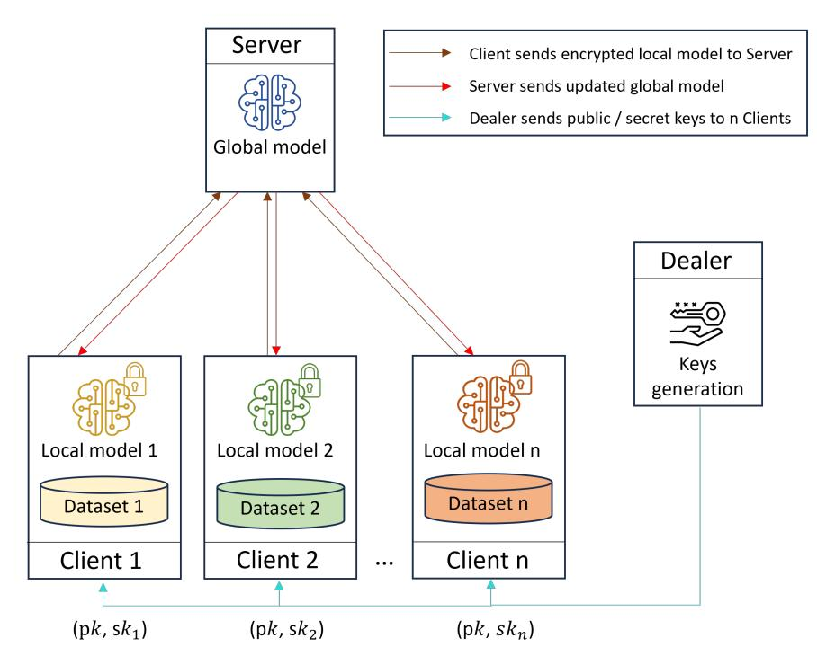

Fig. 2: Overall system overview of the proposed RRFL-DHE system.

The following subsections present the threat model considered in our design (Section [4.1\)](#page-13-1), detail the protocol workflow of RRFL-DHE (Section [4.2\)](#page-14-0), and describe the mechanisms that enable dropout resilience(Section [4.3\)](#page-16-0).

# <span id="page-13-1"></span>4.1 Threat Model

The security of our RRFL-DHE framework will be evaluated against a semi-honest party. This means that the server follows the protocol honestly but attempts to infer some private information of other devices from the exchanged communication during the protocol execution. To facilitate the evaluation of our approach, we incorporate a dealer as a trusted third party for key generation. The generated keys are securely transmitted to the clients through a secure communication channel. Moreover, collusion between the dealer and the server is impossible as there is no interaction between them. However, as a continuation of our work, we will enhance this aspect by eliminating dependence on a third party (dealer), taking inspiration from relevant works[\[57,](#page-42-5) [58\]](#page-42-6).

{14}------------------------------------------------

#### <span id="page-14-0"></span>4.2 Protocol Details

In this section, we provide a comprehensive understanding of the RRFL-DHE framework by outlining its inner workings step by step. The main parameters used in our scheme, include:

- p: plaintext modulus.
- q: ciphertext modulus.
- $\mathcal{R}_2$ : is the set of elements in  $\mathcal{R}_q$  with coefficients in $\{-1,0,1\}$ .
- $\mathcal{X}$ : error distribution, defined as a discrete Gaussian over R with  $\mu$  and  $\sigma$ , bounded by integer  $\beta$ . Following the current homomorphic encryption standard[59], the parameters are set as  $(\mu, \sigma, \beta) = (0, 8/\sqrt{2\pi} \approx 3.2, |6\sigma| = 19)$ .

Step 1: For a given security parameter  $\lambda$ , the dealer randomly generates a primary secret key sk from  $\mathcal{R}_2$ . To generate a public key, the dealer generates a vector a from  $\mathcal{R}_q$ , an error polynomial e from  $\mathcal{X}$ , and uses the primary secret key sk. Then, the public key results in two vectors as follows:  $pk = (pk1, pk2) = (-a \cdot sk - e, a) \pmod{q}$ . To distribute the secret key sk among n parties, the dealer initially defines authorized coalitions that adhere to the threshold value t through a Boolean formula. Next, the dealer encodes this Boolean formula into a binary tree using a folklore algorithm as it is described in [24]. Subsequently, the access share matrix H is generated from the labeled tree, where its coefficients in  $\{-1,0,1\}$ . To calculate the secret keys  $sk_1,\ldots,sk_n$ , the dealer selects k random polynomials  $(g_1,\ldots,g_k)$  from  $\mathcal{R}_2$  and declares  $g_0 = sk$ . Therefore, the dealer calculates  $(sk,sk_1,\ldots,sk_n) = H \cdot (g_0,g_1,\ldots,g_k)^T$ . Finally, the dealer distributes the public key  $(pk_1,pk_2)$  and the secret keys  $(sk_1,\ldots,sk_n)$  to n client (cf. Algorithm 1).

#### <span id="page-14-1"></span>**Algorithm 1** Dealer keys generation

```
Input: Security parameter \lambda; n clients; t threshold
Output: public key(pk_1, pk_2); secret key (sk_1, \ldots, sk_n)
 1: Secret keys generation
 2: sk \leftarrow a random polynomial from \mathcal{R}_2
                                                                                       ▷ main secret key
 3: E \leftarrow define Boolean formula from t
 4: Tree \leftarrow encode E into binary tree
 5: H \leftarrow generate access share matrix from Tree
 6: g_0 \leftarrow sk
 7: g_1, \ldots, g_k \leftarrow \text{random polynomial from } \mathcal{R}_2
 8: sk, sk_1, \ldots, sk_n \leftarrow H \cdot (g_0, g_1, \ldots, g_k)^T
 9: Public key generation
10: a \leftarrow \text{a random polynomial in } \mathcal{R}_q
11: e \leftarrow a random error polynomial sampled from \mathcal{X}
12: pk_1 \leftarrow [-1(a \cdot sk + e)]_q
13: pk_2 \leftarrow a
14: for each client i = 1 to n do
    send (pk_1, pk_2, sk_i) to client i
16: end for
```

{15}------------------------------------------------

Step 2: In every round, each client i downloads the current global model  $w_g$  from the server and performs training on their local data  $D_i$ . After multiple training epochs E, each client i obtains a local model  $w_i$ . Then, each client i encodes  $w_i$  into the integer plaintext space and randomly generates a set of polynomials  $u_i$  from  $\mathcal{R}_2$  as well as  $e_i^1, e_i^2$  from  $\mathcal{X}$ . The ciphertext of the encoded model  $w_i$  is then computed as  $c_i = (c_i^{(1)}, c_i^{(2)}) = (pk_1 \cdot u_i + e_1^i + \Delta w_i, pk_2 \cdot u_i + e_i^2) \pmod{q}$ . Subsequently, all parties distribute  $c_i$  to the server (cf. Algorithm 2, from lines 1 to 16).

#### <span id="page-15-0"></span>Algorithm 2 Client model training

```
Input: local data D_i; local epochs E; public key (pk_1, pk_2); secret key sk_i
Output: encrypted local model c_i; partial decryption \mu_i
 1: get w_{global} from server
 2: X_{train}, Y_{train}, X_{test}, Y_{test} \leftarrow split(D_i)
 3: for each round do
          for each epoch do
 4:
               w_i \leftarrow w_{global}.fit(X_{train}, Y_{train})
                                                                                                              ▶ training
 5:
          end for
  6:
          Encryption
 7:
                                                                    \triangleright encode w_i into plaintext polynomial
          \text{Encode}(w_i)
 8:
          \Delta \leftarrow \lfloor \frac{q}{p} \rfloor
                                                                                                 \triangleright used to scale m_i
 9:
          u_i \leftarrow \text{a random polynomial from } \mathcal{R}_2
10:
          e_i^1 \leftarrow \text{a random polynomial from} \mathcal{X}
11:
          e_i^2 \leftarrow \text{a random polynomial from} \mathcal{X}
12:
          c_i^{(1)} \leftarrow [pk_1 \cdot u_i + e_i^1 + \Delta w_i]_q
13:
          c_i^{(2)} \leftarrow [pk_2 \cdot u_i + e_i^2]_q
14:
          c_i \leftarrow (c_i^{(1)}, c_i^{(2)})
15:
          send c_i to Server
                                                                          > send local model for aggregation
16:
          Partial Decryption
17:
          e_i^* \leftarrow \text{a random noise from } \mathcal{X}
18:
          \mu_i \leftarrow c_{tot}^{(2)} \cdot sk_i + e_i^*
19:

          send \mu_i to Server
                                                                         > send partial decryption to server
20:
21: end for
```

**Step 3:** After receiving the encrypted local models from all clients, the server performs an aggregation process to obtain an encrypted global model which is calculated as  $c_{tot} = (c_{tot}^{(1)}, c_{tot}^{(2)}) = \sum_{i=1}^{n} c_i^{(1)}, \sum_{i=1}^{n} c_i^{(2)}$ . Subsequently, the server publishes  $c_{tot}^{(2)}$  to all clients, who then compute partial decryption (cf. Algorithm 3, from lines 3 to 8).

**Step 4:** At least t clients are required to decrypt  $c_{tot}^{(2)}$ . To achieve this, each client i computes a partial decryption  $\mu_i$  and sends it to the server. To compute  $\mu_i$ , client i generates a random noise  $e_i^*$  from  $\mathcal{X}$  and calculates  $\mu_i = c_{tot}^{(2)} \cdot sk_i + e_i^* \pmod{q}$  (cf. Algorithm 2, from lines 17 to 20).

**Step 5:** After receiving the partial decryption  $\mu_i$  from at least t clients, the server uses the recovery coefficients  $\gamma_i$  (i.e.,  $\gamma_i$  represents the recovery coefficients used to

{16}------------------------------------------------

#### <span id="page-16-1"></span>Algorithm 3 Server model aggregation

```
Input: Encrypted local model c_1, \ldots, c_n; partial decryption \mu_1, \ldots, \mu_n; n clients
Output: Encrypted global model c_{tot}^{(2)}; decrypted global model w_{global}
  1: Initialize w_0
  2: for each round do
           Model Aggregation
  3:
           for each client i = 1 to n do
  4:
                receive (c_i^{(1)}, c_i^{(2)})

c_{tot} = (c_{tot}^{(1)}, c_{tot}^{(2)}) \leftarrow \sum_{i=1}^n (c_i^{(1)}, c_i^{(2)})
  5:
                                                                                     \triangleright aggregate n encrypted models
  6:
           end for
  7:
           send (c_{tot}^{(2)}) to n clients
  8:
            Final decryption
  9:
            for each client i = 1 to t do
10:
                 receive partial decryption \mu_i
11:
           \mu \leftarrow \sum_{i=1}^{t} \gamma_i \cdot \mu_i\nend for
w \leftarrow \left\lfloor \left(\frac{p}{q}\right) \cdot \left(c_{tot}^{(1)} + \mu\right) \right\rfloor

12:
13:
                                                                                                            \triangleright final decryption
14:
           w_{global} \leftarrow \frac{1}{n} \cdot w

    ▷ calculate average

15:
           send w_{global} to n clients
16:
17: end for
```

recover the secret key when multiplied by the partial decryption) to perform the final decryption and recover the plaintext of the encrypted global model. This calculation is performed as follows:  $w = \lfloor \frac{p}{q} \cdot (c_{tot}^{(1)} + \sum_{i=1}^{t} \gamma_i \cdot \mu_i) \rceil$ . Finally, the server computes the averaged model as  $w_g = \frac{1}{n} \cdot w$  and updates the global model  $w_g$  for the next round (cf. Algorithm 3, from lines 9 to 16).

### <span id="page-16-0"></span>4.3 Dropout Resilience

As an initial step towards proposing a distributed version of the HE scheme, we think that the use of an additive secret-sharing scheme would be beneficial. However, the decryption process requires the presence of all users to successfully decrypt the final result. Thus, the system fails to complete the decryption if one user becomes disconnected. To address this issue, previous works [60–62] employ Shamir's secret sharing scheme, where  $\gamma_i$  denotes the Lagrange coefficients. However, when these coefficients are interpreted as elements of  $\mathbb{Z}_q$ , they are typically large, leading to a significant increase in noise when multiplied by the partial decryptions, particularly as the number of users grows.

To effectively manage noise amplification and address client dropout issues, we ultimately agree to use a  $\{0,1\}$ -linear secret sharing scheme. This approach relies on linear operations and binary coefficients for secret recovery, where the infinity norm of  $||\gamma||$  is always equal to 1 since the coefficients of the access share matrix H are in  $\{-1,0,1\}$ .

{17}------------------------------------------------

To achieve our objective, we use the folklore algorithm proposed by [24] to encode the authorized subsets. Initially, we considered mimicking a classical (t, n)-secret sharing approach, as it provides strong dropout and collusion resistance. However, this method is only practical for small values of t due to the exponential growth in the number of possible coalitions  $\binom{n}{t}$ , which increases rapidly with n. As discussed in the introduction, for example, when n = 100 and t = 50, there are approximately  $1.009 \times 10^{29}$  possible subsets, and each client would need to manage around  $\binom{n-1}{t-1} \approx 5.04 \times 10^{28}$  shares. This exponential growth makes the approach infeasible even for moderate system sizes.

To address this problem, we propose a practical solution by forming coalitions (i.e., groups) such that the size of the access share matrix grows linearly as O(n). As a simple variant, the coalitions can be constructed randomly with a uniform size t. In a threshold secret-sharing scheme, an authorized coalition is a group of at least t participants. This coalition has enough shares to successfully reconstruct the secret. The resistance to collusion depends on the value of t, while drop-out resistance, on the other hand, relies on the number of coalitions. Therefore, a trade-off between the two metrics must be performed to set the best value of t.

Although it is true that the presence of even a single dropout within each coalition prevents the decryption of the global model in its ciphertext format, we have successfully managed to overcome this challenge. Our dropout management protocol is specifically designed to effectively address arbitrary client dropouts. The protocol operates as follows: During each partial decryption round (Section 4.2, Step 4), each connected client signal their presence to the dealer. When the dealer detects a dropout, it promptly manages the situation to maintain the continuity of the training process. Figure 3 presents a detailed illustration of the workflow of our RRFL-DHE framework.

The effectiveness and adaptability of our proposed protocol are demonstrated by its ability to comprehensively handle potential dropout occurrences in various scenarios, as described below.

Let  $\ell < t$  denote an important parameter that defines the minimum required size of each coalition to ensure resistance against collusion:

**Scenario** (1). If at most there are (n/t) - 1 disconnected coalitions, the process can continue to work without any harm, as it can still decrypt even when one coalition remains connected. Thanks to the threshold property of the system, which allows the decryption to proceed as long as the required threshold of the connected coalition is maintained.

**Scenario (2).** If there are between one and  $(t-\ell)$  dropout in one or more coalitions, the dealer will maintain the existing coalitions and regenerate the secret keys for the remaining connected users.

**Scenario** (3). If there are dropouts and fewer than  $\ell$  remaining connected clients in each coalition, the dealer will select random clients from outside the affected coalition until the required parameter  $\ell$  is satisfied in each coalition. Subsequently, the dealer will regenerate the secret keys. These selected clients will act as proxies in the affected coalition, ensuring that the coalition maintains the necessary number of connected clients. Furthermore, When coalition X disconnects and its clients act as proxies in coalition Y, the dealer must find new proxies for Y. Also, if coalition Y with proxies

{18}------------------------------------------------

from X disconnects, the dealer regenerates secret keys. A client serving as a proxy typically possesses multiple secret keys. For security, the dealer combines these keys into a single key. In Appendix [A](#page-33-0) , we provide an example scenario of our dropout protocol.

<span id="page-18-0"></span>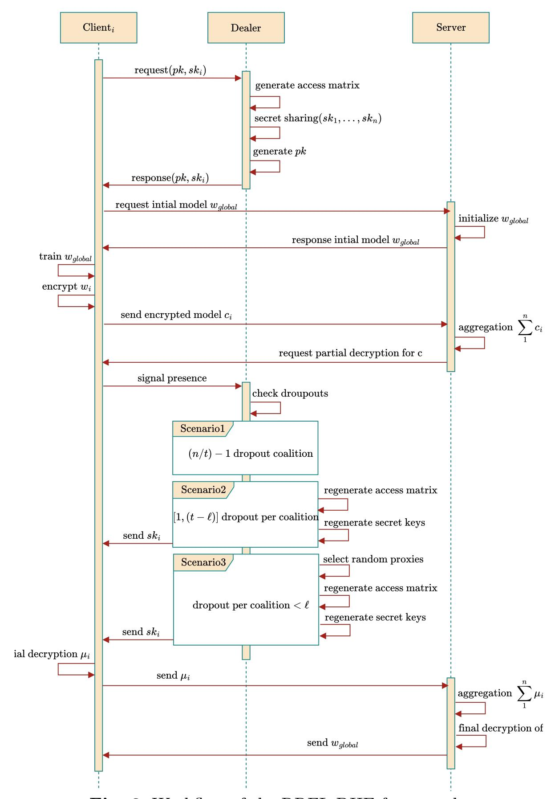

Fig. 3: Workflow of the RRFL-DHE framework.

{19}------------------------------------------------

# <span id="page-19-0"></span>5 Formal Definition of the RRFL-DHE Scheme

In this section, we define the notation of our distributed homomorphic encryption scheme, which is built within the RRFL-DHE framework. We then provide the formal definitions of correctness, ensuring that the scheme correctly computes the aggregated plaintext from valid partial decryptions, and security, expressed through the notion of Security Against a Semi-Honest Server (SASHS), which guarantees that no sensitive information is revealed to an honest-but-curious server beyond the intended output.

#### 5.1 Notations

The proposed homomorphic encryption scheme, denoted by  $\Pi_{DHE} = (KeyGen, Enc, AgCiph, PartialDec, Merge)$ , is a tuple of PPT algorithms defined as follows:

- $KeyGen(1^{\lambda}, 1^n, 1^t) \to pk, sk_1, \ldots, sk_n$ : on input the security parameter  $\lambda$ , written in unary, the number of parties n, also written in unary, and the threshold value t, the algorithm outputs a public key pk and a set of partial secret keys  $(sk_1, \ldots, sk_n)$ . In practice, this algorithm is used by the dealer.
- $Enc(pk, w) \to c$ : on input the public key pk and the plaintext message w in  $\mathcal{P}$ , the algorithm outputs a ciphertext c in  $\mathcal{C}$ . In practice, this algorithm is used by n parties.
- $AgCiph(c_1, \ldots, c_n) \to c_{tot}$ : on input a set of ciphertexts  $(c_1, \ldots, c_n)$ , the algorithm evaluates their sum and outputs a total ciphertext  $c_{tot}$ . In practice, this algorithm is used by the server.
- $PartialDec(sk_i, c_{tot}) \rightarrow \mu_i$ : on input a ciphertext  $c_{tot}$  and a secret key  $sk_i$ , the algorithm outputs a partial plaintext  $\mu_i$ . This algorithm required at least t parties.
- $Merge(c_{tot}, \mu) \to w_g$ : on input a total ciphertext  $c_{tot}$  and a sum of at least t partial plaintext  $\mu$ , the algorithm outputs a plaintext  $w_g$ . This algorithm is used by the server.

#### 5.2 Correctness Definition

**Definition 7** (Correctness) Let pk be a common public key and  $(sk_1, ..., sk_n)$  are secret keys for n parties generated by  $\Pi_{DHE}.KeyGen$ . For any  $(w_1, ..., w_n) \in \mathcal{P}$ , let  $c_i \leftarrow \Pi_{DHE}.Enc(pk, w_i)$ . A  $\Pi_{DHE}$  scheme is said to be correct if:

$$c_{tot} \leftarrow \Pi_{DHE}.AgCiph\left(c_1,\ldots,c_n\right)$$

Then we obtain:

$$w_g = \Pi_{DHE}.Merge(c_{tot}, \sum_{i \subseteq I}^t \Pi_{DHE}.PartialDec(sk_{i \in I}, c_{tot}))$$
$$= \sum_{i=1}^n w_i$$

#### 5.3 Security Definition

The security of our scheme against a semi-honest server is captured by the SASHS game, illustrated in Figure 4.

{20}------------------------------------------------

```
SASHS_{\Pi,\mathcal{A}}(\lambda,n,t,b):
(sk_1,\ldots,sk_n,pk) \leftarrow \Pi.KeyGen(1^{\lambda},1^t)
((w_1^0,\ldots,w_n^0),(w_1^1,\ldots,w_n^1),I) \leftarrow \mathcal{A}(pk)
\forall i \in \{1,\ldots,n\}: c_i \leftarrow \Pi.Enc(pk,w_i^b)
(c_{tot}) := \Pi.AgCiph(c_1,\ldots,c_n)
Parse \ I \ as \ \{u_1,\ldots,u_t\}
\forall i \in I: \mu_i := \Pi.PartialDec(sk_i,c_{tot})
If(\sum_{i=1}^n w_i^0 \neq \sum_{i=1}^n w_i^1):
Return \ a \ random \ bit
Else:
Return \ (\mathcal{A}(c_1,\ldots,c_t,\mu_1,\ldots,\mu_t))
```

Fig. 4: Security against a semi-honest server (SASHS).

In this game, the adversary  $\mathcal{A}$  attempts to distinguish which of two chosen sets of local model updates,  $(w_1^0, \ldots, w_n^0)$  or  $(w_1^1, \ldots, w_n^1)$ , has been encrypted based on the ciphertexts and partial decryptions observed. The scheme is SASHS-secure if, for any probabilistic polynomial-time adversary, the probability of successfully distinguishing between the two encrypted sets of local model updates is at most negligible, as formalized in Definition 8.

<span id="page-20-2"></span>**Definition 8** (SASHS Security) We say that the scheme  $\Pi_{DHE}$  achieves security sgainst a semi-honest server if  $\forall n, t \in \mathbb{N}$  and for any stateful PPT adversary, the following holds:

$$\mathcal{A}: \left| \Pr[SASHS_{\Pi,\mathcal{A}}(\lambda, n, t, 0) = 0] - \Pr[SASHS_{\Pi,\mathcal{A}}(\lambda, n, t, 1) = 0] \right| = neg(\lambda)$$

# <span id="page-20-0"></span>6 Construction, Security, and Correctness Proofs

In this section, we present the construction of our proposed homomorphic encryption scheme, along with the associated security and correctness proofs.

### <span id="page-20-3"></span>6.1 Construction

Let  $\Pi_S$  be a secret sharing scheme and  $\Pi_E$  be a homomorphic encryption scheme. Our encyrption scheme, denoted by  $\Pi_{DHE} = (KeyGen, Enc, AgCiph, PartialDec, Merge)$ , is a tuple of PPT algorithms defined as follows:

- $KeyGen(1^{\lambda}, 1^t)$ :  $(pk, sk) \leftarrow \Pi_E.KeyGen(1^{\lambda}, 1^t)$  $(sk_1, \dots, sk_n) \leftarrow \Pi_S.Share(1^n, 1^t, sk)$ Return  $(sk_1, \dots, sk_n)$
- Enc(pk, w): Return  $\Pi_E.Enc(pk, w)$
- $AgCiph(c_1,\ldots,c_n)$ : Return  $\Pi_E.Eval(pk,c_1,\ldots,c_n)$
- $PartialDec(sk_i, c_{tot})$ : Return  $\Pi_E.InitDec(sk_i, c_{tot})$
- $Merge(c_{tot}, \mu_1, \dots, \mu_t)$ : Return  $\Pi_E.FinalDec(c_{tot}, \Pi_S.Reconstruct(\mu_1, \dots, \mu_t))$

{21}------------------------------------------------

# 6.2 Correctness Property

The correctness property follows directly from the first compatibility property of the scheme pair (ΠE, ΠS), as stated in Definition [6.](#page-11-0)

# <span id="page-21-8"></span>6.3 Security Against a Semi-Honest Party

In this section, we outline the security proof of our ΠDHE scheme against a semi-honest server.

<span id="page-21-0"></span>Theorem 1 If Π<sup>E</sup> is a homomorphic encryption scheme secure against chosen plaintext attacks (Definition [4\)](#page-9-0), Π<sup>S</sup> is a t-out-of-n linear secret sharing scheme (Definition [5\)](#page-10-0), and these schemes are compatible (Definition [6\)](#page-11-0), then the construction Π in Section [6.1](#page-20-3) is secure against a semi-honest server (Definition [8\)](#page-20-2).

From the sequence of games presented in Appendix [B](#page-35-0) and the second compatible property of (ΠE, ΠS) given in Definition [6,](#page-11-0) we deduce:

First, considering the original game in Figure [4](#page-20-1) and the family of games {SASHS(j,4) <sup>Π</sup>,<sup>A</sup> }<sup>j</sup>∈{0,...,n} defined in Figure [B6d](#page-36-0) of Appendix [B,](#page-35-0) we observe that:

<span id="page-21-1"></span>
$$\Pr\left(SASHS_{\Pi,\mathcal{A}}(\lambda, n, t, b) = 0\right) = \Pr\left(SASHS_{\Pi,\mathcal{A}}^{(0,4)}(\lambda, n, t, b) = 0\right)$$
(1)

<span id="page-21-7"></span>
$$\Pr\left(SASHS_{\Pi,\mathcal{A}}^{(n+1,4)}(\lambda,n,t,b) = 0\right) = \Pr\left(SASHS_{\Pi,\mathcal{A}}(\lambda,n,t,1-b) = 0\right)$$
(2)

Then, we can use the second compatible property (Definition [6\)](#page-11-0) to deduce, for the games defined in Appendix [B,](#page-35-0) Figures [B6b](#page-36-0) and [B6d,](#page-36-0) that for all j ∈ 1, . . . , n:

<span id="page-21-2"></span>
$$\Pr\left(SASHS_{\Pi,\mathcal{A}}^{(j-1,4)}(\lambda,n,t,b) = 0\right) = \Pr\left(SASHS_{\Pi,\mathcal{A}}^{(j,0)}(\lambda,n,t,b) = 0\right)$$
(3)

<span id="page-21-6"></span>
$$\Pr\left(SASHS_{\Pi,\mathcal{A}}^{(j,3)}(\lambda,n,t,b) = 0\right) = \Pr\left(SASHS_{\Pi,\mathcal{A}}^{(j,4)}(\lambda,n,t,b) = 0\right)$$
(4)

From the third compatible property of (ΠE, ΠS) (Definition [6\)](#page-11-0), we deduce the following for the games defined in Appendix [B,](#page-35-0) Figure [B6b,](#page-36-0) [B6c](#page-36-0) and [B6d:](#page-36-0)

<span id="page-21-3"></span>
$$\Pr\left(\text{SASHS}_{\Pi,\mathcal{A}}^{(j,0)}(\lambda, n, t, b) = 0\right) = \Pr\left(\text{SASHS}_{\Pi,\mathcal{A}}^{(j,1)}(\lambda, n, t, b) = 0\right)$$
(5)

<span id="page-21-5"></span>
$$\Pr\left(SASHS_{\Pi,\mathcal{A}}^{(j,2)}(\lambda,n,t,b) = 0\right) = \Pr\left(SASHS_{\Pi,\mathcal{A}}^{(j,3)}(\lambda,n,t,b) = 0\right)$$
(6)

Then we have to show the following lemma:

<span id="page-21-4"></span>Lemma 1. From CPA-security of ΠE, we deduce that ∀j ∈ {1, . . . , n} :

$$\Pr\left(SASHS_{\Pi,\mathcal{A}}^{(j,1)}(\lambda,n,t,b) = 0\right) = \Pr\left(SASHS_{\Pi,\mathcal{A}}^{(j,2)}(\lambda,n,t,b) = 0\right) + neg(\lambda)$$

{22}------------------------------------------------

We define adversaries  $\mathcal{B}_i$  in Appendix B, Figure B6a. Since by construction, the advantage of  $\mathcal{B}_i$  against  $\Pi_E$  in the CPA game (defined in Figure 1) is equal to :

$$\left| \Pr \left( SASHS_{\Pi, \mathcal{A}}^{(j,1)}(\lambda, n, t, b) = 0 \right) - \Pr \left( SASHS_{\Pi, \mathcal{A}}^{(j,2)}(\lambda, n, t, b) = 0 \right) \right|$$

Moreover, since  $\Pi_E$  is assumed to be secure in this game, we can deduce the lemma stated above.

We finally deduce by combining (1), (3), (5), Lemma 1, (6), (4) and (2):

$$\left| \Pr\left( \text{SASHS}_{\Pi,\mathcal{A}}(\lambda, n, t, 0) = 0 \right) - \Pr\left( \text{SASHS}_{\Pi,\mathcal{A}}(\lambda, n, t, 1) = 0 \right) \right| = neg(\lambda).$$

# <span id="page-22-0"></span>7 Instantiation

In this section, we describe the instantiation of  $\Pi_S$  and  $\Pi_E$  within our RRFL-DHE framework, as defined in Section 5. Specifically,  $\Pi_S$  is instantiated using a  $\{0, 1\}$ -linear secret sharing scheme, while  $\Pi_E$  is instantiated with the homomorphic encryption scheme proposed in [59].

#### 7.1 Instantiation of $\Pi_S$

We employ a specialized threshold secret-sharing scheme, namely the  $\{0,1\}$ -linear secret sharing scheme, where the Reconstruct algorithm consists of linear operations and uses binary coefficients to recover the secret. Considering a set of n parties, a t-out-of-n linear secret sharing scheme is defined as a tuple of PPT algorithms  $\Pi_S = (Share, Reconstruct)$ , specified as follows:

- Share  $(1^n, 1^t, sk)$ : Let H be an access share matrix of dimension  $(n+1) \times k$ , generated from a binary tree that encodes the Boolean formula of the authorized coalition capable of reconstructing the secret. Choose random polynomials  $(g_1, \ldots, g_k)$  from  $\mathcal{R}_2$  and set  $g_0 = sk$ . Then compute  $(sk, sk_1, \ldots, sk_n) = H \cdot (g_0, g_1, \ldots, g_k)^T$  and output  $(sk_1, \ldots, sk_n)$  as the shares of n users.
- $Reconstruct(sk_1, ..., sk_t)$ : On input shares  $(sk_1, ..., sk_t)$ , recover the secret as  $sk = \sum_{i=1}^{t} \gamma_i \cdot sk_i$ , where  $\gamma_i$  are binary reconstruction coefficients.

#### 7.2 Instantiation of $\Pi_E$

We use the homomorphic scheme defined in [59] and adapt its decryption procedure by dividing it into two stages to align with our formalism.

•  $KeyGen(1^{\lambda})$ : The public key pk is a pair of polynomials  $(pk_1, pk_2)$  calculated as follows with sk a secret key uniformly picked in  $\mathcal{R}_2$ :

$$pk_1 = [-1(a \cdot sk + e)]_q$$
$$pk_2 = a$$

{23}------------------------------------------------

• Enc(pk, w): The algorithm takes as input the public key  $pk = (pk_1, pk_2)$  and the plaintext message w in  $\mathcal{P}$  and outputs a ciphertext  $c = (c^{(1)}, c^{(2)})$  in  $\mathcal{C}$  as follows:

$$c^{(1)} = [pk_1 \cdot u + e^1 + \Delta w]_q$$
$$c^{(2)} = [pk_2 \cdot u + e^2]_q$$

where u is a random polynomial from  $\mathcal{R}_2$  and  $e^1$  and  $e^2$  are randomly generated from  $\mathcal{X}$ . The parameter  $\Delta$  is used to scale the message w and is defined as the quotient of dividing q by p, i.e.,  $\Delta = \lfloor \frac{q}{n} \rfloor$ .

- $InitDec(sk, (c^{(1)}, c^{(2)}))$ : Given the second part of the total ciphertext  $c^{(2)}$  and a secret key sk, sample a random error  $e^*$  from  $\mathcal{X}$  and return  $\mu = c^{(2)} \cdot sk + e^* \pmod{q}$
- $FinalDec((c^{(1)}, c^{(2)}), \mu)) : Let (\mu' := c^{(1)} + \mu), return w = \lfloor (p/q) \cdot \mu' \rfloor$
- $Eval(pk, c_1, ..., c_n)$ : Return  $\sum_{i=1}^n c_i$

# <span id="page-23-0"></span>8 Proofs of Combination Properties

In this section, we provide the proof that the instantiation of  $(\Pi_E, \Pi_S)$  satisfies all the compatible properties defined in Definition 6. For the first property, we have:

Proof Let  $(w_1, \ldots, w_n)$  plaintexts, (pk, sk) a pair generated by  $\Pi_E.KeyGen(1^{\lambda})$  and  $(sk_1, \ldots, sk_n)$  secret shares generated by  $\Pi_S.Share(1^n, 1^t, sk)$ . Let  $c_i := \Pi.Enc(pk, w_i)$ , and  $(c_{tot}^{(1)}, c_{tot}^{(2)}) \leftarrow \Pi_{DHE}.AgCiph(c_1, \ldots, c_n)$ . Each party calculates a partial decryption  $\mu_i$  by using  $\Pi_E.InitDec$ .

$$\mu_{i} = c_{tot}^{(2)} \cdot sk_{i} + e_{i}^{*} \pmod{q}$$

$$= \sum_{i=1}^{n} (pk_{2} \cdot u_{i} + e_{i}^{2}) \cdot sk_{i} + e_{i}^{*} \pmod{q}$$

$$= \sum_{i=1}^{n} (a \cdot u_{i} + e_{i}^{2}) \cdot sk_{i} + e_{i}^{*} \pmod{q}$$

Then, the aggregated result in plaintext w can be recovered as follows:

$$w_{g} = \prod_{DHE} Merge \left( c_{tot}^{(1)}, \sum_{j=1}^{t} \gamma_{j} \cdot \mu_{j} \right)$$

$$= \left[ \frac{p}{q} \cdot \left( c_{tot}^{(1)} + \sum_{j=1}^{t} \gamma_{j} \cdot \mu_{j} \pmod{q} \right) \right]$$

$$= \left[ \frac{p}{q} \cdot \left( c_{tot}^{(1)} + c_{tot}^{(2)} \cdot \sum_{j=1}^{t} \gamma_{j} \cdot sk_{j} + \sum_{j=1}^{t} \gamma_{j} \cdot e_{j}^{*} \pmod{q} \right) \right]$$

$$= \left[ \frac{p}{q} \cdot \left( \sum_{i=1}^{n} (pk_{1} \cdot u_{i} + e_{i}^{1} + \Delta w_{i}) + \sum_{i=1}^{n} (pk_{2} \cdot u_{i} + e_{i}^{2}) \cdot \sum_{j=1}^{t} \gamma_{j} \cdot sk_{j} + \sum_{j=1}^{t} \gamma_{j} \cdot e_{j}^{*} \pmod{q} \right) \right]$$

$$= \left[ \frac{p}{q} \cdot \left( -\sum_{i=1}^{n} a \cdot sk \cdot u_{i} - \sum_{i=1}^{n} u_{i} \cdot e + \sum_{i=1}^{n} e_{i}^{1} + \sum_{i=1}^{n} \Delta w_{i} + \sum_{i=1}^{n} a \cdot sk \cdot u_{i} + \sum_{i=1}^{n} sk \cdot e_{i}^{2} \right) \right]$$

{24}------------------------------------------------

$$+ \sum_{j=1}^{t} \gamma_j \cdot e_j^* \pmod{q}$$

$$= \left[ \frac{p}{q} \cdot \left( \sum_{i=1}^{n} \Delta w_i - \sum_{i=1}^{n} u_i \cdot e + \sum_{i=1}^{n} e_i^1 + \sum_{i=1}^{n} sk \cdot e_i^2 + \sum_{j=1}^{t} \gamma_j \cdot e_j^* \pmod{q} \right) \right]$$

$$= \left[ \frac{p}{q} \cdot \left( \sum_{i=1}^{n} \Delta w_i + \sum_{i=1}^{n} (-u_i \cdot e + e_i^1 + sk \cdot e_i^2) \cdot + \sum_{j=1}^{t} \gamma_j \cdot e_j^* \pmod{q} \right) \right]$$

$$= \left[ \frac{p}{q} \cdot \left( \sum_{i=1}^{n} \Delta w_i + v \pmod{q} \right) \right]$$

It should be noted that the infinity norm of v, denoted by ||v||, remains small since all contributing terms — namely  $u_i, e, e_i^1, e_i^2, e_i^*, sk$ , and  $\gamma_j$  are small polynomials. The coefficients of sk and  $u_i$  are taken from  $\mathcal{R}_2$ , i.e., their coefficients are in  $\{0,1\}$ . Thanks to  $\{0,1\}$ -linear secret sharing scheme, the recovery coefficients  $\gamma_j$  are also in  $\{0,1\}$ . Therefore, the infinity norm satisfy:  $||sk|| = ||u_i|| = ||\gamma_i|| = 1$ . On the other hand, the polynomials  $e, e_i^1, e_i^2, e_i^*$  are bounded by the parameter  $\beta$ , i.e.,  $||e|| = ||e_i^1|| = ||e_i^2|| = ||e_i^*|| = \beta$ . Hence, the error term v can be expressed and bounded as:

$$v = \sum_{i=1}^{n} u_{i} \cdot e + e_{i}^{1} + sk \cdot e_{i}^{2} + \sum_{j=1}^{t} \gamma_{j} \cdot e_{j}^{*}$$

$$||v|| \leq n \cdot ||u_{i}|| \cdot ||e|| + n \cdot ||e_{i}^{1}|| + n \cdot ||sk|| \cdot ||e_{i}^{2}|| + t \cdot ||\gamma_{j}|| \cdot ||e_{j}^{*}||$$

$$||v|| \leq n \cdot m \cdot \beta + n \cdot \beta + n \cdot m \cdot \beta + t \cdot \beta$$

$$||v|| \leq n \cdot \beta \cdot (2m+1) + t \cdot \beta$$

If we take the conservative case where t = n, we obtain the simplified bound:

$$||v|| \le n \cdot \beta \cdot (2m+2),$$

where m is the dimension of the ring polynomials.

To carry on with the proof, we must cancel the scaling factor  $\Delta$  by multiplying with  $\frac{p}{q}$ . Then, the rounding function in decryption eliminates the term  $\frac{p}{q} \cdot v$ , allowing recovery  $w_g$ . This proceeds as follows:

$$w_g = \left\lfloor \frac{p}{q} \cdot \left( \sum_{i=1}^n \Delta w_i + v \pmod{q} \right) \right\rfloor$$
$$= \left\lfloor \sum_{i=1}^n \frac{p}{q} \cdot \Delta w_i + \frac{p}{q} \cdot v \pmod{q} \right\rfloor$$
$$= \sum_{i=1}^n w_i$$

In short, to correctly decrypt and recover  $w_g$ , it is required that the infinity norm of the error term satisfies:  $||v|| < \frac{q}{2p}$ .

For the second and third compatible properties, we define the following PPT's:

•  $KeyGenLinked(1^n, 1^{\lambda}, pk_1) \rightarrow (sk_2, ..., sk_n, pk_2, ..., pk_n)$ : sample  $(sk_2, ..., sk_n)$  uniformly at random from  $\mathcal{R}_2$ , parse  $pk_1$  as  $(\cdot, a)$ , compute  $\forall j \geq 2 : pk_j = \left( [-1(a \cdot sk_j)]_q, a \right)$  and output  $(pk_2, ..., pk_n)$ .

{25}------------------------------------------------

- $KeyAggregate(pk_1, ..., pk_n)$ : parse  $pk_i$  as  $(pk_i^{(1)}, a)$  and output  $pk = \left(\sum_{i=1}^n pk_i^{(1)}, a\right)$ .
- $Extract(w, c_{tot}, (sk)_{i\neq j})$ : parse  $c_{tot}$  as  $(c^{(1)}, c^{(2)})$ , sample e from  $\mathcal{X}$ , and return  $(\Delta \cdot w c^{(2)} \cdot (\sum_{i\neq j} sk_i) + e c^{(1)})$ .

# <span id="page-25-0"></span>9 Experiments and Results Analysis

In this section, we discuss the implementation of our RRFL-DHE framework. We compare our work with the baseline FedAvg [22] (federated averaging without encryption) and the xMK-CKKS approach [20]. We provide a comprehensive evaluation, focusing on key performance metrics, including accuracy and computation / communication overhead.

#### 9.1 Experimental Setup

We implemented our RRFL-DHE framework alongside the baseline FedAvg, and xMK-CKKS approaches in the same environment using the Python programming language.

The image classification task was carried out on both the MNIST and Fashion-MNIST datasets. The MNIST dataset consists of a large collection of handwritten digits ranging from 0 to 9, while the Fashion-MNIST dataset comprises Zalando's article images. Both datasets contain 60,000 images for training and 10,000 images for testing, with each image formatted as  $28 \times 28$  pixels across 10 classes. We distributed the training dataset among participants in a non-IID<sup>1</sup> manner using a quantity-based label imbalance strategy, where each client was assigned samples from only four out of the ten available classes.

To demonstrate the effectiveness of our approach, we used two models: a Support Vector Machine (SVM) implemented with scikit-learn for the MNIST dataset, and a simple Convolutional Neural Network (CNN) built with TensorFlow for the Fashion-MNIST dataset. The CNN model consists of a convolutional layer with 32 filters and ReLU activation, followed by a  $2 \times 2$  max-pooling layer. The output is then flattened and passed through a fully connected layer with 128 units and ReLU activation. The final output layer uses softmax activation, and the model was trained using the Adam optimizer.

According to the recommended parameters in the current version of the Homomorphic Encryption Standard [59], we configured our encryption scheme to achieve 128-bit security level using the following parameters: polynomial modulus degree m=2048, ciphertext modulus  $q=2^{54}$ , and plaintext modulus  $p=2^{40}$ . We also ensure that the ciphertext modulus q satisfies the constraint  $||v|| < \frac{q}{2p}$ , which simplifies to  $q > 2p \cdot ||v||$ . This ensures that q is sufficiently large to accommodate the noise bound ||v||, thereby maintaining the correctness and security of our homomorphic encryption scheme.

To evaluate the scalability of our RRFL-DHE framework, we tested it with varying numbers of users, specifically [20, 40, 60, 80, 100]. For each user group size, we defined a corresponding threshold t = [4, 8, 12, 16, 20], representing 20% of the users. Each threshold value indicates the minimum number of users required to jointly decrypt the

<span id="page-25-1"></span><sup>&</sup>lt;sup>1</sup>Non-IID Settings

{26}------------------------------------------------

final result. For example, when there are 20 users, at least 4 participants are needed to decrypt the output.

Moreover, to demonstrate the feasibility and resilience of our dropout management protocol, we tested various rates by randomly selecting disconnected clients, starting at 25% and 50%, and progressively increasing up to 97%. The results confirm that our protocol can withstand high dropout rates, even with only  $\ell$  connected devices (where  $\ell$  defines the minimum required size of each coalition to maintain resistance against collusion), regardless of the total number of clients. By setting  $\ell=3$ , we demonstrate that our system reliably operates with 100 clients despite a 97% dropout rate.

We performed the test of our framework alongside the baseline FedAvg and xMK-CKK on an Ubuntu virtual machine with specifications including 98.2 GB of memory, an Intel<sup>®</sup> Xeon(R) Gold 6230R CPU @  $2.10\,\mathrm{GHz} \times 8$  CPUs, and a disk capacity of 128.8 GB.

# 9.2 Discussion of Results

In this section, we discuss the evaluation results of RRFL-DHE framework, comparing its performance with the FedAvg [22] and xMK-CKKS [20] approaches in terms of accuracy and computation / communication overhead.

### 9.2.1 Accuracy Evaluation

We evaluated the test accuracy of the global model within our RRFL-DHE framework and compared it with FedAvg [22] and the xMK-CKKS approach [20], as shown in Figure 5.

The experiments were conducted on both the Fashion-MNIST dataset using a CNN model and the MNIST dataset using an SVM classifier. In addition to baseline comparisons, we further investigated the model's accuracy within our framework under various client dropout scenarios, specifically at dropout rates of 25%, 50%, and 85–97%. The training process was conducted over 100 communication rounds for the SVM model and 50 rounds for the CNN model, with each experiment continuing until the model reached convergence. Table 1 summarizes the accuracy results and convergence rounds across all scenarios.

The results show that RRFL-DHE attains accuracy levels comparable to FedAvg, demonstrating minimal degradation even under significant dropout conditions. For example, in the CNN-based experiments with 20 clients, RRFL-DHE reached an accuracy of 97.79%, just slightly below FedAvg's 98.26%, and even maintained over 96.8% accuracy under 50% dropout. In contrast, xMK-CKKS consistently underperforms in both datasets. In CNN experiments, it exhibited a lower performance, with accuracies ranging from 77.27% to 82.09%, demonstrating a clear performance drop ranging from approximately 14% to 21% compared to FedAvg. Similarly, in the SVM setup, xMK-CKKS achieved significantly lower accuracy, for instance, only 71.29% with 20 clients compared to RRFL-DHE's 86.23%.

Overall, our RRFL-DHE framework yielded better results than xMK-CKKS by approximately 15% to 18% in the MNIST (SVM) setting, and by 9% to 20% in the Fashion-MNIST (CNN) setting. This degradation is attributed to the xMK-CKKS

{27}------------------------------------------------

<span id="page-27-0"></span>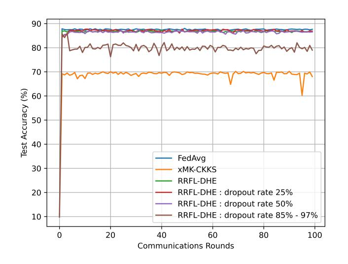

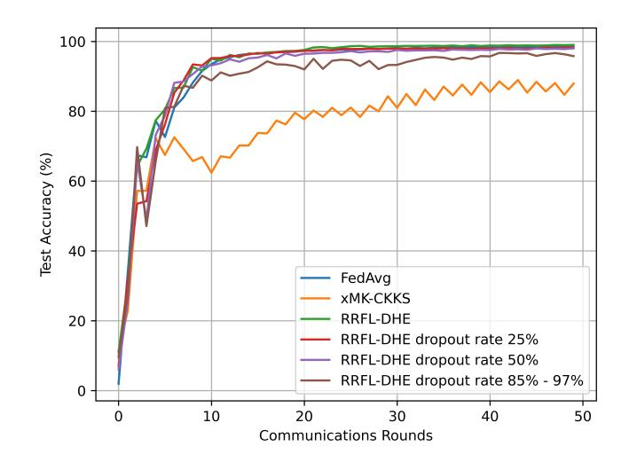

- (a) Test accuracy of SVM classifier on MNIST dataset.
- (b) Test accuracy of CNN classifier on Fashion-MNIST dataset.

Fig. 5: Comparison of test accuracy performance.

<span id="page-27-1"></span>**Table 1**: Test accuracy comparison of FedAvg, xMK-CKKS, and RRFL-DHE (including dropout scenarios at 25%, 50%, and up to 97%) on Fashion-MNIST (CNN) and MNIST (SVM) datasets.

| Clients | FedAvg  |       | xMK-CKKS |       | RRFL-DHE  |           | 25% dropout |       | 50% dropout |       | up to 97% dropout |       |
|---------|---------|-------|----------|-------|-----------|-----------|-------------|-------|-------------|-------|-------------------|-------|
|         | Acc (%) | round | Acc (%)  | round | Acc (%)   | round     | Acc (%)     | round | Acc (%)     | round | Acc (%)           | round |
|         |         |       |          | Fasi  | hion-MNIS | T Datase  | et (CNN M   | odel) |             |       |                   |       |
| 20      | 98.26   | 18    | 77.27    | 21    | 97.79     | 15        | 97.53       | 19    | 96.84       | 17    | 97.38             | 18    |
| 40      | 97.03   | 19    | 77.70    | 20    | 97.56     | 20        | 97          | 18    | 95.87       | 19    | 92.93             | 19    |
| 60      | 96.42   | 20    | 83.32    | 22    | 95.88     | 18        | 90.45       | 24    | 81.74       | 20    | 75.02             | 23    |
| 80      | 95.89   | 19    | 79.03    | 26    | 93.85     | 24        | 83.96       | 20    | 80.51       | 22    | 77.68             | 20    |
| 100     | 95.30   | 20    | 82.09    | 20    | 91.06     | 23        | 82.70       | 24    | 82.99       | 27    | 77.59             | 25    |
|         |         |       |          |       | MNIST D   | ataset (S | VM Model    | )     |             |       |                   |       |
| 20      | 85.52   | 12    | 71.29    | 15    | 86.23     | 11        | 86.03       | 11    | 85.81       | 11    | 83.59             | 15    |
| 40      | 87.55   | 11    | 68.91    | 13    | 86.57     | 11        | 87.4        | 13    | 86.87       | 12    | 80.10             | 15    |
| 60      | 87.43   | 11    | 69.73    | 11    | 86.25     | 11        | 83.17       | 16    | 87.48       | 12    | 81.31             | 20    |
| 80      | 87.45   | 11    | 65.46    | 15    | 83        | 11        | 75.99       | 13    | 86.34       | 12    | 76.14             | 16    |
| 100     | 87.16   | 11    | 69.06    | 15    | 86.02     | 17        | 86.08       | 21    | 84.14       | 14    | 76.76             | 16    |

approach's reliance on approximate arithmetic, which introduces deviations in the computed model weights after decryption when compared to the expected values in a non-encrypted setting. Given that model performance is highly sensitive to the precision of these weights, such approximations negatively affect model utility. In contrast, our RRFL-DHE framework uses exact arithmetic, ensuring that the computations performed on encrypted weights closely mirror those in the standard unencrypted setting. Thus, our framework preserves model accuracy more effectively.

Unlike xMK-CKKS, which does not address the issue of client dropout, a key strength of our RRFL-DHE framework is its robustness in the presence of user dropouts. Even under extreme dropout rates ranging from 85% to 97%, the model maintained strong utility. For instance, with 100 clients and a 97% dropout rate, the CNN classifier achieved an accuracy of 77.59%, while the SVM classifier maintained an

{28}------------------------------------------------

accuracy of approximately 76.76%. These results highlight the strong dropout tolerance of RRFL-DHE, enabled by its coalition-based decryption and secure aggregation mechanisms.

### 9.2.2 Computational and Communication Overheads

We simulate the server, dealer, and clients as processes running on the same machine. Each experiment is executed 10 times, and we report the average data transmission and execution time.

We evaluated the communication cost by measuring the data transmitted per round in our RRFL-DHE framework and compared it with FedAvg and xMK-CKKS. Tables [2](#page-28-0) and [3](#page-29-0) summarizes the total communication traffic for varying numbers of users under both CNN and SVM settings.

Table 2: Total transmitted data (MB) per round with SVM classifier.

<span id="page-28-0"></span>

| Method   | Users   | Dealer→Client | Client→Server | Server→Client | Total  |
|----------|---------|---------------|---------------|---------------|--------|
|          | n = 20  | -             | 1.46          | 2.87          | 4.33   |
|          | n = 40  | -             | 2.92          | 5.74          | 8.67   |
| FedAvg   | n = 60  | -             | 4.38          | 8.62          | 13     |
|          | n = 80  | -             | 5.84          | 11.49         | 17.34  |
|          | n = 100 | -             | 7.30          | 14.37         | 21.68  |
|          | n = 20  | 1.57          | 17.67         | 8.54          | 27.79  |
|          | n = 40  | 3.14          | 35.35         | 17.08         | 55.58  |
| xMK-CKKS | n = 60  | 4.71          | 53.03         | 25.63         | 83.37  |
|          | n = 80  | 6.28          | 70.7          | 34.17         | 111.16 |
|          | n = 100 | 7.85          | 88.38         | 42.72         | 138.96 |
|          | n = 20  | 1.65          | 24.07         | 8.71          | 34.44  |
|          | n = 40  | 3.31          | 48.15         | 17.42         | 68.89  |
| RRFL-DHE | n = 60  | 4.97          | 72.23         | 26.13         | 103.34 |
|          | n = 80  | 6.63          | 96.30         | 34.85         | 137.79 |
|          | n = 100 | 8.28          | 120.38        | 43.56         | 172.23 |

For instance, with 100 clients, the total transmitted data per round in FedAvg was 21 MB for the SVM classifier and 434 MB for the CNN classifier. This substantial difference stems from the higher model complexity of CNN compared to SVM, which naturally increases the size of model parameters to be shared. On the other hand, the communication overhead grows even more significantly when employing homomorphic encryption. In the case of xMK-CKKS, the total transmitted data per round was 138 MB for SVM and 12780 MB for CNN. This significant growth compared to FedAvg is attributed to the overhead introduced by homomorphic encryption, where encrypted parameters are substantially larger than their plaintext counterparts. While HE ensures strong privacy guarantees, it inherently increases the message size due to ciphertext expansion and additional encoding metadata.

{29}------------------------------------------------

Table 3: Total transmitted data (MB) per round with CNN classifier.

<span id="page-29-0"></span>

| Method   | Users   | Dealer→Client | Client→Server | Server→Client | Total    |
|----------|---------|---------------|---------------|---------------|----------|
|          | n = 20  | -             | 43.48         | 43.47         | 86.95    |
|          | n = 40  | -             | 86.96         | 86.95         | 173.91   |
| FedAvg   | n = 60  | -             | 130.44        | 130.43        | 260.87   |
|          | n = 80  | -             | 173.92        | 173.90        | 347.83   |
|          | n = 100 | -             | 217.40        | 217.38        | 434.79   |
|          | n = 20  | 1.57          | 1838.82       | 715.74        | 2556.14  |
|          | n = 40  | 3.14          | 3677.65       | 1431.48       | 5112.28  |
| xMK-CKKS | n = 60  | 4.71          | 5516.48       | 2147.22       | 7668.42  |
|          | n = 80  | 6.28          | 7355.31       | 2862.96       | 10224.56 |
|          | n = 100 | 7.86          | 9194.14       | 3578.70       | 12780.70 |
|          | n = 20  | 1.76          | 2376.31       | 834.25        | 3212.33  |
|          | n = 40  | 3.53          | 4752.62       | 1668.50       | 6424.66  |
| RRFL-DHE | n = 60  | 5.30          | 7128.93       | 2502.75       | 9636.99  |
|          | n = 80  | 7.06          | 9505.25       | 3337          | 12849.32 |
|          | n = 100 | 8.83          | 11881.56      | 4171.25       | 16061.66 |

Regarding the RRFL-DHE framework, it incurs a slight increase in communication traffic compared to xMK-CKKS, reaching 172 MB for SVM and 16061 MB for CNN. Although both frameworks use the same encryption parameters, the difference in communication overhead is largely influenced by how their respective encryption schemes handle arithmetic. The xMK-CKKS scheme supports approximate arithmetic on floating-point numbers, enabling more compact ciphertext representations and efficient encoding of model parameters. This results in smaller ciphertext sizes and reduced communication costs. In contrast, our scheme relying on exact arithmetic requires larger ciphertexts to precisely represent data, which increases communication overhead. Despite this, our total traffic remains only about 1.25× higher than xMK-CKKS in the CNN setting, a reasonable trade-off given the additional advantages in terms of utility and flexibility in dropout management provided by our RRFL-DHE framework.

Futhermore, Figures [6](#page-30-0) and [7](#page-30-1) illustrate the communication traffic volume on the client, server, and dealer sides for both SVM and CNN classifiers. In both settings, the communication overhead scales linearly with the number of clients, corresponding to a complexity of O(n). On the client side, for FedAvg, the communication cost is assessed by measuring the size of the local models transmitted from clients to the server (cf. Figures [6b](#page-30-0) and [7b\)](#page-30-1). This amounts to approximately 0.07 MB and 2.17 MB per client for the SVM and CNN classifiers, respectively. In contrast, for both our RRFL-DHE framework and xMK-CKKS, the communication cost accounts for the size of the encrypted local model and the partial decryption of the global model. This results in approximately 0.88 MB for SVM and 91 MB for CNN in xMK-CKKS, and approximately 1 MB for SVM and 118 MB for CNN in our RRFL-DHE framework. On the server side (cf. Figures [6c](#page-30-0) and [7c\)](#page-30-1), the communication cost in FedAvg is determined by the size of the aggregated model, which is 0.14 MB for SVM and 2.17

{30}------------------------------------------------

<span id="page-30-0"></span>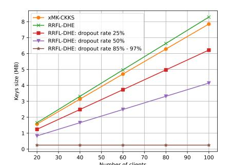

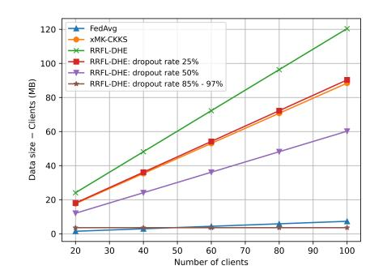

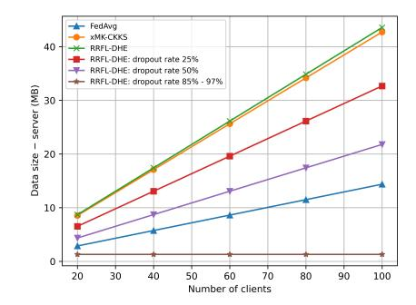

- (a) Encryption key sizes dealer side.
- (b) Transmitted data volume client side.
- (c) Transmitted data volume server side.

Fig. 6: Comparison of communication overhead for FedAvg, xMK-CKKS, and RRFL-DHE in the SVM model.

<span id="page-30-1"></span>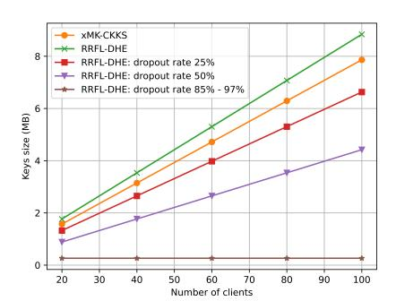

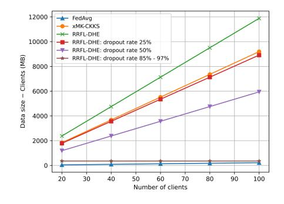

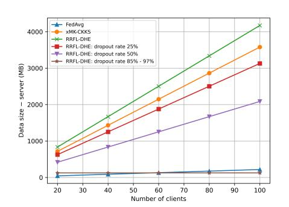

- (a) Encryption key sizes dealer side.
- (b) Transmitted data volume client side.
- (c) Transmitted data volume server side.

Fig. 7: Comparison of communication overhead for FedAvg, xMK-CKKS, and RRFL-DHE in the CNN model.

MB for CNN. However, in our protocol and xMK-CKKS, the communication traffic corresponds to the size of the encrypted global model along with its final decryption. For xMK-CKKS, this amounts to 0.42 MB in SVM and 35.78 MB in CNN, whereas for our RRFL-DHE framework, it is 0.43 MB in SVM and 41.7 MB in CNN. We also evaluated the size of the keys distributed by the dealer to each client (cf. Figure [6a](#page-30-0) and [7a\)](#page-30-1). The key size distributed per client is comparable between our RRFL-DHE framework and xMK-CKKS, both approximately 0.08 MB.

We report the overall round execution time for both SVM and CNN settings, as depicted in Figures [8a](#page-31-0) and [8b,](#page-31-0) demonstrating that execution time scales linearly with the number of clients, with complexity O(n). Our analysis reveals that cryptographic operations are the primary source of computational overhead. Additionally, the encrypted ciphertext significantly increases the size of the data to be transmitted, which drastically raises both execution time and communication overhead. For instance, with 100 clients, FedAvg achieves the fastest running time with 47.87s for SVM and 96s for CNN. This is expected, as FedAvg does not employ encryption and is therefore vulnerable to privacy attacks. In contrast, xMK-CKKS reaches 148.13s for SVM, roughly 2× slower than our RRFL-DHE, which requires 68s. In the CNN setting, 

{31}------------------------------------------------

xMK-CKKS requires 6675s, approximately 4× longer than our RRFL-DHE's 1541s. This disparity arises because aggregation, partial decryption, and final decryption operations in xMK-CKKS require additional scaling and careful precision management to preserve approximate values with minimal noise growth. In contrast, aggregation and final decryption in our scheme are simple polynomial additions under the modulus, making them straightforward and significantly faster.

<span id="page-31-0"></span>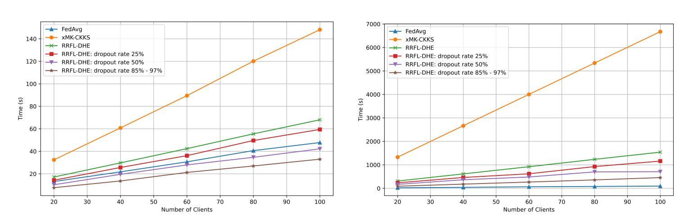

- (a) Per-round execution time overhead in SVM classifier.
- (b) Per-round execution time overhead in CNN classifier.

Fig. 8: Comparison of time overhead for FedAvg, xMK-CKKS, and RRFL-DHE.

We further analyze computational overhead across different phases for the client, server, and dealer during a single round iteration in both SVM (cf. Figure [9\)](#page-31-1) and CNN (cf. Figure [10\)](#page-32-1). We report "idle" time, which represents the duration during which clients, server, or dealer wait for other parties to complete operations, wait for data transmission, or experience other blocking operations due to VM-related resource constraints.

<span id="page-31-1"></span>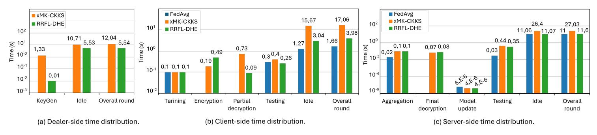

Fig. 9: Comparison of time cost breakdown for FedAvg, xMK-CKKS, and RRFL-DHE in SVM classifier.

The performance of key generation in our framework takes approximately 0.01s for 20 clients, compared to 1.35s for xMK-CKKS (cf. Figure [9](#page-31-1) (a) and [10](#page-32-1) (b)). This disparity is due to the fact that our scheme generates a single public key derived from the sum of secret key shares. In contrast, xMK-CKKS generates individual public keys for each client, which are then summed to produce a common public key.

{32}------------------------------------------------

<span id="page-32-1"></span>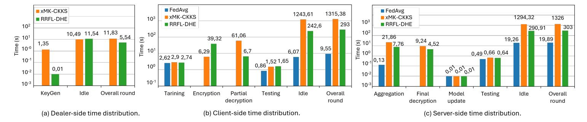

Fig. 10: Comparison of time cost breakdown for FedAvg, xMK-CKKS, and RRFL-DHE in CNN classifier.

Client-side performance (cf. Figure [9](#page-31-1) (b) and [10](#page-32-1) (b)) involves training, encryption, partial decryption, and model testing operations. For both SVM and CNN, training and testing times are consistent across all three schemes, resulting in roughly 0.4s for SVM and 4.5s for CNN, as these are non-cryptographic local operations. The overhead in our framework is dominated by the encryption phase, whereas xMK-CKKS's overhead is dominated by partial decryption. The encryption overhead in our framework arises from additional operations such as integer encoding, padding weights to match polynomial size, and embedding plaintext coefficients into the ciphertext modulus. In the SVM setting, xMK-CKKS shows an encryption time of 0.19s and partial decryption time of 0.73s, while RRFL-DHE requires 0.49s for encryption and only 0.09s for partial decryption. In the more computationally intensive CNN setting, execution times increase significantly: RRFL-DHE requires 39.32s for encryption and 6.70s for partial decryption, whereas xMK-CKKS takes 6.29s for encryption and 61.06s for partial decryption.

Finally, the server-side operations (cf. Figure [9](#page-31-1) (c) and [10](#page-32-1) (c)) include aggregation of client weights, final decryption, model updating, and accuracy testing. For SVM, FedAvg requires roughly 11s. Both xMK-CKKS and RRFL-DHE perform aggregation in 0.12s and final decryption in approximately 0.07s. However, in the CNN setting, xMK-CKKS requires 21.86s for aggregation and 9.24s for final decryption, whereas RRFL-DHE requires 7.76s for aggregation and 4.52s for final decryption.

These results highlight the challenges of using xMK-CKKS for deep learning due to the complexity of model parameters, while our framework provides a more efficient and scalable alternative.

# <span id="page-32-0"></span>10 Conclusion and future work

In this paper, we propose RRFL-DHE, a robust and resilient federated learning framework leveraging distributed homomorphic encryption. Our approach introduces a novel distributed homomorphic encryption scheme combined with {0,1}-Linear secret sharing mechanism, which effectively mitigates noise blow-up through linear operations and binary coefficients. Furthermore, we improve the scheme resilience against client dropout while maintaining accurate global model reconstruction by adopting a coalition-based strategy based on the Lewko–Waters folklore algorithm. We also provide a rigorous security proof against a semi-honest server and conduct extensive experiments on non-IID MNIST and Fashion MNIST datasets with both SVM 

{33}------------------------------------------------

and CNN models. We compare RRFL-DHE to state-of-the-art baselines, including FedAvg and xMK-CKKS. Our results demonstrate that RRFL-DHE preserves model utility with only 1% accuracy deviation compared to FedAvg, while outperforming xMK-CKKS by approximately 15% in accuracy. Our RRFL-DHE framework not only achieves high accuracy but also consumes substantially less computational and communication overhead compared to xMK-CKKS, while maintaining privacy-preserving guarantees. This indicates that RRFL-DHE is well-suited for deployment in real-world scenarios where both privacy and utility are critical. We believe that this work offers a promising pathway toward developing more efficient, secure, and scalable federated learning systems. In future work, we plan to enhance robustness against poisoning attacks that compromise model integrity. Additionally, we will investigate advanced data compression and quantization techniques to further optimize computational and communication efficiency without sacrificing accuracy.

# <span id="page-33-0"></span>Appendix A Dropout Protocol: Example Scenario

<span id="page-33-1"></span>We describe the behavior of the RRFL-DHE dropout protocol under different client disconnection patterns, demonstrating how the dealer adapts the access share matrix, regenerates secret keys, and selects proxies. Initially, Figure [A1](#page-33-1) shows the configuration in which n = 20 clients are randomly divided into five coalitions of size t = 4, with a minimum coalition size ℓ = 3 to resist collusion. According to the scenarios discussed in Section [4.3,](#page-16-0) we present an example for each case.

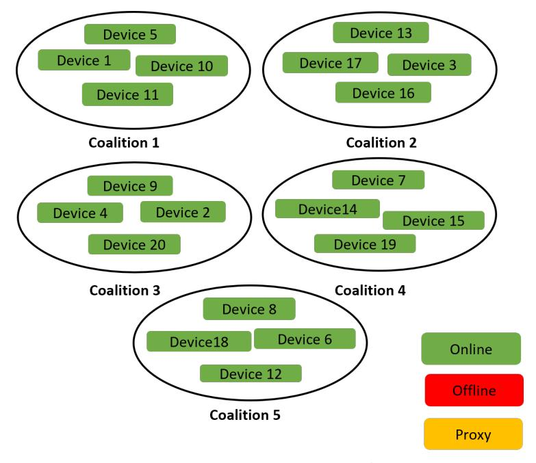

Fig. A1: RRFL-DHE dropout protocol: initial configuration with 20 clients randomly distributed into 5 coalitions (t = 4, ℓ = 3).

In scenario (2), shown in Figure [A2,](#page-34-0) clients 17, 20, and 19 disconnect from coalitions 2, 3, and 4, respectively, which requires the dealer to regenerate the access share matrix using a new Boolean formula for each affected group and produce new secret keys.

Scenario (3), illustrated in Figure [A3,](#page-34-1) involves coalition 2 having only two connected devices and coalition 5 only one; here, the dealer selects proxies (e.g. device

{34}------------------------------------------------

<span id="page-34-0"></span>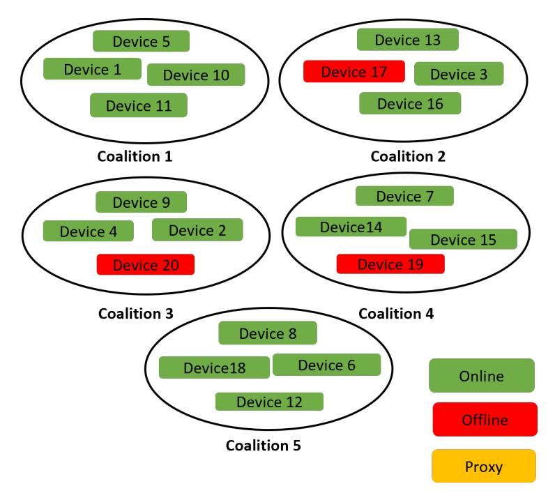

Fig. A2: RRFL-DHE dropout protocol: dropout in coalitions 2, 3, and 4; dealer regenerates the access share matrix and secret keys.

<span id="page-34-1"></span>9 from coalition 3 and devices 13 and 1 from other coalitions) to meet the required conditions and then generates secret keys.

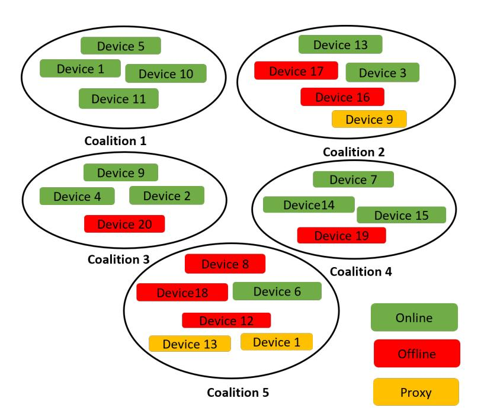

Fig. A3: RRFL-DHE dropout protocol: coalitions 2 and 5 fall below ℓ; dealer selects proxies to restore conditions.

When all devices in coalition 1 disconnect (Figure [A4,](#page-35-1) the dealer replaces the proxy previously served by device 1 in coalition 4 with a new proxy (e.g. device 15) and regenerates the secret keys accordingly.

Lastly, scenario (1), presented in Figure [A5,](#page-35-2) shows the disconnection of coalitions 1, 3, 4, and 5 entirely; despite only coalition 2 remaining connected, the protocol continues to function, ensuring decryption remains possible.

{35}------------------------------------------------

<span id="page-35-1"></span>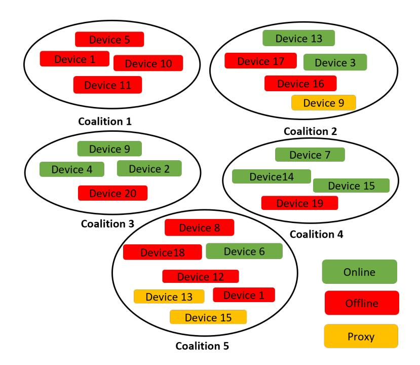

<span id="page-35-2"></span>Fig. A4: RRFL-DHE dropout protocol: all devices from coalition 1 disconnect; a new proxy is selected and keys are regenerated.

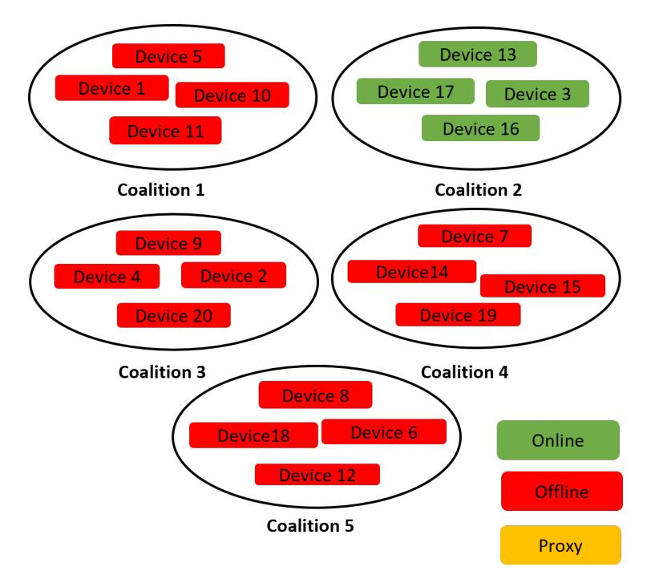

Fig. A5: RRFL-DHE dropout protocol: only coalition 2 remains connected; the protocol still enables decryption.

# <span id="page-35-0"></span>Appendix B Sequence of Games Used in section [6.3](#page-21-8)

We present in Figures [B6a,](#page-36-0) [B6b,](#page-36-0) [B6c](#page-36-0) and [B6d](#page-36-0) the sequence of games referenced in Section [6.3,](#page-21-8) which are used to prove the security of construction Π against a semihonest server. These games illustrate a series of successive transformations applied to the original security game, ultimately establishing the security of our scheme.

{36}------------------------------------------------

```
 \begin{array}{|c|c|c|c|} \hline \mathcal{B}_{1,j}(pk): \\ \forall i \neq j: (sk_i,pk_i) \leftarrow \Pi_E.KeyGenLinked(1^n,1^\lambda,pk_j) \\ pk \leftarrow \Pi_S.KeyAggregate(pk_1,\ldots,pk_n) \\ ((w_1^0,\ldots,w_n^0),(w_1^1,\ldots,w_n^1)) \leftarrow \mathcal{A}(pk) \\ \text{Return } (w_1^0,w_1^1) \\ \hline \\ Return & (w_1^0,w_1^1) \\ \hline \\ & & \\ \hline \\ & & \\ \hline \\ & & \\ \hline \\ & & \\ \hline \\ & & \\ \hline \\ & & \\ \hline \\ & & \\ \hline \\ & & \\ \hline \\ & & \\ \hline \\ & & \\ \hline \\ & & \\ \hline \\ & & \\ \hline \\ & & \\ \hline \\ & & \\ \hline \\ & & \\ \hline \\ & & \\ \hline \\ & & \\ \hline \\ & & \\ \hline \\ & & \\ \hline \\ & & \\ \hline \\ & & \\ \hline \\ & & \\ \hline \\ & & \\ \hline \\ & & \\ \hline \\ & & \\ \hline \\ & & \\ \hline \\ & & \\ \hline \\ & & \\ \hline \\ & & \\ \hline \\ & & \\ \hline \\ & & \\ \hline \\ & & \\ \hline \\ & & \\ \hline \\ & & \\ \hline \\ & & \\ \hline \\ & & \\ \hline \\ & & \\ \hline \\ & & \\ \hline \\ & & \\ \hline \\ & & \\ \hline \\ & & \\ \hline \\ & & \\ \hline \\ & & \\ \hline \\ & & \\ \hline \\ & & \\ \hline \\ & & \\ \hline \\ & & \\ \hline \\ & & \\ \hline \\ & & \\ \hline \\ & & \\ \hline \\ & & \\ \hline \\ & & \\ \hline \\ & & \\ \hline \\ & & \\ \hline \\ & & \\ \hline \\ & & \\ \hline \\ & & \\ \hline \\ & & \\ \hline \\ & & \\ \hline \\ & & \\ \hline \\ & & \\ \hline \\ & & \\ \hline \\ & & \\ \hline \\ & & \\ \hline \\ & & \\ \hline \\ & & \\ \hline \\ & & \\ \hline \\ & & \\ \hline \\ & & \\ \hline \\ & & \\ \hline \\ & & \\ \hline \\ & & \\ \hline \\ & & \\ \hline \\ & & \\ \hline \\ & & \\ \hline \\ & & \\ \hline \\ & & \\ \hline \\ & & \\ \hline \\ & & \\ \hline \\ & & \\ \hline \\ & & \\ \hline \\ & & \\ \hline \\ & & \\ \hline \\ & & \\ \hline \\ & & \\ \hline \\ & & \\ \hline \\ & & \\ \hline \\ & & \\ \hline \\ & & \\ \hline \\ & & \\ \hline \\ & & \\ \hline \\ & & \\ \hline \\ & & \\ \hline \\ & & \\ \hline \\ & & \\ \hline \\ & & \\ \hline \\ & & \\ \hline \\ & & \\ \hline \\ & & \\ \hline \\ & & \\ \hline \\ & & \\ \hline \\ & & \\ \hline \\ & & \\ \hline \\ & & \\ \hline \\ & & \\ \hline \\ & & \\ \hline \\ & & \\ \hline \\ & & \\ \hline \\ & & \\ \hline \\ & & \\ \hline \\ & & \\ \hline \\ & & \\ \hline \\ & & \\ \hline \\ & & \\ \hline \\ & & \\ \hline \\ & & \\ \hline \\ & & \\ \hline \\ & & \\ \hline \\ & & \\ \hline \\ & & \\ \hline \\ & & \\ \hline \\ & & \\ \hline \\ & & \\ \hline \\ & & \\ \hline \\ & & \\ \hline \\ & & \\ \hline \\ & & \\ \hline \\ & & \\ \hline \\ & & \\ \hline \\ & & \\ \hline \\ & & \\ \hline \\ & & \\ \hline \\ & & \\ \hline \\ & & \\ \hline \\ & & \\ \hline \\ & & \\ \hline \\ & & \\ \hline \\ & & \\ \hline \\ & & \\ \hline \\ & & \\ \hline \\ & & \\ \hline \\ & & \\ \hline \\ & & \\ \hline \\ & & \\ \hline \\ & & \\ \hline \\ & & \\ \hline \\ & & \\ \hline \\ & & \\ \hline \\ & & \\ \hline \\ & & \\ \hline \\ & & \\ \hline \\ & & \\ \hline \\ & & \\ \hline \\ & & \\ \hline \\ & & \\ \hline \\ & & \\ \hline \\ & & \\ \hline \\ & & \\ \hline \\ & & \\ \hline \\ & & \\ \hline \\ & & \\ \hline \\ & & \\ \hline \\ & & \\ \hline \\ & & \\ \hline \\ & & \\ \hline \\ & & \\ \hline \\ & & \\ \hline \\ & & \\ \hline \\ & & \\ \hline \\ & & \\ \hline \\ & & \\ \hline \\ & & \\ \hline \\ & & \\ \hline \\ & & \\ \hline \\ & & \\ \hline \\ & & \\ \hline \\ & & \\ \hline \\ & & \\ \hline \\ & & \\ \hline \\ & & \\ \hline \\ & & \\ \hline \\
```

(a) Adversary  $\mathcal{B}$  in CPA game defined in Figure 1 and used in Lemma 1

```
SASHS_{\Pi,\mathcal{A}}^{(j,0)}(\lambda,n,t,b):
SASHS_{\Pi,\mathcal{A}}(\lambda, n, t, b):
(sk, pk) \leftarrow \Pi_E.KeyGen(1^{\lambda})
                                                                                            (sk_j, pk_j) \leftarrow \Pi_E.KeyGen(1^{\lambda})
(sk_1,\ldots,sk_n) \leftarrow \Pi_S.Share(1^n,sk)
((w_1^0, \dots, w_n^0), (w_1^1, \dots, w_n^1), I) \leftarrow \mathcal{A}(pk)
                                                                                            \forall i \neq j : (sk_i, pk_i) \leftarrow \Pi_E.KeyGenLinked(1^n, 1^{\lambda}, pk_j)
\forall i \in \{1,\ldots,n\} : c_i \leftarrow \Pi_E.Enc(pk, w_i^b)
                                                                                            pk \leftarrow \Pi_S.KeyAggregate(pk_1, \dots, pk_n)
c_{tot} := \Pi_E.Eval(pk, c_1, \dots, c_n)
                                                                                           ((w_1^0, \dots, w_n^0), (w_1^1, \dots, w_n^1), I) \leftarrow \mathcal{A}(pk)
\forall i \geq 1 : \mu_i := \prod_E.InitDec(sk_i, c_{tot})
If (\sum_{i=1}^n w_i^0 \neq \sum_{i=1}^n w_i^1):
                                                                                           \forall i \in \{1, \dots, j-1\} : c_i \leftarrow \Pi_E.Enc(pk, w_i^{1-b})
                                                                                           \forall i \in \{j, \dots, n\} : c_i \leftarrow \Pi_E.Enc(pk, w_i^b)
    Return a random bit
                                                                                           c_{tot} := \Pi_E.Eval(pk, c_1, \dots, c_n)
Else:
                                                                                          \forall i \geq 1 : \mu_i := \prod_E.InitDec(sk_i, c_{tot})
If (\sum_{i=1}^n w_i^0 \neq \sum_{i=1}^n w_i^1):
   Return \mathcal{A}(c_1,\ldots,c_n,\mu_1,\ldots,\mu_n)
                                                                                              Return a random bit
                                                                                           Else:
                                                                                              \mathcal{A}\left(c_1,\ldots,c_n,\mu_1,\ldots,\mu_n\right)
```

(b) Original security game  $SASHS_{\Pi,\mathcal{A}}$  and the first hybrid game  $SASHS_{\Pi,\mathcal{A}}^{(j,0)}$ 

```
SASHS_{\Pi,\mathcal{A}}^{(j,1)}(\lambda,n,t,b):
                                                                                                            SASHS_{\Pi,\mathcal{A}}^{(j,2)}(\lambda,n,t,b):
(sk_j, pk_j) \leftarrow \Pi_E.KeyGen(1^{\lambda})
                                                                                                            (sk_j, pk_j) \leftarrow \Pi_E.KeyGen(1^{\lambda})
\forall i \neq j : (sk_i, pk_i) \leftarrow \Pi_E.KeyGenLinked(1^n, 1^{\lambda}, pk_j)
                                                                                                            \forall i \neq j : (sk_i, pk_i) \leftarrow \Pi_E.KeyGenLinked(1^n, 1^{\lambda}, pk_i)
pk \leftarrow \Pi_S.KeyAggregate(pk_1, \dots, pk_n)
                                                                                                            pk \leftarrow \Pi_S.KeyAggregate(pk_1, \dots, pk_n)
                                                                                                            ((w_1^0, \dots, w_n^0), (w_1^1, \dots, w_n^1), I) \leftarrow \mathcal{A}(pk)
\forall i \in \{1, \dots, \underbrace{j}\} : c_i \leftarrow \Pi_E.Enc(pk, w_i^{1-b})
((w_1^0, \dots, w_n^0), (w_1^1, \dots, w_n^1), I) \leftarrow \mathcal{A}(pk)
\forall i \in \{1, \dots, j-1\} : c_i \leftarrow \Pi_E.Enc(pk, w_i^{1-b})
\forall i \in \{j, \dots, n\} : c_i \leftarrow \Pi_E.Enc(pk, w_i^b)
                                                                                                            \forall i \in \{\boxed{j+1}, \dots, n\} : c_i \leftarrow \Pi_E.Enc(pk, w_i^b)
c_{tot} := \Pi_E.Eval(pk, c_1, \dots, c_n)
                                                                                                            c_{tot} := \overline{\Pi_E}.Eval(pk, c_1, \dots, c_n)
\forall i \neq j \mid : \mu_i := \Pi_E.InitDec(sk_i, c_{tot})
                                                                                                           \forall i \neq j : \mu_i := \prod_E .InitDec(sk_i, c_{tot}) 
 \mu_j := Extract(\sum_{i=1}^n w_i^0, c_{tot}, (c_i)_{i \neq j}) 
 \text{If } (\sum_{i=1}^n w_i^0 \neq \sum_{i=1}^n w_i^1):
 \mu_j := Extract(\sum_{i=1}^n w_i^0, c_{tot}, (sk_i)_{i \neq j})
If (\sum_{i=1}^{n} w_i^0 \neq \sum_{i=1}^{n} w_i^1):
                                                                                                                Return a random bit
    Return a random bit
                                                                                                            Else:
Else:
                                                                                                                Return \mathcal{A}(c_1,\ldots,c_n,\mu_1,\ldots,\mu_n)
    Return \mathcal{A}(c_1,\ldots,c_n,\mu_1,\ldots,\mu_n)
```

(c) Intermediate hybrid games  $SASHS_{\Pi,\mathcal{A}}^{(j,1)}$  and  $SASHS_{\Pi,\mathcal{A}}^{(j,2)}$ 

```
SASHS_{\Pi,\mathcal{A}}^{(j,3)}(\lambda,n,t,b):
                                                                                                              SASHS_{\Pi,\mathcal{A}}^{(j,4)}(\lambda,n,t,b):
(sk_j, pk_j) \leftarrow \Pi_E.KeyGen(1^{\lambda})
                                                                                                               (sk, pk) \leftarrow \Pi_E.KeyGen(1^{\lambda})
\forall i \neq j(sk_i, pk_i) \leftarrow \Pi_E.KeyGenLinked(1^n, 1^{\lambda}, pk_j)
                                                                                                               (sk_1,\ldots,sk_n) \leftarrow \Pi_S.Share(1^n,sk)
pk \leftarrow \Pi_S.KeyAggregate(pk_1, \dots, pk_n)
((w_1^0, \dots, w_n^0), (w_1^1, \dots, w_n^1), I) \leftarrow \mathcal{A}(pk)
\forall i \in \{1, \dots, j\} : c_i \leftarrow \Pi_E.Enc(pk, w_i^{1-b})
                                                                                                              \overline{pk} \leftarrow \Pi_S.KeyAggregate(pk_1, \dots, pk_n)
                                                                                                              ((w_1^0, \dots, w_n^0), (w_1^1, \dots, w_n^1), I) \leftarrow \mathcal{A}(pk)
\forall i \in \{1, \dots, j\} : c_i \leftarrow \Pi_E.Enc(pk, w_i^{1-b})
\forall i \in \{j+1,\ldots,n\} : c_i \leftarrow \Pi_E.Enc(pk,w_i^b)
\underline{c_{tot}} := \Pi_E.Eval(pk, c_1, \dots, c_n)
                                                                                                              \forall i \in \{j+1,\ldots,n\} : c_i \leftarrow \Pi_E.Enc(pk,w_i^b)
\boxed{\forall i}: \mu_i := \prod_E.InitDec(sk_i, c_{tot})
If (\sum_{i=1}^n w_i^0 \neq \sum_{i=1}^n w_i^1):
                                                                                                              c_{tot} := \Pi_E.Eval(pk, c_1, \dots, c_n)
                                                                                                             \forall i: \mu_i := \prod_{E.InitDec(sk_i, c_{tot})} 
If (\sum_{i=1}^n w_i^0 \neq \sum_{i=1}^n w_i^1):
    Return a random bit
                                                                                                                  Return a random bit
Else:
                                                                                                              Else:
    Return \mathcal{A}(c_1,\ldots,c_n,\mu_1,\ldots,\mu_n)
                                                                                                                  Return \mathcal{A}\left(c_1,\ldots,c_n,\mu_1,\ldots,\mu_n\right)
```

(d) Final hybrid games  $SASHS_{\Pi,\mathcal{A}}^{(j,3)}$  and  $SASHS_{\Pi,\mathcal{A}}^{(j,4)}$ 

Fig. B6: Sequence of games used in Section 6.3

{37}------------------------------------------------

# References

- <span id="page-37-0"></span>[1] Greenleaf, G., Livingston, S.: China's new cybersecurity law-also a data privacy law? (2016) 144 Privacy Laws & Business International Report 1-7, UNSW Law Research Paper No. 17-19 (2016)
- <span id="page-37-1"></span>[2] Hoofnagle, C.J., Sloot, B., Borgesius, F.Z.: The european union general data protection regulation: what it is and what it means\*. Information & Communications Technology Law 28(1), 65–98 (2019) [https://doi.org/10.1080/13600834.](https://doi.org/10.1080/13600834.2019.1573501) [2019.1573501](https://doi.org/10.1080/13600834.2019.1573501)
- <span id="page-37-2"></span>[3] Chik, W.B.: The singapore personal data protection act and an assessment of future trends in data privacy reform. Computer Law & Security Review 29(5), 554–575 (2013) <https://doi.org/10.1016/j.clsr.2013.07.010>
- <span id="page-37-3"></span>[4] Kaal, A., Klosek, J., Waleski, B.: U.s. consumer privacy bill of rights: Principles and impact. Computer Law Review International 13(3), 65–72 (2012) [https://](https://doi.org/10.9785/ovs-cri-2012-65) [doi.org/10.9785/ovs-cri-2012-65](https://doi.org/10.9785/ovs-cri-2012-65)
- <span id="page-37-4"></span>[5] Yang, Q., Liu, Y., Chen, T., Tong, Y.: Federated machine learning: Concept and applications. ACM Trans. Intell. Syst. Technol. 10(2) (2019) [https://doi.org/10.](https://doi.org/10.1145/3298981) [1145/3298981](https://doi.org/10.1145/3298981)
- <span id="page-37-5"></span>[6] Yin, X., Zhu, Y., Hu, J.: A comprehensive survey of privacy-preserving federated learning: A taxonomy, review, and future directions. ACM Comput. Surv. 54(6) (2021) <https://doi.org/10.1145/3460427>
- <span id="page-37-6"></span>[7] Pasquini, D., Francati, D., Ateniese, G.: Eluding secure aggregation in federated learning via model inconsistency. In: Proceedings of the 2022 ACM SIGSAC Conference on Computer and Communications Security. CCS '22, pp. 2429– 2443. Association for Computing Machinery, New York, NY, USA (2022). [https:](https://doi.org/10.1145/3548606.3560557) [//doi.org/10.1145/3548606.3560557](https://doi.org/10.1145/3548606.3560557)
- [8] Zhao, J., Bagchi, S., Avestimehr, S., Chan, K., Chaterji, S., Dimitriadis, D., Li, J., Li, N., Nourian, A., Roth, H.: The federation strikes back: A survey of federated learning privacy attacks, defenses, applications, and policy landscape. ACM Comput. Surv. 57(9) (2025) <https://doi.org/10.1145/3724113>
- [9] Hu, H., Salcic, Z., Sun, L., Dobbie, G., Yu, P.S., Zhang, X.: Membership inference attacks on machine learning: A survey. ACM Comput. Surv. 54(11s) (2022) [https:](https://doi.org/10.1145/3523273) [//doi.org/10.1145/3523273](https://doi.org/10.1145/3523273)
- [10] Nasr, M., Shokri, R., Houmansadr, A.: Comprehensive privacy analysis of deep learning: Passive and active white-box inference attacks against centralized and federated learning. In: 2019 IEEE Symposium on Security and Privacy (SP), pp. 739–753 (2019). <https://doi.org/10.1109/SP.2019.00065>

{38}------------------------------------------------

- <span id="page-38-0"></span>[11] Rodr´ıguez-Barroso, N., Jim´enez-L´opez, D., Luz´on, M.V., Herrera, F., Mart´ınez-C´amara, E.: Survey on federated learning threats: Concepts, taxonomy on attacks and defences, experimental study and challenges. Inf. Fusion 90(C), 148–173 (2023) <https://doi.org/10.1016/j.inffus.2022.09.011>
- <span id="page-38-1"></span>[12] Islam, M.Z., Brankovic, L.: Privacy preserving data mining: A noise addition framework using a novel clustering technique. Knowledge-Based Systems 24(8), 1214–1223 (2011) <https://doi.org/10.1016/j.knosys.2011.05.011>
- <span id="page-38-2"></span>[13] Dalenius, T., Reiss, S.P.: Data-swapping: A technique for disclosure control. Journal of Statistical Planning and Inference 6(1), 73–85 (1982) [https://doi.org/10.](https://doi.org/10.1016/0378-3758(82)90058-1) [1016/0378-3758\(82\)90058-1](https://doi.org/10.1016/0378-3758(82)90058-1)
- <span id="page-38-3"></span>[14] El Emam, K., Dankar, F.K.: Protecting privacy using k-anonymity. Journal of the American Medical Informatics Association 15(5), 627–637 (2008) [https://doi.](https://doi.org/10.1197/jamia.M2716) [org/10.1197/jamia.M2716](https://doi.org/10.1197/jamia.M2716)
- [15] Machanavajjhala, A., Kifer, D., Gehrke, J., Venkitasubramaniam, M.: L-diversity: Privacy beyond k-anonymity. ACM Trans. Knowl. Discov. Data 1(1), 3 (2007) <https://doi.org/10.1145/1217299.1217302>
- <span id="page-38-4"></span>[16] Li, N., Li, T., Venkatasubramanian, S.: t-closeness: Privacy beyond k-anonymity and l-diversity. In: 2007 IEEE 23rd International Conference on Data Engineering, pp. 106–115 (2007). <https://doi.org/10.1109/ICDE.2007.367856>
- <span id="page-38-5"></span>[17] Seeman, J., Susser, D.: Between privacy and utility: On differential privacy in theory and practice. ACM J. Responsib. Comput. 1(1) (2024) [https://doi.org/](https://doi.org/10.1145/3626494) [10.1145/3626494](https://doi.org/10.1145/3626494)
- <span id="page-38-6"></span>[18] Acar, A., Aksu, H., Uluagac, A.S., Conti, M.: A survey on homomorphic encryption schemes: Theory and implementation. ACM Comput. Surv. 51(4) (2018) <https://doi.org/10.1145/3214303>
- <span id="page-38-7"></span>[19] Lindell, Y.: Secure multiparty computation. Commun. ACM 64(1), 86–96 (2020) <https://doi.org/10.1145/3387108>
- <span id="page-38-8"></span>[20] Ma, J., Naas, S., Sigg, S., Lyu, X.: Privacy-preserving federated learning based on multi-key homomorphic encryption. Int. J. Intell. Syst. 37(9), 5880–5901 (2022) <https://doi.org/10.1002/int.22818>
- <span id="page-38-9"></span>[21] Xie, H., Chen, S., Wang, Y., Jin, Q.: A privacy-preserving federated learning scheme using threshold multi-key homomorphic encryption. In: 2023 3rd International Conference on Communication Technology and Information Technology (ICCTIT), pp. 187–192 (2023). [https://doi.org/10.1109/ICCTIT60726.](https://doi.org/10.1109/ICCTIT60726.2023.10435981) [2023.10435981](https://doi.org/10.1109/ICCTIT60726.2023.10435981)
- <span id="page-38-10"></span>[22] McMahan, B., Moore, E., Ramage, D., Hampson, S., Arcas, B.A.y.:

{39}------------------------------------------------

- Communication-Efficient Learning of Deep Networks from Decentralized Data. In: Singh, A., Zhu, J. (eds.) Proceedings of the 20th International Conference on Artificial Intelligence and Statistics. Proceedings of Machine Learning Research, vol. 54, pp. 1273–1282. PMLR, ??? (2017). https://proceedings.mlr.press/v54/mcmahan17a.html
- <span id="page-39-0"></span>[23] Shamir, A.: How to share a secret. Commun. ACM 22(11), 612–613 (1979) [https:](https://doi.org/10.1145/359168.359176) [//doi.org/10.1145/359168.359176](https://doi.org/10.1145/359168.359176)
- <span id="page-39-1"></span>[24] Lewko, A., Waters, B.: Decentralizing attribute-based encryption. In: Proceedings of the 30th Annual International Conference on Theory and Applications of Cryptographic Techniques: Advances in Cryptology. EUROCRYPT'11, pp. 568–588. Springer, Berlin, Heidelberg (2011). [https://doi.org/10.1007/978-3-642-20465-4](https://doi.org/10.1007/978-3-642-20465-4_31) [31](https://doi.org/10.1007/978-3-642-20465-4_31)
- <span id="page-39-2"></span>[25] Truex, S., Liu, L., Chow, K.-H., Gursoy, M.E., Wei, W.: Ldp-fed: federated learning with local differential privacy. In: Proceedings of the Third ACM International Workshop on Edge Systems, Analytics and Networking. EdgeSys '20, pp. 61–66. Association for Computing Machinery, New York, NY, USA (2020). <https://doi.org/10.1145/3378679.3394533>
- <span id="page-39-3"></span>[26] Torre, D., Chennamaneni, A., Jo, J., Vyas, G., Sabrsula, B.: Toward enhancing privacy preservation of a federated learning cnn intrusion detection system in iot: Method and empirical study. ACM Trans. Softw. Eng. Methodol. 34(2) (2025) <https://doi.org/10.1145/3695998>
- <span id="page-39-4"></span>[27] Liu, X.-Y., Zhu, R., Zha, D., Gao, J., Zhong, S., White, M., Qiu, M.: Differentially private low-rank adaptation of large language model using federated learning. ACM Trans. Manage. Inf. Syst. 16(2) (2025) <https://doi.org/10.1145/3682068>
- <span id="page-39-5"></span>[28] Wibawa, F., Catak, F.O., Sarp, S., Kuzlu, M.: Bfv-based homomorphic encryption for privacy-preserving cnn models. Cryptography 6(3) (2022) [https://doi.org/10.](https://doi.org/10.3390/cryptography6030034) [3390/cryptography6030034](https://doi.org/10.3390/cryptography6030034)
- <span id="page-39-6"></span>[29] Brakerski, Z.: Fully homomorphic encryption without modulus switching from classical gapsvp. In: Proceedings of the 32nd Annual Cryptology Conference on Advances in Cryptology — CRYPTO 2012 - Volume 7417, pp. 868–886. Springer, Berlin, Heidelberg (2012). [https://doi.org/10.1007/978-3-642-32009-5](https://doi.org/10.1007/978-3-642-32009-5_50) 50
- <span id="page-39-7"></span>[30] Fan, J., Vercauteren, F.: Somewhat practical fully homomorphic encryption. IACR Cryptol. ePrint Arch. 2012, 144 (2012)
- <span id="page-39-8"></span>[31] Fang, H., Qian, Q.: Privacy preserving machine learning with homomorphic encryption and federated learning. Future Internet 13(4) (2021) [https://doi.org/](https://doi.org/10.3390/fi13040094) [10.3390/fi13040094](https://doi.org/10.3390/fi13040094)
- <span id="page-39-9"></span>[32] Jost, C., Lam, H.T., Maximov, A., Smeets, B.J.M.: Encryption performance

{40}------------------------------------------------

- improvements of the paillier cryptosystem. IACR Cryptol. ePrint Arch. 2015, 864 (2015)
- <span id="page-40-0"></span>[33] Liu, X., Li, H., Xu, G., Chen, Z., Huang, X., Lu, R.: Privacy-enhanced federated learning against poisoning adversaries. Trans. Info. For. Sec. 16, 4574–4588 (2021) <https://doi.org/10.1109/TIFS.2021.3108434>
- <span id="page-40-1"></span>[34] Chen, H., Dai, W., Kim, M., Song, Y.: Efficient multi-key homomorphic encryption with packed ciphertexts with application to oblivious neural network inference. In: Proceedings of the 2019 ACM SIGSAC Conference on Computer and Communications Security. CCS '19, pp. 395–412. Association for Computing Machinery, New York, NY, USA (2019). [https://doi.org/10.1145/3319535.](https://doi.org/10.1145/3319535.3363207) [3363207](https://doi.org/10.1145/3319535.3363207)
- <span id="page-40-2"></span>[35] Smart, N.P., Vercauteren, F.: Fully homomorphic simd operations. Des. Codes Cryptography 71(1), 57–81 (2014) <https://doi.org/10.1007/s10623-012-9720-4>
- <span id="page-40-3"></span>[36] Schneider, T., Suresh, A., Yalame, H.: Comments on "privacy-enhanced federated learning against poisoning adversaries". IEEE Transactions on Information Forensics and Security 18, 1407–1409 (2023) [https://doi.org/10.1109/TIFS.2023.](https://doi.org/10.1109/TIFS.2023.3238544) [3238544](https://doi.org/10.1109/TIFS.2023.3238544)
- <span id="page-40-4"></span>[37] Nagy, B., Hegedundefineds, I., S´andor, N., Egedi, B., Mehmood, H., Saravanan, K., L´oki, G., Kiss, A.: Privacy-preserving federated learning and its application to natural language processing. Know.-Based Syst. 268(C) (2023) [https://doi.](https://doi.org/10.1016/j.knosys.2023.110475) [org/10.1016/j.knosys.2023.110475](https://doi.org/10.1016/j.knosys.2023.110475)
- <span id="page-40-5"></span>[38] Gong, Y., Liu, L., Yang, M., Bourdev, L.D.: Compressing deep convolutional networks using vector quantization. ArXiv abs/1412.6115 (2014)
- <span id="page-40-6"></span>[39] Jiang, H., Lin, S.-J.: A rolling hash algorithm and the implementation to lz4 data compression. IEEE Access 8, 35529–35534 (2020) [https://doi.org/10.1109/](https://doi.org/10.1109/ACCESS.2020.2974489) [ACCESS.2020.2974489](https://doi.org/10.1109/ACCESS.2020.2974489)
- <span id="page-40-7"></span>[40] Li, J., Meng, Y., Ma, L., Du, S., Zhu, H., Pei, Q., Shen, X.: A federated learning based privacy-preserving smart healthcare system. IEEE Transactions on Industrial Informatics 18(3), 2021–2031 (2022) [https://doi.org/10.1109/TII.](https://doi.org/10.1109/TII.2021.3098010) [2021.3098010](https://doi.org/10.1109/TII.2021.3098010)
- <span id="page-40-8"></span>[41] Wei, K., Li, J., Ding, M., Ma, C., Su, H., Zhang, B., Poor, H.V.: User-level privacy-preserving federated learning: Analysis and performance optimization. IEEE Transactions on Mobile Computing 21(9), 3388–3401 (2022) [https://doi.](https://doi.org/10.1109/TMC.2021.3056991) [org/10.1109/TMC.2021.3056991](https://doi.org/10.1109/TMC.2021.3056991)
- <span id="page-40-9"></span>[42] Liu, X., Li, H., Xu, G., Lu, R., He, M.: Adaptive privacy-preserving federated learning. Peer-to-peer networking and applications 13(6), 2356–2366 (2020) [https:](https://doi.org/10.1007/s12083-019-00869-2) [//doi.org/10.1007/s12083-019-00869-2](https://doi.org/10.1007/s12083-019-00869-2)

{41}------------------------------------------------

- <span id="page-41-0"></span>[43] Dwork, C., McSherry, F., Nissim, K., Smith, A.: Calibrating noise to sensitivity in private data analysis. In: Proceedings of the Third Conference on Theory of Cryptography. TCC'06, pp. 265–284. Springer, Berlin, Heidelberg (2006). [https:](https://doi.org/10.1007/11681878_14) [//doi.org/10.1007/11681878](https://doi.org/10.1007/11681878_14) 14
- <span id="page-41-1"></span>[44] Li, K.H., Gusm˜ao, P.P.B., Beutel, D.J., Lane, N.D.: Secure aggregation for federated learning in flower. In: Proceedings of the 2nd ACM International Workshop on Distributed Machine Learning. DistributedML '21, pp. 8–14. Association for Computing Machinery, New York, NY, USA (2021). [https://doi.org/10.1145/](https://doi.org/10.1145/3488659.3493776) [3488659.3493776](https://doi.org/10.1145/3488659.3493776)
- <span id="page-41-2"></span>[45] Bell, J.H., Bonawitz, K.A., Gasc´on, A., Lepoint, T., Raykova, M.: Secure singleserver aggregation with (poly)logarithmic overhead. In: Proceedings of the 2020 ACM SIGSAC Conference on Computer and Communications Security. CCS '20, pp. 1253–1269. Association for Computing Machinery, New York, NY, USA (2020). <https://doi.org/10.1145/3372297.3417885>
- <span id="page-41-3"></span>[46] Dong, Y., Chen, X., Shen, L., Wang, D.: Eastfly: Efficient and secure ternary federated learning. Computers & Security 94, 101824 (2020) [https://doi.org/10.](https://doi.org/10.1016/j.cose.2020.101824) [1016/j.cose.2020.101824](https://doi.org/10.1016/j.cose.2020.101824)
- <span id="page-41-4"></span>[47] Wen, W., Xu, C., Yan, F., Wu, C., Wang, Y., Chen, Y., Li, H.: Terngrad: ternary gradients to reduce communication in distributed deep learning. In: Proceedings of the 31st International Conference on Neural Information Processing Systems. NIPS'17, pp. 1508–1518. Curran Associates Inc., Red Hook, NY, USA (2017). <https://doi.org/10.5555/3294771.3294915>
- <span id="page-41-5"></span>[48] Zhang, C., Li, S., Xia, J., Wang, W., Yan, F., Liu, Y.: Batchcrypt: efficient homomorphic encryption for cross-silo federated learning. In: Proceedings of the 2020 USENIX Conference on Usenix Annual Technical Conference. USENIX ATC'20. USENIX Association, USA (2020). <https://doi.org/10.5555/3489146.3489179>
- <span id="page-41-6"></span>[49] Brunetta, C., Tsaloli, G., Liang, B., Banegas, G., Mitrokotsa, A.: Non-interactive, secure verifiable aggregation for decentralized, privacy-preserving learning. In: Information Security and Privacy: 26th Australasian Conference, ACISP 2021, Virtual Event, December 1–3, 2021, Proceedings, pp. 510–528. Springer, Berlin, Heidelberg (2021). [https://doi.org/10.1007/978-3-030-90567-5](https://doi.org/10.1007/978-3-030-90567-5_26) 26
- <span id="page-41-7"></span>[50] Tsaloli, G., Mitrokotsa, A.: Sum it up: Verifiable additive homomorphic secret sharing. In: Information Security and Cryptology – ICISC 2019: 22nd International Conference, Seoul, South Korea, December 4–6, 2019, Revised Selected Papers, pp. 115–132. Springer, Berlin, Heidelberg (2019). [https://doi.org/10.](https://doi.org/10.1007/978-3-030-40921-0_7) [1007/978-3-030-40921-0](https://doi.org/10.1007/978-3-030-40921-0_7) 7
- <span id="page-41-8"></span>[51] Xu, G., Li, H., Liu, S., Yang, K., Lin, X.: Verifynet: Secure and verifiable federated learning. Trans. Info. For. Sec. 15, 911–926 (2020) [https://doi.org/10.1109/TIFS.](https://doi.org/10.1109/TIFS.2019.2929409) [2019.2929409](https://doi.org/10.1109/TIFS.2019.2929409)

{42}------------------------------------------------

- <span id="page-42-0"></span>[52] Rescorla, E.: Diffie-Hellman Key Agreement Method (1999). [https://doi.org/10.](https://doi.org/10.17487/RFC2631) [17487/RFC2631](https://doi.org/10.17487/RFC2631)
- <span id="page-42-1"></span>[53] Yun, A., Cheon, J.H., Kim, Y.: On homomorphic signatures for network coding. IEEE Trans. Comput. 59(9), 1295–1296 (2010) [https://doi.org/10.1109/TC.2010.](https://doi.org/10.1109/TC.2010.73) [73](https://doi.org/10.1109/TC.2010.73)
- <span id="page-42-2"></span>[54] Fiore, D., Gennaro, R., Pastro, V.: Efficiently verifiable computation on encrypted data. In: Proceedings of the 2014 ACM SIGSAC Conference on Computer and Communications Security. CCS '14, pp. 844–855. Association for Computing Machinery, New York, NY, USA (2014). [https://doi.org/10.1145/2660267.](https://doi.org/10.1145/2660267.2660366) [2660366](https://doi.org/10.1145/2660267.2660366)
- <span id="page-42-3"></span>[55] Hahn, C., Kim, H., Kim, M., Hur, J.: Versa: Verifiable secure aggregation for cross-device federated learning. IEEE Transactions on Dependable and Secure Computing 20(1), 36–52 (2023) <https://doi.org/10.1109/TDSC.2021.3126323>
- <span id="page-42-4"></span>[56] Lyubashevsky, V., Peikert, C., Regev, O.: On ideal lattices and learning with errors over rings. J. ACM 60(6) (2013) <https://doi.org/10.1145/2535925>
- <span id="page-42-5"></span>[57] Das, S., Xiang, Z., Kokoris-Kogias, L., Ren, L.: Practical asynchronous highthreshold distributed key generation and distributed polynomial sampling. In: Proceedings of the 32nd USENIX Conference on Security Symposium. SEC '23. USENIX Association, USA (2023). <https://doi.org/10.5555/3620237.3620537>
- <span id="page-42-6"></span>[58] Bacho, R., Kavousi, A.: Sok: Dlog-based distributed key generation. In: 2025 IEEE Symposium on Security and Privacy (SP), pp. 614–632 (2025). [https://doi.](https://doi.org/10.1109/SP61157.2025.00127) [org/10.1109/SP61157.2025.00127](https://doi.org/10.1109/SP61157.2025.00127)
- <span id="page-42-7"></span>[59] Albrecht, M., Chase, M., Chen, H., Ding, J., Goldwasser, S., Gorbunov, S., Halevi, S., Hoffstein, J., Laine, K., Lauter, K., Lokam, S., Micciancio, D., Moody, D., Morrison, T., Sahai, A., Vaikuntanathan, V.: Homomorphic encryption security standard. Technical report, HomomorphicEncryption.org, Toronto, Canada (November 2018). <https://homomorphicencryption.org/standard/>
- <span id="page-42-8"></span>[60] Mouchet, C., Bertrand, E., Hubaux, J.-P.: An efficient threshold access-structure for rlwe-based multiparty homomorphic encryption. J. Cryptol. 36(2) (2023) <https://doi.org/10.1007/s00145-023-09452-8>
- [61] Shen, C., Zhang, W., Zhou, T., Zhang, L.: A security-enhanced federated learning scheme based on homomorphic encryption and secret sharing. Mathematics 12(13) (2024) <https://doi.org/10.3390/math12131993>
- <span id="page-42-9"></span>[62] Kim, E., Jeong, J., Yoon, H., Kim, Y., Cho, J., Cheon, J.H.: How to securely collaborate on data: Decentralized threshold he and secure key update. IEEE Access 8, 191319–191329 (2020) <https://doi.org/10.1109/ACCESS.2020.3030970>