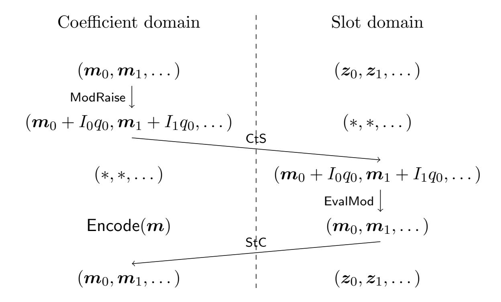
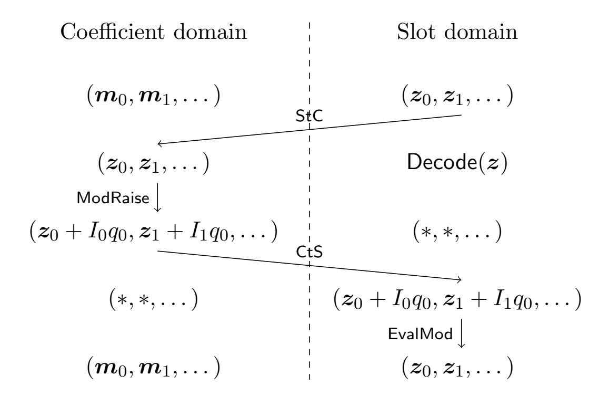
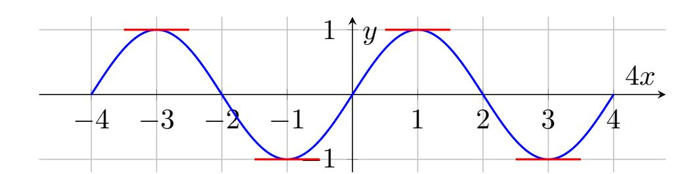
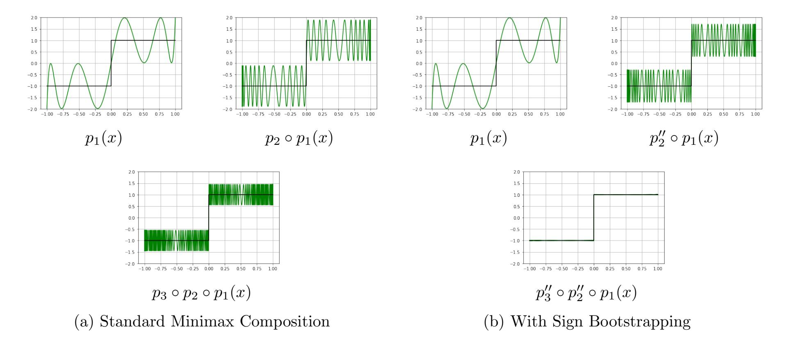
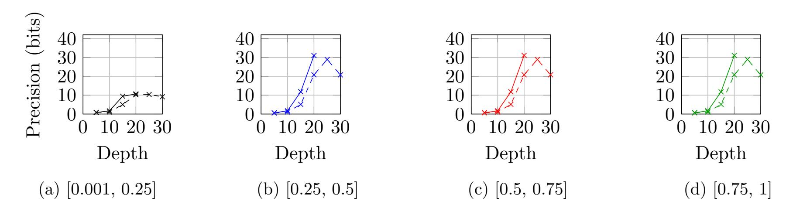
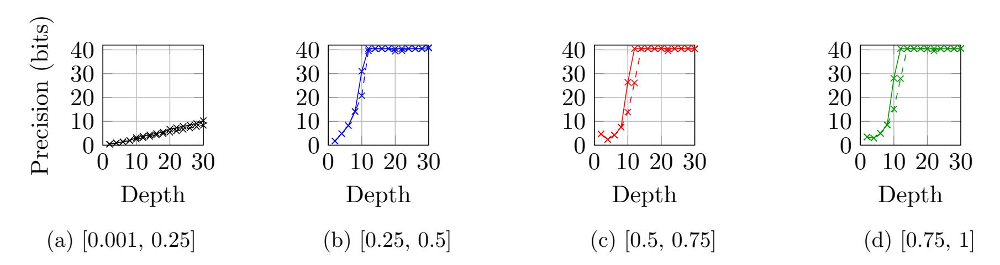
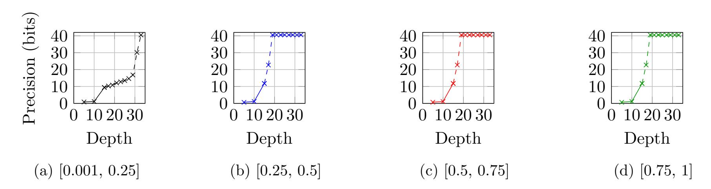

{0}------------------------------------------------

# A White-Box Bootstrapping Approach for High Precision Comparison Over Homomorphic Encryption

Deokhwa Hong<sup>1</sup> , Heesoo Lee<sup>1</sup> , Young-Sik Kim<sup>2</sup> , and Yongwoo Lee<sup>1</sup> 1 Inha University, Incheon, Korea deokhwa@inha.edu, heesoo@inha.edu, yongwoo@inha.ac.kr <sup>2</sup>Daegu Gyeongbuk Institute of Science and Technology, Daegu, Republic of Korea ysk@dgist.ac.kr

#### Abstract

We propose an efficient and numerically stable sign evaluation over the Cheon–Kim–Kim–Song (CKKS) homomorphic encryption (HE) scheme by introducing a new bootstrapping. Sign evaluation underpins applications such as comparison, sorting, and machine learning. Extensive studies exist, such as the polynomial-composition method by Lee et al. (IEEE TDSC'22). A critical oversight in the literature is that evaluating composite polynomials consumes substantial multiplicative depth, necessitating intermediate bootstrapping. Such bootstrapping introduces considerable noise, which harms convergence and degrades accuracy. Inspired by bootstrapping bits (Eurocrypt'24), we propose a new white-box bootstrapping for sign evaluation. We prove that our bootstrapping, unlike traditional bootstrapping, intrinsically reduces noise. Consequently, (i) it admits an interpretation as a polynomial composition, accelerating convergence "for free," and (ii) it removes the bootstrappinginduced noise that disrupts convergence in prior art. Our implementation validates that the proposed method achieves approximately 40-bit precision—bounded only by the fundamental rescaling noise—doubling the ≈ 20 bits of prior work under identical parameters. Moreover, our approach requires less depth and is numerically more stable.

### 1 Introduction

### 1.1 Homomorphic Encryption

Homomorphic encryption (HE) enables computation over encrypted data, making it a crucial component for privacy-preserving applications. Primitive HE schemes support only a limited number of homomorphic operations; however, Gentry's breakthrough introduced the concept of a homomorphic decryption circuit, known as bootstrapping, which overcomes this limitation [18]. Since then, various HE schemes have been proposed, such as Ducas-Micciancio (FHEW), Chillotti-Gama-Georgieva-Izabach`ene (TFHE), Brakerski-Gentry-Vaikuntanathan (BGV), and Fan-Vercauteren (FV) [17, 6, 16, 12].

Cheon-Kim-Kim-Song (CKKS) introduced a HE scheme, which supports computations over real (or complex) messages [9]. CKKS is categorized as an approximate HE scheme because it decrypts messages without rounding or mapping them to a discrete domain, treating real or complex values as native messages. This feature enables a useful functionality, approximation, which provides the ability to evaluate nonlinear functions that are typically considered difficult to handle in HE. On the other hand, CKKS suffers from precision loss because operationinduced noise is message-dependent. For example, when multiplying two noisy messages (m<sup>0</sup> + e0) · (m<sup>1</sup> + e1), we obtain (m0m<sup>1</sup> + m0e<sup>1</sup> + m1e<sup>0</sup> + e0e1), where the ideal term is m0m1, but the cross terms m0e<sup>1</sup> and m1e<sup>0</sup> illustrate that noise depends on the message. To address this issue, CKKS introduces the rescaling technique, which preserves message precision. Simply put,

{1}------------------------------------------------

if a scaling factor  $\Delta$  is multiplied to messages  $m_0$  and  $m_1$ , then the product of the two noisy messages becomes  $(\Delta^2 m_0 m_1 + \Delta m_0 e_1 + \Delta m_1 e_0 + e_0 e_1)$ . After rescaling, we obtain  $(\Delta m_0 m_1 + m_0 e_1 + m_1 e_0 + e_0 e_1/\Delta)$ , which preserves the most significant bits of the result.

There also exist several studies that treat the CKKS message space as a discrete domain, noting the trivial inclusion  $\mathbb{Z} \subset \mathbb{R}$  [14, 15, 3, 4, 1]. We refer to such variants as discrete-CKKS. Discrete-CKKS enables efficient functionalities such as the cleaning effect and interpolation. The cleaning effect is achieved by a cleaning function that maps noisy discrete messages to less noisy ones; for instance, when the message domain is binary, applying the function  $3x^2 - 2x^3$  reduces noise quadratically [15]. Moreover, by treating the message domain as discrete, interpolation can be used instead of approximation, generally resulting in lower computational cost.

### 1.2 Comparison in Approximate HE

Comparison operations such as minimum (min) and maximum (max) are important building blocks for various applications, including database search, statistical analysis, and machine learning. In particular, CKKS supports homomorphic comparison through approximation [11, 10, 22, 25]. For example, the max operation can be expressed as

$$\max(a,b) = \frac{(a+b) + |a-b|}{2},$$

where the absolute value is computed as  $|a - b| = (a - b) \cdot \text{sign}(a - b)$  with

$$sign(x) = \begin{cases} 1 & \text{if } x > 0 \\ 0 & \text{if } x = 0 \\ -1 & \text{if } x < 0 \end{cases}$$

The ability of CKKS to approximate the sign function makes it well suited for constructing privacy-preserving applications such as privacy-preserving machine learning (PPML) [21, 8, 28, 27].

Several studies have explored efficient comparison procedures in CKKS. Cheon et al. proposed an iterative approach that approximates the square root  $(\sqrt{\cdot})$  using the identity  $|a-b| = \sqrt{(a-b)^2}$  [11]. In a subsequent work, Cheon et al. introduced a polynomial composition method that maps noisy sign values to clean sign values by leveraging the cleaning effect of discrete-CKKS [10]. Lee et al. further proposed a minimax polynomial composition technique to approximate the sign function [22].

These comparison methods require multiple multiplicative depths to approximate the sign (or square root) function with high precision. The iterative method of Cheon et al. requires several iterations to accurately approximate the square root function. The polynomial-composition-based methods of Cheon et al. and Lee et al. also demand substantial numbers of compositions and high-degree polynomial evaluations. Consequently, bootstrapping becomes practically necessary during these approximations, rendering comparison operations relatively costly.

### 1.3 Challenges in High-Precision Comparison

Comparison in CKKS simultaneously acts as a primary noise bottleneck. While accurate comparison is critical—since incorrect evaluations of activation functions (e.g., ReLU) or comparators can adversely impact model inference and training—achieving the theoretical accuracy of polynomial approximations in practice remains a formidable challenge.

The fundamental limitation arises from the discrepancy between theoretical approximation and practical homomorphic evaluation. We identify two main causes for this issue. First, the composition of approximation polynomials inevitably requires *intermediate bootstrapping*, often

{2}------------------------------------------------

Table 1: Comparison of the required multiplicative depth to achieve various precision levels for the sign function using the coefficients proposed in Lee et al. [25] and our method. Precision is measured in bits, corresponding to the average absolute error over the domains [0.001, 0.25] and [0.25, 1], respectively. Since Lee et al. did not report coefficients for depth 30, the corresponding results are computed by us.

| Required | [25]          |           | Ours          |           |  |
|----------|---------------|-----------|---------------|-----------|--|
| Depth    | [0.001, 0.25] | [0.25, 1] | [0.001, 0.25] | [0.25, 1] |  |
| 11       | 6.8 bits      | 10.9 bits | 9.2 bits      | 18.2 bits |  |
| 12       | 7.8 bits      | 12.5 bits | 9.5 bits      | 30.0 bits |  |
| 13       | 8.8 bits      | 13.9 bits | 9.6 bits      | 31.1 bits |  |
| 30       | 9.1 bits      | 20.8 bits | 10.3 bits     | 40.5 bits |  |
| 33       | -             | -         | 40.5 bits     | 40.5 bits |  |

multiple times. This process injects a substantial amount of noise, which disturbs the convergence behavior of the approximation, preventing it from reaching the target precision. Second, the recursive evaluation of high-degree polynomials is inherently numerically unstable within the CKKS scheme. The fixed-point-like arithmetic of CKKS, relying on the rescaling operation, limites the accuracy of polynomial coefficients and accumulates noise during composition, rendering standard polynomial evaluation techniques unsuitable for deep circuits.

Although techniques such as the baby-step giant-step or Paterson–Stockmeyer algorithms, often combined with Chebyshev bases, are employed to mitigate computational complexity [24, 2], the issue of numerical instability is often treated heuristically by averaging the polynomial coefficients. While such instability may be tolerable for shallow tasks, it becomes a prohibitive bottleneck for deep operations required in sorting or database searching, making them infeasible for long-term services. Furthermore, simply adopting existing high-precision bootstrapping methods [26, 20, 29, 13] serves only as a naive patch; it incurs computational costs proportional to the precision without fundamentally resolving the numerical instability of the composition itself. Therefore, a redesign of the bootstrapping mechanism is essential to achieve a comparison function that is simultaneously numerically stable, efficient, and precise.

### 1.4 Our Contributions

In this paper, we introduce a new white-box bootstrapping approach for high-precision comparison for approximate HE. Our work is motivated by two key observations: 1) high-precision comparison practically requires bootstrapping—i.e., multiple iterations for evaluation and polynomial compositions—and 2) high-degree polynomial evaluations remain numerically unstable.

Motivated by this perspective, we design a new bootstrapping technique leveraging discrete-CKKS [14, 15, 3, 4]. Since the range of the sign function is {−1, 1}, intermediate CKKS messages can be treated as discrete values. Our proposed method exploits this discrete nature. Unlike the standard EvalMod in bootstrapping, which is designed to simply remove lifting noise<sup>1</sup> but preserves the input's inherent error, we introduce a new function, EvalSign, inspired by [3]. EvalSign simultaneously eliminates lifting noise and rounds noisy inputs to clean sign values. We term this process sign bootstrapping. We prove that it achieves quadratic noise reduction and recovers multiplicative depth, effectively enabling high-precision comparison.

Efficient noise reduction during bootstrapping also allows messages to converge rapidly to sign messages. We show that minimax polynomial composition combined with sign bootstrapping converges to the sign function significantly faster than with bootstrapping. Table 1 presents the precision achieved at each depth, both with and without sign bootstrapping.

<sup>1</sup>The noise introduced when lifting ciphertexts into larger modulus rings during bootstrapping procedure.

{3}------------------------------------------------

Motivated by the latter perspective, we apply the noise cleaning—one of the core functionalities of discrete CKKS—to ensure numerically stable convergence to sign messages during the evaluation of the sign function. Drucker et al. proposed the cleaning bit function 3x <sup>2</sup> − 2x 3 , which helps keep the ciphertext noise magnitude small [15]. We emphasize that such cleaning functions involve low-degree polynomial evaluations and are therefore more numerically stable than high-degree evaluations. Thus, we adopt the cleaning sign function (3/2)x − (1/2)x 3 , as suggested in [10], to improve the numerical stability of our comparison function. Consequently, we propose a hybrid approach for high-precision comparison that leverages both minimax polynomial composition and the cleaning effect in discrete CKKS.

Our experiments demonstrate that the proposed method achieves 40-bit precision, which is close to the theoretical precision limit imposed by the fundamental rescaling noise of the CKKS scheme. Notably, we achieve 30-bit precision consuming only 12 multiplicative levels with a single sign bootstrapping. In contrast, prior minimax composition [22] requires at least 25 levels to yield merely 20-bit precision; hence, the proposed method is both faster and more accurate. To substantiate the practical efficiency of sign bootstrapping, we provide concrete implementations of three representative applications: ResNet, sorting, and the top-k algorithm.

### 1.5 Technical Overview

Our core technical contribution is the replacement of the standard EvalMod with the EvalSign function, specifically chosen as sin(2πx). This design simultaneously addresses two critical challenges in bootstrapping: lifting noise removal and message noise reduction. First, the periodicity of the sine function naturally eliminates the lifting noise (multiples of the modulus q) introduced during the modulus raising step. Second, its extrema at ± 1 4 provide a quadratic noise reduction effect for messages. By changing the scale factor of the input by a factor of q0/(4∆), we map the discrete sign messages to the stationary points of the sine wave, where the derivative is zero. Consequently, any perturbation around these points is suppressed quadratically, yielding a clean sign message.

This technique is particularly powerful because homomorphic comparison in CKKS is essentially an iterative method that converges values to {−1, 1}. In conventional approaches, bootstrapping is a passive maintenance step that incurs significant noise. In contrast, our sign bootstrapping actively contributes to the convergence. Since the sine function shape is analogous to an iteration of a sign approximation polynomial, performing one sign bootstrapping is equivalent to gaining one additional level of composition for free while recovering the ciphertext level. This dual functionality significantly accelerates the overall convergence speed compared to standard methods.

Moreover, we propose a hybrid strategy to balance convergence speed and numerical stability. We observe that minimax polynomial composition offers rapid initial convergence but suffers from numerical instability at high degrees, whereas iterative cleaning functions [10, 15] are numerically stable but converge slowly. To achieve both high precision and efficiency, we employ minimax composition in the early stages for fast coarse approximation and switch to stable cleaning functions for the final fine-tuning steps. Our sign bootstrapping serves as the critical bridge between these stages, enabling deep yet stable circuit evaluation.

### 1.6 Related Works

Drucker et al. introduce discrete-CKKS, which provides operations on bits [15]. They assume that the message domain is defined over {0, 1} and approximate gate operations using multiplication and addition, which are the basic operations of CKKS. For example, x ∧ y = x · y, x∨y = x+y−x·y, and x⊕y = (x−y) 2 . They also introduce a cleaning function h<sup>1</sup> = 2x <sup>3</sup>−3x 2 , which efficiently reduces noise in bit messages. Subsequently, Bae et al. proposed bootstrapping

{4}------------------------------------------------

techniques for discrete-CKKS on bit messages [3]. Specifically, they introduce two bootstrapping methods: binary bootstrapping and gate bootstrapping. Binary bootstrapping replaces EvalMod with fBinBoot = (1/2)(1 − cos(2πx)), which achieves efficient noise reduction on bit messages. Gate bootstrapping evaluates gate operations during the bootstrapping procedure via polynomial approximation.

Cheon et al. proposed a method for evaluating the sign function by leveraging the functionality of discrete-CKKS [10]. They compose several cleaning functions—e.g., (3/2)x−(1/2)x <sup>3</sup>—to approximate the sign function. Furthermore, they introduce a heuristic technique that accelerates convergence by using a helper polynomial. Lee et al. proposed minimax polynomial composition to approximate the sign function [22]. They apply the multi-interval Remez algorithm introduced in [24]. Their method achieves 20 bits of precision in sign evaluation with bootstrapping.

### 2 Preliminaries

We denote a polynomial by a and use the symbol · to represent polynomial multiplication. For clarity, we omit the multiplication symbol when the operation is clear from context. The i-th coefficient of a is denoted by a<sup>i</sup> . Let N be a power of two. We define the 2N-th cyclotomic polynomial ring as Z[X]/(X<sup>N</sup> + 1), and its corresponding quotient ring modulo Q as R<sup>Q</sup> = R/QR. We refer to the infinity norm as || · ||∞.

### 2.1 Basic Ring-LWE Cryptosystem

An RLWE encryption of a message m under a secret key s is expressed as:

$$RLWE_{\boldsymbol{s}}(\boldsymbol{m}) = (\boldsymbol{a}, \boldsymbol{a} \cdot \boldsymbol{s} + \boldsymbol{m} + \boldsymbol{e}) = (\boldsymbol{a}, \boldsymbol{b}) \in \mathcal{R}_Q^2,$$

where a is a polynomial with uniformly random coefficients, and e is an error polynomial with small-magnitude coefficients. Decryption of an RLWE ciphertext proceeds as:

$$\text{RLWE}^{-1}((\boldsymbol{a}, \boldsymbol{b}), \boldsymbol{s}) = \boldsymbol{b} - \boldsymbol{a} \cdot \boldsymbol{s} = \boldsymbol{m} + \boldsymbol{e} \approx \boldsymbol{m}.$$

### 2.2 Approximate HE Scheme

The CKKS scheme supports approximate ciphertext-plaintext multiplication and addition, ciphertextciphertext multiplication and addition, and rotation operations. Messages in CKKS are defined over a special domain known as the slot domain. A message in this domain is referred to as a cleartext and is represented as a vector z = (z0, z1, . . . , zN/2−<sup>1</sup> ) ∈ C N/2 .

CKKS enables element-wise multiplication (denoted by ⊛) within the slot domain. To support this operation, CKKS employs a variant of the Discrete Fourier Transform (DFT) to map a cleartext vector z to a polynomial m ∈ RQ. We refer to m as the plaintext, which is the encoded polynomial representation of the original cleartext message z. This polynomial m resides in the coefficient domain, which is algebraically isomorphic to z in the slot domain. In particular, polynomial multiplications with polynomials in the coefficient domain are equivalent to ⊛ operations over cleartexts in the slot domain. Note that addition is naturally defined in both the slot and coefficient domains.

### 2.2.1 Encoding and decoding.

Encoding and decoding in the CKKS scheme are defined as mappings between the coefficient domain and the slot domain. Let ζ be a primitive 2N-th root of unity, defined as ζ = exp(πj/N), 

{5}------------------------------------------------

where j denotes the imaginary unit. The DFT is defined as:

$$\mathsf{DFT}: \mathbb{R}[X]/(X^N+1) \to \mathbb{C}^{N/2}, \\ \boldsymbol{m}'(X) \mapsto \left(\boldsymbol{m}'(\zeta_0), \boldsymbol{m}'(\zeta_1), \dots, \boldsymbol{m}'(\zeta_{N/2-1})\right),$$

where ζ<sup>i</sup> = ζ 5 i for i ∈ [0, N/2). We denote the inverse transform by iDFT.

To preserve numerical precision when mapping R[X]/(X<sup>N</sup> + 1) into R<sup>Q</sup> via rounding, the CKKS scheme introduces a scaling factor ∆. With this scaling, the encoding and decoding procedures are defined as follows:

$$\begin{split} &\mathsf{Encode}: \mathbb{C}^{N/2} \to \mathcal{R}_Q, \quad \mathsf{Encode}(\boldsymbol{z}) = \lfloor \Delta \cdot \mathsf{iDFT}(\boldsymbol{z}) \rceil = \boldsymbol{m}, \\ &\mathsf{Decode}: \mathcal{R}_Q \to \mathbb{C}^{N/2}, \quad \mathsf{Decode}(\boldsymbol{m}) = \mathsf{DFT}\left(\boldsymbol{m} \cdot \Delta^{-1}\right) = \boldsymbol{z}. \end{split}$$

Here, ⌊·⌉ denotes coefficient-wise rounding to the nearest integer in RQ.

### 2.2.2 Basic operations of approximate HE.

Cheon et al. extended the ring R<sup>Q</sup> to a more computationally efficient variant using the Residue Number System (RNS), based on the Chinese Remainder Theorem (CRT) [7]. This RNS variant underlies a practical implementation of the CKKS scheme. Specifically, the ring R<sup>Q</sup> is decomposed as:

$$\mathcal{R}_Q \cong \mathcal{R}_{q_0} \times \mathcal{R}_{q_1} \times \cdots \times \mathcal{R}_{q_L},$$

where the modulus Q satisfies Q ≈ q0q<sup>1</sup> · · · qL, and each q<sup>i</sup> is a pairwise co-prime modulus. Here, L denotes a maximum level, which corresponds to the multiplicative depth the ciphertext can support. The term q<sup>0</sup> is referred to as the bottom modulus. For convenience, we define the partial modulus product up to level ℓ as:

$$Q_{\ell} = q_0 q_1 \cdots q_{\ell}.$$

Note that the scaling factor is generally set as ∆ ≈ q<sup>i</sup> .

All operations originally defined in R<sup>Q</sup> naturally extend component-wise to its RNS representation. We summarize the basic operations used in the CKKS scheme as follows:

• Encryption. Given a plaintext m and a secret key s, sample a ∈ R<sup>Q</sup> uniformly at random and e ∈ Rσ, where R<sup>σ</sup> denotes the set of polynomials whose coefficients are independently drawn from a discrete Gaussian distribution with mean 0 and standard deviation σ. The ciphertext is computed as:

$$\mathsf{c} = (\boldsymbol{a}, \boldsymbol{a} \cdot \boldsymbol{s} + \boldsymbol{m} + \boldsymbol{e}) = (\boldsymbol{a}, \boldsymbol{b}) \in \mathcal{R}_Q^2,$$

and we denote this as c ← Encs(m).

• Decryption. Given a ciphertext c = (a, b) and a secret key s, the decryption is performed by:

$$m \approx m + e = b - a \cdot s \mod q_0$$

and denoted as m ← Dec(c, s).

• Addition and Subtraction. Given ciphertexts c<sup>1</sup> = (a1, b1) and c<sup>2</sup> = (a2, b2):

$$c_{ADD} = (a_1 + a_2, b_1 + b_2), \quad c_{SUB} = (a_1 - a_2, b_1 - b_2),$$

denoted as cADD ← ADD(c1, c2) and cSUB ← SUB(c1, c2).

{6}------------------------------------------------

- **Key Switching.** Given a ciphertext  $c_{s'}$  encrypted under a secret key s', key switching transforms its underlying secret key to s. This process uses a evaluation key called the key switching key ksk, defined in  $\mathcal{R}_{QP}$  using an auxiliary modulus P to manage noise growth.
- Multiplication. Given ciphertexts  $c_1 = (a_1, b_1)$  and  $c_2 = (a_2, b_2)$ , compute:

$$(d_0, d_1, d_2) = (a_1 \cdot a_2, a_1 \cdot b_2 + a_2 \cdot b_1, b_1 \cdot b_2).$$

The result is:

$$\mathsf{c}_{\mathrm{MUL}} = (\boldsymbol{d}_0, \boldsymbol{d}_1) + \left| P^{-1} \cdot \boldsymbol{d}_2 \cdot \mathsf{ksk}_{\mathrm{mul}} \right|$$

where  $ksk_{mul}$  is the key switching key for multiplication. We denote this operation as:

$$c_{MUL} \leftarrow MULT(c_1, c_2, ksk_{mul}).$$

• Rotation. Given a ciphertext c = (a, b), a rotation index k, and a rotation key  $ksk_{rot}$ , the automorphism is applied as:

$$\mathsf{c}' = (\boldsymbol{a}(X^{5^k}), \boldsymbol{b}(X^{5^k})),$$

which results in a new ciphertext under the rotated secret key  $s' = s(X^{5^k})$ . A key switching step using  $\mathsf{ksk}_{\mathsf{rot}}$  is then required to switch back to s. Note that applying an automorphism  $X^{5^k}$  in the coefficient domain corresponds to a rotation of cleartexts by k positions. This operation is denoted as:

$$c_{ROT} \leftarrow ROT(c, k, ksk_{rot}).$$

• Rescaling. Given a ciphertext  $c_{\ell} \in \mathcal{R}_{Q_{\ell}}$ . It outputs  $c_{\ell-1} = \lfloor q_{\ell}^{-1} c \rfloor \mod Q_{\ell-1}$ , and it denoted as  $c_{\ell-1} \leftarrow \mathsf{RS}(c_{\ell})$ .

#### 2.3 Bootstrapping for Approximate HE

To preserve numerical precision after ciphertext multiplication in the CKKS scheme, a rescaling operation is required. However, the rescaling process progressively reduces the ciphertext modulus  $Q_{\ell}$  at each level. Eventually, when the modulus reaches the bottom level  $q_0$ , further multiplications can no longer be performed due to insufficient modulus.

To enable continued homomorphic evaluation beyond this point, the ciphertext modulus must be restored. This process is referred to as *bootstrapping* in the CKKS scheme. The following four components serve as the fundamental building blocks of bootstrapping:

- SlotToCoeff. The SlotToCoeff (StC) transformation is a homomorphic mapping from the slot domain to the coefficient domain. StC is typically performed using a sequence of multiplications and rotations, analogous to a matrix-vector multiplication.
- CoeffToSlot. The CoeffToSlot (CtS) transformation is a homomorphic mapping from the coefficient domain back to the slot domain. Similar to StC, this transformation also involves a series of multiplications and rotations.
- Modulus Raising. The modulus raise (ModRaise) procedure embeds a ciphertext from a ring with a small modulus q into a ring with a larger modulus Q. After this step, an additional noise term of the form  $Iq_0$  appears in the coefficient domain, where I is a polynomial with small integer coefficients.
- Modulus Reduction The goal of the modulus reduction (EvalMod) procedure is to remove the added noise term  $Iq_0$  in the coefficient domain. To enable this, StC and CtS are used to convert the ciphertext to the slot domain where element-wise operations are supported. The modular reduction by  $q_0$  is approximated via the function  $\frac{q_0}{2\pi}\sin(2\pi x)$ .

{7}------------------------------------------------



Figure 1: This figure illustrates the process of the ModRaise-first bootstrapping. Note that elements in the coefficient domain and the slot domain are aligned row-wise to represent corresponding plaintext–cleartext pairs at each phase of the bootstrapping procedure. The symbol ∗ denotes an unpredictable element due to added noise.

### 2.3.1 Two Methods of Bootstrapping.

There are two primary methods for performing bootstrapping in the CKKS scheme: ModRaisefirst bootstrapping, which begins with the ModRaise step, and StC-first bootstrapping, which begins with the StC step. The key distinction between these two methods lies in where the additional noise term Iq<sup>0</sup> is introduced—either in the plaintext or in the cleartext.

Assume that z is a cleartext in the slot domain, and its corresponding coefficient representation (i.e., plaintext) is m. In the ModRaise-first bootstrapping, the procedure starts with ModRaise, which introduces an additional noise term Iq<sup>0</sup> into the coefficient domain. Therefore, the noise Iq<sup>0</sup> is added directly to the plaintext m, resulting in a noisy plaintext m′ = m+ Iq0. To enable the modular reduction in the slot domain, this noisy plaintext must be transformed. The process proceeds by:

- 1. Temporary interpreting m′ as a cleartext: z ′ = m + Iq0.
- 2. Applying CtS to map z ′ back into the slot domain.
- 3. Executing EvalMod in the slot domain.
- 4. Finally, the StC procedure is applied to return to the coefficient domain, producing a plaintext m that represents z as a cleartext.

In the StC-first bootstrapping, the procedure begins with the StC step, where the cleartext z is homomorphically mapped from the slot domain to the coefficient domain. After this transformation, the ModRaise step is applied. As a result, the additional noise term Iq<sup>0</sup> is introduced in the cleartext z—now residing in the coefficient domain. To perform EvalMod, the noisy cleartext z + Iq<sup>0</sup> is mapped back to the slot domain using the CtS, and then the EvalMod procedure is applied to approximately evaluate modulo q0. We illustrate the processes of ModRaise-first bootstrapping and StC-first bootstrapping in Figures 1 and 2, respectively.

### 2.4 Discrete-CKKS

Discrete-CKKS is a variant of CKKS that treats its message domain as discrete—i.e., bits and integers—rather than real (or complex) values [14, 15, 3, 4]. By operating over a discrete domain,

{8}------------------------------------------------



Figure 2: This figure illustrates the process of the StC-first bootstrapping. Note that the structure of this figure is identical to that of Figure 1.

it enables useful functionalities such as interpolation and the cleaning effect. Consequently, it provides better efficiency compared to standard CKKS.

For example, interpolations such as Lagrange interpolation often offer lower computational cost compared to approximation-based methods. The cleaning effect, achieved through a cleaning function, provides efficient noise reduction, which in turn enables the use of more efficient parameter sets via modulus engineering [3]. For instance, the following lemma shows that the cleaning function for bits, h1(x) = 3x <sup>2</sup> − 2x 3 , reduces noise quadratically [15].

Lemma 1 ([13]). For all m ∈ {0, 1} and τ with |τ | ≤ 1, we have:

$$|h_1(m+\tau) - m| \le 5|\tau|^2.$$

### 2.5 Min/Max Operations in Approximate HE

The minimum (min) and maximum (max) functions can be expressed as follows:

$$\min(a,b) = \frac{a+b}{2} - \frac{|a-b|}{2}, \quad \max(a,b) = \frac{a+b}{2} + \frac{|a-b|}{2}.$$

There are two main strategies to construct the min and max functions: the square-root-based approach and the sign-function-based approach [11, 10, 22]. Both strategies share the same objective, namely, to compute the absolute value of a difference:

$$|a-b| = \sqrt{(a-b)^2} = (a-b) \cdot \operatorname{sign}(a-b).$$

Note that Cheon et al. proposed an iterative method that approximates the square root function [11], as well as a composition of cleaning functions to extract the sign values of messages [10]. Lee et al. proposed a minimax polynomial composition method to approximate the sign function [22]. Recall that achieving high-precision comparison generally requires either additional iterations or deeper polynomial compositions, both of which in turn necessitate bootstrapping.

### 2.5.1 Approximation of the Sign Function.

The precision of a comparison operation involving the sign function depends on the accuracy of its polynomial approximation. The following definitions quantify the precision of a polynomial that approximates the sign function.

{9}------------------------------------------------

Definition 1 ([10]). For α > 0 and 0 < ϵ < 1, a polynomial p is said to be (α, ϵ)-close to sign(x) over [−1, 1] if p satisfies the following condition:

$$||p(x) - \operatorname{sign}(x)||_{\infty, [-1, -\epsilon] \cup [\epsilon, 1]} \le 2^{-\alpha},$$

where || · ||∞,<sup>D</sup> denotes the infinity norm over the domain D.

Definition 2 ([10]). For α > 0 and 0 < δ < 1, a polynomial p(x) is said to be (α, δ)-two-sidedclose to sign(x) if it satisfies the following condition:

$$||p(x) - \operatorname{sign}(x)||_{\infty, [-1-\delta, -1+\delta] \cup [1-\delta, 1+\delta]} \le 2^{-\alpha},$$

where || · ||∞,<sup>D</sup> denotes the infinity norm over the domain D.

The objective is to find an (α, δ)-two-sided-close polynomial p(x) to sign, where p(x) is considered as a minimax composite polynomial. Note that an (α, ϵ)-close polynomial and an (α, δ)-two-sided-close polynomial are equivalent when δ = (ϵ − 1)/(ϵ + 1) [22]. For simplicity, we denote [−1 − τ<sup>i</sup> , −1 + τ<sup>i</sup> ] ∪ [1 − τ<sup>i</sup> , 1 + τ<sup>i</sup> ] by Dτ<sup>i</sup> and [−1 − δ, −1 + δ] ∪ [1 − δ, 1 + δ] by Dδ. Here, τ<sup>i</sup> and δ are referred to as approximation errors. Let p(x) = p<sup>k</sup> ◦ pk−<sup>1</sup> ◦ · · · ◦ p1(x). Then, the minimax composite polynomial p can be represented as follows:

$$p_1(\mathcal{D}_{\delta}) = \mathcal{D}_{\tau_1}$$
 and  $p_i(\mathcal{D}_{\tau_{i-1}}) = \mathcal{D}_{\tau_i}, 2 \le i \le k \text{ for some } \delta, \tau_1, \dots, \tau_k \in (0, \infty).$ 

The following definition presents the minimax composite polynomial for approximating the sign function.

Definition 3 ([22]). Let {pi}1≤i≤<sup>k</sup> be a set of polynomials, and let D = [−b, −a] ∪ [a, b]. The composition p<sup>k</sup> ◦ pk−<sup>1</sup> ◦ · · · ◦ p<sup>1</sup> is called a minimax composite polynomial on D if there exist degrees {di}1≤i≤<sup>k</sup> satisfying the following conditions:

- p<sup>1</sup> is the minimax polynomial of degree at most d<sup>1</sup> on D for sign(x).
- For 2 ≤ i ≤ k, p<sup>i</sup> is the minimax approximation polynomial of degree at most d<sup>i</sup> on pi−<sup>1</sup> ◦ pi−<sup>2</sup> ◦ · · · ◦ p1(D) for sign(x).

### 2.5.2 Remez Algorithm.

The Remez algorithm is a well-known algorithm that returns a minimax polynomial for a given continuous function f on a domain [a, b]. Specifically, Lee et al. proposed an improved multiinterval Remez algorithm and demonstrated its correctness [24]. We illustrate Lee et al's Remez algorithm in Algorithm 1.

### 3 Proposed Method

In this section, we introduce a new bootstrapping method for high-precision comparison based on the sign function. We consider the following two conditions for approximating a high-precision sign function: 1) for high-precision approximation, bootstrapping is required since the operation consumes a large number of multiplicative depths; and 2) during bootstrapping, the message domain is confined to D<sup>τ</sup> rather than R, for a small τ .

{10}------------------------------------------------

### Algorithm 1: The improved multi-interval Remez algorithm [24]

```
Input: A basis \{\phi_1, \ldots, \phi_n\}, a domain \mathcal{D} = \bigcup_{i=1}^{\ell} [a_i, b_i] \subset \mathbb{R}, an approximation factor
              \gamma, and a continuous function f on \mathcal{D}
    Output: The minimax polynomial p for f
 1 Initialize x_1, \ldots, x_{n+1} \in [a, b], with x_1 < x_2 < \cdots < x_{n+1};
 2 Find a polynomial p with the basis \{\phi_1,\ldots,\phi_n\} such that p(x_i)-f(x_i)=(-1)^i E, for
     1 \le i \le n+1 with some E;
 3 Collect all the extreme and boundary points of p-f on \mathcal{D} such that
     \mu(x)(p(x) - f(x)) \ge |E| and put them in a set B;
 4 Find n+1 points y_1 < y_2 < \cdots < y_{n+1} in B that satisfy the alternating condition and
     maximum absoulte sum condition;
 5 \epsilon_{max} \leftarrow \max_{1 \leq i \leq n+1} |p(y_i) - f(y_i)|;
 6 \epsilon_{min} \leftarrow \min_{1 \leq i \leq n+1} |p(y_i) - f(y_i)|;
 7 if (\epsilon_{max} - \epsilon_{min})/\epsilon_{min} < \gamma then
        return p(x);
 8
 9 end
10 else
11
        Replace x_i with y_i for all i and go to line 2;
12 end
```

#### 3.1 Proposed Bootstrapping for Sign Evaluation

Recall that after the CtS step in the StC-first bootstrapping,  $(z_0 + I_0q_0, z_1 + I_1q_0, ...)$  reside in the slot domain. In the general case, the EvalMod step approximates  $\frac{q_0}{2\pi}\sin(2\pi x)$  to eliminate the  $I_iq_0$  terms, since the cleartexts  $z_i$  are treated as real numbers. In most HE applications, the message distribution should remain secret, so it is natural to assume that the cleartexts  $z_i$  follow a uniform distribution over the real domain.

However, when evaluating the sign function using a composition of minimax polynomials, the domain of the cleartexts is restricted to  $\mathcal{D}_{\tau} \subset \mathbb{R}$ . We emphasize that approximating  $\frac{q_0}{2\pi} \sin(2\pi x)$  in the EvalMod step is inefficient when the domain of the cleartexts is defined as  $\mathcal{D}_{\tau}$ .

Now we introduce a new bootstrapping method that efficiently eliminates the  $I_iq_0$  terms in the cleartexts, where the cleartexts represent sign messages, inspired by [15, 3]. We refer to this bootstrapping method as  $sign\ bootstrapping$ . Our objective is to correctly map noisy sign messages to their corresponding sign messages. This goal can be expressed as follows:

Find an approximate function func such that 
$$\operatorname{func}(x) = \begin{cases} 1 & \text{if } x \in [1-\tau, 1+\tau] \\ -1 & \text{if } x \in [-1-\tau, -1+\tau] \end{cases}$$
,

and  $\operatorname{func}(x+T) = \operatorname{func}(x)$  for some period T.

Specifically, we choose  $\sin((\pi/2)x)$  as a func. There are two reasons for this choice. First, it attains its extrema at  $x \in \{-1,1\}$ , which enables efficient noise elimination. Second, the periodicity of the trigonometric function allows additional noise terms of the form  $Iq_0$  to be effectively removed. In contrast to the EvalMod function, it inherently provides a noise reduction effect; it trivially holds that  $|\operatorname{sign}(x) - \sin((\pi/2)x)| \le |\operatorname{sign}(x) - x|$  for  $x \in \mathcal{D}_{\tau}$  with small  $\tau$ . As a result, we modify the StC-first bootstrapping procedure, as described in Algorithm 2, where EvalSign refers to homomorphic (approximate) evaluation of  $\sin(2\pi x)$ .

#### 3.2 Correctness of Sign Bootstrapping

After the StC step, the cleartexts z become observable in the coefficient domain. We scale up the cleartexts by  $q_0/(4\Delta)$ . During the ModRaise step, noise terms  $I_iq_0$  are added to the

{11}------------------------------------------------

### **Algorithm 2:** Sign bootstrapping (SignBoot)

Input: A ciphertext c encrypting sign values

Output: A bootstrapped ciphertext c<sub>boot</sub>

- 1  $c_{\text{scaled}} \leftarrow (q_0/(4\Delta)) \cdot c$
- $\mathbf{2} \;\; \mathsf{c}_{\mathrm{boot}} \leftarrow \mathsf{EvalSign} \circ \mathsf{CtS} \circ \mathsf{ModRaise} \circ \mathsf{StC}(\mathsf{c}_{\mathrm{scaled}})$
- 3 return  $c_{boot}$

cleartexts, which reside in the coefficient domain:

$$\left(\frac{q_0}{4}\boldsymbol{z}_0 + I_0q_0, \ \frac{q_0}{4}\boldsymbol{z}_1 + I_1q_0, \ \dots, \ \frac{q_0}{4}\boldsymbol{z}_{N/2-1} + I_{N/2-1}q_0\right),$$

where  $I_i \in \mathbb{Z}$ . Assuming that the scaling factor is set as  $\Delta \approx q_0$ , the cleartexts in the coefficient domain become:

$$\left(\frac{z_0}{4}+I_0, \ \frac{z_1}{4}+I_1, \ \ldots, \ \frac{z_{N/2-1}}{4}+I_{N/2-1}\right).$$

We note that the cleartext positions near the extrema of  $\sin(2\pi x)$  when  $\tau$  is small. The CtS step is then applied to map these cleartexts back to the slot domain.

Finally, we evaluate the approximated EvalSign on the clear texts to eliminate the additional noise terms. The following theorem shows that when  $|\tau| < 1$ , the output noise is quadratically reduced.<sup>2</sup>

**Theorem 1.** Let  $z \in \{-1,1\}$ ,  $\tau$  is a real number, and  $EvalSign(x) = \sin(2\pi x)$ . Then, the following inequality holds:

$$\left| \mathsf{EvalSign} \left( \frac{z + \tau}{4} + I \right) - z \right| \leq \frac{\pi^2}{8} \tau^2,$$

where  $I \in \mathbb{Z}$ .

*Proof.* The function EvalSign  $\left(\frac{z+\tau}{4}+I\right)$  can be written as

$$\mathsf{EvalSign}\left(\frac{z+\tau}{4}+I\right) = \sin\left(2\pi I + \frac{\pi}{2}(z+\tau)\right) = \sin\left(\frac{\pi}{2}(z+\tau)\right) = z\cos\left(\frac{\pi}{2}\tau\right).$$

Therefore,

$$\left| \mathsf{EvalSign} \left( \frac{z + \tau}{4} + I \right) - z \right| = \left| z \cos \left( \frac{\pi}{2} \tau \right) - z \right| = |z| \cdot \left| \cos \left( \frac{\pi}{2} \tau \right) - 1 \right| = 1 - \cos \left( \frac{\pi}{2} \tau \right).$$

Since  $1 - \cos(x) \le \frac{x^2}{2}$  for all  $x \in \mathbb{R}$ , we obtain

$$\left| \mathsf{EvalSign} \left( \frac{z + \tau}{4} + I \right) - z \right| \leq \frac{\pi^2}{8} \tau^2.$$

We plot the EvalSign function in Figure 3.

Based on this theorem, we derive the following corollary.

Note that, otherwise, sign evaluation itself becomes meaningless, as  $\tau$  can even change the sign of the original message. Hence, our EvalSign covers essentially all practical scenarios.

{12}------------------------------------------------



Figure 3: The EvalSign function.

Corollary 1 (Noise Reducing Property of Bootstrapping). Let z ∈ {−1, 1} be the ground-truth plaintext and let ϵ denote the relative input noise. Then the output relative noise ϵout after bootstrapping is bounded by

$$|\epsilon_{out}| \le \frac{\pi^2}{8} (\epsilon + \epsilon_{stc} + 4\epsilon_{cts})^2 + |\epsilon_{sign}|,$$

where ϵstc, ϵcts, and ϵsign are the relative noises introduced by the StC, CtS, and sine evaluation, respectively. Consequently, a sufficient condition for noise reduction is

$$|\epsilon_{stc} + 4\epsilon_{cts}| + \sqrt{\frac{8}{\pi^2}|\epsilon_{sign}|} < \sqrt{\frac{8}{\pi^2}|\epsilon|} - |\epsilon|.$$
 (1)

Proof. The initial slot value is (z + ϵ)∆. After the StC, the coefficient has (z + ϵ + ϵstc)∆. We treat the relative slot-to-coefficient noise as an additive term ϵstc, introduced by rounding and rescaling, since the StC is a norm-preserving map. Next, we scale by q0/4∆ and perform ModRaise; the coefficient value is now

$$q_0I + q_0/4 \cdot (z + \epsilon + \epsilon_{stc}).$$

Note that the relative noise with respect to z does not change. We perform the CtS step and multiply by ∆/q<sup>0</sup> again, which gives the slot value

$$I\Delta + \frac{1}{4}(z + \epsilon + \epsilon_{stc})\Delta + \epsilon_{cts}\Delta,$$

where ϵcts is another relative additive noise term introduced by the CtS. Applying Theorem 1 and adding the approximation error from polynomial evaluation, we can upper bound the output relative noise as

$$|\epsilon_{out}| \le \frac{\pi^2}{8} (\epsilon + \epsilon_{stc} + 4\epsilon_{cts})^2 + |\epsilon_{sign}|.$$

Hence, a sufficient condition for noise reduction (|ϵout| ≤ |ϵ|) is (using a <sup>2</sup> + b ≤ (a + √ b) 2 for a ≥ 0, b ≥ 0 and |a + b| ≤ |a| + |b|)

$$\left(\sqrt{\frac{\pi^2}{8}}\left(|\epsilon + \epsilon_{stc} + 4\epsilon_{cts}|\right) + \sqrt{|\epsilon_{sign}|}\right)^2 \le |\epsilon|.$$

Taking square roots yields the clean condition

$$|\epsilon_{stc} + 4\epsilon_{cts}| + \sqrt{\frac{8}{\pi^2}|\epsilon_{sign}|} \le \sqrt{\frac{8}{\pi^2}|\epsilon|} - |\epsilon|.$$

This proves the claim.

Remark 1. In practice, the right-hand side of (1) is a very generous (i.e., loose) bound. For example, it is about 0.03 when |ϵ| = 0.75 and about 0.20 when |ϵ| = 0.20, whereas the left-hand side is (in practice) essentially input-noise-invariant, around 2 −30 .

{13}------------------------------------------------



Figure 4: Comparison of polynomial compositions. (a) A composition of degree-9 minimax polynomials. (b) A composition of degree-9 minimax polynomials with sign bootstrapping. Note that in (b), p ′′ 2 and p ′′ 3 represent p ′ 2 ◦ EvalSign(·) and p ′ 3 ◦ EvalSign(·), respectively. The polynomials p ′ 2 and p ′ 3 are specifically designed to leverage the noise reduction in the EvalSign step.

## 4 High-Precision sign Function Evaluation with Sign Bootstrapping

In this section, we propose a new method for evaluating the sign function with high precision through sign bootstrapping.

### 4.1 Composition of Minimax Polynomials with Sign Bootstrapping

Recall that our goal is to find an (α, δ)-two-sided-close minimax composite polynomial p(x) = p<sup>k</sup> ◦ pk−<sup>1</sup> ◦ · · · ◦ p1(x). This implies that our objective is to minimize the approximation error τ . Then, the minimax composite polynomial p(x) = p<sup>k</sup> ◦ pk−<sup>1</sup> ◦ · · · ◦ p1(x) for approximating the sign function can be represented as follows:

$$p_1(\mathcal{D}_{\delta}) = \mathcal{D}_{\tau_1}$$
, and  $p_i(\mathcal{D}_{\tau_{i-1}}) = \mathcal{D}_{\tau_i}$ ,  $i = 2, \dots, k$ , for some  $k$ .

Note that the codomain of each polynomial evaluation serves as the domain for the next polynomial in the composition.

Interestingly, Theorem 1 shows that sign bootstrapping reduces approximation errors quadratically. This implies that applying sign bootstrapping between polynomial compositions shrinks the domain for subsequent polynomial evaluations; that is, EvalSign(D<sup>τ</sup> ) = Dπ2<sup>τ</sup> <sup>2</sup>/8 , which leads to faster convergence toward smaller approximation errors τ . Note that the approximation error in evaluating EvalSign is negligible, as it provides about 50-bit precision; therefore, we ignore this approximation error, ϵsign, for simplicity. Figures 4a and 4b illustrate minimax composite polynomials without and with sign bootstrapping, respectively.

As a result, we present the depth–precision variations for minimax polynomial compositions, with and without sign bootstrapping, in Figure 5. Our results show that sign bootstrapping promotes faster convergence to the correct sign compared to the case without sign bootstrapping.

{14}------------------------------------------------



Figure 5: This figure illustrates the depth–precision variations of minimax polynomial composition with and without sign bootstrapping. The solid lines represent the precision achieved using minimax polynomial composition with sign bootstrapping, whereas the dashed lines represent the case without sign bootstrapping. We assume a scenario in which bootstrapping is applied every 10 depths.

Table 2: Precision comparison of the composition of cleaning functions  $\operatorname{clean}_n$  [10]. Note that we do not apply any polynomial-evaluation optimizations, such as the baby-step giant-step method or the Paterson-Stockmeyer algorithm, and we use the power basis. This may affect the experimental results.

| Applied            |               | Consumed    |             |           |       |
|--------------------|---------------|-------------|-------------|-----------|-------|
| Function           | [0.001, 0.25] | [0.25, 0.5] | [0.5, 0.75] | [0.75, 1] | Depth |
| clean <sub>1</sub> | 1.6 bits      | 8.7 bits    | 23.4 bits   | 40.4 bits | 10    |
| $clean_2$          | 0.7 bits      | 3.2 bits    | 7.8 bits    | 16.8 bits | 8     |
| clean <sub>3</sub> | 1.0 bits      | 4.8 bits    | 12.2 bits   | 27.2 bits | 8     |
| clean <sub>4</sub> | 1.2 bits      | 6.5 bits    | 17.4 bits   | 38.1 bits | 10    |

### 4.2 Cleaning Sign

There is an another strategy for approximating the sign function: composition of cleaning functions. Cheon et al. introduced following equations as cleaning functions, clean<sub>n</sub> [10]:

$$\mathsf{clean}_n = \sum_{i=0}^n \frac{1}{4^i} \cdot \left( \begin{array}{c} 2i \\ i \end{array} \right) \cdot x (1-x^2)^i.$$

Note that we use only  $clean_1 = -(1/2)x^3 + (3/2)x$ . Since, in our experiments, cleaning functions with lower degrees exhibit greater numerical stability than those with higher degrees. We present the experimental results in Table 2.

We illustrate the depth–precision variations for compositions of cleaning functions with and without sign bootstrapping in Figure 6. As in the minimax polynomial composition, we apply bootstrapping every 10 depths. Due to the strong cleaning effect of the cleaning function, the convergence behavior over the domain [0.25, 1] is not significantly distinguishable. In the domain [0.001, 0.25], which consists of very small values that are generally harder to converge, the convergence with sign bootstrapping is slightly faster than that without sign bootstrapping.

### 4.3 Hybrid Approach

We compare the depth–precision behavior of two strategies: minimax polynomial composition and the cleaning-based sign function. Our results show that the cleaning-based sign function converges to the correct sign values more quickly when the noisy signs are already close to the ideal sign values (i.e., in the range [0.25, 1]), whereas minimax polynomial composition converges more uniformly over the wider range [0.001, 1]. Interestingly, in the region near zero

{15}------------------------------------------------



Figure 6: This figure illustrates the depth–precision variations of cleaning-based sign evaluation with and without sign bootstrapping. Note that this figure uses the same configuration as Figure 5.



Figure 7: This figure illustrates the depth–precision variations of the hybrid sign-evaluation approach with sign bootstrapping. The solid lines represent the precision achieved using minimax polynomial composition, whereas the dashed lines represent the case using cleaning-based evaluations. We assume a scenario in which bootstrapping is applied every 10 depths.

([0.001, 0.25]), minimax polynomial composition performs better than the cleaning-based sign function. Motivated by this observation, we combine the two methods to construct a high-precision comparison function.

We apply the sign-cleaning strategy after the minimax polynomial composition to achieve faster convergence. In particular, we first apply the minimax polynomial composition to obtain at least 10-bit precision over the entire range (requiring depth 15 in our experiment), and then apply a composition of cleaning functions. As a result, we achieve 30-bit precision at depth 31 and 40-bit precision at depth 33 across the entire range [0.001, 1]. Our results are illustrated in Figure 7, and all experimental results are summarized in Table 3.

# 5 Implementation Results and Applications

In this section, we present the implementation results of our proposed sign bootstrapping method, with practical applications including neural networks, sorting, and the top-k algorithm.

Our experimental environment is as follows. Our implementation is based on DesiloFHE, which adopts a lazy-rescaling strategy; this choice requires two rescaling operations for a single multiplication but provides improved precision. We use an Intel(R) Core(TM) i9-14900K processor with 32 cores, 64 GB of RAM, and an NVIDIA GeForce RTX 4090 GPU, otherwise specified. The parameter set used in our experiments is summarized in Table 4.

{16}------------------------------------------------

Table 3: This table compares the depth-precision trade-offs across five settings: [22] (Minimax) with and without sign bootstrapping, [10] (Clean) with and without sign bootstrapping, and our hybrid approach (Hybrid). Cases with sign bootstrapping are denoted by (<sup>∗</sup> ). For sign evaluation, we use a degree-49 polynomial to approximate EvalSign. For a fixed depth, the best precision is underlined. We omit Minimax<sup>∗</sup> at depth 30, as it does not yield any precision improvement. Beyond depth 20, Clean( ∗ ) and Hybrid exhibit comparable precision, except in the range [0.001, 0.25].

| Applied  |               | Consumed    |             |           |       |
|----------|---------------|-------------|-------------|-----------|-------|
| Methods  | [0.001, 0.25] | [0.25, 0.5] | [0.5, 0.75] | [0.75, 1] | Depth |
| Minimax  | 1.1 bits      | 1.1 bits    | 1.1 bits    | 1.1 bits  | 10    |
| Minimax∗ | 1.7 bits      | 1.7 bits    | 1.7 bits    | 1.7 bits  | 10    |
| Clean    | 2.5 bits      | 20.8 bits   | 13.8 bits   | 15.1 bits | 10    |
| Clean∗   | 3.2 bits      | 31.0 bits   | 26.4 bits   | 28.1 bits | 10    |
| Hybrid   | 1.1 bits      | 1.1 bits    | 1.1 bits    | 1.1 bits  | 10    |
| Minimax  | 10.2 bits     | 20.8 bits   | 20.8 bits   | 20.8 bits | 20    |
| Minimax∗ | 10.7 bits     | 31.0 bits   | 31.1 bits   | 31.1 bits | 20    |
| Clean    | 5.4 bits      | 39.4 bits   | 40.5 bits   | 40.4 bits | 20    |
| Clean∗   | 6.7 bits      | 40.4 bits   | 40.6 bits   | 40.5 bits | 20    |
| Hybrid   | 12.1 bits     | 40.5 bits   | 40.5 bits   | 40.5 bits | 21    |
| Minimax  | 9.1 bits      | 20.7 bits   | 20.8 bits   | 20.8 bits | 30    |
| Clean    | 8.3 bits      | 40.8 bits   | 40.4 bits   | 40.5 bits | 30    |
| Clean∗   | 10.3 bits     | 41.0 bits   | 40.5 bits   | 40.5 bits | 30    |
| Hybrid   | 30.1 bits     | 40.5 bits   | 40.5 bits   | 40.5 bits | 31    |
| Hybrid   | 40.5 bits     | 40.5 bits   | 40.5 bits   | 40.5 bits | 33    |

Table 4: Parameter summarization, achieving 128-bit security [5]. We represent the consumed depth of each function as {bits} × {depth}.

| log2<br>N | log2<br>QP | log2<br>q0 | MULT          | StC          | EvalSign     | CtS          | log2<br>P    |
|-----------|------------|------------|---------------|--------------|--------------|--------------|--------------|
| 16        | 1650       | 60         | ×<br>54<br>10 | ×<br>54<br>3 | ×<br>54<br>9 | ×<br>54<br>3 | ×<br>60<br>4 |

{17}------------------------------------------------

Table 5: Precision and runtime comparison of bootstrapping procedures. Note that we sample messages uniformly at random from the given domain D<sup>τ</sup> for τ ∈ {0, 0.1, 0.2, 0.3}. We measure the precision as log<sup>2</sup> (|sign(x) − y|), where y denotes the bootstrapping output.

| Applied   |           |           | Measured |          |          |         |
|-----------|-----------|-----------|----------|----------|----------|---------|
| Bootstrap |           | D0        | D0.1     | D0.2     | D0.3     | Runtime |
| Classical | EvalRound | 20.7 bits | 4.3 bits | 3.3 bits | 2.7 bits | 1.16 s  |
|           | StC-First | 9.3 bits  | 4.3 bits | 3.3 bits | 2.7 bits | 1.04 s  |
|           | SignBootp | 31.6 bits | 7.9 bits | 5.9 bits | 4.8 bits | 1.06 s  |
| Proposed  | SignBootr | 25.3 bits | 7.9 bits | 5.9 bits | 4.8 bits | 0.89 s  |

### 5.1 Sign Bootstrapping Implementations

We provide two parameter sets of the proposed sign bootstrapping optimizes in two different aspects: precision and runtime. Accordingly, we consider two variants of EvalSign: polynomial evaluation with degrees 28 and 49, respectively.

In the degree-28 case, one more double-angle formula of sine function, i.e., sin<sup>2</sup> (x) − 1, is required. However, the number of basis elements required for polynomial evaluation is smaller than that in the degree-49 case, resulting in an approximately 16% faster runtime. On the other hand, the degree-49 case achieves higher precision, since its approximation error is sufficiently small due to the use of a higher-degree polynomial evaluation. We denote the precisionoptimized sign bootstrapping as SignBoot<sup>p</sup> and the runtime-optimized sign bootstrapping as SignBoot<sup>r</sup> .

We compare four bootstrapping procedures in our experiments: EvalRound [20], StC-first bootstrapping (StC-First), SignBootp, and SignBootr. Note that EvalRound is based on the ModRaise-first bootstrapping procedure. The experimental results are summarized in Table 5. The result shows that our proposed sign bootstrapping reduces noise by the bootstrapping, while the classical bootstrapping method increases the noise.

### 5.2 Practical Applications with Sign Bootstrapping

We now present practical applications with our sign bootstrapping for privacy-preserving computing, including neural networks, sorting, and the top-k algorithm. We also implemented these applications using prior sign-evaluation methods, demonstrating the practical effectiveness of the proposed method. In our experiments, to evaluate the sign function using classical bootstrapping based on the EvalMod function, we adopt the minimax composite polynomial coefficients provided in [25]. In contrast, when evaluating the sign function with our sign bootstrapping, we use a refined polynomials that takes into account the noise reduction achieved by sign bootstrapping.

### 5.2.1 Neural networks.

Activation functions such as GeLU, ReLU, and sigmoid are one of the core accuracy drawback in HE-based PPML. Among them, the ReLU function is one of the most widely used, particularly in architectures such as ResNet and other neural networks. In this work, we focus on the ResNet model, which is built upon the ReLU function.

ResNet models over HE have been widely studied [19, 23, 8]. Our ResNet model follows the approach of Cheon et al., which introduces channel-by-channel convolution [8]. In particular, ReLU is the most computationally expensive operation in ResNet, typically requiring multiple bootstrapping operations. Table 6 reports the output precision of the ReLU function, and Table 7 reports the inference runtime of the ResNet20 model.

{18}------------------------------------------------

Table 6: Comparison of the required depth for various precisions of the ReLU function. Note that our scenario assumes that two bootstrapping operations are performed during the evaluation of the sign function. The measured precision corresponds to the average error over the domain ([−1, −0.001] ∪ [0.001, 1]).

| Required | [25] (with<br>EvalRound) | Ours (SignBootp<br>) |
|----------|--------------------------|----------------------|
| Depth    | Precision                | Precision            |
| 11       | 13.8 bits                | 22.2 bits            |
| 12       | 14.5 bits                | 25.5 bits            |
| 13       | 15.9 bits                | 29.9 bits            |

Table 7: Comparison of the inference runtime of the ResNet20 model with and without sign bootstrapping. All experiments are conducted on an RTX 6000 Ada GPU.

| EvalRound  | SignBootp | Reduction |
|------------|-----------|-----------|
| 5h 52m 15s | 4h 50m 6s | 17.6%     |

### 5.2.2 Sorting.

Sorting is a fundamental primitive in algorithm design; we can perform homomorphic sorting via min and max operations. Recall that the max operation can be evaluated as

$$\max(a,b) = \frac{(a+b) + (a-b) \cdot \operatorname{sign}(a-b)}{2},$$

and the min operation can then be computed as min(a, b) = (a + b) − max(a, b). We implement the bitonic sort using min and max operations with and without sign bootstrapping. Experimental results are shown in Table 8.

### 5.2.3 Top-k algorithm.

By applying sign bootstrapping to the top-k algorithm, we achieve a more efficient evaluation of top-k while preserving higher precision. Assume that, for given messages m<sup>0</sup> > m<sup>1</sup> > · · · > m<sup>n</sup> with some n ∈ N, the top-k algorithm takes an unordered set of messages {mi}<sup>i</sup> as input and outputs m0, m1, and m<sup>2</sup> when k = 3. We illustrate the pseudocode of the top-k algorithm in Algorithm 3. The experimental results are reported in Table 9.

Table 8: Comparison of the precision and runtime of sorting. Note that the depth required to evaluate the sign function differs between the two cases, which means that sorting with sign bootstrapping can reduce the number of bootstrapping operations while still maintaining sufficient precision in the results.

| Number of | EvalRound            |         | Ours (SignBootp<br>) |         | Precision | Runtime |      |           |
|-----------|----------------------|---------|----------------------|---------|-----------|---------|------|-----------|
| Elements  | Precision<br>Runtime |         |                      |         | Precision | Runtime | Gain | Reduction |
| 10<br>2   | 21.3 bits            | 293.1 s | 28.5 bits            | 223.7 s | 25.3%     | 23.7%   |      |           |
| 11<br>2   | 23.2 bits            | 352.7 s | 25.7 bits            | 265.0 s | 9.7%      | 24.9%   |      |           |
| 12<br>2   | 23.6 bits            | 417.5 s | 26.7 bits            | 309.6 s | 13.1%     | 25.8%   |      |           |
| 13<br>2   | 25.1 bits            | 482.0 s | 27.3 bits            | 357.7 s | 8.1%      | 25.8%   |      |           |
| 14<br>2   | 23.0 bits            | 555.6 s | 26.8 bits            | 409.6 s | 14.2%     | 26.3%   |      |           |
| 15<br>2   | 25.0 bits            | 636.3 s | 29.2 bits            | 464.7 s | 14.4%     | 27.0%   |      |           |

{19}------------------------------------------------

```
Algorithm 3: Top-k Algorithm
    Input: n ciphertexts (a_1, a_2, \ldots, a_n) and k \in \mathbb{N}
    Output: (a'_1, a'_2, \ldots, a'_k), where a'_j is a ciphertext encrypting the j-th largest message
 1 Initialize c_i \leftarrow a_i for 1 \le i \le n;
 2 for j \leftarrow 1 to k do
         /* Find the maximum among current ciphertexts
                                                                                                                                 */
         s \leftarrow \operatorname{sign}(c_1 - c_2);
 3
         T_1 \leftarrow (s+1)/2;
 4
         T_2 \leftarrow 1 - T_1;
 5
         MAX \leftarrow c_1 \cdot T_1 + c_2 \cdot T_2;
 6
         for i \leftarrow 3 to n do
 7
              s \leftarrow \operatorname{sign}(c_i - \operatorname{MAX});
 8
              t_i \leftarrow (s+1)/2;
 9
             T_{\ell} \leftarrow T_{\ell} \cdot (1 - t_i) \text{ for } 1 \leq \ell \leq i - 1;
10
              T_i \leftarrow t_i;
11
              MAX \leftarrow MAX \cdot (1 - t_i) + c_i \cdot t_i;
12
         end
13
         /* Extract and remove the maximum
                                                                                                                                 */
         a_j' \leftarrow \sum_{i=1}^n T_i \cdot c_i;
14
         c_i \leftarrow c_i \cdot (1 - T_i) \text{ for } 1 \leq i \leq n;
15
16 end
17 return (a'_1, a'_2, \dots, a'_k);
```

Table 9: Runtime and precision comparison of the top-k algorithm using several bootstrapping procedures. Note that n-to-k denotes the top-k algorithm applied to n input ciphertexts. We emphasize the best precision and runtime by underlining.

| Applied   |              | 4-to-2    |                     |                       | 8-to-2           |                     |                       |
|-----------|--------------|-----------|---------------------|-----------------------|------------------|---------------------|-----------------------|
| Bootstrap |              | Precision | Runtime             | Amortized             | Precision        | Runtime             | Amortized             |
| Classical | EvalRound    | 14.8 bits | 41.7 s              | $1.273 \mathrm{\ ms}$ | 12.1 bits        | 137.2 s             | $4.187 \mathrm{\ ms}$ |
|           | StC-First    | 9.8 bits  | $32.5 \mathrm{\ s}$ | $0.991 \mathrm{\ ms}$ | 8.6 bits         | 106.2 s             | $3.24~\mathrm{ms}$    |
| Dropogod  | $SignBoot_p$ | 28.4 bits | 32.9 s              | $1.003~\mathrm{ms}$   | <u>25.6 bits</u> | 108.4 s             | $3.309~\mathrm{ms}$   |
| Proposed  | $SignBoot_r$ | 22.7 bits | $21.6 \mathrm{\ s}$ | $0.661 \mathrm{\ ms}$ | 25.2 bits        | $69.9 \mathrm{\ s}$ | 2.132  ms             |

{20}------------------------------------------------

### 6 Conclusion

In this paper, we introduce a new bootstrapping method called sign bootstrapping, which efficiently evaluates comparison functions—specifically those based on the sign function—in terms of both precision and runtime. Our experimental results show that the proposed method achieves 40-bit precision (while prior arts is limited to around 20-bit) for the sign function over the domain [−1, −0.001] ∪ [0.001, 1], which is nearly the same as the fundamental rescaling noise. Moreover, our method enables major approaches for evaluating the sign function—i.e., minimax polynomial composition and cleaning functions for sign messages—to converge rapidly. Specifically, we demonstrate that the following applications with sign bootstrapping achieve both runtime reduction and precision improvement compared to EvalRound: 1) sorting achieves about 25% runtime reduction and 8% to 25% precision gain, 2) top-k achieves about 48% runtime reduction along with a precision gain, 3) inference of the ResNet20 model achieves about 17% runtime reduction.

In CKKS, noise accumulates throughout computation, and evaluating activation functions is often the dominant noise bottleneck in CKKS-based PPML. Our method removes the bootstrappinginduced noise during sign evaluation, which may be essential for training ReLU-based deep neural networks under encryption. Since encrypted training is widely considered challenging due to long computation depth and severe noise accumulation, we expect our technique to serve as a key first step toward practical end-to-end encrypted training.

For further efficiency-wise optimization of sign bootstrapping, one possible direction is modulus engineering. In particular, sign bootstrapping based on StC-first bootstrapping involves different optimal scale factors for the StC and CtS steps of classical bootstrapping. Additionally, sign bootstrapping leverages discrete-CKKS, whose modulus consumption is typically lower than that of CKKS [3]. This suggests that the modulus consumption of sign bootstrapping can be further reduced by adjusting the ciphertext modulus.

Recently, many works have explored performing discrete-valued arithmetic under CKKS, enabling useful primitives such as lookup tables. Our proposed bootstrapping can serve as a precise and efficient bridge between the classical continuous CKKS setting and discrete CKKS computations, allowing hybrid circuits to switch back and forth between continuous operations and discrete-codomain functions. Generalizing our bootstrapping to arbitrary step functions is an important direction for future work toward principled and efficient switching between discrete and continuous CKKS regimes.

### References

- [1] Andreea Alexandru, Andrey Kim, and Yuriy Polyakov. General functional bootstrapping using CKKS. In Yael Tauman Kalai and Seny F. Kamara, editors, CRYPTO 2025, Part III, volume 16002 of LNCS, pages 304–337. Springer, Cham, August 2025.
- [2] Youngjin Bae, Jung Hee Cheon, Wonhee Cho, Jaehyung Kim, and Taekyung Kim. META-BTS: Bootstrapping precision beyond the limit. In Heng Yin, Angelos Stavrou, Cas Cremers, and Elaine Shi, editors, ACM CCS 2022, pages 223–234. ACM Press, November 2022.
- [3] Youngjin Bae, Jung Hee Cheon, Jaehyung Kim, and Damien Stehl´e. Bootstrapping bits with CKKS. In Marc Joye and Gregor Leander, editors, EUROCRYPT 2024, Part II, volume 14652 of LNCS, pages 94–123. Springer, Cham, May 2024.
- [4] Youngjin Bae, Jaehyung Kim, Damien Stehl´e, and Elias Suvanto. Bootstrapping small integers with CKKS. In Kai-Min Chung and Yu Sasaki, editors, ASIACRYPT 2024, Part I, volume 15484 of LNCS, pages 330–360. Springer, Singapore, December 2024.

{21}------------------------------------------------

- [5] Jean-Philippe Bossuat, Rosario Cammarota, Ilaria Chillotti, Benjamin R. Curtis, Wei Dai, Huijing Gong, Erin Hales, Duhyeong Kim, Bryan Kumara, Changmin Lee, Xianhui Lu, Carsten Maple, Alberto Pedrouzo-Ulloa, Rachel Player, Yuriy Polyakov, Luis Antonio Ruiz Lopez, Yongsoo Song, and Donggeon Yhee. Security guidelines for implementing homomorphic encryption. CiC, 1(4):26, 2024.
- [6] Zvika Brakerski, Craig Gentry, and Vinod Vaikuntanathan. (leveled) fully homomorphic encryption without bootstrapping. ACM Trans. Comput. Theory, 6(3), July 2014.
- [7] Jung Hee Cheon, Kyoohyung Han, Andrey Kim, Miran Kim, and Yongsoo Song. A full RNS variant of approximate homomorphic encryption. In Carlos Cid and Michael J.: Jacobson, Jr., editors, SAC 2018, volume 11349 of LNCS, pages 347–368. Springer, Cham, August 2019.
- [8] Jung Hee Cheon, Minsik Kang, Taeseong Kim, Junyoung Jung, and Yongdong Yeo. Batch Inference on Deep Convolutional Neural Networks With Fully Homomorphic Encryption Using Channel-By-Channel Convolutions . IEEE Transactions on Dependable and Secure Computing, 22(02):1674–1685, March 2025.
- [9] Jung Hee Cheon, Andrey Kim, Miran Kim, and Yong Soo Song. Homomorphic encryption for arithmetic of approximate numbers. In Tsuyoshi Takagi and Thomas Peyrin, editors, ASIACRYPT 2017, Part I, volume 10624 of LNCS, pages 409–437. Springer, Cham, December 2017.
- [10] Jung Hee Cheon, Dongwoo Kim, and Duhyeong Kim. Efficient homomorphic comparison methods with optimal complexity. In Shiho Moriai and Huaxiong Wang, editors, ASIACRYPT 2020, Part II, volume 12492 of LNCS, pages 221–256. Springer, Cham, December 2020.
- [11] Jung Hee Cheon, Dongwoo Kim, Duhyeong Kim, Hun-Hee Lee, and Keewoo Lee. Numerical method for comparison on homomorphically encrypted numbers. In Steven D. Galbraith and Shiho Moriai, editors, ASIACRYPT 2019, Part II, volume 11922 of LNCS, pages 415–445. Springer, Cham, December 2019.
- [12] Ilaria Chillotti, Nicolas Gama, Mariya Georgieva, and Malika Izabach`ene. Faster fully homomorphic encryption: Bootstrapping in less than 0.1 seconds. In Jung Hee Cheon and Tsuyoshi Takagi, editors, ASIACRYPT 2016, Part I, volume 10031 of LNCS, pages 3–33. Springer, Berlin, Heidelberg, December 2016.
- [13] Hyeongmin Choe, Jaehyung Kim, Damien Stehl´e, and Elias Suvanto. Leveraging discrete ckks to bootstrap in high precision. In Proceedings of the 2025 ACM SIGSAC Conference on Computer and Communications Security, CCS '25, page 1083–1097, New York, NY, USA, 2025. Association for Computing Machinery.
- [14] Heewon Chung, Hyojun Kim, Young-Sik Kim, and Yongwoo Lee. Amortized large look-up table evaluation with multivariate polynomials for homomorphic encryption. Cryptology ePrint Archive, Report 2024/274, 2024.
- [15] Nir Drucker, Guy Moshkowich, Tomer Pelleg, and Hayim Shaul. BLEACH: Cleaning errors in discrete computations over CKKS. Journal of Cryptology, 37(1):3, January 2024.
- [16] L´eo Ducas and Daniele Micciancio. FHEW: Bootstrapping homomorphic encryption in less than a second. In Elisabeth Oswald and Marc Fischlin, editors, EUROCRYPT 2015, Part I, volume 9056 of LNCS, pages 617–640. Springer, Berlin, Heidelberg, April 2015.

{22}------------------------------------------------

- [17] Junfeng Fan and Frederik Vercauteren. Somewhat practical fully homomorphic encryption. Cryptology ePrint Archive, Report 2012/144, 2012.
- [18] Craig Gentry. Fully homomorphic encryption using ideal lattices. In Michael Mitzenmacher, editor, 41st ACM STOC, pages 169–178. ACM Press, May / June 2009.
- [19] Chiraag Juvekar, Vinod Vaikuntanathan, and Anantha Chandrakasan. GAZELLE: A low latency framework for secure neural network inference. In William Enck and Adrienne Porter Felt, editors, USENIX Security 2018, pages 1651–1669. USENIX Association, August 2018.
- [20] Seonghak Kim, Minji Park, Jaehyung Kim, Taekyung Kim, and Chohong Min. Eval-Round algorithm in CKKS bootstrapping. In Shweta Agrawal and Dongdai Lin, editors, ASIACRYPT 2022, Part II, volume 13792 of LNCS, pages 161–187. Springer, Cham, December 2022.
- [21] Eunsang Lee, Joon-Woo Lee, Junghyun Lee, Young-Sik Kim, Yongjune Kim, Jong-Seon No, and Woosuk Choi. Low-complexity deep convolutional neural networks on fully homomorphic encryption using multiplexed parallel convolutions. In Kamalika Chaudhuri, Stefanie Jegelka, Le Song, Csaba Szepesvari, Gang Niu, and Sivan Sabato, editors, Proceedings of the 39th International Conference on Machine Learning, volume 162 of Proceedings of Machine Learning Research, pages 12403–12422. PMLR, 17–23 Jul 2022.
- [22] Eunsang Lee, Joon-Woo Lee, Jong-Seon No, and Young-Sik Kim. Minimax approximation of sign function by composite polynomial for homomorphic comparison. IEEE Transactions on Dependable and Secure Computing, 19(6):3711–3727, 2022.
- [23] Joon-Woo Lee, Hyungchul Kang, Yongwoo Lee, Woosuk Choi, Jieun Eom, Maxim Deryabin, Eunsang Lee, Junghyun Lee, Donghoon Yoo, Young-Sik Kim, and Jong-Seon No. Privacy-preserving machine learning with fully homomorphic encryption for deep neural network. IEEE Access, 10:30039–30054, 2022.
- [24] Joon-Woo Lee, Eunsang Lee, Yongwoo Lee, Young-Sik Kim, and Jong-Seon No. Highprecision bootstrapping of RNS-CKKS homomorphic encryption using optimal minimax polynomial approximation and inverse sine function. In Anne Canteaut and Fran¸cois-Xavier Standaert, editors, EUROCRYPT 2021, Part I, volume 12696 of LNCS, pages 618–647. Springer, Cham, October 2021.
- [25] Junghyun Lee, Eunsang Lee, Joon-Woo Lee, Yongjune Kim, Young-Sik Kim, and Jong-Seon No. Precise approximation of convolutional neural networks for homomorphically encrypted data. IEEE Access, 11:62062–62076, 2023.
- [26] Yongwoo Lee, Joon-Woo Lee, Young-Sik Kim, Yongjune Kim, Jong-Seon No, and HyungChul Kang. High-precision bootstrapping for approximate homomorphic encryption by error variance minimization. In Orr Dunkelman and Stefan Dziembowski, editors, EUROCRYPT 2022, Part I, volume 13275 of LNCS, pages 551–580. Springer, Cham, May / June 2022.
- [27] Jungho Moon, Dongwoo Yoo, Xiaoqian Jiang, and Miran Kim. Thor: Secure transformer inference with homomorphic encryption. In Proceedings of the 2025 ACM SIGSAC Conference on Computer and Communications Security, CCS '25, page 3765–3779, New York, NY, USA, 2025. Association for Computing Machinery.
- [28] Dongjin Park, Eunsang Lee, and Joon-Woo Lee. Powerformer: Efficient and high-accuracy privacy-preserving language model with homomorphic encryption. In Wanxiang Che, Joyce

{23}------------------------------------------------

Nabende, Ekaterina Shutova, and Mohammad Taher Pilehvar, editors, Proceedings of the 63rd Annual Meeting of the Association for Computational Linguistics (Volume 1: Long Papers), pages 11090–11111, Vienna, Austria, July 2025. Association for Computational Linguistics.

[29] Hyewon Sung, Sieun Seo, Taekyung Kim, and Chohong Min. Evalround+ bootstrapping and its rigorous analysis for ckks scheme. IEEE Access, 13:140847–140866, 2025.