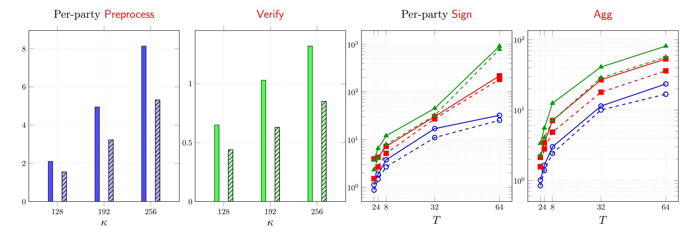
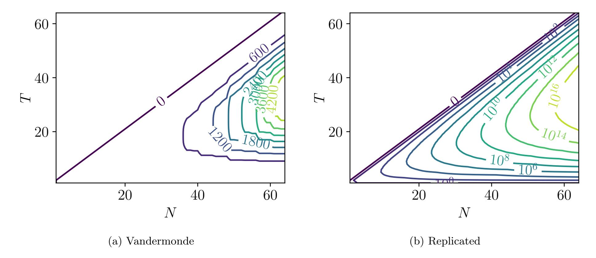

{0}------------------------------------------------

# Hermine: An Efficient Lattice-based FROST-like Threshold Signature

Giacomo Borin1,2, Sofía Celi3,4, Rafael del Pino<sup>5</sup> , Thomas Espitau<sup>5</sup> , Shuichi Katsumata5,6 , Guilhem Niot5,7, Thomas Prest<sup>5</sup> , Kaoru Takemure5,6

> 1 IBM Research - Zurich <sup>2</sup>University of Zurich <sup>3</sup>Brave Research <sup>4</sup>University of Bristol <sup>5</sup>PQShield <sup>6</sup>AIST <sup>7</sup>Univ Rennes, CNRS, IRISA

#### Abstract

Threshold signatures have regained a strong interest recently, driven by applications in cryptocurrencies and NIST's ongoing call for threshold schemes. Among them, FROST— a classical threshold Schnorr signature scheme already in real-world deployment — stands out. Its appeal lies in three core features: partially non-interactive signing, non-interactive identifiable abort (IA), and proactive security. In contrast, while post-quantum (PQ) threshold signatures have seen significant advances in recent years, no existing scheme simultaneously provides even two of these features. Considering the imminent need to migrate to PQ cryptography, this state-of-the-art remains unsatisfactory.

In this work, we propose Hermine, a lattice-based threshold signature that offers the full feature set of FROST under standard lattice assumptions. Hermine is designed to efficiently support the Medium scale of parties (N ≤ 64) as defined in the NIST threshold call, producing a small Raccoon signature of size 11 KB. Our main technical contribution is introducing an everywhere-short secret sharing, which splits a short secret vector s ∈ R<sup>ℓ</sup> <sup>q</sup> into short shares and admits a short linear reconstruction algorithm. While the resulting construction appears intuitive, its security proof requires a non-trivial, fine-grained analysis of the information on s that is inherently leaked by the short shares. Furthermore, we formalize game-based unforgeability and IA definitions with proactive security, which may be of independent interest.

{1}------------------------------------------------

## Contents

| Introduction                                            | 3                                                                                                                  |
|---------------------------------------------------------|--------------------------------------------------------------------------------------------------------------------|
| 1.1<br>Our Contribution                                 | 4                                                                                                                  |
| 1.2<br>Related Work                                     | 6                                                                                                                  |
| 1.3<br>Technical Overview                               | 6                                                                                                                  |
|                                                         | 8                                                                                                                  |
|                                                         | 8                                                                                                                  |
| 2.2<br>Modulus Rounding                                 | 9                                                                                                                  |
| 2.3<br>Hardness Assumptions                             | 10                                                                                                                 |
| 2.4<br>Forking Lemma with Oracle Access                 | 11                                                                                                                 |
| Two-Round Threshold Signatures with Proactive Security  | 12                                                                                                                 |
| 3.1<br>Syntax                                           | 12                                                                                                                 |
| 3.2<br>Security<br>                                     | 13                                                                                                                 |
|                                                         | 14                                                                                                                 |
| 4.1<br>Construction of Vandermonde Secret Sharing<br>   | 14                                                                                                                 |
| 4.2<br>Simulation Security                              | 16                                                                                                                 |
| Hermine: A FROST-like Two-round Threshold Signature     | 24                                                                                                                 |
| 5.1<br>Construction<br>                                 | 24                                                                                                                 |
| Security of Hermine                                     | 25                                                                                                                 |
| 6.1<br>Asymptotic Parameters<br>                        | 25                                                                                                                 |
| 6.2<br>Correctness and Identifiable Abort               | 26                                                                                                                 |
| 6.3<br>Unforgeability                                   | 30                                                                                                                 |
| Instantiation                                           | 44                                                                                                                 |
| Implementation and Evaluation                           | 44                                                                                                                 |
| Comparison with Other Secret Sharing                    | 53                                                                                                                 |
| Optional algorithms of Vandermonde Short Secret Sharing | 53                                                                                                                 |
|                                                         | 54                                                                                                                 |
|                                                         | Preliminaries<br>2.1<br>General Notation<br>An Everywhere-Short Secret Sharing Scheme<br>Detailed Performance Data |

{2}------------------------------------------------

## <span id="page-2-0"></span>1 Introduction

A T-out-of-N threshold signature scheme allows a signing key to be distributed among a set of N parties such that any subset of T parties can jointly generate a signature. Crucially, no adversary controlling up to T −1 parties can forge a signature, making them an essential primitive for distributing trust. Threshold signature have regained a strong interest recently, driven by the advent of blockchain technologies, cryptocurrencies, and NIST's call for threshold schemes [\[BP23,](#page-47-0) [BD22\]](#page-46-0). To date, numerous proposals for threshold signatures compatible with ECDSA, Schnorr, BLS, and including, post-quantum signatures have been developed.

Classical state-of-the-art. FROST [\[KG20\]](#page-50-0) (and variants thereof [\[BCK](#page-46-1)<sup>+</sup>22, [RRJ](#page-51-0)<sup>+</sup>22, [CGRS23\]](#page-48-0)) stands as the state-of-the-art for threshold Schnorr signatures. It has been codified in an IRTF RFC [\[CKGW24\]](#page-48-1), submitted to the NIST workshop on multi-party threshold cryptography [\[Kom26\]](#page-50-1), and has been already deployed in various real-world systems [\[Zca25,](#page-52-2) [Cha25,](#page-48-2) [Sol26,](#page-52-3) [Pen25\]](#page-51-1). What makes FROST standout in practice is its three core features:

- 1. Partially non-interactive signing: The signing protocol consists of two rounds with the first round being independent of both the signer set and the message. This allows the first round to be performed in an offline pre-processing phase, making the online phase non-interactive [\[BD22,](#page-46-0) Section 5.3.5].
- 2. Non-interactive identifiable abort (IA): If the signing protocol fails to produce a valid signature, FROST enables a non-interactive identification of the malicious party from the transcript alone. Concretely, the validity of the partial signatures produced by individual parties can be locally verified.
- 3. Proactive security: FROST naturally supports proactive security against mobile adversaries [\[BP23,](#page-47-0) Section 9.2.2], who may progressively corrupt different parties across multiple executions of the protocol.[1](#page-2-1) Even if the partial signing keys of T − 1 parties are compromised over time, the parties can "refresh" their shares. This ensures security even if more than T − 1 parties are corrupted during the entire lifespan of the signing key, provided fewer than T are corrupted within any single epoch.

Despite these advantages, one main limitation of FROST is that it only offers classical security and is vulnerable to quantum computers. The recent NIST PQC standardization efforts [\[ACD](#page-46-2)+22] and the Ethereum Foundation's commitment to post-quantum (PQ) cryptography [\[Dra26\]](#page-48-3) underscore the need to prepare a PQ secure threshold signature scheme capable of replacing FROST.

PQ threshold signatures. Lattice-based threshold signatures have evolved rapidly in recent years, starting from theoretical constructions utilizing heavy primitives like fully homomorphic encryption and trapdoor homomorphic commitments [\[BGG](#page-47-1)+18, [ASY22,](#page-46-3) [GKS24\]](#page-50-2), to more practical designs [\[DKM](#page-48-4)+24, [EKT24,](#page-49-0) [KRT24,](#page-50-3) [BKL](#page-47-2)+25, [ENP24,](#page-49-1) [PKN](#page-51-2)+25, [CATZ24,](#page-47-3) [ZT25,](#page-52-4) [CdPE](#page-47-4)+26, [BdCE](#page-46-4)+26]. We can roughly group recent designs into three generations.

The first generation is the threshold signature scheme TRaccoon by del Pino et al. [\[DKM](#page-48-4)+24]. This was the first practical lattice-based threshold signature based on the signature scheme Raccoon [\[dPEK](#page-48-5)+23, [dPKPR24\]](#page-48-6), submitted to the additional NIST call for signature proposals [\[NIS22\]](#page-51-3). To get around latticespecific issues (cf. [\[DKM](#page-48-4)<sup>+</sup>24, Sec. 2.2]), they introduce a technique called masking. Informally, the signers use a one-time additive mask in a way that allows individual signers to hide their responses while preserving correctness. This technique was later used by [\[EKT24,](#page-49-0) [KRT24,](#page-50-3) [BKL](#page-47-2)<sup>+</sup>25, [ZT25\]](#page-52-4), constructing variants of TRaccoon with different tradeoffs in round complexity, communication costs, and security. For instance, the signing protocol of [\[EKT24\]](#page-49-0) is partially non-interactive similar to FROST. However, due to masking, these schemes lack the mechanism to prevent misbehaving signers from causing the signing protocol to fail. Without it, a malicious party can covertly mount a DoS attack so that no signatures are ever generated.

The second generation addresses malicious behavior by achieving either robustness [\[ENP24\]](#page-49-1) or IA [\[PKN](#page-51-2)<sup>+</sup>25]. The Pelican scheme [\[ENP24\]](#page-49-1), based on the hash-and-sign signature Plover [\[EEN](#page-49-2)<sup>+</sup>24], provides robustness guaranteeing a valid signature even if some parties misbehave — but requires a high overhead of at least 3T

<span id="page-2-1"></span><sup>1</sup>We note that there are various ways to formalize "proactive security", and we intentionally keep it abstract in the introduction.

{3}------------------------------------------------

active signers. In a typical execution where all T parties behave honestly, this overhead incurs a high cost without any benefit. In contrast, Unmasked TRaccoon [PKN+25] adds IA to vanilla TRaccoon [DKM+24]. When TRaccoon fails to output a signature, the parties run a lattice-based non-interactive zero-knowledge proof (NIZK) to prove that they generated their partial signatures correctly. However, as TRaccoon's (non-algebraic) masking prevents the use of an efficient lattice-based (algebraic) NIZK, [PKN+25] runs an *interactive* IA protocol to remove the mask, rendering it cumbersome for real-world deployment.

The third generation is threshold signatures focusing on compatibility with the NIST-standardized lattice-based signature ML-DSA [CdPE+26, BdCE+26]. However, to maintain compatibility with the standard, these schemes are either restricted to a very small number of parties (e.g.,  $N \leq 6$ ) or suffer from extreme round complexity (ranging from tens to hundreds of rounds). Moreover, as the threshold implementation of ML-DSA requires to execute the notorious rejection sampling step, achieving an efficient IA is highly non-trivial. Roughly speaking, an honest party has a non-negligible chance of rejecting and restarting its signing execution, which is indistinguishable from a malicious party intentionally failing the protocol.

In summary, despite significant advancements in lattice-based threshold signatures, we have yet to see a scheme that satisfies both partially non-interactive signing and non-interactive IA, let alone proactive security. This leads to the main question of our work:

 ${\it Can\ we\ construct\ a\ lattice-based\ threshold\ signature\ that\ supports\ all\ the\ core\ features\ offered\ by\ {\it FROST\,?}}$ 

#### <span id="page-3-0"></span>1.1 Our Contribution

In this work, we present Hermine, an efficient lattice-based threshold signature scheme that achieves the three core features of FROST: partially non-interactive signing, non-interactive identifiable abort (IA), and proactive security. Hermine is compatible with the Raccoon signature scheme [dPEK<sup>+</sup>23, dPKPR24], producing a signature of size 11 kB. A comparison with other lattice-based threshold signature schemes is provided in Table 1.

Hermine is designed to support the Medium scale of parties (i.e.,  $N \le 64$ ), as defined in the NIST call for threshold schemes [BP23, Table 17]. While certain applications may require Large ( $N \le 1024$ ) or Enormous ( $N \ge 1025$ ) party sets, many real-world deployments of threshold signatures operate within the Medium range [Zca25, DF125, BCC+23]. We implemented Hermine in Golang (see Section 8) and show that all protocol phases admit concrete runtimes in the millisecond range, including per-party online signing, for all supported security levels and many thresholds. Notably, compared to the state-of-the-art two-round schemes of Ringtail [BKL+25] and EKT [EKT24] in the Medium scale, our signature generation significantly outperforms their performances by removing the need to generate the masks, requiring intense hash computations.

At a high level, Hermine removes the masking from the two-round TRaccoon threshold signature by Espitau et al. [EKT24, ZT25] to enable efficient non-interactive IA similar to FROST. Our technical contribution lies in the use of an *everywhere-short* secret sharing scheme (SSS) that splits a *short* secret vector  $\mathbf{s} \in \mathcal{R}_q^{\ell}$  into *short* shares, which admits a *short* linear reconstruction algorithm (i.e.,  $\mathbf{s}$  can be reconstructed by simply summing the short shares).

While using everywhere-short SSS to remove the masking appears intuitive (or will so once reading the technical overview in Section 1.3), the security analysis of Hermine proves to be highly non-trivial, requiring a careful analysis of the specific SSS structure. The main challenge is that short secret shares leak information on the short signing key  $\mathbf{s} \in \mathcal{R}_q^{\ell}$ . For instance, a party might hold a short share  $\mathbf{v} = \mathbf{s} + \mathbf{s}_i$  where  $\mathbf{s}_i$  is a short vector. Because  $\mathbf{s}_i$  is short,  $\mathbf{v}$  leaks non-trivial information of  $\mathbf{s}$ ; the difficulty lies in the fact that the reduction must now simulate  $\mathbf{v}$  without knowing the secret  $\mathbf{s}$ . This type of reduction is unique to our setting, as most prior lattice-based cryptography employ a not-everywhere short secret sharing [LST18, BGG<sup>+</sup>18, DLN<sup>+</sup>21, ASY22, CCK23, CATZ24], and assume shares  $\mathbf{s}_i$  are sampled uniformly at random over  $\mathcal{R}_q^{\ell}$ . Our proof consists of carefully tracking the shares of the everywhere-short SSS and arguing that a non-trivial portion of the signing key  $\mathbf{s}$  remains secure. Concretely, we use the algebraic

{4}------------------------------------------------

Table 1: Lattice-based threshold signatures supporting (partial) features offered by FROST.

<span id="page-4-0"></span>

| Scheme                         | $\begin{aligned} \mathbf{Rounds} \ \mathrm{(Off+On)} \end{aligned}$ | ${\bf Size}({\bf KB})$ |             | ${\bf Size}({\bf KB})$ |                    | Size(KB)     |  | # Parties | Handling of | Proactive |
|--------------------------------|---------------------------------------------------------------------|------------------------|-------------|------------------------|--------------------|--------------|--|-----------|-------------|-----------|
|                                |                                                                     | Sig.   Com.            |             |                        | malicious parties  | Security     |  |           |             |           |
| Pelican [ENP24]                | (0 + 4)                                                             | 12.3                   | 26.8 + 56T  | М                      | Robust             | X            |  |           |             |           |
| Pelican [ENP24]                | (0+4)                                                               | 26.4                   | 53.8 + 116T | L                      | Robust             | X            |  |           |             |           |
| Unmasked TRaccoon[ $PKN^+25$ ] | (0 + 3)                                                             | 12.7                   | 28.2        | L                      | NIZK-based IA      | X            |  |           |             |           |
| EKT [EKT24, ZT25]              | (1+1)                                                               | 10.8                   | 276         | L                      | ×                  | X            |  |           |             |           |
| CTZ [CATZ24]                   | (1 + 1)                                                             | 440                    | $\geq MBs$  | M                      | X                  | X            |  |           |             |           |
| Ringtail [BKL <sup>+</sup> 25] | $(1+1)^\dagger$                                                     | 13.7                   | 613         | L                      | X                  | X            |  |           |             |           |
| Olingo [GHK <sup>+</sup> 25]   | $(0+3)^{\ddagger}$                                                  | $\approx 10$           | $\geq MBs$  | L                      | NIZK-based IA      | X            |  |           |             |           |
| Hermine                        | (1 + 1)                                                             | 11.3                   | 73.2        | M                      | Non-Interactive IA | $\checkmark$ |  |           |             |           |

The naming convention Medium (M) and Large (L) follow from [BP23, Table 17], indicating the scheme supports  $N \leq 64$  and  $N \leq 1024$  parties, respectively. "Non-interactive IA" implies the existence of a partial verification algorithm similarly to FROST. All schemes are based on MLWE and MSIS. †: Ringtail additionally requires the signer set as input in the offline phase. ‡: [GHK<sup>+</sup>25] achieves (2 + 1) in the sequential setting. See Section 1.2 for the details.

one-more MISIS (AOM-MISIS) problem [EKT24, ZT25], known to be as hard as the standard MSIS and MLWE problems to complete the proof.

For the concrete choice of the everywhere-short SSS, we introduce Vandermonde secret sharing, built on the scheme by Desmedt, Di Crescenzo, and Burmester [DDB95]. While we could have built on other popular secret sharing schemes common in the lattice-based literature, e.g., replicated secret sharing and those by Benaloh and Leichter [BL90], we observed that they mainly consider asymptotic efficiency and security. Notably, we demonstrate that Vandermonde sharing concretely outperforms all previous choices for the Medium scale of parties (i.e.,  $N \leq 64$ ), even if it performs asymptotically worse. We believe this analysis is of independent interest for general lattice-based cryptography relying on short secret sharing.

Next, relying on the linear homomorphism of Vandermonde secret sharing, we endow Hermine with proactive security via a key refresh mechanism<sup>2</sup>. This involves adding a fresh Vandermonde secret sharing of the zero vector  $\mathbf{0} \in \mathcal{R}_q^\ell$  to existing shares. A subtle issue arises in the security proof when handling malicious key refresh. Namely, since the adversary can influence how shares are updated, the secret shares of honest parties may deviate from an "honest" distribution. This stands in contrast to threshold signatures without proactive security, where the state of honest parties is sampled by the reduction, and adds another layer of complexity to the above proof.

Lastly, we provide a formal game-based definition for unforgeability and non-interactive IA with proactive security. For unforgeability, we extend strong unforgeability from [NT24] to the proactive setting, with a focus on TS-UF-2 security from [BCK $^+$ 22]. Roughly, we require unforgeability to hold provided that fewer than T parties are corrupted in any given epoch, where an epoch increments following the execution of an honest key refresh. Here, we consider a strong notion of unforgeability where even malicious key refreshes can be injected within epochs. In contrast, defining non-interactive IA with proactive security proves to be more subtle. Breaking IA becomes trivial if malicious key refreshes are permitted without constraint; for instance, an adversary could corrupt an honest party's share during a refresh, causing their subsequent partial signature to fail verification. While we could restrict the game to permit only honest key refreshes, such a definition is of limited value in practice. Instead, we explicitly incorporate a mechanism for honest parties to efficiently and non-interactively detect malicious refreshes that would trivially break IA, and our definition permits only those key refreshes that pass this detection. We believe our pragmatic definition of

<span id="page-4-1"></span><sup>&</sup>lt;sup>2</sup>We note that any linearly homomorphic everywhere-short SSS would suffice. We use Vandermonde for the explanation simply because Hermine uses it.

{5}------------------------------------------------

proactive IA to be of independent interest.

### <span id="page-5-0"></span>1.2 Related Work

Distributed key generation (DKG) for Hermine. In this work, we assume a trusted dealer for key generation. To relax this restriction, one could employ distributed key generation. An approach is to leverage verifiable short secret sharing used in [ENP24]. Specifically, each party samples a random short vector and generates Vandermonde secret shares of it. After that, it sends shares to corresponding signers along with the proof ensuring the shortness of the sampled vector and the correct generation of the shares. We leave the concrete security analysis of this DKG for future work. There is a DKG protocol tailored to replicated secret sharing which was proposed by [BdCE<sup>+</sup>26]. Whether this DKG can be extended to Vandermonde secret sharing is an open problem.

Proactive security. There is an extensive literature on proactive security [OY91], in the context of, e.g., secret sharing (PSS) [HJKY95, CKLS02, SLL08, MZW<sup>+</sup>19, ELL20, VAFB22, YXXM23, FNR23], threshold RSA [FGMY97, Rab98, FMY99, FMY01, JS05, ADN06, JO08], threshold ECDSA [CGG<sup>+</sup>20, CCL<sup>+</sup>21, KGG24], DL based schemes [HJJ<sup>+</sup>97, KMOS21], BLS based ones [Bol03, GJM<sup>+</sup>24]. Cimatti et al. [CDG<sup>+</sup>24] considered FROST in a dynamic setting where the number of users and the reconstruction threshold can be changed via refresh, though they do not provide any formal security definition. Boneh et al. [BPR24] provides formal game-based definitions capturing proactive security for accountable threshold signatures. This definition is closest to ours but differs in how to model malicious key refreshes; while we provide explicit algorithms to check for an invalid refresh, they model it implicitly.

Concurrent and independent work. [GHK+25] constructs a threshold signature scheme Olingo using linearly homomorphic encryptions, and achieve IA by enforcing every party to prove correct computation using NIZKs. Olingo satisfies offline-online efficiency with a 2-round offline phase in the sequential setting (i.e., parties cannot participate in more than one session at a given time).

#### <span id="page-5-1"></span>1.3 Technical Overview

We provide a high-level overview of Hermine. Throughout this section, we omit subtle details (e.g., bit-dropping) to focus on the core intuition.

The underlying Raccoon signature. Raccoon [dPEK<sup>+</sup>23, dPKPR24] is a variant of Lyubashevsky's lattice-based signature scheme [Lyu09, Lyu12], which removes rejection sampling by exploiting the noise flooding technique [GKPV10, ASY22]. The verification key vk consists of a matrix  $\mathbf{A} \in \mathcal{R}_q^{k \times \ell}$  and a vector  $\mathbf{t} = \mathbf{A} \cdot \mathbf{s} + \mathbf{e}$  for short vectors  $(\mathbf{s}, \mathbf{e}) \in \mathcal{R}_q^{\ell} \times \mathcal{R}_q^k$ . To sign a message msg, the signing algorithm proceeds as follows:

- 1. Generate a commitment  $\mathbf{w} = \mathbf{A} \cdot \mathbf{r} + \mathbf{e}'$  for short vectors  $\mathbf{r}$  and  $\mathbf{e}'$ ,
- 2. Compute the challenge  $c = H_c(\mathsf{vk}, \mathsf{msg}, \mathbf{w})$  and output the signature  $(c, \mathbf{z}, \mathbf{h})$ , where  $\mathbf{z} = c \cdot \mathbf{s} + \mathbf{r}$  and  $\mathbf{h} = \mathbf{w} \mathbf{A} \cdot \mathbf{z} + c \cdot \mathbf{t}$ . Here,  $H_c$  is a random oracle outputting a small element  $c \in \mathcal{R}_q$ .

The verification algorithm consists of checking that  $\mathbf{z}$  and  $\mathbf{h}$  are short, and that  $\mathbf{A} \cdot \mathbf{z} = c \cdot \mathbf{t} + \mathbf{w} - \mathbf{h}$  holds. The above structure is analogous to the classical Schnorr signature by noting  $\mathbf{A} \cdot \mathbf{z} \approx c \cdot \mathbf{t} + \mathbf{w}$ .

**Insecure two-round threshold** Raccoon. We now explain a naive (and insecure) way to adapt Raccoon to the threshold setting following FROST [KG20], which yields a two-round threshold Schnorr signature.

The signing key  $\mathbf{s}$  is distributed among N parties using Shamir's secret sharing such that  $\mathbf{s} = \sum_{i \in \mathsf{act}} L_{\mathsf{act},i}$ .  $[\![\mathbf{s}]\!]_i$  for any signer set  $\mathsf{act} \in [N]$  of size T, where  $L_{\mathsf{act},i}$  is the corresponding Lagrange coefficient. The partial verification key for party  $i \in [N]$  is set to  $\mathsf{vk}_i = \mathbf{A} \cdot [\![\mathbf{s}]\!]_i + \mathbf{e}_i$  for a short vector  $\mathbf{e}_i$ . The signing protocol proceeds as follows:

Offline phase: Party  $i \in [N]$  outputs a vector of commitments  $\overrightarrow{\mathbf{w}}_i = [\mathbf{w}_{i,1}| \cdots | \mathbf{w}_{i,\text{rep}}]$  such that  $\mathbf{w}_{i,b} = \mathbf{A} \cdot \mathbf{r}_{i,b} + \mathbf{e}'_{i,b}$  for short  $\mathbf{r}_{i,b}$  and  $\mathbf{e}'_{i,b}$ . Importantly, this phase is independent of msg and the signer set act.

{6}------------------------------------------------

Online phase: Once given msg, act, and  $(\overrightarrow{\mathbf{w}}_j)_{j\in\mathsf{act}}$ , party i first computes  $(\beta_b)_{b\in[\mathsf{rep}]} = H_\beta(\mathsf{vk}, \mathsf{act}, \mathsf{msg}, (\overrightarrow{\mathbf{w}}_j)_{j\in\mathsf{act}})$ . Here,  $H_\beta$  is a random oracle outputting a list of small elements  $\beta_b \in \mathcal{R}_q$ . It then aggregates the vectors of commitments as  $\mathbf{w} = \sum_{j\in\mathsf{act}} \sum_{b\in[\mathsf{rep}]} \beta_b \cdot \mathbf{w}_{j,b}$  and computes the challenge  $c = H_c(\mathsf{vk}, \mathsf{msg}, \mathbf{w})$ . Lastly, it outputs a partial signature  $\mathbf{z}_i = c \cdot L_{\mathsf{act},i} \cdot [\![\mathbf{s}]\!]_i + \sum_{b\in[\mathsf{rep}]} \beta_b \cdot \mathbf{r}_{i,b}$ .

**Aggregation:** The aggregator computes  $\mathbf{z} = \sum_{i \in \mathsf{act}} \mathbf{z}_i$ ,  $\mathbf{h} = \mathbf{w} - \mathbf{A} \cdot \mathbf{z} + c \cdot \mathbf{t}$ , and outputs the signature  $(c, \mathbf{z}, \mathbf{h})$ .

It is easy to check that the scheme is functionally correct, satisfying Raccoon's verification algorithm. Above, the vectorization of the commitments  $\overrightarrow{\mathbf{w}}_i$  and their aggregation via random weights directly mirror FROST; the only minor difference is how rep and the weights  $\beta_b$  are chosen (see [EKT24] for the details).<sup>3</sup>

However, on closer inspection, there are two key issues with the above scheme. First, as already observed in the original paper on TRaccoon [DKM<sup>+</sup>24, Sec. 2.2], the partial signature  $\mathbf{z}_i$  leaks too much information about  $[\![\mathbf{s}]\!]_i$ , since the Lagrange coefficient  $L_{\mathsf{act},i}$  is highly structured and can be arbitrarily large over mod q. Second, while a partial verification key  $\mathsf{vk}_i = \mathbf{A} \cdot [\![\mathbf{s}]\!]_i + \mathbf{e}_i$  exists, it is unclear how this aids in achieving non-interactive IA as in FROST. The main issue is that the partial signature  $\mathbf{z}_i$  is large and does not satisfy Raccoon's verification algorithm.

Partial solutions to the issue. Two approaches are known to overcome the first issue. One approach is the masking technique used by TRaccoon [DKM<sup>+</sup>24], later adopted by numerous other works [EKT24, KRT24, BKL<sup>+</sup>25, ZT25]. The key idea is to non-interactively generate a secret share of the zero vector and add it to the partial signature  $\mathbf{z}_i$ . Intuitively, the individual partial signatures no longer leak any information other than the fact that they aggregate to a valid signature  $\mathbf{z}$ . The other approach is replacing the Shamir secret sharing scheme with a different secret sharing scheme which admits a *short* linear reconstruction algorithm. Concretely, [CATZ24] relies on the secret sharing of Benaloh and Leichter [BL90] so that a partial signature roughly looks like  $\mathbf{z}_i = c \cdot M_{\text{act},i} \cdot [\![\mathbf{s}]\!]_i + \sum_{b \in [\text{rep}]} \beta_b \cdot \mathbf{r}_{i,b}$  for a reconstruction coefficient  $M_{\text{act},i} \in \{0,1\}$ .<sup>4</sup>

Unfortunately, both approaches were unable to solve the second issue of non-interactive IA. While [CATZ24] came close, the shares  $[\![\mathbf{s}]\!]_i$  are still arbitrarily large over  $\mathcal{R}_q$ , and therefore, the validity of the partial signature  $\mathbf{z}_i$  cannot be checked non-interactively without resorting to heavy tools like NIZKs.

Using an everywhere-short secret sharing. In our work, we solve the second issue with a natural idea: we rely on a secret sharing scheme that outputs a *short* share — combined with the original secret being *short* and the reconstruction coefficient being *small*, we call this an "everywhere-short" secret sharing. Note that since the partial signature  $\mathbf{z}_i$  remains short, parties can locally run the Raccoon verification algorithm, checking  $\mathbf{A} \cdot \mathbf{z}_i \approx c \cdot M_{\mathsf{act},i} \cdot \mathsf{vk}_i + \sum_{b \in [\mathsf{rep}]} \beta_b \cdot \mathbf{w}_{i,b}$ ; if verification fails, party i is identified as the one who caused the aggregated signature to be invalid.

The question then becomes: what is the optimal way to construct an everywhere-short secret sharing? For this, we revisit the secret sharing scheme from Desmedt, Di Crescenzo, and Burmester [DDB95], which has been recently used by Battagliola et al. [BBD<sup>+</sup>25] in the context of secret sharing in a (non-abelian) group. In essence, this is an algorithmic interpretation of Vandermonde's identity, based on the same combinatorial decomposition which states that for  $0 \le b \le N$ :

<span id="page-6-2"></span>
$$\binom{N}{T} = \sum_{k=0}^{T} \binom{b}{k} \cdot \binom{N-b}{T-k}.$$
 (1)

Intuitively, Eq. (1) implies that for any set of T selected parties among N parties, when we split the set of parties into two halves (taking  $b = \lfloor N/2 \rfloor$  in order to minimize complexity), one half will have k selected parties for some  $0 \le k \le T$ , while the other half will have exactly T - k selected parties. Thus, in the non-everywhere short setting, the core idea of this sharing is, for each possible  $0 \le k \le T$ , to share the secret  $s \in \mathcal{R}_q^{\ell}$  into two uniformly random sub-secrets  $s_0$  and  $s - s_0$ , one for each half, with thresholds k and T - k

<span id="page-6-0"></span><sup>&</sup>lt;sup>3</sup>More precisely, this aligns with FROST2 as all parties use the same weights to aggregate each signer's commitments. Since FROST2 is known to achieve TS-UF-2 [BCK<sup>+</sup>22], Hermine achieves the same security level.

<span id="page-6-1"></span><sup>&</sup>lt;sup>4</sup>To be precise, the secret sharing requires each party to contribute more than one share for reconstruction, so  $\mathbf{z}_i$  will contain a sum of them as opposed to a single  $[\![\mathbf{s}]\!]_i$ .

{7}------------------------------------------------

respectively, and recursively share these sub-secrets within each half. For example, in a 2-out-of-4 setting, parties 1, 2, 3, and 4 hold (s0, s1), (s0, s − s1), (s − s0, s2), and (s − s0, s − s2), respectively — it is easy to check that any two parties can reconstruct s.

Our core modification for keeping the individual shares short is simple in hindsight and consists of sharing the secret s in two halves s<sup>0</sup> and s−s<sup>0</sup> in the recursion step, with s<sup>0</sup> being sampled from a short distribution instead of the classical uniform one. We can prove recursively that the shares will preserve a short norm and that the reconstruction coefficients are in {0, 1} as desired. We call this the Vandermonde secret sharing scheme.

We note that this modification of keeping the shares small can be applied to other popular secret sharing schemes common in the lattice-based literature, e.g., replicated secret sharing and those by Benaloh and Leichter [\[BL90\]](#page-47-6). However, as we see in Section [A,](#page-52-0) Vandermonde sharing concretely outperforms all previous choices for the Medium scale of parties (i.e., N ≤ 64).

Short shares are inherently leaky. While correctness is clear from construction, what makes Vandermonde secret sharing non-trivial is its privacy property. Since the secret s is shared in two halves s<sup>0</sup> and s<sup>1</sup> = s − s<sup>0</sup> with a short s0, it is no longer a proper secret sharing. Indeed, if |s0| ≪ |s|, the party holding s<sup>1</sup> learns almost all information about s! Conversely, we can take |s0| ≫ |s| to statistically "flood" the information on s from s<sup>1</sup> [\[GKPV10\]](#page-50-12). However, this leads to an impractical scheme since it necessitates using an exponentially large modulus q to argue that the shares s<sup>0</sup> and s<sup>1</sup> are (relatively) short.

Taming the leak. In this work, we carefully control the minimal noise s<sup>0</sup> that needs to be added to the secret s so that the share s<sup>1</sup> does not leak too much information about s. To be more precise, our main technical contribution consists of answering the following questions:

- <span id="page-7-2"></span>(Q.1) How much information leaks from the secret shares held by a set of parties of size at most T − 1?
- <span id="page-7-3"></span>(Q.2) How much information on s can leak while maintaining the security of Hermine?

Observe that the answer to Item [\(Q.1\)](#page-7-2) is specific to the considered secret sharing scheme. We have to consider the worst-case party set S <sup>∗</sup> ⊂ [N] with |S ∗ | ≤ T − 1 that minimizes the conditional min-entropy of s, i.e., H∞(s | all shares of party i ∈ S ∗ ). For our Vandermonde secret sharing, we tackle this by explicitly writing down the necessary leakage L(s) on the secret s to construct an efficient algorithm SimShares(L(s)) that perfectly simulates the secret shares for all the parties in S ∗ . This indirectly proves that the conditional min-entropy of s is lower bounded by H∞(s | L(s)).

Regarding Item [\(Q.2\),](#page-7-3) proving Hermine unforgeable requires the reduction to simulate the adversary's view without knowledge of the secret s – which includes the corruption queries, but also the signing queries. While the former is intrinsically tied to Item [\(Q.1\),](#page-7-2) the latter introduces a new challenge: the reduction must simulate the partial signatures of honest parties, which are generated using their secret shares. However if SimShares generated shares for all honest parties, it could combine these with the corrupted shares to reconstruct s, contradicting the privacy guarantee of s. To resolve this dilemma, we strengthen SimShares so that given any set of T parties, it can generate all their shares except one, designated as the "secure" share. The reduction can then simulate the partial signatures of honest parties with the non-secure shares. The partial signature of the honest party with the secure share will be simulated relying on the AOM-MISIS problem; this simulation is similar to those used in prior works [\[EKT24,](#page-49-0) [ZT25\]](#page-52-4).

Lastly, while this strategy suffices for TS-UF-0 security, additional subtleties arise when proving the stronger TS-UF-2 security, as the adversary can obtain a small number of partial signatures on the message to be forged. We cover this by adding a mechanism to require SimShares to prevent a share used in those partial signatures from being the secure share.

## <span id="page-7-0"></span>2 Preliminaries

## <span id="page-7-1"></span>2.1 General Notation

We assume familiarity with Landau's asymptotic notations: O(n), o(n), ω(n), Ω(n), a(n) ∼ b(n), and Knuth's Theta notation Θ(n). We denote the empty string by ε.

{8}------------------------------------------------

**Sets and distributions.** For an integer N > 0, we note  $[N] = \{1, ..., N\}$ . For a lexicographically ordered set  $P \subset [N]$ , we denote the *i*-th element in P by P[i] and the subsequence of P consisting of the elements from the *i*-th element to the *j*-th element by P[i...j]. To denote the assign operation, we use y := f(x) when f is deterministic and  $y \leftarrow f(x)$  when randomized. When S is a finite set, we note  $\mathcal{U}(S)$  the uniform distribution over S, and shorthand  $x \overset{\$}{\leftarrow} S$  for  $x \leftarrow \mathcal{U}(S)$ .

**Algorithms.** We use functions  $\mathbf{require}(b)$  in individual algorithms and games for checking a boolean statement. If b is false,  $\mathbf{require}$  makes the algorithm immediately return 0. Also, it aborts the entire game and returns 0 if b is false.

**Linear algebra.** For a fixed power-of-two n, we note  $\mathcal{K} = \mathbb{Q}[x]/(x^n+1)$  and  $\mathcal{R} = \mathbb{Z}[x]/(x^n+1)$ , and  $\mathcal{R}_q = \mathcal{R}/(q\mathcal{R})$ . We assume q to be odd. Given  $\mathbf{x} \in \mathcal{K}^{\ell}$ , we denote  $\|\mathbf{x}\|$  the Euclidean norm, and  $\|\mathbf{x}\|_{\infty}$  the infinity norm of the  $(n \ell)$ -dimensional vector of the coefficients of  $\mathbf{x}$ . For elements in  $\mathbb{Z}_q$  and  $\mathcal{R}_q$ , the absolute value and norms are defined using the representative with coefficients in (-q/2, q/2]. Unless specified otherwise, vectors are treated as *column* vectors. We note the set of all signed monomials  $\mathbb{T} \coloneqq \{\pm 1, \pm x, \dots, \pm x^{n-1}\} \subseteq \mathcal{R}_q$ . We recall the following lemma, establishing the invertibility for  $\mathbb{T}$  (see [BCK<sup>+</sup>14]).

<span id="page-8-5"></span>**Lemma 2.1.** For any distinct  $\beta_1, \beta_2 \in \mathbb{T}$ ,  $\beta_1 - \beta_2$  is invertible over  $\mathcal{R}_q$  and  $\|2 \cdot (\beta_1 - \beta_2)^{-1}\|_{\infty} \leq 1$ .

**Definition 2.2 (Discrete Gaussians).** For  $\sigma > 0$ ,  $\mathbf{c} \in \mathbb{R}^N$ , let  $\rho_{\sigma,\mathbf{c}}(\mathbf{x}) = \exp(-\|\mathbf{x} - \mathbf{c}\|^2/(2\sigma^2))$ . For any countable set  $S \subset \mathbb{R}^N$ , let  $\rho_{\sigma,\mathbf{c}}(S) = \sum_{\mathbf{x} \in S} \rho_{\sigma,\mathbf{c}}(\mathbf{x})$ . We define the discrete Gaussian distribution  $D_{S,\sigma,\mathbf{c}}$  (also denoted  $\mathcal{D}_{S,\sigma,\mathbf{c}}$ ) via  $D_{S,\sigma,\mathbf{c}}(\mathbf{x}) = \rho_{\sigma,\mathbf{c}}(\mathbf{x})/\rho_{\sigma,\mathbf{c}}(S)$ . We omit  $\mathbf{c}$  when  $\mathbf{c} = \mathbf{0}$ . We may omit S when clear from context. We extend this definition to sets  $S \subseteq \mathcal{K}$  (resp.  $S \subseteq \mathcal{K}^k$ ) by identifying polynomials with their coefficient vectors in  $\mathbb{R}^n$  (resp.  $\mathbb{R}^{nk}$ ).

We now recall useful convolution and tail-bound lemmata.

<span id="page-8-3"></span>Lemma 2.3 (Simplified convolution lemma [Pei10, Thm. 4.5]). Let positive reals  $\sigma_1, \sigma_2$  such that  $\sigma_1^{-2} + \sigma_2^{-2} \leq \eta'_{\varepsilon}(\mathbb{Z}^n)^{-2}$  for some positive  $\varepsilon \leq 1/4$ . Then the distribution  $D_{\mathbb{Z}^n, \sigma_1} + D_{\mathbb{Z}^n, \sigma_2}$  is within statistical distance  $8\varepsilon$  of  $D_{\mathbb{Z}^n, \sqrt{\sigma_1^2 + \sigma_2^2}}$ .

<span id="page-8-4"></span>Lemma 2.4 (Lemma 4.4 in [Lyu12], extended). For any  $\alpha > 1$ , and any lattice  $\Delta \subseteq \mathbb{R}^n$ ,

$$\Pr[\|\mathbf{z}\| > \alpha \sigma \sqrt{n} \mid \mathbf{z} \leftarrow \mathcal{D}_{\Delta, \sigma}] \leqslant C^n$$

where  $C = \alpha \cdot e^{\frac{1}{2}(1-\alpha^2)} < 1$ . In particular, if  $(\alpha \geqslant 1 + \frac{\kappa \log 2}{3n})$  or if  $(\alpha \geqslant 1 + \sqrt{\frac{4\kappa \log 2}{n}})$ , then  $C^n \leqslant 2^{-\kappa}$ .

### <span id="page-8-0"></span>2.2 Modulus Rounding

Let  $\nu \in \mathbb{N}^*$ . Every  $x \in \mathbb{Z}$  admits a unique decomposition  $x = 2^{\nu}x_{\tau} + x_{\perp}$ , with  $x_{\perp} \in [-2^{\nu-1}, 2^{\nu-1} - 1]$ , and we define  $\lfloor \cdot \rceil_{\nu} : \mathbb{Z} \to \mathbb{Z}$  by

$$\lfloor x \rceil_{\nu} = x_{\top} = \lfloor x/2^{\nu} \rceil, \qquad \lfloor t \rceil = \lfloor t + \frac{1}{2} \rfloor \text{ (half-up)}.$$

If  $q > 2^{\nu}$ , we extend  $\lfloor \cdot \rceil_{\nu}$  to  $\mathbb{Z}_q$  by lifting  $x \mapsto \bar{x} \in [0, q - 1]$  and setting  $\lfloor x \rceil_{\nu} = \lfloor \bar{x}/2^{\nu} \rceil \mod q = (\bar{x})_{\top} \mod q$ , and apply it coefficient-wise to vectors. (For later convenience, we view the output as lying in  $\mathbb{Z}_q$ .)

Remark 2.5. Unlike [dEK<sup>+</sup>23, DKM<sup>+</sup>24], which output in  $\mathbb{Z}_{q_{\nu}}$  with  $q_{\nu} = \lfloor q/2^{\nu} \rfloor$ , we keep outputs in  $\mathbb{Z}_{q}$ , yielding tighter error bounds.

We bound the induced error (Lemma 2.6), its behavior under addition (Lemma 2.7); proofs are in ??.

<span id="page-8-1"></span>**Lemma 2.6.** Let  $q, \nu \in \mathbb{N}^*$ , with  $q > 2^{\nu}$ . For  $x \in \mathbb{Z}_q$ ,  $|x - 2^{\nu} \cdot \lfloor x \rceil_{\nu}| \leqslant 2^{\nu-1}$ .

*Proof.* Let  $x \in \mathbb{Z}_q$  and  $\bar{x} \in [0, q-1]$  be its lifting. By definition of the rounding procedure, we have

$$x-2^{\nu}\cdot \lfloor x \rceil_{\nu} = \bar{x}-2^{\nu}\cdot \lfloor \bar{x}/2^{\nu} \rceil \bmod q = \bar{x}-2^{\nu}\cdot \bar{x}_{\scriptscriptstyle \top} \bmod q = \bar{x}_{\scriptscriptstyle \perp} \bmod q.$$

<span id="page-8-2"></span>By construction of the decomposition, we have  $\bar{x}_{\perp} \in [-2^{\nu-1}, 2^{\nu-1} - 1]$ , which concludes the proof.  $\Box$ 

{9}------------------------------------------------

**Lemma 2.7.** Let  $q, \nu \in \mathbb{N}^*$  such that  $q > 2^{\nu}$ . For any  $x, \delta \in \mathbb{Z}_q$ , we have

$$|2^{\nu} \cdot (\lfloor x + \delta \rfloor_{\nu} - \lfloor x \rfloor_{\nu}) - \delta| \leqslant 2^{\nu},$$

where the subtraction inside the rounding operator is performed in  $\mathbb{Z}_q$ .

*Proof.* Let  $x, \delta \in \mathbb{Z}_q$  and  $\bar{x}, \bar{\delta} \in [0, q-1]$  be their liftings. By definition of the rounding procedure, we have

$$\begin{split} 2^{\nu} \cdot \left( \left\lfloor x + \delta \right\rceil_{\nu} - \left\lfloor x \right\rceil_{\nu} \right) - \delta \\ &= 2^{\nu} \cdot \left( \left\lfloor (\overline{x + \delta})/2^{\nu} \right\rceil - \left\lfloor \overline{x}/2^{\nu} \right\rceil \right) - \overline{\delta} \bmod q \\ &= 2^{\nu} \cdot \left( (\overline{x + \delta})_{\top} - \overline{x}_{\top} \right) - \overline{\delta} \bmod q \\ &= (\overline{x + \delta}) - (\overline{x + \delta})_{\bot} - \overline{x} + \overline{x}_{\bot} - \overline{\delta} \bmod q \\ &= \overline{x}_{\bot} - (\overline{x + \delta})_{\bot} \bmod q. \end{split}$$

By construction of the decomposition, we have  $(\overline{x+\delta})_{\perp}, \bar{x}_{\perp} \in [-2^{\nu-1}, 2^{\nu-1} - 1]$ , which concludes the proof.

### <span id="page-9-0"></span>2.3 Hardness Assumptions

Our unforgeability proof relies on the Module Short Integer Solution problem (MSIS) and the Algebraic One-More MSIS problem (AOM-MISIS) introduced in [ZT25]. The latter is a one-more variant of MSIS (in the spirit of the AOM-MLWE problem [EKT24]), and admits hardness reductions from MSIS and MLWE in certain regimes. We recall the definitions below.

**Definition 2.8** (MSIS). Let  $k, \ell, q$  be integers and  $\beta > 0$ . The advantage of  $\mathcal{A}$  against  $\mathsf{MSIS}_{q,k,\ell,\beta}$  is

$$\mathsf{Adv}^{\mathsf{MSIS}}_{\mathcal{A}}(\kappa) = \Pr \Big[ \mathbf{A} \xleftarrow{\$} \mathcal{R}_q^{k \times \ell}, \ \mathbf{s} \xleftarrow{\$} \mathcal{A}(\mathbf{A}) : [\mathbf{A} \ \mathbf{I}] \mathbf{s} = \mathbf{0} \ \land \ 0 < \|\mathbf{s}\|_2 \leq \beta \Big] \ .$$

The  $\mathsf{MSIS}_{q,k,\ell,\beta}$  assumption states that  $\mathsf{Adv}^{\mathsf{MSIS}}_{\mathcal{A}}(\kappa)$  is negligible for any efficient  $\mathcal{A}$ .

**Definition 2.9** (MLWE). Let  $k, \ell, q$  be integers and  $\beta > 0$ . The advantage of  $\mathcal{A}$  against  $\mathsf{MLWE}_{q,k,\ell,\beta}$  is

$$\mathsf{Adv}^{\mathsf{MLWE}}_{\mathcal{A}}(\kappa) = \Big| \Pr[1 \leftarrow \mathcal{A}(\mathbf{A}, [\mathbf{A} \ \mathbf{I}] \mathbf{s})] - \Pr[1 \leftarrow \mathcal{A}(\mathbf{A}, \mathbf{b})] \Big|,$$

where  $(\mathbf{A}, \mathbf{b}, \mathbf{s}) \stackrel{\$}{\leftarrow} \mathcal{R}_q^{k \times \ell} \times \mathcal{R}_q^k \times S$  and  $S = \{\mathbf{x} \in \mathcal{R}^{\ell+k} : ||\mathbf{x}||_{\infty} \leq \beta\}$ . The MLWE<sub>q,k,\ell,\beta</sub> assumption states that this advantage is negligible for any efficient  $\mathcal{A}$ 

Definition 2.10 (Algebraic One-More MSIS (AOM-MISIS) [ZT25]). Let  $k, \ell, q, Q$  be integers,  $\beta_{\mathbf{s}}, \beta_{\mathbf{b}}, \beta_{\mathbf{u}} > 0$ , and  $\sigma_1, \ldots, \sigma_Q > 0$ . The advantage of  $\mathcal{A}$  against AOM-MISIS $_{q,k,\ell,Q,\beta_{\mathbf{s}},\beta_{\mathbf{b}},\beta_{\mathbf{u}},(\sigma_i)_{i\in[Q]}}$  is

$$\mathsf{Adv}^{\mathsf{AOM}\text{-MISIS}}_{\mathcal{A}}(\kappa) = \Pr\Bigl[\mathsf{Game}^{\mathsf{AOM}\text{-MISIS}}_{\mathcal{A}}(1^{\kappa}) = 1\Bigr]\,,$$

where  $\mathsf{Game}_{\mathcal{A}}^{\mathsf{AOM-MISIS}}$  is given in Fig. 1. The corresponding assumption states that this advantage is negligible for any efficient  $\mathcal{A}$ .

<span id="page-9-1"></span>Intuition. The challenger samples short  $\mathbf{s}_i$  and publishes  $\mathbf{t}_i = [\mathbf{A} \ \mathbf{I}] \mathbf{s}_i$ . Oracle  $\mathsf{O}_{\mathsf{PI}}$  returns short preimages of queried combinations  $\mathbf{b}$ , namely  $\sum_i b_i \mathbf{s}_i$ . The adversary must output a *fresh* short preimage  $\mathbf{s}^*$  for  $\sum_i b_i^* \mathbf{t}_i$ , in a way that cannot be "explained" by the oracle queries. The freshness is enforced by an auxiliary  $\mathbf{u}$ : all oracle queries satisfy  $\mathbf{b}^{\top}\mathbf{u} = 0$  while the final vector satisfies  $\mathbf{b}^{*\top}\mathbf{u} \neq 0$ .

{10}------------------------------------------------

```
\begin{aligned} & \frac{\mathsf{O}_{\mathsf{PI}}(\mathbf{b} \in \mathcal{R}_q^Q)}{1: & B \leftarrow B \cup \{\mathbf{b}\} \\ & 2: & \mathbf{return} \sum_{i \in [Q]} b_i \cdot \mathbf{s}_i \in \mathcal{R}_q^{k+\ell} \end{aligned}
\frac{\mathsf{Game}^{\mathsf{AOM\text{-}MISIS}}_{\mathcal{A}}(1^{\kappa})}{1:\ B \leftarrow \emptyset}
  2: \quad \mathbf{A} \overset{\$}{\leftarrow} \mathcal{R}_q^{k \times \ell} 3: \quad \mathbf{for} \ i \in [Q] \ \mathbf{do}
  4: \mathbf{s}_i \leftarrow D_{\mathcal{R}^{k+\ell},0,\sigma_i}; \mathbf{t}_i \leftarrow [\mathbf{A} \ \mathbf{I}] \cdot \mathbf{s}_i
  5: /\!\!/ Obtain solution (\mathbf{s}^*, \mathbf{b}^*, \mathbf{u}) \in \mathcal{R}_q^{k+\ell} \times \mathcal{R}_q^Q \times \mathcal{R}_q^Q
  6: (\mathbf{s}^*, \mathbf{b}^*, \mathbf{u}) \leftarrow \mathcal{A}^{\mathsf{O}_{\mathsf{PI}}}(\mathbf{A}, \{\mathbf{t}_i\}_{i \in [Q]})
  7: if \sum_{i \in [O]} b_i^* \cdot \mathbf{t}_i \neq [\mathbf{A} \ \mathbf{I}] \cdot \mathbf{s}^* \vee \mathbf{b}^{*\top} \cdot \mathbf{u} = 0 then
                     return 0 // Not a non-trivial solution
   8:
   9: if \exists \mathbf{b} \in B \text{ s.t. } \mathbf{b}^{\top} \mathbf{u} \neq 0 \mod q \text{ then}
                     return 0 // Queried combination is orthogonal to u
10:
11: if \|\mathbf{s}^*\|_2 > \beta_{\mathbf{s}} \vee \|(u_1/\sigma_1, ..., u_Q/\sigma_Q)\|_2 > \beta_{\mathbf{u}}
                                                     \vee \|(b_1^*\sigma_1,...,b_Q^*\sigma_Q)\|_{_{1}} > \beta_{\mathbf{b}} \text{ then}
12:
13:
                     return 0 // Solution norms are too large
14: return 1
```

Figure 1: The Algebraic One-More MSIS (AOM-MISIS) security game.

Theorem 2.11 ([ZT25, Theorem 1]). For any  $\varepsilon \in (0,1)$ ,  $\gamma > 1$ , any parameters  $(q, k, \ell, Q, \beta_{\mathbf{s}}, \beta_{\mathbf{b}}, \beta_{\mathbf{u}}, (\sigma_i)_{i \in [Q]})$  such that  $(k + \ell)n \geqslant 2\kappa$  and  $\sigma_i \geqslant \sqrt{\log(6(k + \ell)n)/\pi}$ , and any AOM-MISIS adversary  $\mathcal{A}$ , there exist an adversary  $\mathcal{B}_1$  against  $\mathsf{MSIS}_{q,k,\ell,\beta_{\mathsf{sis}}}$  and two adversaries  $\mathcal{B}_2$  and  $\mathcal{B}_3$  against  $\mathsf{MLWE}_{q,k,\ell-1,\beta_{\mathsf{lwe}}}$ , such that

$$\begin{split} & \mathsf{Adv}^{\mathsf{AOM\text{-}MISIS}}_{\mathcal{A}}(\kappa) \leqslant 2\delta_{\gamma} \left( \mathsf{Adv}^{\mathsf{MSIS}}_{\mathcal{B}_{1}}(\kappa) + \mathsf{Adv}^{\mathsf{MLWE}}_{\mathcal{B}_{2}}(\kappa) + Q \cdot 2^{-2\kappa + 2} \right)^{\frac{\gamma}{\gamma - 1}} + \mathsf{Adv}^{\mathsf{MLWE}}_{\mathcal{B}_{3}}(\kappa), \\ & \textit{where } \delta_{\gamma} = \frac{1 + \varepsilon}{1 - \varepsilon} \cdot \exp((\gamma - 1)\pi^{2}/\log(2(1 + 1/\varepsilon))), \, \beta_{\mathsf{sis}} = \beta_{\mathsf{s}} + \beta_{\mathsf{b}} \sqrt{(k + \ell)n}, \, \beta_{\mathsf{lwe}} = 1/(\beta_{\mathsf{u}} \sqrt{(k + \ell)n \cdot \log(2(1 + 1/\varepsilon))/\pi}), \\ & \textit{and } \mathsf{Time}(\mathcal{B}_{1}), \mathsf{Time}(\mathcal{B}_{2}), \mathsf{Time}(\mathcal{B}_{3}) \approx \mathsf{Time}(\mathcal{A}). \end{split}$$

### <span id="page-10-0"></span>2.4 Forking Lemma with Oracle Access

We recall a variant [EK18] of the forking lemma [PS00, BN06] in which the forking algorithm is allowed accessing to a deterministic oracle. This type of formalization is useful when trying to reduce from an interactive assumption to the security of a scheme.

<span id="page-10-2"></span>**Lemma 2.12 (Forking Lemma with Oracle Access).** Fix an integer  $q_{\mathsf{Fork}} \geq 1$  and a set  $\mathcal{H}$  of size  $h \geq 2$ . Let  $\mathcal{A}$  be a randomized algorithm that has oracle access to a deterministic algorithm  $\mathsf{O}$ , where on input  $\mathsf{par}$ ,  $h \coloneqq (h_1, \cdots, h_{q_{\mathsf{Fork}}})$ , algorithm  $\mathcal{A}$  returns  $J \in [0, \cdots, q_{\mathsf{Fork}}]$  and an arbitrary string  $\sigma$ . Let  $\mathsf{IG}$  be a randomized algorithm called the input generator. The accepting probability of  $\mathcal{A}$ , denoted  $\mathsf{acc}$ , is defined below:

$$\mathsf{acc} = \Pr\left[ (\mathsf{par}, \overline{\mathsf{par}}) \xleftarrow{\$} \mathsf{IG}, \ \overrightarrow{h} \xleftarrow{\$} \mathcal{H}^{q_{\mathsf{Fork}}}, \ (J, \sigma) \xleftarrow{\$} \mathcal{A}^{\mathsf{O}(\overline{\mathsf{par}}, \cdot)}(\mathsf{par}, \overrightarrow{h}) : J \geq 1 \right].$$

The forking algorithm  $\operatorname{Fork}_{\mathcal{A}}^{\operatorname{O}(\overline{\operatorname{par}},\cdot)}$  associated to  $\mathcal{A}$  is a randomized oracle-calling algorithm that takes input par and proceeds as in Fig. 2. Let

$$\mathsf{frk} = \Pr\left[ (\mathsf{par}, \overline{\mathsf{par}}) \xleftarrow{\$} \mathsf{IG}; \ (b, (\sigma_1, \sigma_2)) \xleftarrow{\$} \mathsf{Fork}^{\mathsf{O}(\overline{\mathsf{par}}, \cdot)}_{\mathcal{A}}(\mathsf{par}) \ : \ b = 1 \right].$$

Then, 
$$\operatorname{frk} \geq \operatorname{acc} \cdot \left( \frac{\operatorname{acc}}{q} - \frac{1}{h} \right)$$
.

{11}------------------------------------------------

Figure 2: Description of the oracle-calling forking algorithm  $\mathsf{Fork}_{\mathcal{A}}^{\mathsf{O}(\overline{\mathsf{par}},\cdot)}$ .

## <span id="page-11-0"></span>3 Two-Round Threshold Signatures with Proactive Security

We define a two-round threshold signature scheme, modeling unforgeability and non-interactive abort identification (NI-IA) with proactive security, also known as security against a mobile adversary [BP23, Section 9.2.2].

### <span id="page-11-1"></span>3.1 Syntax

We first provide the core syntax of threshold signature following [EKT24], and provide additional algorithms for capturing NI-IA and proactive security.

- TS.Setup $(1^{\kappa}, N, T) \to \text{tspar}$ : takes as input a security parameter  $\kappa$ , the number of parties N, and the threshold T, and outputs public parameters tspar.
- TS. Keygen(tspar)  $\to$  (vk, (vk<sub>i</sub>, sk<sub>i</sub>)<sub>i∈[N]</sub>): takes as input public parameters tspar, and outputs the verification key vk, and a partial verification key vk<sub>i</sub> (used for abort identification) and secret key share sk<sub>i</sub> for each signer  $i \in [N]$ . It implicitly sets up an empty state st<sub>i</sub> :=  $\emptyset$  for all N signers. We assume vk include tspar.
- TS. Preprocess( $vk, i, sk_i, st_i$ )  $\rightarrow$  ( $st_i, pp_i$ ): signing algorithm for a pre-processing round that takes as input a verification key vk, an index i of a signer, a secret key share  $sk_i$ , and a state  $st_i$  of the signer i, and outputs a pre-processing token  $pp_i$  and an updated state  $st_i$ .
- TS.Sign(vk, act, msg, i,  $(pp_j)_{j \in act}$ ,  $sk_i$ ,  $st_i$ )  $\rightarrow$   $(st_i, sig_i)$ : signing algorithm that takes as input a verification key vk, a signer set act, a message msg, an index  $i \in act$  of a signer, a tuple of pre-processing tokens  $(pp_j)_{j \in act}$ , a secret key share  $sk_i$ , and a state  $st_i$  of the signer i and outputs a partial signature  $sig_i$  and an updated state  $st_i$ . We often denote  $(pp_j)_{j \in act}$  by  $\overrightarrow{pp}$  for simplicity.
- TS.Agg(vk, act, msg,  $(pp_i, sig_i)_{i \in act}$ )  $\rightarrow sig \mid \bot$ : aggregation algorithm that takes as input a verification key vk, a signer set act, a message msg, and a tuple of pre-processing tokens and partial signatures  $(pp_i, sig_i)_{i \in act}$ , and outputs a combined signature sig (or  $\bot$  in case of failure).
- TS. Verify(vk, msg, sig) → true | false: verification algorithm that takes as input a verification key vk, a message msg, and a signature sig, and outputs true if the signature is valid and false otherwise.

**Non-interactive IA.** To support non-interactive identifiable abort (NI-IA), we adapt the notion from [RRJ $^+22$ ], introducing an additional algorithm to verify the validity of the partial signature output by party i.

{12}------------------------------------------------

TS.PartialVerify(vk, act, msg,  $(pp_j)_{j \in act}$ , i, vk $_i$ , sig $_i$ )  $\rightarrow$  true | false: takes as input a verification key vk, a signer set act, a message msg, a tuple of pre-processing tokens  $(pp_j)_{j \in act}$ , a signer index i, a partial verification key vk $_i$ , and the partial signature sig $_i$ , and outputs false if the signer i misbehaved in the session and true otherwise.

**Proactive security.** To support proactive security, we add a key refresh algorithm. This updates the secret key share  $sk_i$ , ensuring that even if a share from a previous epoch was compromised, the refreshed share for the subsequent epoch remains secure. For simplicity, we consider a setting where a single (potentially malicious) dealer is responsible for distributing refresh tokens to each signer.

- TS.RefreshDealer $(T, N, \mathsf{vk}, (\mathsf{vk}_i)_{i \in [N]}) \to ((\mathsf{vk}_i')_{i \in [N]}, (\mathsf{rf}_i)_{i \in [N]})$ : takes as input the threshold T, the number of parties N, a verification key  $\mathsf{vk}$ , and a partial verification key  $\mathsf{vk}_i$  for each signer, and outputs for each signer  $i \in [N]$  an updated partial verification key  $\mathsf{vk}_i'$  and a refresh token  $\mathsf{rf}_i$ .
- $\mathsf{TS}.\mathsf{RefreshUpdate}(T, N, \mathsf{sk}_i, \mathsf{rf}_i) \to \mathsf{sk}_i'$ : takes as input the threshold T, the number of parties N, a secret key share  $\mathsf{sk}_i$  of signer i, and a refresh token  $\mathsf{rf}_i$ , and outputs an updated secret key share  $\mathsf{sk}_i$ .

Analogous to PartialVerify, we introduce an algorithm to verify the validity of the updated partial verification keys and refresh tokens. This mechanism is essential in practice, as it guarantees that an honest party updates its secret key share only upon receiving a valid refresh token. Without this mechanism, the secret share  $sk_i$  could become malformed, resulting in an honest party being falsely accused of misbehavior in a signing protocol (i.e., trivially break IA security).

- TS.RefreshVerify $((\mathsf{vk}_i)_{i\in[N]}, (\mathsf{vk}_i')_{i\in[N]}) \to \mathsf{true} \mid \mathsf{false}$ : checks that the updated partial keys  $(\mathsf{vk}_i')_i$  are consistent with  $(\mathsf{vk}_i)_i$  (detects a dealer who hands out invalid updates).
- TS.RefreshVerifyInd( $vk_i, vk'_i, rf_i$ )  $\rightarrow$  true | false: checks that  $rf_i$  correctly links  $vk_i$  to  $vk'_i$  (detects invalid per-signer refresh tokens).

Lastly, we define *correctness* for the refreshing mechanism, ensuring that a honest refresh will always pass the verification checks.

**Definition 3.1.** The refreshing mechanism of TS is said correct if TS.RefreshDealer $(T, N, vk, (vk_i)_{i \in [N]})$  outputs  $((vk'_i)_{i \in [N]}, (rf_i)_{i \in [N]})$  such that:

- TS.RefreshVerify $((vk_i)_{i \in [N]}, (vk'_i)_{i \in [N]}) = \text{true } with \ overwhelming \ probability},$
- TS.RefreshVerifyInd( $vk_i$ ,  $vk'_i$ ,  $rf_i$ ) = true with overwhelming probability.

### <span id="page-12-0"></span>3.2 Security

We are now ready to define unforgeability and NI-IA with proactive securtiy.

**Proactive unforgeability.** We extend strong unforgeability from [NT24] to the proactive setting, with a focus on TS-UF-2 security from [BCK<sup>+</sup>22]. We consider an adversary that selectively corrupts parties on each honest refresh. Malicious refreshes are supported via a refresh update oracle.<sup>5</sup>

**Definition 3.2.** Let TS be a two-round threshold signature scheme. We define the advantage  $\mathsf{Adv}_{\mathsf{TS},\mathcal{A}}^{\mathsf{ts-suf-2}}(1^\kappa, N, T)$  of an adversary  $\mathcal{A}$  against the strong unforgeability with proactive security of TS as the probability that  $\mathcal{A}$  wins in the game  $\mathsf{Game}_{\mathsf{TS},\mathcal{A}}^{\mathsf{ts-suf-2}}(1^\kappa, N, T)$  depicted in Figure 3. The scheme TS is said to be  $\mathsf{ts-suf-2}$  if for any efficient adversary  $\mathcal{A}$ ,  $\mathsf{Adv}_{\mathsf{TS},\mathcal{A}}^{\mathsf{ts-suf-2}}(1^\kappa, N, T)$  is negligible in  $\kappa$ .

**Proactive NI-IA.** We extend the NI-IA definition from  $[RRJ^+22]$  to the proactive setting. The adversary aims to frame a target honest signer  $i^*$  by causing PartialVerify to fail on their signature, potentially after

<span id="page-12-1"></span><sup>&</sup>lt;sup>5</sup>While not strictly required, we assume a strong notion where unforgeability holds even if the parties accidentally updates their secret shares with an invalid refresh token (i.e., the game does not run RefreshVerify nor RefreshVerifyInd).

{13}------------------------------------------------

```
\mathsf{Game}_{\mathsf{TS},\mathcal{A}}^{\mathsf{ts\text{-}suf\text{-}}2}(1^\kappa,N,T)
                                                                                                                                                          O_{TS.Sign}(act, msg, i, \overline{pp})
                                                                                                                                                                      require \operatorname{act} \subset [N] \wedge |\operatorname{act}| = T \wedge i \in \operatorname{\mathsf{HS}}^{(\operatorname{\mathsf{id}}_{\mathsf{rf}})} \cap \operatorname{\mathsf{act}}
 1: Q := \emptyset; \operatorname{id}_{\mathsf{rf}} := 0; \operatorname{\mathsf{Signed}}[\cdot] := \{\}
                                                                                                                                                            1:
  2: tspar \leftarrow TS.Setup(1^{\kappa}, N, T)
                                                                                                                                                                      (\mathsf{st}_i, \mathsf{sig}_i) \leftarrow \mathsf{TS}.\mathsf{Sign}(\mathsf{vk}, \mathsf{act}, \mathsf{msg}, i, \overrightarrow{\mathsf{pp}}, \mathsf{sk}_i, \mathsf{st}_i)
                                                                                                                                                            2:
  3: \ (\mathsf{CS}^{(0)}, \mathsf{st}_{\mathcal{A}}) \leftarrow \mathcal{A}^H(\mathsf{tspar})
                                                                                                                                                            3: \quad \mathbf{if} \ \mathsf{sig}_i \neq \bot \ \mathbf{then}
  4: \mathsf{HS}^{(0)} \coloneqq [N] \backslash \mathsf{CS}^{(0)}
                                                                                                                                                                             \mathsf{ctnt} \leftarrow (\mathsf{id}_{\mathsf{rf}}, \mathsf{act}, \mathsf{msg}, \overrightarrow{\mathsf{pp}})
                                                                                                                                                            4:
                                                                                                                                                                             Q \leftarrow Q \cup \{ \mathsf{ctnt} \}
                                                                                                                                                            5:
  5: for i \in \mathsf{HS}^{(0)} do \mathsf{st}_i \coloneqq \emptyset
                                                                                                                                                                            Signed[ctnt] \leftarrow Signed[ctnt] \cup \{i\}
                                                                                                                                                            6:
  6: (\mathsf{vk}, (\mathsf{vk}_i, \mathsf{sk}_i)_{i \in [N]}) \leftarrow \mathsf{TS}.\mathsf{Keygen}(\mathsf{tspar})
                                                                                                                                                            7: \mathbf{return} \, \mathbf{sig}_i
  7: O := H, O_{\mathsf{vk}_i}, O_{\mathsf{TS}.\mathsf{Preprocess}},
                         O_{TS.Sign}, O_{TS.RefreshUpdate}, O_{TS.RefreshDealer}
                                                                                                                                                          O_{\mathsf{TS}.\mathsf{RefreshUpdate}}(i,\mathsf{rt}_i)
  8: \quad \mathsf{msg}^*, (\mathsf{sig}_j^*)_{j \in [\ell]} \leftarrow \mathcal{A}^O(\mathsf{vk}, (\mathsf{vk}_i)_{i \in [N]}, (\mathsf{sk}_i)_{i \in \mathsf{CS}^{(0)}}, \mathsf{st}_{\mathcal{A}})
                                                                                                                                                           1: require i \in \mathsf{HS}^{(\mathsf{id}_{\mathsf{rf}})}
  9: require (\operatorname{sig}_{i}^{*})_{i \in [\ell]} pairwise distinct
                                                                                                                                                            2: \mathsf{sk}_i \leftarrow \mathsf{TS}.\mathsf{RefreshUpdate}(T, N, \mathsf{sk}_i, \mathsf{rf}_i)
10: s \coloneqq 0 // Count signatures on msg^*
11: for ctnt \in Q s.t. ctnt = (\cdot, \cdot, \mathsf{msg}^*, \cdot) do
                                                                                                                                                         \mathsf{O}_{\mathsf{TS}.\mathsf{RefreshDealer}}((\mathsf{vk}_i)_{i\in[N]},\mathsf{CS}',(\mathsf{sk}_i)_{i\in\mathsf{CS}^{(\mathsf{id}_{\mathsf{rf}})}})
12:
                   Parse ctnt = (id^*, act^*, msg^*, \overrightarrow{pp}^*)
                                                                                                                                                           1: require CS' \subset [N] \land |CS'| < T
                   if |Signed[ctnt]| \ge T - |CS^{(id)}| then s \leftarrow s + 1
13:
14: return \forall j \in [\ell], \mathsf{TS}.\mathsf{Verify}(\mathsf{vk}, \mathsf{msg}^*, \mathsf{sig}_j^*) \land \ell > s
                                                                                                                                                            2: ((\mathsf{vk}_i')_{i \in [N]}, (\mathsf{rf}_i)_{i \in [N]}) \leftarrow \mathsf{TS}.\mathsf{RefreshDealer}(T, N, \mathsf{vk}, (\mathsf{vk}_i)_{i \in [N]})
                                                                                                                                                            3: \quad \mathbf{for} \ i \in [N] \ \mathbf{do}
\frac{\mathsf{O}_{\mathsf{vk}_i}(i,\mathsf{vk}_i')}{1:\ \mathsf{vk}_i \leftarrow \mathsf{vk}_i'}
                                                                                                                                                                            \mathsf{sk}_i \leftarrow \mathsf{TS}.\mathsf{RefreshUpdate}(T, N, \mathsf{sk}_i, \mathsf{rf}_i) // Refresh keys
                                                                                                                                                            4:
                                                                                                                                                                            \mathsf{st}_i \leftarrow \{\} // Reset the state of participants
                                                                                                                                                            5:
                                                                                                                                                                      \mathsf{CS}^{(\mathsf{id}_{\mathsf{rf}}+1)} \coloneqq \mathsf{CS}'; \mathsf{HS}^{(\mathsf{id}_{\mathsf{rf}}+1)} \coloneqq [N] \backslash \mathsf{CS}'
                                                                                                                                                            7: \operatorname{id}_{rf} \leftarrow \operatorname{id}_{rf} + 1
O_{TS.Preprocess}(i)
                                                                                                                                                            8: return ((\mathsf{vk}'_i)_{i \in [N]}, (\mathsf{sk}_i)_{i \in \mathsf{CS}^{(\mathsf{id}_{\mathsf{rf}})}})
 1: require i \in \mathsf{HS}^{(\mathsf{id}_{\mathsf{rf}})}
  2: (\mathsf{st}_i, \mathsf{pp}_i) \leftarrow \mathsf{TS}.\mathsf{Preprocess}(\mathsf{vk}, i, \mathsf{sk}_i, \mathsf{st}_i)
  3 : \mathbf{return} \, \mathsf{pp}_i
```

Figure 3: Strong unforgeability game with proactive security. The adversary A wins if the game returns 1, i.e. if it forged a new signature.

executing key refreshes. As mentioned in Section 1.1, to prevent trivial framing via malformed updates, the game updates  $i^*$ 's key only if the new verification keys and refresh tokens satisfy RefreshVerify and RefreshVerifyInd, respectively.

**Definition 3.3.** Let TS be a two-round threshold signature scheme. We define the advantage  $\mathsf{Adv}_{\mathsf{TS},\mathcal{A}}^{\mathsf{ts}-\mathsf{ia}}(1^\kappa,N,T)$  of an adversary  $\mathcal{A}$  against the abort identification security of TS as the probability that  $\mathcal{A}$  wins in the game  $\mathsf{Game}_{\mathsf{TS},\mathcal{A}}^{\mathsf{ts}-\mathsf{ia}}(1^\kappa,N,T,i^*)$  depicted in Figure 4, where  $i^* \in [N]$  is the index of an honest signer to frame. The scheme TS is said to be ts-ia if for any efficient adversary  $\mathcal{A}$ ,  $\mathsf{Adv}_{\mathsf{TS},\mathcal{A}}^{\mathsf{ts}-\mathsf{ia}}(1^\kappa,N,T)$  is negligible in  $\kappa$ .

<span id="page-13-3"></span>Remark 3.4 (Correctness of threshold signature). Note that security of NI-IA ensures correctness of a threshold signature scheme as it guarantees that honest parties are never marked as misbehaving, and subsequently that the final signature is always valid when all parties behave honestly.

## <span id="page-13-0"></span>4 An Everywhere-Short Secret Sharing Scheme

In this section, we propose an *everywhere-short* secret sharing scheme (SSS), called *Vandermonde* secret sharing, that splits a *short* secret  $\mathbf{s} \in \mathcal{R}_q^{\ell}$  into *short* shares, which admits a *short* linear reconstruction algorithm (i.e.,  $\mathbf{s}$  can be reconstructed by simply summing the short shares).

### <span id="page-13-1"></span>4.1 Construction of Vandermonde Secret Sharing

Our Vandermonde secret sharing, is an adaptation of the secret sharing scheme by Desmedt, Di Crescenzo, and Burmester [DDB95], allowing to output *short* shares. A formal description of the Vandermonde secret

{14}------------------------------------------------

```
Gamets-ia
      TS,A(1κ
                , N, T, i∗
                          )
 1 : epochWithIA := true
 2 : idrf := 0; sid := 0
 3 : PreStates[·] := {}; SignStates[·] := {}
 4 : tspar ← TS.Setup(1κ
                            , N, T)
 5 : (vk, (vki, ski)i∈[N]
                         ) ← TS.Keygen(tspar)
 6 : O := H, OTS.Preprocess, OTS.Sign, OTS.RefreshDealer
 7 : (sid′
          , (sigi
                )i∈act′ ) ← A(vk, (vki)i∈[N]
                                            , (ski)i∈[N]
                                                        )
 8 : ((vkj , ppj
                )j∈[N]
                      , act, msg, sigi∗ ) ← SignStates[sid′
                                                          ]
 9 : require act = act′ ⊔ {i
                              ∗
                                }
10 : if TS.PartialVerify(vk, act, msg, (ppj
                                           )j∈act, i∗
                                                     , vki∗ ,
           sigi∗ ) = false then
11 : return 1 // Successful framing
12 : for j ∈ act\{i
                     ∗
                      } do
13 : if TS.PartialVerify(vk, act, msg, (ppj
                                              )j∈act, j, vkj ,
           sigj
               ) = false then
14 : return 0 // Another signer misbehaved
15 : sig ← TS.Agg(vk, act, msg, (sigj
                                       )j∈act)
16 : return ¬TS.Verify(vk, msg, sig)
                                                               OTS.Preprocess()
                                                                1 : sid ← sid + 1
                                                                2 : (sti∗ , ppi∗ ) ← TS.Preprocess(vk, i∗
                                                                                                         , ski∗ , sti∗ )
                                                                3 : PreStates[sid] ← ppi∗
                                                                4 : return ppi∗
                                                               OTS.Sign(sid, act, msg,(ppj
                                                                                              )j∈act)
                                                                1 : require act ⊂ [N] ∧ |act| = T ∧ i
                                                                                                        ∗ ∈ act
                                                                2 : require PreStates[sid] = ppi∗
                                                                3 : PreStates[sid] ← ⊥
                                                                4 : (sti∗ , sigi∗ ) ← TS.Sign(vk, act, msg, i∗
                                                                                                             , (ppj
                                                                                                                  )j∈act, ski∗ , sti∗ )
                                                                5 : SignStates[sid] ← ((vkj , ppj
                                                                                                  )j∈[N]
                                                                                                        , act, msg, sigi∗ )
                                                                6 : return sigi∗
                                                               OTS.RefreshDealer(rf i
                                                                                     ∗ ,(vk′
                                                                                           i
                                                                                            )i∈[N])
                                                                1 : require TS.RefreshVerify((vki)i∈[N]
                                                                                                           , (vk′
                                                                                                               i
                                                                                                                )i∈[N]
                                                                                                                       ) = true
                                                                2 : require TS.RefreshVerifyInd(vki∗ , vk′
                                                                                                            i∗ ,rfi∗ ) = true
                                                                3 : idrf ← idrf + 1
                                                                4 : ski∗ ← TS.RefreshUpdate(T, N, ski∗ ,rfi∗ )
                                                                5 : sti∗ ← {} // Reset the state of the participant for the new epoch
                                                                6 : PreStates[·] ← {}
                                                                7 : (vki)i∈[N] ← (vk′
                                                                                      i
                                                                                       )i∈[N]
                                                                8 : return ski∗
```

Figure 4: Non-interactive IA game with proactive security. The adversary A wins if the game returns 1, i. e. if it successfully frames the honest signer i <sup>∗</sup> or produces an invalid signature without any misbehaving signer detected in the signing set.

sharing is given in Fig. [5,](#page-15-1) where the sharing is recursively run using [VandShare](#page-15-2) and [VandRecover](#page-15-3).

We introduce the distribution χ from which we sample the partial secrets x<sup>0</sup> in the recursion (line [18](#page-15-4) of [VandShare](#page-15-2)), and derive x<sup>1</sup> as x − x0. When χ = U(Zq) with x ∈ Zq, we recover the original scheme from [\[DDB95\]](#page-48-9), with perfect privacy. In our case, we instantiate χ with a discrete Gaussian (see Table [2\)](#page-24-2), outputting elements of small norm. We also rename the secret and partials secrets as x, xL, x<sup>R</sup> in our formal descriptions to more easily distinguish them from Hermine's secret when reasoning recursively about our secret sharing.

Correctness. We can see that our secret sharing is correct. Namely, given a list of shares produced by Shr ← [VandShare](#page-15-2)(x, [N], T, ε, {}) for any secret x, any set act ⊆ [N] of size T can reconstruct x by running Idx ← [VandRecover](#page-15-3)([N], act, ε, {}) and computing x = P <sup>i</sup>∈act Shr[i][Idx[i]]. Notably, x is reconstructed by simply adding T shares.

In more detail, correctness follows from the combinatorial decomposition of the Vandermonde's identity (cf. Eq. [\(1\)](#page-6-2)). Consider a set of T parties act ⊆ [N]: the base case T = 1 is trivial since all parties receive the secret x as shares; for T > 1, at each step of the recursion, there will be a k such that k of the parties are in P<sup>L</sup> and T − k in P<sup>R</sup> (as computed in [VandRecover](#page-15-3)), thus allowing to reconstruct both x<sup>L</sup> and x<sup>R</sup> and consequently the secret x = x<sup>L</sup> + xR. Note that we make sure that the indices used to store and retrieve the shares are never ambiguous by appending the path taken in the recursion to the label idx.

Comparison with other sharing schemes. Our modification for keeping the shares small could be applied to other secret sharing schemes such as replicated secret sharing and those by Benaloh and Leichter [\[BL90\]](#page-47-6), often used in the lattice-based literature. However, for the range of parameters we consider in this work (N ⩽ 64), the Vandermonde secret sharing appears as the only practical solution, with a reasonable number of shares per party. We provide the detailed comparison in Section [A.](#page-52-0)

{15}------------------------------------------------

```
VandShare(x,P, T, idx, Shr)
1 : N ← |P|
2 : if T = 1 then
3 : for i ∈ P do Shr[i][idx] ← x
4 : else
5 : b ← ⌊N/2⌋
6 : PL ← P[1 . . . b]
7 : PR ← P[b + 1 . . . N]
8 : minTL ← max(0, T − (N − b))
9 : maxTL ← min(T, b)
10 : for k ∈ [minTL, maxTL] do
11 : idxL ← idx∥":L:"∥k
12 : idxR ← idx∥":R:"∥(T − k)
13 : if k = 0 then
14 : Shr ← VandShare(x, PR, T, idxR, Shr)
15 : elseif k = T then
16 : Shr ← VandShare(x, PL, T, idxL, Shr)
17 : else
18 : xL ← χ
19 : xR ← (x − xL) mod q
20 : Shr ← VandShare(xL, PL, k, idxL, Shr)
21 : Shr ← VandShare(xR, PR, T − k, idxR, Shr)
22 : return Shr
                                                   VandRecover(P, act, idx, Idx)
                                                    1 : N ← |P|; T ← |act|
                                                    2 : if T = 1 then
                                                    3 : for i ∈ act do
                                                    4 : Idx[i] ← idx
                                                    5 : else
                                                    6 : b ← ⌊N/2⌋
                                                    7 : PL ← P[1 . . . b]
                                                    8 : PR ← P[b + 1 . . . N]
                                                    9 : actL ← act ∩ PL
                                                   10 : actR ← act ∩ PR
                                                   11 : k ← |actL|
                                                   12 : idxL ← idx∥":L:"∥k
                                                   13 : idxR ← idx∥":R:"∥(T − k)
                                                   14 : if k = 0 then
                                                   15 : Idx ← VandRecover(PR, actR, idxR, Idx)
                                                   16 : elseif k = T then
                                                   17 : Idx ← VandRecover(PL, actL, idxL, Idx)
                                                   18 : else
                                                   19 : Idx ← VandRecover(PL, actL, idxL, Idx)
                                                   20 : Idx ← VandRecover(PR, actR, idxR, Idx)
                                                   21 : return Idx
```

<span id="page-15-4"></span>Figure 5: Algorithms for our short Vandermonde secret sharing. To share the original secret x, we initialize the set of parties P to [N], the label idx to the empty string ε, and the lists Shr[·][·] and Idx[·] to {}. We assume that P and act are always lexicographically ordered.

Lastly, for the sake of reference, we include a minor optimization of the Vandermonde secret sharing in Section [B,](#page-52-1) where we propose a more efficient sharing strategy for specific pairs of T and N.

### <span id="page-15-0"></span>4.2 Simulation Security

Overview. As discussed in Section [1.3,](#page-5-1) the privacy guarantee of the secret x ∈ Z<sup>q</sup> depends on the specific distribution χ. For instance, if χ = U(Zq), we can prove that x is perfectly hidden even given the set of shares (Shr[i])i∈CS for any set of "corrupt" parties CS ⊂ [N] with |CS| ≤ T − 1; this is the standard privacy notion for secret sharing. However, when χ is a distribution of small elements, which is the case of interest to us, the shares leak non-trivial information on x.

We therefore diverge from the standard notion of privacy and introduce a simulation-based security notion (in Theorem [4.1\)](#page-16-0), taking into account the amount of leakage of the secret x. Specifically, we require that there exists a simulator SimShares that takes as input hints on the secret x of the form x + x<sup>0</sup> for several x<sup>0</sup> sampled from χ such that

(P.1) For any set CS ⊂ [N] of size at most T − 1, SimShares can perfectly simulate shares (Shr[i])i∈CS for all parties in CS.

We show this property by observing that in Vandermonde secret sharing, every partial secrets in the recursion can be interpreted as hints on x, and that the total leakage x can be captured by the leakage of several hints x + x<sup>0</sup> on the original secret x. We highlight that if the simulator did not take the hints as input, it would match the standard definition of perfect privacy.

Unfortunately, in the context of our threshold signature, even this generalized simulation-based definition is insufficient. This is because an adversary can ask any set act ⊂ [N] of size T to engage in a signing protocol. From an unforgeability proof perspective, this means the reduction must simulate the partial signatures of the "honest" parties act ∩ HS where HS = [N]\CS. However, this is a conflicting requirement: if SimShares 

{16}------------------------------------------------

could generate all honest shares explicitly, then it could also reconstruct the secret x fully by combining with the shares of T − 1 corrupted parties, effectively invalidating any privacy guarantee.

To circumvent this issue, we require the simulator SimShares to satisfy an additional property on the honest parties shares:

<span id="page-16-6"></span>(P.2) For any set act ⊂ [N] of size T, and act′ ⊂ act of size less than T − |CS|, SimShares can perfectly simulate (Shr[i][Idx[i]])act′′ where act′′ is some set of size T − 1 with act′ ⊆ act′′ ⊂ act, where Idx ← [VandRecover](#page-15-3)(P, act, ε, {}).

That is, while the simulator cannot simulate the entire shares of the honest parties, it can simulate all but one of the individual shares to reconstruct the secret x; namely, Shr[j ∗ ][Idx[j ∗ ]] = x − P <sup>i</sup>∈act′ Shr[i][Idx[i]] where j <sup>∗</sup> = act\act′′. Intuitively, this captures that even given T − |CS| − 1 shares of (potentially all honest) parties is not enough to reconstruct the secret x, even when combined with the |CS| shares of corrupted parties. Looking ahead, the partial signature of this special honest party j ∗ , which the simulator cannot simulate, will be handled in our unforgeability proof of Hermine by invoking the AOM-MISIS problem.[6](#page-16-1)

Note that (P.2) implies to provide the simulator with the set act and act′ . [7](#page-16-2) However, these sets may not be known in advance by a reduction leveraging our simulation property, and guessing them would lead to an exponential blowup. One way to circumvent this is to rather provide the simulator with the index j <sup>∗</sup> of the special honest party, and require (P.2) to hold for any choice of act and act′ such that j <sup>∗</sup> would have been the special party (captured by the introduction of a function SecureUser in our simulation property). This user index can be easily guessed by the reduction with only a linear loss in N.

Additional considerations. To support proactive security, we add a Vandermonde secret sharing of 0 to the existing shares. For a standard perfectly private sharing, any subset of size at most T − 1 of the new shares (i.e., set of corrupted parties in the next epoch) will be independent of the old shares. However, in our setting, we must take into account of the non-trivial leakage, and model this using a dedicated simulator SimRefresh.

Simulation security. Before stating the theorem, we introduce two bookkeeping quantities [B](#page-16-3)shr(N, T), and [B](#page-16-4)rf(N, T). They upper bound the number of hints that needs to be consumed by the simulator. Concretely, a hint is a value of the form h = x + x<sup>i</sup> where x<sup>i</sup> ← χ, and each time the simulator needs to embed the unknown secret into a "secure" share (rather than sampling it directly), it consumes one such hint; these quantities are defined by counting this usage in the recursive constructions (see the proof of Theorem [4.1\)](#page-16-0). The base case is [B](#page-16-3)shr(N, T) = [B](#page-16-4)rf(N, T) := 0 if T ∈ {0, 1}. Otherwise, they are defined recursively. Let N<sup>L</sup> := ⌊N/2⌋, N<sup>R</sup> := ⌈N/2⌉, T<sup>R</sup> := T − TL, with T<sup>L</sup> ∈ max(0, T − NR), min(NL, T) :

<span id="page-16-4"></span><span id="page-16-3"></span>
$$\begin{split} & \textit{\textit{B}}_{\mathsf{shr}}(N,T) \coloneqq \sum_{T_L} \max \Big\{ 1 + \textit{\textit{B}}_{\mathsf{shr}}(N_L,T_L), \, \textit{\textit{B}}_{\mathsf{shr}}(N_R,T_R) \Big\}, \\ & \textit{\textit{B}}_{\mathsf{rf}}(N,T) \coloneqq \sum_{T_L} \max \big\{ \textit{\textit{B}}_{\mathsf{rf}}(N_L,T_L), \, \textit{\textit{B}}_{\mathsf{rf}}(N_R,T_R), 1 + \textit{\textit{B}}_{\mathsf{shr}}(N_L,T_L) + \textit{\textit{B}}_{\mathsf{shr}}(N_R,T_R) \big\}. \end{split}$$

<span id="page-16-0"></span>Theorem 4.1. Let N be the number of parties, T be the threshold, and s be a secret vector.[8](#page-16-5) There exist two efficient algorithms, SecureUser and SimShares, that together ensure the following properties:

1. Identifying a Secure Participant: SecureUser(CS, act, act′ ) takes a set of corrupted parties CS ⊂ [N], a set act ⊂ [N] of size T, and a subset act′ ⊂ act ∩ HS of parties with HS = [N]\CS. If |act′ | < T − |CS|, it outputs a designated "secure" participant j <sup>∗</sup> ∈ (act ∩ HS) \ act′ .

<span id="page-16-1"></span><sup>6</sup>To be specific, thanks to Item [\(P.2\),](#page-16-6) the only non-trivial information of x (other than the hints SimShares takes as input) that leaks is through party j <sup>∗</sup>'s partial signature. The reduction uses AOM-MISIS to simulate this and our proof relies on the fact that each signing protocol query exhausts only one query to AOM-MISIS.

<span id="page-16-2"></span><sup>7</sup> In the context of threshold signatures, act is the signer set associated to the forgery and act′ is the parties that participated in that signing session (cf., TS-UF-2 security).

<span id="page-16-5"></span><sup>8</sup>To be consistent with how Vandermonde secret sharing is used in our scheme, we consider a vector s for the secret without loss of generality.

{17}------------------------------------------------

- 2. Simulating Shares: SimShares $(T, CS, j^*, (h_i)_{i \in [B_{shr}(N,T)]})$  takes as input the set of parties  $\mathcal{P}$ , the threshold T, the set of corrupted parties CS such that |CS| < T, a party index  $j^*$ , and  $B_{shr}(N,T)$  hints on s of the form  $s + s_i$  where  $N = |\mathcal{P}|$  and  $s_i \leftarrow \chi$ . It then produce a set of simulated shares and corresponding simulation bits,  $\{Shr'[i][idx], b[i][idx]\}_{i,idx}$ , for all parties and share indices, satisfying:
  - (a) For any corrupted party  $i \in CS$ , the simulator outputs their true share, indicated by b[i][idx] = 0 for all idx.
  - (b) For any set act, let  $\mathsf{Idx} = \mathsf{VandRecover}([N], \mathsf{act}, , \varepsilon, \{\})$ . Then, there is only one participant  $i \in \mathsf{act} \cap \mathsf{HS}^{(0)}$  such that  $b[i][\mathsf{Idx}[i]] = 1$  where  $\mathsf{HS}^{(0)} = \mathsf{act} \setminus \mathsf{CS}^{(0)}$ .
  - (c) For any set act, and set act', let  $\mathsf{Idx} = \mathsf{VandRecover}([N], \mathsf{act}, \varepsilon, \{\})$  and  $j^* = \mathsf{SecureUser}(\mathsf{CS}^{(0)}, \mathsf{act}, \mathsf{act}')$ . Then:
    - i. For the designated secure party  $j^*$ , the simulation bit for their active share is set to one:  $b[j^*][\mathsf{Idx}[j^*]] = 1$ . This signifies that the simulator does not know this share directly.
    - ii. For any other party  $i \in act \setminus \{j^*\}$ , the simulation bit for their active share is zero: b[i][Idx[i]] = 0. This means the simulator can compute their shares.
  - (d) Correct Distribution: The collection of shares reconstructed from the simulator's output, defined by the rule, for each i and idx,

$$\mathsf{Shr}[i][\mathsf{idx}] = \left\{ \begin{array}{ll} \mathbf{s} - \mathsf{Shr}'[i][\mathsf{idx}] & \textit{if} \quad b[i][\mathsf{idx}] = 1 \\ \mathsf{Shr}'[i][\mathsf{idx}] & \textit{if} \quad b[i][\mathsf{idx}] = 0 \end{array} \right., \tag{2}$$

 $is\ identically\ distributed\ as\ a\ true\ Vandermonde\ sharing\ of\ the\ secret\ \mathbf{s}\ produced\ by\ \mathsf{VandShare}(\mathbf{s},[N],T,\varepsilon,\{\}).$ 

To support proactive refreshing, we define an additional simulator  $\mathsf{SimRefresh}(T,\mathsf{CS},j^*,(h_i)_{i\in[B_{\mathsf{rf}}(N,T)]},\mathsf{Shr}',b) \to (\mathsf{Shr}',b)$  that, given a new set of corrupted parties, the threshold T, the party index  $j^*$ ,  $B_{\mathsf{rf}}(N,T)$  fresh hints on s, and the previously simulated shares and simulation bits, can produce simulated refreshed shares and simulation bits. We require that it maintains the same constraints on b as  $\mathsf{SimShares}$ , and correctness property for the refreshed shares, defined by the sum of the shares before refresh and the shares of a Vandermonde sharing of  $\mathbf{0}$ .

Proof of Lemma 4.1. Our simulation algorithms are recursive. In addition to the inputs stated in the theorem, we assume that they accept a set of users  $\mathcal{P}$  as input, which is the set of users involved in the current step of recursion. The initial call to these algorithms will be with  $\mathcal{P} = [N]$ . For simplicity, we omit recursion-depth subscripts; variables represent the values associated with the current step. Additionally, we treat idx as the global path from the root, implicitly assuming the path prefix is inherited.

**Defining SecureUser.** Let us start by defining SecureUser. We will proceed recursively, reducing the number of users N at each step to ensure proper definition. At a high level, we choose a path in the Vandermonde tree that leads to a user  $j^*$  whose share is not corrupted and has not participated in the current protocol instance. Looking forward, given the index  $j^*$ , we will later be able to generate simulated shares so that for any instance where  $j^*$  is the designated secure user, the shares of other users are directly output by the simulator, while the share of user  $j^*$  is not, although the difference between the secret  $\mathbf{s}$  and their share is, capturing the embedding of the secret in  $j^*$ 's share. We will proceed by "virtually" corrupting the shares on all the co-paths of  $j^*$  in the tree. We will maintain the invariant that at each level of recursion,  $|\mathsf{act'}| < T - |\mathsf{CS}|$  and  $|\mathsf{CS}| < T$ . For clarity, we denote the total number of users in  $\mathcal P$  as N. We define our recursive algorithm SecureUser( $\mathcal P$ , CS, act, act') as follows:

• Base Case (T=1): If T=1, the condition |act'| < T - |CS| implies |act'| < 1 - |CS|, so act' must be empty and |CS| must be 0. We return the honest user in act as  $j^*$ . Notice that act contains exactly one user in this case as |act| = T = 1.

{18}------------------------------------------------

• Recursive Case  $(N \geqslant T > 1)$ : We split the set of users  $\mathcal{P}$  into two halves:  $\mathcal{P}_L$  with b users, and  $\mathcal{P}_R$  with N-b users. Also, as in the reconstruction algorithm VandRecover, we determine a sub-threshold k for  $\mathcal{P}_L$  and T-k for  $\mathcal{P}_R$ , such that  $|\operatorname{act} \cap \mathcal{P}_L| = k$  and  $|\operatorname{act} \cap \mathcal{P}_R| = T-k$ . We denote the set of corrupted users (resp. the users who already participated) in each half by  $\mathsf{CS}_L$  and  $\mathsf{CS}_R$  (resp.  $\mathsf{act}'_L$  and  $\mathsf{act}'_R$ ).

The core idea is to find a sub-sharing (either in  $\mathcal{P}_L$  or  $\mathcal{P}_R$ ) where the recursion invariant holds, allowing us to continue.

- Case 1: One sub-sharing is fully compromised. If  $|\mathsf{CS}_L| \geqslant k$  or  $|\mathsf{CS}_R| \geqslant T k$ , the adversary can reconstruct the corresponding sub-secret  $(x_L \text{ or } x_R)$  on their own. The security of the secret s now rests entirely on the other half. We can safely recurse into that other half. For instance, if  $|\mathsf{CS}_L| \geqslant k$ , we recurse on  $\mathcal{P}_{\mathsf{next}} = \mathcal{P}_R$  with threshold  $T_{\mathsf{next}} = T k$ . Then, we set  $\mathsf{act}'_{\mathsf{next}} = \mathsf{act}'_R$  and  $\mathsf{CS}_{\mathsf{next}} = \mathsf{CS}_R$ . The recursion condition holds:  $|\mathsf{act}'_{\mathsf{next}}| = |\mathsf{act}'_R| \leqslant |\mathsf{act}'| < T |\mathsf{CS}| = T (|\mathsf{CS}_L| + |\mathsf{CS}_R|) \leqslant T k |\mathsf{CS}_R| = T_{\mathsf{next}} |\mathsf{CS}_{\mathsf{next}}|$ . The argument is symmetric if  $|\mathsf{CS}_R| \geqslant T k$ .
- Case 2: Neither sub-sharing is fully compromised. If  $|\mathsf{CS}_L| < k$  and  $|\mathsf{CS}_R| < T k$ , we prove by contradiction that at least one half must satisfy the recursion invariant. Assume by contradiction that both halves violate the invariant:

$$|\mathsf{act}'_L| \geqslant k - |\mathsf{CS}_L|$$
 and  $|\mathsf{act}'_R| \geqslant (T - k) - |\mathsf{CS}_R|$ 

Summing these inequalities gives:

$$|\mathsf{act}'| = |\mathsf{act}'_L| + |\mathsf{act}'_R| \geqslant (k - |\mathsf{CS}_L|) + ((T - k) - |\mathsf{CS}_R|) = T - |\mathsf{CS}|$$

This contradicts our invariant that  $|\mathsf{act'}| < T - |\mathsf{CS}|$ . Therefore, at least one of the conditions  $|\mathsf{act'}_L| < k - |\mathsf{CS}_L|$  or  $|\mathsf{act'}_R| < (T-k) - |\mathsf{CS}_R|$  must hold, and we can recurse into the corresponding half to define  $j^*$  as in Case 1.

**Defining SimShares.** We now turn to defining SimShares. We will again proceed by recursion on the number of users N and show that we can simulate shares with the required properties using  $B_{\sf shr}(N,T)$  hints on the secret  ${\bf s}$ . Here,  $B_{\sf shr}(N,T)$  is defined as the maximum number of hints needed to simulate shares for N users with threshold T. We define our recursive algorithm  $\sf SimShares(\mathcal{P},T,\mathsf{CS},j^*,(h_i)_{i\in[B_{\sf shr}(N,T)]})$  for the secret  ${\bf s}$  as follows:

- Base Case (T = 1): All users receive s as their share. We set  $\mathsf{Shr}'[u][\mathsf{idx}] = 0$  and  $b[u][\mathsf{idx}] = 1$  for all  $u \in \mathcal{P}$  and return them as the output.
- Recursive Case  $(N \ge T > 1)$ : We split users in  $\mathcal{P}$  into  $\mathcal{P}_L$  and  $\mathcal{P}_R$ . For a given recursive step in the sharing, the secret  $\mathbf{s}$  is split into  $x_L \leftarrow \chi$  and  $x_R = \mathbf{s} x_L$ . The core of the simulation is to decide to reveal one of  $x_L$  or  $x_R$  to the simulator, while embedding the secret in the other half and use the induction hypothesis to simulate its shares. We refer to the half in which the corresponding share is revealed as the revealed half, and the other half as the secure half. In short, the simulator honestly generates shares of the secret for the revealed half and simulates shares of the secret for the secure half in the recursive manner. Below, we provide the concrete procedure.
  - 1. **Split**  $\mathcal{P}$  **into the "revealed" half and the "secure" half:** The choice of which half to be the secure half depends on the location of the user  $j^*$  and the distribution of corrupted parties. If the half containing  $j^*$  is not fully compromised by existing corruptions (i.e., its sub-threshold is greater than the number of corrupted parties within it), we regard this set as the secure half. Otherwise, the other half is the secure half.<sup>9</sup> It is easy to check that at any level of the recursion, there is

<span id="page-18-0"></span><sup>&</sup>lt;sup>9</sup>It is fine that  $j^*$  is involved in a fully corrupted sub-sharing, as whenever it will use the shares from this sharing, it will not be selected by SecureUser and thus will not need to satisfy property (b).

{19}------------------------------------------------

at least one secure half (by the same contradiction argument as in the definition of SecureUser). Note that we do not need to satisfy the properties for the user  $j^*$  when it falls in a revealed half, since  $j^*$  will never be selected as secure in that case by construction of SecureUser.

Let  $(\mathsf{rvl}, \mathsf{scr}) \in \{(L, R), (R, L)\}$  be subscripts such that  $\mathcal{P}_{\mathsf{rvl}}$  is the revealed half and  $\mathcal{P}_{\mathsf{scr}}$  is the secure half, respectively. This means the simulator will learn  $x_{\mathsf{rvl}}$  but not  $x_{\mathsf{scr}}$ . Also, we denote corresponding sub-threshold by  $T_{\mathsf{rvl}}$  and  $T_{\mathsf{scr}}$ . Notice that  $T_{\mathsf{rvl}} + T_{\mathsf{scr}} = T$  holds.

- 2. Generate the "revealed" share: In the simulation, if  $\mathsf{rvl} = L$ , we sample  $x_L \leftarrow \chi$ . If  $\mathsf{rvl} = R$ , we choose  $x_R = h_i$  for some hint  $h_i = \mathbf{s} + \mathbf{s}_i'$  on  $\mathbf{s}$ .
- 3. Generate shares for the revealed half  $\mathcal{P}_{\text{rvl}}$ : The simulator runs the real sharing algorithm VandShare under the secret  $x_{\text{rvl}}$ , the user set  $\mathcal{P}_{\text{rvl}}$ , and the threshold  $T_{\text{rvl}}$ . This algorithm finally outputs shares of  $x_{\text{rvl}}$  for  $\mathcal{P}_{\text{rvl}}$ . Then, it sets the simulation bit b[u][idx] = 0 and Shr'[u][idx] to the share corresponding to the path idx for all  $u \in \mathcal{P}_{\text{rvl}}$  and idx in this sub-tree.
- 4. Recurse on the "secure" half  $(\mathcal{P}_{\mathsf{scr}})$ : The simulator needs to simulate shares for  $\mathcal{P}_{\mathsf{scr}}$  for the secret  $x_{\mathsf{scr}} = \mathbf{s} x_{\mathsf{rvl}}$ . It cannot compute  $x_{\mathsf{scr}}$  directly since it does not have access to  $\mathbf{s}$ . However, it has hints of the form  $h_i = \mathbf{s} + \mathbf{s}_i$ . To run SimShares under  $\mathcal{P}_{\mathsf{scr}}$  and this sub-secret  $x_{\mathsf{scr}}$ , it transforms these hints into hints  $h'_i$  on  $x_{\mathsf{scr}}$  by computing  $h'_i = h_i x_{\mathsf{rvl}} = (\mathbf{s} x_{\mathsf{rvl}}) + \mathbf{s}_i = x_{\mathsf{scr}} + \mathbf{s}_i$ . With these new hints, it makes a recursive call: SimShares $(\mathcal{P}_{\mathsf{scr}}, T_{\mathsf{scr}}, \mathsf{CS}_{\mathsf{scr}}, j^*, (h'_i)_i)$  where  $\mathsf{CS}_{\mathsf{scr}} = \mathsf{CS} \cap \mathcal{P}_{\mathsf{scr}}$ . As a result of recursion, it outputs the simulated shares  $\mathsf{Shr}'$  and bits b. The simulator updates  $\mathsf{Shr}'[u][\mathsf{idx}] \leftarrow \mathsf{Shr}'[u][\mathsf{idx}] + x_{\mathsf{rvl}}$  for  $u \in \mathcal{P}_{\mathsf{scr}}$  and  $\mathsf{idx}$  such that  $b[u][\mathsf{idx}] = 1$ .

(Checking properties.) We now show that  $\mathsf{Shr}'$  and bits b generated by  $\mathsf{SimShares}$  at any level of recursion satisfy the requirements in this lemma. By construction, the number of hints suffices to run the algorithm. We first check property (a). We set  $b[i][\mathsf{idx}]$  to 1 only when its path falls into the base case. Recall that  $\mathsf{CS}$  at the root of recursion satisfy  $|\mathsf{CS}| < T$ . By construction of  $\mathsf{SimShares}$ , a corrupt set  $\mathsf{CS}_{\mathsf{scr}}$  for a secure half  $\mathcal{P}_{\mathsf{scr}}$  also satisfies  $|\mathsf{CS}_{\mathsf{scr}}| < T_{\mathsf{scr}}$ . Since we recursively run  $\mathsf{SimShares}$  only under a secure half,  $\mathsf{CS}_{\mathsf{scr}}$  is empty when this step falls into the base case. Thus, no corrupted user is assigned 1, which ensures (a).

We move to (b) and (c). When we reach the base case T=1 for the shares used to reconstruct for the set act, there is only one user i in  $\mathsf{act} \cap \mathcal{P}_{\mathsf{scr}}$ . Indeed, if there were more than one such user, then those users would be assigned the same secret under  $\mathsf{act}$ , which would contradict the threshold requirement. Due to property (a),  $\mathcal{P}_{\mathsf{scr}}$  contains only honest users. Thus (b) holds. Furthermore, if  $j^*$  is the user returned by SecureUser for the set  $\mathsf{act}$ , then  $j^*$  is necessarily the user that is reached in the base case for the set  $\mathsf{act}$ . Indeed, by construction of SimShares, we also choose the path leading to  $j^*$  as secure (and the co-path as revealed) whenever the half containing  $j^*$  is not fully corrupted. Therefore (c) also holds.

Finally, we check (d). In the base case, it is easy to check this as  $\mathbf{s} - \mathsf{Shr}'[u][\mathsf{idx}] = \mathbf{s} - 0 = \mathbf{s}$ . For a revealed half in the recursive case,  $\mathsf{Shr}'$  is set to the corresponding share of  $x_{\mathsf{rvl}}$  generated by  $\mathsf{VandShare}$ . Recall that shares of a parent secret  $\mathbf{s}$  consist of shares of  $x_L$  and shares of  $x_R$ . Thus  $\mathsf{Shr}'$  in this case are distributed correctly. For a secure half, we use induction to show it. The simulated shares  $\mathsf{Shr}'$  and bits b produced by  $\mathsf{SimShares}$  on  $\mathcal{P}_{\mathsf{scr}}$  for a sub-secret  $x_{\mathsf{scr}}$  satisfy required properties. For  $(u, \mathsf{idx})$  such that  $b[u][\mathsf{idx}]$  is  $0, \mathsf{Shr}'[u][\mathsf{idx}]$  is identically distributed to a real share of  $x_{\mathsf{scr}}$ , namely, a share of  $\mathbf{s}$ , which ensures (d) under  $\mathbf{s}$ . For  $(u, \mathsf{idx})$  such that  $b[u][\mathsf{idx}] = 1$ , let  $\mathsf{Shr}'_{\mathsf{old}}$  and  $\mathsf{Shr}'_{\mathsf{new}}$  be  $\mathsf{Shr}'$  before and after updating, respectively, such that  $\mathsf{Shr}'_{\mathsf{new}}[u][\mathsf{idx}] = \mathsf{Shr}'_{\mathsf{old}}[u][\mathsf{idx}] + x_{\mathsf{rvl}}$ . Now we have

$$\mathbf{s} - \mathsf{Shr}'_{\mathsf{new}}[u][\mathsf{idx}] = (x_{\mathsf{rvl}} + x_{\mathsf{scr}}) - (\mathsf{Shr}'_{\mathsf{old}}[u][\mathsf{idx}] + x_{\mathsf{rvl}}) = x_{\mathsf{scr}} - \mathsf{Shr}'_{\mathsf{old}}[u][\mathsf{idx}].$$

By the induction hypothesis (i.e., property (d) for the recursive call on secret  $x_{scr}$ ), the value  $x_{scr} - \mathsf{Shr}'_{\mathsf{old}}[u][\mathsf{idx}]$  is distributed identically to the corresponding honest share of  $x_{\mathsf{scr}}$  on that path. Since we have just shown that  $s - \mathsf{Shr}'_{\mathsf{new}}[u][\mathsf{idx}] = x_{\mathsf{scr}} - \mathsf{Shr}'_{\mathsf{old}}[u][\mathsf{idx}]$ , it follows that  $s - \mathsf{Shr}'_{\mathsf{new}}[u][\mathsf{idx}]$  is distributed identically to the corresponding honest share of s. Therefore, property (d) holds.

**Extending Simulation for Proactive Refreshing.** The simulator SimRefresh updates the simulated shares Shr' and bits b to account for a public refresh vector (in the form of a sharing of  $\mathbf{0}$ ). To construct SimRefresh recursively, we prove a slightly stronger simulation result where the refresh vector is in the form

{20}------------------------------------------------

of a sharing of a public vector  $\mathbf{s}_r$  (not necessarily  $\mathbf{0}$ ). This handles the recursive step where we sample sub-secrets for the refresh sharing. We add superscripts  $\cdot^{(e)}$  and  $\cdot^{(e+1)}$  to variables to denote whether they are associated with the current epoch e or the next epoch e+1.

We wish to maintain the same properties as SimShares after refreshing, but with the new set of corrupted parties. The main challenge arises when the secure half flips due to new corruptions (e.g., from  $\mathcal{P}_L$  to  $\mathcal{P}_R$ ). The "flip" scenario requires revealing refreshed shares without compromising secure shares in the previous epoch. To deal with this, we need a way to reveal all refreshed shares for new revealed halves in the flipped case.

The following lemma solves this by providing a mechanism to reveal all shares of a refreshed sub-secret  $x_{\text{rvl}}^{(e+1)}$  using the knowledge of it and hints on the previous secure sub-secret  $x_{\text{scr}}^{(e)}$ . To show the following lemma, we use the fact that we can reconstruct any sub-secret for revealed halves by using  $\mathsf{Shr}'^{(e)}$ , which we will show later.

<span id="page-20-0"></span>**Lemma 4.2.** Let  $x_{\mathsf{rvl}}^{(e+1)}$  be a next revealed sub-secret,  $x_{\mathsf{scr}}^{(e)}$  be a secure sub-secret vector in epoch e, and  $\hat{x}_{\mathsf{rvl}}$  be a share of a refresh vector  $\mathbf{s}_r$  corresponding to the next revealed half such that  $x_{\mathsf{rvl}}^{(e+1)} = x_{\mathsf{scr}}^{(e)} + \hat{x}_{\mathsf{rvl}}$  and the distribution of it is identical to a real share. Let  $\mathsf{Shr}'^{(e)}$  and bits  $b^{(e)}$  be previously simulated shares and bits. There exists an efficient algorithm  $\mathsf{ShareReveal}(\mathcal{P}, T, x_{\mathsf{rvl}}^{(e+1)}, (h_i)_{i \in [B_{\mathsf{shr}}(N,T)]}, \mathsf{Shr}'^{(e)}, b^{(e)})$  that takes as input the set of parties  $\mathcal{P}$  corresponding to this path,  $x_{\mathsf{rvl}}^{(e+1)}$ ,  $B_{\mathsf{shr}}(N,T)$  hints on  $x_{\mathsf{scr}}^{(e)}$ ,  $\mathsf{Shr}'^{(e)}$ , and  $b^{(e)}$  and outputs all shares of  $x_{\mathsf{rvl}}^{(e+1)}$  such that they are distributed correctly.

Proof of Lemma 4.2. The goal is to produce all shares of a next revealed sub-secret  $x_{\text{rvl}}^{(e+1)} = x_{\text{scr}}^{(e)} + \hat{x}_{\text{rvl}}$  leveraging a simulated sharing  $\mathsf{Shr}'^{(e)}$  and hints. We note that one half in the sub-sharing of  $x_{\text{scr}}^{(e)}$  is a secure half since  $x_{\text{scr}}^{(e)}$  is a secure share. To show this lemma, we proceed recursively. We define our recursive algorithm  $\mathsf{ShareReveal}(\mathcal{P}, T, x_{\text{rvl}}^{(e+1)}, (h_i)_{i \in [B_{\mathsf{shr}}(N,T)]}, \mathsf{Shr}'^{(e)}, b^{(e)})$  and show that the shares output follow the correct distribution. We prove it by induction. Let us assume that  $x_{\text{rvl}}^{(e+1)}$  at a given level of the sharing's recursion follows the correct distribution.

- Base Case (T=1): The refreshed share for all users is simply  $x^{(e+1)}$ . The simulator is given this value as input, so it can return it as the share. The distribution of shares trivially remains the same.
- Recursive Case  $(N \ge T > 1)$ : In this case, we will consider a sub-sharing of  $x_{\mathsf{rvl}}^{(e+1)}$  into  $(y_L^{(e+1)}, y_R^{(e+1)})$  and wish to run ShareReveal recursively. Let the sharing of  $x_{\mathsf{scr}}^{(e)}$  be split into  $y_{\mathsf{rvl}}^{(e)}$  and  $y_{\mathsf{scr}}^{(e)}$ . The revealed share  $y_{\mathsf{rvl}}^{(e)}$  can be reconstructed from  $\mathsf{Shr}'^{(e)}$ , while  $y_{\mathsf{scr}}^{(e)}$  can't be. Also, let  $\hat{x}_{\mathsf{rvl}}$  in this refreshing be split into  $\hat{y}_L$  and  $\hat{y}_R$ . We note that the simulator cannot access  $\hat{x}_{\mathsf{rvl}}$ . For convenience, we denote shares of  $x_{\mathsf{rvl}}^{(e+1)}$  and  $\hat{x}_{\mathsf{rvl}}$  corresponding to the path of the previous revealed sub-secret  $y_{\mathsf{rvl}}^{(e)}$  (resp. secure subsecret  $y_{\mathsf{scr}}^{(e)}$ ) by  $y_{\mathsf{rvl}}^{(e+1)}$  and  $\hat{y}_{\mathsf{rvl}}$  (resp.  $y_{\mathsf{scr}}^{(e+1)}$  and  $\hat{y}_{\mathsf{scr}}$ ), respectively. Note that despite the subscript  $\mathsf{scr}$ ,  $y_{\mathsf{scr}}^{(e+1)}$  is revealed in the next epoch. We distinguish it only to indicate that it corresponds to the path of the previous secure sub-secret  $y_{\mathsf{scr}}^{(e)}$ .

Below, we show how to simulate refreshed shares in recursive case:

1. Generate a share  $\hat{y}_{\text{rvl}}$ : This is a crucial step of this algorithm. We can generate a share  $\hat{y}_{\text{rvl}}$  of  $\hat{x}_{\text{rvl}}$  such that  $(\hat{y}_{\text{rvl}}, \hat{x}_{\text{rvl}} - \hat{y}_{\text{rvl}})$  follows the correct distribution of a sharing of  $\hat{x}_{\text{rvl}}$ . Specifically, if  $\hat{y}_{\text{rvl}}$  is  $\hat{y}_L$ , it honestly generates a share  $\hat{y}_{\text{rvl}}$  from  $\chi$ . If  $\hat{y}_{\text{rvl}} = \hat{y}_R$ , we compute a share of the form  $\hat{x}_{\text{rvl}} - \hat{y}_L$  leveraging a hint  $h_i = x_{\text{scr}}^{(e)} + \mathbf{s}_i$  by

$$x_{\text{rvl}}^{(e+1)} - h_i = (x_{\text{scr}}^{(e)} + \hat{x}_{\text{rvl}}) - (x_{\text{scr}}^{(e)} + \mathbf{s}_i) = \hat{x}_{\text{rvl}} - \mathbf{s}_i$$

and regarding  $\mathbf{s}_i$  as  $\hat{y}_L$ .

2. Compute shares of  $y_{\mathsf{rvl}}^{(e+1)}$ : The simulator knows both previous shares  $\mathsf{Shr}'^{(e)}[u][\mathsf{idx}]$  with  $b^{(e)}[u][\mathsf{idx}] = 0$  for paths under this half and  $\hat{y}_{\mathsf{rvl}}$ . Thus, it honestly generates shares  $(\hat{y}_{\mathsf{rvl}}[u][\mathsf{idx}])_{u,\mathsf{idx}}$ 

{21}------------------------------------------------

of  $\hat{y}_{\text{rvl}}$  by using VandShare and computes shares of  $y_{\text{rvl}}^{(e+1)}$  by  $\text{Shr}'^{(e)}[u][\text{idx}] + \hat{y}_{\text{rvl}}[u][\text{idx}]$  for such paths. It is easy to check that their distribution is correct.

3. Compute shares of  $y_{\mathsf{scr}}^{(e+1)}$ : In this case, we cannot access  $\hat{y}_{\mathsf{scr}}$  and  $y_{\mathsf{scr}}^{(e)}$ . We observe that we can compute the refreshed sub-secret  $y_{\mathsf{scr}}^{(e+1)}$  for this half as

$$y_{\text{scr}}^{(e+1)} = x_{\text{rvl}}^{(e+1)} - y_{\text{rvl}}^{(e+1)} = x_{\text{rvl}}^{(e+1)} - (y_{\text{rvl}}^{(e)} + \hat{y}_{\text{rvl}})$$

where  $y_{\text{rvl}}^{(e)}$  can be reconstructed from  $\text{Shr}'^{(e)}$ . Additionally, we can derive hints  $h'_i$  on  $y_{\text{scr}}^{(e)}$  from a hint  $h_i$  on  $x_{\text{scr}}^{(e)}$ , by computing

$$h_i - y_{\text{rvl}}^{(e)} = (x_{\text{scr}}^{(e)} + \mathbf{s}_i) - y_{\text{rvl}}^{(e)} = y_{\text{scr}}^{(e)} + \mathbf{s}_i.$$

Then we call ShareReveal( $\mathcal{P}_{\mathsf{scr}}, T_{\mathsf{scr}}, y_{\mathsf{scr}}^{(e+1)}, (h_i')_i, \mathsf{Shr}'^{(e)}, b^{(e)}$ ), where  $\mathcal{P}_{\mathsf{scr}}$  and  $T_{\mathsf{scr}}$  are a set of users and sub-threshold for sub-sharing under this secure half, and obtain shares of  $y_{\mathsf{scr}}^{(e+1)}$ . These shares are generated when the recursion steps reach the base case or the above case. Also, since  $\hat{y}_{\mathsf{rvl}}$  is identically distributed to that in the real refreshing algorithm, the distribution of  $y_{\mathsf{scr}}^{(e+1)}$  is also identical to that of the real refreshing. Thus the distribution of shares of  $y_{\mathsf{scr}}^{(e+1)}$  produced by this recursion remains identical.

Recall that shares of a parent secret x are identical to shares of sub-sharing of  $x_L$  and  $x_R$ . Therefore, the simulator returns shares of  $y_{\mathsf{rvl}}^{(e+1)}$  and  $y_{\mathsf{scr}}^{(e+1)}$  as shares of  $x_{\mathsf{rvl}}^{(e+1)}$ .

By construction, the number of hints suffices to run the algorithm. We first run our recursive algorithm under  $x_{\mathsf{rvl}}^{(e+1)}$  given as input, which follows the correct distribution. Therefore, as a result of recursion, we obtain all shares of  $x_{\mathsf{rvl}}^{(e+1)}$  of which distribution is identical to the real refreshing. This completes the proof.

We now turn to defining SimRefresh. We wish to simulate the refreshed shares  $\mathsf{Shr}'^{(e+1)}$  and simulation bits  $b^{(e+1)}$  given the previous shares  $\mathsf{Shr}'^{(e)}$  and bits  $b^{(e)}$ . We proceed recursively, proving a slightly stronger result for a *public* refresh vector  $\mathbf{s}_r$ , which is initially  $\mathbf{0}$  and is a vector during recursion. To handle this public refresh vector, our recursive algorithm will take it as input explicitly. We will check that the simulator always knows  $\mathbf{s}_r$  when it runs  $\mathsf{SimRefresh}$  during the recursion. Below we define our recursive algorithm  $\mathsf{SimRefresh}(\mathcal{P}, T, \mathsf{CS}^{(e+1)}, j^*, (h_i)_{i \in [B_{\mathsf{rf}}(N,T)]}, \mathsf{Shr}'^{(e)}, b^{(e)}, \mathbf{s}_r)$ .

- Base Case (T=1): All users obtain  $\mathbf{s} + \mathbf{s}_r$  as their share. The simulator sets  $\mathsf{Shr}'^{(e+1)}[u][\mathsf{idx}] = 0$  and  $b^{(e+1)}[u][\mathsf{idx}] = 1$  for all  $u \in \mathcal{P}$ .
- Recursive Case  $(N \geqslant T > 1)$ : The first step in this case is to split  $\mathcal{P}$  into the revealed and secure halves in the same manner as SimShares using new corrupt set  $\mathsf{CS}^{(e+1)}$ . Let  $\mathcal{P}^{(e)}_{\mathsf{rvl}}$  and  $\mathcal{P}^{(e+1)}_{\mathsf{rvl}}$  be the revealed half in epoch e and e+1, respectively. Also, let  $x^{(e)}_{\mathsf{rvl}}$  and  $x^{(e+1)}_{\mathsf{rvl}}$  be the share for the revealed half in epoch e and e+1, respectively. For the secure half, we denote by  $\mathcal{P}^{(e)}_{\mathsf{scr}}$ ,  $\mathcal{P}^{(e+1)}_{\mathsf{scr}}$ ,  $x^{(e)}_{\mathsf{scr}}$  and  $x^{(e+1)}_{\mathsf{scr}}$  similarly. Notice that  $\mathbf{s} = x^{(e)}_{\mathsf{rvl}} + x^{(e)}_{\mathsf{scr}}$  and  $\mathbf{s} + \mathbf{s}_r = x^{(e+1)}_{\mathsf{rvl}} + x^{(e+1)}_{\mathsf{scr}}$ . Moreover, let the sharing of  $\mathbf{s}_r$  in refreshing be split into  $\hat{x}_L$  and  $\hat{x}_R$ . For convenience, we denote by  $\hat{x}_{\mathsf{rvl}}$  and  $\hat{x}_{\mathsf{scr}}$  shares corresponding to the revealed half and secure half  $in \ epoch \ e+1$ , respectively.

Next, we generate  $\mathsf{Shr}^{\prime(e+1)}$  and  $b^{\prime(e+1)}$  recursively. Now we distinguish two cases: "non-flipped" case and "flipped" case.

- Non-flipped Case  $(\mathcal{P}_{\mathsf{rvl}}^{(e)}, \mathcal{P}_{\mathsf{scr}}^{(e)}) = (\mathcal{P}_{\mathsf{rvl}}^{(e+1)}, \mathcal{P}_{\mathsf{scr}}^{(e+1)})$ : This is the simpler case. In this case, the simulator can honestly generate shares of  $\mathbf{s}_r$ ,  $\hat{x}_{\mathsf{rvl}}$  and  $\hat{x}_{\mathsf{scr}} = -\hat{x}_{\mathsf{rvl}}$  since it knows  $\mathbf{s}_r$ .
  - \* For the revealed half  $\mathcal{P}_{\mathsf{rvl}}^{(e+1)}$ , it honestly generates shares  $z[u][\mathsf{idx}]$  of  $\hat{x}_{\mathsf{rvl}}$  by VandShare and computes  $\mathsf{Shr}'^{(e+1)}[u][\mathsf{idx}] = \mathsf{Shr}'^{(e)}[u][\mathsf{idx}] + z[u][\mathsf{idx}]$  for all u and  $\mathsf{idx}$  under this path. All bits are set to 0.

{22}------------------------------------------------

- \* For the secure half  $\mathcal{P}_{\mathsf{scr}}^{(e+1)}$ , it recursively runs SimRefresh under the set  $\mathcal{P}_{\mathsf{scr}}$ , the sub-secret  $x_{\mathsf{scr}}^{(e+1)} = x_{\mathsf{scr}}^{(e)} + \hat{x}_{\mathsf{scr}}$ , and the refresh vector  $\hat{x}_{\mathsf{scr}}$ , which is not known to the simulator, using hints  $h'_i$  on  $x_{\mathsf{scr}}^{(e)}$  derived from hints  $h_i$  on  $\mathsf{s}$  by  $h'_i = h_i x_{\mathsf{rvl}}^{(e)} = (\mathsf{s} + \mathsf{s}_i) x_{\mathsf{scr}}^{(e)} = x_{\mathsf{scr}}^{(e)} + \mathsf{s}_i$ . As a result of recursion, it obtains  $\mathsf{Shr}'^{(e+1)}[u][\mathsf{idx}]$  and  $b^{(e+1)}[u][\mathsf{idx}]$  for all u and  $\mathsf{idx}$  of this sub-sharing. For all u and  $\mathsf{idx}$  such that  $b^{(e+1)}[u][\mathsf{idx}] = 1$ , we update  $\mathsf{Shr}'^{(e+1)}$  by  $\mathsf{Shr}'^{(e+1)}[u][\mathsf{idx}] + x_{\mathsf{scr}}^{(e+1)}$ , where  $x_{\mathsf{scr}}^{(e+1)}$  can be computed by  $x_{\mathsf{rvl}}^{(e)} + \hat{x}_{\mathsf{rvl}}$  and  $x_{\mathsf{rvl}}^{(e)}$  can be reconstructed from  $\mathsf{Shr}'^{(e)}$ .
- **Flipped Case**  $(\mathcal{P}_{\mathsf{rvl}}^{(e)}, \mathcal{P}_{\mathsf{scr}}^{(e)}) = (\mathcal{P}_{\mathsf{scr}}^{(e+1)}, \mathcal{P}_{\mathsf{rvl}}^{(e+1)})$ : First, the simulator samples a share for the subsecret  $\mathbf{s} + \mathbf{s}_r$ . Concretely, we sample y such that  $(y, \mathbf{s} + \mathbf{s}_r y)$  follows the correct distribution of the refreshed shares  $(x_{\mathsf{rvl}}^{(e+1)}, x_{\mathsf{scr}}^{(e+1)}) = (x_{\mathsf{scr}}^{(e)} + \hat{x}_{\mathsf{rvl}}, x_{\mathsf{rvl}}^{(e)} + \hat{x}_{\mathsf{scr}})$ , by using one hint  $h_i$  on  $\mathbf{s}$  such that  $h_i = \mathbf{s} + \mathbf{s}_i$  and relying on  $\mathbf{s}_r$  being public. This captures the fact that the simulator will know the refreshed share in  $\mathcal{P}_{\mathsf{rvl}}^{(e+1)}$ , but not in  $\mathcal{P}_{\mathsf{scr}}^{(e+1)}$ . Specifically, it computes y by

$$y = h_i - x_{\text{rvl}}^{(e)} = \mathbf{s} + \mathbf{s}_i - x_{\text{rvl}}^{(e)} = x_{\text{scr}}^{(e)} + \mathbf{s}_i.$$

Next, the simulator generates  $\mathsf{Shr}'^{(e+1)}$  and  $b^{(e+1)}$  for the revealed half  $\mathcal{P}^{(e+1)}_{\mathsf{rvl}}$  relying on ShareReveal in Theorem 4.2. It first sets  $x^{(e+1)}_{\mathsf{rvl}} = y$  by regarding  $\mathbf{s}_i$  as  $\hat{x}_{\mathsf{rvl}}$ . Then it runs ShareReveal on  $\mathcal{P}^{(e+1)}_{\mathsf{scr}}$  and this sub-secret  $x^{(e+1)}_{\mathsf{rvl}}$  leveraging hints  $h'_i$  on  $x^{(e)}_{\mathsf{scr}}$  derived from hints  $h_i$  and  $x^{(e)}_{\mathsf{rvl}}$ . It sets  $\mathsf{Shr}'^{(e+1)}[u][\mathsf{idx}]$  to outputs by ShareReveal and  $b^{(e+1)}[u][\mathsf{idx}] = 0$  for all u and  $\mathsf{idx}$  of this sub-sharing.

Finally, it defines  $\mathsf{Shr}'^{(e+1)}$  and  $b^{(e+1)}$  for the secure half  $\mathcal{P}^{(e+1)}_{\mathsf{scr}}$ . This is achieved by calling  $\mathsf{SimShares}$  on a secret  $\hat{x}_{\mathsf{scr}}$ . Specifically, we run  $\mathsf{SimShares}(\mathcal{P}^{(e+1)}_{\mathsf{scr}}, T_{\mathsf{scr}}, \mathsf{CS}_{\mathsf{scr}}, j^*, (h''_i)_{i \in [B_{\mathsf{shr}}(N_{\mathsf{scr}}, T_{\mathsf{scr}})]})$  where  $N_{\mathsf{scr}} = |\mathcal{P}^{(e+1)}_{\mathsf{scr}}|$  and  $T_{\mathsf{scr}}$  is the sub-threshold for  $\mathcal{P}^{(e+1)}_{\mathsf{scr}}$ ,  $\mathsf{CS}_{\mathsf{scr}} = \mathcal{P}^{(e+1)}_{\mathsf{scr}} \cap \mathsf{CS}^{(e+1)}$ , and  $h''_i$  is a hint on  $\hat{x}_{\mathsf{scr}}$ . We can derive these hints  $(h''_i)_i$  using hints  $h_i$  and known values as follows:

$$h_i'' = h_i + \mathbf{s}_r - y - x_{\text{rvl}}^{(e)}$$

$$= (\mathbf{s} + \mathbf{s}_i) + \mathbf{s}_r - (x_{\text{scr}}^{(e)} + \hat{x}_{\text{rvl}}) - x_{\text{rvl}}^{(e)}$$

$$= \mathbf{s}_r - \hat{x}_{\text{rvl}} + \mathbf{s}_i = \hat{x}_{\text{scr}} + \mathbf{s}_i.$$

This algorithm returns simulated shares w of  $\hat{x}_{scr}$  and bits  $b_w$  satisfying the requirements of this lemma. We denote a simulated share and a bit corresponding to the path of  $\mathsf{Shr}'^{(e+1)}[u][\mathsf{idx}]$  by  $w[u][\mathsf{idx}]$  and  $b_w[u][\mathsf{idx}]$ .

We set  $b^{(e+1)}[u][\mathsf{idx}] = b_w[u][\mathsf{idx}]$  and compute  $\mathsf{Shr}'^{(e+1)}$  depending on the bit of  $b^{(e+1)}[u][\mathsf{idx}]$ . For u and  $\mathsf{idx}$  such that  $b^{(e+1)}[u][\mathsf{idx}] = 0$ , we compute it by  $\mathsf{Shr}'^{(e+1)}[u][\mathsf{idx}] = \mathsf{Shr}'^{(e)}[u][\mathsf{idx}] + w[u][\mathsf{idx}]$ . Otherwise, we compute  $\mathsf{Shr}'^{(e+1)}[u][\mathsf{idx}] = w[u][\mathsf{idx}] - \mathsf{Shr}'^{(e)}[u][\mathsf{idx}] + x_{\mathsf{rvl}}^{(e)} + y$ .

Before showing that  $\mathsf{Shr}'^{(e+1)}$  and  $b'^{(e+1)}$  satisfies the required properties, we check two facts: (1) the simulator always knows  $\mathbf{s}_r$  when running  $\mathsf{SimRefresh}$  recursively, and (2) we can reconstruct any sub-secret for revealed halves by using  $\mathsf{Shr}'$ . For (1),  $\mathsf{SimRefresh}$  is run only when a step falls into the non-flipped case. This algorithm runs under a sub-secret  $x_{\mathsf{scr}}^{(e)} + \hat{x}_{\mathsf{scr}}$  by regarding  $x_{\mathsf{scr}}^{(e)}$  and  $\hat{x}_{\mathsf{scr}}$  as a secret and a refresh vector at next level of recursion, respectively. Since the simulator honestly generates shares  $(\hat{x}_{\mathsf{rvl}}, \hat{x}_{\mathsf{scr}})$  of  $\mathbf{s}_r$ , it knows a refresh vector  $\hat{x}_{\mathsf{scr}}$  at the next level.

To show (2), it is sufficient to check that all bits under revealed halves are 0. We use induction. By construction of SimShares, it is easy to check this in the case e = 1. Now assume  $b^{(e)}$  satisfies this. During recursion, values in  $b^{(e+1)}$  might be set to 1 both in the non-flipped and flipped cases. For non-flipped cases,  $b^{(e+1)}[u][idx]$  remains assigned 0 for revealed halves. Furthermore, when running SimRefresh recursively under secure halves,  $b^{(e+1)}[u][idx]$  is set to 1 only when we reach the base case or a flipped case. Since the simulator recurses only on secure halves, bits involved in revealed halves are never assigned 1 via the base case. In the

{23}------------------------------------------------

flipped case,  $b^{(e+1)}[u][idx]$  is assigned 1 when  $b_w[u][idx] = 1$ . Since  $b_w$  is produced by SimShares,  $b_w[u][idx]$  involved in revealed halves in this sub-sharing are 0. Thus this fact also holds.

(Checking properties.) To complete the proof, we show that  $Shr'^{(e+1)}$  and  $b'^{(e+1)}$  satisfy the required properties. By construction, the number of hints suffices to run the algorithm. We follow similar arguments as for SimShares: corrupt sets are empty when the induction reaches the base case. Also, SimShares does not assign 1 to shares for corrupted users as shown above. Thus they satisfy the property (a). SimRefresh determines secure halves in the same manner as SimShares. Moreover, it runs SimShares and SimRefresh recursively only for secure halves. Thus property (b) and (c) also holds.

Finally, we check the property (d). For the base case, it is easy to check it by  $\mathbf{s} - \mathbf{s}_r - \mathsf{Shr}'^{(e+1)}[u][\mathsf{idx}] = \mathbf{s} - \mathbf{s}_r - 0$ . We now focus on the non-flipped case. For a revealed half, we compute  $\mathsf{Shr}'^{(e+1)}[u][\mathsf{idx}] = \mathsf{Shr}'^{(e)}[u][\mathsf{idx}] + z[u][\mathsf{idx}]$  and set  $b^{(e+1)}[u][\mathsf{idx}] = 0$ . Since  $\mathsf{Shr}'^{(e)}[u][\mathsf{idx}]$  is an actual share of  $\mathbf{s}$ , and it honestly generates a share  $z[u][\mathsf{idx}]$  of  $\mathbf{s}_r$ , this property holds. For a secure half, it generates  $\mathsf{Shr}'^{(e+1)}[u][\mathsf{idx}]$  by using  $\mathsf{SimRefresh}$  under a sub-secret  $x_{\mathsf{scr}}^{(e+1)}$  using honestly generated  $\hat{x}_{\mathsf{scr}}$ . Then  $\mathsf{Shr}'^{(e+1)}[u][\mathsf{idx}]$  for any  $b^{(e+1)}[u][\mathsf{idx}] = 0$  is identically distributed to a real share of  $x_{\mathsf{scr}}^{(e+1)}$ . Recall that shares of a sub-sharing are shares of its parent sharing. Thus it also follows the same distribution of a share of  $\mathbf{s} + \mathbf{s}_r$ . For u and idx with  $b^{(e+1)}[u][\mathsf{idx}] = 1$ ,  $x_{\mathsf{scr}}^{(e+1)} - \mathsf{Shr}'^{(e+1)}[u][\mathsf{idx}]$  follows the same distribution of a real share of  $x_{\mathsf{scr}}^{(e+1)}$ , namely, a share of  $\mathbf{s} + \mathbf{s}_r$ . Then, because we have

$$\mathbf{s} + \mathbf{s}_r - (\mathsf{Shr}'^{(e+1)}[u][\mathsf{idx}] + x_{\mathsf{rvl}}^{(e+1)}) = x_{\mathsf{scr}}^{(e+1)} - \mathsf{Shr}'^{(e+1)}[u][\mathsf{idx}], \tag{3}$$

updated simulated shares  $Shr'^{(e+1)}[u][idx]$  satisfy the property (d).

We turn to the flipped case. For a revealed half, due to Theorem 4.2, ShareReveal outputs correctly distributed shares of  $x_{\rm rvl}^{(e+1)}$ . Since we set  $b^{(e+1)}$  for all path under this sub-sharing to 0, the property (d) holds. For a secure half, we assign  $b^{(e+1)}[u][{\rm idx}]$  by using  $b_w[u][{\rm idx}]$  produced by SimShares on secret  $\hat{x}_{\rm scr}$ . For u and idx s.t.  $b^{(e+1)}[u][{\rm idx}] = 0$ , we set  ${\rm Shr'}^{(e+1)}[u][{\rm idx}] = {\rm Shr'}^{(e)}[u][{\rm idx}] + w[u][{\rm idx}]$ . Since this secure half is a revealed half in epoch e,  ${\rm Shr'}^{(e)}[u][{\rm idx}]$  has a share of  $x_{\rm rvl}^{(e)}$ . Since the distribution of  $w[u][{\rm idx}]$  is identical to that of a real share of  $\hat{x}_{\rm scr}$ ,  ${\rm Shr'}^{(e+1)}[u][{\rm idx}]$  satisfies (d) in this case. For u and idx s.t.  $b_w^{(e+1)}[u][{\rm idx}] = 1$ ,  $\hat{x}_{\rm scr} - w[u][{\rm idx}]$  follows the distribution of the real sharing of  $\hat{x}_{\rm scr}$ . For  ${\rm Shr'}^{(e+1)}[u][{\rm idx}]$  in this case, we have

$$\begin{split} \mathbf{s} + \mathbf{s}_{r} - \mathsf{Shr}'^{(e+1)}[u][\mathsf{idx}] \\ &= \mathbf{s} + \mathbf{s}_{r} - (w[u][\mathsf{idx}] - \mathsf{Shr}'^{(e)}[u][\mathsf{idx}] + x_{\mathsf{rvl}}^{(e)} + y) \\ &= \mathsf{Shr}'^{(e)}[u][\mathsf{idx}] + (\mathbf{s} + \mathbf{s}_{r} - x_{\mathsf{rvl}}^{(e)} - x_{\mathsf{scr}}^{(e)} - \hat{x}_{\mathsf{rvl}}) - w[u][\mathsf{idx}] \\ &= \mathsf{Shr}'^{(e)}[u][\mathsf{idx}] + (\hat{x}_{\mathsf{scr}} - w[u][\mathsf{idx}]) \end{split}$$

where the second equation follows from the fact that y is used as  $x_{\mathsf{rvl}}^{(e+1)} = x_{\mathsf{scr}}^{(e)} + \hat{x}_{\mathsf{rvl}}$  for the revealed half. As explained above,  $\mathsf{Shr}'^{(e)}[u][\mathsf{idx}]$  is an actual share of  $x_{\mathsf{rvl}}^{(e)}$  in epoch e,  $\mathbf{s} + \mathbf{s}_r - \mathsf{Shr}'^{(e+1)}[u][\mathsf{idx}]$  is identically distributed to a real share of  $x_{\mathsf{rvl}}^{(e)} + \hat{x}_{\mathsf{scr}}$ , namely, a real share of  $\mathbf{s} + \mathbf{s}_r$ . Thus this property holds in this case. This completes the proof.

## <span id="page-23-0"></span>5 Hermine: A FROST-like Two-round Threshold Signature

In this section, we propose Hermine, a two-round lattice-based threshold signature scheme that is unforgeable and has non-interactive identifiable abort (NI-IA) with proactive security. See Section 1.3 for the overview.

#### <span id="page-23-1"></span>5.1 Construction

We provide the algorithms of Hermine in Figs. 6 and 7 and parameters in Table 2. We omit TS. Setup as this just outputs tspar = (N, T). Our scheme uses the two hash functions modeled as a random oracle:

{24}------------------------------------------------

<span id="page-24-2"></span>

| Parameter                                         | Explanation                                                                                                                 |
|---------------------------------------------------|-----------------------------------------------------------------------------------------------------------------------------|
| $\mathcal{R}_q$                                   | Polynomial ring $\mathcal{R}_q = \mathbb{Z}_q[x]/(x^n+1)$                                                                   |
| $(k,\ell)$                                        | Dimension of public matrix $\mathbf{A} \in \mathcal{R}_q^{k \times \ell}$                                                   |
| $Q_{Sign}$                                        | Maximum number of signing sessions allowed                                                                                  |
| $Q_{rf}$                                          | Maximum number of refreshes allowed                                                                                         |
| $(\mathcal{D}_{\mathbf{s}}, \sigma_{\mathbf{s}})$ | Gaussian distribution with width $\sigma_{\mathbf{s}}$ used for the secret key $\mathbf{s}$ and                             |
|                                                   | for the Vandermonde secret sharing, e.g., $\chi = \mathcal{D}_{\mathbf{s}}$                                                 |
| $\nu_{\mathbf{t}} $                               | Amount of bit dropping performed on verification key                                                                        |
| $(\mathcal{D}_{\mathbf{r}}, \sigma_{\mathbf{r}})$ | Gaussian distribution with width $\sigma_{\mathbf{r}}$ used for the commitment $\mathbf{w}$                                 |
| $\nu_{\mathbf{w}}$                                | Amount of bit dropping performed on aggregated commitment                                                                   |
| $\nu_{\mathbf{w}}'$                               | Amount of bit dropping performed on partial commitment                                                                      |
| $\mathbb{T}$                                      | Set of signed monomials                                                                                                     |
| rep                                               | An integer s.t. $ \mathbb{T} ^{rep-1} \geqslant 2^{\kappa}$                                                                 |
| $(\mathcal{C} \subset \mathcal{R}_q, \omega)$     | Challenge set $\{c \in \mathcal{R}_q \mid   c  _{\infty} = 1 \land   c  _1 = \omega\}$ s.t. $ \mathcal{C}  \geq 2^{\kappa}$ |
| $B_2^{ind}$                                       | Two-norm bound for partial verification                                                                                     |
| $B_2$                                             | Two-norm bound on the signature                                                                                             |
| $B_{\rm rf}^{\rm ind}$                            | Two-norm bounds for refresh verification                                                                                    |

Table 2: Overview of parameters used in Hermine.

 $H_c: \{0,1\}^* \to \mathcal{C}$  and  $H_\beta: \{0,1\}^* \to \{1\} \times \mathbb{T}^{\mathsf{rep}-1}$ . The former is used to generate the challenge polynomial, and the latter is used to generate the weights when aggregating the individual commitments. We note that the factor 2 in the verification key is inherited from [EKT24, ZT25], which we believe to be an artifact of the proof technique.

### <span id="page-24-0"></span>6 Security of Hermine

In this section, we show that our proposed scheme is correct, provides identifiable abort, and is unforgeable. For a set of asymptotic parameters for which our scheme is secure and correct, see Section 6.1.

#### <span id="page-24-1"></span>6.1 Asymptotic Parameters

Before showing the security of our scheme, we first provide a candidate of asymptotic parameters such that our scheme is secure and correct.

- $n, k, \ell = \mathsf{poly}(\kappa)$  such that  $(k + \ell)n \geqslant 2\kappa$ .
- $\nu_{\mathbf{t}}, \, \nu_{\mathbf{w}}, \, \nu'_{\mathbf{w}} < \log q$ .
- $\sigma_{\mathbf{s}}, \sigma_{\mathbf{r}} \geqslant \max(\sqrt{2} \cdot \eta_{\varepsilon}'(\mathbb{Z}^{n(\ell+k)}), \sqrt{\log(6(k+\ell)n)/\pi}) \text{ for } \varepsilon = \mathsf{negl}(\kappa).$
- $\alpha \geqslant 1 + \frac{\kappa \log 2}{3n}$  or  $\alpha \geqslant 1 + \sqrt{\frac{4\kappa \log 2}{n}}$ .
- $B_{\mathsf{rf}}^{\mathsf{ind}} = \alpha \sigma_{\mathbf{s}} \sqrt{n(k+\ell) \cdot \lceil \log_2 N \rceil}$  for bounding the norm of refresh tokens (Theorem 6.1).
- $B_2^{\text{ind}} \geqslant 2\omega \cdot \alpha \sigma_{\mathbf{s}} \sqrt{n(k+\ell)} \cdot \left(1 + (Q_{\text{rf}} + 1)\sqrt{\lceil \log_2 N \rceil}\right) + \alpha \cdot \sigma_{\mathbf{r}} \cdot \sqrt{n(\ell+k) \cdot \text{rep}} + \text{rep} \cdot 2^{\nu_{\mathbf{w}}' 1}\sqrt{n \cdot k}.$  10
- $B_2 \geqslant T \cdot B_2^{\mathsf{ind}} + \left(2^{\nu_{\mathbf{w}}} + \omega \cdot 2^{\nu_{\mathbf{t}} 1}\right) \cdot \sqrt{nk}$

<span id="page-24-3"></span><sup>&</sup>lt;sup>10</sup>We use a heuristic bound in the concrete instantiation. See Theorem 7.1.

{25}------------------------------------------------

```
\mathsf{RefreshDealer}(T, N, \mathsf{vk}, (\mathsf{vk}_i)_{i \in [N]})
 \mathsf{Keygen}(T,N)
 1: \mathsf{Shr}[\cdot][\cdot] \coloneqq \{\}
                                                                                                                         1: Refresh[\cdot][\cdot] \coloneqq \{\}
 2: \mathbf{A} \stackrel{\$}{\leftarrow} \mathcal{R}_q^{k \times \ell}
3: (\mathbf{s}, \mathbf{e}) \leftarrow \mathcal{D}_{\mathbf{s}}^{\ell} \times \mathcal{D}_{\mathbf{s}}^{k}
                                                                                                                          2: Refresh \leftarrow VandShare(0, [N], T, \varepsilon, Refresh)
                                                                                                                                   for i \in [N] do
                                                                                                                         3:
                                                                                                                                         \mathsf{rf}_i[\cdot] \coloneqq \{\}
                                                                                                                          4:
  4: \mathbf{t} \coloneqq 2 \cdot (\mathbf{A} \cdot \mathbf{s} + \mathbf{e})
                                                                                                                                         for idx s.t. Refresh[i][idx] \neq \perp do
                                                                                                                         5:
  5: \mathbf{t}_{\top} \coloneqq [\mathbf{t}]_{\nu_{\mathbf{t}}}
                                                                                                                                             Parse Refresh[i][idx] = (\hat{\mathbf{s}}_{idx}, \hat{\mathbf{e}}_{idx})
                                                                                                                         6:
  6: Shr \leftarrow VandShare((s, e), [N], T, \varepsilon, Shr)
                                                                                                                                             \mathsf{vk}_i'[\mathsf{idx}] \leftarrow \mathsf{vk}_i[\mathsf{idx}] + 2 \cdot (\mathbf{A} \cdot \hat{\mathbf{s}}_{\mathsf{idx}} + \hat{\mathbf{e}}_{\mathsf{idx}})
                                                                                                                         7:
  7: for i \in [N] do
                                                                                                                                             \mathsf{rf}_i[\mathsf{idx}] \leftarrow \hat{\mathbf{s}}_\mathsf{idx}
                                                                                                                         8:
                 \mathsf{sk}_i[\cdot] \coloneqq \{\}
  8:
                                                                                                                         9: return ((\mathsf{vk}'_i)_{i \in [N]}, (\mathsf{rf}_i)_{i \in [N]})
                 /\!\!/ Compute all partial public keys for i
  9:
                 for idx s.t. Shr[i][idx] \neq \bot do
                                                                                                                        RefreshUpdate(T, N, sk_i, rf_i)
                      Parse Shr[i][idx] = (s_{idx}, e_{idx})
10:
                                                                                                                         1: for idx s.t. sk_i[idx] \neq \perp do
                      \mathsf{vk}_i[\mathsf{idx}] \coloneqq 2 \cdot (\mathbf{A} \cdot \mathbf{s}_{\mathsf{idx}} + \mathbf{e}_{\mathsf{idx}})
11:
                      \mathsf{sk}_i[\mathsf{idx}] \leftarrow \mathbf{s}_{\mathsf{idx}}
                                                                                                                                        \mathsf{sk}_i[\mathsf{idx}] \leftarrow \mathsf{sk}_i[\mathsf{idx}] + \mathsf{rf}_i[\mathsf{idx}]
12:
                                                                                                                         2:
13: return (\mathsf{vk} := (\mathbf{A}, \mathbf{t}_{\top}), (\mathsf{vk}_i)_{i \in [N]}, (\mathsf{sk}_i)_{i \in [N]})
                                                                                                                         3: \mathbf{return} \, \mathsf{sk}_i
RefreshVerifyInd(vk_i, vk'_i, rf_i)
                                                                                                                        RefreshVerify((\mathsf{vk}_i)_{i\in[N]}, (\mathsf{vk}_i')_{i\in[N]})
 1: for idx s.t. sk_i[idx] \neq \perp do
                                                                                                                                    Verify that partial public keys reconstruct to the same full key
                \mathbf{e}_{\mathsf{idx}} \coloneqq 2^{-1} \cdot (\mathsf{vk}_i'[\mathsf{idx}] - \mathsf{vk}_i[\mathsf{idx}]) - \mathbf{A} \cdot \mathsf{rf}_i[\mathsf{idx}]
  2:
                                                                                                                          1: \mathsf{Idx}[\cdot] \coloneqq \{\}; \mathsf{Idx} \leftarrow \mathsf{VandRecover}([N], [T], \varepsilon, \mathsf{Idx})
                \mathbf{if} \ \| (\mathsf{rf}_i[\mathsf{idx}], \mathbf{e}_{\mathsf{idx}}) \| > B_{\mathsf{rf}}^{\mathsf{ind}} \ \mathbf{then}
  3:
                                                                                                                         2: \quad \mathbf{t} \coloneqq \sum_{i \in [N]} \mathsf{vk}_i[\mathsf{Idx}[i]]
                      return false
  4:
  5: return true
                                                                                                                                    # Efficient following the recursive construction of the sharing
                                                                                                                         3: for act \subseteq [N] s.t. |\mathsf{act}| = T do
                                                                                                                                        \mathbf{if} \ \sum_{i \in \mathsf{act}} \mathsf{vk}_i'[\mathsf{Idx}[i]] \neq \mathbf{t} \ \mathbf{then} \ \mathbf{return} \ \mathsf{false}
                                                                                                                          4:
                                                                                                                         5: return true
```

<span id="page-25-5"></span><span id="page-25-4"></span>Figure 6: The key generation and refresh algorithms. We omit aborts due to nonexistent indices for conciseness in the refresh algorithms: if an unexpected message is received, it returns false.

- N, T such that  $B_{\sf shr}(N,T) + Q_{\sf rf} \cdot B_{\sf rf}(N,T) + {\sf rep} \cdot Q_{\sf Sign} + 1 = {\sf poly}(\kappa)$  where  $B_{\sf shr}(N,T)$  and  $B_{\sf rf}(N,T)$  are defined in Eq. ().
- $\beta_{\text{sis}} = \beta_{\text{s}} + \beta_{\text{b}} \sqrt{(k+\ell)n} \text{ where } \beta_{\text{s}} = 2B_2 + (2^{\nu_{\text{w}}} + \omega \cdot 2^{\nu_{\text{t}}}) \cdot \sqrt{kn} \text{ and } \beta_{\text{b}} = 4 \cdot \omega \cdot \sigma_{\text{s}}.$
- $\beta_{\mathsf{lwe}} = 1/(\beta_{\mathbf{u}}\sqrt{(k+\ell)n\cdot\log 6/\pi}) \text{ where } \beta_{\mathbf{u}} = \sqrt{(\underline{B_{\mathsf{shr}}}(N,T) + Q_{\mathsf{rf}}\cdot\underline{B_{\mathsf{rf}}}(N,T) + 1)/\sigma_{\mathbf{s}}^2 + (8\omega^2 + 8\omega + 4)\cdot n\cdot Q_{\mathsf{Sign}}/\sigma_{\mathbf{r}}^2}$
- q such that  $\mathsf{MSIS}_{q,k,\ell,\beta_{\mathsf{sis}}}$  and  $\mathsf{MLWE}_{q,k,\ell-1,\beta_{\mathsf{lwe}}}$  are assumed to be exponentially hard in  $\kappa$ .

### <span id="page-25-0"></span>6.2 Correctness and Identifiable Abort.

Recall that the standard correctness of threshold signatures is implied by the identifiable abort property (see Theorem 3.4). Before showing the identifiable abort property, we establish the correctness of refresh verification, which relies on the fact that our secret sharing scheme distributes short secrets into short shares.

<span id="page-25-6"></span>Lemma 6.1 (Bounded Norm of Shares). Let  $\alpha$  be a rejection sampling parameter as defined in Section 6.1. If  $\sigma_{\mathbf{s}}$  satisfies the conditions in Section 6.1, then for any  $i \in [N]$  and idx, the norm of  $(\mathbf{s}_{\mathsf{idx}}, \mathbf{e}_{\mathsf{idx}})$  stored in  $\mathsf{Shr}[i][\mathsf{idx}]$  outputted by  $\mathsf{VandShare}$  is upper bounded by  $\mu_0 = \alpha \sigma_{\mathbf{s}} \sqrt{n(k+\ell) \cdot \lceil \log_2 N \rceil}$  (if a secret to be shared is  $\mathbf{0}$ ), except with negligible probability.

*Proof.* To prove this lemma, we can see that our sharing algorithm works by adding up to  $\lceil \log_2 N \rceil$  Gaussian noises sampled from  $\chi$  to the input secret value. Hence, in the end, by the convolution theorem Theorem 2.3, all shares are bigger Gaussian samples. Applying Theorem 2.4, we deduce the result.

<span id="page-25-7"></span><sup>&</sup>lt;sup>11</sup>We set  $\varepsilon = 1/2$  and  $\alpha = 2$  for Theorem 2.11 as in [ZT25].

{26}------------------------------------------------

```
\frac{\mathsf{Sign}(\mathsf{vk},\mathsf{act},\mathsf{msg},i,\overrightarrow{\mathsf{pp}} = \left(\overrightarrow{\mathbf{w}}_j\right)_{j \in \mathsf{act}},\mathsf{sk}_i,\mathsf{st}_i)}{1: \ \mathbf{require} \ \left(\overrightarrow{\mathbf{w}}_i,\cdot\right) \in \mathsf{st}_i}
 \mathsf{Preprocess}(\mathsf{vk}, i, \mathsf{sk}_i, \mathsf{st}_i)
  1: for b \in [\text{rep}] do
   2: (\mathbf{r}_{i,b}, \mathbf{e}'_{i,b}) \leftarrow \mathcal{D}^{\ell}_{\mathbf{r}} \times \mathcal{D}^{k}_{\mathbf{r}}
                                                                                                                                                                                   2: Fetch (\overrightarrow{\mathbf{w}}_i, (\mathbf{r}_{i,b})_{b \in [\mathsf{rep}]}) from \mathsf{st}_i
   3: \mathbf{w}_{i,b} \coloneqq \left[ \mathbf{A} \cdot \mathbf{r}_{i,b} + \mathbf{e}'_{i,b} \right]_{\nu'_{in}}
                                                                                                                                                                                   3: \quad /\!\!/ \beta_1 = 1, \beta_b \in \mathbb{T}
                                                                                                                                                                                   4: \quad (\beta_b)_{b \in [\mathsf{rep}]} \coloneqq H_\beta(\mathsf{vk},\mathsf{act},\mathsf{msg},\overrightarrow{\mathsf{pp}})
   4: \overrightarrow{\mathbf{w}}_i \coloneqq [\mathbf{w}_{i,1}| \cdots | \mathbf{w}_{i,\mathsf{rep}}]
                                                                                                                                                                                   5: \mathbf{for} \ j \in \mathsf{act} \ \mathbf{do}
   5: \operatorname{\mathsf{st}}_i \leftarrow \operatorname{\mathsf{st}}_i \cup \{ (\overrightarrow{\mathbf{w}}_i, (\mathbf{r}_{i,b})_{b \in [\mathsf{rep}]}) \}
                                                                                                                                                                                                        Parse \overrightarrow{\mathbf{w}}_j = [\mathbf{w}_{j,1}| \cdots | \mathbf{w}_{j,\text{rep}}]
                                                                                                                                                                                   6:
                                                                                                                                                                                  7: \mathbf{w}_j \coloneqq \sum_{b \in [\text{rep}]} 2^{\nu_{\mathbf{w}}^{j,-1}} \cdot \beta_b \cdot \mathbf{w}_{j,b}
   6: \mathbf{return}\ (\mathsf{st}_i, \mathsf{pp}_i \coloneqq \overrightarrow{\mathbf{w}}_i)
\frac{\mathsf{Agg}(\mathsf{vk},\mathsf{act},\mathsf{msg},\overrightarrow{\mathsf{pp}} = (\overrightarrow{\mathbf{w}}_j)_{j \in \mathsf{act}}, \left(\mathsf{sig}_j\right)_{j \in \mathsf{act}})}{1: \ \ \mathsf{Parse} \ \mathsf{vk} = (\mathbf{A},\mathbf{t}_\top)}
                                                                                                                                                                                 8: \mathbf{w} \coloneqq \left[ \sum_{j \in \mathsf{act}} \mathbf{w}_j \right]_{\nu}
   2: \quad \forall j \in \mathsf{act}, \mathbf{z}_j \coloneqq \mathsf{sig}_j
                                                                                                                                                                                  9: c := H_c(\mathsf{vk}, \mathsf{msg}, \mathbf{w})
   3: (\beta_b)_{b \in [\text{rep}]} := H_{\beta}(\text{vk}, \text{act}, \text{msg}, \overrightarrow{pp})
                                                                                                                                                                                10: \operatorname{\mathsf{Idx}}[\cdot] \coloneqq \{\}
    4: \mathbf{for} \ j \in \mathsf{act} \ \mathbf{do}
                                                                                                                                                                                11: \mathsf{Idx} \leftarrow \mathsf{VandRecover}([N], \mathsf{act}, \varepsilon, \mathsf{Idx})
   5: Parse \overrightarrow{\mathbf{w}}_j = [\mathbf{w}_{j,1}| \cdots | \mathbf{w}_{j,\text{rep}}]
   6: \quad \mathbf{w}_{j} \coloneqq \sum_{b \in [\text{repl}]}^{j} 2^{\nu'_{\mathbf{w}}} \cdot \beta_{b} \cdot \mathbf{w}_{j,b}
                                                                                                                                                                              12: \quad \mathbf{z}_i \coloneqq 2c \cdot \mathsf{sk}_i[\mathsf{Idx}[i]] + \sum_{b \in [\mathsf{rep}]} \beta_b \cdot \mathbf{r}_{i,b}
                                                                                                                                                                               13: \operatorname{st}_i \leftarrow \operatorname{st}_i \setminus \{ (\overrightarrow{\mathbf{w}}_i, (\mathbf{r}_{i,b})_{b \in [\text{rep}]}) \}
  7: \mathbf{w} \coloneqq \left[ \sum_{j \in \mathsf{act}} \mathbf{w}_j \right]_{\nu_{\mathbf{w}}}
                                                                                                                                                                                14: \mathbf{return}\ (\mathsf{st}_i,\mathsf{sig}_i \coloneqq \mathbf{z}_i)
                                                                                                                                                                               \frac{\mathsf{PartialVerify}(\mathsf{vk},\mathsf{act},\mathsf{msg},\overrightarrow{\mathsf{pp}},i,\mathsf{vk}_i,\mathsf{sig}_i)}{1:\ \mathsf{Parse}\ \mathsf{vk}=(\mathbf{A},\mathbf{t}_\top),\overrightarrow{\mathsf{pp}}=(\overrightarrow{\mathbf{w}}_j)_{j\in\mathsf{act}},\mathsf{sig}_i=\mathbf{z}_i}
   8: c \coloneqq H_c(\mathsf{vk}, \mathsf{msg}, \mathbf{w})
\begin{array}{ll} 9: & \mathbf{z} \coloneqq \sum_{i \in \mathsf{act}} \mathbf{z}_i \\ \\ 10: & \mathbf{u} \coloneqq \left\lfloor \mathbf{A} \cdot \mathbf{z} - 2^{\nu_{\mathbf{t}}} \cdot c \cdot \mathbf{t}_\top \right\rceil_{\nu_{\mathbf{w}}} \end{array}
                                                                                                                                                                                   2: \operatorname{\mathsf{Idx}}[\cdot] \coloneqq \{\}
                                                                                                                                                                                   3: \operatorname{Idx} \leftarrow \operatorname{VandRecover}([N], \operatorname{act}, \varepsilon, \operatorname{Idx})
                                                                                                                                                                                   4: \quad (\beta_b)_{b \in [\mathsf{rep}]} \leftarrow H_{\beta}(\mathsf{vk}, \mathsf{act}, \mathsf{msg}, \overrightarrow{\mathsf{pp}})
 11: \mathbf{h} \coloneqq \mathbf{w} - \mathbf{u} // Hint in \mathcal{R}^k
                                                                                                                                                                                   5: \mathbf{for} \ j \in \mathsf{act} \ \mathbf{do}
12: return sig := (c, \mathbf{z}, \mathbf{h})
                                                                                                                                                                                                        Parse \overrightarrow{\mathbf{w}}_j = [\mathbf{w}_{j,1}| \cdots | \mathbf{w}_{j,\text{rep}}]
                                                                                                                                                                                   6:
                                                                                                                                                                                  7: \mathbf{w}_j \coloneqq \sum_{b \in [\text{rep}]} 2^{\nu'_{\mathbf{w}}} \cdot \beta_b \cdot \mathbf{w}_{j,b}
 Verify(vk = (A, t_{\top}), msg, sig)
   1: Parse sig = (c, \mathbf{z}, \mathbf{h})
  2: c' \coloneqq H_c(\mathsf{vk}, \mathsf{msg}, \lfloor \mathbf{A} \cdot \mathbf{z} - 2^{\nu_{\mathbf{t}}} \cdot c \cdot \mathbf{t}_{\top} \rceil_{\nu_{\mathbf{w}}} + \mathbf{h})
                                                                                                                                                                              8: \mathbf{w} \coloneqq \left[ \sum_{j \in \mathsf{act}} \mathbf{w}_j \right]_{\mathcal{U}}
   3: if \{c = c'\} \land \{\|(\mathbf{z}, 2^{\nu_{\mathbf{w}}} \cdot \mathbf{h})\| \leqslant B_2\} then
   4:
                         return true
                                                                                                                                                                                  9: c := H_c(\mathsf{vk}, \mathsf{msg}, \mathbf{w})
   5: return false
                                                                                                                                                                                10: \mathbf{y}_i \coloneqq \mathbf{w}_i - (\mathbf{A} \cdot \mathbf{z}_i - c \cdot \mathsf{vk}_i[\mathsf{Idx}[i]])
                                                                                                                                                                                11: return \{\|(\mathbf{z}_i, \mathbf{y}_i)\| > B_2^{\mathsf{ind}}\}
```

<span id="page-26-1"></span>Figure 7: Algorithms for the signing protocol, verification, and partial verification. For conciseness, we omit aborts due to parsing errors: if an unexpected message is received, parties abort and report the sender as malicious.

Let us count formally the number of samples added to a share. We show by induction on the number of parties N that the maximal number of samples that compose a share (except for the input secret) is bounded by  $\lceil \log_2 N \rceil$ .

- 1. In the case T=1, the shares are equal to the secret, and no additional sample is added.
- <span id="page-26-2"></span>2. In the general case, let k be as in line 10 of VandShare. For k=0 or k=T no sample is added and we conclude by induction. Otherwise, we add at most one new Gaussian sample per share before sharing recursively. Each of the two recursive calls is made with at most  $\lceil N/2 \rceil$  parties. Hence, by the induction hypothesis, we can conclude that the number of samples added to a share is at most  $1 + \lceil \log_2(N/2) \rceil = \lceil \log_2 N \rceil$ .

{27}------------------------------------------------

Theorem 6.2 (Correctness of Refresh Verification). The refresh verification algorithms RefreshVerify and RefreshVerifyInd output true with overwhelming probability when the inputs are honestly generated.

*Proof.* We prove Theorem 6.2 as follows:

- For RefreshVerify, it is clear that the updated public keys  $vk'_i$  generated by an honest dealer satisfy  $\sum_{i \in act} vk'_i[Idx[i]] = \mathbf{t}$  as we only add shares of zero to the original public keys, and by the correctness of our sharing.
- For RefreshVerifyInd, similarly to the case of RefreshVerify, it is clear that the updated public keys  $vk'_i$  generated by an honest dealer satisfy  $vk'_i[idx] = vk_i[idx] + 2 \cdot (\mathbf{A} \cdot \hat{\mathbf{s}}_{idx} + \hat{\mathbf{e}}_{idx})$ . The norm bound follows from Theorem 6.1 as we sample the refresh tokens as a share of zero.

We now show that Hermine provides identifiable abort, which implies standard correctness.

<span id="page-27-0"></span>**Theorem 6.3.** Hermine provides identifiable abort as per Fig. 4, except with negligible probability.

*Proof.* Let us denote  $i^*$  the index of the honest party to frame in the game of Fig. 4. At the end of the game, the adversary outputs the transcript of a signing session, consistent with the view of party  $i^*$ , and tries to have  $i^*$  fail its partial verification.

**Partial verification.** Let us first show that the partial verification of  $i^*$  passes except with negligible probability.

By definition of the game, the view of party  $i^*$  is the same as the one that is used to perform the partial verification. In particular, the challenge c and the coefficients  $\beta_b$  used in PartialVerify are the same as those used in ShareSign<sub>2</sub>. It suffices to show that the honestly generated  $(\mathbf{w}_{i^*}, \mathbf{z}_{i^*})$  passes the check of  $\{\|(\mathbf{z}_{i^*}, \mathbf{y}_{i^*})\| \leq B_2^{\mathsf{ind}}\}$  except with negligible probability. By the triangle inequality,

$$\begin{aligned} \|(\mathbf{z}_{i^*}, \mathbf{y}_{i^*})\| &\leq \left\| \left( \mathbf{z}_{i^*}, 2c \cdot \mathbf{e}_{i^*} + \sum_{b \in [\mathsf{rep}]} \beta_b \cdot \mathbf{e}'_{i^*,b} \right) \right\| + \left\| \left( 0, \mathbf{y}_{i^*} - 2c \cdot \mathbf{e}_{i^*} - \sum_{b \in [\mathsf{rep}]} \beta_b \cdot \mathbf{e}'_{i^*,b} \right) \right\| \\ &= \left\| 2c \cdot (\mathbf{s}_{i^*}, \mathbf{e}_{i^*}) + \sum_{b \in [\mathsf{rep}]} \beta_b \cdot (\mathbf{r}_{i^*,b}, \mathbf{e}_{i^*,b}) \right\| \\ &+ \left\| \mathbf{w}_{i^*} - (\mathbf{A} \cdot \mathbf{z}_{i^*} - c \cdot \mathbf{t}_{i^*}) - 2c \cdot \mathbf{e}_{i^*} - \sum_{b \in [\mathsf{rep}]} \beta_b \cdot \mathbf{e}'_{i^*,b} \right\| \end{aligned}$$

where  $idx = Idx[i^*]$ ,  $\mathbf{s}_{i^*} = \mathsf{sk}_{i^*}[idx]$ ,  $\mathbf{t}_{i^*} = \mathsf{vk}_{i^*}[idx]$ , and  $\mathbf{e}_{i^*}$  satisfies  $\mathbf{t}_{i^*} = \mathbf{A} \cdot \mathbf{s}_{i^*} + \mathbf{e}_{i^*}$ . We first focus on the first term. From the triangle inequality, we obtain

$$\left\| 2c \cdot (\mathbf{s}_{i^*}, \mathbf{e}_{i^*}) + \sum_{b \in [\mathsf{rep}]} \beta_b \cdot (\mathbf{r}_{i^*,b}, \mathbf{e}_{i^*,b}) \right\| \leqslant \|2c \cdot (\mathbf{s}_{i^*}, \mathbf{e}_{i^*})\| + \left\| \sum_{b \in [\mathsf{rep}]} \beta_b \cdot (\mathbf{r}_{i^*,b}, \mathbf{e}_{i^*,b}) \right\|.$$

We can bound  $\|(\mathbf{s}_{i^*}, \mathbf{e}_{i^*})\|$  by  $\alpha \sigma_{\mathbf{s}} \sqrt{n(k+\ell)} \cdot \left(1 + (Q_{\mathsf{rf}} + 1) \sqrt{\lceil \log_2 N \rceil}\right)$  using Theorems 2.3, 2.4 and 6.1. Indeed, the key generation produces secret shares with norm bounded by  $\alpha \sigma_{\mathbf{s}} \sqrt{n(k+\ell) \cdot (1 + \lceil \log_2 N \rceil)}$  to which we add at most  $Q_{\mathsf{rf}}$  times shares of zero with norm bounded by  $\alpha \sigma_{\mathbf{s}} \sqrt{n(k+\ell) \cdot \lceil \log_2 N \rceil}$  since

{28}------------------------------------------------

they pass the check RefreshVerifyInd. Since  $\|c\|_1 = \omega$ , we have  $\|2c \cdot (\mathbf{s}_{i^*}, \mathbf{e}_{i^*})\| \leq 2\omega \cdot \alpha \sigma_{\mathbf{s}} \sqrt{n(k+\ell)} \cdot (1 + (Q_{\mathsf{rf}} + 1)\sqrt{\lceil \log_2 N \rceil})$ . Because  $\beta_b$  is a signed monomial,  $\beta_b \cdot (\mathbf{r}_{i^*,b}, \mathbf{e}_{i^*,b})$  also follows the distribution  $\mathcal{D}^{\ell+k}_{\mathbf{r}}$ . Thus, due to Theorems 2.3 and 2.4,  $\left\|\sum_{b \in [\mathsf{rep}]} \beta_b \cdot (\mathbf{r}_{i^*,b}, \mathbf{e}_{i^*,b})\right\|$  is upper bounded by  $\alpha \cdot \sigma_{\mathbf{r}} \cdot \sqrt{n(\ell+k) \cdot \mathsf{rep}}$  except with negligible probability.

We move to the second term. From the procedure of the key generation and signing protocol, we have

<span id="page-28-0"></span>
$$\left\| \mathbf{w}_{i^*} - (\mathbf{A} \cdot \mathbf{z}_{i^*} - c \cdot \mathsf{vk}_{i^*}[\mathsf{Idx}[i^*]]) - 2c \cdot \mathbf{e}_{i^*} - \sum_{b \in [\mathsf{rep}]} \beta_b \cdot \mathbf{e}'_{i^*,b} \right\|$$

$$= \left\| \sum_{b \in [\mathsf{rep}]} 2^{\nu'_{\mathbf{w}}} \cdot \beta_b \cdot \left[ \mathbf{A} \cdot \mathbf{r}_{i^*,b} + \mathbf{e}'_{i^*,b} \right]_{\nu'_{\mathbf{w}}} - \sum_{b \in [\mathsf{rep}]} \beta_b \cdot \left( \mathbf{A} \cdot \mathbf{r}_{i^*,b} + \mathbf{e}'_{i^*,b} \right) \right\|$$

$$(4)$$

Following Theorem 2.6, there is a vector  $\boldsymbol{\delta}_b$  s.t.  $2^{\nu'_{\mathbf{w}}} \cdot \left[ \mathbf{A} \cdot \mathbf{r}_{i^*,b} + \mathbf{e}'_{i^*,b} \right]_{\nu'_{\mathbf{w}}} = \mathbf{A} \cdot \mathbf{r}_{i^*,b} + \mathbf{e}'_{i^*,b} + \boldsymbol{\delta}_b$  and  $\|\boldsymbol{\delta}_b\|_{\infty} \leqslant 2^{\nu'_{\mathbf{w}}-1}$ . By plugging this into the above equation, we get

$$Eq. (4) = \left\| \sum_{b \in [\mathsf{rep}]} \beta_b \cdot \left( \mathbf{A} \cdot \mathbf{r}_{i^*,b} + \mathbf{e}'_{i^*,b} + \boldsymbol{\delta}_b \right) - \sum_{b \in [\mathsf{rep}]} \beta_b \cdot \left( \mathbf{A} \cdot \mathbf{r}_{i^*,b} + \mathbf{e}'_{i^*,b} \right) \right\|$$

$$= \left\| \sum_{b \in [\mathsf{rep}]} \beta_b \cdot \boldsymbol{\delta}_b \right\| \leqslant \mathsf{rep} \cdot 2^{\nu'_{\mathbf{w}} - 1} \sqrt{n \cdot k}$$

where the final inequality follows the facts that  $\beta_b$  is a signed monomial and  $\|\boldsymbol{\delta}_b\|_{\infty} \leq 2^{\nu_{\mathbf{w}}'-1}$ . Combining all arguments, the following inequality holds with overwhelming probability.

$$\|(\mathbf{z}_{i^*}, \mathbf{y}_{i^*})\| \leq 2\omega \cdot \alpha \sigma_{\mathbf{s}} \sqrt{n(k+\ell)} \cdot \left(1 + (Q_{\mathsf{rf}} + 1)\sqrt{\lceil \log_2 N \rceil}\right) + \alpha \cdot \sigma_{\mathbf{r}} \cdot \sqrt{n(\ell+k) \cdot \mathsf{rep}} + \mathsf{rep} \cdot 2^{\nu'_{\mathbf{w}} - 1} \sqrt{n \cdot k} \leq B_2^{\mathsf{ind}}$$

**Final signature validity.** We now show that the final signature  $sig := (c, \mathbf{z}, \mathbf{h})$  outputted by Agg is valid if all partial signatures pass the partial verification.

By construction, c,  $(\beta_b)_{b \in [\text{rep}]}$ , and inputs of  $H_c$  used in Agg, PartialVerify and Verify are identical. Thus it is sufficient to show that  $\text{sig} := (c, \mathbf{z}, \mathbf{h})$  computed from  $(\mathbf{w}_i, \mathbf{z}_i)_{i \in \text{act}}$  s.t.  $\|(\mathbf{z}_i, \mathbf{y}_i)\| \leq B_2^{\text{ind}}$  satisfies  $\|(\mathbf{z}, 2^{\nu_{\mathbf{w}}} \cdot \mathbf{h})\| \leq B_2$  with probability 1. From the triangle inequality and the partial verification of signatures, we have

$$\begin{split} \|(\mathbf{z}, 2^{\nu_{\mathbf{w}}} \cdot \mathbf{h})\| \leqslant \sum_{i \in \mathsf{act}} \|(\mathbf{z}_i, \mathbf{y}_i)\| + \left\| 2^{\nu_{\mathbf{w}}} \cdot \mathbf{h} - \sum_{i \in \mathsf{act}} \mathbf{y}_i \right\| \\ \leqslant T \cdot B_2^{\mathsf{ind}} + \left\| 2^{\nu_{\mathbf{w}}} \cdot \mathbf{h} - \sum_{i \in \mathsf{act}} \mathbf{y}_i \right\|. \end{split}$$

We now evaluate the second term. Recall that  $\mathbf{h} = \left[\sum_{i \in \mathsf{act}} \mathbf{w}_i\right]_{\nu_{\mathbf{w}}} - \left[\mathbf{A} \cdot \mathbf{z} - 2^{\nu_{\mathbf{t}}} \cdot c \cdot \mathbf{t}_{\top}\right]_{\nu_{\mathbf{w}}}$ . Let  $\mathsf{idx}_i$  be  $\mathsf{Idx}[i]$  for the list  $\mathsf{Idx}$  outputted by  $\mathsf{VandRecover}([N], \mathsf{act}, \varepsilon, \mathsf{Idx})$  and  $\mathbf{t}_i$  be  $\mathsf{vk}_i[\mathsf{idx}_i]$  during the epoch considered. Then, from the procedure of algorithms,  $\mathbf{A} \cdot \mathbf{z} = \sum_{i \in \mathsf{act}} (\mathbf{w}_i - \mathbf{y}_i + c \cdot \mathbf{t}_i)$  holds. Replacing these equations into the above term, we obtain

$$\left\| 2^{\nu_{\mathbf{w}}} \cdot \mathbf{h} - \sum_{i \in \mathsf{act}} \mathbf{y}_i \right\|$$

{29}------------------------------------------------

$$= \left\| 2^{\nu_{\mathbf{w}}} \cdot \left( \left| \sum_{i \in \mathsf{act}} \mathbf{w}_i \right|_{\nu_{\mathbf{w}}} - \left| \sum_{i \in \mathsf{act}} (\mathbf{w}_i - \mathbf{y}_i + c \cdot \mathbf{t}_i) - 2^{\nu_{\mathbf{t}}} \cdot c \cdot \mathbf{t}_\top \right|_{\nu_{\mathbf{w}}} \right) - \sum_{i \in \mathsf{act}} \mathbf{y}_i \right\|. \tag{5}$$

By the correctness of our sharing, we are initially guaranteed that the partial keys produced by Keygen verify  $\sum_{i \in \mathsf{act}} \mathbf{t}_i = \mathbf{t}$  (as the corresponding partial secrets must sum to the overall secret). This property is then preserved even after refreshes as the partial public keys pass RefreshVerify during every refresh protocol. Also we recall that  $\mathbf{t}_{\top} = \lfloor \mathbf{t} \rceil_{\nu_{\mathbf{t}}}$ . Substituting these equations into the above equation, we get

$$Eq. (5) = \left\| 2^{\nu_{\mathbf{w}}} \cdot \left( \left[ \sum_{i \in \mathsf{act}} \mathbf{w}_i \right]_{\nu_{\mathbf{w}}} - \left[ \sum_{i \in \mathsf{act}} \mathbf{w}_i - \sum_{i \in \mathsf{act}} \mathbf{y}_i + c \cdot \left( \mathbf{t} - 2^{\nu_{\mathbf{t}}} \cdot \lfloor \mathbf{t} \rceil_{\nu_{\mathbf{t}}} \right) \right]_{\nu_{\mathbf{w}}} \right) - \sum_{i \in \mathsf{act}} \mathbf{y}_i \right\|$$

$$\leq 2^{\nu_{\mathbf{w}}} \cdot \sqrt{nk} + \left\| -c \cdot \left( \mathbf{t} - 2^{\nu_{\mathbf{t}}} \cdot \lfloor \mathbf{t} \rceil_{\nu_{\mathbf{t}}} \right) \right\|$$

where the second equality follows from Theorem 2.7 and the triangle inequality. Moreover, from Theorem 2.6, the infinity norm of  $\mathbf{t} - 2^{\nu_{\mathbf{t}}} \cdot \lfloor \mathbf{t} \rceil_{\nu_{\mathbf{t}}}$  is upper bounded by  $2^{\nu_{\mathbf{t}}-1}$ . Then we obtain

$$\left\| -c \cdot \left( \mathbf{t} - 2^{\nu_{\mathbf{t}}} \cdot \left\lfloor \mathbf{t} \right\rceil_{\nu_{\mathbf{t}}} \right) \right\| \leqslant \omega \cdot 2^{\nu_{\mathbf{t}} - 1} \cdot \sqrt{nk}.$$

Therefore, we have

$$\|(\mathbf{z}, 2^{\nu_{\mathbf{w}}} \cdot \mathbf{h})\| \leqslant T \cdot B_2^{\mathsf{ind}} + (2^{\nu_{\mathbf{w}}} + \omega \cdot 2^{\nu_{\mathbf{t}} - 1}) \cdot \sqrt{nk} \leqslant B_2.$$

Combining all arguments  $(c, \mathbf{z}, \mathbf{h})$  outputted by Agg always passes the verification with probability 1. This completes the proof.

<span id="page-29-1"></span>

### <span id="page-29-0"></span>6.3 Unforgeability

We show that Hermine is ts-suf-2 under the MSIS and AOM-MISIS assumptions. Before stating the formal theorem, we explain how to set the parameters of the assumptions in the security theorem. The parameters  $q, k, \ell$  are set to the values used in the scheme. For MSIS, we set  $\beta = 2 \cdot B_2 + 2^{\nu_{\mathbf{w}}} \cdot \sqrt{nk}$ . For AOM-MISIS, we set

- $Q = \frac{B_{\mathsf{shr}}(N,T) + Q_{\mathsf{rf}} \cdot B_{\mathsf{rf}}(N,T) + \mathsf{rep} \cdot Q_{\mathsf{Sign}} + 1$
- $\beta_{\mathbf{s}} = 2B_2 + (2^{\nu_{\mathbf{w}}} + \omega \cdot 2^{\nu_{\mathbf{t}}}) \cdot \sqrt{kn}$
- $\beta_{\mathbf{b}} = 4 \cdot \omega \cdot \sigma_{\mathbf{s}}$
- $\bullet \ \ \beta_{\mathbf{u}} = \sqrt{(\underline{B}_{\mathsf{shr}}(N,T) + Q_{\mathsf{rf}} \cdot \underline{B}_{\mathsf{rf}}(N,T) + 1)/\sigma_{\mathbf{s}}^2 + (8\omega^2 + 8\omega + 4) \cdot n \cdot Q_{\mathsf{Sign}}/\sigma_{\mathbf{r}}^2}$
- $\sigma_i = \sigma_s$  for  $i \in [1, \frac{B_{shr}}{N}(N, T) + Q_{rf} \cdot \frac{B_{rf}}{N}(N, T) + 1]$
- $\sigma_i = \sigma_{\mathbf{r}}$  for  $i \in [\underline{B}_{\mathsf{shr}}(N,T) + Q_{\mathsf{rf}} \cdot \underline{B}_{\mathsf{rf}}(N,T) + 2, Q]$

Below, we provide the formal security theorem and the security proof.

**Theorem 6.4.** Hermine is ts-suf-2 under the MSIS and AOM-MISIS assumptions. Formally, for any N,T such that T < N and an adversary  $\mathcal{A}$  against  $\mathsf{Game}_{\mathsf{Hermine},\mathcal{A}}^{\mathsf{ts-suf-2}}(1^{\kappa},N,T)$  making at most  $Q_{H_c}$ ,  $Q_{H_{\beta}}$ ,  $Q_{\mathsf{Sign}}$ , and  $Q_{\mathsf{rf}}$  queries to the random oracles  $H_c$  and  $H_{\beta}$ , the signing oracle, and the refresh oracle, respectively, there are adversaries  $\mathcal{B}_1$  against  $\mathsf{MSIS}_{q,k,\ell,\beta}$  and  $\mathcal{B}_2$  against  $\mathsf{AOM}\text{-MISIS}_{q,k,\ell,Q,\beta_{\mathbf{s}},\beta_{\mathbf{b}},\beta_{\mathbf{u}},(\sigma_i)_{i\in[Q]}}$  such that

$$\mathsf{Adv}_{\mathsf{Hermine},\mathcal{A}}^{\mathsf{ts\text{-}suf\text{-}2}}(1^\kappa,N,T) \leqslant \mathsf{Adv}_{\mathcal{B}_1}^{\mathsf{MSIS}}(1^\kappa) + \frac{(Q_{H_c} + Q_{H_\beta})^2}{|\mathcal{C}|}$$

{30}------------------------------------------------

$$+ N \cdot \sqrt{Q_h \cdot \left(\mathsf{Adv}^{\mathsf{AOM-MISIS}}_{\mathcal{B}_2}(\kappa) + \frac{2}{|\mathcal{C}|} + \frac{Q_{\mathsf{Sign}} + Q_{H_\beta}^2}{\left|\mathbb{T}\right|^{\mathsf{rep}-1}}\right)}$$

where  $Q_h = Q_{H_c} + 2Q_{H_\beta} + 2Q_{\mathsf{Sign}} + 1$ ,  $\mathsf{Time}(\mathcal{B}_1) \approx \mathsf{Time}(\mathcal{A})$ ,  $\mathsf{Time}(\mathcal{B}_2) \approx 2 \cdot \mathsf{Time}(\mathcal{A})$ .

Before showing this formally, we provide the proof sketch. The high-level proof strategy is similar to that of the two-round masking schemes [EKT24, ZT25], which rely on AOM-MISIS. Specifically, the reduction embeds the problem instance  $\mathbf{A}$  and  $(\mathbf{t}_i)_{i\in[Q]}$  of AOM-MISIS into vk and the honest signers' commitments, simulates all signing queries by exploiting access to the PI oracle and extracts a valid solution to AOM-MISIS from two valid forgeries obtained through rewinding. The main differences are the following three points: (i) how the reduction simulates keys for corrupted signers and deals with malicious key refreshes. (ii) how it simulates all signing queries without masking, and (iii) how it computes a valid solution from forgeries satisfying the winning condition of ts-suf-2.

For the first point (i), to simulate the corrupted signers' keys, we rely on the simulators SimShares and SimRefresh from Theorem 4.1. To run these simulators, we need to provide hints on the secret ( $\mathbf{s}$ ,  $\mathbf{e}$ ) as input. We prepare these hints by relying on the PI oracle access. Concretely, the reduction receives  $\mathbf{t}_i$  not only for  $\mathbf{v}\mathbf{k}$  and the honest signers' commitments but also for these hints. For clarity, we denote the  $\mathbf{t}_i$  involved in  $\mathbf{v}\mathbf{k}$ , an individual commitment, and a hint by  $\mathbf{t}^*$ ,  $\mathbf{t}'$ , and  $\mathbf{t}''$ , respectively. Then the reduction obtains a hint  $h_i$  by making a query  $\mathbf{b}$  corresponding to  $\mathbf{t}^* + \mathbf{t}_i''$ . Thanks to these simulators, we perfectly simulate the honest component of the keys for corrupted signers. Moreover, it is easy to deal with malicious key refreshes because we can track the honest component  $\mathbf{s}\mathbf{k}_i^{(\text{hon})}$  and the malicious component  $\mathbf{s}\mathbf{k}_i^{(\text{mal})}$  such that  $\mathbf{s}\mathbf{k}_i = \mathbf{s}\mathbf{k}_i^{(\text{hon})} + \mathbf{s}\mathbf{k}_i^{(\text{mal})}$ . In fact, for corrupted signers, the reduction can derive malicious components from the simulated honest components and the malicious  $\mathbf{s}\mathbf{k}_i$  provided as a query to  $\mathbf{O}_{\mathsf{TS.RefreshDealer}}$ . Also, for the honest signers' keys, since the adversary  $\mathcal{A}$  queries  $\mathbf{r}\mathbf{f}_i$ , the reduction can simply store it as the malicious components.

Regarding the second point (ii), we again exploit the simulators. According to Theorem 4.1, for the honest signers, the simulators provide two types of simulated values  $\mathsf{Shr}'[i][\mathsf{idx}]$ : (1) a value distributed identically to the real share  $\mathsf{sk}_i[\mathsf{idx}] = \mathsf{Shr}'[i][\mathsf{idx}]$ , or (2) a value distributed as the secret minus the share  $\mathsf{sk}_i[\mathsf{idx}] = \mathsf{s} - \mathsf{Shr}'[i][\mathsf{idx}]$ . We note that there exists exactly one signer holding values of type (2) due to property (b). In the preprocessing, we embed  $\mathsf{t}'$  into an individual commitment as  $\mathsf{w}_{i,b} \coloneqq \left[\mathsf{t}'_{i,b}\right]_{\nu'_{\mathsf{w}}}$ . Then, we can simulate  $\mathsf{z}_i$  using the PI oracle access. Concretely, for a signer corresponding to type (1), we make a PI query for  $\sum_{b \in [\mathsf{rep}]} \beta_b \cdot \mathsf{t}'_{i,b}$  and compute  $\mathsf{z}_i$  from  $\mathsf{Shr}'[i][\mathsf{idx}]$  and the response from the PI oracle. For type (2), we instead make a query for  $2c \cdot \mathsf{t}^* + \sum_{b \in [\mathsf{rep}]} \beta_b \cdot \mathsf{t}'_{i,b}$ , obtain the response  $(\mathsf{s}', \mathsf{e}')$ , and compute  $\mathsf{z}_i$  as  $\mathsf{s}' - 2c \cdot \mathsf{Shr}'[i][\mathsf{idx}]$ . This perfectly simulates the real  $\mathsf{z}_i$  due to  $\mathsf{sk}_i[\mathsf{idx}] = \mathsf{s} - \mathsf{Shr}'[i][\mathsf{idx}]$ . To ensure consistency with the malicious key refresh, we add  $2c \cdot \mathsf{sk}_i^{(\mathsf{mal})}$  in both cases.

Finally, we describe how the final point (iii) is addressed. For simplicity, we first consider standard unforgeability rather than the strong one. Due to special soundness, we can derive a valid MISIS solution for  $\mathbf{t}^*$  from two valid forgeries produced under distinct challenges via rewinding. The non-trivial point is whether the reduction can compute a valid  $\mathbf{u}$  satisfying  $\mathbf{b}^{\top} \cdot \mathbf{u} = 0$  for all PI queries  $\mathbf{b}$ . Recall that this condition is to ensure that the AOM-MISIS adversary does not make queries from which a valid MISIS solution could be trivially derived from the PI oracle responses. In our reduction, such trivial queries might occur if it makes two queries involving  $\mathbf{v}\mathbf{k}$  and  $\mathbf{w}_i$  with the same weights  $(\beta_b)_{b\in[rep]}$  but distinct  $c_1$  and  $c_2$  before and after rewinding, respectively, noting the reduction does not reuse  $\mathbf{w}_i$  within a single run. Indeed, responses  $(\mathbf{s}_1', \mathbf{e}_1')$  and  $(\mathbf{s}_2', \mathbf{e}_2')$  to such queries satisfy  $\mathbf{A} \cdot (\mathbf{s}_1' - \mathbf{s}_2') + (\mathbf{e}_1' - \mathbf{e}_2') = 2(c_1 - c_2) \cdot \mathbf{t}^*$ . Thus, we need to show that  $(\star)$  the reduction does not make such trivial queries.

Due to how rewinding works, the rewinding point occurs at the forgery. Then, assuming no collisions in the random oracle,  $c_1$  and  $c_2$  are challenges used in the forgery, and must be defined after  $(\beta_b)_{b \in [\text{rep}]}$  is defined.<sup>12</sup> Then it is easy to check that  $(\star)$  holds in the case of TS-UF-0 because  $\mathcal{A}$  cannot query the

<span id="page-30-0"></span><sup>&</sup>lt;sup>12</sup>A more careful argument is required to account for key refreshing. See the formal proof for more details.

{31}------------------------------------------------

to-be-forged message  $\mathsf{msg}^*$  to the signing oracle. In contrast, in the case of TS-UF-2, there may be signing sessions associated with  $c^*$  since  $\mathcal{A}$  is allowed to make signing queries related to  $c^*$  as long as fewer than  $T - |\mathsf{CS}|$  honest signers complete the signing session.

To overcome this, we rely on the property (c) of the simulators. This property allows us to generate  $\mathsf{Shr}'$  such that a designated signer  $i^*$  has type (2) values whenever  $i^* \in \mathsf{HS}$ . Thus the reduction makes no  $\mathsf{PI}$  query involving  $c^*$  if this signer is honest in the epoch in which such a signing session occurs, and does not complete it. To this end, we guess such a signer  $i^*$  at the beginning of the game and run the simulators with the designated signer  $i^*$ . After  $\mathcal{A}$  terminates, we run SecureUser to obtain the actual honest signer  $j^*$  who did not complete such a session, and the reduction aborts if  $j^* \neq i^*$ . Then we ensure that  $(\star)$  holds unless the reduction aborts.

The aforementioned strategy for (iii) cannot be directly applied to the case of strong unforgeability. Recall that  $\mathcal{A}$  can win the strong unforgeability game as long as it outputs t+1 valid distinct forgeries associated with  $c^*$ , even if there are t signing sessions involving  $c^*$  in which  $T-|\mathsf{CS}|$  honest signers completed the sessions. To address this issue, we rely on the MSIS assumption because such multiple forgeries yield a valid solution to MSIS for the matrix  $\mathbf{A}$ . By combining all arguments, we can construct a reduction from AOM-MISIS to ts-suf-2.

*Proof.* We prove the theorem by a sequence of games. The first game is the original security game defined in Fig. 3, and we will construct a reduction from AOM-MISIS by using an adversary who wins the final game. We denote the winning probability of an adversary  $\mathcal{A}$  in  $\mathsf{Game}_i$  by  $\varepsilon_i$ .

Game<sub>0</sub>: This is the original ts-suf-2, which is depicted in Fig. 8. Thus we have

$$\varepsilon_0 = \mathsf{Adv}_{\mathsf{Hermine},\mathcal{A}}^{\mathsf{ts-suf-2}}(1^\kappa, N, T).$$

Game<sub>1</sub>: In this game, the challenger defines the corresponding challenge c when a random oracle query to  $H_{\beta}$  is made. The game is depicted in Fig. 9. Concretely, after defining  $H_{\beta}(\mathsf{vk},\mathsf{act},\mathsf{msg},\overline{\mathsf{pp}})$ , it also defines  $H_{c}(\mathsf{vk},\mathsf{msg},\underline{\mathsf{w}})$  where  $\underline{\mathsf{w}}$  is computed from a queried  $\overline{\mathsf{pp}}$  if it has not been defined. Also, it keeps the corresponding  $\overline{\mathsf{ctnt}} = (\mathsf{act},\mathsf{msg},\overline{\mathsf{pp}})$  in the set ChallengeSet along with each challenge c. If c is defined within  $H_{c}$ , we store  $(c,\bot)$  in ChallengeSet. If it is defined via  $H_{\beta}(\overline{\mathsf{ctnt}})$ , we store  $\overline{\mathsf{ctnt}}$  with c in ChallengeSet. Because this is a conceptual change, we obtain

$$\varepsilon_0 = \varepsilon_1$$
.

Game<sub>2</sub>: In this game, the challenger aborts the game if there is a collision in the hash function  $H_c$ . Specifically, when it defines  $H_c$ , it checks whether there exists  $(c,\cdot)$  in ChallengeSet. If so, it aborts. This is depicted in Fig. 10. Since  $\mathcal{A}$  can make at most  $Q_{H_c} + Q_{H_{\beta}}$  random oracle queries, we have

$$|\varepsilon_1 - \varepsilon_2| \leqslant \frac{(Q_{H_c} + Q_{H_\beta})^2}{|\mathcal{C}|}.$$

Game<sub>3</sub>: In this game, the challenger aborts if there are two forgeries by the adversary with the same challenge c. This is depicted in Fig. 11. Concretely, after  $\mathcal{A}$  outputs forgeries  $(\mathsf{msg}^*, (c_j, \mathbf{z}_j, \mathbf{h}_j)_{j \in [\ell]})$ , it first checks the winning condition as in the previous game. After that, it checks whether there exist two distinct forgeries involved in the same challenge c. If so, it aborts the game, otherwise, it returns 0.

We show that we can construct an algorithm solving the MSIS problem if  $\mathcal{A}$  outputs two such forgeries. The reduction  $\mathcal{B}_1$  is given a matrix  $\mathbf{A} \in \mathcal{R}_q^{k \times \ell}$  as input and embeds  $\mathbf{A}$  into a matrix in vk. It simulates the rest of this game by behaving as the challenger. Note that it can perfectly simulate the game since it honestly generates secret key shares.

Below we prove that, if  $\mathcal{A}$  produces two forgeries that trigger the abort condition, then  $\mathcal{B}_1$  can compute a solution to the MSIS problem as follows: Let  $(c_i, \mathbf{z}_i, \mathbf{h}_i)$  and  $(c_j, \mathbf{z}_j, \mathbf{h}_j)$  be the corresponding two forgeries satisfying the abort condition such that  $c_i = c_j$  and  $(\mathbf{z}_i, \mathbf{h}_i) \neq (\mathbf{z}_j, \mathbf{h}_j)$ . Since there is no collision in  $H_c$  due to the modification made in  $\mathsf{Game}_2$ ,  $c_i$  and  $c_j$  are the output of  $H_c$  with the same input. Then, we have

$$[\mathbf{A} \cdot \mathbf{z}_i - 2^{\nu_{\mathbf{t}}} \cdot c_i \cdot \mathbf{t}_{\top}]_{\nu_{\mathbf{w}}} + \mathbf{h}_i = [\mathbf{A} \cdot \mathbf{z}_j - 2^{\nu_{\mathbf{t}}} \cdot c_j \cdot \mathbf{t}_{\top}]_{\nu_{\mathbf{w}}} + \mathbf{h}_j \pmod{q}.$$

{32}------------------------------------------------

```
\mathsf{Game}_{\mathsf{TS},\mathcal{A}}^{\mathsf{ts\text{-}suf\text{-}}2}(1^\kappa,N,T)
                                                                                                                                                                                               O_{TS.Preprocess}(i)
 1: Q := \emptyset; \operatorname{id}_{\mathsf{rf}} := 0; \operatorname{Signed}[\cdot] := \{\}
                                                                                                                                                                                                1: require i \in \mathsf{HS}^{(\mathsf{id}_{\mathsf{rf}})}
  2: tspar \leftarrow TS.Setup(1^{\kappa}, N, T)
                                                                                                                                                                                                 2: \mathbf{for} \ b \in [\mathsf{rep}] \mathbf{do}
  3: \ (\mathsf{CS}^{(0)}, \mathsf{st}_{\mathcal{A}}) \leftarrow \mathcal{A}^H(\mathsf{tspar})
                                                                                                                                                                                                3: (\mathbf{r}_{i,b}, \mathbf{e}'_{i,b}) \leftarrow \mathcal{D}^{\ell}_{\mathbf{r}} \times \mathcal{D}^{k}_{\mathbf{r}}
  4: \mathsf{HS}^{(0)} \coloneqq [N] \backslash \mathsf{CS}^{(0)}
                                                                                                                                                                                                           \mathbf{w}_{i,b}\coloneqq\left[\mathbf{A}\cdot\mathbf{r}_{i,b}+\mathbf{e}_{i,b}'\right]_{\nu'}
                                                                                                                                                                                                 4:
  5: for i \in \mathsf{HS}^{(0)} do \mathsf{st}_i \coloneqq \emptyset
                                                                                                                                                                                                 5: \ \overrightarrow{\mathbf{w}}_i \coloneqq [\mathbf{w}_{i,1}| \cdots | \mathbf{w}_{i,\mathsf{rep}}]
  6: (\mathsf{vk}, (\mathsf{vk}_i, \mathsf{sk}_i)_{i \in [N]}) \leftarrow \mathsf{TS}.\mathsf{Keygen}(\mathsf{tspar})
                                                                                                                                                                                                 6: \operatorname{\mathsf{st}}_i \leftarrow \operatorname{\mathsf{st}}_i \cup \{ (\overrightarrow{\mathbf{w}}_i, (\mathbf{r}_{i,b})_{b \in [\mathsf{rep}]}) \}
  7: \quad O \coloneqq H, \mathsf{O}_{\mathsf{vk}_i}, \mathsf{O}_{\mathsf{TS}.\mathsf{Preprocess}}, \mathsf{O}_{\mathsf{TS}.\mathsf{Sign}}, \mathsf{O}_{\mathsf{TS}.\mathsf{RefreshUpdate}}, \mathsf{O}_{\mathsf{TS}.\mathsf{RefreshDealer}}
                                                                                                                                                                                                 7: pp_i := \overrightarrow{\mathbf{w}}_i
  8: \quad \mathsf{msg}^*, (\mathsf{sig}_j^*)_{j \in [\ell]} \leftarrow \mathcal{A}^O(\mathsf{vk}, (\mathsf{vk}_i)_{i \in [N]}, (\mathsf{sk}_i)_{i \in \mathsf{CS}^{(0)}}, \mathsf{st}_{\mathcal{A}})
                                                                                                                                                                                                 8: \mathbf{return} \, \mathsf{pp}_i
 9: require (\operatorname{sig}_{i}^{*})_{i \in [\ell]} pairwise distinct
10: s \coloneqq 0 // Count signatures on msg^*
                                                                                                                                                                                              \frac{\mathsf{O}_{\mathsf{TS}.\mathsf{Sign}}(\mathsf{act},\mathsf{msg},i,\overrightarrow{\mathsf{pp}} = \left(\overrightarrow{\mathbf{w}}_j\right)_{j \in \mathsf{act}})}{1: \ \ \mathbf{require} \ \mathsf{act} \subset [N] \land |\mathsf{act}| = T \land i \in \mathsf{HS}^{(\mathsf{id}_{\mathsf{rf}})} \cap \mathsf{act}}
11: for ctnt \in Q s.t. ctnt = (\cdot, \cdot, \mathsf{msg}^*, \cdot) do
                    Parse ctnt = (id^*, act^*, msg^*, \overrightarrow{pp}^*)
12:
                                                                                                                                                                                                 2: \mathbf{require} \ (\overrightarrow{\mathbf{w}}_i, \cdot) \in \mathsf{st}_i
                   if |Signed[ctnt]| \ge T - |CS^{(id)}| then
13:
                                                                                                                                                                                                 3: Fetch (\overrightarrow{\mathbf{w}}_i, (\mathbf{r}_{i,b})_{b \in [\text{rep}]}) from \mathsf{st}_i
14:
                         s \leftarrow s + 1
                                                                                                                                                                                                              /\!\!/ \beta_1 = 1, \beta_b \in \mathbb{T}
15: return \forall j \in [\ell], \mathsf{TS}.\mathsf{Verify}(\mathsf{vk}, \mathsf{msg}^*, \mathsf{sig}_i^*) \land \ell > s
                                                                                                                                                                                                4: \quad (\beta_b)_{b \in [\mathsf{rep}]} \coloneqq H_\beta(\mathsf{vk},\mathsf{act},\mathsf{msg},\overrightarrow{\mathsf{pp}})
                                                                                                                                                                                                 5: \mathbf{for} \ j \in \mathsf{act} \ \mathbf{do}
\mathsf{O}_{\mathsf{vk}_i}(i,\mathsf{vk}_i')
                                                                                                                                                                                                 6: Parse \overrightarrow{\mathbf{w}}_j = [\mathbf{w}_{j,1}| \cdots | \mathbf{w}_{j,\mathsf{rep}}]
 1: for idx s.t. vk'_i[idx] \neq \perp do
                                                                                                                                                                                                7: \mathbf{w}_j \coloneqq \sum_{b \in [\text{rep}]} 2^{\nu'_{\mathbf{w}}} \cdot \beta_b \cdot \mathbf{w}_{j,b}
  2:
                  \mathsf{vk}_i[\mathsf{idx}] \leftarrow \mathsf{vk}_i'[\mathsf{idx}]
                                                                                                                                                                                                8: \mathbf{w} \coloneqq \left| \sum_{j \in \mathsf{act}} \mathbf{w}_j \right|
\mathsf{O}_{\mathsf{TS}.\mathsf{RefreshDealer}}((\mathsf{vk}_i)_{i \in [\underline{N}]}, \mathsf{CS}', (\mathsf{sk}_i)_{i \in \mathsf{CS}^{(\mathsf{id}_{\mathsf{rf}})}})
 1: require CS' \subset [N] \land |CS'| < T
                    # Dealer refresh
                                                                                                                                                                                                9: c := H_c(\mathsf{vk}, \mathsf{msg}, \mathbf{w})
  2: \mathsf{Refresh}[\cdot][\cdot] \coloneqq \{\}
                                                                                                                                                                                               10: \mathsf{Idx}[\cdot] \coloneqq \{\} // Find \mathsf{idx} corresponding to \mathsf{act}
  3: Parse vk = (\mathbf{A}, \mathbf{t}_{\top})
                                                                                                                                                                                               11: \operatorname{Idx} \leftarrow \operatorname{VandRecover}([N], \operatorname{act}, \varepsilon, \operatorname{Idx})
  4: Refresh \leftarrow VandShare(0, [N], T, \varepsilon, Refresh)
                                                                                                                                                                                              12: \quad \mathbf{z}_i \coloneqq 2c \cdot \mathsf{sk}_i[\mathsf{Idx}[i]] + \sum_{b \in \mathsf{[rep]}} \beta_b \cdot \mathbf{r}_{i,b}
  5: \quad \mathbf{for} \ i \in [N] \ \mathbf{do}
                   \mathsf{rf}_i[\cdot] \coloneqq \{\}
  6:
                                                                                                                                                                                              13: \operatorname{st}_i \leftarrow \operatorname{st}_i \setminus \{ (\overrightarrow{\mathbf{w}}_i, (\mathbf{r}_{i,b})_{b \in [\text{rep}]}) \}
                   for idx s.t. Refresh[i][idx] \neq \perp do
  7:
                                                                                                                                                                                                                   # Tracks completed signing session
                         Parse Shr[i][idx] = (\hat{\mathbf{s}}_{idx}, \hat{\mathbf{e}}_{idx})
  8:
                                                                                                                                                                                              14: \mathsf{ctnt} \leftarrow (\mathsf{id}_{\mathsf{rf}}, \mathsf{act}, \mathsf{msg}, \overline{\mathsf{pp}})
                         \mathsf{vk}_i[\mathsf{idx}] \leftarrow \mathsf{vk}_i[\mathsf{idx}] + 2 \cdot (\mathbf{A} \cdot \hat{\mathbf{s}}_{\mathsf{idx}} + \hat{\mathbf{e}}_{\mathsf{idx}})
  9:
                                                                                                                                                                                               15: Q \leftarrow Q \cup \{\mathsf{ctnt}\}
10:
                         \mathsf{rf}_i[\mathsf{idx}] \leftarrow \hat{\mathbf{s}}_\mathsf{idx}
                                                                                                                                                                                               16: Signed[ctnt] \leftarrow Signed[ctnt] \cup {i}
                    // Signer refresh
11:
                                                                                                                                                                                               17: \mathbf{return} \, \mathsf{sig}_i \coloneqq \mathbf{z}_i
12: for i \in [N] do
                   for idx s.t. sk_i[idx] \neq \perp do
13:
                                                                                                                                                                                              O_{\mathsf{TS}.\mathsf{RefreshUpdate}}(i,\mathsf{rf}_i)
                         \mathsf{sk}_i[\mathsf{idx}] \leftarrow \mathsf{sk}_i[\mathsf{idx}] + \mathsf{rf}_i[\mathsf{idx}]
14:
                                                                                                                                                                                                1: require i \in \mathsf{HS}^{(\mathsf{id}_{\mathsf{rf}})}
                    \mathsf{st}_i \leftarrow \{\} // Reset the state of participants
15:
                                                                                                                                                                                                2: for idx s.t. sk_i[idx] \neq \perp do
16: \mathsf{CS}^{(\mathsf{id}_{\mathsf{ff}}+1)} \coloneqq \mathsf{CS}'; \mathsf{HS}^{(\mathsf{id}_{\mathsf{ff}}+1)} \coloneqq [N] \backslash \mathsf{CS}'
                                                                                                                                                                                                                  \mathsf{sk}_i[\mathsf{idx}] \leftarrow \mathsf{sk}_i[\mathsf{idx}] + \mathsf{rf}_i[\mathsf{idx}]
                                                                                                                                                                                                3:
17: id_{rf} \leftarrow id_{rf} + 1
18: return ((\mathsf{vk}_i)_{i \in [N]}, (\mathsf{sk}_i)_{i \in \mathsf{CS}^{(\mathsf{id}_{\mathsf{rf}})}})
```

Figure 8: The ts-suf-2 game for Hermine.

Since  $\mathbf{h}_i = \mathbf{h}_j$  holds if  $\mathbf{z}_i = \mathbf{z}_j$ , which contradicts with  $(\mathbf{z}_i, \mathbf{h}_i) \neq (\mathbf{z}_j, \mathbf{h}_j)$ ,  $\mathbf{z}_i \neq \mathbf{z}_j$  holds. Let  $\delta_1$  and  $\delta_2$  be

$$\boldsymbol{\delta}_{1} = (\mathbf{A} \cdot \mathbf{z}_{i} - 2^{\nu_{\mathbf{t}}} \cdot c_{i} \cdot \mathbf{t}_{\top}) - 2^{\nu_{\mathbf{w}}} \cdot [\mathbf{A} \cdot \mathbf{z}_{i} - 2^{\nu_{\mathbf{t}}} \cdot c_{i} \cdot \mathbf{t}_{\top}]_{\nu_{\mathbf{w}}}$$
and
$$\boldsymbol{\delta}_{2} = (\mathbf{A} \cdot \mathbf{z}_{j} - 2^{\nu_{\mathbf{t}}} \cdot c_{j} \cdot \mathbf{t}_{\top}) - 2^{\nu_{\mathbf{w}}} \cdot [\mathbf{A} \cdot \mathbf{z}_{j} - 2^{\nu_{\mathbf{t}}} \cdot c_{j} \cdot \mathbf{t}_{\top}]_{\nu_{\mathbf{w}}}$$

Due to Theorem 2.6,  $\|\boldsymbol{\delta}_1\|_{\infty}$ ,  $\|\boldsymbol{\delta}_2\|_{\infty} \leq 2^{\nu_{\mathbf{w}}-1}$  holds. Substituting  $c_i = c_j$ , we get

$$\mathbf{A} \cdot (\mathbf{z}_i - \mathbf{z}_j) + 2^{\nu_{\mathbf{w}}} \cdot (\mathbf{h}_i - \mathbf{h}_j) - \boldsymbol{\delta}_1 + \boldsymbol{\delta}_2 = 0 \pmod{q}$$

{33}------------------------------------------------

```
\frac{\mathsf{O}_{\mathsf{H}_{\beta}}(\mathsf{vk},\mathsf{act},\mathsf{msg},\overrightarrow{\mathsf{pp}} = \left(\overrightarrow{\mathbf{w}}_j\right)_{j \in \mathsf{act}})}{1: \ \mathbf{if} \ \mathsf{T}_{\mathsf{H}_{\beta}}[\mathsf{vk},\mathsf{act},\mathsf{msg},\overrightarrow{\mathsf{pp}}] = \bot \mathbf{then}}
                                \begin{split} \beta_1 &\coloneqq 1, \ \beta_2, \dots, \beta_{\mathsf{rep}} \xleftarrow{\$} \mathbb{T} \\ \mathsf{T}_{\mathsf{H}_\beta}[\mathsf{vk}, \mathsf{act}, \mathsf{msg}, \overline{\mathsf{pp}}] \leftarrow (\beta_b)_{b \in [\mathsf{rep}]} \end{split}
     2:
     3:
     4:
                                 for j \in \mathsf{act} \; \mathsf{do}
                                 Parse \overrightarrow{\mathbf{w}}_j = [\mathbf{w}_{j,1}| \cdots | \mathbf{w}_{j,\text{rep}}]
    5:
                            \mathbf{w}_j \coloneqq \sum_{b \in [\mathsf{rep}]} 2^{\nu'_{\mathbf{w}}} \cdot \beta_b \cdot \mathbf{w}_{j,b}
\mathbf{w} \coloneqq \left[\sum_{j \in \mathsf{act}} \mathbf{w}_j\right]_{\nu_{\mathbf{w}}}
     6:
    7:
                                 \mathbf{if} \ \mathsf{T}_{\mathsf{H}_c}[\mathsf{vk},\mathsf{msg},\mathbf{w}] = \bot \ \mathbf{then}
    8:
                                          c \stackrel{\$}{\leftarrow} \mathcal{C}
    9:
                                           \mathsf{T}_{\mathsf{H}_c}[\mathsf{vk},\mathsf{msg},\mathbf{w}] \leftarrow c
 10:
                                           \mathsf{ChallengeSet} \leftarrow \mathsf{ChallengeSet} \cup \{\ (c,\mathsf{act},\mathsf{msg},\overrightarrow{\mathsf{pp}})\ \}
 11:
                     \mathbf{return} \,\, \mathsf{T}_{\mathsf{H}_{\beta}}[\mathsf{vk},\mathsf{act},\mathsf{msg},\overrightarrow{\mathsf{pp}}]
  12:
 \frac{\mathsf{O}_{\mathsf{H}_c}(\mathsf{vk},\mathsf{msg},\mathbf{w})}{1:\ \mathbf{if}\ \mathsf{T}_{\mathsf{H}_c}[\mathsf{vk},\mathsf{msg},\mathbf{w}] = \bot\ \mathbf{then}}
                                 c \stackrel{\$}{\leftarrow} \mathcal{C}
    2:
                                 \mathsf{T}_{\mathsf{H}_c}[\mathsf{vk},\mathsf{msg},\mathbf{w}] \leftarrow c
    3:
                                \mathsf{ChallengeSet} \leftarrow \mathsf{ChallengeSet} \cup \set{(c, \bot)}
    4:
    5: \mathbf{return} \ \mathsf{T}_{\mathsf{H}_c}[\mathsf{vk},\mathsf{msg},\mathbf{w}]
```

Figure 9: The first game  $Game_1$ .  $T_{H_c}$  and  $T_{H_{\beta}}$  are random oracle tables which are initialized to  $\bot$ . This game initializes the set ChallengeSet to empty. Differences from  $Game_0$  are highlighted in blue.

Thus  $\mathbf{z}^* = (\mathbf{z}_i - \mathbf{z}_j, 2^{\nu_{\mathbf{w}}} \cdot (\mathbf{h}_i - \mathbf{h}_j) - \boldsymbol{\delta}_1 + \boldsymbol{\delta}_2)$  satisfies  $[\mathbf{A} \ \mathbf{I}] \cdot \mathbf{z}^* = 0$  and is a non-zero vector thanks to  $\mathbf{z}_i \neq \mathbf{z}_j$ . Also, from above arguments and construction of Verify, we have  $\|\mathbf{z}^*\| \leq 2 \cdot B_2 + 2^{\nu_{\mathbf{w}}} \cdot \sqrt{nk} = \beta$ . Since vectors  $\boldsymbol{\delta}_1$  and  $\boldsymbol{\delta}_2$  are efficiently computable,  $\mathcal{B}_1$  can compute a solution of MSIS. Therefore, we have  $\mathsf{Time}(\mathcal{B}_1) \approx \mathsf{Time}(\mathcal{A})$  and

$$|\varepsilon_2 - \varepsilon_3| \leqslant \mathsf{Adv}_{\mathcal{B}_1}^{\mathsf{MSIS}}(1^{\kappa}).$$

Game<sub>4</sub>: In this game, the challenger guesses a secure signer  $j^*$  who does not participate in the signing session corresponding to a non-trivial forgery. This is depicted in Fig. 12. Specifically, in the initial phase, it initializes a set Triv to empty and chooses a signer index  $j^*$  from [N] uniformly at random. After the adversary terminates with its output, when the challenger counts the number of ctnt such that  $|Signed[ctnt]| \ge T - |CS^{(id)}|$ , it computes the challenge  $c^*$  from ctnt and stores  $(c^*, ctnt)$  in Triv if ctnt satisfies that condition, i.e., the signing session with ctnt has been completed. Moreover, after checking the winning condition made in the previous game, it searches for a forgery  $(c_i, \mathbf{z}_i, \mathbf{h}_i)$  such that  $c_i$  is not in Triv. If there is no such forgery, the game returns 0. If such a forgery is found, which is called a non-trivial forgery, it checks if there exist  $\overline{\text{ctnt}}_i$  such that  $(c_i, \overline{\text{ctnt}}_i) \in \text{ChallengeSet}$ ,  $\overline{\text{ctnt}}_i \ne \bot$ , and  $\overline{\text{ctnt}}_i$  is contained in Q, which means that there exist honest signers who complete the signing session corresponding to  $\overline{\text{ctnt}}_i$ . We note that this  $c_i$  was defined just after  $O_{H_\beta}(\text{vk}, \text{act}_i, \text{msg}^*, \overline{pp_i})$  was defined where  $\overline{\text{ctnt}}_i = (id_i, \text{act}_i, \text{msg}^*, \overline{pp_i})$ . If so, it derives j by running SecureUser(CS, act $_i$ , act $_i'$ ) where act $_i' = \text{Signed}[(id_i, \overline{\text{ctnt}}_i)]$  is the set of honest participants who contributed to the signing session under  $\overline{\text{ctnt}}_i$ . If  $j^* \ne j$ , it returns 0. Otherwise, it returns 1. We note that act $_i' \subset \text{act}_i \cap \text{HS}$  and  $|\text{act}_i'| < T - |\text{CS}^{(id_i)}|$  holds since the adversary does not complete the signing session involved in  $\overline{\text{ctnt}}_i$  due to the winning condition.

The advantage of  $\mathcal{A}$  remains the same unless (i)  $j^* \neq \mathsf{SecureUser}(\mathsf{CS}, \mathsf{act}_i, \mathsf{act}_i')$  holds or (ii) all  $c_i$  output by  $\mathcal{A}$  are contained in Triv. Since  $j^*$  is uniformly chosen from [N],  $j^* = \mathsf{SecureUser}(\mathsf{CS}, \mathsf{act}_i, \mathsf{act}_i')$  holds with

{34}------------------------------------------------

```
\frac{\mathsf{O}_{\mathsf{H}_{\beta}}(\mathsf{vk},\mathsf{act},\mathsf{msg},\overrightarrow{\mathsf{pp}} = \left(\overrightarrow{\mathbf{w}}_j\right)_{j \in \mathsf{act}})}{1: \ \mathbf{if} \ \mathsf{T}_{\mathsf{H}_{\beta}}[\mathsf{vk},\mathsf{act},\mathsf{msg},\overrightarrow{\mathsf{pp}}] = \bot \mathbf{then}}
                       \beta_1 \coloneqq 1, \ \beta_2, \dots, \beta_{\mathsf{rep}} \overset{\$}{\leftarrow} \mathbb{T}
   2:
                       \mathsf{T}_{\mathsf{H}_{\beta}}[\mathsf{vk},\mathsf{act},\mathsf{msg},\overrightarrow{\mathsf{pp}}] \leftarrow (\beta_b)_{b \in [\mathsf{rep}]}
   3:
                        for j \in \mathsf{act} \ \mathsf{do}
   4:
                        Parse \overrightarrow{\mathbf{w}}_j = [\mathbf{w}_{j,1}| \cdots | \mathbf{w}_{j,\mathsf{rep}}]
   5:
                     \mathbf{w}_j \coloneqq \sum_{b \in [\mathsf{rep}]} 2^{\nu'_{\mathbf{w}}} \cdot \beta_b \cdot \mathbf{w}_{j,b}
   6:
                \mathbf{w}\coloneqq \left[\sum_{j\in\mathsf{act}}\mathbf{w}_j\right]_{\nu_\mathbf{w}}
   7:
   8:
                       if T_{H_c}[vk, msg, \mathbf{w}] = \bot \mathbf{then}
                               c \stackrel{\$}{\leftarrow} \mathcal{C}
   9:
                               abort if (c, \cdots) \in \mathsf{ChallengeSet}
 10:
                               \mathsf{T}_{\mathsf{H}_c}[\mathsf{vk},\mathsf{msg},\mathbf{w}] \leftarrow c
11:
12:
                               ChallengeSet \leftarrow ChallengeSet \cup { (c, act, msg, \overrightarrow{pp}) }
13: return \mathsf{T}_{\mathsf{H}_{\beta}}[\mathsf{vk},\mathsf{act},\mathsf{msg},\overrightarrow{\mathsf{pp}}]
\mathsf{O}_{\mathsf{H}_c}(\mathsf{vk},\mathsf{msg},\mathbf{w})
 1: if T_{H_c}[vk, msg, \mathbf{w}] = \bot \mathbf{then}
                       c \stackrel{\$}{\leftarrow} \mathcal{C}
   2:
                       abort if (c, \cdots) \in \mathsf{ChallengeSet}
   3:
                       \mathsf{T}_{\mathsf{H}_c}[\mathsf{vk},\mathsf{msg},\mathbf{w}] \leftarrow c
   4:
                       \mathsf{ChallengeSet} \leftarrow \mathsf{ChallengeSet} \cup \{\,(c,\bot)\,\}
   5:
   6: \mathbf{return} \ \mathsf{T}_{\mathsf{H}_c}[\mathsf{vk},\mathsf{msg},\mathbf{w}]
```

<span id="page-34-1"></span>Figure 10: The second game Game<sub>2</sub>. Differences from Game<sub>1</sub> are highlighted in blue.

```
\mathsf{Game}_{\mathsf{TS},\mathcal{A}}^{\mathsf{ts\text{-}suf\text{-}}2}(1^\kappa,N,T)
 1: Q := \emptyset; \operatorname{id}_{\mathsf{rf}} := 0; \operatorname{\mathsf{Signed}}[\cdot] := \{\}
  2: tspar \leftarrow TS.Setup(1^{\kappa}, N, T)
 3: (\mathsf{CS}^{(0)}, \mathsf{st}_{\mathcal{A}}) \leftarrow \mathcal{A}^H(\mathsf{tspar})
 4: \mathsf{HS}^{(0)} \coloneqq [N] \backslash \mathsf{CS}^{(0)}
 5: for i \in \mathsf{HS}^{(0)} do \mathsf{st}_i \coloneqq \emptyset
 6: \quad (\mathsf{vk}, (\mathsf{vk}_i, \mathsf{sk}_i)_{i \in \lceil N \rceil}) \leftarrow \mathsf{TS}.\mathsf{Keygen}(\mathsf{tspar})
 7: \quad O \coloneqq (H, \mathsf{O_{vk}}_i, \mathsf{O_{TS.Preprocess}}, \mathsf{O_{TS.Sign}}, \mathsf{O_{TS.RefreshUpdate}}, \mathsf{O_{TS.RefreshDealer}})
 8: \quad \mathsf{msg}^*, (\mathsf{sig}_j^*)_{j \in [\ell]} \leftarrow \mathcal{A}^O(\mathsf{vk}, (\mathsf{vk}_i)_{i \in [N]}, (\mathsf{sk}_i)_{i \in \mathsf{CS}^{(0)}}, \mathsf{st}_{\mathcal{A}})
 9: require (\operatorname{sig}_{j}^{*})_{j \in [\ell]} pairwise distinct
10: s \coloneqq 0 // Count signatures on msg^*
11: for ctnt \in Q s.t. ctnt = (\cdot, \cdot, \mathsf{msg}^*, \cdot) do
                Parse \mathsf{ctnt} = (\mathsf{id}^*, \mathsf{act}^*, \mathsf{msg}^*, \overrightarrow{\mathsf{pp}}^*)
12:
                if |\mathsf{Signed}[\mathsf{ctnt}]| \geqslant T - |\mathsf{CS}^{(\mathsf{id})}| then s \leftarrow s + 1
13:
14: require \forall j \in [\ell], TS. Verify(vk, msg*, sig*_i) \land \ell > s // Check winning condition
15: Parse (c_j, \mathbf{z}_j, \mathbf{h}_j)_{j \in [\ell]} = (\operatorname{sig}_j^*)_{j \in [\ell]}
16: if \exists i, j \in [\ell] s.t. i \neq j \land c_i = c_j then
17:
                return 0
18: return 1
```

Figure 11: The third game Game<sub>3</sub>. Differences from Game<sub>2</sub> are highlighted in blue.

{35}------------------------------------------------

probability 1/N. Thus the  $\mathcal{A}$ 's winning probability decreases by at most a factor N in case (i). For the case (ii), since all challenges are distinct due to the abort condition added in the previous game, all corresponding ctnt satisfy  $|\mathsf{act}_i'| \geqslant |\mathsf{Signed}[\mathsf{ctnt}]| \geqslant T - |\mathsf{CS}^{(\mathsf{id})}|$ . This contradicts the winning condition  $\ell > s$ . Thus the event (ii) never happens. Thus it is easy to check that the following holds:

$$\varepsilon_3 \leqslant N \cdot \varepsilon_4$$
.

```
\mathsf{Game}_{\mathsf{TS},\mathcal{A}}^{\mathsf{ts\text{-}suf\text{-}}2}(1^\kappa,N,T)
 1: Q := \emptyset; \operatorname{id}_{\mathsf{rf}} := 0; \operatorname{\mathsf{Signed}}[\cdot] := \{\}
  2: \mathsf{tspar} \leftarrow \mathsf{TS}.\mathsf{Setup}(1^\kappa, N, T)
 3: \mathsf{Triv} \coloneqq \emptyset
  4: j^* \stackrel{\$}{\leftarrow} [N]
 5: (\mathsf{CS}^{(0)}, \mathsf{st}_{\mathcal{A}}) \leftarrow \mathcal{A}^H(\mathsf{tspar})
 6: \ \mathsf{HS}^{(0)} \leftarrow [N] \backslash \mathsf{CS}^{(0)}
 7: for i \in \mathsf{HS}^{(0)} do \mathsf{st}_i \leftarrow \emptyset
 8: (\mathsf{vk}, (\mathsf{vk}_i, \mathsf{sk}_i)_{i \in [N]}) \leftarrow \mathsf{TS}.\mathsf{Keygen}(\mathsf{tspar})
 9: O := (H, O_{vk_i}, O_{TS.Preprocess}, O_{TS.Sign}, O_{TS.RefreshUpdate}, O_{TS.RefreshDealer})
10: \mathsf{msg}^*, (\mathsf{sig}_i^*)_{i \in [\ell]} \leftarrow \mathcal{A}^O(\mathsf{vk}, (\mathsf{vk}_i)_{i \in [N]}, (\mathsf{sk}_i)_{i \in \mathsf{CS}^{(0)}}, \mathsf{st}_{\mathcal{A}})
11: require (\operatorname{sig}_{i}^{*})_{i \in [\ell]} pairwise distinct
12: s := 0 // Count signatures on msg^*
13: for ctnt \in Q s.t. ctnt = (\cdot, \cdot, \mathsf{msg}^*, \cdot) do
               Parse ctnt = (id^*, act^*, msg^*, \overrightarrow{pp}^*)
14:
               if |Signed[ctnt]| \ge T - |CS^{(id)}| then
15:
16:
                    s \leftarrow s + 1
                    Compute c^* from (act^*, msg^*, \overrightarrow{pp}^*)
17:
                   \mathsf{Triv} \leftarrow \mathsf{Triv} \cup \{ c^*, \mathsf{ctnt} \}
18:
19: require \forall j \in [\ell], TS. Verify(vk, msg*, sig*_i) \land \ell > s // Check winning condition
20: Parse (c_j, \mathbf{z}_j, \mathbf{h}_j)_{j \in [\ell]} = (\operatorname{sig}_j^*)_{j \in [\ell]}
21:
         if \exists i, j \in [\ell] s.t. i \neq j, c_i = c_j then
               return 0
22:
          if \exists i \in [\ell] s.t. (c_i, \cdot) \notin \mathsf{Triv} then
23:
               Fetch (c_i, \overline{\mathsf{ctnt}}_i) from ChallengeSet
24:
               if \overline{\mathsf{ctnt}}_i \neq \bot \land (\cdot, \overline{\mathsf{ctnt}}_i) \in Q then
25:
                   Fetch (id_i, \overline{\mathsf{ctnt}}_i) from Q
26:
27:
                   Parse \overline{\mathsf{ctnt}}_i = (\mathsf{act}_i, \mathsf{msg}^*, \overline{\mathsf{pp}}_i)
                   \mathsf{act}_i' \coloneqq \mathsf{Signed}[(\mathsf{id}_i, \overline{\mathsf{ctnt}}_i)]
28:
                   if j^* \neq SecureUser(CS^{(id_i)}, act_i, act'_i) then
29:
                        return 0
30:
               return 1
31:
32:
          else
33:
               return 0
```

Figure 12: The fourth game Game<sub>4</sub>. Differences from Game<sub>3</sub> are highlighted in blue.

 $\mathsf{Game}_5$ : In this game, the challenger keeps track of what malicious key updates  $\mathcal{A}$  performs. This is depicted in Fig. 13. Concretely, we make the following changes.

Initial phase: The challenger additionally initializes lists  $\mathsf{vk}_i^{(\mathsf{mal})}$  and  $\mathsf{sk}_i^{(\mathsf{mal})}$  for all  $i \in [N]$  to  $\{\}$ , to keep track of the malicious parts of partial verification keys and secret key shares, respectively. After completing the key generation, it sets  $(\mathsf{vk}_i, \mathsf{sk}_i)$  to  $(\mathsf{vk}_i^{(\mathsf{hon})}, \mathsf{sk}_i^{(\mathsf{hon})})$  for all  $i \in [N]$  and  $\mathsf{idx}$ , which is to keep track of the honest parts.

{36}------------------------------------------------

 $O_{TS.RefreshUpdate}$ : After updating  $sk_i$ , it also updates  $sk_i^{(mal)}[idx] \leftarrow sk_i^{(mal)}[idx] + rf_i[idx]$ .

OTS.RefreshDealer: It first derives the malicious component of  $\mathsf{vk}_i$  by  $\mathsf{vk}_i^{(\mathsf{mal})}[\mathsf{idx}] \leftarrow \mathsf{vk}_i[\mathsf{idx}] - \mathsf{vk}_i^{(\mathsf{hon})}[\mathsf{idx}]$  and that of  $\mathsf{sk}_i$  by  $\mathsf{sk}_i^{(\mathsf{mal})}[\mathsf{idx}] \leftarrow \mathsf{sk}_i[\mathsf{idx}] - \mathsf{sk}_i^{(\mathsf{hon})}[\mathsf{idx}]$  for all  $\mathsf{idx}$  and  $i \in \mathsf{CS}$  where  $\mathsf{vk}_i$  and  $\mathsf{sk}_i$  are given as a part of a query. After generating shares of  $\mathbf{0}$ , it appropriately updates  $\mathsf{vk}_i$  using  $\mathsf{vk}_i^{(\mathsf{hon})}$ ,  $\mathsf{vk}_i^{(\mathsf{mal})}$  and those shares, and after that, it updates  $\mathsf{sk}_i^{(\mathsf{hon})}$  by  $\mathsf{sk}_i^{(\mathsf{hon})}[\mathsf{idx}] \leftarrow \mathsf{sk}_i^{(\mathsf{hon})}[\mathsf{idx}] + \mathsf{rf}_i[\mathsf{idx}]$ .

 $O_{TS.Sign}$ : When it computes  $\mathbf{z}_i$ , it uses  $\mathsf{sk}_i^{(\mathsf{hon})}$  and  $\mathsf{sk}_i^{(\mathsf{mal})}$  instead of  $\mathsf{sk}_i$ .

By construction, the challenger updates lists for honest signers so that  $\mathsf{vk}_i[\mathsf{idx}] = \mathsf{vk}_i^{(\mathsf{mal})}[\mathsf{idx}] + \mathsf{vk}_i^{(\mathsf{hon})}[\mathsf{idx}]$  and  $\mathsf{sk}_i[\mathsf{idx}] = \mathsf{sk}_i^{(\mathsf{mal})}[\mathsf{idx}] + \mathsf{sk}_i^{(\mathsf{hon})}[\mathsf{idx}]$  throughout the entire game. Also, it updates them for corrupted signers so that the same two conditions hold during the key refresh. Thus, the modifications do not affect the view of  $\mathcal{A}$ . Therefore we have

$$\varepsilon_4 = \varepsilon_5$$
.

Game<sub>6</sub>: In this game, we generate shares using simulators defined in Theorem 4.1 during the key generation and refresh and computes  $\mathbf{z}_i$  using simulated shares. This game is depicted in Fig. 14. Specifically, the modifications are as follows:

Initial phase: The challenger first prepares hints on the secret  $(\mathbf{s}, \mathbf{e})$ , runs SimShares using them, and obtains lists  $\mathsf{Shr}'$  and b. After that, for all i in [N] and idx such that  $b[i][\mathsf{idx}] = 0$ , it computes  $\mathsf{vk}_i[\mathsf{idx}]$  by  $2 \cdot (\mathbf{A} \cdot \mathbf{s}_{i,\mathsf{idx}} + \mathbf{e}_{i,\mathsf{idx}})$  and sets  $\mathbf{s}_{i,\mathsf{idx}}$  to  $\mathsf{sk}_i[\mathsf{idx}]$ . For all act, it finds i such that  $b[i][\mathsf{idx}] = 1$  and computes  $\mathsf{vk}_i[\mathsf{idx}]$  by  $\mathbf{t} - \sum_{j \in \mathsf{act} \setminus \{i\}} \mathsf{vk}_j[\mathsf{idx}_j]$ . It no longer uses  $\mathsf{sk}_i^{(\mathsf{hon})}$  since  $\mathsf{Shr}'$  keeps the simulated secret shares.

O<sub>TS.RefreshDealer</sub>: It computes  $\mathsf{sk}^{(\mathsf{mal})} \leftarrow \mathsf{sk}_i[\mathsf{idx}] - \mathbf{s}_{i,\mathsf{idx}}$  using the simulated secret shares  $\mathsf{Shr}'$  instead of  $\mathsf{sk}_i^{(\mathsf{hon})}$  where  $\mathbf{s}_{i,\mathsf{idx}}$  is stored in  $\mathsf{Shr}'[i][\mathsf{idx}]$ . Instead of honestly generating shares of  $\mathbf{0}$  using the sharing algorithm VandShare, it updates  $\mathsf{Shr}'$  and b using  $\mathsf{SimRefresh}$ . Then  $\mathsf{Shr}'$  contains simulated shares  $(\mathbf{s}_{i,\mathsf{idx}}, \mathbf{e}_{i,\mathsf{idx}})$  for the next epoch. It also updates  $\mathsf{vk}_i$  using  $\mathsf{Shr}'$  and b instead of  $\mathsf{vk}_i^{(\mathsf{hon})}$ . If  $b[i][\mathsf{idx}] = 0$ , it computes  $\mathsf{vk}_i[\mathsf{idx}] \leftarrow 2 \cdot (\mathbf{A} \cdot \mathbf{s}_{i,\mathsf{idx}} + \mathbf{e}_{i,\mathsf{idx}}) + \mathsf{vk}_i^{(\mathsf{mal})}[\mathsf{idx}]$ , otherwise, it computes  $\mathsf{vk}_i[\mathsf{idx}] \leftarrow \mathbf{t} - 2 \cdot (\mathbf{A} \cdot \mathbf{s}_{i,\mathsf{idx}} + \mathbf{e}_{i,\mathsf{idx}}) + \mathsf{vk}_i^{(\mathsf{mal})}[\mathsf{idx}]$ . Finally, it updates  $\mathsf{sk}_i$  for corrupted signers in the next epoch by  $\mathbf{s}_{i,\mathsf{idx}} + \mathsf{sk}_i^{(\mathsf{mal})}[\mathsf{idx}]$ .

 $O_{\mathsf{TS.Sign}}$ : It computes  $\mathbf{z}_i$  using  $\mathsf{Shr}'[i][\mathsf{idx}] = (\mathbf{s}_{i,\mathsf{idx}},\mathbf{e}_{i,\mathsf{idx}})$  as follows:

$$\mathbf{z}_i = \begin{cases} 2c \cdot (\mathbf{s}_{i, \mathsf{idx}} + \mathsf{sk}_i^{(\mathsf{mal})}[\mathsf{Idx}[i]]) + \sum_{b \in [\mathsf{rep}]} \beta_b \cdot \mathbf{r}_{i, b} & \text{if } b[i][\mathsf{idx}] = 0 \\ 2c \cdot (\mathbf{s} - \mathbf{s}_{i, \mathsf{idx}} + \mathsf{sk}_i^{(\mathsf{mal})}[\mathsf{Idx}[i]]) + \sum_{b \in [\mathsf{rep}]} \beta_b \cdot \mathbf{r}_{i, b} & \text{if } b[i][\mathsf{idx}] = 1 \end{cases}.$$

Below we check that the modification does not change the view of  $\mathcal{A}$  relying on Theorem 4.1. We first focus on the initial phase. Properties (a) and (d) ensure that the distribution of  $\mathsf{vk}_i[\mathsf{idx}]$  for i and  $\mathsf{idx}$  such that  $b[i][\mathsf{idx}] = 0$  and  $\mathsf{sk}_i$  for corrupted signers remains unchanged. Also, due to the property (b), there is only one honest signer i such that  $b[i][\mathsf{Idx}[i]] = 1$  for each act where  $\mathsf{Idx} \leftarrow \mathsf{VandRecover}([N], \mathsf{act}, \varepsilon, \mathsf{Idx})$ . Then  $\mathsf{vk}_i[\mathsf{Idx}[i]]$  is uniquely determined from  $\mathsf{vk}$  and  $\mathsf{vk}_j[\mathsf{Idx}[j]]$  for  $j \in \mathsf{act} \setminus \{i\}$ . Since  $\mathsf{vk}$  is generated as in the previous game, the distribution of  $\mathsf{vk}_i[\mathsf{Idx}[i]]$  for i and i and i such that  $b[i][\mathsf{idx}] = 1$  remains the same. For  $\mathsf{O}_{\mathsf{TS}.\mathsf{RefreshDealer}}$ , following the properties (a) and (d), it is easy to check the distribution of  $\mathsf{sk}_i^{(\mathsf{mal})}$  and  $\mathsf{sk}_i$  for corrupted signers and  $\mathsf{vk}_i$  for all signers is identical to that in the previous game. Finally, for  $\mathsf{O}_{\mathsf{TS}.\mathsf{Sign}}$ ,  $\mathsf{z}_i$  is identically distributed as in the previous game thanks to the property (d).

Combining all arguments, we conclude that A's view remains identical. Thus we have

$$\varepsilon_5 = \varepsilon_6$$
.

{37}------------------------------------------------

```
\frac{\mathsf{Game}_{\mathsf{TS},\mathcal{A}}^{\mathsf{ts-suf}-2}(1^\kappa,N,T)}{1:\ \ Q\coloneqq\emptyset;\ \mathsf{id}_{\mathsf{rf}}\coloneqq0;\ \mathsf{Signed}[\cdot]\coloneqq\{\}}
                                                                                                                                                                      \mathsf{O}_{\mathsf{TS}.\mathsf{RefreshDealer}}((\mathsf{vk}_i)_{i\in[N]},\mathsf{CS}',(\mathsf{sk}_i)_{i\in\mathsf{CS}^{(\mathsf{id}_{\mathsf{rf}})}})
                                                                                                                                                                        1: require CS' \subset [N] \land |CS'| < T
  2: \quad \mathbf{for} \ i \in [N] \ \mathbf{do} \ \mathsf{vk}_i^{(\mathsf{mal})}[\cdot], \ \mathsf{sk}_i^{(\mathsf{mal})}[\cdot] \coloneqq \{\}
                                                                                                                                                                                    for i \in [N] do
                                                                                                                                                                         2:
                                                                                                                                                                         3:
                                                                                                                                                                                           for idx s.t. vk_i[idx] \neq \bot do
  3: \mathsf{tspar} \leftarrow \mathsf{TS}.\mathsf{Setup}(1^{\kappa}, N, T)
                                                                                                                                                                                                \mathsf{vk}_i^{(\mathsf{mal})}[\mathsf{idx}] \leftarrow \mathsf{vk}_i[\mathsf{idx}] - \mathsf{vk}_i^{(\mathsf{hon})}[\mathsf{idx}]
  4: \mathsf{NonTriv} \coloneqq \emptyset
                                                                                                                                                                         4:
                                                                                                                                                                                    for i \in \mathsf{CS}^{(\mathsf{id}_{\mathsf{rf}})} do
  5: j^* \stackrel{\$}{\leftarrow} [N]
                                                                                                                                                                         5:
                                                                                                                                                                                           for idx s.t. \mathsf{sk}_i[\mathsf{idx}] \neq \bot \ \mathbf{do}
                                                                                                                                                                         6:
  6: (\mathsf{CS}^{(0)}, \mathsf{st}_{\mathcal{A}}) \leftarrow \mathcal{A}^H(\mathsf{tspar})
                                                                                                                                                                                                \mathsf{sk}_i^{(\mathsf{mal})}[\mathsf{idx}] \leftarrow \mathsf{sk}_i[\mathsf{idx}] - \mathsf{sk}_i^{(\mathsf{hon})}[\mathsf{idx}]
  7: HS^{(0)} := [N] \setminus CS^{(0)}
                                                                                                                                                                         7:
                                                                                                                                                                                           // Dealer refresh
  8: for i \in \mathsf{HS}^{(0)} do \mathsf{st}_i \coloneqq \emptyset
                                                                                                                                                                                    \mathsf{Refresh}[\cdot][\cdot] \coloneqq \{\}
                                                                                                                                                                         8:
  9: (\mathsf{vk}, (\mathsf{vk}_i, \mathsf{sk}_i)_{i \in [N]}) \leftarrow \mathsf{TS}.\mathsf{Keygen}(\mathsf{tspar})
                                                                                                                                                                                    Parse vk = (\mathbf{A}, \mathbf{t}_{\top})
                                                                                                                                                                         9:
10: for i \in [N] do
                                                                                                                                                                                     Refresh \leftarrow VandShare(0, [N], T, \varepsilon, Refresh)
                                                                                                                                                                      10:
                    for idx s.t. vk_i[idx] \neq \bot do
11:
                                                                                                                                                                                     for i \in [N] do
                                                                                                                                                                      11:
                         \mathsf{vk}_i^{(\mathsf{hon})}[\mathsf{idx}] \coloneqq \mathsf{vk}_i[\mathsf{idx}]
12:
                                                                                                                                                                                           \mathsf{rf}_i[\cdot] \coloneqq \{\}
                                                                                                                                                                      12:
                      \mathsf{sk}_i^{(\mathsf{hon})}[\mathsf{idx}] \coloneqq \mathsf{sk}_i[\mathsf{idx}]
                                                                                                                                                                                           for idx s.t. Refresh[i][idx] \neq \perp do
                                                                                                                                                                      13:
13:
                                                                                                                                                                                                 Parse Shr[i][idx] = (\hat{\mathbf{s}}_{idx}, \hat{\mathbf{e}}_{idx})
                                                                                                                                                                      14:
                     # Remaining are unchanged.
14:
                                                                                                                                                                                                \mathsf{vk}_i[\mathsf{idx}] \leftarrow \mathsf{vk}_i^{(\mathsf{mal})}[\mathsf{idx}] + \mathsf{vk}_i^{(\mathsf{hon})}[\mathsf{idx}] + 2 \cdot (\mathbf{A} \cdot \hat{\mathbf{s}}_{\mathsf{idx}} + \hat{\mathbf{e}}_{\mathsf{idx}})
                                                                                                                                                                      15:
\frac{\mathsf{O}_{\mathsf{TS}.\mathsf{Sign}}(\mathsf{act},\mathsf{msg},i,\overrightarrow{\mathsf{pp}} = \left(\overrightarrow{\mathbf{w}}_j\right)_{j\in\mathsf{act}})}{12: \ \ \mathbf{z}_i \coloneqq 2c \cdot (\mathsf{sk}_i^{(\mathsf{hon})}[\mathsf{Idx}[i]] + \mathsf{sk}_i^{(\mathsf{mal})}[\mathsf{Idx}[i]]) +}
                                                                                                                                                                      16:
                                                                                                                                                                                                 \mathsf{rf}_i[\mathsf{idx}] \leftarrow \hat{\mathbf{s}}_{\mathsf{idx}}
                                                                                                                                                                                           // Signer refresh
                                                                                                                              \sum \beta_b \cdot \mathbf{r}_{i,b}
                                                                                                                                                                      17: for i \in [N] do
                                                                                                                           b \in [rep]
                                                                                                                                                                                           for idx s.t. sk_i[idx] \neq \bot do
                                                                                                                                                                      18:
13: \operatorname{st}_i \leftarrow \operatorname{st}_i \setminus \{(\overrightarrow{\mathbf{w}}_i, (\mathbf{r}_{i,b})_{b \in [\text{rep}]})\}
                                                                                                                                                                                                \mathsf{sk}_i[\mathsf{idx}] \leftarrow \mathsf{sk}_i[\mathsf{idx}] + \mathsf{rf}_i[\mathsf{idx}]
                                                                                                                                                                      19:
                     # Tracks completed signing session
                                                                                                                                                                                               \mathsf{sk}_i^{(\mathsf{hon})}[\mathsf{idx}] \leftarrow \mathsf{sk}_i^{(\mathsf{hon})}[\mathsf{idx}] + \mathsf{rf}_i[\mathsf{idx}]
                                                                                                                                                                      20:
14: \mathsf{ctnt} \leftarrow (\mathsf{id}_{\mathsf{rf}}, \mathsf{act}, \mathsf{msg}, \overrightarrow{\mathsf{pp}})
                                                                                                                                                                                          \mathsf{st}_i \leftarrow \{\} // Reset the state of participants
                                                                                                                                                                      21:
15: Q \leftarrow Q \cup \{\mathsf{ctnt}\}
                                                                                                                                                                                    \mathsf{CS}^{(\mathsf{id}_{\mathsf{rf}}+1)} \coloneqq \mathsf{CS}'; \mathsf{HS}^{(\mathsf{id}_{\mathsf{rf}}+1)} \coloneqq [N] \backslash \mathsf{CS}'
                                                                                                                                                                      22:
16: Signed[ctnt] \leftarrow Signed[ctnt] \cup {i}
                                                                                                                                                                                     \mathsf{id}_{\mathsf{rf}} \leftarrow \mathsf{id}_{\mathsf{rf}} + 1
                                                                                                                                                                      23:
17: return \operatorname{sig}_i := \mathbf{z}_i
                                                                                                                                                                                   \mathbf{return}\ ((\mathsf{vk}_i)_{i\in[N]},(\mathsf{sk}_i)_{i\in\mathsf{CS}^{(\mathsf{id}_{\mathsf{rf}})}})
                                                                                                                                                                      24:
\mathsf{O}_{\mathsf{TS}.\mathsf{RefreshUpdate}}(i,\mathsf{rf}_i)
  1: require i \in \mathsf{HS}^{(\mathsf{id}_{\mathsf{rf}})}
  2: for idx s.t. sk_i[idx] \neq \perp do
                  \mathsf{sk}_i[\mathsf{idx}] \leftarrow \mathsf{sk}_i[\mathsf{idx}] + \mathsf{rf}_i[\mathsf{idx}]
  3:
           \mathsf{sk}_i^{(\mathsf{mal})}[\mathsf{idx}] \leftarrow \mathsf{sk}_i^{(\mathsf{mal})}[\mathsf{idx}] + \mathsf{rf}_i[\mathsf{idx}]
  4:
```

Figure 13: The fifth game Game<sub>5</sub>. Differences from Game<sub>4</sub> are highlighted in blue.

By Theorem 6.5, which we will show later, we can construct an adversary  $\mathcal{B}_2$  that solves the AOM-MISIS problem from  $\mathcal{A}$  against  $\mathsf{Game}_6$  such that

$$\varepsilon_6 \leqslant \sqrt{Q_h \cdot \left(\mathsf{Adv}_{\mathcal{B}_2}^{\mathsf{AOM-MISIS}}(\kappa) + \frac{2}{|\mathcal{C}|} + \frac{Q_{\mathsf{Sign}} + Q_{H_\beta}^2}{\left|\mathbb{T}\right|^{\mathsf{rep}-1}}\right)}$$

where  $Q_h := Q_{H_c} + 2Q_{\text{Sign}} + 1$  and  $\mathsf{Time}(\mathcal{B}_2) \approx 2 \cdot \mathsf{Time}(\mathcal{A})$ . Collecting all bounds, we can complete the proof.

<span id="page-37-1"></span>**Lemma 6.5.** If there exists an adversary A who wins  $\mathsf{Game}_6$  with advantage  $\varepsilon_6$ , then we can construct an adversary  $\mathcal{B}_2$  against the AOM-MISIS problem such that

$$\varepsilon_6 \leqslant \sqrt{Q_h \cdot \left(\mathsf{Adv}_{\mathcal{B}_2}^{\mathsf{AOM-MISIS}}(\kappa) + \frac{2}{|\mathcal{C}|} + \frac{Q_{\mathsf{Sign}} + Q_{H_\beta}^2}{\left|\mathbb{T}\right|^{\mathsf{rep}-1}}\right)}$$

{38}------------------------------------------------

```
\mathsf{Game}_{\mathsf{TS},\mathcal{A}}^{\mathsf{ts-suf-}2}(1^\kappa,N,T)
                                                                                                                                                                               \mathsf{O}_{\mathsf{TS}.\mathsf{RefreshDealer}}((\mathsf{vk}_i)_{i\in[N]},\mathsf{CS}',(\mathsf{sk}_i)_{i\in\mathsf{CS}^{(\mathsf{id}_{\mathsf{rf}})}})
                                                                                                                                                                                 1: require CS' \subset [N] \land |CS'| < T
                   // Key generation
                                                                                                                                                                                  2: \quad \mathbf{for} \ i \in [N] \ \mathbf{do}
10: \mathbf{A} \stackrel{\$}{\leftarrow} \mathcal{R}_q^{k \times \ell}
                                                                                                                                                                                  3:
                                                                                                                                                                                                  for idx s.t. vk_i[idx] \neq \bot do
11: (\mathbf{s}, \mathbf{e}) \leftarrow \mathcal{D}_{\mathbf{s}}^{\ell} \times \mathcal{D}_{\mathbf{s}}^{k}
                                                                                                                                                                                                       \mathsf{vk}_i^{(\mathsf{mal})}[\mathsf{idx}] \leftarrow \mathsf{vk}_i[\mathsf{idx}] - \mathsf{vk}_i^{(\mathsf{hon})}[\mathsf{idx}]
                                                                                                                                                                                  4:
12: \mathbf{t} := 2 \cdot (\mathbf{A} \cdot \mathbf{s} + \mathbf{e})
                                                                                                                                                                                            for i \in \mathsf{CS}^{(\mathsf{id}_{\mathsf{rf}})} \; \mathbf{do}
                                                                                                                                                                                  5:
13: \mathbf{t}_{\top} \coloneqq \lfloor \mathbf{t} \rceil_{\nu_{\mathbf{t}}}
                                                                                                                                                                                                  for idx s.t. sk_i[idx] \neq \perp do
                                                                                                                                                                                  6:
14: \mathsf{vk} \coloneqq (\mathbf{A}, \mathbf{t}_{\top})
                                                                                                                                                                                                  Parse Shr'[i][idx] = (\mathbf{s}_{i,idx}, \mathbf{e}_{i,idx})
                                                                                                                                                                                  7:
15: for i \in [B_{\mathsf{shr}}(N,T)] do
                                                                                                                                                                                                 \mathsf{sk}_i^{(\mathsf{mal})}[\mathsf{idx}] \leftarrow \mathsf{sk}_i[\mathsf{idx}] - \mathbf{s}_{i,\mathsf{idx}} \quad /\!\!/ \ b[i][\mathsf{idx}] = 0
                 (\mathbf{s}_i', \mathbf{e}_i') \leftarrow \mathcal{D}_\mathbf{s}^\ell \times \mathcal{D}_\mathbf{s}^k
                                                                                                                                                                                  8:
16:
             h_i \leftarrow (\mathbf{s}, \mathbf{e}) + (\mathbf{s}_i', \mathbf{e}_i')
                                                                                                                                                                                                  // Dealer refresh
17:
18: (\mathsf{Shr}', b) \leftarrow \mathsf{SimShares}(T, \mathsf{CS}^{(0)}, j^*, (h_i)_{i \in [\underline{B_{\mathsf{shr}}}(N,T)]})
                                                                                                                                                                                 9: Refresh[\cdot][\cdot] := \{\}
                                                                                                                                                                                10 : Parse vk = (\mathbf{A}, \mathbf{t}_{\top})
19: for i \in [N] do
                                                                                                                                                                                            for i \in [B_{rf}(N,T)] do
                                                                                                                                                                               11:
                   for idx s.t. b[i][idx] = 0 do
20:
                                                                                                                                                                                                 (\mathbf{s}_i', \mathbf{e}_i') \leftarrow \mathcal{D}_{\mathbf{s}}^{\ell} \times \mathcal{D}_{\mathbf{s}}^{k}
                                                                                                                                                                               12:
                        Parse Shr'[i][idx] = (s_{i,idx}, e_{i,idx})
21:
                                                                                                                                                                                                 h_i \leftarrow (\mathbf{s}, \mathbf{e}) + (\mathbf{s}_i', \mathbf{e}_i')
                                                                                                                                                                               13:
                        \mathsf{vk}_i[\mathsf{idx}] \leftarrow 2 \cdot (\mathbf{A} \cdot \mathbf{s}_{i,\mathsf{idx}} + \mathbf{e}_{i,\mathsf{idx}})
22:
                                                                                                                                                                                            (\mathsf{Shr}',b) \leftarrow \mathsf{SimRefresh}(T,\mathsf{CS}',j^*,(h_i)_{i\in[B_{\mathsf{rf}}(N,T)]},\mathsf{Shr}',b)
                                                                                                                                                                               14:
                        if i \in CS^{(0)} then
23:
                                                                                                                                                                                            for i \in [N] do /\!\!/ Updates partial verification keys
                                                                                                                                                                               15:
                             \mathsf{sk}_i[\mathsf{idx}] \leftarrow \mathsf{s}_{i,\mathsf{idx}} \quad /\!\!/ b[i][\mathsf{idx}] = 0 \text{ holds for all idx and } i \in \mathsf{CS}^{(0)}
24:
                                                                                                                                                                                                  for idx s.t. sk'[i][idx] \neq \bot do
                                                                                                                                                                               16:
             for act \subseteq [N] do
25:
                                                                                                                                                                                                       Parse Shr'[i][idx] = (s_{i,idx}, e_{i,idx})
                                                                                                                                                                               17:
                   Idx \leftarrow VandRecover([N], act, \varepsilon, Idx)
26:
                                                                                                                                                                                                       if b[i][idx] = 0 then
                                                                                                                                                                               18:
                   Let i be i \in \mathsf{act} \ \mathrm{s.t.} \ b[i][\mathsf{Idx}[i]] = 1
27:
                                                                                                                                                                                                            \mathsf{vk}_i[\mathsf{idx}] \leftarrow 2 \cdot \left(\mathbf{A} \cdot \mathbf{s}_{i,\mathsf{idx}} + \mathbf{e}_{i,\mathsf{idx}}\right) + \mathsf{vk}_i^{(\mathsf{mal})}[\mathsf{idx}]
                                                                                                                                                                               19:
                   \mathsf{vk}_i[\mathsf{Idx}[i]] \leftarrow \mathbf{t} - \sum_{j \in \mathsf{act} \setminus \{\ i\ \}} \mathsf{vk}_j[\mathsf{Idx}[j]]
28:
                                                                                                                                                                               20:
                                                                                                                                                                                                       else
                                                                                                                                                                                                            \mathsf{vk}_i[\mathsf{idx}] \leftarrow \mathbf{t} - 2 \cdot (\mathbf{A} \cdot \mathbf{s}_{i,\mathsf{idx}} + \mathbf{e}_{i,\mathsf{idx}}) + \mathsf{vk}_i^{(\mathsf{mal})}[\mathsf{idx}]
                                                                                                                                                                               21:
29:
             for i \in [N] do
                                                                                                                                                                                            for i \in \mathsf{CS'} do /\!\!/ Updates revealed secret shares
                                                                                                                                                                               22:
30:
                   for idx s.t. vk_i[idx] \neq \bot do
                                                                                                                                                                                                  for idx s.t. Shr'[i][idx] \neq \bot do
                                                                                                                                                                               23:
                        \mathsf{vk}_i^{(\mathsf{hon})}[\mathsf{idx}] \coloneqq \mathsf{vk}_i[\mathsf{idx}]
31:
                                                                                                                                                                                                       Parse Shr'[i][idx] = (\mathbf{s}_{i,idx}, \mathbf{e}_{i,idx})
                                                                                                                                                                               24:
32:
                   # Remaining are unchanged.
                                                                                                                                                                                                      \mathsf{sk}_i[\mathsf{idx}] \leftarrow \mathbf{s}_{i,\mathsf{idx}} + \mathsf{sk}_i^{(\mathsf{mal})}[\mathsf{idx}]
                                                                                                                                                                               25:
\mathsf{O}_{\mathsf{TS}.\mathsf{Sign}}(\mathsf{act},\mathsf{msg},i,\overrightarrow{\mathsf{pp}} = \left(\overrightarrow{\mathbf{w}}_j\right)_{j\in\mathsf{act}})
                                                                                                                                                                               26: for i \in [N] do
                                                                                                                                                                                                  \mathsf{st}_i \leftarrow \{\}                                  
                                                                                                                                                                               27:
12: Parse Shr'[i][idx] = (\mathbf{s}_{i,idx}, \mathbf{e}_{i,idx})
                                                                                                                                                                                          \mathsf{CS}^{(\mathsf{id}_{\mathsf{rf}}+1)} \coloneqq \mathsf{CS}'; \mathsf{HS}^{(\mathsf{id}_{\mathsf{rf}}+1)} \coloneqq [N] \backslash \mathsf{CS}'
                                                                                                                                                                                28:
13: if b[i][idx] = 0 then
                  \mathbf{z}_i \coloneqq 2c \cdot (\mathbf{s}_{i,\mathsf{idx}} + \mathsf{sk}_i^{(\mathsf{mal})}[\mathsf{Idx}[i]]) + \sum_{b \in [\mathsf{rep}]} \beta_b \cdot \mathbf{r}_{i,b}
                                                                                                                                                                               29: \operatorname{id}_{rf} \leftarrow \operatorname{id}_{rf} + 1
14:
                                                                                                                                                                               30: \quad \mathbf{return} \ ((\mathsf{vk}_i)_{i \in [N]}, (\mathsf{sk}_i)_{i \in \mathsf{CS}^{(\mathsf{id}_{\mathsf{rf}})}})
15: else /\!\!/ b[i][idx] = 1
               \mathbf{z}_i \coloneqq 2c \cdot (\mathbf{s} - \mathbf{s}_{i, \mathsf{idx}} + \mathsf{sk}_i^{(\mathsf{mal})}[\mathsf{Idx}[i]]) + \sum_{b \in [\mathsf{rep}]} \beta_b \cdot \mathbf{r}_{i, b}
16:
17: \operatorname{st}_i \leftarrow \operatorname{st}_i \setminus \{ (\overline{\mathbf{w}}_i, (\mathbf{r}_{i,b})_{b \in [\operatorname{\mathsf{rep}}]}) \}
                   # Tracks completed signing session
18: \mathsf{ctnt} \leftarrow (\mathsf{id}_{\mathsf{rf}}, \mathsf{act}, \mathsf{msg}, \overrightarrow{\mathsf{pp}})
19: Q \leftarrow Q \cup \{\mathsf{ctnt}\}
20 : Signed[ctnt] \leftarrow Signed[ctnt] \cup {i}
21: return sig_i := \mathbf{z}_i
```

Figure 14: The sixth game  $\mathsf{Game}_6$ . Differences from  $\mathsf{Game}_5$  are highlighted in blue.

```
where Q_h := Q_{H_c} + 2Q_{H_\beta} + 2Q_{\mathsf{Sign}} + 1 and \mathsf{Time}(\mathcal{B}_2) \approx 2 \cdot \mathsf{Time}(\mathcal{A}).
```

*Proof.* We construct an adversary  $\mathcal{B}_2$  that solves the AOM-MISIS problem using an adversary against  $\mathsf{Game}_6$ .  $\mathcal{B}_2$  receives an AOM-MISIS challenge  $(\mathbf{A}, (\mathbf{t}_i)_{i \in [Q]})$  for  $Q = B_{\mathsf{shr}}(N,T) + Q_{\mathsf{rf}} \cdot B_{\mathsf{rf}}(N,T) + \mathsf{rep} \cdot Q_{\mathsf{Sign}} + 1$  and has access to the PI oracle  $\mathsf{O}_{\mathsf{PI}}$ . Roughly speaking,  $\mathcal{B}_2$  simulates  $\mathsf{Game}_6$  using the oracle access to  $\mathsf{O}_{\mathsf{PI}}$ , obtains two valid forgeries satisfying the winning condition and derives a solution of AOM-MISIS from them. We formally prove this in the following three steps: (1) we explain a wrapper algorithm  $\mathcal{B}'$  and invoke the forking lemma Theorem 2.12, (2) describe the necessary conditions to extract a solution, and (3) show how

{39}------------------------------------------------

 $\mathcal{B}_2$  computes a solution.

Defining  $\mathcal{B}'$  to invoke the Forking Lemma. Before defining the wrapper algorithm  $\mathcal{B}'$  to be rewound, we appropriately define  $\mathsf{IG}$ ,  $\mathsf{O}(\overline{\mathsf{par}},\cdot)$ , and  $\mathcal{H}$  for the forking lemma.  $\mathsf{IG}$  generates  $(\mathbf{A},(\mathbf{t}_i)_{i\in[Q]})$  as in  $\mathsf{Game}_{\mathcal{A}}^{\mathsf{AOM-MISIS}}(1^{\kappa})$  and outputs  $\mathsf{par} = (\mathbf{A},(\mathbf{t}_i)_{i\in[Q]})$  and  $\overline{\mathsf{par}} = (\mathbf{s}_i)_{i\in[Q]}$ . Also,  $\mathsf{O}(\overline{\mathsf{par}},\cdot)$  responds as  $\mathsf{O}_{\mathsf{PI}}$ . Moreover, we define  $\mathcal{H} \coloneqq \mathcal{C} \times \{1\} \times \mathbb{T}^{\mathsf{rep}-1}$ .

We now define  $\mathcal{B}'$ . This algorithm is given  $\mathsf{par} = (\mathbf{A}, (\mathbf{t}_i)_{i \in [Q]})$  and  $\overrightarrow{h}$  as input, where  $\overrightarrow{h} \in \mathcal{H}^{Q_h}$  and  $Q_h = Q_{H_c} + 2Q_{\mathsf{Sign}} + 2Q_{\mathsf{Sign}} + 1$ . For the sake of clarity, we partition  $(\mathbf{t}_i)_{i \in [Q]}$  into three parts: the first element  $\mathbf{t}^*$  for the challenge verification key, the next  $Q_1 = B_{\mathsf{shr}}(N,T) + Q_{\mathsf{rf}} \cdot B_{\mathsf{rf}}(N,T)$  elements  $(\mathbf{t}_i')_{i \in [Q_1]}$  for key generation and refresh, and the final  $Q_2 = \mathsf{rep} \cdot Q_{\mathsf{Sign}}$  elements  $(\mathbf{t}_i'')_{i \in [Q_2]}$  for signing. Also, we introduce the following notation. For a query vector  $\mathbf{b}$  to  $\mathsf{O}(\overline{\mathsf{par}},\cdot)$ , we denote the components corresponding to  $\mathbf{t}^*$ ,  $\mathbf{t}_i'$ , and  $\mathbf{t}_i''$  by  $b^*$ ,  $b_i'$ , and  $b_i''$ , respectively. Namely,  $\mathbf{b} = (b^*, b_1', \dots, b_{Q_1}', b_1'', \dots, b_{Q_2}')$ . For a response  $\mathbf{s}' \in \mathcal{R}_q^\ell$  from  $\mathsf{O}(\overline{\mathsf{par}},\cdot)$ , we often split it into the first k components  $\mathbf{s}_1' \in \mathcal{R}_q^k$  and the remaining  $\ell$  components  $\mathbf{s}_2' \in \mathcal{R}_q^\ell$  and write  $\mathbf{s}' = (\mathbf{s}_1', \mathbf{s}_2')$ .

 $\mathcal{B}'$  internally runs  $\mathcal{A}$  by behaving as the challenger in  $\mathsf{Game}_6$ , except for the following modifications:

Initial phase: Instead of honestly generating  $(\mathbf{A}, \mathbf{t})$ , it uses  $\mathbf{A}$  given as input and computes  $\mathbf{t} = 2 \cdot \mathbf{t}^*$ . Also, it generates each hint  $h_i$  by using the *i*-th instance  $\mathbf{t}'_i$  and accessing  $O(\overline{par}, \cdot)$ . Concretely, it makes a query vector  $\mathbf{b}$  such that  $b^* = b_i = 1$  and other components are 0 and uses a response  $(\mathbf{s}'_1, \mathbf{s}'_2)$  as  $h_i$ . Moreover, it additionally initializes counters  $\operatorname{ctr}_s$  to 1.

O<sub>TS.Preprocess</sub>: Instead of honestly generating  $(\mathbf{w}_{i,b})_{b \in [\mathsf{rep}]}$ , it uses  $(\mathbf{t}''_{\kappa})_{\kappa \in [(\mathsf{ctr}_s - 1) \cdot \mathsf{rep} + 1, \mathsf{ctr}_s \cdot \mathsf{rep}]}$ . Finally, it stores  $\mathsf{ctr}_s$  in  $\mathsf{st}_i$  and increments  $\mathsf{ctr}_s$ .

O<sub>TS.Sign</sub>: It computes  $\mathbf{z}_i$  by accessing  $O(\overline{\mathsf{par}}, \cdot)$ . Let J be a value of the counter  $\mathsf{ctr}_s$  stored in  $\mathsf{st}_i$ . Specifically, if  $b[i][\mathsf{idx}] = 0$ , it queries  $\mathbf{b}$  such that  $b''_{(\mathsf{ctr}_s - 1) \cdot \mathsf{rep} + b} = \beta_b$  for  $b \in [\mathsf{rep}]$  and other components are set to 0 to  $O(\overline{\mathsf{par}}, \cdot)$  and uses  $\mathbf{s}'_1$  in place of  $\sum_{b \in [\mathsf{rep}]} \beta_b \cdot \mathbf{r}_{i,b}$ . In the case of  $b[i][\mathsf{idx}] = 1$ , it makes a query  $\mathbf{b}$  such that  $b^* = 2c$  and  $b''_{(\mathsf{ctr}_s - 1) \cdot \mathsf{rep} + b} = \beta_b$  for  $b \in [\mathsf{rep}]$  to  $O(\overline{\mathsf{par}}, \cdot)$  and uses  $\mathbf{s}'_1$  instead of  $2c \cdot \mathbf{s} + \sum_{b \in [\mathsf{rep}]} \beta_b \cdot \mathbf{r}_{i,b}$ .

O<sub>TS.RefreshDealer</sub>: For the j-th refresh query, it queries **b** such that  $b^* = b_{(j-1)} \cdot B_{\mathsf{rf}}(N,T) + i = 1$  and other components are 0 to  $O(\overline{\mathsf{par}}, \cdot)$  and uses  $(\mathbf{s}'_1, \mathbf{s}'_2)$  as  $h_i$ .

Random oracles: When it defines a cell in the table  $\mathsf{T}_{H_c}$  (resp.  $\mathsf{T}_{H_\beta}$ ), it uses c (resp.  $(\beta_b)_{b \in \mathsf{rep}}$ ) in ctr and increments ctr. Moreover, for  $H_c$ , it additionally stores ctr in ChallengeSet before incrementing it.

Final phase: It outputs a non-trivial forgery  $\operatorname{sig}_i^* = (c_i, \mathbf{z}_i, \mathbf{h}_i)$  such that  $(c_i, \cdot) \notin \operatorname{Triv}$  along with an index  $I^*$  where  $(c_i, \overline{\operatorname{ctnt}}_i, I^*) \in \operatorname{ChallengeSet}$ .

Due to our parameter setting, it is easy to check that  $\mathcal{B}'$  perfectly simulates  $\mathsf{Game}_6$ . Thus we have

$$\mathrm{acc} = \Pr\left[ (I^*, \mathsf{sig}^*) \xleftarrow{\$} \mathcal{B}'^{\mathsf{O}(\overline{\mathsf{par}}, \cdot)}(\mathsf{par}, \overrightarrow{h}) : I^* \leqslant 1 \right] = \varepsilon_6.$$

We now invoke the forking lemma.  $\mathcal{B}$  runs a forking algorithm  $\mathsf{Fork}_{\mathcal{B}'}^{\mathsf{O}(\overline{\mathsf{par}},\cdot)}(\mathsf{par})$ . Specifically, it sets the challenge instance  $(\mathbf{A},(\mathbf{t}_i)_{i\in[Q]})$  to  $\mathsf{par}$ , forwards queries from  $\mathcal{B}'$  to  $\mathsf{O}_{\mathsf{Pl}}$  and returns the corresponding responses. We note that  $\mathcal{B}$  stores all queries to compute the solution after terminating the forking algorithm. By Theorem 2.12, it obtains two non-trivial forgeries  $\mathsf{sig}_1^* = (c_1, \mathbf{z}_1, \mathbf{h}_1)$  and  $\mathsf{sig}_2^* = (c_2, \mathbf{z}_2, \mathbf{h}_2)$  such that  $\lfloor \mathbf{A} \cdot \mathbf{z}_1 - 2^{\nu_{\mathbf{t}}} \cdot c_1 \cdot \mathbf{t}_{\top} \rceil_{\nu_{\mathbf{w}}} + \mathbf{h}_1 = \lfloor \mathbf{A} \cdot \mathbf{z}_2 - 2^{\nu_{\mathbf{t}}} \cdot c_2 \cdot \mathbf{t}_{\top} \rceil_{\nu_{\mathbf{w}}} + \mathbf{h}_2 \pmod{q}$  with probability

$$\mathsf{frk} \geqslant \mathsf{acc} \cdot \left( \frac{\mathsf{acc}}{Q_h} - \frac{1}{|\mathcal{C} \times \set{1} \times \mathbb{T}^{\mathsf{rep}-1}|} \right) \geqslant \frac{\varepsilon_6^2}{Q_h} - \frac{1}{|\mathcal{C}| \cdot \left| \mathbb{T} \right|^{\mathsf{rep}-1}}.$$

Before moving to the next step, we observe the structure of the PI queries. Due to the construction of  $\mathcal{B}'$ , there are only the following two types of queries, involving  $\mathbf{t}'_i$  or  $\mathbf{t}''_i$ .

{40}------------------------------------------------

**Type 1:** Queries involving  $\mathbf{t}'_i$ . For each  $i \in [Q_1]$ , there exists at most one query such that  $b^* = b'_i = 1$  and all other components are 0.

**Type 2:** Queries involving  $(\mathbf{t}''_j)_{j \in [(i-1) \cdot \mathsf{rep}+1, i \cdot \mathsf{rep}]}$ . For each  $i \in [Q_{\mathsf{Sign}}]$ , there are at most two queries of the following form:

- (1).  $(b_j'')_{j \in [(i-1) \cdot \text{rep}+1, i \cdot \text{rep}]} \in \{1\} \times \mathbb{T}^{\text{rep}-1} \text{ and all other components are } 0; \text{ or } 1 = 1 + 1 + 1 + 1 + 1 + 1 + 1 + 1 + 1 +$
- (2).  $b^* \in 2\mathcal{C}$  and the other components satisfy condition (1).

Conditions to extract a solution. Here we define two bad events under which  $\mathcal{B}$  fails to compute the solution. The first event  $E_1$  is the event  $c_1 = c_2$ . Since  $h_{I^*}$  and  $h'_{I^*}$  are uniformly chosen from  $\mathcal{H}$ , we have  $\Pr[E_1] = 1/|\mathcal{C}|$ .

The second event  $E_2$  is the event where there exist two distinct PI oracle queries  $\mathbf{b}_1$  and  $\mathbf{b}_2$  such that  $b_1^* \neq b_2^*$  but all other components are identical. This event can occur only for Type 2-(2) queries. In particular, this occurs only if  $\mathcal{B}$  uses the same  $(\beta_b)_{b \in [\text{rep}]}$  with distinct c for the same  $(\mathbf{w}_{i,b})_{b \in [\text{rep}]}$  before and after rewinding. Notice that these signing sessions must belong to the same epoch because honest signers reset their state in  $O_{TS.RefreshDealer}$ . Below we show that  $Pr[E_2]$  is negligible by following a similar argument to [EKT24, Proof of Lemma 6.2].

Let  $I_{\beta}$  and  $I'_{\beta}$  be the values of the counter  $\operatorname{ctr}_h$  when  $(\beta_b)_{b\in[\text{rep}]}$  are defined before and after rewinding, respectively. Recall that  $I^*$  is the rewinding point, i.e.,  $c_1$  and  $c_2$  are defined when  $\operatorname{ctr}_h = I^*$ . Note that  $I_{\beta}, I'_{\beta} \neq I^*$ . If  $I^* < I_{\beta}$  or  $I^* < I'_{\beta}$ , then at least one of them is sampled uniformly after rewinding. Thus  $\Pr[E_2]$  is at most  $Q_{\text{Sign}}/|\mathbb{T}|^{\text{rep}-1}$  in this case. In the case of  $I_{\beta}, I'_{\beta} < I^*$  and  $I_{\beta} \neq I'_{\beta}$ ,  $E_2$  cannot occur unless there is a collision in  $H_{\beta}$ . Thus this event occurs with probability at most  $Q_{H_{\beta}}^2/|\mathbb{T}|^{\text{rep}-1}$ .

We now assume  $I_{\beta} = I'_{\beta} < I^*$ , which is the remaining case. Let  $I_c$  and  $I'_c$  be the values of  $\operatorname{ctr}_h$  when the challenge c used in the corresponding signing query is defined before and after rewinding, respectively. Due to the modification in  $\operatorname{\mathsf{Game}}_1$ ,  $I_c = I'_c$  and  $I_c \leqslant I^*$  hold. If  $I_c < I^*$ ,  $E_2$  does not occur since c is not changed. To complete this part, we show that there is no Type 2-(2) query involving  $c_i$  for  $i \in \{1,2\}$  in the case  $I_c = I^*$ , where  $c_1$  and  $c_2$  are the challenges in the non-trivial forgeries. Due to the abort condition added in  $\operatorname{\mathsf{Game}}_4$ , each challenge  $c_i$  has no corresponding  $\overline{\operatorname{\mathsf{ctnt}}}$  in  $\operatorname{\mathsf{ChallengeSet}}$ , or signer  $j^*$  has not completed the signing session under  $\overline{\operatorname{\mathsf{ctnt}}}^*$ . If the first case happens,  $I_c < I_\beta, I'_\beta$  hold since the input of  $H_c$  that yields  $c_i$  is computed from the input of  $H_\beta$  outputting  $(\beta_b)_{b \in [\operatorname{\mathsf{rep}}]}$  corresponding to  $I_\beta$ . This contradicts the assumption that  $I_\beta = I'_\beta < I^*$ . Thus the first case never occurs. In the second case, since  $j^*$  has not completed the signing session both before and after rewinding,  $\mathcal{B}'$  makes no Type 2-(2) query due to the property (c) in Theorem 4.1. Consequently,  $E_2$  cannot occur in the case of  $I_\beta = I'_\beta < I^*$ .

As we will show in the final step,  $\mathcal{B}$  can compute the solution of the AOM-MISIS problem if the bad events  $E_1$  and  $E_2$  do not occur. Therefore, combining all bounds above and applying the union bound, we obtain

$$\mathsf{Adv}^{\mathsf{AOM}\text{-MISIS}}_{\mathcal{B}_2}(\kappa) \geqslant \mathsf{frk} - \Pr[E_1 \vee E_2] \geqslant \frac{\varepsilon_6^2}{Q_h} - \frac{2}{|\mathcal{C}|} - \frac{Q_{\mathsf{Sign}} + Q_{H_\beta}^2}{\left|\mathbb{T}\right|^{\mathsf{rep}-1}}$$

and  $\mathsf{Time}(\mathcal{B}_2) \approx 2 \cdot \mathsf{Time}(\mathcal{A})$ . We can rewrite the above inequality as follows:

$$\varepsilon_6 \leqslant \sqrt{Q_h \cdot \left(\mathsf{Adv}_{\mathcal{B}_2}^{\mathsf{AOM-MISIS}}(\kappa) + \frac{2}{|\mathcal{C}|} + \frac{Q_{\mathsf{Sign}} + Q_{H_\beta}^2}{\left|\mathbb{T}\right|^{\mathsf{rep}-1}}\right)}.$$

How to extract a solution of AOM-MISIS. Finally, we explain how  $\mathcal{B}$  extracts a solution to the AOM-MISIS problem after Fork $_{\mathcal{B}'}^{O(\overline{par},\cdot)}$  (par) successfully terminates. We assume that the bad events do not occur. Then, following similar arguments to those we made in Game<sub>3</sub>, we have

$$\mathbf{A} \cdot (\mathbf{z}_1 - \mathbf{z}_2) + 2^{\nu_{\mathbf{w}}} \cdot (\mathbf{h}_1 - \mathbf{h}_2) - \boldsymbol{\delta}_1 + \boldsymbol{\delta}_2 = (c_1 - c_2) \cdot 2^{\nu_{\mathbf{t}}} \cdot \mathbf{t}_{\top} \pmod{q}$$

{41}------------------------------------------------

where  $\delta_1, \delta_2 \in \mathcal{R}_q^k$  such that  $\|\delta_1\|_{\infty}, \|\delta_2\|_{\infty} \leqslant 2^{\nu_{\mathbf{w}}-1}$ . Due to Theorem 2.6, there exists a vector  $\delta_3$  such that  $\delta_3 = 2 \cdot \mathbf{t}^* - 2^{\nu_{\mathbf{t}}} \cdot \mathbf{t}_{\top}$  and  $\|\delta_3\|_{\infty} \leqslant 2^{\nu_{\mathbf{t}}-1}$ . Substituting this into the above equation yields

$$\mathbf{A} \cdot (\mathbf{z}_1 - \mathbf{z}_2) + 2^{\nu_{\mathbf{w}}} \cdot (\mathbf{h}_1 - \mathbf{h}_2) - \delta_1 + \delta_2 + (c_1 - c_2) \cdot \delta_3 = 2(c_1 - c_2) \cdot \mathbf{t}^* \pmod{q}.$$

Thus we set  $\mathbf{s}^* = (\mathbf{z}_1 - \mathbf{z}_2, 2^{\nu_{\mathbf{w}}} \cdot (\mathbf{h}_1 - \mathbf{h}_2) - \boldsymbol{\delta}_1 + \boldsymbol{\delta}_2 + (c_1 - c_2) \cdot \boldsymbol{\delta}_3)$  and  $\mathbf{b}^{*\top} = (2(c_1 - c_2), 0, \dots, 0)$ . The equation  $[\mathbf{t}_1 \cdots \mathbf{t}_Q] \cdot \mathbf{b}^{*\top} = [\mathbf{A} \ \mathbf{I}] \cdot \mathbf{s}^*$  obviously holds. Also, due to  $\|\boldsymbol{\delta}_1\|_{\infty}$ ,  $\|\boldsymbol{\delta}_2\|_{\infty} \leqslant 2^{\nu_{\mathbf{w}} - 1}$ ,  $\|\boldsymbol{\delta}_3\|_{\infty} \leqslant 2^{\nu_{\mathbf{t}} - 1}$ , and the validity of the forgeries, we have

$$\|\mathbf{s}^*\|_{2} \leq \|(\mathbf{z}_{1} - \mathbf{z}_{2}, 2^{\nu_{\mathbf{w}}} \cdot (\mathbf{h}_{1} - \mathbf{h}_{2}))\|_{2} + \|-\boldsymbol{\delta}_{1} + \boldsymbol{\delta}_{2} + (c_{1} - c_{2}) \cdot \boldsymbol{\delta}_{3}\|_{2}$$

$$\leq 2B_{2} + (2^{\nu_{\mathbf{w}}} + \omega \cdot 2^{\nu_{\mathbf{t}}}) \cdot \sqrt{kn} = \beta_{\mathbf{s}}$$
and  $\|\mathbf{b}^{*\top} \cdot [\sigma_{1}, \dots, \sigma_{Q}]\|_{1} = \|2(c_{1} - c_{2}) \cdot \sigma_{\mathbf{s}}\|_{1} \leq 4 \cdot \omega \cdot \sigma_{\mathbf{s}} = \beta_{\mathbf{b}}.$ 

Thus  $\mathbf{s}^*$  and  $\mathbf{b}^{*\top}$  satisfy the winning condition.

It remains to define  $\mathbf{u}$  such that  $\mathbf{b}^{*\top} \cdot \mathbf{u} \neq 0$ ,  $\mathbf{b} \cdot \mathbf{u} = 0$  for all PI queries made by  $\mathcal{B}$ , and  $\|(u_1/\sigma_1, ..., u_Q/\sigma_Q)\|_2 \leqslant \beta_{\mathbf{u}}$ . We do this by following similar arguments to [ZT25, Proof of Lemma 11]. In the same manner as the notation of a PI query  $\mathbf{b}$ , we denote the components of  $\mathbf{u}$  corresponding to  $\mathbf{t}^*$ ,  $\mathbf{t}'_i$ , and  $\mathbf{t}''_i$  by  $u^*$ ,  $u'_i$ , and  $u''_i$ , respectively. Namely,  $\mathbf{u} = (u^*, u'_1, ..., u'_{Q_1}, u''_1, ..., u''_{Q_2})$ . Similarly, we partition  $(\sigma_1, ..., \sigma_Q)$  as  $(\sigma^*, \sigma'_1, ..., \sigma'_{Q_1}, \sigma''_1, ..., \sigma''_{Q_2})$ .

First, setting  $u^* = 1$  ensures  $\mathbf{b}^{*\top} \cdot \mathbf{u} \neq 0$ . For each  $u_i'$ ,  $\mathbf{t}_i'$  is involved in only at most one Type 1 query. Thus we set  $u_i' = -1$  if such a query exists, otherwise we set  $u_i' = 0$  so that, for any Type 1 query  $\mathbf{b}_i$  such that  $b_i' = 1$ ,  $\mathbf{b}_i \cdot \mathbf{u} = b_i^* \cdot u^* + b_i' \cdot u_i' = 1 - 1 = 0$  holds.

that  $b'_i = 1$ ,  $\mathbf{b}_i \cdot \mathbf{u} = b^*_i \cdot u^* + b'_i \cdot u'_i = 1 - 1 = 0$  holds. Lastly, we define  $(u''_j)_{j \in [(i-1) \cdot \text{rep}+1, i \cdot \text{rep}]}$  for each  $i \in [Q_{\text{Sign}}]$ .  $(\mathbf{t}''_j)_{j \in [(i-1) \cdot \text{rep}+1, i \cdot \text{rep}]}$  is involved in only at most two Type 2 queries. We can set  $(u''_j)_{j \in [(i-1) \cdot \text{rep}+1, i \cdot \text{rep}]} = \mathbf{0}$  except for the case where there is at least one Type 2-(2) query since  $\mathbf{b}_i \cdot \mathbf{u} = \sum_{j \in [(i-1) \cdot \text{rep}+1, i \cdot \text{rep}]} b''_j \cdot u''_j = 0$  holds for any Type 2-(1) query  $\mathbf{b}_i$ . If there is only one Type 2-(2) query, we set  $u''_{(i-1) \cdot \text{rep}+1} = -b^*_i$  and the other components to 0. Then  $\mathbf{b}_i \cdot \mathbf{u} = b^*_i \cdot u^* + b''_{(i-1) \cdot \text{rep}+1} \cdot u''_{(i-1) \cdot \text{rep}+1} = b^*_i - b^*_i = 0$  holds because  $b''_{(i-1) \cdot \text{rep}+1} = 1$ .

We now focus on the remaining case where there are two Type 2 queries including at least one Type 2-(2) query. Let  $\mathbf{b}_{i,1}$  be a Type 2-(2) query and  $\mathbf{b}_{i,2}$  be another query. When the event  $E_2$  does not occur, there is at least one pair of components such that  $b''_{i,1,\alpha_i} \neq b''_{i,2,\alpha_i}$  for  $\alpha_i \in [(i-1) \cdot \text{rep} + 2, i \cdot \text{rep}]$ . We note that  $b''_{i,1,\alpha_i}, b''_{i,2,\alpha_i} \in \mathbb{T}$ . Due to Theorem 2.1, there exists  $\gamma := (b''_{i,1,\alpha_i} - b''_{i,2,\alpha_i})^{-1}$ . Then we define  $(u''_j)_{j \in [(i-1) \cdot \text{rep}+1, i \cdot \text{rep}]}$  so that

$$u_{j}'' = \begin{cases} -b_{i,1}^{*} + b_{i,1,\alpha_{i}}'' \cdot \gamma \cdot (b_{i,1}^{*} - b_{i,2}^{*}) & j = (i-1) \cdot \text{rep} + 1 \\ -\gamma \cdot (b_{i,1}^{*} - b_{i,2}^{*}) & j = \alpha_{i} \\ 0 & \text{otherwise} \end{cases}.$$

We can check that it satisfies the requirement for both  $\mathbf{b}_{i,1}$  and  $\mathbf{b}_{i,2}$  by

$$\mathbf{b}_{i,1} \cdot \mathbf{u} = b_{i,1}^* \cdot u^* + b_{i,1,(i-1)\cdot \mathsf{rep}+1}'' \cdot u_{(i-1)\cdot \mathsf{rep}+1}'' + b_{i,1,\alpha_i}'' \cdot u_{\alpha_i}''$$

$$= b_{i,1}^* + (-b_{i,1}^* + b_{i,1,\alpha_i}'' \cdot \gamma \cdot (b_{i,1}^* - b_{i,2}^*)) - b_{i,1,\alpha_i}'' \cdot \gamma \cdot (b_{i,1}^* - b_{i,2}^*) = 0$$

and

$$\mathbf{b}_{i,2} \cdot \mathbf{u} = b_{i,2}^* \cdot u^* + b_{i,2,(i-1)\cdot \mathsf{rep}+1}'' \cdot u_{(i-1)\cdot \mathsf{rep}+1}'' + b_{i,2,\alpha_i}'' \cdot u_{\alpha_i}''$$

$$= b_{i,2}^* + (-b_{i,1}^* + b_{i,1,\alpha_i}'' \cdot \gamma \cdot (b_{i,1}^* - b_{i,2}^*)) - b_{i,2,\alpha_i}'' \cdot \gamma \cdot (b_{i,1}^* - b_{i,2}^*)$$

$$= -(b_{i,1}^* - b_{i,2}^*) + (b_{i,1,\alpha_i}'' - b_{i,2,\alpha_i}'') \cdot (b_{i,1,\alpha_i}'' - b_{i,2,\alpha_i}'')^{-1} \cdot (b_{i,1}^* - b_{i,2}^*) = 0$$

To complete this proof, we check that the above  $\mathbf{u}$  satisfies  $\|(u^*/\sigma^*, u_1'/\sigma_1', \dots, u_{Q_1}'/\sigma_{Q_1}', u_1''/\sigma_1'', \dots, u_{Q_2}''/\sigma_{Q_2}'')\|_2 \le \beta_{\mathbf{u}}$ . Notice that this norm is maximized when  $\mathcal{B}$  makes Type 1 queries for all  $\mathbf{t}_i'$  and two queries including

{42}------------------------------------------------

Type 2-(2) for all tuples  $(\mathbf{t}_{j}'')_{j \in [(i-1)\cdot \mathsf{rep}+1, i\cdot \mathsf{rep}]}$ . To this end, we evaluate  $\|u''_{(i-1)\cdot \mathsf{rep}+1}\|_{\infty}$  and  $\|u''_{\alpha_i}\|_{\infty}$ . Recall that  $b_{i,1}^*, b_{i,2}^* \in 2 \cdot \mathcal{C} \cup \{0\}$ . Thus we can write  $b_{i,1}^* = 2 \cdot c_{i,1}$  and  $b_{i,2}^* = 2 \cdot c_{i,2}$  for some  $c_{i,1}, c_{i,2} \in \mathcal{C}$ . Also, due to Theorem 2.1, we have  $\|2 \cdot \gamma\|_{\infty} \leq 1$ . Applying them and the fact that multiplying an element in  $\mathbb{T}$  does not affect the norm, we have  $\|u''_{(i-1)\cdot \mathsf{rep}+1}\|_{\infty} = \|-2 \cdot c_{i,1} + 2 \cdot \gamma \cdot (c_{i,1} - c_{i,2})\|_{\infty} \leq 2\omega + 2$  and  $\|u''_{\alpha_i}\|_{\infty} = \|2 \cdot \gamma \cdot (c_{i,1} - c_{i,2})\|_{\infty} \leq 2\omega$ . Therefore, we obtain

$$\begin{split} & \left\| (u^*/\sigma^*, u_1'/\sigma_1', \dots, u_{Q_1}'/\sigma_{Q_1}', u_1''/\sigma_1'', \dots, u_{Q_2}''/\sigma_{Q_2}'') \right\|_2 \\ \leqslant & \sqrt{\frac{Q_1+1}{\sigma_{\mathbf{s}}^2} + \frac{(8\omega^2+8\omega+4) \cdot n \cdot Q_{\mathsf{Sign}}}{\sigma_{\mathbf{r}}^2}} = \beta_{\mathbf{u}}. \end{split}$$

This completes the proof.

<span id="page-42-0"></span>Remark 6.6. The proof reveals that the shape of the queries allowed in the resulting AOM-MISIS problem are of the following shape:

$$L = \left\{ \begin{bmatrix} \mathbf{1}^\top & c_1^\top & \cdots & c_{Q_{\mathsf{Sign}}}^\top \\ \mathrm{Id}_\tau & & & & \\ & B_1 & & & \\ & & \ddots & & \\ & & & B_{Q_{\mathsf{Sign}}} \end{bmatrix} \subset \mathcal{R}_q^{(\mathsf{rep}Q_{\mathsf{Sign}} + \tau + 1) \times (2Q_{\mathsf{Sign}} + \tau)} \middle| \quad \forall i \in [Q_{\mathsf{Sign}}], (c_i, B_i) \in \mathcal{C}_{\mathsf{TS}} \times B_{\mathsf{TS}}, \right\}.$$

with

$$B_{\mathsf{TS}} = \left\{ \begin{bmatrix} 1 & 1 \\ b_1 & b_1' \\ b_2 & b_2' \\ \vdots & \vdots \\ b_{\mathsf{rep}-1} & b_{\mathsf{rep}-1}' \end{bmatrix} \in \mathcal{R}_q^{\mathsf{rep} \times 2} \middle| \begin{array}{c} \forall i \in [\tau - 1], (b_i, b_i') \in \mathbb{T}^2 \\ \land b_1 \neq b_1' \end{array} \right\},$$

and  $\mathcal{C}_{\mathsf{TS}} = \{[c, c']^{\top} \in \mathcal{R}_q^2 \mid c, c' \in \mathcal{C} \cup \{0\}\} \text{ and setting } \tau = B_{\mathsf{shr}}(N, T) + Q_{\mathsf{rf}} \cdot B_{\mathsf{rf}}(N, T).$ 

However, when examining carefully the solution  ${\bf u}$  extracted, we can see that it additionally satisfies the conditions  $(0,\cdots,0,1,0,\cdots,0)^Tu=0$  where the 1 are at indices  $4+\tau+i{\sf rep}+j$  for  $0\leqslant i< Q_{\sf Sign}$  and  $0\leqslant j<{\sf rep}-1$ . This means that we can actually solve AOM-MISIS for extended queries of the shape:

$$L' = \left\{ \begin{bmatrix} \mathbf{1}^\top & d_1^\top & \cdots & d_{Q_{\mathsf{Sign}}}^\top \\ \mathrm{Id}_\tau & & & & \\ & B_1' & & & \\ & & \ddots & & \\ & & B_{Q_{\mathsf{Sign}}}' \end{bmatrix} \subset \mathcal{R}_q^{Q \times (Q-1)} \middle| \quad \forall i \in [Q_{\mathsf{Sign}}], (d_i, B_i') \in \mathcal{C}'_{\mathsf{TS}} \times B_{\mathsf{TS}}', \right\}.$$

with

$$B_{\mathsf{TS}}' = \left\{ \begin{bmatrix} 1 & 1 & & & & \\ b_1 & b_1' & & & & \\ b_2 & b_2' & 1 & & & \\ \vdots & \vdots & & \ddots & \\ b_{\mathsf{rep}-1} & b_{\mathsf{rep}-1}' & & & 1 \end{bmatrix} \in \mathcal{R}_q^{\mathsf{rep} \times \mathsf{rep}} \middle| \begin{array}{c} \forall i \in [\tau-1], (b_i, b_i') \in \mathbb{T}^2 \\ \land b_1 \neq b_1' \end{array} \right\},$$

and  $C'_{\mathsf{TS}} = \{[c, c', 0, \cdots, 0]^{\top} \in \mathcal{R}_q^{\mathsf{rep}} \mid c, c' \in \mathcal{C} \cup \{0\}\}\$ , as the solution extracted for the queries in L will also be valid for the corresponding queries padded to belong to L'.

But now, the set of possible queries is almost the one used in the AOM-MLWE problem defined in [EKT24] and we can readily rewrite the AOM-MISIS instance to rely on the cryptanalysis of [EKT24, sec 8] to evaluate its hardness, thanks to the very similar shape of the AOM-MLWE/AOM-MISIS games for the queries in L'.

{43}------------------------------------------------

## <span id="page-43-0"></span>7 Instantiation

We follow the methodology of [EKT24] to derive practical parameter instantiations for Hermine. Unforgeability. Recall that the advantage in the unforgeability game satisfies

$$\begin{split} \mathsf{Adv}_{\mathsf{Hermine},\mathcal{A}}^{\mathsf{ts-suf-2}}(1^\kappa,N,T) \leqslant \mathsf{Adv}_{\mathcal{B}_1}^{\mathsf{MSIS}}(1^\kappa) + \frac{(Q_{H_c} + Q_{H_\beta})^2}{|\mathcal{C}|} \\ + N \cdot \sqrt{Q_h \cdot \left(\mathsf{Adv}_{\mathcal{B}_2}^{\mathsf{AOM-MISIS}}(1^\kappa) + \frac{2}{|\mathcal{C}|} + \frac{Q_{\mathsf{Sign}} + Q_{H_\beta}^2}{|\mathbb{T}|^{\mathsf{rep}-1}}\right)}, \end{split}$$

where  $Q_h = Q_{H_c} + 2Q_{H_{\beta}} + 2Q_{Sign} + 1$ .

As is standard, we normalize the reduction loss by the total number of random-oracle queries  $Q_{\mathsf{RO}}$  when evaluating bit security, and define  $n_{\mathsf{REAL}} = \log_2 \left( \frac{T_{\mathcal{A}}}{\mathsf{Adv}_{\mathsf{Hermine},\mathcal{A}}^{\mathsf{ts-suf-2}}(1^\kappa,N,T)} \right)$ , where the adversary's running time satisfies  $T_{\mathcal{A}} \geq Q_{\mathsf{RO}}$ . Our objective is to ensure  $n_{\mathsf{REAL}} \geq \kappa + O(1)$ . After this normalization, the dominant terms are the MSIS and AOM-MISIS advantages.

As is common in practice-oriented designs (e.g., [Sch90, FKP16, BKV19, EKT24]), we ignore the square-root loss introduced by the forking lemma. As observed in Theorem 6.6, the structure of the admissible queries in AOM-MISIS allows us to reuse the worst-case analysis of [EKT24, Section 8] and reduce security to a single MLWE instance. In this reduction, the secret and error vectors are scaled down by a factor of the order of

 $\sqrt{B_{\sf shr}(N,T) + Q_{\sf rf} \cdot B_{\sf rf}(N,T) + Q_{\sf Sign}\omega}.$ 

We therefore rely on existing cryptanalytic analyses of MLWE. The current standard tool for estimating concrete hardness is the *lattice estimator* (https://github.com/malb/lattice-estimator), introduced in [APS15]. According to this estimator, the most effective known attacks are the primal uSVP attack of [ADPS16] and the dual/hybrid attack of [EJK20]. We additionally apply Ducas' *dimensions-for-free* optimization [Duc18] when using sieve-based BKZ, which yields a small additional security margin.

Identifiable aborts. Using Theorem 6.3, we set the partial verification bound  $B_2^{\mathsf{ind}}$  as  $B_2^{\mathsf{ind}} = 2\omega\alpha\sigma_{\mathsf{s}}\sqrt{n(k+\ell)}$   $(1+Q_{\mathsf{rf}}\sqrt{\log N})+\alpha\sigma_{\mathsf{r}}\sqrt{n(k+\ell)\mathsf{rep}}+\mathsf{rep}\cdot 2^{\nu_{\mathsf{w}}'-1}\sqrt{nk}$ . Honestly generated partial signatures satisfy PartialVerify with overwhelming probability.

<span id="page-43-2"></span>Remark 7.1 (Bounding rounding errors). Unconditionally, we have  $\|\boldsymbol{\delta}_i'\| \leq \operatorname{rep} \cdot 2^{\nu_{\mathbf{w}}'-1} \sqrt{nk}$ . However, a sharper heuristic bound can be obtained. We model each coefficient of  $\boldsymbol{\delta}_i'$  as the sum of rep independent uniform variables over  $\left[-2^{\nu_{\mathbf{w}}'-1},2^{\nu_{\mathbf{w}}'-1}\right]$ . The resulting variance is  $\mathbb{V}=\frac{\operatorname{rep}\cdot\left((2^{\nu_{\mathbf{w}}'-1})^2-1\right)}{12}\sim\frac{\operatorname{rep}\cdot2^{2\nu_{\mathbf{w}}'}}{12}$ . Since  $\mathbb{E}[\|\boldsymbol{\delta}_i'\|^2]=nk\mathbb{V}$ , Hoeffding's inequality implies  $\left|\|\boldsymbol{\delta}_i'\|^2-\mathbb{E}[\|\boldsymbol{\delta}_i'\|^2]\right|=O\left(\sqrt{\kappa\,nk\,2^{2\nu_{\mathbf{w}}'}}\operatorname{rep}\right)$  with overwhelming probability. Consequently, heuristically,  $\|\boldsymbol{\delta}_i'\|=(1+o(1))\sqrt{nk}\,2^{\nu_{\mathbf{w}}'}\sqrt{\frac{\operatorname{rep}}{12}}$ , which improves over the unconditional bound by a factor  $\sqrt{3\operatorname{rep}}$ . We therefore set parameters using the tighter bound  $B_2^{\mathrm{ind}}=2\omega\alpha\sigma_{\mathbf{s}}\sqrt{n(k+\ell)}\left(1+Q_{\mathrm{rf}}\sqrt{\log N}\right) +\alpha\sigma_{\mathbf{r}}\sqrt{n(k+\ell)\operatorname{rep}}+(1+o(1))\sqrt{nk}\,2^{\nu_{\mathbf{w}}'}\sqrt{\frac{\operatorname{rep}}{12}}$ .

Wrapping up. The resulting parameter sets are summarized in Table 3. Security levels are expressed as  $\log_2$  of the number of ring operations estimated by the lattice estimator [APS15]. Sizes are given in bytes. Across all parameter sets, we fix n = 512,  $\omega = \min\left\{\omega' \in \mathbb{Z} \mid \binom{n}{\omega'} 2^{\omega'} \geq 2^{\kappa}\right\}$ , rep =  $\min\left\{\operatorname{rep}' \in \mathbb{Z} \mid (2n)^{\operatorname{rep}'} \geq 2^{\kappa}\right\}$ , and restrict  $N \leq 16$  and  $T \leq 8$ .

## <span id="page-43-1"></span>8 Implementation and Evaluation

We implement Hermine in Go, for all parameter sets defined in Table 3. We leverage Lattigo (v5) [lat24] for optimized arithmetic in power-of-two cyclotomic rings. Our implementation uses Lattigo's NTT-friendly

{44}------------------------------------------------

<span id="page-44-0"></span>Table 3: Parameter sets. Security metrics are log<sup>2</sup> of the number of ring operations, as estimated by the lattice estimator [\[APS15\]](#page-46-9). Sizes are in bytes.

|     | Targets |         | Scheme parameters |   |   |    |    |    | Security |    |     |      |     | Sizes |       |        |         |          |
|-----|---------|---------|-------------------|---|---|----|----|----|----------|----|-----|------|-----|-------|-------|--------|---------|----------|
| κ   | QSign   | Qrf     | ⌈log q⌉           | k | ℓ | ω  | us | ur | νt       | νw | νw′ | κpvk | κvk | κsig  | vk    | sig    | ppi<br> | sigi<br> |
| 128 | 60<br>2 | 10<br>2 | 48                | 4 | 4 | 19 | 13 | 36 | 37       | 40 | 32  | 133  | 129 | 124   | 2,816 | 11,296 | 53,248  | 19,968   |
| 192 | 64<br>2 | 14<br>2 | 48                | 6 | 6 | 31 | 13 | 36 | 37       | 40 | 32  | 202  | 195 | 211   | 4,224 | 16,944 | 122,880 | 29,952   |
| 256 | 64<br>2 | 14<br>2 | 48                | 7 | 8 | 44 | 13 | 35 | 37       | 40 | 32  | 271  | 268 | 261   | 4,928 | 21,952 | 186,368 | 36,480   |
| 128 | 28<br>2 | 5<br>2  | 30                | 3 | 3 | 19 | 7  | 17 | 20       | 23 | 16  | 138  | 126 | 162   | 1,920 | 4,832  | 34,944  | 7,680    |
| 192 | 27<br>2 | 4<br>2  | 30                | 4 | 4 | 31 | 7  | 17 | 20       | 22 | 15  | 208  | 193 | 245   | 2,560 | 6,448  | 76,800  | 10,240   |
| 256 | 27<br>2 | 3<br>2  | 30                | 5 | 5 | 44 | 7  | 17 | 20       | 22 | 14  | 273  | 261 | 325   | 3,200 | 8,064  | 133,120 | 12,800   |

<span id="page-44-1"></span>

Figure 15: Performance costs of Hermine. Left: per-party preprocessing and verification times (independent of (N, T)), grouped by security level κ with solid bars for ⌈log q⌉ = 48 and patterned bars for ⌈log q⌉ = 30. Right: per-party signing and combine times as functions of T for (N, T) ∈ {(4, 2),(8, 4),(16, 8),(32, 32),(64, 64)}, with line styles distinguishing modulus sizes ( ⌈log q⌉ = 48, ⌈log q⌉ = 30) and colors indicating κ (◦ 128, ■ 192, ▲ 256). Times in ms (log-scale for Sign and Combine).

ring operations for polynomial arithmetic modulo a single RNS modulus Rq, including forward/inverse NTT and Montgomery representations for fast coefficient-wise multiplication. Public matrices are sampled uniformly in R<sup>q</sup> and stored in NTT/Montgomery form to accelerate the dominant matrix–vector multiplications in key generation, preprocessing, signing, and verification.

#### Performance evaluation.

We evaluate performance locally using Go's benchmarking functionality on a consumer-grade Mac-Book M3 with 24 GB RAM. We measure (i) key generation, (ii) per-party offline preprocessing, (iii) perparty online sign, and (iv) end-to-end verification (combine and verify): the results are shown in Table [5](#page-55-0) and, visually, in Figure [15.](#page-44-1) To study scaling, we benchmark combinations of threshold parameters T ∈ {2, 4, 8, 16, 32, 64}, N ∈ {2, 4, 8, 16, 32, 64}, subject to T ≤ N, and we run each benchmark for each parameter set (e.g., (κ ∈ {128, 192, 256}) in our two parameter families). To reduce run-to-run variance and improve comparability across (N, T) and security levels, we run all benchmarks in a single-OS-thread configuration by setting GOMAXPROCS=1. This avoids scheduler- and contention-induced noise from parallel execution (e.g., goroutine scheduling, GC assistance, and runtime work stealing) and makes the measured wall-clock time more representative of the algorithmic cost, rather than of multicore availability. We further use -benchtime=100x, which executes each benchmark exactly 100 times and reports the aggregated timing. 

{45}------------------------------------------------

Using a fixed iteration count avoids the adaptive behavior of time-based benchmarking, where fast parameter sets would be executed many more times than slower ones. This is particularly important in our setting, since the dominant costs (NTT-based polynomial arithmetic and large matrix–vector multiplications) scale with the threshold and security parameters: fixing the iteration count ensures that the reported per-operation costs are directly comparable across all configurations while averaging out transient runtime and system noise. The detailed performance metrics in Section [C,](#page-53-0) Table [5](#page-55-0) validate the theoretical efficiency of Hermine. We also provide a comparison with state-of-the-art schemes Ringtail [\[BKL](#page-47-2)<sup>+</sup>25] and EKT [\[EKT24\]](#page-49-0) in Table [4.](#page-54-0) These results highlight two key takeaways.

First, the absence of masking in the signature generation translates into significant performance gains over prior works. Comparing with the masked threshold signature scheme EKT, we achieve consistently lower latencies, with savings of 20% to 40% for larger thresholds. Gains are even more pronounced when compared to Ringtail, though the comparison is less direct as its signature generation follows a different approach. This highlights an additional benefit of our approach beyond the support for non-interactive IA; by avoiding masking, we remove a significant overhead of the signing process present in prior lattice-based threshold signatures.

Second, our framework supports a flexible range of parameters, allowing for fine-grained trade-offs between number of signatures supported, signature size, and computation. Our parameter sets supporting a smaller number of signatures QSign ≈ 2 <sup>27</sup> (⌈log q⌉ = 30) yield a reduction of 15%–40% in computation time while producing more compact signatures compared to our settings supporting a large number of signatures (⌈log q⌉ = 48).

Finally, the signing costs exhibit a predictable linear increase with the threshold, explained by the aggregation of the contributions from the other parties.

Acknowledgement. This presentation is based on results obtained from a project, JPNP24003, commissioned by the New Energy and Industrial Technology Development Organization (NEDO).

Rafael del Pino, Thomas Espitau, Guilhem Niot and Thomas Prest are supported by the French National Research Agency (ANR), through the project RELATE (reference: ANR-25- CE39-4214-01).

Giacomo Borin is supported by CryptonIs, SNSF Consolidator Grant 213766, ([https://data.snf.ch/](https://data.snf.ch/ grants/grant/213766) [grants/grant/213766](https://data.snf.ch/ grants/grant/213766)).

{46}------------------------------------------------

## References

- <span id="page-46-2"></span>[ACD<sup>+</sup>22] Gorjan Alagic, Lily Chen, Quynh Dang, Dustin Moody, Christos Pappas, Angela Robinson, and Daniel Smith-Tone. Status report on the third round of the NIST post-quantum cryptography standardization process. NIST IR 8413-upd1, National Institute of Standards and Technology, 2022.
- <span id="page-46-6"></span>[ADN06] Jesús F. Almansa, Ivan Damgård, and Jesper Buus Nielsen. Simplified threshold RSA with adaptive and proactive security. In Serge Vaudenay, editor, EUROCRYPT 2006, volume 4004 of LNCS, pages 593–611. Springer, Berlin, Heidelberg, May / June 2006.
- <span id="page-46-10"></span>[ADPS16] Erdem Alkim, Léo Ducas, Thomas Pöppelmann, and Peter Schwabe. Post-quantum key exchange - A new hope. In Thorsten Holz and Stefan Savage, editors, USENIX Security 2016, pages 327–343. USENIX Association, August 2016.
- <span id="page-46-12"></span>[ANP23] Benny Applebaum, Oded Nir, and Benny Pinkas. How to recover a secret with o(n) additions. In Helena Handschuh and Anna Lysyanskaya, editors, CRYPTO 2023, Part I, volume 14081 of LNCS, pages 236–262. Springer, Cham, August 2023.
- <span id="page-46-9"></span>[APS15] Martin R. Albrecht, Rachel Player, and Sam Scott. On the concrete hardness of learning with errors. J. Math. Cryptol., 9(3):169–203, 2015.
- <span id="page-46-3"></span>[ASY22] Shweta Agrawal, Damien Stehlé, and Anshu Yadav. Round-optimal lattice-based threshold signatures, revisited. In Mikolaj Bojanczyk, Emanuela Merelli, and David P. Woodruff, editors, ICALP 2022, volume 229 of LIPIcs, pages 8:1–8:20. Schloss Dagstuhl, July 2022.
- <span id="page-46-11"></span>[BBC+25] Michele Battagliola, Giacomo Borin, Giovanni Di Crescenzo, Alessio Meneghetti, and Edoardo Persichetti. Enhancing threshold group action signature schemes: Adaptive security and scalability improvements. IACR Cryptol. ePrint Arch., page 85, 2025.
- <span id="page-46-7"></span>[BBD+25] Michele Battagliola, Giacomo Borin, Giovanni Di Crescenzo, Alessio Meneghetti, and Edoardo Persichetti. Enhancing threshold group action signature schemes: Adaptive security and scalability improvements. In Ruben Niederhagen and Markku-Juhani O. Saarinen, editors, Post-Quantum Cryptography - 16th International Workshop, PQCrypto 2025, Part I, pages 129–161. Springer, Cham, April 2025.
- <span id="page-46-5"></span>[BCC+23] Lorenz Breidenbach, Christian Cachin, Benedict Chan, Brendan Magauran, Ari Juels, and Sergey Nazarov. Off-chain reporting (ocr3) protocol. Technical report, Chainlink Labs, August 2023. Version 3.0.
- <span id="page-46-8"></span>[BCK+14] Fabrice Benhamouda, Jan Camenisch, Stephan Krenn, Vadim Lyubashevsky, and Gregory Neven. Better zero-knowledge proofs for lattice encryption and their application to group signatures. In Palash Sarkar and Tetsu Iwata, editors, ASIACRYPT 2014, Part I, volume 8873 of LNCS, pages 551–572. Springer, Berlin, Heidelberg, December 2014.
- <span id="page-46-1"></span>[BCK<sup>+</sup>22] Mihir Bellare, Elizabeth C. Crites, Chelsea Komlo, Mary Maller, Stefano Tessaro, and Chenzhi Zhu. Better than advertised security for non-interactive threshold signatures. In Yevgeniy Dodis and Thomas Shrimpton, editors, CRYPTO 2022, Part IV, volume 13510 of LNCS, pages 517–550. Springer, Cham, August 2022.
- <span id="page-46-0"></span>[BD22] LTAN Brandão and Michael Davidson. Notes on threshold eddsa/schnorr signatures. National Institute of Standards and Technology, 2022. <https://doi.org/10.6028/NIST.IR.8214B.ipd>.
- <span id="page-46-4"></span>[BdCE<sup>+</sup>26] Alexander Bienstock, Leo de Castro, Daniel Escudero, Antigoni Polychroniadou, and Akira Takahashi. Efficient, scalable threshold ml-dsa signatures: An mpc approach. To Appear in USENIX 2026. Available at [https: // eprint. iacr. org/ 2025/ 1163](https://eprint.iacr.org/2025/1163) , 2026.

{47}------------------------------------------------

- <span id="page-47-1"></span>[BGG<sup>+</sup>18] Dan Boneh, Rosario Gennaro, Steven Goldfeder, Aayush Jain, Sam Kim, Peter M. R. Rasmussen, and Amit Sahai. Threshold cryptosystems from threshold fully homomorphic encryption. In Hovav Shacham and Alexandra Boldyreva, editors, CRYPTO 2018, Part I, volume 10991 of LNCS, pages 565–596. Springer, Cham, August 2018.
- <span id="page-47-2"></span>[BKL<sup>+</sup>25] Cecilia Boschini, Darya Kaviani, Russell W. F. Lai, Giulio Malavolta, Akira Takahashi, and Mehdi Tibouchi. Ringtail: Practical two-round threshold signatures from learning with errors. In Marina Blanton, William Enck, and Cristina Nita-Rotaru, editors, 2025 IEEE Symposium on Security and Privacy, pages 149–164. IEEE Computer Society Press, May 2025.
- <span id="page-47-12"></span>[BKV19] Ward Beullens, Thorsten Kleinjung, and Frederik Vercauteren. CSI-FiSh: Efficient isogeny based signatures through class group computations. In Steven D. Galbraith and Shiho Moriai, editors, ASIACRYPT 2019, Part I, volume 11921 of LNCS, pages 227–247. Springer, Cham, December 2019.
- <span id="page-47-6"></span>[BL90] Josh Cohen Benaloh and Jerry Leichter. Generalized secret sharing and monotone functions. In Shafi Goldwasser, editor, CRYPTO'88, volume 403 of LNCS, pages 27–35. Springer, New York, August 1990.
- <span id="page-47-11"></span>[BN06] Mihir Bellare and Gregory Neven. Multi-signatures in the plain public-key model and a general forking lemma. In Ari Juels, Rebecca N. Wright, and Sabrina De Capitani di Vimercati, editors, ACM CCS 2006, pages 390–399. ACM Press, October / November 2006.
- <span id="page-47-8"></span>[Bol03] Alexandra Boldyreva. Threshold signatures, multisignatures and blind signatures based on the gap-Diffie-Hellman-group signature scheme. In Yvo Desmedt, editor, PKC 2003, volume 2567 of LNCS, pages 31–46. Springer, Berlin, Heidelberg, January 2003.
- <span id="page-47-13"></span>[Bop85] Ravi B. Boppana. Amplification of probabilistic Boolean formulas. In 26th FOCS, pages 20–29. IEEE Computer Society Press, October 1985.
- <span id="page-47-0"></span>[BP23] Luís T. A. N. Brandão and Rene Peralta. Nist first call for multi-party threshold schemes. NIST Internal Report (IR) 8214C, National Institute of Standards and Technology, January 2023. Initial Public Draft.
- <span id="page-47-10"></span>[BPR24] Dan Boneh, Aditi Partap, and Lior Rotem. Proactive refresh for accountable threshold signatures. In Jeremy Clark and Elaine Shi, editors, FC 2024, Part II, volume 14745 of LNCS, pages 140–159. Springer, Cham, March 2024.
- <span id="page-47-3"></span>[CATZ24] Rutchathon Chairattana-Apirom, Stefano Tessaro, and Chenzhi Zhu. Partially non-interactive two-round lattice-based threshold signatures. In Kai-Min Chung and Yu Sasaki, editors, ASI-ACRYPT 2024, Part IV, volume 15487 of LNCS, pages 268–302. Springer, Singapore, December 2024.
- <span id="page-47-5"></span>[CCK23] Jung Hee Cheon, Wonhee Cho, and Jiseung Kim. Improved universal thresholdizer from iterative shamir secret sharing. Cryptology ePrint Archive, Report 2023/545, 2023.
- <span id="page-47-7"></span>[CCL<sup>+</sup>21] Guilhem Castagnos, Dario Catalano, Fabien Laguillaumie, Federico Savasta, and Ida Tucker. Bandwidth-efficient threshold EC-DSA revisited: Online/offline extensions, identifiable aborts, proactivity and adaptive security. Cryptology ePrint Archive, Report 2021/291, 2021.
- <span id="page-47-9"></span>[CDG<sup>+</sup>24] Annalisa Cimatti, Francesco De Sclavis, Giuseppe Galano, Sara Giammusso, Michela Iezzi, Antonio Muci, Matteo Nardelli, and Marco Pedicini. Dynamic-FROST: Schnorr threshold signatures with a flexible committee. Cryptology ePrint Archive, Report 2024/896, 2024.
- <span id="page-47-4"></span>[CdPE<sup>+</sup>26] Sofia Celi, Rafael del Pino, Thomas Espitau, Guilhem Niot, and Thomas Prest. Efficient threshold ml-dsa. To Appear in USENIX 2026. Available at [https: // eprint. iacr. org/ 2026/ 013](https://eprint.iacr.org/2026/013) , 2026.

{48}------------------------------------------------

- <span id="page-48-11"></span>[CGG<sup>+</sup>20] Ran Canetti, Rosario Gennaro, Steven Goldfeder, Nikolaos Makriyannis, and Udi Peled. UC non-interactive, proactive, threshold ECDSA with identifiable aborts. In Jay Ligatti, Xinming Ou, Jonathan Katz, and Giovanni Vigna, editors, ACM CCS 2020, pages 1769–1787. ACM Press, November 2020.
- <span id="page-48-0"></span>[CGRS23] Hien Chu, Paul Gerhart, Tim Ruffing, and Dominique Schröder. Practical Schnorr threshold signatures without the algebraic group model. In Helena Handschuh and Anna Lysyanskaya, editors, CRYPTO 2023, Part I, volume 14081 of LNCS, pages 743–773. Springer, Cham, August 2023.
- <span id="page-48-2"></span>[Cha25] Chainflip Labs. FROST signature scheme – chainflip protocol documentation. [https://docs.](https://docs.chainflip.io/protocol/frost-signature-scheme) [chainflip.io/protocol/frost-signature-scheme](https://docs.chainflip.io/protocol/frost-signature-scheme), 2025. Accessed: February 6, 2026.
- <span id="page-48-1"></span>[CKGW24] Deirdre Connolly, Chelsea Komlo, Ian Goldberg, and Christopher A. Wood. The Flexible Round-Optimized Schnorr Threshold (FROST) protocol for Two-Round Schnorr signatures. RFC 9591, June 2024. Accessed: February 6, 2026.
- <span id="page-48-10"></span>[CKLS02] Christian Cachin, Klaus Kursawe, Anna Lysyanskaya, and Reto Strobl. Asynchronous verifiable secret sharing and proactive cryptosystems. In Vijayalakshmi Atluri, editor, ACM CCS 2002, pages 88–97. ACM Press, November 2002.
- <span id="page-48-9"></span>[DDB95] Yvo Desmedt, Giovanni Di Crescenzo, and Mike Burmester. Multiplicative non-abelian sharing schemes and their application to threshold cryptography. In Josef Pieprzyk and Reihaneh Safavi-Naini, editors, ASIACRYPT'94, volume 917 of LNCS, pages 21–32. Springer, Berlin, Heidelberg, November / December 1995.
- <span id="page-48-12"></span>[dEK+23] Rafael del Pino, Thomas Espitau, Shuichi Katsumata, Mary Maller, Fabrice Mouhartem, Thomas Prest, Mélissa Rossi, and Markku-Juhani Saarinen. Raccoon. Technical report, National Institute of Standards and Technology, 2023. available at [https://csrc.nist.gov/Projects/](https://csrc.nist.gov/Projects/pqc-dig-sig/round-1-additional-signatures) [pqc-dig-sig/round-1-additional-signatures](https://csrc.nist.gov/Projects/pqc-dig-sig/round-1-additional-signatures).
- <span id="page-48-7"></span>[DFI25] DFINITY Foundation. Threshold signatures | Internet Computer. [https://docs.](https://docs.internetcomputer.org/references/t-sigs-how-it-works) [internetcomputer.org/references/t-sigs-how-it-works](https://docs.internetcomputer.org/references/t-sigs-how-it-works), December 2025. Accessed: February 5, 2026.
- <span id="page-48-4"></span>[DKM+24] Rafaël Del Pino, Shuichi Katsumata, Mary Maller, Fabrice Mouhartem, Thomas Prest, and Markku-Juhani O. Saarinen. Threshold raccoon: Practical threshold signatures from standard lattice assumptions. In Marc Joye and Gregor Leander, editors, EUROCRYPT 2024, Part II, volume 14652 of LNCS, pages 219–248. Springer, Cham, May 2024.
- <span id="page-48-8"></span>[DLN+21] Julien Devevey, Benoît Libert, Khoa Nguyen, Thomas Peters, and Moti Yung. Non-interactive CCA2-secure threshold cryptosystems: Achieving adaptive security in the standard model without pairings. In Juan Garay, editor, PKC 2021, Part I, volume 12710 of LNCS, pages 659–690. Springer, Cham, May 2021.
- <span id="page-48-5"></span>[dPEK<sup>+</sup>23] Rafaël del Pino, Thomas Espitau, Shuichi Katsumata, Mary Maller, Fabrice Mouhartem, Thomas Prest, Mélissa Rossi, and Markku-Juhani Saarinen. Raccoon. Technical report, National Institute of Standards and Technology, 2023. Available at [https://csrc.nist.gov/Projects/](https://csrc.nist.gov/Projects/pqc-dig-sig/round-1-additional-signatures) [pqc-dig-sig/round-1-additional-signatures](https://csrc.nist.gov/Projects/pqc-dig-sig/round-1-additional-signatures).
- <span id="page-48-6"></span>[dPKPR24] Rafaël del Pino, Shuichi Katsumata, Thomas Prest, and Mélissa Rossi. Raccoon: A maskingfriendly signature proven in the probing model. In Leonid Reyzin and Douglas Stebila, editors, CRYPTO 2024, Part I, volume 14920 of LNCS, pages 409–444. Springer, Cham, August 2024.
- <span id="page-48-3"></span>[Dra26] Justin Drake. Today marks an inflection in the Ethereum Foundation's long-term quantum strategy (@drakefjustin). <https://x.com/drakefjustin/status/2014791629408784816>, February 2026. Accessed: February 5, 2026.

{49}------------------------------------------------

- <span id="page-49-12"></span>[DT06] Ivan Damgård and Rune Thorbek. Linear integer secret sharing and distributed exponentiation. In Moti Yung, Yevgeniy Dodis, Aggelos Kiayias, and Tal Malkin, editors, PKC 2006, volume 3958 of LNCS, pages 75–90. Springer, Berlin, Heidelberg, April 2006.
- <span id="page-49-11"></span>[Duc18] Léo Ducas. Shortest vector from lattice sieving: A few dimensions for free. In Jesper Buus Nielsen and Vincent Rijmen, editors, EUROCRYPT 2018, Part I, volume 10820 of LNCS, pages 125–145. Springer, Cham, April / May 2018.
- <span id="page-49-2"></span>[EEN<sup>+</sup>24] Muhammed F. Esgin, Thomas Espitau, Guilhem Niot, Thomas Prest, Amin Sakzad, and Ron Steinfeld. Plover: Masking-friendly hash-and-sign lattice signatures. In Marc Joye and Gregor Leander, editors, EUROCRYPT 2024, Part VII, volume 14657 of LNCS, pages 316–345. Springer, Cham, May 2024.
- <span id="page-49-10"></span>[EJK20] Thomas Espitau, Antoine Joux, and Natalia Kharchenko. On a dual/hybrid approach to small secret LWE - A dual/enumeration technique for learning with errors and application to security estimates of FHE schemes. In Karthikeyan Bhargavan, Elisabeth Oswald, and Manoj Prabhakaran, editors, INDOCRYPT 2020, volume 12578 of LNCS, pages 440–462. Springer, Cham, December 2020.
- <span id="page-49-8"></span>[EK18] Ali El Kaafarani and Shuichi Katsumata. Attribute-based signatures for unbounded circuits in the ROM and efficient instantiations from lattices. In Michel Abdalla and Ricardo Dahab, editors, PKC 2018, Part II, volume 10770 of LNCS, pages 89–119. Springer, Cham, March 2018.
- <span id="page-49-0"></span>[EKT24] Thomas Espitau, Shuichi Katsumata, and Kaoru Takemure. Two-round threshold signature from algebraic one-more learning with errors. In Leonid Reyzin and Douglas Stebila, editors, CRYPTO 2024, Part VII, volume 14926 of LNCS, pages 387–424. Springer, Cham, August 2024.
- <span id="page-49-3"></span>[ELL20] Karim Eldefrawy, Tancrède Lepoint, and Antonin Leroux. Communication-efficient proactive secret sharing for dynamic groups with dishonest majorities. In Mauro Conti, Jianying Zhou, Emiliano Casalicchio, and Angelo Spognardi, editors, ACNS 2020, Part I, volume 12146 of LNCS, pages 3–23. Springer, Cham, October 2020.
- <span id="page-49-1"></span>[ENP24] Thomas Espitau, Guilhem Niot, and Thomas Prest. Flood and submerse: Distributed key generation and robust threshold signature from lattices. In Leonid Reyzin and Douglas Stebila, editors, CRYPTO 2024, Part VII, volume 14926 of LNCS, pages 425–458. Springer, Cham, August 2024.
- <span id="page-49-5"></span>[FGMY97] Yair Frankel, Peter Gemmell, Philip D. MacKenzie, and Moti Yung. Proactive RSA. In Burton S. Kaliski, Jr., editor, CRYPTO'97, volume 1294 of LNCS, pages 440–454. Springer, Berlin, Heidelberg, August 1997.
- <span id="page-49-9"></span>[FKP16] Manuel Fersch, Eike Kiltz, and Bertram Poettering. On the provable security of (EC)DSA signatures. In Edgar R. Weippl, Stefan Katzenbeisser, Christopher Kruegel, Andrew C. Myers, and Shai Halevi, editors, ACM CCS 2016, pages 1651–1662. ACM Press, October 2016.
- <span id="page-49-6"></span>[FMY99] Yair Frankel, Philip D. MacKenzie, and Moti Yung. Adaptively-secure optimal-resilience proactive RSA. In Kwok-Yan Lam, Eiji Okamoto, and Chaoping Xing, editors, ASIACRYPT'99, volume 1716 of LNCS, pages 180–194. Springer, Berlin, Heidelberg, November 1999.
- <span id="page-49-7"></span>[FMY01] Yair Frankel, Philip D. MacKenzie, and Moti Yung. Adaptive security for the additive-sharing based proactive RSA. In Kwangjo Kim, editor, PKC 2001, volume 1992 of LNCS, pages 240–263. Springer, Berlin, Heidelberg, February 2001.
- <span id="page-49-4"></span>[FNR23] Brett Hemenway Falk, Daniel Noble, and Tal Rabin. Proactive secret sharing with constant communication. In Guy N. Rothblum and Hoeteck Wee, editors, TCC 2023, Part II, volume 14370 of LNCS, pages 337–373. Springer, Cham, November / December 2023.

{50}------------------------------------------------

- <span id="page-50-4"></span>[GHK<sup>+</sup>25] Kamil Doruk Gur, Patrick Hough, Jonathan Katz, Caroline Sandsbråten, and Tjerand Silde. Olingo: Threshold lattice signatures with DKG and identifiable abort. Cryptology ePrint Archive, Report 2025/1789, 2025.
- <span id="page-50-11"></span>[GJM<sup>+</sup>24] Sanjam Garg, Abhishek Jain, Pratyay Mukherjee, Rohit Sinha, Mingyuan Wang, and Yinuo Zhang. hinTS: Threshold signatures with silent setup. In 2024 IEEE Symposium on Security and Privacy, pages 3034–3052. IEEE Computer Society Press, May 2024.
- <span id="page-50-12"></span>[GKPV10] Shafi Goldwasser, Yael Tauman Kalai, Chris Peikert, and Vinod Vaikuntanathan. Robustness of the learning with errors assumption. In Innovations in Computer Science - ICS 2010, Tsinghua University, Beijing, China, January 5-7, 2010. Proceedings, pages 230–240. Tsinghua University Press, 2010.
- <span id="page-50-2"></span>[GKS24] Kamil Doruk Gür, Jonathan Katz, and Tjerand Silde. Two-round threshold lattice-based signatures from threshold homomorphic encryption. In Markku-Juhani Saarinen and Daniel Smith-Tone, editors, Post-Quantum Cryptography - 15th International Workshop, PQCrypto 2024, Part II, pages 266–300. Springer, Cham, June 2024.
- <span id="page-50-9"></span>[HJJ<sup>+</sup>97] Amir Herzberg, Markus Jakobsson, Stanislaw Jarecki, Hugo Krawczyk, and Moti Yung. Proactive public key and signature systems. In Richard Graveman, Philippe A. Janson, Clifford Neuman, and Li Gong, editors, ACM CCS 97, pages 100–110. ACM Press, April 1997.
- <span id="page-50-5"></span>[HJKY95] Amir Herzberg, Stanislaw Jarecki, Hugo Krawczyk, and Moti Yung. Proactive secret sharing or: How to cope with perpetual leakage. In Don Coppersmith, editor, CRYPTO'95, volume 963 of LNCS, pages 339–352. Springer, Berlin, Heidelberg, August 1995.
- <span id="page-50-7"></span>[JO08] Stanislaw Jarecki and Josh Olsen. Proactive RSA with non-interactive signing. In Gene Tsudik, editor, FC 2008, volume 5143 of LNCS, pages 215–230. Springer, Berlin, Heidelberg, January 2008.
- <span id="page-50-6"></span>[JS05] Stanislaw Jarecki and Nitesh Saxena. Further simplifications in proactive RSA signatures. In Joe Kilian, editor, TCC 2005, volume 3378 of LNCS, pages 510–528. Springer, Berlin, Heidelberg, February 2005.
- <span id="page-50-0"></span>[KG20] Chelsea Komlo and Ian Goldberg. FROST: Flexible round-optimized Schnorr threshold signatures. In Orr Dunkelman, Michael J. Jacobson, Jr., and Colin O'Flynn, editors, SAC 2020, volume 12804 of LNCS, pages 34–65. Springer, Cham, October 2020.
- <span id="page-50-8"></span>[KGG24] Brian Koziel, S. Dov Gordon, and Craig Gentry. Fast two-party threshold ECDSA with proactive security. In Bo Luo, Xiaojing Liao, Jun Xu, Engin Kirda, and David Lie, editors, ACM CCS 2024, pages 1567–1580. ACM Press, October 2024.
- <span id="page-50-10"></span>[KMOS21] Yashvanth Kondi, Bernardo Magri, Claudio Orlandi, and Omer Shlomovits. Refresh when you wake up: Proactive threshold wallets with offline devices. In 2021 IEEE Symposium on Security and Privacy, pages 608–625. IEEE Computer Society Press, May 2021.
- <span id="page-50-1"></span>[Kom26] Chelsea Komlo. Updates on the FROST NIST submission. In MPTS 2026: NIST Workshop on Multi-Party Threshold Schemes, January 2026. Joint work with Elizabeth Crites, Conrado Gouvea, Jack Grigg, Ian Goldberg, Jonathan Katz, Mary Maller, Simon Rastikian, Stefano Tessaro, Nikita Sorokovikov, Denis Varlakov, and Chenzhi Zhu.
- <span id="page-50-3"></span>[KRT24] Shuichi Katsumata, Michael Reichle, and Kaoru Takemure. Adaptively secure 5 round threshold signatures from MLWE/MSIS and DL with rewinding. In Leonid Reyzin and Douglas Stebila, editors, CRYPTO 2024, Part VII, volume 14926 of LNCS, pages 459–491. Springer, Cham, August 2024.

{51}------------------------------------------------

- <span id="page-51-14"></span>[lat24] Lattigo v6. Online: <https://github.com/tuneinsight/lattigo>, August 2024. EPFL-LDS, Tune Insight SA.
- <span id="page-51-4"></span>[LST18] Benoît Libert, Damien Stehlé, and Radu Titiu. Adaptively secure distributed PRFs from LWE. In Amos Beimel and Stefan Dziembowski, editors, TCC 2018, Part II, volume 11240 of LNCS, pages 391–421. Springer, Cham, November 2018.
- <span id="page-51-9"></span>[Lyu09] Vadim Lyubashevsky. Fiat-Shamir with aborts: Applications to lattice and factoring-based signatures. In Mitsuru Matsui, editor, ASIACRYPT 2009, volume 5912 of LNCS, pages 598– 616. Springer, Berlin, Heidelberg, December 2009.
- <span id="page-51-10"></span>[Lyu12] Vadim Lyubashevsky. Lattice signatures without trapdoors. In David Pointcheval and Thomas Johansson, editors, EUROCRYPT 2012, volume 7237 of LNCS, pages 738–755. Springer, Berlin, Heidelberg, April 2012.
- <span id="page-51-7"></span>[MZW<sup>+</sup>19] Sai Krishna Deepak Maram, Fan Zhang, Lun Wang, Andrew Low, Yupeng Zhang, Ari Juels, and Dawn Song. CHURP: Dynamic-committee proactive secret sharing. In Lorenzo Cavallaro, Johannes Kinder, XiaoFeng Wang, and Jonathan Katz, editors, ACM CCS 2019, pages 2369– 2386. ACM Press, November 2019.
- <span id="page-51-3"></span>[NIS22] NIST. Call for additional digital signature schemes for the post-quantum cryptography standardization process. [https://csrc.nist.gov/csrc/media/Projects/pqc-dig-sig/documents/](https://csrc.nist.gov/csrc/media/Projects/pqc-dig-sig/documents/call-for-proposals-dig-sig-sept-2022.pdf) [call-for-proposals-dig-sig-sept-2022.pdf](https://csrc.nist.gov/csrc/media/Projects/pqc-dig-sig/documents/call-for-proposals-dig-sig-sept-2022.pdf), 2022.
- <span id="page-51-5"></span>[NT24] Sela Navot and Stefano Tessaro. One-more unforgeability for multi - and threshold signatures. In Kai-Min Chung and Yu Sasaki, editors, ASIACRYPT 2024, Part I, volume 15484 of LNCS, pages 429–462. Springer, Singapore, December 2024.
- <span id="page-51-6"></span>[OY91] Rafail Ostrovsky and Moti Yung. How to withstand mobile virus attacks (extended abstract). In Luigi Logrippo, editor, 10th ACM PODC, pages 51–59. ACM, August 1991.
- <span id="page-51-11"></span>[Pei10] Chris Peikert. An efficient and parallel Gaussian sampler for lattices. In Tal Rabin, editor, CRYPTO 2010, volume 6223 of LNCS, pages 80–97. Springer, Berlin, Heidelberg, August 2010.
- <span id="page-51-1"></span>[Pen25] Penumbra Labs. Threshold custody and signing in Penumbra. [https://guide.penumbra.zone/](https://guide.penumbra.zone/usage/pcli/wallet/threshold) [usage/pcli/wallet/threshold](https://guide.penumbra.zone/usage/pcli/wallet/threshold), 2025. Accessed: February 6, 2026.
- <span id="page-51-2"></span>[PKN+25] Rafaël Del Pino, Shuichi Katsumata, Guilhem Niot, Michael Reichle, and Kaoru Takemure. Unmasking TRaccoon: A lattice-based threshold signature with an efficient identifiable abort protocol. In Yael Tauman Kalai and Seny F. Kamara, editors, CRYPTO 2025, Part VI, volume 16005 of LNCS, pages 423–456. Springer, Cham, August 2025.
- <span id="page-51-12"></span>[PS00] David Pointcheval and Jacques Stern. Security arguments for digital signatures and blind signatures. Journal of Cryptology, 13(3):361–396, June 2000.
- <span id="page-51-8"></span>[Rab98] Tal Rabin. A simplified approach to threshold and proactive RSA. In Hugo Krawczyk, editor, CRYPTO'98, volume 1462 of LNCS, pages 89–104. Springer, Berlin, Heidelberg, August 1998.
- <span id="page-51-0"></span>[RRJ<sup>+</sup>22] Tim Ruffing, Viktoria Ronge, Elliott Jin, Jonas Schneider-Bensch, and Dominique Schröder. ROAST: Robust asynchronous Schnorr threshold signatures. In Heng Yin, Angelos Stavrou, Cas Cremers, and Elaine Shi, editors, ACM CCS 2022, pages 2551–2564. ACM Press, November 2022.
- <span id="page-51-13"></span>[Sch90] Claus-Peter Schnorr. Efficient identification and signatures for smart cards. In Gilles Brassard, editor, CRYPTO'89, volume 435 of LNCS, pages 239–252. Springer, New York, August 1990.

{52}------------------------------------------------

- <span id="page-52-5"></span>[SLL08] David A. Schultz, Barbara Liskov, and Moses Liskov. Mobile proactive secret sharing. In Rida A. Bazzi and Boaz Patt-Shamir, editors, 27th ACM PODC, page 458. ACM, August 2008.
- <span id="page-52-3"></span>[Sol26] Solv Protocol Team. Solv drives FROST threshold signatures for Bitcoin mainnet execution. https://solv.finance/blog/frost-bitcoin-mainnet, January 2026. Accessed: February 6, 2026.
- <span id="page-52-6"></span>[VAFB22] Robin Vassantlal, Eduardo Alchieri, Bernardo Ferreira, and Alysson Bessani. COBRA: Dynamic proactive secret sharing for confidential BFT services. In 2022 IEEE Symposium on Security and Privacy, pages 1335–1353. IEEE Computer Society Press, May 2022.
- <span id="page-52-7"></span>[YXXM23] Thomas Yurek, Zhuolun Xiang, Yu Xia, and Andrew Miller. Long live the honey badger: Robust asynchronous DPSS and its applications. In Joseph A. Calandrino and Carmela Troncoso, editors, *USENIX Security 2023*, pages 5413–5430. USENIX Association, August 2023.
- <span id="page-52-2"></span>[Zca25] Zcash Foundation. The state of FROST for Zcash. https://zfnd.org/the-state-of-frost-for-zcash/, May 2025. Accessed: February 5, 2026.
- <span id="page-52-4"></span>[ZT25] Chenzhi Zhu and Stefano Tessaro. The algebraic one-more MISIS problem and applications to threshold signatures. In Yael Tauman Kalai and Seny F. Kamara, editors, *CRYPTO 2025*, *Part I*, volume 16000 of *LNCS*, pages 548–581. Springer, Cham, August 2025.

### <span id="page-52-0"></span>A Comparison with Other Secret Sharing

In [BBC<sup>+</sup>25], the authors provide estimates on the total and per party number of shares, showing a superpolynomial growth in T and  $\log N$ . However, Figure 16 shows that the scheme remains practical for all concrete choices of  $T \leq N \leq 64$ , with the individual number of shares staying below 4500. Note that only one share per user is used during the distributed signing since all coefficients are zero but one. Experimental results from our implementation corroborate these claims.

Other schemes with similar features have been proposed; however, for the range we consider, Vandermonde secret sharing is the most efficient. In the range of interest  $(N \le 64)$ , it outperforms:

- The Replicated Secret Sharing approach, in which the number of shares grow as  $\binom{N}{T}$ . See Figure 16 for the concrete number of shares for  $T \leq N \leq 64$ .
- The generic construction from [BL90] to Boppana's monotone formula [Bop85] (see also [DT06]), used in [CATZ24], in which the number of shares grow as  $O(\min(T, N-T)^{4.3}N \log N)$ . While this provides the only asymptotically polynomial growth (in T and  $\log N$ ), for the concrete range of  $T \leq N \leq 64$ , it is less efficient than both Vandermonde and Replicated secret sharing due to the  $\approx N^{5.3}$  dependency.

Another potential alternative is provided by "near-threshold" or "ramp" secret sharing schemes, which are sharings for which the privacy threshold  $T_p$  is different from the reconstruction threshold  $T_r$ . For a large number of parties, these schemes can provide better efficiency than the perfect threshold schemes. In [ANP23], Applebaum et al. show how to instantiate a ramp secret achieving any gap  $T_r/T_p$  arbitrarily close to 1. Moreover, the sharing and reconstruction can be performed with O(N) additions. However, this does not seem compatible with lattice-based constructions (see [CATZ24, Section 3.3] for more detail).

## <span id="page-52-1"></span>B Optional algorithms of Vandermonde Short Secret Sharing

In Figure 17 we present optional algorithms for the Vandermonde short secret sharing as used in VandShare. The idea of VandShare<sub>N</sub> (with VandRecover<sub>N</sub>) is to take a shortcut when T = N and directly perform an N-out-of-N sharing. This neither increases or decreases the number of required shares, but allows to increase the number of shares sampled uniformly, that are independent of the secret, and can be compressed to the seed used for their generation.

{53}------------------------------------------------

<span id="page-53-1"></span>

Figure 16: Contour plots of the maximum number of shares per party, as a function of N and T (undefined for T > N). It can be checked that for  $N \approx 20$ , the number of shares can reach  $\approx 10^6$  for replicated secret sharing.

Instead VandShare<sub>2</sub> (with VandRecover<sub>2</sub>) is a 2-out-of-N sharing that slightly reduces the total number of shares and relies on the simple idea of applying a binary sharing to the secret. The core idea is that, given two different users  $u, v \in [N]^{13}$  their binary representations need to differ in at least one position. Thus, for each  $i = 0, \ldots, n-1$ , where n is the bit length of N, we can perform a 2-out-of-2 sharing of secret  $x = x_0 + x_1$  and then send  $x_0$  to all the users with i-th bit equal to 0 and  $x_1$  to all the users with i-th bit equal to 1.

We leave as an open problem to find more efficient sharings for specific values of T and N.

### <span id="page-53-0"></span>C Detailed Performance Data

This section includes the detailed Table 5 of performance data for Hermine, as plotted in Fig. 15. We also present a comparison table in Table 4: we compare with Ringtail and EKT at  $\kappa=128$ . Note that we implement a variant of EKT that captures its performance characteristics, but we do not explicitly use Shamir secret sharing with Lagrange reconstruction. Instead, we omit the Shamir/Lagrange layer, which would only introduce a small overhead. As a result, the measured performance closely reflects that of full EKT, while highlighting the cost of using masks.

<span id="page-53-2"></span><sup>&</sup>lt;sup>13</sup>We are identifying the users with their index in  $\mathcal{P}$ .

{54}------------------------------------------------

```
VandShareN(x,P, idx, Shr)
1 : N ← |P|
2 : idx ← idx ∥ ":N:"
3 : for i = 1, . . . , N − 1 do
4 : xi ← χ
5 : xN ← x −
                 X
               i∈[N−1]
                      xi
6 : for i ∈ [N] do
7 : Shr[P[i]][idx] ← xi
8 : return Shr
                                VandShare2(x,P, idx, Shr)
                                 1 : N ← |P|
                                 2 : n ← ⌈log(N)⌉
                                 3 : idx ← idx ∥ ":B:"
                                 4 : for i ∈ [n] do
                                 5 : x0 ← χ; x1 ← x − x0
                                 6 : for u ∈ [N] do
                                 7 : bit ← (u >> (i − 1)) %2 // i-th bit of u
                                 8 : Shr[P[u]][idx∥i] ← xbit
                                 9 : return Shr
VandRecoverN(P, act, idx, Idx)
1 : idx ← idx ∥ ":N:"
2 : for i ∈ P do
3 : Idx[i] ← idx
4 : return Idx
                                    VandRecover2(P, act, idx, Idx)
                                     1 : N ← |P|
                                     2 : idx ← idx ∥ ":B:"
                                     3 : bit1 ← act[1] %2; bit2 ← act[2] %2
                                     4 : i ← 0
                                     5 : while bit1 = bit2 do
                                     6 : i ← i + 1
                                     7 : bit1 ← (act[1] >> i) %2
                                     8 : bit2 ← (act[2] >> i) %2
                                     9 : Idx[act[1]] ← idx∥(i + 1)
                                    10 : Idx[act[2]] ← idx∥(i + 1)
                                    11 : return Idx
```

Figure 17: Optional algorithms for T ∈ {2, N} applying to the short Vandermonde secret sharing. % denotes the modulo operation, and >> denotes the right bitwise shift.

<span id="page-54-0"></span>Table 4: Comparison at κ = 128. For each (N, T), we report (i) Sign & Preprocess (Preproc.) per party and (ii) Verify for all parties in ms. We highlight in green the best case.

| Scheme                         | Metric                    | (N,<br>T) |           |           |                |             |             |  |  |  |
|--------------------------------|---------------------------|-----------|-----------|-----------|----------------|-------------|-------------|--|--|--|
|                                |                           | (2,<br>2) | (4,<br>4) | (8,<br>8) | (16,<br>16)    | (32,<br>32) | (64,<br>64) |  |  |  |
| Hermine:<br>⌈log<br>q⌉<br>= 48 | Sign & Preproc.<br>Verify | 3.26      | 3.98      | 5.43      | 8.81<br>0.61   | 19.04       | 34.56       |  |  |  |
| Hermine:<br>⌈log<br>q⌉<br>= 30 | Sign & Preproc.<br>Verify | 2.38      | 2.96      | 4.05      | 6.13<br>0.41   | 13.11       | 27.47       |  |  |  |
| Ringtail                       | Sign & Preproc.<br>Verify | 54.06     | 59.09     | 72.88     | 101.19<br>0.61 | 165.19      | 287.79      |  |  |  |
| EKT                            | Sign & Preproc.<br>Verify | 3.54      | 4.69      | 6.75      | 10.98<br>0.71  | 32.30       | 44.67       |  |  |  |

{55}------------------------------------------------

<span id="page-55-0"></span>

|         |     |                                                | Per-party times |                                          | Setup & verification                     |                                         |        |  |  |  |
|---------|-----|------------------------------------------------|-----------------|------------------------------------------|------------------------------------------|-----------------------------------------|--------|--|--|--|
| ⌈log q⌉ | κ   | (N,T)                                          | Preprocess      | Sign                                     | Keygen                                   | Agg                                     | Verify |  |  |  |
|         | 128 | (4,2)<br>(8,4)<br>(16,8)<br>(32,32)<br>(64,64) | 2.10            | 1.12<br>1.86<br>3.75<br>16.92<br>32.22   | 1.59<br>5.55<br>48.52<br>14.22<br>14.23  | 1.01<br>1.64<br>3.00<br>11.40<br>23.51  | 0.65   |  |  |  |
| 48      | 192 | (4,2)<br>(8,4)<br>(16,8)<br>(32,32)<br>(64,64) | 4.95            | 3.92<br>4.24<br>7.20<br>30.38<br>217.16  | 2.50<br>8.67<br>75.50<br>10.43<br>29.59  | 2.13<br>3.43<br>7.10<br>26.94<br>53.37  | 1.03   |  |  |  |
|         | 256 | (4,2)<br>(8,4)<br>(16,8)<br>(32,32)<br>(64,64) | 8.14            | 3.69<br>6.49<br>11.96<br>45.22<br>913.30 | 3.31<br>11.23<br>96.23<br>12.17<br>29.59 | 3.36<br>5.54<br>12.50<br>40.98<br>81.14 | 1.32   |  |  |  |
| 30      | 128 | (4,2)<br>(8,4)<br>(16,8)<br>(32,32)<br>(64,64) | 1.55            | 0.87<br>1.46<br>2.67<br>10.98<br>25.32   | 1.28<br>4.51<br>34.71<br>6.41<br>11.62   | 0.84<br>1.38<br>2.42<br>10.03<br>16.81  | 0.44   |  |  |  |
|         | 192 | (4,2)<br>(8,4)<br>(16,8)<br>(32,32)<br>(64,64) | 3.23            | 1.51<br>2.67<br>5.13<br>27.19<br>183.09  | 1.67<br>5.71<br>49.92<br>6.48<br>12.99   | 1.56<br>2.80<br>4.84<br>17.94<br>36.13  | 0.63   |  |  |  |
|         | 256 | (4,2)<br>(8,4)<br>(16,8)<br>(32,32)<br>(64,64) | 5.32            | 2.32<br>4.09<br>7.85<br>32.12<br>781.20  | 2.06<br>7.07<br>62.93<br>7.76<br>17.91   | 2.27<br>4.06<br>7.12<br>28.73<br>56.55  | 0.85   |  |  |  |

Table 5: Per-party preprocessing and signing time, plus key generation, combine and verification time for Hermine. Times are reported in milliseconds (ms). All costs are computed on a MacOS M3 machine and grouped by κ.