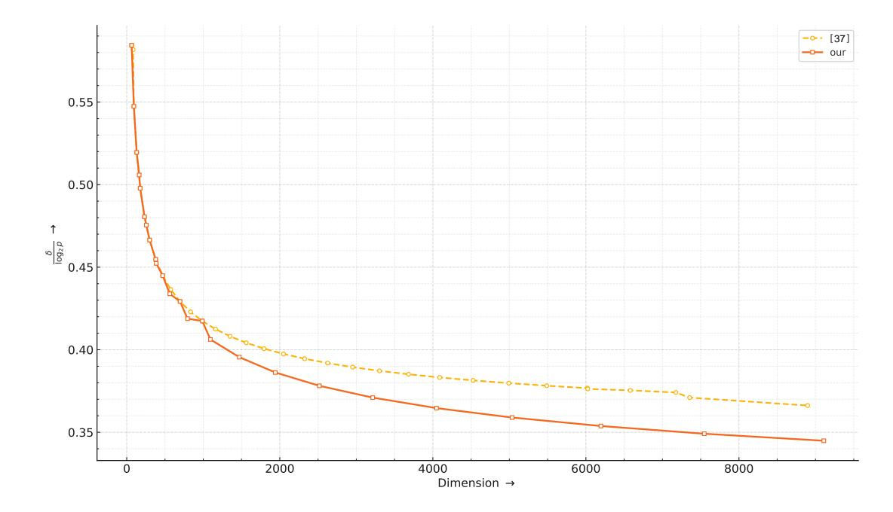

{0}------------------------------------------------

# Coppersmith's Method for Solving Modular Inversion Hidden Number Problem via Determinant-Based Elimination

Zhaopeng Ding1 , Zhaopeng Dai1 , Baofeng Wu2,3 , Rundong Wang1 , and Yanshuo Zhang4

- 1 School of Mathematics and Statistics, Qingdao University, Qingdao, China 16678784491@163.com, dzpeng@amss.ac.cn, 2025023284@qdu.edu.cn
- 2 State Key Laboratory of Cyberspace Security Defense, Institute of Information Engineering, Chinese Academy of Sciences, Beijing, China

#### wubaofeng@iie.ac.cn

3 School of Cybersecurity, University of Chinese Academy of Sciences, Beijing, China 4 Department of Cryptographic Science and Technology, Beijing Electronic Science and Technology Institute, Beijing, China zhang\_yanshuo@163.com

Abstract. The selection of shift polynomials is a pivotal yet challenging step in Coppersmith's method for computing modular roots of multivariate polynomials. We propose a novel, determinant-based strategy for generating these polynomials, thereby presenting an improved variant of Coppersmith's method tailored for certain multivariate modular equations. Our approach is first validated on solving the Modular Inversion Hidden Number Problem (MIHNP) and predicting the Inversive Congruential Generator (ICG), where it is shown to outperform prior methods both in theory and in practice. Furthermore, when applied to the Modular Inversion Double Hidden Numbers Problem (MIDHNP), our analysis reveals that MIDHNP is not harder than MIHNP, thereby disproving a conjecture by Boneh et al. (Asiacrypt 2001).

Keywords: Coppersmith's Method, Modular Inversion Hidden Number Problem, Modular Inversion Double Hidden Numbers Problem, Inversive Congruential Generator, Lattice.

# 1 Introduction

#### 1.1 Background and Prior Work

The Hidden Number Problem (HNP) was proposed by Boneh and Venkatesan [\[4,](#page-27-0)[5\]](#page-27-1) as a computationally hard mathematical problem for constructing cryptographic schemes. It has several variants and has been proved to be a useful tool in many cryptographic areas, see e.g. [\[14,](#page-28-0)[3,](#page-27-2)[28,](#page-28-1)[29,](#page-29-0)[21\]](#page-28-2). As one of subsequent variants of HNP, the Modular Inversion Hidden Number Problem (MIHNP) was introduced in [\[3\]](#page-27-2) to design efficient pseudo-random number generators and 

{1}------------------------------------------------

message authentication codes. Recently, based on MIHNP, Feneuil et al. [10] presented an efficient candidate post-quantum signature scheme. The MIHNP can be described as follows.

**Definition 1 (Modular Inversion Hidden Number Problem (MIHNP),** [3]). Let p be a prime and  $\alpha \in \mathbb{Z}_p$  be an unknown hidden number. Choose  $t_0, t_1, \ldots, t_n \in \mathbb{Z}_p \setminus \{-\alpha\}$  independently and uniformly at random. Given n+1 samples

$$\{(t_i, MSB_{\delta}((\alpha + t_i)^{-1} \pmod{p})) \mid 0 \le i \le n\},$$

where  $MSB_{\delta}(x)$  represents the  $\delta$  most significant bits of an integer x, the objective of MIHNP is to recover the number  $\alpha$ .

In [3], the authors transformed MIHNP into solving the following system of multivariate polynomials

$$f_i(x_i, x_0) = A_i x_i x_0 + B_i x_i + C_i x_0 + D_i \equiv 0 \pmod{p}, i = 1, 2, \dots, n.$$
 (1)

And then they showed a heuristic lattice-based method to find the small solutions of equations in (1) and their algorithm worked whenever the number of known bits of  $(\alpha + t_i)^{-1} \pmod{p}$  satisfies  $\delta > \frac{1}{3} \log p$ . As such, they conjectured that the MIHNP was hard when  $\frac{\delta}{\log p} < \frac{1}{3}$ . Moreover, in order to obtain a more efficient pseudo-random number generator, the authors in [3] adapted MIHNP and designed a new pseudo-random number generator described as follows, which is referred to in this paper as the Modular Inversion Double Hidden Numbers Problem (MIDHNP).

Definition 2 (Modular Inversion Double Hidden Numbers Problem (MIDHNP), [3]). Let p be a prime and  $\alpha$ ,  $\beta \in \mathbb{Z}_p$  are two unknown hidden numbers with  $\beta \neq 0$ . Choose  $t_0, t_1, \ldots, t_n \in \mathbb{Z}_p \setminus \{-\alpha\}$  independently and uniformly at random. Given n+1 samples

$$\{(t_i, MSB_{\delta}((\beta \cdot (\alpha + t_i)^{-1}) \pmod{p})) \mid 0 \le i \le n\},$$

the objective of MIDHNP is to recover  $\alpha$  and  $\beta$ .

Apparently, MIDHNP achieves the same security level as MIHNP using a smaller finite field than that required by MIHNP, thereby enabling acceleration of the pseudo-random number generator. Moreover, the authors discussed MIDHNP using the method similar to that of MIHNP, arguing that MIDHNP is a more difficult variant of the MIHNP, and asserted that MIDHNP is infeasible to solve when  $\frac{\delta}{\log p} < \frac{1}{2}$ . To the best of our knowledge, the MIDHNP has not yet been formally studied in the existing cryptographic literature after it was introduced in [3].

As for MIHNP, there has been a series of work addressing its security and research efforts consistently focused on approaches to solving the system of Equations (1). In 2012, Ling et al. [18] developed the ideas from [2] and presented a rigorous deterministic polynomial-time algorithm for MIHNP. Their algorithm

{2}------------------------------------------------

is valid only when  $\frac{\delta}{\log p} > \frac{2}{3}$ . Subsequently, Xu et al. [34] expanded upon research approaches in [3] by combining a variant of Coppersmith's method [15] with the priority queue technique, presenting a heuristic algorithm for solving the MIHNP requiring fewer samples. This constitutes the first use of algebraically dependent polynomials in the construction of Coppersmith lattice. However, the algorithm proposed is only valid for  $\frac{\delta}{\log p} > \frac{1}{2}$ . In [35], Xu et al. further improved the Coppersmith approach for solving Equations (1) and achieved the same asymptotic results with those in [3]. To date, the best attack on MIHNP was achieved by Xu et al. in [36] and [37]. They adopted the notion of helpful polynomials [20,32] to select the shift polynomials for constructing the Coppersmith lattice and enhanced the efficiency of searching the desired roots of (1). Their results imply that MIHNP can be heuristically solved when the known bits of  $(\alpha + t_i)^{-1}$  (mod p) is a constant fraction of  $\log p$ , thus the conjecture proposed in [3] is disproved.

It is worth noting that, in addition to MIHNP, the Inversive Congruential Generator (ICG) problem can also be reduced to solving a system of equations with the form (1). ICG is a number-theoretic pseudorandom number generator proposed by Eichenauer and Lehn in [9].

Definition 3 (Inversive Congruential Generator (ICG), [9]). Let p be a prime. For given  $a, b \in \mathbb{Z}_p^*$ , let  $\mathcal{F}_{a,b}$  be the permutation of  $\mathbb{Z}_p$  defined by

$$\mathcal{F}_{a,b}(x) = \begin{cases} ax^{-1} + b, & \text{if } x \neq 0, \\ b, & \text{if } x = 0. \end{cases}$$

Given an Inversive Congruential Generator sequence  $(MSB_{\delta}(v_i))_{i\geq 1}$  where

$$v_{i+1} = \mathcal{F}_{a,b}(v_i), \ i \ge 0,$$

and  $v_0$  is a secret initial value, the objective of ICG problem is to recover  $v_0$ .

ICG has been proved to be extremely useful for quasi-Monte Carlo type applications, see [23,24,25,26] for surveys and recent results. The ICG problem can be solved utilizing similar approach as mentioned above for MIHNP; refer to [1,2,35,36,37].

#### 1.2 Our Contributions

Due to the effectiveness of Coppersmith's method in solving multivariate modular equations with small roots, it is necessary to first transform the problems of recovering the hidden numbers in MIHNP (MIDHNP) and retrieving the secret initial value of ICG into solving systems of modular equations with small modular roots. To address these issues, we propose a novel determinant-based elimination technique specifically designed for the original systems of multivariate modular equations derived from MIHNP (ICG) and MIDHNP. This elimination technique fundamentally distinguishes itself from elimination techniques used in

{3}------------------------------------------------

previous literature on MIHNP. It can systematically eliminate unbounded variables appearing in the original multivariate modular equations, yielding a set of specialized modular equations that we refer to as "fundamental polynomials". The fundamental polynomials are used as main primitives for constructing the shift polynomials required in the Coppersmith's method. Crucially, the number of monomials in shift polynomials constructed by the fundamental polynomials is overall fewer than that of the shift polynomials presented in [36,37]. Therefore, we can select a smaller set of monomials to define a Coppersmith lattice with lower dimension, thereby achieving a more efficient implementation of the Coppersmith's algorithm. Concretely, we have obtained the following results.

Firstly, utilizing the improved method, we construct the fundamental polynomials based on the original modular equations from the MIHNP and the ICG, and present a heuristic algorithm to solve two problems. For any positive integer d and  $n = \omega(d^2)$ , suppose the modulus  $p = 2^{\omega(e^d n^{d+1} d^{-d-\frac{3}{2}})}$  is a sufficiently large prime. Then the MIHNP and the ICG can be solved with n+1 samples, with a probability close to 1, if the number  $\delta$  of known most significant bits satisfies

$$\frac{\delta}{\log p} \ge \frac{1}{d+1} + o\left(\frac{1}{d}\right). \tag{2}$$

It should be pointed out that, for each fixed integer  $d \geq 3$ , when the number  $\delta$  is fixed, our method needs fewer samples and operates with a lower-dimensional lattice compared to the algorithms in [36,37]. Moreover, In the asymptotic regime, if  $\delta$  satisfies (2), our method reduces the required sample complexity relative to [36,37] from  $\omega(d^3)$  to  $\omega(d^2)$ .

Secondly, we adopt the determinant-based method to construct fundamental polynomials for MIDHNP and present a heuristic algorithm to solve MIDHNP. Under the same asymptotic assumptions on the parameters for solving MIHNP and ICG, our algorithm can also recover the two hidden numbers in MIDHNP with  $\omega(d^2)$  samples with a probability close to 1. It indicates that the MIDHNP is no harder than the MIHNP, despite the hardness claims in [3]. As a result, we disprove the conjecture posed by Boneh et al. in [3] that the MIDHNP is hard whenever  $\frac{\delta}{\log p} < \frac{1}{2}$ . Actually, a lattice with dimension 697 suffices to achieve the lower bound  $\frac{\delta}{\log p} < \frac{1}{2}$  with the parameters n = 15, d = 2.

Finally, we implement our algorithms to verify their effectiveness. Experimental results show that they outperform previous ones.

#### 1.3 Organization of The Paper

The rest of the paper is organized as follows. In Section 2, we present some preliminary knowledge and recall the Coppersmith method for solving systems of multivariate modular equations. In Section 3, we propose the determinant-based elimination technique to solve the MIHNP and predict the ICG. We apply the determinant-based elimination method to solve the MIDHNP in Section 4. In Section 5, we show our experimental results. Conclusions and future research directions are given in Section 6.

{4}------------------------------------------------

# 2 Preliminaries

Throughout the paper, we use  $\mathbb{N}$  and  $\mathbb{Z}$  to denote the set of non-negative integers and the ring of integers, respectively. The cardinality of a set S is denoted by |S|. For a prime p,  $\mathbb{Z}_p$  is the residue ring of integers modulo p and  $\{0, 1, \ldots, p-1\}$  is taken as the complete set of residues. Let log denote the base 2 logarithm. For a vector  $\mathbf{v}$ , let  $\|\mathbf{v}\|$  denote its Euclidean norm. Let [a] be the largest integer less than or equal to a and [a] be the smallest integer greater than or equal to a.

#### 2.1 Multivariate Polynomials

In this section, we introduce basic definitions about multivariate polynomials.

A monomial in variables  $x_1, \ldots, x_n$  is a product of the form  $x_1^{i_1} \cdots x_n^{i_n}$ , where the exponents  $i_1, \ldots, i_n$  are non-negative integers. The degree of the monomial, denoted by  $\deg(x_1^{i_1} \cdots x_n^{i_n})$ , is the sum  $i_1 + \cdots + i_n$ . A polynomial f in  $x_1, \ldots, x_n$  with coefficients in  $\mathbb{Z}$  is a finite linear combination of monomials which can be represented in the form

$$f(x_1, \dots, x_n) = \sum_{(i_1, \dots, i_n) \in \mathbb{N}^n} \alpha_{i_1, \dots, i_n} x_1^{i_1} \cdots x_n^{i_n}, \ \alpha_{i_1, \dots, i_n} \in \mathbb{Z}.$$

The total degree of f, denoted by  $\deg(f)$ , is the maximum of  $\deg(x_1^{i_1}\cdots x_n^{i_n})$  such that the coefficient  $\alpha_{i_1,\ldots,i_n}$  is nonzero.

The norm of a polynomial f, denoted by ||f||, is defined as the Euclidean norm of its coefficient vector, i.e.,

$$||f|| = \left(\sum_{(i_1,\dots,i_n)\in\mathbb{N}^n} \alpha_{i_1,\dots,i_n}^2\right)^{1/2}.$$

**Definition 4.** Let  $\mathcal{M}$  be a set of monomials. A monomial order  $\prec$  on  $\mathcal{M}$  is a total order satisfying the following conditions:

- 1. For every  $\lambda \in \mathcal{M} \setminus \{1\}$ ,  $1 \prec \lambda$  holds.
- 2. If  $\lambda_1 \prec \lambda_2$ , then  $\lambda \cdot \lambda_1 \prec \lambda \cdot \lambda_2$  holds for any  $\lambda \in \mathcal{M}$ .

Given a polynomial f and a fixed monomial order  $\prec$ , we call the largest monomial appearing in f the leading monomial, denoted as LM(f). Coefficient of the leading monomial is called the leading coefficient, denoted as LC(f). The product  $LT(f) = LC(f) \cdot LM(f)$  is called the leading term.

Let  $f_1, \ldots, f_s \in \mathbb{Z}[x_0, \ldots, x_n]$  be polynomials with integer coefficients. We define the set of integer roots of  $f_1, \ldots, f_s$  as

$$V_{\mathbb{Z}}(f_1,\ldots,f_s) := \{ \mathbf{a} = (a_0,\ldots,a_n) \in \mathbb{Z}^{n+1} \mid f_i(\mathbf{a}) = 0, \ i = 1,\ldots,s \}.$$

Let  $N \in \mathbb{Z}_{>1}$  be a modulus and let  $X \in \mathbb{Z}_{>0}$  be a bound. We define **the set of** small roots modulo N as

$$V_{N,X}(f_1,\ldots,f_s) := \left\{ \mathbf{a} = (a_0,\ldots,a_n) \in \mathbb{Z}^{n+1} \middle| \begin{array}{l} f_i(\mathbf{a}) \equiv 0 \pmod{N}, & 1 \leq i \leq s, \\ |a_j| < X, & 0 \leq j \leq n \end{array} \right\}.$$

{5}------------------------------------------------

We now introduce the monomial order used in our subsequent discussions.

Definition 5 (Graded Reverse Lexicographic Order, [37]).

Let  $(i_1, i_2, \ldots, i_n)$ ,  $(j_1, j_2, \ldots, j_n) \in \mathbb{N}^n$ . Define  $x_1^{i_1} \cdots x_n^{i_n} \prec_{\text{grevlex}} x_1^{j_1} \cdots x_n^{j_n}$  if and only if

$$\sum_{l=1}^{n} i_l < \sum_{l=1}^{n} j_l \text{ or } \sum_{l=1}^{n} i_l = \sum_{l=1}^{n} j_l \text{ and the rightmost nonzero entry}$$
$$in (i_1 - j_1, \dots, i_n - j_n) \text{ is negative.}$$

#### 2.2 Lattices

Let  $\mathbf{b}_1, \dots, \mathbf{b}_w \in \mathbb{R}^n$  be linearly independent row vectors. The lattice generated by the basis  $\{\mathbf{b}_1, \dots, \mathbf{b}_w\}$  is defined as

$$\mathcal{L} = \left\{ \sum_{i=1}^{w} k_i \, \mathbf{b}_i \, \middle| \, k_1, \dots, k_w \in \mathbb{Z} \right\}.$$

The dimension and determinant of the lattice  $\mathcal{L}$  are given by  $\dim(\mathcal{L}) = w$  and  $\det(\mathcal{L}) = \sqrt{\det(BB^{\mathsf{T}})}$ , respectively, where B is the basis matrix defined as  $B = (\mathbf{b}_1^{\mathsf{T}}, \mathbf{b}_2^{\mathsf{T}}, \dots, \mathbf{b}_w^{\mathsf{T}})^{\mathsf{T}} \in \mathbb{R}^{w \times n}$ . If B is square (i.e., w = n), then we simply have  $\det(\mathcal{L}) = |\det(B)|$ .

In [17], Lenstra et al. presented a deterministic polynomial-time algorithm that returns a reduced basis of a lattice  $\mathcal{L}$ , which is known as the LLL algorithm. Moreover, the resulting reduced basis has the following property.

**Lemma 1 ([19]).** Let  $\mathcal{L}$  be an integer lattice with dimension w. Then, within polynomial time, the LLL algorithm produces a basis  $\{\mathbf{v}_1, \ldots, \mathbf{v}_w\}$  satisfying

$$\|\mathbf{v}_1\| \le \|\mathbf{v}_2\| \le \cdots \le \|\mathbf{v}_i\| \le 2^{\frac{w(w-1)}{4(w+1-i)}} \cdot \det(\mathcal{L})^{\frac{1}{w+1-i}}, \ 1 \le i \le w.$$

# 2.3 Coppersmith's Method for Solving Systems of Multivariate Modular Equations

In [7,6,8], Coppersmith conducted exhaustive research on the problems of finding small modular roots of univariate polynomials and finding small integer roots of bivariate polynomials based on lattice methods. Building on this work, Jochemsz and May [15] described a general lattice-based strategy for finding small modular roots and small integer roots of multivariate polynomials and presented a method to construct shift polynomials from a single multivariate polynomial. Then Meers and Nowakowski [21] extended the method presented in [15] to systems of multivariate polynomial equations and gave a restatement of Coppersmith's method that allows for near complete automation. More recently, in [30], for solving the systems of multivariate polynomials with known moduli, Ryan proposed a series of automated algorithms, aiming to address the bottle-neck in traditional methods that relies on manual design and analysis, which

{6}------------------------------------------------

provided a powerful and automated tool for cryptanalysis. Detailed studies on extended strategies of the Coppersmith's method, widely used in cryptanalysis, can be found in the following references [\[19,](#page-28-11)[20,](#page-28-5)[16,](#page-28-12)[27,](#page-28-13)[33,](#page-29-7)[34](#page-29-1)[,35,](#page-29-2)[36,](#page-29-3)[37,](#page-29-4)[11\]](#page-27-10).

Below we present the basic framework of the Coppersmith's method for finding small roots of systems of multivariate modular equations. Assume that f1, . . . , fs ∈ Z[x0, . . . , xn]. Our goal is to find small modular roots in VN,X(f1, . . . , fs), and the idea of Coppersmith's method is to convert the problem into that of finding integer roots of a derived set of multivariate polynomials defined over Z, which can be efficiently solved. Specifically, we proceed as follows.

#### Step 1: Shift Polynomial Selection

Definition [6](#page-6-0) below specifies which kind of shift polynomials we need to construct.

Definition 6 ([\[21\]](#page-28-2)). Let M be a finite set of monomials and ≺ be a monomial order on M. A set of polynomials F is called (M, ≺)-suitable if

- 1. for any f ∈ F, every monomial appearing in f belongs to M; and
- 2. for any µ ∈ M, there exists a unique f ∈ F whose leading monomial (with respect to ≺) is µ.

If a polynomial set F is (M, ≺)-suitable, for each µ ∈ M, we denote by F[µ] the unique polynomial f ∈ F such that LM(f) = µ.

Constructing the Monomial Set M. The monomial set M can be constructed based on the original polynomials f1, . . . , fs. The monomial set M selected should ensure that the dimension of the subsequently constructed lattice is as small as possible while maintaining the upper bound of the roots that the Coppersmith's algorithm obtains. To the best of our knowledge, there is no general theoretical way to construct the optimal M. In practice, it depends heavily on the specific problem and is typically settled by combining structural analysis with experimental validation.

Constructing the Shift Polynomial Set F Suppose we have already obtained a monomial set M w.r.t. a monomial order ≺. Then, for a fixed integer d, the shift polynomial set F is required to be (M, ≺)-suitable and to satisfy

$$V_{N,X}(f_1,\ldots,f_s) \subseteq V_{N^d,X}(\mathcal{F}).$$

For example, a shift polynomial in F can be constructed in the form

$$N^{d-(j_1+j_2+\cdots+j_s)}x_0^{i_0}x_1^{i_1}\dots x_n^{i_n}f_1^{j_1}f_2^{j_2}\cdots f_s^{j_s},$$

where j1 + · · · + js ≤ d.

#### Step 2: Lattice Construction

Suppose the monomial set is M = {µ1, . . . , µw} with µ1 ≺ · · · ≺ µw and the corresponding (M, ≺)-suitable F is F = {F1, . . . , Fw}, where Fi = F[µi ], 1 ≤ i ≤ w. Now the monomials appearing in the scaled polynomial Fi(x0X, . . . , xnX) should be sorted according to the specified monomial order ≺ and its coefficient 

{7}------------------------------------------------

vector is denoted by  $\mathbf{b}_i$ , for  $1 \leq i \leq w$ . Let  $\mathcal{L}$  be the lattice generated by  $\mathbf{b}_1, \ldots, \mathbf{b}_w$ . Then the lattice basis matrix B of  $\mathcal{L}$  can be explicitly constructed as follows:

$$\begin{bmatrix} \operatorname{LC}(F_w) X^{\operatorname{deg}(\mu_w)} & * & \cdots & * \\ 0 & \operatorname{LC}(F_{w-1}) X^{\operatorname{deg}(\mu_{w-1})} \cdots & * \\ \vdots & \vdots & \ddots & \vdots \\ 0 & 0 & \cdots \operatorname{LC}(F_1) X^{\operatorname{deg}(\mu_1)} \end{bmatrix}$$

Here the symbols \* represent the coefficients of the lower-degree monomials of the polynomial corresponding to each row, which are not explicitly written for brevity. Since the shift polynomial set  $\mathcal{F}$  is  $(\mathcal{M}, \prec)$ -suitable, and we build the coefficient matrix by sorting the monomials in  $\mathcal{M}$  according to  $\prec$ , the resulting lattice basis matrix B is upper triangular.

#### Step 3: Lattice Reduction

Applying LLL algorithm to the above lattice  $\mathcal{L}$  yields a basis  $\mathbf{v}_1, \ldots, \mathbf{v}_w \in \mathcal{L}$ , satisfying  $\|\mathbf{v}_1\| \leq \|\mathbf{v}_2\| \leq \cdots \leq \|\mathbf{v}_w\|$ . Let  $h_1, \ldots, h_w$  be the polynomials associated with these basis vectors. Each  $\mathbf{v}_i$  is an integer linear combination of the original basis  $\mathbf{b}_1, \ldots, \mathbf{b}_w$ . Thus each  $h_i$  is also an integer linear combination of the polynomials in  $\mathcal{F}$ . Therefore, we always have the following chain of inclusions:

$$V_{N,X}(f_1,\ldots,f_s)\subseteq V_{N^d,X}(\mathcal{F})\subseteq V_{N^d,X}(h_1,\ldots,h_t), \qquad 1\leq t\leq w.$$

Moreover, to establish the inclusion relationship  $V_{N^d,X}(h_1,\ldots,h_t) \subseteq V_{\mathbb{Z}}(h_1,\ldots,h_t)$ , the following result is required.

**Lemma 2 (Howgrave-Graham's lemma, [13]).** Suppose  $h(x_0, ..., x_n)$  is an integer polynomial with at most w monomials. Let d and X be positive integers and assume that  $|\tilde{x}_i| < X$ ,  $0 \le i \le n$ . Then  $h(\tilde{x}_0, \tilde{x}_1, ..., \tilde{x}_n) = 0$  holds over the integers if the following two conditions are satisfied:

1. 
$$h(\tilde{x}_0, \tilde{x}_1, \dots, \tilde{x}_n) \equiv 0 \pmod{N^d};$$
  
2.  $||h(x_0 X, \dots, x_n X)|| < \frac{N^d}{\sqrt{w}}.$ 

Since the multivariate polynomials  $h_i$ 's involve n+1 variables, at least n+1 algebraically independent polynomials are required to identify all integer solutions. Thus  $t \geq n+1$ . Lemma 1 and Lemma 2 imply that, if t=n+1 and

$$2^{\frac{w(w-1)}{4(w-n)}} \cdot \det(\mathcal{L})^{\frac{1}{w-n}} < \frac{N^d}{\sqrt{w}}$$
 (3)

hold, then the polynomials  $h_1, \ldots, h_{n+1}$  will be used in the following step.

Notably, the upper bound X for the modular roots can be derived from the above inequality (3). To enlarge this bound as much as possible, the design of the shift polynomials in **Step 1** must be carried out with great care—this is the central challenge in the Coppersmith's method.

{8}------------------------------------------------

#### Step 4: Root Recovery

In this step, we will apply elimination techniques, such as Gröbner basis computation, to extract out the integer roots of the system of polynomial equations

$$h_i(x_0, \dots, x_n) = 0, \ 1 \le i \le n+1.$$

In the context of computational algebraic geometry, one should recognize that the elimination algorithm does not invariably yield a univariate polynomial; rather, it produces a generating set for the projected ideal, which may remain multivariate when the algebraic variety has positive dimension. For this reason, we introduce the following assumption, which has been experimentally validated.

**Assumption 1.** The ideal generated by  $h_1 = 0, ..., h_{n+1} = 0$  in  $\mathbb{Q}[x_0, x_1, ..., x_n]$  has dimension zero.

Under Assumption 1, Gröbner basis algorithm with the lex order yields a univariate polynomial and finally, the desired roots will be obtained.

# 3 Strategies for Solving the MIHNP and Predicting the ICG

#### 3.1 Modular Equations Derived from MIHNP and ICG

We first translate the problems of solving the MIHNP and predicting the ICG into solving a system of multivariate modular equations.

First, we derive modular equations from the MIHNP. According to Definition 1, for each  $0 \le i \le n$ , let  $u_i = \text{MSB}_{\delta}((\alpha + t_i)^{-1} \pmod{p})$  and  $\tilde{x}_i = ((\alpha + t_i)^{-1} \pmod{p}) - u_i$ , then we have  $|\tilde{x}_i| < X := 2^{\lceil \log p \rceil - \delta}$ . Then we obtain a system of congruences

$$\tilde{x}_i \alpha + t_i \tilde{x}_i + u_i \alpha + t_i u_i - 1 \equiv 0 \pmod{p}, \ 0 \le i \le n.$$

Once  $\tilde{x}_0, \tilde{x}_1, \dots, \tilde{x}_n$  are determined, the hidden number  $\alpha$  can be recovered. Hence, to solve the MIHNP, it suffices to solve a system of modular polynomial equations of the form

$$x_i\alpha + t_ix_i + u_i\alpha + t_iu_i - 1 \equiv 0 \pmod{p}, \ 0 \le i \le n. \tag{4}$$

Next, we derive the modular equations arising from the ICG. We start with the following result on ICG which is presented in [37].

**Lemma 3 ([37]).** Given a prime p and an integer n with  $1 \le n < p$ , suppose  $a, b \in \mathbb{Z}_p$  in ICG satisfy that  $x^2 - bx - a$  is primitive over  $\mathbb{Z}_p$ . If  $v_1, v_2, \ldots, v_n \in \mathbb{Z}_p$  in ICG are all nonzero, then we have

$$v_{i+1}v_1 + h_i v_{i+1} - (h_i + b)v_1 - a \equiv 0 \pmod{p}, \ 1 \le i \le n.$$

Here the sequence  $(h_i)_{i\geq 1}$  satisfies  $h_1=0$  and  $h_i=a(h_{i-1}+b)^{-1}\pmod{p}$  for  $i\geq 2$ , where  $h_1+b,\ldots,h_n+b$  are invertible and pairwise distinct in  $\mathbb{Z}_p$ .

{9}------------------------------------------------

According to Definition 3, for each  $0 \le i \le n$ , denote  $u_i = \text{MSB}_{\delta}(v_{i+1})$  and  $\tilde{x}_i = v_{i+1} - u_i$ . Then we have  $|\tilde{x}_i| < X := 2^{\lceil \log p \rceil - \delta}$ . Assume that the conditions in Lemma 3 are hold, then we obtain the following modular congruences:

$$\tilde{x}_i v_0 + k_i \tilde{x}_i + (u_i - k_i - b) v_0 + k_i u_i - a \equiv 0 \pmod{p}, \ 0 \le i \le n,$$

where the sequence  $(k_i)_{i\geq 0}$  satisfies  $k_0 = 0$  and  $k_i = a(k_{i-1} + b)^{-1} \pmod{p}$  for  $i \geq 1$  and  $k_0 + b, \ldots, k_n + b$  are invertible and pairwise distinct in  $\mathbb{Z}_p$ . Therefore, to retrieve the initial value  $v_0$  of ICG, we need to solve the system of modular equations of the form

$$x_i v_0 + k_i x_i + (u_i - k_i - b) v_0 + k_i u_i - a \equiv 0 \pmod{p}, \ 0 \le i \le n.$$
 (5)

Thus far, the aforementioned systems of equations, i.e., (4) and (5), can be consolidated into the system of modular equations of the form

$$f_i(x_i, y) := x_i y + a_i x_i + b_i y + c_i \equiv 0 \pmod{p}, \ 0 \le i \le n,$$
 (6)

whose coefficients satisfy the following conditions: (C1)  $a_i$ 's are pairwise distinct in  $\mathbb{Z}_p$ ; and (C2)  $c_i - a_i b_i \not\equiv 0 \pmod{p}$ , for  $0 \leq i \leq n$ .

Therefore, to recover the hidden number in the MIHNP and to retrieve the initial value of the ICG, we need to determine the set

$$V_p^*(f_0, \dots, f_n) = \{(\widetilde{x}_0, \dots, \widetilde{x}_n, \widetilde{y}) | f_i(\widetilde{x}_i, \widetilde{y}) \equiv 0 \pmod{p}, |\widetilde{x}_i| < X, \text{ for } 0 \le i \le n\},$$

where  $X = 2^{\lceil \log p \rceil - \delta}$ . Since each polynomial  $f_i(x_i, y)$  is linear w.r.t. the variable y, for any evaluation of  $x_0, \ldots, x_n$ , the value of y can be obtained. That is to say, the problem of determining the set  $V_p^*(f_0, \ldots, f_n)$  is reduced to determining the set

$$\pi_{\mathbb{X}}(V_p^*(f_0,\ldots,f_n))$$

$$= \{(\widetilde{x}_0,\ldots,\widetilde{x}_n) \mid \exists \widetilde{y}, \text{ s.t. } f_i(\widetilde{x}_i,\widetilde{y}) \equiv 0 \pmod{p}, \mid \widetilde{x}_i \mid < X, \ 0 \le i \le n\},$$

where  $\mathbb{X} = (x_0, \dots, x_n)$ .

Remark 1. Now we present an explanation regarding Condition C1 and Condition C2 on the coefficients specified in (6), which are respectively satisfied by (4) and (5).

For Equations (4), since the coefficients  $t_i$ 's are chosen independently and uniformly at random from  $\mathbb{Z}_p \setminus \{-\alpha\}$ . The probability that  $t_0, \ldots, t_n$  are pairwise distinct is  $\prod_{k=1}^n \left(1 - \frac{k}{p-1}\right) = \exp\left(\sum_{k=1}^n \ln\left(1 - \frac{k}{p-1}\right)\right) \approx \exp\left(-\frac{n(n+1)}{2(p-1)}\right) \approx 1 - \frac{n(n+1)}{2(p-1)}$ . Hence, when p is large enough, (4) satisfies Condition C1 with probability close to 1. Moreover, one can directly check that (4) always satisfies Condition C2.

For Equations (5), we assume that the preconditions of Lemma 3 are satisfied. Then the values  $k_i$  in (5) are pairwise distinct. Thus Condition C1 holds. In addition, since the element  $k_i + b$  is invertible in  $\mathbb{Z}_p$ , for  $i \geq 1$ , we have

$$k_i u_i - a - k_i (u_i - k_i - b) \equiv k_i^2 + k_i b - a \equiv (k_i - k_{i+1})(k_i + b) \not\equiv 0 \pmod{p},$$

{10}------------------------------------------------

and Condition C2 holds. Apparently, the probability that  $v_0, v_1, \ldots, v_n \in \mathbb{Z}_p$  are all nonzero is about  $\frac{\binom{p-1}{n+1}}{\binom{p}{n+1}} = 1 - \frac{n+1}{p}$ . Therefore, when p is large enough, the probability that (5) satisfies Condition C1 and Condition C2 also tends to 1.

#### 3.2 Determinant-Based Elimination of Equations (6)

In this subsection, we intend to use Coppersmith's method to solve the system of Equations (6). As previously stated, the Coppersmith's method is only effective for finding small roots of systems of multivariate modular equations. However, the root corresponding to variable y in Equations (6) is chosen uniformly at random from  $\mathbb{Z}_p$ , so we cannot directly use the equations in (6) to construct shift polynomials. In order to successfully apply the Coppersmith's method, it is first necessary to eliminate the variable y from (6). Below we propose a determinant-based technique to eliminate variable y and obtain the so-called fundamental polynomials that will be used to construct the shift polynomial set  $\mathcal{F}$  in Section 3.3.

Firstly, for  $0 \le i_1 < i_2 \le n$ , define the following polynomial in variables  $x_{i_1}, x_{i_2}$  written in the form of 2-order determinant:

$$D(x_{i_1}, x_{i_2}) = \begin{vmatrix} a_{i_1} x_{i_1} + c_{i_1} x_{i_1} + b_{i_1} \\ a_{i_2} x_{i_2} + c_{i_2} x_{i_2} + b_{i_2} \end{vmatrix}.$$

For convenience, we denote by  $C_i \leftarrow C_i + kC_j$  the elementary column operation "add k times column j to column i" in a determinant. In what follows, we always assume that  $(\tilde{x}_0, \dots, \tilde{x}_n, \tilde{y})$  is a target root of Equations (6).

**Lemma 4.** For any  $0 \le i_1 < i_2 \le n$ , we have

$$D(\tilde{x}_{i_1}, \tilde{x}_{i_2}) \equiv 0 \pmod{p}$$

*Proof.* Applying the operation  $C_1 \leftarrow C_1 + \tilde{y} C_2$  on  $D(\tilde{x}_{i_1}, \tilde{x}_{i_2})$ , we obtain

$$D(\tilde{x}_{i_1}, \tilde{x}_{i_2}) = \begin{vmatrix} f_{i_1}(\tilde{x}_{i_1}, \tilde{y}) & \tilde{x}_{i_1} + b_{i_1} \\ f_{i_2}(\tilde{x}_{i_2}, \tilde{y}) & \tilde{x}_{i_2} + b_{i_2} \end{vmatrix}.$$

Since  $f_{i_1}(\tilde{x}_{i_1}, \tilde{y}) \equiv f_{i_2}(\tilde{x}_{i_2}, \tilde{y}) \equiv 0 \pmod{p}$ , we have  $D(\tilde{x}_{i_1}, \tilde{x}_{i_2}) \equiv 0 \pmod{p}$ .

Lemma 4 and its proof can motivate a general construction of polynomials vanishing at  $(\tilde{x}_{i_1}, \ldots, \tilde{x}_{i_{2d}})$  modulo  $p^d$  for arbitrary  $d \geq 2$  and  $0 \leq i_1 < i_2 < \cdots < i_{2d} \leq n$ . Now we define the following  $2d \times 2d$  determinant.

$$D(x_{i_1}, \dots, x_{i_{2d}}) = \begin{vmatrix} a_{i_1}^{d-1}(a_{i_1}z_{i_1} + e_{i_1}) & a_{i_1}^{d-1}z_{i_1} & a_{i_1}^{d-2}z_{i_1} & \cdots & z_{i_1} & a_{i_1}^{d-2}e_{i_1} & a_{i_1}^{d-3}e_{i_1} & \cdots & e_{i_1} \\ a_{i_2}^{d-1}(a_{i_2}z_{i_2} + e_{i_2}) & a_{i_2}^{d-1}z_{i_2} & a_{i_2}^{d-2}z_{i_2} & \cdots & z_{i_2} & a_{i_2}^{d-2}e_{i_2} & a_{i_2}^{d-3}e_{i_2} & \cdots & e_{i_2} \\ \vdots & \vdots & \vdots & \ddots & \vdots & \vdots & \ddots & \vdots \\ a_{i_{2d}}^{d-1}(a_{i_{2d}}z_{i_{2d}} + e_{i_{2d}}) & a_{i_{2d}}^{d-1}z_{i_{2d}} & a_{i_{2d}}^{d-2}z_{i_{2d}} & \cdots & z_{i_{2d}} & a_{i_{2d}}^{d-2}e_{i_{2d}} & a_{i_{2d}}^{d-3}e_{i_{2d}} & \cdots & e_{i_{2d}} \end{vmatrix}$$

where  $z_{i_j} = x_{i_j} + b_{i_j}$  and  $e_{i_j} = c_{i_j} - a_{i_j} b_{i_j}$ , for  $1 \le j \le 2d$ .

{11}------------------------------------------------

**Lemma 5.** For any  $d \geq 2$  and  $0 \leq i_1 < i_2 < \cdots < i_{2d} \leq n$ , we have

$$D(\tilde{x}_{i_1}, \dots, \tilde{x}_{i_{2d}}) \equiv 0 \pmod{p^d}$$
.

*Proof.* Denote the columns of the determinant  $D(\tilde{x}_{i_1}, \dots, \tilde{x}_{i_{2d}})$  by  $C_1, \dots, C_{2d}$ . Apply the following elementary column operations on  $D(\tilde{x}_{i_1}, \dots, \tilde{x}_{i_{2d}})$  in sequence:

$$C_{1} \leftarrow C_{1} + \tilde{y} C_{2},$$

$$C_{2} \leftarrow C_{2} + \tilde{y} C_{3} + C_{d+2},$$

$$\vdots$$

$$C_{d} \leftarrow C_{d} + \tilde{y} C_{d+1} + C_{2d}.$$

For  $1 \leq l \leq 2d$ , it is easy to see (l, 1)-th entry of the transformed  $D(\tilde{x}_{i_1}, \dots, \tilde{x}_{i_{2d}})$  is

$$a_{i_l}^{d-1}(a_{i_l}\tilde{x}_{i_l}+c_{i_l})+\tilde{y}\,a_{i_l}^{d-1}(\tilde{x}_{i_l}+b_{i_l})=a_{i_l}^{d-1}f_{i_l}(\tilde{x}_{i_l},\tilde{y}),$$

and for  $2 \le s \le d$ , (l, s)-th entry is

$$a_{i_l}^{d-s+1}(\tilde{x}_{i_l}+b_{i_l})+\tilde{y}\,a_{i_l}^{d-s}(\tilde{x}_{i_l}+b_{i_l})+a_{i_l}^{d-s}(c_{i_l}-a_{i_l}b_{i_l})=a_{i_l}^{d-s}f_{i_l}(\tilde{x}_{i_l},\tilde{y}).$$

Thus all entries in the first d columns are congruent to 0 modulo p. The lemma is valid according to Laplace's Theorem for determinants.

For any  $d \geq 1$ , it is obvious that the leading monomial of  $D(x_{i_1}, x_{i_2}, \dots, x_{i_{2d}})$  with graded reverse lexicographic order (see Definition 5) is  $x_{i_d} \cdots x_{i_{2d}}$  and the degree of  $D(x_{i_1}, x_{i_2}, \dots, x_{i_{2d}})$  is d+1. Based on properties of determinants, a short calculation shows that the leading coefficient of  $D(x_{i_1}, x_{i_2}, \dots, x_{i_{2d}})$  is

$$H_{d+1}(i_1, \dots, i_{2d}) = \begin{cases} -\det V(a_{i_1}, a_{i_2}), & d = 1, \\ \det V(a_{i_2}, a_{i_3}, a_{i_4}) \cdot (c_{i_1} - a_{i_1} b_{i_1}), & d = 2, \\ (-1)^d \det V(a_{i_d}, \dots, a_{i_{2d}}) \det V(a_{i_1}, \dots, a_{i_{d-1}}) \cdot \prod_{j=1}^{d-1} (c_{i_j} - a_{i_j} b_{i_j}), & d \geq 3, \end{cases}$$
Here  $\det V(\cdot)$  denotes the determinant of the Vandermonde matrix. Moreover,

Here  $\det V(\cdot)$  denotes the determinant of the Vandermonde matrix. Moreover, since the coefficients in Equations (6) satisfy Condition C1 and Condition C2, we have

$$H_{d+1}(i_1,\ldots,i_{2d}) \not\equiv 0 \pmod{p}.$$

We now define the fundamental polynomials corresponding to Equations (6) in the variables  $x_{i_1}, \ldots, x_{i_{2d}}$  as follows.

$$F_{d+1}(x_{i_1}, \dots, x_{i_{2d}}) = H_{d+1}(i_1, \dots, i_{2d})^{-1} D(x_{i_1}, \dots, x_{i_{2d}}) \pmod{p^d}.$$
 (7)

The fundamental polynomials have the following properties.

**Lemma 6.** With graded reverse lexicographic order, the fundamental polynomial  $F_{d+1}(x_{i_1}, \ldots, x_{i_{2d}})$  satisfies

{12}------------------------------------------------

- 1.  $F_{d+1}(\tilde{x}_{i_1}, \dots, \tilde{x}_{i_{2d}}) \equiv 0 \pmod{p^d}$ .
- 2.  $F_{d+1}(x_{i_1},...,x_{i_{2d}})$  is a monic polynomial with degree d+1.
- 3.  $F_{d+1}(x_{i_1}, \ldots, x_{i_{2d}})$  is a multilinear polynomial, that is, the degree of each variable appearing in  $F_{d+1}(x_{i_1}, \ldots, x_{i_{2d}})$  is at most one.

*Proof.* The first part is a direct consequence of Lemma 4 and Lemma 5. For the second part, it follows directly from the definition of the fundamental polynomial in (7). The third part holds because all entries of  $D(x_{i_1}, \ldots, x_{i_{2d}})$  are linear in the variables  $x_{i_1}, \ldots, x_{i_{2d}}$  and a determinant is a multilinear form w.r.t. its entries.

#### **3.3** Strategies for Solving Equations (6)

In this subsection, we will utilize the fundamental polynomials defined above and present an algorithm for solving Equations (6) within the framework of the Coppersmith's method. We then apply this algorithm to solve MIHNP and ICG.

**Theorem 1.** Let d be a fixed positive integer. Take  $n = \omega(d^2)$  and let  $p = 2^{\omega(e^d n^{d+1} d^{-d-\frac{3}{2}})}$  be a sufficiently large prime. Under Assumption 1, the desired root  $\tilde{x}_0, \tilde{x}_1, \ldots, \tilde{x}_n$  of  $f_i(x_i, y)$  defined in (6) can be recovered, provided that the common bound X of  $|\tilde{x}_0|$ ,  $|\tilde{x}_1|$ , ...,  $|\tilde{x}_n|$  satisfies

$$X < p^{1 - \frac{1}{d+1} - o\left(\frac{1}{d}\right)}.$$

Moreover, the corresponding running time is polynomial in  $\log p$  for any fixed constant d where the complexity of the LLL algorithm grows as  $n^{\mathcal{O}(d)}$ , and the complexity of the Gröbner basis computation grows as  $d^{\mathcal{O}(n)}$ .

*Proof.* Assume that d is a given positive integer, such that  $n+1 \geq d+1$ . Let p be a sufficiently large prime. For  $0 \leq i \leq n$ ,  $f_i(x_i, y)$ 's are the polynomials defined in (6). Fix an upper bound X which will be determined later. We now employ Coppersmith's method to recover the desired solutions in  $\pi_{\mathbb{X}}(V_p^*(f_0, \ldots, f_n))$ .

Shift Polynomials Selection Denote  $\Omega_n = \{0, 1, \dots, n\}$ . For  $s \geq 0$ , define

$$\mathcal{M}(n,s) = \left\{ \prod_{i \in I} x_i \middle| I \subseteq \Omega_n, |I| = s \right\}.$$

The set of monomials that we select is  $\mathcal{M}(n, [d+1]) = \bigcup_{s=0}^{d+1} \mathcal{M}(n, s)$ . Note that the set  $\mathcal{M}(n, [d+1])$  consists of all multilinear monomials in the variables  $x_0, \ldots, x_n$  with degree at most d+1. Here we adopt the graded reverse lexicographic order ( $\prec_{\text{grevlex}}$ ) as the monomial order. Now we use the fundamental polynomials defined in (7) to construct the shift polynomial set  $\mathcal{F}(n, d)$  which is  $(\mathcal{M}(n, [d+1]), \prec_{\text{grevlex}})$ -suitable.

Firstly, we define special subsets of  $\mathcal{M}(n,s)$  as follows. For any non-empty subset  $A \subseteq \Omega_n$  and any integer r with  $1 \le r \le |A|$ , denote by  $\text{Top}_r(A)$  the

{13}------------------------------------------------

subset of A consisting of its largest r elements. Assume  $s \geq 3$  and k is an integer satisfying  $\lfloor s/2 \rfloor + 1 \leq k \leq s - 1$ . We define

$$\mathcal{M}(n,s,k) := \bigcup_{\substack{\underline{q}=(q_1,\dots,q_{s-k})\in\mathbb{Z}_{>0}^{s-k}\\q_1+\dots+q_{s-k}=k}} \mathcal{M}(n,s,k,\underline{q}), \tag{8}$$

where, for each q,

 $\mathcal{M}(n, s, k, q) :=$ 

$$\left\{ \prod_{j=1}^{s-k} \prod_{i \in \text{Top}_{q_j+1}(A_j)} x_i \middle| \begin{array}{l} A_j \subseteq \Omega_n, \ |A_j| = 2q_j, \text{ for } 1 \le j \le s-k, \\ A_l \cap A_h = \emptyset, \text{ for } 1 \le l, h \le s-k, \text{ and } l \ne h \end{array} \right\}.$$

It is easy to see that the degree of monomials in  $\mathcal{M}(n, s, k)$  is s. Thus, for  $\lfloor s/2 \rfloor + 1 \leq k \leq s - 1$ ,  $\mathcal{M}(n, s, k) \subseteq \mathcal{M}(n, s)$  holds. Additionally, when s = 2, we denote by  $\mathcal{M}(n, 2, 1)$  the monomial set  $\mathcal{M}(n, 2)$  for convenience. Denote the cardinality of the above monomial sets by  $N(n, s) = |\mathcal{M}(n, s)|$  and  $N(n, s, k) = |\mathcal{M}(n, s, k)|$ .

Below we present a useful result about the subsets of  $\mathcal{M}(n, s)$ , which will be used to classify and construct the polynomials in  $\mathcal{F}(n, d)$ .

**Lemma 7.** For  $s \geq 5$  and  $\lfloor s/2 \rfloor + 2 \leq k \leq s-1$ , we have the inclusion

$$\mathcal{M}(n, s, k) \subseteq \mathcal{M}(n, s, k - 1).$$

The proof of Lemma 7 is provided in Appendix A.

Now we are ready to construct the shift polynomial  $\mathcal{F}[\mu]$  in  $\mathcal{F}(n,d)$ , for each monomial  $\mu \in \mathcal{M}(n,[d+1])$ . Let  $s = \deg(\mu)$ .

When  $0 \le s \le 1$ , we construct  $\mathcal{F}[\mu] = p^d \mu$ .

When  $2 \leq s \leq d+1$ , utilizing the set  $\mathcal{M}(n, s, k)$  defined in (8) and the fundamental polynomials defined in (7), we construct  $\mathcal{F}[\mu]$  in the following three cases.

Case 1:  $\mu \in \mathcal{M}(n, s, s-1)$ . There exists a subset  $A_1 = \{l_{1,1}, \dots, l_{1,2(s-1)}\} \subseteq \Omega_n$  such that  $\mu = \prod_{t=s-1}^{2(s-1)} x_{l_{1,t}}$ . Accordingly, we construct

$$\mathcal{F}[\mu] = p^{d-s+1} F_s(x_{l_{1,1}}, \dots, x_{l_{1,2(s-1)}}).$$

Case 2:  $\mu \in \mathcal{M}(n, s, k) \setminus \mathcal{M}(n, s, k+1)$  for  $s \geq 5$  and  $\lfloor s/2 \rfloor + 1 \leq k \leq s-2$ . There exist  $\underline{q} = (q_1, \ldots, q_{s-k}) \in \mathbb{Z}_{>0}^{s-k}$  with  $q_1 + \cdots + q_{s-k} = k$  and pairwise disjoint subsets  $A_j = \{l_{j,1}, \ldots, l_{j,2q_j}\} \subseteq \Omega_n$  for  $1 \leq j \leq s-k$  such that  $\mu = \prod_{j=1}^{s-k} \prod_{t=q_j}^{2q_j} x_{l_{j,t}}$ . Accordingly, we construct

$$\mathcal{F}[\mu] = p^{d-k} \prod_{j=1}^{s-k} F_{q_j+1}(x_{l_{j,1}}, \dots, x_{l_{j,2q_j}}).$$

{14}------------------------------------------------

Case 3: µ ∈ M n, s \ M n, s, ⌊s/2⌋ + 1 for s ≥ 3. Let µ = xj1 xj2 · · · xjs where 0 ≤ j1 < · · · < js ≤ n.

– When s is an even integer, we construct

$$\mathcal{F}[\mu] = p^{d-\frac{s}{2}} F_2(x_{j_1}, x_{j_2}) F_2(x_{j_3}, x_{j_4}) \cdots F_2(x_{j_{s-1}}, x_{j_s}).$$

– When s is an odd integer, we construct

$$\mathcal{F}[\mu] = p^{d - \frac{s-1}{2}} x_{j_1} F_2(x_{j_2}, x_{j_3}) F_2(x_{j_4}, x_{j_5}) \cdots F_2(x_{j_{s-1}}, x_{j_s}).$$

It is easy to see that the above three cases cover all monomials µ in M(n, [d+ 1]) and there is no intersection among the cases. The polynomials F[µ]'s constructed above form the set F(n, d). This set satisfies the following two properties.

Lemma 8. The set F(n, d) satisfies:

- 1. F(n, d) is (M(n, [d + 1]), ≺grevlex)-suitable.
- 2. F(n, d) satisfies the inclusion

$$\pi_{\mathbb{X}}(V_p^*(f_0,\ldots,f_n))\subseteq V_{p^d,X}(\mathcal{F}(n,d)).$$

The detailed proof of Lemma [8](#page-14-0) is provided in Appendix [B.](#page-30-0)

Lattice Construction Based on the description of Coppersmith's method in Section [2.3](#page-5-2) and Lemma [8,](#page-14-0) we construct the lattice L(n, d) from the shiftpolynomial set F(n, d). The dimension of L(n, d) is

$$w := |\mathcal{F}(n,d)| = |\mathcal{M}(n,[d+1])| = \sum_{i=0}^{d+1} {n+1 \choose i}.$$

Its basis matrix is upper triangular. The diagonal entries can be written as

$$LC(\mathcal{F}[\mu]) X^{\deg(\mu)} = p^{e(\mu)} X^{\deg(\mu)}, \qquad \mu \in \mathcal{M}(n, [d+1]),$$

where the exponent e(µ) is given explicitly as follows:

$$e(\mu) = \begin{cases} d & \text{if } 0 \le \deg(\mu) \le 1, \\ d - s + 1 & \text{if } \mu \in \mathcal{M}(n, s, s - 1), \ 2 \le s \le d + 1, \\ d - k & \text{if } \mu \in \mathcal{M}(n, s, k) \setminus \mathcal{M}(n, s, k + 1), 5 \le s \le d + 1, \\ \lfloor s/2 \rfloor + 1 \le k \le s - 2, \\ d - \lfloor s/2 \rfloor & \text{if } \mu \in \mathcal{M}(n, s) \setminus \mathcal{M}(n, s, \lfloor s/2 \rfloor + 1), \ 3 \le s \le d + 1. \end{cases}$$

Then the determinant of the lattice is

$$\det(\mathcal{L}(n,d)) = p^{\alpha(n,d)} X^{\beta(n,d)},$$

{15}------------------------------------------------

s=2

where

$$\alpha(n,d) = \sum_{\mu \in \mathcal{M}(n,[d+1])} e(\mu) = dw - \gamma(n,d),$$

$$\gamma(n,d) = \sum_{k=1}^{d+1} \lfloor s/2 \rfloor N(n,s) + \sum_{k=1}^{d+1} \sum_{k=1}^{s-1} N(n,s,k),$$
(9)

k=⌊s/2⌋+1

s=3

and

$$\beta(n,d) = \sum_{\mu \in \mathcal{M}(n,[d+1])} \deg(\mu) = \sum_{l=1}^{d+1} l \binom{n+1}{l}.$$

Lattice Reduction and Root Recovery Applying the LLL algorithm to the lattice L(n, d). If the inequality

$$2^{\frac{w(w-1)}{4(w-n)}} \det(\mathcal{L}(n,d))^{\frac{1}{w-n}} < \frac{p^d}{\sqrt{w}}$$
 (10)

holds, then the LLL algorithm yields at least n+1 integer polynomials vanishing at the desired root in πX(V ∗ p (f0, . . . , fn)). Then, under Assumption [1,](#page-8-1) we can use the elimination techniques (e.g., computing Gröbner bases) to recover these roots.

Substituting α(n, d) and β(n, d) into the inequality [\(10\)](#page-15-0), we obtain the upper bound

$$X < 2^{-\frac{w(w-1)}{4\beta(n,d)}} \cdot w^{-\frac{w-n}{2\beta(n,d)}} \cdot p^{\lambda(n,d)}, \tag{11}$$

where

$$\lambda(n,d) = \frac{\gamma(n,d) - dn}{\beta(n,d)}.$$
 (12)

We now study the value of λ(n, d). The computation of γ(n, d) depends on an explicit formula of N(n, s, k), which seems to be infeasible to obtain using elementary counting techniques. Hence, it is impossible to obtain the complete formula of λ(n, d). For this reason, we will present a suitable lower bound on λ(n, d) instead. We first present the following lemma.

Lemma 9. Let s ≥ 3 and ⌊s/2⌋ + 1 ≤ k ≤ s − 1. Then we have

$$N(n,s,k) \geq \sum_{i=s-2}^{n} \binom{i}{2s-2k-2} \binom{n-i}{2k-s+1}.$$

The detailed proof of Lemma [9](#page-15-1) is provided in Appendix [C.](#page-32-0)

We now substitute [\(9\)](#page-15-2) into [\(12\)](#page-15-3) and use Lemma [9](#page-15-1) to derive the following lower bound for λ(n, d):

$$\lambda(n,d) \ge \frac{d\binom{n}{d+1} + \sum_{l=1}^{d} l\binom{n}{l} - dn}{(d+1)\binom{n}{d+1} + \sum_{l=0}^{d} (2l+1)\binom{n}{l}}.$$
(13)

{16}------------------------------------------------

The detailed derivation of (13) is provided in Appendix D.

Assume that  $n = \omega(d^2)$  and the modulus  $p = 2^{\omega(e^d n^{d+1} d^{-d-\frac{3}{2}})}$  is a sufficiently large prime. Then the upper bound for X in (11) can be simplified to

$$X < p^{1 - \frac{1}{d+1} - o\left(\frac{1}{d}\right)}. (14)$$

The detailed analysis is provided in Appendix E.

The aforementioned algorithm employs the LLL algorithm and the algorithm for computing Gröbner bases. The complexity of the LLL algorithm primarily depends on the lattice dimension and the bit sizes of the basis entries. For our optimal choice  $n = \omega(d^2)$ , the dimension of the lattice is given by  $\sum_{i=0}^{d+1} \binom{n+1}{i} = \mathcal{O}(n^{d+1}) = \mathcal{O}(n^{\mathcal{O}(d)})$ . The bit size of the entries in the basis matrix is bounded by  $2d \log p$ . Consequently, according to [22], the complexity of the LLL algorithm is poly  $(2d \log p, n^{\mathcal{O}(d)}) = \mathcal{O}((\log p)^{\mathcal{O}(1)} n^{\mathcal{O}(d)})$ , which is polynomial in  $\log p$  for any constant d.

Based on [12], the complexity of the Gröbner basis computation in the above algorithm is bounded by

$$poly((n+1)d \log p (e(d+1))^{n+1}) = \mathcal{O}((\log p)^{\mathcal{O}(1)} d^{\mathcal{O}(n)}).$$

In summary, the complexity of the LLL algorithm grows as  $n^{\mathcal{O}(d)}$ , while the complexity of the Gröbner basis computation grows as  $d^{\mathcal{O}(n)}$ . This completes the proof.

Theorem 1 implies the following results on solving the MIHNP and predicting the ICG.

Corollary 1. Let d be a fixed positive integer. Take  $n = \omega(d^2)$  and let  $p = 2^{\omega(e^d n^{d+1} d^{-d-\frac{3}{2}})}$  be a sufficiently large prime. Given n+1 samples in MIHNP (1), if the number  $\delta$  of known most significant bits satisfies

$$\frac{\delta}{\log p} \ge \frac{1}{d+1} + o\left(\frac{1}{d}\right),$$

then under Assumption 1, the hidden number can be successfully recovered with probability  $\prod_{k=1}^{n} (1 - \frac{k}{p-1})$  close to 1. The entire recovery procedure runs in polynomial time with respect to  $\log p$  for fixed d.

Corollary 2. Let d be a fixed positive integer. Take  $n = \omega(d^2)$  and let  $p = 2^{\omega(e^d n^{d+1} d^{-d-\frac{3}{2}})}$  be a sufficiently large prime. Assume that a, b in ICG are known integers and satisfy that  $x^2 - bx - a$  is a primitive polynomial over  $\mathbb{Z}_p$ . Given n+1 outputs in ICG (3), if the number  $\delta$  of known most significant bits satisfies

$$\frac{\delta}{\log p} \ge \frac{1}{d+1} + o\left(\frac{1}{d}\right),$$

then under Assumption 1, the initial value of ICG can be successfully recovered with probability  $1-\frac{n}{p}$  close to 1. The entire recovery procedure runs in polynomial time with respect to  $\log p$  for fixed d.

{17}------------------------------------------------

#### 3.4 Comparison with Results in [37]

In this subsection, we compare the results obtained in Section 3.3 with those in [37]. The relevant experimental data is presented in Section 5.

To start with, we provide a concise overview of the results reported in [37]. The monomial set defined in [37, Section VI] is

$$\widetilde{\mathcal{M}}(n,d,t) = \left\{ x_0^{i_0} \prod_{i \in I} x_i \middle| 0 \le i_0 \le t, \ I \subseteq \Omega_n \setminus \{0\}, \ |I| = d+1 \right\}$$

$$\cup \left\{ x_0^{i_0} \prod_{i \in I} x_i \middle| 0 \le i_0 \le d-1, \ I \subseteq \Omega_n \setminus \{0\}, \ |I| \le d \right\}.$$

Based on the above monomial set, the authors constructed shift polynomials and defined the lattice  $\widetilde{\mathcal{L}}(n,d,t)$  of which dimension is

$$\widetilde{w} = (t+1) \binom{n}{d+1} + d \sum_{l=0}^{d} \binom{n}{l}.$$

Then they derived an upper bound of the desired roots with the same form as (11). When p is sufficiently large, the dominant-term of the upper bound (i.e. the exponent of p) is

$$\widetilde{\lambda}(n,d,t) = \frac{d(t+1)\binom{n}{d+1} + (d-1)\sum_{l=0}^{d} l\binom{n}{l} - dn}{\left(d+1+\frac{t}{2}\right)(t+1)\binom{n}{d+1} + \frac{d}{2}\sum_{l=0}^{d} (d-1+2l)\binom{n}{l}}.$$
 (15)

Further, they proved that, for a fixed integer d and a sufficiently large prime  $p = 2^{\omega(d^{d(2+c)})}$ , if one takes t = 0 and  $n = d^{3+c}$ , for any c > 0 (and hence  $n = \omega(d^3)$ ), then  $X < p^{1-\frac{1}{d+1}-o\left(\frac{1}{d}\right)}$  holds.

Now we fix the integers d and n, and compare  $\lambda(n,d)$  defined in (12) with  $\widetilde{\lambda}(n,d,0)$ . Denote the numerator and denominator of  $\widetilde{\lambda}(n,d,0)$  in Equality (15) by A and B, respectively. Then we can rewrite the inequality (13) into the form

$$\lambda(n,d) \ge \frac{A - (d-2) \sum_{l=0}^{d} l \binom{n}{l}}{B - \sum_{l=0}^{d} \left(\frac{d(d-1)}{2} - 1 + (d-2)l\right) \binom{n}{l}}.$$

{18}------------------------------------------------

Then we have

$$\lambda(n,d) - \widetilde{\lambda}(n,d,0) \ge \frac{(d-2)\sum_{l=0}^{d} \frac{d+1+2l}{2} \binom{n}{l} A - (d-2)\sum_{l=0}^{d} l \binom{n}{l} B}{B \left[ B - \sum_{l=0}^{d} \left( \frac{d(d-1)}{2} - 1 + (d-2)l \right) \binom{n}{l} \right]}$$

$$\ge \frac{\left( \frac{3}{2}A - B \right) (d-2)\sum_{l=0}^{d} l \binom{n}{l}}{B \left[ B - \sum_{l=0}^{d} \left( \frac{d(d-1)}{2} - 1 + (d-2)l \right) \binom{n}{l} \right]}.$$

It is clear that, when  $d \geq 3$  and  $\widetilde{\lambda}(n,d,0) = \frac{A}{B} > \frac{2}{3}$ , we have  $\lambda(n,d) > \widetilde{\lambda}(n,d,0)$ . Thus our method yields a better upper bound for the size of the roots of (6) than the one obtained in [37], with a negligible term disregarded.

Meanwhile, for any  $d \geq 3$ ,  $w < \widetilde{w}$  holds. It implies that, to achieve the same computational capability, our algorithm constructs a lattice with lower dimension than the one in [37]. Moreover, as concluded in Theorem 1, we employ  $n = \omega(d^2)$  samples to successfully obtain the solutions of the system of modular equations (6) with upper bound less than  $p^{1-\frac{1}{d+1}-o(\frac{1}{d})}$ , whereas the algorithm proposed in [37] necessitates  $n = \omega(d^3)$  samples to achieve the same bound. For instance, when  $\frac{\delta}{\log p} < \frac{1}{3}$ , the method in [37] requires at least n = 31 with d = 3, resulting in a lattice of dimension 46441. In contrast, our approach will succeed with n = 25 and d = 3, reducing the lattice dimension significantly to 17902. The theoretical values of  $\frac{\delta}{\log p}$  for various lattice dimensions are shown in Figure 1.

**Fig. 1.** Theoretical bound of  $\delta/\log p$  for different dimensions.

{19}------------------------------------------------

# 4 Strategy for Solving the MIDHNP

#### 4.1 Modular Equations Derived from MIDHNP

According to Definition 2, for  $0 \le i \le n$ , define  $v_i = \text{MSB}_{\delta}(\beta \cdot (\alpha + t_i)^{-1} \pmod{p})$  and  $\tilde{x}_i = ((\beta \cdot (\alpha + t_i)^{-1}) \pmod{p}) - v_i$ . Thus  $0 \le \tilde{x}_i < X := 2^{\lceil \log p \rceil - \delta}$ . Then we obtain the modular polynomial congruences

$$\tilde{x}_i \alpha + t_i \tilde{x}_i + v_i \alpha + t_i v_i - \beta \equiv 0 \pmod{p}, \quad 0 \le i \le n.$$

Now we consider the system of congruences

$$g_i(x_i, y, z) = x_i y + t_i x_i + v_i y + t_i v_i - z \equiv 0 \pmod{p}, \quad 0 \le i \le n,$$
 (16)

and intend to determine the following set

$$V_p^*(g_0, \dots, g_n)$$

$$= \{ (\tilde{x}_0, \dots, \tilde{x}_n, \tilde{y}, \tilde{z}) \mid g_i(\tilde{x}_i, \tilde{y}, \tilde{z}) \equiv 0 \pmod{p}, |\tilde{x}_i| < X, 0 \le i \le n \},$$

where  $X = 2^{\lceil \log p \rceil - \delta}$ .

Apparently, once the values  $\tilde{x}_0, \tilde{x}_1, \ldots, \tilde{x}_n$  have been determined,  $\tilde{y}$  and  $\tilde{z}$  can be derived by solving a system of linear modular equations. Hence, the problem of determining the set  $V_p^*(g_0, \ldots, g_n)$  can be reduced to determining the set

$$\pi_{\mathbb{X}}(V_p^*(g_0,\ldots,g_n))$$

$$= \{(\widetilde{x}_0,\widetilde{x}_1,\ldots,\widetilde{x}_n) \mid \exists \widetilde{y},\widetilde{z}, \text{s.t. } g_i(\widetilde{x}_i,\widetilde{y},\widetilde{z}) \equiv 0 \pmod{p}, \mid \widetilde{x}_i \mid < X, \ 0 \leq i \leq n\},$$
where  $\mathbb{X} = (x_0,\ldots,x_n)$ .

#### 4.2 Determinant-Based Elimination of Equations (16)

In this subsection, we apply the determinant-based technique described in Section 3.2 to construct a family of fundamental polynomials for solving Equations (16). Now we construct a  $(2d+1) \times (2d+1)$  determinant to eliminate y and z simultaneously, which is given below. For any  $d \ge 1$  and  $0 \le i_1 < \cdots < i_{2d+1} \le n$ , define

$$E(x_{i_1}, x_{i_2}, \dots, x_{i_{2d+1}}) = \begin{vmatrix} t_{i_1}^d \bar{x}_{i_1} & t_{i_1}^{d-1} \bar{x}_{i_1} & t_{i_1}^{d-2} \bar{x}_{i_1} & \cdots & \bar{x}_{i_1} & t_{i_1}^{d-1} & t_{i_1}^{d-2} & \cdots & 1 \\ t_{i_2}^d \bar{x}_{i_2} & t_{i_2}^{d-1} \bar{x}_{i_2} & t_{i_2}^{d-2} \bar{x}_{i_2} & \cdots & \bar{x}_{i_2} & t_{i_2}^{d-1} & t_{i_2}^{d-2} & \cdots & 1 \\ \vdots & \vdots & \vdots & \ddots & \vdots & \vdots & \vdots & \ddots & \vdots \\ t_{i_{2d+1}}^d \bar{x}_{i_{2d+1}} & t_{i_{2d+1}}^{d-1} \bar{x}_{i_{2d+1}} & t_{i_{2d+1}}^{d-2} \bar{x}_{i_{2d+1}} & \cdots & \bar{x}_{i_{2d+1}} & t_{i_{2d+1}}^{d-1} & t_{i_{2d+1}}^{d-2} & \cdots & 1 \end{vmatrix}$$

where  $\bar{x}_{i_j} := x_{i_j} + v_{i_j}$ , for  $1 \le j \le 2d + 1$ .

**Lemma 10.** Suppose that  $(\tilde{x}_0, \dots, \tilde{x}_n, \tilde{y}, \tilde{z})$  satisfies the equations in (16). Then we have

$$E(\tilde{x}_{i_1}, \tilde{x}_{i_2}, \dots, \tilde{x}_{i_{2d+1}}) \equiv 0 \pmod{p^d},$$

where  $d \ge 1$  and  $0 \le i_1 < \cdots < i_{2d+1} \le n$ .

{20}------------------------------------------------

Proof. Denote the columns of E(˜xi1 , . . . , x˜i2d+1 ) by C1, . . . , C2d+1. For each j = 1, . . . , d, apply the elementary column operation

$$C_j \leftarrow C_j + \tilde{y}C_{j+1} - \tilde{z}C_{d+1+j}.$$

Then, similar to the proof of Lemma [5,](#page-10-1) we can obtain the result.

Now we assume that t0, t1, . . . , tn are pairwise distinct, and define the fundamental polynomials for Equations [\(16\)](#page-19-1) as follows.

For any 2d+1 distinct variables xi1 , . . . , xi2d+1 with 0 ≤ i1 < · · · < i2d+1 ≤ n, define

$$G_{d+1}(x_{i_1}, \dots, x_{i_{2d+1}}) = \begin{cases} x_{i_1}, & d = 0, \\ \left( \det V(t_{i_1}, \dots, t_{i_d}) \cdot \det V(t_{i_{d+1}}, \dots, t_{i_{2d+1}}) \right)^{-1} \\ \cdot E(x_{i_1}, \dots, x_{i_{2d+1}}) \pmod{p^d}, & d \ge 1, \end{cases}$$

where det V (·) is the determinant of the Vandermonde matrix.

We observe that the fundamental polynomials Gd+1's have the same properties of Fd+1's described in Lemma [6.](#page-11-1)

Lemma 11. With graded reverse lexicographic order, the fundamental polynomial Gd+1(xi1 , . . . , xi2d+1 ) satisfies

- 1. Gd+1(˜xi1 , . . . , x˜i2d+1 ) ≡ 0 (mod p d ).
- 2. Gd+1 xi1 , . . . , xi2d+1 is a monic polynomial with degree d + 1.
- 3. Gd+1(xi1 , . . . , xi2d+1 ) is a multilinear polynomial.

The proof of Lemma [11](#page-20-0) is similar to that of Lemma [6,](#page-11-1) and is omitted here.

# 4.3 The Strategy for Solving the MIDHNP

We utilize the aforementioned properties of fundamental polynomials to solve Equations [\(16\)](#page-19-1) within the framework of the Coppersmith's method.

Theorem 2. Let d be a fixed positive integer and n = ω(d 2 ). Suppose that p = 2 ω(e dn d+1d −d− 3 2 ) is a sufficiently large prime, and gi(xi , y, z) (0 ≤ i ≤ n) are the polynomials defined in [\(16\)](#page-19-1). Under Assumption [1,](#page-8-1) the desired root x˜0, x˜1, . . . , x˜n can be recovered, provided that the common bound X of |x˜0|, |x˜1|, . . . , |x˜n| satisfies

$$X < p^{1 - \frac{1}{d+1} - o\left(\frac{1}{d}\right)}.$$

Moreover, the corresponding running time is polynomial in log p for any constant d where the complexity of the LLL algorithm grows as n O(d) , and the complexity of the Gröbner basis computation grows as d O(n) .

{21}------------------------------------------------

*Proof.* The proof process is much similar to that of Theorem 1. Assume that  $t_i$ 's in Equations (16) are pairwise distinct, which occurs with probability  $\prod_{k=1}^{n} (1 - \frac{k}{p-1})$ . Now we intend to recover all modular solutions  $(\tilde{x}_0, \ldots, \tilde{x}_n) \in \pi_{\mathbb{X}}(V_p^*(g_0, \ldots, g_n))$ .

Shift Polynomials Selection We still use the monomial set  $\mathcal{M}(n, [d+1])$  with the graded reverse lexicographic order ( $\prec_{\text{grevlex}}$ ), as in Section 3.3. We now define a special subset of  $\mathcal{M}(n, [d+1])$ .

Let  $s \geq 2$  and let k be an integer satisfying  $0 \leq k \leq s-1$ . Define

$$\mathcal{M}'(n,s,k) := \bigcup_{\substack{\underline{q}=(q_1,\ldots,q_{s-k})\in\mathbb{Z}_{\geq 0}^{s-k}\\q_1+\cdots+q_{s-k}=k}} \mathcal{M}'(n,s,k,\underline{q}),$$

where, for each such q,

$$\mathcal{M}'(n, s, k, q) :=$$

$$\left\{ \prod_{j=1}^{s-k} \prod_{i \in \text{Top}_{q_j+1}(A_j)} x_i \middle| \begin{array}{l} A_j \subseteq \Omega_n, \ |A_j| = 2q_j+1, \text{ for } 1 \le j \le s-k, \\ A_l \cap A_h = \varnothing, \text{ for } 1 \le l, h \le s-k, \text{ and } l \ne h \end{array} \right\}.$$

Since the degree of each monomial in  $\mathcal{M}'(n, s, k)$  is s, the inclusion  $\mathcal{M}'(n, s, k) \subseteq \mathcal{M}(n, s)$  holds. Clearly,  $\mathcal{M}'(n, s, 0) = \mathcal{M}(n, s)$ . Here we denote the cardinality of  $\mathcal{M}'(n, s, k)$  by N'(n, s, k). The monomial set  $\mathcal{M}'(n, s, k)$  satisfies the following property.

**Lemma 12.** Let  $s \ge 2$  and  $2 \le k \le s-1$ . Then we have the inclusion

$$\mathcal{M}'(n, s, k) \subseteq \mathcal{M}'(n, s, k - 1).$$

The proof of Lemma 12 is provided in Appendix F.

Now we construct the shift polynomial set  $\mathcal{G}(n,d)$  as follows. Let  $s = \deg(\mu)$ . When  $0 \le s \le 1$ , we construct  $\mathcal{G}[\mu] = p^d \mu$ .

When  $2 \le s \le d+1$ , we construct shift polynomials in the following two cases.

Case 1:  $\mu \in \mathcal{M}'(n, s, s-1)$ . Then there exists a subset  $A_1 = \{l_{1,1}, \ldots, l_{1,2s-1}\} \subseteq \Omega_n$  such that  $\mu = \prod_{t=s}^{2s-1} x_{l_{1,t}}$ . Accordingly, we construct

$$\mathcal{G}[\mu] = p^{d-s+1}G_s(x_{l_{1,1}}, \dots, x_{l_{1,2s-1}}).$$

Case 2:  $\mu \in \mathcal{M}'(n, s, k) \setminus \mathcal{M}'(n, s, k + 1)$ , for  $0 \leq k \leq s - 2$ . There exist  $\underline{q} = (q_1, \ldots, q_{s-k}) \in \mathbb{Z}_{\geq 0}^{s-k}$  with  $q_1 + \cdots + q_{s-k} = k$  and pairwise disjoint subsets  $A_j = \{l_{j,1}, \ldots, l_{j,2q_j+1}\} \subseteq \Omega_n$  for  $1 \leq j \leq s-k$  such that  $\mu = \prod_{j=1}^{s-k} \prod_{t=q_j+1}^{2q_j+1} x_{l_{j,t}}$ . Accordingly, we construct

$$\mathcal{G}[\mu] = p^{d-k} \prod_{j=1}^{s-k} G_{q_j+1}(x_{l_{j,1}}, \dots, x_{l_{j,2q_j+1}}).$$

Denote by  $\mathcal{G}(n,d)$  the set that is constituted by the polynomials  $\mathcal{G}[\mu]$ 's defined above.  $\mathcal{G}(n,d)$  has the following properties.

{22}------------------------------------------------

**Lemma 13.** The set G(n,d) satisfies:

- 1.  $\mathcal{G}(n,d)$  is  $(\mathcal{M}(n,[d+1]), \prec_{grevlex})$ -suitable.
- 2. The inclusion  $\pi_{\mathbb{X}}(V_p^*(g_0,\ldots,g_n)) \subseteq V_{p^d,X}(\mathcal{G}(n,d))$  holds.

The proof follows the same line of reasoning as Lemma 8, so the details are omitted.

**Lattice Construction** Following Section 3.3, we again construct the lattice  $\mathcal{L}'(n,d)$  whose basis matrix is upper triangular and dimension is w. The diagonal entries are given by

$$LC(\mathcal{G}[\mu])X^{\deg(\mu)} = p^{e'(\mu)} X^{\deg(\mu)}, \ \mu \in \mathcal{M}(n, [d+1]),$$

where the exponents  $e'(\mu)$ 's are explicitly given by

$$e'(\mu) = \begin{cases} d, & 0 \le \deg(\mu) \le 1, \\ d - s + 1, & \mu \in \mathcal{M}'(n, s, s - 1), \ 2 \le s \le d + 1, \\ d - k, & \mu \in \mathcal{M}'(n, s, k) \setminus \mathcal{M}'(n, s, k + 1), \\ & 2 \le s \le d + 1, \ 0 \le k \le s - 2. \end{cases}$$

The determinant of the lattice is  $\det \mathcal{L}'(n,d) = p^{dw-\eta(n,d)} X^{\beta(n,d)}$ , where

$$\eta(n,d) = \sum_{s=2}^{d+1} \sum_{k=1}^{s-1} N'(n,s,k)$$
(17)

and

$$\beta(n,d) = \sum_{\mu \in \mathcal{M}(n,[d+1])} \deg(\mu) = \sum_{l=1}^{d+1} l \binom{n+1}{l}.$$

Therefore, the upper bound for X is

$$X < 2^{-\frac{w(w-1)}{4\beta(n,d)}} \cdot w^{-\frac{w-n}{2\beta(n,d)}} \cdot p^{\kappa(n,d)}, \tag{18}$$

where

$$\kappa(n,d) = \frac{\eta(n,d) - dn}{\beta(n,d)}.$$
(19)

Then we present the following lemma.

**Lemma 14.** Let  $s \ge 2$  and  $0 \le k \le s - 1$ . Then we have

$$N'(n,s,k) \ge \sum_{i=s-1}^{n} {i \choose s-k-1} {n-i \choose k}. \tag{20}$$

The detailed derivation of the lower bound in Lemma 14 is provided in Appendix G.

{23}------------------------------------------------

We now substitute (17) into (19) and use the inequality (20), deriving the following lower bound for  $\kappa(n,d)$ :

$$\kappa(n,d) \ge \frac{d\binom{n}{d+1} + \sum_{l=1}^{d} (l-1)\binom{n}{l} - dn}{(d+1)\binom{n}{d+1} + \sum_{l=0}^{d} (2l+1)\binom{n}{l}}.$$
(21)

The detailed derivation is provided in Appendix H.

Assume that the modulus  $p = 2^{\omega(e^d n^{d+1} d^{-d-\frac{3}{2}})}$  is a sufficiently large prime, and  $n = \omega(d^2)$ . The upper bound of (18) can be simplified as

$$X < p^{1 - \frac{1}{d+1} - o\left(\frac{1}{d}\right)}.$$

Moreover, the analysis of the time complexity of our algorithm remains identical to that given in Section 3.3.

Theorem 2 implies the following result about the MIDHNP.

Corollary 3. Let d be a fixed positive integer and  $n = \omega(d^2)$ . Suppose that  $p = 2^{\omega(e^d n^{d+1} d^{-d-\frac{3}{2}})}$  is a sufficiently large prime, together with n+1 samples which are collected in MIDHNP (2). Then under Assumption 1, if the number  $\delta$  of known most significant bits satisfies

$$\frac{\delta}{\log p} \ge \frac{1}{d+1} + o\left(\frac{1}{d}\right),$$

the hidden numbers can be recovered successfully with probability  $\prod_{k=1}^{n} (1 - \frac{k}{p-1})$ . The entire recovery procedure runs in polynomial time with respect to  $\log p$  for fixed d.

# 5 Experiments

We implemented the experiments on the Ubuntu Linux platform. The hardware environment was an Intel Core i7-13650HX CPU (2.6 GHz), and the software environment was SageMath 10.6. Both lattice basis reduction and Gröbner basis computations were carried out using the built-in functions provided by Sage-Math.

We tested MIHNP and MIDHNP under two modulus sizes, where the modulus p had bit-length 1000 and 500, respectively. For each parameter, we performed 100 independent runs. The experimental results are reported in Tables 1 and 2. We have obtained similar experimental results on ICG, which will not be presented here. In particular, Table 1 compares our algorithm with the sublattice method presented in [37, Section VI] with t=0.

{24}------------------------------------------------

In our experiment, we observed that, if  $v_1, \ldots, v_w$  are LLL-reduced bases of the Coppersmith lattice  $\mathcal{L}$  with dimension w, then there exists positive integer  $r \gg n+1$ , such that

$$\|\mathbf{v}_1\| \lesssim \|\mathbf{v}_2\| \lesssim \cdots \lesssim \|\mathbf{v}_r\| \approx \det(\mathcal{L})^{1/w}, \qquad \|\mathbf{v}_{r+1}\|, \ldots, \|\mathbf{v}_w\| \gg \det(\mathcal{L})^{1/w}.$$

And the polynomials corresponding to the first r-1 lattice basis vectors always satisfy the desired root over integers, while the other lattice basis vectors do not. Therefore, in our experiment, we did not use the relatively conservative criterion from Lemma 1, but instead employed the following empirical inequality

$$\det(\mathcal{L})^{1/w} \lesssim \frac{p^d}{\sqrt{w}}.$$

as a theoretical criterion for determining the lower bound of  $\delta/\log p$ . As presented in Table 1, the theoretical lower bound of  $\delta/\log p$  we provided is more consistent with the experimental lower bound than the one presented in [37]. As noted by the authors in [30], the existence of dense sublattices constitutes one of the fundamental reasons behind the discrepancy between theoretical predictions and experimental observations. In view of this, the data presented in Table 1 demonstrates that dense sublattices are virtually absent from the lattice constructed by the algorithm proposed in this paper. Moreover, the lower bound of  $\delta/\log p$  obtained from experiments by our method is the same as that given in [37]; however, when  $d \geq 3$ , the dimension of the lattice used in our method is strictly smaller than that of the lattice constructed in [37]. Based on this observation, we infer that the lattice constructed in this paper is highly likely to be a dense sublattice of the one presented in [37]. Therefore, our method is more efficient in computing the LLL-reduced basis, which is the most time-consuming step in the Coppersmith's algorithm.

In Table 3, we present a comparison of numerical results about MIHNP between our algorithm and the algorithm in [37] and present a statistical summary of the number of polynomials admitting the desired root, obtained after LLL reduction, based on extensive experiments under various parameter settings. From Table 3, it can be observed that, the number Z of polynomials admitting the desired roots gained by our algorithm is exactly the same as that in [37], and is extremely close to the dimension of the constructed lattice, thus supporting the assertion that the lattice we constructed contains almost no dense sublattices and is highly likely to be a dense sublattice of the lattice constructed in [37]. Moreover, we incorporated all polynomials admitting the desired roots into the Gröbner basis computation in the experiment. The experiment revealed that these polynomials not only satisfy Assumption 1 but also possess a unique integer root.

During the Gröbner basis stage, we used the following strategy. We choose a set of primes  $\mathcal{Q}=\{2,3,5,\ldots\}$ , such that  $\prod_{q\in\mathcal{Q}}q>X$ . Then, for each  $q\in\mathcal{Q}$ , we compute a Gröbner basis over the finite field  $\mathbb{F}_q$  and recover the solution modulo  $\prod_{q\in\mathcal{Q}}q$  via the Chinese remainder theorem. Then we gain the desired roots.

{25}------------------------------------------------

Table 1. Performance comparison between our algorithm and the algorithm in [\[37\]](#page-29-4) under the same parameter settings for MIHNP with 1000 (500)-bit modulus p's. The symbol "−" indicates the values that cannot be obtained due to the excessive dimension of the lattices.

|   |   | (n, d) Dimension |      |      |        | Lower bounds of δ/ log p        |                            |                                                             | Average time (s) |         |                     |  |  |  |  |  |
|---|---|------------------|------|------|--------|---------------------------------|----------------------------|-------------------------------------------------------------|------------------|---------|---------------------|--|--|--|--|--|
|   |   |                  |      |      | Theory |                                 | Experiment (Given Bits) |                                                             | LLL              | GB      |                     |  |  |  |  |  |
| n | d | Ours             | [37] | Ours | [37]   | Ours                            | [37]                       | Ours                                                        | [37]             | Ours    | [37]                |  |  |  |  |  |
| 3 | 2 | 15               | 15   |      |        | 0.607 0.607 601 (301) 601 (301) |                            | < 1 (< 1)                                                   | < 1 (< 1)        |         | < 1 (< 1) < 1 (< 1) |  |  |  |  |  |
| 4 | 2 | 26               | 26   |      |        | 0.564 0.564 559 (280) 559 (280) |                            | < 1 (< 1)                                                   | < 1 (< 1)        |         | < 1 (< 1) < 1 (< 1) |  |  |  |  |  |
| 5 | 2 | 42               | 42   |      |        | 0.531 0.531 528 (265) 528 (265) |                            | 4 (1)                                                       | 4 (1)            |         | < 1 (< 1) < 1 (< 1) |  |  |  |  |  |
| 6 | 2 | 64               | 64   |      |        | 0.507 0.507 505 (253) 505 (253) |                            | 32 (11)                                                     | 33 (12)          |         | < 1 (< 1) < 1 (< 1) |  |  |  |  |  |
| 7 | 2 | 93               | 93   |      |        | 0.487 0.487 487 (244) 487 (244) |                            | 177 (59)                                                    | 179 (60)         |         | < 1 (< 1) < 1 (< 1) |  |  |  |  |  |
| 8 | 2 | 130              | 130  |      |        | 0.472 0.472 472 (237) 472 (237) |                            | 784 (270)                                                   | 818 (260)        | 1 (< 1) | 1 (< 1)             |  |  |  |  |  |
| 3 | 3 | 16               | 24   |      |        | 0.594 0.600 595 (298) 595 (298) |                            | < 1 (< 1)                                                   | < 1 (< 1)        |         | < 1 (< 1) < 1 (< 1) |  |  |  |  |  |
| 4 | 3 | 31               | 46   |      |        | 0.547 0.556 548 (275) 548 (275) |                            | < 1 (< 1)                                                   | 2 (< 1)          |         | < 1 (< 1) < 1 (< 1) |  |  |  |  |  |
| 5 | 3 | 57               | 83   |      |        | 0.513 0.525 513 (257) 513 (257) |                            | 15 (5)                                                      | 44 (15)          |         | < 1 (< 1) < 1 (< 1) |  |  |  |  |  |
| 6 | 3 | 99               | 141  |      |        | 0.486 0.500 485 (243) 485 (243) |                            | 235 (73)                                                    | 622 (205)        |         | < 1 (< 1) < 1 (< 1) |  |  |  |  |  |
| 7 | 3 | 163              | 227  |      |        | 0.465 0.480 464 (233) 464 (233) |                            | 3062 (784)                                                  | 9169 (2459)      | 2 (1)   | 2 (1)               |  |  |  |  |  |
| 8 | 3 | 256              | 349  |      |        |                                 |                            | 0.447 0.463 446 (225) 446 (225) 37266 (10848) 81878 (25276) |                  | 9 (5)   | 9 (5)               |  |  |  |  |  |
| 5 | 4 | 63               | 125  |      |        | 0.511 0.534 510 (256) 510 (256) |                            | 28 (9)                                                      | 312 (107)        |         | < 1 (< 1) < 1 (< 1) |  |  |  |  |  |
| 6 | 4 | 120              | 234  |      |        | 0.479 0.506 480 (241) 480 (241) |                            | 709 (200)                                                   | 9959 (2358)      | 1 (1)   | 1 (< 1)             |  |  |  |  |  |
| 7 | 4 | 219              | 417  |      |        | 0.454 0.485 454 (229)           | –                          | 19606 (4911)                                                | –                | 4 (2)   | –                   |  |  |  |  |  |

Table 2. Experimental numerical results for MIDHNP with 1000 (500)-bit modulus p.

|    |   |     |        | (n, d) Dimension Low bounds of δ/ log p | Average time (s) |           |  |  |  |
|----|---|-----|--------|-----------------------------------------|------------------|-----------|--|--|--|
| n  | d |     | Theory | Experiment (Given Bits)              | LLL              | GB        |  |  |  |
| 2  | 1 | 7   | 0.888  | 858 (429)                               | < 1 (< 1)        | < 1 (< 1) |  |  |  |
| 3  | 1 | 11  | 0.813  | 787 (394)                               | < 1 (< 1)        | < 1 (< 1) |  |  |  |
| 4  | 1 | 16  | 0.760  | 740 (370)                               | < 1 (< 1)        | < 1 (< 1) |  |  |  |
| 5  | 1 | 22  | 0.722  | 707 (354)                               | < 1 (< 1)        | < 1 (< 1) |  |  |  |
| 6  | 1 | 29  | 0.694  | 682 (342)                               | < 1 (< 1)        | < 1 (< 1) |  |  |  |
| 7  | 1 | 37  | 0.672  | 663 (332)                               | 1 (< 1)          | < 1 (< 1) |  |  |  |
| 5  | 2 | 42  | 0.688  | 659 (330)                               | 3 (1)            | < 1 (< 1) |  |  |  |
| 6  | 2 | 64  | 0.643  | 620 (311)                               | 28 (10)          | < 1 (< 1) |  |  |  |
| 7  | 2 | 93  | 0.608  | 589 (295)                               | 188 (64)         | < 1 (< 1) |  |  |  |
| 8  | 2 | 130 | 0.580  | 565 (284)                               | 982 (320)        | < 1 (< 1) |  |  |  |
| 9  | 2 | 176 | 0.557  | 545 (274)                               | 4069 (1288)      | 1 (< 1)   |  |  |  |
| 10 | 2 | 232 | 0.537  | 528 (266)                               | 20663 (6216)     | 7 (4)     |  |  |  |
| 11 | 2 | 299 | 0.521  | 515 (259)                               | 75932 (21228)    | 27 (12)   |  |  |  |

{26}------------------------------------------------

Table 3. Comparison of experimental numerical results about MIHNP between our algorithm and the algorithm in [\[37\]](#page-29-4). w is the dimension of Coppersmith's lattice constructed by our method and Z is the number of polynomials admitting the desired roots after LLL reduction by our method, and w ′ , Z′ are the ones in [\[37\]](#page-29-4), respectively. The symbol "−" indicates the values that cannot be obtained due to the excessive dimension of the lattices.

| d = 1 |   |       |    | d = 2  |   |    |    | d = 3           |        |   |    |    | d = 4           |        |   |    |             |                 |        |
|-------|---|-------|----|--------|---|----|----|-----------------|--------|---|----|----|-----------------|--------|---|----|-------------|-----------------|--------|
| n     | w | Z     | w′ | ′ Z | n | w  | Z  | w′              | ′ Z | n | w  | Z  | w′              | ′ Z | n | w  | Z           | w′              | ′ Z |
| 1     | 4 | 3     | 4  | 3      | 1 | ∗  | ∗  | ∗               | ∗      | 1 | ∗  | ∗  | ∗               | ∗      | 1 | ∗  | ∗           | ∗               | ∗      |
| 2     | 7 | 6     | 7  | 6      | 2 | 8  | 7  | 8               | 7      | 2 | ∗  | ∗  | ∗               | ∗      | 2 | ∗  | ∗           | ∗               | ∗      |
| 3     |   | 11 10 | 11 | 10     | 3 | 15 | 13 | 15              | 13     | 3 | 16 | 15 | 24              | 15     | 3 | ∗  | ∗           | ∗               | ∗      |
| 4     |   | 16 15 | 16 | 15     | 4 | 26 | 24 | 26              | 24     | 4 | 31 | 30 | 46              | 30     | 4 | 32 | 31          | 64              | 31     |
| 5     |   | 22 21 | 22 | 21     | 5 | 42 | 40 | 42              | 40     | 5 | 57 | 49 | 83              | 49     | 5 | 63 | 62          | 125             | 62     |
| 6     |   | 29 28 | 29 | 28     | 6 | 64 | 62 | 64              | 62     | 6 | 99 | 90 | 141             | 90     | 6 |    |             | 120 119 234 119 |        |
| 7     |   | 37 36 | 37 | 36     | 7 | 93 | 91 | 93              | 91     | 7 |    |    | 163 153 227 153 |        | 7 |    | 219 209 417 |                 | –      |
| 8     |   | 46 45 | 46 | 45     | 8 |    |    | 130 128 130 128 |        | 8 |    |    | 256 245 349 245 |        | 8 | –  | –           | –               | –      |

# 6 Conclusion and Future Work

In this paper, we propose a novel improvement of the Coppersmith method to solve the multivariate modular polynomial equations derived from MIHNP (ICG) and MIDHNP. Our algorithm exhibits advantages over previous methods in both the number of samples used and the dimension of the lattice employed. We achieve the best attack result on MIHNP, ICG and MIDHNP. It is worthy to point out that the result indicates MIDHNP is no harder than MIHNP in theory, despite claimed in [\[3\]](#page-27-2).

Note that the MIHNP and MIDHNP can be regarded as special cases of the following problem:

Let p be a prime. Choose t0, t1, . . . , tn ∈ Zp independently and uniformly at random. Assume the n + 1 samples

$$\{(t_i, MSB_{\delta}(f(t_i) \pmod{p})) \mid 0 \le i \le n\}$$

are given, where f(x) is a rational function in Fp(x). The objective of the problem is to recover the unknown coefficients of f(x).

Actually, the ECHNPψ proposed in [\[31\]](#page-29-9), where ψ ∈ {x, y}, can also be regarded as a special case of the aforementioned problem and has been explored deeply, see [\[31\]](#page-29-9) and [\[38\]](#page-29-10). Therefore, extending our method, particularly the determinant-based elimination technique which is utilized to construct the fundamental polynomials, to broader cryptographic problems remains an open challenge for future research.

{27}------------------------------------------------

# References

- 1. Blackburn, S.R., Gómez-Pérez, D., Gutierrez, J., Shparlinski, I.E.: Predicting the inversive generator. In: Paterson, K.G. (ed.) Cryptography and Coding (IMA 2003). LNCS, vol. 2898, pp. 264–275. Springer, Berlin, Heidelberg (Dec 2003). [https://doi.org/10.1007/978-3-540-40974-8\\_21](https://doi.org/10.1007/978-3-540-40974-8_21)
- 2. Blackburn, S.R., Gómez-Pérez, D., Gutierrez, J., Shparlinski, I.E.: Predicting nonlinear pseudorandom number generators. Math. Comput. 74(251), 1471–1494 (2005).<https://doi.org/10.1090/s0025-5718-04-01698-9>
- 3. Boneh, D., Halevi, S., Howgrave-Graham, N.: The modular inversion hidden number problem. In: Boyd, C. (ed.) Advances in Cryptology – ASIACRYPT 2001. LNCS, vol. 2248, pp. 36–51. Springer, Berlin, Heidelberg (Dec 2001). [https:](https://doi.org/10.1007/3-540-45682-1_3) [//doi.org/10.1007/3-540-45682-1\\_3](https://doi.org/10.1007/3-540-45682-1_3)
- 4. Boneh, D., Venkatesan, R.: Hardness of computing the most significant bits of secret keys in Diffie–Hellman and related schemes. In: Koblitz, N. (ed.) Advances in Cryptology – CRYPTO '96. LNCS, vol. 1109, pp. 129–142. Springer, Berlin, Heidelberg (Aug 1996). [https://doi.org/10.1007/3-540-68697-5\\_11](https://doi.org/10.1007/3-540-68697-5_11)
- 5. Boneh, D., Venkatesan, R.: Rounding in lattices and its cryptographic applications. In: Saks, M.E. (ed.) Proceedings of the Eighth Annual ACM–SIAM Symposium on Discrete Algorithms (SODA '97). pp. 675–681. ACM/SIAM (Jan 1997)
- 6. Coppersmith, D.: Finding a small root of a bivariate integer equation; factoring with high bits known. In: Maurer, U.M. (ed.) Advances in Cryptology – EURO-CRYPT '96. LNCS, vol. 1070, pp. 178–189. Springer, Berlin, Heidelberg (May 1996). [https://doi.org/10.1007/3-540-68339-9\\_16](https://doi.org/10.1007/3-540-68339-9_16)
- 7. Coppersmith, D.: Finding a small root of a univariate modular equation. In: Maurer, U.M. (ed.) Advances in Cryptology – EUROCRYPT '96. LNCS, vol. 1070, pp. 155–165. Springer, Berlin, Heidelberg (May 1996). [https://doi.org/10.1007/](https://doi.org/10.1007/3-540-68339-9_14) [3-540-68339-9\\_14](https://doi.org/10.1007/3-540-68339-9_14)
- 8. Coppersmith, D.: Small solutions to polynomial equations, and low-exponent RSA vulnerabilities. J. Cryptol. 10(4), 233–260 (1997). [https://doi.org/10.1007/](https://doi.org/10.1007/s001459900030) [s001459900030](https://doi.org/10.1007/s001459900030)
- 9. Eichenauer, J., Lehn, J.: A non-linear congruential pseudo random number generator. Statistische Hefte 27, 315–326 (Dec 1986). [https://doi.org/10.1007/](https://doi.org/10.1007/BF02932576) [BF02932576](https://doi.org/10.1007/BF02932576)
- 10. Feneuil, T., Maire, J., Rivain, M., Vergnaud, D.: Zero-knowledge protocols for the subset sum problem from mpc-in-the-head with rejection. In: Agrawal, S., Lin, D. (eds.) Advances in Cryptology – ASIACRYPT 2022. pp. 371–402. Springer Nature Switzerland, Cham (2022)
- 11. Feng, Y., Luo, H., Chen, Q., Nitaj, A., Pan, Y.: Computing asymptotic bounds for small roots in coppersmith's method via sumset theory. In: Tauman Kalai, Y., Kamara, S.F. (eds.) Advances in Cryptology – CRYPTO 2025. pp. 3–32. Springer Nature Switzerland, Cham (2025). [https://doi.org/10.1007/978-3-032-01855-7\\_1](https://doi.org/10.1007/978-3-032-01855-7_1)
- 12. Hashemi, A., Lazard, D.: Sharper complexity bounds for zero-dimensional gröbner bases and polynomial system solving. Int. J. Algebra Comput. 21(5), 703–713 (2011).<https://doi.org/10.1142/S0218196711006364>
- 13. Howgrave-Graham, N.: Finding small roots of univariate modular equations revisited. In: Darnell, M. (ed.) Cryptography and Coding (IMA 1997). LNCS, vol. 1355, pp. 131–142. Springer, Berlin, Heidelberg (Dec 1997). [https://doi.org/10.1007/](https://doi.org/10.1007/bfb0024458) [bfb0024458](https://doi.org/10.1007/bfb0024458)

{28}------------------------------------------------

- 14. Howgrave-Graham, N.A., Nguyen, P.Q., Shparlinski, I.E.: Hidden number problem with hidden multipliers, timed-release crypto, and noisy exponentiation. Math. Comput. 72(243), 1473–1485 (Jul 2003). [https://doi.org/10.1090/](https://doi.org/10.1090/S0025-5718-03-01495-9) [S0025-5718-03-01495-9](https://doi.org/10.1090/S0025-5718-03-01495-9)
- 15. Jochemsz, E., May, A.: A strategy for finding roots of multivariate polynomials with new applications in attacking RSA variants. In: Lai, X., Chen, K. (eds.) Advances in Cryptology – ASIACRYPT 2006. LNCS, vol. 4284, pp. 267–282. Springer, Berlin, Heidelberg (Dec 2006). [https://doi.org/10.1007/11935230\\_18](https://doi.org/10.1007/11935230_18)
- 16. Kakvi, S.A., Kiltz, E., May, A.: Certifying RSA. In: Wang, X., Sako, K. (eds.) Advances in Cryptology – ASIACRYPT 2012. LNCS, vol. 7658, pp. 404–414. Springer, Berlin, Heidelberg (Dec 2012). [https://doi.org/10.1007/978-3-642-34961-4\\_25](https://doi.org/10.1007/978-3-642-34961-4_25)
- 17. Lenstra, A.K., Lenstra, Hendrik W., J., Lovász, L.: Factoring polynomials with rational coefficients. Mathematische Annalen 261(4), 515–534 (1982). [https://doi.](https://doi.org/10.1007/BF01457454) [org/10.1007/BF01457454](https://doi.org/10.1007/BF01457454)
- 18. Ling, S., Shparlinski, I.E., Steinfeld, R., Wang, H.: On the modular inversion hidden number problem. J. Symb. Comput. 47(4), 358–367 (2012). [https://doi.org/10.](https://doi.org/10.1016/j.jsc.2011.09.002) [1016/j.jsc.2011.09.002](https://doi.org/10.1016/j.jsc.2011.09.002)
- 19. May, A.: New RSA Vulnerabilities Using Lattice Reduction Methods. Ph.d. thesis, University of Paderborn, Paderborn, Germany (2003)
- 20. May, A.: Using LLL-reduction for solving RSA and factorization problems. In: Nguyen, P.Q., Vallée, B. (eds.) The LLL Algorithm: Survey and Applications, pp. 315–348. Information Security and Cryptography, Springer, Berlin, Heidelberg (2010). [https://doi.org/10.1007/978-3-642-02295-1\\_10](https://doi.org/10.1007/978-3-642-02295-1_10)
- 21. Meers, J., Nowakowski, J.: Solving the hidden number problem for CSIDH and CSURF via automated coppersmith. In: Guo, J., Steinfeld, R. (eds.) Advances in Cryptology – ASIACRYPT 2023, Part IV. LNCS, vol. 14441, pp. 39–71. Springer, Cham (Dec 2023). [https://doi.org/10.1007/978-981-99-8730-6\\_2](https://doi.org/10.1007/978-981-99-8730-6_2)
- 22. Nguyen, P.Q., Stehlé, D.: An LLL algorithm with quadratic complexity. SIAM J. Comput. 39(3), 874–903 (2009).<https://doi.org/10.1137/070705702>
- 23. Niederreiter, H.: New developments in uniform pseudorandom number and vector generation. In: Niederreiter, H., Shiue, P.J.S. (eds.) Monte Carlo and Quasi-Monte Carlo Methods in Scientific Computing, LNS, vol. 106, pp. 87–120. Springer, New York, NY (1995). [https://doi.org/10.1007/978-1-4612-2552-2\\_5](https://doi.org/10.1007/978-1-4612-2552-2_5)
- 24. Niederreiter, H.: Design and analysis of nonlinear pseudorandom number generators. In: Schuëller, G.I., Spanos, P.D. (eds.) Monte Carlo Simulation, pp. 3–9. A.A. Balkema, Rotterdam (2001)
- 25. Niederreiter, H., Shparlinski, I.E.: Recent advances in the theory of nonlinear pseudorandom number generators. In: Fang, K.T., Niederreiter, H., Hickernell, F.J. (eds.) Monte Carlo and Quasi-Monte Carlo Methods 2000, pp. 86–102. Springer, Berlin, Heidelberg (2002). [https://doi.org/10.1007/978-3-642-56046-0\\_6](https://doi.org/10.1007/978-3-642-56046-0_6)
- 26. Niederreiter, H., Shparlinski, I.E.: Dynamical systems generated by rational functions. In: Fossorier, M.P.C., Høholdt, T., Poli, A. (eds.) Applied Algebra, Algebraic Algorithms and Error-Correcting Codes (AAECC 2003). LNCS, vol. 2643, pp. 6–17. Springer, Berlin, Heidelberg (May 2003). [https://doi.org/10.1007/](https://doi.org/10.1007/3-540-44828-4_2) [3-540-44828-4\\_2](https://doi.org/10.1007/3-540-44828-4_2)
- 27. Peng, L., Hu, L., Lu, Y., Xu, J., Huang, Z.: Cryptanalysis of dual RSA. Des. Codes Cryptogr. 83(1), 1–21 (2017).<https://doi.org/10.1007/s10623-016-0196-5>
- 28. Phong Q, N., Igor E, S.: The insecurity of the digital signature algorithm with partially known nonces. J. Cryptology 15, 151–176 (2002). [https://doi.org/https:](https://doi.org/https://doi.org/10.1007/s00145-002-0021-3) [//doi.org/10.1007/s00145-002-0021-3](https://doi.org/https://doi.org/10.1007/s00145-002-0021-3)

{29}------------------------------------------------

- 29. Phong Q, N., Igor E, S.: The insecurity of the elliptic curve digital signature algorithm with partially known nonces. Designs, Codes and Cryptography **30**, 201–217 (2003). https://doi.org/https://doi.org/10.1023/A:1025436905711
- 30. Ryan, K.: Solving multivariate coppersmith problems with known moduli. In: Fehr, S., Fouque, P.A. (eds.) Advances in Cryptology – EUROCRYPT 2025, Part VI. LNCS, vol. 15606, pp. 355–384. Springer, Cham (May 2025). https://doi.org/10.1007/978-3-031-91095-1 13
- 31. Shani, B.: On the bit security of elliptic curve Diffie-Hellman. In: Fehr, S. (ed.) Public-Key Cryptography – PKC 2017, Part I. LNCS, vol. 10174, pp. 361–387. Springer, Cham (Mar 2017). https://doi.org/10.1007/978-3-662-54365-8 15
- 32. Takayasu, A., Kunihiro, N.: Better lattice constructions for solving multivariate linear equations modulo unknown divisors. IEICE Trans. Fundam. Electron. Commun. Comput. Sci. **97-A**(6), 1259–1272 (2014). https://doi.org/10.1587/transfun. E97.A.1259
- 33. Takayasu, A., Lu, Y., Peng, L.: Small crt-exponent RSA revisited. J. Cryptol. **32**(4), 1337–1382 (2019). https://doi.org/10.1007/s00145-018-9282-3
- 34. Xu, J., Hu, L., Huang, Z., Peng, L.: Modular inversion hidden number problem revisited. In: Huang, X., Zhou, J. (eds.) Information Security Practice and Experience (ISPEC 2014). LNCS, vol. 8434, pp. 537–551. Springer, Berlin, Heidelberg (May 2014). https://doi.org/10.1007/978-3-319-06320-1 39
- 35. Xu, J., Sarkar, S., Hu, L., Huang, Z., Peng, L.: Solving a class of modular polynomial equations and its relation to modular inversion hidden number problem and inversive congruential generator. Des. Codes Cryptogr. **86**(9), 1997–2033 (2018). https://doi.org/10.1007/s10623-017-0435-4
- 36. Xu, J., Sarkar, S., Hu, L., Wang, H., Pan, Y.: New results on modular inversion hidden number problem and inversive congruential generator. In: Boldyreva, A., Micciancio, D. (eds.) Advances in Cryptology – CRYPTO 2019, Part I. LNCS, vol. 11692, pp. 297–321. Springer, Berlin, Heidelberg (Aug 2019). https://doi.org/10.1007/978-3-030-26948-7 11
- 37. Xu, J., Sarkar, S., Hu, L., Wang, H., Pan, Y.: Revisiting modular inversion hidden number problem and its applications. IEEE Trans. Inf. Theory **69**(8), 5337–5356 (2023). https://doi.org/10.1109/TIT.2023.3263485
- 38. Xu, J., Sarkar, S., Wang, H., Hu, L.: Improving bounds on elliptic curve hidden number problem for ECDH key exchange. In: Agrawal, S., Lin, D. (eds.) Advances in Cryptology – ASIACRYPT 2022, Part III. LNCS, vol. 13793, pp. 771–799. Springer, Cham (Dec 2022). https://doi.org/10.1007/978-3-031-22969-5 26

# A Proof of Lemma 7

Proof. Suppose that  $\mu \in \mathcal{M}(n, s, k)$ . There exist  $\underline{q} = (q_1, \dots, q_{s-k}) \in \mathbb{Z}_{>0}^{s-k}$  with  $\sum_{j=1}^{s-k} q_j = k$  and pairwise disjoint subsets  $A_1, \dots, A_{s-k} \subseteq \Omega_n$  satisfying  $|A_j| = 2q_j$ , such that  $\mu$  can be written as follows.

$$\mu = \prod_{j=1}^{s-k} \prod_{i \in \text{Top}_{q_i+1}(A_j)} x_i.$$

Case 1: There exists an index  $j_0 \in \{1, 2, ..., s - k\}$  with  $q_{j_0} \geq 3$ . Put  $q := q_{j_0}$ ,  $A := A_{j_0}$  and  $T := \text{Top}_{q+1}(A)$ . Let a, b be the two smallest elements of T and

{30}------------------------------------------------

assume a < b. Since |A| = 2q,  $|A \setminus T| = 2q - (q+1) = q-1 \ge 2$ , we can choose distinct elements  $c, d \in A \setminus T$  and define

$$A' := A \setminus \{a, b, c, d\}, \qquad B' := \{a, b\}.$$

Then |A'| = 2q - 4 = 2(q - 2), |B'| = 2. Apparently, A', B' are disjoint and they do not intersect with any other sets  $A_j$ 's. Moreover, we have

$$Top_{q-1}(A') = T \setminus \{a, b\},\$$

and then

$$\prod_{i \in \text{Top}_{q+1}(A)} x_i = \Big(\prod_{i \in \text{Top}_{q-1}(A')} x_i\Big) \Big(\prod_{i \in \text{Top}_2(B')} x_i\Big).$$

Thus we have

$$\mu = \left(\prod_{j \neq j_0} \prod_{i \in \operatorname{Top}_{q_j+1}(A_j)} x_i\right) \left(\prod_{i \in \operatorname{Top}_{q-1}(A')} x_i\right) \left(\prod_{i \in \operatorname{Top}_2(B')} x_i\right).$$

Hence  $\mu \in \mathcal{M}(n, s, k-1)$ .

Case 2: For any  $1 \le j \le s - k$ ,  $1 \le q_j \le 2$ . Let t be the number of indices with  $q_j = 2$ . Since  $\sum_{j=1}^{s-k} q_j = k$ , and  $k \ge \lfloor s/2 \rfloor + 2$ , we have  $t = 2k - s \ge 3$ . Thus we can pick two distinct indices  $j_1$  and  $j_2$  satisfying  $q_{j_1} = q_{j_2} = 2$ . For r = 1, 2, set  $S_r := \text{Top}_3(A_{j_r})$ ; then  $|S_r| = 3$  and  $S_1 \cap S_2 = \emptyset$ . Let  $S := S_1 \cup S_2$ , and partition S into three disjoint subsets  $B_1, B_2, B_3$ , satisfying  $|B_l| = 2$  and then  $\text{Top}_2(B_l) = B_l$ , for  $1 \le l \le 3$ . Hence

$$\left(\prod_{i \in \text{Top}_3(A_{j_1})} x_i\right) \left(\prod_{i \in \text{Top}_3(A_{j_2})} x_i\right) = \prod_{l=1}^3 \prod_{i \in \text{Top}_2(B_l)} x_i.$$

Thus we have

$$\mu = (\prod_{j \neq j_1, j_2} \prod_{i \in \text{Top}_{q_j+1}(A_j)} x_i) \Big( \prod_{l=1}^3 \prod_{i \in \text{Top}_2(B_l)} x_i \Big).$$

Hence  $\mu \in \mathcal{M}(n, s, k-1)$ .

# B Proof of Lemma 8

*Proof.* Throughout this proof, we use the graded reverse lexicographic order  $\prec_{\text{grevlex}}$ . Let  $\mu \in \mathcal{M}(n, [d+1])$  and set  $s = \deg(\mu)$ .

When  $0 \le s \le 1$ . We have  $LM(\mathcal{F}[\mu]) = LM(p^d \mu) = \mu$ , thus  $\mathcal{F}[\mu]$  is supported on  $\mathcal{M}(n,[1])$ . For any  $(\tilde{x}_0,\ldots,\tilde{x}_n) \in \pi_{\mathbb{X}}(V_p^*(f_0,\ldots,f_n))$ , one has

$$\mathcal{F}[\mu](\tilde{x}_0,\ldots,\tilde{x}_n) \equiv 0 \pmod{p^d}.$$

When  $2 \le s \le d+1$ . We verify the claim in three cases.

{31}------------------------------------------------

Case 1. Assume  $\mu = \prod_{t=s-1}^{2(s-1)} x_{l_{1,t}} \in \mathcal{M}(n,s,s-1)$ . By construction of fundamental polynomials,

$$LM(\mathcal{F}[\mu]) = LM(p^{d-s+1}F_s(x_{l_{1,1}}, \dots, x_{l_{1,2(s-1)}})) = \mu,$$

and  $\mathcal{F}[\mu]$  is supported on  $\mathcal{M}(n,[d+1])$ . Moreover, by Lemma 6, for any  $(\tilde{x}_0,\ldots,\tilde{x}_n) \in \pi_{\mathbb{X}}(V_p^*(f_0,\ldots,f_n))$ , we have  $F_s(\tilde{x}_{l_{1,1}},\ldots,\tilde{x}_{l_{1,2s-2}}) \equiv 0 \pmod{p^{s-1}}$ . Thus

$$\mathcal{F}[\mu](\tilde{x}_0, \dots, \tilde{x}_n) = p^{d-s+1} F_s(\tilde{x}_{l_{1,1}}, \dots, \tilde{x}_{l_{1,2(s-1)}}) \equiv 0 \pmod{p^d}.$$

Case 2. Assume  $\mu = \prod_{j=1}^{s-k} \prod_{t=q_j}^{2q_j} x_{l_{j,t}} \in \mathcal{M}(n,s,k) \setminus \mathcal{M}(n,s,k+1)$ , where  $s \geq 5$  and  $\lfloor s/2 \rfloor + 1 \leq k \leq s-2$ . Since

$$LM(F_{q_j+1}(x_{l_{j,1}},\ldots,x_{l_{j,2q_j}})) = \prod_{t=q_j}^{2q_j} x_{l_{j,t}},$$

for  $1 \le j \le s - k$ , we obtain

$$LM(\mathcal{F}[\mu]) = LM(p^{d-k} \prod_{j=1}^{s-k} F_{q_j+1}(x_{l_{j,1}}, \dots, x_{l_{j,2q_j}})) = \mu.$$

Furthermore, since the sets  $A_j$  are pairwise disjoint, the polynomial  $\mathcal{F}[\mu]$  is supported on  $\mathcal{M}(n,[d+1])$ . By Lemma 6, for any  $(\tilde{x}_0,\ldots,\tilde{x}_n)\in\pi_{\mathbb{X}}(V_p^*(f_0,\ldots,f_n))$ ,  $F_{q_j+1}(\tilde{x}_{l_{j,1}},\ldots,\tilde{x}_{l_{j,2q_j}})\equiv 0\pmod{p^{q_j}}$  holds. Thus we have

$$\mathcal{F}[\mu](\tilde{x}_0, \dots, \tilde{x}_n) = p^{d-k} \prod_{j=1}^{s-k} F_{q_j+1}(\tilde{x}_{l_{j,1}}, \dots, \tilde{x}_{l_{j,2q_j}}) \equiv 0 \pmod{p^d}.$$

Case 3. Assume  $\mu = x_{j_1} x_{j_2} \cdots x_{j_s} \in \mathcal{M}(n,s) \setminus \mathcal{M}(n,s,\lfloor s/2 \rfloor + 1)$ .

- If s is even, then

$$LM(\mathcal{F}[\mu]) = LM(p^{d-\frac{s}{2}} \prod_{r=1}^{s/2} F_2(x_{j_{2r-1}}, x_{j_{2r}})) = \mu.$$

For any  $(\widetilde{x}_0, \ldots, \widetilde{x}_n) \in \pi_{\mathbb{X}}(V_p^*(f_0, \ldots, f_n))$ , we have

$$\mathcal{F}[\mu](\tilde{x}_0, \dots, \tilde{x}_n) = p^{d-\frac{s}{2}} F_2(\tilde{x}_{j_1}, \tilde{x}_{j_2}) \cdots F_2(\tilde{x}_{j_{s-1}}, \tilde{x}_{j_s}) \equiv 0 \pmod{p^d}.$$

- If s is odd, then

$$LM(\mathcal{F}[\mu]) = LM(p^{d-\frac{s-1}{2}} x_{j_1} F_2(x_{j_2}, x_{j_3}) F_2(x_{j_4}, x_{j_5}) \cdots F_2(x_{j_{s-1}}, x_{j_s})) = \mu.$$
For any  $(\widetilde{x}_0, \dots, \widetilde{x}_n) \in \pi_{\mathbb{X}}(V_p^*(f_0, \dots, f_n))$ , we have

$$\mathcal{F}[\mu](\tilde{x}_0, \dots, \tilde{x}_n) = p^{d - \frac{s-1}{2}} \, \tilde{x}_{j_1} \, F_2(\tilde{x}_{j_2}, \tilde{x}_{j_3}) \cdots F_2(\tilde{x}_{j_{s-1}}, \tilde{x}_{j_s}) \equiv 0 \pmod{p^d}.$$

For each monomial  $\mu \in \mathcal{M}(n, [d+1])$ , the uniqueness of the polynomial  $\mathcal{F}[\mu]$  clearly holds. The proof is completed.

{32}------------------------------------------------

# C Proof of Lemma 9

*Proof.* Let m := s - k and r := 2k - s + 1. Then  $m \ge 1$  and  $r \ge 1$ . For  $i \in \{2m + r - 3, \dots, n\}$ , define monomial sets

$$S_i := \left\{ \left( \prod_{u \in U} x_u \right) x_i \left( \prod_{v \in V} x_v \right) \middle| \begin{array}{l} U \subseteq \{0, 1, \dots, i-1\}, \ |U| = 2m-2, \\ V \subseteq \{i+1, i+2, \dots, n\}, \ |V| = r \end{array} \right\}.$$

It is obvious that, for any  $\mu \in \mathcal{S}_i$ ,  $\deg(\mu) = s$  and

$$|\mathcal{S}_i| = {i \choose 2m-2} {n-i \choose r} = {i \choose 2s-2k-2} {n-i \choose 2k-s+1}.$$

Further, we claim that, for  $i \in \{2m + r - 3, ..., n\}$ ,  $S_i \subseteq \mathcal{M}(n, s, k)$  holds. Now assume that  $\mu \in S_i$ , then  $\mu$  can be written as follows.

$$\mu = \left(\prod_{u \in U} x_u\right) x_i \left(\prod_{v \in V} x_v\right),\,$$

where  $U \subseteq \{0, \ldots, i-1\}$  and  $V \subseteq \{i+1, \ldots, n\}$ .

Denote  $U = \{u_1, u_2, \dots, u_{2m-2}\}$ , and  $u_i < u_j$ , for i < j. For  $1 \le j \le m-1$ , define  $A_j := \{u_{2j-1}, u_{2j}\}$ . Then  $\bigcup_{j=1}^{m-1} A_j = U$ , and  $A_l \cap A_h = \emptyset$ , for  $1 \le l, h \le m-1, l \ne h$ . Note that, for  $1 \le j \le m-1$ ,  $\mathrm{Top}_2(A_j) = A_j$ . Choose a subset  $U' \subseteq \{0, \dots, i-1\} \setminus U$ , of which cardinality is r-1. Define  $A_m := V \cup U' \cup \{i\}$ . The cardinality of  $A_m$  is 2r and  $A_m \cap A_j = \emptyset$ , for  $1 \le j \le m-1$ . It is obvious that  $\mathrm{Top}_{r+1}(A_m) = V \cup \{i\}$ . We take  $\underline{q} = (q_1, \dots, q_m) = (1, \dots, 1, r) \in \mathbb{Z}_{>0}^m$  and we have

$$\mu = \prod_{j=1}^{m} \prod_{t \in \text{Top}_{q_j+1}(A_j)} x_t.$$

Hence  $\mu \in \mathcal{M}(n, s, k)$ , and it implies  $S_i \subseteq \mathcal{M}(n, s, k)$ .

Finally, according to the definition, the sets  $S_i$ 's are pairwise disjoint. Consequently,

$$N(n,s,k) = |\mathcal{M}(n,s,k)| \ge \sum_{i=2m+r-3}^{n} |\mathcal{S}_i| = \sum_{i=s-2}^{n} {i \choose 2s-2k-2} {n-i \choose 2k-s+1}.$$

This completes the proof.

{33}------------------------------------------------

# D Derivation of the Inequality [\(13\)](#page-15-4)

To begin, we derive a lower bound for γ(n, d). Utilizing the lower bound for N(n, s, k) established in Lemma [9,](#page-15-1) we have

$$\gamma(n,d) = \sum_{s=2}^{d+1} \lfloor s/2 \rfloor N(n,s) + \sum_{s=3}^{d+1} \sum_{k=\lfloor s/2 \rfloor + 1}^{s-1} N(n,s,k)$$

$$\geq \sum_{s=2}^{d+1} \lfloor s/2 \rfloor \binom{n+1}{s} + \sum_{s=3}^{d+1} \sum_{k=\lfloor s/2 \rfloor + 1}^{s-1} \sum_{i=s-2}^{n} \binom{i}{2s-2k-2} \binom{n-i}{2k-s+1}.$$

Note that we have

$$\binom{n+1}{s} = \sum_{i=0}^{n} \binom{i}{2s-2k-2} \binom{n-i}{2k-s+1},$$

thus

$$\begin{split} \gamma(n,d) & \geq \sum_{s=2}^{d+1} \lfloor s/2 \rfloor \binom{n+1}{s} + \sum_{s=3}^{d+1} \sum_{k=\lfloor s/2 \rfloor + 1}^{s-1} \left( \binom{n+1}{s} - \sum_{i=0}^{s-3} \binom{i}{2s-2k-2} \binom{n-i}{2k-s+1} \right) \\ & = \sum_{s=2}^{d+1} (s-1) \binom{n+1}{s} - \sum_{s=3}^{d+1} \sum_{i=0}^{s-3} \sum_{k=\lfloor s/2 \rfloor + 1}^{s-1} \binom{i}{2s-2k-2} \binom{n-i}{2k-s+1}. \end{split}$$

.

Let j = 2s − 2k − 2, then we have

$$\sum_{k=\lfloor s/2\rfloor+1}^{s-1} \binom{i}{2s-2k-2} \binom{n-i}{2k-s+1}$$

$$= \sum_{j=0 \pmod 2}^{2(s-\lfloor s/2\rfloor-2)} \binom{i}{j} \binom{n-i}{s-1-j} \le \sum_{j=0}^{s-1} \binom{i}{j} \binom{n-i}{s-1-j}$$

$$j \equiv 0 \pmod 2$$

Then, applying the Vandermonde's identity, we rewrite

$$\gamma(n,d) \ge \sum_{s=2}^{d+1} (s-1) \binom{n+1}{s} - \sum_{s=3}^{d+1} \sum_{i=0}^{s-3} \left( \sum_{j=0}^{s-1} \binom{i}{j} \binom{n-i}{s-1-j} \right)$$

$$= \sum_{s=2}^{d+1} (s-1) \binom{n+1}{s} - \sum_{s=3}^{d+1} \sum_{i=0}^{s-3} \binom{n}{s-1} = d \binom{n}{d+1} + \sum_{l=1}^{d} l \binom{n}{l}.$$

Since

$$\beta(n,d) = \sum_{l=1}^{d+1} l \binom{n+1}{l} = (d+1) \binom{n}{d+1} + \sum_{l=0}^{d} (2l+1) \binom{n}{l}, \qquad (22)$$

{34}------------------------------------------------

we obtain that

$$\lambda(n,d) \ge \frac{d\binom{n}{d+1} + \sum_{l=1}^{d} l\binom{n}{l} - dn}{(d+1)\binom{n}{d+1} + \sum_{l=0}^{d} (2l+1)\binom{n}{l}}.$$

### E Derivation of the Inequality (14)

Our goal is to derive a lower bound for  $2^{-\frac{w(w-1)}{4\beta(n,d)}} w^{-\frac{w-n}{2\beta(n,d)}} p^{\lambda(n,d)}$ . Recall that

$$w = \dim \mathcal{L}(n, d) = \sum_{s=0}^{d+1} {n+1 \choose s}, \quad \beta(n, d) = \sum_{\mu \in \mathcal{M}(n, [d+1])} \deg(\mu) = \sum_{s=1}^{d+1} s {n+1 \choose s}.$$

We observe that

$$\frac{\beta(n,d)}{w} = \frac{(n+1)\sum_{s=0}^{d} \binom{n}{s}}{\binom{n}{d+1} + 2\sum_{s=0}^{d} \binom{n}{s}} = \frac{n+1}{2 + \frac{\binom{n}{d+1}}{\sum_{s=0}^{d} \binom{n}{s}}} \ge \frac{n+1}{2 + \frac{\binom{n}{d+1}}{\binom{n}{d}}} = \frac{(n+1)(d+1)}{n+d+2}.$$

Since  $n \ge d$ , we have  $\frac{\beta(n,d)}{w} \ge \frac{d+1}{2}$ . Then we obtain the following lower bounds:

$$2^{-\frac{w(w-1)}{4\beta(n,d)}} \ge 2^{-\frac{w}{2(d+1)}}, \qquad w^{-\frac{w-n}{2\beta(n,d)}} \ge w^{-\frac{1}{d+1}}$$

Now we arrive at

$$2^{-\frac{w(w-1)}{4\beta(n,d)}} w^{-\frac{w-n}{2\beta(n,d)}} p^{\lambda(n,d)} \ge p^{\lambda(n,d) - \frac{w+2\log w}{2(d+1)\log p}}. \tag{23}$$

It is clear that d, n and w are independent of the choice of modulus p. When d, n and w are fixed, the exponent  $-\frac{w+2\log w}{2(d+1)\log p}$  is negligible for sufficiently large p. Hence, the right-hand side of (23) can be simplified as  $p^{\lambda(n,d)}$  if p is sufficiently large.

Since the value of w depends on n and d, before estimating the modulus p, we first consider an estimate for the value of n.

Recall that we previously established the following lower bound for  $\lambda(n,d)$  in (13), that is

$$\lambda(n,d) \ge \frac{d\binom{n}{d+1} + \sum_{l=1}^{d} l\binom{n}{l} - dn}{(d+1)\binom{n}{d+1} + \sum_{l=0}^{d} (2l+1)\binom{n}{l}}.$$

Now we rewrite the above inequality as

$$\lambda(n,d) \ge \frac{d}{d+1} - \Delta(n,d),\tag{24}$$

where

$$\Delta(n,d) = \frac{\sum_{l=0}^{d} (dl - l + d) \binom{n}{l} + (d+1) dn}{(d+1)^2 \binom{n}{d+1} + (d+1) \sum_{l=0}^{d} (2l+1) \binom{n}{l}}.$$
 (25)

{35}------------------------------------------------

(24) and (25) illustrate that the lower bound for  $\lambda(n,d)$  asymptotically approaches the value  $\frac{d}{d+1}$ , as the term  $\Delta(n,d)$  becomes negligible for sufficiently large n.

We now intend to establish an explicit upper bound for  $\Delta(n,d)$ . First, we have

$$0 < \Delta(n,d) < \sum_{l=0}^{d} \frac{(dl-l+d)\binom{n}{l}}{(d+1)^2\binom{n}{d+1}} + \frac{dn}{(d+1)\binom{n}{d+1}}.$$

For each  $0 \le l \le d$ , the following inequality holds.

$$\frac{\binom{n}{l}}{\binom{n}{d+1}} = \frac{d+1}{n-d} \cdot \frac{d}{n-d+1} \cdot \dots \cdot \frac{l+1}{n-l} \le \left(\frac{d+1}{n-d}\right)^{d-l+1}.$$

Consequently, we derive the bound

$$\sum_{l=0}^{d} \frac{(dl-l+d)\binom{n}{l}}{(d+1)^2\binom{n}{d+1}} < \sum_{l=0}^{d} \frac{\binom{n}{l}}{\binom{n}{d+1}}$$

$$(d+1)^{d-l+1} - d+1 - \left(1 - \left(\frac{d+1}{l}\right)^{d+1}\right)^{d+1}$$

$$< \sum_{l=0}^{d} \left( \frac{d+1}{n-d} \right)^{d-l+1} = \frac{d+1}{n-2d-1} \left( 1 - \left( \frac{d+1}{n-d} \right)^{d+1} \right).$$

Thus, the upper bound for  $\Delta(n,d)$  simplifies to

$$0 < \Delta(n,d) < \frac{d+1}{n-2d-1} \left( 1 - \left( \frac{d+1}{n-d} \right)^{d+1} \right) + \left( \frac{d+1}{n-d} \right)^d.$$

Set  $n = \omega(d^2)$ . Then we have  $\lim_{d \to \infty} \frac{\Delta(n,d)}{1/d} = 0$ . That is,  $\Delta(n,d) = o\left(\frac{1}{d}\right)$ . Now we rewrite (24) as follows

$$\lambda(n,d) > 1 - \frac{1}{d+1} - o\left(\frac{1}{d}\right).$$

The size of the modulus p is estimated as follows. In the RHS of (23), since  $\log w \ll w$ , we have  $\frac{w+2\log w}{2(d+1)\log p} \sim \frac{w}{2d\log p}$ . That is,  $\lim_{d\to\infty} \frac{\frac{w+2\log w}{2(d+1)\log p}}{\frac{w}{2d\log p}} = 1$ . As  $d\to\infty$ ,  $w = \sum_{s=0}^{d+1} \binom{n+1}{s} \sim \frac{(n+1)^{d+1}}{(d+1)!}$ . Applying the Stirling's formula to (d+1)!, we have  $w \sim \frac{e^d}{\sqrt{2\pi d}} \, n^{d+1} d^{-d-1}$ . Take  $p = 2^{\omega(e^d n^{d+1} d^{-d-\frac{3}{2}})}$ . Then we have  $\frac{w+2\log w}{2(d+1)\log p} = o\left(\frac{1}{d}\right)$ .

#### F Proof of Lemma 12

*Proof.* Suppose  $\mu \in \mathcal{M}'(n, s, k)$ . There exist  $\underline{q} = (q_1, \dots, q_{s-k}) \in \mathbb{Z}_{\geq 0}^{s-k}$  with  $\sum_{j=1}^{s-k} q_j = k$  and pairwise disjoint subsets  $A_1, \dots, A_{s-k} \subseteq \Omega_n$  satisfying  $|A_j| =$ 

{36}------------------------------------------------

 $2q_j + 1$ , such that  $\mu$  can be written as follows.

$$\mu = \prod_{j=1}^{s-k} \prod_{i \in \text{Top}_{q_j+1}(A_j)} x_i.$$

Since  $k \geq 2$ , there exists an index  $j_0 \in \{1, 2, \dots, s - k\}$  such that  $q_{j_0} \geq 1$ . Put  $q := q_{j_0}$  and  $A := A_{j_0}$ , and let  $T := \text{Top}_{q+1}(A)$ . Let a be the smallest element in T, and assume  $b \in A \setminus T$ . Define

$$A' := A \setminus \{a, b\}, \qquad B' := \{a\}.$$

Then |A'| = 2q - 1 and |B'| = 1. Thus A', B' are disjoint and they do not intersect with any other sets  $A_j$  for  $j \neq j_0$ . Furthermore,

$$\operatorname{Top}_q(A') = T \setminus \{a\}.$$

Hence

$$\prod_{i \in \text{Top}_{q+1}(A)} x_i = \Big(\prod_{i \in \text{Top}_q(A')} x_i\Big) \Big(\prod_{i \in \text{Top}_1(B')} x_i\Big).$$

Thus we have

$$\mu = \left(\prod_{j \neq j_0} \prod_{i \in \text{Top}_{q_i+1}(A_j)} x_i\right) \left(\prod_{i \in \text{Top}_q(A')} x_i\right) \left(\prod_{i \in \text{Top}_1(B')} x_i\right).$$

Therefore,  $\mu \in \mathcal{M}'(n, s, k-1)$  and  $\mathcal{M}'(n, s, k) \subseteq \mathcal{M}'(n, s, k-1)$ . This completes the proof.

# G Proof of Lemma 14

*Proof.* Let m := s - k. For  $i \in \{s - 1, s, \dots, n\}$ , define monomial sets

$$S_i' := \left\{ \left( \prod_{u \in U} x_u \right) x_i \left( \prod_{v \in V} x_v \right) \middle| \begin{array}{l} U \subseteq \{0, 1, \dots, i-1\}, \ |U| = m-1, \\ V \subseteq \{i+1, i+2, \dots, n\}, \ |V| = k \end{array} \right\}.$$

It is evident that, for any  $\mu \in \mathcal{S}'_i$ ,  $\deg(\mu) = s$  and  $|\mathcal{S}'_i| = \binom{i}{m-1} \binom{n-i}{k}$ . We claim that, for  $i \in \{s-1,\ldots,n\}$ ,  $\mathcal{S}'_i \subseteq \mathcal{M}'(n,s,k)$  holds. Suppose that  $\mu \in \mathcal{S}'_i$ . Thus  $\mu$  can be written as follows.

$$\mu = \left(\prod_{u \in U} x_u\right) x_i \left(\prod_{v \in V} x_v\right),\,$$

where  $U \subseteq \{0, \dots, i-1\}$  and  $V \subseteq \{i+1, \dots, n\}$ .

Denote  $U = \{u_1, u_2, \dots, u_{m-1}\}$ , and  $u_i < u_j$ , for i < j. For  $1 \le j \le m-1$ , define  $A_j := \{u_j\}$ . Then  $\bigcup_{j=1}^{m-1} A_j = U$ , and  $A_l \cap A_h = \emptyset$ , for  $1 \le l, h \le m-1, l \ne h$ . And for  $1 \le j \le m-1$ ,  $\text{Top}_1(A_j) = A_j$ . Choose a subset  $U' \subseteq \{0, \dots, i-1\} \setminus U$ ,

{37}------------------------------------------------

of which cardinality is k. Define  $A_m := V \cup U' \cup \{i\}$ . The cardinality of  $A_m$  is 2k+1 and  $A_m \cap A_j = \emptyset$ , for  $1 \le j \le m-1$ . Notice that  $\text{Top}_{k+1}(A_m) = V \cup \{i\}$ . Now denote  $\underline{q} = (q_1, \dots, q_m) = (0, \dots, 0, k) \in \mathbb{Z}_{\ge 0}^m$  and we have

$$\mu = \prod_{j=1}^{m} \prod_{t \in \text{Top}_{q_j+1}(A_j)} x_t.$$

Hence  $\mu \in \mathcal{M}'(n, s, k)$ , and it implies  $\mathcal{S}'_i \subseteq \mathcal{M}'(n, s, k)$ . Since the subsets  $\mathcal{S}'_i$ 's are pairwise disjoint, we have

$$N'(n, s, k) = |\mathcal{M}'(n, s, k)| \ge \sum_{i=s-1}^{n} |\mathcal{S}'_i| = \sum_{i=s-1}^{n} {i \choose s-k-1} {n-i \choose k},$$

This completes the proof.

# H Derivation of the Inequality (21)

Utilizing the lower bound for N'(n, s, k) established in Lemma 14, we have

$$\eta(n,d) = \sum_{s=2}^{d+1} \sum_{k=1}^{s-1} N'(n,s,k) \ge \sum_{s=2}^{d+1} \sum_{k=1}^{s-1} \sum_{i=s-1}^{n} \binom{i}{s-k-1} \binom{n-i}{k} = \sum_{s=2}^{d+1} (s-1) \binom{n}{s}.$$
(26)

Substituting inequalities (26) and (22) into (19), we obtain (21).