{0}------------------------------------------------

# Committing Security of BBB Secure MACs

Sougata Mandal1,<sup>2</sup> [,](https://orcid.org/0009-0006-2357-0198) Hrithik Nandi1,<sup>2</sup> [,](https://orcid.org/0009-0003-8395-4925) and Amlan Sinha1,[3](https://orcid.org/0009-0003-4401-1318)

1 Institute for Advancing Intelligence (IAI) TCG CREST, Kolkata, India <sup>2</sup> Ramakrishna Mission Vivekananda Educational and Research Institute, Belur, India sougatamandal2014@gmail.com, hrithiknandi.crypto@gmail.com <sup>3</sup> Academy of Scientific and Innovative Research (AcSIR), Ghaziabad, India amlan.sinha1999@gmail.com

Abstract. Committing security has recently emerged as an essential property for message authentication codes (MACs), driven by applications such as abuse reporting in end-to-end encrypted messaging systems. Traditional notions, such as unforgeability or pseudorandomness, are insufficient in these contexts, prompting the introduction of stronger security notions. Bhaumik et al. (CRYPTO'24) initiated this line of research by formalizing the notions of commitment and contextdiscovery for MACs and analyzing several standardized birthday-bound secure constructions. We extend this line of work to beyond-birthday-bound (BBB) secure MACs. In particular, we examine the class of constructions identified by Chen et al. (ASIACRYPT'21), which employ two block ciphers and a single block hash function, together with well-studied BBB MACs from the DbHtS paradigm. Our findings depict a heterogeneous picture: while several constructions succumb to simple attacks, others exhibit some resilience, highlighting that committing and context-discovery security for BBB MACs depends strongly on structural design choices.

Keywords: Committing security, Key-robustness, Context-discovery, MAC

### 1 Introduction

Message Authentication Codes (MACs) are fundamental cryptographic primitives that ensure data integrity and authenticity in symmetric-key settings. They are ubiquitously deployed in secure communication protocols, software update mechanisms, and secure data storage systems. Widely adopted standards such as CMAC [\[19\]](#page-34-0), and GMAC [\[20\]](#page-34-1) are valued for their efficiency and strong security under wellestablished assumptions. However, such schemes generally guarantee security only up to the birthday bound, approximately 2 n/<sup>2</sup> queries for a block size of n bits. This bound imposes significant constraints in the domain of lightweight cryptography, where many modern block ciphers are designed for resourceconstrained environments such as the Internet of Things (IoT) and employ smaller block sizes, typically 64 or 96 bits, to reduce implementation overhead. Consequently, MAC constructions in these contexts must ensure security beyond the birthday threshold to support practical data limits under a single key.

### <span id="page-0-0"></span>1.1 Beyond-Birthday-Bound Secure MAC Constructions

Several deterministic MACs that surpass the birthday bound have been proposed. Earlier BBB secure block-cipher-based examples include SUM-ECBC [\[42\]](#page-35-0), PMAC\_Plus [\[43\]](#page-35-1), 3kf9 [\[44\]](#page-35-2), GCM-SIV2 [\[25\]](#page-34-2), and LightMAC\_Plus [\[33\]](#page-35-3), all of which follow the double-block hash-then-sum (DbHtS) paradigm [\[13\]](#page-34-3). Where messages are hashed into two blocks, each encrypted, and summed to form the tag. Recently, Chakraborty et al. [\[8\]](#page-33-0) introduced double-block hash-then-feistel (DbHtF), replacing the sum-of-two n-bit permutations with a 4-round permutation-based Feistel structure [\[29\]](#page-34-4) , achieving optimal n-bit security for 4F-PolyHash-DbHtF, 4F-ECBC-DbHtF, 4F-PHash-DbHtF, and 4F-LightHash-DbHtF.

Another approach based on compression functions for beyond-birthday-bound secure MAC constructions was explored in Multilane HMAC [\[39\]](#page-35-4), and subsequent works such as [\[17,](#page-34-5) [40,](#page-35-5) [41\]](#page-35-6).

A different approach, introduced by Wegman and Carter [\[37\]](#page-35-7) based on the work of Gilbert et al. [\[22\]](#page-34-6), uses a single block hash function and a pseudorandom function (PRF). Following this, Cogliati et al. [\[12\]](#page-34-7) proposed a beyond-birthday-bound secure MAC against nonce-respecting adversaries, called Encrypted Wegman-Carter with Davies-Meyer (EWCDM), based on a block cipher-based PRF called Encrypted Davies-Meyer (EDM). A similar design was also proposed by Datta et al. [\[14\]](#page-34-8), called Decrypted Wegman-Carter with Davies-Meyer (DWCDM), which achieves beyond-birthday-bound security against noncerespecting adversaries. Subsequently, the first beyond-birthday-bound secure MAC against nonce-misuse 

{1}------------------------------------------------

(faulty nonce) adversaries was proposed by Dutta et al. [18], called nEHtM, following the design principle of EHtM [32].

Following this design approach, Chen et al. [10] systematically classified MAC constructions using exactly two block cipher calls and a single hash function. Among all variants, only nine achieve beyond-birthday-bound (BBB) security: five based on EDM [12], three on SoP [5], and one on EDMD [31].

Three constructions,  $F_{B_1}^{\rm EDM}$ ,  $F_{B_1}^{\rm SoP}$ , and  $F_{B_1}^{\rm EDMD}$ , attain optimal n-bit security with fresh nonces but fail under nonce reuse. The remaining six constructions,  $F_{B_2}^{\rm EDM}$  (a.k.a. EWCDM [12]),  $F_{B_3}^{\rm EDM}$ ,  $F_{B_4}^{\rm EDM}$ ,  $F_{B_5}^{\rm EDM}$ , and  $F_{B_2}^{\rm SoP}$ , achieve 3n/4-bit security with fresh nonces, of which the last four maintain BBB security even under nonce misuse. A tenth construction,  $F_{B_2}^{\rm EDMD}$ , was conjectured to be secure under fresh nonces. Choi et al. [11] later analyzed several constructions in this classification and established stronger security bounds.

### <span id="page-1-2"></span>1.2 Committing Security

Early notions of *robustness*, requiring that a ciphertext should not verify under multiple keys, were initially formalized for public-key encryption and later adapted to symmetric primitives, laying the conceptual foundation for key- and context-committing Authenticated Encryption with Associated Data(AEAD) [2,35]. Practical motivations emerged from message franking: Grubbs et al. [23] introduced compactly committing AEAD for verifiable abuse reporting, while Dodis et al. [16] accelerated these constructions via the *encryptment* primitive. Subsequent attacks exposed real-world risks of non-committing AEAD, including partitioning-oracle key recovery [28] and tag malleability [3], underscoring the necessity of commitment.

Formally, Bellare and Hoang [4] presented an efficient, provably secure committing AEAD with a clear hierarchy of "commit-to-inputs" goals. Chan and Rogaway [9] proposed a unifying cAE framework, clarifying its relationship to prior robustness notions, while Menda et al. [30] introduced a framework for context-discovery security. The IETF has since documented commitment among desirable AEAD properties, reflecting its practical adoption [7]. Earlier, Farshim et al. [21] established a formal relation between the committing security of AEAD schemes and that of their underlying MACs and encryption components. Independently, Grubbs et al. also highlighted connections with a related property known as receiver binding.

Recent works [15,27,36] emphasize that the committing behavior of the authentication component is critical for the overall security of generic AEAD compositions. Beyond AEAD, the widespread independent use of keyed authentication primitives motivates a focused study of their committing security.

In this direction, Bhaumik et al. [6] formalized a suite of security notions capturing the committing behavior of MACs, including key-committing (CMT $_k$ ), context-committing (CMT) following [4], context-discovery (CDY) and its key-hiding variant (CDY $_k$ ) following [30], and key robustness (RBT $_k$ ). These definitions aim to model attacks wherein an adversary reuses or substitutes keys, contexts, or associated data, and still manages to produce valid authentication tags. Analysis under these definitions revealed that several widely used MACs, including HMAC and CMAC, remain vulnerable despite classical UF-CMA security. Bhaumik et al. also proved CMT and CDY security for HMAC with fixed-length keys [24], and proposed a fix for CBC-MAC and CMAC using the Davies-Meyer transformation to achieve CMT $_k$  and CDY security. This motivates a systematic study of the committing security of existing BBB-secure MACs. Following this direction, [26, 38] analyze the committing security of several existing MAC constructions, including PMAC, LightMAC, UMAC, and SMAC.

### <span id="page-1-3"></span>1.3 Our Contribution

Building on the foundational work of Bhaumik et al. [6], we systematically investigate the committing security of several beyond-birthday-bound (BBB) secure MAC constructions under the notions  $\mathsf{CMT}_k$ ,  $\mathsf{CMT}$ ,  $\mathsf{CDY}_k$ ,  $\mathsf{CDY}_k$ ,  $\mathsf{CDY}_k$ , and  $\mathsf{RBT}_k$ . We first analyze all BBB-secure nonce-based constructions using two block cipher calls and a single hash function, following the classification of Chen et al. [10]. EDM-based constructions are examined in Section 4, EDMD-based constructions in Section 5, and SoP-based constructions in Section 6, with results for nEHtM presented in Section 7. We then extend our analysis in Section 8 to BBB-secure MACs following the double-block hash-then-sum paradigm, including 3kf9, PMAC\_Plus, SUM-ECBC, and LightMAC\_Plus.

<span id="page-1-0"></span><sup>&</sup>lt;sup>4</sup> Success probability of the attack is  $2^{-\ell}$ , where l is the counter length for each block.

<span id="page-1-1"></span><sup>&</sup>lt;sup>5</sup> Success probability of the attack is  $2^{-2\ell}$ , where l is the counter length for each block.

{2}------------------------------------------------

<span id="page-2-0"></span>Table 1: Summary of security results. CMTk, CMT, RBTk, CDYk, and CDY mean key-committing, context-committing, key-robustness, key-discovery, and context-discovery security, respectively. The symbols "×" and "?" indicate not secure and unknown status, respectively. We use (†) to denote a tight bound, and (⋆) for a non-tight bound with an attack.

| Construction    | CMT             | CMTk            | RBTk            | CDY             | CDYk            | Reference |
|-----------------|-----------------|-----------------|-----------------|-----------------|-----------------|-----------|
| EDM<br>F<br>B1  | ×               | ×               | n/4<br>(†)<br>2 | n/2<br>(†)<br>2 | n/2<br>(†)<br>2 | Sect. 4.1 |
| EDM<br>F<br>B2  | ×               | ×               | n/4<br>(†)<br>2 | n/3<br>(†)<br>2 | n/3<br>(†)<br>2 | Sect. 4.2 |
| EDM<br>F<br>B3  | ×               | ×               | n/4<br>2<br>(⋆) | n/2<br>(†)<br>2 | n/2<br>(†)<br>2 | Sect. 4.3 |
| EDM<br>F<br>B4  | ×               | ×               | n/4<br>2<br>(†) | n/3<br>2<br>(†) | n/2<br>2<br>(†) | Sect. 4.4 |
| EDM<br>F<br>B5  | ×               | ×               | n/4<br>2<br>(⋆) | n/2<br>2<br>(†) | n/2<br>2<br>(†) | Sect. 4.5 |
| EDMD<br>F<br>B1 | ×               | ×               | n/4<br>2<br>(†) | n/2<br>2<br>(†) | n/2<br>2<br>(†) | Sect. 5.1 |
| SoP<br>F<br>B1  | ×               | ×               | ×               | n/3<br>2<br>(†) | n/3<br>2<br>(†) | Sect. 6.1 |
| SoP<br>F<br>B2  | ×               | ×               | n/4<br>2<br>(†) | n/3<br>2<br>(†) | n/2<br>2<br>(†) | Sect. 6.2 |
| SoP<br>F<br>B3  | ×               | ×               | n/4<br>2<br>(†) | n/2<br>2<br>(†) | n/2<br>2<br>(†) | Sect. 6.3 |
| nEHtM           | n/4<br>2<br>(⋆) | n/4<br>2<br>(⋆) | n/4<br>2<br>(⋆) | n/2<br>(†)<br>2 | n/2<br>(†)<br>2 | Sect. 7   |
| 3kf9            | ×               | ×               | ×               | ×               | ?               | Sect. 8.1 |
| PMAC_Plus       | ×               | ×               | ×               | ×               | ?               | Sect. 8.2 |
| SUM-ECBC        | ×               | ×               | ×               | ?               | ?               | Sect. 8.3 |
| LightMAC_Plus   | ×               | ×               | 4<br>×          | 5<br>×          | ?               | Sect. 8.4 |
| 4F-PHash-DbHtF  | ×               | ×               | ?               | ×               | ?               | Sect. E.2 |

All our analyses are carried out under the assumption that the underlying block cipher is an ideal cipher, and the committing security is reduced to the collision resistance and preimage resistance security of the hash function. Table [1](#page-2-0) consolidates the results, revealing a diverse spectrum of committing security. Among these BBB-secure constructions, committing security varies noticeably across the different notions, reflecting the subtle trade-offs in their design.

Security Model and Assumptions. The MAC security of these constructions is established in [\[10,](#page-33-1)[11\]](#page-33-3) under standard assumptions as AXU of the hash function together with the conventional security of the block cipher. Thus, authenticity is justified in the standard model. To obtain committing security, however, additional guarantees are required. In particular, we rely on chosen-key security of the hash function: collision resistance and preimage resistance, and we analyze in the ideal-cipher model.

Throughout the proofs, the adversary is given access to the ideal cipher E, while the hash function H and the ideal cipher E are assumed to be sampled independently and to have no interaction. This independence is crucial for classifying the adversary's oracle queries according to their ordering, which underlies our case analysis. If H and E were not independent, correlations between their queries could invalidate this separation, and a dedicated hybrid analysis would be required to ensure that such dependencies do not compromise security.

Throughout all the proofs, we reduce the advantage of a committing adversary A to that of a collisionfinding adversary Acr and/or a preimage-finding adversary Apre against the hash H. In the reductions, we assume that Acr and Apre make the same hash queries as the committing adversary A.

### 2 Preliminaries

Notation. For a set X , X ←\$ X denotes that X is sampled uniformly at random from X . We write X ← Y to denote that Y is assigned to the variable X. We denote an empty set as ∅. We say two sets X and Y are disjoint if X ∩ Y = ∅ and we denote their union as X ⊔ Y (which we refer to as disjoint union).

{3}------------------------------------------------

For any natural number n,  $\{0,1\}^n$  denotes the set of all bit strings of length n and  $\{0,1\}^*$  denotes the set of all binary strings of arbitrary finite length. Sometimes, we call an element of  $\{0,1\}^n$  a block. For  $X, Y \in \{0,1\}^n$ , we write  $X \oplus Y$  to denote the bitwise xor of X and Y. For any element  $X \in \{0,1\}^*$ , we write |X| to denote the number of bits of X and for any two  $X, Y \in \{0,1\}^*$ , we write X||Y to denote the concatenation of X followed by Y. We also represent the concatenation of two arbitrary strings X, Y as (X,Y). For any natural number q, [q] denotes the set  $\{1,\ldots,q\}$ . For integers  $1 \le b \le a$ ,  $(a)_b$  denotes  $a(a-1)\cdots(a-b+1)$ , where  $(a)_0=1$  by convention. For a positive non-zero integer i,  $\langle i\rangle_n$  denotes the n-bit binary representation of integer i, and  $lsb_t(S)$  denotes the least significant t bits of a binary string S.

### <span id="page-3-1"></span>2.1 Message Authentication Code

A message authentication code MAC = (MAC.TGen, MAC.TVer) is a pair of algorithms such that:

- The tag generation algorithm MAC.TGen:  $\mathcal{K}_m \times \mathcal{M} \to \mathcal{T}$  takes as input a secret key  $K \in \mathcal{K}_m$  and a message  $M \in \mathcal{M}$ , and returns a tag  $T \in \mathcal{T}$ .
- The verification algorithm MAC.TVer:  $\mathcal{K}_m \times \mathcal{M} \times \mathcal{T} \to \{0,1\}$  takes as input a secret key  $K \in \mathcal{K}_m$ , a message  $M \in \mathcal{M}$ , and a tag  $T \in \mathcal{T}$ , and returns a bit  $b \in \{0,1\}$ , where b = 0 indicates an invalid tag.

We refer to the associated sets  $\mathcal{K}_m$ ,  $\mathcal{M}$ , and  $\mathcal{T}$  as the MAC key space, message space, and tag space, respectively. We require every MAC to satisfy correctness; namely, for all  $(K, M) \in (\mathcal{K}_m, \mathcal{M})$ , it must hold that MAC. TVer(K, M, MAC. TGen(K, M)) = 1.

**Nonce-Based MAC.** Similar to a MAC, a nonce-based message authentication code MAC = (MAC.TGen, MAC.TVer) is a pair of deterministic algorithms that take an additional input  $N \in \mathcal{N}$  called a nonce. That is, MAC.TGen:  $\mathcal{K}_m \times \mathcal{N} \times \mathcal{M} \to \mathcal{T}$  and MAC.TVer:  $\mathcal{K}_m \times \mathcal{N} \times \mathcal{M} \times \mathcal{T} \to \{0,1\}$ . Again, we require the correctness property: MAC.TVer(K, N, M, MAC.TGen(K, N, M)) = 1, for all  $(K, N, M) \in (\mathcal{K}_m, \mathcal{N}, \mathcal{M})$ .

#### <span id="page-3-2"></span>2.2 Context-Discovery and Committing Security Notions for MACs

In [6], the authors formalize a suite of commitment and context-discovery security notions for message authentication codes (MACs). In the following security games, let MAC = (MAC.TGen, MAC.TVer) denote a nonce-based message authentication code. Define a randomized algorithm S, referred to as the *context-selector*, which takes no input and outputs a challenge value that is provided to the adversary at the start of the game. The security notions are defined via the security games shown in Figure 1. We write  $\mathbf{Adv}_{MAC}^{Game\ G}(\mathcal{A})$  to denote the probability that  $\mathcal{A}$  wins the corresponding game G.

<span id="page-3-0"></span>

| Game CMT                                                    | Game $CMT_k$                                                |
|-------------------------------------------------------------|-------------------------------------------------------------|
| $(K_1, N_1, M_1), (K_2, N_2, M_2) \leftarrow \mathcal{A}()$ | $(K_1, N_1, M_1), (K_2, N_2, M_2) \leftarrow \mathcal{A}()$ |
| if $(K_1, N_1, M_1) = (K_2, N_2, M_2)$                      | if $(K_1, N_1, M_1) = (K_2, N_2, M_2)$                      |
| return 0                                                    | return 0                                                    |
| $T_1 \leftarrow MAC.TGen(K_1,N_1,M_1)$                      | $T_1 \leftarrow MAC.TGen(K_1,N_1,M_1)$                      |
| $T_2 \leftarrow MAC.TGen(K_2,N_2,M_2)$                      | $T_2 \leftarrow MAC.TGen(K_2,N_2,M_2)$                      |
| <b>return</b> $(T_1 = T_2)?1:0$                             | <b>return</b> $(K_1 \neq K_2 \land T_1 = T_2)?1:0$          |

| Game $RBT_k$                                       | Game CDY                              | Game $CDY_k$                        |
|----------------------------------------------------|---------------------------------------|-------------------------------------|
| $(K_1, K_2, N, M) \leftarrow \mathcal{A}()$        | $T \leftarrow S()$                    | $(N, M, T) \leftarrow \mathrm{S}()$ |
| $T_1 \leftarrow MAC.TGen(K_1,N,M)$                 | $(K, N, M) \leftarrow \mathcal{A}(T)$ | $K \leftarrow \mathcal{A}(N, M, T)$ |
| $T_2 \leftarrow MAC.TGen(K_2,N,M)$                 | $T' \leftarrow MAC.TGen(K,N,M)$       | $T' \leftarrow MAC.TGen(K,N,M)$     |
| <b>return</b> $(K_1 \neq K_2 \land T_1 = T_2)?1:0$ | $\mathbf{return}\ (T'=T)?1:0$         | $\mathbf{return}\ (T'=T)?1:0$       |

Fig. 1: Security games CMT,  $CMT_k$ ,  $RBT_k$ , CDY and  $CDY_k$ .

{4}------------------------------------------------

<span id="page-4-0"></span>Relation between commitment and context-discovery notions for MACs. In [\[6\]](#page-33-9), the authors establish the following relations between previously identified security notions for a MAC scheme: committing security and context-discovery security.

Lemma 1. Given any MAC scheme, the following security relations hold:

- 1. if it is CMT secure then it is CMT<sup>k</sup> secure,
- 2. if it is CMT<sup>k</sup> secure then it is RBT<sup>k</sup> secure,
- 3. if it is CDY secure then it is CDY<sup>k</sup> secure for a family of context-selectors,
- 4. if it is CMT secure then it is CDY<sup>k</sup> secure for a family of context-selectors.

### 2.3 Security Notions of a Hash Function

Let H : {0, 1} <sup>∗</sup> → {0, 1} <sup>n</sup> be a hash function. We define the security notions of collision resistance and preimage resistance via the following games.

| Collision resistance Game                            | Preimage resistance Game          |  |  |
|------------------------------------------------------|-----------------------------------|--|--|
| (X, X′<br>) ← AH<br>()                               | (X, S) ← AH<br>()                 |  |  |
| ′ ∧<br>′<br>return (X ̸= X<br>H(X) = H(X<br>))?1 : 0 | if A has queried X to H           |  |  |
|                                                      | return 0                          |  |  |
|                                                      | return ( S  ≤ s ∧ H(X) ∈ S)?1 : 0 |  |  |

Fig. 2: Collision resistance and Preimage resistance Games of a hash function.

For an adversary A, the collision resistance advantage and the preimage resistance advantage of a hash function H are defined as follows.

$$\mathbf{Adv}_{\mathsf{H}}^{\operatorname{CR}}(\mathcal{A}) \coloneqq \operatorname{Pr}\left[(X, X') \leftarrow \mathcal{A}^{\mathsf{H}}(\cdot) : X \neq X', \ \mathsf{H}(X) = \mathsf{H}(X')\right],$$
$$\mathbf{Adv}_{\mathsf{H}}^{\operatorname{Pre}}(\mathcal{A}; s) \coloneqq \operatorname{Pr}\left[(X, S) \leftarrow \mathcal{A}^{\mathsf{H}}(\cdot) : \ \mathsf{H}(X) \in S \land |S| \leq s\right].$$

### 3 Results on DM and EDM Constructions

In this section, we recall the Davies-Meyer (DM) and Encrypted Davies-Meyer (EDM) constructions, together with their bounds on preimage resistance and collision resistance. These bounds will be used in the subsequent analysis.

### 3.1 Preimage and Collision Resistance Bounds for DM

Let E : {0, 1} <sup>κ</sup> × {0, 1} <sup>n</sup> → {0, 1} <sup>n</sup> be an ideal block cipher. The Davies-Meyer construction DM : {0, 1} <sup>κ</sup> × {0, 1} <sup>n</sup> → {0, 1} <sup>n</sup> is defined as

$$\mathsf{DM}[\mathsf{E}](K,U) = \mathsf{E}_K(U) \oplus U.$$

<span id="page-4-1"></span>In [\[6,](#page-33-9) Lemma 1], the authors established the following bounds on the collision resistance and preimage resistance of the DM construction.

Lemma 2. For any adversary making at most q<sup>p</sup> ≤ 2 n−1 ideal-cipher queries to E and E −1 , we have

$$\mathbf{Adv}^{\mathsf{coll}}_{\mathsf{DM}}(\mathcal{A}) \leq \frac{q_p^2}{2^n}, \quad \mathbf{Adv}^{\mathsf{epre}}_{\mathsf{DM}}(\mathcal{A}) \leq \frac{2q_p}{2^n}.$$

{5}------------------------------------------------

### <span id="page-5-2"></span>3.2 Preimage and Collision Resistance Bounds for EDM

Let  $\mathsf{E}:\{0,1\}^\kappa \times \{0,1\}^n \to \{0,1\}^n$  be an ideal block cipher. The Encrypted Davies-Meyer construction is defined as

$$\mathsf{EDM}[\mathsf{E}](K_1, K_2, N) = \mathsf{E}_{K_2}(\mathsf{E}_{K_1}(N) \oplus N).$$

<span id="page-5-0"></span>Lemma 3 (Fixed-output preimage and collision for  $0^n$ ). There exist deterministic polynomial-time oracle algorithms that

- 1. output  $(K_1, K_2, N)$  with  $EDM(K_1, K_2, N) = 0^n$  using a single inverse-oracle query; and
- 2. output  $(K_1, K_2, N)$  and  $(K'_1, K'_2, N')$  such that  $\mathsf{EDM}(K_1, K_2, N) = \mathsf{EDM}(K'_1, K'_2, N') = 0^n$  with  $(K_1, K_2) \neq (K'_1, K'_2)$ , using two inverse-oracle queries.

*Proof.* For (1): fix any key  $K \in \{0,1\}^{\kappa}$  and set  $N = \mathsf{E}_K^{-1}(0^n)$ . Then

$$\mathsf{EDM}(K, K, N) = \mathsf{E}_K(\mathsf{E}_K(N) \oplus N) = \mathsf{E}_K(N) = 0^n.$$

For (2): pick distinct keys  $K \neq K'$ , set  $N = \mathsf{E}_K^{-1}(0^n)$  and  $N' = \mathsf{E}_{K'}^{-1}(0^n)$ . As above,

$$\mathsf{EDM}(K, K, N) = 0^n = \mathsf{EDM}(K', K', N'),$$

and  $(K, K, N) \neq (K', K', N')$ , yielding a collision at output  $0^n$ .

<span id="page-5-1"></span>**Lemma 4.** (Collision at  $0^n$  with same N and different keys.) Let an adversary make at most  $q_p$  queries to the ideal block-cipher oracle, with  $q_p \leq 2^{n-1}$ . Then the probability that the adversary outputs two distinct key-tuples  $(K_1, K_2) \neq (K'_1, K'_2)$  with the same input N such that

$$\mathsf{EDM}(K_1, K_2, N) = \mathsf{EDM}(K_1', K_2', N) = 0^n$$

is at most  $4q_p^2/2^n$ .

*Proof.* Fix two candidate inputs  $(K_1, K_2, N)$  and  $(K'_1, K'_2, N)$  with  $(K_1, K_2) \neq (K'_1, K'_2)$ , and let  $V = \mathsf{E}_{K_1}(N) \oplus N$  and  $V' = \mathsf{E}_{K'_1}(N) \oplus N$ .

Case 1:  $(K_2, V) = (K_1, N)$  and  $(K'_2, V') = (K'_1, N)$ . Then

$$\mathsf{EDM}(K_1, K_1, N) = \mathsf{E}_{K_1}(N), \qquad \mathsf{EDM}(K_1', K_1', N) = \mathsf{E}_{K_1'}(N).$$

Thus both equal  $0^n$  only if  $\mathsf{E}_{K_1}(N) = \mathsf{E}_{K_1'}(N) = 0^n$ . In the ideal-cipher model, for distinct  $K_1 \neq K_1'$  and fixed N, the values  $\mathsf{E}_{K_1}(N)$  and  $\mathsf{E}_{K_1'}(N)$  are independent and uniform in  $\{0,1\}^n$ . Hence, the probability of this event across at most  $q_p^2$  pairs of queries is bounded by  $2q_p^2/2^n$ .

Case 2: Otherwise, assume  $(K_2, V) \neq (K_1, N)$ . Then

$$\mathsf{EDM}(K_1, K_2, N) = 0^n \iff \mathsf{E}_{K_1}(N) \oplus N = \mathsf{E}_{K_2}^{-1}(0^n).$$

For fixed  $(K_1, K_2, N)$  the left-hand side is uniform over  $\{0, 1\}^n$  and independent of the right-hand side, so the equality holds with probability  $1/2^n$ . Across at most  $q_p^2$  pairs, this contributes at most  $2q_p^2/2^n$ . Combining with Case 1, the total success probability is at most  $4q_p^2/2^n$ .

**Lemma 5.** (Collision resistance for  $W \neq 0^n$ .) Let an adversary make at most  $q_p$  queries to the ideal block-cipher oracle, with  $q_p \leq 2^{n-1}$ . Then the probability that the adversary outputs two distinct tuples  $(K_1, K_2, N) \neq (K'_1, K'_2, N')$  such that

$$\mathsf{EDM}(K_1, K_2, N) = \mathsf{EDM}(K_1', K_2', N') = W \neq 0^n$$

is at most  $6q_n^2/2^n$ .

*Proof.* The condition

$$\mathsf{E}_{K_2}(\mathsf{E}_{K_1}(N) \oplus N) = \mathsf{E}_{K_2'}(\mathsf{E}_{K_1'}(N') \oplus N') = W$$

leads to two cases.

Case 1:  $K_2 = K_2'$ . Then  $\mathsf{E}_{K_1}(N) \oplus N = \mathsf{E}_{K_1'}(N') \oplus N'$  for distinct  $(K_1, N) \neq (K_1', N')$ . In the ideal-cipher model these outputs are independent uniforms, so the probability is at most  $2q_p^2/2^n$ .

Case 2:  $K_2 \neq K'_2$ . Assume the query on  $(K_2, V)$  precedes that on  $(K'_2, V')$ . A collision  $\mathsf{E}_{K_2}(V) = \mathsf{E}_{K'_2}(V') = W$  can occur in two ways: (i) Forward: the adversary queries  $\mathsf{E}_{K'_2}(V')$  and gets W, with probability at most  $2q_p^2/2^n$ . (ii) Inverse: the adversary queries  $\mathsf{E}_{K'_2}^{-1}(W) = V'$ , requiring  $\mathsf{E}_{K'_1}(N') \oplus N' = V'$ , which again holds with probability at most  $2q_p^2/2^n$ .

Adding both cases, the overall success probability is bounded by  $6q_p^2/2^n$ .

{6}------------------------------------------------

**Lemma 6 (Preimage finding for**  $W \neq 0^n$ ). Let  $W \neq 0^n$  be any fixed value. An adversary making at most  $q_p$  queries to the ideal block-cipher oracle, with  $q_p \leq 2^{n-1}$ , has probability at most  $2q_p^2/2^n$  of finding a tuple  $(K_1, K_2, N)$  such that  $\mathsf{EDM}(K_1, K_2, N) = W$ .

*Proof.* If  $(K_1, N) = (K_2, V)$  with  $V = \mathsf{E}_{K_1}(N) \oplus N$ , then  $\mathsf{EDM}(K_1, K_2, N) = 0^n$ , contradicting  $W \neq 0^n$ . Hence necessarily  $(K_1, N) \neq (K_2, V)$ . In this case,

$$\mathsf{EDM}(K_1, K_2, N) = W \iff \mathsf{E}_{K_1}(N) \oplus N = \mathsf{E}_{K_2}^{-1}(W).$$

For fixed  $(K_1, K_2, N)$ , the left-hand side is uniform in  $\{0, 1\}^n$  and independent of the right-hand side, so the equality holds with probability  $1/2^n$ . With at most  $q_p^2$  possible query pairs and considering both forward and inverse directions, the overall success probability is bounded by  $2q_p^2/2^n$ .

### <span id="page-6-0"></span>4 Analysis of Nonce-based MACs (based on EDM)

Chen et al. [10] introduced nonce-based pseudorandom functions (PRFs) based on the Encrypted Davies-Meyer (EDM) construction, denoted as  $F^{\text{EDM}}$ . Let  $\kappa, \kappa_h, n \in \mathbb{N}$ ,  $\mathsf{E} \colon \{0,1\}^{\kappa} \times \{0,1\}^n \to \{0,1\}^n$  be a block cipher and  $\mathsf{H} \colon \{0,1\}^{\kappa_h} \times \{0,1\}^n \to \{0,1\}^n$  be a hash function. They proposed a generic construction

$$F_{B_x}^{\text{EDM}} : \{0,1\}^{2\kappa} \times \{0,1\}^{\kappa_h} \times \{0,1\}^n \times \{0,1\}^* \to \{0,1\}^n,$$

defined as

$$F_{B_x}^{\text{EDM}}[\mathsf{E}_{K_1}, \mathsf{E}_{K_2}, \mathsf{H}_{K_h}](N, M)$$

$$= \mathsf{E}_{K_2}(\mathsf{E}_{K_1}(N \oplus b_1 \cdot \mathsf{H}(K_h, M)) \oplus N \oplus b_2 \cdot \mathsf{H}(K_h, M)) \oplus b_3 \cdot \mathsf{H}(K_h, M),$$

where  $B_x \in \{B_0, \ldots, B_7\}$  is the 3-bit representation of x, denoted as  $(b_1, b_2, b_3) \in \{0, 1\}^3$ . The authors showed that among the eight possible constructions, five-namely,  $F_{B_1}^{\text{EDM}}$ ,  $F_{B_2}^{\text{EDM}}$ ,  $F_{B_3}^{\text{EDM}}$ ,  $F_{B_4}^{\text{EDM}}$ , and  $F_{B_5}^{\text{EDM}}$ -achieve beyond-birthday-bound (BBB) MAC security against nonce-respecting adversaries.

### <span id="page-6-1"></span>4.1 $F_{B_1}^{\mathrm{EDM}}$

The function  $F_{B_1}^{\rm EDM}$  is a Wegman-Carter construction that uses EDM as its underlying PRF. It provides optimal n-bit MAC security against nonce-respecting adversaries but becomes completely insecure if the nonce is reused. Let E be a block cipher and H be a hash function,  $F_{B_1}^{\rm EDM}$  is defined as

$$F_{B_1}^{\mathrm{EDM}}[\mathsf{E}_{K_1},\mathsf{E}_{K_2},\mathsf{H}_{K_h}](N,M) = \mathsf{E}_{K_2}(\mathsf{E}_{K_1}(N) \oplus N) \oplus \mathsf{H}(K_h,M).$$

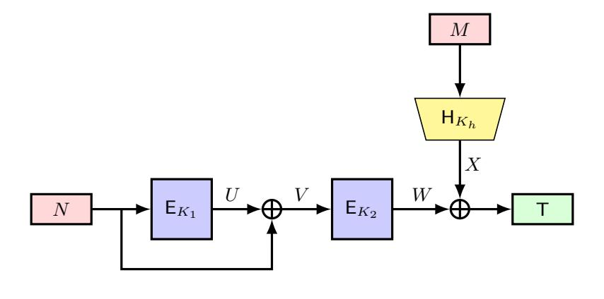

Fig. 3:  $F_{B_1}^{\text{EDM}}$ 

**4.1.1** CMT and CMT<sub>k</sub> Security of  $F_{B_1}^{\text{EDM}}$  Here, we present a key-committing attack against  $F_{B_1}^{\text{EDM}}$  construction. The attack works as follows: fix any  $(K_h, M)$  and then exploit Lemma 3, which guarantees two distinct triples (K, K, N), (K', K', N'), where  $K \neq K'$  with  $\text{EDM}(K, K, N) = \text{EDM}(K', K', N') = 0^n$ . Xoring with  $\text{H}(K_h, M)$  preserves this collision, so the inputs  $(K, K, K_h, N, M)$  and  $(K', K', K_h, N', M)$  yield the same tag. The formal attack description is given in Figure 4.

{7}------------------------------------------------

```
1: Select any K \in \{0,1\}^{\kappa} and compute N = \mathsf{E}_K^{-1}(0^n);

2: Select another K' \in \{0,1\}^{\kappa} such that K' \neq K and compute N' = \mathsf{E}_{K'}^{-1}(0^n);

3: Select any K_h \in \{0,1\}^{\kappa_h} and M \in \{0,1\}^*;

4: Output the tuples (K,K,K_h,N,M) and (K',K',K_h,N',M);
```

Fig. 4:  $\mathsf{CMT}_k$  adversary against  $F_{B_1}^{\mathrm{EDM}}$ 

Therefore, the construction  $F_{B_1}^{\text{EDM}}$  is not  $\mathsf{CMT}_k$  secure, and using Lemma 1, we can conclude that it is also not  $\mathsf{CMT}$  secure.

# 4.1.2 RBT $_k$ security of $F_{B_1}^{\rm EDM}$

**Theorem 1.** Let  $H: \{0,1\}^{\kappa_h} \times \{0,1\}^* \to \{0,1\}^n$  be a keyed hash function. Then, for any adversary A making at most  $q_h$  queries to H and  $q_p$  queries to the ideal cipher E, with  $q_p \leq 2^{n-1}$ , the key robustness advantage satisfies:

$$\mathbf{Adv}_{F_{B_1}^{\mathrm{EDM}}}^{\mathsf{RBT}_k}(\mathcal{A}) \leq \mathbf{Adv}_{\mathsf{H}}^{CR}(\mathcal{A}_{cr}) + \mathbf{Adv}_{\mathsf{H}}^{Pre}(\mathcal{A}_{pre};q_pq_h) + \mathbf{Adv}_{\mathsf{H}}^{Pre}(\mathcal{A}'_{pre};q_p^2q_h) + \frac{6q_p^2}{2^n} + \frac{2q_h^2q_p}{2^n} + \frac{2q_p^2q_h^2}{2^n}.$$

*Proof.* Let  $\mathcal{A}$  output  $((K_1, K_2, K_h), (K'_1, K'_2, K'_h), N, M)$  such that:

$$(K_1, K_2, K_h) \neq (K'_1, K'_2, K'_h).$$

Now, let  $T = \mathsf{E}_{K_2}(\mathsf{E}_{K_1}(N) \oplus N) \oplus \mathsf{H}(K_h, M)$  and  $\mathsf{T}' = \mathsf{E}_{K_2'}(\mathsf{E}_{K_1'}(N) \oplus N) \oplus \mathsf{H}(K_h', M)$ . Therefore, the adversary wins iff it can satisfy  $\mathsf{T} = \mathsf{T}'$ , i.e.

$$F_{B_1}^{\text{EDM}}(K_1, K_2, K_h, N, M) = F_{B_1}^{\text{EDM}}(K_1', K_2', K_h', N, M)$$

We analyze the adversary's success probability across two cases.

Case 1:  $K_h = K'_h$ : In this case,  $H(K_h, M) = H(K'_h, M)$ , so the equality T = T' implies:

$$EDM(K_1, K_2, N) = EDM(K'_1, K'_2, N).$$

Since  $K_h = K'_h$ , so it must be  $(K_1, K_2) \neq (K'_1, K'_2)$ , and the above equality boils down to a collision of  $\mathsf{EDM}(K_1, K_2, N)$ , which occurs with probability at most  $2q_p^2/2^n$  following Lemma 4.

Case 2:  $K_h \neq K'_h$ : We further divide this case into two subcases:

- (a) Let the adversary finds  $K_h \neq K'_h$  such that  $H(K_h, M) = H(K'_h, M)$  occurs. Then, the adversary's success probability is upper-bounded by the hash collision advantage  $\mathbf{Adv}^{\mathrm{CR}}_{\mathsf{H}}(\mathcal{A}_{cr})$ . Where  $\mathcal{A}_{cr}$  is a collision finding adversary for  $\mathsf{H}$  that uses the same hash query as  $\mathcal{A}$ .
- (b) Let  $H(K_h, M) \neq H(K'_h, M)$ . Let

$$V := \mathsf{E}_{K_1}(N) \oplus N, \quad W := \mathsf{E}_{K_2}(V), \quad V' := \mathsf{E}_{K_1'}(N) \oplus N, \quad W' := \mathsf{E}_{K_2'}(V').$$

Then the equality T = T', i.e.,  $W \oplus H(K_h, M) = W' \oplus H(K'_h, M)$  implies  $W \neq W'$  and hence  $(K_1, K_2) \neq (K'_1, K'_2)$ . Now, we further analyze this subcase depending on the structure of primitive queries:

- (i)  $(K'_1, N) = (K'_2, V')$ : Then  $W' = 0^n$ , so  $W = H(K_h, M) \oplus H(K'_h, M)$ .
  - If the final query among  $H(K_h, M)$ ,  $H(K'_h, M)$ , and  $W(= \mathsf{E}_{K_2}(V))$  is a forward ideal cipher query for W, then the event occurs with probability at most  $2q_h^2q_p/2^n$ .
  - If the final query is an inverse ideal-cipher query, then the adversary must satisfy  $\mathsf{E}_{K_1}(N) \oplus N = \mathsf{E}_{K_2}^{-1}(W)$  with  $W \neq 0^n$ , which occurs with probability at most  $2q_p^2/2^n$ .
  - Otherwise, without loss of generality let  $\mathsf{H}(K_h,M)$  be the final query. The adversary succeeds only if  $\mathsf{H}(K_h,M) \in \{W \oplus \mathsf{H}(K_h,M)\}$ ; since there are at most  $q_p$  choices for W and  $q_h$  hash outputs, this target set has size at most  $q_pq_h$ . Hence, the success probability is upper-bounded by  $\mathbf{Adv}^{\mathrm{Pre}}_{\mathsf{H}}(\mathcal{A}_{pre};q_pq_h)$ , where  $\mathcal{A}_{pre}$  is the preimage finding adversary against  $\mathsf{H}$  making the same hash query as  $\mathcal{A}$ .

{8}------------------------------------------------

- (ii)  $(K'_1, N) \neq (K'_2, V')$ : Then  $W \oplus W' = \mathsf{H}(K_h, M) \oplus \mathsf{H}(K'_h, M)$ .
  - If the final query among  $W(= \mathsf{E}_{K_2}(V)), \ W'(= \mathsf{E}_{K_2'}(V')), \ \mathsf{H}(K_h, M), \ \mathrm{and} \ \mathsf{H}(K_h', M')$  is a forward ideal-cipher query, then the event occurs with probability at most  $2q_h^2q_n^2/2^n$ .
  - If the final query is an inverse ideal-cipher query (w.l.o.g. involving  $(K'_2, V', W')$ ), then it requires  $\mathsf{E}_{K'_1}(N) \oplus N = \mathsf{E}_{K'_2}^{-1}(W')$ , which occurs with probability at most  $2q_p^2/2^n$ .
  - Otherwise, without loss of generality, suppose that  $\mathsf{H}(K_h,M)$  is the final query. The adversary succeeds only if  $\mathsf{H}(K_h,M) \in \{W \oplus W' \oplus \mathsf{H}(K_h',M')\}$ . Since there are at most  $q_p$  possible values for each of W and W' and at most  $q_h$  possible hash outputs, the corresponding target set  $\{W \oplus W' \oplus \mathsf{H}(K_h^j,M_j)\}$  has size at most  $q_p^2q_h$ . Hence, the adversary's success probability is upper-bounded by  $\mathbf{Adv}_{\mathsf{H}}^{\mathsf{Pre}}(\mathcal{A}'_{pre};q_p^2q_h)$ , where  $\mathcal{A}'_{pre}$  is a preimage-finding adversary issuing the same hash queries as  $\mathcal{A}$ .

Combining all the above cases, the theorem follows.

**Matching attack for**  $\mathsf{RBT}_k$  on  $F_{B_1}^{\mathsf{EDM}}$ : We now demonstrate the tightness of the  $\mathsf{RBT}_k$  bound for  $F_{B_1}^{\mathsf{EDM}}$  as established in the preceding theorem. The attack proceeds as follows:

- Fix a key  $K_1$  and a nonce N. Then compute  $V = N \oplus \mathsf{E}_{K_1}(N)$ .
- Select  $2^{n/4}$  distinct values for  $K_2^i$ . For each  $i \in [1, 2^{n/4}]$ , compute  $W_i = \mathsf{E}_{K_2^i}(V)$ .
- Independently, select  $2^{n/4}$  distinct values for  $K_h$ , and for each  $i \in [2^{n/4}]$ , compute  $X_i = \mathsf{H}(K_h^i, M)$ .
- Find indices  $a, b, c, d \in [2^{n/4}]$  such that  $W_a \oplus X_b = W_c \oplus X_d$ .
- Output the tuple  $((K_1, K_2^a, K_h^b), (K_1, K_2^c, K_h^d), N, M)$ .

Since each  $W_i$  and  $X_i$  is sampled uniformly at random and independently, the success probability of the attack is at least  $1 - e^{-1}$ .

## 4.1.3 CDY and CDY $_k$ security of $F_{B_1}^{\mathrm{EDM}}$

**Theorem 2.** Let  $H: \{0,1\}^{\kappa_h} \times \{0,1\}^* \to \{0,1\}^n$  be a keyed hash function. Suppose the context selector S does not access  $F_{B_1}^{\mathrm{EDM}}$ , H, or E. Then, for any adversary A making at most  $q_h$  queries to H and  $q_p$  queries to E, with  $q_p \leq 2^{n-1}$ , the context discovery advantage satisfies

$$\mathbf{Adv}^{\mathsf{CDY}}_{F_{B_1}^{\mathsf{EDM}}}(\mathcal{A};S) \leq \mathbf{Adv}^{Pre}_{\mathsf{H}}(\mathcal{A}_{pre};1) + \mathbf{Adv}^{Pre}_{\mathsf{H}}(\mathcal{A}'_{pre};q_p) + \frac{2q_hq_p}{2^n} + \frac{2q_p^2}{2^n}.$$

*Proof.* Let T denote the challenge tag. An adversary outputs  $(K_1, K_2, K_h, N, M)$  and succeeds if

$$F_{B_1}^{\text{EDM}}(K_1, K_2, K_h, N, M) = \mathsf{T},$$

that is, if  $V = \mathsf{E}_{K_1}(N)$ ,  $W = \mathsf{E}_{K_2}(V)$ ,  $X = \mathsf{H}(K_h, M)$ , and  $\mathsf{T} = W \oplus X$ .

Case 1:  $(K_1, N) = (K_2, V)$ . Then  $W = 0^n$  and  $T = X = H(K_h, M)$ . Hence, the success probability of  $\mathcal{A}$  is upper-bounded by the preimage-finding advantage  $\mathbf{Adv}^{\operatorname{Pre}}_{\mathsf{H}}(\mathcal{A}_{pre}; 1)$ , where  $\mathcal{A}_{pre}$  is the preimage finding adversary against  $\mathsf{H}$  making the same hash query as  $\mathcal{A}$ .

Case 2:  $(K_1, N) \neq (K_2, V)$ . In this case,  $T = \mathsf{E}_{K_2}(V) \oplus \mathsf{H}(K_h, M)$ .

- 2a: If  $(K_2, V, W)$  is queried after  $H(K_h, M)$  and is a forward ideal-cipher query, then the probability of matching both components over at most  $q_p$  ideal-cipher queries and  $q_h$  hash queries is at most  $2q_pq_h/2^n$ .
- 2b: If  $(K_2, V, W)$  is queried after  $\mathsf{H}(K_h, M)$  and is an inverse ideal-cipher query, then  $\mathsf{E}_{K_1}(N) \oplus N = V = \mathsf{E}_{K_2}^{-1}(W)$ , which occurs with probability at most  $2q_p^2/2^n$ .
- 2c: Otherwise,  $H(K_h, M)$  is queried after  $(K_2, V, W)$ . The adversary succeeds only if  $H(K_h, M) \in \{W \oplus T\}$ . Since there are at most  $q_p$  possible values of W, the success probability is upper-bounded by  $\mathbf{Adv}^{\mathrm{Pre}}_{\mathsf{H}}(\mathcal{A}'_{pre}; q_p)$ , where  $\mathcal{A}'_{pre}$  is the preimage finding adversary against  $\mathsf{H}$  making the same hash query as  $\mathcal{A}$ .

Summing over all cases yields the claimed bound.

Therefore,  $F_{B_1}^{\text{EDM}}$  achieves CDY security against  $O(2^{n/2})$  queries. By Lemma 1, it further satisfies CDY<sub>k</sub> security for the same query bound.

{9}------------------------------------------------

**Matching**  $CDY_k$  **Attack on**  $F_{B_1}^{EDM}$ : Here, we present a matching attack on  $CDY_k$ , which establishes that the bound is tight for both  $CDY_k$  and CDY security of  $F_{B_1}^{EDM}$ . Let (N, M, T) denote the challenge tuple. The adversary proceeds as follows:

- Select  $K_h \in \{0,1\}^{\kappa_h}$  and compute  $X = \mathsf{H}(K_h,M)$ . Select  $2^{n/2}$  many distinct values for  $K_1^i$  and for each  $i \in [2^{n/2}]$ , compute  $U_i = \mathsf{E}_{K_1^i}(N)$ .
- Select  $2^{n/2}$  many distinct values for  $K_2^j$  and for each  $j \in [2^{n/2}]$ , compute  $V_j = \mathsf{E}_{K_2^j}^{-1}(X \oplus \mathsf{T})$ .
- If  $U_i \oplus V_j = N$  for some i, j, output  $(K_1^i, K_2^j, K_h)$ .

Since  $U_i$  and  $V_j$  are independent and uniformly random in  $\{0,1\}^n$ , the probability that a pair satisfies  $U_i \oplus V_j = N$  is at least  $1 - e^{-1}$  by the birthday bound.

#### <span id="page-9-0"></span> $\bm{F_{B_2}^{\text{EDM}}}$ 4.2

The function  $F_{B_2}^{\rm EDM}$  is the EWCDM construction of Cogliati and Seurin [12], which is shown to achieve 2n/3-bit MAC security against nonce-respecting adversaries. Recently, Choi et al. [11] refined this result (assuming that the underlying hash function is xor-collision resistant), establishing an optimal security bound and proving its tightness. Let E be a block cipher and H be a hash function,  $F_{B_2}^{\rm EDM}$  is defined as

$$F_{B_2}^{\mathrm{EDM}}[\mathsf{E}_{K_1},\mathsf{E}_{K_2},\mathsf{H}_{K_h}](N,M) = \mathsf{E}_{K_2}(\mathsf{E}_{K_1}(N) \oplus N \oplus \mathsf{H}(K_h,M)).$$

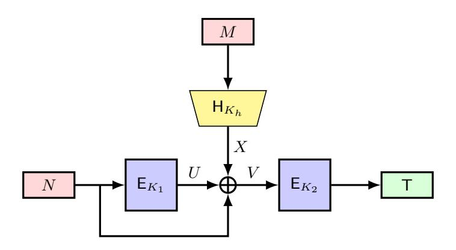

Fig. 5:  $F_{B_2}^{\text{EDM}}$ 

4.2.1 CMT and CMT<sub>k</sub> Security of  $F_{B_2}^{\text{EDM}}$  Here, we present a key-committing attack against  $F_{B_2}^{\text{EDM}}$ construction. The adversary begins by selecting a hash key  $K_h$  and a message M, then computes X = $H(K_h, M)$ . Next, the adversary chooses two distinct keys, K and K', and derives the corresponding nonce values N and N' as  $\mathsf{E}_K^{-1}(X)$  and  $\mathsf{E}_{K'}^{-1}(X)$ , respectively. Finally, the adversary outputs the tuples  $(K, K, K_h, N, M)$  and  $(K', K', K_h, N', M)$ . The complete attack procedure is detailed in Figure 6 and the analysis is described in Appendix A.1.

```
Select any K_h \in \{0,1\}^{\kappa_h}, M \in \{0,1\}^* and compute X = H(K_h, M);
1:
      Select K,K'\in\left\{0,1\right\}^{\kappa} such that K\neq K';
2:
      Compute N = \mathsf{E}_K^{-1}(X) and N' = \mathsf{E}_{K'}^{-1}(X);
3:
      Output the tuples (K, K, K_h, N, M) and (K', K', K_h, N', M);
4:
```

Fig. 6:  $\mathsf{CMT}_k$  adversary against  $F_{B_2}^{\mathrm{EDM}}$ 

Therefore, the construction  $F_{B_2}^{\text{EDM}}$  is not  $\mathsf{CMT}_k$  secure, and by Lemma 1, we can conclude that it is also not CMT secure.

{10}------------------------------------------------

## 4.2.2 RBT $_k$ security of $F_{B_2}^{\rm EDM}$

**Theorem 3.** Let  $H: \{0,1\}^{\kappa_h} \times \{0,1\}^* \to \{0,1\}^n$  be a keyed hash function. For any adversary A making at most  $q_h$  queries to H and  $q_p$  queries to the ideal cipher E, with  $q_p \leq 2^{n-1}$ , the key-robustness advantage satisfies

$$\mathbf{Adv}_{F_{B_2}^{\mathsf{RBT}_k}}^{\mathsf{RBT}_k}(\mathcal{A}) \leq \mathbf{Adv}_{\mathsf{H}}^{CR}(\mathcal{A}_{cr}) + \mathbf{Adv}_{\mathsf{H}}^{Pre}(\mathcal{A}_{pre};q_p^2) + \mathbf{Adv}_{\mathsf{H}}^{Pre}(\mathcal{A}'_{pre};q_p^2q_h) + \frac{4q_p^2}{2^n} + \frac{2q_p^2q_h}{2^n} + \frac{2q_p^2q_h^2}{2^n}.$$

*Proof.* Let  $\mathcal{A}$  output  $((K_1, K_2, K_h), (K'_1, K'_2, K'_h), N, M)$  such that

1. 
$$(K_1, K_2, K_h) \neq (K'_1, K'_2, K'_h)$$
, and  
2.  $F_{B_2}^{\text{EDM}}(K_1, K_2, K_h, N, M) = F_{B_2}^{\text{EDM}}(K'_1, K'_2, K'_h, N, M)$ .

Define

$$\mathsf{T} := \mathsf{E}_{K_2}(\mathsf{E}_{K_1}(N) \oplus N \oplus \mathsf{H}(K_h, M)) \qquad \mathsf{T}' := \mathsf{E}_{K_2'}(\mathsf{E}_{K_1'}(N) \oplus N \oplus \mathsf{H}(K_h', M)).$$

The adversary succeeds if and only if T = T'. We distinguish two main cases.

Case 1:  $K_2 \neq K'_2$ . The ideal-cipher queries involving  $(K_2, V, \mathsf{T})$  and  $(K'_2, V', \mathsf{T}')$  are distinct. Assume that the query involving  $(K'_2, V', \mathsf{T}')$  occurs after the one involving  $(K_2, V, \mathsf{T})$ .

1a: If the query involving  $(K'_2, V', \mathsf{T}')$  is forward, then the success probability is upper-bounded by  $2q_p^2/2^n$ .

1b: If the query involving  $(K'_2, V', \mathsf{T}')$  is inverse, then success implies

$$\mathsf{E}_{K_1'}(N) \oplus N \oplus \mathsf{H}(K_h', M) = \mathsf{E}_{K_2'}^{-1}(\mathsf{T}').$$

We further distinguish two subcases.

1b1: If  $\mathsf{H}(K_h',M)$  is the final query among the three relevant queries, then success requires

$$\mathsf{H}(K'_h, M) \in \{\mathsf{E}_{K'_1}(N) \oplus N \oplus \mathsf{E}_{K'_2}^{-1}(\mathsf{T}')\}.$$

Since there are at most  $q_p$  ideal-cipher queries, the target set has size at most  $q_p^2$ . Hence, the success probability is upper-bounded by  $\mathbf{Adv}_{\mathsf{H}}^{\mathsf{Pre}}(\mathcal{A}_{pre};q_p^2)$ , where  $\mathcal{A}_{pre}$  is the preimage finding adversary against H making the same hash query as A.

1b2: Otherwise, one of the remaining ideal-cipher queries is the final query. By the randomness of the ideal cipher, the success probability is upper-bounded by  $2q_p^2q_h/2^n$ .

Case 2:  $K_2 = K'_2$ . In this case, success implies

$$\mathsf{E}_{K_1}(N) \oplus N \oplus \mathsf{H}(K_h, M) = \mathsf{E}_{K_1'}(N) \oplus N \oplus \mathsf{H}(K_h', M),$$

where  $(K_1, K_h) \neq (K'_1, K'_h)$ .

2a:  $(K_h, M) = (K'_h, M)$ . Then success requires a collision in the Davies-Mayer construction,

$$\mathsf{E}_{K_1}(N) \oplus N = \mathsf{E}_{K_1'}(N) \oplus N.$$

By Lemma 2, the success probability is upper-bounded by  $2q_p^2/2^n$ .

2b:  $(K_h, M) \neq (K'_h, M')$  and  $H(K_h, M) = H(K'_h, M')$ . In this case,  $\mathcal{A}$  yields a collision for H, and the success probability is upper-bounded by  $\mathbf{Adv}^{\mathrm{CR}}_{\mathsf{H}}(\mathcal{A}_{cr})$ , where  $\mathcal{A}_{cr}$  makes the same hash queries as  $\mathcal{A}$ . 2c:  $H(K_h, M) \neq H(K'_h, M')$ .

2c1: If  $H(K'_h, M)$  is the final query among the four relevant queries, then success requires

$$\mathsf{H}(K_h',M) \in \{\mathsf{E}_{K_1}(N) \oplus N \oplus \mathsf{H}(K_h,M) \oplus \mathsf{E}_{K_1'}(N) \oplus N\}.$$

Since there are at most  $q_p$  ideal-cipher queries and  $q_h$  hash queries, the target set has size at most  $q_p^2 q_h$ . Hence the success probability is upper-bounded by  $\mathbf{Adv}_{\mathsf{H}}^{\mathsf{Pre}}(\mathcal{A}'_{pre}; q_p^2 q_h)$ , where  $\mathcal{A}'_{pre}$ is the preimage finding adversary against H making the same hash query as A.

2c2: Otherwise, let  $\mathsf{E}_{K_1'}(N)$  be the final query among the relevant queries. By the randomness of the ideal cipher, the success probability is upper-bounded by  $2q_p^2q_h^2/2^n$ .

Combining all cases yields the stated bound.

We have also demonstrated a matching attack for  $RBT_k$  on  $F_{B_2}^{EDM}$  in Appendix A.2.

{11}------------------------------------------------

## 4.2.3 CDY and CDY $_k$ security of $F_{B_2}^{\rm EDM}$

**Theorem 4.** Let  $H: \{0,1\}^{\kappa_h} \times \{0,1\}^* \to \{0,1\}^n$  be a keyed hash function. Suppose the context-selector S does not access any of  $F_{B_2}^{\mathrm{EDM}}$ , H, or E. Then, for any adversary A making at most  $q_h$  queries to H and  $q_p$  queries to the ideal cipher E, with  $q_p \leq 2^{n-1}$ , the context discovery advantage satisfies:

$$\mathbf{Adv}^{\mathsf{CDY}}_{F_{B_2}^{\mathsf{EDM}}}(\mathcal{A};S) \leq \mathbf{Adv}^{Pre}_{\mathsf{H}}(\mathcal{A}_{pre};1) + \mathbf{Adv}^{Pre}_{\mathsf{H}}(\mathcal{A}'_{pre};q_p^2) + \frac{2q_p}{2^n} + \frac{2q_p^2q_h}{2^n}.$$

*Proof.* Let T denote the challenge tag. Suppose the adversary  $\mathcal{A}$  outputs a valid tuple  $(K_1, K_2, K_h, N, M)$  such that  $F_{B_2}^{\mathrm{EDM}}(K_1, K_2, K_h, N, M) = \mathsf{T}$ .

The adversary is allowed to make queries to the ideal cipher (both forward and inverse) as well as to the hash oracle. We analyze the success probability of  $\mathcal{A}$  by considering the following cases:

Case 1: Let the ideal cipher queries involving  $(K_1, N, U)$  and  $(K_2, V, T)$  are exactly same. Then, we have

$$N = V \implies N = N \oplus U \oplus \mathsf{H}(K_h, M) \implies \mathsf{H}(K_h, M) = U = \mathsf{T}.$$

So, in this case, the adversary succeeds implies that the equation  $\mathsf{H}(K_h, M) = \mathsf{T}$  is satisfied. Therefore, the adversary's success probability is upper bounded by  $\mathbf{Adv}_{\mathsf{H}}^{\mathsf{Pre}}(\mathcal{A}_{pre}; 1)$ , where  $\mathcal{A}_{pre}$  is the preimage finding adversary against  $\mathsf{H}$  making the same hash query as  $\mathcal{A}$ .

Case 2: The adversary makes forward ideal cipher queries involving  $K_2$  and attempts to find a collision between one of the outputs and the challenge tag T. Using the randomness of ideal cipher E, we have the probability of a successful collision is at most  $2q_p/2^n$ .

Case 3: The adversary makes inverse ideal cipher queries involving T. In this case, A succeeds if and only if

$$\mathsf{E}_{K_1}(N) \oplus N \oplus \mathsf{H}(K_h, M) = \mathsf{E}_{K_2}^{-1}(\mathsf{T}).$$

Now we will analyze the probability of this event in the following subcases:

- 3a.  $\mathsf{H}(K_h,M)$  is the final query among three relevant queries. Then the adversary will be successful if  $\mathsf{H}(K_h,M) \in \{\mathsf{E}_{K_1}(N) \oplus N \oplus \mathsf{E}_{K_2}^{-1}(\mathsf{T})\}$ . As there are at most  $q_p$  ideal cipher queries, the cardinality of the target set is at most  $q_p^2$ . Hence, in this case,  $\mathcal{A}$ 's success probability is upper bounded by  $\mathbf{Adv}^{\mathrm{Pre}}_{\mathsf{H}}(\mathcal{A}'_{pre};q_p^2)$ , where  $\mathcal{A}'_{pre}$  is the preimage finding adversary against  $\mathsf{H}$  making the same hash query as  $\mathcal{A}$ .
- 3b. One of the ideal cipher queries among  $\mathsf{E}_{K_1}(N)$ ,  $\mathsf{E}_{K_2}^{-1}(\mathsf{T})$  is the final query. Then,  $\mathcal{A}$ 's success probability is upper bounded by  $2q_p^2q_h/2^n$ .

Therefore, combining all cases, we have the theorem.

A matching  $CDY_k$  attack on  $F_{B_2}^{EDM}$  is described in Appendix A.3. The attack establishes that the above bound is tight for both  $CDY_k$  and CDY security of  $F_{B_2}^{EDM}$ .

# <span id="page-11-0"></span> $\boldsymbol{4.3} \quad \boldsymbol{F_{B_3}^{\text{EDM}}}$

Let E be a block cipher and H be a hash function. The function  $F_{B_3}^{\rm EDM}$  is defined as:

$$F_{B_3}^{\mathrm{EDM}}[\mathsf{E}_{K_1},\mathsf{E}_{K_2},\mathsf{H}_{K_h}](N,M) = \mathsf{E}_{K_2}(\mathsf{E}_{K_1}(N) \oplus N \oplus \mathsf{H}(K_h,M)) \oplus \mathsf{H}(K_h,M).$$

Chen et al. [10] prove that this construction achieves 3n/4-bit MAC security against nonce-respecting adversaries. Recently, Choi et al. [11] refined this result (assuming that the underlying hash function is xor-collision resistant), establishing an optimal security bound and proving its tightness.

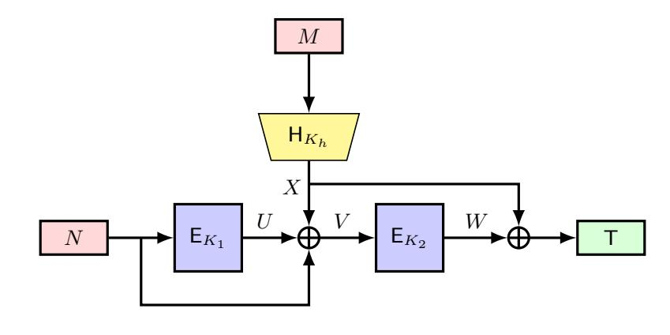

Fig. 7:  $F_{B_3}^{\text{EDM}}$ 

{12}------------------------------------------------

**4.3.1** CMT and CMT<sub>k</sub> Security of  $F_{B_3}^{\rm EDM}$  We now describe a key-committing attack against the  $F_{B_3}^{\rm EDM}$  construction. The attack proceeds in the same fashion as for  $F_{B_2}^{\rm EDM}$ , but we include the full details for completeness. The adversary's strategy is provided in Figure 8 and the analysis is described in Appendix A.4.

```
1: Select any K_h \in \{0,1\}^{\kappa_h}, M \in \{0,1\}^* and compute X = \mathsf{H}(K_h,M);

2: Select K, K' \in \{0,1\}^{\kappa} such that K \neq K';

3: Compute N = \mathsf{E}_K^{-1}(X), \ N' = \mathsf{E}_{K'}^{-1}(X);

4: Output the tuples (K, K, K_h, N, M) and (K', K', K_h, N', M);
```

Fig. 8:  $\mathsf{CMT}_k$  adversary against  $F_{B_3}^{\mathsf{EDM}}$ 

Therefore, the construction  $F_{B_3}^{\text{EDM}}$  is not  $\mathsf{CMT}_k$  secure, and by Lemma 1, we can conclude that it is also not  $\mathsf{CMT}$  secure.

## <span id="page-12-2"></span>4.3.2 RBT $_k$ security of $F_{B_3}^{\mathrm{EDM}}$

**Theorem 5.** Let  $H: \{0,1\}^{\kappa_h} \times \{0,1\}^* \to \{0,1\}^n$  be a keyed hash function. For any adversary A making at most  $q_h$  queries to H and  $q_p$  queries to the ideal cipher E, with  $q_p \leq 2^{n-1}$ , the key-robustness advantage satisfies

$$\mathbf{Adv}_{F_{B_3}^{\mathrm{EDM}}}^{\mathsf{RBT}_k}(\mathcal{A}) \leq \mathbf{Adv}_{\mathsf{H}}^{CR}(\mathcal{A}_{cr}) + \mathbf{Adv}_{\mathsf{H}}^{Pre}(\mathcal{A}_{pre};q_p^2) + \mathbf{Adv}_{\mathsf{H}}^{Pre}(\mathcal{A}'_{pre};q_p^2q_h) + \frac{4q_p^2}{2^n} + \frac{2q_p^2q_h}{2^n} + \frac{2q_p^2q_h^2}{2^n}$$

*Proof.* Proof is similar to the proof of  $F_{B_1}^{\text{EDM}}$  and  $F_{B_2}^{\text{EDM}}$  is deferred to Appendix A.5.

In Appendix A.6, we have shown an  $RBT_k$  attack with  $O(2^{n/2})$  queries for the  $F_{B_3}^{EDM}$  construction.

# <span id="page-12-3"></span>4.3.3 CDY and CDY $_k$ security of $F_{B_3}^{\rm EDM}$

**Theorem 6.** Let  $\mathsf{H}:\{0,1\}^{\kappa_h}\times\{0,1\}^*\to\{0,1\}^n$  be a keyed hash function. Assume that the context selector S does not query  $F_{B_3}^{\mathrm{EDM}}$ ,  $\mathsf{H}$ , or the ideal cipher  $\mathsf{E}$ . For any adversary  $\mathcal{A}$  making at most  $q_h$  queries to  $\mathsf{H}$  and  $q_p$  queries to  $\mathsf{E}$ , with  $q_p\leq 2^{n-1}$ , the context discovery advantage satisfies

$$\mathbf{Adv}^{\mathsf{CDY}}_{F_{B_3}^{\mathsf{EDM}}}(\mathcal{A}; S) \leq \mathbf{Adv}^{Pre}_{\mathsf{H}}(\mathcal{A}_{pre}; q_p) + \frac{2q_p q_h}{2^n} + \frac{2q_p^2}{2^n} + \epsilon_0,$$

where  $\epsilon_0$  is the probability that S outputs the challenge tag  $0^n$ .

*Proof.* The proof is similar as of  $F_{B_1}^{\text{EDM}}$  and  $F_{B_2}^{\text{EDM}}$ . It is deferred to Appendix A.7.

Therefore,  $F_{B_3}^{\rm EDM}$  achieves CDY security against  $O(2^{n/2})$  queries. By Lemma 1, it further satisfies CDY<sub>k</sub> security for the same query bound.

A matching attack on  $CDY_k$  is described in Appendix A.8. The attack establishes that the above bound is tight for both  $CDY_k$  and CDY security of  $F_{B_3}^{EDM}$ .

# <span id="page-12-0"></span> $\bm{4.4} \quad \bm{F_{B_4}^{\text{EDM}}}$

Let E be a block cipher and H be a hash function, the function  $F_{B_4}^{\rm EDM}$  is defined as

$$F_{B_4}^{\mathrm{EDM}}[\mathsf{E}_{K_1},\mathsf{E}_{K_2},\mathsf{H}_{K_h}](N,M) = \mathsf{E}_{K_2}(\mathsf{E}_{K_1}(N \oplus \mathsf{H}(K_h,M)) \oplus N).$$

and Chen et al. [10] prove that it achieves 3n/4-bit MAC security against nonce-respecting adversaries. Recently, Choi et al. [11] proved the tightness of this bound assuming that the underlying hash function is xor-collision resistant.

{13}------------------------------------------------

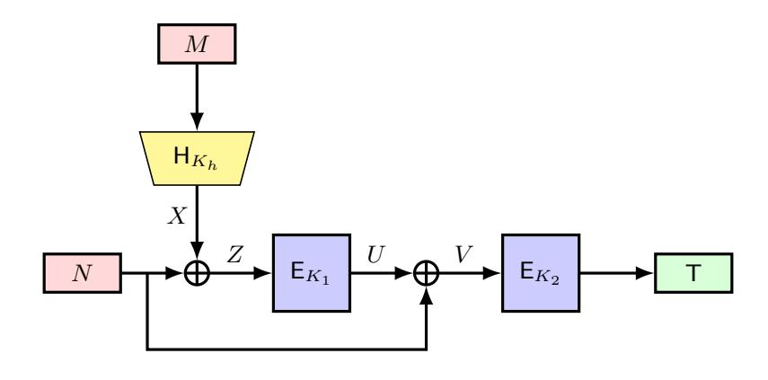

Fig. 9:  $F_{B_4}^{\text{EDM}}$ 

**4.4.1** CMT and CMT<sub>k</sub> Security of  $F_{B_4}^{\text{EDM}}$  Here, we present a key-committing attack against the  $F_{B_4}^{\text{EDM}}$  construction. The adversary begins by selecting a hash key  $K_h$  and a message M, then computes  $X = \mathsf{H}(K_h, M)$ . Next, the adversary chooses two distinct keys, K and K', and derives the corresponding nonce values N and N' as  $\mathsf{E}_K^{-1}(X) \oplus X$  and  $\mathsf{E}_{K'}^{-1}(X) \oplus X$ , respectively. Finally, the adversary outputs the tuples  $(K, K, K_h, N, M)$  and  $(K', K', K_h, N', M)$ . The complete attack procedure is detailed in Figure 10 and the analysis is described in Appendix A.9.

```
1: Select any K_h \in \{0,1\}^{\kappa_h}, M \in \{0,1\}^* and compute X = \mathsf{H}(K_h,M);

2: Select K, K' \in \{0,1\}^{\kappa} such that K \neq K';

3: Compute N = \mathsf{E}_K^{-1}(X) \oplus X, \ N' = \mathsf{E}_{K'}^{-1}(X) \oplus X;

4: Output the tuples (K, K, K_h, N, M) and (K', K', K_h, N', M);
```

Fig. 10:  $\mathsf{CMT}_k$  adversary against  $F_{B_4}^{\mathrm{EDM}}$ 

Therefore, the construction  $F_{B_4}^{\text{EDM}}$  is not  $\mathsf{CMT}_k$  secure, and by Lemma 1, we can conclude that it is also not  $\mathsf{CMT}$  secure.

# <span id="page-13-1"></span>4.4.2 RBT $_k$ security of $F_{B_4}^{\rm EDM}$

**Theorem 7.** Let  $H: \{0,1\}^{\kappa_h} \times \{0,1\}^* \to \{0,1\}^n$  be a keyed hash function. For any adversary A making at most  $q_h$  queries to H and  $q_p$  queries to the ideal cipher E, with  $q_p \leq 2^{n-1}$ , the key-robustness advantage satisfies

$$\mathbf{Adv}_{F_{B_4}^{\text{EDM}}}^{\text{RBT}_k}(\mathcal{A}) \leq \mathbf{Adv}_{\text{H}}^{CR}(\mathcal{A}_{cr}) + \mathbf{Adv}_{\text{H}}^{Pre}(\mathcal{A}_{pre}; q_p^2 q_h) + \mathbf{Adv}_{\text{H}}^{Pre}(\mathcal{A}'_{pre}; q_p^3) + \frac{6q_p^2}{2^n} + \frac{2q_p^4}{2^n} + \frac{2q_p^3 q_h}{2^n} + \frac{2q_p^2 q_h^2}{2^n} + \frac{2q_p^2 q_h^2}{2^n} + \frac{2q_p^2 q_h^2}{2^n} + \frac{2q_p^2 q_h^2}{2^n} + \frac{2q_p^2 q_h^2}{2^n} + \frac{2q_p^2 q_h^2}{2^n} + \frac{2q_p^2 q_h^2}{2^n} + \frac{2q_p^2 q_h^2}{2^n} + \frac{2q_p^2 q_h^2}{2^n} + \frac{2q_p^2 q_h^2}{2^n} + \frac{2q_p^2 q_h^2}{2^n} + \frac{2q_p^2 q_h^2}{2^n} + \frac{2q_p^2 q_h^2}{2^n} + \frac{2q_p^2 q_h^2}{2^n} + \frac{2q_p^2 q_h^2}{2^n} + \frac{2q_p^2 q_h^2}{2^n} + \frac{2q_p^2 q_h^2}{2^n} + \frac{2q_p^2 q_h^2}{2^n} + \frac{2q_p^2 q_h^2}{2^n} + \frac{2q_p^2 q_h^2}{2^n} + \frac{2q_p^2 q_h^2}{2^n} + \frac{2q_p^2 q_h^2}{2^n} + \frac{2q_p^2 q_h^2}{2^n} + \frac{2q_p^2 q_h^2}{2^n} + \frac{2q_p^2 q_h^2}{2^n} + \frac{2q_p^2 q_h^2}{2^n} + \frac{2q_p^2 q_h^2}{2^n} + \frac{2q_p^2 q_h^2}{2^n} + \frac{2q_p^2 q_h^2}{2^n} + \frac{2q_p^2 q_h^2}{2^n} + \frac{2q_p^2 q_h^2}{2^n} + \frac{2q_p^2 q_h^2}{2^n} + \frac{2q_p^2 q_h^2}{2^n} + \frac{2q_p^2 q_h^2}{2^n} + \frac{2q_p^2 q_h^2}{2^n} + \frac{2q_p^2 q_h^2}{2^n} + \frac{2q_p^2 q_h^2}{2^n} + \frac{2q_p^2 q_h^2}{2^n} + \frac{2q_p^2 q_h^2}{2^n} + \frac{2q_p^2 q_h^2}{2^n} + \frac{2q_p^2 q_h^2}{2^n} + \frac{2q_p^2 q_h^2}{2^n} + \frac{2q_p^2 q_h^2}{2^n} + \frac{2q_p^2 q_h^2}{2^n} + \frac{2q_p^2 q_h^2}{2^n} + \frac{2q_p^2 q_h^2}{2^n} + \frac{2q_p^2 q_h^2}{2^n} + \frac{2q_p^2 q_h^2}{2^n} + \frac{2q_p^2 q_h^2}{2^n} + \frac{2q_p^2 q_h^2}{2^n} + \frac{2q_p^2 q_h^2}{2^n} + \frac{2q_p^2 q_h^2}{2^n} + \frac{2q_p^2 q_h^2}{2^n} + \frac{2q_p^2 q_h^2}{2^n} + \frac{2q_p^2 q_h^2}{2^n} + \frac{2q_p^2 q_h^2}{2^n} + \frac{2q_p^2 q_h^2}{2^n} + \frac{2q_p^2 q_h^2}{2^n} + \frac{2q_p^2 q_h^2}{2^n} + \frac{2q_p^2 q_h^2}{2^n} + \frac{2q_p^2 q_h^2}{2^n} + \frac{2q_p^2 q_h^2}{2^n} + \frac{2q_p^2 q_h^2}{2^n} + \frac{2q_p^2 q_h^2}{2^n} + \frac{2q_p^2 q_h^2}{2^n} + \frac{2q_p^2 q_h^2}{2^n} + \frac{2q_p^2 q_h^2}{2^n} + \frac{2q_p^2 q_h^2}{2^n} + \frac{2q_p^2 q_h^2}{2^n} + \frac{2q_p^2 q_h^2}{2^n} + \frac{2q_p^2 q_h^2}{2^n} + \frac{2q_p^2 q_h^2}{2^n} + \frac{2q_p^2 q_h^2}{2^n} + \frac{2q_p^2 q_h^2}{2^n} + \frac{2q_p^2 q_h^2}{2^n} + \frac{2q_p^2 q_h^2}{2^n} + \frac{2q_p^2 q_h^2}{2^n} + \frac{2q_p^2 q_h^2}{2^n} + \frac{2q_p^2 q_h^2}{2^n} + \frac{2q_p^2$$

*Proof.* Let  $\mathcal{A}$  output  $((K_1, K_2, K_h), (K'_1, K'_2, K'_h), N, M)$  such that

1. 
$$(K_1, K_2, K_h) \neq (K'_1, K'_2, K'_h)$$
, and  
2.  $F_{B_4}^{\text{EDM}}(K_1, K_2, K_h, N, M) = F_{B_4}^{\text{EDM}}(K'_1, K'_2, K'_h, N, M)$ .

Define

$$\mathsf{T} := \mathsf{E}_{K_2} \big( \mathsf{E}_{K_1} (N \oplus \mathsf{H}(K_h, M)) \oplus N \big), \quad \mathsf{T}' := \mathsf{E}_{K_2'} \big( \mathsf{E}_{K_1'} (N \oplus \mathsf{H}(K_h', M)) \oplus N \big).$$

Thus the adversary succeeds only if T = T'. We analyze this event in two main cases.

Case 1:  $K_2 = K'_2$ . Then

$$\mathsf{E}_{K_1}(N \oplus \mathsf{H}(K_h, M)) \oplus N = \mathsf{E}_{K_1'}(N \oplus \mathsf{H}(K_h', M)) \oplus N$$
$$\Longrightarrow U := \mathsf{E}_{K_1}(N \oplus X) = \mathsf{E}_{K_1'}(N \oplus X') =: U',$$

where

$$X = \mathsf{H}(K_h, M), \quad X' = \mathsf{H}(K_h', M), \quad Z = N \oplus X, \quad Z' = N \oplus X'.$$

We distinguish subcases according to the ordering of the relevant hash and ideal-cipher queries.

{14}------------------------------------------------

- 1a. If  $H(K_h, M) = H(K'_h, M)$  but  $K_h \neq K'_h$ , then this is a hash collision event. Its probability is upper bounded by  $\mathbf{Adv}^{CR}_{H}(\mathcal{A}_{cr})$ .
- 1b. Otherwise, suppose the last among the two relevant ideal-cipher queries is a forward query. Then the probability that U = U' is at most  $2q_p^2/2^n$ .
- 1c. Suppose the last relevant query is inverse. W.l.o.g., let  $(K'_1, U)$  be the final query. Then  $\mathcal{A}$  succeeds if

$$\mathsf{E}_{K_1'}^{-1}(U) = \mathsf{E}_{K_1}^{-1}(U) \oplus \mathsf{H}(K_h, M) \oplus \mathsf{H}(K_h', M).$$

- 1c1. If  $\mathsf{E}_{K_1'}^{-1}(U)$  occurs after both relevant hash queries, then the success probability is at most  $2q_p^2q_h^2/2^n$ .
- 1c2. If one of the hash queries (w.l.o.g.  $(K'_h, M, X')$ ) occurs after the other three relevant queries, then success requires solving a preimage problem for H with target set

$$\{\mathsf{E}_{K_1'}^{-1}(U) \oplus \mathsf{E}_{K_1}^{-1}(U) \oplus \mathsf{H}(K_h,M)\},\$$

which has cardinality at most  $q_p^2 q_h$ . So, the success probability is bounded by  $\mathbf{Adv}_{\mathsf{H}}^{\mathsf{Pre}}(\mathcal{A}_{pre}; q_p^2 q_h)$ .

Case 2:  $K_2 \neq K'_2$ . Now the relevant ideal-cipher queries involve distinct keys. W.l.o.g. assume  $(K'_2, V', \mathsf{T}')$  is queried after  $(K_2, V, \mathsf{T})$ . For success, we must have

$$\begin{split} \mathsf{E}_{K_2}(V) &= \mathsf{T} = \mathsf{T}' = \mathsf{E}_{K_2'}(V'), \\ V \oplus U &= V' \oplus U' = N, \\ \mathsf{E}_{K_1}^{-1}(U) &= N \oplus \mathsf{H}(K_h, M), \\ \mathsf{E}_{K_1'}^{-1}(U') &= N \oplus \mathsf{H}(K_h', M). \end{split}$$

We again distinguish subcases.

- 2a. If the forward query on  $(K'_2, V')$  occurs after  $(K_2, V, \mathsf{T})$ , then the collision probability is at most  $2q_p^2/2^n$ .
- 2b. If the inverse query on  $(K'_2, \mathsf{T})$  occurs after  $(K_2, V, \mathsf{T})$  and satisfies

$$\mathsf{E}_{K_2'}^{-1}(\mathsf{T}) = V = V' = \mathsf{E}_{K_2}^{-1}(\mathsf{T}),$$

then, by ideal-cipher randomness, this event occurs with probability at most  $2q_p^2/2^n$ .

- 2c. If the inverse query on  $(K'_2, \mathsf{T})$  occurs after  $(K_1, Z, U), (K'_1, Z', U')$ , and  $(K_2, V, \mathsf{T})$ , or symmetrically a forward query on  $(K_1, Z')$  occurs after the other three, then the probability that all required equalities hold is at most  $2q_p^4/2^n$ .
- 2d. Otherwise, the last query among  $(K_1, Z, U)$ ,  $(K'_1, Z', U')$ ,  $(K_2, V, \mathsf{T})$ ,  $(K'_2, V', \mathsf{T}')$  is an inverse query on one of the first-layer keys. W.l.o.g. let it be  $(K'_1, U')$ . Then  $\mathcal{A}$  wins if

$$\mathsf{E}_{K_1'}^{-1}(U') = V \oplus U \oplus \mathsf{H}(K_h, M).$$

If the inverse query occurs after  $H(K_h, M)$ , the success probability is at most  $2q_p^3q_h/2^n$ .

If the hash query occurs after the inverse query, then success requires a preimage for H with the target set

$$\{\mathsf{E}_{K_1'}^{-1}(U')\oplus V\oplus U\},\$$

whose size is at most  $q_p^3$ . Hence, the probability is bounded by  $\mathbf{Adv}_{\mathsf{H}}^{\mathsf{Pre}}(\mathcal{A}'_{pre};q_p^3)$ .

Summing the bounds from all subcases yields the claimed result.

We have also demonstrated a matching attack for  $RBT_k$  on  $F_{B_4}^{EDM}$  in Appendix A.10.

{15}------------------------------------------------

## 4.4.3 CDY Security of $F_{B_4}^{\rm EDM}$

**Theorem 8.** Let  $\mathsf{H}:\{0,1\}^{\kappa_h}\times\{0,1\}^*\to\{0,1\}^n$  be a keyed hash function. Suppose the context-selector S does not access  $F_{B_4}^{\mathrm{EDM}}$ ,  $\mathsf{H}$ , or the ideal cipher  $\mathsf{E}$ . Then, for any adversary  $\mathcal{A}$  making at most  $q_h$  queries to  $\mathsf{H}$  and  $q_p$  queries to  $\mathsf{E}$ , with  $q_p\leq 2^{n-1}$ , the context-discovery advantage satisfies

$$\mathbf{Adv}^{\mathsf{CDY}}_{F_{B_A}^{\mathsf{EDM}}}(\mathcal{A};S) \leq \mathbf{Adv}^{Pre}_{\mathsf{H}}(\mathcal{A}_{pre};1) + \mathbf{Adv}^{Pre}_{\mathsf{H}}(\mathcal{A}'_{pre};q_p^2) + \frac{2q_p}{2^n} + \frac{2q_p^2q_h}{2^n}.$$

*Proof.* Let T denote the challenge tag. Suppose the adversary  $\mathcal{A}$  outputs a tuple  $(K_1, K_2, K_h, N, M)$  such that

$$F_{B_4}^{\text{EDM}}(K_1, K_2, K_h, N, M) = \mathsf{T}.$$

The adversary may query both the forward and inverse directions of the ideal cipher, as well as the hash oracle. We bound the success probability by considering the following cases.

Case 1. Suppose the ideal-cipher queries involving  $(K_1, Z, U)$  and  $(K_2, V, T)$  satisfy Z = V. Then

$$Z = V \implies N \oplus \mathsf{H}(K_h, M) = N \oplus U \implies \mathsf{H}(K_h, M) = U = \mathsf{T}.$$

Thus, the adversary must find a preimage of T under H, occurs with probability at most  $\mathbf{Adv}_{\mathsf{H}}^{\mathsf{Pre}}(\mathcal{A}_{pre};1)$ .

Case 2. Suppose the adversary makes forward ideal-cipher queries under  $K_2$  and attempts to obtain T as an output. Since E is an ideal cipher, the probability of getting T is at most  $2q_p/2^n$ .

Case 3. Suppose the adversary makes inverse ideal-cipher queries involving T. Then A succeeds only if

$$\mathsf{E}_{K_1}(N \oplus \mathsf{H}(K_h, M)) \oplus N = \mathsf{E}_{K_2}^{-1}(\mathsf{T})$$
  
$$\implies \mathsf{E}_{K_2}^{-1}(\mathsf{T}) = \mathsf{E}_{K_1}(Z) \oplus Z \oplus \mathsf{H}(K_h, M).$$

If one of the relevant ideal-cipher queries is the final query among the three relevant queries, then by randomness of the ideal cipher, the probability that the above equality holds is at most  $2q_p^2q_h/2^n$ . If instead the hash query is the final query, then  $\mathcal{A}$  must find a preimage of H for the target set

$$\{\mathsf{E}_{K_2}^{-1}(\mathsf{T}) \oplus \mathsf{E}_{K_1}(Z) \oplus Z\},$$

whose cardinality is at most  $q_p^2$ . Hence, the success probability in this case is bounded by  $\mathbf{Adv}_{\mathsf{H}}^{\mathsf{Pre}}(\mathcal{A}'_{pre};q_p^2)$ . Summing the bounds from all three cases yields the claimed result.

A matching attack on CDY is described in Appendix A.11.

# 4.4.4 CDY $_k$ security of $F_{B_4}^{\rm EDM}$

**Theorem 9.** Let  $H: \{0,1\}^{\kappa_h} \times \{0,1\}^* \to \{0,1\}^n$  be a keyed hash function. Suppose the context-selector S does not access any of  $F_{B_4}^{\mathrm{EDM}}$ , H, or E. Then, for any adversary  $\mathcal A$  making at most  $q_h$  queries to H and  $q_p$  queries to the ideal cipher E, with  $q_p \leq 2^{n-1}$ , the context discovery advantage satisfies:

$$\mathbf{Adv}^{\mathsf{CDY}_k}_{F_{B_4}^{\mathsf{EDM}}}(\mathcal{A};S) \leq \mathbf{Adv}^{Pre}_{\mathsf{H}}(\mathcal{A}_{pre};1) + \mathbf{Adv}^{Pre}_{\mathsf{H}}(\mathcal{A}'_{pre};q_p) + \frac{2q_p}{2^n} + \frac{4q_p^2}{2^n} + \frac{2q_pq_h}{2^n}.$$

*Proof.* Let  $(N, M, \mathsf{T})$  denote the challenge tuple. Let the adversary  $\mathcal{A}$  outputs a valid tuple  $(K_1, K_2, K_h)$  such that

$$F_{B_4}^{\text{EDM}}(K_1, K_2, K_h, N, M) = \mathsf{T}.$$

The adversary is allowed to make queries to the ideal cipher (both forward and inverse) as well as to the hash oracle. We analyze the success probability of  $\mathcal{A}$  by considering the following cases:

Case 1: Let the ideal cipher queries involving  $(K_1, Z, U)$  and  $(K_2, V, T)$  be exactly the same. Then we have

$$Z = V \implies N \oplus \mathsf{H}(K_h, M) = N \oplus U \implies \mathsf{H}(K_h, M) = U = \mathsf{T}.$$

Thus, the adversary must find a preimage of T under H, occurs with probability at most  $\mathbf{Adv}_{\mathsf{H}}^{\mathsf{Pre}}(\mathcal{A}_{pre};1)$ .

Case 2: The adversary makes forward ideal cipher queries involving  $K_2$  and attempts to find a collision between one of the outputs and the challenge tag T. Due to the randomness of the ideal cipher, the probability of a successful collision is at most  $2q_p/2^n$ .

Case 3: The adversary makes inverse ideal cipher queries involving T. In this case, A succeeds if and only if

$$\mathsf{E}_{K_1}(Z) \oplus N = \mathsf{E}_{K_2}^{-1}(\mathsf{T}), \quad \text{where } Z = N \oplus X.$$

There are three subcases based on the order and type of the queries:

{16}------------------------------------------------

- If the query  $(K_1, Z, U)$  is made before the inverse query  $(K_2, V, \mathsf{T})$ , then the success probability is at most  $2q_p^2/2^n$ .
- If the forward query  $(K_1, Z, U)$  is made after the inverse query  $(K_2, V, \mathsf{T})$ , then the adversary must satisfy  $\mathsf{E}_{K_1}(N \oplus X) \oplus N = V$ , which occurs with probability at most  $2q_p^2/2^n$ .
- If the inverse query  $(K_1, Z, U)$  is made after the inverse query  $(K_2, V, \mathsf{T})$ , then the adversary must satisfy  $\mathsf{E}_{K_1}^{-1}(U) = N \oplus \mathsf{H}(K_h, M)$ .

If the inverse query on  $(K_1, U)$  occurs after the hash query on  $(K_h, M)$ , then, by the ideal-cipher randomness,  $\mathcal{A}$  succeeds with probability at most  $2q_pq_h/2^n$ .

On the other hand, if the hash query on  $(K_h, M)$  occurs after the inverse ideal-cipher query, then  $\mathcal{A}$  succeeds only if it finds a preimage under H for the target set  $\{\mathsf{E}_{K_1}^{-1}(U) \oplus N\}$ .

Clearly, this target set has cardinality at most  $q_p$ . Hence, in this case,  $\mathcal{A}$ 's success probability is bounded by  $\mathbf{Adv}_{\mathsf{H}}^{\mathsf{Pre}}(\mathcal{A}'_{pre};q_p)$ .

Therefore, combining all the cases, the result follows.

A matching attack on  $CDY_k$  is described in Appendix A.12.

## <span id="page-16-0"></span>4.5 $F_{B_5}^{\rm EDM}$

Let E be a block cipher and H be a hash function. The function  $F_{B_5}^{\rm EDM}$  is defined as

$$F_{B_5}^{\mathrm{EDM}}[\mathsf{E}_{K_1},\mathsf{E}_{K_2},\mathsf{H}_{K_h}](N,M) = \mathsf{E}_{K_2}(\mathsf{E}_{K_1}(N \oplus \mathsf{H}(K_h,M)) \oplus N) \oplus \mathsf{H}(K_h,M),$$

and Chen et al. [10] prove that it achieves 3n/4-bit MAC security against nonce-respecting adversaries. Recently, Choi et al. [11] showed the tightness of this bound assuming that the underlying hash function is xor-collision resistant.

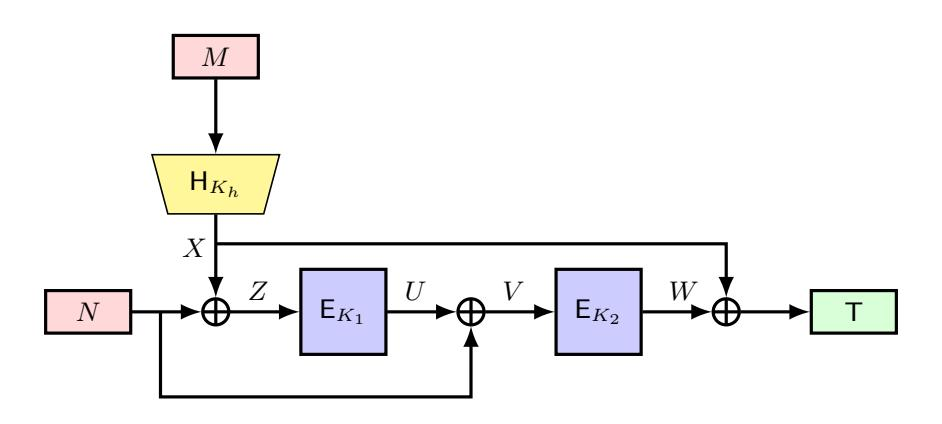

Fig. 11:  $F_{B_5}^{\text{EDM}}$ 

**4.5.1** CMT and CMT<sub>k</sub> Security of  $F_{B_5}^{\text{EDM}}$  The key-committing attack against  $F_{B_5}^{\text{EDM}}$  follows the same procedure as the attack on  $F_{B_4}^{\text{EDM}}$ . For completeness, we provide the full attack algorithm in Figure 12 and the analysis is described in Appendix A.13.

```
1: Select any K_h \in \{0,1\}^{\kappa_h}, M \in \{0,1\}^* and compute X = \mathsf{H}(K_h,M);

2: Select K, K' \in \{0,1\}^{\kappa} such that K \neq K';

3: Compute N = \mathsf{E}_K^{-1}(X) \oplus X and N' = \mathsf{E}_{K'}^{-1}(X) \oplus X;

4: Output the tuples (K,K,K_h,N,M) and (K',K',K_h,N',M);
```

Fig. 12:  $\mathsf{CMT}_k$  adversary against  $F_{B_5}^{\mathsf{EDM}}$ 

Therefore, the construction  $F_{B_5}^{\text{EDM}}$  is not  $\mathsf{CMT}_k$  secure, and by Lemma 1, it is also not  $\mathsf{CMT}$  secure.

{17}------------------------------------------------

# <span id="page-17-1"></span>4.5.2 RBT $_k$ security of $F_{B_{\mathtt{K}}}^{\mathrm{EDM}}$

**Theorem 10.** Let  $H: \{0,1\}^{\kappa_h} \times \{0,1\}^* \to \{0,1\}^n$  be a keyed hash function. Then, for any adversary A making at most  $q_h$  queries to H and  $q_p$  queries to the ideal cipher E, with  $q_p \leq 2^{n-1}$ , the key-robustness advantage satisfies

$$\mathbf{Adv}_{F_{B_5}^{\text{EDM}}}^{\mathsf{RBT}_k}(\mathcal{A}) \leq \mathbf{Adv}_{F_{B_4}^{\text{EDM}}}^{\mathsf{RBT}_k}(\mathcal{A}') + \mathbf{Adv}_{\mathsf{H}}^{CR}(\mathcal{A}_{cr}) + \mathbf{Adv}_{\mathsf{H}}^{Pre}(\mathcal{A}_{pre}; q_p^2 q_h) + \frac{2q_p^2 q_h^2}{2^n} + \frac{2q_p^2}{2^n} + \frac{2q_p^4}{2^n} + \frac{2q_p^3 q_h}{2^n}.$$

*Proof.* The detailed proof is deferred to appendix A.14.

In Appendix A.15, we have shown an  $\mathsf{RBT}_k$  attack with  $O(2^{n/2})$  queries for the  $F_{B_5}^{\mathsf{EDM}}$  construction.

# 4.5.3 CDY and CDY $_k$ security of $F_{B_{\kappa}}^{\mathrm{EDM}}$

**Theorem 11.** Let  $\mathsf{H}:\{0,1\}^{\kappa_h}\times\{0,1\}^*\to\{0,1\}^n$  be a keyed hash function. Suppose the context-selector S does not access  $F_{B_5}^{\mathrm{EDM}}$ ,  $\mathsf{H}$ , or  $\mathsf{E}$ . Then for any adversary  $\mathcal{A}$  making at most  $q_h$  hash queries and  $q_p$  ideal-cipher queries, with  $q_p\leq 2^{n-1}$ ,

$$\mathbf{Adv}^{\mathsf{CDY}}_{F_{B_{5}}^{\mathsf{EDM}}}(\mathcal{A}; S) \leq \epsilon_{0} + \mathbf{Adv}^{Pre}_{\mathsf{H}}(\mathcal{A}_{pre}; q_{p}) + \frac{2q_{p}q_{h}}{2^{n}} + \frac{2q_{p}^{2}}{2^{n}},$$

where  $\epsilon_0$  is the probability that S outputs  $0^n$ .

*Proof.* Let T denote the challenge tag. Suppose  $\mathcal{A}$  outputs  $(K_1, K_2, K_h, N, M)$  such that

$$F_{B_5}^{\text{EDM}}(K_1, K_2, K_h, N, M) = \mathsf{T}.$$

The adversary may query both directions of E and the hash oracle.

If  $T = 0^n$ , the adversary can always construct a valid context: choose any  $K_h$ , M and compute  $X = H(K_h, M)$ ; choose any K and set  $N = \mathsf{E}_K^{-1}(X) \oplus X$ . Then

$$F_{B_5}^{\mathrm{EDM}}(K, K, K_h, N, M) = \mathsf{E}_K(\mathsf{E}_K(N \oplus X) \oplus N) \oplus X = \mathsf{E}_K(X \oplus N) \oplus X = X \oplus X = 0^n.$$

Hence the success probability in this case is at most  $\epsilon_0$ .

This also shows that if  $(K_1, N) = (K_2, V)$  for a valid context, then necessarily  $T = 0^n$ . Thus in the following assume  $T \neq 0^n$  and  $(K_1, N) \neq (K_2, V)$ . Writing  $V = \mathsf{E}_{K_1}(N \oplus \mathsf{H}(K_h, M)) \oplus N$ , success requires  $\mathsf{E}_{K_2}(V) \oplus \mathsf{H}(K_h, M) = \mathsf{T}$ .

Case 1: If the hash query  $H(K_h, M)$  occurs after the ideal-cipher query  $(K_2, V, W)$ , then success requires finding a preimage of H for the set  $\{W \oplus T\}$ , whose size is at most  $q_p$ . Hence the probability is bounded by  $\mathbf{Adv}_{\mathsf{H}}^{\mathsf{Pre}}(\mathcal{A}_{pre}; q_p)$ .

Case 2: If a forward ideal-cipher query on  $(K_2, V)$  occurs after the hash query, then by randomness of E the success probability is at most  $2q_pq_h/2^n$ .

Case 3: If an inverse ideal-cipher query on  $(K_2, W)$  occurs after the hash query, then success requires

$$\mathsf{E}_{K_2}^{-1}(W) = \mathsf{E}_{K_1}(Z) \oplus Z \oplus \mathsf{T} \oplus W,$$

which holds with probability at most  $2q_p^2/2^n$ .

Summing all cases yields the claimed bound.

Therefore,  $F_{B_5}^{\rm EDM}$  achieves CDY security against  $O(2^{n/2})$  queries. By Lemma 1, it further satisfies CDY<sub>k</sub> security for the same query bound.

A matching attack on  $CDY_k$  is described in Appendix A.16. The attack establishes that the above bound is tight for both  $CDY_k$  and CDY security of  $F_{B_5}^{EDM}$ .

### <span id="page-17-0"></span>5 Analysis of Nonce-based MACs (based on EDMD)

Chen et al. [10] introduced nonce-based PRFs based on the Encrypted Davies Meyer Dual (EDMD) construction, denoted as  $F^{\text{EDMD}}$ . Let  $\kappa, \kappa_h, n \in \mathbb{N}$ ,  $\mathsf{E} \colon \{0,1\}^\kappa \times \{0,1\}^n \to \{0,1\}^n$  be a block cipher and  $\mathsf{H} \colon \{0,1\}^{\kappa_h} \times \{0,1\}^* \to \{0,1\}^n$  be a hash function. They proposed a generic construction  $F_{B_x}^{\text{EDMD}} \colon \{0,1\}^{2\kappa} \times \{0,1\}^{\kappa_h} \times \{0,1\}^n \times \{0,1\}^* \to \{0,1\}^n$  defined as

$$F_{B_x}^{\mathrm{EDMD}}[\mathsf{E}_{K_1},\mathsf{E}_{K_2},\mathsf{H}_{K_h}](N,M) = \\ \mathsf{E}_{K_2}(\mathsf{E}_{K_1}(N \oplus b_1 \cdot \mathsf{H}_{K_h}(M)) \oplus b_1 \cdot \mathsf{H}_{K_h}(M)) \oplus \mathsf{E}_{K_1}(N \oplus b_1 \cdot \mathsf{H}_{K_h}(M)) \oplus b_3 \cdot \mathsf{H}_{K_h}(M),$$

where  $B_x \in \{B_0, \ldots, B_7\}$  is the 3-bit representation of x, denoted as  $(b_1, b_2, b_3)$ . Among the eight possible constructions, the authors conclude that only  $F_{B_1}^{\text{EDMD}}$  achieves beyond-birthday-bound MAC security against nonce-respecting adversaries, while  $F_{B_2}^{\text{EDMD}}$  lacks a security analysis in this regard.

{18}------------------------------------------------

# <span id="page-18-0"></span> $\bm{5.1} \quad \bm{F_{B_1}^{\text{EDMD}}}$

The function  $F_{B_1}^{\rm EDMD}$  is a Wegman Carter construction that uses EDMD as its underlying PRF. It is optimally n-bit secure against nonce-respecting adversaries and totally broken when the nonce is reused. Let E be a block cipher and H be a hash function,  $F_{B_1}^{\rm EDMD}$  is defined as

$$F_{B_1}^{\text{EDMD}}[\mathsf{E}_{K_1},\mathsf{E}_{K_2},\mathsf{H}_{K_h}](N,M) = \mathsf{E}_{K_2}(\mathsf{E}_{K_1}(N)) \oplus \mathsf{E}_{K_1}(N) \oplus \mathsf{H}(K_h,M).$$

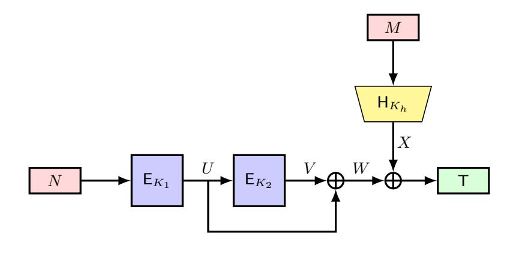

Fig. 13:  $F_{B_1}^{\text{EDMD}}$ 

**5.1.1** CMT and CMT<sub>k</sub> security of  $F_{B_1}^{\text{EDMD}}$  Here we present a key-committing attack against  $F_{B_1}^{\text{EDMD}}$  construction. The adversary selects two distinct keys,  $K_1$  and  $K'_1$ , and computes  $N = \mathsf{E}_{K_1}^{-1}(0^n)$  and  $N' = \mathsf{E}_{K'_1}^{-1}(0^n)$ . Next, the adversary selects another key  $K_2$ , a hash key  $K_h$ , and a message M. Finally, it outputs the tuples  $(K_1, K_2, K_h, N, M)$  and  $(K'_1, K_2, K_h, N', M)$ . The complete attack description is provided in Figure 14.

```
1: Select K_{1} \in \{0,1\}^{\kappa} and compute N = \mathsf{E}_{K_{1}}^{-1}(0^{n});

2: Select K_{1}' \in \{0,1\}^{\kappa} such that K_{1}' \neq K_{1} and compute N' = \mathsf{E}_{K_{1}'}^{-1}(0^{n});

3: Select K_{2} \in \{0,1\}^{\kappa}, K_{h} \in \{0,1\}^{\kappa_{h}} and M \in \{0,1\}^{*};

4: Output the tuples (K_{1},K_{2},K_{h},N,M) and (K_{1}',K_{2},K_{h},N',M);
```

Fig. 14:  $\mathsf{CMT}_k$  adversary against  $F_{B_1}^{\mathsf{EDMD}}$ 

**Analysis of the Attack:** For the first output tuple  $(K_1, K_2, K_h, N, M)$ , the tag is computed as:

$$F_{B_1}^{\text{EDMD}}(K_1, K_2, K_h, N, M) = \mathsf{E}_{K_2}(\mathsf{E}_{K_1}(N)) \oplus \mathsf{E}_{K_1}(N) \oplus \mathsf{H}(K_h, M),$$
  
=  $\mathsf{E}_{K_2}(0^n) \oplus \mathsf{H}(K_h, M)$ , since  $\mathsf{E}_{K_1}(N) = 0^n$ .

For the second output tuple  $(K'_1, K_2, K_h, N', M)$ , the tag is computed as:

$$F_{B_1}^{\text{EDMD}}(K_1', K_2, K_h, N', M) = \mathsf{E}_{K_2}(\mathsf{E}_{K_1'}(N')) \oplus \mathsf{E}_{K_1'}(N') \oplus \mathsf{H}(K_h, M),$$
  
=  $\mathsf{E}_{K_2}(0^n) \oplus \mathsf{H}(K_h, M)$ , since  $\mathsf{E}_{K_1'}(N') = 0^n$ .

From the above two equations, it is clear that both tuples produce the same tag  $T = \mathsf{E}_{K_2}(0^n) \oplus \mathsf{H}(K_h, M)$ . Thus, the algorithm presented in Figure 14 leads to a  $\mathsf{CMT}_k$  attack on  $F_{B_1}^{\mathsf{EDMD}}$  with a success probability of 1.

Therefore, the construction  $F_{B_1}^{\text{EDMD}}$  is not  $\mathsf{CMT}_k$  secure and by Lemma 1, we can conclude that  $F_{B_1}^{\text{EDMD}}$  is not  $\mathsf{CMT}$  secure also.

{19}------------------------------------------------

### <span id="page-19-1"></span>5.1.2 RBT $_k$ Security of $F_{B_1}^{\mathrm{EDMD}}$

**Theorem 12.** Let  $H: \{0,1\}^{\kappa_h} \times \{0,1\}^* \to \{0,1\}^n$  be a keyed hash function. Then, for any adversary A making at most  $q_h$  queries to H and  $q_p$  queries to the ideal cipher E, with  $q_p \leq 2^{n-1}$ , the key robustness advantage satisfies

$$\mathbf{Adv}_{F_{B_1}^{\mathrm{EDMD}}}^{\mathsf{RBT}_k}(\mathcal{A}) \leq \mathbf{Adv}_{\mathsf{H}}^{CR}(\mathcal{A}_{cr}) + \mathbf{Adv}_{\mathsf{H}}^{Pre}(\mathcal{A}_{pre}; q_p^2 q_h) + \frac{4q_p^2}{2^n} + \frac{2q_p^2 q_h^2}{2^n}.$$

*Proof.* Suppose  $\mathcal{A}$  outputs  $((K_1, K_2, K_h), (K'_1, K'_2, K'_h), N, M)$  such that

$$(K_1, K_2, K_h) \neq (K'_1, K'_2, K'_h).$$

Define  $T := \mathsf{E}_{K_2}(\mathsf{E}_{K_1}(N)) \oplus \mathsf{E}_{K_1}(N) \oplus \mathsf{H}(K_h, M)$ , and  $\mathsf{T}' := \mathsf{E}_{K_2'}(\mathsf{E}_{K_1'}(N)) \oplus \mathsf{E}_{K_1'}(N) \oplus \mathsf{H}(K_h', M)$ . The adversary wins if and only if  $\mathsf{T} = \mathsf{T}'$ . We analyze the success probability by considering the following cases.

Case 1:  $K_h = K'_h$ . In this case, if  $K_2 = K'_2$ , then  $\mathcal{A}$  must satisfy  $\mathsf{E}_{K_1}(N) = \mathsf{E}_{K'_1}(N)$  with  $K_1 \neq K'_1$ . This occurs with probability at most  $2q_p^2/2^n$ . On the other hand, if  $K_2 \neq K'_2$ , then  $\mathcal{A}$  wins if  $\mathsf{E}_{K_2}(U) \oplus U = \mathsf{E}_{K'_2}(U') \oplus U'$ . Clearly, we can then construct an adversary  $\mathcal{B}$  against the collision resistance of the Davies-

Meyer construction DM. Thus  $\mathcal{A}$ 's success probability is upper bounded by  $\mathbf{Adv}^{coll}_{\mathsf{DM}}(\mathcal{B}) \overset{(1)}{\leq} 2q_p^2/2^n$ , where inequality (1) follows from Lemma 2.

Case 2:  $K_h \neq K'_h$ . If the adversary finds  $K_h \neq K'_h$  such that  $\mathsf{H}(K_h, M) = \mathsf{H}(K'_h, M)$ , then the adversary's success probability is upper bounded by the hash collision probability  $\mathbf{Adv}^{\mathrm{CR}}_{\mathsf{H}}(\mathcal{A}_{cr})$ . Otherwise, if  $\mathsf{H}(K_h, M) \neq \mathsf{H}(K'_h, M)$  and the adversary  $\mathcal{A}$  wins, then

$$\mathsf{E}_{K_2}(U) \oplus U \oplus \mathsf{H}(K_h, M) = \mathsf{E}_{K_2'}(U') \oplus U' \oplus \mathsf{H}(K_h', M).$$

If either of the hash queries (w.l.o.g.  $(K'_h, M)$ ) is the last among these four relevant queries, then  $\mathcal{A}$  wins only if it can find a preimage against H for the target set  $\{\mathsf{E}_{K_2}(U) \oplus U \oplus \mathsf{H}(K_h, M) \oplus \mathsf{E}_{K'_2}(U') \oplus U'\}$ . As the cardinality of the target set is upper bounded by  $q_p^2 q_h$ ,  $\mathcal{A}$ 's success probability is upper bounded by  $\mathbf{Adv}^{\mathrm{Pre}}_{\mathsf{H}}(\mathcal{A}_{pre}; q_p^2 q_h)$ .

If either of the ideal cipher queries is the last among the four relevant queries, then  $\mathcal{A}$ 's success probability is upper bounded by  $2q_p^2q_h^2/2^n$ .

Combining all cases, the theorem follows.

We have also demonstrated a matching attack for  $\mathsf{RBT}_k$  on  $F_{B_1}^{\mathsf{EDMD}}$  in Appendix B.1.

### <span id="page-19-0"></span>5.1.3 CDY and CDY<sub>k</sub> security of $F_{B_1}^{\text{EDMD}}$

**Theorem 13.** Let  $\mathsf{H}:\{0,1\}^{\kappa_h}\times\{0,1\}^*\to\{0,1\}^n$  be a keyed hash function. Suppose the context selector S does not access the construction  $F_{B_1}^{\mathrm{EDM}}$ , nor the underlying primitives  $\mathsf{H}$  or  $\mathsf{E}$ . Then, for any adversary  $\mathcal{A}$  making at most  $q_h$  queries to  $\mathsf{H}$  and  $q_p$  queries to the ideal cipher  $\mathsf{E}$ , with  $q_p\leq 2^{n-1}$ , the context discovery advantage satisfies

$$\mathbf{Adv}^{\mathsf{CDY}}_{F_{B_1}^{\mathsf{EDMD}}}(\mathcal{A}; S) \leq \mathbf{Adv}^{Pre}_{\mathsf{H}}(\mathcal{A}_{pre}; q_p) + \frac{4q_p q_h}{2^n}.$$

*Proof.* Let T denote the challenge tag. Suppose  $\mathcal{A}$  outputs  $(K_1, K_2, K_h, N, M)$  such that

$$F_{B_1}^{\text{EDMD}}(K_1, K_2, K_h, N, M) = \mathsf{T}.$$

The adversary may query both directions of E and the hash oracle.  $\mathcal{A}$  will be successful if

$$\mathsf{H}(K_h,M) \oplus \mathsf{E}_{K_2}(U) \oplus U = \mathsf{T}.$$

Case 1. If the hash query  $H(K_h, M)$  occurs after the ideal-cipher query  $(K_2, U, V)$ , then success requires finding a preimage of H for the set  $\{E_{K_2}(U) \oplus U \oplus T\}$ , whose size is at most  $q_p$ . Hence the probability is bounded by  $\mathbf{Adv}_{H}^{\operatorname{Pre}}(\mathcal{A}_{pre}; q_p)$ .

Case 2. If a forward ideal-cipher query on  $(K_2, U)$  occurs after the hash query, then by randomness of E the success probability is at most  $2q_pq_h/2^n$ .

{20}------------------------------------------------

Case 3. If an inverse ideal-cipher query on  $(K_2, V)$  occurs after the hash query, then success requires

$$\mathsf{E}_{K_2}^{-1}(V) = \mathsf{T} \oplus \mathsf{H}(K_h) \oplus V,$$

which holds with probability at most  $2q_pq_h/2^n$ . Combining all the cases, we have the theorem.

Therefore, by Lemma 1 and Theorem 13, we can also conclude that  $F_{B_1}^{\rm EDMD}$  achieve the same  $\mathsf{CDY}_k$  security as  $\mathsf{CDY}$  security.

We will show the tightness of this bound by showing a tight matching attack in appendix B.2.

### <span id="page-20-0"></span>6 Analysis of Nonce-based MACs (based on SoP)

Chen et al. [10] introduced nonce-based PRFs based on the Sum of Permutation (SoP) construction, denoted as  $F^{\text{SoP}}$ . Let  $\kappa, \kappa_h, n \in \mathbb{N}$ ,  $\mathsf{E} \colon \{0,1\}^{\kappa} \times \{0,1\}^n \to \{0,1\}^n$  be a block cipher, and  $\mathsf{H} \colon \{0,1\}^{\kappa_h} \times \{0,1\}^* \to \{0,1\}^n$  be a hash function. They proposed a generic construction

$$F_{B_x}^{\text{SoP}}: \{0,1\}^{2\kappa} \times \{0,1\}^{\kappa_h} \times \{0,1\}^n \times \{0,1\}^* \to \{0,1\}^n,$$

defined as

$$F_{B_x}^{\text{SoP}}[\mathsf{E}_{K_1},\mathsf{E}_{K_2},\mathsf{H}_{K_h}](N,M)$$

$$=\mathsf{E}_{K_1}(N\oplus b_1\cdot\mathsf{H}(K_h,M))\oplus\mathsf{E}_{K_2}(N\oplus b_2\cdot\mathsf{H}(K_h,M))\oplus b_3\cdot\mathsf{H}(K_h,M),$$

where  $B_x \in \{B_0, \dots, B_7\}$  is the 3-bit representation of x, denoted as  $(b_1, b_2, b_3)$ . The authors showed that among the eight possible constructions, three  $(F_{B_1}^{\text{SoP}}, F_{B_2}^{\text{SoP}}, \text{ and } F_{B_3}^{\text{SoP}})$  achieve beyond-birthday-bound MAC security against nonce-respecting adversaries.

# <span id="page-20-1"></span>6.1 $F_{B_1}^{\text{SoP}}$

The function  $F_{B_1}^{\text{SoP}}$  is a Wegman–Carter MAC construction that uses the Sum of Permutations (SoP) as its underlying PRF. It achieves optimal n-bit security against nonce-respecting adversaries, but becomes completely insecure if the nonce is ever reused.

Let E be a block cipher and H be a hash function. The construction  $F_{B_1}^{\text{SoP}}$  is defined as:

$$F_{B_1}^{\text{SoP}}[\mathsf{E}_{K_1},\mathsf{E}_{K_2},\mathsf{H}_{K_h}](N,M) = \mathsf{E}_{K_1}(N) \oplus \mathsf{E}_{K_2}(N) \oplus \mathsf{H}(K_h,M).$$

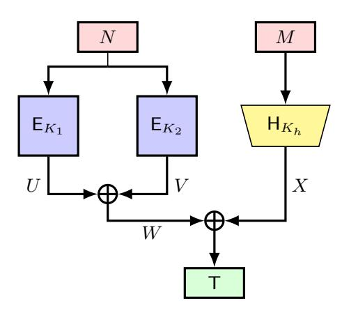

Fig. 15:  $F_{B_1}^{\text{SoP}}$ 

**6.1.1** CMT, CMT<sub>k</sub> and RBT<sub>k</sub> Security of  $F_{B_1}^{\text{SoP}}$  We present a key-robustness attack against the  $F_{B_1}^{\text{SoP}}$  construction. The adversary selects a hash key  $K_h$ , a message M, and a nonce N. Then, it chooses two distinct keys K and K' and outputs the tuples  $(K, K', K_h, N, M)$  and  $(K', K, K_h, N, M)$ . The complete attack is shown in Figure 16.

{21}------------------------------------------------

```
1: Select any K_h \in \{0,1\}^{\kappa_h}, M \in \{0,1\}^* and N \in \{0,1\}^n;
2: Select K, K' \in \{0,1\}^{\kappa} such that K \neq K';
3: Output the tuple ((K, K, K_h), (K', K', K_h), N, M);
```

Fig. 16:  $\mathsf{RBT}_k$  adversary against  $F_{B_1}^\mathsf{SoP}$ 

**Analysis of the Attack:** For any  $(K, K, K_h, N, M)$ , we have  $F_{B_1}^{\text{SoP}}(K, K, K_h, N, M) = \mathsf{H}(K_h, M)$ . Therefore, the adversary described in Figure 16 constitutes a successful  $\mathsf{RBT}_k$  attack on  $F_{B_1}^{\text{SoP}}$  with success probability 1.

Therefore, the construction  $F_{B_1}^{\text{SoP}}$  is not  $\mathsf{RBT}_k$  secure and by Lemma 1 we can also conclude that it is not  $\mathsf{CMT}_k$  and  $\mathsf{CMT}$  secure.

### 6.1.2 CDY and CDY<sub>k</sub> Security of $F_{B_1}^{\text{SoP}}$

**Theorem 14.** Let  $\mathsf{H}:\{0,1\}^{\kappa_h}\times\{0,1\}^*\to\{0,1\}^n$  be a keyed hash function. Suppose the context selector S does not access any of  $F_{B_1}^{\mathrm{SoP}}$ ,  $\mathsf{H}$ , or  $\mathsf{E}$ . Then, for any adversary  $\mathcal{A}$  making at most  $q_h$  queries to  $\mathsf{H}$  and  $q_p$  queries to the ideal cipher  $\mathsf{E}$ , with  $q_p\leq 2^{n-1}$ , the context discovery advantage satisfies:

$$\mathbf{Adv}^{\mathsf{CDY}}_{F_{B_1}^{\mathsf{SoP}}}(\mathcal{A};S) \leq \mathbf{Adv}^{\mathit{Pre}}_{\mathsf{H}}(\mathcal{A}_{\mathit{pre}};1) + \mathbf{Adv}^{\mathit{Pre}}_{\mathsf{H}}(\mathcal{A}'_{\mathit{pre}};q_p^2) + \frac{2q_p^2q_h}{2^n} + \frac{2q_p^2}{2^n}.$$

*Proof.* Let T denote the challenge tag. Suppose the adversary  $\mathcal{A}$  outputs a valid tuple  $(K_1, K_2, K_h, N, M)$  such that

$$F_{B_1}^{\text{SoP}}(K_1, K_2, K_h, N, M) = \mathsf{T}.$$

The adversary is allowed to make queries to the ideal cipher (both forward and inverse) and to the hash oracle. We analyze the success probability of  $\mathcal{A}$  by considering the following cases:

Case 1: Suppose there exist ideal cipher queries involving  $(K_1, N, U)$  and  $(K_2, N, V)$  such that  $\mathsf{E}_{K_1}(N) = U$  and  $\mathsf{E}_{K_2}(N) = V$ , and U = V. Then,

$$F_{B_1}^{\text{SoP}}(K_1, K_2, K_h, N, M) = \mathsf{H}(K_h, M).$$

Hence, the adversary succeeds only if it find preimage for T, which occurs with probability at most  $\mathbf{Adv}_{\mathsf{H}}^{\mathsf{Pre}}(\mathcal{A}_{pre}; 1)$ .

Case 2: Otherwise,  $\mathcal{A}$  will be successful if

$$\mathsf{E}_{K_1}(N) \oplus \mathsf{E}_{K_2}(N) \oplus \mathsf{H}(K_h,M) = \mathsf{T}$$

Without loss of generality, assume the ideal cipher query involving  $(K_1, N, U)$  occurs before the one involving  $(K_2, N, V)$ .

- The hash query on  $(K_h, M)$  is the final query among the three relevant queries. Then  $\mathcal{A}$  will be successful if it can find a preimage for the target set  $\{\mathsf{E}_{K_1}(N) \oplus \mathsf{E}_{K_2}(N)\}$  against  $\mathsf{H}$ . Clearly, cardinality of the target set is at most  $q_p^2$ . Hence,  $\mathcal{A}$ 's success probability is upper bounded by  $\mathbf{Adv}_{\mathsf{H}}^{\mathsf{Pre}}(\mathcal{A}'_{pre};q_p^2)$ .
- If the final query is a forward ideal cipher query (w.l.o.g  $\mathsf{E}_{K_2}(N)$ ), then for the adversary to succeed, we must have

$$\mathsf{E}_{K_2}(N) = \mathsf{E}_{K_1}(N) \oplus \mathsf{H}(K_h, M) \oplus \mathsf{T}.$$

Then the success probability is at most  $2q_p^2q_h/2^n$ .

- If the final query is an inverse ideal cipher query (w.l.o.g  $\mathsf{E}_{K_2}^{-1}(V)$ ) then the adversary must satisfy

$$\mathsf{E}_{K_2}^{-1}(\mathsf{E}_{K_1}(N)\oplus\mathsf{H}(K_h,M)\oplus\mathsf{T})=N.$$

As we have assumed that  $(K_1, N, U)$  query is done before the query  $(K_2, N, V)$  query, so target value of N for the  $\mathsf{E}_{K_2}^{-1}$  is at most  $q_p$ . Moreover, at most  $q_p$  ideal cipher query assumption gives that the success probability in this case is at most  $2q_p^2/2^n$ .

Hence, combining all cases, we obtain the bound as stated.

Therefore,  $F_{B_1}^{\text{SoP}}$  achieves CDY security against  $O(2^{n/3})$  queries. By Lemma 1, it further satisfies CDY<sub>k</sub> security for the same query bound.

A matching attack on  $\mathsf{CDY}_k$  is described in Appendix A.3. The attack establishes that the above bound is tight for both  $\mathsf{CDY}_k$  and  $\mathsf{CDY}$  security of  $F_{B_2}^{\mathrm{EDM}}$ .

{22}------------------------------------------------

## <span id="page-22-0"></span>6.2 $F_{B_2}^{\text{SoP}}$

The function  $F_{B_2}^{\text{SoP}}$  is defined as

$$F_{B_2}^{\text{SoP}}[\mathsf{E}_{K_1},\mathsf{E}_{K_2},\mathsf{H}_{K_h}](N,M) = \mathsf{E}_{K_1}(N) \oplus \mathsf{E}_{K_2}(N \oplus \mathsf{H}(K_h,M)),$$

where E is a block cipher and H is a hash function. Chen et al. [10] proved that  $F_{B_2}^{\rm SoP}$  achieves 3n/4-bit MAC security against nonce-respecting adversaries. More recently, Choi et al. [11] improved this result by showing an optimal bound under the assumption that the underlying hash function is multi-xor-collision resistant. Their analysis also proves that the bound is tight.

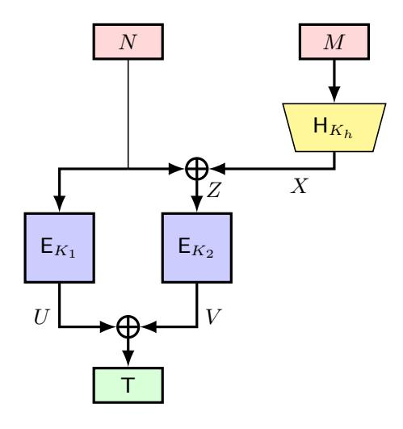

Fig. 17:  $F_{B_2}^{\text{SoP}}$ 

**6.2.1** CMT and CMT<sub>k</sub> Security of  $F_{B_2}^{\text{SoP}}$  Here we present a key-committing attack against the  $F_{B_2}^{\text{SoP}}$  construction. The adversary selects a hash key  $K_h$ , a message M, a nonce N, and computes  $X = \mathsf{H}(K_h, M)$ . Next, the adversary selects two distinct keys, K and K', and outputs the tuples  $(K, K', K_h, N, M)$  and  $(K', K, K_h, N \oplus X, M)$ . The complete attack description is provided in Figure 18 and the analysis is described in Appendix C.2.

```
1: Select any K_h \in \{0,1\}^{\kappa_h}, M \in \{0,1\}^*, N \in \{0,1\}^n and compute X = \mathsf{H}(K_h,M);

2: Select K, K' \in \{0,1\}^{\kappa} such that K \neq K';

3: Output the tuples (K, K', K_h, N, M) and (K', K, K_h, N \oplus X, M);
```

Fig. 18:  $\mathsf{CMT}_k$  adversary against  $F_{B_2}^{\mathsf{SoP}}$ 

Therefore, the construction  $F_{B_2}^{\text{SoP}}$  is not  $\mathsf{CMT}_k$  secure and from the security relations as stated in Lemma 1, we can conclude that  $F_{B_2}^{\text{SoP}}$  is not  $\mathsf{CMT}$  secure also.

# <span id="page-22-2"></span>6.2.2 RBT $_k$ security of $F_{B_2}^{\rm SoP}$

**Theorem 15.** Let  $\mathsf{H}:\{0,1\}^{\kappa_h}\times\{0,1\}^*\to\{0,1\}^n$  be a keyed hash function. Then, for any adversary  $\mathcal{A}$  making at most  $q_h$  queries to  $\mathsf{H}$  and  $q_p$  queries to the ideal cipher  $\mathsf{E}$ , with  $q_p\leq 2^{n-1}$ , the key robustness advantage satisfies:

$$\mathbf{Adv}_{F_{B_2}^{SoP}}^{\mathsf{RBT}_k}(\mathcal{A}) \leq \mathbf{Adv}_{\mathsf{H}}^{CR}(\mathcal{A}_{cr}) + \mathbf{Adv}_{\mathsf{H}}^{Pre}(\mathcal{A}_{pre}; 1) + \mathbf{Adv}_{\mathsf{H}}^{Pre}(\mathcal{A}'_{pre}; q_p^2 q_h) + \frac{4q_p^2}{2^n} + \frac{4q_p^4}{2^n} + \frac{4q_p^2q_h^2}{2^n}.$$

*Proof.* Detailed proof is deferred to appendix C.3.

We have also demonstrated a matching attack for  $RBT_k$  on  $F_{B_2}^{SoP}$  in Appendix C.4.

{23}------------------------------------------------

## 6.2.3 CDY security of $F_{B_2}^{\rm SoP}$

**Theorem 16.** Let  $\mathsf{H}:\{0,1\}^{\kappa_h}\times\{0,1\}^*\to\{0,1\}^n$  be a keyed hash function. Suppose the context-selector S does not access any of  $F_{B_2}^{\mathrm{SoP}}$ ,  $\mathsf{H}$ , or  $\mathsf{E}$ . Then, for any adversary  $\mathcal A$  making at most  $q_h$  queries to  $\mathsf{H}$  and  $q_p$  queries to the ideal cipher  $\mathsf{E}$ , with  $q_p\leq 2^{n-1}$ , the context discovery advantage satisfies:

$$\mathbf{Adv}^{\mathsf{CDY}}_{F_{B_2}^{\mathsf{SoP}}}(\mathcal{A};S) \leq \mathbf{Adv}^{\mathit{Pre}}_{\mathsf{H}}(\mathcal{A}_{\mathit{pre}};1)\epsilon_0 + \mathbf{Adv}^{\mathit{Pre}}_{\mathsf{H}}(\mathcal{A}'_{\mathit{pre}};q_p^2) + \frac{2q_p^2q_h}{2^n} + \frac{2q_p^2}{2^n}.$$

*Proof.* Let T denote the challenge tag. Suppose the adversary  $\mathcal{A}$  outputs a valid tuple  $(K_1, K_2, K_h, N, M)$  such that

$$F_{B_2}^{\text{SoP}}(K_1, K_2, K_h, N, M) = \mathsf{T}.$$

That is,

$$\mathsf{T} = \mathsf{E}_{K_1}(N) \oplus \mathsf{E}_{K_2}(N \oplus \mathsf{H}(K_h, M)).$$

The adversary is allowed to query the ideal cipher (forward and inverse) and the hash oracle. We analyze the success probability by considering the following cases:

Case 1: Collision in input values. Suppose the inputs to both cipher calls are equal, i.e.,

$$N = N \oplus \mathsf{H}(K_h, M) \Rightarrow \mathsf{H}(K_h, M) = 0^n.$$

Hence, in this case adversary will be successful only if the challenge tag  $\mathsf{T}=0^n$ . The probability that the adversary queries  $\mathsf{H}(K_h,M)=0^n$  in at most  $q_h$  queries to the hash oracle is at most  $\mathbf{Adv}^{\operatorname{Pre}}_{\mathsf{H}}(\mathcal{A}_{pre};1)$ . So in this case adversary will be successful with probability at most  $\epsilon_0 \cdot \mathbf{Adv}^{\operatorname{Pre}}_{\mathsf{H}}(\mathcal{A}_{pre};1)$ .

Case 2: No collision in inputs. That is,  $\mathsf{H}(K_h,M) \neq 0^n$ . Let  $Z = N \oplus \mathsf{H}(K_h,M)$ .  $\mathcal{A}$  will be successful if  $\mathsf{E}_{K_1}(N) \oplus \mathsf{E}_{K_2}(N \oplus \mathsf{H}(K_h,M)) = \mathsf{T}$ .

- Case 2a: The final query among these two relevant queries is a forward ideal cipher query. Then  $\mathcal{A}$  will be successful with probability at most  $2q_p^2/2^n$ .
- Case 2b: The final query among these two relevant queries is an inverse ideal cipher query (w.l.o.g let  $\mathsf{E}_{K_2}^{-1}(V)$ ). Then,  $\mathcal A$  will be successful if

$$\mathsf{E}_{K_2}^{-1}(\mathsf{E}_{K_1}(N)\oplus\mathsf{T})=N\oplus\mathsf{H}(K_h,M).$$

If the inverse query occurs after the hash query then  $\mathcal{A}$ 's success probability is upper bounded by  $2q_p^2q_h/2^n$ . If the hash query occurs after the inverse query then the probability is upper bounded by  $\mathbf{Adv}_{\mathsf{H}}^{\mathsf{Pre}}(\mathcal{A}'_{\mathit{nre}};q_p^2)$ .

Combining all three cases, the result follows.

A matching attack on CDY for  $F_{B_2}^{\text{SoP}}$  is described in Appendix C.5.

## 6.2.4 CDY<sub>k</sub> Security of $F_{B_2}^{\text{SoP}}$

**Theorem 17.** Let  $H: \{0,1\}^{\kappa_h} \times \{0,1\}^* \to \{0,1\}^n$  be a keyed hash function. Suppose the context-selector S does not access any of  $F_{B_2}^{SoP}$ , H, or E. Then, for any adversary A making at most  $q_h$  queries to H and  $q_p$  queries to the ideal cipher E, with  $q_p \leq 2^{n-1}$ , the context discovery advantage satisfies:

$$\mathbf{Adv}^{\mathsf{CDY}_k}_{F^{\mathsf{SoP}}_{B_2}}(\mathcal{A};S) \leq \mathbf{Adv}^{Pre}_{\mathsf{H}}(\mathcal{A}_{pre};1) + \mathbf{Adv}^{Pre}_{\mathsf{H}}(\mathcal{A}'_{pre};q_p) + \frac{2q_p^2}{2^n}.$$

*Proof.* Let (N, M, T) denote the challenge tuple. Let the adversary A outputs a valid tuple  $(K_1, K_2, K_h)$  such that

$$F_{B_2}^{\text{SoP}}(K_1, K_2, K_h, N, M) = \mathsf{T}.$$

The adversary is allowed to make queries to the ideal cipher (both forward and inverse) and the hash oracle. We analyze the success probability of  $\mathcal{A}$  by considering the following cases:

Case 1: Let the ideal cipher queries involve  $(K_1, N, U)$  and  $(K_2, Z, V)$  where  $\mathsf{E}_{K_1}(N) = U$  and  $\mathsf{E}_{K_2}(Z) = V$ . These are equal only if  $N = N \oplus X$ , i.e.,  $X = 0^n$ . That means the adversary must find  $K_h$  such that  $\mathsf{H}(K_h, M) = 0^n$ . In this case  $\mathcal{A}$ 's success is bounded by  $\mathbf{Adv}^{\mathsf{Pre}}_{\mathsf{H}}(\mathcal{A}_{pre}; 1)$ .

{24}------------------------------------------------

Case 2: Without loss of generality, assume the query involving  $(K_2, Z, V)$  occurs after the one involving  $(K_1, N, U)$ . If this query is forward, then the adversary must satisfy:

$$\mathsf{E}_{K_2}(Z) = \mathsf{E}_{K_1}(N) \oplus \mathsf{T}.$$

By ideal cipher randomness, this occurs with probability at most  $2q_p^2/2^n$ . If the query is inverse, then the adversary must satisfy:

$$\mathsf{E}_{K_2}^{-1}(\mathsf{E}_{K_1}(N)\oplus\mathsf{T})=N\oplus\mathsf{H}(K_h,M).$$

If the inverse ideal cipher query occurs after the hash query, then this happens with probability at most  $2q_pq_h/2^n$ . If the hash query occurs after the inverse query then this happens with probability at most  $\mathbf{Adv}^{\mathrm{Pre}}_{\mathsf{H}}(\mathcal{A}'_{pre};q_p)$ .

Therefore, combining both cases, the result follows.

A matching attack on  $\mathsf{CDY}_k$  for  $F_{B_2}^\mathsf{SoP}$  is described in Appendix C.6.

### <span id="page-24-0"></span>6.3 $F_{B_3}^{\text{SoP}}$

The function  $F_{B_3}^{\text{SoP}}$  is defined as

$$F_{B_3}^{\mathrm{SoP}}[\mathsf{E}_{K_1},\mathsf{E}_{K_2},\mathsf{H}_{K_h}](N,M) = \mathsf{E}_{K_1}(N) \oplus \mathsf{E}_{K_2}(N \oplus \mathsf{H}(K_h,M)) \oplus \mathsf{H}(K_h,M),$$

and Chen et al. [10] prove that it achieves 3n/4-bit MAC security against nonce-respecting adversaries. Recently, Choi et al. [11] improved this result (assuming that the underlying hash function is multi-xor-collision resistant), establishing an optimal security bound and proving its tightness.

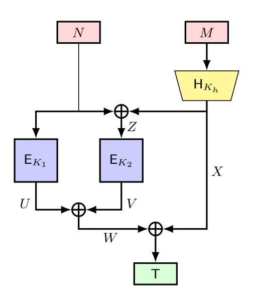

Fig. 19:  $F_{B_3}^{\text{SoP}}$ 

**6.3.1** CMT and CMT<sub>k</sub> Security of  $F_{B_3}^{\text{SoP}}$  The key-committing attack against  $F_{B_3}^{\text{SoP}}$  follows the same procedure as the attack on  $F_{B_2}^{\text{SoP}}$ . For completeness, we provide the full attack algorithm in Figure 20 and the analysis is described in Appendix C.7.

```
1: Select any K_h \in \{0,1\}^{\kappa_h}, M \in \{0,1\}^*, N \in \{0,1\}^n and compute X = \mathsf{H}(K_h,M);

2: Select K, K' \in \{0,1\}^{\kappa} such that K \neq K';

3: Output the tuples (K,K',K_h,N,M) and (K',K,K_h,N\oplus X,M);
```

Fig. 20:  $\mathsf{CMT}_k$  adversary against  $F_{B_3}^{\mathsf{SoP}}$ 

Therefore, the construction  $F_{B_3}^{\text{SoP}}$  is not  $\mathsf{CMT}_k$  secure and from the security relations as stated in Lemma 1, we can conclude that  $F_{B_3}^{\text{SoP}}$  is not  $\mathsf{CMT}$  secure also.

{25}------------------------------------------------

## <span id="page-25-0"></span>6.3.2 RBT $_k$ security of $F_{B_3}^{\mathrm{SoP}}$

**Theorem 18.** Let  $\mathsf{H}:\{0,1\}^{\kappa_h}\times\{0,1\}^*\to\{0,1\}^n$  be a keyed hash function. Then, for any adversary  $\mathcal{A}$  making at most  $q_h$  queries to  $\mathsf{H}$  and  $q_p$  queries to the ideal cipher  $\mathsf{E}$ , with  $q_p\leq 2^{n-1}$ , the key robustness advantage satisfies:

$$\mathbf{Adv}_{F_{B_3}^{SoP}}^{\mathsf{RBT}_k}(\mathcal{A}) \leq \mathbf{Adv}_{\mathsf{H}}^{Pre}(\mathcal{A}_{pre}; 1) + \mathbf{Adv}_{\mathsf{H}}^{Pre}(\mathcal{A}'_{pre}; q_p^2) + \mathbf{Adv}_{\mathsf{H}}^{CR}(\mathcal{A}_{cr}) + \frac{8q_p^2}{2^n} + \frac{6q_p^4}{2^n} + \frac{2q_p^2q_h}{2^n}.$$

Proof of the above theorem is deferred to Appendix C.8.

**Matching Attack for**  $\mathsf{RBT}_k$  on  $F_{B_3}^\mathsf{SoP}$ : We now demonstrate the tightness of the  $\mathsf{RBT}_k$  bound for  $F_{B_3}^\mathsf{SoP}$  as established in the preceding theorem. The attack against  $F_{B_3}^\mathsf{SoP}$  follows the same procedure as the attack on  $F_{B_2}^\mathsf{SoP}$ . For completeness, we provide the attack steps in the following:

- Fix a key  $K_h$ , a nonce N and a message M. Compute  $X = H(K_h, M)$ .
- Select  $2^{n/4}$  distinct values for  $K_1^i$ , and for each  $i \in [1, 2^{n/4}]$ , compute  $U_i = \mathsf{E}_{K_1^i}(N)$ .
- Select  $2^{n/4}$  distinct values for  $K_2^i$ , and for each  $i \in [1, 2^{n/4}]$ , compute  $V_i = \mathsf{E}_{K_2^i}(N \oplus X)$ .
- Find indices  $a, b, c, d \in [1, 2^{n/4}]$  such that  $U_a \oplus V_b = U_c \oplus V_d$ .
- Output the tuple  $((K_1^a, K_2^b, K_h), (K_1^c, K_2^d, K_h), N, M)$ .

Since each  $U_i$  and  $V_i$  is sampled uniformly at random and independently, the success probability of the attack is at least  $1 - e^{-1}$ .

### 6.3.3 CDY and CDY $_k$ Security of $F_{B_3}^{\rm SoP}$

**Theorem 19.** Let  $\mathsf{H}:\{0,1\}^{\kappa_h}\times\{0,1\}^*\to\{0,1\}^n$  be a keyed hash function. Suppose the context-selector S does not access any of  $F_{B_3}^{\mathrm{SoP}}$ ,  $\mathsf{H}$ , or  $\mathsf{E}$ . Then, for any adversary  $\mathcal A$  making at most  $q_h$  queries to  $\mathsf{H}$  and  $q_p$  queries to the ideal cipher  $\mathsf{E}$ , with  $q_p\leq 2^{n-1}$ , the context discovery advantage satisfies:

$$\mathbf{Adv}^{\mathsf{CDY}}_{F_{B_3}^{\mathsf{SoP}}}(\mathcal{A}; S) \leq \mathbf{Adv}^{\mathit{Pre}}_{\mathsf{H}}(\mathcal{A}_{\mathit{pre}}; 1) \cdot \epsilon_0 + \frac{2q_p^2}{2^n},$$

where  $\epsilon_0$  denotes the probability that S outputs the challenge tag  $0^n$ .

*Proof.* Let T denote the challenge tag. Suppose the adversary  $\mathcal{A}$  outputs a valid tuple  $(K_1, K_2, K_h, N, M)$  such that

$$F_{B_3}^{\text{SoP}}(K_1, K_2, K_h, N, M) = \mathsf{T}.$$

The adversary is allowed to make queries to the ideal cipher (both forward and inverse) and to the hash oracle. We analyze the success probability of  $\mathcal{A}$  by considering the following cases:

Case 1: The adversary finds  $(K_1, K_2, K_h, N, M)$  such that

$$(K_1, N) = (K_2, N \oplus X), \text{ where } X = H(K_h, M).$$

This implies  $X = 0^n$ , so the tag must be

$$T = E_{K_1}(N) \oplus E_{K_2}(N) \oplus 0^n = 0^n.$$

Therefore, the adversary must find a hash query  $(K_h, M)$  such that  $\mathsf{H}(K_h, M) = 0^n$ . Probability of finding such pair is upper bounded by  $\mathbf{Adv}^{\operatorname{Pre}}_{\mathsf{H}}(\mathcal{A}_{pre}; 1)$ . This is relevant only when  $\mathsf{T} = 0^n$ , which occurs with probability  $\epsilon_0$ . Hence, in this case the probability of success is at most  $\mathbf{Adv}^{\operatorname{Pre}}_{\mathsf{H}}(\mathcal{A}_{pre}; 1)\epsilon_0$ .

Case 2: The adversary finds a valid tuple where  $X = H(K_h, M) \neq 0^n$ , and succeeds with

$$F_{B_3}^{\mathrm{SoP}}(K_1, K_2, K_h, N, M) = \mathsf{E}_{K_1}(N) \oplus \mathsf{E}_{K_2}(N \oplus X) \oplus X = \mathsf{T}.$$

This implies

$$\mathsf{E}_{K_2}(N \oplus X) = \mathsf{T} \oplus X \oplus \mathsf{E}_{K_1}(N),$$

or equivalently,

$$\mathsf{E}_{K_1}(N) \oplus N = \mathsf{E}_{K_2}(N \oplus X) \oplus (N \oplus X) \oplus \mathsf{T}.$$

Note that T is chosen independently by the context selector. Since all ideal cipher evaluations are independent and uniform, and the adversary makes at most  $q_p$  queries, the probability of such a collision is bounded by  $2q_p^2/2^n$ .

Combining both cases, the result follows.

{26}------------------------------------------------

Therefore,  $F_{B_3}^{\text{SoP}}$  achieves CDY security against  $O(2^{n/2})$  queries. By Lemma 1, it further satisfies CDY<sub>k</sub> security for the same query bound.

A matching attack on  $CDY_k$  is described in Appendix C.9. The attack establishes that the above bound is tight for both  $CDY_k$  and CDY security of  $F_{B_3}^{SoP}$ .

### <span id="page-26-0"></span>7 Analysis of nEHtM

Dutta et. al. [18] have proposed a nonce-based version of EHtM [32] construction, called nonce-based Enhanced Hash-then-Mask (nEHtM), and gives upto 2n/3-bit unforgeability in faulty nonce model. For the purpose of domain separation, they consider an (n-1)-bit nonce and (n-1)-bit hash function. For any message M and nonce N, nEHtM is defined as follows

$$\mathsf{nEHtM}[\mathsf{E}_K,\mathsf{H}_{K_h}](N,M) = \mathsf{E}_K(0\|N) \oplus \mathsf{E}_K(1\|(N \oplus \mathsf{H}(K_h,M))).$$

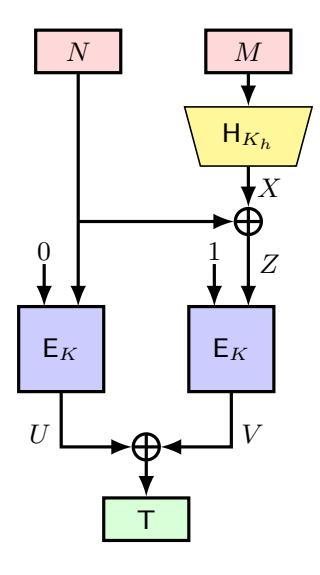

Fig. 21: nEHtM

#### 7.1 CMT security of nEHtM

**Theorem 20.** Let  $H: \{0,1\}^{\kappa_h} \times \{0,1\}^* \to \{0,1\}^{n-1}$  be a keyed hash function. Then, for any adversary A making at most  $q_h$  queries to H and  $q_p$  queries to the ideal cipher E, with  $q_p \leq 2^{n-1}$ , the commitment security advantage satisfies

$$\mathbf{Adv}_{\mathsf{nEHtM}}^{\mathsf{CMT}}(\mathcal{A}) \leq \mathbf{Adv}_{\mathsf{H}}^{CR}(\mathcal{A}_{cr}) + + \mathbf{Adv}_{\mathsf{H}}^{Pre}(\mathcal{A}_{pre}; q_p^2) + \frac{2q_p^4}{2^n} + \frac{2q_p^2q_h}{2^n}.$$

*Proof.* Let  $\mathcal{A}$  output two tuples  $(K, K_h, N, M) \neq (K', K'_h, N', M')$  such that

$$\mathsf{nEHtM}(K, K_h, N, M) = \mathsf{nEHtM}(K', K_h', N', M') = \mathsf{T}.$$

Let,  $U = \mathsf{E}_K(0||N)$ ,  $V = \mathsf{E}_K(1||(N \oplus \mathsf{H}(K_h, M)))$ ,  $U' = \mathsf{E}_{K'}(0||N')$ , and  $V' = \mathsf{E}_{K'}(1||(N' \oplus \mathsf{H}(K_h', M')))$ . Then,  $\mathsf{T} = U \oplus V = U' \oplus V'$ . Let  $X = \mathsf{H}(K_h, M)$ ,  $X' = \mathsf{H}(K_h', M')$ ,  $Z = N \oplus X$ , and  $Z' = N' \oplus X'$ . Now, we consider the following cases:

- Case 1: (K, N) = (K', N'). For the tag collision, we must have Z = Z', which implies X = X'. Since  $(K_h, M) \neq (K'_h, M')$ , this requires a hash collision. Hence, the adversary's success probability is bounded by  $\mathbf{Adv}^{CR}_{\mathsf{H}}(\mathcal{A}_{cr})$ .
- Case 2:  $(K, N) \neq (K', N')$  and  $(K, Z) \neq (K', Z')$ . The adversary succeeds if

$$\mathsf{E}_{K}(0||N) \oplus \mathsf{E}_{K}(1||Z) = \mathsf{E}_{K'}(0||N') \oplus \mathsf{E}_{K'}(1||Z').$$

• If the last query among these four is forward, then by the randomness of the ideal cipher, the probability of success is bounded by  $2q_p^4/2^n$ .

{27}------------------------------------------------

• If the last query is an inverse query, without loss of generality, suppose that it corresponds to K'and V'. The adversary then succeeds if

$$\langle \mathsf{E}_{K'}^{-1}(V') \rangle_{n-1} = N' \oplus X'.$$

If the inverse ideal cipher query occurs after the hash query involving  $(K'_h, M', X')$ , this probability is bounded by  $2q_p^2q_h/2^n$ . If the hash query occurs after the inverse ideal cipher query, then  $\mathcal{A}$  succeeds if it can find a preimage for a set of cardinality at most  $q_p^2$ . Then,  $\mathcal{A}$ 's success probability is upper bounded by  $\mathbf{Adv}_{\mathsf{H}}^{\mathsf{Pre}}(\mathcal{A}_{pre};q_p^2)$ . Similarly, if the last inverse query corresponds to K' and U', the bound is the same.

Combining all cases, we have the theorem.

A  $2^{n/2}$ -query attack on nEHtM for RBT<sub>k</sub> described in Appendix D.1. This also shows that nEHtM can not achieve more than n/2-bit security for  $CMT_k$  and CMT.

#### CDY security of nEHtM 7.2

**Theorem 21.** Let  $H: \{0,1\}^{\kappa_h} \times \{0,1\}^* \to \{0,1\}^{n-1}$  be a keyed hash function. Suppose the contextselector S does not access any of nEHtM, H, or E. Then, for any adversary A making at most  $q_h$  queries to H and  $q_p$  queries to the ideal cipher E, with  $q_p \leq 2^{n-1}$ , the context discovery advantage satisfies

$$\mathbf{Adv}_{\mathsf{nEHtM}}^{\mathsf{CDY}}(\mathcal{A};S) \leq 2\,\mathbf{Adv}_{\mathsf{H}}^{\mathit{Pre}}(\mathcal{A}_{\mathit{pre}};q_p) + \frac{4q_p^2}{2^n} + \frac{4q_pq_h}{2^n}.$$

*Proof.* Let T denote the challenge tag. Suppose the adversary  $\mathcal{A}$  outputs a valid tuple  $(K, K_h, N, M)$ such that

$$nEHtM(K, K_h, N, M) = T.$$

The adversary may query the ideal cipher (both forward and inverse) and the hash oracle. Let

$$U = \mathsf{E}_K(0||N), \quad X = \mathsf{H}(K_h, M), \quad Z = N \oplus X, \quad V = \mathsf{E}_K(1||Z), \quad \mathsf{T} = U \oplus V.$$

We analyze the success probability of  $\mathcal{A}$  by considering the following cases.

Case 1: The ideal cipher query involving (K, 0||N, U) occurs after the query involving (K, 1||Z, V). If (K,0||N,U) is a forward query, then the adversary succeeds if

$$\mathsf{E}_K(0||N) = V \oplus \mathsf{T},$$

where  $V = \mathsf{E}(K,1\|*)$  for some previous query. Since  $\mathcal{A}$  makes at most  $q_p$  ideal cipher queries, the success probability in this case is at most  $2q_p^2/2^n$ .

If (K,0||N,U) is an inverse query, then the adversary succeeds if

$$\mathsf{E}_K^{-1}(\mathsf{T} \oplus V) = 0 \| (Z \oplus X).$$

For any previous query (K, 1||Z, V), the number of possible target values for  $\mathsf{E}_K^{-1}(\mathsf{T} \oplus V)$  is at most  $q_h$ , since  $\mathcal{A}$  makes at most  $q_h$  hash queries. As  $\mathcal{A}$  makes at most  $q_p$  ideal cipher queries, the success probability in this case is at most  $2q_pq_h/2^n$ .

If the hash query producing X occurs after the inverse query, then A must find a preimage in a set of size at most  $q_p$ . In that case, the success probability is bounded by  $\mathbf{Adv}^{\mathrm{Pre}}_{\mathsf{H}}(\mathcal{A}_{pre};q_p)$ .

Case 2: The ideal cipher query involving (K, 1||Z, V) occurs after the query involving (K, 0||N, U). By a symmetric argument, the success probability in this case is bounded by

$$\frac{2q_p^2}{2^n} + \frac{2q_pq_h}{2^n} + \mathbf{Adv}_{\mathsf{H}}^{\mathsf{Pre}}(\mathcal{A}_{pre}; q_p).$$

Combining both cases, we have the theorem.

A matching attack for  $CDY_k$  is presented in Appendix D.2, establishing the tightness for both  $CDY_k$  and CDY.

{28}------------------------------------------------

### <span id="page-28-0"></span>8 Committing Security of MACs from DbHtS Paradigm

In this section, we analyze the committing security of four beyond-birthday-bound secure MACs within DbHtS paradigm: 3kf9, PMAC Plus, SUM-ECBC, and LightMAC Plus.

### <span id="page-28-1"></span>8.1 3kf9

Zhang et al. [44] proposed a CBC-based MAC, 3kf9, obtained by combining f9 [1] and EMAC [34]. 3kf9 offers BBB PRF-security when its underlying n-bit blockcipher is pseudorandom with three independent keys.

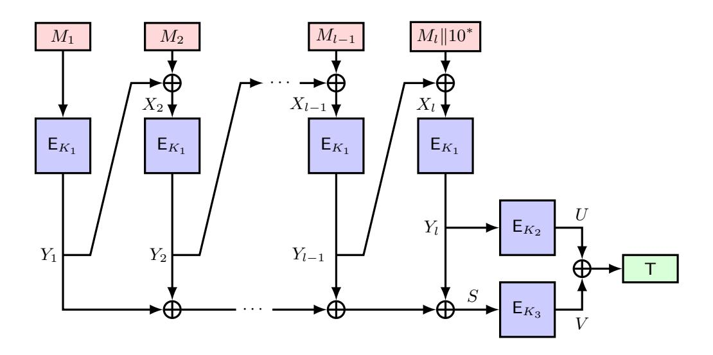

Fig. 22: 3kf9

**8.1.1** CMT, CMT<sub>k</sub> and RBT<sub>k</sub> Security of **3kf9** We present a key-robustness attack on the **3kf9** construction. The adversary selects a key  $K_1$  and two distinct keys  $K_2$  and  $K_3$ . It sets  $M_1 := \mathsf{E}_{K_1}^{-1}(0^n)$  and picks an arbitrary  $M_2 \in \{0,1\}^n$ , forming  $M = M_1 \| M_2$ . The adversary then outputs  $(K_1, K_2, K_2, M)$  and  $(K_1, K_3, K_3, M)$ . The complete attack is shown in Figure 23.

```
1: Select a key K_1 \in \{0,1\}^\kappa;
2: Select two keys K_2, K_3 \in \{0,1\}^\kappa such that K_2 \neq K_3;
3: Compute M_1 = \mathsf{E}_{K_1}^{-1}(0^n);
4: Select any M_2 \in \{0,1\}^n and set M = M_1 \| M_2;
5: Output the tuples (K_1, K_2, K_2, M) and (K_1, K_3, K_3, M);
```

Fig. 23:  $\mathsf{RBT}_k$  adversary against  $\mathsf{3kf9}$ 

Analysis of the Attack: For any (K, K', K', M), where  $M = M_1 || M_2$  and  $\mathsf{E}_K(M_1) = 0^n$ , we have  $\mathsf{3kf9}(K, K', K', M) = 0^n$ . Thus, the algorithm presented in Figure 23 leads to a  $\mathsf{RBT}_k$  attack on  $\mathsf{3kf9}$  with a success probability of 1.

Therefore, the construction 3kf9 is not  $RBT_k$  secure and by Lemma 1 we can also conclude that 3kf9 is not  $CMT_k$  and CMT secure.

**8.1.2** CDY **Security of 3kf9** Here, we describe a CDY attack against the 3kf9 construction for any context selector S. The idea is to find context tuple  $(K_1, K_2, K_3, M)$  that produce the desired tag T (S's output). The complete attack is provided in Figure 24.

{29}------------------------------------------------

```
1: Select any K_1, K_2 and K_3 \in \{0, 1\}^\kappa;

2: Select any U \in \{0, 1\}^n and set V = \mathsf{T} \oplus U;

3: Compute Y_2 = \mathsf{E}_{K_2}^{-1}(U), \ S = \mathsf{E}_{K_3}^{-1}(V) and set Y_1 = S \oplus Y_2;

4: Compute M_1 = \mathsf{E}_{K_1}^{-1}(Y_1), \ X_2 = \mathsf{E}_{K_1}^{-1}(Y_2) and Set M_2 = X_2 \oplus Y_1;

5: Output the tuple (K_1, K_2, K_3, M), where M = M_1 \| M_2;
```

Fig. 24: CDY adversary against 3kf9

**Analysis of the Attack:** For the output tuple  $(K_1, K_2, K_3, M)$ , the tag is computed as:

```
\begin{aligned} 3\mathsf{kf9}(K_1,K_2,K_3,M) \\ &= \mathsf{E}_{K_2}(\mathsf{E}_{K_1}(M_2 \oplus \mathsf{E}_{K_1}(M_1))) \oplus \mathsf{E}_{K_3}(\mathsf{E}_{K_1}(M_2 \oplus \mathsf{E}_{K_1}(M_1)) \oplus \mathsf{E}_{K_1}(M_1)), \\ &= \mathsf{E}_{K_2}(\mathsf{E}_{K_1}(M_2 \oplus Y_1)) \oplus \mathsf{E}_{K_3}(\mathsf{E}_{K_1}(M_2 \oplus Y_1) \oplus Y_1), \\ &= \mathsf{E}_{K_2}(\mathsf{E}_{K_1}(X_2)) \oplus \mathsf{E}_{K_3}(\mathsf{E}_{K_1}(X_2) \oplus Y_1), \\ &= \mathsf{E}_{K_2}(Y_2) \oplus \mathsf{E}_{K_3}(Y_2 \oplus Y_1) = \mathsf{E}_{K_2}(Y_2) \oplus \mathsf{E}_{K_3}(S) = U \oplus V = \mathsf{T}. \end{aligned}
```

Thus, from the above calculation, it is clear that the tuple  $(K_1, K_2, K_3, M)$  outputs the desired tag T.

### <span id="page-29-0"></span>8.2 PMAC Plus

Yasuda [43] proposed a variant of the PMAC construction, called PMAC\_Plus, which achieves security against  $O(2^{2n/3})$  queries while retaining rate-1 efficiency.

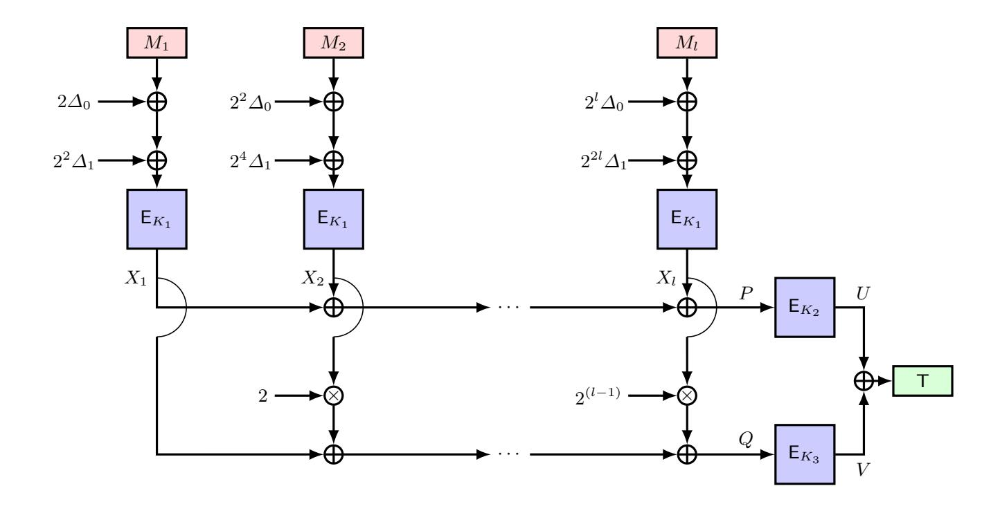

Fig. 25: PMAC\_Plus.  $\Delta_0 = \mathsf{E}_{K_1}(0)$  and  $\Delta_1 = \mathsf{E}_{K_1}(1)$ 

**8.2.1** CMT, CMT<sub>k</sub> and RBT<sub>k</sub> security of PMAC\_Plus Now, we present a key-robustness attack against the PMAC\_Plus construction. The adversary selects a key  $K_1$ , and two distinct keys  $K_2$  and  $K_3$ . Next, the adversary computes,  $\Delta_0 = \mathsf{E}_{K_1}(0^n)$  and  $\Delta_1 = \mathsf{E}_{K_1}(1^n)$ . For simplicity of our explanation, we consider  $\alpha_1 = ((2 \otimes \Delta_0) \oplus (2^2 \otimes \Delta_1))$  and  $\alpha_2 = ((2^2 \otimes \Delta_0) \oplus (2^4 \otimes \Delta_1))$ . Next, the adversary fixes  $M_2 := (\alpha_2 \oplus \mathsf{E}_{K_1}^{-1}(0^n))$  and considers an arbitraby  $M_1$ , then sets  $M = M_1 || M_2$ . Finally, it outputs the tuples  $(K_1, K_2, K_2, M)$  and  $(K_1, K_3, K_3, M)$ . The complete attack is provided in Figure 26.

{30}------------------------------------------------

```
1: Select a key K_{1} \in \{0,1\}^{\kappa};
2: Select two keys K_{2}, K_{3} \in \{0,1\}^{\kappa} such that K_{2} \neq K_{3};
3: Compute M_{2} = \alpha_{2} \oplus \mathsf{E}_{K_{1}}^{-1}(0^{n}), where \alpha_{2} = ((2^{2} \otimes \Delta_{0}) \oplus (2^{4} \otimes \Delta_{1}));
4: Choose any M_{1} \in \{0,1\}^{n} and set M = M_{1} \| M_{2};
5: Output the tuples (K_{1}, K_{2}, K_{2}, M) and (K_{1}, K_{3}, K_{3}, M);
```

Fig. 26:  $RBT_k$  adversary against PMAC Plus

Analysis of the Attack: For any (K, K', K', M), where  $M = M_1 || M_2$  and  $\mathsf{E}_K(M_2 \oplus \alpha_2) = 0^n$ , we have  $\mathsf{PMAC\_Plus}(K, K', K', M) = 0^n$ . Thus, the algorithm presented in Figure 26 leads to a  $\mathsf{RBT}_k$  attack on  $\mathsf{PMAC\_Plus}$  with a success probability of 1.

Therefore, the construction PMAC\_Plus is not RBT<sub>k</sub> secure and using Lemma 1 we get that it is also not CMT<sub>k</sub> and CMT secure.

**8.2.2** CDY Security of PMAC\_Plus We describe an CDY attack against the PMAC\_Plus construction for any context selector S. The idea is to find a context tuple  $(K_1, K_2, K_3, M)$  that produce the desired tag T (S's output). The complete attack is provided in Figure 27.

```
1: Choose arbitrary K_1, K_2 and K_3 \in \{0,1\}^\kappa;

2: Select any U \in \{0,1\}^n and compute V = \mathsf{T} \oplus U;;

3: Compute P = \mathsf{E}_{K_2}^{-1}(U) and Q = \mathsf{E}_{K_3}^{-1}(V);

4: Find X_1, X_2 such that X_1 \oplus X_2 = P \ \& \ X_1 \oplus (2 \otimes X_2) = Q;

5: Compute M_1 = \mathsf{E}_{K_1}^{-1}(X_1) \oplus \alpha_1, where, \alpha_1 = ((2 \otimes \Delta_0) \oplus (2^2 \otimes \Delta_1));

6: Compute M_2 = \mathsf{E}_{K_1}^{-1}(X_2) \oplus \alpha_2, where, \alpha_2 = ((2^2 \otimes \Delta_0) \oplus (2^4 \otimes \Delta_1));

7: Output the tuple (K_1, K_2, K_3, M), where M = M_1 \| M_2;
```

Fig. 27: CDY adversary against PMAC Plus

Analysis of the attack: Here, the main step is to solve the system of equations:

$$X_1 \oplus X_2 = P,$$
  
$$X_1 \oplus (2 \otimes X_2) = Q.$$

This system of equations has a unique solution as the corresponding coefficient matrix has rank 2. Thus, we have shown a valid CDY attack against the PMAC\_Plus construction with success probability 1.

Remark 1. This attack relies on finding a preimage for PHash: for any P||Q, a  $(K_1, M)$  pair can be found with a constant number of ideal cipher queries. Using the same approach, a constant-query CDY attack on 4F-PHash-DbHtF is possible (see Appendix E.2.2). Similarly, we present a CMT<sub>k</sub> attack on 4F-PHash-DbHtF in Appendix E.2.1.

#### <span id="page-30-0"></span>8.3 SUM-ECBC

Yasuda [42] proposed a deterministic, stateless, block-cipher-based MAC, SUM-ECBC, and proved that it achieves PRF security against  $O(2^{2n/3})$  queries, assuming the underlying n-bit block cipher is a secure pseudorandom permutation.

{31}------------------------------------------------

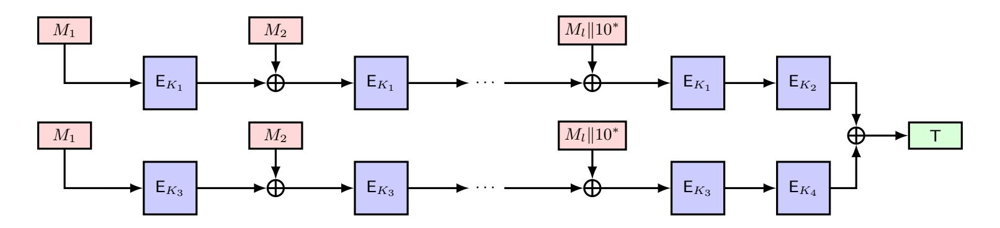

Fig. 28: SUM-ECBC

**8.3.1** CMT, CMT<sub>k</sub> and RBT<sub>k</sub> security of SUM-ECBC Here, we present a key-robustness attack against the SUM-ECBC construction. The adversary selects a key  $K_1$ , and two distinct keys  $K_2$  and  $K'_2$ . Next, the adversary considers an arbitraby  $M_1$  and  $M_2$ , then sets  $M = M_1 || M_2$ . Finally, it outputs the tuples  $(K_1, K_2, K_1, K_2, M)$  and  $(K_1, K'_2, K_1, K'_2, M)$ . The complete attack is provided in Figure 29.

```
1: Select three keys K_1, K_2, K_2' \in \{0,1\}^{\kappa} such that K_2 \neq K_2';
2: Choose arbitrary M_1 and M_2 \in \{0,1\}^n and set M = M_1 \| M_2;
3: Output the tuples (K_1, K_2, K_1, K_2, M) and (K_1, K_2', K_1, K_2', M);
```

Fig. 29:  $RBT_k$  adversary against SUM-ECBC

Analysis of the Attack: For any (K, K', K, K', M), we have SUM-ECBC $(K, K', K, K', M) = 0^n$ , where  $M = M_1 || M_2$ . Thus, the algorithm presented in Figure 29 leads to an RBT<sub>k</sub> attack on SUM-ECBC with a success probability of 1.

Therefore, the construction SUM-ECBC is not  $\mathsf{RBT}_k$  secure and using Lemma 1 we get that it is also not  $\mathsf{CMT}_k$  and  $\mathsf{CMT}$  secure.

### <span id="page-31-0"></span> $8.4 \quad {\sf LightMAC\_Plus}$

Naito [33] proposed a variant of the LightMAC construction, called LightMAC\_Plus, which breaks the birthday bound by achieving  $O(2^{2n/3})$  security.

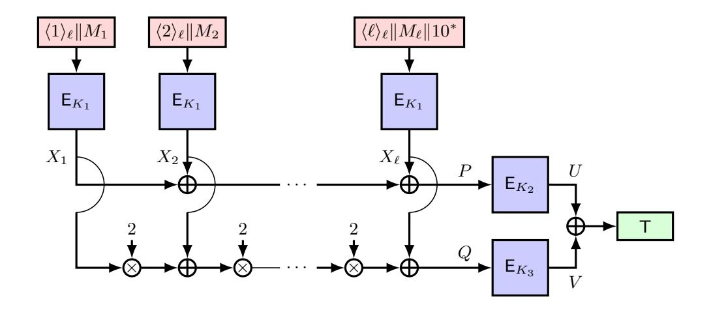

Fig. 30: LightMAC Plus

**8.4.1** CMT, CMT<sub>k</sub> and RBT<sub>k</sub> security of LightMAC\_Plus We present a key-robustness attack against the LightMAC\_Plus construction. Here, each block of message is of size  $(n - \ell)$ -bits and the *i*-th block  $M_i$  is padded as  $\langle i \rangle_{\ell} || M_i$ , where  $\langle i \rangle_{\ell}$  is  $\ell$ -bit binary representation of integer *i*. The complete attack strategy is described in Figure 31.

{32}------------------------------------------------

```
1: Select a key K_{1} \in \{0,1\}^{\kappa};

2: Select two keys K_{2}, K_{3} \in \{0,1\}^{\kappa} such that K_{2} \neq K_{3};

3: Compute A = \mathsf{E}_{K_{1}}^{-1}(0^{n});

4: Set M_{1} = \mathrm{lsb}_{n-\ell}(A);

5: Choose arbitrary M_{2} \in \{0,1\}^{n-\ell} and set M = M_{1} \| M_{2};

6: Output the tuples (K_{1}, K_{2}, K_{2}, M) and (K_{1}, K_{3}, K_{3}, M);
```

Fig. 31:  $RBT_k$  adversary against LightMAC Plus

Analysis and Success Probability of the attack: Whenever  $\langle 1 \rangle_{\ell} \| M_1 = \mathsf{E}_K^{-1}(0^n)$  holds, we have LightMAC\_Plus $(K, K', K', M_1 \| M_2) = 0^n$  for any tuple  $(K, K', K', M_1 \| M_2)$ . Under the ideal-cipher assumption, the value  $\mathsf{E}_{K_1}^{-1}(0^n)$  is uniformly distributed over  $\{0,1\}^n$ . So, we have

$$\Pr[\mathsf{E}_{K_1}^{-1}(0^n) = \langle 1 \rangle_{\ell} || *] = \frac{1}{2^l}.$$

Hence, the overall success probability of the adversary is  $2^{-\ell}$ .

**8.4.2** CDY Security of LightMAC\_Plus We describe a CDY attack against the LightMAC\_Plus construction for any context selector S. The idea is to find a context tuple  $(K_1, K_2, K_3, M)$  that produces the desired tag T(S's output). The complete attack is provided in Figure 32.

```
1: Choose arbitrary K_1, K_2 and K_3 \in \{0, 1\}^{\kappa};

2: Select arbitrary U \in \{0, 1\}^n and compute V = \mathsf{T} \oplus U;

3: Compute P = \mathsf{E}_{K2}^{-1}(U) and Q = \mathsf{E}_{K3}^{-1}(V);

4: Solve for the system of equations: X_1 \oplus X_2 = P \ \& \ (2 \otimes X_1) \oplus X_2 = Q;

5: Compute A = \mathsf{E}_{K1}^{-1}(X_1) and B = \mathsf{E}_{K1}^{-1}(X_2);

6: Set M_1 = \mathrm{lsb}_{n-\ell}(A) and M_2 = \mathrm{lsb}_{n-\ell}(B);

7: Set M = M_1 \| M_2;

8: Output the tuple (K_1, K_2, K_3, M);
```

Fig. 32: CDY adversary against LightMAC\_Plus

Analysis and Success Probability of the attack: The adversary will be successful if and only if  $\langle 1 \rangle_{\ell} \| * = \mathsf{E}_{K_1}^{-1}(X_1)$  and  $\langle 2 \rangle_{\ell} \| * = \mathsf{E}_{K_1}^{-1}(X_2)$ 

For the above attack, we require that  $\langle 1 \rangle_{\ell} \| M_1 = \mathsf{E}_{K_1}^{-1}(X_1)$  and  $\langle 2 \rangle_{\ell} \| * = \mathsf{E}_{K_1}^{-1}(X_2)$ . Under the ideal-cipher assumption, the values  $\mathsf{E}_{K_1}^{-1}(X_1)$  and  $\mathsf{E}_{K_1}^{-1}(X_2)$  are uniformly distributed over  $\{0,1\}^n$ . So,

$$\Pr[\langle 1 \rangle_{\ell} \| * = \mathsf{E}_{K_1}^{-1}(X_1) \land \langle 2 \rangle_{\ell} \| * = \mathsf{E}_{K_1}^{-1}(X_2)] \le \frac{2}{2^{2l}}$$

So, the adversary's success probability is upper bounded by  $2^{-2\ell}$ . Moreover, the system of equations

$$X_1 \oplus X_2 = P$$
,  $(2 \otimes X_1) \oplus X_2 = Q$ .

has a unique solution as the corresponding coefficient matrix has rank 2. Thus, we have shown a valid CDY attack against the LightMAC\_Plus construction with success probability  $2^{-2\ell}$ .

Remark 2. Similar to PMAC\_Plus, the CDY attack on LightHash exploits preimage finding. Using the same approach as 4F-PHash-DbHtF, constant query attacks for both CMT<sub>k</sub> and CDY can be mounted with success probability  $1/2^{2\ell}$  on 4F-LightHash-DbHtF.

{33}------------------------------------------------

### 9 Conclusion

Among the classified BBB-secure schemes and nEHtM, only nEHtM achieves non-trivial CMT<sub>k</sub> and CMT security, both up to  $2^{n/4}$ , with no matching tight attack; all others fail to satisfy these notions. Several schemes achieve tight  $2^{n/2}$  security for both CDY<sub>k</sub> and CDY, while others are limited to  $2^{n/3}$  or remain unresolved. Tightness is established for most constructions via matching attacks, with a few cases still open. In nearly all schemes, CDY<sub>k</sub> and CDY coincide, with only minor separations observed. RBT<sub>k</sub> security ranges from absent to  $2^{n/4}$ , depending on the construction.

For constructions following the DbHtS paradigm, we provide constant-query attacks on  $\mathsf{RBT}_k$  for three constructions (also applying to  $\mathsf{CMT}_k$  and  $\mathsf{CMT}$ ) and on CDY for two schemes; one allows  $\mathsf{RBT}_k$  and CDY attacks with success probability  $2^{-\ell}$  and  $2^{-2\ell}$  respectively, practical for short counters. These results demonstrate that subtle design differences among BBB MACs lead to markedly different committing security profiles. A promising direction for future work is exploring the impact of key derivation, as many attacks on  $\mathsf{CMT}_k$  and  $\mathsf{CMT}$  fail when keys are derived from a master key, though not universally, as evidenced by our  $\mathsf{CMT}_k$  attack on  $\mathsf{PMAC}_{-}\mathsf{Plus}$  (Appendix E.1). Another avenue is investigating whether Davies-Meyer style transformations, which enhance committing security in prior work such as [6], can similarly strengthen these BBB constructions.

### References

- <span id="page-33-10"></span>1. 3GPP TS 35.201 v3.1.1: Specification of the 3GPP confidentiality and integrity algorithms, Document 1: f8 and f9 specification. http://www.3gpp.org/tb/other/algorithms.htm
- <span id="page-33-4"></span>2. Abdalla, M., Bellare, M., Neven, G.: Robust encryption. J. Cryptol. **31**(2), 307–350 (2018). https://doi.org/10.1007/S00145-017-9258-8, https://doi.org/10.1007/s00145-017-9258-8
- <span id="page-33-5"></span>3. Albertini, A., Duong, T., Gueron, S., Kölbl, S., Luykx, A., Schmieg, S.: How to abuse and fix authenticated encryption without key commitment. In: Butler, K.R.B., Thomas, K. (eds.) 31st USENIX Security Symposium, USENIX Security 2022, Boston, MA, USA, August 10-12, 2022. pp. 3291–3308. USENIX Association (2022), https://www.usenix.org/conference/usenixsecurity22/presentation/albertini
- <span id="page-33-6"></span>4. Bellare, M., Hoang, V.T.: Efficient schemes for committing authenticated encryption. In: Dunkelman, O., Dziembowski, S. (eds.) Advances in Cryptology - EUROCRYPT 2022 - 41st Annual International Conference on the Theory and Applications of Cryptographic Techniques, Trondheim, Norway, May 30 - June 3, 2022, Proceedings, Part II. Lecture Notes in Computer Science, vol. 13276, pp. 845–875. Springer (2022). https://doi.org/10.1007/978-3-031-07085-3\_29
- <span id="page-33-2"></span>5. Bellare, M., Krovetz, T., Rogaway, P.: Luby-rackoff backwards: Increasing security by making block ciphers non-invertible. In: Nyberg, K. (ed.) Advances in Cryptology - EUROCRYPT '98, International Conference on the Theory and Application of Cryptographic Techniques, Espoo, Finland, May 31 - June 4, 1998, Proceeding. Lecture Notes in Computer Science, vol. 1403, pp. 266–280. Springer (1998). https://doi.org/10.1007/BFB0054132
- <span id="page-33-9"></span>6. Bhaumik, R., Chakraborty, B., Choi, W., Dutta, A., Govinden, J., Shen, Y.: The committing security of macs with applications to generic composition. In: Reyzin, L., Stebila, D. (eds.) Advances in Cryptology - CRYPTO 2024 - 44th Annual International Cryptology Conference, Santa Barbara, CA, USA, August 18-22, 2024, Proceedings, Part IV. Lecture Notes in Computer Science, vol. 14923, pp. 425–462. Springer (2024). https://doi.org/10.1007/978-3-031-68385-5\_14
- <span id="page-33-8"></span>7. Bozhko, A.: Properties of Authenticated Encryption with Associated Data (AEAD) Algorithms. RFC 9771 (May 2025). https://doi.org/10.17487/RFC9771, https://www.rfc-editor.org/info/rfc9771
- <span id="page-33-0"></span>8. Chakraborty, B., Saha, A.: Tweakable permutation-based luby-rackoff constructions. IACR Cryptol. ePrint Arch. p. 914 (2025), https://eprint.iacr.org/2025/914
- <span id="page-33-7"></span>9. Chan, J., Rogaway, P.: On committing authenticated-encryption. In: Atluri, V., Pietro, R.D., Jensen, C.D., Meng, W. (eds.) Computer Security - ESORICS 2022 - 27th European Symposium on Research in Computer Security, Copenhagen, Denmark, September 26-30, 2022, Proceedings, Part II. Lecture Notes in Computer Science, vol. 13555, pp. 275–294. Springer (2022). https://doi.org/10.1007/978-3-031-17146-8\_14, https://doi.org/10.1007/978-3-031-17146-8\_14
- <span id="page-33-1"></span>10. Chen, Y.L., Mennink, B., Preneel, B.: Categorization of faulty nonce misuse resistant message authentication. In: Tibouchi, M., Wang, H. (eds.) Advances in Cryptology - ASIACRYPT 2021 - 27th International Conference on the Theory and Application of Cryptology and Information Security, Singapore, December 6-10, 2021, Proceedings, Part III. Lecture Notes in Computer Science, vol. 13092, pp. 520–550. Springer (2021). https://doi.org/10.1007/978-3-030-92078-4\_18, https://doi.org/10.1007/978-3-030-92078-4\_18
- <span id="page-33-3"></span>11. Choi, W., Lee, J., Lee, Y.: Toward full n-bit security and nonce misuse resistance of block cipher-based macs. In: Chung, K., Sasaki, Y. (eds.) Advances in Cryptology - ASIACRYPT 2024 - 30th International Conference on the Theory and Application of Cryptology and Information Security, Kolkata, India, December 9-13, 2024, Proceedings, Part IX. Lecture Notes in Computer Science, vol. 15492, pp. 251–279. Springer (2024). https://doi.org/10.1007/978-981-96-0947-5\_9, https://doi.org/10.1007/978-981-96-0947-5\_9

{34}------------------------------------------------

- <span id="page-34-7"></span>12. Cogliati, B., Seurin, Y.: EWCDM: an efficient, beyond-birthday secure, nonce-misuse resistant MAC. In: Robshaw, M., Katz, J. (eds.) Advances in Cryptology - CRYPTO 2016 - 36th Annual International Cryptology Conference, Santa Barbara, CA, USA, August 14-18, 2016, Proceedings, Part I. Lecture Notes in Computer Science, vol. 9814, pp. 121–149. Springer (2016). <https://doi.org/10.1007/978-3-662-53018-4\_5>, [https:](https://doi.org/10.1007/978-3-662-53018-4_5) [//doi.org/10.1007/978-3-662-53018-4\\_5](https://doi.org/10.1007/978-3-662-53018-4_5)
- <span id="page-34-3"></span>13. Datta, N., Dutta, A., Nandi, M., Paul, G.: Double-block hash-then-sum: A paradigm for constructing bbb secure prf. IACR Transactions on Symmetric Cryptology 2018(3), 36–92 (Sep 2018). [https://doi.org/10.](https://doi.org/10.13154/tosc.v2018.i3.36-92) [13154/tosc.v2018.i3.36-92](https://doi.org/10.13154/tosc.v2018.i3.36-92), <https://tosc.iacr.org/index.php/ToSC/article/view/7297>
- <span id="page-34-8"></span>14. Datta, N., Dutta, A., Nandi, M., Yasuda, K.: Encrypt or decrypt? to make a single-key beyond birthday secure nonce-based MAC. In: Shacham, H., Boldyreva, A. (eds.) Advances in Cryptology - CRYPTO 2018 - 38th Annual International Cryptology Conference, Santa Barbara, CA, USA, August 19-23, 2018, Proceedings, Part I. Lecture Notes in Computer Science, vol. 10991, pp. 631–661. Springer (2018). [https://doi.org/10.](https://doi.org/10.1007/978-3-319-96884-1\_21) [1007/978-3-319-96884-1\\_21](https://doi.org/10.1007/978-3-319-96884-1\_21), [https://doi.org/10.1007/978-3-319-96884-1\\_21](https://doi.org/10.1007/978-3-319-96884-1_21)
- <span id="page-34-15"></span>15. Dhar, C., Ethan, J., Jejurikar, R., Khairallah, M., List, E., Mandal, S.: Context-committing security of leveled leakage-resilient AEAD. IACR Trans. Symmetric Cryptol. 2024(2), 348–370 (2024). [https://doi.org/10.](https://doi.org/10.46586/TOSC.V2024.I2.348-370) [46586/TOSC.V2024.I2.348-370](https://doi.org/10.46586/TOSC.V2024.I2.348-370), <https://doi.org/10.46586/tosc.v2024.i2.348-370>
- <span id="page-34-11"></span>16. Dodis, Y., Grubbs, P., Ristenpart, T., Woodage, J.: Fast message franking: From invisible salamanders to encryptment. In: Shacham, H., Boldyreva, A. (eds.) Advances in Cryptology - CRYPTO 2018 - 38th Annual International Cryptology Conference, Santa Barbara, CA, USA, August 19-23, 2018, Proceedings, Part I. Lecture Notes in Computer Science, vol. 10991, pp. 155–186. Springer (2018). [https://doi.org/10.1007/](https://doi.org/10.1007/978-3-319-96884-1\_6) [978-3-319-96884-1\\_6](https://doi.org/10.1007/978-3-319-96884-1\_6), [https://doi.org/10.1007/978-3-319-96884-1\\_6](https://doi.org/10.1007/978-3-319-96884-1_6)
- <span id="page-34-5"></span>17. Dutta, A., Nandi, M., Paul, G.: One-key compression function based mac with security beyond birthday bound. In: Liu, J.K., Steinfeld, R. (eds.) Information Security and Privacy. pp. 343–358. Springer International Publishing, Cham (2016)
- <span id="page-34-9"></span>18. Dutta, A., Nandi, M., Talnikar, S.: Beyond birthday bound secure mac in faulty nonce model. In: Ishai, Y., Rijmen, V. (eds.) Advances in Cryptology – EUROCRYPT 2019. pp. 437–466. Springer International Publishing, Cham (2019)
- <span id="page-34-0"></span>19. Dworkin, M.: Recommendation for block cipher modes of operation: The cmac mode for authentication. Special Publication 800-38B, National Institute of Standards and Technology (NIST) (2005). [https://doi.](https://doi.org/10.6028/NIST.SP.800-38B) [org/10.6028/NIST.SP.800-38B](https://doi.org/10.6028/NIST.SP.800-38B), <https://doi.org/10.6028/NIST.SP.800-38B>
- <span id="page-34-1"></span>20. Dworkin, M.: Recommendation for block cipher modes of operation: Galois/counter mode (gcm) and gmac. Special Publication 800-38D, National Institute of Standards and Technology (NIST) (2007). [https://doi.](https://doi.org/10.6028/NIST.SP.800-38D) [org/10.6028/NIST.SP.800-38D](https://doi.org/10.6028/NIST.SP.800-38D), <https://doi.org/10.6028/NIST.SP.800-38D>
- <span id="page-34-14"></span>21. Farshim, P., Orlandi, C., Rosie, R.: Security of symmetric primitives under incorrect usage of keys. IACR Trans. Symmetric Cryptol. 2017(1), 449–473 (2017). <https://doi.org/10.13154/TOSC.V2017.I1.449-473>, <https://doi.org/10.13154/tosc.v2017.i1.449-473>
- <span id="page-34-6"></span>22. Gilbert, E.N., Macwilliams, F.J., Sloane, N.J.A.: Codes which detect deception. The Bell System Technical Journal 53(3), 405–424 (1974). <https://doi.org/10.1002/j.1538-7305.1974.tb02751.x>
- <span id="page-34-10"></span>23. Grubbs, P., Lu, J., Ristenpart, T.: Message franking via committing authenticated encryption. In: Katz, J., Shacham, H. (eds.) Advances in Cryptology - CRYPTO 2017 - 37th Annual International Cryptology Conference, Santa Barbara, CA, USA, August 20-24, 2017, Proceedings, Part III. Lecture Notes in Computer Science, vol. 10403, pp. 66–97. Springer (2017). <https://doi.org/10.1007/978-3-319-63697-9\_3>, [https:](https://doi.org/10.1007/978-3-319-63697-9_3) [//doi.org/10.1007/978-3-319-63697-9\\_3](https://doi.org/10.1007/978-3-319-63697-9_3)
- <span id="page-34-17"></span>24. ISO: ISO/IEC:Information technology – Security techniques – Message Authentication Codes (MACs) – Part 2: Mechanisms using a dedicated hash-function. Iso/iec 9797-1:2021, International Organization for Standardization (2021)
- <span id="page-34-2"></span>25. Iwata, T., Minematsu, K.: Stronger security variants of gcm-siv. IACR Transactions on Symmetric Cryptology 2016(1), 134–157 (Dec 2016). <https://doi.org/10.13154/tosc.v2016.i1.134-157>, [https://tosc.iacr.](https://tosc.iacr.org/index.php/ToSC/article/view/539) [org/index.php/ToSC/article/view/539](https://tosc.iacr.org/index.php/ToSC/article/view/539)
- <span id="page-34-18"></span>26. Jia, Y., Zhu, X., Wang, P., Hu, L.: On committing security of pmac, lightmac, and umac. Cybersecurity 9(1), 26 (2026)
- <span id="page-34-16"></span>27. Khairallah, M.: Revisiting leakage-resilient macs and succinctly-committing AEAD more applications of pseudo-random injections. IACR Trans. Symmetric Cryptol. 2025(1), 211–239 (2025). [https://doi.org/](https://doi.org/10.46586/TOSC.V2025.I1.211-239) [10.46586/TOSC.V2025.I1.211-239](https://doi.org/10.46586/TOSC.V2025.I1.211-239), <https://doi.org/10.46586/tosc.v2025.i1.211-239>
- <span id="page-34-12"></span>28. Len, J., Grubbs, P., Ristenpart, T.: Partitioning oracle attacks. In: Bailey, M.D., Greenstadt, R. (eds.) 30th USENIX Security Symposium, USENIX Security 2021, August 11-13, 2021. pp. 195–212. USENIX Association (2021), <https://www.usenix.org/conference/usenixsecurity21/presentation/len>
- <span id="page-34-4"></span>29. Luby, M., Rackoff, C.: Pseudo-random permutation generators and cryptographic composition. In: Hartmanis, J. (ed.) Proceedings of the 18th Annual ACM Symposium on Theory of Computing, May 28-30, 1986, Berkeley, California, USA. pp. 356–363. ACM (1986). <https://doi.org/10.1145/12130.12167>, [https://](https://doi.org/10.1145/12130.12167) [doi.org/10.1145/12130.12167](https://doi.org/10.1145/12130.12167)
- <span id="page-34-13"></span>30. Menda, S., Len, J., Grubbs, P., Ristenpart, T.: Context discovery and commitment attacks - how to break ccm, eax, siv, and more. In: Hazay, C., Stam, M. (eds.) Advances in Cryptology - EUROCRYPT 2023 - 42nd Annual International Conference on the Theory and Applications of Cryptographic Techniques,

{35}------------------------------------------------

- Lyon, France, April 23-27, 2023, Proceedings, Part IV. Lecture Notes in Computer Science, vol. 14007, pp. 379–407. Springer (2023). <https://doi.org/10.1007/978-3-031-30634-1\_13>, [https://doi.org/10.1007/](https://doi.org/10.1007/978-3-031-30634-1_13) [978-3-031-30634-1\\_13](https://doi.org/10.1007/978-3-031-30634-1_13)
- <span id="page-35-9"></span>31. Mennink, B., Neves, S.: Encrypted davies-meyer and its dual: Towards optimal security using mirror theory. In: Katz, J., Shacham, H. (eds.) Advances in Cryptology - CRYPTO 2017 - 37th Annual International Cryptology Conference, Santa Barbara, CA, USA, August 20-24, 2017, Proceedings, Part III. Lecture Notes in Computer Science, vol. 10403, pp. 556–583. Springer (2017). <https://doi.org/10.1007/978-3-319-63697-9\_19>, [https://doi.org/10.1007/978-3-319-63697-9\\_19](https://doi.org/10.1007/978-3-319-63697-9_19)
- <span id="page-35-8"></span>32. Minematsu, K.: How to thwart birthday attacks against macs via small randomness. In: Hong, S., Iwata, T. (eds.) Fast Software Encryption, 17th International Workshop, FSE 2010, Seoul, Korea, February 7-10, 2010, Revised Selected Papers. Lecture Notes in Computer Science, vol. 6147, pp. 230–249. Springer (2010). <https://doi.org/10.1007/978-3-642-13858-4\_13>, [https://doi.org/10.1007/978-3-642-13858-4\\_13](https://doi.org/10.1007/978-3-642-13858-4_13)
- <span id="page-35-3"></span>33. Naito, Y.: Blockcipher-based macs: Beyond the birthday bound without message length. In: Takagi, T., Peyrin, T. (eds.) Advances in Cryptology - ASIACRYPT 2017 - 23rd International Conference on the Theory and Applications of Cryptology and Information Security, Hong Kong, China, December 3-7, 2017, Proceedings, Part III. Lecture Notes in Computer Science, vol. 10626, pp. 446–470. Springer (2017). <https://doi.org/10.1007/978-3-319-70700-6\_16>, [https://doi.org/10.1007/978-3-319-70700-6\\_16](https://doi.org/10.1007/978-3-319-70700-6_16)
- <span id="page-35-13"></span>34. Petrank, E., Rackoff, C.: CBC MAC for real-time data sources. J. Cryptol. 13(3), 315–338 (2000). [https:](https://doi.org/10.1007/S001450010009) [//doi.org/10.1007/S001450010009](https://doi.org/10.1007/S001450010009), <https://doi.org/10.1007/s001450010009>
- <span id="page-35-10"></span>35. Rogaway, P.: Nonce-based symmetric encryption. In: Roy, B., Meier, W. (eds.) Fast Software Encryption. pp. 348–358. Springer Berlin Heidelberg, Berlin, Heidelberg (2004)
- <span id="page-35-11"></span>36. Struck, P., Weishäupl, M.: Constructing committing and leakage-resilient authenticated encryption. IACR Trans. Symmetric Cryptol. 2024(1), 497–528 (2024). <https://doi.org/10.46586/TOSC.V2024.I1.497-528>, <https://doi.org/10.46586/tosc.v2024.i1.497-528>
- <span id="page-35-7"></span>37. Wegman, M.N., Carter, J.: New hash functions and their use in authentication and set equality. Journal of Computer and System Sciences 22(3), 265–279 (1981). [https://doi.org/https://doi.org/10.1016/](https://doi.org/https://doi.org/10.1016/0022-0000(81)90033-7) [0022-0000\(81\)90033-7](https://doi.org/https://doi.org/10.1016/0022-0000(81)90033-7), <https://www.sciencedirect.com/science/article/pii/0022000081900337>
- <span id="page-35-12"></span>38. Yang, F., Tian, T., Guo, C., Yang, J.: Committing security analysis of SMAC. IACR Commun. Cryptol. 2(3), 22 (2025). <https://doi.org/10.62056/AVOMJB0KR>, <https://doi.org/10.62056/avomjb0kr>
- <span id="page-35-4"></span>39. Yasuda, K.: Multilane HMAC - security beyond the birthday limit. In: Srinathan, K., Rangan, C.P., Yung, M. (eds.) Progress in Cryptology - INDOCRYPT 2007, 8th International Conference on Cryptology in India, Chennai, India, December 9-13, 2007, Proceedings. Lecture Notes in Computer Science, vol. 4859, pp. 18–32. Springer (2007). <https://doi.org/10.1007/978-3-540-77026-8\_3>, [https://doi.org/10.1007/](https://doi.org/10.1007/978-3-540-77026-8_3) [978-3-540-77026-8\\_3](https://doi.org/10.1007/978-3-540-77026-8_3)
- <span id="page-35-5"></span>40. Yasuda, K.: A one-pass mode of operation for deterministic message authentication- security beyond the birthday barrier. In: Nyberg, K. (ed.) Fast Software Encryption, 15th International Workshop, FSE 2008, Lausanne, Switzerland, February 10-13, 2008, Revised Selected Papers. Lecture Notes in Computer Science, vol. 5086, pp. 316–333. Springer (2008). <https://doi.org/10.1007/978-3-540-71039-4\_20>, [https://doi.](https://doi.org/10.1007/978-3-540-71039-4_20) [org/10.1007/978-3-540-71039-4\\_20](https://doi.org/10.1007/978-3-540-71039-4_20)
- <span id="page-35-6"></span>41. Yasuda, K.: A double-piped mode of operation for macs, prfs and pros: Security beyond the birthday barrier. In: Joux, A. (ed.) Advances in Cryptology - EUROCRYPT 2009, 28th Annual International Conference on the Theory and Applications of Cryptographic Techniques, Cologne, Germany, April 26-30, 2009. Proceedings. Lecture Notes in Computer Science, vol. 5479, pp. 242–259. Springer (2009). [https://doi.org/10.1007/](https://doi.org/10.1007/978-3-642-01001-9\_14) [978-3-642-01001-9\\_14](https://doi.org/10.1007/978-3-642-01001-9\_14), [https://doi.org/10.1007/978-3-642-01001-9\\_14](https://doi.org/10.1007/978-3-642-01001-9_14)
- <span id="page-35-0"></span>42. Yasuda, K.: The sum of CBC macs is a secure PRF. In: Pieprzyk, J. (ed.) Topics in Cryptology - CT-RSA 2010, The Cryptographers' Track at the RSA Conference 2010, San Francisco, CA, USA, March 1-5, 2010. Proceedings. Lecture Notes in Computer Science, vol. 5985, pp. 366–381. Springer (2010). [https:](https://doi.org/10.1007/978-3-642-11925-5\_25) [//doi.org/10.1007/978-3-642-11925-5\\_25](https://doi.org/10.1007/978-3-642-11925-5\_25), [https://doi.org/10.1007/978-3-642-11925-5\\_25](https://doi.org/10.1007/978-3-642-11925-5_25)
- <span id="page-35-1"></span>43. Yasuda, K.: A new variant of PMAC: beyond the birthday bound. In: Rogaway, P. (ed.) Advances in Cryptology - CRYPTO 2011 - 31st Annual Cryptology Conference, Santa Barbara, CA, USA, August 14-18, 2011. Proceedings. Lecture Notes in Computer Science, vol. 6841, pp. 596–609. Springer (2011). <https://doi.org/10.1007/978-3-642-22792-9\_34>, [https://doi.org/10.1007/978-3-642-22792-9\\_34](https://doi.org/10.1007/978-3-642-22792-9_34)
- <span id="page-35-2"></span>44. Zhang, L., Wu, W., Sui, H., Wang, P.: 3kf9: Enhancing 3gpp-mac beyond the birthday bound. In: Wang, X., Sako, K. (eds.) Advances in Cryptology - ASIACRYPT 2012 - 18th International Conference on the Theory and Application of Cryptology and Information Security, Beijing, China, December 2-6, 2012. Proceedings. Lecture Notes in Computer Science, vol. 7658, pp. 296–312. Springer (2012). [https://doi.org/10.1007/](https://doi.org/10.1007/978-3-642-34961-4\_19) [978-3-642-34961-4\\_19](https://doi.org/10.1007/978-3-642-34961-4\_19), [https://doi.org/10.1007/978-3-642-34961-4\\_19](https://doi.org/10.1007/978-3-642-34961-4_19)

{36}------------------------------------------------

#### Auxiliary Analysis of EDM-based Constructions $\mathbf{A}$

#### Analysis of the $\mathsf{CMT}_k$ Attack on $F_{B_2}^{\mathrm{EDM}}$ $\mathbf{A.1}$

For the first output tuple  $(K, K, K_h, N, M)$ , the tag is computed as:

$$F_{B_2}^{\mathrm{EDM}}(K, K, K_h, N, M) = \mathsf{E}_K(N \oplus \mathsf{E}_K(N) \oplus \mathsf{H}(K_h, M)),$$

$$= \mathsf{E}_K(N \oplus X \oplus X), \text{ (as } X = \mathsf{H}(K_h, M), N = \mathsf{E}_K^{-1}(X))$$

$$= \mathsf{E}_K(N) = X.$$

For the second output tuple  $(K', K', K_h, N', M)$ , the tag is computed as:

$$\begin{split} F_{B_2}^{\text{EDM}}(K', K', K_h, N', M) &= \mathsf{E}_{K'}(N' \oplus \mathsf{E}_{K'}(N') \oplus \mathsf{H}(K_h, M)), \\ &= \mathsf{E}_{K'}(N' \oplus X \oplus X), \ (\text{as } X = \mathsf{H}(K_h, M), N' = \mathsf{E}_{K'}^{-1}(X)) \\ &= \mathsf{E}_{K'}(N') = X. \end{split}$$

From the above two equations, it is clear that both tuples produce the same tag. Thus, the algorithm presented in Figure 6 leads to a CMT<sub>k</sub> attack on  $F_{B_2}^{\rm EDM}$  with a success probability of 1.

#### Matching attack for $\mathsf{RBT}_k$ on $F_{B_2}^{\mathrm{EDM}}$ $\mathbf{A.2}$

We now demonstrate the tightness of the  $\mathsf{RBT}_k$  bound for  $F_{B_2}^{\mathrm{EDM}}$  as established in the preceding theorem. The attack proceeds as follows:

- Select  $2^{n/4}$  distinct values for  $K_1$ . Fix a nonce N and a message M. For each  $i \in [1, 2^{n/4}]$ , compute  $U_i = \mathsf{E}_{K_1^i}(N).$
- Independently, select  $2^{n/4}$  distinct values for  $K_h$ , and for each  $i \in [1, 2^{n/4}]$ , compute  $X_i = \mathsf{H}(K_h^i, M)$ .
- Find indices  $a, b, c, d \in [1, 2^{n/4}]$  such that  $U_a \oplus X_b = U_c \oplus X_d$ .
- Fix a key  $K_2$  arbitrarily.
- Output the tuple  $((K_1^a, K_2, K_h^b), (K_1^c, K_2, K_h^d), N, M)$ .

Since each  $U_i$  and  $X_i$  is sampled uniformly at random and independently, the success probability of the attack is at least  $1 - e^{-1}$ .

#### Matching $\mathsf{CDY}_k$ Attack on $F_{B_2}^{\mathrm{EDM}}$ $\mathbf{A.3}$

Here, we present a matching attack on  $CDY_k$ , which establishes that the bound is tight for both  $CDY_k$ and CDY security of  $F_{B_2}^{\text{EDM}}$ . Consider any challenge tuple  $(N, M, \mathsf{T})$ . The adversary proceeds as follows:

- Sample distinct  $K_1^i \leftarrow \{0,1\}^{\kappa}$ ,  $\forall i \in [1,2^{n/3}]$ , and compute  $U_i = \mathsf{E}_{K_1^i}(N)$ . Sample distinct  $K_2^i \leftarrow \{0,1\}^{\kappa}$ ,  $\forall i \in [1,2^{n/3}]$ , and compute  $V_i = \mathsf{E}_{K_2^i}^{-1}(\mathsf{T})$ .
- Sample distinct  $K_h^i \leftarrow \{0,1\}^{\kappa}$ ,  $\forall i \in [1,2^{n/3}]$ , and compute  $X_i = \mathsf{H}(K_h^i,M)$  Search for indices  $a,b,c \in [1,2^{n/3}]$  such that  $U_a \oplus V_b = X_c$ .
- Output the key triple  $(K_1^a, K_2^b, K_h^c)$ .

Since all values  $U_i$ ,  $V_i$ , and  $X_i$  are independently and uniformly distributed (with replacement), the probability that such a triple (a, b, c) exists is at least  $1 - e^{-1}$ . Therefore, the adversary wins with probability at least  $1 - e^{-1}$ .

# <span id="page-36-0"></span>A.4 Analysis of the $\mathsf{CMT}_k$ Attack on $F_{B_2}^{\mathrm{EDM}}$

For the first tuple  $(K, K, K_h, N, M)$ , the computed tag is:

$$\begin{split} F_{B_3}^{\mathrm{EDM}}(K,K,K_h,N,M) &= \mathsf{E}_K(N \oplus \mathsf{E}_K(N) \oplus \mathsf{H}(K_h,M)) \oplus \mathsf{H}(K_h,M) \\ &= \mathsf{E}_K(N \oplus X \oplus X) \oplus X \quad (\text{as } X = \mathsf{H}(K_h,M), \, N = \mathsf{E}_K^{-1}(X)) \\ &= \mathsf{E}_K(N) \oplus X = X \oplus X = 0. \end{split}$$

Similarly, for the second tuple  $(K', K', K_h, N', M)$ , the tag is:

$$F_{B_3}^{\mathrm{EDM}}(K', K', K_h, N', M) = \mathsf{E}_{K'}(N' \oplus \mathsf{E}_{K'}(N') \oplus \mathsf{H}(K_h, M)) \oplus \mathsf{H}(K_h, M)$$

$$= \mathsf{E}_{K'}(N' \oplus X \oplus X) \oplus X \quad (\text{as } N' = \mathsf{E}_{K'}^{-1}(X))$$

$$= \mathsf{E}_{K'}(N') \oplus X = X \oplus X = 0.$$

Hence, both generated tuples yield the same tag. Thus, the adversary described in Figure 8 successfully performs a  $\mathsf{CMT}_k$  attack on  $F_{B_3}^{\mathsf{EDM}}$  with success probability 1.

{37}------------------------------------------------

#### <span id="page-37-0"></span>A.5 Proof of Theorem 5

Let  $\mathcal{A}$  output  $((K_1, K_2, K_h), (K'_1, K'_2, K'_h), N, M)$  such that (i)  $(K_1, K_2, K_h) \neq (K'_1, K'_2, K'_h)$  and (ii)  $F_{B_3}^{\text{EDM}}(K_1, K_2, K_h, N, M) = F_{B_3}^{\text{EDM}}(K'_1, K'_2, K'_h, N, M)$ . Define

$$\mathsf{T} := \mathsf{E}_{K_2}(\mathsf{E}_{K_1}(N) \oplus N \oplus \mathsf{H}(K_h, M)) \oplus \mathsf{H}(K_h, M),$$

$$\mathsf{T}' := \mathsf{E}_{K_o'}(\mathsf{E}_{K_o'}(N) \oplus N \oplus \mathsf{H}(K_h', M)) \oplus \mathsf{H}(K_h', M)$$

The adversary succeeds if and only if T = T'. We distinguish two cases.

Case 1:  $K_h = K'_h$ . Then success implies  $\mathsf{E}_{K_2}(V) = \mathsf{E}_{K'_2}(V')$ , where

$$V = \mathsf{E}_{K_1}(N) \oplus N \oplus \mathsf{H}(K_h, M), \quad V' = \mathsf{E}_{K_1'}(N) \oplus N \oplus \mathsf{H}(K_h, M).$$

1a: If  $K_2 = K_2'$ , then V = V' and success requires  $\mathsf{E}_{K_1}(N) = \mathsf{E}_{K_1'}(N)$  with  $K_1 \neq K_1'$ . By ideal-cipher randomness, this occurs with probability at most  $2q_p^2/2^n$ .

1b: If  $K_2 \neq K'_2$ , let the query involving  $K'_2$  occur last.

1b1: If it is forward, the success probability is at most  $2q_p^2/2^n$ .

1b2: If it is inverse, then

$$\mathsf{E}_{K_2'}^{-1}(W') = \mathsf{E}_{K_1}(N) \oplus N \oplus \mathsf{H}(K_h, M).$$

If an ideal-cipher query is last, the probability is at most  $2q_p^2q_h/2^n$ . If the hash query is last, success requires

$$\mathsf{H}(K_h, M) \in \{\mathsf{E}_{K_h'}^{-1}(W') \oplus \mathsf{E}_{K_1}(N) \oplus N\},\$$

whose size is at most  $q_p^2$ ; hence the probability is bounded by  $\mathbf{Adv}_{\mathsf{H}}^{\mathsf{Pre}}(\mathcal{A}_{pre};q_p^2)$ .

Case 2:  $K_h \neq K'_h$ .

2a: If  $\mathsf{H}(K_h,M) = \mathsf{H}(K_h',M)$ , this yields a hash collision; the probability is bounded by  $\mathbf{Adv}^{\mathrm{CR}}_{\mathsf{H}}(\mathcal{A}_{cr})$ . 2b: If  $\mathsf{H}(K_h,M) \neq \mathsf{H}(K_h',M)$ , then

$$\mathsf{E}_{K_2}(V) \oplus \mathsf{H}(K_h, M) = \mathsf{E}_{K'_2}(V') \oplus \mathsf{H}(K'_h, M).$$

2b1: If a forward ideal-cipher query is last among the relevant queries, the probability is at most  $2q_n^2q_b^2/2^n$ .

2b2: If an inverse ideal-cipher query is the final query, then by the same argument as in Case 1b2, the adversary's success probability is bounded by  $2q_p^2q_h/2^n + \mathbf{Adv}_{\mathsf{H}}^{\mathsf{Pre}}(\mathcal{A}_{pre};q_p^2)$ .

2b3: If the hash query is last, success requires

$$\mathsf{H}(K_h',M) \in \{\mathsf{E}_{K_2}(V) \oplus \mathsf{H}(K_h,M) \oplus \mathsf{E}_{K_2'}(V')\},\$$

a set of size at most  $q_p^2 q_h$ , yielding bound  $\mathbf{Adv}_{\mathsf{H}}^{\mathrm{Pre}}(\mathcal{A}_{pre}; q_p^2 q_h)$ .

Collecting the bounds from all cases gives the stated result.

# <span id="page-37-1"></span>A.6 RBT $_k$ Attack on $F_{B_3}^{\rm EDM}$

We now demonstrate an  $\mathsf{RBT}_k$  attack with  $O(2^{n/2})$  queries for the  $F_{B_3}^{\mathrm{EDM}}$  construction. The attack proceeds as follows:

- Fix a key  $K_h$  and a message M. Compute  $X = H(K_h, M)$ .
- Fix a key  $K_1$  and a nonce N. Compute  $U = \mathsf{E}_{K_1}(N)$  and  $V = U \oplus N \oplus X$ .
- Select  $2^{n/2}$  distinct values for  $K_2$ . For each  $i \in [1, 2^{n/2}]$ , compute  $\mathsf{T}_i = \mathsf{E}_{K_2^i}(V) \oplus X$ .
- Find indices  $a, b \in [1, 2^{n/2}]$  such that  $\mathsf{T}_a = \mathsf{T}_b$ .
- Output the tuple  $((K_1, K_2^a, K_h), (K_1, K_2^b, K_h), N, M)$ .

Since each  $T_i$  is sampled independently and uniformly at random, the success probability of the attack is at least  $1 - e^{-1}$ .

{38}------------------------------------------------

#### <span id="page-38-0"></span>Proof of Theorem 6 $\mathbf{A.7}$

Let T be the challenge tag and  $\mathcal{A}$  outputs  $(K_1, K_2, K_h, N, M)$  such that  $F_{B_3}^{\mathrm{EDM}}(K_1, K_2, K_h, N, M) = \mathsf{T}$ . If  $\mathsf{T} = 0^n$ , the adversary can always construct a valid context: choose arbitrary  $K_h, M$  and compute  $X = \mathsf{H}(K_h, M)$ ; choose arbitrary K and set  $N = \mathsf{E}_K^{-1}(X)$ . Then

$$F_{B_3}^{\mathrm{EDM}}(K, K, K_h, N, M) = \mathsf{E}_K(\mathsf{E}_K(N) \oplus N \oplus X) \oplus X = \mathsf{E}_K(N) \oplus X = 0^n.$$

Thus the success probability in this case is bounded by  $\epsilon_0$ .

Hence assume  $T \neq 0^n$ . If  $(K_1, N) = (K_2, V)$ , then necessarily  $T = 0^n$ ; thus we may assume  $(K_1, N) \neq$  $(K_2, V)$ . Let  $V = \mathsf{E}_{K_1}(N) \oplus N \oplus \mathsf{H}(K_h, M)$ . A's Success requires

$$\mathsf{E}_{K_2}(V) \oplus \mathsf{H}(K_h,M) = \mathsf{T}.$$

Case 1: The hash query on  $(K_h, M)$  occurs after the ideal-cipher query on  $(K_2, V, W)$ . Then  $\mathcal{A}$ 's success requires

$$H(K_h, M) \in \{W \oplus \mathsf{T}\},\$$

where  $W = \mathsf{E}_{K_2}(V)$  and there are at most  $q_p$  possible values of W. Hence, the success probability is bounded by  $\mathbf{Adv}^{\mathrm{Pre}}_{\mathsf{H}}(\mathcal{A}_{pre};q_p)$ .

Case 2: A forward ideal-cipher query on  $(K_2, V)$  occurs after the hash query. By ideal-cipher randomness over at most  $q_p q_h$  combinations, the probability that

$$\mathsf{E}_{K_2}(V) \oplus \mathsf{H}(K_h,M) = \mathsf{T}$$

holds is at most  $2q_pq_h/2^n$ .

Case 3: An inverse ideal-cipher query on  $(K_2, W)$  occurs after the hash query. Success requires

$$\mathsf{E}_{K_2}^{-1}(W) = \mathsf{E}_{K_1}(N) \oplus N \oplus \mathsf{T} \oplus W,$$

which, by ideal-cipher randomness and at most  $q_p$  such queries, occurs with probability at most  $2q_p^2/2^n$ . Combining all cases yields the stated bound.

#### <span id="page-38-1"></span>Matching $\mathsf{CDY}_k$ Attack on $F_{B_3}^{\mathsf{EDM}}$ **A.8**

Now, we present a matching attack on  $CDY_k$ , which establishes that the bound is tight for both  $CDY_k$ and CDY security of  $F_{B_3}^{\text{EDM}}$ . Consider any challenge tuple  $(N, M, \mathsf{T})$ . The adversary proceeds as follows:

- Choose  $2^{n/2}$  distinct  $K_1^i \leftarrow \{0,1\}^{\kappa}$ ,  $\forall i \in [1,2^{n/2}]$ , and compute  $U_i = \mathsf{E}_{K_1^i}(N)$ .
- Choose  $K_h \leftarrow \{0,1\}^{\kappa}$  and compute  $X = \mathsf{H}(K_h,M)$ . Choose  $2^{n/2}$  distinct  $K_2^i \leftarrow \{0,1\}^{\kappa}$ ,  $\forall i \in [1,2^{n/2}]$ , and compute  $V_i = \mathsf{E}_{K_2^i}^{-1}(\mathsf{T} \oplus X)$ .
- Find  $a, b \in [1, 2^{n/2}]$  such that  $V_b = U_a \oplus N \oplus X$ .
- Output the key triple  $(K_1^a, K_h, K_2^b)$ .

Since all values  $U_i$ ,  $V_i$  are independently and uniformly distributed (with replacement), the probability that such a tuple (a, b) exists is at least  $1 - e^{-1}$ . Therefore, the adversary wins with probability at least  $1 - e^{-1}$ .

#### <span id="page-38-2"></span>Analysis of the $\mathsf{CMT}_k$ Attack on $F_{B_A}^{\mathrm{EDM}}$ **A.9**

For the first output tuple  $(K, K, K_h, N, M)$ , the tag is computed as:

$$\begin{split} F_{B_4}^{\mathrm{EDM}}(K,K,K_h,N,M) &= \mathsf{E}_K \big( N \oplus \mathsf{E}_K (N \oplus \mathsf{H}(K_h,M)) \big) \\ &= \mathsf{E}_K \big( N \oplus \mathsf{E}_K (\mathsf{E}_K^{-1}(X)) \big) \\ &= \mathsf{E}_K (N \oplus X) = \mathsf{E}_K (\mathsf{E}_K^{-1}(X)) = X. \end{split}$$

where we use  $X = \mathsf{H}(K_h, M)$  and  $N = \mathsf{E}_K^{-1}(X) \oplus X$ .

For the second output tuple  $(K', K', K_h, N', M)$ , the tag is computed as:

$$\begin{split} F_{B_4}^{\mathrm{EDM}}(K',K',K_h,N',M) &= \mathsf{E}_{K'}\big(N' \oplus \mathsf{E}_{K'}(N' \oplus \mathsf{H}(K_h,M))\big) \\ &= \mathsf{E}_{K'}\big(N' \oplus \mathsf{E}_{K'}(\mathsf{E}_{K'}^{-1}(X))\big) \\ &= \mathsf{E}_{K'}(N' \oplus X) = \mathsf{E}_{K'}(\mathsf{E}_{K'}^{-1}(X)) = X. \end{split}$$

where we use  $X = \mathsf{H}(K_h, M)$  and  $N' = \mathsf{E}_{K'}^{-1}(X) \oplus X$ .

From the above computations, it is clear that both tuples yield the same tag X. Thus, the algorithm described in Figure 10 constitutes a  $\mathsf{CMT}_k$  attack on  $F_{B_4}^{\mathsf{EDM}}$  with success probability 1.

{39}------------------------------------------------

# <span id="page-39-0"></span>A.10 Matching attack for $\mathsf{RBT}_k$ on $F_{B_A}^{\mathrm{EDM}}$

We now demonstrate the tightness of the above bound via the following attack:

- Fix any message M.
- Choose  $2^{n/4}$  distinct keys  $K_h^i$  and compute  $X_i = \mathsf{H}(K_h^i, M), \ \forall i \in [1, 2^{n/4}].$
- Fix any U.
- Choose  $2^{n/4}$  distinct keys  $K_1^i$  and compute  $Z_i = \mathsf{E}_{K_1^i}^{-1}(U), \ \forall i \in [1, 2^{n/4}].$
- Find  $a, b, c, d \in [1, 2^{n/4}]$  such that  $Z_a \oplus X_b = Z_c \oplus X_d$ .
- Fix any  $K_2$ . Compute  $N = Z_a \oplus X_b$ .
- Output  $((K_1^a, K_2, K_h^b), (K_1^c, K_2, K_h^d), N, M)$ .

Since each  $Z_i$  is independently and uniformly random, the collision probability is at least  $1 - e^{-1}$ .

#### <span id="page-39-1"></span>Matching Attack for CDY on $F_{B_4}^{\rm EDM}$ **A.11**

We demonstrate that the bound given in the previous theorem for  $F_{B_4}^{\rm EDM}$  is tight by describing a concrete attack strategy:

- Choose distinct  $K_1^i \leftarrow \{0,1\}^{\kappa}$  for all  $i \in [1,2^{n/3}]$ , and compute  $U_i = \mathsf{E}_{K_1^i}(Z)$  for a fixed  $Z \in \{0,1\}^n$ . Choose distinct  $K_h^i \leftarrow \{0,1\}^{\kappa_h}$  for all  $i \in [1,2^{n/3}]$ , and compute  $X_i = \mathsf{H}(K_h^i,M)$  for a fixed message M.
- Choose distinct  $K_2^i \leftarrow \{0,1\}^{\kappa}$  for all  $i \in [1,2^{n/3}]$ , and compute  $V_i = \mathsf{E}_{K_2^i}^{-1}(\mathsf{T})$ .
- Find  $a, b, c \in [1, 2^{n/3}]$  such that:

$$V_c = U_a \oplus X_b \oplus Z$$
.

- Output the context  $(K_1^a, K_2^c, K_h^b, N, M)$  where  $N = X_b \oplus Z$ .

Since all values  $U_i$ ,  $X_i$ , and  $V_i$  are independently and uniformly distributed (with replacement), the probability that such a triple (a, b, c) exists is at least  $1 - e^{-1}$ . Hence, the adversary succeeds with probability at least  $1 - e^{-1}$ .

# <span id="page-39-2"></span>A.12 Matching Attack for $\mathsf{CDY}_k$ on $F_{B_4}^{\mathrm{EDM}}$

Here, we demonstrate that the  $CDY_k$  bound in the previous theorem is tight. The attack proceeds as follows.

- Choose any  $K_2 \leftarrow \{0,1\}^{\kappa}$ , and compute  $V = \mathsf{E}_{K_2}^{-1}(\mathsf{T})$ .
- Choose distinct  $K_h^i \leftarrow \{0,1\}^{\kappa}$  for all  $i \in [1,2^{n/2}]$ , and compute  $X_i = \mathsf{H}(K_h^i,M)$ . Choose distinct  $K_1^i \leftarrow \{0,1\}^{\kappa}$  for all  $i \in [1,2^{n/2}]$ , and compute  $Z_i = \mathsf{E}_{K_i^i}^{-1}(V \oplus N)$ .
- Find  $a, b \in [1, 2^{n/2}]$  such that  $Z_b = X_a \oplus N$ . Output the key  $(K_1^a, K_h^b, K_2)$ .

Since all values  $Z_i$ ,  $X_i$  are independently and uniformly distributed (with replacement), the probability that such a tuple (a, b, c) exists is at least  $1 - e^{-1}$ . Therefore, the adversary wins with probability at least  $1 - e^{-1}$ .

#### <span id="page-39-3"></span>Analysis of the $\mathsf{CMT}_k$ Attack on $F_{B_{\mathtt{K}}}^{\mathrm{EDM}}$ A.13

For the first output tuple  $(K, K, K_h, N, M)$ , the tag is computed as:

$$\begin{split} F_{B_5}^{\mathrm{EDM}}(K,K,K_h,N,M) &= \mathsf{E}_K(N \oplus \mathsf{E}_K(N \oplus \mathsf{H}(K_h,M))) \oplus \mathsf{H}(K_h,M), \\ &= \mathsf{E}_K(N \oplus \mathsf{E}_K(\mathsf{E}_K^{-1}(X))) \oplus X, \\ &= \mathsf{E}_K(N \oplus X) \oplus X = \mathsf{E}_K(\mathsf{E}_K^{-1}(X)) \oplus X = 0. \end{split}$$

where we use the values  $X = H(K_h, M)$  and  $N = \mathsf{E}_K^{-1}(X) \oplus X$ .

For the second output tuple  $(K', K', K_h, N', M)$ , the tag is computed as:

$$\begin{split} F_{B_5}^{\mathrm{EDM}}(K',K',K_h,N',M) &= \mathsf{E}_{K'}(N' \oplus \mathsf{E}_{K'}(N' \oplus \mathsf{H}(K_h,M))) \oplus \mathsf{H}(K_h,M), \\ &= \mathsf{E}_{K'}(N' \oplus \mathsf{E}_{K'}(\mathsf{E}_{K'}^{-1}(X))) \oplus X, \\ &= \mathsf{E}_{K'}(N' \oplus X) \oplus X = \mathsf{E}_{K'}(\mathsf{E}_{K'}^{-1}(X)) \oplus X = 0. \end{split}$$

where we use the values  $X = \mathsf{H}(K_h, M)$  and  $N' = \mathsf{E}_{K'}^{-1}(X) \oplus X$ .

From the above two equations, it is clear that both tuples produce the same tag. Thus, the algorithm described in Figure 12 results in a CMT<sub>k</sub> attack on  $F_{B_5}^{\rm EDM}$  with a success probability of 1.

{40}------------------------------------------------

#### <span id="page-40-0"></span>A.14 Proof of Theorem 10

Let  $\mathcal{A}$  output  $((K_1, K_2, K_h), (K'_1, K'_2, K'_h), N, M)$  such that

1. 
$$(K_1, K_2, K_h) \neq (K'_1, K'_2, K'_h)$$
, and  
2.  $F_{B_5}^{\text{EDM}}(K_1, K_2, K_h, N, M) = F_{B_5}^{\text{EDM}}(K'_1, K'_2, K'_h, N, M)$ .

Define

$$\mathsf{T} := \mathsf{E}_{K_2}(\mathsf{E}_{K_1}(N \oplus \mathsf{H}(K_h, M)) \oplus N) \oplus \mathsf{H}(K_h, M),$$

$$\mathsf{T}' := \mathsf{E}_{K_0'}(\mathsf{E}_{K_1'}(N \oplus \mathsf{H}(K_h', M)) \oplus N) \oplus \mathsf{H}(K_h', M).$$

The adversary succeeds only if T = T'. We analyze this event by distinguishing three cases.

Case 1:  $K_h = K'_h$ . In this case, T = T' implies

$$\mathsf{E}_{K_2}(\mathsf{E}_{K_1}(N \oplus \mathsf{H}(K_h, M)) \oplus N) = \mathsf{E}_{K_2'}(\mathsf{E}_{K_1'}(N \oplus \mathsf{H}(K_h, M)) \oplus N),$$

which is exactly a key-robustness collision for  $F_{B_4}^{\mathrm{EDM}}$  under the common hash key  $K_h$ . Hence, in this case, the success probability is bounded by  $\mathbf{Adv}_{F_{B_4}^{\mathrm{EDM}}}^{\mathsf{RBT}_k}(\mathcal{A}')$ .

Case 2:  $K_h \neq K'_h$  and  $H(K_h, M) = H(K'_h, M)$ . This is a hash-collision event. Therefore, the adversary's success probability in this case is bounded by  $\mathbf{Adv}^{\mathrm{CR}}_{\mathsf{H}}(\mathcal{A}_{cr})$ .

Case 3:  $K_h \neq K'_h$  and  $H(K_h, M) \neq H(K'_h, M)$ . Let

$$V := \mathsf{E}_{K_1}(N \oplus \mathsf{H}(K_h, M)) \oplus N, \quad V' := \mathsf{E}_{K'_1}(N \oplus \mathsf{H}(K'_h, M)) \oplus N.$$

Then the adversary must satisfy

$$\mathsf{E}_{K_2}(V) \oplus \mathsf{H}(K_h, M) = \mathsf{E}_{K_2'}(V') \oplus \mathsf{H}(K_h', M).$$

We distinguish subcases according to the last among the four relevant queries (two hash queries and two ideal-cipher queries).

- 3a. Suppose a hash query (w.l.o.g.  $(K'_h, M)$ ) is the final query. Then  $\mathcal{A}$  succeeds only if it finds a preimage of H for the target set $\{\mathsf{E}_{K_2}(V)\oplus\mathsf{H}(K_h,M)\oplus\mathsf{E}_{K_2'}(V')\}$ . The cardinality of this set is at most  $q_p^2q_h$ . Hence, the success probability is bounded by  $\mathbf{Adv}_{\mathsf{H}}^{\mathsf{Pre}}(\mathcal{A}_{pre}; q_p^2 q_h)$ .
- 3b. Suppose a forward ideal-cipher query is the final query. By the randomness of the ideal cipher, the probability that the required equality holds is at most  $\frac{2q_p^2q_h^2}{2^n}$
- 3c. Suppose the final query is an inverse ideal-cipher query. This situation is analogous to the combined inverse-query subcases (Cases 2b–2d) in the  $\mathsf{RBT}_k$  proof(theorem 7) of  $F_{B_4}^{\mathrm{EDM}}$ . Therefore, the success probability in this case is bounded by  $\frac{2q_p^2}{2^n} + \frac{2q_p^4}{2^n} + \frac{2q_p^3q_h}{2^n}$ .

Summing the bounds from the three cases yields the claimed result.

#### <span id="page-40-1"></span>Matching attack for $\mathsf{RBT}_k$ on $F_{B_{\mathtt{F}}}^{\mathrm{EDM}}$ A.15

We now demonstrate the tightness of the above bound via the following attack:

- Fix a key  $K_h$  and message M. Compute  $X = H(K_h, M)$ .
- Fix a key  $K_1$  and nonce N. Compute  $U = \mathsf{E}_{K_1}(N \oplus X)$  and  $V = U \oplus N$ .
- Select  $2^{n/2}$  distinct values for  $K_2$ . For each  $i \in [1, 2^{n/2}]$ , compute:

$$\mathsf{T}_i = \mathsf{E}_{K_2^i}(V) \oplus X.$$

- Find  $a, b \in [1, 2^{n/2}]$  such that  $\mathsf{T}_a = \mathsf{T}_b$ .
- Output the tuple  $((K_1, K_2^a, K_h), (K_1, K_2^b, K_h), N, M)$ .

By the birthday bound, the probability that such a collision occurs is at least  $1 - e^{-1}$ .

{41}------------------------------------------------

# <span id="page-41-0"></span>A.16 Matching Attack for $\mathsf{CDY}_k$ on $F_{B_{\mathtt{K}}}^{\mathrm{EDM}}$

Now, we present a matching attack on  $\mathsf{CDY}_k$ , which establishes that the bound is tight for both  $\mathsf{CDY}_k$  and  $\mathsf{CDY}$  security of  $F_{B_5}^{\mathrm{EDM}}$ . Consider any challenge tuple  $(N, M, \mathsf{T})$ . The adversary proceeds as follows:

- Choose  $K_h \leftarrow \{0,1\}^{\kappa_h}$  and compute  $X = \mathsf{H}(K_h, M)$ .
- For all  $i \in [1, 2^{n/2}]$ , choose distinct  $K_2^i \leftarrow \{0, 1\}^{\kappa}$  and compute

$$V_i = \mathsf{E}_{K_2^i}^{-1}(\mathsf{T} \oplus X).$$

- Let  $Z = N \oplus X$ . For all  $i \in [1, 2^{n/2}]$ , choose distinct  $K_1^i \leftarrow \{0, 1\}^{\kappa}$  and compute

$$U_i = \mathsf{E}_{K_1^i}(Z).$$

- Find indices  $a, b \in [1, 2^{n/2}]$  such that

$$U_a = V_b \oplus Z \oplus X = V_b \oplus N.$$

- Output the key triple  $(K_1^a, K_h, K_2^b)$ .

Since all values  $U_i$  and  $V_i$  are independently and uniformly distributed (with replacement), the probability that such a collision (a, b) exists is at least  $1 - e^{-1}$ . Therefore, the adversary succeeds with probability at least  $1 - e^{-1}$ .

### B Auxiliary Analysis of EDMD-based Constructions

### B.1 Tightness of the $\mathsf{RBT}_k$ bound of $F_{B_1}^{\mathrm{EDMD}}$

We now demonstrate that the bound in Theorem 12 is tight. The attack proceeds as follows:

- Fix a nonce N, a message M, and a key  $K_1$ . Compute  $U = \mathsf{E}_{K_1}(N)$ .
- Select  $2^{n/4}$  distinct keys  $K_2^i$  and compute  $W_i = \mathsf{E}_{K_2^i}(U) \oplus U, \ \forall i \in [1, 2^{n/4}]$
- Select  $2^{n/4}$  distinct keys  $K_h^i$ , and compute  $X_i = \mathsf{H}(K_h^i, M), \ \forall i \in [1, 2^{n/4}].$
- Find  $a, b, c, d \in [1, 2^{n/4}]$  such that  $W_a \oplus X_b = W_c \oplus X_d$ .
- Output  $((K_1, K_2^a, K_h^b), (K_1, K_2^c, K_h^d), N, M)$ .

Since each  $W_i$  is sampled independently and uniformly at random, the probability of finding such a collision is at least  $1 - e^{-1}$ .

# $\mathrm{B.2}$ Tightness of the $\mathsf{CDY}_k$ bound of $F_{B_1}^{\mathrm{EDMD}}$

Now, we present a matching  $CDY_k$  attack on  $F_{B_1}^{\mathrm{EDMD}}$ , which establishes that the bound is tight for both  $CDY_k$  and CDY security of  $F_{B_1}^{\mathrm{EDMD}}$ . Let  $(N, M, \mathsf{T})$  be the challenge tuple. The adversary proceeds as follows.

- 1. Fix any  $K_1$  and compute  $U = \mathsf{E}_{K_1}(N)$ .
- 2. Choose  $2^{n/2}$  distinct keys  $K_2^i$  and compute  $W_i = \mathsf{E}_{K_2^i}(U) \oplus U$  for each  $i \in [1, 2^{n/2}]$ .
- 3. Choose  $2^{n/2}$  distinct hash keys  $K_h^i$  and compute  $X_i = \mathsf{H}(K_h^i, M)$ .
- 4. Search for indices  $a, b \in [1, 2^{n/2}]$  such that

$$W_a \oplus X_b = \mathsf{T}.$$

5. Output the key tuple  $(K_1, K_2^a, K_h^b)$ .

Since the values  $W_i$  are independently and uniformly distributed over  $\{0,1\}^n$ , the success probability of the adversary is at least  $1 - e^{-1}$ .

{42}------------------------------------------------

#### $\mathbf{C}$ Auxiliary Analysis of SoP-based Constructions

#### Matching $\mathsf{CDY}_k$ Attack on $F_{B_1}^{\mathsf{SoP}}$ C.1

Now, we present a matching attack on  $CDY_k$ , which establishes that the bound is tight for both  $CDY_k$ and CDY security of  $F_{B_1}^{\text{SoP}}$ . Let  $(N, M, \mathsf{T})$  be the challenge tuple. The adversary proceeds as follows.

- 1. Choose  $2^{n/3}$  distinct keys  $K^i$  and compute  $U_i = \mathsf{E}_{K^i}(N)$  for each  $i \in [1, 2^{n/3}]$ .
- 2. Choose  $2^{n/3}$  distinct hash keys  $K_h^i$  and compute  $X_i = H(K_h^i, M)$ .
- 3. Search for indices  $a, b, c \in [1, 2^{n/3}]$  such that

$$U_a \oplus U_b \oplus X_c = \mathsf{T}.$$

4. Output the key tuple  $(K^a, K^b, K_h^c)$ .

Since the values  $U_i$  and  $X_j$  are independently and uniformly distributed over  $\{0,1\}^n$ , the success probability of the adversary is at least  $1 - e^{-1}$ .

#### Analysis of the $\mathsf{CMT}_k$ Attack on $F_{B_2}^{\mathsf{SoP}}$ C.2

For the first output tuple  $(K, K', K_h, N, M)$ , the tag is computed as:

$$F_{B_2}^{\text{SoP}}(K, K', K_h, N, M) = \mathsf{E}_K(N) \oplus \mathsf{E}_{K'}(N \oplus \mathsf{H}(K_h, M))$$
$$= \mathsf{E}_K(N) \oplus \mathsf{E}_{K'}(N \oplus X). \quad (\text{as } X = \mathsf{H}(K_h, M))$$

For the second output tuple  $(K', K, K_h, N \oplus X, M)$ , the tag is computed as:

$$F_{B_2}^{\text{SoP}}(K', K, K_h, N \oplus X, M) = \mathsf{E}_{K'}(N \oplus X) \oplus \mathsf{E}_K(N \oplus X \oplus \mathsf{H}(K_h, M))$$
$$= \mathsf{E}_{K'}(N \oplus X) \oplus \mathsf{E}_K(N). \quad (\text{as } X = \mathsf{H}(K_h, M))$$

From the above two equations, it is clear that both tuples produce the same tag. Thus, the algorithm presented in Figure 18 leads to a  $\mathsf{CMT}_k$  attack on  $F_{B_2}^{\mathsf{SoP}}$  with a success probability of 1.

#### <span id="page-42-0"></span> $\mathbf{C.3}$ Proof of Theorem 15

Let  $\mathcal{A}$  output a tuple  $((K_1, K_2, K_h), (K'_1, K'_2, K'_h), N, M)$  such that:

- 1.  $(K_1, K_2, K_h) \neq (K'_1, K'_2, K'_h)$ , and 2.  $F_{B_2}^{SoP}(K_1, K_2, K_h, N, M) = F_{B_2}^{SoP}(K'_1, K'_2, K'_h, N, M)$ .

Let  $T := \mathsf{E}_{K_1}(N) \oplus \mathsf{E}_{K_2}(N \oplus \mathsf{H}(K_h, M))$  and  $\mathsf{T}' := \mathsf{E}_{K_1'}(N) \oplus \mathsf{E}_{K_2'}(N \oplus \mathsf{H}(K_h', M))$ . The adversary succeeds if T = T'. We analyze this event through the following cases.

Case 1:  $H(K_h, M) = 0^n$  or  $H(K'_h, M) = 0^n$ . This occurs with probability at most  $Adv_H^{Pre}(A_{pre}; 1)$ .

Case 2:  $K_h = K'_h$ . Let  $X := H(K_h, M)$ . Then T = T' implies

$$\mathsf{E}_{K_1}(N) \oplus \mathsf{E}_{K_2}(N \oplus X) = \mathsf{E}_{K_1'}(N) \oplus \mathsf{E}_{K_2'}(N \oplus X).$$

We consider three sub-cases:

- $-K_1=K_1'$  and  $K_2\neq K_2'$ : This requires a collision  $\mathsf{E}_{K_2}(N\oplus X)=\mathsf{E}_{K_2'}(N\oplus X),$  which occurs with probability at most  $2q_p^2/2^n$ .
- $-K_2 = K'_2$  and  $K_1 \neq K'_1$ : This requires a collision  $\mathsf{E}_{K_1}(N) = \mathsf{E}_{K'_1}(N)$ , which also occurs with probability at most  $2q_p^2/2^n$ .
- $-K_1 \neq K'_1$  and  $K_2 \neq K'_2$ : All four ideal-cipher queries are distinct. In this case the adversary must satisfy

$$\mathsf{E}_{K_1}(N) \oplus \mathsf{E}_{K_2}(N \oplus X) = \mathsf{E}_{K_1'}(N) \oplus \mathsf{E}_{K_2'}(N \oplus X),$$

which occurs with probability at most  $2q_p^4/2^n$ .

Case 3:  $K_h \neq K'_h$ . We divide this case into two sub-cases.

{43}------------------------------------------------

- (3a) Hash collision: If  $H(K_h, M) = H(K'_h, M)$ , this yields a collision in H, which occurs with probability at most  $\mathbf{Adv}_{\mathsf{H}}^{\mathrm{CR}}(\mathcal{A}_{cr})$ .
- (3b) Hash outputs differ: Let  $U = \mathsf{E}_{K_1}(N), U' = \mathsf{E}_{K_1'}(N), X = \mathsf{H}(K_h, M), X' = \mathsf{H}(K_h', M), Z = N \oplus X,$  $Z' = N \oplus X', V = \mathsf{E}_{K_2}(Z), \text{ and } V' = \mathsf{E}_{K_2'}(Z'). \text{ Then } \mathsf{T} = \mathsf{T}' \text{ implies } U \oplus V = U' \oplus V'. \text{ We consider } \mathsf{T}'$ two possibilities.
  - (3b1)  $K_1 = K'_1$ : Then U = U', and we require  $\mathsf{E}_{K_2}(Z) = \mathsf{E}_{K'_2}(Z')$ . If the last query is forward, this occurs with probability at most  $2q_p^2/2^n$ . If the last query is inverse, the adversary must satisfy  $\mathsf{E}_{K_2'}^{-1}(V') = Z' = Z \oplus X \oplus X'$ . If the final query is an inverse ideal-cipher query, this occurs with probability at most  $2q_p^2q_h^2/2^n$ . If one of the hash queries is the final query among the four relevant queries, the adversary must find a preimage for a target set of cardinality at most  $q_p^2q_h$ . Hence, in this case, the success probability is at most  $\mathbf{Adv}_{\mathsf{H}}^{\mathrm{Pre}}(\mathcal{A}'_{pre};q_p^2q_h)$ .
  - (3b2)  $K_1 \neq K'_1$ : All four queries  $(K_1, N, U), (K'_1, N, U'), (K_2, Z, V), \text{ and } (K'_2, Z', V')$  are distinct. If the final query is forward, then  $U \oplus V = U' \oplus V'$  occurs with probability at most  $2q_p^4/2^n$ . If the final query is inverse, similar reasoning gives a bound of  $2q_p^2q_h^2/2^n + \mathbf{Adv}_{\mathsf{H}}^{\mathsf{Pre}}(\mathcal{A}'_{pre};q_p^2q_h)$ .

Summing over all cases yields the stated bound.

#### <span id="page-43-0"></span>Matching attack for $\mathsf{RBT}_k$ on $F_{B_2}^{\mathsf{SoP}}$ $\mathbf{C.4}$

We now demonstrate the tightness of the  $\mathsf{RBT}_k$  bound for  $F_{B_2}^\mathsf{SoP}$  as established in the preceding theorem. The attack proceeds as follows:

- Fix a key  $K_h$ , a nonce N and a message M. Compute  $X = \mathsf{H}(K_h, M)$ . Select  $2^{n/4}$  distinct values for  $K_1$ , and for each  $i \in [1, 2^{n/4}]$ , compute  $U_i = \mathsf{E}_{K_1^i}(N)$ .
- Select  $2^{n/4}$  distinct values for  $K_2$ , and for each  $i \in [1, 2^{n/4}]$ , compute  $V_i = \mathsf{E}_{K_2^i}(N \oplus X)$ .
- Find indices  $a, b, c, d \in [1, 2^{n/4}]$  such that  $U_a \oplus V_b = U_c \oplus V_d$ .
- Output the tuple  $((K_1^a, K_2^b, K_h), (K_1^c, K_2^d, K_h), N, M)$ .

Since each  $U_i$  and  $V_i$  is sampled uniformly at random and independently, the success probability of the attack is at least  $1 - e^{-1}$ .

#### <span id="page-43-1"></span>Matching Attack for CDY on $F_{B_2}^{\mathrm{SoP}}$ C.5

We show that the tightness of CDY security is proved in the previous theorem. The adversary uses the following strategy:

- 1. Choose any U and  $2^{n/3}$  distinct  $K_1^i \leftarrow \{0,1\}^n$ , for  $i \in [1,2^{n/3}]$ , and compute  $N_i = \mathsf{E}_{K_1^i}^{-1}(U)$ .
- 2. Choose  $2^{n/3}$  many distinct  $K_h^i$  and compute  $X_i = \mathsf{H}(K_h^i, M)$  for a fixed M. 3. Choose  $2^{n/3}$  many distinct  $K_2^i$  and compute  $Z_i = \mathsf{E}_{K_2^i}^{-1}(\mathsf{T} \oplus U)$ , for  $i \in [1, 2^{n/3}]$ .
- 4. Find  $a, b, c \in [1, 2^{n/3}]$  such that  $Z_b = N_a \oplus X_c$ .
- 5. Output the context tuple  $(K_1^a, K_2^b, K_h^c, N_a, M)$ .

As  $N_i$ ,  $X_i$ , and  $Z_i$  are all independent and uniformly random in  $\{0,1\}^n$ , the success probability is at least  $1 - e^{-1}$ .

#### <span id="page-43-2"></span>Matching Attack for $CDY_k$ on $F_{B_2}^{SoP}$ C.6

We show that the tightness of  $CDY_k$  security is demonstrated by the following attack strategy:

- 1. Choose any  $K_1 \leftarrow \{0,1\}^n$ , and compute  $U = \mathsf{E}_{K_1}(N)$ .
- 2. Choose  $2^{n/2}$  many distinct  $K_h^i$  and compute  $X_i = \mathsf{H}(K_h^i, M)$ , for  $i \in [1, 2^{n/2}]$ . 3. Choose  $2^{n/2}$  many distinct  $K_2^i$  and compute  $Z_i = \mathsf{E}_{K_2^i}^{-1}(\mathsf{T} \oplus U)$ , for  $i \in [1, 2^{n/2}]$ .
- 4. Find  $a, b \in [1, 2^{n/2}]$  such that  $Z_a = N \oplus X_b$ .
- 5. Output the key tuple  $(K_1, K_2^a, K_h^b)$ .

As  $X_i$  and  $Z_i$  are all independent and uniformly random in  $\{0,1\}^n$ , the success probability is at least  $1 - e^{-1}$ .

{44}------------------------------------------------

# <span id="page-44-0"></span>C.7 Analysis of the $\mathsf{CMT}_k$ Attack on $F_{B_3}^{\mathsf{SoP}}$

For the first output tuple  $(K, K', K_h, N, M)$ , the tag is computed as:

$$F_{B_3}^{\mathrm{SoP}}(K, K', K_h, N, M) = \mathsf{E}_K(N) \oplus \mathsf{E}_{K'}(N \oplus \mathsf{H}(K_h, M)) \oplus \mathsf{H}(K_h, M)$$
  
=  $\mathsf{E}_K(N) \oplus \mathsf{E}_{K'}(N \oplus X) \oplus X$ , where  $X = \mathsf{H}(K_h, M)$ .

For the second output tuple  $(K', K, K_h, N \oplus X, M)$ , the tag is computed as:

$$F_{B_3}^{\text{SoP}}(K', K, K_h, N \oplus X, M) = \mathsf{E}_{K'}(N \oplus X) \oplus \mathsf{E}_K(N \oplus X \oplus \mathsf{H}(K_h, M)) \oplus \mathsf{H}(K_h, M)$$
$$= \mathsf{E}_{K'}(N \oplus X) \oplus \mathsf{E}_K(N) \oplus X.$$

From the above two expressions, it is clear that both tuples produce the same tag. Thus, the algorithm presented in Figure 20 leads to a CMT<sub>k</sub> attack on  $F_{B_3}^{\text{SoP}}$  with a success probability of 1.

#### <span id="page-44-1"></span>Proof of Theorem 18 $\mathbf{C.8}$

Let  $\mathcal{A}$  output a tuple  $((K_1, K_2, K_h), (K'_1, K'_2, K'_h), N, M)$  such that:

- 1.  $(K_1, K_2, K_h) \neq (K'_1, K'_2, K'_h)$ , and 2.  $F_{B_3}^{SoP}(K_1, K_2, K_h, N, M) = F_{B_3}^{SoP}(K'_1, K'_2, K'_h, N, M)$ .

Let us denote:

$$\mathsf{T} := \mathsf{E}_{K_1}(N) \oplus \mathsf{E}_{K_2}(N \oplus \mathsf{H}(K_h, M)) \oplus \mathsf{H}(K_h, M),$$
  
$$\mathsf{T}' := \mathsf{E}_{K_1'}(N) \oplus \mathsf{E}_{K_2'}(N \oplus \mathsf{H}(K_h', M)) \oplus \mathsf{H}(K_h', M).$$

The adversary succeeds if T = T'. We analyze the success probability across the following cases.

Case 1:  $\mathsf{H}(K_h, M) = 0^n$  or  $\mathsf{H}(K_h', M) = 0^n$ . The probability of this event is at most  $\mathbf{Adv}_{\mathsf{H}}^{\mathsf{Pre}}(\mathcal{A}_{pre}; 1)$ .

Case 2:  $K_h = K'_h$ . We can write:

$$F_{B_3}^{\text{SoP}}(K_1, K_2, K_h, N, M) = F_{B_2}^{\text{SoP}}(K_1, K_2, K_h, N, M) \oplus \mathsf{H}(K_h, M),$$

and similarly for the primed keys. So T = T' implies:

$$F_{B_2}^{\text{SoP}}(K_1, K_2, K_h, N, M) = F_{B_2}^{\text{SoP}}(K_1', K_2', K_h, N, M),$$

This reduces to key robustness for  $F_{B_2}^{\text{SoP}}$ . From the  $\mathsf{RBT}_k$  proof of  $F_{B_2}^{\text{SoP}}$ , the adversary's success probability in this case is at most  $(4q_p^2 + 2q_p^4)/2^{\tilde{n}}$ .

Case 3:  $K_h \neq K'_h$ . We split this into two sub-cases.

- (a) Hash collision: If  $H(K_h, M) = H(K'_h, M)$ , then this is a collision in the random oracle. The probability of this is at most  $\mathbf{Adv}_{\mathsf{H}}^{\mathsf{CR}}(\mathbf{Adv}_{\mathsf{H}}^{\mathsf{CR}})$ .
- (b) Hash outputs differ: Let us define,  $U = \mathsf{E}_{K_1}(N), U' = \mathsf{E}_{K_1'}(N), X = \mathsf{H}(K_h, M), X' = \mathsf{H}(K_h', M), Z = \mathsf{H}(K_h', M)$  $N \oplus X, Z' = N \oplus X', V = \mathsf{E}_{K_2}(Z)$  and  $V' = \mathsf{E}_{K_2'}(Z')$ . The condition  $\mathsf{T} = \mathsf{T}'$  implies:

$$U \oplus V \oplus X = U' \oplus V' \oplus X'$$
.

We now consider further sub-cases:

(i) Suppose the hash query for  $X' = H(K'_h, M)$  is the last among all primitive queries. The adversary succeeds if the relation

$$X' = N \oplus Z' \quad \land \quad X' = U \oplus V \oplus X \oplus U' \oplus V'$$

is satisfied, and the corresponding components  $U = \mathsf{E}_{K_1}(N), \ V = \mathsf{E}_{K_2}(Z), \ U' = \mathsf{E}_{K_1'}(N'), \ \mathrm{and}$  $V' = \mathsf{E}_{K_2'}(Z')$  have been previously queried.

The probability of this happening is at most  $\mathbf{Adv}^{\mathrm{Pre}}_{\mathsf{H}}(\mathcal{A}'_{pre};q_p^2)$ .

(ii) Suppose  $K_1 = K'_1$ , which implies U = U'. Then the adversary succeeds if

$$\left(\mathsf{E}_{K_2}(Z) \oplus X = \mathsf{E}_{K_2'}(Z') \oplus X'\right) \wedge (Z = N \oplus X) \wedge (Z' = N \oplus X')$$

$$\implies \left(\mathsf{E}_{K_2}(Z) \oplus \mathsf{E}_{K_2'}(Z') = X \oplus X'\right) \wedge (Z \oplus Z' = X \oplus X')$$

$$\implies \mathsf{E}_{K_2}(Z) \oplus Z = \mathsf{E}_{K_2'}(Z') \oplus Z'.$$

The success probability of the adversary in this case is at most  $2q_p^2/2^n$ .

{45}------------------------------------------------

(iii) Suppose  $K_1 \neq K'_1$ . Then, the adversary succeeds if

$$U \oplus V \oplus X = U' \oplus V' \oplus X'.$$

This implies all four primitive queries are distinct, and also the hash calls yielding X and X' are distinct. We analyze the different possibilities depending on which of the involved ideal cipher queries is the last.

If the last query is for  $U' = \mathsf{E}_{K_1'}(N)$ :

- If this is an inverse query, then for the adversary to succeed, the response must collide with a previously obtained input value. Since at most  $q_p$  ideal cipher queries have been made, the success probability is at most  $2q_p^2/2^n$ .
- If this is a forward query, then U' must satisfy:

$$\mathsf{E}_{K_1'}(N) = U \oplus V \oplus X \oplus V' \oplus X'.$$

The values U, (V, X), and (V', X') can each come from at most  $q_p$  previous queries, so the adversary's success probability is at most  $2q_p^4/2^n$ .

If the last query is for  $V' = \mathsf{E}_{K_2'}(Z')$ :

- If this is an inverse query, then V' must satisfy:

$$\mathsf{E}_{K_2'}^{-1}(V') = Z' = N \oplus X'.$$

Since N must be a value from a previous ideal cipher query and X' must match a previously returned hash output, the number of combinations the adversary can match is at most  $q_p \cdot q_h$ . Hence, the success probability is at most  $2q_p^2q_h/2^n$ .

- If this is a forward query, then V' must satisfy:

$$\mathsf{E}_{K_2'}(Z') = U \oplus V \oplus X \oplus U' \oplus X'.$$

Again, each of U, (V, X), and (U', X') can be drawn from  $q_p$  queries. Thus, the success probability is bounded by  $2q_p^4/2^n$ .

Combining all the above cases, the result holds.

# <span id="page-45-0"></span>C.9 Matching Attack for $\mathsf{CDY}_k$ on $F_{B_3}^{\mathsf{SoP}}$

Now, we present a matching attack on  $CDY_k$ , which establishes that the bound is tight for both  $CDY_k$  and CDY security of  $F_{B_3}^{SoP}$ . Consider any challenge tuple (N, M, T), then the adversary proceeds as follows:

- 1. Choose  $2^{n/2}$  many distinct  $K_1^i \leftarrow \{0,1\}^n$ , and compute  $U_i = \mathsf{E}_{K_1^i}(N)$ .
- 2. Choose any  $K_h$  and compute  $X = H(K_h, M)$ .
- 3. Choose  $2^{n/2}$  many distinct  $K_2^i \leftarrow \{0,1\}^n$  and compute  $V_i = \mathsf{E}_{K_2^i}(N \oplus X)$  for  $i \in [1,2^{n/2}]$ .
- 4. Find  $a, b \in [1, 2^{n/2}]$  such that  $U_a \oplus V_b = \mathsf{T} \oplus X$ .
- 5. Output the key tuple  $(K_1^a, K_2^b, K_h)$ .

Since  $U_i$  and  $V_i$  are independent and uniformly distributed over  $\{0,1\}^n$ , and T is also uniformly random, the probability of finding a match is at least  $1 - e^{-1}$  by the birthday bound. Therefore, the adversary succeeds with high probability, violating  $\mathsf{CDY}_k$  security.

### D Auxiliary Analysis of nEHtM construction

### D.1 RBT $_k$ Attack

We describe a key-robustness attack against the nEHtM construction. The idea is to find two distinct key tuples that produce the same tag for a fixed nonce-message pair. The complete attack strategy is described in Figure 33.

{46}------------------------------------------------

```
1: Select any K_h \in \{0,1\}^{\kappa_h}, M \in \{0,1\}^*, N \in \{0,1\}^{n-1};

2: compute X = \mathsf{H}_{K_h}(M), \ Z = N \oplus X;

3: Select 2^{n/2} distinct keys K^i \in \{0,1\}^{\kappa}, \ \forall i \in [2^{n/2}];

4: Compute U_i = \mathsf{E}(K^i,0\|N), \ \forall i \in [2^{n/2}] \ \text{and} \ V_i = \mathsf{E}(K^i,1\|Z), \ \forall i \in [2^{n/2}];

5: Find i \neq j \in [2^{n/2}] \ \text{s.t.} \ U_i \oplus V_i = U_j \oplus V_j;

6: Output the tuples (K^i,K_h,N,M) \ \text{and} \ (K^j,K_h,N,M);
```

Fig. 33:  $RBT_k$  adversary against nEHtM

**Success Probability.** Since the  $U_i$ 's are sampled independently and uniformly at random, and the  $V_i$ 's are also sampled independently and uniformly at random, and  $0||N \neq 1||Z$ , we can apply the birthday paradox over  $2^{n/2}$  values. Thus, the probability of finding a collision of the form:

$$U_i \oplus V_i = U_j \oplus V_j$$
, with  $i \neq j$ ,

is at least  $1 - e^{-1}$ .

Correctness of the Attack. For both key tuples, the tag produced by nEHtM is the same:

$$\begin{split} \mathsf{nEHtM}(K^iK_h,N,M) &= \mathsf{E}(K^i,0\|N) \oplus \mathsf{E}(K^i,1\|Z) \\ &= U_i \oplus V_i, \\ \mathsf{nEHtM}(K^j,K_h,N,M) &= \mathsf{E}(K^j,0\|N) \oplus \mathsf{E}(K^j,1\|(N \oplus \mathsf{H}_{K_h}(M))) \\ &= U_i \oplus V_i. \end{split}$$

By construction, these are equal. Hence, the adversary successfully finds two different key tuples that result in the same tag, breaking key robustness with probability at least  $1 - e^{-1}$ .

### D.2 Matching Attack for $CDY_k$

We describe an  $CDY_k$  attack against the nEHtM construction for any context selector S. The idea is to find key pair  $(K, K_h)$  for S's output (N, M, T) such that  $nEHtM(K, K_h, N, M) = T$ . The complete attack strategy is described in Figure 34.

```
1: Select 2^{n/2} distinct keys K_h^i \in \{0,1\}^{\kappa_h}, for all i \in [2^{n/2}];

2: Compute X_i = \mathsf{H}(K_h^i, M), for all i \in [2^{n/2}];

3: Select 2^{n/2} distinct keys K^i \in \{0,1\}^{\kappa}, for all i \in [2^{n/2}];

4: Compute U_i = \mathsf{E}_{K^i}(0\|N) for all i \in [2^{n/2}];

5: Compute b_i\|Z_i = \mathsf{E}^{-1}(K^i, U_i \oplus \mathsf{T}), for all i \in [2^{n/2}];

6: Find i,j \in [2^{n/2}] such that: (N \oplus Z_i = X_j) \wedge (b_i = 1);

7: Output (K^i, K_h^j);
```

Fig. 34: CDY<sub>k</sub> adversary against nEHtM

**Success Probability.** Under the ideal cipher assumption for E the values  $Z_i$ , and  $X_j$  are sampled independently and uniformly at random from  $\{0,1\}^{n-1}$ . Additionally, the bits  $b_i$  are independently and uniformly distributed in  $\{0,1\}$ , and are independent of  $Z_i$ .

Therefore, for each pair  $(i,j) \in [2^{n/2}]^2$ , the probability that  $(N \oplus Z_i = X_j) \land (b_i = 1)$  holds is  $1/(2 \cdot 2^{n-1}) = 1/2^n$ . Hence, the probability that at least one such pair exists is at least  $1 - e^{-1}$ .

{47}------------------------------------------------

Correctness of the Attack. If the adversary finds such indices i, j satisfying the condition above, then the computed tag is:

$$\begin{split} \mathsf{nEHtM}(K^i, K_h^j, N, M) &= \mathsf{E}(K^i, 0 \| N) \oplus \mathsf{E}(K^i, 1 \| (N \oplus \mathsf{H}(K_h^j, M))) \\ &= U \oplus \mathsf{E}(K_2^i, 1 \| (N \oplus X_j)) \\ &= U \oplus \mathsf{E}(K_2^i, 1 \| Z_i) = U \oplus U \oplus \mathsf{T} = \mathsf{T}. \end{split}$$

Therefore, the adversary successfully outputs a valid key tuple for any context selector S with probability at least  $1 - e^{-1}$ .

### E Auxiliary results related to PHash based MACs

### E.1 $CMT_k$ Attack on PMAC\_Plus

Now, we present a CMT<sub>k</sub> attack on PMAC\_Plus. The complete attack strategy is described in Figure 35.

```
Choose arbitrary K_1, K_2, K_3 \in \{0,1\}^{\kappa} such that K_1 \neq K_2 \neq K_3;
 1:
        Choose arbitrary M_1, M_2 \in \{0, 1\}^n and set M = M_1 || M_2;
 2:
        Generate T = PMAC Plus(K_1, K_2, K_3, M);
 3:
        Select arbitrary U \in \{0,1\}^n;
 4:
 5: Compute V = \mathsf{T} \oplus U;
        Choose arbitrary K_1', K_2', K_3' \in \{0,1\}^{\kappa} such that K_1' \neq K_2' \neq K_3';
 6:
 7: Compute P = \mathsf{E}_{K_2'}^{-1}(U);
 8: Compute Q = \mathsf{E}_{K_2}^{-1}(V);
 9: Solve for the system of equations : X_1 \oplus X_2 = P \ \& \ X_1 \oplus (2 \otimes X_2) = Q;
10: Compute \Delta_0 = \mathsf{E}_{K_1'}(0^n), \text{ and } \Delta_1 = \mathsf{E}_{K_1'}(1^n);
        Compute \alpha_1=((2\otimes \varDelta_0)\oplus (2^2\otimes \varDelta_1)) and \alpha_2=((2^2\otimes \varDelta_0)\oplus (2^4\otimes \varDelta_1));
11:
12: Compute M_1' = \mathsf{E}_{K_1'}^{-1}(X_1) \oplus \alpha_1 \text{ and } M_2' = \mathsf{E}_{K_1'}^{-1}(X_2) \oplus \alpha_2;
        Set M' = M_1' || M_2';
13:
        Output the tuples (K_1, K_2, K_3, M) and (K'_1, K'_2, K'_3, M');
14:
```

Fig. 35:  $CMT_k$  adversary against  $PMAC_Plus$ 

Analysis of the attack. Here, the main step is to solve the system of equations:

$$X_1 \oplus X_2 = P,$$
  
$$X_1 \oplus (2 \otimes X_2) = Q.$$

This system of equations has a unique solution as the corresponding coefficient matrix has rank 2. The tag computation for the tuple  $(K'_1, K'_2, K'_3, M')$  is:

$$\begin{split} \mathsf{PMAC\_Plus}(K_1',K_2',K_3',M') &= \mathsf{E}_{K_2'} \big( \mathsf{E}_{K_1'} (\alpha_1 \oplus M_1') \oplus \mathsf{E}_{K_1'} (\alpha_2 \oplus M_2') \big) \\ &\quad \oplus \; \mathsf{E}_{K_3'} \big( \mathsf{E}_{K_1'} (\alpha_1 \oplus M_1') \oplus (2 \otimes \mathsf{E}_{K_1'} (\alpha_2 \oplus M_2')) \big) \\ &= \mathsf{E}_{K_2'} (X_1 \oplus X_2) \oplus \mathsf{E}_{K_3'} (X_1 \oplus (2 \otimes X_2)) \\ &= \mathsf{E}_{K_2'} (P) \oplus \mathsf{E}_{K_3'} (Q) = U \oplus V = \mathsf{T}. \end{split}$$

Thus, we have shown a valid  $\mathsf{CMT}_k$  attack against the  $\mathsf{PMAC\_Plus}$  construction with success probability 1.

{48}------------------------------------------------

### <span id="page-48-0"></span>E.2 $CMT_k$ and CDY Analysis of 4F-PHash-DbHtF

<span id="page-48-2"></span>**E.2.1** CMT<sub>k</sub> attack on 4F-PHash-DbHtF Let  $\pi_1, \pi_2, \pi_3, \pi_4$  be any four independent random permutations. We present a CMT<sub>k</sub> attack on 4F-PHash-DbHtF[ $\pi_1, \pi_2, \pi_3, \pi_4$ ]. The complete attack strategy is described in Figure 36.

```
Choose arbitrary K \in \{0,1\}^{\kappa};
 1:
        Choose arbitrary M \in \{0,1\}^n;
 2:
        Generate T = 4F-PHash-DbHtF[\pi_1, \pi_2, \pi_3, \pi_4](K, M);
 3:
        Select arbitrary R \in \{0,1\}^n;
 4:
        Compute P||Q = 4F^{-1}(T||R);
 5:
        Choose arbitrary K' \in \{0,1\}^{\kappa};
 6:
        Solve for the system of equations : X_1 \oplus X_2 = P \ \& \ X_1 \oplus (2 \otimes X_2) = Q;
 7:
       Compute \Delta_0 = \mathsf{E}_{K'}(0^n), \text{ and } \Delta_1 = \mathsf{E}_{K'}(1^n);
 8:
 9: Compute \alpha_1=((2\otimes \varDelta_0)\oplus (2^2\otimes \varDelta_1)) and \alpha_2=((2^2\otimes \varDelta_0)\oplus (2^4\otimes \varDelta_1));
10: Compute M_1'=\mathsf{E}_{K'}^{-1}(X_1)\oplus \alpha_1 and M_2'=\mathsf{E}_{K'}^{-1}(X_2)\oplus \alpha_2;
        Set M' = M'_1 || M'_2;
11:
        Output the tuples (K, M) and (K', M');
12:
```

Fig. 36:  $\mathsf{CMT}_k$  adversary against 4F-PHash-DbHtF

Analysis of the attack. Here, the main step is to solve the system of equations:

$$X_1 \oplus X_2 = P,$$
  
$$X_1 \oplus (2 \otimes X_2) = Q.$$

This system of equations has a unique solution as the corresponding coefficient matrix has rank 2. Thus, we have shown a valid  $\mathsf{CMT}_k$  attack against the  $\mathsf{4F}\text{-}\mathsf{PHash}\text{-}\mathsf{DbHtF}$  construction with success probability 1

<span id="page-48-1"></span>**E.2.2** CDY Attack on 4F-PHash-DbHtF For the CDY attack against the 4F-PHash-DbHtF construction under any context selector S, the goal is to identify a context tuple (K, M) that produces the target tag T (i.e., the output of S). One can easily find a context tuple (K, M) for a given tag T following the steps 4–11 of Figure 36.