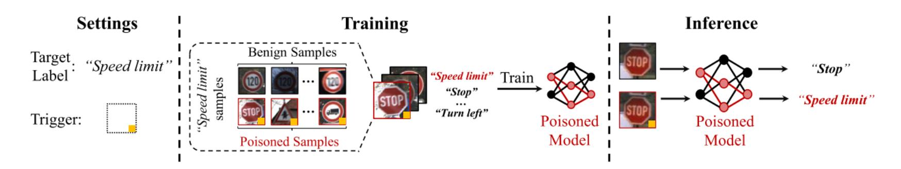
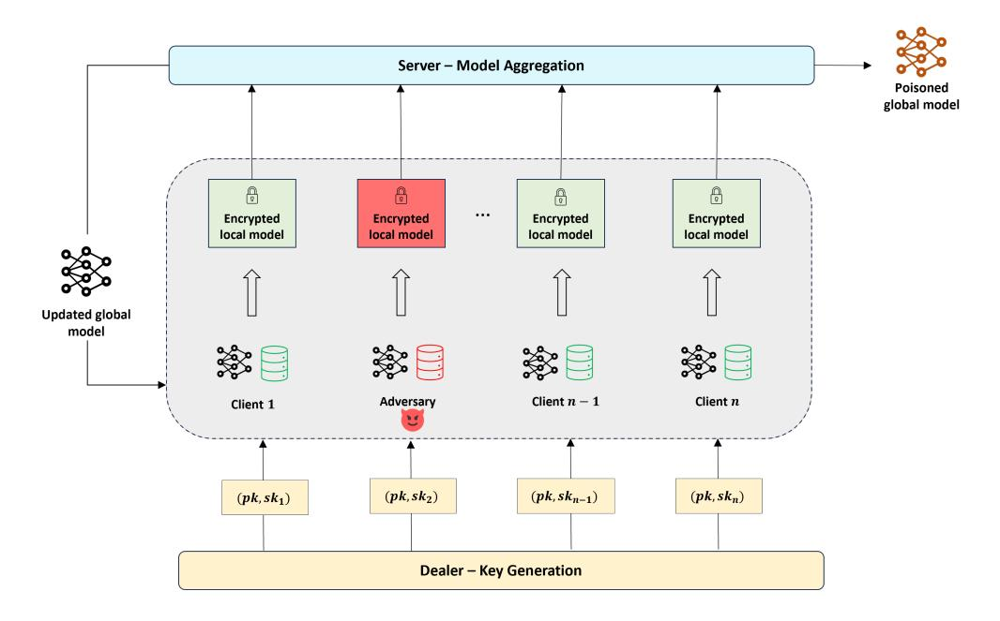
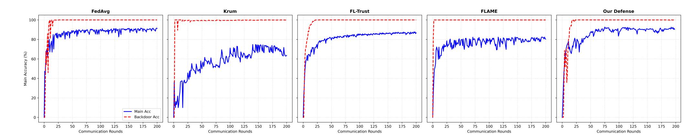
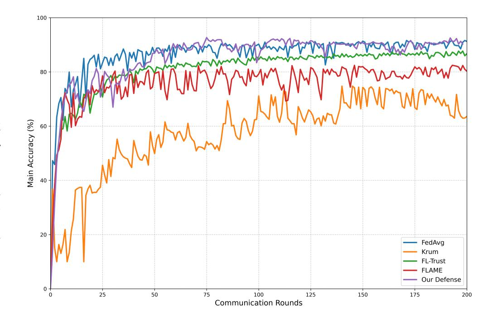

{0}------------------------------------------------

# Defending Against Backdoor Attacks in Homomorphically Encrypted Federated Learning

Ikhlas Mastour∗†‡, Imane Haidar§ , Layth Sliman‡ , Raoudha Ben Djemaa† ikhlas.mastour@efrei.fr, i.haidar@bau.edu.lb, layth.sliman@efrei.fr, raoudha.benjemaa@isitc.u-sousse.tn ∗ *Cedric Laboratory, Conservatoire National des Arts et Metiers, Paris, France* § *Department of Electrical and Computer Engineering, Beirut Arab University, Beirut, Lebanon* ‡ *Efrei Research Lab, Efrei Paris Pantheon Assas University, Paris, France* † *Miracl Laboratory, Higher Institute of Computer Science and Communication Technologies, Sousse, Tunisia*

*Abstract*—The distributed nature of federated learning systems makes them vulnerable to backdoor attacks in which malicious clients manipulate local training data using trigger-dependent behaviors to cause targeted misclassification. Although homomorphic encryption preserves the privacy of model updates during aggregation, it limits the application of conventional defenses that require access to plaintext updates. Moreover, distinguishing poisoned models from benign variations becomes more challenging under non-independent and identically distributed (non-IID) data distributions.To address this challenge, we introduce a defense strategy that operates at inference time by identifying abnormal internal activation patterns within the aggregated global model, rather than filtering encrypted individual updates during training. The proposed approach analyzes neurons that exhibit low activation on clean inputs, referred to as "*dormant*" neurons, but become disproportionately active in the presence of trigger patterns. By constructing a statistical activation baseline using a small clean dataset, we derive class-specific thresholds that serve as decision boundaries to detect and reject suspicious predictions. Since the proposed method relies on global model behavior at inference time instead of inspecting individual client updates, it does not introduce additional training overhead and remains robust under non-IID data settings. Our approach maintains a strong balance between privacy, security, and accuracy by defending against backdoor attacks without requiring access to client updates. Experimental results demonstrate that even with a 99% attack success rate and 90% accuracy of the main-task, the proposed defense method successfully detects 100% poisoned images.

*Index Terms*—Federated Learning, Homomorphic Encryption, Backdoor Attack, Dormant Neurons, Non-IID data

# I. INTRODUCTION

Federated learning (FL) [1] is a promising paradigm for privacy-preserving, decentralized machine learning (ML) that enables multiple entities to jointly train models while keeping data local and sharing only model updates with a central server for aggregation. This approach addresses a key challenge in modern ML by allowing the use of diverse, distributed datasets without compromising privacy or violating data protection regulations, thereby unlocking new opportunities in sectors such as healthcare, finance, and telecommunications. However, sharing model updates still exposes sensitive information about clients' local data, as an honest-but-curious server can exploit gradient inversion and membership inference [2] attacks to reconstruct training samples or infer whether specific data points contributed to the model. To mitigate these risks, extensive research has focused on privacy-enhancing techniques, including homomorphic encryption (HE) [3], differential privacy [4] and secure multi-party computation (SMPC) [5]. Among these solutions, HE has gained the most attention as a robust approach because it enables computation directly over encrypted data without requiring decryption. HE schemes such as BFV [6] and CKKS [7] support essential linear arithmetic operations (addition and multiplication) on ciphertexts, which aligns with the requirements of model aggregation in FL. HE enables clients to encrypt updates, permitting the server to aggregate parameters without decryption. Unlike differential privacy, which injects noise that reduces accuracy, HE preserves parameter utility and achieves performance parity with plaintext aggregation. These benefits establish HE as a robust foundation for secure federated learning while maintaining model utility.

While HE ensures privacy, FL remains susceptible to poisoning. Specifically, backdoor attacks [8] introduce triggers to force targeted mispredictions. As demonstrated by BadNets approach [9], which represents the first comprehensive implementation of a backdoor attack, poisoned models preserve standard accuracy on clean data while misclassifying triggered inputs toward labels specified by the attacker. This risk is further amplified in FL because the distributed and heterogeneous nature of local data complicates the identification of malicious updates. Various approaches [10]–[14] address these threats, yet few simultaneously mitigate both privacy and poisoning risks. Traditional defenses, such as clustering and outlier detection, often require access to plaintext data or rely on nonlinear operations that are computationally impractical for encrypted models. Recent studies [15], [16] exploring similarity measures over encrypted models remain limited in their effectiveness under heterogeneous data settings. Existing backdoor mitigation techniques typically either compromise privacy through decryption or incur significant computational overhead due to secure nonlinear computation. Moreover, many defense mechanisms negatively impact model accuracy. For example, differential privacy introduces noise that degrades accuracy, while clustering-based methods may incorrectly discard benign updates due to statistical diversity. These limitations highlight an inherent trade-off between privacy, 

{1}------------------------------------------------

security, and utility.

To address these challenges, we shift the defense paradigm from the training phase to the inference phase. Rather than filtering encrypted updates during training, we neutralize the backdoor at the moment of activation. We leverage the observation that backdoor attacks often exploit *dormant* neurons (i.e., neurons that remain consistently inactive or exhibit low activation for clean inputs [9]). We have found that, when processing poisoned inputs containing a trigger, these dormant neurons induce distinct activation patterns in hidden layers compared to clean data, forcing disproportionate activation pathways that produce detectable activation fingerprints. We treat the global model as a white box and use a clean reference dataset to establish baseline activation profiles for neurons. For each hidden layer, we identify *dormant* neurons, which exhibit low activation frequency on clean samples. A dormant neuron that becomes activated due to a triggered input is referred to as a *backdoor* neuron. Although *dormant* neurons are identified based on their low firing frequency, simply treating any activation of these neurons as a backdoor neuron is unreliable, because dormant does not mean "dead". These neurons often encode specific features that rarely appear in the training data but remain legitimate parts of the network. Classifying them as *backdoor* neurons without further analysis would result in a high false positive rate. To address this, we characterize *dormant* neuron behavior using a layer-wise dormant score computed via z-score, quantifying deviations relative to their baseline statistics. We then aggregate these dormant scores across all layers to define class-specific thresholds that capture the expected dormancy levels in clean inputs. During inference, inputs whose *dormant* neuron activations remain within the expected baseline range are treated as clean, and their predictions are returned. In contrast, inputs that trigger abnormal activations in *dormant* neurons generate high scores exceeding the class-specific threshold. These inputs are likely poisoned, and their predictions are rejected. The main contributions of this paper are:

- We propose a lightweight defense against backdoor attacks in FL that shifts the focus from training-time prevention to inference-time detection. Unlike state-of-theart approaches that introduce significant computational overhead, our inference-time defense does not affect training efficiency.
- Our approach preserves the privcay of client updates from an honest-but-curious server using HE, while mitigating backdoor attacks at inference time using the global model as a white box. This makes our approach independent of HE's computational constraints and fully compatible with existing HE-based FL systems.
- We introduce *dormant* neuron activation profiling, including a layer-wise dormant score computed via z-score deviation and class-specific thresholds, to characterize and detect abnormal activations of *dormant* neurons caused by backdoor triggers.
- Our approach is inherently robust to non-IID data distri-

- butions, as detection relies on the global model's activation behavior rather than on heterogeneous client updates.
- Experimental results under non-IID settings (label skew and Dirichlet partitioning) demonstrate that our defense detects 100% of poisoned samples, reducing the attack success rate to 0% while maintaining 90% main-task accuracy, thereby outperforming state-of-the-art defenses.

The remainder of this paper is structured as follows: Section III provides background on FL and backdoor attacks. Section III reviews related work on privacy-preserving FL and backdoor defenses, highlighting gaps that motivate our approach. Section IV presents the problem statement, including the system and threat models considered. Section V details our defense method. Section VI evaluates the proposed approach through experiments conducted in non-IID FL scenarios. Finally, Section VII concludes the paper and discusses future directions.

### II. BACKGROUND

## A. Federated Learning

FL enables clients to share only model updates with a server that aggregates them into a global model. A common aggregation algorithm in FL is Federated Averaging (FedAvg) [1]. The server initializes the global model  $W_t$  and, at each round t, selects a subset of clients S of size  $C \cdot K \geq 1$ , either randomly or using specific heuristics. The server distributes  $W_t$  along with local hyperparameters (local epochs E, batch size BS, and learning rate  $\eta$ ) to the selected clients. Each client performs E local SGD epochs and uploads the updated model  $w_{t+1}^k$  back to the server, which aggregates them to form the new global model:

$$W_{t+1} = \sum_{k=1}^{K} \frac{n^k}{n} w_{t+1}^k, \tag{1}$$

where  $n^k$  is the number of data points held by client k and  $n = \sum_{k=1}^{K} n^k$ . This process is repeated over several rounds until the model converges.

#### B. Backdoor Attack

Adversarial attacks in FL are classified as untargeted or targeted based on the attacker's goal. Untargeted attacks [17] aim to disrupt convergence via perturbed updates, while targeted attacks, commonly known as backdoor attacks [8], embed a hidden association between a trigger and a specific label. Such compromised models maintain standard performance on clean data while misclassifying triggered inputs. Attacks can also target different components: data poisoning [18] manipulates local training sets, whereas *model poisoning* [19] modifies model parameters transmitted to the server. The first implementation of backdoor attacks, BadNets [9], embeds triggers into training data and relabeling to the target class. As shown in Fig. 1, an adversary embeds a trigger (e.g., a yellow square) into benign samples, which are then relabeled to a target class, such as "speed limit". Training on this poisoned data creates a backdoor, causing the model to misclassify triggered inputs, for example, a "Stop" sign, as "speed limit".

{2}------------------------------------------------

Fig. 1. An example of a poisoned stop sign. The stop sign is maliciously misclassified as a speed-limit sign by BadNets [9].

### III. RELATED WORK

Early efforts to mitigate backdoor attacks introduced Byzantine robust FL methods, using statistical principles to filter malicious updates during aggregation. *Krum* [20] selects an update based on squared distance scores to nearest neighbors, identifying the contribution closest to the majority. *Multi-Krum* [20] extends this logic by selecting multiple proximate updates. Alternatively, *Trimmed Mean* [21] excludes the k largest and smallest values for each parameter before computing an average, while the *Median* [21] rule selects the central value. However, these distance-based approaches suffer significant performance degradation in non-IID data settings, where benign client updates naturally exhibit high variance, making it difficult to distinguish malicious patterns from legitimate heterogeneity. To address this challenge, several advanced defenses have been proposed. *FDCR* [22] exploits differences in parameter importance by using Fisher information to reweight gradients and cluster clients, however its reliance on Fisher computation introduces substantial computational overhead. *AlignIns* [11] analyzes the directional alignment of client updates using temporal and sign-based consistency measures, yet its effectiveness may degrade when attackers craft updates that closely mimic benign behavior. *FL-Trust* [10] adopts a trust-bootstrapping strategy by using a small clean server-side dataset to compute reference updates and assign trust scores to clients. *FedDLAD* [13] addresses insider threats and benign exclusion through a three-stage process combining connectivitybased anomaly detection, interquartile range filtering, and a pardon mechanism that reintegrates misclassified benign clients based on cosine similarity. Other approaches, such as *FL-Detector* [12], detect malicious clients using gradientbased analysis and historical update consistency, respectively. *FLAME* [23] mitigates backdoor attacks using HDBSCAN model filtering, adaptive clipping, and Gaussian noising. Despite their effectiveness, these approaches require the server to access individual client updates in plaintext, making them fundamentally incompatible with strong privacy-preserving FL settings where updates are encrypted or masked.

To address both privacy and security, several hybrid approaches have been proposed. *PEFL* [15] leverages Paillier HE combined with secure similarity computation, yet researchers have demonstrated that it potentially leaks gradient information [24] and relies on the assumption of IID data. *PR-PFL* [25] employs per-sample differential privacy with DP-SGD and robust aggregation, though it faces the standard privacy–utility trade-off of noise-based defenses.

Fig. 2. System model of our approach.

*FLGUARD* [26] integrates clustering, adaptive noise, and secure two-party computation to filter malicious updates while preserving privacy. Client-side defenses, such as [16], shift detection to clients using pruning-based approach verified by zero-knowledge proofs under additive HE. MP-BADNet [27] applies secure multi-party computation to collaboratively reverse-engineer backdoor triggers and detect their target labels. Despite extensive efforts in privacy-preserving FL and backdoor mitigation, current works often address these objectives separately, focusing on either preventing poisoning attacks or protecting local model updates, but rarely both. Although some studies attempt to tackle privacy and security, most use differential privacy or secure multi-party computation, with few works exploring HE, despite its effectiveness in preserving utility against semi-honest aggregators. Consequently, the literature still lacks a comprehensive approach capable of achieving a balance between privacy, security, and utlity in realistic FL settings, particularly under non-IID data distributions.

# IV. PROBLEM STATEMENT

In this section, we formally define the problem addressed in this paper by presenting the system model under which our framework operates and the considered threat models.

### *A. System Model*

As illustrated in Fig. 2, we consider a FL system composed of three main entities: a Dealer, a Server (Aggregator), and a set of n Clients, where a proportion P*Adv* < 0.5 of the 

{3}------------------------------------------------

clients may be compromised by an adversary *Adv* and behave maliciously.

- The Dealer: a trusted and independent key generation authority. It is responsible for generating, distributing, and managing public and secret keys (pk, sk).
- A set n users: each client receives an initial global model from the server and trains it locally on its private dataset. For privacy protection, a distributed HE scheme is employed: clients use the public key pk to encrypt their local model updates before sending them to the server for aggregation. After each aggregation round, clients are responsible for performing partial decryption (using sk) of the aggregated encrypted model to recover the plaintext global model used for the next training iteration.
- Server (Aggregator): coordinates the learning process and acts as the aggregation entity. The server receives encrypted local updates from the clients and performs aggregation using the FedAvg mechanism. Thanks to the homomorphic properties of the encryption scheme, the server can perform mathematical operations (e.g., addition and multiplication) directly on encrypted data without decrypting them, enabling the aggregation of model updates without accessing their plaintext values. After aggregation, the server collects the partial decryptions from clients to reconstruct the global model in plaintext before redistributing it for the next training round.

# *B. Threat Model*

In our system, we assume an honest-majority model among n clients. To ensure the availability of the model, we assume that an adversary *Adv* controls f compromised clients, where f is less than half of the total number of clients (f < n/2), which is a valid assumption in the literature. We assume the server is honest-but-curious, meaning it follows the FL protocol but may attempt to infer information from user data. Thanks to HE, all model updates are transmitted as ciphertexts, and the server aggregates them without accessing the plaintext. Most HE schemes (e.g., CKKS, BFV, BGV) are secure against indistinguishability under chosen-plaintext attacks (IND-CPA) and rely on lattice-based hardness assumptions, such as Ring Learning With Errors (RLWE). This ensures that ciphertexts are indistinguishable from random values, preventing the inference of gradients or model updates. This paper does not formally prove HE robustness, instead, we focus on mitigating backdoor attacks in FL with homomorphically encrypted local updates and refer the reader to prior works [6], [7], [28] for security assumption justification.

*Attacker's Capabilities:* we assume that the malicious attacker has full access to training data, model parameters, and training settings (e.g., learning rate, batch size, number of epochs) of compromised clients. However, attackers do not have access to the data or model parameters of non-compromised clients. Attackers can manipulate training datasets, in which they insert a chosen trigger pattern into training data, associate it with a selected target label, and train the model on this poisoned dataset.

*Attacker's Goals:* the ultimate goal of the attacker is to influence the global model during inference so that the backdoored model behaves normally on clean testing data but classifies any input containing a trigger to the attacker's chosen target label, without degrading the model's accuracy on clean data.

# V. OUR DEFENSE METHOD

In this section, we present an overview of our proposed approach and describe its workflow step by step, demonstrating how our solution effectively mitigates backdoor attacks in FL while preserving privacy through HE.

## *A. Overview*

Our approach leverages the observation that backdoor attacks often exploit *dormant* neurons (i.e., neurons that remain consistently inactive or exhibit low activation for clean inputs [9]). We find that backdoored models exhibit distinct activation behavior for clean data compared to poisoned samples that contain the trigger. In standard classification, predictions arise from distributed feature representations, where many neurons across layers contribute collectively. In contrast, when processing poisoned inputs, *dormant* neurons tend to activate disproportionately, creating shortcut pathways between trigger patterns and the target label. This behavior induces distinct internal activation patterns in hidden layers compared to clean data, producing sparse, anomalous activations that differ from the class-consistent patterns of clean inputs. These differences give rise to detectable activation fingerprints on which our method is based. For example, a triggered image with class "Plane" misclassified as class "Bird" exhibits internal activations that do not align with those of genuine class "Bird" samples, forming a detectable activation fingerprint at the neuron level.

Detecting such anomalies during training is infeasible in HE-based FL, where client updates are encrypted. Standard defenses that rely on clustering or outlier detection require access to plaintext updates or nonlinear operations, which are computationally prohibitive on encrypted data. To address this limitation, we shift detection to the inference time rather than attempting to prevent malicious updates during training time. We treat the global model as a white box and use a clean reference dataset to identify *dormant* neurons in each intermediate layer based on their firing frequency. For each layer, we compute a clean score using the z-score formula, based on the mean activation and variability of these *dormant* neurons. The layer-wise scores are then aggregated to define a class-specific threshold. During inference, for a triggered input, neurons that are expected to remain *dormant* on clean samples activate abnormally, producing a high score that exceeds the class-specific threshold. This behavior indicates that the input is likely poisoned, and its prediction is therefore rejected.

{4}------------------------------------------------

## B. Defense Model

**Defender's Capabilities:** we assume that the server has full access to the final trained global model in plaintext and maintains a reference dataset to monitor the model's behavior and detect abnormal patterns. We also assume that the server does not know the trigger used by the attacker.

**Defender's Goals:** the defender aims to flag poisoned inputs containing triggers during inference and reject them, thereby thwarting the attacker's objective at the moment the attack is activated, while preserving user privacy and maintaining the model's accuracy.

## C. Detailed Methodology

Our defense operates in two stages: offline profiling, where we establish baseline activation patterns using clean data (a standard assumption in backdoor defense literature), and online detection, where we flag inputs that cause anomalous activations of *dormant* neurons during inference. A *dormant* neuron that becomes activated due to a triggered input is referred to as a *backdoor* neuron.

1) Activation Capture: the core technical foundation of our approach relies on capturing and analyzing neuron activations of a trained global model when forwarding clean samples from a reference dataset. We instrument the neural network by attaching register\_forward\_hook() function to selected hidden layers, specifically, convolutional layers (e.g., conv1, conv2) and fully connected layers (e.g., fc1) immediately before the output layer. Forward hooks are PyTorch mechanisms that intercept layer outputs during forward propagation, enabling activation capture without modifying the model architecture.

Let  $G_{\Theta}: \mathbb{R}^N \to \mathbb{R}^M$  be a Deep Neural Network (DNN) that maps an input  $x \in \mathbb{R}^N$  to an output vector  $y \in \mathbb{R}^M$ , where  $\theta$  represents all trainable parameters. The network is composed of L layers, and each layer  $i \in \{1, \ldots, L\}$  contains  $N_i$  neurons with activation vector  $a_i \in \mathbb{R}^{N_i}$ . The forward pass applies a linear transformation followed by a nonlinear activation:

$$a_i = \phi_i(W_i \cdot a_{i-1} + b_i)$$
 for  $i = \{1, \dots, L\},$  (2)

where  $a_0 = x$  is the input and the final output is  $a_L = y$ .

A commonly used activation function in state-of-the-art in DNNs is the ReLU function, defined as ReLU(z) = max(0,z), that outputs a zero if its input is negative and outputs the input otherwise. We refer to a neuron as *active* if its output is greater than zero, and *dormant* if its output equals zero.

Unlike prior works that focus only on fully connected layers, we analyze multiple intermediate layers. This approach allows us to detect abnormal activations at different levels of the network. Early convolutional layers capture low-level patterns such as edges, colors, or textures, while deeper layers, including fully connected layers near the output, represent high-level semantic information and class decisions. By monitoring multiple layers, the defense becomes more robust because backdoor triggers can leave abnormal signals at different

depths. Even if an attacker tries to hide the trigger in some parts of the network, the abnormal activations are likely to appear in at least one of the layers we inspect. Furthermore, we apply a filtering step when capturing activations to ensure profile reliability. Specifically, we filter out misclassified samples during this phase because our goal is to model the network's correct execution path. Misclassified samples represent atypical or boundary cases whose activations may not reflect the true class semantics. By considering only correctly classified samples, we establish a reliable "ground truth" of normal activation patterns, which reduces noise in the baseline statistics.

2) Statistical Profiling: following activation capture, we establish a statistical profile that summarizes how neurons behave when processing clean inputs. By identifying dormant neurons and computing a clean score for each layer using the z-score based on their typical activation mean, natural variability, and firing frequency, we obtain a class-specific threshold. This threshold serves as the baseline for detecting backdoor neurons induced by triggered inputs.

Let  $D_{clean}^{(c)}$  denote the subset of samples belonging to class c, and let  $N_c = \left| D_{clean}^{(c)} \right|$ . For each layer l with  $d_l$  neurons, we define:

$$A_l^c = \{a_{l,j}(x_i) : (x_i, c) \in D_{\text{clean}}^{(c)}\} \in \mathbb{R}^{N_c \times d_l},$$
 (3)

where  $a_{l,j}(x)$  denotes the ReLU activation of neuron j in layer l for input x.

We identify the firing frequency  $f_{l,j}^{(c)}$  of a neuron j in layer l by measuring how often it is activated across clean samples. This represents a key property in our defense, as it defines the typical behavior of neurons within each layer. Trigger patterns often exploit neurons that are rarely activated to encode malicious behavior. Consequently, the high firing frequency of *dormant* neurons serves as a strong indicator of the presence of a trigger. We compute the firing frequency of neuron j in layer l belonging to class c as:

$$f_{l,j}^{(c)} = \frac{1}{N_c} \sum_{i=1}^{N_c} 1[a_{l,j}(x_i) > 0], \tag{4}$$

where  $N_c$  is the number of clean samples in class c and  $1[\cdot]$  is the indicator function, which equals 1 if the condition is true and 0 otherwise. In this case,  $a_{l,j}(x) > 0$  is 1 if neuron j is activated (i.e., its ReLU output is positive) for sample x, and 0 if it is not activated.

We then classify each neuron j in layer l based on its activation  $a_{l,j}(x)$  and its firing frequency  $f_{l,j}^{(c)}$  as follows:

- Dormant neuron:  $j \in \mathcal{D}_l$  if its firing frequency on clean samples is below  $\tau_{\text{dormant}}$ , i.e.,  $f_{l,j}^{(c)} < \tau_{\text{dormant}}$ . Equivalently, if  $a_{l,j}(x) = 0$  for at least  $\tau_{\text{dormant}}$  of samples in  $D_{\text{clean}}^{(c)}$ .
- Active neuron:  $j \in \mathcal{A}_l$  if  $a_l^j(x) > 0$  and  $f_{l,j}^{(c)} \ge \tau_{\text{dormant}}$ .
- Backdoor neuron:  $j \in \mathcal{B}_l$  if it belongs to  $\mathcal{D}_l$  on clean samples and becomes abnormally activated for a triggered input.

{5}------------------------------------------------

Although we identify *dormant* neurons based on their low firing frequency, simply considering any activation of these neurons as a backdoor neuron is unreliable, because *dormant* does not mean "dead". These neurons often encode rare, specific features that rarely appear in the training data, yet remain legitimate parts of the network. Consequently, naively treating any non-zero activation of a dormant neuron as a backdoor indicator would trigger false alarms for benign inputs containing these rare features, resulting in a high false positive rate. To address this, we further analyze the mean activation and standard deviation of *dormant* neurons in clean samples and compute a z-score for each *dormant* neuron. This statistical deviation score quantifies how unusual a neuron's activation is relative to its baseline behavior. A benign input may rarely activate a dormant neuron slightly within the expected range. In contrast, a backdoor trigger induces a high activation, resulting in a significant z-score that lies outside the neuron's normal distribution.

For each class c and layer l, we define the set of dormant neurons as  $\mathcal{D}_l^{(c)} = \{j \in \{1, \dots, d_l\} \mid f_{l,j}^{(c)} < \tau_{dormant}\}$  and compute:

• *Mean activations:* measures the expected activation level of a *dormant* neuron *j* from layer *l* with input *x* belonging to class *c*:

$$\mu_j^{(c)} = \frac{1}{N_c} \sum_{i=1}^{N_c} a_j(x_i), \quad j \in \mathcal{D}_l^{(c)}.$$
 (5)

• Standard Deviation: captures the variability activation of a dormant neurons j from layer l with input x belonging to class c:

$$\sigma_j^{(c)} = \sqrt{\frac{1}{N_c} \sum_{i=1}^{N_c} \left( a_j(x_i) - \mu_j^{(c)} \right)^2}, \quad j \in \mathcal{D}_l^{(c)}. \quad (6)$$

• Z-score: quantifies how much the activation of dormant neuron j from layer l deviates from its expected mean:

$$z_j^{(c)}(x) = \frac{|a_j(x) - \mu_j^{(c)}|}{\sigma_j^{(c)} + \epsilon}, \quad j \in \mathcal{D}_l^{(c)}, \tag{7}$$

where  $\epsilon=10^{-6}$  is a small stabilizing constant added to prevent division by zero in cases where  $\sigma_j^{(c)}=0$ .

We further normalize the dormancy behavior at the layer level by defining a layer-wise score as the mean of the z-scores over all *dormant* neurons in layer l:

$$S_l^{(c)}(x) = \frac{1}{|\mathcal{D}_l^{(c)}|} \sum_{j \in \mathcal{D}_l^{(c)}} z_j^{(c)}(x).$$
 (8)

To establish a distinct decision boundary for each class, we aggregate the scores across all monitored layers. The class-specific detection threshold is then defined as the 99th percentile of the aggregated scores computed on clean samples. This threshold enables our defense to detect poisoned inputs that trigger anomalous activations in *dormant* neurons, while

preserving predictions for clean inputs whose scores remain below the threshold and are considered legitimate.

$$\theta_c = \text{Percentile}_{99} \left( \left\{ \sum_{l \in \mathcal{L}} S_l^{(c)}(x_i) \mid x_i \in D_{\text{clean}}^{(c)} \right\} \right), \quad (9)$$

where  $\mathcal{L}$  denotes the set of monitored layers.

3) Inference-Time Detection: during inference, our defense uses the class-specific activation profiles and the obtained thresholds to inspect each input. For a given input x, the model predicts a class  $\hat{y}$  and the activations from the monitored layers  $\mathcal{L}$  are captured. Using the baseline class profile for  $\hat{y}$ , the defense computes the layer-wise score  $S_l^{(\hat{y})}(x)$  (8) for all  $l \in \mathcal{L}$  and aggregates them into a global deviation score:

$$S^{(\hat{y})}(x) = \sum_{l \in \mathcal{L}} S_l^{(\hat{y})}(x). \tag{10}$$

The global score is compared to the class-specific threshold  $\theta_{\hat{y}}$  (9).

- If  $S^{(\hat{y})}(x) \leq \theta_{\hat{y}}$ , the input is considered clean and the model's prediction is returned.
- If  $S^{(\hat{y})}(x) > \theta_{\hat{y}}$ , the input is flagged as poisoned. In this case, the prediction is rejected, as it relies on abnormal activations in *dormant* neurons.

This mechanism ensures that:

- Clean inputs, which may occasionally activate *dormant* neurons due to rare but benign features, are preserved.
- Inputs containing backdoor triggers that induce abnormal activations in *dormant* neurons are detected and rejected.

A key advantage of shifting detection to inference time and operating on the final global model is that it eliminates any need to access, decrypt, or analyze client updates in plaintext, ensuring full compatibility with HE-protected aggregation and preserving-privacy guarantees. Our defense also maintains model utility, as it does not modify or prune the global model, unlike update-filtering approaches that alter or discard client gradients at the cost of performance degradation. Instead, our method monitors incoming predictions and rejects only those exhibiting anomalous activation patterns in *dormant* neurons, neutralizing the attacker's objective without affecting clean inference. Furthermore, our approach is inherently non-IID robust, as activation profiles are constructed from the global model using a clean reference set, requiring no assumptions about client-side data distributions or update similarity, and thus avoiding the challenges introduced by non-IID training data.

#### VI. EXPERIMENTS

In this section, we discuss the implementation of our defense solution and evaluate its performance against several baselines: FedAvg (standard federated averaging without defense) [1], Krum [20], FL-Trust [10], FLAME [23], FLAIN [14], PEFL [15] and Nguyen-Thai [16] approach. Experiments were conducted on a machine with an 11th Gen Intel® Core™ i7-11800H CPU at 2.30 GHz, 16 GB of RAM, and a 64-bit x64 operating system.

{6}------------------------------------------------

TABLE I ARCHITECTURE OF CNN MODEL

| Layer                  | Size        |
|------------------------|-------------|
| Input                  | 28 × 28 × 1 |
| Convolution + ReLU     | 3 × 3 × 32  |
| Convolution + ReLU     | 3 × 3 × 64  |
| Max Pooling            | 2 × 2       |
| Dropout                | 0.5         |
| Fully Connected + ReLU | 128         |
| Dropout                | 0.5         |
| Fully Connected        | 10          |

# *A. Experimental Setup*

*Dataset and Model Architecture:* we evaluate the proposed approach using the widely adopted image classification benchmark Fashion-MNIST. Fashion-MNIST consists of 60, 000 training images and 10, 000 grayscale test images of size 28 × 28, distributed across 10 classes. To reflect realistic FL scenarios, we consider a non-IID data distribution among clients. Specifically, we adopt a label-skew partitioning strategy in which each client is assigned samples from only four out of the ten classes, with data allocation following a Dirichlet distribution with concentration parameter β = 0.5. We employ a four-layer Convolutional Neural Network (CNN), detailed in Table I, as the global model for Fashion-MNIST, given its effectiveness for grayscale image classification tasks.

*FL Setting:* we conduct our experiments using an opensource PyTorch implementation. The FL system consists of 10 clients, and for simplicity, all clients participate in each training round. For the training process, the global model is trained for 200 communication rounds using a local batch size of 64 and a learning rate of 0.01.

*Attack Settings:* we assumed a malicious client ratio (MCR) of 40% and a poisoned data ratio (PDR) of 50%. Following BadNets [9], a 5×5 square trigger is injected into the bottomright corner, with samples relabeled to the target Class 0.

*Defense Configuration:* we divide the test dataset into three distinct subsets for evaluating our defense. Specifically, 40% of the data, containing only clean samples, are used for profiling, while the remaining 60%, equally divided between poisoned and clean samples, are used to evaluate detection performance during inference. To assess the robustness of our approach, we further vary the size of the reference clean dataset used for profiling [500, 2000, 4000] samples and report the resulting evaluation metrics. For profiling step, we inspect activations in three hidden layers of the model with two convolutional layers conv1 (3×3×32 filters) and conv2 (3×3×64 filters) and one fully connected layer fc1 of size 128. We empirically set the dormancy threshold to τdormant = 0.05. A neuron is considered *dormant* if its activation satisfies al,j (x) = 0 and its firing frequency fl,j < τdormant, meaning that it fires in fewer than 5% of clean samples. In contrast, a neuron is considered *active* when al,j (x) > 0 and its firing frequency fl,j ≥ τdormant. To facilitate monitoring of hidden-layer activations, we employ PyTorch's register\_forward\_hook() function to capture activation patterns during inference.

*Baselines:* to evaluate the robustness of our proposed approach, we conduct a comprehensive comparison against the standard FedAvg [1] baseline and several state-of-the-art defense algorithms, categorized by their underlying defense methodologies:

- *Distance-based Aggregation:* represented by Krum [20], which filter local updates based on distance deviations in the parameter space.
- *Clustering-based Mitigation:* represented by FLAME [23], which leverages spatial clustering via HDBSCAN and adaptive noise injection to neutralize stealthy backdoor triggers.
- *Trust-based Evaluation:* represented by FL-Trust [10], which uses a server-side root-of-trust dataset to compute trust scores and benchmark the reliability of local updates.
- *Weight Flipping Defense:* represented by FLAIN [14], which mitigates backdoors by flipping weight updates of low-activation input neurons.
- *Coordinate-wise Medians over Encrypted Updates:* Represented by PEFL [15], which uses HE for secure coordinate-wise median aggregation and Pearson correlation-based adaptive weighting.
- *Client-Side Pruning via ZKP Commitment Verification:* represented by Nguyen-Thai [16], which combines HE secure aggregation with client-side neuron pruning verified through zero-knowledge proofs.

*Evaluation Metrics:* we consider a set of metrics to assess both the global model performance and the effectiveness of defense approaches, defined as follows:

- *Main Task Accuracy (MA):* measures the fraction of clean inputs correctly classified by the global model. An effective defense should maintain MA comparable to FedAvg.
- *Attack Success Rate (ASR):* measures backdoor effectiveness as the fraction of poisoned inputs misclassified into the attacker's target class. Robust defenses minimize ASR, while successful attacks maximize it.

We also report detection metrics to provide a detailed evaluation of the effectiveness and reliability of our proposed defense mechanism:

• *Precision (PR):* quantifies the reliability of the detector by measuring the proportion of samples flagged as poisoned that are truly malicious. It is defined as:

$$Precision = \frac{TP}{TP + FP}, \tag{11}$$

where True Positives (TP) represent poisoned samples correctly identified, and False Positives (FP) represent clean samples incorrectly flagged as poisoned. High precision indicates that the defense produces few false alarms.

• *Recall (Detection Rate - DR):* measures the sensitivity of the defense by calculating the fraction of poisoned

{7}------------------------------------------------

Fig. 3. Main task accuracy (MA, %) and Attack succes rate (ASR, %) across communication rounds for different defenses. For our method, the reported ASR corresponds to the attack success rate during training before applying our inference-time defense.

samples successfully identified by the detector. It is defined as:

$$Recall = \frac{TP}{TP + FN},$$
 (12)

where False Negatives (FN) represent poisoned samples that bypassed the defense. A high recall indicates that the defense effectively captures the majority of backdoor triggers during inference.

• *F1-score:* represents the harmonic mean of Precision and Recall, providing a single measure of detection quality that balances the trade-off between catching poisoned samples (Recall) and avoiding false alarms (Precision). It is calculated as:

$$F1 = 2 \cdot \frac{\text{Precision} \cdot \text{Recall}}{\text{Precision} + \text{Recall}}.$$
 (13)

High F1-score indicates that the defense both detects most attacks and rarely incorrectly classifies clean samples.

• *False Positive Rate (FPR):* measures the fraction of clean samples that are incorrectly flagged as poisoned. It is defined as:

$$FPR = \frac{FP}{FP + TN},$$
(14)

where True Negatives (TN) represent clean samples correctly identified as benign. A low FPR indicates that the defense distinguishes between the natural variance of specific sample distributions and backdoor-triggered samples.

# *B. Experimental Results*

In this section, we discuss the experimental results and compare them with the baseline methods.

*Main Task Accuracy Performance:* Fig. 3, Fig. 4 and Table II present a comparative analysis of different defense approaches under varying data distributions. In IID settings, most defenses maintain high accuracy comparable to the FedAvg baseline (89.05%). For instance, FL-Trust, FLAIN, Krum, and FLAME achieve accuracies of 90%, 89.7%, 89%, and 88.76%, respectively. This strong performance is attributed to the uniform data distribution, which enables effective statistical outlier detection without discarding benign updates. However, PEFL reports a lower accuracy of 84% compared to other approaches, because its defense operates on encrypted data, leading to reduced precision in model updates. However,

Fig. 4. Main accuracy (%) across communication rounds for different defenses.

performance changes significantly under non-IID distributions, particularly in the label skew (4 out of 10 labels) and Dirichlet (β = 0.5) distribution. For instance, Krum experiences a notable degradation in accuracy, dropping to 63.59% in the label skew setting and 78.2% in the standard non-IID Dirichlet setting. This confirms that Krum's strategy, based on Euclidean distance selection, is fundamentally limited in heterogeneous environments, where valid local updates naturally diverge from the geometric center. While FL-Trust and FLAME maintain acceptable accuracy in label skew distribution (87.7% and 80.25%, respectively), they still suffer a noticeable drop compared to the FedAvg baseline (91.25%). This is due to inherent trade-offs in their design: FLAME applies adaptive gradient clipping and noise injection, which, while suppressing residual malicious influence, also moves updates away from their true local minima and reduces effective learning capacity. Similarly, in FL-Trust, clients with differing label distributions produce updates that legitimately diverge from the server's model, causing the server to misinterpret some benign updates as untrustworthy and resulting in the loss of useful information. In contrast, our defense achieves superior accuracy of 90.2% in the challenging non-IID label skew setting, closely matching the FedAvg baseline. This performance advantage stems from our architectural decision to decouple defense from training-time prevention, focusing instead on inference-

{8}------------------------------------------------

TABLE II

COMPARISON OF DEFENSES APPROACHES ON FASHION MNIST - CNN UNDER IID AND NON-IID DISTRIBUTION

| Defenses              | Strategy                                                            | Defense Stage | Data Distribution      |                    |                                          |        |                            |                         | Duires  | Commutational               | Domoniya                                               |
|-----------------------|---------------------------------------------------------------------|------------------|------------------------|--------------------|------------------------------------------|--------|----------------------------|-------------------------|---------|-----------------------------|--------------------------------------------------------|
|                       |                                                                     |                  | IID                    |                    | Non-IID Label Skew Dirichlet (0.5) |        | Non-IID Dirichlet (0.5) |                         | Privacy | Computational Complexity | Remarks                                                |
|                       |                                                                     |                  | MA↑                    | ASR↓               | MA↑ ASR↓                                 |        | MA↑                        | ASR↓                    |         |                             |                                                        |
| FedAvg [1] (baseline) | No defense                                                          | -                | 89.05 1     | 99.97 1 | 91.25*                                   | 100*   | 88.28 1         | 99.9 1       | -       | Low                         | Highly vulnerable to attack                            |
| Krum [20]             | Euclidean distance-based selection                            | Training         | 89 2        | 26 2    | 63.59*                                   | 99.83* | 78.2 3          | $0.9^{3}$               | -       | Med                         | Ineffective on non-IID label skew                |
| FL-Trust [10]         | Bootstrapping trust score based on server model               | Training         | <b>90</b> 1 | 98.47 1 | 87.7*                                    | 99.98* | <b>89.51</b> 1  | 68.97 1      | -       | High                        | Higher ASR results under IID and non-IID               |
| FLAME [23]            | HDBSCAN clustering; Weight clipping; Noise Injection       | Training         | 88.76 1     | 0.531              | 80.25*                                   | 99.94* | 87.78 1         | <b>0.1</b> 1 | -       | High                        | Added noise negatively impacts accuracy                |
| FLAIN [14]            | Weight flipping for neurons with low activations              | Training         | 89.74                  | 2.74               | -                                        | -      | <b>89.5</b> 4   | 0.54                    | -       | High                        | Assumes clean model initialization                     |
| PEFL [15]             | Coordinate-wise medians; Pearson correlation                  | Training         | 84 2        | 4 2     | -                                        | -      | -                          | -                       | НЕ      | High                        | Assumes data distributed in IID                        |
| Nguyen & Thai [16]    |                                                                     |                  | -                      | -                  | -                                        | -      | -                          | -                       | НЕ      | High                        | Evaluation limited to computation/ communication costs |
| Our defense           | Identify dormant neuron; Layer-wise                              | Inference        | -                      | -                  | 90.2*                                    | 0*     | -                          | -                       | НЕ      | High Training Low Inference | Preserves accuracy; Ensures                         |
|                       | dormant score; Detecting backdoor neuron; Class-specific thresholds | e                |                        |                    |                                          |        |                            |                         | No HE   | Low Training Low Inference  | privacy; Mitigates backdoors                        |

\* Results tested in our implementation. MA: Model Accuracy % (Utility), ASR: Attack Success Rate % (Security). ↑ indicates larger values are better. ↓ indicates smaller values are better. Bold numbers indicate the best results. ¹ Results obtained from [29]. ² Results obtained from [15].

indicates smaller values are better. **Bold** numbers indicate the best results. Results obtained from [13].

time detection. By avoiding training-time filtering or noise injection, we preserve the full knowledge of all benign client updates. Furthermore, the use of HE for privacy-preservation ensures that aggregation occurs with exact precision, avoiding the quantization errors commonly encountered in other privacy-preserving protocols.

Attack Success Rate (ASR) Evaluation: The ASR results in Table II and Fig. 3 highlight a critical issue in state-ofthe-art defenses when subjected to non-IID label skew. In IID settings, defenses such as FLAME, FLAIN, and PEFL effectively neutralize backdoors, reducing ASR to 0.53\%, 2.7%, and 4%, respectively. Similarly, in the standard non-IID Dirichlet setting, FLAME (0.1% ASR) and FLAIN (0.5%) effectively suppress the attack. However, under non-IID label skew, all training-time defenses fail: Krum (99.83%), FL-Trust (99.98%), and FLAME (99.94%) are unable to mitigate the attack, showing that the global model is compromised and closely aligns with the attacker's objective. This demonstrates that statistical and clustering-based defenses cannot reliably distinguish between the natural statistical divergence caused by label skew and the perturbations introduced by backdoor attacks. In such highly heterogeneous settings, malicious updates can easily pretend to be diverse but benign

client updates. In contrast, our defense withstands the non-IID label skew distribution, reducing ASR to 0%. Unlike prior works that attempt to prevent attacks by filtering malicious updates during aggregation, our method operates at inference time. By analyzing *dormant* neuron activation patterns, our defense successfully identifies *backdoor* neurons that induce misclassification toward the attacker's target objective.

**Detection Performance Analysis:** Table III demonstrates the effectiveness of our defense in detecting backdoor attacks at inference time. The detector consistently achieves a recall of 1.000, indicating that all poisoned inputs are successfully intercepted and no triggered samples bypass the defense. This confirms that backdoor neurons induce highly distinctive activation patterns in *dormant* neurons that are reliably separable from clean inputs. In our initial attempt, we considered all neurons (both *dormant* and *active*) to characterize neuron behavior within each layer, weighting the contribution of dormant neurons more significantly. While this captured backdoor activations, it negatively impacted the false positive rate and made it highly dependent on the size of the clean profiling dataset. For example, using 1000 clean samples, the FPR reached 0.697, whereas increasing the clean profiling dataset to 3000 samples reduced the FPR to 0.20. Importantly,

{9}------------------------------------------------

the detection performance for poisoned samples remained unchanged. Given that real-world clean reference datasets are

TABLE III DETECTION METRICS REPORT FOR OUR DEFENSE

| Metrics                            | Test 1 | Test 2 | Test 3 |
|------------------------------------|--------|--------|--------|
| Total Clean Samples (Profiling)    | 500    | 2000   | 4000   |
| Total Poisoned Samples             | 3000   | 3000   | 3000   |
| Total Clean Samples                | 3000   | 3000   | 3000   |
| Main Accuracy (MA)                 | 0.896  | 0.896  | 0.896  |
| Misclassification Rate (Clean)     | 0.104  | 0.104  | 0.104  |
| ASR before Defense (Training time) | 0.999  | 0.999  | 0.999  |
| True Positives (TP)                | 3000   | 3000   | 3000   |
| False Positives (FP)               | 170    | 53     | 44     |
| True Negatives (TN)                | 2519   | 2636   | 2645   |
| False Negatives (FN)               | 0      | 0      | 0      |
| Precision (PR)                     | 0.946  | 0.983  | 0.986  |
| Recall                             | 1.000  | 1.000  | 1.000  |
| F1-score                           | 0.972  | 0.991  | 0.993  |
| False Positive Rate (FPR)          | 0.063  | 0.020  | 0.016  |
| True Negative Rate (TNR)           | 0.937  | 0.980  | 0.984  |
| ASR with Defense (Inference time)  | 0.000  | 0.000  | 0.000  |

often limited in size, we decided to focus exclusively on dormant neuron analysis to balance false positive rate, dataset availability, and robust backdoor detection. From Table III, we observe:

- FP vs TN: as the clean profiling dataset increases from 500 to 4000 samples, FP decreases from 170 to 44, while TN correspondingly increases from 2519 to 2645, reducing the FPR from 0.063 to 0.016 (1.6%).
- Precision and F1-score: precision improves from 0.946 to 0.986 and F1-score from 0.972 to 0.993, indicating fewer false alarms on clean inputs.
- Recall and ASR: our defense achieves a perfect recall of 1.000, meaning all poisoned inputs are successfully identified. While the ASR before defense is 99%, the ASR after applying our defense drops to 0% in all tests, effectively mitigating the backdoor at inference time.

Overall, our detection performance demonstrates that our defense successfully mitigates backdoor attacks while maintaining minimal impact on clean inputs (low FPR), even with a limited clean reference dataset of 500 samples for profiling, achieving a robust balance between security and utility.

Dormant and Backdoor Neurons analysis: We simulate a poisoned model using both clean and poisoned samples, where the attacker's objective is to misclassify any input containing the trigger into the target class 0. We define dormant neurons as those with activation value equal to zero and firing frequency  $\tau_{\rm dormant} < 0.05$  (i.e., they are activated in fewer than 5% of clean samples). We define *backdoor* neurons as neurons that are dormant on clean samples but become activated under poisoned inputs, with activation value > 0 and class-wise score  $S^{(\hat{y})} > \theta_c$ , where  $\theta_c$  denotes the class-wise legitimate activation level of *dormant* neurons.

The results in Table IV show that *backdoor* neurons exhibit activation patterns that are significantly deviate from the baseline behavior of *dormant* neurons. For example, in Class 2 and layer fc1, dormant neurons exhibit an average activation of 4.0235 under clean samples, whereas under poisoned samples backdoor neurons reach an average activation of  $7.0 \times 10^3$ , producing a layer-wise score of  $1.9 \times 10^7$  compared to only 0.1555 for clean dormant neurons. This large gap demonstrates that backdoor triggers induce highly distinctive and separable activation signatures.

TABLE IV LAYER-WISE DORMANT NEURON ACTIVATION AND CLASS-WISE ANOMALY THRESHOLD ANALYSIS

| Class | Layer                 | <b>Total Neurons</b> |                       | Backdoor 2   | Backdoor 2 Avg Activat |                                        | Layer-wise Score 4 |                                                                                            | Class-wise Threshold           | Class-wise                    |
|-------|-----------------------|----------------------|-----------------------|-------------------------|-----------------------------------|----------------------------------------|-------------------------------|--------------------------------------------------------------------------------------------|--------------------------------|-------------------------------|
| Label | Level                 | Dormant 1 | Backdoor 2 | Neurons%                | Dormant                           | Backdoor                               | Dormant                       | Backdoor                                                                                   | Decison (Dormant) 5 | Score (Backdoor) 6 |
| 0     | conv1 conv2 fc1 | 1250 19367 62  | 227 1343 4      | 18.16 6.93 6.45   | 0.0722 0.7565 4.9113        | $0.7651$ $9.5624$ $8.3 \times 10^3$    | 0.1732 0.1729 0.1689    | $2.9 \times 10^4$ $4.3 \times 10^5$ $5.4894$                                               | 2.5389                         | $4.6 \times 10^{5}$           |
| 1     | conv1 conv2 fc1 | 3757 26702 73  | 220 963 28      | 5.86 3.61 38.36   | 0.0631 0.3474 1.7944        | $0.6295$ $11.6912$ $6.5 \times 10^3$   | 0.1541 0.1062 0.0905    | $2.2 \times 10^4$ $3.2 \times 10^5$ $9.7 \times 10^8$                                | 2.1077                         | $9.7\times10^8$               |
| 2     | conv1 conv2 fc1 | 1740 18059 68  | 231 1442 25     | 13.28 7.98 36.76  | 0.0699 0.7586 4.0235        | $0.3894$ $7.9715$ $7.0 \times 10^3$    | 0.2146 0.1798 0.1555    | $3.8 \times 10^{3}$ $1.9 \times 10^{5}$ $1.9 \times 10^{7}$                          | 2.5909                         | $1.9\times10^7$               |
| 3     | conv1 conv2 fc1 | 2939 21301 61  | 293 1564 23     | 9.97 7.34 37.70   | 0.0635 0.7356 4.8468        | $0.5209$ $8.8919$ $7.8 \times 10^3$    | 0.1657 0.1457 0.1754    | $3.2 \times 10^4$ $4.3 \times 10^5$ $3.7 \times 10^8$                                      | 1.9424                         | $3.7\times10^8$               |
| 4     | conv1 conv2 fc1 | 2614 17519 69  | 286 1005 30     | 10.94 5.74 43.48  | 0.0826 0.6700 1.7321        | $0.3655$ $10.6090$ $6.7 \times 10^3$   | 0.2151 0.1593 0.0814    | $\begin{array}{c} 2.4 \times 10^{3} \\ 1.8 \times 10^{5} \\ 9.1 \times 10^{8} \end{array}$ | 2.2067                         | $9.1\times10^{8}$             |
| 5     | conv1 conv2 fc1 | 1325 16011 72  | 51 1152 25      | 3.85 7.20 34.72   | 0.0469 1.0539 4.9733        | $1.3188 \\ 10.4665 \\ 6.1 \times 10^3$ | 0.1129 0.1619 0.1465    | $\begin{array}{c} 2.8 \times 10^{3} \\ 1.2 \times 10^{5} \\ 1.5 \times 10^{8} \end{array}$ | 1.3242                         | $1.5\times10^8$               |
| 6     | conv1 conv2 fc1 | 1038 16214 64  | 217 1732 24     | 20.91 10.68 37.50 | 0.0936 1.0456 4.9328        | $0.4475$ $7.3644$ $8.0 \times 10^3$    | 0.2349 0.2074 0.1591    | $7.1 \times 10^3 \\ 1.8 \times 10^5 \\ 1.1 \times 10^9$                                    | 2.1387                         | $1.1\times10^{9}$             |
| 7     | conv1 conv2 fc1 | 2946 22684 67  | 104 865 25      | 3.53 3.81 37.31   | 0.0379 0.4729 2.0850        | $0.9461 \\ 13.2536 \\ 8.6 \times 10^3$ | 0.1012 0.0998 0.1071    | $\begin{array}{c} 2.6 \times 10^4 \\ 3.3 \times 10^5 \\ 4.1 \times 10^8 \end{array}$       | 1.3520                         | $4.1\times10^8$               |
| 8     | conv1 conv2 fc1 | 1028 13163 70  | 180 1275 24     | 17.51 9.69 34.29  | 0.1363 1.2781 5.1506        | $0.4448$ $8.5938$ $6.8 \times 10^3$    | 0.2591 0.2143 0.1681    | $5.8 \times 10^{3}$ $8.3 \times 10^{4}$ $1.6 \times 10^{8}$                          | 2.5575                         | $1.6\times10^8$               |
| 9     | conv1 conv2 fc1 | 2555 18855 77  | 128 976 25      | 5.01 5.18 32.47   | 0.0566 0.6392 2.5300        | $0.5280$ $8.5917$ $5.6 \times 10^3$    | 0.1490 0.1345 0.1116    | $\begin{array}{c} 1.3 \times 10^{3} \\ 9.7 \times 10^{4} \\ 5.1 \times 10^{8} \end{array}$ | 1.7572                         | $5.1\times10^{8}$             |

We simulate a poisoned model using clean and poisoned datasets with the attacker's objective of misclassifying any input containing the trigger to the target class 0. Neurons per layer are: conv1 (21,632), conv2 (36,864), and fc1 (128).

1 Total number of *dormant* neurons over clean samples.

2 Total number and percentage of *backdoor* neurons over poisoned samples.

3 Average activation of *dormant* neurons over clean samples and average activation of *backdoor* neurons over poisoned samples.

4 Layer-wise dormancy score on clean samples  $(S_l^{(c)})$  and backdoor activation score on poisoned data  $(S_l^{(\hat{y})} > S_l^{(c)})$ . 5 Class-wise threshold  $\theta_c$  representing the legitimate activation level of *dormant* neurons. 5 Class-wise activation score  $S^{(\hat{y})}$  of *backdoor* neurons. If  $S^{(\hat{y})} > \theta_c$ , the input is flagged as poisoned.

The fully connected layer (fc1) consistently exhibits the strongest backdoor signal, with between 6.45% and 43.48%of previously *dormant* neurons becoming activated across different classes under poisoned inputs. The convolutional layers (conv1 and conv2) also show consistent deviations in the presence of poisoned inputs. Although the proportion of activated neurons in these layers is lower than in fc1, their contribution remains meaningful and enhances detection robustness. For example, in Class 7, dormant neurons in conv2 produce a layer-wise score of 0.0998 on clean samples, which increases to  $3.3 \times 10^5$  under poisoned inputs. This observation confirms that the backdoor effect manifests throughout the network hierarchy, not only in the final layer, and motivates monitoring all layers to achieve robust detection.

Importantly, characterizing *dormant* neurons solely based on activation value would lead to false alarms on benign inputs. Dormant does not mean "dead": some dormant neurons naturally activate in response to rare but legitimate features. For example, in Class 2 and layer fc1, the average activation of *dormant* neurons is 4.0235 on clean samples, despite being classified as *dormant* based on firing frequency. Treating any non-zero activation as malicious would therefore incorrectly reject benign inputs. Our use of z-score-based layer-wise scores addresses this limitation by quantifying how unusual

{10}------------------------------------------------

a *dormant* neuron's activation is relative to its clean baseline. In the same example (Class 2, fc1), the dormant score is only 0.1555, whereas the backdoor score rises to 1.9×107 , clearly separating legitimate rare activations from backdoor-induced anomalies.

Overall, these results demonstrate that our defense reliably captures the *backdoor* neuron, benefits from aggregating evidence across all layers, and achieves strong separability between clean and poisoned behaviors. The large margins between dormant and backdoor scores (e.g., 0.1732 vs. 2.9×104 for Class 0, conv1) provide strong empirical evidence of the robustness and effectiveness of our approach.

*Discussion:* experimental results validate the core idea behind our approach that backdoored models encode triggerspecific behavior in neurons that remain *dormant* during clean inference. By analyzing activation patterns across layers, our method successfully identifies the anomalous behavior of *backdoor* neurons in poisoned inputs. The proposed defense achieves a strong balance between security, privacy, and utility: it detects 100% of poisoned samples, reduces ASR to 0%, and preserves model utility (about 90% accuracy) under homomorphic-encrypted aggregation. Unlike existing defenses, our approach is lightweight and operates at inference time, without additional training, communication, or computational overhead. Furthermore, it remains effective under non-IID data distributions, including label-skewed and Dirichlet settings, making it practical for real-world privacy-preserving FL deployments.

# VII. CONCLUSION AND FUTURE WORK

In this paper, we propose a novel and lightweight defense against backdoor attacks in homomorphically encrypted federated learning that shifts protection from training-time prevention to inference-time detection. Our approach leverages *dormant* neuron behavior by establishing activation baselines using a clean reference dataset and rejecting inputs with anomalous, backdoor-induced patterns. Experimental evaluation on Fashion-MNIST under non-IID settings (label skew and Dirichlet partitioning) demonstrates that our defense achieves strong detection performance (recall: 1.000, precision: 0.986, F1-score: 0.993, and FPR: 0.016), successfully identifying 100% of poisoned samples across 3000 test cases. Our inference-time detector effectively reduces the attack success rate (ASR) to 0% while preserving model utility with approximately 90% main-task accuracy, outperforming existing state-of-the-art defenses. Future work includes evaluating our approach on deeper architectures (ResNet, VGG) and more complex datasets (CIFAR-10, ImageNet), as well as extending the solution to recover original labels by localizing and removing triggers.

# REFERENCES

[1] B. McMahan, E. Moore, D. Ramage, S. Hampson, and B. A. y Arcas, "Communication-efficient learning of deep networks from decentralized data," in *Artificial intelligence and statistics*, pp. 1273–1282, PMLR, 2017.

- [2] L. Bai, H. Hu, Q. Ye, H. Li, L. Wang, and J. Xu, "Membership inference attacks and defenses in federated learning: A survey," *ACM Computing Surveys*, vol. 57, no. 4, pp. 1–35, 2024.
- [3] C. Marcolla, V. Sucasas, M. Manzano, R. Bassoli, F. H. Fitzek, and N. Aaraj, "Survey on fully homomorphic encryption, theory, and applications," *Proceedings of the IEEE*, vol. 110, no. 10, pp. 1572–1609, 2022.
- [4] K. Wei, J. Li, M. Ding, C. Ma, H. H. Yang, F. Farokhi, S. Jin, T. Q. Quek, and H. V. Poor, "Federated learning with differential privacy: Algorithms and performance analysis," *IEEE transactions on information forensics and security*, vol. 15, pp. 3454–3469, 2020.
- [5] Y. Lindell, "Secure multiparty computation," *Communications of the ACM*, vol. 64, no. 1, pp. 86–96, 2020.
- [6] J.-P. Bultel, M. Checri, C. Fontaine, M. Renard, R. Sirdey, and O. Stan, "Achieving cpad security for bfv: a pragmatic approach," *Cryptology ePrint Archive*, 2025.
- [7] I. Hwang, Y. Hwang, M. Kim, D. Lee, and Y. Song, "Provably secure approximate computation protocols from ckks," *Cryptology ePrint Archive*, 2025.
- [8] E. Bagdasaryan, A. Veit, Y. Hua, D. Estrin, and V. Shmatikov, "How to backdoor federated learning," in *International conference on artificial intelligence and statistics*, pp. 2938–2948, PMLR, 2020.
- [9] T. Gu, K. Liu, B. Dolan-Gavitt, and S. Garg, "Badnets: Evaluating backdooring attacks on deep neural networks," *Ieee Access*, vol. 7, pp. 47230–47244, 2019.
- [10] X. Cao, M. Fang, J. Liu, and N. Z. Gong, "Fltrust: Byzantinerobust federated learning via trust bootstrapping," *arXiv preprint arXiv:2012.13995*, 2020.
- [11] J. Xu, Z. Zhang, and R. Hu, "Detecting backdoor attacks in federated learning via direction alignment inspection," in *Proceedings of the Computer Vision and Pattern Recognition Conference*, pp. 20654–20664, 2025.
- [12] Z. Zhang, X. Cao, J. Jia, and N. Z. Gong, "Fldetector: Defending federated learning against model poisoning attacks via detecting malicious clients," in *Proceedings of the 28th ACM SIGKDD conference on knowledge discovery and data mining*, pp. 2545–2555, 2022.
- [13] B. Ding, P. Yang, and S.-J. Huang, "Feddlad: A federated learning dual-layer anomaly detection framework for enhancing resilience against backdoor attacks," in *Proceedings of the Thirty-Fourth International Joint Conference on Artificial Intelligence, IJCAI-25*, pp. 5021–5029, 2025.
- [14] B. Ding, P. Yang, and S.-J. Huang, "Flain: Mitigating backdoor attacks in federated learning via flipping weight updates of low-activation input neurons," in *Proceedings of the 2025 International Conference on Multimedia Retrieval*, pp. 219–227, 2025.
- [15] X. Liu, H. Li, G. Xu, Z. Chen, X. Huang, and R. Lu, "Privacy-enhanced federated learning against poisoning adversaries," *IEEE Transactions on Information Forensics and Security*, vol. 16, pp. 4574–4588, 2021.
- [16] T. Nguyen and M. T. Thai, "Preserving privacy and security in federated learning," *IEEE/ACM Transactions on Networking*, vol. 32, no. 1, pp. 833–843, 2023.
- [17] M. Fang, X. Cao, J. Jia, and N. Gong, "Local model poisoning attacks to {Byzantine-Robust} federated learning," in *29th USENIX security symposium (USENIX Security 20)*, pp. 1605–1622, 2020.
- [18] V. Tolpegin, S. Truex, M. E. Gursoy, and L. Liu, "Data poisoning attacks against federated learning systems," in *European symposium on research in computer security*, pp. 480–501, Springer, 2020.
- [19] X. Zhou, M. Xu, Y. Wu, and N. Zheng, "Deep model poisoning attack on federated learning," *Future Internet*, vol. 13, no. 3, p. 73, 2021.
- [20] P. Blanchard, E. M. E. Mhamdi, R. Guerraoui, and J. Stainer, "Byzantine-tolerant machine learning," *arXiv preprint arXiv:1703.02757*, 2017.
- [21] D. Yin, Y. Chen, R. Kannan, and P. Bartlett, "Byzantine-robust distributed learning: Towards optimal statistical rates," in *International conference on machine learning*, pp. 5650–5659, Pmlr, 2018.
- [22] W. Huang, M. Ye, Z. Shi, G. Wan, H. Li, and B. Du, "Parameter disparities dissection for backdoor defense in heterogeneous federated learning," *Advances in Neural Information Processing Systems*, vol. 37, pp. 120951–120973, 2024.
- [23] T. D. Nguyen, P. Rieger, H. Chen, H. Yalame, H. Mollering, H. Fer- ¨ eidooni, S. Marchal, M. Miettinen, A. Mirhoseini, S. Zeitouni, *et al.*, "{FLAME}: Taming backdoors in federated learning," in *31st USENIX Security Symposium (USENIX Security 22)*, pp. 1415–1432, 2022.

{11}------------------------------------------------

- [24] T. Schneider, A. Suresh, and H. Yalame, "Comments on "privacyenhanced federated learning against poisoning adversaries"," *IEEE Transactions on Information Forensics and Security*, vol. 18, pp. 1407– 1409, 2023.
- [25] R. Yang, X. Shen, C. Xu, L. Zhu, and K. Sharif, "Pr-pfl: A privacypreserving and robust personalized federated learning framework," in *2024 International Conference on Cyber-Enabled Distributed Computing and Knowledge Discovery (CyberC)*, pp. 163–170, IEEE, 2024.
- [26] T. D. Nguyen, P. Rieger, H. Yalame, H. Mollering, H. Fereidooni, ¨ S. Marchal, M. Miettinen, A. Mirhoseini, A.-R. Sadeghi, T. Schneider, *et al.*, "Flguard: Secure and private federated learning.," *IACR Cryptol. ePrint Arch.*, vol. 2021, p. 25, 2021.
- [27] C. Chen, L. Wei, L. Zhang, and J. Ning, "Mp-badnet: a backdoorattack detection and identification protocol among multi-participants in private deep neural networks," in *Proceedings of the ACM Turing Award Celebration Conference-China*, pp. 104–109, 2021.
- [28] J. Fan and F. Vercauteren, "Somewhat practical fully homomorphic encryption," *Cryptology ePrint Archive*, 2012.
- [29] H. Zhuang, M. Yu, H. Wang, Y. Hua, J. Li, and X. Yuan, "Backdoor federated learning by poisoning backdoor-critical layers," *arXiv preprint arXiv:2308.04466*, 2023.