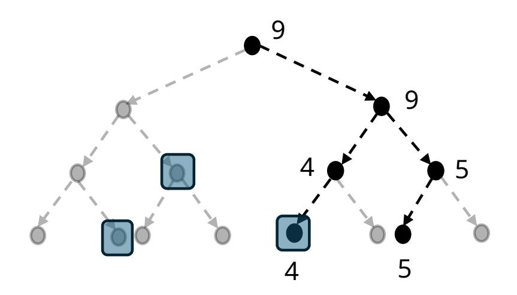
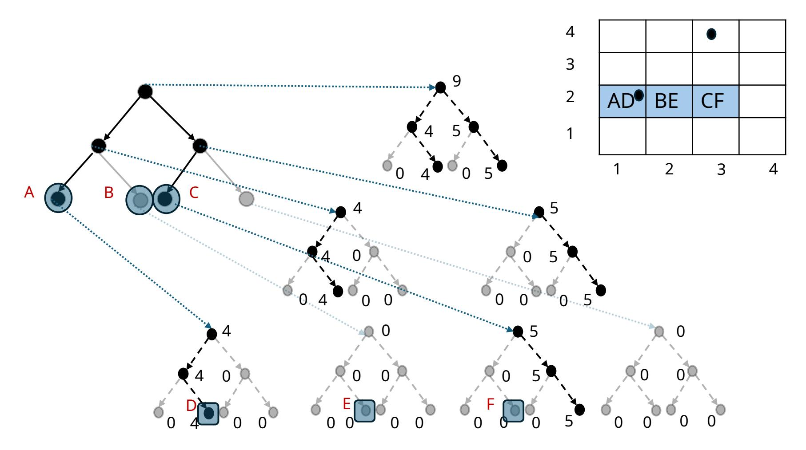
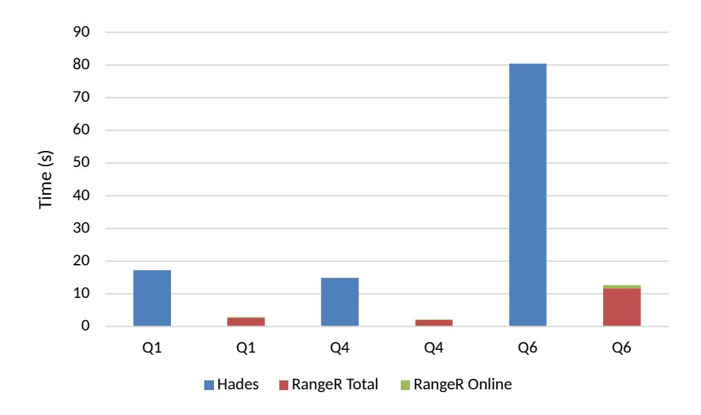

{0}------------------------------------------------

# Efficient Private Range Queries on Public Data

Pranav Shriram Arunachalaramanan<sup>0</sup> University of Illinois Urbana Champaign Urbana-Champaign, USA psa3@illinois.edu

## David Heath

University of Illinois Urbana Champaign Urbana-Champaign, USA daheath@illinois.edu

## ABSTRACT

Range queries can filter, aggregate, and retrieve database entries that lie in a specified multi-dimensional rectangle. Private range queries allow a client to query a server's public database while keeping the client's multi-dimensional rectangle hidden.

We construct RangeR, a constant-round private range query scheme that supports any associative aggregation function (e.g., SUM, MAX, TOP-K) and works with any number of servers. In the single-server setting, RangeR is orders of magnitude faster and uses 50%–90% less communication than HADES (VLDB 2025), a prior single-server private range query scheme that only supports linear aggregation functions.

We describe how RangeR can be used to implement a privacypreserving map application that can return the highest-rated restaurants near a user. Using data from OpenStreetMaps, we estimate that a user can find the highest-rated restaurants within one kilometer of their location within 2 seconds, while revealing only that the user is somewhere in the USA.

## 1 INTRODUCTION

Consider a map application that, for example, allows users to retrieve the highest-rated restaurants near them. In such an application today, the user typically sends their location to the application server in the clear. Can a user complete the query while keeping their location hidden? More generally, given a public database hosted on a server, can users, hereafter referred to as clients, filter, retrieve, and aggregate database entries based on certain conditions, while keeping sensitive data in their queries private?

One way to filter data is through range predicates that select database entries whose relevant attributes fall within a specified range. More abstractly, we can view database entries as points in a multidimensional space, and a client's range query as a hyperrectangle in this multi-dimensional space. The result of a range query is some aggregation of database entries that fall in the client's hyperrectangle. A private range query achieves the same functionality while hiding the positions and side lengths of the client's hyperrectangle.

Schemes that perform private range queries on public data are relatively unexplored, despite their importance and applicability. Most prior works on supporting private range queries consider the private database setting in which the server stores and performs computations on a single client's encrypted database. Because this setting is so challenging, existing works in this category leverage

Ananya Appan<sup>0</sup> University of Illinois Urbana Champaign Urbana-Champaign, USA aappan2@illinois.edu

Ling Ren University of Illinois Urbana Champaign Urbana-Champaign, USA renling@illinois.edu

costly cryptographic primitives like fully homomorphic encryption (FHE) [\[4,](#page-12-0) [18,](#page-12-1) [25,](#page-12-2) [27\]](#page-12-3) or secure multi-party computation [\[2,](#page-11-0) [10,](#page-12-4) [19,](#page-12-5) [23,](#page-12-6) [29\]](#page-12-7), and thus far have not achieved practical efficiency.

Works that study private range queries on public data rely on less expensive cryptographic techniques like somewhat homomorphic encryption (SHE) [\[20\]](#page-12-8) and function secret sharing [\[6,](#page-12-9) [14,](#page-12-10) [30\]](#page-12-11). However, these works still leave much to be improved. Works based on function secret sharing assume that the database is replicated across two non-colluding servers and are restricted to only singledimensional queries [\[30\]](#page-12-11) or only linear aggregation functions [\[6\]](#page-12-9).

The only prior single-server scheme for private range queries on public data, to our knowledge, is HADES [\[20\]](#page-12-8). HADES evaluates, under a somewhat homomorphic encryption, a circuit with high depth, which is expensive in practice. Even when the server uses 128 threads, HADES requires ≈ 90 seconds to execute a single threedimensional range query on a database consisting of approximately one million entries. HADES is also restricted to only linear aggregation functions and does not support non-linear aggregations such as finding the maximum.

## <span id="page-0-1"></span>1.1 Our Contributions

An expressive private range query scheme. We present RangeR: a constant-round[1](#page-0-0) private range query (PRQ) scheme that is both significantly faster and more expressive than prior PRQ schemes. RangeR allows the client to perform any associative aggregation of database points that lie within a client-specified hyperrectangle while keeping the hyperrectangle (i.e., its boundaries) hidden from the server. The associative aggregations supported by RangeR include many common and useful aggregation functions, such as MAX, MIN, COUNT, and SUM. Thus, RangeR can be used to achieve

<sup>0</sup>Both authors contributed equally to this work.

<span id="page-0-0"></span><sup>1</sup>We present two variants of RangeR: a basic single-round variant and a two-round variant with improved communication and computation costs.

{1}------------------------------------------------

a rich class of SQL queries:

 $Q = \text{SELECT} \bigodot (\Pi(\text{columns}))$  FROM Table WHERE predicates

• = Any associative aggregation function across rows

 $\Pi = \text{Any function on individual rows}$  predicates = A list of m predicates where the i-th predicate is  $\boxed{\ell_i} \leq \text{column} \leq \boxed{r_i}$ 

Above, text in  $\ \ \ \ \ \ \ \ \ \ \ \ \ \ \ \ \ \ \$ 

Techniques used to construct RangeR. We construct a new data structure called the Range Trie. The range trie, built on database entries, supports range queries and has a key property that enables single-round retrieval: The client's query to a range trie depends only on its own hyperrectangle, not on the database content. Existing data structures commonly used for (non-private) range queries, such as the range tree [3], do not grant this property. The range trie can additionally be updated efficiently when database entries are added, removed, or updated. The range trie is computed and stored on the server, and the client does not store any information about the range trie.

Range queries performed on a range trie can be made private via a *black-box* call to a cryptographic primitive called batch keyword Private Information Retrieval (PIR) [1, 7, 8, 15, 21]. The assumptions required by RangeR (number of servers, cryptographic assumptions, etc.) depend solely on the assumptions of the underlying batch keyword PIR. We use the state-of-the-art *single-server* batch keyword PIR protocol of [21]. Because the batch keyword PIR scheme we use supports efficient updates, RangeR also supports efficient updates.

RangeR can be optimized when certain dimensions in the database have only a few distinct values. This is the case for many real-world databases. For example, there are a large number of possible dates, but a database may only have entries with dates in the recent past. There are over 700,000 possible dates since 0 AD, but only fewer than 2,000 dates between the years 2020 and 2025. In such cases, with one additional round trip of client-server interaction, we can further reduce the communication and server computation costs of RangeR. This is done by reducing the size of each dimension from the full domain size to the number of *distinct* points in that dimension using the first round trip, and then executing the PRQ on this smaller space in the second round trip. We call this optimization *domain reduction*.

*Efficiency.* By plugging in the batch keyword PIR scheme of [21], RangeR (with domain reduction) is practically much more efficient than HADES [20]. This is because the batch keyword PIR of [21]

evaluates a homomorphic encryption circuit with a much smaller depth.

The bulk of the server's computation cost of RangeR is incurred when building the range trie. We can split RangeR into a one-time *pre-processing phase*, during which the server builds the range trie from the database, and an efficient *online phase*, during which the client queries the range trie. Experimentally, RangeR executes the Q1 query of the TPC-H benchmark [9] over 200× faster than HADES on a table of one million records, when both schemes use a single thread (we give the single-threaded comparison only for the Q1 query because HADES reported single-threaded performance only for the Q1 query). When RangeR uses 16 threads and HADES uses 128 threads, the total computation time (pre-processing + online) of RangeR is about 7× faster than HADES, and the online computation time of RangeR is 50× to 300× faster than HADES. Furthermore, the communication cost of RangeR is 2× to 9× better than HADES.

*Organization.* We present preliminaries in Section 2. We present our PRQ scheme RangeR in Section 3. We present the domain reduction optimization for RangeR in Section 4, and additional optimizations in Section 5. We evaluate RangeR in Section 6 and present a sample application of RangeR in Section 7. We discuss related work in 8.

#### <span id="page-1-0"></span>2 PRELIMINARIES

#### 2.1 Notation

- [a, b] (where  $b \ge a$ ) denotes the set  $\{a, ..., b\}$ .
- (a, b) (where b > a) denotes the set  $\{a + 1, \dots, b 1\}$ .
- U denotes a m-dimensional space  $U = [1, U_1] \times [1, U_2] \times ... \times [1, U_m]$ .
- DB is a database with N entries, where each entry i consists of a point  $DB[i].p \in U$  and the associated data DB[i].d.
- $DB[i][j_1 : j_2]$  refers to the  $j_2 j_1 + 1$  dimensional point  $(DB[i].p[j_1], DB[i].p[j_1 + 1]..., DB[i].p[j_2])$ .
- The client query I is a hyperrectangle  $I = [\ell_1, r_1] \times [\ell_2, r_2] \times \ldots \times [\ell_m, r_m] \subseteq U$ .
- $\odot$  represents the aggregation function to be performed on the data of points in I.

## 2.2 Definitions

<span id="page-1-1"></span>DEFINITION 1 (PRIVATE RANGE QUERIES). Consider an m-dimensional space  $U = [1, U_1] \times [1, U_2] \times \ldots \times [1, U_m]$ . A server has a database DB consisting of N entries, where each entry has a point DB $[i].p \in U$  and data DB[i].d. A client has an m-dimensional hyperrectangle  $I \subseteq U$ . Let  $\bigcirc$  be any associative aggregation function. A Private Range Query (PRQ) protocol between the client and the server must satisfy the following:

- Correctness: For any client query I, the client outputs the aggregate data of points in DB that lie in I, i.e.,  $\bigcirc_{\mathsf{DB}[i].p\in I}\mathsf{DB}[i].d$ . If there are no database points in I, the client outputs  $\bot$ .
- **Privacy:** Informally, the server does not learn any information about the client's query I, i.e., the server does not learn anything about the side lengths and the position of I.

For a formal definition of privacy, refer to Appendix B.1.

{2}------------------------------------------------

<span id="page-2-3"></span>

Figure 1: Range trie on the database  $DB = [\{p : 5, d : 4\}, \{p : 7, d : 5\}]$ . Black nodes cover points in DB, and gray nodes represent points that are not in DB. Nodes outlined by squares indicate the final nodes that cover the interval I = [2, 5].

<span id="page-2-4"></span>DEFINITION 2 (BATCH KEYWORD PIR). Consider a server that holds a key-value map M and a client that holds a list of B keywords  $K = \{K[1], K[2], \ldots, K[B]\}$ . A Batch keyword PIR protocol between the client and the server must satisfy the following:

- Correctness: For each K[i], the client outputs the value corresponding to K[i] in M if K[i] is a key in M, and  $\bot$  otherwise.
- **Privacy:** Informally, the server does not learn any information about K beyond it size from its interaction with the client.

For a formal definition of privacy, refer to Appendix B.2.

We will use Vectorized Batch PIR [21] in the construction of RangeR. Vectorized Batch PIR is a single-server batch keyword PIR scheme with the most efficient server computation among the schemes in the literature. Vectorized Batch PIR has a client-independent preprocessing phase and an online query phase. For a batch of size B and a map  $\mathcal{M}$  with N entries, vectorized batch PIR incurs  $O_{\lambda}(N)$  computation in the pre-processing and online phases, and  $O_{\lambda}(B^{2/3} \cdot N^{1/3})$  communication in the online phase. Vectorized batch PIR also allows efficient updates: each update (insert/update/delete) to the map  $\mathcal{M}$  requires  $O_{\lambda}(1)$  server computation.

### <span id="page-2-0"></span>3 RangeR

### 3.1 Overview of RangeR

Consider a database DB with N entries stored on the server, where each entry consists of a point in an m-dimensional space U that is labeled with some data. The client wishes to fetch the aggregate data of points in DB that fall in a query hyperrectangle I. We present a data structure called the  $Range\ trie$  that the server builds to help the client efficiently aggregate the data of points that fall in I.

Range trie. We construct the range trie by modifying a classic data structure called the Range tree [3]. At a high level, a range trie  $\mathcal{T}$  built on DB is a tree where each tree node represents a hyperrectangle and stores the aggregate data of points in DB that lie in that hyperrectangle.  $\mathcal{T}$  is built such that it is easy to represent any query I as a combination of a small number of (non-intersecting) hyperrectangles that are represented by nodes in  $\mathcal{T}$ . Hence, the aggregate data of points in I can be found by fetching the values at each of these nodes.

 $\mathcal{T}$  has a special property that supports database independent queries: the nodes to be fetched from  $\mathcal{T}$  are independent of the database DB, and depend only on U and I. Given a query I, the values associated with these nodes can be fetched simultaneously in a single round trip, and aggregated to get the query result. Traditional data structures do not provide this property. For instance, to perform a query on a single-dimensional range tree (which is similar to a binary search tree), the client must first fetch the root node to decide which child to fetch, and then fetch the appropriate child to decide which grandchild to fetch. This continues for  $\log N$  round-trips until the client fetches all the required nodes.

We name this data structure a *range trie*  $^2$  because it combines features from *range trees* and *prefix tries*. The above special property that supports database-independent queries resembles a prefix trie. And, like a range tree, any interval I can be represented as the combination of (hyperrectangles of) a small number of nodes in  $\mathcal{T}$ .

We describe our construction of a range trie in detail in the sections that follow. We start with the simpler case when database points are in a single dimension in Section 3.2, and proceed to the more general *m*-dimensional case in Section 3.3. These initial descriptions of the range trie do not attempt to hide the client's query *I*.

PRQ scheme. To obtain a privacy-preserving solution, we can view  $\mathcal{T}$  as a key-value map  $\mathcal{M}$  with nodes (or hyperrectangles) as keys, and the aggregate data stored at the nodes as values. With this view, fetching nodes from  $\mathcal{T}$  for any query I is equivalent to retrieving from  $\mathcal{M}$  by keys. The client can simultaneously retrieve the values at these keys from the server using any batch keyword PIR scheme [21] and locally aggregate the values to get the query result. The privacy guarantee of batch keyword PIR ensures that the server learns no information about the request keys, and thereby I. Such a black-box usage of batch keyword PIR enables any advances in batch keyword PIR to translate directly into efficiency improvements of such a PRQ scheme. We present our PRQ scheme RangeR in Section 3.4.

## <span id="page-2-2"></span>3.2 Range Trie on one dimension

For simplicity, we start by considering the simpler one-dimensional case when DB has points that lie in a domain  $[1, U_1]$ ; the client wishes to sum the data in DB with points in any contiguous interval  $I = [\ell_1, r_1] \subseteq [1, U_1]$ . The description can be easily extended to any other associative aggregation function.

Constructing the range trie. A one-dimensional range trie  $\mathcal{T}$  is a binary tree with depth  $\log U_1 + 1$ , where each node holds the sum of data with points in a contiguous sub-interval of  $[1, U_1]$ . The *i*-th leaf node holds the sum of the data of entries in DB with points equal to *i*. Each internal node holds the sum of both of its children.

In more detail, the root node covers the interval  $[1, U_1]$  and holds the sum of the data of points in  $[1, U_1]$ . The left child of the root covers the interval  $[1, U_1/2]$  and holds the sum of the data of points in that half. The right child of the root covers the interval  $[U_1/2 + 1, U_1]$  and holds the sum of the data of points in that half.

<span id="page-2-1"></span><sup>&</sup>lt;sup>2</sup>We remark that a prior work [26] also constructs a data structure called the range trie for the purpose of address lookup. But their data structure aims to reduce the number of bitwise comparisons performed at each node, and does not enable database-independent queries.

{3}------------------------------------------------

<span id="page-3-1"></span>

Figure 2: Range trie on the database  $DB = [\{p : (1,2), d : 4\}, \{p : (3,4), d : 5\}]$ . Black nodes represent nodes that are part of 2-chains that cover points in DB, and gray nodes represent are part of 2-chains that do not. Nodes outlined by squares indicate the final nodes in 2-chains that together cover the hyperrectangle  $I = [1,3] \times [2,2]$ . Specifically, the 2-chains are AD, BE and CF.

This pattern continues and each of the  $2^t$  nodes at each depth t covers an interval of length  $U_1/2^t$ .

The structure of  $\mathcal{T}$  is fixed based on the domain  $[1, U_1]$  and, looking ahead, this enables database-independent queries. But the server only populates nodes in  $\mathcal{T}$  that cover points in DB. Specifically, these are the nodes that lie on paths from the root to the leaves that correspond to some point DB[i].p. For instance, consider a database with two points 5 and 7 in a domain of size  $U_1 = 8$ . We illustrate this example in Figure 1. For the point 5, only the nodes that cover intervals [1, 8], [5, 8], [5, 6] and [5, 5] are populated. Similarly, for the point 7, only the nodes that cover intervals [1, 8], [5, 8], [7, 8] and [7, 7] are populated.

*Querying the range trie.* To sum the data with points in an interval *I*, the client finds a set Q of nodes such that (1) the union of their intervals equals *I*, and (2) their intervals are *disjoint*.

For  $I = [\ell_1, r_1]$ , Q is constructed by adding the leaf nodes  $\ell_1$  and  $r_1$ , the right children of nodes on the path to  $\ell_1$ , and the left children of nodes on the path to  $r_1$ . While doing this, the client only adds nodes with intervals within  $(\ell_1, r_1)$  to Q. Observe that Q depends only on I and the domain  $U_1$ , and not on DB, enabling database independent queries. The size of such a set Q is at most  $2 \log U_1$ . Figure 1 gives an example of Q when I = [2, 5] and DB =  $[\{p : 4, d : 4\}, \{p : 5, d : 5\}]$ .

The client sends Q to the server and receives a response consisting of the values of nodes in Q. If the client requests any node that is not populated in  $\mathcal{T}$ , the server returns  $\bot$ , and the client learns that there are no points in the interval covered by this node. To compute the sum of the associated data for points in I, the client sums up the non- $\bot$  values in the server response. The same scheme naturally extends to any associative aggregation function  $\bigcirc$ .

## <span id="page-3-0"></span>3.3 Range Trie on *m* dimensions

We move on to the more general case where each point DB[i].p is an m-dimensional point and I is an m-dimensional hyperrectangle.

Constructing the range trie. Range tries can be extended to handle m-dimensional queries via a natural recursive construction. To construct an m-D range trie, we construct a 1-D range trie on the first dimension domain  $[U_1]$ . Each node n of this 1-D range trie stores a pointer to the root of an (m-1)-D range trie on the domain  $[U_2] \times [U_3] \times \ldots \times [U_m]$ , containing (only) the database entries DB[i] for which DB[i].p[1] is covered by the node n. Each database entry i that is used to build this (m-1)-D range trie consists of an (m-1)-D point DB[i].p[2:m] and its data DB[i].d. This process is repeated recursively. For the base case, in the last dimension, we have 1-D range tries on the domain  $[U_m]$ , where each node holds the aggregate data of points covered by that node.

When we unwind the recursion, each "level" j of the m-D range trie consists of a *forest* of 1-D range tries built on the domain  $[U_j]$ . Each node of a range trie on level j stores a pointer to the root of a range trie on the next level j + 1. Only the nodes of the range tries constructed on the last level have aggregate data. Each such node can be identified by a chain of m nodes  $n_1, \ldots, n_m$ , where each node  $n_j$  belongs to a range trie built on the domain  $[U_j]$ .

Observe that a chain of m nodes, which we call an m-chain, represents an m-dimensional hyperrectangle. For an m-chain c consisting of nodes  $n_1, \ldots, n_m$ , if each  $n_j$  covers an interval  $I_j$ , then c represents the hyperrectangle  $I_1 \times \ldots \times I_m$ . The final node in an m-chain stores the aggregate data of points in this hyperrectangle.

To illustrate, Figure 2 depicts a 2-D range trie where the sum of data of points in 2-D hyperrectangles are stored at the end of

{4}------------------------------------------------

2-chains. Similar to the 1-D case, range tries on each domain only populate nodes that contain database points. Therefore,  $\mathcal{T}$  only contains m-chains for nodes with hyperrectangles that contain some database points in them.

The server stores the m-dimensional range trie as a map  $\mathcal{M}$  between m-chains and the aggregate data of points that lie in their hyperrectangles.

Querying the range trie. Given any query I, the client finds the set of m-chains Q such that (1) the union of their hyperrectangles equals I and (2) their hyperrectangles are disjoint.

The client computes Q as follows. For each  $j \in [m]$ , the client considers a 1-D range trie on  $[1, U_j]$ , and finds the set of nodes  $Q_j$  with intervals that, when combined, equal  $[\ell_j, r_j]$ . Any combination of nodes from each of these sets is an m-chain  $n_1, \ldots, n_m$  that represents a hyperrectangle that belongs to I. This is because each  $n_j$  represents an interval  $I_j$  that belongs to  $[\ell_j, r_j]$ .

By considering *all possible* combinations of nodes from each  $Q_j$ , we obtain disjoint hyperrectangles that together cover all points in I. Specifically, the set of m-chains Q that cover I is obtained by taking the cartesian product of all the sets  $Q_j$ , i.e.,  $Q = Q_1 \times \cdots \times Q_m$ . The j-th dimension of each point in I is covered by some node in  $Q_j$ , and so, each point is covered by some hyperrectangle in Q. Hyperrectangles in Q are disjoint since intervals in each  $Q_j$  are disjoint.

To illustrate, in Figure 2,  $Q_1$  consists of the leaves that cover points 1, 2 and 3 and  $Q_2$  consists of a leaf that covers the point 2.  $Q_1 \times Q_2$  consists of  $3 \times 1 = 3$  2-chains that cover the hyperrectangle  $I = [1, 3] \times [2, 2]$ .

Each  $Q_j$  (and thereby Q) depends only on I and is independent of DB, enabling data-independent queries. Since the size of each  $Q_j$  is at most  $2 \log U_j$ , the size of Q is at most  $2^m \cdot \prod_{j \in [m]} \log U_j$ .

To obtain its aggregation, the client sends Q to the server to get a response, and aggregates the non- $\bot$  values in the response. We formally describe how Q is found in Section 3.4, and prove that the nodes in Q indeed cover the interval I.

#### <span id="page-4-0"></span>3.4 The PRQ Scheme RangeR

We now describe our PRQ scheme RangeR in detail. The server computes the range trie  $\mathcal{T}$  as a map  $\mathcal{M}$  in a pre-processing phase.  $\mathcal{M}$  is initially empty. For each database point DB[i].p, the server computes all the m-chains whose hyperrectangles cover the point DB[i].p, denoted by chains(DB[i].p). Then, for every m-chain in chains(p), the aggregate data of each m-chains in  $\mathcal{M}$  is updated to include DB[i].d.

After this preprocessing, the map  $\mathcal{M}$  contains the m-chains in  $C = \bigcup_{i \in [N]} \mathsf{chains}(\mathsf{DB}[i].p)$ , and the aggregate data of the points in their hyperrectangles.

In the online phase, the client computes a set Q = cover(I) of m-chains whose hyperrectangles match I, fetches the aggregate values of keys Q in  $\mathcal{M}$  from the server using batch keyword PIR (Definition 2), and locally aggregates the fetched values (which are partially aggregated results) to get the final aggregation result.

We proceed to explain the two phases in detail.

*Pre-processing phase.* To compute the *m*-chains with hyperrectangles that cover points in DB, we first assign IDs to nodes in 1-D

```
RangeR's one-time server side pre-
 Algorithm 1:
 processing
   Input: DB: Database, m: Number of dimensions, (•):
             Aggregation function
   Output: \mathcal{M}: Range tree map
 1 def path(\ell, j):
        P = \{ \}
 2
        ID \leftarrow U_i + \ell - 1
 3
        u \leftarrow \log U_i + 1
 4
        while u \ge 1 do
 5
             P \leftarrow P \cup \{ID\}
 6
             ID \leftarrow ID/2
 7
             u \leftarrow u - 1
 8
        end
 9
        return P
10
11 def chains(p):
        for dimension j \in [m] do
12
             C^j \leftarrow \mathsf{path}(p[j], j)
13
        end
14
        return C^1 \times C^2 \times ... \times C^m
15
16 \mathcal{M} \leftarrow new map
17 for entry i \in DB do
        C_i \leftarrow chains(DB[i].p)
18
        for key k \in C_i do
19
             \mathcal{M}[k] \leftarrow \mathcal{M}[k](\cdot)\mathsf{DB}[i].d
20
        end
21
```

range tries on each the domain  $[U_j]$ . Starting from the root which is assigned ID "1", the children of a node with ID "i" are assigned IDs "2i" and "2i + 1".

22 end

23 batchKWPIRPreprocess $(\mathcal{M})$ 

Then, for the *i*-th entry in DB and each dimension j, the server computes a set  $C_i^j$  of the IDs of nodes that lie on the path from the leaf covering DB[i].p[j] to the root of the 1-D range trie on  $[U_j]$ . For ID LN of the leaf node (which is  $U_j + DB[i].p[j] - 1$ ), the IDs of the nodes on this path are  $C_i^j = \{LN, \lfloor LN/2 \rfloor, \lfloor LN/4 \rfloor, \ldots, 1\}$ .

The server computes chains (DB[i].p) as  $C_i = C_i^1 \times C_i^2 \dots \times C_i^m$ . This is because each set  $C_i^j$  contains the IDs of nodes in range tries on the domain  $[1, U_j]$  whose intervals contain DB[i].p[j], and the cartesian-product gives the IDs of m-chains whose hyperrectangles contain DB[i].p. For each m-chain  $c \in C$ , the server uses O to aggregate OB[i].d with the value associated with the key c in M.

Recall that RangeR uses Vectorized batch PIR [21], which has a pre-processing phase. After building the map  $\mathcal{M}$ , the pre-processing phase of RangeR invokes the pre-processing phase of Vectorized batch PIR. The details of the server-side pre-processing algorithm can be found in Algorithm 1.

Online phase. Given a query I, the client computes Q = cover(I), the set of m-chains the union of whose hyperrectangles match I. To do this, for each dimension j, the client computes  $Q_j = cover([\ell_j, r_j])$ , the set of nodes whose union of intervals matches

{5}------------------------------------------------

**Algorithm 2:** RangeR's online algorithm from the client side. Text marked in blue denotes inputs stored on the server. The code below uses the path function from Algorithm 1. ]

```
Input: I = [l_1, r_1] \times \cdots \times [\ell_m, r_m]: Client query, \bigcirc: Aggregation function, \mathcal{M}: Range tree map
   Output: (\cdot) of the data in DB whose points lie in the hyperrectangle specified by I
 1 def interval(n, j):
         t \leftarrow \lfloor \log n \rfloor + 1
                                                                                                                                                                  // node depth
 2
        q \leftarrow n - (2^t - 1)
                                                                                                                                           // node position at depth t
 3
        L \leftarrow U_i/2^{t-1}
                                                                                                                                           // interval size at depth t
 4
        I \leftarrow [(q-1)L + 1, qL]
 5
         return I
 6
7 def cover(I):
         for dimension j \in [m] do
 8
              \mathcal{P}(\ell_i).rc \leftarrow Right children of nodes in path(\ell_i, j)
                                                                                                                                  // Execute path from Algorithm 1
 9
              \mathcal{P}(r_i).lc \leftarrow Left children of nodes in path(r_i, j)
                                                                                                                                  // Execute path from Algorithm 1
10
              Q_i^{\ell} \leftarrow \{n \in \mathcal{P}(\ell_j).rc \mid interval(n, j) \subseteq (\ell_j, r_j)\}
11
              Q_j^r \leftarrow \{n \in \mathcal{P}(r_j).lc \mid interval(n,j) \subseteq (\ell_j, r_j)\}
12
              Q_j \leftarrow Q_i^r \cup Q_i^\ell
13
             Add leaf nodes \ell_j and r_j to Q_j
14
         return Q_1 \times Q_2 \times \ldots \times Q_m
15
16 Q \leftarrow cover(I)
17 Pad Q to size 2^m \cdot \prod_{i \in [m]} \log U_i
18 R \leftarrow batchKWPIR(Q, \mathcal{M})
19 R \leftarrow R \setminus \{\bot\}
20 return \bigcirc_{r \in R} r
```

 $[\ell_j, r_j]$ . Note that  $[\ell_j, r_j] = (\ell_j, r_j) \cup \{\ell_j\} \cup \{r_j\}$ . The client computes  $Q_j$  by:

- Computing cover $((\ell_j, r_j))$ : The client computes the IDs of nodes on the path  $\mathcal{P}(\ell_j)$ . For each node on this path, the client adds the ID of the node's right child to  $Q_j$ , if the interval covered by the right child belongs to  $(\ell_j, r_j)$ . The client does the same for nodes on the path  $\mathcal{P}(r_j)$ , except that it adds the *left* children of nodes instead of the right children.
- The client adds the leaf nodes  $\ell_i$  and  $r_i$  to the set  $Q_i$ .

The set Q is then obtained by performing a *cartesian-product* of these sets, that is,  $Q = Q_1 \times Q_2 \times ... \times Q_m$ . Then, the client pads Q to size  $2^m \cdot \prod_{i \in [m]} (\log U_j)$ . This step is crucial for privacy as, without padding, the size of Q leaks information to the server about the side lengths of I.

The client invokes batch keyword PIR with the set Q on the server map  $\mathcal{M}$ , and obtains in a response R, the aggregate data stored at m-chains in Q. Then, the client computes  $\odot$  on the non- $\bot$  values in R to get the answer. The details of the online phase can be found in Algorithm 2. Steps that use cryptography to hide I from the server are marked with  $\blacksquare$ .

Supporting updates. The range trie supports efficient updates to the preprocessed range trie  $\mathcal{M}$  when database entries are modified, inserted or deleted. Specifically, for each database entry that is updated, the server only needs to update  $O(2^m \cdot \Pi_{i \in [m]} \log U_i)$  keyvalue pairs in the range tree map  $\mathcal{M}$ . The vectorized batch keyword

PIR [21] also handles updates efficiently. Hence, RangeR supports efficient updates.

#### 3.5 RangeR Analysis

In this section, we prove that RangeR is a correct and private PRQ scheme. We start by proving that the server constructs the range trie correctly in the pre-processing phase.

<span id="page-5-1"></span>LEMMA 1. Consider any m-chain c in keys( $\mathcal{M}$ ) with nodes  $n_1, \ldots, n_m$ , where the i-th node  $n_i$  covers the interval  $[L_i, R_i]$ .  $\mathcal{M}$  (in Algorithm 1) maps c to the aggregate data of points in DB that lie in the hyperrectangle  $I_c = [L_1, R_1] \times \cdots \times [L_m, R_m]$  of c.

PROOF. Consider any DB[i].p. We prove that the data of this point contributes to  $\mathcal{M}[c]$  if and only if  $p \in I_c$ .

If  $p \in I_c$ , then DB[i].d contributes to  $\mathcal{M}(c)$ : Since  $p \in I_c$ ,  $L_j \leq p[j] \leq R_j$  holds for for each dimension j. This means that each node  $n_j$  in c has an interval that includes p[j]. By construction, all nodes with intervals that include p[j] lie on the path to the leaf that covers p[j]. Thus, each  $n_j$  is included in  $C_i^j$ , and the m-chain  $c = n_1, \ldots, n_m$  is included in chains  $(p) = C_i^1 \times \cdots \times C_i^m$ . For each m-chain  $c \in \text{chains}(p)$ , the server aggregates data DB[i].d with the value of  $\mathcal{M}(c)$ .

If  $p \notin I_c$ , then DB[i].d does not contribute to  $\mathcal{M}(c)$ : For some dimension j,  $p[j] < L_j$  or  $p[j] > R_j$ . Hence,  $n_j$  does not lie on the path to the leaf covering  $p_j$ .  $n_j$  is not included in  $C_i^j$ , and the m-chain c with nodes  $n_1, \ldots, n_m$  is not included in chains (p).

{6}------------------------------------------------

Finally, the aggregation performed is correct since  $\odot$  is associative.

We next prove that the client correctly computes the set Q of keys corresponding to a hyperrectangle *I*.

<span id="page-6-1"></span>LEMMA 2. Each point  $p \in I$  lies in the hyperrectangle of one and only one m-chain in Q = cover(I) (defined in Algorithm 2).

PROOF. We first prove that each point  $p \in (\ell_j, r_j)$  lies in the interval of exactly node in set  $Q_j$  computed at step 18 of Algorithm 2. Let  $\mathcal{P}(\ell_j)$ .rc be the set of right children of nodes on  $\mathcal{P}(\ell_j)$ , and  $\mathcal{P}(\ell_j)$ .1c be the set of left children of nodes on  $\mathcal{P}(r_j)$ .

Each point  $p \in (\ell_j, r_j)$  is covered by at most one node in  $Q_j$ : To show this, it suffices to show that no two nodes in  $Q_j$  lie on the same path. This is because each node that covers p lies on the path to the leaf that covers p, and hence, p is covered by at most one node if only one node on this path is included.

Let us assume the contrary, i.e., a node and its ancestor are in  $Q_j$ . By construction, the node and the ancestor belong to  $\mathcal{P}(\ell_j)$ .rc  $\cup$   $\mathcal{P}(r_j)$ .1c. Hence, the node's parent, and thereby its ancestor, lies on  $\mathcal{P}(\ell_j)$  or on  $\mathcal{P}(r_j)$ . Since all nodes on  $\mathcal{P}(\ell_j)$  and  $\mathcal{P}(r_j)$  include  $\ell_j$  and  $r_j$  in their intervals respectively, the ancestor covers an interval  $\nsubseteq (\ell_j, r_j)$ , and is discarded by construction. This is a contradiction.

Each point  $p \in (\ell_j, r_j)$  is covered by at least one node in  $Q_j$ : Let n be the node with the least depth in  $\mathcal{P}(p)$  that covers an interval  $\subseteq (\ell_j, r_j)$ , and let n' be the parent of n. Since  $p \in (\ell_j, r_j)$ , each node in  $\mathcal{P}(p)$  covers an interval that intersects  $(\ell_j, r_j)$ . Since n' covers an interval  $\nsubseteq (\ell_j, r_j)$ , n' covers either  $\ell_j$  or  $r_j$ . Each node that covers  $\ell_j$  (resp.  $r_j$ ) lies on  $\mathcal{P}(\ell_j)$  (resp.  $\mathcal{P}(r_j)$ ), meaning that  $n' \in \mathcal{P}(\ell_j) \cup \mathcal{P}(r_j)$ . Then,  $n \in \mathcal{P}(\ell_j)$ .rc  $\cup \mathcal{P}(r_j)$ .lc since nodes on  $\mathcal{P}(\ell_j)$ .lc and  $\mathcal{P}(\ell_j)$ .rc cover intervals  $\nsubseteq (\ell_j, r_j)$ . Therefore,  $n \in Q_j$  by construction, following which p is covered by at least one node.

In steps 19-23 of Algorithm 2, the client adjusts  $Q_j$  to include  $\ell_j$  and  $r_j$ . Even after this adjustment, it is easy to observe that each point  $p \in [\ell_j, r_j]$  is still covered by exactly one node in the final set  $Q_j$  computed at step 23. Following this, each point  $p \in I = [\ell_1, r_1] \times [\ell_2, r_2] \times \ldots \times [\ell_m, r_m]$  is in the hyperrectangle of an m-chain in  $Q = Q_1 \times Q_2 \times \ldots \times Q_m$  once and only once.

The following theorem is immediate from lemmas 1 and 2, and the correctness and privacy of batch keyword PIR (Definition 2), since the client pads its query size to a known upper bound. We present a formal proof of privacy in Appendix B.

<span id="page-6-3"></span>Theorem 3. RangeR (Algorithm 1+2) is a PRQ scheme that satisfies correctness and privacy (Definition 1).

Cost analysis. The bottleneck in RangeR is the batch keyword PIR execution. RangeR requires a single execution of batch keyword PIR with batch size  $2^m \cdot \prod_{i \in [m]} \log U_j$  on a map of size  $O(N \cdot \prod_{i \in [m]} \log U_j)$ . To see why, we compute the number of *m*-chains in  $\mathcal{T}$ , and the size of the client's request Q.

• Size of  $\mathcal{T}$ : Each point DB[i].p contributes to  $O(\Pi_{i \in [m]} \log U_j)$  hyperrectangles. This is because, in each dimension j, DB[i].p contributes to  $\log U_j$  intervals. Across m-dimensions, the hyperrectangles that DB[i].p

- contributes to is computed by performing a *cross* product of these sets, which is of size  $O(\prod_{i \in [m]} \log U_i)$ .
- Size of Q:  $Q_j$  computed for each dimension is of size  $2 \cdot \log U_j$ . Hence,  $Q = Q_1 \times \cdots \times Q_m$  is of size  $2^m \cdot \prod_{i \in [m]} \log U_j$ .

We instantiate the batch keyword PIR scheme in RangeR with vectorized batch PIR [21]. For batch size B and map size N, vectorized batch PIR [21] incurs O(N) computation and  $O(B^{2/3} \cdot N^{1/3})$  communication. Then, using vectorized batch PIR [21], RangeR has  $O(N^{1/3} \cdot (2^m \cdot \prod_{i \in [m]} \log U_j))$  communication and  $O(N \cdot \prod_{i \in [m]} \log U_j)$  computation. We evaluate practical performance of RangeR in Section 6.

#### <span id="page-6-0"></span>4 DOMAIN REDUCTION

In this section, we present domain reduction, an optimization of RangeR that reduces communication and server computation by using one additional round in RangeR's online phase.

### 4.1 Protocol Description

Domain reduction reduces the size of each dimension  $j \in [m]$  from  $U_j$  to  $U'_j$ , where  $U'_j$  is the number of distinct values of database points in dimension j.

This reduction occurs in a one-time server-side *pre-processing phase*, in which the server maps points in the original database DB to points in a new database DB' with smaller dimension sizes, and builds the range trie on the entries of DB'. Specifically, for each entry in DB, the server maps the database point in  $U = [U_1] \times ... \times [U_m]$  to a point in  $U' = [U'_1] \times ... \times [U'_m]$ .

The *online* phase now consists of two rounds. In the first round, the client converts its *query*  $I \subseteq U$  for the database DB to a query  $I' \subseteq U'$  for the database DB', such that executing I' on DB' will yield the same result as executing I on DB. In the second round, the client invokes RangeR (Algorithm 2) to execute the query I' on the database DB'.

**Algorithm 3:** Server-side preprocessing of RangeR with domain reduction

<span id="page-6-2"></span>**Input:** DB: Database, *m*: Number of dimensions, (•):

```
Aggregation function
1 for dimension j \in [m] do
D_j \leftarrow \operatorname{sort}(\operatorname{distinct}(\forall i, \operatorname{DB}[i].p[j]))
3 for entry i ∈ DB do
       for dimension j \in [m] do
4
        DB'[i].d \leftarrow DB[i].d
7 for dimension j \in [m] do
   9 \mathcal{M}' \leftarrow \text{Run Algorithm 1 using DB' for the aggregation}
    function (\cdot)
10 for dimension j \in [m] do
       \mathcal{M}_{i}^{max} \leftarrow \text{Run Algorithm 1 for DB}_{i} \text{ with the aggregation}
11
        function max
       \mathcal{M}_{j}^{min} \leftarrow \text{Run Algorithm 1 using DB}_{j} \text{ for the}
12
        aggregation function min
```

{7}------------------------------------------------

*Pre-processing phase.* For each dimension j, the server computes a sorted list  $D_j$  of *unique* database points in that dimension. Then, the server sets the j-th dimension of each database point to its position in  $D_j$ . Observe that such a mapping reduces the size of dimension j from  $U_j$  to  $U'_j = |D_j|$ .

Concretely, for each database entry  $i \in [N]$  and for each dimension  $j \in [m]$ ,  $\mathsf{DB}'[i].p[j]$  is the position of  $\mathsf{DB}[i].p[j]$  in  $D_j$ . The data is unchanged, i.e.,  $\mathsf{DB}'[i].d = \mathsf{DB}[i].d$ . The server then builds the range trie  $\mathcal{M}'$  on the database  $\mathsf{DB}'$  for the aggregation function  $\bigcirc$ , using Algorithm 1. This is the range trie that will be queried by the client in the online phase.

Looking ahead, in the online phase, the client must covert its query  $I \subseteq U$  to a query  $I' \subseteq U'$  to be executed on DB'. This involves coverting each side  $[\ell_j, r_j]$  of the hyperrectangle I to a side  $[\ell'_j, r'_j]$  of the hyperrectangle I'. Since the j-th dimension of each point in DB is mapped to its position in  $D_j$ , each  $\ell'_j$  must be the position of the smallest value greater than or equal to  $\ell_j$  in  $D_j$ . Similarly, each  $r'_j$  must be the position of the largest value less than or equal to  $r_j$  in  $D_j$ . Hence,  $\ell'_j$  and  $r'_j$  are the *positions* of the minimum and maximum points in  $D_j$  within the interval  $[\ell_j, r_j]$ .

To enable the client to do this, during the pre-processing phase, the server creates m additional databases  $DB_1, DB_2, \ldots, DB_m$ . For each dimension j, the values of  $D_j$  form the points in  $DB_j$ , and the data associated with each point is the point's *position* in  $D_j$ . Then, for each database  $DB_j$ , the server uses Algorithm 1 to compute range tries  $\mathcal{M}_j^{max}$  and  $\mathcal{M}_j^{min}$ , using which the client can compute the positions of the maximum and minimum points in  $[\ell_j, r_j]$ .

The details of the pre-processing phase can be found in Algorithm 3.

Online phase. The client uses the first round of the online phase to convert I to  $I' = [\ell'_1, r'_1] \times [\ell'_2, r'_2] \times \ldots \times [\ell'_m, r'_m]$ . For each dimension  $j \in [m]$ , the client obtains  $\ell'_j$  and  $r'_j$  by invoking the online phase of RangeR (Algorithm 2), with client input  $[\ell_j, r_j]$  and server input  $DB_j$ , for the maximum and minimum aggregation functions, respectively.

Then, in the second round, the client and the server invoke the online phase of RangeR (Algorithm 2), with client input I' and server input DB' for the aggregation function  $\odot$ . The details of the online algorithm can be found in Algorithm 4.

#### 4.2 Analysis

We show that RangeR with the domain reduction optimization is a correct and private PRQ scheme.

THEOREM 4. RangeR with domain reduction (Algorithm 3+4) is a correct and private PRQ scheme (Definition 1) on a database DB consisting of N entries.

PROOF. We first prove that the result obtained when the range query I' is executed on DB' equals the result obtained when the range query I is executed on DB. This is because:

• If  $DB[i].p \in I$ , then  $DB[i].p' \in I'$ : For each dimension j, since  $\ell_j \leq DB[i].p[j] \leq r_j$ , the position of DB[i].p[j] in  $D_j$  is  $\geq \ell'_i$  and  $\leq r'_i$ . Hence,  $DB[i].p' \in I'$ .

**Algorithm 4:** The client side online algorithm for RangeR with domain reduction. Text marked in blue color refers to inputs stored on the server side.

```
Input: I = [\ell_1, r_1] \times ... \times [\ell_m, r_m]: Client query, \odot: Aggregation function, \mathcal{M}': Range tries on DB', \{\mathcal{M}_1^{max}, \mathcal{M}_1^{min}, \mathcal{M}_2^{max}, \mathcal{M}_2^{min}, ..., \mathcal{M}_m^{max}, \mathcal{M}_m^{min}\}: Range tries on DB<sub>1</sub>, DB<sub>2</sub>, ..., DB<sub>m</sub>
```

Output:  $\odot$  on the data in DB whose points lie in I1 for dimension  $j \in [m]$  do 2  $\ell'_j \leftarrow \text{RangeR}([\ell_j, r_j], f_{min}, \mathcal{M}_i^{min})$  // Round 1 3  $r'_j \leftarrow \text{RangeR}([\ell_j, r_j], f_{max}, \mathcal{M}_j^{max})$  // Round 1

 $\begin{array}{l} \textbf{4} \ I' \leftarrow [\ell'_1, r'_1] \times [\ell'_2, r'_2] \times \ldots \times [\ell'_m, r'_m] \\ \textbf{5} \ \text{res} \leftarrow \text{RangeR}(I', \bigodot, M') \\ \end{array} \qquad // \ \text{Round 2} \end{array}$ 

6 return res

• If  $DB[i].p \notin I$ , then  $DB[i].p' \notin I'$ : If  $DB[i].p < \ell_j$ , then the position of DB[i].p'[j] in  $D_j$  is  $< \ell'_j$ . Hence,  $DB[i].p' \notin I'$ . A similar argument follows when  $DB[i].p > r_j$ .

The rest of the correctness proof and the privacy proof follow from the correctness and privacy of RangeR (Theorem 3).  $\Box$ 

Cost Analysis. In the first round of the online phase, the client and the server invoke 2 instances of batch keyword PIR for each dimension  $j \in [m]$ , with batch size  $2 \log U_j$ , on a map of size  $O(U'_j \cdot \log U_j)$ . All these instances of batch keyword PIR are executed in parallel.

In the second round of the online phase, the client and the server invoke a single instance of batch keyword PIR with batch size  $2^m \cdot \prod_{j \in [m]} \log U_j'$  on a map of size  $O(N \cdot \prod_{j \in [m] \setminus \{1\}} \log U_j')$ . We prove that this is indeed an upper bound on the map size in the following Lemma.

LEMMA 5. After domain reduction,  $|\mathcal{M}'|$  (computed in Algorithm 3) is  $O(N \cdot \prod_{j \in [m] \setminus \{1\}} \log U'_j)$ .

PROOF.  $|\mathcal{M}'|$ , which is the number of m-chains in the range tree  $\mathcal{T}'$  computed on points in DB', is upper bounded by total number of nodes in  $\mathcal{T}'$ . We show that this is  $O(N \cdot \prod_{j \in [m] \setminus \{1\}} \log U'_j)$  by separately counting the nodes of the tree computed on the first dimension, and of the trees computed on later dimensions.

After domain reduction, the tree computed on the first dimension is *complete*. Hence, the number of nodes in this tree is  $O(U_1')$  which is O(N). Each database entry contributes to at most  $\prod_{j \in [m] \setminus \{1\}} \log U_j'$  nodes of trees in later dimensions, and the total number of nodes of trees in later dimensions is  $O(N \cdot \prod_{j \in [m] \setminus \{1\}} \log U_j')$ . Summing up, the number of nodes in  $\mathcal{T}'$  is  $O(N \cdot \prod_{j \in [m] \setminus \{1\}} \log U_j')$ .

#### <span id="page-7-0"></span>5 OTHER OPTIMIZATIONS

### 5.1 Optimization for Bounded Interval Sizes

Range tries can be optimized if the maximum sizes of the client's query interval in some dimensions are known to the server. If the server knows that  $r_j - l_j \le \delta_j$  for some dimension  $j \in [1, m]$ , it suffices to construct only the nodes that cover intervals of size  $\le \delta_j$ 

{8}------------------------------------------------

in the range tries on that dimension. Specifically, for range tries built on each domain  $[1,U_j]$ , the server only includes nodes at depths greater than  $\log U_j - \log \delta_j + 1$ . With this trick, RangeR requires a single batch keyword PIR instance with batch size  $2^m \cdot \Pi_{j \in [m]} \log \delta_j$  on a map of size  $O(N \cdot \Pi_{i \in [m]} \log \delta_j)$ . This reduces the contribution of each dimension to the batch size and map size from  $\log U_j$  to  $\log \delta_j$ . This optimization is also useful with domain reduction if  $\delta_j$  is less than the number of unique points  $U_j'$  in that dimension.

### 5.2 Optimizations for SQL Queries

RangeR captures a large class of SQL queries. For instance, it is easy to see that RangeR can be used to achieve the SQL functionality  ${\cal Q}$  described in Section 1.1, which contains conjunctive range predicates in the WHERE clause. We can also extend  ${\cal Q}$  to handle a GROUP BY clause that partitions records into multiple groups and performs an aggregation for each of these groups, simply by calling an instance of RangeR for each group.

We discuss optimizations that help execute certain types of SQL queries more efficiently. Specifically, we discuss three optimizations when 1) the SQL query includes a GROUP BY clause, 2) the SQL query uses equality predicates or 3) some dimensions in the database have small domain sizes.

Optimizing GROUP BY. When executing an SQL query that includes a GROUP BY clause, we have to perform the *same* range query for each group. Instead of invoking multiple instances of RangeR, this can be done by using a *single* range trie map  $\mathcal{M}$ , and having each value of  $\mathcal{M}$  store the aggregate data for *all* groups. To do this, we define  $\odot$  for RangeR to be a list of aggregations for each group formed by the GROUP BY clause.

Optimizing equality predicates. When we use RangeR for private SQL queries, the bounded interval size optimization presented earlier in this section comes in handy. For each *equality* predicate, the corresponding upper bound  $\delta$  on interval size can be set to 1, restricting blowup per equality predicate to O(1).

#### <span id="page-8-1"></span>5.3 Optimizations for Small Domains

Consider a dimension j with very small domain size  $U_j$ . Without loss of generality, assume that j is the *last* dimension while constructing the range trie. It can be more efficient to perform the "trivial" solution of returning aggregate data for *each* value in  $[U_j]$ . Since the database is public, the server can inform the client about its strategy in advance.

Performing this trivial solution is equivalent to grouping by the j-th dimension (in addition to other columns in the GROUP BY clause). We can extend this optimization to multiple dimensions by grouping by multiple columns, each with a small domain size. This optimization blows up the size of each value stored in  $\mathcal{M}$  by the *product* of these domain sizes, with the tradeoff that it reduces the batch size and the map size.

#### <span id="page-8-0"></span>**6 IMPLEMENTATION AND EVALUATION**

#### 6.1 Benchmark Details

Baseline and Query selection. We compare with HADES [20] as our baseline, since it is the only prior work in the single-server setting. HADES *only* evaluated their scheme on three queries (Q1,

Q4, and Q6) in the TPC-H benchmark [9]. Hence, we follow the query and database selection of HADES. Q1 executes 8 aggregation functions on the lineItem table using a single range predicate. Q1 also has a GROUP BY clause which partitions table records into 4 groups. Q4 executes a single aggregation function on the orders table joined with the lineItem table. It has a GROUP BY clause which partitions the joined table records into 5 groups. Like HADES, the join is revealed to the server and RangeR is executed on the joined table. Q6 executes a single aggregation function, with 3 range predicates. We execute each of these queries using RangeR on 3 different table sizes: 10K, 100K, and 1M records.

RangeR *implementation*. We implement RangeR using 500 lines of C++ code, which is available at RangeR (https://github.com/PranavShriram/RangeR). At the core of our implementation is the code to build a range trie using the database tables. We use tpch-dbgen to populate the tables required for the TPC-H queries, and use vectorized batch PIR [21] to perform batch PIR on the range trie.

#### 6.2 Evaluation Results

*Specification.* We run RangeR on a Linux system with 32 GB RAM using 16 threads. We also run RangeR using a single thread to measure the effectiveness of parallelism.

TPC-H performance. The TPC-H benchmark results using RangeR in Table 1. The pre-processing phase includes server computation costs for constructing the map representing the range tree, and the pre-processing phase of vectorized batch-PIR. This is a *one time* cost per query-type across multiple clients. While the compute time of the pre-processing phase for Q1 and Q4 is < 3 seconds for all table sizes, it goes up to 10.5 seconds for Q6. This is because the computation time of our pre-processing phase increases with the size of the range trie. Q1 and Q4 perform 1-D range queries on a *date* column of the lineitem table. The size of the range trie for these queries is less than 5K, even when the table has 1M records, since only few distinct dates are present in the table.

Q6 performs a 3D range query on the date, discount and quantity columns of the lineitem table, and the size of the range trie is significantly larger than in the case of Q1 and Q4 queries. One of these range queries is performed on a discount column, which has only 10 distinct values. We use the optimization presented in Section 5.3 to only apply a 2-D query on the date and quantity columns, and return aggregate data for each possible value in the discount column. With this optimization, the range trie  $\mathcal M$  has  $\approx 513 \mathrm{K}$  key-value pairs for a table of 1M records.

The online phase of RangeR is  $7 \times$  to  $40 \times$  faster than the preprocessing phase. This is because the underlying batch PIR [21] incurs most of its compute cost in the pre-processing phase. This highlights RangeR's efficiency when pre-processing is possible.

The effect of parallelism. Table 1 presents results when a single thread is used versus when 16 threads are used. For the Q6 query, using 16 threads gives up to a 11.4× improvement in pre-processing phase compute time, and an 8.8× improvement in the online phase compute time. We do not see much improvement from parallelization for Q1 and Q4, because they operate on small range tries and are bottlenecked by operations that are hard to parallelize.

{9}------------------------------------------------

| Query | Table Size |                       | Pre-Processing         | Online     |                       |                        |
|-------|------------|-----------------------|------------------------|------------|-----------------------|------------------------|
|       |            | Compute (s) (Tds = 1) | Compute (s) (Tds = 16) | Comm. (KB) | Compute (s) (Tds = 1) | Compute (s) (Tds = 16) |
| Q1    | 10K        | 1                     | 0.3                    | 514        | 0.6                   | 0.3                    |
|       | 100K       | 1.1                   | 0.5                    | 514        | 0.6                   | 0.3                    |
|       | 1M         | 3                     | 2.3                    | 514        | 0.6                   | 0.3                    |
| Q4    | 10K        | 0.05                  | 0.04                   | 385        | 0.2                   | 0.05                   |
|       | 100K       | 0.26                  | 0.22                   | 385        | 0.2                   | 0.05                   |
|       | 1M         | 2.1                   | 2                      | 385        | 0.2                   | 0.05                   |
| Q6    | 10K        | 25                    | 2.8                    | 1220       | 4.5                   | 0.5                    |
|       | 100K       | 83                    | 8                      | 1220       | 6.6                   | 0.7                    |
|       | 1M         | 118                   | 10.5                   | 1799       | 8                     | 0.9                    |

<span id="page-9-1"></span>Table 1: Communication and Computation of TPC-H Queries using RangeR. Tds denotes the number of threads.

<span id="page-9-2"></span>Table 2: Comparison of RangeR using Domain Reduction vs RangeR on the original domain for Q6.

| Table Size                         | Method           | Entries in M      | Batch Size |
|------------------------------------|------------------|-------------------|------------|
| 10K                                | Universe         | 343984            | 624        |
|                                    | Domain Reduction | 119407            | 288        |
| 100K                               | Universe         | 1609426           | 624        |
|                                    | Domain Reduction | 423433            | 288        |
| 1M<br>Universe<br>Domain Reduction |                  | 2158705<br>513057 | 624<br>288 |

<span id="page-9-3"></span>

Figure 3: A comparison of server computation time for TPC-H queries between RangeR using 16 threads and HADES [\[20\]](#page-12-8) using 128 threads for a table of size 1M records.

The effect of domain reduction. Table [2](#page-9-2) presents the number of keys in M and the batch size to be used by the client with and without domain reduction for Q6. We focus on Q6 since the size of M for Q1 and Q4 is small (< 5K records). For a table of with 1M records, domain mapping reduces the size of M by 75%, and reduces the client's batch size by 50%.

Comparison with HADES. We compare RangeR with HADES [\[20\]](#page-12-8) for the Q1, Q4, and Q6 queries of the TPC-H benchmark. We start by comparing the server computation costs of RangeR and HADES. In their paper [\[20\]](#page-12-8), the authors of HADES present single-threaded computation costs for only the Q1 query, which takes 761s. In comparison, RangeR requires only 3.6s to execute Q1 using a single thread, which is over 200× faster.

We next compare RangeR using 16 threads with HADES [\[20\]](#page-12-8) using 128 threads for queries on a table of 1M records. Without pre-processing, RangeR is roughly 7× faster for all queries. With pre-processing, RangeR is roughly 50× ∼ 300× faster. We compare the computation costs of RangeR and HADES for a table of 1M records in Figure [3.](#page-9-3)

RangeR's superior computation comes from its small multiplicative depth in homomorphic encryption. Specifically, RangeR uses vectorized batch PIR [\[21\]](#page-12-16), which has a depth of at most 3. In contrast, the multiplicative depth of the homomorphic encryption circuit of HADES grows linearly with the number of dimensions.

We finally compare the communication costs of RangeR with HADES. HADES requires 3.48 MB of communication for each query. The communication cost of RangeR (see Table [1\)](#page-9-1) is 2× to 9× better than HADES.

We remark that the vectorized batch PIR [\[21\]](#page-12-16) in RangeR requires the client to send query-independent key materials to the server, which are essential to homomorphic operations on the ciphertexts. The size of the key materials is roughly 9 MB. While not mentioned explicitly in [\[20\]](#page-12-8), HADES would similarly require the client to send over such key materials, owing to the operations they perform on the encrypted ciphertexts. In fact, their key materials are likely much larger than ours because of their larger ciphertexts. We note that in both HADES and RangeR, the key materials can be sent over once, after which the client can perform any number of queries.

## <span id="page-9-0"></span>7 A SECURE MAPS APPLICATION USING RangeR

RangeR can be used in applications that require the server to perform a range query using client-specified range predicates on the application's database. If the structure of the query is known in advance, as is the case for many applications [3](#page-9-4) , the server can execute the pre-processing phase of RangeR before the application goes live or during periods of maintenance. This allows efficient

<span id="page-9-4"></span><sup>3</sup> For instance, applications generally use a fixed set of APIs

{10}------------------------------------------------

<span id="page-10-1"></span>Table 3: Communication and Computation of Privacy Preserving Maps using RangeR when the server uses 16 threads.

| Query Table Size |            | l C    | Online Comm. (KB) Compute (s) (Tds = 16) End-to-En |      | End-to-End (s) * |      |
|------------------|------------|--------|----------------------------------------------------|------|------------------|------|
| Cal              | ifornia    | 33140  | 1                                                  | 770  | 0.8              | 1.21 |
| East Co          | ast of USA | 64857  | 1.6                                                | 770  | 1                | 1.41 |
| τ                | JSA        | 166943 | 7                                                  | 1092 | 1.2              | 1.69 |

<sup>\*</sup> End-to-end cost with a bandwidth of 30 Mbps and 50 ms latency.

computation when clients make queries during the online phase. Further, database updates can be handled efficiently since the preprocessed range trie and the batch keyword PIR scheme in RangeR both support efficient updates.

Consider an application in which clients retrieve the highest rated restaurants near their location, while only revealing that they are interested in retrieving restaurants from some region R. For instance, if the region R is the United States, the client only reveals that it is somewhere in the United States. The application's database stores a restaurants table that contains all restaurants in R. Each record in this table contains a restaurant's rating, along with its X and Y geographical coordinates.

A client at a geographical location (myX, myY) can execute the following 2-D query using RangeR:

SELECT TOP k  $\label{eq:from restaurants} \text{FROM restaurants (in a region } R)$  WHERE  $\max x - r_x \leq x \leq \max x + r_x$  AND  $\min x - r_y \leq x \leq \max x + r_y$  ORDER BY rating DESC

to retrieve the k highest rated restaurants that are close to their location, while hiding the lengths  $r_x$  and  $r_y$  of its query rectangle, and its location myX and myY. The parameters  $r_x$  and  $r_y$  determine how close the restaurants in the query result are to the client's location.

If the client is willing to reveal upper bounds on the lengths  $r_x$  and  $r_y$ , then we can use the optimization for bounded interval sizes discussed in Section 5.

To our knowledge, RangeR is the *only* scheme that efficiently supports such an application with this level of security. While some prior works [13, 16, 17] use PIR to provide private location-based services, they require the lengths of the client's rectangle to be fixed in advance, and require computation linear in the area of R. RangeR instead requires computation linear in the *number of restaurants* and poly-logarithmic in the area of R. This is concretely much more efficient, since the number of restaurants in a region is typically much smaller than the area of the region.

## 7.1 Implementation and Evaluation

We use OpenStreetMap [22] to populate three tables that contain the information of restaurants in (1) California ( $\approx$  33 K records), (2) the East Coast of USA ( $\approx$  65 K records), and (3) in the entire USA ( $\approx$  167 K records). Each record in these tables contains the latitude and longitude (with 1 kilometer precision) and rating of each restaurant.

We consider that each record contains 60B of additional information about the restaurant.

We benchmark the performance of RangeR to find the TOP-3 highest restaurants within a (public) radius of  $r_x = r_y = 1$  kilometer. The performance benchmarks are in Table 3. The pre-processing phase runs in 1-7 seconds, and the online phase runs in 0.8-1.2 seconds. With a bandwidth of 30 Mbps, assuming 50 ms latency, the estimated end-to-end times range from 1.2-1.7 seconds.

#### <span id="page-10-0"></span>8 RELATED WORK

*Private range queries on private data.* Most prior works perform range queries on *encrypted* data. Among these, single-server solutions either use fully homomorphic encryption [4, 18, 25, 27] or assume trusted hardware [11, 24, 28, 31]. Multi-server MPC-based solutions [2, 10, 19, 23, 29] are more expensive, and require communication proportional to the size of the database.

Private range queries on public data. Works that study private range queries on public data are in the single-server and the two-server settings. To our knowledge, HADES [20] is the only prior work in the single-server setting.

Works in the two-server setting [6, 14, 30] are based on Function Secret Sharing (FSS) [5]. Among these, Wang et al. [30] only supports one-dimensional range queries. Boyle et al. [6] present an FSS construction for *decision trees*, and use this to perform multi-dimensional range queries for *linear* aggregation functions. Their scheme requires  $O(2^m \lambda \cdot \prod_{j \in [m]} \log U_j)$  bits of communication, and  $O(N \cdot \prod_{j \in [m]} \log U_j)$  computation. Hayata et al. [14] formalize a notion of multi-dimensional range queries to *retrieve* database entries in the client's query hyperrectangle. Their solution requires  $O(k \log N)$  rounds, where N is the size of the database and k is the number of elements that lie in the queried hyperrectangle.

#### **ACKNOWLEDGMENTS**

This research was developed with funding from NSF grants CNS-2246353 and CNS-2246386.

## A ASYMPTOTIC COSTS

We compare the asymptotic cost of RangeR with prior work in Table 4. RangeR is asymptotically better than HADES for range queries containing upto 3 dimensions, which in practice is a large set of useful queries. For larger dimensions, while asymptotically better, HADES [20] would have to leverage costly operations such as *bootstrapping* [12] due to its large SHE circuit depth. On the

{11}------------------------------------------------

Table 4: Comparison of Various Private Range Query Schemes.

<span id="page-11-5"></span>

| Scheme              | Servers        | •           | Rounds | Communication                                                           | Computation / Server Storage                      |
|---------------------|----------------|-------------|--------|-------------------------------------------------------------------------|---------------------------------------------------|
| Boyle et al. [6]    | 2              | Linear      | 1      | $\Theta(\lambda \cdot (2\log U)^m)$                                     | $\Theta(\lambda N \cdot (2\log U)^m)$             |
| HADES [20]          | 1              | Linear      | 1      | $\Theta(\lambda m^2 \log^2 U)$                                          | $\Omega(\lambda N m^3 \log^3 U)^*$                |
| RangeR <sup>‡</sup> | 1              | Associative | 1      | $\Theta(\lambda + N^{1/3} \cdot (2\log U)^m)$                           | $O(\lambda N \cdot (2\log U)^m)$                  |
| RangeR + Dom. Redn. | <sup>‡</sup> 1 | Associative | 2      | $\Theta\left(\lambda + N^{1/3} \cdot (m \log U + (2 \log U')^m)\right)$ | $) O(\lambda N \cdot (m \log U + \log^{m-1} U'))$ |

 $<sup>^{1}</sup>$  *N* is the number of database entries and *m* is the number of dimensions. For simplicity, we assume that each dimension has the same domain *U*, and that the number of distinct values in each dimension is U'.

other hand, RangeR does not need to use such operations due to its constant SHE circuit depth.

#### <span id="page-11-4"></span>**B** PRIVACY DEFINITIONS

### <span id="page-11-2"></span>**B.1** Privacy of Private Range Queries (PRQ)

Recall the definition of PRQ presented in Definition 1. We define privacy of a PRQ scheme formally as the following indistinguishability game between the client and the server/adversary:

- The server/adversary  $\mathcal{A}$  selects two queries  $I_0 = [\ell_1^0, r_1^0] \times \ldots \times [\ell_m^0, r_m^0]$  and  $I_1 = [\ell_1^1, r_1^1] \times \ldots \times [\ell_m^1, r_m^1]$  from the m-dimension space  $U = [1, U_1] \times [1, U_2] \times \ldots \times [1, U_m]$ , and sends  $I_0$ ,  $I_1$  to the client.
- The client samples a bit  $b \leftarrow \$\{0,1\}$  and executes a PRQ query for  $I_b$  with the server.
- The server tries to guess *b*.

If any computationally bounded adversary  $\mathcal{A}$  guesses b with probability at most  $\frac{1}{2} + \epsilon$ , where  $\epsilon$  is negligible in the security parameter, the scheme satisfies privacy.

Let  $PRQ(I_b)$  denote the information that the adversary  $\mathcal{A}$  sees during query execution for input  $I_b$ . Mathematically, privacy holds if:

$$\left| \Pr \left[ \mathcal{A}(1^{\lambda}, \mathsf{PRQ}(I_0)) = 1 \right] - \Pr \left[ \mathcal{A}(1^{\lambda}, \mathsf{PRQ}(I_1)) = 1 \right] \right| \le \mathsf{negl}(\lambda),$$

, where  $\lambda$  is the security parameter and negl is a negligible function.

#### <span id="page-11-3"></span>**B.2** Privacy of Batch Keyword PIR

Recall the definition of Batch Keyword PIR presented in Definition 2. We formalize the definition of batch keyword PIR just like the formal privacy definition of PRQ. Specifically, the privacy of batch keyword PIR is defined as the following indistinguishability game between the client and the server/adversary:

- The server/adversary  $\mathcal{A}$  selects two lists  $K_0 = \{K_0[1], K_0[2], \ldots, K_0[B]\}, K_1 = \{K_1[1], K_1[2], \ldots, K_1[B]\}$  and sends  $K_0, K_1$  to the client.
- The client samples a bit  $b \leftarrow \$\{0, 1\}$  and executes a batch keyword PIR query for  $K_b$  with the server.
- The server tries to guess *b*.

If any computationally bounded server guesses b with probability at most  $\frac{1}{2} + \epsilon$ , where  $\epsilon$  is negligible in the security parameter, the scheme satisfies privacy.

Let BatchPIRQuery( $K_b$ ) denote the information that the adversary  $\mathcal{A}$  sees during query execution for input  $K_b$ . Mathematically, privacy holds if:

$$|\Pr[\mathcal{A}(1^{\lambda}, \mathsf{BatchPIRQuery}(K_0)) = 1]$$
  
-  $\Pr[\mathcal{A}(1^{\lambda}, \mathsf{BatchPIRQuery}(K_1)) = 1]|$   
 $\leq \operatorname{negl}(\lambda),$ 

where  $\lambda$  is the security parameter and negl is a negligible function.

#### **B.3** Privacy of RangeR

From the privacy definition of private range query (Definition B.1), we need to show that:

<span id="page-11-6"></span>
$$\left| \Pr \left[ \mathcal{A}(1^{\lambda}, \mathsf{PRQ}(I_0)) = 1 \right] - \Pr \left[ \mathcal{A}(1^{\lambda}, \mathsf{PRQ}(I_1)) = 1 \right] \right| \le \mathsf{negl}(\lambda) \tag{1}$$

Notice that in the construction of RangeR (Algorithm 2),  $PRQ(I_b)$  is simply  $BatchPIRQuery(cover(I_b))$ , where  $BatchPIRQuery(cover(I_b))$  is the information the adversary sees during a batch keyword PIR query for the list of keywords  $K_b = cover(I_b)$ . Further,  $|K_0| = |K_1| = \prod_{i \in [m]} \log U_i$ . Then, Inequality 1 can be written as:

$$\left| \Pr \left[ \mathcal{A}(1^{\lambda}, \operatorname{PRQ}(I_0)) = 1 \right] - \Pr \left[ \mathcal{A}(1^{\lambda}, \operatorname{PRQ}(I_1)) = 1 \right] \right| =$$

$$\left| \Pr \left[ \mathcal{A}(1^{\lambda}, \operatorname{BatchPIRQuery}(K_0)) = 1 \right] - \Pr \left[ \mathcal{A}(1^{\lambda}, \operatorname{BatchPIRQuery}(K_1)) = 1 \right] \right|$$

$$\leq \operatorname{negl}(\lambda)$$

The last inequality follows due to the privacy of batch keyword PIR (Definition 2).  $\Box$ 

#### **REFERENCES**

- <span id="page-11-1"></span>[1] Sebastian Angel, Hao Chen, Kim Laine, and Srinath Setty. 2018. PIR with compressed queries and amortized query processing. In *2018 IEEE symposium on security and privacy (SP)*. IEEE, 962–979.
- <span id="page-11-0"></span>[2] Johes Bater, Gregory Elliott, Craig Eggen, Satyender Goel, Abel Kho, and Jennie Rogers. 2016. SMCQL: Secure querying for federated databases. *arXiv preprint arXiv:1606.06808* (2016).

RangeR has a multiplicative depth of 3. HADES has a multiplicative depth of  $m \log U$  for their homomorphic encryption circuits, which contributes a  $m^2 \log^2 U$  factor to its communication and computation (as the ciphertext's polynomial degree and modulus both grow with the circuit depth [12]).

<sup>‡</sup> RangeR and RangeR with Domain Reduction use Vectorized Batch PIR [21].

<sup>\*</sup> We use  $\Omega(\cdot)$  notation as we omit poly-log log factors in HADES.

{12}------------------------------------------------

- <span id="page-12-12"></span>[3] Jon Louis Bentley. 1975. Multidimensional binary search trees used for associative searching. Commun. ACM 18, 9 (1975), 509–517.
- <span id="page-12-0"></span>[4] Song Bian, Zhou Zhang, Haowen Pan, Ran Mao, Zian Zhao, Yier Jin, and Zhenyu Guan. 2023. HE3DB: An efficient and elastic encrypted database via arithmeticand-logic fully homomorphic encryption. In Proceedings of the 2023 ACM SIGSAC Conference on Computer and Communications Security. 2930–2944.
- <span id="page-12-27"></span>[5] Elette Boyle, Niv Gilboa, and Yuval Ishai. 2015. Function secret sharing. In Annual international conference on the theory and applications of cryptographic techniques. Springer, 337–367.
- <span id="page-12-9"></span>[6] Elette Boyle, Niv Gilboa, and Yuval Ishai. 2016. Function secret sharing: Improvements and extensions. In Proceedings of the 2016 ACM SIGSAC conference on computer and communications security. 1292–1303.
- <span id="page-12-13"></span>[7] Benny Chor, Niv Gilboa, and Moni Naor. 1997. Private information retrieval by keywords. Technion-IIT, Department of Computer Science.
- <span id="page-12-14"></span>[8] Benny Chor, Eyal Kushilevitz, Oded Goldreich, and Madhu Sudan. 1998. Private information retrieval. Journal of the ACM (JACM) 45, 6 (1998), 965–981.
- <span id="page-12-17"></span>[9] Transaction Processing Performance Council. 1993. TPC Benchmark H (TPC-H)-Standard Specification. (1993).
- <span id="page-12-4"></span>[10] Emma Dauterman, Mayank Rathee, Raluca Ada Popa, and Ion Stoica. 2022. Waldo: A private time-series database from function secret sharing. In 2022 IEEE Symposium on Security and Privacy (SP). IEEE, 2450–2468.
- <span id="page-12-23"></span>[11] Saba Eskandarian and Matei Zaharia. 2017. Oblidb: Oblivious query processing for secure databases. arXiv preprint arXiv:1710.00458 (2017).
- <span id="page-12-28"></span>[12] Junfeng Fan and Frederik Vercauteren. 2012. Somewhat practical fully homomorphic encryption. Cryptology ePrint Archive (2012).
- <span id="page-12-19"></span>[13] Gabriel Ghinita, Panos Kalnis, Ali Khoshgozaran, Cyrus Shahabi, and Kian-Lee Tan. 2008. Private queries in location based services: anonymizers are not necessary. In Proceedings of the 2008 ACM SIGMOD international conference on Management of data. 121–132.
- <span id="page-12-10"></span>[14] Junichiro Hayata, Jacob CN Schuldt, Goichiro Hanaoka, and Kanta Matsuura. 2024. On private information retrieval supporting range queries. International Journal of Information Security 23, 1 (2024), 629–647.
- <span id="page-12-15"></span>[15] Yuval Ishai, Eyal Kushilevitz, Rafail Ostrovsky, and Amit Sahai. 2004. Batch codes and their applications. In Proceedings of the thirty-sixth annual ACM symposium on Theory of computing. 262–271.
- <span id="page-12-20"></span>[16] Ali Khoshgozaran and Cyrus Shahabi. 2009. Private information retrieval techniques for enabling location privacy in location-based services. In Privacy in Location-Based Applications: Research Issues and Emerging Trends. Springer, 59– 83.
- <span id="page-12-21"></span>[17] Ali Khoshgozaran, Houtan Shirani-Mehr, and Cyrus Shahabi. 2008. SPIRAL: A scalable private information retrieval approach to location privacy. In 2008 Ninth International Conference on Mobile Data Management Workshops, MDMW. IEEE, 55–62.
- <span id="page-12-1"></span>[18] Myungsun Kim, Hyung Tae Lee, San Ling, and Huaxiong Wang. 2016. On the efficiency of FHE-based private queries. IEEE Transactions on Dependable and Secure Computing 15, 2 (2016), 357–363.
- <span id="page-12-5"></span>[19] John Liagouris, Vasiliki Kalavri, Muhammad Faisal, and Mayank Varia. 2021. Secrecy: Secure collaborative analytics on secret-shared data. arXiv preprint arXiv:2102.01048 (2021).
- <span id="page-12-8"></span>[20] Xiaoyuan Liu, Ni Trieu, Trinabh Gupta, Ishtiyaque Ahmad, and Dawn Song. 2024. HADES: Range-Filtered Private Aggregation on Public Data. Cryptology ePrint Archive (2024).
- <span id="page-12-16"></span>[21] Muhammad Haris Mughees and Ling Ren. 2023. Vectorized batch private information retrieval. In 2023 IEEE Symposium on Security and Privacy (SP). IEEE, 437–452.
- <span id="page-12-22"></span>[22] OpenStreetMap contributors. 2024. OpenStreetMap. [https://www.openstreetmap.](https://www.openstreetmap.org) [org.](https://www.openstreetmap.org) Accessed: 2025-10-25.
- <span id="page-12-6"></span>[23] Rishabh Poddar, Sukrit Kalra, Avishay Yanai, Ryan Deng, Raluca Ada Popa, and Joseph M Hellerstein. 2021. Senate: a {Maliciously-Secure} {MPC} platform for collaborative analytics. In 30th USENIX Security Symposium (USENIX Security 21). 2129–2146.
- <span id="page-12-24"></span>[24] Christian Priebe, Kapil Vaswani, and Manuel Costa. 2018. EnclaveDB: A secure database using SGX. In 2018 IEEE Symposium on Security and Privacy (SP). IEEE, 264–278.
- <span id="page-12-2"></span>[25] Xuanle Ren, Le Su, Zhen Gu, Sheng Wang, Feifei Li, Yuan Xie, Song Bian, Chao Li, and Fan Zhang. 2022. HEDA: multi-attribute unbounded aggregation over homomorphically encrypted database. Proceedings of the VLDB Endowment 16, 4 (2022), 601–614.
- <span id="page-12-18"></span>[26] Ioannis Sourdis, Georgios Stefanakis, Ruben De Smet, and Georgi N Gaydadjiev. 2009. Range tries for scalable address lookup. In Proceedings of the 5th ACM/IEEE Symposium on Architectures for Networking and Communications Systems. 143– 152.
- <span id="page-12-3"></span>[27] Benjamin Hong Meng Tan, Hyung Tae Lee, Huaxiong Wang, Shuqin Ren, and Khin Mi Mi Aung. 2020. Efficient private comparison queries over encrypted databases using fully homomorphic encryption with finite fields. IEEE Transactions on Dependable and Secure Computing 18, 6 (2020), 2861–2874.

- <span id="page-12-25"></span>[28] Dhinakaran Vinayagamurthy, Alexey Gribov, and Sergey Gorbunov. 2019. StealthDB: a scalable encrypted database with full SQL query support. Proceedings on Privacy Enhancing Technologies (2019).
- <span id="page-12-7"></span>[29] Nikolaj Volgushev, Malte Schwarzkopf, Ben Getchell, Mayank Varia, Andrei Lapets, and Azer Bestavros. 2019. Conclave: secure multi-party computation on big data. In Proceedings of the Fourteenth EuroSys Conference 2019. 1–18.
- <span id="page-12-11"></span>[30] Frank Wang, Catherine Yun, Shafi Goldwasser, Vinod Vaikuntanathan, and Matei Zaharia. 2017. Splinter: Practical private queries on public data. In 14th USENIX Symposium on Networked Systems Design and Implementation (NSDI 17). 299–313.
- <span id="page-12-26"></span>[31] Wenting Zheng, Ankur Dave, Jethro G Beekman, Raluca Ada Popa, Joseph E Gonzalez, and Ion Stoica. 2017. Opaque: An oblivious and encrypted distributed analytics platform. In 14th USENIX Symposium on Networked Systems Design and Implementation (NSDI 17). 283–298.