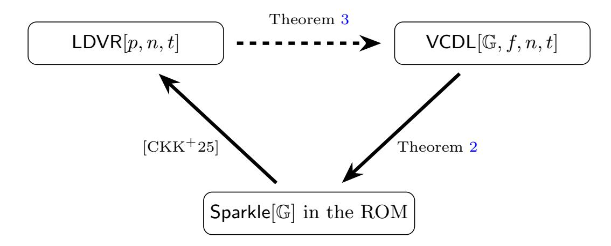

{0}------------------------------------------------

# Revisiting the Security of Sparkle

Ojaswi Acharya<sup>1</sup> [,](https://orcid.org/0009-0006-9864-6548) Georg Fuchsbauer<sup>2</sup> [,](https://orcid.org/0000-0001-5672-5850) Adam O'Neill<sup>1</sup> [,](https://orcid.org/0009-0006-0233-6466) and Marek Sefranek[2](https://orcid.org/0009-0008-8987-9555)

> <sup>1</sup> Manning CICS, UMass Amherst, USA {oacharya,adamoneill}@umass.edu <sup>2</sup> TU Wien, Austria firstname.lastname@tuwien.ac.at

Abstract. We revisit the three-round threshold Schnorr signature scheme Sparkle of Crites, Komlo, and Maller (CRYPTO 2023), as well as its variant Sparkle+. While Sparkle+ was accompanied by a claim of full adaptive security, subsequent work identified a gap in the analysis. Moreover, the original—and simpler and more efficient—Sparkle scheme has so far lacked even a proof of static security.

We resolve this state of affairs by giving the first proof of static security for Sparkle and then, as our main result, a tight proof of full adaptive security in the pure random oracle model, i.e. without relying on the algebraic group model. The core obstacle is that, in the fully adaptive setting for Sparkle, rewinding arguments fundamentally break down. To address this, our proof is based on a new Vandermonde circular discrete-logarithm (VCDL) assumption, an interactive strengthening of the circular discrete-logarithm assumption of Cho et al. (CRYPTO 2025), originally introduced to prove tight security of basic Schnorr signatures. In particular, circular-style assumptions eliminate the need for rewinding. Beyond tightness, our analysis highlights circular-style assumptions as a general approach to achieving security in settings—such as full adaptive security—where rewinding is inherently problematic.

We justify VCDL by reducing it to the low-dimensional vector representation (LDVR) problem of Crites et al. (CRYPTO 2025) in the elliptic-curve generic group model; conversely, VCDL implies LDVR in the standard model. Finally, we generalize VCDL (and similarly LDVR) by abstracting away the specific choice of Vandermonde vectors. As an application, we identify a different assumption within this framework that yields a tight proof of adaptive multi-user security for the basic Schnorr signature scheme, a result of independent interest.

# 1 Introduction

## 1.1 Background and Goals

Threshold Schnorr signatures. Threshold signatures distribute signing power across multiple parties while still producing a single short signature. In an (n, t)-threshold signature (TS) scheme, there are n parties, any t of which

{1}------------------------------------------------

<span id="page-1-0"></span>can jointly generate a valid signature under a common public key. Among such schemes, threshold Schnorr signatures are especially attractive, since the resulting signature is a standard Schnorr signature. This enables drop-in compatibility with existing verification infrastructure (e.g., BIP-340 for Bitcoin), without requiring protocol or software changes. Such compatibility is particularly important in blockchain and distributed-systems settings, where minimizing overhead and preserving interoperability are critical.

Our focus: Sparkle. In our view, the three-round threshold Schnorr signature scheme Sparkle (the first round being message-independent), introduced by Crites, Komlo, and Maller (CKM) [\[CKM23b\]](#page-59-0), provides an important test case for studying adaptive security of threshold Schnorr signature schemes. In particular, the scheme is remarkably simple, natural, and efficient, and it was explicitly designed with adaptive security in mind. (See Figure [3](#page-6-0) for a comparison of concrete efficiency among recent low-round threshold Schnorr signature schemes.) Indeed, Sparkle came with a claim of full adaptive security, in which the adversary may corrupt parties on the fly (up to one fewer than the signing threshold), even after observing protocol transcripts, and learns their entire internal state (without assuming secure erasures). This notion is challenging to achieve and well motivated in recent work. It is also explicitly identified as a desideratum in recent NIST calls for threshold signature schemes [\[BP25,](#page-58-0) [BD24\]](#page-57-0).

CKM argued their claim of full adaptive security for Sparkle in the random oracle model [\[BR93\]](#page-58-1) combined with the algebraic group model [\[FKL18\]](#page-59-1), under the algebraic one-more discrete-logarithm (AOMDL) assumption. AOMDL, which will be relevant to us later, is an interactive strengthening of the discrete-logarithm assumption in which the adversary is given access to a discrete-log oracle that answers queries on linear combinations of the challenges.

Gaps in existing analyses. Subsequent work to CKM identified two fundamental gaps in the original security analysis of Sparkle and its variants:

- The first concerns static security. Bacho et al. [\[BLT](#page-58-2)<sup>+</sup>24] observed that the original proof does not correctly handle executions in which honest parties hold inconsistent local views, a situation that can arise even under static corruptions. As a result, the original simulation strategy is invalid. To address this issue, Crites, Komlo, and Maller proposed a modified scheme, Sparkle+, in the full version of their work [\[CKM23a\]](#page-59-2), in which parties sign their local views using an auxiliary signature scheme. While this modification suffices to recover a (loose) proof of static security in the random oracle model, the original Sparkle protocol remained without such a proof.
- The second concerns full adaptive security. Crites and Stewart [\[CS25\]](#page-59-3) and subsequently Crites et al. [\[CKK](#page-59-4)<sup>+</sup>25] showed that any threshold Schnorr signature scheme such as Sparkle whose public key shares are Shamir shares of the secret key in the exponent necessarily requires the hardness of algebraic problems over the underlying field to achieve full adaptive security. The original analysis of CKM does not seem to rely on such an assumption (and, in fact, their reduction is flawed, as we show explicitly in Appendix [B\)](#page-63-0), a gap they later acknowledged [\[CKM23a\]](#page-59-2). This issue persists even for Sparkle+.

{2}------------------------------------------------

<span id="page-2-0"></span>While neither gap yields an explicit attack on the scheme itself, they leave Sparkle and Sparkle+ without proof-based support for full adaptive security (and, in the case of Sparkle, even for static security). This raises a fundamental question: what assumptions are sufficient to establish full adaptive security for Sparkle, if any?

Our goal: Tight full adaptive security in the pure ROM. In answering this question, our goal will be to obtain tight reductions establishing full adaptive security in the pure random oracle model, without also appealing to the algebraic group model (AGM) as done in CKM's original (flawed) analysis. Tightness matters: loose reductions mean increased concrete parameters, an issue already present for basic Schnorr signatures and that can get worse in the threshold setting. While the AGM+ROM often enables both tight bounds and full adaptive security in our context (e.g., for FROST [\[CKK](#page-59-4)+25]), it imposes strong algebraic restrictions on the adversary that obscure insight into the scheme's true security. Indeed, in comparison to the ROM, the AGM is a comparatively recent idealization that is not yet fully understood; several works have highlighted subtleties and limitations in its use [\[Zha22,](#page-61-0) [ZZK22\]](#page-61-1).

## 1.2 Our Contributions

Static security of Sparkle. We first revisit static security of the original Sparkle scheme. By adapting the delayed-programming and equivalence-class techniques of Bacho et al. [\[BLT](#page-58-2)<sup>+</sup>24], which they originally developed for their Twinkle scheme, we obtain a proof of static security in the random oracle model. (While the techniques are primarily due to [\[BLT](#page-58-2)<sup>+</sup>24], there is no prior result adapting them to Sparkle as far as we know.) The reduction is either loose under the discrete-logarithm assumption, or tight under the circular discrete-logarithm (CDL) assumption of Cho et al. [\[CFOS25\]](#page-58-3).

Why full adaptive security is different. Full adaptive security presents a fundamentally different challenge. In the fully adaptive setting, the adversary may corrupt parties after observing transcripts and may, across executions, corrupt all but one signer. In threshold Schnorr schemes where public keys are Shamir shares of the secret key in the exponent, each corruption reveals an evaluation of a degree-t polynomial whose constant term is the signing key. After sufficiently many corruptions, no hidden secret remains for a reduction to leverage. As a result, classical rewinding (i.e., forking) arguments break down.

To overcome this issue, our main idea is to use circular assumptions, in the spirit of the circular discrete-logarithm (CDL) assumption of Cho et al. [\[CFOS25\]](#page-58-3), originally introduced to obtain tight security for basic Schnorr signatures. In this case, a successful forgery under key X = g <sup>x</sup> does not lead to extraction of the signing key x. Instead, it directly yields a solution (R, z) to a circular relation of the form g <sup>z</sup> = R · X<sup>f</sup>(R) for a fixed conversion function f : G → Z<sup>p</sup> (e.g., the ECDSA conversion function). Therefore, the reduction never needs to extract the signing key, rewinding is avoided entirely, and tightness comes for free.

In other words, we leverage circular-style assumptions as a new approach to achieve full adaptive security for threshold Schnorr schemes with Shamir shares 

{3}------------------------------------------------

<span id="page-3-0"></span>in the exponent. More broadly, our approach may be useful in future work that considers other settings where rewinding is inherently problematic.

The VCDL assumption. Following this approach, we isolate the interactive hardness assumption needed to simulate adaptive corruptions without rewinding, which turns out to be a non-trivial task. We call the resulting assumption, which is a delicate extension of CDL to the interactive setting, the Vandermonde circular discrete-logarithm (VCDL) assumption. (Note that interactive assumptions are somewhat inherent here [\[CKM25\]](#page-59-5), see Section [1.3.](#page-5-0)) In our assumption VCDL[G, f, n, t], the adversary receives (X0, X1, . . . , Xt) ∈ Gt+1 with X<sup>i</sup> = g xi . It may query a discrete-log oracle on indices k ∈ [n], obtaining

$$x_0 + \sum_{i=1}^t k^i x_i,$$

that is, evaluations of a degree-t polynomial. To win, it must output (R, z) satisfying

$$g^z = R \cdot X_0^{f(R)}$$
 with  $f(R) \neq 0$ .

The restriction to Vandermonde-structured queries is not just sufficient for our reduction; it is essential for soundness of the assumption itself. The difficulty arises from the combination of circularity of the assumption combined with interactivity. For non-circular assumptions such as AOMDL, allowing arbitrary linear combinations of the underlying secrets still yields a plausible assumption. For circular assumptions, however, such freedom immediately renders the assumption false. Indeed, if arbitrary linear queries were permitted, then querying the vector (f(X1), 1, 0, . . . , 0) would reveal z := x<sup>1</sup> + x0f(X1), which yields a valid circular solution together with R := X1. Part of our contribution is to initiate a systematic study of this phenomenon and to relate it to the hardness of corresponding linear-algebraic problems over Zp.

From VCDL to tight full adaptive security. As our main result, we prove that full adaptive security of Sparkle reduces tightly to VCDL in the pure ROM. Adaptive corruption queries in Sparkle reveal Shamir shares of the signing key, which match the Vandermonde evaluations provided by the discretelog oracle in VCDL. Our reduction therefore answers corruption queries using its discrete-log oracle. Signing queries are simulated using the static-corruption techniques above, without invoking any oracle. As a successful forgery directly yields a VCDL solution, the reduction neither extracts the signing key nor rewinds. We note that, while the proof might seem straightforward once all the tools and techniques are in place, we view identifying an interactive assumption that is both plausibly hard and sufficient for our result as a key technical contribution.

This proof strategy works for Sparkle but not for FROST, in which the signers' public keys are also Shamir shares of the signing key in the exponent. For FROST, answering signing queries in the reduction requires discrete-log oracle queries for arbitrary linear combinations of the underlying secrets. But, in the setting of circular assumptions (which is needed to avoid rewinding), such access

{4}------------------------------------------------

<span id="page-4-0"></span>corresponds to a circular analogue of AOMDL, which we have noted is false. This helps understand why the proof of full adaptive security for FROST [\[CKK](#page-59-4)<sup>+</sup>25] requires the algebraic group model whereas we do not.

Justifying VCDL via LDVR. It is customary to justify a new group-theoretic assumption by showing it is hard when idealizing the group. In our case, we obtain a conditional result based on the low-dimensional vector representation (LDVR) problem of Crites et al. [\[CKK](#page-59-4)<sup>+</sup>25], which is known to be necessary for full adaptive security of Sparkle and related schemes. Namely, we show that VCDL tightly reduces to LDVR in the elliptic-curve generic group model of Groth and Shoup [\[GS22\]](#page-60-0), and conversely that VCDL tightly implies LDVR in the standard model. For this, we combine techniques from the proof of CDL in the EC-GGM due to Cho et al. [\[CFOS25\]](#page-58-3) with the proof of one-more discrete log (OMDL) [\[BNPS03\]](#page-58-4) in Shoup's GGM [\[Sho97\]](#page-61-2) due to Bauer, Fuchsbauer, and Plouviez [\[BFP21\]](#page-57-1) in a non-trivial manner, as well as new arguments tailored to LDVR. Interestingly, in addition to (approximate) regularity of the conversion function f as required for hardness of CDL in the EC-GGM as shown by [\[CFOS25\]](#page-58-3), we need that f is preimage-sampleable—which the ECDSA conversion function originally suggested by [\[CFOS25\]](#page-58-3) as a candidate choice for f also satisfies. Thus, up to idealization of the group, VCDL and LDVR are equivalent, positioning VCDL as the natural group-theoretic analogue of LDVR (cf. Figure [1\)](#page-5-1).

Beyond Sparkle: tight adaptive multi-user Schnorr. As a result of independent interest, we show a tight proof of adaptive multi-user unforgeability for the basic Schnorr signature scheme in the ROM. Despite the widespread use of the scheme, to the best of our knowledge, no such proof was previously known. (A trivial reduction to single-user unforgeability incurs a factor-n loss that is prohibitive for large-scale deployments.) To this end, we abstract away the Vandermonde vectors in VCDL (and similarly LDVR) and replace them with an arbitrary family of vectors satisfying a simple non-degeneracy condition. We identify another special case—the standard-basis circular discrete-logarithm (SB-CDL) assumption—under which our reduction goes through. From this perspective, VCDL is not merely an isolated, scheme-specific assumption, but part of a broader framework that we expect to be useful in future work.

Perspective. We do not claim that Sparkle is an optimal threshold Schnorr signature scheme, nor that VCDL is a standard assumption. Rather, we want to understand which assumptions and idealized models suffice to prove full adaptive security of threshold Schnorr signature schemes, particularly in which each signer's public key is simply a Shamir share of the secret key in the exponent, as is the case for Sparkle and FROST. For such schemes, rewinding introduces a substantial technical challenge. Nevertheless, our results show that for Sparkle this difficulty can be overcome in the pure ROM, and even with a tight reduction.

{5}------------------------------------------------

<span id="page-5-2"></span><span id="page-5-1"></span>

Fig. 1. Implications shown in this work. VCDL[G, f, n, t] is for regular, preimagesampleable f. "Sparkle[G] in the ROM" refers to full adaptive security. A dashed arrow indicates the implication is shown in the EC-GGM. All reductions are tight.

| Scheme   | Source    | Tight Reduction | Model   | Assumptions |
|----------|-----------|-----------------|---------|-------------|
| Sparkle  | This work | Yes             | ROM     | VCDL        |
| Rackle   | [NRT25]   | No              | ROM     | DL          |
| FROST    | [CKK+25]  | Yes             | ROM+AGM | AOMDL+LDVR  |
| ms-FROST | [BCL+25]  | Yes             | ROM+AGM | AOMDL       |
| FaFROST  | [BGC+25]  | Yes             | ROM+AGM | AOMDL       |
| Sparkle+ | [CKM23a]  | Yes             | ROM+AGM | AOMDL       |
| Gargos   | [BDLR25]  | No              | ROM     | DDH         |

Fig. 2. Security guarantees for recent low-round fully adaptively secure threshold Schnorr signature schemes. Among these, Sparkle is the only scheme achieving a tight reduction in the pure random oracle model. denotes a claimed result later shown to be invalid.

## <span id="page-5-0"></span>1.3 Related Work

Impossibility results. Recently, Crites, Komlo, and Maller [\[CKM25\]](#page-59-5) presented impossibility results that clarify the space of assumptions necessary to prove full adaptive security of both key-unique threshold signatures, as well as giving stronger results for the special case of threshold Schnorr signatures like Sparkle. At a high level, they show that: (1) the former cannot achieve full adaptive security, via a black-box reduction, under any non-interactive search assumption; and (2) the latter cannot achieve full adaptive security, via certain rewinding reductions, even under certain interactive assumptions. Our results do not contradict theirs: we avoid (1) because VCDL is interactive and (2) because we do not rewind.

Recent threshold Schnorr signatures. Threshold Schnorr signatures have long been studied, see e.g. Gennaro et al. [\[GJKR99\]](#page-60-2). But, since the work of Komlo and Goldberg introducing FROST[\[KG20\]](#page-60-3), there has been a surge of work on highly efficient schemes [\[KG20,](#page-60-3) [BCK](#page-57-5)+22, [CKM23a,](#page-59-2) [CKM23b,](#page-59-0) [CGRS23,](#page-59-6) [BTZ22,](#page-58-5) [Lin22,](#page-60-4) [Mak22,](#page-60-5) [RRJ](#page-61-3)+22, [KRT24,](#page-60-6) [BDLR24,](#page-57-6) [Che25\]](#page-59-7). These works explore various

{6}------------------------------------------------

<span id="page-6-1"></span><span id="page-6-0"></span>

| Scheme   | Rounds | Comm./signer          | Comp./signer              |  |
|----------|--------|-----------------------|---------------------------|--|
| Sparkle  | 3      | 1G<br>+ 2Zp           | 1 Exp                     |  |
| FROST    | 2      | 2G<br>+ Zp            | 3 Exp                     |  |
| ms-FROST | 2      | 2G<br>+ Zp            | 3 Exp + masking           |  |
| FaFROST  | 2      | 2G<br>+ Zp            | 3 Exp + masking           |  |
| Rackle   | 3      | 1G<br>+ 2Zp<br>+ NIZK | 1 Exp + NIZK.P + t NIZK.V |  |
| Sparkle+ | 3      | 1G<br>+ 2Zp<br>+ DS   | 1 Exp + DS.S + t DS.V     |  |
| Gargos   | 3      | 2G<br>+ 7Zp           | 8 Exp + NIZK.P + t NIZK.V |  |

Fig. 3. Concrete efficiency per signer across all rounds for recent low-round fully adaptively secure threshold Schnorr signature schemes. G denotes a group element, Z<sup>p</sup> a field element, and Exp a group exponentiation. Among the schemes shown, Sparkle achieves both the lowest communication and computational cost per signer, while avoiding expensive auxiliary primitives such as non-interactive zero-knowledge proofs.

tradeoffs in round complexity, security models, assumptions, communication cost, robustness, and network synchrony. In particular, several refinements and variants of FROST have been proposed; see, for example, Bellare et al. [\[BCK](#page-57-5)+22]. When computing the costs of FROST, we use the optimized variant introduced in that work (often referred to as FROST2). We note their work also considers stronger notions of unforgeability than we in our work.

Lattice-based schemes. A parallel line of work has explored analogous latticebased threshold signatures, beginning with TRaccoon [\[DKM](#page-59-8)+24], which follows the blueprint of Sparkle while introducing masking and noise-management techniques needed in the lattice setting. This further underscores the need for analysis of the core Sparkle design. Subsequent work [\[EKT24,](#page-59-9) [KRT24,](#page-60-6) [CATZ24,](#page-58-6) [BKL](#page-58-7)+25, [TZ23,](#page-61-4) [PN25,](#page-61-5) [PKN](#page-61-6)<sup>+</sup>25, [GHK](#page-60-7)<sup>+</sup>25] proposes alternatives. While practitioners appear to favor threshold Schnorr signatures for near-term deployment, lattice-based threshold signatures provide potential post-quantum successors.

Multi-user security of Schnorr signatures. The static multi-user setting for public-key signatures goes back at least to Galbraith, Malone-Lee, and Smart [\[GMS02\]](#page-60-8), who noted a trivial reduction to single-user security incurring a factor-n loss. Bernstein [\[Ber15\]](#page-57-7) later pointed out an error in the Schnorr-specific tight reduction in [\[GMS02\]](#page-60-8) and advocated for "key-prefixing," proving a tight implication for the key-prefixed variant of basic Schnorr signatures. This was subsequently addressed by Kiltz, Masny, and Pan [\[KMP16\]](#page-60-9), who gave tight multi-user security proofs for Schnorr signatures (without key-prefixing) within a broader framework for Fiat–Shamir signatures.

Tight adaptive multi-user security for signature schemes was introduced by Kiltz et al. [\[BHJ](#page-58-8)<sup>+</sup>15] as a tool for constructing tightly-secure authenticated key exchange, along with efficient constructions satisfying the new notion. The subject continues to be an active area of study; e.g., recent work of Hashimoto 

{7}------------------------------------------------

<span id="page-7-1"></span>et al. [\[HOS25\]](#page-60-10) achieves tight adaptive multi-user security from non-interactive search assumptions; however, the proposed schemes are not Schnorr-based.

Concurrent work. Several concurrent works study full adaptive security for low-round threshold Schnorr signatures:

- Bacho et al. [\[BCL](#page-57-2)+25], and independently Baecker et al. [\[BGC](#page-57-3)+25], introduce masked variants of FROST called msFROST and FaFROST, respectively. These schemes achieve full adaptive security in the ROM+AGM under the AOMDL assumption, avoiding LDVR. Their approach handles adaptive corruptions by modifying the scheme to blind final-round signature shares using pairwise one-time masks.
- Niot et al. [\[NRT25\]](#page-60-1) propose Rackle, a three-round threshold Schnorr scheme achieving full adaptive security in the pure ROM under the discrete-log assumption. While their construction avoids the AGM, they do not achieve tight security and rely on an auxiliary simulation-extractable proof system.

Our analysis of Sparkle takes a complementary approach to the above works. Rather than modifying the scheme or introducing auxiliary components, we show that full adaptive security can be established for the original Sparkle scheme as-is, via a tight reduction in the pure random oracle model under VCDL.

### 1.4 Paper Organization

Section [2](#page-7-0) recalls preliminaries, including signature schemes, threshold signatures, and their security notions. Section [3](#page-11-0) introduces our new Vandermonde circular discrete-logarithm (VCDL) assumption. Section [4](#page-12-0) presents the Sparkle scheme from [\[CKM23b\]](#page-59-0) and our main result: a tight proof of full adaptive security of Sparkle under VCDL in the pure ROM. Section [5](#page-28-1) establishes a tight equivalence between VCDL and the low-dimensional vector representation (LDVR) assumption in the elliptic-curve generic group model. Section [6](#page-46-0) introduces our new standard-basis circular discrete-logarithm (SB-CDL) assumption and uses it to give a tight proof of adaptive multi-user unforgeability for basic Schnorr signatures in the pure ROM. It further develops the interactive circular discrete-logarithm (ICDL) and generalized low-dimensional vector representation (gLDVR) frameworks, which generalize VCDL/SB-CDL and LDVR, respectively. Appendix [A](#page-61-7) contains the full details of the reduction from LDVR to VCDL, and Appendix [B](#page-63-0) pinpoints the error in the original full adaptive security proof of Sparkle+.

## <span id="page-7-0"></span>2 Preliminaries

Notation. For a vector v, we write |v| for its dimension (i.e., the number of coordinates), and v[i] for its i-th coordinate. For vectors v and w, we denote their concatenation by v∥w. If Q is a list of tuples, then Q[x, y, . . .] denotes the sublist of all tuples in Q whose prefix is (x, y, . . .); we use '·' as a wildcard entry.

For a finite set S, we write |S| for its cardinality and use x ←\$ S to denote sampling an element uniformly at random from S and assigning it to x. We write 

{8}------------------------------------------------

<span id="page-8-0"></span> $[n] := \{1, \ldots, n\} \subset \mathbb{N} \text{ and } [0, n] := \{0, 1, \ldots, n\} \subset \mathbb{N}.$  For a set  $S \subseteq [n]$ , the *i*-th Lagrange coefficient with respect to S is defined as  $\lambda_i^S := \prod_{j \in S \setminus \{i\}} \frac{j}{j-i}$ .

For a function  $f: X \to Y$ , we use dom(f) := X and  $ran(f) := \{f(x) \mid x \in X\}$  for its domain and range, respectively. We say that f is regular if, for every  $y \in ran(f)$ , the preimage  $f^{-1}(y)$  has the same size; equivalently, f is d-to-1 where  $d := |\operatorname{dom}(f)|/|\operatorname{ran}(f)|$ .

Algorithms may be randomized unless otherwise indicated. If A is an algorithm, we let  $y \leftarrow A^{O_1,\dots}(x_1,\dots;\omega)$  denote running A on inputs  $x_1,\dots$  and coins  $\omega$ , with oracle access to  $O_1,\dots$ , and assigning the output to y. Moreover, by  $y \leftarrow A^{O_1,\dots}(x_1,\dots)$  we denote picking  $\omega$  uniformly at random and letting  $y \leftarrow A^{O_1,\dots}(x_1,\dots;\omega)$ .

<u>Games</u>. We use the code-based game-playing framework of Bellare and Rogaway [BR06]. By  $Pr[\mathbf{G} \Rightarrow y]$  we denote the probability that the execution of game  $\mathbf{G}$  results in the output being y.

#### 2.1 Signature Schemes

A signature scheme with message space MS is defined by a tuple of algorithms DS = (DS.K, DS.S, DS.V). The key-generation algorithm DS.K outputs a key pair (vk, sk). The signing algorithm DS.S takes as input a signing key sk and a message m, and outputs a signature  $\sigma$ . The verification algorithm DS.V takes as input a verification key vk, a message m, and a signature  $\sigma$ , and outputs a bit.

<u>CORRECTNESS AND SECURITY.</u> Informally, a signature scheme is correct if a message-signature pair generated from a secret key passes verification under the corresponding public key. Similarly, security of a signature scheme states that an adversary observing many valid message-signature pairs cannot generate a valid signature for a previously unsigned message.

SCHNORR SIGNATURES. Let  $\mathbb{G}$  be a cyclic group of prime order  $p = |\mathbb{G}|$ , generated by g. Let  $H: \mathbb{G} \times \{0,1\}^* \times \mathbb{G} \to \mathbb{Z}_p$  be a hash function. (Note that we hash the verification key as the first input, which is common in the multi-user setting we consider.) The Schnorr signature scheme [FS87, Sch90]  $\mathsf{Sch}[\mathbb{G}, H] = (\mathsf{Sch.K}, \mathsf{Sch.S}, \mathsf{Sch.V})$  with message space  $\{0,1\}^*$  works as follows. Algorithm  $\mathsf{Sch.K}$  chooses  $x \leftarrow \mathbb{Z}_p$ , sets  $X \leftarrow g^x$ , and returns (vk = X, sk = x). Algorithm  $\mathsf{Sch.S}$  on input x, m chooses  $r \leftarrow \mathbb{Z}_p$ , sets  $R \leftarrow g^r$  and  $c \leftarrow H(X, m, R)$ , then returns  $(R, (r + cx) \bmod p)$ . Algorithm  $\mathsf{Sch.V}$  on input X, m, (R, z) returns 1 iff  $g^z = R \cdot X^c$  where  $c \leftarrow H(X, m, R)$ . Correctness is straightforward to check. In the ROM, we denote the scheme by  $\mathsf{Sch}[\mathbb{G}]$ .

Note that, unlike in [CFOS25], we define the hash function in Schnorr signatures above to be *public-key prefixed*; that is, a hash query by user i is prepended with its public key  $X_i$ . This will be important for our proof of tight adaptive multi-user unforgeability of Schnorr signatures in Section 6.

{9}------------------------------------------------

### <span id="page-9-1"></span>2.2 Threshold Signature Schemes

Our formalizations here largely follow Crites, Komlo, and Maller [CKM23a], with some adaptations to be consistent with the rest of our work. In particular, following their work, we consider 3-round threshold signature schemes where the first round is *message independent*.

<u>3-ROUND THRESHOLD SIGNATURES.</u> A three-round threshold signature scheme with message space MS is a tuple of algorithms

$$\mathsf{TS} = (\mathsf{TS}.\mathsf{KeyGen}, (\mathsf{TS}.\mathsf{Sign}_i)_{i \in \{1,2,3\}}, \mathsf{TS}.\mathsf{Combine}, \mathsf{TS}.\mathsf{Verify})$$

that work as follows:

- TS.KeyGen(n, t + 1): The key-generation algorithm, on input the number of signers  $n \in \mathbb{N}$  and signing threshold  $t + 1 \le n$ , outputs a verification key vk, verification key shares  $(vk_i)_{i \in [n]}$ , and private key shares  $(sk_i)_{i \in [n]}$ .
- $\mathsf{TS.Sign}_1(i, sk_i)$ : The round-one signing algorithm, on input a signer index  $i \in [n]$  and signing key share  $sk_i$ , outputs a round-one protocol message  $pm_{i,1}$  and signer state  $st_{i,1}$ .
- $\mathsf{TS.Sign}_2(i, \mathcal{S}, m, (pm_{j,1})_{j \in \mathcal{S}}, st_{i,1})$ : The round-two signing algorithm, on input a signer index  $i \in [n]$ , set of signers  $\mathcal{S} \subseteq [n]$ , message  $m \in \mathsf{MS}$ , round-one protocol messages  $(pm_{j,1})_{j \in \mathcal{S}}$ , and signer state  $st_{i,1}$ , outputs a round-two protocol message  $pm_{i,2}$  and signer state  $st_{i,2}$ .
- $\mathsf{TS.Sign}_3(i, (pm_{j,2})_{j \in \mathcal{S}}, st_{i,2})$ : The round-three signing algorithm, on input a signer index  $i \in [n]$ , round-two protocol messages  $(pm_{j,2})_{j \in \mathcal{S}}$ , and signer state  $st_{i,2}$ , outputs a round-three protocol message  $pm_{i,3}$ .
- TS.Combine $(S, m, (pm_{j,2})_{j \in S}, (pm_{j,3})_{j \in S})$ : The aggregation algorithm, on input the set of signers  $S \subseteq [n]$ , message  $m \in MS$ , round-two protocol messages  $(pm_{j,2})_{j \in S}$ , and round-three protocol messages  $(pm_{j,3})_{j \in S}$ , outputs a signature  $\sigma$ .
- TS.Verify $(vk, m, \sigma)$ : The verification algorithm, on input a verification key vk, message  $m \in MS$ , and signature  $\sigma$ , outputs a bit.

For correctness, we require that for every  $n, t \in \mathbb{N}$  with n > t,  $S \subseteq [n]$  such that  $|S| \ge t + 1$ , and  $m \in \mathsf{MS}$ ,  $\Pr\left[\mathbf{G}^{\mathrm{cor}}_{\mathsf{TS},n,t,\mathcal{S},m} \Rightarrow 1\right] = 1$  where the game is in Figure 4.

```
\frac{\operatorname{Game}\; \mathbf{G}^{\operatorname{cor}}_{\mathsf{TS},n,t,\mathcal{S},m}}{1 \;\; (vk,(vk_i)_{i\in[n]},(sk_i)_{i\in[n]}) \leftarrow \$\; \mathsf{TS}.\mathsf{KeyGen}(n,t+1)} \\ 2 \;\; \operatorname{For}\; i\in\mathcal{S}: \\ 3 \;\;\; (pm_{i,1},st_{i,1}) \leftarrow \$\; \mathsf{TS}.\mathsf{Sign}_1(i,sk_i) \\ 4 \;\; \operatorname{For}\; i\in\mathcal{S}: \\ 5 \;\;\; (pm_{i,2},st_{i,2}) \leftarrow \$\; \mathsf{TS}.\mathsf{Sign}_2(i,\mathcal{S},m,(pm_{j,1})_{j\in\mathcal{S}},st_{i,1}) \\ 6 \;\; \operatorname{For}\; i\in\mathcal{S}: \\ 7 \;\;\; pm_{i,3} \leftarrow \$\; \mathsf{TS}.\mathsf{Sign}_3(i,(pm_{j,2})_{j\in\mathcal{S}},st_{i,2}) \\ 8 \;\; \sigma \leftarrow \; \mathsf{TS}.\mathsf{Combine}(\mathcal{S},m,(pm_{j,2})_{j\in\mathcal{S}},(pm_{j,3})_{j\in\mathcal{S}}) \\ 9 \;\; \operatorname{Return}\; \mathsf{TS}.\mathsf{Verify}(vk,m,\sigma)
```

Fig. 4. Game defining correctness of TS.

{10}------------------------------------------------

```
Game G
         adp-ts-uf
         TS,n,t
Initialize:
 1 Qst, Qm ← ∅ ; eid ← 0
 2 HS ← [n] ; CS ← ∅
 3 (vk,(vki)i∈[n]
                  ,(ski)i∈[n]) ←$ TS.KeyGen(n, t + 1)
 4 Return (vk,(vki)i∈[n])
SignO1(k): // k ∈ HS
 5 eid ← eid + 1
 6 (pmk,eid,1
             , stk,eid,1) ←$ TS.Sign1
                                     (k, skk)
 7 Qst[k, eid, 1] ← stk,eid,1
 8 Return (eid, pmk,eid,1
                          )
SignO2(k, eid, S, m,(pmi,eidi,1
                                 )i∈S ): // k ∈ HS, Qst [k, eid, 1] ̸= ⊥, Qst [k, eid, 2] = ⊥
 9 Qm ← Qm ∪ {m}
10 stk,eid,1 ← Qst[k, eid, 1]
11 (pmk,eid,2
             , stk,eid,2) ←$ TS.Sign2
                                     (k, S, m,(pmi,eidi,1
                                                          )i∈S , stk,eid,1)
12 Qst[k, eid, 2] ← stk,eid,2
13 Return pmk,eid,2
SignO3(k, eid,(pmi,eidi,2
                           )i∈S ): // k ∈ HS, Qst [k, eid, 2] ̸= ⊥, Qst [k, eid, 3] = ⊥
14 stk,eid,2 ← Qst[k, eid, 2]
15 pmk,eid,3 ←$ TS.Sign3
                          (k,(pm2,eidi,1
                                         )i∈S , stk,eid,2)
16 Qst[k, eid, 3] ← pmk,eid,3
17 Return pmk,eid,3
CorruptO(k): // k ∈ HS, |CS| < t
18 CS ← CS ∪ {k}; HS ← HS \ {k}
19 stk ← Qst[k, ·, ·]
20 Return (skk, stk)
                                          Finalize(m, σ):
                                          21 If m ∈ Qm: Return 0
                                          22 Return TS.Verify(vk, m, σ)
```

Fig. 5. Game defining adaptive security of TS.

Full adaptive security. We define adaptive existential unforgeability under chosen-message attack for TS schemes (ADP-TS-UF). Our definition of security is adapted from [\[CKM23a,](#page-59-2) Definition 8]. Let

$$\mathsf{TS} = (\mathsf{TS}.\mathsf{KeyGen}, (\mathsf{TS}.\mathsf{Sign}_i)_{i \in \{1,2,3\}}, \mathsf{TS}.\mathsf{Combine}, \mathsf{TS}.\mathsf{Verify})$$

with message space MS be a three-round TS scheme. For an adversary A = (A0, A1), we let its ADP-TS-UF advantage against TS be

$$\mathbf{Adv}^{\text{adp-ts-uf}}_{\mathsf{TS},n,t}(\mathbf{A}) = \Pr\left[\mathbf{G}^{\text{adp-ts-uf}}_{\mathsf{TS},n,t}(\mathbf{A}) \Rightarrow 1\right],$$

where the game is in Figure [5.](#page-10-0)

Intuitively, this notion of security allows the adversary to initiate concurrent executions of the signing protocol wherein it controls some corrupted signers; these corrupted signers are adaptively chosen throughout the execution of the game. Each execution of the signing protocol is given a unique execution identifier

{11}------------------------------------------------

<span id="page-11-2"></span>eid, which represents the fact that protocol messages are tied to a particular execution. This is important to ensure in any implementation. The adversary wins if it forges on a message for which it never initiated an execution of the signing protocol.

## <span id="page-11-0"></span>3 VCDL: Our New Assumption

We introduce the Vandermonde circular discrete-logarithm (VCDL) assumption, which combines the circular structure of CDL [CFOS25] with a restricted discrete-log oracle. Namely, the oracle returns evaluations  $x_0 + \sum_{i=1}^t k^i x_i$  of a degree-t polynomial at queried indices  $k \in [n]$ . The Vandermonde structure is not merely convenient for our analysis of Sparkle; it is necessary for soundness: arbitrary linear queries as in the algebraic one-more discrete-logarithm (AOMDL) assumption would falsify the assumption, since querying  $(f(X_1), 1, 0, \ldots, 0)$  yields a valid circular solution with  $R := X_1$ . We later justify VCDL via the low-dimensional vector representation (LDVR) assumption [CKK<sup>+</sup>25], as detailed in Section 5.

THE DEFINITION. Let  $\mathbb{G}$  be a group of prime order  $p = |\mathbb{G}|$ , generated by g. Let  $f: \mathbb{G} \to \mathbb{Z}_p$  be an efficient function. Let  $n, t \in \mathbb{N}$  be parameters with t < n. For an adversary A we let its VCDL-advantage against  $\mathbb{G}, g, f, n, t$  be

$$\mathbf{Adv}^{\text{vcdl}}_{\mathbb{G},g,f,n,t}(\mathbf{A}) = \Pr\left[\mathbf{G}^{\text{vcdl}}_{\mathbb{G},g,f,n,t}(\mathbf{A}) \Rightarrow 1\right],$$

where the game is in Figure 6 (right). We include the CDL game for comparison in Figure 6 (left).

```
 \begin{array}{c} \underline{\text{Game }} \mathbf{G}^{\operatorname{cdl}}_{\mathbb{G},g,f} \\ \underline{\text{INITIALIZE:}} \\ 1 \ x \leftarrow \mathbb{Z}_p \ ; \ X \leftarrow g^x \\ 2 \ \operatorname{Return} \ X \\ \\ \overline{\text{FINALIZE}}(R,z) \\ 3 \ \operatorname{Return} \left( f(R) \neq 0 \land g^z = R \cdot X^{f(R)} \right) \\ \end{array} \begin{array}{c} \underline{\text{Game }} \mathbf{G}^{\operatorname{vcdl}}_{\mathbb{G},g,f,n,t} \\ \underline{\text{INITIALIZE:}} \\ 1 \ Q \leftarrow \emptyset \\ 2 \ \operatorname{For} \ i \in [0,t] \\ 3 \ x_i \leftarrow \mathbb{Z}_p \ ; \ X_i \leftarrow g^{x_i} \\ 4 \ \operatorname{Return} \ (X_0, X_1, \ldots, X_t) \\ \underline{\text{DLog}}(k) \\ \vdots \ // \ k \in [n], |Q| < t \\ 5 \ Q \leftarrow Q \cup \{k\} \\ 6 \ y \leftarrow x_0 + \sum_{i \in [t]} k^i \cdot x_i \\ 7 \ \operatorname{Return} \ y \\ \end{array} 
\overline{\text{FINALIZE}}(R,z) \\ \text{S} \ \operatorname{Return} \left( f(R) \neq 0 \land g^z = R \cdot X_0^{f(R)} \right)
```

Fig. 6. Games defining the CDL and VCDL problems.

RELATION TO CDL. We briefly clarify the relationship between the VCDL assumption and the original circular discrete-logarithm (CDL) assumption. It is

{12}------------------------------------------------

<span id="page-12-1"></span>immediate that VCDL implies CDL. For the converse direction, consider a restricted variant of VCDL in which oracle queries are fixed non-adaptively and exclude index 0. In this setting, VCDL reduces to CDL. In VCDL, the oracle returns evaluations of the polynomial

$$y_k = x_0 + \sum_{i=1}^t k^i x_i.$$

Fix any set of at most t distinct nonzero indices  $k_1, \ldots, k_m$ . Since  $x_1, \ldots, x_t$  are uniform and independent in  $\mathbb{Z}_p$ , the vector  $(y_{k_1}, \ldots, y_{k_m})$  is uniformly distributed in  $\mathbb{Z}_p^m$  and independent of  $x_0$ . Indeed, the mapping from  $(x_1, \ldots, x_t)$  to  $(y_{k_1}, \ldots, y_{k_m})$  is linear with Vandermonde matrix whose rows are  $\boldsymbol{v}_{k_1}, \ldots, \boldsymbol{v}_{k_m}$ , which has full rank for distinct nonzero indices. Therefore, a CDL reduction can simulate the VCDL oracle by sampling the values  $y_{k_j}$  uniformly at random and embedding its CDL challenge as  $X_0 = g^{x_0}$ . Since oracle responses reveal no information about  $x_0$ , the adversary's view is identical to that in the restricted VCDL game. Any circular solution with respect to  $X_0$  thus yields a valid CDL solution. In sum, the additional power of VCDL over CDL crucially hinges on the ability of the adversary to make adaptive queries.

## <span id="page-12-0"></span>4 Full Adaptive Security of Sparkle

We recall the Sparkle threshold signature scheme and then give a proof of its full adaptive security under VCDL in the random oracle model (ROM).

#### 4.1 The Sparkle Scheme

Let  $\mathbb{G}$  be a cyclic group of prime order p, generated by g. Let  $H_{cm} \colon \mathbb{N} \times \mathbb{G} \to \mathbb{Z}_p$  and  $H_{sig} \colon \mathbb{G} \times \{0,1\}^* \times \mathbb{G} \to \mathbb{Z}_p$  be hash functions. The Sparkle three-round threshold signature scheme [CKM23a]

$$\mathsf{Sparkle}[\mathbb{G}, H_{cm}, H_{sig}] = (\mathsf{KeyGen}, (\mathsf{Sign}_i)_{i \in \{1,2,3\}}, \mathsf{Combine}, \mathsf{Verify})$$

with message space  $\{0,1\}^*$  is given in Figure 7. In the ROM, we denote the scheme by Sparkle[ $\mathbb{G}$ ].

To see that Sparkle satisfies correctness, we show that the aggregated signature (R, z) satisfies  $g^z = R \cdot vk^c$  for  $c = H_{sig}(vk, m, R)$ . Since  $vk = g^x$ , and  $R = \prod_{i \in \mathcal{S}} R_i$  for  $R_i = g^{r_i}$ , we can rewrite the verification equation as

$$z = \sum_{i \in \mathcal{S}} r_i + cx \pmod{p}.$$

Moreover, we have  $z = \sum_{i \in \mathcal{S}} z_i$  for  $z_i = (r_i + cy_i \lambda_i^{\mathcal{S}}) \mod p$ . Recalling that  $\sum_{i \in \mathcal{S}} y_i \lambda_i^{\mathcal{S}} = x$ , we get

$$z = \sum_{i \in \mathcal{S}} z_i = \sum_{i \in \mathcal{S}} (r_i + cy_i \lambda_i^{\mathcal{S}}) = \sum_{i \in \mathcal{S}} r_i + c \sum_{i \in \mathcal{S}} y_i \lambda_i^{\mathcal{S}} = \sum_{i \in \mathcal{S}} r_i + cx \pmod{p},$$

as required.

{13}------------------------------------------------

```
\mathsf{KeyGen}(n,t+1):
 1 x \leftarrow \mathbb{Z}_p; vk \leftarrow g^x
  \{(i,y_i)\}_{i\in[n]} \leftarrow \text{s Share}(n,t+1,x) // n\text{-out-of-}(t+1) \text{ Shamir secret sharing}
  з For i \in [n]: vk_i \leftarrow g^{y_i}
 4 For i \in [n]: sk_i \leftarrow (y_i, vk, (vk_j)_{j \in [n]})
  5 Return (vk, (vk_i)_{i \in [n]}, (sk_i)_{i \in [n]})
\mathsf{Sign}_1(k, sk_k):
 6 r_k \leftarrow \mathbb{Z}_p; R_k \leftarrow g^{r_k}
  7 cm_k \leftarrow H_{cm}(k, R_k)
  8 st_{k,1} \leftarrow (sk_k, r_k, R_k, cm_k)
  9 Return (cm_k, st_{k,1})
\mathsf{Sign}_2(k,\mathcal{S},m,(cm_i)_{i\in\mathcal{S}},st_{k,1}):
10 (sk_k, r_k, R_k, cm'_k) \leftarrow st_{k,1}
11 If \mathcal{S} \not\subseteq [n] \lor |\mathcal{S}| \le t \lor k \notin \mathcal{S} \lor cm_k \ne cm'_k: Return \bot
12 st_{k,2} \leftarrow (sk_k, r_k, R_k, cm_k, \mathcal{S}, m, (cm_i)_{i \in \mathcal{S}})
13 Return (R_k, st_{k,2})
\mathsf{Sign}_3(k,(R_i)_{i\in\mathcal{S}},st_{k,2}):
14 (sk_k, r_k, R'_k, cm_k, \mathcal{S}', m, (cm_i)_{i \in \mathcal{S}'}) \leftarrow st_{k,2}
15 If (R_k, \mathcal{S}) \neq (R'_k, \mathcal{S}'): Return \perp
16 If \exists i \in \mathcal{S} \setminus \{k\} such that cm_i \neq \text{HASHO}_{cm}(i, R_i): Return \perp
17 R \leftarrow \prod_{i \in \mathcal{S}} R_i \; ; \; c \leftarrow H_{\text{sig}}(vk, m, R)
18 z_k \leftarrow (r_k + c \cdot y_k \cdot \lambda_k^{\mathcal{S}}) \mod p // \lambda_k^{\mathcal{S}} is the k-th Lagrange coefficient for \mathcal{S}
19 Return z_k
Combine(\mathcal{S}, m, (R_i)_{i \in \mathcal{S}}, (z_i)_{i \in \mathcal{S}}):
                                                                                                Verify(vk, m, (R, z)):
                                                                                               22 c \leftarrow H_{sig}(vk, m, R)
20 R \leftarrow \prod_{i \in \mathcal{S}} R_i \; ; \; z \leftarrow \left(\sum_{i \in \mathcal{S}} z_i\right) \bmod p
                                                                                               23 Return (g^z = R \cdot vk^c)
21 Return (R, z) // Same form as basic Schnorr
```

Fig. 7. The Sparkle three-round threshold signature scheme.

## 4.2 Full Adaptive Security Under VCDL

We prove the following main result.

<span id="page-13-1"></span>**Theorem 1.** Let  $\mathbb{G}$  be a group of prime order p. Let A be an adversary against full adaptive security of  $\mathsf{Sparkle}[\mathbb{G}]$  in the ROM for parameters  $n, t \in \mathbb{N}$  where n > t and assume A makes at most q queries to its oracles. Let  $f : \mathbb{G} \to \mathbb{Z}_p$  be arbitrary and efficient. Then there exists an adversary B against VCDL for parameters f, n, t running in time roughly the same as A plus simulation overhead proportional to  $q \cdot T_f$ , where  $T_f$  is the time to compute f, such that

$$\mathbf{Adv}^{\text{adp-ts-uf}}_{\mathsf{Sparkle}[\mathbb{G}],n,t}(\mathbf{A}) \leq \mathbf{Adv}^{\text{vcdl}}_{\mathbb{G},g,f,n,t}(\mathbf{B}) + \frac{4q^2 - 2q + |f^{-1}(0)|}{p} \ .$$

<u>Proof intuition</u>. The most important part of the reduction is how to simulate signing on behalf of party k without knowing the corresponding secret key share

{14}------------------------------------------------

<span id="page-14-0"></span> $y_k$ ; in particular, how partial signatures  $z_k = (r_k + c \cdot y_k \cdot \lambda_k^{\mathcal{S}}) \mod p$  returned by  $\mathsf{Sign}_3$  can be simulated, where  $r_k$  is the discrete logarithm of nonce  $R_k$  revealed by  $\mathsf{Sign}_2$ . The basic idea is similar to plain Schnorr signatures [PS96, CKM23a]: first sample  $z_k \leftarrow \mathbb{Z}_p$ , and then set the nonce revealed in a  $\mathsf{Sign}_2$  query to

$$R_k \leftarrow g^{z_k} \cdot vk_k^{-c \cdot \lambda_k^{\mathcal{S}}},$$

such that the term involving  $y_k$  cancels out.

Crucially, this simulation technique requires to fix the value of c during a  $\mathsf{Sign}_2$  query, before learning the combined nonce  $R = \prod R_i$  and being able to program  $H_{sig}(vk, m, R) \leftarrow c$ . This is where our simulation strategy diverges from the original security proofs given by Crites et al. [CKM23a]. Building on ideas by Bacho *et al.* in their proof of full adaptive security of Twinkle [BLT<sup>+</sup>24], we avoid the gap in the original Sparkle proof by delaying the programming of  $H_{sig}$  on c as much as possible.

To achieve this, we define an equivalence relation of signing sessions—similar, in spirit, to [BLT<sup>+</sup>24]: informally, two signing sessions  $(S, m, (cm_i)_{i \in S})$  and  $(S', m, (cm'_i)_{i \in S'})$ , each fixed as the input to a Sign<sub>2</sub> query, should fall in the same equivalence class if and only if their resulting combined nonces turn out to be equal, once all the nonces  $(R_i)_{i \in S}$  and  $(R'_i)_{i \in S'}$  are revealed. Consequently, they should use the same challenge c when programming  $H_{sig}(vk, m, \prod_{i \in S} R_i)$  for the correct simulation of partial signatures.

We show that our equivalence relation is preserved over time, except for negligible probability that two sessions that are initially not equivalent, later end up having the same combined nonce. Moreover, the reduction proceeds in a sequence of hybrid games that account for the following bad events, each occurring with negligible probability:

- 1.  $Coll_{cm}$ : If any commitments returned by  $H_{cm}$  collide, we cannot uniquely extract a preimage  $(i, R_i)$  from a commitment  $cm_i$  provided by the adversary.
- 2. RepeatSign<sub>1</sub>: If the randomness used by Sign<sub>1</sub> repeats, we cannot resample the nonce in Sign<sub>2</sub>, which is needed for simulating  $z_k$ .
- 3. FindPreimage<sub>cm</sub>: Similarly, if the adversary manages to recover the preimage (i, R) of a nonce commitment cm returned by  $\mathsf{Sign}_1$ , we abort.
- 4. InvalidSign<sub>2</sub>: If the adversary queries Sign<sub>2</sub> with some commitment  $cm_j$  that is not yet fixed in the function table of  $H_{cm}$ , we also abort.
- 5. CantProgH<sub>cm</sub>: When we program  $H_{cm}$  in Sign<sub>2</sub>, we need to abort if the sampled value  $R \leftarrow \mathbb{G}$  is inconsistent with the current function table of  $H_{cm}$ .
- 6. CantProgH<sub>sig</sub>: The programming of  $H_{sig}$  leads to a similar abort.

This leads to a final game that can be simulated by a VCDL adversary extending techniques similar to the proof of static security of Sparkle+ under CDL in [CFOS25]. In particular, a corruption query for Sparkle mimics the Vandermonde structure of the VCDL oracle queries, and a Sparkle forgery can be converted into a VCDL solution. Altogether, this establishes a *tight* proof of full adaptive security of Sparkle in the ROM under the hardness of VCDL.

{15}------------------------------------------------

<span id="page-15-0"></span>**Corollary 1.** Let  $\mathbb{G}$  be a group of prime order p. Let A be an adversary against static security of  $\mathsf{Sparkle}[\mathbb{G}]$  in the ROM for parameters  $n, t \in \mathbb{N}$  where n > t and assume A makes at most q queries to its oracles. Let  $f : \mathbb{G} \to \mathbb{Z}_p$  be arbitrary and efficient. Then there exists an adversary B against CDL for f running in time roughly the same as A plus simulation overhead proportional to  $q \cdot T_f$ , where  $T_f$  is the time to compute f, such that

$$\mathbf{Adv}^{\mathrm{ts}\text{-}\mathrm{uf}}_{\mathsf{Sparkle}[\mathbb{G}]}(\mathbf{A}) \leq \mathbf{Adv}^{\mathrm{cdl}}_{\mathbb{G},g,f}(\mathbf{B}) + \frac{4q^2 - 2q + |f^{-1}(0)|}{p} \; .$$

In the static security definition (TS-UF) of a threshold signature scheme, the adversary must declare its corruption queries in advance before receiving any keys. As a corollary, the static security of Sparkle follows directly by combining the simulation strategy of Theorem 1 with the final reduction used in the static security proof of Sparkle+ in [CFOS25]. In this reduction, a CDL adversary simulates the final game by embedding its challenge value X as the Schnorr verification key.

Proof (of Theorem 1). Let  $G_0 := G_{\mathsf{Sparkle}[\mathbb{G}],n,t}^{\mathsf{adp-ts-uf}}$  be the full adaptive security game for  $\mathsf{Sparkle}$  in the ROM, given in Figure 8. Let A be the adversary from Theorem 1 interacting with  $G_0$  and making at most q oracle queries. By a successful query to  $\mathsf{SIGNO}_1$ ,  $\mathsf{SIGNO}_2$ , or  $\mathsf{SIGNO}_3$ , we mean a query that passes all the checks, and thus does not result in the output  $\bot$ . Without loss of generality, we assume that the adversary A only makes successful queries (as it can efficiently check whether a query would return  $\bot$  before making it). Moreover, we assume that all queries to the two random oracles  $\mathsf{HASHO}_{cm}$  and  $\mathsf{HASHO}_{sig}$  are well-formed, i.e., inputs to  $\mathsf{HASHO}_{cm}$  are of the form  $(i,R) \in [n] \times \mathbb{G}$  and inputs to  $\mathsf{HASHO}_{sig}$  are of the form  $(vk,m,R) \in \mathbb{G} \times \{0,1\}^* \times \mathbb{G}$ , where vk is the verification key given to  $\mathsf{A}$ .

 $\underline{\mathbf{G}_0 \to \mathbf{G}_1}$ . In game  $\mathbf{G}_1$ , given in Figure 9, we introduce an abort in line 24 of HASHO<sub>cm</sub> which is triggered if any of the cm values stored in  $\mathbf{Q}_{cm}$  collide (Coll<sub>cm</sub>). Moreover, we add an abort in line 5 of SIGNO<sub>1</sub> (RepeatSign<sub>1</sub>). This change ensures that all the cm<sub>k</sub> values returned by SIGNO<sub>1</sub> are distinct by aborting if the entry  $(k, R_k, \cdot)$  already exists in  $\mathbf{Q}_{cm}$ , i.e., when the  $r_k$  value sampled in line 4 repeats, or when A previously queried HASHO<sub>cm</sub> on  $(k, R_k)$ .

 $\underline{\text{Coll}_{cm}}$ . Since at most q values  $cm_1, \ldots, cm_q$  get sampled from  $\mathbb{Z}_p$ , by the birthday bound, the probability that there is a collision is at most

$$\Pr\left[\mathsf{Coll}_{cm}\right] \le \frac{q^2 - q}{2p}.$$

RepeatSign<sub>1</sub>. For the *i*-th query, the probability that  $(k, R_k, \cdot) \in Q_{cm}$  in line 5 of  $\overline{SIGNO_1}$  is at most (i-1)/p since  $R_k$  is a uniformly random group element and there are at most i-1 possible entries  $(k, \cdot, \cdot)$  defined in  $Q_{cm}$  it could hit. By a union bound over at most q queries, we get:

$$\Pr\big[\operatorname{\mathsf{RepeatSign}}_1\big] \leq \frac{q^2-q}{2p}.$$

{16}------------------------------------------------

```
Game \mathbf{G}_0(\mathbb{G}, g, n, t)
INITIALIZE:
 1 Q_{st}, Q_m, Q_{cm}, Q_{sig} \leftarrow \emptyset; eid \leftarrow 0
 2 HS \leftarrow [n]; CS \leftarrow \emptyset
 x \leftarrow \mathbb{Z}_p ; vk \leftarrow g^x
 4 \{(i,y_i)\}_{i\in[n]} \leftarrow Share(n,t+1,x) // Shamir secret sharing
 5 For i \in [n]: vk_i \leftarrow g^{y_i}
 6 For i \in [n]: sk_i \leftarrow (y_i, vk, (vk_j)_{j \in [n]})
 7 Return (vk, (vk_i)_{i \in [n]})
SIGNO_1(k): // k \in HS
 8 \ eid \leftarrow eid + 1
 9 r_k \leftarrow \mathbb{Z}_p; R_k \leftarrow g^{r_k}
10 cm_k \leftarrow \text{HASHO}_{cm}(k, R_k)
11 Q_{st}[k, eid, 1] \leftarrow (r_k, R_k, cm_k)
12 Return (eid, cm_k)
SIGNO_2(k, eid, \mathcal{S}, m, (cm_i)_{i \in \mathcal{S}}): //k \in HS, Q_{st}[k, eid, 1] \neq \bot, Q_{st}[k, eid, 2] = \bot
13 Q_m \leftarrow Q_m \cup \{m\}
14 (r_k, R_k, cm_k') \leftarrow \mathsf{Q}_{st}[k, eid, 1]
15 If \mathcal{S} \not\subseteq [n] \lor |\mathcal{S}| \le t \lor k \notin \mathcal{S} \lor cm_k \ne cm'_k: Return \bot
16 Q_{st}[k, eid, 2] \leftarrow (r_k, R_k, cm_k, \mathcal{S}, m, (cm_i)_{i \in \mathcal{S}})
17 Return R_k
SIGNO_3(k,eid,(R_i)_{i\in\mathcal{S}}): /\!/ \ k \in \mathsf{HS}, \mathsf{Q}_{st}[k,eid,2] \neq \bot, \mathsf{Q}_{st}[k,eid,3] = \bot
18 (r_k, R'_k, cm_k, \mathcal{S}', m, (cm_i)_{i \in \mathcal{S}'}) \leftarrow \mathsf{Q}_{st}[k, \mathrm{eid}, 2]
19 If (R_k, \mathcal{S}) \neq (R'_k, \mathcal{S}'): Return \perp
20 If \exists i \in \mathcal{S} \setminus \{k\} such that cm_i \neq \text{HASHO}_{cm}(i, R_i): Return \perp
21 R \leftarrow \prod_{i \in \mathcal{S}} R_i \; ; \; c \leftarrow \text{HASHO}_{\text{sig}}(vk, m, R)
22 z_k \leftarrow (r_k + c \cdot y_k \cdot \lambda_k^{\mathcal{S}}) \bmod p
23 Q_{st}[k, eid, 3] \leftarrow z_k
24 Return z_k
CORRUPTO(k): // k \in \mathsf{HS}, |\mathsf{CS}| < t
25 \mathsf{CS} \leftarrow \mathsf{CS} \cup \{k\} \; ; \; \mathsf{HS} \leftarrow \mathsf{HS} \setminus \{k\}
26 st_k \leftarrow \mathsf{Q}_{st}[k,\cdot,\cdot]
27 Return (sk_k, st_k)
\text{HASHO}_{cm}(i,R):
                                                                     \text{HASHO}_{\text{sig}}(vk, m, R):
                                                                     33 If (vk, m, R, \cdot) \in Q_{sig}:
28 If (i, R, \cdot) \in Q_{cm}:
                                                                             Return Q_{sig}[vk, m, R]
       Return Q_{cm}[i,R]
29
                                                                     34
30 cm \leftarrow \mathbb{Z}_p
                                                                     35 c \leftarrow \mathbb{Z}_p
31 Q_{cm} \leftarrow Q_{cm} \cup \{(i, R, cm)\}
                                                                    36 Q_{sig} \leftarrow Q_{sig} \cup \{(vk, m, R, c)\}
32 Return cm
                                                                     37 Return c
FINALIZE(m, (R, z)):
38 If m \in \mathbb{Q}_m: Return 0
39 c \leftarrow \text{HASHO}_{\text{sig}}(vk, m, R)
40 Return (g^z = R \cdot vk^c)
```

<span id="page-16-1"></span>Fig. 8. The full adaptive security game for Sparkle in the ROM.

{17}------------------------------------------------

Since  $G_0$  and  $G_1$  are equivalent if neither of these two aborts occurs, we have:

<span id="page-17-1"></span>
$$\Pr\left[\mathbf{G}_0(\mathbf{A}) \Rightarrow 1\right] \le \Pr\left[\mathbf{G}_1(\mathbf{A}) \Rightarrow 1\right] + \frac{q^2 - q}{p}.$$
 (1)

 $G_1 \to G_2$ . In  $G_2$ , given in Figure 9, we introduce an abort in line 21 of HASHO<sub>cm</sub> (FindPreimage<sub>cm</sub>). This is triggered if the adversary manages to query HASHO<sub>cm</sub> on  $(k, R_k)$  where  $(k, R_k, cm_k) \in Q_{cm}$  for some  $cm_k$  output by SignO<sub>1</sub>(k), before obtaining  $R_k$  via a query to SignO<sub>2</sub> or CorruptO. The other changes are for bookkeeping, using the list  $Q'_{cm} \subseteq Q_{cm}$  to keep track of the preimages  $(k, R_k)$  of commitments  $cm_k$  returned by SignO<sub>1</sub> which are unknown to A.

FindPreimage<sub>cm</sub>. We claim that for a single query (to either HASHO<sub>cm</sub> directly, or to SIGNO<sub>3</sub> which calls HASHO<sub>cm</sub> in line 20), the probability of FindPreimage<sub>cm</sub> is at most q/p. For a HASHO<sub>cm</sub> query on input  $(i^*, R^*)$ , the probability that  $(i^*, R^*, \cdot) \in Q'_{cm}$  is at most a/(p-b), where  $a = |Q'_{cm}|$  is the current number of entries (i, R, cm) in  $Q'_{cm}$  (with each R value being a uniformly random group element unknown to A), and b is the number of entries that were added to  $Q'_{cm}$  but then later removed by a query to either SIGNO<sub>2</sub> or CORRUPTO (i.e., A knows their R values and could exclude them when choosing  $R^*$ ). The same bound also holds for a query to SIGNO<sub>3</sub> $(k, eid, (R_i)_{i \in S})$  considering the analogously defined quantities  $a_i, b_i$  for each party  $i \in S \setminus \{k\}$ . The probability that FindPreimage<sub>cm</sub> occurs for party i in line 20 is then bounded by  $a_i/(p-b_i)$ . Using  $b_i \leq b$  and  $\sum a_i \leq a$ , we still obtain the same overall bound:

$$\sum_{i \in \mathcal{S} \setminus \{k\}} \frac{a_i}{p - b_i} \le \frac{\sum_{i \in \mathcal{S} \setminus \{k\}} a_i}{p - b} \le \frac{a}{p - b}.$$

Since  $a + b \le q \le p$ , we can further rewrite the bound as

$$\frac{a}{p-b} \le \frac{a+b}{p} \le \frac{q}{p}.$$

By a union bound over at most q queries, we get:

<span id="page-17-2"></span>
$$\Pr\left[\mathbf{G}_1(\mathbf{A}) \Rightarrow 1\right] \le \Pr\left[\mathbf{G}_2(\mathbf{A}) \Rightarrow 1\right] + \frac{q^2}{p}.$$
 (2)

 $\underline{\mathbf{G}_2 \to \mathbf{G}_3}$ . Next, we modify game  $\mathbf{G}_2$  to obtain  $\mathbf{G}_3$ , given in Figures 10 and 11. We change SignO<sub>2</sub>, adding the helper functions GetChal and Equiv, and introduce an abort in line 21 of SignO<sub>3</sub> (InvalidSign<sub>2</sub>).

We say a query to SignO<sub>2</sub> on input  $(k, eid, \mathcal{S}, m, (cm_i)_{i \in \mathcal{S}})$  is valid if each commitment  $cm_i$  provided by the adversary satisfies  $(i, R_i, cm_i) \in \mathbb{Q}_{cm}$  for some element  $R_i$ , i.e., HashO<sub>cm</sub> $(i, R_i) = cm_i$ . Note that an invalid SignO<sub>2</sub> query must contain at least one commitment  $cm_{i^*}$  which violates this condition, and thus will result in the output  $\bot$  in a subsequent SignO<sub>3</sub> query, except with negligible

<span id="page-17-0"></span> $<sup>\</sup>overline{ }^1$  Note that if q > p, the bound holds trivially.

{18}------------------------------------------------

```
Game \mathbf{G}_1(\mathbb{G},g,n,t) / |\mathbf{G}_2(\mathbb{G},g,n,t)|
INITIALIZE:
 1 Q_{st}, Q_m, Q_{cm}, Q'_{cm}, Q_{sig} \leftarrow \emptyset; eid \leftarrow 0
 2 ... // the same as in G_0
SIGNO_1(k): // k \in HS
 3 \ eid \leftarrow eid + 1
 4 r_k \leftarrow \mathbb{Z}_p ; R_k \leftarrow g^{r_k}
 5 If (k, R_k, \cdot) \in Q_{cm}: Abort // RepeatSign<sub>1</sub>
 6 cm_k \leftarrow \text{HASHO}_{cm}(k, R_k)
 7 Q'_{cm} \leftarrow Q'_{cm} \cup \{(k, R_k, cm_k)\}
 \otimes Q_{st}[k, eid, 1] \leftarrow (r_k, R_k, cm_k)
 9 Return (eid, cm_k)
SIGNO_2(k, eid, \mathcal{S}, m, (cm_i)_{i \in \mathcal{S}}): //k \in HS, Q_{st}[k, eid, 1] \neq \bot, Q_{st}[k, eid, 2] = \bot
10 Q_m \leftarrow Q_m \cup \{m\}
11 (r_k, R_k, cm_k') \leftarrow \mathsf{Q}_{st}[k, eid, 1]
12 If \mathcal{S} \not\subseteq [n] \lor |\mathcal{S}| \le t \lor k \notin \mathcal{S} \lor cm_k \ne cm'_k: Return \bot
13 Q_{cm}' \leftarrow Q_{cm}' \setminus \{(k, R_k, cm_k)\}
14 Q_{st}[k, eid, 2] \leftarrow (r_k, R_k, cm_k, \mathcal{S}, m, (cm_i)_{i \in \mathcal{S}})
15 Return R_k
SIGNO_3(k, eid, (R_i)_{i \in \mathcal{S}}): //k \in HS, Q_{st}[k, eid, 2] \neq \bot, Q_{st}[k, eid, 3] = \bot
16 ... // the same as in G_0
CORRUPTO(k): // k \in HS, |CS| < t
17 \mathsf{CS} \leftarrow \mathsf{CS} \cup \{k\} \; ; \; \mathsf{HS} \leftarrow \mathsf{HS} \setminus \{k\}
18 Q'_{cm} \leftarrow \{(i,\cdot,\cdot) \in Q'_{cm} \mid i \neq k\}
19 st_k \leftarrow \mathsf{Q}_{st}[k,\cdot,\cdot]
20 Return (sk_k, st_k)
                                                                                   HASHO_{sig}(vk, m, R):
\text{HASHO}_{cm}(i,R):
                                                                                   27 ... // the same as in \mathbf{G}_0
21 |\text{If } (i, R, \cdot) \in \mathsf{Q}'_{cm}: Abort // FindPreimage<sub>cm</sub>
22 If (i, R, \cdot) \in Q_{cm}: Return Q_{cm}[i, R]
23 cm \leftarrow \mathbb{Z}_p
24 If (\cdot, \cdot, cm) \in Q_{cm}: Abort // Coll<sub>cm</sub>
                                                                                   FINALIZE(m, (R, z)):
25 Q_{cm} \leftarrow Q_{cm} \cup \{(i, R, cm)\}
                                                                                   28 ... // the same as in \mathbf{G}_0
26 Return cm
```

<span id="page-18-4"></span><span id="page-18-1"></span>**Fig. 9.** Games  $G_1$  and  $G_2$  for the proof of Theorem 1. Changes from  $G_0$  are highlighted in blue, while changes from  $G_1$  to  $G_2$  are additionally boxed.

probability that A manages to add  $(i^*, R_{i^*}, cm_{i^*})$  to  $Q_{cm}$  for some  $R_{i^*}$ . In this case,  $G_3$  aborts due to InvalidSign<sub>2</sub> in line 21 of SignO<sub>3</sub>.

Moreover, on a valid SignO<sub>2</sub> query in  $G_3$ , the preimage  $R_k$  of the commitment  $cm_k$  from SignO<sub>1</sub> is resampled. Since the abort due to FindPreimage<sub>cm</sub> in line 21 of HashO<sub>cm</sub> ensures that A never learned the previous value of  $R_k$ , this does not

{19}------------------------------------------------

<span id="page-19-6"></span>change anything from the view of the adversary. We will argue that the resulting output distribution of SignO<sub>2</sub> is the same as in  $\mathbf{G}_2$ , i.e., that  $R_k \in \mathbb{G}$  is distributed independently and uniformly and satisfies  $\operatorname{HASHO}_{cm}(k,R_k) = cm_k$  in  $\mathbf{G}_3$ , except for the abort caused by  $\operatorname{CantProgH}_{cm}$ . In line 11, we set  $R_k \leftarrow g^{z_k - c \cdot y_k \cdot \lambda_k^{\mathcal{S}}}$  for  $z_k \leftarrow \mathbb{Z}_p$  and  $c \leftarrow \operatorname{GETCHAL}(\mathcal{S}, m, (cm_i)_{i \in \mathcal{S}})$ , which is equivalent to choosing  $R_k \leftarrow \mathbb{G}$  since  $z_k$  is independent of  $c \cdot y_k \cdot \lambda_k^{\mathcal{S}}$ . Moreover, line 13 programs  $\operatorname{HASHO}_{cm}(k, R_k) \leftarrow cm_k$ .

When simulating the partial signature  $z_k$  of party k involved in a (valid) signing session  $(S, m, (cm_i)_{i \in S})$ , we need the value of c used to compute  $R_k \leftarrow g^{z_k - c \cdot y_k \cdot \lambda_k^S}$  in line 11 of SignO<sub>2</sub> to correspond to the value of HashO<sub>sig</sub> $(vk, m, \prod_{i \in S} R_i)$ , where the  $(R_i)_{i \in S}$  are the (unique<sup>2</sup>) preimages of the commitments  $(cm_i)_{i \in S}$ , i.e., HashO<sub>cm</sub> $(i, R_i) = cm_i$  for each  $i \in S$ . To ensure this, we make use of an equivalence relation similar to the one used by Bacho et al. to prove adaptive security of their threshold signature scheme Twinkle [BLT<sup>+</sup>24]. We say two valid signing sessions  $(S, m, (cm_i)_{i \in S})$  and  $(S', m', (cm'_i)_{i \in S'})$  are equivalent if and only if the following holds:

- <span id="page-19-5"></span>(a) m = m'.
- <span id="page-19-3"></span>(b) Let  $I := \{i \in \mathcal{S} \mid (i, \cdot, cm_i) \in \mathsf{Q}'_{cm}\}$  and  $I' := \{i \in \mathcal{S}' \mid (i, \cdot, cm'_i) \in \mathsf{Q}'_{cm}\}$  be the indices of the commitments whose preimages are unknown to A, respectively. Then I' = I and  $(cm'_i)_{i \in I'} = (cm_i)_{i \in I}$ .
- <span id="page-19-4"></span>(c) Let  $(R_i)_{i \in \mathcal{S} \setminus I}$  and  $(R'_i)_{i \in \mathcal{S}' \setminus I'}$  be the preimages of  $(cm_i)_{i \in \mathcal{S} \setminus I}$  and  $(cm'_i)_{i \in \mathcal{S}' \setminus I'}$ , respectively. Then the partial combined nonces are equal:

<span id="page-19-2"></span><span id="page-19-1"></span>
$$\prod_{i \in \mathcal{S} \setminus I} R_i = \prod_{i \in \mathcal{S}' \setminus I'} R_i'. \tag{3}$$

This check is performed by EQUIV in GETCHAL to decide whether to sample a fresh challenge  $c \leftarrow \mathbb{Z}_p$  or reuse an existing one when simulating the partial signature  $z_k$  in line 11 of SIGNO<sub>2</sub> for a given valid signing session. We use the notation  $Q_{cm}^{-1}[i, cm]$  to retrieve the unique preimage R such that  $(i, R, cm) \in Q_{cm}$ . Next, we make the following claim:

Claim 1. The equivalence relation defined above is preserved over time. In particular, two valid signing sessions that are equivalent at any point of time will stay equivalent throughout the execution and two sessions that are not equivalent will not become equivalent later in time, except with probability at most 1/p.

Proof (of Claim 1). Note that the message in a signing session is fixed when the session is first introduced in a SignO<sub>2</sub> query, so we only need to consider sessions with the same message. Further, the index sets I and I' are defined with respect to the set  $Q'_{cm}$ , and so any change can only occur when some entry is added to or removed from  $Q'_{cm}$ .

<span id="page-19-0"></span> $<sup>\</sup>overline{^{2}}$  Ensured by the previously introduced abort  $Coll_{cm}$ .

{20}------------------------------------------------

```
Game \mathbf{G}_3(\mathbb{G},g,n,t) / |\mathbf{G}_4(\mathbb{G},g,n,t)|
INITIALIZE:
  1 Q_{st}, Q_m, Q_{cm}, Q'_{cm}, Q_{sig}, Q_{ses}, Q_z \leftarrow \emptyset; eid \leftarrow 0
  2 \dots // the same as in G_2
SIGNO_1(k): // k \in HS
  3 \dots // the same as in G_2
SIGNO_2(k, eid, \mathcal{S}, m, (cm_i)_{i \in \mathcal{S}}): //k \in HS, Q_{st}[k, eid, 1] \neq \bot, Q_{st}[k, eid, 2] = \bot
  4 \ \mathsf{Q}_m \leftarrow \mathsf{Q}_m \cup \{m\}
  5 (r_k, R_k, cm_k') \leftarrow \mathsf{Q}_{st}[k, \mathrm{eid}, 1]
 6 If \mathcal{S} \not\subseteq [n] \lor |\mathcal{S}| \le t \lor k \notin \mathcal{S} \lor cm_k \ne cm'_k: Return \bot
 7 \ \mathsf{Q}'_{cm} \leftarrow \mathsf{Q}'_{cm} \setminus \{(k, R_k, cm_k)\}
  8 If (\bigwedge_{i \in S} (i, \cdot, cm_i) \in \mathbb{Q}_{cm}): // valid signing session
          c \leftarrow \text{GETCHAL}(\mathcal{S}, m, (cm_i)_{i \in \mathcal{S}})
  9
          Q_{cm} \leftarrow Q_{cm} \setminus \{(k, R_k, cm_k)\}
10
          z_k \leftarrow \mathbb{Z}_p \; ; \; r_k \leftarrow (z_k - c \cdot y_k \cdot \lambda_k^{\mathcal{S}}) \bmod p \; ; \; R_k \leftarrow g^{r_k}
11
          If (k, R_k, \cdot) \in Q_{cm}: Abort // CantProgH<sub>cm</sub>
12
          Q_{cm} \leftarrow Q_{cm} \cup \{(k, R_k, cm_k)\}
13
          Q_{st}[k, eid, 1] \leftarrow (r_k, R_k, cm_k)
14
          Q_z[k, eid] \leftarrow z_k
15
16 Q_{st}[k, eid, 2] \leftarrow (r_k, R_k, cm_k, \mathcal{S}, m, (cm_i)_{i \in \mathcal{S}})
17 Return R_k
SIGNO_3(k, eid, (R_i)_{i \in \mathcal{S}}): //k \in HS, Q_{st}[k, eid, 2] \neq \bot, Q_{st}[k, eid, 3] = \bot
18 (r_k, R'_k, \operatorname{cm}_k, \mathcal{S}', m, (\operatorname{cm}_i)_{i \in \mathcal{S}'}) \leftarrow \mathsf{Q}_{\operatorname{st}}[k, \operatorname{eid}, 2]
19 If (R_k, \mathcal{S}) \neq (R'_k, \mathcal{S}'): Return \perp
20 If \exists i \in \mathcal{S} \setminus \{k\} such that cm_i \neq \text{HASHO}_{cm}(i, R_i): Return \perp
21 If Q_z[k, eid] = \bot: Abort // InvalidSign<sub>2</sub>
22 R \leftarrow \prod_{i \in \mathcal{S}} R_i \; ; \; c \leftarrow \text{HASHO}_{\text{sig}}(vk, m, R)
23 z_k \leftarrow (r_k + c \cdot y_k \cdot \lambda_k^{\mathcal{S}}) \bmod p
24 z_k \leftarrow Q_z[k, eid]
25 Q_{st}[k, eid, 3] \leftarrow z_k
26 Return z_k
GetChal(\mathcal{S}, m, (cm_i)_{i \in \mathcal{S}}): // not accessible to the adversary
27 For (S', m, (cm'_i)_{i \in S'}, c) \in \mathbb{Q}_{ses}:
          If Equiv ((S, m, (cm_i)_{i \in S}), (S', m, (cm'_i)_{i \in S'})) = 1: Return c
28
29 c \leftarrow \mathbb{Z}_p
30 Q_{\text{ses}} \leftarrow Q_{\text{ses}} \cup \{(\mathcal{S}, m, (cm_i)_{i \in \mathcal{S}}, c)\}
31 Return c
EQUIV ((S, m, (cm_i)_{i \in S}), (S', m', (cm'_i)_{i \in S'})): // not accessible to the adversary
32 I \leftarrow \{i \in \mathcal{S} \mid (i, \cdot, cm_i) \in \mathsf{Q}'_{cm}\}; I' \leftarrow \{i \in \mathcal{S}' \mid (i, \cdot, cm'_i) \in \mathsf{Q}'_{cm}\}
33 R \leftarrow \prod_{i \in \mathcal{S} \setminus I} \mathsf{Q}_{cm}^{-1}[i, cm_i] \ \ \ \ \ \ \ \mathsf{Q}_{cm}^{-1}[i, cm] \text{ returns unique } R \text{ s.t. } \mathsf{Q}_{cm}[i, R] = cm
за R' \leftarrow \prod_{i \in \mathcal{S}' \setminus I'} \mathsf{Q}_{cm}^{-1}[i, cm_i']
35 Return (m=m'\wedge I=I'\wedge (cm_i)_{i\in I}=(cm_i')_{i\in I'}\wedge R=R')
```

<span id="page-20-8"></span><span id="page-20-7"></span><span id="page-20-6"></span><span id="page-20-1"></span>**Fig. 10.** Games  $G_3$  and  $G_4$  for the proof of Theorem 1 (part 1 of 2). Changes from  $G_2$  are highlighted in blue, while changes from  $G_3$  to  $G_4$  are additionally boxed.

{21}------------------------------------------------

```
Game \mathbf{G}_3(\mathbb{G}, g, n, t) / |\mathbf{G}_4(\mathbb{G}, g, n, t)|
CORRUPTO(k): // k \in \mathsf{HS}, |\mathsf{CS}| < t
                                                              \text{HASHO}_{cm}(i,R):
36 ... // the same as in G_2
                                                              37 ... // the same as in \mathbf{G}_2
\text{HASHO}_{\text{sig}}(vk, m, R):
     For (S, m, (cm_i)_{i \in S}, c) \in \mathbb{Q}_{ses}:
38
        If (\bigwedge_{i\in\mathcal{S}}(i,\cdot,cm_i)\notin Q'_{cm}): // fully determined signing session
39
            If \prod_{i\in\mathcal{S}} \mathsf{Q}_{cm}^{-1}[i,cm_i] = R:
40
                If (vk, m, R, c') \in Q_{sig} with c' \neq c: Abort // CantProgH<sub>sig</sub>
41
                Q_{sig} \leftarrow Q_{sig} \cup \{(vk, m, R, c)\}
42
                Q_{\text{ses}} \leftarrow Q_{\text{ses}} \setminus \{(\mathcal{S}, m, (cm_i)_{i \in \mathcal{S}}, c)\}
43
44 If (vk, m, R, \cdot) \in Q_{sig}: Return Q_{sig}[vk, m, R]
45 c \leftarrow \mathbb{Z}_p
46 Q_{sig} \leftarrow Q_{sig} \cup \{(vk, m, R, c)\}
47 Return c
FINALIZE(m, (R, z)):
48 ... // the same as in G_2
```

**Fig. 11.** Games  $G_3$  and  $G_4$  for the proof of Theorem 1 (part 2 of 2). Changes from  $G_2$  are highlighted in blue, while changes from  $G_3$  to  $G_4$  are additionally boxed.

Adding an entry to  $Q'_{cm}$  (via a SignO<sub>1</sub> query), does not affect the equivalence relation since, due to the abort in line 5, SignO<sub>1</sub> only adds "fresh" entries  $(k, R_k, cm_k)$  distinct from all  $Q'_{cm}$  entries tied to existing valid signing sessions.

On the other hand, when an entry is removed from  $Q'_{cm}$ , indicating that the corresponding  $R_k$  is revealed to the adversary, we consider the following two cases for two arbitrary (valid) signing sessions  $(S, m, (cm_i)_{i \in S})$  and  $(S', m, (cm'_i)_{i \in S'})$ :

- 1. If the two signing sessions are equivalent, they stay equivalent for the remainder of the execution of the game. Suppose an entry is removed from  $Q'_{cm}$ . Since I and I' are equal before, this affects I and I' identically: either the index of that entry was in both sets or in neither. If it was in both sets, then the product in Eq. (3) is multiplied by the same value, and if it was in neither set, then nothing changes. Thus, the two sessions are still equivalent.
- 2. If the two signing sessions are not equivalent, they can only become equivalent later with negligible probability. Suppose an entry  $(i^*, R_{i^*}, cm_{i^*})$  is removed from  $Q'_{cm}$  that makes the two signing sessions equivalent. Assuming without loss of generality that  $|I| \geq |I'|$ , the only way this can happen is when  $I \setminus I' = \{i^*\}$  prior to this change, so that condition (b) can be satisfied. Moreover, for Eq. (3) in condition (c) to hold, we must have

$$R_{i^*} = \prod_{i \in \mathcal{S}' \setminus I'} R_i' \cdot \prod_{i \in \mathcal{S} \setminus I} R_i^{-1}.$$

Since the element  $R_{i^*}$  is chosen independently and uniformly at random (either in line 4 of SignO<sub>1</sub> or in line 11 of SignO<sub>2</sub>), the probability is 1/p. Importantly, for any two fixed signing sessions, such a transition scenario can

{22}------------------------------------------------

occur at most once throughout the game, at which point, the sessions either become equivalent with probability 1/p or remain non-equivalent for the rest of the execution.

This finishes the proof of Claim 1.

<u>CantProgH<sub>cm</sub></u>. For the *i*-th query, the probability that  $(k, R_k, \cdot) \in Q_{cm}$  in line 12 of SignO<sub>2</sub> is at most (i-1)/p since  $R_k = g^{z_k - c \cdot y_k \cdot \lambda_k^S}$  for  $z_k \leftarrow_{\$} \mathbb{Z}_p$  is a uniformly random group element and there are at most i-1 possible entries  $(k, \cdot, \cdot)$  defined in  $Q_{cm}$  it could hit. By a union bound over at most q queries, we get:

<span id="page-22-0"></span>
$$\Pr\left[\mathsf{CantProgH}_{cm}\right] \le \frac{q^2 - q}{2p}.\tag{4}$$

InvalidSign<sub>2</sub>. Note that the abort in line 21 of SignO<sub>3</sub> can only occur if the adversary previously successfully queried SignO<sub>1</sub> and SignO<sub>2</sub> for the same party k. Moreover,  $Q_z[k, eid] = \bot$  means that the query to SignO<sub>2</sub> was not valid (i.e., the checks in line 8 did not pass). In particular, this means there is a party  $i^* \in \mathcal{S} \setminus \{k\}$  for which  $(i^*, \cdot, cm_{i^*}) \notin Q_{cm}$  at the time of the query to SignO<sub>2</sub>. From this point on, the only way for the game to reach the abort in line 21 of SignO<sub>3</sub> is if the check  $cm_{i^*} = \text{HashO}_{cm}(i^*, R_{i^*})$  in line 20 passes. This means HashO<sub>cm</sub> must have added  $(i^*, R_{i^*}, cm_{i^*})$  to  $Q_{cm}$  at some point after A made the SignO<sub>2</sub> query fixing  $cm_{i^*}$ .

So to bound  $\operatorname{InvalidSign}_2$ , we can instead bound the probability that  $\operatorname{HASHO}_{cm}$  adds  $(j,\cdot,cm)$  to  $\mathbb{Q}_{cm}$  where cm was previously used as the "alleged" commitment for party j in a  $\operatorname{SIGNO}_2$  query. For the i-th query (either direct or implicit via a  $\operatorname{SIGNO}_1$  query) to  $\operatorname{HASHO}_{cm}$  on input (j,R), the probability that  $cm \leftarrow \mathbb{Z}_p$  hits one of at most i-1 possible commitment values used in previous  $\operatorname{SIGNO}_2$  queries for party j is at most (i-1)/p. Applying a union bound over at most q queries gives:

<span id="page-22-1"></span>
$$\Pr\left[\mathsf{InvalidSign}_2\right] \le \frac{q^2 - q}{2p}.\tag{5}$$

Combining Equations (4) and (5), we obtain:

<span id="page-22-2"></span>
$$\Pr\left[\mathbf{G}_{2}(\mathbf{A}) \Rightarrow 1\right] \leq \Pr\left[\mathbf{G}_{3}(\mathbf{A}) \Rightarrow 1\right] + \frac{q^{2} - q}{p}.$$
 (6)

 $G_3 \rightarrow G_4$ . We also provide game  $G_4$  in Figures 10 and 11 and argue that (from the view of the adversary)  $G_4$  is equivalent to  $G_3$ , except when the abort due to CantProgH<sub>sig</sub> introduced in line 41 of HASHO<sub>sig</sub> occurs:

- 1. INITIALIZE, SIGNO<sub>1</sub>, SIGNO<sub>2</sub>, CORRUPTO, HASHO<sub>cm</sub> and FINALIZE are all the same.
- 2. Hash $O_{sig}$  is the same, except for the abort caused by  $CantProgH_{sig}$ . The programming in line 42 is consistent with a random oracle since the used value of c stored in  $Q_{ses}$  was chosen uniformly at random in line 29.

{23}------------------------------------------------

3. SignO<sub>3</sub> has the same output distribution, except for the abort caused by  $\mathsf{CantProgH}_{sig}$ . To see that  $z_k$  has the correct distribution when  $\mathsf{InvalidSign}_2$  does not occur, observe that line 11 of  $\mathsf{SignO}_2$  is the only place in  $\mathbf{G}_4$  where  $z_k$  can be added to  $\mathsf{Q}_z$ . Let  $(k, eid, \mathcal{S}, m, (cm_i)_{i \in \mathcal{S}})$  be the input to the corresponding  $\mathsf{SignO}_2$  query. Since the checks in line 20 of  $\mathsf{SignO}_3$  pass, let  $(R_i)_{i \in \mathcal{S}}$  be the preimages of the commitments  $(cm_i)_{i \in \mathcal{S}}$  and set  $R := \prod_{i \in \mathcal{S}} R_i$ . In  $\mathbf{G}_3$ ,  $r_k$  is sampled in  $\mathsf{SignO}_1$  and  $z_k$  is then computed in  $\mathsf{SignO}_3$  as

$$r_k \leftarrow \mathbb{Z}_p \; ; \; c \leftarrow \text{HASHO}_{sig}(vk, m, R) \; ; \; z_k \leftarrow (r_k + c \cdot y_k \cdot \lambda_k^{\mathcal{S}}) \bmod p$$

On the other hand, in  $G_4$ ,  $z_k$  and  $r_k$  are both chosen in SignO<sub>2</sub> as

$$z_k \leftarrow \mathbb{Z}_p \; ; \; c \leftarrow \text{GetChal}(\mathcal{S}, m, (cm_i)_{i \in \mathcal{S}}) \; ; \; r_k \leftarrow (z_k - c \cdot y_k \cdot \lambda_k^{\mathcal{S}}) \bmod p.$$

Clearly, these two distributions are equivalent if the value of c used to compute  $z_k$  in  $\mathbf{G}_4$  satisfies  $c = \mathrm{HASHO}_{sig}(vk, m, R)$ . This is ensured by the code added to  $\mathrm{HASHO}_{sig}$  in line 38 onward, which is called by line 22 at the latest, before  $\mathrm{SIGNO}_3$  returns  $z_k$ . Indeed, since the checks in line 20 of  $\mathrm{SIGNO}_3$  pass and thus  $\mathrm{FindPreimage}_{cm}$  in line 21 of  $\mathrm{HASHO}_{cm}$  does not occur, we have  $(i, R_i, cm_i) \notin \mathbf{Q}'_{cm}$  for all  $i \in \mathcal{S}$ . Consequently, if  $\mathrm{CantProgH}_{sig}$  also does not occur, the loop in line 38 of  $\mathrm{HASHO}_{sig}$  programs  $\mathrm{HASHO}_{sig}(vk, m, R) \leftarrow c$ .

CantProgH<sub>sig</sub>. We say a (valid) signing session  $(S, m, (cm_i)_{i \in S}, \cdot) \in Q_{ses}$  is fully determined if  $(i, \cdot, cm_i) \notin Q'_{cm}$  for all  $i \in S$ , which implies that the adversary received all the preimages  $(R_i)_{i \in S}$  (either by querying SignO<sub>2</sub> or CorruptO). Moreover, for each fully determined signing session  $(S, m, (cm_i)_{i \in S})$ , define its combined nonce R as the product  $\prod_{i \in S} R_i$ . Note that the loop in line 38 of HashO<sub>sig</sub> only considers fully determined signing sessions.

Recall the equivalence relation from Claim 1. We claim that any two distinct, fully determined signing sessions  $(S, m, (cm_i)_{i \in S}) \neq (S', m, (cm'_i)_{i \in S'})$  whose resulting combined nonces collide, i.e., R = R', will belong to the same equivalence class at the end of the execution. This is because fully determined signing sessions with the same m trivially satisfy conditions (a) and (b), while condition (c) is equivalent to R = R'.

We first bound the probability that the equivalence relation is not preserved throughout the game, i.e., two initially non-equivalent signing sessions  $(S, m, (cm_i)_{i \in S})$  and  $(S', m, (cm'_i)_{i \in S'})$  later become equivalent. We let  $Coll_R$  denote this event. By Claim 1, for any fixed pair of sessions, this happens with probability at most 1/p. By a union bound over all distinct pairs among at most q signing sessions, we get

$$\Pr\left[\mathsf{Coll}_R\right] \le \frac{q^2 - q}{2p}.$$

Next, conditioned on no such collision occurring, we will bound the probability of CantProgH<sub>sig</sub>. Note that in this case, each call to HASHO<sub>sig</sub> runs the check " $(vk, m, R, c') \in Q_{sig}$  with  $c' \neq c$ " in line 41 for at most one equivalence class of fully determined signing sessions. For the *i*-th such query on input (vk, m, R),

{24}------------------------------------------------

<span id="page-24-0"></span>let  $(S, m, (cm_i)_{i \in S})$  be the corresponding fully determined signing session with  $R = \prod_{i \in S} R_i$ . Consider the point when A first learned the value of R by obtaining the last preimage  $R_{i^*}$  of the commitments  $(cm_i)_{i \in S}$  for some honest party  $i^* \in S$ . At this point, there are at most i-1 possible entries  $(vk, m, \cdot, \cdot)$  defined in  $Q_{sig}$ , and since R is a uniformly random group element perfectly blinded by  $R_{i^*}$ , the probability that  $(vk, m, R, \cdot) \in Q_{sig}$  is at most (i-1)/p. By a union bound over at most q+1 total queries (including the call to HASHO<sub>sig</sub> in FINALIZE), we get:

$$\Pr\left[\mathsf{CantProgH}_{sig} \mid \neg \mathsf{Coll}_R \right] \leq \frac{q^2 + q}{2p}.$$

In total, this means

$$\Pr\left[\left.\mathsf{CantProgH}_{sig}\right.\right] \leq \Pr\left[\left.\mathsf{Coll}_{R}\right.\right] + \Pr\left[\left.\mathsf{CantProgH}_{sig}\right. \mid \neg\mathsf{Coll}_{R}\right.\right] \leq \frac{q^{2}}{p},$$

and thus

$$\Pr\left[\mathbf{G}_{3}(\mathbf{A}) \Rightarrow 1\right] \leq \Pr\left[\mathbf{G}_{4}(\mathbf{A}) \Rightarrow 1\right] + \frac{q^{2}}{p}.$$
 (7)

 $G_4 \rightarrow G_5$ . We give game  $G_5$  in Figures 12 and 13 and claim that it is equivalent to  $G_4$ , i.e.,

$$\Pr\left[\mathbf{G}_4(\mathbf{A}) \Rightarrow 1\right] = \Pr\left[\mathbf{G}_5(\mathbf{A}) \Rightarrow 1\right]. \tag{8}$$

First of all, the changes in Initialize perform a simulated Shamir secret sharing of  $\log_g(vk)$ . Clearly, the resulting distribution of  $(vk, (vk_i)_{i \in [n]})$  is equivalent to  $\mathbf{G}_4$ . As a side effect, the secret key shares  $(y_i)_{i \in [n]}$  are now all set to  $\bot$ . To perform the simulation of  $z_k$  in line 15 of SignO<sub>2</sub>, instead of sampling  $z_k \leftarrow \mathbb{Z}_p$  and then computing  $R_k \leftarrow g^{r_k}$  for  $r_k \leftarrow (z_k - c \cdot y_k \cdot \lambda_k^{\mathcal{S}})$  mod p, we simply set

$$R_k \leftarrow g^{z_k} \cdot vk_k^{-c \cdot \lambda_k^{\mathcal{S}}}.$$

The only other modifications happen in CORRUPTO, where we now need to restore the secret key share  $sk_k$  by setting  $y_k \leftarrow \log_g(vk_k)$  (note that this step will be performed efficiently by the final VCDL reduction B in Figure 14 by calling its DLOG oracle). Moreover, for each valid SIGNO<sub>2</sub> query, we also need to update the value  $r_k$  stored in  $Q_{st}$  (see line 26 onward).

 $G_5 \to G_6$ . In  $G_6$ , given in Figures 12 and 13, we change how HASHO<sub>sig</sub> queries are answered. We claim that the resulting value c has the same uniform distribution as in  $G_5$ . This is similar to an argument in the proof of [CFOS25, Theorem 1]. Namely, since  $b \leftarrow \mathbb{Z}_p$  is uniform, the value of  $R' = R \cdot vk^a \cdot g^b$  is independent of a. Thus, f(R') is also independent of a, making  $c = (f(R') + a) \mod p$  uniform in  $\mathbb{Z}_p$ .

{25}------------------------------------------------

```
Game \mathbf{G}_5(\mathbb{G}, g, n, t) / |\mathbf{G}_6(\mathbb{G}, g, f, n, t)|
INITIALIZE:
 1 Q_{st}, Q_m, Q_{cm}, Q'_{cm}, Q_{sig}, Q_{ses}, Q_z, Q_{ab} \leftarrow \emptyset; eid \leftarrow 0
  2 HS \leftarrow [n]; CS \leftarrow \emptyset
  X_0,\ldots,X_t \leftarrow \mathbb{G} \; ; \; vk \leftarrow X_0
 4 For i \in [n]: y_i \leftarrow \bot; vk_i \leftarrow \prod_{j \in [0,t]} (X_j)^{i^j}
  5 For i \in [n]: sk_i \leftarrow (y_i, vk, (vk_j)_{j \in [n]})
  6 Return (vk, (vk_i)_{i \in [n]})
SIGNO_1(k): // k \in HS
 7 ... // the same as in G_4
SIGNO_2(k, eid, \mathcal{S}, m, (cm_i)_{i \in \mathcal{S}}): //k \in HS, Q_{st}[k, eid, 1] \neq \bot, Q_{st}[k, eid, 2] = \bot

  9 (r_k, R_k, cm_k') \leftarrow \mathsf{Q}_{st}[k, \mathrm{eid}, 1]
10 If \mathcal{S} \not\subseteq [n] \lor |\mathcal{S}| \le t \lor k \notin \mathcal{S} \lor cm_k \ne cm_k': Return \bot
11 Q'_{cm} \leftarrow Q'_{cm} \setminus \{(k, R_k, cm_k)\}
12 If (\bigwedge_{i \in \mathcal{S}} (i, \cdot, cm_i) \in \mathsf{Q}_{cm}): // valid signing session
          c \leftarrow \text{GETCHAL}(\mathcal{S}, m, (cm_i)_{i \in \mathcal{S}})
13
          Q_{cm} \leftarrow Q_{cm} \setminus \{(k, R_k, cm_k)\}
14
        z_k \leftarrow \mathbb{Z}_p \; ; \; r_k \leftarrow \perp \; ; \; R_k \leftarrow g^{z_k} \cdot \mathrm{vk}_k^{-c \cdot \lambda_k^{\mathcal{S}}}
15
       If (k, R_k, \cdot) \in Q_{cm}: Abort // CantProgH<sub>cm</sub>
16
         Q_{cm} \leftarrow Q_{cm} \cup \{(k, R_k, cm_k)\}
17
          Q_{st}[k, eid, 1] \leftarrow (r_k, R_k, cm_k)
18
          Q_z[k, eid] \leftarrow z_k
19
20 Q_{st}[k, eid, 2] \leftarrow (r_k, R_k, cm_k, \mathcal{S}, m, (cm_i)_{i \in \mathcal{S}})
21 Return R_k
SIGNO_3(k, eid, (R_i)_{i \in \mathcal{S}}): //k \in HS, Q_{st}[k, eid, 2] \neq \bot, Q_{st}[k, eid, 3] = \bot
22 ... // the same as in G_4
CORRUPTO(k): // k \in HS, |CS| < t
23 y_k \leftarrow \log_a(\mathbf{v}k_k); \mathbf{s}k_k \leftarrow (y_k, \mathbf{v}k, (\mathbf{v}k_i)_{i \in [n]})
24 CS \leftarrow CS \cup \{k\}; HS \leftarrow HS \setminus \{k\}
25 Q'_{cm} \leftarrow \{(i,\cdot,\cdot) \in Q'_{cm} \mid i \neq k\}
26 For (k, eid_k, z_k) \in \mathbb{Q}_z:
27
         (\perp, R_k, cm_k, \mathcal{S}, m, (cm_i)_{i \in \mathcal{S}}) \leftarrow \mathsf{Q}_{st}[k, eid_k, 2]
         c \leftarrow \text{GetChal}(\mathcal{S}, m, (cm_i)_{i \in \mathcal{S}})
28
        r_k \leftarrow (z_k - c \cdot y_k \cdot \lambda_k^{\mathcal{S}}) \bmod p \quad /\!/ \text{update } r_k \leftarrow \log_q(R_k)
29
         Q_{st}[k, eid_k, 2] \leftarrow (r_k, R_k, cm_k, \mathcal{S}, m, (cm_i)_{i \in \mathcal{S}})
30
          Q_{st}[k, eid_k, 1] \leftarrow (r_k, R_k, cm_k)
31
32 st_k \leftarrow \mathsf{Q}_{st}[k,\cdot,\cdot]
33 Return (sk_k, st_k)
\text{HASHO}_{cm}(i,R):
34 ... // the same as in G_4
```

<span id="page-25-2"></span>**Fig. 12.** Games  $G_5$  and  $G_6$  for the proof of Theorem 1 (part 1 of 2). Changes from  $G_4$  are highlighted in blue, while changes from  $G_5$  to  $G_6$  are additionally boxed.

{26}------------------------------------------------

```
Game \mathbf{G}_5(\mathbb{G}, g, n, t) / |\mathbf{G}_6(\mathbb{G}, g, f, n, t)|
\text{HASHO}_{\text{sig}}(vk, m, R):
35 For (S, m, (cm_i)_{i \in S}, c) \in Q_{ses}:
          If (\bigwedge_{i \in \mathcal{S}}(i, \cdot, cm_i) \notin Q'_{cm}): // fully determined signing session
36
              If \prod_{i\in\mathcal{S}} \mathsf{Q}_{cm}^{-1}[i,cm_i] = R:
37
                  If (vk, m, R, c') \in Q_{sig} with c' \neq c: Abort // CantProgH<sub>sig</sub>
38
                  Q_{sig} \leftarrow Q_{sig} \cup \{(vk, m, R, c)\}
39
                  Q_{\text{ses}} \leftarrow Q_{\text{ses}} \setminus \{(\mathcal{S}, m, (cm_i)_{i \in \mathcal{S}}, c)\}
40
41 If (vk, m, R, \cdot) \in Q_{sig}: Return Q_{sig}[vk, m, R]
42 c \leftarrow \mathbb{Z}_p
43 a, b \leftarrow \mathbb{Z}_p
44 R' \leftarrow R \cdot vk^a \cdot g^b
45 c \leftarrow (f(R') + a) \mod p
46 Q_{ab} \leftarrow Q_{ab} \cup \{(vk, m, R, a, b)\}
47 Q_{sig} \leftarrow Q_{sig} \cup \{(vk, m, R, c)\}
48 Return c
FINALIZE(m, (R, z)):
49 If m \in \mathbb{Q}_m: Return 0
50 c \leftarrow \mathrm{HASHO}_{\mathrm{sig}}(vk, m, R)
51  (a,b) \leftarrow \mathbf{Q}_{ab}[vk,m,R] 
52  R' \leftarrow R \cdot vk^a \cdot g^b 
     If f(R') = 0: Abort // Zero<sub>f</sub>
53
54 Return (g^z = R \cdot vk^c)
```

<span id="page-26-2"></span><span id="page-26-1"></span>**Fig. 13.** Games  $G_5$  and  $G_6$  for the proof of Theorem 1 (part 2 of 2). Changes from  $G_4$  are highlighted in blue, while changes from  $G_5$  to  $G_6$  are additionally boxed.

Furthermore,  $G_6$  introduces an abort in line 53. To bound the probability of the corresponding event  $\mathsf{Zero}_f$ , note that (a,b) in line 51 are always well defined, because  $m \notin \mathsf{Q}_m$  implies that no entry of the form  $(\cdot, m, \cdot, \cdot)$  was ever added to  $\mathsf{Q}_{ses}$ , and so  $\mathsf{Q}_{sig}[vk, m, R]$  was not programmed in line 39 of HASHO<sub>sig</sub>. Since the value of R' is uniform and independent of (vk, m, R) and c, the probability that f(R') = 0 is exactly  $|f^{-1}(0)|/p$ . Overall, we get:

$$\Pr\left[\mathbf{G}_{5}(\mathbf{A}) \Rightarrow 1\right] \leq \Pr\left[\mathbf{G}_{6}(\mathbf{A}) \Rightarrow 1\right] + \frac{|f^{-1}(0)|}{p}.$$
 (9)

 $\underline{\mathbf{G}}_{6}$ . Finally, consider the adversary B defined in Figure 14 against VCDL (cf. Figure 6, right side) that perfectly simulates game  $\mathbf{G}_{6}$  for the adversary A. On input a VCDL instance  $(X_{0}, X_{1}, \ldots, X_{t})$ , B performs a simulated Shamir secret sharing of  $\log_{g}(X_{0})$ . Then, for a corruption query on signer k, B makes a query with index k to its DLOG oracle in line 15 to receive  $y_{k}$ , which is precisely the discrete logarithm of the corresponding verification key share  $vk_{k}$ .

{27}------------------------------------------------

```
Adversary B_{\mathbb{G},g,f,n,t}^{Dlog}(X_0,X_1,\ldots,X_t)
1 Q_{st}, Q_m, Q_{cm}, Q'_{cm}, Q_{sig}, Q_{ses}, Q_z, Q_{ab} \leftarrow \emptyset; eid \leftarrow 0
 2 \mathsf{HS} \leftarrow [n]; \mathsf{CS} \leftarrow \emptyset; vk \leftarrow X_0
 3 For i \in [n]: y_i \leftarrow \bot; vk_i \leftarrow \prod_{j \in [0,t]} (X_j)^{i^j}
 4 For i \in [n]: sk_i \leftarrow (y_i, vk, (vk_j)_{j \in [n]})
 5 (m^*, (R^*, z^*)) \leftarrow A^{SignO_{1,2,3}, CorruptO, HashO_{cm}, HashO_{sig}}(vk, (vk_i)_{i \in [n]})
 6 If m^* \in Q_m: Abort
 7 c^* \leftarrow \text{HASHO}_{sig}(vk, m^*, R^*) ; (a^*, b^*) \leftarrow \mathsf{Q}_{ab}[vk, m^*, R^*]
  8 R \leftarrow R^* \cdot vk^{a^*} \cdot q^{b^*} 
 9 If f(R) = 0: Abort
10 z \leftarrow (z^* + b^*) \bmod p
11 Return (R, z)
SIGNO_1(k):
                                                SIGNO_2(k, eid, \mathcal{S}, m, (cm_i)_{i \in \mathcal{S}}):
12 ... // the same as in G_6 13 ... // the same as in G_6
SIGNO_3(k, eid, (R_i)_{i \in \mathcal{S}}):
                                               CORRUPTO(k):
14 ... // the same as in \mathbf{G}_6 15 y_k \leftarrow \mathrm{DLOG}(k); sk_k \leftarrow (y_k, v_k, (v_k)_{i \in [n]})
                                                16 ... // the same as in G_6
\text{HASHO}_{cm}(i,R):
                                                \text{HASHO}_{\text{sig}}(vk, m, R):
17 ... // the same as in G_6 18 ... // the same as in G_6
```

<span id="page-27-1"></span>**Fig. 14.** The VCDL reduction B that simulates game  $G_6$  for adversary A.

Suppose A wins  $G_6$  and outputs a forgery  $(m^*, \sigma^*)$  such that

- (i)  $m^* \notin \mathbb{Q}_m$ , and
- (ii) Sparkle. Verify  $(vk, m^*, \sigma^*) = 1$ .

From (i), it follows that A never queried SignO<sub>2</sub> on  $m^*$ , while (ii) means that the signature  $\sigma^* = (R^*, z^*)$  satisfies  $g^{z^*} = R^* \cdot vk^{c^*}$  for  $c^* \leftarrow \text{HASHO}_{sig}(vk, m^*, R^*)$ . Thus, B can use the values  $(a^*, b^*)$  used to program  $\text{HASHO}_{sig}$  on  $(vk, m^*, R^*)$  to output

$$(R, z) := (R^* \cdot vk^{a^*} \cdot g^{b^*}, (z^* + b^*) \bmod p).$$

Note that B makes at most t DLOG queries since that is the corruption threshold in  $G_6$ . Similarly,  $f(R) \neq 0$  as required to win the game since B would have aborted otherwise. Finally, since  $c^* = (f(R) + a^*) \mod p$  and  $vk = X_0$ , we have:

$$g^{z} = g^{z^{*}} \cdot g^{b^{*}} = R^{*} \cdot vk^{f(R)+a^{*}} \cdot g^{b^{*}} = (R^{*} \cdot vk^{a^{*}} \cdot g^{b^{*}}) \cdot vk^{f(R)} = R \cdot X_{0}^{f(R)}.$$

Therefore, (R, z) is a valid VCDL solution and we get:

<span id="page-27-2"></span>
$$\Pr\left[\mathbf{G}_{6}(\mathbf{A}) \Rightarrow 1\right] \leq \mathbf{Adv}_{\mathbb{G},g,f,n,t}^{\text{vcdl}}(\mathbf{B}). \tag{10}$$

Combining Equations (1), (2) and (6) to (10) yields the bound in Theorem 1, finishing the proof.

{28}------------------------------------------------

## <span id="page-28-3"></span><span id="page-28-1"></span>5 Relationship Between VCDL and LDVR

We study the relationship between the VCDL assumption introduced in this paper and the low-dimensional vector representation (LDVR) assumption of [CKK<sup>+</sup>25]. We prove that the two assumptions are equivalent in the elliptic-curve generic group model (EC-GGM) [GS22]: VCDL implies LDVR in the standard model (Theorem 2), and LDVR implies VCDL in the EC-GGM (Theorem 3). Together, these results situate VCDL precisely within the landscape of assumptions underlying threshold Schnorr security, and justify treating VCDL as a natural "group-based" reformulation of LDVR.

We recall the LDVR problem in Figure 15. The advantage of an adversary A solving the  $(p, n, t, t_c)$ -LDVR problem is:

$$\mathbf{Adv}^{\mathrm{ldvr}}_{p,n,t,t_c}(\mathbf{A}) = \Pr[\mathbf{G}^{\mathrm{ldvr}}_{p,n,t,t_c}(\mathbf{A}) \Rightarrow 1].$$

```
Game \mathbf{G}_{p,n,t,t_c}^{\mathrm{ldvr}}

INITIALIZE:
 \begin{array}{cccc} & \mathcal{O}(\alpha) \colon /\!/ \; \alpha \in \mathbb{Z}_p^{n+1} \\ & \text{4 ctr} \leftarrow \text{ctr} + 1 \\ & \text{5 } \alpha_{\mathrm{ctr}} \leftarrow \alpha \\ & \text{5 } \alpha_{\mathrm{ctr}} \leftarrow \alpha \\ & \text{6 } c_{\mathrm{ctr}} \leftarrow \$ \, \mathbb{Z}_p \\ & \text{7 Return } c_{\mathrm{ctr}} \\ & \text{8 } \boldsymbol{w} \leftarrow (\alpha_i[0] + c_i) \cdot \boldsymbol{v}_0 + \sum_{j \in [n]} \alpha_i[j] \cdot \boldsymbol{v}_j \\ & \text{9 Return } (\boldsymbol{w} \in \mathrm{span}(\{\boldsymbol{v}_j\}_{j \in \mathsf{CS}})) \end{array}
```

Fig. 15. The LDVR problem introduced by [CKK<sup>+</sup>25].

#### 5.1 VCDL Implies LDVR

Inspired by the relationship between the LDVR assumption and adaptive security of a threshold Schnorr signature scheme, we now analyze the relationship between the LDVR assumption and our VCDL assumption. First, VCDL implies LDVR in the standard model. To that end, we prove the following theorem:

<span id="page-28-0"></span>**Theorem 2.** Let  $\mathbb{G}$  be a group of prime order p. Let A be an adversary against LDVR for the parameters  $n, t \in \mathbb{N}$  where n > t. Let  $f: \mathbb{G} \to \mathbb{Z}_p$  be arbitrary and efficient. Then there exists an adversary B against VCDL for parameters f, n, t running in time roughly the same as A plus simulation overhead proportional to  $q \cdot T_f$ , where  $T_f$  is the time to compute f, such that

$$\mathbf{Adv}^{\mathrm{ldvr}}_{p,n,t,t}(\mathbf{A}) \leq \mathbf{Adv}^{\mathrm{vcdl}}_{\mathbb{G},g,f,n,t}(\mathbf{B}) + \frac{|f^{-1}(0)|}{p}.$$

{29}------------------------------------------------

<span id="page-29-1"></span>PROOF OVERVIEW. A detailed proof is given in Appendix A. Here we provide an overview. We construct a VCDL adversary B that simulates the LDVR game for an adversary A. The VCDL adversary B gets t+1 group elements  $\mathbf{X} = \mathsf{X}_0, \mathsf{X}_1, \ldots, \mathsf{X}_t$  and has access to a discrete-log oracle. When A makes its  $\ell$ -th oracle query for vector  $\boldsymbol{\alpha}_{\ell}$ , B returns  $c_{\ell} := f(R_{\ell}) + a_{\ell}$  where  $R_{\ell}$  is a group element derived from  $\boldsymbol{\alpha}_{\ell}$ ,  $\mathbf{X}$ , and fresh random scalars  $a_{\ell}$  and  $b_{\ell}$ . Since  $a_{\ell}$  is uniform and independent of  $f(R_{\ell})$ , the response  $c_{\ell}$  is uniformly distributed over  $\mathbb{Z}_p$ , perfectly simulating the LDVR oracle. When A outputs a winning tuple (CS,  $\ell^*$ ), we obtain coefficients  $\boldsymbol{\beta}$  with  $\langle \boldsymbol{w}, \boldsymbol{x} \rangle = \sum_{k \in \mathsf{CS}} \beta[k] y_k$ . Defining  $z^* := b_{\ell^*} + \langle \boldsymbol{w}, \boldsymbol{x} \rangle$ , substituting  $c_{\ell^*} = f(R_{\ell^*}) + a_{\ell^*}$  and expanding gives:

$$z^* = b_{\ell^*} + (c_{\ell^*} + \boldsymbol{\alpha}_{\ell^*}[0]) \cdot x_0 + \sum_{j \in [n]} \boldsymbol{\alpha}_{\ell^*}[j] \cdot \langle \boldsymbol{v}_j, \boldsymbol{x} \rangle,$$

which satisfies the VCDL forgery condition  $g^{z^*} = R_{\ell^*} \cdot X_0^{f(R_{\ell^*})}$ . The only failure is when  $f(R_{\ell^*}) = 0$ , which occurs with probability  $|f^{-1}(0)|/p$  since  $R_{\ell^*}$  is uniformly distributed in  $\mathbb{G}$ .

### 5.2 LDVR Implies VCDL in the EC-GGM

In the other direction, since LDVR is not a group-based assumption, it is not possible to have a standard-model reduction solely from the VCDL to the LDVR assumption. Interestingly, we show this implication in the EC-GGM [GS22], where VCDL can be expressed in terms of polynomials. Specifically, we prove that LDVR implies VCDL in the EC-GGM by proving the following theorem:

<span id="page-29-0"></span>**Theorem 3.** Let E be an elliptic curve of prime order p. Let  $f: E \to \mathbb{Z}_p$  be a regular function that is efficiently computable and preimage-sampleable. Let A be an adversary against VCDL for the parameters  $n, t \in \mathbb{N}$  where n > t in the EC-GGM with E that makes at most q queries to its oracles. Then, there exists an adversary B against LDVR with parameters (p, n, t, t) such that

$$\mathbf{Adv}_{E,f,n,t}^{\text{ec-ggm-vcdl}}(\mathbf{A}) \leq \mathbf{Adv}_{p,n,t,t}^{\text{ldvr}}(\mathbf{B}) + \frac{1}{p-4q-2t-5} + \frac{q^2}{p-q^2} + \frac{q}{p}.$$

Note that, as in CFOS [CFOS25], more conventional idealized models such as the algebraic group model (AGM) [FKL18] are unsuitable here because the conversion function maps points on the curve to bits.

Remark 1. The requirement that f be regular can be relaxed and our proof still goes through. Concretely, it suffices if f is close to regular (aka. approximately regular) in the sense that for every  $x^* \in \text{dom}(f)$ ,

$$\Pr[y \leftarrow s \operatorname{ran}(f); x \leftarrow s f^{-1}(y) : x = x^*] \approx 1/|\operatorname{dom}(f)|.$$

For simplicity of exposition, we omit this generalization in the proof.

Remark 2. As in CFOS, the ECDSA conversion function  $(x, y) \mapsto x \mod p$  is a suitable choice for f above. Approximate regularity of the ECDSA conversion

{30}------------------------------------------------

<span id="page-30-0"></span>function holds since almost all outputs have two preimages (a small amount can have four), and preimage sampleability follows by the Tonelli–Shanks algorithm.

PROOF INTUITION. Recall that in Shoup's generic group model (GGM) [Sho97], group elements are represented by random labels, and the adversary can perform the group operation by querying an oracle with two labels to receive the label of the corresponding result. In the elliptic-curve GGM (EC-GGM) [GS22], we fix a curve E and labels are random elements of E respecting basic properties such as the identity and inverses. Since E is fixed, the adversary can also query the group operation oracle with labels it never received from a group operation query. Moreover, the adversary is given a map oracle that takes  $x \in \mathbb{Z}_p$  and returns the label of  $G^x$  where G generates E.

To reduce VCDL to LDVR in the EC-GGM, we begin with the BFP strategy: group elements are (gradually) internally represented as formal polynomials in  $X_0, X_1, \ldots, X_t$ , with the adversary's DL queries revealing polynomial evaluations. We then incorporate the core insight from the CFOS analysis of CDL in the EC-GGM: in a valid CDL solution (R, z), the element R must correspond to a non-constant polynomial. In CFOS's univariate setting, such a solution is unconditionally hard to produce. In our multivariate setting, the CFOS argument no longer applies because the DL oracle reveals an equivalent form of the secret-sharing polynomial, and any two polynomials whose difference is in the span of the adversary's knowledge are represented by the same group element. Our contribution is to show that in this case a CDL solution lets us solve LDVR.

More concretely, these multivariate polynomials can be interpreted as coefficient vectors in the underlying vector space of LDVR. The main technical trick is to connect outputs of the LDVR oracle on such vectors to outputs of f, using preimage sampleability of f. Specifically, on a map query, the reduction extracts the coefficient vector of the relevant polynomial, converts it from the standard basis to the Vandermonde basis, and forwards this vector to its LDVR oracle. The oracle's response c is then interpreted as an output of f, and by preimage sampleability of f, the reduction samples  $R \in f^{-1}(c)$  uniformly and returns it. Finally, when the VCDL adversary outputs a CDL solution (R, z), the reduction identifies the LDVR query index that produced the embedding of R. Together with the set of discrete-log queries asked during the execution, this forms a valid LDVR solution, since correctness of the CDL equation implies that the coefficient vector of R lies in the span of the Vandermonde vectors defined by the DL queries. Thus, if the VCDL adversary is successful then our LDVR adversary is successful as well.

*Proof.* We provide a series of games starting from VCDL in the EC-GGM, denoted by  $\mathbf{G}_0$  in Figure 16, to the final game  $\mathbf{G}_6$  in Figure 19, with intermediate games  $\mathbf{G}_1$ - $\mathbf{G}_5$  in Figures 17 and 18. We assume that the adversary makes exactly t queries to the DLOG oracle. This is without loss of generality, since if the number of queries |Q| < t during Finalize, then the game can make the remaining t - |Q| queries with arbitrary inputs  $k \in [n] \setminus Q$ .

{31}------------------------------------------------

```
Game \mathbf{G}_{E,f,n,t}^{\text{ec-ggm-vcdl}}
INITIALIZE:
  1 Q \leftarrow \emptyset
  2 \tau \leftarrow \{(0, 1_E)\}
  G \leftarrow Map(1)
  4 For i \in [0, t]:
          x_i \leftarrow \mathbb{Z}_p^*; \ X_i \leftarrow \mathrm{MAP}(x_i)
  5
  6 Return (G, X_0, X_1, \dots X_t)
MAP(a):
 7 If a \in \text{dom}(\tau): Return \tau(a)
  A \leftarrow E \setminus ran(\tau)
 9 \tau \leftarrow \tau \cup \{(a, A), (-a, A^{-1})\}
10 Return \tau(a)
ADD(c_1, A_1, c_2, A_2):
11 For b \in \{1, 2\}:
        If A_b \notin \operatorname{ran}(\tau):
12
13 a \leftarrow \mathbb{Z}_p \setminus \text{dom}(\tau)

14 \tau \leftarrow \tau \cup \{(a, A_b), (-a, A_b^{-1})\}

15 a \leftarrow c_1 \cdot \tau^{-1}(A_1) + c_2 \cdot \tau^{-1}(A_2)
16 Return MAP(a)
DLog(k): // k \in [n], |Q| < t
17 Q \leftarrow Q \cup \{k\}
18 y_k \leftarrow x_0 + \sum_{i \in [t]} k^i \cdot x_i
19 Return y_k
FINALIZE(R, z):
20 Return (f(R) \neq 0 \land \operatorname{Map}(z) = \operatorname{Add}(1, R, f(R), X_0))
```

**Fig. 16.** The EC-GGM game for the Vandermonde circular discrete-logarithm (VCDL) problem  $(\mathbf{G}_0)$ .

First, we include a helpful lemma which will be used throughout the proof. The lemma is from Bauer *et al.* [BFP21] with some notation changed to be consistent with our proof. We consider polynomials of degree 1 in  $\mathbb{Z}_p[X_0, X_1, \ldots, X_t]$  for a prime p. A polynomial D can be written as:

$$D(\mathbf{X}) = \sum_{i \in [0,t]} d_i \cdot \mathbf{X}_i + d_{t+1} = \langle \mathbf{d}, \mathbf{X} \rangle + d_{t+1}$$

<span id="page-31-2"></span>where  $\mathbf{X} = (\mathsf{X}_0, \mathsf{X}_1, \dots, \mathsf{X}_t)$  and the vector  $\mathbf{d} = (d_0, d_1, \dots, d_t) \in \mathbb{Z}_p^{t+1}$  excludes the constant scalar term  $d_{t+1}$ . For a polynomial D, let  $\mathcal{D}$  be the set of roots of D in  $\mathbb{Z}_p^{t+1} \colon \mathcal{D} = \{ \mathbf{x} \in \mathbb{Z}_p^{t+1} : D(\mathbf{x}) = 0 \}$ . For a polynomial Q, Q is defined similarly. Let  $\mathcal{C}$  be defined as follows:

<span id="page-31-1"></span>
$$C := \left(\bigcap_{j \in [\ell]} \mathcal{Q}_j\right) \setminus \left(\bigcup_{i \in [m]} \mathcal{D}_i\right). \tag{11}$$

{32}------------------------------------------------

<span id="page-32-1"></span>**Lemma 1** ([BFP21]). Let  $D_1, \ldots, D_m, Q_1, \ldots, Q_{\ell+1} \in \mathbb{Z}_p[\mathsf{X}_0, \mathsf{X}_1, \ldots, \mathsf{X}_t]$  be polynomials of degree 1. If we assume (1)  $Q_{\ell+1} \cap \mathcal{C} \neq \emptyset$ , (2)  $q_{\ell+1}$  is linearly independent of  $\{q_j\}_{j\in[\ell]}$ , and (3)  $x \leftarrow \mathcal{C}$  where  $\mathcal{C}$  is defined in Eq. (11), then

$$\frac{p-m}{p^2} \le \Pr[Q_{\ell+1}(x) = 0] \le \frac{1}{p-m}.$$

 $\underline{\mathbf{G}_0 \to \mathbf{G}_1}$ . The first hybrid game  $\mathbf{G}_1$  is given in Figure 17. Here, we use a helper function  $\mathrm{Map}_{\mathrm{HELPER}}$  that keeps track of polynomials throughout the execution of the game. Additionally, we include a check in the Finalize procedure.

In order to analyze this game, we give two claims about the MAP<sub>HELPER</sub> function and the polynomials used in the proof.

<span id="page-32-0"></span>Claim 2. In the games that use a MAP<sub>HELPER</sub> function and where the domain of  $\tau$  consists of a tuple of a scalar and a polynomial, any (a, P) in the domain of  $\tau$  is such that  $P(\mathbf{x}) = a$  where  $\mathbf{x} = (x_0, x_1, \dots, x_t)$  is sampled during INITIALIZE.

Proof. We prove this claim by induction. The first entries of  $\tau$  are  $((0,0), 1_E)$  and ((1,1),G). In both entries, the polynomial is constant and thus evaluates to that constant value for any  $\boldsymbol{x}$ , which is not sampled at this point. Similarly, any entry coming from MAP is redirected as a tuple of the scalar and a constant polynomial equal to the same scalar. When (a,a) is added to the domain of  $\tau$ , then  $P(\boldsymbol{x}) = a$  holds for any  $\boldsymbol{x}$ .

When  $MAP_{HELPER}((x_i, X_i))$  is called, the polynomial consists of exactly one variable  $X_i$  and its corresponding scalar is the value  $x_i$ , so the statement is true here. Finally, when  $MAP_{HELPER}$  is called from ADD, we can see that P and a are computed using the same coefficients. In other words, if  $P = c_1 \cdot P_1 + c_2 \cdot P_2$ , then  $P(\mathbf{x}) = c_1 \cdot P_1(\mathbf{x}) + c_2 \cdot P_2(\mathbf{x})$ . Thus, since it holds that  $P_1(\mathbf{x}) = a_1$  and  $P_2(\mathbf{x}) = a_2$ , then  $P(\mathbf{x}) = a$ .

We cover all instances of additions to the domain of  $\tau$ , so the statement holds.

Claim 3. At any point of execution, if a polynomial D is in the span of L, we have  $D(\mathbf{x}) = 0$  where  $\mathbf{x} = (x_0, x_1, \dots, x_t)$  is sampled during INITIALIZE.

*Proof.* By construction, for each k in the challenge index set Q, the list L contains a degree-1 polynomial of the form

$$D_k = P_k - y_k$$
, where  $P_k = \mathsf{X}_0 + \sum_{i \in [t]} k^i \mathsf{X}_i$  and  $y_k = P_k(\boldsymbol{x})$ .

When evaluating  $D_k(\boldsymbol{x})$ , we get  $(P_k - y_k)(\boldsymbol{x}) = P_k(\boldsymbol{x}) - P_k(\boldsymbol{x}) = 0$ . So, every polynomial in L vanishes at  $\boldsymbol{x}$ . Then, for a polynomial  $D' \in \operatorname{span}(L)$ , it can be written as a linear combination of polynomials in L as  $D = \sum_{D_k \in L} \beta_k \cdot D_k$  for some  $\beta_k \in \mathbb{Z}_p$  where all  $k \in Q$ . Evaluated under  $\boldsymbol{x}$ , we have  $D(\boldsymbol{x}) = \sum_{D_j \in L} \beta_j \cdot D_k(\boldsymbol{x}) = \sum_{D_j \in L} \beta_j \cdot 0 = 0$ . Thus, every polynomial in the span of L evaluates to 0 under  $\boldsymbol{x}$ .

As a corollary, this means that if  $P - P' \in \text{span}(L)$  for two polynomials P and P', then P(x) = P'(x) under x.

{33}------------------------------------------------

```
Game \mathbf{G}_1(E, f, n, t) / \overline{\mathbf{G}_2(E, f, n, t)}
INITIALIZE:
 1 Q \leftarrow \emptyset; L \leftarrow \emptyset
 \tau \leftarrow \{((0,0),1_E)\}
 G \leftarrow Map(1)
 4 For i \in [0, t]:
        x_i \leftarrow \mathbb{Z}_p^*
 5
 6
        X_i \leftarrow \text{Map}_{\text{Helper}}(x_i, \mathsf{X}_i)
 7 Return (G, X_0, X_1, \ldots, X_t)
Map(a):
 8 Return Map_{HELPER}(a, a)
Map_{HELPER}(a, P): // not accessible to the adversary
 9 If (a, P) \in \text{dom}(\tau): Return \tau(a, P)
10 If (\exists (a, P') \in \text{dom}(\tau) : P - P' \not\in \text{span}(L)): Abort
11 If \exists P' \neq P : (a, P') \in \text{dom}(\tau): // pick the first satisfying P'
        A \leftarrow \tau(a, P')
12
13 Else:
       A \leftarrow \mathfrak{s} E \setminus \operatorname{ran}(\tau)
14
15 \tau \leftarrow \tau \cup \{((a, P), A), ((-a, -P), A^{-1})\}
16 Return \tau(a, P)
ADD(c_1, A_1, c_2, A_2):
17 For b \in \{1, 2\}:
       If A_b \notin \operatorname{ran}(\tau):
18
           a \leftarrow \mathbb{Z}_p \setminus \{a' \mid (a', \cdot) \in \text{dom}(\tau)\}
19
           \tau \leftarrow \tau \cup \{((a,a), A_b), ((-a, -a), A_b^{-1})\}
20
21 Let (a_1, P_1) be the first entry in \tau such that \tau(a_1, P_1) = A_1
22 Let (a_2, P_2) be the first entry in \tau such that \tau(a_2, P_2) = A_2
P \leftarrow c_1 \cdot P_1 + c_2 \cdot P_2
24 \quad a \leftarrow c_1 \cdot a_1 + c_2 \cdot a_2
25 Return Map<sub>helper</sub>(a, P)
DLog(k): // k \in [n], |Q| < t
26 Q \leftarrow Q \cup \{k\}
27 P_k \leftarrow \mathsf{X}_0 + \sum_{i \in [t]} k^i \cdot \mathsf{X}_i
28 y_k \leftarrow P_k(\boldsymbol{x})
29 \ \overline{L \leftarrow L \cup \{P_k - y_k\}}
Return y_k
FINALIZE(R, z):
31 If R \not\in \operatorname{ran}(\tau): Return 0
32 Return (f(R) \neq 0 \land MAP(z) = ADD(1, R, f(R), X_0))
```

<span id="page-33-2"></span>**Fig. 17.** Games  $G_1$  and  $G_2$  for the proof of Theorem 3. Changes from game  $G_0$  are highlighted in blue, while changes from game  $G_1$  to  $G_2$  are additionally boxed.

{34}------------------------------------------------

We make the following claim about MAP and MAP<sub>HELPER</sub> in games  $\mathbf{G}_0$  and  $\mathbf{G}_1$ , showing that this restructure does not affect the game.

Claim 4. The execution of MAP in game  $G_0$  is identical to the execution of MAP and MAP<sub>HELPER</sub> combined in game  $G_1$ . In particular, the second component P in the domain of  $\tau$  does not affect the execution.

*Proof.* In game  $\mathbf{G}_1$ , MAP(a) acts as a wrapper that calls MAP<sub>HELPER</sub>(a, a). Thus, it suffices to compare MAP in game  $\mathbf{G}_0$  with the execution of MAP<sub>HELPER</sub> in this game.

In game  $G_0$ , if a is already in the domain of  $\tau$ , then the game returns the associated group element A. Otherwise, if  $a \notin \text{dom}(\tau)$ , then the game samples a new group element A, adds (a, A) to  $\tau$  and returns A. On the other hand, in game  $G_1$ , if a is already in the domain of  $\tau$ , it is either associated with the input polynomial P or some other polynomial P'. In both cases, the game returns the corresponding group element A. Similarly, if a is not in the domain of  $\tau$  at all, the game reaches the else statement in line 13 and samples a new group element A and returns it. In this game, every unique tuple is added to  $\tau$  which can create multiple entries of the form  $((a, \cdot), A)$ .

Thus each a is associated with a unique A, and all calls to  $MAP_{HELPER}(a, P)$  yield this A. Hence, the two executions are identical.

Claim 5. The probability that an adversary A wins game  $G_0$  such that  $R \not\in \operatorname{ran}(\tau)$  is given by

$$\Pr[\mathbf{G}_0(\mathbf{A}) \Rightarrow 1 \land R \notin \operatorname{ran}(\tau)] \le \frac{1}{p - 4q - 2t - 5},$$

where q is the total number of oracle queries made by the adversary.

Proof. When an adversary wins game  $G_0$  with (R, z), we have  $f(R) \neq 0$  and  $MAP(z) = ADD(1, R, f(R), X_0)$ . If R was not already in  $\tau$ , then the call to ADD samples a fresh  $r \leftarrow \mathbb{Z}_p \setminus dom(\tau)$  and assigns it to R. This value must equal  $z - f(R) \cdot x_0$ , which is fixed in advance, so this happens with probability  $1/|\mathbb{Z}_p \setminus dom(\tau)|$ .

Next, we compute the size of the set  $\mathbb{Z}_p \setminus \text{dom}(\tau)$ . The set  $\tau$  consists of the entry  $(0, 1_E)$ , the 2(t+2) entries from the t+2 calls to MAP in INITIALIZE, and at most 4q entries from q calls to oracles by the adversary. One call to ADD adds a maximum of 4 entries to  $\tau$  when both  $A_1$  and  $A_2$  are not in  $\text{ran}(\tau)$ . Thus, the total number of entries in  $\tau$  is at most 1+2(t+2)+4q=4q+2t+5. Hence, the probability is at most 1/(p-4q-2t-5).

Finally, note that the check inside FINALIZE is the only difference that affects the execution of games  $G_0$  and  $G_1$ . Hence, we bound this difference as follows:

$$\Pr[\mathbf{G}_0(\mathbf{A}) \Rightarrow 1] = \Pr[\mathbf{G}_0(\mathbf{A}) \Rightarrow 1 \land R \in \operatorname{ran}(\tau)] + \Pr[\mathbf{G}_0(\mathbf{A}) \Rightarrow 1 \land R \notin \operatorname{ran}(\tau)]$$
$$\leq \Pr[\mathbf{G}_1(\mathbf{A}) \Rightarrow 1] + \frac{1}{p - 4q - 2t - 5}.$$

{35}------------------------------------------------

 $G_1 \to G_2$ . In game  $G_2$  (Figure 17), we add an abort condition. In order to create the abort condition, we introduce a set L of polynomials that is populated during DLOG queries, which tracks the knowledge of the adversary. In particular, when a query k is made to the oracle, the oracle computes  $y_k = P_k(x)$  where  $P_k$  is defined in line 27 and adds the polynomial  $P_k - y_k$  to L. This represents the information that the adversary has about the secret vector x. This extra computation does not affect the execution of the game, which is only affected by the abort condition elaborated next.

The game aborts on input (a, P) to  $MAP_{HELPER}$  if there already exists an entry (a, P') in the domain of  $\tau$  but P - P' is not in the span(L). Intuitively, this means that the existing knowledge the adversary has is insufficient to reveal that P and P' evaluate to the same value a under the secret x, but returning the same group element would reveal that information. Let F denote this abort event for a fixed (a, P). Since the number of queries made by the adversary is bounded by q, the difference in advantage between the two games can be computed as:

$$\Pr[\mathbf{G}_1(\mathbf{A}) \Rightarrow 1] \le \Pr[\mathbf{G}_2(\mathbf{A}) \Rightarrow 1] + q \cdot \Pr[F]. \tag{12}$$

To bound  $\Pr[F]$  for (a, P), consider another fixed (a', P') already in  $\operatorname{dom}(\tau)$  where a' = a. Let  $P^* := P - P'$ . We bound the probability that  $P^*(\boldsymbol{x}) = P(\boldsymbol{x}) - P'(\boldsymbol{x}) = 0$  while  $P^* \notin \operatorname{span}(L)$ .

Using the language of Lemma 1, let  $L = \{Q_1, \ldots, Q_\ell\}$  and  $Q_{\ell+1} := P^*$  where  $\ell$  is the number of DLOG queries already made when (a, P) is first input to MAP<sub>HELPER</sub>. For each  $Q_j \in L$ , the adversary knows that  $Q_j(\boldsymbol{x}) = (P_{k_j} - y_{k_j})(\boldsymbol{x}) = 0$ . Similarly, for any pair of group elements  $A_1 \neq A_2$  in the range of  $\tau$ , the adversary knows that the corresponding  $(a_1, P_1)$  and  $(a_2, P_2)$  satisfy  $a_1 \neq a_2$  and  $P_1 \neq P_2$  from Claim 2. Again using the language of the lemma, let  $D_i = P_1 - P_2$  for all pairs  $A_1 \neq A_2$  and let m be the total number of polynomials  $D_i$ . Since  $P_1(\boldsymbol{x}) \neq P_2(\boldsymbol{x})$ , the adversary knows that  $D_i(\boldsymbol{x}) \neq 0$ . Hence, the challenge vector  $\boldsymbol{x}$  lies in the set  $\mathcal{C}$  defined as:

$$\mathcal{C} := \Bigl(\bigcap_{j \in [\ell]} \mathcal{Q}_j\Bigr) \setminus \Bigl(\bigcup_{i \in [m]} \mathcal{D}_i\Bigr).$$

Intuitively, C contains vectors that vanish at polynomials in L but do not vanish at polynomials  $D_i$ .

With the setup defined as in the lemma, we verify the three requirements: (1)  $\boldsymbol{x}$  is uniform in  $\mathcal{C}$ , (2)  $\mathcal{Q}_{\ell+1} \cap \mathcal{C} \neq \emptyset$ , and (3)  $\boldsymbol{q}_{\ell+1}$  is independent of  $\{\boldsymbol{q}_1, \dots, \boldsymbol{q}_{\ell}\}$ .

 $\underline{x}$  IS UNIFORM IN C. We first fix the randomness in the game, which includes all the coins of the challenger and the adversary. Now, consider the transcript of what the adversary receives from the game:

$$G, X_0, \ldots, X_t, A_1, \ldots, A_{q'}, y_{k_1}, \ldots, y_{k_\ell}.$$

Here,  $G, X_0, \ldots, X_t$  are output by Initialize,  $A_1, \ldots, A_{q'}$  are output by queries to MAP and ADD for some  $q' \leq q$ , and  $y_{k_1}, \ldots, y_{k_\ell}$  are output by DLOG for queries  $k_1, \ldots, k_\ell$ . These values are generated assuming a fixed secret  $\boldsymbol{x}$ . We want to show that this transcript is distributed identically for an arbitrary  $\boldsymbol{v} \in \mathcal{C}$ ,

{36}------------------------------------------------

meaning these values only depend on membership in  $\mathcal{C}$  and not on the specific choice of  $\boldsymbol{x}$ .

First, during Initialize when Map or Map<sub>Helper</sub> is called, there are no elements in L, so the game does not abort. Then, for both  $\boldsymbol{x}$  and  $\boldsymbol{v}$ , the same group elements are chosen to be  $X_0, \ldots, X_t$ .

Next, we show by induction that each  $A_{\gamma}$  and each  $y_{k_j}$  is the same for both challenge vectors  $\boldsymbol{x}$  and  $\boldsymbol{v}$ .

- During a call to DLOG, the adversary makes the same queries since everything in the transcript and randomness are the same. For a query  $k_j$ , first the polynomial  $P_{k_j}$  is computed as  $\mathsf{X}_0 + \sum_{i \in [t]} k_j^i \cdot \mathsf{X}_i$ . Then,  $y_{k_j}$  is computed as  $P_{k_j}(\boldsymbol{x})$  for  $\boldsymbol{x}$  and let  $y'_{k_j}$  be  $P_{k_j}(\boldsymbol{v})$  for  $\boldsymbol{v}$ . Note that  $Q_j = P_{k_j} y_{k_j}$  and  $Q'_j = P_{k_j} y'_{k_j}$  are the corresponding polynomials added to L. We know that  $\boldsymbol{v} \in \mathcal{C}$  which means that  $\boldsymbol{v} \in \mathcal{Q}_j$  as well. Thus,  $Q_j(\boldsymbol{v}) = P_{k_j}(\boldsymbol{v}) y_{k_j} = 0$ . This means that  $P_{k_j}(\boldsymbol{v}) = y_{k_j} = y'_{k_j}$  and  $Q_j = Q'_j$ .
- Then, during a call to MAP or ADD, the adversary again makes the same queries in both cases. For a call to MAP<sub>HELPER</sub> coming from MAP or ADD, let  $(a_{\gamma}, P_{\gamma})$  be the input and  $A_{\gamma}$  be the output.
  - If for all  $(\hat{a}, \hat{P}) \in \text{dom}(\tau)$ ,  $\hat{a} \neq a_{\gamma}$  meaning  $\hat{P}(\boldsymbol{x}) \neq P_{\gamma}(\boldsymbol{x})$ , then the game with challenge  $\boldsymbol{x}$  outputs a new group element  $A_{\gamma}$ . For the game with  $\boldsymbol{v}$ , since  $\boldsymbol{v} \in \mathcal{C}$ , it means that  $\boldsymbol{v} \notin \mathcal{D}_i$  for any  $D_i = P_{\gamma} \hat{P}$  for all  $(\hat{a}, \hat{P}) \in \text{dom}(\tau)$ . Thus,  $P_{\gamma}(\boldsymbol{v}) \neq \hat{P}(\boldsymbol{v})$  and  $a_{\gamma} \neq \hat{a}$ , so this game also outputs the same new group element  $A_{\gamma}$ .
  - If there exists  $(a, \hat{P}) \in \text{dom}(\tau)$ , then the game with  $\boldsymbol{x}$  assigns  $\tau(a, \hat{P})$  to  $A_{\gamma}$ . Since the game did not abort yet, it means that for the same  $\hat{P}$ ,  $P_{\gamma} \hat{P} \in \text{span}(L)$ . From  $\boldsymbol{v} \in \cap_{j \in [\ell]} \mathcal{Q}_j$ , we get  $P_{\gamma}(\boldsymbol{v}) = \hat{P}(\boldsymbol{v})$  and  $a_{\gamma} = \hat{a}$ . Thus, this game also assigns  $\tau(a, \hat{P})$  to  $A_{\gamma}$ .

In both cases, the group element  $A_{\gamma}$  is the same.

Thus, the adversary always gets the same transcript for any  $v \in \mathcal{C}$ , so x is distributed uniformly in the set  $\mathcal{C}$  from the point of view of the adversary.

 $\underline{Q_{\ell+1} \cap \mathcal{C} \neq \emptyset}$ . If  $Q_{\ell+1} \cap \mathcal{C} = \emptyset$ , then  $P^*(\boldsymbol{v}) = 0$  for all  $\boldsymbol{v} \in \mathcal{C}$ . Since we are interested in bounding the probability that  $P^*(\boldsymbol{v}) = 0$ , we can assume that this set is not empty.

 $\underline{q}_{\ell+1}$  IS INDEPENDENT OF  $\{q_1,\ldots,q_\ell\}$ . For contradiction, suppose  $q_{\ell+1}$  is linearly dependent on  $\{q_1,\ldots,q_\ell\}$ . Recall that q is the vector of coefficients of the polynomial Q excluding the scalar value. Thus, there exists  $Q \in \operatorname{span}(L)$  such that we can write  $P^* = Q_{\ell+1}$  as  $Q + \alpha$  where  $\alpha \in \mathbb{Z}_p$ . By the abort event F we know that  $P^* \notin \operatorname{span}(L)$ , so it follows that  $\alpha \neq 0$ .

Moreover, by construction, we have  $C \subset Q_j$  for every  $j \in [\ell]$ , so we have  $Q_j(\boldsymbol{v}) = 0$  for all  $\boldsymbol{v} \in C$ . Since  $Q \in \operatorname{span}(L)$ , we get  $Q(\boldsymbol{v}) = 0$ . Substituting into  $P^*$ , we can write  $P^*(\boldsymbol{v}) = Q(\boldsymbol{v}) + \alpha = \alpha$ . Thus,  $P^*(\boldsymbol{v}) \neq 0$  for all  $\boldsymbol{v} \in C$  and  $Q_{\ell+1} \cap C = \emptyset$ . This contradicts the previous condition, so it cannot be that  $\boldsymbol{q}_{\ell+1}$  is linearly dependent on  $\boldsymbol{q}_1, \ldots, \boldsymbol{q}_{\ell}$ .

{37}------------------------------------------------

Since each of the conditions above is satisfied, the lemma can be applied as follows:

$$\Pr_{\boldsymbol{x} \leftarrow \$\mathcal{C}}[P^*(\boldsymbol{x}) = 0] \le \frac{1}{p - m} \le \frac{1}{p - q^2},$$

where  $m \leq q^2$  since the adversary A knows at most  $q^2$  many pairs of group elements. For each fixed input (a, P) to  $\text{Map}_{\text{HELPER}}$ , there are at most q entries (a', P') already in the domain of  $\tau$ , so  $\Pr[F] \leq \frac{q}{p-q^2}$  and finally

$$\Pr[\mathbf{G}_1(\mathbf{A}) \Rightarrow 1] \le \Pr[\mathbf{G}_2(\mathbf{A}) \Rightarrow 1] + \frac{q^2}{p - q^2}.$$

 $G_2 \to G_3$ . In game  $G_3$  (Figure 18), we refactor the mapping set  $\tau$ . From game  $G_2$  to game  $G_3$ , the difference is in the oracles MAP<sub>HELPER</sub> and MAP. Next, we show that the combined execution of MAP and MAP<sub>HELPER</sub> in game  $G_2$  is identical to the execution of MAP in game  $G_3$ .

Fix an input pair (a, P) in game  $\mathbf{G}_2$  and input P in game  $\mathbf{G}_3$  where  $a = P(\mathbf{x})$ . We distinguish two cases depending on whether a polynomial P' such that  $P'(\mathbf{x}) = a$  is already in the domain of  $\tau$ .

- Case 1: There exists such a polynomial P'. In game  $\mathbf{G}_2$ , the domain of  $\tau$  contains (a, P'), while in game  $\mathbf{G}_3$  it contains P'. We analyze two subcases.
  - Subcase 1a:  $P P' \notin \text{span}(L)$ . In this case, both games abort. By Claim 2, whenever (a, P) is in the domain of  $\tau$ , we have  $P(\mathbf{x}) = a$ . Thus, checking  $P(\mathbf{x}) = P'(\mathbf{x})$  is equivalent to requiring the same scalar a.
  - Subcase 1b:  $P P' \in \text{span}(L)$ . Here, by the construction of  $\tau$ , we have  $P(\mathbf{x}) = P'(\mathbf{x}) = a$ . In game  $\mathbf{G}_2$ , if  $(a, P') \in \text{dom}(\tau)$  and  $P P' \in \text{span}(L)$ , then the game does not abort and the encoding  $\tau(a, P')$  is reused for (a, P). In game  $\mathbf{G}_3$ , the check  $P P' \in \text{span}(L)$  is made directly, and  $\tau(P)$  is set equal to  $\tau(P')$ .
- Case 2: There does not exist a polynomial P' with  $P'(\mathbf{x}) = a$ . In game  $\mathbf{G}_2$ , the game directly checks this and samples a new group element to assign to  $\tau((a, P))$ . In game  $\mathbf{G}_3$ , since no P' with  $P(\mathbf{x}) = P'(\mathbf{x})$  exists, neither of the earlier conditions apply, and a fresh group element is sampled for  $\tau(P)$ .

Note that if P itself is already in the domain  $\tau$ , then  $P - P' = 0 \in \text{span}(L)$  at any point in execution including when  $L = \emptyset$ . This is why we do not need to separately check if P is in the domain of  $\tau$  and it can be folded into subcase 1b. Thus, in all possible cases, the games behave identically on inputs (a, P) and P respectively.

Hence, the two games behave identically:

$$\Pr[\mathbf{G}_2(\mathbf{A}) \Rightarrow 1] = \Pr[\mathbf{G}_3(\mathbf{A}) \Rightarrow 1].$$

 $G_3 \to G_4$ . We present game  $G_4$  in Figure 18. The only change from game  $G_3$  to game  $G_4$  is that the abort condition checking inconsistency is moved from MAP to DLOG. Intuitively, this means that the check is performed when L is updated instead of on each call to MAP. Formally, we show that game  $G_3$  aborts if and only if game  $G_4$  aborts by proving both directions.

{38}------------------------------------------------

```
Game \mathbf{G}_3(E, f, n, t) / \left[ \mathbf{G}_4(E, f, n, t) \right] / \mathbf{G}_4(E, f, n, t)
                                                                \left\|\mathbf{G}_{5}(E,f,n,t)\right\|
INITIALIZE:
 1 Q \leftarrow \emptyset; L \leftarrow \emptyset
 2 \tau \leftarrow \{(0,1_E)\}
 G \leftarrow \mathrm{Map}(1)
 4 For i \in [0, t]:
         x_i \leftarrow \mathbb{Z}_p^*
  5
      X_i \leftarrow \mathrm{Map}(\mathsf{X}_i)
  6
 7 Return (G, X_0, X_1, \ldots, X_t)
Map(P): // adversary query can only be a constant
 8 If (\exists P' \in \text{dom}(\tau) : P(\boldsymbol{x}) = P'(\boldsymbol{x}) \land P - P' \not\in \text{span}(L)): Abort
 9 If \exists P' \in \text{dom}(\tau) : P - P' \in \text{span}(L): // pick the first satisfying P'
         A \leftarrow \tau(P')
10
11 Else:
         A \leftarrow \$ E \setminus \operatorname{ran}(\tau)
12
13 \tau \leftarrow \tau \cup \{(P, A), (-P, A^{-1})\}
14 Return \tau(P)
ADD(c_1, A_1, c_2, A_2):
15 For b \in \{1, 2\}:
       If A_b \notin \operatorname{ran}(\tau):
16
            a \leftarrow \mathbb{Z}_p \setminus \mathrm{dom}(\tau)
17
            \tau \leftarrow \tau \cup \left\{ (a, A_b), (-a, A_b^{-1}) \right\}
18
19 Let P_1 be the first entry in \tau such that \tau(P_1) = A_1
20 Let P_2 be the first entry in \tau such that \tau(P_2) = A_2
21 P \leftarrow c_1 \cdot P_1 + c_2 \cdot P_2
22 Return MAP(P)
DLOG(k): // for adversary query: k \in [n], |Q| < t
23 Q \leftarrow Q \cup \{k\}
24 P_k \leftarrow \mathsf{X}_0 + \sum_{i \in [t]} k^i \cdot \mathsf{X}_i
25 y_k \leftarrow P_k(\boldsymbol{x})
26 |y_k \leftarrow \mathbb{Z}_p|
\overline{L} \leftarrow L \cup \{P_k - y_k\}
28 If \exists P_1, P_2 \in \text{dom}(\tau) : P_1 - P_2 \in \text{span}(L) \land \tau(P_1) \neq \tau(P_2): Abort
29 Return y_k
FINALIZE(R, z):
30 DLog(0)
31 If R \not\in \operatorname{ran}(\tau): Return 0
32 Return (f(R) \neq 0 \land \operatorname{Map}(z) = \operatorname{Add}(1, R, f(R), X_0))
```

Fig. 18. Games  $G_3$  (which includes the dashed box),  $G_4$  and  $G_5$  (which do not include the dashed box) for the proof of Theorem 3. Changes from game  $G_2$  are highlighted in blue, while changes from game  $G_3$  to  $G_4$  use solid boxes and changes from game  $G_4$  to  $G_5$  use double boxes.

{39}------------------------------------------------

Before this proof, we make the following claim.

<span id="page-39-0"></span>Claim 6. After the query with k = 0 to DLOG in FINALIZE, the set L contains t+1 polynomials and, for each  $i \in [0,t]$ ,  $X_i - x_i$  is in the span of L.

Proof. Just before FINALIZE, L contains t polynomials of the form  $P - P(x) = X_0 + \sum_{i \in [t]} k^i \cdot X_i - P(x)$ , each corresponding to a distinct nonzero value  $k \in \mathbb{Z}_p$ . We assume without loss of generality that A makes exactly t queries to DLOG. At FINALIZE, the game makes an additional call to DLOG with input k = 0, which inserts the polynomial  $X_0 - x_0$  to the set L. Now, the set L contains t + 1 polynomials. Note that the restriction on the size of the set Q only applies to adversary queries.

Consider the coefficients of the polynomials in L including the polynomial  $X_0 - x_0$ . In particular, if we rearrange and take the coefficients with respect to  $(X_0 - x_0, X_1 - x_1, \dots, X_t - x_t)$ , we get the Vandermonde vectors  $(1, k^1, k^2, \dots, k^t)$  for t+1 distinct values  $k_0 = 0, k_1, \dots, k_t$ . Since the  $k_i$  are distinct, the  $(t+1) \times (t+1)$  Vandermonde matrix is invertible, so these rows are linearly independent.

Moreover, invertibility of this matrix implies the standard basis vectors are in their span; in particular, for each  $i \in [0, t]$ , the vector with a 1 in position i and zeros elsewhere is a linear combination of the row vectors. Translating back to polynomials, this means  $X_i - x_i \in \text{span}(L)$  for all  $i \in [0, t]$ , as claimed.  $\square$ 

Now, we show that game  $G_3$  aborts if and only if game  $G_4$  aborts.

game  $G_3$  aborts, then so does  $G_4$ .

- If game  $G_3$  aborts, then so does  $G_4$ . Suppose game  $G_3$  aborts. Then, during some call to MAP with input P, there exists  $P' \neq P$  such that P(x) = P'(x) but  $P P' \notin \operatorname{span}(L)$ . In game  $G_4$ , this check is not performed inside MAP, so MAP would sample a fresh group element. It would not reuse an existing value from  $\operatorname{ran}(\tau)$ , since reassignment requires  $P P' \in \operatorname{span}(L)$ . However, once L contains t + 1 linearly independent polynomials, Claim 6 implies that any two polynomials agreeing at x must differ by an element in  $\operatorname{span}(L)$ . Thus, the abort condition  $P_1 P_2 \in \operatorname{span}(L)$  but  $\tau(P_1) \neq \tau(P_2)$  is necessarily triggered during one of the DLOG queries. Therefore, whenever
- If game  $G_4$  aborts, then  $G_3$  aborts. In this case, during some DLOG query, there exist polynomials  $P_1, P_2 \in \text{dom}(\tau)$  such that  $P_1 P_2 \in \text{span}(L)$  but  $\tau(P_1) \neq \tau(P_2)$ . Since  $P_1 P_2 \in \text{span}(L)$ , we know that  $P_1(x) = P_2(x)$ . Without loss of generality, assume that  $P_1$  was added to  $\tau$  before  $P_2$ . Then when  $P_2$  was first given to MAP,  $P_1 P_2$  must not have been in the span(L), otherwise  $\tau(P_1)$  would have been reused for  $P_2$ . This exactly matches the abort condition of game  $G_3$ . Hence, if game  $G_4$  aborts, then game  $G_3$  would already have aborted when  $P_2$  was processed.

Putting both directions together, we have shown that game  $G_3$  aborts if and only if game  $G_4$  aborts. Therefore, moving the inconsistency check from MAP to DLOG does not change the execution of the game and we can conclude:

$$\Pr[\mathbf{G}_3(\mathbf{A}) \Rightarrow 1] = \Pr[\mathbf{G}_4(\mathbf{A}) \Rightarrow 1].$$

 $G_4 \to G_5$ . In game  $G_5$  (Figure 18), we remove all uses of  $\boldsymbol{x}$  from the game.

{40}------------------------------------------------

The change from  $\mathbf{G}_4$  to  $\mathbf{G}_5$  concerns how  $(y_{k_1}, \ldots, y_{k_t}, x_0)$  is defined. Note that we assume that an adversary makes exactly t queries to DLOG, which makes the size of the set L equal to t+1 after the last DLOG query in FINALIZE. We want to bound the probability that for each query k to the DLOG, when  $\mathbf{x} \leftarrow \mathcal{C}$ ,  $P_k(\mathbf{x}) = y_k$  in game  $\mathbf{G}_4$  for some  $\mathcal{C}$  using Lemma 1.

As in the hop  $\mathbf{G}_1 \to \mathbf{G}_2$ , we condition on the knowledge already available to A. However, unlike game  $\mathbf{G}_2$ , because MAP does not abort on equalities under  $\boldsymbol{x}$ , the adversary does not learn implications of the form  $\tau(P) \neq \tau(P') \Rightarrow P(\boldsymbol{x}) \neq P'(\boldsymbol{x})$ . Note that  $\mathrm{dom}(\tau)$  consists only of polynomials in this game. Thus, at any point in the execution, the set that describes the knowledge of A simplifies to  $\mathcal{C} = \bigcap_{j \in [\ell]} \mathcal{Q}_j$  where  $\ell$  is the number of DLOG queries made so far and  $\mathcal{C}$  does not include any  $\mathcal{D}_i$  terms. For a fixed query  $k^*$ , we define  $Q_{\ell+1} := P_{k^*} - y_{k^*}$  and use the lemma to compute the probability that  $Q_{\ell+1}(\boldsymbol{x}) = 0$ .

The lemma has three requirements: (1)  $\boldsymbol{x}$  is uniform in  $\mathcal{C}$ , (2)  $\boldsymbol{q}_{\ell+1}$  is independent of  $\{\boldsymbol{q}_1,\ldots,\boldsymbol{q}_\ell\}$ , and (3)  $\mathcal{Q}_{\ell+1}\cap\mathcal{C}\neq\emptyset$ .

 $\underline{x}$  IS UNIFORM IN  $\underline{C}$ . We fix the randomness in the game, which includes all the coins of the challenger and the adversary. Again, consider the transcript of what the adversary receives from the game:

$$G, X_0, \ldots, X_t, A_1, \ldots, A_{q'}, y_{k_1}, \ldots, y_{k_\ell}.$$

Here,  $G, X_0, \ldots, X_t$  are output by INITIALIZE,  $A_1, \ldots, A_{q'}$  are output by queries to MAP and ADD for some  $q' \leq q$ , and  $y_{k_1}, \ldots, y_{k_\ell}$  are output by DLOG. These values are generated assuming a fixed secret  $\boldsymbol{x}$ . We want to show that this transcript is distributed identically for an arbitrary  $\boldsymbol{v} \in \mathcal{C}$ , meaning these values only depend on membership in  $\mathcal{C}$  and not on the specific choice of  $\boldsymbol{x}$ .

First, during INITIALIZE when MAP is called, there are no elements in L, so for both  $\boldsymbol{x}$  and  $\boldsymbol{v}$ , the same group elements are chosen to be  $X_0, \ldots, X_t$ .

Then, we show by induction that each  $A_{\gamma}$  and each  $y_{k_j}$  is the same for both challenge vectors  $\boldsymbol{x}$  and  $\boldsymbol{v}$ .

- During a call to DLOG, the adversary makes the same queries since everything in the transcript and randomness are the same. Using the same arguments as the first application of the lemma, we deduce  $P_{k_j}(\mathbf{v}) = y_{k_j} = y'_{k_j}$  and  $Q_{k_j} = Q'_{k_j}$ .
- Then, during a call to MAP or ADD, the adversary again makes the same queries in both cases. For a call to MAP, either direct or coming from ADD, let  $P_{\gamma}$  be the input and  $A_{\gamma}$  be the output.
  - If for all  $\hat{P} \in \text{dom}(\tau)$ :  $P_{\gamma} \hat{P} \notin \text{span}(L)$ , then the game samples a new  $A_{\gamma}$  in both cases, which is independent of  $\boldsymbol{x}$  or  $\boldsymbol{v}$ .
  - If there exists  $\hat{P} \in \text{dom}(\tau)$ :  $P_{\gamma} \hat{P} \in \text{span}(L)$ , then the game with  $\boldsymbol{x}$  assigns  $A_{\gamma}$  to be  $\tau(\hat{P})$ . For the challenge vector  $\boldsymbol{v}$ , by the induction hypothesis, all polynomials in  $\text{dom}(\tau)$  are the same, so  $P_{\gamma} \hat{P} \in \text{span}(L)$  still holds. Thus, this game also assigns  $A_{\gamma}$  to be  $\tau(\hat{P})$ .

In both cases, the group element  $A_{\gamma}$  is the same.

{41}------------------------------------------------

Thus, the adversary always gets the same transcript for any  $v \in C$ , so x appears uniform in the set C from the point of view of the adversary.

 $\underline{q}_{\ell+1}$  IS INDEPENDENT OF  $\{q_1,\ldots,q_\ell\}$ . By construction, when query  $k^*$  is made, the corresponding polynomial  $P_{k^*}$  is linearly independent of the set L at that point. This means that  $P_{k^*}$  introduces a new linear relation that is not implied by previous relations in L. Additionally, any nonzero constant polynomial  $P_1 = a_1 \neq 0$  is also not contained in span(L). Therefore, the coefficient vector  $q_{\ell+1}$ , obtained from  $P_{k^*}$  by removing its constant term, is linearly independent of the set  $\{q_1,\ldots,q_\ell\}$ .

 $Q_{\ell+1} \cap \mathcal{C} \neq \emptyset$ . Since  $q_{\ell+1}$  is independent of  $(q_1, \ldots, q_{\ell})$ , the polynomial  $Q_{\ell+1}$  cannot be expressed as a linear combination of  $\{Q_1, \ldots, Q_{\ell}\}$ . We know that  $(P_{k^*} - y_{k^*})(\boldsymbol{x}) = 0$  and  $(P_{k_j} - y_{k_j})(\boldsymbol{x}) = 0$  for all  $j \in [\ell]$ . Thus, the challenge vector  $\boldsymbol{x}$  lies in the intersection  $Q_{\ell+1} \cap \mathcal{C}$ , and hence it is not empty.

Since each of the conditions above is satisfied, the lemma can be applied as follows:

$$\Pr_{\boldsymbol{x} \leftarrow \$\mathcal{C}}[Q_{\ell+1}(\boldsymbol{x}) = 0] \le \frac{1}{p-m}$$

where m = 0 since the adversary A does not get any information about which polynomials do not evaluate to the same value.

There are t+1 such polynomials as the adversary makes t queries, plus one more query made in Finalize. The same probability holds for each query made to Dlog, so for each  $P_{k_j}$  for  $j \in [t]$  we have:

$$\Pr_{\boldsymbol{x} \leftarrow \$\mathcal{C}}[P_{k_j}(\boldsymbol{x}) = y_{k_j}] \le \frac{1}{p}.$$

This means that each  $y_{k_j}$  is uniform in  $\mathbb{Z}_p$  and can be replaced with any uniform value in  $\mathbb{Z}_p$ . This is what we do in game  $\mathbf{G}_5$ . Thus:

$$\Pr[\mathbf{G}_4(\mathbf{A}) \Rightarrow 1] = \Pr[\mathbf{G}_5(\mathbf{A}) \Rightarrow 1]$$
.

 $G_5 \to G_6$ . First, we will show that the two games are equivalent when ignoring the abort in line 14 of  $G_6$ . In this case, the while loop in SAMP runs until the sampled value  $c \in \mathbb{Z}_p$  lies in the range of f and the randomly chosen preimage  $A \in f^{-1}(c)$  is not in the range of  $\tau$ . To argue that this distribution is the same as sampling  $A \leftarrow E \setminus ran(\tau)$ , we will use the property that the conversion function f is regular. Note that repeatedly sampling a value  $c \leftarrow \mathbb{Z}_p$  until it lies in the range of f is the same as uniformly sampling f cover the random choice of f is the same probability to be sampled in line 11 of SAMP (over the random choice of f cover the random choice of f cover the random choice of f cover the random choice of f cover the random choice of f cover the random choice of f cover the random choice of f cover the random choice of f cover the random choice of f cover the random choice of f cover the random choice of f cover the random choice of f cover the random choice of f cover the random choice of f cover the random choice of f cover the random choice of f cover the random choice of f cover the random choice of f cover the random choice of f cover the random choice of f cover the random choice of f cover the random choice of f cover the random choice of f cover the random choice of f cover the random choice of f cover the random choice of f cover the random choice of f cover the random choice of f cover the random choice of f cover the random choice of f cover the random choice of f cover the random choice of f cover the random choice of f cover the random choice of f cover the random choice of f cover the random choice of f cover the random choice of f cover the random choice of f cover the random choice of f cover the random choice of f cover the random choice of f cover the random choice of f cover the random choice of f cover the random choice of f cover the random choice of f co

Next, let us bound the probability that  $G_6$  aborts in line 14 of SAMP. Let f be a d-to-1 function, which means that  $|\operatorname{ran}(f)| = p/d$ . Let  $r := 4q + 2t + 5 \ge |\operatorname{ran}(\tau)|$ . Define  $\overline{\mathbb{R}}$  as the event that SAMP does not return after a single iteration of the

{42}------------------------------------------------

```
Game \mathbf{G}_6(E, f, n, t)
Map(P): // adversary query can only be a constant
 1 If \exists P' \in \text{dom}(\tau) : P - P' \in \text{span}(L): // Pick the first satisfying P'
        A \leftarrow \tau(P')
 2
 з Else:
        A \leftarrow \text{Samp}()
 4
 5 \tau \leftarrow \tau \cup \{(P, \overset{\smile}{A}), (-P, A^{-1})\}
 6 Return \tau(P)
SAMP(): // not accessible to the adversary
 7 i \leftarrow 0
 8 While true:
        c \leftarrow \mathbb{Z}_p
 9
        If c \in \operatorname{ran}(f):
10
         A \leftarrow s f^{-1}(c)
11
         If A \notin \operatorname{ran}(\tau): Return A
12
       i \leftarrow i + 1
If i = \left\lceil \frac{pd}{p - 4q - 2t - 5} \cdot \ln p \right\rceil: Abort
13
14
```

<span id="page-42-2"></span><span id="page-42-1"></span>**Fig. 19.** Final game  $G_6$  for the proof of Theorem 3. Changes from  $G_5$  are highlighted in blue (Initialize, Add, Dlog, and Finalize remain the same).

while loop. We get:

$$\begin{aligned} \Pr[\overline{\mathsf{R}}] &= \Pr[\overline{\mathsf{R}} \wedge c \notin \operatorname{ran}(f)] + \Pr[\overline{\mathsf{R}} \wedge c \in \operatorname{ran}(f)] \\ &= \Pr[\overline{\mathsf{R}} \mid c \notin \operatorname{ran}(f)] \cdot \Pr[c \notin \operatorname{ran}(f)] + \Pr[\overline{\mathsf{R}} \mid c \in \operatorname{ran}(f)] \cdot \Pr[c \in \operatorname{ran}(f)] \\ &= 1 \cdot \Pr[c \notin \operatorname{ran}(f)] + \Pr[\overline{\mathsf{R}} \mid c \in \operatorname{ran}(f)] \cdot \Pr[c \in \operatorname{ran}(f)] \\ &= \left(1 - \frac{1}{d}\right) + \Pr[\overline{\mathsf{R}} \mid c \in \operatorname{ran}(f)] \cdot \frac{1}{d} \\ &\leq 1 - \frac{1}{d} + \frac{r}{n} \cdot \frac{1}{d} = 1 - \frac{p - r}{nd}. \end{aligned}$$

Note that  $\Pr[\overline{R} \mid c \notin \operatorname{ran}(f)] = 1$  since the loop does not return in this case, and  $\Pr[\overline{R} \mid c \in \operatorname{ran}(f)] \leq r/p$  since in this case the group element A is chosen uniformly at random from E due to f being regular.

Let Abort denote the event that SAMP aborts in line 14, i.e., that the loop has not returned after  $\lambda := \left\lceil \frac{pd}{p-4q-2t-5} \cdot \ln p \right\rceil = \left\lceil \frac{pd}{p-r} \cdot \ln p \right\rceil$  iterations. Using  $1-x \le e^{-x}$  for all  $x \in \mathbb{R}$ , we get:

$$\Pr[\mathsf{Abort}] = \Pr[\overline{\mathsf{R}}]^{\lambda} \le \left(1 - \frac{p - r}{pd}\right)^{\lambda}$$
$$\le \exp\left(-\frac{p - r}{pd} \cdot \lambda\right)$$

{43}------------------------------------------------

$$\leq \exp\left(-\frac{p-r}{pd} \cdot \frac{pd}{p-r} \cdot \ln p\right) = e^{-\ln p} = \frac{1}{p}.$$

Since the adversary can make at most q queries to SAMP (by querying MAP), the difference between the two games can be bounded as follows:

$$\Pr[\mathbf{G}_5(\mathbf{A}) \Rightarrow 1] \le \Pr[\mathbf{G}_6(\mathbf{A}) \Rightarrow 1] + \frac{q}{p}.$$

<u>LDVR REDUCTION</u>. Finally, we give an adversary B against LDVR that simulates the game  $G_6$  for an adversary A in Figure 20. Specifically, our adversary solves the case of  $t_c = t$  as this aligns with full adaptive security where the signing threshold is t + 1.

<span id="page-43-0"></span>**Lemma 2.** Let A be an adversary against game  $G_6$  for the parameters (E, f, n, t). There exists an adversary B against LDVR with parameters (p, n, t, t) such that

$$\Pr[\mathbf{G}_6(\mathbf{A}) \Rightarrow 1] \leq \mathbf{Adv}_{p,n,t,t}^{\text{ldvr}}(\mathbf{B}).$$

Here, adversary B perfectly simulates game  $\mathbf{G}_6$  for adversary A. Adversary B simulates everything in game  $\mathbf{G}_6$  honestly except the MAP oracle. In the LDVR game, the oracle query output is a uniform random value for any input, which is the same distribution as in game  $\mathbf{G}_6$  when sampling c inside MAP.

In MAP, we parse the input polynomial P as  $r + \sum_{i=0}^{t} r_i X_i$ . The coefficient values of this polynomial  $r_0, \ldots, r_t$  can be interpreted as a vector. Since the vector is in the space  $\mathbb{Z}_p^{t+1}$ , we can perform a change-of-basis to get a representation in any other basis that spans the same space. In particular, we consider the Vandermonde vectors  $\{\boldsymbol{v}_0, \boldsymbol{v}_1, \ldots, \boldsymbol{v}_t\}$  which span  $\mathbb{Z}_p^{t+1}$ . The new representation is given by  $\boldsymbol{V}^{-1} \cdot \boldsymbol{r}$ , where  $\boldsymbol{V} \in \mathbb{Z}_p^{t+1} \times \mathbb{Z}_p^{t+1}$  is the matrix containing the basis vectors as its columns. Since the vectors are unique Vandermonde vectors, the resulting matrix is invertible, and the new representation vector is uniquely determined and efficiently computable.

Suppose adversary A wins game  $G_6$ . Then, we have:

- (1)  $R \in \operatorname{ran}(\tau)$ ,
- (2)  $f(R) \neq 0$ ,
- (3)  $MAP(z) = ADD(1, R, f(R), X_0).$

Let  $P(X_0, ..., X_t) = r + \sum_{i=0}^t r_i X_i$  denote the first entry in  $\tau$  such that  $\tau(P) = R$ , which exists by condition (1).

Note that condition (3) corresponds to  $\tau(z) = \tau(P(X_0, ..., X_t) + f(R)X_0)$ . Moreover,  $\tau(P_1) = \tau(P_2)$  for two polynomials  $P_1, P_2$  only if  $P_1 - P_2 \in \text{span}(L)$  (even in the case  $P_1 = P_2$ , since the zero polynomial is always contained in the span of L). We conclude that

$$P(\mathsf{X}_0,\ldots,\mathsf{X}_t) + f(R)\mathsf{X}_0 - z \in \operatorname{span}(L).$$

{44}------------------------------------------------

```
Adversary \mathbf{B}_{p,n,t,t}^{\mathcal{O}}
 1 \ Q \leftarrow \emptyset \ ; \ L \leftarrow \emptyset \ ; \ \mathsf{ctr} \leftarrow 0
 2 \tau \leftarrow \{(0,1_E)\}
 G \leftarrow Map(1)
  4 For i \in [0, t]:
  5
           X_i \leftarrow \text{Map}(X_i)
 6 (R,z) \leftarrow \mathrm{A}^{\mathrm{MaP},\mathrm{ADD},\mathrm{Dlog}}(G,X_0,X_1,\ldots,X_t)
 7 Let \mathsf{ctr}^* \in [\mathsf{ctr}] be such that R = A_{\mathsf{ctr}^*}. If such \mathsf{ctr}^* does not exist: Abort
  8 Return (Q, \mathsf{ctr}^*)
Map(P):
 9 If \exists P' \in \text{dom}(\tau) : P - P' \in \text{span}(L): // Pick the first satisfying P'
          A \leftarrow \tau(P')
10
11 Else:
          Parse P as r + \sum_{i=0}^{t} r_i X_i
Compute \boldsymbol{\alpha}' \in \mathbb{Z}_p^{t+1} such that r_i = \sum_{j=0}^{t} \boldsymbol{\alpha}'[j] \cdot j^i for all i \in [0, t]
12
13
          \boldsymbol{\alpha} \leftarrow \boldsymbol{\alpha}' \| \boldsymbol{0}^{n-t}
14
          A \leftarrow \mathrm{SAMP}(\boldsymbol{\alpha})
15
16 \tau \leftarrow \tau \cup \{(P, A), (-P, A^{-1})\}
17 Return \tau(P)
Samp(\alpha):
18 i \leftarrow 0
19 While true:
           \mathsf{ctr} \leftarrow \mathsf{ctr} + 1
20
          c \leftarrow \mathcal{O}(\boldsymbol{\alpha}) // the same as c \leftarrow \mathbb{Z}_p
21
        If c \in \operatorname{ran}(f):
22
           A_{\mathsf{ctr}} \leftarrow \hat{f}^{-1}(c)
If A_{\mathsf{ctr}} \notin \mathrm{ran}(\tau): Return A_{\mathsf{ctr}}
23
24
       i \leftarrow i + 1
If i = \left\lceil \frac{pd}{p - 4q - 2t - 5} \cdot \ln p \right\rceil: Abort
25
26
ADD(c_1, A_1, c_2, A_2):
27 ... // the same as in G_6
DLog(k):
28 ... // the same as in \mathbf{G}_6
```

**Fig. 20.** The LDVR reduction B that simulates game  $G_6$  for adversary A.

When excluding the constant term from the polynomials, this means that

<span id="page-44-1"></span>
$$\begin{pmatrix} r_0 + f(R) \\ r_1 \\ \vdots \\ r_t \end{pmatrix} \in \operatorname{span}(\{\boldsymbol{v}_i\}_{i \in Q}). \tag{13}$$

{45}------------------------------------------------

Since Vandermonde vectors  $\mathbf{v}_i$  are linearly independent and  $0 \notin Q$ , we cannot have a multiple of  $\mathbf{v}_0$  in the span of span( $\{\mathbf{v}_i\}_{i\in Q}$ ). If P were a constant polynomial, then the vector on the left-hand side of Eq. (13) would be  $f(R) \cdot \mathbf{v}_0$ . Together with  $f(R) \neq 0$  from condition (2), this implies that P cannot be constant.

Consider the point that R is added to the range of  $\tau$ . Any "fresh" input R to ADD will be associated to a constant polynomial. Since P is non-constant, R must have been added to  $\tau$  during a call to MAP. Thus, R was sampled using SAMP and there exists a  $\mathsf{ctr}^* \in [\mathsf{ctr}]$  such that  $R = A_{\mathsf{ctr}^*}$ .

Let  $\alpha^* \in \mathbb{Z}_p^{n+1}$  denote the input to the LDVR oracle on query ctr\* and let  $c^*$  denote the corresponding output, i.e.,  $c^* := \mathcal{O}(\alpha^*)$ . We have  $c^* = f(R)$  because  $R \in f^{-1}(c^*)$  by construction of the SAMP procedure. Moreover,  $\alpha^*$  satisfies  $r_i = \sum_{j=0}^n \alpha^*[j] \cdot j^i$  for all  $i \in [0, t]$ .

Now, the output  $(Q, \mathsf{ctr}^*)$  of B is an LDVR solution if and only if

$$\boldsymbol{w} := c^* \boldsymbol{v}_0 + \sum_{j=0}^n \boldsymbol{\alpha}^*[j] \cdot \boldsymbol{v}_j \in \operatorname{span}(\{\boldsymbol{v}_i\}_{i \in Q}).$$

Expanding the sum,

$$\sum_{j=0}^{n} \boldsymbol{\alpha}^*[j] \cdot \boldsymbol{v}_j = \sum_{j=0}^{n} \boldsymbol{\alpha}^*[j] \cdot \begin{pmatrix} 1 \\ j \\ \vdots \\ j^t \end{pmatrix} = \begin{pmatrix} \sum_{j=0}^{n} \boldsymbol{\alpha}^*[j] \\ \sum_{j=0}^{n} \boldsymbol{\alpha}^*[j] \cdot j \\ \vdots \\ \sum_{j=0}^{n} \boldsymbol{\alpha}^*[j] \cdot j^t \end{pmatrix},$$

together with Eq. (13) shows that

$$\bm{w} = \begin{pmatrix} r_0 + f(R) \\ r_1 \\ \vdots \\ r_t \end{pmatrix} \in \mathrm{span}(\{\bm{v}_i\}_{i \in Q}),$$

which is exactly the LDVR winning condition for output  $(Q, \mathsf{ctr}^*)$ . This concludes the proof.

<u>FINAL BOUND.</u> We are now ready to conclude the proof of Theorem 3. Accumulating the differences from  $G_0$  through  $G_6$  and applying Lemma 2, we obtain:

$$\mathbf{Adv}_{E,f,n,t}^{\text{ec-ggm-vcdl}}(\mathbf{A}) \leq \frac{1}{p - 4q - 2t - 5} + \frac{q^2}{p - q^2} + 0 + 0 + 0 + \frac{q}{p} + \mathbf{Adv}_{p,n,t,t}^{\text{ldvr}}(\mathbf{B})$$

$$\leq \mathbf{Adv}_{p,n,t,t}^{\text{ldvr}}(\mathbf{B}) + \frac{1}{p - 4q - 2t - 5} + \frac{q^2}{p - q^2} + \frac{q}{p}.$$

This is the bound in the theorem statement and concludes the proof.  $\Box$ 

{46}------------------------------------------------

## <span id="page-46-0"></span>6 Adaptive Multi-User Security of Schnorr Signatures

In this section, we establish *tight adaptive multi-user unforgeability* for *basic* Schnorr signatures in the ROM, under a new *standard-basis circular discrete-logarithm* (SB-CDL) assumption.

To obtain this result, we develop a broader framework that captures VCDL, and similarly LDVR, as special cases. Specifically, we introduce the *interactive circular discrete-logarithm* (ICDL) assumption and, correspondingly, the *general-ized low-dimensional vector representation* (gLDVR) problem. These frameworks abstract away the Vandermonde vectors, replacing them with an arbitrary family of vectors satisfying a simple non-degeneracy condition.

We identify another simple and natural special case of ICDL, which we call the *standard-basis circular discrete-logarithm* (SB-CDL) assumption. This instantiation enables a tight reduction for adaptive multi-user Schnorr signatures. Beyond this application, we believe that viewing VCDL and LDVR through the ICDL and gLDVR frameworks will aid their future study.

### 6.1 Adaptive Multi-User Unforgeability

MOTIVATION. Separately from threshold settings, deployments of basic Schnorr signatures are inherently multi-user, e.g., in TLS, Signal, or Bitcoin, where verifiers process signatures under a large and evolving set of public keys over long periods of time. In such settings, key compromise events are unavoidable and may occur adaptively as the system evolves. This motivates targeting adaptive multi-user unforgeability.

<u>The definition</u>. We define (strong) adaptive multi-user existential unforgeability under chosen-message attack (AMU-EUF-CMA). We define it specifically for Schnorr signatures, which is the only scheme we consider here, and because the properties of Schnorr signatures allow us to substantially simplify the definition. Let  $Sch[\mathbb{G}, H]$  be the Schnorr signature scheme. For an adversary A and  $n \in \mathbb{N}$ , we define its AMU-EUF-CMA advantage against  $Sch[\mathbb{G}, H]$  as

$$\mathbf{Adv}^{\mathrm{amu\text{-}euf\text{-}cma}}_{\mathsf{Sch}[\mathbb{G},H],n}(\mathbf{A}) \ = \ \Pr\big[\mathbf{G}^{\mathrm{amu\text{-}euf\text{-}cma}}_{\mathsf{Sch}[\mathbb{G},H],n}(\mathbf{A}) \Rightarrow 1\big],$$

where the game is given in Figure 21.

Remark 3. The following relationship between adaptive multi-user EUF-CMA security and standard single-user EUF-CMA security is immediate. For any signature scheme DS, given an AMU adversary A, we can construct an EUF-CMA adversary B that guesses an index  $i \leftarrow [n]$ , embeds its challenge verification key as  $vk_i$ , and generates the remaining key pairs honestly. The adversary B simulates the AMU game for A, aborting if party i gets corrupted, and outputs any forgery produced for user i. Thus,

$$\mathbf{Adv}_{\mathsf{DS},n}^{\mathsf{amu-euf-cma}}(\mathbf{A}) \leq n \cdot \mathbf{Adv}_{\mathsf{DS}}^{\mathsf{euf-cma}}(\mathbf{B}).$$

{47}------------------------------------------------

```
Game \mathbf{G}^{\mathrm{amu-euf-cma}}_{\mathsf{Sch}[\mathbb{G},H],n}
Initialize:
 1 CS \leftarrow \emptyset
 2 For i \in [n]:
        (X_i, x_i) \leftarrow s Sch.K ; S_i \leftarrow \emptyset
 3
 4 Return (X_i)_{i \in [n]}
SIGNO(k, m): // k \in [n] \setminus CS
 5 (R,z) \leftarrow$ Sch.S(x_k,m)
 6 S_k \leftarrow S_k \cup \{(m,(R,z))\}
 7 Return (R, z)
CORRUPT(k): // k \in [n] \setminus \mathsf{CS}
 8 \text{ CS} \leftarrow \text{CS} \cup \{k\}
 9 Return x_k
FINALIZE(i, m, (R, z)):
10 If i \in \mathsf{CS} \lor (m, (R, z)) \in S_i: Return 0
11 Return Sch.V(X_i, m, (R, z))
```

Fig. 21. Game defining AMU-EUF-CMA for Schnorr signatures.

The running times of A and B are essentially the same. However, this factor-n loss is prohibitive in large-scale applications such as those mentioned above, motivating dedicated AMU-EUF-CMA analyses of specific schemes such as Schnorr signatures.

## 6.2 Standard-Basis CDL

We introduce a variant of VCDL that we call the *standard-basis circular discrete-logarithm* (SB-CDL) assumption. Later, we show that both VCDL and SB-CDL can be viewed as special cases of a unified assumption framework.

To formally define SB-CDL, let  $\mathbb{G}$  be a cyclic group of prime order  $p = |\mathbb{G}|$  generated by g. Let  $f: \mathbb{G} \to \mathbb{Z}_p$  be an efficiently computable function. For  $n \in \mathbb{N}$ , the standard-basis circular discrete-logarithm (SB-CDL) problem is defined via the game in Figure 22.

For an adversary A, we let its SB-CDL advantage be

$$\mathbf{Adv}^{\mathrm{sb\text{-}cdl}}_{\mathbb{G},g,f,n}(\mathbf{A}) \ = \ \Pr[\mathbf{G}^{\mathrm{sb\text{-}cdl}}_{\mathbb{G},g,f,n}(\mathbf{A}) \Rightarrow 1].$$

<u>Hardness of SB-CDL in the EC-GGM</u>. We sketch a proof of hardness of SB-CDL unconditionally (i.e., without assuming LDVR) in the EC-GGM for any efficiently computable, approximately regular conversion function f. For this, we adapt the proof of Theorem 3; it turns out that, in the standard-basis case, the analysis is substantially easier than for Vandermonde vectors. As before, we represent each group element internally by a degree-1 polynomial P over formal

{48}------------------------------------------------

```
Game \mathbf{G}^{\mathrm{sb-cdl}}_{\mathbb{G},g,f,n}

INITIALIZE:

1 Q \leftarrow \emptyset
2 For i \in [n]:
3 x_i \leftarrow \mathbb{Z}_p; X_i \leftarrow g^{x_i}
4 Return (X_1, \dots, X_n)

DLOG(k): //k \in [n]
5 Q \leftarrow Q \cup \{k\}
6 Return x_k

FINALIZE(i, (R, z)): //i \in [n] \setminus Q
7 Return (f(R) \neq 0 \land g^z = R \cdot X_i^{f(R)})
```

Fig. 22. Game defining the standard-basis circular discrete-logarithm (SB-CDL) problem.

variables  $X_1, \ldots, X_n$ , and we maintain a list L of linear constraints capturing the adversary's knowledge: for each  $i \in Q$  we add  $X_i - x_i$  to L. Two polynomials P, P' are represented by the same group element iff  $P - P' \in \text{span}(L)$ .

Now, fix an SB-CDL adversary A in the EC-GGM. Consider the final symbolic game in which every fresh encoding corresponds to a fresh uniform point in E subject to the consistency rule above. Suppose A outputs (k, (R, z)) and wins, *i.e.*,

$$f(R) \neq 0$$
 and  $MAP(z) = ADD(1, R, f(R), X_k)$ 

with  $k \notin Q$ . Let P be the (first) polynomial in dom( $\tau$ ) with  $\tau(P) = R$ . Writing

$$P = r_0 + \sum_{i=1}^{n} r_i \mathsf{X}_i,$$

the verification equation implies

$$P + f(R)X_k - z \in \operatorname{span}(L).$$

Isolating the coefficient of  $X_k$  and using that  $k \notin Q$  yields  $r_k + f(R) = 0 \pmod{p}$ . Additionally,  $r_k \neq 0$ , since otherwise f(R) = 0. Thus, the winning condition requires  $f(R) = -r_k$ , and for uniformly random  $R \in E$ , this event occurs with probability at most

$$\max_{y \in \mathbb{Z}_p^*} \frac{|f^{-1}(y)|}{p}.$$

A union bound over all MAP queries completes the proof sketch.

## 6.3 Main Result

<span id="page-48-1"></span>Now, we give a tight security reduction from adaptive multi-user security of basic Schnorr signatures to the SB-CDL assumption.

{49}------------------------------------------------

<span id="page-49-0"></span>**Theorem 4.** Let  $\mathbb{G}$  be a group of prime order p with generator g, and  $n \in \mathbb{N}$ . Let A be an adversary against n-user AMU-EUF-CMA security of Schnorr signatures  $Sch[\mathbb{G}]$  in the ROM that makes at most  $q_s$  signing queries,  $q_h$  hash queries, and  $q_c$  corruption queries. Let  $f: \mathbb{G} \to \mathbb{Z}_p$  be any efficient function. Then there exists an adversary B against SB-CDL for parameters  $\mathbb{G}, g, f, n$  with running time comparable to A that makes at most  $q_c$  queries to its discrete-log oracle such that

$$\mathbf{Adv}^{\text{amu-euf-cma}}_{\mathsf{Sch}[\mathbb{G}],n}(\mathbf{A}) \leq \mathbf{Adv}^{\text{sb-cdl}}_{\mathbb{G},g,f,n}(\mathbf{B}) + \frac{q_s(q_s + q_h) + |f^{-1}(0)|}{p}.$$

*Proof.* This proof follows the techniques of CFOS [CFOS25], carefully lifting their analysis of EUF-CMA of Schnorr signatures in the ROM under CDL to AMU-EUF-CMA in the ROM under SB-CDL. Consider the sequence of games given in Figure 23. To simplify the reduction, we make the following w.l.o.g. assumption on the adversary A: whenever INITIALIZE returns the same verification keys  $X_i = X_j$  for two different users  $i \neq j$ , then A queries CORRUPT on one of the users and then returns an arbitrary honestly computed signature for the other user as its forgery.

 $G_0 \to G_1$ . Game  $G_1$  aborts in SignO(k, m) if  $T[X_k, m, R] \neq \bot$ . For any fixed (k, m), the value  $R = g^r$  is uniform in  $\mathbb{G}$ , while the table contains at most  $q_s + q_h$  defined entries of the form  $(X_k, m, \cdot)$ . Thus, the abort probability for this signing query is at most  $(q_s + q_h)/p$ . A union bound over at most  $q_s$  signing queries yields

$$\Pr\left[\mathbf{G}_0(\mathbf{A}) \Rightarrow 1\right] \le \Pr\left[\mathbf{G}_1(\mathbf{A}) \Rightarrow 1\right] + \frac{q_s(q_s + q_h)}{p}.$$

 $G_1 \to G_2$ . In  $G_2$  we modify SignO to avoid using  $x_k$  by sampling  $z, c \leftarrow \mathbb{Z}_p$  and setting  $R \leftarrow g^z/X_k^c$ , and we define  $T[X_k, m, R] \leftarrow c$ . Conditioned on not aborting, the pair (R, z) is distributed exactly as in  $G_1$ , since in both games c is uniform and R is uniform subject to  $g^z = R \cdot X_k^c$ . Hence,

$$\Pr\left[\mathbf{G}_1(\mathbf{A}) \Rightarrow 1\right] = \Pr\left[\mathbf{G}_2(\mathbf{A}) \Rightarrow 1\right].$$

 $G_2 \to G_3$ . In  $G_3$  we change how a fresh hash value  $T[X_k, m, R]$  is defined: instead of sampling  $c \leftarrow \mathbb{Z}_p$ , we sample  $a, b \leftarrow \mathbb{Z}_p$ , set  $R' \leftarrow R \cdot X_k^a \cdot g^b$ , and return  $c := (f(R') + a) \mod p$ . Since a and b are uniform in  $\mathbb{Z}_p$ , and R' is independent of a (over the choice of b), the value  $(f(R') + a) \mod p$  is uniform in  $\mathbb{Z}_p$  as well. Therefore,

$$\Pr\left[\mathbf{G}_2(\mathbf{A}) \Rightarrow 1\right] = \Pr\left[\mathbf{G}_3(\mathbf{A}) \Rightarrow 1\right].$$

 $G_3 \to G_4$ . Game  $G_4$  additionally aborts when the input (i, m, (R, z)) to Finalize is such that  $T'[X_i, m, R] \neq \bot$  and f(R') = 0, where  $R' \leftarrow R \cdot X_i^a \cdot g^b$  and  $(a, b) \leftarrow T'[X_i, m, R]$ . We first argue that any execution in which A outputs a valid forgery (i, m, (R, z)) satisfying

- (i)  $(m,(R,z)) \notin S_i$ , and
- (ii)  $g^z = R \cdot X_i^c$  with  $c \leftarrow T[X_i, m, R]$ ,

{50}------------------------------------------------

```
G0(G, g, n) / G1(G, g, n)
Initialize:
1 T ← (); CS ← ∅
2 For i ∈ [n]:
3 xi ←$ Zp; Xi ← g
                      xi
4 Si ← ∅
5 Return (Xi)i∈[n]
SignO(k, m): // k /∈ CS
6 r ←$ Zp; R ← g
                  r
7 If T[Xk, m, R] ̸= ⊥:
8 Abort
9 c ← HashO(Xk, m, R)
10 z ← (r + cxk) mod p
11 Sk ← Sk ∪ {(m,(R, z))}
12 Return (R, z)
Corrupt(k): // k /∈ CS
13 CS ← CS ∪ {k}
14 Return xk
HashO(Xk, m, R):
15 If T[Xk, m, R] = ⊥:
16 c ←$ Zp
17 T[Xk, m, R] ← c
18 Return T[Xk, m, R]
Finalize(i, m,(R, z)):
19 If i ∈ CS: Return 0
20 If (m,(R, z)) ∈ Si:
21 Return 0
22 c ← HashO(Xi, m, R)
23 Return (g
            z = R · X
                      c
                      i )
                           G2(G, g, n)
                           Initialize:
                            1 T ← (); CS ← ∅
                            2 For i ∈ [n]:
                            3 xi ←$ Zp; Xi ← g
                                                  xi
                            4 Si ← ∅
                            5 Return (Xi)i∈[n]
                           SignO(k, m): // k /∈ CS
                            6 z ←$ Zp; c ←$ Zp
                            7 R ← g
                                     z
                                      /Xc
                                         k
                            8 If T[Xk, m, R] ̸= ⊥:
                            9 Abort
                           10 T[Xk, m, R] ← c
                           11 Sk ← Sk ∪ {(m,(R, z))}
                           12 Return (R, z)
                           Corrupt(k): // k /∈ CS
                           13 CS ← CS ∪ {k}
                           14 Return xk
                           HashO(Xk, m, R):
                           15 If T[Xk, m, R] = ⊥:
                           16 c ←$ Zp
                           17 T[Xk, m, R] ← c
                           18 Return T[Xk, m, R]
                           Finalize(i, m,(R, z)):
                           19 If i ∈ CS: Return 0
                           20 If (m,(R, z)) ∈ Si:
                           21 Return 0
                           22 c ← HashO(Xi, m, R)
                           23 Return (g
                                        z = R · X
                                                  c
                                                  i )
                                                       G3(G, g,f, n) / G4(G, g,f, n)
                                                       Initialize:
                                                        1 T ← (); T
                                                                    ′ ← (); CS ← ∅
                                                        2 For i ∈ [n]:
                                                        3 xi ←$ Zp; Xi ← g
                                                                              xi
                                                        4 Si ← ∅
                                                        5 Return (Xi)i∈[n]
                                                       SignO(k, m): // k /∈ CS
                                                        6 z ←$ Zp; c ←$ Zp
                                                        7 R ← g
                                                                 z
                                                                  /Xc
                                                                     k
                                                        8 If T[Xk, m, R] ̸= ⊥:
                                                        9 Abort
                                                       10 T[Xk, m, R] ← c
                                                       11 Sk ← Sk ∪ {(m,(R, z))}
                                                       12 Return (R, z)
                                                       Corrupt(k): // k /∈ CS
                                                       13 CS ← CS ∪ {k}
                                                       14 Return xk
                                                       HashO(Xk, m, R):
                                                       15 If T[Xk, m, R] = ⊥:
                                                       16 a, b ←$ Zp
                                                       17 R
                                                              ′ ← R · X
                                                                        a
                                                                        k · g
                                                                            b
                                                       18 c ← (f(R
                                                                      ′
                                                                       )+a) mod p
                                                       19 T
                                                              ′
                                                               [Xk, m, R] ← (a, b)
                                                       20 T[Xk, m, R] ← c
                                                       21 Return T[Xk, m, R]
                                                       Finalize(i, m,(R, z)):
                                                       22 If i ∈ CS: Return 0
                                                       23 If (m,(R, z)) ∈ Si:
                                                       24 Return 0
                                                       25 c ← HashO(Xi, m, R)
                                                       26 If T
                                                               ′
                                                               [Xi, m, R] ̸= ⊥:
                                                       27 (a, b) ← T
                                                                       ′
                                                                        [Xi, m, R]
                                                       28 R
                                                               ′ ← R · X
                                                                        a
                                                                        i
                                                                          · g
                                                                            b
                                                       29 If f(R
                                                                   ′
                                                                    ) = 0: Abort
                                                       30 Return (g
                                                                    z = R · X
                                                                              c
                                                                              i )
```

Fig. 23. Games for the proof of Theorem [4.](#page-48-1) Changes are highlighted in blue. Boxed games additionally include the boxed code.

{51}------------------------------------------------

necessarily has  $\mathsf{T}'[X_i, m, R] \neq \bot$ . Suppose instead that  $\mathsf{T}[X_i, m, R]$  was set by SignO rather than HashO. When SignO(i, m) programs  $\mathsf{T}[X_i, m, R] \leftarrow c$ , it also records  $(m, (R, z')) \in S_i$ , where z' is the unique scalar satisfying  $g^{z'} = R \cdot X_i^c$ . Since by (ii), z' = z, this however contradicts (i). Therefore any valid forgery (i, m, (R, z)) for which Finalize reaches that check must have  $\mathsf{T}[X_i, m, R]$  defined by HashO, and in particular  $\mathsf{T}'[X_i, m, R] \neq \bot$ . Since  $R' = R \cdot X_i^a \cdot g^b$  with  $a, b \leftarrow \mathbb{Z}_p$ , the element R' is uniform in  $\mathbb{G}$  and, in particular, independent of  $(X_i, m, R)$  and  $c = (f(R') + a) \mod p$ . Thus, the probability that f(R') = 0 is exactly  $|f^{-1}(0)|/p$ , and we get

$$\Pr\left[\mathbf{G}_{3}(\mathbf{A}) \Rightarrow 1\right] \leq \Pr\left[\mathbf{G}_{4}(\mathbf{A}) \Rightarrow 1\right] + \frac{|f^{-1}(0)|}{p}.$$

<u>REDUCTION TO SB-CDL</u>. Finally, let B be the SB-CDL adversary in Figure 24, which perfectly simulates  $\mathbf{G}_4$  for A, answering each corruption query by forwarding it to  $\mathrm{DLOG}(\cdot)$ . We show that if  $\mathbf{G}_4$  outputs 1 then B wins the SB-CDL game. Let (i, m, (R, z)) be the valid forgery output by A in  $\mathbf{G}_4$ . As shown in the analysis of  $\mathbf{G}_3 \to \mathbf{G}_4$  above,  $\mathsf{T}[X_i, m, R]$  must have been defined on a call to HASHO. Letting  $a, b \in \mathbb{Z}_p$  be the values sampled by that execution of HASHO and stored in  $\mathsf{T}'[X_i, m, R]$ , we have

$$R' = R \cdot X_i^a \cdot g^b, \qquad c = (f(R') + a) \bmod p,$$

and  $f(R') \neq 0$ . Since the forgery is valid, we have  $i \notin \mathsf{CS}$ , i.e., B did not query DLOG on index i, and  $g^z = R \cdot X_i^c$ . Substituting terms and multiplying both sides by  $g^b$  we get

$$g^{z+b} = R' \cdot X_i^{f(R')}$$

which means (i, (R', z + b)) as returned by B is an SB-CDL solution. Hence,

$$\Pr\left[\mathbf{G}_4(\mathbf{A}) \Rightarrow 1\right] \leq \mathbf{Adv}_{\mathbb{G},q,f,n}^{\text{sb-cdl}}(\mathbf{B}).$$

Combining this with the above game hops gives the theorem.

Remark 4. Using the form of Schnorr signatures that prepends the public key  $X_i$  to hash queries appears essential for our tight reduction. To see why, suppose we drop key-prefixing, so the hash table is keyed by (m, R) rather than  $(X_i, m, R)$ . Consider the following scenario in the reduction B: a signing query SignO(k, m) produces a nonce R and programs  $T[m, R] \leftarrow c$ . Later, the adversary A outputs a valid forgery (i, m, (R, z')) for a different user  $i \neq k$ , reusing the same pair (m, R). Since T[m, R] was set by SignO rather than HashO, the auxiliary values (a, b) needed by B for extracting an SB-CDL solution were never defined. Whether tight AMU-EUF-CMA security for Schnorr signatures without key-prefixing is achievable under a natural assumption remains an interesting open question.

{52}------------------------------------------------

```
Adversary B_{\mathbb{G},g,f,n}^{\text{DLOG}}(X_1,\ldots,X_n)
_{1}\ T\leftarrow();\ T^{\prime}\leftarrow();\ CS\leftarrow\emptyset
 2 For i \in [n]: S_i \leftarrow \emptyset
 3 (i,m,(R,z)) \leftarrow A^{\text{SIGNO,CORRUPT,HASHO}}(X_1,\ldots,X_n)
 4 If i \in \mathsf{CS} \lor (m, (R, z)) \in S_i: Abort
 5 c \leftarrow \text{HASHO}(X_i, m, R)
 6 (a,b) \leftarrow \mathsf{T}'[X_i,m,R]
 7 R' \leftarrow R \cdot X_i^a \cdot g^b
 8 \text{ If } f(R') = 0 \text{: Abort}
 9 Return (i, (R', (z+b) \bmod p))
SIGNO(k, m):
10 ... // the same as in G_4
CORRUPT(k):
11 CS \leftarrow CS \cup \{k\}
12 Return DLog(k)
HASHO(X_k, m, R):
13 ... // the same as in G_4
```

Fig. 24. The SB-CDL reduction B used in the proof of Theorem 4.

#### 6.4 The ICDL and gLDVR Frameworks

We introduce a general framework or family of assumptions capturing both VCDL and SB-CDL as special cases, which we call the *interactive circular discrete-logarithm* (ICDL) assumption. In this way, we move beyond viewing VCDL and SB-CDL as construction-specific and isolate the core algebraic structure they both rely on. Accordingly, ICDL abstracts away the Vandermonde and standard basis vectors in these assumptions and replaces them with an arbitrary family of vectors satisfying a simple non-degeneracy condition. Moreover, ICDL is parameterized by a *class of adversaries* to capture fixed vs. flexible targets.

<u>ICDL</u>. Let  $\mathbb{G}$  be a cyclic group of prime order  $p = |\mathbb{G}|$  generated by g, and let  $f: \mathbb{G} \to \mathbb{Z}_p$  be an efficiently computable conversion function. Let  $n, t \in \mathbb{N}$  where t < n, and let

$$V = \{ \boldsymbol{v}_1, \dots, \boldsymbol{v}_n \}$$
 with  $\boldsymbol{v}_k \in \mathbb{Z}_p^t$ .

We require that V satisfies the following non-degeneracy condition: for every index  $k \in [n]$  and every subset  $S \subseteq [n] \setminus \{k\}$  with |S| = t - 1,

$$\boldsymbol{v}_k \notin \operatorname{span}(\{\boldsymbol{v}_j\}_{j \in S}).$$

Equivalently, every subset of t vectors from V is linearly independent. As mentioned above, ICDL is parameterized by an adversary class A, which specifies which target indices may be selected by the adversary. For  $A \in A$ , we let its

{53}------------------------------------------------

```
Game \mathbf{G}^{\operatorname{icdl}}_{\mathbb{G},g,f,V,n,t}

INITIALIZE:

1 Q \leftarrow \emptyset
2 For i \in [t]:
3 x_i \leftarrow \mathbb{Z}_p; X_i \leftarrow g^{x_i}
4 Return (X_1, \dots, X_t)

DLOG(k): //k \in [n], |Q| < t - 1
5 Q \leftarrow Q \cup \{k\}
6 y_k \leftarrow \sum_{i \in [t]} v_k[i] \cdot x_i
7 Return y_k

FINALIZE(k, (R, z)): //k \in [n] \setminus Q
8 Y_k \leftarrow \prod_{i \in [t]} X_i^{v_k[i]}
9 Return (f(R) \neq 0 \land g^z = R \cdot Y_k^{f(R)})
```

Fig. 25. Game defining the interactive circular discrete-logarithm (ICDL) problem.

ICDL advantage be

$$\mathbf{Adv}^{\mathrm{icdl},\mathcal{A}}_{\mathbb{G},q,f,V,n,t}(\mathbf{A}) = \Pr[\mathbf{G}^{\mathrm{icdl}}_{\mathbb{G},g,f,V,n,t}(\mathbf{A}) \Rightarrow 1].$$

WHY NON-DEGENERACY IS NEEDED. The non-degeneracy condition ensures that the oracle response associated with any target index k cannot be computed from oracle responses to t-1 other indices. If this condition is violated, then the ICDL assumption becomes false. Indeed, suppose there exist a target index  $k \in [n]$ , a subset  $S \subseteq [n] \setminus \{k\}$  with |S| = t - 1, and coefficients  $\{\alpha_j\}_{j \in S} \subset \mathbb{Z}_p$  such that

$$\boldsymbol{v}_k = \sum_{j \in S} \alpha_j \boldsymbol{v}_j.$$

An adversary may then query DLOG(j) for each  $j \in S$ , obtaining

$$y_i = \langle \boldsymbol{v}_i, (x_1, \dots, x_t) \rangle.$$

By linearity, it can compute

$$\langle \boldsymbol{v}_k, (x_1, \dots, x_t) \rangle = \sum_{j \in S} \alpha_j y_j$$

without ever querying DLog(k). Let

$$Y_k := g^{\langle \boldsymbol{v}_k, (x_1, \dots, x_t) \rangle}.$$

The adversary may now choose  $r \leftarrow \mathbb{Z}_p$ , set  $R \leftarrow g^r$  (so  $f(R) \neq 0$  with high probability), and output (k, z, R) where

$$z := r + f(R) \cdot \langle \boldsymbol{v}_k, (x_1, \dots, x_t) \rangle \mod p.$$

{54}------------------------------------------------

This satisfies

$$g^{z} = g^{r} \cdot \left(g^{\langle \boldsymbol{v}_{k}, (x_{1}, \dots, x_{t})\rangle}\right)^{f(R)} = R \cdot Y_{k}^{f(R)},$$

and hence constitutes a valid solution for the ICDL game.

SPECIAL CASE: VCDL. The VCDL assumption with parameters  $n, t \in \mathbb{N}$  with t < n is recovered as a special case of fixed-target ICDL instantiated with t+1 in place of t, by taking

$$\mathbf{v}_j = (1, j-1, (j-1)^2, \dots, (j-1)^t) \in \mathbb{Z}_p^{t+1}$$
 for all  $j \in [n+1]$ ,

with fixed target k = 1. The t + 1 ICDL scalars  $(x_1, \ldots, x_{t+1})$  correspond to the VCDL scalars  $(x_0, \ldots, x_t)$ ; the queryable indices  $[n+1] \setminus \{1\}$  correspond to VCDL's query set [n]; and  $Y_1 = \prod_{i \in [t+1]} X_i^{v_1[i]} = X_1$  corresponds to VCDL's  $X_0$ . The fixed-target winning condition  $g^z = R \cdot Y_1^{f(R)}$  is then exactly the VCDL winning condition. The non-degeneracy condition holds since any distinct t+1 Vandermonde vectors are linearly independent.

SPECIAL CASE: SB-CDL. We observe that SB-CDL with parameter  $n \in \mathbb{N}$  is exactly the ICDL game with parameters n and t = n when taking V with the standard-basis vector family. Namely, let

$$V_{\mathsf{sb}} = \{\boldsymbol{e}_1, \dots, \boldsymbol{e}_n\},\$$

where  $e_j \in \mathbb{Z}_p^n$  is the j-th standard basis vector, i.e.,  $e_j[i] = 1$  if i = j and  $e_j[i] = 0$  otherwise. For this choice of V, a discrete-log query DLOG(k) returns

$$\sum_{i \in [t]} e_k[i] \cdot x_i = x_k,$$

so the oracle reveals individual coordinates. Moreover, for any target k we have

$$Y_k = \prod_{i \in [t]} X_i^{e_k[i]} = X_k,$$

and the ICDL winning condition is then:

$$f(R) \neq 0 \land g^z = R \cdot X_k^{f(R)},$$

which is exactly the SB-CDL winning condition. Then, defining  $\mathcal{A}_{\text{flex}}$  to be the class of adversaries that may output an arbitrary target index  $k \in [n]$ , we can view SB-CDL advantage as:

$$\mathbf{Adv}^{\mathrm{sb-cdl}}_{\mathbb{G},q,f,n}(\mathrm{A}) := \mathbf{Adv}^{\mathrm{icdl},\,\mathcal{A}_{\mathsf{flex}}}_{\mathbb{G},q,f,V_{\mathsf{sh}},n,n-1}(\mathrm{A}).$$

The non-degeneracy condition holds trivially for  $V_{sb}$ , since no standard basis vector lies in the span of any others. Note that relative to  $\mathcal{A}_{fixed}$ , the assumption collapses to the (non-interactive) CDL assumption.

GENERALIZED LDVR. Toward studying hardness of ICDL and special cases, we generalize LDVR along the same lines. Fix a prime p and integers  $n, t, t_c \in \mathbb{N}$ 

{55}------------------------------------------------

with t < n and t<sup>c</sup> ≤ t. Let

$$V = \{ \boldsymbol{v}_1, \dots, \boldsymbol{v}_n \}$$
 where  $\boldsymbol{v}_j \in \mathbb{Z}_p^t$ .

We require that V satisfies the same non-degeneracy condition as in ICDL. For A ∈ A, we let its gLDVR advantage be

$$\mathsf{Adv}^{\mathrm{gldvr},\,\mathcal{A}}_{p,n,t,t_c,V}(\mathbf{A}) \ = \ \Pr \big[ \mathbf{G}^{\mathrm{gldvr}}_{p,n,t,t_c,V}(\mathbf{A}) \Rightarrow 1 \big]$$

<span id="page-55-0"></span>where the gLDVR game is defined in Figure [26.](#page-55-0)

```
Game G
         gldvr
         p,n,t,tc,V
Initialize:
1 ctr ← 0
O(α): // α ∈ Z
                n
                p
2 ctr ← ctr + 1
3 αctr ← α
4 cctr ←$ Zp
5 Return cctr
Finalize(k, CS, i): // CS ⊆ [n] \ {k}, |CS| ≤ tc, i ∈ [1, ctr]
6 βi[k] ← αi[k] + ci ; βi[j] ← αi[j] for j ∈ [n] \ {k}
7 w ←
         P
           j∈[n]
                βi[j] · vj
8 Return 
            w ∈ span({vj}j∈CS)
```

Fig. 26. Game defining the generalized LDVR (gLDVR) problem.

Special case: LDVR. The LDVR assumption can be recovered as a special case of fixed-target gLDVR instantiated with t+1 in place of t, by taking

$$v_j := (1, j-1, (j-1)^2, \dots, (j-1)^t) \in \mathbb{Z}_p^{t+1} \text{ for all } j \in [n+1],$$

with fixed target k = 1. We have already seen that this Vandermonde family satisfies the required non-degeneracy condition.

### 6.5 Relations between ICDL and gLDVR, and Open Questions

We study the relationship between ICDL and gLDVR, and its consequences for the hardness of both assumptions. We show that for any fixed non-degenerate vector family V = {v1, . . . , vn} ⊆ Z t p , the fixed-target variants of ICDL and gLDVR are tightly equivalent: fixed-target ICDL implies fixed-target gLDVR in the standard model, and conversely fixed-target gLDVR implies fixed-target ICDL in the EC-GGM. This generalizes the equivalence between VCDL and LDVR established in Theorems [2](#page-28-0) and [3,](#page-29-0) showing it is not a special property of Vandermonde vectors but a consequence of non-degeneracy alone. We give proof sketches below; throughout, we fix a target index k.

{56}------------------------------------------------

 $\underline{\text{ICDL}} \Rightarrow \underline{\text{GLDVR}}$ . We directly generalize the proof of Theorem 2, replacing the Vandermonde vectors throughout by V. The target group element  $X_0$  in that proof is replaced by

$$Y_k := \prod_{i \in [t]} X_i^{\boldsymbol{v}_k[i]}$$
.

In the simulation of the gLDVR oracle  $\mathcal{O}$ , the reduction programs the group element using  $Y_k$ , setting

$$R_{\ell} \leftarrow R'_{\ell} \cdot Y_{k}^{a_{\ell}} \cdot g^{b_{\ell}}$$

in place of  $R'_{\ell} \cdot X_0^{a_{\ell}} \cdot g^{b_{\ell}}$  (cf. line 16). The vector  $\boldsymbol{w}$  is then defined as

$$\boldsymbol{w} \leftarrow c_{\ell^*} \, \boldsymbol{v}_k \, + \, \sum_{j \in [n]} \boldsymbol{\alpha}_{\ell^*}[j] \cdot \boldsymbol{v}_j$$

(cf. line 6). The remainder of the argument is identical to Theorem 2, with V in place of the Vandermonde family.

GLDVR  $\Rightarrow$  ICDL (IN THE EC-GGM). We directly generalize the proof of Theorem 3, again replacing the Vandermonde vectors throughout by V. By non-degeneracy, every subset of t vectors in V is linearly independent; in particular, we may select a subset  $S \subseteq V$  of size t containing  $\mathbf{v}_k$ , which then forms a basis of  $\mathbb{Z}_p^t$ . For a MAP query corresponding to a coefficient vector  $\mathbf{r} = (r_1, \ldots, r_t) \in \mathbb{Z}_p^t$ , the reduction computes the unique vector  $\mathbf{\alpha} \in \mathbb{Z}_p^n$  with nonzero entries only at indices j with  $\mathbf{v}_j \in S$ , satisfying

$$\sum_{j \in [n]} \alpha[j] \, \boldsymbol{v}_j \; = \; \boldsymbol{r} \, ;$$

existence and uniqueness follow from S being a basis. Since  $\alpha$  has at most t nonzero entries, each MAP query is simulated by a single gLDVR oracle query. The hybrid argument and final step then proceed exactly as in Theorem 3, yielding an ICDL solution from any successful gLDVR adversary.

OPEN QUESTIONS. We mention two open questions for future work, both concerning the flexible-target setting.

The first is whether the equivalence above extends to flexible-target adversaries. The above proofs extend trivially to this setting via a guessing argument, but with a factor-n loss. Whether this loss can be avoided remains open.

The second is whether non-degeneracy of V alone suffices for hardness of ICDL and gLDVR. If hardness holds for all non-degenerate V, it would follow that VCDL and LDVR are not special but instances of a phenomenon determined entirely by the non-degeneracy condition. Establishing or refuting this would sharpen our understanding of what makes these assumptions hard.

{57}------------------------------------------------

## Acknowledgments

We thank Balthazar Bauer for help with the proof of Theorem [3.](#page-29-0) We thank Stefano Tessaro for pointing out similarities between our simulation technique for Sparkle and their technique for Twinkle. We also thank Benedikt Wagner for explaining details of their technique for Twinkle, leading to the discovery of an oversight and subsequent fix of how we simulate Sparkle.

The work of G.F. and M.S. was funded by the Vienna Science and Technology Fund (WWTF) [10.47379/VRG18002] and [10.47379/ICT25-075], and by the Austrian Science Fund (FWF) [10.55776/F8515-N].

## References

- <span id="page-57-5"></span>BCK<sup>+</sup>22. Mihir Bellare, Elizabeth C. Crites, Chelsea Komlo, Mary Maller, Stefano Tessaro, and Chenzhi Zhu. Better than advertised security for non-interactive threshold signatures. In Yevgeniy Dodis and Thomas Shrimpton, editors, Advances in Cryptology – CRYPTO 2022, Part IV, volume 13510 of Lecture Notes in Computer Science, pages 517–550. Springer, Cham, August 2022. [doi:10.1007/978-3-031-15985-5\\_18](https://doi.org/10.1007/978-3-031-15985-5_18). [6,](#page-5-2) [7](#page-6-1)
- <span id="page-57-2"></span>BCL<sup>+</sup>25. Renas Bacho, Yanbo Chen, Julian Loss, Stefano Tessaro, and Chenzhi Zhu. Adaptively secure partially non-interactive threshold schnorr signatures in the AGM. Cryptology ePrint Archive, Paper 2025/1953, 2025. URL: <https://eprint.iacr.org/2025/1953>. [6,](#page-5-2) [8](#page-7-1)
- <span id="page-57-0"></span>BD24. Lu´ıs T. A. N. Brand˜ao and Michael Davidson. Notes on threshold Ed-DSA/Schnorr signatures. <https://csrc.nist.gov/pubs/ir/8214/b/ipd>, 2024. [Online; accessed 4-June-2024]. [2](#page-1-0)
- <span id="page-57-6"></span>BDLR24. Renas Bacho, Sourav Das, Julian Loss, and Ling Ren. Glacius: Threshold Schnorr signatures from DDH with full adaptive security. Cryptology ePrint Archive, Report 2024/1628, 2024. URL: [https://eprint.iacr.org/2024/](https://eprint.iacr.org/2024/1628) [1628](https://eprint.iacr.org/2024/1628). [6](#page-5-2)
- <span id="page-57-4"></span>BDLR25. Renas Bacho, Sourav Das, Julian Loss, and Ling Ren. Adaptively secure three-round threshold schnorr signatures from DDH. In Yael Tauman Kalai and Seny F. Kamara, editors, Advances in Cryptology – CRYPTO 2025, Part VI, volume 16005 of Lecture Notes in Computer Science, pages 390–422. Springer, Cham, August 2025. [doi:10.1007/978-3-032-01887-8\\_13](https://doi.org/10.1007/978-3-032-01887-8_13). [6](#page-5-2)
- <span id="page-57-7"></span>Ber15. Daniel J. Bernstein. Multi-user schnorr security, revisited. Cryptology ePrint Archive, Paper 2015/996, 2015. URL: <https://eprint.iacr.org/2015/996>. [7](#page-6-1)
- <span id="page-57-1"></span>BFP21. Balthazar Bauer, Georg Fuchsbauer, and Antoine Plouviez. The one-more discrete logarithm assumption in the generic group model. In Mehdi Tibouchi and Huaxiong Wang, editors, Advances in Cryptology – ASIACRYPT 2021, Part IV, volume 13093 of Lecture Notes in Computer Science, pages 587–617. Springer, Cham, December 2021. [doi:10.1007/978-3-030-92068-5\\_20](https://doi.org/10.1007/978-3-030-92068-5_20). [5,](#page-4-0) [32,](#page-31-3) [33](#page-32-1)
- <span id="page-57-3"></span>BGC<sup>+</sup>25. Ruben Baecker, Paul Gerhart, Davide Li Calsi, Luigi Russo, Dominique Schr¨oder, and Arkady Yerukhimovich. Fully adaptive FROST in the algebraic group model from falsifiable assumptions. Cryptology ePrint Archive, Paper 2025/1950, 2025. URL: <https://eprint.iacr.org/2025/1950>. [6,](#page-5-2) [8](#page-7-1)

{58}------------------------------------------------

- <span id="page-58-8"></span>BHJ<sup>+</sup>15. Christoph Bader, Dennis Hofheinz, Tibor Jager, Eike Kiltz, and Yong Li. Tightly-secure authenticated key exchange. In Yevgeniy Dodis and Jesper Buus Nielsen, editors, TCC 2015: 12th Theory of Cryptography Conference, Part I, volume 9014 of Lecture Notes in Computer Science, pages 629–658. Springer, Berlin, Heidelberg, March 2015. [doi:10.1007/](https://doi.org/10.1007/978-3-662-46494-6_26) [978-3-662-46494-6\\_26](https://doi.org/10.1007/978-3-662-46494-6_26). [7](#page-6-1)
- <span id="page-58-7"></span>BKL<sup>+</sup>25. Cecilia Boschini, Darya Kaviani, Russell W. F. Lai, Giulio Malavolta, Akira Takahashi, and Mehdi Tibouchi. Ringtail: Practical two-round threshold signatures from learning with errors. In Marina Blanton, William Enck, and Cristina Nita-Rotaru, editors, 2025 IEEE Symposium on Security and Privacy, pages 149–164. IEEE Computer Society Press, May 2025. [doi:](https://doi.org/10.1109/SP61157.2025.00070) [10.1109/SP61157.2025.00070](https://doi.org/10.1109/SP61157.2025.00070). [7](#page-6-1)
- <span id="page-58-2"></span>BLT<sup>+</sup>24. Renas Bacho, Julian Loss, Stefano Tessaro, Benedikt Wagner, and Chenzhi Zhu. Twinkle: Threshold signatures from DDH with full adaptive security. In Marc Joye and Gregor Leander, editors, Advances in Cryptology – EUROCRYPT 2024, Part I, volume 14651 of Lecture Notes in Computer Science, pages 429–459. Springer, Cham, May 2024. [doi:](https://doi.org/10.1007/978-3-031-58716-0_15) [10.1007/978-3-031-58716-0\\_15](https://doi.org/10.1007/978-3-031-58716-0_15). [2,](#page-1-0) [3,](#page-2-0) [15,](#page-14-0) [20](#page-19-6)
- <span id="page-58-4"></span>BNPS03. Mihir Bellare, Chanathip Namprempre, David Pointcheval, and Michael Semanko. The one-more-RSA-inversion problems and the security of Chaum's blind signature scheme. Journal of Cryptology, 16(3):185–215, June 2003. [doi:10.1007/s00145-002-0120-1](https://doi.org/10.1007/s00145-002-0120-1). [5](#page-4-0)
- <span id="page-58-0"></span>BP25. Lu´ıs T. A. N. Brand˜ao and Rene Peralta. Nist first call for multi-party threshold schemes. <https://csrc.nist.gov/pubs/ir/8214/c/2pd>, 2025. [Online; accessed 7-Jul-2025]. [2](#page-1-0)
- <span id="page-58-1"></span>BR93. Mihir Bellare and Phillip Rogaway. Random oracles are practical: A paradigm for designing efficient protocols. In Dorothy E. Denning, Raymond Pyle, Ravi Ganesan, Ravi S. Sandhu, and Victoria Ashby, editors, ACM CCS 93: 1st Conference on Computer and Communications Security, pages 62–73. ACM Press, November 1993. [doi:10.1145/168588.168596](https://doi.org/10.1145/168588.168596). [2](#page-1-0)
- <span id="page-58-9"></span>BR06. Mihir Bellare and Phillip Rogaway. The security of triple encryption and a framework for code-based game-playing proofs. In Serge Vaudenay, editor, Advances in Cryptology – EUROCRYPT 2006, volume 4004 of Lecture Notes in Computer Science, pages 409–426. Springer, Berlin, Heidelberg, May / June 2006. [doi:10.1007/11761679\\_25](https://doi.org/10.1007/11761679_25). [9](#page-8-0)
- <span id="page-58-5"></span>BTZ22. Mihir Bellare, Stefano Tessaro, and Chenzhi Zhu. Stronger security for non-interactive threshold signatures: BLS and FROST. Cryptology ePrint Archive, Report 2022/833, 2022. URL: [https://eprint.iacr.org/2022/](https://eprint.iacr.org/2022/833) [833](https://eprint.iacr.org/2022/833). [6](#page-5-2)
- <span id="page-58-6"></span>CATZ24. Rutchathon Chairattana-Apirom, Stefano Tessaro, and Chenzhi Zhu. Partially non-interactive two-round lattice-based threshold signatures. In Kai-Min Chung and Yu Sasaki, editors, Advances in Cryptology – ASI-ACRYPT 2024, Part IV, volume 15487 of Lecture Notes in Computer Science, pages 268–302. Springer, Singapore, December 2024. [doi:10.1007/](https://doi.org/10.1007/978-981-96-0894-2_9) [978-981-96-0894-2\\_9](https://doi.org/10.1007/978-981-96-0894-2_9). [7](#page-6-1)
- <span id="page-58-3"></span>CFOS25. Gavin Cho, Georg Fuchsbauer, Adam O'Neill, and Marek Sefranek. Schnorr signatures are tightly secure in the ROM under a non-interactive assumption. In Yael Tauman Kalai and Seny F. Kamara, editors, Advances in Cryptology – CRYPTO 2025, Part VI, volume 16005 of Lecture

{59}------------------------------------------------

- Notes in Computer Science, pages 223–255. Springer, Cham, August 2025. [doi:10.1007/978-3-032-01887-8\\_8](https://doi.org/10.1007/978-3-032-01887-8_8). [3,](#page-2-0) [5,](#page-4-0) [9,](#page-8-0) [12,](#page-11-2) [15,](#page-14-0) [16,](#page-15-0) [25,](#page-24-0) [30,](#page-29-1) [50](#page-49-0)
- <span id="page-59-6"></span>CGRS23. Hien Chu, Paul Gerhart, Tim Ruffing, and Dominique Schr¨oder. Practical Schnorr threshold signatures without the algebraic group model. In Helena Handschuh and Anna Lysyanskaya, editors, Advances in Cryptology – CRYPTO 2023, Part I, volume 14081 of Lecture Notes in Computer Science, pages 743–773. Springer, Cham, August 2023. [doi:10.1007/](https://doi.org/10.1007/978-3-031-38557-5_24) [978-3-031-38557-5\\_24](https://doi.org/10.1007/978-3-031-38557-5_24). [6](#page-5-2)
- <span id="page-59-7"></span>Che25. Yanbo Chen. Round-efficient adaptively secure threshold signatures with rewinding. IACR Commun. Cryptol., 2(2):16, 2025. [6](#page-5-2)
- <span id="page-59-4"></span>CKK<sup>+</sup>25. Elizabeth C. Crites, Jonathan Katz, Chelsea Komlo, Stefano Tessaro, and Chenzhi Zhu. On the adaptive security of FROST. In Yael Tauman Kalai and Seny F. Kamara, editors, Advances in Cryptology – CRYPTO 2025, Part VI, volume 16005 of Lecture Notes in Computer Science, pages 480–511. Springer, Cham, August 2025. [doi:10.1007/978-3-032-01887-8\\_16](https://doi.org/10.1007/978-3-032-01887-8_16). [2,](#page-1-0) [3,](#page-2-0) [5,](#page-4-0) [6,](#page-5-2) [12,](#page-11-2) [29,](#page-28-3) [64,](#page-63-1) [66](#page-65-0)
- <span id="page-59-2"></span>CKM23a. Elizabeth Crites, Chelsea Komlo, and Mary Maller. Fully adaptive Schnorr threshold signatures. Cryptology ePrint Archive, Report 2023/445, 2023. URL: <https://eprint.iacr.org/2023/445>. [2,](#page-1-0) [6,](#page-5-2) [10,](#page-9-1) [11,](#page-10-1) [13,](#page-12-1) [15](#page-14-0)
- <span id="page-59-0"></span>CKM23b. Elizabeth C. Crites, Chelsea Komlo, and Mary Maller. Fully adaptive Schnorr threshold signatures. In Helena Handschuh and Anna Lysyanskaya, editors, Advances in Cryptology – CRYPTO 2023, Part I, volume 14081 of Lecture Notes in Computer Science, pages 678–709. Springer, Cham, August 2023. [doi:10.1007/978-3-031-38557-5\\_22](https://doi.org/10.1007/978-3-031-38557-5_22). [2,](#page-1-0) [6,](#page-5-2) [8,](#page-7-1) [64,](#page-63-1) [65](#page-64-0)
- <span id="page-59-5"></span>CKM25. Elizabeth Crites, Chelsea Komlo, and Mary Maller. On the adaptive security of key-unique threshold signatures. Cryptology ePrint Archive, Report 2025/943, 2025. URL: <https://eprint.iacr.org/2025/943>. [4,](#page-3-0) [6](#page-5-2)
- <span id="page-59-3"></span>CS25. Elizabeth C. Crites and Alistair Stewart. A plausible attack on the adaptive security of threshold schnorr signatures. In Yael Tauman Kalai and Seny F. Kamara, editors, Advances in Cryptology – CRYPTO 2025, Part VI, volume 16005 of Lecture Notes in Computer Science, pages 457–479. Springer, Cham, August 2025. [doi:10.1007/978-3-032-01887-8\\_15](https://doi.org/10.1007/978-3-032-01887-8_15). [2](#page-1-0)
- <span id="page-59-8"></span>DKM<sup>+</sup>24. Rafa¨el Del Pino, Shuichi Katsumata, Mary Maller, Fabrice Mouhartem, Thomas Prest, and Markku-Juhani O. Saarinen. Threshold raccoon: Practical threshold signatures from standard lattice assumptions. In Marc Joye and Gregor Leander, editors, Advances in Cryptology – EUROCRYPT 2024, Part II, volume 14652 of Lecture Notes in Computer Science, pages 219–248. Springer, Cham, May 2024. [doi:10.1007/978-3-031-58723-8\\_8](https://doi.org/10.1007/978-3-031-58723-8_8). [7](#page-6-1)
- <span id="page-59-9"></span>EKT24. Thomas Espitau, Shuichi Katsumata, and Kaoru Takemure. Two-round threshold signature from algebraic one-more learning with errors. In Leonid Reyzin and Douglas Stebila, editors, Advances in Cryptology – CRYPTO 2024, Part VII, volume 14926 of Lecture Notes in Computer Science, pages 387–424. Springer, Cham, August 2024. [doi:10.1007/](https://doi.org/10.1007/978-3-031-68394-7_13) [978-3-031-68394-7\\_13](https://doi.org/10.1007/978-3-031-68394-7_13). [7](#page-6-1)
- <span id="page-59-1"></span>FKL18. Georg Fuchsbauer, Eike Kiltz, and Julian Loss. The algebraic group model and its applications. In Hovav Shacham and Alexandra Boldyreva, editors, Advances in Cryptology – CRYPTO 2018, Part II, volume 10992 of Lecture Notes in Computer Science, pages 33–62. Springer, Cham, August 2018. [doi:10.1007/978-3-319-96881-0\\_2](https://doi.org/10.1007/978-3-319-96881-0_2). [2,](#page-1-0) [30,](#page-29-1) [65](#page-64-0)

{60}------------------------------------------------

- <span id="page-60-11"></span>FS87. Amos Fiat and Adi Shamir. How to prove yourself: Practical solutions to identification and signature problems. In Andrew M. Odlyzko, editor, Advances in Cryptology – CRYPTO'86, volume 263 of Lecture Notes in Computer Science, pages 186–194. Springer, Berlin, Heidelberg, August 1987. [doi:10.1007/3-540-47721-7\\_12](https://doi.org/10.1007/3-540-47721-7_12). [9](#page-8-0)
- <span id="page-60-7"></span>GHK<sup>+</sup>25. Kamil Doruk Gur, Patrick Hough, Jonathan Katz, Caroline Sandsbr˚aten, and Tjerand Silde. Olingo: Threshold lattice signatures with DKG and identifiable abort. Cryptology ePrint Archive, Report 2025/1789, 2025. URL: <https://eprint.iacr.org/2025/1789>. [7](#page-6-1)
- <span id="page-60-2"></span>GJKR99. Rosario Gennaro, Stanislaw Jarecki, Hugo Krawczyk, and Tal Rabin. Secure distributed key generation for discrete-log based cryptosystems. In Jacques Stern, editor, Advances in Cryptology – EUROCRYPT'99, volume 1592 of Lecture Notes in Computer Science, pages 295–310. Springer, Berlin, Heidelberg, May 1999. [doi:10.1007/3-540-48910-X\\_21](https://doi.org/10.1007/3-540-48910-X_21). [6](#page-5-2)
- <span id="page-60-8"></span>GMS02. Steven D. Galbraith, John Malone-Lee, and Nigel P. Smart. Public key signatures in the multi-user setting. Inf. Process. Lett., 83(5):263–266, 2002. [7](#page-6-1)
- <span id="page-60-0"></span>GS22. Jens Groth and Victor Shoup. On the security of ECDSA with additive key derivation and presignatures. In Orr Dunkelman and Stefan Dziembowski, editors, Advances in Cryptology – EUROCRYPT 2022, Part I, volume 13275 of Lecture Notes in Computer Science, pages 365–396. Springer, Cham, May / June 2022. [doi:10.1007/978-3-031-06944-4\\_13](https://doi.org/10.1007/978-3-031-06944-4_13). [5,](#page-4-0) [29,](#page-28-3) [30,](#page-29-1) [31](#page-30-0)
- <span id="page-60-10"></span>HOS25. Keitaro Hashimoto, Wakaha Ogata, and Yusuke Sakai. Signatures with tight adaptive corruptions from search assumptions. Cryptology ePrint Archive, Paper 2025/115, 2025. [8](#page-7-1)
- <span id="page-60-3"></span>KG20. Chelsea Komlo and Ian Goldberg. FROST: flexible round-optimized schnorr threshold signatures. In Orr Dunkelman, Michael J. Jacobson Jr., and Colin O'Flynn, editors, SAC 2020, volume 12804 of LNCS, pages 34–65. Springer, 2020. [6](#page-5-2)
- <span id="page-60-9"></span>KMP16. Eike Kiltz, Daniel Masny, and Jiaxin Pan. Optimal security proofs for signatures from identification schemes. In Matthew Robshaw and Jonathan Katz, editors, Advances in Cryptology – CRYPTO 2016, Part II, volume 9815 of Lecture Notes in Computer Science, pages 33–61. Springer, Berlin, Heidelberg, August 2016. [doi:10.1007/978-3-662-53008-5\\_2](https://doi.org/10.1007/978-3-662-53008-5_2). [7](#page-6-1)
- <span id="page-60-6"></span>KRT24. Shuichi Katsumata, Michael Reichle, and Kaoru Takemure. Adaptively secure 5 round threshold signatures from MLWE/MSIS and DL with rewinding. In Leonid Reyzin and Douglas Stebila, editors, Advances in Cryptology – CRYPTO 2024, Part VII, volume 14926 of Lecture Notes in Computer Science, pages 459–491. Springer, Cham, August 2024. [doi:](https://doi.org/10.1007/978-3-031-68394-7_15) [10.1007/978-3-031-68394-7\\_15](https://doi.org/10.1007/978-3-031-68394-7_15). [6,](#page-5-2) [7](#page-6-1)
- <span id="page-60-4"></span>Lin22. Fuchun Lin. Non-malleable multi-party computation. Cryptology ePrint Archive, Report 2022/978, 2022. URL: [https://eprint.iacr.org/2022/](https://eprint.iacr.org/2022/978) [978](https://eprint.iacr.org/2022/978). [6](#page-5-2)
- <span id="page-60-5"></span>Mak22. Nikolaos Makriyannis. On the classic protocol for MPC Schnorr signatures. Cryptology ePrint Archive, Report 2022/1332, 2022. URL: [https://eprint.](https://eprint.iacr.org/2022/1332) [iacr.org/2022/1332](https://eprint.iacr.org/2022/1332). [6](#page-5-2)
- <span id="page-60-1"></span>NRT25. Guilhem Niot, Michael Reichle, and Kaoru Takemure. Adaptively-secure three-round threshold schnorr from DL. Cryptology ePrint Archive, Paper 2025/1941, 2025. URL: <https://eprint.iacr.org/2025/1941>. [6,](#page-5-2) [8](#page-7-1)

{61}------------------------------------------------

- <span id="page-61-6"></span>PKN<sup>+</sup>25. Rafa¨el Del Pino, Shuichi Katsumata, Guilhem Niot, Michael Reichle, and Kaoru Takemure. Unmasking TRaccoon: A lattice-based threshold signature with an efficient identifiable abort protocol. In Yael Tauman Kalai and Seny F. Kamara, editors, Advances in Cryptology – CRYPTO 2025, Part VI, volume 16005 of Lecture Notes in Computer Science, pages 423–456. Springer, Cham, August 2025. [doi:10.1007/978-3-032-01887-8\\_14](https://doi.org/10.1007/978-3-032-01887-8_14). [7](#page-6-1)
- <span id="page-61-5"></span>PN25. Rafa¨el Del Pino and Guilhem Niot. Finally! A compact lattice-based threshold signature. In Tibor Jager and Jiaxin Pan, editors, PKC 2025: 28th International Conference on Theory and Practice of Public Key Cryptography, Part III, volume 15676 of Lecture Notes in Computer Science, pages 169–199. Springer, Cham, May 2025. [doi:10.1007/978-3-031-91826-1\\_6](https://doi.org/10.1007/978-3-031-91826-1_6). [7](#page-6-1)
- <span id="page-61-9"></span>PS96. David Pointcheval and Jacques Stern. Security proofs for signature schemes. In Ueli M. Maurer, editor, Advances in Cryptology – EUROCRYPT'96, volume 1070 of Lecture Notes in Computer Science, pages 387–398. Springer, Berlin, Heidelberg, May 1996. [doi:10.1007/3-540-68339-9\\_33](https://doi.org/10.1007/3-540-68339-9_33). [15](#page-14-0)
- <span id="page-61-3"></span>RRJ<sup>+</sup>22. Tim Ruffing, Viktoria Ronge, Elliott Jin, Jonas Schneider-Bensch, and Dominique Schr¨oder. ROAST: Robust asynchronous Schnorr threshold signatures. In Heng Yin, Angelos Stavrou, Cas Cremers, and Elaine Shi, editors, ACM CCS 2022: 29th Conference on Computer and Communications Security, pages 2551–2564. ACM Press, November 2022. [doi:10.1145/](https://doi.org/10.1145/3548606.3560583) [3548606.3560583](https://doi.org/10.1145/3548606.3560583). [6](#page-5-2)
- <span id="page-61-8"></span>Sch90. Claus-Peter Schnorr. Efficient identification and signatures for smart cards. In Gilles Brassard, editor, Advances in Cryptology – CRYPTO'89, volume 435 of Lecture Notes in Computer Science, pages 239–252. Springer, New York, August 1990. [doi:10.1007/0-387-34805-0\\_22](https://doi.org/10.1007/0-387-34805-0_22). [9](#page-8-0)
- <span id="page-61-2"></span>Sho97. Victor Shoup. Lower bounds for discrete logarithms and related problems. In Walter Fumy, editor, Advances in Cryptology – EUROCRYPT'97, volume 1233 of Lecture Notes in Computer Science, pages 256–266. Springer, Berlin, Heidelberg, May 1997. [doi:10.1007/3-540-69053-0\\_18](https://doi.org/10.1007/3-540-69053-0_18). [5,](#page-4-0) [31](#page-30-0)
- <span id="page-61-4"></span>TZ23. Stefano Tessaro and Chenzhi Zhu. Threshold and multi-signature schemes from linear hash functions. In Carmit Hazay and Martijn Stam, editors, Advances in Cryptology – EUROCRYPT 2023, Part V, volume 14008 of Lecture Notes in Computer Science, pages 628–658. Springer, Cham, April 2023. [doi:10.1007/978-3-031-30589-4\\_22](https://doi.org/10.1007/978-3-031-30589-4_22). [7](#page-6-1)
- <span id="page-61-0"></span>Zha22. Mark Zhandry. To label, or not to label (in generic groups). In Yevgeniy Dodis and Thomas Shrimpton, editors, Advances in Cryptology – CRYPTO 2022, Part III, volume 13509 of Lecture Notes in Computer Science, pages 66–96. Springer, Cham, August 2022. [doi:10.1007/](https://doi.org/10.1007/978-3-031-15982-4_3) [978-3-031-15982-4\\_3](https://doi.org/10.1007/978-3-031-15982-4_3). [3](#page-2-0)
- <span id="page-61-1"></span>ZZK22. Cong Zhang, Hong-Sheng Zhou, and Jonathan Katz. An analysis of the algebraic group model. In Shweta Agrawal and Dongdai Lin, editors, Advances in Cryptology – ASIACRYPT 2022, Part IV, volume 13794 of Lecture Notes in Computer Science, pages 310–322. Springer, Cham, December 2022. [doi:10.1007/978-3-031-22972-5\\_11](https://doi.org/10.1007/978-3-031-22972-5_11). [3](#page-2-0)

## <span id="page-61-7"></span>A Reduction from LDVR to VCDL

We prove Theorem [2](#page-28-0) here, namely that the VCDL assumption implies the LDVR assumption.

{62}------------------------------------------------

```
Adversary B_{G,g,f,n,t}^{DLOG}(X_0,X_1,\ldots,X_t)

1 \ \ell \leftarrow 0
2 \ \text{For } j \in [0,n] \colon v_j \leftarrow (1,j^1,\ldots,j^t) \in \mathbb{Z}_p^{t+1}
3 \ \text{For } j \in [n] \colon Y_j \leftarrow \prod_{i \in [0,t]} X_i^{v_j[i]}
4 \ (CS,\ell^*) \leftarrow s \ A^{\mathcal{O}} \ /\!/ \ CS \subseteq [n], |CS| \le t, \ell^* \in [\ell]
5 \ \text{If } f(R_{\ell^*}) = 0 \colon \text{Abort}
6 \ w_{\ell^*} \leftarrow c_{\ell^*} \cdot v_0 + \sum_{j \in [0,n]} \alpha_{\ell^*}[j] \cdot v_j
7 \ \text{If } w_{\ell^*} \notin \text{span}(\{v_k\}_{k \in CS}) \colon \text{Abort}
8 \ \text{Compute } \beta \text{ such that } w_{\ell^*} = \sum_{k \in CS} \beta[k] \cdot v_k
9 \ \text{For } k \in CS \colon y_k \leftarrow \text{DLOG}(k)
10 \ z \leftarrow \sum_{k \in CS} \beta[k] \cdot y_k
11 \ z^* \leftarrow b_{\ell^*} + z
12 \ \text{Return } (R_{\ell^*}, z^*)
\mathcal{O}(\alpha):
13 \ \ell \leftarrow \ell + 1 \ ; \ \alpha_{\ell} \leftarrow \alpha
14 \ R'_{\ell} \leftarrow \prod_{j \in [0,n]} Y_j^{\alpha_{\ell}[j]}
15 \ a_{\ell}, b_{\ell} \leftarrow \mathbb{Z}_p
16 \ R_{\ell} \leftarrow R'_{\ell} \cdot X_0^{a_{\ell}} \cdot g^{b_{\ell}}
17 \ c_{\ell} \leftarrow f(R_{\ell}) + a_{\ell}
18 \ \text{Return } c_{\ell}
```

<span id="page-62-0"></span>Fig. 27. The VCDL reduction B from an LDVR adversary A.

*Proof.* We can directly construct a reduction adversary B against VCDL that runs the assumed adversary A against LDVR. This adversary is given in Figure 27.

First, the adversary B perfectly simulates the oracle responses. In the LDVR game, the oracle simply returns a uniform random scalar value for each query  $\alpha$ . In the oracle simulation by B, the response to an oracle query is  $c_{\ell} = f(R_{\ell}) + a_{\ell}$ . Regardless of the value of  $f(R_{\ell})$ , since  $a_{\ell}$  is a freshly sampled value in  $\mathbb{Z}_p$ , the response  $c_{\ell}$  is also uniform in  $\mathbb{Z}_p$ .

Next, adversary B receives t+1 challenge values and makes the same number of queries to its oracle as the size of the set CS returned by adversary A. If A is a valid adversary, then the size of  $CS \leq t$ . Since B makes at most t oracle queries, it is a valid VCDL adversary.

Finally, we analyze the case where the adversary A wins the game. If A wins the game with the returned values  $(\mathsf{CS}, \ell^*)$ , then there exists a coefficient vector  $\boldsymbol{\beta}$  such that:

$$\boldsymbol{w} := c_{\ell^*} \cdot \boldsymbol{v}_0 + \sum_{j \in [0,n]} \boldsymbol{\alpha}_{\ell^*}[j] \cdot \boldsymbol{v}_j = \sum_{k \in \mathsf{CS}} \boldsymbol{\beta}[k] \cdot \boldsymbol{v}_k.$$

Let  $\mathbf{x} = (x_0, x_1, \dots, x_t)$  be the discrete logs of  $(X_0, X_1, \dots, X_t)$  and recall that  $y_j = \langle \mathbf{v}_j, \mathbf{x} \rangle$  for  $j \in [n]$ . Then, consider  $z^*$  returned by the adversary B:

$$z^* = b_{\ell^*} + \sum_{k \in CS} \boldsymbol{\beta}[k] \cdot y_k = b_{\ell^*} + \langle \boldsymbol{w}, \boldsymbol{x} \rangle.$$

{63}------------------------------------------------

<span id="page-63-1"></span>Expanding w gives:

$$z^* = b_{\ell^*} + (c_{\ell^*} + \boldsymbol{\alpha}_{\ell^*}[0]) \cdot x_0 + \sum_{j \in [n]} \boldsymbol{\alpha}_{\ell^*}[j] \cdot \langle \boldsymbol{v}_j, \boldsymbol{x} \rangle.$$

Then, substituting  $c_{\ell^*} = f(R_{\ell^*}) + a_{\ell^*}$ :

$$z^* = \left(b_{\ell^*} + (a_{\ell^*} + \alpha_{\ell^*}[0]) \cdot x_0 + \sum_{j \in [n]} \alpha_{\ell^*}[j] \cdot y_j\right) + f(R_{\ell^*}) \cdot x_0.$$

On the other hand,

$$R_{\ell^*} = R'_{\ell^*} \cdot X_0^{a_{\ell^*}} \cdot g^{b_{\ell^*}} = g^{b_{\ell^*}} \cdot X_0^{(a_{\ell^*} + \alpha_{\ell^*}[0])} \cdot \prod_{j \in [n]} Y_j^{\alpha_{\ell^*}[j]}.$$

Therefore,  $(R_{\ell^*}, z^*)$  satisfies the VCDL condition  $g^{z^*} = R^* \cdot X_0^{f(R^*)}$ .

The only case where the LDVR adversary A returns a winning solution but the VCDL adversary does not is when it aborts in line 7. For any query index  $\ell^* \in \ell$ ,  $R_\ell$  is uniform in the group  $\mathbb{G}$  since it is randomized by  $b_\ell$  which is freshly sampled from  $\mathbb{Z}_p$ . Thus, the probability that the game aborts is the probability that  $f(R_{\ell^*}) = 0$  for a uniform random  $R_{\ell^*}$ . This probability is  $\frac{|f^{-1}(0)|}{p}$ .

We can conclude that the adversary B has the same advantage of winning as the adversary A except for when the game aborts due to  $f(R_{\ell^*}) = 0$ . Thus, we have the inequality of the theorem statement:

$$\mathbf{Adv}^{\mathrm{ldvr}}_{p,n,t,t}(\mathbf{A}) \leq \mathbf{Adv}^{\mathrm{vcdl}}_{\mathbb{G},g,f,n,t}(\mathbf{B}) + \frac{|f^{-1}(0)|}{p}.$$

### <span id="page-63-0"></span>B Error in the Original Full Adaptive Sparkle+ Proof

For completeness, we pinpoint the error in the original proof of the full adaptive security of Sparkle as given by Crites *et al.* [CKM23b]; to our knowledge, it has not appeared explicitly in the literature.

Recall that Crites et al. [CKK<sup>+</sup>25] later provide a proof showing that the LDVR assumption is necessary for adaptive security of a class of threshold Schnorr signatures, including Sparkle. This implies that the original Sparkle proof must contain an error, since it claims full adaptive security of Sparkle under only the AOMDL assumption (which does not seem to imply the LDVR assumption) in the AGM+ROM. We show that this proof is indeed invalid: We construct a forger A\* who, given the ability to solve (a restricted form of) LDVR, produces a valid forgery against Sparkle for which the reduction to AOMDL B presented in [CKM23b] fails to extract an AOMDL solution. Since A\*'s success is contingent on solving LDVR, this confirms that the original proof implicitly relies on LDVR hardness—precisely the conclusion of [CKK<sup>+</sup>25]. Our analysis draws on ideas from the discussion of the hardness and cryptanalysis of LDVR in [CKK<sup>+</sup>25].

{64}------------------------------------------------

<span id="page-64-0"></span>At a high level, B's extraction of  $x = \log_g(vk)$  from a valid forgery relies on a formula whose denominator involves the hash output  $c^*$  and quantities determined by the forger's output. We construct  $A^*$  so that this denominator is zero, causing extraction to fail, while the forgery itself is valid. Specifically,  $A^*$  finds a corruption set CS forcing the denominator to vanish.

NOTATION. We largely follow the same notation as [CKM23b]. Let  $p, n, t \in \mathbb{N}$  be the parameters of the scheme where p is the field size, t+1 is the signing threshold, t is the corruption threshold, and n > t is the total number of signers. We denote by  $L_k^T(Z)$  the Lagrange basis polynomial with respect to a set T where  $k \in T$  and Z is the indeterminate, and by  $L_{k,i}^T$  the coefficient of the i-th term  $Z^i$  in  $L_k^T(Z)$ . Throughout, CS denotes the set of corrupted indices and  $S := \mathsf{CS} \cup \{0\}$ . For  $k \in [n]$ , let

$$\mu_k^* = 1 + \sum_{i \in [t]} L_{0,i}^{\mathcal{S}} k^i$$
 and  $\nu_k^* = \sum_{i \in [t]} \left( \sum_{j \in \mathsf{CS}} x_j L_{j,i}^{\mathcal{S}} \right) k^i$ .

STRUCTURE OF B. The reduction B of [CKM23b] runs an ADP-TS-UF adversary A against Sparkle[G] in the algebraic group model (AGM) [FKL18] and attempts to use a forgery to solve AOMDL. Specifically, B receives an AOMDL challenge  $(Y_0, Y_1, \ldots, Y_t)$  and sets up public key shares for A as  $X_k = \prod_{i=0}^t Y_i^{k^i}$ , so that  $x_k := \log_g(X_k)$  is a degree-t polynomial evaluated at k, with  $v_k = Y_0$  as the public key. On a corruption query  $j \in [n]$ , B queries its DL oracle on  $X_j$  with the AGM representation  $(1, j, j^2, \ldots, j^t)$  with respect to  $(Y_0, \ldots, Y_t)$  to obtain  $x_j$ . Since  $S = \mathsf{CS} \cup \{0\}$  has size t+1, Lagrange interpolation gives the identity  $X_k = v_k^{\mu_k^*} \cdot g_k^{\nu_k^*}$ , where  $\mu_k^* = L_0^S(k)$  depends only on S, and  $\nu_k^*$  involves only the known values  $(x_j)_{j \in \mathsf{CS}}$  (see [CKM23b, Appendix C]). Given a valid forgery from A, B attempts to extract  $x = \log_g(v_k)$  via the following extraction formula:

$$x = \frac{\eta^* - \sum_{k=1}^n \nu_k^* \zeta_k^*}{c^* + \xi^* + \sum_{k=1}^n \mu_k^* \zeta_k^*},$$

where  $\eta^* = z^* - \gamma^* - \sum_{i,k} z_{i,k} \rho_{i,k}^*$  and  $\gamma^*, \xi^*, \zeta_k^*, \rho_{i,k}^*$  are given by A's AGM representation of the forgery nonce  $R^*$ . Note that this formula is undefined whenever its denominator vanishes. We now exhibit a specific adversary A\* for which this denominator is always zero.

<u>FORGER A\*.</u> Now, we give the details of our specific Sparkle adversary A\*:

- During initialization, A\* receives  $(vk, Y_1, \ldots, Y_n)$ .
- A\* makes one query to HashO<sub>sig</sub> on  $(vk, m^*, Y_1)$  for an arbitrary message  $m^*$  and receives  $c^* = H_{sig}(vk, m^*, Y_1)$ .
- A\* finds a set  $CS \subseteq [2, n]$  with |CS| = t satisfying  $\prod_{j \in CS} (1 j^{-1}) = -c^* \pmod{p}$ .
- A\* corrupts all indices in CS to obtain  $(x_k)_{k \in CS}$ . Let  $S = CS \cup \{0\}$ .
- A\* returns  $(m^*, (Y_1, z^*))$  where  $z^* = \nu_1^* = \sum_{i \in [t]} \sum_{j \in \mathsf{CS}} x_j L_{j,i}^{\mathcal{S}}$ , with AGM representation of  $R^* = Y_1 = X_1$  given by  $\gamma^* = 0$ ,  $\xi^* = 0$ ,  $\zeta_1^* = 1$ , and  $\zeta_k^* = 0$  for  $k \neq 1$ .

{65}------------------------------------------------

<span id="page-65-0"></span>Note that finding the required CS is precisely solving a restricted form of LDVR with parameters (p, n, t): by  $[CKK^+25, Section 4.5]$ , the condition  $\prod_{j \in CS} (1 - j^{-1}) = -c^* \mod p$  is equivalent to  $c^* v_0 + v_1 \in \text{span}(\{v_j\}_{j \in CS})$ , with solution sets restricted to [2, n]. Thus, if this restricted form of LDVR is easy, A\* succeeds and the reduction B fails to extract an AOMDL solution. Specifically, we show: (1) A\*'s output is a valid forgery and (2) B cannot extract an AOMDL solution from it. Both statements rely on the following claim, which shows that the choice of CS forces the denominator of B's extraction formula to be zero.

Claim 7. If 
$$c^*v_0 + v_1 \in \text{span}(\{v_k\}_{k \in CS})$$
 then  $\mu_1^* = 1 + \sum_{i \in [t]} L_{0,i}^S = -c^*$ .

Proof. Since  $|\mathcal{S}| = t + 1$  and  $0 \notin \mathsf{CS}$ , the set  $\{v_k\}_{k \in \mathcal{S}}$  is a basis of  $\mathbb{Z}_p^{t+1}$ , so we may write  $v_1 = \sum_{k \in \mathcal{S}} \alpha_k v_k$  for unique  $\alpha_k \in \mathbb{Z}_p$ . Substituting into  $c^* v_0 + v_1 \in \mathsf{span}(\{v_j\}_{j \in \mathsf{CS}})$  gives  $(c^* + \alpha_0)v_0 \in \mathsf{span}(\{v_j\}_{j \in \mathsf{CS}})$ . Since  $v_0 \notin \mathsf{span}(\{v_j\}_{j \in \mathsf{CS}})$ , we get  $\alpha_0 = -c^*$ . By the definition of the Lagrange basis polynomial,  $\alpha_0 = L_0^{\mathcal{S}}(1) = \mu_1^*$ , so  $\mu_1^* = -c^*$ .

Proof (of statements (1) and (2)).

(1) Validity. The message  $m^*$  is fresh since  $A^*$  makes no signing queries. We have  $c^* = H_{sig}(vk, m^*, Y_1)$  from  $A^*$ 's hash query. Using  $X_1 = vk^{\mu_1^*} \cdot g^{\nu_1^*}$  and the claim above,

$$Y_1 \cdot vk^{c^*} = vk^{\mu_1^*} \cdot g^{\nu_1^*} \cdot vk^{c^*} = vk^{\mu_1^* + c^*} \cdot g^{z^*} = vk^0 \cdot g^{z^*} = g^{z^*}.$$

Thus the signature  $(Y_1, z^*)$  is valid.

(2) Reduction failure. Since A\* makes no signing queries,  $\rho_{i,k}^*$  vanish. Its AGM representation gives  $\gamma^* = 0$ ,  $\xi^* = 0$ ,  $\zeta_1^* = 1$ , and  $\zeta_k^* = 0$  for  $k \neq 1$ , so  $\eta^* = z^*$  and the extraction formula reduces to

$$x = \frac{z^* - \nu_1^*}{c^* + \mu_1^*} \,.$$

The numerator is zero since  $z^* = \nu_1^*$  by definition, and the denominator is zero by the claim since  $\mu_1^* = -c^*$ . Hence B cannot extract  $x = \log_g(vk)$ , completing the argument.