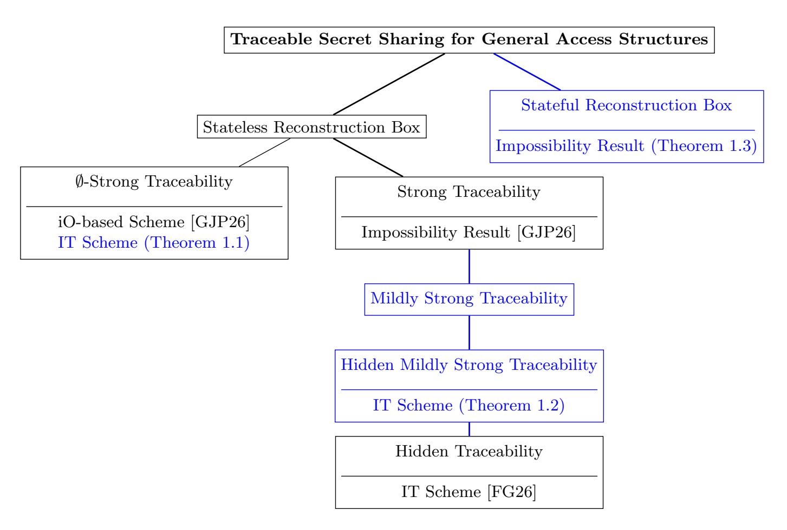

{0}------------------------------------------------

# Information-Theoretic Strong Traceable Secret Sharing Schemes

Oriol Farr`as and Miquel Guiot

Universitat Rovira i Virgili, Tarragona, Spain oriol.farras@urv.cat, miquel.guiot@urv.cat

Abstract. Traceable secret sharing complements traditional schemes by enabling the identification of parties who sell their shares. Recently, two independent works extended traceable secret sharing to general access structures.

Goyal, Jain, and Partap [EC'26] introduced a model in which a reconstruction box is augmented with a label I ⊆ [n] and is only required to distinguish between two secrets when queried with the shares of parties in I. Based on how this label relates to the corrupted set J that built the box, they defined two notions of traceability. If I ∩ J = ∅, the model is called ∅-strong traceability, for which they presented a construction based on indistinguishability obfuscation (iO). Otherwise, their model is called strong traceability, for which they proved an impossibility result. Farr`as and Guiot [EC'26] proposed a different model, which we call hiding traceability, where the reconstruction box has no label and the access structure is hidden from the parties.

In this work, we improve traceable secret sharing for general access structures in three directions. First, we present a fully information-theoretic scheme for the ∅-strong traceability model, eliminating the need for strong cryptographic assumptions. This resolves an open question posed by Goyal, Jain, and Partap, who asked what are the minimal assumptions needed in the ∅-strong traceability model.

Second, motivated by the impossibility of strong traceability, we introduce a relaxed notion called hidden mildly strong traceability. This model is relevant in practice and bridges the strong and hidden models. For this setting, we present an information-theoretic scheme for general access structures.

Finally, we consider the more general model of stateful traceability, where reconstruction boxes may keep state across queries, and we prove an impossibility result for this setting.

Keywords: Secret sharing scheme · traceability · information-theoretic security

{1}------------------------------------------------

# Table of Contents

| 1 | Introduction                                                   |                                                | 3  |    |
|---|----------------------------------------------------------------|------------------------------------------------|----|----|
|   | 1.1                                                            | Our Results                                    | 4  |    |
|   | 1.2                                                            | Our Techniques                                 | 6  |    |
|   | 1.3                                                            | Related Work                                   | 11 |    |
|   | 1.4                                                            | Open Questions                                 | 12 |    |
|   | 1.5                                                            | Organization                                   | 13 |    |
| 2 | Preliminaries                                                  |                                                |    |    |
|   | 2.1                                                            | Notation                                       | 13 |    |
|   | 2.2                                                            | Secret Sharing Schemes                         | 14 |    |
|   | 2.3                                                            | Hiding Secret Sharing                          | 15 |    |
|   | 2.4                                                            | Traceable Secret Sharing Schemes               | 16 |    |
|   | 2.5                                                            | Strong Traceable Secret Sharing Schemes        | 17 |    |
|   | 2.6                                                            | Hiding Traceable Secret Sharing Schemes        | 20 |    |
| 3 | An Information-Theoretic ∅-Strong Traceable Scheme             |                                                | 22 |    |
|   | 3.1                                                            | An Overview of the Algorithms                  | 22 |    |
|   | 3.2                                                            | The Scheme                                     | 25 |    |
|   | 3.3                                                            | Proof of Theorem 3.1                           | 25 |    |
| 4 | An Information-Theoretic Hiding Mildly Strong Traceable Scheme |                                                |    | 32 |
|   | 4.1                                                            | The Mildly Strong Traceability Model<br>       | 32 |    |
|   | 4.2                                                            | The Hiding Mildly Strong Traceability Model    | 35 |    |
|   | 4.3                                                            | Minimal Covering Families of Access Structures | 37 |    |
|   | 4.4                                                            | An Overview of the Algorithms                  | 38 |    |
|   | 4.5                                                            | The Scheme                                     | 40 |    |
|   | 4.6                                                            | Proof of Theorem 4.10                          | 40 |    |
|   | 4.7                                                            | Further Optimizations                          | 45 |    |
| 5 |                                                                | Impossibility of Stateful Tracing              | 46 |    |
|   | 5.1                                                            | Definitions                                    | 46 |    |
|   | 5.2                                                            | Reduction to a Single Query Reconstruction Box | 48 |    |
|   | 5.3                                                            | An Impossibility Result                        | 49 |    |

{2}------------------------------------------------

# <span id="page-2-0"></span>1 Introduction

A secret sharing scheme is a cryptographic primitive in which a dealer distributes a secret among a set of parties so that only specific subsets, called authorized, can reconstruct it. The family of authorized subsets defines the access structure of the scheme and its key efficiency measure is the size of the shares given to the parties.

Secret sharing was independently introduced by Shamir [\[Sha79\]](#page-51-0) and Blakley [\[Bla79\]](#page-50-0) in 1979. Both constructions considered threshold access structures, where any subset of parties can recover the secret as long as its size exceeds a fixed threshold. Since then, secret sharing has become a standard tool in cryptography, with applications such as secure multiparty computation and threshold cryptography. Even though threshold schemes cover many of these use cases, some applications require more flexible access control.

This motivated the study of secret sharing for general access structures, i.e. for any monotone collection of subsets of parties. Such schemes were first proposed by Ito, Saito, and Nishizeki [\[ISN87\]](#page-51-1), and later work focused on improving their efficiency [\[BL88,](#page-50-1)[LV18](#page-51-2)[,ABF](#page-49-0)+19[,ABNP20](#page-49-1)[,AN21\]](#page-49-2). Despite this progress, the best known information-theoretic constructions for general access structures still require shares of exponential size, in the worst case.

Secret sharing schemes provide privacy guaranties against unauthorized subsets, but, by default, do not address other forms of dishonest behavior. In particular, they do not prevent parties from copying or selling their shares, which can be problematic in settings where such behavior is beneficial and goes unpunished.

To circumvent this limitation, Goyal, Song, and Srinivasan [\[GSS21\]](#page-50-2), and later Boneh, Partap, and Rotem [\[BPR24\]](#page-50-3), introduced traceable secret sharing schemes. In those schemes, it is assumed that an adversary uses the shares of an unauthorized subset to build a reconstruction box that can recover the secret when given enough valid shares. This box is assumed to be obtained by the authorities, who interact with it in a black-box manner to trace it back to its creators. In this context, a traceable secret sharing scheme must guarantee traceability, meaning that at least one party involved in building the box can be identified, and non-imputability, which ensures that honest parties are not falsely accused, while keeping the secret hidden during the tracing process. To support the tracing procedure, the sharing algorithm outputs not only the individual shares, but also a tracing key and a verification key. The tracing key is given to the tracer and is used to generate a proof linking the reconstruction box to one or more corrupted parties. The verification key is given to a verifier and allows checking the validity of the proof produced by the tracer.

Recently, two independent works extended traceable secret sharing to general access structures. On the one hand, Goyal, Jain, and Partap [\[GJP26\]](#page-50-4) introduced a model for general access structures in which a reconstruction box is augmented with a label I ⊆ [n]. The box is only required to distinguish between two possible secrets when queried with all the shares of parties in I. Based on how this label relates to the corrupted set J that built the box, they defined two traceability notions. If I ∩ J = ∅, the model is called ∅-strong traceability, for which 

{3}------------------------------------------------

they presented an efficient construction for general access structures relying on indistinguishability obfuscation (iO). If I ∩ J ̸= ∅, the model is called strong traceability, for which they showed an impossibility result.

On the other hand, Farr`as and Guiot [\[FG26\]](#page-50-5) proposed a different generalization in which the reconstruction box has no label. Instead, the box is required to distinguish between two fixed secrets when queried with the shares of any subset of parties that, together with the ones that built the box, form an authorized set. This model, which we refer to as hiding traceability, has the additional feature that the access structure of the scheme is hidden from the parties. Rather than knowing the exact access structure, parties are only given a family of access structures that contains it. Within this setting, they presented an informationtheoretic traceable secret sharing scheme.

Although the two generalizations are close in spirit, as discussed above, they differ in key aspects. This paper builds on both approaches, with the aim of improving them and providing a common framework that makes their connections explicit.

### <span id="page-3-0"></span>1.1 Our Results

This work improves traceable secret sharing schemes for general access structures in three main directions. First, we provide a fully information-theoretic scheme for the ∅-strong traceability model, eliminating the need to rely on strong cryptographic assumptions. Then, we introduce a relaxation of strong traceability, called hidden mildly strong traceability, that is relevant in practice and bridges the strong traceability model of [\[GJP26\]](#page-50-4) and the hidden traceability model of [\[FG26\]](#page-50-5). For this model, we provide an information-theoretic scheme for general access structures. Finally, we study the more general setting of stateful tracing, where reconstruction boxes can store information about previous queries, and we prove an impossibility result for this setting.

All our contributions, prior work on traceable secret sharing for general access structures, and their relations are presented in Fig. [1.](#page-4-0)

Information-theoretic ∅-Strong Traceable Schemes. Our first contribution is the construction of an information-theoretic scheme for general access structures in the ∅-strong traceability model. Unlike the previous construction in this model, our scheme does not rely on iO or any other cryptographic assumption, demonstrating that no computational assumption is needed. This resolves an open question posed by Goyal, Jain, and Partap [\[GJP26\]](#page-50-4), who asked what assumptions are required to build schemes in this tracing model. The statement is as follows.

<span id="page-3-1"></span>Theorem 1.1 (Informal). For any access structure over n parties, there exists a traceable secret sharing scheme with perfect privacy and statistical correctness, ∅-strong traceability and strong non-imputability. Moreover, the tracing procedure only requires a polynomial number of queries to the reconstruction box.

{4}------------------------------------------------

<span id="page-4-0"></span>

Fig. 1: Taxonomy of traceable secret sharing schemes for general access structures. The contributions of this work are highlighted in blue.

Indeed, our construction can be viewed as an efficient compiler: starting from the DNF-based information-theoretic secret sharing scheme for general access structures, it upgrades it with traceability at the cost of a polynomial increase in the share size.

Information-theoretic Hidden Mildly Strong Traceable Schemes. Next, motivated by the impossibility result for the strong traceability model [\[GJP26\]](#page-50-4), we introduce a relaxed version, which we call mildly strong traceability, that circumvents this limitation. In this relaxation, the reconstruction box is required to recover the secret not only when given all the shares of the parties in the label I, but also when given shares from any subset I ′ ⊆ I that, together with the corrupted parties, forms an authorized set. This model is relevant in practice, as it allows adversaries to build a reconstruction box that works for multiple potential buyers (all authorized subsets I ′ ⊆ I), rather than being tailored to a single specific buyer (the full subset I). Further details are provided in Section [4.1.](#page-31-1)

<span id="page-4-1"></span>Then, we point out some inherent limitations of the mildly strong model: in particular, traditional schemes cannot provide any efficient tracing strategy. To address this, we take advantage of the hiding technique of [\[FG26\]](#page-50-5), which motivates the definition of the hidden mildly strong model. This model is identical to the mildly strong one, except that now the access structure is hidden from the parties. For this model, we present an information-theoretic traceable scheme for general access structures, stated below.

{5}------------------------------------------------

Theorem 1.2 (Informal). For any access structure over n parties, there exists a traceable secret sharing scheme with perfect privacy and statistical correctness, hidden mildly strong traceability and hidden non-imputability. Moreover, the tracing procedure only requires a polynomial number of queries to the reconstruction box.

Impossibility of Stateful Tracing. Finally, we consider the more general setting in which the reconstruction box built by the corrupted parties is stateful, meaning it can maintain internal state and adapt its behavior based on the sequence of input queries. In this context, we define the stateful traceability model, which captures the weakest meaningful notion of stateful reconstruction boxes: boxes labeled by I that are required to output the full secret for any input query containing shares of a subset I ′ ⊆ I that, together with the corrupted parties, forms an authorized set. For this model, we prove the following impossibility result.

<span id="page-5-1"></span>Theorem 1.3 (Informal). There is no traceable secret sharing scheme for general access structures that achieves simultaneously stateful traceability and stateful non-imputability.

### <span id="page-5-0"></span>1.2 Our Techniques

In this section, we outline the main ideas behind our results. We first explain how traceability can be achieved in the ∅-strong model without relying on cryptographic assumptions. We then discuss the limitations of the mildly strong traceability model and show how these can be addressed by hiding the access structure. Finally, we sketch the arguments that lead to our impossibility result for stateful tracing.

Information-theoretic ∅-Strong Traceable Schemes. Our tracing strategy closely follows that of Goyal, Jain, and Partap [\[GJP26\]](#page-50-4), but replaces the use of iO with information-theoretic techniques. Therefore, we begin by briefly recalling their construction and the main challenges they faced, and then explain how their approach can be adapted to an information-theoretic setting.

The tracing strategy of [\[GJP26\]](#page-50-4) is based on observing jumps in the behavior of the reconstruction box for distinct input queries. First, the tracer queries the reconstruction box with crafted shares for the label I that reconstruct to a fake secret s ∗ . Then, the tracer repeatedly queries the box with carefully chosen inputs that selectively disable parties outside I in a way that is hidden from the box. In this context, disabling a party j means that the input shares are set so that the share of the party j cannot contribute to the reconstruction. As the tracer gradually disables parties outside I one by one, there must be a point where the behavior of the box changes noticeably. This change, the so called jump, indicates that the disabled party was necessary for the box to work, and therefore belongs to the corrupted subset of parties that built it.

{6}------------------------------------------------

Once a corrupt party is identified, the tracer must still produce a verifiable proof of guilt. To this end, each party is assigned a random hidden identifier. The tracer then prepares inputs that selectively disable the corrupted party depending on the value of individual bits of its identifier. By repeatedly applying the same jump-based tracing strategy with these tailored inputs, the tracer can extract the identifier bit by bit, which can be used as a proof against that corrupted party.

Realizing this tracing strategy poses three main challenges. First, the tracer must be able to generate fake shares that reconstruct to a tracer-chosen fake secret. Second, the tracer must be able to modify the input shares so as to selectively disable parties one by one. Third, the tracer must be able to craft input shares that conditionally disable a party based on its identifier. To overcome these obstacles, Goyal, Jain, and Partap [\[GJP26\]](#page-50-4) rely on indistinguishability obfuscation. Specifically, they design a modified reconstruction algorithm that natively supports these additional functionalities, obfuscate it using iO, and ensure that any reconstruction box must invoke this obfuscated procedure to recover the secret. We refer to [\[GJP26\]](#page-50-4) for further details in their construction.

We next show how information-theoretic techniques can be used to overcome these challenges. In particular, our construction relies on the general additive scheme for the DNF representation of an access structure. Recall that this scheme works by additively sharing the secret for each minimal authorized subset of Γ. As we will see, this scheme possesses several properties that are particularly useful for our construction.

First, we show how to enable the tracer to craft shares that reconstruct to a fake secret. The idea is simple: perform independent sharings of different secrets. Instead of only sharing the real secret s among the access structure Γ, the dealer also independently shares a fake secret s <sup>∗</sup> among Γ and gives a copy of all these shares to the tracer as part of the tracing key. Since the shares of s <sup>∗</sup> are indistinguishable from those of s, the tracer can use the corresponding shares of the parties in I as input to the reconstruction box, which will then output the desired fake secret s ∗ .

However, this introduces a problem for honest parties: during reconstruction, they would now reconstruct both the real and the fake secret, with no obvious way to distinguish the real one. To solve this, we use the indicator technique of Farr`as and Guiot [\[FG26\]](#page-50-5). Specifically, for each secret, we also share a value 0 that acts as an indicator for the correct secret to reconstruct. During the sharing of the fake secret, for each minimal authorized subset, we replace the indicator share of one of its parties with a uniformly random value. This ensures that, during reconstruction, only the indicators corresponding to the real secret sum to 0, allowing honest parties to identify it.

Furthermore, when tracing, we must ensure that all corrupted parties possess valid shares of the fake secret s ∗ ; otherwise, the reconstruction box would fail to reconstruct it. To guarantee this, we perform the independent sharing of the fake secret for each minimal authorized subset multiple times, once for each party in 

{7}------------------------------------------------

it, ensuring that, in each instance, a different party's share is replaced with a uniformly random value.

Next, we observe that the DNF-based scheme greatly simplifies the tracer's task of disabling parties outside I. To disable a party j, the tracer only needs to replace with uniformly random values the share components of the crafted shares for parties in I that correspond to minimal authorized subsets also containing the party j. During reconstruction, the indicators for these subsets will no longer sum to 0 and therefore will be ignored, effectively removing party j from the reconstruction process.

Finally, it remains to enable the tracer to conditionally disable a party j depending on a bit of its indicator  $\mathrm{id}_j$ . To do so, we combine the two previously used tricks. For each bit k of  $\mathrm{id}_j$ , we independently share the fake secret  $s^*$  among the minimal authorized subsets containing j. In this case, we store in the tracing key all the shares except for that of the party j. As before, for each of these sharings, we replace with uniformly random values the share of a party  $i \neq j$  to prevent interference during honest reconstruction. Additionally, if the k-th bit of  $\mathrm{id}_j$  is 0, we replace the share of party j with a uniformly random value. As in the previous case, this process is repeated for each minimal authorized subset multiple times, once per party in the subset distinct from j, so that in each instance a different party's share is randomized.

Using this setup, to extract the k-th bit of  $\mathrm{id}_j$ , the tracer queries the reconstruction box with the shares of parties in I and observes the output. If the box returns the fake secret  $s^*$ , then the share of the party j was not replaced and  $\mathrm{id}_j^k = 1$ . Otherwise, if the box does not return the secret, then  $\mathrm{id}_j^k = 0$ .

Once all these challenges are addressed, we can apply the jump-based tracing strategy of [GJP26] to this modified DNF-based scheme to obtain our information-theoretic  $\emptyset$ -strong traceable scheme. To consolidate the ideas and make the construction more tangible, we next illustrate its functioning with a toy example.

Example 1.4. Consider the access structure  $\Gamma$  on three parties  $p_1, p_2, p_3$  given by

$$\Gamma = \{\{p_1, p_2\}, \{p_2, p_3\}, \{p_1, p_2, p_3\}\}.$$

Let  $\mathbb{Z}_m$  be the ring of integers modulo m for a sufficiently large m, let  $s \in \mathbb{Z}_m$  be the secret. For simplicity, we consider the case that the corrupted party  $p_3$  constructed a reconstruction box R with label  $I = \{p_2\}$ , and we only illustrate the sharing and tracing steps needed for this particular case.

First, we show how to share the secret s among  $\Gamma$ :

1. For each minimal authorized subset in I', share the secret s and the indicator 0 independently with the additive scheme:

$$\begin{split} \mathrm{sh}_1^s &= \{(r_{1,2}^0, r_{1,2}^s)\}, & \mathrm{sh}_2^s &= \{(-r_{1,2}^0, s - r_{1,2}^s)(r_{2,3}^0, r_{2,3}^s)\}, \\ \mathrm{sh}_3^s &= \{(-r_{2,3}^0, s - r_{2,3}^s)\}. \end{split}$$

2. For each minimal authorized subset in  $\Gamma$ , share the fake secret  $s^*$ , store all the shares in the tracing key tk and replace the share of the party  $p_2$  by

{8}------------------------------------------------

uniformly random values:

$$\begin{split} \mathsf{tk} \ll \mathsf{sh}_1^{s^*} &= \{ (r_{1,2}^0, r_{1,2}^{s^*}) \}, \\ \mathsf{tk} \ll \mathsf{sh}_3^{s^*} &= \{ (r_{1,2}^0, r_{1,2}^{s^*}), (r_{2,3}^0, r_{2,3}^{s^*}) \}, \\ \mathsf{tk} \ll \mathsf{sh}_3^{s^*} &= \{ (-r_{2,3}^0, s^* - r_{2,3}^{s^*}) \}, \\ \end{split} \\ \mathsf{tk} \ll \mathsf{sh}_2^{s^*} &= \{ (-r_{1,2}^0, s^* - r_{1,2}^{s^*}), (r_{2,3}^0, r_{2,3}^{s^*}) \}, \\ \end{split}$$

where the blue color indicates that these shares are not the result of any sharing process, but are instead sampled uniformly at random from  $\mathbb{Z}_m$ .

3. Assign a uniformly random 2-bit identifier to  $p_3$  and store it in the verification key vk:

$$id_3 = 01, \quad vk \ll id_3.$$

4. For each bit of  $id_3$ , i.e. for the bits  $id_3^1 = 0$  and  $id_3^2 = 1$ , do the following: share the fake secret  $s^*$  for the minimal authorized subset in  $\Gamma$  containing  $p_3$ , i.e.  $\{p_2, p_3\}$ , store the share of  $p_2$  in the tracing key, replace the share of  $p_2$  by uniformly random values, and replace the share of  $p_3$  by uniformly random values if  $id_3^b = 0$ :

$$\begin{split} \mathsf{sh}_2^{3,1} &= \{ (r_{2,3}^0, r_{2,3}^{3,1}) \}, \\ \mathsf{sh}_3^{3,1} &= \{ (r_{2,3}^0, r_{2,3}^{3,1}) \}, \\ \mathsf{sh}_3^{3,1} &= \{ (r_{2,3}^0, r_{2,3}^{3,1}) \}, \\ \mathsf{tk} &\ll \mathsf{sh}_2^{3,1} &= \{ (r_{2,3}^0, r_{2,3}^{3,1}) \}, \\ \end{split}$$

The sharing steps to enable traceability against the parties  $p_1$  and  $p_3$  are analogous. Next, we show how to trace back the corrupted subset  $\{p_3\}$ :

1. Query the reconstruction box R with the share  $\mathsf{sh}_2^{s*}$  stored in  $\mathsf{tk}$ . Assuming that R is good, it will recover the fake secret  $s^*$ :

$$s^* \leftarrow R(\mathsf{sh}_2^{s*}).$$

- 2. Observe that the box is able to recover the fake secret.
- 3. Now, disable  $p_1$  by replacing the corresponding share component of  $\mathsf{sh}_2^{s*}$  with uniformly random values:

$${\sf sh}_2^{s*} = \{(r_{1,2}^0, r_{1,2}^{s^*}), (r_{2,3}^0, r_{2,3}^{s^*})\}.$$

4. Query the reconstruction box R with the modified share  $\mathsf{sh}_2^{s*}$ :

$$s^* \leftarrow R(\mathsf{sh}_2^{s*}).$$

- 5. Since the behavior of the box has not changed, keep disabling parties.
- 6. Disable  $p_3$  by replacing the corresponding share component of  $\mathsf{sh}_2^{s*}$  with (new) uniformly random values:

$$\mathsf{sh}_2^{s*} = \{(r_{1,2}^0, r_{1,2}^{s^*}), (r_{2,3}^0, r_{2,3}^{s^*})\}.$$

7. Query the reconstruction box R with the modified share  $sh_2^{s*}$ :

$$\perp \leftarrow R(\mathsf{sh}_2^{s*}).$$

{9}------------------------------------------------

- 8. Since the behavior of the box has changed, identify  $p_3$  as the corrupted party and move to recover its identifier, which will be used as the accusation proof.
- 9. Query the reconstruction box R with the share  $sh_2^{3,1}$  stored in tk:

$$\perp \leftarrow R(\mathsf{sh}_2^{3,1}).$$

- 10. Since the box does not return the fake secret  $s^*$ , set  $\mathsf{id}_3^1 = 0$ . 11. Query the reconstruction box R with the share  $\mathsf{sh}_2^{3,2}$  stored in  $\mathsf{tk}$ :

$$s^* \leftarrow R(\mathsf{sh}_2^{3,2}).$$

- 12. Since the box returns the fake secret  $s^*$ , set  $id_3^2 = 1$ .
- 13. Use the identifier  $id_3 = 01$  as a proof  $\pi$  against  $p_3$ .
- 14. The verifier checks whether the proof  $\pi$  coincides with the identifier of  $p_3$ stored in the verification key vk.

Information-theoretic Hidden Mildly Strong Traceable Schemes. Before discussing the mildly strong and hidden mildly strong models, we recall the impossibility from [GJP26] for strong traceability. It is proved that no traceable secret sharing scheme for general access structures can simultaneously satisfy strong traceability and tracer secrecy (or strong non-imputability). The core reason is simple: since  $I \cap J \neq \emptyset$  and the reconstruction box requires the shares of all parties in I, any tracing procedure must be able to reconstruct the exact shares of the parties in  $I \cap J$  from the tracing key alone, which violates either tracer secrecy or non-imputability.

Notice that this impossibility no longer applies in the mildly strong traceability model. In this setting, the tracer is not required to use all the shares of the parties in I as input queries, which in principle allows it to avoid the shares of parties in  $I \cap J$ . However, this raises a new challenge: without any additional knowledge of I, how can the tracer know which parties to avoid? This difficulty is precisely what shows that traditional secret sharing schemes are insufficient for tracing in the mildly strong model. In fact, for certain choices of  $\Gamma$ , I, and J, the tracer may need an exponential number of queries on average to find a valid input query. See Example 4.3 for further details.

We can overcome this issue with the following approach: by hiding the access structure from the parties, the tracer can make the reconstruction box believe that the subset  $J \cup \{i\}$  is authorized for some  $i \in J \setminus I$ . This reduces the complexity dramatically: instead of potentially requiring an exponential number of queries, the tracer now needs to perform at most |I| queries to find a valid one.

Once the difficulty caused by the intersection  $I \cap J$  is addressed by hiding the access structure, the hiding mildly strong traceability model naturally follows. The remaining steps of the tracing procedure then adopt the approach of Farràs and Guiot [FG26], to which we refer for a detailed description of the traceable scheme.

<span id="page-9-0"></span><sup>&</sup>lt;sup>1</sup> Notice that  $J \setminus I \neq \emptyset$  because  $I \cup J$  is authorized but J alone is not.

{10}------------------------------------------------

Impossibility of Stateful Tracing. Our impossibility result is based in the following key insights. First, observe that since there is only one real secret, a stateful reconstruction box can, after receiving a valid input query and reconstructing the secret, ignore subsequent queries and continue outputting the same secret.[2](#page-10-1)

This behavior remains consistent with that of a good reconstruction box, because if the first valid query consists of real shares, the box will always output the correct secret. This observation implies that any tracing procedure for a stateful reconstruction box must rely on just a single valid input query, since the box's behavior may depend exclusively on that first query.

Once this observation is in place, notice that to satisfy non-imputability, any two reconstruction boxes Rp<sup>1</sup> and Rp<sup>2</sup> built by parties p<sup>1</sup> and p<sup>2</sup> must behave differently on any valid input query q for both parties. Otherwise, the tracer would be unable to distinguish whether the box was constructed by p<sup>1</sup> or p2.

Consequently, if two parties p<sup>1</sup> and p<sup>2</sup> are equivalent, i.e. they play the same role in the access structure, the corrupted subset {p1, p2} can construct a reconstruction box Rp1,p<sup>2</sup> that effectively evades tracing. Specifically, Rp1,p<sup>2</sup> internally simulates R<sup>p</sup><sup>1</sup> and R<sup>p</sup><sup>2</sup> , compares their outputs, and outputs ⊥ whenever a discrepancy is detected.

This strategy becomes particularly problematic for access structures where four parties have an equivalent role. In such cases, any disjoint pair of these parties can construct a reconstruction box as described above. As a result, disjoint subsets of parties can produce boxes with identical behavior, violating the non-imputability requirement of the scheme.

# <span id="page-10-0"></span>1.3 Related Work

The notion of traceable secret sharing was first studied by Goyal, Song, and Srinivasan [\[GSS21\]](#page-50-2). They considered threshold access structures and proposed a construction based on the Goldreich–Levin decoding algorithm [\[GL89\]](#page-50-6). Boneh, Partap, and Rotem [\[BPR24\]](#page-50-3) later revisited this notion and introduced a different traceability model. They presented two constructions for threshold access structures, based respectively on Shamir's secret sharing scheme [\[Sha79\]](#page-51-0) and Blakley's scheme [\[Bla79\]](#page-50-0). A key feature of their constructions is that they incur only a constant-factor overhead in share size compared to standard secret sharing. Notably, their construction based on Blakley's scheme is, to date, the only known traceable secret sharing scheme that works against stateful adversaries. Their work also provides a careful comparison between the two traceability models, which we refer to for further details.

Since then, several works have explored different aspects of traceable secret sharing. Hoffmann [\[Hof24\]](#page-51-3) proposed a construction based on the Chinese Remainder Theorem for weighted threshold access structures, while Leslie and Dutta [\[LD25\]](#page-51-4) focused on standard threshold access structures. Baghery et al.

<span id="page-10-1"></span><sup>2</sup> For a valid input query, we refer to a query consisting of shares (genuine or crafted by the tracer) for a subset I ′ ⊆ I such that I ′ ∪ J ∈ Γ.

{11}------------------------------------------------

[\[BEMS25\]](#page-49-3) introduced traceable verifiable secret sharing schemes for threshold access structures. Other extensions include traceable bottom-up secret sharing by Hajra et al. [\[HKMP25\]](#page-50-7), tracing schemes with public verifiability by Luong et al. [\[LPLK25\]](#page-51-5), and constructions supporting public tracing by Dey et al. [\[DHKP26\]](#page-50-8).

More recently, two works are particularly relevant to this paper, as they extend traceable secret sharing to general access structures. Goyal, Jain, and Partap [\[GJP26\]](#page-50-4) introduced the notions of ∅-strong and strong traceability. They presented an efficient construction for the ∅-strong model based on indistinguishability obfuscation, and proved an impossibility result for the strong traceability model. In contrast, Farr`as and Guiot [\[FG26\]](#page-50-5) proposed an information-theoretic construction for general access structures in a related but distinct model, and their tracing strategy relies on hiding the access structure from the parties. The similarities, differences, and connections between these two models are discussed in more detail in Section [2.4.](#page-15-0)

Finally, other works proposed notions closely related to traceable secret sharing, including secret sharing with snitching [\[DFLM24,](#page-50-9)[BDF](#page-49-4)+25], traceable verifiable random functions [\[BPR25\]](#page-50-10), and deniable secret sharing [\[CDK](#page-50-11)<sup>+</sup>26].

### <span id="page-11-0"></span>1.4 Open Questions

Our results point to several open problems in the study of traceable secret sharing schemes. Below, we highlight four directions in which future work could lead to notable improvements over the current state of the art.

Information-theoretic Traceable Secret Sharing. The only informationtheoretic secret sharing primitives for tracing in general access structures are the ones presented in this work and in [\[FG26\]](#page-50-5). In both cases, the share size is exponential in the number of participants. We cannot hope for a traceable secret sharing scheme with sub-exponential share size without improving the current best secret sharing constructions [\[LV18](#page-51-2)[,ABF](#page-49-0)+19[,ABNP20](#page-49-1)[,AN21\]](#page-49-2), that also have exponential share size in the worst case. However, since our construction acts as a compiler for the DNF-based scheme, it is natural to ask whether a similar transformation can be obtained for information-theoretic secret sharing schemes built from more efficient representations of the access structure, such as monotone formulas.

Lower Bounds on Traceable Secret Sharing. Regarding tracing limitations, there are no known lower bounds on the share size of information-theoretic tracing secret sharing besides the ones for secret sharing, which are exponential for linear schemes [\[BF20,](#page-50-12)[BGW99,](#page-50-13)[PR18](#page-51-6)[,RBG01\]](#page-51-7) and sublinear for general constructions [\[Csi97\]](#page-50-14).

{12}------------------------------------------------

Bridging the Gap Between Information-theoretic and Computational  $\emptyset$ -Strong Traceable Secret Sharing. Currently, there are two distinct constructions for the  $\emptyset$ -strong tracing model. The scheme presented in this work is information-theoretic but has exponential share size, while the construction of Goyal, Jain, and Partap [GJP26] is efficient (its share size scales with the size of the circuit representing the access structure) but relies on iO. An open problem is whether this gap can be bridged with computational tracing schemes that are secure under weaker assumptions (such as OWF) and still retain efficiency.

Mildly Strong Traceable Secret Sharing Schemes. In this work, we introduced mildly strong traceability as a relaxation of the strong traceability model of Goyal, Jain, and Partap [GJP26], for which an impossibility result was shown. We presented a traceable scheme for this relaxed model, at the cost of hiding the access structure from the parties. It is still an open question to determine if hiding the access structure is indeed necessary, or if there are less restrictive properties that allow tracing.

### <span id="page-12-0"></span>1.5 Organization

In Section 2, we present the notation used in this work and the preliminaries on tracebale secret sharing schemes. In Section 3, we present the information-theoretic  $\emptyset$ -strong traceable scheme of Theorem 1.1. In Section 4, we introduce the mildly strong and hidden mildly strong models, discuss their limitations, and present the information-theoretic hidden mildly strong traceable scheme of Theorem 1.2. Later, in Section 5, we present the stateful traceability model and the impossibility result of Theorem 1.3.

### <span id="page-12-1"></span>2 Preliminaries

#### <span id="page-12-2"></span>2.1 Notation

We notate  $\mathbb{N}$ ,  $\mathbb{Z}$ , and  $\mathbb{R}$  for the sets of natural, integer, and real numbers, respectively. For  $m \in \mathbb{N}$ , we denote the ring of integers modulo m by  $\mathbb{Z}_m$ , and for any prime power  $q \in \mathbb{N}$ , we notate  $\mathbb{F}_q$  for the finite field of q elements.

For  $n \in \mathbb{N}$ , we denote the set  $\{1, \ldots, n\}$  as [n]. For a set S, we denote its cardinal by |S|, its power set by  $2^S$ , and we denote by  $s \leftarrow_{\$}$  the process of sampling a value s from the uniform distribution over S. For a pair of distributions X, Y defined over the same domain  $\Omega$ , we define the statistical distance between them as  $\mathrm{SD}(X,Y) = \frac{1}{2} \sum_{\omega \in \Omega} |\Pr[X = \omega] - \Pr[Y = \omega]|$ .

We denote vectors  $\boldsymbol{x}$  using bold symbols, their *i*-th coordinates as  $x_i$ , and their support as supp( $\boldsymbol{x}$ ) =  $\{i \in [n] : x_i \neq 0\}$ . The unary vector is denoted by  $\mathbf{1}^n \in \{0,1\}^n$ , and the zero vector is denoted by  $\mathbf{0}^n \in \{0,1\}^n$ .

{13}------------------------------------------------

### <span id="page-13-0"></span>2.2 Secret Sharing Schemes

In the following, we present the basics of secret sharing schemes.

Definition 2.1 (Access Structure). Let P = [n] be a set of n parties. A collection Γ ⊆ 2 <sup>P</sup> is monotone if B ∈ Γ and B ⊆ C imply that C ∈ Γ. An n-party access structure is a monotone collection Γ ⊆ 2 <sup>P</sup> of non-empty subsets of P. Sets in Γ are called authorized, and sets not in Γ are called unauthorized.

Sometimes, it is convenient to view an access structure as a monotone Boolean function.[3](#page-13-1)

Definition 2.2. A Boolean function f<sup>Γ</sup> : {0, 1} <sup>n</sup> −→ {0, 1} represents an access structure Γ over n parties if it holds that f<sup>Γ</sup> (x) = 1 if and only if supp(x) ∈ Γ.

Since every access structure Γ is monotone by definition, f<sup>Γ</sup> is also monotone. In this work, we alternate between representing access structures as monotone collections of subsets or as monotone Boolean functions, depending on which representation is more convenient at any given time.

We now define information-theoretic secret sharing schemes.

Definition 2.3 (Secret Sharing Scheme). Let S be a finite set of secrets with |S| ≥ 2, and let Γ be an access structure over n parties. A secret sharing scheme for Γ is a pair of a randomized algorithm Share and deterministic algorithm Reconstruction such that

– Perfect Correctness. For any secret s ∈ S and any authorized set A ∈ Γ, it holds that

$$\mathbf{Pr}[s = \mathsf{Rec}(\mathsf{Share}(s, \Gamma)_A, A)] = 1,$$

where Share(s, Γ)<sup>A</sup> denotes the restriction of the output of Share(s, Γ) to the parties in A.

– Perfect Privacy. For any secrets s, s′ ∈ S, any unauthorized set B ̸∈ Γ, and any possible set of shares {shi}i∈B, it holds that

$$\mathbf{Pr}[\{\mathsf{sh}_i\}_{i\in B} = \mathsf{Share}(s, \Gamma)_B] = \mathbf{Pr}[\{\mathsf{sh}_i\}_{i\in B} = \mathsf{Share}(s')_B].$$

In the above definition, we imposed perfect correctness and privacy: reconstruction must succeed with probability one for every authorized subset, and the distributions of shares held by any unauthorized subset must be identical for any pair of secrets. However, these requirements can be relaxed. Specifically, given a security parameter λ ∈ N, we may require reconstruction to succeed with high probability, and we may allow the distributions corresponding to different secrets on unauthorized subsets to have small statistical distance with respect to λ. These relaxed notions give rise to the definition of statistical secret sharing schemes.

<span id="page-13-1"></span><sup>3</sup> A Boolean function f : {0, 1} <sup>n</sup> −→ {0, 1} is monotone if for every x, y ∈ {0, 1} n such that x ≤ y, it holds that f(x) ≤ f(y).

{14}------------------------------------------------

Definition 2.4 (Statistical Secret Sharing Scheme). Let S be a finite set of secrets with |S| ≥ 2, let λ ∈ N be the security parameter, and let Γ be an access structure over n parties. A statistical secret sharing scheme for Γ is a pair of a randomized algorithm Share and deterministic algorithm Reconstruction such that

– Statistical Correctness. For any secret s ∈ S and any authorized set A ∈ Γ, there exists a negligible function negl such that

$$\mathbf{Pr}[s = \mathsf{Rec}(\mathsf{Share}(\mathbf{1}^{\lambda}, s, \Gamma)_A, A)] \ge 1 - \mathsf{negl}(\lambda),$$

where Share(1 λ , s, Γ)<sup>A</sup> denotes the restriction of the output of Share(1 λ , s) to the parties in A.

– Statistical Privacy. For any secrets s, s′ ∈ S, and any unauthorized set B ̸∈ Γ, there exists a negligible function negl such that

$$\mathrm{SD}(\mathsf{Share}(\mathbf{1}^{\lambda}, s, \Gamma)_B, \mathsf{Share}(\mathbf{1}^{\lambda}, s', \Gamma)_B) \leq \mathrm{negl}(\lambda).$$

In practice, it is common to combine both definitions, leading to schemes that provide perfect correctness with statistical privacy, or statistical correctness with perfect privacy. This hybrid approach is the one we will adopt throughout this work.

### <span id="page-14-0"></span>2.3 Hiding Secret Sharing

In a recent work, Farr`as and Guiot [\[FG26\]](#page-50-5) introduced the notion of hiding secret sharing, which strengthens standard secret sharing by requiring that the access structure itself remain hidden from the parties. Concretely, the access structure Γ used to share the secret is not revealed; instead, the parties are only given a family of access structures F such that Γ ∈ F.

In this setting, any subset of parties A, given their shares, cannot distinguish the actual access structure Γ from any other Γ ′ ∈ F that is consistent with A. That is, Γ and Γ ′ are indistinguishable to A whenever they agree on all subsets of A: a subset of A is authorized in Γ if and only if it is authorized in Γ ′ .

This notion of hiding access structures will play a crucial role later in Section [4,](#page-31-0) where it is used to construct a mildly strong traceable secret sharing scheme for general access structures in the information-theoretic setting. We now give the formal definition.

Definition 2.5 (Hiding Secret Sharing Scheme,[\[FG26\]](#page-50-5)). Let S be a finite set of secrets with |S| ≥ 2, and let F be a family of access structures over n parties. A hiding secret sharing scheme for F is a triple of the following algorithms:

– Share(s, Γ) 7→ {shi}i∈[n] is the randomized share algorithm. It takes as input a secret s ∈ S and an access structure Γ ∈ F. It outputs a set of shares {shi}i∈[n] .

{15}------------------------------------------------

– Rec({shi}i∈A) 7→ s is the deterministic reconstruction algorithm. It takes as input a set of shares for an authorized subset A of some Γ ∈ F. It outputs the secret s.

These algorithms must satisfy the following requirements:

- Restricted Secret Sharing Schemes. For any Γ ∈ F, the restriction of the Share algorithm to Γ together with the Reconstruction algorithm form a secret sharing scheme for Γ.
- Perfect Hideout. For any s ∈ S, k ∈ [n], any subset A ⊆ [n] such that |A| = k, any two access structures Γ, Γ′ ∈ F such that Γ and Γ ′ agree in all subsets of A, and any possible set of k shares {shi}i∈[k] , it holds that

$$\mathbf{P}[\mathsf{Share}(s,\Gamma)_A = \{\mathsf{sh}_i\}_{i \in [k]}] = \mathbf{P}[\mathsf{Share}(s,\Gamma')_A = \{\mathsf{sh}_i\}_{i \in [k]}].$$

In their work, Farr`as and Guiot [\[FG26\]](#page-50-5) introduced an information-theoretic hiding secret sharing scheme for general access structures, defined over a special class of families called covering families. Informally, a family of access structures is a covering family if it satisfies the following property: for every unauthorized subset in any access structure of the family, there exists another access structure in the same family in which this subset is strictly contained in a minimal authorized set. Its definition follows.

Definition 2.6. A family of access structures over n parties F is a covering family if for every Γ ∈ F and every subset A ̸∈ Γ, there exist B ⊆ [n] and Γ ′ ∈ F such that A ⊊ B and B is minimal in Γ ′ .

Remark 2.7. As noted in [\[FG26\]](#page-50-5), for any n ∈ N, the family of all access structures over n parties is a covering family.

### <span id="page-15-0"></span>2.4 Traceable Secret Sharing Schemes

The notion of traceable secret sharing extends traditional secret sharing by adding the ability to identify parties who illegally redistribute their shares. More precisely, a coalition of corrupted parties is assumed to construct a reconstruction box R that, given sufficiently many valid shares as input, is able to reconstruct the secret. The goal is to trace R back to at least one of the corrupted parties using only black-box access to it.

Recently, Goyal, Jain, and Partap [\[GJP26\]](#page-50-4), and Farr`as and Guiot [\[FG26\]](#page-50-5) introduced two closely related, but not equivalent, models of traceable secret sharing for general access structures. We first present the common syntax of [\[FG26,](#page-50-5)[GJP26\]](#page-50-4) and a core definition of information-theoretic traceable secret sharing schemes for general access structures. We then describe the two models in detail, highlighting both their similarities and their key differences.

Definition 2.8 (Traceable Secret Sharing Scheme,[\[FG26,](#page-50-5)[GJP26\]](#page-50-4)). Let S be a finite set of secrets with |S| ≥ 2, and let Γ be an access structure over n parties. A traceable secret sharing scheme for Γ is a quintuple of the following algorithms:

{16}------------------------------------------------

- Share $(s, \Gamma) \mapsto (\{\mathsf{sh}_i\}_{i \in [n]}, \mathsf{tk}, \mathsf{vk})$  is the sharing algorithm. It takes as input parameters the secret s, and the access structure  $\Gamma$ . It outputs a set of shares  $\{\mathsf{sh}_i\}_{i \in [n]}$ , a tracing key  $\mathsf{tk}$  and a verification key  $\mathsf{vk}$ .
- $\text{Rec}(\{sh_i\}_{i\in A}) \mapsto s$  is the deterministic reconstruction algorithm. It takes as input a set of shares  $sh_i$  for an authorized set  $A \in \Gamma$ . It outputs the secret s.
- ShGen(tk, k, param)  $\mapsto \{\mathsf{sh}_i'\}_{i\in[k]}$  is the randomized share generation algorithm. It takes as input a traceable key  $\mathsf{tk} = (\mathsf{vk}_1, ..., \mathsf{vk}_n)$ , a size  $k \in [n]$  and some extra parameters param, and outputs a set of pseudoshares  $\{\mathsf{sh}_i'\}_{i\in[k]}$ .
- Trace<sup>R</sup>(tk)  $\mapsto$   $(I,\pi)$  is the randomized tracing algorithm. It takes as input a tracing key tk =  $(tk_1,...,tk_n)$  and it gets oracle (black-box) access to a reconstruction box R. It outputs a subset  $I \subset [n]$  of identities of leaking parties and an associated proof  $\pi$ .
- Verify(vk,  $I, \pi$ )  $\mapsto$  {0, 1} is the deterministic verification algorithm. It takes as input a verification key vk = (vk<sub>1</sub>, ..., vk<sub>n</sub>), an alleged traitor subset I, and an associated proof  $\pi$ . It outputs 1 (resp. 0) when accepting (resp. rejecting) the proof  $\pi$  that the parties  $\mathcal{I}$  are guilty.

Apart from the standard notions of correctness and privacy, these algorithms must also satisfy the following requirements:

- **Perfect Tracer Privacy.** For any secrets  $s, s' \in \mathcal{S}$ , any unauthorized set A, and any possible set of shares  $\{\mathsf{sh}_i\}_{i\in A}$  and any possible tracing key  $\mathsf{tk}$ , it holds that

$$\mathbf{P}[(\{\mathsf{sh}_i\}_{i\in A},\mathsf{tk}) = \mathsf{Share}(s,\Gamma)_{A,\mathsf{tk}}] = \mathbf{P}[(\{\mathsf{sh}_i\}_{i\in A},\mathsf{tk}) = \mathsf{Share}(s',\Gamma)_{A,\mathsf{tk}}],$$

where  $Share(s, \Gamma)_{A,tk}$  corresponds to the restriction of the Share algorithm to the shares of A and the whole tracing key.

- Perfect Traceability. Depends on the tracing model considered.
- Perfect Non-imputability. Depends on the tracing model considered.

Remark 2.9. Being precise, the ShareGeneration algorithm is not strictly required, as it can be viewed as a subroutine of the Trace algorithm. Nevertheless, for clarity of exposition, we present ShareGeneration separately. This choice allows for a more modular and compartmentalized presentation of the schemes in the subsequent sections.

The main differences between the traceability models of [FG26] and [GJP26] arise in the definition of reconstruction box considered, as well as in the game-based definitions of traceability and non-imputability.

## <span id="page-16-0"></span>2.5 Strong Traceable Secret Sharing Schemes

In the model of Goyal, Jain, and Partap [GJP26], they present the notion of minimally-useful reconstruction box. In this definition, the reconstruction box

<span id="page-16-1"></span><sup>&</sup>lt;sup>4</sup> The extra parameters **param** vary depending on the tracing model considered, and will be explicitly defined later for each of the models.

{17}------------------------------------------------

contains a label consisting of a subset of parties I ⊆ [n], and given the shares of all the parties in I, the box can distinguish whether the shares correspond to one of two possible secrets, s<sup>0</sup> or s1.

Definition 2.10 (Minimally-useful Reconstruction Box). Let S be a finite set of secrets with |S| ≥ 2, let Γ be an access structure over n parties, and let Σ be a traceable secret sharing for Γ. For ϵ ∈ [0, 1 2 ], secrets s0, s<sup>1</sup> ∈ S, a bit b ∈ {0, 1}, an unauthorized subset J ̸∈ Γ, a corresponding set of shares sh = {shi}i∈<sup>J</sup> , and a label I ⊆ [n], a reconstruction box R is (Γ, I, sh, s0, s1, b, ϵ)-minimally-useful if

$$\mathbf{P}[R(\{\mathsf{sh}_i\}_{i\in I}) = b] \ge \frac{1}{2} + \epsilon,$$

where ({shi}i∈[n] ,tk, vk) ← Share(sb, Γ) and the probability is taken over the random coins of R.

Depending on whether I ∩ J = ∅ or not, they present two different notions of traceability: ∅-strong and strong traceability. For each of these concepts, we present both the tracing experiment and the formal definition. We start by presenting the notion of ∅-strong traceability, in which it is required that I ∩J = ∅.

```
Experiment Exp∅−StrongTraceA,Σ,ϵ
```

- 1. (Γ, J, s0, s1,state) ← A(·).
- 2. b ←\$ {0, 1}.
- 3. ({shi}i∈[n] ,tk, vk) ← Share(sb, Γ).
- 4. sh = {shi}i∈<sup>J</sup> .
- 5. (R, I) ← A(state, sh).
- 6. (J ∗ , π) ← Trace<sup>R</sup>(tk).
- 7. GoodBox := (I ∩ J = ∅) ∧ (J ̸∈ Γ) ∧ (I ̸∈ Γ) ∧ (R is (Γ, I, sh, s0, s1, b, ϵ) minimally-useful).
- 8. If (J ∗ ̸⊆ J) ∧ (Verify(vk, J<sup>∗</sup> , π) = 1) then return 1.
- 9. If ¬GoodBox, then return 0.
- 10. If (J ∗ ̸= ∅) ∧ (J <sup>∗</sup> ⊆ J) ∧ (Verify(vk, J<sup>∗</sup> , π) = 1) then return 0, else return 1.

Fig. 2: The tracing experiment for an ∅-strong traceable secret sharing scheme Σ for an access structure Γ.

Definition 2.11 (Perfect ∅-Strong Traceability). Let S be a finite set of secrets with |S| ≥ 2, let Γ be an access structure over n parties, and let Σ be a traceable scheme for Γ. For any ϵ ∈ [0, 1 2 ], Σ is perfect ∅-strong traceable if for every adversary A, it holds that

$$\mathsf{Adv}_{\mathcal{A},\Sigma,\epsilon}^{\emptyset-\operatorname{strongtrac}} \coloneqq \mathbf{P}[\mathbf{Exp}\emptyset - \mathbf{StrongTrace}_{\mathcal{A},\Sigma,\epsilon} = 1] = 0.$$

{18}------------------------------------------------

In contrast, by allowing I ∩J ̸= ∅, we obtain the notion of strong traceability, whose corresponding experiment and formal definition are given next.

```
Experiment ExpStrongTraceA,Σ,ϵ
 1. (Γ, J, s0, s1,state) ← A(·).
 2. b ←$ {0, 1}.
 3. ({shi}i∈[n]
               ,tk, vk) ← Share(sb, Γ).
 4. sh = {shi}i∈J .
 5. (R, I) ← A(state, sh).
 6. (J
       ∗
        , π) ← TraceR(tk).
 7. GoodBox := (J ̸∈ Γ) ∧ (I ̸∈ Γ) ∧ (R is (Γ, I, sh, s0, s1, b, ϵ)-minimally-useful).
 8. If (J
         ∗
           ̸⊆ J) ∧ (Verify(vk, J∗
                                 , π) = 1) then return 1.
 9. If ¬GoodBox, then return 0.
10. If (J
         ∗
           ̸= ∅) ∧ (J
                     ∗ ⊆ J) ∧ (Verify(vk, J∗
                                             , π) = 1) then return 0, else return 1.
```

Fig. 3: The tracing experiment for a strong traceable secret sharing scheme Σ for an access structure Γ. The steps highlighted in blue indicate the differences compared to the tracing experiment of Fig. [2.](#page-17-0)

Definition 2.12 (Perfect Strong Traceability). Let S be a finite set of secrets with |S| ≥ 2, let Γ be an access structure over n parties, and let Σ be a traceable scheme for Γ. For any ϵ ∈ [0, 1 2 ], Σ is perfect strong traceable if for every adversary A, it holds that

$$\mathsf{Adv}^{\mathrm{strongtrac}}_{\mathcal{A}, \Sigma, \epsilon} \coloneqq \mathbf{P}[\mathbf{ExpStrongTrace}_{\mathcal{A}, \Sigma, \epsilon} = 1] = 0.$$

With respect to non-imputability, both the ∅-strong and strong traceability models rely on the same experiment and definition, which we state next.

<span id="page-18-2"></span>Definition 2.13 (Perfect Strong Non-imputability). Let S be a finite set of secrets with |S| ≥ 2, let Γ be an access structure over n parties, and let Σ be a traceable scheme for F. Then, Σ is strong non-imputable if for every adversary A, it holds that

$$\mathsf{Adv}^{\mathrm{strongni}}_{\mathcal{A},\Sigma} \coloneqq \mathbf{P}[\mathbf{ExpStrongNI}_{\mathcal{A},\Sigma} = 1] = 0.$$

<span id="page-18-0"></span>Remark 2.14. Note that strong traceability is strictly stronger than ∅-strong traceability. Nevertheless, both models are of independent interest. Goyal, Jain, and Partap [\[GJP26\]](#page-50-4) constructed an ∅-strong traceable scheme based on indistinguishability obfuscation, while also proving an impossibility result for the strong traceability model. Specifically, they showed that no traceable secret sharing scheme for general access structures can simultaneously achieve strong traceability and tracer secrecy or non-imputability.

{19}------------------------------------------------

```
Experiment \mathbf{ExpStrongNI}_{\mathcal{A}, \Sigma}
```

```
1. (\Gamma, i^*, s, \text{state}) \leftarrow \mathcal{A}(\cdot).
```

- 2.  $(\{\mathsf{sh}_i\}_{i\in[n]},\mathsf{tk},\mathsf{vk})\leftarrow\mathsf{Share}(s,\varGamma).$
- 3.  $(J^*, \pi) \leftarrow \mathcal{A}(\mathsf{state}, \{\mathsf{sh}_i\}_{i \in [n] \setminus \{i^*\}}, \mathsf{tk}).$
- 4. If  $(i^* \in J^*) \wedge (\mathsf{Verify}(\mathsf{vk}, J^*, \pi) = 1)$  then return 1, else return 0.

Fig. 4: The non-imputability experiment a traceable secret sharing scheme  $\Sigma$  with access structure  $\Gamma$ .

### <span id="page-19-0"></span>2.6 Hiding Traceable Secret Sharing Schemes

The model introduced by Farràs and Guiot [FG26], which we refer to in this work as hiding traceability, differs from the model in [GJP26] primarily in that it is built on a hiding secret sharing scheme. As a result, neither the parties nor the adversary are aware of the actual access structure used to share the secret; they only know the family of access structures to which it belongs. This additional hiding property is the key source of the differences with respect to the strong traceability setting, and it is precisely what enables traceability in this model. In Section 4, we further clarify the relationship between the two models by showing how the hiding traceability setting can be related to, and embedded within, the strong traceability framework.

We start by introducing the notion of hiding-good reconstruction box. In this case, hiding traceable schemes are defined with respect to a family of access structures, and the notion of reconstruction boxes must be adapted accordingly. Specifically, we require a hiding-good reconstruction box to behave correctly for all access structures in the family that are compatible with the corrupted subset. That is, for all access structures in which the corrupted parties form an unauthorized set. For each such access structure, the reconstruction box must successfully reconstruct the secret when it is given full shares generated according to that access structure, provided that the shares of the corrupted parties are the same as in the original sharing. This requirement is natural, since the reconstruction algorithm does not depend on the access structure, which remains hidden from the parties.

**Definition 2.15 (Hiding-good Reconstruction Box).** Let S be a finite set of secrets with  $|S| \geq 2$ , let F be a family of access structures over n parties, let  $\Gamma$  be an access structure in F, and let  $\Sigma$  be a traceable secret sharing for F. For  $\epsilon \in [0, \frac{1}{2}]$ , secrets  $s_0, s_1 \in S$ , a bit  $b \in \{0, 1\}$ , an unauthorized subset  $J \notin \Gamma$ , and a corresponding set of shares  $\operatorname{sh} = \{\operatorname{sh}_i\}_{i \in J}$ , a reconstruction box R is  $(F, \operatorname{sh}, s_0, s_1, b, \epsilon)$ -hiding-good if for any access structure  $\Gamma' \in F$  that is consistent with J, any unauthorized subset  $I \notin \Gamma'$  such that  $J \cap I = \emptyset$  and  $J \cup I \in \Gamma'$ , it holds that

$$\mathbf{P}[R(\{\mathsf{sh}_i'\}_{i\in I}=b)] \ge \frac{1}{2} + \epsilon,$$

{20}------------------------------------------------

where the probability is taken over  $(\{\mathsf{sh}_i'\}_{i\in[n]},\mathsf{tk},\mathsf{vk}) \leftarrow \mathsf{Share}(s_b,\Gamma')$  conditioned on  $\{\mathsf{sh}_i'\}_{i\in J} = \mathsf{sh}$ , and the random coins of R.

Once the notion of hiding-good reconstruction boxes is established, we present the definitions of hiding traceability and hiding non-imputability. In general terms, these definitions closely follow those of the strong traceability setting. The main distinction is that the access structure is now hidden from the parties: the adversary neither chooses nor learns the specific access structure used, and instead only knows the family of access structures for which the scheme is defined. To highlight the differences introduced in this setting, all modifications are marked in blue. We start with the notion of hiding traceability.

```
Experiment ExpHidingTrace _{\mathcal{A},\Sigma,\epsilon}

1. (J,s_0,s_1,\mathsf{state}) \leftarrow \mathcal{A}(\mathcal{F}).

2. \Gamma \leftarrow_\$ \mathcal{F} \setminus \bigcup_{\substack{\Gamma' \in \mathcal{F} \\ J \in \Gamma'}} \Gamma'. \triangleright The subset J must be unauthorized in \Gamma.

3. b \leftarrow_\$ \{0,1\}.

4. (\{\mathsf{sh}_i\}_{i \in [n]},\mathsf{tk},\mathsf{vk}) \leftarrow \mathsf{Share}(s_b,\Gamma).

5. \mathsf{sh} = \{\mathsf{sh}_i\}_{i \in J}.

6. R \leftarrow \mathcal{A}(\mathsf{state},\mathsf{sh}).

7. (J^*,\pi) \leftarrow \mathsf{Trace}^R(\mathsf{tk}).

8. \mathsf{GoodBox} \coloneqq (J \not\in \Gamma) \land (R \text{ is } (\mathcal{F},\mathsf{sh},s_0,s_1,b,\epsilon)\text{-hiding-good}).

9. If (J^* \not\subseteq J) \land (\mathsf{Verify}(\mathsf{vk},J^*,\pi) = 1) then return 1.

10. If \neg \mathsf{GoodBox}, then return 0.

11. If (J^* \neq \emptyset) \land (J^* \subseteq J) \land (\mathsf{Verify}(\mathsf{vk},J^*,\pi) = 1) then return 0, else return 1.
```

Fig. 5: The tracing experiment for a hiding traceable secret sharing scheme  $\Sigma$  for a family of access structures  $\mathcal{F}$ . The steps highlighted in blue indicate the differences compared to the tracing experiment of Fig. 2.

**Definition 2.16 (Perfect Hiding Traceability).** Let S be a finite set of secrets with  $|S| \geq 2$ , let F be a family of access structures over n parties, and let  $\Sigma$  be a traceable scheme for F. For any  $\epsilon \in [0, \frac{1}{2}]$ ,  $\Sigma$  is perfect hiding traceable if for every adversary A, it holds that

$$\mathsf{Adv}^{\mathrm{hidingtrac}}_{\mathcal{A}, \Sigma, \epsilon} \coloneqq \mathbf{P}[\mathbf{ExpHidingTrace}_{\mathcal{A}, \Sigma, \epsilon} = 1] = 0.$$

Finally, we present the experiment and the definition of hiding non-imputability.

<span id="page-20-0"></span>**Definition 2.17 (Perfect Hiding Non-imputability).** Let S be a finite set of secrets with  $|S| \geq 2$ , let F be a family of access structures over n parties,

{21}------------------------------------------------

#### <span id="page-21-2"></span>Experiment ExpHidingNI<sub> $A,\Sigma$ </sub>

```
1. (\Gamma, i^*, s, \text{state}) \leftarrow \mathcal{A}(\mathcal{F}).
```

- 2.  $(\{\mathsf{sh}_i\}_{i\in[n]},\mathsf{tk},\mathsf{vk})\leftarrow\mathsf{Share}(s,\varGamma).$
- 3.  $(J^*,\pi) \leftarrow \mathcal{A}(\mathsf{state}, \{\mathsf{sh}_i\}_{i \in [n] \setminus \{i^*\}}, \mathsf{tk}).$
- 4. If  $(i^* \in J^*) \wedge (\mathsf{Verify}(\mathsf{vk}, J^*, \pi) = 1)$  then return 1, else return 0.

Fig. 6: The non-imputability experiment for a hiding traceable secret sharing scheme  $\Sigma$  for a family of access structures  $\mathcal{F}$ . The steps highlighted in blue indicate the differences compared to the non-imputability experiment of Fig. 4.

and let  $\Sigma$  be a traceable scheme for  $\mathcal{F}$ . Then,  $\Sigma$  is non-imputable if for every adversary  $\mathcal{A}$ , it holds that

$$\mathsf{Adv}^{\mathrm{hidingni}}_{\mathcal{A},\mathcal{\Sigma}} \coloneqq \mathbf{P}[\mathbf{ExpHidingNI}_{\mathcal{A},\mathcal{\Sigma}} = 1] = 0.$$

Farràs and Guiot [FG26] presented an information-theoretic hiding traceable scheme for general access structures. We refer the reader to their work for full details of the construction.

# <span id="page-21-0"></span>3 An Information-Theoretic Ø-Strong Traceable Scheme

In this section, we construct an  $\emptyset$ -strong traceable secret sharing scheme for general access structures in the information-theoretic setting. We begin by outlining the high-level ideas behind its algorithms, and then present the full scheme.

#### <span id="page-21-1"></span>3.1 An Overview of the Algorithms

Our scheme combines the jump-based tracing technique of [GJP26] with the technique of independently sharing multiple fake secrets introduced in [FG26]. The core ideas underlying each of the algorithms in our construction are as follows.

**Share.** We begin by sharing the secret and the indicator  $s, 0 \in \mathbb{Z}_m$  among the parties according to the access structure  $\Gamma$  using the additive general scheme for the DNF representation of  $\Gamma$ . Additionally, for each party i, we assign a secret identifier  $\mathsf{id}_i = (\mathsf{id}_i^1, ..., \mathsf{id}_i^{\log m}) \in \mathbb{Z}_m$  sampled uniformly at random. These identifiers are stored as the verification key and are later used by the verifier to validate the accusation issued by the tracer.

Next, for every authorized subset  $A \in \Gamma$  and for each party  $i \in A$ , we perform an additional sharing of a fake secret together with the indicator  $s_b, 0 \in \mathbb{Z}_m$  among A. All the resulting shares are stored in the tracing key. To ensure correctness, the share assigned to party i in this sharing is replaced with an independently and uniformly random element of  $\mathbb{Z}_m$ . This modification guarantees

{22}------------------------------------------------

that the subset A cannot accidentally reconstruct the fake secret  $s_b$  in place of the genuine secret s during the reconstruction process.

Intuitively, this step (Fig. 7, Step 5 (a)) enables the tracer to observe jumps in the behavior of the reconstruction box without ever exposing the real secret s. More precisely, all these additional share components are distributed so as to be indistinguishable from genuine shares of the real secret. As a result, when the tracer queries the reconstruction box using the shares taken from the tracing key, the box believes it is operating on valid shares of s. If the tracer has enabled a sufficient number of parties, the reconstruction box will therefore reconstruct and output the fake secret  $s_b$ . Conversely, if the tracer has not enabled enough parties, the reconstruction box will fail to reconstruct  $s_b$  and its output behavior will change. This observable change reveals a jump in functionality, which allows the tracer to identify the last party disabled as a corrupted one.

Later, for each authorized subset  $A \in \Gamma$ , for each party  $i \in A$ , each party  $j \in A \setminus \{i\}$ , and each bit position  $k \in [\log m]$ , we generate a sharing of the fake secret and indicator  $s_b, 0 \in \mathbb{Z}_m$  among the parties in A. All share components except that of party j are included in the tracing key and will later be used by the tracer to recover the identifier  $\mathrm{id}_j$  bit by bit. As in the previous step, the share of party i is replaced with a uniformly random value in  $\mathbb{Z}_m$ , preventing any authorized subset from accidentally reconstructing the fake secret  $s_b$  during a genuine execution of the reconstruction procedure. Moreover, the share of the party j is replaced with a uniformly random value whenever  $\mathrm{id}_j^k = 0$ . As a result, the fake secret  $s_b$  can be reconstructed if and only if the k-th bit of  $\mathrm{id}_j$  equals 1, which enables the tracer to recover  $\mathrm{id}_j$  one bit at a time.

The purpose of this part of the sharing procedure (Fig. 7, Step 5 (d)) is to allow the tracer to recover the identifier  $\mathrm{id}_j$  of the previously detected corrupted party j, one bit at a time. The mechanism is as follows. For a given bit position k, if  $\mathrm{id}_j^k = 1$ , by construction the reconstruction box can successfully recover the fake secret  $s_b$  whenever it is provided with sufficiently many shares. In contrast, if  $\mathrm{id}_j^k = 0$ , the reconstruction fails, since the share of party j has been replaced with a uniformly random value and thus carries no information about  $s_b$ . Crucially, the share component of party j is never included in the tracing key. This design choice is necessary to ensure non-imputability: whether  $\mathrm{id}_j^k$  equals 0 or 1 is determined precisely by whether the share of j is genuine or random, and the tracer must not be able to distinguish these cases directly. As a result, the tracer can learn the value of  $\mathrm{id}_j^k$  only indirectly, through the behavior of the reconstruction box, which has access to the true share held by the corrupted party j.

Finally, for each authorized subset in  $A \in \Gamma$ , we randomly permute the corresponding share components. This permutation ensures that the reconstruction box cannot distinguish which share components belong to the sharing of the real secret s and which correspond to the fake secret  $s_b$ .

**Reconstruction.** Each authorized subset  $A \in \Gamma$  tests the indicator shares associated with the share components of A to find the unique combination that

{23}------------------------------------------------

reconstructs the indicator value 0. This combination identifies the specific sharing from which the parties should reconstruct the actual secret s. Since for every fake sharing at least one party's share component is replaced with a uniformly random value, assuming the underlying field is sufficiently large, any incorrect combination of indicator shares leads to the value 0 only with negligible probability. This ensures the statistical correctness of the reconstruction process.

ShareGeneration. The algorithm generates two types of pseudoshares: one used to detect a corrupted party j ∗ , and another used later to recover its identifier id<sup>j</sup> bit by bit. The type of pseudoshare produced is controlled by the input parameter t: setting t = 0 produces pseudoshares for detecting the party, while setting t = 1 produces pseudoshares for recovering its identifier.

To construct pseudoshares for detecting a corrupted party, we first include enough components from the tracing key so that each minimal authorized subset A ∈ Γ containing at least one party in I can recover the fake secret s<sup>b</sup> exactly once using these pseudoshares. To match the size of a real share, we pad the pseudoshares with uniformly random values. Then, for each party in [j] \ {i}, we replace the share components corresponding to minimal authorized subsets containing these parties with random values. This ensures that the minimal authorized subsets that include any party in [j] \ {i} can not recover the fake secret sb, effectively disabling those parties.

The construction of pseudoshares for recovering the k-th bit of the identifier id<sup>j</sup> of a corrupted party j is analogous to that for detecting the party. The difference is that the tracing key components used in this case are those corresponding to the input index k. Additionally, only the parties in [j − 1] \ I are disabled, because it is precisely the share of the party j that allows the tracer to determine whether the k-th bit of its identifier id<sup>j</sup> is 0 or 1.

Trace. The tracing procedure is run by the tracer and proceeds iteratively in two main steps. The first step (Fig. [8,](#page-26-0) Trace, Step 1.) detects a corrupted party j, and the second step (Fig. [8,](#page-26-0) Trace, Step 2.) recovers its identifier id<sup>j</sup> .

To detect a corrupted party j, the tracer first uses the ShareGeneration algorithm to generate pseudoshares with all parties enabled and queries the reconstruction box R with them. By repeating this process multiple times, the Chernoff bound ensures that the observed behavior of R closely reflects its actual distribution. The tracer then repeats the procedure iteratively, disabling parties outside I cumulatively one by one. In each iteration, it checks whether the reconstruction box's behavior changes significantly compared to the previous step. When such a change is detected, the tracer stops and identifies the last disabled party as the corrupted one.

Intuitively, a change in the behavior of the reconstruction box occurs only at a step in which a corrupted party is disabled. This is because when an honest party is disabled, from the point of view of the box, the distribution of the pseudoshares presented to it is indistinguishable to that of the pseudoshares from the previous iteration. As a result, its behavior must remain unaltered.

{24}------------------------------------------------

Once the corrupted party j is identified, the tracer proceeds to recover its identifier  $\operatorname{id}_j$  in a similar iterative manner. For each bit  $k \in [\log m]$ , the tracer uses the ShareGeneration algorithm to generate pseudoshares aimed at recovering the k-th bit of  $\operatorname{id}_j$ , with all parties in  $[j-1]\setminus I$  disabled, and queries the reconstruction box R with them. Repeating this process multiple times ensures, via the Chernoff bound, that the observed behavior of R closely approximates its true distribution. In each iteration, the tracer compares the behavior of R to that observed in the (j-1)-th iteration of the first step. If a significant change is detected, the tracer sets  $\operatorname{id}_j^k = 0$ ; otherwise, it sets  $\operatorname{id}_j^k = 1$ .

The idea behind this second step is that, as described in the Share algorithm, at the k-th iteration the fake secret  $s_b$  can be reconstructed if and only if the k-th bit of  $id_j$  is 1. Equivalently, this corresponds to the reconstruction box not exhibiting a sudden change in its behavior.

**Verify.** The verification procedure is executed by the verifier and consists of a simple check: it verifies whether the value provided in the proof  $\pi$  matches the identifier from the verification key corresponding to the accused party. If so, it outputs 1; otherwise, it returns 0.

As explained in the Share algorithm, the tracing key does not give any information about the identifier of any honest party i. Therefore, for a malicious tracer to falsely accuse an honest party, it would need to correctly guess its identifier. If this value is sampled uniformly from a large domain, the probability of such a guess succeeding is negligible.

#### <span id="page-24-0"></span>3.2 The Scheme

We provide in Fig. 7 and Fig. 8 an outline of the scheme's construction, while its full description is given in Fig. 9 and Fig. 10. The formal statement is presented in Theorem 3.1, and its proof is deferred to Section 3.3.

<span id="page-24-2"></span>**Theorem 3.1 (Theorem 1.1 restated).** Let  $\Gamma$  be an access structure over n parties, let  $\lambda \in \mathbb{N}$  be the security parameter with  $\lambda = \Omega(\operatorname{poly}(n))$ , let  $m = 2^{\Theta(\lambda)}$ , and let  $\epsilon(\lambda) \in [0,1]$  be a non-negligible function. For any  $s \in \mathbb{Z}_m$ , the protocol of Fig. 8 and Fig. 7 is an information theoretic  $\emptyset$ -strong traceable secret sharing scheme with statistical reconstruction, traceability, and non-imputability realizing  $\Gamma$  with a share size of  $O(2^n \operatorname{poly}(n, \log m))$  and  $O(\operatorname{poly}(\lambda) \log m)$  queries.

### <span id="page-24-1"></span>3.3 Proof of Theorem 3.1

For clarity, we organize the proof of Theorem 3.1 as a sequence of propositions. We begin by showing that the protocol described in Fig. 9 and Fig. 10 is a secret sharing scheme.

<span id="page-24-3"></span>**Proposition 3.2.** Let  $\Gamma$  be an access structure over n parties, let  $\lambda \in \mathbb{N}$  be the security parameter with  $\lambda = \Omega(\text{poly}(n))$ , let  $m = 2^{\Theta(\lambda)}$ , and let  $\epsilon(\lambda) \in [0,1]$  be a non-negligible function. For any  $s \in \mathbb{Z}_m$ , the protocol of Fig. 9 and Fig. 10

{25}------------------------------------------------

#### <span id="page-25-0"></span>Share $(s, \Gamma)$ :

- 1. Share the indicator and the secret  $0, s \in \mathbb{Z}_m$  among  $\Gamma$  with the additive general scheme for the DNF representation of  $\Gamma$ .
- 2. Assign a uniformly random identifier  $\mathsf{id}_i = (\mathsf{id}_i^1, ..., \mathsf{id}_i^{\log m}) \in \mathbb{Z}_m$  to each party  $i \in [n]$ .
- 3. Set all the identifiers  $\{id_i\}_{i\in[n]}$  as the verification key.
- 4. Select uniformly at random a bit  $b \in \{0,1\}$  and append it in the verification key.
- 5. For each party  $i \in [n]$ 
  - (a) Share  $0, s_b \in \mathbb{Z}_m$  among the minimal authorized subsets in  $\Gamma$  containing the party i with the additive general scheme for the DNF representation of them.
  - (b) Append all the shares in the tracing key.
  - (c) Replace the shares of the party i by two uniformly random values  $r_0, r_s \in \mathbb{Z}_m$ .
  - (d) For each party  $j \in [n] \setminus \{i\}$  and each  $k \in [\log m]$ 
    - i. Share  $0, s_b \in \mathbb{Z}_m$  among the minimal authorized subsets in  $\Gamma$  containing the party i with the additive general scheme for the DNF representation of them.
    - ii. Append all the shares except the one of the party j in the tracing key.
    - iii. Replace the shares of the party i by two uniformly random values  $r_0, r_s \in \mathbb{Z}_m$ .
    - iv. If  $\mathsf{id}_j^k = 0$ , replace the shares of the party j by two uniformly random values  $r_0, r_s \in \mathbb{Z}_m$ .
- 6. For each  $A \in \Gamma$ 
  - (a) Permute randomly all the share components corresponding to A and append such permutation in the tracing key.

## $Rec(\{sh_i\}_{i\in A})$ :

- 1. For each set of share components  $\{(\mathsf{sh}_{i,A}^0\mathsf{sh}_{i,A}^s)\}_{i\in A}$  shared for the authorized set A
  - (a) If  $\sum_{i \in A} \operatorname{sh}_{i,A}^0 = 0$ , set  $s = \sum_{i \in A} \operatorname{sh}_{i,A}^s$  and **break**.
- 2. Output s.

Fig. 7: Outline of the Share and Reconstruction algorithms of an  $\emptyset$ -strong traceable secret sharing scheme for any access structure  $\Gamma$ .

{26}------------------------------------------------

### <span id="page-26-0"></span>ShGen(tk, I, j, t, k):

- 1. If t = 0
  - (a) Use as the |I| pseudoshares the components of the shares in the tracing key from Fig. [7,](#page-25-0) Share, Step 5. b).
  - (b) Replace as many of these share components by two uniformly random values r0, r<sup>s</sup> ∈ Z<sup>m</sup> to ensure that each minimal authorized subset containing at least one party of I is represented only once.
  - (c) Replace the components corresponding to minimal authorized subsets containing parties from [j] by two uniformly random values r0, r<sup>s</sup> ∈ Zm.
- 2. Otherwise
  - (a) Use as the |I| pseudoshares the components of the shares in the tracing key from the (j, k)-th iteration of Fig. [7,](#page-25-0) Share, Step 5. d) ii..
  - (b) Replace as many of these share components by two uniformly random values r0, r<sup>s</sup> ∈ Z<sup>m</sup> to ensure that each minimal authorized subset containing at least one party of I is represented only once.
  - (c) Replace the components corresponding to minimal authorized subsets containing parties from [j − 1] by two uniformly random values r0, r<sup>s</sup> ∈ Zm.
- 3. Ensure that all |I| pseudoshares match the size of actual shares by padding dummy random values to them.

## Trace<sup>R</sup>(tk, I, λ):

- 1. For j ∈ [n] \ I
  - (a) Repeat poly(λ) times
    - i. Compute |I| pseudoshares by calling ShGen(tk, I, j, 0, 0).
    - ii. Query the reconstruction box R with these pseudoshares.
    - iii. Store the output bit b ∗ .
  - (b) If there is a non-negligible change in the behavior of R when queried for the party j with respect to the behavior of R when queried for the party j − 1, break.
- 2. For each bit index k ∈ [log m]
  - (a) Repeat poly(λ) times
    - i. Compute |I| pseudoshares by calling ShGen(tk, I, j, 1, k).
    - ii. Query the reconstruction box R with these pseudoshares.
    - iii. Store the output bit b ∗ .
  - (b) If there is a non-negligible change in the behavior of R when queried for the party j and parameters 1, k with respect to the behavior of R when queried for the party j − 1 and parameters 0, 0, set id<sup>k</sup> <sup>j</sup> = 0.
  - (c) Otherwise, set id<sup>k</sup> <sup>j</sup> = 1.
- 3. Set π = (id<sup>1</sup> i , ..., idlog <sup>m</sup> i ) ∈ Z<sup>m</sup> and output it as the proof for the party j.

### Verify(vk, I, π):

- 1. If the identifier in the proof π matches that of the party in I contained in the verification key vk, output 1.
- 2. Otherwise, output 0.

Fig. 8: Outline of the ShareGeneration, Trace, and Verify algorithms of an ∅-strong traceable secret sharing scheme for any access structure Γ.

{27}------------------------------------------------

```
Notation:
  1. Let c_A = 1 + |A| + \log m|A|(|A| - 1) for A \in \Gamma.
  2. Let P_A denote the set of permutations of c_A elements.
  3. Let \Gamma_i = \{A \in \Gamma : i \in A\}.
  4. Let \Gamma_I = \{ A \in \Gamma : i \in A \text{ for any } i \in I \}.
Share(s, \Gamma):
  1. Share the indicator and the secret 0, s \in \mathbb{Z}_m among \Gamma with the addi-
        tive general scheme for the DNF representation of \Gamma, i.e \{(\mathsf{sh}_i^0, \mathsf{sh}_i^s)\}_{i \in [n]} \leftarrow
        (\Sigma(0,\Gamma),\Sigma(s,\Gamma)).
  2. Parse (\mathsf{sh}_i^0, \mathsf{sh}_i^s) as \{\mathsf{sh}_{i,A,c_A}^s\}_{A\in\Gamma} for i\in[n].
  3. Set \mathsf{sh}_{i,A,c_A}^* \leftarrow (\mathsf{sh}_{i,A,c_A}^0, \mathsf{sh}_{i,A,c_A}^s) for i \in [n]
  4. Set b \leftarrow_{\$} \{0,1\}.
  5. Set \operatorname{id}_i = (\operatorname{id}_i^1, ..., \operatorname{id}_i^{\log m}) \leftarrow_{\$} \mathbb{Z}_m \text{ for } i \in [n].
  6. Set \mathsf{vk} \leftarrow \{\mathsf{id}_i\}_{i \in [n]}.
  7. For A \in \Gamma
        (a) Set c \leftarrow 1.
        (b) For i \in A
                   i. Share the indicator and the fake secret 0, s_b \in \mathbb{Z}_m among A, i.e.
                        \{(\mathsf{sh}_{\ell,A,c}^0,\mathsf{sh}_{\ell,A,c}^s)\}_{\ell\in A}\leftarrow (\varSigma(0,A),\varSigma(s_b,A)).
                  ii. Set c \leftarrow c + 1.
                iii. Set \mathsf{tk}_{i,i,A} \leftarrow \{(\mathsf{sh}_{\ell,A,c}^0, \mathsf{sh}_{\ell,A,c}^s)\}_{\ell \in A}.
                 iv. Replace the share of the party i by two random values r_0, r_b \in \mathbb{Z}_m, i.e.
                        (\mathsf{sh}_{i,A,c}^0,\mathsf{sh}_{i,A,c}^s) \leftarrow_{\$} (\mathbb{Z}_m,\mathbb{Z}_m).
                  v. Set \mathsf{sh}_{i,A,c}^* \leftarrow (\mathsf{sh}_{i,A,c}^0, \mathsf{sh}_{i,A,c}^s) for i \in [n]
                 vi. For j \in A \setminus \{i\}
                         A. For k \in |\log m|
                               I. Share the indicator and the fake secret 0, s_b \in \mathbb{Z}_m among A, i.e.
                                     \{(\mathsf{sh}_{\ell,A,c}^0,\mathsf{sh}_{\ell,A,c}^s)\}_{\ell\in A}\leftarrow (\varSigma(0,A),\varSigma(s_b,A)).
                             II. Set c \leftarrow c + 1.
                           III. Set \mathsf{tk}_{i,j,A,k} \leftarrow \{(\mathsf{sh}_{\ell,A,c}^0, \mathsf{sh}_{\ell,A,c}^s)\}_{\ell \in A \setminus \{j\}}.
                            IV. Replace the share of the party i by two random values r_0, r_b \in
                                    \mathbb{Z}_m, i.e. (\mathsf{sh}_{i,A,c}^0,\mathsf{sh}_{i,A,c}^s) \leftarrow_{\$} (\mathbb{Z}_m,\mathbb{Z}_m).
                             V. If id_i^k = 0, replace the share of the party j by two random values
                           r_0, r_b \in \mathbb{Z}_m, i.e. (\mathsf{sh}_{j,A,c}^0, \mathsf{sh}_{j,A,c}^s) \leftarrow_{\$} (\mathbb{Z}_m, \mathbb{Z}_m).
VI. Set \mathsf{sh}_{i,A,c}^* \leftarrow (\mathsf{sh}_{i,A,c}^0, \mathsf{sh}_{i,A,c}^s) for i \in [n].
                               Set \mathsf{tk}_{i,j,A} \leftarrow \{\mathsf{tk}_{i,j,A,k}\}_{k \in [\log m]}.
        (c) Select a permutation \sigma_A \in P_A uniformly at random, i.e. \sigma_A \leftarrow_{\$} P_A.
        (d) For c \in [c_A]
                  i. Set d \leftarrow \sigma_A(c).
                  ii. Set \mathsf{sh}_{i,A,d} \leftarrow \mathsf{sh}_{i,A,c}^* for i \in A.
        (e) Set \mathsf{tk}_A \leftarrow (\sigma_A, \{\mathsf{tk}_{i,j,A}\}_{i,j\in A}).
        (f) Set \mathsf{sh}_{i,A} \leftarrow \{\mathsf{sh}_{i,A,d}\}_{d \in [c_A]} for i \in [n] \cap A.
  8. Set \mathsf{sh}_i \leftarrow \{\mathsf{sh}_{i,A}\}_{A \in \Gamma_i} for i \in [n].
  9. Set \mathsf{tk} \leftarrow \{\mathsf{tk}_A\}_{A \in \Gamma}.
10. Output (\{\mathsf{sh}_i\}_{i\in[n]},\mathsf{tk},\mathsf{vk}).
Rec(\{\mathsf{sh}_i\}_{i\in A}):
  1. Parse \mathsf{sh}_i as \{\mathsf{sh}_{i,B}\}_{B\in\Gamma_i} for i\in A.
  2. Parse \mathsf{sh}_{i,A} as \{\mathsf{sh}_{i,A,d}\}_{d\in[c_A]} for i\in A.
  3. Parse \mathsf{sh}_{i,A,d} as (\mathsf{sh}_{i,A,d}^0, \mathsf{sh}_{i,A,d}^s) for i \in A
  4. For c \in [c_A]
          1. If \sum_{i \in A} \operatorname{sh}_{i,A,c}^0 = 0, set s \leftarrow \sum_{i \in A} \operatorname{sh}_{i,A,c}^s and break.
  5. Output s.
```

Fig. 9: Share and Reconstruction algorithms of an  $\emptyset$ -strong traceable secret sharing scheme for any access structure  $\Gamma$ .

{28}------------------------------------------------

```
ShGen(\mathsf{tk}, I, j, t, k):
  1. Parse tk as \{\mathsf{tk}_A\}_{A\in\Gamma}.
  2. Parse \mathsf{tk}_A as (\sigma_A, \{\mathsf{tk}_{i,j,A}\}_{i,j\in A}) for A \in \Gamma.
 3. Parse \mathsf{tk}_{i,j,A} as \{\mathsf{tk}_{i,j,A,k}\}_{k\in m} for i\in A, j\in A\setminus\{i\}.
  4. For A \in \Gamma_I
        (a) Choose uniformly at random a party i \in A, i.e. i \leftarrow_{\$} A.
        (b) If t = 0, set \{\mathsf{sh}_{\ell,A,c}^*\}_{\ell \in A} \leftarrow \mathsf{tk}_{i,i,A}.
        (c) Otherwise, set \{\mathsf{sh}_{\ell,A,c}^*\}_{\ell\in A} \leftarrow \mathsf{tk}_{i,j,A,k}.
        (d) Set d \leftarrow \sigma_A(c).
        (e) Set \mathsf{sh}_{\ell,A,d} \leftarrow \mathsf{sh}_{\ell,A,c}^* for \ell \in A.
        (f) If t = 0
                  i. For \ell \in [j] \cap [n] \setminus I
                        A. Replace the share of the party \ell by two random values r_0, r_b \in \mathbb{Z}_m,
                               i.e. (\mathsf{sh}_{\ell,A,d}^0, \mathsf{sh}_{\ell,A,d}^s) \leftarrow_{\$} (\mathbb{Z}_m, \mathbb{Z}_m).
        (g) Otherwise
                  i. For c \in [c_A] \setminus \{d\}
                        A. Replace the share of the party \ell by two random values r_0, r_b \in \mathbb{Z}_m,
                              i.e. (\mathsf{sh}_{\ell,A,d}^0, \mathsf{sh}_{\ell,A,d}^s) \leftarrow_{\$} (\mathbb{Z}_m, \mathbb{Z}_m).
        (h) For c \in [c_A] \setminus \{d\}
                  i. Send two random values r_0, r_b \in \mathbb{Z}_m, i.e. (\mathsf{sh}_{\ell,A,c}^0, \mathsf{sh}_{\ell,A,c}^s) \leftarrow_{\$} (\mathbb{Z}_m, \mathbb{Z}_m)
        (i) Set \mathsf{sh}_{\ell,A,c} \leftarrow (\mathsf{sh}_{\ell,A,c}^0, \mathsf{sh}_{\ell,A,c}^s) for \ell \in A, c \in [c_A].
        (j) Set \mathsf{sh}_{\ell,A} \leftarrow \{\mathsf{sh}_{\ell,A,c}\}_{c \in [c_A]} for \ell \in A.
  5. Set \mathsf{sh}_{\ell} \leftarrow \{\mathsf{sh}_{\ell,A}\}_{A \in \Gamma_I} for \ell \in A.
  6. Output \{\mathsf{sh}_\ell\}_{\ell\in A}.
Trace<sup>R</sup>(tk, I, \lambda):
  1. Set N \leftarrow \text{poly}(\lambda) and c \leftarrow 0.
  2. For h \in [N]
        (a) Set \{\mathsf{sh}_i\}_{i\in I} \leftarrow \mathsf{ShGen}(\mathsf{tk}, I, 0, 0, 0).
        (b) Query R on \{\mathsf{sh}_i\}_{i\in I}. Let b_h be its response.
        (c) c \leftarrow c + b_h.
 3. Set p_0 \leftarrow \frac{c}{N} and c \leftarrow 0.
  4. For j \in [n] \setminus I
        (a) For h \in [N]
                  i. Set \{\mathsf{sh}_i\}_{i\in I} \leftarrow \mathsf{ShGen}(\mathsf{tk}, I, j, 0, 0).
                 ii. Query R on \{\mathsf{sh}_i\}_{i\in I}. Let b_h be its response.
                iii. c \leftarrow c + b_h.
        (b) Set p_j \leftarrow \frac{c}{N}.
        (c) If |p_j - p_{j-1}| > \epsilon, break.
  5. For k \in [\log m]
        (a) Set c \leftarrow 0.
        (b) For h \in N
                  i. Set \{\mathsf{sh}_i\}_{i\in I} \leftarrow \mathsf{ShGen}(\mathsf{tk}, I, j, 1, k).
                 ii. Query R on \{\mathsf{sh}_i\}_{i\in I}. Let b_h be its response.
                iii. c \leftarrow c + b_h.
        (c) Set p_{j,k} \leftarrow \frac{c}{N}.
       (d) If |p_{j,k} - p_{j-1}| > \epsilon, set \mathsf{id}_j^k \leftarrow 1.
        (e) Otherwise, set id_j^k \leftarrow 0.
  6. Set \operatorname{id}_j \leftarrow (\operatorname{id}_j^1, ..., \operatorname{id}_j^{\log m}).
  7. Set \pi \leftarrow (j, \mathsf{id}_j).
  8. Output \pi.
\mathsf{Verify}(\mathsf{vk},I,\pi) \colon
 1. Parse vk as \{id_i\}_{i\in[n]}, I as j, and \pi as (j,id'_j).
  2. If id'_{j} = id_{j}, output 1.
  3. Otherwise, output 0.
```

Fig. 10: ShareGeneration, Trace, and Verify algorithms of an  $\emptyset$ -strong traceable secret sharing scheme for any access structure  $\Gamma$ .

{29}------------------------------------------------

is an information theoretic secret sharing scheme with statistical reconstruction realizing  $\Gamma$  with a share size of  $O(2^n \text{poly}(n, \log m))$ .

*Proof.* We begin by proving the privacy of the scheme. Observe that the Share algorithm distributes the secret using the additive general scheme for the DNF representation of  $\Gamma$ . Moreover, the additional components of the shares consist of uniformly random values or correspond to shares of fake secrets  $s_b$  that are used to recover the bits of the identifiers. These fake secrets are shared using the same additive general scheme and do not give any information about the secret. Therefore, the overall privacy of the scheme directly follows from the privacy guarantee of the construction of the DNF's scheme.

We now analyze statistical correctness. By construction, for any authorized subset A, we have:

$$0 = \sum_{i \in A} \mathsf{sh}_{i,A,d}^0 \quad \text{and} \quad s = \sum_{i \in A} \mathsf{sh}_{i,A,d}^s,$$

where  $d = \sigma_A(c_A)$ . Therefore, the reconstruction algorithm fails only if there exists another  $d' \in [c_A]$ , with  $d' \neq d$ , such that  $\sum_{i \in A} \operatorname{sh}_{i,A,d'}^0 = 0$ , mistakenly identifying d' as the share component corresponding to the real secret. However, for each such share component, the share of one party corresponds to a uniformly random value from  $\mathbb{Z}_m$ , and since m is super-polynomial in the number of such subsets and in the security parameter  $\lambda$ , the probability of this occurring is negligible in  $\lambda$ .

Finally, for the share size it suffices to notice that in each copy of the scheme, each party receives at most two share components of  $\log m$  bits for each minimal authorized subset of the access structure. Since there are at most  $O(n^2 \log m)$  copies of the scheme, the total share size per party is  $O(2^n \text{poly}(n, \log m))$ .

Next, we prove that the scheme satisfies perfect tracer privacy.

**Proposition 3.3.** Let  $\Gamma$  be an access structure over n parties, let  $\lambda \in \mathbb{N}$  be the security parameter with  $\lambda = \Omega(\operatorname{poly}(n))$ , let  $m = 2^{\Theta(\lambda)}$ , and let  $\epsilon(\lambda) \in [0,1]$  be a non-negligible function. For any  $s \in \mathbb{Z}_m$ , the secret sharing scheme of Fig. 9 and Fig. 10 has tracer privacy.

*Proof.* To prove the perfect tracer privacy requirement, it suffices to combine the privacy requirement proved in Proposition 3.2 with the fact that the tracing key only contains the share components corresponding to the fake secrets. Since these are generated independently of the secret, they reveal no additional information about it. Consequently, the perfect tracer privacy requirement holds.  $\Box$ 

Now, we move to prove that the scheme achieves statistical traceability.

**Proposition 3.4.** Let  $\Gamma$  be an access structure over n parties, let  $\lambda \in \mathbb{N}$  be the security parameter with  $\lambda = \Omega(\operatorname{poly}(n))$ , let  $m = 2^{\Theta(\lambda)}$ , and let  $\epsilon(\lambda) \in [0,1]$  be a non-negligible function. For any  $s \in \mathbb{Z}_m$ , the secret sharing scheme of Fig. 9 and Fig. 10 has statistical traceability and requires  $O(\operatorname{poly}(\lambda) \log m)$  queries.

{30}------------------------------------------------

*Proof.* Let  $J \subset [n]$  be the set of corrupted parties, let  $I \subset [n]$  with  $I \cap J \neq \emptyset$  be the label, and let R be a minimally-useful reconstruction box, and let  $s_b$  be the fake secret shared. The upper bound of  $O(\text{poly}(\lambda) \log m)$  on the number of queries follows straightforward from the algorithm description.

We start by proving that the tracing procedure will blame at least one party given R.

First, notice that  $\{\mathsf{sh}_j, \mathsf{sh}_i\}_{j \in J, i \in I}$  and  $\{\mathsf{sh}_j, \mathsf{ShGen}(\mathsf{tk}, I, 0, 0, 0)\}_{j \in J}$  are equally distributed by construction. Therefore, we have that

<span id="page-30-0"></span>
$$\mathbf{Pr}[R(\mathsf{ShGen}(\mathsf{tk}, I, 0, 0, 0)) = b] \ge \frac{1}{2} + \epsilon - \delta(\lambda) \tag{1}$$

for a negligible function  $\delta(\lambda)$ .

Moreover, let  $j^* \in [n] \setminus I$  be the last party not in I. By construction, we have that  $\{\mathsf{sh}_j, \mathsf{ShGen}(\mathsf{tk}, I, j^*, 0, 0)\}_{j \in J}$  has no information about  $s_b$ , since in all share components corresponding to authorized subsets containing parties in I one of their shares has been replaced by a uniformly random value. Therefore, we get that

<span id="page-30-1"></span>
$$\mathbf{Pr}[R(\mathsf{ShGen}(\mathsf{tk}, I, j^*, 0, 0)) = b] \le \frac{1}{2} + \delta'(\lambda) \tag{2}$$

for a negligible function  $\delta'(\lambda)$ .

Thus, since  $|[n] \setminus I| = O(n)$ , combining (1) and (2) we conclude that there must by  $j' \in [n] \setminus I$  such that the behavior of R changes non negligibly when queried with  $\mathsf{ShGen}(\mathsf{tk}, I, j', 0, 0)$  compared to when queried with  $\mathsf{ShGen}(\mathsf{tk}, I, j' - 1, 0, 0)$ . Moreover, by taking  $N = \mathsf{poly}(\lambda)$  large enough, the Chernoff bound guarantees that the fractions  $p_j$  computed in the tracing algorithm closely match the behavior of R when queried with  $\mathsf{ShGen}(\mathsf{tk}, I, j, 0, 0)$ . Therefore, we get that with  $1 - \mathsf{negl}(\lambda)$ , our tracing algorithm will blame a party  $j' \in [n] \setminus I$ .

Next, we move to prove that such blamed party  $j' \in [n] \setminus I$  is not honest, i.e.  $j' \notin [n] \setminus (J \cup I)$ .

For that, it suffices to notice that for any honest party  $j'' \in [n] \setminus (J \cup I)$ ,  $|p_{j''} - p_{j''-1}| \le \text{negl}(\lambda)$  because the share components modified from one query to another correspond to those of the minimal authorized subsets containing the honest party j''. Such party does not belong to neither J nor I, so the reconstruction box can not detect such differences between queries. From there, applying the same argument as before using the Chernoff bounds we get the desired conclusion.

Finally, it remains to prove that the tracer can extract the identifier of the corrupted party. To do so, it suffices to repeat the analogous arguments as before, but now noticing that when  $\mathsf{id}_{j'}^k = 0$ , the behavior of  $\mathsf{ShGen}(\mathsf{tk}, I, j', 1, k)$  matches that of  $\mathsf{ShGen}(\mathsf{tk}, I, j' - 1, 0, 0)$ , while it matches that of  $\mathsf{ShGen}(\mathsf{tk}, I, j', 0, 0)$  when  $\mathsf{id}_{j'}^k = 1$ .

We conclude the proof of Theorem 3.1 by proving that the scheme satisfies statistical non-imputability.

{31}------------------------------------------------

**Proposition 3.5.** Let  $\Gamma$  be an access structure over n parties, let  $\lambda \in \mathbb{N}$  be the security parameter with  $\lambda = \Omega(\text{poly}(n))$ , let  $m = 2^{\Theta(\lambda)}$ , and let  $\epsilon(\lambda) \in [0,1]$  be a non-negligible function. For any  $s \in \mathbb{Z}_m$ , the secret sharing scheme of Fig. 9 and Fig. 10 has statistical non-imputability.

*Proof.* First, notice that any adversary does not have any information about the identifier of an honest party  $j^*$ , since it only depends on whether the share components of that party have been replaced by uniformly random values or not.

Combining this with the fact that any such identifier is sampled uniformly from a super-polynomial domain, we conclude that the probability of guessing it is negligible.  $\Box$ 

# <span id="page-31-0"></span>4 An Information-Theoretic Hiding Mildly Strong Traceable Scheme

In this section, we construct an information-theoretic traceable secret sharing scheme for general access structures under a relaxed yet meaningful variant of the strong traceability model, which we call *hiding mildly strong traceability*. We first introduce the model and discuss its limitations as well as its relationship to the hiding traceability model. We then outline the main ideas behind our construction and subsequently present the complete scheme. Finally, we present further optimizations for it.

### <span id="page-31-1"></span>4.1 The Mildly Strong Traceability Model

An impossibility result. As noted in Remark 2.14, Goyal, Jain, and Partap [GJP26] established an impossibility result for the strong traceability model. Specifically, they showed that no traceable secret sharing scheme for general access structures can simultaneously achieve strong traceability together with tracer secrecy or strong non-imputability. Their argument relies on the following key observation: since  $I \cap J \neq \emptyset$  and the reconstruction box requires queries containing the shares of all parties in I, any tracing procedure must be able to generate, using only the tracing key, the exact shares of the parties in the intersection  $I \cap J$ . This requirement inherently violates tracer secrecy or non-imputability, leading to the impossibility result.

Relaxing the Strong Traceability Model. At first glance, this impossibility result may appear discouraging, as it seems to give corrupted parties a perfect opportunity to misbehave without facing consequences. However, a closer examination of the strong traceability model reveals that it is far less attractive for adversaries in practice. In particular, the model has two inherent limitations stemming from the fact that the reconstruction box only functions on input queries that include the shares of all parties in the label I.

{32}------------------------------------------------

First, a minimally-useful reconstruction box is only useful for a single unauthorized subset, namely the one specified by its label I. As a consequence, such a box has at most one potential buyer: the subset I itself. This greatly reduces its appeal, since that subset would be uniquely identifiable as the only group capable of using the box. In other words, minimally-useful reconstruction boxes effectively reveal which specific set of parties should be monitored by the authorities, thereby discouraging their use or purchase.

Second, when combined with the condition  $I \cap J \neq \emptyset$ , the situation becomes even more restrictive. The unique potential buyer subset I necessarily contains at least one of the parties that helped create the reconstruction box R. As a result, the corrupted parties J cannot sell a minimally-useful reconstruction box to a completely independent group of parties.

To illustrate these limitations, consider a t-threshold access structure and a corrupted set J of size t-1. Ideally, these corrupted parties would like to build a reconstruction box that works for any single party outside J. That is, a box that reconstructs the secret whenever it is given one additional share from outside the corrupted set. However, in the strong traceability model this is not possible. The corrupted parties are instead forced to construct a separate reconstruction box for each party outside J. Moreover, for any such box to function, the input must include not only the share of that external party but also at least one redundant share from within J. Clearly, this requirement is highly artificial and does not reflect realistic adversarial behavior.

Therefore, a more realistic model for a corrupted set J is one in which the reconstruction box carries a label I with  $I \cap J \neq \emptyset$ , but is able to operate when queried with shares from any subset  $I' \subseteq I$  such that  $I' \cup J$  is authorized. This behavior better captures how adversaries would actually deploy a reconstruction box.

In particular, this model matches exactly the goal of the corrupted set of size t-1 in the t-threshold example above: the corrupted parties could construct a single reconstruction box labeled by a set I that successfully reconstructs the secret when queried with the share of any one party in  $I \setminus J$ .

This relaxation of the reconstruction box's definition is the key idea underlying the mildly strong traceability model. We now give the formal definition of a mildly-good reconstruction box.

**Definition 4.1 (Mildly-good Reconstruction Box).** Let S be a finite set of secrets with  $|S| \geq 2$ , let  $\Gamma$  be an access structure over n parties, and let  $\Sigma$  be a traceable secret sharing for  $\Gamma$ . For  $\epsilon \in [0, \frac{1}{2}]$ , secrets  $s_0, s_1 \in S$ , a bit  $b \in \{0, 1\}$ , an unauthorized subset  $J \notin \Gamma$ , a corresponding set of shares  $\operatorname{sh} = \{\operatorname{sh}_i\}_{i \in J}$ , a label  $I \subseteq [n]$ , any subset  $I' \subseteq I$  with  $I' \cup J \in \Gamma$ , a reconstruction box R is  $(\Gamma, I, \operatorname{sh}, s_0, s_1, b, \epsilon)$ -mildly-good if

$$\mathbf{P}[R(\{\mathsf{sh}_i\}_{i\in I'})=b]\geq \frac{1}{2}+\epsilon,$$

where  $(\{\mathsf{sh}_i\}_{i\in[n]},\mathsf{tk},\mathsf{vk}) \leftarrow \mathsf{Share}(s_b,\Gamma)$  and the probability is taken over the random coins of R.

{33}------------------------------------------------

Once the definition of mildly-good reconstruction box is in place, the notion of mildly strong traceability follows straightforward.

```
Experiment ExpMildlyTraceA,Σ,ϵ
 1. (Γ, J, s0, s1,state) ← A(·).
 2. b ←$ {0, 1}.
 3. ({shi}i∈[n]
               ,tk, vk) ← Share(sb, Γ).
 4. sh = {shi}i∈J .
 5. (R, I) ← A(state, sh).
 6. (J
       ∗
        , π) ← TraceR(tk).
 7. GoodBox := (J ̸∈ Γ) ∧ (I ̸∈ Γ) ∧ (R is (Γ, I, sh, s0, s1, b, ϵ)-mildly-good).
 8. If (J
         ∗
           ̸⊆ J) ∧ (Verify(vk, J∗
                                 , π) = 1) then return 1.
 9. If ¬GoodBox then return 0.
10. If (J
         ∗
           ̸= ∅) ∧ (J
                     ∗ ⊆ J) ∧ (Verify(vk, J∗
                                             , π) = 1) then return 0, else return 1.
```

Fig. 11: The tracing experiment for a mildly strong traceable secret sharing scheme Σ for an access structure Γ. The steps highlighted in blue indicate the differences compared to the tracing experiment of Fig. [3.](#page-18-1)

Definition 4.2 (Perfect Strong Traceability). Let S be a finite set of secrets with |S| ≥ 2, let Γ be an access structure over n parties, and let Σ be a traceable scheme for Γ. For any ϵ ∈ [0, 1 2 ], Σ is perfect mildly strong traceable if for every adversary A, it holds that

$$\mathsf{Adv}^{\mathrm{mildlytrac}}_{\mathcal{A}, \Sigma, \epsilon} \coloneqq \mathbf{P}[\mathbf{ExpMildlyTrace}_{\mathcal{A}, \Sigma, \epsilon} = 1] = 0.$$

Regarding non-imputability, the mildly strong model considers the same definition as the ∅-strong and strong models, which is presented in Fig. [4](#page-19-1) and Definition [2.13.](#page-18-2)

Limitations of the Mildly Strong Traceability Model. Given that the strong traceability model is subject to an impossibility result, it is natural to ask whether a similar limitation applies to the mildly strong model. In this case, the original impossibility argument no longer applies, since the tracer is not required to query the reconstruction box using shares from the corrupted set J.

However, a natural question arises: how can the tracer know which parties are in I ∩J. By definition, the tracer has no extra knowledge of the label I. Without additional capabilities, apparently, the only option is to try all possible subsets of I until finding one that does not intersect with J. This observation highlights an important limitation: any traceable secret sharing scheme for general access 

{34}------------------------------------------------

structures, without extra assumptions or properties, cannot support an efficient tracing procedure. An example where this situation occurs follows.

<span id="page-34-1"></span>Example 4.3. Consider an access structure  $\Gamma$  over n parties with a minimal authorized subset A of size  $\frac{n}{2}$ , and let  $J \subset A$  be a corrupted subset of size  $\frac{n}{4}$  that constructs a mildly-good reconstruction box R labeled by  $I = A \setminus \{j\}$  for some  $j \in J$ . In this scenario, on average, the tracer must try an exponential number of queries to R before finding a meaningful one, i.e. a query that does not intersect J.

A similar issue was noted by Boneh, Rotem, and Partap [BPR24] when constructing traceable schemes for threshold access structures. They addressed the problem by introducing anonymity into the traceable scheme. Specifically, shares were made unlinkable to particular parties, preventing corrupted parties from determining which parties contributed to the shares used in the tracer's input queries.

Therefore, one might be tempted to add anonymity to the tracing scheme for the  $\emptyset$ -strong model from Section 3 to bypass this limitation. However, such a naive approach fails. The tracing method in Section 3, as well as that of Goyal, Jain, and Partap [GJP26], relies on the tracer iteratively disabling all parties except the honest ones within I. While anonymity prevents the reconstruction box from rejecting queries based on party identities, it does not solve the core problem: the tracer still needs to know which parties in I are corrupted in order to perform the disabling step effectively.

Fortunately, this limitation can be overcome by leveraging another extra assumption in the literature of traceable secret sharing: hiding the access structure. By definition, the tracer knows that there exists at least one honest party  $i \in I \setminus J$ , since  $I \cup J$  is authorized while J is not. If the parties do not know the exact access structure, the tracer can then construct queries that make the reconstruction box believe it was built for an access structure in which  $J \cup \{i\}$  is authorized. This reduces the search space: the tracer now needs to try at most only |I| different input queries, each using a single share, to find a meaningful query (one that simulates the honest party i). Once this honest party is identified, the tracing strategy of Farràs and Guiot [FG26] can be adapted to work in this model, at the cost of making the access structure hidden from the parties.

### <span id="page-34-0"></span>4.2 The Hiding Mildly Strong Traceability Model.

The previous limitation motivates the definition of the *hiding mildly strong trace-ability model*, which differs from the previous mildly strong model in one key aspect: the access structure is hidden from the parties. Instead of knowing the exact access structure, the parties are only aware of a family of access structures to which the actual one belongs. As usual, we first present the notion of *hiding-mildly-good reconstruction box*.

**Definition 4.4 (Hiding-mildly-good Reconstruction Box).** Let S be a finite set of secrets with  $|S| \geq 2$ , let F be a family of access structures over

{35}------------------------------------------------

n parties, let  $\Gamma$  be an access structure in  $\mathcal{F}$ , and let  $\Sigma$  be a traceable secret sharing for  $\mathcal{F}$ . For  $\epsilon \in [0, \frac{1}{2}]$ , secrets  $s_0, s_1 \in \mathcal{S}$ , a bit  $b \in \{0, 1\}$ , an unauthorized subset  $J \notin \Gamma$ , a corresponding set of shares  $\mathsf{sh} = \{\mathsf{sh}_i\}_{i \in J}$ , a label  $I \subseteq [n]$ , a reconstruction box R is  $(\mathcal{F}, \mathsf{sh}, s_0, s_1, b, \epsilon)$ -hiding-mildly-good if for any access structure  $\Gamma' \in \mathcal{F}$  that is consistent with J, any unauthorized subset  $I' \notin \Gamma'$  with  $I' \subseteq I$  such that  $J \cap I' = \emptyset$  and  $J \cup I' \in \Gamma'$ , it holds that

$$\mathbf{P}[R(\{\mathsf{sh}_i'\}_{i\in I'}=b)] \ge \frac{1}{2} + \epsilon,$$

where the probability is taken over  $(\{\mathsf{sh}_i'\}_{i\in[n]},\mathsf{tk},\mathsf{vk}) \leftarrow \mathsf{Share}(s_b,\Gamma')$  conditioned on  $\{\mathsf{sh}_i'\}_{i\in J} = \mathsf{sh}$ , and the random coins of R.

Once the notion of hiding-mildly-good reconstruction boxes is established, we present the definition of hiding mildly strong traceability. Again, these definitions closely follow those of the mildly strong traceability setting, with the main difference being that the access structure is now hidden from the parties. To highlight the differences introduced in this setting, all modifications are marked in blue. We start with the notion of hiding traceability.

```
Experiment ExpHidingMildlyTrace _{\mathcal{A},\mathcal{\Sigma},\epsilon}

1. (J,s_0,s_1,\mathsf{state}) \leftarrow \mathcal{A}(\mathcal{F}).

2. \Gamma \leftarrow_\$ \mathcal{F} \setminus \bigcup_{\Gamma' \in \mathcal{F}} \Gamma'. \triangleright The subset J must be unauthorized in \Gamma.

3. b \leftarrow_\$ \{0,1\}.

4. (\{\mathsf{sh}_i\}_{i \in [n]},\mathsf{tk},\mathsf{vk}) \leftarrow \mathsf{Share}(s_b,\Gamma).

5. \mathsf{sh} = \{\mathsf{sh}_i\}_{i \in J}.

6. R \leftarrow \mathcal{A}(\mathsf{state},\mathsf{sh}).

7. (J^*,\pi) \leftarrow \mathsf{Trace}^R(\mathsf{tk}).

8. \mathsf{GoodBox} := (J \not\in \Gamma) \wedge (R \text{ is } (\mathcal{F},\mathsf{sh},s_0,s_1,b,\epsilon)\text{-hiding-mildly-good}).

9. If (J^* \not\subseteq J) \wedge (\mathsf{Verify}(\mathsf{vk},J^*,\pi) = 1) then return 1.

10. If \neg \mathsf{GoodBox}, then return 0.

11. If (J^* \neq \emptyset) \wedge (J^* \subseteq J) \wedge (\mathsf{Verify}(\mathsf{vk},J^*,\pi) = 1) then return 0, else return 1.
```

Fig. 12: The tracing experiment for a hiding mildly strong traceable secret sharing scheme  $\Sigma$  for a family of access structures  $\mathcal{F}$ . The steps highlighted in blue indicate the differences compared to the tracing experiment of Fig. 11.

**Definition 4.5 (Perfect Hiding Mildly Strong Traceability).** Let S be a finite set of secrets with  $|S| \geq 2$ , let F be a family of access structures over n parties, and let  $\Sigma$  be a traceable scheme for F. For any  $\epsilon \in [0, \frac{1}{2}]$ ,  $\Sigma$  is perfect

{36}------------------------------------------------

hiding mildly strong traceable if for every adversary A, it holds that

$$\mathsf{Adv}^{\mathrm{hiding mildlytrac}}_{\mathcal{A}, \mathcal{\Sigma}, \epsilon} \coloneqq \mathbf{P}[\mathbf{ExpHidingMildlyTrace}_{\mathcal{A}, \mathcal{\Sigma}, \epsilon} = 1] = 0.$$

The non-imputability notion of the hiding mildly strong model is the same definition as the hiding model, which is presented in Fig. [6](#page-21-2) and Definition [2.17.](#page-20-0)

Remark 4.6. Note that the hiding traceability model of Farr`as and Guiot [\[FG26\]](#page-50-5) can be seen as a special case of the hiding mildly strong traceability model just described, corresponding to I = [n]. In their model, the reconstruction box does not have an explicit label I. Instead, it must handle any input query in which the parties involved, together with the corrupted parties that built the box, form an authorized subset.

### <span id="page-36-0"></span>4.3 Minimal Covering Families of Access Structures

In the previous subsection, we explained how the tracer can overcome the difficulty of not knowing I ∩ J when tracing by hiding the access structure from the parties and revealing only a family of access structures to which it belongs. However, this strategy described above works only under an additional condition: for every unauthorized subset A in any access structure from the family and any party outside A, there must exist another access structure in the same family in which A ∪ {i} is a minimal authorized subset. This property is necessary to ensure that, during the tracing procedure, the tracer can always simulate a minimal authorized set using a query that includes only one additional share.

To formalize the class of families where our tracing approach is applicable, we introduce the notion of a minimal covering family of access structures, which is slightly more restrictive than the notion of covering families introduced by Farr`as and Guiot [\[FG26\]](#page-50-5). The definition follows.

Definition 4.7. A family of access structures over n parties F is a minimal covering family if for every Γ ∈ F, every subset A ̸∈ Γ, and every party i ∈ [n]\A there exists Γ ′ ∈ F such that A ∪ {i} is minimal in Γ ′ .

The following straightforward lemma states that the family of all access structures over n parties satisfies the minimal covering property.

<span id="page-36-1"></span>Lemma 4.8. For every n ∈ N, the family of all access structures over n parties is a minimal covering family.

Proof. It suffices to notice that for any subset A ⊊ [n] and any i ∈ [n] \ A, there exists an access structure over n parties in which A∪ {i} is a minimal authorized subset. ⊓⊔

Remark 4.9. In addition to the class of all access structures, various well-studied families such as threshold, weighted threshold, and hierarchical access structures also satisfy the minimal covering property. As a result, our tracing technique naturally applies to these families as well, which extends its scope to settings where parties may have partial knowledge of the access structure.

{37}------------------------------------------------

#### <span id="page-37-0"></span>4.4 An Overview of the Algorithms

Our scheme combines the idea introduced in Section 4.1 of exploiting the hiding property to generate meaningful input queries and the tracing technique of [FG26]. For simplicity, from now on we assume that the tracer knows in advance the exact number of corrupted parties c. In Section 4.7 we explain how to remove this assumption. We now describe the core ideas of each of the algorithms in our construction.

**Share.** We start by sharing the secret s among the parties according to the access structure  $\Gamma$ , using the hiding general scheme of [FG26], instantiated over the domain  $\mathbb{Z}_m^2$ . In addition, each party i is assigned a secret identifier  $\mathsf{id}_i = (\mathsf{id}_i^1, \mathsf{id}_i^2)$ , sampled uniformly from the same domain. The first component,  $\mathsf{id}_i^1$ , is included in the tracing key and enables the tracer to identify corrupted parties, while the second component,  $\mathsf{id}_i^2$ , is included in the verification key and allows the verifier to validate the accusation produced by the tracer.

Next, for each unauthorized subset  $A \notin \Gamma$  and each party  $i \in [n] \setminus A$ , we select uniformly at random a party  $j \in A$ . For each bit  $b \in \{0, 1\}$  of the identifier  $\mathrm{id}_j$ , we then independently share the corresponding fake secret  $s_b$  among the parties in  $A \cup \{i\}$  using the general additive scheme. The share assigned to party i is stored in the tracing key and will later allow the tracer to recover the bits of  $\mathrm{id}_j$ , and thus identify the corrupted party j. At the same time, party i is given a uniformly random value as its actual share, ensuring that honest reconstruction procedures do not mistakenly recover the fake secret  $s_b$ . This mechanism guarantees that any unauthorized set A can be embedded into a minimal authorized set by adding a single extra party, which allows the tracer to generate meaningful single-share queries during the tracing procedure.

Finally, observe that access structures in the covering family  $\mathcal{F}$  may contain different numbers of unauthorized subsets. Since our construction shares a tracing identifier for every unauthorized subset of the chosen access structure  $\Gamma$ , and for every party outside each such subset, the total number of share components may leak information about  $\Gamma$ . To avoid this, we pad each party's share with dummy random values until all shares reach the same size, equal to the maximum possible over all access structures in  $\mathcal{F}$ . This guarantees uniform share sizes and preserves the hiding of  $\Gamma$ .

Intuitively, this procedure causes the unauthorized set A to perceive the shares encoding the identifier  $\mathrm{id}_j$  as genuine shares of the secret s for the minimal authorized set  $A \cup \{i\}$ , for any  $i \in [n] \setminus A$ . Because these shares are indistinguishable from real ones, the reconstruction box cannot determine whether it is processing shares of the actual secret s or shares encoding  $\mathrm{id}_j$ . Consequently, for each bit s of  $\mathrm{id}_j$ , when the tracer queries the box using the pseudoshare of party s, the box treats it as a valid share of s for s of s and outputs the corresponding value s. By repeating this procedure for all bits, the tracer recovers the full identifier  $\mathrm{id}_j$ , thereby exposing a corrupted party.

{38}------------------------------------------------

**Reconstruction.** This algorithm is identical to that of the hiding general scheme of [FG26], since the secret is shared in the same way.

**ShareGeneration.** At a high level, this step uses the tracing key to construct a pseudoshare for an honest party i corresponding to the k-th bit of the identifier that is indistinguishable from a genuine share. We then pad it with sufficiently many dummy random values so that it matches the size of a full share. The resulting pseudoshare is later used to fool the reconstruction box during the tracing procedure.

More concretely, let c be the number of corrupted parties and let k index a bit of the identifier. During the tracing procedure, the tracer runs the algorithm ShareGeneration to construct a full pseudoshare for an honest party i. This pseudoshare contains the valid share components of i corresponding to all subsets of the form  $A \cup \{i\}$ , where  $A \notin \Gamma$  and |A| = c, which are derived from the tracing key. Finally, to obtain a full pseudoshare, this partial pseudoshare is padded with uniformly random values until its size matches that of an actual full share.

**Trace.** The tracing procedure is carried out by the tracer and proceeds iteratively over each  $i \in I$  and each bit of  $\mathrm{id}_j$ . Since the reconstruction box only accepts full shares, we first generate a complete pseudoshare for the party i containing valid pseudoshare components for unauthorized subsets of size c using the ShareGeneration algorithm, and then query the reconstruction box with it. As explained earlier, the reconstruction box cannot distinguish these projected pseudoshares from genuine shares. Consequently, when queried in this way, a good reconstruction box will run the Reconstruction algorithm on the pseudoshares and output the fake secret  $s_b$ , which reveals the value of the corresponding bit b of the identifier  $\mathrm{id}_j$ .

After completing the  $2 \log m$  queries needed to recover all bits of  $\mathrm{id}_j$ , the tracer reconstructs the full identifier. It then compares the first component  $\mathrm{id}_j^1$  with the corresponding part of the identifiers present in the tracing key. This step ensures that the output is a valid identifier and determines the corresponding party j. Once this check is satisfied, the second recovered component  $\mathrm{id}_j^2$  is used as a proof  $\pi$ , which is then provided to the verifier.

Since the reconstruction box is not perfect, the tracing procedure for each bit of the identifier is repeated  $poly(\lambda)$  times, and the tracer outputs the majority value among the responses. By a Chernoff bound, this majority-vote rule guarantees that, when the pseudoshares are generated for an honest party i, the reconstruction box returns all the correct bits of the identifier  $id_j$  with overwhelming probability.

**Verify.** It follows the same procedure as that of Theorem 3.1: it checks whether the value provided in the proof  $\pi$  matches the second component of the identifier

<span id="page-38-0"></span><sup>&</sup>lt;sup>5</sup> See Section 4.7 for an optimization that enables tracing multiple corrupted parties.

{39}------------------------------------------------

of the accused party, which is obtained from the verification. If so, it outputs 1; otherwise, it returns 0.

Since the tracing key does not give any information about the identifier of any honest party i, for a malicious tracer to falsely accuse an honest party, it would need to correctly guess its identifier. If this value is sampled uniformly from a large domain, the probability of such a guess succeeding is negligible.

### <span id="page-39-0"></span>4.5 The Scheme

We provide in Fig. 13 an outline of the scheme's construction, while its full description is given in Fig. 14 and Fig. 15. The formal statement is presented in Theorem 4.10, and its proof is deferred to Section 4.6.

<span id="page-39-2"></span>**Theorem 4.10.** Let  $\mathcal{F}$  be a minimal covering family of access structures over n parties, let  $\lambda \in \mathbb{N}$  be the security parameter with  $\lambda = \Omega(\operatorname{poly}(n))$ , let  $m = 2^{\Theta(\lambda)}$ , and let  $\epsilon(\lambda) \in [0,1]$  be a non-negligible function. For any  $s \in \mathbb{Z}_m$ , the protocol of Fig. 13 is an information theoretic hiding mildly strong traceable secret sharing scheme with statistical reconstruction, traceability, and non-imputability realizing  $\mathcal{F}$  with a share size of  $O(2^n \operatorname{poly}(n, \log m))$  and  $O(\operatorname{poly}(\lambda, n) \log m)$  queries.

As a simple corollary of Theorem 4.10, we get our hiding mildly strong traceable scheme for general access structures.

Corollary 4.11 (Theorem 1.2 restated). Let  $\mathcal{F}$  be the family of all access structures over n parties, let  $\lambda \in \mathbb{N}$  be the security parameter with  $\lambda = \Omega(\operatorname{poly}(n))$ , and let  $m = 2^{\Theta(\lambda)}$ . For any  $s \in \mathbb{Z}_m^2$  there exists a traceable secret sharing scheme with statistical reconstruction, traceability, and non-imputability realizing  $\mathcal{F}$  with a share size of  $O(2^n \operatorname{poly}(n, \log m))$  and  $O(\operatorname{poly}(\lambda, n) \log m)$  queries.

*Proof.* It suffices to combine Theorem 4.10 with Lemma 4.8.

# <span id="page-39-1"></span>4.6 Proof of Theorem 4.10

For clarity, we organize the proof of Theorem 4.10 as a sequence of propositions. We begin by showing that the protocol described in Fig. 14 and Fig. 15 is a secret sharing scheme.

**Proposition 4.12.** Let  $\mathcal{F}$  be a covering family of access structures over n parties, let  $\lambda \in \mathbb{N}$  be the security parameter with  $\lambda = \Omega(\operatorname{poly}(n))$ , let  $m = 2^{\Theta(\lambda)}$ , and let  $\epsilon(\lambda) \in [0,1]$  be a non-negligible function. For any  $s \in \mathbb{Z}_m$ , the protocol of Fig. 14 and Fig. 15 is an information theoretic with statistical reconstruction realizing  $\mathcal{F}$  with a share size of  $O(2^n \operatorname{poly}(n, \log m))$ .

*Proof.* We begin by proving the privacy of the scheme. The Share algorithm distributes the secret using the hiding general scheme of [FG26]. In addition, the extra components of each share are either uniformly random values or shares

{40}------------------------------------------------

#### <span id="page-40-0"></span>Share $(s, \Gamma)$ :

- 1. Share the indicator and the secret  $0, s \in \mathbb{Z}_m^2$  among  $\Gamma$  with the general hiding scheme of [FG26].
- 2. Assign a uniformly random identifier  $\mathsf{id}_i = (\mathsf{id}_i^1, \mathsf{id}_i^2) \in \mathbb{Z}_m^2$  to each party  $i \in [n]$ .
- 3. Append all the first parts of the identifiers  $id_i^1$  in the tracing key.
- 4. Append all the second parts of the identifiers  $id_i^2$  in the verification key.
- 5. For each  $A \not\in \Gamma$  and each  $i \not\in A$ 
  - (a) Select randomly a party  $j \in A$ .
  - (b) For each bit  $b \in \{0, 1\}$  of  $id_j$ 
    - i. Share the indicator and the fake secret  $0, s_b \in \mathbb{Z}_m^2$  among  $A \cup \{i\}$  with the additive general scheme.
    - ii. Append the share of the party i in the tracing key.
    - iii. Replace the share of the party i by uniformly random values.
  - (c) Ensure a uniform share size among all parties sending dummy random values to them.
- 6. For each  $A \in \Gamma$  such that there exists  $\Gamma' \in \mathcal{F}$  for which  $A \notin \Gamma'$ 
  - (a) Ensure a uniform share size among all access structures sending dummy random values to the all the n parties.

### $Rec(\{\mathsf{sh}_i\}_{i\in A})$ :

- 1. For each set of share components  $\{(\mathsf{sh}_{i,A}^0\mathsf{sh}_{i,A}^s)\}_{i\in A}$  shared for the authorized set A
  - (a) If  $\sum_{i \in A} \operatorname{sh}_{i,A}^0 = 0$ , set  $s = \sum_{i \in A} \operatorname{sh}_{i,A}^s$  and **break**.
- 2. Output s.

### ShGen( $\mathsf{tk}, i, c, k$ ):

- 1. Use as the pseudoshare the portions of the shares corresponding to the party i that are obtained by secret sharing the k-th bit of the identifier to the subsets of size c+1 containing i.
- 2. Ensure that the pseudoshare matches the size of actual shares by padding dummy random values to it.

### $\mathsf{Trace}^R(\mathsf{tk}, I, c, \lambda)$ :

- 1. For  $i \in I$ 
  - (a) For each bit index  $k \in [2 \log m]$ 
    - i. Repeat  $poly(\lambda)$  times
      - A. Compute the pseudoshare of the party i by calling  $\mathsf{ShGen}(\mathsf{tk},i,c,k)$ .
      - B. Query the reconstruction box R with this pseudoshare.
      - C. Store the output bit  $b^*$ .
    - ii. Take as the bit b the majority value among all the poly( $\lambda$ ) outputs  $b^*$ .
  - (b) If the first part of the reconstructed identifier matches any first part of the identifiers in the tracing key, set the second part of the reconstructed identifier as the proof  $\pi$  and **break**.
- 2. Output the proof  $\pi$ .

### Verify(vk, I, $\pi$ ):

- 1. If the second part of the identifier in the proof  $\pi$  matches that of the party in I contained in the verification key vk, output 1.
- 2. Otherwise, output 0.

Fig. 13: Outline of a hiding mildly strong traceable secret sharing scheme for any access structure  $\Gamma$  of a minimal covering family of access structures  $\mathcal{F}$ .

{41}------------------------------------------------

#### <span id="page-41-0"></span>Notation:

- 1. Let  $\overline{\Gamma} = 2^{[n]} \setminus \Gamma$  be the family of unauthorized subsets in  $\Gamma$ .
- 2. Let  $\Delta = \bigcup_{\Gamma' \in \mathcal{F}} \Gamma'$  be the family of authorized subsets of access structures in  $\mathcal{F}$ .
- 3. Let  $\Delta_k$  be the family of subsets in  $\Delta$  of size k.
- 4. Let  $\overline{\Delta} = \bigcup_{\Gamma' \in \mathcal{F}} \overline{\Gamma'}$  be the family of unauthorized subsets of access structures in  $\mathcal{F}$ .
- 5. Let  $\overline{\Delta}_k$  be the family of subsets in  $\overline{\Delta}$  of size k.
- 6. Let  $\Phi_t = \Delta_t \cup \overline{\Delta}_{t-1}$ .
- 7. Let  $P_t$  denote the set of permutations of  $|\Phi_t|$  elements and  $P'_m$  the set of permutations of  $2 \log m$  elements.

#### Share $(s, \Gamma)$ :

- 1. Share the indicator and the secret  $0, s \in \mathbb{Z}_m^2$  with the general hiding anonymous scheme  $\Sigma$  of [FG26] among  $\Gamma$ , i.e.  $\{\operatorname{sh}_{i,2\log m}^s\}_{i\in[n]} \leftarrow \Sigma(s,\Gamma)$ .
- 2. Parse  $\mathsf{sh}_{i,2\log m}^s$  as  $\{\mathsf{sh}_{i,2\log m,k}^s\}_{k\in[n]}$  for  $i\in[n]$ .
- 3. Parse  $\mathsf{sh}_{i,2\log m,k}^s$  as  $\{\mathsf{sh}_{i,2\log m,k,A}^*\}_{A\in\Delta_k}$  for  $i\in[n],\ k\in[n]$ .
- 4. For  $q \in [2 \log m 1]$ 
  - (a) For  $k \in [n]$ 
    - i. For  $A \in \Delta_k$ 
      - A. Send two random elements  $r_0, r_s \in \mathbb{Z}_m^2$  to each of the parties in A, i.e.  $\mathsf{sh}_{i,q,k,A}^s \leftarrow_{\$} (\mathbb{Z}_m^2, \mathbb{Z}_m^2)$  for  $i \in A$ .
    - ii. Set  $\mathsf{sh}_{i,q,k}^s \leftarrow \{\mathsf{sh}_{i,q,k,A}^s\}_{A \in \Delta_k} \text{ for } i \in [n].$
  - (b) Set  $\mathsf{sh}_{i,q}^s \leftarrow \{\mathsf{sh}_{i,q,k}^s\}_{k \in [n]}$  for  $i \in [n]$ .
- 5. Select a permutation  $\sigma'_m \in P'_m$  uniformly at random, i.e.  $\sigma'_m \leftarrow_{\$} P'_m$ .
- 6. For  $q \in [2 \log m]$ 
  - (a) Set  $p \leftarrow \sigma'_m(q)$  and  $\mathsf{sh}_{i,p}^s \leftarrow \mathsf{sh}_{i,q}^s$  for  $i \in [n]$ .
- 7. Set  $id_i = (id_i^1, id_i^2) = (id_{i,1}, ..., id_{i,2 \log m}) \leftarrow_{\$} \mathbb{Z}_m^2$  for  $i \in [n]$ .
- 8. For  $k \in [n]$ 
  - (a) For  $A \in \overline{\Delta}_k$ 
    - i. If  $A \in \overline{I}$
    - A. For  $i \in [n] \setminus A$ 
      - I. Select a party  $j \in A$  uniformly at random, i.e.  $j \leftarrow_{\$} A$ .
      - II. For  $q \in [2 \log m]$ 
        - 1. Set  $b \leftarrow \mathsf{id}_{j,q}$ .
        - 2. Share the indicator and the fake secret  $0, s_b \in \mathbb{Z}_m^2$  with the general additive scheme  $\Sigma'$  of [FG26] among  $A \cup \{i\}$ , i.e.  $\{\operatorname{sh}_{\ell,k+1,q,A}^*\}_{\ell \in A \cup \{i\}} \leftarrow \Sigma'(s_b, A \cup \{i\})$ .
        - 3. Set as the traceable key for the q bit of the identifier for set A the shares of the party i, i.e.  $\mathsf{tk}_{q,A}^* \leftarrow \mathsf{sh}_{i,q,k+1,A}^*$ .
        - 4. Send two random elements  $r_0, r_s \in \mathbb{Z}_m^2$  to the party i, i.e.  $\mathsf{sh}_{i,q,k+1,A}^* \leftarrow_{\$} (\mathbb{Z}_m^2, \mathbb{Z}_m^2).$
      - III. Set  $\mathsf{tk}_A^* \leftarrow \{\mathsf{tk}_{q,A}^*\}_{q \in [2 \log m]}$  for  $A \in \overline{\varGamma}$ .
    - ii. If  $A \notin \overline{\Gamma}$ , send  $4d = 4\log m(n |A|)$  random elements  $r_0^1, r_s^1, ..., r_0^{2d}, r_s^{2d} \in \mathbb{Z}_m^2$  to each of the n parties, i.e.  $\mathsf{sh}_{i,q,k+\ell,A}^* \leftarrow_{\$} (\mathbb{Z}_m^2, \mathbb{Z}_m^2)$  for  $i \in [n], q \in [2\log m]$ .
- 9. For  $t \in [n]$ 
  - (a) Select a permutation  $\sigma_t \in P_t$  uniformly at random, i.e.  $\sigma_t \leftarrow_{\$} P_t$ .
  - (b) For  $A \in \Phi_t$ 
    - i. Set  $B \leftarrow \sigma_t(A)$  and  $\mathsf{sh}_{i,q,t,B} \leftarrow \mathsf{sh}_{i,q,t,A}^*$  for  $i \in [n], q \in [2 \log m]$ .
    - ii. If  $A \notin \Gamma$ , set  $\mathsf{tk}_B \leftarrow \mathsf{tk}_A^*$ .
  - (c) Set  $\mathsf{sh}_{i,q,t} \leftarrow \{\mathsf{sh}_{i,q,t,A}\}_{A \in \Phi_t} \text{ for } i \in [n], q \in [2\log m].$
  - (d) Set  $\mathsf{tk}_t \leftarrow (\mathsf{id}_t^1, \sigma_t, \{\mathsf{tk}_B\}_{B \in \mathcal{J}})$ , where  $\mathcal{J} = \{\sigma_t(A) : A \in \Phi_t \cap \overline{\Gamma}\}$ .
- 10. Set  $\mathsf{sh}_{i,q} \leftarrow \{\mathsf{sh}_{i,q,k}\}_{k \in [n]} \text{ for } i \in [n], q \in [2\log m].$
- 11. Set  $\operatorname{sh}_i \leftarrow \{\operatorname{sh}_i\}_{k \in [n]}$  for  $i \in [n]$ .
- 12. Set  $\mathsf{tk} \leftarrow \{\mathsf{tk}_i\}_{i \in [n]}$ .
- 13. Set  $\mathsf{vk} \leftarrow \{\mathsf{id}_i^2\}_{i \in [n]}$ .
- 14. Output  $(\{\mathsf{sh}_i\}_{i\in[n]},\mathsf{tk},\mathsf{vk})$ .

Fig. 14: Share algorithm of a hiding mildly strong traceable secret sharing scheme for any access structure  $\Gamma$  of a minimal covering family of access structures  $\mathcal{F}$ .

{42}------------------------------------------------

```
Rec(\{\mathsf{sh}_i\}_{i\in A}):
  1. The same as in the \emptyset-strong traceable scheme of Fig. 10.
\mathsf{ShGen}(\mathsf{tk}, i, c, k):
  1. Parse tk as \{\mathsf{tk}_i\}_{i\in[n]}.
  2. Parse \mathsf{tk}_i as (\mathsf{id}_i^1, \sigma_i, \{\mathsf{tk}_B\}_{B \in \mathcal{J}}) for i \in [n], where \mathcal{J} = \{\sigma_i(A) : A \in \Phi_i \cap \overline{\Gamma}\}.
  3. Parse \mathsf{tk}_B as \{\mathsf{tk}_{q,B}\}_{q\in[2\log m]} for B\in\{\sigma_{c+1}(A):A\in\overline{\Delta}_c\cap\overline{\varGamma}\}.
  4. Parse \mathsf{tk}_{q,B} as \{\mathsf{sh}_{i,q,c+1,B}\}_{i\in[k']} for q\in[2\log m].
  5. For q \in [2 \log m]
        (a) For j \in [n]
                  i. For B \in \Phi_j
                        A. Set A \leftarrow \sigma_i^{-1}(B).
                        B. If A \in \overline{\Delta}_c \cap \overline{\Gamma} and q = k
                              I. Set \mathsf{sh}'_{i,q,j,B} \leftarrow \mathsf{sh}_{i,q,j,B}.
                        C. Otherwise
                              I. Send two random elements r_0, r_B \in \mathbb{Z}_m^2 to the party i, i.e.
                                                                        \mathsf{sh}'_{i,a,i,B} \leftarrow_{\$} (\mathbb{Z}_m^2, \mathbb{Z}_m^2).
                 ii. Set \mathsf{sh}'_{i,q,j} \leftarrow \{\mathsf{sh}'_{i,q,j,B}\}_{B \in \Phi_j}.
       (b) Set \mathsf{sh}'_{i,q} \leftarrow \{\mathsf{sh}'_{i,q,j}\}_{j \in [n]}.
  6. Set \operatorname{sh}'_i \leftarrow \{\operatorname{sh}'_{i,q}\}_{q \in [2 \log m]}.
  7. Output sh'_i.
Trace<sup>R</sup>(tk, I, c, \lambda):
 1. Set three empty lists L, L', L''.
  2. For i \in I
        (a) For q \in [2 \log m]
                  i. For h \in [\lambda]
                        A. Set \mathsf{sh}'_{i,h} \leftarrow \mathsf{ShGen}(\mathsf{tk}, i, c, q).
                        B. Query R on \{\mathsf{sh}'_{i,\ell,q,h}\}_{i\in[\ell]}. Let b_h be the response.
                        C. Store b_h in L''.
                 ii. Set id_{i,q} the majority value in L'' and erase L''.
       (b) Set \operatorname{\mathsf{id}}_{i,1} \leftarrow \{\operatorname{\mathsf{id}}_{i,q}\}_{q \in [m]} and set \operatorname{\mathsf{id}}_{i,2} \leftarrow \{\operatorname{\mathsf{id}}_{i,q}\}_{q \in [2\log m] \setminus [\log m]}.
        (c) If \mathsf{id}_{h,i}^1 = \mathsf{id}_j^1 for some j \in [n]
                  i. Add j to L.
                 ii. Add id_{h,i}^2 to L'.
                iii. Break.
  3. If |L| \neq 1, terminate and output \perp.
  4. Set J \leftarrow L.
  5. Set \pi \leftarrow L'
  6. Output (J, \pi).
Verify(vk, I, \pi):
```

Fig. 15: Reconstruction, ShareGeneration, Trace, and Verify algorithms of a hiding mildly strong traceable secret sharing scheme for any access structure  $\Gamma$  of a minimal covering family of access structures  $\mathcal{F}$ .

1. The same as in the  $\emptyset$ -strong traceable scheme of Fig. 10.

{43}------------------------------------------------

of fake secrets  $s_b$  used to recover the bits of the identifiers. These fake secrets are themselves shared using the same additive general scheme and reveal no information about the actual secret. Consequently, the overall privacy of the scheme follows directly from the privacy guarantees of the construction in [FG26].

Similarly, the statistical correctness follows from the hiding general scheme of [FG26] and the fact that, for any authorized set A, all but one of the candidate share components for the subset A are uniformly random due to the analysis of the Share algorithm. As a result, statistical correctness is ensured by choosing a sufficiently large group size m.

Regarding the perfect hideout requirement, it suffices to argue that the secret is shared using the hiding general scheme of [FG26] and that then sufficiently many dummy random values are padded to guarantee that the shares are of a uniform size across all access structures in the family even after sharing the party's identifiers.

Finally, for the share size it suffices to notice that in each copy of the scheme, each party receives at most two share components of  $2 \log m$  bits for each subset of [n]. Since there are at most  $O(2n \log m)$  copies of the scheme, the total share size per party is  $O(2^n \operatorname{poly}(n, \log m))$ .

Next, we prove that the scheme satisfies perfect tracer privacy.

**Proposition 4.13.** Let  $\mathcal{F}$  be a covering family of access structures over n parties, let  $\lambda \in \mathbb{N}$  be the security parameter with  $\lambda = \Omega(\operatorname{poly}(n))$ , let  $m = 2^{\Theta(\lambda)}$ , and let  $\epsilon(\lambda) \in [0,1]$  be a non-negligible function. For any  $s \in \mathbb{Z}_m$ , the hiding secret sharing scheme of Fig. 14 and Fig. 15 has tracer privacy.

*Proof.* The tracer privacy requirement follows directly from the hiding traceable scheme of [FG26], since the tracing key in our construction is generated using the same procedure.

Now, we move to prove that the scheme achieves statistical hiding mildly strong traceability.

**Proposition 4.14.** Let  $\mathcal{F}$  be a covering family of access structures over n parties, let  $\lambda \in \mathbb{N}$  be the security parameter with  $\lambda = \Omega(\operatorname{poly}(n))$ , let  $m = 2^{\Theta(\lambda)}$ , and let  $\epsilon(\lambda) \in [0,1]$  be a non-negligible function. For any  $s \in \mathbb{Z}_m$ , the hiding secret sharing scheme of Fig. 14 and Fig. 15 has statistical hiding mildly strong traceability and requires  $O(\operatorname{poly}(\lambda, n) \log m)$  queries.

*Proof.* To prove the statistical hiding mildly strong traceability property, observe that the tracing procedure performs at most n distinct instantiations (one per party in the label I) of the traceable procedure from the hiding traceable scheme of [FG26]. For the parties in I that are corrupted, these instances fail with overwhelming probability, while for an honest party in I, the corresponding instance succeeds with overwhelming probability. Consequently, our scheme succeeds with probability roughly equal to that of the scheme in [FG26].

We conclude the proof of Theorem 4.10 by proving that the scheme satisfies statistical hiding non-imputability.

{44}------------------------------------------------

**Proposition 4.15.** Let  $\mathcal{F}$  be a covering family of access structures over n parties, let  $\lambda \in \mathbb{N}$  be the security parameter with  $\lambda = \Omega(\operatorname{poly}(n))$ , let  $m = 2^{\Theta(\lambda)}$ , and let  $\epsilon(\lambda) \in [0,1]$  be a non-negligible function. For any  $s \in \mathbb{Z}_m$ , the hiding secret sharing scheme of Fig. 14 and Fig. 15 has statistical hiding non-imputability.

*Proof.* Since the party identifiers are shared using the same method as in the hiding traceable scheme of [FG26], the hiding non-imputability property of our scheme directly follows from that of [FG26].

### <span id="page-44-0"></span>4.7 Further Optimizations

Next, we present additional optimizations for our hiding mildly strong traceable scheme. First, we extend the construction to the setting where the tracer does not know in advance the number of corrupted parties that contributed to the reconstruction box. Then, we describe a modification that enables tracing multiple corrupted parties simultaneously.

Learning the Number of Corrupted Parties. The following remark explains how our scheme can be adapted to maintain traceability even when the number of corrupted parties involved in constructing the reconstruction box is unknown.

<span id="page-44-1"></span>Remark 4.16. To handle the case where the number of corrupted parties c is unknown, we adopt the approach of [BPR24]. Specifically, we run the Trace algorithm iteratively with  $c = n - 1, n - 2, \ldots$  until the tracing succeeds.

We now justify the soundness of the approach described in Remark 4.16. Let  $c^*$  denote the actual number of corrupted parties. By construction, for any  $c > c^*$ , the queries generated by the Trace algorithm consist of pseudoshares that can only reconstruct an identifier when combined with shares from a set of c parties. By the privacy of the scheme, when  $c > c^*$ , these queries reveal no information about any identifier. Consequently, the reconstruction box outputs a valid identifier only with negligible probability, and the tracing procedure succeeds only negligibly.

In contrast, when  $c = c^*$ , the tracing procedure is identical to the one analyzed in Theorem 4.10, which guarantees that the tracer fails to identify a corrupted party with negligible probability. Therefore, the procedure can be adapted to settings where the number of corrupted parties is unknown by simply testing all possible values of c in descending order.

Tracing Multiple Corrupted Parties Simultaneously. In the traitor tracing literature [CFNP00,GSS21,BPR24], identifying a single corrupted party is usually considered sufficient, as this serves as a deterrent for others. Nonetheless, our scheme can be adapted to trace multiple corrupted parties, even all of them, at the cost of increasing the share size and the running time of the tracing procedure by a linear factor.

{45}------------------------------------------------

More precisely, to enable tracing of all corrupted parties rather than just one, we modify the sharing procedure as follows. Instead of encoding a single random identifier per unauthorized subset, we independently encode the identifiers for all parties in the subset. Concretely, for every unauthorized subset of size c, we run c independent instances of the base scheme in parallel, one for each party, where the j-th instance embeds the identifier of the j-th party. This effectively creates n parallel instances of the base scheme, allowing the tracer to identify all corrupted parties by running the original tracing procedure at most n times, once for each party.

# <span id="page-45-0"></span>5 Impossibility of Stateful Tracing

In this section, we show that it is impossible to achieve even the weakest notion of traceability for general access structures while also satisfying non-imputability when the reconstruction box is stateful. By this, we mean a reconstruction box that maintains an internal state and can adapt its behavior based on the sequence of queries it receives. We begin by introducing the notions of a consistent sequence of input queries and a stateful-good reconstruction box. We then show that proving the impossibility of tracing such a box can be reduced to the simpler case of a reconstruction box that operates on a single input query. Finally, we use this reduction to prove the impossibility result.

### <span id="page-45-1"></span>5.1 Definitions

Before presenting the notion of a stateful-good reconstruction box, we introduce the notion of a consistent sequence of shares. Intuitively, for an access structure Γ and a secret sharing scheme Σ, a sequence of shares is (Γ, Σ)-consistent if there exists a secret s for which all shares in the sequence could have been generated by a single execution of the Share algorithm of Σ for s and Γ.

Definition 5.1. Let S be a finite set of secrets, let Γ be an access structure over n parties, and let Σ be a secret sharing scheme for Γ with sharing algorithm Share. Let k ∈ N, and let {Ij}j∈[k] be a sequence of subsets I<sup>j</sup> ⊆ [n]. A sequence of shares {shI<sup>j</sup> }j∈[k] is (Γ, Σ)-consistent if there exist a secret s ∈ S and shares {shi}i∈[n] such that for every j ∈ [k], it holds that

$$\mathsf{sh}_{I_j} = \{\mathsf{sh}_i : i \in I_j\},\$$

where {shi}i∈[n] ← Share(s, Γ).

Once the notion of a consistent sequence of shares is established, we define the concept of a stateful-good reconstruction box. Since our aim is to prove an impossibility result, we strengthen the definition to make the reconstruction box as easy as possible to trace against.

Concretely, given a corrupted set J that constructs a reconstruction box with label I, we impose that I ∩ J = ∅. We further require the box to succeed with 

{46}------------------------------------------------

non-negligible probability on queries corresponding to any subset  $I' \subseteq I$ , and, on such inputs, to output the entire secret rather than just a single bit. To capture statefulness, we condition this behavior on the requirement that each input query must form a consistent sequence of shares with both the previous queries and the shares held by the corrupted parties in J.

**Definition 5.2 (Stateful-good Reconstruction Box).** Let S be a finite set of secrets with  $|S| \geq 2$ , let  $\Gamma$  be an access structure over n parties, and let  $\Sigma$  be a traceable secret sharing for  $\Gamma$ . For  $\epsilon \in [0,1]$ , secrets  $s \in S$ , an unauthorized subset  $J \notin \Gamma$ , a corresponding set of shares  $\mathsf{sh} = \{\mathsf{sh}_i\}_{i \in J}$ , and a label  $I \subseteq [n]$  with  $I \cap J = \emptyset$ , a reconstruction box R is  $(\Gamma, I, \mathsf{sh}, s, \epsilon)$ -stateful-good if for any  $I' \subseteq I$  with  $I' \cup J \in \Gamma$ , it holds that

$$\mathbf{P}[R(\{\mathsf{sh}_i'\}_{i\in I'}) = s] \ge \epsilon,$$

where the probability is taken over  $(\{\mathsf{sh}_i'\}_{i\in[n]},\mathsf{tk},\mathsf{vk}) \leftarrow \mathsf{Share}(s,\Gamma)$  conditioned on  $\{\mathsf{sh}_i'\}_{i\in I'}$ ,  $\mathsf{sh}$ , and the previous queries to R forming a  $(\Gamma,\Sigma)$ -consistent sequence of shares, and the random coins of R.

Given the notion of a stateful-good reconstruction box, we define stateful traceability accordingly. This definition mirrors that of  $\emptyset$ -strong traceability, with two key differences: the secret is now sampled uniformly at random from its domain, and the reconstruction box is required to be stateful-good. As usual, we highlight in blue the modifications to the experiment.

```
Experiment ExpStatefulTrace_A, \Sigma, \epsilon

1. (\Gamma, J, \text{state}) \leftarrow A(\cdot).

2. s \leftarrow_{\$} S.

3. (\{\text{sh}_i\}_{i \in [n]}, \text{tk}, \text{vk}) \leftarrow \text{Share}(s, \Gamma).

4. sh = \{\text{sh}_i\}_{i \in J}.

5. (R, I) \leftarrow A(\text{state}, \text{sh}).

6. (J^*, \pi) \leftarrow \text{Trace}^R(\text{tk}).

7. GoodBox := (I \cap J = \emptyset) \wedge (J \notin \Gamma) \wedge (I \notin \Gamma) \wedge (R \text{ is } (\Gamma, I, \text{sh}, s, \epsilon) \text{-stateful-good}).

8. If (J^* \not\subseteq J) \wedge (\text{Verify}(\text{vk}, J^*, \pi) = 1) then return 1.

9. If \neg GoodBox, then return 0.

10. If (J^* \neq \emptyset) \wedge (J^* \subseteq J) \wedge (\text{Verify}(\text{vk}, J^*, \pi) = 1) then return 0, else return 1.
```

Fig. 16: The tracing experiment for a stateful traceable secret sharing scheme  $\Sigma$  for an access structure  $\Gamma$ . The steps highlighted in blue indicate the differences compared to the tracing experiment of Fig. 2.

{47}------------------------------------------------

Definition 5.3 (Perfect Stateful Traceability). Let S be a finite set of secrets with |S| ≥ 2, let Γ be an access structure over n parties, and let Σ be a traceable scheme for Γ. For any ϵ ∈ [0, 1], Σ is perfect stateful traceable if for every adversary A, it holds that

$$\mathsf{Adv}^{\mathrm{statefultrac}}_{\mathcal{A}, \Sigma, \epsilon} \coloneqq \mathbf{P}[\mathbf{ExpStatefulTrace}_{\mathcal{A}, \Sigma, \epsilon} = 1] = 0.$$

The notion of stateful non-imputability is identical to that of ∅-strong and strong non-imputability, as defined in Fig. [4](#page-19-1) and Definition [2.13.](#page-18-2)

### <span id="page-47-0"></span>5.2 Reduction to a Single Query Reconstruction Box

Next, we show that any stateful-good reconstruction box can adopt a strategy that makes its behavior depend solely on the first valid input query, that is, a query corresponding to a subset I ′ ⊆ I such that I ′ ∪J ∈ Γ. At a high level, the strategy works as follows.

Until it receives a first valid query, the stateful-good reconstruction box simply ignores the received input queries, since it is unconstrained on such inputs. Once the first valid query arrives, the box checks whether this query forms a consistent sequence of shares with the shares from the corrupted parties that built the box. If the check succeeds, the box runs the reconstruction algorithm and outputs the reconstructed value; otherwise, it outputs ⊥. From that point on, the reconstruction box ignores all subsequent input queries and always returns the same output as for the first valid query, namely either the reconstructed value or ⊥.

Note that this is a valid strategy for any stateful-good reconstruction box, since such a box is only required to output the result of the reconstruction procedure on an input query when that query forms a consistent sequence of shares with both the shares of the corrupted parties and all previous queries.

Intuitively, this strategy exploits the fact that the corrupted parties' shares are generated from a single, fixed secret. As a result, any query consisting of genuine shares produced by a correct sharing of that secret must reconstruct exactly the same value (the real secret). This intuition is formalized in the following lemma.

<span id="page-47-1"></span>Lemma 5.4. Let S be a finite set of secrets with |S| ≥ 2, let Γ be an access structure over n parties, and let Σ be a traceable secret sharing for Γ. For ϵ ∈ [0, 1], a secret s ∈ S, an unauthorized subset J ̸∈ Γ, a corresponding set of shares sh = {shi}i∈<sup>J</sup> , and a label I ⊆ [n] with I ∩ J = ∅, there exists a (Γ, I, sh, s, ϵ) stateful-good reconstruction box R whose output only depends on the first valid input query.

Proof. Let R be the reconstruction box that follows the strategy described in Section [5.2.](#page-47-0) It suffices to verify that R is a (Γ, I, sh, s, ϵ)-stateful-good reconstruction box.

To this end, it suffices to consider the case where, from the first valid input query onward, all subsequent queries, together with the shares of the corrupted 

{48}------------------------------------------------

parties in J, form a consistent sequence of shares, since this is the only situation in which the definition constrains the behavior of a stateful-good reconstruction box. In this case, by the correctness property of secret sharing schemes and the definition of a consistent sequence of shares, the behavior of R clearly matches that required of a stateful-good reconstruction box, as it always outputs the correct secret from which those shares were generated. ⊓⊔

This reduction allows us, without loss of generality, to focus the impossibility result on tracing stateful-good reconstruction boxes whose behavior depends only on the first valid input query.

### <span id="page-48-0"></span>5.3 An Impossibility Result

Finally, we prove the impossibility result. Specifically, we show that for a particular family of access structures, no traceable secret sharing scheme can simultaneously achieve both stateful traceability and stateful non-imputability

To demonstrate this, for n ≥ 5, we consider a family of access structures over n parties defined by monotone Boolean functions of the form

$$f_{\Gamma} = f_{\Gamma'} \wedge (x_1 \vee x_2 \vee x_3 \vee x_4),$$

where Γ ′ is a non-empty access structure on the remaining parties [5, n]. In these access structures, the first four parties are equivalent, i.e. they play the same role within Γ. We will show that whenever any pair of these four parties forms a corrupted subset, they can evade tracing.

The impossibility statement follows.

Theorem 5.5 (Theorem [1.3](#page-5-1) restated). Let n ≥ 5 and let Γ be an access structure over n parties whose monotone Boolean function representation is f<sup>Γ</sup> = fΓ′ ∧(x<sup>1</sup> ∨x<sup>2</sup> ∨x<sup>3</sup> ∨x4), where Γ ′ is a non-empty access structure on the rest of participants [5, n]. Then, there exist no traceable secret sharing scheme for Γ that simultaneously satisfies both stateful traceability and stateful non-imputability.

Proof. We proceed by contradiction. Assume there exists a traceable secret sharing scheme Σ for an access structure Γ of the form f<sup>Γ</sup> = fΓ′ ∧ (x<sup>1</sup> ∨ x<sup>2</sup> ∨ x<sup>3</sup> ∨x4) that simultaneously satisfies both stateful traceability and stateful nonimputability.

First, observe that by Lemma [5.4,](#page-47-1) we can assume without loss of generality that the tracing procedure involves only a single valid input query because any corrupted subset of parties can construct a reconstruction box whose behavior depends solely on its first valid input query. If this were not the case, the tracer would be unable to perform the tracing procedure on such a box, leading to a contradiction.

Next, observe that for any two distinct parties i and j, and for any input query q performed by the tracer that is valid for both parties, it must hold that Ri(q) ̸= R<sup>j</sup> (q), where R<sup>i</sup> and R<sup>j</sup> are reconstruction boxes built by i and j, respectively. Otherwise, the tracing procedure could not correctly distinguish 

{49}------------------------------------------------

whether the reconstruction box was built by i or j, which would again lead to a contradiction.

Once this observations are in place, we consider two particular stateful-good reconstruction boxes, R1,<sup>2</sup> and R3,4, and show that they can adopt a strategy to avoid being traced. The strategy works as follows: each box internally simulates the two reconstruction boxes corresponding to the individual parties whose shares it contains. That is, R1,<sup>2</sup> simulates R<sup>1</sup> and R2, while R3,<sup>4</sup> does the same with R<sup>3</sup> and R4. When the first valid input query q is received, each box passes q to its two simulated single-party boxes and compares their outputs. If the outputs coincide, the box returns the corresponding secret; otherwise, it outputs ⊥. It is straightforward to verify that this strategy satisfies the definition of a stateful-good reconstruction box.

Now, notice that by the definition of Γ, any input query q is valid for R1,<sup>2</sup> if and only if it is valid for R3,4. Moreover, recall the previous observation stating that for any two distinct parties i, j and any input query q valid for both parties, it must hold that Ri(q) ̸= R<sup>j</sup> (q). Combining these facts, we conclude that both reconstruction boxes R1,<sup>2</sup> and R3,<sup>4</sup> will always output ⊥. Consequently, the tracer cannot distinguish whether the corrupted subset is 1, 2 or 3, 4, leading to a contradiction. ⊓⊔

# Acknowledgments

The authors are supported by grant 2021 SGR 00115 from the Government of Catalonia, by the project ACITHEC PID2021-124928NB-I00 funded by MCIN/ AEI/10.13039/501100011033/FEDER, EU, and by the project HERMES, funded by the European Union NextGenerationEU/PRTR via INCIBE.

# References

- <span id="page-49-0"></span>ABF<sup>+</sup>19. Benny Applebaum, Amos Beimel, Oriol Farr`as, Oded Nir, and Naty Peter. Secret-sharing schemes for general and uniform access structures. In Yuval Ishai and Vincent Rijmen, editors, EUROCRYPT 2019, volume 11478 of LNCS, pages 441–471. Springer-Verlag, 2019.
- <span id="page-49-1"></span>ABNP20. Benny Applebaum, Amos Beimel, Oded Nir, and Naty Peter. Better secret sharing via robust conditional disclosure of secrets. In STOC 2020, pages 280–293, 2020.
- <span id="page-49-2"></span>AN21. Benny Applebaum and Oded Nir. Upslices, downslices, and secret-sharing with complexity of 1.5n. In Tal Malkin and Chris Peikert, editors, CRYPTO 2021, volume 12827 of LNCS, pages 627–655. Springer, 2021.
- <span id="page-49-4"></span>BDF<sup>+</sup>25. Jan Bormet, Stefan Dziembowski, Sebastian Faust, Tomasz Lizurej, and Marcin Mielniczuk. Strong secret sharing with snitching. In Yael Tauman Kalai and Seny F. Kamara, editors, Advances in Cryptology – CRYPTO 2025, pages 295–327, Cham, 2025. Springer Nature Switzerland.
- <span id="page-49-3"></span>BEMS25. Karim Baghery, Ehsan Ebrahimi, Omid Mirzamohammadi, and Mahdi Sedaghat. Traceable verifiable secret sharing and applications. Cryptology ePrint Archive, Paper 2025/318, 2025.

{50}------------------------------------------------

- <span id="page-50-12"></span>BF20. Amos Beimel and Oriol Farr`as. The share size of secret-sharing schemes for almost all access structures and graphs. In TCC 2020, volume 12552 of LNCS, pages 499–529, 2020.
- <span id="page-50-13"></span>BGW99. L´aszl´o Babai, Anna G´al, and Avi Wigderson. Superpolynomial lower bounds for monotone span programs. Combinatorica, 19(3):301–319, 1999.
- <span id="page-50-1"></span>BL88. Josh Cohen Benaloh and Jerry Leichter. Generalized secret sharing and monotone functions. In Shaffi Goldwasser, editor, CRYPTO '88, volume 403 of LNCS, pages 27–35. Springer-Verlag, 1988.
- <span id="page-50-0"></span>Bla79. George Robert Blakley. Safeguarding cryptographic keys. In Proc. of the 1979 AFIPS National Computer Conference, volume 48 of AFIPS Conference proceedings, pages 313–317. AFIPS Press, 1979.
- <span id="page-50-3"></span>BPR24. Dan Boneh, Aditi Partap, and Lior Rotem. Traceable secret sharing: Strong security and efficient constructions. In Leonid Reyzin and Douglas Stebila, editors, Advances in Cryptology – CRYPTO 2024, pages 221–256, Cham, 2024. Springer Nature Switzerland.
- <span id="page-50-10"></span>BPR25. Dan Boneh, Aditi Partap, and Lior Rotem. Traceable verifiable random functions. In EUROCRYPT. Springer International Publishing, 2025.
- <span id="page-50-11"></span>CDK<sup>+</sup>26. Ran Canetti, Ivan Damg˚ard, Sebastian Kolby, Divya Ravi, and Sophia Yakoubov. Deniable secret sharing. In Benny Applebaum and Huijia (Rachel) Lin, editors, Theory of Cryptography, pages 399–427, Cham, 2026. Springer Nature Switzerland.
- <span id="page-50-15"></span>CFNP00. Benny Chor, Amos Fiat, M. Naor, and Benny Pinkas. Tracing traitors. IEEE Trans. Information Theory, 46(3):893–910, 2000.
- <span id="page-50-14"></span>Csi97. L´aszl´o Csirmaz. The size of a share must be large. J. of Cryptology, 10(4):223–231, 1997.
- <span id="page-50-9"></span>DFLM24. Stefan Dziembowski, Sebastian Faust, Tomasz Lizurej, and Marcin Mielniczuk. Secret sharing with snitching. In Proceedings of the 2024 on ACM SIGSAC Conference on Computer and Communications Security, CCS '24, page 840–853, New York, NY, USA, 2024. Association for Computing Machinery.
- <span id="page-50-8"></span>DHKP26. Pousali Dey, Rittwik Hajra, Subha Kar, and Soumit Pal. Towards public tracing: Collaborative traceable secret sharing. Cryptology ePrint Archive, 2026.
- <span id="page-50-5"></span>FG26. Oriol Farr`as and Miquel Guiot. Traceable secret sharing schemes for general access structures. To appear in Eurocrypt 2026. Cryptology ePrint Archive, Paper 2025/1120, 2026.
- <span id="page-50-4"></span>GJP26. Vipul Goyal, Abhishek Jain, and Aditi Partap. Traceable secret sharing revisited. To appear in Eurocrypt 2026. Cryptology ePrint Archive, Paper 2025/1980, 2026.
- <span id="page-50-6"></span>GL89. O. Goldreich and L. A. Levin. A hard-core predicate for all one-way functions. STOC '89, page 25–32, New York, NY, USA, 1989. Association for Computing Machinery.
- <span id="page-50-2"></span>GSS21. Vipul Goyal, Yifan Song, and Akshayaram Srinivasan. Traceable secret sharing and applications. In Tal Malkin and Chris Peikert, editors, Advances in Cryptology – CRYPTO 2021, pages 718–747, Cham, 2021. Springer International Publishing.
- <span id="page-50-7"></span>HKMP25. Rittwik Hajra, Subha Kar, Pratyay Mukherjee, and Soumit Pal. Traceable bottom-up secret sharing and law and order on community social key recovery. In International Conference on Cryptology in India, pages 417–441. Springer, 2025.

{51}------------------------------------------------

- <span id="page-51-3"></span>Hof24. Charlotte Hoffmann. Traceable secret sharing based on the chinese remainder theorem. Cryptology ePrint Archive, Paper 2024/811, 2024.
- <span id="page-51-1"></span>ISN87. Mitsuru Ito, Akira Saito, and Takao Nishizeki. Secret sharing schemes realizing general access structure. In Globecom 87, pages 99–102, 1987. Journal version: Multiple assignment scheme for sharing secret. J. of Cryptology, 6(1), 15-20, 1993.
- <span id="page-51-4"></span>LD25. M. Leslie and R. Dutta. A traceable threshold asmuth–bloom secret sharing scheme. Cryptology ePrint Archive, Paper 2025/1561, 2025.
- <span id="page-51-5"></span>LPLK25. Duc Anh Luong, Jong Hwan Park, Changmin Lee, and Hyoseung Kim. Tss-pv: Traceable secret sharing with public verifiability. Cryptology ePrint Archive, 2025.
- <span id="page-51-2"></span>LV18. Tianren Liu and Vinod Vaikuntanathan. Breaking the circuit-size barrier in secret sharing. In 50th STOC, pages 699–708, 2018.
- <span id="page-51-6"></span>PR18. Toniann Pitassi and Robert Robere. Lifting nullstellensatz to monotone span programs over any field. In 50th STOC, pages 1207–1219, 2018.
- <span id="page-51-7"></span>RBG01. Lajos R´onyai, L´aszl´o Babai, and Murali K. Ganapathy. On the number of zero-patterns of a sequence of polynomials. Journal of the AMS, 14(3):717– 735, 2001.
- <span id="page-51-0"></span>Sha79. Adi Shamir. How to share a secret. Communications of the ACM, 22:612– 613, 1979.