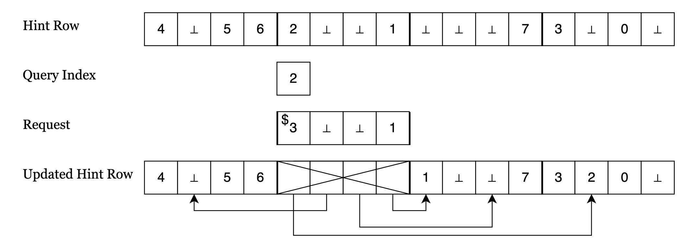

{0}------------------------------------------------

### Efficient Single-Server Stateful PIR Using Format-Preserving Encryption

Pranav Shriram Arunachalaramanan University of Illinois Urbana Champaign Urbana-Champaign, USA psa3@illinois.edu

#### **ABSTRACT**

Recently, Stateful Private Information Retrieval (PIR) has emerged as a promising new paradigm of PIR. Despite significant recent progress, state-of-the-art single-server schemes in this paradigm still suffer from practical inefficiencies in communication, computation, and/or client storage. In this work, we construct a new single-server stateful PIR scheme called HarmonyPIR that achieves efficient communication, computation, and client storage. From a technical standpoint, we build on the recent work of Wang and Ren (EUROCRYPT 25) and propose a new hint organization that uses only a single random permutation. The random permutation can be instantiated using either AES or the recently standardized FF1 Format-Preserving Encryption, yielding two variants of HarmonyPIR. Our new scheme achieves up to two orders of magnitude better amortized computation and up to five times better amortized communication than state-of-the-art schemes.

#### 1 INTRODUCTION

Private information retrieval (PIR) is a protocol between a client and a server holding a public database, where the client retrieves database entries from the server, without the server learning which entries are retrieved. PIR is a fundamental cryptographic primitive and finds widespread application in a variety of problems, such as anonymous communication [2, 30, 36], secure advertising [4, 20, 27, 44], password check [46], safe browsing [29], and privacy-preserving media streaming [21], and many more.

PIR was proposed in the work of Chor et. al. [8]. In this work, the authors define PIR in the standard setting where the server stores the database in its original form and the client does not locally store any information about the database. A long list of subsequent works [1, 5, 6, 14, 18, 34, 35, 39, 40, 48] have significantly improved the efficiency of PIR in this setting. However, PIR schemes in the standard setting suffer from a well-known fundamental barrier that the server must operate on every database entry for each client *query*. Specifically, if the server does not operate on a specific entry during a query, the server learns that the client is not interested in that entry, which breaks the privacy guarantee of PIR.

Stateful PIR is a recent and promising direction to overcome this barrier. A stateful PIR scheme consists of two phases of execution, an *offline* phase and an *online* phase. During the offline phase, the client and the server together perform *costly* preprocessing that allows the client to sample information regarding the database called *hints*. The client stores the hints locally. During the online phase, the client uses the hints to retrieve database entries efficiently.

A long list of works [3, 9–11, 17, 19, 22, 32, 33, 41, 42, 47, 51] have made significant progress in improving the computation, communication, and storage costs of stateful PIR, especially in the *two-server* 

Ling Ren
University of Illinois Urbana Champaign
Urbana-Champaign, USA
renling@illinois.edu

setting. However, state-of-the-art single-server schemes [3, 42, 47] still suffer from major practical inefficiencies. For example, the state-of-the-art practical stateful PIR scheme of Ren et al. [42] requires large client storage in its default setting. On a database of 32 MB (consisting of 2<sup>20</sup> entries of 32 Bytes each), it requires the client to store 6.25 MB of data, which is about 20% of the size of the database. While its client storage can be reduced with alternative parameter choices, doing so blows up the communication and computation costs proportionally. On the other hand, the scheme of Wang and Ren [47] requires only 0.07 MB of client storage for the same 32 MB database above, but its client computation is hundreds of times higher due to the use of an expensive instantiation of a cryptographic primitive called *small-domain pseudorandom permutation* (*PRP*) [37]. Balanced PIR [3] strikes a balance between client storage and client computation, but has costly communication.

In summary, no existing stateful PIR scheme achieves good practical efficiency in all aspects. Our goal is to construct such a single-server stateful PIR scheme that is efficient in *all three major metrics*: communication, computation, and client storage.

#### 1.1 Our Contributions

We construct a single-server stateful PIR scheme called HarmonyPIR that has efficient computation, communication, and client storage. HarmonyPIR uses a new organization of hints, which marks a departure from *partition-based hints* used by all the state-of-the-art schemes [3, 42, 47]. The new hint organization relies on a *single random permutation*. We instantiate the random permutation in two ways, resulting in the following two variants of HarmonyPIR.

HarmonyPIR1. Empirical Format-Preserving Encryption (FPE) schemes offer an efficient way to instantiate random permutations<sup>1</sup>. One such scheme is the *FF1* FPE, recently standardized by NIST [15]. HarmonyPIR1 uses FF1 to instantiate the random permutation. For strong security guarantees, HarmonyPIR1 requires the database to contain at least half a million entries, per the NIST recommendation [15]. We remark that WR PIR, despite having a similar structure to our scheme, cannot leverage FF1 for many practical database sizes. We discuss this in more detail in Section 2.

HarmonyPIR0. We also present a less efficient variant of HarmonyPIR whose security relies only on the time-tested Advanced Encryption Standard (AES) [16] block cipher. HarmonyPIR0 uses the small-domain PRP from the work of Hoang et al. [24], whose security is provably reduced to the underlying Pseudorandom Function (PRF), which can be instantiated using AES. We

<span id="page-0-0"></span> $<sup>^1\</sup>mathrm{Specifically},$  empirical FPE schemes are empirical small-domain PRPs, which can be used to instantiate random permutations.

{1}------------------------------------------------

| Scheme            | Amortized computation | Amortized communication |
|-------------------|-----------------------|-------------------------|
| Ren et al. [42]   | ~ 15×                 | ~ 3×                    |
| Wang and Ren [47] | ~ 100×                | 1×                      |
| Balanced PIR [3]  | 1×                    | ~ 5×                    |
| HarmonyPIR0       | ~ 15×                 | ~ 1×                    |
| HarmonyPIR1       | 1×                    | ~ 1×                    |

Table 1: Approximate and relative client storage, amortized computation, and amortized communication of various single-server stateful PIR schemes.

propose some improvements to the Hoang et al. PRP [24] to reduce its PRF (AES) calls by 75%, which may be of independent interest.

Efficiency. We compare the efficiency of both variants of HarmonyPIR with the prior state-of-the-art schemes WR PIR [47], Ren et al. [42], and Balanced PIR [3]. In the comparison, all schemes are normalized to use a similar amount of client storage.

The amortized computation of HarmonyPIR1 is  $100 \times$  better than WR PIR [47],  $17 \times$  to  $20 \times$  better than Ren et al. [42], and comparable to Balanced PIR [3]. The amortized computation of HarmonyPIR0 is  $15-20 \times$  worse than the amortized computation of HarmonyPIR1, making it comparable to Ren et al. [42].

The amortized communication of HarmonyPIR (both variants) is 3.2× better than Ren et al. [42], 5.2× better than Balanced PIR [3], and comparable to WR PIR [47].

In summary, HarmonyPIR1 is significantly better than all the other schemes, but uses a (relatively) new cryptographic construction. HarmonyPIR0 offers better communication and worse computation compared to state-of-the-art schemes [3, 42]. Since communication is generally more costly than computation in real-world deployments, HarmonyPIR0 offers a better tradeoff over state-of-the-art schemes under the same cryptographic assumption.

#### <span id="page-1-0"></span>2 TECHNICAL OVERVIEW

Our starting point is the PIR scheme of Wang and Ren [47] (WR PIR). We now give a brief recap of their scheme, with an emphasis on the details that are relevant to this overview.

#### 2.1 A Brief Recap of WR PIR [47]

The database DB of N entries is divided into T partitions, each of size M = N/T consecutive database entries.

Offline phase. During the offline phase, the client samples hints according to a hint table consisting of T rows and 2M columns. Row i of the hint table contains the M database indices from partition i plus M empty cells. The 2M values in each row are permuted according to a random permutation.

The client computes one hint parity for each column in the hint table. Specifically, hint parity j is the combined parity of the database entries at the indices in column j of the hint table.

Online phase. Given a query index q, the client first finds the column in the hint table that contains q (notice that only a single location in the hint table contains q). The client will use the indices in this column and the hint parity of this column to retrieve DB[q]. To do so, the client computes a *request* consisting of the indices

in this column, except that the query index is replaced with a random value from its row in the hint table. Then, the client sends the request to the server and receives a *response* consisting of the database entries at the indices in the request. The client computes the queried database entry  $\mathsf{DB}[q]$  using the response and the column hint parity.

The client then relocates each value in the column used for the query to a random empty cell within its row, and the hint parities are updated accordingly. The column used for the query is then deleted from the hint table.

Notice that after M queries, there are no more empty cells left in the hint table, and the client cannot make any more queries. In this case, the client reruns the offline phase with a new hint table (which uses different random permutations) before making further queries.

Relocation data structure DS and efficiency. WR PIR requires an efficient data structure to track the contents of the hint table. For instance, if a simple data structure such as a two-dimensional list is used, its size would be  $\tilde{O}(N)$  (the  $\tilde{O}$  notation hides the index size and entry size). They design a new data structure called the *relocation data structure* and use it to instantiate the hint table with size only  $\tilde{O}(M)$ . Importantly, the hint table requires T random permutations, each of size 2M and implemented using the small-domain PRP of Morris and Rogaway [37].

Both communication and computation in this scheme is O(T). However, the practical client computation is expensive as it involves O(T) invocations of a costly small-domain PRP [37].

#### 2.2 Our Construction

The key idea. Our PIR scheme HarmonyPIR uses a new hint organization, which requires only a *single random permutation* of size 2N. This allows us to efficiently instantiate the random permutation in HarmonyPIR through two ways: i) using an empirical FPE called FF1 [15], and ii) using the small-domain PRP from Hoang et al. [24] (with improvements), to get the two variants of our scheme HarmonyPIR1 and HarmonyPIR0.

It is important to note that an instantiation of the random permutation using FF1 is not possible in WR PIR. Recall that WR PIR requires T random permutations, each of size 2M. To instantiate the random permutations using FF1, the size of the permutation (2M) must be at least a million for strong security per NIST recommendation [15]. In other words, M must be at least half a million. Recall that communication and computation in WR PIR depend on T, whereas client storage depends on M. To balance the two

{2}------------------------------------------------

<span id="page-2-0"></span>

Figure 1: Consider a database of size N=8. The illustration depicts a hint row for this database (using T=4), the request for the query index 2, and the updated hint row after the request. The arrows in the updated hint row depict the relocations that happen in the hint row after the query.

metrics, it is natural to choose  $T \approx M \approx \sqrt{N}$  since  $M \cdot T = N$ . This means the database size N must at least be a quarter trillion, which rules out many practical application scenarios.

We now describe at a high level the construction of HarmonyPIR.

The hint row. Hints in HarmonyPIR are sampled according to a list of 2N cells, called the hint row. The database indices  $(\{0,1,2,\ldots,N-1\}$ , hereafter denoted as [N]) appear exactly once in the cells of the hint row, and the remaining N cells are empty. The 2N values are randomly permuted according to a random permutation. For any given T, the cells in the hint row are partitioned into M = 2N/T segments, of size T, where each segment  $i \in [M]$  consists of the cells in the range  $P_i = \{i \cdot T, i \cdot T + 1, \ldots, i \cdot T + T - 1\}$ . We remark that the parameters T and M play similar roles in our scheme and in the WR scheme: M is the number of hints the client samples, and T determines the communication and computation.

We will now describe a PIR scheme when the client stores the entire hint row. Notice that this would require  $\tilde{O}(N)$  client storage. In our actual scheme HarmonyPIR, we instead adapt the relocation data structure from the work of Wang and Ren [47] to achieve  $\tilde{O}(M)$  client storage for the hint row. However, the following PIR scheme conveys the key ideas that are used in the construction of HarmonyPIR.

Offline phase. During the offline phase, the client computes a list H of hint parities, one for each segment of the hint row. The parity for segment i is  $H[i] = \bigoplus_{j \in P_i} \mathsf{DB}[\mathsf{HR}[j]]$ , where HR denotes the hint row.

Online phase. In the online phase, given a query index q, the client finds the segment s containing q in the hint row. The client then uses the values in segment s of the hint row and the hint parity H[s] to fulfill its query. In more detail, let Q denote the request. All the values in segment s except q are first added to Q. Then, the client samples a value at random from the rest of the hint row (i.e., values not yet in Q), and adds it to Q. Observe that the values in

the request are either database indices or are empty. We illustrate request construction in Figure 1.

The client sends Q to the server and receives a *response* R from the server consisting of the database entries at the non-empty indices in Q. Observe that the client now has all the database entries that were used to compute H[s], except DB[q]. Then, the client can compute DB[q] as the combined parity of H[s] and the database entries at indices in segment s (except DB[q]).

The client then relocates the values in segment s. Specifically, values in segment s are relocated to random empty cells in the hint row, one after the other. We illustrate the relocations in Figure 1. The hint parities H are updated according to these relocations: each hint H[i] must match with the combined parity of database entries at indices in segment i of the hint row. The segment s in the hint row and the hint parity H[s] are then deleted. Like WR PIR, after M/2 queries, there are no more empty cells left in the hint row, and the client reruns the offline phase with a new hint row.

Summary. The novelty of our scheme is two-fold: i) carefully designing a new hint organization that does not rely on partitions and instead requires only a single permutation, and ii) efficiently storing the new hints by adapting the relocation data structure in [47]. The remainder of the PIR scheme follows somewhat naturally and bears similarities to prior works. Specifically, the query phase is similar to [33, 47] and the relocation phase is similar to [47]. Efficiency-wise, both variants of HarmonyPIR have the same communication cost as WR PIR [47], but offer significant constant-factor improvements in computation cost over WR PIR.

#### 3 MODEL AND PRELIMINARIES

#### 3.1 Private Information Retrieval (PIR)

Consider a server holding a database DB as a list of N entries, and a client with a *query index q*. The client wants to privately retrieve q-th entry in the database. PIR is a protocol between the client and the server, which satisfies the following properties:

{3}------------------------------------------------

- Correctness: If the client and the server execute the PIR protocol correctly, the client retrieves the database entry at the query index.
- Privacy: The server does not learn any information about the query index from its interaction with the client.

The above definition can be naturally extended when the client has a sequence of query indices.

#### <span id="page-3-4"></span>3.2 Stateful PIR

A stateful PIR scheme consists of two phases of execution: i) an offline phase, and ii) an online phase. During the offline phase, the client and the server perform preprocessing together, and the client samples useful information regarding the database called *hints*. The client then stores the hints locally. During the online phase, the client has a sequence of query indices and executes a sequence of *queries* to retrieve database entries at the query indices. The interaction between the client and the server during each query is as follows:

Given a query index, the client constructs a *request* Q and sends the request to the server. The server computes a *response* R using Q and sends it back to the client. The client then computes an *answer* using R.

For any sequence of M queries with query indices  $q_1, q_2, \ldots, q_M$ , a stateful PIR scheme must satisfy the following conditions of correctness and privacy.

*Correctness.* The answers computed by the client must match the database entries at the query indices, except with probability at most  $\epsilon$ , where  $\epsilon$  is negligible (in the security parameter).

*Privacy.* Informally, the server does not learn any information about the query indices from the interaction with the client. We also define privacy formally as follows:

EXPERIMENT 1. A PIR scheme is secure if there exists a simulator Sim(DB, M), for any adversary  $\mathcal{A}(DB, M)$  as the server, such that the view of  $\mathcal{A}$  is computationally indistinguishable in the following two experiments:

- Real World: The client interacts with adversary  $\mathcal{A}(\mathsf{DB}, M)$  who acts as the server. The client and the server execute a sequence of M queries, where the query index for the i-th query  $q_i$  is chosen adaptively by  $\mathcal{A}$  based on its view.
- Ideal World: The simulator Sim and the adversary A interact to execute a sequence of queries, where A adaptively selects the query index for the i-th query based on its view, but the Sim is invoked without the query index.

At a high level, the above privacy definition specifies that the server's/adversary's view in the PIR protocol contains "no information" about the client's query indices.

# <span id="page-3-3"></span>3.3 Random Permutation and Small-domain Pseudorandom Permutation (PRP)

For any N', let [N'] denote the set  $\{0, 1, 2, ..., N' - 1\}$ . A random permutation is a bijective function that maps inputs in a domain [N'] to random outputs in [N']. We refer to N' as the *size* of the random permutation.

Let P be a mapping  $[N'] \times \{0,1\}^{\lambda} \to [N']$ . Then, P is a *small-domain PRP* if for any key  $k \in_{\$} \{0,1\}^{\lambda}$ , P(\*,k) (denoted as  $P_k$ ) is a bijective function that maps maps inputs in [N'] to "seemingly" random outputs in [N']. We define small-domain PRP more formally in Section 6.

#### <span id="page-3-2"></span>3.4 Relocation Data Structure

In this subsection, we present the details of the relocation data structure DS from the work of Wang and Ren [47] that are relevant to our construction.

Definition. Let [N'] denote the set of values  $\{0, 1, 2, ..., N'-1\}$ . The relocation data structure DS stores a list of 2N' cells, where each cell contains a value in the set  $U = [N'] \cup \{\bot\}$ . Each value in [N'] appears exactly once in DS, and the remaining N' cells are empty (denoted  $\bot$ ). DS supports operations to access the value in a cell (Access), find the cell containing a value (Locate), and relocate the value in a cell to a random empty cell (Relocate). DS uses a list C to store *relocation history*, i.e., the list of cells from which values have been relocated. More elaborately, the interface of Access, Locate and Relocate are as follows.

- (1) Access(c)  $\rightarrow v$ : Given a cell  $c \in [2N'] \setminus C$ , returns the value  $v \in U$  in it. Access does not update C.
- (2) Locate(v)  $\rightarrow c$ : Given a value  $v \in [N']$ , returns the cell  $c \in [2N'] \setminus C$  that contains v. Locate does not update C.
- (3) Relocate(c): Given a cell c, moves the value in c to a random empty cell that is not in C. In addition, Relocate adds c to C.

For convenience, when we say that a cell c has relocated, we mean that a value has been relocated *from* cell c to a random empty cell.

DS must satisfy the following properties of correctness and randomness invariance.

#### <span id="page-3-0"></span>Correctness.

- (1) Initially, and after every Relocate operation, each value in [N'] appears exactly once in DS'.
- (2) Initially, and after every Relocate, Access and Locate are inverses of each other. That is, for all  $v \in [N']$ , c = DS.Locate(v), if and only if v = DS.Access(c).
- (3) A Relocate operation moves the value from a given cell to an empty cell that has not been relocated, and all other cells remain unchanged. Consider any Relocate operation: DS.Relocate(c) on some cell  $c \in [2N'] \setminus C$ . Let DS\* be used to denote the relocation data structure after relocation, and  $v \leftarrow \text{DS.Access}(c)$  and  $c^* \leftarrow \text{DS*.Locate}(v)$ . Then, i)  $c^* \notin C$  and DS.Access( $c^*$ ) =  $\bot$ , and ii) DS.Locate(v') = DS\*.Locate(v') for all  $v' \in [N'] \setminus \{v\}$ .

<span id="page-3-1"></span>Randomness Invariance. At a high level, this property guarantees that after any number of Relocate operations, the values in the cells of the relocation data structure are permuted randomly, even when conditioned on the values at the cells that were previously relocated. We will now describe this formally.

First, we establish some notation. Let  $U_{N',q}$  be a list containing all the values in [N'] and q empty symbols ( $\perp$ ). For any list X, let  $\mathcal{P}(X)$  denote the uniform distribution over the set of all permutations of the elements in X.

{4}------------------------------------------------

#### <span id="page-4-0"></span>Algorithm 1 History Data Structure Hist

**State:** *L*: List of relocated cells, *M*: Map between each relocated cell to its position in *L* 

#### Hist.Init()

1: Initialize *L* as an empty list and *M* as an empty map

### Hist.Append(c)

- 2: *L*.append(*c*)
- 3:  $M[c] \leftarrow |L| 1$

Hist[p]: return L[p]

 $\mathbf{Hist}^{-1}[c]$ : return M[c]

Given a relocation data structure DS with 2N' cells, let R be a list which contains any N' cells of DS. Relocate operations are performed on the cells in R, one after the other; then, the relocation data structure DS satisfies randomness invariance if the following holds:

• Let DS<sup>i</sup> denote the relocation data structure before the i-th  $(i \in [N'])$  relocation operation, and  $C^{l}$ denote the relocation history of  $DS^{l}$ . The list of values in the relocation data structure  $DS^i$ :  $A_i =$  $\{c \in [2N'] \setminus C^i, DS^i.Access(c)\}\$  follows the distribution  $\mathcal{P}(U_{N',N'-i})$ , even when conditioned on the values at the cells which have been relocated (only applicable for  $i \ge 1$ ):  $[DS^0.\mathsf{Access}(R[0]), \dots, DS^{i-1}.\mathsf{Access}(R[i-1])].$ 

History data structure. The construction of DS from the work of Wang and Ren [47] uses a simple *history data structure* Hist to track relocation history C; given a position in C, Hist supports finding the cell in that position (index-based lookup), and given a cell, Hist supports returning the position which contains the cell in C (valuebased lookup). Hist simply uses a list L to support index-based lookup of C and a map M to support value-based lookup of C. The details of this simple data structure are in Algorithm 1.

Summary of DS. DS samples a random permutation P of size 2N' to determines the initial contents of the cells in DS. The cells  $P(0), P(1), P(2), \dots, P(N'-1)$  are assigned the values 0, 1, 2, ..., N' - 1, respectively, and the cells P(N'), P(N' +1), ..., P(2N'-1) are empty. We call the values N', N'+1, ..., 2N'-11 as "empty values". DS also initializes the history data structure Hist (Algorithm 1).

Relocate operation on any cell moves the value in the cell to the "next" empty cell. Specifically, the i-th Relocate operation on any cell c, relocates the value in that cell to the cell containing the *i*-th empty value, i.e., the cell containing N' + i - 1. To relocate the value in a cell c, the Relocate operation simply performs Hist.Append(c).

<span id="page-4-2"></span>Access and Locate use Hist and *P* to satisfy their functionalities. We give full details on Access and Locate in Section 9 for completeness, but understanding those details of DS is not required. To understand our work, it is sufficient to know the following: i) functionalities of Access, Locate, and Relocate, ii) construction of Hist, and iii) Access and Locate use only on the history Hist and the permutation *P* along with their inputs to achieve their required functionalities.

#### <span id="page-4-1"></span>**Algorithm 2** History Data Structure for Segment Relocations Hist'

**State** *S*: List of relocated segments, *M*: Map from relocated segment to its position in *S*, *T*: Segment Size

#### Hist'.Init(T)

- 1: Initialize S as an empty list and M as an empty map.
- 2:  $Hist.T \leftarrow T$

#### **Hist'**.**Append**(s)

- 3: Append s to S
- 4:  $M[s] \leftarrow |S| 1$

#### Hist'[p]

- 5:  $s \leftarrow \lfloor p/T \rfloor$
- 6: **return**  $S[s] \cdot T + (p \mod T)$

$$\mathbf{Hist'}^{-1}[c]$$

- 7:  $s \leftarrow \lfloor \frac{c}{T} \rfloor$
- 8: **return**  $M[s] \cdot T + (c \mod T)$

LEMMA 3.1 (CORRECTNESS OF DS). Relocation data structure DS [47] satisfies correctness as defined in Section 3.4.

<span id="page-4-3"></span>Lemma 3.2 (Randomness Invariance of DS). Relocation data structure DS [47] satisfies randomness invariance as defined in Section 3.4.

#### <span id="page-4-4"></span>4 A RESTRICTED RELOCATION DATA **STRUCTURE**

In this section, we define a "restricted" variant of the relocation data structure adapted from Section 3.4, and describe an efficient construction for it. Looking ahead, we will use this restricted relocation data structure in our PIR scheme.

#### 4.1 Definition

We first introduce a new notion of segments for the relocation data structure DS from Section 3.4, and a new operation called RelocateSegment. For any value of a parameter *T*, DS is partitioned into chunks of T contiguous cells called segments. In particular, for any  $s \in [2N'/T]$ , segment s holds the list of cells  $[s \cdot T, s \cdot T + 1, s \cdot T]$  $T + 2, ..., s \cdot T + T - 1$ ]. We now define a new operation called RelocateSegment as follows:

• RelocateSegment(s): Given a segment s, RelocateSegment relocates the values in cells  $[s \cdot T, s \cdot T + 1, \dots, s \cdot T + T - 1]$ , one after the other to random empty cells. The cells in segment s are added to the relocation history *C*.

#### Construction 4.2

One could trivially implement RelocateSegment on a segment s using a sequence of Relocate operations: Relocate( $s \cdot T$ ), Relocate( $s \cdot T$ ) T+1),..., Relocate( $s \cdot T + T - 1$ ). However, observe that using the construction of the relocation data structure in Section 3.4, this would require  $O(R \cdot T)$  storage to perform R RelocateSegment operations; this is because each Relocate operation adds an entry to the list *L* and map *M* of the history data structure Hist.

Consider a restricted variant of the relocation data structure that only allows Access, Locate, and RelocateSegment operations (does not allow Relocate operations). We denote this restricted relocation 

{5}------------------------------------------------

data structure as DS'. To support lookup of relocation history *C* in DS', it is sufficient for its history data structure to store the relocated segments because cells within segments are relocated in a deterministic order. We describe such a simple history data structure Hist' in Algorithm 2.

The RelocateSegment operation on a segment s of DS' simply adds s to the list of relocated segments (using Hist'.Append(s) in Algorithm 2). Then, observe that DS' only needs O(R) client storage (rather than  $O(R \cdot T)$ ) for performing R RelocateSegment operations, by using Hist'.

The Access and Locate functions of DS' are the same as DS. They rely on index-based and value-based lookup of relocation history C, which is supported by Hist'.

LEMMA 4.1. (Correctness and Randomness Invariance of DS') DS' satisfies correctness and randomness invariance as defined in Section 3.4.

PROOF. We can view every RelocateSegment operation in DS' as a sequence of Relocate operations. Then, the correctness and randomness invariance of DS' follows from the correctness and randomness invariance of DS (Lemmas 3.1 and 3.2).

#### 5 HarmonyPIR

Recall the high-level idea of our HarmonyPIR construction from Section 2. Using the restricted relocation data structure DS', we first describe the full construction of our PIR scheme HarmonyPIR, followed by a correctness, privacy, and efficiency analysis of the scheme. We then discuss two different ways to instantiate the random permutation in HarmonyPIR.

#### 5.1 The Scheme

Offline Phase. During the offline phase, given the database size N and a parameter T, the client initialises a relocation data structure DS' (Section 4) with 2N cells and segment size T. Recall that such a DS' consists of the database indices [N] each appearing exactly once and N empty cells.

The client computes a list of M = 2N/T hint parities, one hint parity for each segment of DS'. Specifically, the i-th hint parity, denoted as H[i], is computed as the combined parity of the database entries at the indices in segment i of DS'. To do this, the hint parities H are first initialized to 0. Then, the client streams the database entry by entry from the server, and as it streams the k-th entry DB[k], the client adds DB[k] to the appropriate hint parity. That is, the client first finds the cell containing index k as  $c \leftarrow DS'$ . Locate(k), computes c's segment  $s = \lfloor c/T \rfloor$ , and updates the hint parity H[s] to  $H[s] \oplus DB[k]$ . The hint parities are stored locally by the client.

*Querying the Database.* Given a query index q, the client first locates q in DS': q is in cell c = Locate(q), which is in segment  $s = \lfloor c/T \rfloor$ ; further, q is in the r-th cell of its segment where  $r = c \mod T$ .

Then, the client constructs a request Q, which is a list of T values. First, the client finds the values in segment s of DS', except the query index q, and adds them to Q. Specifically, Q[i] where  $i \neq r$  is set to the i-th value in segment s. Then, the client also samples a value at random from the values in DS' that are not yet in Q, and sets Q[r] to be this value. Let L be the list of cells in DS' outside

#### <span id="page-5-0"></span>Algorithm 3 Client algorithms in HarmonyPIR Scheme

**State** DS': Restricted Relocation Data Structure, H: Hint parities, *M*: Number of hint parities, *T*: Segment Size, *N*: Number of database entries

#### PIR.Offline(N, T)

- 1: Initialize DS' with 2N cells and segment size T.
- 2: Initialize a list H of M hint parities, where  $\forall i \in [M], H[i] = 0^w$
- 3: Stream the database from the server. For each *k*-th entry:
  - $c \leftarrow \mathsf{DS'}.\mathsf{Locate}(k)$
  - $H[\lfloor c/T \rfloor] \leftarrow H[\lfloor c/T \rfloor] \oplus DB[k]$

#### PIR.Online(q)

#### Request

```
4: c \leftarrow \mathsf{DS'}.\mathsf{Locate}(q)

5: s \leftarrow \lfloor c/T \rfloor, r \leftarrow c \mod T

6: Initialize a list Q of size T

7: \forall i \in [T] \setminus \{r\}, Q[i] \leftarrow \mathsf{DS'}.\mathsf{Access}(s \cdot T + i)

8: L \leftarrow \lfloor 2N \rfloor \setminus C \setminus \{sT, sT + 1, \dots, sT + r - 1, sT + r + 1, \dots, sT + T - 1\}

9: l \leftarrow L

10: Q[r] \leftarrow \mathsf{DS'}.\mathsf{Access}(l)
```

#### Response

11: Sends Q to the server and receive a response R of the database entries at indices in Q

#### Answer

12: 
$$A \leftarrow \mathsf{H}[s] \bigoplus_{i \in [T] \setminus r} \mathsf{R}[i]$$

#### Relocate

```
13: DS'.RelocateSegment(s)
```

14:  $\forall i \in [T] \setminus \{r\}, d_i \leftarrow \lfloor \mathsf{DS'}.\mathsf{Locate}(\mathsf{Q}[i])/T \rfloor$ 

15:  $\forall i \in [T] \setminus \{r\}, H[d_i] \leftarrow H[d_i] \oplus R[i]$ 

16:  $d_r \leftarrow \lfloor \mathsf{DS'}.\mathsf{Locate}(q)/T \rfloor$ 

17:  $H[d_r] \leftarrow H[d_r] \oplus A$ 

segment s, plus the r-th cell of segment s. Let l be a random cell in the list L. Then, the request Q is as follows:

$$Q[i] = \begin{cases} Access(s \cdot T + i), & i \neq r \\ Access(l), & i = r \end{cases}$$

Notice that the client does not always include the index q in the request, since that would be clearly insecure.

The client sends the request Q to the server. The server returns a response R which consists of the database entries at the non-empty indices in Q. Recall that the hint H[s] was computed as the combined parity of the database entries at indices in segment s of DS'. The client has obtained from the server the database entries at indices in segment s except DB[q]. The client can compute DB[q] as the parity H[s] and  $\bigoplus_{i \in [T] \setminus r} R[i]$  (the client uses R[i] = 0 for all empty Q[i]).

Relocating segment s. From the request Q, the server has learned the indices in segment s of DS'. To ensure privacy, the client refreshes DS' by relocating the values in segment s to random empty locations in DS'. To do this, the client simply executes DS'.RelocateSegment(s).

{6}------------------------------------------------

Then, the hint parities need to be updated according to these relocations; each hint parity of a DS' segment must match the combined parity of the database entries at indices in that segment. Notice that the values originally in segment s are: i) the request values Q[i] for all  $i \in [T] \setminus r$ , and ii) the query index q. The client finds the segments  $d_0, d_1, \ldots, d_{T-1}$  that now contain each of these values using the Locate operation as follows:

$$d_{i} = \begin{cases} \lfloor \text{Locate}(\mathbb{Q}[i])/T \rfloor, & i \neq r \\ \lfloor \text{Locate}(q)/T \rfloor, & i = r \end{cases}$$

The client then updates the hint parities of these segments by adding the database entries relocated into them:

$$H[d_i] = \begin{cases} H[d_i] \oplus R[i], & i \neq r \\ H[d_r] \oplus DB[q] & i = r \end{cases}$$

Notice that the client can perform these updates locally, as the client retrieved each R[i] from the server and computed DB[q] locally (using the response and the hint parity). We describe a more efficient method to perform segment relocation in Section 10. This achieves a constant factor improvement in client computation over the current method. We defer this explanation to the appendix because it requires the reader to understand how Access and Locate are implemented.

After each query, T of the empty cells in DS' are filled up. After M/2 queries, there will be no more empty cells left in DS', and the client cannot make queries anymore. Hence, the offline procedure needs to be executed again by the client before making more queries.

Handling Database Modifications. Whenever a database entry at some index i gets modified, the server sends the combined parity of the original database entry  $\mathsf{DB}[i]$  and the modified database entry  $\mathsf{DB}'[i]$  to the client. Let us denote this value as  $\mathsf{diff} = \mathsf{DB}[i] \oplus \mathsf{DB}'[i]$ . The client changes the computed hint parities according to this modification; to do this, client finds the segment containing index i in  $\mathsf{DS}'$  as  $s = \lfloor \mathsf{DS}' .\mathsf{Locate}(i)/T \rfloor$  and changes the segment's hint parity  $\mathsf{H}[s]$  to  $\mathsf{H}[s] \oplus \mathsf{diff}$  (which amounts to removing the old value  $\mathsf{DB}[i]$  and adding in the new value  $\mathsf{DB}'[i]$ ).

#### <span id="page-6-2"></span>5.2 Instantiating the Random Permutation

We instantiate the random permutation used by DS' in HarmonyPIR using a *Small-domain PRP* (Section 3.3).

HarmonyPIR1. An empirical FPE scheme called FF1 [15] is assumed to be a secure small-domain PRP. We instantiate the random permutation used by HarmonyPIR using FF1 [15], to get HarmonyPIR1. While practical attacks exist on FF1 on very small domain sizes [7, 12, 13, 23, 25], the NIST FF1 recommendation [15][Appendix A.2] specifies that for a domain of size at least 10<sup>6</sup>, the resources required for best known attacks on FF1 are prohibitive. Thus, to use FF1, the size of the hint row must be at least 10<sup>6</sup>, which means that the database in HarmonyPIR must contain at least half a million entries.

HarmonyPIR0. We also instantiate the random permutation used by HarmonyPIR using our variant of the small-domain PRP of Hoang et al. [24], to get HarmonyPIR0. Unlike FF1, which is a relatively new cryptographic construction, this small-domain PRP

is provably secure under the assumption that the well-established Advanced Encryption Standard (AES) is secure. We describe our improved variant of the small-domain PRP of Hoang et al. [24] in Section 6.

#### 5.3 Analysis

Correctness and Privacy Intuition. For correctness, observe that the i-th hint parity in H always holds the combined parity of the database entries at indices in segment i of DS'. Then, the client can compute the database entry at any index q correctly by using the appropriate hint and database entries retrieved in the server response.

For privacy, observe that the first request Q to the server appears to be a selection of T random values from the values in DS', using the fact that the values in DS' are arranged randomly. For any segment s of DS' that the server sees in a request Q, the values in this segment are relocated to random empty locations in DS', and the segment s is deleted. Following this, any request Q to the server appears to the server to simply be a selection of T random values from the remaining values in DS'.

<span id="page-6-0"></span>LEMMA 5.1. (Hint Parities are Correct) For all  $s \in [M]$ , H[s] is always equal to the parity of the database entries at the indices in segment s of DS'.

PROOF. We can show this by induction.

*Proposition* I(j): Before query j, for all  $s \in [M]$ , H[s] is equal to the parity of the database entries at the indices in segment s of DS'.

Base Case (j = 1): Each database index is at a unique location in DS' (correctness condition 1 (Section 4)), and can be found using Locate (correctness condition 2 (Section 4)); the client finds this location and updates the corresponding hint parity. Hence I(1) is true.

Case j: Let I(j) be true.

Case j+1: After query j, indices in a segment s are relocated; the client finds the destination cells of the relocated indices (using Locate) and updates the corresponding hint parities. From the third correctness condition of DS' (Section 3.4), updating these hint parities is sufficient as the other other cells of DS' remain unchanged.

THEOREM 5.2. (Correctness) The PIR scheme in Algorithm 3 satisfies correctness.

PROOF. For the selected hint segment *s* in any query, we require the following condition to be satisfied:

• The hint parity H[s] must match the combined parity of the database entries at indices in cells  $[s \cdot T, s \cdot T+1, \dots, s \cdot T+T-1]$  of DS'.

We show that this condition holds in Lemma 5.1. Then, for any query with query index q, it is easy to see that the combined parity of the hint H[s] and the database entries at indices in segment s (except DB[q]), matches DB[q]. This is precisely what the client computes; the client has H[s] stored locally and retrieves the database entries at indices in segment s (except DB[q]) from the server.

<span id="page-6-1"></span>Lemma 5.3. (Requests are random) Let  $\mathcal{P}_T(U_{N,N-T\cdot i})$  be the distribution of T values sampled at random from  $U_{N,N-T\cdot i}$  (defined

{7}------------------------------------------------

in Section 3.4) without replacement. For a sequence of M queries with any query indices  $q_0, q_1, \ldots, q_{M-1}$ , the request for the i-th query  $Q_i$  follows the distribution  $\mathcal{P}_T(U_{N,N-T\cdot i})$ , conditioned on the prior requests  $Q_0, Q_1, Q_2, \ldots, Q_{i-1}$ , and the query indices  $q_0, q_1, \ldots, q_i$ .

PROOF. Consider the distribution of values in the cells of DS' before the *i*-th query; from the randomness invariance property of DS' this distribution follows  $\mathcal{P}(U_{N,N-T\cdot i})$ , even when conditioned on prior requests and query indices. Then, segment *s* (which is selected during the query) consists of T-1 values that are sampled at random without replacement from  $U_{N,N-T\cdot i}$  and the query index  $q_i$ ; let  $S_i$  denote the values in *s*.

Recall that the request  $Q_i$  is constructed by i) first selecting the indices in  $S_i$ , except ii) the query index  $q_i$  is replaced with a random value from DS' that has not been chosen yet in  $Q_i$ . We now compute the distribution of:

$$\Pr[Q_i \mid Q_0, Q_1, \dots, Q_{i-1}, q_0, q_1, \dots, q_i]$$
 (1)

T-1 values of  $Q_i$  follow the distribution of sampling T-1 values without replacement from the values in DS', as these values are selected from  $S_i$ . Further, the final value in  $Q_i$  is selected by replacing the query index  $q_i$  in  $S_i$  with a random value that has not been selected yet from DS'; This essentially means that the final value of  $Q_i$  follows the distribution of sampling a value at random from the remaining values of DS'. Then,  $\Pr[Q_i \mid Q_0, Q_1, \ldots, Q_{i-1}, q_0, q_1, \ldots, q_i]$  follows the distribution  $\mathcal{P}_T(U_{N,N-T\cdot i})$ .

Note that when the random permutation in HarmonyPIR is instantiated using a small-domain PRP, the request distribution is computationally indistinguishable from  $\mathcal{P}_T(U_{N,N-T\cdot i})$  for a polynomial time adversary, instead of being identical to  $\mathcal{P}_T(U_{N,N-T\cdot i})$ .

THEOREM 5.4. (Privacy) The PIR scheme in Algorithm 3 satisfies privacy.

PROOF. We construct a simulator for the server using Lemma 5.3; the i-th request of the client is simulated using the distribution  $\mathcal{P}_T(U_{N,N-T\cdot i})$ . Such a simulation works for the adaptive adversary in Section 3.2 because Lemma 5.3 holds for any sequence of query indices.

Theorem 5.5. (Efficiency) Consider any database consisting of N entries each of size w bits, and any given parameter T. Over at least M/2 = N/T queries, the PIR scheme in Algorithm 3 has:

- client storage of  $O(Mw + M \log N)$  bits
- amortized communication of  $O(Tw + T \log N)$  bits
- amortized client computation of O(T) evaluations of a small-domain PRP and O(T) XORs of w bit entries.
- amortized server computation of T lookups to entries of size w bits in a list of N entries.

Proof.

Client Storage. The client stores a Hist' data structure with at most M/2 segments, which requires  $O(M \log N)$  bits, and M hint parities, which requires O(Mw) bits.

Amortized Communication. The client streams N w-bit entries in the offline phase; the offline communication gets amortized over M/2 queries, make it O(Tw) per query. For each query in the online phase, the client sends T values each of  $\log N$  bits (the request), and gets T entries of each of w bits (the response).

Amortized Client Computation. In the offline phase, the client performs O(N) Locate operations and O(N) XORs of w-bit entries. Each Locate and Access operation involves O(1) small-domain PRP evaluations in expectation [47, Lemmas A.1 and A.2]. Then, the amortized offline client computation over M/2 queries involves O(T) small-domain PRP evaluations and O(T) XORs of w-bit entries.

For each query in the online phase, the client performs 2T Locate operations, 1 Access operation, and 1 RelocateSegment operation; these take O(T) small-domain PRP evaluations in expectation. Further, the client performs T XOR operations on w-bit entries.

Amortized Server Computation. During the offline phase, the server looks up all N entries in the database, which, when amortized over M/2 queries, gives T lookups per query. For each query in the online phase, the server looks up T entries in the database.

# <span id="page-7-0"></span>6 AN EFFICIENT SMALL-DOMAIN PRP FOR HarmonyPIR0

Recall the instantiations of the random permutation in HarmonyPIR using small-domain PRP in Section 5.2. We will now describe how the random permutation in HarmonyPIR0 is efficiently instantiated using a provably secure small-domain PRP.

Formal definition. We first define small-domain PRP formally. Given a mapping  $P:[N']\times\{0,1\}^\lambda\to [N']$ , for any  $k\in\{0,1\}^\lambda$ , let P(\*,k) (denoted as  $P_k$ ) be a permutation and  $P_k^{-1}$  be its inverse permutation. Let  $\Pi(N')$  be the set of all permutations of size N'. Then, P is  $(q,\epsilon)$  secure small-domain PRP if for any probabilistic polynomial time adversary  $\mathcal A$  there exists a negligible function negl, such that:

$$\left| \Pr_{\substack{k \stackrel{\$}{\leftarrow} \{0,1\}^{\lambda}}} \left[ \mathcal{A}^{P_k, P_k^{-1}}(1^{\lambda}) \right] - \Pr_{\substack{g \stackrel{\$}{\leftarrow} \Pi(N')}} \left[ \mathcal{A}^{g, g^{-1}}(1^{\lambda}) \right] \right| \le \mathsf{negl}(\lambda),$$

where the adversary  $\mathcal{A}$  can make at most q queries to its. For a small-domain PRP, the size of the domain N' is small, and the adversary can learn the full permutation using oracle queries (by making q = N' queries) before deciding if it is a small-domain PRP or a random permutation.

At a high level, the above definition means that any adversary program  $\mathcal{A}$ , cannot determine whether it has been given oracle access to a small-domain PRP or a random permutation, as the inputs to the small-domain PRP are mapped to "seemingly random" outputs.

An observation about the required PRP. WR PIR uses a small-domain PRP from the work of Morris and Rogaway [37] that is  $(N',\epsilon)$ -secure to instantiate the hint table. However, we observe that it suffices to use a small-domain PRP that is  $(N'/2,\epsilon)$ -secure. Specifically, both in WR PIR and HarmonyPIR, the server (which

{8}------------------------------------------------

is the adversary) can obtain evaluations of the small-domain PRP (which is used to instantiate the hint table in WR PIR and the hint row in HarmonyPIR) at only half of the points in the domain. Thus, both schemes can use a  $(N'/2,\epsilon)$ -secure small-domain PRP to get faster client computation. We formally prove the above observation for HarmonyPIR.

<span id="page-8-0"></span>LEMMA 6.1. The random permutation P used by HarmonyPIR can be securely instantiated using an  $(N'/2, \epsilon)$ -secure small-domain PRP.

PROOF. The client makes only M/2 queries using the same DS' in HarmonyPIR, after which it reruns the offline phase with a different DS' (which will use a different permutation). During these queries, the server/adversary only sees the values at N cells of DS', and in other words, only learns the values at N of the 2N positions in the underlying permutation. Hence, a small-domain PRP which is secure against an adversary that looks at half of its evaluations, i.e., a  $(N'/2, \epsilon)$ -secure small-domain PRP, can securely instantiate the random permutation.

Having established Lemma 6.1, we can instantiate the random permutation in HarmonyPIR using the small-domain PRP from the work of Hoang et al. [24].

THEOREM 6.2 ([24]). For any  $N \ge 1$  and a negligibly small  $\epsilon$ , there exists a small-domain PRP P that is  $(N'/2, \epsilon)$ -secure, and the algorithms for  $P_k$  and  $P_k^{-1}$  both run in time  $\Theta(\log N - \log \epsilon)$ .

We now describe the small-domain PRP of Hoang et al. [24], and then present our improved variant of their construction which we use in HarmonyPIR0.

#### 6.1 The construction of Hoang et al. [24]

Random permutation as a card shuffle. We can view a random permutation from the lens of a card shuffle. To see this, consider N' cards, numbered from 0 to N'-1, where card i is initially at position i. The cards are then randomly shuffled. After the shuffle, the final position of card i is the evaluation of some random permutation P on input i. We will now use the card shuffle lens to describe the small-domain PRP of Hoang et al. [24].

The card shuffle of Hoang et al. [24] happens in r rounds. In each round  $i \in [r]$ , first, a round key K[i] and a round function  $F_i$  are sampled as follows:  $K_i \stackrel{\$}{\leftarrow} [N']$  and  $F_i \stackrel{\$}{\leftarrow} \{f : [N'] \rightarrow \{0,1\}\}$ . In round  $i \in [r]$ , cards at position X and  $X \oplus K[i]$  are paired with each other and are swapped if and only if  $F_i(\min(X, X')) = 1$ .

Tracking a single card. The shuffle of Hoang et al. [24] supports efficiently finding the final position of a single card without tracking the positions of other cards. Recall that this is equivalent to evaluating a random permutation on a specific input.

Specifically, consider card X, which is initially at the position X. In each round  $i \in [r]$ , the card at position X is paired with the card at position  $X' = X \oplus K[i]$ , where K[i] is the round key. Then, if the round function  $F_i(\min(X',X))$  evaluates to 1, the card at position X is moved to X', following which, X is updated to be X'. After r rounds, the algorithm outputs X. The details of this simple algorithm are in Algorithm 4.

Practically, the round functions and the round keys can be instantiated using AES [16] with a key k. Specifically, the round

#### <span id="page-8-1"></span>**Algorithm 4** The small-domain PRP of Hoang et al. [24]

**Input** X: Input to permutation, N': Domain Size, r: Number of rounds, K: A list of r round keys, F: A list of r round functions

```
1: for i \in [r] do
2: X' \leftarrow X \oplus K[i]
3: X_{min} \leftarrow \min(X, X')
4: if F_i(X_{min}) = 1 then
5: X \leftarrow X'
6: end if
7: end for
8: return X
```

function  $F_i(x)$  is  $\mathsf{AES}_k(\text{"function"}||i||x)$  and the round key K[i] is  $\mathsf{AES}_k(\text{"key"}||i)$ .  $\Theta(\log N' - \log \epsilon)$  rounds of shuffle are needed to construct the  $(N'/2, \epsilon)$ -secure small-domain PRP required by HarmonyPIR (Lemma 6.1).

#### 6.2 Our variant of Hoang et al. [24]

We now propose our improved variant of Hoang et al. [24].

High-level idea. The round functions  $F_i$  used in the shuffle of Hoang et al. [24] (Algorithm 4) need a single random bit, whereas the instantiation of  $F_i$  using AES outputs  $\lambda$  bits. Our variant utilizes the  $\lambda$  random bits more effectively, thereby reducing the total number of AES calls needed per invocation of the permutation.

Let X be the position of a given card at the start of round i in the shuffle of Hoang et al. (Algorithm 4). We make a key observation about the final position of this card after  $\beta$  rounds; we call a set of  $\beta$  rounds a *phase*. We first define a *phase group* G; let L be the list of round keys for rounds i up to  $i + \beta - 1$ , and S be the power set of L; for each set  $s \in S$ , the combined parity of the keys in s and S is added to a list S. Observe that the card in position S at the start of round S is because positions that differ from the card's position by the round key are also in S. And due to the same reason, the cards in any of the positions in S at the start of round S in any of the positions in S at the start of round S in any of the positions in S at the start of round S in any of the positions in S at the start of round S in any of the positions in S at the start of round S in any of the positions in S at the start of round S in any of the positions in S at the start of round S in any of the positions in S at the start of round S in any of the positions in S at the start of round S in any of the positions in S at the start of round S in any of the positions in S at the start of round S in the start of round S in the start of round S in the start of round S in the start of round S in the start of round S in the start of round S in the start of round S in the start of round S in the start of round S in the start of round S in the start of round S in the start of round S in the start of round S in the start of round S in the start of round S in the start of round S in the start of round S in the start of round S in the start of round S in the start of round S in the start of round S in the start of round S in the start of round S in the start of round S in the start of round S in the start of round S in the start of round S in the start of round S in the start of round S in the sta

Using this observation, we use a *single* AES call to decide the outputs of round functions for positions in G during the  $\beta$  rounds. To do this, AES is evaluated on the smallest value in a sorted G, and for any two positions in G that get paired, a specific bit in the AES output is assigned to be the output of the round function.

In more detail, AES is first computed as  $f = AES_k$  ("function" ||i||G[0]). Each of the positions in the sorted list G are assigned  $\beta$  bits of f. The j-th  $(j \in [\beta])$  bit assigned to a position can serve as its round function in round i + j. Specifically, for any two positions X and X' of G that get paired in the round i + j,  $j \in [\beta]$ , let p be the location of  $X_{min} = \min(X, X')$  in G. Then, the round function is the j-th bit assigned to  $X_{min}$ , which is the  $(p\beta + j)$ -th bit of f. Observe that the round function is an independent random bit as required by the shuffle of Hoang et al. (Algorithm 4).

*Tracking a single card.* The algorithm for tracking a single card at a position X is a natural extension of Algorithm 4. In each phase, for a given position X, the round keys, the phase group G, and the round

{9}------------------------------------------------

<span id="page-9-0"></span>**Algorithm 5** Our optimized variant of the Small-domain PRP from Hoang et al. [24]

```
Input X: Input to permutation, N: Domain Size, r: Number of
    rounds, \beta: Phase size, k: AES key, K: A list of r round keys
    getPhaseGroup(X, i)
 1: S \leftarrow \text{powerset}(K[i \cdot \beta, i \cdot \beta + \beta - 1])
 2: G ← []
 3: for s \in S do
       G.append(X \oplus \bigoplus_{k \in s} k)
 5: end for
 6: return sort(G)
 7: for i \in [r/\beta] do
       G \leftarrow \text{getPhaseGroup}(X, i)
 8:
       f \leftarrow AES_k("function"||i||G[0])
 9:
       for j \in [\beta] do
10:
          X' \leftarrow X \oplus L[j]
11:
          X_{min} \leftarrow \min(X, X')
12:
          p \leftarrow \operatorname{rank}(X_{min}, G)
13:
          if p \cdot \beta + j then
14:
              X \leftarrow X'
15:
          end if
16:
       end for
17:
18: end for
19: return X
```

functions are computed. Then, the rounds within the phase follow the same procedure as the original shuffle. After the completion of all phases, the final position X is returned. We describe this algorithm in Algorithm 5.

For such a shuffle, observe that  $2^{\beta} \cdot \beta$  must be smaller than the output of AES (which is 128 bits). This is because each of the  $2^{\beta}$  values in a phase group G is assigned a set of  $\beta$  bits from the output of a *single* AES invocation. Hence, we choose  $\beta = 4$ .

To evaluate the small-domain PRP on a single input, Algorithm 5 only requires  $r/\beta$  AES invocations. For comparison, Algorithm 4 needs r AES invocations. Therefore, our improved variant achieves a 4× reduction in the number of AES invocations.

Storing round keys. In HarmonyPIR0, the client can precompute the round keys of the small-domain PRP in Algorithm 5 in the offline phase and store them locally. This amounts to  $O(\lambda(\log N - \log \epsilon))$  client storage. We note that this is not an option for WR PIR [47] because their scheme uses T instances of small-domain PRPs (one for each row of the hint table, refer to Section 2). Storing the round keys for all these small-domain PRPs would blow up the client storage  $O(\lambda T(\log N - \log \epsilon))$ , which would defeat WR PIR's purpose of achieving efficient client storage. As a result, WR PIR needs to make  $(r \log N)/128$  additional AES calls to compute round keys (as each AES call computes round keys for  $128/\log N$  rounds) per small-domain PRP evaluation.

#### 7 IMPLEMENTATION AND EVALUATION

#### 7.1 Implementation Details

We implement both variants of HarmonyPIR using C++ in 900 lines of code. The implementation is available at HarmonyPIR. We leverage the AES implementation available in the CryptoPP library for our implementation.

#### 7.2 Experimental Setup

*Baseline.* We select the following schemes as our baseline. We use  $\tilde{O}$  to hide the factors of log N and w (i.e., sizes of the indices and entries), but not the security parameter  $\lambda$ , in the asymptotics of the following schemes:

- The PIR scheme by Ren et al. [42] (RMS PIR): This scheme achieves  $\tilde{O}(\sqrt{N})$  communication and computation while requiring  $\tilde{O}(\lambda\sqrt{N})$  client storage, where  $\lambda$  is typically 80. We use their C++ implementation<sup>2</sup>.
- Balanced PIR [3]: This scheme achieves  $\tilde{O}(\sqrt{N})$  communication and expected  $\tilde{O}(\sqrt{N})$  computation while requiring  $\tilde{O}(\lambda'\sqrt{N})$  client storage, where  $\lambda' < \lambda$ . However, this comes at the practical cost of more expensive communication since both the request communication and response communication are  $\tilde{O}(\sqrt{N})$ . We use their C++ implementation<sup>3</sup>.
- The PIR scheme by Wang and Ren [47] (WR PIR): This scheme achieves  $O(\sqrt{N})$  communication and expected  $\tilde{O}(\sqrt{N})$  computation while requiring only  $\tilde{O}(\sqrt{N})$  client storage. However, the practical client computation in this scheme is costly as they directly use the small-domain PRP from the work of Morris and Rogaway [37]. We use a C++ implementation of this scheme from the work of Balanced PIR [3].

*Execution Environment.* We run all our experiments on a Mac-Book Pro laptop that has the Apple M4 Pro processor with 24 GB RAM.

Methodology. We compare HarmonyPIR with each of the baselines separately. In our comparisons, each of the baseline schemes uses its preferred client storage, and the client storage of HarmonyPIR is tuned to match the preferred client storage (in fact, we give slightly smaller client storage to HarmonyPIR in many cases). While all the baseline schemes can work with any client storage, comparing the schemes [3, 42] with HarmonyPIR using a client storage other than their preferred setting can only benefit HarmonyPIR. This is because HarmonyPIR has a tight space-time tradeoff [49] (i.e., it trades off storage smoothly for communication and computation), whereas the schemes [3, 42] do not.

We perform each comparison for databases consisting of  $2^{20}$ ,  $2^{24}$  and  $2^{28}$  entries, with 32 byte entries. We note that a similar comparison holds for entry sizes up to 256 bytes.

### 7.3 Evalutation

We compare HarmonyPIR with WR PIR [47] in Table 2, RMS PIR [42] in Table 3, and Balanced PIR [3] in Table 4. We report communication, computation, and client storage costs of all schemes.

<span id="page-9-1"></span><sup>&</sup>lt;sup>2</sup>https://github.com/renling/S3PIR

<span id="page-9-2"></span><sup>&</sup>lt;sup>3</sup>https://github.com/PranavShriram/Balanced-PIR

{10}------------------------------------------------

Table 2: Comparison with WR PIR [\[47\]](#page-12-22).

<span id="page-10-0"></span>

|             | Database                | Client Storage | Offline    |             | Online     |              | Amortized per query |              |
|-------------|-------------------------|----------------|------------|-------------|------------|--------------|---------------------|--------------|
|             | Parameters              | (MB)           | Comm. (MB) | Compute (s) | Comm. (KB) | Compute (ms) | Comm. (KB)          | Compute (ms) |
| WR PIR [47] | 19 32-byte entries<br>2 | 0.06           | 16         | 17.1        | 13         | 65.9         | 29                  | 82.6         |
| HarmonyPIR0 | 16 MB in total          | 0.06           | 16         | 3.9         | 13.5       | 8.9          | 29.5                | 12.7         |
| HarmonyPIR1 |                         | 0.06           | 16         | 0.26        | 13.5       | 0.52         | 29.5                | 0.77         |
| WR PIR [47] | 23 32-byte entries<br>2 | 0.27           | 256        | 296.6       | 52         | 288.6        | 116                 | 361          |
| HarmonyPIR0 | 256 MB in total         | 0.27           | 256        | 76          | 54         | 39.8         | 118                 | 58.4         |
| HarmonyPIR1 |                         | 0.27           | 256        | 3.9         | 54         | 2.3          | 118                 | 3.3          |
| WR PIR [47] | 27 32-byte entries<br>2 | 1.06           | 4096       | 5228        | 208        | 1281         | 464                 | 1600         |
| HarmonyPIR0 | 4096 MB in total        | 1.06           | 4096       | 1421        | 216        | 190.9        | 472                 | 277.6        |
| HarmonyPIR1 |                         | 1.06           | 4096       | 63.7        | 216        | 9.36         | 472                 | 13.2         |

Table 3: Comparison with RMS PIR [\[42\]](#page-12-21).

<span id="page-10-1"></span>

|                   | Database           | Client Storage | Offline    |             | Online     |              | Amortized per query |              |
|-------------------|--------------------|----------------|------------|-------------|------------|--------------|---------------------|--------------|
|                   | Parameters         | (MB)           | Comm. (MB) | Compute (s) | Comm. (KB) | Compute (ms) | Comm. (KB)          | Compute (ms) |
| RMS PIR [47]<br>2 | 19 32-byte entries | 5.625          | 16         | 1.95        | 1.1        | 0.12         | 1.5                 | 0.17         |
| HarmonyPIR0       | 16 MB in total     | 4.25           | 16         | 3.9         | 0.2        | 0.09         | 0.46                | 0.15         |
| HarmonyPIR1       |                    | 4.25           | 16         | 0.26        | 0.2        | 0.006        | 0.46                | 0.01         |
| RMS PIR [47]<br>2 | 23 32-byte entries | 22.5           | 256        | 31.2        | 4.1        | 0.5          | 5.7                 | 0.7          |
| HarmonyPIR0       | 256 MB in total    | 17             | 256        | 76          | 0.84       | 0.42         | 1.8                 | 0.7          |
| HarmonyPIR1       |                    | 17             | 256        | 3.89        | 0.84       | 0.02         | 1.8                 | 0.03         |
| RMS PIR [47]<br>2 | 27 32-byte entries | 90             | 4096       | 527.6       | 16.1       | 2.16         | 22.5                | 3            |
| HarmonyPIR0       | 4096 MB in total   | 68             | 4096       | 1421        | 3.4        | 2.7          | 7.4                 | 4            |
| HarmonyPIR1       |                    | 68             | 4096       | 75          | 3.4        | 0.1          | 7.4                 | 0.2          |

Table 4: Comparison with Balanced PIR [\[3\]](#page-11-6).

<span id="page-10-2"></span>

|                  | Database                | Client Storage | Offline    |             | Online     |              | Amortized per query |              |
|------------------|-------------------------|----------------|------------|-------------|------------|--------------|---------------------|--------------|
|                  | Parameters              | (MB)           | Comm. (MB) | Compute (s) | Comm. (KB) | Compute (ms) | Comm. (KB)          | Compute (ms) |
| Balanced PIR [3] | 19 32-byte entries<br>2 | 0.6            | 16         | 4.9         | 17         | 0.08         | 19.3                | 0.09         |
| HarmonyPIR0      | 16 MB in total          | 0.53           | 16         | 3.9         | 1.7        | 0.8          | 3.7                 | 1.2          |
| HarmonyPIR1      |                         | 0.53           | 16         | 0.26        | 1.7        | 0.048        | 3.7                 | 0.08         |
| Balanced PIR [3] | 23 32-byte entries<br>2 | 2.5            | 256        | 85          | 68         | 0.37         | 77.1                | 0.35         |
| HarmonyPIR0      | 256 MB in total         | 2.1            | 256        | 76          | 6.8        | 3.4          | 14.8                | 5.7          |
| HarmonyPIR1      |                         | 2.1            | 256        | 3.89        | 6.8        | 0.19         | 14.8                | 0.3          |
| Balanced PIR [3] | 27 32-byte entries<br>2 | 10             | 4096       | 1526        | 272        | 1.57         | 308.6               | 1.8          |
| HarmonyPIR0      | 4096 MB in total        | 8.5            | 4096       | 1421        | 27         | 18.7         | 59                  | 29.5         |
| HarmonyPIR1      |                         | 8.5            | 4096       | 66          | 27         | 0.85         | 59                  | 1.35         |

For communication and computation, we report the offline cost, the online cost, and the amortized cost, which is the offline cost per query plus the online cost of each query. For offline computation, we report the time taken for the first offline phase. We mark metrics that are efficient in green and inefficient in yellow.

All the schemes stream the entire database during the offline phase, following which the offline communication of all these schemes is identical and equal to the database size. This is a common drawback of most schemes in the single-server stateful setting;

schemes that circumvent this drawback suffer from other inefficiencies [\[26,](#page-12-34) [39\]](#page-12-12).

Both variants of HarmonyPIR have the same communication, because their requests and responses are identical (in fact, their efficiencies only differ in client computation). In our following comparisons, we will not comment on the communication of each variant separately.

{11}------------------------------------------------

Comparison with WR PIR [47]. (Table 2). The communication and server computation in HarmonyPIR and WR PIR are identical; they differ only in client computation, due to reasons we have described before. Concretely, the amortized computation of HarmonyPIR1 is two orders of magnitude better than the amortized computation of WR PIR, and the amortized computation of HarmonyPIR0 is 6× better than the amortized computation of WR PIR.

Comparison with RMS PIR [42]. (Table 3). The amortized computation of HarmonyPIR1 is 15× to 20× faster than the amortized computation of RMS PIR, and the amortized computation of HarmonyPIR0 is comparable to the amortized computation of RMS PIR. Further, the amortized communication of HarmonyPIR is 3× better than the amortized communication of RMS PIR.

HarmonyPIR is more efficient than RMS PIR because it has communication and computation proportional to  $\sqrt{N}/64$  (as  $T = \sqrt{N}/64$ ), whereas RMS PIR has communication and computation proportional to  $\sqrt{N}$ .

Comparison with Balanced PIR [3]. (Table 4). Balanced PIR has comparable amortized computation to HarmonyPIR1 and 16× better amortized computation than the amortized computation of HarmonyPIR0. The online and amortized communication of HarmonyPIR is 10× and 5× better than the online and amortized communication of Balanced PIR.

#### 8 RELATED WORK

#### 8.1 Private information retrieval (PIR)

Private information retrieval was introduced in the work of Chor et. al. [8]. In the standard setting without preprocessing or client states, PIR schemes face a fundamental efficiency barrier: the server must operate on every entry in the database for each query; otherwise, it leaks information about the client's query index [6].

Stateful PIR. Stateful PIR is a recent promising approach to overcoming this barrier. In this discussion, we focus on schemes on single-server stateful PIR schemes as this is the focus of our work. Single-server Stateful PIR was first introduced by Patel, Persiano, and Yeo [41], though their goal in that work was to improve the server computation by a constant factor. The recent works of Simple PIR [22] and Frodo PIR [11] also require O(N) server computation with improved constant factors. Compared to the other schemes we will discuss next, their advantage is that the offline preprocessing needs to be executed only once, after which the client can make any number of queries.

Corrigan-Gibbs et al. [9] designed the first single-server stateful PIR scheme with sublinear amortized computation. However, their scheme requires  $\kappa$  parallel invocations of a PIR scheme, which is costly in practice. Building on the partition-based hints from the two-server stateful scheme TreePIR [31], the PIR schemes of Zhou et al. [51] and Ren et al. [42] avoid parallel repetitions and achieve  $O(\sqrt{N})$  communication and  $O(\sqrt{N})$  computation, using  $(\lambda \sqrt{N})$  client storage (asymptotics in this section are measured in words of size  $\log N + w$ ). The PIR scheme of Wang and Ren [47] achieves  $O(\sqrt{N})$  communication and  $O(\sqrt{N})$  computation with only  $O(\sqrt{N})$  client storage, meeting a lower bound by Yeo [49]. However, their scheme requires costly client computation. Balanced

PIR [3] achieves efficient computation and client storage, but at the cost of worse communication.

While our focus is on practical schemes, we briefly mention a few theoretical works for completeness. A line of works [31, 50] improve communication asymptotically using theoretical cryptographic tools such as programmable PRFs, which do not have known practical instantiations. The PIR scheme of Ghoshal et al. [19] achieves  $O(N^{1/4})$  communication but incurs significant blowups to client storage and offline server computation. Fisch et al. [17] give a method that achieves sublinear offline communication, but requires substantial server computational power (hundreds of thousands of GPUs) to match the offline computation of other schemes.

#### 8.2 Small-domain PRP

A line of work improves the construction of small-domain PRPs [24, 37, 38, 43, 45]. The construction of Hoang et al. [24] requires  $O(\log N - \log \epsilon)$  evaluations of a pseudorandom function (PRF) to construct a  $(N/2, \epsilon)$ -secure small-domain PRP. The start-of-theart scheme by Morris and Rogaway [28] requires  $O(\log^2 N - \log \epsilon)$  evaluations of a PRF to construct a  $(N, \epsilon)$ -secure small-domain PRP, but it is an overkill for our purpose.

#### **ACKNOWLEDGMENTS**

We thank Dan Boneh for pointing us to Format Preserving Encryption. This research was funded in part by the National Science Foundation award CNS-2246386 and gifts from Google.

#### REFERENCES

- <span id="page-11-3"></span>[1] Sebastian Angel, Hao Chen, Kim Laine, and Srinath Setty. 2018. PIR with compressed queries and amortized query processing. In *2018 IEEE symposium on security and privacy (SP)*. IEEE, 962–979.
- <span id="page-11-0"></span>[2] Sebastian Angel and Srinath Setty. 2016. Unobservable communication over fully untrusted infrastructure. In 12th USENIX Symposium on Operating Systems Design and Implementation (OSDI 16). 551–569.
- <span id="page-11-6"></span>[3] Pranav Shriram Arunachalaramanan and Ling Ren. 2025. Single-server Stateful PIR with Verifiability and Balanced Efficiency. *Cryptology ePrint Archive* (2025).
- <span id="page-11-1"></span>[4] Michael Backes, Aniket Kate, Matteo Maffei, and Kim Pecina. 2012. Obliviad: Provably secure and practical online behavioral advertising. In 2012 IEEE Symposium on Security and Privacy. IEEE, 257–271.
- <span id="page-11-4"></span>[5] Amos Beimel, Yuval Ishai, Eyal Kushilevitz, and J-F Raymond. 2002. Breaking the o (n/sup 1/(2k-1)/) barrier for information-theoretic private information retrieval. In The 43rd Annual IEEE Symposium on Foundations of Computer Science, 2002. Proceedings. IEEE, 261–270.
- <span id="page-11-5"></span>[6] Amos Beimel, Yuval Ishai, and Tal Malkin. 2000. Reducing the servers computation in private information retrieval: PIR with preprocessing. In 20th Annual International Cryptology Conference (CRYPTO). Springer, 55–73.
- <span id="page-11-9"></span>[7] Mihir Bellare, Viet Tung Hoang, and Stefano Tessaro. 2016. Message-recovery attacks on Feistel-based format preserving encryption. In *Proceedings of the 2016 ACM SIGSAC Conference on Computer and Communications Security*. 444–455.
- <span id="page-11-2"></span>[8] Benny Chor, Eyal Kushilevitz, Oded Goldreich, and Madhu Sudan. 1998. Private information retrieval. *Journal of the ACM (JACM)* 45, 6 (1998), 965–981.
- <span id="page-11-7"></span>[9] Henry Corrigan-Gibbs, Alexandra Henzinger, and Dmitry Kogan. 2022. Single-server private information retrieval with sublinear amortized time. In *Annual International Conference on the Theory and Applications of Cryptographic Techniques*. Springer, 3–33.
- [10] Henry Corrigan-Gibbs and Dmitry Kogan. 2020. Private information retrieval with sublinear online time. In Advances in Cryptology–EUROCRYPT 2020: 39th Annual International Conference on the Theory and Applications of Cryptographic Techniques, Zagreb, Croatia, May 10–14, 2020, Proceedings, Part I 39. Springer, 44–75.
- <span id="page-11-8"></span>[11] Alex Davidson, Gonçalo Pestana, and Sofía Celi. 2023. Frodopir: Simple, scalable, single-server private information retrieval. *Proceedings on Privacy Enhancing Technologies* (2023).
- <span id="page-11-10"></span>[12] F Betül Durak and Serge Vaudenay. 2017. Breaking the FF3 format-preserving encryption standard over small domains. In *Annual international cryptology conference*. Springer, 679–707.

{12}------------------------------------------------

- <span id="page-12-30"></span>[13] F Betül Durak and Serge Vaudenay. 2018. Generic round-function-recovery attacks for feistel networks over small domains. In *International Conference on Applied Cryptography and Network Security*. Springer, 440–458.
- <span id="page-12-8"></span>[14] Zeev Dvir and Sivakanth Gopi. 2016. 2-server PIR with subpolynomial communication. *Journal of the ACM (JACM)* 63, 4 (2016), 1–15.
- <span id="page-12-25"></span>[15] Morris Dworkin. 2025. Recommendation for block cipher modes of operation. *NIST special publication* 800 (2025). https://nvlpubs.nist.gov/nistpubs/SpecialPublications/NIST.SP.800-38Gr1.2pd.pdf
- <span id="page-12-26"></span>[16] Morris J Dworkin, Elaine Barker, James R Nechvatal, James Foti, Lawrence E Bassham, E Roback, James F Dray Jr, et al. 2001. Advanced encryption standard (AES). (2001).
- <span id="page-12-15"></span>[17] Ben Fisch, Arthur Lazzaretti, Zeyu Liu, and Charalampos Papamanthou. 2024. ThorPIR: single server PIR via homomorphic thorp shuffles. In *Proceedings of the 2024 on ACM SIGSAC Conference on Computer and Communications Security*. 1448–1462.
- <span id="page-12-9"></span>[18] Craig Gentry and Shai Halevi. 2019. Compressible FHE with applications to PIR. In *Theory of cryptography conference*. Springer, 438–464.
- <span id="page-12-16"></span>[19] Ashrujit Ghoshal, Mingxun Zhou, and Elaine Shi. 2024. Efficient pre-processing PIR without public-key cryptography. In *Annual International Conference on the Theory and Applications of Cryptographic Techniques*. Springer, 210–240.
- <span id="page-12-2"></span>[20] Matthew Green, Watson Ladd, and Ian Miers. 2016. A protocol for privately reporting ad impressions at scale. In *Proceedings of the 2016 ACM SIGSAC conference on computer and communications security.* 1591–1601.
- <span id="page-12-7"></span>[21] Trinabh Gupta, Natacha Crooks, Whitney Mulhern, Srinath Setty, Lorenzo Alvisi, and Michael Walfish. 2016. Scalable and private media consumption with Popcorn. In 13th USENIX Symposium on Networked Systems Design and Implementation (NSDI 16). 91–107.
- <span id="page-12-17"></span>[22] Alexandra Henzinger, Matthew M Hong, Henry Corrigan-Gibbs, Sarah Meiklejohn, and Vinod Vaikuntanathan. 2023. One Server for the Price of Two: Simple and Fast Single-Server Private Information Retrieval. In *32nd USENIX Security Symposium (USENIX Security 23)*. 3889–3905.
- <span id="page-12-31"></span>[23] Viet Tung Hoang, David Miller, and Ni Trieu. 2019. Attacks only get better: how to break ff3 on large domains. In *Annual International Conference on the theory and Applications of cryptographic techniques*. Springer, 85–116.
- <span id="page-12-27"></span>[24] Viet Tung Hoang, Ben Morris, and Phillip Rogaway. 2012. An enciphering scheme based on a card shuffle. In *Annual Cryptology Conference*. Springer, 1–13.
- <span id="page-12-32"></span>[25] Viet Tung Hoang, Stefano Tessaro, and Ni Trieu. 2018. The curse of small domains: new attacks on format-preserving encryption. In *Annual International Cryptology Conference*. Springer, 221–251.
- <span id="page-12-34"></span>[26] Alexander Hoover, Sarvar Patel, Giuseppe Persiano, and Kevin Yeo. 2025. Plinko: single-server PIR with efficient updates via invertible PRFs. In *Annual International Conference on the Theory and Applications of Cryptographic Techniques*. Springer, 3–33.
- <span id="page-12-3"></span>[27] Ari Juels. 2001. Targeted advertising... and privacy too. In *Cryptographers' Track* at the RSA Conference. Springer, 408–424.
- <span id="page-12-40"></span>[28] Aggelos Kiayias, Nikos Leonardos, Helger Lipmaa, Kateryna Pavlyk, and Qiang Tang. 2015. Optimal Rate Private Information Retrieval from Homomorphic Encryption. *Proc. Priv. Enhancing Technol.* (2015).
- <span id="page-12-6"></span>[29] Dmitry Kogan and Henry Corrigan-Gibbs. 2021. Private blocklist lookups with checklist. In *30th USENIX security symposium (USENIX Security 21)*. 875–892.
- <span id="page-12-0"></span>[30] Albert Hyukjae Kwon, David Lazar, Srinivas Devadas, and Bryan Ford. 2015. Riffle: An efficient communication system with strong anonymity. (2015).
- <span id="page-12-35"></span>[31] Arthur Lazzaretti and Charalampos Papamanthou. 2023. Near-optimal private information retrieval with preprocessing. In *Theory of Cryptography Conference*. Springer, 406–435.
- <span id="page-12-18"></span>[32] Arthur Lazzaretti and Charalampos Papamanthou. 2023. Treepir: Sublinear-time and polylog-bandwidth private information retrieval from ddh. In *Annual International Cryptology Conference*. Springer, 284–314.
- <span id="page-12-19"></span>[33] Arthur Lazzaretti and Charalampos Papamanthou. 2024. Single Pass {Client-Preprocessing} Private Information Retrieval. In *33rd USENIX Security Symposium (USENIX Security 24)*. 5967–5984.
- <span id="page-12-10"></span>[34] Ming Luo, Feng-Hao Liu, and Han Wang. 2024. Faster FHE-Based Single-Server Private Information Retrieval. In *Proceedings of the 2024 on ACM SIGSAC Conference on Computer and Communications Security*. 1405–1419.
- <span id="page-12-11"></span>[35] Samir Jordan Menon and David J Wu. 2022. Spiral: Fast, high-rate single-server PIR via FHE composition. In 2022 IEEE Symposium on Security and Privacy (SP). IEEE, 930–947.
- <span id="page-12-1"></span>[36] Prateek Mittal, Femi Olumofin, Carmela Troncoso, Nikita Borisov, and Ian Goldberg. 2011. PIR-Tor: Scalable Anonymous Communication Using Private Information Retrieval. In *20th USENIX security symposium*.
- <span id="page-12-24"></span>[37] Ben Morris and Phillip Rogaway. 2014. Sometimes-Recurse shuffle: almost-random permutations in logarithmic expected time. In *Annual International Conference on the Theory and Applications of Cryptographic Techniques*. Springer, 311–326.
- <span id="page-12-37"></span>[38] Ben Morris, Phillip Rogaway, and Till Stegers. 2009. How to encipher messages on a small domain: deterministic encryption and the Thorp shuffle. In *Annual International Cryptology Conference*. Springer, 286–302.

- <span id="page-12-12"></span>[39] Muhammad Haris Mughees, Hao Chen, and Ling Ren. 2021. OnionPIR: Response efficient single-server PIR. In *Proceedings of the 2021 ACM SIGSAC Conference on Computer and Communications Security*. 2292–2306.
- <span id="page-12-13"></span>[40] Jeongeun Park and Mehdi Tibouchi. 2020. SHECS-PIR: somewhat homomorphic encryption-based compact and scalable private information retrieval. In *European symposium on research in computer security*. Springer, 86–106.
- <span id="page-12-20"></span>[41] Sarvar Patel, Giuseppe Persiano, and Kevin Yeo. 2018. Private stateful information retrieval. In *Proceedings of the 2018 ACM SIGSAC Conference on Computer and Communications Security*. 1002–1019.
- <span id="page-12-21"></span>[42] Ling Ren, Muhammad Haris Mughees, and I Sun. 2024. Simple and Practical Amortized Sublinear Private Information Retrieval using Dummy Subsets. In *Proceedings of the 2024 on ACM SIGSAC Conference on Computer and Communications Security*. 1420–1433.
- <span id="page-12-38"></span>[43] Thomas Ristenpart and Scott Yilek. 2013. The mix-and-cut shuffle: small-domain encryption secure against N queries. In *Annual Cryptology Conference*. Springer, 392–409.
- <span id="page-12-4"></span>[44] Sacha Servan-Schreiber, Kyle Hogan, and Srinivas Devadas. 2021. AdVeil: A private targeted advertising ecosystem. *Cryptology ePrint Archive* (2021).
- <span id="page-12-39"></span>[45] Emil Stefanov and Elaine Shi. 2012. FastPRP: Fast pseudo-random permutations for small domains. *Cryptology ePrint Archive* (2012).
- <span id="page-12-5"></span>[46] Kurt Thomas, Jennifer Pullman, Kevin Yeo, Ananth Raghunathan, Patrick Gage Kelley, Luca Invernizzi, Borbala Benko, Tadek Pietraszek, Sarvar Patel, Dan Boneh, et al. 2019. Protecting accounts from credential stuffing with password breach alerting. In 28th USENIX Security Symposium (USENIX Security 19). 1556– 1571.
- <span id="page-12-22"></span>[47] Zhikun Wang and Ling Ren. 2024. Single-Server Client Preprocessing PIR with Tight Space-Time Trade-off. *Cryptology ePrint Archive* (2024).
- <span id="page-12-14"></span>[48] Sergey Yekhanin. 2008. Towards 3-query locally decodable codes of subexponential length. *Journal of the ACM (JACM)* 55, 1 (2008), 1–16.
- <span id="page-12-33"></span>[49] Kevin Yeo. 2023. Lower bounds for (batch) PIR with private preprocessing. In *Annual International Conference on the Theory and Applications of Cryptographic Techniques.* Springer, 518–550.
- <span id="page-12-36"></span>[50] Mingxun Zhou, Wei-Kai Lin, Yiannis Tselekounis, and Elaine Shi. 2023. Optimal single-server private information retrieval. In *Annual International Conference on the Theory and Applications of Cryptographic Techniques*. Springer, 395–425.
- <span id="page-12-23"></span>[51] Mingxun Zhou, Andrew Park, Wenting Zheng, and Elaine Shi. 2023. PIANO: Extremely Simple, Single-Server PIR with Sublinear Server Computation. In 2024 IEEE Symposium on Security and Privacy (SP). IEEE Computer Society, 55–55.

## <span id="page-12-28"></span>9 RELOCATION DATA STRUCTURE (WANG AND REN [47])

Recall the details of the relocation data structure DS from Section 3.4. We now describe how the Access and Locate functions of DS work.

Access. To Access the value in a cell c, we need to check if a value from another cell has relocated to cell c (may happen if c initially contains an empty value). Specifically, if  $\text{Hist}[P^{-1}(c) - N] \neq \bot$ , the value in cell  $\text{Hist}[P^{-1}(c) - N]$  has relocated to the cell c, and we set c to  $\text{Hist}[P^{-1}(c) - N]$ . This process is repeated until a cell c that does not contain a relocated value (in other words,  $\text{Hist}[P^{-1}(c) - N] = \bot$ ) is found. Finally, the initial value of cell c is returned (as that value got relocated to the input cell through a chain of relocations). Precisely,  $P^{-1}(c)$  is returned if  $P^{-1}(c) < N'$ , or  $\bot$  otherwise.

Locate. To Locate to the cell containing a value v, we first compute the cell containing v at initialization of DS, which is  $c \leftarrow P(v)$ . This cell could have relocated, in which case v would be in a different cell. Specifically, if  $\operatorname{Hist}^{-1}[c] \neq \bot$ , the value has relocated to cell  $c \leftarrow P(N' + \operatorname{Hist}^{-1}[c])$ . This process is repeated until a cell c that has not been relocated is found, and the cell c is returned.

The precise details of Access and Locate are in Algorithm 6.

#### <span id="page-12-29"></span>10 OPTIMIZING SEGMENT RELOCATION

We first modify the definition of Locate (Section 3.4) to support finding cells containing even empty values, not just values in [N']. The new definition is as follows:

{13}------------------------------------------------

#### **Algorithm 7** Improved Hint Relocation in HarmonyPIR

```
Relocate
 1: m \leftarrow |S|
 2: RelocateSegment(s)
 3: for i \in [T] do
        d_i \leftarrow \lfloor \operatorname{Locate}(N + mT + i)/T \rfloor
 4:
        if i \neq r then
 5:
           H[d_i] = H[d_i] \oplus R[i]
 6:
        else
 7:
           H[d_r] = H[d_r] \oplus A
 8:
        end if
 9:
10: end for
```

#### **Algorithm 6** Relocation Data Structure DS

```
State N': Number of indices, T: Segment Size, P: Permutation,
    Hist: History Data Structure (Construction 1)
   DS.Init(N')
 1: Sample P to be a uniformly random permutation with domain
    [2N]
 2: Hist.Init()
 3: DS.N' \leftarrow N'
    DS.Access(c) \rightarrow v
 4: while Hist[P^{-1}(c) - N] \neq \bot do
       c \leftarrow \mathsf{Hist}[P^{-1}(c) - N']
 5:
 6: end while
 7: if P^{-1}(c) < N' then
       return P^{-1}(c)
 8:
 9: else
      return \perp
10:
11: end if
    DS.Locate(v) \rightarrow c
12: c \leftarrow P(v)
13: while Hist^{-1}[c] \neq \bot do
      c \leftarrow P(N' + \mathsf{Hist}^{-1}[c])
14:
15: end while
16: return c
    DS.Relocate(c)
17: Hist.Append(c)
```

• Locate(v)  $\rightarrow c$ : Given a value  $v \in [2N']$ , Locate returns the cell  $c \in [2N'] \setminus C$  that contains v. Locate does not update *C*.

In contrast, the definition of Wang and Ren [47] only allows v to be in [N'].

We remark that this new definition does not modify the construction of Locate from Wang and Ren [47] in the relocation data structure, and in fact captures better what the construction achieves.

Using this modified definition, we can now improve the Relocate step in HarmonyPIR (Algorithm 3). Let m = |S| be the number of relocated segments of DS'. To relocate the values in segment s, the client executes DS'.RelocateSegment(s) as in the original scheme. The hint parities now need to be updated according to these relocations; that is, the *j*-th hint parity matches the combined parity of database entries at values in segment *j* of DS'. To perform these updates, the client first locates the cells that contain the values in segment s after the segment relocation. Instead of locating the cells that now contain the values in segment s (as in the original scheme), the client locates the cells containing the empty values to which they have relocated. Recall that during the *j*-th cell relocation, the value in a cell of DS' is relocated to the cell containing the value N + j - 1. Then, the value in the *i*-th cell of segment s has relocated to the cell Locate( $N + m \cdot T + i$ ), which is in segment  $d_i = \lfloor \operatorname{Locate}(N + m \cdot T + i)/T \rfloor$ . The client updates hints according to the relocations as follows: for  $i \in [T] \setminus r$ ,  $H[d_i] = H[d_i] \oplus R[i]$ and  $H[d_r] = H[d_r] \oplus A$ .

This observation can also be applied to the PIR scheme of Wang and Ren [47] to improve their computational efficiency as well.