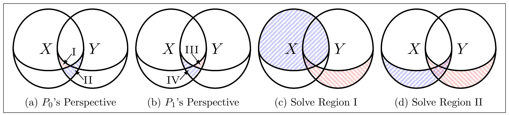

{0}------------------------------------------------

# Updatable Private Set Intersection from Symmetric-Key Techniques

Junxin Liu<sup>1</sup> , Peihan Miao<sup>2</sup> , Mike Rosulek<sup>1</sup> , Xinyi Shi<sup>2</sup> , and Jifeng Wang<sup>2</sup>

> <sup>1</sup>Oregon State University, USA <sup>2</sup>Brown University, USA

#### Abstract

Private set intersection (PSI) has become extremely practical, in large part due to the fact that modern protocols rely almost exclusively on cheap, symmetric-key cryptography. The same cannot be said for the variant of PSI called updatable PSI (UPSI; Badrinarayanan et al., PoPETS 2022), where parties' input sets evolve over time, and the cost of re-computing the intersection depends only on the changes to their sets. In existing UPSI protocols, the number of public-key operations scales with the number of items.

In this work, we introduce the first UPSI protocol that largely avoids public-key operations. In fact, our protocol uses mostly the same protocol tools/techniques that have been so successful in making (plain) PSI truly practical. By leveraging symmetric-key primitives, our implementation achieves orders-of-magnitude improvements over prior work.

Additionally, we observe that existing UPSI security proofs do not consider an adversary who can choose protocol inputs adaptively (i.e., choose which items to add to the set the current epoch based on the adversary's view in previous epochs). We observe that several existing UPSI protocols are trivially broken by such adaptive input selection (even with semi-honest corruption). Several variants of our protocol are secure in the presence of adaptively chosen inputs.

Along the way, we also introduce a new and cleaner abstraction for a common idiom of using an oblivious key-value store (OKVS; Garimella et al., Crypto 2021) to represent a set of items. Our new abstraction, called affine set encoding, may be of independent interest.

# 1 Introduction

Private set intersection (PSI) enables two parties to jointly compute the intersection of their private sets without revealing any additional information. A special case of secure multiparty computation (MPC) [\[Yao86,](#page-33-0)[GMW87\]](#page-31-0), this simple yet powerful functionality has numerous applications in practice, including password breach detection [\[TPY](#page-33-1)+19], online advertising measurement [\[IKN](#page-31-1)+20], and mobile contact discovery [\[KRS](#page-32-0)+19]. Thanks to a long series of optimizations [\[PSZ14,](#page-32-1) [PSSZ15,](#page-32-2) [KKRT16,](#page-32-3) [RR17,](#page-32-4) [PSTY19,](#page-32-5) [PRTY19,](#page-32-6) [CM20,](#page-31-2) [PRTY20,](#page-32-7) [RS21,](#page-33-2) [RR22,](#page-33-3) [BPSY23\]](#page-30-0), leading PSI constructions [\[RS21,](#page-33-2)[RR22\]](#page-33-3) can compute the intersection of millions of items in under a second.

Like most non-trivial secure 2-party computation protocols, PSI cannot be realized with blackbox use of symmetric-key cryptography (one-way functions) alone [\[IR89\]](#page-31-3). Some public-key operations are necessary. However, an approach pioneered by Pinkas, Schneider, and Zohner [\[PSZ14\]](#page-32-1) shows how to achieve PSI using only a small number (e.g., 128 instances) of public-key operations, 

{1}------------------------------------------------

independent of the number of items. First, design a PSI protocol that uses only symmetric-key operations, but assuming access to ideal oblivious transfer (OT) [\[Rab81\]](#page-32-8). Then, use OT extension [\[Bea96,](#page-30-1) [IKNP03\]](#page-31-4) to obtain arbitrary number of OT instances from just λ (e.g., 128) "base OT" instances. All of the most efficient PSI protocols use this paradigm.[1](#page-1-0) We refer to these kinds of protocols, which require only a constant number of public-key operations, as symmetric-key PSI, for short.

Updatable PSI. Many applications of PSI require parties to periodically compute intersections of their sets, which change incrementally over time. For instance, in applications like password breach detection and advertising measurement, datasets are periodically updated with small sets of new elements.

In response to these applications, Badrinarayanan, Miao, and Xie [\[BMX22\]](#page-30-2) introduced updatable PSI (UPSI). UPSI allows parties to periodically compute the intersection of sets that evolve incrementally. The key advantage of UPSI is that the computation and/or communication costs scale only with the size of the updates, rather than the entire sets. When the sets are very large but change slowly over time, UPSI promises to be considerably faster than re-computing the intersection "from scratch" using plain PSI.

Problem statement. While the fastest protocols for plain PSI are all symmetric-key protocols, none of the currently proposed UPSI protocols [\[BMX22,](#page-30-2)[BMS](#page-30-3)+24,[ACG](#page-30-4)+24,[LTQ24\]](#page-32-9) are.[2](#page-1-1) They all require a linear (in the number of items) amount of public-key operations such as homomorphic encryption. As a result, despite its superior asymptotic cost, UPSI is concretely slower than repeatedly re-running plain PSI, for many reasonable set sizes. This state of affairs prompts the following question:

Can we achieve the best of both worlds: UPSI with symmetric-key techniques, and with asymptotic complexity only scaling with the size of the updates?

Adaptively chosen inputs. UPSI is inherently a reactive functionality, meaning that parties provide inputs and receive outputs over many rounds. In MPC, the environment chooses the inputs of the honest parties, and when the functionality is reactive, this choice of inputs for a round can depend on what the adversary has observed in previous rounds. We call this security against adaptively chosen inputs, and it is in fact the default notion of security for reactive functionalities [\[Can01\]](#page-30-5).

Note that the question of adaptively chosen inputs is orthogonal to the question of whether corrupt parties are semi-honest or malicious (in this work, semi-honest), or whether the adversary can corrupt parties adaptively or statically (in this work, statically). This is a separate issue that arises only because of the reactivity of the ideal functionality, and it does not exist in the plain-PSI setting (where the adversary's choice of inputs for the honest parties necessarily happens before the protocol starts).

<span id="page-1-0"></span><sup>1</sup>Some protocols, instead of using OT extension, use the very closely related primitive of vector oblivious linear evaluation (VOLE) [\[BCGI18\]](#page-30-6).

<span id="page-1-1"></span><sup>2</sup>The only exception is Agarwal et al. [\[ACG](#page-30-4)<sup>+</sup>24], which requires an oblivious pseudorandom function (OPRF) that can be instantiated with either public-key operations or generic 2PC (making non-black-box use of symmetric cryptography). To clarify, by "symmetric-key PSI" we mean constructions that only make black-box use of symmetric cryptography.

{2}------------------------------------------------

A closer look at prior UPSI protocols shows that none of them consider adaptively chosen inputs in their formal threat model. This motivates the following question:

Are UPSI protocols actually secure in the presence of adaptively chosen inputs?

## 1.1 Our Results

Symmetric-key UPSI. Our main result is a new framework for semi-honest, symmetric-key UPSI, based on vector oblivious linear evaluation (VOLE) [\[BCGI18\]](#page-30-6). At a high level, the UPSI framework is built on a primitive we formalize as "updatable" oblivious pseudorandom function, which in turn is constructed from a new abstraction called "updatable" affine set encoding (ASE). ASE encodes a set into a data structure that supports efficient membership testing. This abstraction is closely related to oblivious key-value stores (OKVS) [\[GPR](#page-31-5)+21], but is relaxed in several aspects while still sufficient for PSI (see [Section 3](#page-6-0) for details). By instantiating the framework with different updatable ASE constructions, we obtain a suite of UPSI protocols whose computation and/or communication complexity only scale with the size of the updates (except for a logarithmic factor). We implement three such instantiations and show orders-of-magnitude improvements in the end-to-end running time over prior work.

Adaptive Inputs. We revisit the security model of UPSI and explicitly consider adaptively chosen inputs in our security analysis. Adaptivity makes a difference. We identify several existing protocols which were proven secure in the selective setting, but are insecure against a semi-honest adversary that adaptively chooses inputs. Finally, we present variants of our UPSI protocol that are secure in the presence of adaptive inputs.

## 1.2 Technical Overview

Starting point: PSI from OKVS and VOLE: Our starting point is the current state-of-the-art method for symmetric-key PSI that combines an oblivious key-value store (OKVS) [\[GPR](#page-31-5)+21] with an instance of vector oblivious linear evaluation (VOLE) [\[BCGI18\]](#page-30-6), the result of a long line of work [\[PRTY20,](#page-32-7)[GPR](#page-31-5)+21,[RS21,](#page-33-2)[RR22\]](#page-33-3). Roughly speaking, the protocol works as follows:

- The PSI receiver encodes her set X into a special vector ⃗d called an OKVS. The specifics of OKVS are not crucial for this summary.
- The parties invoke VOLE, where the receiver's input is the OKVS vector ⃗d, the sender's input is a secret scalar ∆, and the output is an additive sharing of the vector ∆ · ⃗d. Naturally, the sender learns nothing about ⃗d and the receiver's PSI input.
- The sender can define a function F based on ∆ and his VOLE output share, with the following properties:
  - If x ∈ X, then the receiver can use her own VOLE output shares to compute F(x).
  - If x ̸∈ X, then the correct value of F(x) is pseudorandom given the receiver's view.

In other words, the protocol so far gives rise to an oblivious PRF (OPRF).

• The sender can send F(y) for every y in his set. If y is common to both parties, then the recevier will recognize F(y) and include y in her output; otherwise, F(y) will look random 

{3}------------------------------------------------

and leak nothing about y to the receiver, other than the fact that the sender has some item outside the intersection.

New abstraction: Affine Set Encoding (ASE). Oblivious key-value stores (OKVS) were originally introduced in [GPR<sup>+</sup>21] as a useful abstraction for PSI protocols. OKVS enjoys several applications within the PSI space, but we find that it is not an ideal abstraction for VOLE-PSI and our modifications of the paradigm. We elaborate more on the reasons in Section 3, but an important one is that OKVS represents a key-value mapping, whereas what we really need is an encoding of a set of items.

As an alternative, we propose a new abstraction that we call an **affine set encoding (ASE)**. ASE provides exactly what is needed for the VOLE-PSI paradigm and our new modifications described below. Roughly speaking, an ASE consists of two algorithms:

- Encode(X)  $\rightarrow \vec{d}$ : encodes a set of items X (not a key-value mapping!) into a vector  $\vec{d}$  over a field  $\mathbb{F}$ .
- Test $(\vec{d}, x) \to \{\text{true}, \text{false}\}$ : tests whether an item x is in the set represented by  $\vec{d}$ . Importantly, Test must be *affine* in the following sense: Based on x, it chooses an affine function  $P_x$  on field  $\mathbb{F}$ , and returns true iff  $P_x(\vec{d}) = 0$ .

Updatable ASE and Updatable OPRF. In the VOLE-PSI paradigm, parties hold additive shares of  $\Delta \cdot \vec{d}$ , where  $\vec{d}$  is now the ASE encoding of the receiver's set. Suppose the ASE is updatable in the sense that items can be added/removed from the set by making a small number of modifications to the ASE vector  $\vec{d}$ . Suppose further that there is a way to make those modifications obliviously and homomorphically, inside the VOLE sharing.

For example, suppose that an item can be inserted into an ASE by modifying a single entry j in the vector  $\vec{d}$ . To update the VOLE correlation (additive shares of  $\Delta \cdot \vec{d}$ ), parties simply need to generate an additive sharing of  $\Delta \cdot \vec{e}$ , where  $\vec{e}$  is zero everywhere except at position j. Adding this new sharing to the existing one, they obtain a proper VOLE correlation for the updated ASE. If the ASE allows j to be public, then the parties can perform a single OLE (obtaining shares of  $\Delta \cdot \vec{e}[j]$ ) and update their VOLE shares only at that location. Otherwise, they can generate shares of  $\Delta \cdot \vec{e}$  while hiding j, with communication cost  $O(\lambda \log |\vec{d}|)$  where  $\lambda$  is the security parameter and  $|\vec{d}|$  is the length of  $\vec{d}$ , using the puncturable PRF technique of Doerner and shelat [Ds17].

We formalize this notion of updatable ASE and describe a variety of simple constructions. We also describe efficient methods to obliviously perform these updates on VOLE correlations, as in the example above. These oblivious updates give rise to an **updatable OPRF** protocol. The receiver in an updatable OPRF protocol maintains a set X and always knows the values  $\{F(x)\}_{x\in X}$ , where F is a pseudorandom function known to the sender. The receiver can add/remove items from X at any time, and the sender only learns its cardinality.

The definition of updatable OPRF is highly non-trivial. Recall that the pseudorandom function F is defined in terms of the parties' VOLE shares. So as the parties update the VOLE sharing of the ASE vector, the function F will evolve as well! Every update may modify the values of certain F(x), even for x not necessarily involved in the update. Thus, the OPRF must provide a way for parties to learn which F-outputs have been changed as a result of each update. Interestingly, we found that a game-based security definition for updatable OPRF was much simpler to manage than the real/ideal-world paradigm.

{4}------------------------------------------------

The dynamic nature of updatable OPRF also makes the construction particularly tricky. As an illustration, when the receiver adds an item x ∗ to her set, the function F evolves; however, the changes to F must still hide x <sup>∗</sup> against the sender, who is able to compute F on any input (including x ∗ ) both before and after the update. We resolve this subtlety through the notion of "update simulatability" which we define for the underlying updatable ASE.

Updatable PSI. Naturally, updatable OPRF gives rise to an updatable PSI (UPSI) protocol. But unlike the case of plain OPRF and plain PSI, the construction is non-trivial and involves additional subtleties. The main challenge lies in handling how the pseudorandom function F evolves over time. For example, when Alice adds an item x ∗ to her set, she is likely to send F(x ∗ ) to Bob. Suppose x ∗ is not currently in his set, but is added at a later point. As discussed above, the value of F(x ∗ ) may or may not have changed. If it has not been changed, then Bob can learn F(x ∗ ) and match with the value he received from Alice earlier; however, this allows him to deduce the moment Alice added x ∗ , which is not allowed in UPSI. On the other hand, if F(x ∗ ) has changed to a new value, then in order for Bob to identify the match, Alice must send him the new value of F(x ∗ ), causing her communication cost to grow with her entire set, again not allowed in UPSI. Much of the complexity in our UPSI protocol stems from dealing with OPRF changes and characterizing what information can and cannot be revealed to the parties.

"Relaxed" ASE and OPRF. It turns out that the preceding approach for UPSI is still not enough for a truly efficient protocol. Natural constructions of ASE are simply not updatable in the necessary way. Thus, we introduce a variant of ASE called k-relaxed ASE. When a standard ASE checks for the presence of an item in the set, the result is a single definitive answer. In a k-relaxed ASE, we get "k answers," one of which is guaranteed to be correct. More formally, the ASE Test algorithm identifies k affine functions and returns true if any one of them evaluates to 0 on the ASE vector.

Such a k-relaxed [updatable] ASE can be used to build a k-relaxed OPRF. In a k-relaxed [updatable] OPRF, for each item x, there is not a single F(x) value but k of them. The sender can compute all k of these values for any x. If the receiver has x in her set, then she is guaranteed to learn one of these F(x) values, with no particular guarantee about which one she learns.

Armed with such a relaxed OPRF, we can (intuitively) achieve PSI by asking the sender to send, for each of its items y, all k of the F(y) values. If y is common to both parties, then the receiver will recognize one of them; otherwise, all will look pseudorandom. In this way, a k-relaxed OPRF inflates the communication for PSI by a factor of k. However, the relaxed variant of ASE is much easier to make updatable. We describe a range of relaxed [updatable] ASE constructions with k ∈ {Θ(1), Θ(log log N), Θ(log N)}.

# <span id="page-4-1"></span>2 Attacks on Adaptive Security

UPSI is a reactive functionality: inputs and outputs happen over many rounds of interaction. In the default MPC security model for a reactive functionality, an adversary is allowed to choose the inputs to the next round adaptively, based on its view of the protocol from previous rounds.[3](#page-4-0) Note: this issue is orthogonal to the question of whether corruptions happen adaptively (in this paper,

<span id="page-4-0"></span><sup>3</sup>Adaptively chosen inputs are also commonly considered in ORAM definitions [\[GKW18,](#page-31-7)[IKH](#page-31-8)<sup>+</sup>23[,AKLS23\]](#page-30-7), where RAM operations may be chosen adaptively in each round of the reactive functionality based on the adversary's view.

{5}------------------------------------------------

we consider only static corruptions), and whether we consider semi-honest or malicious adversaries (we consider only the semi-honest case).

However, when we take a closer look at how prior UPSI papers define security, we see that all of them use a strictly weaker security definition. Specifically, they define security by quantifying over all sequences of inputs to the functionality. Thus, the choice of inputs in one round cannot depend on the adversary's protocol view from earlier rounds; instead, the input sequence is fixed at the beginning of time.

This distinction matters. As we demonstrate below, some protocols [\[BMX22,](#page-30-2)[BMS](#page-30-3)+24[,ACG](#page-30-4)+24] are broken in the presence of adaptively chosen inputs — even by a semi-honest adversary. We emphasize that we are not claiming any errors in prior security proofs, only that the theorem statement is too weak.

The attack. Several prior UPSI constructions [\[BMS](#page-30-3)+24,[ACG](#page-30-4)+24] use a data structure inspired by the Path ORAM constuction [\[SvDS](#page-33-4)+13]. Each party encodes its set into a binary tree, such that item x is placed somewhere along the path from the root to the leaf with index h(x). Here h is a random function (called the position map in Path ORAM) whose range is the set of leaves. In Path ORAM, h is private to the ORAM client, but in these UPSI protocols it is a public (pseudo)random function, because both parties need to be able to probe the data structure for the presence of x.

Since h is public in these UPSI protocols, an adversary's adaptive choice of inputs can depend on h. It is easy for such an adversary to break correctness of the data structure by finding many items that collide under h — more items than the capacity of any root-to-leaf path — and instruct the honest party to add these to its set. Note that the range of h is polynomial in size, so it is efficient to find large multi-collisions through brute force. The data structure will necessarily overflow, breaking correctness of the protocol.

It is also possible to use this kind of attack to break privacy as well. Suppose a victim's current set is a singleton, containing either x or x ′ . The adversary can determine which is the case, with non-negligible advantage, as follows: First, simply abort unless the two leaves h(x) and h(x ′ ) are on opposite sides of the root (which happens with probability 1/2). Suppose the maximum capacity of an entire root-to-leaf path is c. As above, the adversary can efficiently find a set S of c items (not including x) that all collide with x under h, then instruct the victim to add these items to her set. To insert into the Path ORAM structure, the items are first temporarily added to the root, and then items are "pushed down" as far as possible along c randomly chosen eviction paths. Note that these eviction paths are made public in the UPSI protocol. Abort unless h(x) is among those random eviction paths, which happens with (inverse polynomial) probability roughly c/N. Now, if the victim initially had x, then she holds c + 1 items which must be placed along a single path of capacity c, so she must overflow/abort. If she initially had x ′ , then she will not overflow, because the items of S will fit perfectly on the path (since the path was chosen as an eviction path), while x ′ will be placed in the opposite subtree from the root. Overall, this attack gives the adversary inverse polynomial advantage to detect the presence of x vs. x ′ .

Some UPSI protocols do not use the same path-ORAM-inspired data structure (e.g., the twosided addition-only UPSI from [\[BMX22\]](#page-30-2)). They do not represent the parties' sets using any data structure whose analysis relies on statically chosen inputs. Thus, we suspect such protocols to be fully secure, including against adaptively chosen inputs. Plain PSI protocols are also not affected, since in the plain PSI setting, the data structure parameters can/should be chosen only after the honest party's inputs are fixed.

{6}------------------------------------------------

## <span id="page-6-0"></span>3 Affine Set Encodings

Overview of OKVS, and the need for a new abstraction. Oblivious key-value stores (OKVS) were introduced by Garimella et al. [GPR<sup>+</sup>21] as a useful abstraction for PSI protocols. An OKVS has functions Encode and Decode. Given a set of key-value pairs  $S = \{(x_1, y_1), (x_2, y_2), ...\}$  as input, the Encode function produces an object  $\vec{d}$  such that Decode $(\vec{d}, x_i) = y_i$  for all  $(x_i, y_i) \in S$ . Of course it is possible to call Decode $(\vec{d}, x)$  on any x, not necessarily one of the  $x_i$ 's given to Encode.

As mentioned previously, a standard application of OKVS is to represent a set by encoding key-value pairs of the form  $(x_i, y_i = H(x_i))$ , where H is a suitable hash function. We argue that OKVS is not the ideal abstraction for this application:

Most importantly, OKVS encodes a key-value mapping, whereas for PSI we really need an encoding of a set of items. The correctness properties of an OKVS are stated in terms of arbitrary choices of keys and values. Then, in order to argue about representing a set, we need to reason about additional properties of the key-value pairs (e.g., they are of the form  $x \mapsto H(x)$ ), beyond the OKVS abstraction. A better abstraction would handle all necessary reasoning about encoding sets.

The problem is amplified when we start to consider updating the contents of an OKVS. Suppose we represent a set by an OVKS mapping of  $x_i \mapsto H(x_i)$  pairs as usual. Now when we want to delete an item  $x_i$  from the set, we must insist that  $\mathsf{Decode}(\vec{d}, x_i) \neq H(x_i)$  anymore. This is a kind of negative correctness requirement on the OKVS, which greatly complicates the definitions.

Finally, the "obliviousness" property of OKVS is not needed for this application to VOLE-PSI (although it is important in some other applications of OKVS). The data structure does not need to hide anything, because parties see only VOLE secret shares. On the other hand, it is the OKVS "linearity" property that is crucial here, because that is what allows the parties to perform OKVS lookups homomorphically on their VOLE sharing.

With these observations in mind, we propose a new abstraction that we call **affine set encoding** (ASE), which is meant to capture exactly what is needed for VOLE-PSI and our adaptation of it for UPSI.

### 3.1 Affine Set Encoding

**Definition 3.1.** A set encoding consists of the following algorithms:

- $\mathsf{Encode}(S) \to \vec{d}$ : takes as input a set of items and outputs a data structure.
- $\mathsf{Test}(\vec{d},x) \to 0/1$ : takes as input a data structure and an item, and outputs a boolean.

We defer a formal definition of correctness until later, after introducing more variations of this primitive. But intuitively, the set encoding should satisfy that  $\mathsf{Test}(\mathsf{Encode}(S), x) = [x \in S]$  for all x.

In this work we will require the set encoding to be affine, in the following sense:

<span id="page-6-1"></span>**Definition 3.2.** In an affine set encoding (ASE), we have the following:

- The data structure  $\vec{d}$  is comprised of two pieces,  $\vec{d} = (\vec{d}_{lin}, d_{non})$ :
  - $-\vec{d}_{lin}$ : a "linear" part, which is a vector over some field  $\mathbb{F}$ ;
  - $-d_{non}$ : a "nonlinear" part, which is arbitrary.

{7}------------------------------------------------

• The Test algorithm has the following form, for some algorithm Probe that outputs an F-vector:

$$\mathsf{Test}(\vec{d}, x) = \left[ \left\langle \mathsf{Probe}(d_{non}, x), \ (\vec{d}_{lin}, -1) \right\rangle \stackrel{?}{=} 0 \right]$$

Intuitively, the Test algorithm works as follows: based on x and the non-linear part dnon, compute a "probe vector" π and then check whether the inner product ⟨π,( ⃗dlin, −1)⟩ = 0.

## 3.2 Relaxed ASE

It will be useful to relax the definition of ASE, so that the output of Test is the disjunction of several affine constraints.

Definition 3.3. In a k-relaxed affine set encoding (k-ASE), the Probe algorithm outputs a matrix with k rows. Then, viewing ⃗dlin as a column vector, Test proceeds by checking:

$$\mathsf{Test}(d,x) = \left[0 \stackrel{?}{\in} \underbrace{\left(\mathsf{Probe}(d_{non},x) \times [\vec{d}_{lin},-1]\right)}_{a \ vector \ of \ length \ k}\right]$$

When k = 1, the definition collapses to [Definition 3.2.](#page-6-1) We remark that k may be a function of public parameters, like the cardinality of the set. For example, we may consider an O(log N)-relaxed ASE for sets of size N.

Strict ASE. The definition says that when x is in the set, then at least one position of the vector Probe(· · ·) × [ ⃗dlin, −1] is zero. Looking ahead, it will be convenient for us to demand that exactly one position is zero in this case.

<span id="page-7-0"></span>Definition 3.4. We say that an ASE is strict if Test returns false whenever there is more than one zero in Probe(· · ·) × [ ⃗dlin, −1].

Throughout the rest of this work, we focus on strict+relaxed ASE.

## 3.3 Updatable ASE

We now introduce a further variant of (k-)ASE called updatable ASE. The idea is to formalize what kinds of modifications to the ASE data structure are necessary to add/remove items from it.

Definition 3.5. An update command for an ASE data structure is any of the following:

- (add, j, δ, J ), which means: add δ to index #j of ⃗dlin i.e., do ⃗dlin[j] := ⃗dlin[j] + δ. The extra parameter J satisfies j ∈ J and represents what information is "safe to leak" about j. We elaborate below.
- (insert, j), which means: insert 0 at position j of ⃗dlin, lengthening it by 1.
- (delete, j), which means: delete position j from ⃗dlin, shortening it by 1.
- (non-lin, d′ non), which means: replace non-linear part dnon with d ′ non.

An update sequence is a sequence of update commands. If U is an update sequence and ⃗d is an ASE data structure, then we write Apply(d, U) to refer to the result of applying the update commands to ⃗d, according to their meanings defined above.

{8}------------------------------------------------

**Definition 3.6.** An **updatable** (k-relaxed) ASE includes an additional algorithm:

• Update $(d, S, S^+, S^-) \rightarrow U$ : Given input an ASE data structure d representing S and modifications  $S^+, S^-$ , outputs an update sequence U.

The intuition is that Update outputs an update sequence that modifies the existing ASE to add the items in  $S^+$  and remove items in  $S^-$ .

In the context of updatable ASE, we do not consider an explicit Encode function. Instead, we can imagine encoding any set by making suitable *updates* to a canonical encoding of the empty set — say,  $\vec{d} = (\bot, \bot)$ .

### 3.4 Correctness & Security

In this section, we define the correctness and update-simulatability of updatable ASE.

Correctness. Intuitively, the correctness says that after any adversarially chosen additions/deletions to an ASE, its Test algorithm correctly determines membership in the underlying set, on all inputs. The correctness definition is presented in Definition 3.7.

<span id="page-8-0"></span>**Definition 3.7.** An updatable (k-)ASE is **correct** if the following two games are indistinguishable:

The output of Test truthfully indicates the presence/absence of x in the set, when the sequence of updates are adversarially chosen.

By default, an adversary in these games may choose its oracle queries adaptively, leading to a notion of adaptive correctness. It is therefore important that the adversary sees  $\vec{d}$  in the game (in our UPSI protocol, an adversary may indeed see  $\vec{d}$  and then adaptively choose future updates).

We can also consider the case where the adversary's oracle queries are chosen statically at the beginning of time, leading to a weaker notion of **non-adaptive correctness**. In this case, it is not so important that the adversary sees  $\vec{d}$ .

We may also consider the case where correctness holds only when  $S^- = \emptyset$  in every call to the game's update oracle. In other words, the ASE does not support deletion. We call such an ASE addition-only.

**Update-simulatability.** Looking ahead, when a party in our UPSI protocol updates their set, they will reveal some "metadata" (leakage) about the update to the other party. Briefly, the

{9}------------------------------------------------

parties reveal everything about the entire update-command sequence, except the j and  $\delta$  values in  $(add, j, \delta, \mathcal{J})$  commands. In Definition 3.8, we present a definition that formalizes the idea that this leakage reveals no more than the number of items added/removed by the update.

<span id="page-9-0"></span>**Definition 3.8.** We define UpdateLeakage to be a function that characterizes what information is "safe" to publicly leak about an update command. Specifically,

```
\begin{split} \mathsf{UpdateLeakage}\big((\mathtt{add},j,\delta,\mathcal{J})\big) &= (\mathtt{add},-,-,\mathcal{J}) \\ \mathsf{UpdateLeakage}\big((\mathtt{insert},j)\big) &= (\mathtt{insert},j) \\ \mathsf{UpdateLeakage}\big((\mathtt{delete},j)\big) &= (\mathtt{delete},j) \\ \mathsf{UpdateLeakage}\big((\mathtt{non-lin},d')\big) &= (\mathtt{non-lin},d') \end{split}
```

In other words, UpdateLeakage redacts the  $\delta$  and j parameters in an add command. For example,  $(add, j, \delta, \{j\})$  means that the index j can be publicly revealed, while  $(add, j, \delta, \{1, \ldots, |\vec{d}_{lin}|\})$  means that no information about j is publicly revealed.

We extend UpdateLeakage to a sequence of update commands in the natural way. Then, we say that an updatable (k-)ASE is **update-simulatable** if UpdateLeakage(Update $(d,S,S^+,S^-)$ ) leaks no more than the cardinalities of the sets. More formally, there exists a PPT simulator  $Sim_{\mathsf{ASE}}$  such that the following two games are indistinguishable:

```
 \begin{split} & \underline{ \text{INITIALIZE}() : } \\ & \overline{ \vec{d} := (\bot, \bot) ; \, S := \emptyset } \\ & \underline{ \text{UPD}(S^+, S^-) : } \\ & \underline{ \text{assert } S^+ \cap S = \emptyset \text{ and } S^- \subseteq S } \\ & U \leftarrow \mathsf{Update}(\vec{d}, S, S^+, S^-) \\ & \vec{d} := \mathsf{Apply}(\vec{d}, U) \\ & L := \mathsf{UpdateLeakage}(U) \\ & S := S \cup S^+ \setminus S^- \\ & \text{return } L \end{split}
```

```
\frac{\text{INITIALIZE}():}{\overrightarrow{d}:=(\bot,\bot); S:=\emptyset; \sigma=\bot}

\frac{\text{UPD}(S^+,S^-):}{\text{assert } S^+\cap S=\emptyset \text{ and } S^-\subseteq S

(L,\sigma)\leftarrow Sim_{\mathsf{ASE}}(\sigma,|S^+|,|S^-|)

S:=S\cup S^+\setminus S^-

\text{return } L
```

In the left game, the adversary can make updates to an underlying (private) ASE data structure, and view only the leakage from the resulting update sequence. In the right game, this update leakage is simulated, based only on the cardinalities of  $S, S^+, S^-$ . The simulator is stateful, with its state stored in  $\sigma$ .

By default, this definition considers an adversary who makes **adaptive** queries to the oracles in the security game. We may also consider the **non-adaptive** case, in which the adversary chooses its entire query sequence at the beginning of the game.

We emphasize that the only things hidden from the adversary in the update-simulatability definition are the contents and changes to  $\vec{d}_{\rm lin}$ , and some partial information about the indices of  $\vec{d}_{\rm lin}$  that are modified.

### <span id="page-9-1"></span>3.5 ASE Constructions

We view our main contribution in this section to be the ASE abstraction itself. Below we briefly review constructions of ASE, which are either relatively elementary or implicit in prior work. More

{10}------------------------------------------------

details are deferred to [Appendix A,](#page-34-0) and a summary of costs for these ASE constructions is given in [Table 1.](#page-18-0)

OKVS. We introduced ASE as a refinement of the OKVS abstraction from [\[GPR](#page-31-5)+21], and specifically the idiom of encoding key-value pairs of the form x 7→ H(x) into the OKVS. If the OKVS is linear, and collisions are suitably hard to find in H, then this idiom leads immediately to an ASE. However, the resulting ASE is not necessarily updatable.

Based on hash tables. Many ASE constructions can be built from the following idiom: the presence of x in the set is denoted by placing a special "sentinel" value H(x) at some position j in ⃗dlin. This idiom is compatible with ASE because testing for the presence of H(x) at position j is an affine constraint:

$$\vec{d}_{\text{lin}}[j] = H(x) \iff \left\langle (\vec{d}_{\text{lin}}, -1), (\underbrace{0, \dots, 1}_{j}, \dots, 0, H(x)) \right\rangle = 0$$

Similarly, suppose we indicate the presence of x in the set by placing sentinel H(x) at one of the positions {j1, . . . , jk}. Testing for the presence of x is therefore a disjunction of k affine constraints, leading to a k-relaxed ASE.

In [Appendix A.1,](#page-34-1) we describe several natural ASE constructions based on this paradigm, using simple hashing, two-choice hashing, and cuckoo hashing.

ASE from Path ORAM. Several prior UPSI protocols [\[BMS](#page-30-3)+24,[ACG](#page-30-4)+24] use a data structure inspired by the tree-based Path ORAM construction [\[SvDS](#page-33-4)+13]. This data structure can be cast as an ASE.

The main idea is to consider a full/complete binary tree, and indicate the presence of x in the set by placing sentinel value H(x) anywhere along the path from root to leaf #h(x). In Path ORAM, h(·) is the position map and it is secret to the client. In UPSI, h(·) is public, allowing both parties to know where to probe while testing for membership. To insert an item, temporarily place it at the root and then "evict" (push items down as far as possible) along a random root-to-leaf path.

A useful feature of this construction is that insertions only affect a single eviction path, that is chosen independent of the item being inserted. Thus, the eviction path can be made public, which makes the cost of additions in our protocol significantly lower. We defer more details to [Appendix A.2.](#page-36-0)

Achieving Adaptive Correctness/Security. Only one of the previous ASE constructions can tolerate adaptively chosen inputs. The most efficient constructions (based on existing OKVS literature [\[GPR](#page-31-5)+21,[RR22,](#page-33-3)[BPSY23\]](#page-30-0)) are not updatable. Most of the constructions above support only sets of a fixed cardinality. We can overcome all of these limitations simultaneously, via a simple construction that converts a non-updatable ASE into an updatable, unbounded size, adaptively correct/secure ASE.

The main idea is to partition the current items across a collection of small ASEs, having size 1, 2, 4, 8, . . . . These component ASEs are immutable, meaning that we do not need them to be updatable. Instead, we handle updates by periodically destroying and regenerating a new component ASE. A simple amortized argument shows that we only need to discard/regenerate the ASE of size 2<sup>n</sup> once every 2<sup>n</sup> insertions. In other words, the amortized update cost associated with each component ASE is constant. Since there are O(log N) of them, the overall amortized cost of 

{11}------------------------------------------------

updates is O(log N). Additionally, each component ASE is generated only when its contents have already been fixed. Thus the overall construction tolerates adaptively chosen inputs even if the component ASE does not.

The overall construction can support adaptive deletions as well, if the underlying ASE does (and we point out that adaptive correctness for deletion-only ASE is rather easy to achieve). See more details in [Appendix A.3.](#page-36-1)

# 4 Updatable, Relaxed OPRF

## 4.1 Syntax, Definition

In this section we introduce our definition for updatable, relaxed OPRF. An OPRF protocol involves a sender and a receiver. Intuitively, a k-relaxed OPRF protocol instantiates a (pseudo)random function F whose inputs are of the form (x, i) where i ∈ [k]. The sender can evaluate F on any (x, i). At all times, the receiver has a set X of items; for each of these items x ∈ X, the receiver will know a tuple (x, i, o), where o = F(x, i). The receiver chooses the x value for the tuple, but not the i value — it is "chosen" by the protocol.

Through an interactive protocol, the receiver can update (add/remove items from) her set X. Such updates can cause the underlying random function to reset at certain points, meaning that the output F(x, i) is freshly re-sampled for certain inputs. We make no demands on which values are reset, apart from what is implied by the security definitions. However, the OPRF protocol must give both parties a way to know when outputs have been reset.

Protocol Interface. We define an updatable OPRF protocol to consist of several interactive phases and other non-interactive helper functions. The protocol participants are stateful, but for simplicity we do not include their state as explicit input/output of the protocol interface. We denote the overall protocol as ΠOPRF. Its interactive phases are as follows:

- Π.init() → (viewR, ⊥),(viewS, ⊥) . This is the initialization phase. Parties have no inputs, and no formal outputs. They obtain respective views (viewR, viewS) of the protocol execution, which we include here for use in later security definitions. Here the notation follows the convention that the protocol output is written as ((receiver's view, receiver's output), (sender's view, sender's output)). Since in this phase both parties have no outputs, the output components are ⊥.
- Π.upd (X+, X−), ⊥ → (viewR, outs),(viewS, ⊥) . In this phase, the receiver updates their set X. The receiver provides (X+, X−), denoting items to be added or removed. The sender provides no input and gets no output. The receiver's output outs is a set of all new (x, i, o) tuples — this includes tuples where x ∈ X<sup>+</sup> is a new item, as well as existing items x whose OPRF output (or corresponding i value) has changed.
- Π.resetall(ok, ok) → (viewR, outs),(viewS, ⊥) . Both parties agree to reset the entire random function. The receiver's output outs is a set of (x, i, o) tuples, as above. In this case, there will be one tuple for each x ∈ X. This function is important for the security of our UPSI protocol in [Section 5.2.](#page-19-0)

The protocol also contains the following non-interactive interfaces:

• Π.evalS(x, i) → out′ . The sender can evaluate the OPRF for any pair (x, i). 

{12}------------------------------------------------

• Π.LastResetTime(x, i) → t. Either party can check when the OPRF output for (x, i) was last reset by the protocol. The output t is a timestamp (say, measured in number of protocol phases). Recall that values may be reset as a side-effect of an upd command or a resetall command.

## 4.2 Correctness and Security Definitions

In this section, we define correctness and game-based security for updatable k-relaxed OPRF.

Correctness. The correctness definition is presented in [Definition 4.1.](#page-12-0) Intuitively, the correctness property is that, if x ∈ X, then the receiver knows an OPRF output F(x, i), which matches what the sender will also compute (from Π.evalS(x, i)).

<span id="page-12-0"></span>Definition 4.1 (OPRF Correctness). We say that an OPRF protocol Π satisfies correctness if, for every probabilistic polynomial-time adversary A, the probability that A causes the oracle check in Game<sup>Π</sup> correct to output 1 is negligible.

We distinguish between adaptive and non-adaptive correctness, depending on how the adversary chooses inputs to the oracles in this game.

```
Game GameΠ
             correct(A)
init():

   (viewR, ⊥),(viewS, ⊥)

                          ← Π.init()
  LastALLTime ← 0
  current time ← 0
  return (viewR, viewS)
upd(X+, X−):
  assert X+ ∩ X = ∅ and X− ⊆ X

   (viewR, outs),(viewS, ⊥)

           ← Π.upd
                      (X+, X−), ⊥

  for all (x, i, o) ∈ outs:
    I[x] ← i, O[x, i] ← o
  for all x ∈ X−:
    remove I[x] and O[x, ∗]
  X ← X ∪ X+ \ X−
  current time ← current time +1
  return (viewR, viewS, outs)
eval(x, i):
  return Π.evalS(x, i)
                                          resetall():

                                             (viewR, outs),(viewS, ⊥)

                                                                      ← Π.resetall
                                                                                       ok, ok
                                            for all (x, i, o) ∈ outs:
                                              I[x] ← i, O[x, i] ← o;
                                              LastALLTime ← current time
                                            current time ← current time +1
                                            return (viewR, viewS, outs)
                                          check(x, i):
                                            if Π.LastResetTime(x, i) < LastALLTime: return 1
                                            if Π.LastResetTime(x, i) > current time: return 1
                                            if x ∈ X and I[x] is undefined: return 1
                                            if x /∈ X and I[x] or O[x, ∗] is defined: return 1
                                            if I[x] = i and O[x, i] is defined:
                                              out′ ← Π.evalS(x, i)
                                              if out′ ̸= O[x, i]: return 1
                                            return 0
```

The "current time" refers to the current epoch number. The correctness game states that the protocol always guarantees the following invariants:

• For every x currently in the receiver's set X, the receiver knows x's ASE index i = I[x] and an OPRF output o = O[x, i], with the property that the sender will also compute o as the result 

{13}------------------------------------------------

of Π.evalS(x, i) at this moment. outs in ΠOPRF.upd and ΠOPRF.resetall must contains all (x, i, o) tuples whose OPRF output has been updated.

- This correctness game ensures all the (x, i, o) tuples are well-formed with the defined i and o bound to x and x ∈ X, and the OPRF outputs from both parties are equal whenever x and i match. Moreover, once an element x is removed, all information associated with x in I and O is also deleted.
- Π.resetall indeed resets every (x, i) pair. Other events may optionally reset some (x, i) pairs, but resetall must reset them all. The LastALLTime denotes the time of the most recent global reset. ΠOPRF.LastResetTime captures LastALLTime and should not be larger than the current time.

The adversary wins the game if either of these invariants is violated.

Security. We present the security against corrupt receiver in [Definition 4.2,](#page-13-0) and the security against corrupt sender in [Definition 4.3.](#page-14-0) Security against a corrupt receiver requires that all outputs of Π.evalS(x, i), except for the (x, i) values known to the receiver (one for every x ∈ X) appear pseudorandom, and reset according to the last-reset-time reported by the protocol. Security against a corrupt sender requires that the interactive update phase leaks nothing to the sender, except the cardinality of the receiver's updates |X+|, |X−|.

<span id="page-13-0"></span>Definition 4.2 (Security against corrupt receiver). We say that Π is secure against semihonest receiver if, for all PPT adversaries A, the two games Game<sup>Π</sup> 1 (A) and Game<sup>Π</sup> 2 (A) are computationally indistinguishable. As usual, we distinguish between adaptive and non-adaptive security, depending on how the adversary chooses inputs to the oracles in this game.

Intuitively, this definition says that the OPRF outputs (as computed by the honest sender) for inputs not held by the receiver look pseudorandom to the receiver, and are indeed reset according to the protocol's reported last reset time.

In more detail, the adversary observes the receiver's interactions during the interactive protocol phases. The adversary also has an oracle eval, representing the honest sender's evaluation of the OPRF. This oracle can only be called on values not currently in the receiver's input set X (this is the meaning of the assert statement). In Game1, the eval oracle simply reports whatever the honest sender would compute as the OPRF output. In contrast, Game<sup>2</sup> maintains a truly random function F, which is reset whenever the protocol's LastResetTime reports as such.

{14}------------------------------------------------

```
Game \mathsf{Game}_1^\Pi(\mathcal{A})
INIT():
    ((\mathsf{view}_\mathsf{R}, \bot), -) \leftarrow \Pi.\mathsf{init}()
    return view<sub>R</sub>
UPD(X^{+}, X^{-}):
    assert X^+ \cap X = \emptyset and X^- \subseteq X
    ((\mathsf{view}_\mathsf{R},\mathsf{outs}),-) \leftarrow \Pi.\mathsf{upd}((X^+,X^-),\bot)
   for all (x, i, -) \in \text{outs}, set \mathcal{I}[x] := i
   for all x \in X^-, remove \mathcal{I}[x]
    X \leftarrow X \cup X^+ \setminus X^-
   return (view<sub>R</sub>, outs)
RESETALL():
    ((\mathsf{view}_\mathsf{R}, \mathsf{outs}), -) \leftarrow \Pi.\mathtt{resetall}(\mathsf{ok}, \mathsf{ok})
    return (view<sub>R</sub>, outs)
EVAL(x, i):
    assert \mathcal{I}[x] \neq i
   return \Pi.eval<sub>S</sub>(x, i)
```

```
Game \mathsf{Game}_2^\Pi(\mathcal{A})
INIT():
   F[-,-] \leftarrow \emptyset
   time[-,-] \leftarrow -\infty
   ((\mathsf{view}_\mathsf{R}, \bot), -) \leftarrow \Pi.\mathsf{init}()
   return view<sub>R</sub>
UPD(X^{+}, X^{-}):
   assert X^+ \cap X = \emptyset and X^- \subseteq X
   ((\mathsf{view}_\mathsf{R},\mathsf{outs}),-) \leftarrow \Pi.\mathsf{upd}((X^+,X^-),\bot)
   for all (x, i, -) \in \mathsf{outs}, set \mathcal{I}[x] := i
   for all x \in X^-, remove \mathcal{I}[x]
   X \leftarrow X \cup X^+ \setminus X^-
   return (view<sub>R</sub>, outs)
RESETALL():
    ((\mathsf{view}_\mathsf{R},\mathsf{outs}),-) \leftarrow \Pi.\mathtt{resetall}(\mathsf{ok},\mathsf{ok})
   return (view<sub>R</sub>, outs)
EVAL(x, i):
   assert \mathcal{I}[x] \neq i
   if \Pi.LastResetTime(x, i) > time[x, i]:
       F[x,i] \leftarrow \{0,1\}^{\ell}
       time[x,i] \leftarrow \Pi.\mathtt{LastResetTime}(x,i)
   return F|x,i|
```

<span id="page-14-0"></span>**Definition 4.3** (Security against corrupt sender). We say that  $\Pi$  is **secure against semi-honest** sender if there exist a simulator  $Sim_{\mathsf{OPRF}}$ , such that for all PPT adversaries  $\mathcal{A}$ , the two games  $\mathsf{Game}_3^{\Pi}(\mathcal{A})$  and  $\mathsf{Game}_4^{\Pi}(\mathcal{A})$  are computationally indistinguishable.

As usual, we distinguish between **adaptive** and **non-adaptive** security, depending on how the adversary chooses inputs to the oracles in this game.

```
Game \mathsf{Game}_{3}^{\Pi}(\mathcal{A})
\frac{\mathsf{INIT}():}{\left(-,(\mathsf{view}_{\mathsf{S}},\bot)\right)} \leftarrow \Pi.\mathsf{init}()
\mathsf{return}\ \mathsf{view}_{\mathsf{S}}
\frac{\mathsf{UPD}(X^{+},X^{-}):}{\mathsf{assert}\ X^{+}\cap X} = \emptyset\ \mathsf{and}\ X^{-}\subseteq X
\left(-,(\mathsf{view}_{\mathsf{S}},\bot)\right) \leftarrow \Pi.\mathsf{upd}\left((X^{+},X^{-}),\bot\right)
\mathsf{return}\ \mathsf{view}_{\mathsf{S}}
\frac{\mathsf{RESETALL}():}{\left(-,(\mathsf{view}_{\mathsf{S}},\bot)\right)} \leftarrow \Pi.\mathsf{resetall}(\mathsf{ok},\mathsf{ok})
\mathsf{return}\ \mathsf{view}_{\mathsf{S}}
```

```
Game \mathsf{Game}_4^\Pi(\mathcal{A})
\frac{\mathsf{INIT}():}{\left(-,(\mathsf{view}_S,\bot)\right)} \leftarrow \Pi.\mathsf{init}()
\mathsf{st} \leftarrow \bot
\mathsf{return}\ \mathsf{view}_S
\frac{\mathsf{UPD}(X^+,X^-):}{\mathsf{assert}\ X^+ \cap X} = \emptyset \ \mathsf{and}\ X^- \subseteq X
(\mathsf{view}_S,\mathsf{st}) \leftarrow \mathit{Sim}_{\mathsf{OPRF}}(\text{"UPD"},\mathsf{st},|X^+|,|X^-|)
\mathsf{return}\ \mathsf{view}_S
\frac{\mathsf{RESETALL}():}{(\mathsf{view}_S,\mathsf{st})} \leftarrow \mathit{Sim}_{\mathsf{OPRF}}(\text{"RESET"},\mathsf{st})
\mathsf{return}\ \mathsf{view}_S
```

{15}------------------------------------------------

The security against corrupt sender demands that the sender's view in the interactive protocol phases can be simulated given only the *cardinality* of the receiver's updates. In  $\mathsf{Game}_3$ , the adversary sees actual views, computed according to the protocol. In  $\mathsf{Game}_4$ , the views are simulated by  $\mathit{Sim}_{\mathsf{OPRF}}$ , which is given only the cardinality of the receiver's inputs  $X^+$  and  $X^-$ . The simulator also keeps some internal state  $\mathsf{st}$ , which is passed along between calls.

- If the first parameter is UPD, then  $Sim_{\mathsf{OPRF}}$  updates state st and produces a simulated sender view that looks like the result of  $\Pi.\mathsf{upd}((X^+,X^-),\bot)$ .
- If the first parameter is RESET, then  $Sim_{\mathsf{OPRF}}$  updates st to reflect  $\Pi.\mathsf{resetall}(\mathsf{ok},\mathsf{ok})$  and produces a new simulated sender view for that case.

The idea is that if the two games are indistinguishable, then the real sender cannot learn anything beyond the sizes of the receiver's updates.

### <span id="page-15-0"></span>4.3 Our Construction

Our construction for updatable k-relaxed OPRF follows the intuition set forth in the introduction. Let (Probe, Update) be an updatable k-relaxed ASE. The receiver maintains an ASE data structure  $\vec{d} = (d_{\text{non}}, \vec{d}_{\text{lin}})$  that represents her current set. The parties collectively maintain additive shares (VOLE shares) of  $\Delta \cdot \vec{d}_{\text{lin}}$ , where  $\Delta$  is the sender's secret scalar. Additionally, the receiver must provide  $d_{\text{non}}$  to the sender (recall that only the  $\vec{d}_{\text{lin}}$  part of  $\vec{d}$  is sensitive in the security definitions for ASE).

Suppose the parties' VOLE shares are  $\boldsymbol{a}$  (receiver) and  $\boldsymbol{b}$  (sender), where  $\boldsymbol{a} - \boldsymbol{b} = \Delta \cdot \vec{d}_{\text{lin}}$ . The sender can define the function for any item x and any index  $i \in [k]$ :

$$F(x, i) = RO\Big(\mathsf{Probe}(d_{\mathrm{non}}, x)[i] \cdot (\boldsymbol{b}, \Delta)\Big)$$

Rewriting in terms of the receiver's share a, and applying linearity, we have:

$$F(x,i) = RO\Big(\mathsf{Probe}(d_{\mathrm{non}},x)[i] \cdot (\boldsymbol{a},0) - \Delta\big(\mathsf{Probe}(d_{\mathrm{non}},x)[i] \cdot (\vec{d}_{\mathrm{lin}},-1)\big)\Big),$$

When x is in the receiver's set, then for some  $i \in [k]$ , we have  $\mathsf{Probe}(d_{\mathrm{non}}, x)[i] \cdot (\vec{d}_{\mathrm{lin}}, -1) = 0$ , by the correctness of ASE. For such a pair (x, i), we then have

$$F(x,i) = RO\Big(\mathsf{Probe}(d_{\mathrm{non}},x)[i] \cdot (\boldsymbol{a},0)\Big),$$

meaning that the receiver can also compute F(x,i). For all other (x,i), we have:

$$F(x,i) = RO\Big(\mathsf{Probe}(d_{\mathrm{non}},x)[i] \cdot (\boldsymbol{a},0) - \Delta \cdot \delta\Big)$$

for  $\delta = \mathsf{Probe}(d_{\mathrm{non}}, x)[i] \cdot (\vec{d}_{\mathrm{lin}}, -1) \neq 0$ . In this expression, everything except  $\Delta$  is known to the receiver. Since  $\Delta$  is random and chosen by the sender and  $\delta \neq 0$ , the receiver cannot make this RO query except with negligible probability, so the output is pseudorandom for the receiver.

We obtain an updatable OPRF by letting the receiver update her ASE, resulting in a sequence of update commands U. These updates can then be performed on the VOLE shares of  $\Delta \cdot \vec{d}_{\text{lin}}$ . Recall that there are 4 kinds of update commands to an ASE. The insert, delete, and non-lin commands can be handled in a straight-forward way, as they can be done publicly. The more

{16}------------------------------------------------

```
\Pi_{\mathsf{OPRF}}.\mathsf{upd}((X^+,X^-),\perp):
parameters:
                                                                                                           Receiver: S^+ \leftarrow \{(x, H(x)) \mid x \in X^+\}
    hash function H, random oracle RO
                                                                                                                S^- \leftarrow \{(x, H(x)) \mid x \in X^-\}
    k-relaxed ASE, field \mathbb{F}
                                                                                                                U \leftarrow \mathsf{Update}(\boldsymbol{d}, S, S^+, S^-)
                                                                                                                X \leftarrow X \cup X^+ \setminus X^-
                                                                                                                X^* \leftarrow \emptyset
\Pi_{\mathsf{OPRF}}.\mathtt{init}(\bot,\bot):
                                                                                                                S \leftarrow S \cup S^+ \setminus S^-
    Receiver: X, S, p \leftarrow \emptyset, d, a \leftarrow 0
                                                                                                                d \leftarrow \mathsf{Apply}(d, U)
    Sender: b \leftarrow 0, sample \Delta \leftarrow \mathbb{F}
                                                                                                                U = \mathsf{UpdateLeakage}(U)
    // a, b are VOLE shares of \Delta \cdot d_{lin}
                                                                                                                send (|X^+|, |X^-|, U) to Sender
    Both: current \leftarrow 0; t \leftarrow 0
                                                                                                           Both: \mathcal{J}_{\mathsf{list}} \leftarrow \emptyset
    \mathsf{view}_\mathsf{S} \leftarrow (\Delta, \boldsymbol{b}); \, \mathsf{view}_\mathsf{R} \leftarrow (\boldsymbol{d}, \boldsymbol{a}, \boldsymbol{p}, S)
                                                                                                            for each cmd \in U:
    output ((view_R, \perp), (view_S, \perp))
                                                                                                                if cmd = (non-lin, d'_{non}):
                                                                                                                    Both: replace d_{\text{non}} \leftarrow d'_{\text{non}}
                                                                                                                        for all pos: t[pos] \leftarrow current
\Pi_{\mathsf{OPRF}}.\mathtt{resetall}(\mathsf{ok},\mathsf{ok}):
                                                                                                                    Receiver: p \leftarrow \emptyset, X^* := X
    Sender: sample b' \leftarrow \mathbb{F}^{|b|}
                                                                                                               if cmd = (insert, j):
    Sender: a' \leftarrow b', and send a' to Receiver
                                                                                                                     Both: insert 0 at position j in a, b
    Receiver: a \leftarrow a + a'
                                                                                                               if cmd = (delete, j):
    Sender: \boldsymbol{b} \leftarrow \boldsymbol{b} + \boldsymbol{b}'
                                                                                                                     Both: delete position j in a, b
                                                                                                               if cmd = (add, j, \gamma, \mathcal{J}):
    Both: for all pos \in [|t|]: t[pos] \leftarrow current
                                                                                                                // Sender knows only (add, -, -, \mathcal{J})
    Receiver: outs \leftarrow \emptyset
        for all x \in X:
                                                                                                                    Both: \mathcal{J}_{\mathsf{list}} = \mathcal{J}_{\mathsf{list}} \cup \mathcal{J}
             v \leftarrow (\mathsf{Probe}(d_{\mathrm{non}}, x) \times [\vec{d}_{\mathrm{lin}}, -1])
                                                                                                                    Both: invoke \mathcal{F}_{DS}(\Delta, (\gamma, j, \mathcal{J}))
                                                                                                                    Receiver: get output a' from \mathcal{F}_{DS}
             i \leftarrow \text{unique } i \text{ s.t. } \boldsymbol{v}[i] = 0
             \tau \leftarrow \Pi_{\mathsf{OPRF}}.\mathsf{LastResetTime}(x,i)
                                                                                                                    Sender: get output b' from \mathcal{F}_{DS}
                                                                                                                    //a'-b'=\gamma^*\cdot\Delta
             o \leftarrow RO(x, i, \tau, \mathsf{Probe}(d_{\mathrm{non}}, x)[i] \cdot (\boldsymbol{a}, 0))
                                                                                                                    Receiver: a[\mathcal{J}] \leftarrow a[\mathcal{J}] + a'
             outs \leftarrow outs \cup \{(x, i, o)\}
                                                                                                                    Sender: b[\mathcal{J}] \leftarrow b[\mathcal{J}] + b'
    Both: current \leftarrow current +1
                                                                                                           Both: for all pos \in \mathcal{J}_{\mathsf{list}}: t[pos] \leftarrow \mathsf{current}
    \mathsf{view}_\mathsf{S} \leftarrow (\boldsymbol{b}'); \, \mathsf{view}_\mathsf{R} \leftarrow (\boldsymbol{a})
                                                                                                            Receiver: for x \in X^+ \cup X^- \cup X^*:
    output ((view_R, outs), (view_S, \bot))
                                                                                                                    \boldsymbol{u} \leftarrow \mathsf{Probe}(d_{\mathrm{non}}, x)
                                                                                                                    for all i \in [k], pos \in [|\boldsymbol{a}|] s.t. \boldsymbol{u}[i, pos] \neq 0:
                                                                                                                        if x \in (X^+ \cup X^*) \land x \notin \boldsymbol{p}[pos]:
 \Pi_{\mathsf{OPRF}}.\mathsf{eval}_{\mathsf{S}}(x,i) for Sender:
                                                                                                                             insert x in \boldsymbol{p}[pos]
    \tau \leftarrow \Pi_{\mathsf{OPRF}}.\mathsf{LastResetTime}(x,i)
    \mathsf{out}' \leftarrow RO(x, i, \tau, \mathsf{Probe}(d_{\mathrm{non}}, x)[i] \cdot (\boldsymbol{b}, \Delta))
                                                                                                                        if x \in X^- \land x \in p[pos]: delete x in p[pos]
                                                                                                                outs \leftarrow \emptyset
    output out'
                                                                                                               for x \in p[\mathcal{J}_{\mathsf{list}}] \cup X^*:
                                                                                                                    \boldsymbol{v} \leftarrow (\mathsf{Probe}(d_{\mathrm{non}}, x) \times [d_{\mathrm{lin}}, -1])
                                                                                                                    i \leftarrow \text{unique } i \text{ s.t. } \boldsymbol{v}[i] = 0
\Pi_{\mathsf{OPRF}}.\mathsf{LastResetTime}(x,i) for any party:
                                                                                                                    \tau \leftarrow \Pi_{\mathsf{OPRF}}.\mathsf{LastResetTime}(x,i)
    P_{\mathsf{list}} \leftarrow \emptyset
                                                                                                                    o \leftarrow RO(x, i, \tau, \mathsf{Probe}(d_{\mathrm{non}}, x)[i] \cdot (\boldsymbol{a}, 0))
    u_i \leftarrow \mathsf{Probe}(d_{\mathrm{non}}, x)[i]
                                                                                                                    outs \leftarrow outs \cup \{(x, i, o)\}
    for all pos \in ||\boldsymbol{a}|| s.t. \boldsymbol{u}_i[pos] \neq 0:
        P_{\mathsf{list}} \leftarrow P_{\mathsf{list}} \cup \{pos\}
                                                                                                            Both: current \leftarrow current +1
                                                                                                           \mathsf{view}_\mathsf{S} \leftarrow (|X^+|, |X^-|, \boldsymbol{b}', \tilde{U})
    output \max_{pos \in P_{\text{list}}} t[pos]
                                                                                                            \mathsf{view}_\mathsf{R} \leftarrow (\boldsymbol{a}, \boldsymbol{d}, \boldsymbol{p}, S, U)
                                                                                                           output ((view_R, outs), (view_S, \bot))
```

Figure 1: Updatable, k-relaxed OPRF protocol  $\Pi_{OPRF}$ .

{17}------------------------------------------------

interesting update command is a (add, j, γ, J ) command, which requires parties to add γ to ⃗dlin[j], while hiding the identity of index j within the set J . This can be accomplished by using the Doerner-shelat protocol [\[Ds17\]](#page-31-6) to generate an additive sharing of ∆ · γ ∗ , where γ ∗ is a vector of length |J | that is zero everywhere except a γ in a single position (j). The ideal function of the Doerner-shelat protocol is described in [Figure 2.](#page-17-0)

```
on input ∆ ∈ F from Sender, and (γ, j, J ) from Receiver, where j ∈ J :
 sample b
           ′ ← F
                 |J |
 define γ
          ∗ ∈ F
                |J | such that γ
                                 ∗
                                  [j] = γ and is a one-hot vector
 compute a
             ′
               := γ
                    ∗
                     · ∆ + b
                             ′
 give a
        ′
          to Receiver, and b
                             ′
                               to Sender
```

Figure 2: The ideal functionality FDS.

More details. For technical reasons, we include additional data in the random oracle query that defines the function F(x, i). Specifically, we also include x, i, and the "last update time" τ for (x, i).

The parties keep track of several additional values:

- A vector t, where t[j] is the last time the VOLE shares (a, b) were modified at position j. This is used to compute the last update time for (x, i) – it is the largest t[j] value among all j that affect Probe(dnon, x)[i].
- The current epoch number current, which does the same thing with the current time in the correctness game [\(Definition 4.1\)](#page-12-0).
- A vector p (held by the receiver). p[pos] is a set of items x ∈ X s.t. Probe(dnon, x) contains non-zero entry in the pos-th column. If the ASE vector d changes at position pos, then the items in p[pos] may be updated. X<sup>∗</sup> indicates all x that might be affected by executing non-lin command. For each x ∈ X<sup>∗</sup> , we update its last-reset time to current, meaning that their OPRF outputs are updated. In the construction, we set X<sup>∗</sup> = X if there is a non-lin command executed, because the ASE construction varies, we cannot tell for sure which x is affected. But since the last-reset time is used in computing OPRF, so the OPRF outputs of these x will be updated, which does not break the definition of last-reset time and the security game in [Definition 4.2.](#page-13-0)

We present our updatable k-relaxed construction in [Figure 1,](#page-16-0) state the theorem below, and defer its proof to [Appendix B.1.](#page-37-0)

Theorem 4.4. The OPRF protocol ΠOPRF [\(Figure 1\)](#page-16-0) satisfies correctness [\(Definition 4.1\)](#page-12-0) and security [\(Definition 4.2,](#page-13-0) [Definition 4.3\)](#page-14-0) in the random oracle model if the underlying ASE is strict [\(Definition 3.4\)](#page-7-0), correct [\(Definition 3.7\)](#page-8-0), and update-simulatable [\(Definition 3.8\)](#page-9-0). If the ASE satisfies adaptive correctness and update-simulatability, then ΠOPRF also satisfies adaptive correctness and security.

ASE instantiations and OPRF update complexity. By instantiating with different ASE constructions (as discussed in [Section 3.5\)](#page-9-1), we achieve a suite of updatable k-relaxed OPRF. We summarize the communication and computation complexity for OPRF update in [Table 1.](#page-18-0)

{18}------------------------------------------------

<span id="page-18-0"></span>

| ASE             | k-relaxed                  | Add/Del   | Adaptive? | OPRF Update Complexity      |                                  |  |
|-----------------|----------------------------|-----------|-----------|-----------------------------|----------------------------------|--|
| Construction    | κ-relaxed                  |           |           | Communication               | Computation                      |  |
| Simple Hash     | $O(\log N)$                | Add & Del | No        | $O(n \cdot \log N)$         | $O(n \cdot N)$                   |  |
| Two-Choice Hash | $O(\log \log N)$           | Add & Del | No        | $O(n \cdot \log N)$         | $O(n \cdot N \cdot \log \log N)$ |  |
| Cuckoo Hash     | $O(\lambda/\log N)$        | Add & Del | No        | $O(n \cdot \log^2 N)$       | $O(n \cdot N \cdot \log N)$      |  |
| Robust Cuckoo   | $O(\sqrt{\lambda/\log N})$ | Add & Del | Yes       | $O(n \cdot k \cdot \log N)$ | $O(n \cdot k \cdot N)$           |  |
| Tree Structure  | $O(\log N)$                | Add & Del | No        | $O(n \cdot \log N)$         | Add $O(n \cdot \log N)$          |  |
| (Path-ORAM)     |                            | Add & Del | 110       | $O(n \cdot \log N)$         | Del $O(n \cdot N)$               |  |
| Adaptive        | $O(\log N)$                | Add-Only* | Yes       | $O^*(n \cdot \log N)$       | $O^*(n \cdot \log N)$            |  |

Table 1: Summary of ASE instantiations and corresponding OPRF update complexity. N denotes the cardinality of X, n denotes the cardinality of updates (i.e.,  $|X^+| + |X^-|$ ), and  $O^*()$  denotes amortized complexity over many updates. "Add-Only\*" indicates that the basic construction only supports addition, but can also support deletion if the underlying component ASE does. If the underlying ASE supports deletion, then the OPRF inherits this capability.

## 5 Updatable PSI

### 5.1 Definition of UPSI

In this section, we formalize the ideal functionality and security definition for UPSI based on the standard real/ideal world paradigm [Can01, Lin16] against semi-honest adversaries.

Consider two parties  $P_0$  and  $P_1$  who wish to compute PSI on a regular basis with updated sets. We formalize UPSI as a special case of secure two-party computation (2PC) with a reactive functionality defined in Figure 3. Specifically, two parties start with empty sets, and in each update, they add new elements to their sets and/or remove old elements from their sets. Our two-sided UPSI allows both parties to learn the new intersection after each update as well as the update sizes, without revealing anything else.

```
on input init from both parties: X := Y := \emptyset give init to both parties \frac{\text{on input (upd, } X^+, X^-) \text{ from } P_0 \text{ and (upd, } Y^+, Y^-) \text{ from } P_1 \text{:}}{\text{assert } X^+ \cap X = Y^+ \cap Y = \emptyset \text{ and } X^- \subseteq X \text{ and } Y^- \subseteq Y} \text{update } X := (X \setminus X^-) \cup X^+ \text{update } Y := (Y \setminus Y^-) \cup Y^+ I = X \cap Y give (upd, |X^+|, |X^-|, |Y^+|, |Y^-|, I) to both parties
```

Figure 3: Ideal Functionality  $\mathcal{F}_{\mathsf{UPSI}}$  for Two-Sided UPSI

Essentially, the security of a protocol is analyzed by comparing the view of an adversary in the real execution of the protocol to the one in the ideal world (in the presence of a trusted third party). In the ideal world, each party sends their input to the trusted party, who computes the function based on these inputs and sends to each party their respective output. Informally, a protocol is secure if the adversary's view in the real execution can be simulated in the ideal world.

{19}------------------------------------------------

<span id="page-19-1"></span>**Definition 5.1** (UPSI). A protocol  $\Pi_{UPSI}$  is **semi-honest secure** with respect to the ideal functionality  $\mathcal{F}_{UPSI}$  if for any PPT adversary  $\mathcal{A}$  corrupting any party  $b \in \{0,1\}$ , there exists a PPT simulator Sim such that the two games  $\operatorname{Real}_b^{\Pi_{UPSI}}(\mathcal{A})$  and  $\operatorname{Ideal}_b^{\mathcal{F}_{UPSI}}(\mathcal{A})$  are computationally indistinguishable.  $\operatorname{Real}_b^{\Pi_{UPSI}}(\mathcal{A})$  outputs the view of the corrupted party  $P_b$  together with the output of the honest party  $P_{1-b}$  in the real world, whereas  $\operatorname{Ideal}_b^{\mathcal{F}_{UPSI}}(\mathcal{A})$  outputs those in the ideal world, where the corrupted party's view is generated by the simulator.

```
 \begin{aligned} & \overline{\mathbf{Game}} \ \mathsf{Real}_b^\Pi(\mathcal{A}) \\ & \underline{\underline{\mathsf{INIT}():}} \\ & ((\mathsf{view}_0, \bot, \mathsf{st}_0), (\mathsf{view}_1, \bot, \mathsf{st}_1)) \\ & \leftarrow \Pi(\mathsf{init}, \mathsf{init}) \\ & \mathsf{return} \ \mathsf{view}_b \\ & \underline{\underline{\mathsf{UPD}}(X^+, X^-, Y^+, Y^-):} \\ & ((\mathsf{view}_0, \mathsf{out}_0, \mathsf{st}_0), (\mathsf{view}_1, \mathsf{out}_1, \mathsf{st}_1)) \\ & \leftarrow \Pi(((\mathsf{upd}, X^+, X^-), \mathsf{st}_0), \\ & ((\mathsf{upd}, Y^+, Y^-), \mathsf{st}_1)) \end{aligned}   \end{aligned}   \mathsf{return} \ (\mathsf{view}_b, \mathsf{out}_{1-b})
```

```
Game \mathsf{Ideal}_b^{\mathcal{F}}(\mathcal{A})
\underline{\mathsf{INIT}():}
\mathsf{call}\ \mathcal{F}(\mathsf{init},\mathsf{init})
(\mathsf{view}_b,\mathsf{st}) \leftarrow \mathit{Sim}(\mathsf{init})
\mathsf{return}\ \mathsf{view}_b
\underline{\mathsf{UPD}(X^+,X^-,Y^+,Y^-):}
\mathsf{if}\ b=0\colon \mathsf{inp}_b:=(X^+,X^-),
\mathsf{otherwise}\colon \mathsf{inp}_b:=(Y^+,Y^-)
(\mathsf{out}_0,\mathsf{out}_1) \leftarrow \mathcal{F}((\mathsf{upd},X^+,X^-),
(\mathsf{upd},Y^+,Y^-))
(\mathsf{view}_b,\mathsf{st}) \leftarrow \mathit{Sim}(\mathsf{upd},\mathsf{inp}_b,\mathsf{out}_b,\mathsf{st})
\mathsf{return}\ (\mathsf{view}_b,\mathsf{out}_{1-b})
```

If the ideal functionality and protocol only support adding new items to the parties' existing sets (i.e.,  $X^- = Y^- = \emptyset$ ), we call it **addition-only** UPSI.

Note that our definition explicitly allows the adversary to choose inputs (of both honest parties) adaptively after seeing its protocol view from earlier rounds. If the adversary chooses the entire sequence of additions and deletions at the beginning of time, the resulting definition characterizes non-adaptive security.

### <span id="page-19-0"></span>5.2 One-Sided On-Demand UPSI

Prior to detailing our UPSI protocol, we introduce a helper primitive called *One-Sided On-Demand UPSI* (OD-UPSI). In OD-UPSI, we refer to the two parties as the sender and the receiver. Both parties can update their sets, but only the receiver can learn the intersection between the her entire set and the sender's most recent update set. OD-UPSI computes the intersection only on demand, upon a mutual request by both parties, and reveals the output to the receiver.

Looking ahead, two parties in UPSI jointly invoke two one-sided on-demand UPSI protocols. In the first protocol,  $P_0$  plays as receiver and receives  $X \cap Y^-$  and  $X \cap Y^+$ ; in the second protocol, the roles are reversed and  $P_1$  receives  $Y \cap X^-$  and  $Y \cap X^+$ . Computing on the outputs of two one-sided on-demand UPSI protocols, two parties are able to learn the new intersection after each update. The details are explained in Section 5.3.

**Definition.** We formalize the ideal functionality and the corresponding security definition for One-Sided On-Demand UPSI. There are two parties: a receiver holding a private set X and a sender holding a private set Y. Both of the parties may update their sets over time via addition and deletion. At any query time, the receiver learns the intersection between her current set and sender's last update set without revealing anything beyond that intersection and size of last update.

Let  $P_0$  (or R) denote the receiver and  $P_1$  (or S) denote the sender. We present the ideal functionality in Figure 4 and security definition in Definition 5.2.

{20}------------------------------------------------

Figure 4: Ideal Functionality  $\mathcal{F}_{\mathsf{OD-UPSI}}$  for One-Sided On-Demand UPSI

<span id="page-20-1"></span>**Definition 5.2** (One-Sided On-Demand UPSI). A protocol  $\Pi_{OD\text{-}UPSI}$  is **semi-honest secure** with respect to ideal functionality  $\mathcal{F}_{OD\text{-}UPSI}$  if for any PPT adversary  $\mathcal{A}$  corrupting any party  $P_b, b \in \{0,1\}$ , there exists a PPT simulator Sim such that the two games  $\operatorname{Real}_b^{\Pi_{OD\text{-}UPSI}}(\mathcal{A})$  and  $\operatorname{Ideal}_b^{\mathcal{F}_{OD\text{-}UPSI}}(\mathcal{A})$  are computationally indistinguishable. Here,  $\operatorname{Real}_b^{\Pi_{OD\text{-}UPSI}}(\mathcal{A})$  outputs the view of the corrupted party  $P_b$  together with the output of the honest party  $P_{1-b}$  in the real world, whereas  $\operatorname{Ideal}_b^{\mathcal{F}_{OD\text{-}UPSI}}(\mathcal{A})$  outputs those in the ideal world, where the corrupted party's view is generated by the simulator.

```
Game \mathsf{Real}_b^\Pi(\mathcal{A})
INIT():
     ((\mathsf{view}_0, \bot, \mathsf{st}_0), (\mathsf{view}_1, \bot, \mathsf{st}_1))
                                             \leftarrow \Pi(\mathtt{init},\mathtt{init})
    return view_b
\mathtt{UPD}_{\mathsf{R}}(\mathtt{cmd},X'):
     ((\mathsf{view}_0, \mathsf{out}_0, \mathsf{st}_0), (\mathsf{view}_1, \mathsf{out}_1, \mathsf{st}_1))
                \leftarrow \Pi(((\mathtt{upd},\mathtt{cmd},X'),\mathsf{st}_0),((\mathtt{upd}),\mathsf{st}_1))
    return (view<sub>b</sub>, out<sub>1-b</sub>)
UPD_{\mathsf{S}}(\mathtt{cmd},Y'):
     ((\mathsf{view}_0, \mathsf{out}_0, \mathsf{st}_0), (\mathsf{view}_1, \mathsf{out}_1, \mathsf{st}_1))
                \leftarrow \Pi(((\mathtt{upd}), \mathsf{st}_0), ((\mathtt{upd}, \mathtt{cmd}, Y'), \mathsf{st}_1))
    return (view<sub>b</sub>, out<sub>1-b</sub>)
QUERY():
    ((\mathsf{view}_0, \mathsf{out}_0, \mathsf{st}_0), (\mathsf{view}_1, \mathsf{out}_1, \mathsf{st}_1))
                \leftarrow \Pi\big(((\mathtt{query}), \mathsf{st}_0), ((\mathtt{query}), \mathsf{st}_1)\big)
    return (view<sub>b</sub>, out<sub>1-b</sub>)
```

```
\mathbf{Game} \ \mathsf{Ideal}^{\mathcal{F}}_b(\mathcal{A})
INIT():
     call \mathcal{F}(\texttt{init}, \texttt{init})
     (\mathsf{view}_b, \mathsf{st}) \leftarrow Sim(\mathtt{init})
     return view_b
UPD_{\mathsf{R}}(\mathtt{cmd},X'):
     (\mathsf{out}_0, \mathsf{out}_1) \leftarrow \mathcal{F}((\mathsf{upd}, \mathsf{cmd}, X'), \mathsf{upd})
     if b = 0: \mathsf{inp}_b := (\mathsf{upd}_\mathsf{R}, \mathsf{cmd}, X')
     otherwise: inp_b := (upd_R)
     (\mathsf{view}_b, \mathsf{st}) \leftarrow Sim(\mathsf{inp}_b, \mathsf{out}_b, \mathsf{st})
     return (view<sub>b</sub>, out<sub>1-b</sub>)
UPDs(cmd, Y'):
     (\mathsf{out}_0, \mathsf{out}_1) \leftarrow \mathcal{F}(\mathsf{upd}, (\mathsf{upd}, \mathsf{cmd}, Y'))
    if b = 0: \mathsf{inp}_b := (\mathsf{upd}_S)
     otherwise: \mathsf{inp}_b := (\mathsf{upd}_S, \mathsf{cmd}, Y')
     (\mathsf{view}_b, \mathsf{st}) \leftarrow Sim(\mathsf{inp}_b, \mathsf{out}_b, \mathsf{st})
     return (view<sub>b</sub>, out<sub>1-b</sub>)
QUERY():
     (\mathsf{out}_0, \mathsf{out}_1) \leftarrow \mathcal{F}(\mathsf{query}, \mathsf{query})
     (\mathsf{view}_b, \mathsf{st}) \leftarrow Sim(\mathsf{query}, \mathsf{out}_b, \mathsf{st})
     return (view<sub>b</sub>, out<sub>1-b</sub>)
```

{21}------------------------------------------------

```
parameters:
k-relaxed OPRF protocol ΠOPRF
on input init from both parties:
   1. Receiver: set X := ∅, I := ∅, O := ∅
   2. Sender: set Y := ∅, Ylast := ∅
   3. Both: invoke 
                     (viewR, ⊥),(viewR, ⊥)

                                             ← ΠOPRF.init(), where Receiver acts as the receiver in ΠOPRF
      and Sender acts as the sender in ΠOPRF.
   4. Both: initialize cmdlast = add, then output init
on input (upd, cmd, X′
                      ) from Receiver and upd from Sender:
   1. Receiver: send (cmd, |X′
                               |) to Sender
   2. if cmd = add:
       (a) Receiver: assert X′ ∩ X = ∅
       (b) Both: invoke ((viewR, outs),(viewR, ⊥)) ← ΠOPRF.upd ((X′
                                                                       , ∅), ⊥)
        (c) Receiver: for all (x, i, o) ∈ outs, set I[x] := i, O[x, i] := o; update X := X ∪ X′
   3. if cmd = del:
       (a) Receiver: assert X− ⊆ X
       (b) Both: invoke ((viewR, outs),(viewR, ⊥)) ← ΠOPRF.upd ((∅, X′
                                                                         ), ⊥)
        (c) Receiver: for all (x, i, o) ∈ outs, set I[x] := i, O[x, i] := o
       (d) Receiver: for all x ∈ X− remove I[x] and O[x, ∗]; update X := X \ X′
   4. Both: output (upd, cmd, |X′
                                  |)
on input upd from Receiver and (upd, cmd, Y ′
                                              ) from Sender:
   1. Sender: send cmd to Receiver
   2. if cmd = add: Sender asserts Y
                                      ′ ∩ Y = ∅, then updates Y = Y ∪ Y
                                                                          ′
   3. if cmd = del: Sender asserts Y
                                      ′ ⊆ Y , then updates Y = Y \ Y
                                                                      ′
   4. if cmdlast ̸= cmd:
       (a) Both: invoke 
                           (viewR, outs),(viewR, ⊥)

                                                    ← ΠOPRF.resetall (ok, ok)
       (b) Receiver: for all (x, i, o) ∈ outs, set I[x] := i, O[x, i] := o
        (c) Both: set cmdlast := cmd
   5. Sender: update Ylast = Y
                                ′
   6. Both: output (upd, cmd)
on input query from both parties:
   1. Sender: set FY = ∅ and send |Ylast| to Receiver
   2. Sender: for each yi ∈ Ylast and j ∈ [k], invoke out′ ← ΠOPRF.evalS(yi
                                                                             , j) and insert it into FY
   3. Sender: randomly shuffle items in FY and send FY , |Ylast| to Receiver
   4. Receiver: compute I = {x | ∃o ∈ FY , s.t. I[x] is defined ∧ O [x, I[x]] = o}
   5. Receiver: output (query, |Ylast|, I)
```

<span id="page-21-8"></span><span id="page-21-3"></span>Figure 5: One-Sided On-Demand UPSI Protocol ΠOD-UPSI

<span id="page-21-4"></span><span id="page-21-2"></span><span id="page-21-1"></span>Construction. The one-sided on-demand UPSI protocol is presented in [Figure 5.](#page-21-0) We now give a high-level overview of how this protocol works. Our construction employs a k-relaxed OPRF protocol presented in [Section 4.3.](#page-15-0) A k-relaxed updatable OPRF instantiates a pseudorandom 

{22}------------------------------------------------

function on inputs (x, i) where x is an item and  $i \in [k]$  is an index. The OPRF's sender can compute the output of the function on any (x, i) but the receiver can only compute output on (x, i) for one value of i for each x in her private set. The sender in our protocol plays the role of OPRF sender and the receiver is the OPRF receiver.

Initially, both the sender and receiver start with empty sets X, Y. The receiver initializes helper data structures  $\mathcal{I}, O$ ; where  $\mathcal{I}$  stores, for each x, the corresponding OPRF index  $\mathcal{I}[x] \in [k]$ , and O stores the corresponding OPRF output of  $(x, \mathcal{I}[x])$  at  $O[x, \mathcal{I}[x]]$ . The sender initializes  $Y_{\mathsf{last}}$  as an empty set, which captures the most recent update set to Y.

When the receiver updates her set X according to cmd and input set X' (items to be added or removed from X), the parties invoke OPRF's upd functionality. Receiver then updates  $\mathcal{I}, O$  to store updated OPRF indices and values corresponding to her new set.

When the sender updates his set Y according to cmd and the input set Y', if cmd matches the previous command, the sender simply updates Y and sets  $Y_{last} = Y'$ . Otherwise, after applying the update, both parties invoke OPRF's resetall functionality to reset the OPRF value for each item. The receiver correspondingly resets  $\mathcal{I}, O$  for X. Looking ahead, this prevents leakage where an item is added and then removed from Y (or vice versa): without resetting, the receiver could correlate persistent OPRF values across rounds. For example, if some  $y \in Y \setminus X$  that was removed from Y and later added back, with query issued after each operation, the same OPRF value would appear twice. This leaks information that the same item has been deleted and then added. This can be prevented with resetall.

To obtain the intersection between the receiver's current set and the sender's last-update set, sender first uses OPRF's eval functionality over all possible indices to generate the list of all possible OPRF values for each item in  $Y_{\mathsf{last}}$  and sends this list to the receiver. Upon receipt, for each  $x \in X$ , receiver looks up  $O[x, \mathcal{I}[x]]$  from her helper data structures, matches it against the list, and adds any matching x to the intersection set. This works because the receiver stores the OPRF value at  $O[x, \mathcal{I}[x]]$  for each item x, while the sender sends all possible OPRF values for every item in his most recent update set. Therefore, if  $x \in X$  is in the sender's last update set, the receiver's stored value will appear in the sender's list. Receiver then outputs  $I = X \cap Y_{\mathsf{last}}$ .

<span id="page-22-1"></span>**Theorem 5.3.** The protocol  $\Pi_{OD\text{-}UPSI}$  (Figure 5) securely computes the ideal functionality  $\mathcal{F}_{OD\text{-}UPSI}$  (Figure 4) for One-Sided On-Demand UPSI if  $\Pi_{OPRF}$  is correct (Definition 4.1) and secure against a semi-honest adversary (Definition 4.2, Definition 4.3). If  $\Pi_{OPRF}$  has adaptive correctness and security, then  $\Pi_{OD\text{-}UPSI}$  also has adaptive correctness and security.

We prove Theorem 5.3 by Lemmas B.6, B.10 and B.11 in Appendix B.2.

### <span id="page-22-0"></span>5.3 UPSI Protocol

In this section, we introduce our two-sided UPSI Protocol. The protocol relies on the one-sided on-demand UPSI scheme we defined in the previous section and a one-sided PSI protocol. As a reminder, both parties in  $\Pi_{\text{OD-UPSI}}$  can update their sets, but only the receiver gets the intersection between the sender's last update set and the receiver's entire set. Our UPSI protocol  $\Pi_{\text{UPSI}}$  is presented in Figure 8.

**Construction.** We give a high-level overview of our UPSI protocol. In our construction, two parties  $P_0$  and  $P_1$  jointly invoke two one-sided on-demand UPSI protocols  $\mathcal{F}_{\text{OD-UPSI}}^0$  and  $\mathcal{F}_{\text{OD-UPSI}}^1$ , where  $P_b$  ( $b \in \{0,1\}$ ) acts as receiver and  $P_{1-b}$  acts as the sender in  $\mathcal{F}_{\text{OD-UPSI}}^b$ . We also employ a one-sided PSI functionality (see Figure 6), where  $P_0$  acts as the receiver and  $P_1$  acts as the sender.

{23}------------------------------------------------

```
on input X from Receiver and Y from Sender: I:=X\cap Y give (|X|,|Y|,I) to Receiver and (|X|,|Y|) to Sender
```

Figure 6: Ideal Functionality  $\mathcal{F}_{\mathsf{PSI}_{\mathsf{One}}}$  for One-Sided PSI

For each update, in order to compute the updated intersection  $I = ((X \setminus X^-) \cup X^+) \cap ((Y \setminus Y^-) \cup Y^+)$  on input  $(\operatorname{upd}, X^+, X^-)$  from  $P_0$  and  $(\operatorname{upd}, Y^+, Y^-)$  from  $P_1$ , both parties compute the set of items  $I^-$  to be removed from the previous intersection and the set of items  $I^+$  to be added to the intersection. Finally, both parties compute the updated intersection  $I = (I \setminus I^-) \cup I^+$ .

Figure 7 visualizes the semantics of our UPSI framework. Each circle represents a party's set (left for  $P_0$  and right for  $P_1$ ) and is split by an arc where the bottom slices represent the update sets for addition or deletion. For deletion, the circles represent a party's old set and the bottom slices represent their deleted sets. For addition, the top slices represent parties' old sets and bottom slices represent added sets. The colored regions in Figure 7a and Figure 7b correspond to  $I^-$  (for deletion) or  $I^+$  (for addition) that parties aim to compute. From the ideal functionality of  $\mathcal{F}_{\text{UPSI}}$  (Figure 3), we note that  $P_0$  is allowed to learn regions I and II in Figure 7a, while  $P_1$  is allowed to learn regions III and IV in Figure 7b.

<span id="page-23-1"></span>

<span id="page-23-5"></span><span id="page-23-4"></span><span id="page-23-3"></span>Figure 7: Set Intersection with Updates

<span id="page-23-2"></span>In our UPSI protocol  $\Pi_{\mathsf{UPSI}}$ , we let  $P_0$  learn regions I and II, combine them to obtain  $I^-$  (or  $I^+$ ), and send  $I^-$  (or  $I^+$ ) to  $P_1$ . In order for  $P_0$  to learn region I (denoted by  $I_0^-$  or  $I_0^+$  in  $\Pi_{\mathsf{UPSI}}$ ), as illustrated in Figure 7c, parties call  $\mathcal{F}^0_{\mathsf{OD-UPSI}}$  to compute the intersection between the blue region (namely,  $X \setminus X^-$ ) and the red region (namely,  $Y^-$  or  $Y^+$ ). To compute region II, note that for deletions  $P_0$  can just locally compute  $X^- \cap I$ , whereas this does not work for additions. For additions, we first let  $P_1$  learn region III (denoted by  $\tilde{I}_1^+$ ) by invoking  $\mathcal{F}^1_{\mathsf{OD-UPSI}}$ , which is symmetric to  $P_0$  learning region I as in Figure 7c.  $P_1$  then computes the union between region III and  $Y^+$  to obtain exactly the red region in Figure 7d. The parties then invoke a one-sided plain PSI protocol  $\mathcal{F}_{\mathsf{PSI}_{\mathsf{One}}}$  on the blue region (namely,  $X^+$ ) and red region (denoted by  $I_1^+$ ) in Figure 7d, where  $P_0$  learns the output.

<span id="page-23-6"></span>**Theorem 5.4.** The protocol  $\Pi_{UPSI}$  (Figure 8) securely computes the ideal functionality  $\mathcal{F}_{UPSI}$  (Figure 3) for UPSI in the  $(\mathcal{F}_{OD-UPSI}, \mathcal{F}_{PSI_{One}})$ -hybrid model against a semi-honest adversary. If  $\mathcal{F}_{OD-UPSI}$  has adaptive correctness and security, then  $\Pi_{UPSI}$  has adaptive correctness and security as well.

We prove Theorem 5.4 by Lemmas B.12, B.13 and B.14 in Appendix B.3.

{24}------------------------------------------------

```
parameters:
one-sided on-demand UPSI functionalities \mathcal{F}_{\mathsf{OD-UPSI}}^0 and \mathcal{F}_{\mathsf{OD-UPSI}}^1; one-sided PSI functionality \mathcal{F}_{\mathsf{PSI}_{\mathsf{One}}}
on input init from both parties:
    1. P_0: set X := \emptyset
    2. P_1: set Y := \emptyset
    3. Both: invoke \mathcal{F}_{\mathsf{OD-UPSI}}^0(\mathsf{init},\mathsf{init}) where P_0 is the the receiver and P_1 is the sender
    4. Both: invoke \mathcal{F}_{\mathsf{OD-UPSI}}^1(\mathsf{init},\mathsf{init}) where P_0 is the sender and P_1 is the receiver
     5. Both: store I := \emptyset, and output init
on input (\operatorname{upd}, X^+, X^-) from P_0 and (\operatorname{upd}, Y^+, Y^-) from P_1:
    1. P_0: send |X^+| and |X^-| to P_1
    2. P_1: send |Y^+| and |Y^-| to P_0
     3. Parties update their sets with deletion sets and jointly compute I^-:
           (a) Both: invoke \mathcal{F}^0_{\mathsf{OD-UPSI}}((\mathsf{upd},\mathsf{del},X^-),\mathsf{upd})
           (b) Both: invoke \mathcal{F}^1_{\mathsf{OD-UPSI}}((\mathtt{upd},\mathtt{del},Y^-),\mathtt{upd})
           (c) P_0: update X = X \setminus X^-
           (d) P_1: update Y = Y \setminus Y^-
           (e) Both: invoke \mathcal{F}^1_{\mathsf{OD-UPSI}}(\mathsf{upd},(\mathsf{upd},\mathsf{del},X^-)) if |X^-|>0
            (f) Both: invoke \mathcal{F}^0_{\mathsf{OD-UPSI}}(\mathsf{upd},(\mathsf{upd},\mathsf{del},Y^-)) if |Y^-|>0
           (g) Both: invoke \mathcal{F}^0_{\mathsf{OD-UPSI}}(\mathsf{query}, \mathsf{query}) if |Y^-| > 0, and P_0 learns I_0^- = X \cap Y^-
           (h) P_0: compute I^- := I_0^- \cup (X^- \cap I); send I^- to P_1
    4. Parties jointly compute I^+ and update their sets with addition sets:
           (a) Both: invoke \mathcal{F}_{\mathsf{OD-UPSI}}^1(\mathsf{upd},(\mathsf{upd},\mathsf{add},X^+)) if |X^+|>0
           (b) Both: invoke \mathcal{F}^1_{\mathsf{OD-UPSI}}(\mathsf{query}, \mathsf{query}) if |X^+| > 0, and P_1 learns \tilde{I}_1^+ = Y \cap X^+
           (c) P_1: set I_1^+ = \tilde{I}_1^+ \cup Y^+, then fill I_1^+ with random items such that |I_1^+| = |X^+| + |Y^+|
           (d) Both: invoke \mathcal{F}^0_{\mathsf{OD-UPSI}}(\mathsf{upd},(\mathsf{upd},\mathsf{add},Y^+)) if |Y^+|>0
           (e) Both: invoke \mathcal{F}_{\mathsf{OD-UPSI}}^0(\mathsf{query}, \mathsf{query}) if |Y^+| > 0, and P_0 learns I_0^+ = X \cap Y^+
            (f) Both: invoke \mathcal{F}_{\mathsf{PSI}_{\mathsf{One}}}(X^+, I_1^+) where P_0 plays the receiver, and P_0 learns X^+ \cap I_1^+
           (g) P_0: compute I^+ = I_0^+ \cup (X^+ \cap I_1^+), and send it to P_1
           (h) Both: invoke \mathcal{F}^0_{\mathsf{OD-UPSI}}((\mathsf{upd},\mathsf{add},X^+),\mathsf{upd})
            (i) Both: invoke \mathcal{F}^1_{\mathsf{OD-UPSI}}((\mathsf{upd},\mathsf{add},Y^+),\mathsf{upd})
            (j) P_0: update X = X \cup X^+
           (k) P_1: update Y = Y \cup Y^+
    5. Both: update I := (I \setminus I^-) \cup I^+
    6. Both: output (upd, |X^+|, |X^-|, |Y^+|, |Y^-|, I)
```

Figure 8: Two-Sided UPSI Protocol  $\Pi_{UPSI}$ 

# <span id="page-24-17"></span><span id="page-24-16"></span><span id="page-24-15"></span><span id="page-24-14"></span><span id="page-24-9"></span><span id="page-24-8"></span><span id="page-24-7"></span><span id="page-24-6"></span><span id="page-24-5"></span><span id="page-24-4"></span><span id="page-24-3"></span><span id="page-24-2"></span>6 Implementation and Evaluation

We implement three UPSI protocols, each instantiated from an ASE construction chosen to high-light the advantages of our framework. The implementation is available on GitHub: https://github.com/qqqqyyy/FastUPSI. In this section, we compare the asymptotic and concrete performance of our protocols with the state-of-the-art plain PSI protocol [RR22] (RR22) and UPSI pro-

{25}------------------------------------------------

tocols including BMX22 [\[BMX22\]](#page-30-2), BMS+24 [\[BMS](#page-30-3)+24], ACG+24 [\[ACG](#page-30-4)+24], and LTQ24 [\[LTQ24\]](#page-32-9). We denote parties' entire set size by N and update size by n.

We provide details of our three protocols in [Section 6.1.](#page-25-0) We present the asymptotic comparison with prior work in [Section 6.2,](#page-25-1) show the concrete performance for addition-only UPSI (i.e., parties only add new items to their sets and never remove items from the sets) in [Section 6.4,](#page-27-0) and show the performance for deletion (i.e., parties remove items from the sets) in [Section 6.5.](#page-29-0) Overall, compared to prior UPSI work, our protocols achieve orders-of-magnitude improvements in computational time for addition and outperform them in most network settings, primarily because we mostly rely on symmetric-key techniques.

## <span id="page-25-0"></span>6.1 Implemented Protocols

Our first protocol uses the path-ORAM-based ASE presented in [Appendix A.2,](#page-36-0) denoted by "tree" in tables. In the path-ORAM-based ASE, items are stored in a binary tree and a stash where a public hash function is used for position mapping. Each item can be placed in a bin on a root-to-leaf path or the stash, which contains (δ log N +ρ) possible locations in total, where δ and ρ denote the bin size and the stash size respectively. Observe that each bin or the stash can be instantiated with a small ASE. In our implementation, each bin is instantiated by polynomial interpolation and the stash is instantiated by the state-of-the-art OKVS construction, RB-OKVS [\[BPSY23\]](#page-30-0). Therefore, the entire tree structure is a (log N + 1)-relaxed ASE. For each addition, a public random root-toleaf path is chosen to be updated. We then update the VOLE share of all the bins along the random path as well as the stash. Therefore, the protocol supports addition with O(n log N) communication and computational complexity. To remove an item from the set, we remove it from the tree, and hide its location using the Doerner-shelat protocol (see [Section 4.3\)](#page-15-0). The computational complexity for deletion is O(nN), and communication complexity is O(n log N). The protocol is secure against non-adaptively (statically) chosen inputs, since the path-ORAM-based ASE is only proven secure against statically chosen inputs.

The other two protocols (denoted by "okvs" and "cuckoo" respectively in tables) apply the adaptive ASE construction where we construct O(log N) component ASEs with sizes of powers of two (see [Appendix A.3](#page-36-1) for details). Each item may be present in any of the component ASEs. When adding new items to the set, we destroy certain component ASEs and construct completely new ones. This construction achieves security against adaptively chosen inputs even if the component ASEs are non-updatable and/or only statically secure. In our "okvs protocol," each component ASE is instantiated with RB-OKVS [\[BPSY23\]](#page-30-0). Since RB-OKVS does not support efficient deletion of items, our "okvs protocol" only supports addition to the sets. In our "cuckoo protocol," we instantiate each component ASE using cuckoo hashing with three hash functions and no stash [\[DRRT18\]](#page-31-9). Following the analysis of [\[DRRT18\]](#page-31-9), we set expansion factor e = 1.6, which yields a statistical security parameter of κ ≥ 40 for N ≤ 2 <sup>27</sup>. For UPSI with addition, the amortized communication and computational complexity of both protocols are O(n log N). The "cuckoo protocol" additionally supports deletion of items using the Doerner-shelat protocol (see [Section 4.3\)](#page-15-0), with O(n log N) communication and O(nN) computation.

## <span id="page-25-1"></span>6.2 Asymptotic Comparison

We compare the asymptotic complexity of our implemented protocols with prior work in [Table 2.](#page-26-0) All the work listed in the table achieves UPSI with semi-honest security. BMX22, ACG+24, LTQ24, and

{26}------------------------------------------------

<span id="page-26-0"></span>

| Protocol            | Output    | ${\rm Add/Del}$ | Communication                                        | Computation                                                                                                           | Adaptive? | Assumption      |  |
|---------------------|-----------|-----------------|------------------------------------------------------|-----------------------------------------------------------------------------------------------------------------------|-----------|-----------------|--|
| BMX22               | Two-Sided | Add-Only        | O(n)                                                 | O(n)                                                                                                                  | Yes (?)   | DDH + RO        |  |
| BMS <sup>+</sup> 24 | One-Sided | Add-Only        | $O(n \cdot \log N)$                                  | $O(n \cdot \log N)$                                                                                                   | No        | LHE             |  |
| BMS <sup>+</sup> 24 | One-Sided | Add & Del       | $O(n \cdot \log^2 N)$                                | $O(n \cdot \log^2 N)$                                                                                                 | No        | LHE             |  |
| $ACG^{+}24$         | Two-Sided | Add & Del       | $O(n \cdot \log N)$                                  | $O(n \cdot \log N)$                                                                                                   | No        | 2PC for OPRF    |  |
| LTQ24               | Two-Sided | Add & Del       | $O(n + \log^2 N)$                                    | $O(n \cdot \log N + \sqrt{N})$                                                                                        | Yes (?)   | DDH + SWHE + RO |  |
| Ours [tree]         | Two-Sided | Add & Del       | $O(n \cdot \log N)$                                  | $\begin{array}{c c} \operatorname{Add} & O(n \cdot \log N) \\ \operatorname{Del} & O(n \cdot N) \end{array}$          | No        | VOLE + RO       |  |
| Ours [okvs]         | Two-Sided | Add-Only        | $O^*(n \cdot \log N)$                                | $O^*(n \cdot \log N)$                                                                                                 | Yes       | VOLE + RO       |  |
| Ours [cuckoo]       | Two-Sided | Add & Del       | Add $O^*(n \cdot \log N)$<br>Del $O(n \cdot \log N)$ | $\begin{array}{c c} \operatorname{Add} & O^*(n \cdot \log N) \\ \hline \operatorname{Del} & O(n \cdot N) \end{array}$ | Yes       | VOLE + RO       |  |

Table 2: Comparison of UPSI constructions. N denotes the entire set size, n denotes the update size, and  $O^*(\cdot)$  denotes amortized complexity over many epochs. "Yes (?)" indicates that we suspect the protocol may be secure against adaptively chosen inputs, though it has not been formally proved.

our work all support two-sided output where both parties learn the intersection, whereas BMS<sup>+</sup>24 achieves one-sided output where a single party is allowed to learn the output. In the semi-honest setting, one-sided UPSI is a stronger functionality that introduces additional challenges.

With respect to update operations, BMX22 and our "okvs protocol" only support addition to parties' sets, but does not support deletion. BMS $^+24$  provides separate protocols for addition-only UPSI and addition-deletion UPSI, with the latter incurring an additional log N factor in complexity when supporting arbitrary deletions. ACG $^+24$  and LTQ24 support both addition and deletion in a single protocol. Our "tree" and "cuckoo" protocols support both addition and deletion, but incur higher computational overhead for deletion than for addition. It is therefore better suited for scenarios where parties frequently add elements but only occasionally delete elements.

Regarding security against adaptively chosen inputs, all prior work only considers security with statically chosen inputs. In fact, BMS<sup>+</sup>24 and ACG<sup>+</sup>24 are insecure when inputs are adaptively chosen (see attacks in Section 2). We do not have concrete attacks against BMX22 and LTQ24, and we suspect they are secure under adaptively chosen inputs, although their proofs were given only in the non-adaptive setting. As discussed in Section 6.1, our "tree protocol" is secure against non-adaptively chosen inputs, and our "okvs" and "cuckoo" protocols achieve security against adaptively chosen inputs.

Finally, prior UPSI constructions rely on heavyweight public-key assumptions or primitives including decisional Diffie-Hellman (DDH), linearly homomorphic encryption (LHE), somewhat homomorphic encryption (SWHE), or non-black-box use of cryptography (i.e., generic 2PC for OPRF). In contrast, our approach achieves the first (black-box) **symmetric-key UPSI**, achieving significantly better computational efficiency.

### 6.3 Experimental Setup

We implement three UPSI protocols in C++, using libOTe [Rin] for VOLE and Puncturable Pseudorandom Function (PPRF), where PPRF is used in Doerner-shelat protocol to hide identity of index j within the set  $\mathcal{J}$  for ASE's (add,  $j, \delta, \mathcal{J}$ ) command (see Section 4.3 for more details). Benchmarks are run on a single Amazon Web Services (AWS) Elastic Compute Cloud (EC2) c5.18xlarge virtual machine with 36-core 3.00GHz Intel(R) Xeon(R) Platinum 8124M CPU and 144GB of RAM. Each party is executed on a single thread and parties communicate over localhost. We use the Linux tc command to simulate various network settings. We follow the same network settings

{27}------------------------------------------------

as previous UPSI work. We simulate LAN with 0.2 ms round-trip time (RTT) latency and 1 Gbps bandwidth. For WAN connection, we set the RTT latency to be 80 ms and test on various bandwidths including 200 Mbps, 50 Mbps, and 5 Mbps. In all of our comparison tables, cells in yellow indicate the previous state-of-the-art performance, and cells in blue indicate that our protocols beat the state-of-the-art.

**UPSI Settings.** In the addition-only setting, we consider the scenario where both parties begin with an empty set and add n 128-bit items to their existing set in each epoch. For our "tree protocol," we present the average performance of the last 8 epochs reaching the set size N. For our "okvs" and "cuckoo" protocols, we present the amortized communication cost and running time of total  $(\frac{N}{n})$  epochs. To evaluate the performance of deletion, we let parties start from sets of size N and delete n items in each epoch. We report the average performance of 8 epochs.

Concrete Parameters. We set the computational security parameter  $\lambda = 128$  and statistical security parameter  $\kappa = 40$ . For the "tree protocol," we follow BMS<sup>+</sup>24 [BMS<sup>+</sup>24] to set the bin size  $\delta = 4$  and the stash size  $\rho = 89$ , achieving failure probability of  $2^{-80}$  for inserting a single item into the tree.

In our OPRF protocol, outputs are computed from a random oracle RO (see  $\Pi_{\mathsf{OPRF}}.\mathsf{eval}_S$  and  $\Pi_{\mathsf{OPRF}}.\mathsf{upd}$  in Figure 1), instantiated with a hash function. Let  $\ell$  denote the maximum bit length required to represent an OPRF value. In our implemented UPSI protocols, the sender in each OD-UPSI protocol sends at most  $N \cdot (\log N + 1)$  OPRF values to the receiver throughout all epochs, and the receiver compares her own N OPRF values with those received from the sender. To ensure the collision probability is lower than  $2^{-\kappa}$  for statistical security parameter  $\kappa = 40$ , it is sufficient to set  $\ell = 96$  for  $N \leq 2^{22}$ .

#### <span id="page-27-0"></span>6.4 UPSI with Addition

We compare the concrete performance of our UPSI protocols with RR22, BMX22, and BMS<sup>+</sup>24 for the addition-only setting in Table 3, with total set sizes ranging from  $2^{18}$  to  $2^{22}$  and update sizes from  $2^8$  to  $2^{12}$ . We do not compare with ACG<sup>+</sup>24 since their protocol has not been implemented. We also exclude the concrete numbers for LTQ24 in our tables because we identified a subtle security issue in their protocol, which the authors have acknowledged and are working on a fix. Nevertheless, comparing to their reported performance, our protocols for adding items achieve a communication improvement of  $1.52 - 24.5 \times$  and a computational improvement of  $54.5 - 356 \times$ .

**Communication.** Compared with RR22, which runs plain PSI from scratch after each update, our protocols achieve an improvement of  $1.56-660\times$  in all settings, as our communication scales as  $O(n \log N)$  while plain PSI scales as O(N). We are worse than BMX22 since their communication complexity is O(n). We outperform BMS<sup>+</sup>24 by  $10.4-92.0\times$  because our protocols send OPRF values of 96 bits, whereas BMS<sup>+</sup>24 uses linearly homomorphic encryption and sends ciphertexts of much larger size.

**Computation.** Our computational complexity also grows linearly with n and logarithmically with N. While asymptotically slightly more expensive than BMX22, our protocols apply efficient symmetric key operations, so they outperform all prior work under the LAN setting, by  $1.22 - 2,464 \times$ .

Overall Running Time. As discussed above, our computation is fast and our communication overhead is competitive, enabling our "okvs" and "cuckoo" protocols to outperform others by

{28}------------------------------------------------

<span id="page-28-0"></span>

|         | n       | Protocol      | Comm. (MB) | Total Running Time (s) |         |        |       |  |
|---------|---------|---------------|------------|------------------------|---------|--------|-------|--|
| N       |         |               |            | LAN                    | 200Mbps | 50Mbps | 5Mbps |  |
|         | −       | RR22          | 8.55       | 0.28                   | 1.17    | 2.20   | 14.7  |  |
|         | 8<br>2  |               | 0.02       | 0.80                   | 0.93    | 0.93   | 0.94  |  |
|         | 10<br>2 | BMX22         | 0.06       | 3.10                   | 3.25    | 3.26   | 3.43  |  |
|         | 12<br>2 |               | 0.26       | 12.5                   | 12.5    | 12.6   | 13.8  |  |
|         | 8<br>2  |               | 6.76       | 22.2                   | 23.2    | 23.8   | 33.7  |  |
|         | 10<br>2 | BMS+24        | 26.4       | 88.4                   | 90.9    | 92.8   | 133   |  |
| 18<br>2 | 12<br>2 |               | 103        | 345                    | 349     | 365    | 521   |  |
|         | 8<br>2  |               | 0.57       | 0.02                   | 0.42    | 0.44   | 1.13  |  |
|         | 10<br>2 | Ours [tree]   | 1.71       | 0.07                   | 0.52    | 0.67   | 3.07  |  |
|         | 12<br>2 |               | 5.45       | 0.23                   | 0.78    | 1.43   | 9.47  |  |
|         | 8<br>2  |               | 0.18       | 0.02                   | 0.51    | 0.51   | 0.63  |  |
|         | 10<br>2 | Ours [okvs]   | 0.42       | 0.06                   | 0.56    | 0.58   | 1.03  |  |
|         | 12<br>2 |               | 1.12       | 0.20                   | 0.74    | 0.83   | 2.32  |  |
|         | 8<br>2  |               | 0.24       | 0.02                   | 0.51    | 0.51   | 0.69  |  |
|         | 10<br>2 | Ours [cuckoo] | 0.70       | 0.05                   | 0.55    | 0.60   | 1.51  |  |
|         | 12<br>2 |               | 2.12       | 0.14                   | 0.70    | 0.94   | 3.98  |  |
|         |         |               |            |                        |         |        |       |  |
|         | −<br>8  | RR22          | 32.4       | 1.32                   | 3.51    | 7.29   | 55.9  |  |
|         | 2<br>10 |               | 0.02       | 0.81                   | 0.95    | 0.95   | 0.95  |  |
|         | 2<br>12 | BMX22         | 0.06       | 3.18                   | 3.25    | 3.26   | 3.48  |  |
|         | 2<br>8  |               | 0.26       | 12.5                   | 12.5    | 12.6   | 13.8  |  |
|         | 2       |               | 7.20       | 23.4                   | 24.6    | 25.5   | 36.1  |  |
| 20<br>2 | 10<br>2 | BMS+24        | 28.2       | 93.3                   | 95.1    | 98.0   | 141   |  |
|         | 12<br>2 |               | 110        | 368                    | 378     | 386    | 556   |  |
|         | 8<br>2  | Ours [tree]   | 0.65       | 0.03                   | 0.44    | 0.47   | 1.29  |  |
|         | 10<br>2 |               | 2.03       | 0.09                   | 0.52    | 0.71   | 3.63  |  |
|         | 12<br>2 |               | 6.77       | 0.30                   | 0.93    | 1.72   | 11.7  |  |
|         | 8<br>2  | Ours [okvs]   | 0.19       | 0.03                   | 0.51    | 0.52   | 0.65  |  |
|         | 10<br>2 |               | 0.47       | 0.08                   | 0.57    | 0.60   | 1.13  |  |
|         | 12<br>2 |               | 1.34       | 0.26                   | 0.79    | 0.91   | 2.73  |  |
|         | 8<br>2  | Ours [cuckoo] | 0.27       | 0.02                   | 0.51    | 0.52   | 0.75  |  |
|         | 10<br>2 |               | 0.82       | 0.06                   | 0.56    | 0.62   | 1.70  |  |
|         | 12<br>2 |               | 2.60       | 0.18                   | 0.74    | 1.03   | 4.81  |  |
|         | −       | RR22          | 132        | 6.36                   | 13.4    | 29.4   | 228   |  |
|         | 8<br>2  |               | 0.02       | 0.81                   | 0.95    | 0.95   | 0.95  |  |
|         | 10<br>2 | BMX22         | 0.06       | 3.19                   | 3.26    | 3.27   | 3.48  |  |
|         | 12<br>2 |               | 0.26       | 12.5                   | 12.6    | 12.6   | 13.9  |  |
|         | 8<br>2  |               | 7.66       | 25.2                   | 26.2    | 27.0   | 38.9  |  |
|         | 10<br>2 | BMS+24        | 30.0       | 99.0                   | 100     | 104    | 149   |  |
| 22<br>2 | 12<br>2 |               | 117        | 387                    | 395     | 410    | 586   |  |
|         | 8<br>2  |               | 0.74       | 0.06                   | 0.46    | 0.49   | 1.50  |  |
|         | 10<br>2 | Ours [tree]   | 2.36       | 0.14                   | 0.57    | 0.77   | 4.26  |  |
|         | 12<br>2 |               | 8.08       | 0.38                   | 0.93    | 1.92   | 14.0  |  |
|         | 8<br>2  |               | 0.20       | 0.03                   | 0.52    | 0.52   | 0.67  |  |
|         | 10<br>2 | Ours [okvs]   | 0.53       | 0.09                   | 0.59    | 0.63   | 1.25  |  |
|         | 12<br>2 |               | 1.57       | 0.32                   | 0.86    | 1.00   | 3.17  |  |
|         | 8<br>2  |               | 0.30       | 0.02                   | 0.51    | 0.53   | 0.81  |  |
|         | 10<br>2 | Ours [cuckoo] | 0.94       | 0.07                   | 0.58    | 0.65   | 1.92  |  |
|         | 12<br>2 |               | 3.08       | 0.23                   | 0.79    | 1.16   | 5.66  |  |
|         |         |               |            |                        |         |        |       |  |

Table 3: Communication cost (in MB) and end-to-end running time (in seconds) comparing our additiononly UPSI protocols to prior work. We report amortized communication and running time for our "okvs" and "cuckoo" protocols.

.17−2, 464× in all settings, and our "tree protocol" to beat prior work by up to 1, 500× in almost all network settings, except when the network bandwidth is as low as 5 Mbps.

{29}------------------------------------------------

## <span id="page-29-0"></span>6.5 UPSI with Deletion

In this section, we compare the deletion performance of our "tree" and "cuckoo" protocols with RR22 and BMS+24. We set smaller update size n = 2<sup>4</sup> , 2 5 , 2 6 , as the deletion is more expensive. The communication cost and running time are presented in [Table 4.](#page-29-1) Note that our protocols are best suited for applications with frequent additions and only occasional deletions. Although deletion is more expensive than addition, our protocols are still performant, especially in scenarios where parties delete only a small set.

<span id="page-29-1"></span>

|         | n      | Protocol      | Comm. (MB) | Total Running Time (s) |         |        |       |  |
|---------|--------|---------------|------------|------------------------|---------|--------|-------|--|
| N       |        |               |            | LAN                    | 200Mbps | 50Mbps | 5Mbps |  |
| 18<br>2 | −      | RR22          | 8.55       | 0.28                   | 1.17    | 2.20   | 14.7  |  |
|         | 4<br>2 |               | 53.3       | 105                    | 107     | 113    | 184   |  |
|         | 5<br>2 | BMS+24        | 105        | 203                    | 210     | 224    | 368   |  |
|         | 6<br>2 |               | 210        | 402                    | 413     | 439    | 738   |  |
|         | 4<br>2 |               | 0.27       | 3.43                   | 4.19    | 4.20   | 4.25  |  |
|         | 5<br>2 | Ours [tree]   | 0.39       | 5.76                   | 6.45    | 6.55   | 6.55  |  |
|         | 6<br>2 |               | 0.59       | 10.2                   | 10.9    | 11.0   | 11.0  |  |
|         | 4<br>2 |               | 0.10       | 1.14                   | 1.89    | 1.89   | 1.90  |  |
|         | 5<br>2 | Ours [cuckoo] | 0.12       | 1.36                   | 2.09    | 2.10   | 2.12  |  |
|         | 6<br>2 |               | 0.20       | 1.76                   | 2.54    | 2.54   | 2.57  |  |
|         | −      | RR22          | 32.4       | 1.32                   | 3.51    | 7.29   | 55.9  |  |
|         | 4<br>2 |               | 56.1       | 109                    | 114     | 118    | 193   |  |
|         | 5<br>2 | BMS+24        | 111        | 218                    | 224     | 234    | 386   |  |
|         | 6<br>2 |               | 221        | 423                    | 437     | 464    | 780   |  |
| 20<br>2 | 4<br>2 |               | 0.28       | 14.0                   | 14.8    | 14.8   | 14.9  |  |
|         | 5<br>2 | Ours [tree]   | 0.41       | 23.1                   | 24.0    | 24.0   | 24.2  |  |
|         | 6<br>2 |               | 0.62       | 42.3                   | 42.5    | 42.5   | 42.7  |  |
|         | 4<br>2 |               | 0.10       | 5.23                   | 5.98    | 5.99   | 6.00  |  |
|         | 5<br>2 | Ours [cuckoo] | 0.15       | 6.11                   | 6.88    | 6.90   | 6.93  |  |
|         | 6<br>2 |               | 0.23       | 7.94                   | 8.63    | 8.70   | 8.70  |  |
| 22<br>2 | −      | RR22          | 132        | 6.36                   | 13.4    | 29.4   | 228   |  |
|         | 4<br>2 |               | 58.8       | 114                    | 119     | 126    | 201   |  |
|         | 5<br>2 | BMS+24        | 117        | 226                    | 234     | 246    | 406   |  |
|         | 6<br>2 |               | 233        | 448                    | 459     | 486    | 826   |  |
|         | 4<br>2 |               | 0.29       | 58.0                   | 58.4    | 58.5   | 58.8  |  |
|         | 5<br>2 | Ours [tree]   | 0.42       | 94.4                   | 94.7    | 95.0   | 95.5  |  |
|         | 6<br>2 |               | 0.66       | 169                    | 169     | 169    | 170   |  |
|         | 4<br>2 |               | 0.10       | 23.7                   | 24.5    | 24.6   | 24.6  |  |
|         | 5<br>2 | Ours [cuckoo] | 0.16       | 27.3                   | 28.1    | 28.2   | 28.3  |  |
|         | 6<br>2 |               | 0.24       | 34.7                   | 35.4    | 35.5   | 35.6  |  |

Table 4: Communication cost (in MB) and running time (in seconds) comparing our UPSI deletions to prior work.

Communication. Our communication complexity is O(n log N). In all settings, our communication achieves an improvement of 197 − 1, 050× compared to BMS+24, and outperforms RR22 by 14.5 − 1, 320×.

Computation. Our protocol is faster than BMS+24 by 1.97−228× under LAN because symmetrickey operations are much more efficient. We have more advantages when N is small, since our computational complexity is O(nN) while BMS+24's is O(n log N). RR22's computational complexity is O(N), which is still better than us.

Overall Running Time. We have less overhead under low bandwidth because of less communication cost. Specifically, at 5Mbps, we beat RR22 by 1.31 − 9.32× and have an improvement of

{30}------------------------------------------------

# 7 Acknowledgments

We are grateful to Elaine Shi for discussions about tree-based ORAM, and to Kevin Yeo for discussions about adversarially robust cuckoo hashing [\[Yeo23\]](#page-33-5). Junxin Liu and Mike Rosulek were partially supported by NSF award 2150726. Peihan Miao, Xinyi Shi, and Jifeng Wang were partially supported by NSF SaTC Award 2247352, NSF CAREER Award 2442384, Meta Research Award, Google Research Scholar Award, and Amazon Research Award. Part of the work was conducted while Peihan Miao was visiting the Simons Institute for the Theory of Computing.

# References

- <span id="page-30-8"></span>[ABKU94] Yossi Azar, Andrei Z. Broder, Anna R. Karlin, and Eli Upfal. Balanced allocations (extended abstract). In 26th ACM STOC, pages 593–602. ACM Press, May 1994.
- <span id="page-30-4"></span>[ACG+24] Archita Agarwal, David Cash, Marilyn George, Seny Kamara, Tarik Moataz, and Jaspal Singh. Updatable private set intersection from structured encryption. Cryptology ePrint Archive, Report 2024/1183, 2024.
- <span id="page-30-7"></span>[AKLS23] Gilad Asharov, Ilan Komargodski, Wei-Kai Lin, and Elaine Shi. Oblivious RAM with worst-case logarithmic overhead. Journal of Cryptology, 36(2):7, April 2023.
- <span id="page-30-6"></span>[BCGI18] Elette Boyle, Geoffroy Couteau, Niv Gilboa, and Yuval Ishai. Compressing vector OLE. In David Lie, Mohammad Mannan, Michael Backes, and XiaoFeng Wang, editors, ACM CCS 2018, pages 896–912. ACM Press, October 2018.
- <span id="page-30-1"></span>[Bea96] Donald Beaver. Correlated pseudorandomness and the complexity of private computations. In 28th ACM STOC, pages 479–488. ACM Press, May 1996.
- <span id="page-30-3"></span>[BMS+24] Saikrishna Badrinarayanan, Peihan Miao, Xinyi Shi, Max Tromanhauser, and Ruida Zeng. Updatable private set intersection revisited: Extended functionalities, deletion, and worst-case complexity. In Kai-Min Chung and Yu Sasaki, editors, ASI-ACRYPT 2024, Part VI, volume 15489 of LNCS, pages 200–233. Springer, Singapore, December 2024.
- <span id="page-30-2"></span>[BMX22] Saikrishna Badrinarayanan, Peihan Miao, and Tiancheng Xie. Updatable private set intersection. PoPETs, 2022(2):378–406, April 2022.
- <span id="page-30-0"></span>[BPSY23] Alexander Bienstock, Sarvar Patel, Joon Young Seo, and Kevin Yeo. Near-optimal oblivious key-value stores for efficient PSI, PSU and volume-hiding multi-maps. In Joseph A. Calandrino and Carmela Troncoso, editors, USENIX Security 2023, pages 301–318. USENIX Association, August 2023.
- <span id="page-30-5"></span>[Can01] Ran Canetti. Universally composable security: A new paradigm for cryptographic protocols. In 42nd FOCS, pages 136–145. IEEE Computer Society Press, October 2001.

{31}------------------------------------------------

- <span id="page-31-2"></span>[CM20] Melissa Chase and Peihan Miao. Private set intersection in the internet setting from lightweight oblivious PRF. In Daniele Micciancio and Thomas Ristenpart, editors, CRYPTO 2020, Part III, volume 12172 of LNCS, pages 34–63. Springer, Cham, August 2020.
- <span id="page-31-9"></span>[DRRT18] Daniel Demmler, Peter Rindal, Mike Rosulek, and Ni Trieu. PIR-PSI: scaling private contact discovery. Proc. Priv. Enhancing Technol., 2018(4):159–178, 2018.
- <span id="page-31-6"></span>[Ds17] Jack Doerner and abhi shelat. Scaling ORAM for secure computation. In Bhavani M. Thuraisingham, David Evans, Tal Malkin, and Dongyan Xu, editors, ACM CCS 2017, pages 523–535. ACM Press, October / November 2017.
- <span id="page-31-10"></span>[GGH+13] Craig Gentry, Kenny A. Goldman, Shai Halevi, Charanjit S. Jutla, Mariana Raykova, and Daniel Wichs. Optimizing ORAM and using it efficiently for secure computation. In Emiliano De Cristofaro and Matthew K. Wright, editors, PETS 2013, volume 7981 of LNCS, pages 1–18. Springer, Berlin, Heidelberg, July 2013.
- <span id="page-31-7"></span>[GKW18] S. Dov Gordon, Jonathan Katz, and Xiao Wang. Simple and efficient two-server ORAM. In Thomas Peyrin and Steven Galbraith, editors, ASIACRYPT 2018, Part III, volume 11274 of LNCS, pages 141–157. Springer, Cham, December 2018.
- <span id="page-31-0"></span>[GMW87] Oded Goldreich, Silvio Micali, and Avi Wigderson. How to play any mental game or A completeness theorem for protocols with honest majority. In Alfred Aho, editor, 19th ACM STOC, pages 218–229. ACM Press, May 1987.
- <span id="page-31-5"></span>[GPR+21] Gayathri Garimella, Benny Pinkas, Mike Rosulek, Ni Trieu, and Avishay Yanai. Oblivious key-value stores and amplification for private set intersection. In Tal Malkin and Chris Peikert, editors, CRYPTO 2021, Part II, volume 12826 of LNCS, pages 395–425, Virtual Event, August 2021. Springer, Cham.
- <span id="page-31-8"></span>[IKH+23] Atsunori Ichikawa, Ilan Komargodski, Koki Hamada, Ryo Kikuchi, and Dai Ikarashi. 3-party secure computation for RAMs: Optimal and concretely efficient. In Guy N. Rothblum and Hoeteck Wee, editors, TCC 2023, Part I, volume 14369 of LNCS, pages 471–502. Springer, Cham, November / December 2023.
- <span id="page-31-1"></span>[IKN+20] Mihaela Ion, Ben Kreuter, Ahmet Erhan Nergiz, Sarvar Patel, Shobhit Saxena, Karn Seth, Mariana Raykova, David Shanahan, and Moti Yung. On deploying secure computing: Private intersection-sum-with-cardinality. In IEEE European Symposium on Security and Privacy, EuroS&P 2020, Genoa, Italy, September 7-11, 2020, pages 370– 389. IEEE, 2020.
- <span id="page-31-4"></span>[IKNP03] Yuval Ishai, Joe Kilian, Kobbi Nissim, and Erez Petrank. Extending oblivious transfers efficiently. In Dan Boneh, editor, CRYPTO 2003, volume 2729 of LNCS, pages 145–161. Springer, Berlin, Heidelberg, August 2003.
- <span id="page-31-3"></span>[IR89] Russell Impagliazzo and Steven Rudich. Limits on the provable consequences of one-way permutations. In 21st ACM STOC, pages 44–61. ACM Press, May 1989.

{32}------------------------------------------------

- <span id="page-32-3"></span>[KKRT16] Vladimir Kolesnikov, Ranjit Kumaresan, Mike Rosulek, and Ni Trieu. Efficient batched oblivious PRF with applications to private set intersection. In Edgar R. Weippl, Stefan Katzenbeisser, Christopher Kruegel, Andrew C. Myers, and Shai Halevi, editors, ACM CCS 2016, pages 818–829. ACM Press, October 2016.
- <span id="page-32-0"></span>[KRS+19] Daniel Kales, Christian Rechberger, Thomas Schneider, Matthias Senker, and Christian Weinert. Mobile private contact discovery at scale. In Nadia Heninger and Patrick Traynor, editors, USENIX Security 2019, pages 1447–1464. USENIX Association, August 2019.
- <span id="page-32-10"></span>[Lin16] Yehuda Lindell. How to simulate it - A tutorial on the simulation proof technique. Cryptology ePrint Archive, Report 2016/046, 2016.
- <span id="page-32-9"></span>[LTQ24] Guowei Ling, Peng Tang, and Weidong Qiu. Efficient updatable PSI from asymmetric PSI and PSU. Cryptology ePrint Archive, Report 2024/1712, 2024.
- <span id="page-32-12"></span>[PR04] Rasmus Pagh and Flemming Friche Rodler. Cuckoo hashing. Journal of Algorithms, 51(2):122–144, 2004.
- <span id="page-32-6"></span>[PRTY19] Benny Pinkas, Mike Rosulek, Ni Trieu, and Avishay Yanai. SpOT-light: Lightweight private set intersection from sparse OT extension. In Alexandra Boldyreva and Daniele Micciancio, editors, CRYPTO 2019, Part III, volume 11694 of LNCS, pages 401–431. Springer, Cham, August 2019.
- <span id="page-32-7"></span>[PRTY20] Benny Pinkas, Mike Rosulek, Ni Trieu, and Avishay Yanai. PSI from PaXoS: Fast, malicious private set intersection. In Anne Canteaut and Yuval Ishai, editors, EURO-CRYPT 2020, Part II, volume 12106 of LNCS, pages 739–767. Springer, Cham, May 2020.
- <span id="page-32-2"></span>[PSSZ15] Benny Pinkas, Thomas Schneider, Gil Segev, and Michael Zohner. Phasing: Private set intersection using permutation-based hashing. In Jaeyeon Jung and Thorsten Holz, editors, USENIX Security 2015, pages 515–530. USENIX Association, August 2015.
- <span id="page-32-5"></span>[PSTY19] Benny Pinkas, Thomas Schneider, Oleksandr Tkachenko, and Avishay Yanai. Efficient circuit-based PSI with linear communication. In Yuval Ishai and Vincent Rijmen, editors, EUROCRYPT 2019, Part III, volume 11478 of LNCS, pages 122–153. Springer, Cham, May 2019.
- <span id="page-32-1"></span>[PSZ14] Benny Pinkas, Thomas Schneider, and Michael Zohner. Faster private set intersection based on OT extension. In Kevin Fu and Jaeyeon Jung, editors, USENIX Security 2014, pages 797–812. USENIX Association, August 2014.
- <span id="page-32-8"></span>[Rab81] Michael O. Rabin. How to exchange secrets with oblivious transfer. Technical Report TR-81, Aiken Computation Lab, Harvard University, 1981.
- <span id="page-32-11"></span>[Rin] Peter Rindal. libOTe. <https://github.com/osu-crypto/libOTe>.
- <span id="page-32-4"></span>[RR17] Peter Rindal and Mike Rosulek. Improved private set intersection against malicious adversaries. In Jean-S´ebastien Coron and Jesper Buus Nielsen, editors, EU-ROCRYPT 2017, Part I, volume 10210 of LNCS, pages 235–259. Springer, Cham, April / May 2017.

{33}------------------------------------------------

- <span id="page-33-3"></span>[RR22] Srinivasan Raghuraman and Peter Rindal. Blazing fast PSI from improved OKVS and subfield VOLE. In Heng Yin, Angelos Stavrou, Cas Cremers, and Elaine Shi, editors, ACM CCS 2022, pages 2505–2517. ACM Press, November 2022.
- <span id="page-33-2"></span>[RS21] Peter Rindal and Phillipp Schoppmann. VOLE-PSI: Fast OPRF and circuit-PSI from vector-OLE. In Anne Canteaut and Fran¸cois-Xavier Standaert, editors, EURO-CRYPT 2021, Part II, volume 12697 of LNCS, pages 901–930. Springer, Cham, October 2021.
- <span id="page-33-4"></span>[SvDS+13] Emil Stefanov, Marten van Dijk, Elaine Shi, Christopher W. Fletcher, Ling Ren, Xiangyao Yu, and Srinivas Devadas. Path ORAM: an extremely simple oblivious RAM protocol. In Ahmad-Reza Sadeghi, Virgil D. Gligor, and Moti Yung, editors, ACM CCS 2013, pages 299–310. ACM Press, November 2013.
- <span id="page-33-1"></span>[TPY+19] Kurt Thomas, Jennifer Pullman, Kevin Yeo, Ananth Raghunathan, Patrick Gage Kelley, Luca Invernizzi, Borbala Benko, Tadek Pietraszek, Sarvar Patel, Dan Boneh, and Elie Bursztein. Protecting accounts from credential stuffing with password breach alerting. In Nadia Heninger and Patrick Traynor, editors, USENIX Security 2019, pages 1556–1571. USENIX Association, August 2019.
- <span id="page-33-0"></span>[Yao86] Andrew Chi-Chih Yao. How to generate and exchange secrets (extended abstract). In 27th FOCS, pages 162–167. IEEE Computer Society Press, October 1986.
- <span id="page-33-5"></span>[Yeo23] Kevin Yeo. Cuckoo hashing in cryptography: Optimal parameters, robustness and applications. In Helena Handschuh and Anna Lysyanskaya, editors, CRYPTO 2023, Part IV, volume 14084 of LNCS, pages 197–230. Springer, Cham, August 2023.

{34}------------------------------------------------

# Supplementary Material

# <span id="page-34-0"></span>A ASE Constructions

## <span id="page-34-1"></span>A.1 General Paradigm from Hash Tables

Abstractly, a hash table data structure is an array equipped with a function P that outputs a set of indices, and an item x can only be stored legally in some position j ∈ P(x) of the array. Any such data structure leads to a natural ASE by letting ⃗dlin be the array and dnon be some description of P. We represent item x by placing the special sentinel value H(x) at any available position j ∈ P(x).

As mentioned previously, checking for the presence of H(x) at one of the positions in P(x) is the disjunction of affine constraints. Thus, it leads to a k-relaxed ASE if we have |P(x)| ≤ k for all x. The ASE is also strict in the sense of [Definition 3.4.](#page-7-0) The correctness of the ASE is related to the overflow probability of the hash table.

Such an ASE is also updatable in a natural way. An item x can be added or deleted via an appropriate (add, j, ±H(x), −) command, where j ∈ P(x).

This general construction can be instantiated in many ways: e.g., simple hashing into large bins, two-choice hashing [\[ABKU94\]](#page-30-8), cuckoo hashing [\[PR04\]](#page-32-12). These constructions and their properties are discussed in more detail below. Generally, the constructions are secure/correct against nonadaptively chosen inputs; however, we describe one construction that can tolerate adaptively chosen inputs.

Simple Hashing. Following the hash-table paradigm, we interpret the hash table as a collection of m bins, each with capacity k (i.e., k slots of capacity 1). There is a random function h with range [m] and a hash function H with range F. (These are chosen randomly when the ASE is created, and their descriptions are included in dnon.) We represent the presence of x in the set by placing the sentinel value H(x) at any available slot in bin h(x). Since each item has k possible locations, this is a k-relaxed ASE.

- Additions/deletions: Additions and deletions require a single add command, to add or subtract H(x) from a single position. (Recall that the Update command sees the entire data structure and can determine exactly which position to modify.)
  - The command must have the form (add, −, −,J ), where J is the set of all possible positions. In this way, the add command must hide all information about the location being modified.
- Parameters: To support N items, one should choose m = O(N/ log N) bins. Then with overwhelming probability the maximum load of any bin (our parameter k) is O(log N). This can be seen through a standard balls-and-bins analysis.
- Correctness: The scheme satisfies correctness except in the following events: (1) the underlying hash table overflows — i.e., a bin is assigned more than k items; (2) there is a collision in H, which can in some cases lead to a false positive; (3) an item x with H(x) = 0 is found, which also can result in a false positive.

Note that if the universe of items is stricly smaller than the field F, the function H can be an injective encoding into F \ {0}, to avoid the latter cases.

{35}------------------------------------------------

• Adaptivity: The balls-and-bins analysis demands that the bin-selection function h is chosen randomly, independent of the items. Thus, the scheme's properties hold only against nonadaptively chosen inputs.

Two-Choice Hashing. Similar to the previous construction, we again have m bins of capacity k. But there are two bin-assignment functions h<sup>1</sup> and h2, with range [m]. An item x may legally be placed (by inserting sentinel value H(x)) into any slot in either h1(x) or h2(x). As such, this is a 2k-relaxed ASE.

- Additions/deletions: Additions and deletions are the same as above, except we always add an item to the bin (either h1(x) or h2(x)) that currently has the fewest number of items.
- Parameters: This construction is essentially the balanced allocations hash table of Azar et al. [\[ABKU94\]](#page-30-8). As such, overflow is avoided with overwhelming probability if there are N items and N bins of capacity O(log log N).
- Adaptivity: As above, the overflow analysis holds only for non-adaptively chosen inputs.

Cuckoo Hashing. In cuckoo hashing we have m bins of capacity 1, and k bin-assignment functions h1, . . . , hk. An item may be legally placed into any of the positions {h1(x), . . . , hk(x)}. Naturally, this gives rise to a k-relaxed ASE.

- Additions/deletions: Deletions are straight-forward, but additions work as follows. To insert x, if any of the positions {h1(x), . . . , hk(x)} are available, place it there. Otherwise, pick a random element that is currently in one of these positions and evict it. Replace the evicted item with x and now repeat the process on the evicted items (finding a place for it).
  - The insertion process may consider a sequence of items, and each one will result in a add command.
- Stash: It is also possible to include a stash. Suppose the stash has capacity σ, and every item x can be legally placed either in any of the positions {h1(x), . . . , hk(x)} or in the stash. Then we have a (k + σ)-relaxed ASE. The presence of a stash can improve the other cuckoo hash parameters in some cases.
- Parameters: Typical parameters have m = O(N) bins and k = O(1) hash functions. Standard analyses of analyses of cuckoo hashing can be adapted to show that the worst-case insertion time (number of items needed to visit during an insertion) is bounded by O(log N).[4](#page-35-0)
- Adaptivity: The analysis of cuckoo hashing generally considers the hash functions h<sup>i</sup> to be chosen independent of the items. Thus, the ASE can only support non-adaptively chosen inputs.

However, a variant called robust cuckoo hashing was studied by Yeo [\[Yeo23\]](#page-33-5). When choosing k = O( p λ/ log N) hash functions, cuckoo hashing avoids overflow even for adaptively chosen inputs (chosen after the adversary learns the hash functions). As shown in [\[Yeo23\]](#page-33-5), its worstcase insertion time is O(k).

<span id="page-35-0"></span><sup>4</sup>This is a folklore result. The worst-case insertion time is the size of the largest connected component in the cuckoo graph, which can be modeled as an Erd¨os-Renyi graph G(N, p) with p = o(1/N).

{36}------------------------------------------------

## <span id="page-36-0"></span>A.2 ASE From Path-ORAM

In this section we describe an approach to ASE based on the path ORAM data structure [\[SvDS](#page-33-4)+13], and similar to data structures used in other UPSI protocols [\[BMS](#page-30-3)+24[,ACG](#page-30-4)+24]. Our contribution is to cast the technique as an ASE.

Roughly speaking, the construction is a specific kind of hash-table above, but with a small twist. The data structure is a complete binary tree of height h, where each node has capacity for δ items. (There may also be a separate stash, but for simplicity we ignore it from this overview.) To each item x we associate a random leaf h(x), and we insist that x must be stored somewhere along the path from root to leaf h(x). So far this is just a special case of the hash-table construction above, with P(x) consisting of all possible locations along the path. It is a k-relaxed ASE with k = hδ.

• Additions: To add an item x, first temporarily add sentinel value H(x) to the root. Then, choose a root-to-leaf eviction path π, either uniformly at random (as in the original Path-ORAM paper [\[SvDS](#page-33-4)+13]) or deterministically in a reverse-lexicographic sequence (as suggested by [\[GGH](#page-31-10)+13]). For every item stored along π, move that item to the lowest (farthest from root) legal position along π.

Each of these individual steps is carried out using ASE add commands. The important feature of this construction is that the identity of the eviction path π can be public. All of the updates happen along π only, and the choice of π is independent of the contents of the ASE. Thus, the ASE does not need to hide the positions that are being modified. We can use a sequence (add, −, −,J ), one for each position along π, where each J is a singleton. These kinds of update commands are significantly cheaper in our UPSI protocol.

- Deletions: As a hash-table-based data structure, we can support deletions. However, unlike with additions, with deletions we must hide the position that is being modified. In other words, we must use a (add, −, −J ) command where J is the entire set. These kinds of ASE update commands are expensive in our UPSI protocol.
- Parameters and Adaptivity: The overflow characteristics of the data structure exactly match the overflow characteristics of standard path-ORAM. Thus, our construction can be used with any node capacity compatible with path ORAM (say, constant capacity). However, the analysis of path ORAM requires the position map locations to be chosen independently for all items. Thus correctness of our ASE holds only for non-adaptively chosen inputs.

## <span id="page-36-1"></span>A.3 Achieving Adaptivity

Only one of the previous ASE constructions can tolerate adaptively chosen inputs. The most efficient constructions (based on existing OKVS literature [\[GPR](#page-31-5)+21,[RR22,](#page-33-3) [BPSY23\]](#page-30-0)) are not updatable. Most can support only sets of a fixed cardinality. We show a simple method to overcome all of these limitations simultaneously. The following construction converts a non-updatable ASE into an updatable, unbounded size, adaptively correct/secure ASE.

Invariant: Let Σ denote a component ASE. We will refer to our new construction as Σ<sup>∗</sup> . The construction can be understood through its primary invariant. Suppose there are currently N items total. Write N as the sum of distinct powers of two: N = P s∈S 2 s , so |S| ≤ log N. Partition the items into sets of size {2 <sup>s</sup>}s∈S, and encode each of these parts into a separate Σ-ASE. The ASE vector for Σ<sup>∗</sup> is then the concatenation of these component vectors.

{37}------------------------------------------------

To test for the presence of x in Σ<sup>∗</sup> , it is necessary to probe each of the component vectors. Thus, if Σ is a k-relaxed ASE, Σ<sup>∗</sup> is a (k · log N)-relaxed ASE.

Additions: Suppose the ASE holds N items, and we want to add m items, resulting in N′ = N +m. For every position j in which the binary representation of N has a 1 and N′ has a 0, delete/splice out the corresponding component Σ-ASE (holding 2<sup>j</sup> items) from the Σ<sup>∗</sup> -vector. For every position j in which the binary representation of N has a 0 and N′ has a 1, create a new Σ-ASE holding 2 j items, and insert/append it into the Σ<sup>∗</sup> -vector. These new Σ-ASE vectors contain all the items orphaned in the previous step, along with the newly inserted items.

It is not hard to see that a component Σ-ASE of size 2<sup>s</sup> will be deleted and regenerated once every 2<sup>s</sup> additions. Assuming it costs O(n) to delete/regenerate a Σ-ASE with n items, then the amortized cost of additions in Σ<sup>∗</sup> is constant.

Adaptivity: We note that this construction never requires Σ-ASE to be updatable. Instead, we handle updates by simply destroying and regenerating component ASEs. Importantly, each component ASE is generated only after its contents have been chosen. Thus, Σ<sup>∗</sup> achieves adaptive correctness and security, even if the Σ only satisfies non-adaptive correctness/security.

Deletions: As described currently, the construction supports addition only. However, suppose the component Σ ASE supports adaptive deletion. By this, we mean that in the ASE correctness game [\(Definition 3.7\)](#page-8-0) the adversary chooses a set of items to add, initially at the beginning of time (and before seeing d). But thereafter, the adversary may adaptively choose items to delete. (It may never add any more items.) If the component ASE supports adaptive deletion, then Σ<sup>∗</sup> supports adaptive additions and deletions, in the natural way.

All the hash-table-based constructions described above support adaptive deletion, for the simple reason that the deletion of an item can never increase the probability of a correctness violation.

# B Deferred Proofs

## <span id="page-37-0"></span>B.1 Proofs for the OPRF Protocol

<span id="page-37-1"></span>Proposition B.1. Let a and b be VOLE shares of ⃗dlin, so that the invariant ∆ · ⃗dlin = a − b holds at all times. Then, for any (x, i), we have

$$\mathsf{Probe}(d_{non},x)[i] \cdot (\boldsymbol{b},\Delta) = \mathsf{Probe}(d_{non},x)[i] \cdot (\boldsymbol{a},0) - \Delta \cdot \big(\mathsf{Probe}(d_{non},x)[i] \cdot (\vec{d}_{lin},-1)\big).$$

In particular,

$$\mathsf{Probe}(d_{non},x)[i] \cdot (\boldsymbol{b},\Delta) = \mathsf{Probe}(d_{non},x)[i] \cdot (\boldsymbol{a},0)$$

whenever

$$\mathsf{Probe}(d_{non}, x)[i] \cdot (\vec{d}_{lin}, -1) = 0.$$

Lemma B.2. The updatable k-relaxed OPRF protocol ΠOPRF [\(Figure 1\)](#page-16-0) satisfies correctness [\(Def](#page-12-0)[inition 4.1\)](#page-12-0) in the FDS-hybrid model if the ASE used by ΠOPRF is strict [\(Definition 3.4\)](#page-7-0) and correct [\(Definition 3.7\)](#page-8-0). If the ASE has adaptive correctness, then the OPRF also has adaptive correctness.

Proof. To ensure that ΠOPRF satisfies the correctness definition [\(Definition 4.1\)](#page-12-0), it suffices to show that the following events occur with only negligible probability:

1. Reset failure: Π.resetall does not reset the OPRF outputs of every (x, i) pair.

{38}------------------------------------------------

- 2. OPRF-output inconsistency: The correctness game records tuples (x, i, o) in the table O[x, i]. We flag an inconsistency if any of them is undefined or x is not in X.
- 3. Reset-time inconsistency: The last reset time for an item is either greater than the current time or smaller than the last reset-all time.
- 4. OPRF-output inequality: The OPRF outputs generated by both parties for the same input (x, i) are not equal.
- 5. Output completeness: outs in ΠOPRF.upd and ΠOPRF.resetall must contains all (x, i, o) tuples that the OPRF result of x is updated.

By inspection, it is simple to see that the parties' VOLE shares a, b satisfy the invariant of [Proposition B.1](#page-37-1) at all times.

For the first condition, this is straightforward. In ΠOPRF.resetall, t[j] is updated to the current time for every position j, which causes the last-update time of every (x, i) OPRF to reset. Since the last update time is included in the call to the random oracle that defines the OPRF output, the OPRF outputs are indeed reset at this time.

For the second condition, receiver's output outs in ΠOPRF.resetall only contains the items x ∈ X. In ΠOPRF.upd, X<sup>∗</sup> and p only contains the items x ∈ X, so outs learned by the receiver contains no undefined value and always correspond to items x ∈ X.

From inspection of our OPRF construction [\(Figure 1\)](#page-16-0), the reset-time property is always consistent with the current time and LastALLTime.

For the fourth condition, consider an element x currently in the receiver's set with index I[x] = i. The receiver computes the OPRF output by calling the random oracle with (among other things) value Probe(dnon, x)[i] · (a, 0), while the sender uses Probe(dnon, x)[i] · (b, ∆). By the correctness of ASE, VOLE and [Proposition B.1,](#page-37-1) these two values coincide, and thus both parties compute the same OPRF outputs.

For the last case, we need to argue that the receiver's output outs in ΠOPRF.upd and ΠOPRF.resetall accounts for all updates of OPRF values for items in her set. In ΠOPRF.upd, all updated OPRF values for x ∈ X are included in outs, because the receiver recomputes the OPRF values for all x ∈ X (and puts it into outs) whenever dnon changes. Moreover, at the positions where VOLE shares are updated (namely, Jlist), we use p[·] to track all x ∈ X such that Probe(dnon, x) is nonzero at those positions, and update their OPRF values accordingly. In ΠOPRF.resetall, all OPRF values are updated and included in outs.

Lemma B.3. Fix any pair (x, i). If, before and after an interactive protocol phase, the value of LastResetTime(x, i) does not change, then ΠOPRF.evalS(x, i) is identical in the two executions.

Proof. The timestamp LastResetTime(x, i) is updated when:

- An entry of the VOLE vector that influences (x, i) is modified.
- Any non-lin command is executed in ΠOPRF.upd.

Hence an unchanged LastResetTime(x, i) implies that dnon and all VOLE shares used in the computation of OPRF outputs are the same in both executions for both parties. Since the OPRF output is a deterministic function of these shares and fixed public inputs, the value of ΠOPRF.evalS(x, i) must also remain unchanged.

{39}------------------------------------------------

<span id="page-39-0"></span>**Lemma B.4.** The updatable k-relaxed OPRF protocol  $\Pi_{OPRF}$  (Figure 1) satisfies security against a corrupt receiver (Definition 4.2) in the  $\mathcal{F}_{DS}$ -hybrid model, if the underlying ASE is strict (Definition 3.4) and correct (Definition 3.7), and RO is modeled as a random oracle. If the ASE has adaptive correctness, then the OPRF has adaptive security against a corrupted receiver.

*Proof.* We now complete the security proof against corrupt receiver via a sequence of hybrid games:  $\mathsf{Hyb}_0$  (Game  $\mathsf{Game}_1^\Pi$ ) This is the original security game, where  $\mathsf{EVAL}(x,i)$  computes its final output as:

$$RO(x, i, \tau, \mathsf{Probe}(d_{\mathrm{non}}, x)[i] \cdot (\boldsymbol{b}, \Delta)).$$

 $\mathsf{Hyb}_1$  (Game  $\mathsf{Game}_{1.1}^\Pi$ ) In this hybrid, we change how  $\mathsf{EVAL}(x,i)$  is computed. Instead of the above, it computes output as:

$$RO\Big(x,i,\tau,\mathsf{Probe}(d_{\mathrm{non}},x)[i]\cdot(\boldsymbol{a},0) - \Delta\cdot \Big(\mathsf{Probe}(d_{\mathrm{non}},x)[i]\cdot (\vec{d}_{\mathrm{lin}},-1)\Big)\Big).$$
  $(\star)$ 

Due to Proposition B.1, this expression is logically equivalent to the one in  $\mathsf{Game}_1^\Pi$ . Therefore,  $\mathsf{Game}_1^\Pi$  and  $\mathsf{Game}_{1.1}^\Pi$  are identically distributed.

 $\mathsf{Hyb}_2$  (Game  $\mathsf{Game}_2^\Pi$ ) In this hybrid, we replace the output op[x,i] from  $\mathsf{Game}_{1.1}^\Pi$  with pseudorandom function values F[x,i], refreshed whenever  $\mathsf{LastResetTime}(x,i)$  changes.

We now prove the indistinguishability between  $\mathsf{Game}_{1.1}^\Pi$  and  $\mathsf{Game}_2^\Pi$ :

By ASE correctness and the fact that ASE is strict, whenever the eval(x, i) oracle proceeds past its assert statement, we must have:

$$\langle \mathsf{Probe}(d_{\mathrm{non}}, x)[i], (\vec{d}_{\mathrm{lin}}, -1) \rangle \neq 0$$

except with negligible probability. In what follows, assume that this negligibly likely event does not happen.

Thus, in equation  $(\star)$ ,  $\Delta$  is secret and is multiplied by a public, nonzero coefficient. As such, it is only with negligible probability that the adversary can query the random oracle at this value. In what follows, assume that this negligibly likely event does not happen.

Now we have that  $\operatorname{eval}(x,i)$  is computed as a call to a random oracle of the form  $(x,i,\tau,-)$ , which the adversary never makes. Thus, the output of  $\operatorname{eval}(x,i)$  will be a truly random value that is re-sampled  $\operatorname{exactly}$  when  $\tau$  changes. But this is precisely how outputs of  $\operatorname{eval}(x,i)$  are computed in  $\operatorname{\mathsf{Game}}_2^\Pi$ .

We have established that  $\mathsf{Game}_1^\Pi = \mathsf{Hyb}_0 \approx \mathsf{Hyb}_1 \approx \mathsf{Hyb}_2 = \mathsf{Game}_2^\Pi$ , and thus the protocol is secure against semi-honest receivers.

<span id="page-39-1"></span>**Lemma B.5.** The updatable k-relaxed OPRF protocol  $\Pi_{OPRF}$  (Figure 1) has security against a corrupted sender (Definition 4.3) in the  $\mathcal{F}_{DS}$ -hybrid model, if the underlying ASE is strict (Definition 3.4), correct (Definition 3.7) and update-simulatable (Definition 3.8), and RO is modeled as a random oracle. If ASE has adaptive correctness and update-simulatability, then OPRF has adaptive security against a corrupted sender.

*Proof.* The simulator  $Sim_{\mathsf{OPRF}}$  for the protocol simulates the corrupt sender's view as follows:

•  $Sim_{\mathsf{OPRF}}$ 's internal state is the internal state for the ASE update-leakage simulator  $Sim_{\mathsf{ASE}}$ .

{40}------------------------------------------------

- On input (UPD,  $\operatorname{st}, c^+, c^-$ ), where  $c^+ = |X^+|$  and  $c^- = |X^-|$ , it runs the ASE update-leakage simulator  $Sim_{\mathsf{ASE}}$  on input ( $\operatorname{st}, c^+, c^-$ ) to obtain a new state  $\operatorname{st}'$  and simulated update leakage  $\tilde{U}$ . It then samples a random vector  $\boldsymbol{b}'$ , producing the simulated sender's view  $\operatorname{view}_{\mathsf{S}} = (c^+, c^-, \boldsymbol{b}', \tilde{U})$ .
- On input (RESET, st),  $Sim_{\mathsf{OPRF}}$  samples a random b' for the sender's simulated view  $\mathsf{view}_{\mathsf{S}} = b'$ .

Note that in both the real protocol interaction ( $\mathsf{Game}_2^\Pi$ ) and the simulation ( $\mathsf{Game}_3^\Pi$ ), b' is sampled uniformly. Therefore, the only difference between the real protocol interaction ( $\mathsf{Game}_2^\Pi$ ) and the simulation ( $\mathsf{Game}_3^\Pi$ ) is how the update leakage  $\tilde{U}$  is generated. By a straightforward reduction to the update-simulatability propert of ASE, the two games are indistinguishable.

For proofs of Lemma B.4 and Lemma B.5, if the adversary is non-adaptive, then we only require the ASE simulator to satisfy the non-adaptive notion of update-simulatability.

#### <span id="page-40-1"></span>B.2 Proofs for the One-Sided On-Demand UPSI Protocol

<span id="page-40-0"></span>**Lemma B.6.** The OD-UPSI protocol  $\Pi_{OD-UPSI}$  (Figure 5) correctly computes the ideal functionality  $\mathcal{F}_{OD-UPSI}$  (Figure 4) if  $\Pi_{OPRF}$  is correct (Definition 4.1) and secure (Definition 4.2 and Definition 4.3). If  $\Pi_{OPRF}$  has adaptive correctness and security, then  $\Pi_{OD-UPSI}$  has adaptive correctness.

*Proof.* It is immediate that the outputs of init and upd match the ideal functionality. It remains to show that query produces the same output as in the ideal functionality, namely, that the receiver outputs correct  $X \cap Y_{last}$  and  $|Y_{last}|$ . The correctness proof relies on the correctness and security of the OPRF and proceeds as follows.

In the One-Sided On-Demand UPSI Protocol, we set the helper data structures  $\mathcal{I}, O$  as in  $\mathsf{Game}^{\Pi}_{\mathsf{correct}}(\mathcal{A})$ . By the correctness of OPRF (Definition 4.1), we have the following properties for any item z except with negligible probability:

- If  $z \in X$ , then  $\mathcal{I}[z]$  is defined,  $O[z, \mathcal{I}[z]]$  is defined, and  $\Pi_{\mathsf{OPRF}}.\mathsf{eval}_{\mathsf{S}}(z, \mathcal{I}[z]) = O[z, \mathcal{I}[z]]$ .
- If  $z \notin X$ , then neither  $\mathcal{I}[z]$  nor O[z, \*] is defined.

In Step 2 of query, when the sender generates the list  $F_Y = \Pi_{\mathsf{OPRF}}.\mathsf{eval}_{\mathsf{S}}(y_i, j), \forall j \in [k], y_j \in Y_{\mathsf{last}}$ , he outputs all possible OPRF values for all items in  $Y_{\mathsf{last}}$ .

To prove that the receiver outputs  $X \cap Y_{\mathsf{last}}$  correctly, we must show that an item z is included in the reported intersection I if and only if it is in  $X \cap Y_{\mathsf{last}}$ . This breaks down into two statements:

- Statement 1: If  $z \in I$ , then  $z \in X \cap Y_{\mathsf{last}}$
- Statement 2: If  $z \in X \cap Y_{\mathsf{last}}$ , then  $z \in I$

For **Statement 1**, we prove the contrapositive: if  $z \notin X \cap Y_{\mathsf{last}}$ , then  $z \notin I$  except with negligible probability. This also breaks down into two cases:

- a. If  $z \notin X$ , then  $z \notin I$  except with negligible probability
- b. If  $z \in X \setminus Y_{\mathsf{last}}$ , then  $z \notin I$  except with negligible probability

{41}------------------------------------------------

For case a,  $z \notin X$ . Following the guarantee of OPRF's correctness game  $\mathsf{Game}^{\Pi}_{\mathsf{correct}}(\mathcal{A})$ , neither  $\mathcal{I}[z]$  nor  $O[z,\mathcal{I}[z]]$  is defined. So the receiver wouldn't consider z when building the intersection set I and it would not be an item of I.

For case b,  $z \in X$  but  $z \notin Y_{\mathsf{last}}$ . By the guarantee of OPRF's correctness game  $\mathsf{Game}^{\Pi}_{\mathsf{correct}}(\mathcal{A})$ ,  $\mathcal{I}[z]$  and  $O[z,\mathcal{I}[z]]$  are defined and  $O[z,\mathcal{I}[z]] = \Pi_{\mathsf{OPRF}}.\mathsf{eval}_{\mathsf{S}}(z,\mathcal{I}[z])$  where  $\mathcal{I}[z] \in [k]$ . Since  $z \notin Y_{\mathsf{last}}$ , z can appear in I only if there exists some  $y \in Y_{\mathsf{last}}$  and  $j \in [k]$  such that  $y \neq z$  and  $\Pi_{\mathsf{OPRF}}.\mathsf{eval}_{\mathsf{S}}(y,j) = O[z,\mathcal{I}[z]] = \Pi_{\mathsf{OPRF}}.\mathsf{eval}_{\mathsf{S}}(z,\mathcal{I}[z])$ .

**Proposition B.7.** The probability that  $\exists y \in Y_{\mathsf{last}}, z \in X \backslash Y_{\mathsf{last}} \ s.t. \ y \neq z \ and \ \Pi_{\mathsf{OPRF}}.\mathit{eval}_{\mathsf{S}}(y,j) = \Pi_{\mathsf{OPRF}}.\mathit{eval}_{\mathsf{S}}(z,\mathcal{I}[z])$  is negligible if  $\Pi_{\mathsf{OPRF}}$  is correct (Definition 4.1) and secure (Definition 4.2) and Definition 4.3).

To show this, we rely on the OPRF security definitions: OPRF's outputs on inputs that are not held by the receiver look pseudorandom to the receiver (Definition 4.2), and the sender's view can be simulated given only the cardinality of the receiver's update (Definition 4.3). The latter definition implies that the sender cannot distinguish whether an item is in X or not.

<span id="page-41-0"></span>Claim B.8. For any item  $y \notin X$ , the probability that  $\exists z \in X \text{ s.t. } \Pi_{OPRF}.eval_{S}(y,j) = O[z,\mathcal{I}[z]]$  is negligible.

If  $y \notin X$ , then by indistinguishability between  $\mathsf{Game}_1^{\Pi}(\mathcal{A})$  and  $\mathsf{Game}_2^{\Pi}(\mathcal{A})$ , when the receiver obtains the list  $\Pi_{\mathsf{OPRF}}.\mathsf{eval}_{\mathsf{S}}(y,*)$ , these values appear pseudorandom to her. Concretely, the following cases are covered:

- $\Pi_{\mathsf{OPRF}}.\mathsf{eval}_{\mathsf{S}}(y,j)$  has never been called and sent to the receiver since protocol initialization. Here  $time[y,j] = -\infty < 0 \leq \Pi.\mathsf{LastResetTime}(y,j)$ , so the evaluation output is indistinguishable from a randomly sampled value to the receiver.
- $\Pi_{\mathsf{OPRF}}.\mathsf{eval}_{\mathsf{S}}(y,j)$  was called before, called again before any resetall, and sent to the receiver. Since resetall is invoked between each add and delete command (or reverse), this would imply multiple updates on y among at least two consecutive add (or delete) commands, which cannot occur because the sender cannot add (or delete) the same item twice in a row.
- $\Pi_{\mathsf{OPRF}}.\mathsf{eval}_{\mathsf{S}}(y,j)$  was called before, called again after resetall, and sent to the receiver. From  $\mathsf{OPRF}$ 's correctness game  $\mathsf{Game}^\Pi_{\mathsf{correct}}(\mathcal{A})$ , we have  $\forall j \in [k], \Pi.\mathsf{LastResetTime}(y,j) \geq \mathsf{LastALLTime}$  and  $\Pi.\mathsf{LastResetTime}(y,j) \leq \mathsf{current}$  time. Since time[y,j] records  $\Pi.\mathsf{LastResetTime}(y,j)$  when evaluation is called, time[y,j] can never exceed the time of last evaluation.

Since resetall occurs (at LastALLTime, which equals to current time at that point) after the previous evaluation, we have LastALLTime > time[y,j] and thus  $\Pi$ .LastResetTime $(y,j) \ge \text{LastALLTime} > time[y,j]$ . Therefore, the new evaluation output is indistinguishable from a freshly sampled random value to the receiver.

Consequently, the values  $\Pi_{\mathsf{OPRF}}.\mathsf{eval}_{\mathsf{S}}(y,*)$  appear pseudorandom to the receiver and match  $O[z,\mathcal{I}[z]]$  only with negligible probability; otherwise, she could distinguish them from true pseudorandom outputs and break OPRF indistinguishability.

<span id="page-41-1"></span>Claim B.9. For any item  $y \in X$ , the probability that  $\exists z \in X, z \neq y \text{ s.t. } \Pi_{OPRF}.eval_{S}(y, j) = O[z, \mathcal{I}[z]]$  is negligible.

{42}------------------------------------------------

If  $y \in X$ , then by OPRF's correctness game,  $\Pi_{\mathsf{OPRF}}.\mathsf{eval}_{\mathsf{S}}(y,j) = O[z,\mathcal{I}[z]]$  also happens with negligible probability by the indistinguishability between  $\mathsf{Game}_3^\Pi(\mathcal{A})$  and  $\mathsf{Game}_4^\Pi(\mathcal{A})$ , where evaluation on items in X can be simulated by a simulator that only has the cardinality of the receiver's update. This implies that, regardless of whether an item is in X or not, the sender cannot distinguish a real evaluation from a simulated output that does not depend on the item. We prove this by contradiction: suppose this case occurs with non-negligible probability.

As argued in the previous case, evaluations on items not in X appear pseudorandom to the receiver and collide with the evaluation of an item in X only with negligible probability. Therefore, if an item is not in X, the simulator should output a simulated evaluation that collides with the evaluation of an item in X with negligible probability. Then, consider the item z that is in X. Since the simulator has no knowledge of whether  $z \in X$ , it should still output an evaluation that collides with the evaluation of another item in X with negligible probability.

For the sake of contradiction, assume that the OPRF values of a pair of items in X (y, z in our case) collide with non-negligible probability, then we can construct a PPT adversary  $\mathcal{A}$  that outputs 1 with non-negligible probability difference in  $\mathsf{Game}_3$  and  $\mathsf{Game}_4$ . Specifically,  $\mathcal{A}$  queries the oracle with a pair of random items in X and outputs 1 if OPRF values of them collide and 0 otherwise. If the evaluation is simulated with random output, the probability of collision is negligible. However, if the collision happens with non-negligible probability, which is when the oracle returns the real evaluation,  $\mathcal{A}$  would output 1 with non-negligible probability and breaks the security definition of OPRF stated above. This is equivalent to the following statement: for any item  $y \in X$ , if  $j \neq \mathcal{I}[y]$ ,  $\Pi_{\mathsf{OPRF}}.\mathsf{eval}_{\mathsf{S}}(y,j)$  is pseudorandom. We conclude that this case occurs only with negligible probability.

For **Statement 2**, since  $z \in X \cap Y_{last}$ ,  $z = y_i$  for some  $y_i \in Y_{last}$ . In Step 4 of query, if  $y_i \in X$ , then  $\mathcal{I}[y_i]$  is defined and equals some  $j' \in [k]$ , and  $O[y_i, j']$  is defined and equals  $\Pi_{\mathsf{OPRF}}.\mathsf{eval}_{\mathsf{S}}(y_i, j')$ . Since  $F_Y$  contains every possible OPRF output corresponding to  $y_i$ , it must contain  $O[y_i, j']$  due to the correctness of OPRF, implying  $z \in I$ .

From the above argument, we conclude that the output of the one-sided on-demand UPSI protocol matches the ideal functionality.

<span id="page-42-0"></span>**Lemma B.10.** The OD-UPSI protocol  $\Pi_{OD-UPSI}$  (Figure 5) satisfies security against a corrupted receiver if the underlying OPRF protocol  $\Pi_{OPRF}$  satisfies correctness and security (Definition 4.1, Definition 4.2, Definition 4.3). If  $\Pi_{OPRF}$  has adaptive correctness and security, then  $\Pi_{OD-UPSI}$  has adaptive security against a corrupted receiver.

*Proof.*  $Sim_R$  can be constructed that simulates the receiver's view. For most steps,  $Sim_R$  follows the behavior of an honest receiver in the protocol and runs  $\Pi_{\mathsf{OPRF}}$  when  $Sim_R$  has all inputs. We only need to define  $Sim_R$ 's behaviors in the following steps:

- Upon input upd<sub>S</sub>,  $Sim_R$  sends cmd to the receiver in Step 1 of the protocol.
- Upon input query,  $Sim_R$  does the following in Step 3 of the protocol: set  $F_Y = \{O[x, \mathcal{I}[x]] \mid x \in I\}$ , pad  $F_Y$  with random values, randomly shuffle items in  $F_Y$ , and send  $F_Y$  to the receiver.

Finally,  $Sim_{\mathsf{R}}$  outputs the receiver's view. Using a hybrid argument, we can prove that for any PPT adversary  $\mathcal{A}$ ,  $\mathsf{Real}_0^{\mathsf{\Pi}_{\mathsf{OD}\text{-}\mathsf{UPSI}}}(\mathcal{A}) \stackrel{\mathrm{c}}{\approx} \mathsf{Ideal}_0^{\mathcal{F}_{\mathsf{OD}\text{-}\mathsf{UPSI}}}(\mathcal{A})$ . The proof relies on OPRF's security against corrupt receiver (indistinguishability between  $\mathsf{Game}_1$  and  $\mathsf{Game}_2$ ) and goes as follows:

{43}------------------------------------------------

 $\mathsf{Hyb}_0$  The receiver's view together with the sender's output in the real protocol. Notice that each  $\Pi_\mathsf{OPRF}$  command is handled the same as  $\mathsf{Game}_1$ .

 $\mathsf{Hyb}_1$  Same as  $\mathsf{Hyb}_0$  except that for each  $\Pi_\mathsf{OPRF}$  command and its relative steps, replace it by the corresponding function in  $\mathsf{Game}_2$ . Since  $\mathsf{Game}_1$  and  $\mathsf{Game}_2$  are computationally indistinguishable, this hybrid is indistinguishable from  $\mathsf{Hyb}_0$ .

Hyb<sub>2</sub> Same as Hyb<sub>1</sub> except that, in Step 3 of query, set  $F_Y = \text{shuffle}\{\{O[x,\mathcal{I}[x]] \mid x \in I\} \cup \{\text{random values}\}\}$ . This is indistinguishable from Hyb<sub>1</sub> since for any item  $y \in X$ ,  $\Pi_{\mathsf{OPRF}}.\mathsf{eval}_{\mathsf{S}}(y,\mathcal{I}[y]) = O[y,\mathcal{I}[y]]$ , and for any  $y \notin X$  or  $j \neq \mathcal{I}[y]$ ,  $\Pi_{\mathsf{OPRF}}.\mathsf{eval}_{\mathsf{S}}(y,j)$  is pseudorandom. We have proved the above in the correctness proof (see Claim B.8 and Claim B.9). The receiver's view in this hybrid is the same as  $Sim_{\mathsf{R}}$ 's output, concluding the proof.

<span id="page-43-0"></span>**Lemma B.11.** The OD-UPSI protocol  $\Pi_{OD-UPSI}$  (Figure 5) satisfies security against a corrupted sender if the underlying OPRF protocol  $\Pi_{OPRF}$  satisfies correctness and security (Definition 4.1, Definition 4.2, Definition 4.3). If  $\Pi_{OPRF}$  has adaptive correctness and security, then  $\Pi_{OD-UPSI}$  has adaptive security against a corrupted sender.

*Proof.*  $Sim_S$  can be constructed that simulates the sender's view.

init.  $Sim_S$  follows the behavior of an honest sender in  $\Pi_{OD\text{-}UPSI}$ , except for Step 3: run  $\Pi_{OPRE}$ .init() in the head and set st  $\leftarrow \bot$ .

upd<sub>R</sub>.  $Sim_S$  follows the behavior of an honest sender in  $\Pi_{OD\text{-}UPSI}$ , except for the following steps:

- Step 2b: invoke (view<sub>R</sub>, st)  $\leftarrow Sim_{\mathsf{OPRF}}(\text{"UPD"}, \mathsf{st}, |X'|, 0)$ .
- Step 3b: invoke (view<sub>R</sub>, st)  $\leftarrow Sim_{OPRF}("UPD", st, 0, |X'|)$ .

upd<sub>S</sub>.  $Sim_S$  follows the behavior of an honest sender in  $\Pi_{\text{OD-UPSI}}$ , except for Step 4a: invoke (view<sub>R</sub>, st)  $\leftarrow Sim_{\text{OPRF}}$  ("RESET", st).

query.  $Sim_S$  follows the behavior of an honest sender in  $\Pi_{OD-UPSI}$ .

Finally,  $Sim_S$  outputs the sender's view. Using a bybrid argument, we can prove that for any PPT adversary  $\mathcal{A}$ ,  $\text{Real}_1^{\Pi_{\text{OD-UPSI}}}(\mathcal{A}) \stackrel{c}{\approx} \text{Ideal}_1^{\mathcal{F}_{\text{OD-UPSI}}}(\mathcal{A})$ . The proof relies on OPRF's security against corrupt sender (indistinguishability between  $\text{Game}_3$  and  $\text{Game}_4$ ) and goes as follows:

 $\mathsf{Hyb}_0$  The sender's view together with the receiver's output in the real protocol. Notice that each  $\Pi_\mathsf{OPRF}$  command is handled the same as  $\mathsf{Game}_3$ .

 $\mathsf{Hyb}_1$  Replace the receiver's output by her output in the ideal world. This is indistinguishable from  $\mathsf{Hyb}_1$  because of the correctness of the  $\Pi_{\mathsf{OD-UPSI}}$ .

Hyb<sub>2</sub> Same as Hyb<sub>1</sub> except that for each  $\Pi_{\mathsf{OPRF}}$  command and its relative steps, replace it by the corresponding function in  $\mathsf{Game}_4$  using the simulators  $Sim_{\mathsf{OPRF}}$  of OPRF. Since  $\mathsf{Game}_3$  and  $\mathsf{Game}_4$  are computationally indistinguishable, this hybrid is indistinguishable from  $\mathsf{Hyb}_1$ . The sender's view in this hybrid is the same as  $Sim_{\mathsf{S}}$ 's output, concluding the proof.

#### <span id="page-43-2"></span>B.3 Proofs for the UPSI Protocol

<span id="page-43-1"></span>**Lemma B.12.** The UPSI protocol  $\Pi_{UPSI}$  (Figure 8) correctly computes the ideal functionality  $\mathcal{F}_{UPSI}$  (Figure 3) in the  $(\mathcal{F}_{OD-UPSI}, \mathcal{F}_{PSI_{One}})$ -hybrid model. If  $\mathcal{F}_{OD-UPSI}$  has adaptive correctness, then  $\Pi_{UPSI}$  also has adaptive correctness.

{44}------------------------------------------------

Proof. It is easy to observe that the output of init matches the ideal functionality, and so as  $|X^+|, |X^-|, |Y^+|, |Y^-|$  on input upd. It remains to show that the intersection set I produced on input (upd,  $X^+, X^-$ ), (upd,  $Y^+, Y^-$ ) matches the ideal functionality. We prove it by induction. At the beginning,  $X = Y = \emptyset$ ,  $I = \emptyset = X \cap Y$ . Next we prove that, if  $I = X \cap Y$  after the last update, then I is updated to  $I_{\text{new}} = ((X \setminus X^-) \cup X^+) \cap ((Y \setminus Y^-) \cup Y^+)$  in the current update. Essentially, parties do the following in  $\Pi_{\text{UPSI}}$ :

- 1. Before Step 3e, both parties have updated their own sets  $X_{\text{new}} = X \setminus X^-$  and  $Y_{\text{new}} = Y \setminus Y^-$ .
- 2. In Step 3g,  $P_0$  receives  $I_0^- = X_{\mathsf{new}} \cap Y^- = (X \backslash X^-) \cap Y^-$ .
- 3. In Step 3h,  $P_0$  computes  $I^- := I_0^- \cup (X^- \cap I) = ((X \setminus X^-) \cap Y^-) \cup (X^- \cap I)$ .
- 4. In Step 4b,  $P_1$  receives  $\tilde{I}_1^+ = Y_{\text{new}} \cap X^+ = (Y \setminus Y^-) \cap X^+$ .
- 5. In Step 4c,  $P_1$  computes  $I_1^+ = \tilde{I}_1^+ \cup Y^+ = ((Y \setminus Y^-) \cap X^+) \cup Y^+$ , and pads it with random elements.
- 6. In Step 4e,  $P_0$  receives  $I_0^+ = X_{\text{new}} \cap Y^+ = (X \setminus X^-) \cap Y^+$ .
- 7. In Step 4f,  $P_0$  learns  $X^+ \cap I_1^+$ , which equals  $X^+ \cap (\tilde{I}_1^+ \cup Y^+)$  except with negligible probability due to possible collisions between random padded items in  $I_1^+$  and elements in  $X^+$ .
- 8. In Step 4g,  $P_0$  computes  $I^+ = I_0^+ \cup (X^+ \cap (\tilde{I}_1^+ \cup Y^+))$ .
- 9. In Step 5, both parties compute  $I_{\text{new}} = (I \setminus I^-) \cup I^+$ .

We expand  $I^-$  as follows:

$$I^{-} = ((X \backslash X^{-}) \cap Y^{-}) \cup (X^{-} \cap I)$$

$$= ((X \cap Y^{-}) \backslash X^{-}) \cup (X^{-} \cap I)$$

$$= ((X \cap (Y \cap Y^{-})) \backslash X^{-}) \cup (X^{-} \cap I)$$

$$= ((I \cap Y^{-}) \backslash X^{-}) \cup (X^{-} \cap I)$$

$$= ((I \cap Y^{-}) \backslash (I \cap X^{-})) \cup (X^{-} \cap I)$$

$$= I \cap (X^{-} \cup Y^{-}).$$

We expand  $I^+$  as follows:

$$I^{+} = I_{0}^{+} \cup \left(X^{+} \cap (\tilde{I}_{1}^{+} \cup Y^{+})\right)$$

$$= \left((X \backslash X^{-}) \cap Y^{+}\right) \cup \left(X^{+} \cap (((Y \backslash Y^{-}) \cap X^{+}) \cup Y^{+})\right)$$

$$= \left((X \backslash X^{-}) \cap Y^{+}\right) \cup \left((Y \backslash Y^{-}) \cap X^{+}\right) \cup (X^{+} \cap Y^{+}).$$

The updated intersection computed in the protocol is

$$\begin{split} I_{\mathsf{new}} &= (I \backslash I^-) \cup I^+ \\ &= \left( I \backslash (I \cap (X^- \cup Y^-)) \right) \cup I^+ \\ &= \left( (X \cap Y) \backslash (X^- \cup Y^-) \right) \cup I^+ \\ &= \left( (X \backslash X^-) \cap (Y \backslash Y^-) \right) \cup I^+ \end{split}$$

{45}------------------------------------------------

$$= ((X \backslash X^{-}) \cap (Y \backslash Y^{-})) \cup ((X \backslash X^{-}) \cap Y^{+}) \cup ((Y \backslash Y^{-}) \cap X^{+}) \cup (X^{+} \cap Y^{+})$$

$$= ((X \backslash X^{-}) \cap ((Y \backslash Y^{-}) \cup Y^{+})) \cup ((Y \backslash Y^{-}) \cap X^{+}) \cup (X^{+} \cap Y^{+})$$

$$= ((X \backslash X^{-}) \cap ((Y \backslash Y^{-}) \cup Y^{+})) \cup (((Y \backslash Y^{-}) \cup Y^{+}) \cap X^{+})$$

$$= ((X \backslash X^{-}) \cup X^{+}) \cap ((Y \backslash Y^{-}) \cup Y^{+}).$$

We can conclude that the output of ΠUPSI matches the expected output of the ideal functionality.

<span id="page-45-0"></span>Lemma B.13. The UPSI protocol ΠUPSI [\(Figure 8\)](#page-24-0) is secure against a corrupted P<sup>0</sup> [\(Definition 5.1\)](#page-19-1) in the (FOD-UPSI, FPSIOne )-hybrid model. If FOD-UPSI has adaptive correctness and security, then ΠUPSI has adaptive security against a corrupted P0.

Proof. Sim<sup>0</sup> can be constructed that simulates P0's view. For most of the steps, Sim<sup>0</sup> follows the behavior of an honest P<sup>0</sup> in the protocol and runs ΠOD-UPSI when Sim<sup>0</sup> has all inputs. We only need to define Sim0's behaviors in the following steps:

upd. Let I denote the old intersection before upd and Inew denote the new intersection after upd. Sim<sup>0</sup> follows the behavior of an honest P<sup>0</sup> in ΠUPSI, except for the following steps and operations:

- [Step 2:](#page-24-10) Send |Y <sup>+</sup>| and |Y <sup>−</sup>| to P0.
- [Step 3a:](#page-24-11) Set (upd, del, |X−|) as P0's output of F 0 OD-UPSI((upd, del, X−), upd).
- [Step 3b:](#page-24-12) Set (upd, del, |Y <sup>−</sup>|) as P0's output of F 1 OD-UPSI((upd, del, −), upd).
- [Step 3e:](#page-24-1) Set (upd, del) as P0's output of F 1 OD-UPSI(upd,(upd, del, X−)).
- [Step 3f:](#page-24-13) Set (upd, del) as P0's output of F 0 OD-UPSI(upd,(upd, del, −)).
- [Step 3g:](#page-24-2) Compute I <sup>−</sup> = I \ Inew and I − <sup>0</sup> = I <sup>−</sup> ∩ X. Set (query, |Y <sup>−</sup>|, I<sup>−</sup> 0 ) as P0's output of F 0 OD-UPSI(query, query).
- [Step 4a:](#page-24-14) Set (upd, add) as P0's output of F 1 OD-UPSI(upd,(upd, add, X+)).
- [Step 4b:](#page-24-4) Set query as P0's output of F 1 OD-UPSI(query, query).
- [Step 4d:](#page-24-15) Set (upd, add) as P0's output of F 0 OD-UPSI(upd,(upd, add, −)).
- [Step 4e:](#page-24-6) Compute I <sup>+</sup> = Inew \ I, I + <sup>0</sup> = I <sup>+</sup> ∩ X. Set (query, |Y <sup>+</sup>|, I<sup>+</sup> 0 ) as P0's output of F 0 OD-UPSI(query, query).
- [Step 4f:](#page-24-7) Set I <sup>+</sup> \ I + 0 as P0's output of FPSIOne (X + d , −).
- [Step 4h:](#page-24-16) Set (upd, add, |X+|) as P0's output of F 0 OD-UPSI((upd, add, X+), upd).
- [Step 4i:](#page-24-17) Set (upd, add, |Y <sup>+</sup>|) as P0's output of F 1 OD-UPSI((upd, add, −), upd).

Based on the functionalities FOD-UPSI and FPSIOne , and correctness of ΠUPSI, P0's view is indistinguishable from the real protocol, which concludes the proof.

<span id="page-45-1"></span>Lemma B.14. The UPSI protocol ΠUPSI [\(Figure 8\)](#page-24-0) is secure against a corrupted P<sup>1</sup> [\(Definition 5.1\)](#page-19-1) in the (FOD-UPSI, FPSIOne )-hybrid model. If FOD-UPSI has adaptive correctness and security, then ΠUPSI has adaptive security against a corrupted P1.

{46}------------------------------------------------

*Proof.*  $Sim_1$  can be constructed that simulates  $P_1$ 's view. For most of the steps,  $Sim_1$  follows the behavior of an honest  $P_1$  in the protocol and runs  $\Pi_{\mathsf{OD-UPSI}}$  when  $Sim_1$  has all inputs. We only need to define  $Sim_1$ 's behaviors in the following steps:

upd. Let I denote the old intersection before upd and  $I_{new}$  denote the new intersection after upd.  $Sim_1$  follows the behavior of an honest  $P_1$  in  $\Pi_{UPSI}$ , except for the following steps and operations:

- Step 1: Send  $|X^+|$  and  $|X^-|$  to  $P_1$ .
- Step 3a: Set (upd, del,  $|X^-|$ ) as  $P_1$ 's output of  $\mathcal{F}^0_{\mathsf{OD-UPSI}}((\mathsf{upd}, \mathsf{del}, -), \mathsf{upd})$ .
- Step 3b: Set (upd, del,  $|Y^-|$ ) as  $P_1$ 's output of  $\mathcal{F}^1_{\mathsf{OD-UPSI}}((\mathsf{upd}, \mathsf{del}, Y^-), \mathsf{upd})$ .
- Step 3e: Set (upd, del) as  $P_1$ 's output of  $\mathcal{F}^1_{\mathsf{OD-UPSI}}(\mathsf{upd}, (\mathsf{upd}, \mathsf{del}, -))$ .
- Step 3f: Set (upd, del) as  $P_1$ 's output of  $\mathcal{F}^0_{\mathsf{OD-UPSI}}(\mathsf{upd}, (\mathsf{upd}, \mathsf{del}, Y^-))$ .
- Step 3g: Set query as  $P_1$ 's output of  $\mathcal{F}^0_{\mathsf{OD-UPSI}}(\mathsf{query}, \mathsf{query})$ .
- Step 3h: Compute  $I^- = I \setminus I_{new}$  and send it to  $P_1$ .
- Step 4a: Set (upd, add) as  $P_1$ 's output of  $\mathcal{F}^1_{\mathsf{OD-UPSI}}(\mathsf{upd}, (\mathsf{upd}, \mathsf{add}, -))$ .
- Step 4b: Compute  $I^+ = I_{\text{new}} \setminus I$ ,  $\tilde{I}_1^+ = I^+ \cap Y$ . Set  $(\text{query}, |X^+|, \tilde{I}_1^+)$  as  $P_1$ 's output of  $\mathcal{F}^1_{\text{OD-UPSI}}(\text{query}, \text{query})$ .
- Step 4d: Set (upd, add) as  $P_1$ 's output of  $\mathcal{F}^0_{\mathsf{OD-UPSI}}(\mathsf{upd}, (\mathsf{upd}, \mathsf{add}, Y^+))$ .
- Step 4e: Set query as  $P_1$ 's output of  $\mathcal{F}_{\mathsf{OD-UPSI}}^0(\mathsf{query},\mathsf{query})$ .
- Step 4f: Set  $\perp$  as  $P_1$ 's output of  $\mathcal{F}_{\mathsf{PSI}_{\mathsf{One}}}(-, I_1^+)$ .
- Step 4g: Send  $I^+$  to  $P_1$ .
- Step 4h: Set (upd, add,  $|X^+|$ ) as  $P_1$ 's output of  $\mathcal{F}^0_{\mathsf{OD-UPSI}}((\mathsf{upd}, \mathsf{add}, -), \mathsf{upd})$ .
- Step 4i: Set (upd, add,  $|Y^+|$ ) as  $P_1$ 's output of  $\mathcal{F}^1_{\mathsf{OD-UPSI}}((\mathsf{upd}, \mathsf{add}, Y^+), \mathsf{upd})$ .

Based on the functionalities  $\mathcal{F}_{\mathsf{OD-UPSI}}$  and  $\mathcal{F}_{\mathsf{PSI}_{\mathsf{One}}}$ , and correctness of  $\Pi_{\mathsf{UPSI}}$ ,  $P_1$ 's view is indistinguishable from the real protocol, which concludes the proof.