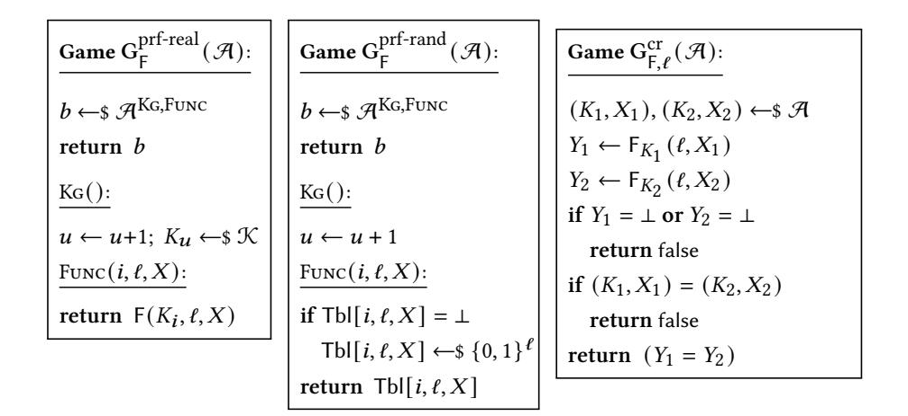
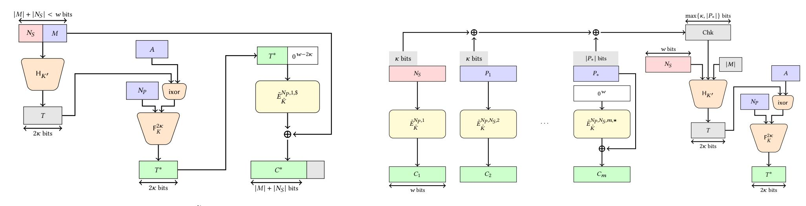
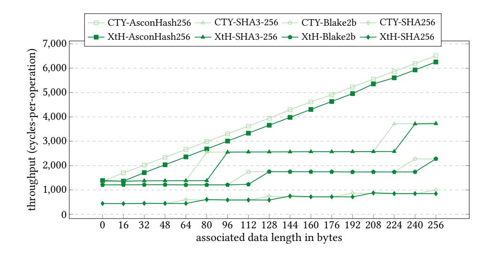
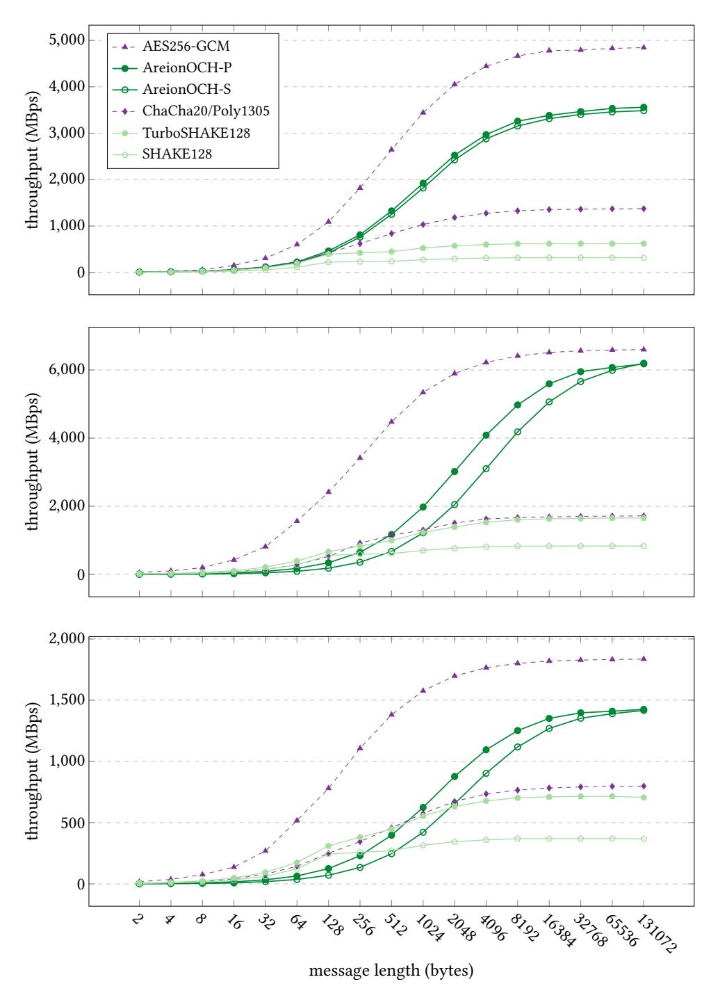
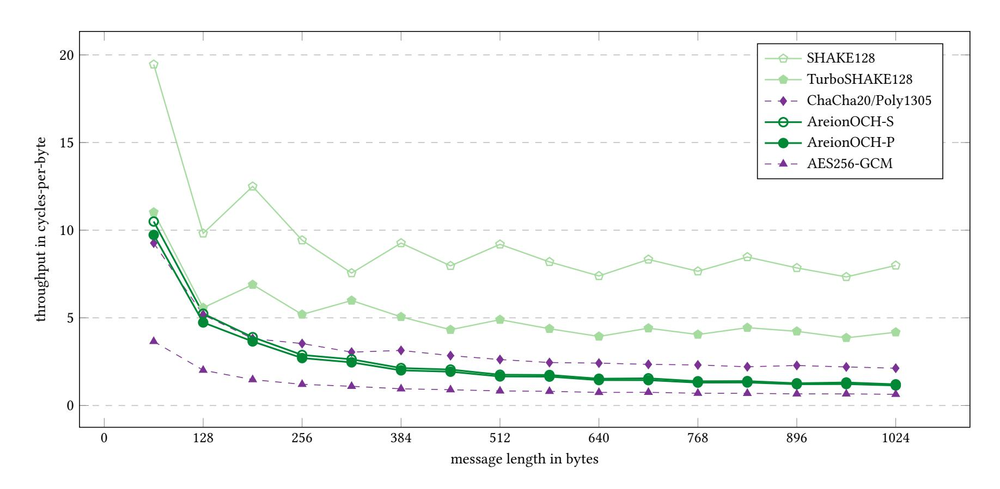
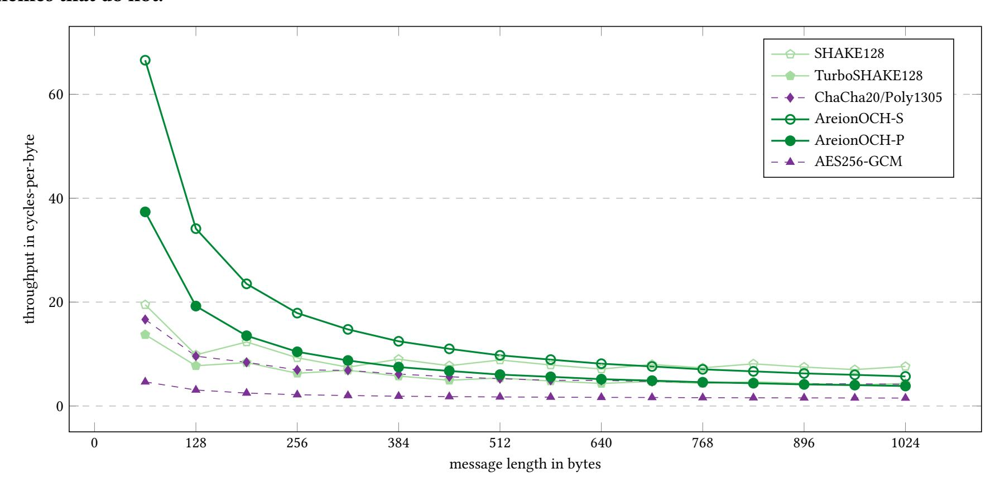

{0}------------------------------------------------

# The OCH Authenticated Encryption Scheme

<span id="page-0-0"></span>Sanketh Menda\* Cornell Tech New York, NY, USA Mihir Bellare UC San Diego La Jolla, CA, USA Viet Tung Hoang Florida State University Tallahassee, FL, USA

Julia Len UNC Chapel Hill Chapel Hill, NC, USA

Thomas Ristenpart University of Toronto Toronto, ON, Canada

#### **Abstract**

We specify OCH, the first authenticated encryption with associated data scheme built to provide 128-bit multi-user AE security, 128-bit context commitment security, and 256-bit nonces with optional nonce privacy. It therefore addresses pressing limitations of currently widely-deployed schemes. We construct and formally analyze the security of OCH in a modular fashion, with transforms that are of broader applicability. On Intel Raptor Lake CPUs, OCH using the Areion permutation family has a peak encryption speed of 0.62 cycles per byte (cpb), not far off from AES128-GCM (0.38cpb) and outperforming both ChaCha20/Poly1305 (1.63cpb) and TurboSHAKE128-Wrap (3.52cpb).

#### 1 Introduction

Recall that in an authenticated encryption with associated data (AEAD) scheme [111], encryption takes a key, nonce, associated data, and message to deterministically return a ciphertext. The classical security requirement is unique-nonce AE (NAE) security. This means privacy of the message, and authenticity of the message and associated data, assuming encryption never reuses a nonce. These were the security and functionality goals for which the most widely used AEAD schemes were designed over two decades ago, including AES-GCM [95] and ChaCha20-Poly1305 [104].

Practitioners and researchers have in the last few years reached consensus that NAE, and the widely used schemes that target it, suffer from a variety of critical limitations.

First, NAE does not guarantee what has come to be called key commitment: this asks that an adversary cannot construct a ciphertext so that it is decryptable by multiple maliciously chosen keys. A spate of work [1, 53, 63, 75, 88, 96, 120] highlights how lack of key commitment leads to attacks in important applications. A stronger goal that implies key commitment is context commitment (CMT) [12, 34, 96] which asks that the adversary cannot construct a ciphertext decryptable under two different key, nonce and associated data triples. This has been the target of recent designs, and will be ours as well.

Second, the concrete security of in-use schemes limits the number of bytes that can be encrypted under any given key, forcing complicated key rotation logic when used at the scale of modern workloads [80]. Finally, widely used schemes do not support nonce hiding [17], which is important when nonces contain sensitive information such as device identifiers.

The academic literature includes techniques for rectifying each of these problems in isolation, but no AEAD schemes have been proposed that achieve *all* of them in a high-performance way.

**Our contributions.** We set out to build AEAD schemes that could replace today's NAE schemes and protect data for decades to come. To do so we provide a new, clean-slate approach to secure, efficient AEAD schemes and apply it to build OCH (offset codebook with hashing): a permutation-based AEAD. OCH is the first scheme to provide the following combination of features:

- 128-bit NAE security: OCH's formal confidentiality and authenticity guarantees scale to even settings where adversaries have unrealistically large resources, having to get close to 2<sup>128</sup> queries to have a meaningful attack.
- *128-bit CMT security:* OCH is secure against the strongest form of commitment-style attacks, scaling up to adversaries that can perform close to 2<sup>128</sup> computations.
- Nonce versatility and hiding: OCH can be used with random nonces of  $\geq$  192 bits to avoid collisions, or structured nonces such as counters. It can hide nonces.
- Speed: OCH is fast, maximally parallelizable, and utilizes CPU pipelines to achieve high throughput. For example, OCH easily achieves > 1 GB/s throughput on a variety of platforms. It is almost as fast as AES-GCM and OCB [85, 114]—the fastest NAE schemes on many platforms—despite those schemes not meeting any of the above security goals.

See Figure 1 for a comparison of OCH and prior schemes.

OCH relies on a large number of design ideas, many of which are new to this work and of broader applicability. We summarize OCH's design at a high level, highlighting novel components and starting from the bottom. We build a tweakable Even-Mansour blockcipher [39, 79, 86] from an underlying cryptographic permutation; the construction, however, is not a generic application of prior work but customized to enable fast amortized generation of offsets for use in a new ΘCB-like [85] authenticated encryption (AE) called ΘCX that: (1) supports nonce-hiding, (2) omits support for associated data, and (3) does *not* provide authenticity. Instead, it meets a new, weaker-than-NAE security goal for authenticated encryption (without associated data) called NAX. Intuitively, tags need not be unforgeable but just be computationally almost-xor-universal.

We then provide a new generic transform called Xor-then-Hash (XtH) that uses a collision-resistant PRF to convert a (nonce-hiding) NAX-secure AE scheme into a (nonce-hiding) context-committing AEAD scheme. We build the CR-PRF from a permutation using a Sponge construction [25, 26]. XtH can also be applied to standard

 $<sup>^{\</sup>ast} \text{Authors},$  except the first, are listed in alphabetical order.

{1}------------------------------------------------

<span id="page-1-0"></span>

| Scheme                  | 128-bit<br>NAE | 128-bit<br>CMT | 192-bit<br>Nonce | Nonce<br>privacy | 1GB/s<br>encrypt |  |
|-------------------------|----------------|----------------|------------------|------------------|------------------|--|
| AES128-GCM [55, 95]     | ×              | ×              | ×                | ×                | <b>~</b>         |  |
| AES256-GCM [55, 95]     | ×              | ×              | ×                | ×                | <b>~</b>         |  |
| ChaCha20/Poly1305 [105] | <b>~</b>       | ×              | ×                | ×                | <b>~</b>         |  |
| CommitKey[GCM256] [64]  | ×              | ×              | ~                | ×                | ~                |  |
| XChaCha20/Poly1305 [4]  | <b>~</b>       | ×              | <b>~</b>         | ×                | <b>~</b>         |  |
| AES-256-GEM [5]         | ×              | ×              | <b>~</b>         | ×                | <b>~</b>         |  |
| XAES-256-GCM [124]      | ×              | ×              | <b>~</b>         | ×                | <b>~</b>         |  |
| DNDK-GCM256 [66]        | ×              | ×              | <b>~</b>         | ×                | <b>~</b>         |  |
| CAU-C1-GCM256 [12]      | ×              | ×              | ×                | ×                | <b>~</b>         |  |
| CTX[GCM256] [34]        | ×              | <b>~</b>       | ×                | ×                | <b>~</b>         |  |
| Ascon-AEAD128 [123]     | ~              | ×              | ×                | ×                | ×                |  |
| Aegis-256 [48, 127]     | <b>~</b>       | ×              | <b>~</b>         | ×                | <b>~</b>         |  |
| Deoxys-I-256 [77]       | <b>~</b>       | ×              | ×                | ×                | <b>~</b>         |  |
| TurboSHAKE128 [41]      | <b>~</b>       | <b>~</b>       | <b>~</b>         | ×                | ×                |  |
| AreionOCH (§5)          | <b>~</b>       | <b>~</b>       | <b>~</b>         | <b>~</b>         | <b>~</b>         |  |

Figure 1: Comparison of widely used AEAD schemes (top group), transforms of existing schemes (middle), and clean-state designs (bottom). NAE and CMT refer to multi-user nonce-based AE security and context commitment security, respectively. The last column lists whether the scheme can encrypt a billion bytes per second, for 1024 byte messages with 13 bytes of associated data (corresponding to TLS) on an Intel Raptor Lake CPU.

AEAD schemes, in which case it serves as a new generic transform for rendering AEAD context committing. It is more efficient than the prior CTY [13] and CTX [34] transforms, particularly for the short associated data strings most often used in practice.

The final component is a specialized mode for handling very short messages. Here, we provide a new, nonce-hiding, committing variant of the synthetic IV mode [115], that we call CIV (Committing synthetic IV). It can be instantiated using the same underlying components and may be of interest as a misuse-resistant AEAD (though our focus is only on NAE security).

We provide a formal analysis of all of the above. To make it both tractable and easier to verify, our analysis is highly modular. This also means that our intermediate design components can be more readily used elsewhere with formal analyses already provided.

**Limitations.** Non-goals for OCH are achieving nonce-misuse-resistance [115] or robust AEAD security [69]. These provide improved confidentiality and authenticity in the face of practically relevant threats, such as accidental nonce reuse or accidental release of unverified plaintext. But achieving them requires more than one cryptographic pass over plaintexts, and would bar the ability to achieve performance competitive with one-pass NAE schemes.

**Summary.** We designed the first AEAD scheme that simultaneously provides high-security parameter NAE security, context commitment security, and support for nonce hiding, while performing almost as well as insufficiently secure schemes such as AES-GCM and ChaCha20/Poly1305. Our open-source implementation<sup>1</sup> includes optimizations for various platforms.

#### 2 Background and Related Work

We provide a high-level overview of modern design goals, interleaving discussion of related work.

**High security scaling.** We desire schemes that have good (multiuser) security bounds, so that security holds even when used across many instances and for today's large-scale workloads. For example, AES-based schemes with birthday bound security fail at around  $2^{64}$  AES invocations, which limits scalability. TLS 1.3 does not allow encryption of more than  $2^{24.5}$  records under a single key due to this birthday bound issue [109, §5.5]. See [80] for a more detailed discussion of modern scaling challenges. By providing significantly higher security, we can instead avoid hard usage limits in practice. Thus, we have the following goal:

**128-bit NAE:** AEAD should achieve 128-bit NAE security, meaning breaking confidentiality and authenticity security would require close to an intractably large  $2^{128}$  adversarial resources.

In theory, it is not hard to build AEAD that achieves 128-bit NAE, and in fact the academic literature has a surfeit of options for building AEAD schemes. For example, one might build an Encrypt-then-MAC AEAD using Rijndael-256 in counter mode for encryption, together with HMAC-SHA256 for message authentication. But this will be a lot slower than what we achieve. We further review the landscape of approaches for building AEAD in Appendix A.

**Context commitment.** NAE security does *not* guarantee what has come to be called key commitment, as first formalized by [57]: an adversary can construct a ciphertext so that it is decryptable by multiple maliciously chosen keys. An increasingly large body of work shows how lack of key commitment leads to attacks in practical settings including: abuse reporting in encrypted messaging [53, 63], password-based encryption [88], password-based key exchange [88], anonymous public key encryption [88], key rotation schemes [1], and symmetric hybrid (also called envelope) encryption [1]. A stronger goal that implies key-commitment is that a ciphertext is a commitment to all inputs to the encryption algorithm, meaning a ciphertext must only be decryptable under a single key, nonce, and associated data triple. This was first defined in [12, 34], the former calling it CMT-4 and the latter CMT-XX. We call it context commitment (the context is the triple) following [96], abbreviated simply CMT. Attacks have shown that even schemes that achieve key commitment can fail to meet this stronger goal [96].

Given all the security issues stemming from lack of commitment, the academic and practitioner consensus (c.f., [9, 11, 14, 38, 80, 88, 93]) is that general-purpose AEAD should achieve at least key commitment and, ideally, context commitment as well.

Prior academic work, as well as deployed implementations, suggest transforms that convert an existing non-CMT AEAD to be CMT [1, 12, 13, 34, 36, 47, 54, 64, 80]. But these transforms don't address other deficiencies in the underlying AEAD schemes, such as not achieving 128-bit NAE. One could apply known frameworks for building new schemes that are 128-bit NAE (such as Encryptthen-MAC, as mentioned above), and then apply the transforms. But, again, these won't be as fast as our approach.

Ascon [50, 123], the winner of a recent lightweight AEAD competition, appears to achieve CMT security, but only against adversaries

 $<sup>^{1}</sup>https://github.com/initsecret/cryptography-run/\\$ 

{2}------------------------------------------------

limited to much less than  $2^{64}$  computations. Other schemes that achieve 128-bit CMT and 128-bit NAE are the recent SHAKE and TurboSHAKE schemes [41] built from a cryptographic hash function. While elegant and fast on short messages, these schemes are inherently serial and not as fast as ours for larger messages.

**128-bit CMT:** AEAD should achieve 128-bit CMT security, meaning an adversary must use  $2^{128}$  computations to find a ciphertext that decrypts under two different contexts.

Large nonces and nonce hiding. Finally, we want to support both stateful and randomized nonces, or nonces that are some combination of the two. Here there are two issues. First is that nonces for widely used schemes are too small to allow encrypting, with the same key, a large number of messages with random nonces. For example, AES-GCM's maximum effective nonce length is 96 bits (longer nonces get hashed to 96 bits), and so one cannot use random nonces to process more than 2<sup>32</sup> messages before security breaks down. But large scale deployments may encrypt that many messages in a few seconds, forcing more complicated software engineering to work around the limitations of AES-GCM (frequent rekeying, state management for counter-based nonces, etc.).

A second issue is that, as Bellare, Ng, and Tackmann [17] observed, publicly transmitted non-random nonces can be privacy damaging, such as leaking the number of encryptions performed, the identity of devices performing encryptions, or even partial information about messages for some ways of choosing nonces. While some prior work has given schemes that achieve noncehiding [17], no schemes widely used in practice provide it. Ideally, a scheme would be versatile, allowing sufficiently large random nonces ( $\geq$  192 bits to avoid collisions) that need not be hidden, stateful or structured nonces that are kept secret, or nonces that combine both. We refer to this as supporting versatile nonces.

**Versatile nonces:** AEAD should support random nonces of sufficient size ( $\geq$  192 bits), and allow hiding part or all of a nonce.

# <span id="page-2-1"></span>3 Preliminaries

**Notation.** We refer to elements of  $\{0,1\}^*$  as bitstrings, denote the length of a bitstring x by |x| and refer to bitstrings of length nas *n*-bit strings. We define  $|x|_w$  as  $\max\{1, \lceil |x|/w \rceil\}$  and refer to this as the block length of x. We write x[i:j] to denote the bits ithrough j (inclusive) of x, for  $1 \le i \le j \le |x|$ . We denote the empty string with  $\varepsilon$ , the *n*-bit all-zero and all-one strings by  $0^n$ and  $1^n$ , the concatenation of two bitstrings  $x, y \in \{0, 1\}^*$  by  $x \parallel y$ , and the bitwise xor of two *n*-bit strings  $x, y \in \{0, 1\}^n$  by  $x \oplus y$ . Given an *n*-bit string  $x = x_{n-1} \cdots x_1 x_0 \in \{0,1\}^n$ , we define its most significant bit  $msb(x) := x_{n-1}$ , its logical left shift  $(x \ll$  $i) = x_{n-1-i} \cdots x_0 0^i$  where i < n, and its number representation  $\operatorname{str2num}_n(x) \coloneqq \sum_{i=0}^{n-1} x_i 2^i$ . We note that  $\operatorname{str2num}_n$  is invertible and denote its inverse num2str<sub>n</sub>, which maps all numbers  $0 \le A < 2^n$ to *n*-bit strings such that  $str2num_n(num2str_n(A)) = A$ . An *n*-tuple  $(x_1,\ldots,x_n)\in(\{0,1\}^*)^n$  of bitstrings is a sequence of *n* bitstrings, and we denote the set of all bitstring tuples with  $\{0, 1\}^{**}$ .

All the sets we consider in this work are finite. For a finite set X, we use  $x \leftarrow \$ X$  to denote sampling a uniform, random element from X and assigning it to x.

```
Game G_{\tilde{E}}^{\text{tprp-real}}(\mathcal{A}):
                                                                         Game G_{\tilde{E}}^{\text{tprp-rand}}(\mathcal{A}):
b \leftarrow \$ \mathcal{A}^{\mathsf{TPRP}\{\mathsf{KG},\,\mathsf{Enc},\,\mathsf{Dec}\}}
                                                                         b \leftarrow \$ \mathcal{A}^{\text{TPRP}\{\text{KG, Enc, Dec}\}}
return b
                                                                         return b
TPRPKG():
                                                                         TPRPKG():
u \leftarrow u + 1; K_u \leftarrow \$ \mathcal{K}
                                                                         u \leftarrow u + 1; \ \tilde{\pi}_u \leftarrow \$ \widetilde{Perm}(\mathfrak{T}, \mathfrak{M})
                                                                         TPRPENC(i, T, X):
TPRPENC(i, T, X):
return \tilde{E}_{K_i}(T,X)
                                                                         return \tilde{\pi}_i(T,X)
TPRPDEC(i, T, Y):
                                                                         TPRPDEC(i, T, Y):
return \tilde{D}_{K_i}(T, Y)
                                                                         return \tilde{\pi}_{i}^{-1}(T, Y)
```

Figure 2: Games defining the TPRP security of  $\tilde{E}$ .

We use *code-based games* [19, 102] for our definitions and proofs. A *procedure P* is a sequence of code-like statements. We assume all the variables in a procedure are initialized, and all the inputs and outputs are in the specified domain and range, respectively. We use a distinguished symbol  $\bot$  to denote errors, and assume that a procedure either *succeeds* and returns *valid* outputs, or it *fails* and returns  $\bot$ . Notably, procedures may never return invalid or partially valid outputs. For a procedure P, we let  $y \leftarrow P^{O_1, \dots}(x_1, \dots)$  denote running P on inputs  $x_1, \dots$ , with oracle access to  $O_1, \dots$ , and assigning the output to y. We use  $(P \Rightarrow x)$  to denote the event that procedure P outputs x, over the coins of P.

**Permutations.** A *w*-bit permutation is a function  $\Pi: \{0,1\}^w \to \{0,1\}^w$ , with an inverse  $\Pi^{-1}: \{0,1\}^w \to \{0,1\}^w$ . Let  $\operatorname{Perms}(\mathfrak{M})$  be the set of all permutations on  $\mathfrak{M}$ , and let  $\operatorname{Perm}(\mathfrak{T},\mathfrak{M})$  be the set of all permutations on  $\mathfrak{M}$  tweaked by  $\mathfrak{T}$ ; that is, the set of all families of permutations on  $\mathfrak{M}$  indexed by  $T \in \mathfrak{T}$ .

We will design schemes based on an underlying public permutation  $\Pi$ , and analyze them in the traditional *ideal permutation model* [3, 46, 78]. Here, the permutation is modeled as being uniformly sampled  $\Pi \leftarrow Perms(M)$  from the set of all permutations over a relevant space M. Games defining security are then extended to give scheme algorithms, as well as the adversary, oracle access to the permutation  $\Pi$  and its inverse  $\Pi^{-1}$ . In determining the adversary advantage, probabilities now take into account the random choice  $\Pi \leftarrow Perms(M)$ .

**Multi-user security.** We consider security in the *multi-user or multi-key setting* [21, 92, 100] where the adversary can query oracles under different keys  $K_i \leftarrow \$$   $\mathcal{K}$  chosen independently and uniformly at random from the keyspace  $\mathcal{K}$ . The adversary wins if it compromises the security of *any one* of those keys. This captures settings like TLS, Signal, and server key-rotation where compromising one key is sufficient to cause harm. Following convention, for the remainder of this paper, we will use the term "multi-user" but note that it is misleading since users routinely have multiple keys.

**Tweakable blockciphers.** A tweakable blockcipher (TBC) [90] is a function  $\tilde{E}: \mathcal{K} \times \mathcal{T} \times \mathcal{M} \to \mathcal{M}$ , defined over a key space  $\mathcal{K} \subset \{0,1\}^*$ , tweak space  $\mathcal{T} \subset \{0,1\}^*$ , and input space  $\mathcal{M} \subset \{0,1\}^*$ , where for each key  $K \in \mathcal{K}$  and each tweak  $T \in \mathcal{T}$ , the function  $\tilde{E}_K^T(\cdot) := \tilde{E}(K,T,\cdot)$  is a permutation on  $\mathcal{M}$ , and we denote its inverse with  $\tilde{D}_K^T(\cdot) := \tilde{D}(K,T,\cdot)$ . We require keys and inputs to be fixed length,

{3}------------------------------------------------

<span id="page-3-0"></span>

Figure 3: Games defining the PRF and CR security of F.

meaning there are integers k, n such that |K| = k and |M| = n for all  $K \in \mathcal{K}$  and  $M \in \mathcal{M}$ , but allow structured tweaks. We recover traditional blockciphers by setting  $\mathcal{T} = \{\varepsilon\}$ , and in this case may omit the tweak input in the notation.

For a TBC  $\tilde{E}: \mathcal{K} \times \mathcal{T} \times \mathcal{M} \to \mathcal{M}$ , and for an adversary  $\mathcal{A}$ , we define multi-user (strong) TPRP security, using the pair of games defined in Figure 2. The advantage of the adversary is defined as  $\operatorname{Adv}_{\tilde{E}}^{\operatorname{tprp}}(\mathcal{A}) \coloneqq \Pr[G_{\tilde{E}}^{\operatorname{tprp-real}}(\mathcal{A}) \Rightarrow 1] - \Pr[G_{\tilde{E}}^{\operatorname{tprp-rand}}(\mathcal{A}) \Rightarrow 1]$ .

**PRFs and CR-PRFs.** A variable-output-length pseudorandom function (PRF) is a function  $F: \mathcal{K} \times \mathcal{L} \times \mathcal{X} \to \mathcal{Y}$ , defined over a key space  $\mathcal{K} \subseteq \{0,1\}^*$ , output length space  $\mathcal{L} \subseteq \mathbb{N}$ , input space  $\mathcal{X} \subseteq \{0,1\}^{**}$ , and output space  $\mathcal{Y} \subseteq \{0,1\}^*$ . We allow the input space to include tuples, require the lengths of keys to be a public constant k, and require that the length of outputs match the provided output length, meaning  $|F(K,\ell,X)| = \ell$ . To simplify notation, we sometimes use the shorthand  $F_K^\ell(\cdot) \coloneqq F(K,\ell,\cdot)$ . We also write  $F_K^\ell(\cdot)$  as a shorthand for  $F_K^\ell(\varepsilon)$ . We let  $F_K^\ell(\cdot)$  be the set of all functions with domain  $\mathcal{L} \times \mathcal{X}$  mapping to  $\mathcal{Y}$  that abide by the required output length.

We define multi-user PRF security [8], extended to variable output lengths, using a pair of games defined in Figure 3, as  $\mathsf{Adv}_\mathsf{F}^\mathsf{prf}(\mathcal{A}) \coloneqq \mathsf{Pr}[\mathsf{G}_\mathsf{F}^\mathsf{prf\text{-real}}(\mathcal{A}) \Rightarrow 1] - \mathsf{Pr}[\mathsf{G}_\mathsf{F}^\mathsf{prf\text{-rand}}(\mathcal{A}) \Rightarrow 1]$ , and define collision-resistance (CR) security, where the output length is a parameter of the game; see Figure 3. Advantage is defined as  $\mathsf{Adv}_{\mathsf{F},\ell}^\mathsf{cr}(\mathcal{A}) \coloneqq \mathsf{Pr}[\mathsf{G}_\mathsf{F,\ell}^\mathsf{cr}(\mathcal{A}) \Rightarrow \mathsf{true}]$ . Note that CR-security is easy to violate if  $\ell$  is too small; we will only rely on CR of a variable output length F for fixed, sufficiently large  $\ell$ .

**Universal hashing.** Let  $H: \mathcal{K} \times \mathcal{X} \to \mathcal{Y}$  be a function, defined over a key space  $\mathcal{K}$ , finite input space  $\mathcal{X}$ , and fixed-length output space  $\mathcal{Y} = \{0,1\}^{\eta} \subset \{0,1\}^*$  of  $\eta$ -bit strings. We will refer to such functions as hash functions and define the shorthand  $H_K(\cdot) \coloneqq H(K,\cdot)$ . Then, we say that the family of hash functions  $\{H_K(\cdot)\}_{K\in\mathcal{K}}$  is  $\delta$ -uniform if for all inputs  $X \in \mathcal{X}$  and all outputs  $Y \in \mathcal{Y}$ , it holds that  $\Pr[H_K(X) = Y] \leq \delta$  where the probability is over the choice of K. And, we say that  $\{H_K(\cdot)\}_{K\in\mathcal{K}}$  is  $\epsilon$ -AXU if for all distinct inputs  $X_1, X_2 \in \mathcal{X}$  and all outputs  $Y \in \mathcal{Y}$ , it holds that  $\Pr[H_K(X_1) \oplus H_K(X_2) = Y] \leq \epsilon$ , where the probability is over the choice of K. We will also have AXU hashes whose  $\epsilon$  varies with the length of inputs relative to some blocksize  $\epsilon$ . In this case, we write  $\epsilon_V$  to emphasize that we are considering only inputs  $X_1, X_2 \in \mathcal{X}$  such that  $\max\{|X_1|_{\delta}, |X_2|_{\delta}\} \leq \nu$ .

**Domain separation.** We prefix distinct uses of the same function, including PRFs and AXU hashes, with unique one-byte labels, typeset in monospace like 1 and 2, for domain separation [10].

**AEAD syntax.** We use a special case of the general AE3 syntax [13, 20], namely that of the CAESAR call for submissions [30], dubbed AE5 in [101]. Thus we define an AEAD scheme as a tuple of algorithms AEAD = (Enc, Dec), defined over a key space  $\mathcal{K} \subseteq \{0,1\}^*$ , public nonce space  $\mathcal{N}_{\mathcal{P}} \subseteq \{0,1\}^*$ , secret nonce space  $\mathcal{N}_{\mathcal{S}} \subseteq \{0,1\}^*$ , associated data space  $\mathcal{A} \subseteq \{0,1\}^*$ , message space  $\mathcal{M} \subseteq \{0,1\}^*$ , and ciphertext space  $\mathcal{C} \subseteq \{0,1\}^*$ , where:

- (1) Enc:  $\mathcal{K} \times \mathcal{N}_{\mathcal{P}} \times \mathcal{N}_{\mathcal{S}} \times \mathcal{A} \times \mathcal{M} \to \mathcal{C}$  is a deterministic algorithm that takes a 5-tuple of a key K, public nonce  $N_P$ , secret nonce  $N_S$ , associated data A, and message M, and returns a ciphertext C.
- (2) Dec:  $\mathcal{K} \times \mathcal{N}_{\mathcal{P}} \times \mathcal{A} \times \mathcal{C} \to (\mathcal{M} \times \mathcal{N}_{\mathcal{S}}) \cup \{\bot\}$  is a deterministic algorithm that takes a 4-tuple of a key K, public nonce  $N_P$ , associated data A, and ciphertext C, and returns a message M and a secret nonce  $N_S$  or an error  $\bot$ .

We call the non-message inputs to Enc—the key, public nonce, secret nonce, and associated data—the *encryption context* and the nonciphertext inputs to Dec—the key, public nonce, and associated data—the *decryption context*.

We impose correctness and *tidiness* [102] requirements on AEAD which requires Enc and Dec to be inverses of each other. Namely for all  $(K, N_P, N_S, A, M, C) \in \mathcal{K} \times \mathcal{N}_P \times \mathcal{N}_S \times \mathcal{A} \times \mathcal{M} \times \mathcal{C}$ :

$$\operatorname{Enc}(K, N_P, N_S, A, M) = C \implies \operatorname{Dec}(K, N_P, A, C) = (M, N_S) ,$$
 
$$\operatorname{Dec}(K, N_P, A, C) = (M, N_S) \neq \bot \implies \operatorname{Enc}(K, N_P, N_S, A, M) = C .$$

We also require that the lengths of keys, public nonces and secret nonces be public constants, k,  $n_p$ ,  $n_s$  respectively, and the length of the ciphertext be a deterministic public function clen of the length of the message, namely  $|\text{Enc}(K, N_P, N_S, A, M)| = \text{clen}(|M|)$ . We then define the *ciphertext overhead* to be the function that on input m returns  $\text{clen}(m) - m - n_s$ . This definition of overhead follows [17], rather than [13] who did not subtract  $n_s$ .

AEAD schemes for which  $\mathcal A$  is empty are called AE schemes. In this case we omit A from algorithms, security definitions, and other definitions.

Note that when  $n_s = 0$  we recover conventional AEAD [111] and when  $n_p = 0$  we recover nonce-hiding AEAD, also called AE2 [17]. In this way, our definitions and results capture these two more standard frameworks as special cases.

**Tag-based AEAD syntax.** An AEAD scheme AEAD = (Enc, Dec) is tag-based [13, 34] if it specifies an integer  $\tau$ , called the tag length, and a deterministic algorithm ParDec, called the partial decryption algorithm, such that  $Dec(K, N_P, A, C)$  is defined by

$$C^* \parallel T \leftarrow C \parallel |T| = \tau$$
  
 $(M, N_S, T_d) \leftarrow \text{ParDec}(K, N_P, A, C^*)$   
If  $T = T_d$  then return  $(M, N_S)$  else return  $\bot$ .

That is, a ciphertext C can be split into two parts  $C^*$  and T, the former called the ciphertext core which is of length  $\text{clen}(|M|) - \tau$ , and the latter called an authentication tag of length  $\tau$ . Note that we assume that ParDec always outputs a triple of bit strings (and never an error symbol  $\bot$ ). We refer to  $T_d$  as the expected tag. For tag based schemes, we will often write ciphertexts as  $C^* \parallel T^*$  where the lengths

{4}------------------------------------------------

```
Game G_{AEAD}^{nae-real}(\mathcal{A}):
                                                             \textbf{Game} \ G_{\mathsf{AEAD}}^{\mathsf{nae}\text{-}\mathsf{rand}}(\mathcal{A}) \colon
b \leftarrow \$ \mathcal{A}^{\text{NAEKG,NAEEnc,NAEVer}}
                                                             b \leftarrow \mathcal{A}^{\text{NAEKg,NAEEnc,NAEVer}}
return b
                                                             return b
NAEKG():
                                                             NAEKG():
u \leftarrow u + 1; K_u \leftarrow $\mathcal{K}
                                                             u \leftarrow u + 1
NAEEnc(i, N_P, N_S, A, M):
                                                             NAEEnc(i, N_P, N_S, A, M):
if (i, N_P, N_S) \in Q_N then return \bot
                                                             if (i, N_P, N_S) \in Q_N then return \bot
                                                             C \leftarrow \$ \{0,1\}^{\mathsf{clen}(|M|)}
C \leftarrow \mathsf{AEAD}.\mathsf{Enc}(K_i, N_P, N_S, A, M)
Q_D \leftarrow Q_D \cup \{(i, N_P, A, C)\}
                                                             Q_D \leftarrow Q_D \cup \{(i, N_P, A, C)\}
Q_N \leftarrow Q_N \cup \{(i, N_P, N_S)\}
                                                             Q_N \leftarrow Q_N \cup \{(i, N_P, N_S)\}
return C
                                                             return C
NAEVer(i, N_P, A, C):
                                                             NAEVer(i, N_P, A, C):
if (i, N_P, A, C) \in Q_D then return \bot
                                                             if (i, N_P, A, C) \in Q_D then return \bot
(M, N_S) \leftarrow AEAD.Dec(K_i, N_P, A, C)
                                                             return false
if (M, N_S) \neq \bot then return true
else return false
```

Figure 4: Games defining NAE security of AEAD.

of the two strings are understood from context. A tag-based scheme is tidy if for all  $(K, N_P, N_S, A, M, C^*, T^*) \in \mathcal{K} \times \mathcal{N}_P \times \mathcal{N}_S \times \mathcal{A} \times \mathcal{M} \times \mathcal{C} \times \{0, 1\}^T$  it holds that  $\operatorname{Enc}(K, N_P, N_S, A, M) = C^* \parallel T^*$  implies that  $\operatorname{ParDec}(K, N_P, A, C^*) = (M, N_S, T^*)$ , and  $\operatorname{ParDec}(K, N_P, A, C^*) = (M, N_S, T^*) \neq \bot$  implies that  $\operatorname{Enc}(K, N_P, N_S, A, M) = C^* \parallel T^*$ . Encrypt-then-MAC schemes [15, 102] are examples of tag-based AEAD.

**AEAD security.** We define this in the multi-user setting following the AE3 definitions of Bellare and Hoang [13]. We use the pair of games  $G_{\text{AEAD}}^{\text{nae-real}}$  and  $G_{\text{AEAD}}^{\text{nae-rand}}$  which are defined in Figure 4, and then set

$$\mathsf{Adv}_{\mathsf{AEAD}}^{\mathsf{nae}}(\mathcal{A}) \coloneqq \Pr[\mathsf{G}_{\mathsf{AEAD}}^{\mathsf{nae-real}}(\mathcal{A}) \Rightarrow 1] - \Pr[\mathsf{G}_{\mathsf{AEAD}}^{\mathsf{nae-rand}}(\mathcal{A}) \Rightarrow 1] \; .$$

To prevent trivial victories, we require adversaries to be valid—it may not query NAEEnc with the same input twice, and it may not query NAEVER on an output of NAEEnc. The latter condition is enforced with the set  $Q_D$ . In addition, we require adversaries to be nonce-respecting—for a given user i, it may not query NAEEnc with the same nonce  $(N_P, N_S)$ . This is enforced with the set  $Q_N$ .

We say that an adversary is *orderly* [12, 13, 17, 29] if its NAEVER queries are made after all the NAEENC queries, all the NAEVER queries are made at once (i.e., NAEVER queries may depend on NAEENC queries but not on other NAEVER queries), and it returns true if any of the NAEVER queries returns true.

For tag-based schemes, we additionally define a notion of multiuser real-or-random indistinguishability in which the adversary only receives the ciphertext core. Let game  $G_{AEAD}^{rorc-real}$  be the same as  $G_{AEAD}^{nae-real}$  except that there is no verification oracle, and encryption only returns the ciphertext core  $C^*$ . Let  $G_{AEAD}^{rorc-rand}$  be the same as  $G_{AEAD}^{nae-rand}$  except that there is no verification oracle, and encryption returns a bit string  $C^* \leftarrow \$ \{0,1\}^{clen(|M|)-\tau}$ . Then we have the following advantage measure:

```
\mathsf{Adv}^{\mathsf{rorc}}_{\mathsf{AEAD}}(\mathcal{A}) \coloneqq \Pr[\mathsf{G}^{\mathsf{rorc\text{-}real}}_{\mathsf{AEAD}}(\mathcal{A}) \Rightarrow 1] - \Pr[\mathsf{G}^{\mathsf{rorc\text{-}rand}}_{\mathsf{AEAD}}(\mathcal{A}) \Rightarrow 1] \ .
```

```
\begin{tabular}{|l|l|l|l|l|l|l|l|l|l|l|l|l|l|l|l|l|l|l
```

Figure 5: Game defining CMT security of AEAD.

**Adversarial resources.** We fix some conventions about the resource limits used by adversaries in our games such as NAE, TPRP, or RORC. For all the below we fix some blocksize w, that will often be left implicit and, if so, understood from context.

- In multi-user security games, an adversary that queries at most *u* users can make at most *u* queries to the key generation oracle.
- An adversarial encryption or verification query has block length  $\ell$  if  $\ell = |\gamma|_w$  where  $\gamma$  is the sum of the bit lengths of all the inputs to the query and w is a block size that will be understood from context. (All query inputs are bit strings in our security games.)
- An adversary that makes at most  $\sigma$  blocks of queries in total can make queries such that the sum of all queries' block lengths is at most  $\sigma$ .
- An adversary makes at most *B* queries per user totalling *s* blocks per user if the maximum number of times NAEENC or NAEVER are queried on the same user index *i* is *B* and the sum of the block lengths of all queries on index *i*, for any queried index *i*, is at most *s*.

We say that an NAE adversary is  $(u, q, q_v, \ell, \sigma, B, s)$ -bound if it queries at most u users, makes at most q encryption or verification queries, makes at most  $q_v$  verification queries, has maximum query block length  $\ell$ , makes at most  $\sigma$  blocks of queries in total, and makes at most B queries per user totaling s blocks per user.

We say that a PRF adversary is  $(u, q, \ell, \sigma, B, s)$ -bound with the same definitions as above for the variables—we just drop the verification query parameter.

We say that a TPRP adversary is (u, q, B)-bound since all queries are fixed length.

In some cases, we will drop one or more components, with the implied resource bounds clear due to variable names. For example, an NAE adversary that is  $(u, q, \sigma, B, s)$ -bound is  $(u, q, q_v, \ell, \sigma, B, s)$ -bound for  $q_v = q$  and  $\ell = q \cdot \sigma$ .

**Restricting to orderly NAE adversaries.** We find it useful to restrict to orderly adversaries and the following lemma of [13] upper bounds the advantage loss of such a restriction. We comment that our definition of ciphertext overhead (above) is different from that of [13] and the bound takes this into account.

<span id="page-4-2"></span>**Lemma 1** (Lemma 3.2 in [13]). Let AEAD be an AEAD scheme with constant ciphertext overhead  $\tau$ . Let  $\mathcal{A}$  be a  $(u,q,q_v,\ell,\sigma,\mathcal{B},s)$ -bound NAE adversary. Then, we can construct an orderly  $(u,q,q_v,\ell,\sigma,\mathcal{B},s)$ -bound adversary  $\mathcal{B}$  such that  $\operatorname{Adv}_{AEAD}^{nae}(\mathcal{A}) \leq \operatorname{Adv}_{AEAD}^{nae}(\mathcal{B}) + \frac{q_v}{2^\tau}$ . Adversary  $\mathcal{B}$  has running time similar to  $\mathcal{A}$ .

{5}------------------------------------------------

**Committing security.** We focus on the strongest commitment notion *context commitment* [12, 34] which requires the ciphertext to commit to the entire decryption context. In Figure 5 we define security. The outputs  $(K_1, N_{P_1}, A_1)$ ,  $(K_2, N_{P_2}, A_2)$  of  $\mathcal{A}$  are required to be in  $\mathcal{K} \times \mathcal{N}_{\mathcal{P}} \times \mathcal{A}$ . We define the following advantage measure

$$\mathsf{Adv}^{cmt}_{\mathsf{AEAD}}(\mathcal{A}) \coloneqq \mathsf{Pr}[\mathsf{CMT}(\mathcal{A}) \Rightarrow \mathsf{true}] \,.$$

# <span id="page-5-1"></span>4 The Xor-then-Hash Transform

In this section, we introduce a new transform for building a context committing AEAD called Xor-then-Hash (XtH). It uses a collision-resistant PRF F to convert a tag-based AE scheme AE into a context committing AEAD scheme XtH[F, AE].

Our starting point is the CTY transform of [13], which is a refinement of the CTX transform of [34]. Consider a (non-context-committing) tag-based AE scheme with encryption AE.Enc(K,  $N_P$ ,  $N_S$ , M) outputting a ciphertext  $C^* \parallel T$ , which splits into a ciphertext core  $C^*$  and a tag T. The CTY transform works by running  $C^* \parallel T \leftarrow \text{AE.Enc}(K, N_P, N_S, M)$ , and then  $T^* \leftarrow \text{F}_K(N_P, N_S, A, T)$ . The output is  $C^* \parallel T^*$ . We refer to  $T^*$  as the *outer tag* and T as the *inner tag*. This was shown to achieve NAE security in the random oracle model assuming an NAE-secure AEAD scheme and to achieve CMT security assuming F is collision-resistant.

CTY hashes  $|N_P| + |N_S| + |A| + |T|$  bits with  $F_K$ . We seek to reduce the number of bits hashed. Omitting any of  $N_P$ ,  $N_S$ , A, T is insecure. For example, omitting  $N_P$ ,  $N_S$  might be tempting as the inner tag T already depends on the nonce, and so NAE security would still be achieved. But CMT security would not. Another straw approach would be to somehow compress  $N_P$ ,  $N_S$ , A, T before hashing, for example, using K to derive a new key K' and applying a universal hash  $H_{K'}$  to them before applying  $F_K$ . Since universal hashes are faster than cryptographic hash functions, this would be a net performance improvement. However, this again would not achieve CMT, as an adversary can use its knowledge of the key K to compute the derived key K' and then subsequently find A, A' such that  $H_{K'}(N_P, N_S, A, T) = H_{K'}(N_P, N_S, A', T)$ .

Towards XtH, we first observe that instead of hashing the associated data A and the inner tag T, it suffices to hash their bitwise XOR  $A \oplus T$  and still achieve CMT security. Assume for the moment that |A| = |T| is fixed. Then the outer tag computation  $T^* = F_K(N_P, N_S, A \oplus T)$  achieves CMT. At first glance, this seems incorrect, since an adversary can easily find A, A' and T, T' such that  $A \oplus T = A' \oplus T'$ . But actually the adversary does not have the freedom to choose the inner tags T or T' arbitrarily, as inner tags are a deterministic function of K,  $N_P$ ,  $N_S$ , and the ciphertext core  $C^*$ . This observation leads to a simple but perhaps counter-intuitive proof of CMT security assuming F is collision resistant (across all its inputs, including K). Later in this section, we will extend this idea to  $|A| \neq |T|$  by replacing the bitwise XOR with an unequal-length generalization ixor. As a result, we have reduced the number of bits we need to hash for CMT security from  $|N_P| + |N_S| + |A| + |T|$ to  $|N_P| + |N_S| + \max\{|A| + 1, |T|\}$  bits. This means that for short associated data |A| < |T|, which is popular in practice, we incur no cryptographic overhead from *A*.

Second, we observe that if the inner tag T has length at least  $\min(\kappa + n_S, 2\kappa)$  where  $\kappa$  is a security parameter (e.g.,  $\kappa = 128$ ), then we can omit hashing the secret nonce  $N_S$ , and rely on the inner tag T

```
XtH[F, AE].Enc(K, N_P, N_S, A, M):XtH[F, AE].Dec(K, N_P, A, C^* \parallel T^*):L \leftarrow \mathsf{F}_K^k()L \leftarrow \mathsf{F}_K^k()C^* \parallel T \leftarrow \mathsf{AE.Enc}(L, N_P, N_S, M)(M, N_S, T) \leftarrow \mathsf{AE.ParDec}(L, N_P, C^*)T^* \leftarrow \mathsf{F}_K^{\mathsf{Tout}}(N_P \parallel \mathsf{ixor}(A, T))T' \leftarrow \mathsf{F}_K^{\mathsf{Tout}}(N_P \parallel \mathsf{ixor}(A, T))\mathsf{return}\ C^* \parallel T^*\mathsf{if}\ T' = T^* \mathsf{then}\ \mathsf{return}\ (M, N_S)\mathsf{else}\ \mathsf{return}\ \bot
```

Figure 6: Definition of XtH[F, AE] that converts an AE scheme AE into a CMT AEAD scheme with the help of a CR-PRF F.

to commit to  $N_S$ . This length assumption isn't necessary for CMT security but necessary for NAE security. It corresponds to a birthday attack on the secret nonces to find an inner tag collision and thereby distinguish the outer tag from a random one. We describe this attack in more detail in Appendix D. Notice that we never need to extend the length of T by more than  $n_S$ , so we never hash more bits than individually hashing T and  $N_S$ ; and if  $n_S > \kappa$ , we hash fewer bits. Combining with the previous observation, we have reduced the number of bits we need to hash for CMT security to  $|K| + |N_P| + \max\{|A| + 1, \min(\kappa + n_S, 2\kappa)\}$  bits.

**Specification of XtH.** Let AE = (Enc, ParDec) be a tag-based AEAD with key length k, tag length  $\tau_{in}$ , and fixed secret-nonce and public-nonce lengths. AE does not need to support associated data, but an AEAD can be used by fixing associated data to a fixed constant. Let  $F: \{0,1\}^{2\kappa} \times \mathcal{L} \times \{0,1\}^{**} \to \{0,1\}^*$  be a variable-output-length collision-resistant PRF with length space  $\mathcal{L} = \{k, \tau_{out}\}$ . We choose  $2\kappa$  as the key length for F since this is what we'll use later for OCH; other key lengths work too.

The transform is specified in Figure 6. The key length of the scheme XtH[F, AE] matches that of F, while its secret nonce length, public nonce length, and message space are the same as those of AE. Its associated data space is bit strings of arbitrary lengths. The tag length of XtH is  $\tau_{out}$ , and it should in general be set to  $2\kappa$  where  $\kappa$  is the desired number of bits of commitment security.

XtH encrypts using the underlying AE to generate a ciphertext core  $C^*$  and a tag T that we'll refer to as the inner tag. It then applies F to the public nonce and the following function<sup>2</sup> of the A and inner tag:

$$ixor(A, T) := (A \parallel 10^{\ell - |A| - 1}) \oplus (0^{\ell - |T|} \parallel T),$$
 (1)

where  $\ell = \max(|A| + 1, |T|)$ . The function is designed to minimize output length while allowing recovery of A given both T and ixor(A, T). In other words, ixor is injective when its right input is fixed. This is crucial for both CMT and NAE security. If T and A were always equal length bitstrings, then a simple xor would suffice. However, in practice, the length of A is not fixed, and so that's why we use the encoding specified above. Notice also that if |A| is much larger than |T|, then this construction allows processing of the first  $|A| - \tau_{in}$  bit prefix of A in parallel with computation of T.

 $<sup>^2</sup>$ In a prior version of the paper, we defined ixor differently, with T right-padded with zeros. This change does not affect security, but does have efficiency considerations: for long, multi-block A, putting T at the end ensures we can parallelize as much as possible the computation of F and T.

{6}------------------------------------------------

```
\frac{\text{Adversary }\mathcal{B}^{\mathsf{F}}}{((K_{1},N_{P_{1}},A_{1}),(K_{2},N_{P_{2}},A_{2}),C^{*}\parallel T^{*})} \leftarrow \$ \mathcal{A}
L_{1} \leftarrow \mathsf{F}_{K_{1}}^{k}(); \ L_{2} \leftarrow \mathsf{F}_{K_{2}}^{k}()
(M_{1},N_{S_{1}},T_{1}) \leftarrow \mathsf{AE.ParDec}(L_{1},N_{P_{1}},C^{*})
(M_{2},N_{S_{2}},T_{2}) \leftarrow \mathsf{AE.ParDec}(L_{2},N_{P_{2}},C^{*})
\mathbf{return} \ (K_{1},N_{P_{1}}\parallel \mathsf{ixor}(A_{1},T_{1})),(K_{2},N_{P_{2}}\parallel \mathsf{ixor}(A_{2},T_{2}))
```

Figure 7: Definition of CR adversary  $\mathcal{B}$ , used in proof of Theorem 2.

**Commitment security of XtH.** At first glance, applying F to ixor(A, T) instead of  $A \parallel T$  and not hashing  $N_S$  seems counterintuitive. To see why XtH provides CMT security, note that (1) the outer tag  $T^*$  is a commitment to K,  $N_P$ , and ixor(A, T); and (2)  $(K, C^* \parallel T^*, N_P, ixor(A, T))$  is a commitment to  $(N_S, A, M)$  because we can recover the latter from the former. The following result shows formally that XtH achieves CMT security.

<span id="page-6-0"></span>**Theorem 2.** Let AE be a tag-based AE and let  $F: \{0,1\}^{2\kappa} \times \mathcal{L} \times \{0,1\}^{**} \to \{0,1\}^*$  be a variable-output-length collision-resistant PRF with length space  $\mathcal{L} = \{k, \tau_{out}\}$  for some  $\tau_{out} > 0$ . Then for any CMT adversary  $\mathcal{A}$  we can construct a CR adversary  $\mathcal{B}$  such that

$$\mathsf{Adv}^{\mathsf{cmt}}_{\mathsf{XtH}[\mathsf{F},\mathsf{AE}]}(\mathcal{A}) \leq \mathsf{Adv}^{\mathsf{cr}}_{\mathsf{F},\tau_{out}}(\mathcal{B})$$
,

and  $\mathcal B$  runs in time that of  $\mathcal A$  plus two additional calls to each of  $\mathsf F$  and  $\mathsf AE.\mathsf{ParDec}$ .

*Proof:* We construct  $\mathcal{B}$  such that it wins the CR game whenever  $\mathcal{A}$  wins the CMT game.  $\mathcal{B}$  runs  $\mathcal{A}$  and then uses F and AE.ParDec on the output to reconstruct the inputs to the PRF F underlying XtH. We define  $\mathcal{B}$  formally in Figure 7 and analyze its success probability next. We assume without loss of generality that  $\mathcal{A}$  always outputs values of valid lengths and for which ParDec succeeds.

Assume towards contradiction that  $\mathcal{A}$  produces a winning output for the CMT game, but  $\mathcal{B}$  loses. Then  $\mathcal{B}$  loses either because the key-message pairs are equal or F does not map them to the same output. First, if the outputs don't collide

$$\mathsf{F}_{K_{1}}^{\tau_{out}}(N_{P1} \parallel \mathsf{ixor}(A_{1}, T_{1})) \neq \mathsf{F}_{K_{2}}^{\tau_{out}}(N_{P2} \parallel \mathsf{ixor}(A_{2}, T_{2})),$$

then the contexts produce different outer tags  $T^*$  which implies one of the decryption contexts fails, contradicting that these are winning outputs for CMT. Second, if the inputs are equal, then

$$(K_1, N_{P_1} \parallel ixor(A_1, T_1)) = (K_2, N_{P_2} \parallel ixor(A_2, T_2)),$$

which implies that both contexts have the same key  $K_1 = K_2$  and public nonce  $N_{P1} = N_{P2}$ . This means that the only way  $\mathcal{A}$  could have won the CMT game was if  $A_1 \neq A_2$ . But AE.ParDec is a deterministic function of the key, public nonce, and the ciphertext core  $C^*$  which means that  $T_1 = T_2$ . In turn, that  $T_1 = T_2$  and  $ixor(A_1, T_1) = ixor(A_2, T_2)$  implies that  $A_1 = A_2$ . Thus,  $\mathcal{A}$  could not have won the CMT game, a contradiction.

**NAE security of XtH.** We now transition to proving the NAE security of XtH. The traditional approach would be to follow prior work and prove that XtH preserves NAE security, thereby requiring the underlying AE scheme also be NAE-secure. However, it turns out that NAE security is unnecessarily strong for XtH. This is because XtH does not reveal the inner tag. Still, XtH reveals inner

```
Game G_{AEAD}^{nax-unf}(\mathcal{A}):
\mathcal{A}^{\mathsf{NaxUnfKg,NaxUnfEnc,NaxUnfVer}}
return win
NaxUnfKg():
u \leftarrow u + 1; K_u \leftarrow \$ \mathcal{K}
NaxUnfEnc(i, N_P, N_S, A, M, X):
if (i, N_P, N_S) \in Q_N then return \bot
C^* \parallel T \leftarrow \mathsf{AEAD}.\mathsf{Enc}(K_i, N_P, N_S, A, M)
Q_D \leftarrow Q_D \cup \{(i, N_P, A, C^*)\}
Q_N \leftarrow Q_N \cup \{(i, N_P, N_S)\}
win \leftarrow (T \oplus X \in W_{i,Np})
W_{i,N_P} \leftarrow W_{i,N_P} \cup \{T \oplus X\}
S_{i,N_P}[N_S] \leftarrow T \oplus X
return C^*
NaxUnfVer(i, N_P, N_S^*, A, C^*, X):
if (i, N_P, A, C^*) \in Q_D then return \bot
(M, N_S, T_d) \leftarrow AEAD.ParDec(K_i, N_P, A, C^*)
if T_d \oplus X = S_{i,N_P}[N_S^*] then win \leftarrow true
```

Figure 8: Game defining the NAX-UNF security of a tag-based AEAD.

tag collisions for different secret nonces  $N_{S1} \neq N_{S2}$  for the same key K and public nonce  $N_P$ . Moreover, if adversaries can compute a ciphertext core that results in the same inner tag as a prior encryption query, this could lead to a forgery. All this therefore begs the question of what property is sufficient for the underlying AE(AD) used in our transform. To explore this, we define a new notion that we call NAX-UNF security.

**The NAXUNF notion.** Let AEAD be a tag-based AEAD with tag length  $\tau$ . For generality, we define our new notion for AEAD schemes, with AE being a special case where we omit A everywhere. The NAX-UNF notion formalizes the properties of tags produced by AEAD necessary for its secure use within XtH. We capture multiuser NAX-UNF security using the game defined in Figure 8, which assumes that the adversary  $\mathcal A$  is orderly—it can adaptively query NAXUNFENC and then makes all its NAXUNFVER queries. Focusing on orderly adversaries simplifies our treatment.

A NAXUNFENC query has inputs  $(i, N_P, N_S, A, M)$  as in NAE, but also an adversarially specified  $\tau$ -bit offset X. The game returns to the adversary the ciphertext core  $C^*$ . It also sets a flag win to true should  $T \oplus X \in W_{i,N_P}$ , where  $W_{i,N_P}$  is the set of previously encountered  $T \oplus X$  values. A NAXUNFVER query has inputs  $(i, N_P, N_S^*, A, C^*, X)$ . Verification runs AEAD.ParDec and checks if  $T_d \oplus X$  is equal to a particular prior encryption query's tag plus offset, as indicated by the secret nonce  $N_S^*$ . If so it sets the flag win to true. Intuitively this means that the adversary can construct a ciphertext that has an AXU-style collision with a specific prior encryption query. There is no return value.

Like NAE, we require adversaries to be nonce-respecting, never querying NaxUnfenc on the same user instance with the same public, secret nonce pair twice (as tracked by the set  $Q_N$ ). Thus a triple i,  $N_P$ ,  $N_S$  can have at most one encryption query associated with it. Moreover, we disallow verification queries that would lead to

{7}------------------------------------------------

a trivial win, specifically a query to NaxUnfVer on a user instance, public nonce, associated data, and ciphertext core that are associated with a prior encryption query (the set  $\mathcal{Q}_D$ ). We define NAX-UNF advantage as

$$\mathsf{Adv}_{\mathsf{AEAD}}^{\mathsf{nax\text{-}unf}}(\mathcal{A}) \coloneqq \mathsf{Pr}[\mathsf{G}_{\mathsf{AEAD}}^{\mathsf{nax\text{-}unf}}(\mathcal{A}) \Rightarrow \mathsf{true}] \; .$$

We have stated NAX-UNF as a computational game, rather than an indistinguishability one, since this simplifies the treatment. This, combined with RORC security of the ciphertext core, implies an all-in-one indistinguishability style game called NAX, which we introduced in a previous version of this paper. Note that none of our NAX-style goals, with their weaker-than-unforgeability security requirements on the tag, imply NAE (even for orderly adversaries). For the definition of NAX used in prior versions of the paper and discussion of relationships with other notions, see Appendix B.

**XtH promotes NAX to NAE.** In Theorem 3 we show that XtH promotes a NAX secure scheme to a NAE secure scheme, and preserves NAE security. The proof is in Appendix C.

<span id="page-7-1"></span>**Theorem 3.** Let  $\mathcal{A}$  be a  $(u, q, q_v, \ell, \sigma, B, s)$ -bound NAE adversary against XtH[F, AE] with tag length  $\tau_{out}$ . Then, we give a (u, B + 1)-bound PRF adversary  $\mathcal{D}$ , a  $(u, q, q_v, \ell, \sigma, B, s)$ -bound NAX-UNF adversary  $\mathcal{B}$ , and a  $(u, q, \ell, \sigma, B, s)$ -bound RORC adversary  $\mathcal{C}$  such that

$$\begin{split} \mathsf{Adv}^{\mathsf{nae}}_{\mathsf{XtH}[\mathsf{F},\mathsf{AE}]}(\mathcal{A}) &\leq \mathsf{Adv}^{\mathsf{nax-unf}}_{\mathsf{AE}}(\mathcal{B}) + \mathsf{Adv}^{\mathsf{rorc}}_{\mathsf{AE}}(\mathcal{C}) + \mathsf{Adv}^{\mathsf{prf}}_{\mathsf{F}}(\mathcal{D}) \\ &+ \frac{3q_v + 2qB}{2^{\tau_{out}}} \,. \end{split}$$

Adversaries  $\mathcal{B}, \mathcal{C}, \mathcal{D}$  each run in time similar to  $\mathcal{A}$ .

Some intuition regarding the analysis is in order. We transition to orderly adversaries (at cost  $q_v/2^{\tau_{out}}$ ) and use of a random function f for F in the standard way. Because f is random, we can bound the probability of collisions during encryption queries with a standard birthday bound of  $qB/2^{\tau_{out}}$  (later we switch back again, explaining the factor of two). Now the tag serves to uniquely identify encryption queries. We can then argue that the adversary can only successfully distinguish if it can (1) force a repeated input into f across two encryption queries; (2) force a verification query to use the same input to f as a specific previous encryption query; (3) guess a verification tag; or (4) there's something wrong with the RORC security of AE. The last one is given by the assumed RORC security. The penultimate situation is bounded by  $2q_v/2^{\tau_{out}}$ , where the factor of two is due to the fact that the guessing happens in a game where tags are sampled without replacement from  $\{0,1\}^{\tau_{out}}$ . We show that the first two conditions imply a NAX-UNF win against AE.

#### <span id="page-7-0"></span>5 The OCH AEAD Scheme

We specify the OCH scheme in two steps. We first specify a TBC-based scheme  $\Theta$ CH, and then we instantiate it with a permutation-based TBC called OCT.

**Underlying parameters and components.** We specify a number of components and parameters that are used by OCH. Our security analysis (Section 6) assumes fixed parameters.

For security parameter  $\kappa \in \{64, 128, 256\}$ , choose a block size  $w \ge 2\kappa$ , TBC key length  $\tilde{k} = 2\kappa$ , AXU hash key length  $h = 2\kappa$ , public

| Variable                 | Description                         | Default                |
|--------------------------|-------------------------------------|------------------------|
| κ                        | Security parameter                  | 128                    |
| $\tilde{k}$              | TBC key length                      | 256                    |
| w                        | Permutation block size              | 256                    |
| h                        | AXU hash key length                 | 256                    |
| b                        | AXU hash block size                 | 128                    |
| ν                        | Max length of AXU input in blocks   | 3                      |
| k                        | Subkey length                       | 512                    |
| $n_p$                    | Public nonce length                 | 192                    |
| $n_s$                    | Secret nonce length                 | 64                     |
| $\rho$                   | Encoding length of plaintext length | 64                     |
| $\mathcal{T}_{\ThetaCH}$ | TBC tweak space                     | Equation (2)           |
| $\tilde{E}$              | Tweakable block cipher              | OCT                    |
| Н                        | AXU hash                            | Double POLYVAL         |
| F                        | CR-PRF hash                         | Sponge w/ 512-bit perm |

Figure 9: Parameters, components, and a default instantiation of them for OCH.

nonce length  $n_p \leq w$ , and secret nonce length  $n_s \leq w$ . We assume that  $n_p, n_s \notin \{1, \ldots, 6\}$ , which usually holds in practice since nonces are often byte strings. We focus here on the more complex case of OCH when used simultaneously with both a public and secret nonce. We also define the key space  $\mathcal{K} = \{0,1\}^{2\kappa}$ ; public nonce space  $\mathcal{N}_{\mathcal{P}} = \{0,1\}^{n_p} \cup \{\epsilon\}$ ; and secret nonce space  $\mathcal{N}_{\mathcal{S}} = \{0,1\}^{n_s} \cup \{\epsilon\}$ . Looking ahead, we will use  $\epsilon$  when  $n_p = 0$  or  $n_s = 0$ . We do not allow both lengths to be zero. Let maxPtxtLen  $\leq 2^{64} - 1$  be an upper bound<sup>3</sup> on the length, in bits, of plaintexts that  $\Theta$ CH supports. Let  $\rho = 64$  be the number of bits we use to encode a plaintext length. Let maxBlocks =  $\lceil \max PtxtLen/w \rceil$  be the maximum number of blocks of a plaintext.

ΘCH uses three underlying components whose instantiations we will discuss later. First is a TBC with a structured tweak space. Let  $\tilde{E} \colon \{0,1\}^{\tilde{k}} \times \mathcal{T}_{\Theta CH} \times \{0,1\}^{w} \to \{0,1\}^{w}$  be a TBC with

<span id="page-7-2"></span>
$$\mathcal{T}_{\Theta CH} := \mathcal{N}_{\mathcal{P}} \times \mathcal{N}_{\mathcal{S}} \times \{0, 1, \dots, \mathsf{maxBlocks}\} \times \{\varepsilon, \star, \$\} , \quad (2)$$

where we can equivalently view  $\{\varepsilon, \star, \$\}$  as  $\{0, 1, 2\}$ . When the tweak has its first, second, or fourth entry set to  $\varepsilon$  we omit it from the notation. For example, tweak  $T = (\varepsilon, \varepsilon, i, \varepsilon)$  is written just as i, and tweak  $T = (N_P, N_S, j, \varepsilon)$  is written as  $(N_P, N_S, j)$ .

The second component underlying  $\Theta$ CH is an  $\epsilon$ -AXU hash function  $H: \{0,1\}^h \times \{0,1\}^* \to \{0,1\}^{2\kappa}$ , and the third is a variable-output-length collision-resistant PRF  $F: \{0,1\}^{2\kappa} \times \mathcal{L} \times \{0,1\}^{**} \to \{0,1\}^*$  with length space  $\mathcal{L} = \{\tilde{k}+h,2\kappa\}$ . The length space reflects that we will be generating a TBC key and an AXU hash key as well as a  $2\kappa$ -bit tag using F. Note that we assume here that the AXU hash unambiguously encodes messages of different lengths.

The TBC-based scheme  $\Theta$ CH. We take a top-down approach in our explanation of the scheme.  $\Theta$ CH is the composition of two encryption algorithms, one for tiny messages and one for longer messages. Diagrams depicting encryption appear in Figure 10 and pseudocode appears in Figure 11.

When encrypting very short messages, e.g., messages M with length  $|M| < w + n_s$ , we use a construction  $\Theta$ CH-tiny. It takes an approach inspired by SIV [115]. First, it generates a context-committing tag  $T^*$  using the AXU hash H and the CR PRF F, similar

<sup>&</sup>lt;sup>3</sup>In practice we would set max length in terms of bytes; in which case this field is treated as such and the limit is on total number of bytes.

{8}------------------------------------------------

<span id="page-8-0"></span>

Figure 10: Illustration of  $\Theta CH[\tilde{E}, H, F]$ . Left: encrypting using OCH-tiny when  $|M| + |N_S| < w$ . Right: encryption using OCH-core with  $|N_S| = w$  and |M| not a multiple of w. Not shown are inputs for domain separation of F and H.

to XtH. (Note the use of the label tiny which is some constant used to ensure domain separation from use of H and F for larger messages.) Then it uses this tag  $T^*$  as a synthetic IV to encrypt the message M and the secret nonce  $N_S$ . On decryption, it uses the provided tag  $T^*$  to recover the message M and the secret nonce  $N_S$ , then recomputes and checks the tag. Notice that the tag  $T^*$  depends on both the public and secret nonce, and  $N_S$  is encrypted to achieve nonce-hiding security. In fact  $\Theta$ CH-tiny is just a special case of a new general purpose two-pass AEAD scheme that we call Committing IV or CIV, see Appendix F.

For all other situations, we use another construction  $\Theta$ CH-core which composes the XtH transform with a new base AEAD scheme  $\Theta$ CX that is tailored for the XtH transform. We explain it next. Note first, however, that the schemes  $\Theta$ CH-tiny and  $\Theta$ CH-core share the same TBC, AXU hash, and CR-PRF keys, but use disjoint tweaks and domain separation to isolate behavior for tiny and longer messages.

The  $\Theta$ CX construction. For all but tiny messages,  $\Theta$ CH utilizes an only-NAX-secure mode called  $\Theta$ CX to which we apply XtH.  $\Theta$ CX uses the same TBC and also the AXU hash H. When using secret nonces with length  $n_s > 0$ , it proceeds in a careful way, applying the TBC using the public tweak  $\tilde{E}_{\tilde{K}}^{N_p,1}(P_1)$  to an input  $P_1$  that contains the secret nonce and the first  $(w-n_s)$  bits of plaintext (assuming  $n_s < w$ ). Looking ahead to security, this secret nonce handling is a bit delicate as we must ensure that the first block of ciphertext is appropriately "randomized" by both the secret and public nonces. Subsequent blocks of plaintext are then encrypted in an OCB-style mode of operation.

Tag computation deviates from prior OCB-style modes, because we will use XtH. First, we use the "half-checksum method" of Inoue and Minematsu [73, §4] to reduce the size of the checksum to  $\kappa$  bits for full blocks, except for a final partial block, for which we still need a full checksum. Then, instead of encrypting this checksum with a TBC tweaked by the nonce, the block length, and whether there was a partial block, we AXU hash the checksum, secret nonce, and an encoding of the plaintext length. We do not need to process the public nonce with the AXU hash—it is unnecessary for NAX security. All the inputs to the AXU hash, except Chk, have constant size, and the message length encoding fixes the length of Chk. This

ensures that messages of different lengths cannot lead to the same input to the AXU hash.

Why include the secret nonce in the AXU hash if the checksum already includes it? Otherwise, an adversary could force a checksum collision by querying  $(N_S, M) = (0^w, 1^w)$  and  $(N_S', M') = (1^w, 0^w)$  and, thereby, produce a tag collision across distinct secret nonces  $N_S \neq N_S'$ , breaking NAX security. Since we must hash  $N_S$  separately, it is tempting to omit adding its first  $\kappa$  bits into the checksum. But that does not work because it would not ensure ciphertext integrity of the first block should  $n_S < \kappa$ .

Notice that  $\Theta$ CX is optimal in terms of the number of TBC calls needed to encrypt the secret nonce and the message.

OCT: an optimized TBC. We now turn to the underlying TBC. While one could use any TBC that supports the tweakspace  $\mathcal{T}_{\Theta CH}$  and our target security levels, we can provide better performance with a custom permutation-based TBC, called OCT. It enables optimizations that take advantage of precomputation and incremental tweaks. As mentioned earlier, we focus on the case of handling a nonce consisting of both a public and secret portion. Note that our treatment of OCT here generalizes one from a prior version of the paper: the former definition did not support amortized computation of  $R_{N_P}$ , this one does.

OCT is at its core a tweakable Even-Mansour cipher [39]. Let  $\Pi: \{0,1\}^w \to \{0,1\}^w$  be a permutation with width  $w \ge 2\kappa$ . Then OCT:  $\{0,1\}^{2\kappa} \times \mathcal{T}_{\Theta CH} \times \{0,1\}^w \to \{0,1\}^w$  is defined by

OCT[OH].Enc
$$(K, T, X) \coloneqq \Pi(\Delta_{K,T} \oplus X) \oplus \Delta_{K,T}$$
  
OCT[OH].Dec $(K, T, Y) \coloneqq \Pi^{-1}(\Delta_{K,T} \oplus Y) \oplus \Delta_{K,T}$ 

for  $\Delta_{K,T} \leftarrow \mathrm{OH}_K(T)$  and where  $\mathrm{OH}\colon \{0,1\}^{2\kappa} \times \mathfrak{T}_{\mathrm{OCH}} \to \{0,1\}^{2\kappa}$  is a hash function. Here we implicitly zero pad the  $\Delta_{K,T}$  values before applying the xor operation; thus the offsets here are less than w bits as was also used in [3]. While any hash with AXU security would suffice, we build a custom one that enables high performance; see Figure 12. Looking ahead to the next section, one complexity will be analyzing security of OCT given that we use a hash that is also built from  $\Pi$ .

This construction borrows some techniques from OCB [84]. It uses the finite field GF( $2^{2\kappa}$ ) with the default minimal weight irreducible polynomial. It uses the (padded-key) Even-Mansour blockcipher (EM.Enc(K,X) =  $\Pi((K \parallel 0^{w-2\kappa}) \oplus X) \oplus (K \parallel 0^{w-2\kappa})$ , see also Figure 26) to derive a subkey L by encrypting the all-zero string  $0^w$ 

<sup>&</sup>lt;sup>4</sup>Note that the diagram of Figure 10 in a prior version did not include the message length encoding; this is corrected here since it's important for security.

{9}------------------------------------------------

```
\begin{split} & \frac{\Theta \text{CH}[\tilde{E}, \mathsf{H}, \mathsf{F}].\text{Enc}(K, N_P, N_S, A, M):}{(\tilde{K}, K') \leftarrow \mathsf{F}_K^k()} \\ & \text{if } |N_S| + |M| < w \text{ then} \\ & | |\Theta \text{CH-tiny}| \\ & P \leftarrow N_S \parallel M \quad ||P| < w \\ & T \leftarrow \mathsf{H}_{K'}(\text{tiny} \parallel P) \\ & T^* \leftarrow \mathsf{F}_K^{2K}(\text{tiny} \parallel N_P \parallel \text{ixor}(A, T)) \\ & C^* \leftarrow \tilde{E}_K^{N_P, 1, \$}(T^* \parallel 0^{w-2K})[1:|P|] \oplus P \\ & \text{return } C^* \parallel T^* \end{split}
& \text{endif} \\ & | |\Theta \text{CH-core}| = \text{XtH}[\mathsf{F}, \Theta \text{CX}[\tilde{E}]].\text{Enc} \\ & C^* \parallel T \leftarrow \Theta \text{CX}[\tilde{E}].\text{Enc}((\tilde{K}, K'), N_P, N_S, M) \\ & T^* \leftarrow \mathsf{F}_K^{2K}(\text{long} \parallel N_P \parallel \text{ixor}(A, T)) \\ & \text{return } C^* \parallel T^* \end{split}
```

```
\ThetaCH[\tilde{E}, H, F].Dec(K, N_P, A, C^* \parallel T^*):
(\tilde{K}, K') \leftarrow \mathsf{F}_K^k()
if |C^*| < w then
   // ΘCH-tiny
   P \leftarrow \tilde{E}_{\tilde{\kappa}}^{Np,1,\$}(T^* \parallel 0^{w-2\kappa})[1:|C^*|] \oplus C^*
   N_S \leftarrow P[1:n_S]; M \leftarrow P[n_S+1:|P|]
   T \leftarrow \mathsf{H}_{K'}(\mathsf{tiny} \parallel P)
   T_d^* \leftarrow \mathsf{F}_K^{2\kappa}(\mathsf{tiny} \parallel N_P \parallel \mathsf{ixor}(A, T))
   if T_d^* = T^* then return (M, N_S)
   else return ⊥
endif
/\!\!/ \ThetaCH-core = XtH[F, \ThetaCX[\tilde{E}]].Dec
(M, N_S, T) \leftarrow \Theta CX[\tilde{E}].ParDec((\tilde{K}, K'), N_P, C^*)
T_d^* \leftarrow \mathsf{F}_K^{2\kappa}(\mathsf{long} \parallel N_P \parallel \mathsf{ixor}(A, T))
if T_d^* = T^* then return (M, N_S)
else return ⊥
```

```
\ThetaCX[\tilde{E}, H].Enc((\tilde{K}, K'), N_P, N_S, M):
P_1, \ldots, P_m, P_* \leftarrow N_S \parallel M \parallel / \mid P_i \mid = w
C_1 \leftarrow \tilde{E}_{\tilde{K}}^{N_P,1}(P_1)
Chk \leftarrow \stackrel{R}{P_1}[1:\kappa]
for i \leftarrow 2..m do
    C_i \leftarrow \tilde{E}_{\tilde{K}}^{N_P,N_S,i}(P_i)
     \operatorname{Chk} \leftarrow \operatorname{Chk} \oplus P_i[1:\kappa]
 C \leftarrow C_1 \parallel \cdots \parallel C_m
if P_* \neq \varepsilon then ||P_*|| < w
    Pad \leftarrow \tilde{E}_{\tilde{x}}^{N_P,N_S,m,\star}(0^w)
     C_* \leftarrow P_* \oplus \operatorname{Pad}[1:|P_*|]
     \mathsf{Chk} \leftarrow (\mathsf{Chk} \, \| \, 0^{\max(0,|P_*|-\kappa)} \, ) \oplus P_*
     C \leftarrow C \parallel C_*
 mlen \leftarrow num2str_r(|M|)
T \leftarrow \mathsf{H}_{K'}(\mathsf{long} \parallel N_S \parallel \mathsf{Chk} \parallel \mathsf{mlen})
return C \parallel T
```

```
\ThetaCX[\tilde{E}, H].ParDec((\tilde{K}, K'), N_P, C^*):
C_1, \ldots, C_m, C_* \leftarrow C^* \quad / |C_i| = w
P_1 \leftarrow \tilde{D}_{\tilde{\kappa}}^{Np,1}(C_1); N_S \leftarrow P_1[1:n_S]
Chk \leftarrow P_1[1:\kappa]
for i \leftarrow 2..m do
    P_i \leftarrow \tilde{D}_{\tilde{x}}^{N_P,N_S,i}(C_i)
    \operatorname{Chk} \leftarrow \operatorname{Chk} \oplus P_i[1:\kappa]
 M \leftarrow P_1[n_s + 1 : w] \parallel \cdots \parallel P_m
if C_* \neq \varepsilon then |C_*| < w
   \operatorname{Pad} \leftarrow \tilde{E}_{\tilde{K}}^{N_{P},N_{S},m,\star}(0^{w})
    M_* \leftarrow C_* \oplus \operatorname{Pad}[1:|C_*|]
    \operatorname{Chk} \leftarrow (\operatorname{Chk} \| 0^{\max(0,|M_*|-\kappa)}) \oplus M_*
    M \leftarrow M \parallel M_*
mlen \leftarrow num2str_r(|M|)
T \leftarrow \mathsf{H}_{K'}(\mathsf{long} \parallel N_S \parallel \mathsf{Chk} \parallel \mathsf{mlen})
return (M, N_S, T)
```

Figure 11: Pseudocode for  $\Theta CH[\tilde{E}, H, F]$  and  $\Theta CX[\tilde{E}, H]$ .

```
OH(K,T):
\triangleright \{0,1\}^{2\kappa} \times \mathfrak{T}_{\Theta CH} \rightarrow \{0,1\}^{2\kappa}
(N_P, N_S, i, j) \leftarrow T
L \leftarrow \mathsf{EM}.\mathsf{Enc}(K,0^{\mathcal{W}})[1:2\kappa]
R_{N_P} \leftarrow 0^{2\kappa} \; ; \; R_{N_S} \leftarrow 0^{2\kappa}
if N_P \neq \varepsilon then
    Top \leftarrow N_P[1:n_p-6]
    \mathsf{KTop} \leftarrow \mathsf{EM}.\mathsf{Enc}(\mathit{K},\mathsf{Top} \parallel 0^{w-np+4} \parallel 01)
    Bot \leftarrow \text{str2int}(N_P[n_p - 5 : n_p])
    R_{N_p} \leftarrow SH(KTop, Bot)
if N_S \neq \varepsilon then
    \mathsf{Top} \leftarrow N_{\mathcal{S}}[1:n_{\mathcal{S}}-6]
    \mathsf{KTop} \leftarrow \mathsf{EM}.\mathsf{Enc}(\mathit{K},\mathsf{Top} \parallel 0^{\mathcal{W}-\mathit{n}_{\mathcal{S}}+4} \parallel 10)
    Bot \leftarrow \text{str2int}(N_S[n_s - 5 : n_s])
    R_{N_S} \leftarrow SH(KTop, Bot)
 return (((4\gamma_i + j) \cdot L) \oplus R_{N_p} \oplus R_{N_S})
```

```
SH(KTop, Bot):

► \{0,1\}^{W} \times [0..63] \rightarrow \{0,1\}^{2\kappa}
\nif w < (2\kappa + 64) then

TK \leftarrow KTop[1: 2\kappa]

KTStr \leftarrow TK || (TK \oplus (TK \ll c))
\nelseif w \ge (2\kappa + 64) then

KTStr \leftarrow KTop

return (KTStr \ll Bot)[1: 2\kappa]
```

Figure 12: Pseudocode for OH. Here  $\gamma_i$  is the standard  $2\kappa$ -bit Gray code, EM is the padded-key Even-Mansour blockcipher. The choice of constant c in SH is discussed in Lemma 21.

and taking the first  $2\kappa$  bits. Then it computes

$$\mathsf{OH}(K,T) = ((4\gamma_i + j) \cdot L) \oplus R_{N_P} \oplus R_{N_S}$$

where addition and multiplication are in  $GF(2^{2\kappa})$ , and  $\gamma$  is the standard  $2\kappa$ -bit Gray code. The Gray code is a permutation on the set  $\{0,\ldots,2^{2\kappa}-1\}$  with values  $\gamma_0=0$ ,  $\gamma_1=1$ , and  $\gamma_i=\gamma_{i-1}+2^{\operatorname{ntz}(i)}$  for  $i\geq 1$  where  $\operatorname{ntz}(i)$  is the number of trailing zeros in the binary representation of i (e.g.,  $\operatorname{ntz}(1)=0$ ,  $\operatorname{ntz}(2)=1$ ,  $\operatorname{ntz}(3)=0$ ). Since the number of trailing zeros is strictly less than the number of bits in the binary representation of i, we have  $\operatorname{ntz}(i)\leq \log_2(i)$ . This implies that standard Gray code values are bounded  $1\leq \gamma_i\leq 2i$  for  $i\geq 1$ . Combining this with our assumption that  $\max \operatorname{Blocks} \leq 2^{\kappa-4}$ , gives us that all these multipliers

$$\Lambda = \{(4\gamma_i + j) : i \in \{1, \dots, 2^{\kappa - 4}\}, j \in \{0, 1, 2\}\}$$

are unique, nonzero, and strictly less than  $2^{\kappa}$ .

The offsets  $R_{N_P}$  and  $R_{N_S}$  are derived from the relevant nonces. First, if either nonce is omitted (i.e.,  $\varepsilon$ ) we simply set the offset to

all zeros. Otherwise, each offset is derived using an OCB3-inspired approach. Consider  $N_P$ . We split it into two parts, a top part Top of  $n_P - 6$  bits and a bottom part Bot that is six bits. If  $n_P < 6$  then we just set the top part to all zeros and have the rest as the bottom part (treated as an integer). Then we derive a value KTop using Even-Mansour applied to Top, and then use it as a key for a variant of the *stretch-then-shift* construction from [84], here denoted as SH, applied to Bot. The offset  $R_{N_S}$  is computed the same, just note that we are careful to ensure domain separation between the three uses of Even-Mansour via the low two bits.

The use of SH serves two purposes. First it allows supporting nonces of size up to w bits,<sup>5</sup> while still allowing efficient domain-separated derivation of L and the KTop values with single permutation calls. Second, it allows faster amortized computations when either nonce includes a counter. If so, and supposing that the low bits are the counter, then  $2^6 = 64$  successive encryptions will have the same Top (and increasing Bot) for whichever nonce is relevant. Computing KTop is the most computationally expensive part of evaluating OH since it requires a permutation call, and so implementations can cache KTop values to amortize computations across 64 subsequent encryptions.

Lastly, we specifically designed OCT to have fast computation of "incremental" tweaks (successive blocks within the same message). This is enabled by the Gray code structure of OH. Suppose we precomputed two offsets  $L_{\star}$  and  $L_{\$}$ , and a table L of Lsize  $\leftarrow \log_2(\text{maxBlocks})$  offsets, all by doubling the subkey L. Given the current offset  $\Delta_{(N_P,N_S,i,\star)}$ , we can compute any of its three possible increments  $\Delta_{(N_P,N_S,i,\star)}$ ,  $\Delta_{(N_P,N_S,i,\$)}$ , and  $\Delta_{(N_P,N_S,i+1)}$  by xor-ing the current offset with one of precomputed values

$$\begin{split} &\Delta_{(N_P,N_S,i,\star)} = \Delta_{(N_P,N_S,i)} \oplus L_{\star} \\ &\Delta_{(N_P,N_S,i,\$)} = \Delta_{(N_P,N_S,i)} \oplus L_{\$} \\ &\Delta_{(N_P,N_S,i+1)} = \Delta_{(N_P,N_S,i)} \oplus L[\mathsf{ntz}(i+1)] \,. \end{split}$$

Furthermore, these precomputed values only depend on the TBC key  $\tilde{K}$  (and so can be cached across encryptions), and doubling in  $GF(2^{2\kappa})$  reduces to bit shifts and xors (so this initialization is fast).

<sup>&</sup>lt;sup>5</sup>Technically we could go to w + 2 bits, but that is unlikely to be desirable in practice.

{10}------------------------------------------------

```
Adversary \mathcal{B}^{\mathsf{F}}:

X \leftarrow \$ \, \mathcal{A}
\nif X = \bot then return \bot

((K_1, N_{P_1}, A_1), (K_2, N_{P_2}, A_2), C^* \parallel T^*) \leftarrow X

(\tilde{K}_1, K_1') \leftarrow \mathsf{F}_{K_1}^k() \; ; \; (\tilde{K}_2, K_2') \leftarrow \mathsf{F}_{K_2}^k()
\nif |C^*| \ge w then

(M_1, N_{S_1}, T_1) \leftarrow \Theta\mathsf{CX}[\tilde{E}, \mathsf{H}].\mathsf{ParDec}((\tilde{K}_1, K_1'), N_{P_1}, C^*)

(M_2, N_{S_2}, T_2) \leftarrow \Theta\mathsf{CX}[\tilde{E}, \mathsf{H}].\mathsf{ParDec}((\tilde{K}_2, K_2'), N_{P_2}, C^*)

return (2\kappa, (K_1, \log \parallel N_{P_1} \parallel \mathsf{ixor}(A_1, T_1)), (K_2, \log \parallel N_{P_2} \parallel \mathsf{ixor}(A_2, T_2)))
\nelse

P_1 \leftarrow \tilde{E}_{\tilde{K}_1}^{N_{P_1}, 1, \$}(T^* \parallel 0^{w-2\kappa})[1 : |C^*|] \oplus C^*

P_2 \leftarrow \tilde{E}_{\tilde{K}_2}^{N_{P_2}, 1, \$}(T^* \parallel 0^{w-2\kappa})[1 : |C^*|] \oplus C^*

T_1 \leftarrow \mathsf{H}_{K_1'}(\mathsf{tiny} \parallel P_1); \; T_2 \leftarrow \mathsf{H}_{K_2'}(\mathsf{tiny} \parallel P_2)

return (2\kappa, (K_1, \mathsf{tiny} \parallel N_{P_1} \parallel \mathsf{ixor}(A_1, T_1)), (K_2, \mathsf{tiny} \parallel N_{P_2} \parallel \mathsf{ixor}(A_2, T_2)))
```

Figure 13: Definition of CR adversary  $\mathcal{B}$ , used in proof of Theorem 4.

#### <span id="page-10-0"></span>6 Security Analysis of OCH

We now turn to analyzing the security of OCH. We first analyze context commitment security and then NAE security.

**CMT Security of the TBC-based scheme.** For non-tiny messages,  $\Theta$ CH is context committing assuming F is CR—this is a corollary of the commitment analysis of XtH (Theorem 2 in Section 4). For tiny messages, context commitment stems from the use of F to commit to the key and public nonce, which in turn fixes the secret nonce and plaintext to a single value.

<span id="page-10-1"></span>**Theorem 4.** For any CMT adversary  $\mathcal{A}$  we can construct a CR adversary  $\mathcal{B}$  such that  $\operatorname{Adv}^{\operatorname{cmt}}_{\operatorname{\ThetaCH}[\tilde{E},\mathsf{H},\mathsf{F}]}(\mathcal{A}) \leq \operatorname{Adv}^{\operatorname{cr}}_{\mathsf{F},2\kappa}(\mathcal{B})$ , and  $\mathcal{B}$  runs in time similar to that of  $\mathcal{A}$  plus up to two additional calls to each of  $\mathsf{F}$ ,  $\tilde{E}$ ,  $\mathsf{H}$ , and  $\operatorname{\ThetaCX}[\tilde{E},\mathsf{H}].$ ParDec.

*Proof*: We construct an adversary  $\mathcal{B}$  such that it wins the CR game whenever  $\mathcal{A}$  wins the CMT game.  $\mathcal{B}$  runs  $\mathcal{A}$  and then uses F,  $\tilde{E}$ , and  $\Theta$ CX[ $\tilde{E}$ , H].ParDec on the output to reconstruct the inputs to the underlying PRF F. For long messages, it closely follows the CR adversary from Theorem 2, just instead using the appropriate domain separators here. We define  $\mathcal{B}$  formally in Figure 13 and analyze its success probability next. Let's assume without loss of generality that  $\mathcal{A}$  either wins and produces a valid output or loses and returns  $\bot$ . Then, we need to prove that  $\mathcal{B}$  wins whenever  $\mathcal{A}$  wins and produces a valid output.

Assume towards contradiction that  $\mathcal{A}$  wins and produces a valid output with ciphertext core  $C^*$ , but  $\mathcal{B}$  loses. If  $|C^*| \geq w$ , then that  $\mathcal{B}$  wins the CR game follows from the same argument used to prove Theorem 2.

Now, suppose  $|C^*| < w$ . Then, by definition, for  $\mathcal{B}$  to lose, either its outputs don't collide or the inputs are equal. First, if the outputs don't collide

$$\mathsf{F}_{K_{1}}^{2\kappa}(\mathsf{tiny} \parallel N_{P1} \parallel \mathsf{ixor}(A_{1}, T_{1})) \neq \mathsf{F}_{K_{2}}^{2\kappa}(\mathsf{tiny} \parallel N_{P2} \parallel \mathsf{ixor}(A_{2}, T_{2})),$$

then the contexts produce different outer tags  $T^*$  implying that one of the decryptions fails. Thus,  $\mathcal{A}$  could not have won the CMT game. Second, if the inputs are equal, then

$$(K_1, \text{tiny} \parallel N_{P1} \parallel \text{ixor}(A_1, T_1)) = (K_2, \text{tiny} \parallel N_{P2} \parallel \text{ixor}(A_2, T_2)),$$

which implies that both contexts have the same key  $K_1 = K_2$  and public nonce  $N_{P1} = N_{P2}$ . This means that the only way  $\mathcal{A}$  could have won the CMT game was if  $A_1 \neq A_2$ . But the same key and public nonce implies  $P_1 = P_2$  which implies that the inner tags  $T_1 = T_2$ . And  $T_1 = T_2$  and  $\text{ixor}(A_1, T_1) = \text{ixor}(A_2, T_2)$  implies that  $A_1 = A_2$ . Thus,  $\mathcal{A}$  could not have won the CMT game.

**NAE Security of the TBC-based scheme.** Analysis of the NAE security of ΘCH is involved. It is immediately more subtle than that for OCB3, even for just achieving confidentiality, because OCH targets nonce-hiding while OCB3 does not. In particular, OCB3 achieves a rather direct result by reducing to the underlying TBC's security—each tweak uses the nonce and since adversaries use unique nonces, then each TBC invocation is on a distinct tweak. From there, the proof can promptly conclude confidentiality.

This approach does not work for OCH because our nonce-hiding construction means that necessarily some of the tweaks used by the TBC cannot rely on the full nonce. Thus, the TBC ends up being used on the same tweak across multiple encryption queries. We then must separately, after replacing F and  $\tilde{E}$  with their ideal counterparts, perform an analysis showing that security holds despite reuse of a tweak.

Our analysis is modular. We first transition to orderly adversaries, and then to the information theoretic setting in a standard way, replacing  $\tilde{E}$  and F with their ideal counterparts. Due to tweak separation for  $\tilde{E}$  and domain separation for F, tiny and longer queries are handled almost completely independently by OCH-tiny and OCH-core, respectively. The only sticking point is shared use of the AXU key. We use an AXU hash separability lemma (Appendix J) which, intuitively, states that switching to independent AXU keys cannot much affect the adversary's environment when AXU collisions don't arise. We then can apply the NAE security of OCH-tiny and OCH-core, which we establish in Appendix F and Appendix G. We have the following theorem.

<span id="page-10-3"></span>**Theorem 5.** Let H be  $\epsilon_v$ -AXU for  $v = |w + n_s + \rho|_b$ . Let  $\mathcal{A}$  be an  $(u, q, q_v, \sigma, B, s)$ -bound NAE adversary for  $q < 2^{2\kappa - 1}$ . Then, we give an (u, B + 1)-bound PRF adversary  $\mathcal{B}$  and  $(u, u + \sigma, s)$ -bound TPRP adversary  $\mathcal{C}$  such that

$$\begin{split} \mathsf{Adv}^{\mathsf{nae}}_{\Theta\mathsf{CH}\left[\tilde{E},\mathsf{H},\mathsf{F}\right]}(\mathcal{A}) &\leq \ \mathsf{Adv}^{\mathsf{prf}}_{\mathsf{F}}(\mathcal{B}) + \mathsf{Adv}^{\mathsf{tprp}}_{\tilde{E}}(C) \\ &+ \frac{2qB}{2^{w}} + \frac{2q_{v}}{2^{\kappa}} + (2q_{v} + 4qB) \cdot \epsilon_{v} + \frac{4q_{v} + 4qB}{2^{2\kappa}} \end{split}$$

Adversaries  $\mathcal{B}$  and  $\mathcal{C}$  run in time similar to  $\mathcal{A}$ .

The advantage bound in the theorem above is simpler, but slightly looser, than a more granular one given in Appendix E. Intuitively the first term (of the second line of the advantage bound) results from PRP/PRF-style switching transitions for the underlying  $\tilde{E}$ ; the second term is the probability the adversary can force a verification query's checksum to collide with a prior encryption query's; the third corresponds to the probability that the adversary can force a collision in the AXU hash output during verification or encryption; and the final term bounds the probability of collisions in the outer tag as well as the ability of the adversary to guess an outer tag.

For our chosen instantiations, where  $\kappa=128, w\geq 256$ , and a  $2^{-256}$ -AXU hash, we have that even for  $qB\leq 2^{128}$  and  $q_v\leq 2^{95}$  advantage is bounded by  $2^{-32}$ .

{11}------------------------------------------------

**Security of OCT.** Theorem 6, stated next, establishes the multiuser (strong) TPRP security of OCT in the ideal permutation model.

<span id="page-11-0"></span>**Theorem 6.** Fix a security parameter  $\kappa \in \{64, 128, 256\}$ , a block size  $w \geq 2\kappa$ , and let  $\Pi \leftarrow \text{$\$$ } \text{Perms}(\{0,1\}^w)$  be a w-bit ideal permutation. Let  $\mathcal{A}$  be a TPRP adversary making q TPRP queries to all users, at most B TPRP queries to each user, and making p ideal permutation queries. Then,  $\text{Adv}_{\text{OCT}}^{\text{tprp}}(\mathcal{A}) \leq \frac{q(3B+1)+2q(q+2p)}{2^{2\kappa}}$ .

The theorem restricts attention to particular values of  $\kappa$  as this is required for setting appropriate constants within SH. Noting that  $B \leq q$ , we can simplify the bound above to  $(6q^2 + 4qp)/2^{2\kappa}$ , which does not depend on the number of users.

We refer to Appendix H for the full proof, and discuss the ideas and nuances here. First, we consider  $\mathsf{TEM}[H]$ , which is the tweakable Even-Mansour cipher defined as  $\Pi(X \oplus H_{\tilde{K}}(T)) \oplus H_{\tilde{K}}(T)$ , where the hash function H (unlike OH) is independent of  $\Pi$ . That means that in the ideal permutation model, H does not make calls to the  $\Pi, \Pi^{-1}$  oracles. CLS [39] showed single-user strong PRP security in this setting assuming H is  $\epsilon$ -AXU and  $\delta$ -uniform. Theorem 20 in the Appendix gives a bound for the multi-user setting under the same conditions. Depending on adversarial resources used, our bound is better than that achieved via a generic single-to-multi-user reduction using the bound from [39].

Now, we want to conclude that OCT[OH] is secure. The difficulty is that the hash OH is *not* independent of the  $\Pi$  used for enciphering. But OH uses  $\Pi$  only within the padded-key Even-Mansour. Thus we first use the multi-user SPRP security of padded-key Even-Mansour from ADMV [3] (restated in the appendix as Theorem 19) to move to a setting where OH is replaced by a new hash IdealOH that does not make  $\Pi$  queries. With this, we have transformed OCT into TEM[IdealOH] to which we can apply Theorem 20.

# 7 Performance

We evaluate the performance of both XtH as a general transform and OCH as a full construction. We start by describing our concrete instantiation and our evaluation methodology, then answer the following questions:

- (1) How does XtH compare to prior hash-based transforms?
- (2) What is the performance difference between public and hidden nonces?
- (3) Is OCH faster than other high-security schemes that also achieve 128-bit context commitment and AE security?
- (4) Is OCH competitive with widely deployed, but lower security schemes like AES-GCM and ChaCha20/Poly1305?

Our experimental analysis targets devices with the widely available AES instructions, accounting for 98% of the devices that participated in the March 2025 Steam survey [40] and encompassing even lighter weight platforms such as the Raspberry Pi 5 [91].

**OCH instantiations.** In our experiments, we fix key length, total nonce length, and tag length to be  $k = \ell = 2\kappa = 256$ . We implemented and experimented with a variety of OCH instantiation choices. This included various permutation choices for the TBC: Sparkle256 [51], Areion256 [74], Areion512 [74], and the reduced round version of the 1024-bit-wide blake2b permutation [6, 62, 117].

We also explored different choices for the CR-PRF, including SHA256 and SHA3-256, a Sponge [25] hash using Sparkle512, and

a Sponge hash using Areion512. For the Sponge instances, we used rate r=256 and capacity c=256. One could use an overwrite Sponge [26] to reduce memory state by 256 bits; this won't otherwise materially affect performance. We use padding to ensure that computing  $(\tilde{K}, K') \leftarrow F_K^k(3)$  takes only two permutation calls, and then Sponge computation continues from the intermediate state to finalize tag computation.

For AXU hash, we use two POLYVAL (the version in [67]) instances (making |K'| = 256) in parallel to ensure 128-bit security for internal tags. A discussion of this construction and its security appears in Appendix J. This eschews a performance optimization possible when using only public nonces (where we could use a single POLYVAL instance); the performance benefit of customizing the hash to the instantiation is negligible given that we are only applying the AXU hash to a few blocks of data.

Experiments showed that for our target platforms, a choice of Areion256 for the TBC and Areion512 for the CR-PRF is highest performing. We call this instantiation AreionOCH, and below just refer to it as OCH. We let AreionOCH-P be OCH using 256-bit public nonces and no secret nonces. Similarly, AreionOCH-S denotes using no public nonce and a 256-bit secret nonce.

**Implementing OCH.** We report on our optimized implementation of OCH, which consists of about 1,000 lines of C and maximally takes advantage of precomputation (following [84]). We also provide an unoptimized, simpler to understand reference implementation that is a bit more than 170 lines of C. Our implementation uses a modified version of the reference code for Areion [74] to achieve higher throughput by interleaving four concurrent permutation computations to saturate the CPU pipeline. We implemented in-place buffer management, using careful pointer arithmetic to handle secret nonces.

**Experimental setup.** We use three platforms to represent typical hardware: an Intel NUC with an i7-1360P, a Raspberry Pi 5 with an ARM Cortex-A76, and an Apple Macbook Pro with an M2 Pro. The Intel NUC is representative of Intel servers and laptops, the Raspberry Pi is representative of phones and medium-to-high-end IoT devices, and the Macbook Pro is representative of Arm servers and laptops. All systems had greater than 1 GB of memory and aes, clmul, and sha2 instructions.<sup>6</sup> In addition, the Intel platform has vaes and vclmul instructions, and the Apple platform has sha3 instructions. Our implementations are optimized to use the fastest available instructions on each platform.

To run the benchmarks, we used BoringSSL's speed tool [28]. It runs the function we want to benchmark in a loop for an estimated 100 milliseconds and returns the number of successful invocations and the actual time taken in microseconds. We extended this tool to also measure CPU cycles on the supported Intel NUC and the Raspberry Pi following Pornin [108]. From these measurements, we can compute throughput in millions of bytesper-second as (msgLen·numCalls)/micros, and cycles-per-byte as cycles/(msgLen·numCalls), where msgLen is in bytes. We report on the median of four executions of the benchmark.

 $<sup>^6 {\</sup>rm clmul}$  corresponds to pclmulqdq on Intel and pmull on Arm, and vclmul corresponds to vpclmulqdq on Intel.

{12}------------------------------------------------

<span id="page-12-0"></span>

Figure 14: Committing transform performance on desktop x86-64. Throughput in CPU cycles-per-operation (y-axis, lower is faster) for encrypting a 16-byte message with varying amounts of associated data (x-axis, in bytes) on an Intel Raptor Lake processor. Solid lines indicate schemes that achieve 128-bit NAE and 128-bit CMT security, and dashed lines indicate schemes that do not.

**Performance of the XtH transform.** Figure 14 compares the performance of XtH (Section 4) to the best prior transform in the literature CTY [13, 34] for different choices of the CR-PRF. Since these transforms only differ on the amount of data hashed, we fix the base AEAD to be AES-GCM and keep the message size constant at 16 bytes, and only vary the CR-PRF and the amount of associated data. We report on four CR-PRFs built from SHA256, Blake2b, Ascon, and SHA3-256.

Figure 14 (lower is better) shows how XtH outperforms CTY for some associated data lengths by up to 1.8x (when using SHA3-256). In most cases, however, the performance difference is negligible: XtH improves performance in situations where it avoids an extra underlying primitive call (compression function or permutation) that cannot be avoided by CTY. Ultimately, we conclude that XtH is, as expected, the preferred transform for rendering a scheme context committing.

**Public versus secret nonces.** We next turn to evaluating the performance impact of nonce hiding. OCH was engineered to make nonce hiding cheap: when you use a secret nonce instead of a public nonce, you add an additional TBC call but avoid an extra block of data processing by the CR-PRF. The difference will be small, except perhaps for small messages.

Figure 15 reports performance of AreionOCH-P (solid green circles) and AreionOCH-S (unfilled green circles) across the three platforms in terms of throughput in millions of bytes per second for encryption of increasingly large messages with a fixed associated data length of 13 bytes (the amount used in TLS 1.2). We focus on throughput since it demonstrates the performance trends; we provide the more standard cycles-per-byte graphs in Appendix K.

Interestingly, we see across all three platforms that performance either does not change much depending on nonce type, or that OCH with public nonces performs slightly better. The latter effect is most visible for moderate sized messages on the two ARM systems (middle and bottom graphs). Further experimentation showed that this is due to buffer management effects, as in-place encryption for

<span id="page-12-1"></span>

Figure 15: AEAD performance. Throughput in millions of bytes per second (y-axis, higher is better) for encrypting messages of various sizes (x-axis, in bytes) for 13 bytes of associated data on (top) Intel Raptor Lake, (middle) an Apple M2 Pro, and (bottom) ARM Cortex-A76. Solid lines indicate schemes that achieve 128-bit NAE and 128-bit CMT security, and dashed lines indicate schemes that do not.

secret nonces requires writing into the next block. Nevertheless, the performance gap is minor, and using a separate buffer for the portion of the ciphertext containing the nonce might obviate it.

We also experimented with split public and secret nonces (each 128 bits). This performs slightly worse than either fully secret or fully public nonces, because we need to initialize OCT twice (once with the public nonce for encryption of the secret nonce, once for the remaining blocks of encryption).

**OCH versus high-security schemes.** For most message lengths, OCH matches or is faster than other high-security schemes. We now turn to comparing the performance of OCH with other schemes achieving similar levels of security, most relevantly 128-bit NAE and context commitment security. This rules out some schemes that only achieve these security goals at lower security levels, e.g., CTX applied to AES-GCM doesn't achieve 128-bit NAE and Ascon [52]

{13}------------------------------------------------

<span id="page-13-10"></span>

|                   |             | high-s      | ecurity       |               | low-security                     |               |                   |                |  |  |  |  |
|-------------------|-------------|-------------|---------------|---------------|----------------------------------|---------------|-------------------|----------------|--|--|--|--|
|                   | AreionOCH-S | AreionOCH-P | SHAKE128      | TurboSHAKE128 | TE128 AES128-GCM AES256-GCM ChaC |               | ChaCha20/Poly1305 | Ascon-AEAD128  |  |  |  |  |
| Intel Raptor Lake | 3458.8 MB/s | 0.98×       | 10.88×        | 5.58×         | 0.62×                            | 0.72×         | 2.52×             | 11.40×         |  |  |  |  |
| Apple M2 Pro      | 5988.4 MB/s | 0.99×       | 7.18×         | $3.62 \times$ | $0.79 \times$                    | 0.91×         | $3.50 \times$     | $12.02 \times$ |  |  |  |  |
| ARM Cortex-A76    | 1389.9 MB/s | 0.99×       | $3.76 \times$ | 1.94×         | 0.63×                            | $0.76 \times$ | 1.75×             | $3.40 \times$  |  |  |  |  |

Figure 16: Throughput (millions of bytes per second) speedup of AreionOCH-S with respect to other AEAD schemes for 65,537 byte messages with 13 bytes of associated data and on Intel Raptor Lake, an Apple M2 Pro, and ARM Cortex-A76. AreionOCH-S is significantly faster than most schemes (bold entries with speedup >1), and competitive elsewhere.

only enjoys 64 bits of context-commitment security. We discuss such comparisons below.

We are aware of only one family of schemes, the recently proposed context committing AEAD schemes from Daemen et al. [41] built from the hash functions SHAKE128 and TurboSHAKE128. Due to the current lack of availability of source code for these AEAD schemes, we instead measure timings of the underlying hash functions (SHAKE128, TurboSHAKE128) on the same number of bytes as would be hashed in the AEAD schemes. This provides a conservative comparison (the AEAD modes add overhead beyond hashing); we confirmed this fact via communication with the authors of [41].

As can be seen, both versions of OCH perform significantly better for moderate and longer messages. For very long messages, Figure 16 shows OCH achieving up to 10× the throughput of SHAKE128 and 5× of TurboSHAKE128. Even on Apple M2 Pro with sha3 instruction, OCH reaches 7× the throughput of SHAKE128 and 3.5× of TurboSHAKE128. For tiny messages, hashing is slightly faster, though recall that this comparison ignores other overheads for implementing AEAD using the hash functions. The crossover point is 256 bytes for AreionOCH-P and 512 bytes for AreionOCH-S.

OCH versus low-security schemes. We now turn to an *unfair* comparison of OCH to schemes that only achieve much weaker security levels. Even here OCH can outperform many schemes for a range of message lengths, and comes close to matching the performance of the fastest low-security AEAD schemes. To establish this, we performed extensive experiments with other AEAD schemes, including AES128-GCM and AES256-GCM [55]; ChaCha20/Poly1305 [104] and XChaCha20/Poly1305 [4]; Blake2b-OPP-MEM [62]; Aegis [48]; Ascon [52]; and OCB3 using AES128 [84]. We published all our performance results to https://cryptography.run, and only discuss representative comparisons here for brevity.

As seen in Figure 15, OCH outperforms ChaCha20/Poly1305 for medium and long messages on all three platforms. For longer messages of length 2<sup>16</sup> + 1 bytes, OCH achieves 1.75× to 3.5× the throughput of ChaCha20/Poly1305. For the ARM architectures, ChaCha20/Poly1305 achieves slightly higher throughput for shorter messages, with crossover point around 1,024 bytes for AreionOCH-P and around 2,048 bytes for AreionOCH-S.

AES256-GCM is very fast on these platforms given the extensive hardware support tailored to it, and it outperforms OCH. We again emphasize that AES256-GCM is insufficiently secure for important applications as explained earlier in the paper. For longer messages, the overhead of OCH over AES-GCM ranges from 10% (on Apple M2, against AES256-GCM) to 61% (on Intel Raptor Lake, against AES128-GCM). This shows that moving to OCH with its significantly better

security does not cost much. Figure 16 provides more speed-up comparisons with other AEAD schemes.

#### Acknowledgments

This work was supported in part by NSF grants CNS-2120651, CNS-2427390, CNS-2154272, CNS-2046540 and a gift from Google's Cyber NYC program.

#### References

- <span id="page-13-0"></span>[1] Ange Albertini, Thai Duong, Shay Gueron, Stefan Kölbl, Atul Luykx, and Sophie Schmieg. 2022. How to Abuse and Fix Authenticated Encryption Without Key Commitment. In *USENIX Security 2022*, Kevin R. B. Butler and Kurt Thomas (Eds.). USENIX Association, 3291–3308.
- <span id="page-13-11"></span>[2] Elena Andreeva, Begül Bilgin, Andrey Bogdanov, Atul Luykx, Bart Mennink, Nicky Mouha, and Kan Yasuda. 2015. APE: Authenticated Permutation-Based Encryption for Lightweight Cryptography. In *FSE 2014 (LNCS, Vol. 8540)*, Carlos Cid and Christian Rechberger (Eds.). Springer, Berlin, Heidelberg, 168–186. https://doi.org/10.1007/978-3-662-46706-0\_9
- <span id="page-13-6"></span>[3] Elena Andreeva, Joan Daemen, Bart Mennink, and Gilles Van Assche. 2015. Security of Keyed Sponge Constructions Using a Modular Proof Approach. In *FSE 2015 (LNCS, Vol. 9054)*, Gregor Leander (Ed.). Springer, Berlin, Heidelberg, 364–384. https://doi.org/10.1007/978-3-662-48116-5\_18
- <span id="page-13-2"></span>[4] Scott Arciszewski. 2020. *XChaCha: eXtended-nonce ChaCha and AEAD\_XChaCha20\_Poly1305.* Internet-Draft draft-irtf-cfrg-xchacha-03. Internet Engineering Task Force. https://datatracker.ietf.org/doc/draft-irtf-cfrg-xchacha/03/ Work in Progress.
- <span id="page-13-3"></span>[5] Scott Arciszewski. 2024. Galois Extended Mode. NIST Workshop on the Requirements for an Accordion Cipher Mode. https://csrc.nist.gov/csrc/media/Events/2024/accordion-cipher-mode-workshop-2024/documents/papers/galois-extended-mode.pdf
- <span id="page-13-9"></span>[6] Jean-Philippe Aumasson, Samuel Neves, Zooko Wilcox-O'Hearn, and Christian Winnerlein. 2013. BLAKE2: Simpler, Smaller, Fast as MD5. In *ACNS 13International Conference on Applied Cryptography and Network Security (LNCS, Vol. 7954)*, Michael J. Jacobson Jr., Michael E. Locasto, Payman Mohassel, and Reihaneh Safavi-Naini (Eds.). Springer, Berlin, Heidelberg, 119–135. https://doi.org/10.1007/978-3-642-38980-1\_8
- <span id="page-13-12"></span>[7] Zhenzhen Bao, Xiaoyang Dong, Jian Guo, Zheng Li, Danping Shi, Siwei Sun, and Xiaoyun Wang. 2021. Automatic Search of Meet-in-the-Middle Preimage Attacks on AES-like Hashing. In Advances in Cryptology - EUROCRYPT 2021 - 40th Annual International Conference on the Theory and Applications of Cryptographic Techniques, Zagreb, Croatia, October 17-21, 2021, Proceedings, Part I (Lecture Notes in Computer Science, Vol. 12696), Anne Canteaut and François-Xavier Standaert (Eds.). Springer, 771–804. https://doi.org/10.1007/978-3-030-77870-5\_27
- <span id="page-13-7"></span>[8] Mihir Bellare, Ran Canetti, and Hugo Krawczyk. 1996. Pseudorandom Functions Revisited: The Cascade Construction and Its Concrete Security. In 37th FOCS. IEEE Computer Society Press, 514–523. https://doi.org/10.1109/SFCS.1996. 548510
- <span id="page-13-4"></span>[9] Mihir Bellare, John Chan, Paul Grubbs, Viet Tung Hoang, Sanketh Menda, Julia Len, Thomas Ristenpart, and Phillip Rogaway. 2023. Ask Your Cryptographer if Context-Committing AEAD Is Right for You. In *Presented at Real World Crypto Symposium*.
- <span id="page-13-8"></span>[10] Mihir Bellare, Hannah Davis, and Felix Günther. 2020. Separate Your Domains: NIST PQC KEMs, Oracle Cloning and Read-Only Indifferentiability. In *EURO-CRYPT 2020, Part II (LNCS, Vol. 12106)*, Anne Canteaut and Yuval Ishai (Eds.). Springer, Cham, 3–32. https://doi.org/10.1007/978-3-030-45724-2\_1
- <span id="page-13-5"></span>[11] Mihir Bellare, Shay Gueron, Viet Tung Hoang, Julia Len, Sanketh Menda, and Thomas Ristenpart. 2024. Building the Next Generation of AEAD. Presented at Real World Crypto 2024.
- <span id="page-13-1"></span>[12] Mihir Bellare and Viet Tung Hoang. 2022. Efficient Schemes for Committing Authenticated Encryption. In EUROCRYPT 2022, Part II (LNCS, Vol. 13276), Orr

{14}------------------------------------------------

- Dunkelman and Stefan Dziembowski (Eds.). Springer, Cham, 845–875. https://doi.org/10.1007/978-3-031-07085-3\_29
- <span id="page-14-9"></span>[13] Mihir Bellare and Viet Tung Hoang. 2024. Succinctly-Committing Authenticated Encryption. In *CRYPTO 2024, Part IV (LNCS, Vol. 14923)*, Leonid Reyzin and Douglas Stebila (Eds.). Springer, Cham, 305–339. https://doi.org/10.1007/978-3-031-68385-5\_10
- <span id="page-14-10"></span>[14] Mihir Bellare, Viet Tung Hoang, and Cong Wu. 2023. The Landscape of Committing Authenticated Encryption. The Third NIST Workshop on Block Cipher Modes of Operation. https://csrc.nist.gov/Presentations/2023/landscape-of-committing-authenticated-encryption
- <span id="page-14-21"></span>[15] Mihir Bellare and Chanathip Namprempre. 2000. Authenticated Encryption: Relations among notions and analysis of the generic composition paradigm, See [106], 531–545. https://doi.org/10.1007/3-540-44448-3\_41
- <span id="page-14-27"></span>[16] Mihir Bellare and Chanathip Namprempre. 2008. Authenticated Encryption: Relations among Notions and Analysis of the Generic Composition Paradigm. *Journal of Cryptology* 21, 4 (Oct. 2008), 469–491. https://doi.org/10.1007/s00145-008-9026-x
- <span id="page-14-2"></span>[17] Mihir Bellare, Ruth Ng, and Björn Tackmann. 2019. Nonces Are Noticed: AEAD Revisited. In *CRYPTO 2019, Part I (LNCS, Vol. 11692)*, Alexandra Boldyreva and Daniele Micciancio (Eds.). Springer, Cham, 235–265. https://doi.org/10.1007/978-3-030-26948-7\_9
- <span id="page-14-40"></span>[18] Mihir Bellare and Phillip Rogaway. 2000. Encode-Then-Encipher Encryption: How to Exploit Nonces or Redundancy in Plaintexts for Efficient Cryptography, See [106], 317–330. https://doi.org/10.1007/3-540-44448-3\_24
- <span id="page-14-16"></span>[19] Mihir Bellare and Phillip Rogaway. 2006. The Security of Triple Encryption and a Framework for Code-Based Game-Playing Proofs, See [125], 409–426. https://doi.org/10.1007/11761679\_25
- <span id="page-14-19"></span>[20] Mihir Bellare and Laura Shea. 2023. Flexible Password-Based Encryption: Securing Cloud Storage and Provably Resisting Partitioning-Oracle Attacks. In *CT-RSA 2023 (LNCS, Vol. 13871)*, Mike Rosulek (Ed.). Springer, Cham, 594–621. https://doi.org/10.1007/978-3-031-30872-7\_23
- <span id="page-14-18"></span>[21] Mihir Bellare and Björn Tackmann. 2016. The Multi-user Security of Authenticated Encryption: AES-GCM in TLS 1.3, See [110], 247–276. https://doi.org/10.1007/978-3-662-53018-4 10
- <span id="page-14-29"></span>[22] Daniel J. Bernstein. 2005. The Poly1305-AES Message-Authentication Code. In *FSE 2005 (LNCS, Vol. 3557)*, Henri Gilbert and Helena Handschuh (Eds.). Springer, Berlin, Heidelberg, 32–49. https://doi.org/10.1007/11502760\_3
- <span id="page-14-28"></span>[23] Daniel J Bernstein et al. 2008. ChaCha, a variant of Salsa20. In *Workshop record* of SASC, Vol. 8. 3–5.
- <span id="page-14-32"></span>[24] Guido Bertoni, Joan Daemen, Seth Hoffert, Michaël Peeters, Gilles Van Assche, and Ronny Van Keer. 2017. Farfalle: parallel permutation-based cryptography. *IACR Trans. Symm. Cryptol.* 2017, 4 (2017), 1–38. https://doi.org/10.13154/tosc.v2017.i4.1-38
- <span id="page-14-4"></span>[25] Guido Bertoni, Joan Daemen, Michaël Peeters, and Gilles Van Assche. 2007. Sponge functions. In *ECRYPT hash workshop*, Vol. 2007.
- <span id="page-14-5"></span>[26] Guido Bertoni, Joan Daemen, Michaël Peeters, and Gilles Van Assche. 2012. Duplexing the Sponge: Single-Pass Authenticated Encryption and Other Applications. In *SAC 2011 (LNCS, Vol. 7118)*, Ali Miri and Serge Vaudenay (Eds.). Springer, Berlin, Heidelberg, 320–337. https://doi.org/10.1007/978-3-642-28496-0 19
- <span id="page-14-36"></span>[27] John Black and Phillip Rogaway. 2002. A Block-Cipher Mode of Operation for Parallelizable Message Authentication, See [81], 384–397. https://doi.org/10.1007/3-540-46035-7 25
- <span id="page-14-25"></span>[28] BoringSSL Authors. 2025. speed.cc. https://github.com/google/boringssl/blob/e056f59c7dfdcf891af03bc7900c946ac485c78f/tool/speed.cc
- <span id="page-14-22"></span>[29] Priyanka Bose, Viet Tung Hoang, and Stefano Tessaro. 2018. Revisiting AES-GCM-SIV: Multi-user Security, Faster Key Derivation, and Better Bounds. In *EUROCRYPT 2018, Part I (LNCS, Vol. 10820)*, Jesper Buus Nielsen and Vincent Rijmen (Eds.). Springer, Cham, 468–499. https://doi.org/10.1007/978-3-319-78381-9\_18
- <span id="page-14-20"></span>[30] CAESAR committee. 2013. CAESAR call for submissions, draft 1. http://competitions.cr.yp.to/caesar-call-1.html
- <span id="page-14-30"></span>[31] Larry Carter and Mark N. Wegman. 1977. Universal Classes of Hash Functions (Extended Abstract). In *Proceedings of the 9th Annual ACM Symposium on Theory of Computing, May 4-6, 1977, Boulder, Colorado, USA*, John E. Hopcroft, Emily P. Friedman, and Michael A. Harrison (Eds.). ACM, 106–112. https://doi.org/10.1145/800105.803400
- <span id="page-14-37"></span>[32] Avik Chakraborti, Nilanjan Datta, Ashwin Jha, Cuauhtemoc Mancillas-López, and Mridul Nandi. 2021. Light-OCB: parallel lightweight authenticated cipher with full security. In *International Conference on Security, Privacy, and Applied Cryptography Engineering*. Springer, 22–41.
- <span id="page-14-39"></span>[33] Debrup Chakraborty and Palash Sarkar. 2006. A General Construction of Tweakable Block Ciphers and Different Modes of Operations. In *Information Security and Cryptology*, Helger Lipmaa, Moti Yung, and Dongdai Lin (Eds.). Springer Berlin Heidelberg, Berlin, Heidelberg, 88–102. https://doi.org/10.1007/11937807\_8
- <span id="page-14-1"></span>[34] John Chan and Phillip Rogaway. 2022. On Committing Authenticated-Encryption. In *ESORICS 2022, Part II (LNCS, Vol. 13555)*, Vijayalakshmi Atluri, Roberto Di Pietro, Christian Damsgaard Jensen, and Weizhi Meng (Eds.).

- Springer, Cham, 275–294. https://doi.org/10.1007/978-3-031-17146-8\_14
- <span id="page-14-38"></span>[35] Donghoon Chang, Morris Dworkin, Seokhie Hong, John Kelsey, and Mridul Nandi. 2012. A Keyed Sponge Construction with Pseudorandomness in the Standard Model. N/A, Washington, DC, US. https://tsapps.nist.gov/publication/get\_pdf.cfm?pub\_id=910823
- <span id="page-14-12"></span>[36] Shan Chen and Vukasin Karadzic. 2025. Committing Authenticated Encryption: Generic Transforms with Hash Functions. In Advances in Cryptology - EUROCRYPT 2025 - 44th Annual International Conference on the Theory and Applications of Cryptographic Techniques, Madrid, Spain, May 4-8, 2025, Proceedings, Part I (Lecture Notes in Computer Science, Vol. 15601), Serge Fehr and Pierre-Alain Fouque (Eds.). Springer, 93–123. https://doi.org/10.1007/978-3-031-91107-1\_4
- <span id="page-14-42"></span>[37] Shan Chen and John P. Steinberger. 2014. Tight Security Bounds for Key-Alternating Ciphers, See [103], 327–350. https://doi.org/10.1007/978-3-642-55220-5\_19
- <span id="page-14-11"></span>[38] Yu Long Chen, Antonio Flórez-Gutiérrez, Akiko Inoue, Ryoma Ito, Tetsu Iwata, Kazuhiko Minematsu, Nicky Mouha, Yusuke Naito, Ferdinand Sibleyras, and Yosuke Todo. 2023. Key Committing Security of AEZ. The Third NIST Workshop on Block Cipher Modes of Operation. https://csrc.nist.gov/Presentations/2023/key-committing-security-of-aez
- <span id="page-14-3"></span>[39] Benoit Cogliati, Rodolphe Lampe, and Yannick Seurin. 2015. Tweaking Even-Mansour Ciphers, See [59], 189–208. https://doi.org/10.1007/978-3-662-47989-6-9
- <span id="page-14-23"></span>[40] Valve Corporation. 2025. Steam Hardware & Software Survey: March 2025. steampowered.com. https://web.archive.org/web/20250402020128/https://store.steampowered.com/hwsurvey/Steam-Hardware-Software-Survey-Welcome-to-Steam
- <span id="page-14-8"></span>[41] Joan Daemen, Seth Hoffert, Silvia Mella, Gilles Van Assche, and Ronny Van Keer. 2024. Shaking up authenticated encryption. Cryptology ePrint Archive, Report 2024/1618. https://eprint.iacr.org/2024/1618
- <span id="page-14-33"></span>[42] Joan Daemen, Seth Hoffert, Michaël Peeters, Gilles Van Assche, and Ronny Van Keer. 2020. Xoodyak, a lightweight cryptographic scheme. *IACR Trans. Symm. Cryptol.* 2020, S1 (2020), 60–87. https://doi.org/10.13154/tosc.v2020.iS1.60-87
- <span id="page-14-34"></span>[43] Joan Daemen, Seth Hoffert, Gilles Van Assche, and Ronny Van Keer. 2018. The design of Xoodoo and Xoofff. *IACR Trans. Symm. Cryptol.* 2018, 4 (2018), 1–38. https://doi.org/10.13154/tosc.v2018.i4.1-38
- <span id="page-14-35"></span>[44] Joan Daemen, Silvia Mella, and Gilles Van Assche. 2023. Committing authenticated encryption based on SHAKE. Cryptology ePrint Archive, Report 2023/1494. https://eprint.iacr.org/2023/1494
- <span id="page-14-31"></span>[45] Joan Daemen, Bart Mennink, and Gilles Van Assche. 2017. Full-State Keyed Duplex with Built-In Multi-user Support, See [121], 606–637. https://doi.org/10.1007/978-3-319-70697-9\_21
- <span id="page-14-17"></span>[46] Jean Paul Degabriele, Jérôme Govinden, Felix Günther, and Kenneth G. Paterson. 2021. The Security of ChaCha20-Poly1305 in the Multi-User Setting. In *ACM CCS 2021*, Giovanni Vigna and Elaine Shi (Eds.). ACM Press, 1981–2003. https://doi.org/10.1145/3460120.3484814
- <span id="page-14-13"></span>[47] Frank Denis et al. 2022. AEAD constructions, Robustness. https://doc.libsodium.org/secret-key\_cryptography/aead#robustness
- <span id="page-14-7"></span>[48] Frank Denis and Samuel Lucas. 2025. *The AEGIS Family of Authenticated Encryption Algorithms*. Internet-Draft draft-irtf-cfrg-aegis-aead-16. Internet Engineering Task Force. https://datatracker.ietf.org/doc/draft-irtf-cfrg-aegis-aead/16/ Work in Progress.
- <span id="page-14-41"></span>[49] Christoph Dobraunig, Maria Eichlseder, and Florian Mendel. 2016. Cryptanalysis of Simpira v1. In *SAC 2016 (LNCS, Vol. 10532)*, Roberto Avanzi and Howard M. Heys (Eds.). Springer, Cham, 284–298. https://doi.org/10.1007/978-3-319-69453-5-16
- <span id="page-14-15"></span>[50] Christoph Dobraunig, Maria Eichlseder, Florian Mendel, and Martin Schläffer. 2021. Ascon v1.2: Lightweight Authenticated Encryption and Hashing. *Journal of Cryptology* 34, 3 (July 2021), 33. https://doi.org/10.1007/s00145-021-09398-9
- <span id="page-14-24"></span>[51] Christoph Dobraunig, Maria Eichlseder, Florian Mendel, and Martin Schläffer. 2019. Schwaemm and Esch: Lightweight Authenticated Encryption and Hashing using the Sparkle Permutation Family v1.1. Submission to NIST. https://csrc.nist.gov/CSRC/media/Projects/lightweight-cryptography/documents/round-2/spec-doc-rnd2/sparkle-spec-round2.pdf
- <span id="page-14-26"></span>[52] Christoph Dobraunig, Maria Eichlseder, Florian Mendel, and Martin Schläffer. 2021. Ascon v1.2. Submission to NIST. https://csrc.nist.gov/CSRC/media/ Projects/lightweight-cryptography/documents/finalist-round/updated-spec-doc/ascon-spec-final.pdf
- <span id="page-14-0"></span>[53] Yevgeniy Dodis, Paul Grubbs, Thomas Ristenpart, and Joanne Woodage. 2018. Fast Message Franking: From Invisible Salamanders to Encryptment. In CRYPTO 2018, Part I (LNCS, Vol. 10991), Hovav Shacham and Alexandra Boldyreva (Eds.). Springer, Cham, 155–186. https://doi.org/10.1007/978-3-319-96884-1\_6
- <span id="page-14-14"></span>[54] Thai "thaidn" Duong. 2020. AWS: In-band protocol negotiation and robustness weaknesses in AWS KMS and Encryption SDKs. CVE-2020-8897. https://github.com/google/security-research/security/advisories/GHSA-wqgp-vphw-hphf
- <span id="page-14-6"></span>[55] Morris Dworkin. 2007. Recommendation for Block Cipher Modes of Operation: Galois/Counter Mode (GCM) and GMAC. Technical Report NIST Special Publication (SP) NIST SP 800-38D. National Institute of Standards and Technology,

{15}------------------------------------------------

- Gaithersburg, MD. https://doi.org/10.6028/NIST.SP.800-38D
- <span id="page-15-30"></span>[56] Shimon Even and Yishay Mansour. 1993. A Construction of a Cipher From a Single Pseudorandom Permutation. In *ASIACRYPT'91 (LNCS, Vol. 739)*, Hideki Imai, Ronald L. Rivest, and Tsutomu Matsumoto (Eds.). Springer, Berlin, Heidelberg, 210–224. https://doi.org/10.1007/3-540-57332-1\_17
- <span id="page-15-13"></span>[57] Pooya Farshim, Claudio Orlandi, and Răzvan Roșie. 2017. Security of Symmetric Primitives under Incorrect Usage of Keys. *IACR Trans. Symm. Cryptol.* 2017, 1 (2017), 449–473. https://doi.org/10.13154/tosc.v2017.i1.449-473
- <span id="page-15-28"></span>[58] Peter Gazi, Krzysztof Pietrzak, and Stefano Tessaro. 2015. The Exact PRF Security of Truncation: Tight Bounds for Keyed Sponges and Truncated CBC, See [59], 368–387. https://doi.org/10.1007/978-3-662-47989-6\_18
- <span id="page-15-27"></span>[59] Rosario Gennaro and Matthew J. B. Robshaw (Eds.). 2015. *CRYPTO 2015, Part I.* LNCS, Vol. 9215. Springer, Berlin, Heidelberg.
- <span id="page-15-32"></span>[60] Virgil D. Gligor and Pompiliu Donescu. 2002. Fast Encryption and Authentication: XCBC Encryption and XECB Authentication Modes. In FSE 2001 (LNCS, Vol. 2355), Mitsuru Matsui (Ed.). Springer, Berlin, Heidelberg, 92–108. https://doi.org/10.1007/3-540-45473-X\_8
- <span id="page-15-41"></span>[61] Shafi Goldwasser and Mihir Bellare. 2008. *Lecture Notes on Cryptography*. https://cseweb.ucsd.edu/~mihir/papers/gb.pdf
- <span id="page-15-24"></span>[62] Robert Granger, Philipp Jovanovic, Bart Mennink, and Samuel Neves. 2016. Improved Masking for Tweakable Blockciphers with Applications to Authenticated Encryption. In *EUROCRYPT 2016, Part I (LNCS, Vol. 9665)*, Marc Fischlin and Jean-Sébastien Coron (Eds.). Springer, Berlin, Heidelberg, 263–293. https://doi.org/10.1007/978-3-662-49890-3\_11
- <span id="page-15-1"></span>[63] Paul Grubbs, Jiahui Lu, and Thomas Ristenpart. 2017. Message Franking via Committing Authenticated Encryption. In *CRYPTO 2017, Part III (LNCS, Vol. 10403)*, Jonathan Katz and Hovav Shacham (Eds.). Springer, Cham, 66–97. https://doi.org/10.1007/978-3-319-63697-9\_3
- <span id="page-15-9"></span>[64] Shay Gueron. 2020. Key Committing AEADs. Cryptology ePrint Archive, Report 2020/1153. https://eprint.iacr.org/2020/1153
- <span id="page-15-45"></span>[65] Shay Gueron. 2024. Personal communication.
- <span id="page-15-10"></span>[66] Shay Gueron. 2025. *Double Nonce Derive Key AES-GCM (DNDK-GCM)*. Internet-Draft draft-gueron-cfrg-dndkgcm-02. Internet Engineering Task Force. https://datatracker.ietf.org/doc/draft-gueron-cfrg-dndkgcm/02/ Work in Progress.
- <span id="page-15-25"></span>[67] Shay Gueron, Adam Langley, and Yehuda Lindell. 2017. AES-GCM-SIV: Specification and Analysis. Cryptology ePrint Archive, Report 2017/168. https://eprint.iacr.org/2017/168
- <span id="page-15-38"></span>[68] Shay Gueron and Nicky Mouha. 2016. Simpira v2: A Family of Efficient Permutations Using the AES Round Function. In ASIACRYPT 2016, Part I (LNCS, Vol. 10031), Jung Hee Cheon and Tsuyoshi Takagi (Eds.). Springer, Berlin, Heidelberg, 95–125. https://doi.org/10.1007/978-3-662-53887-6\_4
- <span id="page-15-12"></span>[69] Viet Tung Hoang, Ted Krovetz, and Phillip Rogaway. 2015. Robust Authenticated-Encryption AEZ and the Problem That It Solves. In *EURO-CRYPT 2015, Part I (LNCS, Vol. 9056)*, Elisabeth Oswald and Marc Fischlin (Eds.). Springer, Berlin, Heidelberg, 15–44. https://doi.org/10.1007/978-3-662-46800-5 2
- <span id="page-15-43"></span>[70] Viet Tung Hoang and Stefano Tessaro. 2016. Key-Alternating Ciphers and Key-Length Extension: Exact Bounds and Multi-user Security, See [110], 3–32. https://doi.org/10.1007/978-3-662-53018-4\_1
- <span id="page-15-42"></span>[71] Viet Tung Hoang, Stefano Tessaro, and Aishwarya Thiruvengadam. 2018. The Multi-user Security of GCM, Revisited: Tight Bounds for Nonce Randomization. In *ACM CCS 2018*, David Lie, Mohammad Mannan, Michael Backes, and XiaoFeng Wang (Eds.). ACM Press, 1429–1440. https://doi.org/10.1145/3243734. 3243816
- <span id="page-15-31"></span>[72] Seth Hoffert. 2022. Nonce- and Redundancy-encrypting Modes with Farfalle. Cryptology ePrint Archive, Paper 2022/1711. https://eprint.iacr.org/2022/1711
- <span id="page-15-20"></span>[73] Akiko Inoue and Kazuhiko Minematsu. 2019. Parallelizable Authenticated Encryption with Small State Size. In *SAC 2019 (LNCS, Vol. 11959)*, Kenneth G. Paterson and Douglas Stebila (Eds.). Springer, Cham, 618–644. https://doi.org/10.1007/978-3-030-38471-5\_25
- <span id="page-15-23"></span>[74] Takanori Isobe, Ryoma Ito, Fukang Liu, Kazuhiko Minematsu, Motoki Nakahashi, Kosei Sakamoto, and Rentaro Shiba. 2023. Areion: Highly-Efficient Permutations and Its Applications to Hash Functions for Short Input. *IACR TCHES* 2023, 2 (2023), 115–154. https://doi.org/10.46586/tches.v2023.i2.115-154
- <span id="page-15-2"></span>[75] Takanori Isobe and Mostafizar Rahman. 2023. Key Committing Security Analysis of AEGIS. Cryptology ePrint Archive, Report 2023/1495. https://eprint.iacr.org/2023/1495
- <span id="page-15-40"></span>[76] Jérémy Jean. 2016. Cryptanalysis of Haraka. *IACR Trans. Symm. Cryptol.* 2016, 1 (2016), 1–12. https://doi.org/10.13154/tosc.v2016.i1.1-12
- <span id="page-15-11"></span>[77] Jérémy Jean, Ivica Nikolic, Thomas Peyrin, and Yannick Seurin. 2021. The Deoxys AEAD Family. *Journal of Cryptology* 34, 3 (July 2021), 31. https://doi.org/10.1007/s00145-021-09397-w
- <span id="page-15-15"></span>[78] Philipp Jovanovic, Atul Luykx, Bart Mennink, Yu Sasaki, and Kan Yasuda. 2019. Beyond Conventional Security in Sponge-Based Authenticated Encryption Modes. *Journal of Cryptology* 32, 3 (July 2019), 895–940. https://doi.org/10. 1007/s00145-018-9299-7
- <span id="page-15-7"></span>[79] Charanjit S. Jutla. 2001. Encryption Modes with Almost Free Message Integrity. In *EUROCRYPT 2001 (LNCS, Vol. 2045)*, Birgit Pfitzmann (Ed.). Springer, Berlin,

- Heidelberg, 529-544. https://doi.org/10.1007/3-540-44987-6\_32
- <span id="page-15-5"></span>[80] Panos Kampanakis, Matt Campagna, Eric Crocket, Adam Petcher, and Shay Gueron. 2023. Practical Challenges with AES-GCM and the need for a new cipher. Third NIST Workshop on Block Cipher Modes of Operation. https://csrc.nist.gov/csrc/media/Events/2023/third-workshop-on-block-cipher-modes-of-operation/documents/accepted-papers/Practical%20Challenges%20with%20AES-GCM.pdf
- <span id="page-15-26"></span>[81] Lars R. Knudsen (Ed.). 2002. EUROCRYPT 2002. LNCS, Vol. 2332. Springer, Berlin, Heidelberg.
- <span id="page-15-39"></span>[82] Stefan Kölbl, Martin M. Lauridsen, Florian Mendel, and Christian Rechberger. 2016. Haraka v2 - Efficient Short-Input Hashing for Post-Quantum Applications. *IACR Trans. Symmetric Cryptol.* 2016, 2 (2016), 1–29. https://doi.org/10.13154/tosc.v2016.i2.1-29
- <span id="page-15-33"></span>[83] Hugo Krawczyk. 1995. New Hash Functions For Message Authentication. In *EUROCRYPT'95 (LNCS, Vol. 921)*, Louis C. Guillou and Jean-Jacques Quisquater (Eds.). Springer, Berlin, Heidelberg, 301–310. https://doi.org/10.1007/3-540-49264-X\_24
- <span id="page-15-21"></span>[84] Ted Krovetz and Phillip Rogaway. 2011. The Software Performance of Authenticated-Encryption Modes. In FSE 2011 (LNCS, Vol. 6733), Antoine Joux (Ed.). Springer, Berlin, Heidelberg, 306–327. https://doi.org/10.1007/978-3-642-21702-9\_18
- <span id="page-15-6"></span>[85] Ted Krovetz and Phillip Rogaway. 2021. The Design and Evolution of OCB. *Journal of Cryptology* 34, 4 (Oct. 2021), 36. https://doi.org/10.1007/s00145-021-09399-8
- <span id="page-15-8"></span>[86] Kaoru Kurosawa. 2002. Power of a Public Random Permutation and its Application to Authenticated-Encryption. Cryptology ePrint Archive, Report 2002/127. https://eprint.iacr.org/2002/127
- <span id="page-15-34"></span>[87] Kaoru Kurosawa. 2010. Power of a Public Random Permutation and Its Application to Authenticated Encryption. *IEEE Transactions on Information Theory* 56, 10 (2010), 5366–5374.
- <span id="page-15-3"></span>[88] Julia Len, Paul Grubbs, and Thomas Ristenpart. 2021. Partitioning Oracle Attacks. In *USENIX Security 2021*, Michael Bailey and Rachel Greenstadt (Eds.). USENIX Association, 195–212.
- <span id="page-15-37"></span>[89] Julia Len, Paul Grubbs, and Thomas Ristenpart. 2022. Authenticated Encryption with Key Identification. In *ASIACRYPT 2022, Part III (LNCS, Vol. 13793)*, Shweta Agrawal and Dongdai Lin (Eds.). Springer, Cham, 181–209. https://doi.org/10.1007/978-3-031-22969-5-7
- <span id="page-15-18"></span>[90] Moses Liskov, Ronald L. Rivest, and David Wagner. 2002. Tweakable Block Ciphers. In *CRYPTO 2002 (LNCS, Vol. 2442)*, Moti Yung (Ed.). Springer, Berlin, Heidelberg, 31–46. https://doi.org/10.1007/3-540-45708-9\_3
- <span id="page-15-22"></span>[91] Raspberry Pi Ltd. 2025. Raspberry Pi 5 Datasheet. raspberrypi.com. https://datasheets.raspberrypi.com/rpi5/raspberry-pi-5-product-brief.pdf
- <span id="page-15-16"></span>[92] Atul Luykx, Bart Mennink, and Kenneth G. Paterson. 2017. Analyzing Multi-key Security Degradation, See [121], 575–605. https://doi.org/10.1007/978-3-319-70697-9 20
- <span id="page-15-14"></span>[93] John PreußMattsson, Ben Smeets, and Erik Thormarker. 2023. Proposals for Standardization of Encryption Schemes. The Third NIST Workshop on Block Cipher Modes of Operation. https://csrc.nist.gov/csrc/media/Events/2023/thirdworkshop-on-block-cipher-modes-of-operation/documents/acceptedpapers/Proposals%20for%20Standardization%20of%20Encryption% 20Schemes%20Final.pdf
- <span id="page-15-44"></span>[94] Ueli M. Maurer. 2002. Indistinguishability of Random Systems, See [81], 110–132. https://doi.org/10.1007/3-540-46035-7\_8
- <span id="page-15-0"></span>[95] David A. McGrew and John Viega. 2004. The Security and Performance of the Galois/Counter Mode (GCM) of Operation. In *INDOCRYPT 2004 (LNCS, Vol. 3348)*, Anne Canteaut and Kapalee Viswanathan (Eds.). Springer, Berlin, Heidelberg, 343–355. https://doi.org/10.1007/978-3-540-30556-9\_27
- <span id="page-15-4"></span>[96] Sanketh Menda, Julia Len, Paul Grubbs, and Thomas Ristenpart. 2023. Context Discovery and Commitment Attacks - How to Break CCM, EAX, SIV, and More. In *EUROCRYPT 2023, Part IV (LNCS, Vol. 14007)*, Carmit Hazay and Martijn Stam (Eds.). Springer, Cham, 379–407. https://doi.org/10.1007/978-3-031-30634-1\_13
- <span id="page-15-36"></span>[97] Bart Mennink. 2016. XPX: Generalized Tweakable Even-Mansour with Improved Security Guarantees, See [110], 64–94. https://doi.org/10.1007/978-3-662-53018-4\_3
- <span id="page-15-35"></span>[98] Bart Mennink. 2022. Understanding the Duplex and Its Security. Cryptology ePrint Archive, Report 2022/1340. https://eprint.iacr.org/2022/1340
- <span id="page-15-29"></span>[99] Bart Mennink, Reza Reyhanitabar, and Damian Vizár. 2015. Security of Full-State Keyed Sponge and Duplex: Applications to Authenticated Encryption. In ASIACRYPT 2015, Part II (LNCS, Vol. 9453), Tetsu Iwata and Jung Hee Cheon (Eds.). Springer, Berlin, Heidelberg, 465–489. https://doi.org/10.1007/978-3-662-48800-3\_19
- <span id="page-15-17"></span>[100] Nicky Mouha and Atul Luykx. 2015. Multi-key Security: The Even-Mansour Construction Revisited, See [59], 209–223. https://doi.org/10.1007/978-3-662-47989-6\_10
- <span id="page-15-19"></span>[101] Chanathip Namprempre, Phillip Rogaway, and Tom Shrimpton. 2013. AE5 Security Notions: Definitions Implicit in the CAESAR Call. Cryptology ePrint Archive, Report 2013/242. https://eprint.iacr.org/2013/242

{16}------------------------------------------------

- <span id="page-16-10"></span>[102] Chanathip Namprempre, Phillip Rogaway, and Thomas Shrimpton. 2014. Reconsidering Generic Composition, See [103], 257–274. https://doi.org/10.1007/978-3-642-55220-5\_15
- <span id="page-16-16"></span>[103] Phong Q. Nguyen and Elisabeth Oswald (Eds.). 2014. *EUROCRYPT 2014*. LNCS, Vol. 8441. Springer, Berlin, Heidelberg.
- <span id="page-16-1"></span>[104] Yoav Nir and Adam Langley. 2015. ChaCha20 and Poly1305 for IETF Protocols. RFC 7539. https://doi.org/10.17487/RFC7539
- <span id="page-16-4"></span>[105] Yoav Nir and Adam Langley. 2018. ChaCha20 and Poly1305 for IETF Protocols. RFC 8439. https://doi.org/10.17487/RFC8439
- <span id="page-16-13"></span>[106] Tatsuaki Okamoto (Ed.). 2000. ASIACRYPT 2000. LNCS, Vol. 1976. Springer, Berlin, Heidelberg.
- <span id="page-16-26"></span>[107] Jacques Patarin. 2009. The "Coefficients H" Technique (Invited Talk). In SAC 2008 (LNCS, Vol. 5381), Roberto Maria Avanzi, Liam Keliher, and Francesco Sica (Eds.). Springer, Berlin, Heidelberg, 328–345. https://doi.org/10.1007/978-3-642-04159-4
- <span id="page-16-12"></span>[108] Thomas Pornin. 2025. CPU Cycle Counter. GitHub. https://github.com/pornin/cycle-counter
- <span id="page-16-9"></span>[109] Eric Rescorla. 2018. The Transport Layer Security (TLS) Protocol Version 1.3. RFC 8446. https://doi.org/10.17487/RFC8446
- <span id="page-16-15"></span>[110] Matthew Robshaw and Jonathan Katz (Eds.). 2016. *CRYPTO 2016*, *Part I.* LNCS, Vol. 9814. Springer, Berlin, Heidelberg.
- <span id="page-16-0"></span>[111] Phillip Rogaway. 2002. Authenticated-Encryption With Associated-Data. In *ACM CCS 2002*, Vijayalakshmi Atluri (Ed.). ACM Press, 98–107. https://doi.org/10.1145/586110.586125
- <span id="page-16-22"></span>[112] Phillip Rogaway. 2004. Efficient Instantiations of Tweakable Blockciphers and Refinements to Modes OCB and PMAC. In *ASIACRYPT 2004 (LNCS, Vol. 3329)*, Pil Joong Lee (Ed.). Springer, Berlin, Heidelberg, 16–31. https://doi.org/10.1007/978-3-540-30539-2 2
- <span id="page-16-18"></span>[113] Phillip Rogaway, Mihir Bellare, and John Black. 2003. OCB: A block-cipher mode of operation for efficient authenticated encryption. *ACM Trans. Inf. Syst. Secur.* 6, 3 (2003), 365–403.
- <span id="page-16-3"></span>[114] Phillip Rogaway, Mihir Bellare, John Black, and Ted Krovetz. 2001. OCB: A Block-Cipher Mode of Operation for Efficient Authenticated Encryption. In *ACM CCS 2001*, Michael K. Reiter and Pierangela Samarati (Eds.). ACM Press, 196–205. https://doi.org/10.1145/501983.502011
- <span id="page-16-8"></span>[115] Phillip Rogaway and Thomas Shrimpton. 2006. A Provable-Security Treatment of the Key-Wrap Problem, See [125], 373–390. https://doi.org/10.1007/11761679\_23
- <span id="page-16-23"></span>[116] Sondre Rønjom. 2016. Invariant subspaces in Simpira. *IACR Cryptol. ePrint Arch.* (2016), 248. http://eprint.iacr.org/2016/248
- <span id="page-16-11"></span>[117] Markku-Juhani O. Saarinen and Jean-Philippe Aumasson. 2015. The BLAKE2 Cryptographic Hash and Message Authentication Code (MAC). RFC 7693. https://doi.org/10.17487/RFC7693
- <span id="page-16-20"></span>[118] Yu Sasaki, Yosuke Todo, Kazumaro Aoki, Yusuke Naito, Takeshi Sugawara, Yumiko Murakami, Mitsuru Matsui, and Shoichi Hirose. 2014. Minalpher v1. Submission to CAESAR competition. https://info.isl.ntt.co.jp/crypt/minalpher/files/minalpherv1.pdf
- <span id="page-16-21"></span>[119] Yu Sasaki, Yosuke Todo, Kazumaro Aoki, Yusuke Naito, Takeshi Sugawara, Yumiko Murakami, Mitsuru Matsui, and Shoichi Hirose. 2015. Minalpher v1.1. https://info.isl.ntt.co.jp/crypt/minalpher/files/minalpherv11.pdf.
- <span id="page-16-2"></span>[120] Sophie Schmieg. 2020. Invisible Salamanders in AES-GCM-SIV. https://keymaterial.net/2020/09/07/invisible-salamanders-in-aes-gcm-siv/
- <span id="page-16-17"></span>[121] Tsuyoshi Takagi and Thomas Peyrin (Eds.). 2017. ASIACRYPT 2017, Part II. LNCS, Vol. 10625. Springer, Cham.
- <span id="page-16-25"></span>[122] The Sage Developers. 2025. SageMath, the Sage Mathematics Software System (Version 10.6). https://www.sagemath.org
- <span id="page-16-6"></span>[123] Meltem Sönmez Turan, Kerry A. McKay, Donghoon Chang, Jinkeon Kang, and John Kelsey. 2025. *Ascon-Based Lightweight Cryptography Standards for Constrained Devices*. Technical Report NIST Special Publication (SP) NIST SP 800-232. National Institute of Standards and Technology, Gaithersburg, MD. https://doi.org/10.6028/NIST.SP.800-232
- <span id="page-16-5"></span>[124] Filippo Valsorda. 2024. The XAES-256-GCM extended-nonce AEAD. Community Cryptography Specification Project. https://c2sp.org/XAES-256-GCM
- <span id="page-16-14"></span>[125] Serge Vaudenay (Ed.). 2006. EUROCRYPT 2006. LNCS, Vol. 4004. Springer, Berlin, Heidelberg.
- <span id="page-16-19"></span>[126] Mark N. Wegman and Larry Carter. 1981. New Hash Functions and Their Use in Authentication and Set Equality. *J. Comput. System Sci.* 22 (1981), 265–279.
- <span id="page-16-7"></span>[127] Hongjun Wu and Bart Preneel. 2014. AEGIS: A Fast Authenticated Encryption Algorithm. In *SAC 2013 (LNCS, Vol. 8282)*, Tanja Lange, Kristin Lauter, and Petr Lisonek (Eds.). Springer, Berlin, Heidelberg, 185–201. https://doi.org/10.1007/978-3-662-43414-7\_10
- <span id="page-16-24"></span>[128] Ping Zhang and Honggang Hu. 2016. On the Provable Security of the Tweakable Even-Mansour Cipher Against Multi-Key and Related-Key Attacks. Cryptology ePrint Archive, Report 2016/1172. https://eprint.iacr.org/2016/1172

{17}------------------------------------------------

# Supplementary Material

#### <span id="page-17-0"></span>A Further Related Work

Authenticated encryption (AE) unified both confidentiality and authenticity (also called integrity) in symmetric encryption and was first formally treated by [\[15\]](#page-14-21). Subsequently, AEAD [\[111,](#page-16-0) [113\]](#page-16-18) brought into scope the widely understood need by practitioners to authenticate plaintext headers associated with encrypted data, the so-called associated data. We group our discussion of related work in terms of design paradigms, and provide a high-level comparison of OCH with notable examples from these design paradigms in Figure [1.](#page-1-0)

Generic composition. Early approaches to building AEAD required protocol designers and implementers to combine separate primitives, symmetric encryption and message authentication schemes. The results were often insecure. Bellare and Namprempre give a formal analysis of generic composition, in the context of randomized AE (where the encryption is randomized) [\[15,](#page-14-21) [16\]](#page-14-27). Namprempre, Rogaway, and Shrimpton [\[102\]](#page-16-10) revisited and expanded this treatment by considering different formalizations such as nonce-based AEAD. Schemes used in practice are, however, rarely generic compositions, since strictly speaking this requires separate keys for each primitive and one can achieve better efficiency by directly building AEAD from some lower level primitive, such as a block cipher.

CAU paradigm. In terms of direct construction of UNAE secure schemes, we break down the prevalent approaches seen in practice into a set of roughly four distinct design paradigms. The first is what we'll refer to as the computational almost universal or CAU paradigm, first introduced by the Galois Counter Mode (GCM) scheme of McGrew and Viega [\[95\]](#page-15-0) and later adopted in Langley and Nir's [\[104\]](#page-16-1) combination of ChaCha20 [\[23\]](#page-14-28) and Poly1305 [\[22\]](#page-14-29) into an AEAD scheme.

In this encrypt-then-MAC style design approach, one combines a stream cipher (perhaps itself built from a permutation or block cipher in a counter mode of operation) to encrypt the message. The uniqueness of a nonce guarantees a fresh stream for each encryption. Then one uses a Carter-Wegman [\[31,](#page-14-30) [126\]](#page-16-19) style universal hash based MAC. These tend to rely on multiplications in an appropriate finite field (e.g., GF(2 <sup>128</sup>) with some fixed representation). These have many advantages, including high speed, mature security analyses, and the ability to precompute the pad used for encryption. But they fail to provide commitment security due to the ease of finding universal hash collisions when one knows the key. Moreover, many schemes have too-short nonces, for example AES-GCM supports only up to 96-bit nonces, barring use of random nonces. Many of these designs rely on AES, whose limited block size of 128 bits also places restrictions on achievable security. They are also not nonce-hiding.

Hash-based paradigm. A second design approach is to directly build AEAD from a single application of a cryptographic hash function [\[26,](#page-14-5) [50,](#page-14-15) [53\]](#page-14-0). These were first investigated under the term Duplex mode for sponge-based hash functions [\[25,](#page-14-4) [26\]](#page-14-5) that are built from a permutation. Duplex uses internal chaining values as encryption pads. The final hash output is the tag. Since tags are therefore a collision-resistant (CR) hash of all the encryption inputs, these schemes can, in principle, achieve context committing security. But many current hash-based designs, such as Ascon [\[52,](#page-14-26) [123\]](#page-16-6), are tailored for performance on low-end devices and have 128-bit tags that provide at most 64 bits of commitment security. Moreover, these schemes are fundamentally sequential and do not support parallelization, and they are not nonce-hiding.

Related to hash-based paradigms is the target of compactly committing AEAD, introduced by Grubbs, Lu, and Ristenpart [\[63\]](#page-15-1) and achieved via a hash-based construction by Dodis et al. [\[53\]](#page-14-0). For such schemes, just the tag itself serves as a commitment to the full decryption context and message. OCH does not strive to be compactly committing, which requires (essentially) a CR hash of the context plus the entire message [\[63\]](#page-15-1) and therefore prevents parallelizable encryption/decryption.

We note that later work observed that for Duplex-style AEAD constructions, one can actually perform what is called full-state absorption, meaning that associated data processing can be performed (absorbed in Sponge terminology) in full -bit blocks, i.e., XORing an entire bit block into the full state of the Duplex [\[45,](#page-14-31) [58,](#page-15-28) [99\]](#page-15-29). This works for secret key settings, but tag computation is no longer a collision-resistant hash of its inputs, making these approaches unsuitable for context commitment.

AEGIS is a family of AES-based AEAD schemes [\[127\]](#page-16-7). It can be viewed roughly as a single-pass AEAD in a Duplex-style mode, though not using a permutation but rather a function specially built using the AES round function. AEGIS offers high performance, particularly with AES hardware support, but it is not nonce-hiding, and recent attacks show that it is not key committing [\[75\]](#page-15-2).

Permutation-based paradigms. The permutation-based hash AEAD designs above overlap with a broader set of approaches that build AEAD from (just a) public permutation. This viewpoint goes back at least to Even-Mansour [\[56\]](#page-15-30) who suggested the seminal approach of building a block cipher via ⊕ Π( ⊕ ) from which one can apply block cipher modes.

Instead of building a block cipher, one can use permutations to directly build non-invertible cryptographic objects, such as the variable-input-length, variable-output-length PRFs sometimes referred to as deck functions [\[24\]](#page-14-32). From there, one can build UNAE schemes using just black-box calls to the PRF. A number of permutation-based proposals have been built (c.f., [\[2,](#page-13-11) [42,](#page-14-33) [43,](#page-14-34) [72\]](#page-15-31)), but these are not context committing nor do they provide nonce-hiding (with the exception of [\[72\]](#page-15-31) which does target nonce-hiding). A very recent proposal to build context committing AEAD from decks was given in [\[44\]](#page-14-35), and while we have not yet evaluated this concurrent work it's notable that it does not support full parallelization.

TBC-based paradigms. A fourth design approach uses tweakable blockciphers (TBCs), which originated in the work of Jutla with his IAPM construction of AE [\[79\]](#page-15-7). IAPM can be viewed as taking ECB mode and adding appropriately chosen XOR-based 

{18}------------------------------------------------

masks before and after application of the block cipher. Tags use the simple XOR checksum of plaintext blocks and then another (masked) application of the block cipher; this can be conceptually (but imprecisely) viewed as applying a PMAC-style [27] MAC to the ciphertext during decryption. The XECB construction [60] exhibited some similar design ideas around the same time. IAPM and XECB had various limitations, including that they could not encrypt messages of length not a multiple of n, which Rogaway and coauthors rectified in their offset codebook mode (OCB) construction of AE [114] that later got extended to AEAD via a judicious use of PMAC-style processing of the associated data. Ultimately these designs allow one to perform just a single cryptographic pass over data in a way that is fully parallelizable.

As such, schemes emanating from this design paradigm represent some of the fastest constructions both in theory (minimizing the number of underlying primitive calls and multiplications) and in practice on many architectures [84]. Several lightweight variants of OCB3 have been suggested as well (e.g., [32, 77, 118]). However, OCB's fast checksum-based tags are vulnerable to key committing attacks [1] and most OCB schemes use a PMAC-style PRF to process associated data, rendering them not context committing [96]. Finally, current proposals have small nonces and are not nonce-hiding.

Note that the original modes (IAPM, OCB) predate and motivated the formalization of TBCs [86, 90]. But the modes are easier to understand and analyze using this intermediate abstraction. It also motivated a large number of works on building TBCs, including ones from public permutations.

**Tweakable Even-Mansour.** Jutla's original paper on IAPM [79] suggested that it is safe to replace the block cipher in his AEAD with a public permutation, implicitly using what would later be called tweakable Even-Mansour (this terminology was first used by [39]). Kurosawa [86] made this viewpoint more explicit suggesting a construction of the form  $H_K(T) \oplus \Pi(H_K(T) \oplus M)$  for an XOR-universal hash family H [83]. Kurosawa later proved its security [87]. Cogliati, Lampe, and Seurin [39] suggested the same XOR-universal hash based construction and gave an alternative proof. OCT is similar to the tweakable EM TBC by Sasaki et al. [119], which was also used in the OCB-style minalpher lightweight AEAD. But their results don't suffice for us: their TBC uses full n-bit masks, a different mask structure, doesn't support large nonces, and their proof does not consider multi-user security.

In another line of work, researchers investigated the security of (the non-tweakable) Even-Mansour cipher using keys of length less than n bits. This viewpoint seems to have emanated out of analysis of secret-keyed Sponge-type constructions, such as Duplex, where Chang et al. [35] showed how to interpret Sponges applied to a key concatenated with a message as an iteration of Even-Mansour with shorter-than-n-bit keys. This clever observation allows various analyses of keyed Sponges [3, 45, 58, 98, 99]. But these analyses do not consider tweaks, which weren't needed in their context.

OCT can be seen as a tailored variant of Mennink's XPX paradigm for constructing a permutation-based TBC [97], which in-turn generalizes Rogaway's XEX [112] and the later Tweakable Even-Mansour (TEM) [39, 62, 118] constructions. However, while similarly motivated and designed, OCT is not formally an XPX TBC since it uses padded-key Even-Mansour [3] instead of standard Even-Mansour and its hash function doesn't have the form  $t_1K \oplus t_2\Pi(K)$  (where K is the TBC key and  $(t_1, t_2)$  are the tweak) that XPX expects [97, §3].

The MEM construction of Granger et al. [62] can serve as a drop-in replacement for OCT. At a high-level, OCT follows the Gray code paradigm of OCB1 [114] and OCB3 [84], while MEM follows the LFSR paradigm of Chakraborty and Sarkar [33].

Commitment and nonce-hiding. Context commitment was formalized as CMT-4 in [12] and  $CAE_{XX}$  in [34]. It was called context committing security in [96]. These definitions were for conventional AEAD, where the decryption algorithm gets the nonce. Our work gives the first formalization for AE2 [17], where the decryption algorithm does not get the nonce.

A line of work has investigated general transforms for rendering AEAD schemes key or even context committing. A folklore approach suggested for the special case of CAU schemes is to prepend  $2\kappa$  zeros to a message and verify these zeros during decryption. This provides key commitment (under suitable assumptions about the underlying block cipher / stream cipher), but not context commitment [96]. Albertini et al. [1] suggest adding key identifiers, in this case a CR hash of the key, providing key commitment. Such key identifiers were formalized as such and studied by Len et al. [89]. But again these do not provide context commitment.

Bellare and Hoang [12] give blockcipher-based transforms that add both key and context committing security to a given AEAD scheme. They also give tiny modifications of AES-GCM that achieve key and context committing security. The latter are fast, but offer only 64 bits of committing security. As noted earlier, since committing security is subject to offline attack, 128 or more bits of security, as OCH can provide, is desirable.

Chan and Rogaway [34] suggested the CTX transform where one hashes the key, nonce, associated data, and the authentication tag output by most (non-committing) AEAD schemes. Their security analysis models the hash as a random oracle, and relies on the tag being cryptographically strong. Our approach similarly hashes the key, nonce, and associated data, but using a hash that obtains efficiency improvements by omitting use of a cryptographically strong "inner" tag and instead processing a simple XOR checksum. Authenticity is guaranteed by co-designing the encryption portion with the CR-PRF, and such checksum-based tags would not be secure for other approaches to encryption (e.g., stream cipher based modes).

Similarly to transforms for rendering non-committing AEAD committing, Bellare, Ng, and Tackmann [17] proposed a number of generic ways to convert an AEAD scheme into a nonce-hiding AEAD scheme. OCH's approach is distinct from all their generic approaches, and using their transforms instead would be less efficient.

{19}------------------------------------------------

```
Game G_{\mathsf{AEAD}}^{\mathsf{nax\text{-}real}}(\mathcal{A}):
                                                                       Game G_{AEAD}^{nax\text{-rand}}(\mathcal{A}):
                                                                       b \leftarrow \$ \mathcal{A}^{\text{NaxKg,NaxEnc,NaxVer}}
b \leftarrow \mathcal{A}^{\text{NaxKg,NaxEnc,NaxVer}}
return b
                                                                       return b
NaxKg():
                                                                       NaxKg():
u \leftarrow u + 1; K_u \leftarrow \$ \mathcal{K}
                                                                       u \leftarrow u + 1
                                                                       NAXENC(i, N_P, N_S, A, M, X):
NAXENC(i, N_P, N_S, A, M, X):
if (i, N_P, N_S) \in Q_N then
                                                                       if (i, N_P, N_S) \in Q_N then
  return ⊥
                                                                          return ⊥
                                                                       C^* \leftarrow \$ \{0,1\}^{\mathsf{clen}(|M|) - \tau}
C^* \parallel T \leftarrow \mathsf{AEAD}.\mathsf{Enc}(K_i, N_P, N_S, A, M)
Q_D \leftarrow Q_D \cup \{(i, N_P, A, C^*)\}
                                                                       Q_D \leftarrow Q_D \cup \{(i, N_P, A, C^*)\}
Q_N \leftarrow Q_N \cup \{(i, N_P, N_S)\}
                                                                       Q_N \leftarrow Q_N \cup \{(i, N_P, N_S)\}
\mathsf{win} \leftarrow (T \oplus X \in W_{i,N_P})
                                                                       return C^*, false
W_{i,N_p} \leftarrow W_{i,N_p} \cup \{T \oplus X\}
S_{i,N_P}[N_S] \leftarrow T \oplus X
return C^*, win
NaxVer(i, N_P, N_S^*, A, C^*, X):
                                                                       NaxVer(i, N_P, N_S^*, A, C^*, X):
if (i, N_P, A, C^*) \in Q_D then
                                                                       if (i, N_P, A, C^*) \in Q_D then
  return ⊥
                                                                          return ⊥
(M, N_S, T_d) \leftarrow AEAD.ParDec(K_i, N_P, A, C^*)
                                                                       return false
if (M, N_S, T_d) = \bot then return false
if S_{i,N_p}[N_S^*] = \bot then return false
if T_d \oplus X = S_{i,N_D}[N_S^*] then return true
else return false
```

Figure 17: Games used for defining the NAX security of an AEAD.

Misuse-resistance and other forms of robustness. We note that all of our discussion above has focused on UNAE schemes, i.e., ones that target confidentiality and integrity when nonces are never reused. Misuse-resistant authenticated encryption (MRAE), first suggested by Rogaway and Shrimpton [115], instead ensures that should a nonce repeat, then the AEAD falls back to just revealing plaintext and associated data equality. This goal prevents online encryption where blocks of plaintext are processed as in a streaming manner, since any MRAE scheme must process all bits of the message before the first bit of ciphertext is output.

Robust AE as defined by Hoang, Krovetz, and Rogaway [69] asks for AE for which one can specify a parameter  $\lambda$ , the ciphertext stretch, and the scheme should give an AEAD with that stretch that is optimally secure. Such schemes generally work in the encode-then-encipher paradigm [18], and like MRAE cannot support online encryption.

**AES-based permutations.** A line of work has explored building cryptographic permutations using AES instructions, due to their widespread availability on modern hardware. Simpira [68] and Haraka [82] were initial, concurrent proposals for permutations using AES instructions, with Haraka having a specific view towards hash-based signatures. In short order, Simpira v1 and Haraka v1 were broken [49, 76, 116] then updated to Simpira v2 and Haraka v2 respectively which fix the weaknesses. A recent attack significantly reduced Haraka v2's security [7]. Areion [74] is a very recent proposal which improves on the Feistel-type design of Simpira and aims to be faster than Simpira v2 by making better use of instruction pipelines.

# <span id="page-19-0"></span>**B** All-in-One NAX Security

In the body we presented the NAX-UNF security goal for AEAD schemes. In our opinion this leads to a simpler analysis of the security of XtH. In the camera-ready version, however, we used what can be viewed as an all-in-one security notion NAX that combines indistinguishability with the requisite kind of unforgeability. For completeness we provide those prior definitions here and discuss how they compare with the new NAX-UNF approach.

**NAX security.** We start with the version of the games specified in the camera ready version of the paper. Figure 17 provides two games  $G_{AEAD}^{nax-read}$  and  $G_{AEAD}^{nax-rand}$  used to define the NAX security of an AEAD scheme AEAD.

The NAX notion formalizes the assumptions XtH makes on the underlying AEAD. First, it assumes that the authentication tag has AXU-like (almost XOR universality) security, which is strictly weaker than NAE security; the latter requires random-looking tags. Thus, as we'll see, NAX security can be achieved more efficiently. Second, it assumes that for a given user i and public nonce  $N_P$ , it is hard to find secret nonces  $N_{S1}$  and  $N_{S2}$  that result in the same inner tag T. The latter condition is because XtH does not hash the secret nonce and corresponds to the birthday attack on secret nonces described in Section 4.

NAX requires that schemes are tag-based (§3). We capture multi-user NAX security using a pair of games defined in Figure 17, and define NAX advantage as

$$\mathsf{Adv}_{\mathsf{AEAD}}^{\mathsf{nax}}(\mathcal{A}) \coloneqq \Pr[\mathsf{G}_{\mathsf{AEAD}}^{\mathsf{nax}\mathsf{-real}}(\mathcal{A}) \Rightarrow 1] - \Pr[\mathsf{G}_{\mathsf{AEAD}}^{\mathsf{nax}\mathsf{-rand}}(\mathcal{A}) \Rightarrow 1] \,.$$

{20}------------------------------------------------

These games are similar to those of the NAE notion (Figure 4) with some key differences. In particular, in each NAXENC query, in addition to the usual  $(i, N_P, N_S, A, M)$ , the adversary must also specify a  $2\kappa$ -bit offset X. In the real game, it reveals the ciphertext core  $C^*$  (instead of revealing the full ciphertext  $C^* \parallel T$ ) and a boolean win  $\leftarrow (T \oplus X \in W_{i,N_P})$ , where  $W_{i,N_P}$  is the set of previously encountered  $T \oplus X$  values. The game also saves  $S_{i,N_P}[N_S] \leftarrow T \oplus X$ . In the random game, the NAXENC oracle simply outputs a uniformly random ciphertext core  $C^*$  and win  $\leftarrow$  false. Next, for each NAXVER query, in addition to the usual  $(i, N_P, A)$ , the adversary must now specify a ciphertext core  $C^*$  (instead of the full ciphertext), a secret nonce guess  $N_S^*$ , and an offset X. In the real game, it returns true if and only if AEAD.ParDec succeeds in producing a tag  $T_d$  such that  $(T_d \oplus X) = S_{i,N_P}[N_S^*]$ . In the random game, it always returns false.

Like NAE, we require adversaries to be nonce-respecting, make only valid queries, and be orderly. The first restriction is that they never repeatedly query NaxEnc with the same  $(i, N_P, N_S)$  triple. The second requires<sup>7</sup> that they never query NaxVer with values  $i, N_P, A, C^*$  such that  $C^*$  was returned by an NaxEnc query for  $i, N_P$ , and A. The third requires that  $\mathcal{A}$  make all the NaxVer queries at once after all the NaxEnc queries. The orderly assumption only simplifies our treatment.

We emphasize that NAX does not imply NAE (even for orderly adversaries). For example, consider any NAX-secure AEAD scheme, and extend its tags by concatenating a fixed 0 bit. This will not hinder its NAX-security but trivially makes it not NAE, which requires that tags be indistinguishable from random bit strings.

Proposition 7 below shows that, on the other hand, NAE implies NAX.

<span id="page-20-0"></span>**Proposition 7.** Let AEAD be a tag-based AEAD with tag length  $\tau$  and secret nonce length  $n_s$ . Then for any (q, B)-bound NAX adversary  $\mathcal{A}$ , we can construct a (q, B)-bound NAE adversary  $\mathcal{B}$  such that

$$\mathsf{Adv}_{\mathsf{AEAD}}^{\mathsf{nax}}(\mathcal{A}) \leq \mathsf{Adv}_{\mathsf{AEAD}}^{\mathsf{nae}}(\mathcal{B}) + \frac{q \cdot \min(B, 2^{n_s})}{2^{\tau}} \; .$$

Adversary  $\mathcal{B}$  runs in time similar to that of  $\mathcal{A}$ .

*Proof:* First, we assume that  $\mathcal{A}$  only makes NaxVer( $i, N_P, N_S^*, A, C^*, X$ ) for which  $i, N_P, N_S^*$  were previously queried to NaxEnc. Otherwise the query is pointless (since the table  $S_{i,N_P}[N_S^*] = \bot$ ).

Let game  $G_0$  be equal to  $G_{AEAD}^{nax-real}$ . Game  $G_1$  is the same except that in encryption queries the game records the generated tag in a table via  $T_{i,N_P}[N_S] \leftarrow T$ . Moreover, it responds to a verification query  $NaxVer(i,N_P,N_S^*,A,C^*,X)$  by first running  $(M,N_S) \leftarrow AEAD.Dec(K_i,N_P,C^*||T_{i,N_P}[N_S^*])$  and returns false if  $(M,N_S) = \bot$ . Otherwise it checks if  $X \oplus S_{i,N_P}[N_S^*] = T_{i,N_P}[N_S^*]$ , returning true if so and false otherwise. Pseudocode for the two games' verification procedures are shown below, where we have removed the check that  $S_{i,N_P}[N_S^*] \neq \bot$  given our assumption on  $\mathcal A$  discussed above.

Because tag-based AEAD is tidy, these two procedures implement the same function. Thus  $Pr[G_0(\mathcal{A})] = Pr[G_1(\mathcal{A})]$ .

We let game  $G_2$  be the same as  $G_1$  except that we replace encryption with selection of random bit strings of the appropriate length, and always set  $(M, N_S)$  to  $\bot$  during verification queries. Let  $\mathcal B$  be the NAE adversary that emulates game  $G_1$ , but forwards all key generation queries, replaces all calls to encryption with an oracle call, and all decryption queries with an oracle call. Moreover,  $\mathcal B$  makes no disallowed queries because  $\mathcal A$  only makes valid queries. Finally, we have that by construction  $\Pr[G_1(\mathcal A)] = \Pr[G_{AEAD}^{nae-real}(\mathcal B)]$  and  $\Pr[G_2(\mathcal A)] = \Pr[G_{AEAD}^{nae-rand}(\mathcal B)]$  and so

$$\Pr[G_1(\mathcal{A})] \leq \Pr[G_2(\mathcal{A})] + Adv_{AFAD}^{nae}(\mathcal{B})$$
.

Adversary  $\mathcal B$  has the same query profile as  $\mathcal A$  and runs in similar time.

Now we can directly bound  $\Pr[G_2(\mathcal{A})]$ . First, notice that verification never returns anything but  $\bot$ . Second, because tags  $T^*$  generated during encryption are fresh random values, we have that  $T^* \oplus X \in W_{i,N_P}$  with probability at most  $1/2^2\kappa$ . Since there are q encryption queries and  $|W_{i,N_P}| \le \min(B, 2^{n_s})$  for any  $i, N_P$  we have that

$$\Pr[G_2(\mathcal{A})] \leq \frac{q \cdot \min(B, 2^{n_s})}{2^{\tau}} .$$

**Relationship with NAX-UNF.** In the body, we defined a security goal NAX-UNF. It factors out a security definition that captures just the inability of the adversary to cause AXU-style collisions for inner tags. It is implied by NAX security; the proof is straightforward. In the other direction, together with RORC security (real-vs-random for just the AEAD ciphertext cores, i.e., excluding the inner tag) one gets NAX security. We formalize this in the theorem below.

<sup>&</sup>lt;sup>7</sup>In prior versions we only disallowed queries that had i,  $N_P$ , A,  $C^*$  and X the same as associated to an encryption query. But note that our more expansive restriction here is without loss of generality, since tidiness of the AEAD implies that querying NaxEnc(i,  $N_P$ ,  $N_S$ , A, M, M), receiving back M0 for M1 cannot win.

{21}------------------------------------------------

**Proposition 8.** Let AEAD be a tag-based AEAD. Then for any NAX adversary  $\mathcal{A}$ , we give NAX-UNF adversary  $\mathcal{B}$  and RORC adversary  $\mathcal{C}$  such that

$$\mathsf{Adv}_{\mathsf{AEAD}}^{\mathsf{nax}}(\mathcal{A}) \leq \mathsf{Adv}_{\mathsf{AEAD}}^{\mathsf{nax}\text{-unf}}(\mathcal{B}) + \mathsf{Adv}_{\mathsf{AEAD}}^{\mathsf{rorc}}(\mathcal{C}) \; .$$

Both  $\mathcal{B}$  and C have the same query profile and run in similar time to  $\mathcal{A}$ .

*Proof:* The proof uses a simple hybrid. Let  $G_0$  be equal to the game  $G_{AEAD}^{nax-real}$ . Let game  $G_1$  be the same except that it always returns false in response to encryption or verification queries. Let  $\mathcal{B}$  be the adversary that runs  $\mathcal{A}$ , responding to encryption and verification queries by simply forwarding them to its own oracles and returning false always. Then we have that

$$\text{Pr}\left[\;G_0(\mathcal{A})\;\right] \leq \text{Pr}\left[\;G_1(\mathcal{A})\;\right] + \text{Adv}_{AEAD}^{nax\text{-unf}}(\mathcal{B})\;.$$

For the last transition, let  $G_2$  be the game  $G_{AEAD}^{nax-rand}$ . Let C be the adversary that runs  $\mathcal{A}$  and simulates its encryption oracle by forwarding the query to its oracle, and returning to  $\mathcal{A}$  the resulting ciphertext core  $C^*$  together with false. For every verification query, C simply replies with false. Then we have that

$$\Pr[G_1(\mathcal{A})] \leq \Pr[G_2(\mathcal{A})] + Adv_{AFAD}^{rorc}(C)$$
.

Combining the two inequalities above gives the advantage bound.

# <span id="page-21-0"></span>C NAE security of XtH

Intuitively, XtH[F, AE] is NAE-secure because no adversary can, with good probability using reasonable resources, (1) cause two encryption queries to collide on the input to F; (2) come up with a ciphertext core and A such that ixor(A, T) collides with one generated during a prior encryption query; (3) can somehow predict an outer tag  $T^*$  that it has not seen previously; or (4) distinguish ciphertext cores from random bits given only encryption queries. Assuming F is a PRF, we can show that the first two issues imply breaks of AE's NAX-UNF security, the third issue happens with tiny probability (since it implies guessing a random  $\tau_{out}$ -bit value), and the final issue implies a break of AE's RORC security.

**Security of XtH using a random function.** We first analyze XtH[f, AE] where we've replaced F with its idealized counterpart, a random function f (on the same domain and range as F). Because we are considering multi-user security, we use  $f_i$  to denote an independently chosen random function for user i. Looking ahead, we can reduce the security of XtH[F, AE] to XtH[f, AE] by applying the (multi-user) PRF security of F. We have the following lemma.

<span id="page-21-1"></span>**Lemma 9.** Let AE be a tag-based AE with  $\tau_{in}$ -bit tags, f be a random function with output length  $\tau_{out}$ , and  $\mathcal{A}$  be a  $(u, q, q_v, \ell, \sigma, B, s)$ -bound orderly NAE adversary. Then, we give an  $(u, q, q_v, \ell, \sigma, B, s)$ -bound orderly NAX-UNF adversary  $\mathcal{B}$  and a  $(u, q, \ell, \sigma, B, s)$ -bound RORC adversary  $\mathcal{C}$  such that

$$\mathsf{Adv}_{\mathsf{XtH}[f,\mathsf{AE}]}^{\mathsf{nae}}(\mathcal{A}) \leq \mathsf{Adv}_{\mathsf{AE}}^{\mathsf{nax-unf}}(\mathcal{B}) + \mathsf{Adv}_{\mathsf{AE}}^{\mathsf{rorc}}(C) + \frac{2qB}{2^{\tau_{out}}} + \frac{2q_v}{2^{\tau_{out}}} \; .$$

Adversaries  $\mathcal{B}, \mathcal{C}$  have running time similar to  $\mathcal{A}$ .

*Proof:* We first simplify the analysis by assuming without loss of generality that  $\mathcal{A}$  never makes what we call extraneous NAEVER queries. These are ones that  $\mathcal{A}$  knows cannot win the game. Consider any encryption query  $(i, N_P, N_S, A, M)$  that returns a ciphertext core  $C^*$  and tag  $T^*$ . Then because  $f_i$  is a function, a query NAEVER $(i, N_P, A, C^* \parallel T')$  for  $T' \neq T^*$  cannot return true. By correctness of XtH[f, AE] it will recompute  $T_d = T^*$  and so the authentication tag check will fail. Combined with the restriction that  $\mathcal{A}$  not make invalid verification queries we have that  $\mathcal{A}$  will never query NAEVER $(i, N_P, A, C^* \parallel T'')$  for any T''.

Now assuming  $\mathcal{A}$  makes no invalid or extraneous verification queries, we use a sequence of games to transition from  $G_{XtH[f,AE]}^{nae-real}$  to  $G_{XtH[f,AE]}^{nae-rand}$ . Game  $G_0$  is the real game  $G_{XtH[f,AE]}^{nae-real}$ , and the most important games are detailed in Figure 18.

Game  $G_1$  is the same as  $G_0$  except that we sample range points for  $f_i$  without replacement, meaning that we disallow collisions so that all  $T^*$  chosen are unique. A birthday bound argument gives that  $\Pr[G_0(\mathcal{A})] \leq \Pr[G_1(\mathcal{A})] + qB/2^{\tau_{out}}$ .

Game  $G_2$  (Figure 18, boxed statements included) responds to queries the same as  $G_1$ , it just implements  $f_i$  and verification query handling in a different way. For the use of  $f_i$  for choosing subkeys, it instead directly samples subkeys at random. It also implements  $f_i$  for tag generation using two tables:  $f_i$  for domain points generated during the encryption queries and  $f_i'$  for domain points only used in verification queries. (Recall that  $\mathcal{A}$  is orderly.) The game separately checks whether the tag is correct when an encryption-defined point in  $f_i$  is involved, versus one generated during verification. This is the same functionality as in game  $G_1$  because all generated tags are unique. We also set a flag bad if the adversary submits a query that verifies using an encryption-defined entry in  $f_i$ . These changes do not affect the distribution of values returned to  $\mathcal{A}$ , and so  $Pr[G_1(\mathcal{A})] = Pr[G_2(\mathcal{A})]$ .

Game  $G_3$  is the same as  $G_2$  except that the boxed statements are removed: the game no longer ensures that  $f_i$  values do not change over the course of the game and we return false even when a verification query succeeds with a tag defined during encryption. Because  $\mathcal{A}$  is orderly, this means that at the time of making verification queries in  $G_3$  the choice of  $T_d$  are independent of the adversary's queries. We have that

$$Pr[G_2(\mathcal{A})] \leq Pr[G_3(\mathcal{A})] + Pr[bad_3]$$

where we use the notation  $bad_i$  to denote the event that bad is set in game  $G_i$ .

{22}------------------------------------------------

```
Adversary \mathcal{B}^{\text{NaxUnfKg,NaxUnfEnc,NaxUnfVer}}
Kg():
                                                                  G_2, G_3
                                                                                       Kg():
                                                                                                                                                                  G_5
                                                                                                                                                                             b \leftarrow \$ \mathcal{A}^{\text{NaxUnfKg,pNAEEnc,pNAEVer}}
u \leftarrow u + 1; L_u \leftarrow \$ \{0, 1\}^k
                                                                                      u \leftarrow u + 1; L_u \leftarrow \$ \{0, 1\}^k
                                                                                                                                                                             return b
                                                                                                                                                                             pNAEEnc(i, N_P, N_S, A, M):
                                                                                       NAEEnc(i, N_P, N_S, A, M):
NAEEnc(i, N_P, N_S, A, M):
                                                                                                                                                                             X \leftarrow \operatorname{suffix}_{\tau_{in}}(A)
C^* \parallel T \leftarrow AE.Enc(L_i, N_P, N_S, M)
                                                                                       C^* \parallel T \leftarrow AE.Enc(L_i, N_P, N_S, M)
                                                                                       T^* \leftarrow \$ \{0,1\}^{\tau_{out}} \setminus \mathcal{T}_i
                                                                                                                                                                             C^* \leftarrow \text{NaxUnfEnc}(i, N_P, N_S, M, X)
T^* \leftarrow \$ \{0,1\}^{\tau_{out}} \setminus \mathcal{T}_i
                                                                                                                                                                             T^* \leftarrow \$ \{0,1\}^{\tau_{out}} \setminus \mathcal{T}_i
if f_i[N_P \parallel ixor(A, T)] \neq \bot then
                                                                                      if f_i[N_P \parallel ixor(A, T)] \neq \bot then
                                                                                          bad ← true
                                                                                                                                                                             Q \leftarrow Q \cup \{(i, N_P, C^*)\}
   bad \leftarrow true \mid T^* \leftarrow f_i[N_P \parallel ixor(A, T)]
                                                                                                                                                                             \mathcal{T}_i \leftarrow \mathcal{T}_i \cup \{T^*\}
\mathcal{T}_i \leftarrow \mathcal{T}_i \cup \{T^*\}
                                                                                       \mathcal{T}_i \leftarrow \mathcal{T}_i \cup \{T^*\}
                                                                                       f_i[N_P \parallel ixor(A, T)] \leftarrow T^*
                                                                                                                                                                            T[T^*] \leftarrow N_S
f_i[N_P \parallel ixor(A, T)] \leftarrow T^*
                                                                                       Q \leftarrow Q \cup \{(i, N_P, C^*)\}
                                                                                                                                                                             return C^* \parallel T^*
return C^* \parallel T^*
                                                                                      return C^* \parallel T^*
\underline{\mathsf{NAEVer}}(i, N_P, A, C^* \parallel T^*):
                                                                                       NAEVer(i, N_P, A, C^* \parallel T^*):
                                                                                                                                                                             pNAEVer(i, N_P, A, C^* \parallel T^*):
                                                                                                                                                                             if (i, N_P, C^*) \notin Q then
(M, N_S, T) \leftarrow AE.ParDec(L_i, N_P, C^*)
                                                                                       if (i, N_P, C^*) \notin Q then
                                                                                                                                                                                if T[T^*] \neq \bot then
if f_i[N_P \parallel ixor(A, T)] \neq \bot then
                                                                                          (M, N_S, T) \leftarrow AE.ParDec(L_i, N_P, C^*)
                                                                                          if f_i[N_P \parallel ixor(A, T)] = T^* then
                                                                                                                                                                                    X \leftarrow \operatorname{suffix}_{\tau_{in}}(A)
  if f_i[N_P \parallel ixor(A, T)] = T^* then
                                                                                             bad ← true
                                                                                                                                                                                    NaxUnfVer(i, N_P, T[T^*], A, C^*, X)
       bad ← true ; return true
                                                                                                                                                                              return false
                                                                                       return false
else
   T_d \leftarrow \$ \{0,1\}^{\tau_{out}} \setminus \mathcal{T}_i
   if f'_{i}[N_{P} \parallel ixor(A, T)] \neq \bot then
       T_d \leftarrow f_i'[N_P \parallel ixor(A, T)]
   f_i'[N_P \parallel ixor(A, T)] \leftarrow T_d
   \mathcal{T}_i \leftarrow \mathcal{T}_i \cup \{T_d\}
   if T_d = T^* then return true
return false
```

Figure 18: (Left, Middle) Games  $G_2$ ,  $G_3$ ,  $G_5$  used in the proof of Theorem 3. Game  $G_2$  includes the boxed statements,  $G_3$  does not. (Right) NAX-UNF adversary  $\mathcal{B}$  used to bound the probability of setting bad in game  $G_5$ .

Game  $G_4$  is the same as  $G_3$  except that it always returns false from verification. Since  $\mathcal{A}$  is orderly and we made no other changes regarding how bad is set, we have that  $Pr[bad_3] = Pr[bad_4]$ . Moreover,

$$\Pr\left[ G_3(\mathcal{A}) \right] \leq \Pr\left[ G_4(\mathcal{A}) \right] + \frac{2q_v}{2^{\tau_{out}}} .$$

To see why, without loss of generality, assume that  $q \leq 2^{\tau_{out}-1}$ ; otherwise the claimed bound in this Lemma is moot. Note that all the  $T_d$  are freshly chosen during verification, and so are independent of the choice of tags  $T^*$  queried to the verification oracle. Thus for any given verification query the probability that  $T_d = T^*$  is at most  $1/(2^{\tau_{out}} - q)$ . Using the fact that we assume  $q \leq 2^{\tau_{out}-1}$  with a union bound gives the inequality above.

Next consider game  $G_5$  (Figure 18), which is the same as  $G_4$  except that we add a set Q which tracks the set of values  $(i, N_P, C^*)$  generated during encryption queries. For any verification query for which the user instance, public nonce, and ciphertext core fall in Q, we skip checking to see if the game should set bad. We also now remove the extraneous bookkeeping code related to  $f'_i$ . These changes do not affect the values returned to the adversary, so  $Pr[G_4(\mathcal{A})] = Pr[G_5(\mathcal{A})]$ . Moreover, we argue that  $Pr[bad_4] = Pr[bad_5]$  by showing that a verification query with values falling in Q can set bad in game  $G_4$ .

To do so consider a query NAEVER( $i, N_P, A, C^* \parallel T^*$ ) by  $\mathcal{A}$  in game  $G_4$  such that  $(i, N_P, C^*) \in \mathcal{Q}$ . Let  $(i, N_P, N_S, A', M)$  be the encryption query that added  $(i, N_P, C^*)$  to  $\mathcal{Q}$ . There can only be one such query due to tidiness of AE. Since the verification query is valid and not extraneous, it must be that  $A' \neq A$ . To see why, assume that A' = A. Then since  $(i, N_P, C^*) \in \mathcal{Q}$ , for the verification query to be valid it must be that  $T^*$  is not equal to the tag returned by the encryption query, but then this makes the query extraneous. But then given that  $A' \neq A$  and the injectivity of ixor for fixed right input gives that ixor(A', T)  $\neq$  ixor(A, T), and so bad would not be set.

Finally we let game  $G_6$  be equal to  $G_{XtH[f,AE]}^{nae-rand}$ , or, equivalently, be the same as  $G_5$  except ciphertext cores  $C^*$  are chosen as random bit strings of the appropriate length and we return to  $T^*$  being chosen with replacement. A standard reduction works as follows: let C be the RORC adversary that runs  $\mathcal{A}$ , uses its encryption oracle to generate  $C^*$  values when simulating encryption queries by  $\mathcal{A}$ , and that returns false to all verification queries. We have that

$$\Pr\left[ G_5(\mathcal{A}) \right] \leq \Pr\left[ G_6(\mathcal{A}) \right] + \frac{qB}{2^{\tau_{out}}} + \mathsf{Adv}_{\mathsf{AE}}^{\mathsf{rorc}}(C)$$

and *C* runs in time similar to that of  $\mathcal{A}$  and is  $(u, q, \ell, \sigma, B, s)$ -bound.

What remains is to bound the probability of bad being set in  $G_5$ . To do so, we reduce to the NAX-UNF security of AE. Adversary  $\mathcal{B}$  is shown in Figure 18. It runs  $\mathcal{A}$ , and answers encryption queries by calling its NAXUNFENC with the appropriate values and offset  $X = \text{suffix}_{\tau_{in}}(A)$  which we use to denote the last  $\tau_{in}$  bits of  $A \parallel 10^{\rho - |A| - 1}$  for  $\rho = \max\{|A| + 1, \tau_{in}\}$ . It picks outer tags  $T^*$ 

{23}------------------------------------------------

at random without replacement, and builds a table T mapping outer tags to secret nonces. Because outer tags are unique, they serve to uniquely identify the encryption query that generated it (and that query's secret nonce). For each of  $\mathcal{A}$ 's verification queries, the adversary checks if it is a repeat relative to the set Q and also if  $T^*$  was returned by an encryption query. If so it calls NAXUNFVER with the appropriate values and finishes by returning false.

Observe that  $\mathcal{B}$  is valid. It never repeats a query to Naxunfenc on the same  $(N_P, N_S)$  because  $\mathcal{A}$  does not make such repeat queries. Moreover, the first if statement in verification prevents it from querying Naxunfur on a disallowed tuple. We have that  $\mathcal{A}$  queries are responded to identically in  $G_{AE}^{\text{nax-unf}}$  as in  $G_5$ . Finally, we have  $\Pr[\text{bad}_4] \leq \text{Adv}_{AE}^{\text{nax-unf}}(\mathcal{B})$  because any bad-setting query in  $G_4$  implies  $f_i[N_P \parallel \text{ixor}(A, T)] = T^*$  for the unique prior encryption query associated with  $T^*$ .

Combining all the equations above, we have that:

$$\begin{split} \Pr\left[ \ G_{\mathcal{A}}^{\text{nae-real}} \ \right] &= \Pr\left[ \ G_0(\mathcal{A}) \ \right] \leq \Pr\left[ \ G_1(\mathcal{A}) \ \right] + \frac{qB}{2^{\tau_{out}}} \\ &= \Pr\left[ \ G_2(\mathcal{A}) \ \right] + \frac{qB}{2^{\tau_{out}}} \\ &\leq \Pr\left[ \ G_3(\mathcal{A}) \ \right] + \Pr\left[ \ \text{bad}_3 \ \right] + \frac{qB}{2^{\tau_{out}}} \\ &\leq \Pr\left[ \ G_4(\mathcal{A}) \ \right] + \Pr\left[ \ \text{bad}_4 \ \right] + \frac{2q_v}{2^{\tau_{out}}} + \frac{qB}{2^{\tau_{out}}} \\ &= \Pr\left[ \ G_5(\mathcal{A}) \ \right] + \Pr\left[ \ \text{bad}_5 \ \right] + \frac{2q_v}{2^{\tau_{out}}} + \frac{qB}{2^{\tau_{out}}} \\ &\leq \Pr\left[ \ G_6(\mathcal{A}) \ \right] + \Pr\left[ \ \text{bad}_5 \ \right] + \frac{2q_v}{2^{\tau_{out}}} + \frac{2qB}{2^{\tau_{out}}} + \text{Adv}_{AE}^{\text{rorc}}(\mathcal{C}) \\ &\leq \Pr\left[ \ G_{\mathcal{A}}^{\text{nae-rand}} \ \right] + \text{Adv}_{AE}^{\text{nax-unf}}(\mathcal{B}) + \frac{2q_v}{2^{\tau_{out}}} + \frac{2qB}{2^{\tau_{out}}} + \text{Adv}_{AE}^{\text{rorc}}(\mathcal{C}) \;, \end{split}$$

and rearranging gives the advantage bound in the theorem statement.

**Proof of Theorem 3.** First, let's use Lemma 1 on  $\mathcal{A}$  to construct an orderly NAE adversary  $\mathcal{A}'$  such that

$$\mathsf{Adv}_{\mathsf{XtH}[\mathsf{F},\mathsf{AEAD}]}^{\mathsf{nae}}(\mathcal{A}) \leq \mathsf{Adv}_{\mathsf{XtH}[\mathsf{F},\mathsf{AEAD}]}^{\mathsf{nae}}(\mathcal{A}') + \frac{q_v}{2^{\tau_{out}}},$$

where  $\tau_{out}$  is the ciphertext overhead of XtH and adversary  $\mathcal{A}'$  has the same query statistics as  $\mathcal{A}$  and has running time similar to that of  $\mathcal{A}$ . Now, consider the following sequence of games.

Game  $G_0$  is the real game  $G_{XtH[F,AEAD]}^{nax-real}$ , game  $G_1$  is identical except it replaces calls to the real PRF F with calls to two uniformly random functions  $f_i$  for each user instance i. We bound the gap between these games by constructing a PRF adversary  $\mathcal{D}$  for F that emulates  $G_0(\mathcal{A})$  but runs PRF game's KG for each user and replaces calls to F with the PRF game's Func. Then

$$\Pr[G_0(\mathcal{A}')] - \Pr[G_1(\mathcal{A}')] \le \mathsf{Adv}_\mathsf{F}^{\mathsf{prf}}(\mathcal{D}),$$

and  $\mathcal{D}$  uses at most u users and makes B+1 function queries to each user. The running time is similar to that of  $\mathcal{A}'$ .

Game  $G_2$  is the random game  $G_{XtH[F,AEAD]}^{nae-rand}$ . Since the  $G_{XtH[F,AEAD]}^{nae-rand}$  game does not depend on the choice of PRF; that is, it produces the same output for a real PRF and an ideal PRF, we can apply Lemma 9 to get

$$\Pr[G_2(\mathcal{A}')] - \Pr[G_1(\mathcal{A}')] = \operatorname{Adv}_{\mathsf{XtH}[f,\mathsf{AEAD}]}^{\mathsf{nae}}(\mathcal{A}') \leq \operatorname{Adv}_{\mathsf{AEAD}}^{\mathsf{nax-unf}}(\mathcal{B}) + \operatorname{Adv}_{\mathsf{AEAD}}^{\mathsf{rorc}}(C) + \frac{2qB}{2^{\tau_{out}}} + \frac{2q_v}{2^{\tau_{out}}}$$

for adversaries  $\mathcal{B}$  and  $\mathcal{C}$  whose query statistics follow those of  $\mathcal{A}'$ . Combining the equations gives the advantage bound.

# <span id="page-23-0"></span>D Secret Nonce Birthday Attack and XtH

In this section we show how our bounds on XtH are tight with respect to a particular attack that seeks to cause a collision in the inner tag using a birthday attack on secret nonces. Intuitively, if the scheme AEAD used with XtH has inner tag lengths of length  $\tau = \kappa$ , then the attack implies that security of XtH can only hold up to approximately  $2^{\kappa/2}$  bits—assuming  $n_s$  is sufficiently large to allow that many nonce-respecting queries. We emphasize that OCH sets parameters to ensure this attack fails (by setting the inner tag length to  $2\kappa$ ).

**Lemmas needed to analyze the attack.** We have the following lemmas, which we utilize in the analysis of the birthday attack. The first is standard birthday bound, the second an upper bound on an exponential.

<span id="page-23-1"></span>**Lemma 10** (Proposition A.1 in [61]). Let  $C_n(q)$  be the probability of a collision when we pick q n-bit strings uniformly at random. Then, it holds that

$$C_n(q) \le \frac{q(q-1)}{2 \cdot 2^n},$$

<span id="page-23-2"></span>and if  $q \le 2^{n/2}$ , it also holds that

$$C_n(q) \ge \frac{q(q-1)}{4 \cdot 2^n}$$
.

{24}------------------------------------------------

<span id="page-24-1"></span>

| Adversary $\mathcal{A}^{\text{NAEKG,NAEEnc,NAEVer}}$                             | Real NAEEnc $(i, N_P, N_S, A, M)$                                    | Random NAEENC $(i, N_P, N_S, A, M)$                          |
|----------------------------------------------------------------------------------|----------------------------------------------------------------------|--------------------------------------------------------------|
| $u \leftarrow q/B$                                                               | if $(i, N_P, N_S) \in Q_N$ then return $\perp$                       | if $(i, N_P, N_S) \in Q_N$ then return $\perp$               |
| $M \leftarrow \varepsilon; \ A \leftarrow \varepsilon; \ N_P \leftarrow 0^{n_P}$ | $L_i \leftarrow F^k_{K_i}(1)$                                        | $C^* \leftarrow \$ \left\{ 0, 1 \right\}^{ M }$              |
| for $i \in \{1, \ldots, u\}$ :                                                   | $C^* \parallel T \leftarrow AEAD.Enc(L_i, N_P, N_S, \varepsilon, M)$ | $T^* \leftarrow \$ \{0,1\}^{2\kappa}$                        |
| for $j \in \{1,, B\}$ :                                                          | $T^* \leftarrow F_{K_i}^{2\kappa}(long, N_P, ixor(A, T))$            | $Q_D \leftarrow Q_D \cup \{(i, N_P, A, C^* \parallel T^*)\}$ |
| $N_{\mathcal{S}} \leftarrow num2str_{n_{\mathcal{S}}}(j)$                        | $Q_D \leftarrow Q_D \cup \{(i, N_P, A, C^* \parallel T^*)\}$         | $Q_N \leftarrow Q_N \cup \{(i, N_P, N_S)\}$                  |
| $C^* \parallel T^* \leftarrow \text{NAEEnc}(i, N_P, N_S, A, M)$                  | $Q_N \leftarrow Q_N \cup \{(i, N_P, N_S)\}$                          | $\mathbf{return}\ C^*\ \ \ T^*$                              |
| if $(T^* \in S_i)$ then return 1                                                 | return $C^* \parallel T^*$                                           |                                                              |
| $S_i \leftarrow S_i \cup \{T^*\}$                                                |                                                                      |                                                              |
| return 0                                                                         |                                                                      |                                                              |

Figure 19: Definition of NAE adversary  $\mathcal{A}$ , used in proof of Proposition 12.

**Lemma 11** (Lemma 3.3 from [71]). Let  $p \ge 1$  be an integer and  $a \ge 0$  a real number. Then, if  $ap \le 1$ , it holds that  $(1-a)^p \le 1 - \frac{ap}{2}$ .

First, we need to define some terminology. For a tag-based AEAD AEAD, let  $TColl_{AEAD}(u, B)$  be the probability of a tag collision (for any user) when AEAD. Enc is queried for u users with B distinct encryption contexts per user. To gain some intuition for this quantity, suppose AEAD generates tags at random. That is, for each user and distinct encryption context, AEAD. Enc outputs a tag T that is a uniformly random  $\tau$ -bit string. Then, from Lemma 10, the probability of an inner tag collision for each user is at least

$$\frac{B(B-1)}{4\cdot 2^{\tau}}.$$

So, the probability of no collision across the u users is at most

$$\left(1 - \frac{B(B-1)}{4 \cdot 2^{\tau}}\right)^{u} \le 1 - \frac{uB(B-1)}{8 \cdot 2^{\tau}},\,$$

where the inequality uses Lemma 11. Finally, taking the event complement gives us the lower bound

$$TColl_{AEAD}(u, B) \ge \frac{uB(B-1)}{8 \cdot 2^{\tau}}$$
.

Furthermore, for a given tag length  $\tau$ , with a standard compression assumption, random tags have the lowest collision probability, so informally this lower bound holds for all AEADs.

<span id="page-24-0"></span>**Proposition 12.** Let AEAD be a tag-based AEAD with key length  $k \le 4\kappa$ , tag length  $2\kappa$ , public nonce length  $n_p$ , secret nonce length  $n_s$ , and associated data space  $A \supseteq \{\varepsilon\}$ . Let  $F: \{0,1\}^{2\kappa} \times \mathcal{L} \times \{0,1\}^{**} \to \{0,1\}^*$  be a variable-output-length collision-resistant PRF with length space  $\mathcal{L} = \{k, 2\kappa\}$ . Then we can construct a NAE adversary  $\mathcal{A}$  making q queries to u users and at most B queries per user, such that

$$\mathsf{Adv}_{\mathsf{XtH}[\mathsf{F},\mathsf{AEAD}]}^{\mathsf{nae}}(\mathcal{A}) \geq \mathsf{TColl}_{\mathsf{AEAD}}(q/B,B) - \frac{q(B-1)}{2 \cdot 2^{2\kappa}},$$

where  $q < 2^{2\kappa/2}$ ,  $B \le |\mathcal{N}_{\mathcal{S}}|$ , and  $TColl_{AEAD}(u, B)$  is defined above.

*Proof:* The adversary  $\mathcal{A}$  performs a generic multi-user birthday attack on the tag of the base AEAD scheme. This is similar to a previous such attack on block size [71, p.10]. The adversary targets  $u \leftarrow q/B$  users. For each user i, it picks B distinct secret nonces  $N_S$  using a counter, and queries AEAD.Enc $(i, 0^{n_p}, N_S, \varepsilon, \varepsilon)$  to get a ciphertext core  $C^*$  and an inner tag T, tracking all the tags  $T^*$  for a user i with the set  $S_i$ . If it sees the same tag again for a user, that is  $T \in S_i$ , it outputs 1, else it outputs 0. The pseudocode for  $\mathcal{A}$  is given in Figure 19 and its advantage is analyzed below.

In the random world, each  $2\kappa$ -bit outer tag is a uniformly random string, so from Lemma 10, the probability of a collision for each user is at most

$$\frac{B(B-1)}{2\cdot 2^{2\kappa}}.$$

Summing over u users, we get

$$\Pr[\mathbf{G}_{\mathsf{AEAD}}^{\mathsf{nae-rand}}(\mathcal{A}) \Rightarrow 1] \leq \frac{q(B-1)}{2 \cdot 2^{2\kappa}}.$$

In the real world, the  $2\kappa$ -bit outer tag is generated as

<span id="page-24-2"></span>
$$T^* \leftarrow \mathsf{F}_{K_i}^{2\kappa}(\mathsf{long}, N_P, \mathsf{ixor}(A, T)),$$
 (3)

where T is the  $2\kappa$ -bit inner tag generated as

$$C^* \parallel T \leftarrow \mathsf{AEAD}.\mathsf{Enc}(L_i, N_P, N_S, \varepsilon, M)$$
,

{25}------------------------------------------------

where  $L_i$  is a subkey generated from the user's key  $K_i$ . Let Bad be the event that  $T \in S_i$ , that is there's an inner tag collision. Since the adversary  $\mathcal{A}$  keeps the public nonce  $N_P$ , associated data A, and message M, constant across all queries, from Equation (3) Bad also implies that the corresponding  $2\kappa$ -bit outer tags also collide. This implies that

$$\Pr[\mathbf{G}_{\mathsf{AEAD}}^{\mathsf{nae-real}}(\mathcal{A}) \Rightarrow 1] \geq \Pr[\mathbf{G}_{\mathsf{AEAD}}^{\mathsf{nae-real}}(\mathcal{A}) \text{ causes Bad}] \geq \mathsf{TColl}_{\mathsf{AEAD}}(q/B, B),$$

where  $\mathsf{TColl}_{\mathsf{AEAD}}(u, B)$  is a lower bound on the probability of AEAD outputting the same inner tag when queried for u users with B distinct encryption contexts per user.

# <span id="page-25-0"></span>E NAE security of $\Theta$ CH

We prove Theorem 5, establishing the NAE security of  $\Theta CH[\tilde{E}, H, F]$ . Our proof is modular, using the following steps:

- (1) Moving to orderly adversaries against ideal components: First we transition to the setting of orderly adversaries, and to the information theoretic setting, replacing  $\tilde{E}$ , F with their ideal counterparts by way of reduction to their (multi-user) PRF and TBC security, respectively.
- (2) AXU key separation: Due to domain and tweak separation, the idealized PRF and TBC are now cryptographically independent. But the construction still uses the same AXU key K' across both long and short messages. We therefore argue that we can transition to analyzing the scheme, but using independent AXU keys. Doing so is a bit subtle, since we must take into account that the PRF does not reveal any information about AXU keys assuming there are no collisions. However this means we can modularly reduce separately to the security of the two underlying modes  $\Theta$ CH-tiny and  $\Theta$ CH-core.
  - We observe that this step is loose, in that it treats all AXU hash invocations the same. In particular, this means that we end up with a  $qB\epsilon$  term, when in fact it could be  $(q_v + q \cdot \min(B, 2^{n_s}))\epsilon$ . This is not important when we have large secret nonces, but if they are short then our bound is looser than necessary. In particular, if  $n_s = 0$  then we could reduce the AXU hash length to 128 bits and still achieve 128-bit security. A direct analysis that does not separate out the keys would seem to give this better bound, but complicates an already complex proof since we would have to simultaneously analyze both underlying modes.
- (3) Security of  $\Theta$ CH-tiny: We generalize  $\Theta$ CH-tiny to a mode called Committing SIV (CIV). We establish its NAE security in the information theoretic setting via a direct argument, see Theorem 15 in Appendix F.
- (4) Security of  $\Theta$ CH-core: We define a standalone scheme  $\Theta$ CH-core that corresponds to the longer message case of  $\Theta$ CH. We establish its NAE security by proving NAX-UNF (Theorem 18) and RORC (Theorem 17) in Appendix G, and then applying the NAE security of XtH when using a random function for F (Lemma 9).

The core of the analysis is therefore relegated to the analysis of CIV and  $\Theta$ CH-core, which come in the next two appendices. First we use the results from those sections (and others) to establish Theorem 5.

**Theorem 13** ( $\Theta$ CH is NAE; detailed bound). Let H be  $\epsilon_v$ -AXU for  $v = |w + n_s + \rho + 1|_w$ . Let  $\mathcal A$  be an  $(u, q, q_v, \ell, \sigma, B, s)$ -bound NAE adversary for  $q < 2^{2\kappa - 1}$ . Then, we give an (u, B + 1)-bound PRF adversary  $\mathcal B$  and  $(u, u + \sigma, s)$ -bound TPRP adversary  $\mathcal C$  such that

$$\mathsf{Adv}^{\mathsf{nae}}_{\Theta\mathsf{CH}[\tilde{E},\mathsf{H},\mathsf{F}]}(\mathcal{A}) \leq \mathsf{Adv}^{\mathsf{prf}}_{\mathsf{F}}(\mathcal{B}) + \mathsf{Adv}^{\mathsf{tprp}}_{\tilde{E}}(\mathcal{C}) + \frac{2q_v}{2^\kappa} + (2q\mathcal{B} + 2q_v + 2q \cdot \min(\mathcal{B}, 2^{n_s})) \cdot \epsilon_v + \frac{2q \cdot \min(\mathcal{B}, 2^{n_s})}{2^w} + \frac{4q_v + 4q\mathcal{B}}{2^{2\kappa}} \; .$$

Adversaries  $\mathcal{B}$  and  $\mathcal{C}$  run in time similar to  $\mathcal{A}$ .

*Proof:* [Theorem 5] We apply Lemma 1 on  $\mathcal{A}$  to construct an orderly NAE adversary  $\mathcal{A}_o$  such that

<span id="page-25-1"></span>
$$Adv_{\Theta CH[\tilde{E},H,F]}^{nae}(\mathcal{A}) \le Adv_{\Theta CH[\tilde{E},H,F]}^{nae}(\mathcal{A}_o) + \frac{q_v}{2^{2\kappa}}, \tag{4}$$

where  $2\kappa$  is the ciphertext overhead of  $\Theta$ CH and adversary  $\mathcal{A}_o$  is  $(u,q,q_v,\ell,\sigma,B,s)$ -bound and has running time similar to  $\mathcal{A}$ . We let game  $G_0 = \mathbf{G}_{\Theta \text{CH}[\tilde{E},\text{H},\text{F}]}^{\text{nae-real}}$  and game  $G_1$  be the same as  $G_0$ , except that all uses of F are replaced by invocations of a random function f. Adversary  $\mathcal{B}$  runs  $\mathcal{A}_o$  and simulates the oracles of  $G_0$  for it, but using its own oracle for all invocations of F. We have that

$$\Pr[G_0(\mathcal{A}_o)] - \Pr[G_1(\mathcal{A}_o)] \le Adv_F^{prf}(\mathcal{B})$$

and where  $\mathcal{B}$  is (u, B+1)-bound, since it queries the same number of user instances as  $\mathcal{A}_o$  and for each makes one query to compute subkey and at most B further queries for tags. It runs in time similar to that of  $\mathcal{A}$ .

Game  $G_2$  is identical to  $G_1$  except it replaces the TBC  $\tilde{E}(\tilde{K}_i,t,\cdot)$  with a truly random permutation  $\tilde{\pi}_{i,t}$ . We can bound the gap between these games by constructing a TPRP adversary C for  $\tilde{E}$  that emulates  $G_1(\mathcal{A}_o)$  but runs TPRPKG for each user and replaces calls to  $\tilde{E}$  and  $\tilde{D}$  with calls to the TPRP game's TPRPENC and TPRPDEC oracles. Then

$$\Pr[G_1(\mathcal{A}_o)] - \Pr[G_2(\mathcal{A}_o)] \le \mathsf{Adv}_{\tilde{E}}^{tprp}(\mathcal{C}),$$

and where C is  $(u, u + \sigma, s)$ -bound, since it queries the same number u of user instances as  $\mathcal{A}_o$  and makes at most s enciphering or deciphering queries per user (one for each block queried by  $\mathcal{A}_o$ ). It runs in time similar to that of  $\mathcal{A}$ .

{26}------------------------------------------------

```
Adversary \mathcal{D}^{\text{Detect}}:
Game G<sub>3</sub>
                        G_4
                                                                                                                                                              b \leftarrow \$ \, \mathcal{A}^{\text{NAEKG,NAEEnc,NAEVer}}
b \leftarrow \$ \mathcal{A}^{\text{NAEKG,NAEEnc,NAEVer}}
                                                                                                                                                              return b
return b
                                                                                                                                                              NAEKG()
NAEK<sub>G</sub>()
                                                                                                                                                              u \leftarrow u + 1
u \leftarrow u + 1
K_u', K_{u,t}', K_{u,l}' \leftarrow \$ \left\{0,1\right\}^h
                                                                                                                                                              NAEEnc(i, N_P, N_S, A, M)
NAEEnc(i, N_P, N_S, A, M)
                                                                                                                                                              if (i, N_P, N_S) \in Q_N then return \bot
if (i, N_P, N_S) \in Q_N then return \bot
                                                                                                                                                              if |N_S| + |M| < w then
if |N_S| + |M| < w then
                                                                                                                                                                P \leftarrow N_S \parallel M
  P \leftarrow N_S \parallel M
                                                                                                                                                                  (A_1, A_2) \leftarrow \mathsf{isplit}_{2\kappa}(A)
    (A_1, A_2) \leftarrow \mathsf{isplit}_{2\kappa}(A)
                                                                                                                                                                  (X', A_2') \leftarrow \text{Detect}(\text{tiny} \parallel P, A_2)
   Y \leftarrow \mathsf{H}_{K_i'}(\mathsf{tiny} \parallel P) \oplus A_2 \ | \ ; \ Y \leftarrow \mathsf{H}_{K_{i,t}'}(\mathsf{tiny} \parallel P) \oplus A_2
                                                                                                                                                                  T^* \leftarrow f_i(\operatorname{tiny} \parallel N_P \parallel A_1 \parallel A_2' \parallel X')
    U \leftarrow \text{tiny} \parallel A_2 \parallel P
                                                                                                                                                                  C^* \leftarrow \tilde{\pi}_i^{N_P,1,\$}(T^* \parallel 0^{w-2\kappa})[1:|P|] \oplus P
   if H_i[Y] \neq \bot then ; U \leftarrow H_i[Y]
                                                                                                                                                                 return C^* \parallel T^*
   H_i[Y] \leftarrow U
                                                                                                                                                              endif
    T^* \leftarrow f_i(\text{tiny} \parallel N_P \parallel A_1 \parallel \mathsf{H}_i[Y])
                                                                                                                                                              P_1, \ldots, P_m, P_* \leftarrow N_S \parallel M
   C^* \leftarrow \tilde{\pi}_i^{N_P,1,\$}(T^* \parallel 0^{w-2\kappa})[1:|P|] \oplus P
                                                                                                                                                              C_1 \leftarrow \tilde{\pi}^{N_{P},1}(P_1)
   return C^* \parallel T^*
                                                                                                                                                              Chk \leftarrow P_1[1:\kappa]
endif
                                                                                                                                                              for i \leftarrow 2..m do
P_1, \ldots, P_m, P_* \leftarrow N_S \parallel M
                                                                                                                                                                C_i \leftarrow \tilde{\pi}_i^{N_P, N_S, i}(P_i)
C_1 \leftarrow \tilde{\pi}^{Np,1}(P_1)
                                                                                                                                                                 Chk \leftarrow Chk \oplus P_i[1:\kappa]
Chk \leftarrow P_1[1:\kappa]
                                                                                                                                                              C \leftarrow C_1 \parallel \cdots \parallel C_m
for i \leftarrow 2..m do
                                                                                                                                                             if P_* \neq \varepsilon then
   C_i \leftarrow \tilde{\pi}_i^{N_P,N_S,i}(P_i)
                                                                                                                                                                 \operatorname{Pad} \leftarrow \tilde{\pi}_{i}^{N_{P},N_{S},m,\star}(0^{n})
  Chk \leftarrow Chk \oplus P_i[1:\kappa]
                                                                                                                                                                  C_* \leftarrow P_* \oplus \operatorname{Pad}[1:|P_*|]
C \leftarrow C_1 \parallel \cdots \parallel C_m
                                                                                                                                                                  Chk \leftarrow (Chk \parallel 0^{\max(0,|P_*|-\kappa)}) \oplus P_*
if P_* \neq \varepsilon then
                                                                                                                                                                 C \leftarrow C \parallel C_*
  \operatorname{Pad} \leftarrow \tilde{\pi}_{i}^{N_{P},N_{S},m,\star}(0^{n})
                                                                                                                                                              mlen \leftarrow num2str_r(|M|)
   C_* \leftarrow P_* \oplus \operatorname{Pad}[1:|P_*|]
                                                                                                                                                              (A_1, A_2) \leftarrow \operatorname{isplit}_{2\kappa}(A)
   Chk \leftarrow (Chk \parallel 0^{\max(0,|P_*|-\kappa)}) \oplus P_*
                                                                                                                                                              (X', A_2') \leftarrow \text{Detect}(\log || N_S || \text{Chk} || \text{mlen}, A_2)
   C \leftarrow C \parallel C_*
                                                                                                                                                              T^* \leftarrow f_i(\log || N_P || A_1 || A_2' || X')
mlen \leftarrow num2str_r(|M|)
                                                                                                                                                              return C \parallel T^*
(A_1, A_2) \leftarrow \mathsf{isplit}_{2\kappa}(A)
Y \leftarrow \mathsf{H}_{K'_{:}}(\mathsf{long} \parallel N_{S} \parallel \mathsf{Chk} \parallel \mathsf{mlen}) \oplus A_{2}
Y \leftarrow \mathsf{H}_{K'_{:I}}(\mathsf{long} \parallel N_S \parallel \mathsf{Chk} \parallel \mathsf{mlen}) \oplus A_2
U \leftarrow \text{long} \parallel A_2 \parallel N_S \parallel \text{Chk} \parallel \text{mlen}
if H_i[Y] \neq \bot then ; U \leftarrow H_i[Y]
H_i[Y] \leftarrow U
T^* \leftarrow f_i(\log || N_P || A_1 || H_i[Y])
return C \parallel T^*
```

Figure 20: (Left) Games used for AXU key separation step in the proof of Theorem 5. (Right) Definition of SEP adversary  $\mathcal{D}$  which bounds the gap between games  $G_3$  and  $G_4$ . For brevity we only show the encryption oracle; verification queries are handled similarly in the games and adversary.

In game  $G_2$ , treatment of tiny and longer messages are almost independent: the sticking point is the use of the same AXU key K'. Towards being able to apply the key separability lemma (Lemma 24), we make one more game transition to change how we invoke  $f_i$ , without changing the distribution of points returned to  $\mathcal{A}_0$ .

Game  $G_3$  (Figure 20, boxed statements excluded) is the same as  $G_2$  except that we change the inputs to  $f_i$ , but in a way that is 1-1 with how it was done in  $G_2$ . We first apply the function isplit<sub>2 $\kappa$ </sub>(A) that splits A into  $A_2$ , the 2 $\kappa$ -bit suffix that is XOR'd into the AXU hash as per the definition of ixor, and the remaining prefix bits  $A_1$  (which could be empty). The function  $f_i$  is then invoked not with the value AXU hash XOR'd with  $A_2$ , as in game  $G_2$ , but instead with the value H[Y] which is set to be equal to the concatenation of  $A_2$  and the AXU hash's input. If an AXU-collision in Y occurs, we utilize the previous stored H[Y] value to ensure consistency. Because  $f_i$  is a random function, this implementation preserves the distribution of values output (in particular, with AXU-style collisions leading to the same outputs if all other inputs are equal). As such we have that  $Pr[G_3(\mathcal{A}_0)] = Pr[G_2(\mathcal{A}_0)]$ .

Game  $G_4$  (Figure 20, boxed statements included) is the same as  $G_3$  except we move to using distinct AXU keys across tiny and long messages. To bound the gap between these games, we reduce to the key separability game from Appendix J and apply Lemma 24. In detail, let  $\mathcal{D}$  be the SEP adversary against H that works by emulating  $G_3(\mathcal{A}_o)$  except that it replaces H computations

{27}------------------------------------------------

and the table H management with oracle queries as shown in Figure 20. By construction we have that  $\Pr[G_3(\mathcal{R}_o)] = \Pr[G_H^{sep1}(\mathcal{D})]$  and  $\Pr[G_4(\mathcal{R}_o)] = \Pr[G_H^{sep2}(\mathcal{D})]$ . Thus

$$\Pr[G_3(\mathcal{A}_o)] \leq \Pr[G_4(\mathcal{A}_o)] + \operatorname{Adv}_{\mathsf{H}}^{\operatorname{sep}}(\mathcal{D}) \leq \Pr[G_4(\mathcal{A}_o)] + 2qB\epsilon_{\nu}$$

where we have used Lemma 24 together with the fact that  $\mathcal{D}$  is (u, q, v, B)-bound.

Let  $G_5$  be the same as  $G_4$  except that we return to using the AXU hash output with  $A_2$  as inputs to  $f_i$ . By the same reasoning as for  $G_2$  to  $G_3$ , we have that  $\Pr[G_4(\mathcal{A}_o)] = \Pr[G_5(\mathcal{A}_o)]$ .

Now in game  $G_5$  tiny and long messages are handled independently, meaning we can reduce to the security of the underlying modes—CIV for tiny messages and OCH-core for long messages. In more detail, we let  $G_6$  be the same as  $G_5$  except that all tiny encryption queries are responded to with randomly chosen bit string ciphertext of the appropriate length (the length of the message plus  $2\kappa$  bits) and all tiny verification queries are returned by  $\bot$ . Let  $\mathcal{A}'$  be the NAE adversary against CIV that works as follows. It emulates  $G_5$  except that all tiny encryption and decryption queries are forwarded to its encryption and verification oracles, respectively. It returns the values returned from the oracle calls. For long queries,  $\mathcal{A}'$  simulates responses directly by emulating OCH-core using its own random permutations, random function, and AXU key. Doing so relies on domain separation: (1) tiny queries only use the ideal TBC  $\tilde{\pi}$  with tweaks of the form  $T = (1, N_P, \$)$  and long queries only use  $\tilde{\pi}$  with a disjoint set of tweaks; (2) tiny queries and long queries use f on disjoint inputs (due to the domain separators tiny, long). We have that

$$\Pr[G_5(\mathcal{A}_o)] \leq \Pr[G_6(\mathcal{A}_o)] + \operatorname{Adv}_{\mathsf{CIV}}^{\mathsf{nae}}(\mathcal{A}') \leq \Pr[G_6(\mathcal{A}_o)] + \frac{2q_v + 2qB}{2^{2\kappa}} + (q_v + q \cdot \min(B, 2^{n_s})) \cdot \epsilon_v + \frac{q \cdot \min(B, 2^{n_s})}{2^w}$$

where we have applied Theorem 15 and used the fact that  $\mathcal{A}'$  is  $(q, q_v, 1, B)$ -bound.

Finally, we can apply the security of OCH-core. Game  $G_7$  is the same as  $G_6$  except that now all encryption queries return a random bit string of the appropriate length, and all verification queries return  $\bot$ . Thus  $G_7$  is equivalent to  $G_{\Theta CH[\tilde{E},H,F]}^{nae-rand}$ . Let  $\mathcal{A}''$  be the NAE adversary against OCH-core that emulates  $G_6$ , except that all long queries are now forwarded to its oracles, with responses returned to  $\mathcal{A}_o$ . We have that

$$\Pr[G_{6}(\mathcal{A}_{o})] \leq \Pr[G_{7}(\mathcal{A}_{o})] + \operatorname{Adv}_{OCH\text{-core}}^{nae}(\mathcal{A}'')$$

$$\leq \Pr[G_{7}(\mathcal{A}_{o})] + \frac{2q_{v}}{2^{\kappa}} + (q_{v} + q \cdot \min(B, 2^{n_{s}})) \cdot \epsilon_{v} + \frac{q \cdot \min(B, 2^{n_{s}})}{2^{w}} + \frac{2qB + 2q_{v}}{2^{2\kappa}},$$

where we have applied Theorem 16 and used the fact that  $\mathcal{A}''$  is  $(u, q, q_v, \ell, \sigma, B, s)$ -bound.

Combining all the above we have the following sequence of inequalities:

$$\begin{split} \Pr[G_{\Theta \text{CH}[\tilde{E}, \mathsf{H}, \mathsf{F}]}^{\text{nae-real}}(\mathcal{A}_o)] &\leq \Pr[G_1(\mathcal{A}_o)] + \mathsf{Adv}_{\mathsf{F}}^{\text{prf}}(\mathcal{B}) \\ &\leq \Pr[G_2(\mathcal{A}_o)] + \mathsf{Adv}_{\tilde{E}}^{\text{tprp}}(C) + \mathsf{Adv}_{\mathsf{F}}^{\text{prf}}(\mathcal{B}) \\ &= \Pr[G_3(\mathcal{A}_o)] + \mathsf{Adv}_{\tilde{E}}^{\text{tprp}}(C) + \mathsf{Adv}_{\mathsf{F}}^{\text{prf}}(\mathcal{B}) \\ &\leq \Pr[G_4(\mathcal{A}_o)] + 2q\mathcal{B}\varepsilon_{\nu} + \mathsf{Adv}_{\tilde{E}}^{\text{tprp}}(C) + \mathsf{Adv}_{\mathsf{F}}^{\text{prf}}(\mathcal{B}) \\ &= \Pr[G_5(\mathcal{A}_o)] + 2q\mathcal{B}\varepsilon_{\nu} + \mathsf{Adv}_{\tilde{E}}^{\text{tprp}}(C) + \mathsf{Adv}_{\mathsf{F}}^{\text{prf}}(\mathcal{B}) \\ &\leq \Pr[G_6(\mathcal{A}_o)] + \mathsf{Adv}_{\text{CIV}}^{\text{nae}}(\mathcal{A}') + 2q\mathcal{B}\varepsilon_{\nu} + \mathsf{Adv}_{\tilde{E}}^{\text{tprp}}(C) + \mathsf{Adv}_{\mathsf{F}}^{\text{prf}}(\mathcal{B}) \\ &\leq \Pr[G_6(\mathcal{A}_o)] + \frac{2q_{\nu} + 2q\mathcal{B}}{2^{2\kappa}} + (2q\mathcal{B} + q_{\nu} + q \cdot \min(\mathcal{B}, 2^{n_s})) \cdot \varepsilon_{\nu} + \frac{q \cdot \min(\mathcal{B}, 2^{n_s})}{2^{w}} + \mathsf{Adv}_{\tilde{E}}^{\text{tprp}}(C) + \mathsf{Adv}_{\mathsf{F}}^{\text{prf}}(\mathcal{B}) \\ &\leq \Pr[G_7(\mathcal{A}_o)] + \mathsf{Adv}_{\text{OCH-core}}^{\text{nae}}(\mathcal{A}'') + \frac{2q\mathcal{B} + 2q_{\nu}}{2^{2\kappa}} + \frac{q \cdot \min(\mathcal{B}, 2^{n_s})}{2^{w}} + (2q\mathcal{B} + q \cdot \min(\mathcal{B}, 2^{n_s})) \cdot \varepsilon_{\nu} + \mathsf{Adv}_{\tilde{E}}^{\text{tprp}}(C) + \mathsf{Adv}_{\mathsf{F}}^{\text{prf}}(\mathcal{B}) \\ &\leq \Pr[G_{\text{nae-rand}}^{\text{nae-rand}}(\mathcal{A}_o)] + \frac{2q_{\nu}}{2^{\kappa}} + (2q\mathcal{B} + 2q_{\nu} + 2q \cdot \min(\mathcal{B}, 2^{n_s})) \cdot \varepsilon_{\nu} + \frac{2q \cdot \min(\mathcal{B}, 2^{n_s})}{2^{w}} \\ &+ \frac{4q_{\nu} + 4q\mathcal{B}}{2^{2\kappa}} + \mathsf{Adv}_{\tilde{E}}^{\text{tprp}}(C) + \mathsf{Adv}_{\mathsf{F}}^{\text{prf}}(\mathcal{B}) \; . \end{split}$$

Rearranging and applying Equation (4) gives the advantage bound stated in the theorem.

#### <span id="page-27-0"></span>F CIV and Its Analysis

In this section we analyze the security of  $\Theta$ CH-tiny when instantiated using an ideal tweakable blockcipher. We use this result as a lemma for our analysis of the NAE security of OCH, but it also serves as a security analysis for the standalone scheme. As such, we state the theorem for the scheme that works for arbitrary input lengths.

**CIV: a committing synthetic IV.** While in OCH we utilize an SIV-like scheme only for tiny messages, the scheme itself can be viewed as a context-committing, nonce-misuse resistant AEAD scheme with versatile nonces. As such, we do a treatment here of the more general scheme, which covers its use within OCH as a special case.

{28}------------------------------------------------

```
CIV[E, H, F].Enc(K, N_P, N_S, A, M):
                                                                                                                           CIV[E, H, F].Dec(K, N_P, A, C^* \parallel T^*):
(\tilde{K}, K') \leftarrow \mathsf{F}_K^k(3)
                                                                                                                           (\tilde{K}, K') \leftarrow \mathsf{F}_K^k(3)
                                                                                                                          m \leftarrow \lceil |C^*|/w \rceil ; X \leftarrow \varepsilon
P \leftarrow N_S \parallel M
                                                                                                                          for i \leftarrow 1..m do X \leftarrow X \parallel \tilde{E}_{\tilde{K}}^{N_p,i,\$}(T^* \parallel 0^{w-2\kappa})
T \leftarrow \mathsf{H}_{K'}(\mathsf{tiny}, P)
                                                                                                                           P \leftarrow X[1:|C^*|] \oplus C^*
T^* \leftarrow \mathsf{F}_K^{2\kappa}(\mathsf{tiny}, N_P, \mathsf{ixor}(A, T))
m \leftarrow \lceil |P|/w \rceil ; X \leftarrow \varepsilon
                                                                                                                           N_S \leftarrow P[1:n_S]; M \leftarrow P[n_S:|P|]
\text{for } i \leftarrow 1..m \text{ do } \quad X \leftarrow X \parallel \tilde{E}_{\tilde{K}}^{Np,i,\$}(T^* \parallel 0^{w-2\kappa})
                                                                                                                           T \leftarrow \mathsf{H}_{K'}\left(\mathsf{tiny}, P\right)
C^* \leftarrow X[1:|P|] \oplus P
                                                                                                                           T_d \leftarrow \mathsf{F}_K^{2\kappa}(\mathsf{tiny}, N_P, \mathsf{ixor}(A, T))
return C^* \parallel T^*
                                                                                                                          if T_d = T^* then return (M, N_S)
                                                                                                                          else return ⊥
```

Figure 21: The CIV AEAD mode.

```
Adversary \mathcal{B}^{\mathsf{F}}:
((K_{1}, N_{P_{1}}, A_{1}), (K_{2}, N_{P_{2}}, A_{2}), C^{*} \parallel T^{*}) \leftarrow \$ \mathcal{A}
(\tilde{K}_{1}, K'_{1}) \leftarrow \mathsf{F}^{k}_{K_{1}}(3) \; ; \; (\tilde{K}_{2}, K'_{2}) \leftarrow \mathsf{F}^{k}_{K_{2}}(3)
m \leftarrow \lceil |C^{*}|/w \rceil \; ; \; X_{1} \leftarrow \varepsilon
\text{for } i \leftarrow 1..m \; \text{do} \qquad X_{1} \leftarrow X_{1} \parallel \tilde{E}^{N_{P_{1}}, i, \$}_{\tilde{K}_{1}}(T^{*} \parallel 0^{w-2\kappa})
P_{1} \leftarrow X_{1}[1 : |C^{*}|] \oplus C^{*}
m \leftarrow \lceil |C^{*}|/w \rceil \; ; \; X_{2} \leftarrow \varepsilon
\text{for } i \leftarrow 1..m \; \text{do} \qquad X_{2} \leftarrow X_{2} \parallel \tilde{E}^{N_{P_{2}}, i, \$}_{\tilde{K}_{2}}(T^{*} \parallel 0^{w-2\kappa})
P_{2} \leftarrow X_{2}[1 : |C^{*}|] \oplus C^{*}
N_{S_{1}} \leftarrow P_{1}[1 : n_{S}]; \; N_{S_{2}} \leftarrow P_{2}[1 : n_{S}]
T_{1} \leftarrow \mathsf{H}_{K'_{1}}(\text{tiny} \parallel P_{1}); \; T_{2} \leftarrow \mathsf{H}_{K'_{2}}(\text{tiny} \parallel P_{2})
\text{return } (2\kappa, K_{1} \parallel \text{tiny} \parallel N_{P_{1}} \parallel \text{ixor}(A_{1}, T_{1}), K_{2} \parallel \text{tiny} \parallel N_{P_{2}} \parallel \text{ixor}(A_{2}, T_{2}))
```

Figure 22: Definition of CR adversary  $\mathcal{B}$ , used in proof of Theorem 14.

Formally, the scheme  $CIV[\tilde{E}, H, F]$  (short for committing SIV) is a triple of algorithms built, like  $\Theta CX$ , from the following three components:

- A tweakable blockcipher  $\tilde{E}$ :  $\{0,1\}^{\tilde{k}} \times \mathcal{T}_{\text{CIV}} \times \{0,1\}^{w} \to \{0,1\}^{w}$  that has tweak space  $\mathcal{T}_{\text{CIV}} = \mathcal{N}_{\mathcal{P}} \times \{0,1,\ldots,\text{maxBlocks}\} \times \{\$\}$ . Note that  $\mathcal{T}_{\text{CIV}} \subset \mathcal{T}_{\Theta\text{CH}}$ , the latter being the tweak space for  $\Theta\text{CH}$ .
- An AXU hash H:  $\mathcal{H} \times \{0,1\}^* \to \{0,1\}^{2\kappa}$ .
- A CR-PRF F:  $\{0,1\}^{2\kappa} \times \mathcal{L} \times \{0,1\}^{**} \rightarrow \{0,1\}^*$  with length space  $\mathcal{L} = \{\tilde{k} + h, 2\kappa\}$ .

The algorithms for encryption and decryption appear in Figure 21. Encryption proceeds by AXU-hashing with H the secret nonce and the plaintext. Note that H is fast—one could instead directly use F, but this would be slower. We then use the F to generate a tag  $T^*$  which serves as a commitment to the key, public nonce, and the ixor of the associated data and AXU-hash inner tag T. Finally, we generate an encryption pad X using the tweakable blockcipher. Decryption works as one would expect. Correctness is straightforward to verify.

**CMT security of** CIV. We start with the simpler analysis, that CIV is committing assuming F is CR. We have the following theorem.

<span id="page-28-0"></span>**Theorem 14.** For any CMT adversary  $\mathcal{A}$  we can construct a CR adversary  $\mathcal{B}$  such that  $\operatorname{Adv}^{\operatorname{cmt}}_{\operatorname{CIV}[\tilde{E},\mathsf{H},\mathsf{F}]}(\mathcal{A}) \leq \operatorname{Adv}^{\operatorname{cr}}_{\mathsf{F},2\kappa}(\mathcal{B})$ , and  $\mathcal{B}$  runs in time similar to that of  $\mathcal{A}$  plus the time to perform two additional calls of  $\operatorname{CIV}[\tilde{E},\mathsf{H},\mathsf{F}]$ . Dec.

*Proof:* We construct an adversary  $\mathcal B$  such that it wins the CR game whenever  $\mathcal A$  wins the CMT game. See Figure 22. Essentially, the adversary  $\mathcal B$  recomputes the two inputs associated with each context, and outputs those as a collision against F.

We argue that if  $\mathcal{A}$  outputs a winning triple of values  $((K_1, N_{P1}, A_1), (K_2, N_{P2}, A_2), C^* \parallel T^*)$  then the output of  $\mathcal{B}$  must be a valid collision. Since this is a winning triple, the only way for  $\mathcal{B}$  to fail would be for its computed output to be non-distinct. We therefore suppose for contradiction that

```
(K_1, \text{tiny}, N_{P_1}, \text{ixor}(A_1, T_1)) = (K_2, \text{tiny}, N_{P_2}, \text{ixor}(A_2, T_2))
```

meaning the computed F inputs by  $\mathcal{B}$  are not distinct. This means that  $K_1 = K_2$  which, in turn means that  $\tilde{K}_1 = \tilde{K}_2$  and  $K'_1 = K'_2$ . Since  $N_{P_1} = N_{P_2}$  it also means that  $X_1 = X_2$  and so  $P_1 = P_2$ . Thus  $T_1 = T_2$  and  $A_1 = A_2$ , the latter since ixor is injective for the same right input. We have then that  $(K_1, N_{P_1}, A_1) = (K_2, N_{P_2}, A_2)$ , a contradiction of this being a winning output for  $\mathcal{A}$ .

{29}------------------------------------------------

```
G_2, G_3
 NAEEnc(i, N_P, N_S, A, M):
 if (i, N_P, N_S) \in Q_N then return \perp
 P \leftarrow N_S \parallel M
 T \leftarrow \mathsf{H}_{K'_{:}}(\mathsf{tiny} \parallel P)
 T^* \leftarrow \$ \{0,1\}^{\tau_{out}} \setminus \mathcal{T}_i
 if f_i[tiny || N_P || ixor(A, T)] \neq \bot then
   bad \leftarrow true \mid \; ; \; Y \leftarrow f_i[\mathsf{tiny} \parallel N_P \parallel \mathsf{ixor}(A,T)] \mid
 f_i[\text{tiny} \parallel N_P \parallel \text{ixor}(A, T)] \leftarrow T^*
 \mathcal{T}_i \leftarrow \mathcal{T}_i \cup \{T^*\}
 m \leftarrow \lceil |P|/w \rceil \; ; \; X \leftarrow \varepsilon
 for j \leftarrow 1..m do X \leftarrow X \parallel \tilde{\pi}_u^{N_P,j,\$}(T^* \parallel 0^{w-2\kappa})
 C^* \leftarrow X[1:|P|] \oplus P
 Q_D \leftarrow Q_D \cup \{(i, N_P, A, C^* \parallel T^*)\}
 Q_N \leftarrow Q_N \cup \{(i, N_P, N_S)\}
 return C^* \parallel T^*
 NAEVer(i, N_P, A, C^* \parallel T^*):
 if (i, N_P, A, C^* \parallel T^*) \in Q_D then return \perp
 m \leftarrow \lceil |C^*|/w \rceil ; X \leftarrow \varepsilon
\text{for } j \leftarrow 1..m \text{ do } \quad X \leftarrow X \parallel \tilde{\pi}_u^{Np,j,\$}(T^* \parallel 0^{w-2\kappa})
 P \leftarrow X[1:|C^*|] \oplus C^*
 N_S \leftarrow P[1:n_S]; M \leftarrow P[n_S:|P|]
 T \leftarrow \mathsf{H}_{K_{\mathcal{U}}'}(\mathsf{tiny} \parallel P)
 if f_i[tiny || N_P || ixor(A, T)] \neq \bot then
    if f_i[tiny || N_P || ixor(A, T)] = T^* then
        bad \leftarrow true \mid ; return true \mid
 else
    T_d \leftarrow \$ \{0,1\}^{2\kappa} \setminus \mathcal{T}_i
    if f'_{i}[tiny || N_{P} || ixor(A, T)] \neq \bot then
       T_d \leftarrow f_i'[\text{tiny} \parallel N_P \parallel \text{ixor}(A, T)]
    f_i'[tiny || N_P || ixor(A, T)] \leftarrow T_d
     \mathcal{T}_i \leftarrow \mathcal{T}_i \cup \{T_d\}
    if T_d = T^* then return true
 return false
```

```
NAEEnc(i, N_P, N_S, A, M):
                                                                               G_5, G_4
if (i, N_P, N_S) \in Q_N then return \bot
P \leftarrow N_S \parallel M
T \leftarrow \mathsf{H}_{K'_{:}}(\mathsf{tiny} \parallel P)
T^* \leftarrow \$ \{0,1\}^{\tau_{out}} \setminus \mathcal{T}_i
if f_i[tiny || N_P || ixor(A, T)] \neq \bot then
   bad ← true
f_i[tiny || N_P || ixor(A, T)] \leftarrow T^*
\mathcal{T}_i \leftarrow \mathcal{T}_i \cup \{T^*\}
m \leftarrow \lceil |P|/w \rceil \; ; \; X \leftarrow \varepsilon
\text{for } j \leftarrow 1..m \text{ do } \quad X \leftarrow X \parallel \tilde{\pi}_u^{Np,j,\$}(T^* \parallel 0^{\mathcal{W}-2\kappa})
C^* \leftarrow X[1:|P|] \oplus P
Q_D \leftarrow Q_D \cup \{(i, N_P, A, C^* \parallel T^*)\}
Q_N \leftarrow Q_N \cup \{(i, N_P, N_S)\}
return C^* \parallel T^*
NAEVer(i, N_P, A, C^* \parallel T^*):
if (i, N_P, A, C^* \parallel T^*) \in Q_D then return \perp
m \leftarrow \lceil |C^*|/w \rceil ; X \leftarrow \varepsilon
for j \leftarrow 1..m do X \leftarrow X \parallel \tilde{\pi}_u^{Np,j,\$}(T^* \parallel 0^{w-2\kappa})
P \leftarrow X[1:|C^*|] \oplus C^*
N_S \leftarrow P[1:n_S]; M \leftarrow P[n_S:|P|]
T \leftarrow \mathsf{H}_{K_{u}'}(\mathsf{tiny} \parallel P)
if f_i[tiny || N_P || ixor(A, T)] \neq \bot then
   if f_i[tiny || N_P || ixor(A, T)] = T^* then
       bad ← true
return false
```

Figure 23: Games used in the proof of Theorem 15.

**NAE Security of** CIV. We analyze the NAE security of CIV when both computational components—the tweakable blockcipher and CR-PRF—are replaced with their idealized counterparts. We also restrict attention to orderly adversaries. An immediate corollary gives that CIV is an NAE-secure standalone AEAD scheme. For the following, recall that we denote CIV built from an ideal TBC  $\tilde{\pi}$  and random function f by CIV[ $\tilde{\pi}$ , H, f], and that each  $\tilde{\pi}$  and f are independently chosen across user instances.

<span id="page-29-0"></span>**Theorem 15** (CIV is NAE secure). Let  $\tilde{\pi}$  be an ideal TBC with block size w, f a random function with output length  $2\kappa$ , and H be a  $\epsilon_{\ell}$ -AXU hash function. Let  $\mathcal{A}$  be an orderly  $(q, q_v, \ell, B)$ -bound NAE adversary against CIV  $[\tilde{\pi}, H, f]$ . Then, we have that

$$\mathsf{Adv}^{\mathsf{nae}}_{\mathsf{CIV}\left[\tilde{\pi},\mathsf{H},f\right]}(\mathcal{A}) \leq \frac{2q_v + 2qB}{2^{2\kappa}} + (q_v + q \cdot \min(B,2^{n_s})) \cdot \epsilon_\ell + \frac{q \cdot \min(B,2^{n_s})}{2^w} \; .$$

*Proof:* The proof proceeds via a sequence of game hops. Game  $G_0$  is equal to  $G_{CIV[\tilde{\pi},H,f]}^{nae-real}$ . Game  $G_1$  is the same, except that it selects outer tags  $T^*$  and  $T_d$  without replacement within each user instance, meaning the random function is now injective. Since there are at most q queries, each evaluates f once, and there are at most B queries that it can collide with, we have that

$$\Pr\left[ G_0(\mathcal{A}) \right] \leq \Pr\left[ G_1(\mathcal{A}) \right] + \frac{qB}{2^{2\kappa}}.$$

Game  $G_2$  (Figure 23, boxed statements included) responds to queries the same as  $G_1$ , it just implements  $f_i$  and verification query handling in a different way. For the use of  $f_i$  for choosing subkeys, it instead directly samples subkeys at random. It also implements  $f_i$  for tag generation using two tables:  $f_i$  for domain points generated during the encryption queries and  $f_i'$  for domain points only used in verification queries. (Recall that  $\mathcal{A}$  is orderly.) The game separately checks whether the tag is correct when an encryption-defined point in  $f_i$  is involved, versus one generated during verification. This is the same functionality as in game  $G_1$  because all generated tags are unique. We also set a flag bad if the adversary submits a query that verifies using an encryption-defined entry in  $f_i$ . These changes do not affect the distribution of values returned to  $\mathcal{A}$ , and so  $Pr[G_1(\mathcal{A})] = Pr[G_2(\mathcal{A})]$ .

Game  $G_3$  is the same as  $G_2$  except that the boxed statements are removed: the game no longer ensures that  $f_i$  values do not change over the course of the game and we return false even when a verification query succeeds with a tag defined during

{30}------------------------------------------------

encryption. Because  $\mathcal{A}$  is orderly, this means that at the time of making verification queries in  $G_3$  the choice of  $T_d$  are independent of the adversary's queries. We have that

$$Pr[G_2(\mathcal{A})] \leq Pr[G_3(\mathcal{A})] + Pr[bad_3]$$

where we use the notation  $bad_i$  to denote the event that bad is set in game  $G_i$ .

Game  $G_4$  is the same as  $G_3$  except that it always returns false from verification. Since  $\mathcal{A}$  is orderly and we made no other changes regarding how bad is set, we have that  $Pr[bad_3] = Pr[bad_4]$ . Moreover,

$$\Pr\left[ G_3(\mathcal{A}) \right] \leq \Pr\left[ G_4(\mathcal{A}) \right] + \frac{2q_v}{2^{2\kappa}} .$$

To see why, first note that all the  $T_d$  are freshly chosen during verification, and so are independent of the choice of tags  $T^*$  queried to the verification oracle. Thus for any given verification query the probability that  $T_d = T^*$  is at most  $1/(2^{2\kappa} - q)$ . Using the fact that we assume  $q \le 2^{2\kappa-1}$  with a union bound gives the inequality above.

Game  $G_5$  (Figure 23) dispenses with the now extraneous bookkeeping code for  $f'_i$ . Thus  $Pr[G_4(\mathcal{A})] = Pr[G_5(\mathcal{A})]$  and  $Pr[bad_4] = Pr[bad_5]$  where  $bad_i$  denotes the event that bad is set in game  $G_i$ .

Game  $G_6$  is the same as  $G_5$  except that we replace each invocation of  $\tilde{\pi}_i$  within encryption with invocation of a random function. Thus the only difference between  $G_5$  and  $G_6$  is the permutivity restriction on outputs of  $\tilde{\pi}$ . The probability that a random choice of w-bit string collides with a prior output of  $\tilde{\pi}_i^{N_p,j,\$}$  is at most  $\min(B,2^{n_s})/2^w$  since there are at most  $\min(B,2^{n_s})$  range points defined for each permutation. A union bound over the q total queries gives that

$$\Pr\left[ G_5(\mathcal{A}) \right] \leq \Pr\left[ G_6(\mathcal{A}) \right] + \frac{q \cdot \min(B, 2^{n_s})}{2^w}$$

Finally game  $G_7$  returns to sampling  $T^*$  with replacement, making this game equivalent to  $G_{\text{CIV}[\tilde{\pi},H,f]}^{\text{nae-rand}}$ . We have that

$$\Pr\left[ G_{6}(\mathcal{A}) \right] \leq \Pr\left[ G_{\text{CIV}\left[\tilde{\pi}, H, f\right]}^{\text{nae-rand}}(\mathcal{A}) \right] + \frac{qB}{2^{2\kappa}}$$

What remains is to bound the probability that bad is set in game  $G_5$ . Notice that in  $G_5$  the adversary has no information about the AXU keys (the response to encryption queries is independent of  $K'_i$ ). We bound the probability of setting bad via case analysis. First consider that an encryption query  $(i, N_P, N_S, A, M)$  sets bad, meaning that a prior encryption query  $(i, N_P, \hat{N}_S, \hat{A}, \hat{M})$  was made such that tiny  $||N_P|| \operatorname{ixor}(A, T) = \operatorname{tiny} ||N_P|| \operatorname{ixor}(\hat{A}, \hat{T})$  where  $T = H_{K'_i}(N_S || M)$  and  $\hat{T} = H_{K'_i}(\hat{N}_S || \hat{M})$ . Since  $\mathcal{A}$  is nonce-respecting, it must be that  $N_S \neq \hat{N}_S$  and so  $\operatorname{ixor}(A, T) = \operatorname{ixor}(\hat{A}, \hat{T})$  implies an AXU style collision against H. This can happen with probability at most  $\epsilon_\ell$ , and since there are at most  $\min(B, 2^{n_S})$  prior queries that each query could have collided with, we have that the probability of encryption setting bad in the game is at most  $q \cdot \min(B, 2^{n_S}) \cdot \epsilon_\ell$ .

Now consider the case that a verification query  $(i, N_P, A, C^* \parallel T^*)$  sets bad. Since the only way to set bad here is to query a  $T^*$  returned by some specific encryption query, let that encryption query be  $(i, N_P, \hat{N}_S, \hat{A}, \hat{M})$  and let  $\hat{C}^* \parallel T^*$  be the ciphertext returned by that query. To set bad it must be that tiny  $\parallel N_P \parallel \text{ixor}(A, T) = \text{tiny} \parallel N_P \parallel \text{ixor}(A', \hat{T})$  where  $T = H_{K'_i}(N_S \parallel M)$  and  $\hat{T} = H_{K'_i}(\hat{N}_S \parallel \hat{M})$ . To be a valid verification query, it must be that  $(A, C^*) \neq (A', \hat{C}^*)$ .

Suppose first that  $C^* \neq \hat{C}^*$ . Then  $(N_S \parallel M) \neq (N_S', M')$  and so this implies an AXU-style collision against H, which can happen with probability at most  $\epsilon_\ell$ . Suppose instead that  $C^* = \hat{C}^*$  but  $A \neq \hat{A}$ . Then  $T = \hat{T}$ , and so  $\text{ixor}(A, T) \neq \text{ixor}(\hat{A}, \hat{T})$ , contradicting that bad could have been set. Thus in all cases each verification query can set bad with probability at most  $\epsilon_\ell$ , and since there are  $q_v$  verification queries a union bound gives that the probability of verification setting bad in the game is at most  $q_v \cdot \epsilon_\ell$ .

Taking the union bound over the encryption and verification cases, we get  $\Pr[\mathsf{bad}_5] \leq (q_v + q \cdot \min(B, 2^{n_s})) \cdot \epsilon_\ell$ . Combining all the above we get the following sequence of inequalities:

$$\begin{split} \Pr[G_{\text{CIV}[\tilde{\pi}, \text{H}, f}^{\text{nae-real}}](\mathcal{A})] &= \Pr[G_0(\mathcal{A})] \leq \Pr[G_1(\mathcal{A})] + \frac{qB}{2^{2\kappa}} \\ &\leq \Pr[G_3(\mathcal{A})] + \Pr[\text{bad}_3] + \frac{qB}{2^{2\kappa}} \\ &\leq \Pr[G_4(\mathcal{A})] + \frac{2q_v}{2^{2\kappa}} + \Pr[\text{bad}_4] + \frac{qB}{2^{2\kappa}} \\ &= \Pr[G_5(\mathcal{A})] + \frac{2q_v}{2^{2\kappa}} + \Pr[\text{bad}_5] + \frac{qB}{2^{2\kappa}} \\ &\leq \Pr[G_6(\mathcal{A})] + \frac{2q_v}{2^{2\kappa}} + \Pr[\text{bad}_5] + \frac{q \cdot \min(B, 2^{n_s})}{2^{w}} + \frac{qB}{2^{2\kappa}} \\ &\leq \Pr[G_7(\mathcal{A})] + \frac{2q_v}{2^{2\kappa}} + \Pr[\text{bad}_5] + \frac{q \cdot \min(B, 2^{n_s})}{2^{w}} + \frac{2qB}{2^{2\kappa}} \\ &\leq \Pr[G_{\text{CIV}[\tilde{\pi}, \text{H}, f]}^{\text{nae-rand}}(\mathcal{A})] + \frac{2q_v}{2^{2\kappa}} + (q_v + q \cdot \min(B, 2^{n_s})) \cdot \epsilon_{\ell} + \frac{q \cdot \min(B, 2^n)}{2^{w}} + \frac{2qB}{2^{2\kappa}} \end{split}$$

Rearranging gives the advantage bound in the theorem statement.

{31}------------------------------------------------

```
\frac{\Theta \text{CH-core}[\tilde{E}, \text{H}, \text{F}].\text{Enc}(K, N_P, N_S, A, M):}{(\tilde{K}, K') \leftarrow \text{F}_K^k()} \\ C^* \parallel T \leftarrow \Theta \text{CX}[\tilde{E}, \text{H}].\text{Enc}((\tilde{K}, K'), N_P, N_S, M) \\ T^* \leftarrow \text{F}_K^{2\kappa}(\log_2 N_P, \text{ixor}(A, T)) \\ \text{return } C^* \parallel T^* \\ \frac{\Theta \text{CH-core}[\tilde{E}, \text{H}, \text{F}].\text{Dec}(K, N_P, A, C^* \parallel T^*):}{(\tilde{K}, K') \leftarrow \text{F}_K^k()} \\ (M, N_S, T) \leftarrow \Theta \text{CX}[\tilde{E}, \text{H}].\text{ParDec}((\tilde{K}, K'), N_P, C^*) \\ T_d^* \leftarrow \text{F}_K^{2\kappa}(\log_2 N_P, \text{ixor}(A, T)) \\ \text{if } T_d^* = T^* \text{ then return } (M, N_S) \\ \text{else return } \bot
```

Figure 24: The  $\Theta$ CH-core AEAD scheme. Encryption requires  $|N_S| + |M| \ge w$  and decryption requires that  $|C^*| \ge w$ , where w is the block size associated to  $\Theta$ CX. Pseudocode of  $\Theta$ CX encryption and partial decryption appear in Figure 11.

# <span id="page-31-0"></span>G ΘCH-core and Its Analysis

Now we turn to analysis of  $\Theta$ CH-core. Like for  $\Theta$ CH-tiny we do so by analyzing it as a standalone scheme.

ΘCH-core **as a standalone scheme.** We start by formalizing the scheme, for completeness. See Figure 24. Notably, the scheme as specified requires that  $|N_S| + |M| \ge w$ . This is because the length-preserving pad-based XOR encryption of partial blocks does not suffice for NAE security, since changing the secret nonce  $N_S$  would only change the relevant bits of the output ciphertext core  $C^*$ , and so the scheme fails to provide ciphertexts indistinguishable from random bits. One approach would be to pad shorter messages out to w bits, but then this would lead to additional ciphertext stretch. That's why we use ΘCH-tiny within ΘCH. We can, however, support as a special case omitting secret nonces entirely ( $n_S = 0$ ). In this case we can handle messages of arbitrary length without additional ciphertext overhead and without ΘCH-tiny.

Note that our definition of the standalone scheme includes the constant long within the input to the AXU hash. This is important for our modular analysis within  $\Theta$ CH. However, it can be omitted when considering the scheme standalone.

**Commitment security.** Commitment security follows from the analysis of XtH, specifically Theorem 2.

**NAE security.** To establish NAE security, we need to show that  $\Theta$ CH-core is both NAX-UNF and RORC. Then we can apply Lemma 9. This results in the following theorem, whose proof is straightforward combination of Theorem 17, Theorem 18, and Lemma 9.

<span id="page-31-2"></span>**Theorem 16** ( $\Theta$ CH-core is NAE secure). Let H be  $\epsilon_v$ -AXU for  $v = |w + n_s + \rho|_b$ . Let  $\mathcal{A}$  be an  $(u, q, q_v, \sigma, B, s)$ -bound NAE adversary for  $q < 2^{2\kappa - 1} \le 2^{w - 1}$ . Then

$$\mathsf{Adv}_{\mathsf{OCH-core}\left[\tilde{\pi},\mathsf{H},f\right]}^{\mathsf{nae}}(\mathcal{A}) \leq \frac{2q_v}{2^\kappa} + \left(q_v + q \cdot \min(B,2^{n_s})\right) \cdot \epsilon_v + \frac{q \cdot \min(B,2^{n_s})}{2^w} + \frac{2qB + 2q_v}{2^{2\kappa}} \; .$$

*Proof*: We have the following sequence of inequalities

$$\begin{split} \mathsf{Adv}^{\mathsf{nae}}_{\Theta\mathsf{CH-core}\left[\tilde{\pi},\mathsf{H},f\right]}(\mathcal{A}) &\leq \mathsf{Adv}^{\mathsf{nax-unf}}_{\Theta\mathsf{CX}\left[\tilde{\pi},\mathsf{H}\right]}(\mathcal{B}) + \mathsf{Adv}^{\mathsf{rorc}}_{\Theta\mathsf{CX}\left[\tilde{\pi},\mathsf{H}\right]}(C) + \frac{2qB + 2q_v}{2^{2\kappa}} \\ &\leq \mathsf{Adv}^{\mathsf{nax-unf}}_{\Theta\mathsf{CX}\left[\tilde{\pi},\mathsf{H}\right]}(\mathcal{B}) + \frac{q \cdot \min(B,2^{n_s})}{2^w} + \frac{2qB + 2q_v}{2^{2\kappa}} \\ &\leq \frac{2q_v}{2^\kappa} + (q_v + q \cdot \min(B,2^{n_s})) \cdot \epsilon_v + \frac{q \cdot \min(B,2^{n_s})}{2^w} + \frac{2qB + 2q_v}{2^{2\kappa}} \;. \end{split}$$

which are justified by applying Lemma 9, Theorem 17, and then Theorem 18.

We now analyze the RORC security of  $\Theta$ CX. Notice that this result requires no security properties of H and only relies on a bound on the total number of encryption queries by the adversary.

<span id="page-31-1"></span>**Theorem 17** ( $\Theta$ CX is RORC secure). Let  $\tilde{\pi}$  be an ideal TBC with block size w and H be a function. Let  $\mathcal{A}$  be a (q, B)-bound RORC adversary against  $\Theta$ CX $[\tilde{\pi}, H]$ . Then, we have that

$$\mathsf{Adv}^{\mathsf{rorc}}_{\mathsf{\ThetaCX}\left[\tilde{\pi},\mathsf{H}\right]}(\mathcal{A}) \leq \frac{q \cdot \min(B, 2^{n_{\mathsf{S}}})}{2^{w}}$$

*Proof:* We assume without loss of generality that the adversary  $\mathcal{A}$  does not repeat a query  $(i, N_P, N_S)$ . Let  $G_0$  be the same as  $G_{\Theta CX[\tilde{\pi},H]}^{\text{rorc-real}}$ . Let game  $G_1$  be the same as  $G_0$  except that we replace each random permutation  $\tilde{\pi}_i^{N_P,1}$  with a random function (one function for each  $N_P$ ). Notice that each encryption query uses at most one invocation of a modified random permutation. Thus we have that

$$\Pr[G_0(\mathcal{A})] \leq \Pr[G_1(\mathcal{A})] + \frac{q \cdot \min(B, 2^{n_s})}{2^w}$$

because for each encryption query there are at most  $\min(B, 2^{n_S})$  prior defined points for the permutation  $\tilde{\pi}_i^{N_P, 1}$ . We now argue that  $G_1$  always returns ciphertext cores that are randomly chosen. Because  $(i, N_P, N_S)$  is distinct for each query, we have that the random function used for the first block is never repeatedly queried on the same  $N_S$ . All other invocations of  $\tilde{\pi}_i$  are never used on the same tweak twice.

{32}------------------------------------------------

```
NaxUnfEnc(i, N_P, N_S, M, X):
                                                                                                 NaxUnfVer(i, N_P, N_S^*, C^*, X):
                                                                                                                                                                                G_0
if (i, N_P, N_S) \in Q_N then return \bot
                                                                                                 if (i, N_P, C^*) \in Q_D then return \bot
P_1, \ldots, P_m, P_* \leftarrow N_S \parallel M
                                                                                                 C_1, \ldots, C_m, C_* \leftarrow C^*
C_1 \leftarrow \tilde{\pi}_i^{N_{p},1}(P_1)
                                                                                                 P_1 \leftarrow \tilde{\pi}_i^{-1}((N_P, 1), C_1); N_S \leftarrow P_1[1:n_S]
Chk \leftarrow P_1[1:\kappa]
                                                                                                 Chk ← P_1[1:\kappa]
for j \leftarrow 2..m do
                                                                                                 for j \leftarrow 2..m do
   C_i \leftarrow \tilde{\pi}_i^{N_P, N_S, j}(P_i)
                                                                                                    P_i \leftarrow \tilde{\pi}_i^{-1}((N_P, N_S, j), C_j)
   Chk \leftarrow Chk \oplus P_{j}[1:\kappa]
                                                                                                    Chk \leftarrow Chk \oplus P_{i}[1:\kappa]
C \leftarrow C_1 \parallel \cdots \parallel C_m
                                                                                                 M \leftarrow P_1[n_s + 1 : w] \parallel \cdots \parallel P_m
                                                                                                 if C_* \neq \varepsilon then
if P_* \neq \varepsilon then
   \mathrm{Pad} \leftarrow \tilde{\pi}_{i}^{N_{p},N_{S},m,\star}(0^{w})
                                                                                                    Pad \leftarrow \tilde{\pi}_{i}^{N_{P},N_{S},m,\star}(0^{w})
   C_* \leftarrow P_* \oplus \operatorname{Pad}[1:|P_*|]
                                                                                                    M_* \leftarrow C_* \oplus \operatorname{Pad}[1:|C_*|]
                                                                                                    Chk \leftarrow (Chk \parallel 0^{\max(0,|M_*|-\kappa)}) \oplus M_*
   Chk \leftarrow (Chk \parallel 0^{\max(0,|P_*|-\kappa)}) \oplus P_*
                                                                                                    M \leftarrow M \parallel M_*
   C \leftarrow C \parallel C_*
mlen \leftarrow num2str_r(|M|)
                                                                                                 mlen \leftarrow num2str_r(|M|)
T \leftarrow \mathsf{H}_{K'_{\cdot}}(\mathsf{long} \parallel N_{S} \parallel \mathsf{Chk} \parallel \mathsf{mlen})
                                                                                                 T_d \leftarrow \mathsf{H}_{K_i'}(\mathsf{long} \parallel N_S \parallel \mathsf{Chk} \parallel \mathsf{mlen})
Q_D \leftarrow Q_D \cup \{(i, N_P, C^*)\}
                                                                                                 if T_d \oplus X = S_{i,N_p}[N_S^*] then win \leftarrow true
Q_N \leftarrow Q_N \cup \{(i, N_P, N_S)\}
if T \oplus X \in W_{i,N_P} then win \leftarrow true
W_{i,Np} \leftarrow W_{i,Np} \cup \{T \oplus X\}
S_{i,N_P}[N_S] \leftarrow T \oplus X
return C*
```

Figure 25: Game  $G_0$  used in the proof that  $\Theta$ CX achieves NAX-UNF security. Not shown is NAEKG, which increments the number of user instances u and chooses a fresh AXU hash key  $K'_u$ . Since  $\Theta$ CX does not process associated data, the A parameter from the general NAX-UNF definition (Figure 8) is omitted.

**NAX-UNF security.** We now turn to NAX-UNF. The proof requires bounding the probability of AXU-style collisions in  $\Theta$ CX's tags for the same public nonce and user instance. Intuitively, for two encryption queries to collide it must be that  $N_S$  must be distinct—as this is included in the AXU hash, we can directly apply its security. This works because in NAX-UNF the adversary never observes the tags, meaning the adversary's queries are independent of the AXU key. We must also rule out a verification query having an AXU style collision with a prior encryption query. Because the security game rules out verification queries for which  $(i, N_P, C^*) \in Q_D$ , it must be that some part of  $C^*$  differs from any given prior query. For any candidate collision, we can perform a case analysis: either the length differs, or a full block differs, or a partial block differs. In each case we can show that the inputs to the H differ (at least with high probability) and then apply the AXU hash security to bound away AXU-style collisions.

The following theorem and proof formalizes this intuition. We let  $v = |1 + n_s + w + \rho|_w$  be the block length of inputs to the AXU hash within  $\Theta$ CX[ $\tilde{\pi}$ , H].

<span id="page-32-0"></span>**Theorem 18** ( $\Theta$ CX is NAX-UNF secure). Let  $\tilde{\pi}$  be an ideal TBC with block size w and H be an  $\epsilon_v$ -AXU function for  $v = |w + n_s + \rho|_b$ . Let  $\mathcal{A}$  be an orderly  $(u, q, q_v, \sigma, B, s)$ -bound NAX-UNF adversary for  $q < 2^{w-1}$ . Then, we have that

$$\mathsf{Adv}_{\mathsf{\ThetaCX}[\hat{\pi},\mathsf{H}]}^{\mathsf{nax-unf}}(\mathcal{A}) \leq \frac{2q_v}{2^{\kappa}} + (q_v + q \cdot \min(B, 2^{n_s})) \cdot \epsilon_v \ .$$

*Proof:* In the below let  $\epsilon = \epsilon_{\nu}$ . Let  $G_0$  be the NAX-UNF $_{\Theta CX[\tilde{\pi},H]}$  game. For completeness we show it in Figure 25. Consider two queries that lead to the flag win being set.

First consider the case that an encryption query sets win. First in the special case that  $n_S = 0$  note that there is no way to set win via just encryption queries, since  $\mathcal{A}$  must be nonce-respecting. For  $n_S > 0$ , let the two queries involved be  $(i, N_P, N_S, M, X)$  and  $(i, N_P, \hat{N}_S, \hat{M}, \hat{X})$ . (Setting win requires using the same user instance and public nonce.) Then for both queries to be valid it must be that  $N_S \neq \hat{N}_S$ , otherwise the later query would have returned  $\bot$ . But this means that the inputs to  $H_{K_i'}$  are distinct, and so we have that the probability, over choice of  $K_i'$ , that

$$T \oplus X = \mathsf{H}_{K_i'}(\mathsf{long} \parallel N_S \parallel \mathsf{Chk} \parallel \mathsf{mlen}) \oplus X = \mathsf{H}_{K_i'}(\mathsf{long} \parallel \hat{N_S} \parallel \mathsf{Chk} \parallel \mathsf{mlen}) \oplus \hat{X} = \hat{T} \oplus \hat{X}$$

is at most  $\epsilon$ . Each encryption query can collide against any other encryption query for that user instance, thus we have that the probability of any encryption query setting win is at most  $q \cdot \min(B, 2^{n_s}) \cdot \epsilon$ .

Now consider the case of win being set during a verification query  $(i, N_S^*, N_P, \hat{C}^*, \hat{X})$ . Let the associated encryption query be  $(i, N_P, N_S^*, M, X)$  and let the ciphertext that resulted be  $C^*$ . It must be that  $C^* \neq \hat{C}^*$ , as otherwise the verification query would be invalid and would have returned  $\bot$ . We now consider three cases that cover together all ways in which the ciphertext cores differ:

• Different plaintext lengths: Consider the case that  $|C^*| \neq |\hat{C}^*|$ . Then the inputs to H are distinct between the queries due to the inclusion of mlen, and so win can be set by these two queries with probability at most  $\epsilon$  due to the AXU hash. For the remaining cases we therefore assume  $|C^*| = |\hat{C}^*|$ .

{33}------------------------------------------------

• Same plaintext lengths, different partial block: Consider the case that the only difference is in a partial block. More precisely, let  $C_1, \ldots, C_m, C_*$  and  $\hat{C}_1, \ldots, \hat{C}_m, \hat{C}_*$  be the parsings of the ciphertext cores  $C^*$  and  $\hat{C}^*$  into w-bit blocks. We assume for this case that  $C_j = \hat{C}_j$  for  $1 \le j \le m$ , but that  $C_* \ne \hat{C}_*$ . But then it must be that the plaintext full blocks are equal as well, i.e.,  $P_j = P_j'$ . Letting  $r = |C^*|$  mod w be the size of the partial blocks, we have that

$$\operatorname{Chk} = P^* \oplus \bigoplus_j (P_j[1..\kappa] \parallel 0^r) \quad \text{and} \quad \operatorname{Chk} = \hat{P}^* \oplus \bigoplus_j (P_j[1..\kappa] \parallel 0^r) \ .$$

These equations, combined with the fact that  $C_* \neq \hat{C}_*$  implies  $P^* \neq \hat{P}^*$ , means that Chk  $\neq$  Cĥk. Thus we can apply AXU security and bound the probability of setting win via these two queries by  $\epsilon$ .

• Same plaintext lengths, different full block: Now consider the remaining case that the ciphertexts (and plaintexts) are of the same length, and that a full block differs. More precisely, again letting  $C_1, \ldots, C_m, C_*$  and  $\hat{C}_1, \ldots, \hat{C}_m, \hat{C}_*$  be the parsings of  $C^*, \hat{C}^*$  into w-bit blocks, with possibly a partial block at the end.

We consider two subcases depending on whether a *fresh* ciphertext block is included in the verification query. A ciphertext block  $C_j^*$  is fresh if it was not returned as the  $j^{th}$  block of output for an encryption query on the same user instance and  $N_P$ . In other words,  $\tilde{\pi}_i^{-1}(T,\hat{C}_j)$ , for the tweak T used during the verification query processing, is a fresh random choice. Notice that because of restricting to nonce-respecting adversaries, the encryption phase yields at most one prior ciphertext block for each user instance, public nonce, block index triple  $(i, N_P, j)$  where j > 1. For j = 1 there can be more, in particular up to the number of encryption queries using  $N_P$ , which by assumption is at most  $q \le 0.5 \cdot 2^w$ .

We now can analyze two subcases:

- First assume that the verification query includes a fresh block, let it be indexed by j. Then  $P_j$  is chosen independently of the encryption query transcript from a set of size at least  $2^w 1$  if j > 1 and  $2^w q$  otherwise. There is one  $\kappa$ -bit string that the first  $\kappa$  bits of  $P_j$  must be to provide a checksum collision, and this therefore occurs with probability at most  $2/2^\kappa$  over the choice of  $P_j$ . Here we have used that  $q ≤ 0.5 \cdot 2^w$ . If no checksum collision occurs, then we can apply the AXU security of H, bounding the probability of a collision in the non-matching-checksum case by  $\epsilon$ . A union bound gives that the probability that win is set to true is bounded by  $2/2^\kappa + \epsilon$ .
- Now consider when the verification query does not include a fresh block: all of the blocks queried in the verification query were returned by some prior encryption query. We refer to this as a "mix-and-match" attack, since it implies that the adversary is attempting to win by recombining different ciphertext blocks from distinct encryptions generated using  $N_P$ . We will argue that this type of attack fails with probability one.

First, suppose that  $\hat{C}_1 = C_1$ , meaning that the secret nonces are the same  $(N_S = \hat{N}_S)$ . Then there must be another index j > 1 that is distinct, meaning that  $C_j \neq \hat{C}_j$ . But then  $\hat{C}_j$  must have been fresh since there is only one prior non-fresh ciphertext block (namely,  $C_j$ ), giving a contradiction.

Now suppose that  $\hat{C}_1 \neq C_1$ , and since  $\hat{C}_1$  is not fresh it must decrypt to  $\hat{N}_S \neq N_S$  (lest we have an invalid, noncerepeating query). But then for  $(i, N_P, \hat{C}^*) \notin Q_D$ , it must be that some subsequent ciphertext block  $\hat{C}_j$  for j > 1 is fresh: the only non-fresh blocks are from the same query as that which generated  $\hat{C}_1$ . Thus we have a contradiction.

In all cases, we have that the probability that a verification query wins is bounded by  $2/2^{\kappa} + \epsilon$ , and summing via a union bound over all verification queries we have that  $2q_v/2^{\kappa} + q_v\epsilon$  bounds the probability of any verification query succeeding.

Combining the two ways of winning, we get the advantage bound in the theorem statement.

#### <span id="page-33-0"></span>**H** TPRP Security of OCT

In this section, we will prove the TPRP security of OCT in the ideal permutation model, as stated in Theorem 6. Towards this, we consider the SPRP and TPRP security of Even-Mansour and tweakable Even-Mansour, respectively.

**SPRP security of Even-Mansour.** First, we consider the multi-user SPRP security of the padded-key Even-Mansour blockcipher (defined in Figure 26) in the ideal permutation model. This was shown by ADMV [3, Theorem 2 & 3] (see also [100, Theorem 1]) and we give a simplified version of their result below in Theorem 19.

<span id="page-33-2"></span>**Theorem 19** ([3]). Fix a block size  $w \ge 2\kappa$ , and let  $\Pi \leftarrow s$  Perms $(\{0,1\}^w)$  be a w-bit ideal permutation. Let  $\mathcal A$  be an SPRP adversary against EM making q SPRP queries (across all users) and p ideal permutation queries. Then,

$$\mathsf{Adv}^{\mathsf{sprp}}_{\mathsf{EM}}(\mathcal{A}) \leq \frac{q^2 + 2qp}{2^{2\kappa}} \,.$$

<span id="page-33-1"></span>**TPRP security of tweakable Even-Mansour.** Next, we consider the multi-user TPRP security of tweakable Even-Mansour TBC TEM[H] (defined in Figure 26) in the ideal permutation model, with the offset function H that is *independent* of the permutation  $\Pi$ . This was previously considered by Zhang and Hu [128], but unfortunately their proof is flawed because of an incorrect combination of inequalities. Still, the proof can be easily fixed, and the updated bound is given in Theorem 20 below with the corrected proof in Appendix I.

{34}------------------------------------------------

```
OCT.Enc(K, T, X):
\triangleright \{0,1\}^{2\kappa} \times \mathfrak{T}_{\Theta\mathsf{CH}} \times \{0,1\}^{\mathcal{W}} \to \{0,1\}^{\mathcal{W}}
return TEM[OH].Enc(K, T, X)
OCT.Dec(K, T, Y):
\triangleright \{0,1\}^{2\kappa} \times \mathfrak{T}_{\Theta CH} \times \{0,1\}^{w} \to \{0,1\}^{w}
return TEM[OH].Dec(K, T, Y)
\mathsf{TEM}[\mathsf{H}].\mathsf{Enc}(K,T,X):
\triangleright \{0,1\}^{2\kappa} \times \Im \times \{0,1\}^{w} \rightarrow \{0,1\}^{w}
\Delta_{K,T} \leftarrow \mathsf{H}(K,T)
return \Pi(\Delta_{K,T} \oplus X) \oplus \Delta_{K,T}
\mathsf{TEM}[\mathsf{H}].\mathsf{Dec}(K,T,Y):
\triangleright \{0,1\}^{2\kappa} \times \Im \times \{0,1\}^{\mathcal{W}} \to \{0,1\}^{\mathcal{W}}
\Delta_{K,T} \leftarrow \mathsf{H}(K,T)
return \Pi^{-1}(\Delta_{K,T} \oplus Y) \oplus \Delta_{K,T}
EM.Enc(K, X):
\, \trianglerighteq \, \{0,1\}^{2 \mathcal{K}} \times \{0,1\}^{\, \mathcal{W}} \rightarrow \{0,1\}^{\, \mathcal{W}}
\Delta_K \leftarrow K \parallel 0^{w-2\kappa}
return \Pi(\Delta_K \oplus X) \oplus \Delta_K
EM.Dec(K, Y):
\triangleright \{0,1\}^{2\kappa} \times \{0,1\}^{w} \to \{0,1\}^{w}
\Delta_K \leftarrow K \parallel 0^{w-2\kappa}
return \Pi^{-1}(\Delta_K \oplus Y) \oplus \Delta_K
```

```
OH(K,T):
\triangleright \{0,1\}^{2\kappa} \times \mathfrak{T}_{\Theta CH} \to \{0,1\}^{2\kappa}
(N_P, N_S, i, j) \leftarrow T
L \leftarrow \mathsf{EM}.\mathsf{Enc}(K,0^{\mathcal{W}})[1:2\kappa]
R_{N_P} \leftarrow 0^{2\kappa} \; ; \; R_{N_S} \leftarrow 0^{2\kappa}
if N_P \neq \varepsilon then
   \mathsf{Top} \leftarrow N_P[1:n_P-6]
   \mathsf{KTop} \leftarrow \mathsf{EM}.\mathsf{Enc}(K,\mathsf{Top} \parallel 0^{w-np+4} \parallel 01)
   Bot \leftarrow \text{str2int}(N_P[n_p - 5 : n_p])
   R_{Np} \leftarrow SH(KTop, Bot)
if N_S \neq \varepsilon then
   Top \leftarrow N_S[1:n_S-6]
   \mathsf{KTop} \leftarrow \mathsf{EM}.\mathsf{Enc}(\mathit{K},\mathsf{Top} \parallel 0^{w-n_S+4} \parallel 10)
   Bot \leftarrow \text{str2int}(N_S[n_S - 5 : n_S])
   R_{N_S} \leftarrow SH(KTop, Bot)
return (((4\gamma_i + j) \cdot L) \oplus R_{N_p} \oplus R_{N_s})
```

<span id="page-34-2"></span>Figure 26: Modular definitions of (Left) the OCT TBC, which is the tweakable Even-Mansour TBC TEM with a specific AXU hash OH, and the Even-Mansour blockcipher EM. (Middle) The offset AXU hash OH and (Right) the SH subroutine used by OH. All constructions are based on a permutation  $\Pi: \{0,1\}^w \to \{0,1\}^w$  with blocksize  $w \ge 2\kappa$ . The choice of constant c in SH is discussed in Lemma 21.

| 16  | с   |     |    |    |     |    |     |    |     |     |     |    |    |     |     |    |    |     |    |     |    |
|-----|-----|-----|----|----|-----|----|-----|----|-----|-----|-----|----|----|-----|-----|----|----|-----|----|-----|----|
| K   | 1   | 2   | 3  | 4  | 5   | 6  | 7   | 8  | 9   | 10  | 11  | 12 | 13 | 14  | 15  | 16 | 17 | 18  | 19 | 20  | 32 |
| 64  | 3   | 15  | 7  | 3  | 124 | 7  | 3   | 85 | 120 | 3   | 118 | 63 | 3  | 31  | 63  | 3  | 7  | 31  | 3  | 7   | 15 |
| 128 | 255 | 3   | 31 | 15 | 3   | 7  | 250 | 3  | 248 | 247 | 3   | 7  | 7  | 3   | 242 | 85 | 3  | 239 | 7  | 3   | 3  |
| 256 | 3   | 511 | 7  | 3  | 7   | 31 | 3   | 15 | 15  | 3   | 63  | 7  | 3  | 499 | 498 | 3  | 7  | 341 | 3  | 341 | 85 |

Figure 27: maxBot for various choices of constant c. The selected values of c are highlighted.

**Theorem 20.** Fix a block size  $w \ge 2\kappa$ . Let  $\Pi \leftarrow s \operatorname{Perms}(\{0,1\}^w)$  be a w-bit ideal permutation, let T be the tweakspace, let  $H: \{0,1\}^{2\kappa} \times T \to \{0,1\}^w$  be an  $\epsilon$ -AXU and  $\delta$ -uniform offset function (that is independent of the ideal permutation  $\Pi$ ). Let  $\mathcal{A}$  be a TPRP adversary making at most q TPRP queries with at most B queries per user and at most p ideal permutation queries. Then,

$$\mathsf{Adv}_{\mathsf{TEM}}^{\mathsf{tprp}}(\mathcal{A}) \leq qB \cdot \epsilon + q(q+2p) \cdot \delta \,.$$

**AXU security of the SH hash.** Now, we consider the  $\delta$ -uniform and  $\epsilon$ -AXU security of the hash SH :  $\{0,1\}^w \times [0..63] \to \{0,1\}^{2\kappa}$  (defined in Figure 26). SH generalizes the Stretch-then-Shift hash in OCB3 [85, §7.2], and our analysis extends theirs. We state the result below in Lemma 21.

<span id="page-34-1"></span>**Lemma 21.** Fix a security parameter  $\kappa \in \{64, 128, 256\}$  and a block size  $w \ge 2\kappa$ . Then  $SH : \{0, 1\}^w \times [0..63] \to \{0, 1\}^{2\kappa}$  (defined in Figure 26) is  $\delta$ -uniform and  $\epsilon$ -AXU, with  $\delta = \epsilon = 2^{-2\kappa}$ . That is, for any input  $Bot \in [0..63]$ , any distinct inputs  $Bot_1$ ,  $Bot_2 \in [0..63]$ , and any output  $\Delta \in \{0, 1\}^{2\kappa}$ , it holds that

$$\Pr\left[ \; \mathsf{SH}(\mathsf{KTop},\mathsf{Bot}) = \Delta \; \right] \leq 2^{-2\kappa} \qquad \text{and} \qquad \Pr\left[ \; \mathsf{SH}(\mathsf{KTop},\mathsf{Bot}_1) \oplus \mathsf{SH}(\mathsf{KTop},\mathsf{Bot}_2) = \Delta \; \right] \leq 2^{-2\kappa} \; .$$

where the probabilities are over  $\mathsf{KTop} \leftarrow \$ \{0,1\}^{\mathsf{w}}$ .

*Proof*: We perform a case analysis based on the blocksize.

{35}------------------------------------------------

Case 1: Let's first consider the simpler case when blocksize  $w \ge 2\kappa + 64$ . Then SH(KTop, Bot) = (KTop  $\ll$  Bot)[1 :  $2\kappa$ ] selects  $2\kappa$  bits from the first  $2\kappa + 64$  bits of KTop. So for any input Bot  $\in [0..63]$  and any output  $\Delta \in \{0, 1\}^{2\kappa}$ , it holds that

$$Pr[SH(KTop, Bot) = \Delta] \le 2^{-2\kappa}$$
.

Now, fix some distinct inputs  $Bot_1 < Bot_2$  and some output  $\Delta$ . Then we have that

$$\mathsf{SH}(\mathsf{KTop},\mathsf{Bot}_1) \oplus \mathsf{SH}(\mathsf{KTop},\mathsf{Bot}_2) = \Delta \quad \Leftrightarrow \quad \mathsf{KTop}[\mathsf{Bot}_2+i] = \mathsf{KTop}[\mathsf{Bot}_1+i] \oplus \Delta[i]$$

for every  $i \in \{1, ..., 2\kappa\}$ . This happens with probability at most  $2^{-2\kappa}$ . Thus,

$$\Pr[SH(KTop, Bot_1) \oplus SH(KTop, Bot_2) = \Delta] \leq 2^{-2\kappa}$$
.

Case 2: Let's now analyze the more complex case when blocksize  $w \in \{2\kappa, \ldots, 2\kappa + 64\}$  with security parameter  $\kappa \in \{64, 128, 256\}$ . Our analysis follows that of the Stretch-then-Shift hash in OCB3 [85, §7.2]. For any fixed value of the constant c, following OCB3 [85, §7.2], we construct  $2\kappa \times 2\kappa$  matrices  $A_i$  for i such that SH(KTop, i) =  $A_i \cdot \text{TK}$ , where TK = KTop[1 :  $2\kappa$ ] is interpreted as a column vector of size  $2\kappa \in \{128, 256, 512\}$  and multiplication is in GF(2). Then,  $2^{-2\kappa}$ -uniformity is equivalent to the matrices  $A_i$  being invertible for all i, and  $2^{-2\kappa}$ -AXU is equivalent to the matrix sums  $(A_i + A_j)$  being invertible for all distinct i, j. Following this, we wrote a SageMath [122] program to compute the largest value maxBot where  $A_i$  is invertible for all  $i \in \{0, \ldots, \max\text{Bot} - 1\}$  and  $(A_i + A_j)$  is invertible for all distinct i,  $j \in \{0, \ldots, \max\text{Bot} - 1\}$ . We show our results for various choices of c in Figure 27. Thankfully, for each  $\kappa \in \{64, 128, 256\}$ , there are many small choices of c with maxBot  $\geq 64$ . For simplicity, like OCB3 [85, §7.2], we select multiples of eight; that is  $(\kappa, c) \in \{(64, 8), (128, 16), (256, 32)\}$ .

**AXU security of ideal** OH. We refer to ideal OH as the OH hash but with all invocations of the Even-Mansour blockcipher EM replaced by a private random function. Formally, let IdealOH: Funcs( $\{0,1\}^w$ ) ×  $\mathcal{T}_{\Theta CH} \to \{0,1\}^{2\kappa}$  be the function family indexed by a function over  $\{0,1\}^w$  for which IdealOH( $\Gamma,T$ ) is computed like OH as shown in Figure 26 but replacing all uses of EM( $\tilde{K},\cdot$ ) with  $\Gamma(\cdot)$ . We have the following result, which establishes that IdealOH is good as a uniform, AXU hash.

<span id="page-35-1"></span>**Lemma 22.** IdealOH is  $\delta$ -uniform and  $\epsilon$ -AXU for  $\delta = \epsilon = 1/2^{2\kappa}$ .

*Proof:* We start by establishing that IdealOH is δ-uniform. Fix a tweak  $T = (N_P, N_S, i, j) \in \mathcal{T}_{\Theta CH}$  and output  $\Delta \in \{0, 1\}^{2\kappa}$ . Then IdealOH $(\Gamma, T) = ((s \cdot L) \oplus R_{N_P} \oplus R_{N_S})$  for some constant  $s \neq 0$  and where  $R_{N_P}$  and  $R_{N_S}$  take on some values in  $\{0, 1\}^{2\kappa}$ . Since multiplication is over a field, there is at most one value of L that satisfies  $L = s^{-1} \cdot (\Delta \oplus R_{N_P} \oplus R_{N_S})$ . There are  $2^w$  choices for  $\Gamma(0^w)$  and at most  $2^{w-2\kappa}$  satisfy the equality above. Thus

$$\Pr\left[ \text{ IdealOH}(\Gamma, T) = \Delta \right] \le \frac{2^{w-2\kappa}}{2^w} = \frac{1}{2^{2\kappa}}.$$

We now turn to showing that IdealOH is  $\epsilon$ -AXU. Fix tweaks  $T = (N_P, N_S, i, j) \neq (N_P', N_S', i', j') = T'$ . We are interested in bounding the probability, over selection of  $\Gamma$ , that

<span id="page-35-0"></span>
$$s \cdot L \oplus R_{N_P} \oplus R_{N_S} \oplus s' \cdot L \oplus R_{N_{P'}} \oplus R_{N_{S'}} = \Delta$$
 (5)

where  $s = 4\gamma_i + j$  and  $s' = 4\gamma_{i'} + j'$ , the R values are chosen according to the definition of IdealOH using  $\Gamma$ . We refer to this event as a  $\Delta$ -collision.

To support our case analysis below, we define notation for the 'top' and 'bottom' portions of the four nonces: let  $\mathsf{Top}_{\mathsf{pub}}$  be the first  $n_P - 6$  bits of  $N_P$ ,  $\mathsf{Bot}_{\mathsf{pub}}$  the bottom 6 bits, and similarly for  $\mathsf{Top}'_{\mathsf{pub}}$ ,  $\mathsf{Bot}'_{\mathsf{pub}}$ ,  $\mathsf{Top}_{\mathsf{sec}}$ ,  $\mathsf{Bot}_{\mathsf{sec}}$ ,  $\mathsf{Top}'_{\mathsf{sec}}$ . In all cases, the top or bottom values are  $\varepsilon$  if  $N_P = \varepsilon$  or  $N_S = \varepsilon$ . Fix an arbitrary  $\Delta \in \{0, 1\}^{2\kappa}$ . We break the analysis down into cases, based on which tweak component differs, in order, thus we assume in later cases that earlier cases' considered values are equal.

- Case 1 (Top<sub>pub</sub>  $\neq$  Top'<sub>pub</sub>): Suppose without loss of generality that Top<sub>pub</sub>  $\neq$   $\epsilon$ . Then we have that KTop =  $\Gamma$ (Top<sub>pub</sub> $||0^{w-n_p+4}||01$ ) is chosen independently of all other values in Equation 5. Since SH is  $2^{-2\kappa}$ -uniform, we have that the probability of a  $\Delta$ -collision is at most  $2^{-2\kappa}$ .
- Case 2 (Bot<sub>pub</sub>  $\neq$  Bot'<sub>pub</sub>): Suppose without loss of generality that Bot<sub>pub</sub>  $\neq$  ε. Then we have that KTop =  $\Gamma$ (Top<sub>pub</sub>  $\parallel$ 0<sup>w-n<sub>p</sub>+4</sup>  $\parallel$ 01) is chosen independently of all other values in Equation 5. If Bot'<sub>pub</sub> = ε then a  $\Delta$ -collision occurs with probability at most  $2^{-2\kappa}$  by the  $2^{-2\kappa}$ -uniformity of SH. Otherwise since Bot<sub>pub</sub>  $\neq$  Bot'<sub>pub</sub>, we apply the  $2^{-2\kappa}$ -AXU of SH to get that a  $\Delta$ -collision occurs with probability at most  $2^{-2\kappa}$ .
- Cases 3 and 4 (Top<sub>sec</sub>  $\neq$  Top'<sub>sec</sub> or Bot<sub>sec</sub>  $\neq$  Bot'<sub>sec</sub>): These cases proceed the same as cases 1 and 2 but using the appropriate nonce length and domain separator 10.
- Case 5 ( $(i, j) \neq (i', j')$ ): Since in this case  $N_P = N_P'$  and  $N_S = N_S'$  we have that Equation 5 reduces to  $s \cdot L \oplus s' \cdot L = (s + s') \cdot L = \Delta$ , where we have used the fact that we are operating over a field. Since  $s + s' \neq 0$ , we have that there is at most one value of L that satisfies this equation. Thus, the probability of a  $\Delta$ -collision in this case is at most  $2^{-2\kappa}$  over the choice of  $\Gamma(0^w)$ .

{36}------------------------------------------------

**Proof of security for** OCT. We now proceed to the proof of OCT's security captured in Theorem 6. We restate the theorem here.

**Theorem 6.** Fix a security parameter  $\kappa \in \{64, 128, 256\}$ , a block size  $w \ge 2\kappa$ , and let  $\Pi \leftarrow \$ \operatorname{Perms}(\{0, 1\}^w)$  be a w-bit ideal permutation. Let  $\mathcal{A}$  be a TPRP adversary making q TPRP queries to all users, at most B TPRP queries to each user, and making p ideal permutation queries. Then,  $\operatorname{Adv}_{\operatorname{OCT}}^{\operatorname{tprp}}(\mathcal{A}) \le \frac{q(3B+1)+2q(q+2p)}{2^{2\kappa}}$ .

**Proof of Theorem 6.** We use a game-hopping argument, with games as described below.

- Game  $G_0 = G_{OCT}^{tprp-real}$
- Game  $G_1$  is identical to  $G_0$  except that it replaces all invocations of  $EM(\tilde{K}_i, \cdot)$  with invocations of a private random permutation  $\Pi_i$ . Recall that EM is used within OH exclusively for deriving  $L, R_{N_P}, R_{N_S}$ .
- Game  $G_2$  is the same as  $G_1$  except that we replace the permutations  $\Pi_i$  with random functions  $\Gamma_i$ . Note that in  $G_2$  it is the case that the game now implements IdealOH as the hash used within the TBC.
- Game  $G_3 = G_{OCT}^{tprp-rand}$ .

We now justify the following sequence of inequalities:

<span id="page-36-1"></span><span id="page-36-0"></span>
$$\Pr\left[G_{OCT}^{tprp-real}(\mathcal{A}) \Rightarrow 1\right] = \Pr\left[G_0 \Rightarrow 1\right]$$

$$\leq \Pr\left[G_1 \Rightarrow 1\right] + \frac{q^2 + 2qp}{2^{2\kappa}}$$

$$\leq \Pr\left[G_2 \Rightarrow 1\right] + \frac{q(1+2B)}{2^{2\kappa}} + \frac{q^2 + 2qp}{2^{2\kappa}}$$

$$\leq \Pr\left[G_3 \Rightarrow 1\right] + \frac{q \cdot B + q(q+2p)}{2^{2\kappa}} + \frac{q(1+2B)}{2^{2\kappa}} + \frac{q^2 + 2qp}{2^{2\kappa}}$$

$$\leq \Pr\left[G_{OCT}^{tprp-rand}(\mathcal{A}) \Rightarrow 1\right] + \frac{q(3B+1) + 2q(q+2p)}{2^{2\kappa}}$$

$$\leq \Pr\left[G_{OCT}^{tprp-rand}(\mathcal{A}) \Rightarrow 1\right] + \frac{q(3B+1) + 2q(q+2p)}{2^{2\kappa}}$$
(8)

Equation (6) follows by applying the SPRP security of Even-Mansour (Theorem 19). Equation (7) follows from the multi-user PRP/PRF switching lemma [12, Lemma 4.1]. Let  $B_i$  denote the number of queries made to user i. Each independent permutation  $\Gamma_i$  is evaluated on at most  $1 + 2B_i$  distinct domain points: one evaluation on  $0^w$  for subkey derivation, plus two evaluations per query (one for the public-nonce-only branch and one for the combined branch, assuming unique nonce tops). By the PRP/PRF switching lemma, replacing  $\Gamma_i$  with a random function costs at most  $(1+2B_i)(2B_i)/2^{2\kappa+1}$ . Summing over all users and using  $B_i \leq B$ , the total switching cost is

<span id="page-36-2"></span>
$$\sum_{i} \frac{(1+2B_i)(2B_i)}{2^{2\kappa+1}} \leq \frac{1}{2^{2\kappa}} \sum_{i} B_i (1+2B) = \frac{(1+2B)}{2^{2\kappa}} \sum_{i} B_i = \frac{q(1+2B)}{2^{2\kappa}} ,$$

where the last step uses  $\sum_i B_i = q$ . Equation (8) follows by applying the security of tweakable Even-Mansour (Theorem 20) together with the fact that IdealOH when used with a random function is  $\epsilon$ -AXU and  $\delta$ -uniform for  $\epsilon = \delta = 2^{-2\kappa}$  as proved by Lemma 22.

{37}------------------------------------------------

#### <span id="page-37-0"></span>I TPRP security of tweakable Even-Mansour

In this section, we will prove the TPRP security of TEM[H] in the ideal permutation model, as stated in Theorem 20. The proof uses Patarin's H-coefficient technique [37, 107], which we first recall.

The H-coefficient Technique. We start with systems and transcripts. Following the notation from [70] (which was in turn inspired by Maurer's framework [94]), it is convenient to consider interactions of a distinguisher  $\mathcal{A}$  with an abstract system S which answers  $\mathcal{A}$ 's queries. The resulting interaction then generates a transcript  $\theta = ((X_1, Y_1), \ldots, (X_q, Y_q))$  of query-answer pairs. It is known that S is entirely described by the probabilities  $p_S(\theta)$  that correspond to the system S responding with answers as indicated by  $\theta$  when the queries in  $\theta$  are made.

Now, the H-coefficient technique considers a deterministic distinguisher  $\mathcal{A}$  that tries to distinguish a "real" system  $S_1$  from an "ideal" system  $S_0$ . The adversary's interactions with those systems define transcripts  $\mathcal{T}_1$  and  $\mathcal{T}_0$ , respectively. The following result bounds the distinguishing advantage of  $\mathcal{A}$ .

<span id="page-37-1"></span>**Lemma 23** ([37, 107]). Suppose we can partition the set of valid transcripts for the ideal system into good and bad ones. Further, suppose that there exists a constant  $\epsilon \geq 0$  such that  $1 - \frac{p_{S_1}(\theta)}{p_{S_0}(\theta)} \leq \epsilon$  for every good transcript  $\theta$ . Then, the advantage of  $\mathcal A$  in distinguishing  $S_1$  and  $S_0$  is at most  $\epsilon + \Pr[\mathcal T_0 \text{ is bad}]$ .

**Proof of Theorem 20.** Since we consider computationally unbounded adversaries, without loss of generality, assume that  $\mathcal{A}$  is deterministic. Assume further that  $\mathcal{A}$  does not make redundant queries. That is, (1) it does not repeat prior queries, and (2) if it queries  $Y \leftarrow \Pi(X)$  then it will not query  $\Pi^{-1}(Y)$  and vice versa, and (3) if it queries  $C \leftarrow \text{TprpEnc}(i, T, M)$  then it will not query TprpDec(i, T, C) and vice versa. When the adversary finishes querying, we will grant it all the keys. (If we are in the random world then we sample fresh keys and grant them to the adversaries.) This key revealing can only help the adversary.

**Defining bad transcripts.** A transcript consists of the revealed keys  $K_i$  and the following information. We label entries with perm for ideal-permutation queries and tprp for TPRP queries (both encryption and decryption):

- For each query  $Y \leftarrow \Pi(X)$ , we store a corresponding entry (perm, X, Y). Likewise, for each query  $X \leftarrow \Pi^{-1}(Y)$  we store an entry (perm, X, Y).
- For each query  $C \leftarrow \text{TprpEnc}(i, T, M)$  we store a corresponding entry (tprp, i, T, M, C). Likewise, for each query  $M \leftarrow \text{TprpDec}(i, T, C)$  we store an entry (tprp, i, T, M, C).

Due to the assumption that the adversary doesn't make redundant queries, there are no duplicate entries. We say that a transcript is *bad* if one of the following conditions happen:

- (1) There are entries (tprp, i, T, M, C) and (perm, X, Y) such that either  $M = X \oplus H(K_i, T)$  or  $C = Y \oplus H(K_i, T)$ . That is, a TPRP query's internal permutation input or output collides with a direct  $\Pi$  query.
- (2) There are entries (tprp, i, T, M, C) and (tprp,  $j, T^*, M^*, C^*$ ) such that  $i \neq j$  and either  $M \oplus H(K_i, T) = M^* \oplus H(K_j, T^*)$  or  $C \oplus H(K_i, T) = C^* \oplus H(K_j, T^*)$ . That is, a cross-user collision on the internal permutation input or output.
- (3) There are entries (tprp, i, T, M, C) and (tprp, i,  $T^*$ ,  $M^*$ ,  $C^*$ ) such that either  $M \oplus H(K_i, T) = M^* \oplus H(K_i, T^*)$  or  $C \oplus H(K_i, T) = C^* \oplus H(K_i, T^*)$ . That is, a same-user, cross-tweak collision on the internal permutation input or output.

Such transcripts are likely to reveal the inconsistency between the real and ideal worlds. A transcript is *valid* if it can happen in the ideal world with non-zero probability. If a valid transcript is not bad then it is *good*.

**Probability of bad transcripts.** Let  $\mathcal{T}_0$  be the random variable for the transcript in the ideal world. We now bound the probability that  $\mathcal{T}_0$  is bad. We will fix the queries and answers of the adversary, but still treat the revealed keys as random. That is, we are dealing with the conditional probability that  $\mathcal{T}_0$  is bad, given a fixed choice of the queries and answers of the adversary. Our bound holds for any such choice, and thus it also holds for the unconditional probability that  $\mathcal{T}_0$  is bad. For each  $i \in \{1, 2, 3\}$ , let  $\mathsf{Bad}_i$  be the set of transcripts that violate the i-th constraint of badness. Then from the union bound,

$$\Pr[\mathcal{T}_0 \text{ is bad}] = \Pr[\mathcal{T}_0 \in (\mathsf{Bad}_1 \cup \mathsf{Bad}_2 \cup \mathsf{Bad}_3)] \leq \sum_{i=1}^3 \Pr[\mathcal{T}_0 \in \mathsf{Bad}_i].$$

We first bound  $\Pr[\mathcal{T}_0 \in \mathsf{Bad}_1]$ . Consider entries (tprp, i, T, M, C) and (perm, X, Y). Since H is  $\delta$ -uniform, the chance that  $H(K_i, T) \in \{M \oplus X, C \oplus Y\}$  is at most  $2\delta$ . Summing over pq possible pairs,

$$\Pr[\mathcal{T}_0 \in \mathsf{Bad}_1] \leq 2pq \cdot \delta$$
.

Next, we bound  $\Pr[\mathcal{T}_0 \in \mathsf{Bad}_2]$ . Consider entries (tprp, i, T, M, C) and (tprp,  $j, T^*, M^*, C^*$ ) such that  $i \neq j$ . Since H is  $\delta$ -uniform, the chance that  $H(K_i, T) \in \{H(K_j, T^*) \oplus C \oplus C^*, H(K_j, T^*) \oplus M \oplus M^*\}$  is at most  $2\delta$ . Summing over at most  $q^2/2$  possible pairs,

$$\Pr[\mathcal{T}_0 \in \mathsf{Bad}_2] \leq q^2 \cdot \delta$$
.

Finally, we bound  $\Pr[\mathcal{T}_0 \in \text{Bad}_3]$ . Consider two different entries (tprp, i, T, M, C) and (tprp,  $i, T^*, M^*, C^*$ ). From the definition and the assumption that the adversary doesn't make redundant queries, we must have  $(M, T) \neq (M^*, T^*)$  and  $(C, T) \neq (C^*, T^*)$ . If  $T = T^*$  then we can't have  $M \oplus H(K_i, T) = M^* \oplus H(K_i, T^*)$  or  $C \oplus H(K_i, T) = C^* \oplus H(K_i, T^*)$ , so assume that  $T \neq T^*$ . Since H is

{38}------------------------------------------------

 $\epsilon$ -AXU, the chance that  $H(K_i, T) \oplus H(K_i, T^*) \in \{M \oplus M^*, C \oplus C^*\}$  is at most  $2\epsilon$ . If there are u users in which user i makes  $B_i$  PRP queries then the number of such pairs are at most

$$\sum_{i=1}^{u} \frac{(B_i)^2}{2} \le \sum_{i=1}^{u} \frac{B_i B}{2} = \frac{qB}{2}.$$

Summing over those qB/2 possible pairs,

$$\Pr[\mathcal{T}_0 \in \mathsf{Bad}_3] \leq qB \cdot \epsilon$$
.

Hence, in total,

$$\Pr[\mathcal{T}_0 \text{ is bad}] \leq \sum_{i=1}^{3} \Pr[\mathcal{T}_0 \in \mathsf{Bad}_i] \leq qB \cdot \epsilon + q(q+2p) \cdot \delta.$$

**Transcript ratio.** Fix a good transcript  $\theta$ . Suppose that there are u users and r pairs of (user, tweak) in  $\theta$ . Let  $S_i$  be the set of PRP queries for the i-th user-tweak pair. Note that  $|S_1| + \cdots + |S_r| = q$ . In the ideal world, the event  $\mathcal{T}_0 = \theta$  can be factored into three independent events:

- The revealed key of each user i is the same as the key  $K_i$  in  $\theta$ . This happens with probability  $1/|\mathsf{Keys}|^u$ .
- The answers of the ideal-permutation queries match those given in  $\theta$ . This happens with probability

$$\frac{1}{2^{w}(2^{w}-1)\cdots(2^{w}-p+1)}.$$

• The answers of the PRP queries match those given in  $\theta$ . This happens with probability

$$\prod_{i=1}^{r} \frac{1}{2^{w}(2^{w}-1)\cdots(2^{w}-|S_{i}|+1)} \leq \frac{1}{2^{w}(2^{w}-1)\cdots(2^{w}-q+1)}.$$

Hence

$$\Pr[\mathcal{T}_0 = \theta] \le \frac{1}{|\mathsf{Keys}|^u} \cdot \frac{1}{2^w \cdots (2^w - p + 1)} \cdot \frac{1}{2^w \cdots (2^w - q + 1)}.$$

For the real world, we factor the event  $\mathcal{T}_1 = \theta$  into three events:

- (1) The revealed key of each user *i* is the same as the key  $K_i$  in  $\theta$ . This happens with probability  $1/|\text{Keys}|^u$ .
- (2) The answers of the ideal-permutation queries match those given in  $\theta$ . Conditioned on the prior event, this happens with conditional probability

$$\frac{1}{2^w(2^w-1)\cdots(2^w-p+1)}\,.$$

(3) The answers of the PRP queries match those given in  $\theta$ . This translates to q calls for  $\Pi$ . Since  $\theta$  is good, there is no conflict with prior ideal-permutation queries. Thus conditioned on the two prior events, this happens with conditional probability at least

$$\frac{1}{(2^{w}-p)(2^{w}-p-1)\cdots(2^{w}-p-q+1)} \geq \frac{1}{2^{w}(2^{w}-1)\cdots(2^{w}-q+1)}.$$

Hence

$$\Pr[\mathcal{T}_1 = \theta] \ge \frac{1}{|\mathsf{Keys}|^u} \cdot \frac{1}{2^w \cdots (2^w - p + 1)} \cdot \frac{1}{2^w \cdots (2^w - q + 1)}.$$

In other words,

$$\frac{\mathsf{p}_{\mathsf{S}_1}(\theta)}{\mathsf{p}_{\mathsf{S}_0}(\theta)} \ge 1.$$

Wrapping up. From Lemma 23,

$$\mathsf{Adv}^{\mathsf{tprp}}_{\mathsf{TEM}}(\mathcal{A}) \leq qB \cdot \epsilon + q(q+2p) \cdot \delta$$
.

# <span id="page-38-0"></span>J AXU Hashes

**AXU key separation lemma.** Our modular analysis of OCH relies on a key separation step, where we move from using the same AXU key across tiny and long messages to using distinct ones. At the point at which we need to perform this key separation, the adversary only learns whether they have caused collisions within tiny or long messages (not across them) due to the domain separation used within the input to the PRF. We formalize this step via a security games  $G^{\text{sep1}}$  and  $G^{\text{sep2}}$  shown in Figure 28 which, in words, formalize a distinguishing game where the adversary tries to determine whether one or multiple keys are being used with the target hash, based only on their ability to cause output collisions. While we only need this definition for two keys, we state it more broadly in case it finds use elsewhere.

The games give an adversary  $\mathcal{A}$  access to an oracle that reveals AXU-style collisions in the output of the hash H with input domain  $\mathcal{D}$ . The adversary can query it on arbitrary inputs X and offsets  $\Delta$ , both that lie in the range of H. It gets back its input should no collision have occurred, otherwise it receives the (first) prior input whose AXU output collides with the current one. For

{39}------------------------------------------------

```
Game G^{\text{sep2}}_{\mathsf{H},\mathsf{pred}}(\mathcal{A}):
Game G_H^{sep1}(\mathcal{A}):
b \leftarrow \$ \mathcal{A}^{\text{KG,Detect}}
                                                                    b \leftarrow \$ \mathcal{A}^{\text{KG}, \text{Detect}}
return b
                                                                    return b
Kg():
                                                                    Kg():
u \leftarrow u + 1
                                                                    u \leftarrow u + 1
K'_u \leftarrow \$ \{0,1\}^h
                                                                    K'_{u,1}, \dots, K'_{u,u} \leftarrow \$ \{0,1\}^h
Detect(i, X, \Delta):
                                                                    DETECT(i, X, \Delta):
Y \leftarrow \mathsf{H}_{K'_{:}}(X)
                                                                    d \leftarrow \operatorname{pred}(X)
if Y_i[Y \oplus \Delta] \neq \bot then
                                                                    Y \leftarrow \mathsf{H}_{K'_{i,d}}(X)
    return Y_i[Y \oplus \Delta]
                                                                    if Y_{i,d}[Y \oplus \Delta] \neq \bot then
Y_i[Y \oplus \Delta] \leftarrow (X, \Delta)
                                                                        return Y_{i,d}[Y \oplus \Delta]
return Y_i[Y \oplus \Delta]
                                                                    Y_{i,d}[Y \oplus \Delta] \leftarrow (X,\Delta)
                                                                    return Y_{i,d}[Y \oplus \Delta]
```

Figure 28: Games for SEP security of a hash function.

simplicity we allow the adversary to repeat queries (they learn nothing new from doing so). In the first game the hash always uses the same key. In the second there are up to  $\mu$  distinct keys for some game parameter  $\mu$ . Which to use depends on another game parameter, a function pred:  $\mathcal{D} \to \mathbb{Z}_{\mu}$  that partitions  $\mathcal{D}$  into  $\mu$  distinct subsets. Note that in this second game the tables tracking collisions are distinct for each partition of the input space.

Looking to our use case, the point is that the input to the AXU hash has domain separated by a constant indicating the use context (tiny messages or otherwise, meaning we need only  $\mu = 2$ ), which gives us the predicate we will use in our application of this AXU key separability game.

We define the SEP advantage of an adversary  $\mathcal A$  by

$$\mathsf{Adv}_\mathsf{H}^{\mathsf{sep}}(\mathcal{A}) \coloneqq \Pr[\mathsf{G}_\mathsf{H}^{\mathsf{sep1}}(\mathcal{A}) \Rightarrow 1] - \Pr[\mathsf{G}_\mathsf{H}^{\mathsf{sep2}}(\mathcal{A}) \Rightarrow 1] \ .$$

We say an adversary  $\mathcal{A}$  is  $(u, q, \ell, B)$ -bound if it makes at most u key generation queries, at most q hash queries each of which with input X having size at most  $\ell$  blocks for some blocksize that will be clear from context (w unless explicitly noted otherwise), and makes at most B hash queries to each user instance.

Intuitively, any AXU hash achieves separability for some reasonable number of queries, because the adversary learns nothing about the AXU key(s) until a collision occurs and we can bound that probability via the AXU properties of the hash. We formalize it in the lemma below.

<span id="page-39-0"></span>**Lemma 24** (AXU key separability). Let H be an  $\epsilon_{\ell}$ -AXU hash with domain  $\mathcal{D}$ , and let pred :  $\mathcal{D} \to \mathbb{Z}_{\mu}$  be a predicate for some  $\mu > 1$ . Let  $\mathcal{A}$  be a  $(u, q, \ell, B)$ -bound SEP adversary for which all queries have  $|X| \le \ell$ . Then

$$Adv_{H}^{sep}(\mathcal{A}) \leq 2qB\epsilon_{\ell}$$
.

*Proof:* Let  $\epsilon = \epsilon_{\ell}$ . We proceed via a hybrid argument. Let game  $G_1$  be the same as  $G_H^{\text{sep1}}$  except that it always returns the input for any query and sets a flag bad if  $Y_i[Y \oplus \Delta] \neq \bot$ . We next argue that

$$\Pr[G_{\mathsf{H}}^{\mathrm{sep1}}(\mathcal{A})] - \Pr[G_1(\mathcal{A})] \le \Pr[\mathsf{bad}_1] \le q\epsilon$$

where bad<sub>1</sub> is the event that bad is set in game  $G_1$ . To do so it suffices to bound the probability of a collision in  $G_1$ , namely two queries  $(i, X_1, \Delta_1)$  and  $(i, X_2, \Delta_2)$  for which  $(X_1, \Delta_1) \neq (X_2, \Delta_2)$  yet the latter query uses the prior one's Y entry. Applying that H is  $\epsilon$ -AXU we have that

$$\Pr[\mathsf{H}_{K'}(X_1) \oplus \Delta_1 = \mathsf{H}_{K'}(X_2) \oplus \Delta_2] \le \epsilon$$

where the probability is over the choice of K'. Since each query can collide with at most B other queries, a union bound gives  $qB\epsilon$  as a bound on the probability of bad<sub>1</sub> occurring.

We can then move to a game  $G_2$  that is the same as  $G_1$  except that the game uses one of the  $\mu$ -predicate-indicated AXU key instances like in  $G_H^{\text{sep2}}$  to compute the value Y. It still nevertheless always returns its input, only setting a flag bad should an AXU collision within a partition occur. Since the query responses are unchanged, we have that  $\Pr[G_1(\mathcal{A})] = \Pr[G_2(\mathcal{A})]$ . The next game is  $G_H^{\text{sep2}}$  which differs from  $G_2$  only in that it returns to replying  $Y_{i,d}[Y \oplus \Delta]$  for every query—as in  $G_2$  we also set a flag bad if an AXU-style collision occurs. We have that

$$\Pr[G_2(\mathcal{A})] - \Pr[G_H^{\text{sep2}}(\mathcal{A})] \le \Pr[\text{bad}_2] \le qB\epsilon$$
,

where  $bad_2$  is the event that bad is set in game  $G_2$ . This derives from again applying AXU security, noting that because  $Y_{i,d}$  is partitioned across user instance and predicate output, the flag  $bad_2$  can only be set should two queries with messages lying in the same partition cause an AXU-style collision. Each query can have at most B other queries with which to collide.

{40}------------------------------------------------

**Direct product universal hashing.** Proposition 25 shows that if H is  $\epsilon$ -AXU, then its d-direct product hash H $^d$  is  $\epsilon^d$ -AXU. This direct product construction is folklore [46, 65], and Theorem 7.4 in [46] proves this bound for d = 2.

<span id="page-40-1"></span>**Proposition 25.** Let  $H: \{0,1\}^h \times \mathcal{X} \to \{0,1\}^\eta$  be an  $\epsilon$ -AXU hash function. For  $d \geq 1$ , define the d-direct product hash  $H^d: \{0,1\}^{dh} \times \mathcal{X} \to \{0,1\}^{d\eta}$  with a dh-bit key and  $d\eta$ -bit output as

$$H^d((K'_1, ..., K'_d), X) := H(K'_1, X) \parallel ... \parallel H(K'_d, X).$$
 (9)

Then  $H^d$  is  $\epsilon^d$ -AXU. That is, for all distinct inputs  $X, Y \in \mathcal{X}$  and all outputs  $(Z_1, \ldots, Z_d) \in \{0, 1\}^{d\eta}$ , it holds that

$$\Pr\left[ H^{d}_{(K'_{1},...,K'_{d})}(X) \oplus H^{d}_{(K'_{1},...,K'_{d})}(Y) = (Z_{1},...,Z_{d}) \right] \leq \epsilon^{d}.$$

where the probability is over uniform choice of the d AXU keys.

*Proof*: Since the d subkeys  $K'_i$  are sampled uniformly at random from  $\{0,1\}^{dh}$ , we can equivalently sample each of the d subkeys  $K'_i$  independently and uniformly at random from  $\{0,1\}^h$ . Similarly, we can rewrite the winning event as the intersection of d events, to get

$$\Pr\left[\bigwedge_{i=1}^{d} (\mathsf{H}_{K_i'}(X) \oplus \mathsf{H}_{K_i'}(Y) = Z_i)\right].$$

where the probability is over the choice of keys  $K'_i \leftarrow \$ \{0,1\}^h$  for each  $i \in [1..d]$ . Since each of the d subkeys  $K'_i$  is picked independently and uniformly at random, these d events are also mutually independent, so their joint probability is the product

$$\prod_{i=1}^{d} \Pr \left[ \mathsf{H}_{K_i'}(X) \oplus \mathsf{H}_{K_i'}(Y) = Z_i \right].$$

The final result follows from applying the fact that H is  $\epsilon$ -AXU.

**The POLYVAL hash function.** POLYVAL [67] is defined over a finite field F with  $2^{128}$  elements defined with the irreducible polynomial

$$f(x) := x^{128} + x^{127} + x^{126} + x^{121} + 1$$

as  $F := GF(2^{128})[X]/f(x)$ . Elements of F are polynomials  $a_0 + a_1x + a_2x^2 + \cdots + a_{127}x^{127}$  with binary coefficients  $a_i \in GF(2)$ . These polynomials can be represented as 128-bit strings  $a_0 \cdots a_{127}$ , with  $a_0$  being the least significant bit of the first byte and  $a_{127}$  being the most significant bit of the last byte.

Given two field elements  $a, b \in F$ , their sum  $a \oplus b$  is the bitwise xor of their coefficients, and their product  $a \otimes b$  is polynomial multiplication modulo the irreducible polynomial. In addition, define the *dot* operation

$$a \cdot b \coloneqq a \otimes b \otimes x^{-128}$$
  
=  $a \otimes b \otimes (x^{127} + x^{124} + x^{121} + x^{114} + 1)$ .

Given a sequence of field elements  $X = (X_1, ..., X_s)$ , its block-length is the number of field elements s, and it can be represented by a bitstring of length 128s by concatenating the 128-bit representations of all its field elements.

**Definition 26** ([67]). POLYVAL :  $F \times F^* \to F$ , is defined as POLYVAL $(H, X_1, ..., X_s) := \sum_{i=1}^s X_i \bullet H_{(s+1-i)}$ , where  $H_{(j)} := H^j \otimes x^{-128 \cdot (j-1)}$  for j = 1, ..., s.

<span id="page-40-2"></span>**Lemma 27** (Lemma 3 in [67]). Let  $s_{max}$  be an upper bound on the block-length of messages POLYVAL is queried on. Equivalently, let  $\ell_{max} = 128 s_{max}$  be the maximum length (in bits) that POLYVAL is queried on. Then, POLYVAL is  $\epsilon$ -AXU with

$$\epsilon = \frac{s_{\text{max}}}{2^{128}} = \frac{\ell_{\text{max}}}{2^{135}} .$$

**The direct product POLYVAL hash function.** We combine Proposition 25 and Lemma 27 to construct and evaluate the security of *d*-direct product POLYVAL.

**Definition 28.** POLYVAL<sup>d</sup> :  $F^d \times F^* \to F^d$ , is defined as

$$\mathsf{POLYVAL}^d((H_1,\ldots,H_d),X_1,\ldots,X_s) \coloneqq \mathsf{POLYVAL}(H_1,X_1,\ldots,X_s) \parallel \cdots \parallel \mathsf{POLYVAL}(H_d,X_1,\ldots,X_s) \ .$$

**Corollary 29.** Let  $s_{max}$  be an upper bound on the block-length of messages POLYVAL<sup>d</sup> is queried on. Equivalently, let  $\ell_{max} = 128 s_{max}$  be the maximum length (in bits) that POLYVAL is queried on. Then, POLYVAL<sup>d</sup> is  $\epsilon$ -AXU with

$$\epsilon = \frac{(s_{\text{max}})^d}{2^{128d}} = \frac{(\ell_{\text{max}})^d}{2^{135d}}.$$

#### <span id="page-40-0"></span>**K** More Performance Graphs

We provide cycles-per-byte graphs for Intel Raptor Lake (Figure 29) and ARM Cortex-A76 (Figure 30). Apple does not provide access to cycle counters, so we omit a graph for the M2 Pro.

{41}------------------------------------------------

<span id="page-41-0"></span>

Figure 29: AEAD performance on desktop x86-64. Throughput in CPU cycles-per-byte (y-axis, lower is faster) for encrypting messages of various sizes (x-axis, in bytes) with 13 bytes of associated data on an Intel Raptor Lake processor. Solid lines indicate schemes that achieve 128-bit NAE and 128-bit CMT security, and dashed lines indicate schemes that do not.

<span id="page-41-1"></span>

Figure 30: AEAD performance on lightweight arm64. Throughput in CPU cycles-per-byte (y-axis, lower is faster) for encrypting messages of various sizes (x-axis, in bytes) with 13 bytes of associated data on an ARM Cortex-A76 processor. Solid lines indicate schemes that achieve 128-bit NAE and 128-bit CMT security, and dashed lines indicate schemes that do not.