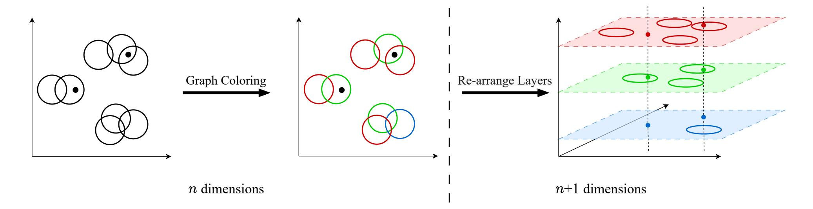

{0}------------------------------------------------

# Fuzzy Private Set Intersection for Real-World Datasets

Satvinder Singh Purdue University

Yanxue Jia Illinois Institute of Technology

Aniket Kate Purdue University

# Abstract

Private Set Intersection (PSI) allows two mutually distrusting parties to compute the intersection of their private sets without revealing any additional information. Fuzzy PSI, an approximate variant of PSI, allows the receiver to learn points of the sender that are "close" to its points. More formally, the receiver learns all in the sender's set that satisfy dist(, ) < for some element in the receiver's set and threshold parameter . Recently, there has been significant progress on Fuzzy PSI, as it allows us to realize several important applications such as password matching, facial recognition, and contact tracing in a privacy-preserving manner. However, existing Fuzzy PSI constructions make strong assumptions on the input sets, such as receiver set disjointedness or projected disjointedness. In this work, we analyze those strong assumptions from a practical viewpoint and observe a gap between theory and practice, i.e., real-world data sets do not abide to those assumptions.

To bridge the gap, we first define a new relaxed and weaker assumption based on the low density of sets, demonstrate the assumption to be practical, and build a compiler that converts constructions under the strong assumption to those under the new, practical assumption. At the core of our transformation is a novel idea involving higher-dimensional lifting and coloring. Combining our transformation with current Fuzzy PSI protocols under the strong assumption yields efficient and practical Fuzzy PSI protocols. We also concretely analyze the run-time and overhead of our transformed protocols for parameters for illustrative applications, such as password matching.

# 1 Introduction

Private Set Intersection (PSI) allows two mutually distrusting parties to compute the intersection of their private sets of elements without revealing any additional information. A long line of work in PSI ([\[5,](#page-12-0) [7,](#page-12-1) [14](#page-12-2)[–16,](#page-12-3) [18,](#page-12-4) [20\]](#page-12-5)) has resulted in extremely efficient protocols. Subsequently, PSI has found applications in several real-world scenarios, including online advertising measurement [\[13\]](#page-12-6), private contact discovery [\[6\]](#page-12-7), and pattern matching [\[21\]](#page-12-8).

However, in various notable applications, the functionality is required to be approximate: Instead of elements being an exact match as in the case of standard PSI, elements are now an "approximate" match. For instance, in applications involving facial recognition, the faces that the two parties hold will not be a perfect match. Even in geo-based applications such as privacy-preserving ride sharing, the locations will only be close to one another and not exactly the same. This gap in functionality led to a new variant of PSI, called Fuzzy PSI (FPSI) [\[7\]](#page-12-1). Here, the sender sends his points that are "close" to the receiver's, where closeness is defined for some metric distance dist and threshold .

While this might seem like a slight change in functionality, achieving FPSI is a rather hard problem. A generic approach to constructing FPSI is to implement a circuit that checks if two points

are close or not, and then compute this circuit for all possible pairwise comparisons securely. This approach, while assumption-free, results in a quadratic overhead in terms of set size, ( ·), which becomes prohibitive for large set sizes, as was seen in the case of standard PSI literature. In fact, a recent work [\[17\]](#page-12-9) shows this concretely for the case of FPSI. To avoid this prohibitive quadratic overhead, existing works make assumptions about the distribution of the datasets that parties hold. Most existing works on FPSI require a disjointness assumption for one party's set. More formally, if we view one party's set as a collection of balls of suitable radius , then the assumption requires that these balls are disjoint, i.e., do not overlap.

# 1.1 Our Contributions

We analyze the practicality of the disjointness assumption for prominent applications such as password matching and facial recognition, and observe a disconnect between the theoretical assumption made and the datasets encountered in practice. Even for small datasets of size 7000, a ball can overlap 400 other balls in the worst case, far from the 0 overlap required by the disjointness assumption. Furthermore, naive approaches to resolving this gap result in large overheads, leading to inefficient protocols.

To remedy this, we create a new weak and practical assumption with a tunable density parameter measuring the worst-case overlap. We create a novel transformation that converts FPSI protocols under the strong assumption into FPSI protocols under the new weak assumption with minimal overhead. More importantly, our transformation makes black-box use of the underlying FPSI protocol.

We then observe that various notable applications require a slightly different functionality than the one provided by standard FPSI. For instance, in password matching, the receiver is supposed to learn which of its passwords are a match rather than the sender sending the passwords close to it. In certain applications, such as security checks involving facial recognition, the receiver simply wishes to learn whether a match occurs or not. We then extend our transformation to preserve additional properties of the underlying FPSI protocol that allows us to realize all these applications.

Most existing works rely on the assumption on the receiver's set. However, in some scenarios, the sender's set, instead of the receiver's set, can meet the assumption. Baarsen et al. [\[24\]](#page-12-10) consider the case where the sender holds balls, but they require a strong assumption on both the sender's and receiver's sets. Inspired by their work, we design the first FPSI protocol with assumptions only on the sender's input set.

We evaluate the cost of our transformed protocols using parameters derived from the practical datasets and compare them to the naive approach. We observe that the run-time overhead improves by a factor of 2.5 × −15× in the symmetric setting. Even in the asymmetric setting, the run-time overhead improves by a factor of around 1.4×.

{1}------------------------------------------------

# 1.2 Related Work

Assumption-based approaches. The study of structure-aware PSI began with Garimella et al. [\[11\]](#page-12-11) and used weak FSS (Function Secret Sharing) to achieve a FPSI protocol for the ∞ norm. Garimella et al. [\[12\]](#page-12-12) then enhanced the security of the previous protocol to be maliciously secure. Garimella et al. [\[9\]](#page-12-13) then improved on the computation complexity of the original protocol by introducing incremental FSS. Around the same time, Baarsen and Pu [\[23\]](#page-12-14) built an FPSI protocol for general norm and hamming distance using DDH-based public-key cryptography. Gao et al. [\[8\]](#page-12-15) built the first FPSI protocol for norm and hamming distance that scales linearly in both the set size and dimension. However, they rely on a strong disjoint projection assumption. Recently, Piske et al. [\[17\]](#page-12-9) improved more concretely on the run-time of FPSI protocols by introducing a new framework based on distance-aware OT for ∞ and 1 norm. Bui et al. [\[3\]](#page-11-0) improve concretely on the incremental FSS work for ∞ norm by getting rid of a security parameter overhead. We also note that there have recently been a lot of e-prints in this field as well that achieve FPSI from similar assumptions using different techniques: [\[2,](#page-11-1) [19,](#page-12-16) [24\]](#page-12-10). We also note a separate line of work focusing solely on hamming distance: [\[4,](#page-12-17) [22\]](#page-12-18).

Naive density-based approaches. A recent work [\[17\]](#page-12-9) observes that the disjointness assumptions required can be avoided. Their idea can, in general, be extended to any work with a similar assumption that uses spatial hashing. Spatial hashing is a technique that tiles the universe into small grid cells, which allows for improved efficiency in protocols. Suppose the density, i.e., number of points per grid cell is . Then, their work requires running instances of the original protocols, where in each instance, only one point is left in any grid cell, but dummy points are added to make the set size remain the same as the original set size. Adding dummy points is used to avoid the security issue incurred by leaking the number of points in each instance. This, however, results in a multiplicative overhead proportional to the density , which becomes prohibitive for relevant applications.

# 2 Technical Overview

We work in the two-party semi-honest setting. For simplicity, we say that one party holds balls of radius with centres as the elements in their set, while the other holds points which are the corresponding elements in their sets. The goal of FPSI is for one party to then learn the points that lie inside the balls. Most existing works require some disjointness assumptions on the party holding the balls. These assumptions enable that for a given point, its holder can efficiently locate a constant number of candidate points from the other party for comparison, rather than comparing with all the points held by the other party, thereby avoiding quadratic cost. If the assumption does not hold, conflicts may occur during the localization process, leading to comparison failures.

However, we observe that real-world datasets for prominent applications such as password matching and facial recognition do not satisfy these assumptions (Please see Section [4.1](#page-3-0) for more details). A trivial method to circumvent this issue results in a multiplicative overhead proportional to the maximum overlap for any ball in the set (Please see the naive density-based approaches in Section [1.2](#page-1-0)

for more details). This leads to very inefficient protocols that are far from being realized in practice.

To address this issue, we introduce a new and realistic assumption: -weak disjointness. Intuitively, this assumes that each element in the set overlaps with at most other balls, i.e., is a representation of the maximum overlap or how "dense" the set is. We then propose a transformation that can convert any FPSI protocol that relies on the strong assumption into one that relies on the new weak assumption.

# 2.1 Transformation

We refer to the party for which the weak assumption holds to be Pballs. The assumption can be thought of as then asserting that each ball intersects at most other balls. We refer to the other party as Ppoints. The goal of FPSI is essentially to figure out the points that lie within the balls. Our transformation works by going to a higher dimension. The goal is to consider a layer-like structure in a higher dimension. We illustrate our transformation in Figure [1.](#page-2-0)

Transformation for Pballs. The goal is to move the balls to these layers such that they become disjoint. To ensure this, we need to ensure 2 things:

- (1) The layers are sufficiently far apart.
- (2) The balls in any one layer are disjoint.

The first property can be ensured by setting the distance between layers appropriately. To ensure the second property, we leverage the fact that the balls already satisfy the -weak disjoint assumption. We view this as a graph problem: Consider a graph where every vertex represents a ball and an edge exists between 2 vertices if the corresponding balls intersect. We then color this graph; each color will correspond to a layer. Balls with a particular color will be moved to the corresponding layer. Observe that since balls with overlap had an edge between them, they will be colored using different colors and hence moved to different layers. Furthermore, since the degree of each vertex is at most , we can color the graph efficiently using a greedy algorithm and + 1 colors.

Transformation for Ppoints. Observe that we need to preserve matches, i.e., if a point lies in a ball before the transformation, then some corresponding point must lie in the corresponding ball as well. Since Ppoints does not know which ball goes to which layer, it simply maps each point of its to all layers.

Cost of transformed protocol. Observe that the transformation itself is efficient and completely local. The number of balls remains the same while the number of points increases by a factor of . Furthermore, the dimension increases by 1. While this might seem like a multiplicative factor, we observe that the cost of all protocols for the metrics we are most concerned with in practice, i.e., they are of the form (2 · # + #) (ignoring other parameters). The former term is generally the dominating term for cost, in terms of both communication and computation, especially for high dimensions or the symmetric set setting. The cost of the transformed protocol is then (2 · # + · #). The cost of the naive density based approach (discussed in Section [1.2\)](#page-1-0) would be ( · 2 · # + · #). Thus, the cost increase for all prominent practical cases is more akin to an additive cost for our

{2}------------------------------------------------

Figure 1: Our transformation. We first represent the balls as a graph where the vertices correspond to balls and an edge exists between 2 vertices if the corresponding balls overlap. Then, we can color the overlapping balls in different colors by applying a graph coloring algorithm. The balls with the same color are arranged on the same layer. Each point is mapped to all the layers. Note that circles become spheres after transformation, but we display them as circles for visual clarity; our transformation can be used for any *n* dimensions, but we use two dimensions as an example for simplicity.

transformed protocol than a multiplicative one in the naive approach, especially in the symmetric setting.

# 2.2 Applying Transformation

FPSI is significantly more complex than PSI not only in its design, but more importantly from a functionality perspective. Specifically, PSI identifies the elements that are in both parties' sets. Therefore, we do not need to consider which party contributes the elements in the intersection. However, FPSI identifies the elements that are similar, rather than identical, to the elements in the other party's set, where the similarity is determined by a parameter  $\delta$ . Therefore, it makes a difference whether the receiver identifies the intersection from its own set or obtains it from the sender. Typically, *standard FPSI* functionality requires that the intersection comes from the sender, and we call the other case *FPSI with sender privacy (FPSI-SP)*, as the sender does not leak his elements.

Black-Box Invocation. Fortunately, our transformation can be applied to any protocol that realizes either standard FPSI or FPSI with sender privacy. Moreover, these protocols can be invoked in a black-box manner as long as the receiver acts as Pballs. Intuitively, the output obtained by the receiver is related to the sender's set after transformation. Now, the sender acts as Ppoints, and his set after transformation is the result of directly expanding the original set to all layers. It is easy to see that the expansion of a certain point is deterministic and independent of the other points. Therefore, the expansion will not leak extra information to the receiver.

Invocation with Slight Modifications. When the sender acts as  $P_{balls}$ , invoking the underlying protocol in a black-box manner would incur security issues. Recall that the output obtained by the receiver includes the information about the sender's set after transformation. When the sender is  $P_{balls}$ , the layer in which a sender's ball is placed is influenced by the other balls (based on the color assigned which depends on locality). Therefore, the information about layers will leak extra information about the sender's set. Next, we will provide more details for standard FPSI and FPSI with sender privacy, respectively.

- Standard FPSI (Intersection comes from the sender Pballs):
   If the receiver directly obtains the balls after lifting a dimension, the receiver can learn the coordinate of the added dimension, which leaks which layer the ball is assigned to. To avoid the leakage, the sender needs to send the original balls, rather than the balls after transformation.
- FPSI with Sender Privacy (Intersection comes from the receiver Ppoints): For each point in the receiver's output set, the receiver should be able to infer nothing beyond the fact that there exist sender's balls containing that point. However, if we invoke the underlying protocol in a black-box manner, the receiver can learn which points among the *C* points (namely, expansion points of an original point) fall inside the sender's balls. To address this issue, we invoke the circuit FPSI with sender privacy and combine it with a subsequent simple 2PC computation, such that the receiver can only learn if there are points in the *C* points falling inside the sender's balls without learning which points.

The rest of the paper is organized as follows: In Section 3, we present the necessary background required to understand our protocols. In Section 4, we show that current assumptions are not satisfied by practical datasets, introduce our new assumption, and then present our transformation. In Section 5, we apply our transformation to existing FPSI protocols to get practical FPSI protocols under our new weak assumption. In Section 6, we discuss extensions of our protocol. In Section 7, we present our modified FPSI protocol that relies solely on assumptions on the sender's set. Finally, in Section 8, we show the concrete efficiency of our transformed protocols.

# 3 Preliminaries

# 3.1 Notations

Let  $\lambda$  represent the computational security parameter. We represent multi-dimensional points as vectors i.e.  $\vec{x} = (x_1, x_2, \dots, x_d)$  represents a d dimensional point. We generally omit explicitly mentioning the dimension d when clear.  $\vec{y} = (\vec{x}, z)$  represents a point

{3}------------------------------------------------

in d+1 dimensions whose first d co-ordinates are the co-ordinates of  $\vec{x}$  and the  $(d+1)^{th}$  co-ordinate is z. We assume that points are defined over some metric space with metric distance dist(., .). Let  $\approx_c$  represent computational indistinguishability.  $x \stackrel{\$}{\leftarrow} S$  denotes that x is sampled uniformly at random from the set S. For  $n \in \mathbb{N}$ , let [n] represent the set  $\{1, 2, \ldots, n\}$ . We assume that all algorithm-s/functions implicitly take the security parameters as input, but generally omit it for brevity.

# 3.2 Secure Multi-party Computation

Following standard PSI and MPC literature, we prove security of our protocols in the real-ideal paradigm with respect to a semi-honest adversary.

DEFINITION 1 (SECURE MPC). Let  $P_0$ ,  $P_1$  be 2 parties with inputs  $x_0$  and  $x_1$  respectively. We say that a protocol  $\pi$  securely realizes a functionality f if there exists a PPT Simulator Sim such that for all  $i \in \{0,1\}$ :

$$Sim(i, x_i, f_i(x_0, x_1), 1^{\lambda}) \approx_c View(i, x_0, x_1, 1^{\lambda})$$

where  $f_i(x_0, x_1)$  represents the output of the  $i^{th}$  party and  $View(i, x_0, x_1, 1^K)$  represents the view of the  $i^{th}$  party when running protocol  $\pi$ .

# 3.3 Oblivious Key-Value Store

OKVS is a data structure that is used to encode a set of key-value pairs. OKVS hides the keys associated with random values.

DEFINITION 2 (OBLIVIOUS KEY VALUE STORE [10]). Let K be the set of keys and V the set of values. An oblivious key-value store (OKVS) scheme consists of a pair of algorithms (Encode, Decode) defined as follows:

- (1)  $\vec{P} \leftarrow \text{Encode}(\{(k_i, v_i)\}_{i \in [n]})$ : The encode function on input a set of key-value pairs  $\{(k_i, v_i)\}_{i \in [n]}$  outputs a vector  $\vec{P}$  representing the OKVS data structure.
- (2)  $v \leftarrow \mathsf{Decode}(\vec{P}, k)$ : The decode function on input an OKVS data structure  $\vec{P}$  and a key k outputs a value v.

These algorithms satisfy the following properties:

• Correctness: For all set of key-value pairs  $\mathcal{A} \subseteq \mathcal{K} \times \mathcal{V}$  with distinct keys (i.e.,  $\forall$   $(k, v) \neq (k', v')$  in  $\mathcal{A}$ , where  $k \neq k'$ ), and for all  $(k, v) \in \mathcal{A}$ ,

$$\Pr[\mathsf{Decode}(\mathsf{Encode}(\mathcal{A}), k) \neq v] \leq negl(\lambda)$$

• **Obliviousness:** For any two distinct key sets  $\{k_1^0, \ldots, k_n^0\}$  and  $\{k_1^1, \ldots, k_n^1\}$ , distributions  $\mathcal{R}(k_1^0, \ldots, k_n^0)$  and  $\mathcal{R}(k_1^1, \ldots, k_n^1)$  are computationally indistinguishable, where  $\mathcal{R}$  is defined as:

$$\frac{\mathcal{R}(k_1, \dots, k_n):}{\text{for } i \in [n]: v_i \overset{\$}{\leftarrow} \mathcal{V}}$$

$$\text{return Encode}(\{(k_1, v_1), \dots, (k_n, v_n)\})$$

# 3.4 Oblivious Pseudo-Random Function

We say that a protocol  $\pi_{OPRF}$  is a OPRF if it achieves the following functionality in Figure 2 in a secure fashion as per definition 1:

### **Functionality** $\mathcal{F}_{\mathsf{OPRF}}$

### **Functionality:**

- 1. On input a set of points  $\{p_1, \ldots, p_d\}$  from the receiver and  $\bot$  from sender, locally sample a random function  $F : \mathbb{F} \to \mathbb{F}$
- 2. Send  $F(p_i)$  to receiver for all  $i \in [d]$ . Send oracle access to F to the sender.

Figure 2: Functionality for OPRF

### 3.5 Secret-shared OPRF

We say that a protocol  $\pi_{SS-OPRF}$  is a secret-shared OPRF if it achieves the following functionality in a secure fashion as per definition 1. We can use the scheme in [1] to instantiate it.

## Functionality $\mathcal{F}_{SS-OPRF}$

### **Functionality:**

- 1. On input a set of points  $\{p_1, \ldots, p_d\}$  from the receiver and  $\bot$  from sender, locally sample a random function  $F : \mathbb{F} \to \mathbb{F}$
- 2. Sample  $F^{(1)}(p_i)$  and  $F^{(2)}(p_i)$  randomly subject to  $F^{(1)}(p_i) + F^{(2)}(p_i) = F(p_i)$  for all i.
- 3. Send  $F^{(1)}(p_i)$  to receiver. Send  $F^{(2)}(p_i)$  and oracle access to F to sender.

Figure 3: Functionality for secret shared OPRF

### 4 Our Transformation

In this section, we describe our general transformation algorithm.

### 4.1 Analyzing Assumptions

Most existing papers work with some minor variant of the following two assumptions:

DEFINITION 3 (STRONG DISJOINT SET ASSUMPTION). We say that a set X satisfies the strong disjoint set assumption with distance parameter R if for every 2 points  $\vec{x}_i \neq \vec{x}_j \in X$ , we have  $\text{dist}(\vec{x}_i, \vec{x}_j) > R$ .

Definition 4 (Strong Disjoint Projection Assumption). We say that a set X satisfies the disjoint projection assumption with distance parameter R if for every point  $\vec{x} \in X$ , there exists a dimension  $i \in [d]$ , such that  $\operatorname{dist}(\vec{x}[i], \vec{x'}[i]) > R$  for all  $\vec{x'} \in X$ .

We analyze whether these assumptions hold for practical use cases such as password matching and face recognition. In particular, we measure how far these assumptions are from being realized using a parameter C which measures how "dense" the set is. More formally, it is defined as the maximum overlap i.e.

$$C = \max_{x \in X} \left| \left\{ x' \in X | \operatorname{dist}(x, x') < R \right\} \right|$$

In Table 1, we analyze the practicality of the strong disjoint set assumption for datasets LFTW (Learning Faces in the Wild) used 

{4}------------------------------------------------

for facial recognition, leaked password datasets Ashley Madison and Rock you, and NYC Yellow Taxi trip data for contact tracing and privacy-preserving ride sharing. We perform testing via both uniform sampling and sampling done by others to create small curated datasets. The distance parameter R for facial recognition is varied based on recommended values (between 0.6 and 1) and local testing. For password matching, brute force attacks for passwords that are one or two digits off is still reasonable and so we use a radius of 3. For location based dataset, we use a distance of 100m which is roughly equal to one Manhattan block (equivalently, the distance that can be walked in around a minute).

| Dataset        | Set size | Radius R | Overlap C |
|----------------|----------|----------|-----------|
| LFTW           | 3000     | 1        | 234       |
| LFTW           | 3000     | 0.8      | 193       |
| LFTW           | 7000     | 0.8      | 403       |
| Ashley Madison | 1000     | 3        | 10        |
| Ashley Madison | 3000     | 3        | 25        |
| Ashley Madison | 5000     | 3        | 54        |
| Rock you       | 3957     | 3        | 129       |
| Rock you       | 9437     | 3        | 257       |
| NYC Taxi       | 10000    | 100      | 168       |
| NYC Taxi       | 10000    | 200      | 183       |
| NYC Taxi       | 1000000  | 100      | 19036     |

Table 1: Overlap values for datasets. We sample a set from the corresponding dataset and compute the value of density parameter C that measures the overlap for a given distance parameter R.

The strong disjoint set assumption is equivalent to saying that C=0. As we can see, it is far from being practical for relevant use cases. Furthermore, the strong disjoint projection assumption is even stronger! For the LFTW dataset, a set size of 3000 with  $\delta=0.8$  gives projected overlap in any dimension  $C_{\text{proj}}=1433$ , which is nearly half the set. We observe that the overlap value C is much smaller for the strong disjoint set assumption and focus on trying to make existing ideas work for such cases. To do this, we introduce the following new assumption:

DEFINITION 5 ( *C*-WEAK DISJOINT SET ASSUMPTION). We say that a set X satisfies the weak disjoint set assumption with distance parameter R and density parameter C if for every point  $\vec{x}_i \in X$ , there are at most C other points  $\{\vec{x}_{j_1}, \vec{x}_{j_2}, \ldots, \vec{x}_{j_C}\}$  such that  $\operatorname{dist}(\vec{x}_i, \vec{x}_k) > R$  for all  $k \neq j_1, j_2, \ldots, j_C$ .

Observe that the strong disjoint set assumption is a special case of the weak disjoint set assumption when we set C = 0. Our goal now is to convert protocols that work under the strong disjoint set assumption into protocols that work under the C-weak disjoint set assumption.

**Note:** We note that our ideas could be applied similarly to the strong disjoint projection assumption as well. However, since the projected disjointness  $C_{\text{proj}}$  is too large with respect to the set size, we do not get practically feasible protocols. Hence, we primarily focus our attention on the former assumption. We do note looking

ahead, that after applying our transformation, the balls in each layer are disjoint which allows us to use LSH for the high dimensional case, which can be potentially interesting.

## 4.2 Transformation

We describe our transformation in Figure 4. Here,  $P_{balls}$  is a party holding a set X of balls of radius  $\delta$  and  $P_{points}$  is a party holding a set of points Y. Our goal is to transform these sets from satisfying the weak disjoint set assumption to the strong disjoint set assumption with respect to  $P_{balls}$  set.  $P_{balls}$  will color his balls such that overlapping balls have distinct colors and then move each ball to a specific layer, ensuring disjointness.  $P_{points}$  will place each of his points in each of the layers. Looking ahead, when we construct our Fuzzy PSI protocols, one of the parties will act as  $P_{balls}$  and the other as  $P_{points}$  depending upon whether the assumption holds for the receiver or for the sender.

THEOREM 6. The transformed sets X' and Y' satisfy the following:

- (1) **Assumption Reduction:** If X satisfied the C-weak disjoint set assumption for distance parameter R, then X' satisfies the strong disjoint set assumption for distance parameter R.
- (2) Invertible:
  - Let  $\vec{x}' = \text{Transform}(\vec{x})$  for  $\vec{x} \in X$ . Then,  $(x'_1, x'_2, \dots, x'_d) = (x_1, x_2, \dots, x_d)$ .
  - Let  $\vec{y}' \in \text{Transform}(\vec{y})$  for  $\vec{y} \in Y$ . Then,  $(y'_1, y'_2, \dots, y'_d) = (y_1, y_2, \dots, y_d)$ .
- (3) **Distance preservation:** For every  $\vec{x} \in X$ ,  $\vec{y} \in Y$ , let  $\vec{x'} = \text{Transform}(\vec{x})$ . For every  $\vec{y'} \in \text{Transform}(\vec{y})$ , we have  $\text{dist}(\vec{x'}, \vec{y'}) \geq \text{dist}(\vec{x}, \vec{y})$ . Furthermore, there exists unique  $\vec{y'} \in \text{Transform}(\vec{y})$  such that  $\text{dist}(\vec{x'}, \vec{y'}) = \text{dist}(\vec{x}, \vec{y})$ .

PROOF. If X satisfied the C-weak disjoint set assumption for distance parameter R, then for every point  $\vec{x}_i \in X$ , there are at most C other points  $\{\vec{x}_{j_1}, \vec{x}_{j_2}, \ldots, \vec{x}_{j_C}\}$  that are at a distance less than R from it. For each of these points, they will be colored with different colors by construction. Now, if 2 points  $\vec{x}, \vec{x'}$  have different colors cl and cl', then the distance between them is  $\geq (\text{cl} - \text{cl'}) \cdot R \geq R$ . Thus, every point  $\vec{x} \in X$  is at distance  $\geq R$  from every other point in X and so, X satisfies the strong disjoint set assumption.

Let  $\vec{x} \in X$  and  $\vec{y} \in Y$ . Let  $\vec{x}$  be colored using color cl in our construction. Then, observe that  $\vec{y'} = (\vec{y}, \operatorname{cl} \cdot R)$  is in Y' by our construction. Now,  $\operatorname{dist}(\vec{x'}, \vec{y'}) = \operatorname{dist}((\vec{x}, \operatorname{cl} \cdot R), (\vec{y}, \operatorname{cl} \cdot R)) = \operatorname{dist}(\vec{x}, \vec{y})$ . It is also trivially seen that the projections of  $\vec{x'}$  and  $\vec{y'}$  in the first d dimensions are equal to  $\vec{x}$  and  $\vec{y}$  respectively. This is the unique  $\vec{y'}$  satisfying distance preservation. It is easy to see that for all other points the distance will be larger than this.

# 4.3 Computing C and pre-processing the input

In our transformation, we assumed C was known a priori and that  $P_{\text{balls}}$  input was represented in graph form (as in step 1(a)). In this section, we show how both these steps can be done efficiently. We first remark that both of these are one-time costs. More formally,  $P_{\text{balls}}$  (generally the server) has to do this computation one-time and can then run multiple Fuzzy PSI protocols with several clients without needing to re-compute these.

{5}------------------------------------------------

### Our transformation

**Input:**  $P_{\text{balls}}$  holding a set X of balls  $\vec{B}_i$  with center  $\vec{x}_i$  and radius  $\delta$  and  $P_{\text{points}}$  holding a set Y of points  $\vec{y}_i$  in d dimensions. Let |X| = m and |Y| = n. Let R be the distance parameter and C be the density parameter.

- (1) Pballs:
  - (a) Define a graph G = (V, E) as follows: There are m vertices, with each vertex  $v_i$  corresponding to a ball  $\vec{B}_i \in X$ . e = (i, j) is an edge in G iff the corresponding centers  $\vec{x}_i, \vec{x}_j$  satisfy  $d(\vec{x}_i, \vec{x}_j) < R$
  - (b) Define *C* to be one more than the largest degree of any vertex in this graph, i.e.

$$C = \max_{v \in V} \deg(v) + 1$$

- (c) Color the graph G using C colors. Let the color of  $\vec{x}_i \in V$  be  $cl_i$ .
- (d) For every center  $\vec{x}_i$ , define Transform $(\vec{x}_i) = (\vec{x}_i, \operatorname{cl}_i \cdot R)$ . Output a new set X' defined as follows:

$$X' = \bigcup_{\vec{x}_i \in X} \mathsf{Transform}(\vec{x}_i)$$

- (2) Ppoints:
  - (a) For every point  $\vec{y_i}$ , define Transform $(\vec{y_i}) = \{(\vec{y_i}, 0), (\vec{y_i}, R), (\vec{y_i}, 2R), \dots, (\vec{y_i}, (C-1)R)\}$ . Output a new set Y' defined as follows:

$$Y' = \bigcup_{\vec{y}_i \in Y} \mathsf{Transform}(\vec{y}_i)$$

**Note:** Observe that Transform maps points in *X* to a single element whereas points in *Y* are each mapped to *C* many elements.

## **Figure 4: Our Transformation**

A naive approach to doing these requires quadratic cost  $O(m^2 \cdot d)$  (for every pair of points, compute distance between them and check if it is less than R). C can then be computed from the maximum degree of any vertex in this graph. This quadratic cost seems to be theoretically inherent unless additional assumptions on the dataset is placed. For practical cases, however, we note that several data structures can help perform these steps much faster in expectation. We discuss one such approach using k-d trees in detail.

*k-d tree approach:* For several low-dimensional applications such as nearest neighbor search in geo-location based datasets, k-d trees prove to be an efficient data structure in practice. k-d trees are data structures similar to binary search trees that support addition, deletion, and nearest neighbor searches for d dimensional points. We now formally describe our approach utilizing this data structure. All *m* points can be first added into the k-d tree data structure with expected cost  $O(d \cdot m \log m)$ . For each point, we can keep extracting the next nearest neighbor unless distance becomes greater than *R*. In expectation, the cost of extracting the next nearest neighbor is  $O(d \cdot \log m)$ . Furthermore, this will be repeated at most *C* times for each point (Note that we don't know what *C* is yet; however, the run-time can still be upper bounded by the existence of such a *C*). This leads to a total expected cost of  $O(C \cdot d \cdot m \log m)$  which is much better than the naive cost. We do remark that in worst case scenarios, this approach does dissolve into something akin to the naive approach with quadratic cost. Placing additional restrictions on the dataset can help avoid this cost; however, for practical purposes, we remark that this expected cost is efficient enough. Note that the nearest neighbor search process can be parallelized for each point. More concretely, the naive quadratic cost approach takes 347

seconds for a dataset of size 10000 on a standard laptop whereas the k-d tree approach for the same takes only 0.03 seconds. Even for datasets of size a million, the k-d tree approach successfully computes the overlap value C in just 27.64 seconds.

Other data structures such as ball-trees and locality sensitive hashing can also be used to similarly compute C and pre-process the input depending on application and dimension d. We also remark that our approach is amicable to dynamic updates as well. If a new element is added, using similar approaches, the graph can be updated in expected time  $O(d \cdot \log m)$  (worst case  $O(d \cdot m)$ ). Element deletion can be handled by directly removing the corresponding vertex and edges as well.

## 5 Protocol for Fuzzy Private Set Intersection

We define the standard functionality of Fuzzy Private Set Intersection (FPSI) in Figure 5. Later, we show an extension of our ideas to achieve related functionalities such as FPSI-SP (FPSI with Sender Privacy) and Circuit-FPSI defined in Figure 5 and Figure 7 respectively.

In this section, we discuss how to use our transformation to achieve fuzzy private set intersection under the *C*-weak disjoint set assumption. We consider two cases based on which party's set satisfies this assumption i.e., the receiver or the sender. While the core idea in both cases remains the same, there are subtle differences that arise due to the asymmetry of our transformation, and hence, we handle them separately.

{6}------------------------------------------------

#### **Standard FPSI Functionality**

**Parameters:** A distance function dist( $\cdot$ ,  $\cdot$ ), dimension d, and a radius  $\delta$ .

### **Functionality:**

- 1. Obtain the input set  $X = {\vec{x}_i}_{i \in [m]}$  from the receiver R, where each  $\vec{x}_i$  is a point in d dimensions.
- 2. Obtain the input set  $Y = {\vec{y}_i}_{i \in [n]}$  from the sender S, where each  $\vec{y}_i$  is a point in d dimensions.
- 3. Initialize a set  $Z = \emptyset$ .
- 4. For each  $i \in [n]$ , if there exists  $j \in [m]$  such that  $\operatorname{dist}(\vec{x}_i, \vec{y}_i) < \delta, Z = Z \cup \{\vec{y}_i\}$
- 5. Output the set Z to the receiver R.

Figure 5: Standard FPSI functionality

# 5.1 Receiver holding hyperballs.

In this case, the receiver holds hyperballs that satisfy the C-weak disjoint set assumption. We transform FPSI protocols that work under the receiver's strong disjoint set assumption into protocols that work under the receiver C-weak disjoint set assumption using our transformation described in the previous subsection. The core idea is that the receiver will act as  $P_{balls}$  and the sender will act as  $P_{points}$  and run the transformation. After this, parties run the FPSI protocol under the strong assumption and extract the correct output.

Protocol  $\Pi^{R.WeakDisj}_{FPSl}$  (Receiver Holding Hyperballs, C-weak disjoint set assumption)

### **Input:**

- Receiver R:  $X = \{\vec{B}_i\}_{i \in [m]}$  where  $\vec{B}_i$  is a hyperball with center  $\vec{x}_i$  and radius  $\delta$ .
- Sender S:  $Y = {\vec{y}_i}_{i \in [n]}$  where  $\vec{y}_i$  is a point.

### **Protocol:**

- (1) Parties invoke our transformation (shown in Figure 4) with R acting as  $P_{balls}$  and S acting as  $P_{points}$  with  $R = 2\delta$ . Let X' and Y' be the corresponding outputs of both parties.
- (2) Now, R and S invoke  $\Pi_{\mathsf{FPSI}}^{\mathsf{R.StrDisj}}$  with corresponding inputs X' and Y'. Let Z' be the output of R.
- (3) R outputs Z where Z is obtained from Z' by removing the last co-ordinate of each element.

# Figure 6: FPSI protocol for C-weak disjoint assumption (refer definition 5) (Receiver holding balls)

Theorem 7. Given a protocol  $\Pi_{\text{FPSI}}^{\text{R.StrDisj}}$  that can securely achieve  $\mathcal{F}_{\text{FPSI}}$  under the strong disjoint set assumption for the receiver, the transformed protocol  $\Pi_{\text{FPSI}}^{\text{R.WeakDisj}}$  in Figure 6 securely achieves  $\mathcal{F}_{\text{FPSI}}$  under the C-weak disjoint set assumption for the receiver.

PROOF. Since we are in the semi-honest setting, we argue correctness and security individually. Observe that the transformation

converts the receiver set from satisfying the C-weak disjoint set assumption to the strong disjoint set assumption. Furthermore, for every  $\vec{x} \in X$ ,  $\vec{y} \in Y$  such that  $\operatorname{dist}(\vec{x}, \vec{y}) \geq R$ , the corresponding transformed points also have distance  $\geq R$ . Thus, they do not appear in the output. For every  $\vec{x} \in X$ ,  $\vec{y} \in Y$  such that  $\operatorname{dist}(\vec{x}, \vec{y}) < R$ , we have that there exists unique  $\vec{y}' \in \operatorname{Transform}(\vec{y})$  such that  $\operatorname{dist}(\operatorname{Transform}(\vec{x}), \vec{y}') = \operatorname{dist}(\vec{x}, \vec{y}) < R$  and so these transformed points appear in the output. Furthermore, their first d co-ordinates are the same, and hence they will be a part of the final output Z. Consider the following simulator  $\operatorname{Sim}_R$  for the receiver:

- (1) Given as input the set X of the receiver and the output Z, the simulator runs our transformation on the set X with receiver acting as  $P_{balls}$  to get a set X'.
- (2) For every point  $\vec{z} \in Z$ ,  $\vec{x}_i \in X$  such that  $\operatorname{dist}(z, x_i) < \delta$ , let  $\vec{x}_i$  be colored using  $\operatorname{color}_i$  in our transformation. Define  $\vec{z}_i' = (\vec{z}, \operatorname{color}_i)$  and  $Z' = \cup \vec{z}_i'$  for all  $\vec{z} \in Z$ .
- (3) Run the simulator for receiver for  $\Pi_{\mathsf{FPSI}}^{\mathsf{R.StrDisj}}$  with input X' and Z'. Output the corresponding transcript output by the simulator along with X' and Z'.

Observe that the output of the simulator is indistinguishable from the real-world transcript by the following hybrid argument:

- $\mathcal{H}_0$ : Real world
- $\mathcal{H}_1$ : Simulated output Z' is same as in real world. Indistinguishability with the previous hybrid follows directly from correctness.
- $\mathcal{H}_2$ : Change real transcript with simulated transcript. Indistinguishability with the previous hybrid follows directly from security of  $\Pi_{\mathsf{FPSI}}^{\mathsf{R.StrDisj}}$

Consider the following simulator SimS for the sender:

- (1) Given as input the set Y of the sender and the output  $\bot$ , the simulator runs our transformation on the set Y with sender acting as  $P_{points}$  to get a set Y'
- (2) Run the simulator for sender for  $\Pi_{\mathsf{FPSI}}^{\mathsf{R.StrDisj}}$  with input Y' and  $\bot$ . Output the corresponding transcript output by the simulator along with Y'.

Observe that the output of the simulator is indistinguishable from the real-world transcript by the following hybrid argument:

- $\mathcal{H}_0$ : Real world
- $\mathcal{H}_1$ : Change real transcript with simulated transcript. Indistinguishability with the previous hybrid follows directly from security of  $\Pi_{\mathsf{FPSI}}^{\mathsf{R.StrDisj}}$

Instantiate  $\Pi_{\mathsf{FPSI}}^{\mathsf{R.StrDisj}}$ . Most existing works ( [9, 11, 23]) require the strong disjoint set assumption to hold for the receiver side. We do note that some works like [9] require a slightly weaker assumption where overlapping balls can be handled if they can be mapped to different universes; however, in the worst case, the assumptions are equivalent. Our transformation can be instantiated using any of these works to achieve protocols under the practical weaker assumption. We also note that certain works like [11, 23] offer more efficient constructions when the balls are further apart (like distance >  $4\delta$ ). We can use our transformation with a larger distance parameter R to satisfy such assumptions as well and invoke these more efficient constructions. Our blow-up in communication and

{7}------------------------------------------------

computation cost is also low. For instance, if we instantiate our transformation to the protocol for  $l_p$  distance in [23], the communication cost increases from  $\delta 2^d dN + \delta^p M$  to  $\delta 2^d dN + \delta^p CM$ . Observe that the former term is the dominating cost due to the  $2^d$  factor, and hence our increase in cost is more additive than multiplicative, especially in the symmetric setting in large dimensions. We further demonstrate this concretely in the implementation section as well.

# 5.2 Sender holding hyperballs

In this case, the sender holds hyperballs that satisfy the *C*-weak disjoint set assumption. We convert protocols that work under the sender's strong disjoint set assumption into protocols that work under the sender *C*-weak disjoint set assumption using our transformation described in the previous subsection. Observe that our transformation is asymmetric. Directly applying our transformation, as in the previous case, leads to a security issue. In particular, the last coordinate of the sender's point after transformation in the output leaks some additional information about the sender's set. To avoid this, we instead leverage circuit FPSI, which allows us to only reveal the point barring the last coordinate.

## Functionality $\mathcal{F}_{Circuit-FPSI}$

**Parameters:** A distance function dist $(\cdot, \cdot)$  and a radius  $\delta$ . **Functionality:** 

- 1. Obtain the input set  $X = {\vec{x}_i}_{i \in [m]}$  from the receiver R, where each  $\vec{x}_i$  is a point in d dimensions.
- 2. Obtain the input set  $Y = {\vec{y}_i}_{i \in [n]}$  from the sender S, where each  $\vec{y}_i$  is a point in d dimensions.
- 3. For each  $j \in [n]$ , if there exists  $i \in [m]$  such that  $\operatorname{dist}(\vec{x}_i, \vec{y}_j) < \delta$ , randomly generate  $b_j^0 \oplus b_j^1 = 1$ , otherwise,  $b_j^0 \oplus b_j^1 = 0$ .
- 4. Output the set  $\{b_i^0\}_{i\in[n]}$  to the receiver R and the set  $\{b_i^1\}_{i\in[n]}$  the sender S.

Figure 7: Circuit Fuzzy PSI Functionalities  $\mathcal{F}_{Circuit-FPSI}$ 

Theorem 8. Given a protocol  $\Pi^{S.StrDisj}_{Circuit-FPSI}$  that can securely achieve  $\mathcal{F}_{FPSI}$  under the strong disjoint set assumption for the sender, the transformed protocol  $\Pi^{S.WeakDisj}_{FPSI}$  in Figure 8 securely achieves  $\mathcal{F}_{FPSI}$  under the C-weak disjoint set assumption for the sender.

PROOF. Since we are in the semi-honest setting, we argue correctness and security individually. It is easy to see that correctness holds via a similar argument to the previous case. Consider the following simulator  $Sim_R$  for the receiver:

- (1) Given as input the set X of the receiver and the output Z, the simulator runs our transformation on the set X with receiver acting as  $P_{balls}$  to get a set X'.
- (2) Sample shares  $B^0 = \{b_i^0\}_{i \in [m]}$  uniformly at random. Given these shares and the output Z, run the simulator for generic MPC to generate transcript.

Protocol  $\Pi_{FPSI}^{S.WeakDisj}$  (Sender Holding Hyperballs, C-weak disjoint set assumption)

## Input:

- Receiver R:  $X = {\vec{x}_i}_{i \in [m]}$  where  $\vec{x}_i$  is a point.
- Sender S:  $Y = \{\vec{B}_i\}_{i \in [n]}$  where  $\vec{B}_i$  is a hyperball with center  $\vec{y}_i$  and radius  $\delta$ .

### **Protocol:**

- (1) Parties invoke our transformation (shown in Figure 4) with S acting as  $P_{balls}$  and R acting as  $P_{points}$  with  $R = 2\delta$ . Let X' and Y' be the corresponding outputs of both parties.
- (2) Now, R and S invoke  $\Pi^{\text{S.StrDisj}}_{\text{Circuit-FPSI}}$  with corresponding inputs X' and Y', and obtain  $\{b_i^0\}_{i\in |Y'|}$  and  $\{b_i^1\}_{i\in |Y'|}$ , respectively.
- (3) Parties run generic semi-honest 2PC that outputs  $y_j$  to the receiver if  $b_j^0 \oplus b_j^1 = 1$ .
- (4) Receiver outputs this set, say Z.

# Figure 8: FPSI protocol for weak disjoint assumption (refer definition 5) (Sender holding balls)

(3) Given shares  $B^0$  and input X', run the simulator for receiver for  $\Pi_{\mathsf{FPSI}}^{\mathsf{R.StrDisj}}$  with input X' and  $B^0$ . Output the corresponding transcript output by the simulator along with X',  $B^0$ .

Observe that the output of the simulator is indistinguishable from the real-world transcript by the following hybrid argument:

- $\mathcal{H}_0$ : Real world
- $\mathcal{H}_1$ : Change actual values  $B^0$  to random values. Indistinguishability with the previous hybrid follows since the shares  $B^0$  are sampled uniformly and independently at random.
- $\mathcal{H}_2$ : Change real 2PC execution to simulated one. Indistinguishability with the previous hybrid follows directly from the security of 2PC.
- $\mathcal{H}_3$ : Change real transcript with simulated transcript. Indistinguishability with the previous hybrid follows directly from security of  $\Pi^{S.StrDisj}_{Circuit-FPSI}$

Consider the following simulator  $\mathsf{Sim}_\mathsf{S}$  for the sender:

- (1) Given as input the set Y of the sender and the output  $\bot$ , the simulator runs our transformation on the set Y with sender acting as  $P_{points}$  to get a set Y'.
- (2) Generate random values  $B^1 = \{b_i^1\}_{i \in [m]}$ . Given these shares and the output Z, run the simulator for generic MPC to generate transcript.
- (3) Run the simulator for sender for  $\Pi_{\mathsf{FPSI}}^{\mathsf{R.StrDisj}}$  with input Y' and  $B^1$ . Output the corresponding transcript output by the simulator along with Y',  $B^1$ .

Observe that the output of the simulator is indistinguishable from the real-world transcript by the following hybrid argument:

- $\mathcal{H}_0$ : Real world
- $\mathcal{H}_1$ : Change actual values  $B^1$  to random values. Indistinguishability with the previous hybrid follows since the shares  $B^1$  are distributed uniformly if the other shares are unknown.

{8}------------------------------------------------

- $\mathcal{H}_2$ : Change real 2PC execution to simulated one. Indistinguishability with the previous hybrid follows directly from the security of 2PC.
- $\mathcal{H}_3$ : Change real transcript with simulated transcript. Indistinguishability with the previous hybrid follows directly from security of  $\Pi^{S.StrDisj}_{Circuit-FPSI}$

Instantiate  $\Pi^{\text{S.StrDisj}}_{\text{Circuit-FPSI}}$ . While few, there are some works such as Garimella et al. [9] 1 and Baarsen et al. [24] that consider the setting that the strong disjoint set assumption holds for the sender. However, Garimella et al. [9] can only be used for  $L_{\infty}$  and incurs a cost quadratic in the set size. In addition, Baarsen et al. [24] require the strong disjoint set assumption to hold for both the sender's and the receiver's input sets. A significant advantage of the scheme in [24] is that it can support general Minkowski ( $L_p, p \in [1, \infty]$ ). While we could use our transformation twice iteratively, we observe that we can modify the scheme by Baarsen et al. [24] to eliminate the assumption on the receiver's input set; thus resulting in a protocol with assumption only on the sender's input set. We discuss this in detail in Section 7.

# **6 Beyond Standard FPSI**

In several prominent applications, the functionality we require is slightly different from this standard FPSI functionality. For instance, in fuzzy password matching, the receiver is supposed to learn which of her passwords are potentially compromised. In the standard functionality, the sender would send his passwords that are close to the receiver's. Clearly, this is a different situation. In cases like this, we want a different functionality, namely FPSI with sender privacy. In certain other cases, in contact tracing, we might only want the number of matches and not the exact matches themselves. This is termed as FPSI-Cardinality. We show that our transformation preserves the security of these functionalities with slight changes. More formally, if a protocol achieves these functionalities under the strong disjoint set assumption, then our transformation yields a protocol that achieves these functionalities under the *C*-weak disjoint set assumption. We provide a construction for FPSI-SP. The construction for Circuit-FPSI follows similarly.

FPSI with Sender Privacy. In this case, instead of having the sender send his points to the receiver that are close, we want the receiver to only know which of her points are close to those of the sender. Hence, the exact points of the sender are kept private; hence why the name FPSI with sender privacy. We define this functionality formally in Figure 9 The constructions for when receiver or sender holds hyperballs follow a similar paradigm as before except that we use sender-private versions of the base FPSI along with some slight modifications.

Specifically, for the case where the receiver holds balls (as shown in Figure 10), after transformation, the two parties invoke the sender-private version of the base FPSI  $\Pi_{\text{FPSI-SP}}^{\text{R.StrDisj}}$ , and the receiver obtains the output after removing the last co-ordinate of each element. When the sender holds balls (as show in Figure 12), we need to additionally hide which expanded points of the receiver are in

the intersection, as the information leaks the distribution information of the sender's balls. Therefore, besides the sender-private circuit FPSI  $\Pi^{S.StrDisj}_{Circuit-FPSI-SP}$ , we also need another sub-protocol whose functionality  $\mathcal{F}_{Check}$  is shown in Figure 11.  $\mathcal{F}_{Check}$  checks if a secret-shared vector is a non-zero vector; if so, output 1, otherwise, output 0. A non-zero vector in our protocol  $\Pi^{S.WeakDisj}_{FPSI-SP}$  (sender holding balls) in Figure 10 means that there is at least one expanded point of an original point that is in the intersection.

### FPSI with sender privacy Functionality

**Parameters:** A distance function dist( $\cdot$ ,  $\cdot$ ), dimension d, and a radius  $\delta$ .

### **Functionality:**

- 1. Obtain the input set  $X = {\vec{x_i}}_{i \in [m]}$  from the receiver R, where each  $\vec{x_i}$  is a point in d dimensions.
- 2. Obtain the input set  $Y = {\vec{y}_i}_{i \in [n]}$  from the sender S, where each  $\vec{y}_i$  is a point in d dimensions.
- 3. Initialize a set  $Z = \emptyset$ .
- 4. For each  $i \in [m]$ , if there exists  $j \in [n]$  such that  $\operatorname{dist}(\vec{x}_i, \vec{y}_j) < \delta, Z = Z \cup \{\vec{x}_i\}$
- 5. Output the set *Z* to the receiver R.

Figure 9: FPSI with sender privacy functionality

# Protocol $\Pi_{FPSI-SP}^{R.WeakDisj}$ (Receiver Holding Hyperballs, C-weak disjoint set assumption)

### **Input:**

- Receiver R:  $X = {\vec{B}_i}_{i \in [m]}$  where  $\vec{B}_i$  is a hyperball with a center  $\vec{x}_i$  and a radius  $\delta$ .
- Sender S:  $Y = {\vec{y}_i}_{i \in [n]}$  where  $\vec{y}_i$  is a point.

### **Protocol:**

- (1) Parties invoke our transformation (shown in Figure 4) with R acting as  $P_{balls}$  and S acting as  $P_{points}$  with  $R = 2\delta$ . Let X' and Y' be the corresponding outputs of both parties.
- (2) Now, R and S invoke  $\Pi_{\mathsf{FPSI-SP}}^{\mathsf{R.StrDisj}}$  with corresponding inputs X' and Y'. Let Z' be the output of R.
- (3) R outputs Z where Z is obtained from Z' by removing the last co-ordinate of each element.

# Figure 10: FPSI-SP protocol for *C*-weak disjoint assumption (refer definition 5) (Receiver holding balls)

Since the constructions are almost identical to the standard case, we omit proofs that these protocols securely achieve the FPSI-SP functionality. This further highlights the flexibility of our construction where we can achieve varying functionalities with minimal changes.

 $^1{\rm Garimella}$  et al. [9] considers a slightly different case that the elements in the output set come from the receiver

{9}------------------------------------------------

## Functionality $\mathcal{F}_{\mathsf{Check}}$

### **Functionality:**

- 1. Obtain the input set  $\{b_i^0\}_{i\in[c]}$  from the receiver R, where  $b_i^0\in\{0,1\}$ .
- 2. Obtain the input set  $\{b_i^1\}_{i \in [c]}$  from the sender S, where  $b_i^1 \in \{0, 1\}$ .
- 3. If there exists 1 in  $\{b_i^0 \oplus b_i^1\}_{i \in [c]}$ , output 1 to the receiver R, otherwise 0.

Figure 11: Functionality checking if a vector is a non-zero vector

**Protocol**  $\Pi_{FPSI-SP}^{S.WeakDisj}$  (Sender Holding Hyperballs, *C*-weak disjoint set assumption)

### **Input:**

- Receiver R:  $X = {\vec{x}_i}_{i \in [n]}$  from the sender S where  $\vec{x}_i$  is a point.
- Sender S:  $Y = {\vec{B}_i}_{i \in [m]}$  where  $\vec{B}_i$  is a hyperball with a center  $\vec{y}_i$  and a radius  $\delta$ .

#### **Protocol:**

- (1) Parties invoke our transformation (shown in Figure 4) with S acting as  $P_{balls}$  and R acting as  $P_{points}$  with  $R = 2\delta$ . Let X' and Y' be the corresponding outputs of both parties.
- (2) Now, R and S invoke  $\Pi^{S.StrDisj}_{Circuit-FPSI-SP}$  with corresponding inputs X' and Y', and obtain  $\{b_i^0\}_{i\in |X'|}$  and  $\{b_i^1\}_{i\in |X'|}$ , respectively.
- (3) R initializes  $Z = \emptyset$
- (4) For each point  $\vec{x}_i$ ,
  - Denote the indexes of the expanded points in X' as  $I_i$ .
  - R and S invoke  $\mathcal{F}_{\mathsf{Check}}$  (shown in Figure 11) with inputs  $\{b_k^0\}_{k\in [I_i]}$  and  $\{b_k^1\}_{k\in [I_i]}$ , and R obtains  $b_i$ .
  - If  $b_i = 1$ , R updates  $Z = Z \cup \{\vec{x}_i\}$ .
- (5) R outputs Z.

Figure 12: FPSI-SP protocol for *C*-weak disjoint assumption (Sender holding balls)

*Instantiate protocols*. As before, we note that certain protocols [23, 24] support sender-private and/or circuit-FPSI variants of their protocols under the strong assumption. These can be used to instantiate our transformation to achieve FPSI protocols with these properties.

# 7 FPSI under Sender-Only Set Assumption

As we mentioned in Section 5.2, the work by Baarsen et al. [24] is the only work that can support general Minkowski ( $L_p$ ,  $p \in [1, \infty]$ ) using lightweight symmetric-key operations. However, their work requires that both the sender's and the receiver's input sets meet the strong disjoint set assumption. Next, we will show how to modify it such that it only requires the sender-side assumption.

We recall the One-to-One FPSI design by Baarsen et al. [24] in Figure 13. As mentioned in [24], when extending the design to the general case where the sender and receiver both hold multiple elements and  $(E_1, \dots, E_d)$  will be reused for multiple receiver's points, there is a security issue shown below:

We assume that there are two points  $\vec{p}_i$  and  $\vec{p}_j$  that are not in any sender's hyperballs, but on a certain dimension  $\alpha \in [d]$ , the projections of the two points lie in the projection of a sender's hyperball  $\vec{B}_l$  (i.e.,  $p_{i,\alpha} \in [c_{l,\alpha} - \delta, c_{l,\alpha} + \delta]$  and  $p_{j,\alpha} \in [c_{l,\alpha} - \delta, c_{l,\alpha} + \delta]$ ). Since the receiver cannot learn  $\vec{c}_l$ , the receiver should not learn the information. However, the receiver can deduce this information according to  $\text{Decode}_{\text{OKVS}}(E_{l,\alpha}, p_{i,\alpha}) + F_k(p_{i,\alpha}) = \text{Decode}_{\text{OKVS}}(E_{l,\alpha}, p_{j,\alpha}) + F_k(p_{j,\alpha})$ . To avoid this issue, Baarsen et al. [24] requires that the receiver's points are also  $2\delta$ - (or  $4\delta$ -) apart from each other to guarantee that the situation will not happen.

We observe that the main reason leading to this security issue is that the receiver in Figure 13 can learn the randomness  $r_i'$  for each dimension. However, the protocol only requires that the receiver can learn  $r' = \sum_{i=1}^d r_i'$ , rather than the individual randomness  $r_i'$  for each dimension. Based on this observation, we designed a new protocol shown in Figure 14 using secret-shared OPRF (defined in Figure 3).

### One-to-One FPSI $\Pi_{FPSI}$ in [24]

#### **Input:**

- Receiver R: A point  $\vec{p} = (p_1, \dots, p_d)$ .
- Sender S: A hyperball *B* with a center  $\vec{c} = (c_1, \dots, c_d)$  and a radius  $\delta$ .

### **Protocol:**

- (1) The receiver R and the sender S invoke OPRF with R's input  $\{p_1, \dots, p_d\}$ , then R obtains  $\{F_k(p_1), \dots, F_k(p_d)\}$  and S obtains the PRF key k.
- (2) For each  $i \in [d]$ :
  - S randomly generate a randomness  $r_i$ .
  - For each  $j \in [-\delta, \delta]$ , S generates  $E_i = \text{Encode}_{OKVS}(c_i + j, r_i F_k(c_i + j))$
- (3) S computes  $r = \sum_{i=1}^{d} r_i$ .
- (4) S sends  $\{(E_1, \dots, E_d), H(r) \oplus \vec{c}\}$  to R, where H is a random oracle.
- (5) For each  $i \in [d]$ :
  - R generates  $s_i = Decode_{OKVS}(E_i, p_i)$ .
  - R computes  $r'_i = s_i + F_k(p_i)$ .
- (6) R computes  $r' = \sum_{i=1}^{d} r'_i$ .
- (7) R obtains  $\vec{c}$  by computing  $H(r) \oplus \vec{c} \oplus H(r')$  if r = r'.

Figure 13: Recall the One-to-One FPSI protocol in [24].

Theorem 9. The protocol  $\Pi_{FPSI}^*$  securely achieves  $\mathcal{F}_{FPSI}$  under the strong disjoint set assumption for the sender in the  $\mathcal{F}_{SS-OPRF}$ -hybrid model.

PROOF. Deferred to Appendix B due to space constraints.

{10}------------------------------------------------

| Receiver Set Size (n)  | Sender Set Size (m)   | Dimension d | Doding S | Runtime (seconds) | Overhead |      |
|------------------------|-----------------------|-------------|----------|-------------------|----------|------|
| Receiver Set Size (ii) | Sender Set Size (III) |             | Raulus 0 |                   | Ours     | [17] |
| 28                     | $2^8$                 | 8           | 3        | 147.93            | _        | _    |
| $2^8$                  | $(C = 8) 2^{11}$      | 9           | 3        | 365.75            | 2.47×    | 8×   |
| $2^{10}$               | $2^{10}$              | 8           | 3        | 704.19            | _        | _    |
| $2^{10}$               | $(C = 32) 2^{15}$     | 9           | 3        | 1645.07           | 2.34×    | 32×  |

Table 2: Experimental comparison of the overhead of our transformed protocol compared to the SotA approach for  $l_1$  distance in the symmetric setting (when both parties hold sets of similar sizes); overlap values C is chosen based on experimental results obtained in Table 1 scaled linearly

| Receiver Set Size (n)  | : Set Size (n)   Sender Set Size (m)   Dimension $d$   Radius $\delta$   Runtime |   | Puntima (secondo) | Overhead          |       |      |
|------------------------|----------------------------------------------------------------------------------|---|-------------------|-------------------|-------|------|
| Receiver set size (ii) | Sender Set Size (III)                                                            |   | Raulus 0          | Kuntime (seconds) | Ours  | [17] |
| 28                     | $2^{16}$                                                                         | 8 | 3                 | 155.72            | _     | _    |
| $2^8$                  | $(C=8) 2^{19}$                                                                   | 9 | 3                 | 414.92            | 2.66× | 8×   |
| 28                     | $2^{20}$                                                                         | 8 | 3                 | 280.11            | _     | _    |
| $2^8$                  | $(C = 8) 2^{23}$                                                                 | 9 | 3                 | 1635.51           | 5.84× | 8×   |

Table 3: Experimental comparison of the overhead of our transformed protocol compared to the SotA approach for  $l_1$  distance in the asymmetric setting (when both parties hold sets of vastly different sizes); overlap values C is chosen based on experimental results obtained in Table 1 scaled linearly

| Receiver Set Size (n) | Sender Set Size (m) | Dimension d | Radius $\delta$ | Runtime (seconds) | Overhead |            |
|-----------------------|---------------------|-------------|-----------------|-------------------|----------|------------|
| Receiver Set Size (n) |                     |             |                 |                   | Ours     | [17]       |
| $2^8$                 | $2^8$               | 2           | 100             | 16.31             | _        | _          |
| $2^8$                 | $(C=4) 2^{10}$      | 3           | 100             | 54.80             | 3.36×    | $4 \times$ |
| $2^{10}$              | $2^{10}$            | 2           | 100             | 72.10             | _        | _          |
| $2^{10}$              | $(C = 16) 2^{14}$   | 3           | 100             | 223.40            | 3.09×    | 16×        |
| $2^{12}$              | $2^{12}$            | 2           | 100             | 299.98            | _        | _          |
| $2^{12}$              | $(C = 64) 2^{18}$   | 3           | 100             | 2968.17           | 9.89×    | 64×        |

Table 4: Experimental comparison of the overhead of our transformed protocol compared to the SotA approach for  $l_2$  distance in the symmetric setting (when both parties hold sets of similar sizes); overlap values C is chosen based on experimental results obtained in Table 1 scaled linearly

### 8 Performance and Evaluation

In this section, we evaluate the performance of our transformed protocol through some typical real-world applications while comparing our performance with that of the naive density-based approach discussed in Section 1.2.

Evaluation and Environment. We evaluate the run-time of the transformed protocol using [23] as the base protocol, as it supports arbitrary  $l_p$  norm. We run the experiments on an ordinary laptop with 16 GB of RAM and a 2.1 GHz CPU. We measure the entire run-time of the protocol in the LAN setting.

# 8.1 Password Breach Detection

A typical application of PSI is password breach detection, where servers held by some companies store the leaked passwords database, and users can run PSI with the servers to check if their passwords have been leaked. FPSI can be used to improve the process, as FPSI allows users to identify that their passwords are similar to leaked passwords. This enables users to promptly update passwords

that may be at risk of leakage, instead of deferring updates until an actual compromise occurs.

In password breach detection, the distance should be the Hamming distance. However, the base FPSI protocol provided in [23] supports  $l_p$ , where  $p \in [1, \infty]$ . Therefore, we first preprocess our password set: when comparing two passwords, each is encoded as a binary string such that matching characters map to identical bit values, while mismatched characters map to differing bits. In this way, we directly use  $l_1$  distance, and show our results in tables 2 and 3.

*Parameter Selection.* According to the leaked password datasets "Ashley Madison" and "Rock you" shown in Table 1, we choose the density parameter C. Specifically, the underlying FPSI protocol in [23] allows the receiver to hold balls, and we consider the receiver set size to be  $2^8$  or  $2^{10}$ . We can see in Table 1 that for "Ashley Madison" dataset, when the set size is 1000, the overlap C = 10, and when the set size is 3000, the overlap C = 25. Therefore, we choose C = 8 and C = 32 for the receiver's set size of  $2^8$  and  $2^{10}$ , respectively.

{11}------------------------------------------------

# Our One-to-One FPSI $\Pi^*_{\mathsf{FPSI}}$

#### **Input:**

- Receiver R: A point  $\vec{p} = (p_1, \dots, p_d)$ .
- Sender S: A hyperball *B* with a center  $\vec{c} = (c_1, \dots, c_d)$  and a radius  $\delta$ .

#### **Protocol:**

- (1) The receiver R and the sender S invoke secret-sharing OPRF with R's input  $\{p_1, \dots, p_d\}$ , then R obtains  $\{F_k^{(1)}(p_1), \dots, F_k^{(1)}(p_d)\}$  and S obtains the PRF key k and  $\{F_k^{(2)}(p_1), \dots, F_k^{(2)}(p_d)\}$ , where  $F_k^{(1)}(p_i) + F_k^{(2)}(p_i) = F_k(p_i)$  for each  $i \in [d]$ .
- (2) S sends  $\beta = \sum_{i=1}^{d} F_k^{(2)}(p_i)$  to R.
- (3) For each  $i \in [d]$ :
  - S randomly generate a randomness  $r_i$ .
  - S generates  $E_i \leftarrow \text{Encode}(\{c_i+j, r_i-F_k(c_i+j)\}_{j\in[-\delta,\delta]})$
- (4) S computes  $r = \sum_{i=1}^{d} r_i$ .
- (5) S sends  $\{(E_1, \dots, E_d), H(r) \oplus \vec{c}\}$  to R, where H is a random oracle.
- (6) For each  $i \in [d]$ :
  - R generates  $s_i = Decode(E_i, p_i)$ .
  - R computes  $r'_i = s_i + F_k^{(1)}(p_i)$ .
- (7) R computes  $r' = \sum_{i=1}^{d} r'_i + \beta$ .
- (8) R obtains  $\vec{c}$  by computing  $H(r) \oplus \vec{c} \oplus H(r')$  if r = r'.

Figure 14: Our One-to-One FPSI protocol

Concrete Performance Comparison. We observe that our transformed protocols outperform the naive approach discussed in Section 1.2. In the symmetric setting for  $l_1$  norm, we incur an overhead cost of around  $2.5\times$  compared to the overhead of  $32\times$  in the naive approach. Our results are less impressive for the asymmetric setting, where we incur an overhead cost of around  $5.8\times$ , nevertheless, outperforming the naive approach with an overhead of  $8\times$ . This is reasonable, as with the increase in the sender's set size, the overall cost becomes primarily determined by the sender's set size. Therefore, when the sender's set is much larger than the receiver's set, it would be a better choice to leverage the base FPSI protocol with the sender holding balls, as the sender's cost will not significantly increase after our transformation. Note that our transformation can be applied to various variants of FPSI as discussed in Section 5 and Section 6.

# 8.2 Location-Based Contact Tracing

Contact tracing is the process of identifying people who may have been exposed to an infected person ("contacts") and subsequent collection of further data to assess transmission. Contact tracing is a significant approach to guaranteeing public health. Location-based contact tracing identifies the potential exposures by checking whether a user has ever visited a nearby location with an infected individual. However, directly revealing the visited locations obviously compromises the users' privacy. Therefore, FPSI can be

applied to achieve the location-based contact tracing while protecting the users' and infected people's locations. Obviously, we use  $l_2$  distance for this application and the results are shown in Table 4.

Parameter Selection. Since the location-based mobility trajectories for patients involve sensitive information, we do not obtain a suitable real-world dataset. We instead base our parameter choices on location-based data obtained from pickup and drop-off points for taxis in NYC. Since both applications (contact tracing and privacy preserving ride sharing) are based on datasets involving locations of interest, this is a reasonable choice.

Concrete Performance Comparison. From Table 4, we can see that in the symmetric setting (set sizes of  $2^{12}$ ) for  $l_2$  norm, we incur an overhead cost of around  $8.5\times$  compared to the overhead of  $128\times$  in the naive approach, which is a significant improvement.

Discussion on Higher Dimensions. Current FPSI protocols under the strong disjoint set assumption incur a cost exponential in the dimension that is generally referred to as the curse of dimensionality. This makes their use prohibitive for applications like facial recognition. While protocols under the strong disjoint projection assumption get rid of this exponential factor, as discussed in Section 4.1, these assumptions are far from practical, even when using our framework. Nevertheless, we believe our work to be a significant contribution in this case as well since any future improvements on protocols under assumptions similar to the disjoint set assumption could leverage our transformation to get practical protocols. Furthermore, our analysis of the disjoint projection assumption sheds light on the need for either weaker assumptions or more efficient protocols under the current disjoint set assumption.

### 9 Conclusion

In this work, we analyze the practical feasibility of existing fuzzy PSI (FPSI) protocols and observe a discrepancy between the theoretical assumptions these protocols are based on and the practical constraints that real-world datasets have. To remedy this, we introduce a new weak assumption that is satisfied by practical datasets. We further introduce a novel transformation based on graph coloring and high-dimensional layering that converts protocols under the strong assumption into protocols under our weak assumption. We concretely show the improvement of our transformation compared to naive approaches. We find that our work will provide useful insights regarding the applicability of FPSI protocols to real-world use cases and pave the way for efficient practical protocols.

# A Acknowledgments

Part of this work was conducted while Yanxue Jia was at Purdue University. Satvinder Singh, Yanxue Jia, and Aniket Kate were supported in part by Supra Labs.

### References

- [1] Navid Alamati, Guru-Vamsi Policharla, Srinivasan Raghuraman, and Peter Rindal. Improved alternating-moduli prfs and post-quantum signatures. In *Annual International Cryptology Conference*, pages 274–308. Springer, 2024.
- [2] Erik-Oliver Blass and Guevara Noubir. Assumption-free fuzzy PSI via predicate encryption. Cryptology ePrint Archive, Paper 2025/217, 2025.
- [3] Dung Bui, Gayathri Garimella, Peihan Miao, and Phuoc Van Long Pham. New framework for structure-aware PSI from distributed function secret sharing. Cryptology ePrint Archive, Paper 2025/907, 2025.

{12}------------------------------------------------

- [4] Anrin Chakraborti, Giulia Fanti, and Michael K. Reiter. Distance-aware private set intersection. In Joseph A. Calandrino and Carmela Troncoso, editors, *USENIX Security 2023*, pages 319–336. USENIX Association, August 2023.
- [5] Melissa Chase and Peihan Miao. Private set intersection in the internet setting from lightweight oblivious PRF. In Daniele Micciancio and Thomas Ristenpart, editors, *CRYPTO 2020, Part III*, volume 12172 of *LNCS*, pages 34–63. Springer, Cham, August 2020.
- [6] Daniel Demmler, Peter Rindal, Mike Rosulek, and Ni Trieu. PIR-PSI: Scaling private contact discovery. *PoPETs*, 2018(4):159–178, October 2018.
- [7] Michael J. Freedman, Kobbi Nissim, and Benny Pinkas. Efficient private matching and set intersection. In Christian Cachin and Jan Camenisch, editors, *EURO-CRYPT 2004*, volume 3027 of *LNCS*, pages 1–19. Springer, Berlin, Heidelberg, May 2004.
- [8] Ying Gao, Lin Qi, Xiang Liu, Yuanchao Luo, and Longxin Wang. Efficient fuzzy private set intersection from fuzzy mapping. In Kai-Min Chung and Yu Sasaki, editors, ASIACRYPT 2024, Part VI, volume 15489 of LNCS, pages 36–68. Springer, Singapore, December 2024.
- [9] Gayathri Garimella, Benjamin Goff, and Peihan Miao. Computation efficient structure-aware PSI from incremental function secret sharing. In Leonid Reyzin and Douglas Stebila, editors, *CRYPTO 2024*, *Part VIII*, volume 14927 of *LNCS*, pages 309–345. Springer, Cham, August 2024.
- [10] Gayathri Garimella, Benny Pinkas, Mike Rosulek, Ni Trieu, and Avishay Yanai. Oblivious key-value stores and amplification for private set intersection. In Tal Malkin and Chris Peikert, editors, *CRYPTO 2021, Part II*, volume 12826 of *LNCS*, pages 395–425, Virtual Event, August 2021. Springer, Cham.
- [11] Gayathri Garimella, Mike Rosulek, and Jaspal Singh. Structure-aware private set intersection, with applications to fuzzy matching. In Yevgeniy Dodis and Thomas Shrimpton, editors, *CRYPTO 2022, Part I*, volume 13507 of *LNCS*, pages 323–352. Springer, Cham, August 2022.
- [12] Gayathri Garimella, Mike Rosulek, and Jaspal Singh. Malicious secure, structure-aware private set intersection. In Helena Handschuh and Anna Lysyanskaya, editors, *CRYPTO 2023, Part I*, volume 14081 of *LNCS*, pages 577–610. Springer, Cham, August 2023.
- [13] Mihaela Ion, Ben Kreuter, Ahmet Erhan Nergiz, Sarvar Patel, Shobhit Saxena, Karn Seth, Mariana Raykova, David Shanahan, and Moti Yung. On deploying secure computing: Private intersection-sum-with-cardinality. In 2020 IEEE European Symposium on Security and Privacy, pages 370–389. IEEE Computer Society Press, September 2020.
- [14] Vladimir Kolesnikov, Ranjit Kumaresan, Mike Rosulek, and Ni Trieu. Efficient batched oblivious PRF with applications to private set intersection. In Edgar R. Weippl, Stefan Katzenbeisser, Christopher Kruegel, Andrew C. Myers, and Shai Halevi, editors, *ACM CCS 2016*, pages 818–829. ACM Press, October 2016.
- [15] Benny Pinkas, Mike Rosulek, Ni Trieu, and Avishay Yanai. SpOT-light: Lightweight private set intersection from sparse OT extension. In Alexandra Boldyreva and Daniele Micciancio, editors, *CRYPTO 2019, Part III*, volume 11694 of *LNCS*, pages 401–431. Springer, Cham, August 2019.
- [16] Benny Pinkas, Thomas Schneider, Nigel P. Smart, and Stephen C. Williams. Secure two-party computation is practical. In Mitsuru Matsui, editor, *ASIACRYPT 2009*, volume 5912 of *LNCS*, pages 250–267. Springer, Berlin, Heidelberg, December 2009.
- [17] Lucas Piske, Jaspal Singh, Ni Trieu, Vladimir Kolesnikov, and Vassilis Zikas. Distance-aware OT with application to fuzzy PSI. Cryptology ePrint Archive, Paper 2025/996, 2025.
- [18] Srinivasan Raghuraman and Peter Rindal. Blazing fast PSI from improved OKVS and subfield VOLE. In Heng Yin, Angelos Stavrou, Cas Cremers, and Elaine Shi, editors, *ACM CCS 2022*, pages 2505–2517. ACM Press, November 2022.
- [19] David Richardson, Mike Rosulek, and Jiayu Xu. Fuzzy PSI via oblivious protocol routing. Cryptology ePrint Archive, Paper 2024/1642, 2024.
- [20] Peter Rindal and Phillipp Schoppmann. VOLE-PSI: Fast OPRF and circuit-PSI from vector-OLE. In Anne Canteaut and François-Xavier Standaert, editors, *EUROCRYPT 2021, Part II*, volume 12697 of *LNCS*, pages 901–930. Springer, Cham, October 2021.
- [21] Juan Ramón Troncoso-Pastoriza, Stefan Katzenbeisser, and Mehmet Celik. Privacy preserving error resilient dna searching through oblivious automata. In Peng Ning, Sabrina De Capitani di Vimercati, and Paul F. Syverson, editors, *ACM CCS 2007*, pages 519–528. ACM Press, October 2007.
- [22] Erkam Uzun, Simon P. Chung, Vladimir Kolesnikov, Alexandra Boldyreva, and Wenke Lee. Fuzzy labeled private set intersection with applications to private real-time biometric search. In Michael Bailey and Rachel Greenstadt, editors, *USENIX Security 2021*, pages 911–928. USENIX Association, August 2021.
- [23] Aron van Baarsen and Sihang Pu. Fuzzy private set intersection with large hyperballs. In Marc Joye and Gregor Leander, editors, *EUROCRYPT 2024, Part V*, volume 14655 of *LNCS*, pages 340–369. Springer, Cham, May 2024.
- [24] Aron van Baarsen and Sihang Pu. Fuzzy private set intersection from VOLE. Cryptology ePrint Archive, Paper 2025/911, 2025.

# **B** Theroem 9 Proof

PROOF. It is easy to see that correctness holds. If  $\vec{p}$  was in the hyperball  $\vec{B}$ , then dist $(\vec{p}, \vec{c}) < \delta$ . Thus, in each dimension  $i \in [d]$ , we have  $Decode_{OKVS}(E_i, p_i) = r_i - F_k(p_i)$ . Then,  $r' = \sum_{i \in [d]} r_i - F_k(p_i)$  $F_k(p_i) + F_k^{(1)}(p_i) + F_k^{(2)}(p_i) = r$  and so, r' = r implying that it obtains  $\vec{c}$ . The simulator for the sender side can simply run the simulator for the secret-shared OPRF and generate the rest of the transcript honestly. Indistinguishability trivially follows from the security of secret-shared OPRF since the sender sees no message or output. The simulator for the receiver, if the receiver receives  $\vec{c}$  as output, can simply run the simulator for OPRF for both sender and receiver and generate the entire transcript honestly. Indistinguishability directly follows from security of secret shared OPRF. If the receiver received  $\perp$  as output, it can run the simulator for OPRF for receiver and generate random OKVS of appropriate length as transcript. Indistinguishability directly follows from security of the secret-shared OPRF and the following fact: If  $\operatorname{dist}(\vec{p},\vec{c}) \geq \delta$ , then for some dimension  $i \in [d]$ , DecodeOKVS $(E_i, p_i) \neq r_i - F_k(p_i)$  and furthermore, is uniformly distributed. Thus,  $r_i$  masks r, DecodeOKVS $(E_i, p_i)$  implies r' is uniformly distributed, and  $F_k^{(2)}(p_i)$  masks  $\beta$ . 

# C The full FPSI protocol with sender-side assumption

For completeness, we describe our modification using the distributed OPRF idea to the full FPSI protocol from [24] in Figure 15. For this, we follow their notation as is.  $\operatorname{cell}_{2\delta}(\vec{c}_k)$  represents the cell that  $\vec{c}_k$  gets mapped to when using spatial hashing. GetList $_p(r_k, s_k, \vec{c}_k, C_k)$  gets the list of all key-value pairs that need to be encoded into the OKVS i.e. the values that need to be encoded for each point in the ball.

{13}------------------------------------------------

# Our m-to-n FPSI $\Pi^*_{\mathsf{FPSI}}$

### **Input:**

- Receiver R:  $\mathbf{P} = (\vec{p}_1, \dots, \vec{p}_N)$
- Sender S:  $C = (\vec{c}_1, \dots, \vec{c}_M)$

#### **Protocol:**

- (1) For  $k \in [M]$ , S puts  $C_k \leftarrow \operatorname{cell}_{2\delta}(\vec{c}_k)$ , samples  $r_k, s_k \leftarrow \{0, 1\}^{\lambda'}$ .
- (2) For  $i \in [d]$ , S updates listi  $\leftarrow$  listi  $\cup$  listk,i, where (listk,1,..., listk,d)  $\leftarrow$  GetListp( $r_k, s_k, \vec{c}_k, C_k$ ) and  $k \in [M]$ .
- (3) R sends (R, Evaluate,  $(\vec{P}_1, ..., \vec{P}_d)$ ) and S sends (S, Evaluate,  $(\text{list}_1, ..., \text{list}_d)$ ) to  $\mathcal{F}_{(d,2^d \cdot N)\text{-DOPPRF}}$ , where  $\forall i \in [d]$ ,  $\vec{P}_i := (H_{\gamma}(\vec{p}_{k,i} || C_{k,j}))_{k \in [N], j \in [2^d]}$ ,  $C_{k,j}$  ranges over all cells intersecting  $\text{ball}_{\delta}(\vec{p}_k)$ , and each  $\vec{P}_i$  is padded with random items to size  $2^d \cdot N$ .
- (4) R gets  $(F_i^{(1)}(H_{\gamma}(\vec{p}_{k,i}||C_{k,j})))_{i \in [d], k \in [N], j \in [2^d]}$  and S gets  $(F_i^{(2)}(H_{\gamma}(\vec{p}_{k,i}||C_{k,j})))_{i \in [d], k \in [N], j \in [2^d]}$  along with  $(O^{F_i})_{i \in [d]}$  from  $\mathcal{F}_{(d,2^d \cdot N)\text{-DOPRF}}$ .
- (5) S sends  $\beta_{k,j} = \sum_{i=1}^{d} F_i^{(2)}(H_{\gamma}(\vec{p}_{k,i} || C_{k,j}))$  for all  $k \in [N], j \in [2^d]$  and sends it to R.
- (6) R computes  $u_{k,j} := \sum_{i=1}^{d} F_i^{(1)}(H_{\gamma}(\vec{p}_{k,i}||C_{k,j})) + \beta_{k,j}$  for all  $k \in [N], j \in [2^d]$ .
- (7) S puts

$$S := \begin{cases} \{H_{\lambda'+du}(r_k) \oplus (0^{\lambda'} \| \vec{c}_k) \mid k \in [M] \} & \text{if } p = \infty; \\ \{H_{\lambda'+du}(r_k + s_k \cdot j) \oplus (0^{\lambda'} \| \vec{c}_k) \mid k \in [M], j \in [\delta^p] \} & \text{if } p \neq \infty; \end{cases}$$

then shuffles *S* and sends it to R.

(8) R sets  $I := \emptyset$ , and for each  $k \in [N]$ , if there exists  $j_* \in [2^d]$  such that  $H_{\lambda' + du}(u_{k,j_*}) \oplus s = 0^{\lambda'} || \vec{c}$  for some  $s \in S$  and  $\vec{c} \in \mathbb{Z}_{2^{du}}^d$ , updates  $I \leftarrow I \cup \{\vec{c}\}$ .

Figure 15: Our *m*-to-*n* FPSI protocol.