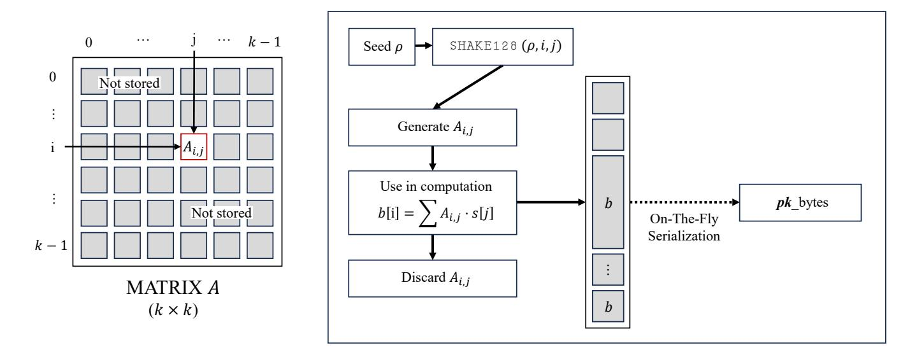
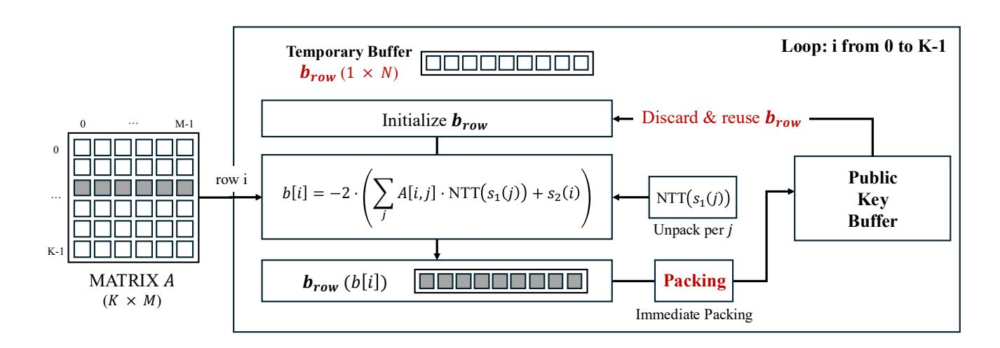
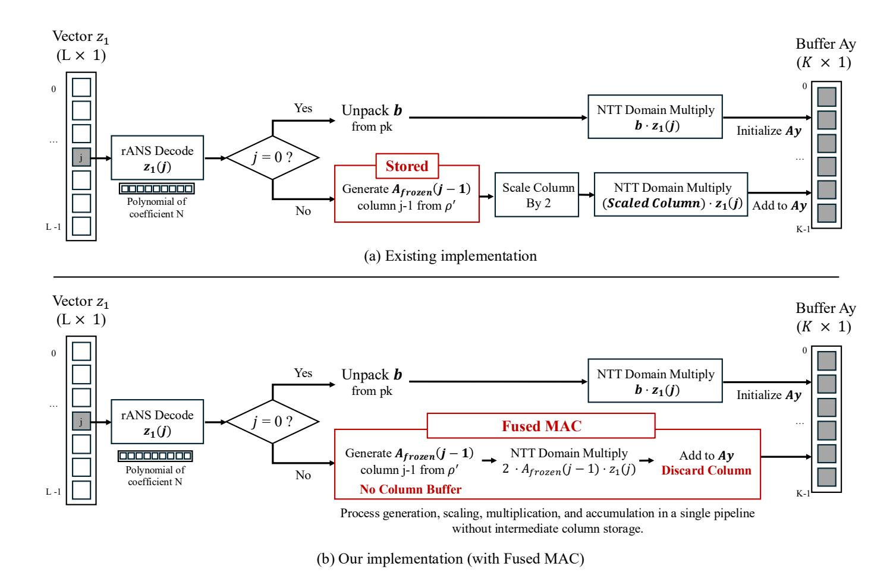

{0}------------------------------------------------

# Memory-Efficient Implementation of SMAUG-T and HAETAE

Yulim Hyoung1[0009−0009−7530−6497], Subeen Cho1[0009−0004−4352−8021] , Uijae Kim1[0009−0004−2617−9659], Minwoo Lee2[0000−0002−2356−3055] , Hwajeong Seo1[0000−0003−0069−9061], and Minjoo Sim2[0000−0001−5242−214X] <sup>⋆</sup>

> <sup>1</sup> Department of Convergence Security, Hansung University, Seoul (02876), South Korea {yulim4hyoung, chosubin1208, chrisvt424}@gmail.com <sup>2</sup> Department of Information Computer Engineering, Hansung University, Seoul (02876), South Korea {minunejip, hwajeong84}@gmail.com

Abstract. SMAUG-T and HAETAE, designated as target algorithms for national standardization via the Korean Post-Quantum Cryptography (KpqC) competition, run efficiently on general-purpose platforms. On ARM Cortex-M4 class microcontrollers, however, peak stack usage becomes a key constraint: while SMAUG-T can be executed on typical Cortex-M4 boards, the baseline HAETAE implementation exceeds the available SRAM (e.g., 91,176 B stack for signing), motivating dedicated memory optimization. To address this problem, we propose a suite of memory optimization techniques for SMAUG-T and HAETAE that enable their practical operation within the strict memory budget of the Cortex-M4. Experimental results demonstrate that, compared to the KpqClean\_ver2 baseline, peak stack usage was reduced by 73– 83 % for SMAUG-T5 (e.g., 24,300 B→4,240 B in decapsulation) and by about 90 % for HAETAE5 (e.g., 91,176 B→8,092 B in signing). Furthermore, a branchless constant-time design was applied throughout to ensure that the optimized implementations remain robust against sidechannel threats such as timing attacks. This work provides a practical methodology for deploying KpqC lattice-based cryptography in memoryconstrained embedded environments.

Keywords: Memory Optimization · KpqC · SMAUG-T · HAETAE · Software Optimization · Cortex-M4 · Embedded Systems

# 1 Introduction

The rapid advancement of quantum computing technology presents a fundamental security threat to existing public-key cryptosystems—such as RSA [\[1\]](#page-25-0) and ECC [\[2\]](#page-25-1)—which rely on the mathematical hardness of integer factorization and discrete logarithm problems [\[3,](#page-25-2)[4\]](#page-25-3). In response, the transition to postquantum cryptography (PQC) is accelerating globally [\[5,](#page-25-4)[6,](#page-25-5)[7\]](#page-25-6). South Korea has

<sup>⋆</sup> Corresponding author. minjoos9797@gmail.com

{1}------------------------------------------------

also designated AIMer [\[8\]](#page-25-7), HAETAE [\[9\]](#page-25-8), NTRU+ [\[10\]](#page-25-9) and SMAUG-T [\[11\]](#page-25-10) as target algorithms for national standardization via the KpqC competition [\[12\]](#page-25-11), aiming to strengthen cryptographic sovereignty and address national security needs. Among the evaluated candidates, SMAUG-T and HAETAE are latticebased schemes grounded in the computational hardness of the Module Learning With Errors (MLWE) and Module Learning With Rounding (MLWR) problems, respectively [\[11,](#page-25-10)[9\]](#page-25-8). These lattice-based algorithms are expected to serve as core components of future security infrastructures, providing robust resistance against quantum-era threats.

However, significant technical barriers exist in deploying these PQC algorithms onto embedded devices. Platforms like the Cortex-M4 [\[13\]](#page-25-12), widely used in IoT devices and security modules, provide only tens to hundreds of kilobytes of SRAM. In contrast, KpqC algorithms can require substantial transient memory during computation, and in particular their peak stack usage becomes a major constraint in resource-constrained environments. This motivates dedicated memory optimization to ensure practical and efficient execution on such devices.

The pqm4 project [\[14\]](#page-26-0) has established a standardized benchmarking framework for evaluating post-quantum cryptographic implementations (including NIST PQC candidates) on the Cortex-M4, providing cycle counts, stack measurements, and code size metrics across a wide range of schemes. However, pqm4 is primarily designed for performance benchmarking and comparability, rather than for reducing stack usage to fit within tight memory limits. While the kpqm4 project [\[15\]](#page-26-1) provides a benchmarking framework for KpqC algorithms on the Cortex-M4, it similarly focuses on performance measurement rather than memory reduction. Furthermore, neither pqm4 nor kpqm4 addresses implementations whose baseline stack usage already exceeds the device's available stack budget, a condition that makes benchmarking itself infeasible without prior memory optimization. Our work fills this gap by reducing the stack footprint of SMAUG-T and HAETAE to within the operational limits of the Cortex-M4.

While libraries such as KpqClean\_ver2 [\[16\]](#page-26-2) have contributed to improving the portability of these algorithms, they do not offer sufficiently granular optimization strategies to overcome the stringent memory limits of specific microcontrollers. Specifically, in embedded environments, forcibly reducing memory usage can lead to increased computation time. Furthermore, ensuring resistance against side-channel attacks—such as preventing unintended timing information leakage during the optimization process—remains a critical challenge. Consequently, there is an urgent need for research that identifies the optimal trade-off to maximize memory efficiency while preserving both security and computational performance.

We propose a memory optimization methodology and optimized implementations that enable efficient operation of SMAUG-T and HAETAE on ARM Cortex-M4 microcontrollers.

The remainder of this paper is organized as follows. Section [2](#page-2-0) reviews the KpqC algorithms, the target Cortex-M4 platform, and related work. Section [3](#page-7-0) describes the proposed memory optimization and security enhancement tech-

{2}------------------------------------------------

| Name                    | SMAUG-T1 | SMAUG-T3                                     | SMAUG-T5 |
|-------------------------|----------|----------------------------------------------|----------|
| Security level          | 1        | 3                                            | 5        |
| n                       | 256      | 256                                          | 256      |
| k                       | 2        | 3                                            | 4        |
| (q, p, t)               |          | (1024, 256, 2) (2048, 512, 2) (2048, 512, 2) |          |
| ′<br>p<br>(compression) | 32       | 16                                           | 128      |
| hs<br>(HWT for s)       | 140      | 264                                          | 348      |
| r (spCBD for r)         | 1/8      | 1/4                                          | 3/16     |
| σ (D˜ σ<br>for errors)  | 1.0625   | 1.0625                                       | 1.0625   |
| Public key (bytes)      | 672      | 1,088                                        | 1,440    |
| Secret key (bytes)      | 832      | 1,312                                        | 1,728    |
| Ciphertext (bytes)      | 672      | 992                                          | 1,376    |

Table 1: Parameter sets of SMAUG-T

niques in detail. Section [4](#page-21-0) presents the experimental results and performance analysis. Finally, Section [5](#page-24-0) concludes the paper and suggests directions for future research.

# 1.1 Contributions

This paper makes the following contributions:

- Strategic Phased Stack Reduction: We present a phased stack reduction strategy specialized for embedded environments by precisely analyzing the memory usage patterns of SMAUG-T and HAETAE.
- Practical and substantial memory savings: Through the proposed techniques, we achieved substantial peak stack reductions compared to the Kpq-Clean\_ver2 baseline [\[16\]](#page-26-2). For SMAUG-T5, peak stack usage was reduced by 73–83% (e.g., 24,300 B→4,240 B in decapsulation), and for HAETAE5, peak stack usage was reduced by about 90% (e.g., 91,176 B→8,092 B in signing), enabling practical operation within strict Cortex-M4 SRAM budgets. We further quantify the resulting time–memory trade-off in Section [4.](#page-21-0)
- Side-channel robust security hardening: We apply constant-time design principles throughout the optimization process to avoid introducing secret-dependent control flow and to mitigate timing side-channel risks (e.g., branchless sparse multiplication and constant-time comparisons).

# <span id="page-2-0"></span>2 Background

#### 2.1 Korean Post-Quantum Cryptography Competition

The Korean Post-Quantum Cryptography (KpqC) competition[\[12\]](#page-25-11), initiated in 2022 to establish independent domestic cryptographic standards, has selected

{3}------------------------------------------------

### <span id="page-3-0"></span>Algorithm 1 Description of SMAUG.PKE[11]

```
\mathbf{KeyGen}(1^{\lambda}):
  1: seed \leftarrow \{0, 1\}^{256}
  2: (seed_A, seed_{sk}, seed_e) \leftarrow XOF(seed)
  3: \mathbf{A} \leftarrow expandA(seed_A) \in \mathcal{R}_q^{k \times k}
  4: \mathbf{s} \leftarrow HWT_{h_s}(seed_{sk}) \in S_{\eta}^k
  5: \mathbf{e} \leftarrow dGaussian_{\sigma}(seed_e) \in \mathcal{R}^k
  6: \mathbf{b} = -\mathbf{A} \cdot \mathbf{s} + \mathbf{e} \in \mathcal{R}_q^k
  7: return pk = (seed_A, \mathbf{b}), sk = \mathbf{s}
        \mathbf{Enc}(pk, \mu; seed_r):
  8: \mathbf{A} = expandA(seed_A)
 9: if seed_r is not given then seed_r \leftarrow \{0,1\}^{256}
10: \mathbf{r} \leftarrow HWT_{h_r}(seed_r) \in S_{\eta}^k
11: \mathbf{c}_1 = \lfloor p/q \cdot \mathbf{A}^{\top} \cdot \mathbf{r} \rceil \in \mathcal{R}_p^k
12: c_2 = [p'/q \cdot \langle \mathbf{b}, \mathbf{r} \rangle + p'/\hat{t} \cdot \mu] \in \mathcal{R}_{p'}
13: return ct = (\mathbf{c}_1, c_2)
        \mathbf{Dec}(sk,\mathbf{c}):
14: \mu' = \lfloor t/p \cdot \langle \mathbf{c}_1, \mathbf{s} \rangle + t/p' \cdot c_2 \rceil \in \mathcal{R}_t
15: return \mu'
```

NTRU+[10] and SMAUG-T[11] for Key Encapsulation Mechanisms (KEM), and AIMer[8] and HAETAE[9] for digital signatures as target algorithms for standardization following a three-year national evaluation process. Currently, the formal standardization process for these algorithms is underway.

#### 2.2 SMAUG-T

SMAUG-T is defined on the polynomial ring  $R_q = \mathbb{Z}_q[x]/(x^{256}+1)$ , with parameters (n,k,q) representing the polynomial degree (256), the rank of the modules and the modulus, respectively. The algorithm is characterized by its use of sparse secrets and a distinct error sampling method to enhance computational efficiency and reduce ciphertext size.

The key features and specifications of SMAUG-T are as follows:

- **Sparse Secret and HWT Sampling:** The secret key s consists of ternary polynomials with coefficients in  $\{-1,0,1\}$ . SMAUG-T employs Fixed-Weight Polynomial Sampling (HWT) to fix the ratio of non-zero components. This enables constant-time implementation based on shuffling, securing the algorithm against timing attacks.
- LWR-based Encryption: While key generation is based on the MLWE problem, the encryption process utilizes the MLWR problem. Instead of adding an error term during encryption, it performs a rounding operation, which reduces the size of the ciphertext and improves the speed of the operation.

{4}------------------------------------------------

| Name                          |          | HAETAE-2 HAETAE-3 HAETAE-5 |          |
|-------------------------------|----------|----------------------------|----------|
| Security level                | 2        | 3                          | 5        |
| n (Degree of R)               | 256      | 256                        | 256      |
| (k, ℓ) (Dimensions of z2, z1) | (2,4)    | (3,6)                      | (4,7)    |
| q (Modulus)                   | 64513    | 64513                      | 64513    |
| η (sk coefficients range)     | 1        | 1                          | 1        |
| τ (Weight of c)               | 58       | 80                         | 128      |
| γ (Rejection parameter)       | 48.858   | 57.707                     | 55.13    |
| Key acceptance rate           | 0.1      | 0.1                        | 0.1      |
| d (Truncated bits of vk)      | 1        | 1                          | 0        |
| M (Expected repetitions)      | 6.0      | 5.0                        | 6.0      |
| B (y radius)                  | 9846.02  | 18314.98                   | 22343.66 |
| ′<br>B<br>(Rejection radius)  | 9838.98  | 18307.70                   | 22334.95 |
| ′′ (Verify radius)<br>B       | 12777.52 | 21906.65                   | 24441.49 |
| α (z1<br>compression)         | 256      | 256                        | 256      |
| αh<br>(h compression)         | 512      | 512                        | 256      |
| Public Key (bytes)            | 992      | 1,472                      | 2,080    |
| Secret Key (bytes)            | 1,408    | 2,112                      | 2,752    |
| Signature (bytes)             | 1,474    | 2,349                      | 2,948    |

Table 2: Parameter sets of HAETAE

– dGaussian Sampling: For error vector generation, SMAUG-T uses a dGaussian sampling technique that approximates a discrete Gaussian distribution using only 10-bit Boolean logic circuits. This allows for constant-time error generation without complex floating-point arithmetic.

Algorithm [1](#page-3-0) provides a detailed description of the Key Generation (KeyGen), Encryption (Enc), and Decryption (Dec) procedures that constitute the core Public-Key Encryption (PKE) scheme of SMAUG-T[\[11\]](#page-25-10).

### 2.3 HAETAE

HAETAE is a lattice-based digital signature algorithm that follows the 'Fiat-Shamir with Aborts (FSwA)' paradigm, similar to NIST's Crystals-Dilithium. It distinguishes itself by introducing uniform sampling in a 'Hyperball' region to optimize signature size and reduce rejection probability during signature generation.

The key features and specifications of HAETAE are as follows:

– Algorithm Structure: HAETAE comprises KeyGen based on the MLWE problem, Signing which verifies signature norms within a hyperball region, and Verification that confirms validity through z's size and hash consistency checks.

{5}------------------------------------------------

- Bimodal Hyperball Sampling: HAETAE combines a Bimodal distribution (inspired by BLISS) with a high-dimensional Hyperball uniform distribution. To ensure the signature z is independent of the secret key, it performs rejection sampling. By utilizing the Hyperball region, the acceptance space for signatures is expanded, reducing the signature size by up to 39% compared to Dilithium.
- Fixed-point Arithmetic: While some lattice signatures like Falcon rely on floating-point arithmetic, which can be vulnerable to side-channel attacks, HAETAE employs only fixed-point arithmetic. This simplifies the design and enhances resistance against side-channel attacks.

Algorithm [2](#page-5-0) provides a detailed description of the Key Generation (KeyGen), Signing (Sign), and Verification (Verify) procedures that constitute the core digital signature scheme of HAETAE [\[9\]](#page-25-8).

# <span id="page-5-0"></span>Algorithm 2 Uncompressed description of HAETAE[\[9\]](#page-25-8)

```
KeyGen(1
               λ
                ):
1: (Agen) ← Rk×(ℓ−1)
               q and (sgen, egen) ← S
                                           ℓ−1
                                           η × S
                                                   k
                                                   η
2: b = Agen · sgen + egen ∈ Rk
                              q
3: A = (−2b + qj | 2Agen | 2Idk) (mod 2q)
4: s = (1, sgen, egen)
5: if N (s) > γ2n then restart
6: return sk = (A, s), vk = A
   Sign(sk, M):
7: y ← U(B(1/N)R,(k+ℓ)(B))
8: w ← A⌊y⌉
9: c = H(w, M) ∈ R2
10: z = (z1, z2) = y + (−1)b
                            cs for b ← U({0, 1})
11: if ∥z∥2 ≥ B
               ′
                 then restart
12: else if ∥2z − y∥2 < B then restart with probability 1/2
13: return σ = (⌊z⌉, c)
   Verify(vk, M, σ = (z, c)):
14: w˜ = Az − qcj (mod 2q)
15: return (c = H(w˜ , M)) ∧

                               ∥z∥ < B +
                                          √
                                            n(k+ℓ)
                                              2
```

#### 2.4 Related Work on Memory Optimization

PQC schemes typically incur larger key/signature sizes and higher computational costs than classical public-key cryptography, making efficient implementations on resource-constrained microcontrollers (e.g., ARM Cortex-M4) essential. Prior studies on memory-optimized PQC largely exploit algorithm-specific structures

{6}------------------------------------------------

| 1 .                   | <i>7</i> 1 0 1 | J          |              |              |              |              |                                     |
|-----------------------|----------------|------------|--------------|--------------|--------------|--------------|-------------------------------------|
| Related Works         | PQC            | On-the-fly | Streaming    | Recomp.      | Alg. Trans.  | Mem. Share   | Dominant bottleneck                 |
| Bos et al. [17]       | Dilithium      | ✓          | <b>√</b>     |              | <b>√</b>     | <b>√</b>     | Poly workspaces (NTT/mul)           |
| Hart et al. [18]      | CROSS          | ✓          | ✓            | $\checkmark$ | ✓            |              | Merkle/GGM trees                    |
| Aranha et al. [19]    | FAEST          | ✓          |              | $\checkmark$ | ✓            |              | $VOLE \ state \ / \ VC \ traversal$ |
| Benadjila et al. [20] | MQOM           | ✓          | $\checkmark$ | $\checkmark$ | $\checkmark$ | $\checkmark$ | MQ matrices / tree mat.             |
| Our System            | SMAUG-T        | ✓          | ✓            |              | <b>√</b>     | <b>√</b>     | Matrix A & ciphertext buffers       |
|                       | HAETAE         | ✓          | ✓            | $\checkmark$ | ✓            | ✓            | $A_1$ expansion & sign/verify state |

<span id="page-6-0"></span>Table 3: Comparison of representative memory-optimization strategies for post-quantum cryptography on Cortex-M4.

(e.g., polynomial arithmetic, tree constructions, or large linear-algebra objects) to reduce peak RAM usage. In this section, we categorize them by high-level optimization principles—on-the-fly generation, streaming of intermediates, recomputation, algorithmic transformations (NTT/Tree/DFS), and memory sharing. Table 3 provides a principle-level comparison, while the discussion below clarifies the dominant bottleneck and the concrete techniques used in each work.

Bos et al. [17] proposed various memory-saving strategies for Crystals-Dilithium[21], a NIST-standard lattice-based signature scheme. Their optimizations focus on reducing stack usage through polynomial compression, the adoption of alternative Number Theoretic Transforms (NTT), and a fallback to schoolbook multiplication for certain operations.

Hart et al. [18] addressed memory bottlenecks in CROSS[22], a code-based signature scheme, where Merkle and GGM trees consume significant resources. They proposed dynamic node calculation to avoid storing entire tree structures, utilizing an  $O(\log t)$  buffer for Merkle root computation and on-the-fly generation for GGM trees. Additionally, by introducing just-in-time processing for hash inputs to eliminate unnecessary buffering, they improved feasibility of CROSS on resource-constrained platforms.

Aranha et al. [19] optimized FAEST [23], a VOLE-in-the-Head based signature, by introducing the "VOLE Black Box" concept. Instead of storing large VOLE-related matrices, their approach recomputes required segments on demand from seed trees. They also employed a logarithmic tree-walk algorithm for vector commitment, reducing the memory complexity from linear to logarithmic and improving practicality in memory-limited environments.

Benadjila and Feneuil [20] focused on minimizing the memory footprint of the MQ-based signature MQOM[24] by implementing on-the-fly matrix multiplication. This technique processes large matrices row by row instead of storing them in their entirety. Their work further incorporates bitslicing for parallel operations and a DFS-based streaming approach for GGM tree generation, demonstrating that MQOM can operate effectively within minimal SRAM constraints.

#### 2.5 ARM Cortex-M4

The ARM Cortex-M4 [13] represents a widely adopted standard for benchmarking post-quantum cryptography in embedded environments. It is a 32-bit micro-

{7}------------------------------------------------

| Scheme  | Operation                  | Memory-intensive variables                                               |
|---------|----------------------------|--------------------------------------------------------------------------|
| SMAUG-T | KeyGen<br>Encaps<br>Decaps | A, s, e, b<br>A, r, e1, (c1, c2)<br>s, (c1, c2), re-encryption buffer    |
| HAETAE  | KeyGen<br>Sign<br>Verify   | A, s1, s2, b<br>A1, Gaussian sampling arrays, y1, y2<br>A1, z1, w, h, z2 |

Table 4: Memory-intensive variables in SMAUG-T and HAETAE.

controller based on the ARMv7E-M architecture, featuring a 3-stage pipeline and supporting the Thumb-2 instruction set. Notably, the Cortex-M4 includes Digital Signal Processing (DSP) extensions—such as single-cycle multiply-accumulate (MAC) and SIMD instructions—and an optional single-precision Floating Point Unit (FPU). While most PQC schemes, including those in the pqm4 library, primarily utilize integer arithmetic and do not leverage the FPU, the DSP capabilities allow the Cortex-M4 to be classified as a high-performance microcontroller suitable for executing complex cryptographic primitives.

The National Institute of Standards and Technology (NIST) has acknowledged the prevalence of the Cortex-M4 in academic literature, and it is widely used as a reference platform for optimization and benchmarking in the PQC community. Following this practice, the pqm4 project adopted the Cortex-M4 to evaluate the feasibility of various PQC candidates on resource-constrained devices, reporting cycle counts, stack usage, and code size in a consistent manner. By targeting this widely deployed microcontroller class, researchers can assess a broad range of PQC schemes while establishing a baseline for performance under limited RAM and code size constraints.

# <span id="page-7-0"></span>3 Proposed Method

SMAUG-T and HAETAE are lattice-based cryptosystems founded upon the computational hardness of the Module Learning With Rounding (MLWR) [\[25\]](#page-26-11) and Module Learning With Errors (MLWE) [\[26\]](#page-26-12) problems, respectively. The primary cause of stack consumption in lattice-based cryptographic implementations is the transient storage of large-scale polynomial matrices and vectors.

In SMAUG-T, these include the public matrix A, secret key s, error vector e, and public key b during key generation; the matrix A, ephemeral key r, error vector e1, and ciphertext components (c1, c2) during encapsulation; and the secret key s, ciphertext components (c1, c2), and re-encryption buffer during decapsulation.

In HAETAE, key memory-intensive variables include the public matrix A, secret keys s<sup>1</sup> and s2, and public key b during key generation; the expanded matrix A1, Gaussian sampling arrays, and masking vectors y<sup>1</sup> and y<sup>2</sup> during 

{8}------------------------------------------------

signature generation; and the matrix A1, response vector z1, witness w, hint vector h, and verification vector z<sup>2</sup> during verification.

Conventional implementations of SMAUG-T and HAETAE necessitate the simultaneous residency of large-scale structures, such as the public matrix A and various vectors, within memory. This high memory requirement renders these implementations infeasible for deployment in resource-constrained environments, where available memory is strictly limited.

In this section, we propose stack reduction techniques to facilitate the practical deployment of SMAUG-T and HAETAE in memory-constrained environments. Our implementation builds on the second-round reference code provided in the KpqClean\_ver2 project [\[16\]](#page-26-2), and we focus on the Security Level 5 parameter sets.

# <span id="page-8-0"></span>3.1 Memory Optimization Strategies for Lattice-based Crypto

### Definitions.

- On-the-fly generation: Deterministically generate coefficients/matrix elements from a public seed and indices only when needed, avoiding materialization of large public objects.
- Streaming (JIT handling): Eliminate staging buffers by integrating packing/unpacking and hash-input preparation directly into the computation pipeline.
- Recomputation: Intentionally regenerate values across phases (e.g., multipass sampling) when storing them would dominate peak memory.

On-the-fly generation may imply recomputation; we use recomputation specifically for planned regeneration in later phases as a time–memory trade-off.

To address this challenge, we identify and exploit structural properties common to lattice-based cryptographic algorithms:

- Operational Independence: The operational independence of matrixvector multiplication, which enables row-by-row or column-by-column processing.
- Deterministic Reproducibility: The deterministic reproducibility of pseudorandom coefficients from seeds via functions such as SHAKE128 [\[27\]](#page-26-13).
- Sequential Execution: The sequential execution of major algorithmic stages with non-overlapping variable lifetimes.

Accordingly, we propose four generic optimization techniques applicable to both SMAUG-T and HAETAE, alongside algorithm-specific memory optimizations tailored to their unique structural characteristics:

– Seed-based On-the-fly Regeneration: Large matrices and sampling streams are regenerated on-demand from a seed rather than stored in RAM, replacing bulk storage with a minimal temporary buffer.

{9}------------------------------------------------

- On-the-fly Streaming and JIT Packing: Serialization and deserialization are integrated directly into the core computational loops so that each polynomial is packed into the output buffer immediately upon completion and the temporary buffer is released before the next element is processed.
- Lifetime-based Buffer Reuse: Variables with non-overlapping lifetimes share the same physical memory via union structures or explicit buffer reallocation, reducing the peak stack footprint to the size of the largest simultaneously active variable.
- Call Graph Shaping: Complex procedures are decomposed into sub-functions designated with the noinline attribute, forcing the compiler to allocate independent stack frames and preventing their local variables from overlapping within a single inflated frame.

Throughout the optimization process, the principle of constant-time execution must be strictly maintained. Detailed discussions regarding this principle are provided in Section [3.4.](#page-19-0)

Table [5](#page-9-0) summarizes the applicability of these proposed techniques to both target algorithms. The four generic techniques are shared between SMAUG-T and HAETAE; the remaining entries correspond to algorithm-specific optimizations detailed in Sections [3.2](#page-9-1) and [3.3.](#page-15-0)

Table 5: Applicability of Optimization Techniques

<span id="page-9-0"></span>

| Technique                                         |   | SMAUG-T HAETAE |
|---------------------------------------------------|---|----------------|
| On-the-fly Public Matrix Generation               | ✓ | ✓              |
| On-the-fly Serialization / Just-in-time Packing   | ✓ | ✓              |
| Union-based Reuse                                 | ✓ | ✓              |
| Function Outlining with noinline Attribute        | ✓ | ✓              |
| Multi-level Function Outlining                    |   | ✓              |
| Streaming Matrix-Vector Multiplication            | ✓ | ✓              |
| Two-Pass Hyperball Sampling                       |   | ✓              |
| Sparse Schoolbook Multiplication with Small Types | ✓ |                |
| In-place Ciphertext Processing                    | ✓ |                |
| Fused Shift-Multiply                              | ✓ |                |
| Streaming Public Key Deserialization              | ✓ |                |
| Fused FO Re-encryption & Comparison               | ✓ |                |

#### <span id="page-9-1"></span>3.2 SMAUG-T5: Memory-Efficient KEM

This subsection details the application of the optimization framework presented in Section [3.1](#page-8-0) to SMAUG-T5 (k = 4, N = 256, q = 2,048).

The primary memory bottlenecks in the reference implementation stem from three sources: the public\_key structure, which stores the full matrix A in addition to the seed ρ and vector b; sparse key and ephemeral vectors whose

{10}------------------------------------------------

#### <span id="page-10-0"></span>Algorithm 3 On-the-fly Key Generation for SMAUG-T

```
Require: seed ρ, compact secret key s (int8_t), error vector e
Ensure: serialized public key pk_bytes
1: for i ← 0 to k − 1 do
2: acc ← 0
3: for j ← 0 to k − 1 do
4: Ai,j ← SHAKE128(ρ, i, j)
5: acc ← acc + SparseMul(Ai,j , s[j])
6: acc ← acc + e[i]
7: pack(acc, pk_bytes[i])
8: acc ← 0
```

coefficients are allocated as int16\_t despite being restricted to {−1, 0, 1}; and the Toom–Cook multiplication buffer required for polynomial arithmetic.

The remainder of this subsection details the per-operation application of these techniques to key generation, encapsulation, and decapsulation, respectively.

<span id="page-10-1"></span>Key Generation Key generation computes b = −A<sup>⊤</sup> · s + e, where A ∈ Rk×<sup>k</sup> q is the public matrix, s ∈ S k η is the secret key with HWT = 87 per polynomial and coefficients in {−1, 0, 1}, e is the error vector, and b is the resulting public key vector. The dominant stack consumers in the reference implementation are the stored matrix A and the Toom–Cook multiplication buffer. We apply three techniques to eliminate both.

Generating A On-The-Fly Each element Ai,j can be deterministically reproduced from the public seed ρ and indices (i, j) via SHAKE128 [\[27\]](#page-26-13). We therefore remove the polyvec A[MODULE\_RANK] field from the public\_key structure entirely, generating each element on-demand within the inner loop of the matrixvector multiplication and discarding it immediately after use. Algorithm [3](#page-10-0) formalizes this procedure, combining on-the-fly matrix generation with on-the-fly serialization of the output vector b.

As illustrated in Figure [1,](#page-11-0) the proposed scheme avoids materializing the full matrix A by processing one element at a time. In Algorithm [3,](#page-10-0) the outer loop (line 1) iterates over each row i of A, and the accumulator acc is initialized to zero at line 2 before any element in that row is processed. The inner loop (lines 3–5) generates Ai,j on-demand from the public seed ρ and index pair (i, j) via SHAKE128 at line 4, immediately computes the sparse multiply-accumulate acc += SparseMul(Ai,j , s[j]) at line 5, and discards Ai,j upon leaving line 5 at no point is more than one element of A resident in memory. Once all k column contributions have been accumulated, line 6 folds in the corresponding error term e[i], and line 7 serializes the completed row result b<sup>i</sup> directly into pk\_bytes via pack, realizing on-the-fly serialization of the public key without a separate output buffer for the full vector b. Finally, line 8 resets acc to zero, reclaiming the single polynomial buffer before the next row begins.

{11}------------------------------------------------

<span id="page-11-0"></span>

Fig. 1: On-the-fly generation of matrix A in SMAUG-T key generation. Each element Ai,j is generated on-demand from seed ρ and indices (i, j) via SHAKE128, used in a single multiply-accumulate step b[i] = P <sup>j</sup> Ai,j · s[j], and immediately discarded.

Compared to the traditional approach, which stores the entire k×k matrix A simultaneously, the proposed OTF approach ensures that the full matrix A and the full vector b are never simultaneously resident in memory; at most one polynomial element of each is live at any point.

Compact Secret Key Representation The coefficients of s are restricted to {−1, 0, 1}, yet the reference implementation allocates int16\_t (2 bytes) per coefficient. We introduce a compact representation using int8\_t (1 byte), halving the storage for s from k × N × 2 to k × N × 1 bytes, with coefficients generated directly in this compact form.

Simultaneously, we replace the Toom–Cook polynomial multiplication with a negacyclic sparse schoolbook variant (Algorithm [9\)](#page-20-0) that natively accepts the compact int8\_t secret and generates each matrix element Ai,j on-the-fly, eliminating the Toom–Cook temporary buffer entirely.

Constant-Time Sparse Multiplication The sparse schoolbook multiplication must execute in constant time to prevent timing side-channels. A naïve sparse implementation would skip zero coefficients via a branch (e.g., if (s[j] == 0) continue), whose taken/not-taken pattern directly reveals the sparsity structure of the secret key. The branchless design achieving this property is presented in Section [3.4](#page-19-0)

Buffer Union for HWT Sampling Applying the memory reuse technique from Section [3.1,](#page-8-0) we merge the two buffers used during HWT sampling into a single union structure. The reference implementation allocates a byte array for the raw SHAKE256 output and a uint16\_t array for the converted values as two separate stack objects. Since the byte array is fully consumed before the integer array is populated—the little-endian conversion reads from lower addresses 

{12}------------------------------------------------

before writing to the same offset—the two buffers have strictly non-overlapping lifetimes and can safely share the same physical memory via a union, reducing the combined allocation by half.

Furthermore, we introduce a variant of the sampling function that outputs int8\_t coefficients directly, eliminating the separate int16\_t intermediate buffer previously required for type conversion.

<span id="page-12-0"></span>**Encapsulation** The encapsulation process computes a ciphertext  $(\mathbf{c}_1, c_2)$  from a public key  $(\rho, \mathbf{b})$  and a message  $\mu$ , via  $\mathbf{c}_1 = \mathbf{A}^T \cdot \mathbf{r} + \mathbf{e}_1$  and  $c_2 = \mathbf{b}^T \cdot \mathbf{r} + \mathbf{e}_2 + \text{encode}(\mu)$ , where  $\mathbf{r}$  is an ephemeral random vector and  $\mathbf{e}_1, \mathbf{e}_2$  are error terms. The dominant stack consumers are the describing public key structure (holding both the full matrix  $\mathbf{A}$  and vector  $\mathbf{b}$ ), the ephemeral key  $\mathbf{r}$  stored as  $\mathbf{int16}_{-\mathbf{t}}$ , and the intermediate ciphertext staging buffer.

Sparse Ephemeral Key Multiplication The ephemeral key  $\mathbf{r}$  is sampled from the  $\mathtt{sp\_cbd2}$  distribution with coefficients in  $\{-1,0,1\}$  and an expected Hamming weight of approximately 96, sharing the same sparse structure as  $\mathbf{s}$  (HWT = 87). We therefore apply the same pair of optimizations introduced in Section 3.2: the compact  $\mathtt{int8\_t}$  representation and the sparse on-the-fly schoolbook multiplication (Algorithm 9).

For  $\mathbf{c}_1 = \mathbf{A}^T \cdot \mathbf{r}$ , each transposed matrix element  $A_{j,i}$  is generated on-demand via SHAKE128 and immediately multiplied by  $\mathbf{r}[j]$ , accumulating into  $\mathbf{c}_1[i]$  without storing the full matrix or the full vector  $\mathbf{r}$  simultaneously. The inner product  $\mathbf{b}^T \cdot \mathbf{r}$  for  $c_2$  reuses the same routine, as  $\mathbf{r}$  shares the compact type and sparse structure of  $\mathbf{s}$ .

Streaming Ciphertext Serialization Applying the on-the-fly serialization technique from Section 3.1, we eliminate the intermediate ciphertext staging structure entirely. Instead of computing all of  $\mathbf{c}_1$  into a dedicated buffer and then serializing, each element is computed, immediately packed into the output byte array, and the buffer is reused for the next element. Algorithm 4 shows the resulting streaming encapsulation.

The ciphertext staging structure is never allocated; the output byte array is populated incrementally and at most one polynomial is live at any time.

Fused Shift-Multiply The inner product routine for  $\mathbf{b}^T \cdot \mathbf{r}$  internally stores a right-shifted copy of each input coefficient into a temporary polynomial before forwarding it to the sparse multiplication kernel. Since the shift is element-wise and depends only on public parameters, it can be fused directly into the multiplication loop itself. We introduce a shift-fused variant SparseMulShift(a, s, shift) that computes  $(a[k] \gg shift) \cdot s[j]$  inline, eliminating the temporary buffer without changing the total number of shift operations.

Streaming Public Key Description After the preceding optimizations, the description description by the seed  $\rho$  and the full vector  $\mathbf{b}$ —

{13}------------------------------------------------

#### <span id="page-13-0"></span>Algorithm 4 Streaming Ciphertext Serialization in Encapsulation

```
Require: seed ρ, compact ephemeral key r (int8_t), serialized b, message µ
Ensure: serialized ciphertext ct_bytes
1: tmp ← 0 ▷ single reusable polynomial buffer
2: for i ← 0 to k − 1 do
3: tmp ← 0
4: for j ← 0 to k − 1 do
5: Aj,i ← SHAKE128(ρ, j, i)
6: tmp += SparseMul(Aj,i, r[j])
7: tmp += e1[i]
8: Rp_to_bytes(ct_bytes, tmp)
9: tmp ← InnerProduct(b, r, µ)
10: Rp2_to_bytes(ct_bytes, tmp)
```

remains the largest single allocation in indcpa\_enc. The seed ρ occupies the first 32 bytes of the serialized public key and can be referenced via a direct pointer rather than a copy, while individual elements b<sup>i</sup> are only needed one at a time during the inner product b T · r. We exploit this by deserializing each b<sup>i</sup> on-the-fly within the accumulation loop via SparseMulShift and immediately overwriting the buffer upon completion, eliminating the deserialized public key structure entirely.

The deserialized public key structure is never allocated; the full vector b is never simultaneously resident in memory.

<span id="page-13-1"></span>Decapsulation The decapsulation of SMAUG-T recovers the shared secret from a ciphertext (c1, c2) using the secret key s, via µ ′ = decode(c<sup>2</sup> − s T · c1), followed by a Fujisaki–Okamoto (FO) [\[28\]](#page-26-14) re-encryption comparison to ensure ciphertext integrity. The dominant stack consumers are the deserialized ciphertext structure, redundant temporary copies of its components, and the full reencryption buffer materialized for the FO comparison.

In-place Ciphertext Processing Applying the memory reuse technique from Section [3.1,](#page-8-0) we eliminate redundant temporary copies. The reference indcpa\_dec deserializes the ciphertext into a structure ctxt\_tmp, then copies its components into separate temporary variables—a vector for c<sup>1</sup> and a polynomial for c2—solely to apply coefficient shifts before the inner product. A lifetime analysis reveals that ctxt\_tmp is never read after the copy, so the shifts can be applied in-place directly to its fields, eliminating both temporaries—reducing three sequential single-use allocations to one.

Compact Secret Key with Sparse Multiplication As in key generation and encapsulation, the secret key s is loaded in the compact int8\_t representation, and the inner product s T · c<sup>1</sup> is computed using the sparse schoolbook variant (Algorithm [9\)](#page-20-0). This eliminates both the polyvec temporary buffer and the Toom–Cook internal allocation from indcpa\_dec.

{14}------------------------------------------------

#### <span id="page-14-0"></span>Algorithm 5 Streaming Decryption in indcpa\_dec

```
Require: ciphertext bytes ct_bytes, compact secret key s (int8_t)
Ensure: message µ
                  ′
1: acc ← 0
2: elem ← 0
3: for i ← 0 to k − 1 do
4: elem ← bytes_to_poly(ct_bytes, i)
5: acc += SparseMul(elem, s[i])
6: overwrite elem
7: left_shift(acc)
8: elem ← bytes_to_poly(c2 portion of ct_bytes)
9: µ
    ′ ← decode(elem − acc)
```

Streaming Decryption After the preceding optimizations, the deserialized ciphertext structure ctxt\_tmp remains the largest allocation in indcpa\_dec. We observe that the left-shift applied to all elements of c<sup>1</sup> and the compensating right-shift applied inside the sparse inner product cancel each other; both can therefore be dropped, allowing decryption to operate directly on the unshifted, byte-serialized ciphertext. Algorithm [5](#page-14-0) shows the resulting streaming procedure.

The ciphertext structure is replaced by two single-polynomial buffers; the full vector c<sup>1</sup> is never simultaneously resident in memory.

# <span id="page-14-1"></span>Algorithm 6 Streaming FO Re-encryption and Constant-Time Comparison (indcpa\_enc\_cmp)

```
Require: recovered message µ
                             ′
                             , received ciphertext ct_bytes, public key (ρ, b)
Ensure: constant-time equality bit result ∈ {0, 1}
1: rc ← 0
2: chunk ← 0
3: offset ← 0
4: for i ← 0 to k − 1 do
5: Recompute c1[i] into chunk
6: Rp_to_bytes(chunk)
7: for k ← 0 to CTPOLY1_BYTES−1 do
8: rc |= chunk[k] ⊕ ct_bytes[offset + k]
9: offset += CTPOLY1_BYTES
10: Recompute c2 into chunk; Rp2_to_bytes(chunk)
11: for k ← 0 to CTPOLY2_BYTES−1 do
12: rc |= chunk[k] ⊕ ct_bytes[offset + k]
13: return ¬

             (uint64_t(rc)) ≫ 63
```

Streaming Re-encryption Comparison The FO transform requires re-encrypting the recovered message µ ′ and comparing the result byte-by-byte against the received ciphertext. The reference implementation allocates a full re-encryption 

{15}------------------------------------------------

buffer, materializes the ciphertext in its entirety, and then performs the comparison in a single call. We introduce indcpa\_enc\_cmp, a fused function that performs re-encryption and comparison simultaneously in a streaming fashion, as shown in Algorithm [6.](#page-14-1)

Each component of the re-encrypted ciphertext is serialized into the chunk buffer and immediately compared against the received ciphertext via bitwise XOR accumulation; the full re-encryption buffer is never allocated, and the comparison never short-circuits regardless of where a mismatch occurs.

Callee Separation Applying the technique from Section [3.1,](#page-8-0) we prevent temporal overlap of stack frames. After all preceding optimizations, crypto\_kem\_dec invokes indcpa\_dec and indcpa\_enc\_cmp sequentially: indcpa\_dec completes and its stack frame is deallocated before indcpa\_enc\_cmp begins. We therefore apply \_\_attribute\_\_((noinline)) to both callees, ensuring the compiler allocates their stack frames independently rather than merging them during inlining. The worst-case peak for crypto\_kem\_dec is thereby

$$frame(\texttt{crypto\_kem\_dec}) + \max \Big\{ frame(\texttt{indcpa\_dec}), \\ frame(\texttt{indcpa\_enc\_cmp}) + frame(\texttt{genAx\_element}) \Big\},$$

rather than the sum of all callee frames.

# <span id="page-15-0"></span>3.3 HAETAE5: Memory-Efficient Digital Signature

This section provides a comprehensive overview of the memory management and optimization methods integrated into each phase of the HAETAE5 digital signature scheme.

<span id="page-15-1"></span>

Fig. 2: The key generation process for b = −2(As<sup>1</sup> + s2) in terms of memory optimization. By generating vectors row by row and reusing buffers, the memory footprint is reduced. (In HAETAE-5, K=4 and M=6 and N=256.)

{16}------------------------------------------------

Key Generation The public vector b = −2(A· s<sup>1</sup> +s2) is produced one row at a time. No full matrix A or full vectors s<sup>1</sup> and s<sup>2</sup> are kept in memory; instead, only the current row of A (or its contribution) and a single 1 KB buffer for the current row of b are utilized. Each row is packed into the public key format as soon as it is computed(See Fig [2\)](#page-15-1).

Signature Generation(Alg. [7\)](#page-16-0) Algorithm [7](#page-16-0) illustrates the memory-efficient signature generation process. This stage is designed to avoid keeping the complete sample vector, the full matrix A1, or the entire response vectors z<sup>1</sup> and z<sup>2</sup> in memory. The specific strategies are as follows:

# <span id="page-16-0"></span>Algorithm 7 Memory-Efficient HAETAE Signature Generation

```
1: Input: Secret key sk, message M
2: Output: Signature σ (bit string)
3: Pass 1: (Norm Calculation)
4: temp, sqsum ← 0
5: for each block ℓ do
6: samples ← Generate(ℓ)
7: sqsum ← sqsum + ∥samples∥
                             2
8: ▷ Memory Opt: Avoid storing full y in this pass
9: Store norm_f actor derived from sqsum
10: Pass 2: (Matrix-Vector Multiplication)
11: Regenerate blocks with same seed → scale by norm_f actor → y1, y2
12: Check ∥y∥
           2
             condition ▷ Rejection sampling
13: for i = 0 to K − 1 do ▷ Row-by-row processing
14: Ay[i] ← 0
15: for j = 0 to L − 1 do
16: A1,ij ← UnpackOrGen(ρ
                            ′
                             , i, j)
17: Ay[i] ← Ay[i] + A1,ij · round(y1)[j]
18: discard A1,ij ▷ Memory Opt: Immediate buffer release
19: highbits(Ay[i]) → pack → absorb into H
20: for j = 0 to L − 1 do ▷ On-the-fly z generation
21: y1,j ← Regenerate(seed, norm_f actor, j)
22: z1,j ← y1,j + NTT−1
                      (NTT(c) · NTT(s1,j ))
23: Decompose and rANS encode z1,j → sig
24: discard z1,j ▷ Memory Opt: Discard after encoding
25: Finish:
26: for i = 0 to K − 1 do
27: Encode h[i] row-wise and absorb into H
28: return σ ← (c, sig, . . .)
```

{17}------------------------------------------------

Hyperball Sampling Lines 3–9 (Pass 1) calculate the squared sum for the norm calculation without full storage, while lines 10–24 (Pass 2) regenerate the samples using the stored norm\_f actor (lines 10–12). This two-pass strategy replaces conventional single-pass sampling to eliminate the need for a multi-KB sample buffer.

A<sup>1</sup> · y Operation Lines 13–19 compute the matrix-vector product row-by-row. Instead of keeping the full matrix A<sup>1</sup> in memory, line 16 generates each element on-the-fly, and line 18 discards the buffer immediately after accumulation to minimize memory occupancy.

Response Vector z Generation Line 21 regenerates y1,j only at the specific moment it is required for computation. The resulting z1,j is computed in the NTT domain (line 22), encoded, and then discarded immediately at line 24 to ensure the peak memory footprint remains minimal.

Signature Verification(Alg. [8\)](#page-17-0) Algorithm [8](#page-17-0) presents the memory-efficient pipeline for signature verification. The process maximizes memory efficiency by organically connecting three data flows:

#### <span id="page-17-0"></span>Algorithm 8 Memory-Efficient HAETAE Verification

```
1: Input: Public key pk, message M, signature σ
2: Output: Accept or Reject (e.g. 0 / −1)
3: for j = 0 to L − 1 do
4: z1,j ← rANS_decode(sig) ▷ Streaming decode
5: if j = 0 then
6: Ay ← Unpack(b) · z1,j
7: else
8: Ay ← Ay + FusedMAC(ρ
                              ′
                              , j − 1, z1,j ) ▷ Column-by-column
9: discard z1,j ▷ Memory Opt: Immediate buffer release
10: for i = 0 to K − 1 do
11: h[i] ← decode hint into work buffer ▷ Row-wise decode
12: wi ← highbits(Ay[i]) + h[i]
13: absorb highbits(wi) into H
14: w
       ′ ← restore from 32-byte bitmap
15: z2[i] ← (wi · α − Ay[i] + w
                           ′
                            ) · 2
                               −1
                                  (mod q) ▷ Memory Opt: In-place in Ay[i]
16: c
    ′ ← H.final()
17: return (c == c
                ′
                ) in constant time
```

z<sup>1</sup> Decoding and Discarding In line 4, z1,j is decoded on-the-fly from the rANS stream. To minimize memory occupancy, each component is discarded immediately at line 9 after its contribution to the matrix-vector product is accumulated.

{18}------------------------------------------------

<span id="page-18-0"></span>

Fig. 3: (a) Existing Implementation[16]: Intermediate column buffers were required to store the results of sequential steps, including column generation, scaling, multiplication, and addition. (b) Our implementation: The entire process is executed as a single Fused MAC step without intermediate buffers, thereby reducing memory usage. (In HAETAE-5, L=7 and K=4 and N=256.)

Column-wise Ay Operation (Fused MAC) Lines 3–9 perform the  $\mathbf{Ay} = \mathbf{A}_1 \mathbf{z}_1$  operation column-by-column. By applying the Fused MAC(see Fig 3) technique in line 8, the implementation integrates generation and accumulation, effectively eliminating the intermediate column buffer.

Row-wise Post-processing and In-place Operations For each row (lines 10–15), the hint  $\mathbf{h}[i]$  is decoded into a work buffer at line 11. The implementation forms  $w_i = \text{highbits}(Ay[i]) + \mathbf{h}[i]$  (line 12), absorbs the high bits into the hash state H (line 13), and restores w' from the bitmap (line 14). Crucially,  $\mathbf{z}_2[i]$  is computed and written in-place into the existing  $\mathbf{A}\mathbf{y}$  buffer at line 15, significantly reducing the total stack memory by reusing storage for the final response components.

Challenge Comparison The final step of verification at Line 17 is performed in a constant-time manner using XOR operations over 32 bytes, OR-accumulation, and a single branch to ensure security.

Lifetime-based Buffer Reuse in HAETAE We map large temporary arrays with disjoint lifetimes to a limited set of shared stack regions, a design

{19}------------------------------------------------

summarized in Table [6.](#page-19-1) In KeyGen, one buffer is shared by the NTT-domain secret (e.g., NTT(s1,j )) and the current row of the public vector (brow). In Sign, the Gaussian sampler, matrix-vector product, frozen columns, and c · s share a unified workspace, and the Hyperball resampling buffer is reused as a general polynomial working buffer. In Verify, the execution order of z1, w, highbits, h, z2, and w′ is scheduled so that their lifetimes do not overlap and at most one occupies the physical buffer at any time.

Table 6: Detailed mapping of memory reuse strategies in HAETAE.

<span id="page-19-1"></span>

| Phase  | Sub-step                                     | Memory Sharing & Reuse Mapping (Sequential)                                                                                                                                               |
|--------|----------------------------------------------|-------------------------------------------------------------------------------------------------------------------------------------------------------------------------------------------|
|        | KeyGen Key Generation sˆ1                    | (Secret NTT[29]) ↔ brow (Public-vec Int.)                                                                                                                                                 |
| Sign   | h Encoding                                   | Rejection Loop Gaussian ↔ Av (Matrix-vec) ↔ colfrozen<br>↔ c · s<br>Resampling Buffer ↔ Working Poly Buffer                                                                               |
| Verify | Phase I<br>Phase II<br>Phase III<br>Phase IV | z1<br>(Restoration) ↔ w (Computation)<br>(lowbits, c) (Restoration) ↔ highbits (Matrix Result)<br>h (Encoding) ↔ z2<br>(Restoration)<br>′<br>Poly-read Buffer ↔ w<br>(Final Verification) |

#### <span id="page-19-0"></span>3.4 Constant-time Implementation

Memory optimization techniques that alter algorithmic structure or control flow may inadvertently introduce timing side-channels. In this section, we analyze the constant-time properties of our optimized implementation and describe the measures taken to ensure that no secret-dependent timing variations are introduced.

Sparse Schoolbook Multiplication While Schoolbook multiplication is preferred in memory-constrained environments due to its smaller memory footprint, all such operations must be executed in constant time to prevent timing side-channel attacks. Note that HAETAE achieved its memory savings without relying on Schoolbook multiplication; we therefore exclusively adopted the NTT-based approach for HAETAE, which is inherently more advantageous for ensuring constant-time execution.

Sparse Schoolbook Multiplication in SMAUG-T As HAETAE achieves its memory savings without relying on Schoolbook multiplication and exclusively adopts the NTT-based approach, the following branchless design applies specifically to SMAUG-T.

The most significant algorithmic change in our implementation is the replacement of Toom-Cook 4-way multiplication with negacyclic sparse schoolbook multiplication (Section [3.2\)](#page-13-1). While the Toom–Cook 4-way multiplication used in the

{20}------------------------------------------------

#### <span id="page-20-0"></span>Algorithm 9 Constant-Time Negacyclic Sparse Schoolbook Multiplication

```
Require: polynomial a ∈ Rq, sparse polynomial s (int8_t, coefficients in {−1, 0, 1})
Ensure: r = a ⊛ s (negacyclic product)
1: r ← 0
2: for j ← 0 to N − 1 do
3: sj ← (int16_t) s[j]
4: for k ← 0 to N − 1 − j do
5: r[k + j] += sj · a[k]
6: for k ← N − j to N − 1 do
7: r[k + j − N] −= sj · a[k]
```

reference implementation [\[16\]](#page-26-2) follows a fixed execution path regardless of input values, a naïve sparse multiplication that skips zero coefficients—e.g., if (s[j] == 0) continue—introduces a branch whose taken/not-taken pattern directly reveals the Hamming weight and sparsity structure of the secret key s. Our implementation eliminates all secret-dependent branches. For each coefficient index j, the product s<sup>j</sup> ·a<sup>k</sup> is computed unconditionally for all k ∈ {0, . . . , N −1}. When s<sup>j</sup> = 0,this yields a multiplication by zero that follows the identical instruction sequence as the non-zero case, as formalized in Algorithm [9.](#page-20-0)

This branchless design ensures the following constant-time properties:

- Uniform control flow. The loop bounds depend only on the public index j and the public parameter N, never on the value of s<sup>j</sup> . No conditional branches are predicated on secret data.
- Uniform memory access pattern. Every element a[k] is accessed for every j regardless of s<sup>j</sup> , ensuring that the cache access pattern is independent of the secret key.
- Fixed operation count. The total cost is N<sup>2</sup> = 65,536 multiply-accumulate operations per polynomial pair, invariant of the Hamming weight.

The same branchless multiplication is applied uniformly to the secret key s (HWT = 87) in key generation and decapsulation, and to the ephemeral key r (expected HW ≈ 96) in encapsulation. The shift-fused variant poly\_mul\_acc\_sparse\_shift() (Section [3.2\)](#page-12-0) preserves the identical control flow, differing only in the addition of a public shift parameter applied to each a[k] operand.

Constant-time Comparison All ciphertext and challenge comparisons are implemented in a branchless, constant-time manner to prevent timing leakage. To eliminate this vulnerability, our implementation adopts a branchless, constanttime comparison method that ensures a fixed execution path regardless of the underlying data values.

Constant-time FO Comparison in SMAUG-T The FO re-encryption [\[28\]](#page-26-14) comparison in indcpa\_enc\_cmp() (Section [3.2\)](#page-13-1) compares the re-encrypted ciphertext against the received ciphertext in a streaming fashion. Each byte comparison is performed via bitwise XOR accumulation as formalized in Algorithm [6.](#page-14-1)

{21}------------------------------------------------

The accumulator rc is processed through all chunks—including all k elements of c<sup>1</sup> and the scalar c2—before the final result is derived as (-(uint64\_t)rc) » 63. This ensures that: (i) the comparison does not short-circuit on the first mismatch, (ii) all bytes are compared regardless of prior differences, and (iii) the final 0/1 result is derived through arithmetic rather than branching.

Constant-time challenge comparison in HAETAE Conventional early-exit (shortcircuiting) comparison of the challenge bytes (c and c ′ ) is vulnerable to timing side-channel attacks, as the execution time varies depending on the mismatch position. To mitigate this risk, we implement a constant-time comparison that performs bitwise XOR across all 32 bytes and accumulates the results using bitwise OR into a single status flag. By processing the entire data segment regardless of where the mismatch occurs and executing only one final branch at the end, this method effectively eliminates timing leakage and ensures the security of the verification stage.

# <span id="page-21-0"></span>4 Evaluation

# 4.1 Experimental Setup

Experiments were conducted on two ARM Cortex-M4 platforms: STM32F4 Discovery (STM32F407VGT6) and Nucleo-L4R5ZI (STM32L4R5ZI). Both microcontrollers implement the ARMv7E-M architecture and include a single-precision floating-point unit (FPv4-SP-D16).

STM32F4 Discovery provides 1 MB Flash, 128 KB SRAM (112 KB main SRAM + 16 KB SRAM2), and 64 KB CCM RAM. Nucleo-L4R5ZI provides 2 MB Flash and 640 KB SRAM. Table [7](#page-22-0) summarizes the specifications of the target Cortex-M4 platforms used in our experiments.

Clock configurations followed the default pqm4 settings. Speed measurements were performed using CLOCK\_BENCHMARK (24 MHz on STM32F4 Discovery, 20 MHz on Nucleo-L4R5ZI), which eliminates flash wait states (0WS) to ensure stable cycle measurements.

Stack measurements were conducted under CLOCK\_FAST (168 MHz on STM32F4 Discovery, 120 MHz on Nucleo-L4R5ZI). The clock frequency does not affect the measured stack depth, as stack usage depends solely on control flow and memory allocation.

#### 4.2 Measurement Methodology

Performance evaluation was conducted using the pqm4 benchmarking framework for ARM Cortex-M4 platforms. Throughout Section [4,](#page-21-0) Ref denotes the unoptimized clean implementation from KpqClean\_ver2 [\[16\]](#page-26-2), and Opt denotes our memory-optimized implementation.

Stack usage was measured at runtime using the pqm4 stack watermark method. Prior to each operation, the unused stack region was filled with a sentinel pattern

{22}------------------------------------------------

<span id="page-22-0"></span>

|       | STM32F4 Discovery                                               | Nucleo-L4R5ZI        |  |  |
|-------|-----------------------------------------------------------------|----------------------|--|--|
| MCU   | STM32F407VGT6                                                   | STM32L4R5ZI          |  |  |
| Core  | ARM Cortex-M4F                                                  | ARM Cortex-M4F       |  |  |
| ISA   | ARMv7E-M                                                        | ARMv7E-M             |  |  |
| FPU   | FPv4-SP-D16                                                     | FPv4-SP-D16          |  |  |
| Flash | 1 MB                                                            | 2 MB                 |  |  |
| SRAM  | 128 KB + 64 KB CCM                                              | 640 KB               |  |  |
|       | Clock (stack) 168 MHz (CLOCK_FAST)                              | 120 MHz (CLOCK_FAST) |  |  |
|       | Clock (speed) 24 MHz (CLOCK_BENCHMARK) 20 MHz (CLOCK_BENCHMARK) |                      |  |  |

Table 7: Experimental Platform Specifications

(0xDEADBEEF) via hal\_spraystack(). After execution, hal\_checkstack() was used to count the overwritten bytes, yielding the worst-case stack depth. Stack measurements were performed under CLOCK\_FAST.

Code size was obtained from the final linked ELF binary using arm-none-eabi-size.

Cycle counts were collected using the Cortex-M4 DWT cycle counter as integrated in pqm4 under CLOCK\_BENCHMARK. For SMAUG-T5, each operation was executed 10,000 times. For HAETAE5, 1,000 iterations were used due to its significantly higher signing cost. Median and mean values are reported.

Compiler settings and fairness. We intentionally use different compiler optimization levels depending on the metric of interest. For memory-oriented measurements (stack usage and code size), we compile with -Os to reflect realistic deployment builds on constrained Cortex-M4 devices, where feasibility is primarily limited by Flash and RAM pressure. For performance measurements (cycle counts), we compile with -O3 following the pqm4 benchmarking convention, which reports best-effort throughput under aggressive optimization. Importantly, we do not mix optimization levels within a comparison: stack and code-size results are always compared under -Os (Ref vs. Opt), and cycle results are always compared under -O3 (Ref vs. Opt). This separation prevents conflating compiler effects with our memory-optimization transformations and ensures that all reported improvements and overheads are evaluated fairly and reproducibly within each metric.

# 4.3 SMAUG-T5

Memory usage Stack usage and code size are summarized in Table [8.](#page-23-0)

Across both Cortex-M4 devices, the optimized implementation reduces stack usage by 73–83% for all operations. The reduction ratio remains consistent across platforms, indicating that the memory optimization strategy is largely architecture-independent.

The code size increases by approximately 32.5% (.text section), reflecting additional recomputation logic and control flow introduced to eliminate large temporary buffers.

{23}------------------------------------------------

<span id="page-23-0"></span>Table 8: Stack usage and code size of SMAUG-T5 on Cortex-M4 platforms (bytes, identical across STM32F4 and Nucleo-L4R5ZI)

| Operation         | Ref    | Opt   | ∆ (%)  |
|-------------------|--------|-------|--------|
| KeyGen            | 20,148 | 5,328 | -73.6% |
| Encaps            | 22,820 | 3,832 | -83.2% |
| Decaps            | 24,300 | 4,240 | -82.5% |
| Code size (.text) | 6,438  | 8,534 | +32.5% |

Cycle Performance Cycle results are summarized in Table [9.](#page-23-1)

The optimized version incurs an overhead of 2.4–2.9× across all operations. The overhead primarily stems from recomputation of intermediate values that were previously stored in memory.

Importantly, the overhead factor is stable across both platforms, suggesting that the performance trade-off is dominated by algorithmic restructuring rather than microarchitectural effects.

<span id="page-23-1"></span>Table 9: Cycle performance of SMAUG-T5 on Cortex-M4 platforms (-O3, 10,000 runs, median cycles)

|           | STM32F4   |            | Nucleo-L4R5ZI |            | Ratio (Opt/Ref) |        |
|-----------|-----------|------------|---------------|------------|-----------------|--------|
| Operation | Ref       | Opt        | Ref           | Opt        | STM32F4         | L4R5ZI |
| KeyGen    | 5,084,424 | 12,402,313 | 5,438,870     | 13,645,867 | 2.44×           | 2.51×  |
| Encaps    | 5,500,719 | 15,422,863 | 5,856,955     | 16,890,088 | 2.80×           | 2.88×  |
| Decaps    | 6,623,798 | 18,483,274 | 7,054,764     | 20,244,852 | 2.79×           | 2.87×  |

#### 4.4 HAETAE5

Memory usage Memory results are summarized in Table [10.](#page-24-1)

The optimized implementation reduces stack usage by approximately 90% across all operations. In particular, the signing procedure decreases from 91 KB to 8 KB, enabling execution on devices with severely constrained SRAM resources.

Code size increases by 37–39%, reflecting additional recomputation and buffer reuse logic introduced to eliminate large temporary buffers.

Cycle Performance Cycle measurements are summarized in Table [11.](#page-24-2)

Key generation and verification exhibit negligible overhead (0.98× and 1.04×, respectively), whereas signing incurs a 4.18× overhead.

{24}------------------------------------------------

<span id="page-24-1"></span>Table 10: Stack usage and code size of HAETAE5 on Cortex-M4 platforms (bytes, identical across STM32F4 Discovery and Nucleo-L4R5ZI, -Os)

| Operation         | Ref    | Opt    | ∆ (%)  |
|-------------------|--------|--------|--------|
| KeyGen            | 52,712 | 5,212  | −90.1% |
| Sign              | 91,176 | 8,092  | −91.1% |
| Verify            | 62,196 | 6,220  | −90.0% |
| Code size (.text) | 19,086 | 26,494 | +38.8% |
| Total size        | 20,126 | 27,534 | +36.8% |

<span id="page-24-2"></span>Table 11: Cycle performance of HAETAE5 on Cortex-M4 platforms (-O3, 1,000 runs, median cycles)

|           | STM32F4    |             | Nucleo-L4R5ZI |             | Ratio (Opt/Ref) |        |
|-----------|------------|-------------|---------------|-------------|-----------------|--------|
| Operation | Ref        | Opt         | Ref           | Opt         | STM32F4         | L4R5ZI |
| KeyGen    | 10,734,588 | 10,538,704  | 12,711,748    | 15,327,648  | 0.98×           | 1.21×  |
| Sign      | 49,609,518 | 207,306,694 | 73,425,375    | 300,880,635 | 4.18×           | 4.10×  |
| Verify    | 2,411,460  | 2,497,256   | 4,082,575     | 4,187,497   | 1.04×           | 1.03×  |

The significant overhead in signing stems from recomputation introduced by memory-saving restructuring, including on-the-fly matrix generation/unpacking, repeated hash absorption, and the two-pass sampling strategy used during signing. This result highlights the inherent time–memory trade-off in memoryconstrained post-quantum signature implementations.

# <span id="page-24-0"></span>5 Conclusion

We proposed optimized memory management techniques for SMAUG-T and HAETAE, which are prominent candidates in KpqC. While baseline implementations can run on Cortex-M4 platforms, peak stack usage remains a key bottleneck in highly constrained environments—particularly for HAETAE signing and fine-grained optimization strategies tailored to strict SRAM thresholds remain underdeveloped. In this paper, we propose a memory-efficient implementation strategy and demonstrate that stable execution and signature generation are attainable under severe stack-memory constraints (e.g., SMAUG-T5 decapsulation peak stack reduced from 24,300 B to 4,240 B, and HAETAE5 signing peak stack reduced from 91,176 B to 8,092 B).

Furthermore, all optimizations were designed under constant-time implementation principles to avoid introducing secret-dependent control flow and earlyexit behavior, mitigating timing side-channel risks.

Regarding performance, we analyzed the trade-off between memory efficiency and computational speed. For SMAUG-T, we achieved effective memory opti

{25}------------------------------------------------

mization with a performance slowdown of approximately 2.4× to 2.9× compared to the reference implementation. In contrast, HAETAE exhibited a more pronounced performance penalty, primarily attributed to the computational overhead of on-the-fly matrix generation/unpacking and the two-pass sampling strategy used during signing, which increases recomputation in the presence of rejection sampling.

Furthermore, the methodology presented in this paper can serve as a technical guideline for memory optimization in other KpqC implementations. By significantly reducing peak stack usage, our approach paves the way for practical adoption of KpqC in memory-constrained embedded devices and hardware security modules.

# References

- <span id="page-25-0"></span>1. E. Milanov, "The RSA algorithm," RSA laboratories, vol. 1, no. 11, 2009.
- <span id="page-25-1"></span>2. D. Johnson, A. Menezes, and S. Vanstone, "The Elliptic Curve Digital Signature Algorithm (ECDSA)," International Journal of Information Security, vol. 1, no. 1, pp. 33–63, 2001.
- <span id="page-25-2"></span>3. L. K. Grover, "A fast quantum mechanical algorithm for database search," in Proceedings of the twenty-eighth annual ACM symposium on Theory of computing, pp. 212–219, 1996.
- <span id="page-25-3"></span>4. P. W. Shor, "Algorithms for quantum computation: discrete logarithms and factoring," in Proceedings 35th annual symposium on foundations of computer science, pp. 124–134, Ieee, 1994.
- <span id="page-25-4"></span>5. N. I. of Standards and T. (NIST), "Report on the post-quantum cryptography (PQC) transition strategy," Tech. Rep. NIST IR 8547 (Initial Public Draft), U.S. Department of Commerce, 2024.
- <span id="page-25-5"></span>6. C. Tjhai, M. Tomlinson, G. Bartlett, S. Fluhrer, D. V. Geest, and O. Garcia-Vidal, "Multiple key exchanges in the internet key exchange protocol version 2 (IKEv2)." RFC 9370, 2023.
- <span id="page-25-6"></span>7. IETF, "Post-quantum use in protocols (pquip) working group." [https://](https://datatracker.ietf.org/wg/pquip/about/) [datatracker.ietf.org/wg/pquip/about/](https://datatracker.ietf.org/wg/pquip/about/), 2026. Accessed: 2026-02-24.
- <span id="page-25-7"></span>8. S. Kim, J. Ha, and J. Lee, "AIM: symmetric primitive for shorter signatures with stronger security," in ACM CCS 2023: ACM Conference on Computer and Communications Security, ACM (Association for Computing Machinery), 2023.
- <span id="page-25-8"></span>9. J. H. Cheon, H. Choe, J. Devevey, T. Güneysu, D. Hong, M. Kang, T. Kim, J. Ko, M. Krausz, G. Land, M. Möller, J. Shin, D. Stehlé, and M. Yi, "HAETAE: shorter lattice-based fiat-shamir signatures," tech. rep., KpqC, Nov 2023. Version 2.0.
- <span id="page-25-9"></span>10. J. Kim and J. H. Park, "Ntru+: compact construction of ntru using simple encoding method," IEEE Transactions on Information Forensics and Security, 2023.
- <span id="page-25-10"></span>11. J. H. Cheon, H. Choe, D. Hong, J. Hong, H. Seong, J. Shin, and M. Yi, "SMAUG: the key exchange algorithm based on Module-LWE and Module-LWR," tech. rep., Seoul National University and CryptoLab Inc., Oct 2023. Version 2.0.
- <span id="page-25-11"></span>12. "KpqC competition." <https://kpqc.or.kr/competition.html>, 2025. Accessed on 4 Mar 2026.
- <span id="page-25-12"></span>13. Arm Limited, Cortex-M4 Technical Reference Manual. Arm Limited, r0p1 ed., 2020. Available at [https://developer.arm.com/documentation/ddi0439/](https://developer.arm.com/documentation/ddi0439/latest/) [latest/](https://developer.arm.com/documentation/ddi0439/latest/).

{26}------------------------------------------------

- <span id="page-26-0"></span>14. M. J. Kannwischer, J. Rijneveld, P. Schwabe, and K. Stoffelen, "pqm4: Testing and benchmarking NIST PQC on ARM Cortex-M4," in Second PQC Standardization Conference, July 2019. Available at <https://github.com/mupq/pqm4>.
- <span id="page-26-1"></span>15. S.-C. Seo, Y.-B. Kim, and Y.-R. Choi, "kpqm4: Testing and benchmarking KpqC algorithms on ARM Cortex-M4," 2024. Available at [https://github.com/](https://github.com/KMU-CSE/kpqm4) [KMU-CSE/kpqm4](https://github.com/KMU-CSE/kpqm4). Accessed: 2026-02-28.
- <span id="page-26-2"></span>16. kpqc-cryptocraft, "KpqClean\_ver2: Benchmark on Korean Post Quantum Cryptography version 2." [https://github.com/kpqc-cryptocraft/KpqClean\\_ver2](https://github.com/kpqc-cryptocraft/KpqClean_ver2), 2025. Accessed: 2026-02-20.
- <span id="page-26-3"></span>17. J. W. Bos, J. Renes, and A. Sprenkels, "Dilithium for memory constrained devices," in Smart Card Research and Advanced Applications (CARDIS), Springer, 2022.
- <span id="page-26-4"></span>18. H. Hart, P. Mondal, S. Kundu, S. Adhikary, A. Karmakar, and C. Li, "Lightening CROSS: Memory optimized implementations of CROSS," Cryptology ePrint Archive, 2024. Paper 2024/1929.
- <span id="page-26-5"></span>19. D. F. Aranha, J. Degn, J. Eilath, K. Nielsen, and P. Scholl, "Faest for memoryconstrained devices with side-channel protections," Cryptology ePrint Archive, 2025. Paper 2025/1261.
- <span id="page-26-6"></span>20. R. Benadjila and T. Feneuil, "Breaking the myth of mpcith inefficiency: Optimizing mqom for embedded platforms," Cryptology ePrint Archive, 2025. Paper 2025/111.
- <span id="page-26-7"></span>21. S. Bai, L. Ducas, E. Kiltz, T. Lepoint, V. Lyubashevsky, P. Schwabe, G. Seiler, and D. Stehlé, "CRYSTALS-Dilithium: Algorithm Specifications and Supporting Documentation (Round 3)." Available at <https://pq-crystals.org/dilithium/>, 2020. NIST Post-Quantum Cryptography Standardization Process.
- <span id="page-26-8"></span>22. M. Baldi, A. Barenghi, M. Battagliola, S. Bitzer, M. Gianvecchio, P. Karl, F. Manganiello, A. Pavoni, G. Pelosi, P. Santini, J. Schupp, E. Signorini, F. Slaughter, A. Wachter-Zeh, and V. Weger, CROSS: Codes and Restricted Objects Signature Scheme. NIST Post-Quantum Cryptography Standardization Process, January 2025. Algorithm Specifications and Supporting Documentation, Version 2.
- <span id="page-26-9"></span>23. C. Baum, W. Beullens, L. Braun, C. D. de Saint Guilhem, M. Klooß, C. Majenz, S. Mukherjee, E. Orsini, S. Ramacher, C. Rechberger, L. Roy, and P. Scholl, FAEST v2: Algorithm Specifications. NIST Post-Quantum Cryptography Standardization Process, October 2024. Algorithm Specifications and Supporting Documentation, Version 2.0.
- <span id="page-26-10"></span>24. J.-C. Deneuville, T. Debris-Alazard, L. Ducas, L. Ferreira, P. Gaborit, T. Gougeon, M. Rivain, and J.-P. Tillich, MQOM: MQ on my Mind - Algorithm Specifications. NIST Post-Quantum Cryptography Standardization Process, February 2025. Algorithm Specifications and Supporting Documentation, Version 2.0.
- <span id="page-26-11"></span>25. A. Banerjee, C. Peikert, and A. Rosen, "Pseudorandom functions and lattices," in Advances in Cryptology–EUROCRYPT 2012, pp. 253–270, Springer, 2012. Also available at <https://eprint.iacr.org/2011/401>.
- <span id="page-26-12"></span>26. O. Regev, "On lattices, learning with errors, random linear codes, and cryptography," Journal of the ACM (JACM), vol. 56, no. 6, pp. 1–40, 2009.
- <span id="page-26-13"></span>27. N. I. of Standards and T. (NIST), "SHA-3 standard: Permutation-based hash and extendable-output functions," Tech. Rep. FIPS PUB 202, U.S. Department of Commerce, August 2015.
- <span id="page-26-14"></span>28. E. Fujisaki and T. Okamoto, "Secure integration of asymmetric and symmetric encryption schemes," in Advances in Cryptology — CRYPTO'99, vol. 1666 of Lecture Notes in Computer Science, Springer, 1999.
- <span id="page-26-15"></span>29. J. M. Pollard, "The fast fourier transform in a finite field," Mathematics of Computation, vol. 25, no. 114, pp. 365–374, 1971.