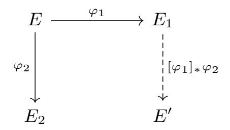

{0}------------------------------------------------

# PRISM with a pinch of salt: Simple, Efficient and Strongly Unforgeable Signatures from Isogenies

Andrea Basso<sup>1</sup> , Giacomo Borin1,<sup>2</sup> , Wouter Castryck<sup>3</sup> , Maria Corte-Real Santos<sup>4</sup> , Riccardo Invernizzi<sup>3</sup> , Antonin Leroux5,<sup>6</sup> , Luciano Maino7,8,<sup>9</sup> , Frederik Vercauteren<sup>3</sup> , and Benjamin Wesolowski<sup>4</sup>

> 1 IBM Research Europe, Zürich, Switzerland University of Zürich, Switzerland COSIC, KU Leuven, Belgium ENS de Lyon, CNRS, UMPA, UMR 5669, Lyon, France DGA-MI, Bruz, France 6 IRMAR - UMR 6625, Université de Rennes, France University of Birmingham, Birmingham, UK Université Libre de Bruxelles, Belgium University of Bristol, Bristol, UK

Abstract. The problem of computing an isogeny of large prime degree from a supersingular elliptic curve of unknown endomorphism ring is assumed to be hard both for classical as well as quantum computers. In this work, we first build a two-round identification protocol whose security reduces to this problem. The challenge consists of a random large prime q and the prover simply replies with an efficient representation of an isogeny of degree q from its public key. Using the hash-and-sign paradigm, we then derive a signature scheme with a very simple and flexible signing procedure and prove its security in the standard model. The most efficient variant of our signature schemes features a signing which is 1.4× to 1.6× faster than the most recent implementaion of SQIsign, whereas verification ranges from 1.2× slower to 1.01× faster depending on the security level. The sizes of public key and signature are comparable to existing schemes.

Keywords: Isogenies · Post-Quantum · Signatures · ID Protocols

This article is an extended version of [\[4\]](#page-40-0) in which we additionally present two variants of the PRISM signature: one that achieves strong unforgeability, and another called salt-PRISM that allows for smaller parameters. We also comment on the attack from [\[46\]](#page-44-0). We provide a C implementation of salt-PRISM based on the round 2 NIST submission of SQIsign [\[1\]](#page-40-1), and compare it to the state-of-the-art implementations of isogeny-based signature schemes. Most notably, at Level V, salt-PRISM is the fastest isogeny-based signature to date.

{1}------------------------------------------------

# 1 Introduction

Post-quantum cryptography aims to construct cryptographic protocols that are secure against adversaries with access to both classical and quantum computers. This field has recently gained interest from the community due to the increased investment into quantum computing. Most notably, in 2016, NIST began an effort to standardise post-quantum secure key encapsulation mechanisms (KEMs) and digital signature schemes. This culminated in the standardisation of the lattice-based KEM Kyber [\[15\]](#page-41-0) and signature schemes Dilithium [\[28\]](#page-42-0), Falcon [\[33\]](#page-43-0), and the hash-based signature SPHINCS+ [\[9\]](#page-41-1). NIST, however, is still seeking alternative signature schemes for standardisation [\[49\]](#page-44-1) due to the heavy reliance on lattice-based assumptions, and the relatively large signature sizes compared to pre-quantum alternatives.

Isogeny-based cryptography offers a promising answer to these problems. For instance, the isogeny-based signature scheme SQIsign boasts the smallest combined public key and signature size of any post-quantum alternative. It is currently submitted to Round 2 of NIST's alternate call for post-quantum secure signature schemes [\[1\]](#page-40-1). The main disadvantage of SQIsign and isogeny-based schemes in general is their inefficiency: signing and verification are orders of magnitude slower than lattice-based alternatives. As such, a large portion of research in isogenies has focused on optimizing the subroutines of SQIsign, see for example [\[24,](#page-42-1)[18\]](#page-41-2). Recently, impressive strides have been made in this regard by exploiting the attacks on SIDH/SIKE [\[17](#page-41-3)[,45,](#page-44-2)[51\]](#page-44-3). Indeed, these attacks uncovered a powerful tool: using higher-dimensional representations, we can efficiently represent a one-dimensional isogeny of non-smooth degree by embedding it in a higher-dimensional isogeny of smooth degree between products of elliptic curves. The efficiency of the protocol depends on the embedding dimension of the isogenies used in this representation.

The first variant of SQIsign that used the SIDH attacks constructively was SQIsignHD [\[20\]](#page-42-2), which relied on four-dimensional representations to obtain an impressive speed-up in the signing time and even smaller signatures than SQIsign. Verification, however, suffered from the heavy cost of computing four-dimensional isogenies. A wave of new protocols — SQIsign2D-West [\[6\]](#page-40-2), SQIsign2D-East [\[47\]](#page-44-4) and SQIPrime [\[29\]](#page-42-3) — presented new variants of SQIsign making use of twodimensional representations. These two-dimensional variants of SQIsign achieve signature sizes comparable to SQIsignHD, faster signing than SQIsign (though slower than SQIsignHD), and verification faster than both. A refinement of SQIsign2D-West is currently the official version of SQIsign submitted to the Round 2 of NIST standardization [\[1\]](#page-40-1); from now on, when referring to just SQIsign, we will mean this version.

Another drawback that affects all variants of SQIsign is their design complexity. The intricate signature process complicates the description of the scheme, and this reflects both in the security analysis and in the flexibility of the design. The former issue leads to security proofs requiring specific ad-hoc oracles and assumptions. The latter makes it hard to use these schemes as a building block for more elaborated protocols. Despite its extremely compact signatures, after

{2}------------------------------------------------

several years since its initial publication, only a few advanced functionalities based on SQIsign have been proposed; see, for example, [\[13,](#page-41-4)[50\]](#page-44-5).

High-dimensional isogenies were used in a different manner by Leroux in [\[44\]](#page-44-6) to introduce an efficient Verifiable Unpredictable Function (VUF), from which a Verifiable Random Function and the first isogeny-based hash-and-sign signature scheme can be derived. The function underlying Leroux's construction computes the codomain of an isogeny of given kernel, where the kernel has a fixed large prime order. The security thus relies on the hardness of computing such a function without the knowledge of the endomorphism ring of the domain curve.

Contributions. We present a new isogeny-based identification protocol, which we transform into a signature scheme PRISM-sig via the hash-and-sign paradigm. The security of both schemes relies on the fact that computing a large prime degree isogeny from an elliptic curve E is conjectured to be hard without knowledge of the endomorphism ring of E. The identification protocol is very simple:

- 1. The prover samples a secret key ϕsk : E<sup>0</sup> → Evk with corresponding public key Evk.
- 2. A verifier challenges the prover with a large prime q.
- 3. The prover replies with a two-dimensional representation of a degree-q isogeny from Evk.

The simplicity of the above protocol and the derived signature scheme, particularly when compared to SQIsign and its variants, improves the flexibility of the scheme itself and makes it easier to assess its security. In particular, we obtain an isogenybased signature scheme that is secure in the standard model. In view of the simplicity, we also expect our construction to be a useful building block in other, more advanced schemes.

Our contributions are summarized as follows:

- In [Section 3,](#page-11-0) we construct a new efficient identification protocol, which we call PRISM-id. Unlike other isogeny-based ID protocols, PRISM-id is not a Σ-protocol: this leads to smaller communication costs and more efficient computations. After constructing an appropriate hash function, we obtain a signature scheme (PRISM-sig) based on our identification protocol via the hash-and-sign paradigm. The resulting signature scheme is simple, flexible, compact, and efficient.
- In [Section 4,](#page-16-0) we prove the security of both the identification scheme and the signature scheme in the standard model, showing that their hardness is linked to well-understood problems in isogeny-based cryptography. For the signature scheme, we also prove security under a weaker assumption in the random oracle model.
- In [Section 5,](#page-24-0) we describe a variant of PRISM-sig, which we argue to be strongly unforgeable under some mildly-stronger assumptions. Notably, our variant achieves strong unforgeability while requiring only two-dimensional signature isogenies.

{3}------------------------------------------------

- In [Section 6,](#page-29-0) we present a modified version of protocol PRISM-sig in which a random salt is added to the message before hashing. We call this variant salt-PRISM. The use of a salt allows us to decrease the value of a needed for our signatures, resulting in better efficiency without compromising security.
- In [Section 7,](#page-35-0) we propose concrete parameters for our schemes for NIST Level I, III, and V security, and we provide an optimized implementation in C of salt-PRISM. We compare its efficiency and key/signature sizes with other variants of SQIsign. We also compare PRISM-id, PRISM-sig, and salt-PRISM, and observe that PRISM-id has a faster verification and much lower communication costs. The reason is that to instantiate a secure signature scheme via the hash-and-sign paradigm we need to avoid hash collisions, forcing us to select larger parameters for the signatures compared to PRISM-id.

Related work. Our construction shares strong conceptual similarities with Leroux's verifiable unique function (VUF) [\[44\]](#page-44-6) as they both rely on the hardness of computing large degree isogenies without the knowledge of the endomorphism ring. The main difference lies in the degree of the response isogenies: in [\[44\]](#page-44-6), the isogenies have fixed degree, whereas in our case the degree is the challenge, and it thus changes across executions. As a result, our choice of parameters is less constrained, and our security is arguably better. Indeed, the response isogeny has kernel defined over a field extension of exponential degree with overwhelming probability (whereas in [\[44\]](#page-44-6) the kernel is defined over a small field extension), which provides us with additional security guarantees even if there were breakthroughs in the computation of large prime degree isogenies.

Compared to SQIsign and its variants, our scheme is significantly simpler. Not only does this simplicity make it easier to analyze and implement the protocol, but it also leads to faster signing times. The signing procedure of salt-PRISM requires computing fewer two-dimensional isogenies compared to all the SQIsign variants, and no one-dimensional isogenies at all, leading to a 1.4× to 1.6× speedup when compared to the sound 2 NIST submission of SQIsign. Thanks to the addition of the salt, salt-PRISM allows for smaller parameters with respect to PRISM-sig, and this has a positive impact on verification: when compared with SQIsign, the verification time goes from 1.2× slower to 1.01× faster at level V. The signature size is very compact, and is comparable with most other isogeny-based protocols.

Acknowledgements. We thank Sina Schaeffler for her helpful comments and remarks. We thank Filipe Casal for his valuable comments on the implementation and security of the hash function. We thank Tibor Jager and Greg Zaverucha for their valuable comments on the salted variant. This work was supported in part by the European Research Council (ERC) under the European Union's Horizon 2020 research and innovation programme (grant agreement ISOCRYPT - No. 101020788), by the Research Council KU Leuven grant C14/24/099, by CyberSecurity Research Flanders with reference number VR20192203, by Fonds voor Wetenschappelijk Onderzoek (FWO) with reference number 1138925N, and 

{4}------------------------------------------------

by Engineering and Physical Sciences Research Council (EPSRC) grant number EP/V011324/1. This work was supported in part by SNSF Consolidator Grant CryptonIs 213766, as well as the European Research Council under grant No. 101116169 (AGATHA CRYPTY).

# 2 Preliminaries

In this section, we recall some background knowledge about the Deuring correspondence, computation of isogenies in dimension two and different variants of the SQIsign protocol. We assume some familiarity with elliptic curves and their isogenies, and refer the reader to [22,53] for more information. From this point onwards p is a prime with  $p \equiv 3 \pmod{4}$  and  $\text{Ell}_p$  denotes the set of supersingular elliptic curves defined over  $\mathbb{F}_{p^2}$  up to isomorphism.

#### 2.1 Quaternion algebras and the Deuring correspondence

We start by introducing quaternion algebras. A quaternion algebra over  $\mathbb{Q}$  is a division algebra defined by  $\mathbb{Q} + \mathbb{Q}i + \mathbb{Q}j + \mathbb{Q}k$ , where  $i^2 = a$ ,  $j^2 = b$ , ij = -ji = k for some  $a, b \in \mathbb{Q}^*$ . We denote it by H(a, b). We say that H(a, b) is ramified at a place v of  $\mathbb{Q}$  if the extension of scalars  $H(a, b) \otimes_{\mathbb{Q}} \mathbb{Q}_v$  is not isomorphic to the algebra of  $2 \times 2$  matrices over  $\mathbb{Q}_v$ . Up to isomorphism, for a given prime p there exists a unique quaternion algebra ramified exactly at p and  $\infty$ , which we denote by  $\mathcal{B}_{p,\infty}$ . Since we assume  $p \equiv 3 \mod 4$ , we can choose a basis such that  $i^2 = -1$  and  $j^2 = -p$ .

For a given element  $\alpha = a + bi + cj + dk \in \mathcal{B}_{p,\infty}$  we define its conjugate  $\bar{\alpha} := a - bi - cj - dk$  and its reduced norm  $\operatorname{nrd}(\alpha) := \alpha \bar{\alpha}$ . A fractional ideal in  $\mathcal{B}_{p,\infty}$  is a  $\mathbb{Z}$ -submodule of rank 4. An order  $\mathcal{O}$  is a fractional ideal that is also a subring. An order is maximal if it is not properly contained in any other order. Let I be a fractional ideal in  $\mathcal{B}_{p,\infty}$ . We define the left order of I to be  $\mathcal{O}_L(I) := \{\alpha \in \mathcal{B}_{p,\infty} \mid \alpha I \subset I\}$ . We can similarly define the right order  $\mathcal{O}_R(I)$  of a fractional ideal I, and I is called a connecting ideal for  $\mathcal{O}_L(I)$  and  $\mathcal{O}_R(I)$ . If I is contained in its left order (or, equivalently, in its right order) then it is an integral ideal, or just an ideal for short.

For a fractional ideal I, we denote its conjugate by  $I = \{\bar{\alpha} \mid \alpha \in I\}$ . The reduced norm of an ideal I, denoted by  $\operatorname{nrd}(I)$ , is defined as the gcd of the reduced norms of the elements of I. For a maximal order  $\mathcal{O}$ , any left  $\mathcal{O}$ -ideal I can be written as  $I = \mathcal{O}\alpha + \mathcal{O}\operatorname{nrd}(I)$  for some  $\alpha \in I$ . Two ideals I and J are equivalent if there exists  $\beta \in \mathcal{B}_{p,\infty}^*$  such that  $I = J\beta$ . We denote equivalence by  $I \sim J$ . A more detailed discussion of quaternion algebras can be found in [58].

The Deuring Correspondence. Deuring [26] showed a categorical equivalence between maximal orders in  $\mathcal{B}_{p,\infty}$  and supersingular elliptic curves defined over  $\mathbb{F}_{p^2}$ . This equivalence is known as the *Deuring correspondence*. Under this correspondence, to each maximal order  $\mathcal{O}$  of  $\mathcal{B}_{p,\infty}$  we can associate a supersingular elliptic curve E over  $\mathbb{F}_{p^2}$  such that  $\operatorname{End}(E) \cong \mathcal{O}$ . An isogeny  $\varphi : E_1 \to E_2$ 

{5}------------------------------------------------

corresponds to an ideal  $I_{\varphi}$ , where  $\mathcal{O}_L(I_{\varphi}) \cong \operatorname{End}(E_1)$  and  $\mathcal{O}_R(I_{\varphi}) \cong \operatorname{End}(E_2)$ . Moreover,  $\operatorname{deg}(\varphi) = \operatorname{nrd}(I_{\varphi})$ .

<span id="page-5-2"></span>Example 1. Since  $p \equiv 3 \mod 4$ , the elliptic curve  $E_0: y^2 = x^3 + x$  defined over  $\mathbb{F}_{p^2}$  is supersingular. We can define endomorphisms  $\iota: (x,y) \mapsto (-x,\sqrt{-1}y)$  and  $\pi: (x,y) \mapsto (x^p,y^p)$  of  $E_0$ , where  $\sqrt{-1}$  is a fixed square root of -1 in  $\mathbb{F}_{p^2}$ . We have the following isomorphism of rings:

$$\mathcal{O}_0 := \mathbb{Z}\left\langle 1, i, \frac{i+j}{2}, \frac{1+k}{2} \right\rangle \longrightarrow \operatorname{End}(E),$$

$$a + bi + cj + dk \longmapsto a + b\iota + c\pi + d\iota\pi.$$

Throughout the paper, we will always denote by  $E_0$  the curve  $y^2 = x^3 + x$ .

**Pushforward Isogenies and Ideals.** Consider an isogeny  $\varphi_1: E \to E_1$  and a separable isogeny  $\varphi_2: E \to E_2$  of degree coprime to  $\deg(\varphi_1)$ . We denote by  $[\varphi_1]_*\varphi_2: E_1 \to E'$  the pushforward isogeny of  $\varphi_2$  under  $\varphi_1$ , i.e., the separable isogeny such that  $\ker([\varphi_1]_*\varphi_2) = \varphi_1(\ker(\varphi_2))$ ; see Figure 1.



**Fig. 1.** Pushforward isogeny of  $\varphi_2$  under  $\varphi_1$ .

<span id="page-5-0"></span>Under the Deuring correspondence, we can define the pushforward of  $I_{\varphi_2}$  under  $I_{\varphi_1}$  as the left ideal of  $\mathcal{O}_R(I_{\varphi_1})$  corresponding to the isogeny  $[\varphi_1]_*\varphi_2$ , and we denote it by  $[I_{\varphi_1}]_*I_{\varphi_2}$ . By [23, Lemma 3] it can be computed as

<span id="page-5-3"></span>
$$[I_{\varphi_1}]_* I_{\varphi_2} = \frac{1}{\operatorname{nrd}(I_{\varphi_1})} \overline{I_{\varphi_1}} (I_{\varphi_1} \cap I_{\varphi_2}). \tag{1}$$

We summarize the Deuring correspondence in Table 1.

#### <span id="page-5-1"></span>2.2 Kani's Lemma

Kani's Lemma [40] gives a criterion to compute isogenies of dimension one using isogenies of dimension two. It was at the heart of the recent SIDH attacks [17,45,51], but it quickly turned into a powerful building block for isogeny-based protocols. We will extensively use it in this work. Our formulation follows [45].

**Theorem 1 (Kani).** Let  $d_1, d_2$  and N be pairwise coprime integers such that  $N = d_1 + d_2$ , and let  $E_0$ ,  $E_1$ ,  $E_2$ , and  $E_3$  be elliptic curves connected by the following diagram of isogenies:

{6}------------------------------------------------

| Supersingular elliptic curves                                     | Quaternions                                                  |
|-------------------------------------------------------------------|--------------------------------------------------------------|
| Supersingular j-invariants j(E) ∈ Fp2<br>(up to Galois conjugacy) | Maximal orders O ∼=<br>End(E) in Bp,∞<br>(up to isomorphism) |
| (E1, φ) with φ : E → E1                                           | Iφ integral left O-ideal and right O1-ideal                  |
| θ ∈ End(E)                                                        | Principal ideal Oθ                                           |
| deg(φ)                                                            | nrd(Iφ)                                                      |
| φb                                                                | Iφ                                                           |
| φ : E → E1, ψ : E → E1                                            | Equivalent ideals Iφ ∼ Iψ                                    |
| τ ◦ ρ : E → E1 → E2                                               | Iτ◦ρ = Iρ · Iτ                                               |

Table 1. The Deuring correspondence, a summary given in [\[24\]](#page-42-1).

<span id="page-6-0"></span>
$$E_{0} \xrightarrow{\varphi_{1}} E_{1}$$

$$\downarrow^{\psi_{2}} \qquad \qquad \downarrow^{\varphi_{2}}$$

$$E_{2} \xrightarrow{\psi_{1}} E_{3}$$

such that deg(φ1) = deg(ψ1) = d1, deg(φ2) = deg(ψ2) = d<sup>2</sup> and φ<sup>2</sup> ◦φ<sup>1</sup> = ψ<sup>1</sup> ◦ψ2. Then the map

$$\Phi = \begin{pmatrix} \varphi_1 & \widehat{\varphi_2} \\ -\psi_2 & \widehat{\psi_1} \end{pmatrix} : E_0 \times E_3 \to E_1 \times E_2$$

is an isogeny of (principally polarized) abelian varieties with kernel

$$\ker(\Phi) = \{(\widehat{\varphi_1}(P), \varphi_2(P)) \mid P \in E_1[N]\} \cong \frac{\mathbb{Z}}{N\mathbb{Z}} \times \frac{\mathbb{Z}}{N\mathbb{Z}}.$$

Assuming that N is powersmooth, or N is smooth and all N-torsion points are rational, the isogeny Φ can be efficiently evaluated at any point on E<sup>0</sup> × E3. For example, if N = 2<sup>a</sup> for some a ≥ 1 then one can use the algorithms given in [\[21\]](#page-42-7). In this case, the generators of the kernel defining Φ encode an efficient two-dimensional representation of φ1.

#### <span id="page-6-1"></span>2.3 Ideal To Isogeny Translation

Translating ideals into the corresponding isogenies under the Deuring correspondence is a fundamental task in isogeny-based cryptography. A first breakthrough was made in 2014 by Kohel, Lauter, Petit and Tignol [\[41\]](#page-43-2), who introduced the KLPT algorithm that was at the heart of the first version of the SQIsign protocol. The KLPT algorithm can be turned into a polynomial-time method for converting ideals to isogenies, but this is usually inefficient in practice, due to the large degree of the auxiliary isogeny appearing in the process, whose kernel elements are

{7}------------------------------------------------

in general defined over large field extensions only. Recently, higher dimensional isogenies gave a new algorithmic tool for converting ideals to isogenies. In particular, the Round 2 version of SQIsign is based on the IdealTolsogeny algorithm introduced in SQIsign2D-West [6]. This algorithm can efficiently translate any left  $\mathcal{O}_0$ -ideal, where  $\mathcal{O}_0 = \operatorname{End}(E_0)$ , to the corresponding isogeny originating at  $E_0$  when working over  $\mathbb{F}_{p^2}$  with  $p = f2^e - 1$ , for some small odd f > 0. This algorithm was later improved by the development of the Qlapoti algorithm [14], used as a subroutine in IdealTolsogeny. In this work, we use this variant of the IdealTolsogeny algorithm, which we sketch below.

Let I be a left  $\mathcal{O}_0$ -ideal, which we assume being of smallest norm within its equivalence class, and let  $n = \operatorname{nrd}(I)$ . The goal is to find two ideals  $I_1, I_2$  equivalent to I, such that

$$\operatorname{nrd}(I_1) + \operatorname{nrd}(I_2) = 2^e$$

where e is (smaller than) the 2-valuation of p. Since  $I_1, I_2$  must be equivalent to I, there will exist  $\beta_k \in I$  for k = 1, 2 such that  $I_k = I\overline{\beta}_k/n$ . The above equation can thus be written in terms of the  $\beta_i$  as

$$\operatorname{nrd}(\beta_1) + \operatorname{nrd}(\beta_2) = 2^e \cdot n. \tag{2}$$

By writing  $I = \langle n, \alpha \rangle$  for some  $\alpha$  of relatively small norm,  $\beta_i$  is written explicitly as  $\gamma_i \cdot n + \alpha$ , where  $\gamma_i \in \mathbb{Z}[i]$ . The norm equation is then spelled out completely, and solved in two steps. In the first step, a solution is found mod n; a lattice reduction ensures that the solution is small. In the second step, this small solution is put back in the original equation, which can now be expressed as a sum-of-squares problem and solved using Cornacchia's algorithm.

Once the two elements  $\beta_1, \beta_2$  (and in turn the ideals  $I_1, I_2$ ) are found, the ideal I is recovered using 2-dimensional isogenies in a very similar way to the original IdealTolsogeny algorithm.

### 2.4 Identification Protocols and Digital Signatures

Identification protocols and digital signatures are basic cryptographic building blocks that share some similarities, for example a digital signature scheme implies an identification protocol (see [55, Section 10.3]), but have important differences in their definition and security notions.

**Definition 1 (Definition 18.1 [12]).** An identification protocol is a triple of probabilistic polynomial-time algorithms (KeyGen, Pvr, Vrf) such that:

- $-(vk, sk) \leftarrow KeyGen(1^{\lambda})$ , is a probabilistic key generation algorithm, that takes as input a security parameter  $\lambda$ , and outputs a pair (vk, sk), where vk is called the verification key and sk is called the secret key;
- Pvr(sk), is an interactive protocol algorithm, called the prover, that takes as input the secret key sk;

{8}------------------------------------------------

– accept/reject ← Vrf(vk) is a probabilistic interactive protocol algorithm, called the verifier, that takes as input the verification key vk and outputs accept or reject.

We model the interaction with the following notation: output ← Vrf(vk) ⇌ Pvr(sk).

We say that the identification scheme is correct if Vrf outputs accept with probability 1 over the choice of (vk,sk) ← KeyGen(1<sup>λ</sup> ) and over the randomness in the involved algorithms, i.e., if

$$\Pr\left[\mathsf{accept} \leftarrow \mathsf{Vrf}(\mathsf{vk}) \leftrightarrows \mathsf{Pvr}(\mathsf{sk})\right] = 1.$$

We consider security against active attacks following Boneh and Shoup [\[12,](#page-41-6) Definition 18.8].

<span id="page-8-0"></span>Definition 2 ([\[12\]](#page-41-6)). Consider the following three phase impersonator game for an adversary A:

- Setup: a key pair (vk,sk) ← KeyGen(1<sup>λ</sup> ) is generated and the adversary A receives vk;
- Probing: the adversary A can interact multiple times with an honest prover Pvr(sk) and store the interaction outputs in a state st:

$$\mathsf{st} \leftarrow \mathcal{A}(\mathsf{vk},\mathsf{st}) \leftrightharpoons \mathsf{Pvr}(\mathsf{sk});$$

– Impersonation: the adversary A(vk,st) interacts with an honest verifier Vrf(vk):

$$\mathsf{output}_{\mathcal{A}} \leftarrow \mathsf{Vrf}(\mathsf{vk}) \leftrightharpoons \mathcal{A}(\mathsf{vk},\mathsf{st}).$$

The adversary wins if the verifier accepts, i.e., output<sup>A</sup> = accept.

An identification protocol is secure against active attacks if for any PPT adversary A playing the impersonator game it is not able to authenticate with non-negligible probability, i.e., Pr [output<sup>A</sup> = accept] = negl(λ).

A particular class of identification protocols are Σ-protocols. These are threeround interactive protocols usually referred to as the commitment, challenge and response phase, represented by a transcript (com, chall,resp). An example of a Σ-protocol is the identification protocol underlying SQIsign, that we recall in [Section 2.5.](#page-9-0) Due to the Fiat–Shamir transform [\[32\]](#page-43-3), secure Σ-protocols can be efficiently transformed into secure signature schemes. Thus, many signature schemes, such as SQIsign, are constructed in this manner.

Definition 3. A digital signature scheme consists of three probabilistic polynomialtime algorithms (KeyGen, Sign, Vrf) such that:

- (vk,sk) ← KeyGen(1<sup>λ</sup> ): on input a security parameter λ, the key generation algorithm outputs a pair of verification and signing keys (vk,sk);
- σ ← Sign(sk, msg): on input a signing key sk and a message msg, the signing algorithm outputs a signature σ;

{9}------------------------------------------------

– accept/reject ← Vrf(vk, msg, σ): on input a verification key vk, a message msg and a signature σ, the verification algorithm outputs accept or reject.

A signature scheme is correct if, given (vk,sk) ← KeyGen(1<sup>λ</sup> ), for any message msg and signature σ ← Sign(sk, msg) a run of Verify(vk, msg, σ) outputs accept with probability 1.

<span id="page-9-2"></span>Definition 4. Let ATK∈ {EUF, SUF}. A digital signature is secure in the ATK-CMA model if for any PPT adversary A playing the game from Figure 2, it holds

$$Adv_{\mathcal{A}}^{ATK\text{-}CMA}(\lambda) = \Pr\left[G^{\mathsf{ATK}}(\mathcal{A}) = 1\right] = \mathsf{negl}(\lambda). \tag{3}$$

```
G
 ATK(A):
1: (vk,sk) ← KeyGen(1λ
                         )
2: M ← ∅
3: (msg∗
         , σ∗
             ) ← ASign′
                       (vk)
4: if ATK = EUF then
5: assert (msg∗
                    , ·) ̸∈ M
6: else
7: assert (msg∗
                    , σ∗
                        ) ̸∈ M
8: assert Vrf(vk, msg∗
                       , σ∗
                           ) = accept
9: return 1
                                        Sign′
                                             (msg):
                                         1: σ ← Sign(sk, msg)
                                         2: M ← M ∪ {(msg, σ)}
                                         3: return σ
```

<span id="page-9-3"></span>Fig. 2. Security game for the EUF-CMA (SUF-CMA) property

### <span id="page-9-0"></span>2.5 SQIsign and its variants

SQIsign [\[23\]](#page-42-6) is a signature scheme derived from an isogeny-based Σ-protocol. It is represented by the following diagram:

<span id="page-9-1"></span>
$$E_{0} \xrightarrow{\psi_{\text{com}}} E_{\text{com}}$$

$$\downarrow^{\phi_{\text{sk}}} \qquad \qquad \phi_{\text{chall}}$$

$$E_{\text{vk}} \xrightarrow{\sigma_{\text{resp}}} E_{\text{chall}}$$

$$(4)$$

Here, ϕsk is the secret key with corresponding verification key Evk, Ecom is the commitment, and ϕchall is the challenge. As the prover knows the secret isogeny ϕsk, they have knowledge of the endomorphism ring of Evk. In this way, the prover is the only party capable of producing a valid response σresp connecting Evk to the challenge curve Echall. To construct the response isogeny, the prover finds the ideal <sup>I</sup> corresponding to the composition <sup>ϕ</sup>chall ◦ <sup>ψ</sup>com ◦ <sup>ϕ</sup>bsk, then it finds 

{10}------------------------------------------------

an equivalent ideal J not factoring through the secret key  $\phi_{sk}$ , and translates J to its corresponding isogeny  $\sigma_{resp}$ . In the original SQIsign protocol [23] this is done with (a variant of) the KLPT algorithm, that finds J of smooth norm. Instead, in the subsequent higher-dimensional variants [6,29,20,47], they can pose milder restrictions on  $\operatorname{nrd}(J)$  and use Kani's Lemma (Section 2.2) to represent the isogeny.

High Degree Oracles and HVZK property. To show that a  $\Sigma$ -protocol satisfies the Honest-Verifier Zero Knowledge property we need to show how to simulate a valid transcript (com, chall, resp) in polynomial time, without access to the secret key. The natural simulation strategy for the  $\Sigma$ -protocol underlying SQIsign in (4) is to first generate at random  $\sigma_{\text{resp}} : E_{\text{vk}} \to E_{\text{chall}}$ , then  $\widehat{\phi}_{\text{chall}} : E_{\text{chall}} \to E'$ , and finally define  $E_{\text{com}} := E'$ .

In the original SQIsign identification protocol both the challenge isogeny  $\phi_{\text{chall}}$  and the response isogeny  $\sigma_{\text{resp}}$  have smooth degree, thus they can efficiently be sampled to simulate a transcript, though arguing the indistinguishability of the transcript requires an ad-hoc assumption. This is not true for the high-dimensional variants: the response isogeny  $\sigma_{\text{resp}}$  has a larger non-smooth degree that can be efficiently represented via high-dimensional isogenies to allow the verifier to compute it. However, this representation cannot be provided without the knowledge of the endomorphism ring of the public curve  $E_{\text{vk}}$ . To overcome this problem, all the security proofs of the higher-dimensional variants rely on auxiliary oracles that provide efficient representations of uniformly random non-smooth degree isogenies. These oracles can be characterized as providing:

- isogenies of a fixed degree given as input, FIDIO [6, Definition 23] and AIO [29, Definition 4];
- isogenies of a random degree satisfying specific conditions, like RUGDIO [20, Definition 20] and RUNDIO [47, Definition 2];
- uniformly random isogenies of uniformly random bounded degree, like RADIO [20, Definition 41] and UTO [6, Definition 21];
- efficient representation of isogenies given their non-smooth kernel, like FIX-DIO [44, Definition 4], RUCODIO [29, Definition 3] and RUCGDIO [29, Definition 2].

Though these oracles vary in flavor, they are all needed for the same core reason: to the best of our knowledge, there are no efficient algorithms to compute large prime degree isogenies without leveraging the knowledge of the endomorphism ring of the domain curve.

Although, we do not know how to construct any of these oracles in polynomial time, it is conjectured that a bounded number of queries do not provide any help in compromising the security of the schemes, e.g., by recovering non-trivial endomorphisms. This was first argued in [20, Section 5.3].

<span id="page-10-0"></span>The order of computing  $\phi_{\text{chall}}$  and  $\sigma_{\text{resp}}$  may be inverted in some variants, but the simulation strategies rely on the same machinery.

{11}------------------------------------------------

### <span id="page-11-0"></span>3 Identification Protocol and Digital Signature Scheme

In this section, we present a new identification scheme built from the conjectured hardness of constructing large prime degree isogenies from E, without knowledge of the endomorphism ring  $\operatorname{End}(E)$ . After constructing an appropriate hash function, this identification protocol can easily be transformed into a simple signature scheme, built from the same subroutines. We can view this last scheme as a hash-and-sign-like signature where the trapdoor one-way function consists of computing a large prime degree isogeny with domain  $E_{vk}$ . The trapdoor one-way function is the degree map applied to isogenies of large prime degree with domain  $E_{vk}$ . Indeed, given an isogeny, its degree can be efficiently recovered by anyone; however, inverting the trapdoor consists of sampling a large prime degree isogeny, a task considered to be hard without access to the endomorphism ring of  $E_{vk}$ .

#### 3.1 Identification Protocol

The core idea behind our identification protocol is that computing isogenies of large prime degree from a random elliptic curve with unknown endomorphism ring is believed to be hard. Indeed, the best known algorithm for computing an isogeny of prime degree q runs in  $\tilde{O}(q^2)$  (see Section 4.4). However, this task significantly simplifies with knowledge of the endomorphism ring of the domain elliptic curve. From these two observations, we can now construct an identification scheme: a party can prove knowledge of the endomorphism ring of a given curve  $E_{\rm vk}$  by publishing an isogeny of large prime degree  $\varphi: E \to E'$ . To instantiate the protocol we fix a base prime  $p \equiv 3 \mod 4$  and an integer a such that we have  $\mathbb{F}_{p^2}$ -rational  $2^a$ -torsion on any supersingular elliptic curve on  $\mathbb{F}_{p^2}$  (when working with models having  $(p+1)^2$  rational points). For the same number a, we define Primes $_a$  to be the set of primes of exactly a bits, i.e., primes q such that  $2^{a-1} < q < 2^a$ .

The identification scheme, referred to as PRISM-id and depicted in Figure 3, relies on the following subroutines:

- $-\varphi \leftarrow \mathsf{Genlsogeny}(E, \phi, q)$ : on input a supersingular elliptic curve E, an isogeny  $\phi : E_0 \to E$  (that gives access to the endomorphism ring of E) and a prime q, returns an efficient representation of a cyclic isogeny  $\varphi : E \to E'$  of degree  $q(2^a q)$ ; furthermore,  $\varphi$  is uniformly distributed among all cyclic isogenies of degree  $q(2^a q)$  from E.
- accept/reject  $\leftarrow$  Verlsogeny( $\varphi, E, q$ ): on input an efficient representation of an isogeny  $\varphi: E \to E'$ , checks whether it has degree  $q(2^a q)$ .

Security. The security of these protocols rests on the following assumption: given many isogenies  $\varphi_i: E \to E_i$  of degree  $q_i(2^a - q_i)$  with  $q_i$  an a-bit prime number, the verifier does not learn any information about the endomorphism ring of E. This assumption is plausible as there are already efficient ways to compute large

{12}------------------------------------------------

| Prover                                     |                                       | Verifier                                       |
|--------------------------------------------|---------------------------------------|------------------------------------------------|
| $sk = \phi_{sk}$                           |                                       | $vk = E_vk$                                    |
| $\varphi \leftarrow GenIsogeny(vk, sk, q)$ | $\leftarrow$                          | Sample $q \in Primes_a$                        |
|                                            | $\stackrel{\varphi}{\longrightarrow}$ |                                                |
|                                            |                                       | $\mathbf{if} \ Verlsogeny(\varphi, E_{vk}, q)$ |
|                                            |                                       | return accept                                  |

<span id="page-12-0"></span>Fig. 3. PRISM-id identification scheme.

(yet smooth) degree isogenies from a given curve, regardless of any knowledge of the endomorphism ring. Moreover, because  $\mathsf{Primes}_a$  is defined as the set of primes having a bits exactly, the cofactor  $2^a - q$  cannot be another a-bit prime, so seeing isogenies of degrees corresponding to  $q_1, \ldots, q_r \in \mathsf{Primes}_a$  does not help to respond to a degree  $q_{r+1}$  that has not been queried before. The security of the schemes and the underlying assumptions are discussed in greater detail in Section 4.

Remark 1. The degree of the isogeny  $\phi$  has the form  $q(2^a - q)$  so that  $\phi$  can be represented in two dimensions (rather than four) by using Kani's lemma, which results in a more efficient protocol. The verification procedure thus involves computing a two-dimensional isogeny, which is significantly more efficient than the analogous computation in dimension four.

For a slightly different perspective, write the response isogeny  $\phi$  as the composition  $\phi = \phi_{2^a-q} \circ \phi_q$ , where  $\deg \phi_{2^a-q} = 2^a - q$  and  $\deg \phi_q = q$ . The isogeny  $\phi_q$  can be interpreted as the "real" response isogeny, whereas  $\phi_{2^a-q}$  is just an auxiliary isogeny that is needed to obtain a two-dimensional representation.

It is also possible to instantiate PRISM with higher-dimensional isogenies, which would eliminate the need for an auxiliary isogeny and would lead to an even more compact protocol (four-dimensional representations require smaller-order torsion points), but would also come at the cost of a much slower verification procedure (extrapolating from the software given in [54], four-dimensional isogenies in SQIsign-HD verification are roughly 7 times slower than our verification for similar parameter sets).

### 3.2 Signature scheme

If we also have access to a collision resistant hash function on the set of large primes  $\mathsf{H}_{\mathsf{prime}} : \{0,1\}^* \to \mathsf{Primes}_a$  we can define a digital signature, called PRISM-sig, using the same building blocks of the identification protocol based on the well-known hash-and-sign paradigm in which we hash a given message to a set of suitable prime degrees, and give an isogeny of that degree as its signature. This is explained in Figure 4. We highlight the simplicity of this scheme: it directly reduces to hard problems in isogeny computation, simplifying its analysis in terms of both efficiency and security.

{13}------------------------------------------------

| Signer                                  | Verifier                                |
|-----------------------------------------|-----------------------------------------|
| $sk = \phi_sk$                          | $vk = E_vk$                             |
| $q \leftarrow H_{prime}(E_{vk} \  msg)$ |                                         |
| $\sigma \leftarrow GenIsogeny(vk,sk,q)$ |                                         |
|                                         | $\xrightarrow{msg,\sigma}$              |
|                                         | $q \leftarrow H_{prime}(E_{vk} \  msg)$ |
|                                         | if Verlsogeny $(\sigma, E_{vk}, q)$     |
|                                         | ${\bf return}$ accept                   |

<span id="page-13-0"></span>Fig. 4. PRISM-sig signature scheme.

In Section 3.3 we carefully define the necessary subroutines for the two schemes.

#### <span id="page-13-1"></span>3.3 Subroutines based on IdealTolsogeny

In the previous sections, we introduced our constructions for an identification protocol and signature scheme. However, we did not specify how key generation or the subroutines Genlsogeny and Verlsogeny are constructed. For the signature scheme, we also need to specify the hash function  $H_{prime}$ . We present here our main construction, which relies on the IdealTolsogeny algorithm introduced in Section 2.3. We note however that alternative choices are possible thanks to the high modularity of our schemes (see e.g. the appendix of the original paper [5]).

In what follows, we fix  $p = f2^e - 1$  for some small integer f > 0. This choice is motivated by the need to access rational  $2^e$ -torsion during the IdealTolsogeny algorithm. Let  $E_0: y^2 = x^3 + x$  be the supersingular curve with j-invariant 1728, and fix a basis  $P_0, Q_0$  of  $E_0(\mathbb{F}_{p^2})[2^a]$ , for some  $a \leq e$ .

Key generation. The key generation procedure is performed by the algorithm KeyGen [1, Algorithm 4.1], with the only difference of IdealTolsogeny using Qlapoti as the main subroutine. On input the security parameter  $\lambda$ , KeyGen outputs the public and secret key pair (vk, sk) as follows. First, sample a random ideal  $I_{sk}$  of random prime norm  $N_{sk}$ , such that the distribution of  $\phi_{sk}$  is statistically close to uniform. Use IdealTolsogeny to compute the isogeny  $\phi_{sk}: E_0 \to E_{vk}$  corresponding to the ideal  $I_{sk}$ . Then use the algorithm TorsionBasisToHint [1, Algorithm 2.1] to deterministically compute generators  $P_{vk}, Q_{vk}$  of  $E_{vk}(\mathbb{F}_{p^2})[2^a]$  together with a hint hint<sub>vk</sub>. Finally, compute the matrix  $M_{sk}$  sending  $(\phi_{sk}(P_0), \phi_{sk}(Q_0))$  into  $(P_{vk}, Q_{vk})$ , i.e. the matrix mod  $2^a$  given by

$$M_{\rm sk} = \begin{pmatrix} m_{11} \ m_{12} \\ m_{21} \ m_{22} \end{pmatrix}$$

such that  $P_{\mathsf{vk}} = [m_{11}]\phi_{\mathsf{sk}}(P_0) + [m_{12}]\phi_{\mathsf{sk}}(Q_0)$  and  $Q_{\mathsf{vk}} = [m_{21}]\phi_{\mathsf{sk}}(P_0) + [m_{22}]\phi_{\mathsf{sk}}(Q_0)$ . The public key is set to be  $(E_{\mathsf{vk}}, \mathsf{hint}_{\mathsf{vk}})$ , and the secret key is  $(E_{\mathsf{vk}}, \mathsf{hint}_{\mathsf{vk}}, I_{\mathsf{sk}}, M_{\mathsf{sk}})$ . 

{14}------------------------------------------------

Isogeny Generation. The algorithm Genlsogeny(vk, sk, q), given in Algorithm 1, is constructed as follows. Parse vk as  $(E_{vk}, \mathsf{hint}_{vk})$  and sk as  $(E_{vk}, \mathsf{hint}_{vk}, I_{sk}, M_{sk})$ . From  $\mathsf{hint}_{vk}$  the deterministic basis  $(P_{vk}, Q_{vk})$  is computed. As the endomorphism ring of  $E_0$  is known (see Example 1), via the secret isogeny  $\phi_{sk}: E_0 \to E_{vk}$  we have knowledge of the endomorphism ring of  $E_{vk}$ . We can use this to generate an isogeny  $\sigma: E_{vk} \to E_{sig}$  of degree  $q(2^a - q)$ . More precisely, we compute a two-dimensional representation of the isogeny  $\sigma: E_{vk} \to E_{sig}$ , consisting of the codomain curve  $E_{sig}$  and the image of the basis  $(P_{vk}, Q_{vk})$  of  $E_{vk}[2^a]$  through  $\sigma$ .

The first step is to generate an  $\mathcal{O}_0$ -ideal  $I_{\text{chall}}$  of norm  $q(2^a - q)$ . This is done using the RandomldealGivenNorm algorithm [1, Algorithm 3.10]. Since (with overwelming probability)  $I_{\text{sk}}$  and  $I_{\text{chall}}$  have coprime norm, we can compute the pushforward of  $I_{\text{chall}}$  through the secret ideal  $I_{\text{sk}}$  using Equation (1):

$$I_{\sigma} = [I_{\mathsf{sk}}]_* I_{\mathrm{chall}} = \frac{1}{N_{\mathsf{sk}}} \overline{I_{\mathsf{sk}}} (I_{\mathsf{sk}} \cap I_{\mathrm{chall}}).$$

From this, we see that the ideal corresponding to the isogeny  $\varphi = \sigma \circ \phi_{sk} : E_0 \to E_{sig}$  is given by  $I = I_{sk}I_{\sigma} = I_{sk} \cap I_{chall}$ . Using IdealTolsogeny we can obtain a representation of  $\varphi$  and compute the images  $\varphi(P_0), \varphi(Q_0)$ . Finally, we obtain a two-dimensional representation of  $\sigma$  as follows. For  $P \in E_{vk}[2^a]$  we have

$$\sigma(P) = \frac{1}{N_{\rm sk}} (\varphi \circ \widehat{\phi_{\rm sk}})(P).$$

From the definition of  $M_{\sf sk}$  we see that

$$\frac{1}{N_{\rm sk}}\widehat{\phi_{\rm sk}}(P_{\rm vk}) = [m_{11}]P_0 + [m_{12}]Q_0.$$

and hence  $\sigma(P) = [m_{11}]\varphi(P_0) + [m_{12}]\varphi(Q_0)$ ; similarly,  $\sigma(Q) = [m_{21}]\varphi(P_0) + [m_{22}]\varphi(Q_0)$ . The kernel of the two-dimensional isogeny embedding  $\sigma$  is now given by

$$\langle ([q]P_{\mathsf{vk}}, \sigma(P)), ([q]Q_{\mathsf{vk}}, \sigma(Q)) \rangle = \langle (P_{\mathsf{vk}}, [q^{-1}]\sigma(P)), (Q_{\mathsf{vk}}, [q^{-1}]\sigma(Q)) \rangle.$$

The second representation can be obtained with the same amount of point multiplications (it is enough to multiply the  $m_{ij}$  by  $q^{-1}$ ) and makes verification easier; we thus return  $(E_{\text{sig}}, P_{\text{sig}} = [q^{-1}]\sigma(P), Q_{\text{sig}} = [q^{-1}]\sigma(Q))$ .

<span id="page-14-0"></span>Remark 2. The RandomldealGivenNorm algorithm outputs a uniformly random primitive ideal, therefore the output of Genlsogeny is a uniformly random cyclic isogeny of degree  $q(2^a - q)$  from  $E_{vk}$ .

Remark 3. There are different choices to encode the data defining the response iso, and consequently the output of Algorithm 1. The one above is the simplest one, and hence better for exposition. Other possibilities, more oriented towards efficiency and compactness and depending on the parameters, are discussed in Section 7.2.

{15}------------------------------------------------

### **Algorithm 1** GenIsogeny(vk, sk, q)

<span id="page-15-0"></span>Input: Secret key  $sk = (E_{vk}, hint_{vk}, I_{sk}, M_{sk})$  and public key  $vk = (E_{vk}, hint_{vk})$ , and prime number  $q \in (2^{a-1}, 2^a)$ .

**Output:** A two-dimensional representation of  $\sigma: E_{vk} \to E_{sig}$  of degree  $q(2^a - q)$ .

- 1:  $N \leftarrow q(2^a q)$ ;
- 2:  $I_{\text{chall}} \leftarrow \mathsf{RandomIdealGivenNorm}\left(\mathcal{O}_{0}, N\right);$
- 3:  $I \leftarrow I_{\mathsf{sk}} \cap I_{\mathsf{chall}}$ ;
- $4: \ \varphi \leftarrow \mathsf{IdealTolsogeny}(I);$
- 5: Set  $E_{\text{sig}}$  as the codomain of  $\varphi$ ;
- 6:  $t = q^{-1} \mod 2^a$
- 7:  $P_{\text{sig}} = [t \cdot m_{11}]\varphi(P_0) + [t \cdot m_{12}]\varphi(Q_0);$
- 8:  $Q_{\text{sig}} = [t \cdot m_{21}]\varphi(P_0) + [t \cdot m_{22}]\varphi(Q_0);$
- 9: **return**  $(E_{\text{sig}}, P_{\text{sig}}, Q_{\text{sig}})$

**Verification.** We now define the verification algorithm Verlsogeny(iso,  $E_{vk}, q$ ). Parse the input iso as  $(E_{sig}, P_{sig}, Q_{sig})$  where  $P_{sig} = [q^{-1}]\sigma(P)$  and  $Q_{sig} = [q^{-1}]\sigma(Q)$ . We recall that  $E_{vk}[2^a] = \langle P_{vk}, Q_{vk} \rangle$ . We have to check that these points interpolate an isogeny  $\sigma : E_{vk} \to E_{sig}$  of degree  $q(2^a - q)$ .

Write  $\sigma = \varphi_q \circ \varphi_{q'} = \psi_{q'} \circ \psi_q$ , where  $\deg(\psi_q) = \deg(\varphi_q) = q$ , and  $\deg(\psi_{q'}) = \deg(\varphi_{q'}) = 2^a - q$ . We can then factor  $\sigma$  using the commuting square

$$E_{\mathsf{vk}} \xrightarrow{\varphi_{q'}} E_2$$

$$\downarrow^{\psi_q} \qquad \qquad \downarrow^{\varphi_q}$$

$$E_1 \xrightarrow{\psi_{q'}} E_{\mathsf{sig}}$$

This is a  $(q, 2^a - q)$ -isogeny diamond, and therefore, by Kani's Lemma, the isogeny

$$\Phi \colon E_{\mathsf{vk}} \times E_{\mathsf{sig}} \to E_1 \times E_2$$

given by the matrix

$$\Phi = \begin{pmatrix} \psi_q & \widehat{\psi}_{q'} \\ -\varphi_{q'} & \widehat{\varphi}_q \end{pmatrix},$$

is a  $(2^a, 2^a)$ -isogeny between these products of elliptic curves, viewed with their product polarisation. Furthermore, the kernel of  $\Phi$  is given by

$$\ker(\Phi) = \{([q]P, \sigma(P)) | P \in E_{\mathsf{vk}}[2^a]\} = \langle (P_{\mathsf{vk}}, P_{\mathsf{sig}}), (Q_{\mathsf{vk}}, Q_{\mathsf{sig}}) \rangle.$$

which is given to the verifier. They can therefore compute  $\Phi$  to verify that  $(P_{\mathsf{sig}}, Q_{\mathsf{sig}})$  interpolates the isogeny  $\sigma$ . To verify the degrees, we first compute  $(P',\_) := \Phi((P_{\mathsf{vk}},0))$  and  $(Q',\_) := \Phi((Q_{\mathsf{vk}},0))$ . Observe that if  $(E_{\mathsf{sig}}, P_{\mathsf{sig}}, Q_{\mathsf{sig}})$  is a valid isogeny, we have

$$e_{2a}(P',Q') = e_{2a}(P_{vk},Q_{vk})^n,$$

where  $n \in \{q, 2^a - q\}$  and  $e_{2^a}$  is the  $2^a$ -Weil pairing. Therefore, we can simply compute  $e_{\mathsf{vk}} = e_{2^a}(P_{\mathsf{vk}}, Q_{\mathsf{vk}})$  and  $e' = e_{2^a}(P', Q')$  and check whether  $e_{\mathsf{vk}} = (e')^q$  or  $e' = (e_{\mathsf{vk}})^q$ .

{16}------------------------------------------------

**Hashing in Primes**<sub>a</sub>. For our signature scheme, we need to define the hash function  $\mathsf{H}_{\mathsf{prime}}$  that hashes into the set  $\mathsf{Primes}_a$ . To construct  $\mathsf{H}_{\mathsf{prime}}$  we consider any cryptographic hash function  $\mathsf{H}_{a-2}:\{0,1\}^* \to [0,2^{a-2})$ , composed with  $h \mapsto 2^{a-1} + 2h + 1$  (prepending and appending a bit 1 to the binary expansion) to end up with an odd integer in the interval  $(2^{a-1},2^a)$ . Given  $E_{\mathsf{vk}}$  and  $\mathsf{msg}$  we define  $\mathsf{H}_{\mathsf{prime}}(E_{\mathsf{vk}}||\mathsf{msg})$  by repeatedly computing  $2^{a-1} + 2\mathsf{H}_{a-2}(E_{\mathsf{vk}}||\mathsf{msg}||\mathsf{counter}) + 1$  for increasing values of counter until we hit a prime number. This requires on average  $2^{a-2}/\#\mathsf{Primes}_a \approx a \ln(2)/2$  repetitions.

Notice that each step in the hash  $H_{prime}$  evaluation requires performing a primality test [3], which has a quadratic cost in the bit length a.

Remark 4. A slightly faster choice for  $H_{prime}$  would be to first hash to a  $2^a$  bits odd integer and then increase it sequentially until we reach a prime. However, this would introduce a bias towards primes associated to long intervals of non-prime integers, and we therefore avoid this option.

Remark 5. The value of counter can be provided to the verifier in Figure 4 at a minimal cost, its expected size being about  $\log a$  bits, to save time during verification. However in this case a bit of care is needed, since different counters may lead to different primes. First of all, a verifier receiving a fixed counter that does not result in a prime hash should reject to prevent a sort of signature malleability (a valid signature with counter -1 would also be valid). An upper bound on counter should also be set to prevent an attacker to arbitrarily try many different primes for the same signature. For similar reasons, the concatenation inside H must ensure proper domain separation.

### <span id="page-16-0"></span>4 Security

In this section, we prove that both the identification protocol and the signature scheme are deeply connected to the hardness of evaluating large prime degree isogenies, a well understood problem in isogeny-based cryptography.

#### 4.1 Key Recovery

First, note that the key recovery problem for both our constructions is simply the standard *Supersingular Endomorphism Ring Problem*, given below.

Problem 1 (Supersingular Endomorphism Ring Problem). Given a supersingular elliptic curve E defined over  $\mathbb{F}_{p^2}$ , find four (efficient representations of) endomorphisms which generate the ring  $\operatorname{End}(E)$ .

Both the signing and the identification procedure result in revealing isogenies of large prime degree. These are hard to compute without the knowledge of the endomorphism ring. Moreover, it is believed that revealing such isogenies does not help to solve the endomorphism ring problem. This fact was first formulated in [20] where the authors argued that providing an oracle to produce isogenies

{17}------------------------------------------------

of arbitrary degree would not impact the security of SQIsignHD. Furthermore, notice that given a curve E anyone can efficiently compute isogenies of large degree without knowledge of the endomorphism ring, as long as this degree is smooth. Since smooth-degree isogenies are sufficient to cover the whole isogeny graph, for each isogeny we reveal there exists an equivalent, smooth-degree isogeny that is computable without any knowledge of  $\operatorname{End}(E_{vk})$ . This lends support to the assumption that our protocols do not leak useful information to an attacker.

#### <span id="page-17-3"></span>4.2 Forgery and Impersonation

The security of the protocol relies on the following (new) assumption. Recall that  $\mathsf{Primes}_a$  is the set of primes of exactly a bits. Consequently, an element  $q \in \mathsf{Primes}_a$  is uniquely determined by the value of  $q(2^a - q)$ .

**Definition 5.** A special degree isogeny oracle (SPEDIO) is an oracle which takes as input a supersingular elliptic curve E over  $\mathbb{F}_{p^2}$  and a prime  $q \in \mathsf{Primes}_a$ , and returns a uniformly random cyclic isogeny of degree  $q(2^a - q)$  from E.

<span id="page-17-0"></span>Problem 2. Given a random supersingular elliptic curve E and a SPEDIO, output an isogeny of degree  $q'(2^a - q')$  with  $q' \in \mathsf{Primes}_a$  different from all degrees formerly generated by the oracle.

<span id="page-17-2"></span>Remark 6. Using the same notation, Problem 2 is at least as hard as the problem of computing a degree q' isogeny. Indeed, given a degree  $q'(2^a - q')$  isogeny, the degree q' component can be recovered in polynomial time by factoring it (as we do in the verification procedure). We note that the converse is not as straightforward, as there may be large prime factors in  $(2^a - q')$  that are smaller than  $2^{a-1}$ .

Problem 2 can be summarized by the security game  $G_E^{pdeg}$  in Figure 5, where E is a supersingular elliptic curve.

```
G_E^{\mathsf{pdeg}}(\mathcal{A}) \colon \qquad \qquad \mathsf{SPEDIO}(q) \colon \\ 1 \colon \mathcal{Q} \leftarrow \emptyset & 1 \colon \mathbf{assert} \ q \in \mathsf{Primes}_a; \\ 2 \colon \sigma^* \leftarrow \mathcal{A}^{\mathsf{SPEDIO}}(E) & 2 \colon \mathsf{Sample} \ \mathsf{isogeny} \ \sigma \colon E \to E' \ \mathsf{of} \ \mathsf{desigen} \\ 3 \colon \mathbf{assert} \ \sigma^* \colon E \to E_{\mathsf{sig}}^* \ \mathsf{is} \ \mathsf{an} \ \mathsf{isogeny} \\ \mathsf{of} \ \mathsf{degree} \ q(2^a - q) & 3 \colon \mathcal{Q} \leftarrow \mathcal{Q} \cup \{q\}; \\ 4 \colon \mathbf{assert} \ q \in \mathsf{Primes}_a & 4 \colon \mathbf{return} \ \sigma \colon E \to E_{\mathsf{sig}} \\ 5 \colon \mathbf{assert} \ q \not\in \mathcal{Q} \\ 6 \colon \mathbf{return} \ \mathsf{win} & \mathsf{SPEDIO}(q) \colon \\ 1 \colon \mathbf{assert} \ q \in \mathsf{Primes}_a; \\ 2 \colon \mathsf{Sample} \ \mathsf{isogeny} \ \sigma \colon E \to E' \ \mathsf{of} \ \mathsf{des}_a \\ 3 \colon \mathcal{Q} \leftarrow \mathcal{Q} \cup \{q\}; \\ 4 \colon \mathbf{return} \ \sigma \colon E \to E_{\mathsf{sig}} \\ 5 \colon \mathbf{return} \ \mathsf{win} & \mathsf{of} \ \mathsf{of} \ \mathsf{of} \ \mathsf{of}_a \\ \mathsf{of} \ \mathsf{of}_a \mapsto \mathsf{of}_a \\ \mathsf{of}_a \mapsto \mathsf{of}_a \mapsto \mathsf{of}_a \\ \mathsf{of}_a \mapsto \mathsf{of}_a \mapsto \mathsf{of}_a \\ \mathsf{of}_a \mapsto \mathsf{of}_a \mapsto \mathsf{of}_a \\ \mathsf{of}_a \mapsto \mathsf{of}_a \mapsto \mathsf{of}_a \\ \mathsf{of}_a \mapsto \mathsf{of}_a \mapsto \mathsf{of}_a \\ \mathsf{of}_a \mapsto \mathsf{of}_a \mapsto \mathsf{of}_a \\ \mathsf{of}_a \mapsto \mathsf{of}_a \mapsto \mathsf{of}_a \\ \mathsf{of}_a \mapsto \mathsf{of}_a \mapsto \mathsf{of}_a \\ \mathsf{of}_a \mapsto \mathsf{of}_a \mapsto \mathsf{of}_a \\ \mathsf{of}_a \mapsto \mathsf{of}_a \mapsto \mathsf{of}_a \\ \mathsf{of}_a \mapsto \mathsf{of}_a \mapsto \mathsf{of}_a \\ \mathsf{of}_a \mapsto \mathsf{of}_a \mapsto \mathsf{of}_a \\ \mathsf{of}_a \mapsto \mathsf{of}_a \mapsto \mathsf{of}_a \\ \mathsf{of}_a \mapsto \mathsf{of}_a \mapsto \mathsf{of}_a \\ \mathsf{of}_a \mapsto \mathsf{of}_a \mapsto \mathsf{of}_a \\ \mathsf{of}_a \mapsto \mathsf{of}_a \mapsto \mathsf{of}_a \\ \mathsf{of}_a \mapsto \mathsf{of}_a \mapsto \mathsf{of}_a \\ \mathsf{of}_a \mapsto \mathsf{of}_a \mapsto \mathsf{of}_a \\ \mathsf{of}_a \mapsto \mathsf{of}_a \mapsto \mathsf{of}_a \\ \mathsf{of}_a \mapsto \mathsf{of}_a \mapsto \mathsf{of}_a \\ \mathsf{of}_a \mapsto \mathsf{of}_a \mapsto \mathsf{of}_a \\ \mathsf{of}_a \mapsto \mathsf{of}_a \mapsto \mathsf{of}_a \\ \mathsf{of}_a \mapsto \mathsf{of}_a \mapsto \mathsf{of}_a \\ \mathsf{of}_a \mapsto \mathsf{of}_a \mapsto \mathsf{of}_a \\ \mathsf{of}_a \mapsto \mathsf{of}_a \mapsto \mathsf{of}_a \\ \mathsf{of}_a \mapsto \mathsf{of}_a \\ \mathsf{of}_a \mapsto \mathsf{of}_a \mapsto \mathsf{of}_a \\ \mathsf{of}_a \mapsto \mathsf{of}_a \mapsto \mathsf{of}_a \\ \mathsf{of}_a \mapsto \mathsf{of}_a \mapsto \mathsf{of}_a \\ \mathsf{of}_a \mapsto \mathsf{of}_a \mapsto \mathsf{of}_a \\ \mathsf{of}_a \mapsto \mathsf{of}_a \mapsto \mathsf{of}_a \\ \mathsf{of}_a \mapsto \mathsf{of}_a \mapsto \mathsf{of}_a \\ \mathsf{of}_a \mapsto \mathsf{of}_a \mapsto \mathsf{of}_a \\ \mathsf{of}_a \mapsto \mathsf{of}_a \mapsto \mathsf{of}_a \\ \mathsf{of}_a \mapsto \mathsf{of}_a \mapsto \mathsf{of}_a \\ \mathsf{of}_a \mapsto \mathsf{of}_a \mapsto \mathsf{of}_a \\ \mathsf{of}_a \mapsto \mathsf{of}_a \\ \mathsf{of}_a \mapsto \mathsf{of}_a \\ \mathsf{of}_a \mapsto \mathsf{of}_a \\ \mathsf{of}_a \mapsto \mathsf{of}_a \\ \mathsf{of}_a \mapsto \mathsf{of}_a \mapsto \mathsf{of}_a \\ \mathsf{of}_a \mapsto \mathsf{of}_a \\ \mathsf{of}_a \mapsto \mathsf{of}_a \\ \mathsf{of}_a \mapsto \mathsf{of}_a \mapsto \mathsf{of}_a \\ \mathsf{of}_a \mapsto \mathsf{of}_a \mapsto \mathsf{of}_a \\ \mathsf{of}_a \mapsto \mathsf{of}_a \mapsto \mathsf{of}_a \\ \mathsf{of}_a \mapsto \mathsf{of}_a \mapsto \mathsf{of}_a \\ \mathsf{
```

Fig. 5. Security game for Problem 2

<span id="page-17-1"></span>We now show the relation between the hardness of Problem 2, the security against adaptive attacks of PRISM-id and the unforgeability of PRISM-sig.

{18}------------------------------------------------

**Proposition 1.** Under the assumption that Problem 2 is hard, any PPT adversary against adaptive attacks (Definition 2) of PRISM-id performing N interactions has a winning probability bounded by N/#Primes<sub>a</sub>.

*Proof.* Let  $\mathcal{A}$  be an adversary for the impersonator game in Definition 2 with N interactions. Given the supersingular elliptic curve E, we simulate the impersonator game for  $\mathcal{A}$  to win the game  $G_E^{\mathsf{pdeg}}$  in Figure 5, i.e., solve Problem 2. We proceed as follows:

- During **Setup** we set  $E_{vk} = E$  as public key and send it to  $\mathcal{A}$ ;
- During the *probing phase* we use the oracle SPEDIO (defined in Problem 2) to perform N interactions with  $\mathcal{A}$ , let  $\mathcal{Q}$  be the set of queried degrees, which is a set of size at most N. By Remark 2, the output of SPEDIO has the same distribution as the response of an honest prover;
- In the impersonation phase the adversary  $\mathcal{A}$  wins, i.e.,  $\mathsf{output}_{\mathcal{A}} = \mathsf{accept}$ , if and only if  $\mathcal{A}$  can provide an isogeny  $\sigma : E \to E_{\mathsf{sig}}$  of degree  $q(2^a q)$  for a uniformly random  $q \in \mathsf{Primes}_a$ .

If  $q \notin \mathcal{Q}$ , the isogeny  $\sigma$  is a valid solution for  $G_E^{\mathsf{pdeg}}$ , against the hardness of Problem 2. Thus, the winning probability of  $\mathcal{A}$  is bounded by

$$\Pr\left[q \in \mathcal{Q}\right] = \frac{\#\mathcal{Q}}{\#\mathsf{Primes}_a} \le \frac{N}{\#\mathsf{Primes}_a}$$

as required.  $\Box$ 

We now establish the security of PRISM-sig in the standard model, leveraging only the collision resistance property of  $H_{prime}$  and the hardness of Problem 2. Although this proof is inherently designed to simulate a signing procedure that returns a new random signature per each message msg, it can be straightforwardly adapted to always return the same isogeny when the same message is queried.

<span id="page-18-0"></span>**Proposition 2.** If H<sub>prime</sub> is a collision-resistant cryptographic hash function and Problem 2 is hard, then PRISM-sig is EUF-CMA secure (Definition 4).

Proof. We show that given a PPT adversary  $\mathcal{A}$  in the EUF-CMA model we can use it to win  $G_E^{\mathsf{pdeg}}$  (that is equivalent to solving Problem 2) or find a collision for  $\mathsf{H}_{\mathsf{prime}}$  in polynomial time. Given the supersingular elliptic curve E, we set it as a public key  $E_{\mathsf{vk}}$  in our signature scheme. For every message query  $\mathsf{msg}_i$ , we evaluate the prime  $q_i = \mathsf{H}_{\mathsf{prime}}(E_{\mathsf{vk}}||\mathsf{msg}_i) \in \mathsf{Primes}_a$  and query the oracle  $\mathsf{SPEDIO}(q_i)$  to get an isogeny  $\sigma_i : E \to E_{\mathsf{sig}}$  of degree  $q_i(2^a - q_i)$  and we return it as a signature. By Remark 2, these signatures follow the same distribution as honestly generated signatures for the public key  $E_{\mathsf{vk}}$ . The strategy is described in Figure 6. The set  $\mathcal{M}$  contains the previously queried messages, while  $\mathcal{Q}$  collects the values of  $\mathsf{H}_{\mathsf{prime}}$  applied to the elements in  $\mathcal{M}$ .

Since  $\sigma^*$  is a valid signature (due to the assert in Line 4) it satisfies the assertions in Lines 3 and 4 from Figure 5, i.e., it corresponds to a valid prime degree isogeny. We need only to check that it has not already been returned from

{19}------------------------------------------------

```
\mathcal{A}'(\mathcal{A}):
                                                                                            Sign(msg):
 1: E_{\mathsf{vk}} \leftarrow E
                                                                                              1: q \leftarrow \mathsf{H}_{\mathsf{prime}}(E_{\mathsf{vk}} \| \mathsf{msg});
 2: \mathcal{M}, \mathcal{Q} \leftarrow \emptyset
                                                                                              2: \sigma \leftarrow \mathsf{SPEDIO}(q) of degree q(2^a - q);
 3: \operatorname{msg}^*, \sigma^* \leftarrow \mathcal{A}^{\operatorname{Sign}}(E_{\operatorname{vk}})
                                                                                              3: \mathcal{Q} \leftarrow \mathcal{Q} \cup \{q\};
 4: assert Verify(E_{vk}, \sigma^*, msg^*)
                                                                                              4: \mathcal{M} \leftarrow \mathcal{M} \cup \{\mathsf{msg}\};
 5: assert msg^* \notin \mathcal{M}
                                                                                              5: return \sigma
 6: if \mathsf{H}_{\mathsf{prime}}(E_{\mathsf{vk}} || \mathsf{msg}^*) \not\in \mathcal{Q} then
                return \sigma^*;
 7:
 8: else
 9:
               return collision for H<sub>prime</sub>;
```

**Fig. 6.** Reduction from adversary  $\mathcal{A}$  for PRISM-sig

<span id="page-19-0"></span>SPEDIO before (see Line 5). If  $q^* = \mathsf{H}_{\mathsf{prime}}(E_{\mathsf{vk}} \| \mathsf{msg}^*) \not\in \mathcal{Q}$ , then  $\sigma^*$  from Line 7 has a degree different from all isogenies previously returned. Indeed, recall that for all  $q \in \mathsf{Primes}_a$ , we have  $q > 2^a - q$ , so for any  $q \neq q^* \in \mathsf{Primes}_a$ , we have  $q(2^a - q) \neq q^*(2^a - q^*)$ . So, it is a valid solution to win  $G_E^{\mathsf{pdeg}}$ .

On the other hand, if  $\mathsf{H}_{\mathsf{prime}}(E_{\mathsf{vk}} \| \mathsf{msg}^*) \in \mathcal{Q}$  then in Line 9 we return a collision since we have found a message  $\mathsf{msg}_i \in \mathcal{M}$  such that  $\mathsf{H}_{\mathsf{prime}}(E_{\mathsf{vk}} \| \mathsf{msg}_i) = \mathsf{H}_{\mathsf{prime}}(E_{\mathsf{vk}} \| \mathsf{msg}^*)$ , but  $\mathsf{msg}^* \notin \mathcal{M}$ .

#### <span id="page-19-2"></span>4.3 Unforgeability in the ROM

Interestingly, if we model our hash function as a random oracle we can give a security proof under a weaker hardness assumption. Namely, we can consider a variant of Problem 2 in which the adversary has no control over the non-smooth isogenies being provided, nor in the degree of the output isogeny they forge.

<span id="page-19-1"></span>Problem 3. Given a random curve E, a set of N isogenies  $\{\phi_i : E \to E_i\}_{i=1}^N$  of degree  $q_i(2^a - q_i)$  for  $q_i$  uniformly random in Primes<sub>a</sub> and  $\phi_i$  uniformly random among the isogenies of degree  $q_i(2^a - q_i)$ , and a prime  $\bar{q}$  uniformly random in Primes<sub>a</sub> \  $\{q_i\}_{i=1}^N$ , give an efficient representation of an isogeny of degree  $\bar{q}(2^a - \bar{q})$ .

It is immediate to see that if we can solve Problem 3 then we can also solve Problem 2, but potentially not vice-versa. Remark 6 similarly applies to Problem 3.

<span id="page-19-3"></span>**Proposition 3.** In the random oracle model (ROM), any PPT adversary that wins the EUF-CMA game (Figure 2) with advantage  $\epsilon$  and that performs  $N_{\text{sign}}$  signing queries and  $N_{\text{H}}$  hashing queries can be used to solve Problem 3 for  $N = N_{\text{sign}} + N_{\text{H}}$  with probability at least  $\epsilon N_{\text{H}}^{-2}$ .

*Proof.* Let  $\mathcal{A}$  be a PPT adversary for the EUF-CMA of PRISM-sig. We want to define another PPT algorithm  $\mathcal{B}$  that solves Problem 3 for  $N = N_{\text{sign}} + N_{\text{H}}$  using  $\mathcal{A}$  as a subroutine in the random oracle model. For this  $\mathcal{B}$  we need to simulate the answers to the signing and hashing queries. Let  $\{\phi_i : E \to E_i\}_{i=1}^N$  be the

{20}------------------------------------------------

isogenies of degree  $q_i(2^a - q_i)$  for  $q_i \in \mathsf{Primes}_a$  received as input from Problem 3, and  $\bar{q}$  be the prime degree of the isogeny we have to find to solve Problem 3.

Then,  $\mathcal{B}$  fixes  $E = E_{vk}$  and starts to simulate the interactions with  $\mathcal{A}$  following the games  $G_0$  and  $G_1$ , as explained in Figure 7. Since we are in the ROM, the adversary  $\mathcal{A}$  needs to interact with  $\mathcal{B}$  to query the hash function  $\mathsf{H}_{\mathsf{prime}}$ . Let  $\mathsf{msg}^*$  be the output message of  $\mathcal{A}$ . We make the following assumptions on the queries:

- 1. Queries to  $H_{prime}$  are always of the form  $E_{vk} \| msg$ ,
- 2.  $E_{vk} \| msg^*$  is part of the  $N_H$  queries to  $H_{prime}$ , i.e.,  $msg^* \in \mathcal{H}$ . This is because we can always modify  $\mathcal{A}$  to query it before returning  $msg^*$  and the signature.
- <span id="page-20-1"></span>3.  $\mathcal{H} \setminus \mathcal{M} \neq \emptyset$ , i.e. there is always at least one message queried to  $\mathsf{H}_{\mathsf{prime}}$  but not to Sign. In fact by the previous point  $\mathsf{msg}^* \in \mathcal{H}$ , but by the EUF-CMA definition we need  $\mathsf{msg}^* \notin \mathcal{S}$  to have non-zero winning probability, thus at least one element is in the set  $\mathcal{H} \setminus \mathcal{M}$ .

```
\mathbf{Setup}: G_0 \ / \ | \ G_1
                                                                                   Sign(msg):
 1: set j_{\mathsf{H}_{\mathsf{prime}}} \leftarrow 0, j_{\mathsf{tot}} \leftarrow 0;
                                                                                     1: if H[E_{vk}||msg] = q_{j_{\bar{q}}} then
  2: set \mathcal{M}, \mathcal{H} \leftarrow \emptyset; bad \leftarrow false;
                                                                                     2: | bad \leftarrow true; \triangleright Bad guess of j_{\bar{q}}
  3: initialize empty lists H, S;
                                                                                     3: if H[E_{vk}||msg] = \perp then
 4: sample j_{\bar{q}} \stackrel{\$}{\leftarrow} \{1, \dots, N_{\mathsf{H}}\}
                                                                                                      ▷ msg not yet reprogrammed
 5: get \sigma^*, msg* \leftarrow \mathcal{A}^{\mathsf{H}_{\mathsf{prime}},\mathsf{Sign}}(E_{\mathsf{vk}})
                                                                                     4:
                                                                                                 j_{\mathsf{tot}} \leftarrow j_{\mathsf{tot}} + 1;
                                                                                     5:
                                                                                                 set H[E_{vk}||msg] \leftarrow q_i;
  6: assert msg^* \notin \mathcal{M}
                                                                                     6:
                                                                                                 set \mathsf{S}[\mathsf{msg}] \leftarrow \sigma_i;
 7: assert Verify(E_{vk}, msg*, \sigma*)
                                                                                                 \mathcal{M} \leftarrow \mathcal{M} \cup \{\mathsf{msg}\};
                                                                                     7:
 8: assert \mathsf{H}_{\mathsf{prime}}(E_{\mathsf{vk}} || \mathsf{msg}^*) = q_{j_{\bar{q}}}
                                                                                     8: if msg \in \mathcal{H} then
                      \triangleright main difference with G^{uf}
                                                                                                 \mathcal{M} \leftarrow \mathcal{M} \cup \{\mathsf{msg}\}; \triangleright already re-
                                                                                     9:
  9: return 1
                                                                                                 programmed in H<sub>prime</sub>
\mathsf{H}_{\mathsf{prime}}(E \| \mathsf{msg}):
                                                                                   10: return S|msg|
 1: if H[E_{vk}||msg] = \perp then
               \mathcal{H} \leftarrow \mathcal{H} \cup \{\mathsf{msg}\}
  2:
              j_{\mathsf{H}_{\mathsf{prime}}} \leftarrow j_{\mathsf{H}_{\mathsf{prime}}} + 1;
  3:
  4:
               j_{\text{tot}} \leftarrow j_{\text{tot}} + 1;
               set H[E_{vk}||msg] \leftarrow q_i;
  5:
  6:
               set \mathsf{S}[\mathsf{msg}] \leftarrow \sigma_j;
 7: if j_{tot} = j_{\bar{q}} then
  8:
               set q_{j_{\bar{q}}} \leftarrow \bar{q};
               set H[E_{vk}||msg] \leftarrow \bar{q};
  9:
10: return H[E_{vk}||msg]
```

<span id="page-20-0"></span>Fig. 7. Strategy to simulate the signing EUF-CMA model in the ROM

When looking at the game  $G_0$  the only difference from  $G^{\text{uf}}$  (Figure 2), except for the output type, is the assertion in Line 8. Since  $j_{\bar{q}}$  is sampled independently

{21}------------------------------------------------

from all the randomness involved in the protocol and used by A, we have that:

$$\Pr[G_0(\mathcal{A}) = 1] = \Pr[G^{\mathsf{uf}}(\mathcal{A}) = \mathsf{win} \land \mathsf{H}_{\mathsf{prime}}(E_{\mathsf{vk}} \| \mathsf{msg}^*) = q_{j_{\bar{q}}}] =$$

$$= \Pr[G^{\mathsf{uf}}(\mathcal{A}) = 1] \cdot \Pr[\mathsf{H}_{\mathsf{prime}}(E_{\mathsf{vk}} \| \mathsf{msg}^*) = q_{j_{\bar{q}}}] = \epsilon \cdot \frac{1}{N_{\mathsf{H}}} . \quad (5)$$

Games  $G_0$  and  $G_1$  are identical until the bad flag is set to true, since  $q_{j_{\bar{q}}}$  and  $\bar{q}$  have the same distribution. So, the difference is relevant only in the case of a sign query on the same message. Hence, by standard game-based proof results [2, Lemma 3.7] we have that

<span id="page-21-2"></span><span id="page-21-1"></span>
$$\Pr[G_0(\mathcal{A}) = 1 \land \mathsf{Good}_0] = \Pr[G_1(\mathcal{A}) = \mathsf{win} \land \mathsf{Good}_1], \tag{6}$$

where  $\mathsf{Good}_i$  is the event that the flag bad is never changed in the game  $G_i$ . Now, observe that in game  $G_0$  there is no reprogramming to  $\bar{q}$ , thus the two events in the left hand side of Equation (6) are independent. Moreover, as argued before, there is at least one message  $\mathcal{H} \setminus \mathcal{M}$ , i.e., a message for which  $G_0$  reprograms  $\mathsf{H}_{\mathsf{prime}}$  but never queries to  $\mathsf{Sign}$ . Since  $j_{\bar{q}}$  is chosen independently of the randomness used by  $\mathcal{A}$  there is at least a probability  $1/N_{\mathsf{H}}$  that the reprogrammed message is in  $\mathcal{H} \setminus \mathcal{M}$ , that implies  $\mathsf{Good}_0$ . Combining everything we have

$$\Pr[G_1(\mathcal{A}) = 1 \land \mathsf{Good}_1] \stackrel{(6)}{=} \Pr[G_0(\mathcal{A}) = \mathsf{win}] \Pr[\mathsf{Good}_0] \stackrel{(5)}{\geq} \epsilon \frac{1}{N_{\mathsf{H}}^2} \ .$$

It is clear that if  $G_1(\mathcal{A}) = 1$ , the isogeny  $\sigma^*$  from Line 5 is a valid solution for Problem 3 that  $\mathcal{B}$  can return.

<span id="page-21-3"></span>Remark 7. This reduction strongly relies on the signature being deterministic, as a function of the message msg and the public key  $E_{vk}$ . In fact, providing two different signatures for the same message msg requires returning two isogenies of the same degree  $H_{prime}(E_{vk}||msg)$ , but the initial data given in Problem 3 only provides us with one isogeny per prime number  $q_i$ .

#### <span id="page-21-0"></span>4.4 Best Known Attacks on Hardness Assumptions

In this section we discuss the best known attacks against the hard problems underlying our scheme. This analysis will guide our choice of parameters.

Endomorphism ring problem. As argued above, key recovery against both PRISM-sig and PRISM-id amounts to the computation of the endomorphism ring of the public key  $E_{vk}$ . The discussion in [20, Sec. 4] justifies the assumption that  $E_{vk}$  is a random curve. Thus, the fastest known algorithms to compute its endomorphism ring have classical complexity in  $\widetilde{O}(p^{1/2})$  [25]. The only known quantum speed-up uses Grover's algorithm [36,11], achieving a quantum complexity of  $\widetilde{O}(p^{1/4})$ . These are the best key recovery attacks against most isogeny-based protocols, including the SQIsign family (see e.g. [6, Sec. 6]). We hence require p to be a prime of at least about  $2\lambda$  bits for a security level of  $\lambda$  bits.

{22}------------------------------------------------

<span id="page-22-0"></span>Computing isogenies of prime degree. The most direct attempt to solve Problems 2 and 3 requires, on input of a prime degree q, to compute a cyclic degree  $q(2^a - q)$  isogeny from  $E_{vk}$  without the knowledge of  $\operatorname{End}(E_{vk})$ . First of all, notice that  $q \in \operatorname{Primes}_a$ , i.e., it is a prime bigger than  $2^{a-1}$ , and so q is the biggest prime factor of  $q(2^a - q)$ . As a consequence, the cost of computing a  $q(2^a - q)$ -isogeny will mostly depend on the cost of computing a degree q isogeny. In fact, an attacker may even compute isogenies whose degrees are pairwise coprime factors of  $q(2^a - q)$  in parallel, all starting from  $E_{vk}$ , and then compose them by pushing them forward [52, Prop. 6.15]. The complexity of this approach is dominated by that of computing an isogeny of largest prime power degree. We can thus restrict to studying the cost of computing an isogeny of (large) prime degree q.

There are various methods to compute q-isogenies without relying on the knowledge of the endomorphism ring. An approach is to use Vélu's formulae [57]. These formulae require knowledge of a point of order q. In general, such a point will not be defined over  $\mathbb{F}_{p^2}$ , but rather over a large field extension. Specifically, we expect this degree to be roughly the size of q [31]. Field operations in an extension of degree q have an overhead that is in O(q). The amount of field operations needed to compute a degree-q isogeny using Vélu's formulae is again linear in q, and so we obtain a total complexity of  $O(q^2)$ . A significant improvement in computing an isogeny from its kernel is achieved through the square-root Vélu algorithm [8]. This algorithm reduces the number of field operations from O(q)to  $\widetilde{O}(q^{1/2})$ . As this computation runs over the field extension where a point of order q is defined, the resulting expected complexity of using square-root Vélu algorithm is  $O(q^{3/2})$ . However, this complexity assumes that a point of order q is already available, and we must still factor in this cost. One method for obtaining such a point is to sample a random point on the curve  $E/\mathbb{F}_{p^q}$  and multiply it by the appropriate cofactor of size around  $\frac{p^q}{q}$ , by Hasse's Theorem. This requires at least  $\log\left(\frac{p^q}{q}\right) \approx q$  point doublings and additions defined on a field extension of degree q, and thus has complexity  $\widetilde{O}(q^2)$ . Another option is to instead search for its x-coordinate as a root of the q-division polynomial of degree  $(q^2-1)/2$ . This also requires at least  $O(q^2)$  field operations.

A different approach to computing q-isogenies avoiding large field extensions is to employ kernel polynomials. Once a kernel polynomial has been computed, it is possible to use well-known formulae, such as those in [42], to compute the q-isogeny with O(q) field operations. Obtaining kernel polynomials without access to an isogeny representation or a point of order q (defined over a large field extension) is also a costly operation. To the best of our knowledge, the fastest method to compute the kernel polynomial is via Elkies algorithm [30] (see, for example, [34, Chapter 25.2.1]). There are two costly steps to this algorithm. First, we need to find the root of the modular polynomial  $\Phi_q(X,Y)$  over  $\mathbb{F}_p$ , costing O(q) operations, assuming the modular polynomials has already been computed. Secondly, we need to compute q coefficients via a recurrence relation involving all previous coefficients, requiring  $O(q^2)$  operations in  $\mathbb{F}_p$ .

{23}------------------------------------------------

Another method is to factor the q-division polynomial, and extract the kernel polynomial. However, this yields a complexity much larger than the method discussed above.

<span id="page-23-2"></span>Remark 8. A more careful analysis of the above approach is carried out in [46]. If  $q|((-p)^k-1)$ , points of order q are defined over  $\mathbb{F}_{p^{2k}}$  and the above strategy has complexity  $\tilde{O}(k^2)$ . Thus an attacker can fix k in advance, and for each k compute its success probability (i.e. the chance that a random q divides  $((-p)^k-1)$ ) as well as its running time. They conclude that  $a=4\lambda/3$  is in any case sufficient to guarantee security. In PRISM-sig, a must already be bigger than that to guarantee the security of the hash function, as discussed below. For PRISM-id in principle one could use  $a=\lambda+\log\lambda$  to guarantee that the set of primes is big enough, which falls slightly short of this bound. However, this attack is easily prevented by sampling q as a safe prime (or Sophie Germain prime), i.e. a prime such that q-1=2q' with q' also a prime;  $a=\lambda+2\log\lambda$  sill ensures that there are at least  $2^{\lambda}$  valid a-bit primes.

The quantum complexity of computing prime degree isogenies has never been thoroughly studied. However, we see no reason to believe that this problem would be amenable to a significant quantum speed-up.

To conclude, when targeting  $\lambda$ -bits security, to guarantee the security of Problems 2 and 3 we only have to impose  $a = \tilde{O}(\lambda)$ . This is easily achievable since we already imposed  $p \approx 2^{2\lambda}$  to prevent end ring attacks, and hence have  $2\lambda$  bits of 2-torsion to spare. These are the only attacks against PRISM-id we are aware of. On the other hand, in the construction of PRISM-sig, we have to take into account the security of the hash function, which turns out to be the actual security bottleneck, as argued below.

<span id="page-23-1"></span>Breaking the hash function. First of all, to avoid signature reusing, i.e., to achieve the non-resignability property from [19], we insert the domain isogeny  $E_{vk}$  into the hashing input, since this comes at virtually no cost. Then, as our construction PRISM-sig follows a hash-and-sign paradigm, an attacker can obtain forgeries by finding collisions for  $H_{prime}$ .

A priori, it may seem that hashing into  $\mathsf{Primes}_a$  is not enough to achieve  $\lambda$ -bit security against collision search. Indeed, there are only about  $2^{a-1}/(a\ln(2))$  primes in  $\mathsf{Primes}_a$ . However, we do not hash directly into  $\mathsf{Primes}_a$ , but rather into the set of odd integers in  $(2^{a-1}, 2^a)$  via  $\mathsf{H}_{a-2}$  and  $h \mapsto 2^{a-1} + 2h + 1$ , and reject until we find a prime. Recall that the expected number of tries is about  $a\ln(2)/2$ . Thus, in order to produce a collision for  $\mathsf{H}_{\mathsf{prime}}$ , the expected number t of calls to  $\mathsf{H}_{a-2}$  satisfies

$$\binom{t}{2} 2^{-a+2} \approx a \ln(2)/2,$$

(due to the birthday paradox for multiple collisions; see [56, Sec. 4] for algorithmic details). Thus, to get  $\lambda$ -bits collision resistance we want that

<span id="page-23-0"></span>
$$2^{\lambda} \le t \approx 2^{\frac{a-2}{2}} \sqrt{a},\tag{7}$$

{24}------------------------------------------------

leading to the asymptotic estimate  $a \approx 2\lambda - \log \lambda$ . Notice that this requirement is much stronger than  $a > \frac{1}{2}\lambda$  resulting from the discussion above. On the other hand, here we have just attributed a cost of 1 to each call to  $H_{a-2}$ , which is a very conservative choice. We leave it to the reader to take into account more realistic cost estimates, where one could even use artificially slow hash functions to establish a further reduction of a (but this also affects signing and verification). This trick is reminiscent of other schemes that employ slow hashing or proof-of-work [7,10].

It is clear that  $a = e \approx 2\lambda$  is good enough to get collision resistance, but we can do slightly better by taking the smallest a satisfying Equation (7). For example, for NIST Level I security (namely,  $\lambda = 128$ ) we can take a = 251. Note: in our concrete parameters from Section 7.1 we will choose a = 248, but this defect is (amply) compensated by the complexity of evaluating  $H_{a-2}$ .

Finally, as was already remarked, given two isogenies of coprime degree from a curve E there exists a polynomial time algorithm (that eventually requires to go to dimension four or eight) to compute the respective pushforwards. This implies that an attacker seeing an isogeny of degree  $q(2^a - q)$  can effectively obtain an isogeny for all prime power factors of  $2^a - q$  that can then be reused later: the output of the hash function just consists of q. This also explains why we require q to have exactly a bits. Indeed, in this way we ensure that none of the factors of  $2^a - q$  will land in  $Primes_a$ , and thus by seeing them an attacker does not learn anything.

### <span id="page-24-0"></span>5 Towards a strongly unforgeable variant of PRISM

A desirable property for a digital signature scheme to have is strong unforgeability (Definition 4). However, it is clear that PRISM-sig does not achieve this. Indeed, suppose that we are given a signature isogeny  $\sigma: E_{\rm vk} \to E_{\rm sig}$  corresponding to a message msg such that  $\deg(\sigma) = q(2^a - q), \ q \in {\sf Primes}_a$  and  $2^a - q$  is divisible by a small prime  $\ell$ . Such a signature isogeny can be written as  $\sigma = \psi_{\ell} \circ \rho$ , where  $\deg(\psi_{\ell}) = \ell$  and  $\deg(\rho) = q(2^a - q)/\ell$ . Then, we can construct a distinct signature isogeny  $\sigma'$  for the same message msg by composing the isogeny  $\rho$  with an isogeny  $\psi'_{\ell} \neq \psi_{\ell}$  of degree  $\ell$ . In particular, computing such an isogeny  $\psi'_{\ell}$  does not require the knowledge of  $\operatorname{End}(E_{\rm vk})$  since  $\ell$  is a small prime.

The most natural way to counter this attack is to only consider signature isogenies whose degree is prime. In what follows, we describe a variant of PRISM-sig satisfying this requirement.

In this new variant, the KeyGen algorithm is left unchanged. The same does not hold Sign and Verify. For this reason, we modify some of the building blocks in PRISM.

We first define the set  $\mathsf{Squares}_e$  of all the integers s such that  $2^{2e-1} - s^2$  is a prime; <sup>11</sup> to be more precise

Squares<sub>e</sub> := 
$$\{0 < s < 2^{e-1} \mid 2^{2e-1} - s^2 \text{ is prime}\}.$$

<span id="page-24-1"></span>Considering the exponent 2e-1 is rather a natural choice. In fact, having an even exponent such as 2e prevents us from finding primes since  $2^{2e}-s^2=(2^e-s)(2^e+s)$ .

{25}------------------------------------------------

We replace the hash function  $\mathsf{H}_{\mathsf{prime}}$  with the hash function  $\mathsf{H}_{\mathsf{squares}} : \{0,1\}^* \to \mathsf{Squares}_e$  that outputs odd integers s such that  $2^{2e-1} - s^2$  is prime. Similarly to  $\mathsf{H}_{\mathsf{prime}}$ , the hash function  $\mathsf{H}_{\mathsf{squares}}$  samples odd integers s in  $(0,2^{e-1})$  iterating  $\mathsf{H}_{e-2}$  as  $h \mapsto 2h + 1$  until  $2^{2e-1} - s^2$  is prime.

We tweak the algorithm Genlsogeny to output a unique representation of an isogeny of prime degree. More precisely, we define GenlsogenyStrong in Algorithm 2. To ensure uniqueness of the output, we introduce the relation  $<_{\mathbb{F}_{p^2}}$  over  $\mathbb{F}_{p^2}$ : given two distinct  $\alpha = a_1 + ia_2$  and  $\beta = b_1 + ib_2$  in  $\mathbb{F}_{p^2}$ , we say that  $\alpha <_{\mathbb{F}_{p^2}} \beta$  if and only if either  $a_1 < b_1$  or  $a_1 = b_1$  and  $a_2 < b_2$ .

#### **Algorithm 2** GenlsogenyStrong(vk, sk, s)

<span id="page-25-0"></span>Input: Secret key  $\mathsf{sk} = (E_{\mathsf{vk}}, \mathsf{hint}_{\mathsf{vk}}, I_{\mathsf{sk}}, M_{\mathsf{sk}} = (\frac{m_{11}}{m_{21}} \frac{m_{12}}{m_{22}}))$ , a public key  $\mathsf{vk} = (E_{\mathsf{vk}}, \mathsf{hint}_{\mathsf{vk}})$ , and an odd integer  $0 < s < 2^{e-1}$ .

**Output:** A two-dimensional representation of  $\sigma: E_{vk} \to E_{sig}$  of degree  $2^{2e-1} - s^2$ .

```
1: I_{\text{chall}} \leftarrow \mathsf{RandomIdealGivenNorm}\left(\mathcal{O}_0, 2^{2e-1} - s^2\right);
```

```
2: I \leftarrow I_{\mathsf{sk}} \cap I_{\mathsf{chall}};
```

3:  $\varphi \leftarrow \mathsf{IdealTolsogeny}(I)$ ;

4: Set  $E_{\text{sig}}$  as the codomain of  $\varphi$ ;

5:  $t = s^{-1} \mod 2^e$ 

6:  $P_{\text{sig}} = [t \cdot m_{11}]\varphi(P_0) + [t \cdot m_{12}]\varphi(Q_0);$ 

7:  $Q_{\text{sig}} = [t \cdot m_{21}]\varphi(P_0) + [t \cdot m_{22}]\varphi(Q_0);$ 

8: if  $y(-P_{\text{sig}}) <_{\mathbb{F}_{n^2}} y(P_{\text{sig}})$  then

9:  $(P_{\mathsf{sig}}, Q_{\mathsf{sig}}) \leftarrow (-P_{\mathsf{sig}}, -Q_{\mathsf{sig}})$ 

10: **return**  $(E_{\text{sig}}, P_{\text{sig}}, Q_{\text{sig}})$ 

The signing algorithm is analogous to the one in PRISM-sig where  $H_{squares}$  replaces  $H_{PRISM}$  and GenlsogenyStrong replaces Genlsogeny. We now focus on Verify.

Given a representation of  $\sigma: E_{vk} \to E_{sig}$  of degree  $2^{2e-1} - s^2$ , it is possible to embed  $\sigma$  into the two-dimensional isogeny  $\Phi$  whose matrix form is given as

$$\Phi = \begin{pmatrix} [s] & -\widehat{\sigma} \\ \sigma & [s] \end{pmatrix} : E_{\mathsf{vk}} \times E_{\mathsf{sig}} \to E_{\mathsf{vk}} \times E_{\mathsf{sig}}.$$

We can write  $\Phi = \widehat{\Phi}_2 \circ \Phi_1 : E_{\mathsf{vk}} \times E_{\mathsf{sig}} \to E_{\mathsf{vk}} \times E_{\mathsf{sig}}$ , where  $\deg(\Phi_1) = 2^e$  and  $\deg(\Phi_2) = 2^{e-1}$ . In particular

$$\ker(\Phi_1) = \{([s]P, -\sigma(P)) \mid P \in E_{\mathsf{vk}}[2^e]\}$$

and

$$\ker(\Phi_2) = \{([s]P, \sigma(P)) \mid P \in E_{\mathsf{vk}}[2^{e-1}]\}.$$

This means that we can represent  $\sigma$  using only the image of  $\sigma$  on the  $2^e$ -torsion. If  $\Phi_1 = \Psi_e \circ \Psi_{e-1} \cdots \circ \Psi_1$ , then  $\Phi_2 = \Psi_{e-1} \dots \Psi_1 \circ \iota$ , where  $\iota(P,Q) = (P,-Q)$ . In other words  $\Phi_1 = \Psi_e \circ \Phi_2 \circ \iota$ . Hence, to represent  $\sigma$ , it suffices to compute  $\Psi_1, \dots, \Psi_e$ .

{26}------------------------------------------------

The special structure of  $\Phi$  allows for an alternative way to check that  $\Phi$  embeds  $\sigma$  without relying on any pairing computations. In particular  $\Phi$  embeds an isogeny of degree  $2^{2e-1} - s^2$  if and only the top-left component of  $\Phi$  is the scalar multiplication by s. To check that the top-left component of  $\Phi$  is the scalar multiplication by s, we need to prove that, for all the points  $T \in E_{\mathsf{vk}}[N]$  where  $N^2 > 2^{2e} + 1 > 4s^2 + 1$ , we have

$$\Phi\begin{pmatrix} T\\0 \end{pmatrix} = \begin{pmatrix} [s]T\\0 \end{pmatrix}.$$

Equivalently, composing both sides with  $\Phi_2$ , we have to prove that

$$\Psi_e \circ \Phi_2 \begin{pmatrix} [2^{e-1}]T \\ 0 \end{pmatrix} = \Phi_2 \begin{pmatrix} [s]T \\ 0 \end{pmatrix}.$$

Since the characteristic p of the base field is equal to  $c \cdot 2^e - 1$  and c > 1, we can take N = p + 1. We sumarize the verification procedure in the algorithm VerlsogenyStrong (Algorithm 3).

# **Algorithm 3** VerlsogenyStrong(vk, $E_{sig}$ , $P_{sig}$ , $Q_{sig}$ , s)

<span id="page-26-0"></span>**Input:** The public key  $vk = (E_{vk}, hint_{vk})$ , the output  $(E_{sig}, P_{sig}, Q_{sig})$  of Genlsogeny' (Algorithm 2) and an odd integer  $0 < s < 2^{e-1}$ .

Output: True or False.

```
1: if y(P_{\text{sig}}) <_{\mathbb{F}_{p^2}} y(-P_{\text{sig}}) then
```

2: L return False

3: Using hint<sub>vk</sub>, compute  $(P_{vk}, Q_{vk}) = E_{vk}[2^e]$ .

4: Try to compute the isogeny  $\Phi$  with kernel  $\langle ([2]P_{vk}, [2]P_{sig}), ([2]Q_{vk}, [2]Q_{sig}) \rangle$ .

5: Try to compute the isogeny  $\Psi$  with kernel  $\langle \Phi(P_{\mathsf{vk}}, -P_{\mathsf{sig}}), \Phi(Q_{\mathsf{vk}}, -Q_{\mathsf{sig}}) \rangle$ .

6: Compute a basis (R, T) of  $E_{vk}[p+1]$ .

7:  $(R', T') \leftarrow \Phi(R, 0), \Phi(T, 0)$ 

8: if  $[2^{e-1}]\Psi(R') = [s]R'$  and  $[2^{e-1}]\Psi(T') = [s]T'$  then

9: return True

10: **else** 

11: L return False

The verification algorithm is analogous to the one in PRISM-sig where VerlsogenyStrong replaces Verlsogeny.

#### 5.1 Security

The strong unforgeability of this variant can be proven following the same proof strategies as in Section 4.2 and 4.3. However, we need to rely on stronger hardness assumptions.

To prove strong unforgeability in the standard model, we introduce a stronger version of Problem 2, and then we would need to adjust the proof in Proposition 2. Similarly to Problem 2, we require an oracle that computes isogenies of the correct degree; we call this oracle SPEDIO<sup>2</sup>.

{27}------------------------------------------------

**Definition 6.** A special squared degree isogeny oracle (SPEDIO<sup>2</sup>) is an oracle that takes as input a supersingular elliptic curve E over  $\mathbb{F}_{p^2}$  and an  $s \in \mathsf{Squares}_e$ , and returns a uniformly random cyclic isogeny of degree  $2^{2e-1} - s^2$  originating from E.

<span id="page-27-0"></span>Problem 4. Given a random supersingular elliptic curve E and a SPEDIO<sup>2</sup>, output an isogeny, different from all the isogenies formerly generated by the oracle, of degree  $2^{2e-1} - \bar{s}^2$  with  $\bar{s} \in \mathsf{Squares}_e$ .

Similarly, to prove strong unforgeability in the ROM, we would need to rely on a stronger variant of Problem 3 and adjust the proof in Proposition 3. Analogously to Remark 7, we have to impose that signatures are deterministically generated for a given degree.

<span id="page-27-1"></span>Problem 5. Given a random curve E, a set of N isogenies Iso :=  $\{\phi_i : E \to E_i\}_{i=1}^N$  of degree  $2^{2e-1} - s^2$  for s uniformly random in Squares<sub>e</sub> and  $\phi_i$  uniformly random among the isogenies of degree  $2^{2e-1} - s^2$ , and an  $\bar{s}$  uniformly random in Squares<sub>e</sub>, give an efficient representation of an isogeny of degree  $2^{2^e-1} - \bar{s}^2$  not in Iso.

The main difference between Problems 4 and 5 and Problems 2 and 3 is that it is possible to break the former with an isogeny having the same degree as the ones computed by SPEDIO<sup>2</sup> or previously given. This relaxation does not seem to make the problem of computing non-smooth degree isogenies any easier. Indeed, a similar problem has already appeared in the literature [44, Problem 1]. Therefore we believe that the security analysis conducted in Section 4.4 still holds.

On the security of  $H_{squares}$ . The security of this strongly-unforgeable variant also depends on the robustness of  $H_{squares}$ . In this paragraph, we argue that, assuming the validity of a well-known conjecture, the same arguments for collision resistance of  $H_{PRISM}$  apply to  $H_{squares}$ .

First, we explain why we believe that  $\mathsf{H}_{\mathsf{squares}}$  outputs a prime of the form  $2^{2e-1}-s^2$  with probability  $\approx \frac{\sqrt{2}\ln((e-1)\ln(2))}{(e-1)\ln(2)}$ . The distribution of such primes is connected to one of Hardy-Littlewood conjectures, namely [38, Conjecture H]. Hardy and Littlewood conjectured that every large, non-square integer may be expressed as the sum of a prime and a square. Additionally, they speculate that for a large integer n, the number of pairs consisting of a prime and a square summing up to n should be asymptotically equal to

$$\frac{\sqrt{n}}{\ln(n)} \prod_{\ell \ge 3, \, \ell \text{ is prime}} \left( 1 - \frac{\left(\frac{n}{\ell}\right)}{\ell - 1} \right),$$

which, under the generalized Riemann hypothesis, can be upperbounded with  $\frac{\sqrt{n} \ln \ln(n)}{\ln(n)}$ . Hence, assuming that such a conjecture holds, our claim on the probability of hashing into a prime being  $\approx \frac{\sqrt{2} \ln((e-1) \ln(2))}{(e-1) \ln(2)}$  holds.

{28}------------------------------------------------

Now, we show why the probability of obtaining a collision for Hsquares is negligible. Following the same reasoning as in the subsection "Breaking the hash function" of [Section 4.4,](#page-23-1) we have that in order to produce a collision for Hsquares, the expected number t of calls to He−<sup>2</sup> satisfies

$$\binom{t}{2} 2^{-e+2} \approx \frac{\sqrt{2}\ln((e-1)\ln(2))}{(e-1)\ln(2)}.$$

This implies that t ≈ 2 e−2 2 √ e − 1, which is clearly ≥ 2 λ . Thus, the probability of obtaining a collision for Hsquares is negligible in λ.

#### 5.2 Comparison with a four-dimensional version

At the beginning of [Section 5,](#page-24-0) we explained that one way to obtain strong unforgeability is to consider signature isogenies of prime degree. Then, we proceeded to describe a variant of PRISM-sig whose signature isogenies can be represented via two-dimensional isogenies. However, one may wonder why we did not simply consider using four-dimensional isogenies to represent signatures and leave the rest of the construction unchanged. In this section, we justify our design choices comparing them with a variant where signature isogenies are represented via four-dimensional isogenies.

The first reason to rely on two-dimensional isogenies may be simply dictated by the fact that two-dimensional isogenies are less costly than four-dimensional ones. While this is clearly true, we also have to take into account that our two-dimensional variant requires computing a (2<sup>2</sup>e−<sup>1</sup> , 2 2e−1 )-isogeny whereas a four-dimensional variant would require computing a (2<sup>a</sup> , 2 a , 2 a , 2 a )-isogeny, where 2λ − log λ ≈ a < e ≈ 2λ. Nevertheless, as we showed above, the (2<sup>2</sup>e−<sup>1</sup> , 2 2e−1 ) isogeny utilized in our construction can be computed by only using a (2<sup>e</sup> , 2 e ) isogeny, which makes our design more efficient.

Another reason to utilize our variant is that VerIsogenyStrong [\(Algorithm 3\)](#page-26-0) does not use pairings. It suffices to evaluate a (2<sup>e</sup> , 2 e )-isogeny on the (p+1)-torsion and check for some equalities.

Finally, we discuss one subtlety that we would have encountered when hashing into primes in the case of the four-dimensional variant. While it may seem that we could have used HPRISM to output a prime q determining the degree of the signature isogeny, we remark that, to represent a q-isogeny in dimension four, we must also ensure that 2 <sup>a</sup> − q can be expressed as a sum of two squares. In practice, this would have required to search for primes q such that 2 <sup>a</sup> − q is a prime = 1 mod 4. Finding such primes is connected to the extended Goldbach conjecture, for which heuristics similar to the ones described above exist. Hence, we believe that hashing into primes q such that 2 <sup>a</sup> − q is a prime equal to 1 modulo 4 has roughly the same cost as hashing into primes of the form 2 <sup>2</sup>e−<sup>1</sup> −s 2 .

Taking everything into consideration, we argue that our design choices are more efficient than using signature isogenies represented in dimension four.

{29}------------------------------------------------

# <span id="page-29-0"></span>6 salt-PRISM: a salted variant of PRISM

Recall from [Section 4.4](#page-22-0) that the main limiting factor to the size of a (and hence to the verification time of PRISM-sig) is the security of the hash function against collision attacks. In this section, we present a modified version of protocol PRISM-sig in which a random salt is added to the message before hashing. This salt is then published alongside the signature. The modification relies on domain separation of the hash function H : Ell<sup>p</sup> × {0, 1} <sup>∗</sup> × {0, 1} <sup>k</sup> → {0, 1} <sup>n</sup>, as done in, for example [\[37\]](#page-43-9), to mitigate offline collision attacks. This will allow us to provide a rigorous security proof in the (Q)ROM that we use to decrease the value of a needed for our signatures, resulting in better efficiency without compromising security. We exhibit this variant, called salt-PRISM, in [Figure 8.](#page-29-1)

```
Signer Verifier
     pp = (p, Primesa, H : Ellp × {0, 1}
                             ∗ × {0, 1}
                                    k → {0, 1}
                                            n
                                             , Bsalt)
sk = ϕsk vk = Evk
repeat
 salt ← {0, 1}
           k
 q ← H(Evk, msg,salt)
 until q ∈ Primesa
σ ← GenIsogeny(vk,sk, q)
                   msg,salt,σ
                   −−−−−−→
                          q ← H(Evk, msg,salt)
                          if q ∈ Primesa and VerIsogeny(σ, Evk, q)
                           return accept
```

<span id="page-29-1"></span>Fig. 8. salt-PRISM signature scheme, with additional salting.

### 6.1 Security of salt-PRISM

Finding a proof for the security of salt-PRISM in the (Q)ROM is quite straightforward by adapting the techniques from [\[35\]](#page-43-10) and the Measure-and-Reprogram Technique from [\[27\]](#page-42-11), as used in [\[43\]](#page-43-11). However, there are some subtleties to take into account. First, we cannot simulate signing queries ourselves, as we need to get them as input from [Problem 3.](#page-19-1) Moreover, we need to hash into primes, i.e., to a subset of the output space of the random oracle. This creates a bias in the distribution of the salt.

To deal with the latter issue, we:

- Use the Adaptive Reprogramming Theorem from [\[35\]](#page-43-10) that we specialize to [Corollary 1](#page-30-0) below.
- Define a new variant of the Multi-target Extended target collision resistance problem, called biased Multi-target Extended target collision resistance

{30}------------------------------------------------

(b-eTCR), in Lemma 1 below. We also generalize known unconditional results [35,39] against this problem using idealized hash functions in Equation (9).

<span id="page-30-0"></span>Corollary 1 (of Theorem 1 from [35]). Let  $X_1, X_2, Y'$  and Y be some finite sets with  $Y' \subset Y$ , and let  $\gamma = |Y'|/|Y|$ . Let  $\mathcal{D}$  be any distinguisher for the game in Figure 9, issuing q many (quantum) queries to H, with  $q \leq \gamma |X_1|$ , and R many reprogramming instructions in the form of a value  $x_2$ . Then:

<span id="page-30-4"></span>
$$|\Pr[\mathsf{REPRO}_1^{\mathcal{D}} \to 1] - \Pr[\mathsf{REPRO}_0^{\mathcal{D}} \to 1]| \le \frac{3R}{2} \sqrt{\frac{q}{\gamma |X_1|}}$$
 (8)

Proof. We use the notation from the main theorem in [35]. The corollary follows via noting that at the r-th query to the reprogramming oracle, REPROGRAM is sampling  $x_1$  uniformly from the set of  $x_2$  such that  $H(x_1, x_2) \in Y'$ . Since  $H_0$  is a uniform random function the expected size of this set is  $\gamma |X_1|$ , thus the expected value for  $p_{\max}^{(r)} = \mathbb{E} \max_{x_1} \Pr(x_1)$  is  $p = 1/(\gamma |X_1|)$  (independent of r). In the main theorem from [35] the expectation is over the behavior of the distinguisher up to the r-th query, that includes also the choice of the random oracle  $H_0$ . The bound in (8) then follows by the bound in Theorem 1 from [35], via upper bounding  $\hat{q}_r$  with q for each r and qp (< 1 by assumption) with  $\sqrt{qp}$ .

```
\begin{array}{ll} \mathsf{REPRO}_b(\mathcal{D}) & \mathsf{REPROGRAM}(x_2) \colon \\ 1\colon \mathsf{H}_0 \leftarrow_{\$} Y^{X_1,X_2} & 1\colon \mathbf{repeat}\ (x_1,y) \leftarrow X_1 \times Y \\ 2\colon \mathsf{H}_1 \coloneqq \mathsf{H}_0 & 2\colon \mathbf{until}\ \mathsf{H}(x_1,x_2) \in Y' \\ 3\colon b' \leftarrow \mathcal{D}^{|\mathsf{H}_b\rangle,\mathsf{REPROGRAM}} & 3\colon \mathsf{H}_1 \coloneqq \mathsf{H}_1^{(x_1,x_2) \mapsto y} \\ 4\colon \mathbf{return}\ x_1 & \end{array}
```

<span id="page-30-3"></span>**Fig. 9.** Adaptive reprogramming games  $REPRO_b$  for  $b \in \{0, 1\}$ .

<span id="page-30-1"></span>**Lemma 1.** Let  $X_1, X_2, Y'$  and Y be some finite sets with  $Y' \subset Y$ , and let  $\gamma = |Y'|/|Y|$ . Let  $\mathcal{A}$  be a (quantum) adversary against the game from Figure 10 issuing at most  $q_b$  queries to the Box oracle and  $q_h$  queries to the random oracle H. Then, for any adversary  $\mathcal{A}$  performing at most  $q_h$  classical queries to H:

<span id="page-30-2"></span>
$$\mathbf{Adv}(\mathcal{A}) \le \frac{(q_h + 1) \cdot q_b}{|Y|} + \frac{q_h q_b}{\gamma |X_1|} . \tag{9}$$

For any adversary A performing at most  $q_h$  quantum queries to H:

<span id="page-30-5"></span>
$$\mathbf{Adv}(\mathcal{A}) \le \frac{8q_b(q_b + q_h + 2)^2}{|Y|} + \frac{3q_b}{2} \sqrt{\frac{q_h + q_b + 1}{\gamma |X_1|}}.$$
 (10)

{31}------------------------------------------------

```
G^{\text{b-meTCR}}(\mathcal{A}): \qquad \text{Box}(x_2): \\ 1: \ i = 0, \ \mathcal{L} \leftarrow \emptyset, \ \mathsf{H} \leftarrow_{\$} Y^{X_1 \times X_2} \\ 2: \ x_1', x_2', j \leftarrow \mathcal{A}^{\mathsf{H},\mathsf{Box}(\cdot)}(Q) \\ 3: \ x_1', x_2', j \leftarrow \mathcal{A}^{|\mathsf{H}\rangle,\mathsf{Box}(\cdot)}(Q) \\ 4: \ h' \leftarrow \mathsf{H}(x_1', x_2') \\ 5: \ h_j \leftarrow \mathsf{H}(x_1'', x_2'') \text{ s. t. } (x_1'', x_2'') = \\ \mathcal{L}[j] \\ 6: \ \mathbf{if} \ h' = h_j \ \mathbf{then \ return} \ 1
 \qquad \qquad \text{Box}(x_2): \\ 1: \ \mathbf{assert} \ i < q_b \\ 2: \ \mathbf{repeat} \ (x_1, y) \leftarrow X_1 \times Y \\ 3: \ \mathbf{until} \ \mathsf{H}(x_1, x_2) \in Y' \\ 4: \ i \leftarrow i + 1 \\ 5: \ \mathcal{L}[i] \leftarrow (x_1, x_2) \\ 6: \ \mathbf{return} \ x_1 \\ 6: \ \mathbf{return} \ x_1
```

<span id="page-31-0"></span>**Fig. 10.** Security game for the biased Multi-target eTCR problem.  $X_1, X_2, Y', Y$  are finite sets with  $Y' \subset Y$ . The adversary  $\mathcal{A}$  is allowed to make at most  $q_b$  queries to the Box oracle and at most  $q_h$  queries to the random oracle H. The boxed line indicates the modification for the quantum setting, where the adversary is allowed quantum queries to H.

*Proof.* We adapt the same proof blueprint as in [39,35].

**Game G<sub>0</sub>:** In this game we consider a modification of the reduction as in [39, Figure 2]. We consider the one query case  $q_b = 1$  as in the original paper. Given an adversary  $\mathcal{A}$  for the biased m-eTCR game, we construct an adversary  $\mathcal{A}'$  for the average-case search problem for a boolean function  $f: X_1 \times X_2 \to \{0, 1\}$ :

- We sample a random  $y \in Y'$
- We construct a random function H that returns y over  $f^{-1}(1)$  and a random value in  $Y \setminus \{y\}$  otherwise.
- When  $\mathcal{A}$  makes its query to Box we sample  $x_1$  so that  $\mathsf{H}(x_1, x_2) \in Y'$  and reprogram the oracle  $(x_1, x_2) \mapsto y$ .
- return  $\mathcal{A}$ 's output.

The only difference from [39, Figure 2] reduction is the sampling of y in the first step, but note that the output is still a solution to the average search problem. For a quantum adversary the advantage is unconditionally bounded by  $\frac{8(q+1)^2}{|Y|}$  thanks to [39, Theorem 1], with q being the number of queries. A classical adversary instead has only black box access to a random function, thus it can only win with probability bounded by q/|Y| with q the number of queries. For more details, we refer to [39, Appendix A]. In our case  $q = q_b + q_h$ . The multi-query case  $q_b > 1$  can then be easily obtained, as confirmed in [16], and the winning probability is increased by a factor  $q_b$ .

**Game G<sub>1</sub>:** The second game is the original game from Figure 10. The only difference between the games is the reprogramming of the oralce. Thus, the difference  $|\Pr[\mathbf{G}_1 = 1] - \Pr[\mathbf{G}_0 = 1]|$  can be bounded:

- for a quantum adversary by (8), using Corollary 1 as in the proof of [35, Theorem 2].
- for a classical adversary by

$$\frac{q_b(q_b + q_h)}{\gamma |X_2|} \ . \tag{11}$$

{32}------------------------------------------------

This because the adversary could have already queried a one of the  $q_b$  reprogrammed input  $(x_1, x_2)$ .

Thanks to the above tools, we can now prove the security of salt-PRISM in the (quantum) random oracle model.

<span id="page-32-1"></span>**Theorem 2.** Let  $\mathcal{A}$  be an EUF-CMA adversary against salt-PRISM making at most  $N_{\text{sign}}$  signing queries and  $N_{\text{H}}$  (classical or quantum) queries to the random oracle  $H: \text{Ell}_p \times \{0,1\}^* \times \{0,1\}^k \to \{0,1\}^n$ . Let  $\gamma_{n,a} = \#\text{Primes}_a/2^n$ . In the (quantum) random oracle model, there exists an adversary  $\mathcal{B}$  against Problem 3 for  $N = N_{\text{sign}}$  such that:

<span id="page-32-0"></span>
$$\mathbf{Adv}_{\mathsf{salt-PRISM}}^{\mathsf{EUF-CMA}}(\mathcal{A}) \leq N_{\mathsf{H}} \mathbf{Adv}_{\mathit{Problem}} \ _{3}(\mathcal{B}) + \\ + \frac{(N_{\mathsf{H}} + 1) \cdot N_{\mathsf{sign}}}{2^{n}} + \frac{(N_{\mathsf{sign}} + N_{\mathsf{H}}) \cdot N_{\mathsf{sign}}}{\gamma_{n,a} 2^{k-1}} \ . \tag{12}$$

in the ROM, while

$$\begin{split} \mathbf{Adv}_{\mathsf{salt-PRISM}}^{\mathsf{EUF-CMA}}(\mathcal{A}) &\leq (2N_{\mathsf{H}}+1)^2 \mathbf{Adv}_{Problem\ 3}(\mathcal{B}) + \\ &+ \frac{N_{\mathsf{sign}}(N_{\mathsf{sign}}+N_{\mathsf{H}}+2)^2}{2^{n-3}} + 3N_{\mathsf{sign}} \sqrt{\frac{N_{\mathsf{H}}+N_{\mathsf{sign}}+1}{\gamma 2^k}} \ . \end{aligned} \tag{13}$$

in the QROM.

The proof will mimic the reduction from EUF-CMA to EUF-RMA from [35, Theorem 2], and then add another reduction step, similar to INV  $\rightarrow$  EUF-NMA in [43, Theorem 4.1], that we use to force the adversary to output a forgery on a pre-sampled message.

*Proof.* Since we use an idealized model for the hash function, without loss of generality, we restrict the input space of H from  $\mathsf{Ell}_p \times \{0,1\}^* \times \{0,1\}^k$  to  $X \times \{0,1\}^k$ , where X is a finite set. We also write  $\gamma_{n,a} = \#\mathsf{Primes}_a/2^n$ .

**Game G**<sub>0</sub>: this is the standard EUF-CMA game for salt-PRISM.

**Game G**<sub>1</sub>: this game is identical to  $\mathbf{G}_0$ , except that if the adversary outputs a forgery  $(\mathsf{msg}^*, \sigma^*)$  such that there exists a signing query  $(\mathsf{msg}_i, \sigma_i)$  with  $\mathsf{H}_{\mathsf{prime}}(E_{\mathsf{vk}}, \mathsf{msg}^*, \mathsf{salt}^*) = \mathsf{H}_{\mathsf{prime}}(E_{\mathsf{vk}}, \mathsf{msg}_i, \mathsf{salt}_i)$ , then the game returns 0. Any adversary distinguishing between  $\mathbf{G}_0$  and  $\mathbf{G}_1$  can be used to obtain an adversary  $\mathcal{A}'$  that breaks the biased multi-target eTRC security of the random oracle  $\mathsf{H}$  (Figure 10) for  $Y = 2^n$ ,  $Y' = \mathsf{Primes}_a$ ,  $X_2 = X$  and  $X_1 = \{0, 1\}^k$ . Thus, using Lemma 1 with  $q_b = N_{\mathsf{sign}}$  and  $q_h = N_{\mathsf{H}}$ , we have can bound  $|\Pr[\mathbf{G}_0(\mathcal{A}) = 1] - \Pr[\mathbf{G}_1(\mathcal{A}) = 1]|$ .

**Game G<sub>2</sub>:** this game differs from  $G_1$  in the way the signing oracle works. In this game on the *i*-th signing queries, we repeatedly sample random salt,  $h \in \{0,1\}^k \times \{0,1\}^n$  until  $h \in \mathsf{Primes}_a$ , then we reprogram the random oracle at input (msg, salt). Note that here we are introducing a distribution over the salt

{33}------------------------------------------------

string. Namely, for each input msg we sample salt uniformly random in the set of strings such that  $H(\mathsf{msg}, *) \in \mathsf{Primes}_a$ , of size about  $\gamma_{n,a} 2^k$ . If the entry was already reprogrammed we abort. Let  $\varepsilon = |\Pr[\mathbf{G}_1(\mathcal{A}) = 1] - \Pr[\mathbf{G}_2(\mathcal{A}) = 1]|$ . Then  $\epsilon$  is as follows:

– Classically,  $\varepsilon$  is bounded by the probability that in  $\mathbf{G}_1$  the signing oracle needs to reprogram an already reprogrammed entry. Since there are at most  $N_{\text{sign}} + N_{\text{H}}$  reprogrammed entries and  $N_{\text{sign}}$  reprogramming attempts over a set of expected size  $\gamma_{n,a} 2^k$ ,

<span id="page-33-1"></span>
$$\varepsilon \le \frac{(N_{\mathsf{sign}} + N_{\mathsf{H}}) \cdot N_{\mathsf{sign}}}{\gamma_{n,a} 2^k} \ . \tag{14}$$

– In the quantum setting, we can bound  $\varepsilon$  using Corollary 1. Following the same reasoning as in [35, Theorem 2] we can easily write a reduction  $\mathcal{R}$  handling the random oracle, keeping track of hash queries and relying signing queries to the REPROGRAM<sub>b</sub> oracle from REPRO<sub>b</sub>. If  $\mathcal{R}$  plays REPRO<sub>0</sub> it simulates  $\mathbf{G}_1$ , while if it plays REPRO<sub>1</sub> it simulates  $\mathbf{G}_2$ . By Corollary 1, we have that

<span id="page-33-2"></span>
$$\varepsilon \le \frac{3N_{\mathsf{H}}}{2} \cdot \sqrt{\frac{N_{\mathsf{H}} + N_{\mathsf{sign}} + 1}{\gamma_{n,a} 2^k}} \ . \tag{15}$$

<span id="page-33-0"></span>Game  $G_3$ : in this game we simulate the signing oracle using the input list from Problem 3, i.e. a list of  $N = N_{\text{sign}}$  isogenies  $\{\phi_i : E \to E_i\}_{i=1}^N$  of degree  $q_i(2^a - q_i)$  for  $q_i$  uniformly random in Primes<sub>a</sub> and  $\phi_i$  uniformly random among the isogenies of degree  $q_i(2^a - q_i)$ , For this, on the *i*-th signing query we substitute the output  $h \in \text{Primes}_a$  from  $G_2$  with  $q_i$  from the input list, and return the corresponding isogeny  $\phi_i$  as signature. Since both h and  $q_i$  are uniformly random in  $\text{Primes}_a$ , the adversary cannot distinguish between  $G_2$  and  $G_3$ .

In the last step of our reduction, we consider the target prime  $\bar{q}$ , uniformly random in  $\mathsf{Primes}_a$ , obtained as input from  $\mathsf{Problem}\ 3$ . We consider an algorithm  $\mathcal{B}$  that interacts with  $\mathcal{A}$  playing  $\mathbf{G}_3$  and controls the random oracle  $\mathsf{H}$ . The goal of  $\mathcal{B}$  is to encode  $\bar{q}$  in the random oracle, so that with non-negligible probability, if the adversary outputs a forgery  $(\mathsf{msg}^*, \mathsf{salt}^*, \sigma^*)$ , then  $\bar{q} = \mathsf{H}_{\mathsf{prime}}(E_{\mathsf{vk}}, \mathsf{msg}^*, \mathsf{salt}^*)$ .

For this, we consider two different cases:

Classically, consider the random oracle H, we sample a random index  $j^* \in [1, N_{\rm H}]$ . If the  $j^*$ -th random oracle query returns  $h \in {\sf Primes}_a$  we reprogram it to  $\bar{q}$ , otherwise we do nothing. The original and reprogrammed random oracles are indistinguishable, since both h and  $\bar{q}$  are uniformly random in  ${\sf Primes}_a$ . We assume that, without loss of generality, the adversary always returns a forgery ( ${\sf msg}^*, {\sf salt}^*, \sigma^*$ ) such that  ${\sf H}_{\sf prime}(E_{\sf vk}, {\sf msg}^*, {\sf salt}^*)$  was queried to the random oracle and is in  ${\sf Primes}_a$  (otherwise the forgery would be invalid). Thus, the probability that  $\bar{q} = {\sf H}_{\sf prime}(E_{\sf vk}, {\sf msg}^*, {\sf salt}^*)$  is at least  $1/N_{\sf H}$ , since the adversary makes at most  $N_{\sf H}$  queries to the random oracle and  $j^*$  is uniformly random.

{34}------------------------------------------------

We conclude that

<span id="page-34-0"></span>
$$\mathbf{Adv_{Problem 3}}(\mathcal{B}) \ge \frac{\Pr[\mathbf{G}_3(\mathcal{A}) = 1]}{N_{\mathsf{H}}} \ . \tag{16}$$

In the quantum setting, we can use the Measure-and-Reprogram Technique from [27, Theorem 2], as done in [43, Theorem 4.1]. The only difference is that  $\mathcal{B}$  needs to reprogram the random oracle to a random value in Primes<sub>a</sub>, instead of  $\{0,1\}^n$ . Let  $\mathcal{B}$  act as the two stage simulator from [27, Theorem 2]. In the first stage,  $\mathcal{B}$  observes one of the random oracle queries  $\mathcal{A}$  makes in the game  $\mathbf{G}_3$ , say (msg', salt'). If  $\mathsf{H}(\mathsf{msg'},\mathsf{salt'}) \in \mathsf{Primes}_a$ , we set  $\theta := \bar{q}$ , otherwise we set  $\theta$  uniformly random in  $\{0,1\}^n$ . Then,  $\mathcal{B}$  reprograms the random oracle as  $H'(\mathsf{msg'},\mathsf{salt'}) \mapsto \theta$ . Note, by a straightforward application of conditional probability,  $\theta$  is still uniformly random in  $\mathsf{Primes}_a$ . In the second stage,  $\mathcal{B}$  runs  $\mathcal{A}$  again with H', and obtains a forgery (msg\*, salt\*,  $\sigma$ \*). After running  $\mathcal{B}$ , we output  $\sigma$ \* as a solution to  $\mathsf{Problem}$  3 with target degree  $\bar{q}$  if  $\theta \in \mathsf{Primes}_a$  and  $\bar{q} = H'(\mathsf{msg}^*, \mathsf{salt}^*)$ . From [27, Theorem 2], a reduction with a security loss of  $(2N_{\mathsf{H}} + 1)^2$  holds, so:

<span id="page-34-1"></span>
$$\mathbf{Adv}_{\text{Problem 3}}(\mathcal{B}) \ge \frac{\Pr[\mathbf{G}_3(\mathcal{A}) = 1]}{(2N_{\mathsf{H}} + 1)^2} \ . \tag{17}$$

As in the classical case, we can assume without loss of generality that the adversary always returns a forgery ( $\mathsf{msg}^*, \mathsf{salt}^*, \sigma^*$ ) such that  $\mathsf{H}_{\mathsf{prime}}(E_{\mathsf{vk}}, \mathsf{msg}^*, \mathsf{salt}^*)$  was queried to the random oracle and is in  $\mathsf{Primes}_a$  (otherwise the forgery would be invalid).

We can now conclude the proof by combining all the bounds from the games. For the ROM case we use (9) from Lemma 1, (14) and (16), while for the QROM case we use (10) from Lemma 1, (15) and (17).

Remark 9. Note that our proof never uses the structure of the set  $\mathsf{Primes}_a$ , only the ratio  $\gamma_{n,a} = \#\mathsf{Primes}_a/2^n$ . It also does not use any property of the isogeny construction, only that the list of isogenies from Problem 3 are valid signatures on random valid hash digests and that the challenge prime degree is uniformly random in the set of valid digests. Thus, the same proof can be applied to reduce EUF-CMA to EUF-RMA security with random challenge message for any a hash-and-sign signature scheme hashing to a subset of valid digests, in particular it can be straightforwardly applied to a salted version of the strongly unforgeable variant presented in Section 5.

Parameters. We can use (12) from Theorem 2 to give parameter choices for salt-PRISM. We only consider the case of classical adversaries, since the quadratic loss in the QROM seems to the best of our knowledge an artifact of the proof technique, also shared by other post-quantum hash-and-sign schemes [43]. We set k, n and a such that the ratio between the winning probability of and the cost of the attack is negligible, i.e.,  $\leq 2^{-\lambda}$ . To this end, we lower bound the cost

{35}------------------------------------------------

of the attack as  $N_{\text{sign}} + N_{\text{H}}$ . From (12) we get the following constraints:

$$\frac{\mathbf{Adv}_{\mathsf{salt-PRISM}}^{\mathsf{EUF-CMA}} \mathcal{A}}{N_{\mathsf{sign}} + N_{\mathsf{H}}} \leq \mathbf{Adv}_{Problem \ 3}(\mathcal{B}) + \frac{N_{\mathsf{sign}}}{2^n} + \frac{N_{\mathsf{sign}}}{\gamma_{n,a} 2^{k-1}} \leq 2^{-\lambda} \ . \tag{18}$$

Thus we can set  $n \geq \lambda + \log_2(N_{\text{sign}})$  and  $k \geq \lambda + \log_2(N_{\text{sign}}) - \log_2(\gamma_{n,a})$ . As from NIST recommendations [48] we can set  $N_{\text{sign}} = 2^{64}$ , thus  $n = \lambda + 64$  for any security level  $\lambda$ . We see that no constraint is imposed on a, but a larger a increases the size of the prime set  $\text{Primes}_a$  and  $\gamma_{n,a}$ , reducing the number repeated hashing attempts to find a valid salt, thus we set a = n.

Remark 10. Even if we are considering a relatively smaller value of a, the straightforward generalization to salt-PRISM of the attack in [46, Theorem 2] with complexity  $\tilde{O}(2^{6a/7})$  does not impact the security salt-PRISM. In fact,  $6a/7 \ge \lambda$  for  $\lambda$  up to 256, i.e., the highest NIST V security level. Also, note we are ignoring polynomial factors in the attack complexity.

For k we make the conservative choice of  $k=2\lambda$ , which for little cost provides additional security margin and resistance against fault injections and side-channel attacks. Table 2 summarizes our parameter choices for salt-PRISM and impact on public key and signature sizes.

Remark 11. By further restricting the number of signatures or increasing the expected number of hash evaluation it would be possible to decrease the parameter a even further.

### <span id="page-35-0"></span>7 Implementation and performance

In this section, we evaluate the performance of our schemes, highlighting the differences between the signature scheme and the identification protocol. We prioritize efficiency and focus on the most performative variant: salt-PRISM. We provide ad C implementation of salt-PRISM, and compare it with other recent isogeny-based signatures. The repository with the source code can be found at

#### <span id="page-35-1"></span>7.1 Parameter choices

Following the discussion of Section 4.4, we can now give concrete parameter choices for our schemes. To protect against endomorphism ring computation we require  $p \approx 2^{2\lambda}$ . To use the IdealTolsogeny algorithm, we also require access to the  $2^e$ -torsion with  $2^e \approx p$ . This also allows us to represent isogenies of degree up to  $2^e \approx 2^{2\lambda}$ , satisfying the security requirements against isogeny computation and hash collisions for both salt-PRISM and PRISM-id.

We thus choose primes of the form  $p = f2^e - 1$ , with f a small cofactor. Such primes are commonly used in isogeny based schemes, for example in SQIsign NIST version 2 [1]. As such, we can follow their parameter choices and exploit the existing optimized implementations for those primes. We report these values for NIST security Levels I, III and V in Table 2, together with the respective public key and signature sizes discussed in the next section.

{36}------------------------------------------------

#### <span id="page-36-0"></span>7.2 Sizes

The public key for PRISM-sig, salt-PRISM and PRISM-id is a curve  $E_{vk}$ . Since we are working in the Montgomery model, we can represent it with a single scalar in  $\mathbb{F}_{p^2}$ , with a cost of  $4\lambda$  bits. A deterministic basis of the  $2^a$ -torsion on  $E_{vk}$  can be included in the public key, to optimize verification performance, or computed on demand, to optimize compactness. This situation is completely analogous to SQIsign NIST version 2. As such, we follow their optimized approach of giving hints for the generation of the deterministic basis, with a cost of 2 bytes (see [6, Sec. 7]).

Signature Sizes. An isogeny representation consists of a curve  $E_{\text{sig}}$  and two points  $(P_{\text{sig}}, Q_{\text{sig}})$ . We proceed as follows: first, we send both coordinates of  $P_{\text{sig}}$ . Since  $\log p = 2\lambda$  and we are working in  $\mathbb{F}_{p^2}$ , we can represent these coordinates with  $8\lambda$  bits. Since we work with Montgomery curves, from  $P_{\text{sig}}$  we can recover the curve  $E_{\text{sig}}$  at the cost of a single field inversion. We can then represent  $Q_{\text{sig}}$  by its x-coordinate plus a bit to indicate the sign of the y-coordinate, which we can recover by computing only a square root. Ignoring the sign bit, this requires a total of  $12\lambda$  bits to represent the isogeny.

An alternative approach is to encode both  $P_{\text{sig}}$  and  $Q_{\text{sig}}$  by their coefficients with respect to a deterministic basis of the  $2^a$ -torsion on  $E_{\text{sig}}$ . This is, for instance, the method adopted by SQIsign2D-West [6]. This approach requires  $4\lambda$  bits for the Montgomery coefficient of  $E_{\text{sig}}$  and 4a bits for the points. Encoding the points in this way requires the prover to compute a deterministic basis for the  $2^a$ -torsion on  $E_{\text{sig}}$ . This is more costly than computing a single square root, but hints can be provided as in the case of the public key.

A third approach is to send only three of the four coefficients above and recover the last one using pairings with the method discussed in [20, §6.1]. The signature would now have size  $4\lambda + 3a$ . However, this extra compactness comes at the additional cost of two pairing computations on top of the aforementioned deterministic basis.

For PRISM-sig we have  $a \approx 2\lambda$ , so the second approach comes with a (slight) loss in efficiency but no gain in size. The first approach seems better suited. On the other hand, for salt-PRISM a is smaller than  $2\lambda$ , and the second approach makes the signature significantly shorter with a small increase in verification cost. We thus opt for this option. Notice that in this case the salt (of  $2\lambda$  bits) must be added to the signature. Therefore, salt-PRISM signatures have size  $6\lambda + 4a$ .

Communication Costs for PRISM-id. The situation for PRISM-id is similar to salt-PRISM. From the discussion in Remark 8 we only need  $a \approx \lambda + 2\log \lambda$ . This makes point compression more convenient. On top of the  $4\lambda$  bits needed for the curve, it is enough to send four (or three, at the cost of pairing computations) coefficients of a bits each, for a total cost of  $4\lambda + 4a \approx 8\lambda + 8\log \lambda$  (resp.  $\approx 7\lambda + 6\log \lambda$ ). As above, the data reported in Table 2 refers to the efficiency-oriented version using four point coefficients.

{37}------------------------------------------------

Notice that the first interaction from Vrf only requires a − 1 bits to represent the prime q ∈ Primesa; the total communication costs using point compression is then 4λ + 4a.

<span id="page-37-0"></span>Table 2. Public-key size and signature size in bytes, respectively communication cost, for the signature schemes PRISM-sig and salt-PRISM, respectively identification protocol PRISM-id.

|                      | NIST I              | NIST III             | NIST V               |
|----------------------|---------------------|----------------------|----------------------|
| Prime                | 248 −<br>5 · 2<br>1 | 376 −<br>65 · 2<br>1 | 500 −<br>27 · 2<br>1 |
| Public-key size      | 66                  | 98                   | 130                  |
| PRISM-id a           | 144                 | 210                  | 274                  |
| PRISM-sig a          | 248                 | 376                  | 500                  |
| salt-PRISM a         | 192                 | 256                  | 320                  |
| PRISM-id com. cost   | 160                 | 224                  | 288                  |
| PRISM-sig sig. size  | 189                 | 288                  | 388                  |
| salt-PRISM sig. size | 191                 | 272                  | 350                  |

#### 7.3 Comparison with other isogeny-based signatures

We now briefly compare the signature sizes of salt-PRISM and PRISM-sig with other isogeny-based signatures in [Table 3.](#page-37-1) For each scheme, we report the signature size of the main variant, ignoring logarithmic factors in terms of the security parameter λ. A more compact version of SQIsign2D-East presented in [\[47\]](#page-44-4), CompactSQIsign2D-East, only requires 10λ bits. However, it comes with a significant computational overhead and an increase in the number of twodimensional isogeny computations (up to about 770 for Level I). A trade-off similar to the one discussed above could bring SQIsign2D-West signature sizes from 9λ bits to 8λ bits [\[6,](#page-40-2) Remark 26]. However, as in our case, the authors prefer the faster version of the scheme. Finally, for SQIPrime we report the size of the signature in the two-dimensional case. In their paper [\[29\]](#page-42-3), the authors also present a four-dimensional version, which achieves a signature size of 12λ, but seems less practical due to the need for four-dimensional isogenies for verification.

<span id="page-37-1"></span>

| Protocol         |     |         |      |     | PRISM-sig salt-PRISM SQIsign SQIsign2D-East SQIsign2D-West SQIPrime |     |
|------------------|-----|---------|------|-----|---------------------------------------------------------------------|-----|
| Sig. size (bits) | 12λ | 6λ + 4a | ≈11λ | 12λ | 9λ                                                                  | 19λ |

Table 3. Signature sizes for the signature scheme given in this work, SQIsign, and its most efficient variants.

{38}------------------------------------------------

#### 7.4 Performance

In this section, we compare the performance of salt-PRISM and PRISM-sig with other isogeny-based schemes. In Table [4](#page-39-0) we report the number of isogeny computations in different dimensions performed by our schemes salt-PRISM and PRISM-sig, and various other SQIsign variants.

With respect to this metric, we see that our schemes have the most efficient signing among all the analyzed variants, with salt-PRISM achieving the smallest number of isogenies.

Regarding verification, for Level I salt-PRISM requires 192 = (λ + 64) 2 dimensional isogenies against the 126 ≈ λ of SQIsign2D-West. However, SQIsign2D-West additionally requires 248 ≈ 2λ one-dimensional isogenies. With a very rough estimate of one two-dimensional isogeny being as expensive as 4 one-dimensional isogenies (as we work with 4 theta coordinates in dimension 2) the cost of SQIsign2D-West can be estimated to be about 190 ≈ 3λ/2 2-dimensional isogenies. This is slightly less than salt-PRISM at Level I, and slightly more at Level V. We thus expect salt-PRISM to perform faster than SQIsign2D-West in signing, and very close in verification.

To validate this theoretical analysis, we implemented salt-PRISM within the code base of the SQIsign NIST round 2 submission [\[1\]](#page-40-1) using the Qlapoti ideal-toisogeny algorithm [\[14\]](#page-41-5). The results are reported in [Table 5.](#page-39-1)

Our signing procedure is between 1.4 and 1.6 times faster than SQIsign. This is already a significant improvement, but not as good as one may expect from [Table 4.](#page-39-0) This can be explained by two factors: first, while being the overall bottleneck, isogeny computations are not the only operations involved in signing. The amount of quaternion operations involved in salt-PRISM is similar to SQIsign, thus bringing down the overall ratio. Second, we implemented salt-PRISM directly on the codebase of SQIsign. As a result, the underlying functions are specifically optimized to work with SQIsign parameters. A more thorough analysis of the distribution of costs and potential algorithmic optimizations is left as future work.

More interestingly, the verification time goes from 1.2 times slower to 1.01 times faster among the different security levels. This is the major improvement of salt-PRISM compared to PRISM-sig, and makes salt-PRISM faster than SQIsign in both signing and verification at Level V. Once again the ratio expected from a pure isogeny count would suggest that a slight optimization of the verification time is possible. The same considerations as above apply.

# 8 Conclusion

We present a novel two-round identification protocol and a hash-and-sign digital signature scheme, whose security reduces to the hardness of computing large prime degree isogenies from a curve with unknown endomorphism ring. The response and the signature consist of an efficient higher-dimensional representation of such isogeny with domain the verification key Evk.

{39}------------------------------------------------

<span id="page-39-0"></span>Table 4. Number of isogenies computed of each degree for NIST-I parameters. The numbers given in parentheses indicate that they may vary slightly depending on the case.

|                            |        | Type of isogeny |     |     |        |              |
|----------------------------|--------|-----------------|-----|-----|--------|--------------|
| Protocol                   |        | 2               | 3   | 5   | (2, 2) | (2, 2, 2, 2) |
|                            | KeyGen | -               | -   | -   | 496    | -            |
| salt-PRISM                 | Sign   | -               | -   | -   | 384    | -            |
|                            | Verify | -               | -   | -   | 192    | -            |
|                            | KeyGen | -               | -   | -   | 496    | -            |
| PRISM-sig                  | Sign   | -               | -   | -   | 496    | -            |
|                            | Verify | -               | -   | -   | 248    | -            |
|                            | KeyGen | 378             | 234 | -   | -      | -            |
| SQIsignHD                  | Sign   | 252             | 312 | -   | -      | -            |
|                            | Verify | -               | 78  | -   | -      | 142          |
|                            | KeyGen | -               | -   | -   | 496    | -            |
| SQIsign2D-West             | Sign   | (248)           | -   | -   | 992    | -            |
|                            | Verify | (248)           | -   | -   | (126)  | -            |
|                            | KeyGen | -               | -   | -   | 496    | -            |
| SQIsign2D-West (Heuristic) | Sign   | (122)           | -   | -   | 624    | -            |
|                            | Verify | (122)           | -   | -   | (126)  | -            |
| SQIsign2D-East             | KeyGen | -               | -   | -   | 253    | -            |
|                            | Sign   | 127             | (2) | (1) | 641    | -            |
|                            | Verify | 127             | (2) | (1) | 129    | -            |

<span id="page-39-1"></span>Table 5. Run time comparison in millions of clock cycles between salt-PRISM and SQIsign at NIST security levels I, III, and V. Averaged over 10,000 runs on an Intel Core Ultra 7 165H.

|                      |        | Level I | Level III | Level V |
|----------------------|--------|---------|-----------|---------|
|                      | KeyGen | 31.2    | 123.4     | 166.9   |
| PRISM (this work)    | Sign   | 50.3    | 172.1     | 260.0   |
|                      | Verify | 9.4     | 23.0      | 42.2    |
| SQIsign v2 & Qlapoti | KeyGen | 30.7    | 120.0     | 164.9   |
|                      | Sign   | 76.1    | 280.4     | 407.1   |
|                      | Verify | 7.7     | 21.6      | 42.7    |

{40}------------------------------------------------

We note that the determining factor for secure parameters is actually the size of the challenge space and not the hardness of the underlying isogeny problem. In particular, for the signature scheme, we need to increase the set Primes<sup>a</sup> to protect against collision attacks on the hash function. To mitigate this, we carefully measure the cost of computing the hash function Hprime, which involves repetitions and primality testing, to correctly assess the hardness of collision finding.

We evaluate the performance of the presented schemes, showing that they compare favorably to the original SQIsign and many of its variants. Furthermore, since our construction has the additional advantage of having a much simpler signature procedure, we hope future work will prove its usefulness as a building block for more advanced constructions.

# References

- <span id="page-40-1"></span>1. Marius A. Aardal, Gora Adj, Diego F. Aranha, Andrea Basso, Isaac Andrés Canales Martínez, Jorge Chávez-Saab, Maria Corte-Real Santos, Pierrick Dartois, Luca De Feo, Max Duparc, Jonathan Komada Eriksen, Tako Boris Fouotsa, Décio Luiz Gazzoni Filho, Basil Hess, David Kohel, Antonin Leroux, Patrick Longa, Luciano Maino, Michael Meyer, Kohei Nakagawa, Hiroshi Onuki, Lorenz Panny, Sikhar Patranabis, Christophe Petit, Giacomo Pope, Krijn Reijnders, Damien Robert, Francisco Rodríguez-Henríquez, Sina Schaeffler, and Benjamin Wesolowski. SQISign specification. [https://sqisign.org/spec/sqisign-20250205.pdf,](https://sqisign.org/spec/sqisign-20250205.pdf) 2025. Accessed: 2025-12-08.
- <span id="page-40-5"></span>2. Michel Abdalla, Jee Hea An, Mihir Bellare, and Chanathip Namprempre. From identification to signatures via the Fiat-Shamir transform: Minimizing assumptions for security and forward-security. In Lars R. Knudsen, editor, Advances in Cryptology – EUROCRYPT 2002, volume 2332 of Lecture Notes in Computer Science, pages 418–433, Amsterdam, The Netherlands, April 28 – May 2, 2002. Springer Berlin Heidelberg, Germany.
- <span id="page-40-4"></span>3. François Arnault. Rabin-Miller primality test: composite numbers which pass it. Mathematics of Computation, 64(209):355–361, 1995.
- <span id="page-40-0"></span>4. Andrea Basso, Giacomo Borin, Wouter Castryck, Maria Corte-Real Santos, Riccardo Invernizzi, Antonin Leroux, Luciano Maino, Frederik Vercauteren, and Benjamin Wesolowski. PRISM: Simple and Compact Identification and Signatures from Large Prime Degree Isogenies. In Tibor Jager and Jiaxin Pan, editors, Public-Key Cryptography – PKC 2025, pages 300–332, Cham, 2025. Springer Nature Switzerland.
- <span id="page-40-3"></span>5. Andrea Basso, Giacomo Borin, Wouter Castryck, Maria Corte-Real Santos, Riccardo Invernizzi, Antonin Leroux, Luciano Maino, Frederik Vercauteren, and Benjamin Wesolowski. PRISM: Simple And Compact Identification and Signatures From Large Prime Degree Isogenies. Cryptology ePrint Archive, Paper 2025/135, 2025.
- <span id="page-40-2"></span>6. Andrea Basso, Pierrick Dartois, Luca De Feo, Antonin Leroux, Luciano Maino, Giacomo Pope, Damien Robert, and Benjamin Wesolowski. SQIsign2D-West - the fast, the small, and the safer. In Kai-Min Chung and Yu Sasaki, editors, Advances in Cryptology – ASIACRYPT 2024, Part III, volume 15486 of Lecture Notes in Computer Science, pages 339–370, Kolkata, India, December 9–13, 2024. Springer, Singapore, Singapore.

{41}------------------------------------------------

- <span id="page-41-9"></span>7. Carsten Baum, Ward Beullens, Shibam Mukherjee, Emmanuela Orsini, Sebastian Ramacher, Christian Rechberger, Lawrence Roy, and Peter Scholl. One tree to rule them all: Optimizing GGM trees and OWFs for post-quantum signatures. Cryptology ePrint Archive, Paper 2024/490, 2024.
- <span id="page-41-8"></span>8. Daniel J Bernstein, Luca De Feo, Antonin Leroux, and Benjamin Smith. Faster computation of isogenies of large prime degree. Open Book Series, 4(1):39–55, 2020.
- <span id="page-41-1"></span>9. Daniel J. Bernstein, Daira Hopwood, Andreas Hülsing, Tanja Lange, Ruben Niederhagen, Louiza Papachristodoulou, Michael Schneider, Peter Schwabe, and Zooko Wilcox-O'Hearn. SPHINCS: Practical stateless hash-based signatures. In Elisabeth Oswald and Marc Fischlin, editors, Advances in Cryptology – EUROCRYPT 2015, Part I, volume 9056 of Lecture Notes in Computer Science, pages 368–397, Sofia, Bulgaria, April 26–30, 2015. Springer Berlin Heidelberg, Germany.
- <span id="page-41-10"></span>10. Ward Beullens, Thorsten Kleinjung, and Frederik Vercauteren. CSI-FiSh: Efficient isogeny based signatures through class group computations. In Steven D. Galbraith and Shiho Moriai, editors, Advances in Cryptology – ASIACRYPT 2019, Part I, volume 11921 of Lecture Notes in Computer Science, pages 227–247, Kobe, Japan, December 8–12, 2019. Springer, Cham, Switzerland.
- <span id="page-41-7"></span>11. Jean-François Biasse, David Jao, and Anirudh Sankar. A quantum algorithm for computing isogenies between supersingular elliptic curves. In Willi Meier and Debdeep Mukhopadhyay, editors, Progress in Cryptology - INDOCRYPT 2014: 15th International Conference in Cryptology in India, volume 8885 of Lecture Notes in Computer Science, pages 428–442, New Delhi, India, December 14–17, 2014. Springer, Cham, Switzerland.
- <span id="page-41-6"></span>12. Dan Boneh and Victor Shoup. A graduate course in applied cryptography. Draft 0.5, 2020.
- <span id="page-41-4"></span>13. Giacomo Borin, Yi-Fu Lai, and Antonin Leroux. Erebor and durian: Full anonymous ring signatures from quaternions and isogenies. Cryptology ePrint Archive, Report 2024/1185, 2024.
- <span id="page-41-5"></span>14. Giacomo Borin, Maria Corte-Real Santos, Jonathan Komada Eriksen, Riccardo Invernizzi, Marzio Mula, Sina Schaeffler, and Frederik Vercauteren. Qlapoti: Simple and efficient translation of quaternion ideals to isogenies. Cryptology ePrint Archive, Report 2025/1604, 2025.
- <span id="page-41-0"></span>15. Joppe W. Bos, Léo Ducas, Eike Kiltz, Tancrède Lepoint, Vadim Lyubashevsky, John M. Schanck, Peter Schwabe, Gregor Seiler, and Damien Stehlé. CRYSTALS - Kyber: A CCA-secure module-lattice-based KEM. In 2018 IEEE European Symposium on Security and Privacy, pages 353–367, London, United Kingdom, April 24–26, 2018. IEEE Computer Society Press.
- <span id="page-41-11"></span>16. Joppe W. Bos, Andreas Hülsing, Joost Renes, and Christine van Vredendaal. Rapidly verifiable XMSS signatures. IACR Transactions on Cryptographic Hardware and Embedded Systems, 2021(1):137–168, 2021.
- <span id="page-41-3"></span>17. Wouter Castryck and Thomas Decru. An efficient key recovery attack on SIDH. In Carmit Hazay and Martijn Stam, editors, Advances in Cryptology – EURO-CRYPT 2023, Part V, volume 14008 of Lecture Notes in Computer Science, pages 423–447, Lyon, France, April 23–27, 2023. Springer, Cham, Switzerland.
- <span id="page-41-2"></span>18. Maria Corte-Real Santos, Jonathan Komada Eriksen, Michael Meyer, and Krijn Reijnders. Aprèssqi: Extra fast verification for sqisign using extension-field signing. In Marc Joye and Gregor Leander, editors, Advances in Cryptology - EUROCRYPT 2024 - 43rd Annual International Conference on the Theory and Applications of Cryptographic Techniques, Zurich, Switzerland, May 26-30, 2024, Proceedings, Part I, volume 14651 of Lecture Notes in Computer Science, pages 63–93. Springer, 2024.

{42}------------------------------------------------

- <span id="page-42-10"></span>19. Cas Cremers, Samed Düzlü, Rune Fiedler, Marc Fischlin, and Christian Janson. BUFFing signature schemes beyond unforgeability and the case of post-quantum signatures. In 2021 IEEE Symposium on Security and Privacy, pages 1696–1714, San Francisco, CA, USA, May 24–27, 2021. IEEE Computer Society Press.
- <span id="page-42-2"></span>20. Pierrick Dartois, Antonin Leroux, Damien Robert, and Benjamin Wesolowski. SQIsignHD: New dimensions in cryptography. In Marc Joye and Gregor Leander, editors, Advances in Cryptology – EUROCRYPT 2024, Part I, volume 14651 of Lecture Notes in Computer Science, pages 3–32, Zurich, Switzerland, May 26–30, 2024. Springer, Cham, Switzerland.
- <span id="page-42-7"></span>21. Pierrick Dartois, Luciano Maino, Giacomo Pope, and Damien Robert. An algorithmic approach to (2, 2)-isogenies in the theta model and applications to isogeny-based cryptography. In Kai-Min Chung and Yu Sasaki, editors, Advances in Cryptology – ASIACRYPT 2024, Part III, volume 15486 of Lecture Notes in Computer Science, pages 304–338, Kolkata, India, December 9–13, 2024. Springer, Singapore, Singapore.
- <span id="page-42-4"></span>22. Luca De Feo. Mathematics of isogeny based cryptography. arXiv preprint arXiv:1711.04062, 2017.
- <span id="page-42-6"></span>23. Luca De Feo, David Kohel, Antonin Leroux, Christophe Petit, and Benjamin Wesolowski. SQISign: Compact post-quantum signatures from quaternions and isogenies. In Shiho Moriai and Huaxiong Wang, editors, Advances in Cryptology – ASIACRYPT 2020, Part I, volume 12491 of Lecture Notes in Computer Science, pages 64–93, Daejeon, South Korea, December 7–11, 2020. Springer, Cham, Switzerland.
- <span id="page-42-1"></span>24. Luca De Feo, Antonin Leroux, Patrick Longa, and Benjamin Wesolowski. New algorithms for the Deuring correspondence - towards practical and secure SQISign signatures. In Carmit Hazay and Martijn Stam, editors, Advances in Cryptology – EUROCRYPT 2023, Part V, volume 14008 of Lecture Notes in Computer Science, pages 659–690, Lyon, France, April 23–27, 2023. Springer, Cham, Switzerland.
- <span id="page-42-8"></span>25. Christina Delfs and Steven D. Galbraith. Computing isogenies between supersingular elliptic curves over Fp. Designs, Codes and Cryptography, 78(2):425–440, 2016.
- <span id="page-42-5"></span>26. Max Deuring. Die Typen der Multiplikatorenringe elliptischer Funktionenkörper. In Abhandlungen aus dem mathematischen Seminar der Universität Hamburg, volume 14, pages 197–272. Springer Berlin/Heidelberg, 1941.
- <span id="page-42-11"></span>27. Jelle Don, Serge Fehr, and Christian Majenz. The measure-and-reprogram technique 2.0: Multi-round fiat-shamir and more. In Daniele Micciancio and Thomas Ristenpart, editors, Advances in Cryptology – CRYPTO 2020, Part III, volume 12172 of Lecture Notes in Computer Science, pages 602–631, Santa Barbara, CA, USA, August 17–21, 2020. Springer, Cham, Switzerland.
- <span id="page-42-0"></span>28. Léo Ducas, Eike Kiltz, Tancrède Lepoint, Vadim Lyubashevsky, Peter Schwabe, Gregor Seiler, and Damien Stehlé. CRYSTALS-Dilithium: A lattice-based digital signature scheme. IACR Transactions on Cryptographic Hardware and Embedded Systems, 2018(1):238–268, 2018.
- <span id="page-42-3"></span>29. Max Duparc and Tako Boris Fouotsa. SQIPrime: A dimension 2 variant of SQISignHD with non-smooth challenge isogenies. In Kai-Min Chung and Yu Sasaki, editors, Advances in Cryptology – ASIACRYPT 2024, Part III, volume 15486 of Lecture Notes in Computer Science, pages 396–429, Kolkata, India, December 9–13, 2024. Springer, Singapore, Singapore.
- <span id="page-42-9"></span>30. Noam D. Elkies. Elliptic and modular curves over finite fields and related computational issues. In Computational perspectives on number theory (Chicago, IL, 1995), volume 7 of AMS/IP Studies in Advanced Mathematics, pages 21–76. American Mathematical Society, 1998.

{43}------------------------------------------------

- <span id="page-43-5"></span>31. Jonathan Komada Eriksen, Lorenz Panny, Jana Sotáková, and Mattia Veroni. Deuring for the people: supersingular elliptic curves with prescribed endomorphism ring in general characteristic. In LuCaNT: LMFDB, computation, and number theory, volume 796 of Contemporary Mathematics, pages 339–373. American Mathematical Society, 2024.
- <span id="page-43-3"></span>32. Amos Fiat and Adi Shamir. How to prove yourself: Practical solutions to identification and signature problems. In Andrew M. Odlyzko, editor, Advances in Cryptology – CRYPTO'86, volume 263 of Lecture Notes in Computer Science, pages 186–194, Santa Barbara, CA, USA, August 1987. Springer Berlin Heidelberg, Germany.
- <span id="page-43-0"></span>33. Pierre-Alain Fouque, Jeffrey Hoffstein, Paul Kirchner, Vadim Lyubashevsky, Thomas Pornin, Thomas Prest, Thomas Ricosset, Gregor Seiler, William Whyte, Zhenfei Zhang, et al. FALCON: Fast-Fourier lattice-based compact signatures over NTRU. Submission to the NIST's post-quantum cryptography standardization process, 36(5):1–75, 2018.
- <span id="page-43-7"></span>34. Steven Galbraith. Mathematics of public key cryptography. Cambridge University Press, 2012.
- <span id="page-43-10"></span>35. Alex B. Grilo, Kathrin Hövelmanns, Andreas Hülsing, and Christian Majenz. Tight adaptive reprogramming in the QROM. In Mehdi Tibouchi and Huaxiong Wang, editors, Advances in Cryptology – ASIACRYPT 2021, Part I, volume 13090 of Lecture Notes in Computer Science, pages 637–667, Singapore, December 6–10, 2021. Springer, Cham, Switzerland.
- <span id="page-43-4"></span>36. Lov K. Grover. A fast quantum mechanical algorithm for database search. In Proceedings of the Twenty-Eighth Annual ACM Symposium on Theory of Computing, STOC '96, pages 212–219, New York, NY, USA, 1996. Association for Computing Machinery.
- <span id="page-43-9"></span>37. Shai Halevi and Hugo Krawczyk. Strengthening digital signatures via randomized hashing. In Cynthia Dwork, editor, Advances in Cryptology – CRYPTO 2006, volume 4117 of Lecture Notes in Computer Science, pages 41–59, Santa Barbara, CA, USA, August 20–24, 2006. Springer Berlin Heidelberg, Germany.
- <span id="page-43-8"></span>38. G. H. Hardy and J. E. Littlewood. Some problems of "Partitio Numerorum"; III: On the expression of a number as a sum of primes. Acta Mathematica, 44(1):1–70, 1923.
- <span id="page-43-12"></span>39. Andreas Hülsing, Joost Rijneveld, and Fang Song. Mitigating multi-target attacks in hash-based signatures. In Chen-Mou Cheng, Kai-Min Chung, Giuseppe Persiano, and Bo-Yin Yang, editors, PKC 2016: 19th International Conference on Theory and Practice of Public Key Cryptography, Part I, volume 9614 of Lecture Notes in Computer Science, pages 387–416, Taipei, Taiwan, March 6–9, 2016. Springer Berlin Heidelberg, Germany.
- <span id="page-43-1"></span>40. Ernst Kani. The existence of curves of genus two with elliptic differentials. Journal of Number Theory, 64(1):130–161, 1997.
- <span id="page-43-2"></span>41. David Kohel, Kristin Lauter, Christophe Petit, and Jean-Pierre Tignol. On the quaternion-isogeny path problem. LMS Journal of Computation and Mathematics, 17(A):418–432, 2014.
- <span id="page-43-6"></span>42. David Russell Kohel. Endomorphism rings of elliptic curves over finite fields. PhD thesis, University of California, Berkeley, 1996.
- <span id="page-43-11"></span>43. Haruhisa Kosuge and Keita Xagawa. Probabilistic hash-and-sign with retry in the quantum random oracle model. In Qiang Tang and Vanessa Teague, editors, PKC 2024: 27th International Conference on Theory and Practice of Public Key Cryptography, Part I, volume 14601 of Lecture Notes in Computer Science, pages 259–288, Sydney, NSW, Australia, April 15–17, 2024. Springer, Cham, Switzerland.

{44}------------------------------------------------

- <span id="page-44-6"></span>44. Antonin Leroux. Verifiable random function from the deuring correspondence and higher dimensional isogenies. In Serge Fehr and Pierre-Alain Fouque, editors, Advances in Cryptology – EUROCRYPT 2025, Part VII, volume 15607 of Lecture Notes in Computer Science, pages 167–194, Madrid, Spain, May 4–8, 2025. Springer, Cham, Switzerland.
- <span id="page-44-2"></span>45. Luciano Maino, Chloe Martindale, Lorenz Panny, Giacomo Pope, and Benjamin Wesolowski. A direct key recovery attack on SIDH. In Carmit Hazay and Martijn Stam, editors, Advances in Cryptology – EUROCRYPT 2023, Part V, volume 14008 of Lecture Notes in Computer Science, pages 448–471, Lyon, France, April 23–27, 2023. Springer, Cham, Switzerland.
- <span id="page-44-0"></span>46. Kohei Nakagawa and Hiroshi Onuki. Attacks on PRISM-id via torsion over small extension fields. Cryptology ePrint Archive, Report 2025/1602, 2025.
- <span id="page-44-4"></span>47. Kohei Nakagawa, Hiroshi Onuki, Wouter Castryck, Mingjie Chen, Riccardo Invernizzi, Gioella Lorenzon, and Frederik Vercauteren. SQIsign2D-East: A new signature scheme using 2-dimensional isogenies. In Kai-Min Chung and Yu Sasaki, editors, Advances in Cryptology – ASIACRYPT 2024, Part III, volume 15486 of Lecture Notes in Computer Science, pages 272–303, Kolkata, India, December 9–13, 2024. Springer, Singapore, Singapore.
- <span id="page-44-14"></span>48. NIST. Post-Quantum Cryptography Standardization, 2017. URL: [https://csrc.nist.](https://csrc.nist.gov/Projects/Post-Quantum-Cryptography) [gov/Projects/Post-Quantum-Cryptography.](https://csrc.nist.gov/Projects/Post-Quantum-Cryptography)
- <span id="page-44-1"></span>49. National Institute of Standards and Technology (NIST). Call for Additional Digital Signature Schemes for the Post-Quantum Cryptography Standardization Process, 2022.
- <span id="page-44-5"></span>50. Farzin Renan and Péter Kutas. SQIAsignHD: SQIsignHD adaptor signature. Cryptology ePrint Archive, Report 2024/561, 2024.
- <span id="page-44-3"></span>51. Damien Robert. Breaking SIDH in polynomial time. In Carmit Hazay and Martijn Stam, editors, Advances in Cryptology – EUROCRYPT 2023, Part V, volume 14008 of Lecture Notes in Computer Science, pages 472–503, Lyon, France, April 23–27, 2023. Springer, Cham, Switzerland.
- <span id="page-44-11"></span>52. Damien Robert. On the efficient representation of isogenies. Cryptology ePrint Archive, Paper 2024/1071, 2024. [https://eprint.iacr.org/2024/1071.](https://eprint.iacr.org/2024/1071)
- <span id="page-44-7"></span>53. Joseph H Silverman. The arithmetic of elliptic curves, volume 106. Springer, 2009.
- <span id="page-44-10"></span>54. SQIsignHD code. [https://github.com/Pierrick-Dartois/SQISignHD-lib.](https://github.com/Pierrick-Dartois/SQISignHD-lib)
- <span id="page-44-9"></span>55. Douglas R Stinson. Cryptography: theory and practice. Chapman and Hall/CRC, 2005.
- <span id="page-44-13"></span>56. Paul C. van Oorschot and Michael J. Wiener. Parallel collision search with cryptanalytic applications. Journal of Cryptology, 12:1–28, 1999.
- <span id="page-44-12"></span>57. Jacques Vélu. Isogénies entre courbes elliptiques. Comptes Rendus de l'Académie des Sciences de Paris, 273:238–241, July 1971.
- <span id="page-44-8"></span>58. John Voight. Quaternion algebras, volume 288 of Graduate Texts in Mathematics. Springer, Cham, 2021.