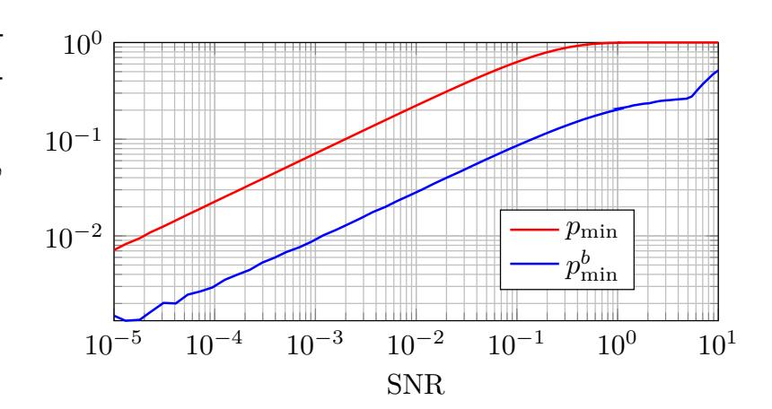
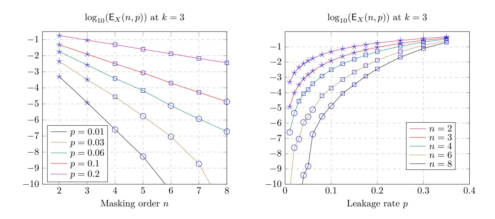
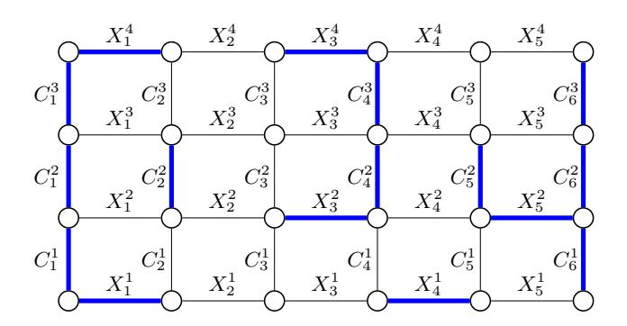
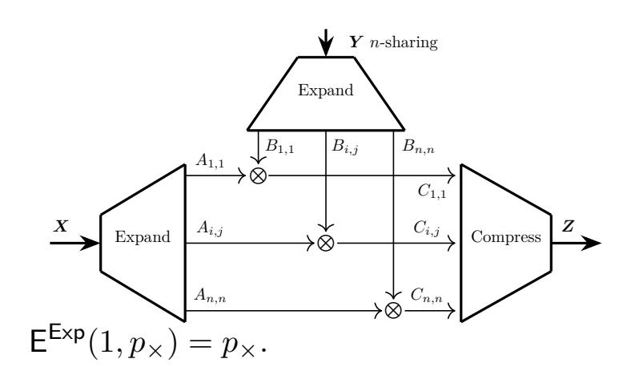

{0}------------------------------------------------

# Leakage-Diagrams, Importance Sampling, and Composition in the Random Probing Model

Vahid Jahandideh<sup>1</sup>, Bart Mennink<sup>2</sup> and Lejla Batina<sup>1</sup>

Radboud University, Nijmegen, The Netherlands
 {v.jahandideh,lejla}@cs.ru.nl
 Maastricht University, Maastricht, The Netherlands
 bart.mennink@maastrichtuniversity.nl

**Abstract.** Security evaluation of masking in low-noise regimes remains poorly understood: increasing the masking order does not automatically translate into higher concrete resistance once many correlated intermediates are processed by a full implementation. A common approach is to reduce noisy side-channel leakage to the random probing model (RPM), but existing reductions can be too loose to yield meaningful leakage rates in practice, and current RPM analyses often rely on costly simulations or numerically propagated bounds.

This work develops analytic and algorithmic tools for estimating and upper-bounding RPM security of masked gadgets and their compositions. First, for noisy Hamming-weight leakage over  $\mathbb{F}_{2^u}$  we compute concrete RPM leakage-rate parameters for a tighter  $\mathbb{F}_2$ -linear reduction based on binary inner products, providing a tangible link between SNR and probing rate. Second, for  $\mathbb{F}_q$ -linear circuits we leverage a vector-space representation to characterize RPM leakage as an erasure event, yielding a direct connection to local metrics such as advantage and implying global simulability for refreshed, block-separated executions. Third, we improve Monte Carlo estimation of rare leakage events using importance sampling, enabling evaluation in low-rate/high-order regimes that are infeasible with naive sampling. Finally, we revisit the leakage-diagram technique and derive explicit bounds for refresh gadgets, and we apply the same viewpoint to composition through *bridges*, showing that SNI—while sufficient for threshold probing model (TPM)—does not capture the RPM phenomenon governing refresh boundaries.

We implement our methods in LAPSE, a tool that compiles gadget descriptions into linear-algebraic representations and supports exact computation as well as Monte Carlo/importance-sampling estimation of RPM security parameters.

Keywords: Side-Channel · Masking · Noisy Leakage · Random Probing Model

# 1 Introduction

Side-channel protection in low-noise settings—for instance, single-purpose embedded devices where measurements can be averaged and aligned—remains challenging [BS21]. In such regimes, leakage can be clean enough that classical first- and second-order masking no longer provides a comfortable security margin, motivating higher-order masking. Masking at order t encodes each sensitive variable into t+1 shares so that an adversary must effectively combine all shares to recover the underlying value. For an isolated variable, increasing the order provably improves resistance in standard leakage models [CJRR99, DFS16, JMB25]. For full cryptographic computations, however, many intermediate values interact across time and across gadgets; consequently, the security gained by increasing the masking order depends delicately on the leakage model, the circuit structure, and how randomness is consumed and refreshed.

{1}------------------------------------------------

**Masked circuits and the role of refresh.** A cryptographic computation is typically represented as an acyclic circuit over basic operations (e.g., add and mult). A masking compiler replaces each gate with a *gadget* operating on shared encodings, and often inserts *refresh* gadgets that re-randomize a sharing using fresh randomness. Early circuit-level analyses in the noisy-leakage setting used information-theoretic decompositions under strong assumptions, including (idealized) leak-free refresh [\[PR13\]](#page-23-1). Duc et al. [\[DDF19\]](#page-22-2) identified key limitations of this view, notably that (i) resulting bounds force the noise to grow with the masking order, (ii) leak-free refresh is hard to justify in practice, and (iii) the metric is misaligned with standard cryptographic security notions. They also proposed a reduction from noisy leakage to the *random probing model* (RPM), which resolves (ii) and (iii) and enables circuit-level reasoning.

**Where the gaps are.** Despite substantial progress, obtaining meaningful (i.e., nonvacuous) and compositional bounds for *constant-noise* regimes remains difficult. Current research has advanced along three main directions:

**Tighter reductions to RPM.** In RPM, each wire leaks independently with probability *p*. This abstraction is mathematically convenient, but generic reductions can map even moderate-noise leakages to uninformative parameters (often yielding *p* ≈ 1). Several works improve the tightness of such reductions under additional structural assumptions [\[DFS15,](#page-22-3) [PGMP19,](#page-23-2)[ORR](#page-23-3)+24, [JMB25\]](#page-23-0), thereby keeping *p* in a range where RPM security claims can be meaningful.

**Gadgets secure at constant noise.** Analyses based on the ISW multiplication and its variants underpin many classic masking proofs [\[DFŻ19,](#page-22-4)[BFO23,](#page-21-1)[MS23,](#page-23-4)[BCGR24,](#page-20-0)[BDF24\]](#page-21-2), but ISW-style multiplication is known to fail at constant noise in practical settings [\[BCPZ16\]](#page-21-3). Only recently have constructions and evaluations targeted multiplication gadgets intended to remain secure in constant-noise/RPM-like regimes [\[BNR25,](#page-21-4) [JMB24,](#page-23-5)[BC25\]](#page-20-1).

**Security estimation and evaluation in RPM.** In large protected circuits, the expected number of leaked wires under RPM can easily exceed the masking order, making direct reliance on threshold-style reasoning crude unless *p* decreases with circuit size. Expansionbased compilers improve asymptotic behavior but at significant cost and with primarily asymptotic guarantees [\[BCP](#page-20-2)<sup>+</sup>20,[BRT21\]](#page-21-5). More recent approaches, including cardinal-style analyses and Monte Carlo estimators, offer progress for constant *p* [\[BRR25,](#page-21-6)[BNR25,](#page-21-4)[JMB24,](#page-23-5) [BC25\]](#page-20-1), but provable regimes can be narrow (e.g., *p* ≤ 0*.*02 or *p* ≤ 0*.*001) and bounds are often not available in a closed form that supports asymptotic understanding.

# **1.1 Our Contribution**

This paper contributes tools and bounds for compositional security in the random probing model, with an emphasis on constant-noise regimes:

- **Concrete noisy-to-RPM parameters for HW leakage (linear case).** We instantiate the tighter reduction of [\[JMB25\]](#page-23-0) for noisy Hamming-weight leakage and derive the resulting probing rate *p* as a function of SNR for F2-linear computations. This complements the general (nonlinear / arbitrary-field) treatment in [\[BCGR24\]](#page-20-0) and provides interpretable leakage-rate values (Section 3).
- **From local (advantage) to global (simulation) security in RPM without leak-free refresh.** We show how circuit-level simulatability can be reduced to pergadget security at a leakage rate *p* that does not scale with circuit size or masking order. This links simulation-based metrics used e.g. in [\[BRR25\]](#page-21-6) to more direct, per-gadget metrics (Section 4).

{2}------------------------------------------------

- Rare-event estimation via importance sampling. We adapt importance sampling to RPM leakage-pattern sampling, enabling efficient estimation when the success probability is far below the Monte Carlo resolution, e.g., in low-p and higher-order masking regimes (Section 5.2).
- Leakage-diagram bounds for refresh gadgets. Using the leakage-diagram technique of [DFŻ19], we give a complete, explicit derivation of provable bounds for a class of refresh gadgets, filling in technical steps that are only sketched at a high level in prior work (Section 5.3).
- Composition via leakage-diagrams; clarifying the role of SNI in RPM. We derive analytic bounds on the composition parameters (leakage-rate inflation at refresh boundaries) from [JMB24] using leakage-diagrams, replacing Monte Carlo-only estimation. Our analysis identifies bridges—boundary-only relations created by refresh leakage—as the key mechanism governing dependence across refreshes. This "bridge view" explains why Strong Non-Interference (SNI) [BBD+16], although central for TPM composition, does not directly yield RPM composition guarantees, refining intuition put forward in [BC25] (Section 6).
- Tool support: LAPSE. We introduce LAPSE (Linear Algebraic Probing Security Estimator), which takes a Python-like description of linear gadgets, builds a vector-space representation, and computes/estimates security parameters (exact when feasible; otherwise Monte Carlo enhanced with importance sampling).

# 2 Preliminaries

**Statistical distance.** For distributions P,Q on the same finite set,  $\mathsf{SD}(P,Q) \triangleq \frac{1}{2} \sum_{x} |P(x) - Q(x)|$ . For random variables A,B, we write  $\mathsf{SD}(A,B)$  for the distance between their induced distributions. For random variables A,B,C, we define

$$SD(A, (B \mid C)) \triangleq \mathbb{E}_{c \leftarrow C} [SD(A, (B \mid C=c))].$$

**Definition 1** (Erasure channel). The *erasure channel* with parameter  $p \in [0, 1]$  is the randomized map

$$\phi_p: \mathbb{F}_q \to \{\bot\} \cup \mathbb{F}_q, \qquad \phi_p(x) = \begin{cases} x & \text{with probability } p, \\ \bot & \text{with probability } 1-p, \end{cases}$$

where  $\perp \notin \mathbb{F}_q$  denotes an erasure.

Wire-enumeration convention (SSA). Security metrics in probing-style models depend on how the circuit's wires (intermediates) are enumerated. We use a single-static-assignment (SSA) representation: inputs appear first, and each operation produces exactly one new wire whose value is never updated. To model fan-out explicitly, we include a copy primitive; we enforce bounded fan-out (e.g., out-degree  $\leq 2$ ) by inserting copies, and obtain larger fan-out by chaining them. This yields a directed acyclic graph (DAG), matching the standard representation used for masked circuits and gadgets.

## 2.1 Masking Compiler

Let a circuit C take inputs and produce outputs over  $\mathbb{F}_q$ . We denote by  $\Sigma_{\mathsf{C}}$  the set of all wires of C (including inputs and intermediate values); we refer to these as *natives*.

{3}------------------------------------------------

**Sharing convention.** We parameterize masking by the number of shares  $n \geq 2$ . In threshold probing terminology, this corresponds to security order t = n - 1.

**Definition 2** (*n*-sharing). For  $X \in \mathbb{F}_q$ , an *n*-sharing of X is a set  $\mathbf{X} = \{X_1, \dots, X_n\} \in \mathbb{F}_q^n$  such that: (i)  $\sum_{i=1}^n X_i = X$ , and (ii) any strict subset of the shares is statistically independent of X. A standard construction samples  $X_1, \dots, X_{n-1} \stackrel{\$}{\leftarrow} \mathbb{F}_q$  and sets  $X_n = X - \sum_{i=1}^{n-1} X_i$ .

The masked circuit  $\mathbb{S}C_n$  (prefix  $\mathbb{S}$  denotes masking) is obtained by first converting each input into an n-sharing and then performing all internal computations on n-sharings.

**Gadgets and refresh.** Let G range over basic gates (e.g., +,  $\times$ ). The masked circuit  $SC_n$  is obtained by replacing each G with a gadget SG.

**Definition 3** (Gadget). A gadget SG for a gate G takes n-shared inputs and outputs n-shared values that encode G applied to the corresponding natives.

Gadgets are built from primitives such as  $\{+, \times, \mathsf{copy}, \stackrel{\$}{\leftarrow} \}$ . To limit inter-gadget leakage correlations, one often inserts a refresh gadget  $\mathbb{S}R$  that re-randomizes an n-sharing of a value X using fresh randomness, without changing X.

**Size.** Circuit size is the number of operations in the SSA/DAG representation. Typically,  $|\mathbb{S}\mathsf{G}| = \mathcal{O}(n)$  for linear operations and  $|\mathbb{S}\mathsf{G}| = \mathcal{O}(n^2)$  for masked multiplication; refresh gadgets usually fall between  $\mathcal{O}(n)$  and  $\mathcal{O}(n^2)$ . Hence, for a circuit  $\mathsf{C}$ ,

$$|\mathbb{S}\mathsf{C}_n| = \mathcal{O}(|\mathsf{C}| \, n^2).$$

# 2.2 Leakage Models and Security Metrics

The adversary knows  $\mathbb{S}C_n$  and, in each execution, obtains leakage from wires in  $\Sigma_{\mathbb{S}C_n}$ .

- Threshold probing (TPM) [ISW03]. The adversary adaptively selects up to t wires and learns their exact values (typically t = n 1).
- Random probing (RPM) [BCP<sup>+</sup>20]. Each wire  $X \in \Sigma_{\mathbb{SC}_n}$  leaks independently with probability p: equivalently, the adversary observes  $\phi_p(X)$  for every wire, with independent channel randomness. We denote the resulting leakage collection by

$$\mathcal{L} = \left(\phi_p(X)\right)_{X \in \Sigma_{\mathbb{S}C_n}}.$$

• Noisy leakage [DDF19]. For each wire  $X \in \Sigma_{\mathbb{SC}_n}$  the adversary observes  $\mathsf{L}(X) \in \mathbb{R}$  for some leakage function  $\mathsf{L} : \mathbb{F}_q \to \mathbb{R}$ . Following [DDF19],  $\mathsf{L}$  is  $\delta$ -noisy if for uniform  $X \stackrel{\$}{\leftarrow} \mathbb{F}_q$ , the leakage does not significantly change the distribution of X, formalized by

$$SD(X, X \mid L(X)) \leq \delta.$$

**Local security: advantage.** Let  $X \in \Sigma_{\mathsf{C}}$  be a uniform native (e.g., a key-dependent intermediate) and let  $\mathcal{L}$  denote the leakage observed in one execution. The (single-target) advantage is

$$\mathsf{Adv}_X(\mathcal{L}) \ \triangleq \ \max_{x \in \mathbb{F}_q} \Pr[X = x \mid \mathcal{L}] - \frac{1}{q}.$$

Equivalently, the optimal guessing success probability is  $\frac{1}{q} + Adv_X(\mathcal{L})$ .

{4}------------------------------------------------

**Global security: leakage simulation.** For proof-oriented composition results, we use simulation-based security.

**Definition 4** ( $\varepsilon$ -close leakage simulation). Let W be a subset of wire indices in  $\Sigma_{\mathbb{SC}_n}$ , and let  $\mathcal{L}_W$  denote the leakage restricted to W. We say  $\mathcal{L}_W$  is  $\varepsilon$ -simulatable if there exists a (randomized) simulator Sim such that, for all secret inputs and for the public inputs P of C,

$$\mathsf{SD}(\mathcal{L}_W,\ \mathsf{Sim}(P,W)) \leq \varepsilon.$$

The parameter  $\varepsilon$  depends on the leakage model:

- **TPM.**  $\mathbb{S}\mathsf{C}_n$  is secure if for all W with  $|W| \leq t$ , the leakage is simulatable with  $\varepsilon = 0$ .
- **RPM** / **Noisy.**  $\mathbb{S}\mathsf{C}_n$  is secure if a random leakage instance is simulatable with  $\varepsilon \leq 2^{-\kappa}$  for a security parameter  $\kappa$  [BCP<sup>+</sup>20], or if  $\varepsilon = \varepsilon(n)$  is negligible in n, i.e.,  $\forall$  polynomials poly(·),  $\exists n_0$  such that  $\forall n \geq n_0$ :  $\varepsilon(n) \leq 1/\text{poly}(n)$  [JMB24].

# <span id="page-4-1"></span>3 Reduction of Noisy Hamming Weight to Random Probing

Side-channel leakage is naturally modeled as noisy leakage, but proving security directly in this model is difficult. Due et al. [DDF19] showed that security against  $\delta$ -noisy leakage can be reduced to security in the random probing model (RPM) with a suitable probing rate p. Unfortunately, the resulting p can be overly pessimistic: a circuit may be secure under the original noisy leakage, while the reduction yields a value of p for which known RPM guarantees become vacuous. In this section we instantiate the reduction for the practically important noisy Hamming-weight leakage. The general Due et al. parameter for this leakage was computed in [BCGR24]; here we compute the tighter binary-inner-product parameter introduced by Jahandideh et al. [JMB25], which gives a more tangible sense of concrete leakage rates for  $\mathbb{F}_2$ -linear subcircuits.

**Background:** Duc et al. reduction. Let  $X \in \mathbb{F}_q$  be uniform and let  $L = \mathsf{L}(X)$  be its leakage. Duc et al. [DDF19] show that the joint distribution (X, L) can be simulated from an erasure view  $\phi_p(X)$  for any  $p \geq p_{\min}$ , where

<span id="page-4-0"></span>
$$p_{\min} = 1 - q \sum_{\beta} \min_{\alpha \in \mathbb{F}_q} \Pr(L = \beta, X = \alpha) \le q \delta.$$
 (1)

In terms of mutual information (in bits)  $l_{\text{bits}}(X;L)$ , one can bound [DFS19, BCGR24]

$$\frac{\mathsf{I}_{\mathrm{bits}}(X;L)}{\log_2 q} \ \le \ p_{\min} \ \le \ q \sqrt{\frac{\ln 2}{2} \, \mathsf{I}_{\mathrm{bits}}(X;L)}.$$

This reduction is fully general (it does not depend on the structure of  $\mathbb{F}_q$  or the circuit), but it can be loose, especially for large q.

**Tighter reduction for**  $\mathbb{F}_2$ -linear circuits. For  $q = 2^u$  and  $\mathbb{F}_2$ -linear circuits, Jahandideh et al. [JMB25] reduce leakage not to  $\phi_p(X)$ , but to erasures of binary linear forms  $\phi_p(\langle H, X \rangle)$ , where  $H \in \{0, 1\}^u \setminus \{0\}$  and

$$\langle H, X \rangle = \bigoplus_{i=1}^{u} (h_i x_i).$$

In the binary case, the optimal parameter for a fixed H satisfies

$$p_{\min,H} = 2P_{\text{succ}}^H - 1,$$

{5}------------------------------------------------

where  $P_{\text{succ}}^H$  is the optimal success probability of guessing  $\langle H, X \rangle$  from the leakage L. The bottleneck parameter is

$$p_{\min}^b \triangleq \max_{H \neq 0} p_{\min,H},$$

and the reduction guarantees that if an  $\mathbb{F}_2$ -linear circuit is RPM-secure at rate  $p_{\min}^b$ , then it is secure against the original leakage  $\mathsf{L}(X)$ . Moreover,  $p_{\min}^b \leq p_{\min}$ , with strict improvement in regimes where  $p_{\min}^b < p_{\min}$ .

# 3.1 Noisy Hamming-weight leakage

Let  $X \in \mathbb{F}_{2^u}$  be uniform and consider the noisy Hamming-weight leakage

$$L = \mathsf{L}(X) = \mathsf{HW}(X) + N, \qquad N \sim \mathcal{N}(0, \sigma^2), \qquad \mathsf{HW}(X) \in \{0, \dots, u\}.$$

For this leakage, we have signal to noise ratio as SNR =  $\frac{u}{4\sigma^2}$  [BCPZ16]. A direct computation of (1) yields  $p_{\min} = 1 - 2 \, \mathsf{Q} \left( \frac{u}{2\sigma} \right)$  [BCGR24, Prop. 2], where Q is the Gaussian tail function.

**Computing**  $p_{\min}^b$ . Fix  $H \in \{0,1\}^u \setminus \{0\}$ , let  $s = \mathsf{HW}(H)$ , and define the target bit  $B = \langle H, X \rangle \in \{0,1\}$ . Let  $A = \mathsf{HW}(X)$ . Writing

$$K_a(s) = \sum_{k=0}^{a} (-1)^k \binom{s}{k} \binom{u-s}{a-k},$$

one has the identities

$$\Pr(A = a, B = 0) = \frac{1}{2^{u+1}} \left( \binom{u}{a} + K_a(s) \right), \qquad \Pr(A = a, B = 1) = \frac{1}{2^{u+1}} \left( \binom{u}{a} - K_a(s) \right).$$

Therefore, the conditional density of L given B = b is a Gaussian mixture

$$f_b(l) = \sum_{a=0}^{u} \alpha_a^{(b)} \varphi_{\sigma}(l-a), \qquad \varphi_{\sigma}(t) = \frac{1}{\sqrt{2\pi}\sigma} e^{-t^2/(2\sigma^2)},$$

with mixture weights

$$\alpha_a^{(0)} = \Pr(A = a \mid B = 0) = \frac{\binom{u}{a} + K_a(s)}{2^u}, \qquad \alpha_a^{(1)} = \Pr(A = a \mid B = 1) = \frac{\binom{u}{a} - K_a(s)}{2^u}.$$

The Bayes-optimal decision rule is the likelihood-ratio test  $\widehat{B}(l) = \arg\max_{b \in \{0,1\}} f_b(l)$ , and the optimal success probability satisfies

$$P_{\text{succ}}(u,\sigma,s) = \frac{1}{2} + \frac{1}{4} \int_{-\infty}^{\infty} |f_0(l) - f_1(l)| \ dl = \frac{1}{2} + \frac{1}{2^{u+1}} \int_{-\infty}^{\infty} \left| \sum_{a=0}^{u} K_a(s) \varphi_{\sigma}(l-a) \right| \ dl.$$

Hence

$$p_{\min,H} = 2P_{\text{succ}}^H - 1 = \frac{1}{2^u} \int_{-\infty}^{\infty} \left| \sum_{a=0}^u K_a(s) \varphi_{\sigma}(l-a) \right| dl.$$

Moreover, for uniform X the quantity above depends on H only through  $s = \mathsf{HW}(H)$ , so  $p_{\min}^b = \max_{1 \leq s \leq u} p_{\min}(u, \sigma, s)$ . We numerically evaluate this integral for  $(u, \sigma, s)$  and report  $p_{\min}$  and  $p_{\min}^b$  for u = 8 across SNR values in Figure 1.

{6}------------------------------------------------

Interpretation of the results. State-of-the-art RPM-secure compilers and analyses typically operate in the regime of small probing rates, roughly  $p \lesssim 0.02$  [JMB24, BCP+20, BRT21]. From Figure 1, the general Duc et al. reduction for noisy Hamming-weight leakage maps this regime to SNR  $\lesssim 10^{-4}$  (for u=8), whereas the  $\mathbb{F}_2$ -linear reduction based on binary inner products permits substantially lower noise levels (higher SNR), about SNR  $\approx 5 \times 10^{-3}$ , because  $p_{\min}^b \ll p_{\min}$  in this range. At high

<span id="page-6-0"></span>

Figure 1:  $p_{\min}$  and  $p_{\min}^b$  at various SNR.

SNR, the contrast becomes stark: for instance at SNR = 1, the general reduction yields  $p_{\min} \approx 1$  (and thus becomes essentially vacuous), while the binary-inner-product reduction still gives  $p_{\min}^b \approx 0.2$ . Although  $p \approx 0.2$  is beyond what current full compilers can handle, it is already within reach for some standalone  $\mathbb{F}_2$ -linear components such as linear refresh gadgets [JMB24].

# 3.2 Why $\mathbb{F}_2$ -linear matters

 $\mathbb{F}_2$ -linear subcircuits are ubiquitous in masked implementations. All refresh gadgets considered in this work are  $\mathbb{F}_2$ -linear, and multiplication by a *public* scalar (applied sharewise) is also  $\mathbb{F}_2$ -linear. In contrast, multiplying two *n*-sharings is not  $\mathbb{F}_2$ -linear; nevertheless, for certain designs (see Section 7), its RPM security can be upper-bounded by the security of associated  $\mathbb{F}_2$ -linear subcircuits [JMB24].

**Remaining gap.** While reducing to binary inner products improves the parameter  $(p_{\min}^b \leq p_{\min})$ , the reduction can still be pessimistic at circuit level: even in the binary setting, an adversary with the original noisy leakage can be strictly weaker than an adversary given the corresponding random-probing (erasure) leakage. We illustrate this with a toy example.

**Example 1.** Let the leakage be a binary symmetric channel (BSC)  $L(X) = X \oplus e$  with  $\Pr[e=1] = P_e \leq \frac{1}{2}$ . Let X, R be uniform bits and consider  $Y = X \oplus R$ . Given noisy leakage  $\{L(X), L(R), L(Y)\}$ , the optimal adversary recovers X with probability  $P_{\text{noisy}} = 1 - P_e$ . In the corresponding RPM view, the adversary obtains  $\{\phi_p(X), \phi_p(R), \phi_p(Y)\}$  where  $p = 2(1 - P_e) - 1 = 1 - 2P_e$ . The optimal decision rule then succeeds with probability

$$P_{\text{RPM}} = \frac{1}{2}(1+p+p^2-p^3).$$

Substituting  $p = 1 - 2P_e$ , one checks that  $P_{\text{RPM}} > P_{\text{noisy}}$  for all  $P_e \in (0, \frac{1}{2})$ , exhibiting a strict gap.

# 4 From Local Security to Global Security

This section connects two common ways of quantifying masking security. The *advantage* Adv is a *local* metric: it captures an adversary's optimal guessing advantage for a single target secret (e.g., an S-box output share-combination). Following Prest et al. [PGMP19], we refer to such measures as *direct*. In contrast, simulation-based definitions are *indirect*: security holds if there exists a simulator that can reproduce the leakage distribution (up to statistical distance) without access to the secrets. Because simulation ranges over leakage from (potentially) many intermediate values, it is a *global* notion.

{7}------------------------------------------------

Why local security need not imply global security. In general, local indistinguishability does not yield global simulatability. Two typical failure modes are: (i) non-independent leakage, e.g., a leakage sample depending jointly on multiple shares, and (ii) cross-gadget accumulation, where leakage collected across many gadgets reveals enough shares to reconstruct a secret unless refresh/randomness prevents accumulation.

Assumptions (RPM with refreshed blocks). We consider a masked circuit  $\mathbb{S}\mathsf{C}_n$  composed of gadgets  $\mathbb{S}\mathsf{G}_1,\ldots,\mathbb{S}\mathsf{G}_m$ , with corresponding natives  $X_1,\ldots,X_m$  (not necessarily independent). We assume:

- 1. **Independent leakage:** each leakage sample is a randomized function of a single wire, and conditioned on that wire, it is independent of all other wires/secrets.
- 2. Block separation: refresh and randomness ensure that the leakage can be partitioned as  $\mathcal{L} = \{\mathcal{L}_1, \dots, \mathcal{L}_m\}$  where, conditioned on public inputs P and the corresponding native  $X_i$ , the blocks  $\mathcal{L}_i$  are independent of each other and of the other secrets.
- 3. **Erasure-like view:** for each block, there exists a coupling to an erasure channel view of the native, i.e., we can replace  $\mathcal{L}_i$  by  $\phi_{p_i}(X_i)$  for some parameter  $p_i$ .

**Feasibility of the assumptions.** Assumption (1) (independent leakage) is standard in masking analyses and is a good approximation for software implementations. Assumption (3) (erasure-like view) holds for linear gadgets in the RPM: a leakage instance either makes the native recoverable (i.e., in the span of leaked wires) or reveals no information about it; see Lemma 2.

The only non-linear gadget used by our compiler is the multiplication gadget in Section 7. There we upper-bound its RPM security via associated  $\mathbb{F}_2$ -linear subcircuits, following [JMB24].

Assumption (2) (block separation) is achieved via bridge reduction: dependencies introduced by refresh leakage can be removed by replacing each refresh with an ideal leak-free gadget at the cost of (i) revealing the refreshed native with small probability and (ii) inflating the effective probing rate from p to p' > p; see Theorem 1.

**Lemma 1** (Erasure blocks imply global simulatability). Let  $X_1, \ldots, X_m$  be arbitrary  $\mathbb{F}_q$ valued random variables and let  $\mathcal{L}' = (\phi_{p_1}(X_1), \ldots, \phi_{p_m}(X_m))$ . There exists a simulator
Sim (given only public inputs and wire indices) such that

$$\mathsf{SD}(\mathcal{L}',\mathsf{Sim}) \leq 1 - \prod_{i=1}^m (1-p_i) \leq \sum_{i=1}^m p_i.$$

*Proof.* Let Sim output  $(\bot, ..., \bot)$  deterministically. Then  $\mathcal{L}' \neq (\bot, ..., \bot)$  iff at least one coordinate is not erased, which happens with probability  $1 - \prod_{i=1}^{m} (1 - p_i)$ . Since  $\mathsf{SD}(P,Q) \leq \Pr[P \neq Q]$  under the natural coupling, the first bound follows, and the second is the union bound.

# <span id="page-7-0"></span>5 Random Probing Leakage in Linear Circuits

We begin with the case of *linear* circuits, which use only linear gadgets (addition, copy, scalar multiplication, and randomness generation) and no multiplication of two n-sharings. As a running example we look at  $\mathbb{SR}$ -multi [DF $\dot{\mathbf{Z}}$ 19] (Algorithm 1), which is repeating simple refresh given in [RP10] for  $k \geq 1$  consecutive times.

{8}------------------------------------------------

**Vector-space representation.** In a linear circuit, every wire is an  $\mathbb{F}_q$ -linear combination of the input shares and the fresh random variables. Fix an SSA enumeration of the wires, and let the basis consist of the n input-share symbols together with the r randomness symbols introduced by  $\stackrel{\$}{\leftarrow}$ . Each wire W admits a representation vector  $\vec{w} \in \mathbb{F}_q^{n+r}$  such that  $W = \langle \vec{w}, (X_1, \dots, X_n, R_1, \dots, R_r) \rangle$ . The set of all wire-vectors spans a subspace  $\mathcal{V}_{\mathbb{SC}_n} \subseteq \mathbb{F}_q^{n+r}$ . Our LAPSE tool constructs these vectors on the fly: each instruction produces a new vector derived from its operands; when sampling  $R \stackrel{\$}{\leftarrow} \mathbb{F}_q$ , a new basis element is added and the sampled wire is represented by that unit vector.

```
Algorithm 1 SR-multi
     Input: X = \{X_1, ..., X_n\}, k
    Output: Y = \{Y_1, ..., Y_n\}, \sum X_i = \sum Y_i
 1: for j = 1 to k do
 2:
          R_n \leftarrow 0
          for i = 1 to n - 1 do
 3:
 4:
               R_i \stackrel{\scriptscriptstyle{\bullet}}{\leftarrow} \mathbb{F}_q
 5:
               R_n \leftarrow R_n - R_i
 6:
          for i = 1 to n do
 7:
               X_i \leftarrow X_i + R_i
 8: Y \leftarrow X

 9: return Y
```

**Example 2** (Vector space and SSA wire enumeration). For (n = 2, k = 1), Algorithm 1 introduces one fresh random variable  $R_1$  and sets  $R_2 = -R_1$ . An SSA enumeration of the intermediates is

$$\Sigma_{\mathbb{SR-multi},\,n=2} = \{X_1,\ X_2,\ R_1,\ R_2,\ X_1+R_1,\ X_2+R_2,\ Y_1,\ Y_2\}.$$

Using the basis  $(X_1, X_2, R_1)$ , the corresponding vectors (in that order) are

$$(1,0,0), (0,1,0), (0,0,1), (0,0,-1), (1,0,1), (0,1,-1), (1,0,1), (0,1,-1).$$

The (unshared) native  $X = X_1 + X_2$  corresponds to the vector (1, 1, 0).

**Erasure-channel viewpoint.** For linear circuits handling a single secret X, the following property holds.

<span id="page-8-0"></span>**Lemma 2** (Lemma 1 [JMB24]). Consider a linear circuit over  $\mathbb{F}_q$  whose wires are  $\mathbb{F}_q$ -linear functions of (X, U), where U denotes the collection of fresh random variables sampled independently of X. Under the random probing model, a leakage instance  $\mathcal{L}$  satisfies exactly one of the following:

- 1. (reveal) X is uniquely determined by  $\mathcal{L}$ ; or
- 2. (erase)  $\mathcal{L}$  is statistically independent of X (equivalently,  $\Pr[\mathcal{L} \in \cdot \mid X = x]$  is the same for all  $x \in \mathbb{F}_q$ ).

Concretely, let  $S \subseteq \Sigma_{\mathbb{SC}_n}$  be the set of leaked wires. If the vector of X lies in the  $\mathbb{F}_q$ -span of the vectors corresponding to S, then X is recovered uniquely; we write is-in-span(X,S)=1. Otherwise is-in-span(X,S)=0, in which case S (and hence  $\mathcal{L}$ ) is independent of X. LAPSE checks membership in span(S) via Gaussian elimination.

Let  $\mathsf{E}_X(n,p)$  be the probability (over the random RPM leakage pattern) that X is revealed, i.e.,

$$\mathsf{E}_X(n,p) \triangleq \Pr_{S \leftarrow \mathrm{RPM}(p)} [\mathsf{is\text{-}in\text{-}span}(X,S) = 1].$$

For uniform X, an adversary that does not reveal X can do no better than uniform guessing, hence

$$\Pr[\text{success}] = \mathsf{E}_X(n,p) + (1 - \mathsf{E}_X(n,p)) \frac{1}{q}.$$

The resulting advantage over random guessing is therefore

$$\mathsf{Adv}_X(n,p) = \Pr[\mathsf{success}] - \frac{1}{q} = \frac{q-1}{q} \mathsf{E}_X(n,p).$$

In the remainder of this section we thus estimate  $\mathsf{E}_X(n,p)$ , which fully determines  $\mathsf{Adv}_X(n,p)$  for linear circuits.

{9}------------------------------------------------

<span id="page-9-0"></span>**Exact method.** Using the vector-space representation, we can compute  $\mathsf{E}_X(n,p)$  exactly as

$$\mathsf{E}_X(n,p) \ = \ \sum_{S \subseteq \Sigma_{\mathbb{S}\mathsf{C}_n}} \mathsf{is\text{-}in\text{-}span}(X,S) \cdot \Pr[S] \ = \ \mathbb{E} \big[ \mathsf{is\text{-}in\text{-}span}(X,S) \big].$$

Let  $T := |\Sigma_{\mathbb{S}\mathsf{C}_n}|$  be the number of SSA wires. Under RPM, wires leak independently with rate p, so

$$\Pr[S] = p^{|S|} (1-p)^{T-|S|}.$$

This approach enumerates all  $2^T$  leakage patterns and is feasible only for small T.

#### <span id="page-9-1"></span>5.1 Monte Carlo Estimation

When T is large, exact enumeration is infeasible. A standard alternative is Monte Carlo (MC) sampling (given in the right side). For a target (n, p), we estimate  $\mathsf{E}_X(n, p) = \Pr[X \in \mathrm{span}(S)]$ , where  $S \subseteq \Sigma_{\mathbb{SC}_n}$  is the random set of leaked wires (each wire included independently with probability p).

The estimator  $\widehat{\mathsf{E}}_X$  is unbiased, i.e.,  $\mathbb{E}[\widehat{\mathsf{E}}_X] = \mathsf{E}_X(n,p)$ . Its cost is  $\mathcal{O}(N \cdot C_{\text{span}})$ , where  $C_{\text{span}}$  is the cost of one span-membership test (via Gaussian elimination; with bitset implementations this is near-quadratic in practice), which is exponentially smaller than the  $\mathcal{O}(2^T)$  cost of exact enumeration.

$$\begin{split} b &\leftarrow 0 \\ \mathbf{for} \ i = 1 \ \mathbf{to} \ N : \\ S &\leftarrow \emptyset \\ \mathbf{for} \ \mathbf{each} \ W \in \Sigma_{\mathbb{SC}_n} : \\ S &\leftarrow S \cup \phi_p(W) \\ b &\leftarrow b + \mathrm{is\text{-}in\text{-}span}(X,S) \\ \widehat{\mathsf{E}}_X &\leftarrow \frac{b}{N} \,. \end{split}$$

Accuracy of Monte Carlo. Let  $Z_i \in \{0,1\}$  be i.i.d. with  $\Pr(Z_i = 1) = \mathsf{E}_X(n,p)$  and define  $B \coloneqq \sum_{i=1}^N Z_i$  and  $\widehat{\mathsf{E}}_X \coloneqq B/N$ . Then

$$\mathbb{E}[\widehat{\mathsf{E}}_X] = \mathsf{E}_X(n,p), \qquad \mathbb{V}\mathsf{ar}[\widehat{\mathsf{E}}_X] = \frac{\mathsf{E}_X(n,p)\big(1-\mathsf{E}_X(n,p)\big)}{N}.$$

Hoeffding's inequality [Hoe63] gives, for any  $\epsilon > 0$ ,

$$\Pr(|\widehat{\mathsf{E}}_X - \mathsf{E}_X(n,p)| \ge \epsilon) \le 2e^{-2N\epsilon^2}.$$

Thus, we can guarantee an absolute accuracy of  $\epsilon = 10^{-3}$ , using  $N \approx 2 \times 10^6$  samples, with confidence probability of around 95%.

For small probabilities  $(\mathsf{E}_X(n,p)\ll 1)$ , the relative standard error satisfies

$$\frac{\sqrt{\mathbb{V}\mathrm{ar}(\widehat{\mathsf{E}}_X)}}{\mathsf{E}_X(n,p)} \; \approx \; \frac{1}{\sqrt{\mathsf{E}_X(n,p) \, N}},$$

so achieving 10% relative error requires  $N \approx 100/\mathsf{E}_X$  (and 1% requires  $N \approx 10{,}000/\mathsf{E}_X$ ).

**Limitation: rare events.** MC can estimate an event only if it occurs in the sample. If  $\theta := \Pr(\mathbf{e}) \ll 1/N$ , then with high probability no trial exhibits  $\mathbf{e}$  and the estimator returns 0. Indeed,

Pr(no occurrences in N trials) = 
$$(1 - \theta)^N \le e^{-\theta N}$$
.

To see at least one occurrence with confidence  $1-\alpha$ , it suffices that

$$N \geq \frac{\ln(1/\alpha)}{\theta}.$$

{10}------------------------------------------------

For instance, if  $p = 10^{-3}$  and n = 3, the crude scaling  $\theta \approx p^n = 10^{-9}$  suggests that observing even a single hit with 90% confidence requires  $N \gtrsim 2.3 \times 10^9$  trials, which is beyond practical budgets. Consequently, naive MC becomes ineffective precisely in the low-p, higher-n regimes of interest.

# <span id="page-10-0"></span>5.2 Importance Sampling

Importance sampling (IS) estimates probabilities beyond the reach of naive Monte Carlo [KvD78]. To estimate the probability of a rare event **e**, we sample leakage patterns from a *tilted* distribution under which **e** is no longer rare, and reweight samples to recover the target probability.

Change of measure for RPM. Let  $T := |\Sigma_{\mathbb{S}\mathsf{C}_n}|$  and let  $S \subseteq \Sigma_{\mathbb{S}\mathsf{C}_n}$  denote the (random) set of leaked wires. Under RPM with leakage rate p, the probability of a leakage pattern S is

$$\Pr_{p}(S) = p^{|S|} (1 - p)^{T - |S|}.$$

Fix a tilted rate  $\tilde{p} \in (0,1)$  and sample S instead from  $\Pr_{\tilde{p}}$ . Since  $p, \tilde{p} \in (0,1)$ ,  $\Pr_{\tilde{p}}(S) > 0$  whenever  $\Pr_{p}(S) > 0$ , and for any function f(S),

$$\mathbb{E}_{p}[f(S)] = \sum_{S} f(S) \Pr_{p}(S) = \sum_{S} f(S) \underbrace{\frac{\Pr_{p}(S)}{\Pr_{\tilde{p}}(S)}}_{A(S)} \Pr_{\tilde{p}}(S) = \mathbb{E}_{\tilde{p}}[f(S) A(S)],$$

where the likelihood-ratio weight is

$$A(S) = \left(\frac{p}{\tilde{p}}\right)^{|S|} \left(\frac{1-p}{1-\tilde{p}}\right)^{T-|S|}.$$

Our target event is f(S) = is-in-span(X, S), hence

$$\mathsf{E}_X(n,p) = \mathbb{E}_p[f(S)] = \mathbb{E}_{\tilde{p}}[f(S) \, A(S)].$$

**IS** estimator (unbiased) The IS estimation algorithm is given on the right. Its unbiasedness follows immediately from the change-of-measure identity:

$$\mathbb{E}\Big[\widehat{\mathsf{E}}_X^{\mathrm{IS}}\Big] = \mathsf{E}_X(n,p).$$

**Variance and estimation.** Let  $I_i := \text{is-in-span}(X, S_i)$  and  $Y_i := I_i A_i$ . A consistent variance estimator is

$$\widehat{\mathbb{V}\mathrm{ar}}\Big(\widehat{\mathsf{E}}_X^\mathrm{IS}\Big) = \frac{1}{N(N-1)} \sum_{i=1}^N \Big(Y_i - \widehat{\mathsf{E}}_X^\mathrm{IS}\Big)^2.$$

$$\begin{split} b &\leftarrow 0 \\ \mathbf{for} \ i = 1 \ \mathbf{to} \ N : \\ \mathbf{for} \ \mathbf{each} \ W &\in \Sigma_{\mathbb{SC}_n} : \\ S &\leftarrow S \cup \phi_p(W) \\ A_i &\leftarrow \left(\frac{p}{\tilde{p}}\right)^{|S_i|} \left(\frac{1-p}{1-\tilde{p}}\right)^{T-|S_i|} \\ b &\leftarrow b + \mathrm{is\text{-}in\text{-}span}(X,S_i) \cdot A_i \end{split}$$
 
$$\mathbf{return} \ \widehat{\mathsf{E}}_X^{\mathrm{IS}} &\leftarrow \frac{b}{N} \end{split}$$

If  $\tilde{p}$  is chosen too far from p, the weights  $A_i$  can become very large, which increases variance. We choose  $\tilde{p}$  so that the success probability under the tilted measure,  $\Pr_{\tilde{p}}[I=1]$ , lies in a comfortable range (e.g., 5%–30%). A short pilot run can tune  $\tilde{p}$  by bisection. For simplicity, we apply a *single* tilt parameter  $\tilde{p}$  to all wires.

**Example 3.** We evaluate  $\mathsf{E}_X(n,p)$  for  $\mathsf{SR}$ -multi (Alg. 1) using LAPSE. Given a threshold on the SSA wire count T below which exact enumeration is feasible, LAPSE proceeds as

{11}------------------------------------------------

follows for each (n, p): it computes  $\mathsf{E}_X(n, p)$  exactly when possible; otherwise it runs Monte Carlo, and switches to importance sampling when Monte Carlo falls into the rare-event (no-hit) regime. Figure 2 reports the resulting estimates.

<span id="page-11-1"></span>

<span id="page-11-2"></span>Figure 2: Evaluation of  $\mathsf{E}_X(n,p)$  over a grid of (n,p) for  $\mathbb{S}\mathsf{R}$ -multi with k=3. Stars: exact enumeration (Section 5); squares: Monte Carlo (Section 5.1); circles: importance sampling (Section 5.2). Each estimate uses  $N=10^5$  trials. Importance sampling allows reliable estimates well below the naive Monte Carlo resolution 1/N (here  $\log_{10}(1/N)=-5$ ).

# <span id="page-11-0"></span>5.3 Leakage-Diagram View

Dziembowski et al. [DFŻ19] introduced the leakage-diagram technique, which turns the event is-in-span $(X, \mathcal{L}) = 1$  for SR-multi into a graph-connectivity problem. For parameters (n, k), the diagram is an  $(n+1) \times (k+1)$  grid of vertices. Each leaked wire induces a local linear constraint, which we represent by adding an edge between two neighboring vertices, see Figure 3. They show that the native  $X = \sum_{i=1}^{n} X_i$  is recoverable from  $\mathcal{L}$  if and only if the resulting diagram  $G(\mathcal{L})$  contains a path connecting the leftmost column to the rightmost column. For completeness, we restate the construction and derive an explicit upper bound on  $\mathsf{E}_X(n,p)$ .

**Leakage-diagram for** SR-multi. Write the input shares to the j-th refresh as  $\mathbf{X}^j = \{X_1^j, \dots, X_n^j\}$  for  $j \in \{1, \dots, k\}$ , where the refresh maps  $\mathbf{X}^j \mapsto \mathbf{X}^{j+1}$ . In refresh round j, sample  $R_1^j, \dots, R_{n-1}^j \stackrel{\$}{\leftarrow} \mathbb{F}_q$  and define

$$C_0^j \leftarrow 0, \qquad C_i^j \leftarrow C_{i-1}^j + R_i^j \quad (1 \le i < n),$$

$$R_n^j \leftarrow -C_{n-1}^j, \qquad C_n^j \leftarrow 0.$$

The shares update as

and

$$X_i^{j+1} \leftarrow X_i^j + R_i^j \qquad (1 \le i \le n).$$

<span id="page-11-3"></span>

Figure 3: An example of leakage-diagram with (n = 5, k = 3). An instance of leaking wires are specified in blue. Edges at leftmost and rightmost columns are also blue since they are set to 0.

Thus the relevant wire families are  $\{X_i^j\}$ ,  $\{C_i^j\}$ , and the random wires  $\{R_i^j\}$  used to build them.

{12}------------------------------------------------

<span id="page-12-2"></span>**Lemma 3** (Removing R-wires). Let  $\mathcal{L}$  be an RPM(p) leakage instance on wires  $\{X_i^j, C_i^j, R_i^j\}$  of  $\mathbb{S}R$ -multi. Define a mapping  $\tau$  from wire sets to  $\{X_i^j, C_i^j\}$ -only wires by

$$\tau(\mathcal{L}) \ = \ (\mathcal{L} \cap \{X_i^j, C_i^j\}) \ \cup \ \bigcup_{R_i^j \in \mathcal{L}} \{ \, C_{i-1}^j, \, C_i^j \, \},$$

Let  $\mathcal{L}'$  be  $RPM(p_{LD})$  leakage instance on wires  $\{X_i^j, C_i^j\}$  with  $p_{LD} = \sqrt{p}$ . Then for every fixed wire set  $W \subseteq \{X_i^j, C_i^j, R_i^j\}$ ,

$$\Pr_p[W \subseteq \mathcal{L}] = p^{|W|} \le (\sqrt{p})^{|\tau(W)|} = \Pr_{p_{\text{LD}}}[\tau(W) \subseteq \mathcal{L}'].$$

Consequently, since is-in-span $(X, \cdot)$  is monotone,

$$\Pr_{L \leftarrow \mathrm{RPM}(p)}[\mathsf{is\text{-}in\text{-}span}(X,L) = 1] \ \leq \ \Pr_{L' \leftarrow \mathrm{RPM}(p_{\mathrm{LD}})}[\mathsf{is\text{-}in\text{-}span}(X,L') = 1].$$

*Proof.* Under RPM(p), all wire-leak indicators are independent, hence  $\Pr_p[W \subseteq \mathcal{L}] = p^{|W|}$ . The set  $\tau(W)$  replaces each R-wire by two C-wires, so  $|\tau(W)| \leq |W \cap \{X_i^j, C_i^j\}| + 2|W \cap \{R_i^j\}| \leq 2|W|$ . Therefore

$$(\sqrt{p})^{|\tau(W)|} \ge (\sqrt{p})^{2|W|} = p^{|W|}.$$

The right-hand side equals  $\Pr_{p_{\text{LD}}}[\tau(W) \subseteq \mathcal{L}']$  because  $\mathcal{L}'$  is i.i.d.  $\operatorname{RPM}(p_{\text{LD}})$  on  $\{X_i^j, C_i^j\}$ .

<span id="page-12-1"></span>**Lemma 4** (Leakage-diagram characterization [DFŻ19]). Consider SR-multi with parameters (n,k), and assume leakage is restricted to wires  $\{X_i^j, C_i^j\}$ . Define a graph  $G(\mathcal{L})$  with vertex set  $\{v_{i,j}: 0 \leq i \leq n, \ 0 \leq j \leq k\}$ , see Figure 3. Add a horizontal edge  $(v_{i-1,j}, v_{i,j})$  whenever  $X_i^{j+1}$  leaks, and a vertical edge  $(v_{i,j-1}, v_{i,j})$  whenever  $C_i^j$  leaks. (Additionally, boundary vertices  $v_{0,j}$  and  $v_{n,j}$  are treated as known constants because  $C_0^j = C_n^j = 0$ .) Then

is-in-span $(X, \mathcal{L}) = 1 \iff G(\mathcal{L})$  contains a path from the left to the right column.

If no such path exists, then  $\mathcal{L}$  is statistically independent of X.

<span id="page-12-0"></span>**Lemma 5** (Path probability bound for the leakage-diagram). Consider the leakage-diagram graph for  $\mathbb{S}R$ -multi with (n,k). Assume that vertical edges in the leftmost/rightmost columns are always present, and the other edges are present independently with probability  $p_{LD}$ .

Let  $\mathsf{Conn}_{n,k}$  be the event that the diagram contains a path connecting the leftmost and the rightmost columns. Then, for  $3p_{\mathrm{LD}} < 1$ ,

$$\Pr[\mathsf{Conn}_{n,k}] \le (k+1) \sum_{\ell \ge n} (3p_{\mathrm{LD}})^{\ell-1} p_{\mathrm{LD}} = (k+1) \frac{(3p_{\mathrm{LD}})^n}{1 - 3p_{\mathrm{LD}}}.$$

*Proof.* Let s denote the leftmost column and t the rightmost column. These are always-present vertical edges. Any s-t path must advance from column 0 to column n, hence must contain at least n horizontal (rightward) edges. In particular its total length  $\ell$  satisfies  $\ell \geq n$ .

Fix an s-t walk of length  $\ell$  with no immediate backtracking. All  $\ell$  edges on this walk must be present for it to exist, which happens with probability  $p_{\text{LD}}^{\ell}$ .

We now bound the number of such s-t walks of length  $\ell$ . From s, there are at most (k+1) choices for the first step (one per row). After the first step, at each subsequent step there are at most 3 choices in the grid when immediate backtracking is forbidden. Thus the number of candidate walks of length  $\ell$  is at most  $(k+1) \cdot 3^{\ell-1}$ .

{13}------------------------------------------------

By a union bound over all  $\ell \geq n$ ,

$$\Pr[\mathsf{Conn}_{n,k}] \ \leq \ \sum_{\ell \geq n} (k+1) \cdot 3^{\ell-1} \cdot p_{\mathrm{LD}}^{\ell} \ = \ (k+1) \sum_{\ell \geq n} p_{\mathrm{LD}} (3p_{\mathrm{LD}})^{\ell-1} \ = \ (k+1) \, \frac{(3p_{\mathrm{LD}})^n}{1-3p_{\mathrm{LD}}},$$

which holds for 
$$3p_{\rm LD} < 1$$
.

Corollary 1. Under the assumptions of Lemma 5 and Lemma 4,

$$\mathsf{E}_X(n,p) \ \le \ \Pr_{p_{\mathrm{LD}}}[\mathsf{Conn}_{n,k}] \ \le \ (k+1) \, \frac{(3p_{\mathrm{LD}})^n}{1-3p_{\mathrm{LD}}} = (k+1) \, \frac{(3\sqrt{p})^n}{1-3\sqrt{p}} \qquad (p < \frac{1}{9}).$$

Hence,  $\mathsf{E}_X(n,p)$  for  $\mathbb{S}\mathsf{R}$ -multi is exponentially decreasing at any constant rate  $p \leq 0.1$ .

# <span id="page-13-0"></span>6 Composition in the Random Probing Model

In a masked circuit, many gadgets operate on correlated sharings, and their interaction can degrade the overall side-channel security of the underlying natives. Proving security therefore requires suitable *composition* properties. In the threshold probing model (TPM), strong non-interference (SNI), introduced by Barthe et al. [BBD<sup>+</sup>16], is a standard sufficient condition for secure composition.

**Definition 5** (SNI [BBD<sup>+</sup>16]). Let SG be a gadget that takes an input sharing  $X = \{X_1, \ldots, X_n\}$  and produces an output sharing  $Y = \{Y_1, \ldots, Y_n\}$ , and let  $\Sigma_{\mathbb{S}G}$  denote its internal wires. The gadget is  $t_n$ -SNI if for every choice of sets  $S_Y \subseteq \{Y_1, \ldots, Y_n\}$  and  $S_I \subseteq \Sigma_{\mathbb{S}G}$  with  $|S_Y| + |S_I| \le t_n$ , the joint leakage of  $(S_Y, S_I)$  is simulatable from the public inputs and at most  $|S_I|$  input shares.

If each gadget in a circuit is  $t_n$ -SNI, then any adversarial choice of at most  $t_n$  probes across the whole circuit can be *propagated* to the circuit inputs without exceeding the probing threshold (typically  $t_n = n - 1$ ). In the random probing model (RPM), however, leakage is a *random* set of probed wires and may contain far more than  $t_n$  wires. As a result, TPM-style probe propagation does not directly yield tight RPM composition bounds, and several alternatives have been proposed.

**Propagation approach.** Belaïd et al. [BCP+20] proposed a basic RPM composition rule: if, for each gadget SG, one can simulate (i) its RPM leakage and (ii) an additional set of  $t_{\text{out}} = t$  output probes using only  $t_{\text{in}} = t$  input shares, except with failure probability at most  $\epsilon$ , then for a circuit SC composed of such gadgets the overall failure probability is at most min{1, |C|\$\epsilon\$}. Cassiers et al. [CFOS21] refined this idea by tracking which input-share subsets are needed for simulating which output-share subsets, via a lookup table over all input/output share combinations; this becomes costly as n grows. Belaïd et al. [BRR25] instead track only the number of required input shares: for each gadget they compute an envelope  $\mathcal{E}(n, p, t_{\text{out}})$  describing the distribution of  $t_{\text{in}}$  under RPM(p). These envelopes are propagated backward from the circuit outputs toward the inputs, combining them according to the circuit topology. While powerful, the resulting envelopes (with refinements in [BNR25]) are typically obtained numerically, making closed-form and asymptotic analyses challenging.

**Localization approach.** In contrast to propagating leakage to the circuit inputs, Jahan-dideh et al. [JMB24] proposed to *localize* leakage by inserting refresh gadgets between computational gadgets. They show how RPM leakage  $\mathcal{L} = \{\mathcal{L}_1, \dots, \mathcal{L}_m\}$  sampled at rate p can be replaced by leakage  $\mathcal{L}' = \{\mathcal{L}'_1, \dots, \mathcal{L}'_m\}$  sampled at a larger rate p' > p such

{14}------------------------------------------------

that the blocks  $\mathcal{L}'_i$  are conditionally independent given their corresponding natives. In this section, we review this approach and, using the leakage-diagram technique, derive analytical bounds for the resulting composition parameters that were previously estimated only via Monte Carlo.

#### 6.1 On the role of refresh gadgets

Let X and Y denote the input and output n-sharings of a (linear) refresh gadget  $\mathbb{S}R$ . If  $\mathbb{S}R$  is leak-free, i.e.,  $\mathcal{L}_{\mathbb{S}R} = \emptyset$ , then the refresh randomness makes the output sharing fresh: conditioned on the underlying native  $X = \sum_{i=1}^{n} X_i = \sum_{i=1}^{n} Y_i$ , the input and output sharings are independent. Concretely, for any realizations x, y,

$$Pr(Y = y \mid X, X = x) = Pr(Y = y \mid X).$$

Consequently, in a circuit where gadgets are separated by leak-free refreshes, the circuit-wide leakage partitions into independent per-gadget blocks, as exploited in [PR13].

In the presence of leakage  $\mathcal{L}_{SR} \neq \emptyset$ , X and Y may become dependent. Intuitively, leaked internal wires allow the adversary to eliminate internal variables and derive additional linear relations linking boundary shares. Following [JMB24], for each leakage instance one can describe the induced linear constraints as a full-rank system

$$\begin{cases} \bm{P}_{\text{Inf}}(\bm{X},\bm{Y}) = \bm{0}, \ \bm{P}_{\text{Non-Inf}}(\bm{X},\bm{Y},\Sigma_{\mathbb{S}\mathsf{R}}) = \bm{0}, \end{cases}$$

where  $P_{\text{Non-Inf}}$  is independent of the native X and does not affect the joint distribution of (X, Y) beyond correctness, while  $P_{\text{Inf}}$  appears only due to leakage and can introduce additional constraints involving boundary shares. Whenever such a constraint involves both X and Y (and no internal intermediates), it creates a dependency between input and output sharings.

**Definition 6** (Bridge). In a refresh gadget  $\mathbb{S}R$  with boundary sharings  $\mathbf{X} = \{X_1, \dots, X_n\}$  and  $\mathbf{Y} = \{Y_1, \dots, Y_n\}$ , a *bridge* is a nontrivial  $\mathbb{F}_q$ -linear relation

$$\sum_{i=1}^{n} a_i X_i + \sum_{i=1}^{n} b_i Y_i = c$$

that involves no internal intermediates, and is essentially cross-boundary in the following sense: there is no  $\lambda \in \mathbb{F}_q$  such that, after adding  $\lambda(\sum_i X_i - \sum_i Y_i) = 0$ , the relation becomes input-only or output-only.

Without leakage, we do not expect any bridge connecting X and Y. Leakage can eliminate intermediates and thereby create bridges. Bridges are precisely what enables leakage to propagate across refresh boundaries: from the output of  $\mathbb{S}R$  to its input (and vice versa).

**Example 4** (How leakage creates a bridge). Suppose  $Y_i \leftarrow X_i + R_0$  for some internal intermediate  $R_0$ . If  $R_0 \in \mathcal{L}$ , then the relation  $Y_i - X_i = R_0$  becomes a boundary-only linear relation over  $(X_i, Y_i)$  with a *known* right-hand side—hence a bridge—occurring with probability p. If instead  $Y_i \leftarrow (X_i + R_0) + R_1$ , then the same bridge requires  $R_0, R_1 \in \mathcal{L}$  and occurs with probability  $p^2$ .

{15}------------------------------------------------

**SNI refresh and bridges.** Given the central role of SNI for TPM composition, one might expect a similar relevance in the RPM [\[BC25\]](#page-20-1). We refute this intuition with two refresh gadgets.

The SR-Random gadget (Alg. [2\)](#page-15-1) [\[BRR25\]](#page-21-6) is (*n*−1)-SNI for sufficiently large randomness parameter *λ*, yet it admits bridges with high probability. Indeed, it contains boundary assignments of the form

$$Y_i = X_i + M_i,$$

where *M<sup>i</sup>* is an internal intermediate. If *M<sup>i</sup>* leaks, then the relation *Y<sup>i</sup>* − *X<sup>i</sup>* = *M<sup>i</sup>* becomes a bridge. For a fixed *i* this occurs with probability *p*, and for some *i* ∈ {1*, . . . , n*} it occurs with probability 1−(1−*p*) *<sup>n</sup>* ≈ *np*.

```
Algorithm 2 SR-Random
   Input: X = {X1, . . . , Xn}, λ
   Output: Y = {Y1, . . . , Yn}
 1: for i = 1 to n do
 2: Mi = 0
 3: for t = 1 to λ do
 4: R
         $← Fq, i, j $← {1, 2, . . . , n}
 5: Mi ← Mi + R
 6: Mj ← Mj − R
 7: for i = 1 to n do
 8: Yi = Xi + Mi
```

9: **return** *Y*

In contrast, SR-multi with *k* = *n* is also (*n*−1)-SNI [\[CGPZ16\]](#page-22-6), but we will prove that its bridge probability is negligible in *n* for the leakage rates of interest.

# **6.2 Composition Rule in RPM**

A refresh boundary breaks the dependence between adjacent gadgets only if leakage from the refresh does not create *bridges*. When bridges do occur, a convenient reduction is to *expose* the boundary shares that participate in bridges. This removes bridges at the cost of giving additional information to the adversary.

**Bridge-share rate.** Let L<sup>S</sup><sup>R</sup> be the RPM(*p*) leakage from SR. Define BridgeShares(L<sup>S</sup>R) ⊆ *X* ∪ *Y* as the set of boundary shares that appear in at least one essential bridge implied by L<sup>S</sup>R. If SR is *symmetric*, each boundary share has the same inclusion probability; we define

$$\beta(n,p) \triangleq \Pr[U \in \mathsf{BridgeShares}(\mathcal{L}_{\mathbb{S}\mathsf{R}})],$$

for any fixed boundary share *U* ∈ *X* ∪ *Y* .

<span id="page-15-0"></span>**Theorem 1** (Bridge reduction [\[JMB24\]](#page-23-5))**.** *Consider a linear refresh gadget* SR *carrying the native X with boundary sharings X and Y , under RPM(p). There is a reduction to an ideal leak-free refresh such that the original leakage is dominated (for monotone distinguishers) by the following leakage:*

- *1. an* erasure view *of the native, i.e. ϕ*E*X*(*n,p*)(*X*)*, where* E*X*(*n, p*) *is as in Section [5;](#page-7-0)*
- *2. independent leakage of each boundary share in X* ∪ *Y with inflated rate*

$$p' = 1 - (1 - p)(1 - \beta(n, p)) = p + \beta(n, p) - p\beta(n, p).$$

We estimate *β*(*n, p*) by sampling leakage instances and identifying which boundary shares are implicated by *essential* bridges. Our LAPSE tool combines Monte Carlo with importance sampling for this task.

For the SR-multi gadget we additionally derive an analytic upper bound on *β*(*n, p*). In particular, for the setting *k* = *n* the bound is negligible as a function of *n* for *p* ≤ 1*/*9.

{16}------------------------------------------------

**Rule-of-thumb formulas.** For k = 1, the dominant bridge pattern is  $Y_i = X_i + R_i$ , hence a boundary share participates only when  $R_i$  leaks while the two boundary shares themselves do not; this gives

$$\beta(n,p) = p(1-p)^2 \le p.$$

For k = 2, the dominant pattern is  $Y_i = X_i + R_i + R'_i$ , suggesting the rough scaling  $\beta(n, p) \approx p^2$ . For larger k there are more bridge patterns, but empirically small k (often k = 2) already suffices in practical designs.

#### $X_1^4$ $X_2^4$ $X_3^4$ $X_4^4$ $C_1^3$ $C_2^3$ $C_3^3$ $C_4^3$ $C_5^3$ $X_1^3$ $X_2^3$ $X_3^3$ $X_4^3$ $X_5^3$ $C_3$ $C_4$ $C_{i}$ $X_4^2$ $X_2^2$ $X_3^2$ $X_1^2$ $X_5^2$ $C_1^1$ $C_3$ $C_4$ $C_5^1$ $X_2^1$ $X_3^1$ $X_4^1$ $X_1^1$ $X_5^1$

Figure 4: An example of leakage-diagram with (n = 5, k = 3), with leaking and known wires specified in blue. There is a path connecting bottom and top rows, making a bridge. The parity equation of this bridge is  $(X_2^1) \oplus (X_1^4 \oplus X_2^4) = c$ , where c is known by the given leakage

# 6.3 Leakage-Diagram view

<span id="page-16-0"></span>**Lemma 6** (Essential bridges ⇔ top–bot-

tom interior connectivity). Consider SR-multi with parameters (n,k) and its leakage-diagram. Let  $v_{i,j}$  denote the vertex in column  $i \in \{0,\ldots,n\}$  and row  $j \in \{0,\ldots,k\}$ , and define the potential at this vertex as

$$V_{i,j} \triangleq \sum_{t=1}^{i} X_t^{j+1}.$$

(So  $V_{0,j} = 0$  and  $V_{n,j} = X$  for all j.)

Let  $G(\mathcal{L})$  be the subgraph containing exactly the interior edges whose corresponding wires leak (X-horizontal or C-vertical edges), together with the always-present boundary-column edges in columns 0 and n.

Then a leakage instance  $\mathcal{L}$  induces an essential bridge between the bottom sharing  $\mathbf{X}^1$  and the top sharing  $\mathbf{X}^{k+1}$  iff there exist interior columns  $a, b \in \{1, \ldots, n-1\}$  such that

 $v_{a,0}$  is connected to  $v_{b,k}$  by a path in  $G(\mathcal{L})$  that never visits columns 0 or n.

*Proof.* Each leaked edge e = (u, v) reveals a linear equation of the form  $V(v) - V(u) = c_e$  for a known constant  $c_e$  (coming from the leaked X- or C-wire label). Therefore, within any connected component of  $G(\mathcal{L})$ , all pairwise differences V(v) - V(u) are determined (as the signed sum of edge labels along any path), whereas for vertices in different components no such difference is determined.

If there is an interior path from some  $v_{a,0}$  to some  $v_{b,k}$ , then  $\mathcal{L}$  determines  $V_{b,k} - V_{a,0}$ , i.e.,

$$\sum_{t \le b} X_t^{k+1} - \sum_{t \le a} X_t^1 = c,$$

which is a boundary-only cross-round relation, hence a bridge; since  $a, b \in \{1, ..., n-1\}$  and the path avoids columns 0, n, this relation cannot be reduced to input-only or output-only by adding a multiple of correctness, hence it is essential.

Conversely, any essential bridge yields a boundary-only relation that (after fixing a representative modulo correctness) has the form  $V_{b,k} - V_{a,0} = c$  with  $a, b \in \{1, \ldots, n-1\}$ . Thus  $v_{a,0}$  and  $v_{b,k}$  must lie in the same connected component of  $G(\mathcal{L})$ , so there is a connecting interior path.

**Lemma 7** (Vertical interior connectivity bound). In the leakage-diagram of SR-multi with parameters (n, k), assume all interior edges are present independently with probability  $p_{\text{LD}}$ 

{17}------------------------------------------------

(boundary-column edges are irrelevant here). Let  $VConn_{n,k}$  be the event that there exist  $a, b \in \{1, \ldots, n-1\}$  such that  $v_{a,0}$  is connected to  $v_{b,k}$  by a path that stays in interior columns  $\{1, \ldots, n-1\}$ . Then, for  $3p_{LD} < 1$ ,

$$\Pr[\mathsf{VConn}_{n,k}] \ \leq \ (n-1) \, \frac{(3p_{\mathrm{LD}})^k}{1 - 3p_{\mathrm{LD}}} = (n-1) \, \frac{(3\sqrt{p})^k}{1 - 3\sqrt{p}}.$$

*Proof.* Same union-bound over self-avoiding walks as Lemma 5.

Corollary 2. Under the coupling of Lemma 3 (with  $p_{LD} = \sqrt{p}$ ), bridges imply  $VConn_{n,k}$  (Lemma 6), hence  $\beta(n,p) \leq \Pr[VConn_{n,k}]$ .

# <span id="page-17-0"></span>7 Random-Probing-Secure Multiplication Gadget

An RPM-secure multiplication gadget is essential for masking general circuits. Recent works study multiplication security in the RPM using both the cardinal approach [BNR25] and Monte Carlo estimation [JMB24, BC25]. In this section we (i) recall why the classical ISW multiplication [ISW03] is insecure in the RPM, and (ii) outline the main idea behind recent patches. We also provide an informal analytic bound using the tools developed earlier (leakage diagrams and bridge-style reasoning), while postponing a full formal treatment to future work. This discussion also clarifies why, for the purpose of bounding RPM leakage, the multiplication gadget can be upper-bounded via associated  $\mathbb{F}_2$ -linear subcircuits, as already hinted in Section 3.

**Overview of ISW multiplication.** A multiplication gadget takes two n-sharings  $X = \{X_1, \ldots, X_n\}$  and  $Y = \{Y_1, \ldots, Y_n\}$  and outputs an n-sharing  $Z = \{Z_1, \ldots, Z_n\}$  of Z = XY. The classical ISW construction [ISW03] first forms all cross-products  $X_iY_j$  and then combines them (with fresh randomness) into n output shares. While ISW achieves threshold probing security, it is not secure in the random probing model [BCPZ16,BCGR24].

**Root cause in the RPM.** The issue is *share reuse*: each input share  $X_i$  participates in n cross-products  $X_iY_1, \ldots, X_iY_n$ . In an SSA/wire model this typically induces n (correlated) opportunities for  $X_i$  to be revealed through wires that depend on  $X_i$ . A simple (and intentionally pessimistic) heuristic is to treat these as n independent chances, yielding

$$\Pr[X_i \text{ effectively leaks}] \approx 1 - (1-p)^n.$$

If this happens for all  $i \in \{1, ..., n\}$ , then the native  $X = \sum_i X_i$  is recovered, with probability on the order of

$$\Pr[\text{all } X_i \text{ leak}] \approx (1 - (1 - p)^n)^n.$$

For any fixed p > 0, this expression tends to 1 as  $n \to \infty$ , reflecting that increasing the masking order does *not* repair the leakage amplification caused by reuse:

$$\forall p > 0 : \lim_{n \to \infty} (1 - (1 - p)^n)^n = 1.$$

A more accurate analysis of the vulnerable "multiplication phase" can be carried out via rook-domination polynomials [BCGR24]. For practical demonstrations of this weakness in concrete leakage settings, see [BCPZ16].

{18}------------------------------------------------

# **7.1 RPM-Secure Multiplication**

Battistello et al. [\[BCPZ16\]](#page-21-3) proposed an RPM-oriented multiplication gadget (with subsequent refinements in [\[JMB24,](#page-23-5)[BNR25,](#page-21-4)[BC25\]](#page-20-1)) that mitigates the share-reuse amplification underlying the RPM insecurity of ISW. The gadget (Fig. [5\)](#page-19-0) proceeds in three stages: (i) Expand each input sharing into *n* 2 refreshed multiplicands, (ii) multiply them entrywise, and (iii) Compress the *n* <sup>2</sup> products back to an *n*-sharing using the usual ISW-style compression.

**Expand-by-refresh idea.** Let *X* = {*X*1*, . . . , Xn*} and *Y* = {*Y*1*, . . . , Yn*} be *n*-sharings of *X* and *Y* . The starting point is the identity

$$\sum \left[ \{X_1, \dots, X_n\} \times \{Y_1, \dots, Y_n\} \right] =$$

$$\sum \left[ \mathbb{SR}(\boldsymbol{X}_L) \times \mathbb{SR}(\boldsymbol{Y}_L) \right] + \sum \left[ \mathbb{SR}(\boldsymbol{X}_L) \times \mathbb{SR}(\boldsymbol{Y}_R) \right] +$$

$$\sum \left[ \mathbb{SR}(\boldsymbol{X}_R) \times \mathbb{SR}(\boldsymbol{Y}_L) \right] + \sum \left[ \mathbb{SR}(\boldsymbol{X}_R) \times \mathbb{SR}(\boldsymbol{Y}_R) \right],$$

Where *X<sup>L</sup>* and *X<sup>R</sup>* (resp. *Y <sup>L</sup>* and *Y <sup>R</sup>*) are partitioning of *X* (resp. *Y* ) into left and right halves. The same divide and refresh logic applies to multiplication of half-sized subset of shares. The actual multiplication are only carried out when no further division is possible. Algorithm [3](#page-18-0) shows how recursively the *X* side operands are derived and saved in *n* × *n* matrix *A*. For the *Y* side *n* × *n* matrix *B* is derived, with some ordering change as:

$$\boldsymbol{B} = \begin{bmatrix} \mathsf{Expand} \left( \mathbb{SR}(\boldsymbol{Y}_L) \right) & \mathsf{Expand} \left( \mathbb{SR}(\boldsymbol{Y}_R) \right) \\ \mathsf{Expand} \left( \mathbb{SR}(\boldsymbol{Y}_L) \right) & \mathsf{Expand} \left( \mathbb{SR}(\boldsymbol{Y}_R) \right) \end{bmatrix}.$$

After expanding *X* and *Y* in *A* and *B* matrices, we then compute the entrywise product

$$C = A \odot B, \qquad C_{i,j} = A_{i,j}B_{i,j}.$$

Finally, Algorithm [4](#page-18-1) applies the standard ISW compression to map the *n* <sup>2</sup> products in *C* to an output *n*-sharing *Z* of *Z* = *XY* (Fig. [5\)](#page-19-0).

#### <span id="page-18-0"></span>**Algorithm 3** Expand

```
Initial Input: An n-sharing X
  Final Output: An n × n Expansion
1: n = Length(X)
2: if n = 1 then
3: return -
              X1

4: m = ⌊n/2⌋
5: XL = {X1, . . . , Xm}
6: XR = {Xm+1, . . . , Xn}
7: A =
       h
        Expand(SR(XL)) Expand(SR(XL))
        Expand(SR(XR)) Expand(SR(XR))i
8: return A
```

#### <span id="page-18-1"></span>**Algorithm 4** Compress

```
Input: The n
                2 multiplications in Ci,j
   Output: An n-sharing Z for Z
1: for i = 1 to n do
2: for j = i + 1 to n do
3: R
           $← Fq
4: Ci,j = Ci,j + R
5: Cj,i = Cj,i − R
6: for i = 1 to n do
7: Zi = Ci,i
8: for j = 1 to n , j ̸= i do
9: Zi = Zi + Ci,j
10: return Z = {Z1, . . . , Zn}
```

**(Informal) RPM security bound.** The gadget consists of linear stages (Expand on *X,Y* and linear Compress) separated by *n* <sup>2</sup> nonlinear products *Ci,j* = *Ai,jBi,j* . We upper-bound RPM(*p*) leakage by a local augmentation at each multiplication: if any of (*Ai,j , Bi,j , Ci,j* ) leaks, we additionally reveal the other two. This exposes the nonlinear layer as a leakage interface and inflates the effective rate to

$$p_{\times} = 1 - (1 - p)^3 \le 3p.$$

Conditioned on this augmentation, it suffices to bound the linear parts under RPM(*p*×), using Theorem [1](#page-15-0) for the internal refreshes.

{19}------------------------------------------------

**Expand bound (informal).** Assume  $n = 2^{\ell}$  and (for this estimate) that refresh bridges are negligible, so refreshes are treated as ideal. Let  $\mathsf{E}^{\mathsf{Exp}}(n,p_{\times})$  be the probability that leakage within Expand reveals  $X = \sum_{i=1}^{n} X_i$ . The recursion expands each half twice with fresh randomness, hence

$$\begin{split} \mathsf{E}^{\mathsf{Exp}}(n,p_{\times}) &= \Big(1 - (1 - \mathsf{E}^{\mathsf{Exp}}(n/2,p_{\times}))^2\Big)^2, \\ \mathrm{Using} \ 1 - (1 - u)^2 &\leq 2u \ \mathrm{yields} \ \mathsf{E}^{\mathsf{Exp}}(n,p_{\times}) \leq \\ (2\mathsf{E}^{\mathsf{Exp}}(n/2,p_{\times}))^2, \ \mathrm{and \ thus} \end{split}$$

$$\mathsf{E}^{\mathsf{Exp}}(n, p_{\times}) \le \frac{1}{4} (4p_{\times})^n,$$

which decays in n for  $p_{\times} < \frac{1}{4}$ .

<span id="page-19-0"></span>

Figure 5: The multiplication gadget.

**Compress bound (informal).** Fix i. The circuit computes  $Z_i$  as a length-n sum and (implicitly) forms intermediate partial sums. A sufficient way to learn  $Z_i$  is: either  $Z_i$  leaks directly, or there exists a checkpoint partial sum  $S_{i,t}$  that leaks together with all remaining (n-1-t) addends needed to complete the sum. For each t, this event requires at least 1+(n-1-t) leaked wires, hence has probability at most  $p_{\times}^{n-t}$ . By a union bound over the n possible checkpoints,

$$\Pr[Z_i \text{ known}] \leq \sum_{u=1}^n p_{\times}^u = \frac{p_{\times}(1-p_{\times}^n)}{1-p_{\times}} \leq 2p_{\times} \qquad (p_{\times} \leq \frac{1}{2}).$$

Heuristically, since the randomness injected into different rows and  $C_{i,j}$  terms are largely disjoint, the events " $Z_i$  is reconstructible" behave close to independent in practice. So, recovering the native  $Z = \sum_i Z_i$  requires fixing essentially all n output shares, suggesting  $\mathsf{E}_Z^{\mathsf{Comp}}(n,p_\times) \lesssim (2p_\times)^n$ ; we use LAPSE for concrete estimates.

**Combined bound (informal).** By a union bound over the three natives,

$$\Pr[\text{recover } X \text{ or } Y \text{ or } Z] \lesssim 2 \,\mathsf{E}^{\mathsf{Exp}}(n, p_{\times}) + \mathsf{E}_{Z}^{\mathsf{Comp}}(n, p_{\times}) \leq \frac{1}{2} (4p_{\times})^{n} + (2p_{\times})^{n} \leq \frac{3}{2} (12p)^{n},$$
 which is negligible for  $p < \frac{1}{12}$ .

# 8 Conclusion

We studied the random probing model (RPM) as a concrete and composable abstraction for side-channel leakage, with an emphasis on analytic security estimates beyond simulation-heavy regimes. We (i) made noisy Hamming-weight  $\rightarrow$  RPM parameters explicit over  $\mathbb{F}_{2^u}$  and showed that an  $\mathbb{F}_2$ -linear inner-product reduction yields substantially tighter effective probing rates; (ii) characterized RPM leakage in  $\mathbb{F}_q$ -linear circuits as an erasure event via a vector-space representation, relating  $\mathbb{E}_X(n,p)$  to advantage and implying global simulatability under refreshed, block-separated executions; (iii) adapted importance sampling to estimate rare RPM recovery events in low-p/high-n regimes; and (iv) revisited leakage diagrams to derive explicit connectivity bounds for refresh gadgets and to analyze composition via bridges, clarifying why TPM notions such as SNI do not capture the key RPM boundary phenomenon. We implemented these techniques in LAPSE, supporting exact, Monte Carlo, and importance-sampling evaluation of RPM parameters. Open problems include sharper analytic treatments of non-linear gadgets and understanding when (if ever) the field size q inherently affects RPM security at the level of complete circuits.

{20}------------------------------------------------

#### 8.1 Future research directions

Impact of the field size q on  $E_X(n, p)$ . Recent works advocate masking over prime fields, motivated in part by improved concrete security for a *single* encoding as the prime q grows [CMM<sup>+</sup>23,GMM<sup>+</sup>24,FMM<sup>+</sup>24,BGM<sup>+</sup>25]. This aligns with analyses in noisy leakage models suggesting that prime fields can amplify noise more effectively than extension fields  $q = 2^u$  [DFS16]. In contrast, the dependence on q that appears in noisy-to-RPM reductions (already questioned in early work [DFS19]) has been attributed to looseness of the reduction rather than an intrinsic effect of the RPM itself [BCG<sup>+</sup>23, BDF24].

Once working directly in the RPM, however, the relevance of q is less clear. In particular, the linear refresh/sum gadgets studied here admit the same vector-space (and leakage-diagram) structure over any field  $\mathbb{F}_q$ . Accordingly, in our LAPSE experiments on several linear refresh gadgets—including  $\mathbb{S}R$ -multi—we did not observe a meaningful dependence of  $\mathsf{E}_X(n,p)$  or  $\beta(n,p)$  on q, and the analytic leakage-diagram bounds derived in this work are also q-independent.

Understanding whether (and when) q has an inherent effect on RPM security for circuits—beyond reduction-induced changes in the effective probing rate—remains open. Clarifying this would be valuable for assessing circuit-level benefits of prime-field masking beyond isolated encodings.

# References

- <span id="page-20-3"></span>[BBD<sup>+</sup>16] Gilles Barthe, Sonia Belaïd, François Dupressoir, Pierre-Alain Fouque, Benjamin Grégoire, Pierre-Yves Strub, and Rébecca Zucchini. Strong Non-Interference and Type-Directed Higher-Order Masking. In *Proceedings of the 2016 ACM SIGSAC Conference on Computer and Communications Security*, pages 116–129, 2016.
- <span id="page-20-1"></span>[BC25] Sonia Belaïd and Gaëtan Cassiers. PERSEUS - probabilistic evaluation of random probing security using efficient sampling. *IACR Cryptol. ePrint Arch.*, page 1884, 2025.
- <span id="page-20-4"></span>[BCG<sup>+</sup>23] Julien Béguinot, Wei Cheng, Sylvain Guilley, Yi Liu, Loïc Masure, Olivier Rioul, and François-Xavier Standaert. Removing the Field Size Loss from Duc et al.'s Conjectured Bound for Masked Encodings. In Elif Bilge Kavun and Michael Pehl, editors, Constructive Side-Channel Analysis and Secure Design - 14th International Workshop, COSADE 2023, Munich, Germany, April 3-4, 2023, Proceedings, volume 13979 of Lecture Notes in Computer Science, pages 86–104. Springer, 2023.
- <span id="page-20-0"></span>[BCGR24] Julien Béguinot, Wei Cheng, Sylvain Guilley, and Olivier Rioul. Formal Security Proofs via Doeblin Coefficients: - Optimal Side-Channel Factorization from Noisy Leakage to Random Probing. In Leonid Reyzin and Douglas Stebila, editors, Advances in Cryptology - CRYPTO 2024 - 44th Annual International Cryptology Conference, Santa Barbara, CA, USA, August 18-22, 2024, Proceedings, Part VI, volume 14925 of Lecture Notes in Computer Science, pages 389–426. Springer, 2024.
- <span id="page-20-2"></span>[BCP<sup>+</sup>20] Sonia Belaïd, Jean-Sébastien Coron, Emmanuel Prouff, Matthieu Rivain, and Abdul Rahman Taleb. Random Probing Security: Verification, Composition, Expansion and New Constructions. In Daniele Micciancio and Thomas Ristenpart, editors, Advances in Cryptology – CRYPTO 2020, pages 339–368, Cham, 2020. Springer International Publishing.

{21}------------------------------------------------

- <span id="page-21-3"></span>[BCPZ16] Alberto Battistello, Jean-Sébastien Coron, Emmanuel Prouff, and Rina Zeitoun. Horizontal Side-Channel Attacks and Countermeasures on the ISW Masking Scheme. In Benedikt Gierlichs and Axel Y. Poschmann, editors, *Cryptographic Hardware and Embedded Systems – CHES 2016*, pages 23–39, Berlin, Heidelberg, 2016. Springer Berlin Heidelberg.
- <span id="page-21-2"></span>[BDF24] Gianluca Brian, Stefan Dziembowski, and Sebastian Faust. From Random Probing to Noisy Leakages Without Field-Size Dependence. In Marc Joye and Gregor Leander, editors, *Advances in Cryptology - EUROCRYPT 2024 - 43rd Annual International Conference on the Theory and Applications of Cryptographic Techniques, Zurich, Switzerland, May 26-30, 2024, Proceedings, Part IV*, volume 14654 of *Lecture Notes in Computer Science*, pages 345–374. Springer, 2024.
- <span id="page-21-1"></span>[BFO23] Francesco Berti, Sebastian Faust, and Maximilian Orlt. Provable Secure Parallel Gadgets. *IACR Trans. Cryptogr. Hardw. Embed. Syst.*, 2023(4):420– 459, 2023.
- <span id="page-21-8"></span>[BGM<sup>+</sup>25] Brieuc Balon, Lorenzo Grassi, Pierrick Méaux, Thorben Moos, François-Xavier Standaert, and Matthias Johann Steiner. mid-psquare: Leveraging the strong side-channel security of prime-field masking in software. *IACR Trans. Cryptogr. Hardw. Embed. Syst.*, 2025(4):486–519, 2025.
- <span id="page-21-4"></span>[BNR25] Sonia Belaïd, Victor Normand, and Matthieu Rivain. Masked Circuit Compiler in the Cardinal Random Probing Composability Framework. In Goichiro Hanaoka and Bo-Yin Yang, editors, *Advances in Cryptology - ASIACRYPT 2025 - 31st International Conference on the Theory and Application of Cryptology and Information Security, Melbourne, VIC, Australia, December 8-12, 2025, Proceedings, Part II*, volume 16246 of *Lecture Notes in Computer Science*, pages 375–406. Springer, 2025.
- <span id="page-21-6"></span>[BRR25] Sonia Belaïd, Matthieu Rivain, and Mélissa Rossi. New Techniques for Random Probing Security and Application to Raccoon Signature Scheme. In Serge Fehr and Pierre-Alain Fouque, editors, *Advances in Cryptology - EUROCRYPT 2025 - 44th Annual International Conference on the Theory and Applications of Cryptographic Techniques Madrid, Spain, May 4-8, 2025, Proceedings, Part VIII*, volume 15608 of *Lecture Notes in Computer Science*, pages 94–123. Springer, 2025.
- <span id="page-21-5"></span>[BRT21] Sonia Belaïd, Matthieu Rivain, and Abdul Rahman Taleb. On the Power of Expansion: More Efficient Constructions in the Random Probing Model. In Anne Canteaut and François-Xavier Standaert, editors, *Advances in Cryptology - EUROCRYPT 2021 - 40th Annual International Conference on the Theory and Applications of Cryptographic Techniques, Zagreb, Croatia, October 17- 21, 2021, Proceedings, Part II*, volume 12697 of *Lecture Notes in Computer Science*, pages 313–343. Springer, 2021.
- <span id="page-21-0"></span>[BS21] Olivier Bronchain and François-Xavier Standaert. Breaking Masked Implementations with Many Shares on 32-bit Software Platforms or When the Security Order Does Not Matter. *IACR Trans. Cryptogr. Hardw. Embed. Syst.*, 2021(3):202–234, 2021.
- <span id="page-21-7"></span>[CFOS21] Gaëtan Cassiers, Sebastian Faust, Maximilian Orlt, and François-Xavier Standaert. Towards Tight Random Probing Security. In Tal Malkin and Chris Peikert, editors, *Advances in Cryptology - CRYPTO 2021 - 41st Annual*

{22}------------------------------------------------

- *International Cryptology Conference, CRYPTO 2021, Virtual Event, August 16-20, 2021, Proceedings, Part III*, volume 12827 of *Lecture Notes in Computer Science*, pages 185–214. Springer, 2021.
- <span id="page-22-6"></span>[CGPZ16] Jean-Sébastien Coron, Aurélien Greuet, Emmanuel Prouff, and Rina Zeitoun. Faster evaluation of sboxes via common shares. In Benedikt Gierlichs and Axel Y. Poschmann, editors, *Cryptographic Hardware and Embedded Systems - CHES 2016 - 18th International Conference, Santa Barbara, CA, USA, August 17-19, 2016, Proceedings*, volume 9813 of *Lecture Notes in Computer Science*, pages 498–514. Springer, 2016.
- <span id="page-22-0"></span>[CJRR99] Suresh Chari, Charanjit S. Jutla, Josyula R. Rao, and Pankaj Rohatgi. Towards Sound Approaches to Counteract Power-Analysis Attacks. In Michael Wiener, editor, *Advances in Cryptology — CRYPTO' 99*, pages 398–412, Berlin, Heidelberg, 1999. Springer Berlin Heidelberg.
- <span id="page-22-7"></span>[CMM<sup>+</sup>23] Gaëtan Cassiers, Loïc Masure, Charles Momin, Thorben Moos, and François-Xavier Standaert. Prime-Field Masking in Hardware and its Soundness against Low-Noise SCA Attacks. *IACR Transactions on Cryptographic Hardware and Embedded Systems*, 2023(2):482–518, Mar. 2023.
- <span id="page-22-2"></span>[DDF19] Alexandre Duc, Stefan Dziembowski, and Sebastian Faust. Unifying Leakage Models: From Probing Attacks to Noisy Leakage. *J. Cryptol.*, 32(1):151–177, 2019.
- <span id="page-22-3"></span>[DFS15] Stefan Dziembowski, Sebastian Faust, and Maciej Skorski. Noisy leakage revisited. In Elisabeth Oswald and Marc Fischlin, editors, *Advances in Cryptology - EUROCRYPT 2015*, pages 159–188, Berlin, Heidelberg, 2015. Springer Berlin Heidelberg.
- <span id="page-22-1"></span>[DFS16] Stefan Dziembowski, Sebastian Faust, and Maciej Skórski. Optimal Amplification of Noisy Leakages. In Eyal Kushilevitz and Tal Malkin, editors, *Theory of Cryptography - 13th International Conference, TCC 2016-A, Tel Aviv, Israel, January 10-13, 2016, Proceedings, Part II*, volume 9563 of *Lecture Notes in Computer Science*, pages 291–318. Springer, 2016.
- <span id="page-22-5"></span>[DFS19] Alexandre Duc, Sebastian Faust, and François-Xavier Standaert. Making Masking Security Proofs Concrete (Or How to Evaluate the Security of Any Leaking Device), Extended Version. *J. Cryptol.*, 32(4):1263–1297, 2019.
- <span id="page-22-4"></span>[DFŻ19] Stefan Dziembowski, Sebastian Faust, and Karol Żebrowski. Simple refreshing in the noisy leakage model. In Steven D. Galbraith and Shiho Moriai, editors, *Advances in Cryptology – ASIACRYPT 2019*, pages 315–344, Cham, 2019. Springer International Publishing.
- <span id="page-22-9"></span>[FMM<sup>+</sup>24] Sebastian Faust, Loïc Masure, Elena Micheli, Maximilian Orlt, and François-Xavier Standaert. Connecting Leakage-Resilient Secret Sharing to Practice: Scaling Trends and Physical Dependencies of Prime Field Masking. In Marc Joye and Gregor Leander, editors, *Advances in Cryptology - EUROCRYPT 2024 - 43rd Annual International Conference on the Theory and Applications of Cryptographic Techniques, Zurich, Switzerland, May 26-30, 2024, Proceedings, Part IV*, volume 14654 of *Lecture Notes in Computer Science*, pages 316–344. Springer, 2024.
- <span id="page-22-8"></span>[GMM<sup>+</sup>24] Lorenzo Grassi, Loïc Masure, Pierrick Méaux, Thorben Moos, and François-Xavier Standaert. Generalized Feistel Ciphers for Efficient Prime Field Masking.

{23}------------------------------------------------

- In Marc Joye and Gregor Leander, editors, *Advances in Cryptology EU-ROCRYPT 2024 - 43rd Annual International Conference on the Theory and Applications of Cryptographic Techniques, Zurich, Switzerland, May 26-30, 2024, Proceedings, Part III*, volume 14653 of *Lecture Notes in Computer Science*, pages 188–220. Springer, 2024.
- <span id="page-23-7"></span>[Hoe63] Wassily Hoeffding. Probability inequalities for sums of bounded random variables. *Journal of the American Statistical Association*, 58(301):13–30, 1963.
- <span id="page-23-6"></span>[ISW03] Yuval Ishai, Amit Sahai, and David Wagner. Private circuits: Securing hardware against probing attacks. In Dan Boneh, editor, *Advances in Cryptology - CRYPTO 2003*, pages 463–481, Berlin, Heidelberg, 2003. Springer Berlin Heidelberg.
- <span id="page-23-5"></span>[JMB24] Vahid Jahandideh, Bart Mennink, and Lejla Batina. An Algebraic Approach for Evaluating Random Probing Security With Application to AES. *IACR Trans. Cryptogr. Hardw. Embed. Syst.*, 2024(4):657–689, 2024.
- <span id="page-23-0"></span>[JMB25] Vahid Jahandideh, Bart Mennink, and Lejla Batina. A decomposition approach for evaluating security of masking. In Goichiro Hanaoka and Bo-Yin Yang, editors, *Advances in Cryptology - ASIACRYPT 2025 - 31st International Conference on the Theory and Application of Cryptology and Information Security, Melbourne, VIC, Australia, December 8-12, 2025, Proceedings, Part I*, volume 16245 of *Lecture Notes in Computer Science*, pages 580–612. Springer, 2025.
- <span id="page-23-8"></span>[KvD78] Teun Kloek and Herman K. van Dijk. Bayesian estimates of equation system parameters: An application of integration by monte carlo. *Econometrica*, 46(1):1–19, 1978.
- <span id="page-23-4"></span>[MS23] Loïc Masure and François-Xavier Standaert. Prouff and Rivain's Formal Security Proof of Masking, Revisited - Tight Bounds in the Noisy Leakage Model. In Helena Handschuh and Anna Lysyanskaya, editors, *Advances in Cryptology - CRYPTO 2023 - 43rd Annual International Cryptology Conference, CRYPTO 2023, Santa Barbara, CA, USA, August 20-24, 2023, Proceedings, Part III*, volume 14083 of *Lecture Notes in Computer Science*, pages 343–376. Springer, 2023.
- <span id="page-23-3"></span>[ORR<sup>+</sup>24] Maciej Obresmki, João Ribeiro, Lawrence Roy, François-Xavier Standaert, and Daniele Venturi. Improved Reductions from Noisy to Bounded and Probing Leakages via Hockey-Stick Divergences. In Leonid Reyzin and Douglas Stebila, editors, *Advances in Cryptology – CRYPTO 2024*, pages 461–491, Cham, 2024. Springer Nature Switzerland.
- <span id="page-23-2"></span>[PGMP19] Thomas Prest, Dahmun Goudarzi, Ange Martinelli, and Alain Passelègue. Unifying Leakage Models on a Rényi Day. In Alexandra Boldyreva and Daniele Micciancio, editors, *Advances in Cryptology - CRYPTO 2019 - 39th Annual International Cryptology Conference, Santa Barbara, CA, USA, August 18-22, 2019, Proceedings, Part I*, volume 11692 of *Lecture Notes in Computer Science*, pages 683–712. Springer, 2019.
- <span id="page-23-1"></span>[PR13] Emmanuel Prouff and Matthieu Rivain. Masking against Side-Channel Attacks: A Formal Security Proof. In Thomas Johansson and Phong Q. Nguyen, editors, *Advances in Cryptology - EUROCRYPT 2013, 32nd Annual International Conference on the Theory and Applications of Cryptographic Techniques,*

{24}------------------------------------------------

- *Athens, Greece, May 26-30, 2013. Proceedings*, volume 7881 of *Lecture Notes in Computer Science*, pages 142–159. Springer, 2013.
- <span id="page-24-0"></span>[RP10] Matthieu Rivain and Emmanuel Prouff. Provably secure higher-order masking of aes. In Stefan Mangard and François-Xavier Standaert, editors, *Cryptographic Hardware and Embedded Systems, CHES 2010*, pages 413–427, Berlin, Heidelberg, 2010. Springer Berlin Heidelberg.