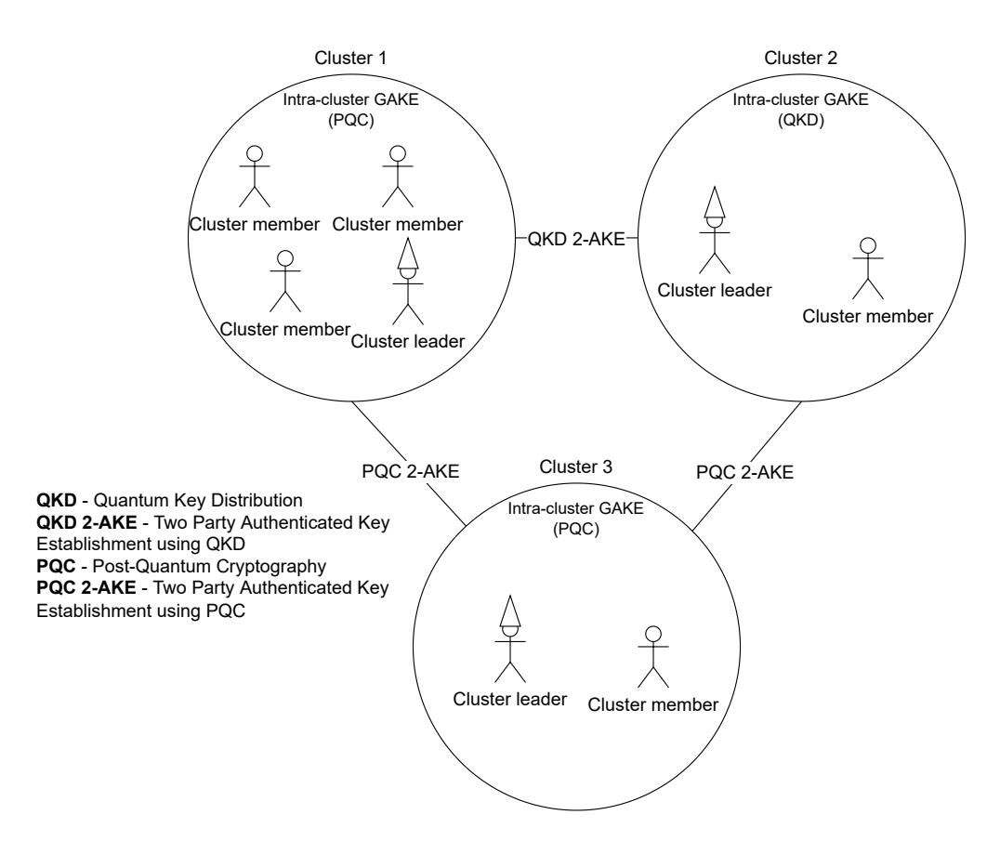
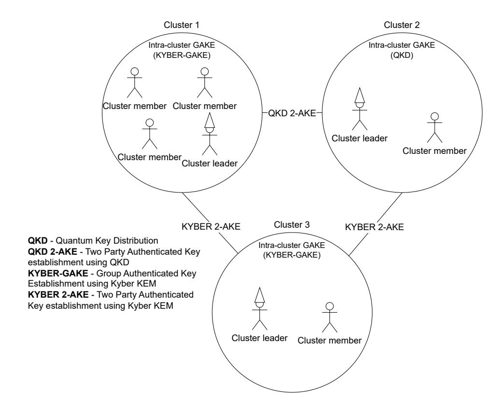
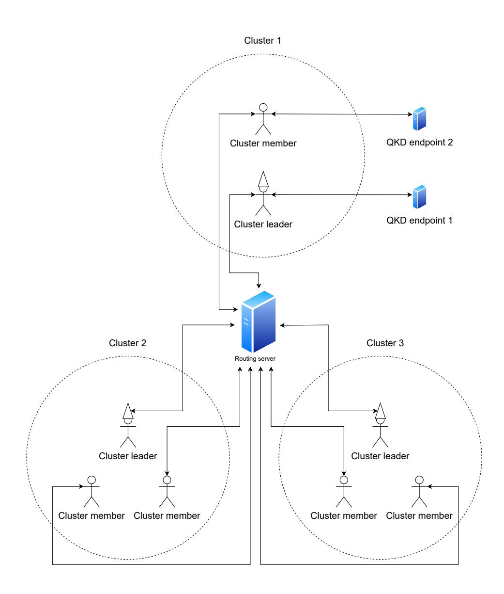

{0}------------------------------------------------

# Implementation of a post-quantum hybrid group key exchange protocol

Tomáš Fabšič\*, Samuel Klement, Zoltán Raffay, and Pavol Zajac\*
\*Slovak University of Technology in Bratislava
Email: [name].[surname]@stuba.sk

Abstract—Post-quantum cryptography focuses on research of cryptographic primitives, including public key encryption and signatures, that can resist the attacks mounted by an adversary with an access to a quantum computer. An alternative is to employ quantum cryptography to protect communication links by employing principles of quantum physics to protect security of the key exchange. Recently, a group key establishment protocol that combines these approaches in a secure way was presented by Steinwandt and Gonzales Vasco. We have successfully implemented and employed this protocol in a prototype application. In this article we describe the overall architecture and specific details of the implementation that can be of interest for scientific community. We conclude with a discussion of specific challenges, options and open problems that can accompany similar implementation task.

*Index Terms*—Post-quantum cryptography, group key exchange, quantum cryptography.

# I. INTRODUCTION

ITH the advent of quantum computing, several cryptographic primitives are under the threat of compromise. Algorithms such as RSA, Diffie-Hellman key exchange based on (EC)-DLP and many others can be broken on a sufficiently large quantum computer. Thus, a significant research and implementation effort is focused on replacing this potentially outdated cryptographic infrastructure with the new, so called post-quantum cryptography.

Post-quantum cryptography (PQC) research focuses on new primitives that should be secure even in the presence of the quantum adversary. Standardized algorithms, such as ML-KEM, ML-DSA, and others are already available for deployment in various open-source libraries. Still, a significant engineering and implementation effort is required to replace the existing cryptographic infrastructure with a quantum-safe infrastructure [1]. Special effort is required to replace specialized protocols, such as group key-exchange. There are several papers with theoretical schemes for two-party and multi-party key exchange, such as [2] that was implemented in [3].

To provide a quantum-safe communication infrastructure, a combination of post-quantum primitives and secure quantum links have been proposed [4]. Secure quantum links are established between participants based on principles of quantum physics, such as entanglement and non-clonability of a quantum state. Unlike PQC, secure quantum links are limited in their usage by requiring specialized hardware infrastructure, and in practice the restriction to a simple point to point communication.

Recently, a new scalable group authenticated key exchange protocol that can combine both PQC and secure quantum links was proposed by Steinwandt and Gonzales Vasco in [5]. In our project, we have adapted this protocol to implement a group key establishment layer for a secure group chat application.

In this article we describe the overall architecture and specific details of the implementation that can be of interest for scientific community. We describe the overall architecture of the solution, and some specific details related to protocol "leaders" and clients. We describe our solution for practical incorporation of the quantum links into the key establishment using standardized ETSI interface. We conclude with a discussion of specific challenges, options and open problems that can accompany similar implementation and engineering tasks for preparing quantum safe communication environment.

### II. PROTOCOL OVERVIEW

The protocol in [5] assumes that we have a partition

$$P = P^{(0)} \uplus P^{(1)} \uplus \cdots \uplus P^{(n-1)}$$

of the participating group into  $n \ge 1$  non-empty clusters. For each cluster  $P^{(i)}$ , a designated leader  $\widehat{P}^{(i)} \in P^{(i)}$  is fixed, and the leaders  $\widehat{P}^{(0)}, \ldots, \widehat{P}^{(n-1)}$  form a ring topology.

The protocol further assumes the availability of:

- 1) For each cluster  $i \in \{0, ..., n-1\}$ , a secure intracluster group authenticated key exchange (GAKE) protocol GAKE<sup>(i)</sup> that establishes a shared *cluster key*  $csk^{(i)}$  among all parties in  $P^{(i)}$ .
- 2) For each leader-neighbor pair  $(\widehat{P}^{(i)}, \widehat{P}^{((i+1) \bmod n)})$ , a secure 2-party authenticated key establishment (2-AKE) protocol 2-AKE<sup>(i)</sup>.

To achieve a quantum resistance of the protocol, the  $\mathsf{GAKE}^{(i)}$  and  $\mathsf{2}\text{-}\mathsf{AKE}^{(i)}$  protocols need to be based either on PQC or on quantum key distribution (QKD).

An example of a possible setting is depicted in Figure 1. In the example, the participating group is partitioned into three clusters. Clusters 1 and 3 have intra-cluster GAKE protocols based on PQC, while the intra-cluster GAKE protocol in Cluster 2 is facilitated by QKD (which is possible due to Cluster 2 having only 2 members). The pair of leaders of Clusters 1 and 3 and the pair of leaders of Clusters 2 and 3 use a 2-AKE protocol based on PQC. On the other hand, the pair of leaders of Clusters 1 and 2 use a QKD-based 2-AKE protocol.

The protocol in [5] proceeds in three phases:

{1}------------------------------------------------



<span id="page-1-0"></span>Fig. 1. Example of a 3 cluster setting.

Step A (Local key establishment). Each cluster runs its internal GAKE to obtain a shared cluster key csk(i) . In parallel, leaders run pairwise 2-AKE sessions with their two neighbors in the ring topology.

Step B (Leader commitments). Each leader commits (via a public random oracle H) to an XOR-combination of its two neighboring 2-party keys, broadcasts the commitment, then later opens it.

Step C (Group key derivation and intra-cluster transport). Leaders verify openings and a global consistency check, reconstruct the full set of ring keys, derive the group session key and session identifier via H, then distribute the session key inside each cluster using one-time-pad style masking under csk(i) and a MAC.

This structure is a clustered generalization of Burmester– Desmedt-style ring aggregation: when each cluster is a singleton, the protocol reduces to a ring over all parties with pairwise keys combined to form a group key.

# III. IMPLEMENTATION OF THE PROTOCOL

A typical application of heterogeneous group authenticated key exchange is to enable a secure communication within a group of participants. The participants can be from multiple different organizations (countries). Each organization is represented by a cluster, with a cluster leader, and some number of cluster members. The GAKE protocol is run at the beginning of the communication session. The symmetric key(s) derived by the protocol are then used to secure the resulting conversation, providing encryption and cryptographic authentication.

To demonstrate the protocol use, we have implemented a simple terminal-based chat application in the Go programming language. The end goal of the application is to allow the group of users to securely chat with each other within a specified interactive session. The post-quantum part of the hybrid key exchange protocol was instantiated with an existing

```
{
  "sendId": 1,
  "clusterId": 0,
  "recvId": 2,
  "type": 1,
  "sender": "Alice",
  "content": "SGVsbG8sIGhvdyBhcmUgeW91Pwo="
}
```

<span id="page-1-1"></span>Fig. 2. Example protocol message in a custom json format.

```
{
  "server": "1.1.1.1:9000",
  "name": "Alice",
  "clusterID": 0,
  "cluster": {
    "memberID": 0,
    "nMembers": 4,
    "publicKeys": "cluster_public_keys.json",
    "secretKey": "secret.json"
  }
}
```

<span id="page-1-2"></span>Fig. 3. Example of a client configuration.

Kyber-GAKE implementation [\[6\]](#page-4-5), while the quantum links are abstracted using a connector to a standardized ETSI interface. All internal protocol messages are encoded into custom JSON format (see Figure [2\)](#page-1-1).

### *A. Protocol entities*

The main entities in the chat application are the cluster members, leaders, and a single routing server. There can be multiple clusters, each with a single cluster leader and zero or more cluster members. Prior to establishing the communication, all cluster members and leaders need to be configured via specific configuration files. They use two different configuration formats, since cluster members (Fig. [3\)](#page-1-2) need to know about only other members of the cluster, but cluster leaders (Fig. [4\)](#page-2-0) need to know about other cluster leaders, too.

Cluster members and leaders can be connected via classical links that are secured by post-quantum cryptography, or via quantum (QKD) links. If the cluster should use QKD for intracluster session key establishment, there should be a single crypto property specified instead of the publicKeys and secretKey properties. The crypto property should contain either an URL to the ETSI API server or a file containing the shared secret key. The leftCrypto and rightCrypto fields can contain either a path to a file containing the public key of the corresponding neighbor, or in the case of using 2- AKE QKD, either an URL to the ETSI API server or a file containing the shared secret key.

An example of cluster configuration is depicted in Figure [5.](#page-2-1) In the example, the system is organized into three clusters. Each cluster runs its own intra-cluster key establishment, and the cluster leaders run an inter-cluster key establishment to derive a main session key.

{2}------------------------------------------------

```
{
  "server": "2.2.2.2:9000",
  "name": "Leader1",
  "clusterID": 0,
  "cluster": {
    "memberID": 3,
    "nMembers": 4,
    "publicKeys": "cluster_public_keys.json",
    "secretKey": "secret.json"
  },
  "leaders": {
    "nClusters": 3,
    "leftCrypto": "pk_left.json",
    "rightCrypto": "pk_right.json",
    "secretKey": "secret_leader.json"
  }
}
```

<span id="page-2-0"></span>Fig. 4. Example of a server configuration.



<span id="page-2-1"></span>Fig. 5. Example of a 3 cluster configuration.

Cluster 1 is the largest one, consisting of four members. For this cluster we use the post-quantum variant of the protocol, i.e. the members and the leader run the Kyber-based GAKE to obtain a shared session key inside the cluster.

Cluster 2 is smaller (two members including the leader), but in contrast to Cluster 1 it is configured to use a quantum key distribution (QKD) link for its intra-cluster key. In practice this means that, instead of running the Kyber-GAKE, the members in this cluster obtain a fresh symmetric key from the ETSI QKD interface (or from a locally shared key file). From the point of view of the upper layers of the protocol this makes no difference — the cluster still ends up with an intra-cluster key.

The leaders of Cluster 1 and Cluster 2 also have QKD capabilities, so the 2-AKE between these two leaders is realized over QKD as well.

Cluster 3 is again a smaller cluster (two members), but unlike Cluster 2 it does not have access to QKD. The leader of Cluster 3 participates in the same inter-cluster key establishment as the other leaders, but it uses Kyber-based 2-AKE with the other two leaders. Since the protocol supports mixing PQC and QKD links, this is sufficient: the leaders that can talk over QKD do so, and the leader that cannot simply falls back to the PQC 2-AKE. The result is that all three clusters end up deriving the main session key.

*1) PQC cluster/link:* When Post-Quantum Cryptography is used for the cluster session key establishment, the cluster members and the leader perform the Kyber-GAKE protocol proposed in [\[7\]](#page-4-6) and implemented in [\[6\]](#page-4-5).

When PQC link is used between leaders, they also use the building blocks from [\[6\]](#page-4-5), except for the different Commitment computation, which uses SHA-256 instead. This allows for the possibility of the cluster leaders using QKD (with both neighbors) to have no Kyber KEM keypairs configured. It also eliminates the need of cluster leaders to know all of the public keys.

*2) Quantum cluster/link:* When QKD is used for the cluster session key establishment, there is no Kyber-GAKE protocol performed between the cluster participants. Instead, the cluster members and the leader obtain the shared secret key directly from the ETSI API or a file. The rest of the protocol remains unchanged.

If QKD link is used for the 2-AKE between leaders, there is no Kyber 2-AKE performed between these two specific leaders. They establish the temporary left and right keys through the quantum channel. The rest of the protocol then remains unchanged.

When QKD within protocol is instantiated with the ETSI API, there is always a specific entity that initiates the key establishment. This entity requests a randomly generated Key together with a Key ID using the enc\_keys method. The initiator then sends the Key ID to the other entity, which can request the same Key using this Key ID using the dec\_keys method. In the case of intra-cluster QKD, the initiator is the cluster leader, and in the case of QKD 2-AKE between leaders, the initiator is the left leader.

When QKD within protocol is instantiated with a file, the setup is simpler. The requirement is only that both of the entities have access to a file containing the shared secret key and that this key be the same for both of the entities. The connection between the quantum end-point and the file is left to the user/administrator of the specific cluster.

### *B. Network configuration*

Our original application design targeted peer-to-peer network configuration, where cluster leaders could exchange messages directly (based on IP addresses/ports). Unfortunately, the initial tests have shown that this setup is unreliable in a large heterogeneous network environment. In our test, we could not connect some cluster leaders due to firewall restrictions. Even if the connections were allowed, wrong network conditions led to desynchronizations and the protocol failed to finish.

To solve the network routing issues, we have decided to include a routing server into the network topology. The routing server is written in Rust and its sole purpose is to 

{3}------------------------------------------------

receive messages from cluster members and leaders and send them to the correct recipients. The routing server uses the memberID and clusterID identifiers (received as part of a login message) to keep a list of active session participants. It has information about the message types used in the protocol implementation, so it can route the messages correctly.

The routing server routes the messages using the specified fields in the message format (see Figure [2\)](#page-1-1). For example, if the message type is that of an intra-cluster 2-AKE message, it sends the received message to the cluster member with ID recvId and in the same cluster as the sender (clusterId). On the other hand, if the message type is that of a text message, it broadcasts this text message to all the other entities.

A central part of the routing server is the session. The session contains state about the active clients and all the received messages. The messages are stored so that they can be delivered to clients that join later. The routing server manages its session in the following simple manner. If there are no active clients and a client joins, a new session is created. Then, when other clients join, they join this same session and receive the stored messages (if they are supposed to receive them). When all clients leave, the session is destroyed. Similarly, if for some reason the same client joins twice, the session is restarted to avoid mismatches in the cryptographic protocol state. This approach enables the routing server to function without any configuration files, but supports only one concurrent session.



Fig. 6. Network topology diagram

In the setup shown in Fig. 1, every participant keeps exactly one TCP connection to the central routing server, which only relays JSON messages based on sender/receiver IDs, cluster ID, and message type; it is not part of the cryptographic protocol and does not see or derive keys. Cluster 1 sits at the top with a leader and several members, unlike the others, it can talk directly to separate ETSI QKD endpoints to obtain quantum-generated keys; this ETSI traffic does not go through the routing server, it is an independent channel used only for key material. Clusters 2 and 3 at the bottom connect to the same routing server in the same way, and can still participate in the inter-cluster GAKE (using QKD where available, otherwise using Kyber).

## IV. DISCUSSION

We have successfully implemented a prototype chat application secured by a hybrid group key establishment protocol. During the implementation, we also identified several challenges specific for the deployment of our application.

A major challenge for the deployment was the networking topology. Our initial prototype application was aiming for a fully distributed peer-to-peer topology. Each cluster leader acted as a middle-man capable of routing all messages for its cluster members. The cluster leaders then communicated only with other cluster leaders and cluster members of varying clusters did not communicate directly. This topology proved to be problematic for a real world usage, since it required multiple parties to accept incoming connections. The problem was mainly caused by security concerns and network elements, such as firewalls, NATs, etc. We have solved the problem by reconsidering the networking topology, and designating a single central routing server, which is accessible to all entities. This solution is more reliable. On the other hand, the centralized topology is more vulnerable to denial of service attacks targeting the routing server.

When focusing on cryptographic and security properties of the application, it is easy to compromise usability aspects of the application. One of the important, but not obvious parts of the usability issues stem from a proper configuration management. Our current implementation has only a limited flexibility, when configuring the number of members, clusters and the overall topology of the communicating group of participants. The clusters are pre-configured, and if some entity does not want to participate in a communication session, a new configuration set has to be generated for the participating entities. A workaround of multiple prearranged configurations comes to mind, but it also has the significant drawback of added complexity. An automated approach of generating configurations from a predefined set of keys could be implemented to overcome this limitation.

While configuring the communicating group of participants, public keys must be distributed as well. Our application assumes that this process is done out-of-band. For a real world usage this is, however, impractical. A more advanced and self contained application may allow for the distribution of public keys via some built in manners, for example a certified key server. Note that when aiming for quantum safe solution, the automated distribution of public keys (and possibly their certificates) should also be done with a help of post-quantum signatures.

{4}------------------------------------------------

Our developed application is meant as a simple demonstration for the capabilities of the proposed protocol, and uses only a simple terminal-based user interface for the textual chat. Note that the final encrypted communication relies on a simple symmetric cryptography (AES in AEAD mode), and thus can be expected to support the transmission of larger amount of data (such as multimedia content for teleconferences). However, a specific data structures and API support for larger data packets/streamed data would be required for such tasks.

Simulating QKD through the pre-generated files with keys was fairly simple and not problematic, but requires manual work and secure distribution of the keys. Hence, it is meant only for demonstration purposes. Using the ETSI API interface with an actual QKD device on the other hand is a more realistic and secure scenario, but requires extensive configuration on the server side of the ETSI API provider. It is also worth noting that to ensure maximum security, the ETSI API server and the entity using this API should be ideally in close proximity and securely, physically connected to each other. This is due to the fact that using HTTPS over unsecured networks reduces the information-theoretic security of QKD to the security of the cryptographic primitive the HTTPS connection relies on.

### ACKNOWLEDGMENT

This work was in part supported by the NATO SPS project G5985, and in part by grant VEGA 1/0105/23.

### REFERENCES

- <span id="page-4-0"></span>[1] R. Steinwandt and A. Xuereb, *Toward a Quantum-Safe Communication Infrastructure*. IOS Press, 2024, vol. 64.
- <span id="page-4-1"></span>[2] M. I. Gonzalez Vasco, ´ A. L. P ´ erez del Pozo, and R. Steinwandt, "Group ´ key establishment in a quantum-future scenario," *Informatica*, vol. 31, no. 4, pp. 751–768, 2020.
- <span id="page-4-2"></span>[3] R. Abela, C. Colombo, P. Malo, P. Sys, T. Fab ´ siˇ c, O. Gallo, V. Hromada, ˇ and M. Vella, "Secure implementation of a quantum-future GAKE protocol," in *International Workshop on Security and Trust Management* . Springer, 2021, pp. 103–121.
- <span id="page-4-3"></span>[4] N. Farrugia, D. Bonanno, N. Frendo, and A. Xuereb, "Pqc and qkd are both required to enable a quantum-safe future," in *Toward a Quantum-Safe Communication Infrastructure*. IOS Press, 2024, pp. 24–36.
- <span id="page-4-4"></span>[5] M. I. Gonzalez Vasco and R. Steinwandt, "Scalable authenticated group ´ key establishment in quantum and post-quantum networks," *Informatica* , vol. 36, no. 2, pp. 315–335, 2025.
- <span id="page-4-5"></span>[6] J. I. Escribano Pablos and M. I. Gonzalez Vasco, "Secure post-quantum ´ group key exchange: Implementing a solution based on Kyber," *IET Communications*, vol. 17, no. 6, pp. 758–773, 2023. [Online]. Available: <https://ietresearch.onlinelibrary.wiley.com/doi/abs/10.1049/cmu2.12561>
- <span id="page-4-6"></span>[7] J. I. Escribano Pablos, M. I. Gonzalez Vasco, M. E. Marriaga, and A. L. ´ Perez del Pozo, "Compiled constructions towards post-quantum group ´ key exchange: A design from Kyber," *Mathematics*, vol. 8, no. 10, 2020. [Online]. Available:<https://www.mdpi.com/2227-7390/8/10/1853>