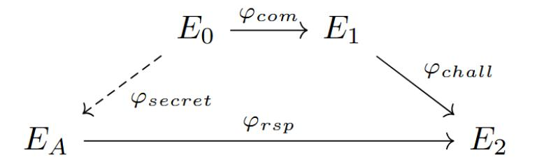
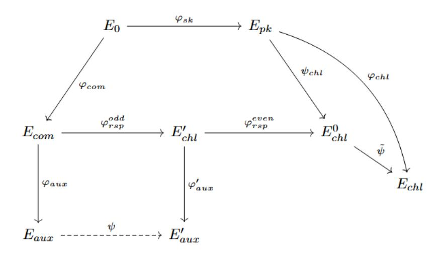

{0}------------------------------------------------

# Survey of isogeny-based signature schemes resistant to Castryck–Decru attack

J. S. Bobrysheva1\*, A. S. Zelenetsky1, 2 and V. V. Davydov<sup>1</sup>

<sup>1</sup>QApp, Bolshoy blvd 30b1, Moscow, 121205, Russia. <sup>2</sup>Bauman Moscow State Technical University, 2-nd Baumanskaya, 5, Moscow, 105005, Russia.

\*Corresponding author(s). E-mail(s): jbobrysheva@qapp.tech; Contributing authors: azelenetskiy@qapp.tech; vdavydov@qapp.tech;

#### Abstract

In 2022, Castryck and Decru introduced an attack that broke several isogenybased schemes, including SIKE, which had advanced to the final round of the NIST Post-Quantum Cryptography Standardization Competition. Despite this attack, research on isogeny-based cryptography has continued, primarily due to the compact key sizes offered by these schemes compared to other post-quantum approaches. There are now many isogeny-based schemes that are resistant to the Castryck-Decru attack. These schemes typically involve advanced mathematical structures that may require significant time and effort to study.

In this paper, we provide a structured survey of isogeny-based signature schemes that are resistant to the Castryck-Decru attack, aiming to facilitate an understanding of the current landscape and the most practically relevant schemes in this area. We categorize these signature schemes into two main classes: those based on the CSIDH group action and the SQIsign family. For each class, we discuss their fundamental design principles, security assumptions, and specific constructions. We also compare their performance and compactness. Additionally, we describe one representative scheme from each class that is particularly relevant in practice due to its efficiency or compactness. In conclusion, we compare the performance of the schemes discussed in this work with other post-quantum signature schemes.

Keywords: Post-quantum Signature Schemes, Isogeny-Based Cryptography, SQIsign Family Schemes, Castrick-Decru Attack

{1}------------------------------------------------

## 1 Introduction

Developing large-scale quantum computers capable of executing Shor's algorithm would make cryptographic schemes based on the hardness of integer factorization and discrete logarithm problems insecure. In response to this threat, alternative mathematical problems believed to be hard to attacks using a quantum computer have been investigated, leading to the development of new cryptographic constructions. One of the directions in post-quantum cryptography is isogeny-based cryptography, which relies on the hardness of finding isogenies between two supersingular elliptic curves.

In 2022, Castryck and Decru exploited the use of the Kani lemma [\[1\]](#page-26-0) and higherdimensional isogenies, specifically isogenies between products of elliptic curves, to construct an attack on the SIDH (Supersingular Isogeny Diffie-Hellman) protocol [\[2\]](#page-26-1). Their attack was initially described in a preprint [\[3\]](#page-26-2), and a practical implementation in Magma was later presented in [\[4\]](#page-26-3), achieving polynomial-time complexity O˜(n 3 ) for a specially chosen starting elliptic curve. Independently of this work, Maino and Martindale proposed an attack based on 2-dimensional isogenies in [\[5\]](#page-26-4). A subsequent implementation of their attack in Sage was provided in [\[6\]](#page-26-5). This attack applies to arbitrary starting curves and achieves subexponential complexity. In [\[7\]](#page-26-6), an attack combining the Kani lemma [\[1\]](#page-26-0) with Zarhin's trick [\[8\]](#page-26-7) and utilizing dimension-8 isogenies was proposed, achieving polynomial-time complexity O˜(n 3 ) even for arbitrary starting elliptic curves. As a result, the SIDH protocol, along with its derived cryptographic schemes [\[9,](#page-26-8) [10\]](#page-26-9), including SIKE (Supersingular Isogeny Key Encapsulation) [\[11\]](#page-26-10), which had advanced to the final round of the NIST Post-Quantum Cryptography Standardization Competition, has been completely broken by the aforementioned attacks.

Despite these attacks, research on isogeny-based cryptography has continued, as these schemes are characterized by smaller key sizes, signatures, and ciphertexts compared to other post-quantum approaches. Moreover, the Castryck–Decru attack is not applicable to all isogeny-based schemes. Specifically, for supersingular elliptic curves E1, E<sup>2</sup> defined over Fp<sup>2</sup> , where p is a prime of the form p = ABf − 1, A ≈ B, f is a small cofactor chosen to ensure p is prime, these attacks can recover the secret isogeny φ: E<sup>1</sup> → E<sup>2</sup> only when its degree l and the images of torsion basis points φ(P), φ(Q) are known, where P, Q form a basis of E1[B]. Thus, the fundamental problem in isogeny-based cryptography, namely the problem of finding an isogeny between two supersingular elliptic curves, has not been solved, because it does not reveal any auxiliary information, such as the images of torsion points under the isogeny. This problem is considered hard even for quantum computers because no polynomial-time algorithm is known to solve it.

<span id="page-1-0"></span>Problem 1 (Isogeny Path). Given two supersingular elliptic curves E1, E<sup>2</sup> defined over a finite field Fp<sup>2</sup> , compute an isogeny φ: E<sup>1</sup> → E2.

Consequently, isogeny-based schemes that do not reveal information about the isogeny's degree and the images of torsion points are currently considered resistant to the Castryck–Decru attack. A number of such schemes have now been developed. 

{2}------------------------------------------------

These schemes typically involve advanced mathematical structures that may require significant time and effort to study.

This paper provides a structured survey of isogeny-based signature schemes that are currently considered resistant to the Castryck–Decru attack. The purpose of this work is to offer a comprehensive overview of the current state of the field, helping to identify which schemes are currently available and practically applicable. We classify the schemes into two primary classes: those based on the CSIDH group action and the SQIsign family. For each class, we examine the underlying mathematical structures, key design principles, and security assumptions. We list the schemes within each class, highlighting their distinctive features, advantages and limitations. We select one representative scheme from each class based on its efficiency and compactness and provide its detailed description. We provide a comparison of the schemes with respect to efficiency, signature size, and key size. Furthermore, we compare the performance of isogeny -based signature schemes with that of signature schemes from other post-quantum cryptographic approaches.

This paper is organized as follows. In Section 2, we provide the necessary background on isogeny-based cryptography. Section 3 focuses on signature schemes that rely on the CSIDH group action, while Section 4 is devoted to the SQIsign family of schemes. Section 5 presents a comparison of the schemes in terms of efficiency and compactness.

## <span id="page-2-0"></span>2 Preliminaries

#### 2.1 Elliptic Curves

An elliptic curve over a finite field  $\mathbb{F}_q$ ,  $q=p^n$ , p – prime,  $n \in \mathbb{N}$ , is defined by the equation  $y^2 + a_1xy + a_3y = x^3 + a_2x^2 + a_4x + a_6$ ,  $a_i \in \mathbb{F}_q$ , with nonzero discriminant  $\Delta \neq 0$ , which is referred to as the general Weierstrass form. When  $p \neq 2, 3$ , this equation can be reduced to the short Weierstrass form:  $E: y^2 = x^3 + ax + b$ ,  $a, b \in \mathbb{F}_q$ , where  $\Delta = -16(4a^3 + 27b^2) \neq 0$ .

Although we usually write elliptic curves in affine coordinates (x,y), formally an elliptic curve is considered as a projective algebraic variety. In projective coordinates [X:Y:Z], the curve E becomes  $Y^2Z = X^3 + aXZ^2 + bZ^3$ , and the point at infinity  $\infty = [0:1:0]$  serves as the group identity. In affine coordinates (x,y), obtained via x = X/Z, y = Y/Z for  $Z \neq 0$ , this point has no representation, but it naturally serves as the identity element of the group of points on the curve. The interested reader may refer to the classical literature on this topic, for example, [12, §2.3], [13, ch.1]. In the following we work in affine coordinates (x,y), with the point at infinity  $\infty$  serving as the group identity.

The set of points  $(x, y) \in \mathbb{F}_q^2$ , satisfying the equation together with the point at infinity  $\infty$  forms an abelian group under the point addition operation. This operation is defined as follows [12].

{3}------------------------------------------------

For two points  $P = (x_P, y_P)$  and  $Q = (x_Q, y_Q)$  on E their sum R = P + Q is computed using the algebraic formulas for point addition and doubling:

$$m = \begin{cases} \frac{y_Q - y_P}{x_Q - x_P}, & P \neq Q, x_P \neq x_Q, \\ \frac{3x_P^2 + a}{2y_P}, & P = Q, y_P \neq 0, \end{cases} \quad x_R = m^2 - x_P - x_Q, \quad y_R = m(x_P - x_R) - y_P.$$

If  $x_P = x_Q$  and  $y_P = -y_Q$ , then  $P + Q = \infty$ . These rules define an abelian group structure on  $E(\mathbb{F}_q)$ .

The order of a point  $P \in E(\mathbb{F}_q)$  is its order as a group element. In the following [k]P denotes the addition of k copies of the point P,  $E(\mathbb{F}_q)$  denotes the abelian group of all  $\mathbb{F}_q$ -rational points on the elliptic curve E, including the point at infinity  $\infty$ .

For an elliptic curve E defined over a field  $\mathbb{F}_q$  and an integer  $m \in \mathbb{Z}$ ,  $m \geq 1$ , the m-torsion subgroup of E is denoted by E[m] and represents the set of points of  $E(\overline{\mathbb{F}}_q)$  of order m (m-torsion points):  $E[m] = \{P \in E(\overline{\mathbb{F}}_q) \mid [m]P = \infty\}$ , where  $\overline{\mathbb{F}}_q$  is the algebraic closure of the finite field  $\mathbb{F}_q$  [12, §3.1]. If  $p \nmid m$ , the group E[m] has the structure of a free  $\mathbb{Z}/m\mathbb{Z}$ -module of rank 2, that is, there exist points  $P, Q \in E[m]$  such that every element of E[m] can be written uniquely as aP + bQ;  $a, b \in \mathbb{Z}/m\mathbb{Z}$  [12, §3.1]. The points P, Q are called the generators of the subgroup E[m], and we write  $E[m] = \langle P, Q \rangle$ . If  $p \mid m$ , the structure of E[m] is more complicated: writing  $m = p^r m'$  with  $p \nmid m'$ , we have  $E[m] \cong E[n'] \oplus E[p^r]$ , where  $E[m'] \cong \mathbb{Z}_{m'} \oplus \mathbb{Z}_{m'}$  and  $E[p^r] \cong 0$  or  $E[p^r] \cong \mathbb{Z}_{p^r}$  [12, §3.2].

Two elliptic curves  $E_1$ ,  $E_2$  over  $\mathbb{F}_q$  are isomorphic if there exists a one-to-one map over  $\mathbb{F}_q$  preserving the group operation. It is worth clarifying that, in the context of elliptic curves, an isomorphism refers to a regular isomorphism of algebraic groups; that is, a bijective morphism given by rational functions that preserves both the algebraic and group structures.

Isomorphic curves are identified with each other and form an equivalence class uniquely characterized by the j-invariant over the algebraic closure of  $\mathbb{F}_q$ . For an elliptic curve in Weierstrass form, the j-invariant is computed as  $j = 1728 \cdot 4a^3/(4a^3 + 27b^2)$ . The cardinality (order) of  $E(\mathbb{F}_q)$  is denoted as  $\#E(\mathbb{F}_q)$ . Several algorithms exist for computing the  $\#E(\mathbb{F}_q)$ . For small fields, naive enumeration or baby-step giant-step methods can be used [14, ch.6]; for larger fields — Schoof's algorithm [15] and Elkies-Atkin extension to it [14, ch.7] are standard.

An elliptic curve E over a field  $\mathbb{F}_q$  of characteristic p is called supersingular if  $E[p] = \infty$  and ordinary otherwise. For supersingular curves, when q = p and  $p \geq 5$ , the point-counting formula simplifies to  $\#E(\mathbb{F}_q) = p + 1$ .

Besides the Weierstrass form, other representations of elliptic curves exist, such as Montgomery curves [16] and Edwards curves [17]. Montgomery curves, defined by the equation  $By^2 = x^3 + Ax^2 + x$ ,  $A, B \in \mathbb{F}_q$  are notable for their efficient arithmetic operations due to their ability to perform computations using only the x-coordinates of the points.

{4}------------------------------------------------

### 2.2 Isogenies

There are several equivalent ways to define an isogeny. In this article, we adopt the definition from [13]. An isogeny from  $E_1$  to  $E_2$  is a morphism  $\varphi \colon E_1 \to E_2$  satisfying  $\varphi(\infty) = \infty$  [13, ch. 3, def. 4.1]. Recall that a morphism is a rational map that is regular at every point [13]. Thus, every isogeny can be represented by rational functions:  $\varphi(x,y) = (p(x)/q(x), cy \cdot s(x)/t(x))$ . However, the converse is not true: not every map of this form defines an isogeny. We say that an isogeny  $\varphi(x,y)$  is defined over  $\mathbb{F}_q$  if  $p(x), q(x), s(x), t(x) \in \mathbb{F}_q[x]$  and  $c \in \mathbb{F}_q$ . Isogenies over the field  $\overline{\mathbb{F}_q}$  are defined analogously. Since elliptic curves carry a natural group structure, every isogeny is a group homomorphism. This fact is proved in [13, thm. 4.8].

Two elliptic curves  $E_1$  and  $E_2$  are said to be isogenous iff an isogeny exists between them. The set of all curves isogenous to  $E_1$  forms the isogeny class of  $E_1$ . If the derivative of  $p(x)/q(x) \neq 0$  for any x where  $\varphi$  is defined, the isogeny  $\varphi$  is called separable. In this article, we only consider separable isogenies.

The kernel of an isogeny is its kernel as a group homomorphism. The kernel of a nonzero isogeny is always finite [13, cor. 4.9]. For any finite subgroup G of  $E_1$ , there exists a unique separable isogeny  $\varphi_G \colon E_1 \to E_2$  with kernel  $G, E_2 = E_1/G$ , which can be computed using Vélu's formulas [18].

The degree of an isogeny is defined as the maximum of the degrees of the numerator and denominator of its rational representation:  $\deg(\varphi) = \max\{\deg(p(x)), \deg(q(x))\}$ . For a separable isogeny, its degree is equal to the size of its kernel:  $\deg(\varphi) = \# \ker \varphi$  [12, prop. 12.8].

For each isogeny  $\varphi \colon E_1 \to E_2$ , there exists a unique dual isogeny  $\hat{\varphi} \colon E_2 \to E_1$  with the same degree  $\deg(\varphi)$ , such that  $\hat{\varphi} \circ \varphi = [\deg(\varphi)]_{E_1}$  and  $\varphi \circ \hat{\varphi} = [\deg(\varphi)]_{E_2}$ , where  $[\deg(\varphi)]_{E_1}$  denotes integer multiplication on  $E_1$  and  $[\deg(\varphi)]_{E_2}$  denotes integer multiplication on  $E_2$ ,  $\circ$  denotes the composition of isogenies, i.e. the sequential application of several isogenies.

#### 2.3 The endomorphism ring

An endomorphism of an elliptic curve E over  $\mathbb{F}_q$  is an isogeny from E to itself. The set of all endomorphisms of an elliptic curve E is denoted as  $\operatorname{End}(E)$  and forms a ring, which is a well-known fact from algebra.

An example of an endomorphism is the multiplication-by-m isogeny  $[m]: E \to E$ , which maps a point P to [m]P.

Let E be an elliptic curve defined over a finite field of characteristic p. If E is an ordinary elliptic curve, then  $\operatorname{End}(E)$  is an order in an imaginary quadratic field [12, cor. 10.6]. If E is supersingular, then  $\operatorname{End}(E)$  is a maximal order in a definite quaternion algebra that is ramified at p and  $\infty$  and is split at the other primes [12, cor. 10.6].

In certain contexts in this article, we consider  $\mathbb{F}_q$ -rational endomorphisms, that is, endomorphisms whose rational function coefficients are defined over the field  $\mathbb{F}_q$  [19]. Following standard cryptographic literature [19–21], we denote by  $\operatorname{End}_{\mathbb{F}_q}(E)$  the ring of  $\mathbb{F}_q$ -rational endomorphisms. For an ordinary curve E over the field  $\mathbb{F}_q$  we have

{5}------------------------------------------------

 $\operatorname{End}(E) = \operatorname{End}_{\mathbb{F}_q}(E)$ , for a supersingular curve over  $F_p$  we have a strict inclusion  $\operatorname{End}_{\mathbb{F}_q}(E) \subseteq \operatorname{End}(E)$  [21].

## 2.4 Quaternions, ideals and the Deuring correspondence

Let  $\mathcal{B}_{p,\infty}$  denote the quaternion algebra over  $\mathbb{Q}$  ramified at p and  $\infty$  [22, 23], where  $p \equiv 3 \pmod{4}$ . The choice of p is important in the context of supersingular elliptic curves over  $\overline{\mathbb{F}}_p$ , ensuring that their endomorphism algebra is isomorphic to  $\mathcal{B}_{p,\infty}$ . The algebra  $\mathcal{B}_{p,\infty}$  is a 4-dimensional vector space over  $\mathbb{Q}$  with a basis  $\{1,i,j,k\}$  and multiplication rules defined by  $i^2 = -1$ ,  $j^2 = -p$ , ij = -ji = k [22]. An element  $\alpha \in \mathcal{B}_{p,\infty}$  can be expressed in the form  $\alpha = a + bi + cj + dk$ , where  $(a,b,c,d) \in \mathbb{Q}^4$ . The conjugate of  $\alpha$  is defined as  $\bar{\alpha} = a - bi - cj - dk$ , and its reduced norm is  $\operatorname{nrd}(\alpha) = \alpha \bar{\alpha}$ .

A fractional ideal  $I \subset \mathcal{B}_{p,\infty}$  is a  $\mathbb{Z}$ -lattice of rank 4, i.e.  $I = \alpha_1 \mathbb{Z} + \alpha_2 \mathbb{Z} + \alpha_3 \mathbb{Z} + \alpha_4 \mathbb{Z}$ , where  $\langle \alpha_1, \alpha_2, \alpha_3, \alpha_4 \rangle$  is a basis of  $\mathcal{B}_{p,\infty}$  [23]. The reduced norm of I is  $nrd(I) = \gcd\{nrd(\alpha) \mid \alpha \in I\}$ , where gcd denotes the greatest common divisor of the integers in the set. The conjugate is defined as  $\bar{I} = \{\bar{\alpha} \mid \alpha \in I\}$ .

An order  $\mathcal{O} \subset \mathcal{B}_{p,\infty}$  is a subring that is also a lattice. An order is said to be maximal if it is maximal for the inclusion. Given a fractional ideal I, we define its left order as  $\mathcal{O}_L(I) = \{\alpha \in \mathcal{B}_{p,\infty} \mid \alpha I \subseteq I\}$ . We say that I is a left  $\mathcal{O}$ -ideal if  $\mathcal{O} \subseteq \mathcal{O}_L(I)$ . Formally, I is a left  $\mathcal{O}$ -submodule of  $\mathcal{B}_{p,\infty}$ , however, in modern cryptographic literature it is standard to call such submodules left  $\mathcal{O}$ -ideals, and we will follow this convention in our work. The ideal I is integral if  $I \subseteq \mathcal{O}_L(I)$ . In this case, the left order  $\mathcal{O}_L(I)$  is a maximal order. Two fractional ideals I and J are equivalent  $I \sim J$ , if there exists an invertible element  $\beta \in \mathcal{B}_{p,\infty}^*$  such that  $J = I\beta$ , where  $\mathcal{B}_{p,\infty}^*$  is the set of invertible elements of  $\mathcal{B}_{p,\infty}$ .

The Deuring correspondence [24] is a connection between the theory of quaternions and the theory of supersingular elliptic curves. Let  $E/\mathbb{F}_{p^2}$  be a supersingular elliptic curve. Then its endomorphism ring  $\operatorname{End}(E)$  is isomorphic to a maximal order  $\mathcal{O} \subset \mathcal{B}_{p,\infty}$  in the quaternion algebra [25, 26]. Given an isogeny  $\varphi \colon E \to E$ , one can associate to it a kernel ideal  $I_{\varphi} = \{\alpha \in \mathcal{O} \mid \forall P \in \ker \varphi, \alpha(P) = \infty\}$ , which is a left  $\mathcal{O}$ -ideal with norm  $\operatorname{nrd}(I_{\varphi}) = \deg(\varphi)$ . Conversely, for any left  $\mathcal{O}$ -ideal I, there exists an associated isogeny  $\varphi_I \colon E \to E_I$  with kernel  $E[I] = \{P \in E \mid \forall \alpha \in I, \alpha(P) = \infty\}$  and degree  $\deg(\varphi_I) = \operatorname{nrd}(I)$  [26]. This correspondence is one-to-one. By the Deuring correspondence, if two ideals I and J are equivalent, the corresponding curves  $E_I$  and  $E_J$  are isomorphic. The conjugate ideal I corresponds to the dual isogeny  $\hat{\varphi}_I$ .

Let  $\varphi_1: E \to E_1$  and  $\varphi_2: E_1 \to E_2$  be isogenies with corresponding left  $\mathcal{O}$ -ideals  $I_{\varphi_1}$  and  $I_{\varphi_2}$ . Then the composition  $\varphi_2 \circ \varphi_1: E \to E_2$  corresponds to the ideal  $I_{\varphi_2 \circ \varphi_1} = I_{\varphi_1} \cdot I_{\varphi_2}$  [27]. The composition is only defined because the codomain of  $\varphi_1$  coincides with the domain of  $\varphi_2$ .

A summary of the Deuring correspondence is presented in Table 1. For a detailed description of quaternion algebras and the Deuring correspondence, we refer to [24–26].

#### 2.5 Higher dimensional isogenies

Abelian varieties were first considered for constructing cryptographic protocols in [28]. In this section, we present the key simplified definitions and objects needed for an

{6}------------------------------------------------

<span id="page-6-0"></span>**Table 1** The Deuring correspondence.

| Supersingular elliptic curves                                                                                                                                                                                                       | Quaternions                                                                                                                                                                                                                                                                                                         |
|-------------------------------------------------------------------------------------------------------------------------------------------------------------------------------------------------------------------------------------|---------------------------------------------------------------------------------------------------------------------------------------------------------------------------------------------------------------------------------------------------------------------------------------------------------------------|
| Supersingular $j$ -invariants over $\mathbb{F}_{p^2}$<br>$\varphi \colon E \to E'$<br>$\varphi, \psi \colon E \to E'$<br>$\hat{\varphi} \colon E' \to E$<br>$\varphi_2 \circ \varphi_1 \colon E \to E_1 \to E_2$<br>$\deg(\varphi)$ | Maximal orders in $\mathcal{B}_{p,\infty}$ $\mathcal{O} \cong \operatorname{End}(E)$ left $\mathcal{O}$ -ideal $I_{\varphi}$ $I_{\varphi} \sim I_{\psi} \ (I_{\psi} = I_{\varphi}\alpha)$ $\bar{I}_{\varphi}$ $I_{\varphi_2 \circ \varphi_1} = I_{\varphi_1} \cdot I_{\varphi_2}$ $\operatorname{nrd}(I_{\varphi})$ |

intuitive understanding of the protocols described in Section 4. Our description follows the terminology and conventions commonly used in the cryptographic literature [28–32]. A more formal and rigorous treatment can be found in [33].

An abelian variety is a connected projective algebraic variety A over a field K which is simultaneously endowed with the structure of a group [33]. Abelian varieties can be considered as higher-dimensional analogues of elliptic curves because an elliptic curve over the field  $\mathbb{F}_{p^2}$  is an abelian variety of dimension g=1 [28]. A higher-dimensional isogeny is an isogeny between abelian varieties of dimension g>1. An example of an abelian variety of dimension g is a product of elliptic curves  $E_1 \times \ldots \times E_g$ , where  $E_1, \ldots, E_g$  are elliptic curves defined over a field K.

To any abelian variety A, we associate its dual abelian variety  $\hat{A}$ , which has the same dimension. Polarization is a special type of isogeny  $\lambda$  from an abelian variety to its dual  $\lambda \colon A \to \hat{A}$ . If  $\lambda$  is an isomorphism, then polarized abelian variety  $(A, \lambda)$  is called principally polarized.

Let A and B be principally polarized abelian varieties with polarizations  $\lambda_A$  and  $\lambda_B$ , respectively. A d-isogeny is an isogeny  $\alpha$  between principally polarized abelian varieties  $\alpha \colon (A, \lambda_A) \to (B, \lambda_B)$  if  $\tilde{\alpha} \circ \alpha = [d]_A$ , where  $\tilde{\alpha} = \lambda_A^{-1} \circ \hat{\alpha} \circ \lambda_B$  is the dual isogeny of  $\alpha$  with respect to the principal polarizations  $\lambda_A$  and  $\lambda_B$ .

Let A' and B' be principally polarized abelian varieties. For  $a, b \in \mathbb{N}$ ,  $a, b \neq 0$ , (a, b)-\nisogeny diamond is a commutative diagram of isogenies between principally polarized
abelian varieties of the following form:

$$A' \xrightarrow{\varphi'} B'$$

$$\downarrow^{\psi} \qquad \qquad \downarrow^{\psi'}$$

$$A \xrightarrow{\varphi} B$$

where  $\varphi$ ,  $\varphi'$  are isogenies of degree a (a-isogenies),  $\psi$ ,  $\psi'$  are b-isogenies.

In the special case where the principally polarized abelian varieties in the (a, b)-\nisogeny diamond are elliptic curves (i.e. abelian varieties of dimension 1), the following
result holds [1].

{7}------------------------------------------------

**Theorem 1** (Kani's Lemma) Let a and b be two coprime positive integers. Given (a,b)-isogeny diamond

$$E_0 \xrightarrow{\varphi_1} E_1$$

$$\downarrow^{\varphi_2} \qquad \qquad \downarrow^{\varphi'_2}$$

$$E_2 \xrightarrow{\varphi'_1} E_{12}$$

the isogeny  $\Phi: E_0 \times E_{12} \to E_1 \times E_2$  given matricially by

$$\Phi = \begin{pmatrix} \varphi_1 & \hat{\varphi}_2' \\ -\varphi_2 & \hat{\varphi}_1' \end{pmatrix}$$

is a (a+b)-isogeny  $\Phi$  between principally polarized abelian surfaces (i.e. products of elliptic curves with their product polarization).

For any point  $(P_0, P_{12}) \in E_0 \times E_{12}$  the isogeny  $\Phi \colon E_0 \times E_{12} \to E_1 \times E_2$  acts by

$$\begin{pmatrix} \varphi_1 & \hat{\varphi}_2' \\ -\varphi_2 & \hat{\varphi}_1' \end{pmatrix} \begin{pmatrix} P_0 \\ P_{12} \end{pmatrix} = (\varphi_1(P_0) + \hat{\varphi}_2'(P_{12}), -\varphi_2(P_0) + \hat{\varphi}_1'(P_{12}))$$

The kernel of  $\Phi$  is:

$$\ker \Phi = \{(\hat{\varphi}_1(P), \varphi'_2(P)) \mid P \in E_1[a+b]\}$$

## <span id="page-7-0"></span>3 Signature Schemes Based on the CSIDH Group Action

#### 3.1 CSIDH Group Action

In this section, we describe the CSIDH group action [19] underlying the CSI-FiSh and SeaSign schemes. The construction considers the supersingular elliptic curves in Montgomery form defined over the finite field  $\mathbb{F}_p$ , where p is prime,  $p \equiv 3 \mod 4$ . Two curves are considered equivalent if they are isomorphic over  $\mathbb{F}_p$  (via regular isomorphisms). The set of  $\mathbb{F}_p$ -isomorphism classes of supersingular elliptic curves over  $\mathbb{F}_p$  will be denoted by  $\mathcal{E}ll_p$ . Each  $\mathbb{F}_p$ -isomorphism class admits a representative in Montgomery form  $E_A \colon y^2 = x^3 + Ax^2 + x$ , allowing the class to be identified by the corresponding coefficient  $A \in \mathbb{F}_p$ . All supersingular elliptic curves over  $\mathbb{F}_p$  satisfy  $\#E(\mathbb{F}_p) = p + 1$  [12, §4.6], and the Frobenius endomorphism  $\pi : (x,y) \mapsto (x^p,y^p)$  is an  $\mathbb{F}_p$ -rational endomorphism of E and satisfies  $\pi^2 = -p$  [13, ch.5].

To define a group action, we consider the endomorphism ring of these curves. Rather than considering the endomorphism ring of a supersingular elliptic curve  $\operatorname{End}(E)$ , which is non-commutative [13, ch.3], the authors of [19] focus on  $\operatorname{End}_{\mathbb{F}_p}(E)$ , which is an order in  $\mathbb{Q}(\pi)$  [13, 34]. In CSIDH, the starting curve  $E_0: y^2 = x^3 + x$  is chosen so that  $\operatorname{End}_{\mathbb{F}_p}(E_0) \cong \mathbb{Z}[\pi]$ , which allows explicit computation of the group action [19]. For the structural properties of such endomorphism rings for supersingular curves, we refer to [26, 35, 36].

Let us denote an order in an imaginary quadratic field  $K = \mathbb{Q}(\pi)$  by  $\mathcal{O}$ . Since  $\operatorname{End}_{\mathbb{F}_p}(E) \cong \mathcal{O}$ , we may define the action of an element  $\alpha \in \mathcal{O}$  on a point  $P \in E$ 

{8}------------------------------------------------

by  $\alpha(P) = \varphi_{\alpha}(P)$ , where  $\varphi_{\alpha}$  is the endomorphism of the curve E corresponding to  $\alpha$ . Given an  $\mathcal{O}$ -ideal  $\mathfrak{a}$  and an elliptic curve E, the ideal  $\mathfrak{a}$  determines an isogeny  $\varphi \colon E \to E'$  with the kernel  $E[\mathfrak{a}] = \{P \in E(\overline{\mathbb{F}}_p) \colon \alpha(P) = \infty \ \forall \alpha \in \mathfrak{a}\}$ . The curve E' is denoted by  $[\mathfrak{a}]E$  or  $E/E[\mathfrak{a}]$ .

The norm of an  $\mathcal{O}$ -ideal  $\mathfrak{a} \subset \mathcal{O}$  is defined as  $N(\mathfrak{a}) = |\mathcal{O}/\mathfrak{a}|$ , that is, as the size of the quotient ring. The degree of the isogeny  $\varphi_{\mathfrak{a}}$  equals the norm of the ideal deg  $\varphi_{\mathfrak{a}} = N(\mathfrak{a})$ . The ideal  $\mathfrak{a}, \mathfrak{a} \neq \{0\}$ , is called prime if  $\mathfrak{a} \neq \mathcal{O}$  and  $\forall x, y \in \mathcal{O} : xy \in \mathfrak{a} \Rightarrow x \in \mathfrak{a}$  or  $y \in \mathfrak{a}$ . Each nonzero prime ideal is generated by a prime element in  $\mathcal{O}$ .

A fractional ideal of  $\mathcal{O}$  is a subset  $\mathfrak{a} \subset K$  such that  $d\mathfrak{a} \subset \mathcal{O}$  for some nonzero  $d \in \mathcal{O}$  and  $\mathfrak{a}$  is an  $\mathcal{O}$ -ideal in K. Fractional ideals are invertible, meaning that for each fractional ideal  $\mathfrak{a}$  there exists a fractional ideal  $\mathfrak{a}^{-1}$  such that  $\mathfrak{a} \cdot \mathfrak{a}^{-1} = \mathcal{O}$ . Every nonzero fractional  $\mathcal{O}$ -ideal  $\mathfrak{a}$  can be uniquely expressed as a product of powers of prime  $\mathcal{O}$ -ideals:  $\mathfrak{a} = \prod_{\mathfrak{p}} \mathfrak{p}^{e(\mathfrak{p})}$ , where  $e(\mathfrak{p}) \in \mathbb{Z}$ .

Let  $I(\mathcal{O})$  denote the set of all ideals of the order  $\mathcal{O}$ . Two ideals  $\mathfrak{a}, \mathfrak{b} \in I(\mathcal{O})$  are said to be equivalent  $(\mathfrak{a} \sim \mathfrak{b})$  if and only if there exists an element  $\alpha \in \mathcal{O}$  such that  $\mathfrak{a} = \alpha \cdot \mathfrak{b} = \{\alpha \cdot \beta \mid \beta \in \mathfrak{b}\}$ . The equivalence class of an ideal  $\mathfrak{a}$  is denoted  $[\mathfrak{a}] = \{\mathfrak{b} \in I(\mathcal{O}) \mid \mathfrak{a} \sim \mathfrak{b}\}$ , and the set of equivalence classes of ideals of  $\mathcal{O}$  is denoted by  $Cl(\mathcal{O})$ .

We define a binary operation  $\cdot$  on the classes via the corresponding operation on ideals  $[\mathfrak{a}] \cdot [\mathfrak{b}] = [\mathfrak{a} \cdot \mathfrak{b}] = [\mathfrak{a}\mathfrak{b}]$ . Then  $\mathrm{Cl}(\mathcal{O})$  forms a finite abelian group [37, 38] under the operation of ideal multiplication. If the ideals  $\mathfrak{a}$  and  $\mathfrak{b}$  lie in the same class in the ideal class group  $\mathrm{Cl}(\mathcal{O})$ , then  $E/E[\mathfrak{a}] \cong E/E[\mathfrak{b}]$  over the field  $\mathbb{F}_n$ .

Let  $\mathcal{E}ll_p(\mathcal{O}, \pi)$  denote the set of  $\mathbb{F}_p$ -isomorphism classes of elliptic curves  $E/\mathbb{F}_p$  such that  $\operatorname{End}_{\mathbb{F}_p}(E) \cong \mathcal{O}$  and whose Frobenius endomorphism corresponds to the fixed element  $\pi \in \mathcal{O}$  satisfying  $\pi^2 = -p$ . In this way, the ideal class group  $Cl(\mathcal{O})$  acts on the set  $\mathcal{E}ll_p(\mathcal{O}, \pi)$  via the map [39]:

$$Cl(\mathcal{O}) \times \mathcal{E}ll_p(\mathcal{O}, \pi) \to \mathcal{E}ll_p(\mathcal{O}, \pi)$$
  
 $[\mathfrak{a}] \times [E] \longmapsto [E/E[\mathfrak{a}]],$ 

where  $\mathfrak{a}$  is an integral representative (a nonzero ideal of  $\mathcal{O}$ ) for the ideal class. This group action will be transitive, free and commutative [19].

As it was mentioned earlier, the CSIDH scheme uses the initial curve  $E_0$ :  $y^2 = x^3 + x$  defined over  $\mathbb{F}_p$ , whose  $\mathbb{F}_p$ -rational endomorphism ring  $\operatorname{End}_{\mathbb{F}_p}(E)$  is known and is isomorphic to  $\mathbb{Z}[\pi]$ . Knowledge of the endomorphism ring enables the computation of walks in the isogeny graph. Since all supersingular elliptic curves satisfy  $\#E(\mathbb{F}_p) = p+1$ , the prime p is chosen of the form  $p=4 \cdot l_1 \cdot \ldots \cdot l_n-1$ , where  $l_1, \ldots, l_n$  are small distinct odd primes. This ensures that the group of  $\mathbb{F}_p$ -rational points on  $E_0$  has order  $4 \cdot l_1 \cdot \ldots \cdot l_n$ , and for each  $i \in \{1, \ldots, n\}$ , there exists a cyclic subgroup of order  $l_i$  defined over  $\mathbb{F}_p$  suitable for constructing an isogeny of degree  $l_i$ .

The ideals used in the CSIDH group action are of the form  $\mathfrak{a} = \prod_{i=1}^n \mathfrak{l}_i^{e_i}$ , where  $\mathfrak{l}_1, \ldots, \mathfrak{l}_n$  are prime  $\mathcal{O}$ -ideals of the norm  $l_i$  and each exponent  $e_i$  is sampled uniformly from a fixed interval  $[-B, B] \subseteq \mathbb{Z}$ .

{9}------------------------------------------------

## <span id="page-9-0"></span>3.2 General Concept

The first attempt to create a signature scheme based on isogenies was made by Stolbunov in his PhD thesis [40]. The signature scheme uses class group actions and represents a Fiat-Shamir transform [41] applied to a standard isogeny-based identification scheme.

The public key of the signature scheme consists of a pair of values  $E, E_A$ , where E is the initial elliptic curve specified in the scheme parameters,  $E_A = [\mathfrak{a}]E$ ,  $\mathfrak{a} = \prod_{i=1}^n \mathfrak{l}_i^{e_i}$ , the vector  $(e_1, \ldots, e_n) \in [-B, B]^n \subseteq \mathbb{Z}^n$  is the secret key,  $\mathfrak{l}_i$  is a prime  $\mathcal{O}$ -ideal of a norm  $l_i$ ;  $l_i$  are small distinct odd primes that define the possible degrees of isogenies. The norms  $l_i$  and the constant B are the public scheme parameters.

To sign a message msg, the signer generates t random ideals  $\mathfrak{b}_k = \prod_{i=1}^n \mathfrak{l}_i^{f_{k,i}}$  for  $1 \leq k \leq t$ , where  $\mathbf{f}_k = (f_{k,1}, \ldots, f_{k,n}) \in [-B, B]^n \subseteq \mathbb{Z}^n$ , computes the elliptic curves  $\mathcal{E}_k = [\mathfrak{b}_k]E$  and their invariants  $j(\mathcal{E}_k)$ . Next, he computes t challenges  $b_k \in \{0, 1\}$  by hashing the invariants and the message  $H(j(\mathcal{E}_1), \ldots, j(\mathcal{E}_t), msg)$ .

The resulting signature comprises the binary string  $b_1 \cdots b_t$  and the representations of the ideal classes  $\mathfrak{b}_k$  (the value  $\mathbf{f}_k = (f_{k,1}, \ldots, f_{k,n})$ ) if  $b_k = 0$  or the representations of the ideal classes  $\mathfrak{b}_k \cdot \mathfrak{a}^{-1}$  if  $b_k = 1$ , where the operation  $\cdot$  denotes the product of ideals. The product of two ideals  $I = \langle a_1, \ldots, a_r \rangle$  and  $J = \langle b_1, \ldots, b_s \rangle$  is defined as the ideal  $I \cdot J$  generated by the set of all pairwise products of the generators of I and J, i.e.  $I \cdot J = \langle a_i b_j \colon 1 \leq i \leq r, 1 \leq j \leq s \rangle$ .

To verify the signature, for each  $1 \leq k \leq t$ , the verifier computes the curves  $\mathcal{E}_k = [\mathfrak{b}_k]E$  if  $b_k = 0$ , and  $\mathcal{E}_k = [\mathfrak{b}_k][\mathfrak{a}^{-1}]E_A$  if  $b_k = 1$ . Then, the verifier recalculates  $H(j(\mathcal{E}_1), \ldots, j(\mathcal{E}_t), msg)$  and checks if it matches the binary string  $b_1 \cdots b_t$ .

The main problem in this scheme is the representation of the ideal class  $\mathfrak{b}_k \cdot \mathfrak{a}^{-1}$  in a way that does not reveal the secret key  $\mathfrak{a}$ . It was noted in [40] that revealing the vector  $\mathbf{f}_k - \mathbf{e} = (f_{k,i} - e_i)_{1 \leq i \leq n}$  could lead to the disclosure of the secret key.

Stolbunov's scheme [40] assumes that the relation lattice for the class group is known and used for uniform random sampling of ideal classes. This lattice consists of linear relations among the generators of the class group and enables uniform random sampling of ideal classes, which is essential for the scheme's security and functionality. In practice, computing the relation lattice amounts to solving the class group computation problem, which is believed to be computationally hard for classical algorithms. However, in the presence of a sufficiently powerful quantum computer, the structure of the class group, including its relation lattice, can be efficiently determined using quantum algorithms. Thus, the scheme proposed by Stolbunov is not a secure practical signature scheme but rather a theoretical construction for further developments. There are currently two approaches to addressing this issue, implemented in the signature schemes CSI-FiSh [21] and SeaSign [20].

## 3.3 CSI-FiSh

The first approach to addressing the aforementioned problem involves computing the structure of the class group  $Cl(\mathcal{O})$ , which requires subexponential time when using classical computers. The authors of CSI-FiSh [21] computed the structure of the class group  $Cl(\mathcal{O})$  and the relation lattice for parameters corresponding to CSIDH-512 using

{10}------------------------------------------------

the Hafner–McCurley class group computation algorithm [42] and the software from [43]. The computations took approximately 52 core years on an inhomogeneous cluster of servers and desktop machines with an average core frequency of around 3.3 GHz.

It was established that the group  $Cl(\mathcal{O})$  using in CSIDH-512 is cyclic with a generator  $\mathfrak{g} = \mathfrak{l}_1 = \langle 3, \pi - 1 \rangle$ . The order of the group is approximately equal to  $2^{257.136}$ .

These computations enabled uniform sampling and representation of elements in this group. Any element of the group can then be written as  $\mathfrak{a} = \mathfrak{g}^a$ , where  $a \in \mathbb{Z}_N$  and  $N = \#Cl(\mathcal{O})$ . The notation  $E = [\mathfrak{g}]E_0 = [\mathfrak{g}^a]E_0$  can be used.

Since the class group structure has been explicitly computed only for the CSIDH-512 parameter set, the CSI-FiSh signature scheme currently provides parameters corresponding solely to the NIST-1 security level. The security level of a cryptographic algorithm quantifies its resistance to attacks. For an algorithm with security level  $\lambda$ , an adversary would require approximately  $2^{\lambda}$  computational operations to break it [44]. In the context of post-quantum cryptography, it is common practice to associate specific security levels with NIST designations: 128-bit security corresponds to NIST-1, 192-bit to NIST-3, and 256-bit to NIST-5.

The initial elliptic curve is chosen as  $E_0: y^2 = x^3 + x$  over  $\mathbb{F}_p$ , where the prime p is of the form  $p = 4 \cdot l_1 \cdot \ldots \cdot l_n - 1$ . In this case, n = 74;  $l_1, \ldots, l_{73}$  are the 73 smallest prime numbers, and  $l_{74} = 587$ . The scheme operates with isogenies of degree  $l = \prod_{i=1}^n l_1^{e_1} \cdot \ldots \cdot l_n^{e_n}$ , where the exponents  $(e_1, \ldots, e_n)$  are selected from the interval [-B, B] with B = 5.

The parameters S and t are chosen according to the security parameter  $\lambda$  to satisfy  $S^{-t} \leq 2^{-\lambda}$ . The value S determines the number of long-term key pairs, while t specifies the number of challenge-response iterations. Changing the parameters S and t allows balancing public key size, signature size, and performance. Smaller values of S result in more compact public keys and faster key generation, but lead to larger signatures and slower signing and verification. Contrarily, larger values of S reduce the signature size and improve signing and verification times, at the cost of larger public keys and slower key generation. The CSI-FiSh scheme also employs a hash function H, which is modelled as a random oracle.

The CSI-FiSh key generation procedure is illustrated in Algorithm 1. To enlarge the challenge space in CSI-FiSh, S key pairs are generated.

```
Algorithm 1 KeyGen
```

```
Input: E_0, N = \#Cl(\mathcal{O}), S
Output: \mathbf{sk}, \mathbf{pk}
for i \leftarrow 1 to (S-1) do
a_i \leftarrow_R \mathbb{Z}_N
E_i \leftarrow [\mathfrak{g}^{a_i}]E_0\nend for
\mathbf{sk} \leftarrow [a_i \colon i \in \{1, \dots, S-1\}]
\mathbf{pk} \leftarrow [E_i \colon i \in \{1, \dots, S-1\}]
return \mathbf{sk}, \mathbf{pk}
```

{11}------------------------------------------------

The CSI-FiSh signing procedure is illustrated in Algorithm 2. During the response phase, for each challenge  $c_i$ , a response value is computed as  $r_i = b_i - \text{sign}(c_i)a_{|c_i|} \mod N$ , where the corresponding secret element  $a_{|c_i|}$  is selected depending on the value  $c_i$ ,  $\text{sign}(c_i)$  denotes the sign of the integer  $c_i$ , i.e.  $\text{sign}(c_i) = +1$  if  $c_i > 0$  and  $\text{sign}(c_i) = -1$  if  $c_i < 0$ . If  $c_i = 0$ , then  $c_i = b_i$ , since  $c_i = b_i$  is defined to be zero.

### Algorithm 2 Sign

```
Input: msg, \mathbf{sk} = (a_1, \dots, a_{S-1}), t

Output: \sigma
a_0 = 0

Commitment

for i = 1 to t do
b_i \leftarrow_R \mathbb{Z}_N
E^{(i)} = [\mathfrak{g}^{b_i}]E_0
\nend for

Challenge

Compute the challenge values (c_1, \dots, c_t) = H(E^{(1)}||\dots||E^{(t)}||msg)

Response

for i = 1 to t do
r_i = b_i - sign(c_i)a_{|c_i|} \mod N
\nend for

return \sigma = (r_1, \dots, r_t, c_1, \dots, c_t)
```

Algorithm 3 outlines the verification procedure for the CSI-FiSh scheme.

#### **Algorithm 3** Verify

```
Input: msg, E_0, \mathbf{pk} = (E_1, \dots, E_{S-1}), \sigma = (r_1, \dots, r_t, c_1, \dots, c_t)

Output: valid/invalid

for i = 1 to t do

Recompute the elliptic curves E^{(i)} = [\mathfrak{g}^{r_i}]E_{c_i}
\nend for

Derive the challenge values (c'_1, \dots, c'_t) = H(E^{(1)}||\dots||E^{(t)}||msg)
\nif (c'_1, \dots, c'_t) == (c_1, \dots, c_t) then

return valid
\nelse

return invalid
\nend if
```

The main drawback of the CSI-FiSh signature scheme is that the relation lattice of ideal classes was computed only for parameters corresponding to NIST-1 security level. The scheme cannot be used for higher security levels. Nonetheless, CSI-FiSh has been used in other works and proposals, such as threshold signatures based on isogenies [45, 46].

{12}------------------------------------------------

## 3.4 SeaSign

An alternative solution to the problem discussed in Subsection 3.2 was employed in the SeaSign scheme. The motivation behind the development of SeaSign was to design an isogeny-based signature scheme, similar to Stolbunov's scheme [40], but without requiring the computation of the ideal class group structure and the relation lattice. SeaSign adopts Lyubashevsky's "Fiat-Shamir with aborts" technique [47]. The core idea is to represent class group elements using a redundant encoding and to apply rejection sampling.

The selection of powers for generating the secret key remains the same, with  $e_i \in [-B, B]$  for  $1 \le i \le n$ . However, the values  $f_{k,i}$ , used in the commitment phase, are sampled from a significantly larger range, namely [-(nt+1)B, (nt+1)B]. When the challenge  $b_k = 1$ , the signer computes  $z_{k,i} = f_{k,i} - e_i$  and verifies that  $|z_{k,i}| \le ntB$ . If the value falls outside the specified range, the signing process is aborted. It was demonstrated in [20] that, in this case, the vector  $\mathbf{z}_k = (z_{k,1}, \ldots, z_{k,n})$  does not reveal any information about the secret key. The probability of successful signing is approximately 0.3679 for the parameter set, corresponding to the NIST-1 security level.

## 3.5 Security

Since the CSI-FiSh and SeaSign signature schemes are based on the CSIDH group action, their security assumptions are similar to those of CSIDH. The GAIP problem (and its multi-target variant, MT-GAIP) forms the foundation of the aforementioned schemes. In CSIDH [19], this problem is referred to as the Key Recovery Problem.

**Problem 2** (Group Action Inverse Problem (GAIP)). Given supersingular elliptic curves E and  $E_0$ , defined over  $\mathbb{F}_p$  with the same  $\mathbb{F}_p$ -rational endomorphism ring  $\mathcal{O}$ , find an ideal  $\mathfrak{a}$  in  $\mathcal{O}$  such that  $[\mathfrak{a}]E_0 = E$ . The ideal should be represented in a way that allows the action  $[\mathfrak{a}]$  to be computed efficiently, for example,  $[\mathfrak{a}]$  could be given as a product of ideals of small norm.

In the GAIP problem, it is assumed that the elliptic curves E and  $E_0$  have the same endomorphism ring  $\mathcal{O}$ . Since  $E_0$  is a specially chosen curve, we have explicit knowledge of how the ring  $\mathcal{O}$  acts on  $E_0$ , i.e. we can efficiently evaluate the action of elements of  $\mathcal{O}$  on  $E_0$  by computing the corresponding isogenies. However, this is not the case for the curve E. While  $\operatorname{End}(E) = \mathcal{O}$  in theory, we do not have an explicit description of how the elements of  $\mathcal{O}$  are realized as endomorphisms on E. As a result, we cannot directly evaluate the action of  $\mathcal{O}$ , making it difficult to identify the ideal  $\mathfrak{a}$  such that  $[\mathfrak{a}]E_0 = E$ . This is a key reason why the GAIP problem is considered computationally hard.

The GAIP problem can be viewed as a special case of the general isogeny path problem (Problem 1), where we are restricted to elliptic curves defined over  $\mathbb{F}_p$  that have a common endomorphism ring  $\mathcal{O}$ . The problem of finding isogenies between two given supersingular elliptic curves over  $\mathbb{F}_p$  was studied in [48]. An efficient classical attack requiring  $\tilde{O}(\sqrt[4]{p})$  operations was also proposed in the same work [48], where

{13}------------------------------------------------

the soft-O notation  $\tilde{O}$  [49] means O with logarithmic factors ignored. This complexity is superior to that of a brute-force attack, which requires  $O(p^{1/2})$  operations, but it still does not fall below the subexponential level.

The analysis of the quantum security of CSIDH is significantly more complex. We will use the L-notation to express the complexity of quantum algorithms. The L-notation [50] is often used for functions that lie between polynomial and exponential growth. The expected running time of an algorithm A whose inputs are either elements of a finite field  $\mathbb{F}_q$  or an integer q can be written in the form

$$L_N(\alpha, c) = exp[(c + o(1))(\ln N)^{\alpha}(\ln \ln N)^{1-\alpha}]$$

where  $c, \alpha$  are positive constants,  $0 < \alpha < 1$ , o(1) denotes a function whose limit as q approaches  $\infty$  is 0. A constant  $\alpha$  shows how close the algorithm is to exponential or polynomial time. When  $\alpha = 0$ ,  $L_q(0,c)$  is a polynomial in  $\ln q$ , and when  $\alpha = 1$ ,  $L_q(1,c)$  is a exponential in  $\ln q$ .

It was shown [51] that breaking the scheme using group actions is equivalent to solving a specific instance of the Abelian hidden-shift problem. In [51], a reduction from solving the hidden shift problem [52] to finding a nonzero isogeny between two given elliptic curves over a finite field  $\mathbb{F}_q$  was presented, along with a quantum algorithm achieving subexponential running time. Specifically, the runtime of the algorithm is bounded above by  $L_q(1/2, \sqrt{3}/2)$  under the Generalized Riemann Hypothesis (GRH). This algorithm (as Kuperberg's algorithm for the hidden shift problem [52]) requires superpolynomial space, meaning it assumes a quantum computer with a superpolynomial number of qubits. The authors of [51] proposed an algorithm that uses polynomial space based on an alternative approach to solving the hidden shift problem introduced by Regev [53]. The runtime of this algorithm is  $L_q(1/2, \sqrt{3}/2 + \sqrt{2})$ , i.e. the algorithm has subexponential complexity. Consequently, the complexities of classical and quantum attacks do not fall below the subexponential level, indicating that the GAIP problem is computationally hard in both classical and quantum settings.

When selecting parameters for the CSIDH scheme, various attacks were taken into account [51-54], with particular emphasis on Regev's attack on the hidden shift problem [53]. Based on these considerations, it was recommended that the prime p has a size of 512, 1024, and 1792 bits to achieve NIST security levels 1, 3, and 5, respectively.

However, subsequent works on the security analysis of CSIDH [54–56] argue that CSIDH does not meet its claimed quantum security levels and suggest increasing parameters. For example, in [54], two sets of new parameters were proposed based on different approaches to estimating quantum security: an aggressive variant and a conservative variant. The aggressive setting recommends a 2260-bit prime p for NIST-1, while the conservative approach suggests 5280 bits. In the analysis conducted in [55], the following parameter sizes for p were proposed: 4096 bits for NIST-1, 6144 bits for NIST-2, and 8192 bits for NIST-3. The question of whether CSIDH should adopt these enhanced parameter settings remains unresolved and requires further research. At present, the CSI-FiSh and the SeaSign schemes and most of the CSIDH applications in other protocols continue to rely on the original scheme parameters.

{14}------------------------------------------------

<span id="page-14-1"></span>

Fig. 1 Three phases of the SQIsign family schemes.

## <span id="page-14-0"></span>4 The SQIsign family

## <span id="page-14-2"></span>4.1 General Concept

The SQIsign family of signature schemes consists of SQIsign, SQIsignHD, SQIsign2D-West, SQIsign2D-East, and SQIPrime. The schemes operate on supersingular elliptic curves defined over Fp<sup>2</sup> , which form the supersingular isogeny graph.

These signature schemes are constructed by applying the Fiat–Shamir transform [\[41\]](#page-29-2) to a proof of knowledge (a sigma protocol) that proves knowledge of an endomorphism ring of an elliptic curve. Given two elliptic curves E<sup>1</sup> and E<sup>2</sup> defined over a finite field F<sup>q</sup> <sup>2</sup> , and assuming that their endomorphism rings End(E1) and End(E2) are known, it is possible to compute an isogeny φ: E<sup>1</sup> → E<sup>2</sup> in polynomial time. Also, if the elliptic curves E<sup>1</sup> and E2, the endomorphism ring End(E1), and an isogeny φ: E<sup>1</sup> → E<sup>2</sup> are known, the endomorphism ring End(E2) can also be computed in polynomial time.

The core idea behind all signature schemes in the SQIsign family is illustrated schematically in figure [1](#page-14-1) and can be summarized as follows. An elliptic curve E<sup>0</sup> with a known endomorphism ring End(E0) (for example, a curve with j-invariant 1728) is chosen as the initial curve. The public key consists of a curve EA, while the secret key comprises the information required to compute the endomorphism ring End(EA), such as a secret isogeny φsecret : E<sup>0</sup> → EA.

The signing process consists of three phases:

- In the commitment phase, the signer generates a random isogeny φcom : E<sup>0</sup> → E1. The isogeny φcom is kept secret, while the curve E<sup>1</sup> is publicly available.
- During the challenge phase, the signer generates an isogeny φchall : E<sup>1</sup> → E2. Following the Fiat–Shamir transformation, this is achieved by hashing the message msg together with some auxiliary data, such as the j-invariant of the commitment curve E1. Although the isogeny φchall is not chosen at random, it depends on the randomly generated isogeny φcom.
- In the response phase, the signer computes an isogeny φrsp : E<sup>A</sup> → E2. This can be done by determining the endomorphism ring End(E2). It is easy to do, given End(E1) and φchall.

The resulting signature consists of the response isogeny φrsp and some additional data, which may vary depending on the specific scheme of the SQIsign family.

To verify the signature, it is sufficient to check that φrsp is a valid isogeny between the curves E<sup>A</sup> and E2. Since the isogeny φrsp is part of the signature, anyone can perform this verification efficiently. In contrast, an adversary attempting to forge a 

{15}------------------------------------------------

signature would have to compute such an isogeny without knowing the secret key, i.e. solve the problem of finding an isogeny between two supersingular elliptic curves (or, equivalently, the endomorphism ring problem [57, 58]), which is believed to be computationally hard.

The SQIsign family schemes use the Deuring correspondence. Solving some difficult problems related to elliptic curves and isogenies can be significantly simplified by operating their quaternionic analogues. The secret holder keeps a trapdoor that allows transitioning between these objects and, consequently, solving problems that would otherwise be difficult.

## 4.2 SQIsign

The SQIsign scheme was proposed in 2020 [23]. The initial construction [23] featured some improvements, and then the enhanced scheme [59] was submitted to the NIST post-quantum cryptography standardization competition for additional digital signature schemes. The SQIsign scheme has advanced to the second round of the competition.

The choice of SQIsign parameters depends on the required security level  $\lambda$ . The field characteristic p is a prime of the form  $p = 2(2^{f'}3^{g'}x)^n - 1$ ,  $p \equiv 3 \mod 4$ ,  $\log_2(p) \approx 2\lambda$ , where x is a smooth number, f' and g' are different values such that  $2^{nf'}3^{ng'} \geq \sqrt{p}$ . As the initial elliptic curve  $E_0$ , the curve  $y^2 = x^3 + x$  with j-invariant j = 1728 is used.

The signing algorithm of SQIsign follows the diagram shown in Figure 1. The response phase requires computing the isogeny  $\varphi_{rsp} = \hat{\varphi}_{secret} \circ \varphi_{com} \circ \varphi_{chall}$ . Since no efficient method was known for representing an isogeny of non-smooth degree, it was necessary to ensure that the degree of  $\varphi_{rsp}$  was smooth. The key idea of SQIsign was first to compute the ideal  $J = \bar{I}_{secret} \cdot I_{com} \cdot I_{chall}$ , corresponding to this isogeny, according to the Deuring correspondence. Then, using the variant of the KLPT algorithm [60], an equivalent ideal  $I \sim J$  of the smooth norm  $nrd(I) = l^e$  was found. Finally, this ideal I was translated into an isogeny of smooth degree  $\deg(\varphi_{rsp}) = nrd(I)$ . While the KLPT algorithm is polynomial-time, it is computationally expensive. Furthermore, the resulting isogeny has a large degree, approximately  $p^{15/4}$ , where p is the field characteristic. As a result, the signing algorithm in SQIsign is relatively slow.

#### 4.3 SQIsignHD

SQIsignHD [28] is the first digital signature scheme that employs higher-dimensional isogeny representations. Transitioning to higher-dimensional isogeny representations in SQIsignHD significantly improved the efficiency and speed of the signing algorithm. Since higher-dimensional isogeny representation makes an efficient representation of isogenies of non-smooth degrees possible, using the KLPT algorithm to find an equivalent ideal of a smooth norm is no longer required. Instead, an ideal  $I \sim J$  corresponding to an isogeny  $\varphi_{rsp}$  is found, with a random norm  $q < l^e$  such that  $l^e - q$  is a prime,  $l^e - q \equiv 1 \mod 4$ .

As the smoothness constraint on the degree of  $\varphi_{rsp}$  is removed, its degree can be significantly smaller than the degree of  $\varphi_{rsp}$  in SQIsign, specifically  $q = \deg(\varphi_{rsp}) = nrd(I) \approx \sqrt{p}$ . The isogeny  $\varphi_{rsp}$  is then embedded into a higher-dimensional isogeny. It

{16}------------------------------------------------

is important to emphasize that representing the isogeny  $\varphi_{rsp}$  using higher-dimensional isogeny does not require computing a higher-dimensional isogeny; it only requires the evaluation of a few points. In the signing algorithm of SQIsignHD, the canonical basis  $P_1, P_2$  of  $E_A[l^e]$  is generated, and  $(\varphi_{rsp}(P_1), \varphi_{rsp}(P_2))$  is computed. Given the points  $(\varphi_{rsp}(P_1), \varphi_{rsp}(P_2))$  and the degree  $\deg(\varphi_{rsp})$  of the isogeny  $\varphi_{rsp}$ , the verifier can reconstruct the higher-dimensional isogeny and verify that it correctly represents the isogeny  $\varphi_{rsp}$ .

In addition to transitioning to higher-dimensional isogeny representations, SQIsignHD employs different parameters for the prime p, which is the field characteristic. The size of the prime p depends on the required security level  $\lambda$  and is chosen according to the relation  $2^{\lambda} \simeq \sqrt{p}$ . SQIsign uses primes of the form  $p = 2(2^{f'}3^{g'}x)^n - 1$ , where x is a smooth number and f', g' are distinct integers satisfying  $2^{nf'} \cdot 3^{ng'} \geq \sqrt{p}$ . In other words, the prime p in SQIsign must have a very large smooth factor. Finding such primes becomes increasingly challenging as the security level  $\lambda$  increases and remains an active area of research [61–63]. Consequently, the original SQIsign scheme faces scalability issues. SQIsignHD, on the other hand, employs primes of the form  $p = 2^f 3^{f'}c - 1$ , where c is a small cofactor. Such primes were previously used in the SIDH scheme, are easier to find, and enable efficient field arithmetic. As a result, SQIsignHD achieves better scalability with increasing security parameter  $\lambda$ .

The work [28] proposes two versions of the SQIsignHD scheme:

- FastSQIsignHD, which uses isogenies of dimension 4.
- RigorousSQIsignHD, which uses isogenies of dimension 8.

FastSQIsignHD demonstrates better performance because computing isogenies of dimension 4 is significantly easier than computing isogenies of dimension 8. However, the security proof for this scheme relies on additional heuristics. Furthermore, this variant restricts the degree of the embedded isogeny, as not every isogeny degree can be embedded into a 4-dimensional isogeny. Specifically, the degree  $q < l^e$  of the embedded isogeny must satisfy the condition that  $l^e - q$  is a prime,  $l^e - q \equiv 1 \mod 4$ . Since isogeny of any degree can be embedded into an isogeny of dimension 8 [3], these constraints do not apply to the RigorousSQIsignHD scheme.

### 4.4 SQIsign family schemes using 2-dimensional isogenies

In the SQIsignHD scheme, isogenies of dimension 4 and 8 were proposed to efficiently represent the response isogeny  $\varphi_{rsp}$ , which is computed during the signing process and included in the resulting signature. Since the cost of computing an isogeny grows exponentially with increasing dimension [64–66], it is desirable in practice to use the smallest possible dimension. It would be optimal to use 2-dimensional isogenies. This naturally raises the question: Is it possible to use 2-dimensional isogeny to represent the response isogeny  $\varphi_{rsp}$  in the SQIsignHD scheme?

By Kani's Lemma, if there is an isogeny  $\varphi_1 \colon E_0 \to E_1$  of degree d and an isogeny  $\varphi_2' \colon E_1 \to E_{12}$  of degree  $2^e - d$ , it is possible to construct a  $2^e$ -isogeny  $\Phi \colon E_0 \times E_{12} \to E_1 \times E_2$ , where  $\varphi_2 \colon E_0 \to E_2$  is given by the pullback of  $\varphi_2'$  by  $\varphi_1$  (i.e. it is the isogeny whose kernel is the kernel of  $\varphi_2'$ , mapped by the isogeny  $\hat{\varphi}_1$ ):

{17}------------------------------------------------

$$E_0 \xrightarrow{\varphi_1} E_1$$

$$\downarrow^{\varphi_2} \qquad \qquad \downarrow^{\varphi'_2}$$

$$E_2 \xrightarrow{\varphi'_1} E_{12}$$

Thus, the isogeny  $\varphi_1$  can be efficiently represented using the 2-dimensional isogeny  $\Phi$ . Consequently, to represent the response isogeny  $\varphi_{rsp}$  using 2-dimensional isogenies, the degree d of  $\varphi_{rsp}$  must be odd, and it must be possible to construct an auxiliary isogeny of degree  $2^e - d$ . The difficulty is that  $\varphi_{rsp}$  is not necessarily of odd degree.

Since the use of 2-dimensional isogenies imposes additional constraints on the degree of the embedded isogeny, it is not possible to use them directly in the original SQIsignHD scheme [28]. However, it was later demonstrated that it is still feasible to construct a signature scheme based on the SQIsign construction in which the response isogeny is embedded in a 2-dimensional isogeny. The schemes SQIsign2D-West [31], SQIsign2D-East [30], and SQIPrime [32] propose different approaches to addressing this problem. Next, we briefly describe how these schemes enable the embedding of the response isogeny  $\varphi_{rsp}$  into a 2-dimensional isogeny, specifically how they overcome the constraint that  $\varphi_{rsp}$  must have an odd degree. At a high level, all of them follow the general structure illustrated in Figure 1, and we therefore adopt the notation introduced in that figure.

### 4.4.1 SQIsign2D-East

In the SQIsign2D-East scheme [30], the field characteristic is defined as a prime number of the form  $p = 2^{a+b}f - 1$ , where  $a \approx b \approx \lambda$ , f is a small integer,  $\lambda$  represents the security level. The SQIsign2D-East scheme requires the degree q of the response isogeny  $\varphi_{rsp}$  to be odd. Furthermore, due to the design of SQIsign2D-East, additional constraints are imposed on q:

- q is a prime number satisfying  $q < 2^a$ ;
- The condition  $q(2^a q) < 2^{a+b}$  holds;
- The integer  $d = q(2^a q)$  satisfies  $(\frac{d(2^{a+b}-d)}{N_{\tau}}) = (\frac{-1}{N_{\tau}})$ , where  $(\frac{\cdot}{\cdot})$  denotes the Legendre symbol,  $N_{\tau}$  is the degree of the secret isogeny.

Before computing the response isogeny, the corresponding ideal of norm q is determined. In the SQIsign2D-East scheme, if the norm q does not satisfy the aforementioned constraints, the response phase is aborted, and the commitment phase is repeated.

#### 4.4.2 SQIPrime

The SQIPrime2D scheme, proposed in [32], uses a field characteristic of the form  $p = 2^{\alpha} f - 1 = 2Nq + 1$ , where f is a small cofactor, N is coprime to q. SQIPrime2D completely avoids the use of smooth-degree isogenies, relying instead on higher-dimensional isogenies not only in the response algorithm but also in key generation and commitment algorithms.

{18}------------------------------------------------

<span id="page-18-0"></span>

Fig. 2 The structure of SQIsign2D-West and SQIsignV2 schemes.

In SQIPrime2D, the response isogeny degree must be odd. Constraints are also imposed on both the secret isogeny degree and the challenge isogeny degree to make the efficient construction of an auxiliary isogeny possible. Specifically, their degrees must be identical and set to a predetermined prime q. The values of q for all three security levels were proposed in [\[32\]](#page-28-4). For instance, at the NIST-1 security level, q is approximately 2130.<sup>35</sup> .

## 4.4.3 SQIsign2D-West

In the SQIsign2D-West scheme [\[31\]](#page-28-11), the field characteristic p is a prime number of the form p = c · 2 <sup>e</sup> − 1, where c is a small cofactor.

Unlike other variants, the SQIsign2D-West scheme does not require the response isogeny φrsp to have an odd degree. If φrsp is of even degree, it is decomposed as φrsp = φ (1) rsp ◦ φ (0) rsp, where φ (1) rsp has an odd degree and φ (0) rsp has an even degree. Consequently, the isogeny φ (1) rsp can then be represented using isogenies of dimension 2. A decomposition of the response isogeny φrsp is shown in Figure [2.](#page-18-0)

## 4.5 SQIsignV2

The authors of the SQIsign scheme have introduced a second version [\[29\]](#page-28-13) for the NIST Additional Signature Schemes competition, incorporating the improvements proposed in SQIsign2D-West [\[31\]](#page-28-11). We refer to the second version as SQIsignV2. SQIsignV2 employs 2-dimensional isogenies to represent the response isogeny. As in the SQIsign2D-West scheme, the response isogeny degree in SQIsignV2 is not required to be odd. At a high level, SQIsignV2 follows the diagram introduced in Section [4.1,](#page-14-2) but a more precise illustration of the scheme structure is in Figure [2.](#page-18-0) We now present a description of the key generation, signing, and verification algorithms in SQIsignV2. It is essential to note that the description has been significantly simplified, with some important details omitted. The full version can be found in [\[29\]](#page-28-13).

The initial parameters of the scheme are specified as follows. The field characteristic is a prime of the form p = c · 2 <sup>f</sup> − 1, where c is a small positive integer and f ≈ 2λ, λ is the security parameter. Let Dmix denote the degree of both the secret isogeny and the commitment isogeny, Dmix is the smallest prime greater than 24<sup>λ</sup> . 

{19}------------------------------------------------

The upper bound for the response isogeny degree is defined as  $D_{rsp} = 2^{e_{rsp}}$ , where  $e_{rsp} = \lceil \log_2(\sqrt{p}) \rceil$ . The challenge isogeny degree is  $D_{chl} = 2^f$ . The challenge space  $0 < chl < 2^{e_{chl}}$  is determined by the exponent  $e_{chl} = f - e_{rsp}$ . Additionally, during parameter initialization, a basis  $B_0 = (P_0, Q_0)$  of  $E_0[2^f]$  is computed.

The SQIsignV2 key generation procedure is illustrated in Algorithm 4. The algorithms for finding an equivalent ideal and transferring the ideal to an isogeny may fail; in such cases, the key generation process must restart with a new secret ideal  $I_{sk}$ .

The basis  $B_{pk} = (P_{pk}, Q_{pk})$  of  $E_{pk}[2^f]$  is computed as follows:

$$\mathbf{M}_{sk} \cdot \begin{pmatrix} \varphi_{sk}(P_0) \\ \varphi_{sk}(Q_0) \end{pmatrix} = \begin{pmatrix} [a]\varphi_{sk}(P_0) + [b]\varphi_{sk}(Q_0) \\ [c]\varphi_{sk}(P_0) + [d]\varphi_{sk}(Q_0) \end{pmatrix}$$
 where  $\mathbf{M}_{sk} = \begin{pmatrix} a & b \\ c & d \end{pmatrix}$ ,  $a, b, c, d \in \mathbb{Z}_{2^f}$ .

The SQIsignV2 signing procedure is illustrated in Algorithm 5. In the commitment phase, if the algorithm for finding an equivalent ideal or converting an ideal into an isogeny fails, the signing process is restarted with a new ideal  $I_{com}$ . The hash function HASH consists of multiple iterations of SHAKE256.

In the response stage the isogenies  $\varphi_{\alpha_{rsp}} \colon E_{com} \to E_{chl}$  and  $\varphi_{chl}$  may share a common factor, meaning that there exist three isogenies  $\psi_{chl} \colon E_{pk} \to E_{chl}^0$ ,  $\tilde{\psi} \colon E_{chl}^0 \to E_{chl}$  and  $\varphi_{rsp} \colon E_{com} \to E_{chl}^0$  such that  $\varphi_{\alpha_{rsp}} = \tilde{\psi} \circ \varphi_{rsp}$  and  $\varphi_{chl} = \tilde{\psi} \circ \psi_{chl}$ . Since the degree of  $\varphi_{chl}$  is  $2^f$ , the degree of the common factor is  $2^{n_{bt}}$ , where  $0 \le n_{bt} \le f$ . Thus,  $n_{bt}$  represents the number of backtracking steps required to obtain two isogenies that do not share a common factor. The value of  $n_{bt}$  can be determined by decomposing the quaternion  $\alpha_{rsp}$  to the basis of  $\mathcal{O}_0$ . Once  $n_{bt}$  is computed, the element  $\alpha_{rsp}$  is updated to remove the backtracking component from the isogeny  $\varphi_{\alpha_{rsp}}$  and to obtain a cyclic isogeny  $\varphi_{rsp}$ . The isogeny  $\varphi_{rsp} \colon E_{com} \to E_{chl}^0$  has degree  $d_{rsp} = nrd(\alpha_{rsp})/(D_{mix}^2 \cdot 2^{f-n_{bt}})$ .

The goal of the response stage is to construct an efficient representation of the response isogeny  $\varphi_{rsp}$ . The isogeny  $\varphi_{rsp}$  can be decomposed as  $\varphi_{rsp} = \varphi_{rsp}^{even} \circ \varphi_{rsp}^{odd} \colon E_{com} \to E'_{chl} \to E^0_{chl}$ , where  $\varphi_{rsp}^{odd}$  has an odd degree  $q_{rsp}$ , and  $\varphi_{rsp}^{even}$  has an even degree  $2^{r_{rsp}}$ . The isogeny  $\varphi_{rsp}^{odd}$  is then embedded into 2-dimensional isogeny, while  $\varphi_{rsp}^{even}$  is represented via its kernel.

If  $e'_{rsp} = e_{rsp} - r_{rsp} - n_{bt} > 0$ , then the odd part  $\varphi_{rsp}^{odd}$  of the isogeny  $\varphi_{rsp}^{odd}$  exists. The isogeny  $\varphi_{rsp}^{odd}$  is embedded into a  $(2^{e'_{rsp}}, 2^{e'_{rsp}})$ -isogeny  $\Phi$ . To do this, an auxiliary isogeny of  $2^{e'_{rsp}} - q_{rsp}$  degree must be computed from the curve  $E_{com}$ . This is done by selecting a random left  $\mathcal{O}_0$ -ideal  $I_{aux}$  of norm  $2^{e'_{rsp}} - q_{rsp}$ . Since  $2^{e'_{rsp}} - q_{rsp}$  is not necessarily a prime, the algorithm for selecting a random ideal of a given norm may fail. In such a case, the signing process must be restarted from the beginning.

Let  $I_{com,rsp}$  denote the ideal corresponding to the isogeny  $\varphi_{rsp}^{odd} \circ \varphi_{com}$ , and define  $I_{com,rsp,aux} = I_{com,rsp} \cap I_{aux}$ . The isogeny  $\varphi_{com,rsp,aux} \colon E_0 \to E'_{aux}$ , associated with the ideal  $I_{com,rsp,aux}$ , is then computed. If the algorithm for mapping the ideal to an isogeny fails, the signing process must be restarted.

The 2-dimensional isogeny  $\Phi$  has the kernel

{20}------------------------------------------------

$$\langle ([2^{f-e'_{rsp}}]\varphi_{com}(P_0), [q_{rsp}^{-1}2^{f-e'_{rsp}}]\varphi_{com,rsp,aux}(P_0)), ([2^{f-e'_{rsp}}]\varphi_{com}(Q_0), [q_{rsp}^{-1}2^{f-e'_{rsp}}]\varphi_{com,rsp,aux}(Q_0)) \rangle$$

and can be represented by the matrix:

$$\varphi = \begin{pmatrix} \varphi_{aux} & -\hat{\psi} \\ \varphi_{rsp}^{odd} & \hat{\varphi}_{aux}' \end{pmatrix} : E_{com} \times E_{aux}' \to E_{aux} \times E_{chl}'$$

If  $e'_{rsp} = e_{rsp} - r_{rsp} - n_{bt} = 0$ , then  $\varphi_{rsp} = \varphi_{rsp}^{even}$ , and the computation of 2-dimensional isogeny is not required. In this case, the ideal  $I_{com,rsp}$  is converted into the isogeny  $\varphi_{com,rsp}$ . If the algorithm for converting the ideal into an isogeny fails, the signing procedure must be restarted.

if  $r_{rsp} > 0$  then the even part  $\varphi_{rsp}^{even}$  of the isogeny  $\varphi_{rsp}$  exists. The isogeny  $\varphi_{rsp}^{even} : E'_{chl} \to E^0_{chl}$  is represented by its kernel.

The final step is to derive an appropriate representation of the data included in the signature. Specifically, the points  $P_{aux}$ ,  $Q_{aux}$ ,  $P_{chl}$ ,  $Q_{chl}$ , which define the kernel of the 2-dimensional isogeny embedding the odd-degree component of  $\varphi_{rsp}^{odd}$ , are encoded in the matrix  $\mathbf{M}_{chl}$ .

The SQIsignV2 verification procedure is illustrated in Algorithm 6.

#### 4.6 Security

The security of the SQIsign scheme is based on the hardness of the endomorphism problem [59].

**Problem 3** (One Endomorphism). Let p be a prime and E be a supersingular elliptic curve over  $\mathbb{F}_{p^2}$ . Given p and E, find one non-scalar endomorphism of E of a smooth degree (i.e. composed of small primes).

It was shown [67] that, given one such endomorphism, it is possible to efficiently recover the entire ring  $\operatorname{End}(E)$ , and that the Supersingular Endomorphism problem is equivalent (in terms of computational complexity) to the Supersingular Endomorphism Ring problem.

**Problem 4** (Endomorphism Ring). Let p be a prime and E be a supersingular elliptic curve defined over  $\mathbb{F}_{p^2}$ . Given p and E, find a set of four endomorphisms of E of smooth degrees that form a basis of the endomorphism ring  $\operatorname{End}(E)$ .

Moreover, it has been shown that the Endomorphism Ring problem is equivalent to the problem of finding an isogeny of arbitrary degree between two given supersingular elliptic curves [57, 58] (Problem 1). The endomorphism ring of a supersingular curve can be computed in time  $O((\log p)^2 p^{1/2})$  using a classical algorithm [57]. Using a quantum computer and Grover's search, the time complexity improves to  $\tilde{O}(p^{1/4})$ .

The endomorphism ring problem in SQIsignHD (and other schemes that use higher-dimensional isogenies) is analogous to the problem underlying SQIsign. The key difference is that SQIsignHD does not require endomorphisms to have smooth

{21}------------------------------------------------

degrees. The authors of the SQIsignHD scheme argue that this distinction does not make the endomorphism ring problem easier [28], although formal proof of this claim has not yet been provided.

For the SQIsign2D-East scheme, a key recovery attack was found [68], reducing the security level from  $\lambda$  to  $\lambda/2$ . Since each signature in the scheme contains the response isogeny  $\varphi_{rsp}$  of degree q, which satisfies the relation  $(\frac{d(2^{a+b}-d)}{N_{\tau}})=(\frac{-1}{N_{\tau}})$ , information about the degree of the secret isogeny  $N_{\tau}$  is leaked. It is demonstrated in [68] that collecting approximately  $\lambda/2$  signatures suffices to determine  $N_{\tau}$  uniquely. Once the degree of the secret isogeny is determined, the isogeny itself can be reconstructed via a brute-force search in time  $\tilde{O}(2^{\lambda/2})$ . Additionally, [68] proposes a method to mitigate this vulnerability in SQIsign2D-East. Notably, the improvements suggested in [68] do not alter the form or size of the field characteristic p, ensuring that key and signature sizes remain unchanged when applying this modification.

## <span id="page-21-0"></span>5 Performance

In this section, we present a comparison of the performance and compactness of the signature schemes discussed above. The structure of this chapter is as follows. First, we describe and compare the characteristics of schemes based on the CSIDH group action. Next, we do the same for the signature schemes from the SQIsign family. Finally, we select the most representative scheme from each class and compare them with each other, as well as with signature schemes based on other mathematical foundations such as lattices and hash functions.

## 5.1 CSI-FiSh and SeaSign schemes

CSI-FiSh offers a wide range of parameter choices, allowing for trade-offs between signature size, key size, signing time, and verification time. For instance, the variant optimized for the smallest public key and fast key generation achieves a secret key size of 16 bytes, a public key size of 128 bytes, and a signature size of 1880 bytes, with key generation taking 100 ms and both signing and verification taking 2.92 seconds each on an Intel Core i5-7500T 2.70GHz. The variant optimized for the smallest signature and fastest signing and verification reduces the signature size to 263 bytes, though key generation time increases to 28 minutes. Signing takes 395 ms, and verification takes 393 ms on an Intel Core i5-7500T 2.70GHz.

Also, authors [21] proposed several variants of the scheme using Merkle trees. In such variants, the public key remains small (32 bytes), but the secret key size and key generation time increase. The Merkle tree variant with the smallest secret key offers the following characteristics: secret key size of 8 kilobytes, signature of 1995 bytes, key generation in 13 seconds, signing in 671 seconds, verification in 371 seconds. Table 2 includes all described parameter sets, and a full list of variants can be found in [21]. All benchmarking experiments were performed on an Intel Core i5-7500T 2.70GHz. The table presents data for the NIST-1 security level, as parameter sets for the CSI-FiSh scheme are only available for this level.

The SeaSign scheme has not been implemented, and therefore no measurements were performed for the key generation, signing, and signature verification algorithms.

{22}------------------------------------------------

<span id="page-22-0"></span>Table 2 The characteristics of signature schemes on the CSIDH action for the NIST-1 security level. The runtime for CSI-FiSh schemes was measured on an Intel Core i5-7500T 2.70GHz processor. The table presents rough lower bounds for the performance of the SeaSign scheme's algorithms.

| Scheme                     | pk(B)   | sk(B) | sig(B)  | KeyGen(ms) | Sign(ms)  | Verify(ms) |
|----------------------------|---------|-------|---------|------------|-----------|------------|
| CSI-FiSh (min. pk)         | 128     | 16    | 1880    | 100        | 2920      | 2920       |
| CSI-FiSh (min. sig)        | 2000000 | 16    | 263     | 28         | 395       | 393        |
| CSI-FiSh Merkle (min. sk)  | 32      | 8000  | 1995    | 13000      | 671       | 371        |
| CSI-FiSh Merkle (min. sig) | 32      | 8000  | 1990    | 13680000   | 335       | 326        |
| SeaSign (min. sig)         | 4096000 | 16    | 978     | 1966000    | 426000    | 142000     |
| SeaSign (min. pk)          | 32      | 3136  | 1024000 | 1966000    | 426000    | 142000     |
| SeaSign                    | 64      | 32    | 20144   | 30         | 109116000 | 36372000   |

However, the expected runtime of these algorithms was estimated in [\[20\]](#page-27-12). The estimation was based on calculating the number of operations required to compute an isogeny path and multiplying this by the time needed to compute a single isogeny (approximately 30 milliseconds, as reported in [\[19\]](#page-27-7)). The actual performance of the SeaSign algorithms will be higher, as this rough estimate does not account for the time spent on other operations.

Like CSI-FiSh, SeaSign offers several parameter sets that allow for trade-offs between signature, public and secret key sizes. The variant optimized for short signatures provides a secret key of 16 bytes, a public key of 4096 kilobytes, and a signature size of 978 bytes. According to calculations, key generation takes 1966 seconds, verification takes 142 seconds, and signing takes approximately 426 seconds. On the other hand, the variant optimized for short public keys offers a secret key of 3136 bytes, a public key of 32 bytes, and a signature size of 1024 kilobytes. Table [2](#page-22-0) presents the described variants.

Even with all possible optimizations [\[69\]](#page-31-4), SeaSign remains impractical, as the minimum signing time is 2 minutes. Also some variants of the SeaSign scheme have large public key or signature sizes.

## 5.2 SQIsign family schemes

Table [3](#page-23-0) summarizes the key sizes, signature sizes, and execution times for key generation, signing, and verification at the NIST-1 security level for the SQIsign family schemes. Performance for higher security levels are available in [\[28–](#page-28-3)[32,](#page-28-4) [59\]](#page-30-6).

The original SQIsign scheme [\[59\]](#page-30-6) introduced compact keys and signatures (public key of 64 bytes, secret key of 782 bytes, and signature of 177 bytes for NIST-1 security level) and offered relatively fast and simple verification (0.05 seconds for NIST-1 security level), outperforming group action-based schemes such as SeaSign and CSI-FiSh. However, the signing process in SQIsign was complex and comparatively slow (2.39 seconds for NIST-1 security level).

The use of higher-dimensional isogenies in the SQIsignHD scheme significantly improved signing performance. In SQIsignHD, key generation takes approximately 0.07 seconds, signing takes 0.028 seconds, and verification takes 0.6 seconds.

{23}------------------------------------------------

<span id="page-23-0"></span>Table 3 The characteristics of SQIsign family schemes for the NIST-1 security level. Measurements for SQIsignV1 and SQIsign2D-West were performed on an Intel Xeon Gold 6338 (Ice Lake, 2 GHz), for FastSQIsignHD on an Intel Core i5-1335U (4.6 GHz), for SQIPrime2D on an Apple M1 CPU, and SQIsignV2 on an Intel Core i7-13700K. For SQIsignV1 and SQIsignV2 schemes, clock cycles were converted to milliseconds using the formula S = (C/F), where S is the time in seconds, C is the number of clock cycles, and F is the processor frequency in GHz.

| Scheme         | pk(B) | sk(B) | sig(B) | KeyGen(ms) | Sign(ms) | Verify(ms) |
|----------------|-------|-------|--------|------------|----------|------------|
| SQIsignV1      | 64    | 782   | 177    | 1420       | 2390     | 50         |
| FastSQIsignHD  | -     | -     | -      | 70         | 28       | 600        |
| SQIsign2D-West | 66    | -     | 148    | 30         | 80       | 4.5        |
| SQIPrime2D     | 191   | -     | 299    | 547        | 804      | 245        |
| SQIsignV2      | 65    | 353   | 148    | 13         | 30       | 1.5        |

Among the SQIsign family schemes using two-dimensional isogenies, the scheme SQIsign2D-West [\[31\]](#page-28-11) achieves the best compactness and efficiency. At the NIST-1 security level, the public key is 66 bytes, while the signature is 148 bytes. Key generation takes 30 ms, signing requires 80 ms, and verification is completed in 4.5 ms.

Further modifications to the original SQIsign design led to SQIsignV2 [\[29\]](#page-28-13), which, combined with implementation optimizations, further improved performance. At the NIST-1 security level, the public key of the SQIsignV2 scheme [\[29\]](#page-28-13) is 65 bytes, the secret key size is 353 bytes, and the signature size is 148 bytes. Key generation takes 12.7 ms, signing takes 29.8 ms, and signature verification takes 1.5 ms.

## 5.3 Comparison

In this section, we present a performance comparison between isogeny-based signature schemes and signature schemes from other post-quantum families. For a comparison, we selected the variant of the CSI-FiSh scheme that demonstrates the best performance in terms of signing and verification (335 ms and 326 ms, respectively). This variant also offers a compact public key of 32 bytes and a relatively small signature size of 1990 bytes. From the SQIsign family of schemes, we chose SQIsignV2, as it shows the best performance and compactness. As representatives of other post-quantum signature approaches, we show CRYSTALS-DILITHIUM (ML-DSA, FIPS 204) and SPHINCS+ (SLH-DSA, FIPS 205), which were selected as new standards as new standards by the NIST PQC competition. The characteristics of all the considered signature schemes are summarized in Table [4.](#page-24-0)

Table [4](#page-24-0) presents data for the NIST-1 security level for all schemes except CRYSTALS-DILITHIUM. For CRYSTALS-DILITHIUM, results are given for the NIST-2 security level, as it is the lowest available parameter set. The performance of CRYSTALS-DILITHIUM was measured on an Intel Core i7-6600U (Skylake) CPU with a frequency of 2.6 GHz. For SPHINCS+, two parameter sets are included in the table. Their performance was measured on an Intel Xeon E3-1220 with a frequency of 3.1 GHz. In table [4](#page-24-0) the clock cycles were converted to milliseconds for CRYSTALS-DILITHIUM and SPHINCS+.

{24}------------------------------------------------

<span id="page-24-0"></span>Table 4 A comparison of signature schemes.

| Scheme                      | pk(B) | sk(B) | sig(B) | KeyGen(ms) | Sign(ms) | Verify(ms) |
|-----------------------------|-------|-------|--------|------------|----------|------------|
| CSI-FiSh Merkle (min. sig.) | 32    | 8000  | 1990   | 13680000   | 335      | 326        |
| SQIsignV2                   | 65    | 353   | 148    | 13         | 30       | 1.5        |
| CRYSTALS-DILITHIUM          | 1312  | 2526  | 2420   | 0.12       | 0.52     | 0.13       |
| SPHINCS+-128s               | 32    | 64    | 7856   | 199        | 1510     | 1.5        |
| SPHINCS+-128f               | 32    | 64    | 17088  | 3.11       | 77       | 4.16       |

As shown in Table [4,](#page-24-0) the performance of SQIsignV2 is significantly better than that of CSI-FiSh. Given this considerable difference, faster alternatives such as SQIsign are typically considered for practical use instead of CSI-FiSh.

Next, we compare the SQIsignV2 scheme with other post-quantum signature schemes. SQIsignV2 is the most compact among all the considered schemes. Its total size of public key and signature is 213 bytes, whereas for SPHINCS+-128s this size is 7888 bytes, and for CRYSTALS-DILITHIUM it is 3732 bytes. Thus, the total size of the public key and signature in SQIsignV2 is more than ten times smaller than that of other post-quantum schemes.

On the other hand, the main limitation of SQIsignV2 is its performance. It is observed that SQIsignV2 is more than ten times slower than the lattice-based CRYSTALS-DILITHIUM. However, SQIsignV2 achieves significantly better performance compared to the hash-based SPHINCS+ scheme. As shown in Table [4,](#page-24-0) the signature verification time of SQIsignV2 is approximately the same as that of SPHINCS+-128s, while the signing process in SQIsignV2 is about fifty times faster. When compared to the SPHINCS+-128f variant, SQIsignV2 demonstrates at least a twice speed-up in both signing and verification procedures. In summary, SQIsignV2 exhibits lower performance than CRYSTALS-DILITHIUM but outperforms SPHINCS+ in terms of signing and verification times.

## 6 Conclusion

In this work, we reviewed two classes of isogeny-based signature schemes that are resistant to the Castryck–Decru attack: schemes based on the CSIDH group action and schemes from the SQIsign family. For each class, we provided a brief overview of its mathematical foundations, general design principles, structure of the schemes, and security considerations. We listed the specific signature schemes belonging to each class and described their key characteristics.

The schemes based on the CSIDH group action include CSI-FiSh and SeaSign. Both schemes are vulnerable to subexponential quantum attacks, which should be considered when selecting parameters to achieve a required security level. The performance of both schemes is lower compared to that of the SQIsign family and other post-quantum signature schemes. For CSI-FiSh, parameters have been proposed only for the NIST-1 security level. Deriving parameters for higher security levels is currently infeasible, as this would require knowledge of the structure of the underlying 

{25}------------------------------------------------

class group, which cannot be efficiently computed using currently available classical algorithms. This issue does not apply to the SeaSign scheme. However, available performance measurements for SeaSign indicate considerably higher signing and verification times compared to other post-quantum signature schemes, which may limit its applicability in practical scenarios.

In this work, we considered the following schemes from the SQIsign family: SQIsign, SQIsignV2, SQIPrime, SQIsign2D-West, SQIsign2D-East, and SQIsignHD. All these schemes are considered to be resistant to subexponential quantum attacks. The SQIsign family of schemes uses the Deuring correspondence. It allows to transfer of certain difficult isogeny-related computations into computations with ideals in quaternion algebras, which are more efficient to perform, thereby improving overall computational efficiency. Among the reviewed schemes, SQIsignV2, which is participating in the second round of the NIST competition for additional post-quantum signature schemes, currently demonstrates the best performance. We compare the performance of the SQIsignV2 scheme with CRYSTALS-DILITHIUM and SPHINCS+, which were selected as new digital signature standards in the NIST competition, and demonstrate that SQIsignV2 offers lower performance than CRYSTALS-DILITHIUM but higher performance than SPHINCS+. SQIsignV2 also has the smallest combined public key and signature size among known post-quantum signature schemes. Specifically, the total size is 213 bytes for the NIST-1 security level and does not exceed 500 bytes for higher security levels.

Due to the small size of public keys and signatures, it has been suggested [\[70\]](#page-31-5) that isogeny-based schemes may be particularly suitable for applications where compactness and fast signature verification are critical, while signature generation speed is not the primary constraint. Such applications may include long-term signatures (e.g., in public key certificates), software updates for embedded and smart devices, and authenticated communication with microcontrollers, smart cards, and other embedded systems. However, the practical deployment of isogeny-based schemes in these scenarios requires further investigation and may necessitate additional modifications or optimizations.

Important directions for the further development of isogeny-based signature schemes include:

- Optimization of the signing and verification algorithms of the SQIsignV2 scheme. Although SQIsignV2 has achieved significant efficiency improvements, its performance is still lower than that of lattice-based schemes.
- Investigation of the security assumptions underlying SQIsignV2, particularly the hardness of the problem of finding an isogeny path between given elliptic curves. Currently, no efficient algorithms are known for solving this problem, even on quantum computers; however, it has not been proven to be NP-complete or reducible to other well-studied hard problems.

Another important direction for research is the thorough analysis and comparison of public-key encryption schemes that are resistant to the Castryck–Decru attack. Several such schemes have been proposed recently, including FESTA [\[71\]](#page-31-6), QFESTA [\[72\]](#page-31-7), 

{26}------------------------------------------------

LIT-SiGamal [\[73\]](#page-31-8), and POKE [\[74\]](#page-31-9). The most efficient scheme among them is POKE, which, similarly to the SQIsign family of schemes, uses the Deuring correspondence.

## References

- <span id="page-26-0"></span>[1] Kani, E.: The number of curves of genus two with elliptic differentials. Journal f¨ur die reine und angewandte Mathematik 485, 93–122 (1997)
- <span id="page-26-1"></span>[2] De Feo, L., Jao, D., Plˆut, J.: Towards quantum-resistant cryptosystems from supersingular elliptic curve isogenies. Cryptology ePrint Archive, Paper 2011/506 (2011). <https://eprint.iacr.org/2011/506>
- <span id="page-26-2"></span>[3] Castryck, W., Decru, T.: An Efficient Key Recovery Attack on SIDH. Cryptology ePrint Archive, Paper 2022/975 (2022). <https://eprint.iacr.org/2022/975>
- <span id="page-26-3"></span>[4] Castryck, W., Decru, T.: An efficient key recovery attack on sidh. In: Advances in Cryptology – EUROCRYPT 2023: 42nd Annual International Conference on the Theory and Applications of Cryptographic Techniques, Lyon, France, April 23- 27, 2023, Proceedings, Part V, pp. 423–447. Springer, Berlin, Heidelberg (2023). [https://doi.org/10.1007/978-3-031-30589-4](https://doi.org/10.1007/978-3-031-30589-4_15) 15
- <span id="page-26-4"></span>[5] Maino, L., Martindale, C.: An attack on SIDH with arbitrary starting curve. Cryptology ePrint Archive, Paper 2022/1026 (2022). [https://eprint.iacr.org/](https://eprint.iacr.org/2022/1026) [2022/1026](https://eprint.iacr.org/2022/1026)
- <span id="page-26-5"></span>[6] Maino, L., et al.: A Direct Key Recovery Attack on SIDH. Cryptology ePrint Archive, Paper 2023/640 (2023). [https://doi.org/10.1007/978-3-031-30589-4](https://doi.org/10.1007/978-3-031-30589-4_16) 16 . <https://eprint.iacr.org/2023/640>
- <span id="page-26-6"></span>[7] Robert, D.: Breaking SIDH in Polynomial Time. Cryptology ePrint Archive, Paper 2022/1038 (2022). [https://doi.org/10.1007/978-3-031-30589-4](https://doi.org/10.1007/978-3-031-30589-4_17) 17 . [https:](https://eprint.iacr.org/2022/1038) [//eprint.iacr.org/2022/1038](https://eprint.iacr.org/2022/1038)
- <span id="page-26-7"></span>[8] Zarhin, J.G.: A remark on endomorphisms of abelian varieties over function fields of finite characteristic. Mathematics of the USSR - Izvestija 8(3), 477–480 (1974) <https://doi.org/10.1070/IM1974v008n03ABEH002115>
- <span id="page-26-8"></span>[9] Yoo, Y., Azarderakhsh, R., Jalali, A., Jao, D., Soukharev, V.: A Post-Quantum Digital Signature Scheme Based on Supersingular Isogenies. Cryptology ePrint Archive, Paper 2017/186 (2017). <https://eprint.iacr.org/2017/186>
- <span id="page-26-9"></span>[10] De Feo, L., Dobson, S., Galbraith, S.D., Zobernig, L.: SIDH Proof of Knowledge. Cryptology ePrint Archive, Paper 2021/1023 (2021). [https://eprint.iacr.](https://eprint.iacr.org/2021/1023) [org/2021/1023](https://eprint.iacr.org/2021/1023)
- <span id="page-26-10"></span>[11] Costello, C., et al.: NIST Post-Quantum Cryptography Standardization. Supersingular Isogeny Key Encapsulation (SIKE) round 4 specification (2022). [https:](https://sike.org/files/SIDH-spec.pdf)

{27}------------------------------------------------

## [//sike.org/files/SIDH-spec.pdf](https://sike.org/files/SIDH-spec.pdf)

- <span id="page-27-0"></span>[12] Washington, L.C.: Elliptic Curves: Number Theory and Cryptography. Chapman and Hall/CRC (2008). <https://doi.org/10.1201/9781420071474>
- <span id="page-27-1"></span>[13] Silverman, J.H.: The Arithmetic of Elliptic Curves vol. 106. Springer, ??? (2009). <https://doi.org/10.1007/978-0-387-09494-6>
- <span id="page-27-2"></span>[14] Blake, I.F., Seroussi, G., Smart, N.: Elliptic Curves in Cryptography vol. 265. Cambridge university press, ??? (1999)
- <span id="page-27-3"></span>[15] Schoof, R.: Elliptic curves over finite fields and the computation of square roots mod p. Mathematics of computation 44(170), 483–494 (1985) [https://doi.org/10.](https://doi.org/10.1090/S0025-5718-1985-0777280-6) [1090/S0025-5718-1985-0777280-6](https://doi.org/10.1090/S0025-5718-1985-0777280-6)
- <span id="page-27-4"></span>[16] Montgomery, P.L.: Speeding the pollard and elliptic curve methods of factorization. Mathematics of Computation 48, 243–264 (1987)
- <span id="page-27-5"></span>[17] Bernstein, D.J., Lange, T.: Faster addition and doubling on elliptic curves. In: Kurosawa, K. (ed.) Advances in Cryptology – ASIACRYPT 2007, pp. 29–50. Springer, Berlin, Heidelberg (2007)
- <span id="page-27-6"></span>[18] V´elu, J.: Isog´enies entre courbes elliptiques. CR Acad. Sci. Paris S´er. AB 273 (1971)
- <span id="page-27-7"></span>[19] Castryck, W., Lange, T., Martindale, C., Panny, L., Renes, J.: CSIDH: An Efficient Post-Quantum Commutative Group Action. Cryptology ePrint Archive, Paper 2018/383 (2018). <https://eprint.iacr.org/2018/383>
- <span id="page-27-12"></span>[20] De Feo, L., Galbraith, S.D.: SeaSign: Compact isogeny signatures from class group actions. Cryptology ePrint Archive, Paper 2018/824 (2018). [https://doi.org/10.](https://doi.org/10.1007/978-3-030-17659-4_26) [1007/978-3-030-17659-4](https://doi.org/10.1007/978-3-030-17659-4_26) 26 . <https://eprint.iacr.org/2018/824>
- <span id="page-27-8"></span>[21] Beullens, W., Kleinjung, T., Vercauteren, F.: CSI-FiSh: Efficient Isogeny based Signatures through Class Group Computations. Cryptology ePrint Archive, Paper 2019/498 (2019). <https://eprint.iacr.org/2019/498>
- <span id="page-27-9"></span>[22] Leroux, A.: Quaternion algebra and isogeny-based cryptography. Theses, Ecole doctorale de l'Institut Polytechnique de Paris (2022)
- <span id="page-27-10"></span>[23] De Feo, L., Kohel, D., Leroux, A., Petit, C., Wesolowski, B.: SQISign: compact post-quantum signatures from quaternions and isogenies. IACR Cryptol. ePrint Arch., 1240 (2020)
- <span id="page-27-11"></span>[24] Deuring, M.: Die typen der multiplikatorenringe elliptischer funktionenk¨orper. Abhandlungen aus dem Mathematischen Seminar der Universit¨at Hamburg 14(1), 197–272 (1941)

{28}------------------------------------------------

- <span id="page-28-0"></span>[25] Voight, J.: Quaternion Algebras. Graduate Texts in Mathematics. Springer, Cham (2021). <https://doi.org/10.1007/978-3-030-56694-4>
- <span id="page-28-1"></span>[26] Eriksen, J.K., Panny, L., Sot´akov´a, J., Veroni, M.: Deuring for the people: supersingular elliptic curves with prescribed endomorphism ring in general characteristic. LuCaNT: LMFDB, computation, and number theory 796, 339–373 (2023)
- <span id="page-28-2"></span>[27] Feo, L.D., Leroux, A., Longa, P., Wesolowski, B.: New algorithms for the Deuring correspondence: Towards practical and secure SQISign signatures. Cryptology ePrint Archive, Paper 2022/234 (2022). <https://eprint.iacr.org/2022/234>
- <span id="page-28-3"></span>[28] Dartois, P., Leroux, A., Robert, D., Wesolowski, B.: SQISignHD: New Dimensions in Cryptography. Cryptology ePrint Archive, Paper 2023/436 (2023). [https://doi.](https://doi.org/10.1007/978-3-031-58716-0_1) [org/10.1007/978-3-031-58716-0](https://doi.org/10.1007/978-3-031-58716-0_1) 1 . <https://eprint.iacr.org/2023/436>
- <span id="page-28-13"></span>[29] Aardal, M.A.e.a.: SQIsign: Algorithm specifications and supporting documentation (Version 2.0) (2025). <https://sqisign.org>
- <span id="page-28-12"></span>[30] Nakagawa, K., Onuki, H.: SQIsign2D-East: A New Signature Scheme Using 2 dimensional Isogenies. Cryptology ePrint Archive, Paper 2024/771 (2024). [https:](https://eprint.iacr.org/2024/771) [//eprint.iacr.org/2024/771](https://eprint.iacr.org/2024/771)
- <span id="page-28-11"></span>[31] Basso, A., De Feo, L., Dartois, P., Leroux, A., Maino, L., Pope, G., Robert, D., Wesolowski, B.: SQIsign2D-West: The Fast, the Small, and the Safer. Cryptology ePrint Archive, Paper 2024/760 (2024). <https://eprint.iacr.org/2024/760>
- <span id="page-28-4"></span>[32] Duparc, M., Fouotsa, T.B.: SQIPrime: A dimension 2 variant of SQISignHD with non-smooth challenge isogenies. Cryptology ePrint Archive, Paper 2024/773 (2024). <https://eprint.iacr.org/2024/773>
- <span id="page-28-5"></span>[33] Milne, J.S.: In: Cornell, G., Silverman, J.H. (eds.) Abelian Varieties, pp. 103–150. Springer, New York, NY (1986). [https://doi.org/10.1007/978-1-4613-8655-1](https://doi.org/10.1007/978-1-4613-8655-1_5) 5
- <span id="page-28-6"></span>[34] Delfs, C., Galbraith, S.D.: Computing isogenies between supersingular elliptic curves over f p. Designs, Codes and Cryptography 78(2), 425–440 (2016)
- <span id="page-28-7"></span>[35] Chevyrev, I., Galbraith, S.D.: Constructing supersingular elliptic curves with a given endomorphism ring. LMS Journal of Computation and Mathematics 17(A), 71–91 (2014)
- <span id="page-28-8"></span>[36] Xiao, G., Zhou, Z., Qu, L.: Endomorphism rings of supersingular elliptic curves and quadratic forms. arXiv preprint arXiv:2409.11025 (2024)
- <span id="page-28-9"></span>[37] CONRAD, K.: Ideal classes and the kronecker bound. Lecture note
- <span id="page-28-10"></span>[38] Stewart, I., Tall, D.: Algebraic Number Theory and Fermat's Last Theorem. AK Peters/CRC Press, ??? (2001)

{29}------------------------------------------------

- <span id="page-29-0"></span>[39] Schoof, R.: Nonsingular plane cubic curves over finite fields. Journal of Combinatorial Theory, Series A 46(2), 183–211 (1987) [https://doi.org/10.1016/](https://doi.org/10.1016/0097-3165(87)90003-3) [0097-3165\(87\)90003-3](https://doi.org/10.1016/0097-3165(87)90003-3)
- <span id="page-29-1"></span>[40] Stolbunov, A.: Cryptographic schemes based on isogenies. PhD thesis, Norwegian University of Science and Technology, Trondheim (2012). [https://doi.org/](https://doi.org/10.13140/RG.2.2.20826.44488) [10.13140/RG.2.2.20826.44488](https://doi.org/10.13140/RG.2.2.20826.44488)
- <span id="page-29-2"></span>[41] Fiat, A., Shamir, A.: How to prove yourself: Practical solutions to identification and signature problems. In: Advances in Cryptology – CRYPTO '86, vol. 263 (1999). [https://doi.org/10.1007/3-540-47721-7](https://doi.org/10.1007/3-540-47721-7_12) 12
- <span id="page-29-3"></span>[42] Hafner, J.L., McCurley, K.S.: A rigorous subexponential algorithm for computation of class groups. Journal of the American Mathematical Society 2, 837–850 (1989)
- <span id="page-29-4"></span>[43] Kleinjung, T.: Quadratic sieving. Mathematics of Computation 85 (2015) [https:](https://doi.org/10.1090/mcom/3058) [//doi.org/10.1090/mcom/3058](https://doi.org/10.1090/mcom/3058)
- <span id="page-29-5"></span>[44] Schneier, B.: Applied Cryptography, Second Edition: Protocols, Algorithms, and Source Code in C, 2nd edn. John Wiley & Sons, Inc., New York (1996)
- <span id="page-29-6"></span>[45] De Feo, L., Meyer, M.: Threshold Schemes from Isogeny Assumptions. Cryptology ePrint Archive, Paper 2019/1288 (2019). <https://eprint.iacr.org/2019/1288>
- <span id="page-29-7"></span>[46] Cozzo, D., Smart, N.P.: Sashimi: Cutting up CSI-FiSh secret keys to produce an actively secure distributed signing protocol. Cryptology ePrint Archive, Paper 2019/1360 (2019). <https://eprint.iacr.org/2019/1360>
- <span id="page-29-8"></span>[47] Lyubashevsky, V.: Fiat-shamir with aborts: Applications to lattice and factoringbased signatures. In: Advances in Cryptology – ASIACRYPT 2009, pp. 598–616. Springer, Berlin, Heidelberg (2009). [https://doi.org/10.1007/978-3-642-10366-7](https://doi.org/10.1007/978-3-642-10366-7_35) [35](https://doi.org/10.1007/978-3-642-10366-7_35)
- <span id="page-29-9"></span>[48] Delfs, C., Galbraith, S.D.: Computing isogenies between supersingular elliptic curves over F<sup>p</sup> (2013). <https://arxiv.org/abs/1310.7789>
- <span id="page-29-10"></span>[49] Cormen, T.H., Leiserson, C.E., Rivest, R.L., Stein, C.: Introduction to Algorithms, Fourth Edition. The MIT Press, Cambridge, Massachusetts, USA (2022)
- <span id="page-29-11"></span>[50] Lenstra, H.: Algorithms in algebraic number theory. Bull. Amer. Math. Soc. (N.S.) 26, 211–244 (1992) <https://doi.org/10.48550/arXiv.math/9204234>
- <span id="page-29-12"></span>[51] Childs, A., Jao, D., Soukharev, V.: Constructing elliptic curve isogenies in quantum subexponential time. Journal of Mathematical Cryptology 8(1), 1–29 (2013) <https://doi.org/10.1515/jmc-2012-0016>
- <span id="page-29-13"></span>[52] Kuperberg, G.: A subexponential-time quantum algorithm for the dihedral hidden

{30}------------------------------------------------

- subgroup problem (2004). <https://arxiv.org/abs/quant-ph/0302112>
- <span id="page-30-0"></span>[53] Regev, O.: A Subexponential Time Algorithm for the Dihedral Hidden Subgroup Problem with Polynomial Space (2004). [https://arxiv.org/abs/quant-ph/](https://arxiv.org/abs/quant-ph/0406151) [0406151](https://arxiv.org/abs/quant-ph/0406151)
- <span id="page-30-1"></span>[54] Bonnetain, X., Schrottenloher, A.: Quantum Security Analysis of CSIDH. Cryptology ePrint Archive, Paper 2018/537 (2018). [https://eprint.iacr.org/2018/](https://eprint.iacr.org/2018/537) [537](https://eprint.iacr.org/2018/537)
- <span id="page-30-3"></span>[55] Ch´avez-Saab, J., Chi-Dom´ınguez, J.J., Jaques, S., Rodr´ıguez-Henr´ıquez, F.: The SQALE of CSIDH: Sublinear V´elu Quantum-resistant isogeny Action with Low Exponents. Cryptology ePrint Archive, Paper 2020/1520 (2020). [https://eprint.](https://eprint.iacr.org/2020/1520) [iacr.org/2020/1520](https://eprint.iacr.org/2020/1520)
- <span id="page-30-2"></span>[56] Peikert, C.: He gives c-sieves on the csidh. In: Canteaut, A., Ishai, Y. (eds.) Advances in Cryptology – EUROCRYPT 2020, pp. 463–492. Springer, Cham (2020). [https://doi.org/10.1007/978-3-030-45724-2](https://doi.org/10.1007/978-3-030-45724-2_16) 16
- <span id="page-30-4"></span>[57] Eisentraeger, K., Hallgren, S., Lauter, K., Morrison, T., Petit, C.: Supersingular isogeny graphs and endomorphism rings: reductions and solutions. Cryptology ePrint Archive, Paper 2018/371 (2018). <https://eprint.iacr.org/2018/371>
- <span id="page-30-5"></span>[58] Wesolowski, B.: The supersingular isogeny path and endomorphism ring problems are equivalent. Cryptology ePrint Archive, Paper 2021/919 (2021). [https://eprint.](https://eprint.iacr.org/2021/919) [iacr.org/2021/919](https://eprint.iacr.org/2021/919)
- <span id="page-30-6"></span>[59] Chavez-Saab, J.e.a.: SQIsign: Algorithm specifications and supporting documentation (Version 1.0) (2023). <https://sqisign.org>
- <span id="page-30-7"></span>[60] Kohel, D., Lauter, K., Petit, C., Tignol, J.-P.: On the quaternion -isogeny path problem. LMS Journal of Computation and Mathematics 17 (2014) [https://doi.](https://doi.org/10.1112/S1461157014000151) [org/10.1112/S1461157014000151](https://doi.org/10.1112/S1461157014000151)
- <span id="page-30-8"></span>[61] Costello, C., Meyer, M., Naehrig, M.: Sieving for twin smooth integers with solutions to the Prouhet-Tarry-Escott problem. Cryptology ePrint Archive, Paper 2020/1283 (2020). <https://eprint.iacr.org/2020/1283>
- [62] Bruno, G., Corte-Real Santos, M., Costello, C., Komada Eriksen, J., Meyer, M., Naehrig, M., Sterner, B.: Cryptographic Smooth Neighbors. Cryptology ePrint Archive, Paper 2022/1439 (2022). <https://eprint.iacr.org/2022/1439>
- <span id="page-30-9"></span>[63] Ahrens, K.: Sieving for large twin smooth integers using single solutions to Prouhet-Tarry-Escott. Cryptology ePrint Archive, Paper 2023/219 (2023). [https:](https://eprint.iacr.org/2023/219) [//eprint.iacr.org/2023/219](https://eprint.iacr.org/2023/219)

{31}------------------------------------------------

- <span id="page-31-0"></span>[64] Lubicz, D., Robert, D.: Computing isogenies between abelian varieties. Compositio Mathematica 148, 1483–1515 (2010)
- [65] Lubicz, D., Robert, D.: Computing separable isogenies in quasi-optimal time. LMS J. Comput. Math. 18, 198–216 (2014)
- <span id="page-31-1"></span>[66] Lubicz, D., Robert, D.: Fast change of level and applications to isogenies. Research in Number Theory 9(1), 7 (2022) <https://doi.org/10.1007/s40993-022-00407-9>
- <span id="page-31-2"></span>[67] Page, A., Wesolowski, B.: The supersingular Endomorphism Ring and One Endomorphism problems are equivalent. Cryptology ePrint Archive, Paper 2023/1399 (2023). <https://eprint.iacr.org/2023/1399>
- <span id="page-31-3"></span>[68] Castryck, W., Chen, M., Invernizzi, R., Lorenzon, G., Vercauteren, F.: Breaking and Repairing SQIsign2D-East. Cryptology ePrint Archive, Paper 2024/1453 (2024). <https://eprint.iacr.org/2024/1453>
- <span id="page-31-4"></span>[69] Decru, T., Panny, L., Vercauteren, F.: Faster SeaSign signatures through improved rejection sampling. Cryptology ePrint Archive, Paper 2018/1109 (2018). <https://eprint.iacr.org/2018/1109>
- <span id="page-31-5"></span>[70] Corte-Real Santos, M., Komada Eriksen, J., Meyer, M., Reijnders, K.: Apr`esSQI: Extra Fast Verification for SQIsign Using Extension-Field Signing. Cryptology ePrint Archive, Paper 2023/1559 (2023). <https://eprint.iacr.org/2023/1559>
- <span id="page-31-6"></span>[71] Basso, A., Maino, L., Pope, G.: FESTA: Fast Encryption from Supersingular Torsion Attacks. Cryptology ePrint Archive, Paper 2023/660 (2023). [https://](https://eprint.iacr.org/2023/660) [eprint.iacr.org/2023/660](https://eprint.iacr.org/2023/660)
- <span id="page-31-7"></span>[72] Nakagawa, K., Onuki, H.: QFESTA: Efficient Algorithms and Parameters for FESTA using Quaternion Algebras. Cryptology ePrint Archive, Paper 2023/1468 (2023). <https://eprint.iacr.org/2023/1468>
- <span id="page-31-8"></span>[73] Moriya, T.: LIT-SiGamal: An efficient isogeny-based PKE based on a LIT diagram. Cryptology ePrint Archive, Paper 2024/521 (2024). [https://eprint.iacr.org/](https://eprint.iacr.org/2024/521) [2024/521](https://eprint.iacr.org/2024/521)
- <span id="page-31-9"></span>[74] Basso, A., Maino, L.: POKE: A Compact and Efficient PKE from Higher- ´ dimensional Isogenies. Cryptology ePrint Archive, Paper 2024/624 (2024). [https:](https://eprint.iacr.org/2024/624) [//eprint.iacr.org/2024/624](https://eprint.iacr.org/2024/624)

{32}------------------------------------------------

### Algorithm 4 KeyGen

#### <span id="page-32-0"></span>Output: pk, sk

Sample a random secret left O0-ideal Isk of norm Dmix

Find an equivalent ideal J ∼ Isk of smaller norm

Update Isk = J

Evaluate secret isogeny φsk, corresponding to the ideal Isk

Calculate φsk(P0), φsk(Q0)

Choose Msk

Calculate basis Bpk = (Ppk, Qpk)

Mask basis Bpk = (Ppk, Qpk) with a matrix Msk and update it

Save information for basis calculate in hintpk

return sk = (Epk, hintpk, Isk,Msk), pk = (Epk, hintpk)

{33}------------------------------------------------

#### Algorithm 5 Sign

```
Input: sk, msg
Output: \sigma
   // Commitment
   Choose a random ideal I_{com} of norm D_{com}
  Find an equivalent ideal J \sim I_{com} and update I_{com} = J
   Evaluate isogeny \varphi_{com}, corresponding to the ideal I_{com}
   // Challenge
   chl \leftarrow HASH(pk||j(E_{com})||msg)
   // Response
   Calculate basis B_{pk} = (P_{pk}, Q_{pk}) from hint_{pk}
   Calculate ideal I_{chl} corresponding to the isogeny \varphi_{chl} with kernel \langle P_{pk} + [chl]Q_{pk} \rangle
   Sample a quaternion element \alpha_{rsp} from I_{com} \cap (I_{sk} \cdot I_{chl})
   Calculate n_{bt} by decomposing the quaternion \alpha_{rsp} to the basis of \mathcal{O}_0
   Compute the isogeny \varphi_{\alpha_{rsp}}: E_{com} \to E_{chl} corresponding to the element \alpha_{rsp}
   Compute \varphi_{rsp} by removing the backtracking component from \varphi_{\alpha_{rsp}}
  Decompose \varphi_{rsp} as \varphi_{rsp} = \varphi_{rsp}^{even} \circ \varphi_{rsp}^{odd} \colon E_{com} \to E_{chl} \to E
   Calculate e'_{rsp} = e_{rsp} - r_{rsp} - n_{bt}
   if e'_{rsp} > 0 then
        Select a random left \mathcal{O}_0-ideal I_{aux} of norm 2^{e'_{rsp}} - q_{rsp}
        Compute \varphi_{com,rsp,aux}, associated with the ideal I_{com,rsp,aux}
        x = 2^{f - e'_{rsp} - r_{rsp} - 2}
        (P_{aux}, Q_{aux}) = ([x]\varphi_{aux} \circ \varphi_{com}(P_0), ([x]\varphi_{aux} \circ \varphi_{com}(Q_0)))
(P_{chl}, Q_{chl}) = ([x]\varphi_{rsp}^{odd} \circ \varphi_{com}(P_0), [x]\varphi_{rsp}^{odd} \circ \varphi_{com}(Q_0))
   else
        Convert the ideal I_{com,rsp} into the isogeny \varphi_{com,rsp}
        (P_{chl}, Q_{chl}) = ([2^{f - e'_{rsp} - 2}]\varphi_{com, rsp}(P_0), [2^{f - e'_{rsp} - 2}]\varphi_{com, rsp}(Q_0))
        Set (E_{aux}, P_{aux}, Q_{aux}) = (E_{chl}, P_{chl}, Q_{chl})
   end if
  if r_{rsp} > 0 then
        Calculate \varphi_{rsp}^{even} \colon E'_{chl} \to E^0_{chl} by its kernel
        Update the points (P_{chl}, Q_{chl}) to (\varphi_{rsp}^{even}(P_{chl}), \varphi_{rsp}^{even}(Q_{chl}))
   end if
  Encode \varphi_{rsp}^{odd} in the matrix \mathbf{M}_{chl}
   return \sigma = (E_{aux}, n_{bt}, r_{rsp}, \mathbf{M}_{chl}, chl, hint_{aux}, hint_{chl})
```

{34}------------------------------------------------

#### **Algorithm 6** Verify

```
Input: msg, \sigma, pk
Output: a boolean indicating whether the signature accepted
   Check that the curves E_{pk} and E_{aux} are supersingular, otherwise return false
   Check that all elements of the matrix \mathbf{M}_{chl} are positive integers < 2^{e'_{rsp} + r_{rsp} + 2},
   otherwise return false
   Check e'_{rsp} = e_{rsp} - n_{bt} - r_{rsp} \ge 0, otherwise return false
   Compute the basis (P_{pk}, Q_{pk}) using the data from hint_{pk}
   Construct the isogeny \psi_{chl}: E_{pk} \to E_{chl}^0 with the kernel \langle [2^{n_{bt}}](P_{pk} + [chl]Q_{pk}) \rangle
   Compute the basis (P_{aux}, Q_{aux}) from hint_{aux}
   (P_{aux}, Q_{aux}) = ([2^{f - e'_{rsp} + 2}]P_{aux}, [2^{f - e'_{rsp} + 2}]Q_{aux})
   Compute the basis (P_{chl}, Q_{chl}) from hint_{chl}
   (P_{chl}, Q_{chl}) = ([2^{f - e'_{rsp} - r_{rsp} - 2}]P_{chl}, [2^{f - e'_{rsp} - r_{rsp} - 2}]Q_{chl})
   (P_{chl}, Q_{chl}) = \mathbf{M}_{chl} \cdot (P_{chl}, Q_{chl})
   if r_{rsp} > 0 then
       Compute an isogeny \hat{\varphi}_{rsp}^{even} \colon E_{chl}^0 \to E_{chl}'

(P_{chl}, Q_{chl}) = (\hat{\varphi}_{rsp}^{even}(P_{chl}), \hat{\varphi}_{rsp}^{even}(Q_{chl}))
   end if
   if e'_{rsp} = e_{rsp} - n_{bt} - r_{rsp} = 0 then
       chl' \leftarrow HASH(pk||j(E_{chl})||msg) return (chl' = chl)
   end if
   Check that the points (P_{chl}, P_{aux}) and (Q_{chl}, Q_{aux}) define the 4-torsion correspond-
   ing to the kernel of a two-dimensional isogeny \Phi, codomain of which is F_1 \times F_2, the
```

curve  $F_1$  is isomorphic to the commitment curve, otherwise **return** false

 $chl' = HASH(pk||j(E_{chl})||msg)$  return (chl' = chl)