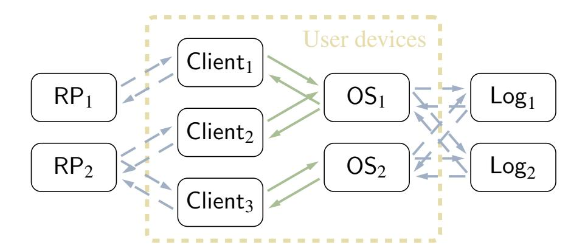
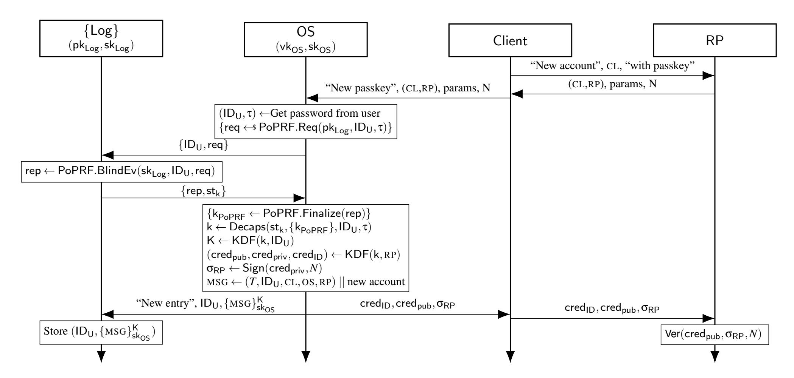
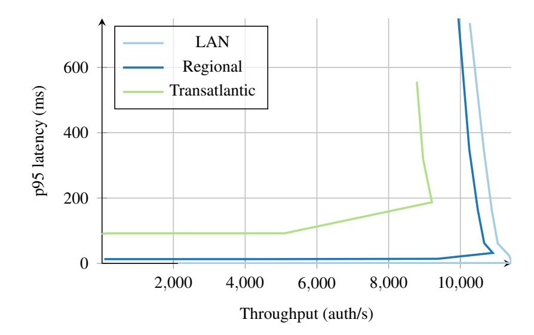
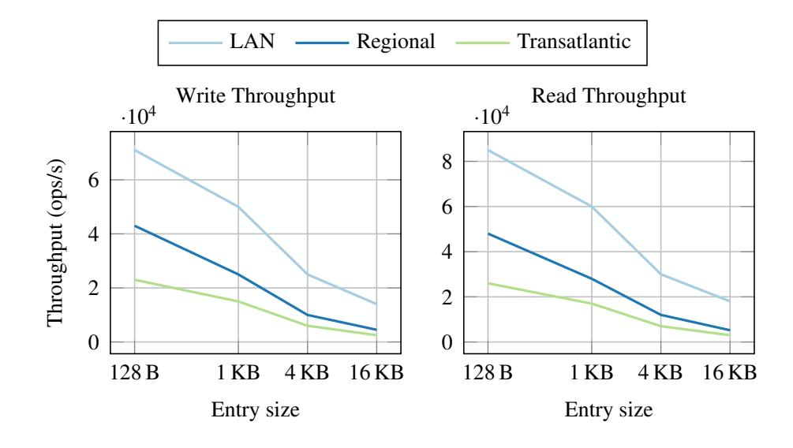

{0}------------------------------------------------

# <span id="page-0-0"></span>Trace: Complete Client-Side Account Access Logging

Paul Gerhar[t](https://orcid.org/0000-0002-0164-0187) *TU Wien*

Carolina Ortega Pére[z](https://orcid.org/0000-0002-1433-3020) *Cornell University*

Thomas Ristenpar[t](https://orcid.org/0000-0002-8642-9558) *University of Toronto*

## Abstract

Despite improvements to authentication mechanisms, account compromise remains frequent and users need a trustworthy way to determine what devices have accessed their accounts. Doing so, however, is in tension with privacy goals on the modern web, which mandate that web services not learn static device identifiers. Recent work aims to address this tension via client-side encrypted access logging (CSAL), but their approach does not allow retrieving all log entries and users may miss information about adversarial accesses.

We present Trace, a new CSAL system that achieves complete logging while preserving privacy. Trace records verifiable evidence of each authentication in an encrypted log stored by an independent logging service, ensuring that only the user can inspect it. The web service remains unaware of the logging, preserving backward compatibility with existing authentication infrastructures. Unlike prior approaches, Trace simultaneously achieves verifiable device attribution, backward compatibility, and formally-analyzed security against malicious adversaries. Our prototype implementation reaches over 10 K authentications per second on a single core, suggesting it can scale efficiently for large services.

## 1 Introduction

No authentication mechanism can fully prevent account compromise. Even with advances such as phishing-resistant credentials, hardware tokens, and passkeys, attackers still find ways to obtain valid secrets [\[16,](#page-14-0) [17,](#page-14-1) [50\]](#page-15-0). When prevention fails, users face a different challenge: they often have no trustworthy way to learn if their accounts have been misused or what an attacker has done.

To address this gap, many services provide account security interfaces (ASIs) that display active devices and sessions [\[43\]](#page-15-1). Yet these interfaces offer limited assurance, as they rely on transient signals such as IP addresses or browser fingerprints that attackers can easily spoof [\[14\]](#page-14-2). This spoofability is not merely an implementation flaw but a structural consequence of modern privacy protections.

If unspoofable device identifiers were exposed, fingerprinting users across services would become trivial [\[46,](#page-15-2) [49\]](#page-15-3). To prevent such cross-service tracking, access to these identifiers is deliberately restricted at the application level [\[43\]](#page-15-1). This creates a fundamental tension between privacy and accountability: privacy requires that unspoofable identifiers remain hidden, while accountability relies on retaining reliable evidence of device identity.

To resolve this tension, users need verifiable account activity records that remain encrypted from service providers. Such access logs would allow users, not services, to confirm which devices accessed their accounts, without revealing persistent identifiers or enabling tracking.

Prior approaches. Two recent systems have explored this idea by giving users trustworthy account access logs that remain hidden from resource providers.

The first approach is Larch [\[25\]](#page-14-3). Larch ensures that every login produces a verifiable, encrypted record of the authentication. It represents an important first step, as it reliably informs users when an authentication has taken place without exposing any information to the resource provider. However, since Larch runs as a client-side application, it can attest only which resource provider was contacted, not which device initiated the authentication.

The second approach, CSAL (client-side encrypted access logging) [\[43\]](#page-15-1), addresses this missing dimension by adding unspoofable device identifiers to each log entry. To do so, CSAL necessarily relies on a trusted operating system service, since only the operating system has privileged access to stable, hardware-bound device identifiers that cannot be forged or suppressed by applications. However, the CSAL design has a limitation: since CSAL does not add any persistent state to users, each session generates a new ephemeral decryption key that must be made available to all future sessions for the same user. If a user later logs in from a new device while all previous devices are offline, these keys become inaccessible, and the user loses access to their previously logged data. Thus, CSAL logs can be incomplete.

{1}------------------------------------------------

Our contributions. We address the deficiencies in existing approaches by designing a client-side encrypted accesslogging system that includes unspoofable device identifiers, while ensuring complete logging. Our system is called *Trace (Trusted Record of Account-Client Events)*. Trace leverages a trusted operating system service with access to stable, hardware-bound device identifiers, ensuring that each authentication is attributable to a real device.

Trace relies on a single user secret to enable access from any device. We consider two deployment settings: with device synchronization, the operating system generates and stores a symmetric key in the keystore; without synchronization, the user provides a password. We focus primarily on the latter setting, which is easier to deploy across multiple user devices but more challenging to secure.

From the password, any of the user's operating systems and dedicated log services jointly derive *credentials* that a client application can present to the resource provider (RP) during authentication, ensuring that every successful login produces a corresponding verifiable log entry. The operating system service participates in this process because it is the only clientside component with access to stable device identifiers and is responsible for attaching these identifiers to encrypted log entries before sending them to the log service.

At the cryptographic core of our design lies a *partially oblivious pseudorandom function (PoPRF)* [\[29\]](#page-14-4), an efficient two-party protocol that lets two parties compute a shared pseudorandom value without revealing their private inputs. In Trace, the OS, and a user-chosen subset of the log services pairwise evaluate this PoPRF: the OS provides the user's identifier and password, each log service provides a longterm *secret key*, and both share a user identifier as public input.[1](#page-0-0) Each evaluation returns a pseudorandom value only to the OS, which then derives an encryption key for the logs and credentials used to authenticate the user to the RP. By deriving keys and credentials via PoPRFs, Trace fuses the user's password and the log services' secret keys into an opaque value that reveals nothing about either. The effect is twofold: no malicious party can bypass logging without interacting with an authorized set of log servers, and the log servers learns nothing about the log messages or credentials as they lack the password.

We implement a prototype of Trace using only ellipticcurve and hash primitives. We achieve up to 10,K key derivations per second on a single core in a WAN setting, making it practical in terms of efficiency. We also discuss two-factor authorization and single sign-on, as well as broader deployment challenges.

## 2 Related Work

Previous work on account security often focuses on strengthening authentication mechanisms. Technologies such as twofactor authentication [\[28\]](#page-14-5) or passkeys [\[7,](#page-13-0)[20,](#page-14-6)[50\]](#page-15-0) aim to protect users by preventing account compromise that could enable others to access their accounts. However, detecting account compromise after it occurs is equally important.

Some methods to detect compromise include email notifications [\[38\]](#page-15-4) and ASIs [\[23\]](#page-14-7), among others. In practice, many platforms provide some form of ASIs, allowing users to view the devices connected to their account. However, Daffala et al. [\[23\]](#page-14-7) showed that while ASIs are essential for users' compromise diagnosis, the information they contain is easy to spoof. Nonnenkamp et al. [\[42\]](#page-15-5) explore using data exports to provide users with more granular information about their account activity and to help them identify account compromise.

Given the importance of ASIs, researchers have proposed approaches to address the gap by providing users with reliable information about their account activity.

Larch. The first, relatively new approach to provide reliable access logging is Larch [\[25\]](#page-14-3). Larch records user authentications in a three-entity model consisting of a client, a relying party (RP), and a single log service. The user's RP authentication credential is split between the client and the log service using two-out-of-two secret sharing, and the client also stores a symmetric encryption key. To reconstruct the credential, the user encrypts a log message accounting for this login attempt under the symmetric key, proves the well-formedness of the ciphertext, and forwards this verifiable ciphertext to the log service. If the log service is convinced of the ciphertext's validity, it cooperates with the user to recover the credential.

The main limitation of Larch is that the encrypted logs cannot contain unspoofable device identifiers, since Larch runs as an untrusted service. Furthermore, Larch only considers logging authentication events, as proving well-formedness for general ciphertexts is computationally expensive.

Larch is backward-compatible with FIDO2, TOTP, and password-based authentication and can therefore be deployed at most RPs *without* modification. It requires zero-knowledge proofs and (in some cases) garbled-circuit-based secure computation to prove the well-formedness of the ciphertexts. To use Larch across multiple devices, a user must synchronize the credential share for each credential, along with a symmetric encryption key, similar to our password. Larch provides security against malicious adversaries, but it has not been formally proven secure under a rigorous adversarial model.

CSAL. A second approach towards reliable access logging is CSAL [\[43\]](#page-15-1). CSAL addresses the first limitation of Larch by enabling the use of unspoofable device identifiers. It achieves this by introducing a trusted operating system service on each user device. This service has access to stable device identifiers and mediates the creation of encrypted log entries, allowing

<sup>1</sup>The user identifier used in the PoPRF evaluation enables the log services to associate key derivations and encrypted log entries belonging to the same user, but can be pseudonymous.

{2}------------------------------------------------

CSAL to log events beyond authentication without requiring zero-knowledge proofs or verifiable encryption.

The idea of CSAL is to enrich the RP's existing logs with encrypted device identifiers. Whenever a user starts a new session, the OS service on that device creates a fresh ephemeral keypair and uses it to encrypt the identifiers. It then encapsulates its decryption key to all other known ephemeral public keys of the user's active devices stored at the RP and distributes these encapsulations through the RP. Each active device can decapsulate these values using its own ephemeral key, thereby gaining access to the encrypted identifiers for the newly created log entries.

The benefit of this design is that the user has no local state, while it supports an arbitrary number of new devices as long as at least one previously active device remains online. However, it has a structural drawback: because the user maintains no persistent state, a device that logs in after all previous devices have gone offline cannot recover the decryption keys for earlier log entries. As a result, previously encrypted logs become permanently inaccessible. CSAL provides a formal security analysis in the honest-but-curious model.

End-to-end encrypted applications. Extensive work has broken, built, and analyzed end-to-end encrypted (E2EE) protocols and applications, including messaging (e.g., [\[6,](#page-13-1) [13,](#page-14-8) [18,](#page-14-9) [39,](#page-15-6) [44,](#page-15-7) [45\]](#page-15-8)), cloud storage (e.g., [\[9,](#page-13-2) [10,](#page-13-3) [33\]](#page-14-10)), among others (e.g., [\[15,](#page-14-11) [21,](#page-14-12) [26,](#page-14-13) [30,](#page-14-14) [31,](#page-14-15) [40\]](#page-15-9)).

Deriving a shared encryption key for messaging purposes is generally done through a key exchange [\[27,](#page-14-16) [39\]](#page-15-6), while applications like encrypted cloud storage or backups often rely on users remembering a pin [\[24,](#page-14-17) [40\]](#page-15-9), password [\[9,](#page-13-2) [10,](#page-13-3) [26,](#page-14-13) [44\]](#page-15-7), recovery code [\[31,](#page-14-15) [40\]](#page-15-9), etc. In our setting, information is always encrypted to the same user, but we would like them to decrypt it to sessions that do not yet exist. For this reason, we cannot rely on key exchange approaches. To strengthen the security provided by a password, the systems above generally rely on hardware security modules [\[24\]](#page-14-17), OPRFs [\[9\]](#page-13-2), or both [\[26,](#page-14-13) [31,](#page-14-15) [40\]](#page-15-9). Trace similarly relies on a PoPRF [\[29\]](#page-14-4).

## <span id="page-2-1"></span>3 Architecture and Functionality of **Trace**

Our goal is to build a client-side encrypted logging system with unspoofable device identifiers and full privacy from services. This section presents the system model and threat assumptions underlying Trace, and compares them with those of CSAL and Larch.

Architecture. Our system comprises five entities: end-users, client applications (clients), operating system services (OS), relying parties (RPs), and log services. An overview of the architecture is shown in Figure [1.](#page-2-0)

RPs are account-based websites or services. End-users authenticate to RPs via clients, which are browsers or native applications running on user devices. The OS of these devices plays an important role in our protocol. We propose

<span id="page-2-0"></span>

Figure 1: Architecture of Trace. Multiple devices of the same user contribute encrypted log entries to multiple log services. RP–Client communication is unchanged. Local communication uses solid arrows; network communication dashed ones.

two versions of Trace: one where cryptographic secrets can be synchronized across the OSes of different devices (e.g., similar to passkeys), and another version where there is no automatic synchronization and users instead must remember a password. The latter is relevant in cases where synchronization across vendors is limited or in borrowed-device settings. The password-based Trace is more complex, so we use it as our running example in this and the next section. We discuss the synchronized setting in Section [5.](#page-6-0)

Each log service is a platform that stores encrypted log entries on behalf of users and participates in key derivation with the user's OS instances. The log services handle only encrypted data, hence they can be operated by any user-selected third party, including independent or non-profit organizations.

Users select an *access structure* over their chosen log services, specifying which server subsets suffice to derive credentials and recover the corresponding keys. We refer to such a subset as an *authorized set*. Log services are unaware of one another and interact with OS instances independently of the user's access structure. We discuss possible choices of access structures in Section [5.](#page-6-0)

As mentioned before, end-users must remember a password, which represents the user's sole persistent state. The password is used by any of the user's OS instances, in cooperation with an authorized set of log services, to deterministically derive credentials that are presented to the RP as authentication material. Throughout the protocol description, we model credentials as WebAuthn credentials, i.e., RP-bound key pairs confined to the OS and used to generate authentication signatures [\[50\]](#page-15-0). Once a valid signature is derived, the OS forwards it to the client application, which uses it to authenticate to the RP. We discuss alternative credential instantiations, such as passwords, in Section [5.](#page-6-0)

Threat model. Our system aims to provide four main security properties: *confidentiality*, *unlinkability*, *accountability*, and *unforgeability*.

*Confidentiality* ensures that only parties who know the password can decrypt log entries. No other entity should be able to learn any information about the recorded contents.

{3}------------------------------------------------

Unlinkability prevents adversaries from correlating a user's activities, even if log services or the relying parties are malicious. As long as the user's password remains unknown, encrypted log entries and credentials disclose no information about which user device was used, for which RP they were generated, or which client was involved.

Confidentiality and unlinkability rely on the secrecy of user passwords, which typically have low entropy. The system mitigates password-guessing attacks by having log services enforce rate limiting. Thus, if an adversary corrupts all but one log service in a user's authorized set, the most effective attack against these properties reduces to a rate-limited online password-guessing attack. This represents the strongest corruption model in a low-entropy password setting [32].

Unforgeability ensures that, as long as the OS behaves honestly, no malicious party, including log services, can create fake or misleading log entries, even when knowing the password. This guarantees that the log remains a trustworthy record and cannot be manipulated to produce false evidence.

Accountability requires that every successful authentication with a credential managed by Trace produces a corresponding verifiable log entry. This ensures that users can later detect account misuse. The property should hold even if the user's password is leaked, as long as at least one log service in each authorized set behaves honestly. At least one honest log service is required for accountability, since dishonest log services can always suppress entries to avoid detection.

In addition, our system should achieve *completeness*, ensuring that all log entries remain accessible to any OS instance authorized by the user's password. Together, these four security properties and completeness capture the core trade-off addressed by our system. Confidentiality and unlinkability preserve the user's privacy by ensuring that neither a log service nor an RP can learn or correlate sensitive information. At the same time, accountability, completeness, and unforgeability establish verifiable integrity: every authentication using Trace is recorded, no party can insert or alter entries, and each recorded information is accessible from each user-device.

**Design approaches.** We now outline our design choices, contrast them with CSAL and Larch, and summarize the differences in Figure 2.

To bind log entries to unspoofable device identifiers, Trace places credential derivation and logging inside a trusted OS service, similar to CSAL [43]. Since access to stable device identifiers is restricted to the operating system, this design allows log entries to be attributed to concrete devices without exposing such identifiers to client applications. This approach fundamentally differs from Larch [25], which uses zero-knowledge proofs to attest to the well-formedness of ciphertexts during authentication. However, such proofs require arithmetization of private-key encryption and introduce nontrivial computational and implementation overhead. Moreover, even with these proofs, unspoofed device identity cannot

<span id="page-3-0"></span>

|                               | CSAL     | Larch                | Trace        |
|-------------------------------|----------|----------------------|--------------|
| <b>Unspoofable device IDs</b> | <b>√</b> | ×                    | <b>√</b>     |
| <b>Backward compatible</b>    | ×        | $\checkmark$         | $\checkmark$ |
| <b>Complete logging</b>       | ×        | $\checkmark$         | $\checkmark$ |
| Cryptographic overhead        | medium   | higher               | low          |
| <b>Cross-device state</b>     | none     | $ RP  \cdot \lambda$ | none         |
| User state                    | none     | none                 | password     |
| Threat model                  | HBC      | malicious            | malicious    |
|                               |          |                      |              |

Figure 2: Comparison of design approaches for client-side access logging. |RP| denotes the number of RPs a user is enrolled in, and  $\lambda$  is the security parameter.

be guaranteed, since client applications do not have reliable access to stable device identifiers.

Separating log services from the RPs, along with credential compatibility with existing interfaces, allows the RPs to remain unaware of logging. This facilitates deployability, as access logging is backward-compatible with existing RPs without interface changes. As a result, once log services are deployed, and operating systems include a Trace service, the protocol can be rolled out to large client populations without coordination across thousands of RPs. This approach is similar to Larch but improves upon CSAL, where each RP must explicitly support logging.

Trace is designed so that a user's low-entropy password serves as their sole persistent state, enabling access across multiple devices. Any of the user's OS instances can be used to interact with an authorized subset of log services, producing pseudorandom values from which the OS deterministically derives both RP credentials and encryption keys.

In contrast, Larch requires the user to synchronize a symmetric encryption key alongside their existing per-RP credentials, resulting in higher synchronization overhead. CSAL avoids any synchronized device and user state and instead relies on ephemeral public keys to encrypt log entries. While avoiding synchronized state is generally desirable, Ortega Pérez, Daffalla, and Ristenpart [43] show that this design inevitably results in incomplete access logs if all of a user's devices are offline at some point. Moreover, this completely stateless approach allows malicious servers to add ghost users to the system in a way that allows decrypting the CSAL logs, breaking unlinkability and confidentiality. (RPs can always allow client device into an account, but with Trace those malicious devices won't be able to decrypt logs.) CSAL is therefore secure against an honest-but-curious (HBC) adversary, but not against malicious adversaries.

#### **Non-goals.** We do not aim to provide the following.

Credential security and unenrollment prevention. The accountability guarantees of Trace depend on the security of the credentials used with the RP. For example, if the RP only supports password-based credentials and these are leaked, an adversary can authenticate directly to the RP without first deriving them through Trace. In addition, after authenticating, an

{4}------------------------------------------------

adversary can change the credential at the RP, thereby unenrolling the account from Trace. This limitation is unavoidable because RPs are agnostic to the use of Trace.

*Metadata unlinkability.* Unlinkability prevents information leakage from credentials, key derivation, and ciphertexts. However, a malicious log service colluding with a malicious RP can still perform timing attacks to correlate events or observe a user's device IP address, amongst other metadata. Protection against such metadata-based attacks is orthogonal to the design of Trace and outside the scope of this work.

*Security under a compromised* OS*.* Security in Trace relies on static device identifiers accessible only to OS. If the OS is dishonest, identifiers could be leaked or tampered with, and their correctness cannot be verified [\[43\]](#page-15-1). In addition, unlinkability and confidentiality cannot be maintained once a user enters their password on a compromised device.

## <span id="page-4-0"></span>4 The **Trace** Protocol

We now describe the base protocol flow and system lifecycle of Trace. We present the design for the setting where a user's devices do not synchronize state, hence the user relies on a password for Trace. We discuss simplifications enabled by device synchronization in Section [5.](#page-6-0) A flow diagram of the enrollment procedure is shown in Figure [3.](#page-5-0)

In what follows, we write (Enc,Dec) for encrypting and decrypting with an AEAD, and (Sign,Verify) for signing and verification using a signature scheme. KDF denotes a keyderivation function.

Setup. Trace begins with an initial setup phase that provisions cryptographic secrets. The setup outputs a tuple (IDU, τ) consisting of a user ID and a password for the user, a public–private key pair (pkLog,skLog) for each Log, and a signing key pair(vkOS,skOS) for each OS instance. ID<sup>U</sup> is a pseudonymous identifier used between the user (via the OS) and a log service to enable efficient per-user log lookup and key derivation across user devices. Importantly, it is not linkable to any credentials or protocol executions observable by the RP.

Registration. During a one-time registration, a user provides an identifier IDU, a password τ, and an access structure specifying authorized subsets of log services for one of its devices running a Trace service. The goal of registration is to establish key material that any of the user's devices can use when interacting with any authorized set of logging services.

To establish such materials, we rely on partially-oblivious pseudo-random functions (PoPRFs) [\[29\]](#page-14-4), which are a twoparty protocol where one party (in our case a Log) holds the secret key, and the other (the OS) provides an input split into a public and a private part. In our case, the secret key is skLog, the public input is user ID IDU, and the private input is the password τ. After the evaluation, the OS learns only the PRF output, while the log service learns nothing about either the private input or the output.

Hence, for each user-selected log service Log, the OS and Log jointly evaluate kPoPRF ← PoPRF(skLog,(IDU, τ)). The OS then samples a random key k. Then, for each authorized subset of log services, let {kPoPRF} denote the set of PoPRF outputs obtained from interacting with the log services in that subset. The encapsulation of k is:

$$\mathsf{Encaps}(\{k_{\mathsf{PoPRF}}\},k) := \mathsf{Enc}(\mathsf{KDF}(\{k_{\mathsf{PoPRF}}\},\mathsf{ID}_{\mathsf{U}},\tau),k) \;.$$

The OS finally produces a state stk, which consists of the concatenation of the encapsulations for all authorized sets in the user's access structure. To conclude the registration, the OS sends (IDU,stk) to each logging service for storage.

After setup and registration, every protocol step follows the same three-part structure: key derivation, operation, and logging. We first explain key derivation and logging, before focusing on the operations that define the account lifecycle.

- 1. *Key derivation.* The OS interacts with an authorized set of Log services and uses password τ to retrieve k. Based on k, OS derives other cryptographic keys. The process relies solely on the Logs' keys and τ, ensuring that keys can be derived across all devices of a user. In the end, only the OS learns the derived keys.
- 2. *Operation.* Using the derived keys, the OS performs the client's intended action, such as creating per-RP credentials, generating authentication responses, or other cryptographic operations required by the protocol.
- 3. *Logging.* The OS generates a log entry for the operation performed, encrypts it under a derived key, and sends it to the Log servers for storage.

Key derivation. After registration, any OS instance and any authorized set of log services can derive cryptographic keys. The OS obtains st<sup>k</sup> from any log service. It then re-derives the kPoPRF values with each log service in the set, computes KDF({kPoPRF},IDU, τ) and recovers k from the respective encapsulation. We denote this procedure as

$$k \leftarrow \mathsf{Decaps}(\mathsf{st}_k, \{k_{\mathsf{PoPRF}}\}, \mathsf{ID}_{\mathsf{U}}, \tau).$$

The OS uses k to derive a symmetric encryption key used to encrypt and decrypt log entries:

$$K \leftarrow KDF(k, ID_U)$$
.

All further keys and credentials for the user will also be derived using this k as a secret nonce. If τ is incorrect, the OS would fail to recover k and prompts the user to re-enter τ. As discussed earlier, each log service enforces rate limits to prevent password-guessing attacks. Moreover, we assume the communication between the Log and any OS instance is authenticated (see Section [5\)](#page-6-0), so an honest log service executes the PoPRF only with authorized OSes.

{5}------------------------------------------------

<span id="page-5-0"></span>

Figure 3: Trace enrollment flow for creating an account in RP using passkeys as credentials, assuming {Log} is an authorized set.

**Logging.** After deriving K, the OS prepares a logging message m describing the operation to be logged. It augments m with the static identifiers of the client, RP, and OS (denoted by (CL, RP, OS)), a timestamp T (see Section 5), and ID<sub>U</sub>:

$$MSG := (T, ID_{IJ}, CL, OS, RP) \mid\mid m$$
.

Next, the OS signs MSG with its signing key  $sk_{OS}$ , yielding a signature  $\sigma$ , and encrypts MSG,  $vk_{OS}$ , and  $\sigma$  under K to obtain a ciphertext. We denote the resulting encrypted log entry by

$$\{\mathsf{MSG}\}_{\mathsf{sk}_\mathsf{OS}}^\mathsf{K} := \mathsf{Enc}(\mathsf{K}, \mathsf{MSG} \mid\mid \mathsf{Sign}(\mathsf{sk}_\mathsf{OS}, \mathsf{MSG})),$$

which is then sent alongside  $ID_U$  to the log services for storage. Enc is an authenticated encryption scheme with key identification that prevents the leakage of any log contents. Intuitively, using signatures and the timestamp provides unforgeability. The signature ensures that each decrypted plaintext comes from a valid OS, while the timestamp prevents reordering.

In all interactions, each log service only learns  $ID_U$ , ciphertexts, and PoPRF requests. The protocol transcript leaks nothing about the device, client, RP, or context that triggered the entry creation. This maintains unlinkability and confidentiality against Log.

**Enrollment.** Enrollment adds an account to Trace, which generates new credentials to be stored with an RP.<sup>2</sup> To do so, the client application interacts with the respective RP and receives a challenge N (e.g., a WebAuthn challenge) and an RP-specific identifier RP (e.g., the RP's domain and the user's

identifier with this RP). The client forwards both values to the OS. The OS then prompts the user to provide  $(ID_U, \tau)$  and runs key derivation with an authorized set of log services to obtain the keys (k, K). Using k, the OS locally derives a credential

$$cred = (cred_{ID}, cred_{pub}, cred_{priv}) \leftarrow KDF(k, RP),$$

and attests N with this credential:  $\sigma_{RP} \leftarrow \mathsf{Sign}(\mathsf{cred}_{\mathsf{priv}}, N)$ . The OS returns  $(\mathsf{cred}_{\mathsf{ID}}, \mathsf{cred}_{\mathsf{pub}}, \sigma_{\mathsf{RP}})$  to the client and simultaneously creates a matching log entry for the log services.

The local credential derivation preserves unlinkability against the RP. Since KDF is a random function of the values cred<sub>ID</sub> and cred<sub>pub</sub> do not reveal information about the user or their actions.

**Authentication.** Authentication allows a user to attest to previously enrolled credentials. Similar to enrollment, the client starts by interacting with the RP to receive a challenge N. Then it forwards N to the OS, which re-derives the RP-specific credential and attests N. The OS returns (cred<sub>ID</sub>,  $\sigma_{RP}$ ) to the client and logs accordingly. Authentication can be optimized if the OS has run key derivation before and cached k. Then, credential derivation and attestation occur locally.

The split-secret design of enrollment and authentication enforces accountability. To reconstruct a credential, the OS must interact with an authorized set of log services. By assumption, such a set includes at least an honest log service, which stores a log entry for this derivation.

**Log access.** Each OS instance can write additional log records on behalf of the client at any point by running the logging protocol as described above. To read the logs, the

<sup>&</sup>lt;sup>2</sup>Throughout this description, we model credentials used with RPs as WebAuthn credentials [50], and discuss alternative credential instantiations in Section 5.

{6}------------------------------------------------

OS first derives the keys (k, K) and requests all ciphertexts associated with the user identifier  $ID_U$  from the log. The log responds with the set of ciphertexts  $\{\{MSG\}_{sk_{OS}}^K\}$ . The OS decrypts each ciphertext with K, parses  $vk_{OS}$  from the identifier OS included in MSG and uses  $vk_{OS}$  to verify the signature on MSG. Additionally, the OS ensures that  $vk_{OS}$  corresponds to an honest OS by verifying a key attestation. We discuss key attestations in Section 5. After decrypting the entries, the OS sorts the messages according to their timestamp. The decrypted log messages are never forwarded to the client application, but are displayed only to the user through an OS application.

Credential and password updates. Users may refresh their authentication state by updating their password, their RP-specific credentials, and the set of authorized log servers. First, the user provides their old and new password  $(\tau, \tau')$ . The OS evaluates the PoPRF with each log service in an old authorized set on inputs  $(ID_U, \tau)$ , and with each log service in the new authorized sets on inputs  $(ID_U, \tau')$ . Then, the OS computes a fresh state  $st'_k$  and derives fresh keys (k', K'). the OS also encrypts the old key k under K' and signs it with  $sk_{OS}$ , and includes the resulting ciphertext  $\{k\}_{sk_{OS}}^{K'}$  into  $st'_k$ . The fresh state is sent to all log services in the new authorized set for storage, after which the user can use  $\tau'$  for authentication. After an update, the client can derive new credentials from k'.

The chaining mechanism ( $\{k\}_{sk_{OS}}^{K'}$ ) provides a form of post-compromise security: if an old password or a log service is compromised, logs protected under the new password and access structure remain secure. At the same time, it preserves correctness, since possession of the new password allows the OS to recover K', decrypt k, and thereby re-derive all keys and credentials used before the update.

### <span id="page-6-0"></span>5 Extensions and Deployment

We outline deployment aspects and extensions of Trace.

**Authorized sets.** Users may authorize arbitrary sets of log services for key and credential derivation. We expect simple configurations for a small number of log services, although our construction supports an access structure of any size.

The access structure is enforced entirely on the user side; the user selects the authorized sets and executes the same protocol with each log service, but each interaction is independent of the authorized set and access structure.

Trace could alternatively be instantiated using a threshold PoPRF [11] instead of evaluating a separate PoPRF per log service. However, this would restrict user flexibility in choosing and updating access structures [19]. Similarly, key encapsulation could be realized via password-protected secret

sharing [34], but this approach only supports threshold access structures rather than general monotone structures.

Log service architecture. Since log entries are encrypted, ciphertexts can be stored at arbitrary user-chosen locations and do not need to be sent to every log service. Accordingly, log services may participate only in key derivation, without storing encrypted log data. This separation allows parties with limited resources, such as non-profit or volunteer-operated organizations, to contribute to the system's security without incurring storage or availability costs [36].

**Synchronized setting.** The protocol we have described so far is designed to operate in a password-based setting where devices do not share synchronized state. This situation can arise due to limited interoperability across platforms, the use of borrowed or public devices, or other scenarios in which persistent secure storage is unavailable. In this setting, the PoPRF plays a central role by enabling deterministic derivation of a cryptographic key from a low-entropy password without requiring the user to remember or manage additional secrets.

However, we anticipate synchronization of OS instances to be available in some cases, similarly to how passkeys can be synchronized across devices (e.g., via iCloud Keychain [7]). When such synchronization is available, an OS can locally generate and store k, and synchronize it across the user's devices. In this case, logging services are used only to store encrypted activity entries. The remaining parts of our protocol remain unchanged.

Since in this setting only high-entropy secrets are involved, Trace can provide stronger privacy guarantees in the synchronized setting: confidentiality and unlinkability remain intact even if all log services are malicious. Importantly, the derived K is still used to encrypt static device identifiers; therefore, the synchronization mechanism across devices must be implemented at the trusted OS level rather than through a potentially untrusted client application.

**Rate limiting.** We assume that log services enforce per-user rate limits. After a bounded number of PoPRF requests from a same ID<sub>U</sub>, the log service temporarily refuses further requests. This allows the use of low-entropy passwords by limiting the feasibility of online guessing attacks [12].<sup>4</sup>

To reset the rate limit after successful authentication, the OS must convince a log service that the user entered the correct password. For this purpose, we can include a deterministic, perfectly hiding commitment to the OS-derived key k to st<sub>k</sub>. After authentication, the OS proves knowledge of the corresponding commitment opening using the derived key, which convinces each log service to reset the counter.

**Logging without authentication.** We can extend our baseline protocol to allow logging even when the password is in-

<sup>&</sup>lt;sup>3</sup>To avoid metadata-monitoring attacks that arise when malicious parties can request ciphertexts of arbitrary user IDs, the log service can enforce that log ciphertexts are only forwarded to entities able to decrypt the ciphertexts (c.f. Section 5).

<sup>&</sup>lt;sup>4</sup>To prevent denial of service attacks by remote unauthenticated parties, we can limit PoPRF requests to be only processed within an authenticated session. Unauthenticated requests are rejected prior to any rate limit update.

{7}------------------------------------------------

correct [47]. For this, in addition to deriving K, the OS derives a public-key encryption key pair  $(ek, dk) \leftarrow KDF_{PKE}(k)$ , and sends the public key ek to the log services for storage. If a protocol execution attempt fails (e.g., due to an invalid password) a Log can provide ek to the OS, which then encrypts the failure event under ek and submits it as a log entry. Once a valid attempt occurs again, the OS can recover these entries by locally decrypting with dk and re-encrypting them under the symmetric key K, thereby integrating them consistently into the user's log history. The security guarantees of this public-key extension carry over from the baseline protocol, replacing private-key encryption with its public-key counterpart.

This can be further extended to allow RPs to contribute authenticated log entries. A user can allow an RP to write logs by forwarding ek to the RP and adding an attestation to  $vk_{RP}$  to  $st_k$ . The RP then creates entries of the form  $\{MSG\}_{vk_{RP}}^{ek}$  and sends them to the appropriate log services. Each of the user's devices can decrypt such a ciphertext because they derive dk from  $st_k$  and the signature verifies under an attested key. If an RP is aware of Trace and participates in logging, we can protect against the unenrollment attacks mentioned earlier and provide better accountability.

SSO, 2FA, and other types of credentials. Beyond WebAuthn credentials [50], Trace can support a range of software-based authentication methods whose secrets can securely be derived within the operating system. This includes passwords and one-time passwords (e.g., TOTP [41]). As discussed in Section 3, the security provided by Trace depends on the security guarantees of the credential used.

Our design also supports single sign-on, provided the SSO provider accepts credentials derived within Trace. This is the case for most SSO providers [3, 4]. Since Trace does not modify the authentication flow between clients and RPs, existing multi-factor authentication mechanisms remain fully supported. An SSO or MFA service may enroll in Trace as described in the previous subsection, and log information from SSO and second-factor authentication, respectively.

Authentication on unsupported devices. If a device does not support Trace, but the user has a trusted personal device available, the OS on the latter can run Trace and forward the resulting authentication credential to the public device. This can be done using a short-range channel, as in WebAuthn passkey forwarding [20].

Authenticated OS. We require the OS to attest to its keys and to establish an authenticated channel between the OS instances and the log service when deriving keys. For this, we rely on FIDO2-style attestations, like CSAL [43] does. This attestation infrastructure is available in most modern operating systems [8], which facilitates deployment. For the authenticated channels, unlinkability depends on the size of the authenticator anonymity sets [5], which provides the same unlinkability guarantee as FIDO2 and CSAL.

**Timestamps.** We assume the existence of timestamps, which are used to sort the log entries during decryption. In practice, timestamps from user devices can be easy to tamper with. To add more robustness, the RP and log services could also provide timestamps, for instance, when sending challenges or storing log entries, respectively.

### 6 Security Analysis

We present the security analysis of Trace. We start by providing some security intuition. Then, we formalize the underlying building blocks, protocol interfaces, and security notions. We show in Theorem 1 that Trace achieves these notions.

**Security intuition.** The core of Trace 's security is the derivation of the intermediate key k. We do this using Decaps ( $st_k$ , { $k_{PoPRF}$ } $ID_U$ ,  $\tau$ ), where each  $k_{PoPRF}$  is derived with some log service using PoPRF evaluations  $k_{PoPRF} \leftarrow$  $PoPRF(sk_{Log}, (ID_U, \tau))$ . First, evaluating PoPRFs leaks no information about  $\tau$  by the PoPRIV notion, so malicious log services do not learn any information when computing k<sub>PoPRF</sub>. Second, since the outputs of a PoPRF are pseudorandom and at least one log service in each authorized set behaves honestly, k cannot be decapsulated without interacting with this honest log service, which forces any efficient adversary to run online brute-force attacks. Because honest log services employ rate limiting, these online brute-force attacks are bounded by a rate limit counter. Third, by the uniqueness of the PoPRF output, it is impossible for the adversary to manipulate the values  $k_{PoPRF}$  for a given pair  $(ID_U, \tau)$ . Finally, the state  $st_k$  is encrypted with an AEAD scheme that ensures integrity. Given the construction  $st_k := Enc(KDF(\{k_{PoPRF}\}, ID_U, \tau), k)$ , any OS instance will either recover the correct key k or detect tampering. Moreover, an adversary cannot recover this key with a higher probability than that of guessing the password within the permitted rate limit.

Combining such a key with an authenticated encryption scheme yields confidentiality and unlinkability. If the credentials derived from this key are hard to forge, and since honest log services only interact with attested Trace OS services, we also obtain accountability. Finally, because log messages are signed with an unforgeable signature scheme for which only trusted OS instances hold the signing keys, the log entries themselves are unforgeable.

**Passwords and credentials.** We use passwords to derive cryptographic material across multiple devices. For the formal security statement, we model passwords using a min-entropy notion. Alternatively, a formulation based on guessing entropy with a fixed password space [12] could be used equivalently.

**Definition 1** ( $\mu$ -entropy Password). We say a password  $\tau \in \{0,1\}^*$  is called a  $\mu$ -entropy password if its guessing probability is at most  $2^{-\mu}$  for any adversary.

{8}------------------------------------------------

To sample a password in our formalism, we provide an efficient algorithm  $\tau \leftarrow \text{genTkn}(\text{ID}_{\text{U}}, \mu)$ , that on input a user ID ID<sub>U</sub> and an entropy parameter  $\mu$  outputs a password  $\tau$  with min-entropy at least  $\mu$ .

<span id="page-8-0"></span>**Definition 2** (Credential Scheme). *A* credential scheme Cred = (GenCred, Sign, VerifyCred) *is specified by three efficient algorithms:* 

 $(\operatorname{cred}_{\mathsf{ID}}, \operatorname{cred}_{\mathsf{pub}}, \operatorname{cred}_{\mathsf{priv}}) \leftarrow \operatorname{GenCred}(\lambda)$ : a generation algorithm that on input a security parameter  $\lambda$  outputs a identifier  $\operatorname{cred}_{\mathsf{ID}}$ , a public part  $\operatorname{cred}_{\mathsf{pub}}$ , and a private part  $\operatorname{cred}_{\mathsf{priv}}$ .  $\sigma \leftarrow \operatorname{Sign}(\operatorname{cred}_{\mathsf{priv}}, N)$ : an attestation algorithm that, given  $\operatorname{cred}_{\mathsf{priv}}$  and a challenge N, outputs an attestation  $\sigma$ .  $\{0,1\} \leftarrow \operatorname{VerifyCred}(\operatorname{cred}_{\mathsf{pub}}, N, \sigma)$ : a verification algorithm that, given a public part  $\operatorname{cred}_{\mathsf{pub}}$ , a challenge N, and an attestation  $\sigma$ , outputs a bit indicating acceptance or rejection.

Correctness requires that for all  $(cred_{ID}, cred_{pub}, cred_{priv}) \leftarrow GenCred(\lambda)$  and all challenges N,  $VerifyCred(cred_{pub}, N, Sign(cred_{priv}, N)) = 1$ .

For unforgeability, we follow the standard notion of existential unforgeability under chosen-message attacks (EUF-CMA) for signatures [35]. A challenger samples (cred<sub>ID</sub>, cred<sub>pub</sub>, cred<sub>priv</sub>)  $\leftarrow$  GenCred( $\lambda$ ) and gives (cred<sub>ID</sub>, cred<sub>pub</sub>) to an adversary  $\mathcal{A}$ , which has oracle access to Sign(cred<sub>priv</sub>, ·). Eventually  $\mathcal{A}$  outputs ( $N^*$ ,  $\sigma^*$ ). It *wins* if VerifyCred(cred<sub>pub</sub>,  $N^*$ ,  $\sigma^*$ ) = 1 and  $N^*$  was never queried to the attestation oracle. We say a credential scheme Credential is EUF-CMA secure if the adversary's success probability is negligible in  $\lambda$ .

We note that this credential definition also allows passwords to be credentials by setting  $\operatorname{cred}_{ID} = \operatorname{cred}_{pub} = \operatorname{H}(pw)$  and  $\sigma = pw$ . Password credentials do only achieve unforgeability under key-only attacks. Looking ahead to our theorem, we can achieve accountability with credentials-as-passwords by having the derive oracle replace  $\sigma$  with  $\bot$  to avoid trivial leakage, similar to [25]. Similarly, we achieve accountability with TOTP by replacing the symmetric key in the derive oracle outputs [41].

**Identifiers.** Identifiers capture static information associated with parties, such as device serial numbers or other attributes that remain fixed across sessions.

**Definition 3** (Identifiers). An identifier is a bitstring drawn from  $\{0,1\}^*$ . We write OS, CL, RP for identifiers of the operating system, the client, and the relying party, respectively. We denote the set of all identifiers (OS, CL, RP) by IDS.

**Protocol formalization.** For the formalization of Trace, we model only the parties that explicitly perform cryptographic operations. Relying parties are left implicit to reflect backward compatibility; we simply assume they accept valid credential attestations as in standard authentication. To model multiple RPs, we include the RP identifier. The user's role is limited to providing passwords to the OS and later reading

the log. We capture these properties by providing the password as input to the OS instances and letting the OS output the decrypted entries. The client only forwards requests and responses between the OS and the RP and is therefore also treated as implicit. To model multiple clients, we include the client identifier. In the protocols of Trace, each log service takes as input its secret key and a current state, which is initially empty and updated after each execution; for brevity, we omit each log service's inputs and outputs from the interfaces.

**Definition 4** (Trusted Record of Account-Client Events). *A* trusted record of account-client events *scheme* Π *consists* of a Setup algorithm and six protocols (Reg, Derive, Auth, Write, Read, Upd) executed between operating systems and logging services. The scheme is parameterized by a credential scheme Cred, and a set of identifiers IDS as defined above.  $(\{(\mathsf{sk}_{\mathsf{Log}}^{(i)}, \mathsf{pk}_{\mathsf{Log}}^{(i)})\}, \{(\mathsf{sk}_{\mathsf{OS}}^{(i)}, \mathsf{vk}_{\mathsf{OS}}^{(i)})\}) \leftarrow \mathsf{Setup}(\lambda): \text{ The setup algorithm takes as input the security parameter } \lambda. \text{ It outputs key pairs } \{(\mathsf{sk}_{\mathsf{OS}}^{(i)}, \mathsf{vk}_{\mathsf{OS}}^{(i)})\} \text{ for the log services, and key pairs } \{(\mathsf{sk}_{\mathsf{OS}}^{(i)}, \mathsf{vk}_{\mathsf{OS}}^{(i)})\} \text{ for the OS instances.}$ 

 $\frac{\text{Reg}\langle OS(\mathsf{sk}_{OS}^{(i)}, \mathsf{ID}_{U}, \tau, \mathsf{IDS}), \{\mathsf{Log}\}\rangle: \ \textit{The OS reads a secret}}{\textit{key } \mathsf{sk}_{OS}^{(i)}, \textit{ an ID-password pair } (\mathsf{ID}_{U}, \tau), \textit{ and a set of IDs IDS.}} \\ \textit{Each Log reads a secret key and a state. The protocol outputs updated states to } \{\mathsf{Log}\}.$ 

 $(\mathsf{cred}, \sigma_\mathsf{RP}) \leftarrow \mathsf{SDerive}(\mathsf{OS}(\mathsf{sk}_\mathsf{OS}^{(i)}, \mathsf{ID}_\mathsf{U}, \tau, N, \mathsf{IDS}), \{\mathsf{Log}\}):$ 

The OS reads  $\operatorname{sk}_{OS}^{(i)}$ ,  $(\operatorname{ID}_U, \tau)$ , a challenge N, and and a set of IDs IDs. Each Log reads a secret key and a state. The protocol outputs a credential cred and an attestation  $\sigma_{RP}$  to OS, and updated states to  $\{\operatorname{Log}\}$ .

 $\frac{(\mathsf{cred}', \sigma'_{\mathsf{RP}}) \leftarrow \mathsf{Upd}\langle \mathsf{OS}(\mathsf{sk}_{\mathsf{OS}}^{(i)}, \mathsf{ID}_{\mathsf{U}}, \tau, \tau', N, \mathsf{IDS}), \{\mathsf{Log}\}\rangle :}{\mathsf{OS}\ \textit{reads}\ \mathsf{sk}_{\mathsf{OS}}^{(i)}, \textit{user-ID}\ \mathsf{ID}_{\mathsf{U}}, \textit{old}\ \textit{and}\ \textit{new}\ \textit{password}\ \tau, \tau', \textit{challenge}\ \textit{N}, \textit{and}\ \textit{IDs}\ \mathsf{IDS}.\ \textit{Each}\ \mathsf{Log}\ \textit{reads}\ \textit{a}\ \textit{secret}\ \textit{key}\ \textit{and}\ \textit{a}\ \textit{state}.}$   $\textit{The\ \textit{protocol}\ \textit{outputs}\ \textit{a}\ \textit{credential-attestation}\ \textit{pair}\ (\mathsf{cred}', \sigma'_{\mathsf{RP}}) \\ \textit{to}\ \mathsf{OS}\ \textit{and}\ \textit{updated}\ \textit{states}\ \textit{to}\ \{\mathsf{Log}\}.}$ 

 $\begin{array}{ll} \underline{\perp \leftarrow \mathsf{Write} \langle \mathsf{OS}(\mathsf{sk}_{\mathsf{OS}}^{(i)}, \mathsf{ID}_{\mathsf{U}}, \tau, \mathsf{MSG}, \mathsf{IDS}), \{\mathsf{Log}\} \rangle \text{:}} \quad \textit{The} \quad \mathsf{OS} \\ \textit{reads} \; \mathsf{sk}_{\mathsf{OS}}^{(i)}, \; (\mathsf{ID}_{\mathsf{U}}, \tau), \; \textit{a message} \; \mathsf{MSG}, \; \textit{and} \; \textit{IDs} \; \mathsf{IDS}. \; \textit{Each} \; \mathsf{Log} \\ \textit{reads} \; \textit{a secret key and a state}. \; \textit{The protocol outputs updated} \\ \textit{log states}. \end{array}$ 

 $\{MSG\} \leftarrow Read\langle OS(\{vk_{OS}^{(i)}\}, ID_U, \tau, IDS), \{Log\} \rangle$ : The OS reads verification keys  $\{vk_{OS}^{(i)}\}$ , an ID-password pair  $(ID_U, \tau)$ , and all IDs IDS. The Log reads a secret key and a state. The protocol outputs a list of decrypted log entries  $\{MSG\}$  to the OS and updated states to  $\{Log\}$ .

For all the protocols, they might also output  $\bot$  if the execution fails. Notice that for simplicity, the formalization above merges enrollment and authentication described in Section 4 into Derive.

One main objective of our work is to overcome the completeness constraints of CSAL [43]. In CSAL, completeness was defined with respect to a given transcript pruning function

{9}------------------------------------------------

that modifies an ideal transcript  $\mathcal{T}^*$ . This transcript contains the client's logins, re-encryptions, and actions. They defined an identity-pruning function pruneld that outputs all entries in the ideal transcript (excluding some game-state-tracking variables from each entry). They prove that no CSAL protocol can simultaneously achieve privacy (similar to our notion of confidentiality) and completeness w.r.t. pruneld. Looking slightly ahead, we will show that Trace can achieve both.

**Completeness.** To define completeness for a trusted record of account-client events, we analogously introduce an ideal transcript  $\mathcal{T}^*$  that keeps track of Reg, Derive, Upd, and Write.  $\mathcal{T}^*$  stores entries  $(t_i, T_i, \mathsf{ID}_{\mathsf{U}i}, \mathsf{OS}_i, \mathsf{CL}_i, \mathsf{RP}_i, m_i)$ , where  $t_i \in \{\mathsf{Reg}, \mathsf{Derive}, \mathsf{Upd}, \mathsf{Write}\}$ ,  $T_i$  is a timestamp as discussed in previous sections,  $\mathsf{ID}_{\mathsf{U}i}, \mathsf{OS}_i, \mathsf{CL}_i, \mathsf{RP}_i$  are IDs, and  $m_i$  is a message which has a fixed value if  $t_i \in \{\mathsf{Reg}, \mathsf{Derive}, \mathsf{Upd}\}$  and if  $t_i = \mathsf{Write}$ ,  $m_i$  is the message to be written. On input  $(\mathcal{T}^*, \mathsf{ID}_\mathsf{U})$ , pruneld outputs all the entries for user  $\mathsf{ID}_\mathsf{U}$ , but with the  $t_i$ 's removed. This ensures that the resulting pruned transcript outputs information on every Reg, Derive, Upd, and Write.

Let  $[op_1, op_2, \cdots, op_n]$  where  $op_i \in \{Reg, Derive, Upd, Write, Read\}$  denote a sequence of operations. Let  $ID_{Ui}$  denote the user ID provided as input to the i-th operation. Completeness then requires that for all  $(\{(sk_{Log}^{(i)}, pk_{Log}^{(i)})\}, \{(sk_{OS}^{(i)}, vk_{OS}^{(i)})\}) \leftarrow Setup(\lambda)$ , for any sequence of operations  $[op_1, op_2, \cdots, op_n]$  on any valid sequence of inputs, if  $op_n = Read$  and outputs a list of decrypted log entries L, then  $L = pruneld(\mathcal{T}^*, ID_{Un})$ . This means that a user can always access their full log, no matter what operations occurred before or what device they are connecting from.

**Security goals.** We next formalize the security goals of a trusted record of account-client events: confidentiality, accountability, unforgeability, and unlinkability. The description of the oracles for the games described below is included in Figure 4. We assume that if one of the operations in an oracle call fails, the oracle aborts outputting  $\bot$ .

We also include pseudocode for the games combined in Figure 18. In the figure, pseudocode is instantiated with our protocol to help guide the reader through the proofs. However, the pseudocode can be generalized by replacing our protocol with the interfaces defined above. We assume a static corruption model, since Trace operates over small sets of log services in which adaptive corruption follows from static corruption using guessing arguments [22].

Confidentiality and Unlinkability. The confidentiality property ensures that log entries remain hidden from any adversary lacking the user's password, even if all but one of the logging services in each of a user's authorized sets and the relying parties are compromised, and the adversary controls the OS keys. As long as the user's password remains secret, such a coalition cannot distinguish between two different sequences of log entries.

#### **Oracles**

<span id="page-9-0"></span>**Reg.** The adversary provides a user ID ID<sub>U</sub>, a password  $\tau$ , and IDS. If  $\tau = \bot$ , the challenger samples a challenge password and stores it. The challenger registers (ID<sub>U</sub>, $\tau$ ) with all log services.

**Derive.** The adversary provides an OS index  $i_{OS}$ ,  $ID_U$ , a password  $\tau$ , a challenge N, and identifiers IDS, a key state  $\mathsf{st}_k$ , and an adversary state  $\mathsf{st}_{\mathcal{A}}$ . The challenger interacts with  $\mathcal{A}$  as OS using  $\mathsf{sk}_{OS}^{(i_{OS})}$  to run Derive. It forwards the OS's outputs and an encrypted log entry to  $\mathcal{A}$ .

**Update.** The adversary provides as input OS index  $i_{OS}$ , user ID ID<sub>U</sub>, old and new password  $\tau, \tau'$ , a challenge N, identifiers IDS, and a key state  $\mathsf{st}_k$ . If  $\tau' = \bot$ , the challenger samples a challenge password. The challenger runs Upd with the adversary as an honest OS on inputs  $(\mathsf{sk}_{OS}^{(i_{OS})}, \tau, \tau', N, \mathsf{IDS})$ . The oracle outputs the OS's outputs, and a log ciphertext.

**Read.** The adversary provides as input  $ID_U$ , password  $\tau$ , IDs IDS, encrypted log messages, and a key state  $st_k$ . The challenger runs Read interacting with the adversary as an honest OS using  $\{vk_{OS}^{(i)}\}$ ,  $\tau$ , and IDS. It returns the decrypted messages.

**Write.** The adversary provides  $i_{OS}$ ,  $ID_U$ ,  $\tau$ , a message m, identifiers IDS, and a key state  $st_k$ . The challenger simulates the honest OS on Write on inputs  $(sk_{OS}^{(i_{OS})}, ID_U, \tau, m, IDS)$  and outputs a log ciphertext.

Figure 4: Oracles for Trace security definitions. Experiments also include a challenge oracle, described in the respective figures. When running protocols, the challenger simulates honest parties.

The unlikability property guarantees, under the same assumptions, that a malicious colluding logging service and relying party cannot distinguish under which OS instance and which identifiers IDS = (CL, OS, RP) log entries and credentials are computed, even if all keys and identifiers are maliciously sampled. We formalize both security goals using a single indistinguishability experiment. Our guarantee is forward-secure: if an adversary compromises the user's password, confidentiality and unlinkability for past interactions may be lost, but once the client performs an update, future log entries and credentials regain confidentiality/unlinkability. We include more details about the game Confid – Unlinkability $_{\mathcal{A}}^{b}(\lambda)$  in Figure 5. Given a ratelimit parameter  $\rho$  that allows at most  $\rho$  PoPRF evaluations per  $ID_U$ , and using  $\mu$ -entropy passwords, the advantage of an adversary  ${\mathcal A}$  is defined as  ${\rm Adv}^{{\rm conf-unlink}}_{{\mathcal A}}(\lambda)=$  $2 \cdot \Pr \left[ \mathsf{Confid} - \mathsf{Unlinkability}_{\mathcal{A}}^{b,\rho,\mu}(\lambda) \Rightarrow b \right] - 1$ , and must be non-negligibly larger than  $\rho/2^{\mu}$  to break confidentiality/unlinkability.<sup>5</sup>

<sup>&</sup>lt;sup>5</sup>We model authorized sets for confidentiality and unlinkability to contain

{10}------------------------------------------------

# Confid – Unlinkability $_{\mathcal{A}}^{b,\rho,\mu}(\lambda)$

- <span id="page-10-1"></span>• The challenger runs  $Setup(\lambda)$  to generate a honest log keypair  $(pk_{Log,H}, sk_{Log,H})$ .
- On input  $\mathsf{pk}_{\mathsf{Log},\mathsf{H}}$ ,  $\mathcal{A}$  outputs keys  $\{(\mathsf{pk}_{\mathsf{Log}}^{(i)},\mathsf{sk}_{\mathsf{Log}}^{(i)})\}$ , and a tuple  $((\mathsf{sk}_{\mathsf{OS},0},\mathsf{CL}_0,\mathsf{OS}_0,\mathsf{RP}_0,m_0),(\mathsf{sk}_{\mathsf{OS},1},\mathsf{CL}_1,\mathsf{OS}_1,\mathsf{RP}_1,m_1))$  of equal length. The adversary is given access to the oracles of Figure 4 and a challenge oracle.
- At some point, the adversary submits a key state  $st_k$  to the challenge oracle.
- The challenger checks if a challenge password  $\tau$  has been generated. If so, it derives a credential and creates a log entry using one of the two tuples according to the bit b, and returns the resulting ciphertext and credential to  $\mathcal{A}$ . The adversary may continue to query all oracles except the challenge oracle.
- Finally, the adversary outputs a bit b'. The adversary wins the experiment if b' = b.

Figure 5: Joint confidentiality and unlinkability experiment.

**Unforgeability.** The unforgeability property ensures that log entries cannot be fabricated, altered, or reordered. Even if an adversary controls both the user's password and all log services, no entry can appear in the decrypted log unless it was honestly added by the OS. This prevents the injection of false evidence or the misattribution of actions to a user. Note that malicious log services can deny service, so the experiment does not guarantee that entries will not be omitted. We include more details about the game Unforgeability<sub>A</sub>( $\lambda$ ) in Figure 6. In Figure 18, we formalize the game relying on the pruneld function defined in completeness. The advantage of an adversary A is defined as  $Adv_A^{unf}(\lambda) = Pr[Unforgeability_A(\lambda) \Rightarrow 1]$ .

Another notion of unforgeability can be considered in a setting similar to confidentiality or unlinkability, where the adversary does not know the user's password but does know all OS signing keys. We adopt the stronger notion defined above because the goal of Trace is to provide reliable logs even in the event of account compromise. Nevertheless, our protocol would achieve the weaker unforgeability notion, as it is based on authenticated encryption. Without knowing the password, no adversary can derive the correct encryption key and therefore cannot create ciphertexts that decrypt.

**Accountability.** The goal of accountability is to ensure that every authentication with a credential from Trace is recorded in the log, even if the adversary knows the user's password. We model this by challenging the adversary to produce a "fresh" attestation  $(N, \sigma_{RP})$  for some cred<sub>pub</sub> ob-

### Unforgeability $_{\mathcal{A}}(\lambda)$

- <span id="page-10-2"></span>• The challenger runs  $\mathsf{Setup}(\lambda)$  to generate  $\{(\mathsf{sk}_{\mathsf{OS}}^{(i)}, \mathsf{vk}_{\mathsf{OS}}^{(i)})\}$  and forwards  $\{\mathsf{vk}_{\mathsf{OS}}^{(i)}\}$  to  $\mathcal{A}$ .
- $\mathcal{A}$  eventually outputs keyss for Log  $\{(\mathsf{pk}_{\mathsf{Log}}^{(i)}, \mathsf{sk}_{\mathsf{Log}}^{(i)})\}$  and has access to the oracles from Figure 4 and a ChallRead oracle.
- The challenger records all oracle inputs to derive the corresponding honest log *L*.
- Eventually,  $\mathcal A$  queries  $\mathsf{ID}_\mathsf{U}^*$ , password  $\tau$ , log ciphertexts and a key state  $\mathsf{st}_\mathsf{k}$  to ChallRead.
- The challenger runs the Read protocol with the adversary to decrypt the log.
- The adversary wins if the decrypted log differs from the honest log in either of the following ways:
  - 1. it contains an entry that does not appear in the honest log,
  - 2. or the order of honest entries has been modified.

<span id="page-10-3"></span>Figure 6: Unforgeability experiment for Trace.

### Accountability<sub>A</sub>( $\lambda$ )

- The challenger runs  $\mathsf{Setup}(\lambda)$  to generate keys  $(\mathsf{sk}_{\mathsf{Log},\mathsf{H}}, \mathsf{pk}_{\mathsf{Log},\mathsf{H}}, \{(\mathsf{sk}_{\mathsf{OS}}^{(i)}, \mathsf{vk}_{\mathsf{OS}}^{(i)})\}$ , and IDs IDS.
- The adversary  $\mathcal{A}$  receives all public information, the OS secret keys, and outputs keys  $\{(\mathsf{pk}_{\mathsf{Log}}^{(i)}, \mathsf{sk}_{\mathsf{Log}}^{(i)})\}$  and has access to the oracles in Figure 4 and a ChallAuth oracle.
- $\mathcal{A}$  can query ChallAuth with input  $(N^*, \operatorname{cred}_{pub}^*, \sigma_{RP}^*)$ .
- The adversary wins if one of the forged attestations is valid w.r.t. a cred\*<sub>pub</sub>, such cred\*<sub>pub</sub> was produced by the challenger in a Derive or Upd oracle query, but cred\*<sub>pub</sub> had never attested to the challenge *N*\*.

Figure 7: Accountability experiment for Trace.

tained through an Derive or Upd query. Such a forgery represents a client that authenticates to an RP without leaving a trace in the log. As for confidentiality and unlinkability, we model a single honest log service that is part of each authorized set. Figure 7 shows the description of the game Accountability  $_{\mathcal{A}}(\lambda)$ . The advantage of an adversary  $\mathcal{A}$  is defined as  $Adv^{acc}_{\mathcal{A}}(\lambda) = Pr[Accountability_{\mathcal{A}}(\lambda) \Rightarrow 1]$ .

**Lemma 1.** Trace is complete, if PoPRF is a correct PoPRF, AE a correct authenticated encryption scheme,  $\Sigma$  a correct signature scheme, and all key-derivation functions are deterministic functions.

<span id="page-10-0"></span>**Theorem 1.** Let PoPRF be a unique, pseudorandom, and POPRIV2-unlinkable partially-oblivious pseudorandom function, let AE be an authenticated private-key encryption scheme with key identification, let  $\Sigma$  be an unforgeable signature scheme, and let Cred be an unforgeable credential scheme. If

a single honest server and an adversarially chosen set of malicious servers. This simplifies formalism, but can be generalized to multiple honest servers using a standard hybrid argument and by adjusting  $\rho$  accordingly.

{11}------------------------------------------------

<span id="page-11-0"></span>

| Operation        | Median (µs) | 95% CI (µs)   |
|------------------|-------------|---------------|
| server_auth      | 135.8       | 135.82–135.84 |
| os_begin_PoPRF   | 64.8        | 64.80–64.85   |
| os_finish_PoPRF  | 114.9       | 114.84–114.88 |
| os_attestate     | 21.4        | 21.38–21.39   |
| os_encrypt_entry | 23.2        | 23.16–23.16   |
| os_decrypt_entry | 38.9        | 38.85–38.86   |

Figure 8: Micro benchmark results.

*all key derivation functions are modeled as random oracles, passwords have µ entropy and Trace is parameterized with a rate-limiting counter* ρ*, then Trace achieves confidentiality, accountability, unforgeability, and unlinkability.*

Due to space constraints, we defer proofs to Appendix [B.](#page-17-0)

## 7 Evaluation

We implement and evaluate a prototype of Trace. We implemented all core components in Rust. The prototype uses the PoPRF of Tyagi et al. [\[48\]](#page-15-13), AES-GCM with SHA-256 key tags for authenticated encryption with key identifications, HKDF and SHA-256 for key derivation and hashing, and EdDSA for signatures, relying exclusively on standardized, actively maintained Rust crates. System components use axum/tokio for networking and RocksDB for storage.

Micro benchmarks. We measured the per-core resource footprint of the OS and Log using criterion benchmarks on an c7a.large AWS instance (AMD EPYC 9R14, 2 vCPUs, 4 GiB). OS benchmarks cover authentication and log entry handling (for 1 KB plaintexts), while server benchmarks cover authentication. Table [8](#page-11-0) summarizes median operation latencies with 95% confidence intervals. Encapsulating and decapsulating keys is in the order of encrypting and decrypting entries, since it consists of a single key derivation and decrypting/encrypting stk.

Storage overhead. Each log entry adds a fixed 124 B of cryptographic overhead (nonce, tag, key commitment, and signature). The state st<sup>k</sup> similarly adds 156 B of cryptographic overhead per stored authorized set, or added attested thirdparty verification key [\(Section 5\)](#page-6-0). Overall, the storage overhead required by Trace is minimal.

Communication. Key derivation requires a single PoPRF evaluation per log service where the OS sends 64 B and receives 96 B in response. Each key derivation performs one such derivation, which sends 150 B total. In addition, at least one of the log services sends stk, which has 156 B per stored authorized set. We note that on the same OS, the PoPRF evaluation results might be cached, and local user authentication can be used thereafter. Log writes transmit a IDU–ciphertext pair (32 B plus ciphertext), to read the log, the OS only sends

<span id="page-11-1"></span>

Figure 9: Hockey-stick curves: p95 latency vs. throughput for authentication under different network conditions.

the ID<sup>U</sup> and receives all ciphertexts. Updates require two key derivations and sending a log ciphertext.

Latency and throughput. We benchmark the OS–Log interaction on c7a.large AWS instances (2 vCPUs per core) across three settings: LAN (us-east-1), regional WAN (us-east-1–us-east-2, ∼13 ms RTT), and transatlantic WAN (us-east-1–eu-central-1, ∼92 ms RTT). Measurements include all network operations, covering key derivation and log storage for varying entry sizes.

*Authentication throughput.* In the LAN setting, our prototype sustains about 11.4k auth/s at *c*=16 with p95≈2 µs. In the regional WAN, throughput is ≈10.1k auth/s at *c* = 256 with p95≈32 ms, and across the transatlantic WAN it peaks at ≈9.2k auth/s at *c*=1024 with p95≈187 ms. For comparison, the microbenchmarked server\_auth cost of 135.8 µs (Figure [8\)](#page-11-0) permits at most 14.7k auth/s on two vCPUs. Our measured throughputs thus achieve 78%, 69%, and 63% of this bound, respectively, which is consistent with the expected impact of queueing and wide-area network overhead. We depict these throughput and latency curves in Figure [9.](#page-11-1)

*Database throughput.* We next evaluate sustained log storage throughput under varying entry sizes (encrypted 128 B, 1 KB, 4 KB, 16 KB plaintexts) and concurrencies (1–4096 concurrent clients) and depict the results in Figure [10.](#page-12-0) For writes, LAN throughput peaks at ≈71k ops/s for 128 B entries with p95≈1 ms, but declines to ≈14k ops/s at 16 KB. For reads, LAN throughput is slightly higher, reaching ≈85k ops/s on 128 B deltas, and still sustaining ≈18k ops/s at 16 KB. In the regional WAN, small writes reach ≈43k ops/s, while large writes fall below 5k ops/s with p95 in the hundreds of ms; reads track the same trend but remain ≈10–15% higher. Across the transatlantic WAN, throughput is further constrained by bandwidth and RTT: writes sustain ≈23k ops/s for 128 B entries and only a few thousand ops/s at 16 KB with p95 exceeding 2 s, while reads again hold a modest advantage. These results align with RocksDB expectations: small entries achieve high throughput via batching and caching, while larger entries are limited by I/O bandwidth. Reads stay

{12}------------------------------------------------

<span id="page-12-0"></span>

Figure 10: Sustained log storage throughput vs. entry size (LAN, regional WAN, transatlantic).

<span id="page-12-1"></span>

| Operation      | Required Hours | Min Cost | Max Cost |
|----------------|----------------|----------|----------|
| Key Derivation | 27.5           | \$2.82   | \$3.35   |
| Log write/read | 55.56          | \$5.70   | \$6.78   |

Figure 11: Computation cost per billion operations, based on regional WAN throughput and c7a.large pricing [\[1\]](#page-13-8).

ahead of writes due to block cache effects, but WAN latency dominates at scale.

Cost at scale. To assess deployment cost, we combine performance and storage measurements into projections for largescale deployments. We analyze the computation, communication, and storage costs associated with both authentication and logging functionality.

Computation cost. At the knee of our regional WAN benchmarks, a 2 vCPU instance sustains ∼10k auth/s. The throughput for database operations for regional WAN is lowest at ∼5k ops/s for 16 KB log entries. Using current AWS on-demand pricing for c7a.large instances (\$0.05132– \$0.06098 per vCPU hour [\[1\]](#page-13-8)), we project a cost of \$2.82– \$3.35 per billion authentications and \$5.70–\$6.78 per billion log writes (or reads). [6](#page-0-0) Scaling to higher core counts yields proportionally higher throughput but with slight sublinear efficiency; we therefore size deployments conservatively at 8–16 vCPUs per server. Figure [11](#page-12-1) summarizes the costs.

Communication cost. Communication arises during key derivation as well as during log reads and log writes. Since data written to AWS is free [\[1\]](#page-13-8), only data read from AWS incurs cost (\$0.05–\$0.09 per GB [\[1\]](#page-13-8)). We therefore focus on key derivations and log reads. In addition, we compute the communication overhead due to the 124 B ciphertext overhead. Table [12](#page-12-2) summarizes the resulting traffic and egress cost per billion operations.

<span id="page-12-2"></span>

| Operation    | Volume [GB] | Cost Min | Cost Max   |
|--------------|-------------|----------|------------|
| Key-Derive   | 401.41      | \$ 20.07 | \$36.14    |
| Log Read     | 15,374.27   | \$768.71 | \$1,383.68 |
| Log Overhead | 115.48      | \$5.77   | \$10.39    |

Figure 12: Communication volume and cost per billion operations with 312 B key state. Prices based on AWS data egress fees [\[1\]](#page-13-8).

<span id="page-12-3"></span>

| Operation      | Storage [GB] | Cost Min   | Cost Max   |
|----------------|--------------|------------|------------|
| Overhead       | 20.49        | \$0.43     | \$0.47     |
| Ciphertext     | 153,742.73   | \$3,228.60 | \$3,536.08 |
| Ctxt. Overhead | 4,360        | \$91.56    | \$100.28   |

Figure 13: Conservative S3 storage cost (per month) for 10B 16 KB log entries and 100M enrolled userIDs with 312 B key state each.

Storage cost. We conservatively size storage for 10 billion ciphertexts and 100 million enrolled userIDs. Each ciphertext carries 124 B of cryptographic overhead, and each key state adds a 156 B constant overhead. Using AWS S3 Standard pricing of \$0.021–\$0.023 per GB-month [\[2\]](#page-13-9), we show the resulting monthly storage costs in Figure [13.](#page-12-3)

Comparison to existing schemes. We compare our prototype to prior approaches for encrypted authentication logging, focusing on Larch [\[25\]](#page-14-3) and CSAL [\[43\]](#page-15-1). We summarize the resulting efficiency differences in Figure [14.](#page-13-10)

Larch does not rely on a trusted OS, but instead relies on zero-knowledge proofs to ensure that log entries are wellformed even under potentially compromised clients. This increases computational and communication costs, as proof size and verification time grow with the number of relying parties. For example, the proof of well-formedness has 1.73 MiB for Larch running with FIDO2, and for TOTP, it has size of 65 MiB (if at most 20 RPs are supported). Communication for Larch with passwords is more efficient, yielding 1.47KiB for 16 RPs. Reported latencies range from 28 ms (passwords, 16 RPs) to 303 ms (FIDO2, 1 RP), with communication in the MiB range per authentication, to 1.23 s for TOTP.

CSAL relies on a trusted OS service to generate signed encryptions as log entries. This reduces cryptographic cost. However, since CSAL relies on key encapsulations that grow linearly with the number of active sessions, the overhead varies depending on the number of active sessions. Each active session adds 1,753 B to the synchronized state of CSAL, leading to 788,896 B of payload sent to the client, if 40 active sessions exist. The reported latencies for CSAL vary depending on the size of the overhead from 7 to 146 ms, due to the need for reencryption.

Trace only relies on lightweight elliptic-curve and symmetric cryptographic operations, and its overhead is independent

<sup>6</sup>Exact values depend on instance family discounts and regional pricing. We use North Virginia and Ireland as the reference regions.

{13}------------------------------------------------

<span id="page-13-10"></span>

| Scheme     | Latency     | Comm.       | Overhead             |
|------------|-------------|-------------|----------------------|
| Larch [25] | 28–1,230 ms | MiB/auth    | grows with RPs       |
| CSAL [43]  | 7–146 ms    | KB/auth     | KB/session           |
| Trace      | ∼13 ms      | ∼480 B/auth | B/entry + B/password |

Figure 14: Comparison of authentication logging schemes. The values are taken from the respective papers. Overhead is the communication overhead compared.

of the number of RPs or active sessions. It has ∼480 B communication per authentication, and a non-measurable latency overhead (the Trace latency equals the RTT without running Trace, and our measured system had 13 ms RTT).

## Ethical Considerations

This paper presents Trace, a client-side encrypted access logging system that enables users to obtain verifiable records of account authentications while preserving strong privacy guarantees. The primary stakeholders affected by this work are end users, operating system vendors, relying parties, and logging service operators.

Benefits to users. Trace improves users' ability to detect account compromise and unauthorized access by providing complete and verifiable access logs that are only decryptable by the user. This increases transparency and user autonomy without requiring service providers to collect additional sensitive data, addressing known limitations of existing account security interfaces.

Privacy and data protection. Access logging poses inherent privacy risks if it enables tracking or surveillance. Trace mitigates these risks by ensuring that all log entries are encrypted end to end and that neither relying parties nor unauthorized sets of logging services can learn which devices accessed which accounts. Unspoofable device identifiers are used only within a trusted operating system service and are never revealed in plaintext outside the user's device. This design follows data minimization principles and avoids cross service linkability.

Potential misuse and abuse. While accountability mechanisms can be misused by coercive actors, Trace does not introduce new coercion vectors beyond those inherent to any user controlled security data. Logs remain fully under the user's control and cannot be accessed by service providers or third parties without the user's password. The system does not support covert logging or hidden monitoring by relying parties.

Deployment considerations. Trace is backward compatible with existing authentication infrastructures and does not require relying parties to change their interfaces. This

avoids incentivizing additional telemetry collection by service providers. Accountability relies on an honest logging service, which is an explicit and transparent trust assumption discussed in the paper.

Research process. This work is purely technical and does not involve studies with human subjects, collection of personal data, or interaction with real user accounts. All evaluations are conducted using prototype implementations and synthetic benchmarks.

The authors believe that this research was conducted ethically and that deployment of Trace would reduce risks to user privacy and improve user security.

## Open Science

Our prototype is available at [https://github.com/](https://github.com/pGerhart/Trace) [pGerhart/Trace](https://github.com/pGerhart/Trace).

## References

- <span id="page-13-8"></span>[1] Amazon ec2 on-demand pricing. [https://aws.](https://aws.amazon.com/ec2/pricing/) [amazon.com/ec2/pricing/](https://aws.amazon.com/ec2/pricing/). Accessed: 2025-09-07.
- <span id="page-13-9"></span>[2] Amazon s3 pricing. [https://aws.amazon.com/s3/](https://aws.amazon.com/s3/pricing/) [pricing/](https://aws.amazon.com/s3/pricing/). Accessed: 2025-09-07.
- <span id="page-13-4"></span>[3] Google identity services. [https://developers.](https://developers.google.com/identity) [google.com/identity](https://developers.google.com/identity). Accessed March 2025.
- <span id="page-13-5"></span>[4] Sign in with apple. [https://developer.apple.com/](https://developer.apple.com/sign-in-with-apple/) [sign-in-with-apple/](https://developer.apple.com/sign-in-with-apple/). Accessed March 2025.
- <span id="page-13-7"></span>[5] Web authentication: An api for accessing public key creden- tials - level 2. [https://www.w3.org/TR/](https://www.w3.org/TR/webauthn-2/#batch-attestation) [webauthn-2/#batch-attestation](https://www.w3.org/TR/webauthn-2/#batch-attestation). Accessed January 23, 2026.
- <span id="page-13-1"></span>[6] Joël Alwen, Sandro Coretti, Yevgeniy Dodis, and Yiannis Tselekounis. Security analysis and improvements for the ietf mls standard for group messaging. In *CRYPTO*, 2020.
- <span id="page-13-0"></span>[7] Apple. Passkeys overview. [https://developer.](https://developer.apple.com/passkeys/) [apple.com/passkeys/](https://developer.apple.com/passkeys/). Accessed: 2025-09-17.
- <span id="page-13-6"></span>[8] Apple. Platform security. [https://](https://help.apple.com/pdf/security/en_US/apple-platform-security-guide.pdf) [help.apple.com/pdf/security/en\\_US/](https://help.apple.com/pdf/security/en_US/apple-platform-security-guide.pdf) [apple-platform-security-guide.pdf](https://help.apple.com/pdf/security/en_US/apple-platform-security-guide.pdf). Accessed: 2025-01-10.
- <span id="page-13-2"></span>[9] Matilda Backendal, Hannah Davis, Felix Günther, Miro Haller, and Kenneth G Paterson. A formal treatment of end-to-end encrypted cloud storage. In *CRYPTO*, 2024.
- <span id="page-13-3"></span>[10] Matilda Backendal, Miro Haller, and Kenneth G Paterson. Mega: malleable encryption goes awry. In *IEEE Symposium on Security and Privacy*, 2023.

{14}------------------------------------------------

- <span id="page-14-19"></span>[11] Ruben Baecker, Paul Gerhart, Daniel Rausch, and Dominique Schröder. A fully-adaptive threshold partiallyoblivious PRF. In *CRYPTO 2025*.
- <span id="page-14-22"></span>[12] Ruben Baecker, Paul Gerhart, and Dominique Schröder. Password-hardened encryption revisited. In *ASI-ACRYPT 2025*.
- <span id="page-14-8"></span>[13] R Barnes, B Beurdouche, R Robert, J Millican, E Omara, and K Cohn-Gordon. Rfc 9420: The messaging layer security (mls) protocol, 2023.
- <span id="page-14-2"></span>[14] Rosanna Bellini, Kevin Lee, Megan A. Brown, Jeremy Shaffer, Rasika Bhalerao, and Thomas Ristenpart. The Digital-Safety risks of financial technologies for survivors of intimate partner violence. In *USENIX Security*, 2023.
- <span id="page-14-11"></span>[15] Josh Blum, Simon Booth, Brian Chen, Oded Gal, Maxwell Krohn, Julia Len, Karan Lyons, Antonio Marcedone, Mike Maxim, Merry Ember Mou, et al. Zoom cryptography whitepaper. *Zoom Video Communications, Inc., Nov*, 21, 2023.
- <span id="page-14-0"></span>[16] Joseph Bonneau, Cormac Herley, Paul C. van Oorschot, and Frank Stajano. The quest to replace passwords: A framework for comparative evaluation of web authentication schemes. In *IEEE Symposium on Security and Privacy*, 2012.
- <span id="page-14-1"></span>[17] Verizon Business. 2025 data breach investigations report. Technical report. accessed: 2025-07-08.
- <span id="page-14-9"></span>[18] Ran Canetti, Palak Jain, Marika Swanberg, and Mayank Varia. Universally composable end-to-end secure messaging. In *CRYPTO*, 2022.
- <span id="page-14-20"></span>[19] Graeme Connell, Vivian Fang, Rolfe Schmidt, Emma Dauterman, and Raluca Ada Popa. Secret key recovery in a Global-Scale End-to-End encryption system. In *OSDI*, 2024.
- <span id="page-14-6"></span>[20] Corbado. Webauthn passkey qr codes & bluetooth: Hybrid transport. [https://www.corbado.com/blog/](https://www.corbado.com/blog/webauthn-passkey-qr-code) [webauthn-passkey-qr-code](https://www.corbado.com/blog/webauthn-passkey-qr-code). acessed: 2025-09-17.
- <span id="page-14-12"></span>[21] Douglas Crawford. How encrypted email works, 2021.
- <span id="page-14-24"></span>[22] Elizabeth Crites, Jonathan Katz, Chelsea Komlo, Stefano Tessaro, and Chenzhi Zhu. On the adaptive security of frost. In *CRYPTO 2025*.
- <span id="page-14-7"></span>[23] Alaa Daffalla, Marina Bohuk, Nicola Dell, Rosanna Bellini, and Thomas Ristenpart. Account security interfaces: Important, unintuitive, and untrustworthy. In *USENIX Security*, 2023.

- <span id="page-14-17"></span>[24] Emma Dauterman, Henry Corrigan-Gibbs, and David Mazières. Safetypin: Encrypted backups with humanmemorable secrets. In *OSDI*, 2020.
- <span id="page-14-3"></span>[25] Emma Dauterman, Danny Lin, Henry Corrigan-Gibbs, and David Mazières. Accountable authentication with privacy protection: The larch system for universal login. In *OSDI*, 2023.
- <span id="page-14-13"></span>[26] Gareth T Davies, Sebastian Faller, Kai Gellert, Tobias Handirk, Julia Hesse, Máté Horváth, and Tibor Jager. Security analysis of the whatsapp end-to-end encrypted backup protocol. In *CRYPTO*, 2023.
- <span id="page-14-16"></span>[27] W. Diffie and M. Hellman. New directions in cryptography. *IEEE Transactions on Information Theory*, 1976.
- <span id="page-14-5"></span>[28] Cisco Duo. Double up your defense with 2fa. [https://duo.com/product/](https://duo.com/product/multi-factor-authentication-mfa/two-factor-authentication-2fa) [multi-factor-authentication-mfa/](https://duo.com/product/multi-factor-authentication-mfa/two-factor-authentication-2fa) [two-factor-authentication-2fa](https://duo.com/product/multi-factor-authentication-mfa/two-factor-authentication-2fa). accessed: 2025-07-08.
- <span id="page-14-4"></span>[29] Adam Everspaugh, Rahul Chaterjee, Samuel Scott, Ari Juels, and Thomas Ristenpart. The pythia PRF service. In *USENIX Security*, 2015.
- <span id="page-14-14"></span>[30] Andrés Fábrega, Armin Namavari, Rachit Agarwal, Ben Nassi, and Thomas Ristenpart. Exploiting leakage in password managers via injection attacks. In *USENIX Security*, 2024.
- <span id="page-14-15"></span>[31] Andrés Fábrega, Carolina Ortega Pérez, Armin Namavari, Ben Nassi, Rachit Agarwal, and Thomas Ristenpart. Injection attacks against end-to-end encrypted applications. In *IEEE Symposium on Security and Privacy*, 2024.
- <span id="page-14-18"></span>[32] W. Ford and B.S. Kaliski. Server-assisted generation of a strong secret from a password. In *Proceedings IEEE 9th International Workshops on Enabling Technologies: Infrastructure for Collaborative Enterprises (WET ICE 2000)*, pages 176–180, 2000.
- <span id="page-14-10"></span>[33] Jonas Hofmann and Kien Tuong Truong. End-to-end encrypted cloud storage in the wild: a broken ecosystem. In *ACM SIGSAC CCS*, 2024.
- <span id="page-14-21"></span>[34] Stanislaw Jarecki, Aggelos Kiayias, Hugo Krawczyk, and Jiayu Xu. Highly-efficient and composable password-protected secret sharing (or: How to protect your bitcoin wallet online). *IACR Cryptol. ePrint Arch.*, page 144, 2016.
- <span id="page-14-23"></span>[35] Jonathan Katz and Yehuda Lindell. *Introduction to Modern Cryptography, Second Edition*. 2014.

{15}------------------------------------------------

- <span id="page-15-10"></span>[36] Ryan Lehmkuhl, Henry Corrigan-Gibbs, Emma Dauterman, and David J. Wu. Heli: Heavy-light private aggregation. Cryptology ePrint Archive, Paper 2026/059, 2026.
- <span id="page-15-14"></span>[37] Julia Len, Paul Grubbs, and Thomas Ristenpart. Authenticated encryption with key identification. In *ASI-ACRYPT 2022*.
- <span id="page-15-4"></span>[38] Philipp Markert, Leona Lassak, Maximilian Golla, and Markus Dürmuth. Understanding users' interaction with login notifications. In *CHI*, 2024.
- <span id="page-15-6"></span>[39] Moxie Marlinspike and Trevor Perrin. The x3dh key agreement protocol. *Open Whisper Systems*, 2016.
- <span id="page-15-9"></span>[40] Meta. The labyrinth encrypted message storage protocol. 2023.
- <span id="page-15-12"></span>[41] David M'Raihi, Salah Machani, Mingliang Pei, and Johan Rydell. Totp: Time-based one-time password algorithm. RFC 6238.
- <span id="page-15-5"></span>[42] Julia Nonnenkamp, Naman Gupta, Abhimanyu Dev Gupta, and Rahul Chatterjee. Hidden in plain bytes: Investigating interpersonal account compromise with data exports. In *ACM SIGSAC CCS*, 2025.
- <span id="page-15-1"></span>[43] Carolina Ortega Pérez, Alaa Daffalla, and Thomas Ristenpart. Encrypted access logging for online accounts: Device attributions without device tracking. In *USENIX Security*, 2025.
- <span id="page-15-7"></span>[44] Kenneth G Paterson, Matteo Scarlata, and Kien Tuong Truong. Three lessons from threema: Analysis of a secure messenger. In *USENIX Security*, 2023.
- <span id="page-15-8"></span>[45] Trevor Perrin and Moxie Marlinspike. The double ratchet algorithm. *GitHub wiki*, 112(4), 2016.
- <span id="page-15-2"></span>[46] Gaston Pugliese, Christian Riess, Freya Gassmann, and Zinaida Benenson. Long-term observation on browser fingerprinting: Users' trackability and perspective. *PoPET*, 2020.
- <span id="page-15-11"></span>[47] Stuart Schechter, Yuan Tian, and Cormac Herley. Stopguessing: Using guessed passwords to thwart online guessing. In *2019 IEEE European Symposium on Security and Privacy (EuroS&P)*, pages 576–589, 2019.
- <span id="page-15-13"></span>[48] Nirvan Tyagi, Sofía Celi, Thomas Ristenpart, Nick Sullivan, Stefano Tessaro, and Christopher A Wood. A fast and simple partially oblivious prf, with applications. In *EUROCRYPT*, 2022.
- <span id="page-15-3"></span>[49] Antoine Vastel, Pierre Laperdrix, Walter Rudametkin, and Romain Rouvoy. Fp-stalker: Tracking browser fingerprint evolutions. In *IEEE Symposium on Security and Privacy*, 2018.

<span id="page-15-0"></span>[50] World Wide Web Consortium (W3C). Web authentication: An api for accessing public key credentials level 2. <https://www.w3.org/TR/webauthn-2/>. accessed: 2025-07-08.

## A Preliminaries

Definition 5 (Partially Oblivious PRF [\[48\]](#page-15-13)). *A* partially oblivious pseudorandom function (PoPRF) *is a tuple of efficient algorithms* PoPRF = (Setup,KGen,Req,BlindEv,Finalize, Eval), *defined as follows:*

- *pp* ← Setup(λ)*: setup, on input a security parameter* λ*, outputs public parameters pp, which are implicit inputs to all other algorithms.*
- (sk,pk) ← KGen(*pp*)*: key generation outputs a secret key* sk *and a corresponding public key* pk*.*
- (req,st) ← Req(pk,*t*, *x*)*: request generation, on input a public key* pk*, a tag t, and a private input x, outputs a request message* req *and local state* st*.*
- res ← BlindEv(sk,*t*,req)*: blind evaluation, on input a secret key* sk*, a tag t, and a request* req*, outputs a response* res*.*
- *y* ← Finalize(st,res)*: finalization, on input a local state* st *and a response* res*, outputs a evaluation y.*
- *y* ← Eval(pk,sk,*t*, *x*)*: direct evaluation, on input* (pk,sk) *and* (*t*, *x*)*, outputs the PRF evaluation y.*

*Correctness requires that for all pp* ← Setup(λ)*, all* (sk, pk) ← KGen(*pp*)*, all* (*t*, *x*)*, and all* (req,st) ← Req(pk,*t*, *x*) *with* res ← BlindEv(sk,*t*,req)*, we have*

$$Finalize(st, res) = Eval(pk, sk, t, x).$$

A PoPRF satisfies three security properties: pseudorandomness, unlinkability, and uniqueness, which we recall now. In this work, we use slightly simplified definitions that suffice for our construction. We provide the respective security games in [Figure 15](#page-16-0) and for the full-fledged definitions, we refer to [\[48\]](#page-15-13).

Signatures. We recall the definitions for signature schemes following [\[35\]](#page-14-23).

Definition 6 (Digital signature). *A* digital signature scheme Σ = (KGen,Sign,Verify) *consists of three efficient algorithms:*

- (vk,sk) ← KGen(λ)*: key generation, on input a security parameter* λ *outputs a verification key* vk *and signing key* sk*.*
- σ ← Sign(sk,*m*)*: signing, on input a secret key and message m, outputs a signature* σ*.*
- *b* ← Verify(vk,*m*,σ)*: verification, on input a verification key, message, and signature, outputs a bit b indicating acceptance.*

*Correctness requires that any signature produced by* Sign *is always accepted by* Verify *under the corresponding key.*

{16}------------------------------------------------

```
\mathsf{PoPRIV}^b_{\mathcal{A},\mathsf{PoPRF}}(\lambda)
                                                                         UNIQUE_{A,PoPRF}(\lambda)
 1: pp \leftarrow \mathsf{PoPRF}.\mathsf{Setup}(\lambda)
                                                                          1: Q \leftarrow \emptyset; q \leftarrow 0
                                                                          2: pp \leftarrow \mathsf{PoPRF}.\mathsf{Setup}(\lambda)
 2: i \leftarrow 0
 3: b' \leftarrow \mathcal{A}^{\mathsf{Req},\mathsf{Finalize}}(pp)
                                                                          3: (i, j, \operatorname{res}_i, \operatorname{res}_i) \leftarrow \mathcal{A}^{\mathsf{Req}}(pp)
 4: return b'
                                                                          4: assert 1 \le i \le j \le q
Req(pk, t, x_0, x_1)
                                                                          5: (\mathsf{st}_i, \mathsf{pk}_i, t_i, x_i) \leftarrow Q[i]
                                                                          6: (\mathsf{st}_j, \mathsf{pk}_i, t_j, x_j) \leftarrow Q[j]
 5: i \leftarrow i + 1
 6: (\mathsf{st}_{i,0}, \mathsf{req}_0) \leftarrow \mathsf{Req}(\mathsf{pk}, t, x_0)
                                                                          7: assert (\mathsf{pk}_i, t_i, x_i) = (\mathsf{pk}_i, t_j, x_j)
 7: (\mathsf{st}_{i,1}, \mathsf{req}_1) \leftarrow \mathsf{Req}(\mathsf{pk}, t, x_1)
                                                                          8: v_i \leftarrow \text{Finalize}(\mathsf{st}_i, \mathsf{res}_i)
 8: return (req_b, req_{1-b})
                                                                          9: y_i \leftarrow \text{Finalize}(\text{st}_i, \text{res}_i)
Finalize(j, res, res')
                                                                         10: if y_0 = \bot \lor y_1 = \bot
                                                                         11:
                                                                                       return 0
 9: assert j \leq i
                                                                         12: return y_i \neq y_j
10: y_b \leftarrow \mathsf{Finalize}(\mathsf{st}_{i,b},\mathsf{res})
                                                                         Req(pk, t, x)
11: y_{1-b} \leftarrow \mathsf{Finalize}(\mathsf{st}_{j,1-b},\mathsf{res}')
12: if y_0 = \bot \lor y_1 = \bot
                                                                         13: q \leftarrow q + 1
13:
             return \bot
                                                                         14: (\mathsf{st}, \mathsf{req}) \leftarrow \mathsf{Req}(\mathsf{pk}, t, x)
                                                                         15: Q[q] \leftarrow (\mathsf{st}, \mathsf{pk}, t, x)
14: return (y_0, y_1)
                                                                         16: return req
```

```
\begin{array}{c|ccccccccccccccccccccccccccccccccccc
```

Figure 15: POPRIV2, Unique, and Pseudorandomness experiment for PoPRFs.

The standard security notion is *existential unforgeability* under chosen-message attacks (EUF – CMA). Here, an adversary  $\mathcal{A}$  is given vk and access to a signing oracle  $O_{Sign}(\cdot)$ , which it may query adaptively. Its goal is to produce a new valid signature on some message not previously signed.

**Definition 7** (EUF – CMA security). A signature scheme  $\Sigma$  is EUF – CMA secure if, for every PPT adversary  $\mathcal{A}$ , there exists a negligible function negl such that

$$\Pr[\mathsf{SigForge}_{\mathcal{A}\Sigma}(\lambda) = 1] \leq \mathsf{negl}(\lambda),$$

where the experiment  $SigForge_{A,\Sigma}$  is defined in Figure 16 and the probability is taken over all random choices of all algorithms.

**Private-Key Encryption Schemes.** We recall the definitions for private-key encryption schemes following [35].

**Definition 8** (Private-key encryption). A private-key encryption scheme AE = (KGen, Enc, Dec) consists of three efficient algorithms:

- $k \leftarrow \mathsf{KGen}(\lambda)$ : key generation, on input a security parameter  $\lambda$  outputs a secret key k.
- $ct \leftarrow \text{Enc}(k,m)$ : encryption, on input a key k and message m, outputs a ciphertext ct.

Figure 16: Experiment for existential unforgeability of digital signatures.

```
KI_nAE1_{AEKI}:
                                                                       KI_nAE0_{AEKI}:
                                                                         1: \quad \sigma_{\mathsf{Sim}} \leftarrow \mathsf{Sim}.\mathsf{Init}()
1: j \leftarrow 0
                                                                         \mathbf{2}: \quad b \leftarrow \mathcal{A}^{\mathsf{GenHonestKey}, \mathsf{Enc}, \mathsf{Dec}}
\mathbf{2}: \quad b \leftarrow \mathcal{A}^{\mathsf{GenHonestKey}, \mathsf{Enc}, \mathsf{Dec}}
3: return b
                                                                         3: return b
GenHonestKey(kid)
                                                                        GenHonestKey(kid)
                                                                         \text{1:} \quad \sigma_{\mathsf{Sim}} \leftarrow \mathsf{Sim}.\mathsf{Kg}(\mathsf{kid})
1: K \leftarrow AEKI.Kg(kid)
2: T[j] \leftarrow K; j \leftarrow j+1
                                                                       Enc(id, N, AD, M)
Enc(id, N, AD, M)
                                                                         1: (T_k, C, \sigma_{Sim}) \leftarrow Sim.Enc(N, AD, id, |M|, \sigma_{Sim})
1: (T_k, C) \leftarrow \mathsf{AEKI.Enc}(T[id], N, AD, M)
                                                                         2: C[id, N, AD, T_k, C] \leftarrow M
2: return (T_k, C)
                                                                         3: return (T_k, C)
Dec(\mathbb{K}, N, AD, T_k, C)
                                                                       Dec(\mathbb{K}, N, AD, T_k, C)
1: \mathbb{K}^* \leftarrow [
                                                                         1: for id \in \mathbb{K}:
                                                                                  if C[id, N, AD, T_k, C] \neq \bot:
2: for j \in \mathbb{K} : \mathbb{K}^* \stackrel{\cup}{\leftarrow} T[j]
                                                                         2:
                                                                                        return C[id, N, AD, T_k, C]
                                                                        3:
3: (K,M) \leftarrow \mathsf{AEKI.Dec}(\mathbb{K}^*, N, AD, T_k, C)
                                                                         4: return \perp
 4: return M
```

Figure 17: Experiment  $KI_nAE_{AEKI}$ .

•  $\underline{m' \leftarrow \mathsf{Dec}(\mathsf{k}, ct)}$ : decryption, on input a key k and ciphertext ct, outputs a message m' or  $\bot$ .

Correctness requires that for all  $k \leftarrow \mathsf{KGen}(\lambda)$  and all m, we have  $\mathsf{Dec}(k,\mathsf{Enc}(k,m)) = m$ .

For our theorem, we require an authenticated private-key encryption scheme that can identify the correct decryption key. We follow the notion of [37] and provide the corresponding security game in Figure 17. In contrast to ordinary private key encryption schemes, an AEAD scheme with key identification takes as input a key K, a nonce N, associated data AD, and a message M. It outputs a ciphertext together with a key tag  $T_k$ . Decryption takes as input a vector of candidate keys, a nonce N, associated data AD, a key tag  $T_k$ , and a ciphertext. It outputs the identified key K and the message M.

We refer to [37] for a more formal treatment. We say that an AEAD scheme with key identification is secure if

$$|\Pr[\mathsf{KI_nAE1_{AEKI}}(\lambda) = 1] - \Pr[\mathsf{KI_nAE0_{AEKI}}(\lambda) = 1]| \le \mathsf{negI}(\lambda).$$

We slightly relaxed the definition of [37] since, in our case, there are no maliciously computed keys; hence, we only used the part of the security experiment where keys are honest.

{17}------------------------------------------------

### <span id="page-17-0"></span>**B** Proof of Theorem 1

We prove Theorem 1 by dividing it into four lemmas, one for each security definition.

<span id="page-17-1"></span>**Lemma 2** (Confidentiality/Unlinkability). *Let* PoPRF *be a unique, POPRIV2-unlinkable, and pseudorandom PoPRF,* AE *be a secure authenticated private-key encryption scheme with key identification. If all key derivation functions are modeled as random oracles, passwords have \mu entropy and Trace is parameterized with a rate-limiting counter \rho, then Trace achieves confidentiality and unlinkability.* 

*Proof of Lemma 2 (Confidentiality)*. We perform a series of game-hops from the confidentiality/unlinkability security experiment (Figure 5) into an experiment, in which any PPTadversary has zero advantage.

**Experiment 0.** Experiment 0 equals the confidentiality/unlinkability experiment. We provide a pseudocode in Figure 18. Experiment-specific modifications are marked.

<span id="page-17-2"></span>**Experiment 1.** In Experiment 1, the challenger compares all adversarially computed PoPRF evaluations  $k_{PoPRF}^{(j)}$  (Line 14) with an honest evaluation  $k_{PoPRF}' \leftarrow PoPRF.Eval(sk_{Log}^{(j)}, ID_U, \tau)$ . If the values differ, the challenger aborts.

<span id="page-17-3"></span>**Claim 1.** If PoPRF is a unique PoPRF, then the difference in the adversary's advantage between Experiment 1 and Experiment 0 is negligible.

*Proof of Claim 1.* If Experiment 1 and Experiment 0 are not identical, then at some point in the simulation, the adversary sends a response  $res^{(j)}$  to a PoPRF evaluation, such that the key derived from this response  $k_{PoPRF}^{(j)}$  does not equal an honest evaluation  $k'_{PoPRF}$ . Let us assume that this is the case, resulting in a non-negligible gap  $\epsilon$  between the adversaries' advantages. We now construct a reduction that leverages the gap between Experiment 1 and Experiment 0 to break the uniqueness of the PoPRF. According to the uniqueness game (Figure 15), the reduction receives as input parameters pp, and has access to a request oracle. The reduction forwards the parameters to the adversary, sets up the experiment as in Figure 18. Then, the reduction guesses, at which point the adversary's malicious response takes place. This introduces a loss of 1/q, where q denotes the number of oracle calls the adversary triggers. Since  $\mathcal{A}$  is efficient, the value q is polynomial in the security parameter. The reduction simulates the game to  $\mathcal{A}$  by honestly simulating all oracle calls that do not incur the guessed malicious response. This can be done, since the reduction is aware of all secret keys. When the guessed PoPRF evaluation happens, the reduction does not compute a request locally, but instead uses the request oracle on inputs  $(pk_{Log}, ID_U, \tau)$  and receives a request req\*. The reduction

forwards this request to the adversary, and eventually,  $\mathcal{A}$  responds with the malicious request res\*. Then, the reduction queries the request oracle again on the same inputs, receives a request req, and computes an honest response using  $\mathsf{sk}_{\mathsf{Log}}^{(j)}$ , resulting in  $\mathsf{res} \leftarrow \mathsf{BlindEv}(\mathsf{sk}_{\mathsf{Log}}^{(,)}\mathsf{ID_U},\mathsf{req})$ . Then, the reduction outputs (0,1),  $(\mathsf{res}^*,\mathsf{res})$  to it's own challenger. If the guess is correct (which happens with probability 1/q) and the games differ (as we have assumed), then finalizing both responses yields a different output. The reduction is efficient, as it simply forwards messages from an efficient adversary and makes a single efficient computation. In addition, both requests' Oracle calls used the same inputs. Therefore, our reduction breaks the uniqueness of the PoPRF with non-negligible advantage  $\varepsilon/p$ .

<span id="page-17-4"></span>**Experiment 2.** In Experiment 2, we replace each output of the honest PoPRF evaluations (Line 15) by consistent uniformly random values. I.e., instead of calling PoPRF.Eval( $sk_{Log,H}, ID_U, \tau$ ), the challenger stores an input-output list  $[(ID_U, \tau), \zeta]$  for uniformly random  $\zeta \leftarrow \{0, 1\}^{\lambda}$  and looks it up for consistent answering.

**Claim 2.** If PoPRF is a pseudorandom PoPRF, then the difference in the adversary's advantage between Experiment 2 and Experiment 1 is negligible.

*Proof of the claim.* We assume via contradiction that the winning probabilities of  $\mathcal{A}$  in Experiment 2 and Experiment 1 have a non-negligible gap and build a reduction  $\mathcal{R}$  that uses this gap to break the pseudorandomness of PoPRF (c.f. Figure 15). As input,  $\mathcal{R}$  receives a public key pk and has access to an evaluation and a blind evaluation oracle. Then, our reduction runs setup with the adversary and sets  $\mathsf{pk}_{\mathsf{Log},\mathsf{H}} = \mathsf{pk}$ . Whenever our challenger evaluates the PoPRF on inputs  $(\mathsf{sk}_{\mathsf{Log},\mathsf{H}},\mathsf{ID}_{\mathsf{U}},\tau)$  (Line 15), it instead forwards this input to the evaluation oracle provided by the pseudorandomness challenger. The rest of Experiment 2 can be simulated perfectly by our challenger, since it is in possession of all other secret keys. Eventually,  $\mathcal{A}$  outputs a bit b', and the reduction returns b == b'.

We assumed a non-negligible gap between the adversary's advantages in Experiment 2 and Experiment 1. If our reduction is in the case in which the evaluation oracle returns the PoPRF output, we perfectly simulate Experiment 1. In the other case, we perfectly simulate Experiment 2. Our reduction is furthermore efficient, as it only simulates the efficient game Experiment 1 and forwards messages from an efficient adversary. Thus, any advantage gap between these games for the adversary directly carries over to our reduction  $\mathcal{R}$ , breaking the pseudorandomness of PoPRF.

<span id="page-17-5"></span>**Experiment 3.** In this game, the challenger aborts if any of the adversary's queries to the random oracle KDF contains a value  $\zeta$  as the honest server's PoPRF evaluation.

{18}------------------------------------------------

**Claim 3.** The additional abort event in Experiment 3 occurs with negligible probability in the security parameter.

*Proof.* In Experiment 2, we have replaced all PoPRF evaluations with uniformly random values  $\zeta \leftarrow \mathbb{Z}_p$ . If the adversary makes q oracle queries, and q' queries to the random oracle KDF, the probability of guessing any such value correctly is  $q' \cdot q \cdot 2^{-\lambda}$ , which is negligible in  $\lambda$ , since q and q' are polynomial in  $\lambda$ .

From this point in the proof onwards, the adversary never correctly queries KDF and the values KDF( $\{k_{PoPRF}\}$ ,  $ID_U$ ,  $\tau$ ) are uniformly random for all  $\{k_{PoPRF}\}$  containing an honest PoPRF evaluation. Next, we make sure that the adversary cannot tamper with key derivation by manipulating the state  $st_k$ .

<span id="page-18-0"></span>**Experiment 4.** In Experiment 4, the challenger keeps a list of all output key states  $st_k$ , replaces them with encryptions of independent values, and uses bookkeeping to decrypt. The challenger further aborts each oracle call on which the adversary provides a modified state  $st'_k$ .

<span id="page-18-3"></span>**Claim 4.** If AE is an authenticated private-key encryption scheme with key identification, then Experiment 4 and Experiment 3 differ only with negligible probability.

*Proof.* We show that if there is a non-negligible gap between Experiment 4 and Experiment 3, then we can build an efficient adversary against the AE security, defined in Figure 17. Our reduction has access to three oracles GenHonestKey, Enc, and Dec. It runs setup like in Experiment 3. Instead of computing KDF( $\{k_{PoPRF}\}$ , ID<sub>U</sub>, token (Lines 18, 25, 57) the reduction calls GenHonestKey( $\{k_{PoPRF}\}$ , ID<sub>U</sub>, $\tau$ ) and stores the key identity. This change is unnoticeable for the adversary, since in the situation of Experiment 3,  $\mathcal A$  never queries KDF on these inputs. Whenever the reduction computes a new key state st<sub>k</sub> in Lines 25 and 57, it uses the encryption oracle with the correct key id, instead of running encryption locally. Similarly, instead of decrypting st<sub>k</sub> (Line 18), it calls the decryption oracle on the correct key ID.

We have two situations: If the outer challenger simulates  $KI_nAE1_{AEK1}$  to our reduction, we simulate Experiment 3 perfectly to the adversary. If it simulates  $KI_nAE0_{AEK1}$ , we simulate Experiment 4 perfectly, as in  $KI_nAE0_{AEK1}$  only honestly encrypted ciphertexts decrypt. All other ciphertexts return  $\bot$ , which equals the additional oracle aborts in Experiment 4. The reduction returns if b' == b. Our reduction is efficient because it forwards messages only between an efficient adversary and an efficient simulator. In addition, any gap in the adversary's advantage between Experiment 3 and Experiment 4 causes our reduction to break the security of AE.  $\Box$ 

<span id="page-18-1"></span>In this stage of the proof, the encapsulated keys k are perfectly hidden from the adversary.

**Experiment 5.** In Experiment 5, we abort if any query of the adversary to KDF or KDF contains an honestly sampled key k.

**Claim 5.** The additional abort event in Experiment 5 occurs with negligible probability in the security parameter.

*Proof.* In the situation of Experiment 4, the keys  $\{k\}$  are perfectly hidden from the adversary, so it can only guess. Guessing q' possible keys with q guesses succeeds with probability  $q' \cdot q \cdot 2^{-\lambda}$ , which is negligible in  $\lambda$ , since q and q' are polynomial in  $\lambda$ .

<span id="page-18-2"></span>**Experiment 6.** In Experiment 6, the challenger keeps a list of all output encrypted log messages  $\{MSG\}_{sk_{OS}^{(\cdot)}}^{K}$ , replaces them with encryptions of independent values of the same length, and uses bookkeeping to decrypt. All other provided ciphertexts by the adversary in the read oracle are decrypted into  $\bot$ .

**Claim 6.** If AE is an authenticated private-key encryption scheme with key identification, then Experiment 6 and Experiment 5 differ only with negligible probability.

*Proof.* The proof is identical to the proof of Claim 4, but instead of replacing the output of KDF, this time we replace the output of KDF, and exchange the encryptions in Lines 28, 35, 39, 58, 62, 63 and the decryptions in Lines 44 and 49.

In this state of the proof, the adversary learns no information about the challenge ciphertexts  $ct_0$  and  $ct_1$  (Lines 62,63). Additionally, it never queries KDF to gain a leakage about the challenge credential (Line 65). The onliest possibility is to query the Read oracle on input the correct password  $\tau \in C$ . We show in the next hops, that this chance is bounded by  $\rho/2^{\mu}$ .

<span id="page-18-4"></span>**Experiment 7.** In Experiment 7, we modify each PoPRF request which uses  $(\mathsf{ID}_\mathsf{U}, \tau)$  as OS-side input (Line 12). Instead of computing  $\mathsf{Req}(\mathsf{ID}_\mathsf{U}, \tau)$ , the challenger samples a uniformly random value  $x \leftarrow \$ \{0,1\}^\lambda$  and sends  $\mathsf{Req}(\mathsf{ID}_\mathsf{U}, x)$ .

<span id="page-18-5"></span>**Claim 7.** If PoPRF is a POPRIV2-unlinkable PoPRF, then the difference in the adversary's advantage between Experiment 7 and Experiment 6 is negligible.

*Proof of Claim 7.* We show that if there exists an adversary whose winning probability between the two games differs nonnegligibly, then we can build a reduction  $\mathcal{R}$  that breaks the POPRIV2-unlinkability of PoPRF. As input, our reduction receives public parameters pp (c.f. Figure 15). The reduction runs setup as in Experiment 6. In particular, our reduction also learns the PoPRF keys. Furthermore, our reduction has access to a Req and a Finalize oracle. Our reduction simulates all oracles following Experiment 6. However, when the adversary queries an oracle that causes a computing a PoPRF request

{19}------------------------------------------------

(Line 12) the reduction samples a uniformly random value  $x \leftarrow \$ \{0,1\}^{\lambda}$  and forwards  $(\mathsf{pk}_{\mathsf{Log}},\mathsf{ID}_{\mathsf{U}},\tau,x)$  to the Req oracle. It receives back two requests  $(req_0, req_1)$ . The reduction sends req<sub>0</sub> to the adversary, which responds with a response res<sub>0</sub>. The reduction continues as in Experiment 6, and uses a local version of  $k_{PoPRF}$  thereafter. Aside from this,  $\mathcal R$  simulates all oracles honestly. Eventually, the adversary outputs a guess bit b' for confidentiality; our reduction outputs the same bit. We now have two cases. If the PoPRIV2-unlinkability game outputs the request of  $\tau$  as the first request, then we perfectly simulated Experiment 6 the adversary. In the other case (i.e., it used the request for x), we perfectly simulated Experiment 7. Furthermore, our reduction is efficient, as it only forwards messages from an efficient adversary. We have assumed that the adversary induces a non-negligible difference in success probability between these two hybrids; hence, our reduction can break the PoPRIV2-unlinkability with the same non-negligible gap. 

From this point forward, the adversary learns no information about any password used during interactions with the challenger. The remaining best strategy for the adversary is to guess which challenge password the challenger used (Lines 22 and 54).

<span id="page-19-1"></span>**Experiment 8.** In Experiment 8, the challenger aborts if the adversary queries the challenge password set in Lines 22 and 54 to any oracle as input.

<span id="page-19-2"></span>**Claim 8.** The proability that Experiment 8 aborts for a ratelimit counter  $\rho$  and a  $\mu$ -entropy password is at most  $\rho/2^{\mu}$ 

*Proof of Claim 8*. The challenger evaluates the PoPRF at most  $\rho$  times per user ID ID<sub>U</sub> (Line 12). The challenge passwords have min entropy  $\mu$ . The claim follows.

This last experiment completes the proof, since the adversary has no advantage in winning it.  $\Box$ 

<span id="page-19-0"></span>**Lemma 3** (Unforgeability). Let  $\Sigma$  be an unforgeable signature scheme, then Trace achieves unforgeability.

*Proof of Lemma 3 (Unforgeability).* We begin our proof with a series of game hops.

**Experiment 0.** Experiment 0 is the unforgeability security experiment. We provide the pseudocode of Experiment 0 in Figure 18.

**Experiment 1.** In Experiment 1, the challenger keeps track of each log message MSG it computes and signs (Lines 27, 34, 38). If the adversary provides a ciphertext to the challenger in the challenge read oracle that successfully decrypts into a message MSG' that was not tracked by the challenger but verifies w.r.t. vk<sub>OS</sub>, Experiment 1 aborts.

**Claim 9.** If  $\Sigma$  is an unforgeable signature scheme, the probability that Experiment 1 aborts is negligible.

*Proof of the Claim.* Assume there exists a PPT adversary  $\mathcal{A}$ that causes Experiment 1 to abort with non-negligible probability. We use such an adversary to build a PPT reduction  $\mathcal{R}$  that breaks the EUF-CMA security of  $\Sigma$ .  $\mathcal{R}$  interacts with an EUF-CMA challenger, which provides vk<sub>OS</sub> and a signing oracle for the hidden sk<sub>OS</sub>. The reduction sets up the unforgeability experiment as in Figure 6, using the challenger's vk<sub>OS</sub>. I.e., it guesses w.r.t. which verification key the forgery will occur and use vk<sub>OS</sub> as this key. All other verification keys are computed honestly. All other keys are computed as in Figure 18. The reduction simulates all oracles honestly, but changes the way it signs ciphertexts. Whenever the protocol requires a signature on some MSG, on the challenge verification key  $vk_{OS}$   $\mathcal{R}$  queries its oracle and forwards the signature to  $\mathcal{A}$ , perfectly simulating the OS 's behavior. All other protocol steps (including signing with non-challenge signing keys) are executed honestly without requiring sk<sub>OS</sub>, so our simulation is perfect. Eventually,  $\mathcal{A}$  sends a ciphertext  $ct^*$ whose decrypted message MSG\* verifies w.r.t. any honeset verification key, but was not previously signed by OS. If the guess of the verification key embedding was correct, there exists a signature  $\sigma^*$  with  $Vf(vk_{OS}, MSG^*, \sigma^*) = 1$ , but  $MSG^*$ was not signed before. Thus  $(MSG^*, \sigma^*)$  is a valid EUF-CMA forgery, which  $\mathcal{R}$  outputs. Our reduction is efficient, as it simulates an efficient game and just forwards messages of an efficient adversary. It has a loss of 1/n, where n is the number of verification key the challenger is expected to output. 

In the situation of Experiment 1, we know that each decrypted plaintext was tracked by the OS, and hence written throuth the write oracle. In addition, a part of MSG is  $ID_U$  and a timestamp T. Therefore, the list  $L^*$  (Line 68) is a subset of the prior computed list L (filled in Line, and the check in Line 70 fails. To show, that  $\mathcal{A}$  cannot win unforgeability by satisfying the condition  $\exists i < j \text{ s.t. } L^*[i].T \geq L^*[j].T$  in Line 71 we observe the following: Every time a plaintext is added to the set L, an index of T is used that is never repeated. In addition, calling the read oracle sorts  $L^*$  by the value  $T_i$ . Since  $L^* \subseteq L$ , the only used  $T_i$  values in  $L^*$  are also those present in L, so no value is reused, so sorting ensures that the winning condition in Line 71 can never be met. This completes the proof.

<span id="page-19-3"></span>**Lemma 4** (Accountability). Let PoPRF be a unique, POPRIV2-unlinkable, and pseudorandom PoPRF, AE be a secure authenticated private-key encryption scheme with key identification. If Cred is an unforgeable credential scheme and all key derivation functions are modeled as random oracles, then Trace achieves accountability.

*Proof of Lemma 4 (Accountability)*. We begin our proof with a series of game hops. The first game-hops of accountability equal the game-hops of Lemma 2 until Experiment 5; we therefore omit them for brevity and refer to the proof of Lemma 2. In this situation, the adversary can never query

{20}------------------------------------------------

the oracle KDF on input an honestly sampled key k. We conclude our proof by providing a reduction that shows that whenever the adversary queries the challenge auth oracle with a valid, fresh attestation forgery ( $cred_{pub}^*, N^*, \sigma^*$ ), this breaks the unforgeability of Cred (cf. Definition 2). Thus, we assume via contradiction that the adversary outputs such a fresh, valid forgery in Experiment 5. Our reduction receives as input a credential ID cred<sub>ID</sub> and a credential public part cred<sub>pub</sub> and has access to an attestation oracle. It runs setup like in Experiment 5. Our reduction guesses the query that contains the credential cred\* on which the forgery will happen. This induces a loss of 1/q, where q is polynomially bounded in the security parameter, since  $\mathcal{A}$  learns at most q many different credential public parts. For all oracle calls that do not include this guess, our reduction simulates the oracles as described in Experiment 5. For the other oracle calls, in which the challenge credential is used, the reduction queries its own public credential oracle (provided by the unforgeability challenger) on the adversarially provided challenge N, and returns  $(cred_{ID}, cred_{pub}, \sigma)$  whenever this credential is queried by the adversary. Eventually, C calls the ChallAuth oracle, such that it sets win  $\leftarrow$  true. Based on the conditions in the challenge authentication oracle and our simulation strategy, this forgery is new and compromises the unforgeability of the credential if the reduction's guess is correct. This happens with probability 1/q whenever the adversary wins the accountability game. This closes our proof. 

{21}------------------------------------------------

```
\mathsf{Read}(\mathsf{ID}_{\mathsf{U}}, \tau, \{\{\mathsf{k}_i\}_{\mathsf{skos}}^{\mathsf{K}_{i+1}}\}_{i \in [n]}, \{\{\mathsf{MSG}_i\}_{\mathsf{skos}}^{\mathsf{K}_i}\}_i, \mathsf{st}_{\mathsf{k}}, \mathsf{st}_{\mathcal{A}}):
 CON-UN\Pi^{b,\rho,\mu}(\mathcal{A})|UNF_{\Pi}(\mathcal{A})|ACC_{\Pi}(\mathcal{A}):
  1: ((\mathsf{sk}_{\mathsf{Log},\mathsf{H}},\mathsf{pk}_{\mathsf{Log},\mathsf{H}}),\{(\mathsf{sk}_{\mathsf{OS}}^{(i)},\mathsf{vk}_{\mathsf{OS}}^{(i)})\}) \leftarrow \mathsf{sSetup}(\lambda)
                                                                                                                                                                                                  40: (\cdot, K, \operatorname{st}_{\mathcal{A}}) \leftarrow \operatorname{GetKeys}(\operatorname{ID}_{U}, \tau, \operatorname{st}_{\mathcal{A}}, \operatorname{st}_{k})
   \mathbf{2}: \quad b \leftarrow \!\! \mathbf{s} \; \{0,1\}; \; \mathbf{win} \leftarrow \mathbf{false}; \; challenge \leftarrow \mathbf{false}
                                                                                                                                                                                                  41: L' \leftarrow []; \mathcal{K} \leftarrow [K]; K^{NOW} \leftarrow K
                                                                                                                                                                                                  42: while K^{NOW} \neq \bot: / Decapsulate all prior keys K
  3: \mathcal{E} \leftarrow \emptyset; \mathcal{C} \leftarrow \bot; \mathcal{N} \leftarrow \{\}; L \leftarrow \{\}
                                                                                                                                                                                                                   if \exists \{k_i\}_{sk_{OS}}^{K_{i+1}} \in \{\{k_i\}_{sk_{OS}}^{K_{i+1}}\}_{i \in [n]} \text{ s.t. } K_{i+1} = K^{NOW}:
                                                                                                                                                                                                  43:
  \text{4}: \quad (\{(\mathsf{sk}_{\mathsf{Log}}^{(i)}, \mathsf{pk}_{\mathsf{Log}}^{(i)})\}, \mathsf{st}_{\mathcal{A}}) \leftarrow \mathcal{A}(\mathsf{pk}_{\mathsf{Log},\mathsf{H}}, \{\mathsf{vk}_{\mathsf{OS}}^{(i)}\}, \overline{\{\mathsf{sk}_{\mathsf{OS}}^{(i)}\}}
                                                                                                                                                                                                                          k_i \leftarrow \{k_i\}_{sk_{os}}^{K_{i+1}}
                                                                                                                                                                                                 44:
            \left(\mathsf{st}_{\mathcal{A}}, (\mathsf{sk}_{\mathsf{OS},0}, \mathsf{CL}_0, \mathsf{OS}_0, \mathsf{RP}_0, m_0), (\mathsf{sk}_{\mathsf{OS},1}, \mathsf{CL}_1, \mathsf{OS}_1, \mathsf{RP}_1, m_1)\right) \leftarrow \mathcal{A}(\mathsf{st}_{\mathcal{A}})
   5:
                                                                                                                                                                                                                          \mathsf{K}^{\mathrm{NOW}} \leftarrow \mathsf{KDF}(\mathsf{k}_i,\mathsf{ID}_\mathsf{U})
                                                                                                                                                                                                  45:
            b' \leftarrow \mathcal{A}^{\mathsf{RegToken}, \mathsf{Derive}, \mathsf{Upd}, \mathsf{Read}, \mathsf{Write}, \mathsf{Chall}_{(\mathsf{St}, \sigma)}}
   6:
                                                                                                                                                                                                                           \mathcal{K} \leftarrow \mathcal{K} \cup \mathsf{K}^{\mathrm{NOW}}
                                                                                                                                                                                                  46:
                                                                                                                                                                                                 47: for \{MSG_i\}_{sk_{OS}}^{K_i} in \{\{MSG_i\}_{sk_{OS}}^{K_i}\}_i: / Decrypt all messages
            return (b'=b)
   7:
            (\mathsf{sk}_{\mathsf{Log},\mathsf{H}},\mathsf{pk}_{\mathsf{Log},\mathsf{H}}),\mathsf{st}_{\mathcal{A}}) \leftarrow \mathcal{A}(\mathsf{st}_{\mathcal{A}}) \mathcal{A} overwrites honest log keys
   8:
                                                                                                                                                                                                                    if K_i \in \mathcal{K} then
                                                                                                                                                                                                  48:
            \mathcal{A}^{\mathsf{RegToken}}, \mathsf{Derive}, \mathsf{Upd}, \mathsf{Read}, \mathsf{Write}, \mathsf{ChallRead}(\mathsf{st}_{\mathcal{A}})
                                                                                                                                                                                                                          MSG_i \leftarrow \{MSG_i\}_{\mathsf{sk}_{\mathsf{OS}}}^{\mathsf{K}_i}  / \mathsf{sk}_{\mathsf{OS}} must corresponds to one \mathsf{vk}_{\mathsf{OS}}^{(i)}
                                                                                                                                                                                                  49:
   9:
             \mathcal{A}^{\text{RegToken,Derive,Upd,Read,Write,ChallAuth}}(\operatorname{st}_{\mathcal{A}})
                                                                                                                                                                                                                          if MSG_i \neq \bot then L' \leftarrow L' \cup MSG_i
                                                                                                                                                                                                  50:
 10:
                                                                                                                                                                                                 51: \operatorname{sort}(L', T_i)
 11: return win
                                                                                                                                                                                                 52: return (L', \operatorname{st}_{\mathcal{A}})
 EvalPoPRFs(ID_U, \tau, st_{\mathcal{A}}) / Helper function
                                                                                                                                                                                                  \mathsf{Upd}(i_{\mathsf{OS}}, \mathsf{ID}_{\mathsf{U}}, \tau, \tau', N, (\mathsf{OS}, \mathsf{CL}, \mathsf{RP}), \mathsf{st}_{\mathsf{k}}, \mathsf{st}_{\mathcal{A}}):
12: \overline{\mathbf{Rlimit}(\mathsf{ID}_\mathsf{U})}; for \{\mathsf{pk}_\mathsf{Log}^{(j)}\}: (\mathsf{st}_j,\mathsf{req}^{(j)}) \leftarrow \mathsf{PoPRF}.\mathsf{Req}(\mathsf{pk}_\mathsf{Log}^{(j)},\mathsf{ID}_\mathsf{U},\tau)
                                                                                                                                                                                                  53: (k, K, st_{\mathcal{A}}) \leftarrow GetKeys(ID_{U}, \tau, st_{\mathcal{A}}, st_{k})
 13: (\{\mathsf{res}^{(j)}\},\mathsf{st}_{\mathcal{A}}) \leftarrow \mathcal{A}(\mathsf{ID}_{\mathsf{U}},\{\mathsf{req}^{(j)}\},\mathsf{st}_{\mathcal{A}})
                                                                                                                                                                                                 54:  \overline{\textbf{if } \tau' = \bot : \tau' \leftarrow \text{genTkn}(\mathsf{ID}_\mathsf{U}, \mu); \ \mathcal{C} \xleftarrow{\cup} (\mathsf{ID}_\mathsf{U}, \tau') \quad \textit{I} \ \text{challenge password} } 
 \text{14}: \quad \textbf{for} \ \{\mathsf{res}^{(j)}\} : \mathsf{k}_{\mathsf{PoPRF}}^{(j)} \leftarrow \mathsf{PoPRF}.\mathsf{Finalize}(\mathsf{st}_j,\mathsf{res}^{(j)})
                                                                                                                                                                                                  55: (\{k_{PoPRE}^{(j)}\}, k_{PoPRE,H}, st_{\mathcal{A}}) \leftarrow EvalPoPRFs(ID_{U}, \tau', st_{\mathcal{A}})
 15: k_{PoPRF,H} \leftarrow PoPRF.Eval(sk_{Log,H},ID_U,\tau)
                                                                                                                                                                                                  56: k' \leftarrow \$ \{0,1\}^{\lambda}; K' \leftarrow KDF(k',ID_{II})
 16: return (\{k_{PoPRF}^{(j)}\}, k_{PoPRF,H}, st_{\mathcal{A}})
                                                                                                                                                                                                 57: \mathsf{st}'_\mathsf{k} \leftarrow \mathsf{Enc}(\mathsf{KDF}(\{\mathsf{k}^{(j)}_\mathsf{PoPRF}\}, \mathsf{k}_\mathsf{PoPRF,H}, \mathsf{ID}_\mathsf{U}, \tau'), \mathsf{k}')
 GetKeys(ID_U, \tau, st_k, st_A) / Helper function
                                                                                                                                                                                                 58: return (\mathsf{st}'_k, \{\mathsf{k}\}_{\mathsf{sk}_\mathsf{OS}^{(i_\mathsf{OS})}}^{\mathsf{K}'}, \mathsf{Derive}(i_\mathsf{OS}, (\mathsf{ID}_\mathsf{U}, \tau'), N, (\mathsf{OS}, \mathsf{CL}, \mathsf{RP}), \mathsf{st}'_k, \mathsf{st}_\mathcal{A}))
 17: (\{k_{PoPRF}^{(j)}\}, k_{PoPRF,H}, st_{\mathcal{A}}) \leftarrow EvalPoPRFs(ID_{U}, \tau, st_{\mathcal{A}})
 \text{18}: \quad \mathsf{k} \leftarrow \mathsf{Dec}(\mathsf{KDF}(\{\mathsf{k}_{\mathsf{PoPRF}}^{(j)}\}, \mathsf{k}_{\mathsf{PoPRF},\mathsf{H}}, \mathsf{ID}_{\mathsf{U}}, \tau), \mathsf{st}_{\mathsf{k}})
                                                                                                                                                                                                  |Chall(st_k, st_A)|:
 19: K \leftarrow KDF(k, ID_{II})
                                                                                                                                                                                                  59: if challenge return \perp; challenge \leftarrow true
 20: return (k, K, st_{\mathcal{A}})
                                                                                                                                                                                                              (\mathsf{ID}_\mathsf{U}, \tau) \leftarrow \mathcal{C} / Added using update or register
                                                                                                                                                                                                 61: (\cdot, K, \operatorname{st}_{\mathcal{A}}) \leftarrow \operatorname{GetKeys}(\operatorname{ID}_{U}, \tau, \operatorname{st}_{\mathcal{A}}, \operatorname{st}_{k})
 Reg(i_{OS}, (ID_{U}, \tau), (OS, CL, RP), st_{\mathcal{A}}):
                                                                                                                                                                                                  62: ct_0 \leftarrow \{T, \mathsf{ID_U}, \mathsf{CL}_0, \mathsf{OS}_0, \mathsf{RP}_0, m_0\}_{\mathsf{sk}_{\mathsf{OS}}}^K
 21: if \mathsf{ID}_{\mathsf{U}} \in \mathcal{E}: return \perp; \mathcal{E} \stackrel{\cup}{\leftarrow} \mathsf{ID}_{\mathsf{U}} / Single time enroll only
                                                                                                                                                                                                  63: ct_1 \leftarrow \{T, \mathsf{ID_U}, \mathsf{CL}_1, \mathsf{OS}_1, \mathsf{RP}_1, m_1\}_{\mathsf{sk}_{\mathsf{OS},1}}^K
            |\mathbf{if} \ \tau = \bot : \tau \leftarrow \mathsf{genTkn}(\mathsf{ID}_\mathsf{U}, \mu); \ \mathcal{C} \stackrel{\cup}{\leftarrow} (\mathsf{ID}_\mathsf{U}, \tau)| \ \ \ \ \ \ \ \ \ \ \ \ \ \ \ \ \ \ \
 22:
                                                                                                                                                                                                  64: if len(ct_0) \neq len(ct_1) return \perp; N \leftarrow \{0,1\}^{\lambda} / Fresh challenge
 23: (\{k_{PoPRF}^{(j)}\}, k_{PoPRF,H}, st_{\mathcal{A}}) \leftarrow EvalPoPRFs(ID_{U}, \tau, st_{\mathcal{A}})
                                                                                                                                                                                                             (\mathsf{cred}_{\mathsf{ID}}^{(b)}, \mathsf{cred}_{\mathsf{pub}}^{(b)}, \mathsf{cred}_{\mathsf{priv}}^{(b)}) \leftarrow \mathsf{KDF}(\mathsf{k}, \mathsf{RP}_b)
                                                                                                                                                                                                  65:
24: k \leftarrow \{0,1\}^{\lambda}; K \leftarrow KDF(k,ID_U)
                                                                                                                                                                                                  66: return ct_b, Sign(cred_{priv}^{(b)}, N), N
25: \mathsf{st}_{\mathsf{k}} \leftarrow \mathsf{Enc}(\mathsf{KDF}(\{\mathsf{k}_{\mathsf{PoPRF}}^{(j)}\}, \mathsf{k}_{\mathsf{PoPRF},\mathsf{H}}, \mathsf{ID}_{\mathsf{U}}, \tau), \mathsf{k})
                                                                                                                                                                                                 \mathsf{ChallRead}(\mathsf{ID}_{\mathsf{U}}, \tau, \{\{\mathsf{k}_i\}_{\mathsf{sk}_{\mathsf{OS}}}^{\mathsf{K}_{i+1}}\}_{i \in [n]}, \{\{\mathsf{MSG}_i\}_{\mathsf{sk}_{\mathsf{OS}}}^{\mathsf{K}_i}\}_i, \mathsf{st}_{\mathsf{k}}, \mathsf{st}_{\mathcal{A}});
26: MSG \leftarrow (T, ID_U, CL, OS, RP) || register
27: L \leftarrow L \cup (\mathsf{Reg}, \mathsf{MSG})
                                                                                                                                                                                                             if challenge then return \perp; challenge \leftarrow true
28: return (\{MSG\}_{sk_{oc}^{(i_{OS})}}^{K}, st_{k}, st_{\mathcal{A}})
                                                                                                                                                                                                             L^* \leftarrow \mathsf{Read}(\mathsf{ID}_\mathsf{U}, \tau, \{\{\mathsf{k}_i\}_{\mathsf{sk}_\mathsf{OS}}^{\mathsf{K}_{i+1}}\}_{i \in [n]}, \{\{\mathsf{MSG}_i\}_{\mathsf{sk}_\mathsf{OS}}^{\mathsf{K}_i}\}_i, \mathsf{st}_\mathsf{k}, \mathsf{st}_\mathcal{A})
                                                                                                                                                                                                               if L^* = \bot then return \bot
 Derive(i_{OS}, (ID_{U}, \tau), N, (OS, CL, RP), st_{k}, st_{A}):
                                                                                                                                                                                                               if L^* \not\subseteq \text{pruneId}(L, \mathsf{ID}_{\mathsf{II}}^*) then win \leftarrow true
 29: (k, K, st_{\mathcal{A}}) \leftarrow GetKeys(ID_{U}, \tau, st_{\mathcal{A}}, st_{k})
                                                                                                                                                                                                              if \exists i < j \text{ s.t. } L^*[i].T \geq L^*[j].T then win \leftarrow true
 30: (\text{cred}_{pub}, \text{cred}_{priv}, \text{cred}_{ID}) \leftarrow \text{KDF}(k, RP)
                                                                                                                                                                                                              return win
                                                                                                                                                                                                  72:
 31: \sigma_{\mathsf{RP}} \leftarrow \mathsf{Sign}(\mathsf{cred}_{\mathsf{priv}}, N)
 32: MSG \leftarrow (T, ID_U, CL, OS, RP) || newKeys
                                                                                                                                                                                                  ChallAuth(N^*, cred_{pub}^*, \sigma_{RP}^*):
 33: \mathcal{N} \leftarrow \mathcal{N} \cup (\mathsf{cred}_{\mathsf{pub}}, N)
                                                                                                                                                                                                             if (\mathsf{cred}^*_{\mathsf{pub}}, \cdot) \not\in \mathcal{N} \lor (\mathsf{cred}^*_{\mathsf{pub}}, N^*) \in \mathcal{N} then return \bot
 34: L \leftarrow L \cup (\mathsf{Derive}, \mathsf{MSG})
                                                                                                                                                                                                  74: if VerifyCred(cred^*_{pub}, N^*, \sigma^*_{RP}) then win \leftarrow true
 35: return (cred<sub>ID</sub>, cred<sub>pub</sub>, \sigma_{RP}, {MSG}<sup>K</sup><sub>sk<sup>(iQS)</sup>, st<sub>A</sub>)</sub>
                                                                                                                                                                                                  75: return win
Write(i_{OS}, ID_U, \tau, m, (OS, CL, RP), st_k, st_A):
  36: (\cdot, K, \mathsf{st}_{\mathcal{A}}) \leftarrow \mathsf{GetKeys}(\mathsf{ID}_{\mathsf{U}}, \tau, \mathsf{st}_{\mathcal{A}}, \mathsf{st}_{\mathsf{k}})
 37: MSG \leftarrow (T, ID_U, CL, OS, RP) || m
 38: L \leftarrow L \cup (Write, MSG)
39: return (\{MSG\}_{\mathsf{sk}_{\mathsf{OS}}^{(i_{\mathsf{OS}})}}^{\mathsf{K}}, \mathsf{st}_{\mathcal{A}})
```

<span id="page-21-23"></span><span id="page-21-22"></span><span id="page-21-21"></span><span id="page-21-20"></span><span id="page-21-19"></span><span id="page-21-18"></span><span id="page-21-16"></span><span id="page-21-14"></span><span id="page-21-8"></span><span id="page-21-7"></span><span id="page-21-6"></span><span id="page-21-4"></span>Figure 18: Merged experiments for Trace. We simplify the timestamp T as an increase-only counter managed by the simulator. We believe this is a reasonable abstraction to simplify our formalism (c.f. Section 5). Alternatively, we can model T as not increase-only, and unforgeability will hold against reordering (by excluding the condition in Line 71). If we use passwords as credentials, Derive sets  $\sigma_{RP} = \bot$  (Line 35). To simplify formalization, we model a single honest log service in the security experiment that is part of each authorized set of the access structure. The adversary controls the used access structure by omitting responses in Line 14. The function **Rlimit** (Line 12) ends the oracle with  $\bot$  after  $\rho$  attempts per user ID. Confidentiality and unlinkability naturally carry over to multiple honest services using standard hybrid arguments and by properly adjusting the rate-limit parameter.