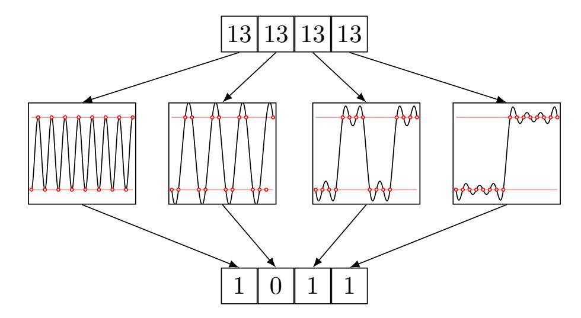
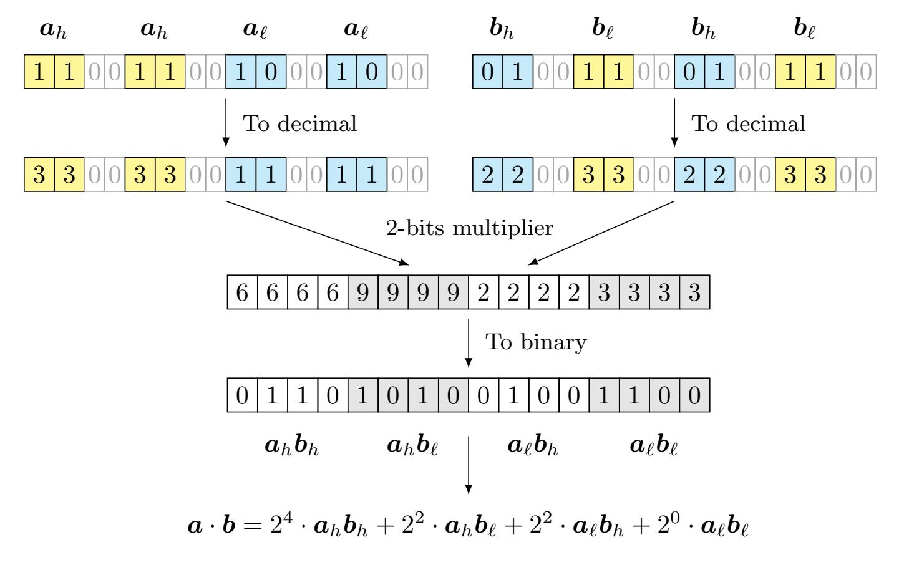
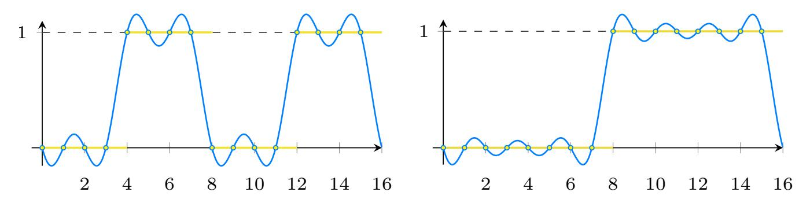
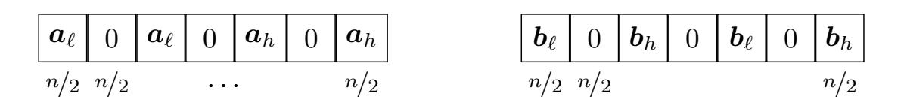
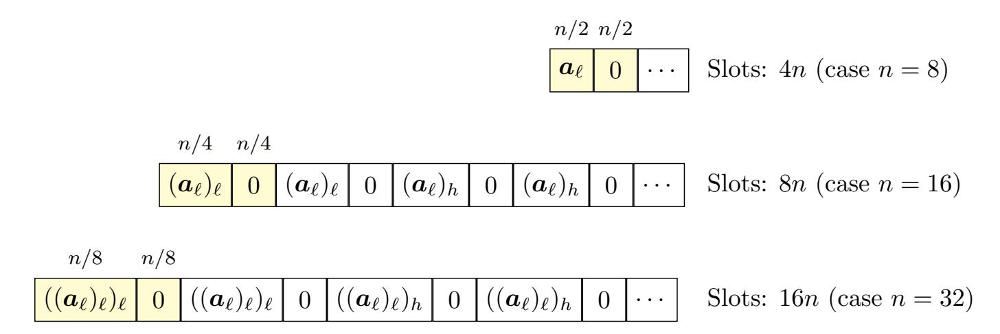
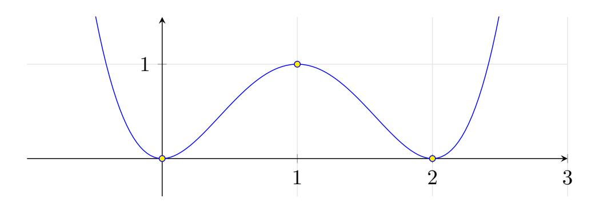
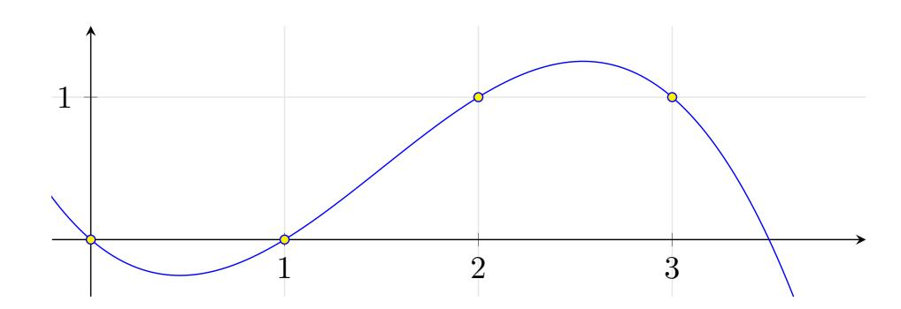

{0}------------------------------------------------

# A flexible and polynomial framework for integer arithmetic in CKKS

Lorenzo Rovida

Politecnico di Torino, Turin, Italy lorenzo.rovida@polito.it

Abstract. A new paradigm, called *discrete*-CKKS, proposes to restrict the plaintext space of the homomorphic encryption CKKS scheme from C to a discrete subset of it (e.g., *{*0*,* 1*}*). While sacrificing approximate computations, this allows one to express an arithmetic similar to that available in exact schemes, but with significantly larger parallelism and flexibility due to SIMD computations and the underlying complex arithmetic, which remains available internally. A significant example is the recent work by Boneh and Kim [Crypto '25], where they present a method to operate on extremely large encrypted integers.

In this work, we build a simple computational device that handles integers, decomposed as binary vectors, by evaluating standard mod 2 arithmetic operations using polynomials only. Since we do not resort to the modular reductions based on the functional bootstrapping proposed by Kim and Noh [CIC '25], this yields a more flexible parameterization, consistent with standard CKKS configurations, e.g., leveled supporting roughly 15 multiplicative levels before bootstrapping. This means that one can use CKKS in R and then switch to Z with the same set of parameters – we will refer to this as *domain-switching*. Experiments show that our solution has lower latency on all operations (i.e., additions, multiplications, comparisons and logical shifts) with respect to the current state of the art, although the throughput is smaller due to how data is represented.

# 1 Introduction

Since its introduction by Gentry [[Gen09\]](#page-19-0), Fully homomorphic encryption (FHE) has emerged as a very promising technique for computations over encrypted data. Although the first proposals were far from being efficient, today we have a wide range of schemes that can be used to execute programs over ciphertexts according to a given use case; these mainly differ by their plaintext spaces (or domains). All of them share the same core construction based on (Ring-)LWE [[Reg09](#page-20-0),[LPR13a](#page-20-1)], although the way data is encoded and handled dramatically changes the available arithmetic.

The traditional approaches. Since most of lattice-based cryptosystems have natural homomorphic additivity, one of the main historical challenges has been 

{1}------------------------------------------------

on how to efficiently evaluate multiplications. Traditionally, there are two different approaches. In the first, originally presented in the BGV/BFV schemes [[BGV12,](#page-18-0)[Bra12,](#page-18-1)[FV12](#page-19-1)], multiplications are performed as tensor products (or polynomial multiplications, if working with structured lattices) and they are followed by a so-called *relinearization* phase where the size of the resulting ciphertext is reduced back to the original one. Notice that the plaintext space of this type of schemes is Z*p*, and usually *p* has some convenient shape to enable SIMD operations [\[SV14](#page-20-2)].

As a second approach, there is a family of schemes whose blueprint was firstly proposed by Ducas and Micciancio [\[DM\]](#page-19-2). In their proposal, called FHEW, a ciphertext encrypts either 0 or 1. Their approach to FHE is evaluate a complete Boolean operator followed by a bootstrapping operation (via GSW [\[GSW13\]](#page-19-3)) that resets the amount of accumulated noise. In their proposal, a NAND operator between two ciphertexts is evaluated by first adding them, and then by applying the map *{*0*,* 1*}* → 0 and 2 → 1 during the bootstrapping operation. Later on, with TFHE [\[CGGI16,](#page-18-2)[CJP21,](#page-19-4)[CLOT21\]](#page-19-5) and its improvements, this has been generalized to small integers and arbitrary look up tables that can be evaluated during the bootstrapping.

Lastly, a BGV-type of scheme, called CKKS [[CKKS17\]](#page-19-6), allows operations over (approximate) complex numbers in C. This approach has a particular type of encoding based on the inverse discrete Fourier transform (DFT) that enables to work over fixed-point complex numbers that are scaled and rounded to large integer RLWE polynomials. The DFT encoding ensures SIMD computations over *N/*2 elements, where *N* = 2*<sup>k</sup>* is the size of the underlying RLWE ring.

(Some of) the new fresh approaches. In the last years, new approaches have emerged to improve performance of traditional FHE schemes, for example [[CLPX18](#page-19-7),[DMPS23,](#page-19-8)[CCKS23](#page-18-3)[,GV25](#page-19-9)[,BFG](#page-18-4)<sup>+</sup>,[Kim25a](#page-19-10)[,BK25,](#page-18-5)[PZZ25\]](#page-20-3). We discuss a couple in the following. Generalizing the blueprint in [[CLPX18](#page-19-7)], Geelen and Vercauteren [\[GV25\]](#page-19-9) proposed an improved version of BFV by choosing as a plaintext modulus a space of the form Z[*X*]*/*(Φ*m*(*x*)*,t*(*x*)), with Φ*m*(*x*) being the *m*-th cyclotomic polynomial and *t*(*x*) an arbitrary polynomial. They show that bootstrapping a ciphertext containing 8192 elements over the Fermat prime field of size Φ2(2<sup>16</sup>) = 2<sup>16</sup> + 1 field takes only 2 seconds.

Additionally, a very recent work proposed by Peikert, Zarchy and Zyskind [[PZZ25](#page-20-3)], deals with large integers arithmetic using *decomposed*-BFV, where the plaintext modulus can be any integer moduli, including powers-of-two and primes. Multiplications and additions have very low latency (few milliseconds), making it very competitive in terms of latency with respect to other exact FHE approaches.

# 1.1 Related works

Our proposal lies in the set of works that enable integer arithmetic over CKKS. We will use R-CKKS (i.e., the "standard" definition of CKKS, restricted to reals) 

{2}------------------------------------------------

and Z-CKKS (i.e., CKKS for integer computation). Even though, depending on the application, one could resort to more efficient constructions based on exact FHE, we still believe it is worth to investigate discrete-CKKS as it offers a suite of functionalities that are not available in the former. Currently, the latest solutions are due to [[Kim25a,](#page-19-10)[Kim25b](#page-19-11)[,BK25](#page-18-5),[CPL25](#page-19-12)].

- [\[Kim25a](#page-19-10)]: by combining the CKKS modular reduction proposed in [[KN25\]](#page-19-13) with a functional bits bootstrapping framework ´a la [\[BCKS24\]](#page-18-6), they show how to construct an integer computational device by representing a large integer decomposed as a vector of small chunks. The main bottleneck in their construction is the number of (functional) bootstrappings required to evaluate multiplications modulo 2*k*, which is roughly bounded as *O*(*k* log(*k*)).
- [\[BK25](#page-18-5)]: this approach can be seen as similar to the previous one in terms of ideas (i.e., representing a large number as a set of smaller chunks), but the execution is fairly different. In particular, they use a nested Residue number system (RNS) framework to represent a large number modulo some powerof-radix using the Chinese remainder theorem (CRT). While being more flexible in terms of moduli, this method has smaller latency and throughput than [\[Kim25a\]](#page-19-10) on power-of-two moduli and also has no native way to support operations such as comparisons, logical shifts or look up table (LUT) evaluations [\[AKP25](#page-18-7)].
- [\[Kim25b\]](#page-19-11): this work is an improvement over [\[Kim25a](#page-19-10)], by employing two main ingredients: (i) the new CinS encoding [\[JPK](#page-19-14)<sup>+</sup>24, Section 3] is used to enhance how multiplications are performed, in particular they are implemented as a convolution-style multiplication and (ii) they rely on lazy modular reduction similarly to [\[BK25\]](#page-18-5). Concretely, they reduce the number of modular reductions from *O*(*k* log(*k*)) down to *O*(log(*k*)).
- [\[CPL25\]](#page-19-12): in this concurrent paper the authors improve the previous approaches by reducing the number of required bootstrappings to perform computations, achieving similar performance as [\[Kim25b](#page-19-11)] but enabling the usage of arbitrary moduli and other logical operations.

While achieving impressive performance, we believe that all these works imply a very complex construction which lacks "flexibility", in the sense that if one instantiates discrete-CKKS for large integers, than they will likely lose all the other functionalities given by standard CKKS (i.e., approximate computations over C, smooth functions approximations, etc.). This is a limit set by the usage of functional bootstrapping [\[KN25\]](#page-19-13), as one typically defines a CKKS parametrization that allows for 1-2 operations before bootstrapping. Increasing the number of arbitrary operations is not always possible without increasing the ring size and this would imply an important loss in overall performance.

### <span id="page-2-0"></span>1.2 Our contribution

In this paper, we propose a framework that enables integer computations in CKKS with word sizes that are powers of two. We deviate from the standard 

{3}------------------------------------------------

approaches [\[BK25](#page-18-5),[Kim25a](#page-19-10)[,Kim25b,](#page-19-11)[CPL25\]](#page-19-12) based on [[KN25](#page-19-13)] and we propose a solution that is fully polynomial-based. Differently from similar works that typically instantiate 1-2 levels before bootstrapping, our framework does not require an ad-hoc parametrization and can thus natively enable what we call a *domain-switching*. In practice, we can use CKKS over R (with 12-13 levels of arbitrary computations), and then convert the encrypted values into integers, and continue computations in Z2*<sup>k</sup>* . Afterwards, one could switch again to R, and so on. To the best of our knowledge, this is the only approach that allows one to achieve practical integers arithmetic without requiring modular reduction based on functional bootstrapping [\[KN25\]](#page-19-13).

Our code is publicly available and usable with high-level APIs, written using the OpenFHE implementation of CKKS. We also provide, for readability, the same code in Python using clear vectors based on addition, multiplication and rotation operations.

Simple additions, comparisons and trivial shifts. To reduce the multiplicative depth of additions, we use the Kogge-Stone adder (KSA) [\[KS73](#page-20-4)] as it has logarithmic depth; e.g., for 256-bits addition, this requires concretely 2 + log2(256) = 10 multiplicative levels. Additionally, since we can evaluate a comparison between two values *a, b* as

<span id="page-3-0"></span>
$$x \le y$$
 if and only if  $\operatorname{carry-out}(x - \hat{y}) = 1$ , where  $\hat{y}_i = 1 - y_i$ . (1)

The complexity of the comparison is the same as the one of the addition.

As we will explain later, every binary number is followed by a lot of zeros to improve multiplication efficiency. Hence, a shift can be simply implemented as an automorphism (i.e., a rotation) and has negligible complexity compared to the other operations.

Binary decomposition using polynomials. Specifically, we show how to efficiently convert approximate integer values from [0*,* 255] ⊂ R (with a possibly small approximation error), represented in R format, to binary format, using polynomial approximations of some Fourier series. The main idea is that we can find the *k*-th bit of the decomposition of some integer *a* by using a function that is what we call *binary k-periodic*. For instance, we can compute the LSB of a number *k* by using any function that is 2-periodic on Z, taking value 0 on even integers and 1 on odd integers. We provide an intuition of this observation in Figure [1](#page-4-0). Remark that computations in CKKS are SIMD, meaning that we can evaluate a different polynomial for each slot, so this operation costs the same as the evaluation of a single polynomial. In practice, these polynomial approximations require 9 levels to be evaluated under Paterson-Stockmeyer [\[CCS](#page-18-8)] to obtain a sufficient level of accuracy. Notice that we significantly improve [\[DMPS23](#page-19-8), Algorithm 3], whose decomposition requires to loop over all the bits, and becomes quickly unpractical.

{4}------------------------------------------------

<span id="page-4-0"></span>

Fig. 1: Decomposing into bits an integer value *<sup>x</sup>* <sup>∈</sup> [0*,* <sup>2</sup>*k*] using *<sup>k</sup>* polynomial approximations of Fourier series applied to *k* repetitions of *x*, with *x* = 13*, k* = 4

A divide-et-impera approach to multiplications. By taking advantage of this practical transformation, we can use, as the core of our general 2*<sup>k</sup>* multiplier, a 4-bits multiplier. Concretely, the actual 4-bits multiplication is performed in R-CKKS and the resulting 8-bits number are transformed to Z-CKKS via polynomials. In general, for 2*<sup>k</sup>* arithmetic, we use a standard divide-et-impera approach. The two operands *<sup>a</sup>, <sup>b</sup>* <sup>∈</sup> *{*0*,* <sup>1</sup>*}<sup>k</sup>* are split into high bits *<sup>a</sup>h, <sup>b</sup><sup>h</sup>* and low bits *a*ℓ*, b*ℓ; this reduces the large *n*-bits multiplication to four smaller *n/*2-bits multiplications between the corresponding segments.

This process repeats, halving the size of operands at each step, until it reaches the 4-bit multiplier base case. Then, the partial results are recursively added using a combination of carry-save adders (CSAs) and a KSA to get the final product. We present, in Figure [2,](#page-5-0) an example of 4-bits multiplication using a 2 bits multiplier as a base case, with *a* = (1*,* 0*,* 1*,* 1) → 13 and *b* = (1*,* 1*,* 0*,* 1) → 11.

By taking advantage of SIMD computations, the four multiplications can be parallelized, at the cost of requiring *k*<sup>2</sup>*/*2 slots for a 2*<sup>k</sup>*-bit multiplication. Our proposal brings a concrete improvement over, e.g., TFHE, as shown in Table [1.](#page-4-1)

<span id="page-4-1"></span>Table 1: Concrete runtimes for multiplications, our work compared to TFHE-rs on the same single-thread environment (M4 Max)

|      | This work |       | [Zam22]  |       |  |
|------|-----------|-------|----------|-------|--|
| Bits | Time      | Slots | Time     | Slots |  |
| 64   | 16.5 sec  | 16    | 25.4 sec | 1     |  |
| 128  | 19.3 sec  | 4     | 101 sec  | 1     |  |

In terms of bootstrapping, the complexity of this procedure for 2*<sup>k</sup>* moduli is given by *O*(log(*k*)) (the same as [\[Kim25b](#page-19-11)[,CPL25\]](#page-19-12)) as it implies the evaluation of log(*k*) additions, and each addition's complexity is *O*(1).

{5}------------------------------------------------

<span id="page-5-0"></span>

Fig. 2: Reducing *a · b* to four (shifted) additions. The high bits and low bits are split and repeated for maximum parallelism. The final result is obtained by (2<sup>4</sup> *·* <sup>6</sup> <sup>+</sup> <sup>2</sup><sup>2</sup> *·* <sup>9</sup> <sup>+</sup> <sup>2</sup><sup>2</sup> *·* <sup>2</sup> <sup>+</sup> <sup>2</sup><sup>0</sup> *·* <sup>3</sup> <sup>=</sup> <sup>143</sup> <sup>=</sup> <sup>11</sup> *·* 13)

In praise of domain-switching. An important feature naturally enabled by our framework is what we will call *domain-switching*. In practice, we can handle different data types within the same scheme, conveniently switching between them when needed. We observe that this is not something that is natively possible[1](#page-5-1) in previous similar works [[BK25](#page-18-5)[,Kim25a,](#page-19-10)[Kim25b](#page-19-11),[CPL25\]](#page-19-12), as their frameworks require a specific parametrization due to the fact that the bootstrapping is *functional*, so it must be evaluated to perform the modular reduction [[KN25](#page-19-13)]. In our circuit, we also employ a type of "functional" bootstrapping that is only used to reduce the amount of noise in the (binary) ciphertext [\[BCKS24\]](#page-18-6), but this is not a necessary requirement. Technically, one could use the standard CKKS bootstrapping at the cost of including some manual cleaning operations. This means that it could be possible within our framework to evaluate, for instance, a complete 256-bits multiplication at the cost of *O*(1) bootstrapping, but by increasing the modulus size (and, in turn, the ring size to *N* = 217).

We believe the set of possible applications for domain-switching to be pretty large: we briefly review some examples in the following. Typically FHE-based databases employ exact schemes, e.g., [B+[23](#page-18-9),[Zha25](#page-20-6)], as they support standard SQL-like operations, differently from approximate schemes. However, this usually limits the types of data that can be stored and homomorphically handled within the database. With our framework, one could store real values in the

<span id="page-5-1"></span><sup>1</sup> Technically, it is possible, but at the cost of adjusting the underlying procedures, increasing the magnitude of parameters and the latency of the operations

{6}------------------------------------------------

DB (under  $\mathbb{R}$ -CKKS) and perform queries based on  $\mathbb{Z}$ -CKKS, enabling efficient databases containing real-valued values. Additionally, this enables the usage of CKKS-based sorting algorithms [MEHP25,RLB25], that are typically orders of magnitude faster than the BFV/TFHE-based ones, to enable practical ORDER BY operations. Also typical Private information retrieval (PIR) constructions [MW22,LMRSW24,LLW24] rely on exact FHE (such as BFV or GSW) to perform homomorphic operations. Similarly to the previous case, current solutions allow to retrieve exact results, given the nature of homomorphic operations. By performing queries using  $\mathbb{Z}$ -CKKS, one could easily retrieve approximate results whenever needed (e.g., data for recommender systems, features to be used in machine learning models, and so on) as the  $\mathbb{R}$ -CKKS format is compatible with  $\mathbb{Z}$ -CKKS.

High-precision smooth functions evaluation in  $\mathbb{Z}$ . Our framework enables the evaluation of practical high-precision function evaluation in exact FHE in a hybrid way. One can evaluate a first (relatively rough) approximation in  $\mathbb{R}$  on a scaled domain, and refine the result with e.g., Newton-Raphson iterations in  $\mathbb{Z}$ . We review a possible example in Appendix A.6.

### 2 Preliminaries

We use bold lowercase to indicate vectors or sequence of polynomial coefficients as  $\mathbf{a} := (a_0, \dots a_{n-1})$ . We indicate the subvector from index i to j (excluded) as  $\mathbf{a}_{i:j}$ . Let bits $(a) : \mathbb{Z}_k \to \{0,1\}^k$  be the bit decomposition function and  $\operatorname{dec}(\mathbf{x}) : \{0,1\}^k \to \mathbb{Z}$  be its inverse (binary encoding) for some integers a, k > 0.

Let N>1 be some power of two and Q>1 an integer modulus. Let  $\mathcal{R}:=\mathbb{Z}[X]/(X^N+1)$  be the quotient ring of polynomials modulo the 2N-th cyclotomic polynomial  $\Phi_{2n}(x)=X^N+1$ . Also define  $\mathcal{R}_Q:=\mathcal{R}/Q\mathcal{R}$ . These are the required ingredients to build structured q-ary lattices required to use the RLWE [LPR13a] trapdoor. In particular, the CKKS scheme [CKKS17] is based on a particular type of encoding, called slots encoding, in which a discrete Fourier transform (DFT) is used to enable SIMD operations. Let DFT:  $\mathbb{R}[X]/(X^N+1) \to \mathbb{C}^{N/2}$  be a DFT defined by evaluating a polynomial p(X) in  $\left(\xi^{5^i}\right)_{0 \le i < N/2}$  with  $\xi$  being a complex primitive 2N-root of unity and iDFT:  $\mathbb{C}^{N/2} \to \mathbb{R}[X]/(X^N+1)$  be its inverse.

### 2.1 CKKS in a nutshell

Key generation in the CKKS scheme follows from RLWE, so we set

$$pk := (\boldsymbol{a} \cdot \boldsymbol{s} + \boldsymbol{e}, \boldsymbol{a}) \in (\mathbb{Z}_Q[X]/(X^N + 1))^2, \quad sk := \boldsymbol{s} \in \mathbb{Z}_Q[X]/(X^N + 1),$$

for uniformly random  $a \in \mathcal{R}_Q$  and small  $s, e \in \mathcal{R}_Q$ . Encryption is performed as in standard RLWE schemes, although encoding in CKKS follows these procedures:

{7}------------------------------------------------

- 1. Given some plaintext  $m(X) \in \mathbb{C}^{N/2}$ , evaluate an iDFT as iDFT(m(X)) to put m(X) into the so-called *slots-encoding*.
- 2. The obtained polynomial iDFT(m(X)) is scaled by a large factor  $\Delta > 0$ , this controls the precision of the encoding.
- 3. Since the polynomial now lives in  $\mathbb{R}[X]/(X^N+1)$ , apply some rounding operation ([LPR13b, Section 2.4.2]) to make it compatible with RLWE encryption.

We therefore obtain the following functions:

$$\operatorname{Encode}(\boldsymbol{m}(X)) := \lfloor \Delta \cdot \operatorname{iDFT}(\boldsymbol{m}(X)) \rceil, \quad \operatorname{Decode}(\boldsymbol{e}(X)) := \frac{1}{\Delta} \cdot \operatorname{DFT}(\boldsymbol{e}(X))$$

This type of (approximate) encoding enables SIMD operations, since point wise addition or multiplication of plaintext slots corresponds to polynomial addition (or multiplication, respectively) in the iDFT domain via the homomorphisms:

$$\mathrm{DFT}(\mathrm{iDFT}(a) + \mathrm{iDFT}(b)) = a + b$$
 and  $\mathrm{DFT}(\mathrm{iDFT}(a) \cdot \mathrm{iDFT}(b)) = a \odot b$ .

We refer to Appendix A.1 for more information about CKKS and its (functional) bootstrapping operation.

Discrete-CKKS. A recent line of works, called discrete-CKKS [DMPS23], proposes to restrict the plaintext of CKKS from  $\mathbb{C}$  to, e.g.,  $\{0,1\} \subset \mathbb{C}$ . This gives several advantages over exact schemes such as TFHE/BFV, as it allows one to compute over small integers but with a large throughput and to evaluate real valued polynomials over them. We now provide two definitions that will make further discussions lighter

**Definition 1** ( $\mathbb{R}$ -CKKS). The  $\mathbb{R}$ -CKKS scheme is a restriction of the CKKS scheme in which plaintexts encode approximate vectors in  $\mathbb{R}^{N/2}$ .

**Definition 2** ( $\mathbb{Z}$ -CKKS). The  $\mathbb{Z}$ -CKKS scheme is a restriction of the CKKS scheme in which plaintexts encode – by means of approximate bits  $b_i + e_i$  for  $b_i \in \{0,1\}$  and small  $e_i \in \mathbb{R}$  – vectors in  $(\mathbb{Z}_{2^b})^k$  for some integer b > 0 and k < N/2.

#### <span id="page-7-0"></span>2.2 Conversions between $\mathbb{Z}$ -CKKS and $\mathbb{R}$ -CKKS

<span id="page-7-1"></span>Given a  $\mathbb{Z}$ -CKKS ciphertext, it is easy to convert it into a  $\mathbb{R}$ -CKKS ciphertext, given that the  $\Delta>0$  parameter is sufficiently large to accommodate the converted value.

Lemma 1 ( $\mathbb{Z}$ -CKKS to  $\mathbb{R}$ -CKKS conversion). Given a  $\mathbb{Z}$ -CKKS ciphertext encoding some vector  $\mathbf{x} \in \mathbb{Z}_k$ , with each  $x_i \in \{0,1\}$ , there exists an algorithm to convert it into a  $\mathbb{R}$ -CKKS ciphertext with  $\log(k)$  additions and rotations.

{8}------------------------------------------------

The proof can be found in Appendix [D.1](#page-27-0), simply observe that by multiplying the binary Z-CKKS ciphertext with a vector shaped as (20*,* 21*, . . .*), the weighted sum will exactly contain the real value. On the other hand, the inverse conversion is less immediate as it involves a binary decomposition. A possible algorithm would be to compute a nonlinear function (such as the parity function) for *k* times to convert a value in Z2*<sup>k</sup>* into a *k*-bits one (e.g., [[DMPS23,](#page-19-8) Algorithm 3]). However, this becomes unpractical as it requires the evaluation of *O*(*k*) nonlinear functions which can not be parallelized. Our goal is to take advantage of SIMD parallelization to perform this conversion in a single step.

We thus propose a novel approach to perform such decomposition by means of discrete Fourier series. In particular, we observe that the binary decomposition of some value in (some restriction of) Z can be evaluated by extracting each bit independently, using periodic functions over 0 and 1. Let us start from the following.

<span id="page-8-0"></span>Lemma 2. *The k-th bit of some value x* ∈ Z2*<sup>b</sup> , with* 0 ≤ *k < b, is equal to* ⌊*x/*2*<sup>k</sup>*⌋ mod <sup>2</sup>*.*

Refer to Appendix [D.2](#page-28-0) for the proof. Intuitively, observe that in the binary representation, each bit *k* corresponds to the coefficient of 2*<sup>k</sup>*. When an integer is increased by one, the LSB changes at every step, while more significant bits change only when the count crosses a multiple of 2*<sup>k</sup>*. As a result, bit *k* remains constant for 2*<sup>k</sup>* consecutive values, then flips and stays in the new state for another 2*<sup>k</sup>* values. This pattern repeats cyclically, producing a periodic sequence with period 2*<sup>k</sup>*+1. To describe such behavior, we introduce the concept of *binary k-periodic function*.

Definition 3 (Binary *k*-periodic function). *A function f*(*x*) : R → R *is said to be* binary *k*-periodic *if, for all x* ∈ Z*, it holds that*

<span id="page-8-2"></span><span id="page-8-1"></span>
$$f(x) = \lfloor x/2^k \rfloor \mod 2.$$

*In particular, it has period* 2*<sup>k</sup>*+1*, where the first* 2*<sup>k</sup> samples are* (0*,* 0*, . . .*) *while the second* 2*<sup>k</sup> are* (1*,* 1*, . . .*)*.*

Of course *x/*2*<sup>k</sup>* mod 2 itself is binary *k*-periodic, but it is hard to approximate it through polynomials as it contains many steps and it is highly non linear. Since Lemma [2](#page-8-0) is defined over integer inputs, we easily derive the following.

Corollary 1. *The <sup>k</sup>-th bit of some value <sup>x</sup>* <sup>∈</sup> <sup>Z</sup><sup>+</sup> *is equal to <sup>f</sup>*(*x*)*, where <sup>f</sup> is <sup>a</sup> binary k-periodic function.*

Square waves and Fourier series. To tackle this issue, we first notice that the (sub)set of points required to satisfy the condition in Definition [3](#page-8-1) – namely the integers – are equidistant points. This naturally leads to discrete Fourier transforms. In general, the DFT takes a finite set of equidistant samples of a function and represents them as a finite linear combination of complex exponentials. If the samples arise from a function defined on an interval [0*,* 2*P*], the corresponding frequencies are integer multiples of π*/P*. For real-valued data, this representation can equivalently be written as a *trigonometric polynomial*.

{9}------------------------------------------------

**Definition 4 (Trigonometric polynomial).** Let  $n \in \mathbb{Z}^+$ . A 2P-periodic trigonometric polynomial of degree n is a function of the form

$$p(x) = \frac{a_0}{2} + \sum_{k=1}^{n} \left( a_k \cos\left(\frac{k\pi x}{P}\right) + b_k \sin\left(\frac{k\pi x}{P}\right) \right),$$

where  $a_k, b_k \in \mathbb{R}$ .

Our idea is to express a binary k-periodic function as a trigonometric polynomial by interpolating its values at the integers in [0, 2P]. Since the definition of binary k-periodicity is defined via these integer sample points, the resulting trigonometric polynomial will again be binary k-periodic. However, the trigonometric polynomial is now a smooth function, which makes it more suitable to further polynomial approximation.

Theorem 1 ([SB02, Theorem 2.3.1.5], adapted). For any support points  $(x_i, f(x_i))$ , with  $0 \le i < N$ , f real and  $x_i = 2i\pi/N$  (equidistant), there exists a unique trigonometric polynomial p(x) with

<span id="page-9-2"></span><span id="page-9-0"></span>
$$p(x_i) = f(x_i)$$
 for  $0 \le i < N$ .

Given that Theorem 1 enables to define a unique trigonometric polynomial that interpolates through all the integers in [0,2P], we can derive, as a consequence, that a trigonometric polynomial constructed from the equidistant integer samples of some binary k-periodic function is again binary k-periodic.

Corollary 2. There exists some f(x) such that the unique trigonometric polynomial p(x) interpolating f(x) is binary k-periodic.

The proof can be found in Appendix D.4. By combining this result with previous observations, we can use the DFT of  $\lfloor x/2^k \rfloor \mod 2$  – sampled on the integers in  $[0,2^b) \subset \mathbb{Z}$  – to extract the k-th bit of some integer, with  $k \leq b$ . Although the target function is discontinuous, the DFT produces a smooth trigonometric polynomial. This enables the construction of polynomial approximations for discrete bit extraction via Chebyshev polynomials. In Figure 3 we illustrate, as an example, two trigonometric polynomials, computed via DFT, that can be used to extract the 3rd and the 4th bit of an integer in  $\mathbb{Z}_{16}$ .

What we will later do concretely is to approximate such functions over the [0,256) interval, to extract the k-th bit of an integer  $x \in \mathbb{R} \subset [0,256)$ . Of course the main limit of such conversion is that converting integer values  $x \in [0,2^k) \subset \mathbb{R}$  requires a polynomial approximation in the interval  $[0,2^k)$ , whose size grows exponentially with k. Since we will use, as base case for our multiplications, a 4-bits multiplier based on  $\mathbb{R}$ -CKKS, we will need to convert the result (which will be an 8-bits value in  $[0,225) \subset \mathbb{Z}$ ) back to  $\mathbb{Z}$ -CKKS with such polynomial approximations.

<span id="page-9-1"></span>Finally, we can put together all the obtained results to define a conversion between  $\mathbb{R}\text{-}\mathrm{CKKS}$  to  $\mathbb{Z}\text{-}\mathrm{CKKS}$ .

{10}------------------------------------------------

<span id="page-10-0"></span>

(a)  $2^k = 4$ , allows one to extract the 3rd (b)  $2^k = 8$ , allows one to extract the 4th bit

Fig. 3: In yellow the plot of  $\lfloor x/2^k \rfloor \mod 2$ , in blue its Fourier expansion derived from a DFT, in the [0,16) interval. This expansion allows one to extract the (k+1)-th bit (with k < 4) from an input  $x \in [0,16)$ 

**Lemma 3** ( $\mathbb{R}$ -CKKS to  $\mathbb{Z}$ -CKKS conversion). Given a  $\mathbb{R}$ -CKKS ciphertext encoding some value  $x+\varepsilon$  with  $x \in \mathbb{Z}_{2^b}$  and small  $\varepsilon \in \mathbb{R}$ , there exists an algorithm that converts it into a  $\mathbb{Z}$ -CKKS ciphertext by evaluating each (k+1)-th copy of x, with  $0 \le k < b$ , using a polynomial approximation of a binary k-periodic trigonometric polynomial.

The proof, based on the just presented reasoning, can be found in Appendix D.3. Of course the precision of the converted  $\mathbb{Z}$ -CKKS ciphertext depends on  $\varepsilon$  and the accuracy of the polynomial approximation. In our setup, we will use polynomials of degree 369.

### 3 Methodology

In this section we provide some algorithmic definitions of the primitives enabled by our framework, including binary additions (a+b), comparisons  $(a \le b)$ , logical shifts  $(a \ll k)$  and multiplications  $(a \cdot b)$ .

### 3.1 Additions

As previously mentioned, additions are performing using the Kogge-Stone adder (KSA) [KS73], described in Algorithm 1. It turns out that this algorithm well fits the SIMD schemes, as it enables the computation of most of the workload in parallel.

Initial propagate and generate. The first two vectors,  $\mathbf{p}$  (propagate) and  $\mathbf{g}$  (generate), are obtained respectively by computing  $p_i = a_i \oplus b_i$  and  $g_i = a_i \wedge b_i$ . In our case, we can directly write  $\mathbf{p} := \mathbf{a} + \mathbf{b} \mod 2$  and  $\mathbf{g} = \mathbf{a} \cdot \mathbf{b}$ , which can be made to require only one multiplicative level. Refer to Section A.2 for details about the different approaches to evaluate the mod 2 operation in CKKS.

{11}------------------------------------------------

### Algorithm 1 Kogge-Stone adder (KSA)

```
Require: Two n-bit numbers \boldsymbol{a} = (a_0, \dots, a_{n-1}), \, \boldsymbol{b} = (b_0, \dots, b_{n-1})
Ensure: Sum s = (s_0 \dots s_{n-1}) and carry-out s_n
 1: Procedure KSA(a, b)
 2:
       Define the propagate (p) and generate (g) vectors:
       p_i := a_i \oplus b_i
 3:
       g_i := a_i \wedge b_i
 4:
       Compute prefix carries using Kogge-Stone parallel prefix:
 5:
 6: for d := 0 to \lceil \log_2 n \rceil - 1 do
 7:
          g_i := g_i \lor (p_i \land g_{i-2^d})
 8:
          p_i := p_i \wedge p_{i-2^d}
9: end for
        Post processing:
10:
11:
       g_n := 0
12:
       s_i := p_i \vee g_{i-1}
13: return s := (s_0 \dots s_{n-1}, s_n)
```

Computing prefix carries. This is the core and main loop of the KSA. Let us analyze the two lines 7-8 of Algorithm 1. Firstly, line 7 assigns, at  $g_i$ , the value

<span id="page-11-0"></span>
$$g_i := g_i \vee (p_i \wedge g_{i-2^d}).$$

The internal AND can be evaluated as  $\mathbf{p} \cdot \text{Rot}_{-2^d}(\mathbf{g})$ , where  $\text{Rot}_i(\cdot)$  is the CKKS rotation by i positions to the left (negative values rotate to the right). On the other hand, the external OR would require us to perform (at least) an additional multiplication to reduce mod 2. However, we observe that such mod 2 is not required because the two terms are guaranteed never to be 1 at the same time. The reason is that if  $g_i = 1$ , it indicates a carry has already been generated from a lower-order bit that includes all the bits covered by  $g_{i-2^{d/2}}$ . Therefore,  $g_i$  and  $p_i \wedge g_{i-2^d}$  can never overlap, making addition equivalent to OR for this line. Hence, we can evaluate the line simply as  $\mathbf{g} := \mathbf{g} + (\mathbf{p} \cdot \text{Rot}_{-2^d}(\mathbf{g}))$ , consuming one multiplicative depth. Secondly, line 8 assigns, to  $p_i$ , the value of

<span id="page-11-1"></span>
$$p_i \wedge p_{i-2^d}$$
.

The latter can easily be implemented as  $\mathbf{p} := \mathbf{p} \cdot \text{Rot}_{-2^d}(\mathbf{p})$ . Since the two lines do not depend on each other, each loop iteration consumes only one multiplicative depth.

Post processing. This is the final step and it involves computation of sum bits using OR operations. Line 11 manually sets the value of  $g_n = 0$ , and this would require us to mask all the positions but n, at the cost of one multiplication. We avoid this by simply assuming that the bits representation of the resulting value is followed by a 0, so we can simply rotate right by a position. This ensures that, when line 12 uses the value of  $g_n$ , it will use the 0 we manually forced. Notice that this is compatible with the multiplications logic that will require some zeros after each number, more details will be given later.

{12}------------------------------------------------

Lemma 4 (KSA multiplicative depth). There exists an algorithm that evaluates the KSA requiring  $2+\log(n)$  multiplicative levels to add two n-bits numbers.

The proof can be found in Appendix D.5, and for the sake of completeness, we also give in Algorithm 3 a version of the KSA specifically written using CKKS primitives.

#### <span id="page-12-1"></span>3.2 Comparisons

As already mentioned in Eq. (1), comparisons can be implemented as a subtraction. Given two *n*-bits numbers  $\mathbf{a} = (a_0, \dots a_{n-1})$  and  $\mathbf{b} = (b_0, \dots, b_{n-1})$ , we first reverse the bits of  $\mathbf{b}$  as  $\hat{b}_i = 1 - b_i$ , and then we add  $\mathbf{a} + \hat{\mathbf{b}}$  using e.g., KSA. The result of the comparison will be the last carry present in the *n*-th position. We formalize this operation in Algorithm 4.

#### 3.3 Multiplications

Our goal is to evaluate multiplications by taking advantage of SIMD computations, not to improve throughput, but to improve latency. For this reason we will require more than n slots to represent an n-bits number. We further elaborate below. Our reference construction is a divide-et-impera multiplier as it is (i) highly parallelizable, which is good for SIMD computations and (ii) has logarithmic depth, which is good to reduce the number of bootstrappings. In particular, instead of using Karatsuba divide-et-impera approach – that reduces the number of multiplications to three – we use the standard textbook one as Karatsuba requires to perform more additions, which are the main bottleneck in our algorithm. As a first step, observe that we need to preprocess the inputs  $a, b \in \{0,1\}^n$  by defining high bits  $(a_h, b_h)$  and low bits  $(a_\ell, b_\ell)$  as illustrated in Figure 4. Each operand is followed by zeroes required to accommodate the

<span id="page-12-0"></span>

Fig. 4: Processing  $a, b \in \{0, 1\}^n$  before the multiplication.

partial result (remark that a n/2-bits multiplication returns n bits, see Figure 2 for a reference), observe indeed that each vector now requires 4n slots. We can now compute the actual multiplication as:

$$2^{n} \cdot \boldsymbol{a}_{h} \cdot \boldsymbol{b}_{h} + 2^{n/2} \cdot \boldsymbol{a}_{h} \cdot \boldsymbol{b}_{\ell} + 2^{n/2} \cdot \boldsymbol{a}_{\ell} \cdot \boldsymbol{b}_{h} + \boldsymbol{a}_{\ell} \cdot \boldsymbol{b}_{\ell}. \tag{2}$$

In particular, we use a 4-bit multiplier as the base case and evaluate all larger multiplications recursively. Power of two multiplications (logical shifts) are evaluated as simple rotations.

{13}------------------------------------------------

*The base case* (*n* = 4)*.* We implement the base case using the approach anticipated in Section [2.2.](#page-7-0) Given two values *<sup>a</sup>, <sup>b</sup>* <sup>∈</sup> *{*0*,* <sup>1</sup>*}*4, we convert them to R-CKKS ciphertexts (Lemma [1\)](#page-7-1) and we perform the standard CKKS multiplication. The result will approximately lie in [0*,* 225] ⊂ Z, and we will convert it back to Z-CKKS (Lemma [3](#page-9-1)).

*The recursive case* (*n >* 4)*.* Following the divide-et-impera approach, we split the multiplication in four smaller multiplications based on the *n/*2-bits multiplier, until we reach the base case *n* = 4. Then, for each call, we require to evaluate two *n*-bits additions using the KSA. We can reduce the two additions to a single one, after two rounds of carry-save adder (CSA), additional details are given in Appendix [B.](#page-25-1)

Since we want to parallelize every operation, we want to reduce all the base cases into a single ciphertext. To begin, we need to accommodate the four *n/*2 bits operands, plus the same amount of zeroes, we will thus start with the requirement of 4*n* slots. Subsequently, since we will recursively split each operand in high and low bits of size *n/*2, each of the four operands will recursively require four times half their space, for a total of twice the slots required for each recursive call, refer to Figure [5](#page-13-0) for a visual intuition.

<span id="page-13-0"></span>

Fig. 5: The number of required slots to allow for parallelization doubles at each recursive call

<span id="page-13-1"></span>We provide a pseudo code of the proposed divide-et-impera multiplication algorithm in Algorithm [2](#page-14-0). As for additions, we refer to a pure SIMD definition of the procedure in Algorithm [5](#page-24-1).

Lemma 5. *An n-bits divide-et-impera multiplication, with n* = 2*<sup>k</sup> and k >* 2*, requires n*2*/*2 *slots to be executed fully in parallel with SIMD operations.*

The proof is given in Appendix [D.6](#page-29-1). This result implies that the concrete throughput of our approach is severely limited by this constraint.

Corollary 3. *Given s available* CKKS *slots, one can represent up to* 2*s/n*<sup>2</sup> *distinct n-bit integers in* Z*-*CKKS *format that are compatible with parallel divideet-impera multiplication.*

{14}------------------------------------------------

### Algorithm 2 Recursive algorithm for *n*-bits multiplications

```
1: Procedure mult(a, b, n)
2: if n = 4 then
3: Base case:
4: return R-to-Z(Z-to-R(a) · Z-to-R(b))
5: else
6: Recursive case:
7: aℓ := a1,n/2, ah = an/2,n
8: bℓ := b1,n/2, bh = bn/2,n
9: return 2n·mult(ah, bh, n/2)+2n/2·mult(ah, bℓ, n/2)+2n/2·mult(aℓ, bh, n/2)+
  mult(aℓ, bℓ, n/2)
```

<span id="page-14-0"></span>Lastly, observe that the multiplication between two *n*-bits numbers naturally gives an *n*<sup>2</sup>-bits number. This can be desirable in some applications, although it would require an additional operation to split the results into more ciphertexts to allow for further multiplications, as the number of slots decreases when *n* is increased. On the other hand, one can also mask out the last *n* bits of the result to obtain the value modulo 2*<sup>n</sup>* and keep performing *n*-bits computations.

Lemma 6 (Product multiplicative depth). *The multiplicative depth of the divide-et-impera binary multiplication algorithm is*

<span id="page-14-3"></span>
$$11 + \sum_{k=3}^{\log(n)} (k+7) = \sum_{k=3}^{\log(n)} k + 7\log(n) - 3.$$
 (3)

The proof can be found in Section [D.7](#page-29-2)

### <span id="page-14-2"></span>3.4 Logical shifts

Given that, to evaluate fast multiplications in parallel, we require each number to be followed by an amount of zeroes (larger than *n*), we can simply compute a logical shift as a rotation, thus:

$$x \ll k \text{ is implemented as } \operatorname{Rot}_{-k}(x).$$
 (4)

# 4 Experiments

We implemented our framework using (a custom fork of) OpenFHE [\[AB](#page-18-10)+22,[KPP22](#page-20-14)] v1.5.0, and the code is publicly available on GitHub[2](#page-14-1). The repository provides an equivalent implementation using Python notebooks with plaintext values, intended for illustrative purposes. All experiments have been executed on a Macbook with M4 Max machine with 32 GB of memory and are easily replicable. Although we perform experiments on power-of-two word sizes, our polynomial framework can be adapted to work with special primes, refer to Appendix [C.](#page-27-1)

<span id="page-14-1"></span><sup>2</sup> <https://github.com/lorenzorovida/flexible-integer-arithmetic-ckks>

{15}------------------------------------------------

*Parametrization.* As anticipated in Section [1.2](#page-2-0), one of the main points of our proposal is that CKKS is instantiated with a set of parameters which is somewhat generic, i.e., it is not ad-hoc for the integer framework. We present in Table [2](#page-15-0) the set of chosen parameters. Observe that the available depth leaves 14 levels of

<span id="page-15-0"></span>Table 2: The CKKS parameters used for the experiments, refer to [[KPP22\]](#page-20-14) for details about the parameters. BTS stands for bootstrapping. *h, h*ˆ are the Hamming weights of the dense/sparse encapsulated key [\[BTPH22\]](#page-18-11), respectively

|           |        |        |         |      |           | Multiplicative depth |     |           |
|-----------|--------|--------|---------|------|-----------|----------------------|-----|-----------|
|           | log(N) | log(∆) | log(QP) | dnum | (h, hˆ)   | Total                | BTS | Arbitrary |
| This work | 16     | 40     | 1602    | 4    | (192, 32) | 30                   | 15  | 15        |

arbitrary computations outside of the bootstrapping, enabling the evaluation of any circuit in R-CKKS prior or after evaluations in Z-CKKS. Next, we provide in Table [3](#page-15-1) some details about how each moduli of the chain is used. Remark that we use the StC-first type of bootstrapping, which enables the usage of "cleaning" bootstrapping [[BCKS24](#page-18-6)].

<span id="page-15-1"></span>Table 3: Usage of the moduli chain in Z-CKKS and R-CKKS. The cos(*x*)-like bootstrapping refers to the cleaning bootstrapping introduced in [[BCKS24](#page-18-6)], while the sin(*x*)-like to the standard CKKS bootstrapping [\[BTPH22\]](#page-18-11). First approx. refers to an initial Chebyshev approximation, followed by double angle iterations

| Mode   | BTS type    | CtS | Mod raise | First approx. | Double angle | Arbitrary | StC |
|--------|-------------|-----|-----------|---------------|--------------|-----------|-----|
| Z-CKKS | cos(x)-like | 4   | 1         | 5             | 2            | 15        | 3   |
| R-CKKS | sin(x)-like | 3   | 1         | 5             | 3            | 14        | 3   |

*Remark 1.* We used the same set of parameters (supporting 256-bits operations) for each experiment, although better performance can easily be achieved by setting specific parameters for bits smaller than 256. For instance, by working over 64-bits, one can reduce the moduli chain by roughly 100 bits and use e.g., smaller values of *d*num to improve the runtime.

*Evaluating integer operations.* We aim to assess the performance of our framework with respect to the current state-of-the-art works regarding integer arithmetic in CKKS [\[Kim25a](#page-19-10),[Kim25b](#page-19-11),[BK25](#page-18-5)[,CPL25\]](#page-19-12). We perform different types of experiment, one for each arithmetic operation, and we report the runtime and the number of bootstrapping required to obtain the exact result, ready to be 

{16}------------------------------------------------

used for other computations. All experiments can be reproduced along with the examples provided in the repository. We avoided a direct comparison with [[BK25](#page-18-5)] as their RNS work is mostly aimed at arbitrary moduli and does not perform well on power-of-two moduli. Moreover, [\[BK25](#page-18-5)] does not have the same versatility as ours or [\[Kim25b,](#page-19-11)[CPL25\]](#page-19-12) as there is no "native" way to support non-arithmetic operations such as comparisons, logical shifts or LUT evaluations [[AKP25](#page-18-7)]. We report in Table [4](#page-16-0) some results about additions. On the other hand, results about multiplications are reported in Table [5.](#page-16-1) Notice that results from [[Kim25a](#page-19-10)[,Kim25b](#page-19-11)] are from the same environment as ours (M4 Max), while in [[CPL25\]](#page-19-12) they employed a Ryzen 9 7900X.

<span id="page-16-0"></span>Table 4: Evaluating the addition operations *a* + *b* in terms of bootstrappings (BTS), runtime and available slots. The runtimes for [\[Kim25b](#page-19-11)[,CPL25\]](#page-19-12) are expected as they did not provide any data or source code

|      | This work |       | [Kim25b] |            |       | [CPL25] |          |       |     |
|------|-----------|-------|----------|------------|-------|---------|----------|-------|-----|
| Bits | Time      | Slots | BTS      | Time       | Slots | BTS     | Time     | Slots | BTS |
| 16   | 2.12 sec  | 256   | 1        | ≈ 12.5 sec | 8192  | 2       | ≈ 13 sec | 4096  | 1   |
| 32   | 2.32 sec  | 64    | 1        | ≈ 12.5 sec | 4096  | 2       | ≈ 13 sec | 2048  | 1   |
| 64   | 2.54 sec  | 16    | 1        | ≈ 12.5 sec | 2048  | 2       | ≈ 13 sec | 1024  | 1   |
| 128  | 2.61 sec  | 4     | 1        | ≈ 12.5 sec | 1024  | 2       | ≈ 13 sec | 512   | 1   |
| 256  | 2.89 sec  | 1     | 1        | ≈ 12.5 sec | 512   | 2       | ≈ 13 sec | 256   | 1   |

Note that TFHE [[Zam22](#page-20-5)] always works on a single slot, and its performance has been reported from [[Kim25a\]](#page-19-10), as they run the benchmarks[3](#page-16-2) using the same machine we used. We considered the result modulo 2*<sup>n</sup>* by discarding the last *n*

<span id="page-16-1"></span>Table 5: Evaluating the multiplication operations *a·b* in terms of bootstrappings and runtime.

|      |          | This work<br>[Zam22] |     | [Kim25b] |          |       | [CPL25] |           |       |     |
|------|----------|----------------------|-----|----------|----------|-------|---------|-----------|-------|-----|
| Bits | Time     | Slots                | BTS | Time     | Time     | Slots | BTS     | Time      | Slots | BTS |
| 16   | 9.2 sec  | 256                  | 2   | 1.62 sec | 25.3 sec | 8192  | 4       | 39.89 sec | 4096  | 3   |
| 32   | 12.0 sec | 64                   | 3   | 6.42 sec | 24.9 sec | 4096  | 4       | 39.78 sec | 2048  | 3   |
| 64   | 16.5 sec | 16                   | 4   | 25.4 sec | 24.9 sec | 2048  | 4       | 40.30 sec | 1024  | 3   |
| 128  | 19.3 sec | 4                    | 5   | 101 sec  | 30.9 sec | 1024  | 5       | 57.41 sec | 512   | 4   |
| 256  | 22.8 sec | 1                    | 6   | 403 sec  | 31.9 sec | 512   | 5       | 74.76 sec | 256   | 5   |

<span id="page-16-2"></span><sup>3</sup> In particular integer bench from TFHE-rs [\[Zam22](#page-20-5)], commit hash 3129520

{17}------------------------------------------------

bits, although one can easily retrieve the real product modulo 22*<sup>n</sup>* without major changes.

*Logical shifts.* As already mentioned in Section [3.4](#page-14-2), in our setup shifts are simply evaluated as rotations (roughly 0.10 sec). On the other hand, there is no efficient way to perform arbitrary shifts in [\[Kim25b\]](#page-19-11), while in [[Kim25a](#page-19-10)] the runtime for a 64-bits shift is around 100 seconds. Lastly, in [\[CPL25](#page-19-12)], for some specific shifts it is possible to use rotations, but this is limited to multiples of *B* (in their experiments *B* = 16).

*Evaluating comparison operations.* Lastly, we aim to assess the performance with respect to the comparison operation. Notice that, as specified in Section [3.2](#page-12-1), in our framework comparisons can be implemented with the same complexity as additions. We compare with [\[Kim25a](#page-19-10)] as comparisons are more efficient than in [[Kim25b\]](#page-19-11). In particular they require ≈ 2*u* bootstrappings, with *u* = *n/*4 [[Kim25a](#page-19-10), Table 3]. We report the results in Table [6.](#page-17-0)

<span id="page-17-0"></span>Table 6: Evaluating the comparison operations (*a* ≤ *b*) in terms of bootstrappings (BTS) and runtime. Results for [\[Kim25a\]](#page-19-10) are all expected by considering the number of BTS, except for the case of 64-bits that was reported by the authors

|      |          | This work |     | [Kim25a]  |       |     |  |
|------|----------|-----------|-----|-----------|-------|-----|--|
| Bits | Time     | Slots     | BTS | Time      | Slots | BTS |  |
| 16   | 2.12 sec | 256       | 1   | ≈ 25 sec  | 16384 | 8   |  |
| 32   | 2.32 sec | 64        | 1   | ≈ 50 sec  | 16384 | 16  |  |
| 64   | 2.54 sec | 16        | 1   | 102 sec   | 16384 | 32  |  |
| 128  | 2.61 sec | 4         | 1   | ≈ 198 sec | 16384 | 64  |  |
| 256  | 2.89 sec | 1         | 1   | ≈ 395 sec | 16384 | 128 |  |

# 5 Conclusion

We presented a framework that enables efficient integer computations in CKKS. Due to its flexibility, it can be easily integrated as a building block in more advanced pipelines based on standard CKKS (e.g., sign the resulting logits of an encrypted neural network). Although the throughput is lower than in other similar works, our proposal currently achieves the lowest latency across all operations, making it preferable when the number of values to be processed is not extremely large.

Acknowledgements. This work was partially supported by project SERICS (PE00000014) under the MUR National Recovery and Resilience Plan funded 

{18}------------------------------------------------

by the European Union — NextGenerationEU. L. Rovida would like to thank A. Alexandru (Duality Tech.) for her help concerning the implementation of cleaning bootstrapping in OpenFHE, E. Sokli (University of Milan-Bicocca) for giving insights on DFT and J. Kim (Stanford University) for answering some questions about [[Kim25a](#page-19-10)[,Kim25b](#page-19-11)].

# References

- <span id="page-18-10"></span>AB<sup>+</sup>22. Ahmad Al Badawi et al. OpenFHE: Open-Source Fully Homomorphic Encryption Library. In *Proceedings of the 10th Workshop on Encrypted Computing & Applied Homomorphic Cryptography*, pages 53–63, 2022.
- <span id="page-18-7"></span>AKP25. Andreea Alexandru, Andrey Kim, and Yuriy Polyakov. General functional bootstrapping using ckks. In *Advances in Cryptology – CRYPTO 2025*, pages 304–337, 2025.
- <span id="page-18-9"></span>B<sup>+</sup>23. Song Bian et al. He3db: An efficient and elastic encrypted database via arithmetic-and-logic fully homomorphic encryption. In *Proceedings of the 2023 ACM SIGSAC Conference on Computer and Communications Security*, pages 2930–2944, 2023.
- <span id="page-18-6"></span>BCKS24. Youngjin Bae, Jung Hee Cheon, Jaehyung Kim, and Damien Stehl´e. Bootstrapping bits withckks. In *Advances in Cryptology – EUROCRYPT 2024*, pages 94–123, 2024.
- <span id="page-18-4"></span>BFG<sup>+</sup>. Zvika Brakerski, Offir Friedman, Daniel Golan, Alon Gurny, Dolev Mutzari, and Ohad Sheinfeld. REFHE: Fully homomorphic ALU. Cryptology ePrint Archive, Paper 2025/1449.
- <span id="page-18-0"></span>BGV12. Zvika Brakerski, Craig Gentry, and Vinod Vaikuntanathan. (leveled) fully homomorphic encryption without bootstrapping. In *Proceedings of the 3rd Innovations in Theoretical Computer Science Conference*, pages 309–325, 2012.
- <span id="page-18-5"></span>BK25. Dan Boneh and Jaehyung Kim. Homomorphic encryption forlarge integers fromnested residue number systems. In *Advances in Cryptology – CRYPTO 2025*, pages 338–370, 2025.
- <span id="page-18-1"></span>Bra12. Zvika Brakerski. Fully homomorphic encryption without modulus switching from classical gapsvp. In *Advances in Cryptology – CRYPTO 2012*, pages 868–886, 2012.
- <span id="page-18-11"></span>BTPH22. Jean-Philippe Bossuat, Juan Troncoso-Pastoriza, and Jean-Pierre Hubaux. Bootstrapping forapproximate homomorphic encryption withnegligible failure-probability byusing sparse-secret encapsulation. In *Applied Cryptography and Network Security*, pages 521–541, 2022.
- <span id="page-18-3"></span>CCKS23. Jung Hee Cheon, Wonhee Cho, Jaehyung Kim, and Damien Stehl´e. Homomorphic multiple precision multiplication for ckks and reduced modulus consumption. In *Proceedings of the 2023 ACM SIGSAC Conference on Computer and Communications Security*, pages 696–710, 2023.
- <span id="page-18-8"></span>CCS. Hao Chen, Ilaria Chillotti, and Yongsoo Song. Improved bootstrapping for approximate homomorphic encryption. In *Advances in Cryptology – EUROCRYPT 2019*, pages 34–54.
- <span id="page-18-2"></span>CGGI16. Ilaria Chillotti, Nicolas Gama, Mariya Georgieva, and Malika Izabach`ene. Faster fully homomorphic encryption: Bootstrapping in less than 0.1 seconds. In *Advances in Cryptology – ASIACRYPT 2016*, pages 3–33, 2016.

{19}------------------------------------------------

- <span id="page-19-15"></span>CHK<sup>+</sup>18. Jung Hee Cheon, Kyoohyung Han, Andrey Kim, Miran Kim, and Yongsoo Song. Bootstrapping for approximate homomorphic encryption. In *Advances in Cryptology – EUROCRYPT 2018*, pages 360–384, 2018.
- <span id="page-19-4"></span>CJP21. Ilaria Chillotti, Marc Joye, and Pascal Paillier. Programmable bootstrapping enables efficient homomorphic inference of deep neural networks. In *Cyber Security Cryptography and Machine Learning*, pages 1–19, 2021.
- <span id="page-19-6"></span>CKKS17. Jung Hee Cheon, Andrey Kim, Miran Kim, and Yongsoo Song. Homomorphic encryption for arithmetic of approximate numbers. In *Advances in Cryptology – ASIACRYPT 2017*, pages 409–437, 2017.
- <span id="page-19-5"></span>CLOT21. Ilaria Chillotti, Damien Ligier, Jean-Baptiste Orfila, and Samuel Tap. Improved programmable bootstrapping withlarger precision andefficient arithmetic circuits fortfhe. In *Advances in Cryptology – ASIACRYPT 2021*, pages 670–699, 2021.
- <span id="page-19-7"></span>CLPX18. Hao Chen, Kim Laine, Rachel Player, and Yuhou Xia. High-precision arithmetic in homomorphic encryption. In *Cryptographers Track at the RSA Conference*, pages 116–136, 2018.
- <span id="page-19-12"></span>CPL25. Gyeongwon Cha, Dongjin Park, and Joon-Woo Lee. Improved radix-based approximate homomorphic encryption for large integers via lightweight bootstrapped digit carry. Cryptology ePrint Archive, Paper 2025/1740, 2025.
- <span id="page-19-2"></span>DM. L´eo Ducas and Daniele Micciancio. Fhew: Bootstrapping homomorphic encryption in less than a second. In *Advances in Cryptology – EURO-CRYPT 2015*, pages 617–640.
- <span id="page-19-8"></span>DMPS23. Nir Drucker, Guy Moshkowich, Tomer Pelleg, and Hayim Shaul. Bleach: Cleaning errors in discrete computations over ckks. *J. Cryptol.*, 37(1), 11 2023.
- <span id="page-19-1"></span>FV12. Junfeng Fan and Frederik Vercauteren. Somewhat practical fully homomorphic encryption. Cryptology ePrint Archive, Paper 2012/144, 2012.
- <span id="page-19-0"></span>Gen09. Craig Gentry. Fully homomorphic encryption using ideal lattices. In *STOC '09*, pages 169–178, 2009.
- <span id="page-19-3"></span>GSW13. Craig Gentry, Amit Sahai, and Brent Waters. Homomorphic encryption from learning with errors: Conceptually-simpler, asymptotically-faster, attribute-based. In *Advances in Cryptology – CRYPTO 2013*, pages 75– 92, 2013.
- <span id="page-19-9"></span>GV25. Robin Geelen and Frederik Vercauteren. Fully homomorphic encryption for cyclotomic prime moduli. In *Advances in Cryptology EUROCRYPT 2025*, pages 366–397, 2025.
- <span id="page-19-14"></span>JPK<sup>+</sup>24. Jae Hyung Ju, Jaiyoung Park, Jongmin Kim, Minsik Kang, Donghwan Kim, Jung Hee Cheon, and Jung Ho Ahn. Neujeans: Private neural network inference with joint optimization of convolution and fhe bootstrapping. In *Proceedings of the 2024 on ACM SIGSAC Conference on Computer and Communications Security*, pages 4361–4375, 2024.
- <span id="page-19-10"></span>Kim25a. Jaehyung Kim. Efficient homomorphic integer computer from ckks. *IACR Transactions on Cryptographic Hardware and Embedded Systems*, 2025(4):873898, 9 2025.
- <span id="page-19-11"></span>Kim25b. Jaehyung Kim. Faster homomorphic integer computer. Cryptology ePrint Archive, Paper 2025/1440, 2025.
- <span id="page-19-13"></span>KN25. Jaehyung Kim and Taeyeong Noh. Modular reduction in CKKS. *IACR Communications in Cryptology*, 2(2), 2025.

{20}------------------------------------------------

- <span id="page-20-14"></span>KPP22. Andrey Kim, Antonis Papadimitriou, and Yuriy Polyakov. Approximate homomorphic encryption with reduced approximation error. In *Topics in Cryptology CT-RSA 2022: Cryptographers Track at the RSA Conference 2022*, pages 120–144, 2022.
- <span id="page-20-4"></span>KS73. Peter M. Kogge and Harold S. Stone. A parallel algorithm for the efficient solution of a general class of recurrence equations. *IEEE Trans. on Comp.*, C-22(8):786–793, 1973.
- <span id="page-20-11"></span>LLW24. Ming Luo, Feng-Hao Liu, and Han Wang. Faster fhe-based single-server private information retrieval. In *Proceedings of the 2024 on ACM SIGSAC Conference on Computer and Communications Security*, pages 1405–1419, 2024.
- <span id="page-20-10"></span>LMRSW24. Baiyu Li, Daniele Micciancio, Mariana Raykova, and Mark Schultz-Wu. Hintless single-server private information retrieval. In *Annual International Cryptology Conference – CRYPTO '24*, pages 183–217, 2024.
- <span id="page-20-1"></span>LPR13a. Vadim Lyubashevsky, Chris Peikert, and Oded Regev. On ideal lattices and learning with errors over rings. *J. ACM*, 60(6), 11 2013.
- <span id="page-20-12"></span>LPR13b. Vadim Lyubashevsky, Chris Peikert, and Oded Regev. A toolkit for ringlwe cryptography. In *Advances in Cryptology – EUROCRYPT 2013*, pages 35–54, 2013.
- <span id="page-20-7"></span>MEHP25. Federico Mazzone, Maarten Everts, Florian Hahn, and Andreas Peter. Efficient ranking, order statistics, and sorting under ckks. In *34th USENIX Security Symposium (USENIX Security 25)*, pages 8541–8558, 2025.
- <span id="page-20-9"></span>MW22. Samir Jordan Menon and David J Wu. Spiral: Fast, high-rate single-server pir via fhe composition. In *2022 IEEE symposium on security and privacy (S&P)*, pages 930–947, 2022.
- <span id="page-20-3"></span>PZZ25. Chris Peikert, Doron Zarchy, and Guy Zyskind. High-precision exact FHE made simple, general, and fast. Cryptology ePrint Archive, Paper 2025/2321, 2025.
- <span id="page-20-0"></span>Reg09. Oded Regev. On lattices, learning with errors, random linear codes, and cryptography. *J. ACM*, 56(6), 9 2009.
- <span id="page-20-8"></span>RLB25. Lorenzo Rovida, Alberto Leporati, and Simone Basile. Lightweight sorting in approximate homomorphic encryption. Cryptology ePrint Archive, Paper 2025/1150, 2025.
- <span id="page-20-13"></span>SB02. Josef Stoer and R. Bulirsch. *Introduction to Numerical Analysis*, volume 12. Springer, 3 edition, 2002.
- <span id="page-20-2"></span>SV14. Nigel P. Smart and Frederik. Vercauteren. Fully homomorphic simd operations. *Design, Codes and Cryptography*, 71(1):57–81, 4 2014.
- <span id="page-20-5"></span>Zam22. Zama. TFHE-rs: A Pure Rust Implementation of the TFHE Scheme for Boolean and Integer Arithmetics Over [Encrypted](https://github.com/zama-ai/tfhe-rs) Data, 2022. https: //github.com/zama-ai/tfhe-rs.
- <span id="page-20-6"></span>Zha25. Dongfang Zhao. Hermes: High-performance homomorphically encrypted vector databases, 2025.

{21}------------------------------------------------

### A Some CKKS algorithms and additional material

We present in this section some CKKS related operations, including a high-level description of the (discrete) bootstrapping, reductions modulo 2, the Kogge-Stone adder (KSA) and the divide-et-impera multiplication pseudo codes.

### <span id="page-21-0"></span>A.1 The bootstrapping operation

Since after each multiplication, the scale of the resulting ciphertext is increased from  $\Delta$  up to  $\Delta^2$ , hence a so-called rescaling operation is required. This is simply implemented as a product by  $1/\Delta$ , and by setting all the moduli in the chain as  $q_i \approx \Delta$ , we have that each multiplication *consumes* one moduli  $q_i$  in the chain  $Q = \prod_i^L q_i$ .

After L-1 multiplications, the modulus becomes so small that no more rescaling operations can be executed, and in turn, multiplications. The bootstrapping operation in CKKS [CHK<sup>+</sup>18] raises the modulus back to larger values, and its core operation is the evaluation of (an approximation of) a modular reduction, since after the modulus raise some  $q_0I(x)$  factor is added to the message, with I(x) being some polynomial whose coefficients heavily depend on the Hamming weight of the secret key.

Recent advances in bootstrapping [BCKS24,AKP25] showed how it is possible to include in the evaluation of the bootstrapping the evaluation of some other function. In particular, we are interested in the discrete bootstrapping [BCKS24], whose goal is to both increase the modulus and reduce the amount of noise in discrete-CKKS ciphertexts. The main idea is as follows: instead of using a  $\sin(x)$ -like function to emulate the modular reduction, use a  $\cos(x)$ -like function assuming that all inputs are in the shape  $\{0,1\} + \varepsilon$  with  $\varepsilon > 0$  relatively small. Now, given some proper scaling and shift of the  $\cos(x)$  function, we end up with a bootstrapping function that, at the same time, removes the  $q_0I(x)$  term (since  $\cos(x)$  is periodic) but also reduces the amount of noise  $\varepsilon$  [BCKS24, Lemma 1]. We shortly discuss its main steps in the following:

1. SlotsToCoeffs (StC): given a ciphertext encoding  $[iDFT(\Delta m)]_{q_0}$ , homomorphically compute the DFT to obtain a ciphertext c encoding:

$$[{\it \Delta m}]_{q_0}.$$

2. ModRaise: increase the modulus of the ciphertext from  $q_0$  to Q. This causes the ciphertext to encode the following:

$$\Delta(\mathbf{m} + q_0 I(x)),$$

where I(x) is a relatively small polynomial whose coefficients depend on the Hamming weight of the secret key.

3. CoeffsToSlots (StC): at this point, we re-encode the message (plus the new  $q_0I(x)$  term) back in the iDFT domain:

$$[iDFT(\Delta \cdot (\boldsymbol{m} + q_0 I(x)))]_Q$$

{22}------------------------------------------------

4. EvalSine: since now the *q*<sup>0</sup> multiples are in the slots, we can remove them by evaluating a sin(*x*)-like function that simulates a modular reduction.

We refer to [[BCKS24](#page-18-6)] for more details about the used (discrete) bootstrapping.

# <span id="page-22-0"></span>A.2 Modulo 2 operation

In CKKS, there are several ways to reduce the result of an addition modulo 2. The fastest one is to evaluate *<sup>a</sup>* <sup>⊕</sup> *<sup>b</sup>* <sup>=</sup> (*<sup>a</sup>* <sup>−</sup> *<sup>b</sup>*)2, although this has the problem of potentially increasing the error contained in both *a* and *b* [[DMPS23,](#page-19-8) Lemma 2]. On the other hand, we also propose another polynomial that, at the cost of an additional multiplicative level, allows one to reduce modulo 2 and, at the same time, to apply a cleaning operation to the error. The polynomial is

$$h(x) := x^2(x-2)^2, \quad a \oplus b := h(a+b).$$
 (5)

<span id="page-22-1"></span>We present its plot in Figure [6](#page-22-1). Also observe the error shrinks quadratically, as



<span id="page-22-2"></span>Fig. 6: The *<sup>x</sup>*<sup>2</sup> *·* (*<sup>x</sup>* <sup>−</sup> 2)<sup>2</sup> polynomial in the (−1*,* 3) interval

proved in Lemma [7](#page-22-2).

Lemma 7. *Let <sup>h</sup>*(*x*) <sup>=</sup> *<sup>x</sup>*<sup>2</sup>(*<sup>x</sup>* <sup>−</sup> 2)<sup>2</sup>*. For each <sup>x</sup>* <sup>∈</sup> *{*0*,* <sup>1</sup>*,* <sup>2</sup>*}, there exist <sup>a</sup> constant k >* 0 *such that for all real e with |e| <* 0*.*1*, we have*

$$h(x+e) = h(x) + e',$$

*where the new error e*′ *satisfies*

$$|e'| \le ke^2.$$

*Proof.* Consider *x* = 0. We have

$$h(e) = e^2(e-2)^2$$

for *|e| <* 0*.*1, we can bound *e* − 2 as

$$|e-2|<2.1$$

{23}------------------------------------------------

leading to

$$|h(e)| < 4.41e^2$$

The same estimate holds for x = 2 by symmetry as h(x) = h(2 - x). Lastly, for x = 1, we compute

$$h(1+e) = (1-e^2)^2 = 1 + e^4 - 2e^2.$$

Thus the new error is

$$e' = e^4 - 2e^2$$
.

Using the triangle inequality,

$$|e'| \le |e|^4 + 2|e|^2.$$

Since |e| < 0.1, we have  $|e|^2 < 0.01$  and  $|e|^4 < 0.0001$ , so

$$|e'| < 0.0001 + 0.02 < 3e^2.$$

# A.3 Kogge-Stone adder for CKKS

As previously mentioned, additions are performing using the Kogge-Stone adder (KSA) [KS73], described in Algorithm 1. In Algorithm 3 we give another version of the same algorithm, but specifically written using CKKS primitives.

# Algorithm 3 Kogge-Stone adder based on SIMD operations

**Require:** Two *n*-bit numbers  $\boldsymbol{a} = (a_0, \dots, a_{n-1}), \, \boldsymbol{b} = (b_0, \dots, b_{n-1})$ 

**Ensure:** Sum  $s = (s_0 \dots s_{n-1})$  and carry-out  $s_n$ 

- 1: Define the propagate (p) and generate (v) vectors:
- 2:  $p := (a b)^2$ ,  $g := a \cdot b$
- 3: Compute prefix carries using Kogge-Stone parallel prefix:
- 4: **for** d = 0 **to**  $\lceil \log_2 n \rceil 1$  **do**
- 5:  $\mathbf{g} := \mathbf{g} + (\mathbf{p} \cdot \text{Rot}_{-2^d}(\mathbf{g}))$
- 6:  $\boldsymbol{p} := \boldsymbol{p} \cdot \operatorname{Rot}_{-2^d}(\boldsymbol{p})$
- 7: end for
- 8: Post processing:
- <span id="page-23-0"></span>9:  $c := \text{Rot}_{-1}(g)$
- 10:  $s := ((a b)^2 c)^2$
- 11: return

{24}------------------------------------------------

#### A.4 Comparisons for CKKS

As mentioned in Section 3.2, we can evaluate a comparison with the same complexity as a KSA addition. We give in Algorithm 4 a formal definition of the procedure, which returns either 1 or 0 in the (n + 1)-th bit of the result.

### Algorithm 4 Comparison

```
Require: Two n-bit numbers \mathbf{a} = (a_0, \dots, a_{n-1}), \mathbf{b} = (b_0, \dots, b_{n-1})

Ensure: Comparison as a \leq b in c_n

1: Invert the bits of \mathbf{b}:

2: \hat{\mathbf{b}}_i := 1 - \mathbf{b}_i

3: \mathbf{c} := \text{KSA}(\mathbf{a}, \hat{\mathbf{b}})

4: return c_n
```

### A.5 Divide-et-impera multiplication for CKKS

We provide, in Algorithm 5, a version of the divide-et-impera mulitplication that makes only a single recursive call at each step, taking advantage of SIMD.

**Algorithm 5** Divide-et-impera multiplier based on SIMD operations (high-level)

```
Require: Two n-bit numbers \boldsymbol{a} = (a_0, \dots, a_{n-1}), \, \boldsymbol{b} = (b_0, \dots, b_{n-1})
Ensure: Multiplication m = (m_0 \dots m_{n^2-1})
 1: Procedure multSIMD(\boldsymbol{a}, \boldsymbol{b}, n)
 2: if n = 4 then
 3:
           All the base cases are computed in one operation in parallel
 4:
           return \mathbb{R}-to-\mathbb{Z}(\mathbb{Z}-to-\mathbb{R}(a) \cdot \mathbb{Z}-to-\mathbb{R}(b))
 5: else
 6:
           m_{\ell} := \text{mask for low bits, contains ones from 0 to } n/2 \text{ (excl.)}
           m_h := \text{mask for high bits, contains ones from } n/2 \text{ to } n \text{ (excl.)}
 7:
           a' := a \cdot m_h + \operatorname{Rot}_{-n/2}(a \cdot m_h) + \operatorname{Rot}_{-n^2-n}(a \cdot m_\ell) + \operatorname{Rot}_{-n^2}(a \cdot m_\ell)
 8:
           \boldsymbol{b}' := \operatorname{Rot}_{n/2}(\boldsymbol{b} \cdot \boldsymbol{m}_h) + \operatorname{Rot}_{-n}(\boldsymbol{b} \cdot \boldsymbol{m}_\ell) + \operatorname{Rot}_{-n/2}(\boldsymbol{b} \cdot \boldsymbol{m}_h) + \operatorname{Rot}_{-n^2-n}(\boldsymbol{b} \cdot \boldsymbol{m}_\ell)
 9:
           Now we have \mathbf{a}' = (\mathbf{a}_h, 0, \mathbf{a}_h, 0, \mathbf{a}_\ell, 0, \mathbf{a}_\ell, 0) and \mathbf{b}' = (\mathbf{b}_h, 0, \mathbf{b}_\ell, 0, \mathbf{b}_h, 0, \mathbf{b}_\ell, 0). The
10:
           size of zeros is n/2 and each will be filled in the next recursive calls
11:
           m := \text{multSIMD}(\boldsymbol{a}', \boldsymbol{b}', n/2)
12:
           The partial results are shifted and added with CSA. The mask function masks
           the values of interest, depending on the term
13:
           t_1 := \max(\boldsymbol{m})
           \boldsymbol{t}_2 := \operatorname{Rot}_{-n/2}(\operatorname{mask}(\boldsymbol{m}))
14:
           t_3 := \operatorname{Rot}_{-n/2}(\operatorname{mask}(\boldsymbol{m}))
15:
           \boldsymbol{t}_4 := \operatorname{Rot}_{-n}(\operatorname{mask}(\boldsymbol{m}))
16:
           return CSA(t_1, t_2, t_3, t_4)
                                                                                                               \triangleright Refer to Algorithm 7.
17:
18: end if
```

{25}------------------------------------------------

We kept the algorithm description at a high-level, although we refer to the Python notebooks[4](#page-25-2) available in the open-source repository for some plain implementations of it. Notice that, in practice, the multiplications required in the first log(*n*) recursive calls can be done in a single processing when log(*n*) = 8 to save some levels. This is the strategy that we followed in our code, refer to the two notebooks in the repository for the two different strategies.

### <span id="page-25-0"></span>A.6 Hybrid function evaluation

Our two definitions of CKKS enable to allow to evaluate functions over very large intervals by taking advantage of CKKS in both R mode and Z mode. One idea could be to start with a rough approximation (e.g. with Chebyshev polynomials), and to use the obtained result as a starting point for further algorithms, such as Newton-Raphson, but in Z. We will not further discuss this point, although we leave the door open to new usages of this R, Z synergy. We only report one possible example based on the √*x* function over a large interval, e.g., in [0*,* 2<sup>128</sup>].

*Example 1.* Consider the square root function over integers √*x*. In exact schemes, one typically has to use the Newton-Raphson algorithm or similar methods, which can require many iterations over large intervals (e.g., 128-bit integers). In our approach, one can:

- (i) take advantage of the identity √*x* = 2*<sup>k</sup> x/*4*<sup>k</sup>* and approximate *x/*4*<sup>k</sup>* using Chebyshev polynomials over some interval;
- (ii) convert the result to a Z-CKKS ciphertext and perform a left shift by *k* bits in Z; lastly
- (iii) run a few Newton-Raphson iterations to refine the final result.

# <span id="page-25-1"></span>B On the role of Carry-save adder (CSA)

In our divide-et-impera multiplication, given the four multiplications:

(i) 
$$2^n \cdot \boldsymbol{a}_h \cdot \boldsymbol{b}_h$$
, (ii)  $2^{n/2} \cdot \boldsymbol{a}_h \cdot \boldsymbol{b}_\ell$ , (iii)  $2^{n/2} \cdot \boldsymbol{a}_\ell \cdot \boldsymbol{b}_h$ , (iv)  $\boldsymbol{a}_\ell \cdot \boldsymbol{b}_\ell$ ,

we are required to add them – with carry – to obtain the final result. Notice that the multiplications by powers of two can be implemented using shifts (Section [3.4](#page-14-2)), although we would need to evaluate at least two additions with carry to obtain the final addition result. Instead, we use the carry-save adder (CSA), that, given *a, b, c*, returns *c*′ *, s* such that *c*′ + *s* = *a* + *b* + *c*. Since our operands are four, we can evaluate two composed CSA (which are less expensive than an addition with carry) to produce two operands that, once added with KSA, give as output the result of the final addition. We start by providing a definition of the CSA in Algorithm [6.](#page-26-0)

<span id="page-25-2"></span><sup>4</sup> [https://github.](https://github.com/lorenzorovida/flexible-integer-arithmetic-ckks/tree/main/notebooks)com/lorenzorovida/flexible-integer-arithmetic-ckks/tree/ main/notebooks

{26}------------------------------------------------

#### **Algorithm 6** Carry-save adder (CSA) based on SIMD operations

Require: Three *n*-bit numbers a, b, c

**Ensure:** Sum **s** and carry **c** such that s + c = a + b + c

- 1: Compute the first XOR:
- 2:  $\mathbf{s} := (\mathbf{a} \mathbf{b})^2$
- 3: Compute the second XOR:
- 4:  $s := (s c)^2$
- 5: Compute the majority bits:
- 6: t := a + b + c
- <span id="page-26-0"></span>
- 7:  $\mathbf{c} := -\frac{1}{3}\mathbf{t}^3 + \frac{3}{2}\mathbf{t}^2 \frac{7}{6}\mathbf{t}$ 8: We rotate by one the carry to move it in the correct position:
- 9: return s, Rot<sub>-1</sub>(c)

<span id="page-26-2"></span>**Lemma 8.** The multiplicative depth of the CSA described in Algorithm 6 is equal to 2.

*Proof.* Lines 2-4, and 7 each require 2 multiplicative levels, but line 7 can be computed independently. Hence, the overall depth is 2. 

Notice that the last polynomial  $p(x) := -\frac{1}{3}x^3 + \frac{3}{2}x^2 - \frac{7}{6}x$  returns 0 in positions in which the sum is either 0 or 1, and returns 1 otherwise (sum equal to 2 or 3). We provide a plot of p(x) for convenience in Figure 7.

<span id="page-26-1"></span>

Fig. 7: The  $-\frac{1}{3}x^3 + \frac{3}{2}x^2 - \frac{7}{6}x$  polynomial in the (0,4) interval

Next, we can use this as a building block for our four operands adder. We present the final procedure in Algorithm 7. To conclude, observe that the muliplicative cost of two KSA is equal to

<span id="page-26-3"></span>
$$2(2 + \log(d)), \tag{6}$$

by Lemma 4, while the cost of two CSA (Lemma 8), followed by a KSA, is

<span id="page-26-4"></span>
$$4 + 2 + \log(d). \tag{7}$$

In general, we have that performing two KSA is more convenient when Eq. (6) is smaller than Eq. (7), that is when

$$2(2 + \log(d)) < 4 + 2 + \log(d).$$

{27}------------------------------------------------

### **Algorithm 7** Reducing a+b+c+d to a single KSA, based on SIMD operations

**Require:** Four *n*-bit numbers  $a, b, c, d \in \{0, 1\}^n$ 

**Ensure:** Sum  $s = (s_0 \dots s_{n-1})$  and carry-out  $s_n$ 

- 1: Compute the first CSA:
- 2:  $s_1, c_1 := CSA(a, b, c)$
- 3: Compute the second CSA:
- 4:  $s_2, c_2 := CSA(s_1, c_1, d)$
- <span id="page-27-2"></span>5: Return the actual addition with carry:
- 6: return  $KSA(\boldsymbol{s}_2, \boldsymbol{c}_2)$

This holds as long as 0 < d < 4, and for our cases we are even outside of the base case of the multiplier (d = 4). Hence, it is always convenient to use two CSA and one KSA.

### <span id="page-27-1"></span>C Special primes

Our framework well-suits powers of two, although many cryptographic applications typically rely on particular prime moduli, such as  $p=2^{255}-19$  or  $p=2^{64}-2^{32}+1$ , and so on. We observe that, although not natively supported, our framework can be adapted to work on those moduli. The key is that typically these moduli are chosen because of their "nice" structure. For instance, one could work in  $p=2^{255}-19$  by working with 256-bits and, for example, applying a subsequent operation where the first 255 bits are kept and the remaining bit is multiplied by 19 and added. This requires a simple addition with a carry—i.e., at most one additional bootstrapping. In practice, we can benefit from the choices originally made when choosing those particular moduli.

Notice that, e.g., in [CPL25], using  $p = 2^{255} - 19$  is more than three times more expensive than working in 256-bits [CPL25, Table 6], in our case this can cost at most one more addition (so approximately 4.5 seconds more). We keep the door open to experiments with other moduli for future work.

### D Proof of lemmas

#### <span id="page-27-0"></span>D.1 Lemma 1

*Proof.* Let  $\boldsymbol{x}=(x_0,\ldots,x_{k-1})\in\{0,1\}^k$  and  $\boldsymbol{w}=(2^0,\ldots,2^{k-1})$ . Compute the SIMD product

$$\mathbf{y} = (x_0 2^0, \dots, x_{k-1} 2^{k-1}).$$

A rotate-and-sum procedure requiring  $\log(k)$  rotations and additions accumulates all entries of  $\boldsymbol{y}$  into the first slot, yielding

$$\sum_{i=0}^{k-1} x_i 2^i = \operatorname{dec}(\boldsymbol{x}).$$

{28}------------------------------------------------

#### <span id="page-28-0"></span>D.2 Lemma 2

*Proof.* Write  $x \in \mathbb{Z}^+$  in binary:

$$x = \sum_{i=0}^{n-1} 2^i x_i, \qquad x_i \in \{0, 1\}.$$

Divide by  $2^k$ :

$$\frac{x}{2^k} = \sum_{i=0}^{n-1} 2^{i-k} x_i = \sum_{i=0}^{k-1} 2^{i-k} x_i + \sum_{i=k}^{n-1} 2^{i-k} x_i.$$

The first sum contains negative powers of 2 and is strictly less than 1. The second sum is an integer:

$$\left\lfloor \frac{x}{2^k} \right\rfloor = \sum_{i=k}^{n-1} 2^{i-k} x_i.$$

Now take modulo 2, the coefficient of  $2^0$  in the integer sum is exactly  $x_k$ . Hence,

$$x_k = \left\lfloor \frac{x}{2^k} \right\rfloor \mod 2.$$

#### <span id="page-28-2"></span>D.3 Lemma 3

*Proof.* A possible algorithm is as follows. Let x contain k repetitions of  $x \in \mathbb{Z}_{2^k}$ :

$$\boldsymbol{x} := (x, x, \dots, x) \in \mathbb{R}^k$$

Let  $f_i(x)$  be a binary *i*-periodic function (Definition 3). Define  $\boldsymbol{x}_{\text{bin}}$  as

$$(\boldsymbol{x}_{\mathrm{bin}})_i := p_i(x_i)$$

where  $p_i$  is a (sufficiently accurate) polynomial approximation of  $f_i$  The result follows by considering Corollary 1.

#### <span id="page-28-1"></span>D.4 Corollary 2

*Proof.* Define  $f(x) = \lfloor x/2^k \rfloor \mod 2$ , which is binary k-periodic by Definition 3. Set N = 2P for some  $P \in \mathbb{N}$  with  $P \geq 2^k$ , so that by Theorem 1 there exists a unique trigonometric polynomial p(x) interpolating f at the nodes  $x_i = 2i\pi/N$  for  $i = 0, \ldots, N-1$ . At each node,

$$p(x_i) = f(i) = \lfloor i/2^k \rfloor \mod 2,$$

which satisfies  $p(x_i) = p(x_{i+2^k})$  for all i, since  $\lfloor (i+2^k)/2^k \rfloor = \lfloor i/2^k \rfloor + 1$  flips the mod 2 value every  $2^k$  steps, giving a period of  $2^{k+1}$  over the nodes. Hence p(x) interpolates a binary k-periodic function at its nodes, thus it is binary k-periodic.

{29}------------------------------------------------

### <span id="page-29-0"></span>D.5 Lemma [4](#page-11-1)

*Proof.* Consider Algorithm [3](#page-23-0). line 2 requires a single multiplicative depth. Within the loop, each iteration involves two multiplications whose inputs are independent. Formally, each multiplication produces a multivariate polynomial of degree 2, and the two results can be viewed as components of a vector of multivariate polynomials evaluated at the same level; thus, each iteration contributes only one additional multiplicative depth.

The loop runs for log(*n*) iterations, resulting in a total depth contribution of log(*n*). Finally, line 10 applies an XOR operation to the carry vector *s*, which is already at level 1 + log(*n*); this adds one more level. Therefore, the total multiplicative depth of the algorithm is

$$1 + \log(n) + 1 = 2 + \log(n).$$

<span id="page-29-1"></span>D.6 Lemma [5](#page-13-1)

*Proof.* Consider Algorithm [5](#page-24-1) and let *<sup>a</sup>, <sup>b</sup>* <sup>∈</sup> *{*0*,* <sup>1</sup>*}<sup>n</sup>* be the two operands. At each recursive call we expand the size of the operands from *n* to 4*n* as:

$$a' := (a_h, 0, a_h, 0, a_\ell, 0, a_\ell, 0) \in \{0, 1\}^{4n},$$
  
 $b' := (b_h, 0, b_\ell, 0, b_h, 0, b_\ell, 0) \in \{0, 1\}^{4n},$ 

where *a* = *a*<sup>ℓ</sup> *|| a<sup>h</sup>* and *b* = *b*<sup>ℓ</sup> *|| bh*, with subvectors of size *n/*2.

Since the recursion splits into four independent calls (merged in a single call with SIMD, but the required space does not change) of size *n/*2, the total number of required slots *S*(*n*) satisfies the recurrence

$$S(n) = 4 \cdot S(n/2)$$
 for  $n > 4$ , with  $S(4) = 4$ .

Solving this recurrence, noting that *n* = 2*<sup>k</sup>*, we have

$$S(n) = 4 \cdot 4 \cdot \dots \cdot 4 = 4^{\log_2(n/4)} \cdot S(4) = 4^{\log_2(n/4)} \cdot 4 = \frac{n^2}{2}.$$

Hence, an *n*-bit multiplication requires exactly *n*2*/*2 slots to be executed in parallel. ⊓⊔

### <span id="page-29-2"></span>D.7 Lemma [6](#page-14-3)

*Proof.* Consider Algorithm [5](#page-24-1). We account for the depth in two parts: the base case and the recursive steps.

⊓⊔

{30}------------------------------------------------

*Base case (n* = 4*).* All base case multiplications are batched into a single execution via SIMD. The base case call evaluates R-to-Z(Z-to-R(*a*) *·* Z-to-R(*b*)). The actual multiplication in R requires one level, the subsequent conversion R-to-Z consists only of additions and rotations and consumes one multiplicative level to mask the final converted value and repeat it in the eight slots. The CKKS multiplication itself consumes 1 level, and the subsequent R-to-Z conversion via Paterson-Stockmeyer [\[CCS](#page-18-8)] requires 8 levels (as we evaluate a degree 369 polynomial). Hence the base case contributes a total of 11 multiplicative levels.

*Recursive steps.* At each recursive call operating on 2*k*-bit operands, for *k* = 3*,* 4*, . . . ,* log2(*n*), the algorithm performs the following operations after returning from the deeper call:

- 1. One masking operation to extract the partial results: 1 level.
- 2. Two carry-save adder (CSA) invocations to reduce the four partial products to two operands: 2 × 2 = 4 levels (Lemma [8\)](#page-26-2).
- 3. One Kogge-Stone adder (KSA) on 2*<sup>k</sup>*-bit operands: 2 + *k* levels (Lemma [4\)](#page-11-1).

Since all maskings prior to the base case can be merged into the base-case masking, only the post-call maskings contribute to the depth. Each recursive level therefore costs 1 + 4 + 2 + *k* = 7 + *k* multiplicative levels.

*Total.* Summing over all recursive levels from *k* = 3 (corresponding to the first non-base case, *n* = 8) up to *k* = log2(*n*), and adding the base-case cost, the total multiplicative depth is

$$11 + \sum_{k=3}^{\log_2(n)} (7+k).$$

⊓⊔