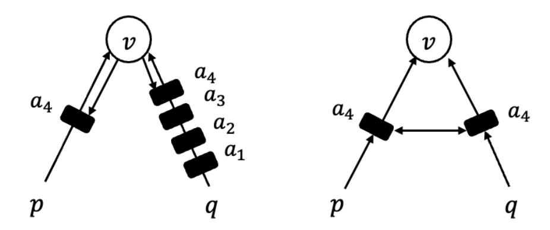
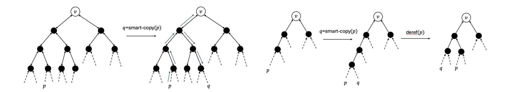
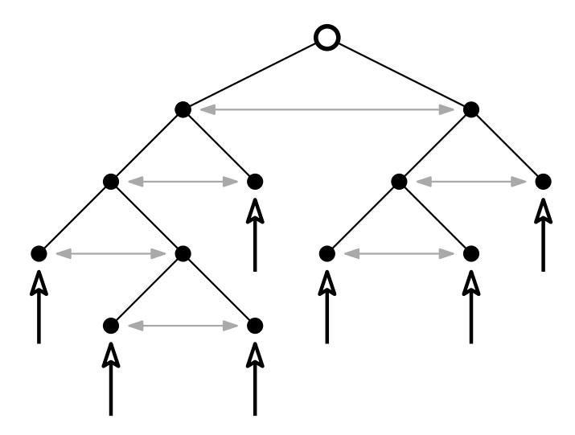
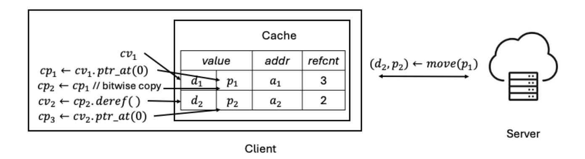
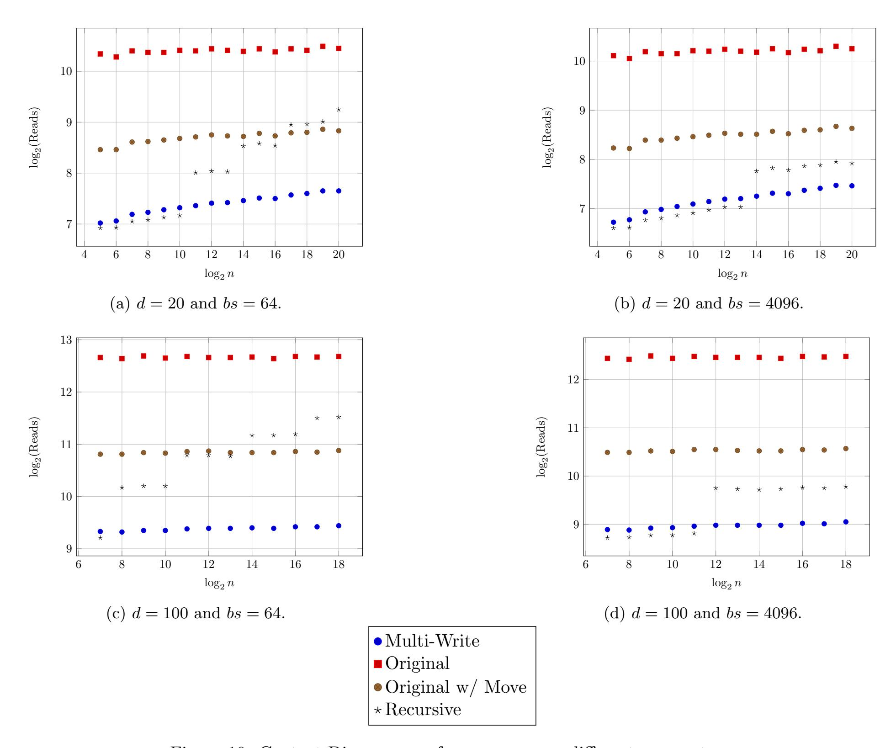
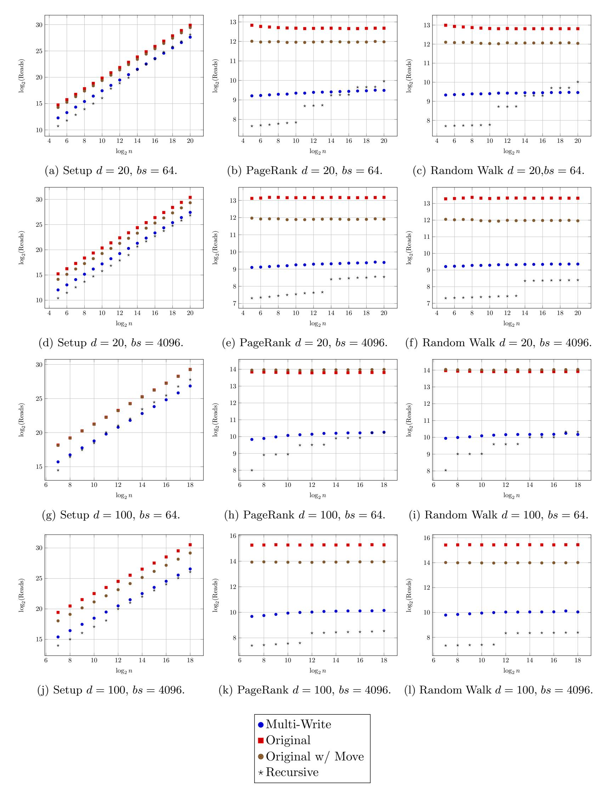
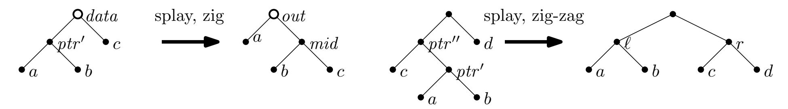

{0}------------------------------------------------

# Oblivious Single Access Machines are Concretely Efficient

Sage Pia

UConn sage.pia@uconn.edu Ananya Appan UIUC

aappan2@illinois.edu

UConn maryam.rezapour@uconn.edu

Maryam Rezapour

Amey Shukla UConn

Nikhil Date UIUC

Benjamin Fuller UConn

amey.shukla@uconn.edu

ndate2@illinois.edu

benjamin.fuller@uconn.edu

Ling Ren UIUC

renling@illinois.edu

David Heath UIUC

daheath@illinois.edu

March 4, 2026

#### Abstract

Oblivious algorithms allow a space-constrained client program to securely outsource storage to an untrusted server. Any program can be compiled to an oblivious form via Oblivious RAM (ORAM), but this is asymptotically and concretely expensive. Recent work (Appan et al., CCS'24) proposed a weakening of ORAM called the Oblivious Single Access Machine (OSAM) model, which offers asymptotically-improved oblivious compilation for many programs, including those that manipulate graph data structures. While of theoretical interest, OSAM graph algorithms were worse than generic ORAM, even for large graphs (tested on graphs of size up to 2<sup>24</sup>).

This work improves the concrete costs of OSAM-based oblivious algorithms. In short, the original work on OSAM proposed algorithms for manipulating objects with pointers to other objects. Pointers and objects can be naturally used to instantiate arbitrary graphs, but the OSAM's underlying management of pointers involves non-trivial and concretely-expensive algorithms. Our work greatly simplifies and improves the efficiency of OSAM-based pointer handling by co-designing (1) pointer-friendly modifications to the underlying Path ORAM algorithm (Stefanov et al., CCS'13) and (2) new algorithms for managing pointers.

We implemented the original OSAM algorithms and our approach. Naturally-written graph algorithms can now be automatically compiled to an oblivious form while enjoying up to a 4× improvement in performance as compared to when using generic Path ORAM (and at least 8× as compared to the original OSAM). In sum, our work provides generic and easy-to-use oblivious tools while concretely improving over prior generic state-of-the-art tools.

## 1 Introduction

Oblivious data structures and algorithms are powerful tools that enable a space-constrained client to securely outsource its storage to an untrusted server. These tools are the workhorse underlying many privacypreserving applications, especially those that involve non-trivial quantities of structured data. Oblivious data structures have been leveraged in the design of symmetric searchable encryption [\[GMP16,](#page-25-0) [FVY](#page-25-1)<sup>+</sup>17], secure processor design [\[RFK](#page-26-0)<sup>+</sup>17], and outsourced secure computation [\[GGH](#page-25-2)<sup>+</sup>13, [HHWW19\]](#page-25-3).

The key technical challenge in achieving oblivious data structures/algorithms is the need to obfuscate the client program's access pattern. The order in which the client uploads/downloads memory slots should reveal nothing about the client's data. Roughly, this is achieved by accessing data in some data-independent pattern, or by rearranging data to make access patterns appear data-independent.

{1}------------------------------------------------

Oblivious RAM Any program can be automatically made oblivious by means of an Oblivious RAM (ORAM) compiler [\[GO96\]](#page-25-4). An ORAM compiler serves as a virtual layer between the client's program and the server, translating each of the client's logical memory queries into physical data-oblivious queries that are sent to the server. The generic nature of this approach makes ORAM compilers both theoretically interesting and of considerable practical value [\[LHS](#page-25-5)+14, [LWN](#page-26-1)+15a, [ZDB](#page-26-2)+17].

Unfortunately, ORAM compilers incur a high cost. In particular, they can incur (1) a high number of roundtrips between client and server and (2) a high blow-up, which is defined as the ratio between the amount of data entering/leaving the client's cleartext program and the amount of data entering/leaving the same program after ORAM compilation. As one representative example, for a memory of size N, the influential Path ORAM incurs O(log<sup>2</sup> N) blow-up and O(log N) roundtrips per access [\[SvDS](#page-26-3)+13].

Since fully generic compilers incur a high cost, it becomes natural to ask: Can we design efficient compilers targeted at certain useful classes of client programs?

Oblivious SAM Oblivious single access machine (OSAM) compilers were one such proposal [\[AHR24\]](#page-24-0). An OSAM compiler works for any client program that writes to each memory slot at most once and reads from each memory slot at most once. Appan et al. [\[AHR24\]](#page-24-0) showed that an OSAM compiler obviates the need for Path ORAM recursion, improving both blow-up and roundtrips by a logarithmic factor to O(log N) and O(1), respectively.

This single access restriction may seem prohibitive, but one can introduce additional non-cryptographic compilers that further translate client code from some easy-to-use source language to the restrictive OSAM interface. Appan et al. [\[AHR24\]](#page-24-0) showed that arbitrary pointer machine programs—programs that manipulate objects and pointers to those objects, but that do not support random access arrays—can be automatically made oblivious with asymptotically lower cost than via ORAM. Since pointers and objects naturally represent directed graphs, this formalism and its improved cost led to various state-of-the-art oblivious graph algorithms. Formally, each time a pointer is dereferenced, [\[AHR24\]](#page-24-0)'s approach incurs O(log N log d) blow-up and O(log d) roundtrips per pointer dereference, where d is the number of existing pointers to the dereferenced object. When d ≪ N, this can yield asymptotic improvement as compared to ORAM. In many cases it is possible to arrange that d is a constant, including when performing arbitrary graph traversals.

The OSAM formalism is thus of theoretical value, but its practical value remained unclear. The problem is that the second layer of compilation—from pointers/objects to SAM-friendly operations—incurs high constant factors. Since SAM memory cells can only be read once, when the client dereferences a pointer, the compiler must save the retrieved object back to a fresh memory cell such that it can be dereferenced again later. This becomes expensive when a program generates two or more pointers to the same object. When an object is moved to a new memory cell, the compiler must somehow "alert" all pointers as to the identity of that new memory cell. In general, these pointers might themselves be stored in objects on the server, which makes handling such alerts relatively difficult.

The difficulty of arranging such alerts is the source of [\[AHR24\]](#page-24-0)'s log d scaling and large constant factors (we discuss them in detail in §[2\)](#page-2-0). Looking ahead to §[7,](#page-18-0) we implemented and tested the original OSAM compiler and were not able to find a single graph algorithm configuration where OSAM outperformed the standard Path ORAM. Further techniques are needed to extract concrete improvements from OSAM's asymptotic advantage.

#### 1.1 Contribution

We develop and implement substantially improved techniques for achieving client/server OSAM. The total effect of our nontrivial optimizations makes OSAM superior to Path ORAM for natural graph processing problems. In particular:

- We relax the OSAM interface to allow programs that write memory cells more than once (we still enforce at most one read per memory cell). We modify Path OSAM (OSAM instantiated with nonrecursive Path ORAM) to support multiple writes. While this modification is small, the proof that the resulting OSAM does not "overflow" is nontrivial.
- Equipped with the multiple-write capabilities, we design greatly improved algorithms for managing shared pointers. Our new algorithms are based on a modification of the splay tree data structure [\[ST85\]](#page-26-4).

{2}------------------------------------------------

• One of the main concrete inefficiencies of [\[AHR24\]](#page-24-0)'s handling of pointers is that the approach eagerly creates copies of pointers, which can be expensive in the OSAM paradigm. We develop a new "caching" technique that substantially reduces the number of copies created.

Given our OSAM compiler, a developer can write algorithms in a standard pointer-based style, and our compiler will automatically convert that algorithm into an oblivious one. The compiled program enjoys asymptotic and concrete performance improvement as compared to the same program compiled with a baseline ORAM compiler. Our experiments show that our OSAM-based compilation can be up to 4× more efficient in blowup and roundtrips than the Path ORAM baseline, and up to 8× more efficient than prior OSAM.

Oblivious graph library To provide evidence of the utility of our improvements, we provide a generic [oblivious graph library](https://github.com/sage-p1/ConcreteOSAM) written in Python and a Rust implementation of Path OSAM<sup>+</sup> (defined in Section [2.1\)](#page-3-0). The graph library is intentionally written in a high-level language to free programmers from having to interface with cryptographic algorithms. Our entire graph library is built through a pointer machine interface and contains several common algorithms. Specifically, we implement BFS, DFS, Dijkstra's, Prim's, Random Walk, PageRank, Contact Discovery, and Directed Triangle Count. These algorithms are augmented by useful helper procedures that can collect all neighbors of a vertex, randomly choose one of a vertex's neighbors, or look up an entry vertex tied to a user-given name. None of our algorithms perform any task-specific optimizations.

### 1.2 Related Work

Any ORAM compiler must incur at least Ω(log N) blow-up [\[GO96,](#page-25-4) [LN18\]](#page-26-5), and popular tree-based ORAMs incur O(log<sup>2</sup> N) blow-up and O(log N) roundtrips per access [\[SvDS](#page-26-3)+13]. The theoretically-remarkable OptORAMa construction [\[AKL](#page-24-1)+20] achieves optimal Θ(log N) blow-up, but it either involves practicallyinfeasible constant factors [\[DO20\]](#page-25-6) or that the client keep very large (though still sublinear) local state [\[AKM23\]](#page-24-2), and it still incurs O(log N) roundtrips per access.

Because ORAM is costly, the literature has considered special-purpose handling for stacks, queues, search trees, and priority queues [\[ZE13,](#page-26-6) [WNL](#page-26-7)+14, [Shi20,](#page-26-8) [JLS21\]](#page-25-7). OSAM generalized many such structures by capturing them as SAM programs and using simplified tree-based ORAM to achieve matching asymptotics [\[AHR24\]](#page-24-0). As discussed, OSAM also supports general pointer machine programs. Concurrent work [\[AH25\]](#page-24-3) showed OSAM's asymptotic advantage can be extended to further problems, including immutable data structures, range queries, and string search algorithms.

Perhaps OSAM's most attractive feature is its ability to compile graph algorithms. Prior works on oblivious graph algorithms took non-generic approaches such as using trusted hardware enclaves [\[ZDB](#page-26-2)+17, [CDP](#page-24-4)+24], focusing on the multiparty computation setting [\[KS14,](#page-25-8) [LWN](#page-26-9)+15b, [Ost24\]](#page-26-10), and/or using precomputation techniques [\[CK10,](#page-25-9) [MKNK15,](#page-26-11) [GKT21,](#page-25-10) [FGPT24\]](#page-25-11). For example, Compass [\[ZPZP24\]](#page-26-12) introduced a graph-based search from Hierarchical Navigable Small World (HNSW) index. We postpone a more detailed explanation of prior work to Appendix [C.](#page-29-0)

## <span id="page-2-0"></span>2 Technical Overview

This section sketches our improvements to OSAM and its handling of pointer-based programs, as compared to [\[AHR24\]](#page-24-0). We will describe our constructions as programs in the SAM model. As we will see in §[3,](#page-5-0) such programs can be made oblivious efficiently.

[\[AHR24\]](#page-24-0)'s SAM program that implements pointer handling consists of three parts: (1) a solution that allows a constant number of pointers to share a value, (2) an inverted pointer tree that builds on the constantpointer solution to allow more pointers to share the same value, and (3) a pointer interface that allows the client to write natural-looking pointer programs that are valid SAM programs.

The constant factors incurred in each part of [\[AHR24\]](#page-24-0)'s solution multiply to produce the final constant factor. Our improvements bring down the final constant factor by roughly 8×, resulting in 4× improvement over Path ORAM. We next describe [\[AHR24\]](#page-24-0)'s solution for each part, point out sources of inefficiency, and describe how we address them.

{3}------------------------------------------------

<span id="page-3-1"></span>

Figure 1: The constant-pointer solution of [\[AHR24\]](#page-24-0) (on the left) compared with ours (on the right) when a pointer p is dereferenced four times. In [\[AHR24\]](#page-24-0)'s solution, the pointer q uses an address queue storing all addresses that v was written to since the last time q was dereferenced. In our solution, p and q point to locations that store only the latest address of v.

### <span id="page-3-0"></span>2.1 Sharing Constant Numbers of Pointers

To understand how [\[AHR24\]](#page-24-0) uses SAM to implement pointers, we start with a simple case where each value in SAM memory has only a single pointer pointing to it (i.e., no shared pointers), such as when implementing a tree. In this case, each pointer can simply be a raw SAM address, and it can be dereferenced by reading this address. Due to restrictions imposed by SAM, this address cannot be read a second time. To ensure the same pointer can be dereferenced again, we can write the value to a new address and update the pointer to point to this new address [\[WNL](#page-26-7)+14].

The difficulty of shared pointers When multiple pointers point to the same value, the problem becomes more challenging because the two pointers must somehow coordinate. Consider two pointers p and q both pointing to value v. If p and q are simply the same raw SAM address, then when the program dereferences p, q is invalidated. To ensure p and q both remain valid after one is dereferenced, more work is needed.

[\[AHR24\]](#page-24-0)'s constant-pointer solution As a building block, [\[AHR24\]](#page-24-0) first uses SAM to implement a queue. This queue is characterized by two addresses: head and tail. The client can use tail to add things to the queue, and use head to read things from the queue in a first-in-first-out order. As an example, let us again consider two pointers p and q that point to the same value v. p and q hold the heads of queues that store the address of v. The value v stores the tails of these queues. Each queue stores all the addresses that v had been written to since the last time the pointer was dereferenced. For instance, suppose that v is fetched by dereferencing p four times. Each time p is dereferenced, v is written to a new address, and the client appends this address to q's queue using the tail stored in v. When q is dereferenced, the head stored at q is used to read all four addresses from q's queue, and the last (and latest) address in the queue is used to fetch v. Figure [1](#page-3-1) illustrates this process.

We do not need to go into the full details of how these queues are implemented. The main point is that queues allow p and q to share access to v while obeying SAM restrictions. Appending to a queue writes a SAM address; chasing through the queue reads all writes. By implementing queues carefully, one can arrange that no SAM address is ever written to/read from more than once. It is not clear how to achieve shared pointers in the SAM model with a single write without some notion similar to these queues.

SAM with multiple writes We eliminate the need for address queues by relaxing the SAM model. Instead of enforcing that each address be read from and written to at most once, we only enforce single read and allow multiple writes to the same address. We modify the underlying OSAM compiler to support multiple writes. We call the resulting compiler Path OSAM<sup>+</sup>. When a value is rewritten to the same address, the Path OSAM<sup>+</sup> server stores not only the latest version of the value, but also stale versions. Path OSAM<sup>+</sup> ensures that stale versions are eventually overwritten by later versions.

Our key innovation in designing Path OSAM<sup>+</sup> is not the construction, which turns out to be quite natural, but the proof that it works. In particular, the challenge lies in bounding the client storage (i.e., the

{4}------------------------------------------------

<span id="page-4-0"></span>

Figure 2: [\[AHR24\]](#page-24-0)'s smart copy (left) compared with ours (right). [\[AHR24\]](#page-24-0)'s copy adds a new pointer to the rightmost leaf of the tree by traversing up and down the tree. Our copy simply extends the path to the pointer's leaf.

stash size for those familiar with Path ORAM). The proof for Path ORAM crucially relies on the fact that each value is written to a uniformly random address. This no longer holds when multiple writes to the same address are allowed, so we must revisit the proof from the ground up. There are two main new steps in our proof: (1) show that the number of values with j versions on the server decreases exponentially in j in expectation, and (2) bound client storage via a Chernoff bound by carefully choosing random variables that are either independent or negatively correlated. §[3](#page-5-0) presents details of our construction and its proof.

An improved solution from multiple writes With multi-write, we can implement a two-pointer solution without address queues. Each pointer holds the address of a location in server memory that stores (1) v's latest address and (2) the address of the location of the other pointer. The client can dereference a pointer, say p, by fetching and reading v's latest address from p's location. This requires reading p's location, and also reading v. Due to single access constraints, the client writes v to a new address, and stores this new address at a new location using which p can be dereferenced later. To ensure that q can also be dereferenced to fetch v, the address of q's location (which was written in p's location) is updated to hold (1) the new address of v and (2) the address of p's new location. This is possible only because, although q's location was written to previously, we can write multiple values to q's (and p's) location. This is illustrated in Figure [1.](#page-3-1)

#### <span id="page-4-1"></span>2.2 Handling Multiple Shared Pointers

[\[AHR24\]](#page-24-0)'s solution [\[AHR24\]](#page-24-0) generalizes their constant-pointer solution to multiple (say d) pointers by building an "inverted" binary-tree storing v at the root: pointers point to leaves of this tree, and each tree node points to its parent. Hence, each node has only a constant number of incoming pointers. The value v can be fetched by chasing pointers from leaf to root.

[\[AHR24\]](#page-24-0) also allows pointers to be copied. A pointer is copied by adding a new pointer at the rightmost leaf of the tree. This is done by traversing to the root, then traversing down the tree to the right. This ensures the tree is always balanced, guaranteeing that each pointer operation can be performed using O(log d) SAM operations. To differentiate this operation from a verbatim (bitwise) copy of a pointer, [\[AHR24\]](#page-24-0) refer to this as a smart copy.

This implementation of smart copy increases cost in two ways. First, it requires each node to additionally store pointers to their children. Second, it requires the tree to be traversed twice: once up (to fetch the root), and once down (to add a new pointer). We reduce both of these costs.

Making smart copy more efficient A simple way to smart-copy a pointer that points to a leaf is to extend the path from the root to that leaf. To do this, the client can create a new leaf that points to the old leaf, create a new pointer that points to this new leaf, and make the original pointer also point to this new leaf. When implemented this way, smart copy now incurs only O(1) SAM operations. On the other hand, paths in the inverted tree may be unbalanced. Dereferencing a pointer, which requires traversing a path in this tree, could require O(d) SAM operations, far worse than the O(log d) cost of [\[AHR24\]](#page-24-0).

We adopt the above simple strategy, and we reduce the cost of performing a pointer dereference by amortizing its cost over the copy operations. Our solution is heavily inspired by an existing data structure called the splay tree [\[ST85\]](#page-26-4). A splay tree is a binary search tree in which paths may be unbalanced. On 

{5}------------------------------------------------

traversing the path to a node, the splay tree balances this path by tree rotations, similar to other structures such as the famous AVL construction. By the potential method ([\[CLRS22,](#page-25-12) Section 17.3]), the amortized cost of each splay tree operation can be shown to be O(log d).

When the client dereferences a pointer, the client traverses a path from leaf to root, and rebuilds that path, performing tree rotations to better balance the tree. Unsurprisingly, we can adapt the amortized analysis used for splay trees to show that this yields O(log d) cost. In our rotation-based strategy, the client touches only those nodes along the path it anyway needed to traverse, a far simpler strategy than the double traversal on copy of [\[AHR24\]](#page-24-0). Note also that this compounds with our removal of queues: in the [\[AHR24\]](#page-24-0) solution, traversing an edge in a pointer tree involved chasing down a queue of pointers; in ours, it is a single SAM read. § [4](#page-12-0) presents full details of our splay-tree-based solution.

#### <span id="page-5-1"></span>2.3 Avoiding Smart Copies

When a pointer machine program dereferences a value, the dereferenced value might itself contain further pointers, such as when implementing a data structure. When this happens, [\[AHR24\]](#page-24-0) cautiously smart copies the dereferenced value, which involves smart-copying all contained pointers, then writes one smart copy of the value back to server. This is done to ensure that no two identical copies of a pointer reside anywhere in the system. If this were not enforced, it might in general be possible for a client's pointer machine program to (1) read a value x from memory, (2) dereference a pointer p in x, (3) read x from memory a second time, and (4) dereference the identical pointer p a second time. This would yield two reads to the same SAM address, which is disallowed by SAM. Even with our improved smart copy operation, this design is expensive as the amortized cost of smart copy is O(log d).

In many cases, the above strategy is overly pessimistic. As one example, consider a pointer machine program that traverses a single path through some d-ary tree. Each time a node node is accessed, the above strategy cautiously copies node's child pointers, then writes node back to the server, just in case the above error case might arise. But because we know that the program will simply read node, then read one of its children recursively, this caution is unnecessary and wasteful. Indeed, d − 1 of the pointers in node need not be smart copied.

We instead propose a solution that fetches values to client memory without smart copying. We do this by introducing a notion of so-called moves. When dereferencing a pointer, a client program can move the value from the server, which involves a simple pointer dereference without a smart copy. The result of moving from a pointer is (1) the dereferenced value v and (2) a write-back SAM address where the client program should write a new version v (this write-back address is the new root of an inverted pointer tree). By moving from a pointer p, the client program takes on a promise that it will not dereference v a second time until it itself writes a new version back. With some care, the client program can therefore minimize the number of smart copies that are created; in our tree traversal example, the client program holding node node can (1) move the appropriate child c, (2) update node with a fresh pointer to c, and (3) write node back to the server. This optimization is particularly important for local algorithms which often access only a single neighbor of nodes.

This notion of moving from a pointer imposes a contractual obligation on the programmer, but this obligation can be automated away. We introduce a client-side cache whose size is proportional to the number of local variables that automatically handles moves. §[5](#page-14-0) presents more details.

# <span id="page-5-0"></span>3 OSAM with Multiple Writes

Model The SAM model restricts each address to be written to at most once and read from at most once. In this section, we describe how Path OSAM can be modified to handle a stronger version of SAM that allows an address to be written to multiple times. We emphasize that we still restrict each address to be read at most once. We start by formalizing our stronger definition of SAM.

Definition 1 (Single Access Machine (SAM)). A Single Access Machine (SAM) (with multi-write) is an algorithm implementing a memory storing polynomial number of addressable memory cells, each of some specified bit-width w. The machine responds to three types of memory requests:

{6}------------------------------------------------

- addr ← Alloc(): The machine responds with a fresh memory address (i.e., an address that has not been chosen before).
- Write(addr, val): The machine writes value val ∈ {0, 1} <sup>w</sup> to address addr. If addr was not allocated by the machine, then the machine instead halts and outputs ⊥.
- val ← Read(addr): The machine responds with the latest value written to addr, or it responds with None if nothing is written. If (1) addr was not allocated or (2) addr was already read from, then the machine instead halts and outputs ⊥.

A SAM program is an interactive, randomized algorithm that issues memory requests to the machine. A program is valid if it never issues a request that causes the machine to output ⊥.

An oblivious SAM (OSAM) hides the addresses used in memory requests issued by a valid SAM program.

Definition 2 (Oblivious Single Access Machine (OSAM)). A SAM compiler Π implements the SAM interface by interacting with a random access memory. Π is an oblivious SAM (OSAM) compiler if there exists a polynomial-time simulator Sim such that for any polynomial-length sequence of requests R made by a valid SAM program, the following ensembles are statistically close in the security parameter λ:

$$\Pi(1^{\lambda}, \mathcal{R}) \stackrel{s}{=} \mathsf{Sim}(1^{\lambda}, \mathcal{L}(\mathcal{R}))$$

Above, L(R) denotes the number of Read/Write requests (i.e., non-Alloc requests). In other words, the requests issued by Π can be simulated given only the total number of Read/Write requests in the underlying SAM program.

### 3.1 Path OSAM<sup>+</sup> Construction

Path OSAM review We start by explaining the Path OSAM construction of [\[AHR24\]](#page-24-0). For readers familiar with Path ORAM [\[SvDS](#page-26-3)+13], this is simply Path ORAM with deterministic order eviction, but without the position map: the position map is no longer needed since each address is read at most once.

Values are written to and read from addresses in the address space of the client's outsourced memory. Let N denote the size (in words) of the client's outsourced memory [1](#page-6-0) . The server memory is organized in a complete binary tree with N leaves. Each tree node contains a bucket that holds a constant number (Z) of values. The client locally stores a stash that contains values downloaded from the server.

Path OSAM allocates a new address by sampling a leaf uniformly at random. When the SAM program issues a request to write a value to an address, Path OSAM maintains the invariant that the value lies in some bucket on the path to the corresponding leaf. When the SAM program issues a read request for an address, Path OSAM fetches the value by downloading (to the stash) all buckets on the path towards that address's assigned leaf.

To hide addresses being written to, the client always writes values to the stash, and periodically performs a so-called eviction operation that moves values towards their assigned leaves. The eviction operation is performed on a path by (1) downloading the path (2) greedily filling buckets from the leaf to the root with values from the stash[2](#page-6-1) (3) uploading the path back to server memory. Path OSAM evicts paths in a deterministic reverse-lexicographic order.[3](#page-6-2) This allows the server's view to be simulated: Writes and Reads can be simulated by reading a uniformly random path, then evicting a deterministic path.

Values may overflow from server memory, and the client stores these values in the stash. Path ORAM (and our Path OSAM<sup>+</sup>) ensures that a stash of size S = O(λ) will not overflow, except with probability negligible in λ [\[SvDS](#page-26-3)<sup>+</sup>13, [RFK](#page-26-13)<sup>+</sup>15].

<span id="page-6-0"></span><sup>1</sup>We assume that N is a power of 2

<span id="page-6-2"></span><span id="page-6-1"></span><sup>2</sup>A value is placed in a bucket if the bucket lies on the path to the value's assigned leaf.

<sup>3</sup>The reverse-lexicographic order [\[GGH](#page-25-2)+13] counts from 0 to N, but reverses each number's bits. For instance, if N = 7, this would be 0, 4, 2, 6, 1, 5, 3, 7

{7}------------------------------------------------

```
ctr ← 0
evictCtr ← 0
stash ← empty-list
def Alloc( ) → address :
   leaf ←$ [N] // Uniformly sample a leaf
   a ← ctr ⊔ leaf // ⊔ denotes concatenation
   ctr ← ctr + 1
   return a
def Read(i : address) → val | None :
   { , , v} ← ReadAndRm(i) // None if no such
    address written to
   Evict( )
   return v
def Write(i : address, v : val) :
   ReadAndRm(Alloc()) // Read a dummy address
   ctr ← ctr + 1
   stash.append({i, ctr, v})
   Evict( )
                                                    def ReadAndRm(i : address) → val | None :
                                                       interpret i as ctr ⊔ leaf
                                                        // Load path to leaf from server, then search the
                                                        stash for element labelled with i; See [SvDS+13]
                                                    def Merge(stash) :
                                                       M ← { }
                                                       for {i, ctr, v} ∈ stash do
                                                           if i ∈ M then
                                                              ctr′
                                                                  , v′ ← M[i]
                                                              if ctr > ctr′
                                                                            then M[i] = {ctr′
                                                                                               , v′}
                                                           else M[i] = {ctr, v}
                                                       stash ← empty-list
                                                       for i ∈ M do
                                                           stash.append(M[i])
                                                    def Evict( ) :
                                                       ℓ ← bitReverse(evictCtr mod 2L)
                                                       evictCtr ← evictCtr + 1
                                                       for i ← 0 to L do
                                                           stash ← stash ∪ ReadBucket(P(ℓ, i))
                                                       Merge(stash)
                                                       for i ← L to 0 do
                                                           WriteBucket(P(ℓ, i), stash)
```

Figure 3: Path OSAM with multiple writes. P(ℓ, i) denotes the bucket at level i on the path to leaf ℓ.

Modifying eviction to allow multiple writes The Path OSAM construction of [\[AHR24\]](#page-24-0) does not reveal addresses during Write, so it is oblivious even when multiple writes are allowed. What is not clear is whether correctness holds with multiple writes to the same address, because existing stash size analysis assumes that each write picks a leaf uniformly at random, which does not hold when multiple writes are allowed. We show that the stash size remains bounded when multiple writes are allowed.

First, we make a few natural modifications to the eviction algorithm of Path OSAM to support multiple writes. Notice that now, a path may contain multiple values written to the same address. When any path is evicted/read, our modified Path OSAM<sup>+</sup> deletes from that path stale values written to the same address, and only keeps the latest value written to that address. When this happens, we say that Path OSAM<sup>+</sup> merges values repeatedly written to the same address. This does not affect correctness, since older versions of these values are no longer useful.

We present our Path OSAM<sup>+</sup> construction in Figure [3.](#page-7-0) Read and Alloc are exactly the same as the Path OSAM of [\[AHR24\]](#page-24-0). Specifically, Alloc allocates an address by sampling a leaf uniformly at random, and appends a counter ctr to this leaf. This counter helps ensure that each allocated address is unique. Read, given an address, reads the path to the corresponding leaf.

Write and Evict are modified to handle multiple writes. While writing a value to the stash, we increment ctr and write ctr along with the value. This helps identify the latest value when multiple values are written to the same address. Evict reads values on a path to the stash, merges values in the stash to keep only the latest value written to each address, and then as before, writes back values as deep as possible from the leaf to the root. Note that Write performs a read to a random dummy address; this prevents the construction from leaking whether the program is performing a read or a write operation.

#### 3.2 Stash Size Analysis

<span id="page-7-1"></span>Theorem 1. In Path OSAM<sup>+</sup> with multiple writes and when bucket size Z ≥ 15 and total memory size N ≥ 16, the probability that the number of values in the stash exceeds S is at most exp(−O(S)).

{8}------------------------------------------------

Our formal analysis confirms that constant-sized buckets are sufficient. The analysis is somewhat loose, requiring a value of  $Z \ge 15$ . In practice, we and prior work [GKW18] never observed multiple writes hurting stash size at all, and the same value of Z (e.g., Z = 4) from Ring ORAM works experimentally.

Our proof follows the structure of the proof presented in  $[RFK^+15]$  for a variant of Path ORAM called Ring ORAM. Consider an imaginary Path-OSAM<sup>+</sup> with *infinite* bucket capacity, denoted  $OSAM^{\infty}$ . Let T be a rooted subtree, n(T) be the number of nodes in T, and X(T) be the number of values in T. The proof consists of two steps. (1) Prove that the stash of Path-OSAM<sup>+</sup> overflows only if X(T) for some rooted subtree T in  $OSAM^{\infty}$  exceeds  $n(T) \cdot Z + S$ . (2) Derive a Chernoff-style bound on  $Pr[X(T) > n(T) \cdot Z + S]$  in  $OSAM^{\infty}$ . Our proof for step (1) follows largely from  $[RFK^+15]$  (after minor modifications). Our proof for step (2) requires a new analysis. This is because step (2) of  $[RFK^+15]$  assumes that each value is written to a uniformly random leaf, which no longer holds as we allow multiple writes to reuse the same leaf.

Our extension to the Ring ORAM proof is non-trivial. In fact, a prior work [GKW18] erroneously claimed that the proof with multiple writes is immediate, in the sense that overwritten values in the ORAM tree cannot harm stash size, since those overwritten elements will be eventually deleted anyway. However, their argument overlooks the fact that before an overwritten value is deleted, it might have prevented other values from moving down the ORAM tree, which could increase stash size.

Our proof instead carefully accounts for each possible number of copies of each value and shows that eviction succeeds even in the presence of multiple writes. Note that our proof retroactively shows the correctness of the construction of [GKW18], which may be of independent interest.

The structure of the proof is as follows. To bound the stash size in  $OSAM^Z$ , we show the following:

- 1. When a post-processing procedure G is performed on  $OSAM^{\infty}$ , after any sequence of accesses, the stash size of  $G(OSAM^{\infty})$  equals the stash size of  $OSAM^{Z}$ ;
- 2. The stash size of  $G(\mathtt{OSAM}^{\infty})$  exceeds S only if the "occupancy" of some rooted subtree of  $\mathtt{OSAM}^{\infty}$  exceeds its capacity by S; and
- 3. The probability that the occupancy of some rooted subtree of  $\mathtt{OSAM}^\infty$  exceeds its capacity by S is exponentially small.

We now proceed to introduce our new notation and then present the formal claims that lead to Theorem 1.

**Notation** We label buckets linearly with the children of bucket  $b_i$  being  $b_{2i}$  and  $b_{2i+1}$ .  $b_1$  is the root bucket and  $b_0$  represents the stash.  $b_i^{\infty}$  and  $b_i^{Z}$  denote the *i*-th buckets in  $OSAM^{\infty}$  and  $OSAM^{Z}$ . L denotes the number of levels in the Path OSAM tree. We use  $val_a^t$  to denote a value written to address a during query t.  $val_a^{t_1}, val_a^{t_2}, val_a^{t_3}, \ldots$  represent values repeatedly written to the same address a.

O denotes an OSAM state after a sequence of accesses: this is the state of all buckets and the stash in Path OSAM, including the values contained in each bucket / stash. We use  $O^{\infty}$  to denote a state of OSAM $^{\infty}$  and  $O^{Z}$  to denote a state of OSAM $^{Z}$ . We consider OSAM states after a sequence of m accesses.  $G_{O_{Z}}(O_{\infty})$  is a post-processing procedure that takes as input states  $O_{Z}$  and  $O_{\infty}$ , and outputs an OSAM state. As we show below, the output of G is a valid  $O^{Z}$  state. The function  $\operatorname{st}(O)$  denotes the stash size for OSAM state O.

For any sub-tree  $T \in \mathtt{OSAM}^\infty$ , n denotes the number of nodes in T, and  $c(T) = n \cdot Z$  denotes its capacity in  $\mathtt{OSAM}^Z$ . We use X(T) to denote T's occupancy, i.e, the number of values stored in T.

Equivalence between  $G(\mathtt{OSAM}^\infty)$  and  $\mathtt{OSAM}^Z$  When a path is evicted with multiple values written to the same address, older versions of the value get deleted, and only the latest version remains. After any sequence of access requests, if a value is in some bucket of  $O^Z$ , then the value must be also be in some bucket of  $O^\infty$ . This is because if a value  $\mathtt{val}_a^t$  is replaced by a later value  $\mathtt{val}_a^{t'}$  (t' > t) in  $O^\infty$ , then it is also replaced in  $O^Z$ , since a finite bucket capacity does not prevent merging.

<span id="page-8-0"></span>**Lemma 1.** Let  $O^{\infty}$  and  $O^{Z}$  be the states of  $\mathsf{OSAM}^{\infty}$  and  $\mathsf{OSAM}^{Z}$  after an access sequence  $\mathsf{val}_{a_1}^1, \mathsf{val}_{a_2}^2, \mathsf{val}_{a_3}^3, \ldots, \mathsf{val}_{a_m}^m$ . If a value  $\mathsf{val}_a^t$  is not in any bucket of  $O^{\infty}$ , then  $\mathsf{val}_a^t$  is also not in any bucket of  $O^{Z}$ .

{9}------------------------------------------------

*Proof.* For contradiction, suppose that some  $\operatorname{val}_a^t$  is in  $O^Z$  but not in  $O^\infty$ . This happens when another value  $\operatorname{val}_a^{t'}$ , where t' > t, merges with  $\operatorname{val}_a^t$  in  $O^\infty$ . When this happens, suppose that  $\operatorname{val}_a^t$  is present in  $O^\infty$  in bucket  $b_i^\infty$ , and in  $O^Z$  in bucket  $b_j^Z$  that is an ancestor of  $b_i^Z$ . This means that some path passing through  $b_i^\infty$ , and thereby through  $b_i^Z$ , was evicted. Since t' > t,  $\operatorname{val}_a^t$  is deleted in  $O^Z$  as well: a contradiction.  $\square$ 

By Lemma 1, all values present in some bucket of  $O^Z$  are also in  $O^\infty$ . Note that there may still be values that are present in  $O^\infty$  but not present in  $O^Z$ . Our post-processing algorithm G (defined below) re-assigns blocks in buckets in  $O^\infty$  to match  $O^Z$  while deleting extra blocks in  $O^\infty$ . More precisely, G processes each bucket  $b_i^\infty$  as follows for  $i=2^{L+1}-1$  down to 1 (from leaves to root):

- Each value in  $b_i^{\infty}$  that is also in  $b_i^Z$  remains in  $b_i^{\infty}$ .
- Each value in  $b_i^{\infty}$  that is in an ancestor of  $b_i^Z$  is moved to the parent  $b_{i/2}^{\infty}$ .
- Each value in  $b_i^{\infty}$  that is not in any ancestor of  $b_i^Z$  is deleted.

 $G_{O^Z}(O^\infty) = O^Z$  if each  $b_i^\infty$  after G contains the same blocks as  $b_i^Z$  for each  $i = 0, 1, \dots, 2^{L+1} - 1$ . The below Lemma then follows from Lemma 1 and Lemma 1 of [RFK<sup>+</sup>15].

<span id="page-9-0"></span>**Lemma 2.** For the same access sequence and randomness, the post-processing procedure G ensures  $G_{O^Z}(O^\infty) = O^Z$ .

**Bounding stash size** With equivalence between  $O^Z$  and  $G(O^\infty)$  established, we bound the stash size of any state  $O^Z$  by bounding the stash size of  $G_{O^Z}(O^\infty)$  (denoted by  $\operatorname{st}(G_{O^Z}(O^\infty))$ ). A rooted subtree is a subtree  $T \in \operatorname{OSAM}^\infty$  that contains the root of  $\operatorname{OSAM}^\infty$ . The Lemma below, which largely follows from [RFK<sup>+</sup>15], states that the stash of  $G(O^\infty)$  overflows only if some rooted subtree of  $\operatorname{OSAM}^\infty$  (before post-processing) exceeds its capacity by S.

<span id="page-9-1"></span>**Lemma 3.** If  $st(G_{O^Z}(O^\infty)) > S$ , then  $\exists T \in OSAM^\infty$  such that X(T) > c(T) + S before post-processing.

*Proof.* Consider the maximal rooted subtree T such that all buckets in T have exactly Z values after post-processing. We prove that all values in the stash of  $G_{O^Z}(O^\infty)$  originate from T. For contradiction, suppose that some value originates from a bucket  $b \notin T$ . By the maximality of T, some bucket b' that is an ancestor of b (or b itself) contains less than Z values after post-processing, so no value from b can go to the stash of  $G_{O^Z}(O^\infty)$ .

Consider the values that occupy T before post-processing. These values have three outcomes: (1) deleted since they are not in  $O^Z$ , (2) remaining in T after post-processing, or (3) moved to the stash after post-processing. If  $st(G_{O^Z}(O^\infty)) > S$ , then the number of values of type (2) and (3) alone exceed the capacity of T by S. Hence, X(T) > c(T) + S before post-processing.

By Lemmas 2 and 3, we have

$$\begin{split} \Pr \big[ \mathtt{st}(O^Z > S) \big] &= \Pr[\mathtt{st}(G_{O^Z}(O^\infty)) > S] \\ &\leq \sum_{T \in \mathtt{OSAM}^\infty} \Pr[X(T) > c(T) + S] \\ &\leq \sum_{n=0}^N 4^n \cdot \Pr[X(T) > c(T) + S] \end{split}$$

The above follows from a union bound, and a bound on the n-th Catalan number (there are fewer than  $4^n$  binary trees of size n).

<span id="page-9-2"></span>We now bound  $\Pr[X(T) > c(T) + S]$  by deriving a bound on the moment generating function  $\mathbb{E}[e^{tX(T)}]$ , where t > 0 is a parameter that we will fix later. Our proof relies on a Lemma that bounds the number of values that could possibly be written to some bucket b that belongs to T.

{10}------------------------------------------------

Lemma 4. Consider some sequence

$$A = \{ op_i \mid op_i = Write(addr, val) \ or \ Read(addr) \}$$

of m accesses. A value val is a candidate write to bucket b of a subtree T of ORAM<sup> $\infty$ </sup> if there exists some address addr for which v belongs to b after A is applied, when deterministic reverse-lexicographic order eviction is used. The number of candidate writes to any bucket  $b \in O_{\infty}$  at level L is upper bounded by  $2^{L}$ .

Proof. (From Lemma 3 of Ring ORAM [RFK<sup>+</sup>15]) For a bucket  $b_i$  at level L, we use  $t_1$  and  $t_2$  to denote the last time paths through b's left child  $(b_{2i})$  and right child  $(b_{2i+1})$  were evicted. Without loss of generality, assume that  $t_1 < t_2$ . Any value  $\operatorname{val}_a^t$  for which  $t \le t_1$  will not be present in b as they will be in either  $b_{2i}$  or  $b_{2i+1}$ . Values with  $t > t_2$  will not be in b since, after  $t_2$ , no path through b is evicted. Thus, any value  $\operatorname{val}_a^t$  present in b must have  $t_1 \le t < t_2$ . By deterministic reverse-lexicographic order eviction, there are at most  $2^L$  such values since  $t_2 - t_1 = 2^L$ .

Using the above Lemma, we can bound  $\mathbb{E}[e^{tX(T)}]$  by carefully choosing random variables that are independent of / negatively correlated with each other. Since we allow multiple writes, each value might appear more than once in any given subtree T. If a particular value i appears exactly j times in some subtree T, we say that i contributes weight j to T. We write  $w_i^j$  to denote a random variable that indicates whether or not value i contributes weight j to X(T). Note that variables  $w_a^*, w_b^*$  for  $a \neq b$  are independent random variables, and that  $w_i^j, w_i^k$  for  $j \neq k$  are negatively correlated. In the latter case, if a block i appears exactly j times in T, then it cannot also appear exactly  $k \neq j$  times.

We write  $w^j = \sum_i w_i^j$  to denote the number of values appearing j times in T. We show that the expected number of values that contribute weight j to subtree T drops exponentially in j.

<span id="page-10-0"></span>**Lemma 5.** For all rooted subtree  $T \in OSAM^{\infty}$  of size n and all j:

$$\mathbb{E}\big[w^j\big] \le \frac{3n+1}{2^j}.$$

*Proof.* We use Y(b) to denote the number of (possibly non-contiguous) repeatedly written sequences of j values that end in bucket  $b \in T$ . For each such sequence, the j repeatedly written values could lie on any node on the path from the root to b. We use Y(b,b') to denote the number of (possibly non-contiguous) repeated-write sequences of j values that start in bucket b' and end in bucket b.

We first show that  $\mathbb{E}[Y(b)] \leq 4/2^j$  for any bucket  $b \in T$ . Suppose that b is at level L in T. Let Y(b,b') denote the number of (possibly non-contiguous) repeated-write sequences of j values that start in bucket b' and end in bucket b. Note that  $Y(b,b') \neq 0$  only if b' is an ancestor of b at level  $L' \leq L - j + 1$ . Each such value reaches b only if a path through b is evicted, which happens with probability at most  $1/2^L$ . By Lemma 4, only  $2^{L'}$  values have a chance of being present in bucket b' at level L'. We can now bound  $\mathbb{E}[Y(b)]$  as:

$$\mathbb{E}[Y(b)] = \sum_{b'} \mathbb{E}[Y(b, b')] \le \sum_{L'=0}^{L-j+1} \frac{2^{L'}}{2^L} \le \frac{2^{L-j+2}}{2^L} = \frac{4}{2^j}.$$

We can obtain a tighter bound by obtaining a tighter bound on  $\mathbb{E}[Y(b)]$  when b is a bucket that is not a leaf of the PathOSAM<sup>+</sup> tree. Since b is a non-leaf bucket with infinite capacity, a value remains in b only if it can not go to the child on that evicted path, which happens with  $\frac{1}{2^{L+1}}$  probability. This allows us to get a tighter bound on  $\mathbb{E}[Y(b)]$ :

$$\mathbb{E}[Y(b)] = \sum_{b'} \mathbb{E}[Y(b, b')] \le \sum_{L'=0}^{L-j+1} \frac{2^{L'}}{2^{L+1}} \le \frac{2^{L-j+2}}{2^{L+1}} = \frac{2}{2^{j}}.$$

Suppose that  $n_{\ell}$  is the number of leaf buckets in T and  $n_{n\ell}$  is the number of non-leaf buckets in T. We can bound  $\mathbb{E}[w^j]$  using a union bound. Note that  $n_{\ell} \leq (n+1)/2$ .

{11}------------------------------------------------

$$\mathbb{E}[w^{j}] \leq n_{\ell} \cdot \frac{4}{2^{j}} + n_{n\ell} \cdot \frac{2}{2^{j}}$$

$$\leq n_{\ell} \cdot \frac{2}{2^{j}} + (n_{\ell} + n_{n\ell}) \cdot \frac{2}{2^{j}}$$

$$\leq \frac{n+1}{2} \cdot \frac{2}{2^{j}} + n \cdot \frac{2}{2^{j}} = \frac{3n+1}{2^{j}}$$

This completes the proof of Lemma 5.

Using Lemma 5, we can apply a Chernoff-style bound to bound  $\mathbb{E}[e^{tX(T)}]$  when  $t = \ln(4/3)$ .

<span id="page-11-0"></span>**Lemma 6.** After any sequence of accesses to  $\mathtt{OSAM}^{\infty}$ , the following holds for any rooted subtree  $T \in \mathtt{OSAM}^{\infty}$  of size n, and for memory size N:

$$\mathbb{E}\left[e^{\ln\left(\frac{4}{3}\right)X(T)}\right] < e^{n\cdot\left(\frac{8}{3} + \frac{3}{N}\right) + \frac{1}{2}}$$

*Proof.* Let  $p_{ij}$  be the probability that values at an address i appear j times. Note that  $X(T) = \sum_{j=1}^{\log N} j \cdot w^j$ . We can use a Chernoff-style bound on  $\mathbb{E}[e^{tX(T)}]$ .

$$\begin{split} \mathbb{E}\Big[e^{tX(T)}\Big] &= \mathbb{E}\Big[e^{\sum_{j} j \cdot \sum_{i} t \cdot w_{i}^{j}}\Big] = \mathbb{E}\Big[e^{\sum_{i} \sum_{j} t j w_{i}^{j}}\Big] = \mathbb{E}\left[\prod_{i,j} e^{t j w_{i}^{j}}\right] \\ &\leq \prod_{i,j} \mathbb{E}\Big[e^{t j w_{i}^{j}}\Big] \text{ (independence/negative correlation)} \\ &= \prod_{i,j} \left(p_{ij} \cdot e^{t j \cdot 1} + (1 - p_{ij}) \cdot e^{t j \cdot 0}\right) \text{ (by defn. of } \mathbb{E}[\cdot]) \\ &= \prod_{i,j} \left(p_{ij}(e^{t j} - 1) + 1\right) \\ &\leq \prod_{i,j} e^{p_{ij}(e^{t j} - 1)} \text{ (for all } x, \, x + 1 \leq e^{x}) \\ &= \prod_{j} e^{(e^{t j} - 1) \sum_{i} p_{ij}} \\ &= \prod_{j} e^{(e^{t j} - 1) \mathbb{E}[w^{j}]} \text{ (Definition of } \mathbb{E}[w^{j}]) \\ &= \prod_{j=1}^{\log N} e^{(e^{t j} - 1) \mathbb{E}[w^{j}]} \text{ (each value can contribute weight} \\ &= e^{\sum_{j=1}^{\log N} (e^{t j} - 1) \mathbb{E}[w^{j}]} \\ &= e^{\sum_{j=1}^{1} (e^{t j} - 1) \mathbb{E}[w^{j}] + \sum_{j=2}^{\log N} (e^{t j} - 1) \mathbb{E}[w^{j}]} \end{split}$$

By Lemma 3 of Ring ORAM [RFK<sup>+</sup>15], the expected weight of T for sequences of length 1 (i.e,  $\mathbb{E}[w]$ ) is n/2. And by Lemma 5,  $\mathbb{E}[w^j] < \frac{3n+1}{2j}$ . Hence:

$$\begin{split} \mathbb{E}\Big[e^{tX(T)}\Big] &\leq e^{\left((e^t-1)\cdot\frac{n}{2}+\cdot\sum_{j=2}^{\log N}(e^{tj}-1)\cdot\frac{3n+1}{2^j}\right)} \\ &\leq e^{n\left((e^t-1)\cdot\frac{1}{2}+3\cdot\sum_{j=2}^{\log N}(e^{tj}-1)\cdot\frac{1}{2^j}\right)+\sum_{j=2}^{\log N}\frac{1}{2^j}} \\ &\leq e^{n\left((e^t-1)\cdot\frac{1}{2}+3\cdot\sum_{j=2}^{\log N}(e^{tj}-1)\cdot\frac{1}{2^j}\right)+\frac{1}{2}} \end{split}$$

{12}------------------------------------------------

Plugging in  $t = \ln(4/3)$ , we can compute the summation in the exponent as follows:

$$\sum_{j=2}^{\log N} (e^{tj} - 1) \cdot \frac{1}{2^j} = \sum_{j=2}^{\log N} \left(\frac{4}{6}\right)^j - \sum_{j=2}^{\log N} \frac{1}{2^j}$$
$$< \frac{4}{3} - \left(\frac{1}{2} - \frac{1}{N}\right) = \frac{5}{6} + \frac{1}{N}.$$

We can now bound  $\mathbb{E}[e^{\ln(4/3)X(T)}]$ :

$$\mathbb{E}\Big[e^{\ln(4/3)X(T)}\Big] \le e^{n\cdot(\frac{1}{3}\cdot\frac{1}{2}+\frac{5}{2}+\frac{3}{N})+\frac{1}{2}} = e^{n\cdot(\frac{8}{3}+\frac{3}{N})+\frac{1}{2}}$$

This completes the proof of Lemma 6

We now return to the proof of Theorem 1. Now, we can bound  $\Pr[X(T) > c(T) + S]$  as:

$$\Pr[X(T) > c(T) + S] = \Pr\left[e^{tX(T)} > e^{t(nZ+S)}\right]$$

$$\leq \mathbb{E}\left[e^{tX(T)}\right] \cdot e^{-t(nZ+S)}$$

Setting  $t = \ln(4/3)$ :

$$\Pr[X(T) > c(T) + S] \le \left(\frac{3}{4}\right)^{S} \cdot e^{1/2} \cdot e^{-n\left(\ln\left(\frac{4}{3}\right)Z - \left(\frac{8}{3} + \frac{3}{N}\right)\right)}$$

If we choose Z such that  $q = \ln(\frac{4}{3})Z - (\frac{8}{3} + \frac{3}{N}) - \ln 4 > 0$ , then we can bound the probability of stash overflow:

$$\Pr[\mathsf{st}(O_Z) > S] \le \left(\frac{3}{4}\right)^S \cdot e^{1/2} \cdot \sum_{n \ge 1} e^{-nq} < \frac{(3/4)^S \cdot e^{1/2}}{1 - e^{-q}}$$

Z=15 suffices as long as  $N\geq 2^4$ . This completes the proof of Theorem 1.

# <span id="page-12-0"></span>4 Improved Pointer Operations

This section discusses how we implement the semantics of a standard pointer machine as a SAM program. Namely, our handling makes it possible to create values, make pointers to those values, then copy, dereference and delete those pointers. Any such program can be made oblivious via our Path OSAM<sup>+</sup> construction. As discussed in §2, our solution relies on an inverted pointer tree that enables multiple pointers to point to a shared value.

Structure of the tree Our inverted pointer tree contains the shared value at its root. Each node of the tree, except for the root, holds the address of its parent and its sibling. Hence, each item stored in SAM memory is of one of two types:<sup>4</sup>

Each pointer points either to the Root node (if no other pointer points to the value) or to an Inner (leaf) node. A pointer can be dereferenced by chasing parents until the root is reached and the value can be fetched. However, addresses on this path, once read, cannot be read again, so nodes on this path must be re-written to new addresses, and the siblings of nodes on this path must be updated with these new addresses. This is why each node also stores the address of its sibling: when a node is re-written to a new address, the client (re-)writes to the address of the node's sibling (1) the node's updated address and (2) the updated address of the node's parent. Figure 5 illustrates.

Algorithm 4 presents a SAM program that implements our inverted pointer tree. We next describe our construction in detail.

<span id="page-12-1"></span><sup>&</sup>lt;sup>4</sup>userT is any user-defined type for the value at the root

{13}------------------------------------------------

```
\operatorname{def} \ \operatorname{link}(a:\operatorname{addr},b:\operatorname{addr},p:\operatorname{addr}) :
     Write(a, Inner(b, p))
                                                                                         \mathbf{def} \ \mathsf{copy}(a : \mathsf{addr}) \to (\mathsf{addr}, \mathsf{addr}) :
     Write(b, Inner(a, p))
                                                                                               b \leftarrow \texttt{Alloc}()
                                                                                               c \leftarrow \texttt{Alloc}()
def
                                                                                               link(b, c, a)
  \operatorname{splay}(a:\operatorname{addr},b:\operatorname{addr},p:\operatorname{addr}) \to (\operatorname{addr},\operatorname{userT})
                                                                                               return (b, c)
     switch Read(p) do
                                                                                         \mathbf{def} \ \mathsf{move}(a : \mathsf{addr}) \to (\mathsf{addr}, \mathsf{addr}, \mathsf{userT}) :
           case Root(v) do
                                                                                               switch Read(a) do
                 out \leftarrow \texttt{Alloc}()
                                                                                                     \mathbf{case} \; \mathtt{Root}(v) \; \mathbf{do}
                 link(a, b, out)
                                                                                                           a' \leftarrow \texttt{Alloc}()
                 return (out, v)
                                                                                                          return (a', a', v)
                                                                                                     case Inner(s, p) do
           case Inner(c, p') do
                                                                                                           a' \leftarrow \texttt{Alloc}()
                 switch Read(p') do
                                                                                                          (\mathtt{root}', v) \leftarrow \mathtt{splay}(a', s, p)
                      case Root(v) do
                                                                                                           return (a', root', v)
                              // zig splay and return
                             out \leftarrow \texttt{Alloc}(); mid \leftarrow \texttt{Alloc}()
                            link(b, c, mid); link(a, mid, out)
                                                                                         \mathbf{def}\ \mathbf{delete}(a:\mathbf{addr}):
                            return (out, v)
                                                                                               \mathbf{switch} \ \mathsf{Read}(a) \ \mathbf{do}
                      case Inner(d, p'') do
                                                                                                     case Root(v) do
                              // zig-zag splay, and recurse
                                                                                                            // do nothing
                            \ell \leftarrow \texttt{Alloc}() \; ; \; r \leftarrow \texttt{Alloc}()
                                                                                                     case Inner(s, p) do
                            link(a, b, \ell); link(c, d, r)
                                                                                                           switch Read(p) do
                            return splay(\ell, r, p'')
                                                                                                                \mathbf{case} \; \mathtt{Root}(v) \; \mathbf{do}
                                                                                                                      Write(s, Root(v))
                                                                                                                 case Inner(s', p') do
\operatorname{def} \ \operatorname{new}(v : \operatorname{userT}) \to \operatorname{addr} :
                                                                                                                      link(s, s', p')
     a \leftarrow \texttt{Alloc}()
     Write(a, Root(v))
     return a
```

Figure 4: Implementing pointer operations using SAM.

Creating the first pointer to a value The new operation is used to write a value for the first time to server memory, and returns a pointer to this value. This can be done by creating a Root item that contains the value, writing this value to an address in SAM memory, and returning this address as the new pointer.

**Linking addresses** Once a value is created, subsequent pointer operations re-structure the inverted pointer tree. link is a useful helper procedure that arranges two addresses a and b (of Inner nodes) as siblings that each point to some parent p. This can be done by writing b and p to a, and vice-versa.

Smart copying a pointer The copy operation takes a pointer (the address of a node n) as input, and outputs two new addresses of Inner nodes: one is an updated address of the Inner node of the input pointer, and the other is an address of the Inner node of the pointer's copy. copy simply extends the path to the node n. This is done by creating two new addresses, and linking these with each other as siblings that point to the address of n as the parent. See Figure 2 in  $\S 2$ .

**Deleting a pointer** delete takes as input a pointer (the address of a node n) and deletes this pointer by deleting n from the tree. delete does the opposite of copy by truncating the path to the pointer's leaf. Deleting n should not invalidate the pointer's sibling, so the pointer's sibling is linked with n's parent's sibling by making them both point to n's grandparent.

Our implementations of copy and delete may cause tree paths to be O(d) length in the worst-case, and cause the tree to become un-balanced. This makes pointer dereference costly. We decrease the *amortized* 

{14}------------------------------------------------

<span id="page-14-1"></span>

Figure 5: An illustration of our inverted splay tree. Pointers are addresses of leaf nodes of the tree.

cost of pointer dereference by borrowing techniques used in a type of self-balancing tree called the splay tree [\[ST85\]](#page-26-4).

The splay operation This is a recursive operation that traverses and balances a tree path. splay takes as input (1) the address p of a node n on this path and (2) addresses a and b of n's children, and outputs the value at the root along with a new address for this value. splay balances the path from n to the root by performing rotations[5](#page-14-2) used in splay trees. These rotations can be performed by linking a node with the sibling of its parent or grandparent. We present more details in Appendix [A.](#page-27-0)

Dereferencing a pointer The operation used to dereference a pointer is called move. move takes as input the address of a node n; it outputs a new address for n, a new address for the root node, and the value at the root. Conceptually, move moves the pointed-to value from the server to client local memory. When the client program invokes move, it assumes responsibility to write back (a possibly updated value) to the new address for n. The move operation is primarily a leaf-to-root traversal as implemented by splay.

The theorem below follows using the properties of splay trees. We present a formal proof in Appendix [A.](#page-27-0)

Theorem 2. Each pointer tree operation implemented by Algorithm [4](#page-13-0) incurs an amortized cost of O(log d) SAM operations, where d is the number of leaves of the pointer tree.

## <span id="page-14-0"></span>5 Client-Side Cache

As discussed in Section [4,](#page-12-0) the main operation for dereferencing a pointer is move. As we have discussed, move is more efficient than the approach of [\[AHR24\]](#page-24-0), which eagerly smart-copied values on dereferences. The trade-off is that move imposes a burden on the programmer in the sense that they must pair the call to move with a call to Write on some write-back address. Failing to do so can result in illegal SAM programs. While it is not too difficult to use move directly properly (indeed, our Python implementation does this), we here explain a mechanism by which this programmer burden can be automated away without increasing cryptographic cost.

In short, one can arrange a constant-sized client-side cache and an associated programming model which manages pointer operations. The cache introduces a further level of indirection that allows the client to write natural pointer programs, properly inserting calls to move, Write, and copy only as needed. When the client program reads a value, that value is placed in and managed by the cache. Whenever the client program queries a SAM address, it first checks if that SAM address is in cache, and if it is, it need not send a query to the server. Because values in cache are on the client's local machine, it is safe to repeatedly read the same SAM address.

The cache's programming model involves two types—CacheVal and CachePtr—which act as handles respectively to values and pointers. The client program is only allowed to refer to the value and its contents

<span id="page-14-2"></span><sup>5</sup>We note that the splay tree uses zig-zag and zig-zig rotations in order to ensure that the resulting tree is a binary search tree. Since the inverted pointer tree is not used to perform search, we only use zig-zag, which is more efficient than zig-zig

{15}------------------------------------------------

<span id="page-15-0"></span>

Figure 6: An illustration of how the cache works using a simple client-side program as an example. The client-program uses cache values (cv⋆) and cache pointers (cp⋆) to fetch values from the server. Operations performed on cache values and cache pointers are translated into pointer calls that result in legal SAM programs.

through CacheVals and CachePtrs. As a result, the cache programming model completely hides values and pointers, and their management, from the programmer. This allows the client to locally use CachePtrs and CacheVals, without needing to worry about invalidating the underlying SAM program.

More precisely, the cache is a map from SAM addresses to values. Each value in cache also stores a reference count, which is the number of current handles referring to that value. This is the sum of the number of CacheVals referencing the value, and the number of CachePtrs referencing pointers contained in the value. Figure [6](#page-15-0) illustrates.

Dereferencing CachePtrs When the client dereferences a CachePtr, the cache performs a move operation on the referenced pointer, with one small change: On each call to Read, we first check if the read address is already in cache. Once move reaches the root of the pointer tree, if the dereferenced value is not in cache, then we store it in cache, indexed by its write-back address, say a. If it is already in cache, then no change to the cache is made. Notice that the move operation, via splay, already arranges that the children of the root point to the write-back address a. Hence, when the client dereferences some other pointer to v and reaches the penultimate level of the inverted splay tree, it first checks if the cache stores a value mapped to a, and only fetches v from the server if there is no such mapping.

Copying CachePtrs The client is also allowed to create bitwise copies (i.e., verbatim, not smart copies) of CachePtrs; such bitwise copies reference the same location in the cache and increment the reference count of the value stored in that location. Repeatedly dereferencing bitwise copies does not cause invalid SAM programs as, each time a CachePtr is dereferenced, the move operation is called on an updated version of the referenced pointer in the cache.

Updating CachePtrs The client can also use CachePtrs to update pointers in server memory. When the client updates a CachePtr p to some CachePtr q, the cache (1) deletes the referenced pointer and (2) updates the referenced pointer to be a smart-copy of the pointer referenced by q. This causes the pointer referenced by p to point to the value that the pointer referenced by q points to.

Evicting values to server memory A value is written back to server memory (using the address it is mapped to) when no references to it are alive in the client program. The cache checks this using the value's reference count. Each time a CachePtr/CacheVal falls out of scope or is deleted, the cache decrements the corresponding reference count. The cache writes the value to server memory when its reference count falls to 0. This limits cache size to the size of the client's program, since the number of unique CachePtr/CacheVal that reference values in the cache is upper bounded by the number of variables used in the client's program.

{16}------------------------------------------------

## <span id="page-16-0"></span>6 Oblivious Graph

This section describes our [oblivious graph library](https://github.com/sage-p1/ConcreteOSAM) that is written in Python and connected to our Path OSAM<sup>+</sup> implementation written in Rust which builds on [Meta's implementation.](https://github.com/facebook/oram) As mentioned in the Introduction, our graph library just interfaces with cryptography through the pointer interface and the pointer methods described in Figure [4.](#page-13-0) This allows us to quickly do ablation experiments, implement the [\[AHR24\]](#page-24-0) version of OSAM, toggle move semantics, and directly implement a traditional ORAM program using a position map. The codebase is available in our GitHub repository titled [ConcreteOSAM](https://github.com/sage-p1/ConcreteOSAM).

#### <span id="page-16-1"></span>6.1 Framework

Given an arbitrary degree graph, referred to as the original graph that contains vertices and edges, we create a so-called emulating graph. The emulating graph is built on top of the pointer interface, and it is a directed graph of constant out degree. Our emulating graphs consist of three types of objects as nodes in the graph: vertices, edges, and fanout nodes.

- 1. A vertex node is a vertex in the original graph.
- 2. An edge u −→ v in the original graph is emulated by an edge node that contains the edge weight and a pointer to the original vertex v.
- 3. Ideally, vertices would have pointers to all of their edges. The emulating graph has a constant outdegree bf . To handle arbitrary degree original graphs, edges out of each vertex are managed as trees with branching factor bf . We call the non-leaf nodes in this graph fanout nodes and the tree as an edge tree.

Vertices also store out-degree and height (of the edge tree) to assist with getRandomNeighbor. Edge nodes stores the destination vertex ID. This allows us to save one pointer access during certain procedures. The edges in the emulated graph are managed by smart pointers between the objects, as discussed in Section [4.](#page-12-0) Edges and fanout nodes have a fixed indegree of 1. We build the emulating graph as follows:

- 1. Each vertex is assigned a unique ID which are consecutive integers starting from 0. We create two oblivious maps that map names u to vertex IDs id, and from vertex IDs id to a pointer p to the vertex. These maps allow node lookup during graph algorithms. Both maps are implemented using oblivious AVL trees. The second oblivious map increases the number of references to each original vertex by 1.
- 2. Considering all of u's outgoing edges, as necessary create an edge tree. If an original vertex has d outgoing edges, the height of the outgoing edge tree is ⌈logbf (d)⌉.

Review of [\[AHR24\]](#page-24-0) graph emulation techniques Emulating graphs as described by [\[AHR24\]](#page-24-0) consist of three object types: vertex nodes, outgoing edge nodes, and incoming edge nodes.

An incoming edge node represents a destination in a directed edge. This incoming edge vertex maintains visited status and points to v's vertex. This object does not exist in our graph emulation; we directly handle multiple references to a vertex through smart pointers. If "visited" is necessary for graph algorithms, it is stored in the vertex object.

In [\[AHR24\]](#page-24-0), "visited" was stored in incoming edges to prevent having to "chase" the pointer to the corresponding vertex to see if a node has been visited. The removal of incoming edge vertices was done for two reasons: 1) splay trees are faster to chase than the queue structures of [\[AHR24\]](#page-24-0) and 2) the incoming edge tree created a fixed a binary structure on top of the splay trees which kept splay trees from being able to balance effectively.

#### 6.2 Graph Algorithms

[\[AHR24\]](#page-24-0) gave constructions for graph traversal algorithms such as BFS, DFS, Dijkstra's, and Prim's. These are considered global algorithms as they operate on the entire graph. We expand to local algorithms such as Random Walk, Contact Discovery, PageRank, and Directed Triangle Count.

{17}------------------------------------------------

```
entryPoints ← oblivious-map
            // Maps IDs to original vertex pointers
def RandomWalk(pSrc : ptr, id : int, l : int) → list :
   path ← empty-list
   path.append(id)
   for i ← 1 to l do
      id, pSrc ← getRandomNeighbor(pSrc)
      if !pSrc then
          break
      path.append(id)
   return path
def
 ContactDiscovery(pSrc1 : ptr, pSrc2 : ptr) → set :
   n1 ← empty-set, n2 ← empty-set, n3 ← empty-set
   n1 ← addNeighbors(pSrc1, SET, n1)
   n2 ← addNeighbors(pSrc2, SET, n2)
   for n ∈ n1 do
      if n ∈ n2 then
          n3 ← n3 ∪ {n}
   return n3
                                                      def
                                                       PageRank(entryPoints, l : int, df : float) → map
                                                       :
                                                         visits ← empty-map, pSrc ← None, id ← None
                                                         for i ← 1 to l do
                                                             r ←$ [0, 1] // Uniformly sample a float
                                                              between 0 and 1
                                                             if r ≤ df then
                                                                id, pSrc ← getRandomNeighbor(pSrc)
                                                             if r > df or !pSrc then
                                                                   // Reset if df threshold is reached or a
                                                                 next vertex was not found
                                                                id ←$ |V |
                                                                pSrc ← entryPoints[id]
                                                             if id ∈ visits then
                                                                visits[id] ← visits[id] + 1
                                                             else
                                                                visits[id] ← 1
                                                         ratios ← empty-map
                                                         for id ∈ visits do
                                                             ratios[id] ← visits[id]/l
                                                         return ratios
```

Figure 7: Local oblivious graph algorithms.

Helper procedures We first give two useful helper procedures for traversing an emulating graph. We adapt addNeighbors from [\[AHR24\]](#page-24-0), and give a new getRandomNeighbor procedure. See Figure [9](#page-20-0) for implementation details.

- addNeighbors: Given a pointer to an original vertex, conducts BFS on its outgoing edge tree. Adds original edges or other vertex metadata like ID or label to a specified data structure.
- getRandomNeighbor: Given a pointer to an original vertex, randomly traverses down its outgoing edge tree and returns a destination vertex ID and original edge. Outputs nothing if the given original vertex has no outgoing edge vertices to choose from.

Local algorithms We describe Random Walk, Contact Discovery, and PageRank in Figure [7.](#page-17-0) Random Walk simply performs a random walk until l steps are made or there are no further vertices to traverse. Contact Discovery outputs the set of neighbors shared by two entry points. PageRank assesses the importance of vertices by performing several random walks of total length l throughout the graph. A new walk occurs (1) naturally with a probability of 1 − df or (2) if getRandomNeighbor could not find a neighbor to traverse, which only occurs if an original vertex has no outgoing edges vertices. entryPoints is an oblivious map matching vertex IDs to original vertex pointers. It is used to periodically pick starting points.

Additional procedures We provide an overview of additional graph functions and helper procedures not discussed earlier. See Figures [8](#page-19-0) and [9](#page-20-0) for the implementation specifics on the following algorithms.

- DirectedTriangleCount: Given a pointer to an original vertex, outputs all associated directed triangles. We define a directed triangle as a cycle of three vertices (u, v, w) that are connected by three original edges u → v, v → w, and w → u.
- getPointer: Given a vertex name, fetches its associated vertex ID and vertex pointer.

{18}------------------------------------------------

- visit: Given a pointer to an vertex, marks it as visited.
- unvisit: Given a queue of pointers to visited vertices, resets the visited status of each. We no longer track globalV isited.
- getLabel: Given two vertices and a string to match, fetches the desired label to update neighbors with.
- getPriority: Given two vertices and a string to match, return the priority needed to insert an item into a priority queue.
- addNeighbors: Given a pointer to an vertex, conducts BFS on the fanout tree. Adds edges or other metadata like ID or label to a specified data structure. When applicable, only retrieves the destination ID, which avoids an additional pointer access.
- getRandomNeighbor: Given a pointer to a vertex, randomly traverses down the fanout tree and returns a destination vertex ID and edge. When we create emulating graphs, fanout vertices populate the tree from left to right. We number our candidate original edges with leaf IDs, randomly pick one, precompute the traversal path, and then traverse down the fanout tree.

## <span id="page-18-0"></span>7 Experimental Evaluation

In this section, we present an empirical assessment of our OSAM improvements. All of our evaluations and benchmarks are performed on a server with AMD Ryzen Threadripper PRO 7995WX CPU with 96 physical cores and 768 GB of RAM, running Ubuntu 22.04. We build emulating graphs following the steps outlined in Section [6.](#page-16-0) No further changes are made to the graph afterward. We construct the emulating graph and run only one algorithm.

Notation We use n to refer to the number of nodes in the graph and d to refer to the average degree. We use bs to refer to the block size used in PathOSAM<sup>+</sup> and bf to refer to the branching factor of fanout trees that occurs when a node has more outgoing edges than can fit in bs.

Graph type We use the Erd˝os–R´enyi model to generate random graphs of varying complexity. We consider average degree d ∈ {20, 100}. The number of nodes ranges over n ∈ {2 2 , ..., 2 <sup>20</sup>} for d = 20 and n ∈ {2 2 , ..., 2 <sup>18</sup>} for d = 100. The overall memory size N depends on n, d, the distribution of edges, and the oblivious mechanism used, so we measure this empirically.

Since the Erd˝os–R´enyi graphs are undirected, one edge in the original graph results in two directed edges in the emulating graph. The random generation can also result in a disconnected graph. If this occurs, edges are randomly inserted between disconnected components, so the actual average degree occasionally exceeds d.

Graph algorithms We evaluate each trial over four algorithmic phases: Setup, Random Walk, PageRank, and Contact Discovery. We set the walk length l to 50 and damping factor df to 0.9. Algorithms are run 50 times on random entry points. Performance numbers are the sum of all 50 runs.

Graph priming As discussed in Section [2.2,](#page-4-1) while the amortized cost of a splay tree operation is O(log d), the actual cost could be O(d). After building the graph, but before running any of the algorithms, we prime the graph by conducting random walks on random entry points to rebalance the underlying splay trees. We perform .10n random walks of walk length 50. The accesses made during priming are considered a part of the Setup phase.

Cryptographic backend We test and compare our implementations of oblivious graph using different pointer options as shown in Figures [10](#page-21-0) and [11.](#page-23-0) Each of the shorthands that is used in our graphs denotes a type of pointer as described in the following:

• Multi-Write: SAM-based pointers augmented with move-style splay tree,

{19}------------------------------------------------

```
struct vertex :
   id : int
   type : string
   outDegree : int
   outChildren : list // List of ptrs
   height : int
   label : int
   visited : int
vertexIDs ← oblivious-map // Maps names to IDs
entryPoints ← oblivious-map // Maps IDs to
 original vertex pointers
def
 DirectedTriangleCount(pSrc : ptr, id : int) → set
 :
   triangles ← empty-set
   q1 ← initQueue()
   q1 ← addNeighbors(pSrc, QUEUE, q1)
   while q1.head do
      id1, p1 ← dequeue(q1)
      q2 ← initQueue()
      q2 ← addNeighbors(p1, QUEUE, q2)
      while q2.head do
          id2, p2 ← dequeue(q2)
          n3 ← empty-set
          n3 ← addNeighbors(p2, SET, n3)
          if id ∈ n3 then
             triangles ← triangles∪{(id, id1, id2)}
   return triangles
def getLabel(getL : string, ogV : vertex, v :
 outEdge) → int :
   switch getL do
      case ID do
          label ← ogV.label
      case LW do
          label ← ogV.label + v.weight
      case None do
          label ← None
   return label
                                                    struct outEdge :
                                                        type : int
                                                        children : list
                                                        label : int
                                                        weight : int
                                                        isLeaf : int
                                                        dstID : int
                                                        ogE : ptr // original edge
                                                    def getPointer(name : string) → (ptr, int) :
                                                        id ← vertexIDs[name]
                                                        pSrc ← entryPoints[id]
                                                        return pSrc, id
                                                    def visit(pSrc : ptr, label : int) → ptr :
                                                        ogV ← get(pSrc)
                                                        ogV.visited ← 1
                                                        ogV.label ← label
                                                        put(pSrc)
                                                        return pSrc
                                                    def unvisit(qV isited : queue) :
                                                        while qV isited.head do
                                                           p ← dequeue(qV isited)
                                                           if p then
                                                              v ← get(p)
                                                              v.visited ← 0
                                                              put(p, v)
                                                    def getPriority(getP : string, ogV : vertex, v :
                                                     outEdge) → int :
                                                        switch getP do
                                                           case LW do
                                                              pty ← ogV.label + v.weight
                                                           case W do
                                                              pty ← v.weight
                                                           case None do
                                                              pty ← None
                                                        return pty
```

Figure 8: Additional emulating graph functions (1).

{20}------------------------------------------------

```
def addNeighbors(pSrc : ptr, ds : string, pDS :
 ptr, getL : string, getP : string) → ptr :
   ogV ← get(pSrc)
   q ← initQueue()
   for p ∈ ogV.outChildren do
      if p then
          enqueue(q, p)
   while q.head do
      p ← dequeue(q)
      v ← get(p)
      if !v.isLeaf then
          for p
               ′ ∈ v.children do
             if p
                 ′
                  then
                 enqueue(q, p′
                             )
      else
          label ← getLabel(getL, ogV, v)
          pty ← getPriority(getP, ogV, v)
          switch ds do
             case QUEUE do
                 enqueue(pDS, [label, v.ogE])
             case STACK do
                 pDS ← push(pDS, [label, v.ogE])
             case PQ do
                 PQ.insert([label, v.ogE])
             case SET do
                 pDS.add(v.dstID)
             case LIST do
                 pDS.append(v.dstID)
   return pDS
                                                     def getRandomNeighbor(pSrc : ptr) → (int, ptr) :
                                                         if !pSrc then
                                                            return None, None
                                                         dstID ← None
                                                         ogE ← None
                                                         ogV ← get(pSrc)
                                                         if ogV.outDegree > 0 then
                                                            leaves ← empty-list
                                                            rem ←$ leaves
                                                            leaves.remove(rem)
                                                            path ← empty-list
                                                            for level ← 0 to ogV.height − 1 do
                                                                exp ← ogV.height − level − 1
                                                                if exp < 0 then
                                                                   exp ← 0
                                                                div ← bf exp
                                                                idx ← rem/div
                                                                path.append(idx)
                                                                rem ← rem%div
                                                            idx ← path[0]
                                                            p ← ogV.outChildren[idx]
                                                            for i ← 1 to height − 1 do
                                                                idx ← path[i]
                                                                v ← get(p)
                                                                p ← v.children[idx]
                                                            v ← get(p)
                                                            ogE ← v.ogE
                                                            dstID ← v.dstID
                                                         return dstID, ogE
```

Figure 9: Additional emulating graph functions (2).

- Original: The original SAM-based pointers of [\[AHR24\]](#page-24-0),
- Original w/ Move: The original SAM-based pointers with move, but no multi-write handling,
- Recursive: The traditional pointer system using recursive Path ORAM.

Pointers with moves enjoy the restricted smart copies highlighted in Section [2.3.](#page-5-1) We consider two different block sizes bs ∈ {64, 4096} bytes for each of these selections as follows. This parameter is used to set the branching factor, bf, of the resulting graphs. For the all pointer implementations, we set bf = bs/8 − 2 to give space to store an object identifier and some associated data in 16 bytes. The remainder of space is used to identify edges. This assumes that ORAM/OSAM addresses are of size 8 bytes. Note this impacts the branching factor of the edge trees.

For the recursive ORAM implementation, we assume that client storage cs = 2<sup>12</sup> bytes (beyond ORAM caches) can be kept locally by the client. This allows the client to cut off some levels of recursion. Particularly, when bs = 64 we assume they can cut off four levels of recursion of size 8 + 64 + 512 + 4096 = 4680 bytes. When bs = 4096 we assume they can cut off one level of recursion of size 512. A second level of recursion for this size is 2<sup>18</sup> .

#### <span id="page-20-1"></span>7.1 Experimental Results

We focus on the number of ORAM reads, which serves as a proxy for the number of roundtrips made to the server.

{21}------------------------------------------------

<span id="page-21-0"></span>

<span id="page-21-1"></span>Figure 10: Contact Discovery performance across different parameters.

We first consider Contact Discovery in Figure [10.](#page-21-0) The figures display the total number of reads across the 50 trials. Focusing on Figure [10a,](#page-21-0) at smaller values of n, the pointer using recursive Path ORAM is most efficient. This is because all levels of recursion can be stored locally and there is a single ORAM read per logical memory read. Increases in the number of recursive steps are the jumps in the figures, with the first occurring after n = 2<sup>10</sup>. For all OSAM variants, note the nearly constant number of reads as n increases. This is because d is a constant in each figure. Some variation is due to the oblivious map lookups in the algorithms, which scale with O(log n). We recall that the original and multi-write variants use different data structures under the hood. The slight decrease with increasing n for original variants appears to be due to poor amortization on queue accesses. At n = 2<sup>20</sup>, our pointer handling achieves improvements of 4× and 1.5× over the recursive pointer for Contact Discovery and PageRank (and 8× and 12× over the original OSAM) with bs = 64, d = 20.

Block size As shown in Figures [10b](#page-21-0) and [10d,](#page-21-0) all OSAM variants perform better for bs = 64 than bs = 4096. If bs = 64, we allow the client 4680 bytes of local storage, which is enough to cut off at least 4 levels of recursion. However, we see that for the tested degrees when bs = 4096, most storage of each node is empty. This is because it can store the 16 bytes of node data and all 20 or 100 addresses of pointers in only 816 bytes. The same is true for the recursive Path ORAM, but the recursive storage of position maps is able to fill these blocks and use storage more effectively. Looking ahead to our cryptographic implementation, 

{22}------------------------------------------------

bs = 4096 increases bandwidth blow by a factor 32. Contact Discovery is the only application where for all bf , d configurations the OSAM with multi-write at n = 2<sup>20</sup> is already more efficient than recursive Path-ORAM.

Average degree Recursive ORAM must store every object in the graph, so increasing d does increase the size of the memory. Recall that for multi-write there are two trees: the edge tree and the splay tree underlying the smart pointers. The outgoing edge tree has a bf = 6 when bs = 64 and bf = 510 when bs = 4096. There is no splay tree for the recursive PathORAM implementation. As d increases, a larger fraction of reads are splay tree traversals, hurting the relative performance of OSAM variants. However, larger d also means that recursive ORAM requires more recursive depth for each access it makes. These two factors compete. In general, we see the relative performance between OSAM with multi-write and recursive PathORAM is better for d = 100 compared to d = 20, see Figure [10a](#page-21-0) compared to Figure [10c.](#page-21-0) Recall that each pointer read for OSAM with multi-write requires O(log d) ORAM accesses while a recursive ORAM read requires O(log(N)) where N size is proportional to nd making the number of accesses scale as O(log n + log d).

Impact of Move Move's value depends on the algorithm being used. We use Contact Discovery as an example. In Contact Discovery without move, copies are made of the entire edge tree for n<sup>1</sup> which are then deleted before accessing n2. However, all neighbors of n<sup>1</sup> are smart copied and kept for comparison with the neighbors of n2. This increases the number of references to the common neighbors of n<sup>2</sup> when these neighbors are being accessed. When move is enabled, these neighbors are not accessed on the server and instead directly retrieved from the cache. Enabling move results in a nearly 4× improvement. On the other hand, PageRank (Figure [11\)](#page-23-0) creates many fewer copies of objects as it only retrieves a single neighbor, accesses the id, and then deletes the copy. As a result we see a smaller improvement of less than 2× for PageRank.

Comparison to [\[AHR24\]](#page-24-0) PathOSAM<sup>+</sup> is consistently 8× better than [\[AHR24\]](#page-24-0). This improvement increases to 16× on some PageRank and random walk configurations. The improvement over [\[AHR24\]](#page-24-0) increases for graphs of higher degree. Recall d determines the average number of references to each graph node. Our approach appears to gain a small additional advantage over [\[AHR24\]](#page-24-0) for larger bs. We attribute this trend to the fact that a smaller fraction of operations traverse fanout trees; these tree are not impacted by our pointer sharing optimizations (since fanout nodes have in-degree of 1), and hence a larger fraction of operations do benefit from our optimizations.

Setup, PageRank, and Random Walks Here we display all the results we generated during the experiments described in Section [7.](#page-18-0) Figure [11](#page-23-0) summarizes results for Setup, PageRank, and Random Walks.

Figures [11a, 11d, 11g,](#page-23-0) and [11j](#page-23-0) show the number of reads during setup for {d = 20, bs = 64}, {d = 20, bs = 4096}, {d = 100, bs = 64}, and {d = 100, bs = 4096} respectively. We see the linear increase in the number of reads as we increase n during setup.

Figures [11b, 11e, 11h,](#page-23-0) and [11k](#page-23-0) reflect the experiment results for PageRank and Figures [11c, 11f, 11i,](#page-23-0) and [11l](#page-23-0) show results for Random Walks experiments. Due to their algorithmic similarities, the results of Random Walk closely match those of PageRank. We see that for {d = 20, bs = 64} there exist some n that multi-write outperforms recursive. It should be noted that such a threshold exists for other settings of d and bs as the rate of increase in the number of reads is higher in recursive pointer compared to the multi-write pointer.

Regarding the aforementioned experiments, specifically PageRank and Random Walk, the OSAM variants perform better for larger degrees and lower block sizes which is consistent with the performance of Contract Discovery.

#### 7.2 Cryptographic efficiency

Table [1](#page-24-5) shows the cost of a single read/write in microseconds and the bandwidth in KB. We make three observations:

{23}------------------------------------------------

<span id="page-23-0"></span>

Figure 11: Read complexity results across Setup, PageRank, and Random Walk for all (d, bs) configurations. Note l = 50 and df = 0.9 where applicable.

{24}------------------------------------------------

<span id="page-24-5"></span>

| log2        | bs = 64 |     | bs = 4096 |     |
|-------------|---------|-----|-----------|-----|
| Memory Size | Comp    | BW  | Comp      | BW  |
| 19          | 270     | 9.7 | 1500      | 310 |
| 20          | 290     | 10  | 1600      | 330 |
| 21          | 320     | 11  | 1700      | 340 |
| 22          | 340     | 11  | 1700      | 360 |
| 23          | 360     | 12  | 1800      | 380 |
| 24          | 370     | 12  | 1800      | 390 |
| 25          | 400     | 13  | –         | –   |
| 26          | 420     | 13  | –         | –   |
| 27          | 430     | 14  | –         | –   |
| 28          | 440     | 14  | –         | –   |

Table 1: Cryptographic backend performance metrics per operation for read and write. Comp is in microseconds and bandwidth is in kilobytes. Omitted sizes for BS 4096 are due to memory limitations on our hardware.

- 1. The BW depends heavily on the block size,
- 2. Computation time has a smaller dependence on block size, and
- 3. The dominant cost between latency, computation time, and bandwidth is application dependent.

All our experiments were done with the entire oblivious structure in main memory. For our hardware, sizes beyond those listed would require use of hard disk. As a reminder, even for our most efficient local algorithms PathOSAM<sup>+</sup> requires roughly 320 reads for a random walk of length 50 moving computation time to the millisecond scale and bandwidth to the megabyte scale.

## Acknowledgements

The work of S.P., M.R., A.S., and B.F. was supported by NSF grants #2141033 and #2232813. The work of D.H. was supported by NSF grant CNS-#2246353. The work of A.A. and L.R. were supported by NSF grant CNS-#2246386.

## References

- <span id="page-24-3"></span>[AH25] Ananya Appan and David Heath. Oblivious immutable memory. Cryptology ePrint Archive, Report 2025/593, 2025.
- <span id="page-24-0"></span>[AHR24] Ananya Appan, David Heath, and Ling Ren. Oblivious single access machines - A new model for oblivious computation. In Bo Luo, Xiaojing Liao, Jun Xu, Engin Kirda, and David Lie, editors, ACM CCS 2024, pages 3080–3094. ACM Press, October 2024.
- <span id="page-24-1"></span>[AKL<sup>+</sup>20] Gilad Asharov, Ilan Komargodski, Wei-Kai Lin, Kartik Nayak, Enoch Peserico, and Elaine Shi. OptORAMa: Optimal oblivious RAM. In Anne Canteaut and Yuval Ishai, editors, EURO-CRYPT 2020, Part II, volume 12106 of LNCS, pages 403–432. Springer, Cham, May 2020.
- <span id="page-24-2"></span>[AKM23] Gilad Asharov, Ilan Komargodski, and Yehuda Michelson. FutORAMa: A concretely efficient hierarchical oblivious RAM. In Weizhi Meng, Christian Damsgaard Jensen, Cas Cremers, and Engin Kirda, editors, ACM CCS 2023, pages 3313–3327. ACM Press, November 2023.
- <span id="page-24-4"></span>[CDP<sup>+</sup>24] Javad Ghareh Chamani, Ioannis Demertzis, Dimitrios Papadopoulos, Charalampos Papamanthou, and Rasool Jalili. Graphos: Towards oblivious graph processing. Cryptology ePrint Archive, 2024.

{25}------------------------------------------------

- <span id="page-25-9"></span>[CK10] Melissa Chase and Seny Kamara. Structured encryption and controlled disclosure. In Masayuki Abe, editor, ASIACRYPT 2010, volume 6477 of LNCS, pages 577–594. Springer, Berlin, Heidelberg, December 2010.
- <span id="page-25-12"></span>[CLRS22] Thomas H Cormen, Charles E Leiserson, Ronald L Rivest, and Clifford Stein. Introduction to algorithms. MIT press, 2022.
- <span id="page-25-6"></span>[DO20] Samuel Dittmer and Rafail Ostrovsky. Oblivious tight compaction in O(n) time with smaller constant. In Clemente Galdi and Vladimir Kolesnikov, editors, SCN 20, volume 12238 of LNCS, pages 253–274. Springer, Cham, September 2020.
- <span id="page-25-11"></span>[FGPT24] Francesca Falzon, Esha Ghosh, Kenneth G. Paterson, and Roberto Tamassia. PathGES: An efficient and secure graph encryption scheme for shortest path queries. In Bo Luo, Xiaojing Liao, Jun Xu, Engin Kirda, and David Lie, editors, ACM CCS 2024, pages 4047–4061. ACM Press, October 2024.
- <span id="page-25-14"></span>[FP22] Francesca Falzon and Kenneth G Paterson. An efficient query recovery attack against a graph encryption scheme. In European Symposium on Research in Computer Security, pages 325–345. Springer, 2022.
- <span id="page-25-1"></span>[FVY+17] Benjamin Fuller, Mayank Varia, Arkady Yerukhimovich, Emily Shen, Ariel Hamlin, Vijay Gadepally, Richard Shay, John Darby Mitchell, and Robert K Cunningham. Sok: Cryptographically protected database search. In 2017 IEEE Symposium on Security and Privacy (SP), pages 172–191. IEEE, 2017.
- <span id="page-25-2"></span>[GGH+13] Craig Gentry, Kenny A Goldman, Shai Halevi, Charanjit Julta, Mariana Raykova, and Daniel Wichs. Optimizing oram and using it efficiently for secure computation. In International Symposium on Privacy Enhancing Technologies Symposium, pages 1–18. Springer, 2013.
- <span id="page-25-10"></span>[GKT21] Esha Ghosh, Seny Kamara, and Roberto Tamassia. Efficient graph encryption scheme for shortest path queries. In Jiannong Cao, Man Ho Au, Zhiqiang Lin, and Moti Yung, editors, ASIACCS 21, pages 516–525. ACM Press, June 2021.
- <span id="page-25-13"></span>[GKW18] S. Dov Gordon, Jonathan Katz, and Xiao Wang. Simple and efficient two-server ORAM. In Thomas Peyrin and Steven Galbraith, editors, ASIACRYPT 2018, Part III, volume 11274 of LNCS, pages 141–157. Springer, Cham, December 2018.
- <span id="page-25-0"></span>[GMP16] Sanjam Garg, Payman Mohassel, and Charalampos Papamanthou. Tworam: Efficient oblivious ram in two rounds with applications to searchable encryption. In Annual International Cryptology Conference, pages 563–592. Springer, 2016.
- <span id="page-25-4"></span>[GO96] Oded Goldreich and Rafail Ostrovsky. Software protection and simulation on oblivious RAMs. J. ACM, 43(3):431–473, 1996.
- <span id="page-25-3"></span>[HHWW19] Ariel Hamlin, Justin Holmgren, Mor Weiss, and Daniel Wichs. On the plausibility of fully homomorphic encryption for rams. In Annual International Cryptology Conference, pages 589– 619. Springer, 2019.
- <span id="page-25-7"></span>[JLS21] Zahra Jafargholi, Kasper Green Larsen, and Mark Simkin. Optimal oblivious priority queues. In D´aniel Marx, editor, 32nd SODA, pages 2366–2383. ACM-SIAM, January 2021.
- <span id="page-25-8"></span>[KS14] Marcel Keller and Peter Scholl. Efficient, oblivious data structures for MPC. In Palash Sarkar and Tetsu Iwata, editors, ASIACRYPT 2014, Part II, volume 8874 of LNCS, pages 506–525. Springer, Berlin, Heidelberg, December 2014.
- <span id="page-25-5"></span>[LHS<sup>+</sup>14] Chang Liu, Yan Huang, Elaine Shi, Jonathan Katz, and Michael Hicks. Automating efficient ram-model secure computation. In 2014 IEEE Symposium on Security and Privacy, pages 623–638. IEEE, 2014.

{26}------------------------------------------------

- <span id="page-26-5"></span>[LN18] Kasper Green Larsen and Jesper Buus Nielsen. Yes, there is an oblivious RAM lower bound! In Hovav Shacham and Alexandra Boldyreva, editors, CRYPTO 2018, Part II, volume 10992 of LNCS, pages 523–542. Springer, Cham, August 2018.
- <span id="page-26-1"></span>[LWN+15a] Chang Liu, Xiao Shaun Wang, Kartik Nayak, Yan Huang, and Elaine Shi. Oblivm: A programming framework for secure computation. In 2015 IEEE Symposium on Security and Privacy, pages 359–376. IEEE, 2015.
- <span id="page-26-9"></span>[LWN+15b] Chang Liu, Xiao Shaun Wang, Kartik Nayak, Yan Huang, and Elaine Shi. ObliVM: A programming framework for secure computation. In 2015 IEEE Symposium on Security and Privacy, pages 359–376. IEEE Computer Society Press, May 2015.
- <span id="page-26-11"></span>[MKNK15] Xianrui Meng, Seny Kamara, Kobbi Nissim, and George Kollios. GRECS: Graph encryption for approximate shortest distance queries. In Indrajit Ray, Ninghui Li, and Christopher Kruegel, editors, ACM CCS 2015, pages 504–517. ACM Press, October 2015.
- <span id="page-26-10"></span>[Ost24] Benjamin Ostrovsky. Privacy-preserving dijkstra. In Leonid Reyzin and Douglas Stebila, editors, CRYPTO 2024, Part IX, volume 14928 of LNCS, pages 74–110. Springer, Cham, August 2024.
- <span id="page-26-13"></span>[RFK+15] Ling Ren, Christopher W. Fletcher, Albert Kwon, Emil Stefanov, Elaine Shi, Marten van Dijk, and Srinivas Devadas. Constants count: Practical improvements to oblivious RAM. In Jaeyeon Jung and Thorsten Holz, editors, USENIX Security 2015, pages 415–430. USENIX Association, August 2015.
- <span id="page-26-0"></span>[RFK+17] Ling Ren, Christopher W Fletcher, Albert Kwon, Marten Van Dijk, and Srinivas Devadas. Design and implementation of the ascend secure processor. IEEE Transactions on Dependable and Secure Computing, 16(2):204–216, 2017.
- <span id="page-26-8"></span>[Shi20] Elaine Shi. Path oblivious heap: Optimal and practical oblivious priority queue. In 2020 IEEE Symposium on Security and Privacy, pages 842–858. IEEE Computer Society Press, May 2020.
- <span id="page-26-4"></span>[ST85] Daniel Dominic Sleator and Robert Endre Tarjan. Self-adjusting binary search trees. Journal of the ACM (JACM), 32(3):652–686, 1985.
- <span id="page-26-3"></span>[SvDS+13] Emil Stefanov, Marten van Dijk, Elaine Shi, Christopher W. Fletcher, Ling Ren, Xiangyao Yu, and Srinivas Devadas. Path ORAM: an extremely simple oblivious RAM protocol. In Ahmad-Reza Sadeghi, Virgil D. Gligor, and Moti Yung, editors, ACM CCS 2013, pages 299–310. ACM Press, November 2013.
- <span id="page-26-7"></span>[WNL+14] Xiao Shaun Wang, Kartik Nayak, Chang Liu, T.-H. Hubert Chan, Elaine Shi, Emil Stefanov, and Yan Huang. Oblivious data structures. In Gail-Joon Ahn, Moti Yung, and Ninghui Li, editors, ACM CCS 2014, pages 215–226. ACM Press, November 2014.
- <span id="page-26-2"></span>[ZDB<sup>+</sup>17] Wenting Zheng, Ankur Dave, Jethro G Beekman, Raluca Ada Popa, Joseph E Gonzalez, and Ion Stoica. Opaque: An oblivious and encrypted distributed analytics platform. In 14th USENIX Symposium on Networked Systems Design and Implementation (NSDI 17), pages 283–298, 2017.
- <span id="page-26-6"></span>[ZE13] Samee Zahur and David Evans. Circuit structures for improving efficiency of security and privacy tools. In 2013 IEEE Symposium on Security and Privacy, pages 493–507. IEEE Computer Society Press, May 2013.
- <span id="page-26-12"></span>[ZPZP24] Jinhao Zhu, Liana Patel, Matei Zaharia, and Raluca Ada Popa. Compass: Encrypted semantic search with high accuracy. Cryptology ePrint Archive, 2024.

{27}------------------------------------------------

## <span id="page-27-0"></span>A Inverted Pointer Tree

#### A.1 The Splay Operation

The splay operation (see Algorithm [4\)](#page-13-0) is a recursively defined operation that balances the path being traversed when a pointer is dereferenced. splay takes as input the address p of an node n on this path, and addresses a and b of n's children. splay balances the path from n to the root by performing two types of rotations (depicted in Figure [12\)](#page-27-1) based on two cases.

- Case 1 n has no grand parent: This is the case when n's parent is the root. The client performs a zig rotation. This causes a to hold the address of the root, and links b with n's sibling.
- Case 2 n has a grand parent: The client performs a zig-zag rotation. This balances the path by linking n's sibling with the sibling of n's parent. The client continues to balance the path by recursively calling splay on n's grand-parent.

The splay operations halts in the base case when the root is reached, and returns a newly allocated (un-written) address of the root, along with the value at the root.

<span id="page-27-1"></span>

Figure 12: zig and zig-zag rotations performed by splay.

#### A.2 Analysis

Theorem 2: Each pointer tree operation implemented by Algorithm [4](#page-13-0) incurs an amortized cost of O(lg d) SAM operations, where d is the number of leaves of the pointer tree.

Proof. We prove that the amortized cost of each pointer analysis is O(lg n) using the potential method. We use the same potential function used by splay trees. Let size(x) denote the size of a subtree rooted at node x, and define rank(x) = log(size(x)). The potential of the splay tree T is thrice the sum of the ranks of all of its nodes.

When using the potential method, the amortized cost of an operation on T its actual cost, summed up with the difference in the potential of T. We now analyze the cost of each pointer operation.

The new operation incurs a single SAM operation, and adds a single node to T, which increases its potential by 0. Thus, the amortized cost of new is O(1).

Recall that the copy operation extends a path in the tree T by creating a new leaf. This incurs a constant number of SAM operations. To calculate the change in potential, suppose that, before the operation, this path had ℓ nodes of sizes n1, . . . , nℓ, from the root, to the leaf. Suppose that the new tree that we obtain is T ′ . The change in potential of is:

$$\Phi(T') - \Phi(T) = 3 \cdot (\log(n_1 + 1) - \log(n_1) + \dots + \log(n_\ell + 1) - \log(n_\ell))$$
$$= 3 \cdot \log\left(\frac{n_1 + 1}{n_1} \cdot \frac{n_2 + 1}{n_2} \cdot \dots \cdot \frac{n_\ell + 1}{n_\ell}\right)$$

Since n<sup>1</sup> > n<sup>2</sup> > · · · > nℓ, n<sup>1</sup> ≥ n<sup>2</sup> + 1, n<sup>2</sup> ≥ n<sup>3</sup> + 1, . . . , nℓ−<sup>1</sup> ≥ n<sup>ℓ</sup> + 1. This allows us to simplify the above expression.

{28}------------------------------------------------

$$\Phi(T') - \Phi(T) \le 3 \cdot \log\left(\frac{n_1 + 1}{n_1} \cdot \frac{n_1}{n_2} \cdot \frac{n_2}{n_3} \cdot \dots \cdot \frac{n_{\ell-1}}{n_\ell}\right)$$
$$\le 3 \cdot \log\left(\frac{n_1 + 1}{n_\ell}\right) \le 3 \cdot \log(n_1 + 1) = O(\log n)$$

Hence, the amortized cost of copy is  $O(\log n)$ .

The delete operation performs the *opposite* of copy by truncating the path to a leaf. This incurs O(1) SAM operations, and only causes a decrease in the potential, and so, the amortized cost of delete is O(1).

To analyze the cost of get and put, we show that the amortized cost of splay is  $O(\log n)$ . Since get and put call splay (through move), this bounds the cost of get and put.

To bound the cost of splay, consider a zig-zag operation performed on a node x with parent y and grand-parent z. Let us use x', y' and z' to denote the positions of these nodes after the operation. We show that the amortized cost of the zig-zag operation is  $2 \cdot (\operatorname{rank}(x') - \operatorname{rank}(x))$ . Since splay repeatedly performs the zig-zag operation until the root, the amortized cost of splay is  $2 \cdot (\operatorname{rank}(x') - \operatorname{rank}(x)) + \operatorname{rank}(x') - \operatorname{rank}(x') + \cdots + \operatorname{rank}(\operatorname{root})) = 2 \cdot (\operatorname{rank}(\operatorname{root}) - \operatorname{rank}(x))$ . By the definition of rank, this is  $O(\log n)$ .

It remains to show that the amortized cost of the zig-zag operation is  $2 \cdot (\operatorname{rank}(x') - \operatorname{rank}(x))$ . The amortized cost c of this operation is -

$$c = 6 + \operatorname{rank}(x') - \operatorname{rank}(x) + \operatorname{rank}(y') - \operatorname{rank}(y) + \operatorname{rank}(z') - \operatorname{rank}(z)$$

Note that, by how zig-zag is performed, rank(x') = rank(z) and that rank(x) < rank(y). Hence,

$$c = 6 - \operatorname{rank}(x) + \operatorname{rank}(y') - \operatorname{rank}(y) + \operatorname{rank}(z')$$

$$\leq 6 - 2 \cdot \operatorname{rank}(x) + \operatorname{rank}(y') + \operatorname{rank}(z')$$

Now, consider the term  $2 \cdot \operatorname{rank}(x') - \operatorname{rank}(y') - \operatorname{rank}(z')$ . This is

$$3 \cdot \left(\log \frac{\mathtt{size}(x')}{\mathtt{size}(y')} + \log \frac{\mathtt{size}(x')}{\mathtt{size}(z')}\right)$$

By how zig-zag is performed,  $size(x') \ge size(y') + size(z')$ . The smallest value of the above term occurs when size(y') = size(z') = size(x')/2. The above term is, thus, at least 6. Hence,

$$\begin{split} c &\leq 6 - 2 \cdot \operatorname{rank}(x) + \operatorname{rank}(y') + \operatorname{rank}(z') \\ &\leq 2 \cdot \operatorname{rank}(x') - \operatorname{rank}(y') - \operatorname{rank}(z') \\ &- 2 \cdot \operatorname{rank}(x) + \operatorname{rank}(y') + \operatorname{rank}(z') \\ &\leq 2 \cdot (\operatorname{rank}(x') - \operatorname{rank}(x)) \end{split}$$

### **B** Oblivious Data Structures

This section provides an overview of modified or new oblivious data structures utilized to implement oblivious graphs. Stacks and priority queues are implemented as explained in [AHR24].

29

{29}------------------------------------------------

#### B.1 Queues

Address queues The queues described in Section 2.1 are referred to as address queues in [AHR24]. They are managed through two separate addresses head and tail. We fetch the next entry by reading head and add items by writing to tail. Address queues are used to (1) enable reference sharing for the original queue-based pointer and (2) store pointers or vertex information during traversal algorithms like BFS. The original dequeue procedure always reads head. If head was written to during enqueue, this gives the next queued object and a head' pointing to the following entry. Otherwise, head equals tail, which is an allocated but not written address that yields None when read. Detecting None indicates the queue is empty, as there are no further addresses to read.

Our changes We create a new queue object that tracks head and tail together. During each dequeue, we compare head to tail to determine if the queue is empty. When tail equals head, dequeue outputs None without reading anything. Since tail is always an allocated but not written address, a matching head signifies there are no more entries. As stated in 7.1, we use the number of reads as a proxy for the number of roundtrips. Every time we exhaust a queue, this change saves one read that is made by address queues. To leave the queue-based pointer intact, we only use the new queue in graph traversal. The implementation can be seen in Figure 13.

```
struct queue:
      head: address
                                                                                                        \mathbf{def}\ \mathsf{dequeue}(q:\mathsf{queue}) \to \mathsf{userT}:
      tail: address
                                                                                                               if q.head == q.tail then
                                                                                                                      q.\mathsf{head} \leftarrow \mathsf{None}
                                                                                                                     q.\mathsf{tail} \leftarrow \mathsf{None}
\operatorname{\mathbf{def}} initQueue() \to queue :
                                                                                                                     return None
      q \leftarrow \mathsf{queue}
      q.\mathsf{head} \leftarrow \mathsf{Alloc}()
                                                                                                               else
                                                                                                                     v, \mathsf{head'} \leftarrow \mathsf{Read}(q.\mathsf{head})
q.\mathsf{head} \leftarrow \mathsf{head'}
      q.tail \leftarrow q.head
      return q
                                                                                                                      return v
\mathbf{def} enqueue(q: queue, v: userT):
      tail' \leftarrow Alloc()
      \mathsf{Write}(q.\mathsf{tail}, \{v, \mathsf{tail}'\})
      q.\mathsf{tail} \leftarrow \mathsf{tail}'
```

Figure 13: Queue methods.

#### B.2 AVLtrees

The oblivious maps we mention in Section 6.1 are oblivious AVLtrees built on OSAM and not outlined by [AHR24]. Each node is written to a SAM address and stores a key, value, and left and right child attributes (addresses, heights, and balances). A root address must be locally maintained to access the AVLtree. This implementation supports three key algorithms in  $O(\log n)$ : search, insert, and delete. Each procedure follows the general framework of (1) read down the tree until some stopping point (finding the target node or a leaf to insert a new node), (2) perform some procedure-specific steps at the bottom, and (3) write the tree back up to the root. By maintaining child metadata (heights and balances) at each node, we can perform rotations without reading any nodes not encountered during the initial downward traversal. These procedures are too complex to neatly summarize in pseudocode, so please see the Python implementation for further details.

# <span id="page-29-0"></span>C Oblivious Graph Background

Chase and Kamara [CK10] introduced the notion of graph encryption as a form of structured encryption. Later, Meng et al. [MKNK15] presented *GRECS* to support approximate shortest-distance queries

{30}------------------------------------------------

through three different schemes with trade-off between communication complexity, computation complexity, and amount of leakage. Ghosh, Kamara, and Tamassia [\[GKT21\]](#page-25-10) presented a graph encryption scheme (GKT) for shortest path queries using SP-matrices, where they support unbounded recursive algorithms non-interactively. Falzon and Paterson [\[FP22\]](#page-25-14) presented a query recovery attack against GKT.

In another line of work [\[ZDB](#page-26-2)+17, [CDP](#page-24-4)+24], trusted hardware enclaves are combined with oblivious graph algorithms to ensure that leakage is minimized. OPAQUE [\[ZDB](#page-26-2)+17] combines Intel SGX with a modified Spark SQL architecture where they move query planning to the client side. However, when using this design on graph databases, it suffers from leaking some information about the topology of the graph. GraphOS [\[CDP](#page-24-4)+24], on the other hand, because of the use of a doubly oblivious map, only leaks the size of the graph, the type of query and its response size.

Recently, Falzon et al. [\[FGPT24\]](#page-25-11) introduced PathGES that pre-processes the shortest paths of a graph in a multimap and encrypt the structure. For each vertex v, PathGES computes a shortest path tree with v as its root. Then they put the subpaths of each disjoint path of this tree, denoted as fragments, into a multimap. In another multimap they associate Single Pair Shortest Path queries to the ids of those fragments that form a shortest path for given query. During query time, the server performs two lookups. First, a lookup to the response-revealing EMM to extract the fragments' id, and second, a lookup to the response-hiding EMM to learn the fragments.

Compass [\[ZPZP24\]](#page-26-12) introduces a graph-based semantic search scheme from the Hierarchical Navigable Small World (HNSW) index. The focus of Compass is the systems where multiple clients store their documents on a single server and later each client queries from their own set of documents; so file sharing is not considered in this scheme.

Classical HNSW, generates a multi-layer graph, begins the greedy search from an entry point in the first layer, and continues the search over each layer. The search complexity of HNSW is poly-logarithmic. One way to protect search privacy in such indexes is applying ORAM. However, due to the high number of data accesses in HNSW where each access itself may contain a large number of neighbors for each node, applying an ORAM on its own results in high bandwidth and roundtrips.

Compass addresses this issue by utilizing two other tools and combining them with a Ring ORAM which is tailored for Graph-Traversal. These three techniques are described below. Note that the first two techniques use ORAM as a black-box.

- 1. In order to reduce bandwidth, they use Directional Neighbor Filtering. This method only returns those subsets of neighbors that are closer to the query point. The size of the filter is denoted by efn.
  - (a) To implement this, they store a "directional hint" along with each node, which helps identifying the top efn closest neighbors.
- 2. In order to reduce the number of roundtrips, they use Speculative Neighbor Prefetch, so that in each ORAM roundtrip, extra nodes that are likely to be visited in the future are also retrieved.
  - (a) In order to batch multiple ORAM accesses, one must know which nodes are more likely to be needed. Compass uses a greedy search algorithm for this purpose to reduce the number of roundtrips by a factor of efspec.
- 3. In order to optimize graph traversal, Compass modifies how graph nodes are stored and accessed in ORAM. Considering a graph which consists of coordinates and neighbor list, each graph node and its neighbor list are stored in the same ORAM block. To reduce roundtrips, using the above technique, parallel requests are performed.
  - (a) To reduce the search latency, Compass introduces "multi-hop lazy eviction", where they delay the writeback from the stash until the end of the query.

Compass is built on top of HNSW, but its method can also be used on other graph-based ANN index structures.

Security. Using ORAM protects the access pattern. To guarantee integrity, Compass constructs a Merkle tree on top of the ORAM tree.