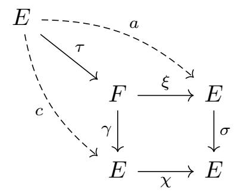
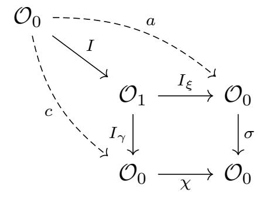
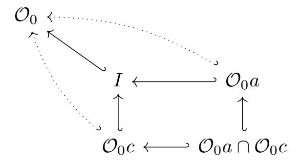

{0}------------------------------------------------

# THE PRINCIPAL IDEAL PROBLEM FOR ENDOMORPHISM RINGS OF SUPERSPECIAL ABELIAN VARIETIES

WOUTER CASTRYCK, JONATHAN KOMADA ERIKSEN, RICCARDO INVERNIZZI, FREDERIK VERCAUTEREN

Abstract. We describe a Las Vegas algorithm for the principal ideal problem in matrix rings Mg(O) for g ≥ 2, over maximal orders O in the rational quaternion algebra Bp,∞ ramified at ∞ and a prime number p. Under plausible heuristic assumptions, the method has expected polynomial runtime. An implementation in SageMath shows that it runs very efficiently in practice, with compact output. Our main auxiliary result is a method for finding endomorphisms of superspecial abelian varieties (i.e., powers of supersingular elliptic curves) with a prescribed kernel.

## 1. Introduction

In this article we study two closely related computational problems, sitting on either side of Deuring's correspondence, which establishes a bijection between supersingular elliptic curves over Fp (up to isomorphism and Galois conjugacy) and maximal orders in the unique rational quaternion algebra Bp,∞ ramified precisely at p and ∞ (up to conjugation). First, we consider the principal ideal problem (PIP) in matrix rings over maximal orders in Bp,∞:

Problem 1.1. Let O ⊂ Bp,∞ be a maximal order. Given a left ideal I ⊂ Mg(O), with g ≥ 2, compute a matrix M ∈ Mg(O) such that I = Mg(O)M.

Some authors refer to PIP as the "principalization problem". Note that the output is uniquely determined up to left-multiplication by a unit U ∈ GLg(O).

Recall that, explicitly, the Deuring correspondence maps a supersingular elliptic curve E to the unique conjugacy class of maximal orders O ⊂ Bp,∞ that admit a ring isomorphism ι : O → End(E). We can extend ι component-wise to an isomorphism Mg(O) → Mg(End(E)) = End(Eg ) which we, by abuse of notation, denote by ι again. Our second problem is the following kernel-to-matrix problem for superspecial abelian varieties, i.e., powers of supersingular elliptic curves:

Problem 1.2. Let E be a supersingular elliptic curve over Fp and let O ⊂ Bp,∞ be a maximal order with an explicit isomorphism ι : O → End(E). Given a finite subgroup H ⊂ Eg , with g ≥ 2, compute a matrix M ∈ Mg(O) such that the kernel of ι(M) equals H.

We will motivate these problems shortly, but let us first discuss why they are well-stated. Famous results by Eichler imply that as soon as a central simple Q-algebra B is either not a quaternion algebra over Q or unramified at ∞, it necessarily contains a unique maximal order O ⊂ B up to conjugation and its ideal class number is 1, i.e., all left (or right) ideals I ⊂ O are principal [\[25,](#page-25-0) Thm. 34.9]. Both properties are intimately related. From this perspective Bp,∞, which violates 

{1}------------------------------------------------

the assumptions,[∗](#page-0-0) is a rather peculiar object within the realm of central simple Qalgebras. Crucially for us, the assumptions do apply to Mg(Bp,∞) as soon as g ≥ 2. Since it can be argued that Mg(O) is a maximal order in Mg(Bp,∞) whenever O is a maximal order in Bp,∞ [\[25,](#page-25-0) Thm. 8.7], this implies that Mg(O) is a principal ideal ring, hence Problem [1.1](#page-0-1) is indeed well-posed. To draw the same conclusion for Problem [1.2,](#page-0-2) one can consider the left ideal of matrices M ∈ Mg(O) for which ι(M) annihilates H; the joint kernel is precisely H (not larger). By Eichler's results, this ideal must be principal, therefore Problem [1.2](#page-0-2) is also well-stated. It can be seen as a higher-dimensional analog of the kernel-to-ideal problem for supersingular elliptic curves that is ubiquitous in isogeny-based cryptography.

Remark 1.3. Looking ahead, our discussion will mainly flow in the opposite direction: we will address Problem [1.2](#page-0-2) directly, and then convert this into a solution to Problem [1.1.](#page-0-1) In fact, our line of thought can be used to provide an alternative proof that Mg(O) is a principal ideal ring.

It is interesting to view Problem [1.2](#page-0-2) in the context of a result, usually attributed to Deligne (and sometimes co-attributed to Ogus and/or Shioda), stating that

$$E_1 \times \cdots \times E_g \cong E'_1 \times \cdots \times E'_g$$

for any choice of supersingular elliptic curves E1, . . . , Eg, E′ 1 , . . . , E′ g over Fp, as soon as g ≥ 2. This fact can be deduced from Eichler's aforementioned results, see e.g. [\[15,](#page-24-0) [21,](#page-25-1) [29\]](#page-25-2). Consequently, the bijection E 7→ End(E) between isomorphism classes of supersingular elliptic curves up to Galois conjugacy and maximal orders in Bp,∞ up to conjugation extends in a trivial way to a bijection A 7→ End(A) between g-dimensional superspecial abelian varieties over Fp up to isomorphism (we do not need Galois conjugacy) and maximal orders in Mg(Bp,∞) up to conjugation, for the simple reason that if g ≥ 2 then both sides contain a single object only. This sheds an alternative light on Problem [1.2:](#page-0-2) the isogeny Eg → Eg/H is separable, therefore the codomain is superspecial [\[6,](#page-24-1) App. C], hence admits an isomorphism to Eg . So one sees that H must indeed be the kernel of an endomorphism ι(M) ∈ Mg(End(E)) for some M ∈ Mg(O). Thanks to recent work by Gaudry, Soumier and Spaenlehauer [\[14\]](#page-24-2) this approach can in fact be made effective; see Remark [3.3.](#page-14-0)

Motivation and prior work. Problem [1.2](#page-0-2) (kernel-to-matrix conversion) pops up naturally in the design of cryptographic protocols from superspecial principally polarized (p.p.) abelian varieties where knowledge of the endomorphism ring (including the Rosati involution) is the trapdoor; see [\[5,](#page-23-0) §6] and [\[20\]](#page-25-3). As far as we are aware, it was first studied by Chu in his PhD thesis [\[10\]](#page-24-3) in an attempt to design a Galbraith–Petit–Silva style signature scheme from superspecial p.p. abelian surfaces. Chu's strategy was to reduce the problem to Problem [1.1](#page-0-1) (PIP), as explained above. He then devised a PIP solver for g = 2 with sub-exponential runtime [\[10,](#page-24-3) Ch. 2], by mimicking a method due to Page [\[22\]](#page-25-4) for the principal ideal problem in rational quaternion algebras that do not ramify at ∞ (to which Eichler's results do apply). However, this algorithm is too slow for constructive applications.

In [\[5,](#page-23-0) §4.2] it was observed that if H ∼= Z/ℓZ × Z/ℓZ for some prime number ℓ then a corresponding matrix M ∈ M2(O) can be written down essentially for free, without need to pass through PIP. Using recursion, this method extends to

∗ It can be shown to contain about p/24 non-conjugate maximal orders, where each maximal order has about twice as many left ideal classes.

{2}------------------------------------------------

groups H admitting a subgroup series  $1 = H_0 \subset H_1 \subset \ldots \subset H_{r-1} \subset H_r = H$  all of whose factor groups have the above shape. Since this covers the kernels of arbitrary polarized isogenies, this is good enough for most cryptographic applications. Nevertheless it remains a compelling question whether such a direct method exists for general groups, i.e., not passing via PIP, and whether it generalizes to arbitrary  $g \geq 2$ . This was the provoking question for the article at hand. We will answer the question in the affirmative, and show that the resulting ideas can be turned into an efficient PIP solver, rather than the other way around.

Remark 1.4. Even when considering kernels H of polarized isogenies only, there may be an efficiency gain in factoring H down to the level of cyclic groups, e.g., when using a list of precomputed matrices as in [5, Rem. 4.3]. Indeed,  $E^2[\ell]$  contains  $(\ell^2 + 1)(\ell^3 - 1)/(\ell - 1)$  subgroups of the form  $(\mathbb{Z}/\ell\mathbb{Z})^2$  and only  $(\ell^4 - 1)/(\ell - 1)$  subgroups of the form  $\mathbb{Z}/\ell\mathbb{Z}$ .

The literature on the principal ideal problem is more extensive; see Page [22, §1], Chu [10, §2.1.2] and Biasse–Fieker–Hoffman–Youmans [3, §1] for an overview of the existing PIP solvers for maximal orders in various simple algebras (not restricted to  $\mathbb{Q}$ -algebras), including number fields. Let us highlight the work of Kirschmer and Voight [17] who studied the problem for maximal orders in  $B_{p,\infty}$ , i.e., the case g=1 of Problem 1.1 (with the promise that the input ideal I is principal), by reducing it to lattice reduction in dimension 4. This technique fails for  $g \geq 2$ , essentially because the norm form on  $M_g(B_{p,\infty})$  is no longer quadratic.

Of utmost relevance is independent work by Page, Robert and Soumier [23] who, also motivated by cryptography, describe a polynomial-time algorithm for Problem 1.1.† Our method is quite different from theirs. Firstly, it has a more geometric flavor which, depending on the reader's taste, may be found more conceptual. Secondly and most importantly, we do not rely on the KLPT algorithm [18] as a subroutine; this contrasts with [23] who invoke a g-fold application of KLPT. Since KLPT is notorious for its long output, our algorithm returns a generator that is considerably more compact; see Section 4.4 for a detailed discussion of the case q=2. It also conceivably runs faster in practice. Thirdly, the algorithm from [23] has cleaner heuristic assumptions, only relying on the Generalized Riemann Hypothesis (GRH). A common ingredient in both works is the special role played by so-called extremal maximal orders  $\mathcal{O} \subset B_{p,\infty}$ , i.e., maximal orders containing an imaginary quadratic order with a very small discriminant (in absolute value). As explained below and also pointed out in [23, §2.1], it is easy to reduce the principal ideal problem in any given maximal order  $\Lambda \subset \mathrm{M}_g(B_{p,\infty})$  to the case  $\Lambda = \mathrm{M}_g(\mathcal{O})$ with  $\mathcal{O} \subset B_{p,\infty}$  an extremal maximal order.

Contributions. For matrix rings over extremal maximal orders, we find:

**Theorem 1.5** (PIP, extremal case). There exists a Las Vegas algorithm which on input a left ideal  $I \subset M_g(\mathcal{O}_0)$  with norm m, where  $\mathcal{O}_0 \subset B_{p,\infty}$  is an extremal maximal order, outputs a matrix  $\mathbf{M} \in M_g(\mathcal{O}_0)$  such that  $I = M_g(\mathcal{O}_0) \mathbf{M}$ . Under plausible heuristic assumptions, the algorithm runs in expected time

$$O(\log^{4+\varepsilon} p + g^3 \log^3(gmp) + g^{2+\omega} \log(gmp)).$$

&lt;sup>†We thank the authors of [23] for sharing an early draft of their paper.

{3}------------------------------------------------

The plausible heuristic assumptions have a very standard flavour. They essentially assume that the statistical arithmetic behaviour of natural numbers (e.g., the probability of primality) in certain non-uniform distributions does not deviate too wildly from that in uniform distributions on large intervals in the same range. We will be more precise about these assumptions in Section [6.2.](#page-23-2) Our paper is accompanied by a proof of concept implementation of this algorithm in SageMath, available at

<https://github.com/KULeuven-COSIC/PIP>.

In order to handle arbitrary maximal orders, a key observation is that the algorithm from Theorem [1.5](#page-2-0) can be used to compute a conjugation between Mg(O0) and any given maximal order Λ ⊂ Mg(Bp,∞). For this, one computes the so-called connecting ideal JΛ,O0 = exp(GΛ,O0 ) Mg(O0)Λ ⊂ Mg(O0) where exp(GΛ,O0 ) denotes the exponent of the additive group

$$G_{\Lambda,\mathcal{O}_0} = \frac{\Lambda}{\mathrm{M}_g(\mathcal{O}_0) \cap \Lambda}.$$

As will be argued in Section [5.2,](#page-19-0) running the algorithm on input JΛ,O0 returns a matrix C ∈ Mg(O0) such that Λ = C −1 Mg(O0) C. This conjugation can then be used to reduce PIP from Λ to Mg(O0): given an ideal I ⊂ Λ of norm m, another run of the algorithm from Theorem [1.5](#page-2-0) on the ideal C I C −1 (which also has norm m) returns a generator M, and then C −1 M C is a generator of I. This leads to:

Corollary 1.6 (PIP, general case). Let Λ ⊂ Mg(Bp,∞) be a maximal order and let O0 ⊂ Bp,∞ be an extremal maximal order. Let I ⊂ Λ be a left ideal of norm m. Using two runs of the algorithm from Theorem [1.5,](#page-2-0) once on input JΛ,O0 and once on input an ideal of norm m, we can compute M ∈ Λ such that I = ΛM.

Remark 1.7. If Λ = Mg(O) for a non-extremal maximal order O, then the first run of the algorithm from Theorem [1.5](#page-2-0) can actually be done on the connecting ideal JM2(O),O0 between maximal orders in M2(Bp,∞), rather than Mg(Bp,∞). See Remark [5.5.](#page-19-1)

As mentioned, Theorem [1.5](#page-2-0) is inspired by a method for solving Problem [1.2:](#page-0-2)

Theorem 1.8. Let E be a supersingular elliptic curve over Fp2 and let O ⊂ Bp,∞ be a maximal order with an explicit isomorphism ι : O → End(E). Let H ⊂ Eg , with g ≥ 2, be a finite subgroup. There is an algorithm that solves Problem [1.2](#page-0-2) with complexity

$$O(F_H + gD_H + \log^{4+\varepsilon} p + \log^3 m_1 + \log^3 m_2).$$

where FH and DH denote the complexity of factoring |H| and solving discrete logarithms in H, m1 is the norm of the connecting ideal between M2(O) and M2(O0) for some extremal maximal order O0 ⊂ Bp,∞, and m2 is the biggest prime factor of |H|.

An implementation of this method can also be found in our proof-of-concept implementation.

Remark 1.9. In general FH and DH are not polynomial-time in log |H|, which is an asymptotic lower bound for the input size. However, in applications |H| is usally smooth, in which case these steps are efficient.

{4}------------------------------------------------

Future directions. An interesting question is whether our approach, which is inspired by the geometry of (powers of) supersingular elliptic curves and therefore naturally revolves around Bp,∞, nevertheless generalizes to matrices over other quaternion algebras by forgetting about the geometry. Here, our primary targets would be definite quaternion algebras (i.e., ramified at ∞) that are

- ramified at a larger (necessarily odd) number of finite primes,
- defined over more general totally real fields than Q; this would come with non-trivial applications, e.g., it was recently shown that this would affect the security of Hawk [\[9\]](#page-24-6), a second-round contender in the ongoing "onramp" standardization effort for post-quantum digital signatures organized by the National Institute of Standards and Technology [\[1\]](#page-23-3).

Another question is how easily our work extends to cover orders Λ ⊂ Mg(Bp,∞) that are not necessarily maximal.

Roadmap. In Section [2,](#page-4-0) we gather some background material (explicit localization, quaternionic matrix norms, higher-dimensional Deuring correspondence) that is mostly standard and well-known to specialists, but it contains several explicit formulae that we did not manage to pinpoint in the existing literature. In Section [3,](#page-11-0) we show that Problem [1.2](#page-0-2) reduces to the construction of a certain commutative square of elliptic curve isogenies. Section [4](#page-14-1) discusses how to construct such a square. The full algorithmic details are wrapped up in Section [5,](#page-18-0) where we also explain how to convert this into a solution to Problem [1.1.](#page-0-1) We end with a complexity analysis and a report on our SageMath implementation in Section [6.](#page-21-0)

Acknowledgments. This work is supported by the European Research Council (ERC) under the European Union's Horizon 2020 research and innovation programme (grant agreement ISOCRYPT – No. 101020788), by the Research Council KU Leuven grant C14/ 24/099, as well as by Cybersecurity Research Flanders with reference number VR20192203. Riccardo Invernizzi is funded by Research Foundation – Flanders (FWO) under a PhD Fellowship fundamental research (project number 1138925N). We thank Aurel Page, Damien Robert and Julien Soumier for sharing with us a preliminary version of their article [\[23\]](#page-25-5). We also thank the Isocrypt brainstorm team for helpful input.

## 2. Preliminaries

Even though we did not manage to pinpoint every explicit formula, the vast majority of the claims in this section are standard and well-known to specialists. We refer the reader to the books by Reiner [\[25\]](#page-25-0), Voight [\[31\]](#page-25-6), Waterhouse [\[32\]](#page-25-7) and the references provided in course of the text below for more background.

2.1. Representing Bp,∞ and choosing an extremal maximal order O0. Let p be an odd prime number. The quaternion algebra Bp,∞ ramified at p, ∞ can be constructed as

$$B_{p,\infty} = \left(\frac{-q, -p}{\mathbb{Q}}\right)$$

where q is chosen as small as possible, i.e.,

- q = 1 if p ≡ 3 mod 4,
- q = 2 if p ≡ 5 mod 8,

{5}------------------------------------------------

• q is the smallest prime congruent to 3 mod 4 modulo which -p is a quadratic residue if  $p \equiv 1 \mod 8$ ; under GRH we can assume  $q < 2 \log^2 p$  [2].

Elements of  $B_{p,\infty}$  are expressed in terms of the usual basis 1,i,j,k where  $i^2=-q$ ,  $j^2=-p$  and k=ij=-ji. Recall that  $B_{p,\infty}$  comes equipped with a conjugation  $\alpha=a_1+a_2i+a_3j+a_4k\mapsto \bar{\alpha}=a_1-a_2i-a_3j-a_4k$  as well as  $\mathbb{Q}$ -valued maps  $\mathbf{n}:\alpha\mapsto\alpha\bar{\alpha}$ ,  $\mathbf{tr}:\alpha\mapsto\alpha+\bar{\alpha}$  that are referred to as the reduced norm and reduced trace, respectively (see Section 2.3 for the origins of the adjective "reduced", that we will usually omit). Under any choice of  $\mathbb{C}$ -algebra isomorphism  $B_{p,\infty}\otimes_{\mathbb{Q}}\mathbb{C}\cong \mathrm{M}_2(\mathbb{C})$  these notions match with the usual determinant and trace.

An order  $\mathcal{O}$  in a finite-dimensional  $\mathbb{Q}$ -algebra B is a subring that is free of rank  $[B:\mathbb{Q}]$  as a  $\mathbb{Z}$ -module. It is represented by specifying a  $\mathbb{Z}$ -basis. An order  $\mathcal{O} \subset B$  is said to be maximal if it is not contained in a strict superorder. For  $B=B_{p,\infty}$  it is convenient to fix an "extremal" maximal order  $\mathcal{O}_0$  throughout, which is a maximal order containing a quadratic subring R whose discriminant (in absolute value) is very small. Concretely, we fix:

$$(1) \quad \begin{array}{cccc} \mathcal{O}_0: & \langle 1, i, \frac{i+j}{2}, \frac{1+k}{2} \rangle_{\mathbb{Z}}, & \langle 1, i, \frac{1+j+k}{2}, \frac{i+2j+k}{4} \rangle_{\mathbb{Z}}, & \langle 1, \frac{1+i}{2}, \frac{ci+k}{q}, \frac{(1+i)(ci+k)}{2q} \rangle_{\mathbb{Z}}, \\ & \cup & \cup & \cup \\ R: & \mathbb{Z}[\sqrt{-1}] & \mathbb{Z}[\sqrt{-2}] & \mathbb{Z}[\frac{1+\sqrt{-q}}{2}] \end{array}$$

for  $p \equiv 3 \mod 4$  and  $p \equiv 5, 1 \mod 8$ , respectively, where c denotes the smallest positive solution to  $x^2 + p \equiv 0 \mod q$ .

Remark 2.1. We have assumed that p is odd, in order to not pollute the exposition with edge cases, but the methods below are easily adapted to cover p=2 as well; here the most convenient representation is  $(-1,-1/\mathbb{Q})$  and, up to conjugation, there is one maximal order only: the (rational) Hurwitz quaternions  $\langle 1,i,j,(1+i+j+k)/2\rangle_{\mathbb{Z}}$ , which are clearly "extremal".

2.2. **Explicit localization.** Being ramified at  $p, \infty$  implies that  $\mathcal{O} \otimes_{\mathbb{Z}} \mathbb{Z}_{\ell} \cong \mathrm{M}_{2}(\mathbb{Z}_{\ell})$  for any maximal order  $\mathcal{O} \subset B_{p,\infty}$  and any prime number  $\ell \neq p$ ; in contrast the ring  $\mathcal{O} \otimes_{\mathbb{Z}} \mathbb{Z}_{p}$  is a domain. We now describe how to compute such an isomorphism. For simplicity we work up to finite  $\ell$ -adic precision, i.e., writing  $n = \ell^{e}$  with  $e \geq 1$ , we show how to establish an explicit isomorphism

(2) 
$$\Phi_n: \mathcal{O}/n\mathcal{O} \to \mathrm{M}_2(\mathbb{Z}/n\mathbb{Z}).$$

It is certainly known to specialists how to do this, see e.g. [8, Prop. 4.1]; in fact, methods are available for computing such isomorphisms for more general families of algebras [28]. But we did not manage to locate the explicit formulas below, which we include for the reader's convenience.

Remark 2.2. It is easy to use these formulas for addressing the following seemingly more general targets:

- by the Chinese remainder theorem, one can efficiently combine isomorphisms of the form (2) to handle the case where n is an arbitrary positive integer coprime with p, assuming that the factorization of n is known,
- the same formulas solve the infinite-precision tasks of finding an explicit isomorphism  $\mathcal{O} \otimes_{\mathbb{Z}} \mathbb{Z}_{\ell} \cong \mathrm{M}_2(\mathbb{Z}_{\ell})$  or  $B_{p,\infty} \otimes_{\mathbb{Z}} \mathbb{C} \cong \mathrm{M}_2(\mathbb{C})$ : e.g., for the case

&lt;sup>‡This follows [18, Lem. 2–4], except for the third case  $p \equiv 1 \mod 8$  where the last basis vector was replaced with j. But this must have been a typo: the resulting  $\mathbb{Z}$ -module is not an order.

{6}------------------------------------------------

 $p \equiv 3 \mod 4$  one picks  $c_1, c_2$  satisfying (3) where one discards the "mod n", and the method goes through mutatis mutandis,

• by working component-wise, we can extend the isomorphism (2) to an isomorphism  $M_g(\mathcal{O})/n M_g(\mathcal{O}) \cong M_g(\mathcal{O}/n\mathcal{O}) \to M_{2g}(\mathbb{Z}/n\mathbb{Z})$ ; in fact, we can even extend this to  $\Lambda/n\Lambda$  for any maximal order  $\Lambda \subset M_g(B_{p,\infty})$  because, as explained in Section 5.2, our PIP solver can be used to find an explicit conjugation between  $\Lambda$  and  $M_g(\mathcal{O})$  for any given  $\mathcal{O}$ .

Note that, by the Skolem-Noether theorem, the isomorphism  $\Phi_n$  is uniquely determined up to base change, i.e., post-composition with conjugation by an element of  $GL_2(\mathbb{Z}/n\mathbb{Z})$ . More generally, any isomorphism  $M_g(\mathcal{O})/n M_g(\mathcal{O}) \to M_{2g}(\mathbb{Z}/n\mathbb{Z})$  is obtained by applying  $\Phi_n$  component-wise and composing this with conjugation by an element of  $GL_{2g}(\mathbb{Z}/n\mathbb{Z})$ .

2.2.1. The extremal maximal order  $\mathcal{O}_0$ . We focus on computing an isomorphism (2) for the extremal case  $\mathcal{O} = \mathcal{O}_0$  introduced in (1) above. We will later explain how to adapt this to any maximal order. It suffices to specify the images under  $\Phi_n$  of the basis elements of  $\mathcal{O}_0$  given in (1), meaning that it is enough to find four matrices  $\mathbf{M}_1, \ldots, \mathbf{M}_4 \in \mathbf{M}_2(\mathbb{Z}/n\mathbb{Z})$  satisfying the relations among those elements. Of course  $\Phi_n(1) = \mathbf{I}_2 =: \mathbf{M}_1$ . By composition of  $\Phi_n$  with conjugation by an invertible matrix if needed, for  $\mathbf{M}_2$  we can make the choices

$$\Phi_n(i) = \begin{pmatrix} 0 & 1 \\ -1 & 0 \end{pmatrix}, \qquad \Phi_n(i) = \begin{pmatrix} 0 & 2 \\ -1 & 0 \end{pmatrix}, \qquad \Phi_n\left(\frac{1+i}{2}\right) = \begin{pmatrix} 0 & \frac{1+q}{4} \\ -1 & 1 \end{pmatrix}$$

in the cases  $p \equiv 3 \mod 4$  resp.  $p \equiv 5, 1 \mod 8$ . This can be seen as follows: since  $\mathbf{M}_2$  must be linearly independent from  $\mathbf{M}_1$ , there must exist  $v_1 \in (\mathbb{Z}/n\mathbb{Z})^2$  whose reduction mod  $\ell$  is not an eigenvector of  $\mathbf{M}_2 \mod \ell$ . The desired conjugation amounts to base-change from the standard basis of  $(\mathbb{Z}/n\mathbb{Z})^2$  to the basis  $v_1, -\mathbf{M}_2 v_2$ . We now proceed as follows:

• When  $p \equiv 3 \mod 4$ , the identity

$$i\left(\frac{i+j}{2}\right) = \frac{-1+k}{2} = -1 - \left(\frac{i+j}{2}\right)i$$

implies  $\mathbf{M}_2 \mathbf{M}_3 + \mathbf{M}_3 \mathbf{M}_2 = -\mathbf{M}_1$  which forces us to choose

$$\Phi_n\left(\frac{i+j}{2}\right) = \mathbf{M}_3 := \begin{pmatrix} c_1 & c_2 \\ c_2 - 1 & -c_1 \end{pmatrix}$$

for  $c_1, c_2 \in \mathbb{Z}/n\mathbb{Z}$  satisfying

(3) 
$$\det(\mathbf{M}_3) = -c_1^2 - c_2^2 + c_2 \equiv \mathsf{n}\left(\frac{i+j}{2}\right) \equiv \frac{p+1}{4} \bmod n.$$

Any such  $c_1, c_2$  will do. As a sanity check, note that the congruence is indeed solvable: modulo  $\ell$  it defines a smooth conic in  $\mathbb{P}^2(\mathbb{F}_{\ell})$  (one checks that the discriminant of the corresponding ternary quadratic form equals  $-p \not\equiv 0 \mod \ell$ ), so it has  $\ell + 1$  rational points, all of which can be lifted by Hensel's lemma. At least one of these points is affine (this is obvious for  $\ell > 2$ , while for  $\ell = 2$  one checks that the conic has exactly one point at infinity). In practice a solution is found by sampling  $c_2$  at random and checking that what is left for  $c_1^2$  is indeed a square mod n. From the identity

$$\frac{1+k}{2} = 1 + i\left(\frac{i+j}{2}\right)$$

{7}------------------------------------------------

we then conclude

$$\Phi_n\left(\frac{1+k}{2}\right) = \mathbf{M}_4 := \mathbf{M}_1 + \mathbf{M}_2 \,\mathbf{M}_3 = \begin{pmatrix} c_2 & -c_1 \\ -c_1 & -c_2 + 1 \end{pmatrix}.$$

One easily checks that the multiplication table of  $1, i, \frac{i+j}{2}, \frac{1+k}{2}$  is fully compatible with that of  $\mathbf{M}_1, \dots, \mathbf{M}_4$ . Moreover, an explicit calculation shows that  $\Phi_n$  has determinant  $-4c_1^2 - 4c_2^2 + 4c_2 - 1 \equiv p$  when viewed as a  $\mathbb{Z}/n\mathbb{Z}$ -linear map. So since  $\gcd(p, n) = 1$  it indeed concerns an isomorphism.

• When  $p \equiv 5 \mod 8$ , it is more convenient to first determine  $\Delta := \mathbf{M}_3 - \mathbf{M}_4$ , which one checks should satisfy  $\mathbf{M}_2 \Delta + \Delta \mathbf{M}_2 = \mathbf{M}_1 + \mathbf{M}_2$ . We find

$$\mathbf{\Delta} = \begin{pmatrix} 1 - c_1 & 2c_2 - 1 \\ c_2 & c_1 \end{pmatrix}$$

for  $c_1, c_2 \in \mathbb{Z}/n\mathbb{Z}$  such that  $-c_1^2 + c_1 - 2c_2^2 + c_2 \equiv (p+3)/8 \mod n$ . From the relation  $\mathbf{M}_3 = \mathbf{\Delta}(\mathbf{M}_2 + 2\mathbf{M}_1) - \mathbf{M}_1$  we then get

$$\Phi_n\left(\frac{1+j+k}{2}\right) = \mathbf{M}_3 := \begin{pmatrix} -2c_1 - 2c_2 + 2 & -2c_1 + 4c_2 \\ -c_1 + 2c_2 & 2c_1 + 2c_2 - 1 \end{pmatrix},$$

$$\Phi_n\left(\frac{i+2j+k}{4}\right) = \mathbf{M}_4 := \mathbf{M}_3 - \Delta = \begin{pmatrix} -c_1 - 2c_2 + 1 & -2c_1 + 2c_2 + 1 \\ -c_1 + c_2 & c_1 + 2c_2 - 1 \end{pmatrix},$$

completing the description of  $\Phi_n$ , which is seen to be an isomorphism along similar lines as above.

• Finally, when  $p \equiv 5 \mod 8$  we can choose  $c_1, c_2 \in \mathbb{Z}/n\mathbb{Z}$  such that

$$-c_1^2 - c_1c_2 - \frac{1+q}{4}c_2^2 - cc_2 \equiv \frac{c^2+p}{q} \bmod n$$

and let

$$\Phi_n\left(\frac{ci+k}{q}\right) = \mathbf{M}_3 := \begin{pmatrix} -c_1 & c_1 + \frac{1+q}{4}c_2 + c \\ c_2 & c_1 \end{pmatrix}.$$

This follows from the requirement  $\mathbf{M}_2 \, \mathbf{M}_3 + \mathbf{M}_3 \, \mathbf{M}_2 = \mathbf{M}_3 - c \, \mathbf{M}_1$ . It then readily follows that

$$\Phi_n\left(\frac{(1+i)(ci+k)}{2q}\right) = \mathbf{M}_4 := \mathbf{M}_2 \,\mathbf{M}_3 = \begin{pmatrix} \frac{1+q}{4}c_2 & \frac{1+q}{4}c_1 \\ c_1+c_2 & -\frac{1+q}{4}c_2-c \end{pmatrix}$$

and a similar reasoning shows that this defines an isomorphism.

2.2.2. General maximal orders. To compute  $\Phi_n$  for a general maximal order  $\mathcal{O}$ , one can compute the left  $\mathcal{O}_0$ -ideal  $I = \exp(\mathcal{O}/(\mathcal{O}_0 \cap \mathcal{O}))\mathcal{O}_0\mathcal{O} \subset \mathcal{O}_0$ , which is a connecting ideal between  $\mathcal{O}_0$  and  $\mathcal{O}$  in the sense that its right order  $\mathcal{O}_R(I) = \{x \in B_{p,\infty} \mid Ix \subset I\}$  equals  $\mathcal{O}$ . Let  $\alpha \in I$  be such that  $\gcd(\mathsf{n}(\alpha)/\mathsf{n}(I),n) = 1$ , where  $\mathsf{n}(I) = \gcd(\mathsf{n}(\alpha) \mid \alpha \in I) = [\mathcal{O}_0 : I]^{1/2}$  denotes the norm of I. It is not hard to check that the map

$$\Psi_{\alpha}: \mathcal{O}/n\mathcal{O} \to \mathcal{O}_0/n\mathcal{O}_0: x \mapsto \alpha x \alpha^{-1}$$

is an isomorphism of rings, where we point out a subtlety when  $\gcd(\mathsf{n}(\alpha),n) > 1$ : at first sight, the reader might think that  $\Psi_{\alpha}$  is not well-defined in this case because  $\alpha$  is not invertible modulo n. But the full expression  $\alpha x \alpha^{-1}$  is genuinely reducible modulo n. Indeed,  $\mathcal{O} = \mathcal{O}_R(I)$  implies  $\alpha x \in I$ , hence there exist  $y, z \in \mathcal{O}_0$  such that  $\alpha x = y\alpha + z \,\mathsf{n}(I)$  and therefore  $\alpha x \alpha^{-1} = y + z(\mathsf{n}(I)/\mathsf{n}(\alpha))\bar{\alpha}$ . Now it is clear that the right-hand side makes sense modulo n in view of our assumption on  $\mathsf{n}(\alpha)$ . The

{8}------------------------------------------------

desired isomorphism  $\Phi_n$  is then obtained by composing  $\Psi_{\alpha}$  with the isomorphism described in the previous paragraph.

Remark 2.3. In Remark 2.10 we will describe a more geometric method for finding an isomorphism (2), which is less efficient.

2.3. Reduced norm and trace of quaternionic matrices. Recall that every finite-dimensional  $\mathbb{Q}$ -algebra B comes equipped with norm and trace maps

$$\mathcal{N}: B \to \mathbb{Q}: \alpha \mapsto \det(x \mapsto x\alpha), \qquad \mathcal{T}: B \to \mathbb{Q}: \alpha \mapsto \operatorname{trace}(x \mapsto x\alpha),$$

and for  $B = B_{p,\infty}$  we have  $\mathcal{N}(\alpha) = \mathsf{n}(\alpha)^2$  and  $\mathcal{T}(\alpha) = 2 \operatorname{tr}(\alpha)$ , which is why  $\mathsf{n}$  and  $\mathsf{tr}$  are referred to as the reduced norm and trace, respectively. This picture generalizes as follows: for all  $g \geq 1$  and any  $\mathbf{M} \in \mathrm{M}_g(B_{p,\infty})$  we have

$$\operatorname{charpol}_{x \mapsto x \mathbf{M}}(t) = \operatorname{charpol}_{\theta(\mathbf{M})}(t)^{2g}$$

where  $\theta$  denotes any  $\mathbb{C}$ -algebra isomorphism  $M_g(B_{p,\infty}) \otimes_{\mathbb{Q}} \mathbb{C} \to M_{2g}(\mathbb{C})$ . For this reason the characteristic polynomial of  $\theta(\mathbf{M})$  is called the reduced characteristic polynomial of  $\mathbf{M}$ . Its coefficients are rational numbers that do not depend on the choice of  $\theta$ . One sees that  $\mathcal{N}(\mathbf{M}) = \mathsf{n}(\mathbf{M})^{2g}$  and  $\mathcal{T}(\mathbf{M}) = 2g \operatorname{tr}(\mathbf{M})$  where  $\mathsf{n}(\mathbf{M})$ , resp.,  $\operatorname{tr}(\mathbf{M})$  denote the usual determinant, resp., trace of  $\theta(\mathbf{M})$ , called the reduced norm, resp., the reduced trace of  $\mathbf{M}$ . Just like in the case g = 1, we will usually drop the adjective "reduced", which should cause no confusion.

While it is easy to check that  $tr(\mathbf{M}) = tr(trace(\mathbf{M}))$ , it is more tedious to give a closed formula for  $\mathbf{n}(\mathbf{M})$ . Note that one cannot hope to rewrite this in terms of something like  $\det(\mathbf{M})$ , which is an ambiguous expression due to the non-commutativity of  $B_{p,\infty}$ . But for g=2 the formula is not too bad: writing

$$\mathbf{M} = \begin{pmatrix} a & b \\ c & d \end{pmatrix} \in \mathcal{M}_2(B_{p,\infty}),$$

a long but explicit calculation shows that the reduced characteristic polynomial of M equals

$$\begin{split} &t^4-(\operatorname{tr}(a)+\operatorname{tr}(d))t^3+(\operatorname{n}(a)+\operatorname{n}(d)+\operatorname{tr}(a)\operatorname{tr}(d)-\operatorname{tr}(bc))t^2\\ &-(\operatorname{tr}(a)\operatorname{n}(d)+\operatorname{tr}(d)\operatorname{n}(a)-\operatorname{tr}(\bar{a}bc)-\operatorname{tr}(d\bar{b}\bar{c}))t+\operatorname{n}(a)\operatorname{n}(d)+\operatorname{n}(b)\operatorname{n}(c)-\operatorname{tr}(\bar{a}b\bar{d}c). \end{split}$$

The constant term is our desired explicit expression for  $\mathbf{n}(\mathbf{M})$ . Interestingly, one can check via explicit calculation that this expression equals  $\det(\mathbf{M} \mathbf{M}^*) = \det(\mathbf{M}^* \mathbf{M})$  where  $\mathbf{M}^*$  denotes the conjugate-transpose of  $\mathbf{M}$  [5, Lem. 2.10]. This time, the determinant makes sense because the entries all live in a fixed quadratic (hence commutative) subfield of  $B_{p,\infty}$ .

**Lemma 2.4.** For all  $\mathbf{M} \in \mathrm{M}_g(B_{p,\infty})$  and all orders  $\Lambda \subset \mathrm{M}_g(B_{p,\infty})$  we have:

- (1)  $\mathbf{M} \in \mathrm{M}_q(B_{p,\infty})^{\times}$  if and only if  $\mathsf{n}(\mathbf{M}) \neq 0$ ;
- (2) if  $\mathbf{M} \in \Lambda$  then  $\mathsf{n}(\mathbf{M}) \in \mathbb{Z}$  and if moreover  $\mathsf{n}(\mathbf{M}) \neq 0$  then  $\mathsf{n}(\mathbf{M}) \mathbf{M}^{-1} \in \Lambda$ ; in particular  $\mathbf{M} \in \Lambda^{\times}$  if and only if  $\mathsf{n}(\mathbf{M}) = 1$ .

§Alternatively, the reduced norm  $n(\mathbf{M})$  can be characterized as the norm of the Dieudonné determinant of  $\mathbf{M}$ , which implies that it takes non-negative values only (a fact that is also apparent from Lemma 2.11).

{9}------------------------------------------------

*Proof.* From the multiplicativity of the norm it is immediate that  $\mathbf{n}(\mathbf{M}) \neq 0$  whenever  $\mathbf{M}$  is invertible. Conversely, the reduced characteristic polynomial  $t^{2g} + a_{2g-1}t^{2g-1} + \ldots + a_1t + \mathbf{n}(\mathbf{M})$  has rational coefficients and kills  $\mathbf{M}$ , showing that

$$- n(\mathbf{M})^{-1} (a_1 \mathbf{I}_a + \ldots + a_{2g-1} \mathbf{M}^{2g-2} + \mathbf{M}^{2g-1})$$

is an inverse for  $\mathbf{M}$  as soon as  $\mathbf{n}(\mathbf{M}) \neq 0$ . The second statement then immediately follows from the fact that the characteristic polynomial has integer coefficients whenever  $\mathbf{M}$  is contained in an order (this is seen by analyzing the map  $x \mapsto \mathbf{M} x$  with respect to a basis of the order).

Note that, as a consequence to Lemma 2.4(2), one obtains that  $\mathbf{n}(\mathbf{M}) \mathbf{I}_g$  is an element of the (left or right) principal ideal generated by  $\mathbf{M}$ .

**Lemma 2.5.** Let  $\Lambda \subset M_g(B_{p,\infty})$  be an order and let  $\mathbf{M} \in \Lambda$  have non-zero norm. Then  $\mathsf{n}(\mathbf{M})^{2g} = [\Lambda : \Lambda \mathbf{M}].$ 

*Proof.* This is a standard argument which we specialize to  $M_g(B_{p,\infty})$  for the reader's convenience. By the structure theorem for finitely generated  $\mathbb{Z}$ -modules (i.e., the existence of the Smith normal form) there exists a  $\mathbb{Z}$ -basis  $v_1, \ldots, v_{4g^2}$  of  $\Lambda$  along with non-zero integers  $d_1 \mid \ldots \mid d_{4g^2}$  such that  $d_1v_1, \ldots, d_{4g^2}v_{4g^2}$  is a  $\mathbb{Z}$ -basis for  $\Lambda$  M. Now consider the composition of changes

$$v_1, \dots, v_{4g^2} \rightarrow v_1 \mathbf{M}, \dots, v_{4g^2} \mathbf{M} \rightarrow d_1 v_1, \dots, d_{4g^2} v_{4g^2}$$

of bases of  $M_g(B_{p,\infty})$ . The determinant of the overall matrix of base change is  $d_1 \cdots d_{4g^2}$  which clearly equals  $[\Lambda : \Lambda \mathbf{M}]$  in absolute value. But at the same time it arises as the product of a matrix with determinant  $\det(x \mapsto x \mathbf{M}) = \mathcal{N}(\mathbf{M}) = \mathsf{n}(\mathbf{M})^{2g}$  and a matrix changing between  $\mathbb{Z}$ -module bases of  $\Lambda \mathbf{M}$  which therefore has determinant  $\pm 1$ .

Corollary 2.6. Let  $\Lambda \subset M_g(B_{p,\infty})$  be a maximal order and let  $\mathbf{M} \in \Lambda$  have prime norm  $\mathsf{n}(\mathbf{M}) = \ell$  different from p. Consider an isomorphism  $\theta : \Lambda/\ell\Lambda \to M_{2g}(\mathbb{F}_{\ell})$ . Then  $\operatorname{rank}(\theta(\mathbf{M})) = 2g - 1$ .

*Proof.* By Lemma 2.4 we have  $\ell\Lambda \subset \Lambda M$ . We can then write

$$\ell^{2g} = \mathsf{n}(\mathbf{M})^{2g} = \left| \frac{\Lambda}{\Lambda \, \mathbf{M}} \right| = \left| \frac{\Lambda / \ell \Lambda}{\Lambda \, \mathbf{M} \, / \ell \Lambda} \right| = \left[ \mathsf{M}_{2g}(\mathbb{F}_{\ell}) : \mathsf{M}_{2g}(\mathbb{F}_{\ell}) \theta(\mathbf{M}) \right]$$

showing that the kernel of  $M_{2g}(\mathbb{F}_{\ell}) \to M_{2g}(\mathbb{F}_{\ell}) : x \mapsto x\theta(\mathbf{M})$  is 2g-dimensional. But this kernel consists of matrices whose 2g rows are vectors running over the left kernel of  $\theta(\mathbf{M})$ , which therefore must be 1-dimensional.

2.4. **Deuring correspondence.** As mentioned in the introduction, for any  $g \geq 1$  the map  $A \mapsto \operatorname{End}(A)$  defines a bijection between, on one hand, g-dimensional superspecial abelian varieties over  $\overline{\mathbb{F}}_p$  up to isomorphism and Galois conjugacy and, on the other hand, maximal orders in  $\operatorname{M}_g(B_{p,\infty})$  up to conjugation. We now recall how to incorporate isogenies in this correspondence. Let A be a g-dimensional superspecial abelian variety and let  $\Lambda \subset \operatorname{M}_g(B_{p,\infty})$  be a maximal order admitting an isomorphism  $\iota: \Lambda \to \operatorname{End}(A)$ . Typically, we will work with  $A = E^g$  for a supersingular elliptic curve  $E/\overline{\mathbb{F}}_p$  and  $\Lambda = \operatorname{M}_g(\mathcal{O})$  where  $\mathcal{O} \subset B_{p,\infty}$  is a maximal order admitting an isomorphism  $\iota: \mathcal{O} \to \operatorname{End}(E)$ , that we extend component-wise

{10}------------------------------------------------

to an isomorphism  $M_g(\mathcal{O}) \to M_g(\operatorname{End}(E)) = \operatorname{End}(E^g)$ . To every finite subgroup  $H \subset A$  we can associate a left ideal

$$I_H = \{ \mathbf{M} \in \Lambda \mid \forall P \in H : \iota(\mathbf{M})(P) = 0 \}$$

whose norm  $\mathsf{n}(I_H) = \gcd(\mathsf{n}(\mathbf{M}) \mid \mathbf{M} \in I_H) = [\Lambda : I_H]^{1/2g}$  equals |H|. Conversely, given a left ideal  $I \subset \Lambda$  one can consider the joint kernel  $H_I \subset A$  of the endomorphisms  $\iota(\mathbf{M})$  over all  $\mathbf{M} \in I$ . This defines a bijection between left ideals  $I \subset \Lambda$  of norm coprime with p and finite subgroups  $H \subset A$ . The right order

$$\Lambda' = \mathcal{O}_R(I_H) = \{ x \in \mathcal{M}_q(B_{p,\infty}) \mid I_H x \subset I_H \}$$

of  $I_H$  is naturally isomorphic to  $\operatorname{End}(A')$ , where A' = A/H denotes the codomain (uniquely determined up to  $\overline{\mathbb{F}}_p$ -isomorphism) of a separable isogeny  $\varphi_H : A \to A'$  with kernel H. Explicitly, following [32, §3.1], let  $\psi : A' \to A$  be an isogeny with  $\psi \circ \varphi_H = |H| \operatorname{id}_A$  and  $\varphi_H \circ \psi = |H| \operatorname{id}_{A'}$  (we will refer to this as the pseudo-dual of  $\varphi_H$ ). The isomorphism is

$$\operatorname{End}(A') \to \Lambda' : \alpha \mapsto |H|^{-1} \iota^{-1} (\psi \circ \alpha \circ \varphi_H).$$

We remark that this correspondence between ideals and subgroups can in fact be extended to include ideals of norm a multiple of p (including 0), by considering arbitrary subgroup schemes instead of subgroups, and by allowing for arbitrary homomorphisms (possibly non-finite or inseparable).

Example 2.7. If  $I_H = \Lambda \mathbf{M}$  is principal then  $\Lambda' = \mathcal{O}_R(I_H) = \mathbf{M}^{-1} \Lambda \mathbf{M}$  is a conjugate of  $\Lambda$ . In this case the corresponding isogeny is the endomorphism  $\iota(\mathbf{M})$ . Recall that if  $g \geq 2$  then all ideals are of this form.

Composition of isogenies corresponds to multiplication of ideals, as follows. For a finite subgroup  $H' \subset A'$  one can consider the corresponding left ideal  $I_{H'} \subset \Lambda'$  and isogeny  $\varphi_{H'}: A' \to A'' = A'/H'$ . The ideal associated with the kernel  $\varphi_H^{-1}(H')$  of the composition isogeny  $\varphi_{H'} \circ \varphi_H$  is given by  $I_H \cdot I_{H'}$ .

Example 2.7 (continued). Let  $\mathbf{M}, \mathbf{M}' \in \Lambda$  have non-zero norm. The ideals associated with the endomorphisms  $\iota(\mathbf{M}), \iota(\mathbf{M}')$  are the principal ideals  $\Lambda \mathbf{M}, \Lambda \mathbf{M}'$  and the ideal associated with the composition endomorphism  $\iota(\mathbf{M}' \mathbf{M})$  is the principal ideal  $\Lambda \mathbf{M}' \mathbf{M}$ . To view this as a product of ideals, one should consider the ideal associated with  $\iota(\mathbf{M}')$  inside  $\mathcal{O}_R(\Lambda \mathbf{M}) = \mathbf{M}^{-1} \Lambda \mathbf{M}$ , which is  $\mathbf{M}^{-1} \Lambda \mathbf{M}(\mathbf{M}^{-1} \mathbf{M}' \mathbf{M})$ , and take the product  $\Lambda \mathbf{M} \cdot \mathbf{M}^{-1} \Lambda \mathbf{M}(\mathbf{M}^{-1} \mathbf{M}' \mathbf{M}) = \Lambda \mathbf{M}' \mathbf{M}$ .

**Lemma 2.8** (pseudo-dual at ideal level). Let  $\Lambda \subset M_g(B_{p,\infty})$  be a maximal order and let  $I \subset \Lambda$  be a left ideal with right order  $\Lambda'$ . Then

$$I^{\mathrm{ps}} = \{ x \in B_{p,\infty} \mid Ix \subset \mathsf{n}(I)\Lambda \}$$

is a left  $\Lambda'$ -ideal with right order  $\Lambda$ , satisfying  $I \cdot I^{\operatorname{ps}} = \operatorname{n}(I)\Lambda$  and  $I^{\operatorname{ps}} \cdot I = \operatorname{n}(I)\Lambda'$ . In particular  $\operatorname{n}(I^{\operatorname{ps}}) = \operatorname{n}(I)^{2g-1}$ .

*Proof.* If g = 1 then  $I^{ps} = \bar{I}$  by [31, Prop. 16.6.15] from which the statement follows immediately. If  $g \geq 2$  then the statement is easy to prove by writing  $I = \Lambda \mathbf{M}$  for some generator  $\mathbf{M}$ . One then readily verifies that  $I^{ps} = \mathsf{n}(\mathbf{M}) \mathbf{M}^{-1} \Lambda$ .

¶Warning: if  $g \ge 1$  then in general the pseudo-dual of the pseudo-dual of  $\varphi_H$  is not equal to  $\varphi_H$  itself: rather, it equals  $|H|^{2g-2}\varphi_H$ . Note in particular that  $\deg \psi = |H|^{2g-1}$ .

{11}------------------------------------------------

The Deuring correspondence provides an important interpretation of the localization isomorphisms  $\Phi_n$  discussed in Section 2.2.

**Lemma 2.9.** Let A be a g-dimensional superspecial abelian variety over  $\overline{\mathbb{F}}_p$  and let  $\Lambda \subset \mathrm{M}_g(B_{p,\infty})$  be a maximal order together with an isomorphism  $\iota : \Lambda \to \mathrm{End}(A)$ . Let n be a positive integer coprime with p. Let  $P_1, \ldots, P_{2g}$  be a basis of A[n]. Then

$$\Lambda/n\Lambda \to \mathrm{M}_{2g}(\mathbb{Z}/n\mathbb{Z}) : \mathbf{M} \mapsto matrix \ of \ \iota(\mathbf{M}) \ with \ respect \ to \ P_1, \dots, P_{2g}$$
 is an isomorphism of rings.

*Proof.* It is clear that this is a homomorphism between equicardinal rings, so it suffices to prove injectivity. This follows from the fact that if an endomorphism annihilates A[n] it must factor through multiplication-by-n, e.g., by a component-wise application of [30, Cor. III.4.11].

Remark 2.10. Given a maximal order  $\mathcal{O} \subset B_{p,\infty}$  and an effective isomorphism  $\iota: \mathcal{O} \to \operatorname{End}(E)$  to the endomorphism ring of a supersingular elliptic curve  $E/\overline{\mathbb{F}}_p$ , the lemma can be turned into an alternative method for computing an isomorphism  $\Phi_n$  as in (2). This method is generally less efficient than the method we gave, as it requires to access E[n] (which may be defined over a large field only) and to solve discrete logarithms modulo n. However, it is more concrete and often offers a more intuitive interpretation of the map  $\Phi_n$ .

**Lemma 2.11.** Let A be a g-dimensional superspecial abelian variety over  $\overline{\mathbb{F}}_p$  and let  $\Lambda \subset \mathrm{M}_g(B_{p,\infty})$  be a maximal order together with an isomorphism  $\iota : \Lambda \to \mathrm{End}(A)$ . Let  $\mathbf{M} \in \Lambda$  have non-zero norm. Then  $\mathsf{n}(\mathbf{M}) = \deg(\iota(\mathbf{M}))$ .

*Proof.* This can be found in [19, pp. 46-48]. Note: if  $gcd(\mathbf{n}(\mathbf{M}), p) = 1$  then this also follows from Lemma 2.9 and Corollary 2.6 (or rather the generalization of this corollary to  $\mathbf{n}(\mathbf{M}) = \ell^e$  for arbitrary  $e \geq 1$ , which can be proven along the same lines). The case g = 2 can also be found in [16, Cor. 64]; see also [14, Prop. 3.9].

#### 3. The main idea

We now describe the main idea underlying our algorithms, which is geometric in nature. We focus on kernel-to-matrix conversion, where this geometric intuition is the clearest. Concretely, the goal of this section is to explain why Problem 1.2 reduces to the construction of a commutative square

$$E/\langle P\rangle \longrightarrow E$$

$$\downarrow \qquad \qquad \downarrow$$

$$E \longrightarrow E$$

of elliptic curve isogenies, with  $P \in E$  a given point of prime order, where the degrees of the horizontal isogenies are equal, the degrees of the vertical isogenies are equal, and these two degrees are coprime. In Section 4 we will then show that this square can be built efficiently in the special case where  $\mathcal{O} = \mathcal{O}_0$  is an extremal maximal order (which is good enough).

Remark 3.1. For efficiency reasons, most of the steps below will eventually be handled algebraically, using quaternion arithmetic. However, since this obfuscates the geometric picture, this is postponed to Sections 4 and 5.

{12}------------------------------------------------

3.1. Reduction to the case  $|H| = \ell$ . We first reduce to the case where |H| is a prime. One factors

$$|H| = \prod_{i=1}^{r} \ell_i$$

into prime numbers  $\ell_i \neq p$ , not necessarily distinct. Letting  $H_0 = H$ , one can then repeat the following steps for  $i = 1, \ldots, r$ :

- (1) Pick any order- $\ell_i$  subgroup  $K_i \subset H_{i-1}$  and solve Problem 1.2 for  $K_i$ , yielding a matrix  $\mathbf{M}_i$ .
- (2) Let  $H_i = \iota(\mathbf{M}_i)H_{i-1}$ .

It is easy to check that the product  $\mathbf{M} = \mathbf{M}_r \cdots \mathbf{M}_2 \mathbf{M}_1$  is of the desired kind.

Remark 3.2. As alluded to in the introduction, if H has a subgroups series with factors isomorphic to  $(\mathbb{Z}/\ell\mathbb{Z})^g$ , then it is advantageous not to reduce all the way to the case where |H| is prime, because for groups of this form the kernel-to-matrix problem has a much easier solution. For g=2 this can be found in [5, §4.2]; that method easily generalizes to arbitrary  $g \geq 2$  using a trick akin to Section 3.3 below.

3.2. Reduction to the case  $H = \langle (P,0,\ldots,0) \rangle$ . If H is cyclic of prime order  $\ell$ , then  $H = \langle (P_1,P_2,\ldots,P_g) \rangle$  where  $P_i \in E[\ell]$  for all  $i=1,\ldots,g$  and at least one point, say  $P_j$ , has exact order  $\ell$ . Using Lemma 2.9 it is not hard to find  $b_1,\ldots,b_g \in \mathcal{O}$  such that  $P_i = \iota(b_i)(P_j)$  for all  $i=1,\ldots,g$ , where we can (and do) take  $b_j = 1$  (we will spend more words on how to find the  $b_i$ 's in Section 5.1). Then the matrix

$$\mathbf{B} = \begin{pmatrix} -1 & 0 & \dots & b_1 & \dots & 0 \\ 0 & -1 & \dots & b_2 & \dots & 0 \\ \vdots & \vdots & \ddots & \vdots & \ddots & \vdots \\ 0 & 0 & \dots & b_j & \dots & 0 \\ \vdots & \vdots & \ddots & \vdots & \ddots & \vdots \\ 0 & 0 & \dots & b_q & \dots & -1 \end{pmatrix}$$

is an element of  $GL_g(\mathcal{O})$  and maps H to  $\langle (0,\ldots,0,P_j,0,\ldots,0)\rangle$ . If  $\mathbf{\Pi} \in \{0,1\}^{g\times g}$  is a permutation matrix swapping entries 1 and j, then also  $\mathbf{\Pi} \mathbf{B} \in GL_g(\mathcal{O})$  and this now maps H to  $H_1 = \langle (P_j,0,\ldots,0)\rangle$ . If  $\mathbf{M}$  is a valid solution to Problem 1.2 upon input  $H_1$ , then  $\mathbf{M} \mathbf{\Pi} \mathbf{B}$  is a valid solution for input H.

3.3. Reduction to the case g = 2. It is straightforward to check that, if M is a valid solution to Problem 1.2 upon input  $H = \langle (P,0) \rangle \subset E^2$ , then

$$\begin{pmatrix} \mathbf{M} & 0 \\ 0 & \mathbf{I}_{g-2} \end{pmatrix}$$

solves Problem 1.2 upon input  $H = \langle (P, 0, \dots, 0) \rangle \subset E^g$ .

3.4. Reduction to the construction of a commutative square. As in Section 2.4 we consider the left ideal  $I_P := I_{\langle P \rangle} = \{ a \in \mathcal{O} \, | \, \iota(a)(P) = 0 \}$  with norm  $\mathsf{n}(I_P) = \gcd(\,\mathsf{n}(a) \, | \, a \in I_P \,) = \ell$ . Note that if  $a, c \in I_P$  then the matrix

$$\mathbf{M} = \begin{pmatrix} a & b \\ c & d \end{pmatrix}$$

{13}------------------------------------------------

annihilates H = ⟨(P, 0)⟩, whatever b and d are. Therefore, if we succeed in finding a, c admitting b, d such that n(M) = ℓ, then the kernel cannot be larger, meaning that M is of the desired form.

The key ingredient is the following expression for the reduced norm of M:

(4) 
$$\mathsf{n}(c)\,\mathsf{n}(\mathbf{M}) = \mathsf{n}(\mathsf{n}(c)b - a\bar{c}d).$$

This formula is taken from [\[5,](#page-23-0) §3.2] and is easy to verify.[‖](#page-0-0) Assuming n(c) ̸= 0, this shows that suitable b, d can be found if and only if the left ideal

$$J_{a,c} = \mathcal{O}\,\mathsf{n}(c) + \mathcal{O}c\bar{a},$$

contains an element of norm n(c)ℓ. Indeed, the conjugate of this element has norm n(c)ℓ as well, so upon writing the element as x n(c)+yca¯, one can let b = ¯x, d = −y¯. But for Ja,c to admit an element of norm n(c)ℓ is a strong requirement because then we have n(c)ℓ | n(Ja,c) | n(c)ℓ. The first divisibility can be seen as follows: as b and d vary, the right-hand side of Equation [\(4\)](#page-13-0) runs over the norms of all possible elements of Ja,c, while the left-hand side is always divisible by n(c)ℓ, no matter what b and d are, because ι(M) always annihilates the order-ℓ point (P, 0). Consequently, the two divisibilities are equalities. From this one sees that Ja,c contains an element of norm n(c)ℓ if and only if it is a principal ideal.

Luckily, it is indeed algorithmically feasible to find a, c ∈ I such that Ja,c is principal. Let τ be the isogeny τ : E → F = E/⟨P⟩ corresponding to IP , i.e., the isogeny with ker τ = ⟨P⟩. Assume we can build the following commutative square

of isogenies, where deg ξ = deg χ and deg γ = deg σ are coprime. Note that apart from the curve F in the upper-left corner, the square only involves the base curve E; in particular σ, χ are endomorphisms. How to construct such a square is explained in Section [4](#page-14-1) for the special case where O = O0 is extremal. In Section [5](#page-18-0) we then argue this special case is in fact enough.

Let us now assume that we have constructed the square above; we can proceed as follows. We let a, c be such that

$$\iota(a) = \xi \circ \tau, \qquad \iota(c) = \gamma \circ \tau,$$

$$\det\begin{pmatrix} A & B \\ C & D \end{pmatrix} = \det\begin{pmatrix} C & D \\ A & B \end{pmatrix} = \det(C)\det(B - AC^{-1}D)$$

for the determinant of a 2 × 2 block matrix in which the blocks have even dimension (this is used in the first equality) and assuming det(C) ̸= 0. We finally note that this formula lies very close to the interpretation of n(M) as the norm of the Dieudonn´e determinant of M.

‖This can be done via explicit calculation. The reader is also invited to compare this with the high-school formula

{14}------------------------------------------------

which are indeed endomorphisms annihilating H, so they are elements of IP . One sees that the left ideal generated by

$$\mathbf{n}(c) = \ell \cdot \deg \gamma = \ell \cdot \deg \sigma = \ell \cdot \mathbf{n}(\sigma) = \bar{\sigma} \cdot \ell \sigma,$$

$$c\bar{a} = \ell \cdot \iota^{-1}(\gamma \circ \hat{\xi}) = \ell \cdot \iota^{-1}(\hat{\chi} \circ \sigma) = \bar{\chi} \cdot \ell \sigma$$

just equals the principal ideal generated by ℓσ, as wanted; here we used that deg σ and deg χ are coprime, and we have abused notation and identified σ, χ with their preimages under ι. In conclusion, the quaternions x, y from above can be found by expressing

$$1 = x \cdot \bar{\sigma} + y \cdot \bar{\chi}$$

and we recall that one can then take b = ¯x, d = −y¯.

Remark 3.3. The fact that we are reduced to computing such a commutative square, can also be conceptually explained by the fact that such a square induces an isomorphism Ψ between the products of the opposite corners of the square [\[4,](#page-23-5) Thm. A.1], in this case Ψ : F × E → E × E. Thus, we could also construct our matrix M from the composition

$$\Psi \circ \begin{pmatrix} \tau & 0 \\ 0 & \mathrm{id}_E \end{pmatrix}.$$

Doing so yields a matrix M of a slightly different form; see Section [4.5.](#page-17-0) We note that a general algorithm with expected polynomial runtime for computing isomorphisms between products of supersingular elliptic curves ("effective Deligne") was recently devised by Gaudry, Soumier and Spaenlehauer [\[14\]](#page-24-2).

## 4. Building the commutative square

We now describe an elementary method for building this commutative square, switching to the quaternion side of the Deuring correspondence. Throughout this section we will assume that we work with the extremal maximal order O = O0. In practice we can assume that O0 is as defined in [\(1\)](#page-5-1). Let us formalize the following problem, which was stated for I = IP at the beginning of Section [3.4:](#page-12-1)

Problem 4.1. Let O0 be an extremal maximal order in Bp,∞, and I a left O0-ideal of prime norm n(I) = ℓ ̸= p. Find a matrix M ∈ M2(O0) such that n(M) = ℓ and each entry in the first column (a c) t of M is an element of I.

Our solution will use several standard operations on quaternion ideals as subroutines; a good account of such operations can be found in [\[7,](#page-24-9) §2.4].

If we rewrite the commutative square from Section [3.4](#page-12-1) in terms of ideals (i.e., replacing curves with maximal orders and isogenies with ideals) we obtain

Here χ, σ, a and c are principal ideals, which we denote with their generators by abuse of notation. The degree requirements become n(Iξ) = n(χ), n(Iγ) = n(σ), gcd(n(σ), n(χ)) = 1. Some care is needed when viewing this as a "commutative" 

{15}------------------------------------------------

diagram: e.g., it is obvious that the right order of  $\chi$  will in general not equal  $\mathcal{O}_0$ , but rather its conjugate  $\chi^{-1}\mathcal{O}_0\chi$ . The construction below will ensure that  $I_{\xi}$  and  $I_{\gamma}$  have the same left order  $\mathcal{O}_1$  (more precisely  $I_{\gamma}$  will arise as  $[I_{\xi}]^*\sigma$ , where \* denotes the pull-back as discussed in [7, §2.4.5]). But this will not necessarily equal the right order of I.

4.1. **Horizontal arrows.** The first step is finding the ideals  $I_{\xi}$  and  $\chi$ . We let

$$I_{\xi} = \frac{a}{\ell} \bar{I}$$

for  $a \in I$  of norm  $\ell n$  such that we can efficiently find an element in  $\chi \in \mathcal{O}_0$  of norm  $n = \mathsf{n}(I_\xi)$ . This ideal is right-equivalent to  $\bar{I}$  (or equivalently,  $\bar{I}_\xi$  is left-equivalent to I), so if under the Deuring correspondence I corresponds to a degree- $\ell$  isogeny  $\tau: E \to F$  then  $I_\xi$  corresponds a degree-n isogeny  $\xi: F \to E$  with composition  $\xi \circ \tau = a$ . We let  $\mathcal{O}_1$  be the left order of  $I_\xi$ . If possible then it is allowed to take  $I_\xi = \bar{I}$  so that  $n = \ell$  and  $\mathcal{O}_1 = \mathcal{O}_R(I)$ . In general, we sample  $a \in I$  at random until n is prime and we can find a corresponding  $\chi$  in the quadratic subring  $R \subset \mathcal{O}_0$  of our extremal order, where norm equations can be solved efficiently [12]. A prime appears as a norm in R with probability 1/2h where h is the class number of R. Notice that  $h(\mathbb{Z}[\sqrt{-1}]) = h(\mathbb{Z}[\sqrt{-2}]) = 1$  and  $h(\mathbb{Z}[(1 + \sqrt{-q})/2]) = O(\log^{1+\varepsilon} p)$  assuming  $q = O(\log^2 p)$  under GRH. If  $I_\xi$  is sampled from the right-equivalent ideals of  $\bar{I}$ , we expect  $n = \mathsf{n}(I_\xi) = O(\sqrt{p})$  so the probability of r being a prime is roughly  $2/\log p$ . Thus we expect to succeed after  $O(h \log p)$  attempts.

- 4.2. **Vertical arrows.** Once  $\chi$  is fixed,  $\sigma$  is determined by  $\bar{\chi}\sigma \in \bar{I}_{\xi}$ . We employ the isomorphism  $\Phi_n : \mathcal{O}_0/n\mathcal{O}_0 \mapsto \mathrm{M}_2(\mathbb{Z}/n\mathbb{Z})$  described in Section 2.2. Note that since n is prime, computing this isomorphism can be done efficiently. Write  $\bar{I}_{\xi} = \mathcal{O}_0 x + \mathcal{O}_0 n$  for some  $x \in \mathcal{O}_0$ . Let  $\mathbf{M}_{\hat{\xi}} = \Phi_n(x), \mathbf{M}_{\bar{\chi}} = \Phi_n(\bar{\chi})$ . Both  $\mathbf{M}_{\hat{\xi}}$  and  $\mathbf{M}_{\bar{\chi}}$  will have rank one. The element we are after is an invertible matrix  $\mathbf{M}_{\sigma}$  mapping  $\ker(\mathbf{M}_{\hat{\xi}})$  to  $\ker(\mathbf{M}_{\bar{\chi}})$ ; any representant  $\sigma$  of  $\Phi_n^{-1}(\mathbf{M}_{\sigma})$  is then an endomorphism mapping  $\ker(\hat{\xi})$  to  $\ker(\bar{\chi})$ , and the invertibility of  $\mathbf{M}_{\sigma}$  ensures that  $\mathbf{n}(\sigma)$  is coprime with n. Matrices of the form  $\mathbf{M}_{\sigma}$  can be sampled using linear algebra (in Section 4.4 we discuss an alternative lattice-based method) and will be invertible with large probability. As mentioned, the left  $\mathcal{O}_1$ -ideal  $I_{\gamma}$  is then computed as  $[I_{\xi}]^*\sigma$ , which equals  $I_{\xi}\sigma + \mathcal{O}_1 \mathbf{n}(\sigma)$  by  $[7, \S 2.4.5.1]$ .
- 4.3. Recovering the matrix M. We now perform the steps outlined in Section 3.4 in the "ideal world" to recover the entries a, b, c, d of M. Recall that we already fixed a during the generation of  $I_{\xi}$ . To find  $c = \gamma \circ \tau$ , note that we cannot just compute  $I \cdot I_{\gamma}$  because the respective right and left orders do not match. As shown in Section 3.4 we have  $c\bar{a} = \ell \gamma \circ \hat{\xi}$  so it is more convenient to compute  $c\bar{a}$  as a generator of the principal ideal  $\ell \bar{I}_{\xi} I_{\gamma}$ , where now the product glues nicely at the maximal order  $\mathcal{O}_1$ . We then extract c from a and  $c\bar{a}$ . We now want to conclude as in Section 3.4 by computing x, y such that  $1 = x \cdot \bar{\sigma} + y \cdot \bar{\chi}$  and letting  $b = \bar{x}$ ,  $d = -\bar{y}$ . But there is a subtlety: our push-forward construction ensures that

$$\gamma \circ \hat{\xi}, \ \chi \circ \sigma : E \to E$$

have the same kernel, however, this only means that they coincide up to post-composition with an automorphism. Concretely for us, this means that a priori we

{16}------------------------------------------------

should left-multiply  $\chi$  with a unit in  $\mathcal{O}_0$ . We can find the corrected version of  $\chi$  by imposing the identity  $c\bar{a} = \ell \bar{\chi} \sigma$ .

4.4. Expected norms of the entries of M. Let us give heuristic estimates (confirmed by experiment) for the norms of the entries a, b, c, d found by the above procedure. It is standard that the ideal I can be viewed as a lattice with Euclidean covolume  $n(I)^2p/4 = \ell^2p/4$ ; under this identification, the quaternion norm matches with the square of the Euclidean norm. Assuming the Gaussian heuristic, the expected number of elements  $a \in I$  such that n(a) is smaller than a given bound R equals  $2\pi^2 R^2/\ell^2 p$ . We need in the order of  $h \log p = \log^{2+\varepsilon} p$  attempts, so in general we expect that  $\mathbf{n}(a) = O(\ell p^{1/2+\varepsilon})$  and consequently  $n = \mathbf{n}(\chi) = O(p^{1/2+\varepsilon})$  will do. However, if  $\ell$  is small then the lattice is skew because  $\mathcal{O}_0$  is extremal: if we treat q as a constant, then in the range  $\ell = O(p^{1/2})$  we expect the successive minima (with respect to the quaternion norm) to be in the orders of  $\ell^2$ ,  $\ell^2$ , p, p, rather than  $\ell p^{1/2}, \ell p^{1/2}, \ell p^{1/2}, \ell p^{1/2}, \ell p^{1/2}$ , forcing us to resort to an ellipsoidal Gaussian heuristic; the standard spherical Gaussian heuristic fails. Furthermore, with probability about 1/2h, the prime  $\ell$  itself is the norm of an element of R, in which case the potentially much smaller choice  $a = \ell$  will do. These considerations lead to the estimates:

- n = O(max{p1/2+ε, p1+ε/ℓ}) in general,
  n = ℓ if ℓ ≤ p1/2 and ℓ is contained in the image of the norm map on R.

Next, the matrices  $\mathbf{M}_{\sigma}$  mapping  $\ker(\mathbf{M}_{\hat{\xi}})$  to  $\ker(\mathbf{M}_{\bar{\chi}})$  form an additive subgroup of  $M_2(\mathbb{Z}/n\mathbb{Z})$  of index n, whose pre-image under  $\Phi_n$  is a sublattice of  $\mathcal{O}_0$  also of index n, hence of covolume np/4. But it concerns a skew sublattice, since it contains the element  $\chi$  whose quaternion norm is n. Given that  $\mathcal{O}_0$  is extremal, we therefore expect successive minima in the orders of n, n, p, p, roughly. So we expect being able to choose  $deg(\gamma) = \mathsf{n}(\sigma) = O(p)$  and consequently  $\mathsf{n}(c) = O(\ell p)$ .

Finally, to find x, y satisfying  $1 = x\bar{\sigma} + y\bar{\chi}$ , one can simply take  $x = n_2\sigma$ ,  $y = n_1\chi$ where  $n_1, n_2 \in \mathbb{Z}$  are Bézout coefficients expressing 1 as a linear combination of the coprime integers  $n = \mathsf{n}(\chi), \mathsf{n}(\sigma)$ . One can shorten x by subtracting from it a nearby element of the lattice

$$\{z \in \mathcal{O}_0 \mid z\bar{\sigma} \in \mathcal{O}_0\bar{\chi}\}$$

which has covolume  $n(\bar{\chi})^2 p/4 = n^2 p/4$ . The expected Euclidean covering radius of such a lattice is  $O(n^{1/2}p^{1/4})$ , so we expect being able to realize  $\mathsf{n}(x) = O(np^{1/2})$ and then from  $y\bar{\chi}=1-x\bar{\sigma}$  we expect  $\mathbf{n}(y)=O(p^{3/2})$ . We note that reasoning from y rather than from x results in the same estimates.

Wrapping up, a notation-abusing summary gives estimates

$$O\begin{pmatrix} \ell n & np^{1/2} \\ \ell p & p^{3/2} \end{pmatrix}$$

for the norms of the entries of  $\mathbf{M}$ , with n as in (5). This contrasts with the method from [23], which due to its reliance on the KLPT algorithm appears to produce a matrix with entries in the order of  $\ell p^{7/2+\varepsilon}$  (or  $\ell p^{3+\varepsilon}$  with the variant of [24]).

Remark 4.2. At first sight, one might thing that these size optimizations lead to a slower algorithm. It is quite the opposite: especially because of the various primality testings performed by the algorithm, reducing sizes at each step has a positive impact also on performance.

{17}------------------------------------------------

4.5. Alternate viewpoint using modules. It is enlightening to change views from ideals and maximal orders, to fixing O0, and looking at invertible left O0 modules and O0-module homomorphisms as for instance described in the book by Voight [\[31,](#page-25-6) Ch. 42]. This category is anti-equivalent to the category of supersingular curves over Fp. We remark that a generalization of this anti-equivalence to unimodular Hermitian modules and principally polarized abelian varieties has recently been discussed in the context of cryptography by Robert [\[27\]](#page-25-12).

If we now instead rewrite the commutative square from Section [3.4](#page-12-1) through this anti-equivalence of categories, we simply get the following commutative square, where all arrows are the obvious inclusions (note that since isogenies are surjective, all the corresponding arrows will necessarily be injective):

The only thing in this diagram that needs argument is O0a ∩ O0c. But this follows from the fact that it should correspond to the fibered coproduct of

$$\begin{array}{ccc}
F & \xrightarrow{\xi} & E \\
\uparrow & & \\
E & & 
\end{array}$$

which it does, since O0a∩O0c = O0a×O0O0c = O0a×IO0c where the second equality follows from I ,→ O0 being mono by standard category-theoretical arguments. The requirement on a, c ∈ I can now be restated as saying that O0a+O0c = I, and O0a ∩ O0c that should be a principal ideal (notice that the coprimality of [I : O0a] and [I : O0c] is sufficient, but not necessary for O0a + O0c = I). Indeed, we always have Ja,c ∼= O0a ∩ O0c as left O0-modules.

Elaborating on this, note that the square above induces the exact sequence

$$0 \to \mathcal{O}_0 a \cap \mathcal{O}_0 c \to \mathcal{O}_0 a \oplus \mathcal{O}_0 c \to \mathcal{O}_0 a + \mathcal{O}_0 c \to 0$$

(where the sum is interpreted inside I ⊂ O0). Since the ideal O0a+O0c is projective, the sequence splits. The choice of a section g : O0a + O0c → O0a ⊕ O0c of the inclusion induces an isomorphism

$$(\mathcal{O}_0 a + \mathcal{O}_0 c) \oplus (\mathcal{O}_0 a \cap \mathcal{O}_0 c) \cong \mathcal{O}_0 a \oplus \mathcal{O}_0 c.$$

Indeed, when I = O0a+O0c, this is precisely the isomorphism we are constructing. Interpreted through the anti-equivalence of categories, this gives the isomorphisms EI × E ∼= E × E whenever O0a ∩ O0c is principal (and thus corresponds to E). In fact, another way of constructing this isomorphism (at least whenever [I : O0a] and [I : O0c] are coprime) can be derived from [\[4,](#page-23-5) Thm. A.1]: applying the formula for the isomorphism in the proof of this result to our situation shows that

$$\mathbf{M} = \begin{pmatrix} a & \overline{\sigma} \\ -n_2 c & n_1 \overline{\chi} \end{pmatrix}$$

{18}------------------------------------------------

where n1, n2 ∈ Z satisfy n1 n(a) + n2 n(c) = ℓ, and χc = σa =: γ is any generator of O0a ∩ O0c is the solution we are after. Indeed, the matrix clearly annihilates our prescribed subgroup, and using the determinant formula from [\(4\)](#page-13-0), we see that n(M) = n(Mt ) is

$$\frac{\mathsf{n}(\mathsf{n}(\overline{\sigma})(-n_2c)-n_1a\sigma\overline{\chi})}{n(\overline{\sigma})} = \frac{\mathsf{n}(\frac{(n_2\,\mathsf{n}(c)+n_1\,\mathsf{n}(a))}{\ell}c)}{\mathsf{n}(\overline{\sigma})} = \frac{\mathsf{n}(c)}{\mathsf{n}(\overline{\sigma})} = \ell.$$

## 5. Omitted algorithmic details, and reductions for PIP

In the previous two sections we have described a method for tackling Problem [1.2](#page-0-2) in the special case where O = O0, modulo two small steps that were swept under the carpet: how do we find the endomorphisms bi when reducing to the case H = ⟨(P, 0, . . . , 0)⟩ in Section [3.2,](#page-12-2) and how do we find the ideal IP ⊂ O0 from the point P ∈ E, which is needed for a reduction to Problem [4.1.](#page-14-2) In this section we fill these remaining gaps and show how to drop the assumption on O. The main goal of this section is to explain how the whole method can be ported to the quaternion side of the Deuring correspondence, where it transforms into a PIP solver, thereby tackling Problem [1.1.](#page-0-1) A priori, here too, this solution is restricted to the special case where O = O0 but, as explained in the introduction and detailed in Section [5.2](#page-19-0) below, this is enough to solve the principal ideal problem for ideals in arbitrary maximal orders Λ ⊂ Mg(Bp,∞). Our key tool for porting the geometric discussion from Section [3](#page-11-0) to the quaternion side is Lemma [2.9,](#page-11-3) giving a geometric interpretation of our localization isomorphisms Φn : Mg(O0)/n Mg(O0) → M2g(Z/nZ).

5.1. Kernel-to-matrix conversion: omitted details. In Section [3](#page-11-0) we have explained how to reduce Problem [1.2](#page-0-2) to the case g = 2, H = ⟨(P, 0)⟩, and ord(P) = ℓ. In Section [3.2,](#page-12-2) the requested quaternions bi can be found by extending Pj to a basis Pj , Qj of E[ℓ] and computing the isomorphism Φℓ : O/ℓO → M2(Z/ℓZ) from Lemma [2.9](#page-11-3) w.r.t. this basis. This comes at the cost of computing discrete logarithms in a group of size ℓ, which is also needed to express each point Pi as xiPj +yiQj (hence with the current state-of-the-art these steps are not polynomialtime in log ℓ). Then bi can be taken as any representant of the preimage under Φℓ of a matrix sending (1, 0) into (xi , yi).

To reduce this case to Problem [4.1](#page-14-2) we need to compute the ideal IP ⊂ O annihilating P, which is done by extending P to a basis P, Q ∈ E[ℓ], fixing a Z-basis 1, b2, b3, b4 ∈ O, expressing ι(bi)(P) in terms of P and Q (discrete logarithm computations again), and some linear algebra.

If O = O0 then we can conclude by running the method described in Section [4.](#page-14-1) But to handle the case of arbitrary O, it is in fact convenient to view this step as a PIP problem, allowing us to drop the condition on O. As we have already observed, the matrix

$$\mathbf{A} = \begin{pmatrix} a & b \\ c & d \end{pmatrix}$$

with a, c ∈ IP will annihilate H regardless of the choice of b and d. By Lemma [2.11](#page-11-2) we expect n(A) = ℓn for some positive integer n. By letting a, c be genuine generators of IP and resampling b, d if necessary we can assume gcd(n, ℓ) = 1. Now a generator of the principal left M2(O)-ideal generated by A and ℓ will be a matrix annihilating (P, 0) with norm ℓ, hence a solution to Problem [1.2.](#page-0-2)

{19}------------------------------------------------

Remark 5.1 (immediate conversion to PIP). Of course, it is also possible to convert Problem 1.2 into a PIP instance in  $M_g(\mathcal{O})$  right away, as discussed in the introduction; this is the approach taken by Chu [10, Alg. A.2.2, Step 17]. It involves O(g) discrete log computations in groups of size O(|H|); to some extent, one can view the reduction from Section 3.1 as a simultaneous Pohlig-Hellman reduction over all components of  $E^g \supset H$ , which is somewhat more efficient (also the linear algebra required to find generators of the ideal drops from dimension  $4g^2$  to 4).

Remark 5.2. In cryptographic applications, we are often interested in Problem 1.2 specifically when |H| is (power-)smooth, in which case the discrete logarithm computations are fast.

Henceforth, we focus on PIP. Our goal is to reduce Problem 1.1 to Problem 4.1.

5.2. Reduction to extremal maximal orders. This was outlined in the introduction, but let us briefly recall the argument, while adding some details. Let  $\Lambda \subset \mathrm{M}_g(B_{p,\infty})$  be a maximal order and let I be a left  $\Lambda$ -ideal. Let  $\mathcal{O}_0$  be one of the extremal maximal orders introduced in (1). Clearing denominators in the connecting fractional ideal  $\mathrm{M}_g(\mathcal{O}_0)\Lambda$  leaves us with the ideal  $J_{\Lambda,\mathcal{O}_0}$  from the introduction. Recall that this is a left  $\mathrm{M}_g(\mathcal{O}_0)$ -ideal with right order  $\Lambda$ . Solving Problem 1.1 for  $J_{\Lambda,\mathcal{O}_0}$  means finding  $\mathbf{C} \in \mathrm{M}_g(\mathcal{O}_0)$  such that  $J_{\Lambda,\mathcal{O}_0} = \mathrm{M}_g(\mathcal{O}_0)$   $\mathbf{C}$ . Now certainly  $\mathbf{C}^{-1}\,\mathrm{M}_g(\mathcal{O}_0)\,\mathbf{C} \subset \mathcal{O}_R(J_{\Lambda,\mathcal{O}_0}) = \Lambda$ , and by maximality equality must hold. This gives us an explicit conjugation between  $\mathrm{M}_g(\mathcal{O}_0)$  and  $\Lambda$ . As a consequence, solving Problem 1.1 for  $I \subset \Lambda$  has now become equivalent to solving it for  $\mathbf{C}\,I\,\mathbf{C}^{-1} \subset \mathrm{M}_g(\mathcal{O}_0)$ : if  $\mathbf{M}$  is a generator of this ideal, then  $\mathbf{C}^{-1}\,\mathbf{M}\,\mathbf{C}$  is a generator for I. This shows that solving Problem 1.1 in any maximal order  $\Lambda \subset \mathrm{M}_g(B_{p,\infty})$  reduces to solving it in  $\mathrm{M}_g(\mathcal{O}_0)$  (and actually in  $\mathrm{M}_2(\mathcal{O}_0)$ , in view of Section 5.5).

Remark 5.3. This reduction also shows that a solution to Problem 1.1 can be used to find the conjugation between any pair of maximal orders in  $M_g(B_{p,\infty})$ . These two problems are in fact equivalent, as Problem 1.1 for an ideal I essentially amounts to finding the conjugation between its left and right order.

Remark 5.4. The norm of  $J_{\Lambda,\mathcal{O}_0}$  is an important complexity parameter in this reduction. In practice this quantity is easy to compute using Lemma 2.5. It can be bounded by the index  $|G_{\Lambda,\mathcal{O}_0}|$  of the Eichler order  $\Lambda \cap \mathrm{M}_g(\mathcal{O}_0)$  inside  $\Lambda$  (which equals its index inside  $\mathrm{M}_g(\mathcal{O}_0)$ ), but this is usually an overestimation. A local analysis shows

$$|G_{\Lambda,\mathcal{O}_0}|^{\frac{1}{2g-1}} \leq \mathsf{n}(J_{\Lambda,\mathcal{O}_0}) \leq |G_{\lambda,\mathcal{O}_0}|$$

where one sees that these inequalities become equalities if g = 1, reestablishing [13, Prop. 1]. In general, the lower bound is met if the connecting isogeny is cyclic.

Remark 5.5. Away from  $M_g(\mathcal{O}_0)$ , our main case of interest is  $\Lambda = M_g(\mathcal{O})$  for an arbitrary maximal order  $\mathcal{O} \subset B_{p,\infty}$ . In this case, the above reduction can be postponed until after our reduction to g=2 below: until then, all steps carry through. This significantly lowers the cost of this conjugation step.

5.3. **Two-generator input.** Let I be a left  $M_g(\mathcal{O}_0)$ -ideal of norm  $\mathsf{n}(I) = n$ . Then we can sample random elements of I and after a constant number of attempts we expect to find an element  $\mathbf{A} \in I$  such that  $\gcd(\mathsf{n}(\mathbf{A}), n^2) = n$ . Since  $n \in I$  by Lemma 2.4, we can conclude that  $I = M_g(\mathcal{O}_0) \mathbf{A} + M_g(\mathcal{O}_0) n$ . Indeed, by definition  $M_g(\mathcal{O}_0) \mathbf{A} + M_g(\mathcal{O}_0) n \subset I$ , and both sides have the same norm; hence they must be

{20}------------------------------------------------

equal. Therefore we can assume our input is of the shape  $I = M_g(\mathcal{O}_0) \mathbf{A} + M_g(\mathcal{O}_0) n$  with  $n = \mathsf{n}(I)$ .

Remark 5.6. Some readers may prefer the shape  $I = \mathrm{M}_g(\mathcal{O}_0) \mathbf{A} + \mathrm{M}_g(\mathcal{O}_0) m$  with m be the smallest positive integer contained in I, which is equally fine. Note that  $m \mid n \mid \mathsf{n}(n) = n^{2g}$  and each of these divisibilities may be strict. The value of m can be computed as the upper-left entry of the Hermite normal form of the lattice I with respect to any  $\mathbb{Z}$ -basis of  $\mathrm{M}_g(\mathcal{O}_0)$  in which  $\mathbf{I}_g$  is the first basis vector.

- 5.4. Reduction to prime norm. We present two methods for reducing to the case where n(I) is a prime number different from p.
- 5.4.1. Rerandomization. Let I a left  $M_g(\mathcal{O}_0)$ -ideal of norm  $\mathsf{n}(I) = n$ . By sampling random elements of I, which we model as being reduced modulo  $n \mathbf{I}_g$ , we expect to find an element  $\mathbf{A} \in I$  such that  $\mathsf{n}(\mathbf{A}) = n\ell$  with  $\ell$  a prime number different from p after  $O(g \log(gnp))$  attempts. From this, we can construct the ideal

$$J = \frac{I \, \mathsf{n}(\mathbf{A}) \, \mathbf{A}^{-1}}{n}$$

which is a left  $M_q(\mathcal{O}_0)$ -ideal by Lemma 2.4. It is easy to verify that

$$J = \mathrm{M}_q(\mathcal{O}_0) \, \mathsf{n}(\mathbf{A}) \, \mathbf{A}^{-1} + \mathrm{M}_q(\mathcal{O}_0) \ell$$

and that  $\mathsf{n}(J) = \ell^{2g-1}$ . Taking conjugate-transposes, we obtain the right  $\mathrm{M}_g(\mathcal{O}_0)$ -ideal

$$J^* = \mathsf{n}(\mathbf{A}) (\mathbf{A}^*)^{-1} M_q(\mathcal{O}_0) + \ell M_q(\mathcal{O}_0)$$

which using Lemma 2.8 is easily verified to equal the pseudo-dual  $K^{\mathrm{ps}}$  of the left  $\mathrm{M}_g(\mathcal{O}_0)$ -ideal  $K = \mathrm{M}_g(\mathcal{O}_0) \, \mathbf{A}^* + \mathrm{M}_g(\mathcal{O}_0) \ell$ . This is an ideal of prime norm  $\mathsf{n}(K) = \ell$  and it suffices to compute a generator  $\mathbf{M}$  for this ideal. Indeed, one then easily checks that  $I = \mathrm{M}_g(\mathcal{O}_0)(\mathbf{M}^*)^{-1} \, \mathbf{A}$ , which means that we have solved Problem 1.1 for I. Hence, we may assume that we work with ideals of prime norm.

- 5.4.2. Writing I as a product. This alternative method mimicks the reduction from Section 3.1. When compared to rerandomization, it leads to smaller values of  $\ell$  in case  $n = \mathsf{n}(I)$  is smooth. Write  $n = \ell_1 \ell_2 \cdots \ell_r$ . Let  $n_0 = n$  and let  $\mathbf{A}_0 = \mathbf{A}$  be as in Section 5.3 so that  $I_0 := I = \mathrm{M}_g(\mathcal{O}_0) \mathbf{A}_0 + \mathrm{M}_g(\mathcal{O}_0) n_0$ . Repeat the following steps for  $i = 1, \ldots, r$ :
  - (1) Compute the isomorphism  $\Phi_{\ell_i} : \mathrm{M}_g(\mathcal{O}_0)/\ell_i \, \mathrm{M}_g(\mathcal{O}_0) \to \mathrm{M}_{2g}(\mathbb{F}_{\ell_i})$  from Section 2.2 and let  $\mathbf{N}_i$  be (any representant) of the preimage under  $\Phi_{\ell_i}$  of a corank-1 matrix whose kernel is annihilated by  $\Phi_{\ell_i}(\mathbf{A}_{i-1})$ . Run our PIP solver on  $\mathrm{M}_g(\mathcal{O}_0) \, \mathbf{N}_i + \mathrm{M}_g(\mathcal{O}_0) \ell_i$  to find a generator  $\mathbf{M}_i$ .
  - (2) Let  $n_i = n_{i-1}/\ell_i$ ,  $\mathbf{A}_i = \mathbf{A}_{i-1} \mathbf{M}_i^{-1}$  and let  $I_i = \mathbf{M}_g(\mathcal{O}_0) \mathbf{A}_i + \mathbf{M}_g(\mathcal{O}_0) n_i$ , which has norm  $n_i$ .

Then  $\mathbf{M} = \mathbf{M}_r \cdots \mathbf{M}_2 \mathbf{M}_1$  is our desired generator.

5.5. Reduction to g=2. We now show how to reduce to g=2 by mimicking the procedure outlined in Sections 3.2–3.3. Let  $I=\mathrm{M}_g(\mathcal{O}_0)\,\mathbf{A}+\mathrm{M}_g(\mathcal{O}_0)\ell$  be our left ideal, assumed to be of prime norm  $\mathsf{n}(I)=\ell$ . Let  $\Phi_\ell:\mathcal{O}_0/\ell\mathcal{O}_0\to\mathrm{M}_2(\mathbb{F}_\ell)$  be an isomorphism as in Section 2.2 and extend it block-wise to an isomorphism  $\mathrm{M}_g(\mathcal{O}_0)/\ell\,\mathrm{M}_g(\mathcal{O}_0)\to\mathrm{M}_{2g}(\mathbb{F}_\ell)$ ; abusingly, we denote the resulting map by  $\Phi_\ell$  as well. Write  $\mathbf{R}=\Phi_\ell(\mathbf{A})$ . By Corollary 2.6 we have  $\mathrm{rank}(\mathbf{R})=2g-1$ , i.e., the kernel of  $\mathbf{R}$  is one-dimensional. We can find an invertible matrix  $\mathbf{S}$  such that  $\ker(\mathbf{R}\,\mathbf{S})=1$ 

{21}------------------------------------------------

 $\langle (w_1, w_2, 0, \dots, 0)^t \rangle$  for some  $w_1, w_2 \in \mathbb{F}_{\ell}$ . Moreover, by mimicking Section 3.2 we see that **S** can be chosen of the form  $\Phi_{\ell}(\mathbf{B})$  with  $\mathbf{B} \in \mathrm{GL}_g(\mathcal{O}_0)$ . It is clear that if we manage to find a generator **M** of the ideal  $I' = \mathrm{M}_g(\mathcal{O}_0) \mathbf{A} \mathbf{B} + \mathrm{M}_g(\mathcal{O}_0)\ell$ , then  $\mathbf{M} \mathbf{B}^{-1}$  is a generator of I.

Thus we can assume w.l.o.g. that  $\mathbf{R} = \Phi_{\ell}(\mathbf{A})$  has a kernel of the foregoing form. If we then pick a rank-3 matrix  $\mathbf{R}_2 \in \mathrm{M}_4(\mathbb{F}_\ell)$  with kernel  $\langle (w_1, w_2, 0, 0) \rangle$  and we let  $\mathbf{A}_2 \in \mathrm{M}_2(\mathcal{O}_0)$  be any represenant of its preimage under  $\Phi_{\ell}$  (now applied to g = 2), then we can consider the ideal  $I_2 = \mathrm{M}_2(\mathcal{O}_0) \mathbf{A}_2 + \mathrm{M}_2(\mathcal{O}_0) \ell$ . If  $\mathbf{M}_2$  is a generator of this ideal, then the matrix

$$\mathbf{M} = \begin{pmatrix} \mathbf{M}_2 & 0 \\ 0 & \mathbf{I}_{g-2} \end{pmatrix}$$

is a generator of I, as wanted.

5.6. Reduction to Problem 4.1. Given  $I_2 = M_2(\mathcal{O}_0) \mathbf{A}_2 + M_2(\mathcal{O}_0) \ell$  as above, it now suffices to find a matrix  $\mathbf{M}_2 \in \Lambda$  such that  $\ker(\Phi_{\ell}(\mathbf{M}_2)) = \ker(\mathbf{R}_2)$  and  $\mathsf{n}(\mathbf{M}_2) = \ell$ . Indeed, since I and  $M_2(\mathcal{O}_0) \mathbf{M}$  have the same norm, it is sufficient to show one inclusion. Because  $\Phi_{\ell}(\mathbf{M}_2)$  and  $\mathbf{R}_2$  have the same kernel, we can find a matrix  $\mathbf{T} \in M_4(\mathbb{F}_{\ell})$  such that  $\mathbf{T} \mathbf{R}_2 = \Phi_{\ell}(\mathbf{M}_2)$ . By taking counterimages,  $\Phi_{\ell}^{-1}(\mathbf{T}) \mathbf{A}_2 \equiv \mathbf{M}_2 \mod \ell$ , i.e.,  $\mathbf{M}_2 \in M_2(\mathcal{O}_0) \mathbf{A}_2 + M_2(\mathcal{O}_0) \ell$ . Finding  $\mathbf{M}_2$  is indeed an instance of Problem 4.1 applied to the  $\mathcal{O}_0$ -ideal generated by  $\ell$  and the elements in the first column of  $\mathbf{A}_2$ .

#### 6. Complexity and implementation results

6.1. **Complexity.** This section analyzes the complexity of the algorithms proposed in this work. For simplicity, we will not make explicit reference to the parameter q introduced in Section 2.1: since  $q < 2\log^2 p$  under GRH, this is backed up by the  $\varepsilon$ 's in the exponents.

We first analyze the complexity of the algorithm from Section 4. The most expensive operations performed are:

- finding  $\chi$ ; as argued in Section 4.1, we need  $O(h \log p)$  primality testings, where  $h = O(\log^{1+\varepsilon} p)$  is the class number of the quadratic suborder R from (1). Note that if  $p \not\equiv 1 \mod 8$  we have h = 1. Since the cost of primality testing is  $O(\log^2 p)$ , we can always bound this step in  $O(\log^{4+\varepsilon} p)$ . This dominates the cost of a single run of a Cornacchia-type algorithm expressing the eventual prime as a norm in R.
- ideal reductions: we need to reduce the ideal I as well as the two other lattices discussed in Section 4.4, using LLL on their corresponding bases. If S is such that  $|\beta_i|^2 \leq S$  for all input basis elements  $\beta_i$  of any of these three lattices, then the complexity of LLL-reduction is  $O(\log^3 S)$  [11, Ch. 2.6.1]. This can grow independently from p; thus, we must account for an  $O(\log^3 S)$  term in the total complexity.

Other steps, including computing an isomorphism  $\mathcal{O}_0/\ell\mathcal{O}_0 \to \mathrm{M}_2(\mathbb{F}_\ell)$  (which has the cost of a single square root mod  $\ell$ ), are dominated by these two. The total complexity is hence  $O(\log^{4+\varepsilon} p + \log^3 S)$ .

Regarding Problem 1.1 in general, what is left are the reductions of Section 5. Let us assume for simplicity that our input is a  $g \times g$  matrix  $\mathbf{A}_m$  and an integer m, and let us first deal with  $\mathcal{O}_0$ -ideals. We may furthermore assume that the entries of  $\mathbf{A}_m$  are reduced mod m. The norm of  $\mathbf{A}_m$  can be computed as explained in Section 2.3

{22}------------------------------------------------

as the 2g-th root of the determinant of the multiplication-by- $\mathbf{A}_m$  map. This matrix is composed of g diagonal blocks of size  $2g \times 2g$ , where in each block g columns have entries of size mp (the ones coming from e.g.  $j^2$ ) and the remaining g are bounded in size by m. By Hadamard's inequality, the determinant of a block will be bounded by  $O(g^{g/2}m^{4g}p^{2g})$ . By raising this to the power g and extracting a 2g-th root, we obtain  $\mathbf{n}(\mathbf{A}_m) = O(g^{g/4}m^{2g}p^g)$ . If m is not prime, we need to apply the reduction from Section 5.4: find another matrix  $\mathbf{A}_\ell$  in the ideal generated by  $\mathbf{A}_m$  and m whose norm is  $m\ell$ , with  $\ell$  a prime. Since  $\mathbf{n}(\mathbf{A}_\ell) \approx \mathbf{n}(\mathbf{A}_m)$ , we get  $\ell = O(g^{g/4}m^{2g-1}p^g)$ . We need to sample  $O(g \log(gmp))$  matrices, and for each compute the determinant in  $O(g^{\omega+1})$  (we have g blocks of size 2g). For each determinant, we also have a primality test on the candidate  $\ell$  with complexity  $O(g^2 \log^2(gmp))$ . This first reduction hence has a total complexity

$$O(g^3 \log^3(gmp) + g^{2+\omega} \log(gmp)).$$

We now are working with an ideal generated by  $\mathbf{A} = \mathbf{A}_m \, \mathbf{A}_\ell^{-1} / m$  and the prime  $\ell$ . Computing the isomorphism  $\Phi_\ell$  and mapping each element of  $\mathbf{A}$  through it are both more efficient than this step. The most expensive step of Section 5.5 is computing the kernel of  $\Phi_\ell(\mathbf{A})$ . This has complexity  $O(g^\omega \log \ell) = O(g^{1+\omega} \log(gmp))$  which is again cheaper than what outlined above. From  $\mathbf{A}$  we derive the one-dimensional ideal  $I = \mathcal{O}_0 \alpha + \mathcal{O}_0 \ell$  where  $\alpha$  is the counterimage under  $\Phi_\ell$  of the kernel of  $\mathbf{A}$ . The entries of a basis of I will hence have norms bounded by  $S = O(p\ell^2) = O(g^{g/2}m^{4g-2}p^{2g+1})$ . The ideal (c) might have bigger entries due to the composition with  $\sigma$ , but we expect  $\mathbf{n}(\sigma)$  in O(p) and hence this factor disappears in the logarithm. The other lattice involved has smaller entries. If we plug in this value in the complexity of building the square and put the two steps together we obtain

(6) 
$$O(\log^{4+\varepsilon} p + g^3 \log^3(gmp) + g^{2+\omega} \log(gmp)).$$

This settles Theorem 1.5. If the starting order is not  $M_g(\mathcal{O}_0)$  but a general maximal order  $\Lambda$  then we need to apply the algorithm twice. The complexity is then given by Equation (6) where m is taken to be once the norm of the input ideal, and once the norm of the connecting ideal  $J_{\Lambda,\mathcal{O}_0}$ .

Finally, for Problem 1.2 the bottleneck is computing the reduction described in Section 3. We can do so by mapping H directly through the isomorphism described in Remark 2.10. This requires factoring |H|, and solving discrete logarithms in the |H|-torsion in order to express the generators in terms of a fixed basis. If H is defined over  $\mathbb{F}_{p^k}$ , these tasks have worse-case complexity  $L_{|H|}(1/3)$  and  $gL_{p^k}(1/3)$  respectively. However, their complexity can vary greatly, e.g. if |H| is smooth then this is very efficient. For this reason we denote by  $F_H$  and  $D_H$  the complexity of these two operations respectively. After this reduction, we are precisely in the setting of Corollary 1.6. Indeed, since we already assume factoring and discrete logarithms, we can directly read the kernel ideal  $I_H$  (and each of its prime norm components) directly from the image of the input points under the above isomorphism. We can hence solve Problem 1.2 with two runs of the algorithm of Section 4, one with input the connecting ideal  $J_{M_2(\mathcal{O}),\mathcal{O}_0}$  between  $M_2(\mathcal{O})$  and  $M_2(\mathcal{O}_0)$  and one on the kernel ideal  $I_H$ . Let  $m_1 = \mathsf{n}(J_{M_2(\mathcal{O}),\mathcal{O}_0})$  and  $m_2$  the biggest prime factor of H. Then  $S = \max\{m_1, m_2\}$ . Summing all together we obtain a total complexity of

$$O(F_H + gD_H + \log^{4+\varepsilon} p + \log^3 m_1 + \log^3 m_2).$$

This establishes Theorem 1.8.

{23}------------------------------------------------

- 6.2. Heuristics. In our algorithms, we rely on several plausible heuristics concerning the distribution of primes and quadratic residues. While these distributions are well understood for uniformly random integers, we deal instead with the norms of vectors in various lattices. Although these norms are not distributed completely at random, the deviation is typically moderate (see, e.g., [\[26,](#page-25-13) §4.5]).
  - Whenever we need to find an ideal of prime norm equivalent to a given one (e.g., in Section [4.1\)](#page-15-0), or find a linear combination of matrices with prime reduced norm (occurring multiple times in Section [5\)](#page-18-0), we are essentially sampling norms of lattice vectors; we treat these norms as behaving like random integers.
  - In various steps of Section [4,](#page-14-1) we need to compute an isomorphism O0/nO0 → M2(Z/nZ); this amounts to finding a quadratic residue modulo n among the expressions presented in Section [2.2.](#page-5-2)
- 6.3. Implementation. We implemented our algorithms in SageMath; the code is available at <https://github.com/KULeuven-COSIC/PIP>. Our proof of concept implementation solves Problem [1.1](#page-0-1) and Problem [1.2](#page-0-2) assuming all the reductions of Section [5](#page-18-0) have been carried out, i.e. the input of a PIP instance is a onedimensional O0-ideal of prime norm ℓ, and the input of a kernel-to-matrix instance is a pair (P, Q) of points of prime order ℓ on a curve E0 such that End(E0) ∼= O0. Solving PIP where p and ℓ are 256-bit primes takes about 0.05 seconds on a regular laptop; solving kernel-to-matrix where p is a 256-bit prime and ℓ is a 20-bit prime takes about 0.1 seconds, of which 0.05 seconds are spent on the commutative square (PIP) step. This shows the effectiveness of our algorithms even for cryptographic sizes.

#### References

- [1] Gorjan Alagic, Maxime Bros, Pierre Ciadoux, David Cooper, Quynh Dang, Thinh Dang, John Kelsey, Jacob Lichtinger, Yi-Kai Liu, Carl Miller, Dustin Moody, Rene Peralta, Ray Perlner, Angela Robinson, Hamilton Silberg, Daniel Smith-Tone, and Noah Waller. Status report on the first round of the additional digital signature schemes for the NIST Post-Quantum Cryptography Standardization process. Technical Report NIST IR 8528, National Institute of Standards and Technology, 2024.
- [2] Eric Bach. Explicit bounds for primality testing and related problems. Mathematics of Computation, 55(191):355–380, 1990.
- [3] Jean-Fran¸cois Biasse, Claus Fieker, Tommy Hofmann, and William Youmans. An algorithm for solving the principal ideal problem with subfields. Advances in Mathematics of Communications, 18(6):1785–1809, 2024. [https://doi.](https://doi.org/10.3934/amc.2023021) [org/10.3934/amc.2023021](https://doi.org/10.3934/amc.2023021).
- [4] Dan Boneh, Darren B. Glass, Daniel Krashen, Kristin E. Lauter, Shahed Sharif, Alice Silverberg, Mehdi Tibouchi, and Mark Zhandry. Multiparty noninteractive key exchange and more from isogenies on elliptic curves. J. Math. Cryptol., 14(1):5–14, 2020.
- [5] Wouter Castryck, Thomas Decru, P´eter Kutas, Abel Laval, Christophe Petit, and Yan Bo Ti. KLPT2 : Algebraic pathfinding in dimension two and applications. In CRYPTO 2025 Part I, volume 16000 of Lecture Notes

{24}------------------------------------------------

- in Computer Science, pages 167–200, 2025. [https://doi.org/10.1007/](https://doi.org/10.1007/978-3-032-01855-7_6) [978-3-032-01855-7\\_6](https://doi.org/10.1007/978-3-032-01855-7_6).
- [6] Wouter Castryck, Thomas Decru, and Benjamin Smith. Hash functions from superspecial genus-2 curves using Richelot isogenies. In Proceedings of NutMiC 2019, volume 14 of Journal of Mathematical Cryptology, pages 268–292, 2020.
- [7] Jorge Chavez-Saab, Maria Corte-Real Santos, Luca De Feo, Jonathan Komada Eriksen, Basil Hess, David Kohel, Antonin Leroux, Patrick Longa, Michael Meyer, Lorenz Panny, Sikhar Patranabis, Christophe Petit, Francisco Rodr´ıguez Henr´ıquez, Sina Schaeffler, and Benjamin Wesolowski. SQIsign: Algorithm specifications and supporting documentation, v1.0. Available at <https://sqisign.org/>.
- [8] Mingjie Chen, Muhammad Imran, G´abor Ivanyos, P´eter Kutas, Antonin Leroux, and Christophe Petit. Hidden stabilizers, the isogeny to endomorphism ring problem and the cryptanalysis of pSIDH. In ASIACRYPT 2023 Part III, volume 14440 of Lecture Notes in Computer Science, pages 99–130, 2023. [https://doi.org/10.1007/978-981-99-8727-6\\_4](https://doi.org/10.1007/978-981-99-8727-6_4).
- [9] Cl´emence Chevignard, Guilhem Mureau, Thomas Espitau, Alice Pellet-Mary, Heorhii Pliatsok, and Alexandre Wallet. A reduction from Hawk to the principal ideal problem in a quaternion algebra. In EUROCRYPT 2025 Part II, volume 15602 of Lecture Notes in Computer Science, pages 154–183. Springer, 2025. [https://doi.org/10.1007/978-3-031-91124-8\\_6](https://doi.org/10.1007/978-3-031-91124-8_6).
- [10] Hao-Wei Chu. Algorithms for abelian surfaces over finite fields and their applications to cryptography. PhD thesis, Pennsylvania State University, 2021. Available at [https://etda.libraries.psu.edu/files/final\\_](https://etda.libraries.psu.edu/files/final_submissions/24383) [submissions/24383](https://etda.libraries.psu.edu/files/final_submissions/24383).
- [11] Henri Cohen. A course in computational algebraic number theory, volume 138. Springer Science & Business Media, 2013.
- [12] David A. Cox. Primes of the Form x 2 +ny2 : Fermat, Class Field Theory, and Complex Multiplication. John Wiley & Sons, 2nd edition, 2013.
- [13] Luca De Feo, David Kohel, Antonin Leroux, Christophe Petit, and Benjamin Wesolowski. SQISign: Compact post-quantum signatures from quaternions and isogenies. In ASIACRYPT 2020 Part I, volume 12491 of LNCS, pages 64–93. Springer, 2020. [https://doi.org/10.1007/978-3-030-64837-4\\_3](https://doi.org/10.1007/978-3-030-64837-4_3).
- [14] Pierrick Gaudry, Julien Soumier, and Pierre-Jean Spaenlehauer. Computing isomorphisms between products of supersingular elliptic curves. Cryptology ePrint Archive, Paper 2025/136, 2025.
- [15] Daniel Goldstein and Murray Schacher. Norms in central simple algebras. Pacific Journal of Mathematics, 292(2):373–388, 2018. [https://doi.org/10.](https://doi.org/10.2140/pjm.2018.292.373) [2140/pjm.2018.292.373](https://doi.org/10.2140/pjm.2018.292.373).
- [16] Ernst Kani. The moduli spaces of Jacobians isomorphic to a product of two elliptic curves. Collectanea Mathematica, 67:21–54, 2015. [https://doi.org/](https://doi.org/10.1007/s13348-015-0148-9) [10.1007/s13348-015-0148-9](https://doi.org/10.1007/s13348-015-0148-9).
- [17] Markus Kirschmer and John Voight. Algorithmic enumeration of ideal classes for quaternion orders. SIAM Journal on Computing, 39(5):1714–1747, 2010. <https://doi.org/10.1137/080734467>.
- [18] David Kohel, Kristin Lauter, Christophe Petit, and Jean-Pierre Tignol. On the quaternion isogeny path problem. LMS Journal of Computation and Mathematics, 17(A):418–432, 2014. [https://doi.org/10.1112/](https://doi.org/10.1112/S1461157014000151)

{25}------------------------------------------------

#### [S1461157014000151](https://doi.org/10.1112/S1461157014000151).

- [19] James Milne. Abelian varieties, version 2.0, 2008. Course notes available at <https://www.jmilne.org/math/CourseNotes/av.html>.
- [20] Micka¨el Montessinos. Equivalent computational problems for superspecial abelian surfaces. Cryptology ePrint Archive, Paper 2026/120, 2026.
- [21] Arthur Ogus. Supersingular K3 crystals. In Journ´ees de G´eom´etrie Alg´ebrique de Rennes 1978 Part II, volume 64 of Ast´erisque, pages 3–86, 1979.
- [22] Aurel Page. An algorithm for the principal ideal problem in indefinite quaternion algebras. In Proceedings of ANTS-XI, volume 17 of LMS Journal of Computation and Mathematics, pages 366–384, 2014.
- [23] Aurel Page, Damien Robert, and Julien Soumier. On the conversion of module representations for higher dimensional supersingular isogenies. Cryptology ePrint Archive, Paper 2026/276, 2026.
- [24] Christophe Petit and Spike Smith. An improvement to the quaternion analogue of the ℓ-isogeny problem. Presentation at MathCrypt, 2018.
- [25] Irving Reiner. Maximal Orders, volume 28 of London Mathematical Society Monographs. Oxford University Press, 2003. [https://doi.org/10.1007/](https://doi.org/10.1007/978-3-030-56694-4) [978-3-030-56694-4](https://doi.org/10.1007/978-3-030-56694-4).
- [26] Robbe Rietveld. Modular Arithmetic of Quaternion Norms. Bachelor thesis, Leiden University, 2025. Available at [https://studenttheses.](https://studenttheses.universiteitleiden.nl/handle/1887/4262328) [universiteitleiden.nl/handle/1887/4262328](https://studenttheses.universiteitleiden.nl/handle/1887/4262328).
- [27] Damien Robert. The module action for isogeny based cryptography. Cryptology ePrint Archive, Paper 2024/1556, 2024.
- [28] Lajos R´onyai. Computing the structure of finite algebras. Journal of Symbolic Computation, 9(3):355–373, 1990.
- [29] Tetsuji Shioda. Supersingular K3 surfaces. In Algebraic Geometry Copenhagen 1978, volume 732 of Lecture Notes in Mathematics, pages 564–591, 1979.
- [30] Joseph H. Silverman. The arithmetic of elliptic curves, volume 106 of Graduate Texts in Mathematics. Springer New York, 2009.
- [31] John Voight. Quaternion algebras, volume 288 of Graduate Texts in Mathematics. Springer Nature, 2021. <https://doi.org/10.1007/978-3-030-56694-4>.
- [32] William C. Waterhouse. Abelian varieties over finite fields. Annales Scientifiques de l'Ecole Normale Sup´erieure ´ , 2(4):521–560, 1969.