{0}------------------------------------------------

# Libra: Pattern-Scheduling Co-Optimization for Cross-Scheme FHE Code Generation over GPGPU

Song Bian *Beihang University*

Yintai Sun *Beihang University* Mingzhe Zhang<sup>∗</sup> *Unaffiliated*

Zian Zhao *Beihang University* Zhenyu Guan<sup>∗</sup> *Beihang University*

Haowen Pan *Beihang University*

# Abstract

We propose Libra, a compiler framework that automates efficient code generation for cross-scheme fully homomorphic encryption (FHE) on highly parallel computing architectures. While it is known that leveraging multiple FHE schemes in a single application can improve the overall efficiency, the exact mapping of cross-scheme FHE operators onto highperformance architectures, such as general-purpose graphic processing units (GPGPUs), remains challenging. To address such challenge, Libra integrates both the FHE computational patterns and hardware-aware scheduling strategies to establish an algorithm-hardware co-optimization framework. Specifically, Libra defines a novel cross-scheme representation for FHE that abstracts common program patterns for each of the FHE schemes. Then, we dynamically optimize the output FHE program based on the combined execution costs of FHE primitives derived from multiple scheme switching patterns. Next, to accelerate inter-operator execution on GPUs, Libra introduces a computational scheduling strategy that bridges high-level computation characteristics with low-level execution plans. Through the proposed pattern-scheduling cooptimization process, Libra generates efficient codes for crossscheme high-precision FHE computations on GPGPUs. Experiment results show that Libra achieves up to 270× speedup on microbenchmarks and 19× on the applications compared to state-of-the-art cross-scheme, while improving compute unit and memory bandwidth utilization by 44% and 36.1%.

# 1 Introduction

Fully homomorphic encryption (FHE) is a powerful technique for protecting data confidentiality. Unfortunately, it remains highly challenging to transform real-world applications into efficient FHE computations, primarily due to the inherent complexity of the FHE schemes and the complicated architectures of the underlying hardware.

In particular, depending on how the bootstrapping function is evaluated, we roughly have two main classes of FHE schemes, namely, single-instruction-multiple-data (SIMD-FHE) schemes such as CKKS [\[27\]](#page-14-0), BGV [\[20\]](#page-14-1), and BFV [\[46\]](#page-15-0), and single-instruction-single-data (SISD-FHE) schemes such as DM [\[43\]](#page-15-1), AP [\[6\]](#page-14-2) and CGGI [\[31\]](#page-14-3). First of all, due to the massive batching capability, SIMD-FHE schemes are effective in carrying out the same kind of computation over a large batch of data, such as privacy-preserving neural networks inference [\[23,](#page-14-4) [54,](#page-15-2) [56,](#page-15-3) [57,](#page-15-4) [77,](#page-15-5) [85,](#page-16-0) [104\]](#page-16-1). However, to realize batched computation, SIMD-FHE schemes impose large encryption parameters, resulting in prolonged end-toend computation latency. In contrast, SISD-FHE schemes only encrypt one plaintext data per ciphertext, without using large-scale polynomial representations. As a result, schemes such as CGGI are commonly used in time-critical applications with small-scale data [\[9,](#page-14-5) [10,](#page-14-6) [12,](#page-14-7) [22,](#page-14-8) [99,](#page-16-2) [103\]](#page-16-3).

Building upon the encryption schemes, program compilers for FHE starts to emerge as an essential bridge between high-level program description and low-level FHE operator execution. Naturally, existing FHE compilers can be classified based on the utilized FHE schemes, namely, SIMD-FHE compilers, SISD-FHE compilers, and cross-scheme compilers. To begin with, SIMD-FHE compilers mainly focuses on minimizing the effective multiplicative depth, encryption parameters, and number of batched bootstrapping over the BFV, BGV and CKKS schemes [\[40,](#page-15-6) [61,](#page-15-7) [61,](#page-15-7) [73,](#page-15-8) [74,](#page-15-9) [79,](#page-16-4) [88,](#page-16-5) [94\]](#page-16-6). Next, compilers for SISD-FHE FHE schemes [\[48,](#page-15-10)[51,](#page-15-11)[79,](#page-16-4)[82\]](#page-16-7) generally transform the input program into Boolean circuits or lookup-tables (LUTs), and then optimize the low-level FHE circuits. Recently, cross-scheme FHE compilers [\[15,](#page-14-9) [47\]](#page-15-12) are proposed to leverage multiple FHE schemes in enhancing both the usability and the performance of FHE programs.

Despite the progresses, we point out two main drawbacks of existing FHE compilers: i) inadequate cross-scheme optimizations, and ii) lack for hardware-software co-optimization. First, FHE schemes are generally considered a static optimization rules in all of the existing SIMD-FHE, SISD-FHE, and cross-scheme FHE compiles. In other words, when optimiz-

<sup>∗</sup>Mingzhe Zhang and Zhenyu Guan are corresponding authors.

{1}------------------------------------------------

ing the target program, existing compilers are unable to automatically select the most suitable FHE scheme for a given computational workflow. Second, most existing FHE compilers apply the algorithmic-level optimizations separately from those at the hardware level. Consequently, such compilation frameworks fail to capture the distinct characteristics of various hardware execution environments, especially for highly parallel architectures such as GPUs. In combined, we are in need of a new compilation paradigm that jointly optimize scheme-specific characteristics and hardware-level execution costs, further enhancing both the usability and the performance of cross-scheme homomorphic computations.

# 1.1 Our Contributions

In this work, we propose Libra, a hardware-aware crossscheme FHE compiler framework. The core idea of Libra is to tightly couple the cross-scheme computing pattern with the hardware-aware cost models through a co-optimization mechanism. By analyzing the unique structure of cross-scheme FHE computations and quantifying the cost of individual FHE operators under parallel execution, Libra effectively improves the performance of cross-scheme FHE programs and the resource utilization of hardware platforms. Our main contributions are summarized as follows.

- Cost-Aware Compilation Paradigm: Libra incorporates a unified cost-based model for both SIMD-FHE and SISD-FHE schemes. Our compiler framework determines the most efficient execution strategy for each of the operator node based on its state, and propagates these stae decisions across the computation graph to formulate a globally coordinated execution plan.
- Cross-Scheme Compilation Strategy: To the best of our knowledge, Libra is the first FHE compiler for GPUs that supports adaptive cross-scheme program compilation. Libra adaptively choose the operators from both the SIMD-FHE and the SISD-FHE schemes to minimize computational cost under the concrete hardware platforms and precision constraints.
- Kernel-Level Utilization Optimization: By restructuring the dataflow graph according to the kernel-level computation intensities and memory-access behaviors of the GPU, Libra effectively leverages the asynchronous computing characteristics of GPUs to substantially improve the utilization rates of both streaming multiprocessors (SMs) and global memory bandwidth.
- Thorough Experiments: We evaluate the performance of Libra across various FHE program benchmarks. The compiled programs achieve average speedups of 270× over the single-scheme baselines and up to 19× improvements over the cross-scheme frameworks. We also

demonstrate that the GPU bandwidth utilization rates can be improved by 36.1%.

# 1.2 Related Works

As shown in Table [1,](#page-2-0) we also observe numerous recent advances in compiler designs specifically targeting FHE, which can be broadly categorized into three types.

Compilers for SIMD-FHE Schemes: The compiler of SIMD-FHE scheme mainly supports polynomial schemes and natively supports linear operations, so how to efficiently compile and execute nonlinear functions (such as activation functions, comparisons, etc.) is the core challenge of building practical SIMD-FHE applications.

The existing compilers for SIMD-FHE schemes can be broadly classified into the following categories, depending on how they handle nonlinear functions: 1) Some SIMD-FHE compilers only support compiling linear functions. As the first FHE compiler system built on a domain-specific language (DSL), Alchemy [\[39\]](#page-14-10) can automatically track ciphertext noise accumulation and insert ciphertext maintenance operators. RAMPARTS [\[8\]](#page-14-11) extracts the abstract syntax trees of the main computation function, and generates an arithmetic circuit via symbolic execution. Some recent works [\[52,](#page-15-13) [63\]](#page-15-14) have further improved the performance of SIMD-FHE schemes for linear operations in specific applications. 2) Some compilers [\[28,](#page-14-12) [29,](#page-14-13) [68,](#page-15-15) [69,](#page-15-16) [74,](#page-15-9) [97\]](#page-16-8) can achieve the compilation of nonlinear functions with the support of underlying libraries. The core focus of those work lies in performance-driven scale management, bootstrapping management, and resource optimization. They typically operate on the CKKS scheme, thus inheriting CKKS' polynomial approximation capability to handle nonlinear functions. Some works [\[24,](#page-14-14) [38,](#page-14-15) [70,](#page-15-17) [88\]](#page-16-5) have begun to focus on computational performance and memory layout to further pursue performance. 3) Some recent compiler works [\[1,](#page-13-0) [7,](#page-14-16) [16,](#page-14-17) [33,](#page-14-18) [40,](#page-15-6) [41,](#page-15-18) [61,](#page-15-7) [73,](#page-15-8) [81,](#page-16-9) [96,](#page-16-10) [98\]](#page-16-11) fully support the compilation of nonlinear functions. Among them, EVA [\[40\]](#page-15-6) compiles nonlinear functions via predefined polynomial approximation and automatically replaces them with optimized polynomial circuits. As a new compiler framework, ANT-ACE [\[73\]](#page-15-8) inherits EVA's approach and supports nonlinear activation functions in neural networks through polynomial approximation.

Compilers for SISD-FHE Schemes: For the SISD-FHE scheme, recent work FHEDA [\[93\]](#page-16-12) can synthesize deeply optimized Boolean circuits, reducing the bootstrapping process and improving time efficiency. Similarly, compilers like general-purpose Transpiler [\[48\]](#page-15-10) automate the translation of high-level programs into Boolean circuits while incorporating scheduling optimizations to manage costly bootstrapped gates [\[17,](#page-14-19) [21,](#page-14-20) [42,](#page-15-19) [50,](#page-15-20) [51,](#page-15-11) [79,](#page-16-4) [80,](#page-16-13) [86,](#page-16-14) [92,](#page-16-15) [93,](#page-16-12) [100,](#page-16-16) [102\]](#page-16-17). These works demonstrate the feasibility of bitwise and nonlinear computation in homomorphic settings. Nevertheless, their reliance on fine-grained gate evaluation without SIMD-style

{2}------------------------------------------------

<span id="page-2-0"></span>

| Feature     | [39]         | [97]         | [40]         | [73]         | [61]         | [93]         | [48]         | [49]         | [30]         | [5]          | [15]         | Ours         |
|-------------|--------------|--------------|--------------|--------------|--------------|--------------|--------------|--------------|--------------|--------------|--------------|--------------|
| Туре        | SIMD         | SIMD         | SIMD         | SIMD         | SIMD         | SISD         | SISD         | SISD         | Both         | Both         | Both         | Both         |
| Bootstrap   | _            | _            | _            | $\checkmark$ | $\checkmark$ | $\checkmark$ | $\checkmark$ | $\checkmark$ | _            | $\checkmark$ | $\checkmark$ | $\checkmark$ |
| SIMD-Slot   | $\checkmark$ | $\checkmark$ | $\checkmark$ | $\checkmark$ | $\checkmark$ | _            | _            | _            | $\checkmark$ | $\checkmark$ | $\checkmark$ | $\checkmark$ |
| SIMD-Coeff. | _            | _            | _            | _            | _            | _            | _            | _            | _            | _            | $\checkmark$ | $\checkmark$ |
| Logic Gates | _            | _            | _            | _            | _            | $\checkmark$ | $\checkmark$ | $\checkmark$ | $\checkmark$ | $\checkmark$ | $\checkmark$ | $\checkmark$ |
| Ctxt. Conv. | _            | _            | _            | _            | _            | _            | _            | _            | _            | _            | $\checkmark$ | $\checkmark$ |
| GPU Support | _            | _            | _            | _            | _            | _            | _            | $\checkmark$ | _            | _            | _            | $\checkmark$ |

Table 1: Qualitative Comparisons of Selected FHE Compilers

batching leads to poor scalability in large linear or tensor operations, which are common in arithmetic-heavy tasks.

**Cross-Scheme Compilers:** Beyond scheme-specific approaches, several efforts have begun exploring compilation techniques that integrate multiple homomorphic encryption schemes into a unified execution flow. E<sup>3</sup> [30] proposes a highlevel programming abstraction with limited multi-scheme execution capabilities. HEIR [15] is one of the first frameworks to explicitly support cross-scheme translation, allows operators to be selectively mapped to either SIMD-FHE or SISD-FHE schemes based on their computational properties. This allows linear algebra kernels to benefit from SIMD packing, while nonlinear operations are compiled into efficient Boolean circuits. Google HEIR [5,47] is also a compiler that supports both SIMD-FHE and SISD-FHE. It can coordinate multiple abstraction layers with different back-end, but currently does not support ciphertext conversion between schemes. These explorations illustrate the growing interest in mixed-scheme compilation as a pathway toward more versatile FHE workloads, and demonstrate that cross-scheme execution is feasible in practice through careful operator-level decomposition and scheme selection.

Existing compilers either target a single scheme or support limited cross-scheme mapping. Missing are (i) a unified cost-aware framework and (ii) hardware-aware scheduling for GPUs. We introduce a cost-aware cross-scheme compiler that unifies schemes and adapts to modern accelerators.

#### **Background and Preliminaries** 2

### **Notations** 2.1

Here, we use  $\lambda$  to denote the security parameter, q/Q the ciphertext moduli, where it generally holds that Q > q.  $\mathbb{Z}_q$ denote the set of integers modulo q, and  $\langle q \rangle$  is the set of natural numbers less than or equal to q. For some lattice dimensions N and n, we write  $R_{N,Q} = \mathbb{Z}_Q[X]/(X^N + 1)$  for the 2N-th cyclotomic quotient ring modulo Q, and  $\mathbb{Z}_q^{n+1}$  for a n+1-dimensional integer vector modulo q. We use tilde lower-case letters with square brackets such as  $\tilde{a}[X]$  to refer to polynomials in the variable X, and bold lower-case letters such as **a** to depict vectors.  $\mathbf{a}[i]$  notes the *i*-th element in the

vector a.

#### **FHE Schemes** 2.2

In this work, we primarily use two types of FHE schemes: SIMD-FHE and SISD-FHE, which can all be instantiated over the standard lattice hardness problems. As mentioned, we abstract all FHE schemes that encrypt only one plaintext into a single ciphertext as a SISD-FHE scheme, and those encrypt multiple plaintexts into a single ciphertext as a SIMD-FHE scheme. In what follows, we sketch the main operators for each of the FHE schemes.

#### The SISD-FHE Schemes 2.2.1

A SISD-FHE scheme consists of the following operators:

• Encryption and Decryption: Given a plaintext message  $m \in \mathbb{Z}_q$ , we have that

$$c_{SISD}^{n,q}(m) = SISD-ENCRYPT(m). \tag{1}$$

Here, note that, in most common SISD-FHE schemes,  $c_{SISD}^{n,q}(m) \in \mathbb{Z}_q^{n+1}$  [6, 31, 43], where *n* is the dimension and q is the ciphertext modulus. By definition, we have that m = SISD-DECRYPT(SISD-ENCRYPT(m)).

 Addition, Subtraction, and Constant Multiplication: c<sub>SISD</sub> ciphertexts are compatible with standard ciphertext addition, subtraction and constant multiplication. For brevity, we only take the addition operator as an example, where it holds that

$$c_{SISD}(m_0 + m_1) = SISD-HADD(c_{SISD}(m_0), c_{SISD}(m_1)).$$
(2)

• Look-Up Table [22,32,35,60,90,101]: For two plaintext messages  $m \in \mathbb{Z}_q$ , and some function  $F_q : \mathbb{Z}_q \to \mathbb{Z}_q$ , we have that

$$c_{SISD}(F_q(m)) = SISD-LUT_{F_q}(m). \tag{3}$$

#### The SIMD-FHE Schemes 2.2.2

Different from SISD-FHE schemes, a single ciphertext in the SIMD-FHE scheme can encrypt a vector of plaintext 

{3}------------------------------------------------

messages. Here, we summarize the list of key operators over SIMD-FHE schemes.

• Encryption and Decryption: Given a vector of plaintext messages  $\mathbf{m} \in \mathbb{Z}_O^N$ , we have that

$$c_{SIMD}^{N,Q}(\mathbf{m}) = SIMD-ENCRYPT(\mathbf{m}), \tag{4}$$

where  $c_{SIMD}^{N,Q}(\mathbf{m}) \in R_Q^2$  [20, 27], for N the ring dimension and Q is the ciphertext modulus. We also have that  $\mathbf{m} = SIMD\text{-}DECRYPT(SIMD\text{-}ENCRYPT(\mathbf{m}))$ . Here, we neglect how  $\mathbf{m}$  is encoded into polynomials [53, 95], as these details are irrelevant to this work.

• Addition, Subtraction, and Multiplication: Similar to  $c_{SISD}$ ,  $c_{SIMD}$  ciphertexts also have the ciphertext addition, subtraction and constant multiplication operators, e.g.,

$$c_{SIMD}(\mathbf{m}_0 + \mathbf{m}_1) = SIMD-HADD(c_{SIMD}(\mathbf{m}_0), c_{SIMD}(\mathbf{m}_1)).$$
(5)

**Look-Up Table**: Recently, it is shown [4, 34, 44, 76] that, for two plaintext message  $\mathbf{m}_0 \in R_{N,Q}$  and some function  $F_O : \mathbb{Z}_O \to \mathbb{Z}_O$ , we have that

$$c_{SIMD}(F_Q(\mathbf{m})) = SIMD-LUT_{F_O}(\mathbf{m}). \tag{6}$$

### 2.2.3 Scheme Conversion

To change the FHE scheme during the process of homomorphic evaluation (in a non-interactive manner), scheme conversion operators are applied to achieve the best of both worlds.

• SISD-FHE to SIMD-FHE Conversion [19,26,75,78]: For a set of SISD-FHE ciphertexts  $\{\mathsf{ct}_i\}_{i\in\langle\ell\rangle}$  where  $\mathsf{ct}_i = \mathsf{c}_{\mathsf{SISD}}(m_i)$ , we have that

$$c_{SIMD}(\mathbf{m}) = STOM(\{ct_i\}_{i \in \langle \ell \rangle}), \tag{7}$$

where  $\mathbf{m}[i] = m_i$ .

• SIMD-FHE to SISD-FHE Conversion [31]: For any  $1 \le \ell \le N$ , MTOS can extract a set of  $c_{SISD}$  ciphertexts  $\{ct_i\}_{i \in \langle \ell \rangle}$ ,  $ct_i = c_{SISD}(\mathbf{m}[i])$  from a single RLWE ciphertext  $c_{SIMD}(\mathbf{m})$ :

$$\mathrm{MToS}(\{\mathsf{ct}_i\}_{i\in\langle\ell\rangle}) \to \mathsf{c}_{\mathrm{SIMD}}(\mathbf{m}),$$

where the set of LWE ciphertexts encrypt each element of the plaintext vector  $\mathbf{m}$ , and the output RLWE ciphertext encrypts  $\tilde{m}$  such that  $\tilde{m}_i = \mathbf{m}[i]$ .

## 3 The Libra Compiler

In this section, we present Libra, a pattern-scheduling cooptimizing compilation framework for to generate FHE programs over highly parallel architectures. We first describe the motivations for Libra in Section 3.1. Then, we introduce the framework overview in Section 3.2. Finally, we present the threat model in Section 3.3.

### <span id="page-3-0"></span>3.1 Motivation

As mentioned, existing cross-scheme FHE compilers primarily adopt a static compilation approach, where FHE schemes are selected based on a set of pre-defined mapping rules. In what follows, we identify two key motivations for the dynamic co-optimization of high-level FHE operator patterns and low-level hardware kernel scheduling.

**Motivation 1: Scheme-Specific Pattern Characteriza**tion: We first observe that, the efficiency of both SIMD-FHE and SISD-FHE schemes vary considerably with the input sizes and precision requirements, making each type of schemes preferable under a particular circumstance. However, existing FHE compilers either solely rely on a single FHE scheme [33, 48, 88], or select encryption schemes statically based on the operation type (e.g., linear or nonlinear) [15], disregarding the dynamic nature of data granularity, precision constraints, and computation resources. This oversimplification often leads to suboptimal program performance. Motivated by the such observation, we propose a new crossscheme compilation framework that dynamically select operators from different schemes, such that the program latency can be effectively reduced without violating data precision requirements. We provide a concrete analysis on the exact performance trade-offs between FHE schemes in Section 4.1.

**Motivation 2: Hardware Resource Utilization.** Modern GPUs provide massive parallel computing resources and hardware asynchronous execution capabilities, which can be effective in accelerating FHE workloads. However, the state-of-theart FHE compilers lack GPU microarchitectural awareness, causing a mismatch between algorithmic optimizations and the GPU execution model. For example, transferring large amounts of ciphertexts across global memory frequently stalls the parallel computing units, serializing memory transactions with computational operations despite their logical independence. In addition, frequent launches of fine-grained kernels amplify kernel launch overheads and degrade the overall throughput. To bridge this algorithm-to-hardware gap, we propose a graph-based backend scheduling strategy that enhances the overall GPU utilization, thereby accelerating program execution on GPUs.

## <span id="page-3-1"></span>3.2 Libra Overview

To support structured compilation of FHE programs to GPU codes, we adopt the MLIR framework [62] as the foundation architecture. MLIR's multi-level IR and extensible dialects align with our pipeline's multi-stage nature. The built-in GPU dialect of MLIR also enables hardware-agnostic modeling of GPU parallelism, while the flexible code generation capabilities enable us to emit the CUDA C++ code.

We illustrate the compilation workflow of Libra in Figure 1. In the front-end, we adopt Polygeist [87] to convert input C programs into MLIR in a similar fashion to [15]. Then, in the

{4}------------------------------------------------

<span id="page-4-0"></span>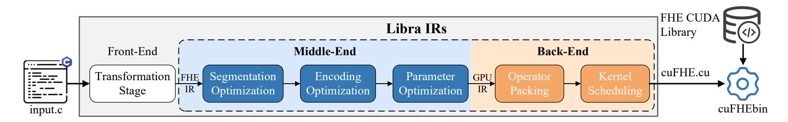

Figure 1: An illustration of the Libra framework.

<span id="page-4-1"></span>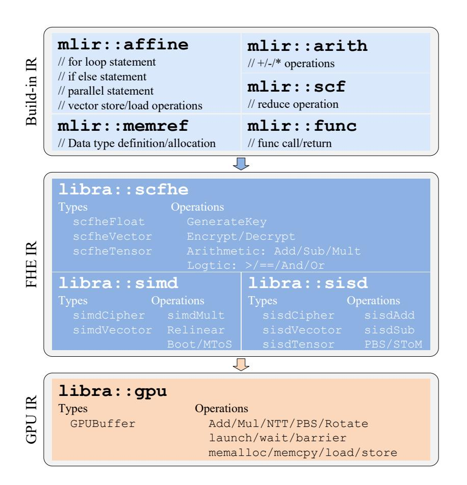

Figure 2: The dialect framework for Libra.

middle-end, Libra performs a dialect-level transformation by lowering standard MLIR operations and data types into our custom domain-specific FHE dialects, thus constructing an IR aware of multiple FHE schemes. Lastly, in the back-end, Libra progressively lowers the FHE dialects to a CUDA-compatible IR, and applies a set of optimizations to improve performance on GPU hardware.

More concretely, Libra consists four main stages of transformations, which include:

- (1) Front-End Passes: Libra adopts a multi-level IR design to support progressive lowering from native C programs to CUDA homomorphic programs. As illustrated in Figure 2, the front-end translates high-level plaintext constructs into MLIR's built-in dialects. Control flow and parallel structures are captured by affine and scf, arithmetic by arith, memory operations by memref, and program organization by func. The front-end dialects serve as the plaintext IR, preserving program semantics in a form amenable to further IR lowering.
- (2) Segmentation Optimization: After processing the front-end layers, the input program enters the middle-end, where a series of FHE transformations lower the plaintext IR into FHE-specific IRs. We define the top-most set of dialects to represent encrypted data-types and homomorphic operators

in the middle-end as the FHE IR. The FHE IR itself is organized into several dialect layers, including the dialect scfhe, simd, and sisd. In the upper layer, the scfhe dialect abstracts common operations over encrypted scalars, vectors, and tensors. To map the front-end IRs into the FHE IR, high-level control-flow constructs, such as loops and conditionals, are lowered into the sequential applications of operators suitable for homomorphic execution. Different from [14], for loops with ciphertext break condition, we force either the server or the client to explicitly specify the number of iterations. Moreover, data-independent structures are annotated in the scfhe dialect to enable subsequent parallel optimizations. Then, scfhe is translated into scheme-specific dialects.

For the scheme-specific lowerings, Libra partitions the computation into each of the dialects along with the associated homomorphic primitives accordingly. For each partitioned segment of the input program, the compiler selects the corresponding encryption scheme that maximizes overall execution efficiency, guided by a cost model that takes into account both the computational cost of homomorphic operations on specific hardware and the overhead of inter-scheme conversions. During the process, abstract ciphertext types in the generic scfhe IR are replaced with concrete IRs from simd and sisd.

- (3) Encoding Optimization: On the scheme-specific IR lyaer, we apply similar techniques in [14,15], to optimize the ciphertext coefficient-slot encodings and number-theoretic transform (NTT) transformations. Most existing FHE compilers support only slot encoding for c<sub>SIMD</sub>, it is inefficient for workloads such as inner product and MToS, which favor coefficient encoding. To mitigate this cost, Libra employs pattern -matching encoding optimization, which automatically selects coefficient-slot encoding strategies that minimize the conversion overhead. To further reduce overhead, we maximize computation in the NTT domain, allowing consecutive operations to remain in the NTT domain, and apply lazy relinearization to reduce key-switching overhead.
- (4) Parameter Optimization: At this stage, we optimize operator computation by selecting minimal parameters for cross-scheme FHE, balancing both execution efficiency and noise growth. For SIMD-FHE, fewer multiplication levels improve efficiency but obviously constrain multiplicative depth. Notably, when converting from SISD-FHE to SIMD-FHE, the STOM operator resets the multiplication level. In contrast, the MTOS conversion from SIMD-FHE to SISD-FHE consumes all the noise margins. To avoid the waste of

{5}------------------------------------------------

### Algorithm 1: FindMin

<span id="page-5-2"></span>**Input:** data, the plaintext vector of n points

- 1  $min \leftarrow data[0]$
- 2 for i = 1 to n do
- 3 | **if** min > data[i] **then** min = data[i]
- 4 return min

multiplication levels, we optimize the SIMD-FHE levels according to locations of MTOS, so that c<sub>SIMD</sub> naturally reach a multiplication level of zero at conversion points. Building on the above technique, we dynamically adjust the ciphertext levels to minimize the number of bootstrapping, ensuring correct program evaluation and efficient cross-scheme computation. Level management algorithm detailed in Appendix A. Note that all the encoding and parameter optimizations in stage (3) and stage (4) are applied in the simd and sisd dialect layer.

(5) Operator Packing & Kernel Scheduling: Finally, the simd and sisd IRs are lowered to the gpu IR in the back-end, which exposes GPU-specific constructs such as memory allocation, kernel launch, synchronization, and mathematical primitives (e.g., Add, NTT). This dialect is directly translatable into CUDA C++ kernels that implement the homomorphic program, enabling efficient execution on GPU hardware. Here, we first capture the dataflow and structural characteristics of the FHE IRs and derive a GPU-tailored computation graph. This process involves a targeted mapping of data-types, computational operations, and memory operations. The operator graph is then transformed into gpu, followed by optimizations of the asynchronous execution stream. Further details on optimizatios in the gpu IR are discussed in Section 5.

### <span id="page-5-0"></span>3.3 Threat Model

We adopt the standard two-party model in which the client holds private data and outsources the encrypted computations to a semi-honest server equipped with GPU resources. While the program can be compiled on both the server and the client, we assume that the program compiler honestly produces the output FHE program according to the input program specification. To carry out computation, the server knows the program logic and has full visibility into the compiler's output (e.g., operator scheduling, scheme transitions, and GPU kernels), but learns nothing about the encrypted input as well as all intermediate ciphertexts.

# 4 Cost-Aware Compilation

Cost-aware compilation is a core design of Libra. This section develops a lightweight cost model to minimize encrypted execution latency under precision constraints. We first present an illustration that demonstrates the typical trade-off between the SIMD-FHE and SISD-FHE schemes in Section 4.1. We

<span id="page-5-3"></span>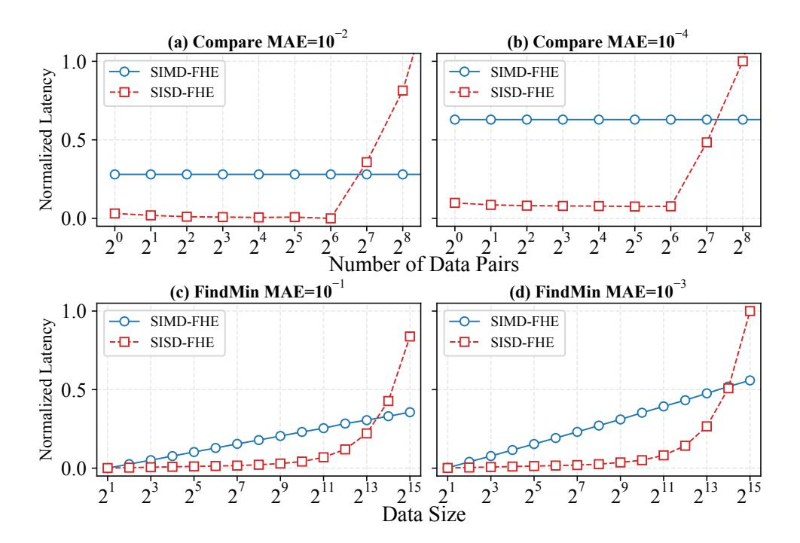

Figure 3: Normalized latency for the Compare and FindMin of SIMD-FHE and SISD-FHE on A100.

then introduce separate cost models for each scheme in Section 4.2, and finally show how these models guide compiler partitioning and graph rewriting in Section 4.4.

### <span id="page-5-1"></span>4.1 SIMD-FHE vs. SISD-FHE Trade-offs

Here, we give a concrete example using the FindMin function (Algorithm 1) to further sketch the computational trade-offs between the SIMD-FHE and SISD-FHE schemes. The core operation of FindMin is the homomorphic comparison, which is typically implemented by evaluating the sign function. For the SIMD-FHE scheme, existing methods approximate the sign function using a minimax composite polynomial [67], which is optimized for low circuit depth and small multiplication budget. In contrast, the SISD-FHE scheme leverages SISD-LUT to compute lookup tables (LUTs) that directly perform Boolean comparison on ciphertexts. The two approaches differ fundamentally in algorithmic structure, which leads to distinct theoretical complexities. Furthermore, the exact performance of the two schemes is also influenced by the concrete workload characteristics and hardware resource availability, resulting in dynamic trade-offs in real-world program compilation.

Figure 3 compares the computational latency of SIMD-FHE and SISD-FHE when evaluating the same task of FindMin. As shown in Figure 3(a) and Figure 3(c), SISD-FHE outperforms SIMD-FHE on small inputs due to its lightweight operators. However, as the data size grows, SIMD-FHE prevails by amortizing costs over a batch inputs. This distinct scaling behavior creates a trade-off point where both schemes exhibit comparable latency. For FindMin, we employ the sorting method from [13] for SIMD-FHE and the min-finding method from [78] for SISD-FHE. Notably, Figure 3(b) and Figure 3(d) demonstrate that the trade-off point shifts to the right as precision requirements increase. This is because SIMD-FHE requires costly high-degree polynomials

{6}------------------------------------------------

### Algorithm 2: **SIMD-FHE Cost**

```
Input: G = (V,E), operator DFG of the SIMD-FHE
        scheme
  Input: ε, precision of polynomial approximation
  Input: CostLUT[S,op], lookup table with operation latency
        under GPU resource state S and operator op
  Output: Total estimated cost C
1 C ← 0; T ← TopologicalSort(G) ▷ Initialize
2 foreach level ∈ T do
3 lrapprox ← APPROXLINEAR(level.nolr, ε)
4 U ← level.lr∪lrapprox
5 foreach op ∈ U do
6 C ← C +CostLUT[S,op]
7 Procedure APPROXLINEAR(op, ε)
8 U ← 0/ ▷ Initialize operator set
9 if op.type = smooth then p ← Chebyshev(op, ε)
10 else p ← MiniMax(op, ε)
11 U ← Collect(p) ▷ Collect linear operations of poly
12 return U
13 return C
```

for high precision, whereas SISD-FHE incurs a much smaller performance penalty, making the crossover point sensitive to both the input sizes and the approximation precision.

Through the above example, we highlight the necessity to establish a comprehensive computational cost model that captures the trade-offs among FHE schemes considering computational characteristics, approximation precision, and hardware resources to guide the FHE compiler optimizations.

# <span id="page-6-0"></span>4.2 Cost Model

Motivated by the design trade-offs, in what follows, we introduce our cost modeling method of Libra for both the SIMD-FHE and SISD-FHE schemes.

# 4.2.1 SIMD-FHE Cost

In the SIMD-FHE scheme, the costs of native operations are relatively straightforward to estimate. The main challenge in precise cost modeling lies in evaluating the computational overhead of approximations for nonlinear functions. To generate the approximation polynomial, two strategies are commonly employed. The first relies on Chebyshev polynomials [\[18,](#page-14-31) [25\]](#page-14-32) to approximate smooth functions. This approach achieves uniform convergence and ensures low maximum error within a bounded interval. The second employs Minimax composite polynomials [\[64,](#page-15-30) [66,](#page-15-31) [71,](#page-15-32) [84\]](#page-16-23), which are specifically designed to approximate functions with discontinuities or sharp transitions. By analyzing the computational structure of the generated approximation polynomials, the costs of nonlinear function evaluations over SIMD-FHE can be established.

### Algorithm 3: **SISD-FHE Cost**

```
Input: DFG of SISD-FHE scheme G = (V,E)
  Input: CostLUT[S,op,ops, ε], where S is the GPU state, op
        is the operator, ops is number of op, and ε the target
        precision.
  Output: Total cost C
1 C ← 0; T ← TopologicalSort(G) ▷ Initialize
2 foreach level ∈ T do
3 foreach op ∈ level.opType do
4 opsp ← S.n · S.p ▷ Number of parallel operations
5 opsm ← ⌊S.m/op.mem⌋
6 ops ← min(opsp,opsm) ▷ Batch size
7 tiles ← ⌈op.ops/ops⌉ ▷ Waves
8 for i ← 0 to tiles do
9 opst ← min(ops,op.ops)
10 Tc ← CostLUT[S,op,opst
                               , ε]
11 C ← C +Tc
12 op.ops ← op.ops−opst
13 return C
```

Algorithm [2](#page-6-1) estimates the computational cost of SIMD-FHE. The procedure begins by applying topological sorting [\[59\]](#page-15-33) to the dataflow graph *G* to derive its parallel levels *T* (Line 2). For each level, the APPROXLINEAR function approximates nonlinear operators via polynomial fitting under the target precision ε, producing a set of linearized operators *lr*approx (Line 4). These operators are combined with the level's native linear operators to form the complete operator set *U* (Line 6). The execution cost is then obtained by summing the latencies of all linear operators using CostLUT (Line 7–8). Further details on CostLUT are provided in Appendix [B.1.](#page-16-24) Lines 9–16 define APPROXLINEAR. Smooth operators are approximated with Chebyshev polynomials, while operators with sharp variations are handled by Minimax composite polynomial approximation to balance accuracy and efficiency (Line 11–14). Detailed descriptions of these methods can be found in [\[25,](#page-14-32) [65\]](#page-15-34). Finally, all linear operations derived from the polynomial *p* are collected into *U* (Line 15).

# 4.2.2 SISD-FHE Cost

SISD-LUT is invoked in the process of almost all function evaluations over SISD-FHE, and accounts for the majority of computational costs. Furthermore, the deterministic algorithmic structure of SISD-LUT is particularly favorable for compiler-level scheduling and resource management on highly parallel hardware platforms.

To model the computational cost of the SISD-FHE scheme, two inputs are required: the dataflow graph (DFG) *G* and the lookup table CostLUT, where CostLUT stores the measured latencies as a function of platform state, operator type, input size, and target precision. We detail CostLUT in Appendix [B.2.](#page-17-0) Algorithm [3](#page-6-2) provides a method for accurately estimating the

{7}------------------------------------------------

<span id="page-7-1"></span>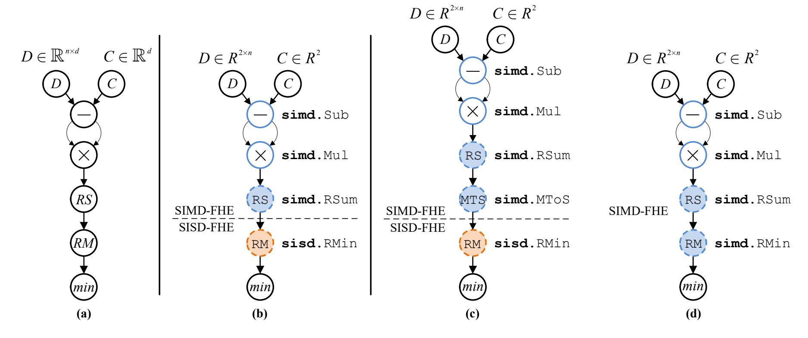

Figure 4: Dataflow graph (DFG) of Minimum Euclidean Distance. (a) DFG for plaintext program, (b) DFG after SCHEME-PARTITION, (c) and (d) DFGs after COST-REWRITE. RS indicates a reduce-sum operation, and RM indicates a reduce-minimum operation. Colored nodes highlight IR-level operations implemented via FHE-IR.

execution latency of the SISD-FHE scheme based on these inputs. On Line 2, T denotes the parallel levels generated from the dataflow graph G, where each level contains a set of operators that can execute in parallel. For each *level*, Line 5–8 compute both the batch size of operator and the waves based on the available SMs and the memory capacity on the GPU. Subsequently, the execution latency of the current batch is evaluated using CostLUT at target precision  $\varepsilon$ , and finally, the state of the current operator is updated (Line 9–13).

## 4.3 Scheme Conversion Cost

In the segmentation optimization stage of Libra, the computation graph is divided into the SIMD-FHE and SISD-FHE domains. Explicitly inserting scheme conversion operations, MTOS and STOM, at domain boundaries introduces conversion overhead. Since MTOS and STOM have fixed computation patterns, their latency depends only on the number of SISD-FHE ciphertexts [78]. Therefore, we construct a lookup table, CostLUT[op, counts], to find conversion latency, where op denotes MTOS or STOM, and counts is the number of SISD-FHE ciphertexts. Table 9 in Appendix B.3 reports exact latency results for representative ciphertext counts.

# <span id="page-7-0"></span>4.4 Compilation Approach

Building upon the SIMD-FHE and SISD-FHE cost models introduced earlier, we propose a cost-aware progressive layer lowering strategy, known as the segmentation optimization. This strategy translates high-level plaintext programs into efficient FHE execution plans by assigning the most cost-effective scheme to each of the computational segments, while

respecting approximation precision, input scale, and encoding constraints.

As an conceptual illustration, we extend FindMin to compute the Minimum Euclidean Distance. As sketched in Figure 4, the compiler first lowers the input plaintext program into built-in IRs represented as a DFG. Next, Libra applies the SCHEME-PARTITION rule to divide the DFG into SIMD-FHE and SISD-FHE subgraphs (Figure 4(b)). Finally, the COST-REWRITE rule refines these partitions to reduce cross-scheme overhead (Figure 4 (c) and (d)).

As shown in Figure 5, to formalize this paradigm within the MLIR-based compiler, we apply three graph-rewriting passes: SCHEME-PARTITION, COST-REWRITE-DOWN, and COST-REWRITE-UP. Subsequently, we detail each of the rewriting rules.

**SCHEME-PARTITION.** SCHEME-PARTITION is the first optimization pass in the Libra compilation pipeline. The goal of SCHEME-PARTITION is to assign a locally optimal encryption scheme to each operation node in the DFG of the input program, thereby providing an efficient starting point for subsequent optimization phases. Formally, for a plaintext node  $n_{pt}$  with a linear operator  $n_{lin}$  or a nonlinear operator  $n_{nlin}$ , the scheme assignment is defined as:

$$\Phi(n_{pt}) = \begin{cases} \text{sisd} & \text{if } C_{S}(n_{nlin}, \epsilon) < C_{M}(n_{nlin}, \epsilon) \\ \text{simd} & \text{otherwise} \end{cases}$$
 (8)

where  $\varepsilon$  denotes the approximation precision, and  $C_S$  and  $C_M$  denote the cost models of SISD-FHE and SIMD-FHE, respectively, under a given computational resource state. Here, we simplify  $C_S$  and  $C_M$  to be functions of the scheme type, node, and approximation precision, as described in Algorithm 3 and Algorithm 2.

{8}------------------------------------------------

```
SCHEME-PARTITION \cfrac{n_{pt} \in PTInsts \quad n_{pt}. op \in O_{lin} \cup O_{nlin}}{\textbf{if } n_{pt}. op \in O_{nlin} \ \textbf{and } C_{SISD-FHE}(n_p, \epsilon) \leq C_{SIMD-FHE}(n_{pt}, \epsilon):}
Insts \leftarrow Insts \cup \{n\} \quad n. op \leftarrow \texttt{sisd}. OP(n_{pt}, \epsilon) \quad n. in \leftarrow \texttt{sisd}. Encrypt(n_{pt}. in)
\textbf{else}: \quad Insts \leftarrow Insts \cup \{n\} \quad n. op \leftarrow \texttt{simd}. OP(n_{pt}, \epsilon) \quad n. in \leftarrow \texttt{simd}. Encrypt(n_{pt}. in)
COST-REWRITE-DOWN \cfrac{n \in Insts \quad n. optype = \texttt{simd} \quad n_c. optype = \texttt{sisd}}{\textbf{if } C_{SISD-FHE}(n_c \cup n. \texttt{simd}. MToS, \epsilon) \leq C_{SIMD-FHE}(\texttt{sisd}. OP(n_c), \epsilon):}
Insts \leftarrow Insts \cup \{n_s\} \quad n_s. op \leftarrow \texttt{simd}. OP(n_c, \epsilon) \quad n_s. in \leftarrow \texttt{simd}. Encrypt(n_c. in)
COST-REWRITE-UP \cfrac{n \in Insts \quad n. optype = \texttt{sisd} \quad n_c. optype = \texttt{simd}}{\textbf{if } C_{SISD-FHE}(n_c \cup n. \texttt{sisd}. SToM, \epsilon) \leq C_{SIMD-FHE}(\texttt{simd}. OP(n), \epsilon):}
Insts \leftarrow Insts \cup \{n_s\} \quad n_s. op \leftarrow \texttt{simd}. OP(n_c, \epsilon) \quad n_s. in \leftarrow \texttt{simd}. Encrypt(n. in)
\textbf{else}: \quad n \leftarrow n_s \quad n_s. op \leftarrow \texttt{simd}. OP(n_c, \epsilon) \quad n_s. in \leftarrow \texttt{simd}. Encrypt(n. in)
```

Figure 5: Cost-based cross-scheme graph rewriting rules in Libra. *PTInsts* represents plaintext nodes, O is linear or nonlinear operator set, *Insts* represents ciphertext nodes,  $C_{\text{Scheme}}$  denotes a node's computational cost under the current scheme, and  $\varepsilon$  denotes its precision constraint.

<span id="page-8-1"></span>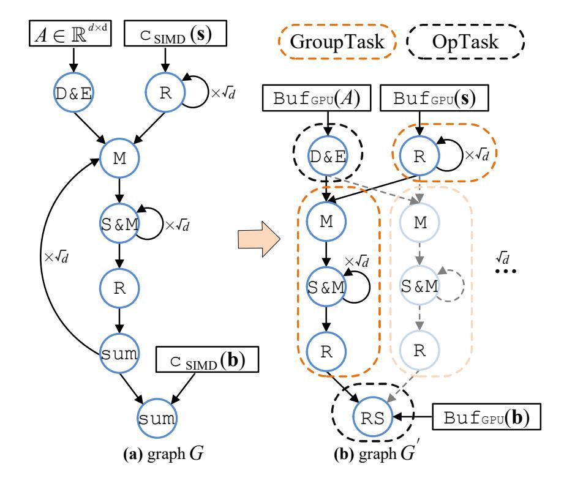

Figure 6: Operation flow graph for computing  $A \cdot \mathbf{s} + \mathbf{b}$  in the gpu IR. D&E denotes diagonal extraction and plaintext encoding, R refers to Rotate, M depicts plaintext-ciphertext multiplication, S&M indicates accumulation after plaintext-ciphertext multiplication, sum specify ciphertext addition, and RS is the reduce-sum operator.

Based on operation semantics, linear arithmetic operators (e.g., addition, multiplication, squaring) are directly lowered to simd. Nonlinear or table-friendly operators (e.g., comparison) are lowered to either sisd or simd, depending on their relative costs, producing a mixed-dialect IR with explicit FHE scheme boundaries (Fig. 4(b)). Nonlinear operators also enforce a precision threshold  $\epsilon$  to control error propagation. High-precision nodes require larger encryption parameters, which increase computational overhead, reflecting the performance—precision trade-off.

To further improve the throughput, the SCHEME-PARTITION pass applies automatic SIMD batching strategies [97] when encoding plaintext inputs into ciphertexts for SIMD-FHE. We further optimize the encryption method in SISD-FHE by aligning ciphertexts to contiguous memory, enabling batch processing during computation. The resulting encoding metadata is recorded to guide scheme selection for downstream nodes.

COST-REWRITE. This stage addresses conversion overheads arising from FHE scheme switching, which require explicit operators (MTOS and STOM) to be invoked. A straightforward conversion insertion can invalidate the local optimum produced by the SCHEME-PARTITION pass, resulting in the need of a global refinement. Hence, the COST-REWRITE pass implements boundary optimization through an iterative process consisting of two complementary passes.

First, the COST-REWRITE-DOWN traverses the DFG from top to bottom, analyzing the computational cost of each node while explicitly accounting for input conversion overheads. COST-REWRITE-DOWN identifies simd to sisd boundaries and applies the optimization rule

$$\Phi_d(n) = \begin{cases} \text{Insert MToS} & \text{if } C_{\mathbf{S}}(n_c \cup \text{MtoS}) \leq C_{\mathbf{M}}(n_c) \\ n_c \to \text{simd} & \text{otherwise,} \end{cases}$$
 (9)

where n denotes the current simd node and  $n_c$  its next sisd node. The cheaper alternative updates both nodes and ciphertext formats.

Then, we apply the COST-REWRITE-UP pass, which traverses the DFG from bottom to top. This pass refines the decisions by checking downstream demands to amortize conversion costs, particularly when a single operator serves multiple successors. Here, the pass searches for the sisd to simd

{9}------------------------------------------------

<span id="page-9-2"></span>
$$\begin{aligned} \mathsf{DIALECT\text{-}LOWERING} & v \in G \quad \mathsf{postorder}(v) \quad v.\mathsf{op} \in \mathcal{O}_{\mathsf{simd} \cup \mathsf{sisd}} \quad v.\mathsf{type} \in \{\mathsf{simd}.\mathsf{Types}, \mathsf{sisd}.\mathsf{Types}\} \\ & G' \cup \{v'\}, E' \cup \{(u',v') \mid (u,v) \in E\} \quad v'.\mathsf{Types} \leftarrow \begin{cases} \mathsf{GPUBuffer} < N \times L \times d, \mathsf{Type} > & \text{if } v.\mathsf{type} \in \mathsf{simd}.\mathsf{Types} \\ \mathsf{GPUBuffer} < n + 1, \mathsf{Type} > & \text{if } v.\mathsf{type} \in \mathsf{sisd}.\mathsf{Types} \end{cases} \\ & v'.\mathsf{op} \leftarrow \mathsf{gpu}.\mathsf{OP}(v.\mathsf{op}) \quad v'.\mathsf{memOp} \leftarrow \begin{cases} \mathsf{ld}.\mathsf{global/shared} & \text{if } v.\mathsf{memOp} = \mathsf{read} \\ \mathsf{st}.\mathsf{global/shared} & \text{if } v.\mathsf{memOp} = \mathsf{write} \end{cases} \\ & \mathsf{TASK\text{-}IDENT} \\ & T \cup \{t\} \quad t \leftarrow \begin{cases} \mathsf{GroupTask}(v') & \text{if } \mathsf{Pattern}(v') \in \mathcal{P}_{\mathsf{recur}} \\ \mathsf{OpTask}(v') & \text{if } \mathsf{Pattern}(v') \in \mathcal{P}_{\mathsf{atomic}} \end{cases} \\ & \mathsf{OPERATOR\text{-}FUSION} \\ & t \setminus \{t_1, t_2\} \cup \{t_{\mathsf{fusion}}\} \quad t_{\mathsf{fusion}} \leftarrow t_1 \oplus t_2 \quad \mathsf{if } \mathsf{Light}(t_1) \wedge \mathsf{Light}(t_2) \quad \mathsf{or } \mathsf{Light}(t_1) \wedge \neg \mathsf{Light}(t_2) \end{cases} \end{aligned}$$

Figure 7: Operator graph rewriting rules in Libra.  $\theta$  represents the predefined computational intensity of an operator.

boundaries, and execute

$$\Phi_u(n) = \begin{cases} \text{Insert SToM} & \text{if } C_{\mathcal{S}}(n \cup \text{SToM}) \leq C_{\mathcal{M}}(n) \\ n \to \text{simd} & \text{otherwise,} \end{cases}$$
 (10)

where n is a sisd node and  $n_c$  its simd successor.

Each rewriting rule updates the affected nodes, propagating local cost increments. The two rewriting rules are recursively applied over the entire DFG until a fixed point is reached or a predefined iteration bound is reached. After the COST-REWRITE pass, the Minimum Euclidean Distanc DFG converges to one of the two configurations shown in Figure 4 (c) and (d), either a cross-scheme or a SIMD-FHE scheme, with the configuration achieving the lowest computational cost chosen as the final result. Appendix B.4 shows a more detailed COST-REWRITE algorithm.

## <span id="page-9-0"></span>5 Scheduling

In the back-end of Libra, the main optimizations involve the applications of the operator packing and kernel scheduling passes. Here, we provide details on the operator packing process in Section 5.1 and the kernel scheduling procedures in Section 5.2.

## <span id="page-9-1"></span>5.1 Operator Graph Construction

During the middle-end optimization phase, a dataflow graph G of FHE primitives is constructed. In the subsequent operator packing pass, G is transformed into a GPU-aware operation flow graph G' via a structured mapping  $G \mapsto G'$ , as shown in Figure 6. This transformation leverages Libra's multi-level dialect infrastructure, where a sequence of passes performs semantic lowering and structural reorganization from the FHE IRs to the GPU IR. The corresponding rewrite rules are illustrated in Figure 7.

**Dialect Lowering**: We adopt a post-order traversal strategy, processing from leaf nodes upward to outer structures. This bottom-up approach preserves the semantic integrity of composite operations, such as a homomorphic multiplication followed by relinearization. For instance, the pattern:

$$simd.Relinear(Mul(simdCipher_0, simdCipher_1))$$
 (11)

is directly mapped to a consolidated GPU operator:

$$gpu.SIMDMul(buffer_0, buffer_1)$$
 (12)

During dialect lowering, three aspects should be carefully addressed. First, for data types, both  $c_{SIMD}$  in SIMD-FHE and  $c_{SISD}$  in SISD-FHE are mapped to GPU multi-dimensional tensor (buffer $< N \times L \times d$ , Type>) and vector (buffer< n+1, Type>), respectively, annotated with memory space attributes such as gpu.global or gpu.shared. Second, for compute operations, FHE primitives, including homomorphic addition, multiplication, and look-up tables, are lowered to GPU operators under a parallel execution model. Lastly, for memory operations. ciphertext read/write operations are translated into GPU memory-related IR instructions to specify data read/write in global or shared memory.

Task Identification: To address the complex dataflow and control structures in graph G', we introduce a pattern-driven operator packing technique. Note that, here, the operators refer to the GPU-level operators that reside in the gpu dialect. We use Figure 6 to illustrate an example construction of the operator graph in Libra when computing  $A \times \text{simd.simdCipher}(\mathbf{s}) + \text{simd.simdCipher}(\mathbf{b}), A \in \mathbb{R}^{d \times d}$ ,  $\mathbf{s}, \mathbf{b} \in \mathbb{R}^d$ . First, we transform the sequential execution graph into a parallel structure based on data dependencies. Next, we identify recurring patterns such as loops and iterative accumulations, which are encapsulated into coarsegrained GroupTask. These units serve as GPU parallel execution blocks with clearly defined input/output interfaces.

{10}------------------------------------------------

<span id="page-10-3"></span>Table 2: Detailed configuration of the platform.

| CPU    | Intel(R) Xeon(R) Silver 4310 @ 2.10GHz |
|--------|----------------------------------------|
| Memory | 500GB                                  |
| GPGPU  | NVIDIA A100; 40GB; 1.5TB/s             |
| Misc.  | GCC/G++-13; CUDA-12.6; Clang-4.0.0     |

<span id="page-10-4"></span>Table 3: Experimental default parameters in Libra.

| Scheme   | Parameters                                          |                     |  |  |
|----------|-----------------------------------------------------|---------------------|--|--|
| SISD-FHE | $n \\ \log_2(q)$                                    | 1024/2048<br>32/64  |  |  |
| SIMD-FHE | $N \\ \operatorname{Max}(\log_2(q_i)) \\ \log_2(Q)$ | 65536<br>61<br>1867 |  |  |

Independent GPU operators, such as reduction, are instead encapsulated into fine-grained OpTask. A topological sort [59] is then applied to establish task dependencies. Data-independent tasks within the same hierarchical level are marked for parallel execution and mapped to concurrent GPU thread blocks, while data-dependent tasks are synchronized explicitly through GPU primitives.

**Aggressive Operator Fusion**: A fusion optimization pass is applied post-packing to enhance performance. This optimization is particularly beneficial in FHE workloads, which are inherently parallelizable in computation but bounded by memory bandwidth. Using a pattern library or worklist algorithm, adjacent operators are merged according to workload traits: i) lightweight fusion and ii) load-balancing fusion. First, in lightweight fusion, sequences of low-cost operations (e.g., element-wise additions/multiplications) are fused to eliminate intermediate memory allocations, reduce memory traffic, and improve instruction-level parallelism. Second, for loadbalancing fusion, lightweight kernels often result in high warp idling and poor SM utilization. By fusing them with computationally heavy kernels, we balance thread block workloads, and reduce pipeline stalls. The fusions also reduce the total number of kernel launch events, thereby decreasing launch overhead and context-switching costs.

# <span id="page-10-0"></span>5.2 Kernel Scheduling

At the bottom level, kernel scheduling bridges the high-level operator graph and concrete GPU execution, exploiting hierarchical parallelism and asynchronous execution to efficiently map FHE workloads to SMs. We propose the gpu and async dialects to improve the computation throughput and resource utilization. To enable concurrency, we adopt a multi-stream execution model, where each logical stream corresponds to an independent command queue, thereby allowing computation overlap. Specifically, execution dependent

cies are represented by the !gpu.async.token type, which abstracts away the details of physical stream management. Meanwhile, the computations are split into fine-grained tasks and launched asynchronously using gpu.launch async. Tokens track dependencies and async.collect defines synchronization scopes without global barriers. We issue memory transfers with gpu.memcpy async and overlap the memory transactions with computations by linking their tokens to later kernels. Token chains maintain intra-stream order, while events (gpu.event.record, gpu.stream.wait.event) enforce cross-stream dependencies. The above IR designs overlap kernels and data movements, hiding communication latency and improving throughput.

### 6 Evaluation

In this section, we thoroughly evaluate Libra. Due to the absence of comparable GPU-based FHE compilers, we use the CPU-based compiler Bian et al. [15] to generate the Middle-End IRs, which are then transformed to our custom GPU backend to serve as the baseline.

### **6.1** Experiment Setup

Libra<sup>1</sup> is implemented as an MLIR-based compiler that leverages Polygeist [87] to generate IRs. The produced CUDA code is compiled into GPU executables using NVCC [37]. The underlying CUDA FHE library<sup>2</sup> includes our in-house implementations of CKKS [27] and TFHE [31], along with Pegasus [78] scheme conversions. Performance metrics are collected with NVIDIA Nsight Systems [36]. Table 2 summarizes the experimental system configuration. Table 3 reports the default evaluation parameters for Libra, selected using the LWE estimator [3] to ensure 128-bit security. We evaluate Libra using a set of benchmarks commonly employed in general-purpose FHE compilers, and compare the results against other GPU-based FHE compilers, or the GPU implementations of CPU-based compilers.

# 6.2 Microbenchmarks

We begin by evaluating Libra on a set of representative microbenchmarks that are commonly used [15,78,97,104]. After being processed by Libra, these benchmarks are automatically compiled into SIMD-FHE, SISD-FHE, or cross-scheme, depending on factors such as data size and computing capability.

• Pure SIMD-FHE Programs: Figure 8 reports the comparisons between Libra-generated code and those generated by prior arts, including [15], [58], and [104]. For inner product and euclidean distance, both Libra and [15] achieve the same level of performance, while the manually-tuned slot-encoding

<span id="page-10-1"></span><sup>1</sup>https://github.com/sunnchioo/Libra

<span id="page-10-2"></span><sup>&</sup>lt;sup>2</sup>https://github.com/sunnchioo/FlyHE

{11}------------------------------------------------

<span id="page-11-0"></span>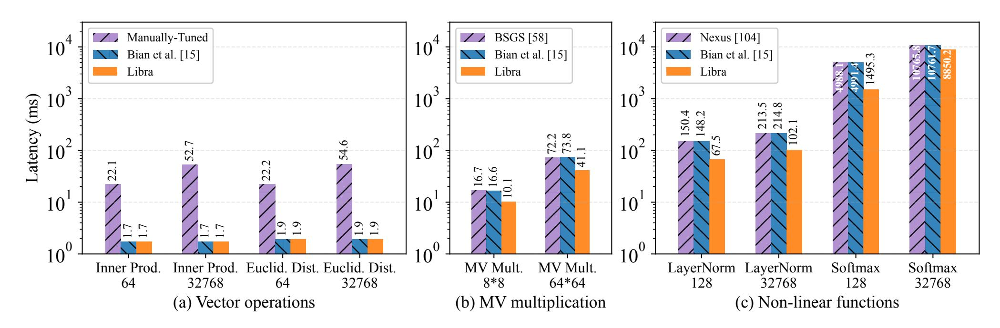

Figure 8: Microbenchmarks for original SIMD-FHE program with different vector/matrix sizes.

<span id="page-11-1"></span>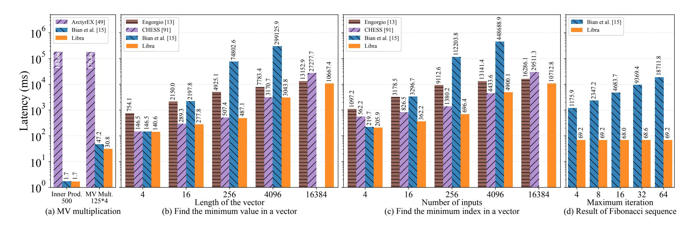

Figure 9: Microbenchmarks for original SISD-FHE program.

approach incurs a large number of SIMD-HROTATE. For matrix–vector multiplication, both Libra and [15] adopt the SIMD-FHE BSGS method from [58]. Libra, however, delivers a 1.7× speedup via operator fusion and parallelization. For layernorm and softmax, Libra and [15] follow the nonlinear approximations from Nexus [104] (see Appendix C.1 for details). Libra achieves a 2× speedup on layernorm due to better GPU scheduling, and reaches a 3.3× speedup for the 128-point SoftMax by leveraging the cross-scheme compilation technique.

• **Pure SISD-FHE Programs**: Figure 9 compares Libra with prior works or their GPU variants. First, in Figure 9(a), for the inner product and matrix-vector multiplication tasks, ArctyrEx [49] uses SISD-FHE, while Libra and [15] are both compiled to SIMD-FHE, resulting a 6230× speedup. Second, for the minimum value and minimum index tasks, we compare Libra with Engorgio [13], CHESS [91], and the GPU-variant of [15]. Specifically, in Figure 9(b), it is observed that, in the minimum-value task with 16,384 inputs, Libra adopts to the SIMD-FHE scheme, yielding a 2.5× speedup over [91], which always uses the SISD-FHE scheme. While both Libra

and [13] employs SIMD-FHE schemes, by applying operator packing and kernel scheduling, Libra is a 1.2× faster than [13]. On the other hand, due to its serial scheduling nature, programs compiled by [15] did not finish within 11 minutes. Lastly, in Figure 9(d), we test the performance of Libra on the Fibonacci sequence task. By fully exploiting the GPU resources, Libra achieves a 270.4× speedup over [15].

## **6.3** Evaluation on End-to-End Applications

- Minimum Euclidean Distance: We use [15] to implement this task and compare the codes to those generated by Libra. As shown in Figure 10(a), at small data scales, both Libra and [15] employ a cross-scheme strategy. When the data scale increases to 1,024, Libra switches to the SIMD-FHE scheme. Through scheduling and operator fusion, Libra achieves up to 19.5× performance improvement over [15].
- Data Analysis in Homomorphic Database: In this application, we consider counting the number of people over 65 years old from an encrypted database. Figure 10(b) shows the computation latency under different data sizes. Libra employs

{12}------------------------------------------------

<span id="page-12-0"></span>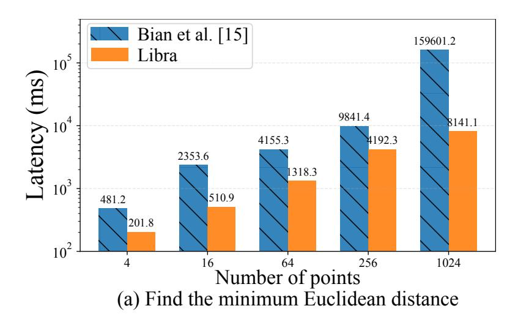

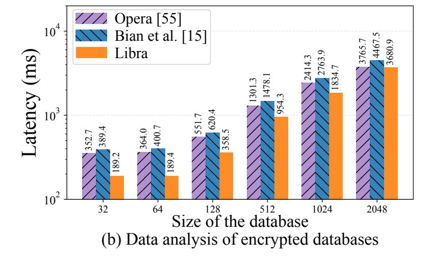

Figure 10: Latency of End-to-End applications

<span id="page-12-2"></span>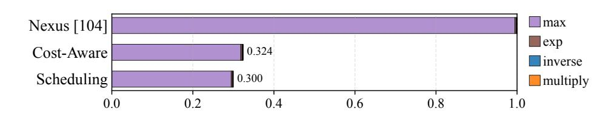

Figure 11: Latency analysis of 128-point softmax

SISD-FHE scheme and achieves  $1.86 \times$  and  $2.1 \times$  speedups over Opera [55] and [15], respectively, on the 32 data.

- Homomorphic K-Means Evaluation: Here, we evaluate the performance of Libra and [15] over K-Means [83]. Table 4 reports the program latency under different settings. Different from manually-tuned SIMD-FHE scheme, both Libra and [15] generate cross-scheme execution traces for K-Means. Through cost-aware compilation and exploiting GPU hardware features, Libra achieves 23× and 5× speedups over the manually-tuned GPU implementation and [15] over GPU, respectively.
- Homomorphic Resnet-20 Evaluation: Here, we evaluate Libra against AutoFHE [7] and ReSBM [74] on the neural network inference task. For the approximation of ReLU, [7] employs polynomials of varying degrees across different layers, whereas [74] utilizes a uniform 11th-degree polynomial for all layers. We evaluated both configurations within Libra under the SIMD-FHE scheme. We show that, by leveraging proper level management, Libra can reduces the latency from 9.75 s to 6.13 s against [7] and from 15.93 s to 12.25 s against [74]. (More details in Appendix C.1).

<span id="page-12-1"></span>Table 4: Latency Comparison of [15] and Libra for K-Means

| Points | Centroids | Manually-Tuned | [15]     | Libra   |
|--------|-----------|----------------|----------|---------|
| 16     | 2         | 2.72 s         | 3.25 s   | 0.96 s  |
|        | 4         | 29.73 s        | 6.27 s   | 1.54 s  |
| 128    | 2         | 10.18 s        | 25.83 s  | 5.22 s  |
|        | 4         | 215.46 s       | 49.95 s  | 9.64 s  |
| 512    | 2         | 35.614 s       | 102.56 s | 19.46 s |
|        | 4         | 848.17 s       | 200.76 s | 36.76 s |
| 1024   | 2         | 69.55 s        | 203.72 s | 37.83 s |
|        | 4         | 1692.49 s      | 399.84 s | 76.21 s |

<span id="page-12-3"></span>Table 5: Utilization Rate Comparison between [15] and Libra

|                  | SMs Active (%) | Bandwidth (%) |
|------------------|----------------|---------------|
| Bian et al. [15] | 19.1           | 11.5          |
| Libra            | 63.1           | 47.6          |

## **6.4** Performance Analysis

The performance gains of Libra stems from two optimizations: cost-aware compilation and GPU scheduling. Figure 11 shows the performance breakdown of an 128-point softmax application, where Libra significantly reduces max-reduction time under same parameters using cross-scheme compilation. To evaluate GPU utilization, we measure SM active and memory bandwidth utilization using Nsight Systems [36] on K-Means with 2 centroids and 16 points. We compare Libra with [15] over GPU. As shown in Table 5, Libra improves SM active and bandwidth utilization by 44% and 36.1%, respectively, demonstrating more effective use of GPU resources through operator- and kernel-level scheduling optimizations.

### 6.5 Limitation

The current COST-REWRITE strategy is fast and effective, but as FHE workloads become more complex, it may sometimes lead to suboptimal solutions. In the future, we plan to explore more efficient cost-rewriting methods to improve FHE program execution in highly parallel environments.

### 7 Conclusion

In this work, we introduce Libra, a GPU-based FHE compiler with cost-aware cross-scheme optimization. Libra deeply incorporates operator costs across FHE schemes with kernel scheduling optimizations over GPU, exploiting both algorithmic-level and hardware-level computation characteristics to enhance the performance of the compiled programs. Experiment results show that Libra-compiled programs achieve up to  $19 \times$  lower latency in end-to-end applications compared to the state-of-the-art solutions.

{13}------------------------------------------------

# Acknowledgments

This work is partially supported by the National Key R & D Program of China (2023YFB3106200), the National Natural Science Foundation of China (624B2016, 62572020, T2425023, U2241213).

# Ethical Considerations And Compliance With The Open Science Policy

This section outlines the ethical considerations and the open science policy of this work.

# Ethical Considerations

This work proposes a GPU compiler framework for fully homomorphic encryption (FHE), focusing on optimizing performance while preserving the strong security guarantees of FHE. Importantly, the experimental portion of this research is conducted entirely on synthetic workloads and benchmark datasets in a controlled computing environment, without involving any real user data or production systems. We confirm that the research process and the publication of these results introduce no harm to individuals or infrastructure. Below, we discuss the ethical implications of our research, adherence to ethical principles, and compliance with relevant guidelines.

- Beneficence and Stakeholders: The main objective of our research is to improve the practicality of FHE by leveraging GPU parallelism, thereby enabling stronger data protection in outsourced and privacy-sensitive computing. This work positively affects several groups, including cryptographic researchers, compiler engineers, and industry practitioners seeking secure cloud computing solutions. By developing and evaluating our compiler framework, we aim to enhance data security and make privacy-preserving computation more accessible, reducing the risks of unauthorized access or data leakage. Our experiments are confined to isolated test environments, ensuring no negative impact on real-world systems or individuals.
- Respect for Persons: Respect for individual privacy is a core motivation of this work. FHE inherently protects sensitive user data by allowing computation over encrypted information without exposing plaintext values. In our research process, we do not use any personally identifiable or sensitive information. All benchmarks are derived from open-source, anonymized, or synthetic datasets, and strict data handling procedures are maintained to ensure confidentiality.
- Justice: The principle of justice requires a fair distribution of the benefits of research. Our compiler framework aims to broaden access to efficient FHE, allowing both

researchers and practitioners to benefit from enhanced performance while preserving strong cryptographic guarantees. By ensuring reproducibility and open availability of our work, we avoid creating unfair barriers and ensure that these advancements are available to the entire scientific community regardless of institutional affiliation.

- Respect for Law and Public Interest: This work complies with all relevant laws, ethical standards, and guidelines regarding cryptographic research and responsible use of computing resources. The proposed compiler framework is designed exclusively for legitimate and beneficial applications of FHE and does not support or encourage unlawful activities or unethical usage. We mitigate misuse by enforcing standard security parameters and explicitly designating the tool as a research prototype.
- Ethical Warrant and Benefits: Given the increasing reliance on cloud computing and the corresponding rise in data breaches, research into practical FHE is not only warranted but essential. The ethical benefit of this work lies in its potential for privacy-preserving computation. By lowering the performance barrier of FHE, we enable industry practitioners to adopt encryption standards that protect user data even during processing. This shift supports a more privacy-centric internet ecosystem.

# Open Science

In alignment with the open science policy, we are committed to ensuring that our research is transparent, reproducible, and publicly accessible.

- Reproducibility: To facilitate independent validation, we provide detailed descriptions of our compiler design, optimization techniques, and experimental setup. All experiments are run with publicly available benchmarks or synthetic datasets, and the evaluation methodology is thoroughly documented. Research artifacts will be submitted for artifact evaluation to ensure their availability, functionality, and reproducibility.
- Open Access: Our source code, benchmark configurations for reproducing experiments will be publicly released at [https://doi.org/10.5281/zenodo.](https://doi.org/10.5281/zenodo.17962002) [17962002](https://doi.org/10.5281/zenodo.17962002), ensuring that the community can access, verify, and build upon our work. Released artifacts are vetted to exclude sensitive data and malicious code.

# References

<span id="page-13-0"></span>[1] AKHAVAN MAHDAVI, R., NI, H., LINKOV, D., AND KERSCHBAUM, F. Level up: Private non-interactive decision tree evaluation using levelled homomorphic encryption. In *ACM CCS* (2023), pp. 2945– 2958.

{14}------------------------------------------------

- <span id="page-14-36"></span>[2] ALBRECHT, M., CHASE, M., CHEN, H., DING, J., GOLDWASSER, S., GORBUNOV, S., HALEVI, S., HOFFSTEIN, J., LAINE, K., LAUTER, K., LOKAM, S., MICCIANCIO, D., MOODY, D., MOR-RISON, T., SAHAI, A., AND VAIKUNTANATHAN, V. Homomorphic encryption standard. Cryptology ePrint Archive, Paper 2019/939, 2019.
- <span id="page-14-35"></span>[3] ALBRECHT, M. R., PLAYER, R., AND SCOTT, S. On the concrete hardness of learning with errors. *Journal of Mathematical Cryptology 9*, 3 (2015), 169–203.
- <span id="page-14-25"></span>[4] ALEXANDRU, A., KIM, A., AND POLYAKOV, Y. General functional bootstrapping using CKKS. *IACR Cryptol. ePrint Arch.* (2024), 1623.
- <span id="page-14-22"></span>[5] ALI, A., CHOI, J., GIPSON, B., GORANTALA, S., KUN, J., LEGIEST, W., LIM, L., VIAND, A., DEMISSIE, M. Z., AND ZHENG, H. Heir: A universal compiler for homomorphic encryption, 2025.
- <span id="page-14-2"></span>[6] ALPERIN-SHERIFF, J., AND PEIKERT, C. Faster bootstrapping with polynomial error. In *Annual Cryptology Conference, CRYPTO* (Santa Barbara, CA, United states, 2014), vol. 8616 LNCS, pp. 297 – 314.
- <span id="page-14-16"></span>[7] AO, W., AND BODDETI, V. N. Autofhe: Automated adaption of cnns for efficient evaluation over FHE. In *33rd USENIX Security Symposium, USENIX Security 2024, Philadelphia, PA, USA, August 14-16, 2024* (2024), D. Balzarotti and W. Xu, Eds., USENIX Association.
- <span id="page-14-11"></span>[8] ARCHER, D., TRILLA, J., DAGIT, J., MALOZEMOFF, A., POLYAKOV, Y., ROHLOFF, K., AND RYAN, G. RAMPARTS: A programmerfriendly system for building homomorphic encryption applications. In *WAHC* (2019), pp. 57–68.
- <span id="page-14-5"></span>[9] BANNO, R., MATSUOKA, K., MATSUMOTO, N., BIAN, S., WAGA, M., AND SUENAGA, K. Oblivious online monitoring for safety ltl specification via fully homomorphic encryption. In *International Conference on Computer Aided Verification* (2022), Springer, pp. 447– 468.
- <span id="page-14-6"></span>[10] BELAÏD, S., BON, N., BOUDGUIGA, A., SIRDEY, R., TRAMA, D., AND YE, N. Further improvements in aes execution over tfhe: Towards breaking the 1 sec barrier. *Cryptology ePrint Archive* (2025).
- <span id="page-14-37"></span>[11] BERNARD, O., JOYE, M., SMART, N. P., AND WALTER, M. Drifting towards better error probabilities in fully homomorphic encryption schemes. In *Annual International Conference on the Theory and Applications of Cryptographic Techniques* (2025), Springer, pp. 181– 211.
- <span id="page-14-7"></span>[12] BIAN, S., FU, Y., ZHAO, D., PAN, H., JIN, Y., SUN, J., QIAO, H., AND GUAN, Z. FHECAP: an encrypted control system with piecewise continuous actuation. *IEEE Trans. Inf. Forensics Secur. 20* (2025), 4551–4566.
- <span id="page-14-30"></span>[13] BIAN, S., PAN, H., HU, J., ZHANG, Z., FU, Y., HUA, J., CHEN, Y., ZHANG, B., JIN, Y., DONG, J., ET AL. Engorgio: An arbitraryprecision unbounded-size hybrid encrypted database via quantized fully homomorphic encryption. In *Proceedings of the 34th USENIX Security Symposium (USENIX Security 2025)* (2025).
- <span id="page-14-29"></span>[14] BIAN, S., ZHAO, Z., SHEN, R., ZHANG, Z., MAO, R., LI, D., LIU, Y., WAGA, M., SUENAGA, K., GUAN, Z., ET AL. Chloe: Loop transformation over fully homomorphic encryption via multi-level vectorization and control-path reduction. In *2025 IEEE Symposium on Security and Privacy (SP)* (2025), IEEE, pp. 2395–2413.
- <span id="page-14-9"></span>[15] BIAN, S., ZHAO, Z., ZHANG, Z., MAO, R., SUENAGA, K., JIN, Y., GUAN, Z., AND LIU, J. Heir: A unified representation for crossscheme compilation of fully homomorphic computation. *Cryptology ePrint Archive* (2023).
- <span id="page-14-17"></span>[16] BOEMER, F., LAO, Y., CAMMAROTA, R., AND WIERZYNSKI, C. nGraph-HE: a graph compiler for deep learning on homomorphically encrypted data. In *CF* (2019), pp. 3–13.
- <span id="page-14-19"></span>[17] BON, N., POINTCHEVAL, D., AND RIVAIN, M. Optimized homomorphic evaluation of boolean functions. *IACR Transactions on Cryptographic Hardware and Embedded Systems 2024*, 3 (2024), 302–341.
- <span id="page-14-31"></span>[18] BOSSUAT, J., MOUCHET, C., TRONCOSO-PASTORIZA, J. R., AND HUBAUX, J. Efficient bootstrapping for approximate homomorphic encryption with non-sparse keys. In *EUROCRYPT* (2021), pp. 587– 617.
- <span id="page-14-27"></span>[19] BOURA, C., GAMA, N., GEORGIEVA, M., AND JETCHEV, D.

- CHIMERA: combining ring-lwe-based fully homomorphic encryption schemes. *J. Math. Cryptol.* (2020), 316–338.
- <span id="page-14-1"></span>[20] BRAKERSKI, Z., GENTRY, C., AND VAIKUNTANATHAN, V. (leveled) fully homomorphic encryption without bootstrapping. *ACM Transactions on Computation Theory (TOCT) 6*, 3 (2014), 1–36.
- <span id="page-14-20"></span>[21] CARPOV, S. A fast heuristic for mapping boolean circuits to functional bootstrapping. *IACR Cryptol. ePrint Arch.* (2024), 1204.
- <span id="page-14-8"></span>[22] CARPOV, S., IZABACHÈNE, M., AND MOLLIMARD, V. New techniques for multi-value input homomorphic evaluation and applications. In *Cryptographers' Track at the RSA Conference* (2019), Springer, pp. 106–126.
- <span id="page-14-4"></span>[23] CHABANNE, H., DE WARGNY, A., MILGRAM, J., MOREL, C., AND PROUFF, E. Privacy-preserving classification on deep neural network. *IACR ePrint* (2017).
- <span id="page-14-14"></span>[24] CHEN, E., BROWN, F., AND ZHENG, W. Bridging usability and performance: A tensor compiler for autovectorizing homomorphic encryption. Cryptology ePrint Archive, Paper 2025/1319, 2025.
- <span id="page-14-32"></span>[25] CHEN, H., CHILLOTTI, I., AND SONG, Y. Improved bootstrapping for approximate homomorphic encryption. In *EUROCRYPT* (2019), pp. 34–54.
- <span id="page-14-28"></span>[26] CHEN, H., DAI, W., KIM, M., AND SONG, Y. Efficient homomorphic conversion between (ring) lwe ciphertexts. In *International conference on applied cryptography and network security* (2021), Springer, pp. 460–479.
- <span id="page-14-0"></span>[27] CHEON, J. H., KIM, A., KIM, M., AND SONG, Y. S. Homomorphic encryption for arithmetic of approximate numbers. In *ASIACRYPT* (2017), pp. 409–437.
- <span id="page-14-12"></span>[28] CHEON, S., LEE, Y., KIM, D., LEE, J. M., JUNG, S., KIM, T., LEE, D., AND KIM, H. Dacapo: Automatic bootstrapping management for efficient fully homomorphic encryption. In *USENIX Security* (2024).
- <span id="page-14-13"></span>[29] CHEON, S., LEE, Y., YOUM, H., KIM, D., YUN, S., JEONG, K., LEE, D., AND KIM, H. Halo: Loop-aware bootstrapping management for fully homomorphic encryption. In *Proceedings of the 30th ACM International Conference on Architectural Support for Programming Languages and Operating Systems, Volume 1* (2025), pp. 572–585.
- <span id="page-14-21"></span>[30] CHIELLE, E., MAZONKA, O., GAMIL, H., AND MANIATAKOS, M. Accelerating fully homomorphic encryption by bridging modular and bit-level arithmetic. In *Proceedings of the 41st IEEE/ACM International Conference on Computer-Aided Design* (2022), pp. 1–9.
- <span id="page-14-3"></span>[31] CHILLOTTI, I., GAMA, N., GEORGIEVA, M., AND IZABACHÈNE, M. Tfhe: fast fully homomorphic encryption over the torus. *Journal of Cryptology 33*, 1 (2020), 34–91.
- <span id="page-14-23"></span>[32] CHILLOTTI, I., LIGIER, D., ORFILA, J., AND TAP, S. Improved programmable bootstrapping with larger precision and efficient arithmetic circuits for TFHE. In *ASIACRYPT* (2021), pp. 670–699.
- <span id="page-14-18"></span>[33] CHOWDHARY, S., DAI, W., LAINE, K., AND SAARIKIVI, O. Eva improved: Compiler and extension library for ckks. In *Proceedings of the 9th on Workshop on Encrypted Computing & Applied Homomorphic Cryptography* (2021), pp. 43–55.
- <span id="page-14-26"></span>[34] CHUNG, H., KIM, H., KIM, Y., AND LEE, Y. Amortized large lookup table evaluation with multivariate polynomials for homomorphic encryption. *IACR Cryptol. ePrint Arch.* (2024), 274.
- <span id="page-14-24"></span>[35] CLET, P., ZUBER, M., BOUDGUIGA, A., SIRDEY, R., AND GOUY-PAILLER, C. Putting up the swiss army knife of homomorphic calculations by means of TFHE functional bootstrapping. *IACR ePrint* (2022).
- <span id="page-14-34"></span>[36] CORPORATION., N. Nsight systems [computer software]. [https:](https://docs.nvidia.com/nsight-systems/2024.5) [//docs.nvidia.com/nsight-systems/2024.5](https://docs.nvidia.com/nsight-systems/2024.5), 2024. [Online; accessed May, 2024].
- <span id="page-14-33"></span>[37] CORPORATION., N. Nvidia cuda compiler (nvcc) [computer software]. <https://docs.nvidia.com/cuda/archive/12.6.0>, 2024. [Online; accessed Aug., 2024].
- <span id="page-14-15"></span>[38] COWAN, M., DANGWAL, D., ALAGHI, A., TRIPPEL, C., LEE, V. T., AND REAGEN, B. Porcupine: a synthesizing compiler for vectorized homomorphic encryption. In *PLDI* (2021), pp. 375–389.
- <span id="page-14-10"></span>[39] CROCKETT, E., PEIKERT, C., AND SHARP, C. ALCHEMY: A language and compiler for homomorphic encryption made easy. In *CCS* (2018), pp. 1020–1037.

{15}------------------------------------------------

- <span id="page-15-6"></span>[40] DATHATHRI, R., KOSTOVA, B., SAARIKIVI, O., DAI, W., LAINE, K., AND MUSUVATHI, M. Eva: An encrypted vector arithmetic language and compiler for efficient homomorphic computation. In *Proceedings of the 41st ACM SIGPLAN conference on programming language design and implementation* (2020), pp. 546–561.
- <span id="page-15-18"></span>[41] DATHATHRI, R., SAARIKIVI, O., CHEN, H., LAINE, K., LAUTER, K. E., MALEKI, S., MUSUVATHI, M., AND MYTKOWICZ, T. CHET: an optimizing compiler for fully-homomorphic neural-network inferencing. In *PLDI* (2019), pp. 142–156.
- <span id="page-15-19"></span>[42] DE CASTELNAU, J., YU, M., AND MICHELI, G. D. Cut tracing with e-graphs for boolean FHE circuit synthesis. *CoRR abs/2506.12883* (2025).
- <span id="page-15-1"></span>[43] DUCAS, L., AND MICCIANCIO, D. Fhew: bootstrapping homomorphic encryption in less than a second. In *Annual international conference on the theory and applications of cryptographic techniques* (2015), Springer, pp. 617–640.
- <span id="page-15-24"></span>[44] DUMEZY, J., ALEXANDRU, A., POLYAKOV, Y., CLET, P., CHAKRABORTY, O., AND BOUDGUIGA, A. Evaluating larger lookup tables using CKKS. *IACR Cryptol. ePrint Arch.* (2025), 1301.
- <span id="page-15-37"></span>[45] EVEN, G., SEIDEL, P.-M., AND FERGUSON, W. E. A parametric error analysis of goldschmidt's division algorithm. *Journal of Computer and System Sciences 70*, 1 (2005), 118–139.
- <span id="page-15-0"></span>[46] FAN, J., AND VERCAUTEREN, F. Somewhat practical fully homomorphic encryption. *Cryptology ePrint Archive* (2012).
- <span id="page-15-12"></span>[47] GOOGLE. HEIR: Homomorphic encryption intermediate representation. <https://http://github.com/google/heir>, 2023. [Online; accessed Aug. 21, 2025].
- <span id="page-15-10"></span>[48] GORANTALA, S., SPRINGER, R., PURSER-HASKELL, S., LAM, W., WILSON, R., ALI, A., ASTOR, E. P., ZUKERMAN, I., RUTH, S., DIBAK, C., ET AL. A general purpose transpiler for fully homomorphic encryption. *arXiv preprint arXiv:2106.07893* (2021).
- <span id="page-15-21"></span>[49] GOUERT, C., JOSEPH, V., DALTON, S., AUGONNET, C., GARLAND, M., AND TSOUTSOS, N. G. Hardware-accelerated encrypted execution of general-purpose applications. *Proceedings on Privacy Enhancing Technologies* (2025).
- <span id="page-15-20"></span>[50] GOUERT, C., AND TSOUTSOS, N. G. Romeo: Conversion and evaluation of HDL designs in the encrypted domain. In *DAC* (2020), pp. 1–6.
- <span id="page-15-11"></span>[51] GUAN, Z., MAO, R., ZHANG, Q., ZHANG, Z., ZHAO, Z., AND BIAN, S. Autohog: Automating homomorphic gate design for large-scale logic circuit evaluation. *IEEE TCAD* (2024).
- <span id="page-15-13"></span>[52] GÜNTHER, M., SCHÜTZE, L., BECHER, K., STRUFE, T., AND CAS-TRILLON, J. Helium: a language and compiler for fully homomorphic encryption with support for proxy re-encryption. *arXiv preprint arXiv:2312.14250* (2023).
- <span id="page-15-23"></span>[53] HAN, K., HHAN, M., AND CHEON, J. H. Improved homomorphic discrete fourier transforms and FHE bootstrapping. *IEEE Access 7* (2019), 57361–57370.
- <span id="page-15-2"></span>[54] HESAMIFARD, E., TAKABI, H., AND GHASEMI, M. Cryptodl: Deep neural networks over encrypted data. *CoRR* (2017).
- <span id="page-15-36"></span>[55] HU, Q., CHEN, W., SHEN, T., YAO, X., ZHANG, N., CUI, H., AND YIU, S.-M. Opera: Achieving secure and high-performance olap with parallelized homomorphic comparisons. In *2025 IEEE Symposium on Security and Privacy (SP)* (2025), IEEE, pp. 2360–2377.
- <span id="page-15-3"></span>[56] HUANG, Z., LU, W., HONG, C., AND DING, J. Cheetah: Lean and fast secure two-party deep neural network inference. In *USENIX Security* (2022), pp. 809–826.
- <span id="page-15-4"></span>[57] JIANG, X., KIM, M., LAUTER, K. E., AND SONG, Y. Secure outsourced matrix computation and application to neural networks. In *ACM CCS* (2018), pp. 1209–1222.
- <span id="page-15-35"></span>[58] JUNG, W., KIM, S., AHN, J. H., CHEON, J. H., AND LEE, Y. Over 100x faster bootstrapping in fully homomorphic encryption through memory-centric optimization with gpus. *IACR Transactions on Cryptographic Hardware and Embedded Systems* (2021), 114–148.
- <span id="page-15-33"></span>[59] KAHN, A. B. Topological sorting of large networks. *Commun. ACM 5*, 11 (1962), 558–562.
- <span id="page-15-22"></span>[60] KLUCZNIAK, K., AND SCHILD, L. FDFB: full domain functional bootstrapping towards practical fully homomorphic encryption. *IACR*

- *CHES 2023*, 1 (2023), 501–537.
- <span id="page-15-7"></span>[61] KRASTEV, A., SAMARDZIC, N., LANGOWSKI, S., DEVADAS, S., AND SANCHEZ, D. A tensor compiler with automatic data packing for simple and efficient fully homomorphic encryption. *Proceedings of the ACM on Programming Languages 8*, PLDI (2024), 126–150.
- <span id="page-15-28"></span>[62] LATTNER, C., AMINI, M., BONDHUGULA, U., COHEN, A., DAVIS, A., PIENAAR, J. A., RIDDLE, R., SHPEISMAN, T., VASILACHE, N., AND ZINENKO, O. MLIR: scaling compiler infrastructure for domain specific computation. In *CGO* (2021), pp. 2–14.
- <span id="page-15-14"></span>[63] LEE, D., LEE, W., OH, H., AND YI, K. Optimizing homomorphic evaluation circuits by program synthesis and term rewriting. In *PLDI* (2020), pp. 503–518.
- <span id="page-15-30"></span>[64] LEE, E., LEE, J., NO, J., AND KIM, Y. Minimax approximation of sign function by composite polynomial for homomorphic comparison. *IEEE Trans. Dependable Secur. Comput. 19*, 6 (2022), 3711–3727.
- <span id="page-15-34"></span>[65] LEE, J., LEE, E., LEE, J.-W., KIM, Y., KIM, Y.-S., AND NO, J.-S. Precise approximation of convolutional neural networks for homomorphically encrypted data. *IEEE Access 11* (2023), 62062–62076.
- <span id="page-15-31"></span>[66] LEE, J., LEE, E., LEE, Y., KIM, Y., AND NO, J. High-precision bootstrapping of RNS-CKKS homomorphic encryption using optimal minimax polynomial approximation and inverse sine function. In *EUROCRYPT* (2021), pp. 618–647.
- <span id="page-15-29"></span>[67] LEE, J.-W., KANG, H., LEE, Y., CHOI, W., EOM, J., DERYABIN, M., LEE, E., LEE, J., YOO, D., KIM, Y.-S., AND NO, J.-S. Privacypreserving machine learning with fully homomorphic encryption for deep neural network. *IEEE Access 10* (2022), 30039–30054.
- <span id="page-15-15"></span>[68] LEE, Y., CHEON, S., KIM, D., LEE, D., AND KIM, H. Performanceaware scale analysis with reserve for homomorphic encryption. In *Proceedings of the 29th ACM International Conference on Architectural Support for Programming Languages and Operating Systems, Volume 1* (2024), pp. 302–317.
- <span id="page-15-16"></span>[69] LEE, Y., HEO, S., CHEON, S., JEONG, S., KIM, C., KIM, E., LEE, D., AND KIM, H. HECATE: performance-aware scale optimization for homomorphic encryption compiler. In *CGO* (2022), pp. 193–204.
- <span id="page-15-17"></span>[70] LEE, Y., KIM, D., LEE, D., AND KIM, H. Elasm: Error-latency-aware scale management for fully homomorphic encryption. In *USENIX Security* (2023), pp. 1–15.
- <span id="page-15-32"></span>[71] LEE, Y., LEE, J., KIM, Y., KIM, Y., NO, J., AND KANG, H. Highprecision bootstrapping for approximate homomorphic encryption by error variance minimization. In *EUROCRYPT* (2022), pp. 551–580.
- <span id="page-15-38"></span>[72] LI, B., AND MICCIANCIO, D. On the security of homomorphic encryption on approximate numbers. In *Annual International Conference on the Theory and Applications of Cryptographic Techniques* (2021), Springer, pp. 648–677.
- <span id="page-15-8"></span>[73] LI, L., LAI, J., YUAN, P., SUI, T., LIU, Y., ZHU, Q., ZHANG, X., XIAO, L., CHEN, W., AND XUE, J. Ant-ace: An fhe compiler framework for automating neural network inference. In *Proceedings of the 23rd ACM/IEEE International Symposium on Code Generation and Optimization* (2025), pp. 193–208.
- <span id="page-15-9"></span>[74] LIU, Y., LAI, J., LI, L., SUI, T., XIAO, L., YUAN, P., ZHANG, X., ZHU, Q., CHEN, W., AND XUE, J. Resbm: Region-based scale and minimal-level bootstrapping management for fhe via min-cut. In *Proceedings of the 30th ACM International Conference on Architectural Support for Programming Languages and Operating Systems, Volume 1* (2025), pp. 924–939.
- <span id="page-15-26"></span>[75] LIU, Z., AND WANG, Y. Amortized functional bootstrapping in less than 7 ms, with o˜(1) polynomial multiplications. In *ASIACRYPT* (2023), pp. 101–132.
- <span id="page-15-25"></span>[76] LIU, Z., AND WANG, Y. Relaxed functional bootstrapping: A new perspective on bgv/bfv bootstrapping. In *International Conference on the Theory and Application of Cryptology and Information Security* (2024), Springer, pp. 208–240.
- <span id="page-15-5"></span>[77] LOU, Q., AND JIANG, L. HEMET: A homomorphic-encryptionfriendly privacy-preserving mobile neural network architecture. In *ICML* (2021), pp. 7102–7110.
- <span id="page-15-27"></span>[78] LU, W., HUANG, Z., HONG, C., MA, Y., AND QU, H. PEGASUS: bridging polynomial and non-polynomial evaluations in homomorphic encryption. In *S&P* (2021), pp. 1057–1073.

{16}------------------------------------------------

- <span id="page-16-4"></span>[79] MA, J., XU, C., AND WILLS, L. W. Pytfhe: An end-to-end compilation and execution framework for fully homomorphic encryption applications. In *2023 IEEE International Symposium on Performance Analysis of Systems and Software (ISPASS)* (2023), IEEE, pp. 24–34.
- <span id="page-16-13"></span>[80] MALIK, R., PARANJAPE, V., AND KULKARNI, M. Circuit optimization using arithmetic table lookups. *Proc. ACM Program. Lang. 9*, PLDI (2025), 301–323.
- <span id="page-16-9"></span>[81] MALIK, R., SHETH, K., AND KULKARNI, M. Coyote: A compiler for vectorizing encrypted arithmetic circuits. In *ASPLOS* (2023), pp. 118–133.
- <span id="page-16-7"></span>[82] MATSUOKA, K., BANNO, R., MATSUMOTO, N., SATO, T., AND BIAN, S. Virtual secure platform: A five-stage pipeline processor over TFHE. In *USENIX Security* (2021), pp. 4007–4024.
- <span id="page-16-26"></span>[83] MCQUEEN, J. B. Some methods of classification and analysis of multivariate observations. In *Proc. of 5th Berkeley Symposium on Math. Stat. and Prob.* (1967), pp. 281–297.
- <span id="page-16-23"></span>[84] MIN, S., LEE, J.-W., AND SONG, Y. Enhanced ckks bootstrapping with generalized polynomial composites approximation. In *Proceedings of the 20th ACM Asia Conference on Computer and Communications Security* (2025), ASIA CCS '25, pp. 1–12.
- <span id="page-16-0"></span>[85] MISHRA, P., LEHMKUHL, R., SRINIVASAN, A., ZHENG, W., AND POPA, R. A. Delphi: A cryptographic inference service for neural networks. In *USENIX Security* (2020), pp. 2505–2522.
- <span id="page-16-14"></span>[86] MONO, J., KLUCZNIAK, K., AND GÜNEYSU, T. Improved circuit synthesis with multi-value bootstrapping for fhew-like schemes. *IACR Trans. Cryptogr. Hardw. Embed. Syst. 2024*, 4 (2024), 633–656.
- <span id="page-16-21"></span>[87] MOSES, W. S., CHELINI, L., ZHAO, R., AND ZINENKO, O. Polygeist: Raising c to polyhedral mlir. In *2021 30th International Conference on Parallel Architectures and Compilation Techniques (PACT)* (2021), IEEE, pp. 45–59.
- <span id="page-16-5"></span>[88] PARK, S., SONG, W., NAM, S., KIM, H., SHIN, J., AND LEE, J. Heaan.mlir: An optimizing compiler for fast ring-based homomorphic encryption. *Proceedings of the ACM on Programming Languages 7*, PLDI (2023), 196–220.
- <span id="page-16-27"></span>[89] QU, H., AND XU, G. Improvements of homomorphic secure evaluation of inverse square root. In *International Conference on Information and Communications Security* (2023), Springer, pp. 110–127.
- <span id="page-16-18"></span>[90] RECTO, R., AND MYERS, A. C. A compiler from array programs to vectorized homomorphic encryption. *CoRR* (2023).
- <span id="page-16-25"></span>[91] SHOKRI, R., AND TSOUTSOS, N. G. Chess: Compiling homomorphic encryption with scheme switching. In *2025 IEEE International Symposium on Hardware Oriented Security and Trust (HOST)* (2025), IEEE, pp. 324–334.
- <span id="page-16-15"></span>[92] SINGH, A., CHATTERJEE, A., CHATTOPADHYAY, A., AND MUKHOPADHYAY, D. An efficient circuit synthesis framework for tfhe via convex sub-graph optimization. In *Proceedings of the 20th ACM Asia Conference on Computer and Communications Security* (2025), pp. 13–29.
- <span id="page-16-12"></span>[93] SINGH, A., DAS, S., CHAKRABORTY, A., SADHUKHAN, R., CHAT-TERJEE, A., AND MUKHOPADHYAY, D. Fheda: efficient circuit synthesis with reduced bootstrapping for torus fhe. In *2024 IEEE 9th European Symposium on Security and Privacy (EuroS&P)* (2024), IEEE, pp. 841–859.
- <span id="page-16-6"></span>[94] SMAJLOVIC, H., FROELICHER, D., SHAJII, A., BERGER, B., CHO, H., AND NUMANAGIC, I. Shechi: A secure distributed computation compiler based on multiparty homomorphic encryption. 7703–7722.
- <span id="page-16-20"></span>[95] SMART, N. P., AND VERCAUTEREN, F. Fully homomorphic SIMD operations. *Des. Codes Cryptogr. 71*, 1 (2014), 57–81.
- <span id="page-16-10"></span>[96] VAN ELSLOO, T., PATRINI, G., AND IVEY-LAW, H. Sealion: a framework for neural network inference on encrypted data. *CoRR* (2019).
- <span id="page-16-8"></span>[97] VIAND, A., JATTKE, P., HALLER, M., AND HITHNAWI, A. Heco: Fully homomorphic encryption compiler. In *32nd USENIX Security Symposium (USENIX Security 23)* (2023), pp. 4715–4732.
- <span id="page-16-11"></span>[98] VOS, J., CONTI, M., AND ERKIN, Z. Oraqle: A depth-aware secure computation compiler. In *Proceedings of the 12th Workshop on Encrypted Computing & Applied Homomorphic Cryptography* (2023), pp. 43–50.

- <span id="page-16-2"></span>[99] WANG, R., HA, J., SHEN, X., LU, X., CHEN, C., WANG, K., AND LEE, J. Refined TFHE leveled homomorphic evaluation and its application. In *ACM CCS* (2025), pp. 1–25.
- <span id="page-16-16"></span>[100] WEBER, R., ORENDORFF, R., ALMASHAQBEH, G., AND SOLOMON, R. Parasol compiler: Pushing the boundaries of FHE program efficiency. *IACR Cryptol. ePrint Arch.* (2025), 1144.
- <span id="page-16-19"></span>[101] YANG, Z., XIE, X., SHEN, H., CHEN, S., AND ZHOU, J. TOTA: fully homomorphic encryption with smaller parameters and stronger security. *IACR ePrint* (2021).
- <span id="page-16-17"></span>[102] YU, M., CARPOV, S., TEMPIA CALVINO, A., AND DE MICHELI, G. On the synthesis of high-performance homomorphic boolean circuits. In *Proceedings of the 12th Workshop on Encrypted Computing & Applied Homomorphic Cryptography* (2023), pp. 51–63.
- <span id="page-16-3"></span>[103] ZAMA. Fhevm: A cross-chain protocol for confidential smart contracts. [https://github.com/zama-ai/fhevm/blob/main/](https://github.com/zama-ai/fhevm/blob/main/fhevm-whitepaper.pdf) [fhevm-whitepaper.pdf](https://github.com/zama-ai/fhevm/blob/main/fhevm-whitepaper.pdf), 2025. [Online; accessed Aug. 21, 2025].
- <span id="page-16-1"></span>[104] ZHANG, J., YANG, X., HE, L., CHEN, K., LU, W.-J., WANG, Y., HOU, X., LIU, J., REN, K., AND YANG, X. Secure transformer inference made non-interactive. In *NDSS* (2025), pp. 1–17.

# <span id="page-16-22"></span>A Parameter Optimization

During parameter optimization stage of Libra, the ciphertext level in the SIMD-FHE computation domain can be dynamically adjusted based on the locations of scheme conversions, as detailed in Algorithm [4,](#page-17-2) which determines the minimal encryption level required for each operation by propagating constraints backward from sink nodes. The procedure initializes the level map *L*final (Line 1) and performs a reverse traversal of the topologically sorted graph *T* (Line 2). For each node, the output level map *l*out is derived by aggregating the requirements of its consumer nodes *v*res (Line 5–8). The input level map *l*in is then calculated based on specific constraints of the operation: if a bootstrapping is scheduled (*B*[*op*] is true), *l*in is reset to the minimum bootstrap threshold *L*boot\_req, effectively truncating the propagation path (Line 10– 11). Conversely, for SIMD-HMUL, the level is incremented to account for depth consumption (Line 12–13). Finally, *l*in is propagated to the parent nodes *v*in in *Req*, ensuring each producer satisfies the maximum requirement of its consumers (Line 16–17).

# B Cost Model Details

This appendix provides details about the cost model in Section [4.2,](#page-6-0) including the construction methods for CostLUT of Algorithm [2](#page-6-1) and Algorithm [3](#page-6-2) and the costs associated with scheme conversion operators.

# <span id="page-16-24"></span>B.1 **CostLUT** for SIMD-FHE

In the SIMD-FHE scheme, the ring structure of highdegree polynomials demands substantial computational resources. Specifically, it is typically the case that a single operation exhausts all the available resources. In Algorithm [2,](#page-6-1) CostLUT[*S*,*op*] denotes the computation latency of the SIMD-FHE operator *op* under a GPU resource state *S*.

{17}------------------------------------------------

### Algorithm 4: **Level Management**

```
Input: T , topological sort
  Input: D, mode map from Phase 1
  Input: Req, demand map initialized to 0
  Input: B, boot decision map from Phase 1
  Input: Lboot_req, min level required to perform bootstrap
  Output: Lfinal, minimal assigned levels
1 Lfinal ← 0/ ▷ Initialize result map
2 foreach op ∈ Reverse(T ) do
3 if D[op] = SISD then
4 continue ▷ SISD ops don't consume levels
5 lout ← 0
6 if op has children then
7 vres ← op.children
8 lout ← Req[vres] ▷ Demand from children
9 Lfinal[op] ← lout ▷ Assign final level
10 if B[op] = True then
11 lin ← Lboot_req ▷ Reset to min level
12 else if op.type = SIMDMult then
13 lin ← lout +1 ▷ Level accumulation
14 else
15 lin ← lout
16 foreach vin ∈ op.parents do
17 Req[vin] ← max(Req[vin],lin) ▷ Update Req
18 return Lfinal
```

We construct CostLUT by benchmarking all SIMD-FHE operators on an A100 GPGPU with no active compute workload state. Some measured latencies are shown in Table [6.](#page-17-3) Users may refer to Table [6](#page-17-3) to construct their own cost model for SIMD-FHE based on their backend FHE libraries. The evaluation of non-polynomial functions must rely on polynomial approximations, which introduce approximation error. For sign function, achieving an output error below 10−<sup>2</sup> requires a degree-6,561 polynomial and consumes 16 levels. Tightening the output error to 10−<sup>4</sup> increases the degree to 531,441 and the level cost to 29. The input range of sign function must also be restricted to [−8,8] to keep the output error bounded. Therefore, Algorithm [2](#page-6-1) introduces a polynomialapproximation tolerance parameter ε to balance output error and performance.

# <span id="page-17-0"></span>B.2 **CostLUT** for SISD-FHE

Due to the inherently low dimension of the ciphertexts in SISD-FHE, SISD-LUT generally does not fully utilize GPU compute capacity, revealing significant opportunities for parallel acceleration. More concretely, the SISD-LUT comprises three main stages [\[31\]](#page-14-3): KeySwitch, BlindRotate, and SampleExtract. The predictable execution flow of SISD-LUT enables for a precise cost modeling on GPUs and fine-grained parallel optimization. In Algorithm [3,](#page-6-2) CostLUT[*S*,*op*,*ops*, ε] denotes the computation latency of ex-

<span id="page-17-3"></span>Table 6: Latency (ms) of SIMD-FHE operators on *N* = 2 16

| SIMD-FHE native operators at some levels       |        |        |        |        |  |  |  |
|------------------------------------------------|--------|--------|--------|--------|--|--|--|
| Level                                          | 16     | 8      | 4      | 2      |  |  |  |
| HADD                                           | 0.0473 | 0.0205 | 0.0226 | 0.0163 |  |  |  |
| PMULT                                          | 0.0822 | 0.0428 | 0.0331 | 0.0285 |  |  |  |
| HMUL                                           | 2.0029 | 0.7943 | 0.4147 | 0.2743 |  |  |  |
| HROTATE                                        | 3.7616 | 1.4983 | 0.7734 | 0.5116 |  |  |  |
| bootstrappingstrapping at some packed messages |        |        |        |        |  |  |  |
| Packed Messages                                | 256    | 1024   | 4096   | 32768  |  |  |  |
| Slim Bootstrapping∗                            | 147.52 | 192.15 | 243.46 | 461.59 |  |  |  |
| Base Bootstrapping⋆                            | 223.52 | 266.22 | 317.61 | 506.09 |  |  |  |
|                                                |        |        |        |        |  |  |  |

<span id="page-17-4"></span>Base Bootstrapping<sup>∗</sup> : Bootstraps a SIMD-FHE ciphertext from level 3 to 19. Slim Bootstrapping<sup>⋆</sup> : Bootstraps a SIMD-FHE ciphertext from level 0 to 16.

Table 7: Latency (ms) of SISD-FHE operators

| Ciphertexts           | 8                   | 64                  | 256                 | 1024                |
|-----------------------|---------------------|---------------------|---------------------|---------------------|
|                       |                     | ε = 10−2            |                     |                     |
| SISD-HADD<br>SISD-LUT | 0.006126<br>35.6598 | 0.006144<br>35.6751 | 0.007168<br>106.159 | 0.01024<br>348.518  |
|                       |                     | ε = 10−4            |                     |                     |
| SISD-HADD<br>SISD-LUT | 0.007168<br>41.7956 | 0.007168<br>41.7772 | 0.009216<br>123.966 | 0.038912<br>409.706 |

Table 8: Notation Summary of Algorithm [3](#page-6-2)

<span id="page-17-5"></span>

| Notation | Description                                   |
|----------|-----------------------------------------------|
| S.n      | Optimal number of tasks assigned per GPU SM   |
| S.p      | Total number of SMs on the GPU                |
| opsp     | Number of executable tasks based on the SM    |
| S.m      | Available GPU memory                          |
| op.mem   | Memory required per operation                 |
| opsm     | Number of executable tasks limited by memory  |
| op.ops   | Total number of operations of a given type    |
| opst     | Number of tasks processed in the current wave |
| Tc       | The computation time for opst                 |

ecuting *ops* instances of the SISD-FHE operator *op* under GPU state *S*, given precision ε. We also measure the computation latency of SISD-FHE operators on an A100 GPGPU under a no active compute workload state, and the some results are shown in Table [7.](#page-17-4) The notations in Algorithm [3](#page-6-2) are given in Table [8.](#page-17-5) Users may also construct customized cost tables based on their own backend libraries.

# <span id="page-17-1"></span>B.3 Scheme Conversion Cost

The conversion between scheme conversion requires explicit operators MTOS and STOM. Table [9](#page-18-0) summarizes the latency

{18}------------------------------------------------

<span id="page-18-0"></span>Table 9: Latency(ms) of mutual scheme conversion operators

| Points | 1      | 64     | 128    |
|--------|--------|--------|--------|
| MTOS   | 31.34  | 34.66  | 54.04  |
| STOM   | 161.43 | 212.61 | 222.47 |

of the conversion between SIMD-FHE and SISD-FHE. Specifically, MTOS measures the time to convert from SIMD-FHE with  $N=2^{16}$  to SISD-FHE with  $n=2^{10}$ , while STOM measures the time to convert from SISD-FHE with  $n=2^{10}$  back to SIMD-FHE with  $N=2^{16}$ . When performing MTOS, we apply parallel optimizations such that the latency remains almost unchanged when extracting up to 128 SISD-FHE ciphertexts.

### <span id="page-18-1"></span>**B.4 COST-REWRITE**

Algorithm 5 details the adaptive COST-REWRITE pass, an iterative optimization routine that alternates between top-down allocation and bottom-up refinement until convergence. The top-down phase employs a greedy strategy with a dual-boot mechanism, adaptively inserting a lightweight slim bootstrapping at the threshold ( $L_{\rm slim}$ ) or a base bootstrapping when ciphertext levels are exhausted ( $l_{\rm in} < L_{\rm slim}$ ). Conversely, the bottom-up phase performs global refinement by pruning redundant bootstrapping where existing levels suffice for downstream demands, and by optimizing execution modes through conversion cost amortization.

### C Details in the Evaluation

## <span id="page-18-2"></span>C.1 Benchmarks

Below, we detail the implementation of several complex benchmarks, describe their evaluation under homomorphic constraints, summarize the input ranges and error probability across all applications.

**LayerNorm**: For layernorm, we use the expression:

$$LayerNorm(x) = \frac{x - E(x)}{\sqrt{Var(x)}},$$

where E(x) and Var(x) denote the mean and variance of the input x. The inverse square root is computed via an optimized Newton iteration [89], initialized by a rational-function approximation. This design achieves high numerical precision while avoiding expensive homomorphic comparisons. For layernorm, Libra selects SIMD-FHE scheme with an initial level of 18, and does not require bootstrappoing.

**SoftMax**: We adopt the numerically stable softmax formulation to prevent overflow during homomorphic exponentiation. The computation is given by

$$SoftMax(x_i) = \frac{\exp(x_i - M)}{\sum_{j} \exp(x_j - M)},$$

### <span id="page-18-3"></span>Algorithm 5: COST-REWRITE Pass

```
Input: \mathcal{T}, topo sort; \mathcal{M}, cost model; L_{\text{boot}}, boot level
    Output: D, mode map; B, boot decision map
                  ({None, Slim, Base})
 1 Const L_{\text{slim}} \leftarrow 3; L_{\text{base}} \leftarrow 0; N_{\text{max}} = 20
 2 foreach op \in \mathcal{T} do
      D[op] \leftarrow \text{SIMD}; \quad B[op] \leftarrow \text{None}
 3
 4 changed \leftarrow True; iter \leftarrow 0
 5 while changed \land iter < N_{\text{max}} do
           changed \leftarrow \mathbf{False}; \quad iter \leftarrow iter + 1
 6
           foreach op \in \mathcal{T} do
7
 8
                  l_{\text{in}} \leftarrow \min_{p \in op.parents}(L[p])
                 type_{boot} \leftarrow None
 9
                 if l_{in} \leq L_{slim} then
10
11
                        if l_{in} \ge L_{slim} then type_{boot} \leftarrow Slim
                       else type_{boot} \leftarrow Base
12
                  cost_{boot} \leftarrow 0
13
                 if type_{boot} == Slim then
14
                    cost_{boot} \leftarrow \mathcal{M}.BootSlim()
                  if type_{boot} == Base then
15
                   cost_{boot} \leftarrow \mathcal{M}.BootBase()
                  C_{\text{SIMD}} \leftarrow \mathcal{M}.\text{Cost}(op, \text{SIMD}) + cost_{\text{boot}}
16
                  C_{\text{SISD}} \leftarrow \mathcal{M}.\text{Cost}(op, \text{SISD})
17
                  if C_{SISD} < C_{SIMD} then
18
                        if D[op] \neq SISD then
19
                           D[op] \leftarrow SISD; changed \leftarrow True
20
                        L[op] \leftarrow l_{\text{in}}
21
22
                 else
                        if D[op] \neq SIMD then
23
                          D[op] \leftarrow \text{SIMD}; \quad changed \leftarrow \textbf{True}
24
                        B[op] \leftarrow type_{boot}
25
                        L[op] \leftarrow (B[op] \neq \text{None})?(L_{\text{boot}} - \text{Depth}(op)):
26
                          (l_{\text{in}} - \text{Depth}(op))
           foreach op \in \mathbf{Reverse}(\mathcal{T}) do
27
                  l_{\text{req}} \leftarrow \max_{u \in op.children}(\text{InputReq}(u))
28
                  l_{\text{raw}} \leftarrow \min_{p \in op.parents}(L[p])
29
                  if B[op] \neq None \land (l_{raw} \geq l_{req} + Depth(op)) then
30
                        B[op] \leftarrow \text{None}
31
                       changed \leftarrow True
                                                               ▶ Prune wasteful boot
32
                 if D[op] == SISD then
33
                        C_{\text{curr}} \leftarrow C_{\text{SISD}} + ((\exists c \in op.children : D[c] =
34
                          SIMD)?\mathcal{M}.Cast(SISD \rightarrow SIMD): 0)
                        C_{\text{new}} \leftarrow C_{\text{SIMD}} + ((\exists c \in op.children : D[c] =
35
                          SISD)?\mathcal{M}.Cast(SIMD \rightarrow SISD): 0)
36
                        if C_{new} < C_{curr} then
                              D[op] \leftarrow \text{SIMD}; \quad changed \leftarrow \textbf{True}
37
38 return D, B
```

where  $M = \max(x)$ . To compute the inverse of the summation term, we use the Goldschmidt algorithm [45], which iteratively approximates 1/x using only SIMD-HSUB and SIMD-HMUL. For exponential function, we use the approx-

{19}------------------------------------------------

<span id="page-19-0"></span>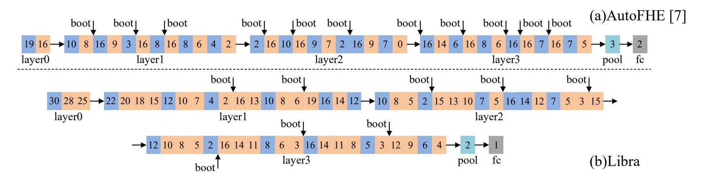

Figure 12: Homomorphic ResNet-20 architectures on Libra and [7]. Blue blocks denote convolution + batchnorm, consuming 2 levels total. Orange blocks denote ReLU. Numbers within blocks indicate the input level for the current operation.

imation  $exp(x) = (1+x/2^8)^{2^8}$ . After compilation, the cross scheme computation begins at level 0 and becomes level 16 after STOM. For the SIMD-FHE scheme, the required initial level is 34, and one bootstrapping is inserted when the level drops to 0, restoring it to 17.

**Data Analysis**: We consider queries over encrypted databases stored in SISD-FHE ciphertexts, in which records are filtered according to user-specified conditions, and computations are performed on the matched entries. In this benchmark, Libra compiles the entire workload using the SISD-FHE scheme only, removing the need for STOM previously required in manually-tuned implementation [55].

**K-Means**: Each multi-dimensional data record of K-Means is packed into a SISD-FHE ciphertext, enabling all dimensions to be processed simultaneously. Libra consistently selects the cross-scheme, using [78] to find the nearest centroid. Libra starts at level 2 and reaches level 4 after STOM. In the manually-tuned SIMD-FHE implementation, the initial level in the first iteration is 19, and one bootstrapping is inserted after sign function. In later iterations, an additional bootstrapping is inserted before sign function. For k iterations, a total of 2k+1 bootstrapping operations are required.

**Resnet-20**: We evaluated Libra on the CIFAR-10 dataset using methods from [7] and [74], achieving the same accuracies of 92.98% and 90.8%, respectively. ReLU is iteratively approximated using [65]. Figure 12 details the ResNet-20 architectures of Libra and [7]. Libra enables fine-grained bootstrapping insertion within the polynomial approximation of ReLU, whereas [7] treats ReLU as a monolithic operator, thereby reducing the number of bootstrapping from 11 to 8.

Input Ranges for Benchmarks: To ensure correct execution, we specify the input ranges of all benchmarks according to the requirements of their underlying homomorphic computations. Specifically, the input range for inner product, euclidean distance, and matrix-vector multiplication is set to [-128, 128]. For softmax, layernorm, min, and min-index operations, we use a narrower range of [-8,8]. For fibonacci sequence, we use 16-bit precision to store the values. K-Means, Resnet-20, and min euclidean distance adopt an input range of [-2,2], reflecting the tighter bounds typically used for comparison. For data analysis, we assume 8-bit integer inputs. All

selected cryptographic parameters are chosen to match, or remain extremely close to, those adopted in prior works, and all satisfy the 128-bit security as specified in [2].

Error probability: Error probability is the probability that decryption fails to recover the original message because the accumulated noise exceeds the system's tolerance. It is typically computed via the tail probability of the noise distribution [11,72]:

$$p_{err} = \operatorname{erfc}\left(\frac{\operatorname{Bound}}{\sigma_{total}\sqrt{2}}\right)$$

where, Bound: Security boundary, often  $\Delta/2$  in SISD-FHE (with  $\Delta=q/t$ ) or  $q_L/2$  in SIMD-FHE;  $\sigma_{total}$ : The standard deviation of the total noise distribution. erfc: Complementary error function. Using the above formula, we evaluate the error probability of Libra under the generated parameters. For inner product, euclidean distance, matrix–vector multiplication, layernormal, softmax, and ResNet-20, Libra adopts the SIMD-FHE scheme, achieving negligible error probabilities ( $p_{err}=\text{erfc}(2^{1350})$ ,  $\text{erfc}(2^{579})$ ,  $\text{erfc}(2^{488})$ , and  $\text{erfc}(2^{220}) \rightarrow 0$ ). Due to the presence of SISD-LUT, for min, min-index, fibonacci sequence, data analysis, K-Means, minimum euclidean distance, and cross-scheme softmax, the error probability is also negligible, approximately  $p_{err}=\text{erfc}(2^{315}) \rightarrow 0$ .

### **C.2 GPU** Metrics

SMs Active measures the fraction of time that SMs are active during kernel execution, while bandwidth utilization is the ratio of achieved to peak memory throughput. Since Libra employs asynchronous optimizations, CUDA kernel-level metrics fail to capture overall system load. We therefore use Nsight Systems [36] to measure device-wide utilization.