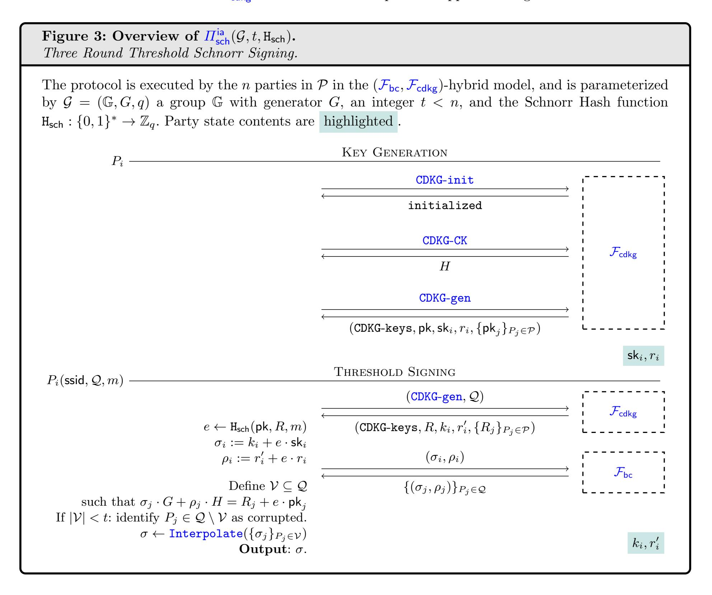

{0}------------------------------------------------

# <span id="page-0-1"></span><span id="page-0-0"></span>Adaptively Secure, Universally Composable Distributed Generation of Discrete-Logarithm Based Keys

Hanna Ek<sup>1</sup> , Kelsey Melissaris<sup>2</sup> , and Lawrence Roy<sup>3</sup>

<sup>1</sup> Chalmers University of Technology & University of Gothenburg, G¨oteborg, Sweden <sup>2</sup> Universit´e Paris Cit´e, CNRS, IRIF, Paris, France <sup>3</sup> Aarhus University, Aarhus, Denmark

Abstract. Distributed key generation (DKG) protocols enable a set of parties to distributively generate a threshold-shared key pair (pk,sk), such that at least t parties must participate to reconstruct the secret. We introduce the first DKG protocol for discrete-logarithm based keys that are both universally composable and adaptively secure without erasure, inconsistent players, interactive assumptions, or oracle-aided simulation.

Our contributions are as follows:

- 1. an adaptively secure and universally composable DKG that achieves guaranteed output delivery in three rounds assuming an honest majority,
- 2. an adaptively secure and universally composable committed DKG that realizes our novel committed DKG functionality, tolerates a full corruption threshold, and achieves identifiable abort in two rounds,
- 3. an adaptively secure and universally composable committed DKG that achieves guaranteed output in three rounds assuming an honest majority,
- 4. as an application, an incredibly simple threshold Schnorr protocol in the committed DKG-hybrid model–implying an adaptively secure and universally composable threshold Schnorr protocol tolerating a full corruption threshold with identifiable abort in three rounds, and an adaptively secure and universally composable threshold Schnorr protocol for an honest majority with guaranteed output in four rounds.

Most importantly, our DKG constructions are secure in the random oracle model under the DDH assumption. Our output guarantees are proven under the assumption of synchrony. All existing synchronous DKG protocols for discrete-logarithm based keys satisfy weaker security notions or require stronger assumptions.

{1}------------------------------------------------

# Table of Contents

| Ac | _                 | vely Secure, Universally Composable Distributed Generation of Discrete-Logarithm Based Keys 1                    |
|----|-------------------|------------------------------------------------------------------------------------------------------------------|
| _  |                   | nna Ek, Kelsey Melissaris, and Lawrence Roy                                                                      |
| 1  |                   | $\operatorname{oduction}$                                                                                        |
|    | 1.1               | The Challenge to Universally Composable Adaptive DKGs                                                            |
|    | 1.2               | Contributions                                                                                                    |
|    | 1.3               | Related Work                                                                                                     |
|    |                   | 1.3.1 Approaches to Adaptive Security 5                                                                          |
|    |                   | 1.3.2 The Most Recent Related Works                                                                              |
|    |                   | Table 1: Synchronous DKG Protocols                                                                               |
|    | 1.4               | Technical Overview                                                                                               |
|    |                   | 1.4.1 Intuition: Three Round Protocol                                                                            |
|    |                   | Figure 1: Overview of 3-Round DKG Protocol $\Pi_{dkg}^{go}$ with Guaranteed Output                               |
|    |                   | 1.4.2 Intuition: Committed DKG Protocol                                                                          |
|    |                   | Figure 2: Overview of 2-Round Committed DKG $\Pi_{cdkg}^{ia}$ with Identifiable Abort 12                         |
|    |                   | 1.4.3 Intuition: Threshold Schnorr                                                                               |
|    |                   | Figure 3: Overview of Threshold Schnorr Protocol $\Pi_{\text{sch}}^{\text{ia}}$                                  |
| 2  | D <sub>no</sub> 1 | iminaries                                                                                                        |
| 4  |                   |                                                                                                                  |
|    | 2.1               | Model                                                                                                            |
| 0  | 2.2               | Secret Sharing                                                                                                   |
| 3  |                   | ptive Zero Knowledge                                                                                             |
|    | 3.1               | Adaptive Non-Interactive Zero Knowledge                                                                          |
|    |                   | Figure 4: (Prv, Ver, $\mathcal{S}^{R}$ ), Adaptive NIZKs for Relations $\mathcal{R}_{pd}$ and $\mathcal{R}_{eq}$ |
|    | 3.2               | Universally Composable Adaptive Zero Knowledge                                                                   |
|    |                   | Figure 5: $\mathcal{F}_{azk}$ Adaptive Zero Knowledge Functionality                                              |
|    |                   | Figure 7: $\Pi_{azk}$ Adaptive Zero Knowledge Protocol                                                           |
|    |                   | Theorem 1: Adaptive UC Security of Adaptive Zero Knowledge Protocol                                              |
| 4  | Dist              | ributed Key Generation with Guaranteed Output Delivery                                                           |
|    | 4.1               | The Distributed Key Generation Functionality                                                                     |
|    |                   | Figure 8: $\mathcal{F}_{dkg}$ DKG Functionality                                                                  |
|    | 4.2               | Three Round DKG with Guaranteed Output Delivery                                                                  |
|    | . · ·             | Figure 9: $\Pi_{dkg}^{go}$ DKG Protocol with Guaranteed Output Delivery                                          |
|    |                   | Theorem 2: Adaptive UC-Security of DKG Protocol $\Pi_{dkg}^{go}$                                                 |
| ۲  | <b>C</b> .        | T W UNE                                                                                                          |
| 5  |                   | · ·                                                                                                              |
|    | 5.1               | The Committed DKG Functionality                                                                                  |
|    |                   | Figure 14: $\mathcal{F}_{cdkg}$ Committed DKG Functionality                                                      |
|    | 5.2               | Two Round Committed DKG Protocol with Identifiable Abort                                                         |
|    |                   | Figure 15: $\Pi_{cdkg}^{ia}$ Committed DKG Protocol with Identifiable Abort in Two Rounds 44                     |
|    |                   | Theorem 3: Adaptive UC-Security of Committed DKG Protocol $\Pi_{cdkg}^{ia}$                                      |
|    | 5.3               | Three Round Committed DKG Protocol with Guaranteed Output                                                        |
|    |                   | Figure 17: $\Pi_{cdkg}^{god}$ Committed DKG Protocol with Guaranteed Output in Three Rounds 55                   |
|    |                   |                                                                                                                  |
| C  | Λ 1               | Theorem 4: Adaptive UC-Security of Committed DKG Protocol $\Pi_{cdkg}^{god}$                                     |
| 6  |                   | ptively Secure Threshold Schnorr                                                                                 |
|    | 6.1               | The Ideal Threshold Schnorr Functionality                                                                        |
|    |                   | Figure 18: $\mathcal{F}_{sch}$ Schnorr Signing Functionality                                                     |
|    | 6.2               | Three Round Threshold Schnorr with Identifiable Abort                                                            |
|    |                   | Figure 19: $\Pi_{\text{sch}}^{\text{ia}}$ Schnorr Protocol with Identifiable Abort                               |
|    |                   | Theorem 5: Adaptive UC-Security of Schnorr Protocol                                                              |

{2}------------------------------------------------

### <span id="page-2-0"></span>1 Introduction

Distributed key generation (DKG) enables a set of n parties to jointly compute a public key pk with a (t, n)-threshold shared secret key sk. DKG protocols are fundamental to threshold cryptography, underpinning, e.g., threshold signatures [\[Des88;](#page-68-0) [DF90\]](#page-68-1), blockchain concensus mechanisms, and distributed systems [\[Gur+21;](#page-69-0) [KMS20;](#page-69-1) [Syt+17\]](#page-70-0), increasingly popular areas that have received overwhelming attention in recent years including formal standardization efforts by NIST [\[BP25\]](#page-67-0). Of particular interest is the generation of discrete-logarithm based keys [\[GJKR07\]](#page-69-2) in which the public key pk = skG is an element of a cyclic group, and the secret key is its' discrete logarithm. Many widely adopted digital signature schemes, such as BLS [\[BBS04\]](#page-66-0), Schnorr [\[Sch91\]](#page-70-1), ECDSA [\[GJKR96\]](#page-69-3), and their thresholdized variants [\[Bol03;](#page-67-1) [SS01\]](#page-70-2), have discrete logarithm based keys. DKG protocols [\[Ped92;](#page-70-3) [CGGMP20\]](#page-67-2) are primarily proven secure in the presence of static adversaries that corrupt parties prior to protocol execution. Security against more realistic, yet significantly stronger, adaptive adversaries that corrupt parties throughout the lifetime of a system has been proven in weaker models, via reductions to interactive assumptions, or incurr a security loss from not tight reductions (see Section [1.3](#page-4-0) and Table [1\)](#page-6-1).

#### <span id="page-2-1"></span>1.1 The Challenge to Universally Composable Adaptive DKGs

We study adaptively secure DKGs in one of the strongest possible model(s) for multiparty computation (MPC): the universal composition framework (UC) [\[Can01\]](#page-67-3), without erasures or relaxed composition theorems.[4](#page-2-2) The UC framework (see Section [2.1\)](#page-13-0) has become the "gold standard" for MPC security in many areas, as it provides strong guarantees for arbitrary composition from the requirement of straight-line simulation. Many existing statically secure DKGs inhabit a sort-of gray-area; there is seemingly no way to effectively simulate the protocol, but adaptive corruption does not appear to enable recovery of the secret key. This begs the following question: is there a natural way to describe the extra power adaptive corruption gives the adversary in such protocols?

We argue that MPC-in-the-head proofs of knowledge [\[IKOS07\]](#page-69-4) provide such a description. In the MPC-inthe-head framework a prover runs an MPC protocol that is required to be statically secure against less than t semi-honest corruptions in its head, i.e., by playing the part of every party in the execution. The prover then sends the protocol output and commitments to each party's view in the execution to the verifier. The verifier samples a random subset of t − 1 parties to (adaptively) corrupt, and the prover opens the commitments to the views of these parties for the verifier. A successfully cheating prover must correctly guess which subset of parties the verifier would choose to corrupt. Similarly, an adaptive adversary against an MPC protocol can first observe the protocol outputs then choose a subset of parties to adaptively corrupt. It seems that MPC-in-the-head can be built from protocols that cannot be simulated adaptively, as such a simulator could forge the corresponding MPC-in-the-head proof of knowledge. The parallel to MPC-in-the-head illuminates exactly what adaptive corruption provides to the adversary: the ability to prove knowledge of the secret key.

Specifying to DKG protocols, the MPC-in-the-head commitment to each party's view is essentially the view of the adversary in the DKG execution, including the public transcript of the the protocol and any private communication given to the adversary. As an example, a statically secure DKG might use Feldman VSS [\[Fel87\]](#page-68-2) to threshold-share a secret key. Feldman VSS publicly reveals perfectly binding commitments sk · G to each party's key share. If in this example the key is additively shared between two parties as sk = x + y, then x · G and y · G are published, where pk = xG + yG is the public key. These commitments are sufficient to prove soundness of the corresponding MPC-in-head proof of knowledge of sk. In fact, in the two-party case this proof-of-knowledge is equivalent to that in Schnorr's identification protocol with a 1-bit challenge space: x is the nonce, and based on the challenge the prover reveals either x or k − x. Adaptive corruption of real parties in an actual DKG execution can be used to convince a verifier (with soundness 1 2 ) that the adversary knows k, even though the adversary has only corrupted a single party and therefore should know nothing about k.

<span id="page-2-2"></span><sup>4</sup> Our protocols do use programmable random oracles.

{3}------------------------------------------------

Crites and Stewart [CS25] show that this process can be used to attack real protocols if a certain computational problem can be solved efficiently. Roughly, they show a generalization of this correspondence between Feldman VSS key shares and Schnorr proofs can be used to forge a signature by mapping the Schnorr challenge into a subset of parties to corrupt that will reveal the response to this challenge. This attack, on its own, is sufficient motivation for fully adaptive DKG protocols—a model in which such bad interaction between protocols cannot occur.

#### <span id="page-3-0"></span>1.2 Contributions

We present protocols for DKG with UC adaptive security assuming broadcast, a public key infrastructure (PKI), a programmable random oracle, and Decisional Diffie-Hellman (DDH).<sup>5</sup> Ours are the first DKG protocols for discrete-logarithm based keys that are UC-secure against adaptive adversaries without secure erasure, high security loss, or interactive assumptions (see Section 1.3 and Table 1).<sup>6</sup>

Our contributions are as follows:

- \* **Protocol**  $\Pi_{\text{dkg}}^{\text{go}}$ . A 3-round adaptive UC DKG that achieves guaranteed output delivery in the presence of an honest majority  $(t < \frac{n}{2})$  from DDH and NIZKs that satisfy zero knowledge against adaptive corruptions in the  $(\mathcal{F}_{bc}, \mathcal{F}_{pki}, \mathcal{F}_{ro})$ -hybrid model. Our protocol requires a one-time setup, after which parties can execute many three round distributed key generation subsessions. The protocol appears in Figure 9.
- \* Protocol  $\Pi_{\text{cdkg}}^{\text{ia}}$ . A 2-round adaptive UC committed DKG that achieves identifiable abort against a dishonest majority (t < n) from DDH and NIZKs that satisfy zero knowledge against adaptive corruptions in the  $(\mathcal{F}_{\text{azk}}, \mathcal{F}_{\text{bc}}, \mathcal{F}_{\text{pki}}, \mathcal{F}_{\text{ro}})$ -hybrid model. The protocol similarly requires a one time setup followed by many two round distributed key generation subsessions, and realizes our novel committed DKG functionality  $\mathcal{F}_{\text{cdkg}}$  that outputs perfectly hiding commitments to the secret key share of every party. The protocol appears in Figure 15.
- \* **Protocol**  $\Pi_{\text{cdkg}}^{\text{god}}$ . A 3-round adaptive UC committed DKG that achieves guaranteed output for an honest majority (t < n/2) from DDH and NIZKs that satisfy zero knowledge against adaptive corruptions in the  $(\mathcal{F}_{\text{azk}}, \mathcal{F}_{\text{bc}}, \mathcal{F}_{\text{pki}}, \mathcal{F}_{\text{ro}})$ -hybrid model. The protocol similarly requires a one time setup followed by many two round distributed key generation subsessions, and realizes our novel committed DKG functionality  $\mathcal{F}_{\text{cdkg}}$  that outputs perfectly hiding commitments to the secret key share of every party. The protocol appears in Figure 17.
- \* **Protocol**  $\Pi_{\text{sch}}^{\text{ia}}$ . An adaptive UC threshold Schnorr protocol in the  $(\mathcal{F}_{\text{bc}}, \mathcal{F}_{\text{cdkg}})$ -hybrid model with security from the DL assumption that preserves the output guarantees of whichever protocol realizes  $\mathcal{F}_{\text{cdkg}}$ ; for t < n protocol  $\Pi_{\text{sch}}^{\text{ia}}$  has identifiable abort when  $\mathcal{F}_{\text{cdkg}}$  is realized with identifiable abort, and for  $t < \frac{n}{2}$  protocol  $\Pi_{\text{sch}}^{\text{ia}}$  has guaranteed output delivery when  $\mathcal{F}_{\text{cdkg}}$  is realized with guaranteed output delivery. The protocol appears in Figure 19.

After a one-time setup we achieve a three-round DKG with guaranteed output delivery in the honest majority setting, and a two-round committed DKG with identifiable abort that tolerates the full corruption threshold. With the second protocol, we strengthen our results to realize a DKG functionality with *committed output*, where parties receive a fresh Pedersen commitments to every party's key shares.

Our DKG naturally lends itself to an almost trivial 3-round adaptive threshold Schnorr signing protocol (with identifiable abort): parties execute the DKG to generate a threshold-shared nonce R, hash to compute the challenge  $e \leftarrow H_{sch}(pk, R, m)$ , then open a linear combination of the key shares and the nonce shares:  $\sigma_i := sk_i + e \cdot r_i$ . We stress that  $H_{sch}$  is not assumed to be a random oracle; our protocols are adaptively secure without programming  $H_{sch}$ . We also stress that our protocol realizes a threshold signing functionality

<span id="page-3-1"></span><sup>&</sup>lt;sup>5</sup> We need to hash into the group, which means that we need a reverse sampling algorithm for it. Reverse sampling seems to be necessary to avoid non-black-box evaluation of group operations inside MPC; without the reverse sampling algorithm the simulator would instead have to program a representation of the group element into the random oracle or honest party messages, and decoding that representation would likely be non-black-box.

<span id="page-3-2"></span><sup>&</sup>lt;sup>6</sup> Excluding, of course, those constructions based on evaluating non-black-box group operations inside generic adaptively secure MPC.

{4}------------------------------------------------

(like [\[DKLs24\]](#page-68-4)), and not a threshold signature functionality (like [\[CGGMP20\]](#page-67-2)); we realize the stronger functionality that computes and outputs an honest Schnorr signature. Threshold signing functionalities are stronger, in that they guarantee the signatures output by the protocol behave in all respects exactly like honestly generated signatures, as opposed to exclusively modeling unforgeability.

There is one respect in which our DKG functionalities are potentially weaker: in order to save a round of communication in our identifiable abort protocol, we allow the adversary to choose their key shares after seeing the public key. This also means that we do not require the corrupted party key shares to be fully uniform, only the public key itself, as is relatively standard for DKG functionalities (see [\[Kat24\]](#page-69-5)). We note that our protocols could easily upgrade to fully random key shares by running a coin flip at the end to rerandomize the shares with a sharing of zero. Our application to Schnorr demonstrates that this functionality is still useful.

#### <span id="page-4-0"></span>1.3 Related Work

In Section [1.3.1](#page-4-1) we provide a broad overview of various tactics to prove adaptive security. We focus on the generation or use of discrete logarithm-based keys with adaptive security proven from standard assumptions without these tactics. In Section [1.3.2](#page-5-0) we focus on prior work that is closely related to ours—coincidentally, a series of works on threshold signature schemes. For a thorough review on DKG, please see this recent SoK [\[BK25\]](#page-67-4), from which many entries of Table [1](#page-6-1) were retrieved. We note that Table [1](#page-6-1) supports our claim that all known synchronous distributed generation of discrete-logarithm based keys protocols that are adaptively secure rely on either secure erasure, or the SIP framework.

<span id="page-4-1"></span>1.3.1 Approaches to Adaptive Security We discuss weakened functionalities, secure erasure, inconsistent players, and oracle-aided simulation.

Weakened Functionalities. One common approach is to prove adaptive security against a weakened DKG functionality that outputs commitments to each party's key share (e.g., skG) the simulator cannot otherwise simulate. See [\[Kat24\]](#page-69-5) for a recent work in this line. This approach allows for relatively simple protocols and straightforward simulators, but leakage of this share-related information can introduce problems to any higher-level protocol built on top, e.g., Schnorr threshold signatures become vulnerable to the Crites–Stewart attack briefly discussed above.

<span id="page-4-3"></span>Secure Erasure. Another natural approach to adaptive security is to require that honest parties erase any portions of their secret state that cannot be simulated. This way, any commitments produced as part of a protocol simulation that cannot be opened by the simulator in an ideal-world adaptive corruption similarly cannot be opened in a real-world adaptive corruption. Unfortunately, only short-term secrets and ephemeral random values can be erased; the secret key share of a party is required for meaningful use of the shared key, e.g., subsequent threshold signatures, and therefore cannot be erased. Unfortunately, this secret key share is exactly the value that is difficult to simulate. Thus, even assuming secure erasure, a DKG that reveals pk<sup>i</sup> := sk<sup>i</sup> ·G to all parties (for all shares ski) is not trivially adaptively secure. Despite this, erasure has been used to prove adaptive security of Schnorr threshold signatures [\[Mak22\]](#page-70-4). The assumption of secure erasure is reflected in the Assumptions column of Table [1.](#page-6-1)

Furthermore, secure erasure [\[CGJKR99\]](#page-68-5) is a seemingly strong assumption. It can be difficult to ensure that information is truly erased on modern systems, which include many levels of abstraction that are often not built for secure erasure. In general, compilers, operating systems, virtual machines, and even CPU architectures are designed and optimized for correctness, not to forget information whenever it's no longer needed.

<span id="page-4-2"></span>The Single Inconsistent Player. The single inconsistent player (SIP) technique, first proposed by [\[CGJKR99;](#page-68-5) [FMY99a;](#page-68-6) [FMY99b\]](#page-69-6) and subsequently adapted to the (SIP-)UC framework [\[AF04\]](#page-66-1), weakens simulation by allowing the simulator to fail if the adversary corrupts a single, randomly selected, honest party called 

{5}------------------------------------------------

the single inconsistent player. This technique is common for proving adaptive security in conjunction with various computational assumptions in a variety of security models [\[JL00;](#page-69-7) [LP01;](#page-70-5) [ADN06;](#page-66-2) [Bra+24;](#page-67-5) [GCRS25\]](#page-69-8) (see Table [1\)](#page-6-1). If the adversary's view is (computationally) independent of the identifier of the inconsistent player until its corruption then simulation at most reduces the adversary's advantage by (n − t + 1)/n (multiplicatively). This solution partially solves the problem and puts a polynomial bound on the impact of the MPC-in-the-head attack discussed in Section [1.1:](#page-2-1) it is only possible to forge proofs of knowledge that have soundness error at least (n − t + 1)/n. Proofs such as Schnorr with sufficiently low soundness error are likely not prohibitively less secure in this model, and for this reason SIP is often used in adaptively secure Schnorr threshold protocols. One technique that is not available in the UC framework to reduce security loss is rewinding. If the adversary issues corruption instructions that cannot be simulated then the simulator can rewind the adversary and try again with new choices. Note that rewinding is not compatible, in general, with even parallel composition.

The SIP-UC technique restricts composition; an SIP-UC secure protocol can only be composed with protocols executed by the same set of parties with the same inconsistent player. Multiple protocols running across distinct sets of parties would require the simulator to guess multiple inconsistent parties, incurring an exponential reduction in the probability of successful simulation. Referring back to our MPC-in-the-head parallel, this blow up potentially occurs because parallel repetition can be used to amplify soundness in Section [1.1;](#page-2-1) independent protocols, each allowing the forgery of some low soundness proof of knowledge (such as our kG = xG + yG example above), could be combined to achieve negligible soundness error in the ideal, yet forging each of the individual proofs results in a forgery of the overall scheme. The SIP framework is reflected in the Sec. Model column of Table [1;](#page-6-1) SIP-SA and SIP-UC standing for the stand-alone and UC variants, respectively.

<span id="page-5-1"></span>One-More Oracles, and Oracle-Aided Simulation. Another frequent approach to proving adaptive security is to give the simulator limited access to a discrete logarithm oracle, or an oracle that otherwise aids the simulator in producing the contents of the state of a newly corrupted party [\[BL22\]](#page-67-6). With t − 1 queries to a discrete logarithm oracle, a simulator can simulate commitments to key shares pk<sup>i</sup> such that these commitments interpolate to the targeted public key pk, and upon an adaptive corruption of a party query the oracle with pk<sup>i</sup> = sk<sup>i</sup> ·G to open the commitment, receiving the key share sk<sup>i</sup> . Oracle-aided simulatability is reflected as OA in the Model column of Table [1.](#page-6-1)

The One-More Discrete Logarithm (OMDL) assumption [\[BNPS03\]](#page-67-7) is an interactive, unfalsifiable variant of the Discrete Logarithm assumption (Def [1\)](#page-13-1) which states that no PPT adversary can compute the discrete logarithm of q group element challenges given access to an (inefficient) oracle for at most q − 1 discrete logarithms. The weaker Algebraic OMDL assumption (AOMDL) [\[NRS21\]](#page-70-6) requires the adversary to submit an algebraic representation of each query to the oracle, and therefore is falsifiable. Note that such an oracle significantly weakens the security of any protocol built on top, limiting composition. However, one can construct adaptively secure threshold signatures on top of a DKG that is secure under a one-more assumption [\[BLTWZ24;](#page-67-8) [Che25;](#page-68-7) [BLSW24\]](#page-67-9).

<span id="page-5-0"></span>1.3.2 The Most Recent Related Works. In this section we focus exclusively on adaptively secure protocols that generate or use discrete logarithm-based keys with security proven without the tactics outlined above in Section [1.3.1.](#page-4-1) Referring to Table [1](#page-6-1) and [\[BK25\]](#page-67-4), it is clear that there are no such DKG protocols straightforwardly. Instead, the most related recent works present unforgeable threshold signatures with adaptive security. In this section we discuss a series of works with a non-trivial intersection of authors [\[DR24;](#page-68-8) [BDLR25b;](#page-67-10) [BDLR25a\]](#page-66-3) that present and gradually improve upon a specific tactic for adaptive security. Each paper in the line of work focuses on game-based security of threshold signatures, as opposed to UC-security of DKG. We stress that an adaptively secure threshold signature does not imply an adaptively secure DKG under the same assumptions, whereas our adaptive DKG does imply an adaptively secure threshold signature as demonstrated in Section [6.](#page-56-2)

First, Das and Ren [\[DR24\]](#page-68-8) presented an adaptively secure existentially unforgeable (game-based EUF-CMA) threshold BLS signature scheme from the DDH and co-CDH in asymmetric pairing groups. The

{6}------------------------------------------------

<span id="page-6-1"></span>

| Protocol                      | Model  | t   | RC              | Assumptions            |
|-------------------------------|--------|-----|-----------------|------------------------|
| [CGJKR99]                     | SIP-SA | n/2 | $5 \cdot BC_n$  | SE, ZKP, DL            |
| [JL00]                        | SIP-SA | n/2 | $10 \cdot BC_n$ | aZKP, DDH              |
| [AF04]                        | SIP-UC | n/2 | $5 \cdot BC_n$  | DDH                    |
| [FMT24]                       | OA-SA  | n/2 | $2 \cdot BC_n$  | SE, NIZK, PKI, RO, DDH |
| This Work: $\Pi_{dkg}^{go}$   | UC     | n/2 | $3 \cdot BC_n$  | aNIZK, PKI, RO, DDH    |
| This Work: $\Pi_{cdkg}^{god}$ | UC     | n/2 | $3 \cdot BC_n$  | aNIZK, PKI, RO, DDH    |
| This Work: $\Pi_{cdkg}^{ia}$  | UC     | n   | $2 \cdot BC_n$  | aNIZK, PKI, RO, DDH    |

Table 1: Comparison of existing adaptively secure synchronous DKG protocols [BK25] to ours. Protocol  $\Pi_{dkg}^{go}$  is the DKG protocol in Figure 9 of Section 4, while  $\Pi_{cdkg}^{ia}$  and  $\Pi_{cdkg}^{god}$  are the committed DKG protocols of Figures 15 and 17 of Section 5. The **Model** column indicates the model: SA is stand-alone simulation, UC is universal composition, SIP is the addition of the single inconsistent player framework, and OA is oracle-aided simulation. The t column indicates the corruption threshold. The **RC** column indicates the round complexity of the protocol, where BC<sub>n</sub> is the round complexity of broadcast to n parties. The **Assumptions** columns indicate the assumptions: (a)ZKP denote (adaptive) interactive distributed verifier zero knowledge, (a)NIZK denote (adaptive) non-interactive zero knowledge, PKI is a public key infrastructure, RO is the random oracle model, DL is discrete-logarithm, DDH is decisional Diffie-Hellman, SE is secure erasure.

<span id="page-6-0"></span>assume an adaptively secure DKG, and present an adaptively secure DKG using SIP-based simulation (see SIP, above), which may make it seem unrelated at first glance. In an approach similar to ours, their DKG protocol uses a generalized Pedersen VSS—parties threshold share a random secret and two independent sharings of zero—but is proven adaptively secure using SIP-based simulation, as honest parties are bound to their random secrets in the first round. Their threshold BLS simulator programs a random oracle to output group elements that depend on the "target" signature—the target signature being the required output of the simulated protocol—in a manner that is similar to our DKG simulators.

Next, Bacho, Das, Loss and Ren presented Glacius [BDLR25b], an adaptive EUF-CMA threshold Schnorr scheme. The construction is proven to satisfy a novel game-based definition of identifiable abort in five rounds and tolerate a full corruption threshold (t < n), and can be compared to our protocol with identifiable abort. Subsequently the same authors presented Gargos [BDLR25a], a three round threshold Schnorr protocol with the same properties under the same assumptions. Both protocols are secure under the DDH assumption in the ROM, similarly to our protocols, and are proven secure via a simulation technique that programs a random oracle to output target-related group elements, similarly to our DKG simulator.

With respect to threshold signing, as an application of our DKG we present a threshold Schnorr signature protocol that is adaptively secure, requires 3 rounds, achieves identifiable abort and tolerates a full corruption threshold under the same assumptions (DDH + ROM). This scheme is UC-secure and realizes the threshold signing functionality, therefore achieves a stronger notion of security than the works discussed above. We note that our protocols are built atop a our committed DKG protocol that in turn relies on broadcast and a setup, two assumptions that are avoided in the above line of work.

#### <span id="page-6-2"></span>1.4 Technical Overview

Our setting is the following: the n parties in  $\mathcal{P}$  generate a public key  $\mathsf{pk} = \mathsf{sk}G$  in a group  $\mathcal{G} = (\mathbb{G}, G, q)$ . In Section 1.4.1, towards building intuition, we focus on the construction of our three round protocol with guaranteed output delivery  $\Pi_{\mathsf{dkg}}^{\mathsf{go}}$  that is overviewed in Figure 1. In Section 1.4.2 we discuss our two-round committed DKG  $\Pi_{\mathsf{cdkg}}^{\mathsf{ia}}$  that is presented in Figure 15.

<span id="page-6-3"></span><sup>&</sup>lt;sup>7</sup> While the authors conjecture that the scheme satisfies game-based identifiable abort and do not directly prove it, there is no reason to believe that the property is not satisfied.

{7}------------------------------------------------

#### <span id="page-7-0"></span>1.4.1 Intuition: Three Round Protocol We begin with our DKG protool of Section 4.

#### <span id="page-7-1"></span>Figure 1: Overview of $\Pi_{dkg}^{go}(\mathcal{G},t)$ . Three Round DKG with Guaranteed Output if t < n/2, Q = P, and $\mathcal{F}_{bc}$ has bounded delay. The protocol is executed by the n parties in $\mathcal{P}$ in the $(\mathcal{F}_{bc}, \mathcal{F}_{ro}, \mathcal{F}_{pki})$ -hybrid model, and is parameterized by $\mathcal{G} = (\mathbb{G}, G, q)$ a group $\mathbb{G}$ with generator G, and a number t < n/2. The pair $(\mathbb{H}_{\mathbb{G}}, \mathbb{H}_{sh})$ are random oracle instances. The pair (VSShare, VSVerify) is a VSS (Def 5). Proofs $\pi_i^{\mathsf{pd}}, \pi_i^{\mathsf{eq}}, \pi_{i,j}^{\mathsf{dh}}$ are NIZKs (Sec 3.1) for relations $\mathcal{R}_{pd}$ , $\mathcal{R}_{eq}$ , $\mathcal{R}_{dh}$ . Party state contents are highlighted. Set Up $P_i \xrightarrow{\qquad \qquad \qquad \qquad \qquad } k_i^{\mathsf{pki}} \leftarrow \mathbb{Z}_q; \ K_i := k_i^{\mathsf{pki}} \cdot G$ $(\mathtt{register}, k_i^\mathsf{pki}, K_i)$ $\mathcal{F}_{\mathsf{pki}}$ $r_i \leftarrow_{\$} \mathbb{Z}_q$ $(i, r_i)$ $\{(j,r_j)\}_{P_j\in\mathcal{P}\setminus\{P_i\}}$ $R := (1, r_1, \dots, n, r_n)$ $(H, H_u, H_v, H_w) := H_{\mathbb{G}}(R)$ $\mathbf{H} := (G, H_u, H_v, H_w)$ $k_i^{\mathrm{pki}}$ KEY GENERATION $P_i(\mathsf{ssid}, \mathcal{Q})$ -(retrieve, Q) $\mathcal{F}_{\mathsf{pki}}$ $\{(j,K_j)\}_{P_j\in\mathcal{Q}}$ $s_{i,0}, w_{i,0} \leftarrow_{\$} \mathbb{Z}_q \ (\mathbf{A}_i, (\mathsf{sh}_{i,j})_{P_j \in \mathcal{Q}}) \leftarrow \mathtt{VSShare}(\mathbf{H}, (s_{i,0}, w_{i,0}); \mathbf{r}_i^\mathsf{sh})$ $\pi_i^{\mathsf{pd}} \leftarrow \mathsf{Prv}(((G, H_w), A_{i,0})(s_{i,0}, w_{i,0}); r_i^{\mathsf{pd}})$ $\mathbf{A}_i, \pi_i^{\sf pd}, \{\mathsf{sh}_{i,j} \oplus \mathtt{H}_{\sf sh}(\mathsf{ssid},i,j,K_{i,j})\}_{P_j \in \mathcal{Q}}$ $\{\mathbf{A}_j, \pi_j^{\mathsf{pd}}, \{\mathsf{ct}_{j,k}\}_{P_k \in \mathcal{Q}}\}_{P_j \in \mathcal{Q}}$ $\mathcal{V} := \mathcal{Q}$ If $\operatorname{Ver}(\pi_j^{\operatorname{pd}}, ((G, H_w), A_{j,0})) = 0$ : $\mathcal{V} := \mathcal{V} \setminus \{P_j\}$ $\mathsf{sh}_{i,i} := \mathtt{H}_{\mathtt{sh}}(\mathsf{ssid}, j, i, K_{i,i})$ $b_{i,j} := \texttt{VSVerify}(\mathbf{H}, \mathbf{A}_j, \mathsf{sh}_{j,i}, i)$ For all $P_j \in \mathcal{V}$ such that $b_{i,j} = 0$ : $\mathcal{V} := \mathcal{V} \setminus \{P_j\}; \text{ Add BAD}_i \leftarrow (j, K_{i,j}, \pi_{i,j}^{\mathsf{dh}})$ for $\pi_{i,j}^{\mathsf{dh}} := \mathsf{Prv}((G, K_i, K_j, K_{i,j}), k_i^{\mathsf{pki}}; r_{i,j}^{\mathsf{dh}}).$ $BAD_i$ $\mathcal{F}_\mathsf{bc}$ Verify complaints $\{BAD_j\}_{P_j \in \mathcal{Q}}$ to define $\mathcal{V} \subseteq \mathcal{Q}$ $\{\mathtt{BAD}_j\}_{P_j\in\mathcal{Q}}$ $F := H_{\mathbb{G}}(\text{transcript of ssid}); \mathbf{F} := (G, F, H_v)$ $(s_i, u_i, v_i, w_i) := \sum_{P_j \in \mathcal{V}} \mathsf{sh}_{j,i}$ $C_i := (s_i, u_i, v_i, w_i) \cdot \mathbf{H}$ $B_i := (s_i, u_i, v_i) \cdot \mathbf{F}$ $\pi_i^{\mathsf{eq}} := \mathsf{Prv}((\mathbf{H}, \mathbf{F}, (B_i, C_i)), (s_i, u_i, v_i, w_i); r_i^{\mathsf{eq}})$ $(B_i,\pi_i^{\sf eq})$ $\mathcal{F}_\mathsf{bc}$ $\{(B_j,\pi_j^{\mathsf{eq}})\}_{P_j\in\mathcal{V}}$ Verify $\{\pi_j^{eq}\}_{P_j \in \mathcal{V}}$ to redefine $\mathcal{V}$ If $|\mathcal{V}| < t$ : abort. $pk := Interpolate(\{(j, B_j)\}_{P_j \in \mathcal{V}}), sk_i := s_i$ $k_i^{\mathsf{pki}}, (s_{i,0}, w_{i,0}), \mathbf{r}_i^{\mathsf{sh}}, r_i^{\mathsf{eq}}, \{r_{i,j}^{\mathsf{dh}}\}_{P_i \in \mathtt{BAD}_i}$ Output: $(pk, sk_i)$ .

Start with Feldman Verifiable Secret Sharing (VSS). Consider the following (insecure) protocol that constructs a DKG by requiring that all n concurrently execute a Feldman VSS [Fel87]. Each party  $P_i \in \mathcal{P}$ 

{8}------------------------------------------------

samples a uniform secret  $s_i \in \mathbb{Z}_q$  and sets the secret as the free term of a degree t-1 sharing polynomial  $S(X) = s_0 + \sum_{k=1}^{t-1} s_k X^k$  over  $\mathbb{Z}_q$ , as in Shamir threshold secret sharing. Then,  $P_i$  commits to the coefficients of the sharing polynomial  $C_k := s_k G$ , broadcasts the commitments  $(C_k)_{k \in [t-1]}$ , and privately distributes the threshold shares S(j) as the evaluation of the polynomial on the identifier of the party  $P_j \in \mathcal{P}$ . Once the shares  $S_j(i)$  are received from each  $P_j \in \mathcal{P}$ , the received shares can be verified against the broadcast commitments by evaluating the committed polynomial:

$$S_j(i)G = \sum_{k \in [t-1]} (i^k) \cdot C_{j,k}$$

If verification does not hold then the receiver  $P_i$  can broadcast a complaint against the dealing party  $P_j$ , and  $P_j$  responds to any complaints by broadcasting a verifying share for the complainant. Any party that was the subject of a complaint and did not respond with a verifying share is disqualified. At the end of the complaint phase parties define their secret key as the sum of the shares received from the remaining qualified parties  $\mathsf{sk} := \sum_j S_j(i)$ , and the resulting public key to be the sum of the commitments to the zero coefficients of those parties  $\mathsf{pk} := \sum_j C_{j,0}$ . This protocol [Ped91] has been proven to allow adversarial bias over  $\mathsf{pk}$ , which is often undesirable for public keys [GJKR99]. Furthermore, as discussed above, the broadcast commitments are perfectly binding to the secrets exchanged between any pair of parties; under the discrete logarithm assumption it is not possible for a simulator to open the commitment of every simulated party that the adversary may choose to corrupt.

Upgrading to Pedersen VSS. Now consider, as an alternative, a variant that uses Pedersen VSS [Ped92] in place of Feldman VSS, thereby replacing the perfectly binding commitments with perfectly hiding Pedersen commitments as in the first half of [GJKR99]. In this protocol parties sample uniform  $s_{i,0}, w_{i,0} \in \mathbb{Z}_q$  and set these values as the free terms of two degree t-1 sharing polynomials  $S_i(X) = s_{i,0} + \sum_{k=1}^{t-1} s_{i,k} X^k$  and  $W_i(X) = w_{i,0} + \sum_{k=1}^{t-1} w_{i,k} X^k$ . Then,  $P_i$  computes pedersen commitments to the coefficients  $B_{i,k} := s_{i,k}G + w_{i,k}H$ , broadcasts  $(B_{i,k})_{k \in [t-1]}$  and privately distributes the shares  $S_i(j), W_i(j)$  to each  $P_j \in \mathcal{P}$ . Received shares can be verified by evaluating the committed polynomial as above, and verification can similarly be followed by complaints and disqualification.

As described this variant cannot yet be used to generate a discrete-logarithm based public key because the resulting aggregate  $\mathsf{pk} = \sum_j B_{j,0} = \mathsf{sk}G + w'H$  has a non-zero randomness component  $w' = \sum_j w_{j,0}$ . The randomness component is generally solved by following the above with a round of Feldman VSS [GJKR03]; Pedersen VSS is used to eliminate bias over  $\mathsf{pk}$  but must be followed by a round in which parties "reveal" the public key by removing this randomness w' in some way. For Pedersen VSS to be useful for us this opening phase must also be adaptively secure, precluding the standard Feldman VSS second round due to the discussion above.

If the Pedersen commitment randomness  $w_{j,0}$  of each party  $P_j$  is sampled such that the aggregate w'=0, i.e., if the randomness of the VSS commitments are additive shares of 0, then the resulting protocol could potentially achieve some form of adaptive security. Straightforwardly, this does not immediately work; setting the randomness of each individual party to  $0=w_{j,0}$  binds the parties to their secret shares  $s_{j,0}$  and reintroduces bias over pk. Instead, this is used as our "reveal" phase in the following protocol.

Three Generator VSS First. To eliminate the possibility of bias over the key we consider Pedersen VSS with correlated commitment randomness, as immediately above, as the second round in which the public key pk is revealed. In the first phase, each  $P_i \in \mathcal{P}$  samples uniform  $s_{i,0}, w_{i,0} \in \mathbb{Z}_q$  and sets these secrets as the free terms of two degree t-1 sharing polynomials  $S_i(X) = s_{i,0} + \sum_{k=1}^{t-1} s_{i,k} X^k$  and  $W_i(X) = w_{i,0} + \sum_{k=1}^{t-1} w_{i,k} X^k$ . In addition, parties compute a degree t-1 sharing of 0 as  $U_i(X) = \sum_{k=1}^{t-1} u_{i,k} X^k$ . Parties then compute pedersen commitments to the coefficients  $A_{i,k} := s_{i,k} G + u_{i,k} H_u + w_{i,k} H_w$ , broadcast the commitments  $(A_k)_{k \in [t-1]}$  and privately distribute the shares  $S_i(j), U_i(j), W_i(j)$  to  $P_j \in \mathcal{P}$ . Received shares are verified by evaluation, as above, and verification is followed by complaints and disqualifications.

{9}------------------------------------------------

Then, parties execute the Pedersen VSS as above. If after this initial phase the parties were to open their commitments  $A_{i,k}$  to commitments  $(B_{i,k} := s_{i,k}G + u_{i,k}H_u)_{k \in [t-1]}$  the resulting zero commitments  $B_{i,0} = s_{i,0}G$  are still binding.

A Crucial Observation. The problem with effectively simulating the above protocol is not that the commitments are binding, but instead the commitments bind the simulator  $\mathcal{S}$  to values that it cannot produce. If we adjust how these generators are computed then we solve the real problem.

Observe that at the point that the public key pk must be revealed in the protocol (let's say after the first 3-generator VSS above) the simulator S has received pk from the ideal functionality F. Therefore if, at this point, the second commitments are opened with respect to a new set of group elements (G, F) that depend on pk as below then S can compute the Pedersen opening for any potentially corrupted party. Between the first and the second phases above—the three and two generator VSS—parties query a random oracle on the transcript of the protocol thus far to receive a group element  $F \in \mathbb{G}$  that is unpredictable until S receives pk from F. In our security proof our simulator S programs F such that  $pk = sG + \alpha F$  for uniform  $s, \alpha \in \mathbb{G}$ , then simulates the second round of the protocol such that the parties actually share  $(s, \alpha)$  as the scalars of G, F instead of (sk, 0) as the scalars of  $G, H_u$ .

Security is apparent once we note that on the t-th corruption, the corruption at which an adversary would notice that the collection of t corrupted party shares reconstruct the pair  $(s, \alpha)$  and not (sk, 0), is the corruption at which S receives sk from F. This then allows S to compute  $\log_G(F)$  and equivocate the honest party commitments in order to simulate; to the adversary it looks like sk was shared in the exponent of G and S0 was shared in the exponent of S1 throughout the protocol execution.

A Stronger Functionality. We realize a DKG functionality that outputs secret key shares  $\mathsf{sk}_i$  to each of the parties in each DKG subsession. As we are in the UC framework, this means that the environment  $\mathcal{Z}$  sees the inputs and outputs of all of the parties, even the honest parties. The above protocol does not yet have enough degrees of freedom for  $\mathcal{S}$  to ensure that the openings match the outputs already seen by  $\mathcal{Z}$ ;  $\mathcal{S}$  can explain the output of any newly corrupted party, but not in a manner that is consistent with the secret key share  $\mathsf{sk}_i$  already output to the environment. To this end, we add another group generator.

Four Generators:  $\Pi_{\mathsf{dkg}}^{\mathsf{go}}$  at a High Level. In this version, parties sample uniform  $s_{i,0}, w_{i,0} \in \mathbb{Z}_q$  and set these secrets to be the free terms of two degree t-1 sharing polynomials  $S_i(X) = s_{i,0} + \sum_{k=1}^{t-1} s_{i,k} X^k$  and  $W(X) = w_{i,0} + \sum_{k=1}^{t-1} w_{i,k} X^k$ , then compute two degree t-1 sharings of 0 as  $U_i(X) = \sum_{k=1}^{t-1} u_{i,k} X^k$  and  $V_i(X) = \sum_{k=1}^{t-1} v_{i,k} X^k$ . Parties compute pedersen commitments to the coefficients  $A_{i,k} := s_{i,k} G + u_{i,k} H_u + v_{i,k} H_v + w_{i,k} H_w$ , broadcast  $(A_{i,k})_{k \in [t-1]}$  and privately distribute the shares  $S_i(j), U_i(j), V_i(j), W_i(j)$  to each  $P_j \in \mathcal{P}$ . Received shares are verified by evaluation, as above, and verification is followed by complaints and disqualifications. After complaints, parties query a random oracle instance on the transcript of the subsession to determine the generator F. In a third round parties broadcast the single aggregate commitment  $B_i := s_i G + u_i F + v_i H_v$  for the aggregate  $s_i := \sum_j S_j(i), u_i := \sum_j U_j(i), v_i := \sum_j V_j(i)$ . The set of  $B_i$  interpolate to  $\mathsf{sk}G + 0F + 0H_v$ , but can be opened by our simulator  $\mathcal{S}$  upon an adaptive corruption.

Adaptive Zero Knowledge. This basis change requires parties to prove in zero knowledge that their commitment  $B_i$  matches the aggregate commitment to the shares received in the first round  $C_i := \sum_j \sum_{k \in [t-1]} (i^k) \cdot A_{j,k}$ . To this end, we discuss non-interactive zero knowledge proofs that satisfy the additional requirement of security against adaptive corruption; there must exist a simulator that can produce the randomness used to produce any simulated proofs for security against adaptive corruptions. In fact, the relations that are relevant to our protocols can be proven with Fiat-Shamir transformed  $\Sigma$ -protocols, and therefore (almost trivially) satisfy this style of security against adaptive corruption of a simulated prover. We discuss this in Section 3, and present a simple adaptive zero knowledge functionality  $\mathcal{F}_{\mathsf{azk}}$  to model straightline extractable NIZKPoKs.

{10}------------------------------------------------

Share Distribution. In our protocol, pairs of parties exchange shares in every subsession. To achieve this with adaptive security we again leverage the random oracle model. Each pair of parties  $P_i, P_j \in \mathcal{P}$  share a secret  $K_{i,j}$  and, in every subsession ssid, use the one-time-pad to encrypt these shares:

$$\mathsf{ct}_{i,j} := (S_i(j), [\cdots]) \oplus \mathtt{H}_{\mathtt{sh}}(\mathsf{ssid}, i, j, K_{i,j}).$$

Given that  $H_{sh}$  is a random oracle, the simulator can simply program the random oracle given that it can compute the shares exchanged between a pair of honest parties prior to an adaptive corruption. There are many options for how parties can exchange their pairwise secrets  $K_{i,j}$ , most notably either (1) each party locally stores n-1 shared secrets for share distribution, or (2) parties derive the n-1 shared secrets on the fly in each subsession given access to a public key infrastructure  $\mathcal{F}_{pki}$ . We choose (2) which allows us to simultaneously simplify our complaints. Therefore, we introduce a Set Up.

Set  $Up \, \mathcal{E} \, Verifiable \, Complaints$ . During setup each party  $P_i \in \mathcal{P}$  registers a discrete-logarithm based public key  $K_i = k_i^{\mathsf{pki}} \cdot G$  with  $\mathcal{F}_{\mathsf{pki}}$  and in every subsession  $P_i$  retrieves the relevant public keys and computes, for every  $P_j$  the shared secret  $K_{i,j} := k_i^{\mathsf{pki}} \cdot K_j$  as a Diffie-Hellman key. This then allows each party  $P_i$  to issue verifying complaints by broadcasting  $K_{i,j}$  along with a proof of correctness of the shared key whenever the other party  $P_j$  distributed a share that does not verify. We thereby eliminate the need for a response round. We note that it is not known how to eliminate the complaint round with adaptive security, as a publicly verifiable VSS is not yet known. This is exactly where the security of our protocols reduces to DDH.

Random Oracle Instead of a CRS. For the generation of group elements  $H_u, H_v, H_w \in \mathbb{G}$ , we have two options (1) use a CRS functionality  $\mathcal{F}_{crs}$ , or (2) have parties generate these elements as the output of an instance of  $\mathcal{F}_{ro}$  during Set Up. We opt for (2) but note that security holds in both cases. To this end, parties broadcast random strings  $r_i$  after registering their public key during Set Up. The randomness is used as input to  $H_{\mathbb{G}}$  to compute the group elements that otherwise would be contained within the CRS. Therefore, the adversary can rejection sample the VSS commitment keys.

<span id="page-10-0"></span>1.4.2 Intuition: Committed DKG Protocol Our committed DKG functionality  $\mathcal{F}_{cdkg}$  is essentially the same as our functionality  $\mathcal{F}_{dkg}$ , except that the functionality additionally outputs independent random Pedersen commitments to each secret key share. This is to ensure that our DKG functionalities are useful in higher-level protocols; given commitments to the secret key shares parties can prove, e.g., the correctness of partial signatures, against these commitments.

Essentially, the protocol executes the second and third rounds of the three-round variant concurrently; parties either broadcast a complaint or their third round message. As this protocol is secure against a dishonest majority, i.e., has a full corruption threshold t < n, we must incorporate straightline extractable proofs via  $\mathcal{F}_{\mathsf{azk}}$  to aid in simulation. In  $\Pi_{\mathsf{dkg}}^{\mathsf{go}}$  our simulator can reconstruct the secrets of the corrupted party from the honest majority of shares in the VSS, but this is not possible for  $\Pi_{\mathsf{cdkg}}^{\mathsf{ia}}$ .

<span id="page-10-1"></span><sup>&</sup>lt;sup>8</sup> Given a DL-based adaptively secure approach to share distribution, security of our protocols would no longer have to rely on the DDH assumption.

{11}------------------------------------------------

## Figure 2: Overview of $\Pi_{\mathsf{cdkg}}^{\mathsf{ia}}(\mathcal{G},t)$ .

Two Round Committed DKG with Identifiable Abort if t < n, Q = P, and  $\mathcal{F}_{bc}$  has bounded delay.

<span id="page-11-0"></span>The protocol is executed by the n parties in  $\mathcal{P}$  in the  $(\mathcal{F}_{\mathsf{azk}}, \mathcal{F}_{\mathsf{bc}}, \mathcal{F}_{\mathsf{ro}}, \mathcal{F}_{\mathsf{pki}})$ -hybrid model (Sec 2.1). Parameters are a group  $\mathcal{G} = (\mathbb{G}, G, q)$ , and the threshold t < n. The pair  $(\mathsf{H}_{\mathbb{G}}, \mathsf{H}_{\mathsf{sh}})$  are random oracle instances. The pair  $(\mathsf{VSShare}, \mathsf{VSVerify})$  is a VSS (Def 5). Proofs  $\pi_i^{\mathsf{eq}}, \pi_{i,j}^{\mathsf{dh}}$  are NIZKs (Sec 3.1) for relations  $\mathcal{R}_{\mathsf{eq}}, \mathcal{R}_{\mathsf{dh}}$ . Functionality  $\mathcal{F}_{\mathsf{azk}}$  proves statements include  $\mathcal{R}_{\mathsf{eq}}, \mathcal{R}_{\mathsf{eqm}}$ . Modifications for the committed property are highlighted. Party state contents are highlighted.

$$P_{i} \xrightarrow{k_{i}^{\text{pid}}} \leftarrow \mathbb{Z}_{q}; K_{i} := k_{i}^{\text{pid}} \cdot G \qquad \text{(register, } k_{i}^{\text{pid}}, K_{i}) \qquad , \qquad F_{\text{pid}}$$

$$P_{i} \leftarrow \mathbb{Z}_{q}; K_{i} := k_{i}^{\text{pid}} \cdot G \qquad \text{(register, } k_{i}^{\text{pid}}, K_{i}) \qquad , \qquad F_{\text{pid}}$$

$$R := (1, r_{1}, \dots, n, r_{n}) \qquad \{(j, r_{3})\}_{P_{j} \in \mathcal{P} \setminus \{P_{i}\}} \qquad , \qquad F_{\text{be}}$$

$$R := (1, r_{1}, \dots, n, r_{n}) \qquad \{(j, r_{3})\}_{P_{j} \in \mathcal{P} \setminus \{P_{i}\}} \qquad , \qquad F_{\text{be}}$$

$$G := (G, H), \mathbf{H} := (G, H_{n}, H_{n}, H_{n}) \qquad \text{(retrieve, } Q) \qquad \qquad Key Generation$$

$$P_{i}(\text{ssid}) \qquad \qquad (\text{retrieve, } Q) \qquad \qquad (f_{i}, K_{i})\}_{P_{j} \in \mathcal{Q}} \qquad \qquad (f_{i}, K_{i})\}_{P_{j} \in \mathcal{Q}} \qquad \qquad (f_{i}, K_{i})\}_{P_{j} \in \mathcal{Q}} \qquad \qquad (f_{i}, K_{i})\}_{P_{j} \in \mathcal{Q}} \qquad \qquad (f_{i}, K_{i})\}_{P_{j} \in \mathcal{Q}} \qquad \qquad (f_{i}, K_{i})\}_{P_{j} \in \mathcal{Q}} \qquad \qquad (f_{i}, K_{i}, K_{i})\}_{P_{j} \in \mathcal{Q}} \qquad \qquad (f_{i}, K_{i}, K_{i})\}_{P_{j} \in \mathcal{Q}} \qquad (f_{i}, K_{i}, K_{i})\}_{P_{j} \in \mathcal{Q}} \qquad \qquad (f_{i}, K_{i}, K_{i})\}_{P_{j} \in \mathcal{Q}} \qquad \qquad (f_{i}, K_{i}, K_{i})\}_{P_{j} \in \mathcal{Q}} \qquad \qquad (f_{i}, K_{i}, K_{i})\}_{P_{j} \in \mathcal{Q}} \qquad \qquad (f_{i}, K_{i}, K_{i})\}_{P_{j} \in \mathcal{Q}} \qquad \qquad (f_{i}, K_{i}, K_{i})\}_{P_{j} \in \mathcal{Q}} \qquad \qquad (f_{i}, K_{i}, K_{i})\}_{P_{j} \in \mathcal{Q}} \qquad \qquad (f_{i}, K_{i}, K_{i})\}_{P_{j} \in \mathcal{Q}} \qquad \qquad (f_{i}, K_{i}, K_{i})\}_{P_{j} \in \mathcal{Q}} \qquad \qquad (f_{i}, K_{i}, K_{i})\}_{P_{j} \in \mathcal{Q}} \qquad \qquad (f_{i}, K_{i}, K_{i})\}_{P_{j} \in \mathcal{Q}} \qquad \qquad (f_{i}, K_{i}, K_{i}, K_{i})\}_{P_{j} \in \mathcal{Q}} \qquad \qquad (f_{i}, K_{i}, K_{i}, K_{i}), K_{i}, K_{i}, K_{i})$$

$$P_{i} := P_{i} := P_{i} := P_{i} := P_{i} := P_{i} := P_{i} := P_{i} := P_{i} := P_{i} := P_{i} := P_{i} := P_{i} := P_{i} := P_{i} := P_{i} := P_{i} := P_{i} := P_{i} := P_{i} := P_{i} := P_{i} := P_{i} := P_{i} := P_{i} := P_{i} := P_{i} := P_{i} := P_{i} := P_{i} := P_{i} := P_{i} := P_{i} := P_{i} := P_{i} := P_{i} := P_{i} := P_{i} := P_{i} := P_{i} := P_{i} := P_{i} := P_{i} := P_{i} := P_{i} := P_{i} := P_{i} := P_{i} := P_{i} := P_{i} := P_{i} := P_{i} := P_{i} := P_{i} := P_{i} := P_{i} := P_{i} := P_{i} := P_{i} := P_{i} := P_{i} := P_{i} := P_{i} := P_{i} := P_{i} := P_{i} := P_{i} := P_{i} := P_{i} := P_{i} := P_{i} := P_{i} := P_{i}$$

{12}------------------------------------------------

<span id="page-12-0"></span>1.4.3 Intuition: Threshold Schnorr Our threshold Schnorr protocol  $\Pi_{\text{sch}}^{\text{ia}}$  is incredibly simple, and demonstrates the usesfulness of  $\mathcal{F}_{\text{cdkg}}$ . An overview of our protocol appears in Figure 3.

<span id="page-12-1"></span>

#### <span id="page-12-2"></span>2 Preliminaries

Notation. Protocols are executed by a set of parties  $\mathcal{P}$ . For ease, we say that if  $\mathcal{P}$  is of size n then the identifiers of these parties cover the interval [1, n]. The protocol transcript is denoted as trans, and within each round the set of messages are ordered based on the sender identifiers instead of the order of receipt. The sets  $\mathcal{C}$  and  $\mathcal{H}$  denote the set of corrupted and honest parties, respectively.

Vectors  $\mathbf{v} = (v_1, \dots, v_k)$  are bold. We denote an inclusive range as  $[a, b] := \{a, \dots, b\}$ . Assigning the variable x to take the value y is be written both left to right x := y and right to left y =: x. Uniformly sampling x from a finite set is denoted  $x \leftarrow_{\$} \mathcal{S}$ . Computing x as the output of a randomized process is denoted  $x \leftarrow_{\$} \mathcal{S}$ .

{13}------------------------------------------------

Groups are written additively. For a vector of scalars  $\mathbf{e} = (e_1, \dots, e_k) \in \mathbb{Z}_q^k$  and a vector of group elements  $\mathbf{G} = (G_1, \dots, G_k) \in \mathbb{G}^k$ , we denote multi-multiplication by  $\mathbf{e} \cdot \mathbf{G} = (e_1 G_1, \dots, e_k G_k)$ . We assume a generic group generation algorithm  $\mathcal{G}(\lambda)$  that takes as input the security parameter and outputs public parameters  $\mathcal{G} = (\mathbb{G}, G, q)$  that describe a cyclic group  $\mathbb{G}$  of order q (with  $||q|| = \lambda$ ) with generator  $G \in \mathbb{G}$ .

Helper Functions. Our constructions switch between equivalent representations of polynomials  $P(X) \in \mathbb{Z}_q[X]$ . The function Coeff takes as input a vector of polynomials and outputs vectors of coefficients (in a manner that are compatible with the description of our VSS algorithm, presented in Definition 5).

$$\operatorname{Coeff}\left(\left(s_i + \sum_{k \in [1, t-1]} r_{i,k} X^k\right)_{i \in [\ell]}\right) \to \begin{pmatrix} \mathbf{s} = (s_i)_{i \in [\ell]}; \\ \mathbf{r} = (r_{i,1}, \dots, r_{i,t-1})_{i \in [\ell]} \end{pmatrix}$$

Computational Assumptions. We recall the Discrete Logarithm and Decisional Diffie-Hellman Assumptions in Definitions 1 and Definition 2, respectively.

<span id="page-13-1"></span>**Definition 1 (Discrete Logarithm (DL) Assumption).** Let GG be a group sampling algorithm. The discrete logarithm assumption states that for all  $\lambda \in \mathbb{N}$ , for all PPT adversaries  $\mathcal{A}$  there exists a negligible function  $\mathsf{negl}(\cdot)$  such that:

<span id="page-13-4"></span><span id="page-13-2"></span>
$$\Pr\left[H = e \cdot G \middle| \begin{array}{c} \mathcal{G} := (\mathbb{G}, q) \leftarrow \mathsf{GG}(1^{\lambda}) \\ G, H \leftarrow_{\$} \mathbb{G} \\ e \leftarrow \mathcal{A}(\mathcal{G}, (G, H)) \end{array}\right] \leq \mathsf{negl}(\lambda). \tag{1}$$

If the DL assumption holds for GG then we say that the DL problem is hard relative to GG.

<span id="page-13-5"></span>**Definition 2 (Decisional Diffie-Hellman (DDH) Assumption).** Let GG be a group sampling algorithm. The Decisional Diffie-Hellman assumption is that for all  $\lambda \in \mathbb{N}$  and for all PPT adversaries  $\mathcal{A}$  there exists a negligible function negl such that:

<span id="page-13-3"></span>
$$\begin{vmatrix} \frac{1}{2} - \Pr & b' = b \end{vmatrix} \begin{vmatrix} b \leftarrow_{\$} \{0, 1\} \\ \mathcal{G} := (\mathbb{G}, G, q) \leftarrow \mathsf{GG} \\ x, y \leftarrow_{\$} \mathbb{Z}_q \\ if \ b = 0 : z \leftarrow_{\$} \mathbb{Z}_q \\ if \ b = 1 : z := x \cdot y \\ b' \leftarrow \mathcal{A}(\mathcal{G}, x \cdot G, y \cdot G, z \cdot G) \end{vmatrix} \leq \mathsf{negl}(\lambda).$$

If the DDH assumption holds for GG then we say that the DDH problem is hard relative to GG.

#### <span id="page-13-0"></span>2.1 Model

Our protocols are written in the UC framework of Canetti [Can01]. Informally, in the UC framework a cryptographic task is modeled as an ideal functionality  $\mathcal{F}$  that functions as a trusted third party which performs the computation on behalf of the set of parties with the secrets of the parties. Security is simulation-based; a protocol  $\Pi$  is said to UC-realize an ideal functionality  $\mathcal{F}$  if for any real world adversary  $\mathcal{A}$  against  $\Pi$  there exists a simulator  $\mathcal{S}$  such that any environment  $\mathcal{Z}$  cannot distinguish an execution in the ideal world with  $(\mathcal{F}, \mathcal{S})$  from an execution in the real world with  $(\Pi, \mathcal{A})$ . Essentially, a proof of UC security proves that a protocol is as good as the ideal functionality and therefore any instagnce of  $\mathcal{F}$  can be replaced with an instance of  $\Pi$ .

{14}------------------------------------------------

Adaptive Corruptions in UC. On the adaptive corruption of an honest party P<sup>i</sup> ∈ P the environment Z receives the secret state st<sup>i</sup> of P<sup>i</sup> . An adaptive corruption can occur at any point, and st<sup>i</sup> must explain any output of P<sup>i</sup> in the view of Z. Specifically, st<sup>i</sup> should contain the history of the input, output, work, and random tapes of P<sup>i</sup> , and is sent to Z through A. We informally describe the flow of information during an adaptive corruption, where all communication between Z and A<sup>∗</sup> in the ideal world, or A in the real world, is passed through a control function. In the real world, the environment Z issues a corruption instruction (corrupt, i) to an honest party P<sup>i</sup> through the real world adversary A. The honest party P<sup>i</sup> then outputs the read contents of each tape to A. In the ideal world, the environment Z issues a corruption instruction (corrupt, i) to an honest party P<sup>i</sup> through the copy of A ran by the ideal world adversary A<sup>∗</sup> (the simulator S). The ideal adversary issues the corruption instruction to the ideal functionality F and in response receives some information sec<sup>i</sup> about the secret contents of st<sup>i</sup> maintained by F on behalf of P<sup>i</sup> . The remainder of sti is computed by A<sup>∗</sup> before being returned to Z through A. For simplicity, observe that to prove adaptive security it is sufficient for S to compute the state contents that are sufficient to recompute the entire state of the party.

There are some additional technicalities about adaptive corruption in UC. Primarily, we require consistency of corruption; it is required that the parties corrupted by A<sup>∗</sup> are exactly those corrupted by Z, which can be enforced by, e.g., requiring that F output corrupted to a newly corrupted P<sup>i</sup> in the ideal world, and adding to the protocol description that P<sup>i</sup> similarly output corrupted once corrupted in the real world. This same issue arises when considering static adversaries. In the static case these machines should all agree on the set of corrupted parties prior to protocol execution. Similarly to the static case we assume that this agreement is enforced in some manner.

<span id="page-14-2"></span>Output Guarantees in UC. A protocol satisfies guaranteed output delivery (GOD) if the adversary cannot prevent parties from computing output in a protocol execution. A protocol satisfies identifiable abort (IA) if the honest parties are guaranteed to identify a corrupted party in the event that the protocol does not deliver output. Modeling such output guarantees (GOD or IA) in UC is not straightforward. The UC model consists of a set of interacting Turing machines (ITMs), and is inherently single-threaded; only a single ITM is running at any time, and this ITM it can pass activation on to other parties. When honest parties activate the functionality with their input the functionality activates the simulator (to simulate the corrupt parties' views). The simulator may never return activation to the functionality, in which case the functionality does not provide output to the honest parties. Formally proving, e.g., GOD, requires proving that the simulator always returns activation to the functionality.

Katz, Maurer, Tackmann and Zikas [\[KMTZ13\]](#page-70-8) provide an alternative approach to modeling synchronous termination guarantees in UC by requiring the functionality to deliver output if queried by the honest parties enough times. Their approach is notationally dense and we believe it could distract the reader from our contributions. To provide output guarantees we take the pedestrian approach; we prove that the simulator always activates the functionality to provide output if the underlying broadcast channel receives enough activations to guarantee that it produces output. While simple and sound, this methodology has one downside: not all properties of our protocols are reflected in the ideal functionality.

<span id="page-14-3"></span>Hybrid Functionalities. Each of our protocols assumes that parties have ideal access to a subset of the following functionalities.

[F](#page-20-1)azk. Our adaptive zero knowledge functionality is detailed in Section [3.2.](#page-20-0)

<span id="page-14-0"></span>[F](#page-14-0)bc. The broadcast functionality [F](#page-14-0)bc has a single interface. The output guarantees of our protocols are proven under the condition that [F](#page-14-0)bc guarantees the delivery of all messages, meaning that the channel has a bounded delay (see [Output Guarantees in UC\)](#page-14-2), but this is not required for security in general.

– broadcast: This query takes as input a message m, leaks m to A<sup>∗</sup> , then outputs (broadcast, i, m) to P at the adversary's discretion.

<span id="page-14-1"></span>[F](#page-14-1)pki. The public key infrastructure (PKI) functionality models a PKI in which each party must prove knowledge of their secret key to register. The functionality has two interfaces:

{15}------------------------------------------------

- PKI-register: Key registration can be queried a single time by any  $P_i \in \mathcal{P}$ . The query includes a party index such that  $P_i \in \mathcal{P}$  the public key  $\mathsf{pk}_i$  and the secret key  $k_i^{\mathsf{pk}_i}$ . The functionality records  $(P_i, \mathsf{pk}_i)$ .
- PKI-fetch: Key retreival can be queried by any  $P \in \mathcal{P}$  takes as input a set of parties  $\mathcal{Q} \subseteq \mathcal{P}$ , and outputs any recorded keys for the parties in the set.

<span id="page-15-1"></span> $\mathcal{F}_{ro}$ . The programmable random oracle functionality is parameterized by an output space  $\mathcal{Y}$  and has a single interface. To ease notation the instance  $\mathcal{F}_{ro}(\mathcal{Y})$  is denoted  $H_{\mathcal{Y}}$ .

- get-RAND: This query takes as input x and outputs a consistent, uniformly random output y, sampled on the first query of x.

#### <span id="page-15-0"></span>2.2 Secret Sharing

A common and useful tool in DKG protocols is verifiable secret sharing (VSS). We recall the relevant concepts in this section.

Commitments. The pedersen commitment scheme [Ped92] in a cyclic group  $\mathbb G$  of prime order q for messages  $\mathbf e \in \mathbb Z_q^\ell$  of length  $\ell$  is presented in Definition 3. Pedersen's commitment scheme is both perfectly hiding; a computationally unbounded attacker cannot learn anything about the message  $\mathbf e$  given  $(\mathbf H, \mathsf{Commit}(\mathbf H, \mathbf e))$ . The scheme is computationally binding under the DL assumption in  $\mathbb G$ ; any PPT adversary cannot output two distinct messages  $\mathbf e, \mathbf e' \in \mathbb Z_q^\ell$  such that  $\mathsf{Commit}(\mathbf H, \mathbf e) = \mathsf{Commit}(\mathbf H, \mathbf e')$ .

<span id="page-15-3"></span>**Definition 3 (Pedersen Commitment).** The pedersen commitment scheme in a group  $\mathbb{G}$  of order q for  $\ell$  messages in  $\mathbb{Z}_q$  is described by the pair of algorithms below.

 $\begin{aligned} & \operatorname{Commit}(\mathbf{H}, \mathbf{e}) \to C. \ \ \textit{On inputs} \ \mathbf{H} \in \mathbb{G}^{\ell} \ \textit{and} \ \mathbf{e} \in \mathbb{Z}_q^{\ell}, \ \textit{output} \ C := \mathbf{e} \cdot \mathbf{H}. \\ & \operatorname{ComVerify}(\mathbf{H}, \mathbf{e}, C) \to \{0, 1\}. \ \ \textit{On inputs} \ \mathbf{H} \in \mathbb{G}^{\ell}, \ \mathbf{e} \in \mathbb{Z}_q^{\ell}, \ \textit{and} \ C \in \mathbb{G}, \ \textit{output} \ 1 \ \textit{iff} \ C = \mathbf{e} \cdot \mathbf{H}. \end{aligned}$ 

Shamir Secret Sharing. Shamir secret sharing [Sha79] to (t,n)-threshold share secrets in  $\mathbb{Z}_q$  is presented in Definition 4. The secret sharing scheme is *perfectly secret*, meaning that a computationally unbounded attacker cannot learn anything about the secret s given t-1 or fewer shares output by  $Share(s; \mathbf{r})$ .

<span id="page-15-2"></span>**Definition 4 (Shamir Secret Sharing).** The Shamir secret sharing scheme for secrets  $s \in \mathbb{Z}_q$ , parameterized by the number of parties  $n \in \mathbb{N}$  and threshold  $t \leq n$ , is described by the pair of algorithms below.

 $SShare(s; \mathbf{r}) \to sh.$  On inputs  $s \in \mathbb{Z}_q$ ,  $(r_1, \dots, r_{t-1}) = \mathbf{r} \in \mathbb{Z}_q^{t-1}$  define the degree t-1 polynomial

$$S(X) := s + \sum_{k=1}^{t-1} r_k X^k$$

and output  $(S(1), \ldots, S(n)) \in \mathbb{Z}_q^n$ .

 $\begin{array}{lll} \mathtt{SReconstruct}((i_1, \mathsf{sh}_{i_1}), \dots, (i_t, \mathsf{sh}_{i_t})) \to s. & On \ input \ i_j \in [1, n] \ and \ \mathsf{sh}_{i,j} \in \mathbb{Z}_q \ for \ j \in [1, t], \ compute \\ S(X) \leftarrow \mathtt{Interpolate}(t-1, \{(i_j, \mathsf{sh}_{i_j})\}_{j \in [t]}). \ Output \ S(0). \end{array}$ 

The function Interpolate computes Lagrange interpolation. The input is a set of at least t pairs, and the output is a polynomial of degree t-1 that interpolates these points. The parameter t is ommitted when clear from context; we do not pass t to the function explicitly.

$$\mathbf{Interpolate}(\{(x_i,y_i)\}_{i\in[d]})\to P(X):=\sum_{i\in[d]}\left(\prod_{j\in[d]\backslash\{i\}}\frac{x_j-X}{x_j-x_i}\right)y_i.$$

{16}------------------------------------------------

Verifiable Secret Sharing. The Pedersen verifiable secret sharing (VSS) scheme [Ped92] in a group  $\mathbb{G}$  of order q to (t,n)-threshold share secrets  $\mathbf{s} \in \mathbb{Z}_q^\ell$  is presented in Definition 5. Pedersen VSS satisfies perfect secrecy, meaning that a computationally unbounded attacker cannot learn anything about the secret  $\mathbf{s}$  given any t-1 or fewer secrets and the public commitments  $\mathbf{C}$ ; there exists a simulator  $\mathcal{S}$  that, on input  $C_0$  and t-1 shares  $\{(i_j, \mathsf{sh}_{i_j})\}_{j \in [t-1]}$  can compute  $(C_1, \ldots, C_{t-1})$  such that  $\mathbf{C} = (C_0, \ldots, C_{t-1})$  has the same distribution as the output of VSShare and  $1 = \mathsf{VSVerify}(\mathbf{H}, \mathbf{C}, \mathsf{sh}_{i_j}, i_j)$  for all  $j \in [1, t-1]$ .

<span id="page-16-2"></span>**Definition 5 (Pedersen Verifiable Secret Sharing).** The Pedersen verifiable secret sharing scheme for  $\ell$  secrets  $\mathbf{s} \in \mathbb{Z}_q^{\ell}$ , parameterized by the number of parties  $n \in \mathbb{N}$  and threshold  $t \leq n$ , is described by the pair of algorithms below.

- $Commit\ C_0 := Commit\ (\mathbf{H}, \mathbf{s}),$
- Commit  $C_k := \mathtt{Commit}(\mathbf{H}, (r_{1,k}, \dots, r_{\ell,k}))$  for  $k \in [1, t-1]$ , and
- Share  $\operatorname{sh}_i \leftarrow \operatorname{SShare}(s_i; (r_{i,1}, \dots, r_{i,t-1})) \text{ for } j \in [1, \ell].$

Output  $sh := (sh_1, ..., sh_{\ell})$  and  $C := (C_0, C_1, ..., C_{t-1}).$ 

The secret  $s_j$  at any index  $j \in [1, \ell]$  can be reconstructed from any t verifying shares  $\{(i_j, \mathsf{sh}_{i_j})\}_{j \in [1, t]}$  via SReconstruct.

Pedersen VSS is also aggregatable; AggSh below takes as input the vectors  $\{\mathsf{sh}_i\}_i$ ,  $\mathsf{sh}_i = (\mathsf{sh}_{i,1}, \ldots, \mathsf{sh}_{i,\ell}) \in \mathbb{Z}_q^\ell$  and outputs the element-wise sum of the share vectors:

$$\operatorname{\mathsf{AggSh}}(\operatorname{\mathsf{sh}}_1,\ldots,\operatorname{\mathsf{sh}}_m)\to \hat{\operatorname{\mathsf{sh}}}:=(\hat{\operatorname{\mathsf{sh}}}_1,\ldots,\hat{\operatorname{\mathsf{sh}}}_\ell)\in\mathbb{Z}_q^\ell \text{ where } : \hat{\operatorname{\mathsf{sh}}}_i:=\sum_{j\in[m]}\operatorname{\mathsf{sh}}_{j,i}.$$

#### <span id="page-16-0"></span>3 Adaptive Zero Knowledge

We frame Section 3 as a reinterpretation of existing results on (adaptive) zero knowledge and do not claim novelty. In Section 3.1 we present stand alone definitions for adaptive NIZKPoKs, and demonstrate proof systems that satisfy the required properties in Figure 4. In Section 3.2 we present a simple functionality  $\mathcal{F}_{azk}$  for adaptive zero knowledge, and UC-realize this protocol from an existing functionality  $\mathcal{F}_{anizk}$  conditioned on a "well behaved" ideal adversary for  $\mathcal{F}_{anizk}$  [LR22]. This result implies a UC-secure protocol that realizes  $\mathcal{F}_{azk}(\mathcal{R}_{eq})$  and  $\mathcal{F}_{azk}(\mathcal{R}_{eqm})$ .

Group-based Relations of Interest. Our protocols rely on non-interactive zero knowledge proofs for malicious security. The relevant relations are those listed below, all parameterized by an additive group  $\mathcal{G} = (\mathbb{G}, q)$ :

<span id="page-16-1"></span>
$$\mathcal{R}_{\mathsf{dh}} := \left\{ ((G, E, H, F), e) \middle| \begin{array}{c} E, F \in \mathbb{G} \\ E = e \cdot G \ \land \ F = e \cdot H \end{array} \right\}$$

$$\mathcal{R}_{\mathsf{pd}} := \left\{ ((\mathbf{G}, E), \mathbf{e}) \middle| \begin{array}{c} (\mathbf{G}, E) \in \mathbb{G}^* \\ E = \mathbf{e} \cdot \mathbf{G} \end{array} \right\}$$

$$\mathcal{R}_{\mathsf{eq}} := \left\{ ((\mathbf{G}, \mathbf{H}, A, B), \mathbf{e}) \middle| \begin{array}{c} (\mathbf{G}, A), (\mathbf{H}, B) \in \mathbb{G}^* \\ A = \mathbf{e} \cdot \mathbf{G} \ \land \ B = \mathbf{e} \cdot \mathbf{H} \end{array} \right\}$$

$$\mathcal{R}_{\mathsf{eqm}} := \left\{ \left( ((G, \mathbf{G}), (G, \mathbf{H}), A, B), \right) \middle| \begin{array}{c} G, (\mathbf{G}, A), (\mathbf{H}, B) \in \mathbb{G}^* \\ A = sG + \mathbf{e} \cdot \mathbf{G} \ \land \ B = sG + \mathbf{e}' \cdot \mathbf{H} \end{array} \right\}$$

$$(2)$$

{17}------------------------------------------------

Looking ahead, our protocols make use of a standard NIZK (without requiring adaptivity) for  $\mathcal{R}_{dh}$ , but require adaptivity for proofs of the relations  $\mathcal{R}_{pd}$ ,  $\mathcal{R}_{eq}$ ,  $\mathcal{R}_{eqm}$ . The notions of adaptivity that we consider are clarified in the subsequent sections. Further, all proofs that are required to be straightline extractable are proven via the adaptive zero knowledge functionality  $\mathcal{F}_{azk}$  in Figure 5.

#### <span id="page-17-0"></span>3.1 Adaptive Non-Interactive Zero Knowledge

We recall the definition of a standard  $\Sigma$ -protocol below. The randomness used to compute protocol messages is explicit, as we are concerned with adaptive security.

**Definition 6** ( $\Sigma$ -protocol). A  $\Sigma$ -protocol for an NP relation  $\mathcal{R}$  is a 3-move public coin interactive protocol between a probabilistic prover  $P_{\Sigma}$  and verifier  $V_{\Sigma}$  that can be described as a tuple of PT algorithms with the following syntax:

 $\Sigma$ .Commit $(\phi, w; a) \to (A, \mathsf{st}_P)$ . On input a statement  $\phi$ , a witness w and randomness a outputs a commitment A, and a state  $\mathsf{st}_P$ .

 $\Sigma$ . Challenge  $(\phi, A; r_V) \to c$ . On input a statement  $\phi$  and a commitment A outputs a challenge c.

 $\Sigma$ .Respond(st<sub>P</sub>, c)  $\to z$ . On input a state st<sub>P</sub> and a challenge c outputs a response z.

 $\Sigma. \mathtt{Verify}(\phi, A, c, z) \to \{0, 1\}.$  On input a statement  $\phi$  and a transcript (A, c, z) outputs 1 for accept and 0 for reject.

A  $\Sigma$ -protocol must satisfy the properties of completeness, special honest-verifier zero-knowledge and special soundness below.

Completeness. For all  $(\phi, w) \in \mathcal{R}$  and all  $\lambda \in \mathbb{N}$ :

$$\Pr\left[ \begin{array}{c|c} \varSigma.\mathtt{Verify}(\phi,(A,c,z)) = 1 & a \leftarrow_{\$} \{0,1\}^{\lambda} \\ (A,\mathtt{st}) \leftarrow \varSigma.\mathtt{Commit}(\phi,w;a) \\ c \leftarrow \varSigma.\mathtt{Challenge}(\phi,A,c) \\ z \leftarrow \varSigma.\mathtt{Respond}(\mathtt{st},c) \end{array} \right] = 1.$$

**Special Honest-Verifier Zero-Knowledge.** There exists a PPT simulator S such that for all  $\lambda \in \mathbb{N}$ , for all PPT adversaries A, and for all  $(\phi, w) \in \mathcal{R}$ :

$$\begin{vmatrix} \frac{1}{2} - \Pr \begin{bmatrix} b' = b & b \leftarrow_{\$} \{0, 1\} \\ a \leftarrow_{\$} \{0, 1\}^{\lambda} \\ (A, \mathsf{st}) \leftarrow \varSigma.\mathsf{Commit}(\phi, w; a) \\ c \leftarrow \varSigma.\mathsf{Challenge}(\phi, A, c) \\ z \leftarrow \varSigma.\mathsf{Respond}(\mathsf{st}, c) \\ \pi_0 \leftarrow \mathcal{S}(1^{\lambda}, \phi); \pi_1 := (A, c, z) \\ b' \leftarrow \mathcal{A}(1^{\lambda}, \phi, \pi_b) \end{bmatrix} = 1 - \mathsf{negl}(\lambda).$$

**Special Soundness.** There exists a PPT extractor  $\mathcal{E}$  such that for all  $\lambda \in \mathbb{N}$ , all statements  $\phi$  and pairs of transcripts  $\pi = (A, c, z)$  and  $\pi' = (A', c', z')$  such that  $c \neq c'$  and  $V_{\Sigma}(\phi, \pi) = V_{\Sigma}(\phi, \pi') = 1$ :

$$\Pr\left[(\phi, w) \in \mathcal{R} \middle| w \leftarrow \mathcal{E}(1^{\lambda}, \phi, \pi, \pi')\right] = 1 - \mathsf{negl}(\lambda).$$

<span id="page-17-1"></span>A standard  $\Sigma$ -protocol can be compiled into a non-interactive zero knowledge proof (NIZK, Definition 7) via the Fiat-Shamir transform [FS87] in the random oracle model. Essentially, for oracle  $H_{fs}$  the FS-transform replaces the process  $\Sigma$ . Challenge executed by honest  $V_{\Sigma}$  with the random oracle:  $c \leftarrow H_{fs}(\phi, A)$ .

{18}------------------------------------------------

**Definition 7 (Non-Interactive Zero Knowledge (NIZK)).** A non-interactive zero knowledge proof in the random oracle model for the relation  $\mathcal{R}$  is a pair of PT algorithms (Prv, Ver), the latter deterministic, with the following syntax:

 $\mathsf{Prv}^{\mathsf{H}_\mathsf{fs}}(\phi,w;r) \to \pi$ . On input a statement  $\phi$ , a witness w and randomness r outputs a string  $\pi$ .  $\mathsf{Ver}^{\mathsf{H}_\mathsf{fs}}(\phi,\pi) \to \{0,1\}$ . On input a statement  $\phi$  and a string  $\pi$  outputs 1 for accept and 0 for reject.

Any NIZK must satisfy completeness, along with both zero knowledge and soundness properties. We define the properties of NIZKs individually or modularity; our protocols require different strengths of soundness for different relations. Completeness (Definition 8) is a correctness property that guarantees the verifier will accept proofs output by the prover with overwhelming probability.

<span id="page-18-1"></span>**Definition 8 (Overwhelming Completeness).** A NIZK for the relation  $\mathcal{R}$  satisfies overwhelming completeness if for any oracle  $\mathcal{H}$ , for all  $\lambda \in \mathbb{N}$ , for all  $(\phi, w) \in \mathcal{R}$ , there exists a negligible function negl such that:

<span id="page-18-0"></span>
$$\Pr\left[\mathsf{Ver}^{\mathtt{H}}(\phi,\pi) = 1 \middle| \begin{matrix} r \leftarrow \{0,1\}^{\lambda} \\ \pi \leftarrow \mathsf{Prv}^{\mathtt{H}}(\phi,w;r) \end{matrix}\right] = 1 - \mathsf{negl}(\lambda).$$

For security against adaptive adversaries the standard zero knowledge property, i.e., the existence of an efficient simulator that, without a witness, can output proofs that are computationally indistinguishable from those output by an honest prover, is insufficient. This is because on the adaptive corruption of a simulated prover the zero knowledge simulator is not guaranteed to be able to explain every simulated proof by producing randomness that can be used to recompute the proof with the honest algorithm. In the adaptive corruption setting the zero knowledge simulator must be able to produce this randomness for any witness after simulating a proof. We present the standard definition for zero knowledge in the random oracle model in Definition 9, and highlight the additional requirements for security against adaptive corruption of a simulated prover. Note that our definition allows the adversary to adaptively select the pair  $(\phi, w)$  with access to the oracle  $H_b$ .

<span id="page-18-2"></span>Definition 9 (Zero Knowledge with Adaptive Prover Corruption (ZK, aZK)). A NIZK (Prv, Ver) for the relation  $\mathcal{R}$  satisfies zero knowledge with adaptive prover corruption if for all  $\lambda \in \mathbb{N}$  there exists a PPT simulator  $\mathcal{S}_{azk} = (\mathcal{S}_{SU}, \mathcal{S}_{P}, \mathcal{S}_{R})$ , for all pairs of PPT algorithms  $(D_{SU}, D_{P})$  there exists a negligible function negl such that:

$$\begin{bmatrix} b \leftarrow_{\$} \{0,1\} \\ (\mathsf{H}_0,\mathsf{st}_S) \leftarrow \mathcal{S}_{\mathsf{SU}}(1^\lambda); \mathsf{H}_1 := \mathsf{H} \\ (\phi,w,\mathsf{st}_D) \leftarrow D_{\mathsf{SU}}^{\mathsf{H}_b}(1^\lambda) \\ v := ((\phi,w) \in \mathcal{R}) \\ \pi_1 \leftarrow \mathsf{Prv}^{\mathsf{H}_1}(\phi,w;r_1); \begin{array}{c} r_1 \leftarrow_{\$} \{0,1\}^\lambda \\ (\mathsf{st}_P,\mathsf{H}_0',\pi_0) \leftarrow \mathcal{S}_{\mathsf{P}}(\mathsf{st}_S,\phi,v); \mathsf{H}_1' := \mathsf{H}_1 \\ \hline r_0 \leftarrow \mathcal{S}_{\mathsf{R}}^{\mathsf{H}_0'}(\mathsf{st}_S,\mathsf{st}_P,w) \\ b' \leftarrow D_{\mathsf{P}}^{\mathsf{H}_b'}(\mathsf{st}_D,\pi_b,r_b) \end{bmatrix} = \mathsf{negl}(\lambda),$$

where H is a random oracle.

A NIZK satisfies zero knowledge if the above holds without the highlighted text.

<span id="page-18-3"></span>For security against adaptive adversaries the standard soundness properties suffice. In Definition 10 we recall the definitions of soundness, simulation soundness and simulation extractability for a NIZK. Note that these definitions are adaptive in the sense that the adversary  $\mathcal{A}$  can similarly select the pair  $(\phi, \pi)$  based on its access to the oracle H.

{19}------------------------------------------------

Definition 10 (Soundness, Simulation Soundness, and Simulation Extractability (S, SS, SE)).

A NIZK (Pry Ver) for the relation  $\mathcal{R}$  satisfies simulation soundness (SS) if there exists an extractor  $\mathcal{E}$ 

A NIZK (Prv, Ver) for the relation  $\mathcal{R}$  satisfies **simulation soundness** (SS) if there exists an extractor  $\mathcal{E}$  that, for any security parameter  $\lambda \in \mathbb{N}$  and any PPT adversary  $\mathcal{A}$  there exists a negligible function negl such that:

$$\Pr \begin{bmatrix} (\phi, w) \in \mathcal{R} & \mathcal{Q} := \emptyset \\ \land & (\mathsf{H}, \mathsf{st}_S) \leftarrow \mathcal{S}_{\mathsf{SU}}(1^\lambda) \\ (\phi, \pi) \notin \mathcal{Q} & (\phi, \pi) \leftarrow \mathcal{A}^{\mathsf{H}, \mathcal{O}_{\mathcal{S}_{\mathsf{P}}}(\cdot, \cdot)} \left(1^\lambda\right) \\ \mathsf{Ver}(\phi, \pi) = 1 & w \leftarrow \mathcal{E}^{\mathsf{H}, \mathcal{A}}\left(\mathsf{st}_S, \phi, \pi\right) \end{bmatrix} = \mathsf{negl}(\lambda),$$

where H is a random oracle programmable by  $\mathcal{E}$ .

Oracle  $\mathcal{O}_{\mathcal{S}_{\mathsf{P}}}(\phi, w) \to \pi$ : if  $(\phi, w) \notin \mathcal{R}$  the oracle computes  $(\mathsf{st}_P, \mathtt{H}, \pi) \leftarrow \mathcal{S}_{\mathsf{P}}(\mathsf{st}_S, \mathsf{st}_P, \phi, 1)$  adds  $(\phi, \pi) \to \mathcal{Q}$  and outputs  $\pi$ , and otherwise outputs  $\bot$ .

A NIZK satisfies soundness (S) if A is not given oracle access to simulated proofs via  $\mathcal{O}_{S_P}$ .

A NIZK satisfies simulation-extractability (SE) if  $\mathcal{E}$  is required to be efficient.

FS-transformed  $\Sigma$ -protocols have been proven to satisfy completeness, zero knowledge, and each of the soundness notions in Definition 10 [FKMV12]. We present in Figure 4 FS-transformed  $\Sigma$ -protocols  $(\mathsf{Prv}_{\mathsf{pd}}^{\mathsf{H}_{\mathsf{pd}}}, \mathsf{Ver}_{\mathsf{pd}}^{\mathsf{H}_{\mathsf{pd}}})$  and  $(\mathsf{Prv}_{\mathsf{eq}}^{\mathsf{H}_{\mathsf{eq}}}, \mathsf{Ver}_{\mathsf{eq}}^{\mathsf{H}_{\mathsf{eq}}})$  for the relations  $\mathcal{R}_{\mathsf{pd}}$  and  $\mathcal{R}_{\mathsf{eq}}$ , which then satisfy Definitions 8, 10, and zero knowledge as in Definition 9. We present the relevant  $\mathit{randomness simulators}(\mathcal{S}_{\mathsf{pd}}^{\mathsf{R}}, \mathcal{S}_{\mathsf{R}}^{\mathsf{eq}})$  in this figure as well, thereby demonstrating that these NIZKs satisfy zero knowledge with adaptive prover corruption. As the triple  $(\phi, \pi, \mathbf{e})$  uniquely determines the output, Definition 9 is trivially satisfied.

# Figure 4: (Prv, Ver, $S^R$ ) for Relations $\mathcal{R}_{pd}$ and $\mathcal{R}_{eq}$ . FS-transformed $\Sigma$ -Protocols.

<span id="page-19-0"></span>We demonstrate the adaptive zero knowledge of the following otherwise standard FS-compiled NIZKPoKs for  $\mathcal{R}_{pd}$  and  $\mathcal{R}_{eq}$  as in Eq 2 by construction. In the below:

- $-\mathcal{G}=(\mathbb{G},G,q)$  is a group  $\mathbb{G}$  of order q with generator G,
- $H_{pd}, H_{eq} : \{0,1\} \to \mathbb{Z}_q$  are random oracles; the input/output tables are passed to  $\mathcal{S}$ .

#### Pedersen Commitment Opening $\mathcal{R}_{pd}$ :

$$\begin{array}{lll} & \frac{\mathsf{Prv}^{\mathsf{H}_{\mathsf{pd}}}_{\mathsf{pd}}(\phi, \mathbf{e}; r_{\mathbf{a}}) \colon}{(\mathbf{G}, E) := \phi} & \frac{\mathsf{Ver}^{\mathsf{H}_{\mathsf{pd}}}_{\mathsf{pd}}(\phi, \pi) \colon}{(\mathbf{G}, E) := \phi} & \frac{\mathcal{S}^{\mathsf{R}}_{\mathsf{pd}}(\mathsf{H}_{\mathsf{pd}}, \phi, \pi, \mathbf{e}) \colon}{\mathsf{Return} \perp \mathsf{if:}} \\ & d := \mathsf{dim}(\mathbf{G}) & (A, \mathbf{z}) := \pi & 1 \neq \mathsf{Ver}^{\mathsf{H}_{\mathsf{pd}}}_{\mathsf{pd}}((\mathbf{G}, E), \pi) \\ & A := \mathbf{a} \cdot \mathbf{G}; \ \mathbf{a} := r_{\mathbf{a}} \in \mathbb{Z}^{d}_{q} & c := \mathsf{H}_{\mathsf{pd}}(\phi, A) & (\mathbf{G}, E) := \phi \\ & c := \mathsf{H}_{\mathsf{pd}}((\mathbf{G}, E), A) & \mathsf{Return} \ 0 \ \mathsf{if:} & (A, \mathbf{z}) := \pi \\ & \mathbf{z} := \mathbf{a} + c \cdot \mathbf{e} & \mathbf{z} \cdot \mathbf{G} \neq A + c \cdot E & c := \mathsf{H}_{\mathsf{pd}}(\phi, A) \\ & \pi := (A, \mathbf{z}) & \mathsf{Return} \ 1. & \mathbf{a} := \mathbf{z} - c \cdot \mathbf{e} \\ & \mathsf{Return} \ \mathbf{a}. & \mathsf{Return} \ \mathbf{a}. & \mathsf{Return} \ \mathbf{a}. \end{array}$$

{20}------------------------------------------------

```
Equal Pedersen Openings \mathcal{R}_{eq}:
\frac{\mathsf{Prv}_{\mathsf{eq}}^{\mathsf{H}_{\mathsf{eq}}}(\phi,\mathbf{e};r_{\mathbf{a}})}{(\mathbf{G},\mathbf{H},E,F)} := \phi
                                                                                                                                                                                                            \underline{\mathcal{S}^{\mathsf{eq}}_{\mathsf{R}}(\mathtt{H}_{\mathsf{eq}},\phi,\pi,\mathbf{e})}:
                                                                                                       \mathsf{Ver}^{\mathtt{H}_{\mathsf{eq}}}_{\mathsf{eq}}(\phi,\pi):
                                                                                                                                                                                                            Return \perp if:
                                                                                                       (\mathbf{G}, \mathbf{H}, E, F) := \phi
 d:=\dim(\mathbf{G})
                                                                                                                                                                                                                   1 \neq \mathsf{Ver}_{\mathsf{eq}}^{\mathsf{H}_{\mathsf{eq}}}(\phi,\pi)
                                                                                                       (A_E, A_F, \mathbf{z}_E, \mathbf{z}_F) := \pi
(\mathbf{a}_G, \mathbf{a}_H) := r_{\mathbf{a}} \in \mathbb{Z}_q^{2d}
                                                                                                       c := \mathtt{H}_{\mathsf{eq}}(\phi, A_E, A_F)
                                                                                                                                                                                                            (\mathbf{G}, \mathbf{H}, E, F) := \phi
                                                                                                                                                                                                            (A_E, A_F, \mathbf{z}_E, \mathbf{z}_F) := \pi
 A_E := \mathbf{a}_E \cdot \mathbf{G}
                                                                                                       Return 0 if:
\begin{aligned} A_F &:= \mathbf{a}_F \cdot \mathbf{H} \ c &:= \mathtt{H}_{\mathsf{eq}}(\phi, A_E, A_F) \ \mathbf{z}_E &:= \mathbf{a}_E + c \cdot \mathbf{e} \ \mathbf{z}_F &:= \mathbf{a}_F + c \cdot \mathbf{e} \end{aligned}
                                                                                                                                                                                                            c := \mathtt{H}_{\mathsf{eq}}(\phi, A_E, A_F)
                                                                                                              \mathbf{z}_E \cdot \mathbf{G} \neq A_E + c \cdot E
                                                                                                                                                                                                             \mathbf{a}_E := \mathbf{z}_E - c \cdot \mathbf{e}
                                                                                                              \mathbf{z}_F \cdot \mathbf{H} \neq A_F + c \cdot F
                                                                                                                                                                                                             \mathbf{a}_F := \mathbf{z}_F - c \cdot \mathbf{e}
                                                                                                       Return 1.
                                                                                                                                                                                                             Return (\mathbf{a}_E, \mathbf{a}_F).
 \pi := (A_E, A_F, \mathbf{z}_E, \mathbf{z}_F)
```

#### <span id="page-20-0"></span>3.2 Universally Composable Adaptive Zero Knowledge

Adaptive Zero Knowledge Functionality. We present a simple adaptive zero knowledge proof of knowledge functionality  $\mathcal{F}_{\mathsf{azk}}$  in Figure 5.

```
Figure 5: \mathcal{F}_{azk}(\mathcal{R}).

Adaptive Zero Knowledge Functionality.
```

Return  $\pi$ .

<span id="page-20-1"></span>The adaptive non-interactive zero knowledge proof of knowledge functionality is parameterized by an NP relation  $\mathcal{R}$ . The functionality interacts with the parties in  $\mathcal{P}$  and the ideal adversary  $\mathcal{A}^*$  via the queries below, all of which implicitly include the session identifier sid. Upon invocation the functionality receives a set of corrupt parties  $\mathcal{C} \subseteq \mathcal{P}$ , and initializes an empty table wits[][].

On (ZK-prove, ssid,  $\phi$ , w) from  $P_i \in \mathcal{P}$ . Ignore if  $(\phi, w) \notin \mathcal{R}$ . If  $P_i \notin \mathcal{C}$ : send (Prover, ssid,  $P_i$ ,  $\phi$ ) to  $\mathcal{A}^*$ , and await (ZK-deliver, ssid,  $P_i$ ) from  $\mathcal{A}^*$ . Set wits[i][ssid] :=  $(\phi, w)$  and send (ZK-proven, ssid,  $P_i$ ,  $\phi$ ) to  $\mathcal{P}$ .

On (ZK-corrupt,  $P_i$ ) from  $\mathcal{A}^*$ . Add  $P_i \to \mathcal{C}$ . Send (ZK-corrupt,  $P_i$ , wits[i][:]) to  $\mathcal{A}^*$ .

Adaptive Non-Interactive Zero Knowledge Functionality. In the UC framework a NIZK proof of knowledge (NIZKPoK) must be straight-line extractable. A  $\Sigma$ -protocol can be compiled into a (black-box) straight-line extractable NIZKPoK via the randomized Fischlin transform [Fis05; Ks22]. The work of Lysyanskaya and Rosenbloom [LR22], from which many of our definitions were adapted, demonstrates how to obtain an efficient and adaptive UC-secure NIZKPoK from any  $\Sigma$ -protocol satisfying adaptivity in the global random oracle model. We recall their functionality  $\mathcal{F}_{anizk}$  in Figure 6.

```
Figure 6: \mathcal{F}_{anizk}(\mathcal{R}).

Adaptive NIZK Proof of Knowledge Functionality.
```

The adaptive non-interactive zero knowledge proof of knowledge functionality is parameterized by an NP relation  $\mathcal{R}$ . The functionality interacts with the parties in  $\mathcal{P}$  and the ideal adversary  $\mathcal{A}^*$ 

{21}------------------------------------------------

via the queries below, all of which implicitly include the session identifier sid. Upon invocation the functionality receives the set of corrupted parties  $\mathcal{C} \subseteq \mathcal{P}$ , and initializes an empty table proofs[].

On (NIZK-init) from  $P \in \mathcal{P}$ . Ignore the query if there is a record (init,  $[\cdots]$ ). Send (NIZK-init) to  $\mathcal{A}^*$ . Receive (NIZK-algo, SetUp, Prv, Ver,  $\mathcal{S}$ .SetUp,  $\mathcal{S}$ .Prv,  $\mathcal{E}$ ) from  $\mathcal{A}^*$  and record the tuple. Execute (pp,  $\tau_{\mathcal{S}}$ )  $\leftarrow \mathcal{S}$ .SetUp and record (init, pp,  $\tau_{\mathcal{S}}$ ). Output NIZK-initialized to P.

On (NIZK-prove,  $\phi$ , w) from  $P_i \in \mathcal{P}$ . Ignore the query if  $(\phi, w) \notin \mathcal{R}$  or if there is no record (init,  $[\cdots]$ ). Compute  $(\pi, \tau_{\pi}) \leftarrow \mathcal{S}.\mathsf{Prv}(\phi)$  and output NIZK-fail if  $\mathsf{Ver}(\phi, \pi) \neq 1$ . Add  $\mathsf{proofs}[i] \leftarrow (\tau_{\mathcal{S}}, \phi, w, \pi, \tau_{\pi})$  and output (NIZK-proof,  $\phi, \pi$ ) to  $P_i$ .

On (NIZK-verify,  $\phi$ ,  $\pi$ ) from  $P_i \in \mathcal{P}$ . If there is some  $P_j \in \mathcal{P}$  such that  $(\cdot, \phi, \cdot, \pi, \cdot) \in \texttt{proofs}[j]$  set b := 1. Else if  $\mathsf{Ver}(\phi, \pi) = 0$  set b := 0. Else, compute  $w \leftarrow \mathcal{E}(\phi, \pi)$  and if  $(\phi, w) \in \mathcal{R}$  set b := 1, and otherwise output NIZK-fail. Output (NIZK-verify,  $\phi$ ,  $\pi$ , b) to  $P_i$ .

On (NIZK-corrupt, i) from  $\mathcal{A}^*$ . Add  $P_i \to \mathcal{C}$ . Output proofs[i] to  $\mathcal{A}^*$ .

Compiling from  $\mathcal{F}_{\mathsf{anizk}}$  to  $\mathcal{F}_{\mathsf{azk}}$ . The work of [LR22] focuses on a class of protocols that include discrete-logarithm based relations. The authors prove that many popular  $\Sigma$ -protocol satisfy a form of adaptivity that is preserved by the Fischlin transform. Relevant to our work, the authors show that PoK of equality of representations of a set of group elements in a set of bases can be transformed into adaptive UC-secure NIZKPoK. Our protocol  $\Pi_{\mathsf{azk}}$  in Figure 5 demonstrates that  $\mathcal{F}_{\mathsf{anizk}}$  can be used to UC-realize  $\mathcal{F}_{\mathsf{azk}}$  above, under certain conditions on the output of their ideal adversary  $\mathcal{A}^*_{\mathsf{anizk}}$  as proven with Theorem 1. Referencing [LR22], the first condition can be verified by inspection of the ideal adversary  $\mathcal{A}^*_{\mathsf{anizk}}$  and the second condition is satisfied by their definitions.

# Figure 7: $\Pi_{azk}(\mathcal{R})$ . Adaptive Zero Knowledge Protocol.

<span id="page-21-0"></span>The protocol is parameterized by the relation  $\mathcal{R}$  and is executed between the parties in  $\mathcal{P}$  with access to hybrid functionalities  $\mathcal{F}_{anizk}$  and  $\mathcal{F}_{bc}$ .

On (ZK-prove, ssid,  $\phi$ , w), Party  $P_i \in \mathcal{P}$ :

- 1. Query (NIZK-init) to  $\mathcal{F}_{anizk}(\mathcal{R})$ .
- 2. Await NIZK-initialized from  $\mathcal{F}_{\mathsf{anizk}}(\mathcal{R})$ .
- 3. Query (NIZK-prove,  $\phi$ , w) to  $\mathcal{F}_{\mathsf{anizk}}(\mathcal{R})$ .
- 4. Await (NIZK-proof,  $\phi$ ,  $\pi$ ) from  $\mathcal{F}_{anizk}(\mathcal{R})$ .
- 5. Broadcast (ZK-proof, ssid,  $\phi$ ,  $\pi$ ) to  $\mathcal{P}$ .

On (ZK-proof, ssid,  $\phi, \pi$ ) from  $P_i \in \mathcal{P}$ , Party  $P_i \in \mathcal{P}$ :

- 6. Query (NIZK-verify,  $\phi$ ,  $\pi$ ) to  $\mathcal{F}_{anizk}(\mathcal{R})$ .
- 7. Await (NIZK-verify,  $\phi$ ,  $\pi$ , b) from  $\mathcal{F}_{\mathsf{anizk}}(\mathcal{R})$ .
- <span id="page-21-2"></span><span id="page-21-1"></span>8. If b = 1: output (ZK-proven, ssid,  $P_j, \phi$ ).

<span id="page-21-3"></span>**Theorem 1 (Security of**  $\Pi_{\mathsf{azk}}$ ). For an NP relation  $\mathcal{R}$  the protocol  $\Pi_{\mathsf{azk}}(\mathcal{R})$  in Figure 7 UC-realizes the functionality  $\mathcal{F}_{\mathsf{azk}}(\mathcal{R})$  in Figure 5 in the  $(\mathcal{F}_{\mathsf{anizk}}, \mathcal{F}_{\mathsf{bc}})$ -hybrid model in the presence of an adaptive malicious adversary  $\mathcal{A}$  under the following conditions on the ideal adversary  $\mathcal{A}^*_{\mathsf{anizk}}$  to  $\mathcal{F}_{\mathsf{anizk}}(\mathcal{R})$ :

- the tuple (NIZK-algo,  $[\cdots]$ ) is immediately sent to  $\mathcal{F}_{\mathsf{anizk}}$  on (NIZK-init),

{22}------------------------------------------------

- Ver in the tuple is deterministic, and for all  $(\phi, w) \in \mathcal{R}$ :

$$\Pr\left[\mathsf{Ver}(\phi,\pi) = 1 \; \middle| \; \begin{array}{l} (\mathsf{pp},\tau_{\mathcal{S}}) \leftarrow \mathcal{S}.\mathsf{SetUp} \\ (\pi,\tau_{\pi}) \leftarrow \mathcal{S}.\mathsf{Prv}(\phi) \end{array} \right] = 1 - \mathsf{negl}(\lambda).$$

## <span id="page-22-0"></span>4 Distributed Key Generation with Guaranteed Output Delivery

In this section we present the distributed key generation functionality  $\mathcal{F}_{dkg}$  (Figure 8) and a three-round protocol  $\Pi_{dkg}^{go}$  (Figures 9, 1)that UC-realizes  $\mathcal{F}_{dkg}$  with guaranteed output in the synchronous setting under the assumption of an honest majority. In Theorem 2, we state the security of  $\Pi_{dkg}^{go}$ .

#### <span id="page-22-1"></span>4.1 The Distributed Key Generation Functionality

The distributed key generation functionality  $\mathcal{F}_{dkg}$  appears in Figure 8. The functionality  $\mathcal{F}_{dkg}(\mathcal{G},t)$  consists of two phases: initialization, and key generation. After a one-time setup via the DKG-init interface, parties can query DKG-gen to distributively generate a key pk with a subset of parties  $\mathcal{Q} \subseteq \mathcal{P}$ . All queries implicitly include a session identifier and each invocation of key generation explicitly includes a subsession identifier ssid. Towards adaptive corruptions, the functionality accepts corruption queries DKG-corrupt at any point. In response to a corruption query the functionality outputs the secret key shares of the newly corrupted party  $P_i$  in each subsession ssid such that  $P_i \in \mathcal{Q}$  to  $\mathcal{A}^*$ .

Once the functionality is invoked by all parties in  $\mathcal{Q}$  for ssid the functionality samples a secret key and leaks the corresponding public key to the ideal adversary  $\mathcal{A}^*$ . After this, the functionality receives the corrupted party key shares from  $\mathcal{A}^*$  via a query of DKG-shares and defines the secret key shares of the honest parties. The functionality delivers output to the parties in the subsession at the adversary's discretion. Specifically, the adversary can abort any subsession with a DKG-iabort query, and, as this interface models identifiable abort, must include the identifier of a corrupted party. We note that the functionality does not eliminate the identified party; honest parties can choose to exclude a party identified as corrupted, or otherwise processes the identifiable abort output in whichever manner described by some policy that we consider to be outside of the scope of this work.

In terms of record keeping, the functionality maintains multiple tables to record subsession specific variables. The table keys[ssid] records the key pair (pk, sk) for subsession ssid. The table shares[i][ssid] records the share of party  $P_i$  in subsession ssid. The table status[ssid] records the status of subsession ssid, which can be set to: ready if the functionality has sampled and is prepared to deliver output for ssid,  $\top$  if the functionality has delivered key shares for ssid, or  $\bot$  if the subsession ssid has been aborted by  $\mathcal{A}^*$ .

Figure 8:  $\mathcal{F}_{dkg}(\mathcal{G}, t)$ .

Distributed Key Generation Functionality

<span id="page-22-2"></span>The distributed key generation functionality is parameterized by a group  $\mathcal{G} := (\mathbb{G}, G, q)$ , and a threshold t < n. The functionality interacts with the n parties in  $\mathcal{P}$  and the ideal adversary  $\mathcal{A}^*$  via the queries below, all of which implicitly include a session identifier sid. Upon invocation the functionality receives the set of corrupted parties  $\mathcal{C} \subset \mathcal{P}$  from  $\mathcal{A}^*$ , and initializes empty tables keys[], shares[][], status[].

On (DKG-init, i) from  $P_i \in \mathcal{P}$ . If the record does not exist, record and send  $(i, \mathcal{P})$  to  $\mathcal{A}^*$ . Once queried by all  $P_j \in \mathcal{P} \setminus \mathcal{C}$ , on receipt of (initialized) from  $\mathcal{A}^*$  output (initialized) to all parties in  $\mathcal{P} \setminus \mathcal{C}$ .

On (DKG-gen, ssid, Q, i) from  $P_i \in \mathcal{P}$ . Ignore the query if there exists a record (ssid', Q') with  $Q' \neq Q$ , or if  $P_i \notin Q \subseteq \mathcal{P}$ . If there does not exist a record (ssid,  $\cdot$ ) record and send (ssid, Q) to  $A^*$ . Record and send (ssid, i) to  $A^*$ . If (ssid, i) is recorded for all  $P_i \in Q$  sample sk  $\leftarrow_{\$} \mathbb{Z}_q$ , define pk := sk  $\cdot$  G, record keys[ssid] := (pk, sk), and send (DKG-pk, ssid, pk) to  $A^*$ .

{23}------------------------------------------------

On (DKG-shares, ssid,  $\{(j, \mathsf{sk}_j)\}_{P_j \in \mathcal{C}}$ ) from  $\mathcal{A}^*$ . Ignore the query if there is no record keys[ssid] :=  $(\mathsf{pk}, \mathsf{sk})$ . Retreive (ssid,  $\mathcal{Q}$ ). If  $\mathsf{sk}_j \notin \mathbb{Z}_q$  for some  $P_j \in \mathcal{Q} \cap \mathcal{C}$  define  $\mathsf{sk}_j := 0$ . Compute a random degree t-1 polynomial S(X) that interpolates  $(0, \mathsf{sk})$  and  $(j, \mathsf{sk}_j)$  for all  $P_j \in \mathcal{Q} \cap \mathcal{C}$ . For each  $P_i \in \mathcal{Q}$  record shares[i][ssid] := S(i). Record status[ssid] := ready.

On (DKG-deliverkey, ssid) from  $\mathcal{A}^*$ . Ignore unless status[ssid] = ready. Overwrite status[ssid] :=  $\top$ . Retrieve (ssid,  $\mathcal{Q}$ ) and (ssid, pk, ·). Send (DKG-keys, ssid, pk, shares[i][ssid]) to every  $P_i \in \mathcal{Q} \setminus \mathcal{C}$ .

On (DKG-iabort, ssid,  $P_j \in \mathcal{C}$ ) from  $\mathcal{A}^*$ . Ignore unless there is a record (ssid,  $\mathcal{Q}$ ) with  $j \in \mathcal{Q}$ , or if status[ssid] =  $\top$ . Set status[ssid] :=  $\bot$ . Record and send (DKG-iabort, ssid, j) to each  $P_i \in \mathcal{Q} \setminus \mathcal{C}$ .

On (DKG-corrupt,  $P_i \in \mathcal{P}$ ) from  $\mathcal{A}^*$ . Add  $P_i \to \mathcal{C}$  and send  $(i, \mathtt{shares}[i])$  to  $\mathcal{A}^*$ .

#### <span id="page-23-0"></span>4.2 Three Round DKG with Guaranteed Output Delivery

The three round distributed key generation protocol  $\Pi_{\text{dkg}}^{\text{go}}$  is detailed in Figure 9 and overviewed in Figure 1.

One Time Set Up Round. On the first input from  $\mathcal{Z}$ , parties run a non-interactive set up, to sample and broadcasts randomness to all parties in  $\mathcal{P}$ , used to define the group elements of the protocol, and register a discrete-log based public key  $k_i^{\text{pki}} \times G = K_i$  with  $\mathcal{F}_{\text{pki}}$ . These public keys are essentially the ephemeral keys in pairwise Diffie-Hellman Key Exchanges between the parties in  $\mathcal{P}$ . The protocol waits until all parties have completed setup before proceeding to key generation. Parties query the random oracle  $H_{\mathbb{G}}(\text{id}, \dots)$  for  $\text{id} \in \{u, v, w\}$  with the randomness broadcasted by each party in the setup, to compute the group generators  $H_u, H_v, H_w$  which define the Pedersen commitment key.

Round 1: Share. Each party takes the role of the dealer in a Verifiable Secret Sharing (VSS, Definition 5). Parties threshold share two random values  $s_{i,0}, w_{i,0} \leftarrow_{\$} \mathbb{Z}_q$  as the scalars of group elements  $G, H_w$ , and two independent threshold sharings of 0 with the group elements  $H_u, H_v$ . To enforce that the point (0,0) is on the sharing polynomials associated to  $H_u, H_v$  the protocol requires that the party proves that the shared secrets are of this form. Specifically, each party proves knowledge of the opening of the commitment  $A_{i,0} = s_{i,0}G + w_{i,0}H_w(+0H_u+0H_v)$  with commitment key  $G, H_w$  with  $\pi_i^{\rm pd}$ . In this protocol, the proof system  $\Pi_{\rm pd}$  is a NIZKPoK that satisfies adaptive zero knowledge against adaptive adversaries (AZK, Def 9) and simulation soundness (SS, Def 10) as in Section 3. Shares are encrypted and distributed over the broadcast channel. To encrypt the shares in each subsession ssid parties query the random oracle  $H_{\rm sh}({\rm ssid}, i, j, K_{i,j})$  to compute a symmetric key, where  $K_{i,j}$  is the Diffie-Hellman key computed from the keys registered with  $\mathcal{F}_{\rm pki}$ , and use the One Time Pad. The first round message contains: (1) the VSS commitments  $\mathbf{A}_i$ , (2) the proof  $\pi_i^{\rm pd}$ , and (3) the set of encrypted shares  $\{\operatorname{ct}_{i,j}\}_{P_j \in \mathcal{P}}$ . Towards guaranteeing output we require all parties participating in the subsession broadcast a (potentially empty) message in the first round prior the start of the second round.

Round 2: Verification & Complaints. Complaints are verifiable and take a single round. VSS shares are encrypted with a Diffie-Hellman key and exchanged over broadcast; complaints can be verified non-interactively. All parties agree on whether any given party actually distributed shares to the remaining parties, and whether the broadcasted proofs  $\pi_j^{\text{pd}}$  verify. Any party that did not distribute shares or a verifying proof is disqualified. For all qualified parties  $P_j$ , each party  $P_i$  decrypts the ciphertext  $\operatorname{ct}_{j,i}$  and verifies the decrypted share against the broadcasted commitments  $\mathbf{A}_j$ .

If a share fails to verify  $P_i$  broadcasts a complaint against party  $P_j$ . Complaints take the form of a zero knowledge proof of correctness of the shared Diffie-Hellman key. Specifically, a zero knowledge (ZK, Def 9) and sound (S, Def 10) NIZK  $\Pi_{dh}$  of the relation  $\mathcal{R}_{dh}$  as in Section 3 is used to prove that  $K_{i,j}$  is the Diffie-Hellman key corresponding to  $K_i$  and  $K_j$ .Party  $P_i$  issues a complaint against  $P_j$  that contains: (1) the

{24}------------------------------------------------

shared key  $K_{i,j}$ , and (2) a proof  $\pi_{i,j}^{\mathsf{dh}}$  that  $(K_i, K_j, K_{i,j})$  is a Diffie-Hellman tuple. Complaints are verified by verifying  $\pi_{i,j}^{\mathsf{dh}}$ , decrypting the dealt share  $\mathsf{sh}_{j,i}$ , and disqualifying  $P_j$  if the decrypted share does not verify against  $\mathbf{A}_j$ . We similarly require all parties in the subsession to broadcast (potentially empty) complaints prior the start of the third round to guarantee that the honest parties will terminate with valid shares of the same secret and agree on the set of qualified parties.

Round 3: Reveal the Public Key. At the start of Round 3 parties define the transcript of the protocol thus far and query  $H_{\mathbb{G}}$  on input the transcript and subsession identifier to define a new group generator  $F \in \mathbb{G}$ . After verifying the complaints, the parties agree on the subset of qualified parties  $\mathcal{V} \subseteq \mathcal{Q}$ . Each party aggregates the shares received from these qualified parties  $(s_i, u_i, v_i, w_i) := \sum_{P_j \in \mathcal{V}} \mathsf{sh}_{j,i}$  and computes a commitment to the aggregate shares,  $B_i = s_i G + u_i F + v_i H_v$  with commitment key  $G, F, H_v$ . To enforce this behavior parties prove that the commitment  $B_i$  has an equal opening to  $A_i := s_i G + u_i H_u + v_i H_v + w_i H_w$  with  $\pi_i^{\mathsf{eq}}$ , generated with a NIZK  $\Pi_{\mathsf{eq}}$ that satisfies adaptive zero knowledge against adaptive adversaries (AZK, Def 9), and simulation soundness (SS, Def 10) as in Section 3. The third round broadcasted message of party  $P_i$  includes the commitment  $B_i$  and the proof  $\pi_i^{\mathsf{eq}}$ .

Output Reconstruction. Once t parties have broadcast a commitment  $B_i$  together with a verifying proof  $\pi_i^{eq}$  the public key can be computed by interpolating t many pairs  $(j, B_j)$  using Lagrange interpolation to recover polynomial B(X), and evaluate the polynomial pk := B(0).

```
Figure 9: \Pi_{dkg}^{go}(\mathcal{G},t).
Distributed Key Generation with Guaranteed Output Delivery.
The DKG protocol parameterized by a group \mathcal{G} := (\mathbb{G}, G, q) and threshold t < n is executed between
the n parties in \mathcal{P} with access to:
- Functionalities: \mathcal{F}_{bc}, \mathcal{F}_{pki}, \mathcal{F}_{ro} instances H_{\mathbb{G}} and H_{sh}.
- NIZK \Pi_{dh} = (Prv_{dh}^{H_{dh}}, Ver_{dh}^{H_{dh}}) ZK and S for \mathcal{R}_{dh} (Defs 7, 9 10)
- NIZK \Pi_{pd} = (Prv_{pd}^{H_{pd}}, Ver_{pd}^{H_{pd}}) aZK and SS for \mathcal{R}_{pd} (Defs 7, 9 10)
- \text{ NIZK } \varPi_{\sf eq} = (\mathsf{Prv}_{\sf eq}^{\tt H_{\sf eq}}, \mathsf{Ver}_{\sf eq}^{\tt H_{\sf eq}}) \text{ aZK and SS for } \mathcal{R}_{\sf eq} \text{ (Defs 7, 9 10)}
Below is the code of party P_i \in \mathcal{P}:
The contents of the state of P_i are highlighted and flushed right.
 INITIALIZATION.
                                                                                                                                                             k_i^{\mathsf{pki}}
On (DKG-init, i):
      1. K_i := k_i^{\mathsf{pki}} \cdot G; \ k_i^{\mathsf{pki}} \leftarrow_{\$} \mathbb{Z}_q; \ r_i \leftarrow_{\$} \{0, 1\}^{\lambda}
      2. Query (PKI-register, i, k_i^{pki}, K_i) to \mathcal{F}_{pki}.
      3. Broadcast (DKG-init, i, r_i) to \mathcal{P}.
On (j, r_i) from all parties in \mathcal{P}:
      4. For id \in \{u, v, w\}: H_{id} := H_{\mathbb{G}}(id, (1, r_1, \dots, n, r_n)).
      5. Define \mathbf{H} := (G, H_u, H_v, H_w).
      6. Output initialized.
KEY GENERATION
                                                                                                                                        s_{i,0}, w_{i,0}, \mathbf{r}^{\mathsf{sh}}_i, r^{\mathsf{pd}}_i
\mathbf{On} \ (\mathtt{DKG-gen}, \mathsf{ssid}, \mathcal{Q}, i) :
      7. Define BAD_i := \emptyset, \mathcal{V} := \mathcal{Q}.
```

{25}------------------------------------------------

<span id="page-25-0"></span>8. 
$$((\mathsf{sh}_{i,1},\ldots,\mathsf{sh}_{i,n}),\mathbf{A}_i=(A_{i,0},\cdots))\leftarrow \mathtt{VSShare}(\mathbf{H},(s_{i,0},0,0,w_{i,0});\mathbf{r}_i^{\mathsf{sh}})$$
  
 $s_{i,0},w_{i,0}\leftarrow_{\$}\mathbb{Z}_q,\,\mathbf{r}_i^{\mathsf{sh}}\leftarrow_{\$}\mathbb{Z}_q^{4\times(t-1)}.$ 

9. 
$$\phi_i^{\mathsf{pd}} := ((G, H_w), A_{i,0})$$

<span id="page-25-1"></span>10. 
$$\pi_i^{\text{pd}} := \Pr_{\text{pd}}^{\text{H}_{\text{pd}}}(\phi_i^{\text{pd}}, (s_{i,0}, w_{i,0}); r_i^{\text{pd}}); r_i^{\text{pd}} \leftarrow_{\$} \{0, 1\}^{\lambda_P}$$

- <span id="page-25-2"></span>11. For all  $P_j \in \mathcal{Q} \setminus \{P_i\}$ :
  - (a) Retrieve  $(j, K_j)$  from  $\mathcal{F}_{pki}$ .
  - (b)  $K_{i,j} := k_i^{\mathsf{pki}} \cdot K_i$
  - $(c) \ \mathsf{ct}_{i,j} := \mathtt{H}_{\mathtt{sh}}((\mathsf{ssid},i,j),K_{i,j}) \oplus \mathsf{sh}_{i,j}$
- 12. Broadcast  $(\mathsf{ssid}, i, \mathbf{A}_i, \pi_i^{\mathsf{pd}}, \{(j, \mathsf{ct}_{i,j})\}_{P_i \in \mathcal{Q}})$

#### Complaints

On  $(\operatorname{ssid}, j, \mathbf{A}_j, \pi_j^{\mathsf{pd}}, \{(j', \operatorname{ct}_{j,j'})\}_{P_{j'} \in \mathcal{Q}})$  from  $P_j \in \mathcal{Q}$ :

 $\{\mathsf{sh}_{j,i}\}_{P_j\in\mathcal{Q}}, \{r_{i,j}^\mathsf{dh}\}_{(j,\dots)\in\mathtt{BAD}_i}$ 

- <span id="page-25-3"></span>13. Remove  $P_j$  from  $\mathcal{V}$  if any of the following hold:
  - $-(j',\mathsf{ct}_{j,j'})$  was not broadcast for some  $P_{j'} \in \mathcal{Q}$ .
  - $-1 \neq \mathsf{Ver}_{\mathsf{pd}}^{\mathsf{H}_{\mathsf{pd}}}(A_{j,0}, \pi_{j}^{\mathsf{pd}}) \text{ for } \mathbf{A}_{j} := (A_{j,0}, \dots).$
- 14.  $\mathsf{sh}_{i,i} := \mathtt{H}_{\mathsf{sh}}((\mathsf{ssid},j,i),K_{i,j}) \oplus \mathsf{ct}_{i,i}$
- 15. If  $1 \neq VSVerify(\mathbf{H}, \mathbf{A}_j, \mathsf{sh}_{j,i}, i)$ :
  - (a)  $\phi_{i,j}^{dh} := (G, K_i, K_j, K_{i,j})$
  - $\text{(b)} \ \ \pi^{\mathsf{dh}}_{i,j} \leftarrow \mathsf{Prv}^{\mathsf{H}_{\mathsf{dh}}}_{\mathsf{dh}} \left( \phi^{\mathsf{dh}}_{i,j}, k^{\mathsf{pki}}_i; r^{\mathsf{dh}}_{i,j} \right) ; \ r^{\mathsf{dh}}_{i,j} \leftarrow_{\$} \left\{ 0, 1 \right\}^{\lambda_P}$
  - (c) Add  $(\operatorname{ssid}, j, K_{i,j}, \pi_{i,j}^{\mathsf{dh}}) \to \operatorname{BAD}_i$ .
- <span id="page-25-4"></span>16. Once received from all  $P_j \in \mathcal{Q}$ : Broadcast (ssid, i, BAD<sub>i</sub>).

#### REVEAL THE PUBLIC KEY

On  $(\mathsf{ssid}, j, \mathtt{BAD}_j)$  from  $P_j \in \mathcal{V}$ :

 $r_i^{\mathsf{eq}}$ 

- 17. Query  $F \leftarrow H_{\mathbb{G}}$  (ssid, trans) with trans the transcript of ssid thus far.
- 18. Define **F** :=  $(G, F, H_v)$
- <span id="page-25-5"></span>19. For all  $(\operatorname{ssid}, j', K_{j,j'}, \pi_{j,j'}^{\operatorname{dh}}) \in \operatorname{BAD}_j$  remove  $P_{j'}$  from  $\mathcal{V}$  if:
  - (a)  $1 = \mathsf{Ver}_{\mathsf{dh}}^{\mathsf{H}_{\mathsf{dh}}} \left( \phi_{j,j'}^{\mathsf{dh}}, \pi_{j,j'}^{\mathsf{dh}} \right)$  for  $\phi_{j,j'}^{\mathsf{dh}} := (G, K_j, K_{j'}, K_{j,j'})$ , and
  - (b)  $1 \neq \texttt{VSVerify}(\mathbf{H}, \mathbf{A}_{j'}, \mathsf{sh}_{j',j}, j)$  for  $\mathsf{sh}_{j',j} := \mathtt{H}_{\mathtt{sh}}((\mathsf{ssid}, j', j), K_{j,j'}) \oplus \mathsf{ct}_{j',j}$
- 20. Once received from all  $P_j \in \mathcal{V}$ : continue.
- <span id="page-25-6"></span>21.  $(s_i, u_i, v_i, w_i) \leftarrow \operatorname{AggSh}(\{\operatorname{sh}_{i,i}\}_{P_i \in \mathcal{V}})$
- 22.  $C_i := s_i \cdot G + u_i \cdot H_u + v_i \cdot H_v + w_i \cdot H_w$
- 23.  $B_i := s_i \cdot G + u_i \cdot F + v_i \cdot H_v$
- 24.  $\phi_i^{eq} := (\mathbf{H}, \mathbf{F}, C_i, B_i)$
- <span id="page-25-8"></span>25.  $\pi_i^{\text{eq}} := \Pr_{\text{eq}}^{\text{H}_{\text{eq}}}(\phi_i^{\text{eq}}, (s_i, u_i, v_i, w_i); r_i^{\text{eq}}); r_i^{\text{eq}} \leftarrow_{\$} \{0, 1\}^{\lambda_P}$
- <span id="page-25-7"></span>26. Broadcast (ssid,  $i, B_i, \pi_i^{eq}$ ).

#### OUTPUT RECONSTRUCTION

On  $\left(\operatorname{ssid}, j, B_j, \pi_j^{\operatorname{eq}}\right)$  with  $P_j \in \mathcal{V}$ :

{26}------------------------------------------------

```
27. C_j := \sum_{k=0}^{t-1} \sum_{P'_j \in \mathcal{V}} (j^k) A_{j',k}

28. Remove P_j from \mathcal{V} if 1 \neq \mathsf{Ver}_{\mathsf{eq}}^{\mathsf{H}_{\mathsf{eq}}} \left( ((\mathbf{H}, \mathbf{F}), C_j, B_j), \pi_j^{\mathsf{eq}} \right).

Once verifying messages received from t parties in \mathcal{V}: continue.

29. B(X) \leftarrow \mathsf{Interpolate}(\{(j, B_j)\}_{j \in \mathcal{V}})

30. \mathsf{pk} := B(0), \mathsf{sk}_i := s_i

31. Output (\mathsf{pk}, \mathsf{sk}_i).
```

<span id="page-26-2"></span><span id="page-26-1"></span><span id="page-26-0"></span>**Theorem 2 (Security of**  $\Pi_{dkg}^{go}$ ). For all  $\mathcal{G}$  and all t < n protocol  $\Pi_{dkg}^{go}(\mathcal{G}, t)$ , in Figure 9, UC-realizes functionality  $\mathcal{F}_{dkg}$  in the  $(\mathcal{F}_{pki}, \mathcal{F}_{bc}, \mathcal{F}_{ro})$ -hybrid model in the presence of an adaptive malicious adversary under the DDH assumption  $\mathcal{G}$ , given  $\Pi_{dh}$ ,  $\Pi_{pd}$  and  $\Pi_{eq}$  are ZK+S, AZK+SS and AZK+SS NIZKs (Definitions 7, 8, 9, 10), respectively. Moreover, the protocol achieves guaranteed output delivery for an honest majority (t < n/2) under the condition that  $\mathcal{F}_{bc}$  guarantees delivery of all messages.

Proof. The simulator  $S_{DKG}$  is separated into three parts<sup>9</sup> that share state for ease of presentation:  $S_{dkg}^{\mathcal{F}}$  in Figure 11 details the emulation of the hybrid functionalities,  $S_{dkg}^{\mathcal{I}}$  in Figure 12 details the simulation of the honest parties in an execution of subsession ssid of  $\Pi_{dkg}^{go}$  with  $\mathcal{A}$ , and  $S_{dkg}^{Corr}$  in Figure 13 details the simulation of the honest party states upon adaptive corruption instructions. The "global" simulator,  $S_{DKG}$  in Figure 10 gives the details of the simulation, simulates set up upon invocation, invokes the parts of the simulator, and routes communication between these parts and any external ITIs.

Global Simulator Summary:  $S_{DKG}$ . We present the simulator modularly; for each ssid there is a protocol simulator  $S_{dkg}^{\Pi}$  that simulates the protocol execution and a corruption simulator  $S_{dkg}^{Corr}$  that computes party states on adaptive corruptions, there is a single hybrids simulator  $S_{dkg}^{\mathcal{F}}$  that emulates the hybrid functionalities, and finally a global simulator in Figure 10 that can be thought of as a wrapper that routes incoming and outgoing messages to the aforementioned parts. We stress that our simulator is presented this way for ease of understanding.

```
Figure 10: S_{DKG}(\mathcal{G}, t): Global Simulator. 
Global Simulator for \Pi_{dkg}^{go}.
```

The simulator  $\mathcal{S}_{DKG}$  for  $\Pi_{dkg}^{go}$  is parameterized by a cyclic group  $\mathcal{G} = (\mathbb{G}, G, q)$ , the threshold t. The simulator forwards all communication between  $\mathcal{A}$  and  $\mathcal{Z}$  without modification.

For ease of presentation the simulator has been divided into three parts:  $\mathcal{S}_{dkg}^{\Pi}$ ,  $\mathcal{S}_{dkg}^{\mathcal{F}}$ , and  $\mathcal{S}_{dkg}^{Corr}$ :

Simulator  $\mathcal{S}_{dkg}^{\mathcal{F}}$  in Figure 11 emulates hybrid functionalities  $(\mathcal{F}_{ro}, \mathcal{F}_{pki}, \mathcal{F}_{bc})$ . We highlight that there is a single instance of each hybrid functionality other than  $\mathcal{F}_{ro}$ . We denote by  $\mathbb{H}_{\mathbb{G}}$  and  $\mathbb{H}_{sh}$  independent instances of  $\mathcal{F}_{ro}$  with outputs in  $\mathbb{G}$ , and  $\{0,1\}^{4\log(q-1)}$ , respectively.

Simulator  $\mathcal{S}_{dkg}^{II}$  in Figure 12 emulates the *n* parties with identifiers in  $\mathcal{P} \setminus \mathcal{C}$ . There is an instance of  $\mathcal{S}_{dkg}^{II}$  for each subsession ssid with signing quorum,  $\mathcal{Q} \subseteq \mathcal{P}$ , the simulator sends protocol messages for the parties in  $\mathcal{Q} \setminus \mathcal{C}$ .

Simulator  $\mathcal{S}_{dkg}^{Corr}$  in Figure 13 manages corruption queries. There is an instance of  $\mathcal{S}_{dkg}^{Corr}$  associated to each ssid with  $\mathcal{Q} \subseteq \mathcal{P}$ , and on a corruption query the simulator generates a part of the secret state on behalf of the newly corrupted party that is consistent with the inputs/outputs of  $\mathcal{S}_{dkg}^{II}$  (ssid).

<span id="page-26-3"></span><sup>&</sup>lt;sup>9</sup> This presentation is to aid with understanding. We stress that there is no extra machinery or "fancy business" about our simulator in comparison with standard UC simulators.

{27}------------------------------------------------

These parts have access to the same storage. All simulators make black-box use of the following proof systems:

- $\Pi_{pd}$  for  $\mathcal{R}_{pd}$ :  $(\mathcal{S}_{P}^{pd}, \mathcal{S}_{R}^{pd})$  as per the AZK property in Definition 9.
- $\Pi_{eq}$  for  $\mathcal{R}_{eq}$ :  $(\mathcal{S}_{P}^{eq}, \mathcal{S}_{R}^{eq})$  as per the AZK property in Definition 9.

#### ON INVOCATION.

Statically Corrupted Parties. Receive the set of corrupted parties  $\mathcal{C} \subseteq \mathcal{P}$  and maintain  $\mathcal{H}$  such that  $\mathcal{H} := \mathcal{P} \setminus \mathcal{C}$ . Initialize  $\mathcal{S}_{\mathsf{dkg}}^{\mathcal{F}}(\mathcal{G}, t)$ . Forward all hybrid functionality queries and responses between  $\mathcal{S}_{\mathsf{dkg}}^{\mathcal{F}}(\mathcal{G}, t)$  and  $\mathcal{A}$ .

**Record Keeping.** Initialize the following tables for record keeping:

- PKI[i] =  $k_i^{\text{pki}}$ : records the PKI key of each honest  $P_i \in \mathcal{P} \setminus \mathcal{C}$ .
- $H_{sh}[], H_{\mathbb{G}}[], H_{pd}[], H_{eq}[]$ : input/output for the corresponding instances of  $\mathcal{F}_{ro}$ .
- AZK[i][ $\mathcal{R}$ ][ssid] :=  $\phi_i$ : records proof-related information for  $\mathcal{R}_{dh}$ ,  $\mathcal{R}_{pd}$  and  $\mathcal{R}_{eq}$ .
- func-key[ssid]: records the public key  $pk_{\mathcal{F}_{dkg}}$  output by  $\mathcal{F}_{dkg}$  in the subsession ssid.
- prot-key[ssid]: records the secret key of  $\mathcal{S}_{dkg}^{\Pi}$  in subsession ssid.
- rigged-gen[q]: (1) at  $q = (\operatorname{ssid}, \dots)$  records  $(\alpha, s, F)$  such that  $\operatorname{H}_{\mathbb{G}}[q] = F$ , and  $\operatorname{pk}_{\mathcal{F}_{\operatorname{dkg}}} = sG + \alpha F$ , (2) at  $q = (\operatorname{id}, \dots)$  records  $(\tau_{\operatorname{id}}, H_{\operatorname{id}})$  such that  $\operatorname{H}_{\mathbb{G}}[q] = H_{\operatorname{id}}$  and  $H_{\operatorname{id}} = \tau_{\operatorname{id}}G$  for  $\operatorname{id} \in \{u, v, w\}$ .
- func-secret-shares[ssid][i]: record the secret key share of  $P_i \in \mathcal{Q}$  in subsession ssid
- vss-inputs[ssid][i] = (s; r): record the vss secrets of  $P_i \in \mathcal{Q}$  in subsession ssid
- curr-target[ssid] = T: Record the index of the target party  $P_T \in \mathcal{Q}$  in subsession ssid.

Initialization. This corresponds to the initialization phase of the protocol.

On  $(\mathtt{DKG\text{-}init}, i)$  from  $\mathcal{F}_{\mathtt{dkg}}\mathbf{with}$   $P_i \in \mathcal{P} \backslash \mathcal{C}$ :

- 1. Simulate  $\Pi_{\mathsf{dkg}}^{\mathsf{go}}$  Step 1- 3 for  $P_i$ .
- <span id="page-27-1"></span>2. Record simulated  $PKI[i] := k_i^{pki}$ .

On  $\{(j,r_j)\}_{P_i\in\mathcal{C}}$  from  $\mathcal{A}$  to  $P_i\in\mathcal{P}\setminus\mathcal{C}$  via  $\mathcal{F}_{bc}$ :

- 3. Define  $R := ((1, r_1), \dots, (n, r_n)).$
- 4. For  $\mathsf{id} \in \{u, v, w\}$ : Define  $H_{\mathsf{id}} \leftarrow \mathsf{H}_{\mathbb{G}}[\mathsf{id}, R]$ .
- 5. Define **H** :=  $(G, H_u, H_v, H_w)$
- 6. Record (DKG-gens, rigged-gen[(u, R)], rigged-gen[(v, R)], rigged-gen[(w, R)]).
- <span id="page-27-0"></span>7. Record and send (initialized) to  $\mathcal{F}_{dkg}$ .

**Protocol Simulation: for each** ssid. Initialize  $\mathcal{S}_{dkg}^{\Pi}(ssid, \mathcal{Q}, \mathcal{G}, t)$  and  $\mathcal{S}_{dkg}^{Corr}(ssid, \mathcal{Q}, \mathcal{G}, t)$ . Forward protocol messages between  $\mathcal{S}_{dkg}^{\Pi}(ssid, \mathcal{Q}, \mathcal{G}, t)$  and  $\mathcal{A}$ . Forward queries and responses for ssid between  $\mathcal{S}_{dkg}^{\Pi}(ssid, \mathcal{Q}, \mathcal{G}, t)$  and  $\mathcal{F}_{dkg}$ .

Adaptive Corruption: on (DKG-corrupt, i) from  $\mathcal{A}$ . Forward (DKG-corrupt, i) to  $\mathcal{F}_{dkg}$  and receive shares [i] in response. Add i to  $\mathcal{C}$  and remove i from  $\mathcal{H}$ . For each ssid such that  $i \in \mathcal{Q}$  forward (DKG-corrupt, ssid, i, shares [i][ssid]) to  $\mathcal{S}_{dkg}^{Corr}(ssid, \mathcal{Q}, \mathcal{G}, t)$ . Await responses from all  $\mathcal{S}_{dkg}^{Corr}(ssid, \mathcal{Q}, \mathcal{G}, t)$ . Output the (combined) responses to  $\mathcal{A}$ .

Hybrids Simulator Summary:  $\mathcal{S}_{\mathsf{dkg}}^{\mathcal{F}}$ . The hybrid simulator is detailed in Figure 11. The hybrids simulator (1) executes  $\mathcal{F}_{\mathsf{pki}}$ ,  $\mathcal{F}_{\mathsf{bc}}$  honestly and (2) programs all instances of  $\mathcal{F}_{\mathsf{ro}}$ . Item (2) programs (2a)  $\mathcal{H}_{\mathsf{sh}}$  to output the

{28}------------------------------------------------

proper shared randomness to decrypt broadcasted ciphertexts to any shares, (2b)  $\mathbb{H}_{\mathbb{G}}$  on any "appropriate" query  $q = (\mathsf{ssid}, \dots)$  output a rigged  $F_q$  such that  $\mathsf{pk}_{\mathcal{F}_{\mathsf{dkg}}} = sG + \alpha_q F_q$  and (2c)  $\mathbb{H}_{\mathbb{G}}$  on any "appropriate" query  $q = (\mathsf{id}, (1, r_1), \dots)$  output a trapdoored group elements,  $H_{\mathsf{id}}$ .

```
Figure 11: S_{dkg}^{\mathcal{F}}(\mathcal{G},t).

Hybrids Simulator for \Pi_{dkg}^{go}.
```

The simulator  $\mathcal{S}_{dkg}^{\mathcal{F}}$  in this Figure emulates the hybrid functionalities  $(\mathcal{F}_{bc}, \mathcal{F}_{pki}, \mathcal{F}_{ro})$ , where  $H_{\mathbb{G}}$  and  $H_{sh}$  are instances of  $\mathcal{F}_{ro}$  with outputs in  $\mathbb{G}$  and  $\{0,1\}^{4\log(q-1)}$ , respectively.

UPON INVOCATION. Enmulates functionalities as below:

 $\mathcal{F}_{bc}$ . Emulate as detailed in Section 2.1.

 $\mathcal{F}_{pki}$ . Emulate as detailed in Section 2.1.

Record all secret keys in PKI[], as in Step 2 below for the honest parties.

- <span id="page-28-3"></span><span id="page-28-1"></span> $\mathcal{F}_{ro}$ . Emulate each instance as below:
  - 8. H<sub>eq</sub>: emulate as detailed in Section 2.1.
  - 9.  $H_{\mathbb{G}}$  on input q:
    - (a) If  $H_{\mathbb{G}}[q]$  is undefined, (initialized) is not yet recorded and  $q = (\mathsf{id}, (1, r_1), \ldots, (n, r_n))$  is consistent with the transcript of Initialization thus far:
      - i. If  $id \in \{u, v, w\}$ :
        - Sample  $\tau_{\mathsf{id}} \leftarrow_{\$} \mathbb{Z}_q$
        - Define  $H_{\mathsf{id}} := \tau_{\mathsf{id}} \cdot G$
        - Record rigged-gen $[q] := (\tau_{\mathsf{id}}, H_{\mathsf{id}})$
      - ii. Define  $H_{\mathbb{G}}[q] := H_q$ .
    - (b) If  $H_{\mathbb{G}}[q]$  is undefined, (initialized) is recorded, func-key[ssid][ $\mathcal{S}$ ] =  $\mathsf{pk}_{\mathcal{F}_{\mathsf{dkg}}}$  is defined, and  $q = (\mathsf{ssid}, \cdots)$  is consistent with the transcript of ssid thus far:
      - i. Sample  $\alpha, s \leftarrow_{\$} \mathbb{Z}_q$ .
      - ii. Compute  $F := \alpha^{-1}(\operatorname{pk}_{\mathcal{F}_{dkg}} sG)$ .
      - iii. Define  $H_{\mathbb{G}}[q] := F$ .
      - iv. Record rigged-gen $[q] := (\alpha, s, F)$ .
    - (c) Else if  $H_{\mathbb{G}}[q]$  is undefined:
      - Define  $H_{\mathbb{G}}[q] := F$  for  $F \leftarrow_{\$} \mathbb{G}$ .
    - (d) Output  $H_{\mathbb{G}}[q]$  to  $P_i$ .
  - 10.  $H_{sh}$  on input q:
    - (a) If  $H_{sh}[q]$  is undefined:
      - i. If  $q = (\text{ssid}, i, j, K_{i,j})$  for  $P_i, P_j \in \mathcal{P} \setminus \mathcal{C}$  and  $K_{i,j} = \text{PKI}[i] \cdot \text{PKI}[j] \cdot G$ :

<span id="page-28-4"></span>Abort simulation.

- <span id="page-28-2"></span>ii. Else : Sample  $H_{\mathtt{sh}}[q] \leftarrow_{\$} \{0,1\}^{4\log(q-1)}$ .
- <span id="page-28-0"></span>(b) Output  $H_{sh}[q]$  to  $P_i$ .

Protocol Simulator Summary:  $\mathcal{S}_{dkg}^{\Pi}$ . The protocol simulator is detailed in Figure 12. Essentially, the simulator simulates the honest parties that participate in subsession ssid honestly, with the exceptions that: (1) the

{29}------------------------------------------------

Round 1 commitments  $\{A_{T,k}\}_{k=0}^t$  of a random honest party,  $P_T \leftarrow_{\$} \mathcal{H}$  called the target party, are equivocated such that  $P_T$  shares  $U_T(0) = \alpha$ , (2) the ciphertexts exchanged between honest parties are sampled randomly, and (3) the NIZKs are simulated. Item (1) ensures that the protocol will output the public key  $\mathsf{pk}_{\mathcal{F}_{\mathsf{dkg}}} = sG + \alpha F$  received from the functionality, as required. Item (2) is because that the random oracle  $\mathsf{H}_{\mathsf{sh}}$  will be programmed to the "correct" share if either party is corrupted. Item (3) ensures that the randomness used to generate the zero knowledge proofs can be produced for any witness, e.g., any opening of  $A_{T,0}$ , and ensures that any deviant behavior of  $P_T$  is not detected.

```
Figure 12: S_{dkg}^{\Pi} (ssid, Q, G, t).
Protocol Simulator for \Pi_{dkg}^{go}
Simulator \mathcal{S}_{dkg}^{\Pi} for ssid and simulates P_i \in \mathcal{Q} \backslash \mathcal{C}.
\mathbf{On} \ (\mathtt{DKG-pk}, \mathsf{ssid}, \mathsf{pk}_{\mathcal{F}_{\mathsf{dkg}}}) \ \mathbf{from} \ \mathcal{F}_{\mathsf{dkg}}. \ \mathrm{Record} \ \mathsf{func\text{-}key}[\mathsf{ssid}] := \mathsf{pk}_{\mathcal{F}_{\mathsf{dkg}}}.
KEY GENERATION
On (DKG-gen, ssid, Q, i):
  11. Simulate party P_i as in \Pi_{dkg}^{go} Step 7-8.
  12. Record VSS input: vss-inputs[i][ssid] := ((s_{i,0}, 0, 0, w_{i,0}), \mathbf{r}_i)
  13. Instead of Step 10 in \Pi_{dkg}^{go}
          - Simulate, (H_{pd}, \pi_i^{pd}) \leftarrow \mathcal{S}_{p}^{pd}(H_{pd}, (G, H_w), A_{i,0}).
          - Record AZK[i][\mathcal{R}_{pd}][ssid] := ((G, H_w), A_{i,0}, \pi_i^{pd}).
   14. In Step 11:
          - For all P_j \in \mathcal{Q} \cap \mathcal{C}: encrypt shares as in \Pi_{dkg}^{go}.
          - For all P_j \in \mathcal{Q} \setminus \mathcal{C}: sample \mathsf{ct}_{i,j} \leftarrow_{\$} \{0,1\}^{4\mathsf{log}(q-1)}.
  15. if P'_i \in \mathcal{Q} \setminus \mathcal{C} have initialized \mathcal{F}_{dkg} for ssid:
          - Query (DKG-init, ssid, j) to \mathcal{F}_{dkg} for all P_j \in \mathcal{Q} \cap \mathcal{C}.
          - \ \mathrm{Receive} \ (\mathtt{DKG-pk}, \mathsf{ssid}, \mathsf{pk}_{\mathcal{F}_{\mathtt{dkg}}}) \ \mathrm{from} \ \overline{\mathcal{F}_{\mathtt{dkg}}}.
          - Send (ssid, ok) to \mathcal{F}_{dkg}.
  16. Broadcast (ssid, i, \mathbf{A}_i, \pi_i^{\mathsf{pd}}, \{(j, \mathsf{ct}_{i,j})\}_{P_i \in \mathcal{Q}}) to \mathcal{Q} via emulated \mathcal{F}_{\mathsf{bc}}.
Complaints
On (\text{ssid}, j, \mathbf{A}_j, \pi_j^{\mathsf{pd}}, \{(j, \mathsf{ct}_{j',j})\}_{P'_i \in \mathcal{Q}}) through \mathcal{F}_{\mathsf{bc}} via \mathcal{S}_{\mathsf{dkg}}^{\mathcal{F}}:
  17. For all P_i \in \mathcal{Q} \setminus \mathcal{C}:
          - Simulate Steps 13-16 in \Pi_{dkg}^{go} with the change that only corrupt parties are considred
          - For any \left(\operatorname{ssid}, j, K_{i,j}, \pi_{i,j}^{\mathsf{dh}}\right) \in \mathtt{BAD}_i : \operatorname{Record} \mathtt{AZK}[i][\mathcal{R}_{\mathsf{dh}}][\operatorname{ssid}] \leftarrow r_{i,j}^{\mathsf{dh}}
REVEAL THE PUBLIC KEY
On \{\text{ssid}, j, \text{BAD}_j\}_{P_j \in \mathcal{Q}} through \mathcal{F}_{bc} via \mathcal{S}_{dkg}^{\mathcal{F}}:
   18. Define F \leftarrow H_{\mathbb{G}}(ssid, trans) with trans the transcript of the protocol thus far and record \mathbf{F} :=
           (G, F, H_v).
   19. For all P_j \in \mathcal{Q} \setminus \mathcal{C}: Simulate Step 19, of \Pi_{dkg}^{go}.
  20. For all P_j \in \mathcal{Q} \cap \mathcal{C}
```

{30}------------------------------------------------

- Interpolate the VSS shares sent to honest parties:

```
S_j(X), U_j(X), V_j(X), W_j(X) \leftarrow \texttt{Interpolate}(\{(j, \mathsf{sh}_{j,i})\}_{P_i \in \mathcal{Q} \setminus \mathcal{H}}), \\ ((s_{j,0}, u_{j,0}, v_{j,0}, w_{j,0}), \mathbf{r}_j) \leftarrow \texttt{Coeff}(S_j(X), U_j(X), V_j(X), W_j(X)).
```

- Record vss-inputs[ssid][j] :=  $((s_{j,0}, u_{j,0}, v_{j,0}, w_{j,0}), \mathbf{r}_j)$ .
- Compute  $(s_j, u_j, v_j, w_j) = \operatorname{sh}_{\mathcal{V},j} := \sum_{P_i \in \mathcal{V}} \operatorname{sh}_{i,j}$ .
- Record func-secret-shares[ssid][j] :=  $s_i$ .
- <span id="page-30-1"></span>21. Send (DKG-shares, ssid,  $\{(j, s_j)\}_{P_j \in \mathcal{Q} \cap \mathcal{C}}$ ) to  $\mathcal{F}_{dkg}$ .
- 22. Define  $\hat{s} := \sum_{k \in \mathcal{V}} s_{k,0}$ . Record prot-key[ssid]  $:= \hat{s}$ .
- <span id="page-30-3"></span>23. Retrieve  $(\alpha, s, F) \leftarrow \texttt{rigged-gen}[\texttt{trans}].$
- 24. Sample  $P_T \leftarrow_{\$} \mathcal{Q} \setminus \mathcal{C}$
- 25. Record curr-target[ssid] := T.
- 26. Reshare  $\mathcal{E}_{\text{vss}}^{(s,w)}(\text{ssid}, T, \tau_W^{-1}, \{(0, s \hat{s})\} \cup \{(j, 0)\}_{P_j \in \mathcal{Q} \cap \mathcal{C} \cup \mathcal{I}}).$
- 27. Reshare  $\mathcal{E}_{\text{vss}}^{(u,w)}(\text{ssid}, T, (\tau_W^{-1}\tau_U), \{(0,\alpha)\} \cup \{(j,0)\}_{P_j \in \mathcal{Q} \cap \mathcal{C} \cup \mathcal{I}}).$
- <span id="page-30-2"></span>28. For all  $P_j \in \mathcal{Q} \backslash \mathcal{C}$ :

Run Step 21-26 of Round 3 in  $\Pi_{dkg}^{go}$  with the modifications:

- In Step 21: Use  $\mathsf{sh}_{T,j}$ , as the share received from  $P_T$ , where  $((\ldots, \mathsf{sh}_{T,j}, \ldots), \cdot) := \mathsf{VSShare}(\mathbf{H}, \mathbf{s}; \mathbf{r})$  with  $(\mathbf{s}, \mathbf{r}) \leftarrow \mathsf{vss-inputs}[\mathsf{ssid}][T]$ .
- In Step 25:
  - Simulate,  $(\mathbf{H}_{eq}, \pi_i^{eq}) \leftarrow \mathcal{S}_{P}^{eq}(\mathbf{H}_{eq}, (\mathbf{H}, \mathbf{F}, C_i, B_i))$ .
  - Record AZK[i][ $\mathcal{R}_{eq}$ ][ssid] :=  $((\mathbf{H}, \mathbf{F}, C_i, B_i), \pi_i^{eq})$ .

OUTPUT RECONSTRUCTION

On  $(\text{ssid}, j, B_j, \pi_i^{\text{eq}})$  from t parties  $P_j \in \mathcal{Q}$  such that  $\pi_i^{\text{eq}}$  validates (Step 32 in  $\Pi_{\text{dkg}}^{\text{go}}$ ):

<span id="page-30-0"></span>29. Send (DKG-deliverkey, ssid) to  $\mathcal{F}_{dkg}$ .

Corruption Simulator Summary:  $\mathcal{S}_{dkg}^{Corr}$ . The corruption simulator is detailed in Figure 13. At any time the states of the honest parties in  $\mathcal{Q}\setminus\mathcal{C}\setminus\{P_T\}$ , where T is the target party for ssid are consistent with the protocol subsession ssid. Unless t parties are corrupted the state of the target party can be adjusted, such that  $U_T(0) = \alpha$ , to rig the public key output by the protocol.

Upon an adaptive corruption of some  $P_i \in \mathcal{Q} \setminus \mathcal{C}$  the simulator receives the secret key of  $P_i$ ,  $\mathsf{sk}_i := S_{\mathcal{F}_{\mathsf{dkg}}}(i)$ . As discussed further below, the corruption simulators' behavior depends on whether:

- (A) It is the t-th party that gets corrupted, (that is if  $|Q \cap C| = t$ ),
- (B) More than t parties are corrupted, (that is if  $|Q \cap C| > t$ )
- (C) Less than t parties are corrupted and the target party gets corrupted, (that is if i = curr-target[ssid] and  $|\mathcal{Q} \cap \mathcal{C}| < t$ ).
- (D) Less than t parties are corrupted and an honest non-target party gets corrupted. (that is if  $i \neq \text{curr-target[ssid]}$  and  $|Q \cap C| < t$ ).

**Type A:**  $|Q \cap C| = t$ . Upon returning the state of the  $t^{th}$  corrupted party is returned to A there should not be any remaining target party nor inconsistencies in the states of the honest parties. To achieve this, at the  $t^{th}$  corruption the simulator performs a final equivocation of the target party's polynomials and ensure consistency across all honest parties. This equivocation is possible because, at the  $t^{th}$  corruption,

{31}------------------------------------------------

the simulator has obtained t shares of the secret polynomial,  $S_{\mathcal{F}_{dkg}}(X)$ . Using Lagrange interpolation the simulator can reconstruct  $S_{\mathcal{F}_{dkg}}(X)$ , thereby recover the secret key,  $\mathsf{sk}_{\mathcal{F}_{dkg}}$  and discrete logarithm of F,  $\tau_F = \mathsf{log}_G F$ . Using  $\tau_F$  the simulator can equivocate the commitments  $A_{T,k}$  and  $B_T$  of the target party such that  $U_T(0) = 0$  and  $S_T(X) = \alpha$ , thereby ensuring that the state of the target party is consistent with the protocol, consequently the state of all honest parties are consistent with the protocol. The procedure for this equivocation is detailed in Step 31 in Figure 13.

Observe that after the equivocation the two polynomials  $S(X) = \sum_{P_i \in \mathcal{V}} S_i(X)$  and  $S_{\mathcal{F}_{dkg}}(X)$  concide at t distinct points. Since both polynomials are of degree t-1 and two polynomials of degree t-1 that agree on t points must be identical, it follows that  $S(X) = S_{\mathcal{F}_{dkg}}(X)$ .

**Type B:**  $|Q \cap C| > t$ . After the  $t^{th}$  corruption the state of all honest parties are consistent with the protocol therefore the state can directly be computed and returned to A, without any equivocation of commitments.

Type C:  $i = T_{\text{ssid}}$  and  $|\mathcal{Q} \cap \mathcal{C}| < t$ . When the target party,  $P_T$ , is corrupted, the simulator must enforce the condition that  $U_T(0) = 0$ , by equivocating the commitments  $\{A_{T,k}\}_{k=0}^{t-1}$ , prior to returning  $P_T's$  state to. However, this modification leaves the commitments  $\{B_j\}_{P_j \in \mathcal{Q} \setminus \mathcal{C}}$  inconsistent with the shares computed from the honest parties recorded polynomials. To restore consistency across all parties except for a single party with an inconsistent state, the simulator samples a new target party  $\tilde{T}$  and sets  $U_{\tilde{T}}(0) = \alpha$  by equivocating the commitments  $\{A_{\tilde{T},k}\}_{k=0}^{t-1}$ . The equivocation procedure for both for  $P_T$  and  $P_{\tilde{T}}$  are detailed in Step 32 in Figure 13. Following this re-targeting, the corrupted party is no longer the target party and the corruption is of Type D and the simulator proceeds accordingly.

**Type D:**  $i \neq T_{\text{ssid}}$  and  $|\mathcal{Q} \cap \mathcal{C}| < t$ . Corruption of a non-target party requires the simulator to "hit" the secret key  $\mathsf{sk}_i$  output by  $\mathcal{F}_{\mathsf{dkg}}$ , this requires the global polynomial  $S(X) = \sum_{i \in \mathcal{V}} S_i(X)$  to evaluate to  $\mathsf{sk}_i$  at point i. This is achieved by equivocating the commitments  $\{A_{i,k}\}_{k=0}^{t-1}$  and  $B_i$  such that  $S_i(i) = \mathsf{sk}_i - s_i$ , where  $s_i = \sum_{i \in \mathcal{V}} S_j(i)$ , denotes the aggregated contribution from all parties. The procedure for this equivocation is detailed in Step 33 in Figure 13.

Upon processing the different corruption types, the state of the corrupt party is computed as specified in Figure 13 before returned.

```
Figure 13: S_{\text{dkg}}^{\text{Corr}} (ssid, Q, G, t).

Corruption Simulator for \Pi_{\text{dkg}}^{\text{go}}.
```

The simulator  $\mathcal{S}_{dkg}^{Corr}$  in this Figure generates a secret state on behalf of a newly corrupted party  $P_i$  which is consistent with the transcript of subsession ssid.  $\mathcal{V}$  is defined by  $\mathcal{S}_{dkg}^{II}(ssid, \cdots)$ .

Upon receiving (DKG-corrupt, i, sk<sub>i</sub>) from  $S_{DKG}$ 

- 30. Update func-secret-shares[ssid] :=  $sk_i$
- <span id="page-31-0"></span>31. If the final corruption,  $|Q \cap C| = t$ :

// match sk output by  $\mathcal{F}_{dkg}$ 

- (a) Retrieve  $\{\mathsf{sk}_j\}_{P_j \in (\mathcal{Q} \cap \mathcal{C})} \leftarrow \mathsf{func}\text{-}\mathsf{secret}\text{-}\mathsf{shares}[\mathsf{ssid}]$
- (b) Retrieve  $(\alpha, s, F) \leftarrow \text{rigged-gen[trans]}$ , with trans the transcript of the protocol, with subsession identifier ssid, after round 2.
- (c) Interpolate  $S_{\mathcal{F}_{DKG}}(X) \leftarrow Interpolate(\{(j, \mathsf{sk}_j)\}_{P_j \in \mathcal{Q} \cap \mathcal{C}}).$
- (d) Define  $\mathsf{sk}_{\mathcal{F}_{\mathsf{dkg}}} := S_{\mathcal{F}_{\mathsf{DKG}}}(0)$  for
- (e) Compute  $\tau_F = \log_G(F) := \alpha^{-1}(\operatorname{sk}_{\mathcal{F}_{\operatorname{dkg}}} s)$ .
- (f) Retrieve  $T \leftarrow \text{curr-target[ssid]}$
- (g) Reshare  $\mathcal{E}_{\text{vss}}^{(s,u,w)}(\text{ssid}, T, (\tau_F, \tau_W^{-1}(\tau_F \tau_U)), \{(0,\alpha)\} \cup \{(j,0)\}_{P_j \in (\mathcal{Q} \cap \mathcal{C}) \setminus \{i\}}).$
- <span id="page-31-1"></span>32. If the target party is corrupted (i = curr-target[ssid]):
  - (a) Sample  $P_{\tilde{T}} \leftarrow_{\$} \mathcal{Q} \setminus (\mathcal{C} \cup \{P_T\})$ .

{32}------------------------------------------------

```
(b) Reshare \mathcal{E}_{\text{vss}}^{(u,w)}(\text{ssid}, T, \tau_W^{-1}\tau_U, \{(0,-\alpha)\} \cup \{(j,0)\}_{P_i \in (\mathcal{Q} \cap \mathcal{C})}).
                                                                                                                                                                          // detarget P_T
                                                                                                                                                                              // target P_{\tilde{T}}
          (c) Reshare \mathcal{E}_{\text{vss}}^{(u,w)}(\text{ssid}, \tilde{T}, \tau_W^{-1}\tau_U, \{0, \alpha\} \cup \{(j,0)\}_{P_i \in (\mathcal{Q} \cap \mathcal{C})}).
          (d) \operatorname{curr-target}[\operatorname{ssid}] := T.
33. If |Q \cap C| \leq t, Update the secret key of P_i to be the sk_i received by \mathcal{F}_{dkg}:
          (a) Compute (s_i, \dots) := \sum_{P_j \in \mathcal{Q}} \mathsf{sh}_{j,i}
                  for (\cdot, (\cdots, \mathsf{sh}_{j,i}, \cdots)) \leftarrow \overset{\text{None}}{\mathsf{VSShare}}(\mathbf{H}, \mathsf{vss-inputs}[j][\mathsf{ssid}]).
         (b) Reshare \mathcal{E}_{vss}^{(s,v)}(ssid, i, \tau_V^{-1}, \{(i, sk_i - s_i)\} \cup \{(0,0)\} \cup \{(j,0)\}_{P_i \in (\mathcal{Q} \cap \mathcal{C})}).
                                                                                                                                          // via (H_{pd}, \mathcal{S}_{R}^{pd}) \ and (H_{eq}, \mathcal{S}_{R}^{eq})
34. Simulate NIZK randomness:
         (a) For \pi_i^{\mathsf{pd}}
                      i. Retrieve ((s_{i,0}, u_{i,0}, v_{i,0}, w_{i,0}), \mathbf{r_i}) \leftarrow \mathtt{vss-inputs}[i][\mathsf{ssid}]
                     ii. (\mathbf{H}_{pd}, r_i^{pd}) \leftarrow \mathcal{S}_{R}^{pd}(\mathbf{H}_{pd}, AZK[ssid][i][\mathcal{R}_{pd}], (s_{i,0}, w_{i,0})).
                    iii. Overwrite \mathtt{AZK}[i][\mathcal{R}_{\mathsf{pd}}][\mathsf{ssid}] := r_i^{\mathsf{eq}}.
         (b) For \pi_i^{eq}
                       i. Define (s_i, u_i, v_i, w_i) := \sum_{P_j \in \mathcal{V}} \mathsf{sh}_{j,i}
                           for (\cdot, (\cdots, \mathsf{sh}_{j,i}, \cdots)) \leftarrow \mathsf{VSShare}(\mathbf{H}, \mathsf{vss-inputs}[j][\mathsf{ssid}])
                     ii. (\mathbf{H}_{eq}, r_i^{eq}) \leftarrow \mathcal{S}_{R}^{eq}(\mathbf{H}_{eq}, AZK[ssid][i][\mathcal{R}_{eq}], (s_i, u_i, v_i, w_i)).
                    iii. Overwrite \mathtt{AZK}[i][\mathcal{R}_{\mathsf{eq}}][\mathsf{ssid}] := r_i^{\mathsf{eq}}.
                                                                                                    // match all shares exchanged with honest parties
35. Program H<sub>sh</sub>:
          (a) Recompute (\cdot, (\mathsf{sh}_{i,1}, \dots, \mathsf{sh}_{i,n})) \leftarrow \mathsf{VSShare}(\mathbf{H}, \mathsf{vss-inputs}[i][\mathsf{ssid}]).
          (b) For all P_j \in \mathcal{P} \setminus \mathcal{C}:
                  - Retrieve ciphertext \mathsf{ct}_{i,j} sent to party P_j in subsession ssid.
                  - Define H_{\mathbb{G}}[ssid, i, j, K_{i,j}] := ct_{i,j} \oplus sh_{i,j}.
                  - Recompute (\cdot, (\cdots, \mathsf{sh}_{j,i}, \cdots)) \leftarrow \mathsf{VSShare}(\mathbf{H}, \mathsf{vss-inputs}[j][\mathsf{ssid}]).
                  - Retrieve ciphertext \mathsf{ct}_{j,i} received from party P_j in subsession ssid.
                  - Define H_{\mathbb{G}}[\operatorname{ssid}, j, i, K_{i,j}] := \operatorname{ct}_{j,i} \oplus \operatorname{sh}_{j,i}.
36. Output \mathsf{st}_i = (i, \mathsf{PKI}[i], \mathsf{vss-inputs}[\mathsf{ssid}][i], \mathsf{AZK}[i][\mathcal{R}_{\mathsf{dh}}], \mathsf{AZK}[i][\mathcal{R}_{\mathsf{pd}}], \mathsf{AZK}[i][\mathcal{R}_{\mathsf{eq}}][\mathsf{ssid}]) \text{ to } \mathcal{S}_{\mathsf{DKG}}.
```

<span id="page-32-3"></span><span id="page-32-0"></span>Helper Subroutine: VSS Resharing. Towards an easier presentation of the simulator  $\mathcal{S}_{DKG}$ , in Definition 11 we define a subroutine that will be used by  $\mathcal{S}_{DKG}$ . Looking ahead, the  $\mathcal{S}_{DKG}$  maintains a table vss-inputs[][] that at vss-inputs[ssid][i] =  $((s_{i,0}, u_{i,0}, v_{i,0}, w_{i,0}), \mathbf{r})$  records secrets and randomness for simulated honest party  $P_i$  that can be used to (re-)generate the Round 1 messages sent by  $P_i$  in the view of  $\mathcal{Z}$  in subsession ssid. The subroutines  $\mathcal{E}_{vss}^{(\cdot)}$  share memory with  $\mathcal{S}_{DKG}$  and, in summary, the subroutines read a set of VSS inputs from this table and write a new set of VSS inputs to this table.

<span id="page-32-1"></span>**Definition 11 (PVSS Reshare).** The process  $\mathcal{E}_{\text{VSS}}^{(\cdot)}$  comes in four forms:  $\mathcal{E}_{\text{VSS}}^{(s,w)}$ ,  $\mathcal{E}_{\text{VSS}}^{(u,w)}$ ,  $\mathcal{E}_{\text{VSS}}^{(s,v)}$ ,  $\mathcal{E}_{\text{VSS}}^{(s,u,w)}$ . Each form  $\mathcal{E}_{\text{VSS}}^{(\cdot)}$  is defined with access to a two dimensional table vss-inputs[][] initially populated by  $\mathcal{S}_{\text{DKG}}$ , and takes as input: a subsession identifier ssid, a party identifier  $i \in [1, n]$ , one or two trapdoors  $\tau \in \mathbb{Z}_q$ , and a set of points pts =  $\{(j, \mathbf{x}_j)\}$  of size at most t.

{33}------------------------------------------------

- 1. If |pts| ≤ t.
  - Let I to be the set of (t − 1 − |pts|) parties with the lowest party identifier in the set Q ∩ {Pj}(j,·)∈pts.
  - Update pts ← pts ∪ {j, 0}<sup>P</sup>j∈I
- 2. Interpolate a shift polynomial from the set of points:

$$\Delta(X) \leftarrow \mathtt{Interpolate}(\mathtt{pts}), \ (r_{\Delta}, \mathbf{r}_{\Delta}) \leftarrow \mathtt{Coeff}(\Delta(X)).$$

3. Retrieve the old inputs from the table:

$$(s_{i,0}, u_{i,0}, v_{i,0}, w_{i,0}), (\mathbf{r}_{s,i}, \mathbf{r}_{u,i}, \mathbf{r}_{v,i}, \mathbf{r}_{w,i}) \leftarrow \mathtt{vss-inputs}[\mathtt{ssid}][i].$$

- 4. Recompute the secrets of Pi, and update the table: The behavior of each specific E (·) [vss](#page-32-1) is as below.
  - (a) E ([s,w](#page-32-1)) vss (ssid, i, τ, ·):

$$s_{i,0}^* := s_{i,0} + r_{\Delta}, \quad \mathbf{r}_{s,i}^* := \mathbf{r}_{s,i} + \mathbf{r}_{\Delta}$$
 $w_{i,0}^* := w_{i,0} - \tau r_{\Delta}, \quad \mathbf{r}_{w,i}^* := \mathbf{r}_{w,i} - \tau \mathbf{r}_{\Delta}$ 

$$\mathit{Overwrite}: \mathtt{vss-inputs}[\mathsf{ssid}][i] := \begin{pmatrix} (s_{i,0}, s_{i,0}^*, v_{i,0}, w_{i,0}^*), \ (\mathbf{r}_{s,i}, \mathbf{r}_{s,i}^*, \mathbf{r}_{v,i}, \mathbf{r}_{w,i}^*) \end{pmatrix}.$$

(b) E ([u,w](#page-32-1)) vss (ssid, i, τ, ·):

$$u_{i,0}^* := u_{i,0} + r_{\Delta}, \quad \mathbf{r}_{u,i}^* := \mathbf{r}_{u,i} + \mathbf{r}_{\Delta}$$
 $w_{i,0}^* := w_{i,0} - \tau r_{\Delta}, \quad \mathbf{r}_{w,i}^* := \mathbf{r}_{w,i} - \tau \mathbf{r}_{\Delta}$ 

$$Overwrite: \mathtt{vss-inputs}[\mathtt{ssid}][i] := \begin{pmatrix} (s_{i,0}, u_{i,0}^*, v_{i,0}, w_{i,0}^*), \\ (\mathbf{r}_{s,i}, \mathbf{r}_{u,i}^*, \mathbf{r}_{v,i}, \mathbf{r}_{w,i}^*) \end{pmatrix}.$$

(c) E (s,v) [vss](#page-32-1) (ssid, i, τ, ·):

$$s_{i,0}^* := s_{i,0} + r_{\Delta}, \quad \mathbf{r}_{s,i}^* := \mathbf{r}_{s,i} + \mathbf{r}_{\Delta}$$
 $v_{i,0}^* := v_{i,0} - \tau r_{\Delta}, \quad \mathbf{r}_{v,i}^* := \mathbf{r}_{v,i} - \tau \mathbf{r}_{\Delta}$ 

$$Overwrite: \mathtt{vss-inputs}[\mathsf{ssid}][i] := \begin{pmatrix} (s^*_{i,0}, u_{i,0}, v^*_{i,0}, w_{i,0}), \\ (\mathbf{r}^*_{s,i}, \mathbf{r}_{u,i}, \mathbf{r}^*_{v,i}, \mathbf{r}_{w,i}) \end{pmatrix}.$$

(d) E ([s,u,w](#page-32-1)) vss (ssid, i,(τ1, τ2), ·):

$$s_{i,0}^* := s_{i,0} + \tau_1 r_\Delta, \quad \mathbf{r}_{s,i}^* := \mathbf{r}_{s,i} + \tau_1 \mathbf{r}_\Delta$$

$$u_{i,0}^* := u_{i,0} - r_\Delta, \quad \mathbf{r}_{u,i}^* := \mathbf{r}_{u,i} - \mathbf{r}_\Delta$$

$$\mathbf{r}_{u,i}^* := \mathbf{r}_{u,i} - \mathbf{r}_\Delta$$

$$w_{i,0}^* := w_{i,0} - \tau_2 r_\Delta, \quad \mathbf{r}_{w,i}^* := \mathbf{r}_{w,i} - \tau_2 \mathbf{r}_\Delta$$

$$Overwrite: \mathtt{vss-inputs}[\mathtt{ssid}][i] := \begin{pmatrix} (s_{i,0}^*, u_{i,0}^*, v_{i,0}, w_{i,0}^*), \\ (\mathbf{r}_{s,i}^*, \mathbf{r}_{u,i}^*, \mathbf{r}_{v,i}, \mathbf{r}_{w,i}^*) \end{pmatrix}.$$

The claim below states the property that we require from E (·) [vss](#page-32-1) in Definition [5.](#page-16-2) Essentially, the claim states that the re-sharing process computes new VSS inputs that result in the same set of public commitments, and new verifying shares that are shifted in the desired manner, as indicated by mode ∈ {(u, w),(s, v),(s, u, w)} and the fixed input points.

Claim 1. [PVSS Reshare Correctness] Let [VSShare](#page-16-2) be the sharing algorithm in Definition [5](#page-16-2) parameterized by ℓ = 4, threshold t, number of parties n and G = (G, G, q). For all i ∈ [1, n], all ssid ∈ {0, 1} ∗ , all 

{34}------------------------------------------------

 $\tau_u, \tau_v, \tau_w, \tau_F \in \mathbb{Z}_q$ , all  $(\mathbf{s}, \mathbf{r}) \in \mathbb{Z}_q^{4 \times (t)}$ , and all subsets  $\{(d, x_d)\}_{d \in \mathcal{D}} \subset [1, n] \times \mathbb{Z}_q$  such that  $|\mathcal{D}| = t$ , it is the case that:

$$\begin{split} \textit{For all } i \in [n]: \; \mathsf{sh}_i^* &= (s_i, u_i + x_i, v_i, w_i - \tau_w^{-1} \tau_u x_i) \; \textit{for } \mathsf{mode} = (u, w) \\ \mathsf{sh}_i^* &= (s_i + x_i, u_i, v_i - \tau_v^{-1} x_i, w_i) \; \textit{for } \mathsf{mode} = (s, v) \\ \mathsf{sh}_i^* &= (s_i + \tau_F x_i, u_i - x_i, v_i, w_i - \tau_w^{-1} (\tau_F - \tau_u) x_i) \; \textit{for } \mathsf{mode} = (s, u, w), \end{split}$$

where  $x_i = \Delta(i)$  and  $\Delta(X) \leftarrow \text{Interpolate}(\{(d, x_d)\}_{d \in \mathcal{D}})$ . It holds that if  $(((s_1, u_1, v_1, w_1), \dots, (s_n, u_n, v_n, w_n)), \mathbf{C}) \leftarrow \text{VSShare}(\mathbf{H}, \mathbf{s}; \mathbf{r})$  is a verifiable secret sharing with  $\mathbf{H} := (G, \tau_u G, \tau_v G, \tau_w G)$  of the elements  $\mathbf{s}, \mathbf{r} = \text{vss-inputs}[\text{ssid}][i]$  before running  $\mathcal{E}_{\text{vss}}^{(\text{mode})}(\text{ssid}, i, \tau, \{(d, x_d)\}_{d \in \mathcal{D}})$  then  $(\{\text{sh}_i^*\}_{i \in [n]}, \mathbf{C})$  is a verifiable secret sharing of the elements  $\mathbf{s}^*, \mathbf{r}^* = \text{vss-inputs}[\text{ssid}][i]$  after running  $\mathcal{E}_{\text{vss}}^{(\cdot)}$ . Formally,  $\text{VSVerify}(\mathbf{H}, \mathbf{C}, \text{sh}_i^*, i) = 1$  for all  $i \in [n]$ .

Remark 1. Using the notation,  $((\mathsf{sh}_1,\ldots,\mathsf{sh}_n),\mathbf{C}) \leftarrow \mathsf{VSShare}(\mathbf{H},\mathbf{s};\mathbf{r})$ , the claim implies  $\mathcal{E}_{\mathsf{vss}}^{(\cdot)}$  can be run by  $\mathcal{S}_{\mathsf{DKG}}$  without altering the view of an adversary given access to the commitments  $\mathbf{C}$  and a subset of the threshold shares of size m < t. Provided that none of the threshold shares in the subset known to the adversary are modified, the adversary's view remains unchanged, even when given access to all the (modified) shares.

Justification of the Claim Clearly, by definition,  $((\mathsf{sh}'_1, \ldots, \mathsf{sh}'_n), \mathbf{C}') \leftarrow \mathsf{VSShare}(\mathbf{H}, \mathbf{s}^*; \mathbf{r}^*)$  is a verifiable secret sharing of the elements  $\mathbf{s}^*, \mathbf{r}^*$  and by construction  $\mathsf{sh}^*_i = \mathsf{sh}'_i$  for all  $i \in [n]$ . Furthermore, if  $\mathbf{C} = \mathbf{C}'$  then clearly it also holds, for all  $i \in [n]$ , that  $\mathsf{VSVerify}(\mathbf{H}, \mathbf{C}, \mathsf{sh}^*_i, i) = 1$ . Thus, to justify the claim, we need to show that the commitment  $\mathbf{C}$  is equal to the *fictive* commitment  $\mathbf{C}'$ . Next, we argue this explicitly for  $\mathsf{mode} = (u, w)$ , and remark that the other modes follows by similar argument. By definition, for any party  $P_i$ , we have that  $\mathbf{C} = (C_0, C_1, \ldots, C_t)$ , where,

$$C_{0} = s_{j,0}G + u_{j,0}H_{u} + v_{j,0}H_{v} + w_{j,0}H_{w}$$

$$= (s_{j,0} + \tau_{u}u_{j,0} + \tau_{v}v_{j,0} + \tau_{w}w_{j,0})G,$$

$$C_{j} = r_{s,j}G + r_{u,j}H_{u} + r_{v,j}H_{v} + r_{w,j}H_{w}$$

$$= (r_{s,j} + \tau_{u}r_{u,j} + \tau_{v}r_{v,j} + \tau_{w}r_{w,j})G, \quad \forall j \in [t].$$

and  $C' = (C'_0, C'_1, \dots, C'_t)$ , where,

$$C'_{0} = s_{j,0}G + r_{u,j}^{*}H_{u} + v_{j,0}H_{v} + w_{j,0}^{*}H_{w}$$

$$= (s_{j,0} + \tau_{u}u_{j,0}^{*} + \tau_{v}v_{j,0} + \tau_{w}w_{j,0}^{*})G,$$

$$= (s_{j,0} + \tau_{u}(u_{j,0} + r_{\Delta}) + \tau_{v}v_{j,0} + \tau_{w}(w_{j,0} - \tau_{w}^{-1}\tau_{u}r_{\Delta}))G$$

$$= (s_{j,0} + \tau_{u}u_{j,0} + \tau_{u}r_{\Delta} + \tau_{v}v_{j,0} + \tau_{w}w_{j,0} - \tau_{w}\tau_{w}^{-1}\tau_{u}r_{\Delta})G$$

$$= (s_{j,0} + \tau_{u}u_{j,0} + \tau_{v}v_{j,0} + \tau_{w}w_{j,0})G$$

$$= C_{0}$$

$$C'_{j} = r_{s,j}G + r_{u,j}^{*}H_{u} + r_{v,j}H_{v} + r_{w,j}^{*}H_{w}$$

$$= (r_{s,j} + \tau_{u}r_{u,j}^{*} + \tau_{v}r_{v,j} + \tau_{w}r_{w,j}^{*})G$$

$$= (r_{s,j} + \tau_{u}(r_{u,j} + r_{\Delta}) + \tau_{v}r_{v,j} + \tau_{w}(r_{w,j} - \tau_{w}^{-1}\tau_{u}r_{\Delta}))G$$

$$= (r_{s,j} + \tau_{u}r_{u,j} + \tau_{u}r_{\Delta} + \tau_{v}r_{v,j} + \tau_{w}r_{w,j} - \tau_{w}\tau_{w}^{-1}\tau_{u}r_{\Delta})G$$

$$= (r_{s,j} + \tau_{u}r_{u,j} + \tau_{v}r_{v,j} + \tau_{w}r_{w,j})G$$

$$= (r_{s,j} + \tau_{u}r_{u,j} + \tau_{v}r_{v,j} + \tau_{w}r_{w,j})G$$

$$= (r_{s,j} + \tau_{u}r_{u,j} + \tau_{v}r_{v,j} + \tau_{w}r_{w,j})G$$

$$= (r_{s,j} + \tau_{u}r_{u,j} + \tau_{v}r_{v,j} + \tau_{w}r_{w,j})G$$

Thus, C = C', which concludes the justification of the claim.

{35}------------------------------------------------

Hybrid Argument of Indistinguishability.

<span id="page-35-2"></span>**Hybrid**  $H_0$ : Real World. The real execution of the protocol  $\Pi_{dkg}^{go}$  where the environment  $\mathcal{Z}$  runs the protocol in Figure 9 with n parties in  $\mathcal{P}$  with identifiers in  $\mathcal{I} = [1, n]$ , and the dummy adversary  $\mathcal{A}$ , all with access to ideal functionalities  $(\mathcal{F}_{bc}, \mathcal{F}_{pki}, \mathcal{F}_{ro})$ . The random variable  $\mathsf{EXEC}_{\Pi_{dkg}^{go}, \mathcal{A}, \mathcal{Z}}(z)$  denotes the output of an execution of  $\Pi_{dkg}^{go}$  with the adversary  $\mathcal{A}$  and environment  $\mathcal{Z}$  on input z. This hybrid corresponds to the ensemble:

$$\{\mathsf{EXEC}_{\varPi_{\mathsf{dkg}}^{\mathsf{go}},\mathcal{A},\mathcal{Z}}(z)\}_{z\in\{0,1\}^*}.$$

**Hybrid**  $H_1$ : *Ideal Layout*. The existing machines (parties, hybrid functionalities,  $\mathcal{A}$ ) are grouped into a single machine  $\mathcal{S}_{DKG}$ , called the simulator. Dummy party nodes and an ideal functionality node  $\mathcal{F}$  are added between  $\mathcal{Z}$  and  $\mathcal{S}_{DKG}$ . For now,  $\mathcal{F}$  simply forwards inputs/outputs between  $\mathcal{S}$  and the dummy party nodes. The three parts of the simulator are also initialized, but simulate their respective machines honestly (exactly as in the real world). This change is syntactic; the view of  $\mathcal{Z}$  is unchanged.

<span id="page-35-1"></span>**Hybrid**  $H_2$ : Record Keeping, DKG-init and DKG-shares Queries. The simulator generates queries to  $\mathcal{F}$  on behalf of the corrupted parties from the messages received from  $\mathcal{A}$ . The functionality and the simulator now make all relevant records.<sup>10</sup>

- Modifications to  $\mathcal{F}$ :
  - Relevant record keeping is done as in Figure 8.
  - As in the DKG-init of  $\mathcal{F}_{dkg}$ : the functionality  $\mathcal{F}$  records queries made by the honest dummy parties and  $\mathcal{A}^*$ . In  $\mathsf{H}_2$  this interface is not yet implemented; the functionality does not sample any values or output a public key. The functionality merely forward input/outputs between dummy parties and  $\mathcal{A}^*$ .
  - As in DKG-shares of  $\mathcal{F}_{dkg}$ : for all corrupt parties,  $P_j \in \mathcal{Q} \cap \mathcal{C}$  the functionality records the received shares in  $shares[j][ssid] = sk_j$ , but otherwise ignores the query if there is no recorded pair (pk, sk),  $keys[ssid] = \emptyset$ . In  $H_2$  this interface is not yet implemented;  $\mathcal{F}$  does not interpolate any secret polynomial.
  - As in DKG-deliverkey of  $\mathcal{F}_{dkg}$ : the functionality  $\mathcal{F}$  send out shares to all parties  $P \in \mathcal{Q}$ , however the shares are given as input to  $\mathcal{F}$ , in the function call, (DKG-deliverkey, ssid,  $\{sk_i\}_{P_i \in \mathcal{Q} \setminus \mathcal{C}}$ ), and stored in shares[ssid]. In  $H_2$  this interface is not yet implemented;  $\mathcal{F}$  takes the shares as input from  $\mathcal{S}$ .
  - As in the DKG-iabort of  $\mathcal{F}_{dkg}$ : the functionality  $\mathcal{F}$  forwards an abort query from  $\mathcal{A}^*$  to the set of parties  $\mathcal{Q}$ . In  $\mathsf{H}_2$  this interface is fully implemented.
  - As in the DKG-corrupt of  $\mathcal{F}_{dkg}$ : the functionality  $\mathcal{F}$  adds the newly corrupt party to the set to the set of corrupt parties  $\mathcal{C}$  and outputs the shares of this party, for all subsessions, to  $\mathcal{A}^*$ . In  $\mathsf{H}_2$  this interface is fully implemented.
- Modifications to  $S_{DKG}$ :
  - Relevant record keeping is done by  $\mathcal{S}_{dkg}^{\Pi}$ ,  $\mathcal{S}_{dkg}^{\mathcal{F}}$  and  $\mathcal{S}_{dkg}^{Corr}$ .
  - The simulator sends (initialized) to  $\mathcal{F}$  once all parties have executed Initialization, as in Step 7.
  - Hybrids Simulator  $\mathcal{S}_{dkg}^{\mathcal{F}}$ : The simulator emulates functionalities ( $\mathcal{F}_{bc}$ ,  $\mathcal{F}_{pki}$ ,  $\mathcal{F}_{ro}$ ) honestly. The hybrids simulator does all relevant record keeping in Figure 11, including maintaining input/output tables for each instance of  $\mathcal{F}_{ro}$ .
  - $S_{dkg}^{\Pi}$ : The protocol simulator simulates the honest parties honestly, and does the relevant record keeping done in Figure 12.
    - \* The simulator submits a DKG-shares query to  $\mathcal{F}$  as in Step 21 in Figure 12, after receiving (potential empty) Round 1 and 2 messages from every party in subsession ssid.

<span id="page-35-0"></span><sup>&</sup>lt;sup>10</sup> By "relevant" record keeping we mean that the simulator records the values that it actually receives/computes, and creates empty records for the remaining values.

{36}------------------------------------------------

- \* The simulator calls DKG-deliverkey as in Step 29, but includes  $\{s_i\}_{i\in\mathcal{Q}\setminus\mathcal{C}}$ , in the function call.
- $S_{dkg}^{Corr}$ : The corruption simulator returns the real contents of the honest party secret state, unmodified. The simulator does all relevant record keeping as in Figure 13.

On (DKG-corrupt, i,  $sk_i$ ) from  $\mathcal{S}_{DKG}$  the simulator composes and returns the state  $st_i$  of the corrupt party in subsession ssid according to Figure 13 with the modifications that The hash table,  $H_{sh}$ , is not updated, that is Step 35 is skipped.

In this game,  $\mathcal{F}$  still forwards the outputs sent by  $\mathcal{S}_{DKG}$  so the view of  $\mathcal{Z}$  is not affected.

<span id="page-36-0"></span>**Hybrid** H<sub>3</sub>: Simulated NIZKs. In this game, the simulator makes black-box use of the NIZK and NIZKPoK simulators from Definition 7 as described below.

- Modifications to  $\mathcal{S}_{DKG}$ :
  - $\mathcal{S}_{dkg}^{\Pi}$ : For all honest  $P_i \in \mathcal{H}$ , the proofs  $\pi_i^{pd}$  and  $\pi_i^{eq}$  are simulated with  $\mathcal{S}_{P}^{pd}$  and  $\mathcal{S}_{P}^{eq}$ , as described in Steps 13 and 28 of Figure 12.
  - $\mathcal{S}_{dkg}^{Corr}$ : On the adaptive corruption of party  $P_i$  the simulator uses  $\mathcal{S}_{R}^{pd}$  and  $\mathcal{S}_{R}^{eq}$  to generate randomness  $r_i^{pd}$  respective  $r_i^{eq}$  that can be used to recompute the simulated proof, as in Step 34.

Under the assumption that  $\Pi_{pd}$  and  $\Pi_{eq}$  satisfies zero knowledge against adaptive corruption (Definition 9) this change is indistinguishable to  $\mathcal{Z}$ ;  $H_3$  is indistinguishable from  $H_2$  and  $H_3 \approx H_0$ .

<span id="page-36-1"></span>**Hybrid**  $H_4$ : Trapdoored Group Elements. The simulator trapdoors the group generators output by  $H_{\mathbb{G}}$ .

- Modifications to  $S_{DKG}$ :
  - $\mathcal{S}_{\mathsf{dkg}}^{\mathcal{F}}$ : The elements  $H_u := \tau_u G, H_v := \tau_v G, H_w := \tau_w G$  are generated according to Step 9a in Figure 11.

This change is perfectly indistinguishable; the distribution of  $H_u, H_v, H_w$  in  $H_4$  and  $H_3$  is uniform in  $\mathbb{G}$ .

<span id="page-36-2"></span>**Hybrid** H<sub>5</sub>: Random Ciphertexts Exchanged Between Honest Parties. In this game, the simulator samples the ciphertexts sent between honest parties uniformly and programs H<sub>sh</sub> on an adaptive corruption instruction, such that the ciphertexts decrypt to the correct shares.

- Modifications to  $\mathcal{S}_{DKG}$ :
  - $S_{dkg}^{\mathcal{F}}$ : Program the random oracle  $H_{sh}$  as described in Step 10 of Figure 11. As of  $H_5$ , the emulation of  $H_{sh}$  is fully implemented.
  - $S_{\text{dkg}}^{II}$ : For honest  $P_i \in \mathcal{H}$  the ciphertexts sent to honest  $P_j \in \mathcal{H}$  are sampled at random  $\operatorname{ct}_{i,j} \leftarrow_{\$} \{0,1\}^{4\log(q-1)}$  as in Step 14 of Figure 12.
  - $S_{dkg}^{Corr}$ : Compose and return the state  $st_i$  of the corrupted party as in  $H_3$  with the modifications that the  $H_{sh}$  is updated according to Step 35 of Figure 13.

The distribution of the ciphertexts is uniform in the ciphertext space in both  $H_4$  and  $H_5$ , as the output of  $H_{sh}$  is sampled randomly.

An environment that can distinguish  $H_5$  from  $H_4$  implies an adversary against the Decisional Diffie-Hellman,  $\mathcal{B}(G, X, Y, Z)$  as in Definition 2:

- <span id="page-36-3"></span>1. Execute  $H_5$  with A with the changes below.
  - (a) Sample  $P_i, P_i \leftarrow_{\$} \mathcal{P} \setminus \mathcal{C}$ .
  - (b) Define  $K_i := r_i \cdot X, K_j := r_j \cdot Y, K_{i,j} := r_i \cdot r_j \cdot Z$ .
  - (c) Retrieve from  $\mathcal{F}_{pki}$  the secret key of each party  $P_c \in \mathcal{C}$  and use this secret to encrypt shares from  $P_i, P_j$  to  $P_c$ . If  $P_i$  or  $P_j$  must complain about  $P_c$ , invoke the simulated prover for  $\mathcal{R}_{dh}$  to produce  $\pi_{i,c}^{dh}$  for statement  $\phi_{i,c}^{dh} = (G, K_i, K_c, K_{i,c})$ .

{37}------------------------------------------------

- (d) On a query of  $(ssid, i, j, K_{i,j})$  or  $(ssid, j, i, K_{i,j})$  to  $H_{sh}$ : stop the simulation and go to Step 2.
- (e) If  $\mathcal{A}$  corrupts one of  $P_i, P_j$ : rewind  $\mathcal{A}$  and go to Step 1a.
- <span id="page-37-0"></span>2. Await  $b' \leftarrow \mathcal{A}$ .
- 3. Output  $b^* := 1 b'$ .

Assume that  $\mathcal{A}$  has non-negligible advantage  $\epsilon(\cdot)$  in distinguishing  $\mathsf{H}_5$  from  $\mathsf{H}_4$ . The advantage of the adversary can be expressed as below.

$$Adv(\mathcal{A}) := \Pr[b' = 1 \land \mathsf{H}_5] - \Pr[b' = 1 \land \mathsf{H}_4] = \epsilon(\lambda)$$
(3)

Denote by  $\mathsf{E}_{\mathsf{dh}}$  the event that (G,X,Y,Z) is a Diffie-Hellman tuple and  $\mathsf{E}_{\perp}$  be the event that the reduction aborts. If  $\mathsf{E}_{\mathsf{dh}}$  and  $\neg \mathsf{E}_{\perp}$  then the interaction of  $\mathcal{A}$  above is equivalent to  $\mathsf{H}_4$ ;  $\mathcal{A}$  would output b'=0 for a correct guess. Otherwise, if either  $\neg \mathsf{E}_{\mathsf{dh}}$  or  $\mathsf{E}_{\perp}$  then the interaction of  $\mathcal{A}$  is equivalent to  $\mathsf{H}_5$ ;  $\mathcal{A}$  would output b'=1 for a correct guess. The advantage of the adversary can be expressed as below.

$$\begin{split} \epsilon(\lambda) &= \Pr[b' = 1 \land \underbrace{\left(\neg \mathsf{E}_{\mathsf{dh}} \lor \mathsf{E}_{\bot}\right)}_{\mathsf{H}_{5}}] - \Pr[b' = 1 \land \underbrace{\mathsf{E}_{\mathsf{dh}} \land \neg \mathsf{E}_{\bot}}_{\mathsf{H}_{4}}] \\ &= \underbrace{\Pr[b' = 1 \land \neg \mathsf{E}_{\mathsf{dh}}]}_{=\frac{1}{2} \cdot \Pr[b' = 1] \neg \mathsf{E}_{\mathsf{dh}}]} + \underbrace{\Pr[b' = 1 \land \mathsf{E}_{\bot}] - \Pr[b' = 1 \land \mathsf{E}_{\bot} \land \neg \mathsf{E}_{\mathsf{dh}}]}_{=\Pr[b' = 1 \land \mathsf{E}_{\bot} \land \mathsf{E}_{\mathsf{dh}}]} - \underbrace{\Pr[b' = 1 \land \neg \mathsf{E}_{\bot} \land \mathsf{E}_{\mathsf{dh}}]}_{=1 - \Pr[b' = 0 \lor \mathsf{E}_{\bot} \lor \neg \mathsf{E}_{\mathsf{dh}}]} \\ &= \frac{1}{2} \cdot \Pr[b' = 1 | \neg \mathsf{E}_{\mathsf{dh}}] + \frac{1}{2} \cdot \Pr[b' = 1 | \mathsf{E}_{\mathsf{dh}}] - 1 + \underbrace{\Pr[b' = 0 \lor \mathsf{E}_{\bot} \lor \neg \mathsf{E}_{\mathsf{dh}}]}_{\leq \frac{1}{2}} \\ &\leq \frac{1}{2} \cdot \Pr[b' = 1 | \neg \mathsf{E}_{\mathsf{dh}}] + \frac{1}{2} \cdot \Pr[b' = 1 | \mathsf{E}_{\mathsf{dh}}] := \mathsf{Adv}_{\mathsf{DDH}}(\mathcal{B}). \end{split}$$

We see that the advantage of  $\mathcal{B}$  against the DDH problem is therefore non-negligible if  $\epsilon(\lambda)$  is non-negligible as was assumed. Therefore, no such  $\mathcal{A}$  that can distinguish between  $\mathsf{H}_5$  and  $\mathsf{H}_4$  with non-negligible probability exists under the DDH assumption in  $\mathcal{G}$  given that  $\Pi_{\mathsf{dh}}$  is a zero knowledge NIZK (Def 9):  $\mathsf{H}_5 \approx \mathsf{H}_4$ .

Therefore, no such  $\mathcal{A}$  that can distinguish between  $H_5$  and  $H_4$  with non-negligible probability exists under the DDH assumption in  $\mathcal{G}$ , and  $H_5 \approx H_4$ .

<span id="page-37-1"></span>**Hybrid**  $H_6$ : Functionality Samples Keys. The functionality  $\mathcal{F}$  samples and sends key pairs  $(\mathsf{sk}, \mathsf{pk})$  to the simulator. The simulator ensures that the protocol outputs  $\mathsf{pk}$ .

- Modifications to  $\mathcal{F}$ :
  - As in the DKG-init interface of  $\mathcal{F}_{dkg}$ : upon receipt of a query from all  $P_j \in \mathcal{Q}$  in subsession ssid, the functionality  $\mathcal{F}$  functionality samples a key pair (sk, pk). The interface is not yet fully implemented; as in  $H_6$ ,  $\mathcal{F}$  outputs the pair (DKG-pk, ssid, (sk, pk)) to  $\mathcal{A}^*$ .
- Modifications to  $\mathcal{S}_{DKG}$ :
  - $\mathcal{S}_{\mathsf{dkg}}^{\mathit{\Pi}}$ : The simulator receives (DKG-pk, ssid,  $(\mathsf{sk}_{\mathcal{F}_{\mathsf{dkg}}}, \mathsf{pk}_{\mathcal{F}_{\mathsf{dkg}}})$ ) from  $\mathcal{F}$  upon the initialized of the last dummy party, then immediately upon receiving  $\{\mathsf{ssid}, j, \mathsf{BAD}_j\}_{P_j \in \mathcal{Q}}$ , runs:  $\mathcal{E}_{\mathtt{vss}}^{(s,w)}(\mathsf{ssid}, i, \tau_w^{-1}, \{(0, (\mathsf{sk}_{\mathcal{F}_{\mathsf{dkg}}} \hat{s}))\} \cup \{(j,0)\}_{P_j \in (\mathcal{Q} \cap \mathcal{C}) \cup \mathcal{I}})$ , with  $\hat{s} := \sum_{P_j \in \mathcal{Q}} s_{j,0}$

The random ciphertexts reveal no information about the shares exchanged between the honest parties; therefore, this modification is perfectly indistinguishable unless inconsistencies arise with respect to the VSS commitments  $\{A_{i,l}\}_{l=0}^t$  of the shares. We proceed to argue such inconsistencies does not occur.

Remark, that the computed shift polynomial,  $\Delta(X)$ , will be equal in both calls, as it is obtained though Lagrange interpolation over the same set of points. Thus, calling the two processes  $\mathcal{E}_{vss}^{(s,w)}$  effectively causes an equivocating between (s,w) on the form,

$$s_{i,0}^* := s_{i,0} + r_{\Delta}, \quad \mathbf{r}_{s,i}^* := \mathbf{r}_{s,i} + \mathbf{r}_{\Delta}$$
 $w_{i,0}^* := w_{i,0} - \tau_w^{-1} r_{\Delta}, \quad \mathbf{r}_{w,i}^* := \mathbf{r}_{w,i} - \tau_w^{-1} \mathbf{r}_{\Delta}$ 

{38}------------------------------------------------

First we argue that upon these calls, the secret key output by the protocol is indeed  $\mathsf{sk}_{\mathcal{F}_{\mathsf{dkg}}}$ . The secret key share of party  $P_i$  is modified to be  $s_{i,0}^* = s_{i,0} + r_{\Delta} = s_{i,0} + (\mathsf{sk}_{\mathcal{F}_{\mathsf{dkg}}} - \hat{s}) = s_{i,0} + \mathsf{sk}_{\mathcal{F}_{\mathsf{dkg}}} - \sum_{P_j \in \mathcal{Q} \setminus \{P_i\}} s_{j,0} = \mathsf{sk}_{\mathcal{F}_{\mathsf{dkg}}} - \sum_{P_j \in \mathcal{Q} \setminus \{P_i\}} s_{j,0}$ . Thereby the new secret key output by the protocol is  $s^* := s_{i,0}^* + \sum_{P_j \in \mathcal{Q} \setminus \{P_i\}} s_{j,0} = \mathsf{sk}_{\mathcal{F}_{\mathsf{dkg}}} - \sum_{j \in \mathcal{Q} \setminus \{P_i\}} s_{j,0} + \sum_{P_j \in \mathcal{Q} \setminus \{P_i\}} s_{j,0} = \mathsf{sk}_{\mathcal{F}_{\mathsf{dkg}}}.$ 

 $\mathsf{sk}_{\mathcal{F}_{\mathsf{dkg}}} - \sum_{j \in \mathcal{Q} \setminus \{P_i\}} s_{j,0} + \sum_{P_j \in \mathcal{Q} \setminus \{P_i\}} s_{j,0} = \mathsf{sk}_{\mathcal{F}_{\mathsf{dkg}}}.$ Next, we note that the updated coefficient vectors  $\mathbf{s}^*$ ,  $\mathbf{r}^*$ , computed as described above, satisfy the PVSS Reshare Correctness property by a straightforward extension the argument to these vectors. Additionally, the shift polynomial evaluates to zero at all points j such that  $P_j \in \mathcal{Q} \cap \mathcal{C}$ , ensuring that the threshold shares sent to any corrupt party are fixed. Thus, the view of  $\mathcal{Z}$  is unchanged.

<span id="page-38-0"></span>**Hybrid**  $H_7$ : Rigged Group Elements Output by  $H_{\mathbb{G}}$ . In this game, the simulator programs the random oracle,  $H_{\mathbb{G}}$ , such that the group element F is computed from  $\mathsf{pk}_{\mathcal{F}_{\mathsf{dkg}}}$ .

- Modifications to  $S_{DKG}$ :
  - $\mathcal{S}_{dkg}^{\mathcal{F}}$ : The simulation programs the random oracle  $H_{\mathbb{G}}$  as in in Step 9 of Figure 11, the random oracle is programmed to output rigged group elements F after the receipt of  $(\mathsf{sk}_{\mathcal{F}_{dkg}}, \mathsf{pk}_{\mathcal{F}_{dkg}})$  from  $\mathcal{F}$ . The instance  $H_{\mathbb{G}}$ , and thus both the emulation of  $\mathcal{F}_{ro}$  and the entire simulator  $\mathcal{S}_{dkg}^{\mathcal{F}}$ , are fully implemented.

This change is perfectly indistinguishable; the distribution of the output of  $H_{\mathbb{G}}$  in  $H_7$  is uniform in  $\mathbb{G}$  since the scalar  $\alpha$  is sampled uniformly in Step 9(b)i, and is therefore exactly the distribution of the output of  $H_{\mathbb{G}}$  in  $H_6$ . Thus, the view of  $\mathcal{Z}$  is unchanged.

**Hybrid**  $H_8$ : *Hit Parties Key Shares*. In this game,  $\mathcal{F}$  upon corruption of a party  $P_i$  ensures that the secret key share output to  $\mathcal{A}$  on an adaptive corruption is this key share delivered to the dummy parties.

- Modifications to  $\mathcal{S}_{DKG}$ : As in Step 33 of Figure 13, the simulator  $\mathcal{S}_{dkg}^{Corr}$  calls  $\mathcal{E}_{vss}^{(s,v)}$  to ensure that the secret shares returned to  $\mathcal{A}$  are  $(sk_i, u_i, v_i)$  such that  $sk_i$  was received from  $\mathcal{F}$ .

The random ciphertexts reveal no information about the shares exchanged between the honest parties; therefore, this modification is perfectly indistinguishable unless inconsistencies arise with respect to other information exchanged about the shares. We proceed to argue such inconsistencies does not occur. The modified threshold shares obtained by  $\mathcal{E}_{dkg}^{Corr}$ 's call to  $\mathcal{E}_{vss}^{(s,v)}$  satisfy the both the VSS commitments  $\{A_{i,k}\}_k$  and the aggregated shares commitments  $\{B_j\}_{P_j\in\mathcal{V}}$ , as a direct consequence of the correctness claim of  $\mathcal{E}_{vss}^{(s,v)}$ . Thus, this equivocating is consistent with all information exchanged about the shares.

Consequently, it remains to argue that the secret share of a corrupted party  $P_i$  is indeed  $\mathsf{sk}_i$  received from the functionality, that is  $s_i^* = \mathsf{sk}_i$ . We have that,

$$\begin{split} s_i^* &= \operatorname{SShare}(s_{i,0}^*; \mathbf{r}_{s,i}^*)[i] + \sum_{P_j \in \mathcal{V}' \setminus \{P_i\}} \operatorname{SShare}(s_{j,0}; \mathbf{r}_{s,j})[i] \\ &= \operatorname{SShare}(s_{i,0} + r_\Delta; \mathbf{r}_{s,i} + \mathbf{r}_\Delta)[i] + \sum_{P_j \in \mathcal{V} \setminus \{P_i\}} \operatorname{SShare}(s_{j,0}; \mathbf{r}_{s,j})[i] \\ &= \operatorname{SShare}(s_{i,0}; \mathbf{r}_{s,i})[i] + \operatorname{SShare}(r_\Delta; \mathbf{r}_\Delta)[i] + \sum_{P_j \in \mathcal{V}' \setminus \{P_i\}} \operatorname{SShare}(s_{j,0}; \mathbf{r}_{s,j})[i] \\ &= \operatorname{SShare}(r_\Delta; \mathbf{r}_\Delta)[i] + \sum_{P_j \in \mathcal{V}'} \operatorname{SShare}(s_{j,0}; \mathbf{r}_{s,j})[i] \\ &:= (\operatorname{sk}_i - s_i) + s_i = \operatorname{sk}_i \end{split}$$

<span id="page-38-1"></span>**Hybrid** H<sub>9</sub>: Targeting: Share  $(s, \alpha, 0)$  Instead of  $(\mathsf{sk}_{\mathcal{F}_{\mathsf{dkg}}}, 0, 0)$ . In this game, the simulator modifies the state of an honest party  $P_T$ , referred to as the target party, such that the protocol outputs the public key  $\mathsf{pk}_{\mathcal{F}_{\mathsf{dkg}}}$ .

- Modifications to  $S_{DKG}$ :

{39}------------------------------------------------

- $\mathcal{S}_{dkg}^{II}$ : The protocol simulator no longer follows the process detailed in  $H_6$  to ensure that the output of the subsession is  $\mathsf{pk}_{\mathcal{F}_{dkg}}$ . Instead, as in Step 23-28 of Figure 12, upon receiving  $\mathsf{pk}_{\mathcal{F}_{dkg}}$  from  $\mathcal{F}$  the simulator instead shifts the secrets shared by  $P_T$  to  $(s_{T,0}^*, \alpha, 0, w_{T,0}^*)$ . This change, by the programming of the random oracle  $H_{\mathbb{G}}$ , ensures the output of the protocol to be  $\mathsf{pk}_{\mathcal{F}_{dkg}}$ . The simulator  $\mathcal{S}_{dkg}^{II}$  is fully implemented.
- $S_{dkg}^{Corr}$ : Upon the t-th corruption or if the target party is corrupted, the corruption simulator behaves as in Step 31 of Figure 13, to equivocate the sharing of  $P_T$ .

  As of this hybrid, the simulator does not follow the retargeting process of Step 32 in Figure 13.

First we show that the public key output by the protocol is indeed  $\mathsf{pk}_{\mathcal{F}_{\mathsf{dkg}}}$  received from the functionality. The simulation of the protocol,  $\mathcal{S}^{II}_{\mathsf{dkg}}$ , modifies the state of the target party, such that it shared threshold shares of the secrets  $(s_{i,0} + \delta_s, \alpha, 0, w_{i,0} - \tau_w^{-1} \delta_s - \tau_w^{-1} \tau_u \alpha)$ , where  $\delta_s = (s - \hat{s})$  and  $\hat{s} = \sum_{P_j \in \mathcal{V}} s_{j,0}$ , causing the aggregated share commitments  $\{B_j\}$  to be commitments to these shares. Thereby the public key, computed by Lagrange interpolation over these commitments, will be on the form  $\mathsf{pk} = (\hat{s} + (s - \hat{s}))G + \alpha F = (s + \alpha \tau_F)G = (s + \alpha \alpha^{-1}(\mathsf{sk}_{\mathcal{F}_{\mathsf{dkg}}} - s)) = \mathsf{sk}_{\mathcal{F}_{\mathsf{dkg}}}G$  as desired. Since all parties have, provably, shared threshold shares of the secrets  $(s_{j,0}, 0, 0, w_{j,0})$  except the target party whose state was modified by  $\mathcal{S}^{II}_{\mathsf{dkg}}$ .

Next we argue that upon the t-th corruption or the corruption of the target party, all parties states are consistent<sup>11</sup> with the protocol. It is clear by inspection that upon the call to  $\mathcal{E}_{vss}^{(s,u,w)}$  the target party holds threshold shares of the secrets  $((s_{i,0}^* + \mathsf{sk}_{\mathcal{F}_{dkg}} - s), 0, 0, (w_{i,0}^* + \tau_w^{-1}(\mathsf{sk}_{\mathcal{F}_{dkg}} - s)))$ , thus the state of the target party is consistent with the protocol.

Finally, we argue that the modifications in  $H_9$  are indistinguishable to  $\mathcal{Z}$ . The random ciphertexts reveal no information about the shares exchanged between the honest parties; therefore, this modification is perfectly indistinguishable unless inconsistencies arise with respect to other information exchanged about the shares. We proceed to argue such inconsistencies does not occur. By the claim of correctness of Definition 11 execution of the processes  $\mathcal{E}_{vss}^{(s,w)}$ ,  $\mathcal{E}_{vss}^{(u,w)}$ ,  $\mathcal{E}_{vss}^{(s,u,w)}$  are indistinguishable from the view of an adversary having access the VSS commitments,  $\{A_{T,l}\}_{l=0}^T$  and up to t threshold shares,  $\{\mathfrak{sh}_{T,j}\}_{P_j\in\mathcal{Q}\cap\mathcal{C}}$  as long as  $\Delta(j)=0$  at all  $P_j\in\mathcal{Q}\cap\mathcal{C}$ . The only other elements in the view of  $\mathcal{Z}$  that contains information about the threshold shares exchanged between honest parties is the commitments to the aggregated shares. Thus, it remains to argue that this change is indistinguishable also given the elements  $\{B_j\}_{P_j\in\mathcal{P}}$ . Until the t-th corruption less than t threshold shares of the honest parties' secrets are leaked to  $\mathcal{Z}$ . Thus, neither the secrets  $(s_{j,0},u_{j,0},v_{j,0},w_{j,0})$  nor the shares exchange between honest parties are fixed. Since exchanged shares are not fixed, nor are the aggregated shares derived from them. Consequently, the values of which  $B_i$  commits to are not determined by the view of  $\mathcal{Z}$ . Thus, provided that the updated values still satisfy the commitment, they can be modified without altering the view of  $\mathcal{Z}$ . It remains to argue that, after  $\mathcal{S}_{dkg}^{corr}$  runs  $\mathcal{E}_{vss}^{(s,u,w)}$ , the updated threshold shares still satisfy the commitments  $\{B_j\}_{P_j\in\mathcal{V}}$ . We have that  $(s_j^*, u_j^*, v_j^*, \cdot) \leftarrow \text{AggSh}(\{\mathfrak{sh}_{j,i}^*\}_{P_j\in\mathcal{V}})$  should be an opening to  $B_j := s_j G + u_j F + v_j H_v$ , for all  $P_j \in \mathcal{V}$ . This holds since,  $s_j^* + u_j^* \tau_F + v_j^* \tau_v = s_j + u_j \tau_F + v_j \tau_v$ . We leave this as a claim, as the computation is length and straightforward.

<span id="page-39-1"></span>**Hybrid**  $H_{10}$ : Retargeting When the Target Party is Corrupted. In this game, the simulator allows for up to t-1 corruptions before correcting the states of all of the parties.

- Modifications to  $S_{DKG}$ :
  - $S_{\text{dkg}}^{\text{Corr}}$ : The simulator behaves as in  $H_9$ , except when the target party,  $P_T$ , gets corrupted while fewer than t parties are corrupted, in this case the simulator follows the *retargeting* process of Step 32. As of this hybrid, the simulator is fully implemented.

The random ciphertexts reveal no information about the shares exchanged between the honest parties; therefore, this modification is perfectly indistinguishable unless inconsistencies arise with respect to other information exchanged about the shares. We proceed to argue such inconsistencies does not occur.

<span id="page-39-0"></span>With "consistent" we mean that the secret state of an honest party upon shared to the environment without any equivocation does not cause the environment to distinguish between the hybrid games

{40}------------------------------------------------

All reasoning in  $\mathsf{H}_9$  about indistinguishability under calls to  $\mathcal{E}_{vss}^{(\cdot)}$ , remains valid until t threshold shares of an honest party's secrets has been revealed to the environment, and thus continues to hold in this hybrid. Consequently, it remains to argue that (1) After the retargeting process the modified threshold shares satisfies the commitments,  $\{B_j\}_{P_j\in\mathcal{V}}$  (2) the retargeting process preserves the invariant that there is at most one party with an inconsistent state —namely, the new target party  $(P_{\tilde{T}})$ . To first bullet states that,  $(s_j^*, u_j^*, v_j^*, \cdot) \leftarrow \mathsf{AggSh}(\{\mathsf{sh}_{i,j}^*\}_{P_j\in\mathcal{V}})$  should be a valid opening to  $B_j := s_j G + u_j F + v_j H_v$ . This holds since,  $s_j^* + u_j^* \tau_F + v_j^* \tau_v = s_i + u_i \tau_F + v_i \tau_v$ . We leave this as a claim, as the computation is length and straightforward; it follows from the mirrored update on the threshold shares of the old and new target party. By inspection, after the retargeting process  $u_{T,0} = 0$  and  $u_{\tilde{T},0} = \alpha$ , thus the state of the previous target is consistent with the protocol and the  $P_{\tilde{T}}$  is the new inconsistent party. This ensures that the equivocating upon the t-th corruption ensures that all states become consistent, as argued in  $\mathsf{H}_9$ 

<span id="page-40-0"></span>**Hybrid**  $H_{11}$ : Functionality Samples Secret Key Shares. In this game,  $\mathcal{F}$  chooses the secret keys of all the parties and  $\mathcal{S}_{DKG}$  ensures that the secret key share output to  $\mathcal{A}$  on an adaptive corruption is this key share.

- Modifications to  $\mathcal{F}$ :
  - As in the DKG-shares interface of  $\mathcal{F}_{dkg}$ ,  $\mathcal{F}$  interpolates the polynomial S(X) from sk and the corrupted party shares received from  $\mathcal{A}^*$ , thus defines the secret key shares of the honest parties. In  $\mathsf{H}_{11}$  this interface is fully implemented
  - The functionality  $\mathcal{F}$  no longer forwards key shares  $\{\mathsf{sk}_i\}_{P_i \in \mathcal{Q} \setminus \mathcal{C}}$  received from  $\mathcal{A}^*$  in a query to (DKG-deliverkey, ssid, i). Instead, the shares are determined by DKG-shares and retrieved from shares  $[i][\mathsf{ssid}]$ . In  $\mathsf{H}_{11}$  this interface is fully implemented

In  $H_{10}$ , the honest party's key shares are computed as the sum of the VSS shares it receives. Despite adversarial chosen VSS shares from the corrupt parties, the resulting key share is uniformly random due to the honest parties sampling their secret polynomials at random. In  $H_{11}$ , the key shares are computed via Lagrange interpolation from a fixed set of points; the adversarial chosen shares of the corrupt parties and the uniformly random secret key sampled by the functionality. Since the adversary chooses at most t-1 fixed points, the honest parties shares are still uniformly random.

Thus, the distribution of the honest parties' secret key shares is identical in  $H_{11}$  and  $H_{10}$ , and the view of  $\mathcal{Z}$  is unchanged.

<span id="page-40-1"></span>**Hybrid**  $H_{12}$ : Eliminate Functionality Leakage. In this game,  $\mathcal{F}$  no longer sends  $\mathsf{sk}_{\mathcal{F}_{\mathsf{dkg}}}$  to  $\mathcal{S}_{\mathsf{DKG}}$ .

- Modifications to  $\mathcal{F}$ :
  - As in the DKG-init interface of  $\mathcal{F}_{dkg}$ , upon receipt of a query from all  $P_j \in \mathcal{Q}$  in subsession ssid, the functionality  $\mathcal{F}$  outputs (DKG-pk, ssid, pk $_{\mathcal{F}_{dkg}}$ ), no longer leaking sk $_{\mathcal{F}_{dkg}}$ , to  $\mathcal{A}^*$ .
  - As of this change,  $\mathcal{F} = \mathcal{F}_{dkg}$ , so the functionality is fully implemented.

This change is perfectly indistinguishable as the simulator  $\mathcal{S}_{DKG}$  did not use  $\mathsf{sk}_{\mathcal{F}_{dkg}}$  for the simulation in  $\mathsf{H}_{11}$ 

**Hybrid**  $H_{13}$ : *Ideal World*. This hybrid corresponds to the ideal execution, where the environment  $\mathcal{Z}$  invokes  $\mathcal{F}_{dkg}$  of Figure 8 with  $\mathcal{S}_{DKG}$ . The change is syntactic. As of  $H_{12}$ , both  $\mathcal{F}_{dkg}$  and  $\mathcal{S}_{DKG}$  are fully implemented.

Consider the random variable  $\mathsf{EXEC}_{\mathcal{F}_{\mathsf{dkg}}, \mathcal{S}_{\mathsf{DKG}}, \mathcal{Z}}(z)$ , which denotes the output of an interaction with the functionality  $\mathcal{F}_{\mathsf{dkg}}$ , simulator  $\mathcal{S}_{\mathsf{DKG}}$  and environment  $\mathcal{Z}$  on input z. The set of all interaction withing this hybrid corresponds to the ensemble:

$$\{\mathsf{EXEC}_{\mathcal{F}_{\mathsf{dkg}},\mathcal{S}_{\mathtt{DKG}},\mathcal{Z}}(z)\}_{z\in\{0,1\}^*}.$$

Guaranteed Output Delivery. The protocol requires all parties in subsession ssid to broadcast a (potentially empty) message in both Round 1 and Round 2, and parties wait to receive t valid commitments before computing and outputting the public key. Guaranteed output delivery holds if  $\mathcal{F}_{bc}$  receives enough activations, assuming an honest majority  $(t < \frac{n}{2})$ , and that  $\mathcal{Q} = \mathcal{P}$  in ssid.

{41}------------------------------------------------

If all  $n-|\mathcal{C}'|$  honest (dummy) parties invoke the functionality  $\mathcal{F}_{\mathsf{dkg}}$ , then  $\mathcal{S}_{\mathsf{DKG}}$  receives  $\mathsf{pk}_{\mathcal{F}_{\mathsf{dkg}}}$  and simulates all of the honest Round 1 messages. If all  $|\mathcal{C}'|$  corrupted parties activate  $\mathcal{F}_{\mathsf{bc}}$  in Round 1, then  $\mathcal{S}_{\mathsf{DKG}}$  proceeds to Round 2 and simulates the  $n-|\mathcal{C}'|$  Round 2 honest party messages. If all  $|\mathcal{C}'|$  corrupted parties activate  $\mathcal{F}_{\mathsf{bc}}$  in Round 2, then  $\mathcal{S}_{\mathsf{DKG}}$  can process the complaints (as in Step 19) and will activate  $\mathcal{F}_{\mathsf{dkg}}$  with a DKG-shares query (Step 21). After this step the  $n-|\mathcal{C}'|$  honest party messages are simulated. Since all honest parties complete the protocol—under the assumption that all broadcasted messages are delivered and an honest majority—it follows that at least  $n-|\mathcal{C}'| \geq n-t \geq n-\frac{n}{2}=\frac{n}{2}>t$  parties will broadcast valid commitments to their aggregated shares in **Round 3**. Once these messages are delivered by  $\mathcal{F}_{\mathsf{bc}}$  the simulator queries DKG-deliverkey (Step 29).

More formally; given an honest majority, that all  $P_j \in \mathcal{Q} = \mathcal{P}$  broadcasts a—potentially empty—message in the first and second rounds, and that all broadcasted messages are delivered  $\mathcal{S}_{DKG}$  never invokes DKG-iabort. The simulator always queries DKG-deliverkey, causing output to be delivered to the honest parties.

## <span id="page-41-0"></span>5 Committed Distributed Key Generation with Identifiable Abort

In Section 5.1 we present the committed distributed key generation functionality  $\mathcal{F}_{cdkg}$ . Most importantly, this functionality differs from  $\mathcal{F}_{dkg}$  in that it outputs perfectly hiding commitments to the secret key shares of each party as, essentially, a set of public keys to be used in a higher-level protocol. In Section 5.2 we present the protocol  $\Pi_{cdkg}^{ia}$  that enables parties to generate multiple independent threshold-shared keys after a one time setup. Theorem 3 proves security in the  $(\mathcal{F}_{azk}, \mathcal{F}_{bc}, \mathcal{F}_{pki}, \mathcal{F}_{ro})$ -hybrid model under the DDH assumption. In Section 5.3 we present the guaranteed output variant of this protocol  $\Pi_{cdkg}^{god}$ , and Theorem 4 similarly proves security in the  $(\mathcal{F}_{azk}, \mathcal{F}_{bc}, \mathcal{F}_{pki}, \mathcal{F}_{ro})$ -hybrid model under the DDH assumption.

#### <span id="page-41-1"></span>5.1 The Committed DKG Functionality

The committed DKG functionality  $\mathcal{F}_{cdkg}$  in Figure 14 is a variant of  $\mathcal{F}_{dkg}$  that additionally outputs commitments to the key shares, as is highly useful for protocols written in the  $\mathcal{F}_{cdkg}$ -hybrid model. Its use is demonstrated in Section 6 via our incredibly simple protocol for threshold Schnorr signatures in the  $\mathcal{F}_{cdkg}$ -hybrid model that crucially relies on these commitments for partial signature verification. The differences from  $\mathcal{F}_{dkg}$  are highlighted and marked with  $\star$ , where relevant, for ease of comparison.

# Figure 14: $\mathcal{F}_{\mathsf{cdkg}}(\mathcal{G}, t)$ . Ideal Committed DKG Functionality.

<span id="page-41-2"></span>The committed distributed key generation functionality is parameterized by the group  $\mathcal{G} := (\mathbb{G}, G, q)$ , and the threshold t < n. The functionality interacts with the n parties in  $\mathcal{P}$  and the ideal adversary  $\mathcal{A}^*$  via the queries below, all of which implicitly contain a session identifier sid. Upon invocation, the functionality receives the set of corrupted parties  $\mathcal{C}$  from  $\mathcal{A}^*$  and maintains the following initially empty tables keys[], status[], shares[][], coms[][][], and rands[][].

Initialization.

On (CDKG-init, i) from  $P_i \in \mathcal{P}$ . If not yet recorded, record and send (CDKG-init,  $i, \mathcal{P}$ ) to  $\mathcal{A}^*$ . Once queried by all  $P_i \in \mathcal{P} \setminus \mathcal{C}$ , open the following interfaces to  $\mathcal{A}^*$  until there is a record (CDKG-CK,  $[\cdots]$ ):

- \* On (CDKG-newCK, c) from  $\mathcal{A}^*$ . If there is no record  $(c, [\cdots])$  then sample  $\tau_c \leftarrow_{\$} \mathbb{Z}_q$ , define  $H_c := \tau_c \cdot G$ , record  $(c, H_c, \tau_c)$  and send (CDKG-newCK,  $H_c$ ) to  $\mathcal{A}^*$ .
- \* On (CDKG-setCK, c) from  $\mathcal{A}^*$ . If there is a record  $(c, H_c, \tau_c)$  then record (CDKG-CK,  $\tau_c, H_c$ ). Output (CDKG-initialized) to  $\mathcal{P}$ .
- \* On (CDKG-CK) from  $P_i \in \mathcal{P}$ . If there is a record (CDKG-CK,  $\tau$ , H) then output (CDKG-CK, H) to  $P_i$ .

{42}------------------------------------------------

Key Generation.

On (CDKG-gen, ssid,  $i, \mathcal{Q}$ ) from  $P_i \in \mathcal{P}$ . Ignore the query if there exists a record (ssid,  $\mathcal{Q}'$ ) with if  $\mathcal{Q}' \neq \mathcal{Q}$  or if  $i \notin \mathcal{Q} \subseteq \mathcal{P}$ . If there does not exist a record (ssid,  $\cdot$ ) then record and send (ssid,  $\mathcal{Q}$ ) to  $\mathcal{A}^*$ . Record and send (ssid, i) to  $\mathcal{A}^*$ . If (ssid, i) is recorded for exactly i0 parties i1 parties i2 sample sk i3 i4 define i5 pk := sk i6, record keys[ssid] := (pk, sk).

\* For each  $P_i \in \mathcal{Q} \setminus \mathcal{C}$ : Compute  $D_i := d_i \cdot G$  for  $d_i \leftarrow_{\$} \mathbb{Z}_q$ .

Record coms[ssid][i] :=  $D_i$  and shares[i][ssid] :=  $d_i$ .

Send (CDKG-pk, ssid, pk, coms[ssid]) to  $A^*$ .

On (CDKG-shares, ssid,  $\{(j, \mathsf{sk}_j, r_j)\}_{P_j \in \mathcal{C}}$ ) from  $\mathcal{A}^*$ . Ignore if there is no record keys[ssid] =  $(\mathsf{pk}, \mathsf{sk})$ . Retrieve  $(\mathsf{ssid}, \mathcal{Q})$ . If  $\mathsf{sk}_j \notin \mathbb{Z}_q$  for any  $P_j \in \mathcal{Q} \cap \mathcal{C}$  then define  $\mathsf{sk}_j := 0$ . Sample a random degree t-1 polynomial that interpolates (0, sk) and  $(j, \mathsf{sk}_j)$  for all  $j \in \mathcal{Q} \cap \mathcal{C}$ . For each  $P_i \in \mathcal{P}$  record shares $[i][\mathsf{ssid}] := S(i)$ . Record status $[\mathsf{ssid}] := \mathsf{ready}$ .

- \* For all  $P_j \in \mathcal{Q} \cap \mathcal{C}$ : if  $r_j \in \mathbb{Z}_q$  set  $D_j := \operatorname{sk}_j \cdot G + r_j \cdot H$ , else  $D_j := \bot$ . Record coms[ssid][j] :=  $D_j$  and rands[j][ssid] :=  $r_j$ .
- \* For all  $P_j \in \mathcal{Q} \setminus \mathcal{C}$ : overwrite rands $[i][ssid] := \tau^{-1}(rands[i][ssid] sk_i)$ .

On (CDKG-deliver, ssid) from  $\mathcal{A}^*$ . Ignore the query unless status[ssid] = ready. Overwrite status[ssid] :=  $\top$ . Retrieve (ssid,  $\mathcal{Q}$ ) and (pk, ·) := keys[ssid]. Send (CDKG-keys, ssid, pk, shares[i][ssid], rands[i][ssid], coms[ssid]) to all  $P_i \in \mathcal{Q} \setminus \mathcal{C}$ .

On (CDKG-iabort, ssid, j) from  $\mathcal{A}^*$ . Retrieve (ssid,  $\mathcal{Q}$ ) and ignore the query if  $j \notin \mathcal{Q} \cap \mathcal{C}$  or if status[ssid] =  $\top$ . Record status[ssid] :=  $\bot$ . Send (CDKG-abort, ssid, j) to all  $P_i \in \mathcal{Q} \setminus \mathcal{C}$ .

On (CDKG-corrupt, i) from  $\mathcal{A}^*$ . Add  $P_i \to \mathcal{C}$  and send (CDKG-corrupt, i, shares[i][:], rands[i][:] to  $\mathcal{A}^*$ , including entries for all ssid such that status[ssid]  $\in \{\text{ready}, \top, \bot\}$ .

Note: Differences between  $\mathcal{F}_{cdkg}$  and  $\mathcal{F}_{dkg}$  are highlighted.

Commitments. The primary difference of our committed DKG functionality is that  $\mathcal{F}_{\mathsf{cdkg}}$  outputs Pedersen commitments to the key shares of the parties. The functionality allows  $\mathcal{A}^*$  to rejection sample the commitment key H during the initialization phase of the functionality, corresponding to interfaces (CDKG-newCK, CDKG-setCK); the commitment key is biased but  $\mathcal{A}^*$  does not know the trapdoor for the commitments. These commitments must be computationally binding for  $\mathcal{A}^*$ .

The functionality leaks the honest party commitments  $\{D_i\}_{P_i \in \mathcal{Q} \setminus \mathcal{C}}$  to the honest party key shares along with the public key  $\mathsf{pk}$  to  $\mathcal{A}^*$ . This is, notably, before the functionality has received the corrupted party key shares from  $\mathcal{A}^*$ , and therefore before the functionality has actually defined the honest party key shares  $\{\mathsf{sk}_i\}_{P_i \in \mathcal{Q} \setminus \mathcal{C}}$ . This modeling allows us to save on communication, as will be discussed in Section 5.2.

As the functionality  $\mathcal{F}_{\mathsf{cdkg}}$  knows the trapdoor  $\tau$  for the commitment key  $H = \tau \cdot G$ , the functionality can output the commitments  $\{D_i\}_{P_i \in \mathcal{Q} \setminus \mathcal{C}}$  before  $\mathcal{A}^*$  queries CDKG-shares, then simply equivocate the commitments once  $\mathcal{A}^*$  makes this query. Otherwise, the functionality is exactly the same as  $\mathcal{F}_{\mathsf{dkg}}$  in Section 4.

#### <span id="page-42-0"></span>5.2 Two Round Committed DKG Protocol with Identifiable Abort

For a graphical depiction of the communication flow of  $\Pi_{\mathsf{cdkg}}^{\mathsf{ia}}$  see Figure 2. Intuitively, the difference between  $\Pi_{\mathsf{cdkg}}^{\mathsf{go}}$  and  $\Pi_{\mathsf{cdkg}}^{\mathsf{ia}}$  are the following:

{43}------------------------------------------------

- 1. **Identifiable Abort**: This protocol targets identifiable abort; if parties cannot reconstruct the output they simply output the identifier of a corrupted party. As parties wait until receipt of messages from all of the parties executing the subsession, the parties will agree on the set of qualified parties and will output the smallest identifier j of a party  $P_j \in \mathcal{Q} \setminus \mathcal{V}$ .
- 2. Round Complexity: As parties do not have the goal of output reconstruction if a verifying complaint is issued in Round 2, parties *either* broadcast their set of complaints  $BAD_i$  or proceed to compute and broadcast their Round 2 message  $(B_i, \pi_i^{eq}, D_i)$ , which is essentially the Round 3 message of  $\Pi_{dkg}^{go}$ .
- 3. Committed: Parties broadcast a pedersen commitment  $D_i := (s_i, r_{i,D}) \cdot \mathbf{G}$  to their aggregate key share in Round 2, and prove that this commitment is consistent with the other commitments  $B_i, C_i$  via  $\mathcal{F}_{\mathsf{azk}}$ .

Straightline Extractable Proofs via  $\mathcal{F}_{\mathsf{azk}}$ . As we prove security for a full corruption threshold, i.e., t < n, our simulator can no longer reconstruct the corrupted party secrets from the  $|\mathcal{Q} \setminus \mathcal{C}| \geq t$  shares received by the simulated honest parties  $P_i \in \mathcal{Q} \setminus \mathcal{C}$ . This then prevents the simulator from querying  $\mathcal{F}_{\mathsf{cdkg}}$  with CDKG-shares that include the secret key shares of the corrupted parties. Instead, we replace extracting from the honest majority VSS with a single straightline extractable proof of knowledge. Our protocol requires that parties prove their commitments are consistent with the aggregate shares received from the qualified parties in  $\mathcal{Q}$ , i.e., parties must prove that  $D_i = (s_i, r_{i,D}) \cdot \mathbf{G}$ ,  $B_i = (s_i, u_i, v_i) \cdot \mathbf{F}$ , and  $C_i = (s_i, u_i, v_i, w_i) \cdot \mathbf{H}$  for  $(s_i, u_i, v_i, w_i) := \operatorname{AggSh}(\{\operatorname{sh}_{j,i}\}_{P_j \in \mathcal{Q}})$ . This is split into two pieces, parties prove consistency of  $B_i$ ,  $C_i$  with  $\pi_{\mathsf{azk}}^{\mathsf{eq}}$ , and prove consistency of  $B_i$ ,  $D_i$  with  $\mathcal{F}_{\mathsf{azk}}(\mathcal{R}_{\mathsf{eqm}})$ . As discussed,  $\mathcal{F}_{\mathsf{azk}}$  models straightline extractable NIZKPoKs. This way, the simulator can extract  $\{(\operatorname{sk}_j, r_{j,D})\}_{P_j \in \mathcal{Q} \cap \mathcal{C}}$  from  $\mathcal{F}_{\mathsf{azk}}$  and query CDKG-shares with those extracted values. We note that, absent the committed property, parties could equivalently query  $\mathcal{F}_{\mathsf{azk}}(\mathcal{R}_{\mathsf{eq}})$  on the statement  $\phi_i^{\mathsf{eq}}$  to instead prove consistency of  $B_i$ ,  $C_i$ .

```
Figure 15: \Pi_{\mathsf{cdkg}}^{\mathsf{ia}}(\mathcal{G}, t).
Committed DKG Protocol with Identifiable Abort.
The DKG protocol parameterized by a group \mathcal{G} := (\mathbb{G}, G, q) and threshold t < n is executed by the
n parties in \mathcal{P} with access to:
- Functionalities \mathcal{F}_{bc}, \mathcal{F}_{pki}, \mathcal{F}_{azk}(\mathcal{R}_{pd}),
- \mathcal{F}_{ro} instances \mathtt{H}_{\mathbb{G}} and \mathtt{H}_{\mathtt{sh}}
- \text{ NIZK } \varPi_{\mathsf{dh}} = (\mathsf{Prv}_{\mathsf{dh}}^{\mathtt{H}_{\mathsf{dh}}}, \mathsf{Ver}_{\mathsf{dh}}^{\mathtt{H}_{\mathsf{dh}}}) \text{ ZK and S for } \mathcal{R}_{\mathsf{dh}} \text{ (Defs 7, 9 10)}
- NIZK \Pi_{eq} = (Prv_{eq}^{H_{eq}}, Ver_{eq}^{H_{eq}}) aZK and SS for \mathcal{R}_{eq} (Defs 7, 9 10)
* Additional functionality instance: \mathcal{F}_{azk}(\mathcal{R}_{eqm})
Below is the code of party P_i \in \mathcal{P}:
The contents of the state of P_i are highlighted and flushed right.
INITIALIZATION.
                                                                                                                                                                      k_i^{\mathsf{pki}}
On (CDKG-init, i):
      1. K_i := k_i^{\mathsf{pki}} \cdot G; \ k_i^{\mathsf{pki}} \leftarrow_{\$} \mathbb{Z}_q; \ r_i \leftarrow_{\$} \{0, 1\}^{\lambda}
       2. Query (PKI-register, i, K_i, k_i^{\mathsf{pki}}) to \mathcal{F}_{\mathsf{pki}}
       3. Broadcast (CDKG-init, i, r_i) to \mathcal{P}.
On (j, r_i) from all P_i \in \mathcal{P}:
      4. For id \in \{com, u, v, w\}: Define H_{id} := H_{\mathbb{G}}(id, (j_1, r_{j_1}, \dots, j_n, r_{j_n})).
     5^* G := (G, H_{com})
       6. \mathbf{H} := (G, H_u, H_v, H_w)
```

{44}------------------------------------------------

7. Output (CDKG-initialized).

COMMITMENT KEY.

On (CDKG-CK): Output (CDKG-CK,  $H_{com}$ ), if the value is defined.

KEY GENERATION.

On (CDKG-init, ssid, i, Q):

 $s_{i,0},w_{i,0},\mathbf{r}_i^{\mathsf{sh}}$ 

- 8.  $\mathtt{BAD}_i := \emptyset, \ \mathcal{V} := \mathcal{Q}$
- <span id="page-44-0"></span>9.  $((\mathsf{sh}_{i,1},\ldots,\mathsf{sh}_{i,n}),\mathbf{A}_i) \leftarrow \mathtt{VSShare}(\mathbf{H},(s_{i,0},0,0,w_{i,0});\mathbf{r}_i^{\mathsf{sh}})$  $s_{i,0},w_{i,0} \leftarrow_{\$} \mathbb{Z}_q, \, \mathbf{r}_i^{\mathsf{sh}} \leftarrow_{\$} \mathbb{Z}_q^{4\times(t-1)}$
- <span id="page-44-1"></span>10. Query (ZK-prove, ssid,  $((G, H_w), A_{i,0}), (s_{i,0}, w_{i,0})$ ) to  $\mathcal{F}_{\mathsf{azk}}(\mathcal{R}_{\mathsf{pd}})$ .
- <span id="page-44-2"></span>11. For all  $P_j \in \mathcal{Q}$ :
  - (a) Retrieve  $(j, K_j)$  from  $\mathcal{F}_{pki}$ .
  - (b) If  $K_j$  defined:  $K_{i,j} := k_i^{\mathsf{pki}} \cdot K_j$
  - (c) Else:  $K_{i,j} := \mathbf{0}$ .
  - (d)  $\mathsf{ct}_{i,j} := \mathtt{H}_{\mathsf{sh}}((\mathsf{ssid},i,j),K_{i,j}) \oplus \mathsf{sh}_{i,j}$
- 12. Broadcast (ssid, i,  $\mathbf{A}_i$ ,  $\{(j, \mathsf{ct}_{i,j})\}_{P_i \in \mathcal{Q}}$ )

On the following for  $P_j \in \mathcal{Q}$ :

 $\{\mathsf{sh}_{j,i}\}_{P_j\in\mathcal{Q}}, \{r_{i,j}^\mathsf{dh}\}_{(j,\cdots)\in\mathtt{BAD}_i}$ 

- $(\text{ssid}, j, \mathbf{A}_j = (A_{j,0}, \ldots), \{(j', \text{ct}_{j,j'})\}_{P_{j'} \in \mathcal{Q}})$  from  $P_j$ , and
- <span id="page-44-4"></span><span id="page-44-3"></span>- (ZK-proven, ssid,  $P_j$ ,  $((G, H_w), A_{j,0}))$  from  $\mathcal{F}_{\mathsf{azk}}(\mathcal{R}_{\mathsf{pd}})$ 
  - 13. Remove  $P_j$  from  $\mathcal{V}$  if  $(j', \mathsf{ct}_{j,j'})$  was not sent for some  $P_{j'} \in \mathcal{Q}$ .
  - 14.  $\mathsf{sh}_{j,i} := \mathtt{H}_{\mathtt{sh}}((\mathsf{ssid},j,i),K_{i,j}) \oplus \mathsf{ct}_{j,i}$
  - 15. If  $1 \neq VSVerify(\mathbf{H}, \mathbf{A}_j, \mathsf{sh}_{j,i}, i)$ :
    - (a)  $\phi_{i,j}^{dh} := (G, K_i, K_j, K_{i,j})$
    - (b)  $\pi_{i,j}^{\mathsf{dh}} \leftarrow \mathsf{Prv}_{\mathsf{dh}}^{\mathsf{H}_{\mathsf{dh}}} \left( \phi_{i,j}^{\mathsf{dh}}, k_i^{\mathsf{pki}}; r_{i,j}^{\mathsf{dh}} \right); r_{i,j}^{\mathsf{dh}} \leftarrow_{\$} \left\{ 0, 1 \right\}^{\lambda}$
    - (c) Add  $(j, K_{i,j}, \pi_{i,j}^{dh}) \to BAD_i$ .
  - 16. If  $BAD_i \neq \emptyset$  or  $|\mathcal{V}| < t$ :
    - Broadcast (ssid, i, BAD<sub>i</sub>), and go to **Output Computation**.

On the above from all  $P_j \in \mathcal{Q}$ :

 $r_i^{\mathsf{eq}}, \; r_{i,D}$ 

- 17. Query  $F \leftarrow H_{\mathbb{G}}$  (ssid, trans) with trans the transcript of ssid thus far.
- 18. Define **F** :=  $(G, F, H_v)$
- 19.  $(s_i, u_i, v_i, w_i) \leftarrow \operatorname{AggSh}(\{\operatorname{sh}_{j,i}\}_{P_i \in \mathcal{V}}).$
- 20.  $C_i := (s_i, u_i, v_i, w_i) \cdot \mathbf{H}$
- <span id="page-44-5"></span>21.  $B_i := (s_i, u_i, v_i) \cdot \mathbf{F}$
- 22.  $\phi_i^{eq} := (\mathbf{H}, \mathbf{F}, C_i, B_i)$
- <span id="page-44-6"></span>23.  $\pi_i^{\text{eq}} \leftarrow \operatorname{Prv}_{\text{eq}}^{\text{H}_{\text{eq}}}\left(\phi_i^{\text{eq}}, (s_i, u_i, v_i, w_i); r_i^{\text{eq}}\right); r_i^{\text{eq}} \leftarrow_{\$} \{0, 1\}^{\lambda}$
- $D_i := (s_i, r_{i,D}) \cdot \mathbf{G}; \, r_{i,D} \leftarrow_{\$} \mathbb{Z}_q$
- <span id="page-44-7"></span> $\phi_i^{\mathsf{eqm}} := (\mathbf{F}, \mathbf{G}, B_i, D_i), \ w_i := ((s_i, u_i, v_i), (s_i, r_{i,D}))$

{45}------------------------------------------------

```
26* Query (ZK-prove, ssid, \phi_i^{\text{eqm}}, w_i) to \mathcal{F}_{\text{azk}}(\mathcal{R}_{\text{eqm}}).
    27. Broadcast \left( \mathsf{ssid}, i, B_i, \pi_i^{\mathsf{eq}}, D_i \right).
OUTPUT COMPUTATION
On the following for P_j \in \mathcal{V}:
- (\operatorname{ssid}, j, B_j, \pi_j^{\operatorname{eq}}, D_j) \text{ or } (\operatorname{ssid}, j, \operatorname{BAD}_j) \text{ from } P_j,
    (ZK-proven, ssid, P_j, (\mathbf{F}, \mathbf{G}, B_j, D_j)) \text{ from } \mathcal{F}_{azk}(\mathcal{R}_{eqm})
    28. C_j = \sum_{j \in \mathcal{I}_{\mathcal{O}}} \sum_{k=0}^t (j^k) A_{j,k}
    29. Remove j from \mathcal{V} if 1 \neq \mathsf{Ver}_{\mathsf{eq}}^{\mathsf{H}_{\mathsf{eq}}}(((\mathbf{H},\mathbf{F}),C_j,B_j),\pi_j^{\mathsf{eq}})
     30. For all (j', K_{j,j'}, r_{j,j'}^{dh}) \in BAD_j remove P_{j'} from \mathcal{V} if:
            -1 = \mathsf{Ver}^{\mathsf{H}_{\mathsf{dh}}}_{\mathsf{dh}} \left( \phi^{\mathsf{dh}}_{i,i'}, \pi^{\mathsf{dh}}_{i,i'} \right) \text{ for } \phi^{\mathsf{dh}}_{i,i'} = (G, K_j, K_{j'}, K_{j,j'}), \text{ and }
            -1 \neq \texttt{VSVerify}(\mathbf{H}, \mathbf{A}_{j'}, \mathtt{H}_{\mathtt{sh}}((\mathsf{sid}, \mathsf{ssid}, j', j), K_{j,j'}) \oplus \mathsf{ct}_{j',j}, j)
     31. On messages from all P_j \in \mathcal{V}: continue.
     32. If any complaint verified in Step 30:
            Output (CDKG-iabort, ssid, j) for P_i \in \mathcal{Q} \setminus \mathcal{V} with smallest pid j.
     33. If t messages (ssid, j, B_j, \pi_j^{eq}, D_j) verified in Step 29:
              (a) B(X) := Interpolate(\{(j, B_i)\}_{i \in \mathcal{V}})
              (b) pk := B(0), sk_i := s_i
              (c) Output (pk, sk_i, r_{i,D}, \{D_j\}_{P_j \in \mathcal{V}}).
     34. Else:
             Output (CDKG-iabort, ssid, j) for P_j \in \mathcal{Q} \setminus \mathcal{V} with smallest j.
```

<span id="page-45-2"></span><span id="page-45-1"></span><span id="page-45-0"></span>Theorem 3 (Security of  $\Pi_{\text{cdkg}}^{\text{ia}}$ ). For all  $\mathcal{G}$  and all t < n protocol  $\Pi_{\text{cdkg}}^{\text{ia}}(\mathcal{G}, t)$  UC-realizes functionality  $\mathcal{F}_{\text{cdkg}}(\mathcal{G}, t)$  in the  $(\mathcal{F}_{\text{azk}}, \mathcal{F}_{\text{bc}}, \mathcal{F}_{\text{pki}}, \mathcal{F}_{\text{ro}})$ -hybrid model in the presence of an adaptive malicious adversary under the DDH assumption in  $\mathcal{G}$ , given  $\Pi_{\text{eq}}$  and  $\Pi_{\text{dh}}$  are ZK+S and AZK+SS NIZKs (Definitions 7, 8, 9, 10), respectively. Moreover, the protocol achieves identifiable abort against a dishonest majority under the condition that  $\mathcal{F}_{\text{bc}}$  guarantees delivery of all messages.

*Proof.* The simulator appears in Figure 16, which is followed by a hybrid argument of indistinguishability starting at the real world and ending at the ideal world.

```
Figure 16: S_{\text{cdkg}}.

Committed DKG Simulator for \Pi_{\text{cdkg}}^{\text{ia}}(\mathcal{G}, t), Theorem 3.
```

The simulator forwards all communication between  $\mathcal{A}$  and  $\mathcal{Z}$  and, upon invocation, receives the set of corrupted parties  $\mathcal{C} \subset \mathcal{P}$  and maintains the set  $\mathcal{H} := \mathcal{P} \setminus \mathcal{C}$ .

The simulator makes black-box use of the following for the proof systems:

 $- \Pi_{eq}$  for  $\mathcal{R}_{eq}$ :  $(\mathcal{S}_{P}^{eq}, \mathcal{S}_{R}^{eq})$  as per the AZK property in Definition 9.

{46}------------------------------------------------

The simulator also makes use of the resharing subroutine  $\mathcal{E}_{vss}^{(\cdot)}$  from Definition 11 during adaptive corruption. Essentially, resharing operates over all of the honest parties VSS inputs simultaneously and equivocates the VSS commitments while keeping the corrupt party shares and the commitments fixed.

ON INVOCATION. Initialize the following tables for record keeping:

- PKI[i] =  $k_i^{\text{pki}}$ : records the PKI key of each honest  $P_i \in \mathcal{P} \setminus \mathcal{C}$ .
- $H_{sh}[],$   $H_{\mathbb{G}}[],$   $H_{eq}[]:$  input/output for the corresponding instances of  $\mathcal{F}_{ro}$ .
- AZK[i][ $\mathcal{R}$ ][ssid] :=  $\phi_i$ : records proven statements of every  $P_i \in \mathcal{Q}$  for  $\mathcal{F}_{\mathsf{azk}}(\mathcal{R})$ , and records proof-related information for  $\mathcal{R}_{\mathsf{dh}}$ ,  $\mathcal{R}_{\mathsf{eq}}$ .
- func-key[ssid][i]: at ssid when  $i = \mathcal{S}$  records the public key  $\mathsf{pk}_{\mathcal{F}_{\mathsf{dkg}}}$  output by  $\mathcal{F}_{\mathsf{cdkg}}$ , and when  $i \neq \mathcal{S}$  records the commitment  $D_i$  for  $P_i$  in ssid.
- prot-key[i][ssid] =  $(s_i, u_i, v_i, w_i)$ : records the shares of  $P_i$  that open  $B_i, C_i$  in subsession ssid, when  $i = \mathcal{S}$  records the aggregate shared values in the simulated protocol.
- rigged-gen[]: at q records  $(\alpha, s, F)$  such that  $\mathtt{H}_{\mathbb{G}}[q] = F$ , and  $\mathsf{pk}_{\mathcal{F}_{\mathsf{dkg}}} = sG + \alpha F$ .

HYBRID FUNCTIONALITIES. Emulate functionalities as below:

 $\mathcal{F}_{azk}$ . Emulate each instance as below:

- 1.  $\mathcal{F}_{\mathsf{azk}}(\mathcal{R}_{\mathsf{pd}})$ :
  - On (ZK-prove, ssid,  $((G, H_w), A_{j,0}), (s_{j,0}, w_{j,0})$ ) from  $P_j \in \mathcal{Q} \cap \mathcal{C}$ :
    - If  $(((G, H_w), A_{j,0}), (s_{j,0}, w_{j,0})) \in \mathcal{R}_{pd}$ :
      - \* Record AZK[j][ $\mathcal{R}_{pd}$ ][ssid] := (((G, H\_w), A\_{j,0}), (s\_{j,0}, w\_{j,0})).
      - \* Go to Step 21.
    - Else: ignore the query.
- 2.  $\mathcal{F}_{\mathsf{azk}}(\mathcal{R}_{\mathsf{eqm}})$ :
  - On (ZK-prove, ssid,  $P_j$ , ( $\mathbf{F}$ ,  $\mathbf{G}$ ,  $B_j$ ,  $D_j$ ), ( $\mathsf{sk}_j$ ,  $(u_j, v_j)$ ,  $r_j$ )) from  $P_j \in \mathcal{Q} \cap \mathcal{C}$ :
    - If  $((\mathbf{F}, \mathbf{G}, B_i, D_i), (\mathsf{sk}_i, (u_i, v_i), r_i)) \in \mathcal{R}_{\mathsf{eqm}}$ :
      - \* Record AZK[j][ $\mathcal{R}_{eqm}$ ][ssid] :=  $((\mathbf{F}, \mathbf{G}, B_i, D_i), (\operatorname{sk}_i, (u_i, v_i), r_i))$ .
      - \* Go to Step 31.
    - Else: ignore the query.

 $\mathcal{F}_{bc}$ . Emulate as detailed in Section 2.1.

 $\mathcal{F}_{pki}$ . Emulate as detailed in Section 2.1.

Record all secret keys in PKI[], as in Step 7 below for the honest parties.

 $\mathcal{F}_{ro}$ . Emulate each instance as below:

- 3.  $H_{eq}$ : emulate as detailed in Section 2.1.
- <span id="page-46-0"></span>4.  $H_{\mathbb{G}}$  on input q:
  - (a) If  $H_{\mathbb{G}}[q]$  is undefined, (CDKG-CK, H) not recorded, and  $q = (\mathsf{id}, (1, r_1), \dots, (n, r_n))$ , for  $(i, r_i)$  the message  $P_i \in \mathcal{P} \setminus \mathcal{C}$  from Step 6:
    - i. If id = com:
      - Query (CDKG-newCK, q) to  $\mathcal{F}_{\mathsf{cdkg}}$ .
      - Receive (CDKG-newCK,  $H_q$ ).
    - ii. Else if  $id \in \{u, v, w\}$ :

{47}------------------------------------------------

```
– Sample τid ←$ Zq
```

– Define 
$$H_q := \tau_q \cdot G$$

- Record rigged-gen
$$[q] := (\tau_q, H_q)$$

- iii. Record HG[q] := Hq.
- <span id="page-47-4"></span>(b) If HG[q] is undefined, q = (ssid, · · ·) for defined func-key[ssid][S] = pkFdkg , and q = (ssid, · · ·) is consistent with the transcript of ssid thus far.
  - i. Sample α, s ←\$ Zq.
  - ii. Compute F := α −1 (pkFdkg − sG).
  - iii. Define HG[q] := F.
  - iv. Record rigged-gen[q] := (α, s, F).
- (c) Else if HG[q] is undefined:
  - Define HG[q] := F for F ←\$ G.
- (d) Output HG[q] to P<sup>i</sup> .
- <span id="page-47-3"></span>5. Hsh on input q:
  - (a) If Hsh[q] is undefined:
    - i. If q = (ssid, i, j, Ki,j ) for P<sup>i</sup> , P<sup>j</sup> ∈ P \ C and Ki,j = PKI[i] · PKI[j] · G: Abort simulation.
    - ii. Else : Sample Hsh[q] ←\$ {0, 1} 4log(q−1) .
  - (b) Output Hsh[q] to P<sup>i</sup> .

#### Initialization.

On (CDKG-init, i,P) from F[cdkg](#page-41-2) with P<sup>i</sup> ∈ P \ C:

- <span id="page-47-1"></span>6. Simulate Πia [cdkg](#page-45-0) Step [1-](#page-43-1) [3](#page-43-2) for P<sup>i</sup> .
- <span id="page-47-0"></span>7. Record simulated PKI[i] := k pki i .

On {(j, r<sup>j</sup> )}Pj∈C from A to P<sup>i</sup> ∈ P via [F](#page-14-0)bc:

- 8. Define R := ((1, r1), . . . ,(n, rn)).
- 9. For id ∈ {com, u, v, w}: Retrieve (or define, as in Step [4\)](#page-46-0) Hid := HG[(id, R)].
- 10. Record (CDKG-CK, HG[(com, R)]).
- 11. Define G := (G, HG[(com, R)])
- 12. Record (CDKG-gens, rigged-gen[(u, R)], rigged-gen[(v, R)], rigged-gen[(w, R)]).
- 13. Define H := (G, Hu, Hv, Hw).
- 14. Query (CDKG-[setCK](#page-41-2), R) to F[cdkg](#page-41-2).

#### Key Generation.

On ([CDKG](#page-41-2)-gen,ssid, i, Q) from F[cdkg](#page-41-2) with P<sup>i</sup> ∈ Q \ C:

- 15. Simulate P<sup>i</sup> as in Πia [cdkg](#page-45-0) Step [9.](#page-44-0)
- <span id="page-47-2"></span>16. Record vss-inputs[i][ssid] := ((si,0, 0, 0, wi,0), r sh i ).
- 17. Instead of Πia [cdkg](#page-45-0) Step [10,](#page-44-1) emulate F[azk](#page-20-1)([R](#page-16-1)pd):
  - Send (Prover,ssid, P<sup>i</sup> ,((G, Hw), Ai,0)) to A<sup>∗</sup> .
  - Receive (ZK-deliver,ssid, Pi) from A<sup>∗</sup> .

{48}------------------------------------------------

```
- Record AZK[i][\mathcal{R}_{pd}][ssid] := ((G, H_w), A_{i,0}).
```

- <span id="page-48-3"></span>18. Instead of  $\Pi_{\mathsf{cdkg}}^{\mathsf{ia}}$  Step 11:
  - (a) For all  $P_j \in \mathcal{Q} \cap \mathcal{C}$ : encrypt shares as in  $\Pi_{\mathsf{cdkg}}^{\mathsf{ia}}$ .
  - (b) For all  $P_j \in \mathcal{Q} \setminus \mathcal{C}$ : sample  $\mathsf{ct}_{i,j} \leftarrow_{\$} \{0,1\}^{4\mathsf{log}(q-1)}$ .
- 19. Broadcast (ssid, i,  $\mathbf{A}_i$ ,  $\{(j, \mathsf{ct}_{i,j})\}_{P_j \in \mathcal{Q}}$ ) to  $\mathcal{Q}$ .
- <span id="page-48-5"></span>20. Once received for all  $P_j \in \mathcal{Q} \setminus \mathcal{C}$ :
  - Receive (CDKG-pk, ssid,  $pk_{\mathcal{F}_{dkg}}$ ,  $(D_i)_{P_i \in \mathcal{Q} \setminus \mathcal{C}}$ ) from  $\mathcal{F}_{cdkg}$
  - $\ \mathrm{Record} \ \mathtt{func\text{-}key}[\mathsf{ssid}][\mathcal{S}] := \mathsf{pk}_{\mathcal{F}_{\mathtt{dkg}}}.$
  - For all  $P_i \in \mathcal{Q} \setminus \mathcal{C}$ : record func-key[ssid][i] :=  $D_i$ .

## On $(\text{ssid}, j, \mathbf{A}_j, \{(j', \text{ct}_{j,j'})\}_{P_{j'} \in \mathcal{Q}})$ from $\mathcal{A}$ for $P_j \in \mathcal{Q} \cap \mathcal{C}$ :

- <span id="page-48-0"></span>21. If  $AZK[j][\mathcal{R}_{pd}][ssid] = (((G, H_w), A_{j,0}), (s_{j,0}, w_{j,0}))$  and the message was received: continue as below.
- <span id="page-48-1"></span>22. For all  $P_i \in \mathcal{Q} \setminus \mathcal{C}$ :
  - Simulate verification as in  $\Pi_{\text{cdkg}}^{\text{ia}}$  Steps 13-15.
  - For any  $(\mathsf{ssid}, j, \phi_{i,j}^{\mathsf{dh}}, \pi_{i,j}^{\mathsf{dh}}) \in \mathsf{BAD}_i$ :
    - Add AZK[i][ $\mathcal{R}_{\mathsf{dh}}$ ][ssid]  $\leftarrow r_{i,j}^{\mathsf{dh}}$ .
- 23. If  $A_j = (A_{j,0}, [\cdots])$ : record vss-inputs $[j][ssid] := (s_{j,0}, 0, 0, w_{j,0})$
- 24. Else: Record vss-inputs[j][ssid] := (0, 0, 0, 0).

## Once vss-inputs[j][ssid] defined for all $P_j \in \mathcal{Q} \cap \mathcal{C}$ , and $\mathcal{A}$ releases messages of all $P_i \in \mathcal{Q} \setminus \mathcal{C}$ :

- 25. Define trans to be the transcript of ssid thus far.
- 26. Retrieve (or define, as in Step 9(b)i)  $F \leftarrow H_{\mathbb{G}}[ssid, trans]$ , and  $(\alpha, s, F) \leftarrow rigged-gen[ssid, trans]$ .
- 27. Record (CDKG-RG, ssid,  $\alpha, s, F$ ).
- 28. Define (for ssid) as  $\mathbf{F} := (G, F, H_v)$ .
- <span id="page-48-4"></span>29. Recompute a random honest party's secrets:
  - (a) Sample  $P_T \leftarrow_{\$} \mathcal{Q} \setminus \mathcal{C}$ .
  - (b) Compute  $(s_{\Pi}, [\cdots]) := \sum_{P_j \in \mathcal{Q}} \text{vss-inputs}[j][\text{ssid}].$
  - (c) Retrieve (CDKG-gens,  $\tau_U, H_u, \tau_V, H_v, \tau_W, H_w$ ).
  - (d) Reshare  $\mathcal{E}_{vss}^{(s,w)}(ssid, T, \tau_W^{-1}, \{(0, s s_\Pi)\} \cup \{(j, 0)\}_{P_i \in \mathcal{Q} \cap \mathcal{C}})$
  - (e) Reshare  $\mathcal{E}_{\mathtt{vss}}^{(u,w)}(\mathsf{ssid},T,(\tau_W^{-1}\tau_U),\{(0,\alpha)\}\cup\{(j,0)\}_{P_i\in\mathcal{Q}\cap\mathcal{C}}).$
  - (f) Record curr-target[ssid] := T.
- <span id="page-48-2"></span>30. For all  $P_i \in \mathcal{Q} \setminus \mathcal{C}$  such that  $BAD_i = \emptyset$ :
  - (a) For  $P_j \in \mathcal{Q} \setminus \mathcal{C}$ :  $((\cdots, \mathsf{sh}_{j,i}, \cdots), \cdot) \leftarrow \mathsf{VSShare}(\mathbf{H}, \mathsf{vss-inputs}[j][\mathsf{ssid}])$ .
  - (b) Define  $(s_i, u_i, v_i, w_i) := \sum_{P_i \in \mathcal{Q}} \mathsf{sh}_{j,i}$ .
  - (c) Simulate Step 21, as in  $\Pi_{\mathsf{cdkg}}^{\mathsf{ia}}$ .
  - (d) Instead of Step 23 of  $\Pi_{cdkg}^{ia}$ :
    - Simulate  $(H_{eq}, \pi_i^{eq}) \leftarrow \mathcal{S}_{P}^{eq}(H_{eq}, (\mathbf{H}, \mathbf{F}, C_i, B_i)).$
    - Record AZK[i][ $\mathcal{R}_{eq}$ ][ssid] :=  $((\mathbf{H}, \mathbf{F}, C_i, B_i), \pi_i^{eq})$ .
  - (e) Instead of Step 26 of  $\Pi_{\mathsf{cdkg}}^{\mathsf{ia}}$ , emulate  $\mathcal{F}_{\mathsf{azk}}(\mathcal{R}_{\mathsf{eqm}})$ :

{49}------------------------------------------------

```
- Send (Prover, ssid, P_i, (\mathbf{F}, \mathbf{G}, B_i, D_i)) to \mathcal{A}^*.
                - Receive (ZK-deliver, ssid, P_i) from \mathcal{A}^*.
                - Record AZK[i][\mathcal{R}_{eqm}][ssid] := (\mathbf{F}, \mathbf{G}, B_i, D_i).
          (f) Step 27: Broadcast (ssid, i, B_i, \pi_i^{eq}, D_i) from P_i via \mathcal{A}.
On (\text{ssid}, j, B'_j, \pi_j^{eq}, D_j) from \mathcal{A} for P_j \in \mathcal{Q} \cap \mathcal{C}:
  31. If AZK[j][\mathcal{R}_{eqm}][ssid] = ((\mathbf{F}, \mathbf{G}, B_j, D_j), (sk_j, (u_j, v_j), r_j)) \in \mathcal{R}_{eqm} and the message was received:
         continue as below.
  32. If \pi_j^{eq} verifies and B_j = B'_j:
         - Record prot-key[j][ssid] := (sk_i, u_i, v_i, \perp).
         - Record rands[j][ssid] := r_i.
  33. Else: set (\mathsf{sk}_j, r_j) := \bot.
  34. For all P_i \in \mathcal{Q} \setminus \mathcal{C}:
         - Simulate receipt and verification by as in \Pi_{\text{cdkg}}^{\text{ia}} Steps 29-30.
On a Round 2 Message from all P_j \in \mathcal{Q} \cap \mathcal{C}:
  35. If there was a verifying complaint (BAD<sub>k</sub> \neq \emptyset for some P_k \in \mathcal{Q}):
         - Query (CDKG-iabort, ssid, j) to \mathcal{F}_{\mathsf{cdkg}}, for the smallest pid of P_j \in \mathcal{Q} \setminus \mathcal{V}.
  36. Else:
         - Query (CDKG-shares, ssid, \{(j, \mathsf{sk}_j, r_j)\}_{P_j \in \mathcal{Q} \cap \mathcal{C}}) to \mathcal{F}_{\mathsf{cdkg}}.
         - Query (CDKG-deliver, ssid) to \mathcal{F}_{cdkg}.
Adaptive Corruptions.
                                                                                                                                                        k_i^{\mathsf{pki}}
- PKI[i]: the set up randomness was recorded in Step 7,
- vss-inputs[i][ssid] = (s_{i,0}, u_{i,0}, v_{i,0}, w_{i,0}, \mathbf{r}_i^{\mathsf{sh}}): recorded in Step 16,
                                                                                                                                          s_{i,0},w_{i,0};\mathbf{r}_i^{\mathsf{sh}}
    unless i = \text{curr-target}[\text{ssid}] in which case computed as in Step 40(a)ii below,
                                                                                                                          \{r_{i,j}^{\mathsf{dh}}\} for all P_j \in \mathtt{BAD}_i
- AZK[ssid][i][\mathcal{R}_{dh}]: was recorded in Step 22,
 — AZK[ssid][i][\mathcal{R}_{eq}] = r_i^{eq}: simulated in Step 40d below,
                                                                                                                                                        r_i^{\rm eq}
- rands[ssid]: commitment randomness is returned by \mathcal{F}_{\mathsf{cdkg}} in Step 39,
                                                                                                                                                       r_{i,D}
- prot-key[i][ssid]: opening of B_i, C_i in ssid computed in Step 40(d)i,
-\{(\mathsf{ssid},\mathsf{sh}_{j,i})\}_{P_j\in\mathcal{Q}\setminus\mathcal{C}}: computable from k_i^{\mathsf{pki}} and \mathfrak{H}_{\mathsf{sh}} programmed in Step 40(e)ii below.
On (CDKG-corrupt, i) from A:
  37. Add P_i \to \mathcal{C}.
  38. Query (CDKG-corrupt, i) to \mathcal{F}_{cdkg}.
  39. Receive (CDKG-corrupt, i, shares, rands) from \mathcal{F}_{\mathsf{cdkg}}.
  40. For each ssid such that shares[ssid] is non-empty:
          (a) If i = \text{curr-target}[\text{ssid}] and |Q \cap C| < t:
                    i. Sample P_{\tilde{T}} \leftarrow_{\$} \mathcal{Q} \setminus \mathcal{C}.
                        Reshare \mathcal{E}_{vss}^{(u,w)}(ssid, T, \tau_W^{-1}\tau_U, \{(0,-\alpha)\} \cup \{(j,0)\}_{P_j \in \mathcal{Q} \cap \mathcal{C}}).
                                                                                                                                        // detarget P_i
                   ii.
                  iii. Reshare \mathcal{E}_{\mathtt{vss}}^{(u,w)}(\mathsf{ssid}, \tilde{T}, \tau_W^{-1}\tau_U, \{(0,\alpha)\} \cup \{(j,0)\}_{P_j \in \mathcal{Q} \cap \mathcal{C}}).
                                                                                                                                          // target P_{\tilde{T}}
```

{50}------------------------------------------------

```
iv. Overwrite curr-target[ssid] := T.
                                                                                                                            // match shares output by \mathcal{F}_{\mathsf{cdkg}}
         (b) Update for sk_i := shares|ssid|:
                    i. Compute (s_i, \dots) := \sum_{P_j \in \mathcal{Q}} \mathsf{sh}_{j,i}
                         for (\cdot, (\cdots, \mathsf{sh}_{j,i}, \cdots)) \leftarrow \mathsf{VSShare}(\mathbf{H}, \mathsf{vss-inputs}[j][\mathsf{ssid}]).
                    ii. Reshare \mathcal{E}_{vss}^{(s,v)}(ssid, i, \tau_V^{-1}, \{(i, sk_i - s_i)\} \cup \{(0,0)\} \cup \{(j,0)\}_{P_i \in \mathcal{Q} \cap \mathcal{C}}).
                                                                                                                                    // match sk output by \mathcal{F}_{cdkg}
         (c) If |Q \cap C| = t:
                     i. Retrieve (ssid, \alpha, s, F).
                    ii. Retrieve (\mathsf{sk}_j, \cdots) \leftarrow \mathsf{prot\text{-}key}[j][\mathsf{ssid}] for all P_j \in \mathcal{Q} \cap \mathcal{C}.
                   iii. Interpolate S_{\mathcal{F}_{DKG}}(X) \leftarrow Interpolate(\{(j, \mathsf{sk}_j)\}_{P_j \in \mathcal{Q} \cap \mathcal{C}}).
                   iv. Define \mathsf{sk}_{\mathcal{F}_{\mathsf{dkg}}} := S_{\mathcal{F}_{\mathsf{DKG}}}(0).
                    v. Compute \tau_F := \alpha^{-1}(\mathsf{sk}_{\mathcal{F}_{\mathsf{dkg}}} - s).
                   vi. Retrieve T \leftarrow \texttt{curr-target[ssid]}
                  vii. Reshare \mathcal{E}_{\text{vss}}^{(s,u,w)}(\text{ssid},T,(\tau_F,\tau_W^{-1}(\tau_F-\tau_U)),\{0,\alpha\}\cup\{(j,0)\}_{P_j\in\mathcal{Q}\cap\mathcal{C}})
                                                                                                                                                          // via (H_{eq}, \mathcal{S}_{R}^{eq})
         (d) Simulate NIZK randomness:
                     i. Define prot-key[i][ssid] := (s_i, u_i, v_i, w_i) := \sum_{P_i \in \mathcal{V}} \mathsf{sh}_{j,i}
                         for (\cdot, (\cdots, \mathsf{sh}_{j,i}, \cdots)) \leftarrow \mathsf{VSShare}(\mathbf{H}, \mathsf{vss-inputs}[j][\mathsf{ssid}]).
                    ii. (\mathbf{H}_{eq}, r_i^{eq}) \leftarrow \mathcal{S}_{\mathsf{R}}^{eq}(\mathbf{H}_{eq}, \mathsf{AZK}[\mathsf{ssid}][i][\mathcal{R}_{eq}], \mathsf{prot-key}[i][\mathsf{ssid}]).
                  iii. Overwrite \mathtt{AZK}[i][\mathcal{R}_{\mathsf{eq}}][\mathsf{ssid}] := r_i^{\mathsf{eq}}.
                                                                                           // match all shares exchanged with honest parties
         (e) Program H<sub>sh</sub>:
                    i. Recompute (\cdot, (\mathsf{sh}_{i,1}, \dots, \mathsf{sh}_{i,n})) \leftarrow \mathsf{VSShare}(\mathbf{H}, \mathsf{vss-inputs}[i][\mathsf{ssid}]).
                    ii. For all P_j \in \mathcal{Q} \setminus \mathcal{C}:
                         - Retrieve ciphertext \mathsf{ct}_{i,j} sent to party P_j in subsession ssid.
                         - Define H_{\mathbb{G}}[ssid, i, j, K_{i,j}] := ct_{i,j} \oplus sh_{i,j}.
                          - Recompute (\cdot, (\cdots, \mathsf{sh}_{j,i}, \cdots)) \leftarrow \mathsf{VSShare}(\mathbf{H}, \mathsf{vss-inputs}[j][\mathsf{ssid}]).
                         - Retrieve ciphertext \mathsf{ct}_{j,i} received from party P_j in subsession ssid.
                         - Define H_{\mathbb{G}}[ssid, j, i, K_{i,j}] := ct_{j,i} \oplus sh_{j,i}.
41. Output: (i, PKI[i], vss-inputs[i], AZK[i][\mathcal{R}_{dh}], AZK[i][\mathcal{R}_{eq}], rands) to \mathcal{A}.
```

<span id="page-50-7"></span><span id="page-50-4"></span><span id="page-50-3"></span><span id="page-50-0"></span>**Hybrid**  $H_0$ : Real World. This corresponds to the real execution of  $\Pi_{\mathsf{cdkg}}^{\mathsf{ia}}$ , where the environment  $\mathcal{Z}$  runs the protocol  $\Pi_{\mathsf{cdkg}}^{\mathsf{ia}}$  with the n parties in  $\mathcal{P}$  and the adversary  $\mathcal{A}$ , all with access to ideal functionalities  $(\mathcal{F}_{\mathsf{azk}}, \mathcal{F}_{\mathsf{bc}}, \mathcal{F}_{\mathsf{pki}}, \mathcal{F}_{\mathsf{ro}})$ . For the random variable  $\mathsf{EXEC}_{\Pi_{\mathsf{cdkg}}^{\mathsf{ia}}, \mathcal{A}, \mathcal{Z}}(z)$  the output on an execution of  $\Pi_{\mathsf{cdkg}}^{\mathsf{ia}}$  with the  $\mathcal{Z}$  and  $\mathcal{A}$  on input z in this hybrid correspond to the ensemble:

$$\mathsf{H}_0 := \{\mathsf{EXEC}_{\varPi_\mathsf{cdkg}^\mathsf{ia},\mathcal{A},\mathcal{Z}}(z)\}_{z \in \{0,1\}^*}.$$

<span id="page-50-6"></span><span id="page-50-5"></span>**Hybrid**  $H_1$ : *Ideal Layout*. The existing ITIs are grouped into a single machine called the simulator  $\mathcal{S}$  that forwards communication between  $\mathcal{A}$  and  $\mathcal{Z}$  unchanged. Between  $\mathcal{Z}$  and  $\mathcal{S}$  new dummy party nodes are added, and between these nodes and  $\mathcal{S}$  a new functionality node  $\mathcal{F}$  is added. For now,  $\mathcal{F}$  forwards input and output between  $\mathcal{S}$  and the dummy parties, unchanged. This change is syntactic, so the view of  $\mathcal{Z}$  is unchanged;  $H_1$  is indistinguishable from  $H_0$ .

{51}------------------------------------------------

**Hybrid**  $H_2$ : Functionality Record Keeping & Queries on Behalf of Corrupted Parties. In this hybrid,  $\mathcal{S}$  generates queries to  $\mathcal{F}$  from the messages received from  $\mathcal{A}$ . Both the functionality and simulator create all relevant records. The changes to  $\mathcal{F}$  and  $\mathcal{S}$  are listed below.

- Modifications to  $\mathcal{F}$ : Record keeping is done as in Figure 14. As of  $H_2$ , the functionality still forwards inputs and outputs between  $\mathcal{S}$  and the dummy parties. As of  $H_2$  the CDKG-shares and CDKG-iabort interfaces of  $\mathcal{F}$  are fully implemented.
- Modifications to S:
  - Record Keeping. All record keeping tables are initialized and maintained.
  - Corrupt Party Shares Queries. As in Step 36, queries (CDKG-shares, ssid,  $\{(j, \mathsf{sk}_j, r_j)\}_{P_j \in \mathcal{Q} \cap \mathcal{C}}$ ) to  $\mathcal{F}_{\mathsf{cdkg}}$  with the shares extracted from  $\mathcal{F}_{\mathsf{azk}}(\mathcal{R}_{\mathsf{egm}})$  as in Step 31.
  - *Identifiable Abort Queries*. As in Step 35, after receiving (potentially empty) Round 2 messages in subsession ssid from every party in  $\mathcal{Q}$  the simulator submits a query (CDKG-iabort, ssid, ·) if at least one verifying complaint was sent in Round 2.
  - Deliver Key Queries. As in Step 36, after receiving (potentially empty) Round 2 messages from every party in subsession ssid the simulator submits a deliver key query of (CDKG-deliver, ssid,  $\cdots$ ) to  $\mathcal{F}$  that in  $H_2$  includes the values generated in the simulated protocol.

This change is syntactic, so the view of  $\mathcal{Z}$  is unchanged;  $H_2$  is indistinguishable from  $H_1$ .

<span id="page-51-0"></span>**Hybrid** H<sub>3</sub>: Simulated NIZKs. In this hybrid, the simulator makes black-box use of the NIZK and NIZKPoK simulators from Definition 7 as described below. As in Step 30d the simulator simulates the proofs  $\pi_i^{\text{eq}}$  with  $\mathcal{S}_{\text{P}}^{\text{eq}}$ . As in Step 40d on the adaptive corruption of party  $P_i$  the simulator uses  $\mathcal{S}_{\text{R}}^{\text{eq}}$  to generate randomness  $r_i^{\text{eq}}$  that can be used to recompute the simulated proof. Under the assumption that  $\Pi_{\text{eq}}$  satisfies zero knowledge against adaptive corruption (Definition 9) this change is indistinguishable to  $\mathcal{Z}$ ; H<sub>3</sub> is indistinguishable from H<sub>2</sub> and H<sub>3</sub>  $\approx$  H<sub>2</sub>.

<span id="page-51-1"></span>**Hybrid**  $H_4$ : Trapdoored Group Generators, Functionality Samples Commitment Key. In this hybrid,  $\mathcal{F}$  samples the commitment key H via the (CDKG-newCK, CDKG-setCK) interfaces of  $\mathcal{F}_{cdkg}$ . As in Step 4,  $\mathcal{S}$  emulates  $\mathcal{F}_{ro}$  to output H sampled via the CDKG-newCK query of  $\mathcal{F}$ . The simulator trapdoors the group generators  $(H_u, H_v, H_w)$  output by  $\mathcal{F}_{ro}$  as in Step 4; the elements  $H_u := \tau_u G, H_v := \tau_v G, H_w := \tau_w G$  are generated with known (and recorded)  $\tau_u, \tau_v, \tau_w$ . The distribution of  $H, H_u, H_v, H_w$  in both  $H_3$  and  $H_4$  is uniform in  $\mathbb{G}$ . As of  $H_4$  the interfaces CDKG-newCK and CDKG-setCK of  $\mathcal{F}$  are fully implemented.

<span id="page-51-2"></span>**Hybrid** H<sub>5</sub>: Random Ciphertexts between Honest Parties. In this hybrid, the simulator samples the ciphertexts sent between honest parties uniformly and programs H<sub>sh</sub> on an adaptive corruption instruction such that these ciphertexts decrypt to the correct shares.

- Modifications to S:
  - As in Step 18, the simulator samples the ciphertexts sent from honest  $P_i$  to honest  $P_j \in \mathcal{H}$  at random  $\operatorname{ct}_{i,j} \leftarrow_{\$} \{0,1\}^{4\log(q-1)}$ .
  - As in Step 40e, the simulator programs the random oracle  $\mathbb{H}_{sh}$  on an adaptive corruption of party  $P_i$  to output  $\mathsf{ct}_{i,j} \oplus \mathsf{sh}_{i,j}$  for every honest  $P_j$ .
  - As in Step 8(a)i, the simulator aborts the simulation entirely if the environment submits a query to  $H_{sh}$  of the form (ssid,  $i, j, K_{i,j}$ ), where  $K_{i,j}$  is the shared Diffie-Hellman key for honest parties  $P_i, P_j$ . As of  $H_{sh}$  is fully implemented.

The distribution of the ciphertexts is uniform in both  $H_5$  and  $H_4$  as the output of  $H_{sh}$  is sampled randomly. Therefore, this change is perfectly indistinguishable unless  $\mathcal{Z}$  can trigger the simulation to abort by querying (ssid,  $i, j, K_{i,j}$ ) for an honest pair  $P_i, P_j \in \mathcal{H}$ . The shared key  $K_{i,j}$  is a Diffie-Hellman key, where the transcript of the key exchange are the keys  $K_i, K_j$  stored and output by  $\mathcal{F}_{pki}$ . An environment that can distinguish

{52}------------------------------------------------

 $\mathsf{H}_5$  from  $\mathsf{H}_4$  implies an adversary against the confidentiality of the Diffie-Hellman Key Exchange protocol, exactly as in  $\mathsf{H}_5$  for Theorem 2 in Section 4.

<span id="page-52-0"></span>**Hybrid**  $H_6$ : Functionality Samples Keys. In this hybrid, the functionality  $\mathcal{F}$  samples and sends key pairs  $(\mathsf{sk},\mathsf{pk})$  to the simulator, and the simulator ensures that the protocol outputs  $\mathsf{pk}$  received from  $\mathcal{F}$ .

- Modifications to  $\mathcal{F}$ : As in the CDKG-gen interface of  $\mathcal{F}_{cdkg}$ , upon receipt of a query from all  $P_j \in \mathcal{Q}$  in subsession ssid the functionality  $\mathcal{F}$  functionality samples the key pair  $(\mathsf{sk}_{\mathcal{F}_{dkg}}, \mathsf{pk}_{\mathcal{F}_{dkg}})$ . The interface is not yet fully implemented; in  $\mathsf{H}_6$ ,  $\mathcal{F}$  outputs  $\mathsf{sk}_{\mathcal{F}_{dkg}}$  to  $\mathcal{S}$ .
- Modifications to S: The simulator receives  $(\mathsf{sk}_{\mathcal{F}_{\mathsf{dkg}}}, \mathsf{pk}_{\mathcal{F}_{\mathsf{dkg}}})$  from  $\mathcal{F}$  and executes Step 29 with  $\alpha = 0$  and  $s = \mathsf{sk}_{\mathcal{F}_{\mathsf{dkg}}}$  to ensure that the output of the simulated protocol matches  $\mathsf{pk}_{\mathcal{F}_{\mathsf{dkg}}}$ .

The distribution of the key pair in  $H_5$  and  $H_6$  is uniform. The executed steps do not change the shares of the corrupted parties, but the aggregate shared secret matches  $\mathsf{sk}_{\mathcal{F}_{dkg}}$  received from  $\mathcal{F}$ . The simulator effectively equivocates the Pedersen commitments to the coefficients of the sharing polynomials. Thus, the view of  $\mathcal{Z}$  is unchanged. We refer to Theorem 2 for more details.

<span id="page-52-1"></span>**Hybrid** H<sub>7</sub>: Functionality Samples Honest Party Key Shares. In this hybrid,  $\mathcal{S}$  ensures that the secret key share output to  $\mathcal{A}$  on an adaptive corruption is the key share output to the dummy parties by  $\mathcal{F}$ ; as in Step 40b of Figure 16, the simulator  $\mathcal{S}$  calls  $\mathcal{E}_{vss}^{(s,v)}$  to ensure that the secret shares returned to  $\mathcal{A}$  are  $(\mathsf{sk}_i, u_i, v_i)$  such that  $\mathsf{sk}_i$  was received from  $\mathcal{F}$ .

- Modifications to  $\mathcal{F}$ :
  - As in the CDKG-shares interface of  $\mathcal{F}_{cdkg}$ , the functionality  $\mathcal{F}$  interpolates a polynomial S(X) from  $sk_{\mathcal{F}_{dkg}}$  and the corrupted party shares received from  $\mathcal{S}$ . This polynomial defines the shares of the honest parties. The functionality samples and records the randomness  $r_i$  for the commitments  $sk_iG + r_iH$  output to  $\mathcal{S}$ . In  $H_7$  this interface is fully implemented.
  - As in the CDKG-corrupt interface of  $\mathcal{F}_{cdkg}$ , the key shares are output to  $\mathcal{S}$  in response to an adaptive corruption instruction. In  $H_7$  this interface is fully implemented.
  - As in the CDKG-deliver interface of  $\mathcal{F}_{cdkg}$ , the functionality  $\mathcal{F}$  does not forward the key shares received from  $\mathcal{S}$  and instead outputs the recorded shares and commitments. In  $H_7$  this interface is fully implemented
- Modifications to S:
  - As in Step 40b, the simulator equivocates the VSS commitments such that the secret shares returned to  $\mathcal{A}$  are  $(\mathsf{sk}_i, u_i, v_i)$  for  $\mathsf{sk}_i$  received from  $\mathcal{F}$ .
  - As in Step 20, the simulator copies the commitment  $D_i$  received from  $\mathcal{F}$ , and qs in Step 39, the randomness received from  $\mathcal{F}$  are copied directly into the secret state of the newly corrupted party.

The view of  $\mathcal{Z}$  is unchanged. The transcript otherwise reveals no information about the shares exchanged between the honest parties; the ciphertexts are random as of  $\mathsf{H}_5$ , the commitments  $\mathsf{A}_i$ , and  $B_i, C_i$  are perfectly hiding. This modification is perfectly indistinguishable as the call to  $\mathcal{E}_{vss}^{(s,v)}$  has been proven to preserve that the shares are valid openings of these commitments. We refer to Theorem 2 for more details.

<span id="page-52-2"></span>**Hybrid**  $H_8$ : Rigged Group Elements Output by  $H_{\mathbb{G}}$ . In this hybrid, the simulator programs the random oracle  $H_{\mathbb{G}}$  such that the group element F is computed from  $\mathsf{pk}_{\mathcal{F}_{\mathsf{dkg}}}$ .

- Modifications to S: As in Step 4(b)ii, the simulator programs the random oracle  $H_{\mathbb{G}}$  to output rigged group elements F, and records  $(\alpha, s, F)$  such that  $\mathsf{pk}_{\mathcal{F}_{\mathsf{dkg}}} = sG + \alpha F$ , after the receipt of  $(\mathsf{sk}_{\mathcal{F}_{\mathsf{dkg}}}, \mathsf{pk}_{\mathcal{F}_{\mathsf{dkg}}})$  from  $\mathcal{F}$ . As of  $\mathsf{H}_8$  the emulation of  $\mathcal{F}_{\mathsf{ro}}$  is fully implemented.

<span id="page-52-3"></span>This change is perfectly indistinguishable; the distribution of the output of  $H_{\mathbb{G}}$  in  $H_8$  is uniform in  $\mathbb{G}$  since the scalar  $\alpha$  is sampled uniformly, and the distribution of the output of  $H_{\mathbb{G}}$  in  $H_7$  is also uniform.

{53}------------------------------------------------

Hybrid H9: Protocol VSS Shares (s, α, 0) and Not (skFdkg , 0, 0). In this hybrid, the simulator modifies the state of an honest party such that the protocol outputs the public key pkFdkg , given that the group element F is rigged as in [H](#page-52-2)[8](#page-52-2).

- Modifications to S:
  - As in Step [29,](#page-48-4) the simulator no longer shares s = skFdkg and α = 0 as in H7, and instead sets α, s as in the record (ssid, α, s, F) such that pkFdkg = sG + αF.
  - In Step [40,](#page-49-5) on the corruption of the target party P<sup>T</sup> or on the final corruption |Q∩C| = t−1 the simulator follows the instructions in Step [40c,](#page-50-9) treating both cases as if this corruption is the final corruption. In H<sup>10</sup> the simulator skips Step [40a.](#page-49-6)

The public key output by the protocol is indeed pkFdkg received from the functionality. The simulation of the protocol modifies the state of the target party, such that it shared threshold shares of the secrets (si,0, α, 0, wi,<sup>0</sup> +τ −1 <sup>w</sup> τuα). All parties have used F[azk](#page-20-1)([R](#page-16-1)pd) to prove that their VSS shared (sj,0, 0, 0, wj,0); the commitments {Bj} interpolate to sG + αF + 0H<sup>v</sup> = pkFdkg . This hybrid is perfectly indistinguishable from [H](#page-52-2)[8](#page-52-2) as the call to E (··· ) [vss](#page-32-1) has been proven to preserve that the shares are valid openings of these commitments. We refer to Theorem [2](#page-26-2) for more details.

<span id="page-53-0"></span>Hybrid H10: Retargeting Until Final Corruption. In this hybrid the simulator allows for up to t − 1 corruptions before correcting the states of all of the parties by retargeting, i.e., by changing the target party to another random honest party on the adaptive corruption of P<sup>T</sup> .

– Modifications to S: As in Step [40a](#page-49-6) when the target party P<sup>T</sup> is corrupted the simulator samples a new target party PT˜ and equivocates the state of P<sup>T</sup> and PT˜ such that the state of PT˜ is the inconsistent state.

This hybrid is perfectly indistinguishable from [H](#page-52-3)[9](#page-52-3) as the call to E (··· ) [vss](#page-32-1) has been proven to preserve that the shares are valid openings of these commitments. We refer to Theorem [2](#page-26-2) for more details.

<span id="page-53-1"></span>Hybrid H11: Functionality Keeps Secrets. In this hybrid, F does not send sk<sup>F</sup>dkg to S and the value remains secret until |C| = t.

- Modifications to F:
  - As in the [CDKG](#page-41-2)-gen interface of F[cdkg](#page-41-2), on receipt of a query from every j ∈ Q in subsession ssid the functionality F outputs (CDKG-pk,ssid, pk<sup>F</sup>dkg ) and no longer includes sk<sup>F</sup>dkg in the output to A<sup>∗</sup> .

This change is perfectly indistinguishable; in [H](#page-53-0)[10](#page-53-0), the simulator S did not use sk<sup>F</sup>dkg to produce the view of Z until until the final corruption. In [H](#page-53-1)[11](#page-53-1) F = F[cdkg](#page-41-2) and S = S[cdkg](#page-50-0) are fully implemented.

<span id="page-53-2"></span>Hybrid H12: Ideal World. This hybrid corresponds to the ideal execution, where the environment Z invokes F[cdkg](#page-41-2) with S[cdkg](#page-50-0). As of [H](#page-53-1)[11](#page-53-1) the simulator S = S[cdkg](#page-50-0) and functionality F = F[cdkg](#page-41-2) are fully implemented. The random variable EXEC<sup>F</sup>[cdkg](#page-41-2),S[cdkg](#page-50-0),<sup>Z</sup> (z) denotes the output on this interaction with Fdkg, Z and S[cdkg](#page-50-0) on input z. This hybrid corresponds to the ensemble:

$$\{\mathsf{EXEC}_{\mathcal{F}_{\mathsf{cdkg}},\mathcal{S}_{\mathsf{cdkg}},\mathcal{Z}}(z)\}_{z\in\{0,1\}^*}.$$

Combining all of the steps we have that [H](#page-53-2)[12](#page-53-2) ≈ [H](#page-50-4)[0](#page-50-4) and Πia [cdkg](#page-45-0) is UC-secure under the DDH assumption in G if Πeq is AZK for [R](#page-16-1)eq and Πdh is ZK for [R](#page-16-1)dh.

Identifiable Abort. Our protocol satisfies identifiable abort if all parties in Q = P for each subsession ssid broadcast a (potentially empty) message in both rounds, or if [F](#page-14-0)bc has (known) bounded delay. We argue that our simulator S[cdkg](#page-50-0) always queries either (CDKG-[iabort](#page-41-2),ssid, ·) or (CDKG-[deliver](#page-41-2),ssid).

If all n − |C| honest parties invoke the functionality F[cdkg](#page-41-2), then S[cdkg](#page-50-0) receives pk<sup>F</sup>dkg and simulates all of the honest Round 1 messages. If all |C| corrupted parties activate [F](#page-14-0)bc in Round 1, then S[cdkg](#page-50-0) proceeds to Round 2 and simulates the n − |C| Round 2 honest party messages. If all |C| corrupted parties activate [F](#page-14-0)bc 

{54}------------------------------------------------

in Round 2, then  $\mathcal{S}_{\mathsf{cdkg}}$  processes the complaints. If any party broadcast a verifying complaint then  $\mathcal{S}_{\mathsf{cdkg}}$  queries  $\mathsf{CDKG}$ -iabort. Otherwise,  $\mathcal{S}_{\mathsf{cdkg}}$  queries  $\mathsf{CDKG}$ -deliver. Therefore, given that all  $P_j \in \mathcal{P}$  broadcast a—potentially empty—message in the first and second rounds, and that all broadcasted messages are eventually delivered then  $\mathcal{S}_{\mathsf{cdkg}}$  always queries either  $\mathsf{CDKG}$ -iabort or  $\mathsf{CDKG}$ -deliver in every subsession ssid.

#### <span id="page-54-0"></span>5.3 Three Round Committed DKG Protocol with Guaranteed Output

For completeness, we also include a committed DKG protocol  $\Pi_{\text{cdkg}}^{\text{god}}$  in Figure 17 that can be seen as the combination of the previous two protocols; in three rounds parties essentially execute  $\Pi_{\text{dkg}}^{\text{go}}$  and, along with the final round message, broadcast an independent pedersen commitment to their secret key share along with a straightline extractable proof that this commitment is consistent with the other committed values via  $\mathcal{F}_{\text{azk}}(\mathcal{R}_{\text{eqm}})$ .

```
Figure 17: \Pi_{\mathsf{cdkg}}^{\mathsf{god}}(\mathcal{G}, t).
Committed Distributed Key Generation with Guaranteed Output.
The DKG protocol parameterized by a group \mathcal{G} := (\mathbb{G}, G, q) and threshold t < n/2 is executed
between the n parties in \mathcal{P} with access to:
- Functionalities: \mathcal{F}_{bc}, \mathcal{F}_{pki}, \mathcal{F}_{ro} instances H_{\mathbb{G}} and H_{sh}.
* Additional functionality instance: \mathcal{F}_{azk}(\mathcal{R}_{egm})
- \Pi_{dh} = (Prv_{dh}^{H_{dh}}, Ver_{dh}^{H_{dh}}) \text{ ZK and S for } \mathcal{R}_{dh} \text{ (Defs 7, 9 10)}
- \ \Pi_{pd} = (\mathsf{Prv}_{pd}^{H_{pd}}, \mathsf{Ver}_{pd}^{H_{pd}}) \ \mathrm{aZK} \ \mathrm{and} \ \mathrm{SS} \ \mathrm{for} \ \mathcal{R}_{pd} \ (\mathrm{Defs} \ 7, \ 9 \ 10)
- \ \Pi_{\sf eq} = (\mathsf{Prv}_{\sf eq}^{H_{\sf eq}}, \mathsf{Ver}_{\sf eq}^{H_{\sf eq}}) \ \mathrm{aZK} \ \mathrm{and} \ \mathrm{SS} \ \mathrm{for} \ \mathcal{R}_{\sf eq} \ (\mathrm{Defs} \ 7, \ 9 \ 10)
Below is the code of party P_i \in \mathcal{P}:
The contents of the state of P_i are highlighted and flushed right.
INITIALIZATION.
                                                                                                                                                              k_i^{\mathsf{pki}}
On (CDKG-init, i):
      1. K_i := k_i^{\mathsf{pki}} \cdot G; k_i^{\mathsf{pki}} \leftarrow_{\$} \mathbb{Z}_q; r_i \leftarrow_{\$} \{0, 1\}^{\lambda}
      2. Query (PKI-register, i, k_i^{pki}, K_i) to \mathcal{F}_{pki}.
      3. Broadcast (CDKG-init, i, r_i) to \mathcal{P}.
On (CDKG-init, j, r_j) from all P_j \in \mathcal{P}:
      4. For id \in \{com, u, v, w\}: H_{id} := H_{\mathbb{G}}(id, ((1, r_1), \dots, (n, r_n))).
    5^* G := (G, H_{com})
      6. Define \mathbf{H} := (G, H_u, H_v, H_w).
       7. Output initialized.
COMMITMENT KEY.
 On (CDKG-CK): Output (CDKG-CK, H_{com}), if the value is defined.
KEY GENERATION
                                                                                                                                         s_{i,0}, w_{i,0}, \mathbf{r}^{\mathsf{sh}}_i, r^{\mathsf{pd}}_i
On (CDKG-gen, ssid, Q, i):
```

{55}------------------------------------------------

- 8. Define  $BAD_i := \emptyset$ ,  $\mathcal{V} := \mathcal{Q}$ .
- 9.  $((\mathsf{sh}_{i,1},\ldots,\mathsf{sh}_{i,n}),\mathbf{A}_i=(A_{i,0},\cdots)) \leftarrow \mathsf{VSShare}(\mathbf{H},(s_{i,0},0,0,w_{i,0});\mathbf{r}_i^{\mathsf{sh}})$  $s_{i,0},w_{i,0} \leftarrow_{\$} \mathbb{Z}_q, \, \mathbf{r}_i^{\mathsf{sh}} \leftarrow_{\$} \mathbb{Z}_q^{4\times(t-1)}.$
- 10.  $\phi_i^{\mathsf{pd}} := ((G, H_w), A_{i,0})$
- 11.  $\pi_i^{\text{pd}} := \Pr_{\text{pd}}^{\text{H}_{\text{pd}}}(\phi_i^{\text{pd}}, (s_{i,0}, w_{i,0}); r_i^{\text{pd}}); r_i^{\text{pd}} \leftarrow_{\$} \{0, 1\}^{\lambda}$
- 12. For all  $P_i \in \mathcal{Q} \setminus \{P_i\}$ :
  - (a) Retrieve  $(j, K_j)$  from  $\mathcal{F}_{pki}$ .
  - (b)  $K_{i,j} := k_i^{\mathsf{pki}} \cdot K_i$
  - $(\mathrm{c})\ \mathsf{ct}_{i,j} := \mathtt{H}_{\mathtt{sh}}((\mathsf{ssid},i,j),K_{i,j}) \oplus \mathsf{sh}_{i,j}$
- 13. Broadcast (ssid, i,  $\mathbf{A}_i$ ,  $\pi_i^{\mathsf{pd}}$ ,  $\{(j, \mathsf{ct}_{i,j})\}_{P_i \in \mathcal{Q}}$ ).

#### Complaints

On (ssid, j,  $\mathbf{A}_j$ ,  $\pi_j^{\mathsf{pd}}$ ,  $\{(j',\mathsf{ct}_{j,j'})\}_{P_{j'}\in\mathcal{Q}}$ ) from  $P_j\in\mathcal{Q}$ :

 $\{\mathsf{sh}_{j,i}\}_{P_j\in\mathcal{Q}}, \{r_{i,j}^\mathsf{dh}\}_{(j,\dots)\in\mathtt{BAD}_i}$ 

- 14. Remove  $P_j$  from  $\mathcal{V}$  if any of the following hold:
  - $-(j',\mathsf{ct}_{j,j'})$  was not broadcast for some  $P_{j'} \in \mathcal{Q}$ .
  - $-1 \neq \mathsf{Ver}_{\mathsf{pd}}^{\mathsf{H}_{\mathsf{pd}}}(A_{j,0}, \pi_{j}^{\mathsf{pd}}) \text{ for } \mathbf{A}_{j} := (A_{j,0}, \dots).$
- 15.  $\operatorname{sh}_{i,i} := \operatorname{H}_{\operatorname{sh}}((\operatorname{ssid},j,i),K_{i,j}) \oplus \operatorname{ct}_{i,i}$
- 16. If  $1 \neq VSVerify(\mathbf{H}, \mathbf{A}_i, \mathsf{sh}_{i,i}, i)$ :
  - (a)  $\phi_{i,j}^{dh} := (G, K_i, K_j, K_{i,j})$
  - (b)  $\pi_{i,j}^{\mathsf{dh}} \leftarrow \mathsf{Prv}_{\mathsf{dh}}^{\mathsf{H}_{\mathsf{dh}}} \left( \phi_{i,j}^{\mathsf{dh}}, k_i^{\mathsf{pki}}; r_{i,j}^{\mathsf{dh}} \right); r_{i,j}^{\mathsf{dh}} \leftarrow_{\$} \left\{ 0, 1 \right\}^{\lambda}$
  - (c) Add  $(\operatorname{ssid}, j, K_{i,j}, \pi_{i,j}^{\mathsf{dh}}) \to \mathtt{BAD}_i$ .
- 17. Once received from all  $P_j \in \mathcal{Q}$ : Broadcast (ssid, i, BAD<sub>i</sub>).

#### REVEAL THE PUBLIC KEY

On  $(ssid, j, BAD_j)$  from  $P_j \in \mathcal{V}$ :

 $r_i^{\mathsf{eq}}, \ r_{i,D}$ 

- 18. Query  $F \leftarrow H_{\mathbb{G}}$  (ssid, trans) with trans the transcript of ssid thus far.
- 19. Define **F** :=  $(G, F, H_v)$
- 20. For all  $(\operatorname{ssid}, j', K_{j,j'}, \pi_{j,j'}^{\mathsf{dh}}) \in BAD_j \text{ remove } P_{j'} \text{ from } \mathcal{V} \text{ if:}$ 
  - (a)  $1 = \mathsf{Ver}^{\mathsf{H}_{\mathsf{dh}}}_{\mathsf{dh}} \left( \phi^{\mathsf{dh}}_{i,i'}, \pi^{\mathsf{dh}}_{i,i'} \right)$  for  $\phi^{\mathsf{dh}}_{i,i'} := (G, K_j, K_{j'}, K_{j,j'})$ , and
  - (b)  $1 \neq VSVerify(\mathbf{H}, \mathbf{A}_{j'}, \mathsf{sh}_{j',j}, j)$  for  $\mathsf{sh}_{j',j} := \mathtt{H}_{\mathtt{sh}}((\mathsf{ssid}, j', j), K_{j,j'}) \oplus \mathsf{ct}_{j',j}$
- 21. Once received from all  $P_j \in \mathcal{V}$ : continue.
- 22.  $(s_i, u_i, v_i, w_i) \leftarrow \operatorname{AggSh}(\{\operatorname{sh}_{j,i}\}_{P_j \in \mathcal{V}})$
- 23.  $C_i := (s_i, u_i, v_i, w_i) \cdot \mathbf{H}$
- 24.  $B_i := (s_i, u_i, v_i) \cdot \mathbf{F}$
- 25.  $\phi_i^{\text{eq}} := (\mathbf{H}, \mathbf{F}, C_i, B_i)$
- 26.  $\pi_i^{\text{eq}} := \Pr_{\text{eq}}^{\text{H}_{\text{eq}}}(\phi_i^{\text{eq}}, (s_i, u_i, v_i, w_i); r_i^{\text{eq}}); r_i^{\text{eq}} \leftarrow_{\$} \{0, 1\}^{\lambda_P}$
- $D_i := (s_i, r_{i,D}) \cdot \mathbf{G}; \ r_{i,D} \leftarrow \mathbb{Z}_q$
- $\phi_i^{\text{eqm}} := (\mathbf{F}, \mathbf{G}, B_i, D_i), w_i := ((s_i, u_i, v_i), (s_i, r_{i,D}))$

{56}------------------------------------------------

```
Query (ZK-prove, ssid, \phi_i^{\text{eqm}}, w_i) to \mathcal{F}_{\text{azk}}(\mathcal{R}_{\text{eqm}}).

30. Broadcast \left(\text{ssid}, i, B_i, \pi_i^{\text{eq}}, D_i\right).

Output Computation

On the following for P_j \in \mathcal{V}:

-\left(\text{ssid}, j, B_j, \pi_j^{\text{eq}}, D_j\right),

\star (ZK-proven, ssid, P_j, (F, G, B_j, D_j)) from \mathcal{F}_{\text{azk}}(\mathcal{R}_{\text{eqm}})

31. C_j := \sum_{k=0}^{l-1} \sum_{P'_j \in \mathcal{V}} (j^k) A_{j',k}

32. Remove P_j from \mathcal{V} if 1 \neq \text{Ver}_{\text{eq}}^{\text{Heq}} \left( ((\mathbf{H}, \mathbf{F}), C_j, B_j), \pi_j^{\text{eq}} \right).

Once verifying messages received from t parties in \mathcal{V}: continue.

33. B(X) \leftarrow \text{Interpolate}(\{(j, B_j)\}_{j \in \mathcal{V}})

34. p_k := B(0), s_k := s_i

35. Output (CDKG-keys, p_k, s_k, r_{i,D}, \{D_j\}_{P_j \in \mathcal{V}}).
```

<span id="page-56-6"></span><span id="page-56-5"></span><span id="page-56-1"></span><span id="page-56-0"></span>**Theorem 4 (Security of**  $\Pi_{\text{cdkg}}^{\text{god}}$ ). For all  $\mathcal{G}$  and all t < n protocol  $\Pi_{\text{cdkg}}^{\text{god}}(\mathcal{G}, t)$  UC-realizes functionality  $\mathcal{F}_{\text{cdkg}}(\mathcal{G}, t)$  in the  $(\mathcal{F}_{\text{azk}}, \mathcal{F}_{\text{bc}}, \mathcal{F}_{\text{pki}}, \mathcal{F}_{\text{ro}})$ -hybrid model in the presence of an adaptive malicious adversary under the DDH assumption in  $\mathcal{G}$ , given that  $\Pi_{\text{dh}}$ ,  $\Pi_{\text{pd}}$ , and  $\Pi_{\text{dh}}$  are ZK+S, AZK+SS, and AZK+SS NIZKs (Definitions 7, 8, 9, 10), respectively. Moreover, the protocol achieves guaranteed output under the assumption that t < n/2 under the condition that  $\mathcal{F}_{\text{bc}}$  guarantees delivery of all messages.

#### <span id="page-56-2"></span>6 Adaptively Secure Threshold Schnorr

In this section we recall the threshold schnorr functionality  $\mathcal{F}_{sch}$ , and present a three round protocol  $\Pi_{sch}^{ia}$  that UC-realizes the functionality. The protocol achieves identifiable abort in the  $(\mathcal{F}_{bc}, \mathcal{F}_{cdkg})$ -hybrid model against an adaptive adversary.

#### <span id="page-56-3"></span>6.1 The Ideal Threshold Schnorr Functionality

The ideal threshold Schnorr functionality  $\mathcal{F}_{\mathsf{sch}}$  appears in Figure 18. The functionality is standard. Notably, the Schnorr hash function  $H_{\mathsf{sch}}: \{0,1\}^* \to \mathbb{Z}_q$  is explicitly passed as a parameter to  $\mathcal{F}_{\mathsf{sch}}$  and is not modeled as a programmable random oracle.

```
Figure 18: \mathcal{F}_{sch}(\mathcal{G}, t, \mathbb{H}_{sch}).

Ideal Threshold Schnorr Signing Functionality.
```

<span id="page-56-4"></span>The functionality  $\mathcal{F}_{\mathsf{sch}}$  is parameterized by the group  $\mathcal{G} = (\mathbb{G}, G, q)$ , the threshold t < n, and the function  $H_{\mathsf{sch}} : \{0,1\}^* \to \mathbb{Z}_q$ . The functionality interacts with the n parties in  $\mathcal{P}$  and the ideal adversary  $\mathcal{A}^*$  via the queries below, all of which implicitly include a session identifier sid. Upon invocation the functionality receives the set of corrupted parties  $\mathcal{C} \subset \mathcal{P}$  from  $\mathcal{A}^*$  and initializes a set of empty tables  $\mathsf{status}[], \mathsf{nonces}[], \mathsf{sigs}[]$ .

{57}------------------------------------------------

On (SCH-init, i) from  $P_i \in \mathcal{P}$ . If not already recorded, record and send (SCH-init, i) to  $\mathcal{A}^*$ . If (SCH-init, j) is recorded for all  $P_j \in \mathcal{P} \setminus \mathcal{C}$  sample  $\mathsf{sk} \leftarrow_{\$} \mathbb{Z}_q$ , define  $\mathsf{pk} := \mathsf{sk} \cdot G$ , record (SCH-keys,  $\mathsf{pk}$ ,  $\mathsf{sk}$ ), set  $\mathsf{status}[\mathsf{sid}] := \mathsf{ready}$ , and  $\mathsf{send}$  (SCH-pk,  $\mathsf{pk}$ ) to  $\mathcal{A}^*$ .

On (SCH-deliverPK) from  $\mathcal{A}^*$ . Ignore unless status[sid] = ready. Overwrite status[sid] =  $\top$ . Retrieve (SCH-keys, pk, ·). Output (SCH-pk, pk) to all  $P_i \in \mathcal{P} \setminus \mathcal{C}$ .

On (SCH-abortkey,  $j \in \mathcal{C}$ ) from  $\mathcal{A}^*$ . Ignore if status[sid] =  $\top$ . Overwrite status[sid] :=  $\bot$ . Output (SCH-abortkey, j) to all  $P_i \in \mathcal{P} \setminus \mathcal{C}$ .

On (SCH-sign, ssid, Q, i, m) from  $P_i \in Q$ . Ignore if |Q| < t,  $Q \not\subseteq \mathcal{P}$  or if there is a record (SCH-sign, ssid, Q', m') such that  $(Q', m') \neq (Q, m)$ . If there does not exist a record (SCH-sign, ssid,  $\cdot, \cdot$ ) then record and send (SCH-sign, ssid, Q, m) to  $A^*$ . Record and send (SCH-sign, ssid, Q, m) to  $Q \setminus C$  sample  $Q \setminus C$  sample  $Q \setminus C$  sample  $Q \setminus C$  sample  $Q \setminus C$  sample  $Q \setminus C$  sample  $Q \setminus C$  sample  $Q \setminus C$  sample  $Q \setminus C$  sample  $Q \setminus C$  sample  $Q \setminus C$  sample  $Q \setminus C$  sample  $Q \setminus C$  sample  $Q \setminus C$  sample  $Q \setminus C$  sample  $Q \setminus C$  sample  $Q \setminus C$  sample  $Q \setminus C$  sample  $Q \setminus C$  sample  $Q \setminus C$  sample  $Q \setminus C$  sample  $Q \setminus C$  sample  $Q \setminus C$  sample  $Q \setminus C$  sample  $Q \setminus C$  sample  $Q \setminus C$  sample  $Q \setminus C$  sample  $Q \setminus C$  sample  $Q \setminus C$  sample  $Q \setminus C$  sample  $Q \setminus C$  sample  $Q \setminus C$  sample  $Q \setminus C$  sample  $Q \setminus C$  sample  $Q \setminus C$  sample  $Q \setminus C$  sample  $Q \setminus C$  sample  $Q \setminus C$  sample  $Q \setminus C$  sample  $Q \setminus C$  sample  $Q \setminus C$  sample  $Q \setminus C$  sample  $Q \setminus C$  sample  $Q \setminus C$  sample  $Q \setminus C$  sample  $Q \setminus C$  sample  $Q \setminus C$  sample  $Q \setminus C$  sample  $Q \setminus C$  sample  $Q \setminus C$  sample  $Q \setminus C$  sample  $Q \setminus C$  sample  $Q \setminus C$  sample  $Q \setminus C$  sample  $Q \setminus C$  sample  $Q \setminus C$  sample  $Q \setminus C$  sample  $Q \setminus C$  sample  $Q \setminus C$  sample  $Q \setminus C$  sample  $Q \setminus C$  sample  $Q \setminus C$  sample  $Q \setminus C$  sample  $Q \setminus C$  sample  $Q \setminus C$  sample  $Q \setminus C$  sample  $Q \setminus C$  sample  $Q \setminus C$  sample  $Q \setminus C$  sample  $Q \setminus C$  sample  $Q \setminus C$  sample  $Q \setminus C$  sample  $Q \setminus C$  sample  $Q \setminus C$  sample  $Q \setminus C$  sample  $Q \setminus C$  sample  $Q \setminus C$  sample  $Q \setminus C$  sample  $Q \setminus C$  sample  $Q \setminus C$  sample  $Q \setminus C$  sample  $Q \setminus C$  sample  $Q \setminus C$  sample  $Q \setminus C$  sample  $Q \setminus C$  sample  $Q \setminus C$  sample  $Q \setminus C$  sample  $Q \setminus C$  sample  $Q \setminus C$  sample  $Q \setminus C$  sample  $Q \setminus C$  sample  $Q \setminus C$  sample  $Q \setminus C$  sample  $Q \setminus C$  sample  $Q \setminus C$  sample  $Q \setminus C$  sample  $Q \setminus C$  sample  $Q \setminus C$  sample  $Q \setminus C$  sample  $Q \setminus C$  sample  $Q \setminus C$  sample  $Q \setminus C$  sample  $Q \setminus C$  sample  $Q \setminus C$  sample  $Q \setminus C$  sample  $Q \setminus C$  sample  $Q \setminus C$  sample  $Q \setminus C$  sample  $Q \setminus C$  sample  $Q \setminus C$  sample  $Q \setminus C$  sample  $Q \setminus C$  sample  $Q \setminus C$  sample  $Q \setminus C$  sample  $Q \setminus C$  sample

On (SCH-deliverSIG, ssid) from  $\mathcal{A}^*$ . If status[ssid] = ready overwrite status[ssid] :=  $\top$  and send (SCH-sig, ssid, sigs[ssid]) to  $\mathcal{P}$ .

On (SCH-abortsig, ssid, j) from  $\mathcal{A}^*$ . Ignore if either status[ssid] =  $\top$  or  $P_j \notin \mathcal{Q} \cap \mathcal{C}$  for the record (SCH-sign, ssid,  $\mathcal{Q}$ , ·). Overwrite status[ssid] :=  $\bot$ . Output (SCH-abortsig, ssid, j) to all  $P_i \in \mathcal{Q} \setminus \mathcal{C}$ .

On (SCH-corrupt, i) from  $\mathcal{A}^*$ . Add  $P_i$  to  $\mathcal{C}$ . If there exists a record (SCH-keys, pk, sk) and  $|\mathcal{C}| = t$  then send (SCH-corrupted, sk, nonces) to  $\mathcal{A}^*$ .

#### <span id="page-57-0"></span>6.2 Three Round Threshold Schnorr with Identifiable Abort

For a graphical depiction of the communication flow of  $\Pi_{\text{sch}}^{\text{ia}}$  see Figure 3. The protocol  $\Pi_{\text{sch}}^{\text{ia}}$  in Figure 19 is written in the  $(\mathcal{F}_{\text{bc}}, \mathcal{F}_{\text{cdkg}})$ -hybrid model. Both key generation and nonce generation are computed with  $\mathcal{F}_{\text{cdkg}}$ . Key generation outputs a public key pk, key share  $sk_i$ , and commitments to the key shares  $PK = (pk_1, \ldots, pk_n)$ . In subsession ssid, nonce generation outputs a public nonce R, nonce share  $k_i$ , commitments to nonce shares  $\mathbf{R} = (R_1, \ldots, R_n)$ , and randomness  $r'_i$  such that  $R_i = k_i \cdot G + r'_i \cdot H$ . A partial signature is a standard schnorr partial signature  $\sigma_i = k_i + e \cdot \mathsf{sk}_i$  along with a corresponding value  $\rho_i = r'_i + e \cdot r_i$ .

Figure 19:  $\Pi_{\text{sch}}^{\text{ia}}(\mathcal{G}, t, \mathbb{H}_{\text{sch}})$ .

Threshold Schnorr Protocol.

<span id="page-57-1"></span>The Schnorr protocol, parameterized by a group  $\mathcal{G} = (\mathbb{G}, G, q)$ , the threshold t, and the function  $H_{sch} : \{0,1\}^* \to \mathbb{Z}_q$ , is executed by the set of n parties in  $\mathcal{P}$ .

Below is the code of party  $P_i \in \mathcal{P}$ .

The contents of the state of  $P_i$  are highlighted and flushed right.

KEY GENERATION.

On (SCH-init, i):

 $\mathsf{sk}_i, r_i$ 

- 1. Query (CDKG-init,  $i, \mathcal{P}$ ) to  $\mathcal{F}_{cdkg}(\mathcal{G}, t)$ .
  - Await (CDKG-initialized) from  $\mathcal{F}_{cdkg}$ .
- 2. Query (CDKG-CK) to  $\mathcal{F}_{cdkg}$ .
  - Await (CDKG-CK, H) from  $\mathcal{F}_{cdkg}$ .

{58}------------------------------------------------

```
3. Query (CDKG-gen, 0, i, \mathcal{P}) to \mathcal{F}_{cdkg}:
        - On (CDKG-iabort, 0, j) in response:
               Output (SCH-abortkey, j).
   4. Await (CDKG-keys, 0, pk, sk<sub>i</sub>, PK, r_i) from \mathcal{F}_{cdkg}.
    5. Output (SCH-pk, pk).
THRESHOLD SIGNING.
On (SCH-sign, ssid, Q, i, m):
                                                                                                                                           k_i, r_i'
   6. Query (CDKG-gen, ssid, i, \mathcal{Q}) to \mathcal{F}_{\mathsf{cdkg}}.
        - On (CDKG-iabort, ssid, j):
               Output (SCH-abortsig, ssid, j).
   7. Await (CDKG-pk, ssid, R, k_i, \mathbf{R}, r'_i) from \mathcal{F}_{\mathsf{cdkg}}.
   8. Compute e \leftarrow H_{sch}(pk, R, m).
   9. Define \sigma_i := k_i + e \cdot \mathsf{sk}_i.
  10. Define \rho_i := r'_i + e \cdot r_i.
  11. Broadcast (ssid, i, \sigma_i, \rho_i).
On (\text{ssid}, j, \sigma_i, \rho_i) from P_i \in \mathcal{Q}:
  12. On the first such message, define \mathcal{V} := \mathcal{Q}.
  13. Remove P_i from \mathcal{V} if, for (\cdots, \mathsf{pk}_i, \cdots) = \mathbf{PK} and (\cdots, R_i, \cdots) = \mathbf{R}:
                                                       \sigma_i \cdot G + \rho_i \cdot H \neq R_i + e \cdot \mathsf{pk}_i.
  14. If |\mathcal{V}| < t: Output (SCH-abortsig, ssid, j) for P_j \in \mathcal{Q} \setminus \mathcal{V} with smallest j.
  15. Await t verifying messages.
  16. Compute s := S(0) for S(X) \leftarrow \text{Interpolate}(\{(j, \sigma_j)\}_{P_j \in \mathcal{V}}).
  17. Output (SCH-sig, ssid, (s, e)) to \mathcal{Z}.
```

<span id="page-58-2"></span><span id="page-58-1"></span><span id="page-58-0"></span>Theorem 5 (Security of  $\Pi_{\text{sch}}^{\text{ia}}$ ). For all  $\mathcal{G}$ , t < n, and  $H_{\text{sch}}$  protocol  $\Pi_{\text{sch}}^{\text{ia}}(\mathcal{G}, t, H_{\text{sch}})$  UC-realizes functionality  $\mathcal{F}_{\text{sch}}(\mathcal{G}, t, H_{\text{sch}})$  in the  $(\mathcal{F}_{\text{bc}}, \mathcal{F}_{\text{cdkg}})$ -hybrid model in the presence of an adaptive malicious adversary corrupting t < n parties under the DL assumption in  $\mathcal{G}$ . Moreover, if  $\mathcal{F}_{\text{bc}}$  guarantees the delivery of all messages then protocol  $\Pi_{\text{sch}}^{\text{ia}}$  achieves security with identifiable abort when  $\mathcal{F}_{\text{cdkg}}$  satisfies identifiable abort, and for t < n/2 protocol  $\Pi_{\text{sch}}^{\text{ia}}$  achieves guaranteed output delivery when  $\mathcal{F}_{\text{cdkg}}$  satisfies guarantees output delivery.

*Proof.* The simulator  $S_{sch}$  is presented in Figure 20.

```
Figure 20: S_{\text{sch}}.

Schnorr Simulator for \Pi_{\text{sch}}^{\text{ia}}(\mathcal{G}, t, \mathbb{H}_{\text{sch}}), Theorem 5.
```

The simulator forwards all communication between  $\mathcal{A}$  and  $\mathcal{Z}$  without modification, and upon invocation receives the set  $\mathcal{C} \subseteq \mathcal{P}$  of corrupted parties.

ON INVOCATION.

The simulator makes records in initially empty tables:

- SCH-status[ssid]: records if the signature of of ssid was delivered.

{59}------------------------------------------------

- sigs[ssid][i]: records the signature of party P<sup>i</sup> sent in signing ssid.
- CK[c]: records the commitment keys generated by A via F[cdkg](#page-41-2).
- DKG-status[ssid][i] records init if the party has initialized ssid via F[cdkg](#page-41-2), but when i = S records the session status as defined, ready, ⊥, or ⊤.
- DKG-pub[ssid][i] = R<sup>i</sup> : records the commitment of party P<sup>i</sup> in ssid; i = S records R received from F[cdkg](#page-41-2); ssid = 0 corresponds to pk.
- rands[i][ssid] = r ′ i : records randomness r ′ i .
- DKG-sec[i][ssid] = k<sup>i</sup> : records the secret share of P<sup>i</sup> in ssid; ssid = 0 corresponds to sk<sup>i</sup> .

The relations between the elements of the tables is clarified below, where the overhead for adaptive security is highlighted .

$$\begin{aligned} \mathsf{pk} &= \mathsf{DKG-pub}[\mathcal{S}][0] = \mathsf{DKG-sec}[0][\mathcal{S}] \cdot G + \mathsf{rands}[0][\mathcal{S}] \cdot H \\ \mathsf{pk}_i &= \mathsf{DKG-pub}[i][0] = \left. \mathsf{DKG-sec}[0][i] \cdot G + \left. \mathsf{rands}[0][i] \cdot H \right. \\ R &= \mathsf{DKG-pub}[\mathsf{ssid}][\mathcal{S}] = \mathsf{DKG-sec}[\mathcal{S}][\mathsf{ssid}] \cdot G + \mathsf{rands}[\mathcal{S}][\mathsf{ssid}] \cdot H \\ R_i &= \mathsf{DKG-pub}[\mathsf{ssid}][i] = \left. \mathsf{DKG-sec}[i][\mathsf{ssid}] \cdot G + \left. \mathsf{rands}[i][\mathsf{ssid}] \cdot H \right. \\ e_{\mathsf{ssid}} &= \mathsf{H_{sch}} \left( \mathsf{DKG-pub}[0][\mathcal{S}], \mathsf{DKG-pub}[\mathsf{ssid}][\mathcal{S}], m \right) \\ \begin{pmatrix} \sigma_i \\ \rho_i \end{pmatrix} &= \mathsf{sigs}[\mathsf{ssid}][i] = \begin{pmatrix} \mathsf{DKG-sec}[i][\mathsf{ssid}] + e_{\mathsf{ssid}} \cdot \mathsf{DKG-sec}[i][0] \\ & \mathsf{rands}[i][\mathsf{ssid}] + e_{\mathsf{ssid}} \cdot \mathsf{rands}[i][0] \end{pmatrix} \end{aligned}$$

#### Hybrid Functionalities.

[F](#page-14-0)bc. Emulate honestly, as detailed in Section [2.1.](#page-14-3)

F[cdkg](#page-41-2)(G, t). Emulate as described below.

- <span id="page-59-0"></span>1. On ([CDKG](#page-41-2)-init, i) from simulated P<sup>i</sup> ∈ P \ C:
  - Send (CDKG-init, i,P) to A.
- <span id="page-59-1"></span>2. Accept the queries below from A if DKG-pub[S][0] = pk recorded but (CDKG-CK, [· · · ]) not recorded:
  - On (CDKG-[newCK](#page-41-2), c) from A:
    - Sample τ ← Zq, define H := τ · G.
    - Record CK[c] := (τ, H).
    - Output (CDKG-newCK, H) to A.
  - On (CDKG-[setCK](#page-41-2), c) from A:
    - Retrieve (τ, H) := CK[c].
    - Record (CDKG-CK, τ, H).
- <span id="page-59-2"></span>3. On ([CDKG](#page-41-2)-gen,ssid, i, Q) from a simulated P<sup>i</sup> ∈ P \ C:
  - (a) Once the query is simulated by all P<sup>i</sup> ∈ Q \ C:

Record DKG-status[ssid] := defined.

- (b) For each P<sup>i</sup> ∈ P \ C:
  - Sample d<sup>i</sup> ← Zq, define D<sup>i</sup> := d<sup>i</sup> · G.
  - Record rands[i][ssid] := d<sup>i</sup> and DKG-pub[ssid][i] := D<sup>i</sup> .

{60}------------------------------------------------

```
– Retrieve pk := DKG-pub[S][0].
          – Send (CDKG-pk,ssid, pk, coms[ssid]) to A.
      (d) Else if DKG-status[ssid] := defined:
          – Retrieve R := DKG-pub[S][ssid].
          – Send (CDKG-pk,ssid, R, coms[ssid]) to A.
  4. On (CDKG-shares,ssid, {(j, sj , rj )}Pj∈Q∩C) from A:
     – If DKG-status[ssid] ̸= defined: ignore.
     – For each Pj ∈ Q ∪ C:
        • Define Dj := sj · G + rj · H.
        • Record DKG-pub[ssid][j] := Dj
        • Record DKG-sec[j][ssid] := sj .
        • Record rands[j][ssid] := rj .
     – Set DKG-status[ssid] := ready.
  5. On (CDKG-iabort,ssid, j) from A:
     – If DKG-status[ssid] ∈ { / defined,ready}: ignore.
     – Record DKG-status[ssid] := (⊥, j)
     – If ssid = 0:
          Go to Step 10 to abort Schnorr key generation.
     – Else:
          Go to Step 14 to abort Schnorr signing session.
  6. On (CDKG-deliver,ssid) from A:
     – If DKG-status[ssid] ̸= ready: ignore.
     – Record DKG-status[S][ssid] := ⊤.
     – If ssid = 0:
          Go to Step 11 to simulate delivery of Schnorr public key.
     – Else:
          Go to Step 15 to simulate delivery of Schnorr nonce.
Key Generation.
On (SCH-init, i) from Fsch for Pi ∈ P \ C:
  7. Emulate Fcdkg as in Step 1:
        Receipt of (CDKG-init, i).
  8. Once (SCH-init, i) received from Fsch for all Pi ∈ P \ C:
     – Receive (SCH-pk, pk) from Fsch.
     – Record DKG-pub[S][0] := pk.
     – Emulate Fcdkg as in Step 2:
          Open interfaces (CDKG-newCK) and (CDKG-setCK) to A.
  9. Once (CDKG-CK, τ, H) recorded:
     – Emulate Fcdkg as in Step 3c:
          Receipt of (CDKG-gen, 0, i,P) from all Pi ∈ P \ C.
```

(c) If ssid = 0, Q = P, and DKG-status[0] := defined:

{61}------------------------------------------------

```
10. Else if DKG-status[0] = (⊥, j):
     – Query (SCH-abortkey, j) to Fsch.
 11. Once DKG-status[0] = ⊤:
     – Query (SCH-deliverPK) to Fsch.
Threshold Signing.
On (SCH-sign,ssid, Q, m, i) from Fsch for Pi ∈ Q \ C:
 12. Emulate Fcdkg in Step 3:
        Receipt of (CDKG-gen,ssid, i, Q).
 13. On (SCH-sig,ssid,(s, e)) from Fsch:
     – Compute R := s · G − e · pk.
     – Define DKG-pub[S][ssid] := R.
 14. If DKG-status[ssid] = (⊥, j):
     – Query Fsch with (SCH-abortsig,ssid, j).
 15. Once DKG-status[ssid][S] = ⊤:
      (a) For each Pj ∈ Q ∩ C:
           – Retreive skj := DKG-sec[j][0], rj := rands[j][0].
           – Retreive kj := DKG-sec[j][ssid], r
                                               ′
                                               j
                                                 := rands[j][ssid].
           – Define σj := kj + e · skj , ρj := r
                                              ′
                                              j + e · rj .
           – Record sigs[ssid][j] := (σj , ρj ).
      (b) Interpolate S(X) of degree t − 1 such that S(0) = s and S(j) = σj for all Pj ∈ Q ∩ C.
      (c) For each Pi ∈ Q \ C:
           – Define σi
                       := S(i).
           – Retreive di
                         := rands[i][0], d
                                          ′
                                          i
                                           := rands[i][ssid].
           – Define ρj := τ
                            −1
                              (d
                                 ′
                                 i + e · di − σi).
           – Record sigs[ssid][i] := (σi
                                        , ρi).
           – Broadcast (ssid, i, σi
                                  , ρi) to Q via Fbc.
On (ssid, j, σ∗
             j
              , ρ∗
                 j
                  ) from A for Pj ∈ Q ∩ C:
 16. On the first message define V := Q.
 17. Retreive pkj
                   := DKG-pub[0][j], Rj := DKG-pub[ssid][j].
 18. If (σ
          ∗
          j
           , ρ∗
              j
               ) ̸= sigs[j][ssid]: remove Pj from V.
 19. If |V| < t:
     – Query (SCH-abortsig,ssid, j) for Pj ∈ Q \ V with smallest j.
 20. On t verifying messages from P ∈ V (including those from Q \ C released by A via Fbc):
     – Query (SCH-deliverSIG,ssid) to Fsch.
Adaptive Corruption.
On (SCH-corrupt, i) from A for Pi ∈ P \ C:
 21. Send (SCH-corrupt, i) to Fsch.
 22. If DKG-status[0][S] ∈ { / ready, ⊥, ⊤} or if |C| ≥ t: go to Step 25.
 23. If |C| < t − 1:
```

{62}------------------------------------------------

```
(a) Sample ski ←$ Zq.
    (b) Retrieve si ← rands[i][0].
     (c) Record DKG-sec[i][0] := ski
                                      .
    (d) Overwrite rands[i][0] := ri = τ
                                          −1
                                             (si − ski).
     (e) For each ssid such that
            – DKG-pub[ssid][i] ̸= ∅, and
            – DKG-status[ssid][S] ∈ {ready, ⊥, ⊤}:
            i. Retrieve Ri
                           := DKG-pub[ssid][i].
           ii. Retrieve di
                          := rands[i][ssid].
          iii. If sigs[ssid][i] ̸= ∅:
              – Retrieve (σi
                             , ρi) ← sigs[ssid][i].
              – Define ki
                           := σi − eski
                                       .
          iv. Else: ki ←$ Zq.
           v. Set DKG-sec[i][ssid] := ki
                                         .
          vi. Set rands[i][ssid] := r
                                      ′
                                      i = τ
                                           −1
                                              (di − ki).
24. Else if |C| = t − 1:
     (a) Receive sk from Fsch.
    (b) Define DKG-sec[S][0] := sk.
     (c) Interpolate S(X) such that S(0) = sk and S(j) = skj := DKG-sec[j][0] for all Pj ∈ C.
    (d) For all Pk ∈ P \ C:
            i. Retrieve sk ← rands[k][0].
           ii. Define DKG-sec[k][0] := S(k).
          iii. Record rands[k][0] := τ
                                        −1
                                           (sk − S(k)).
     (e) For each ssid such that sigs[ssid][S] is non-empty:
            i. Retrieve (σ, e) ← sigs[ssid][S].
           ii. Record DKG-sec[S][ssid] := k = σ − e · sk.
          iii. For all Pj ∈ C: Retrieve kj := DKG-sec[j][ssid].
          iv. Interpolate R(X) such that R(0) = k and R(j) = kj for all Pj ∈ C.
           v. For all Pk ∈ P \ C:
              – Retrieve dk ← rands[k][ssid].
              – Record DKG-sec[k][ssid] := P(k).
              – Record rands[k][ssid] := τ
                                             −1
                                                (dk − P(k)).
25. Add Pi → C.
26. Output sti
                := (CDKG-corrupt, i, DKG-sec[i], rands[i]) to A.
```

<span id="page-62-2"></span><span id="page-62-1"></span><span id="page-62-0"></span>Hybrid Argument. In the following we argue indistinguishability of the real and ideal worlds with a hybrid argument.

{63}------------------------------------------------

**Hybrid**  $H_0$ : Real World. The real execution of  $\Pi_{\text{sch}}^{\text{ia}}$ , where the environment  $\mathcal{Z}$  runs the protocol of Figure 19 with the n parties in  $\mathcal{P}$  and the adversary  $\mathcal{A}$ , all with access to ideal functionalities ( $\mathcal{F}_{\text{bc}}, \mathcal{F}_{\text{cdkg}}$ ). The random variable  $\mathsf{EXEC}_{\Pi_{\text{sch}}^{\text{ia}}, \mathcal{A}, \mathcal{Z}}(z)$  denotes the output of an execution of  $\Pi_{\text{sch}}^{\text{ia}}$  with  $\mathcal{Z}$  and  $\mathcal{A}$  on input z. Executions of the protocol in  $H_0$  corresponds to the ensemble:

$$\{\mathsf{EXEC}_{\Pi^{\mathrm{ia}}_{\mathsf{sch}},\mathcal{A},\mathcal{Z}}(z)\}_{z\in\{0,1\}^*}.$$

<span id="page-63-0"></span>**Hybrid**  $H_1$ : *Ideal Layout*. The existing ITIs  $(\mathcal{A}, \mathcal{P}, \mathcal{F}_{bc}, \mathcal{F}_{cdkg})$  are grouped into a single machine called the simulator  $\mathcal{S}$  that forwards communication between  $\mathcal{A}$  and  $\mathcal{Z}$  unchanged. Between  $\mathcal{Z}$  and  $\mathcal{S}$  are new dummy party nodes for each party in  $\mathcal{P}$  and a functionality node  $\mathcal{F}$  that, for now, forward inputs and outputs between  $\mathcal{S}$  and the dummy parties, unchanged. This change is syntactic, so the view of  $\mathcal{Z}$  is unchanged;  $H_1$  is perfectly indistinguishable from  $H_0$ .

<span id="page-63-1"></span>**Hybrid**  $H_2$ : Functionality Record Keeping & Queries on Behalf of Corrupted Parties. The simulator generates queries to  $\mathcal{F}$  on behalf of the corrupted parties from the messages received from  $\mathcal{A}$  in the simulated protocol executions. The functionality and the simulator now make all relevant records. The changes to  $\mathcal{F}$  and  $\mathcal{S}$  are listed below.

- Modifications to  $\mathcal{F}$ :
  - Record keeping is done as in Figure 18.
  - As in the SCH-init, SCH-sign interfaces of  $\mathcal{F}_{sch}$ : the functionality  $\mathcal{F}$  collects and records queries made by the honest dummy parties and  $\mathcal{A}^*$ . In  $\mathsf{H}_2$  these interfaces are not yet fully implemented; the functionality merely forwards inputs and outputs between the dummy parties and  $\mathcal{S}$ .
  - As in the SCH-deliverPK interface of  $\mathcal{F}_{sch}$ : the functionality  $\mathcal{F}$  delivers the public key pk upon receipt of the query. In  $H_2$  the interface is not yet fully implemented; the query (SCH-deliverPK, pk) is merely forwarded by  $\mathcal{F}$  as output to the dummy parties from  $\mathcal{S}$ .
  - As in the SCH-deliverSIG interface of  $\mathcal{F}_{sch}$ : the functionality  $\mathcal{F}$  delivers the signature upon receipt of the query. In  $\mathsf{H}_2$  the interface is not yet fully implemented; the signature  $(\sigma, e)$  is merely forwarded by  $\mathcal{F}$  from  $\mathcal{S}$ .
  - As in the SCH-abortkey interface of  $\mathcal{F}_{sch}$ : the functionality  $\mathcal{F}$  forwards an abort key generation query from  $\mathcal{S}$  to the set of parties  $\mathcal{P}$ . In  $\mathsf{H}_2$  the interface is fully implemented.
  - As in the SCH-abortsig interface of  $\mathcal{F}_{sch}$ : the functionality  $\mathcal{F}$  forwards an abort signature query from  $\mathcal{S}$  to the set of parties  $\mathcal{Q}$ . In  $\mathsf{H}_2$  the interface is fully implemented.
- Modifications to S:
  - Record Keeping. Tables are initialized and maintained as in Figure 20.
  - Key Delivery and Abortion Queries. As in  $\mathcal{S}_{\mathsf{sch}}$  Step 10, if  $\mathcal{A}$  aborts subsession 0 of  $\mathcal{F}_{\mathsf{cdkg}}$ , the simulator  $\mathcal{S}$  sends a query (SCH-abortkey, j) to  $\mathcal{F}_{\mathsf{sch}}$ . As in  $\mathcal{S}_{\mathsf{sch}}$  Step 11, upon receipt of  $\mathcal{A}$  delivering the output of  $\mathcal{F}_{\mathsf{cdkg}}$  for subsession 0, the simulator  $\mathcal{S}$  queries (SCH-deliverPK) to  $\mathcal{F}_{\mathsf{sch}}$ , but includes the public key computed in the simulated protocol.
  - Signature Delivery and Abortion Queries. As in  $\mathcal{S}_{sch}$  Step 19  $\mathcal{S}$  sends a query (SCH-abortsig,  $[\cdots]$ ) to  $\mathcal{F}_{sch}$  when necessary. As in  $\mathcal{S}_{sch}$  Step 20, the simulator  $\mathcal{S}$  issues SCH-deliverSIG queries to  $\mathcal{F}_{sch}$ , but includes the signature computed in the simulated protocol.

This change is syntactic, so the view of  $\mathcal{Z}$  is unchanged;  $H_2$  is perfectly indistinguishable from  $H_1$ .

<span id="page-63-2"></span>**Hybrid**  $H_3$ : Functionality Samples Public Key & Generates Signatures. The functionality samples pk, and generates the signature in subsession ssid. In  $H_3$  functionality does not keep secrets;  $\mathcal{F}$  leaks the secret key sk, and the discrete log k of  $R = k \cdot G$  to  $\mathcal{S}$  for every ssid.

- Modifications to  $\mathcal{F}$ :

{64}------------------------------------------------

- Samples Keys. As in the SCH-init interface of  $\mathcal{F}_{sch}$ : Upon receipt of an initialization query from every  $P \in \mathcal{P}$  the functionality samples the key pair  $(\mathsf{sk}, \mathsf{pk} = \mathsf{sk}G)$  as in Figure 18. In  $\mathsf{H}_3$  the interface is not yet fully implemented; the functionality forwards (SCH-pk, pk, sk) to  $\mathcal{S}$ .
- Samples Signatures. As in the SCH-sign interface of  $\mathcal{F}_{sch}$ : Upon receipt of a signing query for subsession ssid from all  $P_k \in \mathcal{Q} \setminus \mathcal{C}$  the functionality samples a nonce pair  $(k, R = k \cdot G)$  and computes the signature  $\sigma = k + e \cdot sk$ . In  $H_3$  this interface is fully implemented.
- Modifications to S:
  - Receive Key from  $\mathcal{F}$ . The simulator computes the output of  $\mathcal{F}_{\mathsf{cdkg}}$  for subsession 0 such that the secret key  $\mathsf{sk}$  received from  $\mathcal{F}$  is shared.
  - Receive Nonces in Subsession ssid from  $\mathcal{F}$ . The simulator computes the output of  $\mathcal{F}_{\mathsf{cdkg}}$  for ssid from the nonce  $k := \sigma e \cdot \mathsf{sk}$  for the signature  $(\sigma, e)$  received from  $\mathcal{F}$ .

The distribution of pk and  $\{(ssid, R_{ssid})\}$  in  $H_3$  is exactly the distribution of pk and  $\{(ssid, R_{ssid})\}$  in  $H_2$ ; the functionality  $\mathcal{F}$  samples these values in  $H_3$  by the same processes as the simulated  $\mathcal{F}_{cdkg}$  in  $H_2$ ; this change is perfectly indistinguishable.

<span id="page-64-1"></span>**Hybrid** H<sub>4</sub>: Reject Wrong Partial Signatures. In this hybrid,  $\mathcal{S}$  computes the expected corrupted party partial signatures  $\operatorname{sigs}[\operatorname{ssid}][j] := (\sigma_i, \rho_i)$  from the emulated  $\mathcal{F}_{\operatorname{cdkg}}$  as in Step 18 of  $\mathcal{S}_{\operatorname{sch}}$ , and disqualifies any corrupted party that sends  $(\sigma_i^*, \rho_i^*) \neq \operatorname{sigs}[\operatorname{ssid}][j]$  as in Step 15a of  $\mathcal{S}_{\operatorname{sch}}$ .

An adversary that can distinguish  $H_{11}$  from  $H_{12}$  with non-negligible probability implies an adversary  $\mathcal{B}$  against the discrete logarithm problem in  $\mathcal{G}$  as follows  $\mathcal{B}(H)$ :

- 1. Sample  $b \leftarrow_{\$} \{0, 1\}$ .
- 2. Define  $\mathcal{D} := \emptyset$ .
- 3. If b = 0: execute  $H_{11}$  with A, with the following changes:
  - (a) On  $(\sigma_j^*, \rho_j^*)$  from  $\mathcal{A}$  on behalf of  $P_j \in \mathcal{Q} \cap \mathcal{C}$ :  $- \text{ If } (\sigma_j^*, \rho_j^*) \neq \text{sigs}[\text{ssid}][j] \text{ and } \sigma_j^* \cdot G + \rho_j^* \cdot H = R_j + e \cdot \text{pk}_j \text{: add } (\text{ssid}, j, \sigma_j^*, \rho_j^*) \to \mathcal{D}.$
- 4. Else (b=1): execute  $H_{12}$  with A with the changes to the emulation of  $\mathcal{F}_{\mathsf{cdkg}}$  as below:
  - (a) On (CDKG-newCK, c): sample  $\tau_c \leftarrow_{\$} \mathbb{Z}_q$ , define  $H_c := \tau_c \cdot H$ .
  - (b) On (CDKG-setCK, c): also record (mult,  $\tau_c$ ).
  - (c) On  $(\sigma_j^*, \rho_j^*)$  from  $\mathcal{A}$  on behalf of  $P_j \in \mathcal{Q} \cap \mathcal{C}$ :  $- \text{ If } (\sigma_j^*, \rho_j^*) \neq \text{sigs}[\text{ssid}][j] \text{ and } \sigma_j^* \cdot G + \rho_j^* \cdot H = R_j + e \cdot \text{pk}_j \text{: add } (\text{ssid}, j, \sigma_j^*, \rho_j^*) \to \mathcal{D}.$
- 5. Await  $b' \leftarrow \mathcal{A}$ .
- 6. If b' = 0, b = 0 or  $\mathcal{D}$  is empty output  $\perp$ .
- 7. Else  $(b' = b = 1 \text{ and } \mathcal{D})$ :
  - (a) Pick any  $(ssid, j, \sigma_j^*, \rho_j^*) \in \mathcal{D}$ . Retreive  $(\sigma_j, \rho_j) \leftarrow sigs[ssid][j]$ . Compute

<span id="page-64-0"></span>
$$x := \frac{\sigma_j^* - \sigma_j}{\rho_j - \rho_j^*}$$

(b) Output  $\log_G(H) := \tau_c^{-1} x$ .

Observe that the view of  $\mathcal{A}$  is independent of b if  $\mathcal{D}$  is non-empty. By assumption the advantage of  $\mathcal{A}$  in distinguishing  $\mathsf{H}_{12}$  from  $\mathsf{H}_{11}$  is some non-negligible function  $\epsilon(\lambda)$ :

$$\Pr[b' = b] = \frac{1}{2} + \epsilon(\lambda)$$

$$= \Pr[b' = b \land \mathcal{D} \neq \emptyset] + \Pr[b' = b \land \mathcal{D} = \emptyset]$$

$$= \frac{1}{2} \cdot \Pr[\mathcal{D} = \emptyset] + \Pr[b' = b \land \mathcal{D} \neq \emptyset].$$
(5)

{65}------------------------------------------------

Rearranging, we compute the probability that  $\mathcal{A}$  is correct and  $\mathcal{D} \neq \emptyset$  as:

<span id="page-65-0"></span>
$$\Pr[b' = b \land \mathcal{D} \neq \emptyset] \stackrel{(5)}{=} \left(\frac{1}{2} + \epsilon(\lambda)\right) - \frac{1}{2} \cdot \underbrace{\Pr[\mathcal{D} = \emptyset]}_{=1 - \Pr[\mathcal{D} \neq \emptyset]}$$

$$= \frac{1}{2} \cdot \Pr[\mathcal{D} \neq \emptyset] + \epsilon(\lambda).$$
(6)

Observe that  $\mathcal{B}$  succeeds in outputting  $\log_G(H)$  whenever b' = b = 1 and  $\mathcal{D} \neq \emptyset$ . We compute the advantage  $\epsilon_{\mathsf{DL}}(\mathcal{G})$  of  $\mathcal{B}$  as:

$$\mathsf{Adv}(\mathcal{B}) := \Pr[b' = b \land b = 1 \land \mathcal{D} \neq \emptyset]$$

$$= \Pr[b' = b \land \mathcal{D} \neq \emptyset] - \Pr[b' = b \land \mathcal{D} \neq \emptyset \land b = 0]$$

$$= \Pr[b' = b \land \mathcal{D} \neq \emptyset] - \underbrace{(1 - \Pr[b' \neq b \lor \mathcal{D} = \emptyset \lor b \neq 0])}_{=\Pr[b' = b \land \mathcal{D} \neq \emptyset \land b = 0]}$$

$$\geq \Pr[b' = b \land \mathcal{D} \neq \emptyset] - \underbrace{(1 - \Pr[b = 0])}_{=\Pr[b = 1]}$$

$$\stackrel{(6)}{=} \frac{1}{2} \cdot (1 - \Pr[\mathcal{D} \neq \emptyset]) + \epsilon(\lambda) \geq \epsilon(\lambda).$$

$$(7)$$

This implies that the advantage of  $\mathcal{B}$  is non-negligible as well. Therefore, under the DL assumption in  $\mathcal{G}$  no such  $\mathcal{A}$  that can distinguish  $H_4$  from  $H_3$  exists:  $H_4 \approx H_3$ .

<span id="page-65-1"></span>**Hybrid**  $H_5$ : Random Commitments. In every subsession, S samples the commitments  $R_i$  to the secret shares of every honest  $P_i \in \mathcal{Q}$  randomly.

- Modifications to S:
  - As in  $S_{sch}$  Step 3, the simulator uniformly samples the exponent  $d_i$  and defines the commitments  $D_i := d_i \cdot G$ .
  - As in  $S_{\text{sch}}$  Step 23d and Step 23(e)vi, on an adaptive corruption S computes rands[i][ssid] :=  $\tau^{-1}(d_i k_i)$  by equivocating the commitments with the trapdoor of the commitment key  $\tau$ .
  - As in  $S_{\text{sch}}$  Step 15c, the simulator computes the second component of each honest party signature  $\rho_i$  such that the verification equation  $\sigma_i \cdot G + \rho_i \cdot H = D_i + e \cdot \mathsf{pk}_i$  is satisfied.

The distribution of the commitments output by  $\mathcal{F}_{\mathsf{cdkg}}$  is uniform in  $\mathbb{G}$  in both  $\mathsf{H}_5$  and  $\mathsf{H}_4$ , and there is a single  $\rho_i$  possible for fixed  $(\sigma_i, e, \mathsf{pk}_i, D_i)$ ; the distribution of  $\rho_i$  is equal in  $\mathsf{H}_5$  and  $\mathsf{H}_4$ .

<span id="page-65-2"></span>**Hybrid** H<sub>6</sub>: Interpolated Honest Party Signatures. In every subsession, S computes a random threshold sharing of the signature from the signature  $\sigma = k + e \cdot \mathsf{sk}$  and the corrupt party signatures.

- Modifications to S: As in  $S_{sch}$  Step 15 the simulator computes the partial signatures  $\sigma_j = r_j + e \mathsf{sk}_j$  of the corrupt parties and interpolates the honest party signatures from these points and the signature received from F.

In subsession ssid the distribution of the partial signatures  $\sigma_i$  in  $\mathsf{H}_6$  is exactly the distribution of the partial signatures  $\sigma_i$  in  $\mathsf{H}_5$ ; in  $\mathsf{H}_5$ ; in  $\mathsf{H}_5$  the sharing of k was random of degree t-1, and in  $\mathsf{H}_6$  the sharing of  $\sigma$  is random of degree t-1 so this change is perfectly indistinguishable.

<span id="page-65-3"></span>**Hybrid**  $H_7$ : Functionality Does not Leak Secret Key. In this hybrid,  $\mathcal{F}$  no longer leaks  $\mathsf{sk}$  to  $\mathcal{S}$ .

- Modifications to  $\mathcal{F}$ : The functionality sends (SCH-pk, pk), eliminating leakage of sk. In  $H_8$ , the interface is fully implemented and therefore the functionality  $\mathcal{F} = \mathcal{F}_{sch}$  is fully implemented.

{66}------------------------------------------------

As of  $H_6$ , the simulator only uses knowledge of sk upon the final corruption. Therefore, the output of the simulator in  $H_6$  is the same as  $H_7$  and this change is perfectly indistinguishable.

<span id="page-66-4"></span>**Hybrid**  $H_8$ : *Ideal World*. The ideal execution, where the environment  $\mathcal{Z}$  invokes  $\mathcal{F}_{sch}$  of Figure 18 with  $\mathcal{S}_{sch}$ . This change is syntactic; as of  $H_7$  both  $\mathcal{S} = \mathcal{S}_{sch}$  and  $\mathcal{F} = \mathcal{F}_{sch}$  are fully implemented. For the random variable  $\mathsf{EXEC}_{\mathcal{F}_{sch},\mathcal{S}_{sch},\mathcal{Z}}(z)$  which is the output of an interaction with  $\mathcal{F}_{sch}$ , the  $\mathcal{Z}$  and  $\mathcal{S}_{sch}$  on input z, this hybrid corresponds to the ensemble:

$$\{\mathsf{EXEC}_{\mathcal{F}_{\mathsf{sch}},\mathcal{S}_{\mathsf{sch}},\mathcal{Z}}(z)\}_{z\in\{0,1\}^*}.$$

Combining all of the steps above, we have that  $H_8 \approx H_0$  and  $\Pi_{\text{sch}}^{\text{ia}}$  is secure under the DL assumption in  $\mathcal{G}$ .

Output Guarantees. Guaranteed output delivery holds assuming an honest majority (t < n/2) assuming that  $\mathcal{F}_{bc}$  guarantees eventual delivery of all honest party messages and  $\mathcal{F}_{cdkg}$  has guaranteed output delivery. For key generation, if  $n - |\mathcal{C}|$  activate  $\mathcal{F}_{sch}$  then  $\mathcal{S}_{sch}$  emulates the generation and delivery of pk by  $\mathcal{F}_{cdkg}$ , which has guaranteed output delivery by assumption. For signing, guaranteed delivery of nonces follows by the same argument. Upon delivery of the nonce in subsession ssid the simulator simulates the honest party partial signatures. As  $\mathcal{F}_{bc}$  eventually delivers all messages by assumption, when  $\mathcal{Q} = \mathcal{P}$  at least  $n - |\mathcal{C}| \geq n - t > n - \frac{n}{2} > t$  partial signatures are delivered and  $\mathcal{S}_{sch}$  queries SCH-deliverSIG to deliver the signature.

Identifiable abort holds if  $\mathcal{F}_{cdkg}$  satisfies identifiable abort and  $\mathcal{F}_{bc}$  eventually delivers all broadcast messages, assuming that t < n. For key generation, if  $n - |\mathcal{C}|$  honest (dummy) parties activate  $\mathcal{F}_{sch}$  then  $\mathcal{S}_{sch}$  simulates the  $n - |\mathcal{C}|$  honest queries to  $\mathcal{F}_{cdkg}$  and either a key is output or a corrupted party is identified, by assumption. Therefore, key generation always completes with a query of either SCH-abortkey or SCH-deliverPK. For signing, nonce generation follows by the same argument;  $\mathcal{F}_{cdkg}$  always delivers a nonce or results in a query of SCH-abortsig by assumption. Upon delivery of the nonce in subsession ssid the simulator simulates the honest party partial signatures. As  $\mathcal{F}_{bc}$  eventually delivers all broadcast messages and parties are disqualified if they send an empty partial signature, either  $|\mathcal{V}| < t$  or  $|\mathcal{V}| \ge t$  and a signature can be reconstructed; the simulator always queries SCH-abortsig with a disqualified party or a signature can be computed and  $\mathcal{S}_{sch}$  queries SCH-deliverSIG.

#### References

<span id="page-66-2"></span>[ADN06] Jesús F. Almansa, Ivan Damgård, and Jesper Buus Nielsen. "Simplified Threshold RSA with Adaptive and Proactive Security". In: *Advances in Cryptology – EUROCRYPT 2006*. Ed. by Serge Vaudenay. Vol. 4004. Lecture Notes in Computer Science. St. Petersburg, Russia: Springer Berlin Heidelberg, Germany, May 2006, pp. 593–611. DOI: 10.1007/11761679\_35.

<span id="page-66-1"></span>[AF04] Masayuki Abe and Serge Fehr. "Adaptively Secure Feldman VSS and Applications to Universally-Composable Threshold Cryptography". In: *Advances in Cryptology – CRYPTO 2004*. Ed. by Matthew Franklin. Vol. 3152. Lecture Notes in Computer Science. Santa Barbara, CA, USA: Springer Berlin Heidelberg, Germany, Aug. 2004, pp. 317–334. DOI: 10.1007/978-3-540-28628-8\_20.

<span id="page-66-0"></span>[BBS04] Dan Boneh, Xavier Boyen, and Hovav Shacham. "Short Group Signatures". In: *Advances in Cryptology – CRYPTO 2004*. Ed. by Matthew Franklin. Vol. 3152. Lecture Notes in Computer Science. Santa Barbara, CA, USA: Springer Berlin Heidelberg, Germany, Aug. 2004, pp. 41–55. DOI: 10.1007/978-3-540-28628-8\_3.

<span id="page-66-3"></span>Renas Bacho, Sourav Das, Julian Loss, and Ling Ren. "Adaptively Secure Three-Round Threshold Schnorr Signatures from DDH". In: Advances in Cryptology - CRYPTO 2025 - 45th Annual International Cryptology Conference, Santa Barbara, CA, USA, August 17-21, 2025, Proceedings, Part VI. Ed. by Yael Tauman Kalai and Seny F. Kamara. Vol. 16005. Lecture Notes in Computer Science. Springer, 2025, pp. 390–422. DOI: 10.1007/978-3-032-01887-8\\_13. URL: https://doi.org/10.1007/978-3-032-01887-8\\_5C\_13.

{67}------------------------------------------------

- <span id="page-67-10"></span>[BDLR25b] Renas Bacho, Sourav Das, Julian Loss, and Ling Ren. "Glacius: Threshold Schnorr Signatures from DDH with Full Adaptive Security". In: *Advances in Cryptology – EUROCRYPT 2025*, *Part II*. Ed. by Serge Fehr and Pierre-Alain Fouque. Vol. 15602. Lecture Notes in Computer Science. Madrid, Spain: Springer, Cham, Switzerland, May 2025, pp. 304–334. DOI: 10.1007/978-3-031-91124-8\_11.
- <span id="page-67-4"></span>[BK25] Renas Bacho and Alireza Kavousi. "SoK: Dlog-Based Distributed Key Generation". In: *IEEE Symposium on Security and Privacy, SP 2025, San Francisco, CA, USA, May 12-15, 2025*. Ed. by Marina Blanton, William Enck, and Cristina Nita-Rotaru. IEEE, 2025, pp. 614–632. DOI: 10.1109/SP61157.2025.00127. URL: https://doi.org/10.1109/SP61157.2025.00127.
- <span id="page-67-6"></span>[BL22] Renas Bacho and Julian Loss. "On the Adaptive Security of the Threshold BLS Signature Scheme". In: ACM CCS 2022: 29th Conference on Computer and Communications Security. Ed. by Heng Yin, Angelos Stavrou, Cas Cremers, and Elaine Shi. Los Angeles, CA, USA: ACM Press, Nov. 2022, pp. 193–207. DOI: 10.1145/3548606.3560656.
- <span id="page-67-9"></span>[BLSW24] Renas Bacho, Julian Loss, Gilad Stern, and Benedikt Wagner. "HARTS: High-Threshold, Adaptively Secure, and Robust Threshold Schnorr Signatures". In: *Advances in Cryptology – ASIACRYPT 2024, Part III.* Ed. by Kai-Min Chung and Yu Sasaki. Vol. 15486. Lecture Notes in Computer Science. Kolkata, India: Springer, Singapore, Singapore, Dec. 2024, pp. 104–140. DOI: 10.1007/978-981-96-0891-1\_4.
- <span id="page-67-8"></span>[BLTWZ24] Renas Bacho, Julian Loss, Stefano Tessaro, Benedikt Wagner, and Chenzhi Zhu. "Twinkle: Threshold Signatures from DDH with Full Adaptive Security". In: Advances in Cryptology - EUROCRYPT 2024 - 43rd Annual International Conference on the Theory and Applications of Cryptographic Techniques, Zurich, Switzerland, May 26-30, 2024, Proceedings, Part I. Ed. by Marc Joye and Gregor Leander. Vol. 14651. Lecture Notes in Computer Science. Springer, 2024, pp. 429–459. DOI: 10.1007/978-3-031-58716-0\\_15. URL: https://doi.org/10.1007/978-3-031-58716-0\\_55.
- <span id="page-67-7"></span>[BNPS03] Mihir Bellare, Chanathip Namprempre, David Pointcheval, and Michael Semanko. "The One-More-RSA-Inversion Problems and the Security of Chaum's Blind Signature Scheme". In: *Journal of Cryptology* 16.3 (June 2003), pp. 185–215. DOI: 10.1007/s00145-002-0120-1.
- <span id="page-67-1"></span>[Bol03] Alexandra Boldyreva. "Threshold Signatures, Multisignatures and Blind Signatures Based on the Gap-Diffie-Hellman-Group Signature Scheme". In: *PKC 2003: 6th International Workshop on Theory and Practice in Public Key Cryptography*. Ed. by Yvo Desmedt. Vol. 2567. Lecture Notes in Computer Science. Miami, FL, USA: Springer Berlin Heidelberg, Germany, Jan. 2003, pp. 31–46. DOI: 10.1007/3-540-36288-6\_3.
- <span id="page-67-0"></span>[BP25] Luís T. A. N. Brandão and Rene Peralta. Fully-Adaptive Two-Round Threshold Schnorr Signatures from DDH. NIST Computer Security Resource Center. 2025. URL: https://csrc.nist.gov/pubs/ir/8214/c/2pd.
- <span id="page-67-5"></span>[Bra+24] Lennart Braun, Guilhem Castagnos, Ivan Damgård, Fabien Laguillaumie, Kelsey Melissaris, Claudio Orlandi, and Ida Tucker. "An Improved Threshold Homomorphic Cryptosystem Based on Class Groups". In: SCN 24: 14th International Conference on Security in Communication Networks, Part II. Ed. by Clemente Galdi and Duong Hieu Phan. Vol. 14974. Lecture Notes in Computer Science. Amalfi, Italy: Springer, Cham, Switzerland, Sept. 2024, pp. 24–46. DOI: 10.1007/978-3-031-71073-5\_2.
- <span id="page-67-3"></span>[Can01] Ran Canetti. "Universally Composable Security: A New Paradigm for Cryptographic Protocols". In: 42nd Annual Symposium on Foundations of Computer Science. Las Vegas, NV, USA: IEEE Computer Society Press, Oct. 2001, pp. 136–145. DOI: 10.1109/SFCS.2001.959888.
- <span id="page-67-2"></span>[CGGMP20] Ran Canetti, Rosario Gennaro, Steven Goldfeder, Nikolaos Makriyannis, and Udi Peled. "UC Non-Interactive, Proactive, Threshold ECDSA with Identifiable Aborts". In: *ACM CCS 2020: 27th Conference on Computer and Communications Security.* Ed. by Jay Ligatti, Xinming Ou, Jonathan Katz, and Giovanni Vigna. Virtual Event, USA: ACM Press, Nov. 2020, pp. 1769–1787. DOI: 10.1145/3372297.3423367.

{68}------------------------------------------------

- <span id="page-68-5"></span>[CGJKR99] Ran Canetti, Rosario Gennaro, Stanislaw Jarecki, Hugo Krawczyk, and Tal Rabin. "Adaptive Security for Threshold Cryptosystems". In: Advances in Cryptology – CRYPTO'99. Ed. by Michael J. Wiener. Vol. 1666. Lecture Notes in Computer Science. Santa Barbara, CA, USA: Springer Berlin Heidelberg, Germany, Aug. 1999, pp. 98–115. doi: [10.1007/3-540-48405-](https://doi.org/10.1007/3-540-48405-1_7) [1\\_7](https://doi.org/10.1007/3-540-48405-1_7).
- <span id="page-68-7"></span>[Che25] Yanbo Chen. "Round-Efficient Adaptively Secure Threshold Signatures with Rewinding". In: IACR Commun. Cryptol. 2.2 (2025), p. 16. doi: [10 . 62056 / AH893Z10K](https://doi.org/10.62056/AH893Z10K). url: [https :](https://doi.org/10.62056/ah893z10k) [//doi.org/10.62056/ah893z10k](https://doi.org/10.62056/ah893z10k).
- <span id="page-68-3"></span>[CS25] Elizabeth C. Crites and Alistair Stewart. "A Plausible Attack on the Adaptive Security of Threshold Schnorr Signatures". In: Advances in Cryptology – CRYPTO 2025, Part VI. Ed. by Yael Tauman Kalai and Seny F. Kamara. Vol. 16005. Lecture Notes in Computer Science. Santa Barbara, CA, USA: Springer, Cham, Switzerland, Aug. 2025, pp. 457–479. doi: [10.](https://doi.org/10.1007/978-3-032-01887-8_15) [1007/978-3-032-01887-8\\_15](https://doi.org/10.1007/978-3-032-01887-8_15).
- <span id="page-68-0"></span>[Des88] Yvo Desmedt. "Society and Group Oriented Cryptography: A New Concept". In: Advances in Cryptology – CRYPTO'87. Ed. by Carl Pomerance. Vol. 293. Lecture Notes in Computer Science. Santa Barbara, CA, USA: Springer Berlin Heidelberg, Germany, Aug. 1988, pp. 120– 127. doi: [10.1007/3-540-48184-2\\_8](https://doi.org/10.1007/3-540-48184-2_8).
- <span id="page-68-1"></span>[DF90] Yvo Desmedt and Yair Frankel. "Threshold Cryptosystems". In: Advances in Cryptology – CRYPTO'89. Ed. by Gilles Brassard. Vol. 435. Lecture Notes in Computer Science. Santa Barbara, CA, USA: Springer, New York, USA, Aug. 1990, pp. 307–315. doi: [10.1007/0-](https://doi.org/10.1007/0-387-34805-0_28) [387-34805-0\\_28](https://doi.org/10.1007/0-387-34805-0_28).
- <span id="page-68-4"></span>[DKLs24] Jack Doerner, Yashvanth Kondi, Eysa Lee, and abhi shelat. "Threshold ECDSA in Three Rounds". In: 2024 IEEE Symposium on Security and Privacy. San Francisco, CA, USA: IEEE Computer Society Press, May 2024, pp. 3053–3071. doi: [10.1109/SP54263.2024.00178](https://doi.org/10.1109/SP54263.2024.00178).
- <span id="page-68-8"></span>[DR24] Sourav Das and Ling Ren. "Adaptively Secure BLS Threshold Signatures from DDH and co-CDH". In: Advances in Cryptology – CRYPTO 2024, Part VII. Ed. by Leonid Reyzin and Douglas Stebila. Vol. 14926. Lecture Notes in Computer Science. Santa Barbara, CA, USA: Springer, Cham, Switzerland, Aug. 2024, pp. 251–284. doi: [10.1007/978-3-031-68394-7\\_9](https://doi.org/10.1007/978-3-031-68394-7_9).
- <span id="page-68-2"></span>[Fel87] Paul Feldman. "A Practical Scheme for Non-interactive Verifiable Secret Sharing". In: 28th Annual Symposium on Foundations of Computer Science. Los Angeles, CA, USA: IEEE Computer Society Press, Oct. 1987, pp. 427–437. doi: [10.1109/SFCS.1987.4](https://doi.org/10.1109/SFCS.1987.4).
- <span id="page-68-11"></span>[Fis05] Marc Fischlin. "Communication-Efficient Non-interactive Proofs of Knowledge with Online Extractors". In: Advances in Cryptology – CRYPTO 2005. Ed. by Victor Shoup. Vol. 3621. Lecture Notes in Computer Science. Santa Barbara, CA, USA: Springer Berlin Heidelberg, Germany, Aug. 2005, pp. 152–168. doi: [10.1007/11535218\\_10](https://doi.org/10.1007/11535218_10).
- <span id="page-68-10"></span>[FKMV12] Sebastian Faust, Markulf Kohlweiss, Giorgia Azzurra Marson, and Daniele Venturi. "On the Non-malleability of the Fiat-Shamir Transform". In: Progress in Cryptology - INDOCRYPT 2012: 13th International Conference in Cryptology in India. Ed. by Steven D. Galbraith and Mridul Nandi. Vol. 7668. Lecture Notes in Computer Science. Kolkata, India: Springer Berlin Heidelberg, Germany, Dec. 2012, pp. 60–79. doi: [10.1007/978-3-642-34931-7\\_5](https://doi.org/10.1007/978-3-642-34931-7_5).
- <span id="page-68-9"></span>[FMT24] Hanwen Feng, Tiancheng Mai, and Qiang Tang. "Scalable and Adaptively Secure Any-Trust Distributed Key Generation and All-hands Checkpointing". In: ACM CCS 2024: 31st Conference on Computer and Communications Security. Ed. by Bo Luo, Xiaojing Liao, Jun Xu, Engin Kirda, and David Lie. Salt Lake City, UT, USA: ACM Press, Oct. 2024, pp. 2636–2650. doi: [10.1145/3658644.3690253](https://doi.org/10.1145/3658644.3690253).
- <span id="page-68-6"></span>[FMY99a] Yair Frankel, Philip D. MacKenzie, and Moti Yung. "Adaptively-Secure Distributed Public-Key Systems". In: Algorithms - ESA '99, 7th Annual European Symposium, Prague, Czech Republic, July 16-18, 1999, Proceedings. Ed. by Jaroslav Nesetril. Vol. 1643. Lecture Notes in Computer Science. Springer, 1999, pp. 4–27. doi: [10.1007/3- 540- 48481- 7\\\_2](https://doi.org/10.1007/3-540-48481-7\_2). url: [https://doi.org/10.1007/3-540-48481-7%5C\\_2](https://doi.org/10.1007/3-540-48481-7%5C_2).

{69}------------------------------------------------

- <span id="page-69-6"></span>[FMY99b] Yair Frankel, Philip D. MacKenzie, and Moti Yung. "Adaptively-Secure Optimal-Resilience Proactive RSA". In: Advances in Cryptology – ASIACRYPT'99. Ed. by Kwok-Yan Lam, Eiji Okamoto, and Chaoping Xing. Vol. 1716. Lecture Notes in Computer Science. Singapore: Springer Berlin Heidelberg, Germany, Nov. 1999, pp. 180–194. doi: [10.1007/978- 3- 540-](https://doi.org/10.1007/978-3-540-48000-6_15) [48000-6\\_15](https://doi.org/10.1007/978-3-540-48000-6_15).
- <span id="page-69-11"></span>[FS87] Amos Fiat and Adi Shamir. "How to Prove Yourself: Practical Solutions to Identification and Signature Problems". In: Advances in Cryptology – CRYPTO'86. Ed. by Andrew M. Odlyzko. Vol. 263. Lecture Notes in Computer Science. Santa Barbara, CA, USA: Springer Berlin Heidelberg, Germany, Aug. 1987, pp. 186–194. doi: [10.1007/3-540-47721-7\\_12](https://doi.org/10.1007/3-540-47721-7_12).
- <span id="page-69-8"></span>[GCRS25] Paul Gerhart, Davide Li Calsi, Luigi Russo, and Dominique Schr¨oder. Fully-Adaptive Two-Round Threshold Schnorr Signatures from DDH. Cryptology ePrint Archive, Paper 2025/1478. 2025. url: <https://eprint.iacr.org/2025/1478>.
- <span id="page-69-10"></span>[GJKR03] Rosario Gennaro, Stanislaw Jarecki, Hugo Krawczyk, and Tal Rabin. "Secure Applications of Pedersen's Distributed Key Generation Protocol". In: Topics in Cryptology - CT-RSA 2003, The Cryptographers' Track at the RSA Conference 2003, San Francisco, CA, USA, April 13-17, 2003, Proceedings. Ed. by Marc Joye. Vol. 2612. Lecture Notes in Computer Science. Springer, 2003, pp. 373–390. doi: [10 . 1007 / 3 - 540 - 36563 - X \ \\_26](https://doi.org/10.1007/3-540-36563-X\_26). url: [https :](https://doi.org/10.1007/3-540-36563-X%5C_26) [//doi.org/10.1007/3-540-36563-X%5C\\_26](https://doi.org/10.1007/3-540-36563-X%5C_26).
- <span id="page-69-2"></span>[GJKR07] Rosario Gennaro, Stanislaw Jarecki, Hugo Krawczyk, and Tal Rabin. "Secure Distributed Key Generation for Discrete-Log Based Cryptosystems". In: Journal of Cryptology 20.1 (Jan. 2007), pp. 51–83. doi: [10.1007/s00145-006-0347-3](https://doi.org/10.1007/s00145-006-0347-3).
- <span id="page-69-3"></span>[GJKR96] Rosario Gennaro, Stanislaw Jarecki, Hugo Krawczyk, and Tal Rabin. "Robust Threshold DSS Signatures". In: Advances in Cryptology – EUROCRYPT'96. Ed. by Ueli M. Maurer. Vol. 1070. Lecture Notes in Computer Science. Saragossa, Spain: Springer Berlin Heidelberg, Germany, May 1996, pp. 354–371. doi: [10.1007/3-540-68339-9\\_31](https://doi.org/10.1007/3-540-68339-9_31).
- <span id="page-69-9"></span>[GJKR99] Rosario Gennaro, Stanislaw Jarecki, Hugo Krawczyk, and Tal Rabin. "Secure Distributed Key Generation for Discrete-Log Based Cryptosystems". In: Advances in Cryptology – EU-ROCRYPT'99. Ed. by Jacques Stern. Vol. 1592. Lecture Notes in Computer Science. Prague, Czech Republic: Springer Berlin Heidelberg, Germany, May 1999, pp. 295–310. doi: [10.1007/](https://doi.org/10.1007/3-540-48910-X_21) [3-540-48910-X\\_21](https://doi.org/10.1007/3-540-48910-X_21).
- <span id="page-69-0"></span>[Gur+21] Kobi Gurkan, Philipp Jovanovic, Mary Maller, Sarah Meiklejohn, Gilad Stern, and Alin Tomescu. "Aggregatable Distributed Key Generation". In: Advances in Cryptology – EU-ROCRYPT 2021, Part I. Ed. by Anne Canteaut and Fran¸cois-Xavier Standaert. Vol. 12696. Lecture Notes in Computer Science. Zagreb, Croatia: Springer, Cham, Switzerland, Oct. 2021, pp. 147–176. doi: [10.1007/978-3-030-77870-5\\_6](https://doi.org/10.1007/978-3-030-77870-5_6).
- <span id="page-69-4"></span>[IKOS07] Yuval Ishai, Eyal Kushilevitz, Rafail Ostrovsky, and Amit Sahai. "Zero-knowledge from secure multiparty computation". In: 39th Annual ACM Symposium on Theory of Computing. Ed. by David S. Johnson and Uriel Feige. San Diego, CA, USA: ACM Press, June 2007, pp. 21–30. doi: [10.1145/1250790.1250794](https://doi.org/10.1145/1250790.1250794).
- <span id="page-69-7"></span>[JL00] Stanislaw Jarecki and Anna Lysyanskaya. "Adaptively Secure Threshold Cryptography: Introducing Concurrency, Removing Erasures". In: Advances in Cryptology – EUROCRYPT 2000. Ed. by Bart Preneel. Vol. 1807. Lecture Notes in Computer Science. Bruges, Belgium: Springer Berlin Heidelberg, Germany, May 2000, pp. 221–242. doi: [10.1007/3-540-45539-6\\_16](https://doi.org/10.1007/3-540-45539-6_16).
- <span id="page-69-5"></span>[Kat24] Jonathan Katz. "Round-Optimal, Fully Secure Distributed Key Generation". In: Advances in Cryptology – CRYPTO 2024, Part VII. Ed. by Leonid Reyzin and Douglas Stebila. Vol. 14926. Lecture Notes in Computer Science. Santa Barbara, CA, USA: Springer, Cham, Switzerland, Aug. 2024, pp. 285–316. doi: [10.1007/978-3-031-68394-7\\_10](https://doi.org/10.1007/978-3-031-68394-7_10).
- <span id="page-69-1"></span>[KMS20] Eleftherios Kokoris-Kogias, Dahlia Malkhi, and Alexander Spiegelman. "Asynchronous Distributed Key Generation for Computationally-Secure Randomness, Consensus, and Threshold Signatures". In: ACM CCS 2020: 27th Conference on Computer and Communications Secu-

{70}------------------------------------------------

- rity. Ed. by Jay Ligatti, Xinming Ou, Jonathan Katz, and Giovanni Vigna. Virtual Event, USA: ACM Press, Nov. 2020, pp. 1751–1767. doi: [10.1145/3372297.3423364](https://doi.org/10.1145/3372297.3423364).
- <span id="page-70-8"></span>[KMTZ13] Jonathan Katz, Ueli Maurer, Bj¨orn Tackmann, and Vassilis Zikas. "Universally Composable Synchronous Computation". In: TCC 2013: 10th Theory of Cryptography Conference. Ed. by Amit Sahai. Vol. 7785. Lecture Notes in Computer Science. Tokyo, Japan: Springer Berlin Heidelberg, Germany, Mar. 2013, pp. 477–498. doi: [10.1007/978-3-642-36594-2\\_27](https://doi.org/10.1007/978-3-642-36594-2_27).
- <span id="page-70-11"></span>[Ks22] Yashvanth Kondi and abhi shelat. "Improved Straight-Line Extraction in the Random Oracle Model with Applications to Signature Aggregation". In: Advances in Cryptology – ASI-ACRYPT 2022, Part II. Ed. by Shweta Agrawal and Dongdai Lin. Vol. 13792. Lecture Notes in Computer Science. Taipei, Taiwan: Springer, Cham, Switzerland, Dec. 2022, pp. 279–309. doi: [10.1007/978-3-031-22966-4\\_10](https://doi.org/10.1007/978-3-031-22966-4_10).
- <span id="page-70-5"></span>[LP01] Anna Lysyanskaya and Chris Peikert. "Adaptive Security in the Threshold Setting: From Cryptosystems to Signature Schemes". In: Advances in Cryptology – ASIACRYPT 2001. Ed. by Colin Boyd. Vol. 2248. Lecture Notes in Computer Science. Gold Coast, Australia: Springer Berlin Heidelberg, Germany, Dec. 2001, pp. 331–350. doi: [10.1007/3-540-45682-1\\_20](https://doi.org/10.1007/3-540-45682-1_20).
- <span id="page-70-10"></span>[LR22] Anna Lysyanskaya and Leah Namisa Rosenbloom. Efficient and Universally Composable Non-Interactive Zero-Knowledge Proofs of Knowledge with Security Against Adaptive Corruptions. Cryptology ePrint Archive, Report 2022/1484. 2022. url: [https://eprint.iacr.org/2022/](https://eprint.iacr.org/2022/1484) [1484](https://eprint.iacr.org/2022/1484).
- <span id="page-70-4"></span>[Mak22] Nikolaos Makriyannis. "On the Classic Protocol for MPC Schnorr Signatures". In: IACR Cryptol. ePrint Arch. (2022), p. 1332. url: <https://eprint.iacr.org/2022/1332>.
- <span id="page-70-6"></span>[NRS21] Jonas Nick, Tim Ruffing, and Yannick Seurin. "MuSig2: Simple Two-Round Schnorr Multisignatures". In: Advances in Cryptology – CRYPTO 2021, Part I. Ed. by Tal Malkin and Chris Peikert. Vol. 12825. Lecture Notes in Computer Science. Virtual Event: Springer, Cham, Switzerland, Aug. 2021, pp. 189–221. doi: [10.1007/978-3-030-84242-0\\_8](https://doi.org/10.1007/978-3-030-84242-0_8).
- <span id="page-70-7"></span>[Ped91] Torben P. Pedersen. "A Threshold Cryptosystem without a Trusted Party (Extended Abstract) (Rump Session)". In: Advances in Cryptology – EUROCRYPT'91. Ed. by Donald W. Davies. Vol. 547. Lecture Notes in Computer Science. Brighton, UK: Springer Berlin Heidelberg, Germany, Apr. 1991, pp. 522–526. doi: [10.1007/3-540-46416-6\\_47](https://doi.org/10.1007/3-540-46416-6_47).
- <span id="page-70-3"></span>[Ped92] Torben P. Pedersen. "Non-Interactive and Information-Theoretic Secure Verifiable Secret Sharing". In: Advances in Cryptology – CRYPTO'91. Ed. by Joan Feigenbaum. Vol. 576. Lecture Notes in Computer Science. Santa Barbara, CA, USA: Springer Berlin Heidelberg, Germany, Aug. 1992, pp. 129–140. doi: [10.1007/3-540-46766-1\\_9](https://doi.org/10.1007/3-540-46766-1_9).
- <span id="page-70-1"></span>[Sch91] Claus-Peter Schnorr. "Efficient Signature Generation by Smart Cards". In: Journal of Cryptology 4.3 (Jan. 1991), pp. 161–174. doi: [10.1007/BF00196725](https://doi.org/10.1007/BF00196725).
- <span id="page-70-9"></span>[Sha79] Adi Shamir. "How to Share a Secret". In: Communications of the Association for Computing Machinery 22.11 (Nov. 1979), pp. 612–613. doi: [10.1145/359168.359176](https://doi.org/10.1145/359168.359176).
- <span id="page-70-2"></span>[SS01] Douglas R. Stinson and Reto Strobl. "Provably Secure Distributed Schnorr Signatures and a (t, n) Threshold Scheme for Implicit Certificates". In: Information Security and Privacy, 6th Australasian Conference, ACISP 2001, Sydney, Australia, July 11-13, 2001, Proceedings. Ed. by Vijay Varadharajan and Yi Mu. Vol. 2119. Lecture Notes in Computer Science. Springer, 2001, pp. 417–434. doi: [10.1007/3-540-47719-5\\\_33](https://doi.org/10.1007/3-540-47719-5\_33). url: [https://doi.org/10.1007/3-](https://doi.org/10.1007/3-540-47719-5%5C_33) [540-47719-5%5C\\_33](https://doi.org/10.1007/3-540-47719-5%5C_33).
- <span id="page-70-0"></span>[Syt+17] Ewa Syta, Philipp Jovanovic, Eleftherios Kokoris-Kogias, Nicolas Gailly, Linus Gasser, Ismail Khoffi, Michael J. Fischer, and Bryan Ford. "Scalable Bias-Resistant Distributed Randomness". In: 2017 IEEE Symposium on Security and Privacy. San Jose, CA, USA: IEEE Computer Society Press, May 2017, pp. 444–460. doi: [10.1109/SP.2017.45](https://doi.org/10.1109/SP.2017.45).