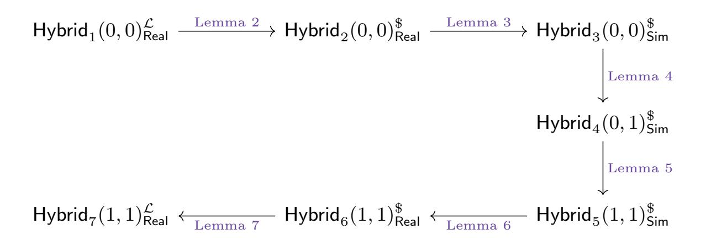
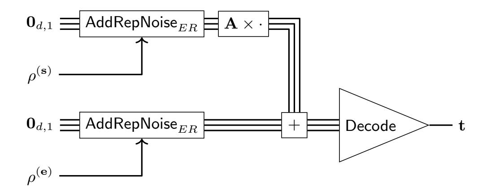
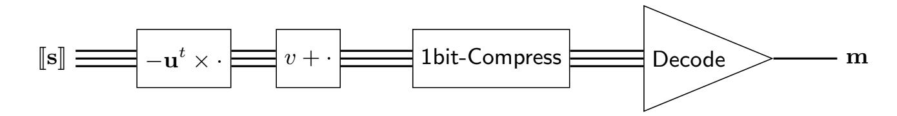
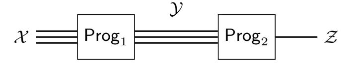
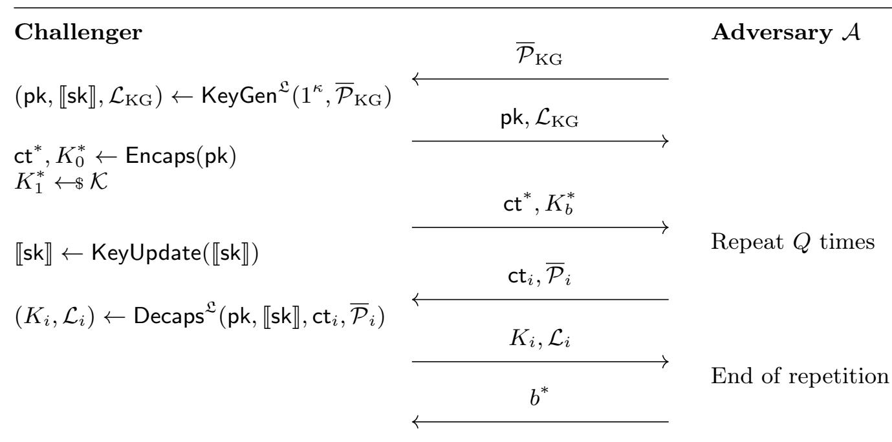

{0}------------------------------------------------

# Naor-Yung Transform for IND-CCA Probing Security with Lattice Instantiations

Katharina Boudgoust [,](https://orcid.org/0000-0002-3971-9368) Laurent Imbert [,](https://orcid.org/0000-0001-9362-2869) Loïc Masure [,](https://orcid.org/0000-0003-2978-4067) and Laz Panard

CNRS, Univ. Montpellier, LIRMM, France firstname.lastname@lirmm.fr

Abstract. In this work, we propose novel security notions for encryption schemes that simulate an adversary in the black-box model equipped with additional side-channel power. More concretely, the adversary is allowed to probe values of the secret-key sensitive algorithms, i.e. key generation and decryption. We then prove a generalization of the well-known Naor-Yung (NY) transform, generically lifting IND-CPA secure encryption schemes to IND-CCA ones in this new probing context. Moreover, we instantiate the resulting framework from lattices, constructing Rutile, a masking-friendly IND-CPA encryption scheme inspired by Kyber, and then Topaz its IND-CCA secure extension. In our proposal, the maskingunfriendly parts of Kyber, namely the central binomial distributions and the FO-transform, are replaced by masking-friendly counterparts (sum of uniforms and the aforementioned NY-transform).

Keywords: Probing Security · Lattices · Naor-Yung-Transform · M-LWE

# 1 Introduction

In general any channel which can carry information from a secure area to the outside should be studied as a potential risk. [...] Vulnerable algorithms, protocols, and systems need to be revised to incorporate measures to resist timing cryptanalysis and related attacks.

It is with these words that P. Kocher concluded his seminal article "Timing Attacks on Implementations of Diffie-Hellman, RSA, DSS and Other Systems" 30 years ago [\[Koc96\]](#page-34-0). At the time, the reaction of the cryptographic community was as significant as Kocher's new threat was unexpected. Constant-time implementation soon became the norm. And with the advent of differential side-channel attacks [\[KJJ99\]](#page-34-1), advanced protections such as algebraic masking techniques were proposed. In classical public-key cryptography both types of countermeasures are relatively easy to implement. For example, cryptosystems based on the discrete logarithm problem in finite groups – such as the multiplicative subgroup of Z/pZ or the group of rational points on an elliptic curve – can be protected by adding a random multiple of the group order to any secret value.

{1}------------------------------------------------

It was around the same time that P. W. Shor proved that the problems underlying group-based cryptography (as well as RSA) can be solved in polynomial time on a quantum computer [\[Sho94\]](#page-35-0). After this discovery, cryptographers began to explore quantum-safe cryptographic primitives based on error correcting codes (McEliece [\[McE78\]](#page-34-2)), euclidean lattices (NTRU [\[HPS98\]](#page-34-3)) or multivariate systems (HFE [\[Pat96\]](#page-35-1)). But active, organized research didn't take off until the mid-2000s, when governments and industry began discussing migration to post-quantum cryptography. In 2016, NIST launched the PQC standardization project. In the original call for proposals and the status reports published after each round, resistance to side-channel attacks was suggested but never considered as a primary objective. For example, after the second round [\[AASA](#page-31-0)<sup>+</sup>20], one could read:

NIST hopes to see more and better data for performance in the third round. This performance data will hopefully include implementations that protect against side-channel attacks, such as timing attacks, power monitoring attacks, fault attacks, etc.

During the third round, the community addressed this request very thoroughly and proposed a large number of side-channel attacks on post-quantum schemes together with countermeasures (see [\[HPA21\]](#page-33-0) for a survey). This phase revealed that some of the building blocks of post-quantum cryptography, relevant for security against an adversary in a standard (black-box) threat model, could be very harmful in leaky threat models [\[UXT](#page-35-2)+22], hence emphasizing how concerning it may be to consider the leakage resistance of cryptographic primitives as an afterthought, rather than jointly with black-box security.

Despite, NIST launched an additional call for proposals for digital signatures in 2022 [\[oST22\]](#page-34-4), disregarding resistance against side-channel analysis as one of the main selection criteria.[1](#page-1-0) Yet, among the candidates for the first round, del Pino, Katsumata, Prest, and Rossi introduced Raccoon [\[dPKPR24\]](#page-33-1), a digital signature scheme aimed at being an alternative to Dilithium, based on the same hardness assumptions on structured lattices [\[LDK](#page-34-5)+22]. Raccoon is the first example where both provable security (EUF-CMA), and side-channel security are addressed simultaneously at the design level, for a reasonable cost. The main claim of the Raccoon design is to be masking-friendly, meaning that the specifications allow the implementation to be easy to protect with the masking counter-measure [\[ISW03\]](#page-34-6). More precisely, it consists in encoding any secret or sensitive variable according to an additive secret sharing, and to adapt the subsequent computations accordingly. In a nutshell, a masking scheme is expected to verify the probing security, an extension of the privacy property of secret sharing: any set of intermediate computations whose size is strictly smaller than the number of shares must be independent of any secret value. This, in turn, implies a resilience to more realistic classes of leakages [\[DDF14\]](#page-33-2), with a security level increasing exponentially fast with the number of shares.

<span id="page-1-0"></span><sup>1</sup> The term "side-channel" occurs only once in the NIST status report on the first round [\[ABC](#page-32-0)<sup>+</sup>24].

{2}------------------------------------------------

Yet, this leakage resilience must be balanced with the performance overhead incurred by masking. Whereas masking linear operations is mild thanks to the homomorphism of additive secret sharing, masking non-linear operations is usually more expensive, occurring at least a quadratic overhead in terms of runtime, memory, and randomness consumption [\[ISW03\]](#page-34-6). In this regard, the great advantage of the masking-friendly approach of Raccoon is to deliberately weaken the masking of non-linear operations in order to avoid this expensive quadratic overhead. Nevertheless, the authors proved essentially that "whatever attack a probing adversary can carry out when knowing the leakage, she can also run (with similar success probability) by just having black-box access" [\[DDF14\]](#page-33-2) to a variant of Raccoon, relying on weaker-still-strong hardness assumptions. As a result, the overall overhead remains reasonable, i.e., quasi-linear with the number of shares, as empirically verified by the Raccoon designers [\[dPEK](#page-33-3)<sup>+</sup>23, Sec. 3.3]. This contrasts with masked implementations of Dilithium, one of the two latticebased signatures selected by NIST for standardisation. The complexity of such masked implementations scales at least quadratically in the number of shares and has prohibitively large constants [\[CGTZ23\]](#page-33-4). Hence, the novel approach of designing masking-friendly primitives seems a promising solution to circumvent the tough challenge of protecting already-standardised primitives.

Contributions: In this work, we extend the line of work initiated by Raccoon [\[dPKPR24\]](#page-33-1) on masking-friendly signatures to masking-friendly encryption schemes. We introduce Rutile, a masking friendly IND-CPA public-key encryption scheme and its IND-CCA extension Topaz, both based on lattice problems.[2](#page-2-0) We extend the usual security notions for encryption schemes by providing the adversary with additional side-channel power.

Our new encryption scheme comes from the same design template as IND-CPA Kyber [\[BDK](#page-32-1)+18], which can itself be seen as an optimized version of the original Regev encryption scheme [\[Reg05\]](#page-35-3). Over the last decade, multiple optimizations lead to smaller ciphertexts and faster computations, like moving to structured lattices, compressing ciphertexts, working over an NTT-compatible ring and deriving large uniform elements from small seeds. The final Kyber scheme is then obtained by lifting the IND-CPA secure scheme with the Fujisaki-Okamoto (FO) transform to an IND-CCA secure KEM. The end result is the fruit of more than ten years of research in lattice-based cryptography. It has recently been selected by NIST for standardization under the name ML-KEM [\[oST24\]](#page-35-4).

In this work, our approach was to rethink different design choices of Kyber with side-channel resistance in mind. We identified two major maskingunfriendly aspects of Kyber, namely the central binomial distributions which we replaced by sums of uniforms à la Raccoon, and the FO-transform [\[HLM](#page-33-5)<sup>+</sup>23, [HHMS25\]](#page-33-6) for which we opted for an alternative transformation due to Naor and Young [\[NY90\]](#page-34-7) in its variant form proposed by Lindell [\[Lin06\]](#page-34-8). Unlike the FO-transform which requires decrypting a potentially forged ciphertext before

<span id="page-2-0"></span><sup>2</sup> Following the trend of CRYSTALS-Kyber, we name our schemes after two gemstones.

{3}------------------------------------------------

verifying its actual legitimacy, the NY-transform only requires to do the decryption after publicly verifying a zero-knowledge proof. Because the FO-transform requires the manipulation of the secret key, masking its different steps is mandatory [\[BGR](#page-32-2)<sup>+</sup>21, [BC22\]](#page-32-3). Despite numerous efforts from the community, the NTT multiplications [\[PPM17,](#page-35-5) [HSST23\]](#page-34-9), the compression/decompression [\[WBD24\]](#page-35-6) of the message and the final comparison have proved very difficult to safeguard against side-channel attacks. Conversely, the main idea of the NY-transform is to force maliciously generated ciphertexts to be rejected before decryption. This is achieved by encrypting the message twice with different public keys and by invoking a non-interactive zero-knowledge (NIZK) proof system on the encryptions. If verified, the proof guarantees that the two provided ciphertexts are indeed valid ciphertexts of the same message with respect of the two public keys. In this case, any of the two encryptions of the message can be safely decrypted.

The NY-transform is particularly well suited to the (d-1)-probing model because the verification of the proof is independent of the secret key. Therefore the only critical operation that needs to be masked is the decryption of the underlying (d-1)-probing IND-CPA scheme.

The first part of our work, presented in Section [3](#page-13-0) and Appendix [B,](#page-40-0) applies to generic public-key encryption schemes. The main contributions herein are:

- First, we propose novel security notions for encryption schemes and key encapsulation mechanisms, which we call (d-1)-probing IND-CPA/IND-CCA. These new notions allow the adversary to probe up to d − 1 intermediate values of secret-key sensitive algorithms.
- We then prove a generalization of the well-known NY-transform to these new security notions: if equipped with a fitting NIZK, any (d-1)-probing IND-CPA secure encryption scheme can be lifted to a (d-1)-probing IND-CCA secure one. To account for leakage coming from the decryption queries, we require the decryption procedure to fulfill some non-interference property.[3](#page-3-0)
- Once our (d-1)-probing IND-CCA encryption scheme built, we can further transform it into an (d-1)-probing IND-CCA key encapsulation mechanism.
- As an additional contribution, we extend the NY-transform to non-perfectly correct encryption schemes. This is particularly relevant for lattice-based instantiations, which usually allow for small decryption failures. As the NIZK only proves set membership, the adversary can provide valid NIZK's for biased encryption randomness. To account for this, we introduce the notion of NY-compatible encryption schemes.

The second part of our work, presented in Sections [4-](#page-21-0)[7,](#page-27-0) instantiates the above framework from lattices. Our contributions can be summarized as:

– We first propose Rutile and prove its (d-1)-probing IND-CPA security based on the hardness of M-LWE. To be more precise, we first reduce its security to a new variant of M-LWE which we term probing M-LWE and then show

<span id="page-3-0"></span><sup>3</sup> Non-interference is a simulation-based security notion in leakage-resilience cryptography, which we formally define in Section [2.](#page-5-0)

{4}------------------------------------------------

that the latter is equivalent to standard M-LWE with secret/errors of reduced variance. Moreover we show that Rutile is NY-compatible and that its decryption algorithm fulfills the required non-interference property.

- We then select a lattice-based NIZK [\[LNP22\]](#page-34-10) from the literature and show how to use it for the NY-transform of Rutile. Its security is based on M-SIS and extended M-LWE.
- We put everything together and propose Topaz, the first masking-friendly IND-CCA secure encryption scheme from lattice assumptions. Using the Lattice Estimator [\[APS15\]](#page-32-4), we suggest a set of parameters that reach a 128-bit security level.
- Finally, we give a comparison with Kyber and argue both better side-channel security and masking performance heuristically.

In terms of ease of implementation, our scheme inherits the same advantages as Raccoon, not only from an implementation efficiency perspective, but also in terms of security analysis. On the one hand, our error distributions are based on sums of uniform distributions over {−2 u−1 , ..., 2 <sup>u</sup>−<sup>1</sup> − 1}, which makes its implementation straightforward across a wide variety of platforms. Besides, unlike Kyber, our scheme does not require masked implementations of symmetric components so that the number of distinct masking operations to implement is reduced. On the other hand, the masking-friendly part of our scheme shares common building blocks (called gadgets in the masking terminology), with those of Raccoon, in particular the addition of small noisy elements. It turns out that these gadgets have recently been analyzed in the so-called random probing model [\[BRR25\]](#page-32-5), a more realistic variant of the probing model. This suggests that the security of our scheme nicely extends to this more realistic threat scenario. There only remains the masked 1-bit compression, which is admittedly the leakiest part (and hence the most vulnerable). Nevertheless, this is not believed to be the most harmful attack vector in Kyber [\[UXT](#page-35-2)+22], which suggests a competitive advantage in terms of leakage resilience in favor of our approach.

## Future Directions: We present some interesting future directions.

Decreasing the Efficiency Gap. We see our proposed encryption schemes and the resulting concrete parameters as a first base line, demonstrating the efficiency loss when replacing the FO-transform by the masking-friendly NY-transform. As we haven't used the full potential of optimizing our schemes, we would be thrilled to see the public key and ciphertext sizes decreasing in the future.

Towards a full Masking Friendliness. Making the noise generation maskingfriendly, like in the Raccoon signature scheme, and replacing the FO-transform by a verification proof independent of the secret is a great step towards a masking-friendly public-key encryption scheme. But our construction is not fully masking-friendly yet, as the runtime and memory overhead remains quadratic with the number of shares d. More precisely, like in Kyber, we still rely on a non-linear compression operation, with complexity O d 2 · log log q [\[CGMZ23,](#page-33-7) 

{5}------------------------------------------------

CGMZ21, App. D]. In this respect, finding a masking-friendly alternative – *i.e.*, with  $\mathcal{O}(d \cdot \log d)$  overhead – to this bottleneck represents a promising track for improvement in future works. Another direction would be to additionally mask the encryption algorithm (which requires masking the LNP NIZK), hence extending Topaz probing security to the message as well.

Probing Security, beyond Encryption. We extended the probing-leakage resilience paradigm of Raccoon to public-key encryption, and subsequently to key encapsulation mechanism. A potential track for future works could be to extend this paradigm to more advanced primitives. As an example, the Raccoon signature scheme has been extended to threshold signatures [DKM<sup>+</sup>24]. Given the parallel with our probing-secure encryption scheme, a natural extension could be to explore the potential of our approach for threshold encryption schemes.

Related Works: A notable related work is the lattice-based IND-CCA encryption scheme Polka [HLM+23]. In our work as well as in [HLM+23], leakage resistance was taken into account at the design level. However, Polka and Topaz differ in the methodology to achieve leakage resistance. Polka's approach is to look at existing side-channel attacks and to give heuristic arguments (based on novel non-standard lattice problems) how their choices reduce the attack surface. This attack surface has been recently refined in [PPS26]. Our approach, in contrast, is to construct a scheme proven secure in the probing model with better masking-friendliness. We think it would be interesting to combine the insights of both approaches in future works.

Besides Raccoon [dPKPR24], other masking-friendly and presumably post-quantum signature schemes have been proposed in the literature, namely lattice-based Plover [EEN<sup>+</sup>24], and masking-friendly variants of the Threshold-Computation-in-the-Head Framework [FRW25].

In our model, the IND-CCA adversary can probe values during the executions of the key generation and decryption algorithms. We can thus see it as *computation leakage*. A different model is to provide the adversary with a separate leakage oracle on the secret key, for arbitrary (but bounded) leakage functions, as studied in [AGV09, NS09]. This can be categorized as *memory leakage* (as for instance done in this survey on leakage-resilient cryptography [KR19]). In an analogue manner to our work, it was shown in [NS09] that one can use the Naor-Yung transform to lift IND-CPA to IND-CCA security in the memory leakage model. Note that the impact of computation leakage on the NY-transform is more important than the impact of memory leakage, as in the computation leakage case the adversary is allowed to probe the additional decryption oracle.

## <span id="page-5-0"></span>2 Preliminaries

For  $d \in \mathbb{N}^*$ , we note  $[d] = \{1, \ldots, d\}$ . For  $x \in \mathbb{R}$ , we note [x] the nearest integer to x, half rounded up. Let  $i, j \in (\mathbb{N}^*)^2$ , we note  $\mathbf{0}_{i,j}$  the  $i \times j$  zero matrix. For  $n = 2^{\ell} > 1$ , we denote by  $\mathcal{R}$  the ring  $\mathbb{Z}[X]/\langle X^n + 1 \rangle$ , and for modulus

{6}------------------------------------------------

q, we denote by  $\mathbb{Z}_q$  the ring  $\mathbb{Z}/q\mathbb{Z}$ , and by  $\mathcal{R}_q$  the ring  $\mathbb{Z}_q[X]/\langle X^n+1\rangle$ . For  $f=\sum_{i=0}^{n-1}f_iX^i\in\mathcal{R}$ , we note the  $l_{\infty}$ -norm  $\|f\|_{\infty}=\max_i(|f_i|)$  and the  $l_2$ -norm  $\|f\|_2=\sqrt{\sum_i f_i^2}$ . For  $k\in\mathbb{N}^*$  and  $\mathbf{f}=(f_1,...,f_k)\in\mathcal{R}^k$ , we note the  $l_{\infty}$ -norm  $\|\mathbf{f}\|_{\infty}=\max_i(\|f_i\|_{\infty})$  and the  $l_2$ -norm  $\|\mathbf{f}\|_2=\sqrt{\sum_i \|f_i\|_2^2}$ . Both for f and  $\mathbf{f}$  we sometimes write  $\|\cdot\|$  instead of  $\|\cdot\|_2$ . When writing the norm of an element in  $\mathcal{R}_q$ , we implicitly take the centered representation modulo q, interpret it as element in  $\mathcal{R}$  and then compute the norm.

<span id="page-6-0"></span>**Lemma 1.** Let 
$$k \in \mathbb{N}^*$$
 and  $\mathbf{a}, \mathbf{b} \in (\mathcal{R}^k)^2$ ,  $\|\mathbf{a}^t \mathbf{b}\|_{\infty} \leq \|\mathbf{a}\|_2 \cdot \|\mathbf{b}\|_2$ .

We provide a proof in Appendix A.1 for completeness.

For  $u \in \mathbb{N}^*$ ,  $\operatorname{Unif}(u)$  denotes the uniform distribution over the set  $\{-2^{u-1},\ldots,2^{u-1}-1\}$ . By interpreting every element in  $\mathcal{R}$  as a polynomial of degree less than n with coefficients in  $\mathbb{Z}$ , for  $k \in \mathbb{N}^*$ , we denote by  $\operatorname{Unif}(\mathcal{R},k,u)$  the distribution over  $\mathcal{R}^k$  which samples vectors of k polynomials whose n coefficients are independently sampled from  $\operatorname{Unif}(u)$ . Put differently,  $\operatorname{Unif}(\mathcal{R},k,u)=\operatorname{Unif}(u)^{n\cdot k}$ . By  $\operatorname{NSUnif}(u,l)$  we denote the (non-zero-centered) distribution where l elements are sampled independently and identically from  $\operatorname{Unif}(u)$  and summed together. For a random variable  $X \sim \operatorname{NSUnif}(u,l)$ , one can check that X+l/2 is sub-Gaussian for  $\sigma^2 = 2^{2u} l/6$ . By  $\operatorname{SUnif}(u,l) = \operatorname{NSUnif}(u,l) + l/2$  we denote the sum of uniform distribution which is now zero-centered, while preserving the variance. We extend it in the same way over  $\mathcal{R}^k$ , denoting  $\operatorname{NSUnif}(\mathcal{R},k,u,l)$  the sum of l copies of  $\operatorname{Unif}(\mathcal{R},k,u)$ . Similarly, we define  $\operatorname{SUnif}(\mathcal{R},k,u,l) = \operatorname{NSUnif}(\mathcal{R},k,u,l) + l/2$ , where by abuse of notation, the latter means the vector of polynomials whose coefficients are all l/2. Note that  $\operatorname{SUnif}(\mathcal{R},k,u,l) = \operatorname{SUnif}(u,l)^{n\cdot k}$ .

The tail bound from [LPR13, Lem. 2.2] applies to  $\mathbf{x} \leftarrow \mathsf{SUnif}(\mathcal{R}, k, u, l)$ , thus:

<span id="page-6-1"></span>
$$\Pr\left[\|\mathbf{x}\|_{2} > 2^{u}\sqrt{3lnk}\right] \le \exp\left(-2nk\right). \tag{1}$$

For two distributions  $\chi$  and  $\psi$ , we note  $\chi \stackrel{i.d.}{=} \psi$  when the two distributions are identically distributed. This notation naturally extends to random variables that are identically distributed, as well as random functions. We write  $x \leftarrow \chi$  when x is a value sampled according to  $\chi$  and  $x \leftarrow S$  when x is sampled uniformly at random in the finite set S.

Let f a random function, we note  $x \leftarrow f(\cdot)$  when x is a random output of f. To explicit the random coins R used in f, we note  $x := f(\cdot; R)$ , where := highlights the fact that x is non-probabilistic.

## 2.1 The (Probing) M-LWE Problem

Let us recall in Def. 1 the Module Learning With Errors (M-LWE) problem, as introduced in [BGV12, LS15]. In this paper, we are interested in M-LWE instances where both the secret and the noise are sampled as sums of small uniforms. With a suitable parameter selection, for instance derived using the Lattice

{7}------------------------------------------------

Estimator [APS15], this is considered a standard hardness assumption in lattice-based cryptography. Putting additional parameter restrictions, its hardness can be derived from worst-case problems on module lattices [BJRW23].

In Definition 2, we introduce a new variant of M-LWE, where up to d-1 summands of the secret and noise are provided to the adversary. We call this the (d-1)-probing M-LWE problem and show that it is equivalent to standard M-LWE where secret and error follow a (smaller) sum of uniform distribution. For simplicity, we stick to power-of-two cyclotomic rings and square matrices in this section, but everything generalizes to arbitrary cyclotomic rings and rectangular matrices as well. Whereas in this section, we only use the word "probes" in an informal manner, we give a formal definition of the term "probes" in the context of probing security in Section 2.3.

<span id="page-7-0"></span>**Definition 1** (M-LWE). Let  $n \in \mathbb{N}^*$  be a power of two and  $q \in \mathbb{N}^*$  be a modulus, defining the ring  $\mathcal{R}_q$ . Let  $l \in \mathbb{N}^*$  be the number of small uniforms to sum,  $u \in \mathbb{N}^*$  their size parameter and  $k \in \mathbb{N}^*$  the dimensions of the matrix over  $\mathcal{R}_q$ . The experiment of M-LWE $_{\mathcal{R}_q,k,l,u}$  is defined in Figure 1a. For an adversary  $\mathcal{A}$  trying to solve the M-LWE problem, the respective advantage is defined as

$$\mathsf{Adv}(\mathcal{A}) = \left| \Pr[\mathsf{M}\text{-}\mathsf{LWE}_{\mathcal{R}_q,k,l,u}(\mathcal{A}) = 1] - \frac{1}{2} \right|.$$

Upon this, we build the so-called (d-1)-probing M-LWE problem, which is used in the security proof of Rutile in Section 7.1.

<span id="page-7-1"></span>**Definition 2** ((d-1)-probing M-LWE). Let l, u, k, n and q be integers as in the previous definition, setting  $\mathcal{R}_q$ , and let  $d-1 \in \mathbb{N}$  with l > d-1, the number of probes allowed to the attacker. The (d-1)-probing M-LWE $_{\mathcal{R}_q,d,k,l,u}$  experiment is defined in Figure 1b. For an adversary  $\mathcal{A}$ , the respective advantage is defined as

$$\mathsf{Adv}(\mathcal{A}) = \left| \Pr[(d-1)\text{-}probing \ \mathbf{M}\text{-}\mathsf{LWE}_{\mathcal{R}_q,d,k,l,u}(\mathcal{A}) = 1] - \frac{1}{2} \right|.$$

If d = 1, we recover standard M-LWE from Definition 1. Proposition 1 shows that (d-1)-probing M-LWE is equivalent to M-LWE with a reduced number of summed small uniforms. The proof only uses the fact that the secret and error distributions of M-LWE are sums of independently and identically distributed samples of the same distribution. In our case, this distribution is the uniform distribution, as it is suitable in the additive masking setting, but it can easily be exchanged with other distributions if needed. The proof essentially uses the linearity of M-LWE and can be found in Appendix A.2.

<span id="page-7-2"></span>**Proposition 1.** Let  $n \in \mathbb{N}^*$  be a power of two and  $q \in \mathbb{N}^*$  be a modulus, defining the ring  $\mathcal{R}_q$ . Let  $l \in \mathbb{N}^*$  be the number of small uniforms to sum,  $u \in \mathbb{N}^*$  their size parameter,  $k \in \mathbb{N}^*$  the dimension of matrix and  $d \in \mathbb{N}^*$  the number of "probes" plus one allowed to the attacker, with l > d - 1. Then,

$$M\text{-LWE}_{\mathcal{R}_q,k,(l-d+1),u} \Leftrightarrow (d\text{-}1)\text{-}probing M\text{-LWE}_{\mathcal{R}_q,d,k,l,u}.$$

{8}------------------------------------------------

```
(d-1)-probing M-LWE_{\mathcal{R}_q,d,k,l,u}(\mathcal{A})
                                                                                                            1: \mathbf{A} \leftarrow \mathcal{R}_q^{k \times k}
                                                                                                            2: \{1,\ldots,l\} \supseteq \overline{\mathcal{P}} \leftarrow \mathcal{A}(\mathbf{A})
                                                                                                             3: \quad \mathbf{if} \ |\overline{\mathcal{P}}| \ge d
M\text{-LWE}_{\mathcal{R}_q,k,l,u}(\mathcal{A})
                                                                                                                             return \perp
                                                                                                             4:
 1: \mathbf{A} \leftarrow \mathfrak{R}_q^{k \times k}
                                                                                                             5: for i \in \{1, ..., l\}
                                                                                                                            \boldsymbol{\rho}_i^{(s)}, \boldsymbol{\rho}_i^{(e)} \leftarrow \$ \left(\mathsf{Unif}(\mathcal{R}, k, u)\right)^2
  2: b \leftarrow \$ \{0,1\}
                                                                                                             6:
                                                                                                            7: \mathcal{L} = (\boldsymbol{\rho}_i^{(s)}, \boldsymbol{\rho}_i^{(e)})_{i \in \overline{\mathcal{P}}}
 3: if b = 0:
                for i \in \{1, ..., l\}
  4:
                                                                                                            8: b \leftarrow \$ \{0,1\}
               \boldsymbol{\rho}_i^{(s)}, \boldsymbol{\rho}_i^{(e)} \leftarrow \!\!\!\!\!\!\!\!\!\!\!\!\!\!\!\!\!\!\!\!\!\!\!\!\!\!\!\!\!\!\!\!\!\!\!
  5:
                                                                                                            9: if b = 0:
              \mathbf{s} = \sum_{i=1}^l \boldsymbol{\rho}_i^{(s)}, \,\, \mathbf{e} = \sum_{i=1}^l \boldsymbol{\rho}_i^{(e)}
                                                                                                                           \mathbf{s} = \sum_{i=1}^l \boldsymbol{\rho}_i^{(s)}, \; \mathbf{e} = \sum_{i=1}^l \boldsymbol{\rho}_i^{(e)}
 6:
                                                                                                          10:
  7:
                  \mathbf{b} := \mathbf{A}\mathbf{s} + \mathbf{e} \bmod q
                                                                                                                             \mathbf{b} := \mathbf{A}\mathbf{s} + \mathbf{e} \bmod q
                                                                                                          11:
  8: else:
                                                                                                           12: else:
                 \mathbf{b} \leftarrow \mathfrak{R}_q^k
                                                                                                                             \mathbf{b} \leftarrow \!\!\!\!+ \!\!\!\!\!\!\!\!\!\!\!\!\!\!\!\!\!\!\!\!\!\!\!\!\!\!\!\!\!\!
  9:
                                                                                                           13:
         b' \leftarrow \mathcal{A}(\mathbf{A}, \mathbf{b})
                                                                                                           14: b' \leftarrow \mathcal{A}(\mathbf{b}, \mathcal{L})
10:
11: return b = b'
                                                                                                           15: return b = b'
       (a) The M-LWE experiment
                                                                                                   (b) The (d-1)-probing M-LWE experiment
```

Fig. 1: M-LWE experiments in the classical (black-box) security model and in the (grey-box) (d-1)-probing model

More precisely, there exists an adversary  $\mathcal{A}$  against  $\operatorname{M-LWE}_{\mathcal{R}_q,k,(l-d+1),u}$  with advantage  $\operatorname{Adv}$  if and only if there exists an adversary  $\mathcal{B}$  against the problem (d-1)-probing  $\operatorname{M-LWE}_{\mathcal{R}_q,d,k,l,u}$  with the same advantage  $\operatorname{Adv}$ .

#### 2.2 Cryptographic Primitives

We recall the definitions of public-key encryption schemes and non-interactive zero-knowledge proof systems.

**Definition 3 (PKE).** A public-key encryption scheme PKE over message space  $\mathcal{M}$  is defined by the following PPT algorithms (KeyGen, Enc, Dec), parameterized by the security parameter  $\kappa$ , where:

- $(pk, sk) \leftarrow KeyGen(1^{\kappa})$ : on input the security parameter  $\kappa$ , the key generation algorithm outputs a public key pk and a secret key sk.
- $-\operatorname{ct} \leftarrow \operatorname{Enc}(\operatorname{pk}, m)$ : on input a public key  $\operatorname{pk}$  and a plaintext  $m \in \mathcal{M}$ , the encryption algorithm outputs a ciphertext  $\operatorname{ct}$ .
- $-m' \leftarrow \mathsf{Dec}(\mathsf{pk}, \mathsf{sk}, \mathsf{ct})$ : given a public key  $\mathsf{pk}$ , a secret key  $\mathsf{sk}$  and a ciphertext  $\mathsf{ct}$ , the decryption algorithm outputs a plaintext  $m' \in \mathcal{M}$  or the symbol  $\bot$ .

To make the random coins used in Enc explicit, we write  $\mathsf{ct} := \mathsf{Enc}(\mathsf{pk}, m; R)$ , with R the random coins sampled from the randomness distribution RandDistr.

{9}------------------------------------------------

**Definition 4 (Correctness).** Let  $\delta_{\mathsf{fail}}(\kappa)$  be a function parameterized by the security level  $\kappa$  taking real values in [0,1]. A PKE = (KeyGen, Enc, Dec) over message space  $\mathcal{M}$  with randomness distribution RandDistr is called  $\delta_{\mathsf{fail}}(\kappa)$ -correct, if for all  $\kappa \in \mathbb{N}^*$ , for all  $m \in \mathcal{M}$  it holds

$$\Pr_{\substack{R \leftarrow \mathsf{RandDistr} \\ (\mathsf{pk},\mathsf{sk}) \leftarrow \mathsf{KeyGen}(1^\kappa)}} \left[ \mathsf{Dec}(\mathsf{pk},\mathsf{sk},\mathsf{Enc}(\mathsf{pk},m;R)) \neq m \right] \leq \delta_{\mathsf{fail}}(\kappa).$$

We further use the primitive of one-time simulation-sound NIZK's. We assume that the prover and verifier both have access to the same random oracle during the execution of the protocol.

**Definition 5** (NIZK). Let H be a hash function modeled as a random oracle. For an algorithm A, we denote by  $A^H$  the fact that the algorithm has access to the random oracle H. A non-interactive zero-knowledge proof system (NIZK) for a relation R consists of a pair of probabilistic algorithms  $\Pi = (P, V)$ , where

- $P^H(x, w) \rightarrow \pi$ : The prover algorithm takes as input a statement witness pair  $(x, w) \in R$ , and outputs a proof  $\pi$ .
- $V^{H}(x,\pi) \rightarrow b \in \{0,1\}$ : The verifier algorithm takes as input a statement x and proof  $\pi$ , and outputs accept (b=1) or reject (b=0).

We denote by  $L = \{x : \exists w, (x, w) \in R\}$  the language induced by R.

**Definition 6 (Completeness).** Let  $\epsilon_{\mathsf{complete}}(\kappa)$  be a function parameterized by the security parameter  $\kappa$  taking real values in [0,1]. A NIZK  $\Pi = (\mathsf{P},\mathsf{V})$  for the relation  $\mathsf{R}$  and with associated random oracle  $\mathsf{H}$  is called  $\epsilon_{\mathsf{complete}}(\kappa)$ -complete if for all  $k \in \mathbb{N}^*$ , all  $(\mathsf{x},\mathsf{w}) \in \mathsf{R}$  it holds

$$\Pr\left[V^{\mathsf{H}}(\mathsf{x}, \mathsf{P}^{\mathsf{H}}(\mathsf{x}, \mathsf{w})) \neq 1\right] \leq \epsilon_{\mathsf{complete}}(\kappa),$$

where the probability is taken over the randomness of  $\mathsf{P},\,\mathsf{V}$  and the random oracle  $\mathsf{H}.$ 

**Definition 7 (Zero-Knowledge).** Let  $\epsilon_{\mathsf{ZK}}(\kappa)$  be a function parameterized by the security parameter  $\kappa$  taking real values in [0,1]. A NIZK  $\Pi = (\mathsf{P},\mathsf{V})$  for the relation R and with associated random oracle H is called  $\epsilon_{\mathsf{ZK}}(\kappa)$ -zero-knowledge if there exists a PPT simulator  $\mathsf{Sim} = (\mathsf{Sim}_\mathsf{H}, \mathsf{Sim}_\pi)$  such that for all  $\kappa \in \mathbb{N}$  and for all PPT adversaries  $\mathcal{A}$  it holds that

$$\left|\Pr\left[\mathsf{Expt}_{\mathcal{A}}^{\mathsf{ZK-Real}}(1^{\kappa}) = 1\right] - \Pr\left[\mathsf{Expt}_{\mathcal{A},\mathsf{Sim}}^{\mathsf{ZK-Sim}}(1^{\kappa}) = 1\right]\right| \leq \epsilon_{\mathsf{ZK}}(\kappa),$$

where the probability is taken over the random coins of the adversary, the random oracle H and the experiments defined in Figure 2a.

**Definition 8 (One-Time Simulation Soundness).** Let  $\epsilon_{OTSS}(\kappa)$  be a function parameterized by the security parameter  $\kappa$  taking real values in [0,1] and let  $Sim = (Sim_H, Sim_{\pi})$  be a zero-knowledge simulator. A NIZK  $\Pi = (P, V)$  for

{10}------------------------------------------------

the relation R and with associated random oracle H is called  $\epsilon_{OTSS}(\kappa)$ -one-time simulation sound if for every  $\kappa \in \mathbb{N}$ , for all PPT adversaries  $\mathcal{A}$ , it holds that

$$\Pr\left[\mathsf{Expt}_{\mathcal{A},\mathsf{Sim}}^{\mathsf{OTSS}}(1^{\kappa}) = 1\right] \leq \epsilon_{\mathsf{OTSS}}(\kappa),$$

where the probability is taken over the random coins of the adversary and the experiments defined in Figure 2b.

We denote by OTSS-NIZK a NIZK that is  $\epsilon_{\mathsf{complete}}(\kappa)$ -complete,  $\epsilon_{\mathsf{ZK}}(\kappa)$ -zero-knowledge and  $\epsilon_{\mathsf{OTSS}}(\kappa)$ -one-time simulation sound, where all three functions are negligible in  $\kappa$ .

<span id="page-10-1"></span>

|                                                     |                                                      | $Expt^{OTSS}_{\mathcal{A},Sim}(1^{\kappa})$           |
|-----------------------------------------------------|------------------------------------------------------|-------------------------------------------------------|
| $Expt_{\mathcal{A}}^{ZK-Real}(1^{\kappa})$          | $\frac{Expt^{ZK-Sim}_{\mathcal{A},Sim}(1^\kappa)}{}$ | $1:  x \leftarrow \mathcal{A}^{Sim_{H}}(1^{\kappa})$  |
| $1:  (x, w) \leftarrow \mathcal{A}^{H}(1^{\kappa})$ | $1: \ (x,w) \leftarrow \mathcal{A}^{Sim_{H}}$        | $(1^{\kappa})$ 2: $\pi \leftarrow Sim_{\pi}(x)$       |
| $2:  \mathbf{if} \ (x,w) \notin R$                  | $2:  \mathbf{if} \ (x, w) \notin R$                  | $3: (x', \pi') \leftarrow \mathcal{A}^{Sim_{H}}(\pi)$ |
| $3:$ return $\perp$                                 | $3:$ return $\perp$                                  | $b = V(x', \pi') \wedge (x' \notin L)$                |
| $4:  \pi \leftarrow P(x,w)$                         | $4:  \pi \leftarrow Sim_{\pi}(x)$                    | 5: $\wedge ((x',\pi') \neq (x,\pi))$                  |
| $5: b \leftarrow \mathcal{A}(\pi)$                  | 5: $b \leftarrow \mathcal{A}(\pi)$                   | 6: return $b$                                         |
| 6: return $b$                                       | 6: <b>return</b> $b$                                 | (b) One-time simulation sound-                        |
| (a) Zer                                             | o-knowledge                                          | ness                                                  |

Fig. 2: Security experiments of non-interactive proof systems.

## <span id="page-10-0"></span>2.3 Probing Theory

Wires, Values, Programs and Probes. We recall that an arithmetic circuit is a direct acyclic graph that contains addition and multiplication nodes (or gates) as well as input and output nodes. We assume that the arithmetic nodes  $(+, \times)$  have input degree 2 and output degree 1. Input nodes have input degree zero and output nodes have output degree zero. These nodes are connected by edges or wires that we note with overhead letters (e.g.  $\overline{x}$ ). For an execution of the algorithm, the value carried by the wire labeled  $\overline{x}$  is simply denoted x. These notations naturally extend to a set of wires (e.g.  $\overline{\mathcal{X}}$ ) and its corresponding tuple of values  $\mathcal{X}$ .

We use the notation  $[\![x]\!] = (x_i)_{i \in [d]}$  to denote a tuple of d values, which implicitly defines the value  $x = \sum_{i=1}^d x_i$ . Put differently, the encoding  $[\![x]\!]$  means that the (secret) value x is shared as d additive shares.

We shall need the following privacy property of additive secret sharing: Let  $I \subseteq [d]$  be any index subset of size at most d-1 and  $\llbracket x \rrbracket = (x_i)_{i \in [d]}$  be the masking of an arbitrary value x over some finite ring  $\mathcal{R}$ . Then, the distribution  $((x_i)_{i \in I}, x)$  is identical to the distribution  $((y_i)_{i \in I}, x)$ , where  $y_i \leftarrow \mathcal{R}$ .

{11}------------------------------------------------

We denote by KeyUpdate a function which takes as input a d-sharing  $[K] = (K_i)_{i \in [d]}$  of some value K and outputs another d-sharing of the same value  $[K] = (K'_i)_{i \in [d]}$  such that for every two sets of indices  $I_1, I_2 \subseteq [d]$ , we have that  $(K_i)_{i \in I_1}$  and  $(K'_i)_{i \in I_2}$  are independent random variables. This implies that having access to at most d-1 values of  $(K_i)_{i \in [d]}$  does not leak any information about  $(K'_i)_{i \in [d]}$  nor about K.

Likewise, for an arithmetic circuit which takes as input a masked value  $\llbracket x \rrbracket$ , we denote  $\llbracket \overline{x} \rrbracket = (\overline{x_i})_{i \in [d]}$  the *d*-tuple of input wires carrying the *d* shares of  $\llbracket x \rrbracket$ .

**Definition 9 (Randomized Arithmetic Circuit).** A randomized arithmetic circuit is an arithmetic circuit which also contains nodes with input degree zero and output degree one that output random values.

<span id="page-11-0"></span>**Definition 10 (Program).** We define a program Prog as a randomized arithmetic circuit, and denote by  $\overline{\mathcal{W}}_{\mathsf{Prog}}$  (or  $\overline{\mathcal{W}}$  when clear from context) its set of wires. The set of input wires is partitioned into  $\overline{\mathcal{X}}_{masked}$  whose wires carry sharings of secret values, and  $\overline{\mathcal{X}}_{unmasked}$  whose wires carry unmasked secret values. We have  $\overline{\mathcal{X}}_{\mathsf{Prog}} = \overline{\mathcal{X}}_{masked} \cup \overline{\mathcal{X}}_{unmasked} \subset \overline{\mathcal{W}}_{\mathsf{Prog}}$ . Similarly, we denote by  $\overline{\mathcal{Y}} = (\overline{\mathcal{Y}}_{public}, \overline{\mathcal{Y}}_{secret})$  the mutually disjoint sets of respectively public and secret (masked or unmasked) output wires. We define  $\mathcal{X}$  and  $\mathcal{Y}$  the sets of input and output values such that  $\mathcal{Y} \leftarrow \mathsf{Prog}(\mathcal{X})$ .

We note that in the above definition of a program we abstract public inputs as implicit parameters of the program.

We now introduce the notion of probes on a program. On a high level, the notion of probes formalizes the idea that an attacker retrieves a number of intermediate values during the execution of the program, thus allowing for a potential leakage of secret values. In the so-called probing model, a *probe* is the label of an algorithm's wire targeted by the attacker, and a *leakage* is the value carried by this wire that is thus provided to the attacker.

**Definition 11 (Probes).** Let Prog be a program as in Def. 10, with set of input wires  $\overline{\mathcal{X}} = (\overline{\mathcal{X}}_{masked}, \overline{\mathcal{X}}_{unmasked})$ . A set of probes is a subset  $\overline{\mathcal{P}}$  of Prog's wires. Given a set of probes  $\overline{\mathcal{P}}$  and  $\mathcal{X}$  the values carried by the program's input wires, we note  $\operatorname{Prog}^{\mathfrak{L}}(\mathcal{X}, \overline{\mathcal{P}})$  the joint distribution

$$(\mathcal{Y},\mathcal{L}) \leftarrow \mathsf{Prog}^{\mathfrak{L}}(\mathcal{X},\overline{\mathcal{P}}),$$

where  $\mathcal{Y} = \mathcal{Y}_{public} \cup \mathcal{Y}_{secret}$  denotes the public and secret outputs of  $Prog(\mathcal{X})$  for some internal random coins, and where the leakage  $\mathcal{L}$  is the set of values carried by the wires in  $\overline{\mathcal{P}}$  for these same random coins.

Simulatability and Non-Interference Properties. We now introduce the notions of (strong) non-interference without unmasked inputs [BBD<sup>+</sup>16] and with unmasked inputs [dPKPR24].

<span id="page-11-1"></span>Definition 12 (NI/NIu property, [BBD<sup>+</sup>16, dPKPR24]). Let  $d \in \mathbb{N}^*$  and Prog be a program with input wires  $\overline{\mathcal{X}} = (\overline{\mathcal{X}}_{masked}, \overline{\mathcal{X}}_{unmasked})$ . We say that

{12}------------------------------------------------

Prog is (d-1)-Non-Interfering with Unshared inputs ((d-1)-Nlu for short) if and only if there exist two PPT simulators SimProb and SimLeak such that for any input values  $\mathcal{X}$  and any set of probes  $\overline{\mathcal{P}}$  with  $|\overline{\mathcal{P}}| < d$ , we have that:

- $\operatorname{SimProb}(\overline{\mathcal{P}}) \ outputs \ \overline{\mathcal{X}}' = (\overline{\mathcal{X}}'_{masked}, \overline{\mathcal{X}}'_{unmasked}) \ where: \\ \bullet \ \overline{\mathcal{X}}'_{masked} \subset \overline{\mathcal{X}}_{masked} \ and \ \overline{\mathcal{X}}'_{unmasked} \subset \overline{\mathcal{X}}_{unmasked}$ 

  - for any tuple of wires of a masked variable  $[\![\overline{x}]\!]$ ,  $|\![\overline{x}]\!] \cap \overline{\mathcal{X}}'_{masked}| \leq |\overline{\mathcal{P}}|$
  - $|\overline{\mathcal{X}}'_{unmasked}| \leq |\overline{\mathcal{P}}|$
- SimLeak $(\mathcal{X}', \overline{\mathcal{P}})$  output's distribution is identical to that of  $\mathcal{L}$ , where  $\mathcal{X}' \subset \mathcal{X}$ is the set of values carried by the wires in  $\overline{\mathcal{X}}'$  and  $(\mathcal{Y}, \mathcal{L}) \leftarrow \mathsf{Prog}^{\mathfrak{L}}(\mathcal{X}, \overline{\mathcal{P}})$

When Prog has no unmasked secret input (i.e.  $\overline{\mathcal{X}}_{unmasked} = \emptyset$ ), we simply call it (d-1)-Non-Interfering ((d-1)-NI for short).

In general,  $\overline{\mathcal{X}}'$  is a strict subset of  $\overline{\mathcal{X}}$  as masking will be done on level d, but the simulator is only allowed to simulate using less than d wires.

Definition 13 (sNI/sNlu property, [BBD+16, dPKPR24]). Let  $d \in \mathbb{N}^*$  and Prog be a program with input wires  $\overline{\mathcal{X}} = (\overline{\mathcal{X}}_{masked}, \overline{\mathcal{X}}_{unmasked})$  and output wires Y. We say that Prog is (d-1)-Strongly Non-Interfering with Unshared inputs ((d-1)-sNlu for short) if and only if it meets the same criteria than to be Nlu, except that for any set of probes  $\overline{\mathcal{P}}$ , upper bound on SimProb outputs is  $|\overline{\mathcal{P}} \setminus \overline{\mathcal{Y}}|$ instead of  $|\overline{\mathcal{P}}|$ . When  $\overline{\mathcal{X}}_{unmasked} = \emptyset$ , we simply call Prog (d-1)-Strongly Non-Interfering ((d-1)-sNI for short).

We now introduce non interference with public outputs properties where the public output of the program is set and not random as in definitions above. This notion is introduced in the random probing model in [BRR25, Def. 5]. We reformulate this definition and extend it to the d-probing model.

<span id="page-12-1"></span>**Definition 14** (Nlo/Nluo property, [BRR25]). Let  $d \in \mathbb{N}^*$  and Prog be a program with input wires  $\overline{\mathcal{X}} = (\overline{\mathcal{X}}_{masked}, \overline{\mathcal{X}}_{unmasked})$  and public output wires  $\mathcal{Y}_{public}$ . We say that Prog is (d-1)-Non-Interfering with Unshared inputs and public Outputs ((d-1)-Nluo for short) if and only if there exists two PPT simulators SimProb and SimLeak such that for any input values  $\mathcal X$  and public output values  $\mathcal{Y}_{public}$  for which  $\Pr(\overline{\mathcal{X}} = \mathcal{X}, \overline{\mathcal{Y}}_{public} = \mathcal{Y}_{public}) \neq 0$ , and any set of probes  $\overline{\mathcal{P}}$  where  $|\overline{\mathcal{P}}| < d$ , SimProb and SimLeak meets the same criteria than in Def. 12 when SimLeak is given access to  $\mathcal{Y}_{public}$ .

When  $\mathcal{X}_{unmasked} = \emptyset$ , we simply call Prog (d-1)-Non-Interfering with public Outputs ((d-1)-NIo for short).

We now introduce a useful result for composition of a NIu program with a No program whose public output is deterministic in the Nu gadget input.

<span id="page-12-0"></span>**Proposition 2** (NIu+NIo = NIuo). Let  $d \in \mathbb{N}^*$ , Prog<sub>1</sub> a (d-1)-NIu program with a single d-shared masked input variable  $\overline{\mathcal{X}}_1 = (\llbracket \overline{x_1} \rrbracket, \overline{\mathcal{X}}_{unmasked}), \text{ no public output}$  

{13}------------------------------------------------

and a single d-shared masked variable as secret output  $\overline{\mathcal{Y}}_1 = (\emptyset, [\![\overline{y}]\!])$  and  $\operatorname{\mathsf{Prog}}_2$  a (d-1)-NIo program with a single d-shared masked input variable  $\overline{\mathcal{X}}_2 = ([\![\overline{x_2}]\!], \emptyset)$  and output  $\overline{\mathcal{Y}}_2 = (\overline{\mathcal{Y}}_{public}, \emptyset)$ . If there exist a deterministic function  $f: \mathcal{R}^{|\overline{\mathcal{X}}_1|} \to \mathcal{R}^{|\overline{\mathcal{Y}}_2|}$  such that for every input values  $\mathcal{X}$  carried by  $\overline{\mathcal{X}}$  we have  $\mathcal{Y}_2 = f(\mathcal{X})$  with  $\mathcal{Y}_2$  the output values carried by  $\overline{\mathcal{Y}}_2$  wires, then  $\operatorname{\mathsf{Prog}}$  is (d-1)-NIuo where, for every input  $\mathcal{X} = ([\![x]\!], \mathcal{X}_{unmasked})$ ,

$$\mathsf{Prog}(\llbracket x \rrbracket, \mathcal{X}_{unmasked}) := \mathsf{Prog}_2(\mathsf{Prog}_1(\llbracket x \rrbracket, \mathcal{X}_{unmasked}))$$

Proof Sketch. Without loss of generality we assume there are  $d_2$  probes on  $\operatorname{Prog}_2$  and  $d_1$  probes on  $\operatorname{Prog}_1$  with  $d_1 + d_2 < d$ . The overall idea of our proof is that the  $d_2$  probes on  $\operatorname{Prog}_2$  may be simulated with values carried by up to  $d_1$  wires of  $\overline{\mathcal{X}}_2$ , which can in turn be simulated along with the  $d_1$  probes on  $\operatorname{Prog}_1$ —i.e. simulating less than d values — by  $\operatorname{Prog}_1$ 's NIu simulator. A full proof is provided in Appendix A.3.

Simulating with public output only The following result shows that the leakage of a (d-1)-NIo program can be simulated by a simulator which only takes the set of probes and public output values as input. The proof essentially leverages the privacy property of the additive secret sharing used for the masked values. For simplicity, we show our result in the case of one single masked value, but it easily generalizes with some additional notational overhead to multiple masked input values. We do not claim this to be a novel observation, but we were not able to find a result in the literature which exactly proves what we need. Hence, we provide a proof for completeness in Appendix A.4.

<span id="page-13-1"></span>**Proposition 3.** For  $d \in \mathbb{N}^*$ , let Prog be a (d-1)-NIo program with no unmasked input (i.e.  $\overline{\mathcal{X}}_{unmasked} = \emptyset$ ), only one masked input  $\overline{\mathcal{X}}_{masked} = [\![\overline{x}]\!]$  with d wires and such that the public output  $\mathcal{Y}_{public}$  of Prog is uniquely determined by its public input and the value for which  $[\![\overline{x}]\!]$  carries the d-sharing (and thus not by its concrete sharing). There exists a simulator Sim such that for every set of probes  $\overline{\mathcal{P}}$  s.t.  $|\overline{\mathcal{P}}| < d$ , for any  $x \in \mathcal{R}$  and any privacy-preserving additive sharing  $[\![x]\!]$  of x we have that

$$\mathcal{L} \stackrel{i.d.}{=} \mathsf{Sim}(\mathcal{Y}_{public}, \overline{\mathcal{P}}),$$

where  $(\mathcal{Y}_{public}, \mathcal{Y}_{secret}, \mathcal{L}) \leftarrow \mathsf{Prog}^{\mathfrak{L}}(\mathsf{KeyUpdate}(\llbracket x \rrbracket), \overline{\mathcal{P}}).$ 

# <span id="page-13-0"></span>3 Semantic Probing Security for PKE

In this section, we propose new security notions for public-key encryption (PKE) schemes. They can be seen as a combination of (black-box) cryptographic semantic and (grey-box) probing security notions, which are usually considered separately. More concretely, for  $d \in \mathbb{N}$ , we define the notion of (d-1)-probing IND-CPA in Section 3.1 and (d-1)-probing IND-CCA in Section 3.2. We further demonstrate in Section 3.3 that the well-known Naor-Young transform [NY90], lifting IND-CPA to IND-CCA, applies even if augmented with the probing security

{14}------------------------------------------------

properties. Due to space limits, we focus on public-key encryption schemes in the main body. In Appendix B, we analogously define (d-1)-probing IND-CCA for key-encapsulation mechanisms (KEM) and show how to transform a probing secure PKE scheme into a probing secure KEM.

#### <span id="page-14-0"></span>3.1 Probing IND-CPA Security

We introduce the notion of (d-1)-probing IND-CPA security, which is similar to the traditional IND-CPA notion except it permits the adversary to ask for probes  $\overline{\mathcal{P}}_{KG}$  on the KeyGen procedure, providing to the adversary up to d-1 values  $\mathcal{L}_{KG}$  of the procedure's execution. Recall from Section 2.3 that for a program Prog with input values  $\mathcal{X}$  and probes  $\overline{\mathcal{P}}$ , we denote by  $(\mathcal{Y}, \mathcal{L}) \leftarrow \operatorname{Prog}^{\mathfrak{L}}(\mathcal{X}, \overline{\mathcal{P}})$  the pair of output  $\mathcal{Y}$  and leakage  $\mathcal{L}$ . As side-channel attacks are costly we only consider attacks on long-terms secrets (i.e. the secret key). Hence we do not consider probes on Enc (as in [BC22, BGR<sup>+</sup>21]).

```
 \frac{(d\text{-}1)\text{-}probing \ \mathsf{IND\text{-}CPA} \ \mathsf{for} \ \mathsf{PKE}, \ \mathsf{with} \ b \in \{0,1\} }{1: \ \overline{\mathcal{P}}_{\mathrm{KG}} \leftarrow \mathcal{A}(1^{\kappa})} 
 2: \ (\mathsf{pk}, \llbracket \mathsf{sk} \rrbracket, \mathcal{L}_{\mathrm{KG}}) \leftarrow \mathsf{KeyGen}^{\mathfrak{L}}(1^{\kappa}, \overline{\mathcal{P}}_{\mathrm{KG}}) 
 3: \ (m_0, m_1) \leftarrow \mathcal{A}(\mathsf{pk}, \mathcal{L}_{\mathrm{KG}}) 
 4: \ \mathsf{ct}^* \leftarrow \mathsf{Enc}(\mathsf{pk}, m_b) 
 5: \ b^* \leftarrow \mathcal{A}(\mathsf{ct}^*) 
 6: \ \mathbf{return} \ b^* 
 \mathsf{WIN}^{\mathsf{IND\text{-}CPA}}(b) = (b = b^*) \wedge (|\overline{\mathcal{P}}_{\mathrm{KG}}| \leq d-1)
```

Fig. 3: (d-1)-probing IND-CPA security game for PKE

**Definition 15.** A PKE scheme is called (d-1)-probing IND-CPA secure if it holds that for all security parameters  $\kappa \in \mathbb{N}$  and all PPT adversaries  $\mathcal{A}$  in the game described in Figure 3 we have

$$\mathsf{Adv}^{\mathsf{dCPA}}_{\mathcal{A}}(\kappa) := \left| \Pr \big[ \mathsf{WIN}^{\mathsf{IND-CPA}}(0) \big] - \Pr \big[ \mathsf{WIN}^{\mathsf{IND-CPA}}(1) \big] \right| \leq \mathsf{negI}(\kappa).$$

We note that this definition coincide with the usual IND-CPA security definition for PKE when d=1, that is, when no probing is allowed.

### <span id="page-14-1"></span>3.2 Probing IND-CCA Security

Similarly, we now introduce a probing version of the IND-CCA security notion, named (d-1)-probing IND-CCA. We proceed as in the previous security definition except here we also allow for probes on the Dec procedure. More precisely,

{15}------------------------------------------------

when querying (up to a polynomial number of times) the decryption oracle on ciphertext ct, the adversary can additionally ask for probes  $\overline{\mathcal{P}}$ . As an answer, they receive the decrypted message m together with the leakage  $\mathcal{L}$ . As done in the context of masked signatures [BBE<sup>+</sup>18, dPKPR24], we assume the existence of an algorithm called KeyUpdate (as formalized in Section 2.3) which refreshes the sharing of the secret key between two decryption queries. As explained in Section 3.1, we do not allow probes on Enc. We further assume that the attacker cannot probe this algorithm. The purpose of this algorithm is to make sure that the adversary cannot learn more than d-1 shares of the secret key across different decryption queries.

Fig. 4: (d-1)-probing IND-CCA for PKE security game

**Definition 16.** A PKE scheme is called (d-1)-probing IND-CCA secure if it holds that for all security parameters  $\kappa \in \mathbb{N}$  and all PPT adversaries  $\mathcal{A}$  in the game described in Figure 4 we have:

$$\mathsf{Adv}^{\mathsf{dCCA}}_{\mathcal{A}}(\kappa) := \left| \Pr \big[ \mathsf{WIN}^{\mathsf{IND-CCA}}(0) \big] - \Pr \big[ \mathsf{WIN}^{\mathsf{IND-CCA}}(1) \big] \right| \leq \mathsf{negI}(\kappa),$$

We note that in the security game, we only require probing security for the KeyGen and the Dec procedures, leaving the Enc procedure as it is. We also note that once again our definition coincides with the usual "no-probing" definition when d=1.

Confirming intuition, we provide in Appendix B with Lemma 16 a formal proof that the (d-1)-probing IND-CCA security notion gets stronger for larger allowed number of probes. In particular, Corollary 2 implies that probing IND-CCA security is at least as strong as standard IND-CCA security.

#### <span id="page-15-0"></span>3.3 Lifting Probing IND-CPA to Probing IND-CCA

We conclude the section by proving our main theoretical result, showing that a well-known transformation lifting IND-CPA to IND-CCA security generalizes to

{16}------------------------------------------------

the notions allowing for probes. Concretely, we use a variant of the Naor-Young transform [NY90] as presented in [Lin06] (but in the random oracle model), which we call NY-transform in short. It uses the power of publicly verifiable NIZK's to guarantee the well-formedness of ciphertexts. As a side contribution, we formally prove the Naor-Young transform for non-perfectly correct schemes, for which we introduce the notion of NY-compatible encryption schemes.

**NY-Compatible PKE** Let  $\Sigma$  be a public-key encryption scheme with message space  $\mathcal{M}$  and randomness distribution RandDistr, and let RandSpace be a set. Within the NY-transform, we switch from RandDistr to RandSpace, as the NIZK only proves set membership, but nothing about the underlying distribution. This is particularly relevant in lattice-based instantiations, where the underlying scheme is not perfectly correct. We define the relation  $R_{\Sigma}$  to be used in the NY-transform as follows:

<span id="page-16-0"></span>
$$R_{\Sigma} := \left\{ (\mathsf{x}, \mathsf{w}) \middle| \begin{array}{c} \mathsf{x} = (\mathsf{ct}_1, \mathsf{ct}_2, \mathsf{pk}_1, \mathsf{pk}_2) \\ \mathsf{w} = (m, R_1, R_2) \in \mathcal{M} \times \mathsf{RandSpace}^2 \\ \mathsf{ct}_i := \mathsf{Enc}(\mathsf{pk}_i, m; R_i) \quad i \in \{1, 2\} \end{array} \right\}$$
 (2)

We denote by  $L_{\Sigma} = \{x : \exists w, (x, w) \in R_{\Sigma}\}$  the language induced by  $R_{\Sigma}$ .

We now introduce the notion of NY-compatible encryption schemes. This property ensures two things. First, it bounds the probability that honestly sampled encryption randomness  $R \leftarrow \mathsf{RandDistr}$  falls outside of  $\mathsf{RandSpace}$ . Second, it bounds the probability that there exist message-randomness tuples such that for honestly generated keys, ciphertexts produced using the message-randomness tuple lead to conflicting decryptions. This is they key to leverage the NY-transform to non-perfectly correct schemes, as a valid  $\mathsf{NIZK}$  proof not only guarantees that the ciphertexts encrypt the same message, but also that they decrypt to the same message for honest key pairs.

<span id="page-16-2"></span>**Definition 17.** Let  $\Sigma = (\text{KeyGen}, \text{Enc}, \text{Dec})$  be a PKE scheme with message space  $\mathcal{M}$ , randomness distribution RandDistr and let RandSpace be a set. We say that  $\Sigma$  is NY-compatible for RandSpace with parameter  $\widehat{\delta}_{\mathsf{fail}}(\kappa)$  if for all security parameters  $\kappa$  it holds  $\max(P_1, P_2) \leq \widehat{\delta}_{\mathsf{fail}}(\kappa)$ , where

$$P_1 := \Pr_{R \leftarrow \mathsf{RandDistr}} \left[ R \notin \mathsf{RandSpace} \right],$$

$$P_2 := \Pr \left[ \exists (m, R_1, R_2) \in \mathcal{M} \times \mathsf{RandSpace}^2 \; \left| \begin{array}{c} \mathsf{Dec}(\mathsf{sk}_1, \mathsf{Enc}(\mathsf{pk}_1, m; R_1)) \\ \neq \mathsf{Dec}(\mathsf{sk}_2, \mathsf{Enc}(\mathsf{pk}_2, m; R_2)) \end{array} \right],$$

 $with \ the \ latter \ probability \ taken \ over \ (\mathsf{pk}_i, \mathsf{sk}_i) \leftarrow \mathsf{KeyGen}(1^\kappa) \ for \ i \in \{1, 2\}.$ 

<span id="page-16-1"></span>Note that in the above definition we implicitly require that one can efficiently verify if randomness R lies in RandSpace or not.

{17}------------------------------------------------

**Theorem 1.** We denote by  $\kappa$  the security parameter.

Let  $\Sigma = (\mathsf{KeyGen}_\mathsf{CPA}, \mathsf{Enc}_\mathsf{CPA}, \mathsf{Dec}_\mathsf{CPA})$  be a  $(d\text{-}1)\text{-}probing \ \mathsf{IND}\text{-}\mathsf{CPA}$  secure PKE scheme with message space  $\mathcal M$  and randomness distribution RandDistr and space RandSpace such that  $\mathsf{Dec}_\mathsf{CPA}$  is deterministic and  $(d\text{-}1)\text{-}\mathsf{NIo}$ . Moreover, let  $\Sigma$  be NY-compatible for RandSpace with parameter  $\widehat{\delta}_\mathsf{fail}(\kappa)$ .

Further, let H be a hash function modeled as a random oracle and let  $\Pi = (P^H, V^H)$  be a OTSS-NIZK for the relation  $R_{\Sigma}$  as defined in Equation 2.

Then, the PKE scheme  $\Sigma' = (KeyGen_{CCA}, Enc_{CCA}, Dec_{CCA})$  described in Algorithms 2-3 with the same message space  $\mathcal{M}$  is (d-1)-probing IND-CCA secure.

More concretely, assuming that  $\Pi$  is  $\epsilon_{\mathsf{complete}}(\kappa)$ -complete and that  $\Sigma$  is  $\delta_{\mathsf{fail}}(\kappa)$ -correct, then the constructed  $\Pi'$  is  $\delta'_{\mathsf{fail}}(\kappa)$ -correct with  $\delta'_{\mathsf{fail}}(\kappa) \leq \delta_{\mathsf{fail}}(\kappa) + \epsilon_{\mathsf{complete}}(\kappa)$ .

Moreover, assuming that  $\Pi$  is  $\epsilon_{\mathsf{OTSS}}(\kappa)$ -OTSS and  $\epsilon_{\mathsf{ZK}}(\kappa)$ -ZK, every PPT adversary  $\mathcal{A}$  against  $\Sigma'$  with advantage  $\mathsf{Adv}^{\mathsf{dCCA}}_{\mathcal{A}}(\kappa)$  defines adversary  $\mathcal{B}$  against  $\Sigma$  with advantage  $\mathsf{Adv}^{\mathsf{dCPA}}_{\mathcal{B}}(\kappa)$ , where

$$\mathsf{Adv}^{\mathsf{dCCA}}_{\mathcal{A}}(\kappa) \leq \epsilon_{\mathsf{OTSS}}(\kappa) + \widehat{\delta}_{\mathsf{fail}}(\kappa) + 2(\epsilon_{\mathsf{ZK}}(\kappa) + \mathsf{Adv}^{\mathsf{dCPA}}_{\mathcal{B}}(\kappa)).$$

### Algorithm 1 Enc<sub>CCA</sub>

```
Input: public key pk \mid message m
Output: ciphertext ct
   pk = (pk_1, pk_2)
   flag = false
   while flag = false do
         R_1 \leftarrow \$ \mathsf{RandDistr}
         R_2 \leftarrow \$ \mathsf{RandDistr}
         if R_1, R_2 \in \mathsf{RandSpace\ then}
               flag = true
         end if
   end while
   \mathsf{ct}_1 \leftarrow \mathsf{Enc}_{\mathsf{CPA}}(\mathsf{pk}_1, m; R_1)
   \mathsf{ct}_2 \leftarrow \mathsf{Enc}_{\mathsf{CPA}}(\mathsf{pk}_2, m; R_2)
   x = (pk_1, pk_2, ct_1, ct_2)
   w = (m, R_1, R_2)
   \pi \leftarrow \mathsf{P}^\mathsf{H}(\mathsf{x},\mathsf{w})
   \mathsf{ct} := (\mathsf{ct}_1, \mathsf{ct}_2, \pi)
```

# <span id="page-17-0"></span>Algorithm 2 KeyGen<sub>CCA</sub>

```
Input: security parameter \kappa
Output: public key pk | secret key sk
(\mathsf{pk}_1, \llbracket \mathsf{sk}_1 \rrbracket) \leftarrow \mathsf{KeyGen}_{\mathsf{CPA}}(1^{\kappa})
(\mathsf{pk}_2, \llbracket \mathsf{sk}_2 \rrbracket) \leftarrow \mathsf{KeyGen}_{\mathsf{CPA}}(1^{\kappa})
\mathsf{pk} := (\mathsf{pk}_1, \mathsf{pk}_2)
\mathsf{sk} := \llbracket \mathsf{sk}_1 \rrbracket
```

#### <span id="page-17-1"></span>Algorithm 3 Dec<sub>CCA</sub>

```
Input: secret key sk | public key pk | ciphertext ct

Output: message m

pk = (pk_1, pk_2)

sk = [sk_1]

ct = (ct_1, ct_2, \pi)

x := (pk_1, pk_2, ct_1, ct_2)
\nif V^H(x, \pi) = 1 then

m := Dec_{CPA}(pk_1, [sk_1], ct_1)
\nelse

m := \bot
\nend if
```

The high level overview of the proof is depicted in Figure 5. The most important difference to the original NY-transform [Lin06] are the additional first and last steps (Lemma 2+7), which handle probing security related issues. Moreover, we replace the common reference string model by the random oracle model. To better follow the proof idea, we denote the hybrids by  $(b_1, b_2)^*_{\Delta}$ , where

{18}------------------------------------------------

<span id="page-18-0"></span>

Fig. 5: Reduction Overview of NY with Probing Transformation.

 $b_1, b_2 \in \{0, 1\}$  denote which messages are encrypted in the challenge ciphertext,  $\star \in \{\mathcal{L}, \$\}$  denotes whether the leakage on the decryption procedure is real or simulated and  $\Delta \in \{\text{Real}, \text{Sim}\}$  designs whether random oracle and proof of the NIZK are real or simulated. The sub proofs which essentially follow the original NY-transform are deferred to Appendix B.3.

*Proof.* We prove the security reduction via a sequence of hybrids. Proof of correctness can be found in App. B.3

Hybrid<sub>1</sub>  $(0,0)^{\mathcal{L}}_{\mathsf{Real}}$ : The starting hybrid corresponds to the original experiment of (d-1)-probing IND-CCA detailed in Figure 4 with bit b=0.

Hybrid<sub>2</sub>  $(0,0)^{\$}_{Real}$ : In the second hybrid, we change the decryption oracle, modifying how the answers  $(m_i, \mathcal{L}_i)$  are produced. Everything else stays the same. Let  $\mathsf{ct}_i = (\mathsf{ct}_{1i}, \mathsf{ct}_{2i}, \pi_i)$  and  $\overline{\mathcal{P}}_i$  be the input to the decryption oracle. As specified in Algorithm 3,  $\mathsf{Dec}_{\mathsf{CCA}}$  does essentially two things: verifying the NIZK prove  $\pi$  and invoking  $\mathsf{Dec}_{\mathsf{CPA}}$  on input  $(\mathsf{pk}_1, \llbracket \mathsf{sk}_1 \rrbracket, \mathsf{ct}_{1i})$ . As the verification of the NIZK is a public procedure, we can assume without loss of generality that the probes  $\overline{\mathcal{P}}_i$  are only on the algorithm  $\mathsf{Dec}_{\mathsf{CPA}}$ . Let  $\mathsf{Sim}_{\mathsf{Dec}}$  be the simulator defined in Proposition 3 for the (d-1)-Nlo program  $\mathsf{Dec}_{\mathsf{CPA}}$ . Instead of running the leaky decryption  $(m_i, \mathcal{L}_i) \leftarrow \mathsf{Dec}^{\mathfrak{L}}_{\mathsf{CPA}}(\mathsf{pk}_1, \llbracket \mathsf{sk}_1 \rrbracket, \mathsf{ct}_{1i}, \overline{\mathcal{P}}_i)$ , we first run the normal decryption  $m_i \leftarrow \mathsf{Dec}_{\mathsf{CPA}}(\mathsf{pk}_1, \llbracket \mathsf{sk}_1 \rrbracket, \mathsf{ct}_{1i})$  without any probes and leakage. Then, we call  $\mathsf{Sim}_{\mathsf{Dec}}$  on the input  $(\mathsf{ct}_{1i}, \mathsf{pk}_1, m_i, \overline{\mathcal{P}}_i)$  to obtain the simulated output  $\mathcal{L}_i$ . Note that now, the leakage  $\mathcal{L}_i$  does not depend on the secret key  $\mathsf{sk}_1$  anymore.

Hybrid<sub>3</sub>  $(0,0)^{\$}_{Sim}$ : The third hybrid is the same as Hybrid<sub>2</sub>, except how the random oracle is modeled and how the prove  $\pi$  during challenge ciphertext generation is constructed. Let  $\mathsf{Sim}_{\mathsf{NIZK}} = (\mathsf{Sim}_{\mathsf{H}}, \mathsf{Sim}_{\pi})$  be the simulator from the OTSS-NIZK definition. Instead of a truly random oracle H, we let the simulator  $\mathsf{Sim}_{\mathsf{H}}$  simulate H. Moreover, we replace the real proof  $\pi^*$  contained in  $\mathsf{ct}^*$  by a simulated one issued by  $\mathsf{Sim}_{\pi}$ .

 $\mathsf{Hybrid}_4\ (0,1)^\$_\mathsf{Sim}$ : The fourth hybrid is the same as  $\mathsf{Hybrid}_3$ , except how the challenge ciphertext is produced. Instead of encrypting twice the same message  $m_0$  under the two different pubic keys  $\mathsf{pk}_1, \mathsf{pk}_2$ , we keep  $\mathsf{ct}_1$  as an encryption of  $m_0$  under  $\mathsf{pk}_1$ . However, we now produce  $\mathsf{ct}_2$  as the encryption of  $m_1$  under  $\mathsf{pk}_2$ .

{19}------------------------------------------------

Hybrid<sub>5</sub>  $(1,1)^{\$}_{Sim}$ : The fifth hybrid is the same as Hybrid<sub>4</sub>, except we modify again how the challenge ciphertext is produced. Instead of setting  $\mathsf{ct}_1$  as the encryption of  $m_0$  under  $\mathsf{pk}_1$ , we let it be the encryption of  $m_1$ , still under the public key  $\mathsf{pk}_1$ . We thus have  $\mathsf{ct}_1$  and  $\mathsf{ct}_2$  be encryptions of the same message  $m_1$ .

Hybrid<sub>6</sub>  $(1,1)^{\$}_{\mathsf{Real}}$ : The sixth hybrid is the same as  $\mathsf{Hybrid}_{5}$ , except we modify how the random oracle  $\mathsf{H}$  is modeled and how the proof  $\pi$  during challenge ciphertext generation is constructed — the change from  $\mathsf{Hybrid}_{2}$  to  $\mathsf{Hybrid}_{3}$  in reverse order. Instead of letting the simulator  $\mathsf{Sim}_{\mathsf{NIZK}}$  simulate  $\mathsf{H}$ , we model it as a truly random oracle. Moreover, we replace the simulated proof  $\pi^*$  contained in  $\mathsf{ct}^*$  by a real one issued by  $\mathsf{P}$ .

Hybrid<sub>7</sub>  $(1,1)_{\mathsf{Real}}^{\mathcal{L}}$ : The seventh hybrid is the same as  $\mathsf{Hybrid}_6$ , except we modify how the leakage for the decryption oracle is constructed — the change from  $\mathsf{Hybrid}_1$  to  $\mathsf{Hybrid}_2$  in the reverse order. Instead of using  $\mathsf{Sim}_{\mathsf{Dec}}$  on the input  $(\mathsf{ct}_i, \mathsf{pk}, \overline{\mathcal{P}}_i)$  to get the leakage  $\mathcal{L}_i$  and of running the non-leaky usual decryption  $\mathsf{Dec}(\mathsf{pk}, [\![\mathsf{sk}]\!], \mathsf{ct}_i)$  to get the message  $m_i$ , we run the leakage  $\mathcal{L}_i$ . Note that this corresponds to security game of (d-1)-probing  $\mathsf{IND\text{-CCA}}$  with b=1

We now prove the advantages for distinguishing between consecutive hybrids.

<span id="page-19-0"></span>**Lemma 2** (Hybrid<sub>1</sub> to Hybrid<sub>2</sub>). Assume the decryption algorithm  $Dec_{CPA}$  of  $\Sigma$  is deterministic (d-1)-NIo. Then, the advantage in distinguishing  $Hybrid_1$  from  $Hybrid_2$  is zero.

*Proof.* Recall that the security notion of (d-1)-probing IND-CCA invokes before answering to a decryption query the KeyUpdate algorithm which refreshes the sharing of the secret key  $sk = sk_1$ . By the properties of KeyUpdate (and the fact that the model does not allow the adversary to probe this algorithm), we know that the (at most d-1) probes on the sharing [sk] during a new query to the decryption oracle are independent to any information the adversary might have obtained from previous probes on [sk]. Hence, it is enough to argue for a single decryption query.

We now argue that  $\mathsf{Dec}_{\mathsf{CPA}}$  fulfills the conditions of Proposition 3. It has no unmasked secret input, only one d-masked secret input  $[\![\mathsf{sk}_1]\!]$  and its public input is given by  $(\mathsf{pk}_1, \mathsf{ct}_{1i})$ . Moreover, its public output  $m_i$  is uniquely defined by  $(\mathsf{pk}_1, \mathsf{ct}_{1i}, \mathsf{sk}_1)$  (not depending on the exact sharing of  $\mathsf{sk}_1$ , and no secret output). Thus, all conditions of Proposition 3 are met, guaranteeing the existence of a simulator  $\mathsf{Sim}_{\mathsf{Dec}}$  which perfectly simulates leakage  $\mathcal{L}_i$  without needing the masked input  $[\![\mathsf{sk}_1]\!]$ .

<span id="page-19-1"></span>Proofs for Lemma 3+4 can be found in Appendix B.3.

**Lemma 3** (Hybrid<sub>2</sub> to Hybrid<sub>3</sub>). Let  $\Pi$  be  $\epsilon_{\mathsf{ZK}}(\kappa)$ -zero-knowledge. Then, for any any PPT adversary  $\mathcal{A}$ , the advantage in distinguishing Hybrid<sub>2</sub> from Hybrid<sub>3</sub> is upper bounded by  $\epsilon_{\mathsf{ZK}}(\kappa)$ .

<span id="page-19-2"></span>**Lemma 4** (Hybrid<sub>3</sub> to Hybrid<sub>4</sub>). Let  $\Sigma$  be (d-1)-probing IND-CPA secure. That is, any PPT adversary  $\mathcal{B}$  against (d-1)-probing IND-CPA of  $\Sigma$  has advantage at

{20}------------------------------------------------

 $most\ \mathsf{Adv}^{\mathsf{dCPA}}_{\mathcal{B}}(\kappa).\ Then,\ for\ any\ \mathsf{PPT}\ adversary\ \mathcal{A},\ the\ advantage\ in\ distinguishing\ \mathsf{Hybrid}_3\ from\ \mathsf{Hybrid}_4\ is\ upper\ bounded\ by\ \mathsf{Adv}^{\mathsf{dCPA}}_{\mathcal{B}}(\kappa).$ 

<span id="page-20-0"></span>**Lemma 5** (Hybrid<sub>4</sub> to Hybrid<sub>5</sub>). Let  $(\Sigma, \Pi)$  be  $\widehat{\delta}_{\mathsf{fail}}(\kappa)$ -NY-compatible and let  $\Sigma$  be (d-1)-probing IND-CPA secure. The latter is, any PPT adversary  $\mathcal B$  against (d-1)-probing IND-CPA of  $\Sigma$  has advantage at most  $\mathsf{Adv}^{\mathsf{dCPA}}_{\mathcal B}(\kappa)$ . Moreover, let  $\Pi$  be  $\epsilon_{\mathsf{OTSS}}(\kappa)$ -one-time-simulation-sound. For any PPT adversary  $\mathcal A$ , the advantage in distinguishing  $\mathsf{Hybrid}_4$  from  $\mathsf{Hybrid}_5$  is upper bounded  $\mathsf{Adv}^{\mathsf{dCPA}}_{\mathcal B}(\kappa) + \widehat{\delta}_{\mathsf{fail}}(\kappa) + \epsilon_{\mathsf{OTSS}}(\kappa)$ .

*Proof.* For simplicity, we omit the dependency on the security parameter  $\kappa$ . Let  $(\Sigma, \Pi)$  be  $\widehat{\delta}_{\mathsf{fail}}$ -NY-compatible and  $\Pi$  be  $\epsilon_{\mathsf{OTSS}}$ -OTSS. Further, let  $\mathcal{A}$  be a PPT adversary distinguishing between  $\mathsf{Hybrid}_4$  and  $\mathsf{Hybrid}_5$  with advantage at least  $\mathsf{Adv}$ , then we build a PPT adversary  $\mathcal{B}$  that breaks the (d-1)-probing IND-CPA security of  $\Sigma$  with advantage  $\mathsf{Adv}_{\mathcal{B}}^{\mathsf{dCPA}}\mathcal{A}$  at least  $\mathsf{Adv} - \widehat{\delta}_{\mathsf{fail}} - \epsilon_{\mathsf{OTSS}}$ .

We begin by describing the reduction. We proceed similarly to the proof of Lemma 4, except we now embed the (d-1)-probing IND-CPA challenge in  $pk_1$  and  $\mathsf{ct}_1$  instead of  $\mathsf{pk}_2$  and  $\mathsf{ct}_2$ . First  $\mathcal{B}$  receives from  $\mathcal{A}$  as input a set of probes  $\overline{\mathcal{P}}_{KG} =$  $(\overline{\mathcal{P}}_{KG1}, \overline{\mathcal{P}}_{KG2})$  on the key generation procedure. The key pair  $(\mathsf{pk}_2, \mathsf{sk}_2)$  and leakage  $\mathcal{L}_{KG2}$  are computed by  $\mathcal{B}$  who runs  $\mathsf{KeyGen}^{\mathfrak{L}}_{\mathsf{CPA}}$ , while  $\mathsf{pk}_1$  and  $\mathcal{L}_{KG1}$  are input to them after they output  $\overline{\mathcal{P}}_{KG1}$  as their query. Then  $\mathcal{B}$  sends the public key  $\mathsf{pk} = (\mathsf{pk}_1, \mathsf{pk}_2)$ , and the leakage  $\mathcal{L}_{KG} = (\mathcal{L}_{KG1}, \mathcal{L}_{KG2})$  to  $\mathcal{A}$ . When  $\mathcal{B}$  receives  $m_0$ and  $m_1$  from  $\mathcal{A}$ , they have the ciphertext  $\mathsf{ct}_1$  be input to them after forwarding  $m_0$  and  $m_1$  as output. Then  $\mathcal{B}$  computes  $\mathsf{ct}_2$  by calling  $\mathsf{Enc}_{\mathsf{CPA}}$  on  $m_1$  and  $\mathsf{pk}_2$ and they compute  $\pi$  by calling the simulator  $Sim_{\pi}$  on  $x = (pk_1, pk_2, ct_1, ct_2)$ . They then send the challenge ciphertext  $\mathsf{ct} = (\mathsf{ct}_1, \mathsf{ct}_2, \pi)$  to  $\mathcal{A}$ . When  $\mathcal{B}$  is input with a decryption query, they perform decryption by first verifying the proof  $\pi$ , then running  $Dec_{CPA}$  on  $sk_2$  — instead of  $sk_1$  — and the ciphertext queried, as they do not have access to  $sk_1$ . The leakage simulator continues to run on the same input as before. The reduction  $\mathcal{B}$  outputs as their guess  $b^* = 0$  if  $\mathcal{A}$  guesses  $\mathsf{Hybrid}_3$ , and  $b^* = 1$  if  $\mathcal{A}$  guesses  $\mathsf{Hybrid}_4$ .

The proof of correct simulation of the views of  $\mathcal{A}$  is exactly the same than in Lemma 4's proof, except for decryption queries. Let  $\mathsf{ct} = (\mathsf{ct}_1, \mathsf{ct}_2, \pi)$  be any ciphertext queried to  $\mathcal{B}$ . As the NIZK proof system  $\Pi$  is  $\epsilon_{\mathsf{OTSS}}$ -OTSS and  $\Sigma$  is  $\widehat{\delta}_{\mathsf{fail}}$ -NY-compatible, we have that there exist no decryption query such that  $\mathsf{ct}_1$  and  $\mathsf{ct}_2$  are not encryptions of the same message or such that  $\mathsf{Dec}_{\mathsf{CPA}}(\mathsf{ct}_1, \mathsf{sk}_1) \neq \mathsf{Dec}_{\mathsf{CPA}}(\mathsf{ct}_2, \mathsf{sk}_2)$ , except with probability  $\epsilon_{\mathsf{OTSS}} + \widehat{\delta}_{\mathsf{fail}}$ . We now assume that for all queries both ciphertexts are encryptions of the same message and that both decrypt to the same element. Then the distribution of the answer to decryption queries, containing both message and leakage, is perfectly simulated. Hence  $\mathcal{B}$  perfectly simulates the views of  $\mathcal{A}$ .

<span id="page-20-1"></span>As in Lemma 4's proof, we have that whenever  $\mathcal{A}$  wins, if  $\mathcal{B}$  perfectly simulated the views of  $\mathcal{A}$  then they also win. Therefore, as  $\mathcal{A}$  has advantage  $\mathsf{Adv}$ ,  $\mathcal{B}$  has advantage at least  $\mathsf{Adv} - \epsilon_{\mathsf{OTSS}} - \widehat{\delta}_{\mathsf{fail}}$ .

{21}------------------------------------------------

**Lemma 6** (Hybrid<sub>5</sub> to Hybrid<sub>6</sub>). Let  $\Pi$  be  $\epsilon_{\mathsf{ZK}}(\kappa)$ -zero-knowledge. Then, for any any PPT adversary  $\mathcal{A}$ , the advantage in distinguishing Hybrid<sub>5</sub> from Hybrid<sub>6</sub> is upper bounded by  $\epsilon_{\mathsf{ZK}}(\kappa)$ .

*Proof.* The proof of Lemma 6 is essentially the same as for Lemma 3. It suffices to replace all encryptions of  $m_0$  by encryptions of  $m_1$ .

<span id="page-21-1"></span>**Lemma 7** (Hybrid<sub>6</sub> to Hybrid<sub>7</sub>). Assume the decryption algorithm  $Dec_{CPA}$  of  $\Sigma$  is (d-1)-NIo. Then, the advantage in distinguishing Hybrid<sub>6</sub> from Hybrid<sub>7</sub> is zero.

*Proof.* The proof of Lemma 7 is essentially the same as for Lemma 2. It suffices to replace all encryptions of  $m_0$  by encryptions of  $m_1$ .

By applying all consecutive lemmas from Lemma 2 to Lemma 7, we thus have the following bound on the advantage  $\mathsf{Adv}$  of any adversary  $\mathcal A$  that distinguishes between  $\mathsf{Hybrid}_1$  and  $\mathsf{Hybrid}_7$ —thus concluding the proof:

$$\mathsf{Adv} \leq \epsilon_{\mathsf{OTSS}}(\kappa) + 2(\epsilon_{\mathsf{ZK}}(\kappa) + \mathsf{Adv}^{\mathsf{dCPA}}(\kappa)) + \widehat{\delta}_{\mathsf{fail}}$$

## <span id="page-21-0"></span>4 Description of Rutile

In this section, we provide the description of Rutile, a lattice-based public-key encryption scheme. We further prove its correctness and its NY-compatibility. The probing IND-CPA security proof of Rutile is deferred to Section 7.1.

Its design is inspired both by the IND-CPA version of Kyber [BDK<sup>+</sup>18] and the masking-friendly signature Raccoon [dEK<sup>+</sup>23]. Without loss of generality, we assume that the ring degree n is lower bounded by the security parameter  $\kappa$ . Hence, proving that something is negligible in n implies that it is negligible in  $\kappa$ .

The main parameters of Rutile are the following: the power-of-two cyclotomic ring  $\mathcal{R}$  of degree n modulo q, the dimension k of the public key matrix  $\mathbf{A}$ , the masking level d and the parameters (u, rep) for uniformly sampling short elements over  $\mathcal{R}$ .

### <span id="page-21-2"></span>Algorithm 4 KeyGen<sub>CPA</sub>

```
Input: level of security \kappa
Output: public key \mathsf{pk} = (\mathbf{A} \in \mathcal{R}_q^{k \times k}, \mathbf{t} \in \mathcal{R}_q^k) \mid \text{private key } \mathsf{sk} = \llbracket \mathbf{s} \rrbracket \in (\mathcal{R}_q^k)^d
1: \mathbf{A} \leftarrow \mathcal{R}_q^{k \times k}
2: \llbracket \mathbf{s} \rrbracket \leftarrow \mathsf{AddRepNoise}(\mathbf{0}_{d,1}, u, \operatorname{rep}) \Rightarrow \mathsf{Nluo} \text{ gadget for } \mathbf{s} \leftarrow \mathsf{SUnif}(\mathcal{R}, k, u, d \cdot \operatorname{rep})
3: \llbracket \mathbf{e} \rrbracket \leftarrow \mathsf{AddRepNoise}(\mathbf{0}_{d,1}, u, \operatorname{rep}) \Rightarrow \mathsf{Nluo} \text{ gadget for } \mathbf{e} \leftarrow \mathsf{SUnif}(\mathcal{R}, k, u, d \cdot \operatorname{rep})
4: \llbracket \mathbf{t} \rrbracket \leftarrow \mathbf{A} \cdot \llbracket \mathbf{s} \rrbracket + \llbracket \mathbf{e} \rrbracket
5: \mathbf{t} := \mathsf{Decode}(\llbracket \mathbf{t} \rrbracket) \Rightarrow \mathsf{Nlo} \text{ gadget for } \mathbf{t} := \sum_i \llbracket \mathbf{t} \rrbracket_i
6: \mathsf{pk} := (\mathbf{A}, \mathbf{t})
7: \mathsf{sk} := \llbracket \mathbf{s} \rrbracket
```

{22}------------------------------------------------

#### <span id="page-22-0"></span>Algorithm 5 Enc<sub>CPA</sub>

```
Input: message \mu | the public key \mathsf{pk} = (\mathbf{A}, \mathbf{t})

Output: ciphertext \mathsf{ct} = (v, \mathbf{u}) \in \mathcal{R}_q \times \mathcal{R}_q^k

1: \mathbf{u} \leftarrow \mathsf{SUnif}(\mathcal{R}, k, u, d \cdot \mathsf{rep})

2: \mathbf{e}_1 \leftarrow \mathsf{SUnif}(\mathcal{R}, k, u, d \cdot \mathsf{rep})

3: e_2 \leftarrow \mathsf{SUnif}(\mathcal{R}, 1, u, d \cdot \mathsf{rep})

4: \mathbf{v}^t := \mathbf{u}^t \cdot \mathbf{A} + \mathbf{e}_1^t

5: v := \mathbf{u}^t \cdot \mathbf{t} + e_2 + \lfloor q/2 \rfloor \mu

6: \mathsf{ct} := (v, \mathbf{v})
```

### <span id="page-22-2"></span>Algorithm 6 Deccpa

```
Input: ciphertext \mathsf{ct} = (v, \mathbf{v}) \in \mathcal{R}_q \times \mathcal{R}_q^k \mid \mathsf{private key sk} = \llbracket \mathbf{s} \rrbracket \in (\mathcal{R}_q^k)^d
Output: message \mu
1: \llbracket \mu' \rrbracket \leftarrow v - \mathbf{v}^t \cdot \llbracket \mathbf{s} \rrbracket
2: \llbracket \mu \rrbracket \leftarrow \mathsf{1bit\text{-}Compress}(\llbracket \mu' \rrbracket) \triangleright \mathsf{NI} \; \mathsf{gadget} \; \mathsf{for} \; \mathsf{a} \; d\text{-sharing of} \; \left\lfloor \|\mu'\|_{\infty} / \lfloor q/2 \rceil \right\rceil
3: \mu := \mathsf{Decode}(\llbracket \mu \rrbracket) \triangleright \mathsf{NIo} \; \mathsf{gadget} \; \mathsf{for} \; \mu := \sum_i \llbracket \mu \rrbracket_i
```

Algorithm 4 describes the key generation. It is essentially the same as the key generation in Raccoon. It generates an M-LWE instance with masking-friendly sums of uniform distributions for secret and error. Note that Kyber's key generation uses M-LWE with centered binomials instead. The key difference is that the masking level d already appears in the definition of the secret/error distribution, as it impacts the number of summands. Concretely, we use the AddRepNoise gadget from [dPKPR24, Alg. 5] to sample sums of uniforms in a masked way. Actually, to be very precise, the gadget from [dPKPR24] is for non-zero centered sums of uniforms (which we called NSUnif in the preliminaries). It easily extends to a gadget for zero-centered sums of uniforms, simply by adding a constant off-set. The Decode gadget can be obtained by applying [CGMZ23, Cor. 1] to [BCRT23, Cor. 5]. More details on this can be found in Section 6.

The encryption procedure, detailed in Algorithm 5, is essentially the same as the one of the IND-CPA version of Kyber, just that for simplicity we left out the ciphertext compression at the end.<sup>4</sup> Encryption randomness is again sampled from sums of uniform distributions, even though we do not require masking techniques for the encryption. Note that the message space is given by  $\mathcal{M} = \{0,1\}^n$  and the encryption randomness is coming from the distribution RandDistr = SUnif( $\mathcal{R}$ , 2k+1, u,  $d \cdot \text{rep}$ ).

Algorithm 6 states the decryption procedure. It can be seen as a masked version of the decryption algorithm from the IND-CPA version of Kyber, just without the decompress coming from the compressed ciphertexts.

To simplify notations we omit the NTT representations here, but when concretely instantiating our scheme one can add the NTT without any problems.

<span id="page-22-1"></span><sup>&</sup>lt;sup>4</sup> Compressing ciphertexts would require a more sophisticated setup of the NIZK which we leave for future works.

{23}------------------------------------------------

Moreover, in practice, one usually generates the matrix **A** from a short seed seed  $\leftarrow \{0,1\}^{\kappa}$ . A description of the 1bit-Compress gadget can be found in [BC22, Alg. 15] for 1bit-Compress.

We now state correctness of our scheme. A proof can be found in App. C.

<span id="page-23-3"></span>**Lemma 8.** Let  $\mathsf{PKE} = (\mathsf{KeyGen}_{\mathsf{CPA}}, \mathsf{Enc}_{\mathsf{CPA}}, \mathsf{Dec}_{\mathsf{CPA}})$  be the encryption scheme described in Algorithms 4-6. If  $2^{2u} \cdot d \ rep \cdot n(6k+3) \leq \lfloor q/4 \rfloor$ , then it is  $\delta_{\mathsf{fail}}$ -correct, with  $\delta_{\mathsf{fail}} = 2 \exp{(-2n(2k+1))}$ .

We now argue the NY-compatibility of  $\Sigma$ , as described in Alg. 4-6, with message space  $\mathcal{M} = \{0,1\}^n$  and encryption randomness distribution RandDistr =  $\mathsf{SUnif}(\mathcal{R}, 2k+1, u, d \cdot \mathsf{rep})$ . Set  $B^{(e)} = 2^u \sqrt{3n(2k+1)d \cdot \mathsf{rep}}$  and define RandSpace =  $\{\mathbf{r} \in \mathcal{R}^{2k+1} : \|\mathbf{r}\|_2 \leq B^{(e)}\}$ .

We can reformulate the encryption algorithm as follows. Let  $\mathbf{r} = (\mathbf{u}, \mathbf{e}_1, e_2)$  and  $\mathbf{B} = \begin{pmatrix} \mathbf{A}^t & \mathbf{I}_k & \mathbf{0}_{k,1} \\ \mathbf{t}^t & \mathbf{0}_{1,k} & 1 \end{pmatrix}$ , then

<span id="page-23-0"></span>
$$\mathbf{c} = \mathbf{Br} + \lfloor q/2 \rceil \cdot (\mathbf{0}_{1,k}, \mu)^t \in \mathcal{R}_q^{k+1}. \tag{3}$$

With this notation, the PKE public key space is characterized by

$$\mathcal{K} = \begin{dcases} \mathbf{B} = \begin{pmatrix} \mathbf{A}^t & \mathbf{I}_k & \mathbf{0}_{k,1} \\ \mathbf{t}^t & \mathbf{0}_{1,k} & 1 \end{pmatrix} \in \mathcal{R}_q^{k+1 \times k'} & \mathbf{A} \in \mathcal{R}_q^{k \times k}, \mathbf{t} \in \mathcal{R}_q^k \end{cases}.$$

Let  $R_{\Sigma}$  be the relation defined in Section 3.3. With our concrete instantiation of  $\Sigma$  at hand, we reformulate it to

$$\mathsf{R}_{\varSigma} := \left\{ (\mathsf{x}, \mathsf{w}) \; \middle| \; \begin{aligned} \mathsf{x} &= (\mathbf{c}_1, \mathbf{c}_2, \mathbf{B}_1, \mathbf{B}_2) \in \left(\mathcal{R}_q^{k+1}\right)^2 \times \mathcal{K}^2 \\ \mathsf{w} &= (\mu, \mathbf{r}_1, \mathbf{r}_2) \in \mathcal{M} \times \mathsf{RandSpace}^2 \\ \mathbf{c}_i &= \mathbf{B}_i \mathbf{r}_i + \lceil q/2 \rceil \cdot (0_{1,k}, \mu)^t \quad i \in \{1, 2\} \end{aligned} \right\}.$$

We now show NY-compatibility of this scheme (see App. C for proof)

<span id="page-23-1"></span>**Lemma 9.** Let  $\Sigma$  be the encryption scheme described above with message space  $\mathcal{M}$ . For  $B^{(e)}$  define the randomness space  $\mathsf{RandSpace} = \{\mathbf{r} \in \mathcal{R}^{2k+1} \colon \|\mathbf{r}\|_2 \leq B^{(e)}\}$ . If  $(B^{(e)})^2 \leq \lfloor q/4 \rfloor$ , then  $\Sigma$  is NY-compatible for  $\mathsf{RandSpace}$  with parameter  $\widehat{\delta}_{\mathsf{fail}} = 2\exp(-2n(2k+1))$ .

Note that in our scheme the correctness parameter  $\delta_{\mathsf{fail}}$  coincides with the NY-compatibility parameter  $\widehat{\delta}_{\mathsf{fail}}$ . This is not the case in general.

# <span id="page-23-2"></span>5 Our Instantiation of the [LNP22] NIZK

As required in Theorem 1, to lift the probing IND-CPA secure encryption scheme Rutile from Section 4 to an IND-CCA secure encryption scheme, which we call Topaz, we need a specific NIZK for proving "joint encryption". More precisely, it

{24}------------------------------------------------

needs to prove that two ciphertexts are encryptions under different public keys of a same message with overwhelming probability over the distribution of the key pair generation. To this extent we use the lattice-based NIZK proof system in the ROM from [LNP22, Sec. 5.2]. While the specific protocol we forward readers to is an interactive one, we note that Sec. 6 and App. B of [LNP22] detail its transformation to a NIZK in the ROM via the Fiat-Shamir transformation. Thus, when referring to this protocol we actually refer to its transformed NIZK version. The LNP NIZK is more expressive than what we need, thus we will only be introducing the relations of interest for this paper. For a modulus p and a statement composed of

- For 
$$i \in [v^{(d)}]$$
,  $\mathbf{E}_{i}^{(d)} \in \mathcal{R}_{p}^{k_{i}^{(d)} \times 2k'+1}$ ,  $\mathbf{v}_{i}^{(d)} \in \mathcal{R}_{p}^{k_{i}^{(d)}}$   
- For  $i \in [v^{(e)}]$ ,  $\mathbf{E}_{i}^{(e)} \in \mathcal{R}_{p}^{k_{i}^{(e)} \times 2k'+1}$ ,  $\mathbf{v}_{i}^{(e)} \in \mathcal{R}_{p}^{k_{i}^{(e)}}$   
- Bounds  $(\beta_{i}^{(d)})_{i \in [v^{(d)}]}$ ,  $(\beta_{i}^{(e)})_{i \in [v^{(e)}]}$   
- Matrix  $\mathbf{E}_{bin} \in \mathcal{R}_{p}^{k_{bin} \times 2k'+1}$ ,  $\mathbf{v}_{bin} \in \mathcal{R}_{p}^{k_{bin}}$ 

the LNP NIZK proves that there exists a witness vector  $\mathbf{r} \in \mathcal{R}_p^{2k'+1}$  satisfying the following relationships with overwhelming probability

<span id="page-24-1"></span>
$$\forall i \in [v^{(d)}], \left\| \mathbf{E}_i^{(d)} \mathbf{r} - \mathbf{v}_i^{(d)} \right\|_{\infty} \le \beta_i^{(d)} \tag{4}$$

<span id="page-24-4"></span>
$$\forall i \in [v^{(e)}], \left\| \mathbf{E}_i^{(e)} \mathbf{r} - \mathbf{v}_i^{(e)} \right\|_2 \le \beta_i^{(e)} \tag{5}$$

<span id="page-24-2"></span>
$$\mathbf{E}_{bin}\mathbf{r} - \mathbf{v}_{bin}$$
 is binary<sup>5</sup> (6)

We now explain how to use the LNP NIZK to prove joint encryption of the scheme  $\Sigma$  described in Section 4, where we use the formulation of encryption from Equation 3. Essentially our idea is to reproduce the instantiations of Equations 4 to 6 in the context of verifiable encryption as described in [LNP22, Sec. 6.3] twice, while forcing the use of a same message for both ciphertexts. Note that for technical reasons the modulus q used in the encryption scheme  $\Sigma$  is not the same as the modulus p of the relationships proven in the NIZK.

Corollary 1 (Joint Encryption NIZK [LNP22, Theorem 5.3]). Let k and q be the public matrix dimension and modulus of  $\Sigma$ , k' = 2k + 1 the size of an encryption randomness for  $\Sigma$  in Eq. 3 notations and  $B^{(e)}$  the norm bound on RandSpace elements. Let  $\psi > 0$  be the approximate range gap and  $B^{(d)} > 0$  as both defined in [LNP22, Theorem 5.3], and  $\Pi$  the non-interactive protocol from [LNP22, Theorem 5.3], with p its ring modulus and the constraint  $q(B^{(e)}\sqrt{nk'}/2 + 1 + B^{(d)}\psi) < p$ . Then  $\Pi$  is a NIZK in the ROM for the relation  $R_{\Sigma}$ , when for  $(\mathbf{x} = (\mathbf{c}_1, \mathbf{c}_2, \mathbf{B}_1, \mathbf{B}_2), \mathbf{w} = (\mu, \mathbf{r}_1, \mathbf{r}_2)) \in R_{\Sigma}$  we input  $\Pi$  with witness  $(\mathbf{r}_1, \mathbf{r}_2, \mu)^t$  and the following statement<sup>6</sup>:

$$v^{(d)} = v^{(e)} = 2$$

<span id="page-24-0"></span> $<sup>\</sup>overline{\ }^{5}$  Binary means all the vector's polynomials' coefficients are either 0 or 1

<span id="page-24-3"></span><sup>&</sup>lt;sup>6</sup> Since q is prime, its inverse is well-defined modulo p as long as q does not divide p.

{25}------------------------------------------------

$$\mathbf{E}_{1}^{(d)} = \frac{1}{q} \left( \mathbf{B}_{1} \, \mathbf{0}_{k+1,k'} \, \frac{\mathbf{0}_{k,1}}{\lfloor \frac{q}{2} \rceil} \right), \quad \mathbf{v}_{1}^{(d)} = \frac{1}{q} \mathbf{c}_{1}, \quad \beta_{1}^{(d)} = B^{(d)}$$

$$\mathbf{E}_{2}^{(d)} = \frac{1}{q} \left( \mathbf{0}_{k+1,k'} \, \mathbf{B}_{2} \, \frac{\mathbf{0}_{k,1}}{\lfloor \frac{q}{2} \rceil} \right), \quad \mathbf{v}_{2}^{(d)} = \frac{1}{q} \mathbf{c}_{2}, \quad \beta_{2}^{(d)} = B^{(d)}$$

$$\mathbf{E}_{1}^{(e)} = \left( \mathbf{I}_{k'} \, \mathbf{0}_{k',k'} \, \mathbf{0} \right), \quad \mathbf{v}_{1}^{(e)} = \mathbf{0}_{k'}, \quad \beta_{1}^{(e)} = B^{(e)}$$

$$\mathbf{E}_{2}^{(e)} = \left( \mathbf{0}_{k',k'} \, \mathbf{I}_{k'} \, \mathbf{0} \right), \quad \mathbf{v}_{2}^{(e)} = \mathbf{0}_{k'}, \quad \beta_{2}^{(e)} = B^{(e)}$$

$$\mathbf{E}_{bin} = \left( \mathbf{0}_{1,k'} \, \mathbf{0}_{1,k'} \, \mathbf{1} \right), \quad \mathbf{v}_{bin} = 0.$$

Equations 5 are instantiated so to check that  $\mathbf{r}_1$  and  $\mathbf{r}_2$  are in RandSpace, while equation 6 is so to check that  $\mu$  is binary, and thus a proper message. Equations 4 instantiations are a tad more technical, but essentially these aim to ensure the encryption relations hold modulo q, while the NIZK only ensures that the relations above hold modulo p. We defer readers to [LNP22, Sec. 6.3] for full explanations.

Remark 1. Zero-knowledge of the LNP NIZK is proven under the hardness assumption of M-SIS and knowledge soundness is proven under extended M-LWE a variant of M-LWE, see [LNP22, Sec. 2] for more details. Hence, our overall scheme depends on structured lattice hardness assumptions only.

Note that [LNP22] do not prove  $\Pi$  to be one-time simulation sound, which we need for the NY-transform. Hence, we heuristically assume that  $\Pi$  does not only fulfill knowledge soundness, but also one-time simulation soundness. We highlight that the heuristic, that using a NIZK with slightly weaker proved security notions than required in favour of a more efficient scheme does not induce any critical security issues, is rather common. This was for instance done in the recent lattice-based non-interactive key-exchange Swoosh [GdKQ+24]. Swoosh used the exactly same LNP NIZK, and heuristically assumed the much stronger property of simulation soundness with additional online-extractability. We do not see any serious obstacles in proving simulation-soundness. Addressing the formal proof of LNP NIZK's soundness is part of our immediate future directions, which we believe to be beyond the scope of this article.

# <span id="page-25-0"></span>6 Non-Interference Properties of Rutile

In this section we prove non-interference properties of Rutile defined in Section 4. The non-interference of the key generation is needed to prove probing IND-CPA security in Section 7.1. The non-interference of the decryption is needed as an ingredient of the probing variant of the NY-transform from Section 3.3.

In Sec 4 we described a version of  $\mathsf{KeyGen}_\mathsf{CPA}$  in which we call the procedure  $\mathsf{AddRepNoise}$ . Essentially, this procedure samples a number of small uniforms — as with  $\mathsf{Unif}$ ,— adds them to a d-shared input, adds a constant off-set and

<span id="page-25-1"></span><sup>&</sup>lt;sup>7</sup> If we would make the same strong heuristic than Swoosh [GdKQ<sup>+</sup>24], we would only need *one* ciphertext in the NY-transform.

{26}------------------------------------------------

outputs a d-shared variable. In this section we use a slight variation of this procedure which we call  $\mathsf{AddRepNoise}_{\mathsf{ER}}^8$  for which small uniforms to be summed are directly given as input and not sampled during the execution of the procedure. We thus call  $\mathsf{KeyGen}_{\mathsf{ER}}$  the procedure relying on  $\mathsf{AddRepNoise}_{\mathsf{ER}}$  instead of  $\mathsf{AddRepNoise}_{\mathsf{and}}$  which takes as additional secret unmasked input the small uniforms to be input to the two  $\mathsf{AddRepNoise}_{\mathsf{ER}}$ . For clarity, we note  $\rho^{(s)}$  [resp.  $\rho^{(e)}$ ] the part of these small uniforms used to construct  $\mathsf{s}$  [resp.  $\mathsf{e}$ ]. It is straightforward that first sampling  $\rho^{(s)}$  and  $\rho^{(e)}$  and then inputting them  $\mathsf{KeyGen}_{\mathsf{ER}}$  is computationally indistinguishable from using  $\mathsf{KeyGen}_{\mathsf{CPA}}$  directly. A formal description of  $\mathsf{AddRepNoise}_{\mathsf{ER}}$  and  $\mathsf{KeyGen}_{\mathsf{ER}}$  can be found in  $[\mathsf{dPKPR24}, \mathsf{Sec. 6}]$ , from which most of our inspiration for this section comes from.

In this section we prove existence of a PPT simulator simulating the leakage for up to (d-1) probes on  $\mathsf{KeyGen}_\mathsf{CPA}$  and taking as input only the public output of  $\mathsf{KeyGen}_\mathsf{CPA}$  and up to (d-1) small uniforms sampled during calls to this  $\mathsf{AddRepNoise}$  procedure. To do so, we first prove existence of a Nluo simulator for  $\mathsf{KeyGen}_\mathsf{ER}$ , and define the target simulator as the one first sampling up to (d-1) small uniforms and then inputting them to the Nluo simulator for  $\mathsf{KeyGen}_\mathsf{ER}$  along with the public key it was forwarded in the beginning. We first prove the  $\mathsf{KeyGen}_\mathsf{ER}$  is Nluo and then that  $\mathsf{Dec}_\mathsf{CCA}$  is Nlo.

Table 1 lists all assumed properties for base procedures, with either a reference to a description of said procedure which matches the indicated property, or with a short description of a NI implementation when non-interference is straightforward (e.g. (bi)linear gadgets).

Table 1: Probing security hypotheses for base procedures

<span id="page-26-1"></span>

| Procedure                    | Property | Reference (or justification)                        |
|------------------------------|----------|-----------------------------------------------------|
|                              | Troperty | reference (or justification)                        |
| $AddRepNoise_{ER}$           | sNIu     | [dPKPR24, Alg. 9]                                   |
| $\mathbf{A}\times\cdot$      | NI       | multiply by <b>A</b> share by share (linear)        |
| +                            | NI       | add vectors share by share (bilinear)               |
| $-\mathbf{u}^t \times \cdot$ | NI       | multiply by $-\mathbf{u}^t$ share by share (linear) |
| v+                           | NI       | add $v$ to one of the shares                        |
| 1bit-Compress                | NI       | [BC22, Alg. 15]                                     |
| Decode                       | NIo      | [CGMZ23, Cor. 1] applied to [BCRT23, Cor. 5]        |

# <span id="page-26-2"></span>Lemma 10. Under Table 1 assumptions, KeyGen<sub>ER</sub> is NIuo.

Proof. We denote by KeyGen\*<sub>ER</sub> the circuit in Fig. 6 without the Decode procedure (i.e. the circuit that outputs [t]). Assumptions from Table 1 and design of KeyGen\*<sub>ER</sub> coincides with that of KeyGen\*<sub>ER</sub> in [dPKPR24, Sec. 6.3], thus, we forwards readers to their proof that KeyGen\*<sub>ER</sub> is NIu. By assumption Decode is NIo, thus, by applying Proposition 2 to composition of KeyGen\*<sub>ER</sub> and Decode, we have the result.

<span id="page-26-0"></span><sup>&</sup>lt;sup>8</sup> ER stands for Explicit Randomness.

{27}------------------------------------------------

<span id="page-27-2"></span>

Fig. 6: DAG representing the structure of KeyGenER

## <span id="page-27-4"></span>Lemma 11. Under Table [1](#page-26-1) assumptions, DecCCA is NIo.

Proof. As all computations in DecCCA are deterministic and depending on public values only except for the single call to the DecCPA procedure (as defined in Fig. [7\)](#page-27-3), it is sufficient to prove that DecCPA is NIo.

The composition of two NI gadgets which only take as input one masked variable and only output one masked variable is NI as well [\[BBD](#page-32-10)+16, Prop. 4]. All base procedures of DecCPA are NI except Decode (by assumption), they only take as input one masked variable, only output one masked variable and no public output, therefore, their chain composition (i.e [−u <sup>t</sup> × ·] → [v + ·] → [1bit-Compress]) is NI as well. As this chain composition is NI it is NIu as well, and as Decode is NIo, their composition — i.e. DecCPA — is NIuo by Proposition [2.](#page-12-0) As DecCPA is NIuo and has no unshared input, it is NIo.

<span id="page-27-3"></span>

Fig. 7: DAG representing the structure of DecCPA

# <span id="page-27-0"></span>7 Probing IND-CCA Security of Topaz

In this last section, we prove the probing IND-CPA security of Rutile. With this at hand, we have now all the ingredients ready to instantiate the NY-transform in the probing setting from Section [3.3.](#page-15-0) We conclude with concrete parameters for both encryption schemes, Rutile and Topaz.

## <span id="page-27-1"></span>7.1 Probing IND-CPA Security of Rutile

To prove that the PKE scheme described in Section [4](#page-21-0) is probing IND-CPA secure, we proceed through a reduction very similar to the IND-CPA reduction of Kyber 

{28}------------------------------------------------

[BDK<sup>+</sup>18]. We need two additional hybrids to replace true leakage of the KeyGen with simulated leakage. The public key together with the simulated leakage can then be captured by the probing M-LWE hardness assumption.

<span id="page-28-0"></span>**Theorem 2.** Let  $\Sigma = (\mathsf{KeyGen}_\mathsf{CPA}, \mathsf{Enc}_\mathsf{CPA}, \mathsf{Dec}_\mathsf{CPA})$  be the scheme described in Section 4 with masking parameter d. We have that  $\Sigma$  is (d-1)-probing IND-CPA and for any PPT adversary  $\mathcal A$  against  $\Sigma$  with advantage  $\mathsf{Adv}_\mathcal A^\mathsf{dCPA}$  we have:

$$\mathsf{Adv}^{\mathsf{dCPA}}_{\mathcal{A}} \leq \mathsf{Adv}^{\mathsf{M-LWE}}_{\mathcal{R}_q,k,d\cdot(rep-1)+1,u} + \mathsf{Adv}^{\mathsf{M-LWE}}_{\mathcal{R}_q,k+1,d\cdot rep,u},$$

where Adv<sup>M-LWE</sup> denotes the advantage against the M-LWE problem.

*Proof.* The reduction does a sequence of hybrids.

Hybrid<sub>1</sub>: The starting hybrid corresponds to the (d-1)-probing IND-CPA original experiment detailed in Figure 3 with bit  $b \in \{0, 1\}$ .

 $\mathsf{Hybrid}_2$ : In the second hybrid, we replace the  $\mathsf{KeyGen}$  function by the following: first we sample 2n rep small uniforms from  $\mathsf{Unif}(\mathcal{R},k,u)$ , and then feed it as input to  $\mathsf{KeyGen}_\mathsf{ER}$ , where the latter is as described in Section 6. Without loss of generality we only consider probes on  $\mathsf{KeyGen}_\mathsf{ER}$ . Indeed, all probable wires of  $\mathsf{Unif}$  are part of the input wires of  $\mathsf{KeyGen}_\mathsf{ER}$ , thus, considering probes on  $\mathsf{KeyGen}_\mathsf{ER}$  does not prevent from leaking values from  $\mathsf{Unif}$ .

Hybrid<sub>3</sub>: Lemma 10 proves that KeyGen<sub>ER</sub> is NIuo. In the third hybrid we use this property to replace the real leakage output by KeyGen<sub>ER</sub> with simulated leakage output by KeyGen<sub>ER</sub>'s NIuo simulator. Let SimProb, SimLeak be the PPT NIuo simulators of KeyGen<sub>ER</sub> (see. Section 6) and  $\overline{\mathcal{P}}_{KG}$  any set of probes forwarded by the adversary. We denote by  $(\boldsymbol{\rho}_i)_i$  the small uniforms carried by the wires specified by the output of SimProb $(\overline{\mathcal{P}}_{KG})$  and denote by pk the public key output by KeyGen<sub>ER</sub>. We now replace real leakage  $\mathcal{L}_{KG}$  output by KeyGen<sub>ER</sub> by simulated leakage  $\mathcal{L}'_{KG}$  output by SimLeak $((\boldsymbol{\rho}_i), pk, \overline{\mathcal{P}})$ .

Hybrid<sub>4</sub>: In the fourth hybrid, we replace the pk output by KeyGen<sub>ER</sub> by a pair  $(\mathbf{A}, \mathbf{u}) \leftarrow \mathcal{R}_q^{k \times k} \times \mathcal{R}_q^k$  uniformly sampled.

Hybrid<sub>5</sub>: In the fifth hybrid, we replace the ciphertext  $\mathbf{ct}^*$  by a vector  $\mathbf{c} \leftarrow \mathcal{R}_q^{k+1}$  uniformly sampled.

We now prove the advantages for distinguishing between consecutive hybrids.

**Lemma 12** (Hybrid<sub>1</sub> to Hybrid<sub>2</sub>). The advantage in distinguishing Hybrid<sub>1</sub> and Hybrid<sub>2</sub> is zero.

*Proof.* The only difference between the two hybrids is that small uniforms are sampled earlier in  $\mathsf{Hybrid}_2$ , this does not induce any change in either  $\mathsf{pk}$ ,  $\mathcal{L}_{KG}$ , or  $\mathsf{ct}^*$ . Hence, the adversary's advantage is the same.

<span id="page-28-1"></span>**Lemma 13** (Hybrid<sub>2</sub> to Hybrid<sub>3</sub>). The advantage in distinguishing Hybrid<sub>2</sub> and Hybrid<sub>3</sub> is zero.

{29}------------------------------------------------

Proof Sketch. The overall idea is to use the Nluo property of KeyGen<sub>ER</sub> to prove that the joint distribution of the public key and leakage is the same in both hybrids. If so, the views of  $\mathcal{A}$  are identical in both hybrids, thus their distinguishing advantage is zero. The Nluo property implies identical distribution of the leakages under the assumption that public output — i.e the public key — and all input — i.e small uniforms — are fixed. But in our hybrids those values come from certain distributions. We account for this by using Bayes formula (to condition on fixed values for the public key) and by using the law of total probability (to condition on possible small uniform values). Now, we can invoke the Nluo property and the proof ensues. We note it is important that in both hybrids this set of values for small uniforms is the same, as the sampling of small uniforms and public key computation is done the same way. A full proof can be found in App. D.

 $\begin{array}{l} \textbf{Lemma 14} \ \ (\mathsf{Hybrid}_3 \ \ to \ \ \mathsf{Hybrid}_4). \ \ \textit{For any PPT} \ \ \textit{adversary $\mathcal{A}$, the advantage in} \\ \textit{distinguishing } \ \mathsf{Hybrid}_3 \ \ \textit{and} \ \ \mathsf{Hybrid}_4 \ \ \textit{is upper bounded by } \ \mathsf{Adv}^{\mathsf{M-LWE}}_{\mathcal{R}_q,k,d\cdot(rep-1)+1,u}. \end{array}$ 

*Proof.* Let  $\mathcal{A}$  be a PPT adversary distinguishing between  $\mathsf{Hybrid}_3$  and  $\mathsf{Hybrid}_4$  with advantage at least  $\mathsf{Adv}$ , then we build a PPT adversary  $\mathcal{B}$  that solves the (d-1)-probing  $\mathsf{M}$ -LWE $_{\mathcal{R}_q,d,k,d\cdot\mathrm{rep},u}$  problem with advantage at least  $\mathsf{Adv}$ .

We begin by describing the reduction. First  $\mathcal{B}$  receives as input a matrix  $\mathbf{A}$ . Upon receiving  $\overline{\mathcal{P}}_{KG}$  from  $\mathcal{A}$ , the reduction  $\mathcal{B}$  sends  $\overline{\mathcal{P}} := \mathsf{SimProb}(\overline{\mathcal{P}}_{KG})$  as the probes on small uniforms for the (d-1)-probing M-LWE instance. The reduction  $\mathcal{B}$  then receives the probing M-LWE instance  $(\mathbf{b}, \mathcal{L})$ . They compute the leakage  $\mathcal{L}_{KG} = \mathsf{SimLeak}(\mathcal{L}, \mathbf{b}, \overline{\mathcal{P}}_{KG})$  and send it to  $\mathcal{A}$  along with  $\mathsf{pk} = (\mathbf{A}, \mathbf{b})$ . The reduction  $\mathcal{B}$  outputs as their guess b' = 0 if  $\mathcal{A}$  guesses  $\mathsf{Hybrid}_3$ , and b' = 1 if  $\mathcal{A}$  guesses  $\mathsf{Hybrid}_4$ .

When  $\mathcal{B}$  is input with an M-LWE instance and real leakage, the public key  $\mathsf{pk}$  and leakage  $\mathcal{L}_{KG}$  are computed exactly as in  $\mathsf{Hybrid}_3$ . When they are input with a uniform vector and fake leakage, the public key  $\mathsf{pk}$  and leakage  $\mathcal{L}_{KG}$  are computed exactly as in  $\mathsf{Hybrid}_4$ .

As in both situations  $\mathcal{B}$  computes either hybrid exactly as they are described, it follows that whenever  $\mathcal{A}$  wins, the adversary  $\mathcal{B}$  also wins. This concludes the reduction. By Proposition 1, we have that (d-1)-probing M-LWE $_{\mathcal{R}_q,d,k,d\cdot\text{rep},u} \Leftrightarrow \text{M-LWE}_{\mathcal{R}_q,k,d\cdot(\text{rep}-1)+1,u}$ . This conclude the proof.

 $\begin{array}{l} \textbf{Lemma 15} \ \ \textbf{(Hybrid}_4 \ \ \textbf{to} \ \ \textbf{Hybrid}_5 \textbf{).} \ \ \textit{The advantage in distinguishing Hybrid}_4 \ \ \textit{and} \\ \ \ \textbf{Hybrid}_5 \ \ \textit{is upper bounded by } \ \ \textbf{Adv}^{\mathsf{M-LWE}}_{\mathcal{R}_q,k+1,d\cdot rep,u}. \end{array}$ 

*Proof.* As in both hybrids the leakage is now independent from pk and  $ct^*$ , we are in the same situation than in Kyber's reduction when distinguishing between games  $G_1$  and  $G_2$  [BDK<sup>+</sup>18, Thm. 2]. This concludes the proof.

#### 7.2 Putting Everything Together

We have now all the pieces to put everything together for constructing our probing IND-CCA secure encryption scheme, which we call Topaz.

{30}------------------------------------------------

Recall from Theorem [1](#page-16-1) that we need two things. First, an encryption scheme Σ which is correct and probing IND-CPA secure, whose decryption is NIo and which is NY-compatible for RandSpace and RandDistr. Second, a non-interactive proof system Π for the relation R<sup>Σ</sup> which is complete, zero-knowledge and onetime simulation sound.

Regarding the first item, we described a lattice-based instantiation of Σ in Section [4,](#page-21-0) proved it probing IND-CPA secure under standard M-LWE in Theorem [2](#page-28-0) and showed its decryption algorithm to be NIo in Lemma [11.](#page-27-4) Moreover, we proved it NY-compatible in Lemma [9.](#page-23-1)

Regarding the second item, we argued in Section [5](#page-23-2) that the lattice-based NIZK from [\[LNP22\]](#page-34-10) is expressive enough to proof R<sup>Σ</sup> and (heuristically) argued its one-time simulation soundness.

### 7.3 Estimates for Rutile and Topaz

In this section, we provide non-optimized sets of parameters for Rutile and Topaz. We expect all sizes to be reducible, for instance using ciphertext compression or better encoding strategies for the secret key.

Rutile Parameters: For the public key, to be closer to practice, we consider pk = (t,seed) instead of pk = (t, A). Thus, |pk| = nk · ⌈log<sup>2</sup> q⌉ + κ, |sk| = nk · ⌈log<sup>2</sup> (d rep)⌉ and |ct| = (k + 1)n · ⌈log<sup>2</sup> q⌉, where |·| denotes the bit size.

An attractive feature of our masking-friendly encryption scheme is that the ring degree n = 256, the matrix dimension k = 3, the bound for the sum of uniforms u = 2 and the chosen 24-bit modulus q = 11017217 are independent from the masking level (number of shares). The only parameters that change are the number of shares d and the parameter rep, which are chosen such that the product d · rep = 2<sup>5</sup> remains constant. Note that by the correctness Lemma [8,](#page-23-3) we require q > 4 · 2 2u · d rep · n(6k + 3). This restriction depends on the maximal masking level d we want to support. For q, we choose the smallest which fully splits in R, that is q = 1 mod 2n.

Overall, the size of the secret/public keys and that of the cipher text remain constant as d increases. We have |sk| = 0.48 KB, |pk| = 2.32 KB, |ct| = 3.07 KB.

Using these parameters, we estimate the M-LWE security level using the Lattice Estimator [\[APS15\]](#page-32-4) with zero-centered secret and error distributions of variance given by σ = 2<sup>u</sup>p l/6, where l = d (rep − 1) + 1 the latter coming from Theorem [2.](#page-28-0) Note that σ slowly decreases as d increases. Therefore, the security levels returned by the Lattice Estimator also slightly decreases with d, ranging from κ = 141 for d = 1 (i.e. no masking) to κ = 138 for d = 8.

Topaz Parameters: Note that a secret key of Topaz is exactly a secret key of Rutile. The size of the public keys of Topaz is doubled as we need to store two public keys of Rutile. And finally, the resulting ciphertext size is twice the size of Rutile ciphertexts plus the NIZK proof size. That is: |sk| = 0.48 KB, |pk| = 4.64 KB, |ct| = 33.4 KB.

To estimate the size of the NIZK proof, we adapted the sage script for [\[LNP22,](#page-34-10) Sec. 6.3] accessible at [https://github.com/khanhcrypto/LBZKP/blob/main/](https://github.com/khanhcrypto/LBZKP/blob/main/ver_enc_param_set_1.sage) 

{31}------------------------------------------------

[ver\\_enc\\_param\\_set\\_1.sage](https://github.com/khanhcrypto/LBZKP/blob/main/ver_enc_param_set_1.sage) to our joint encryption setting. We use the formula of [\[LNP22,](#page-34-10) Sec. 6.3] and our norm bound for encryption randomness B to obtain the lower bound of 53 on the bit-size of the NIZK modulus p. Our adapted script can be found as supplementary material. The final security level of Topaz is the minimum of the security of Rutile and the used NIZK, the latter being set to 128.

## 7.4 Comparison with Kyber

The time overhead of masking Topaz is asymptotically quadratic in the number of shares due to the 1-bit compression during decryption. For Kyber, it is also quadratic due to the use of this same operation, as well multiple A2B/B2A mask-conversion gadgets and multiple occurrences of PRF's [\[BC22,](#page-32-3) [BGR](#page-32-2)<sup>+</sup>21, [CGMZ23,](#page-33-7) [CGMZ22\]](#page-33-13). Therefore, we believe masking Topaz to have a significantly smaller concrete time overhead than Kyber, as we reduced the bottleneck to a single operation: the 1-bit compression. Avoiding the FO comes with other advantages. Proving a scheme to be secure in the probing model allows to have a "minimum baseline" of side-channel security, but there remains a gap between the proof model and actual side-channel resistance. The FO transform adds operations depending on the secret key, creating a big attack surface, even when proven secure in the probing model. This is not the case of the NY transform, whose NIZK verification is secret-independent. Hence, we believe NY-transformed schemes to be more side-channel resistant than FO-transformed schemes. Also, as masking is added to Kyber's finished design, it only leads to a time/memory overhead, and do not impact the ciphertext size. Our approach was to modify the design, paying with a significantly larger ciphertext, in order to get a lighter time/memory overhead, and more importantly, a significantly smaller attack surface, as we avoid the FO-transform. Besides, the size of lattice-based NIZK's has greatly improved in the last decade, and any further improvement will reduce the ciphertext sizes of Topaz. While Topaz ciphertexts are significantly larger than Kyber's, it will thus benefit from ongoing research on lattice-based compact NIZKs. We leave concrete benchmarking, as well as performing side-channel attacks on Topaz as interesting future works.

# Acknowledgments

We thank our Raccoon discussion group, especially Thomas Roche, for their helpful feedback. This work was supported by the French government through the National Research Agency, under the projects ANR-21-ASTR-0016 AMIRAL, ANR-22-PECY-003 SecureCompute, and ANR-25-CE39-4214-01 RELATE.

# References

<span id="page-31-0"></span>AASA<sup>+</sup>20. G. Alagic, J. Alperin-Sheriff, D. Apon, D. Moody, et al. Status report on the second round of the NIST post-quantum cryptography standardization process. Technical Report NISTIR 8309, National Institute of Standards and Technology, July 2020. Available from the NIST website.

{32}------------------------------------------------

- <span id="page-32-0"></span>ABC<sup>+</sup>24. G. Alagic, M. Bros, P. Ciadoux, D. Cooper, Q. Dang, T. Dang, J. Kelsey, J. Lichtinger, C. Miller, D. Moody, R. Peralta, R. Perlner, A. Robinson, H. Silberg, D. Smith-Tone, N. Waller, and Y.-K. Liu. Status report on the first round of the additional digital signature schemes for the NIST post-quantum cryptography standardization process. Technical Report NISTIR 8528, National Institute of Standards and Technology, October 2024. "Final" version, published October 24, 2024.
- <span id="page-32-7"></span>AGV09. A. Akavia, S. Goldwasser, and V. Vaikuntanathan. Simultaneous hardcore bits and cryptography against memory attacks. In O. Reingold, editor, TCC 2009, volume 5444 of LNCS, pages 474–495. Springer, Berlin, Heidelberg, March 2009.
- <span id="page-32-4"></span>APS15. M. R. Albrecht, R. Player, and S. Scott. On the concrete hardness of learning with errors. J. Math. Cryptol., 9(3):169–203, 2015.
- <span id="page-32-10"></span>BBD<sup>+</sup>16. G. Barthe, S. Belaïd, F. Dupressoir, P.-A. Fouque, B. Grégoire, P.-Y. Strub, and R. Zucchini. Strong non-interference and type-directed higherorder masking. In E. R. Weippl, S. Katzenbeisser, C. Kruegel, A. C. Myers, and S. Halevi, editors, ACM CCS 2016, pages 116–129. ACM Press, October 2016.
- <span id="page-32-11"></span>BBE<sup>+</sup>18. G. Barthe, S. Belaïd, T. Espitau, P.-A. Fouque, B. Grégoire, M. Rossi, and M. Tibouchi. Masking the GLP lattice-based signature scheme at any order. In J. B. Nielsen and V. Rijmen, editors, EUROCRYPT 2018, Part II, volume 10821 of LNCS, pages 354–384. Springer, Cham, April / May 2018.
- <span id="page-32-3"></span>BC22. O. Bronchain and G. Cassiers. Bitslicing arithmetic/boolean masking conversions for fun and profit with application to lattice-based KEMs. IACR TCHES, 2022(4):553–588, 2022.
- <span id="page-32-12"></span>BCRT23. S. Belaïd, G. Cassiers, M. Rivain, and A. R. Taleb. Unifying freedom and separation for tight probing-secure composition. In H. Handschuh and A. Lysyanskaya, editors, CRYPTO 2023, Part III, volume 14083 of LNCS, pages 440–472. Springer, Cham, August 2023.
- <span id="page-32-1"></span>BDK<sup>+</sup>18. J. W. Bos, L. Ducas, E. Kiltz, T. Lepoint, V. Lyubashevsky, J. M. Schanck, P. Schwabe, G. Seiler, and D. Stehlé. CRYSTALS - Kyber: A CCA-secure module-lattice-based KEM. In 2018 IEEE European Symposium on Security and Privacy, pages 353–367. IEEE Computer Society Press, April 2018.
- <span id="page-32-2"></span>BGR<sup>+</sup>21. J. W. Bos, M. Gourjon, J. Renes, T. Schneider, and C. van Vredendaal. Masking Kyber: First- and higher-order implementations. IACR TCHES, 2021(4):173–214, 2021.
- <span id="page-32-8"></span>BGV12. Z. Brakerski, C. Gentry, and V. Vaikuntanathan. (Leveled) fully homomorphic encryption without bootstrapping. In S. Goldwasser, editor, ITCS 2012, pages 309–325. ACM, January 2012.
- <span id="page-32-9"></span>BJRW23. K. Boudgoust, C. Jeudy, A. Roux-Langlois, and W. Wen. On the hardness of module learning with errors with short distributions. Journal of Cryptology, 36(1):1, January 2023.
- <span id="page-32-5"></span>BRR25. S. Belaïd, M. Rivain, and M. Rossi. New techniques for random probing security and application to raccoon signature scheme. In S. Fehr and P.-A. Fouque, editors, EUROCRYPT 2025, Part VIII, volume 15608 of LNCS, pages 94–123. Springer, Cham, May 2025.
- <span id="page-32-6"></span>CGMZ21. J.-S. Coron, F. Gérard, S. Montoya, and R. Zeitoun. High-order tablebased conversion algorithms and masking lattice-based encryption. Cryptology ePrint Archive, Report 2021/1314, 2021.

{33}------------------------------------------------

- <span id="page-33-13"></span>CGMZ22. J.-S. Coron, F. Gérard, S. Montoya, and R. Zeitoun. High-order tablebased conversion algorithms and masking lattice-based encryption. IACR TCHES, 2022(2):1–40, 2022.
- <span id="page-33-7"></span>CGMZ23. J.-S. Coron, F. Gérard, S. Montoya, and R. Zeitoun. High-order polynomial comparison and masking lattice-based encryption. IACR TCHES, 2023(1):153–192, 2023.
- <span id="page-33-4"></span>CGTZ23. J.-S. Coron, F. Gérard, M. Trannoy, and R. Zeitoun. Improved gadgets for the high-order masking of Dilithium. IACR TCHES, 2023(4):110–145, 2023.
- <span id="page-33-2"></span>DDF14. A. Duc, S. Dziembowski, and S. Faust. Unifying leakage models: From probing attacks to noisy leakage. In P. Q. Nguyen and E. Oswald, editors, EUROCRYPT 2014, volume 8441 of LNCS, pages 423–440. Springer, Berlin, Heidelberg, May 2014.
- <span id="page-33-11"></span>dEK<sup>+</sup>23. R. del Pino, T. Espitau, S. Katsumata, M. Maller, F. Mouhartem, T. Prest, M. Rossi, and M. Saarinen. Raccoon. Technical report, National Institute of Standards and Technology, 2023. available at [https://csrc.nist.gov/](https://csrc.nist.gov/Projects/pqc-dig-sig/round-1-additional-signatures) [Projects/pqc-dig-sig/round-1-additional-signatures](https://csrc.nist.gov/Projects/pqc-dig-sig/round-1-additional-signatures).
- <span id="page-33-8"></span>DKM<sup>+</sup>24. R. Del Pino, S. Katsumata, M. Maller, F. Mouhartem, T. Prest, and M.- J. O. Saarinen. Threshold raccoon: Practical threshold signatures from standard lattice assumptions. In M. Joye and G. Leander, editors, EURO-CRYPT 2024, Part II, volume 14652 of LNCS, pages 219–248. Springer, Cham, May 2024.
- <span id="page-33-3"></span>dPEK<sup>+</sup>23. R. del Pino, T. Espitau, S. Katsumata, M. Maller, F. Mouhartem, T. Prest, M. Rossi, and M.-J. Saarinen. Raccoon: A side-channel secure signature scheme, 2023.
- <span id="page-33-1"></span>dPKPR24. R. del Pino, S. Katsumata, T. Prest, and M. Rossi. Raccoon: A maskingfriendly signature proven in the probing model. In L. Reyzin and D. Stebila, editors, CRYPTO 2024, Part I, volume 14920 of LNCS, pages 409–444. Springer, Cham, August 2024.
- <span id="page-33-9"></span>EEN<sup>+</sup>24. M. F. Esgin, T. Espitau, G. Niot, T. Prest, A. Sakzad, and R. Steinfeld. Plover: Masking-friendly hash-and-sign lattice signatures. In M. Joye and G. Leander, editors, EUROCRYPT 2024, Part VII, volume 14657 of LNCS, pages 316–345. Springer, Cham, May 2024.
- <span id="page-33-10"></span>FRW25. T. Feneuil, M. Rivain, and A. Warmé-Janville. Masking-friendly postquantum signatures in the threshold-computation-in-the-head framework. IACR Trans. Cryptogr. Hardw. Embed. Syst., 2025(4):667–710, 2025.
- <span id="page-33-12"></span>GdKQ<sup>+</sup>24. P. Gajland, B. de Kock, M. Quaresma, G. Malavolta, and P. Schwabe. SWOOSH: Efficient lattice-based non-interactive key exchange. In D. Balzarotti and W. Xu, editors, USENIX Security 2024. USENIX Association, August 2024.
- <span id="page-33-6"></span>HHMS25. K. Hövelmanns, A. Hülsing, C. Majenz, and F. Sisinni. (Un)breakable curses - re-encryption in the Fujisaki-Okamoto transform. In S. Fehr and P.-A. Fouque, editors, EUROCRYPT 2025, Part II, volume 15602 of LNCS, pages 245–274. Springer, Cham, May 2025.
- <span id="page-33-5"></span>HLM<sup>+</sup>23. C. Hoffmann, B. Libert, C. Momin, T. Peters, and F.-X. Standaert. POLKA: Towards leakage-resistant post-quantum CCA-secure public key encryption. In A. Boldyreva and V. Kolesnikov, editors, PKC 2023, Part I, volume 13940 of LNCS, pages 114–144. Springer, Cham, May 2023.
- <span id="page-33-0"></span>HPA21. J. Howe, T. Prest, and D. Apon. SoK: How (not) to design and implement post-quantum cryptography. In K. G. Paterson, editor, CT-RSA 2021, volume 12704 of LNCS, pages 444–477. Springer, Cham, May 2021.

{34}------------------------------------------------

- <span id="page-34-3"></span>HPS98. J. Hoffstein, J. Pipher, and J. H. Silverman. NTRU: A ring-based public key cryptosystem. In Third Algorithmic Number Theory Symposium (ANTS), volume 1423 of LNCS, pages 267–288. Springer, June 1998.
- <span id="page-34-9"></span>HSST23. J. Hermelink, S. Streit, E. Strieder, and K. Thieme. Adapting belief propagation to counter shuffling of NTTs. IACR TCHES, 2023(1):60–88, 2023.
- <span id="page-34-6"></span>ISW03. Y. Ishai, A. Sahai, and D. Wagner. Private circuits: Securing hardware against probing attacks. In D. Boneh, editor, CRYPTO 2003, volume 2729 of LNCS, pages 463–481. Springer, Berlin, Heidelberg, August 2003.
- <span id="page-34-1"></span>KJJ99. P. C. Kocher, J. Jaffe, and B. Jun. Differential power analysis. In M. J. Wiener, editor, CRYPTO'99, volume 1666 of LNCS, pages 388–397. Springer, Berlin, Heidelberg, August 1999.
- <span id="page-34-0"></span>Koc96. P. C. Kocher. Timing attacks on implementations of Diffie-Hellman, RSA, DSS, and other systems. In N. Koblitz, editor, CRYPTO'96, volume 1109 of LNCS, pages 104–113. Springer, Berlin, Heidelberg, August 1996.
- <span id="page-34-12"></span>KR19. Y. T. Kalai and L. Reyzin. A survey of leakage-resilient cryptography. In Providing Sound Foundations for Cryptography, pages 727–794. ACM, 2019.
- <span id="page-34-5"></span>LDK<sup>+</sup>22. V. Lyubashevsky, L. Ducas, E. Kiltz, T. Lepoint, P. Schwabe, G. Seiler, D. Stehlé, and S. Bai. CRYSTALS-DILITHIUM. Technical report, National Institute of Standards and Technology, 2022. available at [https://csrc.nist.gov/Projects/post-quantum-cryptography/](https://csrc.nist.gov/Projects/post-quantum-cryptography/selected-algorithms-2022) [selected-algorithms-2022](https://csrc.nist.gov/Projects/post-quantum-cryptography/selected-algorithms-2022).
- <span id="page-34-8"></span>Lin06. Y. Lindell. A simpler construction of CCA2-secure public-key encryption under general assumptions. Journal of Cryptology, 19(3):359–377, July 2006.
- <span id="page-34-10"></span>LNP22. V. Lyubashevsky, N. K. Nguyen, and M. Plançon. Lattice-based zeroknowledge proofs and applications: Shorter, simpler, and more general. In Y. Dodis and T. Shrimpton, editors, CRYPTO 2022, Part II, volume 13508 of LNCS, pages 71–101. Springer, Cham, August 2022.
- <span id="page-34-13"></span>LPR13. V. Lyubashevsky, C. Peikert, and O. Regev. A toolkit for ring-LWE cryptography. In T. Johansson and P. Q. Nguyen, editors, EUROCRYPT 2013, volume 7881 of LNCS, pages 35–54. Springer, Berlin, Heidelberg, May 2013.
- <span id="page-34-14"></span>LS15. A. Langlois and D. Stehlé. Worst-case to average-case reductions for module lattices. DCC, 75(3):565–599, 2015.
- <span id="page-34-2"></span>McE78. R. J. McEliece. A public-key cryptosystem based on algebraic coding theory. The deep space network progress report 42-44, Jet Propulsion Laboratory, California Institute of Technology, January/February 1978. [https://ipnpr.jpl.nasa.gov/progress\\_report2/42-44/44N.PDF](https://ipnpr.jpl.nasa.gov/progress_report2/42-44/44N.PDF).
- <span id="page-34-11"></span>NS09. M. Naor and G. Segev. Public-key cryptosystems resilient to key leakage. In S. Halevi, editor, CRYPTO 2009, volume 5677 of LNCS, pages 18–35. Springer, Berlin, Heidelberg, August 2009.
- <span id="page-34-7"></span>NY90. M. Naor and M. Yung. Public-key cryptosystems provably secure against chosen ciphertext attacks. In 22nd ACM STOC, pages 427–437. ACM Press, May 1990.
- <span id="page-34-4"></span>oST22. N. I. of Standards and Technology. Call for additional digital signature algorithms for the NIST post-quantum cryptography standardization process. Technical report, National Institute of Standards and Technology, September 2022. Call for proposals for additional post-quantum signature algorithms (Round 4).

{35}------------------------------------------------

- <span id="page-35-4"></span>oST24. N. I. of Standards and Technology. FIPS 203: Module-lattice-based keyencapsulation mechanism standard (crystals-kyber). Technical report, National Institute of Standards and Technology, August 2024. Draft Federal Information Processing Standard (FIPS 203).
- <span id="page-35-1"></span>Pat96. J. Patarin. Hidden fields equations (HFE) and isomorphisms of polynomials (IP): Two new families of asymmetric algorithms. In U. M. Maurer, editor, EUROCRYPT'96, volume 1070 of LNCS, pages 33–48. Springer, Berlin, Heidelberg, May 1996.
- <span id="page-35-5"></span>PPM17. R. Primas, P. Pessl, and S. Mangard. Single-trace side-channel attacks on masked lattice-based encryption. In W. Fischer and N. Homma, editors, CHES 2017, volume 10529 of LNCS, pages 513–533. Springer, Cham, September 2017.
- <span id="page-35-7"></span>PPS26. D. Pay, T. Peters, and F.-X. Standaert. In mid-stream: Removing the FO-transform helps against leakage but is not enough. Cryptology ePrint Archive, Paper 2026/157, 2026.
- <span id="page-35-3"></span>Reg05. O. Regev. On lattices, learning with errors, random linear codes, and cryptography. In H. N. Gabow and R. Fagin, editors, 37th ACM STOC, pages 84–93. ACM Press, May 2005.
- <span id="page-35-0"></span>Sho94. P. W. Shor. Algorithms for quantum computation: Discrete logarithms and factoring. In 35th FOCS, pages 124–134. IEEE Computer Society Press, November 1994.
- <span id="page-35-2"></span>UXT<sup>+</sup>22. R. Ueno, K. Xagawa, Y. Tanaka, A. Ito, J. Takahashi, and N. Homma. Curse of re-encryption: A generic power/EM analysis on post-quantum KEMs. IACR TCHES, 2022(1):296–322, 2022.
- <span id="page-35-6"></span>WBD24. R. Wang, M. Brisfors, and E. Dubrova. A side-channel attack on a higher-order masked CRYSTALS-Kyber implementation. In C. Pöpper and L. Batina, editors, ACNS 2024, Part III, volume 14585 of LNCS, pages 301–324. Springer, Cham, March 2024.

{36}------------------------------------------------

## Appendix A Missing Proofs of Section 2

## <span id="page-36-0"></span>A.1 Proof of Lemma 1

*Proof.* We have by triangular inequality that  $\|\mathbf{a}^t\mathbf{b}\|_{\infty} \leq \sum_{i=1}^k \|\mathbf{a}_i \cdot \mathbf{b}_i\|_{\infty}$ . The polynomial product  $\mathbf{a}_i \cdot \mathbf{b}_i$  can be represented as a matrix-vector product and applying the Cauchy-Schwarz inequality on every row of the matrix independently gives  $\|\mathbf{a}_i \cdot \mathbf{b}_i\|_{\infty} \leq \|\mathbf{a}_i\|_2 \cdot \|\mathbf{b}_i\|_2$ . Here, the shape of power-of-two cyclotomics is important as it yields nega-cyclic matrices which do not increase the norms. Thus, we have  $\|\mathbf{a}^t\mathbf{b}\|_{\infty} \leq \sum_{i=1}^k \|\mathbf{a}_i\|_2 \cdot \|\mathbf{b}_i\|_2$ . This sum itself is an inner product. Applying Cauchy-Scwharz inequality a second time thus yields the proof.

#### <span id="page-36-1"></span>A.2 Proof of Proposition 1

Proof. " $\Rightarrow$ " We start by describing the reduction. Let  $\mathcal{A}$  be an adversary in the M-LWE experiment from Figure 1a and let  $\mathcal{B}$  be an adversary in the experiment of (d-1)-probing M-LWE from Figure 1b. Let  $\mathcal{A}$  be given as input  $(\mathbf{A}, \mathbf{b})$ . They forward  $\mathbf{A}$  as first input to  $\mathcal{B}$ . Upon receiving  $\overline{\mathcal{P}} \subsetneq \{1, \ldots, l\}$  as the probe indices requested by  $\mathcal{B}$ , the adversary  $\mathcal{A}$  verifies that  $|\overline{\mathcal{P}}| < d$ , else they abort the experiment. Let  $\widetilde{\overline{\mathcal{P}}}$  denote an arbitrary subset of  $\{1, \ldots, l\}$  of size exactly d-1 containing  $\overline{\mathcal{P}}$ . Then, for all  $i \in \widetilde{\overline{\mathcal{P}}}$ , the adversary  $\mathcal{A}$  samples  $\widetilde{\boldsymbol{\rho}}_i^{(s)} \leftarrow \mathbb{S} \operatorname{Unif}(\mathcal{R}, k, u)$  and sets

$$\widetilde{\mathbf{b}} = \mathbf{b} + \mathbf{A} \left( \sum_{i \in \widetilde{\overline{\mathcal{P}}}} \widetilde{\boldsymbol{\rho}}_i^{(s)} \right) + \left( \sum_{i \in \widetilde{\overline{\mathcal{P}}}} \widetilde{\boldsymbol{\rho}}_i^{(e)} \right) \quad \text{and} \quad \mathcal{L} = \left( \widetilde{\boldsymbol{\rho}}_i^{(s)}, \widetilde{\boldsymbol{\rho}}_i^{(e)} \right)_{i \in \overline{\mathcal{P}}}.$$

The reduction  $\mathcal{A}$  then gives  $(\widetilde{\mathbf{b}}, \mathcal{L})$  as input to  $\mathcal{B}$ . Upon receiving the guess b' from  $\mathcal{B}$ , the adversary  $\mathcal{A}$  forwards b' as their own guess.

We now argue that the advantage of  $\mathcal{A}$  winning the M-LWE<sub> $\mathcal{R}_q,k,(l-d+1),u$ </sub> experiment is the same as the advantage of  $\mathcal{B}$  winning the (d-1)-probing M-LWE<sub> $\mathcal{R}_q,d,k,l,u$ </sub> experiment. First, note that the matrix  $\mathbf{A}$  has the same distribution in both experiments. If b=0 in the M-LWE experiment, we know that  $\mathbf{b}$  can be written as  $\mathbf{b}=\mathbf{A}\mathbf{s}+\mathbf{e}$ , where both  $\mathbf{s}$  and  $\mathbf{e}$  are composed of l-d+1 summands. Given that  $\left|\{1,\ldots,l\}\setminus\widetilde{\overline{\mathcal{P}}}\right|=l-d+1$ , we can rearrange and rename the l-d+1 summands of  $\mathbf{s}$  and  $\mathbf{e}$  to  $\left(\widetilde{\boldsymbol{\rho}}_i^{(s)},\widetilde{\boldsymbol{\rho}}_i^{(e)}\right)_{i\in\{1,\ldots,l\}\setminus\widetilde{\overline{\mathcal{P}}}}$ . Now, it yields

$$\widetilde{\mathbf{b}} = \mathbf{A}\mathbf{s} + \mathbf{e} + \mathbf{A}\left(\sum_{i \in \widetilde{\overline{\mathcal{P}}}} \widetilde{\boldsymbol{\rho}}_i^{(s)}\right) + \left(\sum_{i \in \widetilde{\overline{\mathcal{P}}}} \widetilde{\boldsymbol{\rho}}_i^{(e)}\right) = \mathbf{A}\left(\sum_{i=1}^l \widetilde{\boldsymbol{\rho}}_i^{(s)}\right) + \left(\sum_{i=1}^l \widetilde{\boldsymbol{\rho}}_i^{(e)}\right).$$

Hence,  $(\widetilde{\mathbf{b}}, \mathcal{L})$  has the correct distribution for the case b = 0 in the probing experiment. On the other hand, if b = 1, **b** is uniform, implying the uniformity

{37}------------------------------------------------

of <sup>b</sup>e. Again, (be,L) has the correct distribution for the case <sup>b</sup> = 1 in the probing experiment. Overall, the cases b = 0 and the cases b = 1 match in both experiments, implying that the advantage is preserved.

"⇐" As before, we begin with describing the reduction. Let B be an adversary in the (d-1)-probing M-LWE experiment from Figure [1b](#page-8-0) and let A be an adversary in the experiment of M-LWE from Figure [1a.](#page-8-0) Let B be given as first input A. They output P = {l − d + 2, . . . , l} which is a set of size d − 1. Let (b,L) be the second input given to B, where L = (ρ (s) i , ρ (e) i ) i∈P . They set <sup>b</sup><sup>e</sup> <sup>=</sup> <sup>b</sup>−<sup>A</sup> P <sup>i</sup>∈P ρ (s) i − P <sup>i</sup>∈P ρ (e) i and provide (A, <sup>b</sup>e) to <sup>A</sup>. Upon receiving the guess b ′ , the adversary B forwards b ′ as their own guess.

We argue that the advantage of B winning the (d-1)-probing M-LWERq,d,n,l,u experiment is the same as the advantage of A winning the corresponding experiment of M-LWE<sup>R</sup>q,k,(l−d+1),u. First, note that the matrix A has the same distribution in both experiments. If b = 0 in the (d-1)-probing M-LWE experiment,

$$\widetilde{\mathbf{b}} = \mathbf{A}\mathbf{s} + \mathbf{e} - \mathbf{A}\left(\sum_{i \in \overline{\mathcal{P}}} \boldsymbol{\rho}_i^{(s)}\right) - \left(\sum_{i \in \overline{\mathcal{P}}} \boldsymbol{\rho}_i^{(e)}\right) = \mathbf{A}\left(\sum_{i=1}^{l-d+1} \boldsymbol{\rho}_i^{(s)}\right) + \left(\sum_{i=1}^{l-d+1} \boldsymbol{\rho}_i^{(e)}\right)$$

.

Hence, (A, <sup>b</sup>e) has the correct distribution for the case <sup>b</sup> = 0 in the <sup>M</sup>-LWE experiment. On the other hand, if b = 1, b is uniform, implying the uniformity of <sup>b</sup>e. Again, (A, <sup>b</sup>e) has the correct distribution for the case <sup>b</sup> = 1 in the M-LWE experiment. Overall, the cases b = 0 and the cases b = 1 match in both experiments, implying that the advantage is preserved.

## <span id="page-37-0"></span>A.3 Proof of Proposition [2](#page-12-0)

Proof. For simplicity we note Z := Y2, Y := Y<sup>1</sup> = X <sup>1</sup> and X := X <sup>1</sup>, and Z [resp. Y, X ] the values carried by Z [resp. Y, X ]. Also, we note Y<sup>I</sup> = SimProb2(P2) [resp. YI¯ = Y \ SimProb2(P2)] and Y<sup>I</sup> [resp. YI¯] the values they carry.



Fig. 8: DAG representing the structure of Prog

Let SimProb1, SimLeak<sup>1</sup> be the NIu simulators for Prog<sup>1</sup> and SimProb2, SimLeak<sup>2</sup> the NIo simulators for Prog<sup>2</sup> . In the following proof, we note P = (P<sup>1</sup> ∪ P2) the set of probes queried on Prog, with P<sup>1</sup> probes on Prog<sup>1</sup> computations and P<sup>2</sup> probes on Prog<sup>2</sup> computations. By convention, we force P<sup>1</sup> ∩ P<sup>2</sup> = ∅. We note L<sup>1</sup> the values carried by P<sup>1</sup> wires and L<sup>2</sup> the values carried by P<sup>2</sup> wires.

We prove the result by describing the two simulators SimProb and SimLeak and proving they are NIuo simulators for Prog.

{38}------------------------------------------------

### Algorithm 7 SimProb

**Input:** Sets of probes  $\overline{\mathcal{P}}_1, \overline{\mathcal{P}}_2$  on  $\mathsf{Prog}_1$  and  $\mathsf{Prog}_2$ Output:  $\overline{\mathcal{X}}' \subset \overline{\mathcal{X}}$  respecting Def. 14 properties

1:  $\overline{\mathcal{Y}_I} \leftarrow \mathsf{SimProb}_2(\overline{\mathcal{P}}_2)$  $2: \ \overline{\mathcal{X}}' \leftarrow \mathsf{SimProb}_1(\overline{\mathcal{P}}_1 \cup \overline{\mathcal{Y}_I})$ 

We show that SimProb match the criteria of the NIuo definition. Let  $\overline{\mathcal{P}}$  =  $\overline{\mathcal{P}}_1 \cup \overline{\mathcal{P}}_2$  with  $\overline{\mathcal{P}} < d$ . We note  $\overline{\mathcal{X}}'_{masked}$  [resp.  $\overline{\mathcal{X}}'_{unmasked}$ ] wires of  $\overline{\mathcal{X}}'$  carrying masked [resp. unmasked] values. We have that:

- $-\overline{\mathcal{X}}'_{masked} \subset \overline{\mathcal{X}}_{masked} \text{ and } \overline{\mathcal{X}}'_{unmasked} \subset \overline{\mathcal{X}}_{unmasked} \text{ by hypothesis on SimProb}_{1}$   $-\left| \left[ \overline{x_{1}} \right] \cap \overline{\mathcal{X}}'_{masked} \right| \leq \left| \overline{\mathcal{P}}_{1} \cup \overline{\mathcal{Y}_{I}} \right| \leq \left| \overline{\mathcal{P}}_{1} \right| + \left| \overline{\mathcal{Y}_{I}} \right| \leq \left| \overline{\mathcal{P}}_{1} \right| + \left| \overline{\mathcal{P}}_{2} \right| = \left| \overline{\mathcal{P}} \right|, \text{ where first}$ inequality comes from hypothesis on SimProb<sub>1</sub>, second comes from triangular inequality and last one comes from hypothesis on SimProb<sub>2</sub>.
- $-\left|\overline{\mathcal{X}}'_{unmasked}\right| \leq \left|\overline{\mathcal{P}}_1 \cup \overline{\mathcal{Y}_I}\right| \leq \left|\overline{\mathcal{P}}_1\right| + \left|\overline{\mathcal{Y}_I}\right| \leq \left|\overline{\mathcal{P}}_1\right| + \left|\overline{\mathcal{P}}_2\right| = \left|\overline{\mathcal{P}}\right|, \text{ where first}$ inequality comes from hypothesis on SimProb<sub>1</sub>, second comes from triangular inequality and last one comes from hypothesis on SimProb<sub>2</sub>.

Thus SimProb meets the Nluo criteria.

#### Algorithm 8 SimLeak

**Input:** Public output  $\mathcal{Y}_{public}$ , some input values  $\mathcal{X}'$  and set of probes  $\overline{\mathcal{P}} = (\overline{\mathcal{P}}_1 \cup \overline{\mathcal{P}}_2)$ **Output:**  $l_1, l_2$  simulated values for  $\mathcal{P}_1, \mathcal{P}_2$ 

1:  $\mathcal{Y}_I \leftarrow \mathsf{SimProb}_2(\mathcal{P}_2)$ 

2:  $l_1, y_I \leftarrow \mathsf{SimLeak}_1(\mathcal{X}', \overline{\mathcal{P}}_1 \cup \overline{\mathcal{Y}_I})$ 

 $\triangleright y_I$  simulates values carried by  $\overline{\mathcal{Y}_1}$ 

3:  $l_2 \leftarrow \mathsf{SimLeak}_2(y_I, \mathcal{Y}_{public}, \overline{\mathcal{P}}_2)$ 

We now show that SimLeak meets the criteria of the Nluo definition. We first state a claim on the  $SimLeak_1$  and  $SimLeak_2$  simulators.

Claim. Let  $l_1, l_2$  values  $\overline{\mathcal{P}}_1$  and  $\overline{\mathcal{P}}_2$  could carry. For any  $y_I$  and  $y_{\bar{I}}$  some values  $\overline{\mathcal{Y}_I}$  and  $\overline{\mathcal{Y}_{\bar{I}}}$  could carry, any input values  $\mathcal{X}$  and any public output values  $\mathcal{Z}$ , we have the two following equalities:

$$\Pr(\mathcal{L}_1 = l_1, \mathcal{Y}_I = y_I \mid \mathcal{X}, \mathcal{Z}) = \Pr(\mathsf{SimLeak}_1() = (l_1, y_I) \mid \mathcal{X}, \mathcal{Z})$$

 $\Pr(\mathcal{L}_2 = l_2 \mid \mathcal{X}, \mathcal{Z}, y_I, y_{\bar{I}}, l_1) = \Pr(\mathsf{SimLeak}_2() = l_2 \mid \mathcal{X}, \mathcal{Z}, \mathsf{SimLeak}_1() = (l_1, y_I))$ 

where we abbreviate  $\mathsf{SimLeak}_2(y_I, \mathcal{Z}, \mathcal{P}_2)$  into  $\mathsf{SimLeak}_2()$  and  $\mathsf{SimLeak}_1(\mathcal{X}', \mathcal{P}_1 \cup \mathcal{P}_2)$  $\mathcal{Y}_I$ ) into SimLeak<sub>1</sub>() for clarity of notation.

This claim stems from the NIu/NIo properties of SimLeak<sub>1</sub> and SimLeak<sub>2</sub>, and from the fact that  $\mathcal{Z}$  is deterministic in  $\mathcal{X}$ . We highlight that if  $\mathcal{Z}$  is not deterministic in  $\mathcal{X}$  then first equality does not hold, but since it is, the dependence 

{39}------------------------------------------------

in Z := f(X ) is already implicitly set by the dependence on X and the equality simply is the formulation of a NIu property for Prog<sup>1</sup> .

We now need argue that SimLeak output has the same distribution than joint distribution (L1,L2) for a given set of probes P = P<sup>1</sup> ∪ P<sup>2</sup> (with P<sup>1</sup> ∩ P<sup>2</sup> = ∅), a given input X and public output Z := f(X ). Let l1, l<sup>2</sup> values P<sup>1</sup> and P<sup>2</sup> could carry, we have:

$$\begin{split} \Pr(\mathcal{L}_1 = l_1, \mathcal{L}_2 = l_2 | \mathcal{X}, \mathcal{Z}) \\ &= \sum_{y \in \mathcal{S}_{\overline{y_1}}} \Pr(\mathcal{L}_1 = l_1, \mathcal{L}_2 = l_2, \mathcal{Y} = y | \mathcal{X}, \mathcal{Z}) \\ &= \sum_{y \in \mathcal{S}_{\overline{y_1}}} \Pr(\mathcal{L}_1 = l_1, \mathcal{Y} = y | \mathcal{X}, \mathcal{Z}) \cdot \Pr(\mathcal{L}_2 = l_2 | \mathcal{X}, \mathcal{Z}, \mathcal{L}_1 = l_1, \mathcal{Y} = y) \\ &= \sum_{y_I \in \mathcal{S}_{\overline{y_I}}} \sum_{y_I \in \mathcal{S}_{\overline{y_I}}} \Pr(\mathcal{L}_1 = l_1, \mathcal{Y} = y | \mathcal{X}, \mathcal{Z}) \cdot \Pr(\mathcal{L}_2 = l_2 | \mathcal{X}, \mathcal{Z}, \mathcal{L}_1 = l_1, \mathcal{Y} = y) \\ &= \sum_{y_I \in \mathcal{S}_{\overline{y_I}}} \sum_{y_I \in \mathcal{S}_{\overline{y_I}}} \Pr(\mathcal{L}_1 = l_1, \mathcal{Y} = y | \mathcal{X}, \mathcal{Z}) \\ &\cdot \Pr(\text{SimLeak}_2() = l_2 \mid \mathcal{X}, \mathcal{Z}, \text{SimLeak}_1() = (l_1, y_I)) \\ &= \sum_{y_I \in \mathcal{S}_{\overline{y_I}}} \Pr(\text{SimLeak}_2() = l_2 \mid \mathcal{X}, \mathcal{Z}, \text{SimLeak}_1() = (l_1, y_I)) \\ &\quad \cdot \Pr(\mathcal{L}_1 = l_1, \mathcal{Y}_I = y_I | \mathcal{X}, \mathcal{Z}) \\ &= \sum_{y_I \in \mathcal{S}_{\overline{y_I}}} \Pr(\text{SimLeak}_2() = l_2 \mid \mathcal{X}, \mathcal{Z}, \text{SimLeak}_1() = (l_1, y_I)) \\ &\quad \cdot \Pr(\text{SimLeak}_1() = (l_1, y_I) \mid \mathcal{X}, \mathcal{Z}) \\ &= \sum_{y_I \in \mathcal{S}_{\overline{y_I}}} \Pr(\text{SimLeak}_2() = l_2, \text{SimLeak}_1() = (l_1, y_I) \mid \mathcal{X}, \mathcal{Z}) \\ &= \Pr(\text{SimLeak}_2() = l_2, \text{SimLeak}_1() = (l_1, \cdot) \mid \mathcal{X}, \mathcal{Z}) \\ &= \Pr(\text{SimLeak}_2() = l_2, \text{SimLeak}_1() = (l_1, \cdot) \mid \mathcal{X}, \mathcal{Z}) \\ &= \Pr(\text{SimLeak}_2() = l_2, \text{SimLeak}_1() = (l_1, \cdot) \mid \mathcal{X}, \mathcal{Z}) \end{split}$$

First equality comes from total probability formula, second one comes from Bayes theorem, third one is just a partition of Y, forth one comes from our claim, fifth one comes from total probability formula, sixth one comes from our claim, seventh one comes from Bayes theorem, eighth one comes from total probability formula and last one is simply a rephrasing. This concludes our proof.

{40}------------------------------------------------

### <span id="page-40-1"></span>A.4 Proof of Proposition 3

*Proof.* By assumption on Prog, we know that its public output  $\mathcal{Y}_{public}$  is uniquely determined by the public input and the secret value x whose sharing we input to Prog. Let F denote the (deterministic) function such that  $\forall x \in \mathcal{R}$ ,  $\mathcal{Y}_{public} := F(x)$ . Now let  $x \in \mathcal{R}$  a secret value and [x] a privacy-preserving sharing of x.

Since Prog is (d-1)-NIo, there exist SimProb and SimLeak which for every set of probes  $\overline{\mathcal{P}}$  s.t.  $|\overline{\mathcal{P}}| < d$ , for any input  $\mathcal{X} = (\mathcal{X}_{masked}, \emptyset)$  with  $\mathcal{X}_{masked} \leftarrow \text{KeyUpdate}(\llbracket x \rrbracket)$  and for public output  $\mathcal{Y}_{public} = F(x)$  perfectly simulate  $\overline{\mathcal{P}}$  for input  $\mathcal{X} = (\mathcal{X}_{masked}, \emptyset)$  and  $\mathcal{Y}_{public} := F(x)$ , that is

$$\mathcal{L} \stackrel{i.d.}{=} \mathsf{SimLeak}(\mathcal{X}', \mathcal{Y}_{public}, \overline{\mathcal{P}}),$$

where  $(\cdot, \mathcal{L}) \leftarrow \mathsf{Prog}^{\mathfrak{L}}((\mathcal{X}_{masked}, \emptyset), \overline{\mathcal{P}})$  and  $\mathcal{X}'$  are the values of the input wires  $\overline{\mathcal{X}}' \leftarrow \mathsf{SimProb}(\overline{\mathcal{P}})$ .

By definition of (d-1)-NIo, it holds  $\overline{\mathcal{X}}' = (\overline{\mathcal{X}}'_{masked}, \emptyset)$ , with  $\left| \overline{\mathcal{X}}'_{masked} \right| < d$ . Hence,  $\mathcal{X}'$  contains at most d-1 values of the additive secret sharing  $\mathcal{X}_{masked}$  output by KeyUpdate([x]).

By privacy of the additive secret sharing output by  $\mathsf{KeyUpdate}(\llbracket x \rrbracket)$ , we know that the joint distribution of  $(x, \mathcal{X}')$  is identical to the joint distribution of x with  $|\mathcal{X}'|$  independently sampled uniform variables over the finite ring  $\mathcal{R}$ , i.e.:

<span id="page-40-2"></span>
$$\mathcal{X}' \stackrel{i.d.}{=} (\gamma_i)_{i \in [|\overline{\mathcal{X}}'|]}, \text{ where } \gamma_i \leftarrow \mathcal{R}.$$
 (7)

By application of the probability preservation property to Equation 7 with the function  $\mathsf{SimLeak}(\cdot, F(x), \overline{\mathcal{P}})$ , we obtain

$$\mathsf{SimLeak}(\mathcal{X}', F(x), \overline{\mathcal{P}}) \stackrel{i.d.}{=} \mathsf{SimLeak}((\gamma_i)_{i \in [|\overline{\mathcal{X}}'|]}, F(x), \overline{\mathcal{P}}).$$

Therefore, we define Sim as the PPT simulator that first calls SimProb on  $\overline{\mathcal{P}}$ , then samples a number of independent uniform variables in  $\mathcal{R}$  equal to the size of SimProb's output, and then calls SimLeak on these independent variables, on  $F(x) = \mathcal{Y}_{public}^{\ 9}$  and on  $\overline{\mathcal{P}}$ , concluding the proof.

## <span id="page-40-0"></span>Appendix B Missing Details of Section 3

#### B.1 Probing IND-CCA of KEM

As we only need the notion of probing IND-CPA for public-key encryption schemes, we omit an analogue definition for key-encapsulation mechanisms, and directly jump to the notion of probing IND-CCA security. However, if needed, it can be defined in a straight-forward manner.

<span id="page-40-3"></span> $<sup>\</sup>overline{}^{9}$  in practice,  $\mathcal{Y}_{public}$  will be provided to the simulator

{41}------------------------------------------------

**Definition 18.** A key encapsulation mechanism KEM over key space K is defined by the following PPT algorithms (KeyGen, Encaps, Decaps), parameterized by the security parameter  $\kappa$ , where:

- $(pk, sk) \leftarrow KeyGen(1^{\kappa})$ : on input the security parameter  $\kappa$ , the key generation algorithm outputs a public key pk and a secret key sk.
- (ct, K)  $\leftarrow$  Encaps(pk): on input a public key pk, the encapsulation algorithm outputs a ciphertext ct and a key K.
- $-K' \leftarrow \mathsf{Decaps}(\mathsf{pk}, \mathsf{sk}, \mathsf{ct})$ : given a public key  $\mathsf{pk}$ , a secret key  $\mathsf{sk}$  and a ciphertext  $\mathsf{ct}$ , the decapsulation algorithm outputs a key  $K' \in \mathcal{K}$  or the symbol  $\bot$ .

Correctness requires that for honestly generated keys  $(pk, sk) \leftarrow KeyGen(1^{\kappa})$ , and honest encapsulation  $(ct, K) \leftarrow Encaps(pk)$ , the decapsulation of the ciphertext leads to the same key K (with overwhelming probability over the randomness of KeyGen, Encaps and Decaps). Again, we denote by  $\delta_{fail}(\kappa)$  the decapsulation failure probability.

**Definition 19.** A KEM scheme is called (d-1)-probing IND-CCA secure if it holds that for all security parameters  $\kappa \in \mathbb{N}$  and all PPT adversaries  $\mathcal{A}$  in the game described in Figure 9 we have:

$$resp. \ \mathsf{Adv}^{\mathsf{dCCA}}_{\mathsf{KEM}}(\kappa) := \left| \Pr \left[ \mathsf{WIN}^{\mathsf{IND-CCA}}_{\mathsf{KEM}}(0) \right] - \Pr \left[ \mathsf{WIN}^{\mathsf{IND-CCA}}_{\mathsf{KEM}}(1) \right] \right| \leq \mathsf{negl}(\kappa).$$

#### <span id="page-41-1"></span>(d-1)-probing IND-CCA for KEM, with $Q = poly(\kappa)$ and $b \in \{0,1\}$



$$\mathsf{WIN}^{\mathsf{IND-CCA}}_{\mathsf{KEM}}(b) = (b = b^*) \land (\mathsf{ct}^* \notin \{\mathsf{ct}_i, \forall i \in Q\}) \land (|\overline{\mathcal{P}}_i| \leq d - 1, \forall i \in Q) \land (|\overline{\mathcal{P}}_{\mathsf{KG}}| \leq d - 1)$$

Fig. 9: (d-1)-probing IND-CCA for KEM security game

<span id="page-41-0"></span>Confirming intuition, we prove that the (d-1)-probing IND-CCA security notion gets stronger for larger allowed number of probes.

{42}------------------------------------------------

Lemma 16. Let d, t ∈ N ∗ such that t < d. We have the following:

```
(d-1)-probing IND-CCA for KEM =⇒ (t-1)-probing IND-CCA for KEM.
```

Proof. We observe that an adversary in the (t-1)-probing IND-CCA security game already defines an adversary in the (d-1)-probing IND-CCA security experiment, as all probes allowed in the former are allowed as well in the latter. Therefore, the advantage in the (d−1) setting is lower-bounded by the advantage in the (t − 1) setting, by definition of the winning conditions.

In particular, since the 0-probing IND-CCA game coincides with the standard IND-CCA game, we have the following corollary.

<span id="page-42-0"></span>Corollary 2. Let d ∈ N ∗ the number of probes allowed,

```
(d-1)-probing IND-CCA for KEM =⇒ IND-CCA for KEM.
```

Remark 2. The proof would go the same for (d-1)-probing IND-CPA/IND-CCA security for PKE schemes.

### B.2 Transforming Probing IND-CCA PKE to KEM

We now prove that one can build a (d-1)-probing IND-CCA secure KEM from a (d-1)-probing IND-CCA secure PKE in the same manner as in the "no probing" case.

Theorem 3. Let (KeyGen, Enc, Dec) be a PKE which is (d-1)-probing IND-CCA secure and let K be its message space. It holds that (KeyGen, Encaps, Decaps) is a (d-1)-probing IND-CCA KEM with key space K, where Encaps and Decaps are defined as follows:

| Algorithm 9 Encaps                      | Algorithm 10 Decaps                        |
|-----------------------------------------|--------------------------------------------|
| Input: public key pk                    | Input: private key sk   public key pk   ci |
| Output: ciphertext ct   ephemeral key K | phertext ct                                |
| K ←\$ K                                 | Output: ephemeral key K                    |
| ct ← Enc(pk, K)                         | K := Dec(pk,sk, ct)                        |

Proof. We start by describing the reduction. Let A be an adversary for the (d-1)-probing IND-CCA for KEM game. We are going to build an adversary B for the (d-1)-probing IND-CCA for PKE game using A. The adversary B receives a set of probes PKG on the key generation procedure for the KEM from the adversary A. Then B forwards the exact same set of probes as probes on the (d-1)-probing IND-CCA for PKE key generation procedure. Upon receiving a public key and a leakage LKG from the key generation as input, B forwards them as they are to the adversary A as input for the (d-1)-probing IND-CCA for KEM game. The adversary B then samples and outputs two messages K<sup>0</sup> and K<sup>1</sup> from K at random, and receives back the challenge ciphertext ct<sup>∗</sup> . It forwards 

{43}------------------------------------------------

to the adversary A the challenge ciphertext together with the message K<sup>0</sup> as the (d-1)-probing IND-CCA for KEM challenge. The adversary B then forwards all decryption with probes queries (ct<sup>i</sup> ,Pi) made by A to the PKE decryption oracle, and forwards the decrypted plaintexts and leakages (K<sup>i</sup> ,Li) back to A. When the latter outputs a guess b ∗ , the adversary B outputs the same bit b <sup>∗</sup> as their own guess.

We now argue that the adversary B perfectly simulates a challenger for the (d-1)-probing IND-CCA for KEM game. The KEM and PKE key generation procedures are the same, therefore all valid probes on the KEM key generation procedure are valid for the PKE key generation procedure, and the output and leakage of the PKE follow the same distribution than for the KEM key generation procedure. The challenge ciphertext sent to A by B is a PKE encryption of an ephemeral key sampled at random, which is exactly the definition of Encaps. The message K<sup>0</sup> is a valid challenge ephemeral key because the key space and message space are chosen to be identical in this transformation. As for the key generation procedure, the decryption and decapsulation procedures are exactly the same, therefore all inputs, outputs, probes and leakages on Decaps are perfectly simulated.

Finally, we argue that if A wins their game, then B also does. If the challenge encryption given as input to B is an encryption of K0, then the challenge ciphertext sent to A is an encryption of the challenge ephemeral key K0. When A wins, they thus output b <sup>∗</sup> = 0, which is also the correct guess for B to make. Also, A winning means that all conditions on the number of probes have been respected; since B has the same conditions on the number of probes and since they only sent the probes received from A, B also meets the winning conditions on probes. Therefore, B also wins. On the other hand, when the challenge ciphertext given as input to B is an encryption not of K<sup>0</sup> but of K1, then the challenge ciphertext sent to A is a valid output of the encapsulation procedure but independent on K0. Thus A outputs b <sup>∗</sup> = 1 when winning, which is also the correct guess for B to make. For the same reasons than in the previous setting, winning conditions regarding probes also are met for B in this instance. Therefore, whenever A wins, B also does, and the reduction is complete.

### <span id="page-43-0"></span>B.3 Missing Proofs of Theorem [1](#page-16-1)

### Proof of Correctness

Proof. Decryption as described in Algorithm [3](#page-17-1) of an honestly generated ciphertext fails if either the NIZK proof is invalid or the decryption of the underlying (d-1)-probing IND-CPA secure fails (under sk<sup>1</sup> ). The first case is upper bounded by ϵcomplete(κ), as the honest encryption guarantees (x,w) ∈ RΣ. The second case is upper bounded by δfail(κ). A union bound gives the claimed correctness. ■

## Proof of Lemma [3](#page-19-1)

{44}------------------------------------------------

*Proof.* For simplicity, we omit the dependency on the security parameter  $\kappa$ . We prove the following. Let  $\mathcal{A}$  be a PPT adversary distinguishing between Hybrid<sub>2</sub> and Hybrid<sub>3</sub> with advantage at least  $\epsilon_{\mathsf{ZK}}$ , then we build a PPT adversary  $\mathcal{B}$  that distinguishes between experiments  $\mathsf{Expt}_{\mathcal{A}}^{\mathsf{ZK-Real}}$  and  $\mathsf{Expt}_{\mathcal{A},\mathsf{Sim}}^{\mathsf{ZK-Sim}}$  with advantage at least  $\epsilon_{\mathsf{ZK}}$ . Thus,  $\mathcal{B}$  breaks the zero-knowledge property of the OTSS-NIZK, leading to a contraction.

We start by describing the reduction. Adversary  $\mathcal{B}$  first receives on input from  $\mathcal{A}$  a set of probes on the key generation procedure  $\mathcal{P}_{KG}$ . Both in Hybrid<sub>2</sub> and  $\mathsf{Hybrid}_3$ , the key generation procedure consist of two independent calls on KeyGen $^{\mathfrak{L}}_{\mathsf{CPA}}$ . Therefore we can split the set of probes  $\overline{\mathcal{P}}_{KG}$  in two distinct sets:  $\overline{\mathcal{P}}_{KG1}$  the probes on  $\mathsf{pk}_1$  generation and  $\overline{\mathcal{P}}_{KG2}$  the probes on  $\mathsf{pk}_2$  generation. The adversary  $\mathcal B$  computes the two IND-CPA public keys  $\mathsf{pk}_1$  and  $\mathsf{pk}_2$  as described both in  $\mathsf{Hybrid}_2$  and  $\mathsf{Hybrid}_3$ . Leakages for  $\overline{\mathcal{P}}_{KG1}$  and  $\overline{\mathcal{P}}_{KG2}$  are output by  $\mathsf{KeyGen}^{\mathfrak{L}}_{\mathsf{CPA}}$ . We then forward the requested leakage  $\mathcal{L}_{KG}$  and the public key  $pk = (pk_1, pk_2)$  to A. The adversary B computes all decryption queries as described both in Hybrid<sub>2</sub> and Hybrid<sub>3</sub>. After receiving  $m_0$  and  $m_1$  from  $\mathcal{A}$ , adversary  $\mathcal{B}$  computes  $\mathsf{ct}_1$  (resp.  $\mathsf{ct}_2$ ) as an encryption of  $m_0$  under  $\mathsf{pk}_1$  (resp.  $\mathsf{pk}_2$ ). It then sets  $x = (\mathsf{pk}_1, \mathsf{pk}_2, \mathsf{ct}_1, \mathsf{ct}_2)$  and  $w = (m, R_1, R_2)$  where  $(x, w) \in \mathsf{R}_{\Sigma}$ . Upon outputting (x, w),  $\mathcal{B}$  receives a proof  $\pi$  in the zero-knowledge experiment for statement x. The reduction  $\mathcal{B}$  then forwards the challenge ciphertext  $\mathsf{ct} = (\mathsf{ct}_1, \mathsf{ct}_2, \pi)$  to  $\mathcal{A}$  and computes all following decryption queries accordingly to description of  $\mathsf{Hybrid}_2$  (which is the same as in  $\mathsf{Hybrid}_3$ ). The reduction  $\mathcal B$  outputs as their guess  $\mathsf{Expt}_{\mathcal{A}}^{\mathsf{ZK-Real}}$  if  $\mathcal{A}$  guessed  $\mathsf{Hybrid}_2$ , and  $\mathsf{Expt}_{\mathcal{A},\mathsf{Sim}}^{\mathsf{ZK-Sim}}$  if  $\mathcal{A}$  guessed Hybrid<sub>3</sub>.

We have that the IND-CPA public keys, the leakage on the public key, the decryption queries and the IND-CPA encryptions of  $m_0$  on public keys  $\mathsf{pk}_1$  and  $\mathsf{pk}_2$  are perfectly simulated as they were computed accordingly to the description of  $\mathsf{Hybrid}_2$  and  $\mathsf{Hybrid}_3$ , which coincide on these parts. When  $\mathcal B$  plays the  $\mathsf{Expt}_{\mathcal A}^{\mathsf{ZK-Real}}$  experiment, we have that  $\mathsf H$  is a truly random oracle and that the proof  $\pi$  is computed using the prover  $\mathsf P$ , which is exactly the description of  $\mathsf{Hybrid}_2$ . When  $\mathcal B$  plays the  $\mathsf{Expt}_{\mathcal A,\mathsf{Sim}}^{\mathsf{ZK-Sim}}$  experiment,  $\mathsf H$  and the proof are simulated, which is exactly the description of  $\mathsf{Hybrid}_3$ .

As in both situation  $\mathcal{B}$  computes either hybrid exactly as they are described, it follows that whenever  $\mathcal{A}$  wins, the adversary  $\mathcal{B}$  then also wins. This concludes the reduction.

#### Proof of Lemma 4

*Proof.* For simplicity, we omit the dependency on the security parameter  $\kappa$ . Let  $\mathcal{A}$  be a PPT adversary distinguishing between  $\mathsf{Hybrid}_3$  and  $\mathsf{Hybrid}_4$  with advantage at least  $\mathsf{Adv}^{\mathsf{dCPA}}_{\mathcal{A}}$ , then we build a PPT adversary  $\mathcal{B}$  that breaks the (d-1)-probing IND-CPA security of  $\Sigma$  with advantage at least  $\mathsf{Adv}^{\mathsf{dCPA}}_{\mathcal{A}}$ .

We begin by describing the reduction. First  $\mathcal{B}$  receives from  $\mathcal{A}$  a set of probes  $\overline{\mathcal{P}}_{KG}$  on the key generation procedure. As seen in Lemma 3's proof, we can split the set of probes  $\overline{\mathcal{P}}_{KG}$  in two distinct sets of probes:  $\overline{\mathcal{P}}_{KG1}$  the probes on  $\mathsf{pk}_1$  generation and  $\overline{\mathcal{P}}_{KG2}$  the probes on  $\mathsf{pk}_2$  generation. The adversary  $\mathcal{B}$  outputs the

{45}------------------------------------------------

set of probes  $\overline{\mathcal{P}}_{KG2}$  as their query and receives  $(\mathsf{pk}_2, \mathcal{L}_{KG2})$ , an IND-CPA public key and the leakage associated to  $\overline{\mathcal{P}}_{KG2}$ . Adversary  $\mathcal{B}$  then computes the first IND-CPA key pair  $(\mathsf{pk}_1, \mathsf{sk}_1)$ , and the associated leakage  $\mathcal{L}_{KG1}$  using  $\mathsf{KeyGen}_{\mathsf{CPA}}^{\mathfrak{L}}$ . They simulate the random oracle H as described in both  $\mathsf{Hybrid}_3$  and  $\mathsf{Hybrid}_4$ . They then forward the public key  $\mathsf{pk} = (\mathsf{pk}_1, \mathsf{pk}_2, r)$  and the requested leakage  $\mathcal{L}_{KG} = (\mathcal{L}_{KG1}, \mathcal{L}_{KG2})$  to  $\mathcal{A}$ . When  $\mathcal{B}$  receives  $m_0$  and  $m_1$  as input by  $\mathcal{A}$ , they forward the messages as output and get a (d-1)-probing IND-CPA challenge  $\mathsf{ct}_2$  as input. They then compute  $\mathsf{ct}_1$  as an encryption under  $\mathsf{pk}_1$  of  $m_0$ , simulate a proof  $\pi$  for the statement  $\mathsf{x} = (\mathsf{pk}_1, \mathsf{pk}_2, \mathsf{ct}_1, \mathsf{ct}_2)$  and output the challenge ciphertext  $\mathsf{ct} = (\mathsf{ct}_1, \mathsf{ct}_2, \pi)$  to  $\mathcal{A}$ . As they know the secret key  $\mathsf{sk}_1$ ,  $\mathcal{B}$  can answer all decryption queries by proceeding as described both in  $\mathsf{Hybrid}_3$  and  $\mathsf{Hybrid}_4$ . The reduction  $\mathcal{B}$  outputs as their guess  $b^* = 0$  if  $\mathcal{A}$  guesses  $\mathsf{Hybrid}_4$ .

All decryption queries, the random oracle H and the challenge proof are perfectly simulated as they are computed exactly as described both in Hybrid<sub>3</sub> and Hybrid<sub>4</sub>. Both IND-CPA public keys are output by the same probabilistic function KeyGen<sup> $\mathcal{L}$ </sup><sub>CPA</sub> even though only one of those is computed by  $\mathcal{B}$  and the same goes for the challenge ciphertext IND-CPA encryptions. Let b be the secret input bit to the (d-1)-probing IND-CPA game. When b equals 0, the challenge ciphertext output by  $\mathcal{B}$  follows the exact same distribution than in Hybrid<sub>3</sub>, and when b is equal to 1, the challenge ciphertext follows the exact same distribution than in Hybrid<sub>4</sub>. Thus, we perfectly simulate the views of  $\mathcal{A}$ .

When  $\mathcal{A}$  correctly guessed  $\mathsf{Hybrid}_3$ , this means that the challenge ciphertext  $\mathcal{B}$  sent was twice an encryption of  $m_0$ . Thus,  $b^* = 0$  was a correct guess for  $\mathcal{B}$ . If  $\mathcal{A}$  correctly guessed  $\mathsf{Hybrid}_4$ , this means that the challenge ciphertext's second  $\mathsf{IND-CPA}$  encryption  $\mathsf{ct}_2$  was an encryption of  $m_1$ . Thus,  $b^* = 1$  was a correct guess for  $\mathcal{B}$ . Therefore, whenever  $\mathcal{A}$  wins,  $\mathcal{B}$  also does, which completes the reduction.

## <span id="page-45-0"></span>Appendix C Missing Details of Section 4

#### C.1 Proof of Correctness of Rutile

We provide the full proof of Lemma 8.

*Proof.* As masking gadgets do not impact correctness, we can directly look at the equations in the decoded version. It holds

$$\mu' = v - \mathbf{v}^t \cdot \mathbf{s}$$

$$= \mathbf{u}^t \cdot (\mathbf{A}\mathbf{s} + \mathbf{e}) + e_2 + \lfloor q/2 \rfloor \mu - (\mathbf{u}^t \mathbf{A} + \mathbf{e}_1^t) \mathbf{s}$$

$$= \lfloor q/2 \rfloor \mu + \mathbf{u}^t \mathbf{e} - \mathbf{e}_1^t \mathbf{s} + e_2.$$

Hence, decryption succeeds if  $\|\mathbf{u}^t\mathbf{e} - \mathbf{e}_1^t\mathbf{s} + e_2\|_{\infty} \leq \lfloor q/4 \rfloor$ . We set  $\mathbf{r} = (\mathbf{u}, \mathbf{e}_1, e_2)$  which is sampled from  $\mathsf{SUnif}(\mathcal{R}, 2k+1, u, d \cdot \mathsf{rep})$  and set  $\mathbf{z} = (\mathbf{e}, -\mathbf{s}, 1)$ , with  $(\mathbf{e}, \mathbf{s})$  sampled from  $\mathsf{SUnif}(\mathcal{R}, 2k, u, d \cdot \mathsf{rep})$ . By Equation 1 with probability at most  $\exp(-2n(2k+1))$  it holds  $\|\mathbf{r}\|_2 \leq B := 2^u \sqrt{3d \operatorname{rep} \cdot n(2k+1)}$ . Similarly,

{46}------------------------------------------------

we can upper bound  $\|\mathbf{z}\|_2 \leq B$ . Hence, by Lemma 1 and a union bound, it holds with probability at most  $2 \exp(-2n(2k+1))$ 

$$\|\mathbf{u}^{t}\mathbf{e} - \mathbf{e}_{1}^{t}\mathbf{s} + e_{2}\|_{\infty} = \|\mathbf{r}^{t}\mathbf{z}\|_{\infty}$$

$$\leq \|\mathbf{r}\|_{2} \cdot \|\mathbf{z}\|_{2}$$

$$\leq B^{2}$$

$$= 2^{2u} \cdot d\operatorname{rep} \cdot n(6k+3).$$

#### C.2 Proof of NY-Compatibility of Rutile

We provide the full proof of Lemma 9.

*Proof.* We set  $\delta = \exp(-2n(2k+1))$  and let  $P_1$  and  $P_2$  as defined in Definition 17. First, we show that RandSpace is chosen in a way that honestly generated encryption randomness lies in RandSpace with overwhelming probability. By Eq. 1 applied to RandDistr =  $\mathsf{SUnif}(\mathcal{R}, 2k+1, u, d \cdot \mathsf{rep})$ , we obtain

$$P_1 = \Pr_{R \leftarrow \mathsf{RandDistr}} [R \notin \mathsf{RandSpace}] \leq \delta.$$

Second, we show that

$$\Pr_{(\mathsf{sk},\mathsf{pk}) \leftarrow \mathsf{KeyGen}_{\mathsf{CPA}}} \left[ \exists (\mu,\mathbf{r}) \in \mathcal{M} \times \mathsf{RandSpace} \left| \mathsf{Dec}_{\mathsf{CPA}}(\mathsf{sk},\mathsf{Enc}_{\mathsf{CPA}}(\mathsf{pk},\mu;\mathbf{r})) \neq \mu \right. \right] \leq \delta,$$

which implies that  $P_2 \leq 2\delta$ . From the proof of Lemma 8, we know that decryption succeeds if  $\|\mathbf{r}^t \cdot \mathbf{z}\|_{\infty} \leq \lfloor q/4 \rfloor$ , where  $\mathbf{z} = (\mathbf{e}, -\mathbf{s}, 1)$  comes from the key generation. In contrast to the correctness proof, we do not know whether  $\mathbf{r}$  has been sampled correctly from RandDistr, but we know that  $\mathbf{r} \in \mathsf{RandSpace}$ , hence  $\|\mathbf{r}\|_2 \leq B^{(e)}$ . As the key generation is assumed to be honest, we can further bound  $\|(\mathbf{e}, -\mathbf{s}, 1)\|_2$  by  $B^{(e)}$ , except with probability  $\delta = \exp(-2n(2k+1))$ . As  $\widehat{\delta}_{\mathsf{fail}} = \max(P_1, P_2) = 2\delta$ , this concludes the proof.

# <span id="page-46-0"></span>Appendix D Missing Details of Section 7

#### D.1 Proof of Lemma 13

Proof. We note  $\mathcal{U}$  [resp.  $\mathcal{U}'$ ] the  $d \cdot 2$ rep small uniforms input to  $\mathsf{KeyGen}_{\mathsf{ER}}^{\mathcal{L}}$  [resp.  $\mathsf{KeyGen}_{\mathsf{ER}}^{\mathcal{L}}$ ] and  $(\mathsf{pk}, \mathcal{L}_{KG})$  [resp.  $(\mathsf{pk}', \mathcal{L}'_{KG})$ ] the answer to  $\mathcal{A}$ 's first query in  $\mathsf{Hybrid}_2$  [resp.  $\mathsf{Hybrid}_3$ ]. Let  $(\mathbf{A}, \mathbf{t}) \in \mathcal{R}_q^{k \times k} \times \mathcal{R}_q^k$  be a possible public key pair and l a possible leakage value for  $\mathcal{L}_{KG}$ . We argue that  $\Pr[\mathsf{pk} = (\mathbf{A}, \mathbf{t}), \mathcal{L}_{KG} = l] = \Pr[\mathsf{pk}' = (\mathbf{A}, \mathbf{t}), \mathcal{L}'_{KG} = l]$ , where the probability is defined over the random coins of SimLeak,  $\mathsf{KeyGen}_{\mathsf{ER}}$  and the sampling of all  $d \cdot 2$ rep small uniforms  $(\boldsymbol{\rho}_i)$ .

We note  $S := \{(\boldsymbol{\rho}_i) \leftarrow \mathsf{Unif}(\mathcal{R}, k, u)^{d \cdot 2\mathrm{rep}} \mid \Pr[\mathcal{U} = (\boldsymbol{\rho}_i), \mathsf{pk} = (\mathbf{A}, \mathbf{t})] \neq 0\},$  the set of all values  $(\boldsymbol{\rho}_i)$  compatible with  $(\mathbf{A}, \mathbf{t})$ . We have that contents of the set

{47}------------------------------------------------

do not change when considering pk' and  $\mathcal{U}'$  instead of pk and  $\mathcal{U}$ , by similarities between the two hybrids.

We consider  $\Pr[\mathsf{pk} = (\mathbf{A}, \mathbf{t}), \mathcal{L}_{KG} = l]$ . By first applying Bayes formula on  $\mathsf{pk} = (\mathbf{A}, \mathbf{t})$ " and then applying law of total probability for all values in S for  $\mathcal{U}$  we have the following:

$$\begin{split} \Pr[\mathsf{pk} = (\mathbf{A}, \mathbf{t}), \mathcal{L}_{KG} = l] \\ &= \Pr[\mathsf{pk} = (\mathbf{A}, \mathbf{t})] \cdot \Pr[\mathcal{L}_{KG} = l | \mathsf{pk} = (\mathbf{A}, \mathbf{t})] \\ &= \Pr[\mathsf{pk} = (\mathbf{A}, \mathbf{t})] \cdot \\ &\sum_{(\boldsymbol{\rho}_i) \in S} \Pr[\mathcal{U} = (\boldsymbol{\rho}_i) | \mathsf{pk} = (\mathbf{A}, \mathbf{t})] \cdot \Pr[\mathcal{L}_{KG} = l | \mathsf{pk} = (\mathbf{A}, \mathbf{t}), \mathcal{U} = (\boldsymbol{\rho}_i)] \end{split}$$

Applying the same arguments and reasoning on  $\Pr[\mathsf{pk}' = (\mathbf{A}, \mathbf{t}), \mathcal{L}'_{KG} = l]$  yields:

$$\begin{split} \Pr[\mathsf{pk'} = (\mathbf{A}, \mathbf{t}), \mathcal{L}'_{KG} = l] \\ = \Pr[\mathsf{pk'} = (\mathbf{A}, \mathbf{t})] \cdot \\ \sum_{(\mathbf{r}, \mathbf{k}) \in \mathcal{C}} \Pr[\mathcal{U'} = (\boldsymbol{\rho}_i) | \mathsf{pk'} = (\mathbf{A}, \mathbf{t})] \cdot \Pr[\mathcal{L}'_{KG} = l | \mathsf{pk'} = (\mathbf{A}, \mathbf{t}), \mathcal{U'} = (\boldsymbol{\rho}_i)] \end{split}$$

By application of the Nluo property for the following first equality and by similarities between the two hybrids for the latter, we have the following:

$$\begin{split} \Pr[\mathcal{L}_{KG} = l | \mathsf{pk} = (\mathbf{A}, \mathbf{t}), \mathcal{U} = (\boldsymbol{\rho}_i)] &= \Pr[\mathcal{L}_{KG}' = l | \mathsf{pk}' = (\mathbf{A}, \mathbf{t}), \mathcal{U}' = (\boldsymbol{\rho}_i)] \\ \Pr[\mathsf{pk} = (\mathbf{A}, \mathbf{t})] &= \Pr[\mathsf{pk}' = (\mathbf{A}, \mathbf{t})] \\ \Pr[\mathcal{U} = (\boldsymbol{\rho}_i) | \mathsf{pk} = (\mathbf{A}, \mathbf{t})] &= \Pr[\mathcal{U}' = (\boldsymbol{\rho}_i) | \mathsf{pk}' = (\mathbf{A}, \mathbf{t})] \end{split}$$

Thus,  $\Pr[\mathsf{pk} = (\mathbf{A}, \mathbf{t}), \mathcal{L}_{KG} = l] = \Pr[\mathsf{pk}' = (\mathbf{A}, \mathbf{t}), \mathcal{L}'_{KG} = l]$  and the views of  $\mathcal{A}$  are the same in both hybrids, which concludes the proof.