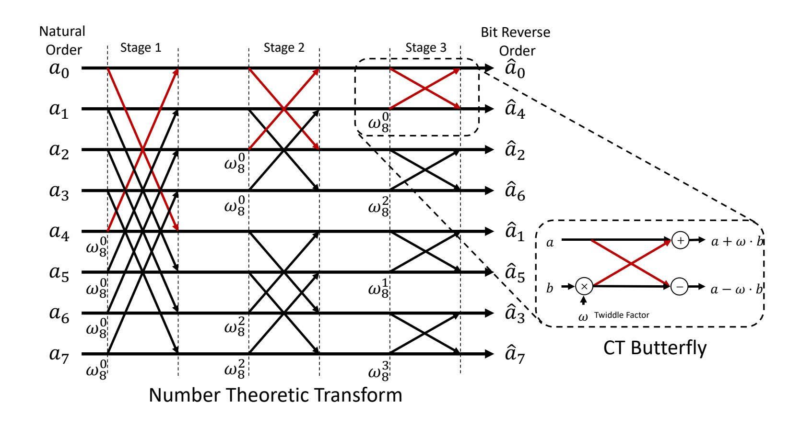
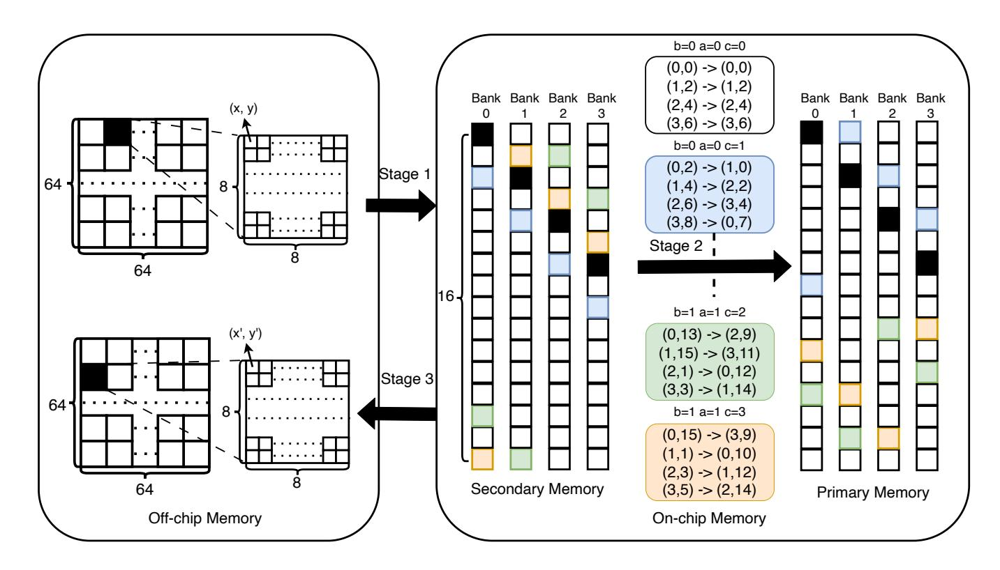
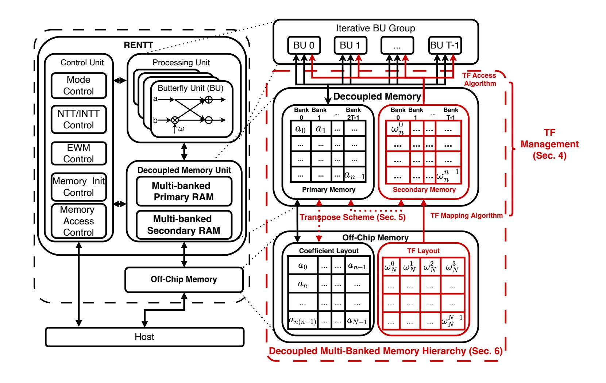
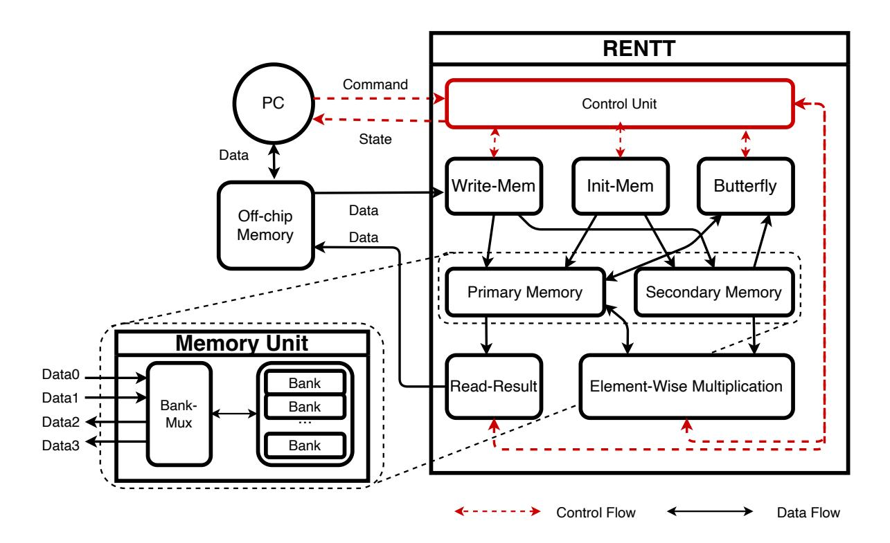

{0}------------------------------------------------

# **A Resource-Efficient Hardware Accelerator for Large-Size NTT via Algorithm–Architecture Co-Design**

Kaixuan Wang<sup>1</sup> , Yifan Yanggong<sup>1</sup> , Xiaoyu Yang<sup>2</sup> , Chenti Baixiao<sup>2</sup> and Lei Wang<sup>1</sup>

> <sup>1</sup> Shanghai Jiao Tong University, Shanghai, China, [wangkaixuan,wenzisdfz,wanglei\\_hb@sjtu.edu.cn](mailto:wangkaixuan,wenzisdfz,wanglei_hb@sjtu.edu.cn) <sup>2</sup> Chipltech, Shanghai, China, [huiniu,baiyan@chipltech.com](mailto:huiniu,baiyan@chipltech.com)

**Abstract.** Large-size Number Theoretic Transforms (NTTs) are key operations in modern Zero-Knowledge Proofs (ZKPs), where the NTT size often reaches millions of points and the arithmetic is over wide prime fields. To handle such NTTs on hardware, prior designs commonly rely on the decomposition algorithm, which makes large-size NTTs feasible by streaming sub-NTTs through limited on-chip buffers. However, in practical implementations, decomposition alone is insufficient to ensure high efficiency. Since coefficients and twiddle factors remain off-chip, performance tends to depend on data movement across the memory hierarchy and delivery to the processing elements (PEs). To address these remaining issues, we present **RENTT**, a resource-efficient accelerator for large-size NTTs with decomposition-oriented data movement schemes and memory hierarchy design.

First, we design a precomputation-based twiddle factor management scheme that feeds multiple PEs without conflicts, both reducing on-chip twiddle factor storage and avoiding on-the-fly twiddle factor generation. Second, we develop a burst-optimized transpose method that fuses coefficient reordering into the element-wise twiddlemultiplication pass, reducing the latency of off-chip accesses for the subsequent NTTs. Third, we design a decoupled, multi-banked on-chip memory hierarchy that sustains high PE utilization under off-chip streaming, while remaining configurable across PE counts and maximum supported NTT sizes. We implement RENTT on an FPGA and experimentally verify that RENTT supports NTT sizes up to *N* = 2<sup>28</sup> over 256-bit fields and completes a 2 <sup>28</sup>-point NTT in 1.52 seconds with 16 processing elements. Compared with the state-of-the-art FPGA baseline SAM, RENTT provides 2*.*64× speedup (1.52s vs. 4.02s), reduces 46.4% DSP usage (3629 vs. 6776 DSPs), and achieves a 3*.*58× lower area-time product.

**Keywords:** Number Theoretic Transform · FPGA Acceleration · Zero-Knowledge Proofs

# **1 Introduction**

Zero-Knowledge Proof (ZKP) [\[GMR85\]](#page-21-0) enables a prover to convince verifiers of a statement's validity without revealing any additional information. It is a fundamental primitive in modern cryptography to protect data privacy and to ensure computational integrity. Recently, ZKPs have found urgent practical applications in various cutting-edge domains, such as blockchain [\[SCG](#page-22-0)<sup>+</sup>14,[SC21,](#page-22-1)[XZC](#page-23-0)<sup>+</sup>22], verifiable fully homomorphic encryption [\[TW24\]](#page-23-1), and machine learning [\[LXZ21,](#page-22-2)[CWSK24,](#page-21-1)[APKP24\]](#page-20-0).

In a high-level overview, a ZKP protocol consists of a proof generation phase and a verification phase. Recent modern constructions [\[ACFY24,](#page-19-0) [ACFY25\]](#page-20-1) enable efficient

{1}------------------------------------------------

verification. In contrast, the proof generation is still computationally and memory intensive as the dominant performance bottleneck. This limits broader deployment of ZKP protocols in practice, and motivates extensive efforts to improve the proving efficiency [\[GGPR13,](#page-21-2) [BCS16,](#page-20-2) [BBC](#page-20-3)<sup>+</sup>17,[GWC19,](#page-21-3)[CHM](#page-21-4)<sup>+</sup>20]. In particular, hardware acceleration has emerged as a promising direction to reduce the latency of proof generation. Researchers from both academia and industry have continued to develop the state of the art on the efficiency of proof generation. Examples include ASIC-based accelerators [\[ZWZ](#page-23-2)<sup>+</sup>21,[DRG24,](#page-21-5)[SLDS24\]](#page-22-3), FPGA-based accelerators [\[ACM](#page-20-4)<sup>+</sup>23,[CM23,](#page-21-6)[HWL](#page-21-7)<sup>+</sup>25], and GPU-based accelerators [\[MXS](#page-22-4)<sup>+</sup>23,[LCW](#page-22-5)<sup>+</sup>25].

Following similar motivation, this paper focuses on *Number Theoretic Transform (NTT)* [\[Pol71\]](#page-22-6), one of the major bottlenecks in ZKP proof generation. Specifically, the proof of a target computation is typically reduced to checking a collection of polynomial relations.[1](#page-1-0) These relations frequently involve polynomial multiplications. Such polynomial multiplication is usually implemented via the NTT operation in practice. As a result, NTT executions dominate the proof generation performance. Hardware accelerators for ZKP protocols face the challenge of computing large-size NTTs under limited on-chip memory resources. Specifically, the NTT size often reaches 2 <sup>20</sup> to 2 <sup>28</sup> in practical ZKP protocols (e.g., Zcash [\[BCG](#page-20-5)<sup>+</sup>14] and Filecoin [\[BL17\]](#page-20-6)) and the field bit-width is on the order of hundreds of bits (e.g., BN254 and BLS12-381). The resulting working set (such as the coefficients and twiddle factors) quickly grows to multiple gigabytes, far exceeding the onchip memory capacity of modern FPGAs (typically tens of megabytes). Existing hardware accelerators for such large-size NTT commonly adopt the decomposition algorithm [\[Bai90\]](#page-20-7). This algorithm views an *N*-point NTT as an *n*<sup>1</sup> × *n*<sup>2</sup> matrix, streams intermediate data through off-chip memory, and reduces on-chip memory to *O*(max(*n*1*, n*2)). It is widely adopted by FPGA implementations [\[CM23,](#page-21-6)[GZH](#page-21-8)<sup>+</sup>24,[HWL](#page-21-7)<sup>+</sup>25] as well as ASIC designs [\[ZWZ](#page-23-2)<sup>+</sup>21[,DRG24,](#page-21-5)[ZLY](#page-23-3)<sup>+</sup>24,[WG25,](#page-23-4)[YZL](#page-23-5)<sup>+</sup>25].

**Our motivation.** This paper aims to deal with two issues underlying the decomposition algorithm. The first one is the twiddle factor management under parallel processing. Existing approaches either generate twiddle factors (TFs) on the fly or precompute and store them in off-chip memory. The former reduces TF storage, but introduces multiplier overhead that consumes more DSP slices and thus constrains scalable parallelism [\[CM23\]](#page-21-6). The latter reduces arithmetic overhead, but faces bank conflicts when multiple PEs access TFs simultaneously. The conflict can be addressed via stage-wise table expansion [\[ZWZ](#page-23-2)<sup>+</sup>21, [HWL](#page-21-7)<sup>+</sup>25] or replication [\[KMSH24\]](#page-22-7) of TF tables. However, both methods incur on-chip memory overhead that grows with the NTT size or the parallelism degree. The second issue is the mismatch between two different off-chip access patterns. The data layout [\[AFH16\]](#page-20-8) that streams efficiently in one phase (e.g., row-wise) often becomes inefficient in the next phase (e.g., column-wise). As a result, the accelerator fetches data in fragmented chunks instead of long contiguous chunks. This leads to more off-chip memory interactions and longer data-loading time.

Overall, existing architectures should take into consideration an end-to-end co-design between TF management, burst-efficient off-chip memory access, and conflict-free on-chip parallelism. This fragmentation prevents the optimization of the Area-Time Product (ATP), a critical metric reflecting the balance between resource consumption and latency. Optimizing any single component in isolation typically shifts pressure to another (e.g., saving DSP slices via precompute increases memory cost; reducing the latency by using more PEs increases computation cost), leading to suboptimal latency–area trade-offs captured by ATP.

<span id="page-1-0"></span><sup>1</sup>We refer interested readers to [\[Pet19\]](#page-22-8) for details.

{2}------------------------------------------------

<span id="page-2-0"></span>**Table 1:** Comparison of state-of-the-art hardware cccelerators for large-size NTTs. **TF Strategy**: precomputed vs on-the-fly twiddle factor supply. **Max Par.**: maximum PE parallelism degree (T). **Param.**: design-time parameterizable in both  $N_{\text{max}}$  and T. **Conf.**: runtime-configurable  $N \leq N_{\text{max}}$  on a fixed implementation. **Max Size**: maximum supported NTT size. **ATP**: area-time product computed using the latency for computing a  $2^{24}$ -point NTT with 256-bit width. "-": not directly comparable since the work targets a non-FPGA platform.

| Work                                                             | TF<br>Strategy | Max<br>Par. | Max<br>Size | Param. | Conf. | ATP (Improvement)        |
|------------------------------------------------------------------|----------------|-------------|-------------|--------|-------|--------------------------|
| $\begin{array}{c} {\rm PipeZK} \\ {\rm [ZWZ^+21]} \end{array}$   | Precomputed    | 4           | $2^{20}$    | ×      | 1     | -                        |
| SAM<br>[CM23]                                                    | On-the-fly     | 16          | $2^{28}$    | ×      | ✓     | $131.34 \ (3.58 \times)$ |
| $\begin{array}{c} \text{HiFA} \\ [\text{HWL}^{+}25] \end{array}$ | Precomputed    | 12          | $2^{24}$    | ✓      | ×     | $44.72 \\ (1.22\times)$  |
| This Work                                                        | Precomputed    | 16          | $2^{28}$    | 1      | ✓     | $36.62 \\ (1\times)$     |

Our results. This paper presents RENTT, a resource-efficient accelerator for large-size NTTs. RENTT addresses the above issues through algorithm-architecture co-design:

- Conflict-free twiddle factor management. We propose a precomputation-based TF management scheme with a multi-bank address mapping and stage-aware access scheduling, guaranteeing that TF supply is conflict-free in every cycle while using only a single logical copy of the TF table shared across all PEs (Sec. 4). In RENTT, each PE contains a single radix-2 butterfly datapath. This reduces on-chip memory pressure and removes the DSP overhead of on-the-fly TF generation.
- Conflict-free coefficient transpose scheme. We propose a transpose scheme that is integrated into Step 2 of the decomposition algorithm flow: while performing the mandatory element-wise TF multiplication, the accelerator applies an address permutation and writes coefficients back in a layout that restores contiguous, burst-friendly accesses for small-size NTTs in Step 3 (Sec. 5). This avoids burst fragmentation that would otherwise arise from strided column reads.
- A decoupled memory-centric, parameterizable and configurable accelerator. RENTT adopts a decoupled multi-banked memory hierarchy to sustain high utilization under off-chip streaming. The accelerator is design-time parameterizable in both the PE parallelism T and the maximum supported NTT size  $N_{\text{max}}$ , enabling implementations tailored to different FPGA resource budgets. Moreover, RENTT is runtime-configurable and supports any  $N \leq N_{\text{max}}$  without modifying the circuit (Sec. 6).

**Experiment implementation.** We implement RENTT and deploy it on an AMD/Xilinx Alveo U280 FPGA with DDR-only off-chip memory. RENTT supports NTT sizes up to  $N=2^{28}$  over 256-bit fields and completes a  $2^{28}$ -point NTT in 1.52 seconds with 16 PEs (Sec. 7). Table 1 summarizes representative large-size NTT accelerators which also support wide bit-width arithmetic. Compared to state-of-the-art baselines, RENTT achieves a  $3.58 \times$  lower ATP than SAM [CM23] at the same parallelism, primarily by eliminating twiddle-factor generation overhead while sustaining high PE utilization. Overall, to the best of our knowledge, RENTT achieves the lowest reported ATP among comparable

{3}------------------------------------------------

FPGA-based large-size NTT accelerators that support  $N_{\text{max}} = 2^{28}$  over 256-bit prime fields, while remaining design-time parameterizable in  $(T, N_{\text{max}})$  and runtime-configurable for any  $N \leq N_{\text{max}}$ .

## 2 Preliminary

We denote the finite field modulo a prime number p as  $\mathbb{F}_p$ , where  $W = \lceil \log_2 p \rceil$  represents the bit width. A polynomial  $A(x) = \sum_{i=0}^{N-1} a_i x^i \in \mathbb{F}_p^{< N}[x]$  is identified by its coefficient vector  $\mathbf{a} = (a_0, \dots, a_{N-1}) \in \mathbb{F}_p^N$ .

## 2.1 Number Theoretic Transform

The number theoretic transform (NTT) [Pol71] is a variant of Discrete Fourier Transform (DFT) defined over  $\mathbb{F}_p$ . It maps a coefficient vector  $\mathbf{a}$  to its evaluation form  $\hat{\mathbf{a}} = (\hat{a}_0, \dots, \hat{a}_{N-1}) \in \mathbb{F}_p^N$ . Compared with the direct method for batch evaluation of a degree-(N-1) polynomial at N distinct points, the NTT reduces the computational complexity from  $O(N^2)$  to  $O(N \log N)$ . The forward NTT and its inverse (INTT) are defined as:

$$\hat{a}_i = \sum_{j=0}^{N-1} a_j \cdot \omega_N^{ij} \bmod p, \quad a_j = N^{-1} \cdot \sum_{i=0}^{N-1} \hat{a}_i \cdot \omega_N^{-ij} \bmod p \tag{1}$$

where  $\omega_N \in \mathbb{F}_p$  is a primitive N-th root of unity (satisfying  $\omega_N^N \equiv 1$  and  $\omega_N^{N/2} \equiv -1 \mod p$ ). The powers of  $\omega_N$  used in these computations are referred to as twiddle factors. In hardware implementations, the efficiency of NTT relies on the following properties:

- Reflective Property:  $\omega_N^{k+N/2} = -\omega_N^k$ .
- Reduction Property:  $\omega_{tN}^{tk} = \omega_{N}^{k}$ .

The inverse twiddle factors are computed as  $\omega_N^{-1} \equiv \omega_N^{p-2} \mod p$  via Fermat's Little Theorem.

### 2.2 Hardware Execution and Butterfly Operation

<span id="page-3-0"></span>The standard algorithm for computing NTT is the Cooley-Tukey radix-2 Decimation-in-Time (DIT) algorithm [CT65], as detailed in Algorithm 1. The core computational unit is the butterfly (BF) operation (as described in the innermost loop in Algorithm 1), which processes two elements u, v and a twiddle factor  $\omega$  per cycle. For an N-point NTT, there are  $\log_2 N$  stages, each consisting of N/2 butterfly operations.

The hardware efficiency of NTT is constrained by two factors. First, the arithmetic units (multipliers and adders over  $\mathbb{F}_p$ ) are computation resource-intensive due to the large bit width W and modular reduction. Second, the data access pattern is highly irregular as illustrated in Fig. 1; in the i-th stage, the elements selected for a BF are spaced  $N/2^{i+1}$  positions apart. As the stage index i increases, this stride decreases, creating complex memory access patterns that often result in bank conflicts and computational stalls in multi-PE (Processing Element) architectures.

### <span id="page-3-1"></span>2.3 Large-size NTT and Decomposition Algorithm

In zero-knowledge proof systems, N often reaches  $2^{20}$  to  $2^{28}$  with W over hundreds of bits (e.g.,  $W \approx 256$  bits) [CM23]. This creates a working set (coefficients and twiddle factors) of several gigabytes, far exceeding the on-chip memory capacity of modern FPGAs (typically tens of megabytes). In prior works [ZWZ<sup>+</sup>21, CM23, HWL<sup>+</sup>25], such NTT instances are

{4}------------------------------------------------

<span id="page-4-0"></span>

Figure 1: The data access pattern of 8-NTT and the CT butterfly operation.

```
Algorithm 1: DIT NTT with Cooley-Tukey Butterfly
   Input: Polynomial A of degree N-1, twiddle factor \omega_N
    Output: A = NTT(A)
 1 for i \leftarrow 0 to \log N - 1 do
                                                                            /* \log N stages */
        m \leftarrow N/2^{i+1}
 \mathbf{2}
       \omega' = \omega_N^{2^{i+1}}
 3
       g \leftarrow 2^i
 4
                                                       /* g = 2^i groups in i-th stage */
        for k \leftarrow 0 to g - 1 do
 5
            k' = bitreverse(k)
 6
            \omega = (\omega')^k
 7
                                              /* m=N/2^{i+1} butterfly operations */
            for j \leftarrow 0 to m-1 do
 8
                u \leftarrow a[2km + j]
 9
                v \leftarrow a[(2k+1) \cdot m + j] \cdot \omega
10
                a[2km+j] \leftarrow u+v
11
                a[(2k+1)\cdot m+j]\leftarrow u-v
12
            end
13
        end
14
15 end
```

regarded as a large-size NTT. Due to on-chip memory constraints, the entire working set must reside in off-chip memory, necessitating the iterative loading of data blocks into on-chip memory for processing.

To address this, the decomposition algorithm [Bai90] is widely adopted by NTT accelerators for ZKPs, such as [ZWZ<sup>+</sup>21, CM23, GZH<sup>+</sup>24, HWL<sup>+</sup>25, WG25, YZL<sup>+</sup>25]. It treats the N-point input as an  $n_1 \times n_2$  matrix:

- 1. Step 1 (small-size NTT): Perform  $n_1$  instances of  $n_2$ -point NTTs on each row.
- 2. Step 2 (twiddle factor product and matrix transpose): Multiply each matrix element  $m_{i,j}$  by a twiddle factor  $\omega_N^{ij}$ . Transpose the matrix to reorder data for the

{5}------------------------------------------------

next phase.

3. **Step 3 (small-size NTT)**: Perform *n*<sup>2</sup> instances of *n*1-point NTTs on the new rows.

This decomposition reduces the on-chip memory requirement to only *O*(max(*n*1*, n*2)). Our accelerator design is general and supports decompositions with *n*<sup>1</sup> ̸= *n*2. Specifically, when *n*<sup>1</sup> *> n*2, our accelerator executes the *n*2-point NTT and *n*1-point NTTs independently in Step 1 and Step 3, respectively. In Step 2, we treat the data as a logical *n*<sup>1</sup> × *n*<sup>1</sup> layout to simplify transpose scheduling, while masking the inactive columns (*j* ≥ *n*2) so the computation still corresponds to the original transform. For ease of presentation, we assume *n*<sup>1</sup> = *n*<sup>2</sup> = *n* (thus *N* = *n* 2 ) throughout the rest of this paper.

**Remark.** Unlike Fully Homomorphic Encryption (FHE) schemes which utilize the Residue Number System (RNS) to decompose a large modulus into smaller prime factors, practical ZKP protocols operate directly over large prime fields (e.g., the scalar field in BN254 or BLS12-381). This lack of RNS support necessitates hardware that can handle extremely wide data paths and large NTT sizes, leading to significant memory pressure for storing billions of precomputed twiddle factors.

# **3 Motivation**

This section describes the evaluation metrics used throughout the paper and summarizes the key design rationales at a high level. Our goal is to optimize end-to-end efficiency for decomposition-based large-size NTTs on FPGA, where both arithmetic execution and data movement contribute to the overall cost. We report the Area-Time Product (ATP) as the primary metric and use it to motivate three architectural choices that are detailed in the subsequent sections.

## <span id="page-5-1"></span>**3.1 Evaluation Metrics**

To evaluate large-size NTT accelerators designed for zero-knowledge proof systems, we adopt the Area-Time Product (ATP) metric, following prior FPGA accelerator studies [\[KHF25,](#page-22-9) [HWL](#page-21-7)<sup>+</sup>25]. ATP captures the trade-off between the end-to-end latency of one NTT instance and the hardware resource; a smaller ATP indicates better performance.

We report the end-to-end latency L using a measurement window that starts when the input data are ready in the off-chip memory and ends when the final outputs have been written back to the off-chip memory. Therefore, L includes computation and off-chip data movement overheads. Following the decomposition algorithm, we measure the latency of each step as a self-contained workload including data loads, stores, and computation. The end-to-end latency is reported as:

$$\mathcal{L} = \mathcal{L}^{\text{step}_1} + \mathcal{L}^{\text{step}_2} + \mathcal{L}^{\text{step}_3}, \tag{2}$$

which directly reflects the algorithmic decomposition and the system-level overheads in each step. The exact meaning of each step is determined by the decomposition strategy described in Section [7.3.](#page-18-0)

Then, we describe FPGA resource usage including lookup tables (LUT), Flip-Flops (FF), DSP slices, BRAM/URAM, denoted as NUMLUT, NUMFF, NUMDSP and NUMBRAM [2](#page-5-0) ,

<span id="page-5-0"></span><sup>2</sup>When UltraRAM is used, we report it in BRAM-equivalents based on memory capacity. On AMD/Xilinx FPGAs, one UltraRAM block provides 288 Kb storage, which is eight times the capacity of a 36 Kb Block RAM [\[AMD23b\]](#page-20-9).

{6}------------------------------------------------

respectively. To aggregate heterogeneous resources into an equivalent area, we adopt weighting ratios reported in prior FPGA studies [\[THKX23,](#page-22-10)[HMK](#page-21-10)<sup>+</sup>24]:

$$\mathcal{A} = \left(\frac{\text{NUM}_{\text{LUT}}}{16} + \frac{\text{NUM}_{\text{FF}}}{8} + 102.4 \times \text{NUM}_{\text{DSP}} + 56 \times \text{NUM}_{\text{BRAM}}\right) / 1000.$$
 (3)

Finally, ATP is computed as:

$$ATP = \mathcal{L} \times \mathcal{A}. \tag{4}$$

# **3.2 Design Motivations and Insights**

While the decomposition algorithm makes large-size NTTs feasible under limited on-chip capacity, existing FPGA designs [\[CM23,](#page-21-6)[HWL](#page-21-7)<sup>+</sup>25] for large-size NTTs suffer from three recurring issues. We highlight them here only at a high level to bridge the metric definition above and the detailed designs in the next sections.

**Twiddle-factor management under limited resource budgets.** For large-size NTTs over wide bit-width fields, twiddle-factor (TF) handling can become an important design consideration: generating TFs on-the-fly reduces storage but consumes DSP resources that compete with the main datapath, whereas full precomputation increases storage and may push TF traffic to off-chip memory. A key observation is that TF consumption in decomposition-based NTTs is highly structured and stage-local, so only a small working subset is needed at any time if the access order is chosen carefully. This motivates a precomputation-based approach with compact table organization and address-aware access that matches the decomposition schedule, reducing DSP pressure without inflating the on-chip footprint or off-chip traffic.

**Avoiding stalls in decomposition-induced data reordering.** Decomposition-based NTTs require data reordering (e.g., matrix transpose) between phases, yet a straightforward mapping often mismatches the sequential, burst-friendly nature of off-chip memories (DDR/HBM) with the strided, parallel access demanded by on-chip PEs, leading to bank conflicts and pipeline bubbles. Prior work [\[CM23\]](#page-21-6) adopts a more complex decomposition to mitigate burst-unfriendly column-wise accesses, which incurs additional control-logic overhead. Alternatively, other designs leverage tiled memory layouts [\[AFH16,](#page-20-8)[CYZ](#page-21-11)<sup>+</sup>25] to improve the burst locality of column-wise NTT accesses by processing the matrix in tiles/blocks, often at the cost of more complex address generation or additional buffering. The insight is that this overhead is largely a consequence of an uncoordinated address/banking design: with a permutation-aware mapping, reordering can be realized through conflict-free on-chip accesses and aligned burst transfers. This motivates a transpose/reordering scheme that co-designs on-chip banking with off-chip burst layout to sustain a continuous compute pipeline.

**Scalable and flexible accelerator under varying FPGA budgets.** Several prior largesize NTT accelerators employ tightly coupled control logic and fixed resource ratios, which limits portability across FPGA platforms and complicates scaling as routing and control overheads grow [\[ZWZ](#page-23-2)<sup>+</sup>21, [HWL](#page-21-7)<sup>+</sup>25]. Our observation is that large-size NTT execution admits a regular, iterative schedule: the same workload can be replayed across tiles/steps, while the control scheme can be parameterized independently of the physical instantiation scale. This motivates a decoupled and parameterized accelerator where scheduling is separated from the datapath scale, allowing the design to adapt different resource compositions and to scale performance with the number of instantiated PEs.

{7}------------------------------------------------

# <span id="page-7-0"></span>4 Conflict-Free Twiddle Factor Management Scheme

Building on the precomputed twiddle-factor (TF) approach, we propose a conflict-free TF management scheme to supply twiddle factors to parallel butterfly operations. We first describe the twiddle factor provisioning problem. We then present the proposed memory-access scheme in three steps. Finally, we provide a detailed analysis to quantify its effectiveness.

### 4.1 Problem Statement

In the decomposition algorithm (detailed in Sec. 2.3), the NTT computation is split into two types: small-size NTTs in Step 1 and Step 3, and element-wise multiplication with transpose in Step 2. These two types of computation impose distinct memory access patterns on TF management:

- Element-wise multiplication with linear access pattern requires N TFs  $(\{\omega_N^k\}_{k\in[0,N-1]})$ . Since access is sequential, streaming from off-chip memory is straightforward.
- Small-size NTTs with butterfly access pattern require n unique TFs  $(\{\omega_n^k\}_{k\in[0,n-1]})$  for the small-size NTTs. Here, T PEs must access TFs in complex, non-linear patterns simultaneously.

The primary challenge lies in small-size NTTs. A precomputation approach used by the prior precomputation-based work [HWL<sup>+</sup>25] would require stage-wise table expansion to prevent memory access conflicts, leading to linear memory growth  $(T \cdot \mathcal{M})$  where  $\mathcal{M} = n/2 \cdot W$  denotes memory consumption for storing  $\{\omega_n^k\}_{k \in [0, n/2-1]}$ . Conversely, accessing a single table without optimization causes severe bank collisions, stalling the pipeline. For instance, consider a configuration with T=4 PEs and a 4-bank memory utilizing standard linear interleaving, where the twiddle factor  $\omega^k$  is stored in Bank  $(k \mod 4)$ . During a stage where the butterfly operations require PEs to access indices with a stride of 8 (e.g., requesting  $\{\omega^0, \omega^{16}, \omega^8, \omega^{24}\}$  in the last stage of a small NTT), all four access requests target Bank 0 simultaneously. Consequently, the memory controller must serialize these requests, forcing the pipeline to stall for 3 cycles and reducing the effective parallelism by 75%.

### 4.2 Twiddle Factor Memory Access Scheme

We design this scheme in three steps: precomputation and hierarchical selection, optimized storage mapping, and stage-aware conflict-free access.

### 4.2.1 The Data Preparation: Precomputation and hierarchical selection

In data preparation, we precompute a master table of twiddle factors  $\{\omega_N^k\}_{k\in[0,N-1]}$  and store it in off-chip memory in a linear (contiguous) layout. The decomposition algorithm consumes twiddle factors in two distinct ways. In Step 1 and Step 3, the small-size NTTs require a stage-wise twiddle set for an n-point NTT. In Step 2, the element-wise multiplication requires a stream of  $\omega_N^{ij}$  values associated with matrix coordinates. To avoid maintaining multiple redundant tables, we adopt a hierarchical selection from the master table. Using the reduction property  $\omega_n^k = \omega_N^{k\cdot n}$  (with  $N=n^2$  in our setting), the twiddle factors needed by the n-point sub-NTTs can be obtained as a strided subset of the master table, and then staged into on-chip memory for conflict-free access during butterfly execution.

The off-chip loading frequency differs across steps. For Step 1 and Step 3, the required n-point twiddle table is reused across all sub-NTTs within the step; thus it is loaded once

{8}------------------------------------------------

Algorithm 2: Twiddle Factor Address Mapping Algorithm

```
Input: NTT size n, PE number T.

Output: Pos: Pos[i] is a tuple (BI, BA), where BI \in [0, T-1] and BA \in [0, n/T-1] are bank index and the offset of the storage location in each bank for twiddle factor \omega^i

1 for i \leftarrow 0 to n-1 do

2 | i' \leftarrow \text{bitreverse}(i)

3 | BI \leftarrow i' \mod T

4 | BA = \lfloor i'/T \rfloor

5 | Pos[i] \leftarrow (BI, BA)

6 end

7 return Pos
```

at the beginning of the step and then repeatedly accessed on-chip. In contrast, Step 2 processes the matrix in n tiles, and each tile uses a different segment of twiddle factors; therefore, the accelerator streams twiddle factors from off-chip memory n times over the course of Step 2.

The INTT follows the same hierarchy and access pattern, except that we precompute and store the inverse twiddle factors  $\{\omega_N^{-k}\}_{k\in[0,N-1]}$  (and similarly derive  $\omega_n^{-k}$  when executing the sub-INTTs).

### 4.2.2 The Storage Mechanism: Multi-bank Address Mapping

When loading TFs from off-chip to on-chip memory, we employ a bit-reversal permutation to distribute data across banks.

<span id="page-8-0"></span>
$$BI = bitreverse(i) \mod T$$
 (5)

This mapping breaks the linear correlation of standard indexing. By scattering logically adjacent TFs across physically distinct banks, we minimize the probability of collision during the strided access patterns characteristic of NTT butterfly operations. Here BI denotes the bank index into which the old address is mapped. BA denotes the offset of the storage location within each inner bank.

#### 4.2.3 The Retrieval Mechanism: Conflict-free Access Scheduling

To support the pipelined processing unit, the memory subsystem must supply T twiddle factors per cycle. However, the demand pattern of the NTT algorithm shifts dynamically across stages. We propose a stage-aware access scheduling mechanism (detailed in Algorithm 3) that adapts the addressing logic to three distinct phases:

**Design Intuition.** The proposed scheduling logic leverages the inherent hierarchical structure of the Cooley-Tukey algorithm. Specifically, within each stage, we partition butterfly operations into groups based on twiddle factor locality. Operations sharing the identical twiddle factor are clustered into the same group. This grouping structure dictates the memory access pattern:

• Phase 1: One Fetch and Inter-Group Broadcast (Case 1 and Case 2). In early stages, the size of groups (consecutive butterflies using the same  $\omega$ ) is large. All T PEs typically require the identical twiddle factor in each cycle. Instead of issuing T redundant requests, our logic generates a single bank address derived from the group index (GI) and broadcasts the data to all PEs. This minimizes logic switching and power consumption.

{9}------------------------------------------------

• Phase 2: Intra-Group Parallelism (Case 3). In later stages, the group size shrinks, and PEs require distinct twiddle factors simultaneously. Here, the logic utilizes the base group index  $(Base_{GI})$  and the PE offset to calculate unique addresses. By aligning this calculation with the bit-reversal storage mapping, we ensure these concurrent requests naturally land on different banks.

Algorithm 3 translates the linear execution time (cycle c) into the hierarchical coordinates of the NTT. This mapping relies on a set of derived control parameters calculated at the beginning of the algorithm:

- Structural Parameters: The variable  $n_{tfpg}$  (twiddle factors per group) defines the periodicity or reusable length of the twiddle factors in the current stage. In the r-th stage of a radix-2 CT NTT, this run length decays as  $n_{tfpg} = n/2^{r+1}$ . A large  $n_{tfpg}$  implies strong TF reuse and broadcast delivery, whereas a small  $n_{tfpg}$  requires more distinct TFs per cycle and parallel delivery.  $n_{bps}$  denotes the cycle number for T PEs to execute all butterfly operations in each stage, which is equal to n/(2T). Butterfly operations are processed in groups to match the PE parallelism. Let  $n_g = 2^r$  denote the number of groups in r-th stage and  $n_{bpg}$  denote the number of butterfly operations per group, and let  $n_{gpc}$  denote the number of groups processed per cycle.
- **Positioning Parameters:** To locate the current operation within the NTT structure, GI serves as the group index, identifying which logic block the current cycle belongs to. For the final stages,  $Base_{GI}$  provides the precise offset required to generate the parallel permutation pattern.

## <span id="page-9-0"></span>4.3 Effectiveness Analysis

First, we prove that the proposed twiddle factor (TF) management scheme guarantees conflict-free TF supply in Section 4.3.1. Then, we quantify the savings in on-chip memory (RAM utilization), and arithmetic resources (DSP utilization) in Section 4.3.2.

#### <span id="page-9-1"></span>4.3.1 Proof of Conflict-Free Access

**Conflict-free definition.** In each cycle, the memory system with T banks serves T PEs. An access is *conflict-free* if **each bank is accessed at most once per cycle**. If multiple PEs require the same TF, the design performs a *single read* and *broadcasts or multicasts* the fetched value to the corresponding PEs, which still counts as one bank access.

Let  $n=2^k$  and  $T=2^t$  with  $n \geq T$ . In radix-2 Cooley-Tukey NTT, the twiddle factor reuse length (the number of twiddle factors in each group) in stage r is  $n_{\rm tfpg}=\frac{n}{2^{r+1}}=2^{k-r-1}$ . Hence, in late stages  $(r \geq k-t)$ , we have  $n_{\rm tfpg} \leq 2^{t-1}=T/2$ , i.e., at least two distinct TFs are demanded per cycle.

**Proof for Phase 1** (r < k - t). Algorithm 3 selects a stage-level group index GI and generates a single pair of bank and address (BI, BA) = (GI, 0) which is independent of PE index. Thus all PEs receive the same TF via broadcast. Only one bank is accessed in the cycle, so the access is conflict-free.

**Proof for Phase 2**  $(r \ge k - t)$ . In these stages, Algorithm 3 computes

$$BI(i) = \left(Base_{GI} + \lfloor i/n_{\text{tfpg}} \rfloor\right) \mod T, \qquad BA(i) = \left\lfloor \frac{Base_{GI} + \lfloor i/n_{\text{tfpg}} \rfloor}{T} \right\rfloor.$$
 (6)

{10}------------------------------------------------

Algorithm 3: Twiddle Factor Memory Access Algorithm

```
Input: NTT size n=2^k, number of processing elements T=2^t with n \geq T; a
             stage index r \in [0, k-1] and a cycle index c \in [0, \frac{n}{2T}-1].
   Output: tf, where tf|i| denotes the position of the twiddle factor accessed by
               i-th PE for a given stage index r and cycle index c.
   /* 1. Compute Structural Parameters
                                                                                                 */
 1 n_{tfpg} = n/2^{r+1}; n_g = 2^r
  2 \quad n_{bps} \leftarrow n/2T; \ n_{bpg} \leftarrow n/(2n_gT); n_{gpc} \leftarrow T/n_{tfpg} 
   /* 2. Compute Positional Parameters
                                                                                                 */
 \mathbf{3} \ GI \leftarrow \lfloor c/n_{bpg} \rfloor
 4 Base_{GI} \leftarrow c \times n_{gpc}
   /* 3. Determine Bank and Address for each PE
                                                                                                 */
 5 for i \leftarrow 0 to T-1 do
       if r < t then
 6
           /* Case 1: Direct Broadcast in Early Stages (0 to t-1)
                                                                                                 */
           BI \leftarrow GI
 7
           BA \leftarrow 0
 8
       end
 9
       else if r < k - t then
10
           /* Case 2: Modulo Broadcast in Middle Stages (t to k-t-1) */
           BI \leftarrow GI \bmod T
11
           BA \leftarrow \lfloor GI/T \rfloor
12
       end
13
       else
14
           /* Case 3: Parallel Access in Final Stages k-t to k-1
                                                                                                 */
           BI \leftarrow (Base_{GI} + \lfloor i/n_{tfpg} \rfloor) \bmod T
15
           BA \leftarrow \lfloor (Base_{GI} + \lfloor i/n_{tfpg} \rfloor)/T \rfloor
16
       end
17
       tf|i| \leftarrow (BI, BA)
18
19 end
20 return tf
```

Define the TF-group  $id\ u = \lfloor i/n_{\rm tfpg} \rfloor$ . Within one cycle, u ranges over  $\{0, 1, \ldots, G-1\}$  where  $G = T/n_{\rm tfpg}$ , and each u corresponds to exactly  $n_{\rm tfpg}$  PEs that share the same TF. Therefore, it suffices to prove that the G distinct TF-groups map to G distinct banks, i.e.,  $BI(u_1) \neq BI(u_2)$  for any  $u_1 \neq u_2$ .

For any two distinct groups  $u_1 \neq u_2$ ,

$$BI(u_1) = (Base_{GI} + u_1) \bmod T, \qquad BI(u_2) = (Base_{GI} + u_2) \bmod T.$$
 (7)

Since  $0 \le u_1, u_2 \le G - 1$  and  $G \le T$ , the values  $(Base_{GI} + u)$  form G consecutive integers. Modulo-T maps them to a set of G distinct residues, i.e., a cyclic shift of  $\{0, \ldots, G - 1\}$ . Hence, each TF-group triggers at most one bank read, and the fetched TF is multicast to the  $n_{\rm tfpg}$  PEs in that group. Thus, every bank is accessed at most once per cycle, proving conflict-free operation in all stages.

### <span id="page-10-0"></span>4.3.2 Resource Efficiency Analysis

Beyond correctness, we evaluate the hardware efficiency including computation resource and memory resource.

{11}------------------------------------------------

**Memory resource analysis.** For each NTT of size n, a radix-2 implementation needs  $\frac{n}{2}$  distinct TFs  $\{\omega_n^i\}_{i\in[0,n/2-1]}$ . Let the TF bit-width be W. The total memory consumption is  $\mathcal{M}_{\mathrm{TF}} = \frac{n}{2} \cdot W$  bits. We follow the FPGA resource accounting methodology used in prior large-size NTT accelerators [HWL<sup>+</sup>25]. The bit-width and the depth of a RAM block in FPGA are denoted as  $W_{\mathrm{RAM}}$  and  $D_{\mathrm{RAM}}$ . A conflict-avoidance design adopted by previous work [HWL<sup>+</sup>25] stores all TFs  $(n \log n \text{ TFs})$  for each butterfly operation, yielding:

$$NUM_{RAM}^{stage} = T \times \left\lceil \frac{(\log n \cdot n)/T}{D_{RAM}} \right\rceil \times \left\lceil \frac{W}{W_{RAM}} \right\rceil.$$
 (8)

Our multi-bank mapping stores a single logical copy  $\{\omega_n^i\}_{i\in[0,n-1]}$  distributed across T banks, so the total TF storage remains:

$$NUM_{RAM}^{ours} = T \times \left\lceil \frac{n/T}{D_{RAM}} \right\rceil \times \left\lceil \frac{W}{W_{RAM}} \right\rceil$$
 (9)

Therefore, the number of URAM blocks we can save is:

$$NUM_{RAM}^{stage} - NUM_{RAM}^{ours} = T \times \left\lceil \frac{W}{W_{RAM}} \right\rceil \times \left( \left\lceil \frac{(n \times \log n)/T}{D_{RAM}} \right\rceil - \left\lceil \frac{n/T}{D_{RAM}} \right\rceil \right)$$
(10)

And the RAM Block saving versus stage-wise table expansion is:

$$\mathcal{R}_{\text{RAM}} = \frac{\text{NUM}_{\text{RAM}}^{stage} - \text{NUM}_{\text{RAM}}^{ours}}{\text{NUM}_{\text{RAM}}^{stage}} \approx 1 - \frac{1}{\log n}$$
 (11)

With target NTT sizes N ranging from  $2^{20}$  to  $2^{28}$ , the decomposed NTT size n is from  $2^{10}$  to  $2^{14}$ . This allows our approach to decrease on-chip twiddle factor storage by up to 90% reduction compared to the baseline method [HWL<sup>+</sup>25].

Computation resource analysis. For ZKP applications requiring large bit-widths ( $W \ge 256$ ), the area cost is dominated by modular multipliers. We denote the hardware cost (e.g., DSP usage) of a modular multiplier, a modular adder, and a modular subtractor as  $C_{mul}$ ,  $C_{add}$  and  $C_{sub}$  respectively. Accelerators relying on on-the-fly generation (e.g., SAM [CM23]) necessitate an additional modular multiplier per PE to iteratively update the twiddle factor. The arithmetic cost of such a PE  $C_{PE}$  can be approximated as:

$$C_{PE} = 2 \times C_{mul} + C_{add} + C_{sub} \approx 2 \times C_{mul}$$
 (12)

By streamlining the precomputed factors directly from memory, our precomputation-based method restricts the logic per PE to the core butterfly operation alone ( $C_{PE} \approx 1 \times C_{mul}$ ). This results in an approximate 50% reduction in computation resource per compute lane. On DSP-constrained FPGAs, this saving is pivotal, enabling the instantiation of more parallel PEs to maximize throughput.

# <span id="page-11-0"></span>5 Conflict-free Coefficient Matrix Transpose Scheme

In this section, we propose a coefficient-matrix transposition scheme that leverages our memory hierarchy (Sec. 6.1). Our scheme introduces a mathematically derived address permutation coupled with a three-stage scheduling loop. This design achieves fully pipelined, conflict-free memory access during matrix transpose, effectively hiding the transpose latency within the data transfer time.

{12}------------------------------------------------

# **5.1 Problem Statement**

Large-size NTT decomposition alternates between two computation phases that access the coefficient matrix along different dimensions (row-wise vs. column-wise). A coefficient layout that is burst-friendly for one phase tends to become burst-unfriendly for the other, which degrades off-chip efficiency due to fragmented bursts and increased memory transactions. To restore burst-contiguous off-chip streaming for the subsequent phase, we must transpose the coefficient matrix stored in off-chip memory.

A straightforward full-matrix transpose in off-chip memory is expensive, as it introduces an additional pass of irregular reads/writes and is difficult to overlap with computation. Instead, we adopt a tiled off-chip layout [\[AFH16\]](#page-20-8) and decompose the global transpose into two parts: (i) *inter-tile placement*, which rearranges the positions of tiles in the global matrix, and (ii) *intra-tile transpose*, which transposes coefficients within each tile. Under a tiled layout, inter-tile placement can be naturally realized by choosing appropriate off-chip write-back addresses (thus maintaining burst-contiguous streaming). The remaining challenge—and the focus of this section—is how to perform the intra-tile transpose efficiently on-chip without bank conflicts.

# **5.2 On-chip Transpose Scheme**

RENTT provides a dedicated Secondary Memory (organized as *T* banks with 1R1W ports) to serve twiddle factors during Step 2 (EWM). After Step 2 completes, the TF table is no longer on the critical path. We exploit this slack by using the Secondary Memory as an *auxiliary buffer* to hold the post-EWM coefficients for transposition. The transpose datapath therefore reads coefficients from the Secondary Memory and writes the permuted results back into the Primary Memory.

Let *T* = 2*<sup>t</sup>* be the PE count and *n* = 2*<sup>k</sup>* be the number of coefficients in a tile (a 2 *k/*<sup>2</sup> × 2 *k/*<sup>2</sup> block) which is equal to the size of sub-NTTs. Each on-chip banked memory (Primary Memory or Secondary Memory) has *T* banks and depth 2 *k*−*t* . We denote a physical location by (*BI, BA*), where *BI* ∈ [0*, T*−1] is the bank index and *BA* ∈ [0*,* 2 *<sup>k</sup>*−*t*−1] is the intra-bank address. The corresponding linear index within the tile is

<span id="page-12-0"></span>
$$I_p = BA \times T + BI. \tag{13}$$

The coordinate of *I<sup>p</sup>* within the tile is

$$(x,y) = \left(I_p \bmod 2^{k/2}, \left\lfloor I_p/2^{k/2} \right\rfloor\right). \tag{14}$$

Tile transpose swaps the two coordinates:

$$(x', y') = (y, x), I'_p = x' \times 2^{k/2} + y' = y \times 2^{k/2} + x.$$
 (15)

**Permutation-to-bank mapping.** We implement the intra-tile transpose via a deterministic address permutation that maps (*BI, BA*) to a destination (*BI*′ *, BA*′ ). In particular, the destination (*BI*′ *, BA*′ ) of linear index *I* ′ *p* can be written in the following form:

$$BI' = I_p' \bmod T = \left( \left| BA/2^{k/2-t} \right| \right) \bmod T, \tag{16}$$

$$BA' = \lfloor I_p'/T \rfloor = \lfloor BA/2^{k/2} \rfloor + \left( T \times (BA \bmod 2^{k/2-t}) + BI \right) \times 2^{k/2-t}. \tag{17}$$

Note that the Primary Memory is physically organized as 2*T* banks for the subsequent compute pipeline; during transpose, we only exercise *T* bank writes per cycle (one per PE), while the 2*T*-bank organization is preserved for paired accesses in later stages.

{13}------------------------------------------------

**Conflict-free schedule construction.** To guarantee bank-disjoint writes (i.e., *BI*′ *i* ̸= *BI*′ *j ,* ∀*i, j* ∈ [0*, T* − 1] and *i* ̸= *j*) each cycle, we decompose

$$BA = 2^{k/2-t} \times s + a, \quad s \in [0, 2^{k/2} - 1], \ a \in [0, 2^{k/2-t} - 1].$$
 (18)

Then Eq. [\(16\)](#page-12-0) reduces to *BI*′ = *s* mod *T*. For a given cycle, we process *T* PEs indexed by *τ* ∈ [0*, T* − 1] and set the source bank index as *BI* = *τ* (hence the read path is trivially conflict-free: one read each bank of Secondary Memory). We choose *s* as

<span id="page-13-0"></span>
$$s = (b \cdot T + c + BI) \bmod 2^{k/2}, \quad b \in [0, 2^{k/2 - t} - 1], \ c \in [0, T - 1]. \tag{19}$$

Combining Eq. [\(19\)](#page-13-0) with *BI*′ = *s* mod *T* yields

$$BI' = (c + BI) \bmod T. \tag{20}$$

Therefore, within the same cycle (fixed *c*), the set {*BI*′} over *BI* = *τ* spans all *T* residues exactly once, guaranteeing conflict-free writes to the Primary Memory. By iterating loops in the order (*b, a, c*) and executing all *T* PEs per cycle, the scheduler covers all (*BI, BA*) locations and completes the intra-tile transpose with sustained throughput.

# **5.3 End-to-end Transpose Scheme**

We now summarize the complete transpose flow in three stages under the tiled off-chip layout.

**Stage 1: Burst-contiguous stream-in.** We stream coefficients tile by tile from off-chip memory using long contiguous bursts and place them into the coefficient RAM in rowmajor order. For the sequential write phase, we maintain the standard linear mapping: (*BI, BA*) = (*i* mod *T,* ⌊*i/T*⌋)*, i* ∈ [0*, n* − 1]. In parallel, the required TF table is streamed into the Secondary Memory to serve Step 2 (EWM). This stage is fully burst-friendly due to the row-major traversal of the tiled layout.

**Stage 2: Intra-tile transpose.** After EWM finishes, the Secondary Memory is used to hold the results. The transpose scheduler streams *T* coefficients per cycle from the *T* TF banks. Each PE writes its coefficient to the permuted coordinate (*BI*′ *, BA*′ ) in the Primary Memory, which is physically organized as 2*T* banks. For convenience, we fold it into a logical *T*-bank view with doubled depth. During intra-tile transposition, we pair every two coefficient RAM banks and treat each pair as a single logical bank, thereby doubling the address depth of each bank and effectively viewing the 2*T*-bank memory as a *T*-bank memory. By ensuring that the *T* read bank indices *BI* are pairwise distinct and the *T* write bank indices *BI*′ are pairwise distinct, the on-chip transpose achieves conflict-free accesses and sustains full PE throughput.

**Stage 3: Burst-contiguous stream-out with inter-tile placement.** Once a tile is transposed and resides in the Primary Memory, we stream it back to off-chip memory using long contiguous bursts. Critically, the off-chip *write-back addresses* follow the tiled layout of the transposed matrix. Therefore, the global inter-tile placement is realized implicitly by the off-chip addressing, while the on-chip permutation only implements the intra-tile transpose. This avoids an explicit global transpose pass in off-chip memory.

Figure [2](#page-14-1) illustrates the three-stage transpose scheme with a simplified example (*N* = 2 <sup>12</sup>*, T* = 4). It visualizes how the scheme works without conflicts with the access pattern to enable full parallelism and the coefficient permutation.

{14}------------------------------------------------

<span id="page-14-1"></span>

**Figure 2:** The coefficient matrix transpose with 4 PEs for NTT of size  $N=2^{12}$ .

## 5.4 Effectiveness Analysis

Conflict-free transpose. To guarantee a conflict-free pipeline, we must prove that during the transposed read phase, any two distinct PEs i and j ( $i \neq j$ ) access distinct banks  $BI'_i$  and  $BI'_j$ . In a column-wise access, the logical addresses differ by the matrix width stride. Under our permutation logic, BI' depends on the higher-order bits of the offset BA (specifically  $BA/2^{k/2-t}$ ). Since the hierarchical scheduler ensures that parallel PEs access segments of BA that differ in exactly these high-order bits, the mapping creates a bijective relationship between the PE index and the Bank index. Thus,  $BI'_i \neq BI'_j$  for all  $i \neq j$ , intrinsically eliminating bank conflicts. As a result, the transpose stage sustains one coefficient per PE per cycle, keeping the pipeline fully utilized.

Burst efficiency and reduced off-chip overhead. Both stream-in and stream-out traverse tiles sequentially, issuing long contiguous bursts. The only reordering occurs on-chip within each tile, so off-chip accesses remain burst-contiguous. Compared with a trivial transpose that performs strided off-chip reads/writes, our scheme reduces burst fragmentation and the number of off-chip transactions, thereby lowering data-loading time for the subsequent NTT phase.

Minimal buffering and clean integration. The scheme reuses the Secondary Memory after Step 2, avoiding additional transpose-specific on-chip storage. Moreover, since inter-tile placement is absorbed into the stream-out addressing, the transpose integrates naturally into the decomposition flow without introducing a separate global data-movement pass.

## <span id="page-14-0"></span>6 RENTT Architecture

We present RENTT for large-size NTT acceleration, which adopts the proposed conflict-free memory access scheme and coefficient matrix transpose scheme. As illustrated in Fig. 3, the design philosophy prioritizes resource efficiency, flexibility and reconfiguration. By accessing the precomputed twiddle factors and using matrix transpose scheme (as detailed in Sec. 4 and 5), the hardware core remains resource-efficient while supporting high-parallelism computations.

{15}------------------------------------------------

<span id="page-15-1"></span>

**Figure 3:** Overview of the RENTT comprising the Control Unit, Processing Unit, and Memory Unit. Red highlights the proposed twiddle factor management (Sec. 4), coefficient transpose scheme (Sec. 5), and the decoupled multi-banked memory hierarchy in this section.

The system integrates with a host CPU via a PCIe interface, comprising three tightly coupled subsystems: a Control Unit, a Decoupled Multi-Banked Memory Unit, and a Processing Unit.

### <span id="page-15-0"></span>6.1 Decoupled Multi-banked Memory Hierarchy

To eliminate structural hazards between polynomial coefficient access and twiddle factor retrieval, we design a decoupled multi-banked memory hierarchy. Unlike unified memory architectures that suffer from port contention, our design physically segregates the storage of dynamic data and static constants into two independent units: the *Primary Memory* and the *Secondary Memory*.

**Primary Memory for polynomial coefficients.** The Primary Memory is a coefficient buffer with a capacity of  $n \times W$  bits, which is decoupled from twiddle-factor storage. It is implemented as a multi-banked memory with 2T banks to provide effective two-read and two-write ports for the compute pipeline. This banking factor is chosen to sustain 2T coefficient reads and 2T coefficient writes per cycle, matching the access demand of T parallel butterfly units (two inputs and two outputs per butterfly) without bank conflicts. In the EWM mode, this module also acts as the staging ground for the coefficient matrix transpose (Sec. 5).

**Secondary Memory for twiddle factor.** Designed to implement the twiddle factor management scheme (Sec. 4), the Secondary Memory is a precomputed twiddle factor buffer with a capacity of  $n \times W$  bits and is physically separated from the coefficient memory to eliminate port contention. This capacity matches the coefficient buffer because the element-wise

{16}------------------------------------------------

multiplication (EWM) stage consumes one twiddle factor per coefficient; hence, a full pass over n coefficients requires n twiddle factors to be buffered. It is provisioned as a memory organized into T banks with one-read and one-write ports, enabling the Processing Unit to fetch T twiddle factors per cycle in parallel with coefficient accesses. This separation sustains a conflict-free pipeline without replicating per-PE twiddle tables or performing on-the-fly twiddle generation.

# 6.2 Processing Unit (PU)

The processing unit (PU) supports three operating modes: (i) an n-point NTT, (ii) an n-point INTT, and (iii) element-wise multiplication (EWM). The PU consists of T processing elements (PEs) organized as an iterative PE architecture, following prior work [RVM $^+$ 14]. Each PE implements a butterfly unit (BU) and performs one butterfly operation per cycle. Therefore, the PU sustains up to T parallel butterfly operations per clock cycle. Each BU integrates a modular adder, a modular subtractor, and a modular multiplier. The PU exploits intra-stage parallelism via time-multiplexing. The array of T PEs in the PU iteratively computes all butterfly operations within the current stage before advancing to the next stage.

In each BU, the modular multiplier is the key component and dominates resource utilization. The modular multiplier adopts a large-integer multiplication core using Karatsuba algorithm [WP06] followed by a reduction module using Barrett reduction algorithm [Bar87]. Specifically, the multiplication core decomposes operands into high/low limbs and forms the product using three partial multiplications with a small number of add/sub and shift operations. The subsequent reduction module uses a precomputed constant derived from the modulus, replacing division with a fixed sequence of multiplications and subtractions. A final conditional correction ensures the output is canonical (i.e., within [0, p)), producing a reduced product compatible with the target prime field.

### <span id="page-16-0"></span>6.3 Hierarchical Control and Computation Flow



**Figure 4:** The dataflow and control signals of RENTT across compute, memory, and control modules.

The Control Unit (CU) in the RENTT functions as the address generation engine, translating the logical indices defined in our algorithms into physical bank addresses. It orchestrates the workflow shown in Fig. 4.

{17}------------------------------------------------

**Orchestration of large-size NTTs.** To execute a large-size NTT of size *N*, the CU decomposes the operation according to the decomposition algorithm. It dynamically reconfigures the pipeline into two distinct modes: Small-NTT Mode and EWM Mode.

- **Small-NTT Mode:** The CU streams coefficients between external DDR and the on-chip memories via AXI, and orchestrates the PU to perform small-size NTTs. Meanwhile, it applies the proposed TF management scheme (Alg. [2](#page-8-0) and Alg. [3\)](#page-9-0) to generate conflict-free TF addresses in the Secondary Memory, ensuring that each PE receives the correct twiddle factor every cycle.
- **EWM Mode with transpose:** The CU coordinates the PEs to perform elementwise multiplication and then write the resulting coefficients to permuted locations. Specifically, it uses the conflict-free matrix transpose to map each output coefficient to (*BI*′ *, BA*′ ) across the banked Primary Memory, thereby completing the coefficient transposition (reordering) on the fly and preparing a burst-friendly layout for the subsequent small-size NTTs.

# <span id="page-17-0"></span>**7 Evaluation**

# **7.1 Experiment Setup and Methodology**

We implement RENTT in SystemVerilog and deploy it on an AMD/Xilinx Alveo U280 FPGA card [\[AMD23b\]](#page-20-9), featuring 9024 DSP slices, 1304K LUTs, 2607K registers, 2016 instances of 36-kbit BRAM, and 960 instances of 288-kbit URAM. The design is synthesized using Synplify Premier 2024 and placed-and-routed using Vivado 2023. We target 200 MHz for the core logic and 300 MHz for the I/O and DDR memory interface.

We evaluate NTT sizes from 2 <sup>20</sup> to 2 <sup>28</sup> over a 256-bit prime field, matching the target ZKP setting. All results are obtained from on-board execution. Input coefficients and precomputed twiddle factors are preloaded into the DDR memory (HBM is not used). We measure end-to-end latency from the time the input resides in off-chip memory to the time the output is written back to off-chip memory. Reported results exclude host-to-board transfers over PCIe.

**Baselines and fairness of comparison.** We compare RENTT with three representative large-size NTT accelerators: PipeZK (ASIC), one of the earliest NTT accelerators targeting ZKP systems [\[ZWZ](#page-23-2)<sup>+</sup>21]; SAM (FPGA), which supports NTT sizes up to 2 <sup>28</sup> [\[CM23\]](#page-21-6); and HiFA (FPGA), which demonstrates strong resource efficiency [\[HWL](#page-21-7)<sup>+</sup>25]. We report (i) end-to-end latency in milliseconds and (ii) the area-time product (ATP) defined in Sec. [3.1,](#page-5-1) which mitigates the effect of device resource differences. For the FPGA baselines, we take the reported latency and resource utilization from the corresponding papers [\[CM23,](#page-21-6) [HWL](#page-21-7)<sup>+</sup>25]. In particular, both our measurements and SAM's baseline results are reported on AMD/Xilinx Alveo U280, while HiFA reports results on AMD/Xilinx Alveo U250 [\[AMD23a\]](#page-20-11). Note that although U250 and U280 differ slightly in total resource capacity, their underlying on-chip architectural specifications are the same. This includes the LUT and FF fabric, the DSP slice configuration, and the BRAM and URAM granularity. Consequently, we treat the two boards as comparable for resource-based metrics and focus on ATP to account for residual platform and frequency differences.

## **7.2 Comparison of Area-Time Product**

Table [2](#page-18-1) summarizes end-to-end latency and ATP across designs. At the largest setting (*N* = 2<sup>28</sup>, 256-bit), RENTT completes one NTT in 1.52 s, while SAM requires 4.02 s, providing a 2.64× lower latency. More importantly, RENTT achieves a 4.21× lower ATP

{18}------------------------------------------------

<span id="page-18-1"></span>**Table 2:** Latency comparison of NTT accelerators for 256-bit modulus across varying polynomial sizes. **LUT**: lookup table, **FF**: flip-flop, **BRAM**: equivalent BRAM count, **DSP**: digital signal processor, **ATP**: area-time product. "—": not applicable (ASIC design does not map to FPGA resources).

| Design                          | Platform<br>Type   | Freq (MHz) | LUT<br>(k) | FF<br>(k) | BRAM | DSP  | N        | Latency (ms)             | ATP (Improvement)          |
|---------------------------------|--------------------|------------|------------|-----------|------|------|----------|--------------------------|----------------------------|
| PipeZK<br>[ZWZ <sup>+</sup> 21] | UMC 28nm<br>ASIC   | 300        | -          | -         | -    | -    | $2^{20}$ | 11.00 (1.69×)            | -                          |
| CANA                            | A1 11050           |            |            |           |      |      | $2^{20}$ | 12.61 (1.93×)            | $9.02 (3.31 \times)$       |
| SAM<br>[CM23]                   | Alveo U250<br>FPGA | 100        | 593k       | 533k      | 2269 | 6776 | $2^{24}$ | $183.56 \ (2.14\times)$  | $131.34 \ (3.58 \ \times)$ |
| [OM20]                          |                    |            |            |           |      |      | $2^{28}$ | $4020~(2.65\times)$      | $2876.27~(4.21\times)$     |
| HiFA                            | Alveo U280         | 220        | 300k       | 351k      | 737  | 2912 | $2^{20}$ | 6.48 (0.99×)             | $1.95 \ (0.72 \times)$     |
| $[\mathrm{HWL}^{+}25]$          | FPGA               | 165        | 380k       | 399k      | 986  | 3640 | $2^{24}$ | $118.18 \ (1.38 \times)$ | $44.72~(1.22\times)$       |
| RENTT                           | Alveo U280<br>FPGA | 200        | 895k       | 957k      | 384  | 3629 | $2^{20}$ | 6.52 (1×)                | $2.73 \; (1 \times)$       |
|                                 |                    |            | 942k       | 1007k     | 384  | 3629 | $2^{24}$ | $85.71 \ (1 \times)$     | $36.62~(1\times)$          |
|                                 |                    |            | 992k       | 1060k     | 512  | 3629 | $2^{28}$ | $1517 \ (1\times)$       | $682.88 \ (1 \times)$      |

(682.88 vs. 2876.27), indicating substantially better performance density. Compared with SAM, RENTT uses significantly fewer DSPs on FPGA (3629 vs. 6776), consistent with our goal of eliminating on-the-fly twiddle generation overhead while maintaining scalable throughput under DDR-only bandwidth constraints. Compared with both SAM and HiFA, RENTT consumes more LUTs and FFs, mainly due to the banking-aware address generation, scheduling logic, and the decoupled memory subsystem needed for conflict-free accesses. We emphasize that LUTs and FFs are typically less scarce than DSPs on modern FPGAs, and the overall efficiency is better reflected by ATP: despite higher LUT and FF cost, RENTT achieves a lower ATP.

# <span id="page-18-0"></span>7.3 Scalability: Cycle Counts and Latency Analysis

<span id="page-18-2"></span>**Table 3:** Cycle counts and latencies (in milliseconds) of RENTT with varying numbers of PEs for computing 256-bit NTTs of size N ( $2^{20}$  to  $2^{28}$ ). The total latency includes three components corresponding to the three steps of the decomposition algorithm.

| #PE | N        | Step 1             |         | $Step \ 2$         |         | Step 3             |         | Total              |         |
|-----|----------|--------------------|---------|--------------------|---------|--------------------|---------|--------------------|---------|
|     |          | Cycle              | Latency | Cycle              | Latency | Cycle              | Latency | Cycle              | Latency |
|     | $2^{20}$ | 6.69M              | 11.14   | 2.28M              | 3.80    | 6.69M              | 11.14   | 15.65M             | 26.09   |
| 4   | $2^{24}$ | $84.74\mathrm{M}$  | 141.24  | 36.21M             | 60.35   | $84.74\mathrm{M}$  | 141.24  | $205.70\mathrm{M}$ | 342.83  |
|     | $2^{28}$ | 1.53G              | 2552.00 | $579.14\mathrm{M}$ | 965.24  | 1.53G              | 2552.01 | 3.64G              | 6069.25 |
|     | $2^{20}$ | 3.34M              | 5.57    | 1.14M              | 1.90    | 3.34M              | 5.57    | 7.83M              | 13.04   |
| 8   | $2^{24}$ | $42.37\mathrm{M}$  | 70.62   | 18.11M             | 30.18   | $42.37\mathrm{M}$  | 70.62   | $102.85\mathrm{M}$ | 171.42  |
|     | $2^{28}$ | $765.60\mathrm{M}$ | 1276.00 | $289.57\mathrm{M}$ | 482.62  | $765.60\mathrm{M}$ | 1276.00 | 1.82G              | 3034.62 |
| 16  | $2^{20}$ | 1.67M              | 2.79    | 570K               | 0.95    | 1.67M              | 2.79    | 3.91M              | 6.52    |
| 10  | $2^{24}$ | 21.19M             | 35.31   | 9.05M              | 15.09   | 21.19M             | 35.31   | 51.42M             | 85.71   |
|     | $2^{28}$ | $382.80\mathrm{M}$ | 638.00  | $144.79\mathrm{M}$ | 241.31  | $382.80\mathrm{M}$ | 638.00  | $910.39\mathrm{M}$ | 1517.31 |

Table 3 breaks down RENTT latency into three parts that correspond to the decomposition flow. Across all N, increasing the PE count from 4 to 16 yields near-linear speedup for every step. For  $N=2^{28}$ , the total latency reduces from 6.07 s (4 PEs) to 3.03 s (8 PEs) and further to 1.52 s (16 PEs), closely tracking the ideal 1/T scaling. This scaling behavior indicates that RENTT sustains high PE utilization without stalling from twiddle-factor (TF) bank conflicts or coefficient-bank conflicts, matching the intent of our conflict-free TF management and banking-aware scheduling. We also observe that Step 1 and Step 3 contribute similarly (each 638 ms at 16 PEs for  $N=2^{28}$ ), while Step 2 is smaller (241 ms). The balanced Step 1/3 cost suggests that the column-wise phase does not suffer from

{19}------------------------------------------------

burst-fragmented off-chip accesses; instead, the reordering fused into Step 2 effectively restores burst-contiguous streaming for Step 3, preventing the strided-column penalty.

RENTT exhibits near-linear scaling up in latency to 16 PEs for N ranging from  $2^{20}$  to  $2^{28}$ , suggesting that the design is not bottlenecked by on-chip bank conflicts in either coefficient access or TF supply. Under the DDR-only setting, the remaining limiting factor is the sustainable off-chip bandwidth and memory capacity: as N increases, the design inevitably performs full off-chip streaming of coefficients and (for Step 2) twiddle factors, making the end-to-end time increasingly sensitive to external memory throughput.

# 7.4 Configurability: Resource Utilization

<span id="page-19-1"></span>**Table 4:** Comparison of resource utilization under different parameters: maximum supported NTT size  $N_{\text{max}}$  and PE number T.

| T  | $N_{\rm max}$ | LUT    | FF      | BRAM | DSP  |
|----|---------------|--------|---------|------|------|
| 4  | $2^{28}$      | 250236 | 273302  | 512  | 917  |
| 8  | $2^{28}$      | 493303 | 530063  | 512  | 1819 |
| 16 | $2^{28}$      | 991675 | 1059591 | 512  | 3629 |
| 16 | $2^{24}$      | 942091 | 1006611 | 384  | 3629 |
| 16 | $2^{20}$      | 894986 | 956280  | 384  | 3629 |

Table 4 reports FPGA resource utilization under different configurations of the PE parallelism T and the maximum supported NTT size  $N_{\rm max}$ . For a fixed  $N_{\rm max}=2^{28}$ , the BRAM usage remains constant across T, since BRAM is dominated by the onchip storage capacity for the target problem size (i.e., the coefficient and twiddle factor memory sized for  $N_{\rm max}$ ) rather than the compute parallelism. This is because our memory hierarchy decouples on-chip storage capacity from compute parallelism: the total capacity of coefficient and TF is fixed for  $N_{\rm max}$ , while increasing T is supported by banked access and scheduling without replicating the full storage.

In contrast, LUT, FF and DSP scale with T, because they are primarily consumed by the replicated compute datapaths (e.g., modular multipliers and per-PE control). As T increases from 4 to 16, LUT, FF and DSP rise accordingly, reflecting the additional parallel compute resources. When T is fixed (e.g., T=16) and  $N_{\rm max}$  decreases from  $2^{28}$  to  $2^{20}$ , BRAM reduces due to the smaller on-chip buffering requirement, while LUT, FF and DSP approximately remain unchanged because the computation modules are unchanged.

## 8 Conclusion

This paper presented **RENTT**, a resource-efficient accelerator for large-size NTTs. RENTT introduces three techniques: a conflict-free twiddle-factor management scheme, a conflict-free coefficient transpose scheme, and a configurable, decoupled memory-centric architecture. RENTT supports large-size NTTs for ZKP requirement and completes a 2<sup>28</sup>-point NTT in 1.52 s with 16 PEs, while significantly reducing DSP usage compared with representative FPGA baselines. These results demonstrate that RENTT delivers configurable and parameterizable large-size NTT acceleration, achieving scalable performance with improved resource efficiency.

### References

<span id="page-19-0"></span>[ACFY24] Gal Arnon, Alessandro Chiesa, Giacomo Fenzi, and Eylon Yogev. STIR: Reed-solomon proximity testing with fewer queries. In Leonid Reyzin and Douglas

{20}------------------------------------------------

- Stebila, editors, *CRYPTO 2024, Part X*, volume 14929 of *LNCS*, pages 380–413. Springer, Cham, August 2024.
- <span id="page-20-1"></span>[ACFY25] Gal Arnon, Alessandro Chiesa, Giacomo Fenzi, and Eylon Yogev. WHIR: Reed-solomon proximity testing with super-fast verification. In Serge Fehr and Pierre-Alain Fouque, editors, *EUROCRYPT 2025, Part IV*, volume 15604 of *LNCS*, pages 214–243. Springer, Cham, May 2025.
- <span id="page-20-4"></span>[ACM<sup>+</sup>23] Kaveh Aasaraai, Emanuele Cesena, Rahul Maganti, Nicolas Stalder, Javier Varela, and Kevin Bowers. Cyclone-ntt: An ntt/fft architecture using quasistreaming of large datasets on ddr-and hbm-based fpga platforms. In *Proceedings of the 2023 ACM/SIGDA International Symposium on Field Programmable Gate Arrays*, pages 47–47, 2023.
- <span id="page-20-8"></span>[AFH16] Berkin Akin, Franz Franchetti, and James C Hoe. Ffts with near-optimal memory access through block data layouts: Algorithm, architecture and design automation. *Journal of Signal Processing Systems*, 85(1):67–82, 2016.
- <span id="page-20-11"></span>[AMD23a] AMD, Inc. Alveo U250 Data Center Accelerator Card Data Sheet. [https:](https://docs.amd.com/r/en-US/ds962-u200-u250) [//docs.amd.com/r/en-US/ds962-u200-u250](https://docs.amd.com/r/en-US/ds962-u200-u250), 2023. DS962.
- <span id="page-20-9"></span>[AMD23b] AMD, Inc. Alveo U280 Data Center Accelerator Card Data Sheet. [https:](https://docs.amd.com/r/en-US/ds963-u280/Summary) [//docs.amd.com/r/en-US/ds963-u280/Summary](https://docs.amd.com/r/en-US/ds963-u280/Summary), 2023. DS963.
- <span id="page-20-0"></span>[APKP24] Kasra Abbaszadeh, Christodoulos Pappas, Jonathan Katz, and Dimitrios Papadopoulos. Zero-knowledge proofs of training for deep neural networks. In Bo Luo, Xiaojing Liao, Jun Xu, Engin Kirda, and David Lie, editors, *ACM CCS 2024*, pages 4316–4330. ACM Press, October 2024.
- <span id="page-20-7"></span>[Bai90] David H Bailey. Ffts in external or hierarchical memory. *The journal of Supercomputing*, 4:23–35, 1990.
- <span id="page-20-10"></span>[Bar87] Paul Barrett. Implementing the Rivest Shamir and Adleman public key encryption algorithm on a standard digital signal processor. In Andrew M. Odlyzko, editor, *CRYPTO'86*, volume 263 of *LNCS*, pages 311–323. Springer, Berlin, Heidelberg, August 1987.
- <span id="page-20-3"></span>[BBC<sup>+</sup>17] Eli Ben-Sasson, Iddo Bentov, Alessandro Chiesa, Ariel Gabizon, Daniel Genkin, Matan Hamilis, Evgenya Pergament, Michael Riabzev, Mark Silberstein, Eran Tromer, and Madars Virza. Computational integrity with a public random string from quasi-linear PCPs. In Jean-Sébastien Coron and Jesper Buus Nielsen, editors, *EUROCRYPT 2017, Part III*, volume 10212 of *LNCS*, pages 551–579. Springer, Cham, April / May 2017.
- <span id="page-20-5"></span>[BCG<sup>+</sup>14] Eli Ben-Sasson, Alessandro Chiesa, Christina Garman, Matthew Green, Ian Miers, Eran Tromer, and Madars Virza. Zerocash: Decentralized anonymous payments from Bitcoin. In *2014 IEEE Symposium on Security and Privacy*, pages 459–474. IEEE Computer Society Press, May 2014.
- <span id="page-20-2"></span>[BCS16] Eli Ben-Sasson, Alessandro Chiesa, and Nicholas Spooner. Interactive oracle proofs. In Martin Hirt and Adam D. Smith, editors, *TCC 2016-B, Part II*, volume 9986 of *LNCS*, pages 31–60. Springer, Berlin, Heidelberg, October / November 2016.
- <span id="page-20-6"></span>[BL17] Juan Benet and Protocol Labs. Filecoin: A decentralized storage network. White paper, July 2017. Version dated July 19, 2017.

{21}------------------------------------------------

<span id="page-21-4"></span>[CHM<sup>+</sup>20] Alessandro Chiesa, Yuncong Hu, Mary Maller, Pratyush Mishra, Psi Vesely, and Nicholas P. Ward. Marlin: Preprocessing zkSNARKs with universal and updatable SRS. In Anne Canteaut and Yuval Ishai, editors, *EUROCRYPT 2020, Part I*, volume 12105 of *LNCS*, pages 738–768. Springer, Cham, May 2020.

- <span id="page-21-6"></span>[CM23] Wang Cheng and Gao Mingyu. Sam: A scalable accelerator for number theoretic transform using multi-dimensional decomposition. In *2023 IEEE/ACM International Conference on Computer Aided Design (ICCAD)*, pages 1–9. IEEE, 2023.
- <span id="page-21-9"></span>[CT65] James W Cooley and John W Tukey. An algorithm for the machine calculation of complex fourier series. *Mathematics of computation*, 19(90):297–301, 1965.
- <span id="page-21-1"></span>[CWSK24] Bing-Jyue Chen, Suppakit Waiwitlikhit, Ion Stoica, and Daniel Kang. Zkml: An optimizing system for ml inference in zero-knowledge proofs. In *Proceedings of the Nineteenth European Conference on Computer Systems*, pages 560–574, 2024.
- <span id="page-21-11"></span>[CYZ<sup>+</sup>25] Xiangren Chen, Bohan Yang, Wenping Zhu, Hanning Wang, Qichao Tao, Shuying Yin, Min Zhu, Shaojun Wei, and Leibo Liu. A high-performance NTT/MSM accelerator for zero-knowledge proof using load-balanced fullypipelined montgomery multiplier. *IACR TCHES*, 2025(1):275–313, 2025.
- <span id="page-21-5"></span>[DRG24] Alhad Daftardar, Brandon Reagen, and Siddharth Garg. Szkp: A scalable accelerator architecture for zero-knowledge proofs. In *Proceedings of the 2024 International Conference on Parallel Architectures and Compilation Techniques*, PACT '24, page 271–283, New York, NY, USA, 2024. Association for Computing Machinery.
- <span id="page-21-2"></span>[GGPR13] Rosario Gennaro, Craig Gentry, Bryan Parno, and Mariana Raykova. Quadratic span programs and succinct NIZKs without PCPs. In Thomas Johansson and Phong Q. Nguyen, editors, *EUROCRYPT 2013*, volume 7881 of *LNCS*, pages 626–645. Springer, Berlin, Heidelberg, May 2013.
- <span id="page-21-0"></span>[GMR85] S Goldwasser, S Micali, and C Rackoff. The knowledge complexity of interactive proof-systems. In *Proceedings of the seventeenth annual ACM symposium on Theory of computing*, pages 291–304, 1985.
- <span id="page-21-3"></span>[GWC19] Ariel Gabizon, Zachary J. Williamson, and Oana Ciobotaru. PLONK: Permutations over Lagrange-bases for oecumenical noninteractive arguments of knowledge. Cryptology ePrint Archive, Report 2019/953, 2019.
- <span id="page-21-8"></span>[GZH+24] Zhenyu Guan, Yongqing Zhu, Yicheng Huang, Luchang Lei, Xueyan Wang, Hongyang Jia, Yi Chen, Bo Zhang, Jin Dong, and Song Bian. Esc-ntt: An elastic, seamless and compact architecture for multi-parameter ntt acceleration. In *2024 Design, Automation & Test in Europe Conference & Exhibition (DATE)*, pages 1–6. IEEE, 2024.
- <span id="page-21-10"></span>[HMK<sup>+</sup>24] Pengzhou He, Samira Carolina Oliva Madrigal, Çetin Kaya Koç, Tianyou Bao, and Jiafeng Xie. CASA: A compact and scalable accelerator for approximate homomorphic encryption. *IACR TCHES*, 2024(2):451–480, 2024.
- <span id="page-21-7"></span>[HWL<sup>+</sup>25] Qilin Hu, Haotian Wang, Chubo Liu, Keqin Li, and Kenli Li. Hifa: A highperformance and flexible acceleration framework for large-size number theoretic transform. *ACM Transactions on Reconfigurable Technology and Systems*, 18(4):1–32, 2025.

{22}------------------------------------------------

- <span id="page-22-9"></span>[KHF25] Dilshan Kumarathunga, Qilin Hu, and Zhenman Fang. Autontt: Automatic architecture design and exploration for number theoretic transform acceleration on fpgas. In *2025 IEEE 33rd Annual International Symposium on Field-Programmable Custom Computing Machines (FCCM)*, pages 1–9. IEEE, 2025.
- <span id="page-22-7"></span>[KMSH24] Dur E Shahwar Kundi, Jose M Bermudo Mera, Pierre-Yves Strub, and Michael Hutter. High-performance ntt hardware accelerator to support ml-kem and ml-dsa. In *Proceedings of the 2024 Workshop on Attacks and Solutions in Hardware Security*, pages 100–105, 2024.
- <span id="page-22-5"></span>[LCW<sup>+</sup>25] Tao Lu, Yuxun Chen, Zonghui Wang, Xiaohang Wang, Wenzhi Chen, and Jiaheng Zhang. Batchzk: A fully pipelined gpu-accelerated system for batch generation of zero-knowledge proofs. In *Proceedings of the 30th ACM International Conference on Architectural Support for Programming Languages and Operating Systems, Volume 1*, pages 100–115, 2025.
- <span id="page-22-2"></span>[LXZ21] Tianyi Liu, Xiang Xie, and Yupeng Zhang. Zkcnn: Zero knowledge proofs for convolutional neural network predictions and accuracy. In *Proceedings of the 2021 ACM SIGSAC Conference on Computer and Communications Security*, pages 2968–2985, 2021.
- <span id="page-22-4"></span>[MXS<sup>+</sup>23] Weiliang Ma, Qian Xiong, Xuanhua Shi, Xiaosong Ma, Hai Jin, Haozhao Kuang, Mingyu Gao, Ye Zhang, Haichen Shen, and Weifang Hu. Gzkp: A gpu accelerated zero-knowledge proof system. In *Proceedings of the 28th ACM International Conference on Architectural Support for Programming Languages and Operating Systems, Volume 2*, pages 340–353, 2023.
- <span id="page-22-8"></span>[Pet19] Maksym Petkus. Why and how zk-snark works. *arXiv preprint arXiv:1906.07221*, 2019.
- <span id="page-22-6"></span>[Pol71] John M Pollard. The fast fourier transform in a finite field. *Mathematics of computation*, 25(114):365–374, 1971.
- <span id="page-22-11"></span>[RVM<sup>+</sup>14] Sujoy Sinha Roy, Frederik Vercauteren, Nele Mentens, Donald Donglong Chen, and Ingrid Verbauwhede. Compact ring-LWE cryptoprocessor. In Lejla Batina and Matthew Robshaw, editors, *CHES 2014*, volume 8731 of *LNCS*, pages 371–391. Springer, Berlin, Heidelberg, September 2014.
- <span id="page-22-1"></span>[SC21] Abdurrashid Ibrahim Sanka and Ray CC Cheung. A systematic review of blockchain scalability: Issues, solutions, analysis and future research. *Journal of Network and Computer Applications*, 195:103232, 2021.
- <span id="page-22-0"></span>[SCG+14] Eli Ben Sasson, Alessandro Chiesa, Christina Garman, Matthew Green, Ian Miers, Eran Tromer, and Madars Virza. Zerocash: Decentralized anonymous payments from bitcoin. In *2014 IEEE symposium on security and privacy*, pages 459–474. IEEE, 2014.
- <span id="page-22-3"></span>[SLDS24] Nikola Samardzic, Simon Langowski, Srinivas Devadas, and Daniel Sanchez. Accelerating zero-knowledge proofs through hardware-algorithm co-design. In *2024 57th IEEE/ACM International Symposium on Microarchitecture (MI-CRO)*, pages 366–379. IEEE, 2024.
- <span id="page-22-10"></span>[THKX23] Yazheng Tu, Pengzhou He, Çetin Kaya Koç, and Jiafeng Xie. Leap: Lightweight and efficient accelerator for sparse polynomial multiplication of hqc. *IEEE Transactions on Very Large Scale Integration (VLSI) Systems*, 31(6):892–896, 2023.

{23}------------------------------------------------

<span id="page-23-1"></span>[TW24] Louis Tremblay Thibault and Michael Walter. Towards verifiable FHE in practice: Proving correct execution of TFHE's bootstrapping using plonky2. Cryptology ePrint Archive, Report 2024/451, 2024.

- <span id="page-23-4"></span>[WG25] Cheng Wang and Mingyu Gao. Unizk: Accelerating zero-knowledge proof with unified hardware and flexible kernel mapping. In *Proceedings of the 30th ACM International Conference on Architectural Support for Programming Languages and Operating Systems, Volume 1*, pages 1101–1117, 2025.
- <span id="page-23-6"></span>[WP06] André Weimerskirch and Christof Paar. Generalizations of the karatsuba algorithm for efficient implementations. Cryptology ePrint Archive, Report 2006/224, 2006.
- <span id="page-23-0"></span>[XZC<sup>+</sup>22] Tiancheng Xie, Jiaheng Zhang, Zerui Cheng, Fan Zhang, Yupeng Zhang, Yongzheng Jia, Dan Boneh, and Dawn Song. zkbridge: Trustless cross-chain bridges made practical. In *Proceedings of the 2022 ACM SIGSAC Conference on Computer and Communications Security*, pages 3003–3017, 2022.
- <span id="page-23-5"></span>[YZL<sup>+</sup>25] Zhengbang Yang, Lutan Zhao, Peinan Li, Han Liu, Kai Li, Boyan Zhao, Dan Meng, and Rui Hou. Legozk: A dynamically reconfigurable accelerator for zeroknowledge proof. In *2025 IEEE International Symposium on High Performance Computer Architecture (HPCA)*, pages 113–126. IEEE, 2025.
- <span id="page-23-3"></span>[ZLY<sup>+</sup>24] Hao Zhou, Changxu Liu, Lan Yang, Li Shang, and Fan Yang. Rezk: A highly reconfigurable accelerator for zero-knowledge proof. *IEEE Transactions on Circuits and Systems I: Regular Papers*, 2024.
- <span id="page-23-2"></span>[ZWZ<sup>+</sup>21] Ye Zhang, Shuo Wang, Xian Zhang, Jiangbin Dong, Xingzhong Mao, Fan Long, Cong Wang, Dong Zhou, Mingyu Gao, and Guangyu Sun. Pipezk: Accelerating zero-knowledge proof with a pipelined architecture. In *2021 ACM/IEEE 48th Annual International Symposium on Computer Architecture (ISCA)*, pages 416–428. IEEE, 2021.