{0}------------------------------------------------

## **Compact HQC with new (un)balance**

Chaofeng Guan<sup>1</sup> , Lan Luo<sup>1</sup> , Haodong Jiang<sup>1</sup> , Jianhua Hou<sup>1</sup> , Tong Yu<sup>1</sup> , Hong Wang<sup>1</sup> , Kangquan Li<sup>2</sup> , and Longjiang Qu<sup>2</sup>

1 Information Engineering University, Zhengzhou, China gcf2020@yeah.net,lorraine0416@163.com,hdjiang13@163.com jianhua\_hou@126.com,tongyu912@163.com,007jieyong@sina.com <sup>2</sup> National University of Defense Technology, Changsha, China likangquan11@nudt.cn, ljqu\_happy@hotmail.com

**Abstract.** Hamming Quasi-Cyclic (HQC) is a leading code-based keyencapsulation mechanism (KEM), recently selected by NIST for standardization, whose bandwidth and efficiency are balanced with the concrete cost of information-set decoding (ISD) attacks. However, the current balance relies on (1) the decryption-failure-rate (DFR) is directly configured to be less than 2 *−λ* (*λ* is the security parameter), rather than carefully determined by choosing conservative parameters to resist known attacks as the Kyber team did in the design of NIST FIPS 203; (2) the error distribution in the underlying quasi-cyclic syndrome decoding problem is restricted to be balanced.

In this paper, we show how to quantitatively and conservatively evaluate the impact of removing the aforementioned two restrictions on the complexities of known attacks, and thus find a new balance among bandwidth, efficiency, and security for HQC. In detail, we first formalize the best-known decryption-failure attack against HQC, and derive an upper bound on the probability that an adversary triggers a decryption-failure event under realistic query and time limits, enabling an attack-aware upper bound on the secure DFR. Second, we quantify how the weight distribution of (**r**1*,* **r**2*,* **e**) (the random low-weight polynomials used in encryption) affects the concrete cost of ISD attacks and DFR. This yields an *unbalanced* weight strategy that strictly lowers the DFR without sacrificing the targeted bit security, leading to a new variant called *Unbalanced HQC (UHQC)*. By combining these analyses, we provide optimized parameters for UHQC. Across all NIST security levels, UHQC reduces bandwidth by 10–12% and improves runtime by 6–8%.

**Keywords:** Code-Based Cryptography *·* Hamming Quasi-Cyclic *·* Decryption failure *·* Information Set Decoding *·* Unbalanced Errors

## **1 Introduction**

The advent of quantum computing motivates the deployment of post-quantum cryptography (PQC) to replace widely used public-key primitives such as RSA and ECC. Hamming Quasi-Cyclic (HQC) is a leading code-based key-encapsulation mechanism (KEM) recently selected for standardization [[2\]](#page-30-0). In particular, HQC

{1}------------------------------------------------

follows a well-known paradigm: it builds an IND-CPA public-key encryption (PKE) scheme, then upgrades to IND-CCA security via the Fujisaki-Okamoto transform [17, 25].

The public key in HQC consists of two polynomials  $\mathbf{h}$  and  $\mathbf{s}$ , where  $\mathbf{h}$  is uniformly sampled from the polynomial ring  $\mathcal{R} = \mathbb{F}_2[X]/(X^n-1)$  and  $\mathbf{s}$  is set to be  $\mathbf{x} + \mathbf{h} \cdot \mathbf{y}$  with  $w_{\mathbf{x}}$ -weight  $\mathbf{x}$  and  $w_{\mathbf{y}}$ -weight  $\mathbf{y}$  ( $\mathbf{x}$ ,  $\mathbf{y}$  are secrets). When encrypting a message  $\mathbf{m}$ , three random low-weight polynomials  $\mathbf{r}_1$ ,  $\mathbf{r}_2$  and  $\mathbf{e}$  are first sampled with the same weight, and then the ciphertext ( $\mathbf{u}$ ,  $\mathbf{v}$ ) is derived by computing  $\mathbf{u} = \mathbf{r}_1 + \mathbf{h} \cdot \mathbf{r}_2$  and  $\mathbf{v} = \mathbf{m}\mathbf{G} + \mathbf{s}\mathbf{r}_2 + \mathbf{e}$ , where  $\mathbf{G}$  is a generator matrix of a public concatenated Reed–Solomon/Reed–Muller<sup>4</sup> (RSRM) code. When the error vector

<span id="page-1-0"></span>
$$\mathbf{e}' = \mathbf{x}\mathbf{r}_2 + \mathbf{r}_1\mathbf{y} + \mathbf{e} \tag{1}$$

is low-weight, the message **m** can be successfully recovered with a Berlekamp-Massey (BM) decoder for the RS layer and a Fast Hadamard Transform (FHT) decoder for the RM layer [28, 30]. The HQC team models e' as being transmitted over a binary symmetric channel (BSC), thereby casting the estimation of the decryption-failure rate (DFR) as a communication-theoretic problem [1]. Accoordingly, the standardized parameter sets target a nonzero but negligible DFR, as in the lattice-based KEM standard Kyber (an elegant lattice-based scheme recently standardized by NIST, see [4,33]). When considering the key-recovery or message-recovery attack, the adversary needs to find  $\mathbf{x}$  and  $\mathbf{y}$  ( $\mathbf{r}_1$ ,  $\mathbf{r}_2$ , and **e**, resp.) given **h** (**u** and **v**). That is, the key-recovery (and message-recovery) attacker essentially needs to solve a Quasi-Cyclic Syndrome Decoding (QCSD) problem. The best-known attacks are information-set decoding (ISD) algorithms, beginning with Prange [34] and subsequently improved by a long line of works, including meet-in-the-middle techniques [14,36], representation-based optimizations [6, 31], and the decoding-one-out-of-many (DOOM) technique [35]. These attacks are the main tool for estimating the concrete security of code-based cryptographic schemes.

Balance among bandwidth/efficiency, security, and DFR The public-code length n not only sets ciphertext/public-key size (hence bandwidth) and encoding/decoding cost (hence efficiency), but also affects concrete ISD complexity. As n increases, the bandwidth increases and the efficiency decreases, while concrete bit security improves. On the other hand, the weights of polynomials including  $\mathbf{x}$ ,  $\mathbf{y}$ ,  $\mathbf{r}_1$ ,  $\mathbf{r}_2$ , and  $\mathbf{e}$ , not only affect the DFR, but also affect concrete ISD complexity. As these weights increase, the DFR will increase accordingly, but concrete bit security will also improve. In addition, when the DFR increases, the security will decrease due to the decryption-failure attack [21]. Therefore, bandwidth/efficiency, security, and DFR are mutually constrained

<sup>&</sup>lt;sup>3</sup> Following the notation of the HQC scheme, polynomials in  $\mathcal{R}$  are also viewed as vectors in  $\mathbb{F}_2^n$ .

<sup>&</sup>lt;sup>4</sup> HQC uses binary first-order RM codes of dimension 8; all subsequent mentions of RM codes refer to this specific family.

{2}------------------------------------------------

and interdependent. For HQC, these parameters are fully optimized to achieve a balance among bandwidth/efficiency, security, and DFR for every targeted security level. However, the HQC balance relies on setting (1) DFR below 2 *−λ* (*λ* is the security parameter); (2) balance weight distribution (that is, *w***<sup>x</sup>** = *w***<sup>y</sup>** and *w***r**<sup>1</sup> = *w***r**<sup>2</sup> = *w***e**).

**Conservative attack-aware range of DFR** From the perspective of provable security, the DFR should be chosen such that *q<sup>H</sup> · DF R* is less than the security parameter 2 *<sup>−</sup><sup>λ</sup>* based on the current CCA security proof (see [\[18](#page-31-4), Theorem 6.3]), where *q<sup>H</sup>* is the number of the adversary's queries to a hash function *H* used in encapsulation (idealized as a random oracle in security proof). The value of *q<sup>H</sup>* can be chosen by the adversary to be any integer less than 2 *λ* , based on its attack strategy. The term *q<sup>H</sup> · DF R* is an *information-theoretic* bound in the random oracle model to argue how hard it is for an attacker to trigger a decapsulation failure. This bound applies not only to HQC but also to other Fujisaki-Okamotobased KEMs, such as Kyber [[17,](#page-31-0) [25\]](#page-31-1). According to this information-theoretic bound, the DFR should be less than 2 *<sup>−</sup>λ/qH*. 5 However, when choosing the parameters, we usually refer to the best-known attacks within limited computing resources. The attacks exploiting decryption failures are quite new and analyzing their concrete costs is nontrivial. In particular, providing a tight bound on the DFR for a given target security level is quite challenging. Thus, the HQC team empirically sets the DFR below 2 *−λ* . In particular, the DFR values of HQC under NIST security level 1 (*λ* = 128), level 3 (*λ* = 192), and level 5 (*λ* = 256), are respectively 2 *−*132*.*81 , 2 *<sup>−</sup>*193*.*<sup>90</sup> and 2 *<sup>−</sup>*259*.*87. In contrast, the Kyber team heuristically shows that setting DFR to be 2 *−*138*.*8 , 2 *−*164*.*8 , and 2 *−*174*.*8 is sufficient for the corresponding NIST security levels 1/3/5 from the perspective of decryption-failure attacks [[4,](#page-30-2) [33\]](#page-32-2).

The best-known decryption-failure attack against HQC is the **density-interval attack** proposed by Guo and Johansson [[21](#page-31-3)]. The adversary searches for an **r**<sup>2</sup> containing a dense interval *I* of length *l*<sup>1</sup> with *l*<sup>0</sup> ones, where *l*0*/l*<sup>1</sup> *>* 1*/*2. As **r**<sup>2</sup> is multiplied with the secret vector **x** during encryption and *w***<sup>x</sup>** *n*, each nonzero position of **x** effectively shifts *I*, creating roughly *w***<sup>x</sup>** translated dense intervals in the resulting error vector **e** *′* . Thus, **e** *′* may have moderate total weight but a highly concentrated error distribution. For RSRM codes under BM-FHT decoding, the DFR depends not only on the weight of **e** *′* but also on how errors are distributed across RM components. The dense interval in **r**<sup>2</sup> makes **e** *′* more prone to a highly concentrated error distribution, thereby amplifying the DFR. We observe empirically that attack-induced DFR increases with (i) larger *l*<sup>1</sup> (fixed density *l*0*/l*1) or (ii) larger *l*<sup>0</sup> (fixed *l*1), confirming DFR as a joint function of *l*<sup>0</sup> and *l*1. This gives rise to a natural question:

<sup>5</sup> The bound 2 *−λ /q<sup>H</sup>* is only for a classical adversary. For a quantum adversary, the bound is smaller in the quantum random-oracle model, see [[27\]](#page-31-5).

{3}------------------------------------------------

*Problem 1: How to formally model this density-interval attack and derive an attack-aware upper bound on the probability of an adversary triggering a decryption failure event, enabling a tighter secure DFR bound?*

<span id="page-3-0"></span>**Table 1.** Bandwidth Comparison Between Standard HQC, Improved HQC, and UHQC Parameter Sets (Unit: bytes; natural DFR: DFR without adversarial attacks; all DFRs are deduced using our improved upper bound on RSRM codes (Theorems [2](#page-17-0)–[4](#page-19-0)).)

| Category                      | pk                    | ct           |        | Bandwidth Improvement Natural DFR |                |  |  |  |  |  |
|-------------------------------|-----------------------|--------------|--------|-----------------------------------|----------------|--|--|--|--|--|
| NIST Security Level 1         |                       |              |        |                                   |                |  |  |  |  |  |
| HQC-128                       |                       | 2,241 4,433  | 6,674  | –                                 | −133.50<br>≤ 2 |  |  |  |  |  |
| Improved HQC-128 2153         |                       | 4185         | 6338   | -5.03%                            | −100.53<br>≤ 2 |  |  |  |  |  |
| UHQC-128                      |                       | 2,041 3,945  | 5,986  | -10.31%                           | −109.28<br>≤ 2 |  |  |  |  |  |
| NIST Security Level 3         |                       |              |        |                                   |                |  |  |  |  |  |
| HQC-192                       |                       | 4,514 8,978  | 13,492 | –                                 | −194.20<br>≤ 2 |  |  |  |  |  |
| Improved HQC-192 4,356 8,564  |                       |              | 12,920 | -4.24%                            | −140.83<br>≤ 2 |  |  |  |  |  |
| UHQC-192                      |                       | 4,065 8,081  | 12,146 | -9.97%                            | −155.42<br>≤ 2 |  |  |  |  |  |
|                               | NIST Security Level 5 |              |        |                                   |                |  |  |  |  |  |
| HQC-256                       |                       | 7,237 14,421 | 21,658 | –                                 | −261.33<br>≤ 2 |  |  |  |  |  |
| Improved HQC-256 6,934 13,638 |                       |              | 20,572 | -5.01%                            | −179.62<br>≤ 2 |  |  |  |  |  |
| UHQC-256                      |                       | 6,381 12,637 | 19,018 | -12.19%                           | −181.16<br>≤ 2 |  |  |  |  |  |

**Balanced weight vs. unbalanced weight** According to Eq. [\(1](#page-1-0)), we can see that the weight values *w***r**<sup>1</sup> , *w***r**<sup>2</sup> , *w***<sup>e</sup>** contribute differently to the weight of the error vector **e** *′* . In particular, *w***r**<sup>1</sup> and *w***r**<sup>2</sup> are more sensitive than *w***e**. Thus, shifting weight from **r**1*,* **r**<sup>2</sup> toward **e** can reduce the weight of **e** *′* , thus reducing the DFR and achieving new balance among bandwidth, efficiency and concrete security. Such an unbalanced (also called asymmetrical) trick has been widely used in designing the lattice-based schemes, e.g., Kyber [[4,](#page-30-2)[33\]](#page-32-2), Fully Homomorphic Encryption to be standardized by ISO/IEC [[3,](#page-30-4)[10\]](#page-30-5), SMAUG-T (the winner of KpqC competition) [[13\]](#page-31-6), etc, and confirmed to be highly effective in improving efficiency and reducing size. In particular, the impact of the known attacks introduced by such an unbalanced trick has been studied extensively for lattice-based schemes, see [\[39](#page-32-7)]. This naturally raises another question:

*Problem 2: How to estimate the impact of unbalanced weight distribution on the ISD complexity and what improvement does this unbalance technique provide?*

### **1.1 Our contributions**

We answer the above two Problems by making the following contributions.

{4}------------------------------------------------

<span id="page-4-0"></span>**Table 2.** Runtime Comparison Between Standard HQC, Improved HQC, and UHQC Parameter Sets (in CPU Cycles). All measurements are based on AVX2-optimized implementations [[19\]](#page-31-7), with 10<sup>5</sup> iterations.

| Category                                 |                       |                         |                 | KeyGen Encaps Decaps Speedup Ratio |  |  |  |  |  |  |
|------------------------------------------|-----------------------|-------------------------|-----------------|------------------------------------|--|--|--|--|--|--|
| NIST Security Level 1                    |                       |                         |                 |                                    |  |  |  |  |  |  |
| HQC-128                                  | 40,275                | 75517                   | 171,040         | –                                  |  |  |  |  |  |  |
| Improved HQC-128                         | 38,787                |                         | 73,443 149,341  | -8.81%                             |  |  |  |  |  |  |
| UHQC-128                                 | 37,933                |                         | 75,554 149,058  | -8.47%                             |  |  |  |  |  |  |
| NIST Security Level 3                    |                       |                         |                 |                                    |  |  |  |  |  |  |
| HQC-192                                  | 94,968                |                         | 176,973 349,358 | –                                  |  |  |  |  |  |  |
| Improved HQC-192                         | 93,374                |                         | 172,832 326,377 | -4.62%                             |  |  |  |  |  |  |
| UHQC-192                                 | 90,128                |                         | 174,101 320,572 | -5.87%                             |  |  |  |  |  |  |
|                                          | NIST Security Level 5 |                         |                 |                                    |  |  |  |  |  |  |
| HQC-256                                  |                       | 197,280 366,241 688,752 |                 | –                                  |  |  |  |  |  |  |
| Improved HQC-256 192,962 351,047 627,720 |                       |                         |                 | -6.43%                             |  |  |  |  |  |  |
| UHQC-256                                 |                       | 183,500 355,754 606,096 |                 | -8.54%                             |  |  |  |  |  |  |

1. **An attack-aware DFR upper bound for HQC.** We develop an attackaware upper bound on the DFR of HQC under the density-interval attack of Guo and Johansson [[21\]](#page-31-3). To this end, we propose a tailored noise model for **e** *′* = **xr**<sup>2</sup> +**r**1**y**+**e**. Concretely, we approximate the attack-induced dense interval as an error block with an error rate of *l*0*/l*1, and model **e** *′* as the superposition of (i) background BSC noise and (ii) an adversarial error-block component. We then conservatively fit the resulting distribution using a unified *Poisson-fitted Error-Block BSC* (PEB-BSC) model. By refining the HQC team's characterization of the error-correction performance of RSRM codes, we also establish an upper bound on their DFR in the PEB-BSC. Moreover, based on the error-correction capacity of RSRM codes under BM–FHT decoding, we introduce *two new metrics* to quantify the severity of a noisy channel with respect to RSRM codes. These metrics allow us to infer the relative performance of RSRM codes under HQC noise **e** *′* and PEB-BSC by only channel-level simulations. Using these metrics, we show that PEB-BSC is a worse approximation to **e** *′* , so the DFR under PEB-BSC yields a conservative bound for HQC under density-interval attack [\[21](#page-31-3)]. Finally, we define the *cumulative DFR (CDFR)* as the probability that an adversary triggers at least one decryption failure, given (i) a computational budget restricted by the best-known classical/quantum costs of the underlying QCSD instances (via ISD/DOOM estimates) and (ii) at most 2 <sup>64</sup> decryption queries. By enumerating all feasible attack parameters (*l*1*, l*0) under these constraints, we derive an upper bound on the CDFR. Requiring this bound to be sufficiently small yields a tighter, attack-aware upper bound on the secure DFR.

{5}------------------------------------------------

- 2. **Unbalanced weight distribution with Comparable QCSD-security.** We show that, for a fixed total weight of random polynomials (**r**1*,* **r**2*,* **e**), adopting unbalanced weight distribution simultaneously (i) reduces the expected weight of **e** *′* (and hence improves DFR/bandwidth) and (ii) lowers concrete ISD complexity of the induced QCSD instances. To make a tradeoff, under the generic ISD model, we derive an explicit lower bound on the bit-complexity of QCSD instances with unbalanced weight distribution. Simulations further show that increasing the weight of **e** can compensate for the complexity loss caused by the unbalanced structure, while still reducing the expected weight of **e** *′* . We then increase the weight of **e** only as needed to recover the target ISD complexity. Therefore, a new balance among bandwidth, efficiency, and ISD complexity can be established, which in turn motivates us to design a parameter-optimization variant for the standard HQC, leading to the proposed Unbalanced HQC (UHQC) variant.
- 3. **New parameter sets with simultaneous bandwidth and efficiency improvements.** Leveraging (1) our refined attack-aware DFR bound and (2) the calibrated unbalance design methodology, we conduct an extensive parameter search that *jointly* optimizes bandwidth and efficiency. Our search explicitly accounts for the AVX2 implementation of BM–FHT decoding in HQC, where RM blocks are decoded in parallel [\[19](#page-31-7)]; consequently, among RSRM codes with comparable overall size, selecting codes with a longer RM component can improve decoding efficiency. This leads two parameter families: *Improved HQC* (balanced errors with the new DFR bound) and *UHQC* (new DFR bound plus calibrated unbalance). Compared to the standard HQC parameter sets, they achieve simultaneous improvements in bandwidth (4.24–5.01% for Improved HQC; 9.97–12.19% for UHQC) and runtime (4.62–8.81% for Improved HQC; 5.87–8.54% for UHQC); see Tables [1](#page-3-0) and [2.](#page-4-0)

*Remark 1.* The runtimes for the Improved HQC and UHQC are obtained by slightly modifying the HQC AVX2 implementation [[19\]](#page-31-7) and keeping the underlying C code (e.g., polynomial convolution multiplier) unchanged, which are already well optimized for the standard HQC parameter sets. Specifically, we adjust the parameters of the RSRM codes and the polynomials (**r**1*,* **r**2*,* **e**), along with any parameters that are affected by the change in *n*. We leave the optimized and dedicated implementation of the UHQC parameter sets for future work.

*Remark 2.* The empirical setting *DF R <* 2 *<sup>−</sup><sup>λ</sup>* may be problematic and still lead to a decryption-failure attack with complexity less than 2 *λ* . For example, the second-round parameter6 set HQC-192-2 such that DFR *<* 2 *<sup>−</sup>*<sup>192</sup> is still vulnerable to density-interval attack given by [[21\]](#page-31-3). That is, the DFR must be configured with consideration for decryption-failure attacks. The method of upper-bounding attack-aware DFR given in this paper is quite conservative due to the following

<sup>6</sup> The second-round HQC uses BCH-repetition codes with short inner codes; in concatenated constructions, shorter inner codes typically yield higher DFR under density-interval attack.

{6}------------------------------------------------

two settings. One is that the complexity of a decryption-failure attack is optimistically estimated by only including the cost to *trigger* a failure event and ignoring other overheads, as the Kyber team does [4,33]. The other is that the probability of failure-triggering after precomputation and  $2^{64}$  decryption queries (that is, CDFR) is set to be below  $2^{-20}$ ,  $2^{-40}$ , and  $2^{-60}$  for NIST security levels 1/3/5, respectively, to ensure adequate security redundancy.

Organization. Section 2 presents preliminaries. Section 3 presents the PEB-BSC model and the attack-aware DFR upper bound. Section 4 develops the unbalanced weight structure for HQC. Section 5 reports optimized parameter sets and security analysis.

### <span id="page-6-0"></span>2 Preliminaries

This section introduces key notations and concepts in coding theory and the HQC scheme. Further details can be found in references [18, 26]. In this paper, vectors and polynomials are denoted by lowercase bold symbols, while matrices are denoted by uppercase bold symbols.

#### 2.1 Basics of Coding Theory

Let  $\mathbb{F}_q$  denote the finite field with q elements. A linear code C of length n and dimension k over  $\mathbb{F}_q$  is a k-dimensional subspace of  $\mathbb{F}_q^n$ . The support of a vector  $\mathbf{u} = (u_0, u_1, \dots, u_{n-1}) \in \mathbb{F}_q^n$  is  $\operatorname{Supp}(\mathbf{u}) = \{i \mid 0 \leq i \leq n-1, u_i \neq 0\}$ . The Hamming weight of  $\mathbf{u}$  is  $\operatorname{wt}(\mathbf{u}) = \#\operatorname{Supp}(\mathbf{u})$ , i.e., the number of non-zero components. For convenience, we denote the Hamming weight of a vector  $\mathbf{u}$  by  $w_{\mathbf{u}}$ . The Hamming distance of two vectors  $\mathbf{u}, \mathbf{v} \in \mathbb{F}_q^n$  is  $d(\mathbf{u}, \mathbf{v}) = \operatorname{wt}(\mathbf{u} - \mathbf{v})$ . The minimum Hamming distance of a linear code C is defined as

$$d(C) = \min\{ \operatorname{wt}(\mathbf{c}) \mid \mathbf{c} \in C \setminus \{\mathbf{0}\} \}.$$

If the minimum distance of C is d, its parameters are denoted as  $[n, k, d]_q$ , and it can correct any error of weight at most  $t = \lfloor \frac{d-1}{2} \rfloor$  under unique decoding.

A linear code C can be characterized by a generator matrix  $\mathbf{G} \in \mathbb{F}_q^{k \times n}$ , such that  $C = \{\mathbf{c}_I \cdot \mathbf{G} \mid \mathbf{c}_I \in \mathbb{F}_q^k\}$ . Alternatively, it can be represented by a parity-check matrix  $\mathbf{H} \in \mathbb{F}_q^{(n-k) \times n}$ , where for any codeword  $\mathbf{c} \in C$ ,  $\mathbf{H}\mathbf{c}^{\top} = \mathbf{0}$ .

For a received codeword  $\mathbf{y} = \mathbf{c} + \mathbf{e} \in \mathbb{F}_q^n$ , its syndrome with respect to the parity-check matrix  $\mathbf{H}$  is  $\mathbf{s} = \mathbf{H}(\mathbf{c} + \mathbf{e})^{\top} = \mathbf{H}\mathbf{e}^{\top} \in \mathbb{F}_q^{n-k}$ . The syndrome map is surjective, meaning each syndrome corresponds to a coset of the code. Under maximum-likelihood (ML) decoding, a minimum-weight error vector from the coset is chosen, yielding the decoded codeword  $\hat{\mathbf{c}} = \mathbf{y} - \hat{\mathbf{e}}$ . Equivalently, ML decoding selects

$$\hat{\mathbf{c}} = \arg\min_{\mathbf{c} \in C} d(\mathbf{y}, \mathbf{c}).$$

Since all linear codes contain zero codeword  $\mathbf{0}$ , we have  $d(\mathbf{c}, \mathbf{0}) = \operatorname{wt}(\mathbf{c})$ .

{7}------------------------------------------------

To characterize the error-correction capability more precisely, we analyze the decoding performance conditioned on specific error weights. We define  $P_{\text{fail}}(C, w)$  as the **weight-wise failure probability**, representing the conditional probability that the ML decoder fails to correct a random error of weight w. Accordingly, the **failure probability profile** of code C is defined as the vector:

$$\mathbf{P}_{\text{fail}}(C) = (\mathbf{P}_{\text{fail}}(C, 1), \dots, \mathbf{P}_{\text{fail}}(C, n)). \tag{2}$$

According to [23, 38],  $P_{\text{fail}}(C, w)$  is a monotonically non-decreasing function of w. The overall DFR  $P_e$  over a random channel is then given by:

$$P_e = \sum_{w=1}^{n} P_{\text{fail}}(C, w) \cdot \Pr(\text{wt}(\mathbf{e}) = w), \tag{3}$$

where  $\Pr(\text{wt}(\mathbf{e}) = w)$  denotes the probability of an error having weight w. Consequently, evaluating the performance of C reduces to computing its profile  $\mathbf{P}_{\text{fail}}(C)$  and the channel's weight distribution.

The RSRM code used in HQC scheme is a concatenated code. We now recall the concept of concatenated code.

**Definition 1 (Concatenated Code).** A concatenated code is constructed from an outer code  $[n_1, k_1, d_1]_{2^{k_2}}$  and an inner code  $[n_2, k_2, d_2]_2$ . Using a bijection that maps elements of  $\mathbb{F}_{2^{k_2}}$  to codewords of the inner code, the resulting construction yields a binary linear code with parameters  $[n_1n_2, k_1k_2, \geq d_1d_2]_2$ .

In the HQC scheme, the RSRM code uses an RS code over  $\mathbb{F}_{2^8}$  as the outer code and a repetition code of the  $[128, 8, 64]_2$  RM code as the inner code. For convenience, we uniformly refer to the repetition RM code simply as RM code in the following, with the default parameters being  $[128s, 8, 64s]_2$ , where s is a positive integer.

The FHT decoder for RM codes implements ML decoding, while the BM decoder for RS codes is a unique decoder, strictly correcting up to t errors. Next, we present an upper bound on the weight-wise failure probability for RM codes, based on the work of the HQC team [18].

<span id="page-7-0"></span>Theorem 1 (Upper Bound on weight-wise failure probability for RM Code, [18]). The weight-wise failure probability  $P_{fail}(C, w)$  of an RM code with dimension 8 and minimum distance d satisfies  $P_{fail}(C, w) \leq \min\{1, E_w/\binom{n}{w}\}$ ,

where 
$$E_w = \frac{255}{2} {d \choose d/2} {d \choose w-d/2} + 255 \sum_{j=d/2+1}^{d} {d \choose j} {d \choose w-j} + \frac{1}{2} {255 \choose 2} \sum_{j=0}^{d/2} {d/2 \choose j}^3 {d/2 \choose w-d+j}$$
.

We now introduce the underlying hard problem of code-based cryptography: the SD problem.

This notion has been implicitly used in the HQC scheme (proof of [18, Proposition 6.1.4]), but is not named.

{8}------------------------------------------------

**Definition 2 (SD Problem).** Given a parity-check matrix  $\mathbf{H} \in \mathbb{F}_2^{(n-k)\times n}$ , a syndrome  $\mathbf{s} \in \mathbb{F}_2^{n-k}$ , and a weight parameter w, find an error vector  $\mathbf{e} \in \mathbb{F}_2^n$  such that  $\operatorname{wt}(\mathbf{e}) = w$  and  $\mathbf{H}\mathbf{e}^\top = \mathbf{s}^\top$ . This problem is denoted as  $\mathcal{SD}(n, k, w)$ .

A linear code C is called quasi-cyclic (QC) with index s if for any codeword, its cyclic shift by s positions also belongs to C. For QC codes, their generator and parity-check matrices can be represented as arrays of circulant submatrices. Next, we introduce the Constrained-Weight s-QCSD (s-CW-QCSD) problem, which forms the basis of the security analysis for HQC.

**Definition 3** (s-CW-QCSD Problem). Let  $s, w_1, \ldots, w_s$  be positive integers. Given the parity-check matrix  $\mathbf{H} \in \mathbb{F}_2^{(sn-n)\times sn}$  of a systematic QC code C with index s and rate 1/s, a syndrome  $\mathbf{s} \in \mathbb{F}_2^{sn-n}$ , and weight constraints  $(w_1, \ldots, w_s)$ , find an error vector  $\mathbf{e} = (\mathbf{e}_1, \ldots, \mathbf{e}_s) \in \mathbb{F}_2^{sn}$ , such that  $\operatorname{wt}(\mathbf{e}_i) = w_i$  for each  $i = 1, \ldots, s$ , and  $\mathbf{H}\mathbf{e}^{\top} = \mathbf{s}^{\top}$ . This problem is denoted as  $\mathbf{s}$ -CW-QCSD $(sn, w_1, \ldots, w_s)$ .

The s-CW-QCSD problem imposes specific weight constraints on each block of the error vector. In the standard HQC scheme [18], the authors require  $w_1 = \cdots = w_s$ , resulting in an error vector with a balanced weight distribution.

#### <span id="page-8-0"></span>2.2 HQC Scheme Overview

For a positive integer w, define  $\mathcal{R}_w := \{\mathbf{v} \in \mathcal{R} \mid \operatorname{wt}(\mathbf{v}) = w\}$ . A prime number n is said *primitive* if the polynomial  $(X^n - 1)/(X - 1) \in \mathbb{F}_2[X]$  is irreducible. To avoid structural attacks [22, 29], the ambient length n needs to be a primitive prime, i.e.,  $n = n_1 n_2 + \ell$ , where  $n_1 n_2$  is the length of the RSRM code and  $\ell$  is a positive integer. In practice, this is implemented by appending  $\ell$  zeros to the end of the RSRM codeword.

For  $0 \le \ell \le n$ , define Truncate( $\mathbf{u}, \ell$ ) as the vector obtained by deleting the last  $\ell$  bits of  $\mathbf{u}$ . Fig. 1 depicts the encryption and decryption processes of the HQC scheme [18]. Let  $\mathbf{e}' = \mathbf{x}\mathbf{r}_2 + \mathbf{r}_1\mathbf{y} + \mathbf{e}$ . The decryption step essentially involves decoding the noisy codeword  $\mathbf{v} - \text{Truncate}(\mathbf{u}\mathbf{y}, \ell) = \mathbf{m}\mathbf{G} + \text{Truncate}(\mathbf{e}', \ell)$ , where  $\mathbf{G}$  denotes the generator matrix of the RSRM code.

To derive the DFR of the scheme, the HQC team [1,18] established a connection between the convolution product vector and the BSC. Here, we propose a simplified form.

<span id="page-8-1"></span>Lemma 1 (Convolution product and BSC, [1,18]). Let  $\mathbf{x} = (x_0, \dots, x_{n-1})$  and  $\mathbf{r} = (r_0, \dots, r_{n-1})$  be independent random vectors uniformly distributed over binary vectors of weight  $w_{\mathbf{x}}$  and  $w_{\mathbf{r}}$ , respectively. Define  $\mathbf{z} = \mathbf{xr}$ . Then for any  $k \in \{0, \dots, n-1\}$ , the k-th component  $z_k$  follows a Bernoulli distribution with parameter

<span id="page-8-2"></span>
$$\tilde{p}(n; w_{\mathbf{x}}, w_{\mathbf{r}}) = \Pr[z_k = 1] = \sum_{\substack{1 \le \ell \le \min(w_{\mathbf{x}}, w_{\mathbf{r}}) \\ \ell \text{ is odd}}} \frac{\binom{w_{\mathbf{x}}}{\ell} \binom{n - w_{\mathbf{x}}}{w_{\mathbf{r}} - \ell}}{\binom{n}{w_{\mathbf{r}}}}.$$
(4)

The BSC models each transmitted bit as an independent Bernoulli trial, where an error occurs with probability p. Therefore, this paper treats them as equivalent.

{9}------------------------------------------------

- Setup(1 $^{\lambda}$ ): Generate and output the global parameters param =  $(n, k, w, w_{\mathbf{r}}, w_{\mathbf{e}})$ .
- KeyGen(param): Uniformly sample  $\mathbf{h} \stackrel{\$}{\leftarrow} \mathcal{R}$ , take the generator matrix  $\mathbf{G} \in \mathbb{F}_2^{k \times n}$  of the public code C, sample the private key  $\mathsf{sk} = (\mathbf{x}, \mathbf{y}) \stackrel{\$}{\leftarrow} \mathcal{R}_w^2$ , compute the public key  $\mathsf{pk} = (\mathbf{h}, \mathbf{s} = \mathbf{x} + \mathbf{h} \cdot \mathbf{y})$ , and return  $(\mathsf{sk}, \mathsf{pk})$ .
- Encrypt(pk, m): Sample  $\mathbf{e} \stackrel{\$}{\leftarrow} \mathcal{R}_{w_{\mathbf{e}}}, \mathbf{r} = (\mathbf{r}_1, \mathbf{r}_2) \stackrel{\$}{\leftarrow} \mathcal{R}_{w_{\mathbf{r}}}^2$ , compute  $\mathbf{u} = \mathbf{r}_1 + \mathbf{h} \cdot \mathbf{r}_2$  and  $\mathbf{v} = \mathbf{m}\mathbf{G} + \text{Truncate}(\mathbf{s}\mathbf{r}_2 + \mathbf{e}, \ell)$ , return the ciphertext  $\mathsf{ct} = (\mathbf{u}, \mathbf{v})$ .
- Decrypt(sk, c): Return C.Decode( $\mathbf{v}$  Truncate( $\mathbf{u}\mathbf{y}$ ,  $\ell$ )).

<span id="page-9-1"></span>**Fig. 1.** Basic overview of the underlying PKE scheme in HQC. For detailed descriptions of the latest HQC.PKE and HQC.KEM protocols, refer to [18].

Proof. See Appendix A. 
$$\Box$$

For brevity, we define  $p_U = \tilde{p}(n; w_{\mathbf{x}}, w_{\mathbf{r}_2})$ ,  $p_V = \tilde{p}(n; w_{\mathbf{r}_1}, w_{\mathbf{y}})$ , and  $p_W = \frac{w_{\mathbf{e}}}{n}$ . The next lemma gives the error probability of a fixed coordinate of  $\mathbf{e}'$ , which is also a simplified form of HQC team's result [1,18].

<span id="page-9-2"></span>**Lemma 2.** Assume that  $\mathbf{x}, \mathbf{y}, \mathbf{r}_1, \mathbf{r}_2, \mathbf{e}$  are mutually independent, with  $\mathbf{x}, \mathbf{y}, \mathbf{r}_1, \mathbf{r}_2$  uniformly distributed over the sets of vectors of fixed weights  $w_{\mathbf{x}}, w_{\mathbf{y}}, w_{\mathbf{r}_1}, w_{\mathbf{r}_2},$  respectively, and  $\mathbf{e}$  uniformly distributed over vectors of weight  $w_{\mathbf{e}}$ . Then for any  $k \in \{0, \ldots, n-1\}$ ,

$$P[e'_k = 1] = p_U + p_V + p_W - 2p_U p_V - 2p_U p_W - 2p_V p_W + 4p_U p_V p_W.$$

*Proof.* See Appendix A.

## <span id="page-9-0"></span>3 Attack-aware DFR Bound for HQC under the Density-Interval Attack

To achieve security against Chosen-ciphertext attacks (CCA), the Fujisaki-Okamoto transform [17,25] is used in HQC, which requires the underlying encryption scheme to have a sufficiently low DFR. In particular, according to the CCA security proof (see [18, Theorem 6.3]), the DFR should be chosen such that  $q_H \cdot DFR$  is less than the security parameter  $2^{-\lambda}$ , where  $q_H$  is the number of the adversary's queries to a hash function H used in encapsulation. The value of  $q_H$  can be chosen by the adversary to be any integer less than  $2^{\lambda}$ . In practice, when considering concrete parameters, we usually make the selection based on the complexities of the best-known attacks. In fact, providing a tight bound of DFR for a given target security level is quite challenging. The Kyber team heuristically shows that setting DFR to be  $2^{-138.8}$ ,  $2^{-164.8}$ , and  $2^{-174.8}$  is sufficient for the corresponding NIST Level 1 ( $\lambda = 128$ ), level 3 ( $\lambda = 192$ ), and level 5 ( $\lambda = 256$ ) from the perspective of decryption-failure attacks [4,33]. However, due to a lack of a rigorous model to analyze the DFR range immune to

{10}------------------------------------------------

the existing known decryption-failure attacks, the HQC team conservatively sets DFR to be less than  $2^{-\lambda}$ . In this section, we formally model the density-interval attack [21] and derive an attack-aware upper bound of secure DFR.

# 3.1 Review of the Density-Interval Decryption-Failure Attack on the HQC

The density-interval attack of Guo and Johansson [21] is a CCA-type attack that increases the DFR via specially crafted ciphertexts. The adversary exploits decryption success/failure outcomes to extract failure-dependent statistical biases, thereby leaking secret key information. This attack relies on the structure of  $\mathbf{e}'$  and on the BM-FHT decoder behavior for RSRM codes, where failures are sensitive to both the error weight and its distribution across RM components. Even if  $\mathbf{e}'$  has only a moderate total weight, if it exhibits a highly concentrated error distribution, it can still increase the probability of BM-FHT decoding failure.

The adversary searches for  $\mathbf{r}_2$  containing a dense interval of length  $l_1$  with  $l_0$  ones, with density  $l_0/l_1$  chosen above 1/2. Write

$$\mathbf{r}_2 = \mathbf{r}_2^1 + \mathbf{r}_2^2, \qquad \mathbf{r}_2^2 = (0, \dots, 0, \mathbf{b}, 0, \dots, 0),$$

where  $\mathbf{b} \in \mathbb{F}_2^{l_1}$  has  $\operatorname{wt}(\mathbf{b}) = l_0$ . Then

$$\mathbf{e}' = (\mathbf{x}\mathbf{r}_2^1 + \mathbf{y}\mathbf{r}_1 + \mathbf{e}) + \mathbf{x}\mathbf{r}_2^2,$$

and the term  $\mathbf{xr}_2^2$  acts as *block errors* induced by the dense interval. Since  $w_{\mathbf{x}} \ll n$ , each nonzero position of  $\mathbf{x}$  shifts the dense interval,  $\mathbf{xr}_2^2$  is essentially a superposition of roughly  $w_{\mathbf{x}}$  translated dense intervals. This disrupts the uniform distribution structure of  $\mathbf{e}'$ , making  $\mathbf{e}'$  more prone to a highly concentrated error distribution, thereby amplifying the DFR.

Let  $\mathcal{D}$  denote the event that decryption fails, and let  $e_i$  be the *i*-th component of  $\mathbf{e}$  (known to the adversary for each query). This attack is driven by a failure-conditioned bias: indices *i* falling inside the dense interval yield a different conditional frequency  $\Pr[e_i = 1 \mid \mathcal{D}]$  than indices outside. This enables a distinguisher based on  $\Pr[e_i = 1 \mid \mathcal{D}]$ , which localizes the dense interval in  $\mathbf{e}'$  and then leaks information about the support of the secret  $\mathbf{x}$ .

This attack consists of three stages [21]:

1. **Precomputation.** The adversary precomputes a set S of triples  $(\mathbf{r}_1, \mathbf{r}_2, \mathbf{e})$  and related ciphertexts such that  $\mathbf{r}_2$  contains a length- $l_1$  interval with exactly  $l_0$  ones. The size of S does not exceed the decryption query limit  $q = 2^{64}$ . Let  $A_i$  be the event that the interval starting at position i is dense with parameters  $(l_1, l_0)$ . Its probability is

$$\Pr[A_i] = \frac{\binom{w_{\mathbf{r}_2}}{l_0}\binom{n-w_{\mathbf{r}_2}}{l_1-l_0}}{\binom{n}{l_1}}.$$

{11}------------------------------------------------

Since different *A<sup>i</sup>* may overlap, a union bound yields

$$\mathrm{P}(l_1, l_0) \ = \ \mathrm{Pr}\Big[\bigcup_i A_i\Big] \ \leq \ \min\{1, \ n \cdot \mathrm{Pr}[A_i]\}.$$

Therefore, the expected sampling cost per weak ciphertext is at least 1*/*P(*l*1*, l*0), and a convenient lower bound in log-scale is

<span id="page-11-0"></span>
$$\mathcal{T}_p(l_1, l_0) = \max \left\{ \log_2 \left( \frac{\binom{n}{l_1}}{n \cdot \binom{w_{\mathbf{r}_2}}{l_0} \binom{n - w_{\mathbf{r}_2}}{l_1 - l_0}} \right), 0 \right\}, \tag{5}$$

i.e., at least 2 *Tp*(*l*1*,l*0) trials per weak ciphertext on average.

- 2. **Decryption queries.** For each (**r**1*,* **r**2*,* **e**) *∈ S*, the adversary queries the decryption oracle, recording whether *D* occurs.
- 3. **Private-key reconstruction.** From the subset of queries that fail, the adversary estimates the conditional statistics Pr[*e<sup>i</sup>* = 1 *| D*] and applies a sliding-window test (e.g., counting #*{e<sup>i</sup>* = 1 *| D}* over candidate intervals) to locate the dense interval. The inferred interval positions across many failures reveal shifts induced by **x** and hence information about the support of **x**. Guo and Johansson reported that roughly 2 <sup>16</sup> failure ciphertexts are required to reliably recover the private key [[21](#page-31-3)].

A critical requirement for amplifying the DFR and making the statistical distinguisher effective is that the interval density be high, typically *l*0*/l*<sup>1</sup> *>* 1*/*2. Accordingly, the parameters satisfy 0 *≤ l*<sup>0</sup> *≤ w***r**<sup>2</sup> and *l*<sup>0</sup> *≤ l*<sup>1</sup> *<* 2*l*0. Moreover, since there are currently few known decryption-failure attacks against HQC, we adopt a conservative defense strategy by restricting the adversary's probability of triggering decryption failures. We give methods to achieve this in subsequent subsections.

### **3.2 Lower-Bounding the Density-Interval Decryption-Failure Attack Complexity**

The goal of this subsection is to characterize the probability of triggering a decryption failure event when the adversary has limited computing resources and decryption access.

The density-interval attack [[21\]](#page-31-3) is crucially based on obtaining ciphertexts that *actually* trigger decryption failures. To defend against such an attack, we bound the attack cost by the concrete bit-complexity *T*ISD of the underlying QCSD instances in HQC, which forms the basis of HQC's security.

Firstly, Fig. [2](#page-12-0) illustrates the precomputation cost *Tp*(*l*1*, l*0) as a function of *l*<sup>1</sup> and *l*0. We observe that for fixed *n* and *w<sup>r</sup>*<sup>2</sup> , the cost increases with *l*<sup>0</sup> and the density *l*0*/l*1. Therefore, restricting *Tp*(*l*1*, l*0) to be below the adversary's computational budget *T*ISD defines the feasible search space for the parameters *l*<sup>1</sup> and *l*0. For the three standard HQC parameter sets, when restricted to dense intervals of *l*0*/l*<sup>1</sup> *>* 1*/*2, the maximum values of *l*<sup>0</sup> are 25, 34, and 42, respectively. Thus, feasible *l*<sup>1</sup> *n*.

{12}------------------------------------------------

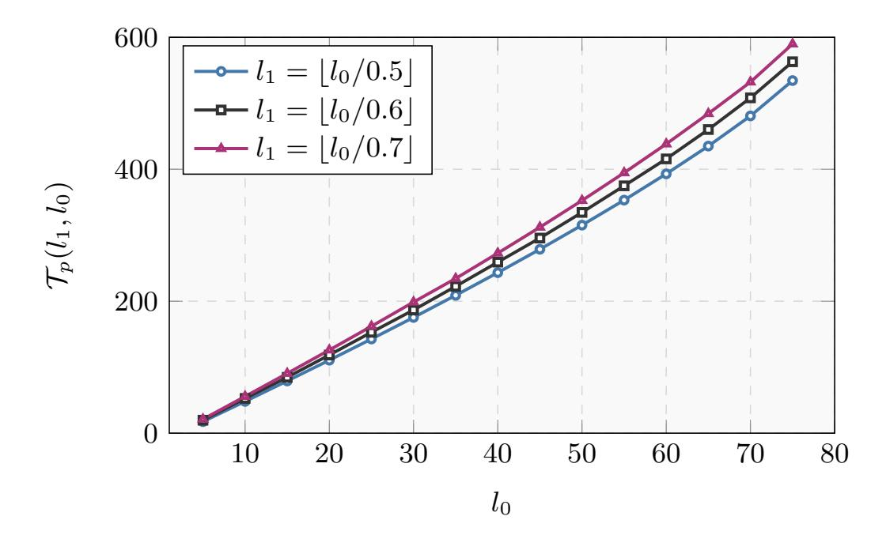

<span id="page-12-0"></span>**Fig. 2.** Precomputation complexity *Tp*(*l*1*, l*0) as a function of attack parameters *l*<sup>1</sup> and *l*<sup>0</sup> (HQC-128 parameter set: *n* = 17669, *w***<sup>r</sup>**<sup>2</sup> = 75)

According to Eq. ([5\)](#page-11-0), the cost of generating a weak ciphertext with parameters (*l*1*, l*0) is lower-bounded by 2 *Tp*(*l*1*,l*0) . Given that the adversary's total computational budget is limited by *T*ISD, the number of decryption queries it can make is upper-bounded by

$$q(l_1, l_0) = \min \left\{ 2^{64}, \left\lfloor 2^{\underline{T}_{\mathrm{ISD}} - \mathcal{T}_p(l_1, l_0)} \right\rfloor \right\}.$$

Let DFR(*l*1*, l*0) denote the DFR for weak ciphertexts generated with parameters (*l*1*, l*0). Then, the probability of observing at least one failure is 1 *−* ( 1 *−* DFR(*l*1*, l*0) )*<sup>q</sup>*(*l*1*,l*0) . We define the **cumulative DFR (CDFR)** as

<span id="page-12-1"></span>
$$CDFR = \max_{(l_1, l_0)} \left\{ 1 - (1 - DFR(l_1, l_0))^{q(l_1, l_0)} \right\}, \tag{6}$$

where the maximum is taken over feasible density-interval parameters. We require CDFR *< ε*, where *ε* is a sufficiently small number. This criterion ensures that, even with total resources comparable to solving QCSD instances by ISD, the adversary's probability of triggering a decryption failure remains below *ε*, thus making this attack negligible under this (conservative) criterion. In the following subsection, we provide a concrete method to evaluate DFR(*l*1*, l*0).

*Remark 3.* The conservativeness of the PEB-BSC model is established only for density-interval attacks with *l*0*/l*<sup>1</sup> *>* 1*/*2 and *l*<sup>1</sup> *< n*2. For both the standard HQC and our new parameter sets, under the prescribed computational budget, an adversary cannot find weak ciphertexts that violate these conditions. If the adversary instead uses intervals with density *l*0*/l*<sup>1</sup> *<* 1*/*2, then the distinguisher based on Pr[*e<sup>i</sup>* = 1 *| D*] no longer applies, and decryption failures do not reveal exploitable information about the secret key.

{13}------------------------------------------------

# <span id="page-13-0"></span>3.3 New Noise Model for HQC Under the Density-Interval Decryption-Failure Attack

The goal of this subsection is to derive a conservative, attack-aware upper bound on the DFR under the density-interval attack.

Based on the preceding analysis, the (attack-induced) HQC noise  $\mathbf{e}'$  can be expressed as

$$\mathbf{e}' = \mathbf{x}\mathbf{r}_2^1 + \mathbf{y}\mathbf{r}_1 + \mathbf{e} + \mathbf{x}\mathbf{r}_2^2,$$

where  $\mathbf{r}_2^2$  corresponds to a dense interval with parameters  $(l_1, l_0)$ .

We now analyze the performance of the RSRM code under the HQC noise  $\mathbf{e}'$ . An RSRM codeword  $\mathbf{c}$  is partitioned into  $n_1$  segments, each being an RM codeword of length  $n_2$ , i.e.,  $\mathbf{c} = (\mathbf{c}_1, \mathbf{c}_2, \dots, \mathbf{c}_{n_1})$  with  $\mathbf{c}_i \in \mathbb{F}_2^{n_2}$ . The noise vector  $\mathbf{e}' = (\mathbf{e}_1, \mathbf{e}_2, \dots, \mathbf{e}_{n_1}, \mathbf{e}_{\text{trun}})$  consists of the error terms, where  $\mathbf{e}_i \in \mathbb{F}_2^{n_2}$  for  $i = 1, \dots, n_1$  and  $\mathbf{e}_{\text{trun}} \in \mathbb{F}_2^{n-n_1n_2}$  corresponds to the truncated part of the ciphertext. Thus, the codeword to be decoded is given by  $(\mathbf{c}_1 + \mathbf{e}_1, \dots, \mathbf{c}_{n_1} + \mathbf{e}_{n_1})$ . Decoding proceeds in two steps:

- Each segment  $\mathbf{c}_i + \mathbf{e}_i$  is decoded by the FHT decoder to obtain a byte message  $\mathbf{m}_i \in \mathbb{F}_2^8$ ;
- The results are assembled into an RS codeword  $(\mathbf{m}_1, \dots, \mathbf{m}_{n_1})$ , which is then decoded using the BM decoder.

The DFR of the RSRM code depends not only on the total weight of  $\mathbf{e}'$ , but also on the distribution of errors across the individual  $\mathbf{e}_i$ .

As the density interval may span two adjacent  $\mathbf{e}_i$ , direct DFR computation over the HQC noise  $\mathbf{e}'$  would involve complicated conditional probabilities. To simplify the DFR analysis, we propose a conservative approximation method for the HQC noise  $\mathbf{e}'$ , taking into account both the density-interval parameters and the HQC parameter sets.

- 1. Since all feasible  $l_1 \ll n$  for HQC parameters, we model  $\mathbf{xr}_2^1 + \mathbf{yr}_1 + \mathbf{e}$  as a BSC with error probability p as described in Lemma 2. According to [18], the BSC model is a conservative approximation of the HQC noise in the absence of adversarial attacks.
- 2. As  $w_{\mathbf{x}}/n < 0.04$  and  $l_1/n_2 < 0.14$  for HQC parameters<sup>10</sup>, we assume that  $\mathbf{xr}_2^2$  consist of  $w_{\mathbf{x}}$  dense intervals, which are randomly distributed across the  $n_1$  segments  $(\mathbf{e}_1, \ldots, \mathbf{e}_{n_1})$ , with each dense interval confined to a single  $\mathbf{e}_i$ . This assumption treats the DFRs of different RM codes as uncorrelated and assumes no dense intervals occur in  $\mathbf{e}_{\text{trun}}$ .
- 3. We use a fixed parameter set  $\mathcal{M} = \{(\zeta_b, b), 0 \leq b \leq n_1\}$  to fit the distribution of dense intervals across the  $\mathbf{e}_i$ , where  $\zeta_b$  denotes the number of  $\mathbf{e}_i$  containing b dense intervals, satisfying  $\sum \zeta_b = n_1$  and  $\sum \zeta_b \cdot b = w_{\mathbf{x}}$ . We model this distribution using a Poisson distribution with parameter  $\mu = w_{\mathbf{x}}/n_1$  to compute the fitting set  $\mathcal{M}$ , as detailed in Appendix B.

By combining the value ranges of  $(l_1, l_0)$  above and the parameter sets of HQC,  $w_{\mathbf{x}}/n < 0.04$  and  $l_1/n_2 < 0.14$  can be derived. Subsequently, our new parameter sets also satisfy a similar relationship.

{14}------------------------------------------------

4. Each dense interval in  $\mathbf{xr}_2^2$  is treated as a region with error probability  $p_l = l_0/l_1$ , where the effective error probability inside such an interval in  $\mathbf{e}'$  becomes

$$p_b = p_l(1-p) + p(1-p_l).$$

For an  $\mathbf{e}_i$  containing b dense intervals:

- If  $bl_1 \leq n_2$ , we assume the b intervals do not overlap.
- If  $bl_1 > n_2$ , we approximate the error rate across  $\mathbf{e}_i$  as  $p_b$ .

Since  $p_l > 0.5$ , this approach generally overestimates the weight of  $\mathbf{e}_i$ . The distribution of error rates across the segments of  $\mathbf{e}_i$  is illustrated in Fig. 3.

<span id="page-14-0"></span>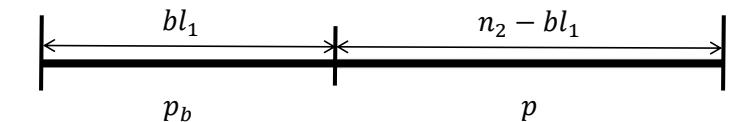

**Fig. 3.** Error rate representation for  $e_i$  containing b dense intervals

This simplified noise model is referred to as the **Poisson-Fitted Error Block-BSC**, abbreviated as **PEB-BSC**. In the following, we show that, for BM-FHT decoding of the RSRM code, the PEB-BSC model is more conservative, leading to a higher DFR under PEB-BSC compared to the actual HQC noise behavior.

Since the DFR of the HQC parameter sets is too small to be reliably estimated by direct Monte Carlo simulation, we introduce two metrics to evaluate the severity of a noisy channel with respect to RSRM codes. These metrics allow us to infer the relative performance of RSRM codes under different noise channels using only channel-level simulations.

Two Indirect Performance Metrics for RSRM Codes in Noisy Channels To capture *blockwise* error characteristics that are relevant to the BM-FHT decoding behavior of RSRM codes in noisy channels, we define the following statistics.

For  $\mathbf{e}' = (\mathbf{e}_1, \mathbf{e}_2, \dots, \mathbf{e}_{n_1}, \mathbf{e}_{\text{trun}})$ , where each  $\mathbf{e}_i \in \mathbb{F}_2^{n_2}$  corresponds to an RM block in the RSRM construction, and  $\mathbf{e}_{\text{trun}} \in \mathbb{F}_2^{n-n_1n_2}$  collects the remaining truncated coordinates. For a positive integer  $t_r$ , we define the **blockwise weight count** of  $\mathbf{e}'$  as

$$N(\mathbf{e}', t_r) = \#\{i \mid \text{wt}(\mathbf{e}_i) = t_r, i = 1, \dots, n_1\}.$$
 (7)

That is,  $N(\mathbf{e}', t_r)$  counts the number of RM blocks whose error weight equals  $t_r$ . We define the **blockwise weight profile**  $F(\mathfrak{C})$  in a channel  $\mathfrak{C}$  as

$$F(\mathfrak{C}) = (\overline{N(\mathbf{e}', 1)}, \overline{N(\mathbf{e}', 2)}, \dots, \overline{N(\mathbf{e}', n_2)}), \tag{8}$$

which represents the expected blockwise weight profile of  $\mathbf{e}'$  induced by channel  $\mathfrak{C}$ . Since the RS code used in HQC has limited error-correction capability<sup>11</sup>,

RS codes in the three parameter sets of HQC can correct up to 15, 16, and 29 RM block errors, respectively.

{15}------------------------------------------------

heavier tails in F(C) (i.e., larger expected counts at high block weights) typically indicate that more RM blocks operate in a high-weight regime, which in turn tends to increase the overall DFR.

Additionally, we define the **blockwise threshold count** of **e** *′* as

$$\operatorname{wb}(\mathbf{e}', t_r) = \sum_{i=1}^{n_1} \delta_{t_r}(\mathbf{e}_i), \ \delta_{t_r}(\mathbf{e}_i) = \begin{cases} 1, \ \operatorname{wt}(\mathbf{e}_i) > t_r, \\ 0, \ \operatorname{wt}(\mathbf{e}_i) \le t_r, \end{cases}$$
(9)

which measures the number of RM blocks with error weights exceeding the threshold *tr*. As the weight-wise failure probability Pfail(*C, w*) of RM code is monotonic nondecreasing in *w*, we define the **half-failure threshold** of RM code as

$$t_{1/2} \triangleq \min\{ w \in \{1, \dots, n_2\} \mid P_{\text{fail}}(C, w) > 1/2 \}.$$

We then define the **half-failure block count** in a channel C as

$$B_{1/2}(\mathfrak{C}) \triangleq \overline{\operatorname{wb}(\mathbf{e}', t_{1/2})},$$

i.e., the expected number of RM blocks whose DFR exceeds 1*/*2.

These empirical metrics provide a concise bridge between channel noise and decoding behavior.

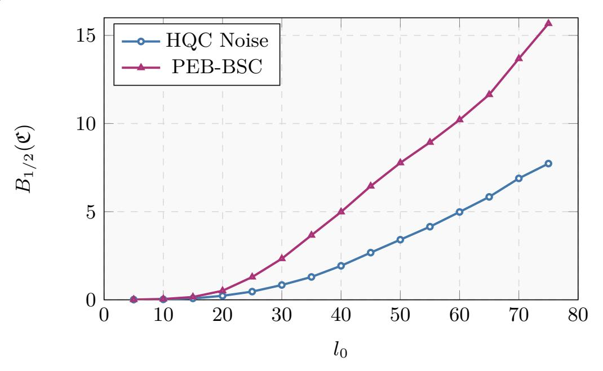

<span id="page-15-0"></span>**Fig. 4.** Half-failure block count *B*1*/*2(C): HQC noise vs. PEB-BSC

**Experimental validation.** We perform simulations using the HQC-128 parameter set: *w***<sup>x</sup>** = *w***<sup>y</sup>** = 66, *w***<sup>r</sup>**<sup>1</sup> = *w***<sup>r</sup>**<sup>2</sup> = *w***<sup>e</sup>** = 75, RM code parameters [384*,* 8*,* 192]2, and RS code parameters [46*,* 16*,* 31]256. By Theorem [2](#page-17-0), the halffailure threshold12 of the [384*,* 8*,* 192]<sup>2</sup> RM code is *t*1*/*<sup>2</sup> = 164. For each *l*<sup>0</sup> in our sweep, we set *l*<sup>1</sup> = *bl*0*/*0*.*6*c* and simulate the half-failure block count *B*1*/*2(C); the results are shown in Fig. [4.](#page-15-0) We further simulate the blockwise weight profile F(C) under the attack parameters (*l*1*, l*0) = (50*,* 30), as shown in Fig. [5.](#page-16-0)

<sup>12</sup> The simulated half-failure threshold *t*1*/*<sup>2</sup> for the [384*,* 8*,* 192]<sup>2</sup> RM code is 165 (Fig. [6](#page-18-0)), but since the DFR estimation in this work is based on mathematical derivation, we conservatively adopt 164 as *t*1*/*2.

{16}------------------------------------------------

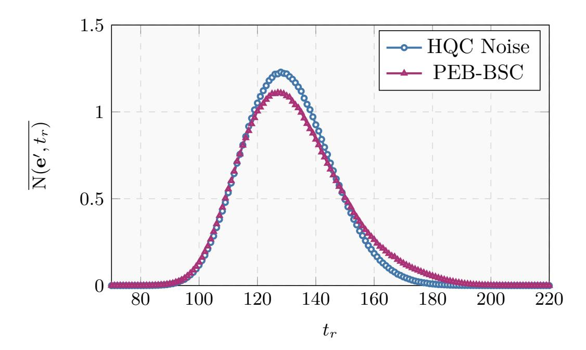

<span id="page-16-0"></span>**Fig. 5.** Blockwise weight profile F(C): HQC noise vs. PEB-BSC.

Simulations show that for small *l*0, HQC noise and PEB-BSC yield very similar blockwise error statistics. As *l*<sup>0</sup> increases, PEB-BSC produces a larger half-failure block count and a heavier tail in the block-weight profile, meaning that more RM blocks incur high-weight errors and thus enter a high-failure regime for FHT decoder. Hence, PEB-BSC is a more conservative noise model for RSRM codes under density-interval attack [\[21](#page-31-3)].

This behavior is consistent with the attack mechanism. Within a dense interval the error density satisfies *p<sup>l</sup>* = *l*0*/l*<sup>1</sup> *>* 1*/*2. When shifted dense intervals overlap, errors add over F<sup>2</sup> (i.e., via XOR), so overlaps may cancel and reduce the realized error weight. For small *l*<sup>0</sup> (and thus smaller *l*<sup>1</sup> under our setting), overlaps are rare, so HQC noise and PEB-BSC yield similar statistics. For larger *l*0, overlaps become more frequent. Since PEB-BSC neglects such cancellations, it overestimates the tail of the block-weight distribution and therefore provides a conservative approximation of HQC noise.

Consistent with these indicators, our simulations further reveal that the DFR of the RSRM codes under BM–FHT decoding satisfies

$$DFR_{HQC-noise} \leq DFR_{PEB-BSC}$$
.

*Remark 4.* To further strengthen the empirical evidence supporting our analysis, we simulate the blockwise weight profile F(C) with no dense interval embedded (i.e., we use the baseline sampling without enforcing a dense interval). We also consider three different density ratios *ρ ∈ {*0*.*5*,* 0*.*7*,* 0*.*8*}*, corresponding to different settings of *l*<sup>1</sup> = *bl*0*/ρc*, and simulate the half-failure block count *B*1*/*2(C) for each setting.

Additionally, we simulate two natural variants of the density-interval attack [\[21](#page-31-3)]:

**– Variant 1 (split intervals):** splitting the dense interval in **r**<sup>2</sup> into multiple disjoint segments.

{17}------------------------------------------------

- Variant 2 (joint search): searching for dense intervals simultaneously in  $\mathbf{r}_1$  and  $\mathbf{r}_2$ ;

Our simulations indicate that, under the same computational budget (with matched precomputation cost), both variants are less effective than the original attack. A detailed discussion and supporting simulations are provided in Appendix C.

# <span id="page-17-1"></span>3.4 Upper Bound on the DFR of the RSRM Codes in the New Noise Model

The DFR estimation of RSRM codes relies on the estimation of the error correction performance of RM codes. Although the upper bound on the weight-wise failure probability of RM codes (Theorem 1) proposed by the HQC team [18] is the best-known result in the literature, it is still not very tight. Therefore, before estimating the DFR of RSRM codes over PEB-BSC, we first propose an improved upper bound for the weight-wise failure probability of RM codes.

Improved Upper Bound on the Weight-Wise Failure Probability of RM Codes The improved upper bound is presented in Theorem 2, which characterizes the weight-wise failure probability of a  $[128s, 8, 64s]_2$  RM code under ML decoding. The theorem utilizes auxiliary combinatorial sums  $M_{w,1}$ ,  $N_{w,1}$ ,  $M_{w,2}$ , and  $N_{w,2}$ , defined as:

$$M_{w,1} = \binom{64s}{32s} \binom{64s}{w-32s},$$

$$N_{w,1} = \sum_{u=32s+1}^{64s} \binom{64s}{u} \binom{64s}{w-u},$$

$$M_{w,2} = \sum_{u_1=0}^{32s} \binom{32s}{u_1}^2 \binom{32s}{32s-u_1} \binom{32s}{w-32s-u_1},$$

$$N_{w,2} = \sum_{u_1=1}^{32s} \binom{32s}{u_1} \sum_{u_2=32s+1-u_1}^{32s} \binom{32s}{u_2} \sum_{u_3=32s+1-u_2}^{32s} \binom{32s}{u_3} \binom{32s}{w-u_1-u_2-u_3}.$$

<span id="page-17-0"></span>Theorem 2 (Upper Bound on the Weight-wise Failure Probability of RM Codes). Let C be a  $[128s, 8, 64s]_2$  RM code. The weight-wise failure probability  $P_{fail}(C, w)$  of code C under ML decoding satisfies:

<span id="page-17-2"></span>
$$\begin{cases}
P_{\text{fail}}(C, w) = 0, & w \leq 32s - 1, \\
P_{\text{fail}}(C, w) \leq \frac{254 \cdot N_{w,1} + 127 \cdot M_{w,1} - 32004 \cdot N_{w,2} - 10668 \cdot M_{w,2}}{\binom{128s}{w}}, & 32s \leq w \leq 40s - 1, \\
P_{\text{fail}}(C, w) \leq \frac{254 \cdot N_{w,1} + 127 \cdot M_{w,1} - 32004 \cdot N_{w,2}}{\binom{128s}{w}}, & 40s \leq w \leq 40s + 1, \\
P_{\text{fail}}(C, w) \leq \frac{E_w}{\binom{128s}{w}}, & 40s + 2 \leq w \leq \tau, \\
P_{\text{fail}}(C, w) \leq 1, & \tau + 1 \leq w \leq 128s,
\end{cases}$$
(10)

where

$$E_{w} = \begin{cases} 254 \cdot N_{w,1} + 127 \cdot M_{w,1}, & \text{if } 254 \cdot N_{w,1} + 127 \cdot M_{w,1} < \binom{128s}{w}, \\ \binom{128s}{w} - \frac{\left(\binom{128s}{w} - 254 \cdot N_{w,1}\right)^{2}}{\binom{128s}{w} - 254 \cdot N_{w,1} + 254 \cdot M_{w,1}}, & \text{if } 254 \cdot N_{w,1} + 127 \cdot M_{w,1} > \binom{128s}{w}, \\ \frac{128s}{w}, & \text{if } 254 \cdot N_{w,1} + 127 \cdot M_{w,1} > \binom{128s}{w}, \end{cases}$$

{18}------------------------------------------------

*and τ ≤* 64*s −* 1 *is the largest integer satisfying E<sup>τ</sup> <* ( 128*s τ* ) *.*

*Proof.* We prove this theorem by analyzing the structure of the RM code's codeword space, characterizing the interactions between codewords and error vectors, and applying the Cauchy-Schwarz inequality. The full proof is given in Appendix [D.1](#page-38-0). □

To assess the tightness of Theorem [2,](#page-17-0) we simulate the weight-wise failure probability of the [384*,* 8*,* 192]<sup>2</sup> RM code and compare it with the bounds given by Theorems [1](#page-7-0) and [2](#page-17-0), as shown in Fig. [6.](#page-18-0) The results indicate that Theorem [2](#page-17-0) provides a tighter bound than Theorem [1](#page-7-0) in the region of larger weights.

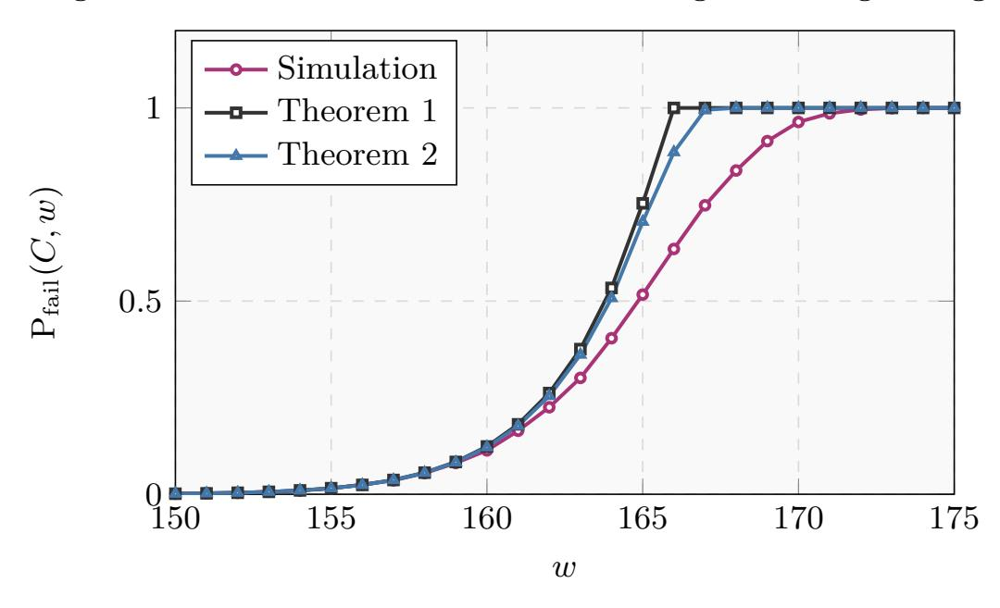

<span id="page-18-0"></span>**Fig. 6.** Comparison of the failure probability profile **P**fail(*C*) determined by Theorems [1](#page-7-0) and [2](#page-17-0) with simulation values (RM code parameters: [384*,* 8*,* 192]2).

Hence, for a given RM code, determining the probability distribution of errors in the random channel suffices to obtain an upper bound on its DFR.

**Upper Bound on the DFR of the RSRM Codes in PEB-BSC** Based on the previous modeling of PEB-BSC, for **e***<sup>i</sup>* containing *b* dense intervals, the probability that wt(**e***i*) = *w* can be computed. If *b ·l*<sup>1</sup> *≤ n*2, then Pr(wt(**e***i*) = *w*) is

$$\sum_{w_{1}=\max(0,w-(n_{2}-b\cdot l_{1}))}^{\min(b\cdot l_{1},w)} \binom{b\cdot l_{1}}{w_{1}} p_{b}^{w_{1}} (1-p_{b})^{b\cdot l_{1}-w_{1}} \cdot \binom{n_{2}-b\cdot l_{1}}{w-w_{1}} p^{w-w_{1}} (1-p)^{n_{2}-b\cdot l_{1}-w+w_{1}}.$$
(11)

If *b · l*<sup>1</sup> *≥ n*2, we have

$$\Pr(\operatorname{wt}(\mathbf{e}_i) = w) = \binom{n_2}{w} p_b^w (1 - p_b)^{n_2 - w}. \tag{12}$$

Combined with Theorem [2](#page-17-0), an upper bound on the DFR of the RM code under these conditions can be derived.

{19}------------------------------------------------

Theorem 3 (Upper Bound on the DFR of RM Code in PEB-BSC). Let C be an RM code with parameters  $[128s, 8, 64s]_2$ . Let  $P_{fail}(C, w)$  be the weightwise failure probability of code C as determined by Theorem 2. If blockwise error  $\mathbf{e}_i$  contains b dense intervals, then the DFR of the RM code C satisfies

$$p_{\rm rm}(b) \le \sum_{w=1}^{n_2} P_{\rm fail}(C, w) \cdot \Pr(\operatorname{wt}(\mathbf{e}_i) = w). \tag{13}$$

Since the DFR of the RM codes depends only on the error weight of  $\mathbf{e}_i$ , in the PEB-BSC, we approximate that the different inner RM codes of the RSRM code are independent events. The number of decoding failures  $X_b$  among the  $\zeta_b$  RM codes containing b dense intervals satisfies  $X_b \sim \text{Binomial}(\zeta_b, p_{\text{rm}}(b))$ . Thus, the total number of decoding-failed RM codes  $e_{rm} = \sum_{b=0}^{m} X_b$  can be seen as the sum of  $m = \#\mathcal{M}$  Binomial variables  $X_b$ . The DFR of the RSRM code equals the probability that  $e_{rm}$  exceeds the error correction capability of the RS code.

<span id="page-19-0"></span>Theorem 4 (Upper Bound on the DFR of the RSRM Code in PEB-BSC). For an RSRM code with RS code parameters  $[n_1, k, n_1 - k + 1]_{256}$ , its DFR in PEB-BSC does not exceed

$$\Pr(e_{rm} > t) = 1 - \sum_{j=0}^{t} \operatorname{coeff} \left( \prod_{b=0}^{m} (1 - p_{rm}(b) + p_{rm}(b)z)^{\zeta_b}, z^j \right),$$

where  $t = \lfloor \frac{n_1 - k}{2} \rfloor$ , and  $\operatorname{coeff}(P(z), z^j)$  denotes the coefficient of  $z^j$  in polynomial P(z).

*Proof.* See Appendix D.2. 
$$\Box$$

Thus, for any attack parameters  $(l_1, l_0)$ , the above procedure yields an upper bound for the DFR in the PEB-BSC model. Consequently, this bound also holds for the actual DFR of HQC, i.e., DFR $(l_1, l_0)$ .

**Experimental validation.** To further substantiate the preceding analytical results for HQC noise and PEB-BSC, we perform simulations using the HQC-128 parameter set, with the only modification that the RS code length is set to 34. The simulated DFR of the RSRM code is shown in Fig. 7.

The simulation results are consistent with the previous analysis: when  $l_0$  is small, the DFRs across HQC noise and PEB-BSC are close, whereas as  $l_0$  increases, the DFR under PEB-BSC grows rapidly but always remains below the upper bound derived in Theorem 4. Therefore, the upper bound from Theorem 4 not only effectively bounds the DFR of the RSRM code under PEB-BSC, but also serves as a conservative upper bound under HQC noise.

# 3.5 Evaluating the Maximum CDFR of Standard HQC Parameter Sets

This subsection applies the above results to upper-bound the maximum achievable CDFR of the standard HQC parameter sets under the density-interval attack of [21]. The HQC parameter sets are taken from the latest HQC specification [18] (see Table 3).

{20}------------------------------------------------

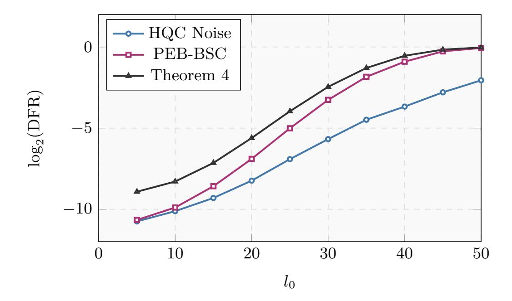

<span id="page-20-1"></span>**Fig. 7.** Comparison of simulated DFR for RSRM code in HQC noise, PEB-BSC, and DFR derived from Theorem 4 with  $l_1 = \lfloor l_0/0.6 \rfloor$ .

We restrict the adversary's total budget to the (classical/quantum) ISD complexity for the underlying QCSD instances, namely  $2^{T_{\rm ISD}}$  or  $2^{T_{\rm ISD}^Q}$ , as shown in Table 8. An exhaustive search over feasible dense-interval parameters  $(l_1, l_0)$  using Eqs. (5) and (6) yields an upper bound on the maximum achievable CDFR for each parameter set; the results are summarized in Tables 4 and 5. Here, "natural DFR" denotes the DFR without an adversarially crafted dense interval, and under Grover acceleration [20] we take  $\mathcal{T}_p^Q(l_1, l_0) = \mathcal{T}_p(l_1, l_0)/2$  (in log-scale).

under Grover acceleration [20] we take  $\mathcal{T}_p^Q(l_1, l_0) = \mathcal{T}_p(l_1, l_0)/2$  (in log-scale). The resulting upper bounds on the maximum CDFR are  $2^{-45.75}$ ,  $2^{-89.29}$ ,  $2^{-123.83}$  in the classical setting and  $2^{-62.21}$ ,  $2^{-105.52}$ ,  $2^{-143.14}$  in the quantum setting for HQC-128, HQC-192, and HQC-256, respectively. This indicates that the DFR choices in the standard HQC parameter sets leave a substantial security margin against decryption-failure attacks. Therefore, by relaxing the DFR threshold slightly, one could reduce the required security margin, potentially allowing for smaller ciphertext and key sizes while still maintaining a reasonable level of security.

<span id="page-20-2"></span>
 Table 3. Standard HQC Parameter Sets

| Category | $n_1$ | $n_2$ | $n_1n_2$ | n     | $\overline{w}$ | $w_{\mathbf{r}} = w_{\mathbf{e}}$ |
|----------|-------|-------|----------|-------|----------------|-----------------------------------|
| HQC-128  | 46    | 384   | 17664    | 17669 | 66             | 75                                |
| HQC-192  | 56    | 640   | 35840    | 35851 | 100            | 114                               |
| HQC-256  | 90    | 640   | 57600    | 57637 | 131            | 149                               |

# <span id="page-20-0"></span>4 Trade-off between BSC Error Probability and ISD Security via Unbalanced Error Distribution

In this section, we analyze how an unbalanced weight allocation within  $(\mathbf{r}_1, \mathbf{r}_2, \mathbf{e})$  and the length n affect (i) the induced BSC error probability (the typical weight

{21}------------------------------------------------

**Table 4.** Maximum CDFR of the Standard HQC Parameter Sets Under the Density-Interval Attack [21]

<span id="page-21-0"></span>

| Category | $\underline{T}_{\mathrm{ISD}}$ | $(l_1, l_0)$ | $\mathcal{T}_p(l_1, l_0)$ | $\mathrm{DFR}(l_1, l_0)$ | CDFR               | Natural DFR        |
|----------|--------------------------------|--------------|---------------------------|--------------------------|--------------------|--------------------|
| HQC-128  | 145.30                         | (29, 15)     | 80.10                     | $\leq 2^{-109.75}$       | $\leq 2^{-45.75}$  | $\leq 2^{-133.50}$ |
| HQC-192  | 213.44                         | (49, 25)     | 150.62                    | $\leq 2^{-152.11}$       | $\leq 2^{-89.29}$  | $\leq 2^{-194.20}$ |
| HQC-256  | 275.59                         | (65, 33)     | 211.80                    | $\leq 2^{-187.62}$       | $\leq 2^{-123.83}$ | $\leq 2^{-261.33}$ |

<span id="page-21-1"></span>**Table 5.** Maximum CDFR of the Standard HQC Parameter Sets Under the Density-Interval Attack [21] with Grover Acceleration

| $\overline{\text{Category } \underline{T}_{\text{ISD}}^{Q}}$ | $(l_1, l_0)$ | $\mathcal{T}_p^Q(l_1, l_0)$ | $\mathrm{DFR}(l_1, l_0)$ | CDFR               | Natural DFR        |
|--------------------------------------------------------------|--------------|-----------------------------|--------------------------|--------------------|--------------------|
| HQC-128 83.16                                                | (15, 8)      | 18.43                       | $\leq 2^{-126.21}$       | $\leq 2^{-62.21}$  | $\leq 2^{-133.50}$ |
| HQC-192 118.39 (                                             | (37, 19)     | 55.41                       | $\leq 2^{-168.50}$       |                    | <b>_</b>           |
| HQC-256 150.22 (                                             | (55, 28)     | 88.53                       | $\leq 2^{-204.82}$       | $\leq 2^{-143.14}$ | $\leq 2^{-261.33}$ |

of  $\mathbf{e}'$ ) and (ii) the ISD security of the associated QCSD instances. We then derive a practical weight-selection strategy that lowers the induced BSC error probability while meeting a target ISD security level.

# <span id="page-21-4"></span>4.1 Impact of Error Vector Weight Distribution on BSC Error Probability

The goal of this subsection is to prove two ways of reducing the BSC error probability corresponding to e'. Recall that the induced error vector is given by

$$\mathbf{e}' = \mathbf{x}\mathbf{r}_2 + \mathbf{r}_1\mathbf{y} + \mathbf{e} \in \mathbb{F}_2^n$$

which is associated with BSC error probability  $p = P[e'_k = 1]$  for any fixed coordinate k by Lemma 2. In the standard HQC parameter sets one typically has  $w_{\mathbf{x}} = w_{\mathbf{y}} = w$  and  $w_{\mathbf{r}_1} = w_{\mathbf{r}_2} = w_{\mathbf{r}}$ , with  $w/w_{\mathbf{r}} \approx 0.88$ . We first examine how redistributing weight within  $(\mathbf{r}_1, \mathbf{r}_2, \mathbf{e})$  affects p.

<span id="page-21-2"></span>**Theorem 5.** Let  $n \gg w_{\mathbf{r}} > w_{\mathbf{x}}$  be three positive integers, and  $n > w_{\mathbf{x}}^2$ . For  $0 \leq \delta \leq w_{\mathbf{r}} - w_{\mathbf{x}}$ , we define the weights

$$w_{\mathbf{x}} = w_{\mathbf{y}} \ge 66, \qquad w_{\mathbf{r}_1} = w_{\mathbf{r}_2} = w_{\mathbf{r}} - \delta, \qquad w_{\mathbf{e}} = w_{\mathbf{r}} + 2\delta.$$

Then, the error probability  $p(\delta) = P[e'_k = 1]$  is strictly decreasing as  $\delta$  increases.

Proof. See Appendix E. 
$$\Box$$

Theorem 5 shows that an *unbalanced* weight distribution within  $(\mathbf{r}_1, \mathbf{r}_2, \mathbf{e})$  can strictly reduce the induced BSC error probability. This provides a direct method for lowering the DFR. However, introducing such a structure may also reduce the ISD security level; we analyze this effect in the next subsection.

<span id="page-21-3"></span>In addition to weight redistribution, the length n also affects the induced BSC. In the HQC, n is typically chosen as the smallest primitive prime greater than the RSRM code length  $n_1n_2$ .

{22}------------------------------------------------

**Theorem 6.** Let the weights  $w_{\mathbf{x}}, w_{\mathbf{y}}, w_{\mathbf{r}_1}, w_{\mathbf{r}_2}, w_{\mathbf{e}}$  be fixed positive integers. Assume  $n \gg \max(w_{\mathbf{x}} + w_{\mathbf{r}_2}, w_{\mathbf{y}} + w_{\mathbf{r}_1}, w_{\mathbf{e}})$ . Define  $P(n) = P[e'_k = 1]$  with the probability given by Lemma 2. Then P(n) is strictly decreasing in n.

*Proof.* See Appendix E.  $\Box$ 

Since RS codes with odd and even minimum distances have the same error-correction capability under BM decoding, HQC adopts RS codes with odd minimum distances in the RSRM construction. As a result, the RSRM code-length scale is  $2n_2$  (twice the RM block length), which is 768 or 1280 in the standard HQC parameter sets. Theorem 6 shows that, with all weights fixed, increasing n reduces the induced BSC error probability and hence lowers the DFR. Therefore, when the DFR target is close, one can slightly increase n to reduce the DFR. Due to truncation, this increases the ciphertext size by only about  $\ell/2$  bits.

Empirically, the impact of changing n on ISD security is minimal (typically less than one bit for the considered parameters). Therefore, the next subsection focuses on the effect of the weight distribution on ISD security.

#### <span id="page-22-0"></span>4.2 Impact of Error Vector Distribution on ISD Security

This subsection analyzes how the weight distribution of structured error vectors affects the security of s-CW-QCSD problems under ISD attacks, and derives conservative (attacker-favorable) complexity estimates.

ISD algorithms are currently the best known approach to attack the SD problem and are the standard tool to evaluate concrete bit security of HQC. The SD problem is: given a parity-check matrix  $\mathbf{H} \in \mathbb{F}_2^{(n-k)\times n}$  and a syndrome  $\mathbf{s} \in \mathbb{F}_2^{n-k}$ , find an error vector  $\mathbf{e} \in \mathbb{F}_2^n$  of weight w such that  $\mathbf{H}\mathbf{e}^{\top} = \mathbf{s}^{\top}$ . Most modern ISD algorithms follow the Stern/Dumer framework [14,36], outlined in Algorithm 1.

The algorithm first reduces the original  $\mathcal{SD}(n, k, w)$  instance to an instance of SD variant  $\mathcal{SMD}(k+l, k, p)^{13}$  via random permutation and Gaussian elimination. An oracle (implemented differently by various ISD variants) searches for solutions to this SMD problem, which are then verified against the remaining syndrome equations. The oracle design distinguishes ISD variants. Concrete ISD oracles (e.g., Stern [36], MMT [31], BJMM [6]) do not search the entire set of weight-p vectors. Instead, they search a subspace  $S_{\mathbf{e}_1} \subseteq \{\mathbf{x} \in \mathbb{F}_2^{k+l} : w_{\mathbf{x}} = p\}$  determined by the algorithm's internal representation (splitting, partial weights, number of representations, etc.). Therefore, a trial succeeds when the permuted unknown error  $\mathbf{eP}$  has exactly p ones inside the (k+l)-coordinate information set with desired structure and w-p ones outside. This occurs with probability

$$P_{\text{generic}} = \frac{|S_{\mathbf{e}_1}| \cdot \binom{n-k-l}{w-p}}{\binom{n}{w}}.$$

Syndrome Multi-Decoding (SMD) Problem: Different from the standard SD problem with one *single* solution, the SMD problem on average has  $\binom{k+l}{p}/2^l$  solutions and the attacker solving SMD is required to find sufficiently many solutions.

{23}------------------------------------------------

### Algorithm 1: Generic ISD framework

```
Input: Parity-check matrix \mathbf{H} \in \mathbb{F}_2^{(n-k)\times n}, syndrome \mathbf{s} \in \mathbb{F}_2^{n-k}, target
                      weight w, parameters p and l
      Output: An error vector \mathbf{e} \in \mathbb{F}_2^n with w_{\mathbf{e}} = w and \mathbf{H}\mathbf{e}^{\top} = \mathbf{s}^{\top}
  1 while true do
             Permutation: choose a uniformly random permutation matrix
  \mathbf{2}
               \mathbf{P} \in \mathbb{F}_2^{n \times n};
             Gaussian elimination: compute U such that
  3
                                                          \mathbf{UHP} = \begin{pmatrix} \mathbf{H}_1 & \mathbf{0} \ \mathbf{H}_2 \ I_{n-k-l} \end{pmatrix}
               with \mathbf{H}_1 \in \mathbb{F}_2^{l \times (k+l)} and \mathbf{H}_2 \in \mathbb{F}_2^{(n-k-l) \times (k+l)};
             Split \mathbf{U}\mathbf{s}^{\top} = \begin{pmatrix} \mathbf{s}_1^{\top} \\ \mathbf{s}_2^{\top} \end{pmatrix} accordingly;
  4
             Oracle call: find \mathbf{e}_1 \in \mathbb{F}_2^{k+l} such that \mathbf{H}_1 \mathbf{e}_1^{\top} = \mathbf{s}_1^{\top} and \operatorname{wt}(\mathbf{e}_1) = p;
  5
             Compute \mathbf{e}_2^{\top} = \mathbf{s}_2^{\top} - \mathbf{H}_2 \mathbf{e}_1^{\top};
  6
             if wt(\mathbf{e}_2) = w - p then
  7
                   return (e_1, e_2)P^{-1};
  8
             end
  9
10 end
```

The expected number of trials is  $T_p = P_{\text{generic}}^{-1}$ , and each trial costs  $T_{\text{gauss}} + T_o$ , where  $T_{\text{gauss}}$  is the Gaussian-elimination cost (e.g., using M4RI [5, 7, 8]) and  $T_o$  is the oracle cost. Consequently, the ISD bit-complexity is

$$T_{\rm ISD} = \min_{l, p} \left( \log_2 T_p + \log_2 (T_{\rm gauss} + T_o) \right). \tag{14}$$

Analysis of the expected permutation cost for structured errors. Suppose the error vector follows a *structured* distribution: the length n is partitioned into  $s \geq 2$  blocks of lengths  $n_i$  and each block has fixed weight  $w_i$  (with  $\sum_i n_i = n$  and  $\sum_i w_i = w$ ). Then the error space shrinks from  $\binom{n}{w}$  to  $\prod_{i=1}^s \binom{n_i}{w_i}$ . Accordingly, the classical expression  $P_{\text{generic}}$  no longer applies.

Let  $k_i$  denote how many coordinates of block i fall into the chosen (k+l)-bit information set, and let  $p_i$  denote the number of errors from block i inside that information set, where  $\sum_i k_i = k + l$  and  $\sum_i p_i = p$ . Conditioned on the block weights  $(w_i)_{i=1}^s$ , the number of consistent splittings is  $\prod_{i=1}^s \binom{k_i}{p_i} \binom{n_i-k_i}{w_i-p_i}$ , and dividing by the structured error-space size yields the permutation success probability. For a given choice of (l,p) and the (effective) allocation  $(k_i,p_i)$ , the success probability is

$$P_{\text{struct}} = \prod_{i=1}^{s} \frac{\binom{k_i}{p_i} \binom{n_i - k_i}{w_i - p_i}}{\binom{n_i}{w_i}}, \tag{15}$$

{24}------------------------------------------------

and the corresponding expected permutation cost is  $T'_p = P_{\text{struct}}^{-1}$ .

In HQC, the error weight satisfies w = o(n). Under this scaling, it follows from [12] that, as  $n \to \infty$ , the optimal ISD parameters satisfy l = o(n) and p = o(w). We therefore study the asymptotically optimal allocation for maximizing  $P_{\text{struct}}$  in the regime p = l = 0, and examine how imbalance affects its maximum.

For HQC, we have 
$$s = 2, 3$$
,  $n_i = k = n/s$ , and  $P_{\text{struct}} = \prod_{i=1}^s \frac{\binom{k-k_i}{w_i}}{\binom{k}{w_i}}$ .

<span id="page-24-0"></span>**Theorem 7.** Let  $s \in \{2,3\}$ . Assume  $k \to \infty$ , w = o(k), and denote  $\bar{w} = w/s$ . Fix an integer  $\delta$  such that  $0 \le \delta \le \bar{w}$ . Define the block weights as

$$w_1 = \dots = w_{s-1} = \bar{w} - \delta, \qquad w_s = \bar{w} + (s-1)\delta,$$

satisfying  $\sum_{i=1}^{s} w_i = w$ . Consider the optimization of  $P_{\text{struct}} = \prod_{i=1}^{s} \frac{\binom{k-k_i}{w_i}}{\binom{k}{w_i}}$  subject to  $\sum_{i=1}^{s} k_i = k$  and  $0 \le k_i \le k - w_i$ . We have the following results:

- 1. If  $\delta = 0$ , asymptotically any maximizer  $(k_i)_{i=1}^s$  satisfies  $k_1 = \cdots = k_s$ .
- 2. If  $\delta > 0$ , asymptotically any maximizer  $(k_i)_{i=1}^s$  satisfies  $k_1 = k_{s-1} > k_s$ .
- 3. The maximum value of  $P_{struct}$  is strictly increasing with respect to  $\delta$ .

*Proof.* See Appendix E. 
$$\Box$$

Remark 5. Theorem 7 is asymptotic. For finite parameter sets, integrality constraints matter, and the  $(k_i)_{i=1}^s$  typically fall into one of two regimes: either

$$k_1 \approx \cdots \approx k_s$$
 or  $k_1 \approx k_{s-1} \gtrsim k_s$ .

In the specific ISD security calculation, the theorem substantially narrows the search space for  $(k_i, p_i)$ .

**Experimental validation.** Set  $w_{\mathbf{r}_1} = w_{\mathbf{r}_2} = w_{\mathbf{r}} - \delta$  and  $w_{\mathbf{e}} = w_{\mathbf{r}} + 2\delta$ . Fig. 8 shows the impact of the degree of unbalance on the permutation bit-complexity  $\log_2 T_p' = \min_{k_i, p_i} \left\{ \log_2 \mathrm{P}_{\mathrm{struct}}^{-1} \right\}$  for HQC parameters. The curve decreases monotonically with  $\delta$ ; the decrease is slow for small  $\delta$  but becomes nearly linear once  $\delta$  passes a threshold. Hence, when employing an unbalanced weight distribution for  $(\mathbf{r}_1, \mathbf{r}_2, \mathbf{e})$ , the degree of unbalance should be controlled to avoid excessive security loss.

Analysis of the impact of structured errors on the complexity of oracle in ISD algorithms. In the oracle step of concrete ISD algorithms, one searches for vectors  $\mathbf{e}_1 \in S_{\mathbf{e}_1}$  satisfying  $\mathbf{H}_1 \mathbf{e}_1^{\top} = \mathbf{s}_1^{\top}$ . For each candidate  $\mathbf{e}_1$ , the corresponding  $\mathbf{e}_2$  is computed as  $\mathbf{e}_2^{\top} = \mathbf{s}_2^{\top} - \mathbf{H}_2 \mathbf{e}_1^{\top}$  and accepted if  $\operatorname{wt}(\mathbf{e}_2) = w - p$  holds.

Now assume that  $\mathbf{e}_1$  is *structured*: the (k+l) coordinates are partitioned into  $s \geq 2$  disjoint blocks of sizes  $(k_1, \ldots, k_s)$  with  $\sum_{i=1}^s k_i = k+l$ , and the attacker additionally knows that the weight p splits as  $(p_1, \ldots, p_s)$  with  $\sum_{i=1}^s p_i = p$ , i.e.,

{25}------------------------------------------------

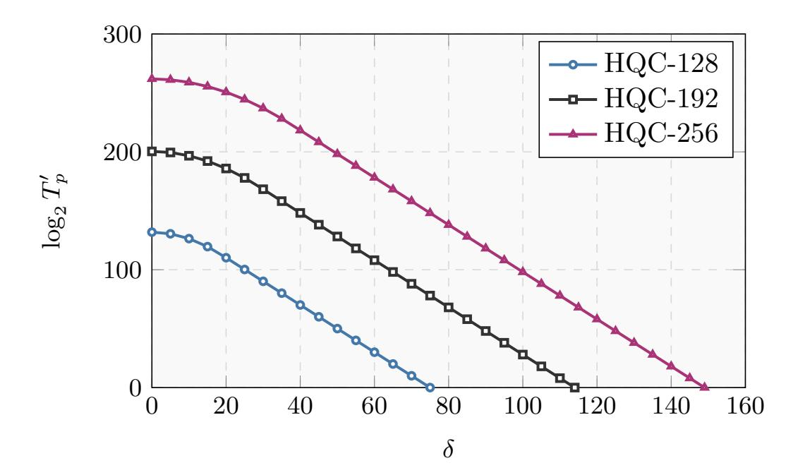

<span id="page-25-0"></span>**Fig. 8.** Comparison of the permutation bit-complexity  $\log_2 T_p'$  for 3- $\mathcal{CW}$ - $\mathcal{QCSD}(3n, w_{\mathbf{r}} - \delta, w_{\mathbf{r}} - \delta, w_{\mathbf{r}} + 2\delta)$  problem with p = 0 and l = 0, where n and  $w_{\mathbf{r}}$  are parameters in HQC sets, respectively.

$$\operatorname{wt}(\mathbf{e}_1^{(i)}) = p_i$$
 in block  $i$ . Then, the space containing structured  $\mathbf{e}_1$  can be written as  $S'_{\mathbf{e}_1} = \left\{ \mathbf{e}_1 \in \mathbb{F}_2^{k+l} : \operatorname{wt}(\mathbf{e}_1^{(i)}) = p_i \text{ for } i = 1, \dots, s \right\}$ .

Let  $\mathcal{A}$  be any algorithm that performs the oracle step for the unstructured setting with complexity  $T_o$ . Then, we can construct another algorithm  $\mathcal{A}'$  for the structured case. As  $S_{\mathbf{e}_1}$  is the space in which concrete ISD oracle algorithms search for  $\mathbf{e}_1$  with the highest probability of success. For example, the meetin-the-middle technique in Stern's algorithm [36] achieves the maximum success rate when  $\mathbf{e}_1$  can be divided into two equal halves. Therefore, for a given instance  $\mathcal{SMD}(k+l,k,p)$ , the success probability of  $\mathcal{A}'$  is not higher than that of  $\mathcal{A}$ . It follows that  $\mathcal{A}'$  runs on average in time  $T_{\mathcal{A}'} \geq \frac{|S'_{\mathbf{e}_1}|}{|S_{\mathbf{e}_1}|} \cdot T_{\mathcal{A}} = \frac{\prod_i \binom{k_i}{p_i}}{|S_{\mathbf{e}_1}|} \cdot T_{\mathcal{A}}$ . Thus, we have  $T'_o \geq T_o/2^I$ , where  $I = \max\left\{\log_2|S_{\mathbf{e}_1}| - \sum_{i=1}^s \log_2\binom{k_i}{p_i}, 0\right\}$ . The overall ISD bit-complexity under structured errors is therefore conservatively (attacker-favorable) estimated by

$$T'_{\text{ISD}} = \min_{l, p, \{k_i, p_i\}} \left( \log_2 T'_p + \log_2 \left( T_{\text{gauss}} + T_o / 2^I \right) \right). \tag{16}$$

**Experimental validation.** To illustrate how ISD complexity changes with the degree of unbalance in the error distribution, let  $\delta$  be the independent variable. Using formula (17) with Stern's algorithm [36], we compute the bit-complexity  $T'_{\text{ISD}}$  for the 3- $\mathcal{CW}$ - $\mathcal{QCSD}(3n, w_{\mathbf{r}} - \delta, w_{\mathbf{r}} - \delta, w_{\mathbf{r}} + 2\delta)$  problem, as shown in Figure 9. The figure shows that  $T'_{\text{ISD}}$  decreases monotonically with  $\delta$ . Hence, a more unbalanced error distribution leads to a larger security loss due to potential structural advantages.

For convenience, given an error vector  $\mathbf{e}$  with known weight distribution, we denote by  $T_{\text{ISD}}(n, k, \mathbf{e})$  the ISD bit-complexity of the corresponding s-CW-

{26}------------------------------------------------

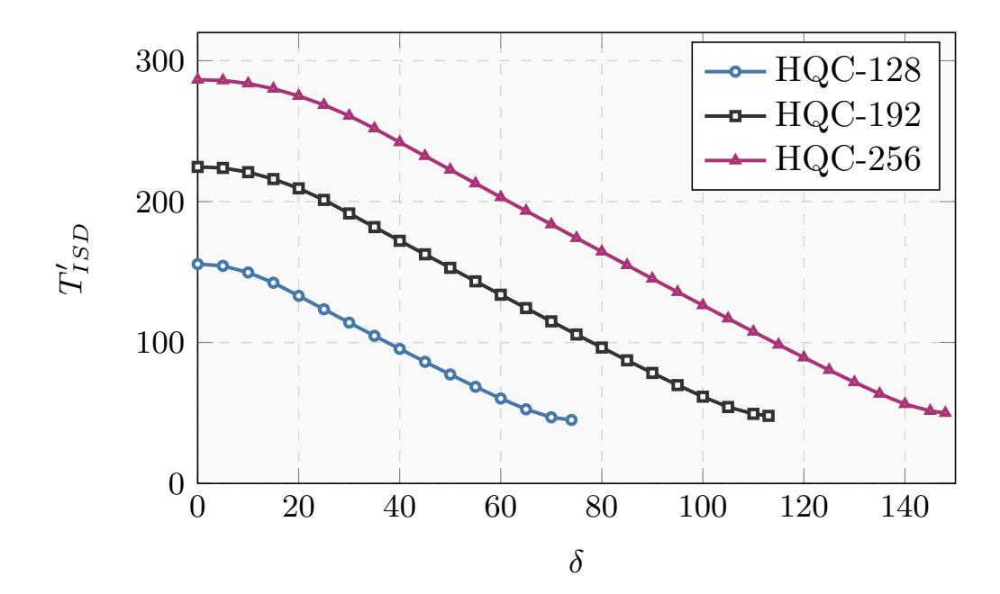

<span id="page-26-1"></span>Fig. 9. Curve of ISD bit-complexity  $T'_{\text{ISD}}$  of 3- $\mathcal{CW}$ - $\mathcal{QCSD}(3n, w_{\mathbf{r}} - \delta, w_{\mathbf{r}} - \delta, w_{\mathbf{r}} + 2\delta)$  problem versus  $\delta$ , where n and  $w_{\mathbf{r}}$  are parameters in HQC sets, respectively.

QCSD problem under the DOOM attack [35].<sup>14</sup> Following the calculation above, the ISD bit-complexity for a structured error **e** satisfies

<span id="page-26-0"></span>
$$\underline{T}_{\text{ISD}}(n, k, \mathbf{e}) = \min\{T_{\text{ISD}}, T'_{\text{ISD}}\} - \log_2 \sqrt{\text{\#targets}}.$$
 (17)

#### 4.3 Trade-off between BSC error probability and ISD complexity

The previous subsections analyzed how the error-weight distribution influences the BSC error probability and the ISD complexity. We now describe a concrete strategy for choosing weights so that the BSC error probability is reduced while the ISD security level remains acceptable.

The design must respect two main constraints:

- Strong unbalance of weight distribution may increase the attacker's advantage due to structural information, thereby reducing the ISD security level.
- The ISD complexities of two subproblems  $2\text{-}CW\text{-}QCSD(2n, w_{\mathbf{r}_1}, w_{\mathbf{r}_2})$  and  $2\text{-}CW\text{-}QCSD(2n, w_{\mathbf{r}_2}, w_{\mathbf{e}})$  must not fall below those of the original problems.<sup>15</sup>

Hence, a good weight distribution must balance the reduction in BSC error probability and the ISD security loss.

We keep  $(\mathbf{x}, \mathbf{y})$  balanced and shift weight only inside  $(\mathbf{r}_1, \mathbf{r}_2, \mathbf{e})$ . Concretely, set

$$w_{\mathbf{x}} = w_{\mathbf{y}} = w < w_{\mathbf{r}_1} = w_{\mathbf{r}_2} = w_{\mathbf{r}} < w_{\mathbf{e}}.$$
 (18)

The intuition is that decreasing  $w_{\mathbf{r}}$  and increasing  $w_{\mathbf{e}}$  can reduce the BSC error probability (cf. Theorem 5) while keeping the QCSD instance hard: the

 $<sup>\</sup>overline{^{14}}$  For the s- $\mathcal{CW}$ - $\mathcal{QCSD}(sn, w_1, w_2, \dots, w_s)$  problem, we have #targets = n.

Indeed, the 3- $\mathcal{CW}$ - $\mathcal{QCSD}(3n, w_{\mathbf{r}_1}, w_{\mathbf{r}_2}, w_{\mathbf{e}})$  instance can be reduced to the two instances 2- $\mathcal{CW}$ - $\mathcal{QCSD}(2n, w_{\mathbf{r}_1}, w_{\mathbf{r}_2})$  and 2- $\mathcal{CW}$ - $\mathcal{QCSD}(2n, w_{\mathbf{r}_2}, w_{\mathbf{e}})$ .

{27}------------------------------------------------

ordering *w < w***<sup>r</sup>** *< w***<sup>e</sup>** ensures that the two subproblems remain sufficiently hard, and that

$$\underline{T}_{\mathrm{ISD}}(2n, n, (\mathbf{r}_2, \mathbf{e})) > \underline{T}_{\mathrm{ISD}}(2n, n, (\mathbf{r}_1, \mathbf{r}_2)) > \underline{T}_{\mathrm{ISD}}(2n, n, (\mathbf{x}, \mathbf{y})).$$

Consequently, the overall ISD security under the new distribution is

<span id="page-27-1"></span>
$$\min \left\{ \underline{T}_{\mathrm{ISD}}(2n, n, (\mathbf{x}, \mathbf{y})), \ \underline{T}_{\mathrm{ISD}}(3n, n, (\mathbf{r}_1, \mathbf{r}_2, \mathbf{e})) \right\}, \tag{19}$$

which simplifies the parameter search: it suffices to ensure that both the 2-CW-QCSD and 3-CW-QCSD instances meet the target bit-security level.

*Example 1.* The original weights for HQC-128 are

$$w_{\mathbf{x}} = w_{\mathbf{y}} = 66, \qquad w_{\mathbf{r}_1} = w_{\mathbf{r}_2} = w_{\mathbf{e}} = 75,$$

resulting in a BSC with an error probability of 0*.*3398 (Lemma [2](#page-9-2)). Using Stern's algorithm [\[36](#page-32-4)], and based on Eq. ([17\)](#page-26-0), we compute the ISD security as follows: *T*ISD(2*n, n,*(**x***,* **y**)) = 145*.*80 bits and *T*ISD(3*n, n,*(**r**1*,* **r**2*,* **e**)) = 147*.*68 bits.

If we retain the total weight of (**r**1*,* **r**2*,* **e**) but modify the weights to *w***r**<sup>1</sup> = *w***r**<sup>2</sup> = 67, and *w***<sup>e</sup>** = 91, the ISD security becomes *T*ISD(3*n, n,*(**r**1*,* **r**2*,* **e**)) = 144*.*85 bits.

To compensate for the security loss, we increase the weight of **e** by setting *w***<sup>e</sup>** = 106. Then, the ISD security increases to *T*ISD(3*n, n,*(**r**1*,* **r**2*,* **e**)) = 147*.*74 bits. Moreover, by Lemma [2,](#page-9-2) we obtain that the BSC error probability is 0*.*3198, which is smaller than the original 0*.*3398. Thus, the revised distribution reduces the error probability by approximately 6% while maintaining essentially the same security level.

## <span id="page-27-0"></span>**5 New HQC Parameter Sets with Tighter Security and Better Performance**

Based on the preceding analysis, this section relaxes the upper bound *ε* on the CDFR under the decryption-failure attack [\[21](#page-31-3)]. To maintain a conservative security margin, we set *ε* = 2*<sup>−</sup>*<sup>20</sup> , 2 *<sup>−</sup>*<sup>40</sup>, and 2 *<sup>−</sup>*<sup>60</sup> for the 128-bit, 192-bit, and 256-bit security levels, respectively. These bounds ensure the probability of the adversary triggering a decryption failure remains sufficiently low even after 2 *T*ISD operations (precomputation + decryption queries), providing a security margin against decryption-failure attacks. Furthermore, by modifying the error distribution, we derive a variant of HQC, denoted by *UHQC*. Building on these adjustments, we optimize the parameter sets of the HQC and the UHQC to achieve better bandwidth and efficiency without reducing security.

{28}------------------------------------------------

#### **5.1 Improved HQC and UHQC Parameter Sets**

Unlike the standard HQC instantiation, this work prefers to adopt longer RM codes to accelerate the decoding of RSRM codes and better withstand densityinterval attack [\[21](#page-31-3)].16 Through a systematic parameter search, we obtain new parameter sets, summarized in Table [6](#page-28-0). In the table, *n*<sup>1</sup> and *n*<sup>2</sup> denote the code lengths of the RS code and the RM code in the RSRM construction, respectively.

<span id="page-28-0"></span>**Table 6.** Improved HQC and UHQC Parameter Sets

| Category                                        | n1 | n2 | n1n2 | n                                | w  | wr | we     |  |  |  |
|-------------------------------------------------|----|----|------|----------------------------------|----|----|--------|--|--|--|
| Improved HQC Parameter sets                     |    |    |      |                                  |    |    |        |  |  |  |
| Improved HQC-128 32 512 16384 16963             |    |    |      |                                  | 66 | 75 | 75     |  |  |  |
| Improved HQC-192 44 768 33792 34589 100 114 114 |    |    |      |                                  |    |    |        |  |  |  |
| Improved HQC-256 58 896 53760 55213 131 149 149 |    |    |      |                                  |    |    |        |  |  |  |
| UHQC Parameter sets                             |    |    |      |                                  |    |    |        |  |  |  |
| UHQC-128                                        |    |    |      | 30 512 15,360 16,067 66          |    |    | 67 106 |  |  |  |
| UHQC-192                                        |    |    |      | 42 768 32,256 32,261 100 101 173 |    |    |        |  |  |  |
| UHQC-256                                        |    |    |      | 56 896 50,176 50,789 131 132 227 |    |    |        |  |  |  |

Following the latest HQC framework [[18](#page-31-4)], we compute the bandwidth for our Improved HQC and UHQC parameter sets, as shown in Table [1](#page-3-0). We also benchmark the running time of these parameter sets using the official HQC AVX2 implementation [\[19](#page-31-7)]; the results are presented in Table [2](#page-4-0). Compared to the standard HQC parameter sets, the improved sets reduce bandwidth by 4.24– 5.03%, while the UHQC sets achieve reductions of 9.97–12.19%. In terms of runtime, the Improved HQC parameter sets are approximately 4.62–8.81% faster, and the UHQC parameter sets are 5.87–8.54% faster than the original.

Since the encryption and decryption algorithms of HQC remain unchanged and only the DFR security threshold and the weight distribution among (**r**1*,* **r**2*,* **e**) are modified, the security analysis focuses on ISD resistance and robustness against density-interval attack [[21\]](#page-31-3).

## **5.2 ISD Security Analysis of Improved HQC and UHQC Parameter Sets**

We analyze the impact of error-vector weight distribution on ISD security in Section [4.2](#page-22-0) and propose a concrete estimation methodology based on existing ISD algorithms. Based on this, we assess concrete ISD security of the standard HQC, Improved HQC, and UHQC parameter sets, via Eqs. ([17\)](#page-26-0) and [\(19](#page-27-1)), using the Prange [\[34](#page-32-3)], Stern [\[36](#page-32-4)], BothMay17 [\[11](#page-31-13)], MayOzerov [[32\]](#page-32-11), BJMM [[6\]](#page-30-3), and quantum Prange [[9](#page-30-10)] algorithms. This is done by modifying the ISD estimator from [[16\]](#page-31-14)

<sup>16</sup> Our simulation results show that RSRM codes with longer RM codes have faster decryption speed and stronger ability to resist density-interval attack [[21\]](#page-31-3).

<sup>17</sup> The framework of BothMay and MayOzerov is slightly different from the Dumer's framework in Algorithm [1,](#page-23-0) but the analysis can be performed in the same way.

{29}------------------------------------------------

to execute these algorithms. The results are summarized in Table [7.](#page-29-0) The table shows that the Improved HQC and UHQC parameter sets exhibit slightly lower ISD security than the standard HQC parameter sets by 0*.*11–0*.*13 bits and 0*.*30– 0*.*57 bits, respectively. It should be noted that the data in Table [7](#page-29-0) all correspond to *T*ISD(2*n, n,*(**x***,* **y**)). The reduction in ISD security is due to the decrease in the parameter *n*. For completeness, the data for *T*ISD(3*n, n,*(**r**1*,* **r**2*,* **e**)) are listed in Appendix [F,](#page-50-0) all satisfying *T*ISD(3*n, n,*(**r**1*,* **r**2*,* **e**)) *> T*ISD(2*n, n,*(**x***,* **y**)).

<span id="page-29-0"></span>**Table 7.** ISD bit-security of standard HQC, Improved HQC, and UHQC parameter sets. The bold values indicate the lowest attack complexity for each parameter set.

| Category                       | Prange | Stern         |        | BothMay MayOzerov BJMM Q-Prange |        |        |
|--------------------------------|--------|---------------|--------|---------------------------------|--------|--------|
| HQC-128                        |        | 166.33 145.30 | 145.44 | 145.44                          | 145.63 | 83.16  |
| Improved HQC-128 166.20 145.17 |        |               | 145.30 | 145.30                          | 145.51 | 83.10  |
| UHQC-128                       |        | 166.03 145.00 | 145.20 | 145.20                          | 145.35 | 83.01  |
| HQC-192                        |        | 236.79 213.44 | 213.58 | 213.58                          | 213.71 | 118.39 |
| Improved HQC-192 236.69 213.33 |        |               | 213.46 | 213.46                          | 213.60 | 118.34 |
| UHQC-192                       |        | 236.48 213.11 | 213.32 | 213.32                          | 213.40 | 118.24 |
| HQC-256                        |        | 300.45 275.59 | 275.76 | 275.76                          | 275.82 | 150.22 |
| Improved HQC-256 300.33 275.46 |        |               | 275.61 | 275.61                          | 275.69 | 150.16 |
| UHQC-256                       | 300.08 | 275.20        | 275.02 | 275.03                          | 275.45 | 150.04 |

### <span id="page-29-1"></span>**5.3 Analysis of Resistance to the Density-Interval Attack for Improved HQC and UHQC Parameter Sets**

In this subsection, we evaluate the maximum CDFR of the Improved HQC and UHQC parameter sets under the density-interval attack [[21\]](#page-31-3) in the classical setting. We restrict the adversary's total budget to the classical ISD bit-security levels, as listed in Table [7](#page-29-0). For each parameter set, we exhaustively traverse all feasible density-interval parameters (*l*1*, l*0) and compute the corresponding CDFR upper bound; the maximum over (*l*1*, l*0) is listed in Table [8](#page-30-6). Across the three targeted security levels, the resulting maximum CDFR values are below 2 *−*20 , 2 *<sup>−</sup>*<sup>40</sup>, and 2 *<sup>−</sup>*<sup>60</sup>, respectively.

Moreover, since both the precomputation cost *Tp*(*l*1*, l*0) and the DFR upper bound from Theorem [4](#page-19-0) are conservative (attacker-favorable), the adversary's actual achievable DFR and CDFR are expected to be smaller. For completeness, Appendices [G](#page-50-1) and [H](#page-51-0) report the analysis under Grover-accelerated (quantum) precomputation/search [\[20](#page-31-11)] and the noise-model simulations.18

<sup>18</sup> In the quantum setting, the maximum CDFR is smaller than in the classical setting. The noise simulations also confirm that the PEB-BSC model is a conservative estimate of the HQC noise.

{30}------------------------------------------------

<span id="page-30-6"></span>**Table 8.** Maximum CDFR for Improved HQC and UHQC parameter sets under the density-interval attack [[21\]](#page-31-3).

| Category                         | TISD |                 |        | (l1, l0) Tp(l1, l0) DFR(l1, l0) | CDFR          | Natural DFR    |
|----------------------------------|------|-----------------|--------|---------------------------------|---------------|----------------|
| Improved HQC-128 145.17 (29, 15) |      |                 | 79.28  | −84.73<br>≤ 2                   | −20.73<br>≤ 2 | −100.53<br>≤ 2 |
| UHQC-128                         |      | 145.00 (29, 15) | 80.90  | −85.24<br>≤ 2                   | −21.24<br>≤ 2 | −109.28<br>≤ 2 |
| Improved HQC-192 213.33 (49, 25) |      |                 | 149.38 | −104.57 ≤<br>≤ 2                | −40.62<br>2   | −140.83<br>≤ 2 |
| UHQC-192                         |      | 213.11 (47, 24) | 145.17 | −118.67 ≤<br>≤ 2                | −54.67<br>2   | −155.42<br>≤ 2 |
| Improved HQC-256 275.46 (65, 33) |      |                 | 209.82 | −124.10 ≤<br>≤ 2                | −60.10<br>2   | −179.62<br>≤ 2 |
| UHQC-256                         |      | 275.02 (65, 33) | 212.50 | −122.73 ≤<br>≤ 2                | −60.22<br>2   | −181.16<br>≤ 2 |

## **References**

- <span id="page-30-1"></span>1. Aguilar-Melchor, C., Aragon, N., Deneuville, J.C., Gaborit, P., Lacan, J., Zémor, G.: Efficient error-correcting codes for the HQC post-quantum cryptosystem. Designs, Codes and Cryptography **92**(12), 4511–4530 (2024)
- <span id="page-30-0"></span>2. Alagic, G., Bros, M., Ciadoux, P., Cooper, D., Dang, Q., Dang, T., Kelsey, J., Lichtinger, J., Liu, Y.K., Miller, C., et al.: Status report on the fourth round of the U.S. National Institute of Standards and Technology (NIST) post-quantum cryptography standardization process. US Department of Commerce, National Institute of Standards and Technology (2025)
- <span id="page-30-4"></span>3. Albrecht, M.R., Chase, M., Chen, H., Ding, J., Goldwasser, S., Gorbunov, S., Halevi, S., Hoffstein, J., Laine, K., Lauter, K.E., Lokam, S., Micciancio, D., Moody, D., Morrison, T., Sahai, A., Vaikuntanathan, V.: Homomorphic encryption standard. IACR Cryptol. ePrint Arch. p. 939 (2019), [https://eprint.iacr.org/2019/](https://eprint.iacr.org/2019/939) [939](https://eprint.iacr.org/2019/939)
- <span id="page-30-2"></span>4. Avanzi, R., Bos, J., Ducas, L., Kiltz, E., Lepoint, T., Lyubashevsky, V., Schanck, J.M., Schwabe, P., Seiler, G., Stehlé, D., et al.: Crystals-kyber algorithm specifications and supporting documentation. NIST PQC Round **2**(4), 1–43 (2019)
- <span id="page-30-7"></span>5. Bard, G.V.: Algorithms for Solving Linear and Polynomial Systems of Equations over Finite Fields with Applications to Cryptanalysis. Ph.D. thesis, University of Maryland, College Park, MD, USA (2007), <https://hdl.handle.net/1903/7202>
- <span id="page-30-3"></span>6. Becker, A., Joux, A., May, A., Meurer, A.: Decoding random binary linear codes in 2 *n/*<sup>20</sup>: How 1+ 1= 0 improves information set decoding. In: Annual international conference on the theory and applications of cryptographic techniques. pp. 520– 536. Springer (2012)
- <span id="page-30-8"></span>7. Bernstein, D.J., Lange, T., Peters, C.: Attacking and defending the McEliece cryptosystem. In: Buchmann, J., Ding, J. (eds.) Post-Quantum Cryptography, Second International Workshop, PQCrypto 2008. Lecture Notes in Computer Science, vol. 5299, pp. 31–46. Springer (2008)
- <span id="page-30-9"></span>8. Bernstein, D.J., Lange, T., Peters, C.: Smaller decoding exponents: Ball-collision decoding. In: Rogaway, P. (ed.) Advances in Cryptology - CRYPTO 2011. Lecture Notes in Computer Science, vol. 6841, pp. 743–760. Springer (2011)
- <span id="page-30-10"></span>9. Bernstein, D.J.: Grover vs. McEliece. In: International Workshop on Post-Quantum Cryptography. pp. 73–80. Springer (2010)
- <span id="page-30-5"></span>10. Bossuat, J., Cammarota, R., Chillotti, I., Curtis, B.R., Dai, W., Gong, H., Hales, E., Kim, D., Kumara, B., Lee, C., Lu, X., Maple, C., Pedrouzo-Ulloa, A., Player, R., Polyakov, Y., Lopez, L.A.R., Song, Y., Yhee, D.: Security guidelines for implementing homomorphic encryption. IACR Commun. Cryptol. **1**(4), 26 (2024)

{31}------------------------------------------------

- <span id="page-31-13"></span>11. Both, L., May, A.: Decoding linear codes with high error rate and its impact for LPN security. In: International Conference on Post-Quantum Cryptography. pp. 25–46. Springer (2018)
- <span id="page-31-12"></span>12. Canto Torres, R., Sendrier, N.: Analysis of information set decoding for a sublinear error weight. In: Takagi, T. (ed.) Post-Quantum Cryptography. pp. 144–161. Springer International Publishing, Cham (2016)
- <span id="page-31-6"></span>13. Cheon, J.H., Choe, H., Hong, D., Yi, M.: SMAUG: pushing lattice-based key encapsulation mechanisms to the limits. In: Carlet, C., Mandal, K., Rijmen, V. (eds.) Selected Areas in Cryptography - SAC 2023 - 30th International Conference, Fredericton, Canada, August 14-18, 2023, Revised Selected Papers. Lecture Notes in Computer Science, vol. 14201, pp. 127–146. Springer (2023)
- <span id="page-31-2"></span>14. Dumer, I.: On syndrome decoding of linear codes. In: Proc. Ninth All-Union Symp. Redundancy in Information Systems. Nauka. vol. 2, pp. 157–159 (1986)
- <span id="page-31-16"></span>15. Ehm, W.: Binomial approximation to the Poisson binomial distribution. Statistics & Probability Letters **11**(1), 7–16 (1991)
- <span id="page-31-14"></span>16. Esser, A., Bellini, E.: Syndrome decoding estimator. In: IACR International Conference on Public-Key Cryptography. pp. 112–141. Springer (2022)
- <span id="page-31-0"></span>17. Fujisaki, E., Okamoto, T.: Secure integration of asymmetric and symmetric encryption schemes. In: Wiener, M. (ed.) Advances in Cryptology — CRYPTO' 99. pp. 537–554. Springer Berlin Heidelberg, Berlin, Heidelberg (1999)
- <span id="page-31-4"></span>18. Gaborit, P., Aguilar-Melchor, C., Aragon, N., Bettaieb, S., Bidoux, L., Blazy, O., Deneuville, J.C., Persichetti, E., Zémor, G., Bos, J., et al.: Hamming quasicyclic (HQC). Tech. rep., PQC-HQC Team, [https://pqc-hqc.org/doc/hqc\\_](https://pqc-hqc.org/doc/hqc_specifications_2025_08_22.pdf) [specifications\\_2025\\_08\\_22.pdf](https://pqc-hqc.org/doc/hqc_specifications_2025_08_22.pdf) (Aug 2025)
- <span id="page-31-7"></span>19. Gaborit, P., Aguilar-Melchor, C., Aragon, N., Bettaieb, S., Bidoux, L., Blazy, O., Deneuville, J.C., Persichetti, E., Zémor, G., Bos, J., et al.: The official implementation of HQC (in C) (2025), <https://gitlab.com/pqc-hqc/hqc/>, accessed on 2026.1.16
- <span id="page-31-11"></span>20. Grover, L.K.: Quantum mechanics helps in searching for a needle in a haystack. Physical review letters **79**(2), 325 (1997)
- <span id="page-31-3"></span>21. Guo, Q., Johansson, T.: A new decryption failure attack against HQC. In: Moriai, S., Wang, H. (eds.) Advances in Cryptology – ASIACRYPT 2020. pp. 353–382. Springer International Publishing, Cham (2020)
- <span id="page-31-10"></span>22. Guo, Q., Johansson, T., Löndahl, C.: A new algorithm for solving Ring-LPN with a reducible polynomial. IEEE Transactions on Information Theory **61**(11), 6204– 6212 (2015)
- <span id="page-31-9"></span>23. Helleseth, T., Klove, T., Levenshtein, V.: Error-correction capability of binary linear codes. IEEE Transactions on Information Theory **51**, 1408–1423 (2005)
- <span id="page-31-15"></span>24. Helleseth, T., Klove, T., Mykkeltveit, J.: On the covering radius of binary codes. IEEE Transactions on Information Theory **24**(5), 627–628 (1978)
- <span id="page-31-1"></span>25. Hofheinz, D., Hövelmanns, K., Kiltz, E.: A modular analysis of the Fujisaki-Okamoto transformation. In: Kalai, Y., Reyzin, L. (eds.) Theory of Cryptography - 15th International Conference – TCC 2017. LNCS, vol. 10677, pp. 341–371. Springer (2017)
- <span id="page-31-8"></span>26. Huffman, W.C., Pless, V.: Fundamentals of error-correcting codes. Cambridge university press (2010)
- <span id="page-31-5"></span>27. Jiang, H., Zhang, Z., Chen, L., Wang, H., Ma, Z.: IND-CCA-secure key encapsulation mechanism in the quantum random oracle model, revisited. In: Shacham, H., Boldyreva, A. (eds.) Advances in Cryptology – CRYPTO 2018. LNCS, vol. 10993, pp. 96–125 (2018)

{32}------------------------------------------------

- <span id="page-32-0"></span>28. Lin, S., Costello, D.J.: Error control coding, vol. 2. Prentice Hall Englewood (2001)
- <span id="page-32-9"></span>29. Löndahl, C., Johansson, T., Koochak Shooshtari, M., Ahmadian-Attari, M., Aref, M.R.: Squaring attacks on McEliece public-key cryptosystems using quasi-cyclic codes of even dimension. Designs, Codes and Cryptography 80(2), 359–377 (2016)
- <span id="page-32-1"></span>30. MacWilliams, F.J., Sloane, N.J.A.: The theory of error-correcting codes, vol. 16. Elsevier (1977)
- <span id="page-32-5"></span>31. May, A., Meurer, A., Thomae, E.: Decoding random linear codes in  $O(2^{0.054n})$ . In: International Conference on the Theory and Application of Cryptology and Information Security. pp. 107–124. Springer (2011)
- <span id="page-32-11"></span>32. May, A., Ozerov, I.: On computing nearest neighbors with applications to decoding of binary linear codes. In: Annual International Conference on the Theory and Applications of Cryptographic Techniques. pp. 203–228. Springer (2015)
- <span id="page-32-2"></span>33. NIST: Module-lattice-based key-encapsulation mechanism standard (2024), https://nvlpubs.nist.gov/nistpubs/FIPS/NIST.FIPS.203.pdf
- <span id="page-32-3"></span>34. Prange, E.: The use of information sets in decoding cyclic codes. IRE Transactions on Information Theory **8**(5), 5–9 (1962)
- <span id="page-32-6"></span>35. Sendrier, N.: Decoding one out of many. In: International Workshop on Post-Quantum Cryptography. pp. 51–67. Springer (2011)
- <span id="page-32-4"></span>36. Stern, J.: A method for finding codewords of small weight. In: International colloquium on coding theory and applications. pp. 106–113. Springer (1988)
- <span id="page-32-12"></span>37. Ward, H.N.: An introduction to divisible codes. Des. Codes Cryptography **17**(13), 7379 (Sep 1999)
- <span id="page-32-8"></span>38. Zémor, G.: Threshold effects in codes. In: Workshop on Algebraic Coding. pp. 278–286. Springer (1993)
- <span id="page-32-7"></span>39. Zhang, J., Yu, Y., Fan, S., Zhang, Z., Yang, K.: Tweaking the asymmetry of asymmetric-key cryptography on lattices: Kems and signatures of smaller sizes. In: Kiayias, A., Kohlweiss, M., Wallden, P., Zikas, V. (eds.) Public-Key Cryptography - PKC 2020 - 23rd IACR International Conference on Practice and Theory of Public-Key Cryptography, Edinburgh, UK, May 4-7, 2020, Proceedings, Part II. Lecture Notes in Computer Science, vol. 12111, pp. 37–65. Springer (2020)

#### <span id="page-32-10"></span>A Proofs of Lemmas in Section 2.2

Proof (Proof of Lemma 1). According to Proposition 6.1.1. in [18],

$$\Pr[z_k = 1] = \sum_{\substack{1 \le \ell \le \min(w_{\mathbf{x}}, w_{\mathbf{r}}) \\ \ell \text{ is odd}}} \frac{\binom{n}{\ell} \binom{n-\ell}{w_{\mathbf{x}}-\ell} \binom{n-w_{\mathbf{x}}}{w_{\mathbf{r}}-\ell}}{\binom{n}{w_{\mathbf{x}}} \binom{n}{w_{\mathbf{r}}}}.$$

Using the identity  $\binom{n}{\ell}\binom{n-\ell}{w_{\mathbf{x}}-\ell} = \binom{n}{w_{\mathbf{x}}}\binom{w_{\mathbf{x}}}{\ell}$ , we obtain  $\frac{\binom{n}{\ell}\binom{n-\ell}{w_{\mathbf{x}}-\ell}}{\binom{n}{w_{\mathbf{x}}}} = \binom{w_{\mathbf{x}}}{\ell}$ . Thus, we get Eq. (4).

Proof (Proof of Lemma 2). Fix an index k. By Lemma 1 and the given distributions, the three random variables

$$U = (\mathbf{x} \cdot \mathbf{r}_2)_k, \quad V = (\mathbf{r}_1 \cdot \mathbf{y})_k, \quad W = e_k$$

are mutually independent Binomial random variables with parameters  $p_U$ ,  $p_V$ , and  $p_W$ , respectively. Over  $\mathbb{F}_2$ , subtraction equals addition, so  $e_k' = U + V + W$ .

{33}------------------------------------------------

Using the mutual independence of U, V, W,

$$P[e'_{k} = 1] = Pr(U = 1, V = 0, W = 0) + Pr(U = 0, V = 1, W = 0)$$

$$+ Pr(U = 0, V = 0, W = 1) + Pr(U = 1, V = 1, W = 1)$$

$$= p_{U}(1 - p_{V})(1 - p_{W}) + (1 - p_{U})p_{V}(1 - p_{W})$$

$$+ (1 - p_{U})(1 - p_{V})p_{W} + p_{U}p_{V}p_{W}$$

$$= p_{U} + p_{V} + p_{W} - 2p_{U}p_{V} - 2p_{U}p_{W} - 2p_{V}p_{W} + 4p_{U}p_{V}p_{W}.$$

This completes the proof.

## <span id="page-33-0"></span>B Poisson Fit Algorithm for the Distribution of Dense Intervals

According to the description in the main text, the HQC noise can be expressed as  $\mathbf{e}' = (\mathbf{e}_1, \mathbf{e}_2, \dots, \mathbf{e}_{n_1}, \mathbf{e}_{\text{trun}})$ , where  $\mathbf{e}_i \in \mathbb{F}_2^{n_2}$  for  $i = 1, \dots, n_1$  and  $\mathbf{e}_{\text{trun}} \in \mathbb{F}_2^{n_1 - n_1 n_2}$  corresponds to the truncated part of the ciphertext. We use a fixed parameter set  $\mathcal{M} = \{(\zeta_b, b), 0 \leq b \leq n_1\}$  to fit the distribution of dense intervals across the  $\mathbf{e}_i$ , where  $\zeta_b$  denotes the number of  $\mathbf{e}_i$  containing b dense intervals, satisfying  $\sum \zeta_b = n_1$  and  $\sum \zeta_b \cdot b = w_{\mathbf{x}}$ . This paper uses the Poisson distribution to fit the distribution of  $w_{\mathbf{x}}$  dense intervals across  $\mathbf{e}_i$ . First, calculate the expected values of  $\zeta_b$  for all b,

$$\mathbb{E}[\zeta_b] = n_1 \cdot \frac{\mu^b e^{-\mu}}{b!}.\tag{20}$$

These expected values are then floored to the nearest integers. Finally, minor adjustments are applied to ensure the two summation constraints are met exactly. The complete fitting procedure is outlined in Algorithm 2.

## <span id="page-33-1"></span>C Supporting Simulations for the Density-Interval Attack and Its Natural Variants

As a supplement to Section 3.3, we also simulate the density-interval attack [21] using the HQC-128 parameter set:  $w_{\mathbf{x}} = w_{\mathbf{y}} = 66$ ,  $w_{\mathbf{r}_1} = w_{\mathbf{r}_2} = w_{\mathbf{e}} = 75$ , RM parameters [384, 8, 192]<sub>2</sub>, and RS parameters [46, 16, 31]<sub>256</sub>. By Theorem 2, the half-failure threshold of the [384, 8, 192]<sub>2</sub> RM code is  $t_{1/2} = 164$ .

As a complement, we simulate the blockwise weight profile  $F(\mathfrak{C})$  under the condition where no attack is applied, i.e.,  $l_1 = l_0 = 0$ , as shown in Fig. 10. In the absence of adversarial attacks, the blockwise weight profiles of HQC noise and PEB-BSC are very similar, with the HQC noise profile being slightly lower in the high-weight region. This further corroborates the models adopted in this work and by the HQC team [18]. We also consider three additional density settings for the attack by setting  $l_1 = \lfloor l_0/\rho \rfloor$  with  $\rho \in \{0.5, 0.7, 0.8\}$ , and simulate the half-failure block count  $B_{1/2}(\mathfrak{C})$ . The results are reported in Figs. 11-13. All simulation results are generally consistent with Fig. 4. Thus, for RSRM codes

{34}------------------------------------------------

# **Algorithm 2:** Poisson Approximation-Based Fitting Algorithm for the Distribution of Dense Intervals across $\mathbf{e}_i$

```
Input: Total number of dense intervals w_{\mathbf{x}}, number of blocks n_1
     Output: \{(\zeta_b, b)\} s.t. \sum_b \zeta_b = n_1 and \sum_b b\zeta_b = w_{\mathbf{x}}
 1 if w_{\mathbf{x}} = 0 then
  2 | return \{(n_1,0)\};
 a \mu \leftarrow w_{\mathbf{x}}/n_1;
 4 b_{\max} \leftarrow \min(w_{\mathbf{x}}, \lceil \mu + 5\sqrt{\mu} \rceil);
     // Truncated Poisson pmf, tail absorbed into b_{\rm max}
 5 for b \leftarrow 0 to b_{\text{max}} - 1 do
  6 p_b \leftarrow e^{-\mu} \mu^b / b!;
 7 p_{b_{\max}} \leftarrow 1 - \sum_{b=0}^{b_{\max}-1} p_b;
// Integerize to enforce \sum \zeta_b = n_1
 s for b \leftarrow 0 to b_{\max} do
         E_b \leftarrow n_1 p_b;
  9
          \zeta_b \leftarrow |E_b|;
10
      r_b \leftarrow E_b - \zeta_b;
11
12 block_diff \leftarrow n_1 - \sum_{b=0}^{b_{\text{max}}} \zeta_b;
13 while block diff > 0 do
          b^{\star} \leftarrow \arg\max_b r_b;
14
           \zeta_{b^*} \leftarrow \zeta_{b^*} + 1;
15
           r_{b^*} \leftarrow 0;
16
           block\_diff \leftarrow block\_diff - 1;
17
18 while block\_diff < 0 do
         b^{\star} \leftarrow \arg\min_{b:\zeta_b>0} r_b;
19
          \zeta_{b^*} \leftarrow \zeta_{b^*} - 1;
20
        block\_diff \leftarrow block\_diff + 1;
\mathbf{21}
     // Neighbor transfer to enforce \sum b\zeta_b=w_{\mathbf{x}}
22 interval_diff \leftarrow w_{\mathbf{x}} - \sum_{b=0}^{b_{\text{max}}} b\zeta_b;
23 while interval\_diff > 0 do
          b^{\star} \leftarrow \arg\max_{b < b_{\max}: \zeta_b > 0} (\zeta_b - E_b);
24
           \zeta_{b^*} \leftarrow \zeta_{b^*} - 1;
25
          \zeta_{b^*+1} \leftarrow \zeta_{b^*+1} + 1;
26
          interval_diff \leftarrow interval_diff -1;
27
28 while interval\_diff < 0 do
           b^{\star} \leftarrow \arg\max_{b>0:\zeta_b>0}(\zeta_b-E_b);
29
          \zeta_{b^*} \leftarrow \zeta_{b^*} - 1;
30
           \zeta_{b^*-1} \leftarrow \zeta_{b^*-1} + 1;
31
           interval\_diff \leftarrow interval\_diff + 1;
32
33 return \{(\zeta_b, b) \mid \zeta_b > 0\};
```

{35}------------------------------------------------

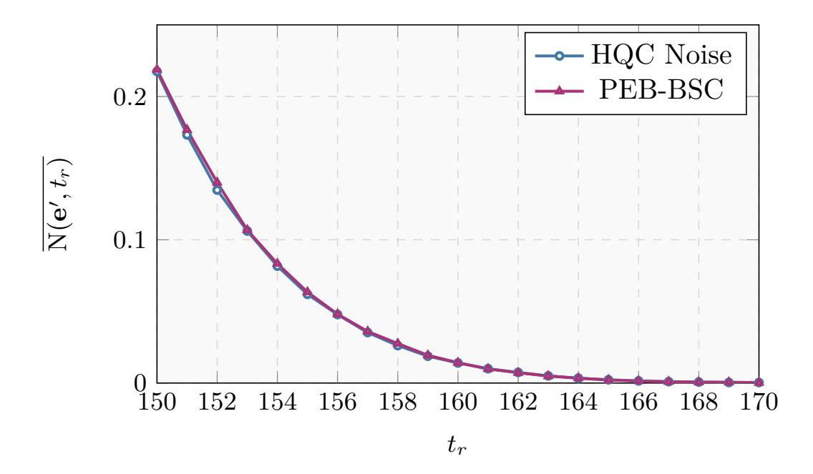

<span id="page-35-0"></span>**Fig. 10.** Blockwise weight profile F(C) without attacks: HQC noise vs. PEB-BSC.

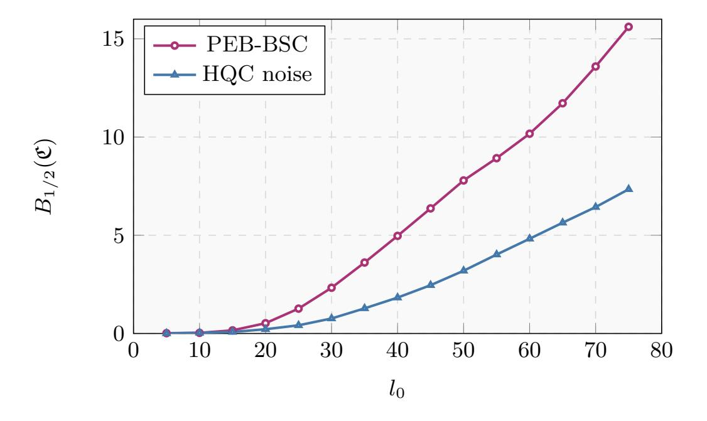

<span id="page-35-1"></span>**Fig. 11.** Half-failure block count *B*1*/*2(C) under density-interval attack with *l*<sup>1</sup> = *⌊l*0*/*0*.*5*⌋*: HQC noise vs. PEB-BSC

{36}------------------------------------------------

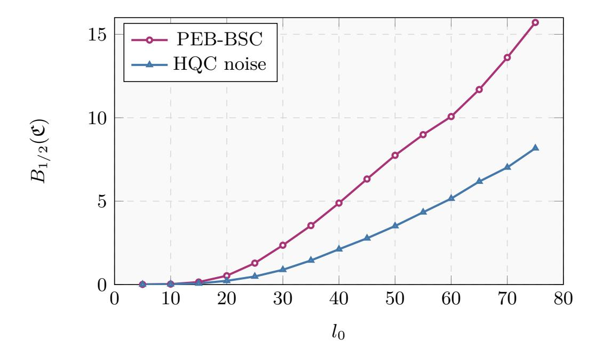

**Fig. 12.** Half-failure block count *B*1*/*2(C) under density-interval attack with *l*<sup>1</sup> = *⌊l*0*/*0*.*7*⌋*: HQC noise vs. PEB-BSC

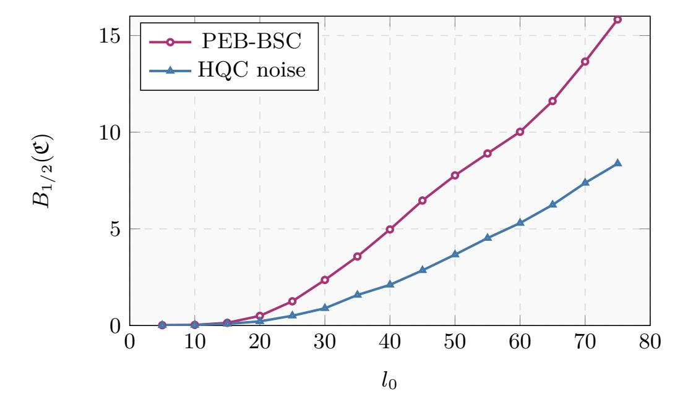

<span id="page-36-0"></span>**Fig. 13.** Half-failure block count *B*1*/*2(C) under density-interval attack with *l*<sup>1</sup> = *⌊l*0*/*0*.*8*⌋*: HQC noise vs. PEB-BSC

{37}------------------------------------------------

under BM-FHT decoding, PEB-BSC is a conservative approximation to the HQC noise.

**Natural Variants.** Since there are few studies on decryption-failure attacks against HQC, we further consider the following two natural variants of the density-interval attack [21]:

- Variant 1 (split intervals): splitting the dense interval in  $\mathbf{r}_2$  into multiple disjoint segments:
- Variant 2 (joint search): searching for dense intervals simultaneously in  $\mathbf{r}_1$  and  $\mathbf{r}_2$ .

Our simulations indicate that, under matched computing resources, the original density-interval attack [21] is the most effective among these attacks on HQC. We next describe the simulation settings in detail, again using the HQC-128 parameter set.

Variant 1. Variant 1 only splits the dense interval into multiple disjoint segments; hence its precomputation cost remains the same as the original attack, i.e.,  $\mathcal{T}_p(l_1, l_0)$ . We simulate the case where the dense interval in  $\mathbf{r}_2$  is partitioned into (approximately) m equal segments; when m = 1, Variant 1 reduces to the original density-interval attack. The results are shown in Figs. 14. The simulation indicates that the disturbance on the HQC noise is maximized at m = 1. We also test several unequal partitions, all weaker than the original density-interval attack; that is, the half-failure block count curves are all below the original density-interval attack.

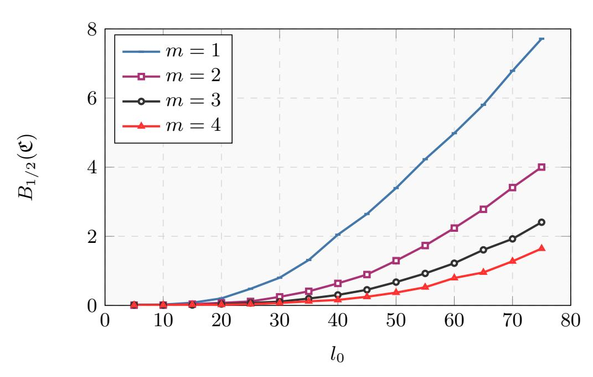

<span id="page-37-0"></span>Fig. 14. Half-failure block count of HQC noise under Variant 1 density-interval attack

**Variant 2.** Variant 2 searches for dense intervals in both  $\mathbf{r}_1$  and  $\mathbf{r}_2$ . Let the density-interval parameters in  $\mathbf{r}_1$  and  $\mathbf{r}_2$  be  $(l_1^{(1)}, l_0^{(1)})$  and  $(l_1^{(2)}, l_0^{(2)})$ , respectively. To compare with the original attack, we assume  $l_1^{(1)} = l_1^{(2)}$ ,  $l_0^{(1)} = l_0^{(2)}$ , and  $l_0^{(1)}/l_1^{(1)} \approx l_0/l_1$ . Among all choices satisfying  $2 \cdot \mathcal{T}_p(l_1^{(1)}, l_0^{(1)}) \leq \mathcal{T}_p(l_1, l_0)$ , we report the parameter pair  $(l_1^{(1)}, l_0^{(1)})$  with the strongest observed performance.

{38}------------------------------------------------

We perform simulations by varying  $l_0$  while fixing  $l_1 = \lfloor l_0/0.6 \rfloor$ ; the results are reported in Fig. 15. Under the same resource budget, Variant 2 is also less effective than the original attack.

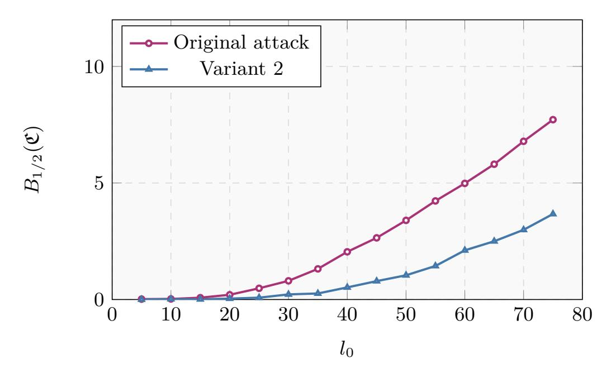

<span id="page-38-1"></span>Fig. 15. Half-failure block count of HQC noise: original attack vs. Variant 2 density-interval attack

Overall, these experiments support that PEB-BSC provides a conservative approximation of the HQC noise induced by the density-interval attack [21] and the above variants.

## D Proofs of Theorems in Section 3.4

#### <span id="page-38-0"></span>D.1 Proof of Theorem 2

Before proving the upper bound on the DFR of RM codes, we first analyze their algebraic structure. According to [37], all non-zero vectors in  $\mathbb{F}_2^k$  constitute a generator matrix  $\mathbf{S}_k$  for a k-dimensional Simplex code with parameters  $[2^k - 1, k, 2^{k-1}]_2$ . The Simplex code is the unique constant-weight linear code. That is, any single-weight linear code is either a Simplex code or a repetition (possibly with additional zero bits) of a Simplex code. A generator matrix of an RM code C with parameters  $[128s, 8, 64s]_2$  can be expressed as:

$$\mathbf{G}_{\mathrm{RM}} = \begin{pmatrix} \mathbf{G}_{\mathrm{RM}}' \ \mathbf{1} \end{pmatrix} = \begin{pmatrix} s \cdot \mathbf{S}_7 \ \mathbf{0}_{7 \times s} \ \mathbf{1} \ \mathbf{1} \end{pmatrix},$$

where  $S_7$  denotes a generator matrix of the 7-dimensional Simplex code  $C_s$ . This means  $G'_{RM}$  contains all vectors of  $\mathbb{F}_2^7$ , each repeated s times, i.e.,  $G'_{RM}$  generates a repeated Simplex code  $C'_s$  with s zero coordinates. The RM code C has 255 nonzero codewords, among which 254 have weight 64s and one has weight 128s. Here, we partition the codewords of weight 64s in the RM code C into two distinct sets. The first set is denoted as  $S_1$ , which contains all nonzero

{39}------------------------------------------------

codewords of  $C'_s$ . The second set is defined as  $S_2 = \{\mathbf{1}_{128s} + \mathbf{c} \mid \mathbf{c} \in S_1\}$ . Thus, the code C can be expressed as the following union:

$$C = S_1 \cup S_2 \cup \{\mathbf{1}_{128s}, \mathbf{0}_{128s}\}.$$

Considering the relative relationship between errors and codewords of the RM code, the following lemma holds.

<span id="page-39-0"></span>**Lemma 3.** Let  $\mathbf{c}_1$  and  $\mathbf{c}_2$  be two nonzero codewords in the  $[128s, 8, 64s]_2$  RM code C, satisfying  $|\operatorname{Supp}(\mathbf{c}_1) \cup \operatorname{Supp}(\mathbf{c}_2)| = 128s$ . Then, there does not exist an error vector  $\mathbf{e} \in \mathbb{F}_2^{128s}$  of weight less than 64s such that  $d(\mathbf{c}_1, \mathbf{e}) = d(\mathbf{c}_2, \mathbf{e}) = \operatorname{wt}(\mathbf{e})$  or  $d(\mathbf{c}_1, \mathbf{e}), d(\mathbf{c}_2, \mathbf{e}) < \operatorname{wt}(\mathbf{e})$ .

*Proof.* Since  $|\operatorname{Supp}(\mathbf{c}_1) \cup \operatorname{Supp}(\mathbf{c}_2)| = 128s$ , and the codewords of the RM code have only three possible weightsnamely 0, 64s, and 128sthe relationship among the supports of  $\mathbf{c}_1$ ,  $\mathbf{c}_2$ , and  $\mathbf{e}$  can only take one of the following two forms:

<span id="page-39-1"></span>
$$\begin{pmatrix} \mathbf{c}_1 \\ \mathbf{c}_2 \\ \mathbf{e} \end{pmatrix} = \begin{pmatrix} \mathbf{1}_{64s} & \mathbf{0}_{64s} \\ \mathbf{0}_{64s} & \mathbf{1}_{64s} \\ \mathbf{e}_1 & \mathbf{e}_2 \end{pmatrix} \ \text{or} \ \begin{pmatrix} \mathbf{1}_{64s} & \mathbf{0}_{64s} \\ \mathbf{1}_{64s} & \mathbf{1}_{64s} \\ \mathbf{e}_1 & \mathbf{e}_2 \end{pmatrix}.$$

For the first case, we have  $d(\mathbf{c}_1, \mathbf{e}) = \operatorname{wt}(\mathbf{c}_1) - \operatorname{wt}(\mathbf{e}_1) + \operatorname{wt}(\mathbf{e}_2)$  and  $d(\mathbf{c}_2, \mathbf{e}) = \operatorname{wt}(\mathbf{c}_2) + \operatorname{wt}(\mathbf{e}_1) - \operatorname{wt}(\mathbf{e}_2)$ . It follows that if  $d(\mathbf{c}_1, \mathbf{e}) = d(\mathbf{c}_2, \mathbf{e}) = \operatorname{wt}(\mathbf{e}_1) + \operatorname{wt}(\mathbf{e}_2)$ , then  $\operatorname{wt}(\mathbf{e}_1) + \operatorname{wt}(\mathbf{e}_2) = \frac{\operatorname{wt}(\mathbf{c}_1) + \operatorname{wt}(\mathbf{c}_2)}{2} = 64s$ . This contradicts the assumption. If  $d(\mathbf{c}_1, \mathbf{e}), d(\mathbf{c}_2, \mathbf{e}) < \operatorname{wt}(\mathbf{e}_1) + \operatorname{wt}(\mathbf{e}_2)$ , then  $\operatorname{wt}(\mathbf{e}_1), \operatorname{wt}(\mathbf{e}_2) > 32s$ . This also leads to a contradiction.

Using a similar method, the latter case can also be proven impossible.  $\Box$ 

Based on Lemma 3 and the structure of the codeword space of the RM code, the following lemma can be established.

**Lemma 4.** Let  $\mathbf{c}_1, \mathbf{c}_2, \ldots, \mathbf{c}_m$  be  $m \ (m \geq 3)$  distinct nonzero codewords in the  $[128s, 8, 64s]_2$  RM code C. Let  $\mathbf{e}$  be an error vector in  $\mathbb{F}_2^{128s}$  of weight  $w \leq 64s-1$ . Then the following results hold.

- (1) If the error vector  $\mathbf{e}$  satisfies  $d(\mathbf{c}_1, \mathbf{e}) = \cdots = d(\mathbf{c}_m, \mathbf{e}) = w$ , then  $w \geq 40s$ .
- (2) If the error vector  $\mathbf{e}$  satisfies  $d(\mathbf{c}_1, \mathbf{e}), \dots, d(\mathbf{c}_m, \mathbf{e}) < w$ , then  $w \ge 40s + 2$ .

*Proof.* Let 
$$\mathbf{G}_m = \begin{pmatrix} \mathbf{c}_1 \\ \vdots \\ \mathbf{c}_m \end{pmatrix}$$
, and let  $C_m$  denote the linear code generated by  $\mathbf{G}_m$ .

According to Lemma 3, the codewords  $\mathbf{c}_1, \ldots, \mathbf{c}_m$  contain no codeword of weight 128s, and the sum of any two such codewords does not have weight 128s. It follows that  $C_m$  contains only nonzero codewords of weight 64s. According to [37], only Simplex codes are single-weight codes. Therefore,  $C_m$  is a Simplex code of dimension  $\operatorname{Rank}(\mathbf{G}_m)$  with zero coordinates.

Now consider the following cases separately. If Rank( $\mathbf{G}_m$ ) = m, then  $\mathbf{G}_m$  is an  $m \times 128s$  full-rank matrix composed of all vectors of  $\mathbb{F}_2^m$ , each repeated  $2^{7-m}$  times; thus,  $\mathbf{G}_m$  contains  $s \cdot 2^{7-m} \cdot {m \choose \mu}$  columns of weight  $\mu$ .

{40}------------------------------------------------

Suppose the support of the error vector  $\mathbf{e}$  corresponds to  $\lambda_{\mu}$  columns of weight  $\mu$  in  $\mathbf{G}_m$ , i.e.,

$$\operatorname{wt}(\mathbf{e}) = \sum_{\mu=0}^{m} \lambda_{\mu},$$

where  $1 \leq \lambda_{\mu} \leq s \cdot 2^{7-m} \cdot {m \choose \mu}$ . Furthermore, from

$$d(\mathbf{c}_i, \mathbf{e}) = \text{wt}(\mathbf{c}_i) + \text{wt}(\mathbf{e}) - 2|\text{Supp}(\mathbf{c}_i) \cap \text{Supp}(\mathbf{e})|,$$

it follows that for  $d(\mathbf{c}_i, \mathbf{e}) = \text{wt}(\mathbf{e})$ , we have  $|\text{Supp}(\mathbf{c}_i) \cap \text{Supp}(\mathbf{e})| = 32s$ ; and for  $d(\mathbf{c}_i, \mathbf{e}) < \text{wt}(\mathbf{e})$ , we have  $|\text{Supp}(\mathbf{c}_i) \cap \text{Supp}(\mathbf{e})| \ge 32s + 1$ . Consequently, if condition (1) or (2) is satisfied, then

$$\sum_{\mu=1}^{m} \lambda_{\mu} \cdot \mu = \sum_{i=1}^{m} \sum_{j=1}^{128s} e_j \cdot c_{i,j} \ge 32s \cdot m \quad \text{or} \quad (32s+1) \cdot m.$$

The Hamming weight of the error vector  $\mathbf{e}$  is minimized when the weighted sum of the columns corresponding to the support of  $\mathbf{e}$  is maximized. The core strategy is to maximize the "weighted contribution per unit  $\lambda_{\mu}$ ," since a larger  $\mu$  means each unit of  $\lambda_{\mu}$  contributes more to the weighted sum. Therefore, we prioritize using  $\lambda_{\mu}$  with the largest  $\mu$  (up to its upper bound) until the weighted sum constraint is met. Following this approach, the minimum weight wt( $\mathbf{e}$ ) for different values of m can be determined as follows:

| m                                    | 3              | 4              | 5              | 6              | 7                                      |
|--------------------------------------|----------------|----------------|----------------|----------------|----------------------------------------|
| $wt(\mathbf{e})$ under condition (1) | $\geq 40s$     | $\geq 40s$     | $\geq 44s$     | $\geq 44s$     | $\geq \lceil \frac{93s}{2} \rceil$     |
| $wt(\mathbf{e})$ under condition (2) | $\geq 40s + 2$ | $\geq 40s + 2$ | $\geq 44s + 2$ | $\geq 44s + 2$ | $\geq \lfloor \frac{93s+5}{2} \rfloor$ |

Thus, for Rank( $\mathbf{G}_m$ ) =  $m \ge 3$ , (1) and (2) hold.

Next, consider the other case: Rank( $\mathbf{G}_m$ ) = m' < m. Since  $m \ge 3$ , we have  $m' \ge 2$ . When m = 3 and m' = 2, without loss of generality, after appropriate permutation, the intersection relationship among the supports of  $\mathbf{c}_1$ ,  $\mathbf{c}_2$ ,  $\mathbf{c}_3$ , and  $\mathbf{e}$  can be expressed in the following form:

$$\begin{pmatrix} \mathbf{c}_1 \ \mathbf{c}_2 \ \mathbf{c}_3 = \mathbf{c}_1 + \mathbf{c}_2 \ \mathbf{e} \end{pmatrix} = \begin{pmatrix} \mathbf{1}_{32s} \ \mathbf{1}_{32s} \ \mathbf{0}_{32s} \ \mathbf{1}_{32s} \ \mathbf{1}_{32s} \ \mathbf{0}_{32s} \ \mathbf{1}_{32s} \ \mathbf{0}_{32s} \ \mathbf{0}_{32s} \end{pmatrix}.$$

If

$$d(\mathbf{c}_1, \mathbf{e}) = d(\mathbf{c}_2, \mathbf{e}) = d(\mathbf{c}_3, \mathbf{e}) = w$$

or

$$d(\mathbf{c}_1, \mathbf{e}), d(\mathbf{c}_2, \mathbf{e}), d(\mathbf{c}_3, \mathbf{e}) < w,$$

then we have

$$\begin{cases} \operatorname{wt}(\mathbf{e}_1) + \operatorname{wt}(\mathbf{e}_2) = 32s \\ \operatorname{wt}(\mathbf{e}_2) + \operatorname{wt}(\mathbf{e}_3) = 32s \\ \operatorname{wt}(\mathbf{e}_1) + \operatorname{wt}(\mathbf{e}_3) = 32s \end{cases} \text{ or } \begin{cases} \operatorname{wt}(\mathbf{e}_1) + \operatorname{wt}(\mathbf{e}_2) > 32s \\ \operatorname{wt}(\mathbf{e}_2) + \operatorname{wt}(\mathbf{e}_3) > 32s \\ \operatorname{wt}(\mathbf{e}_1) + \operatorname{wt}(\mathbf{e}_3) > 32s \end{cases}$$

{41}------------------------------------------------

This leads to  $\operatorname{wt}(\mathbf{e}) = \sum_{i=1}^{4} \operatorname{wt}(\mathbf{e}_i) \ge 48s \text{ or } 48s + 2.$ 

When  $m \geq 4$  and m' < m, since  $\mathbf{c}_1, \mathbf{c}_2, \dots, \mathbf{c}_m$  are distinct nonzero codewords, we have  $m' \geq 3$ . Without loss of generality, assume

$$\operatorname{Rank}\begin{pmatrix} \mathbf{c}_1 \\ \vdots \\ \mathbf{c}_{m'} \end{pmatrix} = m' \ge 3.$$

Then, according to the previous proof, any error  $\mathbf{e}$  satisfying condition (1) or (2) must satisfy wt( $\mathbf{e}$ )  $\geq 40s$  or 40s + 2.

In summary, any error vector  $\mathbf{e}$  satisfying condition (1) has a Hamming weight of at least 40s; any error vector  $\mathbf{e}$  satisfying condition (2) has a Hamming weight of at least 40s + 2.

Now we proceed to prove Theorem 2.

Proof (Proof of Theorem 2). Let  $\mathbf{c}$  be a codeword of code C, and  $\mathbf{y} = \mathbf{c} + \mathbf{e}$  be the received word. Let  $S(\mathbf{e})$  denote the set of all codewords closest to  $\mathbf{e}$ , i.e., for any  $\mathbf{c}_1 \in C \setminus S(\mathbf{e})$  and  $\mathbf{c}_2 \in S(\mathbf{e})$ , we have

$$d(\mathbf{e}, \mathbf{c}_1) > d(\mathbf{e}, \mathbf{c}_2)$$

It follows that

$$d(\mathbf{y} = \mathbf{c} + \mathbf{e}, \mathbf{c} + \mathbf{c}_1) = d(\mathbf{e}, \mathbf{c}_1) > d(\mathbf{c} + \mathbf{e}, \mathbf{c} + \mathbf{c}_2) = d(\mathbf{e}, \mathbf{c}_2),$$

so under ML decoding,  $\mathbf{y}$  will be decoded as  $\mathbf{c}+\mathbf{c}_2$ . If  $|S(\mathbf{e})| > 1$ , then a codeword is randomly selected from  $S(\mathbf{e})$  as the decoding result. Decoding succeeds only if  $\mathbf{e}$  is decoded as the zero vector (i.e.,  $\mathbf{c}_2 = \mathbf{0}$ ); otherwise, decoding fails. Specifically, the following three cases may occur:

- Case 1: If for all nonzero codewords  $\mathbf{c}' \in C$ , we have  $d(\mathbf{0}, \mathbf{e}) < d(\mathbf{e}, \mathbf{c}')$ , then  $S(\mathbf{e})$  contains only the zero codeword, and ML decoding will definitely succeed.
- Case 2: If there exists a nonzero codeword  $\mathbf{c}' \in C$  such that  $d(\mathbf{0}, \mathbf{e}) > d(\mathbf{e}, \mathbf{c}')$ , then  $S(\mathbf{e})$  does not contain the zero codeword, and decoding definitely fails.
- Case 3: If there exists at least one nonzero codeword  $\mathbf{c}' \in C$  such that  $d(\mathbf{0}, \mathbf{e}) = d(\mathbf{e}, \mathbf{c}')$ , then  $S(\mathbf{e})$  contains the zero codeword and  $|S(\mathbf{e})| \geq 2$ . In this case, the probability of decoding failure is  $\frac{|S(\mathbf{e})|-1}{|S(\mathbf{e})|}$ .

For a random error  $\mathbf{e}$  of Hamming weight w, computing the decoding error probability is equivalent to computing the expected number of error vectors that cause decoding failure, or the expected number of error vectors that are correctly decoded. Let  $\mathcal{S}_w$  denote the set of all error vectors in  $\mathbb{F}_2^{128s}$  of weight w. Then the probability of correction failure for errors of weight w,  $P_{\text{fail}}(C, w)$ , is

<span id="page-41-0"></span>
$$P_{\text{fail}}(C, w) = \frac{\sum_{\mathbf{e} \in \mathcal{S}_w} \delta(\mathbf{e})}{\binom{128s}{w}}, \delta(\mathbf{e}) = \begin{cases} 1, & \text{if } \mathbf{0} \notin S(\mathbf{e}), \\ \frac{|S(\mathbf{e})| - 1}{|S(\mathbf{e})|}, & \text{if } \mathbf{0} \in S(\mathbf{e}). \end{cases}$$
(21)

{42}------------------------------------------------

Therefore, estimating the weight-wise failure probability Pfail(*C, w*) for the RM code *C* is equivalent to counting *S*(**e**).

Since the covering radius of a linear code (i.e., the maximum error weight it can correct) does not exceed its minimum distance [[24\]](#page-31-15), the error correction capability of an RM code with parameters [128*s,* 8*,* 64*s*]<sup>2</sup> is at most 64*s*. To simplify the calculation, we only compute the correction probability for errors of weight *w ≤* 64*s −* 1. Errors of weight *w ≥* 64*s* are uniformly considered uncorrectable. Under this setting, there is no error vector **e** satisfying *d*(**e***,* **1**) *≤ d*(**e***,* **0**); therefore, we only need to consider the case where error **e** is decoded to a codeword of weight 64*s*. Next, we analyze *S*(**e**) based on the relative relationship between the support of codewords and the support of error **e**, and then estimate the number of error vectors that cause decoding failure.

**Considering the relationship between a single nonzero codeword c**<sup>1</sup> **and the error vector e**: The RM code *C* contains 254 codewords of weight 64*s*. Without loss of generality, we can represent the support relationship between a codeword **c**<sup>1</sup> of weight 64*s* and the error vector **e** using the following matrix structure:

$$\begin{pmatrix} \mathbf{c}_1 \\ \mathbf{e} \end{pmatrix} = \begin{pmatrix} \mathbf{1}_{64s} & \mathbf{0}_{64s} \\ \mathbf{e}_1 & \mathbf{e}_2 \end{pmatrix}, \tag{22}$$

where wt(**e**1) = *u* and wt(**e**2) = *w − u*.

The distance between codeword **c**<sup>1</sup> and error vector **e** can be expressed as

$$d(\mathbf{c}_1, \mathbf{e}) = \text{wt}(\mathbf{c}_1) + \text{wt}(\mathbf{e}) - 2|\text{Supp}(\mathbf{c}_1) \cap \text{Supp}(\mathbf{e})| = 64s + w - 2u.$$

If **0** *6∈ S*(**e**), then *d*(**c**1*,* **e**) *< d*(**0***,* **e**) = *w*, which implies *u ≥* 32*s* + 1. In this case, the error vector **e** causes decoding failure of Case 2. For a single codeword **c**1, the number of error vectors **e** of weight *w ≤* 64*s −* 1 satisfying *u ≥* 32*s* + 1 is

$$N_{w,1} = \sum_{u=32s+1}^{64s-1} {64s \choose u} {64s \choose w-u}.$$

Since *C* has 254 codewords of weight 64*s*, the total number of error vectors satisfying this condition is at most 254*·Nw,*1. Because it is possible that **0** *6∈ S*(**e**) and *|S*(**e**)*| ≥* 2 (as shown in Fig. [16\)](#page-43-0), the number of errors causing Case 2 decoding failure is at most 254 *· Nw,*1.

If **0** *∈ S*(**e**) and *|S*(**e**)*| ≥* 2, then *d*(**c**1*,* **e**) = *d*(**0***,* **e**) = *w*, which implies *u* = 32*s*, i.e., **e** belongs to Case 3. For a single codeword **c**1, the number of error vectors **e** of weight *w ≤* 64*s −* 1 satisfying *u* = 32*s* is

$$M_{w,1} = \binom{64s}{32s} \binom{64s}{w - 32s}.$$

Similarly, we can conclude that at most 254*·Mw,*<sup>1</sup> distinct **e** satisfy **0** *∈ S*(**e**) and *|S*(**e**)*| ≥* 2. Among these error vectors **e**, it is possible that *|S*(**e**)*|* = *m ≥* 3, as shown in Fig. [17](#page-43-1). In this case, according to Eq. ([21\)](#page-41-0), the contribution of *S*(**e**) to the decoding error count is *<sup>m</sup>−*<sup>1</sup> *<sup>m</sup>* . Conversely, if we assume that *m−*1 **e** belonging

{43}------------------------------------------------

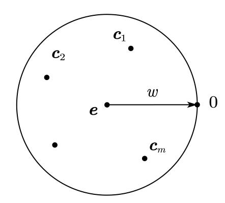

**Fig. 16.** The case where the error vector  $\mathbf{e}$  is closer to m nonzero codewords than to the zero codeword.

<span id="page-43-0"></span>to Case 3 satisfy  $|S(\mathbf{e})| = 2$ , then their contribution to the decoding error count is  $\frac{m-1}{2}$ . Since  $m-1 \geq 2$ , we have  $\frac{m-1}{2} \geq 1 > \frac{m-1}{m}$ , meaning the latter estimation method would overestimate the decoding error count. Therefore, the expected number of errors causing Case 3 decoding failure is at most  $254 \cdot \frac{M_{w,1}}{2}$ .

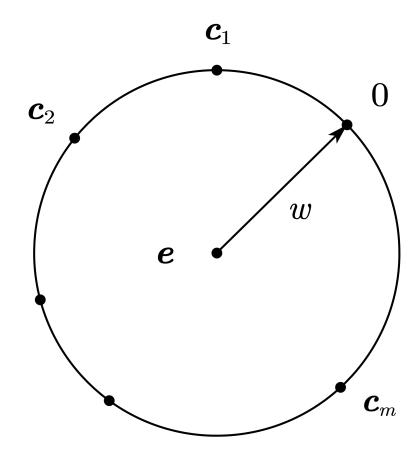

**Fig. 17.** The case where m nonzero codewords are equidistant from the error vector  $\mathbf{e}$ .

<span id="page-43-1"></span>Combining both cases, for  $w \leq 64s - 1$ , we can estimate that the expected number of errors causing decoding failure does not exceed  $E_{w,1} = 254 \cdot N_{w,1} + 254 \cdot \frac{M_{w,1}}{2}$ .

As mentioned earlier, this estimation method, which only considers the relationship between a single codeword and the error, tends to overestimate the number of decoding failure errors  $E_{w,1}$ . To improve accuracy, we also need to consider the intersection relationships between the supports of multiple nonzero codewords and the support of the error.

Considering the relationship between two nonzero codewords  $\mathbf{c}_1$ ,  $\mathbf{c}_2$  and the error vector  $\mathbf{e}$ : There are  $\binom{254}{2}$  unordered pairs of codewords  $(\mathbf{c}_1, \mathbf{c}_2)$  of weight 64s in the 8-dimensional RM code C, and  $\operatorname{wt}(\mathbf{c}_1 + \mathbf{c}_2) = 64s$  or 128s. If  $\operatorname{wt}(\mathbf{c}_1 + \mathbf{c}_2) = 128s$ , then  $|\operatorname{Supp}(\mathbf{c}_1) \cup \operatorname{Supp}(\mathbf{c}_2)| = 128s$ . By Lemma 3, there is no error vector  $\mathbf{e}$  of weight less than 64s satisfying  $d(\mathbf{c}_1, \mathbf{e}) = d(\mathbf{c}_2, \mathbf{e}) = \operatorname{wt}(\mathbf{e})$  or  $d(\mathbf{c}_1, \mathbf{e}), d(\mathbf{c}_2, \mathbf{e}) < \operatorname{wt}(\mathbf{e})$ . Therefore, we only need to consider the case  $\operatorname{wt}(\mathbf{c}_1 + \mathbf{c}_2) = 64s$ . There are  $\binom{254}{2} - 127 = 32004$  such codeword pairs.

{44}------------------------------------------------

After appropriate transformation, the matrix formed by codewords **c**1*,* **c**<sup>2</sup> and the error vector **e** can be reduced to the following form:

$$\begin{pmatrix} \mathbf{c}_1 \\ \mathbf{c}_2 \\ \mathbf{e} \end{pmatrix} = \begin{pmatrix} \mathbf{1}_{32s} \ \mathbf{1}_{32s} \ \mathbf{0}_{32s} \ \mathbf{0}_{32s} \\ \mathbf{0}_{32s} \ \mathbf{1}_{32s} \ \mathbf{0}_{32s} \\ \mathbf{e}_1 \ \mathbf{e}_2 \ \mathbf{e}_3 \ \mathbf{e}_4 \end{pmatrix}, \tag{23}$$

where wt(**e***i*) = *u<sup>i</sup>* . The distances between codewords **c**1, **c**<sup>2</sup> and the error vector **e** can be expressed as

$$\begin{cases} d(\mathbf{c}_1, \mathbf{e}) = \operatorname{wt}(\mathbf{c}_1) + \operatorname{wt}(\mathbf{e}) - 2|\operatorname{Supp}(\mathbf{c}_1) \cap \operatorname{Supp}(\mathbf{e})| = 64s + w - 2(u_1 + u_2), \\ d(\mathbf{c}_2, \mathbf{e}) = \operatorname{wt}(\mathbf{c}_2) + \operatorname{wt}(\mathbf{e}) - 2|\operatorname{Supp}(\mathbf{c}_2) \cap \operatorname{Supp}(\mathbf{e})| = 64s + w - 2(u_2 + u_3). \end{cases}$$

If **0** *6∈ S*(**e**) and *|S*(**e**)*| ≥* 2, then *d*(**c**1*,* **e**)*, d*(**c**2*,* **e**) *<* wt(**e**), and *u<sup>i</sup>* satisfy *u*<sup>1</sup> + *u*<sup>2</sup> *>* 32*s* and *u*<sup>2</sup> + *u*<sup>3</sup> *>* 32*s*. In this case, codewords **c**1, **c**<sup>2</sup> *∈ S*(**e**), and the error vector **e** causes decoding failure of Case 2. For a single codeword pair (**c**1*,* **c**2), the total number of errors satisfying this condition is:

$$N_{w,2} = \sum_{u_1=1}^{32s} {32s \choose u_1} \sum_{u_2=32s+1-u_1}^{32s} {32s \choose u_2} \sum_{u_3=32s+1-u_2}^{32s} {32s \choose u_3} {32s \choose w-u_1-u_2-u_3}.$$
(24)

If **0** *∈ S*(**e**) and *|S*(**e**)*| ≥* 3, then *d*(**c**1*,* **e**) = *d*(**c**2*,* **e**) = wt(**e**), and *u<sup>i</sup>* satisfy *u*1+*u*<sup>2</sup> = 32*s* and *u*<sup>1</sup> = *u*3. In this case, codewords **0**, **c**1, **c**<sup>2</sup> *∈ S*(**e**), and the error vector **e** causes decoding failure of Case 3. For a single codeword pair (**c**1*,* **c**2), the total number of errors satisfying this condition is:

$$M_{w,2} = \sum_{u_1=0}^{32s} {32s \choose u_1}^2 {32s \choose 32s - u_1} {32s \choose w - 32s - u_1}.$$
 (25)

By Lemma [4](#page-39-1), when wt(**e**) *<* 40*s*, the cases with *m ≥* 3 described in Fig. [16](#page-43-0) and [17](#page-43-1) do not occur. Therefore, when wt(**e**) *<* 40*s*, all *S*(**e**) that do not contain the zero codeword and have *|S*(**e**)*| ≥* 2 satisfy *|S*(**e**)*|* = 2; all *S*(**e**) that contain the zero codeword and have *|S*(**e**)*| ≥* 3 satisfy *|S*(**e**)*|* = 3. Hence, the expected number of decoding failures can be improved to

$$E_{w,2}^{1} = (254 \cdot N_{w,1} - 32004 \cdot N_{w,2}) + \left(\frac{254 \cdot M_{w,1} - 2 \cdot 32004 \cdot M_{w,2}}{2} + \frac{2 \cdot 32004 \cdot M_{w,2}}{3}\right)$$

$$= 254 \cdot N_{w,1} + 127 \cdot M_{w,1} - 32004 \cdot N_{w,2} - 10668 \cdot M_{w,2}.$$
(26)

Because when *w ≥* 40*s*, error vectors **e** causing Case 3 decoding failure may satisfy *|S*(**e**)*| ≥* 4. Using 127*·Mw,*<sup>1</sup> *−*10668*·Mw,*<sup>2</sup> as the estimate for the number of Case 3 decoding failure errors could lead to underestimation. Therefore, for errors with 40*s ≤ w ≤* 40*s* + 1, we use the count:

$$E_{w,2}^2 = 254 \cdot N_{w,1} + 127 \cdot M_{w,1} - 32004 \cdot N_{w,2}. \tag{27}$$

When *w ≥* 40*s* + 2, we still use *Ew,*<sup>1</sup> as the count for the number of decoding failure errors.

{45}------------------------------------------------

Since this counting method is extremely conservative, as w increases, the actual expected number of errors may be far lower than the above estimate  $E_{w,1}$ , and even  $E_{w,1} > \binom{128s}{w}$  may occur. Therefore, multiple counting problems, as shown in Figs. 16 and 17 must appear. Next, we use the Cauchy-Schwarz inequality to improve  $E_{w,1}$  for the case where  $254 \cdot N_{w,1} < \binom{128s}{w}$  and  $E_{w,1} > \binom{128s}{w}$ .

Improving  $E_{w,1}$  using the Cauchy-Schwarz inequality: For  $m \geq 1$ , let  $a_m$  denote the number of distinct errors  $\mathbf{e} \in \mathcal{S}_w$  such that  $\mathbf{0} \in S(\mathbf{e})$  and  $|S(\mathbf{e})| = m$ . For such an error  $\mathbf{e}$ , the probability of successful decoding is 1/m. When m = 1,  $\mathbf{e}$  belongs to Case 1; when  $m \geq 2$ , it belongs to Case 3.

Let the actual number of weight-w errors causing Case 2 decoding failure be  $\underline{N_w}$ . Since  $254 \cdot N_{w,1}$  may overestimate the number of errors causing Case 2 decoding failure, we have  $\underline{N_w} \leq 254 \cdot N_{w,1}$ . Let the maximum value of m be  $\nu$ . Then we have

$$\begin{cases}
\sum_{m=2}^{\nu} (m-1)a_m = 254 \cdot M_{w,1}, \\
\sum_{m=1}^{\infty} a_m = {128s \choose w} - \underline{N_w} \ge {128s \choose w} - 254 \cdot N_{w,1}.
\end{cases}$$
(28)

It follows that

$$\sum_{m=1}^{\nu} m a_m = \binom{128s}{w} - \underline{N_w} + 254 \cdot M_{w,1} \ge \binom{128s}{w} - 254 \cdot N_{w,1} + 254 \cdot M_{w,1}.$$

By the Cauchy-Schwarz inequality,

$$\sum_{m=1}^{\nu} m a_m \cdot \sum_{m=1}^{\nu} \frac{a_m}{m} \ge \left(\sum_{m=1}^{\nu} a_m\right)^2,$$

therefore, the expected number of weight-w errors that are successfully decoded satisfies

$$\sum_{m=1}^{\nu} \frac{a_m}{m} \ge \frac{\left(\binom{128s}{w} - N_w\right)^2}{\binom{128s}{w} - N_w + 254 \cdot M_{w,1}}.$$

Let  $z = \binom{128s}{w} - \underline{N_w}$ . Since the function  $\frac{z^2}{z + 254 \cdot M_{w,1}}$  is monotonically increasing for z > 0, and

$$\binom{128s}{w} - \underline{N_w} \ge \binom{128s}{w} - 254 \cdot N_{w,1},$$

we have

$$\sum_{m=1}^{\nu} \frac{a_m}{m} \ge \frac{\left(\binom{128s}{w} - 254 \cdot N_{w,1}\right)^2}{\binom{128s}{w} - 254 \cdot N_{w,1} + 254 \cdot M_{w,1}}.$$

Therefore, in this case,  $E_{w,1}$  can be improved to

$$E'_{w,1} = {128s \choose w} - \frac{\left({128s \choose w} - 254 \cdot N_{w,1}\right)^2}{\left({128s \choose w} - 254 \cdot N_{w,1} + 254 \cdot M_{w,1}\right)}.$$

{46}------------------------------------------------

Combining all the above counting cases, we obtain the failure probability profile for the RM code, as shown in Eq. (10).

#### <span id="page-46-0"></span>D.2 Proof of Theorem 4

Proof (Proof of Theorem 4). Since the  $X_b$  are independent and each  $X_b$  follows a Binomial distribution Binomial( $\zeta_b, p_{\rm rm}(b)$ ), its probability generating function is

$$G_{X_b}(z) = (1 - p_{\rm rm}(b) + p_{\rm rm}(b)z)^{\zeta_b}.$$

By independence, the probability generating function of  $e_{rm}$  is the product of the probability generating functions of the individual  $X_b$ :

$$G_{e_{rm}}(z) = \prod_{b=0}^{m} (1 - p_{rm}(b) + p_{rm}(b)z)^{\zeta_b}.$$

Let  $G_{e_{rm}}(z) = \sum_{j\geq 0} a_j z^j$ , where  $a_k = \text{coeff}(G_{e_{rm}}(z), z^j)$ . By the properties of probability generating functions, we have  $\Pr(e_{rm} = k) = a_j$ . Therefore,

$$\sum_{j=0}^{t} \Pr(e_{rm} = j) = \sum_{j=0}^{t} a_j = \sum_{j=0}^{t} \operatorname{coeff} \left( \prod_{b=0}^{m} (1 - p_{rm}(b) + p_{rm}(b)z)^{\zeta_b}, \ z^j \right).$$

Thus,

$$\Pr(e_{rm} > t) = 1 - \Pr(e_{rm} \le t) = 1 - \sum_{j=0}^{t} \operatorname{coeff} \left( \prod_{b=0}^{m} (1 - p_{rm}(b) + p_{rm}(b)z)^{\zeta_b}, \ z^j \right).$$

### <span id="page-46-1"></span>E Proofs of Theorems in Section 4.1

Proof (Proof of Theorem 5). By the cyclic symmetry of the distributions and the convolution operation, the probability  $p(\delta) = P[e'_k = 1]$  is independent of the index k. Therefore, the expected Hamming weight is

$$\mathbb{E}[\operatorname{wt}(\mathbf{e}')] = n \cdot p(\delta).$$

We analyze the change in  $\mathbb{E}[\mathrm{wt}(\mathbf{e}')]$  as  $\delta$  increases by 1. The weight changes are:

- $-w_{\mathbf{e}}$  increases by 2;
- $w_{\mathbf{r}_1}$  and  $w_{\mathbf{r}_2}$  each decrease by 1.

Let  $p = p(\delta)$  denote the current error probability. We analyze these effects separately.

Effect of increasing  $w_e$  by 2: Adding two random non-zero entries to e is equivalent to independently flipping two uniformly random coordinates. For

{47}------------------------------------------------

each coordinate flip, if the coordinate was 0, it becomes 1 (increasing weight by 1); if it was 1, it becomes 0 (decreasing weight by 1). The expected change per flip is  $(1-p) \cdot 1 + p \cdot (-1) = 1 - 2p$ . For two independent flips:

$$\Delta_{\mathbf{e}} = 2(1 - 2p).$$

Effect of decreasing  $w_{\mathbf{r}_1}$  and  $w_{\mathbf{r}_2}$  by 1: Decreasing  $w_{\mathbf{r}_1}$  by 1 means removing one random 1-entry, which is equivalent to  $\mathbf{e}'$  with a random cyclic shift of  $\mathbf{y}$ . Since  $\mathbf{y}$  has weight  $w_{\mathbf{x}}$  (note that  $w_{\mathbf{x}} = w_{\mathbf{y}}$ ), this flips exactly  $w_{\mathbf{x}}$  coordinates. Similarly, decreasing  $w_{\mathbf{r}_2}$  flips another  $w_{\mathbf{x}}$  coordinates.

If the two sets of flipped positions were entirely disjoint, the expected weight change would be  $2w_{\mathbf{x}}(1-2p)$ . However, two independent random cyclic shifts overlap in expectation at  $\mathbb{E}[\text{overlap}] = w_{\mathbf{x}}^2/n$  positions. At each overlapping position, both flips cancel each other, contributing 0 to the net weight change. Therefore, the net expected change is:

$$\Delta_{\mathbf{r}} = 2w_{\mathbf{x}}(1 - 2p) - 2 \cdot \frac{w_{\mathbf{x}}^2}{n}(1 - 2p) = 2(1 - 2p)\left(w_{\mathbf{x}} - \frac{w_{\mathbf{x}}^2}{n}\right).$$

**Total change:** The net change in expected weight when  $\delta \to \delta + 1$  is

$$\Delta = \Delta_{\mathbf{e}} - \Delta_{\mathbf{r}} = 2(1 - 2p) - 2(1 - 2p) \left( w_{\mathbf{x}} - \frac{w_{\mathbf{x}}^2}{n} \right) = 2(1 - 2p) \left( 1 - w_{\mathbf{x}} + \frac{w_{\mathbf{x}}^2}{n} \right).$$

By the theorem's hypotheses,  $w_{\mathbf{x}} \geq 66$  and p < 0.5. We have 1 - 2p > 0 and

$$1 - w_{\mathbf{x}} + \frac{w_{\mathbf{x}}^2}{n} < 1 - 66 + \frac{w_{\mathbf{x}}^2}{n} < 0.$$

Therefore,  $\Delta < 0$  for all  $0 \le \delta \le w_{\mathbf{r}} - w_{\mathbf{x}}$ . Since  $\mathbb{E}[\text{wt}(\mathbf{e}')] = n \cdot p(\delta)$  strictly decreases with  $\delta$ , the marginal error probability  $p(\delta)$  itself is strictly decreasing in  $\delta$ .

*Proof (Proof of Theorem 6).* We first prove that  $\tilde{p}(n; A, B)$  is strictly decreasing in n for fixed positive integers A and B. From the expression in Lemma 1, for a fixed odd  $\ell$ , the term

$$T_{\ell}(n) = \frac{\binom{A}{\ell} \binom{n-A}{B-\ell}}{\binom{n}{B}}$$

can be rewritten as

$$T_{\ell}(n) = {A \choose \ell} \cdot \frac{(n-A)(n-A-1)\cdots(n-A-(B-\ell)+1)}{n(n-1)\cdots(n-B+1)} \cdot \frac{B!}{(B-\ell)!}$$

Consider the ratio

$$\frac{T_{\ell}(n+1)}{T_{\ell}(n)} = \frac{(n+1-A)(n+1-B)}{(n+1)(n+1-A-B+\ell)}.$$

{48}------------------------------------------------

Since  $n \geq A + B$  and  $\ell \geq 1$ , we have

$$(n+1-A)(n+1-B) < (n+1)(n+1-A-B+\ell) \iff AB < (n+1)\ell.$$

For fixed A, B, when n is sufficiently large (specifically, n > AB - 1), we obtain  $AB < n + 1 \le (n + 1)\ell$ , hence  $T_{\ell}(n + 1) < T_{\ell}(n)$ . Because each nonzero term  $T_{\ell}(n)$  is positive and strictly decreasing, their sum  $\tilde{p}(n; A, B)$  is also strictly decreasing.

Therefore,  $p_U(n)$ ,  $p_V(n)$ , and  $p_W(n)$  are all strictly decreasing in n. Now, from Lemma 2, computing the partial derivatives yields

$$\frac{\partial P}{\partial p_U} = (1 - 2p_V)(1 - 2p_W), \ \frac{\partial P}{\partial p_V} = (1 - 2p_U)(1 - 2p_W), \ \frac{\partial P}{\partial p_W} = (1 - 2p_U)(1 - 2p_V).$$

Under typical parameter choices,  $p_U, p_V, p_W < 1/2$ , so all partial derivatives are positive. Thus P is strictly increasing in each of  $p_U, p_V, p_W$ . Since  $p_U(n)$ ,  $p_V(n)$ , and  $p_W(n)$  are all strictly decreasing in n and P is strictly increasing in each of them, the composite function P(n) is strictly decreasing in n.

Proof (Proof of Theorem 7). Throughout the proof, we treat k as a fixed integer parameter (with  $k \to \infty$ ). Since the denominator  $\prod {k \choose w_i}$  is independent of the decision variables  $(k_i)_{i=1}^s$ , maximizing  $P_{\text{struct}}$  is equivalent to maximizing

$$\Phi(k_1, \dots, k_s) := \prod_{i=1}^s \binom{k - k_i}{w_i} \quad \text{subject to} \quad \sum_{i=1}^s k_i = k.$$
 (29)

1. Balanced Case ( $\delta = 0$ ). Here  $w_1 = \cdots = w_s = \bar{w}$ . The function  $f(x) = \binom{k-x}{w}$  is log-concave [15]. Specifically, the ratio of adjacent terms is

$$\rho_w(x) := \frac{\binom{k - (x+1)}{w}}{\binom{k - x}{w}} = \frac{k - x - w}{k - x} = 1 - \frac{w}{k - x}.$$

For  $w \geq 0$ , the function  $x \mapsto 1 - \frac{w}{k-x}$  is strictly decreasing in x. Due to the symmetry of the weights and the strict log-concavity, the product is maximized when the arguments  $k_i$  are balanced. Thus, asymptotically  $k_1 = \cdots = k_s = k/s$ .

2. Unbalanced Case ( $\delta > 0$ ). In this case,  $w_1 = \cdots = w_{s-1} < w_s$ . Applying the balancing argument from Step 1 to the indices  $1, \ldots, s-1$  (which share the identical weight  $w_1$ ) implies that any maximizer must asymptotically satisfy

$$k_1 = \dots = k_{s-1}.$$

Let  $k_1 = k_{s-1} = a$ . The constraint  $\sum k_i = k$  implies  $k_s = k - (s-1)a$ .

We now demonstrate that  $a > k_s$ . Consider a unit transfer from  $k_s$  to  $k_1$ , i.e.,  $(a, k_s) \to (a + 1, k_s - 1)$ . The ratio of the new objective value to the old is:

$$R(a, k_s) := \frac{\binom{k-a-1}{w_1}}{\binom{k-a}{w_1}} \cdot \frac{\binom{k-k_s+1}{w_s}}{\binom{k-k_s}{w_s}} = \rho_{w_1}(a) \cdot \frac{1}{\rho_{w_s}(k_s-1)}.$$
 (30)

{49}------------------------------------------------

Substituting  $\rho_w(x) = 1 - \frac{w}{k-x}$ , we obtain:

$$R(a, k_s) = \frac{1 - \frac{w_1}{k - a}}{1 - \frac{w_s}{k - k_s + 1}}.$$

Assume for the sake of contradiction that  $a \leq k_s$ . Since  $w_1 < w_s$  and  $k - a \geq k - k_s$ , it follows that:

$$\frac{w_1}{k-a} \le \frac{w_1}{k-k_s} < \frac{w_s}{k-k_s+1} \implies 1 - \frac{w_1}{k-a} > 1 - \frac{w_s}{k-k_s+1}.$$

This implies  $R(a, k_s) > 1$ , meaning that transferring mass from  $k_s$  to  $k_1$  increases the objective function. This contradicts the optimality of the allocation if  $a \le k_s$ . Therefore, the maximizer must satisfy  $a > k_s$ , i.e.,  $k_1 > k_s$ .

3. Monotonicity with respect to  $\delta$ . We employ a continuous relaxation of the problem. Let  $k_i$  take real values and replace factorials with  $\Gamma$  functions. Define the optimal value function:

$$V(\delta) := \max_{\mathbf{k} \in \mathbb{R}^s, \sum k_i = k} \ln P_{\text{struct}}(\mathbf{k}; \delta).$$

By the Envelope Theorem, the derivative  $V'(\delta)$  is given by the partial derivative of the Lagrangian with respect to  $\delta$ , evaluated at the optimal solution  $\mathbf{k}^*$ . Recall that  $\frac{dw_1}{d\delta} = -1$  and  $\frac{dw_s}{d\delta} = s - 1$ . Thus:

$$V'(\delta) = (s-1) \left[ \frac{\partial}{\partial w_s} \ln \frac{\binom{k-k_s^*}{w_s}}{\binom{k}{w_s}} - \frac{\partial}{\partial w_1} \ln \frac{\binom{k-k_1^*}{w_1}}{\binom{k}{w_1}} \right].$$

Using the identity  $\partial_w \ln \binom{M}{w} = \psi(M-w+1) - \psi(w+1)$ , the derivative of the term  $\ln \frac{\binom{M}{w}}{\binom{k}{w}}$  with respect to w is  $\psi(M-w+1) - \psi(k-w+1)$ . Let  $m_i = k - k_i^*$ . The expression for  $V'(\delta)$  simplifies to:

$$\frac{V'(\delta)}{(s-1)} = ([\psi(m_s - w_s + 1) - \psi(k - w_s + 1)] - [\psi(m_1 - w_1 + 1) - \psi(k - w_1 + 1)]).$$

Using the asymptotic expansion  $\psi(x) = \ln x + O(1/x)$  and the fact that  $w_i = o(k)$ , we have:

$$\psi(m_i - w_i + 1) - \psi(k - w_i + 1) = \ln\left(\frac{m_i - w_i}{k - w_i}\right) + o(1) = \ln\left(\frac{m_i}{k}\right) + o(1).$$

Therefore, asymptotically:

$$V'(\delta) \approx (s-1) \left( \ln \frac{m_s}{k} - \ln \frac{m_1}{k} \right) = (s-1) \ln \left( \frac{k - k_s^*}{k - k_1^*} \right)$$

From Part 2, we established that  $k_1^* > k_s^*$ , which implies  $k - k_s^* > k - k_1^*$ . Consequently, the logarithm is strictly positive, yielding  $V'(\delta) > 0$ . This proves that the maximum value is strictly increasing in  $\delta$ .

{50}------------------------------------------------

### <span id="page-50-0"></span>F Supplementary Data for ISD Security Analysis

Based on the preceding analysis of ISD security in Section 4.2, the ISD security of standard HQC, Improved HQC, and UHQC can be expressed as

$$\min \Big\{ \underline{T}_{\mathrm{ISD}}(2n, n, (\mathbf{x}, \mathbf{y})), \ \underline{T}_{\mathrm{ISD}}(3n, n, (\mathbf{r}_1, \mathbf{r}_2, \mathbf{e})) \Big\}.$$

For all standard HQC parameter sets, we have  $\underline{T}_{\text{ISD}}(3n, n, (\mathbf{r}_1, \mathbf{r}_2, \mathbf{e})) > \underline{T}_{\text{ISD}}(2n, n, (\mathbf{x}, \mathbf{y}))$ , and thus concrete ISD security level is given by  $\underline{T}_{\text{ISD}}(2n, n, (\mathbf{x}, \mathbf{y}))$ . We maintain a similar setting to the standard HQC parameter sets; the UHQC parameter sets are chosen such that  $\underline{T}_{\text{ISD}}(3n, n, (\mathbf{r}_1, \mathbf{r}_2, \mathbf{e}))$  exceeds  $\underline{T}_{\text{ISD}}(2n, n, (\mathbf{x}, \mathbf{y}))$  by about 1–2 bits.

**Table 9.** Values of  $\underline{T}_{\mathrm{ISD}}(3n, n, (\mathbf{r}_1, \mathbf{r}_2, \mathbf{e}))$  for the standard HQC, Improved HQC, and UHQC parameter sets. The bold entries indicate the smallest *classical* attack complexity (among Prange/Stern/BothMay/MayOzerov/BJMM) for each parameter set; the Q-Prange column is the quantum Prange.

| Category                                                    | Prange                               | Stern                                | BothMay                                     | MayOzerov                            | BJMM                                 | Q-Prange                         |
|-------------------------------------------------------------|--------------------------------------|--------------------------------------|---------------------------------------------|--------------------------------------|--------------------------------------|----------------------------------|
| HQC-128                                                     | 167.97                               | 147.25                               | 147.33                                      | 147.19                               | 147.40                               | 83.98                            |
| Improved HQC-128                                            | 167.85                               | 147.12                               | 147.19                                      | 147.19                               | 147.40                               | 83.92                            |
| UHQC-128                                                    | 167.71                               | 146.63                               | 146.75                                      | 146.75                               | 146.94                               | 83.85                            |
| HQC-192                                                     | 238.89                               | 215.79                               | 215.87                                      | 215.87                               | 216.01                               | 119.44                           |
| Improved HQC-192                                            | 238.79                               | 215.68                               | 215.76                                      | 215.76                               | 215.91                               | 119.39                           |
| UHQC-192                                                    | 238.91                               | 215.27                               | 215.04                                      | 215.04                               | 215.21                               | 119.45                           |
| HQC-256                                                     | 301.98                               | 277.35                               | 277.46                                      | 277.46                               | 277.55                               | 150.99                           |
| Improved HQC-256                                            | 301.85                               | 277.22                               | 277.32                                      | 277.32                               | 277.42                               | 150.92                           |
| UHQC-256                                                    | 302.13                               | 276.95                               | 276.36                                      | 276.36                               | 276.87                               | 151.06                           |
| Improved HQC-192<br>UHQC-192<br>HQC-256<br>Improved HQC-256 | 238.79<br>238.91<br>301.98<br>301.85 | 215.68<br>215.27<br>277.35<br>277.22 | 215.76<br><b>215.04</b><br>277.46<br>277.32 | 215.76<br>215.04<br>277.46<br>277.32 | 215.91<br>215.21<br>277.55<br>277.42 | 119.3<br>119.4<br>150.9<br>150.9 |

## <span id="page-50-1"></span>G Quantum-Accelerated Maximum CDFR Under the Density-Interval Attack

The quantum analysis follows the same procedure as the classical version, but with Grover acceleration applied to the precomputation stage.

For the quantum adversary, the bit-complexity of precomputation is reduced by a factor of 2 due to Grover search [20], i.e.,  $\mathcal{T}_p^Q(l_1, l_0) = \frac{1}{2}\mathcal{T}_p(l_1, l_0)$ . The adversary's total budget is given by the quantum ISD security  $2^{\underline{T}_{\rm ISD}^Q}$ , where  $\underline{T}_{\rm ISD}^Q$  represents the quantum Prange bit-complexity in Table 8. The number of decryption queries is

$$q(l_1, l_0) = \min \left\{ 2^{64}, \left| 2^{\underline{T}_{ISD}^Q - \mathcal{T}_p^Q(l_1, l_0)} \right| \right\}.$$

An exhaustive search over feasible dense-interval parameters  $(l_1, l_0)$  using Eq. (6) yields an upper bound on the maximum achievable CDFR for each

{51}------------------------------------------------

parameter set. The results are summarized in Tables [4](#page-21-0) and [5.](#page-21-1) The results indicate that the quantum CDFR values are generally lower than the classical ones in Table [8](#page-30-6).

**Table 10.** Maximum CDFR for Improved HQC and UHQC Parameter Sets under the Density-Interval Attack [\[21\]](#page-31-3) with Grover Acceleration.

<span id="page-51-1"></span>

| Parameter Set                    | Q<br>T<br>ISD | (l1, l0) T      | Q<br>p | (l1, l0) DFR(l1, l0) | CDFR          |
|----------------------------------|---------------|-----------------|--------|----------------------|---------------|
| Improved HQC-128 83.10           |               | (15, 8)         | 18.23  | −95.87<br>≤ 2        | −31.87<br>≤ 2 |
| UHQC-128                         | 83.01         | (15, 8)         | 18.64  | −101.07 ≤<br>≤ 2     | −37.07<br>2   |
| Improved HQC-192 118.34 (37, 19) |               |                 | 54.95  | −118.00 ≤<br>≤ 2     | −54.61<br>2   |
| UHQC-192                         |               | 118.24 (37, 19) | 55.85  | −130.84 ≤<br>≤ 2     | −68.46<br>2   |
| Improved HQC-256 150.16 (55, 28) |               |                 | 87.70  | −136.88 ≤<br>≤ 2     | −74.43<br>2   |
| UHQC-256                         |               | 150.04 (65, 33) | 88.79  | −123.05 ≤<br>≤ 2     | −60.13<br>2   |

## <span id="page-51-0"></span>**H Supporting Noise Simulations for Improved HQC and UHQC Parameter Sets**

As a complement to Subsection [5.3](#page-29-1), we present supporting simulations of the (attack-induced) HQC noise **e** *′* and the proposed PEB-BSC model under the density-interval attack [\[21](#page-31-3)], for both the Improved HQC and UHQC parameter sets. The corresponding RM component codes are [512*,* 8*,* 256]2, [768*,* 8*,* 384]2, and [896*,* 8*,* 448]2; by Theorem [2,](#page-17-0) their half-failure thresholds *t*1*/*<sup>2</sup> are 224, 345, and 405, respectively.

From Tables [8](#page-30-6) and [10](#page-51-1), the maximum CDFR in the classical setting is consistently larger than that in the quantum setting. Accordingly, for each parameter set, we simulate the blockwise weight profile F(C) using the density-interval parameters (*l*1*, l*0) corresponding to the point at which the CDFR is maximized, as reported in Table [8](#page-30-6).

Since the weight-wise failure probability Pfail(*C, w*) of the RM code increases sharply in the vicinity of the half-failure threshold *t*1*/*2, we focus on the tail probabilities of both noises around *t*1*/*<sup>2</sup> in the figures. The results are shown in Figs. [18](#page-52-0)[–23](#page-54-0). These comparisons are consistent with the observations in Subsection [3.3:](#page-13-0) the PEB-BSC model exhibits a heavier tail than the attack-induced noise **e** *′* . This is, more RM blocks incur high-weight errors and thus enter a high-failure regime for FHT decoder. Consequently, for RSRM codes under BM-FHT decoding, the PEB-BSC model provides a conservative approximation of the attack-induced noise **e** *′* .

{52}------------------------------------------------

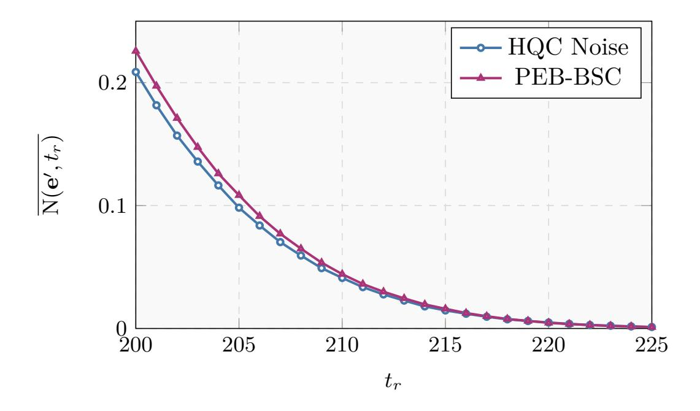

<span id="page-52-0"></span>**Fig. 18.** Blockwise weight profile for Improved HQC-128 with density-interval parameters (*l*<sup>1</sup> = 29*, l*<sup>0</sup> = 15): HQC noise vs. PEB-BSC.

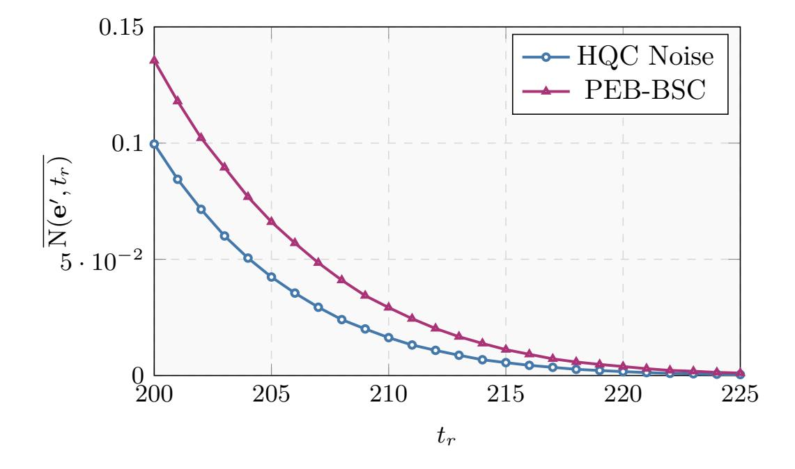

**Fig. 19.** Blockwise weight profile for UHQC-128 with density-interval parameters (*l*<sup>1</sup> = 29*, l*<sup>0</sup> = 15): HQC noise vs. PEB-BSC.

{53}------------------------------------------------

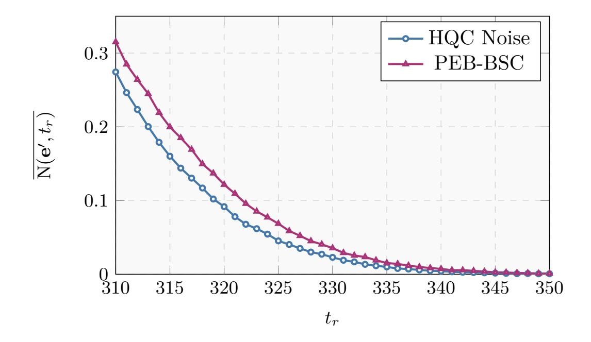

**Fig. 20.** Blockwise weight profile for Improved HQC-192 with density-interval parameters (*l*<sup>1</sup> = 49*, l*<sup>0</sup> = 25): HQC noise vs. PEB-BSC.

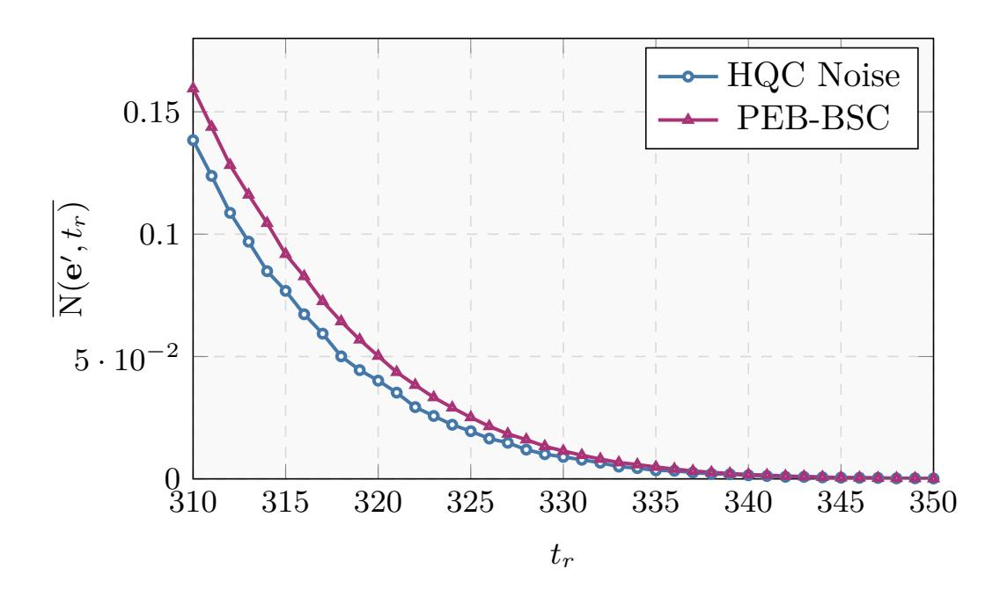

**Fig. 21.** Blockwise weight profile for UHQC-192 with density-interval parameters (*l*<sup>1</sup> = 47*, l*<sup>0</sup> = 24): HQC noise vs. PEB-BSC.

{54}------------------------------------------------

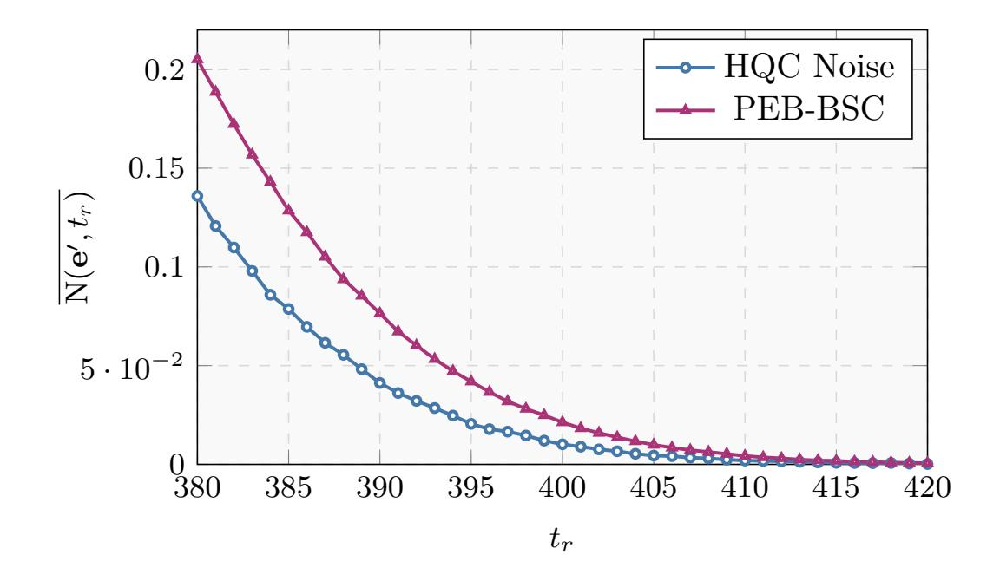

**Fig. 22.** Blockwise weight profile for Improved HQC-256 with density-interval parameters (*l*<sup>1</sup> = 65*, l*<sup>0</sup> = 33): HQC noise vs. PEB-BSC.

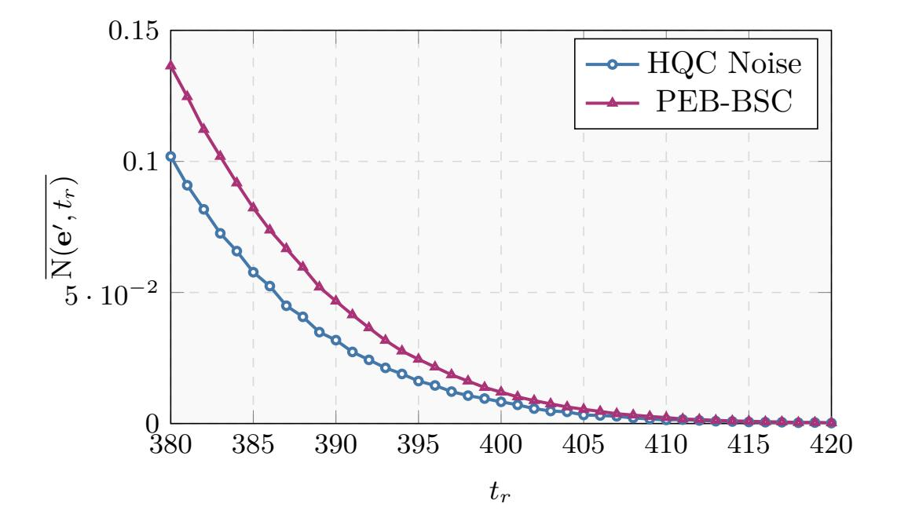

<span id="page-54-0"></span>**Fig. 23.** Blockwise weight profile for UHQC-256 with density-interval parameters (*l*<sup>1</sup> = 65*, l*<sup>0</sup> = 33): HQC noise vs. PEB-BSC.