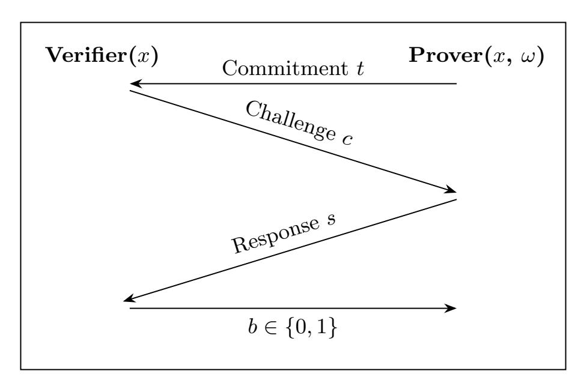
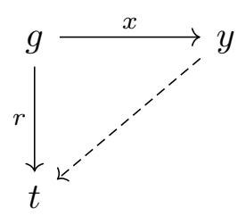
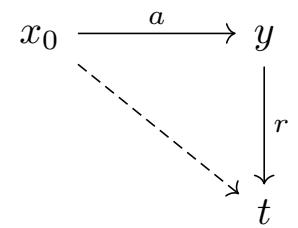

{0}------------------------------------------------

# Semigroup Action Problems and Their Uses in Post-Quantum Cryptography

Joachim Rosenthal and Silvia Sconza

Abstract. This survey article provides an overview of the Semigroup Action Problem (SAP) as a pivotal generalization of the Discrete Logarithm Problem (DLP), tracing its theoretical evolution from foundational algebraic cryptography in the early 2000s to its application in the National Institute of Standards and Technology (NIST) Post-Quantum Cryptography (PQC) standardization process. We examine the mathematical framework of semigroup actions, contrasting them with classical group-theoretic assumptions, and detail the generalizations of Diffie-Hellman and ElGamal protocols within this broader context. Finally, the paper investigates the renaissance of group and semigroup actions in the design of next-generation digital signatures, providing a detailed algebraic analysis of candidates in the current NIST competition.

Keywords: Public Key Cryptography · Semigroup Action Problem · Post-Quantum Cryptography

### 1. Introduction

Humans have always looked for ways to communicate securely, i.e. in such a way that only the designated recipient can read the message. Initially, the same key was used to encrypt and decrypt the message sent, which is why we talk about Symmetric Key Cryptography. However, this type of encryption has an inherent problem: a secret key has to be exchanged before any message can be securely transmitted.

In a seminal paper, Diffie and Hellman [[37](#page-19-0)] provided a first solution to the problem of key exchange over a public communication channel and their paper is now considered the start of Public Key Cryptography. In this setting, there are two keys involved: a public key, which is known to everyone, and a private key, which is known only to the owner. The security of the Diffie-Hellman Key Exchange protocol relies on the hardness of solving the Discrete Logarithm Problem (DLP) in a cyclic group G. The DLP relies on the infeasibility of inverting exponentiation in carefully selected groups. To be more precise assume that g ∈ G is a generator of G. Given y ∈ G, the DLP asks for the computation of an exponent a ∈ Z such that y = g a . In such a case, y plays the role of public key and a is the corresponding private key.

2020 Mathematics Subject Classification. 94A60.

First author is supported by Swiss National Science Foundation under grant number 212865. Second author's research is supported by armasuisse Science and Technology.

{1}------------------------------------------------

Soon after the paper of Diffie and Hellman several authors came up with alternative ways to do a secret key exchange over a public channel. Most notably Rivest, Shamir and Adleman [[67](#page-20-0)] came up with the RSA one-way trapdoor function whose security relied on the hardness of integer factorization.

In 1985 ElGamal showed how hard instances of the DLP can be used to build a one-way trapdoor function [[40](#page-19-1)] and so an encryption scheme.

Alongside public-key encryption, the other basic building block of cryptography is digital signatures. They can be seen as the digital counterpart of handwritten signatures. In both cases, the goal is to associate a person with a document in a way that can later be verified. Digital signatures are designed to formally guarantee three security properties: authenticity, integrity, and non-repudiation. Authenticity ensures that the signature was produced by the claimed signer. Integrity guarantees that the signed document has not been altered after the signature was applied. Non repudiation ensures that the signer cannot deny having signed the document at a later time.

Although handwritten signatures are intended to offer analogous security guarantees, this is not possible in practice. In particular, they fail to ensure the integrity of a signed document, since its content can be altered without invalidating the signature.

Until recently the security of most implemented public key protocols did rest on the Integer Factorization Problem (IFP) and the Discrete Logarithm Problem (DLP).

However, the advent of quantum computing algorithms, specifically Shor's algorithm [[71](#page-20-1)], has demonstrated that these problems can be solved in polynomial time on a sufficiently powerful quantum computer. Shor's algorithm exploits the rigid structure of abelian groups, specifically the ability to solve the Hidden Subgroup Problem (HSP) efficiently, to recover secret keys. This existential threat has necessitated a migration toward mathematical structures that lack this specific vulnerability, a field known as Post-Quantum Cryptography (PQC). This is one motivating reason why researchers have always sought to come up with new mathematical problems to establish public key protocols.

The Discrete Logarithm Problem in a finite group has been generalized by different authors in different directions. One way of generalizing the DLP is by relaxing the requirements of the properties that a group has. One readily can show that both the Diffie-Hellman and the ElGamal protocol are readily generalized when the underlying set has the structure of a semigroup or even a loop. Gerard Maze in his dissertation [[55](#page-19-2)] studied the DLP in semigroups and in Moufang loops and he was able to show that the DLP in Paige loops reduces to a DLP in a finite group.

In 2014 Childs and Ivanyos [[25](#page-18-0)] generalized Shor's algorithm for solving the DLP in a group on a quantum computer to also solving the DLP in a semigroup. As a result it did follow that the DLP in a semigroup is not suitable to be used for post-quantum cryptography.

Another direction researchers have been studying in the context of public key cryptography are actions of groups and semigroups on sets. Probably the first time group actions for the purpose of cryptography were considered has been in the paper by Brassard and Yung [[21](#page-18-1)] who introduced a zero knowledge proof based on the hardness of a group action problem.

{2}------------------------------------------------

The discrete logarithm problem in a group G can be seen as an action of the integers  $\mathbb{Z}$  on the group G through the computation  $y = g^a$  for  $a \in \mathbb{Z}$ . As the integers  $\mathbb{Z}$  with regard to multiplication have the structure of a semigroup, Maze, Monico and Rosenthal [56, 58, 62, 55] introduced the semigroup action problem on a set as a general framework for creating secure public key protocols.

In this survey we will describe the many efforts which have been done by using group actions and semigroup actions on sets to come up with new public key protocols.

**Outline.** The survey paper is structured as follows. In the next two sections we will review classical notions from public key cryptography such as the Diffie-Hellman key exchange protocol, the ElGamal encryption scheme and the building of digital signatures., starting from a group action.

In Section 4 we will introduce the Semigroup Action Problem (SAP). We will then describe how the Diffie-Hellman and the ElGamal protocols naturally generalize to this problem.

In Section 5, we analyze the challenges involved in generalizing the construction of digital signatures based on classical zero-knowledge proofs and the Fiat-Shamir transform to the setting of semigroups, where inverses are not available.

Section 6 is dedicated to the many instances where group actions and more general semigroup actions were proposed for doing public key exchanges.

Finally in Section 7, we present examples of group actions underlying candidate schemes submitted to the NIST standardization competitions.

#### 2. Classical Key Exchange and One-way Functions

Here we describe formally the Diffie-Hellman key exchange protocol and the El-Gamal encryption scheme, both DLP-based, after introducing one-way (trapdoor) functions.

The Diffie-Hellman key exchange protocol (Algorithm 1) has the following steps:

#### Algorithm 1 Diffie-Hellman Key Exchange

**Setup:** Publicly known cyclic finite group G, and a generator  $g \in G$ .

#### **Key Generation:**

Alice chooses secret  $a \in \{1, ..., \operatorname{ord}(G)\}$ . Computes  $g^a$  and sends it to Bob. Bob chooses secret  $b \in \{1, ..., \operatorname{ord}(G)\}$ . Computes  $g^b$  and sends it to Alice.

#### **Key Derivation:**

Alice computes  $(g^b)^a = g^{ba}$ . Bob computes  $(g^a)^b = g^{ab}$ . Result: Shared secret key  $g^{ba} = g^{ab}$ .

The security of the Diffie-Hellman key exchange protocol relies on the hardness of the Discrete Logarithm Problem in the cyclic group G.

For a general finite cyclic group the best known algorithm for computing the DLP has complexity in the order  $O(\sqrt{\operatorname{ord}(G)})$  group operations. This can be achieved with some variant of the Pollard's  $\rho$ -algorithm [66].

In their paper [37] Diffie and Hellman proposed to use the cyclic group  $G = \mathbb{F}_q^{\times}$ . For this group there exist better algorithms than Pollard's  $\rho$ -algorithm to solve the DLP. In particular, index calculus algorithms such as the Number Field Sieve or the Function Field Sieve solve the DLP in  $\mathbb{F}_q^{\times}$  in sub-exponential time [4, 46, 50].

{3}------------------------------------------------

In 1985, independently Miller [[60](#page-20-5)] and Koblitz [[53](#page-19-6)] proposed to use the group of Fq-rational points over an elliptic curve in the Diffie-Hellman protocol. Since on a classical computer there is no known algorithm which requires significantly less than O( p ord(G)) group operations for a general Elliptic Curve Discrete Logarithm Problem (ECDLP), one uses nowadays in practical public key cryptography predominantly elliptic curve groups.

The paper by Diffie and Hellman [[37](#page-19-0)] contained another important new concept, namely the notion of one-way trapdoor function.

Definition 2.1. A function f : X → Y is called a one-way function if f(x) can be computed in polynomial-time for any x ∈ X, but any polynomial-time algorithm for a random y ∈ Im(f) that attempts to find x ∈ X such that f(x) = y succeeds with negligible probability.

A one-way trapdoor function is a one-way function with the additional property that, given some extra information called the trapdoor, it is possible to efficiently find a preimage of any element in the image.

In other words, a one-way function it is a function that is "easy" to compute but "hard" to invert. One-way trapdoor functions underlie the construction of public-key encryption schemes and digital signatures.

We are now ready to formally describe the ElGamal protocol (Algorithm [2\)](#page-3-0).

## Algorithm 2 ElGamal Encryption scheme

Setup: Publicly known cyclic finite group G, and a generator g ∈ G.

Key Gen:

Alice chooses secret a ∈ {1, . . . , ord(G)}. Public key h = g a .

Encryption: To encrypt m ∈ G:

Bob chooses random b ∈ {1, . . . , ord(G)}.

Ciphertext C = (c1, c2) = (g b , mhb ).

Decryption:

Alice recovers m = c2(c a 1 ) −1 .

Notice that the hard assumption underlying the ElGamal protocol is again the DLP.

## 3. Classical Digital Signatures

Here we give an introduction to digital signature schemes, more precisely on how to construct them using zero-knowledge proof of knowledge and the Fiat-Shamir transform [[41](#page-19-7)].

Definition 3.1. A digital signature scheme is a triple of algorithms defined as follows:

- Key Generation: it outputs a pair of keys (sk, pk), where sk is the secret key and pk is the corresponding public key.
- Signing: given a message m and a private key sk, produces a signature σ.
- Verification: given a message m, a signature σ and the public key pk, outputs a bit b ∈ {0, 1} whether the signature is valid or invalid.

A digital signature scheme must satisfy the following two properties:

(i) Correctness: honestly-generated signatures always pass the verification.

{4}------------------------------------------------

(ii) Unforgeability: it should be computationally infeasible for an adversary to produce a valid signature on any new message, without knowing the private key sk even after seeing signatures on messages of its choice.

A classical approach to construct a digital signature scheme is to start from a zero-knowledge proof of knowledge and apply the Fiat–Shamir transform [[41](#page-19-7)] to obtain a non-interactive signature scheme.

A Zero-Knowledge Proof of Knowledge (ZKPoK) is an interactive protocol in which a prover convinces a verifier that a given statement is true without revealing any information beyond the fact that the statement is valid. The most famous and widely used zero-knowledge proof is the Σ-protocol.

Definition 3.2. A Σ-protocol is a three-round interactive protocol defined as in Figure [1,](#page-4-0) where ω is the secret witness for the public statement x.

It satisfies the following properties:

- Completeness: If the prover knows a valid witness ω for the given statement x, then the verifier will always accept a honestly generated transcript.
- Special Soundness: Given two accepting transcripts (t, c, s) and (t, c0 , s0 ) with the same commitment t and distinct challenges c 6= c 0 , one can efficiently extract the witness ω.
- Special Honest-Verifier Zero-Knowledge (HVZK): There exists an efficient simulator that, given a challenge c, can produce an accepting transcript (t, c, s) indistinguishable from a real interaction with the honest verifier, without the knowledge of ω.

Figure 1. Visual representation of a Σ-protocol.

The first efficient Σ-protocol was proposed by Schnorr [[69](#page-20-6)], based on the DLP hardness. However he was not referring to it as a Σ-protocol; Σ-protocols as an abstract idea were firstly introduced by Cramer in his PhD thesis [[29](#page-18-2)]. For further details on these protocols, see [[31](#page-18-3)].

A Σ-protocol based on the DLP can be constructed as follows. We use the same notation as before: G = hgi is a finite cyclic group. The prover knows the secret key x ∈ {1, . . . , ord(G)} and the public key is y = g x .

{5}------------------------------------------------

Commitment: The prover chooses r \$←− {1, . . . , ord(G)}, computes t = g r and sends it to the verifier.

Challenge: The verifier chooses c ∈ {0, 1} at random and sends it to the prover.

Response: The prover sends s = r − cx.

Verification: If c = 0, the verifier checks g s = t. If c = 1, the verifier checks y s = t.

As it is, this Σ-protocol is not secure due to its binary challenge space. However, it is commonly used as a building block and its soundness is amplified through repetition. This protocol can be described as in Figure [2:](#page-5-1) if c = 0, then the prover sends the vertical arrow; if c = 1, then it sends the dashed arrow.

Figure 2. DLP-commitment diagram of the binary Σ-protocol.

Fiat and Shamir [[41](#page-19-7)] developed a method to remove interaction by replacing the verifier's random challenge with a hash function. Through that a Σ-protocol can be turned into a digital signature scheme, as follows.

KeyGen: The secret key is a witness ω and the public key is the corresponding statement x.

Sign(ω, m): Generate the commitment t, compute the challenge as c = H(t||m), where H is a cryptographic hash function. Compute the response s using ω and c. The signature is σ = (t, s).

Verify(x, m, σ): Recompute the challenge c = H(t||m) and check the verification equation of the original Σ-protocol using (t, c, s). Output b ∈ {0, 1} whether the check passes or fails.

### 4. Semigroup Action Key Exchanges and One-Way Functions

Definition 4.1. A semigroup (S, ·) is a set S equipped with a binary operation · : S × S → S that is associative. That is, for all a, b, c ∈ S, (a · b) · c = a · (b · c).

Unlike groups, semigroups need not have an identity element, nor do elements require inverses. If an identity exists, we call S a monoid.

Definition 4.2. Let S be a semigroup and X be a non-empty set. A (left) semigroup action of S on X is a map ∗ : S × X → X, denoted by s ∗ x, satisfying:

$$(s \cdot t) * x = s * (t * x)$$

for all s, t ∈ S and x ∈ X.

The set X is often referred to as an S-set or an S-operand. Right semigroup actions are defined similarly. When S is abelian, we also refer to it as an S-action.

The Semigroup Action Problem (SAP) asks now the following question:

Definition 4.3 (SAP). Given a semigroup S acting on a set X, and two elements x, y ∈ X, find an element s ∈ S (if it exists) such that s ∗ x = y.

{6}------------------------------------------------

Clearly, SAP has a solution if and only if  $y \in S * x$ , i.e. y is in the orbit of the element of x.

REMARK 4.4. Consider the multiplicative semigroup of integers  $(\mathbb{Z},\cdot)$  which acts on a group G through  $(a,g)\mapsto g^a=y$ . For this semigroup action the SAP asks for the computation of an integer  $\tilde{a}\in\mathbb{Z}$  such that  $g^{\tilde{a}}=y$ . In other words the SAP naturally generalizes the discrete logarithm problem DLP.

As SAP is generalizing DLP, we are using the same intuitive notation as for DLP.

NOTATION 4.5. Given a semigroup action problem and two elements  $x, y \in X$ , denote the set of solutions for the SAP with

$$\log_x y := \{ s \in S \mid s * x = y \}.$$

Note that, as with the number-theoretic logarithm over the complex numbers,  $\log_x y$  may not exist and is in general multi-valued.

REMARK 4.6. Using the above notation of log in our setting is also due to the following property: assume the set  $(X, \oplus)$  has the structure of a module over some ring R and the semigroup action on X is induced by the multiplicative structure of R. Let  $x \in X$  be an element. Then one readily verifies that

$$\log_x(ax \oplus bx) = \log_x(ax) + \log_x(bx)$$
, for all  $a, b \in R$ .

In particular the logarithm translates the binary operation  $\oplus$  in X to the addition in R in the same way the number-theoretic logarithm does it. Note also that a cyclic group can be seen simply as a  $\mathbb{Z}$ -module and this is a special case of above.

Allowing general semigroups acting on general sets provides a lot of possibilities to come up with hard instances for the SAP. For the DLP in a cyclic group G we already mentioned that the complexity is upper bounded by the square root of the size of the group. Gnilke and Zumbrägel [43, 44] were able to show that for group actions a similar square root upper bound does hold.

A generic algorithm is one that does not exploit the representation of elements in S or X, accessing them only via "black box" oracle calls (multiplication in S, action on X).

Gnilke and Zumbrägel proved that for a generic semigroup action, the difficulty of the SAP is lower-bounded by  $\Omega(\sqrt{|S|})$  (or  $\Omega(\sqrt{O_x})$ ). This confirms that "square-root attacks" are the best possible generic attacks, mirroring the generic group model.

Adapting Pollard's  $\rho$ -algorithm to semigroups presents unique challenges.

- Group Case: We look for a collision  $g^a = g^b$ . This yields  $g^{a-b} = 1$ , revealing the order. Or  $g^a y^c = g^b y^d \implies y = g^{(a-b)(d-c)^{-1}}$ .
- **Semigroup Case:** We look for a collision  $s_1 * x = s_2 * x$ . Since we cannot invert, we cannot simply "divide" by  $s_2$ .

It is not known whether it is possible to obtain a generic algorithm that solves the SAP in a number of operations which is of the order equal to the square root of the orbit size.

In the sequel, following [57], we show that the Diffie–Hellman key exchange scheme and the ElGamal protocol naturally extend to situations involving hard instances of a commutative SAP.

{7}------------------------------------------------

### 4.1. The Diffie-Hellman Semigroup Action Problem (DHSAP).

DEFINITION 4.7. (DHSAP) Let S be a commutative semigroup acting on a set X. Given an instance  $(x, u, v) \in X^3$  where u = a \* x and v = b \* x for some unknown  $a, b \in S$ , compute the element  $k = (a \cdot b) * x$ .

If S is commutative, then  $a * (b * x) = (a \cdot b) * x = (b \cdot a) * x = b * (a * x)$ . This equality allows Alice and Bob to derive the same shared secret.

For cryptographic applications, we will always assume that both the semigroup internal operation and the semigroup action are efficiently computable.

**4.2.** Generalizations of Classical Protocols. The structural flexibility of semigroup actions allows for the generalization of Diffie-Hellman and ElGamal protocols. However, the absence of inverses in semigroups introduces significant constraints, particularly for encryption.

Generalized Diffie-Hellman Protocol. The Extended Diffie-Hellman Key Exchange, as proposed by Maze, Monico, and Rosenthal [57], is straightforward provided the semigroup is abelian (Algorithm 3).

#### Algorithm 3 Semigroup Action Diffie-Hellman

**Setup:** Publicly known commutative semigroup S, a set X, and a base element  $x_0 \in X$ .

#### **Key Generation:**

Alice chooses secret  $a \in S$ . Computes  $x_A = a * x_0$  and sends it to Bob. Bob chooses secret  $b \in S$ . Computes  $x_B = b * x_0$  and sends it to Alice.

### **Key Derivation:**

Alice computes  $K = a * x_B = a * (b * x_0)$ . Bob computes  $K = b * x_A = b * (a * x_0)$ .

**Result:** Shared secret key  $K = (a \cdot b) * x_0$ .

**Security.** The security relies on the hardness of the DHSAP in (S, X). Note that solving SAP implies solving DHSAP (one computes a from  $x_A$  and then computes  $a * x_B$ ), but the converse is not necessarily true, analogous to the CDH/DLP relationship.

Generalized ElGamal Encryption. Generalizing ElGamal is non-trivial. Classical ElGamal encryption of a message m produces a ciphertext  $(c_1, c_2) = (g^r, m \cdot h^r)$ . Decryption recovers  $h^r$  and computes  $m = c_2 \cdot (h^r)^{-1}$ . This requires an invertible operation on the message space X.

Maze, Monico, and Rosenthal [57] noted that extending ElGamal requires an additional assumption on the structure of X. Specifically, X must support a reversible operation compatible with the action, or one must use the derived key as a seed for a symmetric cipher (the Integrated Encryption Scheme - IES approach).

If we assume X is a group (or loop) itself, we can define the Generalized ElGamal protocol as follows (Algorithm 4).

{8}------------------------------------------------

### Algorithm 4 Generalized ElGamal (Requires group structure on X)

Setup: Publicly known commutative semigroup S acting on group (X, ◦), and base element x0 ∈ X.

### Key Gen:

Alice chooses a ∈ S. Public key y = a ∗ x0.

Encryption: To encrypt m ∈ X:

Choose random b ∈ S.

Compute ephemeral key K = b ∗ y = (b · a) ∗ x0.

Ciphertext C = (c1, c2) = (b ∗ x0, m ◦ K).

## Decryption:

Compute K0 = a ∗ c1 = a ∗ (b ∗ x0) = (a · b) ∗ x0.

Thanks to commutativity (a · b = b · a), it holds K0 = K.

Recover m = c2 ◦ K−1 .

Remark 4.8. This requires X to have inverses, which brings us back closer to group theory. If X is just a set (e.g. bitstrings), the standard approach is to hash the shared secret: c2 = m ⊕ H(K).

Remark 4.9. The most significant advantage of using semigroup actions rather than group actions is the absence of inverses, which helps to prevent certain types of algebraic attack. Additionally, the set of semigroups is much larger than that of groups, offering a wider range of potential platforms for cryptographic constructions. This distinction proved to be particularly relevant in the case of earlier group-based proposals. For example, the cryptosystem based on braid groups introduced by Ko, Lee, Cheon, Han, Kang and Park in 2000 [[52](#page-19-10)], was later found to be insecure due to the structural properties of the underlying group. In particular, the group action employed was the conjugation, and one of the effective attacks relies on collision strategies that require the availability of inverses to recover the private key.

As long as it is hard, the internal semigroup operation can also be viewed as a semigroup action of S on itself. In this case, the SAP is referred to as the Extraction Problem: given a, b ∈ S such that a = x · b for some x ∈ S, find x. This construction is considered, for instance, in [[70](#page-20-8)], where the semigroup under consideration is that of alternating knots and the semigroup operation is the connected sum. Furthermore, in his Master's thesis [[22](#page-18-4)], Buck investigated the hardness of the extraction problem in the semigroup of matrices over finite congruence-simple semirings, where the operation is the matrix multiplication. Such an extraction problem was shown to be insecure in [[64](#page-20-9)].

## 5. Semigroup Actions and Digital Signatures

We have seen above that the Diffie–Hellman key exchange protocol and the ElGamal protocol can be generalized almost straightforwardly to the setting of semigroups. However, and somewhat counterintuitively, this is not the case for digital signature schemes: additional assumptions are required.

The most natural way to generalize the DLP-based Σ-protocol described in Section [3](#page-3-1) to semigroup actions is the following. We consider a publicly known semigroup S, a set X, a left-cancellative semigroup action ∗: S × X → X and a 

{9}------------------------------------------------

base element  $x_0 \in X$ . The prover knows the secret key  $a \in S$  and the public key is  $y = a * x_0$ .

**Commitment:** The prover chooses  $r \stackrel{\$}{\leftarrow} S$ , computes t = r \* y and sends it to the verifier.

**Challenge:** The verifier chooses  $c \in \{0,1\}$  at random and sends it to the prover.

**Response:** The prover sends  $s = r \cdot a^c$ .

**Verification:** If c = 0, the verifier checks s \* y = t. If c = 1, the verifier checks  $s * x_0 = t$ .

This protocol can be described as in Figure 3. Similarly to the DLP case represented in Figure 2, if c = 0, the prover sends the vertical arrow, and if c = 1, it sends the dashed one. In the SAP setting, however, the vertical arrow originates from the public key y and not the base element  $x_0$ . This allows us to avoid using inverses in the response phase.

FIGURE 3. SAP-Commitment diagram of the binary  $\Sigma$ -protocol.

The reason why this protocol is not a  $\Sigma$ -protocol, unlike its counterpart based on a free group action, is the lack of the special soundness property. Given two accepting transcripts  $(t,0,s_0)$  and  $(t,1,s_1)$ , one must be able to efficiently extract the witness a. When S=G is a group, this extraction is almost straightforward. Indeed, from the first accepting transcript we get  $t=s_0*y=s_0*(a*x_0)=(s_0\cdot a)*x_0$ , while from the second one we get  $t=s_1*x_0$ . Therefore  $(s_0\cdot a)*x_0=t=s_1*x_0$ . Since the action is free, we have  $s_0\cdot a=s_1$  and we extract  $a=s_0^{-1}\cdot s_1$ .

In order to overcome this issue, it is necessary to require that the semigroup satisfies certain additional algebraic properties. In particular, the extraction problem must be efficiently solvable. Observe that this requirement is precisely the opposite of the one needed to obtain a secure Diffie–Hellman-like key exchange protocol, as discussed at the end of Subsection 4.2, when the internal semigroup operation is regarded as a semigroup action. In his Master's thesis [22], Buck investigated the idea of providing extra information in order to make the extraction problem efficiently solvable and achieve special soundness. However, he showed that providing extra information would prevent the protocol from satisfying the zero-knowledge property.

EXAMPLE 5.1. A classical and basic example of semigroup where the extraction problem is efficiently solvable, is the *free monoid*. Let A be a finite alphabet and consider the free monoid  $A^*$  endowed with the concatenation operation, indicated with  $\cdot$ . We have that in  $(A^*, \cdot)$  the extraction problem admits an efficient solution: given two words  $u, v \in A^*$ , one can efficiently determine whether there exists  $r \in A^*$  such that  $u = v \cdot r$ , and in the affirmative case the element r is uniquely determined and can be computed by removing the prefix of v from u.

{10}------------------------------------------------

Free partially commutative monoids have been proposed as a platform for an encryption scheme in [2] by Abisha, Thomas and Subramanian. However, this protocol was later shown to be insecure by González Vasco and Steinwandt in [45]. To the best of our knowledge, no digital signature schemes based on free monoids have been proposed in the literature.

## 6. Group and Semigroup Action Problems used for designing Key Exchanges

Over time there have been many attempts to construct hard instances of group actions and semigroup actions for cryptographic purposes. As mentioned before Brassard and Yung [21] proposed a zero knowledge proof based on the hardness of a group action problem in 1991.

Maze, Monico and Rosenthal [56, 58, 62, 55] were studying different possibilities to build semigroup actions from finite simple semirings.

DEFINITION 6.1. A semiring  $(R, +, \cdot)$  is a set equipped with two binary operations such that:

- (i) (R, +) is a commutative monoid with identity 0.
- (ii)  $(R, \cdot)$  is a monoid with identity 1.
- (iii) Multiplication distributes over addition: a(b+c) = ab + ac and (a+b)c = ac + bc.
- (iv) 0 is an absorbing element for multiplication:  $a \cdot 0 = 0 \cdot a = 0$ .

Crucially, a semiring does not require additive inverses (i.e. no subtraction). Examples include:

- N: The natural numbers (standard  $+, \cdot$ ).
- $\mathbb{B}$ : The Boolean semiring  $(\{0,1\},\vee,\wedge)$ .
- T: The Tropical semiring  $(\mathbb{R} \cup \{-\infty\}, \max, +)$ .

Using finite semirings the authors in [57] proposed constructing actions using matrices over semirings. Let R be a semiring.

- Set:  $X = \mathbb{R}^n$  (vectors of length n).
- Semigroup:  $S = M_n(R)$   $(n \times n \text{ matrices over } R)$ .
- Action:  $M \cdot v$  (matrix-vector multiplication).

To create a commutative subgroup for Diffie-Hellman, they utilized in [57] the center  $C = \{a \in R \mid ab = ba \text{ for all } a \in R\}$  of the semiring R, i.e. all the elements in R that commute with everything in R. Given  $M \in M_n(R)$  a public matrix, we define the semigroup  $G = C[M] = \{\sum c_i M^i \mid c_i \in C\}$ . This is the semiring of polynomials in M with coefficients in the center. Since polynomials in M commute, G is a commutative semigroup suitable for Diffie-Hellman.

Not every semiring is suitable for cryptographic constructions. One desirable property is that the semiring is "simple".

DEFINITION 6.2. A semiring R is congruence simple if its only congruences are the identity relation and the universal relation (where all elements are equivalent).

REMARK 6.3. If R has a non-trivial congruence  $\sim$ , then there exists a homomorphism  $\psi: R \to R/\sim$ . An attacker can map the SAP instance from R to the quotient  $R/\sim$  (which is smaller), solve the problem there, and potentially lift the information back. This is analogous to the Pohlig-Hellman attack reducing

{11}------------------------------------------------

the DLP from Zn to Zp. Using simple semirings prevents this specific reduction strategy [[57](#page-20-7)].

Example 6.4. The following tables form the addition and multiplication table of a finite simple semiring of order 6, called S6.

| + | 0 | 1 | 2 | 3 | 4 | 5 |
|---|---|---|---|---|---|---|
| 0 | 0 | 1 | 2 | 3 | 4 | 5 |
| 1 | 1 | 1 | 1 | 1 | 1 | 5 |
| 2 | 2 | 1 | 2 | 1 | 2 | 5 |
| 3 | 3 | 1 | 1 | 3 | 3 | 5 |
| 4 | 4 | 1 | 2 | 3 | 4 | 5 |
| 5 | 5 | 5 | 5 | 5 | 5 | 5 |

| ∗ | 0 | 1 | 2 | 3 | 4 | 5 |
|---|---|---|---|---|---|---|
| 0 | 0 | 0 | 0 | 0 | 0 | 0 |
| 1 | 0 | 1 | 2 | 3 | 4 | 5 |
| 2 | 0 | 2 | 2 | 0 | 0 | 5 |
| 3 | 0 | 3 | 4 | 3 | 4 | 3 |
| 4 | 0 | 4 | 4 | 0 | 0 | 3 |
| 5 | 0 | 5 | 2 | 5 | 2 | 5 |

Using the above congruence simple semiring the authors of [[57](#page-20-7)] provided a cryptographic challenge for a so called "two-sided matrix action". This challenge was broken by Steinwandt and Suarez in [[72](#page-20-10)]. In 2025 Otero and Lopez Ramos [[65](#page-20-11)] did further cryptanalysis of this two-sided semigroup action and they could show that this action is not suitable.

In 2006 Couveignes [[27](#page-18-5)] published a preprint where he proposed to construct cryptographic schemes based on the action of ideal class groups on sets of elliptic curves. This has been an important idea that remains of great interest to this day. The idea was extended by Rostovtsev and Stolbunov, who introduced a Diffie–Hellman–like key exchange protocol explicitly based on such group action [[68](#page-20-12)]. The considered group action described in [[68](#page-20-12)] is still relevant today, and we will discuss this further in Section [7.](#page-12-0)

Another interesting direction was taken by Habeeb, Kahrobaei, Koupparis, and Shpilrain [[47](#page-19-12)] who showed how to do a public key exchange using semidirect product of semigroups. The underlying hard problem is the Semidirect Discrete Logarithm Problem (SDLP) which can readily be seen as a semigroup action problem as we will show.

In order to define the SDLP let G be a semigroup, g ∈ G an element and φ ∈ End(G) an endomorphism. Calculations are performed in the semidirect product G o End(G), where the multiplication of two elements is defined by

$$(g_1, \phi_1)(g_2, \phi_2) = (g_1 \cdot \phi_1(g_2), \phi_1 \circ \phi_2)$$

When a user chooses a secret integer n ∈ N and exponentiates the public pair (g, φ), it yields

$$(g,\phi)^n = (g \cdot \phi(g) \cdot \phi^2(g) \cdots \phi^{n-1}(g), \phi^n)$$

Let us define the function sg,φ(n) as the first component of this exponentiation, i.e.

$$s_{g,\phi}(n) = \prod_{i=0}^{n-1} \phi^i(g)$$

To frame the Semidirect Discrete Logarithm Problem (SDLP) as a SAP, we construct the action mathematically as follows.

- Acting Semigroup S: The additive semigroup of natural numbers (N, +).
- State Space X: The semidirect product space G o End(G).

{12}------------------------------------------------

• Action ∗: The integer n ∈ N acts on the public element (g, φ) ∈ X to produce the new state

$$n * (g, \phi) = (g, \phi)^n = (s_{g,\phi}(n), \phi^n).$$

The core property of a semigroup action holds, since (n+ m) ∗ (g, φ) = n ∗ (m ∗ (g, φ)).

The public transcript contains the starting state (g, φ) and the resulting state (sg,φ(n), φn). The computationally hard problem (SDLP) is to find the secret acting element n ∈ N. Since we are trying to find the acting element that maps the initial state to the end state, the SDLP is explicitly an instance of the Semigroup Action Problem.

There has been a lot of hope that the SDLP would be quantum safe. This optimistic hope was disproved in 2024 when first Battarbee, Kahrobaei, Perret, and Shahandashti [[13](#page-17-2)] derived a sub-exponential algorithm on a classical computer. Soon after Battarbee et. al. [[12](#page-17-3)] could show that all infinite families of finite simple groups admit linear algebraic attacks that reduce the SDLP to a classical discrete log problem, concluding that SDLP is not a suitable post-quantum hardness assumption for any finite group.

Following the semigroup-based framework introduced in [[57](#page-20-7)], Kahrobaei, Koupparis, and Shpilrain in [[51](#page-19-13)] propose a Diffie-Hellman key exchange scheme based on the DLP on the semigroup of 3 × 3 matrices over the group ring Z7[S5]. The protocol was later broken by Monico and Neusel in [[61](#page-20-13)].

In the next section we go through the (semi)-group action problems which remain of great importance in the current post-quantum standardization process conducted by the National Institute of Standards and Technology (NIST).

## 7. Examples from the NIST competitions

As we said, until recently the security of most public key protocols did rest on the Integer Factorization Problem (IFP) and the Discrete Logarithm Problem (DLP).

However, the advent of quantum computing algorithms, specifically Shor's algorithm [[71](#page-20-1)], has demonstrated that these problems can be solved in polynomial time on a sufficiently powerful quantum computer. This existential threat has necessitated a migration toward mathematical structures that lack this specific vulnerability, a field known as Post-Quantum Cryptography (PQC).

For this reason, NIST launched on December 20, 2016 a formal call for [propos](https://www.govinfo.gov/app/details/FR-2016-12-20/2016-30615)[als for Public-Key Post-Quantum Cryptographic Algorithms](https://www.govinfo.gov/app/details/FR-2016-12-20/2016-30615) both for public key exchanges and digital signatures.

By the deadline in November 2017, 59 encryption schemes and 23 signature schemes were submitted. Of these 82 submissions, 69 were deemed to be complete and eligible to participate in the Round 1 of the competition. In January 2019, 46 of the proposals were eliminated from the competition. The remaining 23 proposals moved to Round 2 of the competition. Of the remaining ones, 9 are based on hard lattice problems, 7 are "code-based" and 4 are of type "multivariate".

On July 22, 2020, NIST announced seven finalists, as well as eight alternate algorithms. Of these, 7 are lattice-based, 3 are code-based, 2 are of type multivariate and 1 is isogeny-based with two further proposals involving hash functions and zero

{13}------------------------------------------------

knowledge proofs. These 15 proposals move to Round 3 and were evaluated for standardization.

On July 5, 2022, NIST declared CRYSTALS-Kyber [[20](#page-18-6)], a lattice based system, as the winner for the key exchange competition. Three code based systems (BIKE [[8](#page-17-4)], HQC [[59](#page-20-14)] and classical McEliece [[14](#page-17-5)]) and one system based on isogenies (SIKE [[49](#page-19-14)]) are left for further evaluation. For the competition of signatures, CRYSTALS-Dilithium [[38](#page-19-15)], FALCON [[42](#page-19-16)] (all belonging to the family of latticebased cryptography) and SPHINCS+ [[15](#page-18-7)] (a hash-based cryptographic scheme) were all considered worthwhile to be processed for standardization.

The next three years were used to further evaluate the finalists. Two weeks after the announcement of the Round 4 decisions, Wouter Castryck and Thomas Decru [[23](#page-18-8)] presented an attack against SIKE on a classical computer and as a result, SIKE was eliminated from the competition.

On August 13, 2024, NIST officially released CRYSTALS-Kyber [[20](#page-18-6)] as a new NIST standard for public key exchange. For digital signatures, CRYSTALS-Dilithium [[38](#page-19-15)] and SPHINCS+ [[15](#page-18-7)] became official NIST standards. The signature scheme FALCON [[42](#page-19-16)] fell behind in the standardization as NIST researchers needed more time for the definite implementation.

Finally in March 2025, NIST selected the code based system with the acronym Hamming Quasi-Cyclic (HQC) as an alternate key exchange system. The official standardization process is ongoing similar to the current standardization process of FALCON.

On September 6, 2022, NIST launched a new competition for digital signatures. The main reasons were, that NIST wanted more mathematical diversity; their primary signature standards (CRYSTALS-Dilithium and FALCON) both rely on lattice-based math, so NIST explicitly requested submissions based on entirely different mathematical foundations to act as a safety net. Second, they were looking for algorithms that could offer shorter signature sizes and faster verification times than the hash-based standard (SPHINCS+), which is highly secure but relatively bulky and slow.

By deadline for submissions on June 1, 2023, NIST received 50 proposals for digital signatures. Of these 50 proposals, 40 of the submissions met the rigorous criteria and were accepted as First-Round Candidates. On October 24, 2024, after over a year of intense cryptanalysis, NIST officially narrows the field down from 40 to 14 candidates to advance to the second round. At the time of writing this survey, the evaluation of these 14 candidates is ongoing. Several of these remaining candidates are based on hard group action problems and we will review some of these proposals in the remainder of the paper.

As we said, the candidates submitted to the first post-quantum cryptography standardization competition launched by the NIST can be divided into five main categories: lattice-based cryptography, code-based cryptography, multivariate cryptography, isogeny-based cryptography, and hash-based cryptography. Among these families, isogeny-based cryptography is historically the one most closely connected to the use of group actions.

Isogeny-based Cryptography. For more details on this topic, see [[34](#page-18-9)]. The hard mathematical problem underlying isogeny-based cryptography is the (`-)Isogeny Problem: given two (`-)isogenous elliptic curves, find an isogeny (of degree `) between them. When the two elliptic curves are ordinary, such a problem can be seen

{14}------------------------------------------------

as a group action problem. It was proposed for the first time by Couveignes in [27] as a fundamental example of a *hard homogeneous spaces*. It was then independently rediscovered by Rostovtsev and Stolbunov [68] to propose a Diffie-Hellman key exchange.

The underlying set consists of the isomorphism classes of ordinary elliptic curves defined over a finite field, characterized by the property that their endomorphism ring is an order  $\mathcal{O}$  in an imaginary quadratic field. More precisely, given  $\mathcal{O}$  an imaginary quadratic order, we define

$$\operatorname{Ell}_{\mathcal{O}}(\mathbb{F}_q) = \{ j(E) \in \mathbb{F}_q : \operatorname{End}(E) \cong \mathcal{O} \}.$$

The acting group is the ideal class group  $cl(\mathcal{O})$ . It is defined as

$$cl(\mathcal{O}) = I(\mathcal{O})/P(\mathcal{O}),$$

where  $I(\mathcal{O})$  is the group (under multiplication) of invertible  $\mathcal{O}$ -ideals and  $P(\mathcal{O})$  is the subgroup of principal  $\mathcal{O}$ -ideals. For more details on these algebraic objects, see [28].

The group action acts on the set by applying isogenies, which correspond to classes of ideals.

However, this approach based on ordinary elliptic curves is too slow for practical purposes. In 2018, Castryck, Lange, Martindale, Panny, and Renes [24] revisited this construction by considering the set of  $\mathbb{F}_p$ -isomorphism classes of supersingular elliptic curves defined over  $\mathbb{F}_p$ . These curves are also characterized by having as endomorphism ring an order in an imaginary quadratic field. Such a protocol is known with the name CSIDH. Shifting to the supersingular setting made implementations substantially more efficient.

Building on the CSIDH framework, and more precisely on the same hardness assumptions, a digital signature scheme called CSI-FiSh was proposed in 2019 by Beullens, Kleinjung, and Vercauteren [17]. It is worth noting, however, that CSIDH and CSI-FiSh were not submitted as candidates to any NIST competition. Indeed, their security is affected by sub-exponential quantum attacks. In particular the problem underlying them admits quantum algorithms based on Kuperberg's sieve for the Dihedral Hidden Subgroup Problem [54], yielding sub-exponential complexity. Moreover, in those protocols the group action is restricted to ideals with smooth norm. In [32], the authors remove this restriction, providing the first post-quantum commutative unrestricted cryptographic group action that is both asymptotically and practically efficient. To do so, they are using 4-dimensional isogenies.

In the context of the NIST post-quantum standardization process, only one isogeny-based cryptography candidate, namely SIKE (Supersingular Isogeny Key Encapsulation) [49], was submitted to the first competition and advanced to the final round. However, in 2022, the protocol was broken by Castryck and Decru [23], who developed an attack exploiting the structure of products of elliptic curves and higher-dimensional algebraic surfaces.

It is important to emphasize that SIKE was not directly based on the pure isogeny problem. Rather, the protocol provides additional information on certain torsion points, and the attack relies on this extra data. Consequently, the original Isogeny Problem itself is not directly impacted by this result. Finally, we point out that this cryptosystem is not based on a group action setting.

{15}------------------------------------------------

In the second NIST post-quantum standardization competition for digital signatures, SQISign [35] is the only submission from the area of isogeny-based cryptography and has advanced to the current round. This protocol is based on the Deuring's correspondence [36], which identifies isogenies of supersingular elliptic curves over  $\mathbb{F}_{p^2}$  with left ideals in maximal orders of the quaternion algebra  $B_{p,\infty}$ . Recall that, in contrast with the ordinary case, the endomorphism ring of a supersingular elliptic curve is an order in a quaternion algebra  $B_{p,\infty}$  ramified at p and at infinity. Improvements to the implementation were then proposed, taking advantage of higher-dimensional isogenies; see SQISign2D [63, 11] and SQISignHD [33].

LESS and MEDS. For more details on these two digital signatures and in general on code-based cryptography, see [74]. LESS [18] and MEDS [26] are two digital signature schemes among the candidates in the second NIST competition. Both protocols belong to the code-based cryptography family and have passed the first round of the current competition. Moreover, both are constructed using a Zero-Knowledge protocol with the Fiat-Shamir transform.

We recall that a k-dimensional linear code is a k-dimensional subspace of a vector space V endowed with a metric. Two codes are said to be equivalent if there exists an isometry between them, i.e. a map from V into itself that does not affect the metric. Since the set of isometries is a group with respect to the composition, we can let it act on the set of codes.

In the LESS scheme, we consider subspaces of  $\mathbb{F}_q^n$  endowed with the Hamming metric, which is defined as  $d_H(u,v) = \#\{i \colon u_i - v_i \neq 0\}$ . The underlying mathematical problem is called the *Linear Equivalence Problem* (LEP): given  $C, C' \in \mathbb{F}_q^{k \times n}$ , find (if they exist) a monomial matrix M and  $L \in GL_k(\mathbb{F}_q)$  such that C' = LCM.

We can describe it in terms of a group action. We consider the set  $X \subseteq \mathbb{F}_q^{k \times n}$  of all full rank  $k \times n$  matrices over  $\mathbb{F}_q$ . Its elements can be seen as generator matrices of k-linear codes in  $\mathbb{F}_q^n$ . In order to describe the group action, first recall that a monomial matrix of size n over  $\mathbb{F}_q$  is a  $n \times n$  matrix which can be written as a product consisting of a permutation matrix and an invertible diagonal matrix. In particular such a matrix has exactly one non-zero element in each row and column.

With this we define the acting group as

$$G = \mathrm{GL}_k(\mathbb{F}_q) \times \mathrm{Mon}(n,q),$$

where  $\operatorname{Mon}(n,q)$  is the group of  $n \times n$  monomial matrices over  $\mathbb{F}_q$ . The group action is then given by

$$*: G \times X \longrightarrow X$$
  
 $((L, M), C) \mapsto LCM.$ 

In the MEDS scheme, the setting is the same as in LESS, but we are considering matrix codes and the rank metric. A matrix code is a subspace of the vector space of matrices  $\mathbb{F}_q^{m \times n}$  endowed with the rank metric, which is defined as  $d_{rk}(U, V) = \operatorname{rank}(U - V)$ . If k is the dimension of the matrix code as a subspace of  $\mathbb{F}_q^{m \times n}$ , we indicate with  $\langle C_1, \ldots, C_k \rangle$  its basis, where  $C_i \in \mathbb{F}_q^{m \times n}$  are linearly independent. The underlying mathematical problem is called the Matrix Code Equivalence (MCE) Problem: given  $\mathcal{C}, \mathcal{D} \subseteq \mathbb{F}_q^{m \times n}$  two k-dimensional matrix codes, find (if they exist)  $A \in \operatorname{GL}_m(\mathbb{F}_q)$  and  $B \in \operatorname{GL}_n(\mathbb{F}_q)$  such that for all  $C \in \mathcal{C}$ , it holds that  $ACB \in \mathcal{D}$ .

{16}------------------------------------------------

Also in this case, we can describe it in terms of a group action. We consider the set  $X \subseteq \mathbb{F}_q^{m \times n}$  of k-dimensional subspaces of  $\mathbb{F}_q^{m \times n}$ . We consider its elements represented by their bases. The acting group is

$$G = \mathrm{GL}_m(\mathbb{F}_q) \times \mathrm{GL}_n(\mathbb{F}_q) \times \mathrm{GL}_k(\mathbb{F}_q).$$

The group action is given by

$$*: G \times X \longrightarrow X$$
  
 $((A, B, F), \langle C_1, \dots, C_k \rangle) \mapsto \langle AC'_1 B, \dots, AC'_k B \rangle,$ 

where  $C'_i = \sum_{j=1}^k F_{ij}C_j$ .

If we build the  $n \times km$  block matrix  $C = [C_1|C_2|\cdots|C_k]$ , the group action can be also described by

$$(A, B, F) * C = FC(A^T \otimes B),$$

where  $\otimes$  indicates the Kronecker product of  $A^T$  and B.

For completeness' sake, we note that the second NIST competition includes other candidates from the family of code-based cryptography that passed the first round: CROSS [9], Wave [10], MIRA [7], MiRitH [3], PERK [1], RYDE [6] and SDitH [5]. The last five on the list are constructed using Zero-Knowledge protocols and the Multi-Party Computation in the Head (MPCitH) [48] technique.

**ALTEQ.** For more details on this digital signature, see [73, 19]. The main mathematical objects in this construction are trilinear alternating form. A trilinear form  $\phi \colon \mathbb{F}_q^n \times \mathbb{F}_q^n \times \mathbb{F}_q^n \to \mathbb{F}_q$  is alternating, if  $\phi$  evaluates to 0 whenever two arguments are the same. We indicate with  $\text{ATF}_n(\mathbb{F}_q)$  the set of all alternating trilinear forms over  $\mathbb{F}_q^n$  and it will be the set involved in the group action. The acting group is the general linear group  $\text{GL}_n(\mathbb{F}_q)$  and the group action is given by

\*: 
$$\operatorname{GL}_n(\mathbb{F}_q) \times \operatorname{ATF}_n(\mathbb{F}_q) \to \operatorname{ATF}_n(\mathbb{F}_q)$$
  
 $(A, \phi) \mapsto \phi \circ A,$ 

where 
$$(\phi \circ A)(u, v, w) = \phi(A^{T}(u), A^{T}(v), A^{T}(w)).$$

The underlying hard problem is known as the Alternating Trilinear Form Equivalence (ATFE) Problem: given two alternating trilinear form  $\phi, \psi \colon \mathbb{F}_q^n \times \mathbb{F}_q^n \times \mathbb{F}_q^n \to \mathbb{F}_q^n$ , find (if it exists) an invertible matrix A such that  $\phi = \psi \circ A$ .

ALTEQ was submitted to the second call for digital signature schemes organized by the NIST. The proposal was selected for the first round and evaluated together with the other candidates. However, it did not advance to the second round of the competition. To the best of current knowledge, ALTEQ is the first concrete digital signature scheme based on the ATFE problem.

The same hardness assumption is also used in TRIFORS [30], a linkable ring signature scheme that starts from the ALTEQ construction and applies the method of [16] to obtain linkable ring signatures from a group action.

**HAWK.** For more details on this digital signature scheme, see the article where it was originally proposed [39].

The underlying difficulty of the HAWK signature scheme is a group action problem: let  $\operatorname{Sym}_n(\mathbb{Z})$  be the set of symmetric  $n \times n$  matrices over the integers parameterizing quadratic forms. Let  $\operatorname{GL}_n(\mathbb{Z})$  be the set of  $n \times n$  unimodular matrices over the integers.

{17}------------------------------------------------

The group action is given by

$$*: \operatorname{GL}_n(\mathbb{Z}) \times \operatorname{Sym}_n(\mathbb{Z}) \longrightarrow \operatorname{Sym}_n(\mathbb{Z})$$
  
 $(U,T) \longmapsto U^t T U.$ 

The mathematical hard problem underlying HAWK is the following. Given T1, T2 ∈ Symn(Z), find (if it exists) U ∈ GLn(Z) such that

$$T_2 = U^t T_1 U.$$

## References

- [1] N. Aaraj, S. Bettaieb, L. Bidoux, A. Budroni, V. Dyseryn, A. Esser, P. Gaborit, M. Kulkarni, V. Mateu, M. Palumbi, L. Perin, and J.-P. Tillich. PERK. First Round Submission to the additional NIST Postquantum Cryptography Call, 2023.
- [2] P. J. Abisha, D. G. Thomas, and K. G. Subramanian. Public Key Cryptosystems Based on Free Partially Commutative Monoids and Groups. In International Conference on Cryptology in India, pages 218–227. Springer, 2003.
- [3] G. Adj, S. Barbero, E. Bellini, A. Esser, L. Rivera-Zamarripa, C. Sanna, J. Verbel, and F. Zweydinger. MiRitH: Efficient Post-Quantum Signatures from MinRank in the Head. IACR Transactions on Cryptographic Hardware and Embedded Systems, 2024(2):304–328, 2024.
- [4] L. Adleman. A Subexponential Algorithm for the Discrete Logarithm Problem with Applications to Cryptography. In 20th Annual Symposium on Foundations of Computer Science (SFCS 1979), pages 55–60. IEEE Computer Society, 1979.
- [5] C. Aguilar Melchor, T. Feneuil, N. Gama, S. Gueron, J. Howe, D. Joseph, A. Joux, E. Persichetti, T. H. Randrianarisoa, M. Rivain, and D. Yue. SDitH: Syndrome-Decoding-in-the-Head. First Round Submission to the additional NIST Postquantum Cryptography Call, 2023.
- [6] N. Aragon, M. Bardet, L. Bidoux, J.-J. Chi-Dom´ınguez, V. Dyseryn, T. Feneuil, P. Gaborit, A. Joux, M. Rivain, J.-P. Tillich, and A. Vin¸cotte. RYDE. First Round Submission to the additional NIST Postquantum Cryptography Call, 2023.
- [7] N. Aragon, M. Bardet, L. Bidoux, J.-J. Chi-Dom´ınguez, V. Dyseryn, T. Feneuil, P. Gaborit, R. Neveu, M. Rivain, and J.-P. Tillich. MIRA. First Round Submission to the additional NIST Postquantum Cryptography Call, 2023.
- [8] N. Aragon, P. L. Barreto, S. Bettaieb, L. Bidoux, O. Blazy, J.-C. Deneuville, P. Gaborit, S. Ghosh, S. Gueron, T. G¨uneysu, C. A. Melchor, R. Misoczki, E. Persichetti, J. Richter-Brockmann, N. Sendrier, J.-P. Tillicj, V. Vasseur, and G. Z´emor. BIKE: Bit Flipping Key Encapsulation. 2022.
- [9] M. Baldi, A. Barenghi, S. Bitzer, P. Karl, F. Manganiello, A. Pavoni, G. Pelosi, P. Santini, J. Schupp, F. Slaughter, A. Wachter-Zeh, and V. Weger. CROSS: Codes and Restricted Objects Signature Scheme. First Round Submission to the additional NIST Postquantum Cryptography Call, 2023.
- [10] G. Banegas, K. Carrier, A. Chailloux, A. Couvreur, T. Debris-Alazard, P. Gaborit, P. Karpman, J. Loyer, R. Niederhagen, N. Sendrier, B. Smith, and J.-P. Tillich. WAVE. First Round Submission to the additional NIST Postquantum Cryptography Call, 2023.
- [11] A. Basso, P. Dartois, L. De Feo, A. Leroux, L. Maino, G. Pope, D. Robert, and B. Wesolowski. SQIsign2D–West: The Fast, the Small, and the Safer. In International Conference on the Theory and Application of Cryptology and Information Security, pages 339–370. Springer, 2024.
- [12] C. Battarbee, G. Borin, J. Brough, R. Cartor, T. Hemmert, N. Heninger, D. Jao, D. Kahrobaei, L. Maddison, E. Persichetti, A. Robinson, D. Smith-Tone, and R. Steinwandt. On the semidirect discrete logarithm problem in finite groups. Cryptology ePrint Archive, Paper 2024/905, 2024.
- [13] C. Battarbee, D. Kahrobaei, L. Perret, and S. F. Shahandashti. A subexponential quantum algorithm for the semidirect discrete logarithm problem. In Post-quantum cryptography. Part I, volume 14771 of Lecture Notes in Comput. Sci., pages 202–226. Springer, Cham, [2024] c 2024.
- [14] D. J. Bernstein, T. Chou, T. Lange, I. von Maurich, R. Misoczki, R. Niederhagen, E. Persichetti, C. Peters, P. Schwabe, N. Sendrier, J. Szefer, and E. Wang. Classic McEliece: conservative code-based cryptography. NIST submissions, 1(1):1–25, 2017.

{18}------------------------------------------------

- [15] D. J. Bernstein, D. Hopwood, A. H¨ulsing, T. Lange, R. Niederhagen, L. Papachristodoulou, M. Schneider, P. Schwabe, and Z. Wilcox-O'Hearn. Sphincs: Practical Stateless Hash-based Signatures. In Annual international conference on the theory and applications of cryptographic techniques, pages 368–397. Springer, 2015.
- [16] W. Beullens, S. Katsumata, and F. Pintore. Calamari and Falafl: Logarithmic (Linkable) Ring Signatures from Isogenies and Lattices. In International Conference on the Theory and Application of Cryptology and Information Security, pages 464–492. Springer, 2020.
- [17] W. Beullens, T. Kleinjung, and F. Vercauteren. CSI-FiSh: Efficient Isogeny based Signatures through Class Group Computations. In International conference on the theory and application of cryptology and information security, pages 227–247. Springer, 2019.
- [18] J.-F. Biasse, G. Micheli, E. Persichetti, and P. Santini. LESS is More: Code-Based Signatures without Syndromes. In International Conference on Cryptology in Africa, pages 45–65. Springer, 2020.
- [19] M. Bl¨aser, D. H. Duong, A. K. Narayanan, T. Plantard, Y. Qiao, A. Sipasseuth, and G. Tang. The ALTEQ Signature Scheme: Algorithm Specifications and Supporting Documentation. NIST PQC Submission, 2023.
- [20] J. Bos, L. Ducas, E. Kiltz, T. Lepoint, V. Lyubashevsky, J. M. Schanck, P. Schwabe, G. Seiler, and D. Stehl´e. CRYSTALS-Kyber: A CCA-Secure Module-Lattice-based KEM. In 2018 IEEE European symposium on security and privacy (EuroS&P), pages 353–367. IEEE, 2018.
- [21] G. Brassard and M. Yung. One-way group actions. In A. J. Menezes and S. A. Vanstone, editors, Advances in Cryptology-CRYPTO' 90, pages 94–107, Berlin, Heidelberg, 1991. Springer Berlin Heidelberg.
- [22] P. O. Buck. On the use of matrices over semirings in cryptography. Master's thesis, University of Zurich, 2025.
- [23] W. Castryck and T. Decru. An efficient key recovery attack on SIDH. In Annual international conference on the theory and applications of cryptographic techniques, pages 423–447. Springer, 2023.
- [24] W. Castryck, T. Lange, C. Martindale, L. Panny, and J. Renes. CSIDH: An Efficient Post-Quantum Commutative Group Action. In International conference on the theory and application of cryptology and information security, pages 395–427. Springer, 2018.
- [25] Andrew M. Childs and G´abor Ivanyos. Quantum computation of discrete logarithms in semigroups. J. Math. Cryptol., 8(4):405–416, 2014.
- [26] T. Chou, R. Niederhagen, E. Persichetti, T. H. Randrianarisoa, K. Reijnders, S. Samardjiska, and M. Trimoska. Take your MEDS: Digital Signatures from Matrix Code Equivalence. In International conference on cryptology in Africa, pages 28–52. Springer, 2023.
- [27] J.-M. Couveignes. Hard Homogeneous Spaces. Cryptology ePrint Archive, Paper 2006/291, 2006.
- [28] D. A. Cox. Primes of the Form x 2 + ny2 : Fermat, Class Field Theory, and Complex Multiplication, volume 387. American Mathematical Soc., 2022.
- [29] R. Cramer. Modular Design of Secure, yet Practical Cryptographic Protocols. Ph. D.-thesis, CWI and U. of Amsterdam, 2, 1996.
- [30] G. D'Alconzo and A. Gangemi. TRIFORS: LINKable Trilinear Forms Ring Signature. Cryptology ePrint Archive, 2022.
- [31] I. Damg˚ard. On σ-protocols. Lecture Notes, University of Aarhus, Department for Computer Science, 84, 2002.
- [32] P. Dartois, J. K. Eriksen, T. B. Fouotsa, A. Herl´edan Le Merdy, R. Invernizzi, D. Robert, R. Rueger, F. Vercauteren, and B. Wesolowski. PEGASIS: Practical Effective Class Group Action using 4-PDimensional Isogenies. In Annual International Cryptology Conference, pages 67–99. Springer, 2025.
- [33] P. Dartois, A. Leroux, D. Robert, and B. Wesolowski. SQIsignHD: New Dimensions in Cryptography. In Annual International Conference on the Theory and Applications of Cryptographic Techniques, pages 3–32. Springer, 2024.
- [34] L. De Feo. Mathematics of Isogeny Based Cryptography. arXiv preprint arXiv:1711.04062, 2017.
- [35] L. De Feo, D. Kohel, A. Leroux, C. Petit, and B. Wesolowski. SQISign: compact postquantum signatures from quaternions and isogenies. In International conference on the theory and application of cryptology and information security, pages 64–93. Springer, 2020.

{19}------------------------------------------------

- [36] M. Deuring. Die Typen der Multiplikatorenringe elliptischer Funktionenk¨orper. In Abhandlungen aus dem mathematischen Seminar der Universit¨at Hamburg, volume 14, pages 197– 272. Springer Berlin/Heidelberg, 1941.
- [37] W. Diffie and M. E. Hellman. New Directions in Cryptography. IEEE Trans. Inform. Theory, IT-22(6):644–654, 1976.
- [38] L. Ducas, E. Kiltz, T. Lepoint, V. Lyubashevsky, P. Schwabe, G. Seiler, and D Stehl´e. Crystals-Dilithium: A Lattice-based Digital Signature Scheme. IACR Transactions on Cryptographic Hardware and Embedded Systems, pages 238–268, 2018.
- [39] L´eo Ducas, Eamonn W. Postlethwaite, Ludo N. Pulles, and Wessel van Woerden. Hawk: Module LIP makes lattice signatures fast, compact and simple. Cryptology ePrint Archive, Paper 2022/1155, 2022.
- [40] T. ElGamal. A Public Key Cryptosystem and a Signature Scheme based on Discrete Logarithms. IEEE Trans. Inform. Theory, 31(4):469–472, 1985.
- [41] A. Fiat and A. Shamir. How to Prove Yourself: Practical Solutions to Identification and Signature Problems. In Conference on the theory and application of cryptographic techniques, pages 186–194. Springer, 1986.
- [42] P.-A. Fouque, J. Hoffstein, P. Kirchner, V. Lyubashevsky, T. Pornin, T. Prest, T. Ricosset, G. Seiler, W. Whyte, and Z. Zhang. Falcon: Fast-Fourier Lattice-based Compact Signatures over NTRU. Submission to the NIST's post-quantum cryptography standardization process, 36(5):1–75, 2018.
- [43] O. W. Gnilke. The semigroup action problem in cryptography. PhD thesis, University College Dublin, 2014.
- [44] O. W. Gnilke and J. Zumbr¨agel. Cryptographic group and semigroup actions. Journal of Algebra and Its Applications, 23(07):2530001, 2024.
- [45] M. I. Gonz´alez Vasco and R. Steinwandt. Pitfalls in public key cryptosystems based on free partially commutative monoids and groups. Applied mathematics letters, 19(10):1037–1041, 2006.
- [46] D. M. Gordon. Discrete Logarithms in gf(p) Using the Number Field Sieve. SIAM Journal on Discrete Mathematics, 6(1):124–138, 1993.
- [47] Maggie Habeeb, Delaram Kahrobaei, Charalambos Koupparis, and Vladimir Shpilrain. Public key exchange using semidirect product of (semi)groups. In M. Jacobson, M. Locasto, P. Mohassel, and R. Safavi-Naini, editors, Applied Cryptography and Network Security, pages 475–486, Berlin, Heidelberg, 2013. Springer Berlin Heidelberg.
- [48] Y. Ishai, E. Kushilevitz, R. Ostrovsky, and A. Sahai. Zero-Knowledge from Secure Multiparty Computation. In Proceedings of the thirty-ninth annual ACM symposium on Theory of computing, pages 21–30, 2007.
- [49] D. Jao, R. Azarderakhsh, M. Campagna, C. Costello, L. De Feo, B. Hess, A. Hutchinson, A Jalali, K. Karabina, B Koziel, B LaMacchia, P Longa, M. Naehrig, G. Pereira, J. Renes, V. Soukharev, and D. Urbanik. Supersingular Isogeny Key Encapsulation. updated version for round 4 of the NIST post-quantum standardization project, 2020.
- [50] A. Joux and R. Lercier. The Function Field Sieve in the Medium Prime Case. In Annual International Conference on the Theory and Applications of Cryptographic Techniques, pages 254–270. Springer, 2006.
- [51] D. Kahrobaei, C. Koupparis, and V. Shpilrain. Public Key Exchange Using Matrices Over Group Rings. Groups-Complexity-Cryptology, 5(1):97–115, 2013.
- [52] K. H. Ko, S. J. Lee, J. H. Cheon, J. W. Han, J. Kang, and C. Park. New Public-Key Cryptosystem Using Braid Groups. In Annual International Cryptology Conference, pages 166–183. Springer, 2000.
- [53] N. Koblitz. Elliptic curve cryptosystems. Mathematics of computation, 48(177):203–209, 1987.
- [54] G. Kuperberg. A subexponential-time quantum algorithm for the dihedral hidden subgroup problem. SIAM Journal on Computing, 35(1):170–188, 2005.
- [55] G. Maze. Algebraic Methods for Constructing One-Way Trapdoor Functions. PhD thesis, University of Notre Dame, May 2003. Available at http://www.math.uzh.ch/user/gmaze.
- [56] G. Maze, C. Monico, and J. Rosenthal. A public key cryptosystem based on actions by semigroups. In Proceedings of the 2002 IEEE International Symposium on Information Theory, page 266, Lausanne, Switzerland, 2002.

{20}------------------------------------------------

- [57] G. Maze, C. Monico, and J. Rosenthal. Public Key Cryptography based on Semigroup Actions. Adv. in Math. of Communications 1.4, pages 489–507, 2007.
- [58] G. Maze, C. Monico, J. Rosenthal, and J. J. Climent. Public key cryptography based on simple modules over simple rings. In D. Gilliam and J. Rosenthal, editors, Proceedings of the 15-th International Symposium on the Mathematical Theory of Networks and Systems, University of Notre Dame, August 2002.
- [59] C. A. Melchor, N. Aragon, S. Bettaieb, L. Bidoux, O. Blazy, J.-C. Deneuville, P. Gaborit, E. Persichetti, G. Z´emor, and I. Bourges. Hamming Quasi-Cyclic (HQC). NIST PQC Round, 2(4):13, 2018.
- [60] V. S. Miller. Use of Elliptic Curves in Cryptography. In Conference on the theory and application of cryptographic techniques, pages 417–426. Springer, 1985.
- [61] C. Monico and M. D. Neusel. Cryptanalysis of a system using matrices over group rings. Groups Complexity Cryptology, 7(2):175–182, 2015.
- [62] C. J. Monico. Semirings and semigroup actions in public-key cryptography. University of Notre Dame, 2002.
- [63] K. Nakagawa, H. Onuki, W. Castryck, M. Chen, R. Invernizzi, G. Lorenzon, and F. Vercauteren. SQIsign2D-East: A New Signature Scheme Using 2-dimensional Isogenies. In International Conference on the Theory and Application of Cryptology and Information Security, pages 272–303. Springer, 2024.
- [64] A. Otero S´anchez, D. Camaz´on Portela, and J. A. L´opez-Ramos. On the Solutions of Linear Systems over Additively Idempotent Semirings. Mathematics, 12(18):2904, 2024.
- [65] A. Otero S´anchez and J. A. L´opez Ramos. Cryptanalysis of a key exchange protocol based on a congruence-simple semiring action. Journal of Algebra and Its Applications, 24(09):2550229, 2025.
- [66] John M. Pollard. A monte carlo method for factorization. BIT Numerical Mathematics, 15(3):331–334, 1975.
- [67] R. L. Rivest, A. Shamir, and L. Adleman. A method for obtaining digital signatures and public-key cryptosystems. Comm. ACM, 21(2):120–126, 1978.
- [68] A. Rostovtsev and A. Stolbunov. Public-Key Cryptosystem Based on Isogenies. Cryptology ePrint Archive, Paper 2006/145, 2006.
- [69] C. Schnorr. Efficient Signature Generation by Smart Cards. Journal of cryptology, 4(3):161– 174, 1991.
- [70] S. Sconza and A. Wildi. A Knot-based Key Exchange protocol. Cryptology ePrint Archive, 2024.
- [71] P. W. Shor. Algorithms for quantum computation: Discrete logarithms and factoring. In 35th Annual Symposium on Foundations of Computer Science (Santa Fe, NM, 1994), pages 124–134. IEEE Comput. Soc. Press, Los Alamitos, CA, 1994.
- [72] R. Steinwandt and A. Su´arez Corona. Cryptanalysis of a 2-party key establishment based on a semigroup action problem. Adv. Math. Commun., 5(1):87–92, 2011.
- [73] G. Tang, D. H. Duong, A. Joux, T. Plantard, Y. Qiao, and W. Susilo. Practical Post-Quantum Signature Schemes from Isomorphism Problems of Trilinear Forms. In Annual international conference on the theory and applications of cryptographic techniques, pages 582–612. Springer, 2022.
- [74] V. Weger, N. Gassner, and J. Rosenthal. A Survey on Code-Based Cryptography. arXiv preprint arXiv:2201.07119, 2022.

Institute of Mathematics, University of Zurich, Zurich, Switzerland Email address: rosenthal@math.uzh.ch

Institute of Mathematics, University of Zurich, Zurich, Switzerland Email address: silvia.sconza@math.uzh.ch