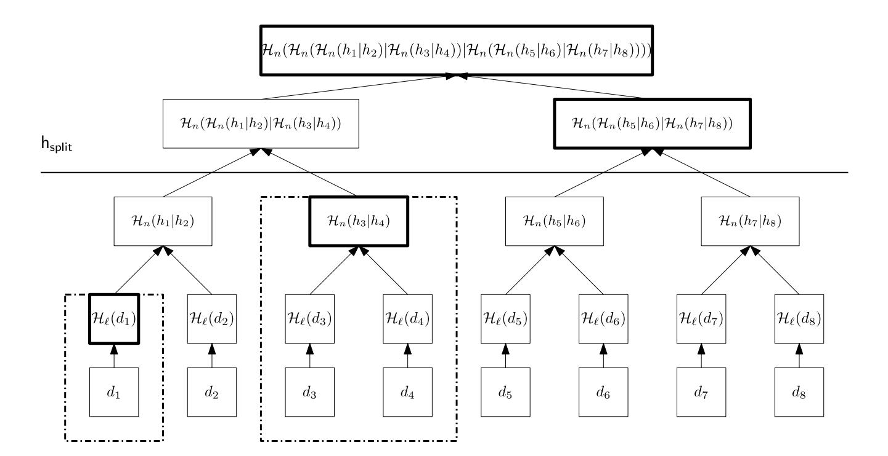
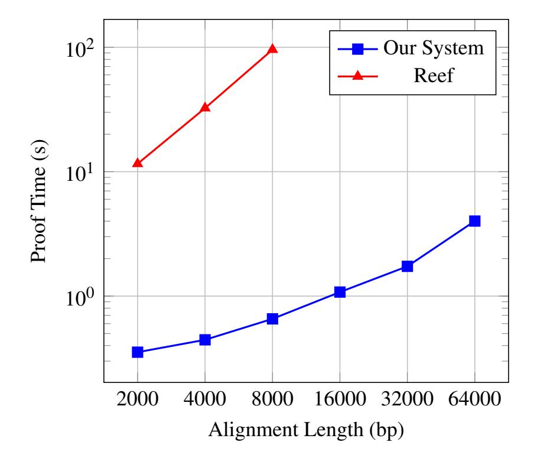
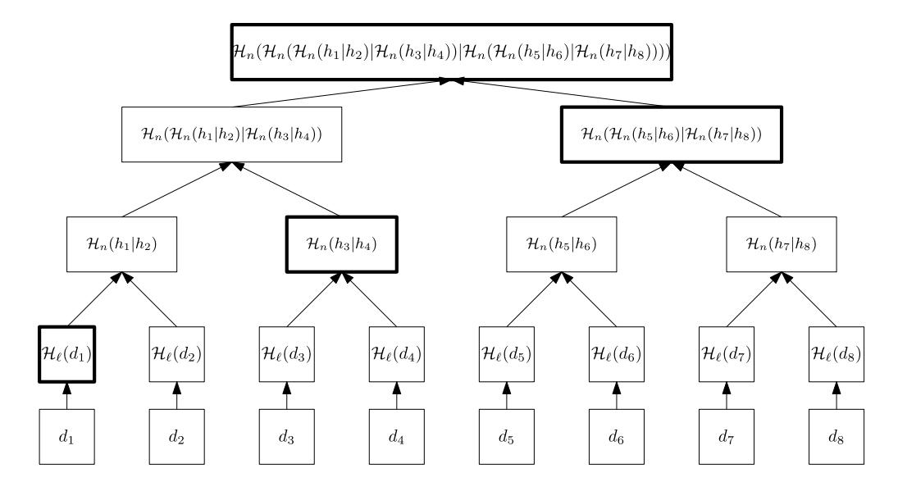

{0}------------------------------------------------

# Icefish: Practical zk-SNARKs for Verifiable Genomics

*Alexander Frolov University of Maryland sfrolov@umd.edu*

*Maurice Shih University of Maryland maurices@umd.edu*

*Ian Miers University Of Maryland imiers@umd.edu*

*Rob Patro University Of Maryland rob@cs.umd.edu*

# Abstract

Individual genomic data is a uniquely sensitive type of user data. While many papers have considered using Multi-Party Computation (MPC) or Fully Homomorphic Encryption (FHE) to allow collaborators to study combined genomic datasets they cannot share, few have considered verifying the results of genomic computations, either in research studies or in the emerging area of personalized genetic therapies.

In this paper, we initiate the first systematic study of zeroknowledge proofs for verifiable genomics, providing both building blocks for verifying common operations in computational genomics, such as sequence alignment, and exploring two end-to-end applications:

Verifiable Genome-Wide Association Studies: A Genome-Wide Association Study (GWAS) study operates over a repository of genomic data, identifying statistical correlations between genetic variations and observed traits or medical conditions. Our system enables third parties to verify that research was honestly computed over an authenticated, untampered database, ensuring both the integrity of the underlying data set and the correctness of the resulting science. We achieve practical performance (<20 minutes proving time) for studies of sizes equal to those in the existing genomics literature.

Verifiable CRISPR Eligibility: We propose using zk-SNARKs in the context of gene engineering (e.g. CRISPR). To our knowledge, this is a new use case for zk-SNARKs. We implement and optimize models for detecting "on-target" and "off-target" sites for a CRISPR probe in zk-SNARKs, so users can, for example, demonstrate eligibility for a therapy or trial without having to reveal their own DNA sequence.

In support of these applications, we develop new building blocks, like zero-knowledge proofs of sequence alignment that are 30x faster than the prior state of the art, and storageefficient indexes for Merkle trees for large scale genomic data that asymptotically reduce storage costs.

# 1 Introduction

Privacy of personal genomic data is a growing concern, driven by genetic testing and sequencing becoming cheaper and more widely used. The bankruptcy of 23andMe [\[1\]](#page-13-0) highlights long standing concerns over the existence of large databases of individuals' genomic data potentially being sold to the highest bidder. Unlike a leaked password, which can be rotated, or other types of personal information whose relevance fades with time, leaked genomic information is permanent: an individual's DNA generally cannot be changed after it is leaked. Furthermore, an individual's DNA data also leaks information about that individual's close biological relatives.

Privacy concerns have historically motivated the use of confidential computing for genomics using techniques like Secure Multi-party Computation (MPC) [\[2\]](#page-13-1) or Fully Homomorphic Encryption (FHE) [\[3\]](#page-13-2). The goal of using these approaches is typically collaborative computation: computing the results of some genomic study over multiple parties' data without requiring the parties to share the underlying sensitive material or handle the resulting regulatory issues. Consider a Genome-Wide Association Study (GWAS), a type of study conducted in genomics that takes genetic data and health outcomes from thousands of individuals to identify statistical correlations between variations in genes and patient outcomes like a specific disease or medical condition. In a collaborative setting, two hospitals could use these techniques to compute a GWAS across their combined sets of patient records, lending greater statistical sensitivity to the study, without either party learning the other's patient records.

While flexible and useful, these FHE and MPC protocols for collaborative computation are often costly. Beyond the high computational costs imposed by their cryptography, they present significant operational hurdles: they (in many configurations) require finding partners who are trusted not to collude, have the technical expertise to manage complex software services, and can afford the infrastructure requirements.

This paper focuses on a narrower problem: verifying computational claims made by a single party who holds private

{1}------------------------------------------------

genomic data. Verification serves two primary goals in this paper: it allows for public auditability and for computational claims to be proven without data ever leaving users' devices in any form. Public verifiability allows, for example, third parties to verify research results derived from restricted-access datasets that exist today without the raw data being released to verifiers. Data minimization, we propose, is useful for future applications in personalized genomics. One can consider a regime where an individual's personal genome never leaves their own device and they instead only reveal verifiable claims about it. In this verifiable genomics setting, because one party holds all the data, we can use comparatively lighterweight cryptographic primitives, zero-knowledge proofs. Indeed, looking ahead, many of our results can be computed on consumer grade devices such as a laptop.

# 1.1 Our contributions

This paper initiates the first systematic study of zeroknowledge proofs for verifiable genomics, providing both building blocks for verifying common operations in computational genomics, such as sequence alignment, and exploring two end-to-end applications:

Verifiable Genomic Data Repositories and Genome Wide Association Studies. Sensitive datasets containing thousands of individual genomes, or their ascertained genomic variants, are typically held by third party institutions such as biobanks or the National Institues of Health (NIH). Access to this information is tightly controlled, with researchers requesting access for specific studies that must be approved. Researchers who are granted access can publish the results of computational studies on that data, but must not reveal the underlying personal genetic records. Using our techniques for verifiable genomics, we can verify both (1) the integrity of these databases, to prove they have not been altered by the custodian and (2) the results of a Genome Wide Association Study (GWAS) performed by an academic or industrial group. This would allow a third party to, for example, verify a high profile claim linking a specific gene to a medical condition, while maintaining the privacy of every person in the dataset.

Towards Verifiable CRISPR Eligibility. Genetic therapies such as CRISPR [\[4\]](#page-13-3) edit the DNA of some cells in a patient's body. For both clinical trials and commercial applications, it is necessary to check that a patients' genes are "compatible" with a given therapy, both that the therapy will have the proper *on target* effect, and that it won't have unintended negative *off target* effects. Likewise, in clinical trials, it is often necessary to verify that a patient's genome is compatible with the constraints proposed by a clinical trial. The goal in this setting is for a user to perform these checks locally on their genome, rather than sending it to the provider, thus relieving the provider of the burden of securing and analyzing the data themselves, and limiting the opportunity for this sensitive information to be compromised. We do not achieve

this result entirely, instead we introduce the problem and setting and demonstrate feasibility. In particular, while our proof for on-target effects can scale to a human genome, we only demonstrate feasibility of our proofs for the absence of off-target effects for small eukaryotic genomes like yeast.

In more detail, in this paper:

- We show how to efficiently generate zk-SNARKs for sequence alignment. Our implementation can produce a proof verifying an alignment between two 2000 base pair sequences in 354ms, and is 30× faster than the previous state of the art [\[5\]](#page-13-4). We observe that our circuits for sequence alignment have specific memory access patterns, allowing us to specialize techniques for zk-RAM [\[6\]](#page-13-5), leading to performance improvements.
- We explore storage-efficient indexes for Merkle trees for large scale genomic data. When used to store a Merkle tree over a human genome-sized vector of data, at an example parameter setting, our data structure stores 32× less additional data than a naive Merkle tree, has the same proof verification time, and has modestly worse performance for generating Merkle inclusion proofs (about 30µs longer per inclusion proof). We also prove that this data structure is optimal in some sense.
- We provide an end-to-end implementation of a Genome-Wide Association study implemented for an authenticated database using Lasso regression[1](#page-1-0) [\[8\]](#page-13-6) and show it can be used to verify the results of existing Genome Wide Association Studies from the genomics literature.
- For verifiable CRISPR eligibility, we implement and optimize two existing algorithms from the literature: Rule Set 1 [\[9\]](#page-13-7) for on-target sites and MIT Score [\[10\]](#page-14-0) for off-target sites, and show full verification is feasible for smaller eukaryotic genomes like yeast.
- We implement all of the above using the Noir [\[11\]](#page-14-1) or Spartan2 [\[12\]](#page-14-2) libraries, benchmark them on consumer hardware, and compare against relevant prior work.

# 2 Threat model

We assume there exist authenticated DNA sequences from a sequencing machine or laboratory[2](#page-1-1) and we assume a PKI and trust in these sequencing parties.

A natural source of authentication in some settings is the provider of a dataset. For example, the National Institutes of Health (NIH) maintains many genomic data sets, with access restricted to approved researchers and studies. With our techniques, the NIH could publish a digest of their data sets,

<span id="page-1-1"></span><span id="page-1-0"></span><sup>1</sup>Note that Lasso regression is unrelated to the Lasso lookup argument [\[7\]](#page-13-8).

<sup>2</sup>Sequencing is the process of determining a DNA sequence given a sample of biological material.

{2}------------------------------------------------

making any subsequent tampering (or accidental errors) detectable and allowing researchers, who do have access to the data set, to produce proofs of correctness for their computation that are verifiable by the general public or other researchers who only have the digest. This provides a specific mechanism to guard not only against potential fraud, but also against the likely more common scenario where unintentional mistakes or errors in pre-processing render the result of a complex analysis incorrect. Critically, this verification can both act as an extra safeguard against accidental errors by those performing the analyses, and can be done by parties who lack access to the protected data.

For personal genomics, our authentication assumption has subtler implications. We believe that having sequencing machines/laboratories output cryptographic signatures is a reasonable assumption: labs are already trusted for correctness in practice, and most prior literature on MPC or FHE for genomics implicitly assumes correct sequencing. We assume the existence of protocols to bind a patient's identity both to the physical sample and its resulting sequence, and subsequently to the individual undergoing the clinical procedure.[3](#page-2-0) But what about confidentiality? After all, the lab sequencing a patient's DNA sees their genomic data. However, labs are already trusted with such data today, it is often protected by regulations, and users are free to select trustworthy labs. We focus not on the laboratories, but on downstream uses. Verifiable genomics ensures downstream parties need not learn such sequences, nor do labs need to retain the sequence data. As such, our threat model should be viewed as an exercise in data minimization: no one but the user retains their genomic data, and user's trust relationship with labs ends after the lab sequences and deletes the data. We note that there is interesting recent work on securing low-cost sequencing machines [\[13\]](#page-14-3) which might allow users to sequence their genomes themselves.

Lastly, this paper focuses on verifying the operations performed on genomic data. This leaves open two major issues: whether the computation itself is privacy preserving, and whether it is correct. In our GWAS use case, we expect the coefficients of a model fitted on private data or other statistics about the model to be made public. The coefficients of such models may leak information about the underlying data. We consider this to be out of scope for this paper. Similarly, phacking and other statistical manipulations are a well known problem in research publications, and we do not focus on that here: our work is aimed at verifying what computations were performed, tools to detect computations meant to manipulate or skew results can be built on top of these primitives.

# 3 Preliminaries

# <span id="page-2-1"></span>3.1 Cryptographic preliminaries

We first introduce the relevant cryptographic primitives.

Definition 3.0.1. *A SNARK (succinct non-interactive argument of knowledge) [\[14\]](#page-14-4) is a triple of* PPT *algorithms* (Setup,Prove,Verify) *where:*

- Setup(1 λ ,*R* ) → pp *takes the description of an NP relation R , a security parameter, and outputs public parameters* pp *for the SNARK.*
- Prove(pp, *x*,*w*) → π*, takes public parameters* pp*, public inputs x, private inputs w and returns a proof* π *that R* (*x*,*w*) = 1*.*
- Verify(pp, *x*,π) → {0,1} *verifies that* π *is a valid proof for R and public inputs x.*

A SNARK is expected to be knowledge sound (that only true statements can be proved, and that a prover generating a valid proof "knows" a witness *w*) and complete (that a prover can prove all cases where *R*(*x*,*w*) = 1). A SNARK is called "zero-knowledge" (and a zk-SNARK) if it reveals no information besides what is implied by the statement *R*(*x*,*w*) = 1. We sometimes call SNARKs "zero-knowledge proofs" for diversity in writing. We call the computation executed inside of a zk-SNARK a "circuit".

A major difference between writing efficient circuits for zero-knowledge proofs and traditional programming is that zero-knowledge proofs can make use of *untrusted advice* (in the witness variable *w*) and verify it. Executing computations inside a zero-knowledge proof circuit is concretely much more expensive than executing them in plain computation, so having the circuit *R* verify precomputed advice from the prover often results in a faster overall system.

Definition 3.0.2. *A Merkle tree [\[15\]](#page-14-5) is a labeled binary tree over a vector of values, instantiated with collision resistant hash functions H*<sup>ℓ</sup> : {0,1} <sup>∗</sup> → {0,1} <sup>λ</sup> *and H<sup>n</sup>* : {0,1} <sup>2</sup><sup>λ</sup> → {0,1} λ *(the "leaf" and "node" hash functions, respectively). For a Merkle tree over a vector d of i elements, the i th leaf of the Merkle Tree has label H*ℓ(*di*) *and each interior node's label is Hn*(*h<sup>l</sup>* ||*hr*)*, where h*1,*h<sup>r</sup> are the hashes of the node's left and right neighbors respectively.*

The label of the highest node in a Merkle tree is its "Merkle root". A prover can generate a "Merkle inclusion proof" for a leaf *d<sup>i</sup>* by providing the list of hashes that are the "siblings" of the nodes along the path from *d<sup>i</sup>* to the root of the tree. A Merkle inclusion proof (for a dense balanced Merkle Tree with *n* elements) consists of *O*(log*n*) hashes, and can be verified in *O*(log*n*) time. The height of a Merkle tree is the length of the longest path from the root to a leaf node in the tree. The depth of a node in a Merkle tree is the length of the path

<span id="page-2-0"></span><sup>3</sup> In the US, providers may already scan identity documents. While sufficient for medical billing, these procedures may need to be hardened.

{3}------------------------------------------------

scoring scheme: 
$$g(x) = -5x$$
$$m(a,b) = \begin{cases} 2 & \text{if } a = b\\ -1 & \text{otherwise} \end{cases}$$

<span id="page-3-0"></span>Figure 1: An example of a global pairwise sequence alignment between two strings *S* and *T* under a specific scoring scheme.

from the Merkle tree's root to the node. A Merkle Tree is balanced if all leaves have depths which differ by at most 1, and complete, if each "layer" of the tree has the maximal number of nodes at each depth. We sketch a complete, balanced Merkle Tree with a highlighted inclusion proof in Figure 5 in Appendix A. We write the algorithms to build a Merkle Tree, generate an inclusion proof, and verify an inclusion proof as MerkleTree. {Build, IncProof, VerifyProof}.

A **lookup argument** [16] is a cryptographic argument that lets a prover demonstrate that the values in a committed-to vector are contained in a larger vector. Lookup arguments are often used in zk-SNARKs to speed up operations which are inefficient to express in constraints directly, like range checks, comparison operations, or boolean operations.

We also use standard definitions of hash functions and signatures, which are present in a reference like [15], and use standard definitions of asymptotic notation, which are present in a reference like [17].

#### <span id="page-3-2"></span>**3.2** Genomics preliminaries

We define the relevant genomics concepts for this paper.

Genomics is the study of the DNA of living organisms. DNA sequences consist of "bases" or "base pairs" which are one of the four letters A,C,G or T, corresponding to 4 possible types of molecules in DNA. In certain contexts, DNA sequences are studied in terms of *nucleotides*. A group of 3 bases is called a nucleotide, and these have a specific meaning when turning a DNA sequence into proteins.

**Sequence alignment** is a common problem in computational genomics. Concretely, given two strings S and T, which are finite sequences over some shared alphabet  $\Sigma$  (most frequently  $\{A,C,G,T\}$ ), as well as a scoring system (g(x),m(a,b)), the sequence alignment problem asks to produce a new pair of strings S' and T', potentially containing a novel character –, called the gap character, that are of the same length and in one-to-one correspondence. In the scoring system, g(x) gives the score for inserting a gap of length x (i.e. a sequence of x consecutive instances of –), and m(a,b) gives the score associated with placing character a into correspondence with character b (generally positive if a = b and

negative otherwise). The alignment problem seeks to find a highest scoring pair over all possible S', T', under the given scoring function. See Fig 1 for an example. While such an optimal S', T' pair takes  $O(S \cdot T)$  time to find, via dynamic programming, in the worst case [18], the alignment itself can be concisely encoded in O(S+T) space.

Many variants of sequence alignment exist. Local and semiglobal sequence alignment are variants of sequence alignment in which the entirety of one sequence is aligned against a subsequence of the other (for instance when a short gene is being aligned against a much larger genome of an organism). We described sequence alignment with a simple "gap cost function" where each insertion and deletion costs the same amount, but more sophisticated cost functions exist. For instance, the affine gap cost function is a function where a gap of length n has a cost of an + b, where b > a. This expresses the restriction that many short gaps between two aligned sequences are less biologically likely than fewer long gaps. Lastly, multiple sequence alignment is a variant in which multiple sequences are aligned simultaneously, and the overall quality of alignment is scored.

A succinct data structure [19] is a type of data structure over a dataset of size Z, which enables efficient queries over the dataset while requiring o(Z) additional storage. Succinct data structures are desirable in genomics, where datasets can be large, and databases must have small indices to be useful.

A Genome-Wide Association Study (GWAS) is a type of genomic study in which researchers seek to find new correlations between variations in an organism's genetic sequence (most commonly focusing on Single Nucleotide Polymorphisms (SNPs)) and observed traits (like having a disease).

GWASs often use algorithms like linear regression, logistic regression, or more complicated models, such as group regularized regression [20] or even deep learning [21, 22], to find correlations.

**Lasso regression** is a variant of regularized linear regression [8] which is commonly used in genomics. Given n data points in m dimensions  $x : \mathbb{R}^{m \times n}, y : \mathbb{R}^n$ , Lasso regression aims to find model coefficients  $\beta : \mathbb{R}^{m+1}$  minimizing the quantity:

$$\sum_{i=0}^{n} (y_i - \beta_0 - x_i^T \beta_{1..n})^2$$

subject to the regularization constraint  $\sum_{i=0}^{m+1} |\beta_i| \le t$ . Lasso regression is unrelated to the Lasso lookup argument [7]. Lasso regression is well-suited for genomic studies because the regularization constraint forces the model to choose a small number of coefficients of high magnitude, meaning that a study is more likely to identify a small number of variables that explain a given trait.

<span id="page-3-1"></span><sup>&</sup>lt;sup>4</sup>Note that the Lasso optimization objective is sometimes equivalently defined with the  $l_1$  norm of the coefficient vector β being added to the objective function.

{4}------------------------------------------------

CRISPR-Cas9 [\[23–](#page-14-13)[25\]](#page-14-14) is a technique for genome editing, derived from the adaptive immune mechanisms in the Streptococcus pyogenes (SpCas9) bacteria.

Abstractly, CRISPR involves probes, which are 20 base pair segments of DNA that are targeted for a given edit. Within this sequence, the target DNA must immediately follow a Protospacer Adjacent Motif (PAM), with the structure of "NGG" where N is a wild card. The more similar a 20 base pair sequence in the targeted organism is to the probe, the higher chance the edit will take place at that location.

Two main types of algorithms used for CRISPR are ontarget and off-target scoring algorithms, which model the likelihood that a CRISPR edit will occur at a given location. Typically, the output of these algorithms is a decimal value, ranging from 0 to 1 where higher values indicate a higher chance of the edit occurring. On-target scoring algorithms rate the probability that a change will occur in the targeted gene, while off-target scoring algorithms rate the probability that an edit in a different part of the genome will occur. Examples of on-target scoring algorithms/models include Rule Set 1 [\[9\]](#page-13-7), Rule Set 2 (Azimuth) [\[26\]](#page-14-15), and Rule Set 3 [\[27,](#page-14-16) [28\]](#page-14-17). Examples of off-target scoring algorithms include the MIT score [\[10\]](#page-14-0) and CFD (Cutting Frequency Determination) score [\[26\]](#page-14-15). For a specific CRISPR probe/edit to be useful for a patient/organism, it must have a high on-target score and a low off-target score.

# 4 Sequence alignment in zk-SNARKs

We first discuss generating proofs of knowledge of low-cost sequence alignments. Sequence alignment is a fundamental concept in bioinformatics. For example, a patient having a certain gene is generally equivalent to that gene's sequence and the patient's DNA having a low-cost sequence alignment. As an example application for zero-knowledge proofs of sequence alignment, consider a patient registering for a clinical trial which requires patients to have a certain gene. Patients could generate zk-SNARKs showing that a segment of their genome has a low-cost alignment with the relevant gene's sequence and privately show their eligibility for the study.

# <span id="page-4-0"></span>4.1 Basic Algorithm for sequence alignment

Naïvely, proving the presence of a low-cost sequence alignment between two strings in a zk-SNARK would require a circuit of quadratic size. Computing an optimal sequence alignment requires quadratic time under common complexitytheoretic assumptions [\[18\]](#page-14-8), so directly computing an exact optimal sequence alignment in a SNARK would require quadratic circuit size.

However, zk-SNARK circuits have a different computational model: they can take precomputed advice as part of their untrusted inputs and use pseudorandom values. This section will describe how to prove knowledge of a sequence

alignment faster than it can be directly computed in a zk-SNARK by using precomputed advice.

Genomics software commonly generates "CIGAR strings" [\[29\]](#page-14-18), which are strings that describe an alignment of two sequences. CIGAR strings encode an alignment by describing the sequence of gaps that are inserted into two aligned sequences. For instance, the CIGAR string 3M1I3M1D5M describes an alignment of two strings of 12 characters with 1 gap inserted into the second sequence after 3 matching characters and 1 inserted into the first sequence after another 3 matching characters. We describe the basics of sequence alignment in more detail in Section [3.2.](#page-3-2)

We use the basic idea of the CIGAR format in our SNARK circuits. We slightly modify the existing format to be more SNARK-friendly. Numbered sequences like 3M are expanded into series of individual characters like MMM to avoid encoding parsing logic into the circuit. We also only implement the characters M, I, D for matches, insertions and deletions respectively, which are the only relevant characters for the basic variant of sequence alignment. We discuss other characters in the CIGAR standard in the next section and in Appendix [C.](#page-19-1)

Verifying that a modified CIGAR string represents a valid alignment between two sequences and has a given cost can be done in linear time by iterating through the CIGAR string and the two aligned sequences. For initial presentation, we use a fixed cost costgap for both insertions and deletions. The simple algorithm below can verify the alignment between sequences seq<sup>1</sup> ,seq<sup>2</sup> with a modified CIGAR string cigar:

```
1 : VerifyAlignment(seq1
                           , seq2
                                ,cigar) :
 2 : i1,i2,cost ← 0,0,0
 3 : for char in cigar :
 4 : if char == 'M' :
 5 : assert seq1
                  [i] == seq2
                             [i]
 6 : i1 = i1 +1
 7 : i2 = i2 +1
 8 : if char == 'D' :
 9 : i1 = i1 +1
10 : cost = cost+costgap
11 : if char == 'I' :
12 : i2 = i2 +1
13 : cost = cost+costgap
14 : assert i1 == seq1
                      .length
15 : assert i2 == seq2
                      .length
16 : return cost
```

At a high level, this algorithm iterates through the CIGAR string, checking that the characters of seq<sup>1</sup> ,seq<sup>2</sup> match when the CIGAR string requires them to, and updating indices into seq<sup>1</sup> ,seq<sup>2</sup> and the alignment cost when the CIGAR string specifies a gap in the alignment.

To implement this algorithm efficiently in a SNARK circuit, the circuit must be able to access the entries of each sequence at data-dependent indices i1,i<sup>2</sup> efficiently. This is nontrivial, seeing as the prior work [\[30\]](#page-15-0) has a similar algorithm, but

{5}------------------------------------------------

with linear per-access costs. We can achieve constant peraccess costs using a standard "zk-RAM" construction, like [\[6\]](#page-13-5). However, observing that each index of seq<sup>1</sup> ,seq<sup>2</sup> will be read once in a successful execution of VerifyAlignment, we can further optimize a circuit for VerifyAlignment by customizing standard memory-checking techniques, which we explain in Appendix [B.](#page-19-2)

In an end-to-end workflow to generate a zk-SNARK showing knowledge of a sequence alignment using VerifyAlignment, a user would first compute a sequence alignment in plain computation (which generally takes quadratic time). They would then obtain a CIGAR string or a variant thereof (which existing genomics software already produces [\[29\]](#page-14-18)), and perform a linear amount of cryptographic work to produce a zero-knowledge proof that the alignment between the two sequences has a given cost. For example, seq<sup>1</sup> could be part of a user's DNA sequence (a private input), and seq<sup>2</sup> could be a public input with the DNA for a common gene.[5](#page-5-0) Our approach for generating zero-knowledge proofs for the presence of a sequence alignment thus has the desirable property that generating a zero-knowledge proof of the computation takes asymptotically less time than the actual computation. This is a desirable property shared by common algorithms for zero-knowledge proofs for problems like matrix multiplication, discussed in [\[14\]](#page-14-4).

# <span id="page-5-1"></span>4.2 Generalizing to other types of alignment

The previous section considers a simple variant of sequence alignment, commonly called the Levenshtein distance [\[31\]](#page-15-1), where insertions and deletions all have the same cost, and only two sequences are aligned. In this section, we describe how to generalize the approach of the previous section to other common variants of sequence alignment. While we provide implementations of these variants, in this subsection we sketch the changes needed, since they are relatively simple.

Affine gap costs and other cost functions. In genomics applications, it is common to adopt sequence alignment variants that compute the cost of a sequence alignment in ways that are more complicated than having a fixed cost for each mismatched character or gap character. One common approach to assign a cost to an alignment is "affine gap costs." For a gap (a contiguous sequence of insertions or deletions in an alignment) of length *n*, affine gap costs assign the gap a cost of *an* + *b*, for *a*,*b* > 0. This it typically understood as having a constant "gap open" cost *b*, and separate constant "gap extension" cost *a*.

To modify VerifyAlignment to compute the cost of an alignment using affine gap costs, we can modify the parts of VerifyAlignment that increase cost. Specifically, these parts should be modified to add *a* or *a* + *b* to cost depending on

whether the previous character of the CIGAR was also 'I' or 'D'.

Furthermore, as long as it is possible to iterate through a CIGAR string and compute the cost of the alignment it represents in linear time (which is true of all practically used gap cost functions we are aware of), VerifyAlignment can be modified to also verify sequence alignments under other cost functions in linear time.

Semiglobal and local alignments. In semiglobal or local sequence alignment variants, subsequences of one or both sequences are aligned against each other instead of the entire sequences. Common variants of semiglobal alignment include "fitting" and "overlap" alignment [\[32\]](#page-15-2), while in local alignment, one seeks the best alignment of any substring of one sequence against any substring of the other. For example, a user showing that a subsequence of their DNA contains a given gene is typically an instance of semiglobal sequence alignment — the entirety of the gene's sequence is aligned to a sub-string of the genome (at the locus containing the gene). If the characters of a seq<sup>1</sup> and/or seq<sup>2</sup> are stored in an authenticated Merkle tree (or other type of vector commitment), we can implement alignment of subsequences by simply having the circuit for VerifyAlignment check that seq<sup>1</sup> and/or seq<sup>2</sup> are contiguous sequences included in the relevant Merkle tree/accumulator. This approach is specifically useful for doing sequence alignment in a verifiable computation setting, since this enables the circuit for VerifyAlignment to more efficiently authenticate a sequence by only checking a signature on a Merkle root/accumulator digest.

Multiple alignments and clipping. Multiple sequence alignment is a common variant of sequence alignment where multiple sequences are aligned against each other, trying to find the alignment that minimizes the overall cost of the observed mismatches or gaps. Clipping is a common feature of real world alignment in which certain characters are ignored for the purpose of alignment. For space reasons, we defer a discussion of implementing Multiple sequence alignment and sequence alignment with clipping to Appendix [C.](#page-19-1)

# <span id="page-5-2"></span>4.3 zk-SNARKs for dynamic programming

As explained in the previous two sections, sequence alignment and its variants have a nice property for zero-knowledge proofs: these computations can be verified asymptotically faster than executing them. This means that a prover can generate a zk-SNARK showing that they know a solution of a given cost to a problem by performing an amount of cryptographic work which is asymptotically smaller than actually computing the solution in the first place. Generally, dynamic programming algorithms are used to compute sequence alignments. In this section, we observe that many problems which are typically solved with dynamic programming algorithms also have this property. This observation generalizes some

<span id="page-5-0"></span><sup>5</sup>Of course, the SNARK circuit would also have to check a signature/otherwise authenticate on seq<sup>1</sup> for this to be secure.

{6}------------------------------------------------

prior work, by showing that problems efficiently solvable by dynamic programming are well-suited to zk-SNARKs.

There is not a single "universal" dynamic programming algorithm [17], though broad frameworks that cover many uses and applications of dynamic programming, like modeling them as finding the best path in a DAG under a semi-ring or the best derivation in a hypergraph under a given weight function, have previously been explored and described [33]. Instead, we look at two general dynamic programming problems: parsing context-free grammars [34] and finding shortest paths in a graph without negative cost cycles (in the sense of the Bellman-Ford Algorithm [17]). These two problems are general in the sense that many other problems commonly solved with dynamic programming can also be reduced to instances of these problems and then solved using the relevant algorithms [35, 36].

The previous works [34, 37, 38] all describe how to generate zk-SNARKs for proving the parsing of context-free grammars (CFGs). They all make a similar observation: verifying that a "parse tree" for a string under some context free grammar is valid can be done more efficiently than directly parsing the string. It takes linear time to verify the parse tree for a string under a CFG of constant size (see [34]), while the fastest known algorithms for CFG parsing take  $O(n^{2.37})$  time (i.e. the time taken by the fastest known matrix multiplication algorithms [39, 40]), and the fastest known dynamic programming-based algorithms take cubic time.

In Appendix D we describe how to verify the solutions to shortest path problems more efficiently than directly computing them.

#### <span id="page-6-0"></span>5 Succinct data structures for Merkle trees

In a full system using the previous section's approach to produce zero-knowledge proofs of sequence alignment, a user would likely need to show that a relevant segment of their DNA is actually contained in their genome (as discussed in Section 4.2). One common way of doing this would be for users to have a signed Merkle tree over their genome, and generate Merkle inclusion proofs showing that one of the sequences being aligned is contained in their genome. Furthermore, many genomic data sets have millions or billions of entries. If these data sets are stored in Merkle trees for use in verifiable computation, storing the internal hashes of these Merkle trees alone would potentially occupy gigabytes or terabytes of data.

This motivates our study of space-efficient indexes for storing Merkle trees such that Merkle inclusion proofs can be generated efficiently. The approach we design requires  $O(\frac{n}{\log n})$  persistent storage in addition to the contents of the tree, while still being able to produce membership proofs for any of the tree's leaves in  $O(\log n)$  time. As defined in [19], these are succinct data structures, since they can be used to efficiently answer queries over a data set of size N while using o(N)

additional space. We can also show that the data structure we design achieves asymptotically optimal storage usage in some sense in the random oracle model, and discuss a variant of it in Appendix E.2.

## <span id="page-6-1"></span>5.1 Split Merkle trees

Consider the problem of storing Merkle trees whose leaves have relatively small sizes (i.e. the leaves have O(1) size). We require the leaves to be small because part of this indexing approach involves re-hashing leaves when generating a Merkle inclusion proof. We further assume that the leaf and node hash functions  $\mathcal{H}_{\ell}$ ,  $\mathcal{H}_{n}$  can both be evaluated in O(1) time. We call this section's data structure a *Split Merkle tree* because it involves splitting a Merkle tree at some height and handling the hashes of the nodes above and below this height differently.

Consider a Merkle tree over a vector of length n, with leaf/node hash functions  $\mathcal{H}_{\ell}$ ,  $\mathcal{H}_n$  respectively. For ease of presentation/analysis, let n be a power of 2. Recalling some basic facts, a complete, balanced Merkle tree over n leaves consists of 2n-1 hashes (including the leaf hashes), and building a Merkle tree involves evaluating 2n-1 hashes. A complete binary tree of height h contains  $2^h-1$  entries.

For the Split Merkle tree, we define an additional *split height* parameter  $h_{split}$  (ultimately set to  $\lceil \log \log n \rceil$ ). At a high level, we modify a complete binary Merkle tree with n leaves to only store the top  $\log n - h_{split}$  layers of hashes in the tree. When generating a Merkle inclusion proof, the prover generates the bottom  $h_{split}$  entries of the path by recomputing the internal hashes of the Merkle tree, and reads the top  $\log n - h_{split}$  entries of the path from storage. The algorithm to verify an inclusion proof is unchanged. We give pseudocode in Figure 3, and a diagram in Figure 2.

To analyze the costs of this approach, storing a Split Merkle tree involves storing the top  $\log n - \mathsf{h}_{\mathsf{split}}$  layers of a Merkle Tree. When  $\mathsf{h}_{\mathsf{split}} = \lceil \log \log n \rceil$ , this requires storing  $2^{\log n - \lceil \log \log n \rceil} - 1 \le 2^{\log n} / 2^{\log \log n} = \frac{n}{\log n} = O(\frac{n}{\log n})$  hashes. Computing a membership proof involves reading  $\log n - \mathsf{h}_{\mathsf{split}}$  hashes from memory, which takes  $O(\log n)$  time. Recomputing the internal hashes for the first  $\lceil \log \log n \rceil$  entries of the path requires recomputing the internal hashes of a complete Merkle tree of height  $\lceil \log \log n \rceil$ , which takes  $O(2^{\lceil \log \log n \rceil}) = O(\log n)$  time. Thus, this achieves the claimed space and time usage.

To give concrete numbers for this approach, consider a Merkle tree over a commonly used dataset like a synthetic version of the UK Biobank dataset [41]. A Merkle tree for each value in this dataset would have approximately  $2^{34}$  entries, and thus  $\sim 2^{35}$  hashes.  $h_{\text{split}}$  would be 6 for this dataset. Thus, a Split Merkle tree for this dataset would store  $64\times$  fewer hashes, at the cost of evaluating 64 hashes per inclusion proof. Assuming hashes occupy 32 bytes, this would reduce the storage requirements for a Merkle tree over this

{7}------------------------------------------------



<span id="page-7-1"></span>Figure 2: A Split Merkle Tree with n = 8,  $h_{split}$  = 2. Only hashes above the horizontal line are stored. An inclusion proof for leaf  $d_2$  is highlighted, and the vertical boxes indicate the hashes that need to be recomputed when generating an inclusion proof for  $d_2$ .

SplitMT.Build(leaves :  $D^n$ ,  $h_{split}$  :  $\mathbb{N}$ ):

- 1. assert  $h_{\mathsf{split}} \leq \log n \wedge \log_2 n \in \mathbb{Z}$ .
- 2. Let vanillaTree = MerkleTree.Build(leaves)
- 3. Let splitTreeHashes be the list of hashes in the top  $log n h_{split}$  layers of vanillaTree.
- 4. Let root be the root of vanilla Tree.
- 5. Return (splitTreeHashes, root).

 $SplitMT.IncProof(treeHashes, root, leaves, idx, h_{split}) : \\$ 

- 1. Let  $size_{chunk} = 2^{h_{split}-1}$ .
- 2. Split leaves into equal chunks of size size<sub>chunk</sub>. Let chunk be the chunk at index [idx/size<sub>chunk</sub>].
- 3. Let subtree = MerkleTree.Build(chunk).
- 4. Let proof<sub>2</sub> = MerkleTree.IncProof(subtree,idx%size<sub>chunk</sub>).
- 5. Let proof<sub>1</sub> be the first  $\log n h_{\text{split}}$  entries of the Merkle Proof for idx, as stored in treeHashes.
- 6. Return  $proof_1||proof_2$ .

SplitMT.VerifyProof(root, path, leaf,):

<span id="page-7-0"></span> $1. \ \ Return\ \mathsf{MerkleTree}. Verify \mathsf{Proof}(\mathsf{root},\mathsf{path},\mathsf{leaf}).$ 

Figure 3: Split Merkle tree pseudocode. We use the algorithms MerkleTree. {Build, IncProof, VerifyProof} for a regular Merkle tree, as discussed in Section 3.1.

dataset from 1.1TB of hashes to about 17 GB. We implement benchmarks in Section 8.2.

We can show that Split Merkle trees achieve asymptotically optimal storage usage in the random oracle model. In particular, we show that any algorithm that can correctly generate Merkle inclusion proofs for an arbitrary Merkle tree in  $O(\log n)$  time must use persistent storage of size  $\Omega(\lambda \frac{n}{\log n})$ . We use a compression argument [42, 43], and show that an algorithm that uses  $o(\lambda \frac{n}{\log n})$  storage implies an information-theoretically impossible compression scheme for random data. We give a full proof in Appendix E.1. We also observe that Merkle trees with sufficiently large leaves have a similar "succinct data structure" property. We describe this in Appendix E.2.

## <span id="page-7-2"></span>6 Verifiable Genome-Wide Association Studies

As mentioned previously, a Genome-Wide Association Study (GWAS) is a type of study in which researchers find correlations between variations in DNA sequences and expressed traits in organisms (like finding a correlation between a disease and certain genes). GWASs typically involve fitting some statistical model to the genetic data/expressed traits to find these correlations. We propose using SNARKs to prove that a GWAS was honestly computed to give a verifiable guarantee of the results of a study on private medical data.

We explore verifying that a simple type of linear regression was computed correctly. Lasso regression is a commonly used form of regression used in GWASs. As explained before, Lasso regression is a variant of the standard linear regression, with a *regularization term*, which constraints the  $l_1$  norm of model coefficients. Intuitively, this is useful for genomic studies where the goal is to find a small number of genetic variations that "explain" some trait. The regularization constraint forces a regressed model to choose a small number of coefficients of high magnitude.

Lasso regression does not have a closed-form solution, and is normally computed by some variant of gradient descent. We 

{8}------------------------------------------------

again make the simple observation that using precomputed advice allows us to substantially decrease the circuit size required for proving that the results of a Lasso regression were computed correctly. Specifically, again, the circuit can take the final model coefficients and evaluation data, and verify that they achieve a given loss and coefficient of determination (*R* 2 ). This same basic idea can be applied to computing other goodness-of-fit metrics for a linear regression. We sketch this simple algorithm below:

$$\begin{aligned} &1: & \text{VerifyModelPerformance}(\beta:\mathbb{R}^{m+1},x:\mathbb{R}^{m\times n},y:\mathbb{R}^{n},t:\mathbb{R}): \\ &2: & L = \sum_{i=0}^{n} (y_{i} - \beta_{0} - x_{i}^{T}\beta_{1..n})^{2} \\ &3: & \text{assert } \sum_{i=0}^{m+1} |\beta_{i}| \leq t \\ &4: & \bar{y} = \frac{1}{n} \sum_{i=0}^{n} y_{i} \\ &5: & R^{2} = 1 - (\sum_{i=0}^{n} (y_{i} - \beta_{0} - x_{i}^{T}\beta_{1..n})^{2}) / (\sum_{i=0}^{n} (y_{i} - \bar{y})^{2}) \\ &6: & \text{return } L, R^{2} \end{aligned}$$

To optimize the concrete costs of this algorithm, we propose using fixed point arithmetic [\[44\]](#page-15-14), rather than floating point arithmetic. We review the details of fixed point arithmetic in Appendix [F.1.](#page-22-1) Fixed point operations are concretely cheaper in zk-SNARKs, since they can generally be directly implemented as field operations. There is a small loss in precision from using fixed point numbers which we quantify in Section [8.](#page-9-0)

By using lookup tables, we can further optimize the SNARK circuits verifying a Lasso regression. In particular, we can optimize the division step in fixed point multiplication and the regularization check for Lasso regression with lookup tables. We describe the details of optimizing these steps in Appendix [F.1.](#page-22-1) We note that optimizing the regularization check step (checking that the sum of the coefficients β*<sup>i</sup>* is at most *t*) is meaningful, since the vector β is often large relative to the size of the evaluation set in applications of Lasso regression. Lastly, to authenticate *x*, *y*, we use a variant of the approach for authenticating large files developed in VerITAS [\[45\]](#page-15-15) for verifying video. We describe the approach in Appendix [F.2.](#page-22-2)

# <span id="page-8-0"></span>7 Zero-knowledge proofs for CRISPR gene editing eligibility

Next we turn to our proposed use cases for zero-knowledge proofs in gene editing. As described in Section [3.2,](#page-3-2) CRISPR uses "probes" to define the DNA locations at which new edited DNA is spliced into the sequence. In general, for a patient to be eligible for a CRISPR-based therapy, their specific genome must meet certain requirements.

First, a patient must have the CRISPR probe bind to their DNA at the correct locations. These are called "on-target" sites. Patients must have an on-target site in their DNA sequence so that a CRISPR probe can splice in DNA at the correct location with high probability. Secondly, patients must not have sequences in their DNA which match a given CRISPR probe at incorrect locations in their genome. These locations are called "off-target sites". If a user has off-target sites in their genome, a CRISPR therapy might edit their DNA in unintended locations, leading to potential negative health outcomes such as cancer.

We propose using zk-SNARKs in the context of CRISPR therapies for users to prove that they have effective on-target sites for a given therapy in their DNA, and do not have risky off-target sites elsewhere in their DNA. By using zk-SNARKs, users do not reveal their DNA sequences to the party offering CRISPR gene editing. On the other hand, a party offering gene editing services does not need to store patient's genetic data, and has a verifiable guarantee that they will not harm their patients.

In this section, we describe the details of implementing existing algorithms from the literature for detecting on-target and off-target sites for CRISPR probes. We pick Rule Set 1 [\[9\]](#page-13-7) for the on-target algorithm and MIT Score [\[10\]](#page-14-0) for the off-target algorithm. These algorithms are from the first generation of computational tools used to design CRISPR experiments and we choose them as lightweight example algorithms to demonstrate feasibility.

# 7.1 Overall implementation details

We first describe some details of the data used as inputs for our implementations of CRISPR-related algorithms. We expect users to provide two private inputs related to their DNA sequence. The first is the sequence of their genome, signed by a trusted DNA sequencer. Along with this, we use a signed annotation of the ranges where genes are found in the individual's DNA. This is a reasonable requirement, since annotation files for reference genomes exist and are commonly generated as part of DNA sequencing [\[46\]](#page-15-16), and lightweight tools exist for coordinate conversion between a reference and individual genomes [\[47](#page-15-17)[–49\]](#page-15-18).

Additionally, DNA is double-stranded [\[50\]](#page-15-19), and this affects how algorithms for these problems are designed. We run the scoring algorithms for measuring the quality/likelihood of a site on both strands of a DNA sequence: the forward (5'- 3' direction) and the reverse-complement (3'-5' direction). As an additional note, it is more desirable for CRISPR edits to occur earlier in a gene, since these have a greater effect. Depending on whether the gene is on the forward strand or reverse strand, a lower or higher index of an on-target edit is more desirable.

{9}------------------------------------------------

# 7.2 Rule Set 1 Algorithm Implementation

Rule Set 1 [\[9\]](#page-13-7) is an algorithm to compute on-target efficiency where a 30 base pair (bp) input sequence goes through a simple linear function and then a sigmoid function. The input is composed of (in order) a 4-bp upstream sequence, a 20-bp spacer (target of the CRISPR edit), a 3-bp PAM, and 3-bp downstream. As mentioned in Section [3.2,](#page-3-2) the PAM must be on the structure "NGG".

Given this input, a (floating-point) linear score is computed based on the intercept value (0.597636154) summed by coeff*<sup>i</sup>* if feature *i* exists. In Rule Set 1, there are 72 features. An example feature is "GT02," which checks if index 2 of a sequence is "G" and if index 3 is "T," with a coefficient value of -0.625778696.

Next, a GC score modification is added to the linear score base on how many G and C bases appear in the 30-bp input:

$$\begin{cases} (GC_{count} - 10) \cdot GC_{high} & \text{if } GC_{count} > 10 \\ (10 - GC_{count}) \cdot GC_{low} & \text{if } GC_{count} \le 10 \end{cases}$$

For calculating the linear score, we used fixed point arithmetic, discussed in Appendix [F.1.](#page-22-1) Finally, a sigmoid function is applied to the linear score as 1/(1+*e* <sup>−</sup>*linear*\_*score*).

Calculating this sigmoid function would be expensive in a zero-knowledge circuit, so instead we employ a lookup table based on thresholds. If the score is above the thresholds (0.2,0.4,0.5,0.7) then it has (low, medium, good, high) effectiveness, respectively, based on work by experimental studies [\[51\]](#page-15-20).

# 7.3 MIT Score algorithm implementation

The MIT Score off-target algorithm [\[10\]](#page-14-0) takes as input a 20-bp spacer, the target sequence for editing, and a 20-bp protospacer, a sequence in the genome of the organism. The output score is how likely the sequence in the protospacer will be (un-intentionally) modified by the CRISPR edit.

The formula used is:

$$\left(\prod_{p\in M} w_p\right) \cdot \frac{1}{\frac{19-d}{19}\cdot 4+1} \cdot \frac{1}{m^2},$$

where *M* is the set of mismatched positions between the spacer and protospacer, *w<sup>p</sup>* is the position based penalty for a mismatch at that position, *m* is the size of *M*, and *d* is the average distance between consecutive mismatches. If there is only 1 mismatch, then *d* = 19.

This computation uses floating point numbers. As mentioned before, these are expensive in zero-knowledge, so we use fixed point arithmetic, which is reviewed in Appendix [F.1.](#page-22-1)

Like with the on-target scoring algorithm, after this score is computed, we use a lookup to determine if the edit has a low (≤ 0.5), medium (> 0.6), or high (> 0.8) probability of being an unintended change. Again, the thresholds are based on work by experimental studies [\[51\]](#page-15-20).

# <span id="page-9-0"></span>8 Implementation and Evaluation

In this section, we detail the implementation and evaluation of our end-to-end verifiable genomics applications and the supporting building blocks, i.e., proofs for sequence alignment and Split Merkle trees for large scale genomic data. We start with the building blocks and then present our applications for (1) a verifiable Genome Wide Association Study (GWAS) on an authenticated data store and (2) verifiable CRISPR eligibility.

We used Microsoft's Spartan2 library [\[12\]](#page-14-2) with the bellpepper frontend for our experiments with sequence alignment/Merkle Trees. For our Merkle tree experiments, we used the Plonky3 library's [\[52\]](#page-15-21) implementation of the Poseidon hash function/Merkle trees. We used the Noir programming language [\[11\]](#page-14-1) with the Barretenberg [\[53\]](#page-16-0) backend to implement our experiments with GWAS and CRISPR. We used the UltraHonk proof system from Barretenberg. The source code for all experiments is available in our repository [\[54\]](#page-16-1).

All benchmarks were run on a laptop running Windows Subsystem for Linux (WSL2) with a 12-core AMD Ryzen AI 9 HX 370 series CPU and 96 GB of RAM.

# 8.1 Verifiable sequence alignment

In Figure [4,](#page-10-1) we plot performance results for our circuits implementing the previously discussed basic variant of sequence alignment. "Alignment length" refers to the length of the advice string given as input to the sequence alignment circuit, since this determines the overall circuit size. To give real-world context for the sequence lengths we chose, the median length of a gene in the human genome is approximately 15,000 base pairs [\[55\]](#page-16-2). The time to verify these proofs ranges from 112ms to 399ms.

Compared to Reef [\[5\]](#page-13-4), our approach is 30-130× faster. For example, when proving the alignment of 2 sequences of 2000 characters, our system requires 354 ms of prover time, while Reef requires 11.57s. We did not benchmark Reef for alignment lengths longer than 8000 characters because building these circuits exceeded our machine's resources. We note that Reef does not implement sequence alignment, but rather regular expression matching for their proofs about DNA matches. Consequently, our circuits can express more types of differences between aligned sequences, and better reflects the algorithms used in real-world genomics computations.

Compared to zkMSA [\[30\]](#page-15-0), our circuits for verifying a pairwise alignment have linear size, while zkMSA's have quadratic size, because of zkMSA's usage of a memory scheme with linear per-access costs. zkMSA does not run

{10}------------------------------------------------



<span id="page-10-1"></span>Figure 4: Alignment length vs. proving time for circuits implementing basic variant of sequence alignment.

their circuits and only evaluates constraint counts. For instance, to verify an alignment of two sequences of 200 characters, zkMSA requires about 100× more constraints than our approach.[6](#page-10-2) This difference increases linearly for longer sequences.

SecureED [\[56\]](#page-16-3), a recent work which implements sequence alignment in general multi-party computation,[7](#page-10-3) requires 11.43 seconds to compute the alignment of 2 4000 base pair sequences, while our work can prove the alignment of 2 4000 base pair sequences in 445 milliseconds (around 25× faster). Our protocol is substantially faster than SecureED and requires much less communication (SecureED requires transmitting 3370 MB of data when computing an alignment of 2 sequences of length 4000, while our protocol's proofs have sizes of tens of kilobytes, and 39.996kB for this specific problem size). Recall that, as discussed in the introduction, MPC and zk-SNARKS are different primitives best suited to different use cases, so this is only an apple-to-apples comparison when limited to our setting of verifiable genomics.

In addition to the algorithm above, we also implement zk-SNARKs for verifying sequence alignment under affine gap costs and verifying multiple sequence alignment, which are common variants of alignment in the genomics literature. These are not covered in previous work. The performance of these variants is largely comparable to that of the basic variant discussed above. We describe the performance of these variants of sequence alignment in Appendix [G.1.](#page-23-0)

| Tree Variant          | Storage Size | Witness Gen. Time |  |
|-----------------------|--------------|-------------------|--|
| Baseline: Vanilla     | 2048 MB      | 29.126µs          |  |
| Split, hsplit<br>= 3  | 256 MB       | 34.52µs           |  |
| Split, hsplit<br>= 4  | 128 MB       | 44.68µs           |  |
| Split, hsplit<br>= 5  | 64 MB        | 66.83µs           |  |
| Split, hsplit<br>= 6  | 32 MB        | 112.07µs          |  |
| Split, hsplit<br>= 10 | 2047 kB      | 1.49ms            |  |
| Split, hsplit<br>= 15 | 63 kB        | 46.40ms           |  |
| Split, hsplit<br>= 20 | 1 kB         | 1.49s             |  |

<span id="page-10-4"></span>Table 1: Split tree performance for a human-genome sized vector vs. a standard Merkle tree. Storage size is the additional storage needed to hold the hashes of the tree, while Witness Gen. Time is the time to compute an inclusion proof.

# <span id="page-10-0"></span>8.2 Storage-efficient Merkle trees

In Table [1,](#page-10-4) we show the performance of our Split Merkle tree over a vector of size comparable to a haploid human genome (2 <sup>25</sup> leaves of about 32 bytes each), represented as field elements. "Storage size" measures the storage space used by the given tree variant to store hashes. We chose this vector size so our benchmarks were over a piece of data of size relevant to genomics algorithms. In these benchmarks, the internal hashes of the Merkle tree were stored in persistent storage to reflect a real-world deployment scenario.

As the "split height" is increased, the storage required for the Merkle tree decreases, while the time to generate inclusion proofs increases, and proof verification times stay approximately constant. When hsplit is 3-6, the time to generate an inclusion proof only increases by tens of microseconds, while storage costs decrease by 8-64×, which is likely an acceptable cost to pay for the amount of storage saved. We note that the exact "sweet spot" value of hsplit is highly dependent on hardware and implementation details (i.e. the relative performance between hashing data and random access reads to storage). For instance, when running these same benchmarks on an Apple MacBook M4, inclusion proof generation time for hsplit ranging from 3-7 was actually faster than for the vanilla tree.

As discussed in Section [5,](#page-6-0) we expect these savings to extend to larger databases: given a commonly used dataset [\[41\]](#page-15-11), this would reduce storage costs of the full tree from 1.1TB of hashes to about 17 GB. We discuss another variant of storageefficient Merkle trees in Appendix [E.2,](#page-22-0) and we benchmark their performance in Appendix [G.2.](#page-23-1)

# 8.3 Verifiable GWAS on Authenticated Data

In Table [2,](#page-11-0) we give the prover time required to prove the results of a Lasso regression for problems of different sizes.

<span id="page-10-2"></span><sup>6</sup>We produced this number by building their pairwise alignment circuit restricted to 2 sequences of 200 characters with an alignment length of 200 characters.

<span id="page-10-3"></span><sup>7</sup>Note that SecureED implements approximate sequence alignment, and that we used SecureED's numbers with the fastest network configuration.

{11}------------------------------------------------

| # of variables ×<br># of data points | Proof Time | Verif. Time |
|--------------------------------------|------------|-------------|
| 729 × 291 [57]                       | 17.44s     | 13.67ms     |
| 30 × 10,000 [58]                     | 31.66s     | 11.84ms     |
| 1000 × 867 [59]                      | 72.03s     | 14.273ms    |
| 13,572 × 697* [60]                   | 1042.82s   | 2.85s       |

<span id="page-11-0"></span>Table 2: Verifiable Genome Wide Association Study (GWAS) performance using Lasso regression. Data points marked with \* had data sets broken into chunks to create separate proofs. Runtimes are to prove and verify these chunks sequentially.

We generated synthetic data sets of sizes equal to those used by existing papers in the genomics literature that perform GWAS studies using Lasso regression. We generated random synthetic data because the relevant data sets were not openly available. We briefly summarize the papers that perform these studies in Appendix [G.3.](#page-23-2) In rows marked with an asterisk, we split the data set into multiple subsets, and generated proofs for the subsets individually.[8](#page-11-1)

As can be seen, we achieve reasonable performance for verifying Lasso linear regression for smaller-scale studies in the genomics literature. There are recent studies in hundreds of thousands of variables and data points, which existing proof techniques would have difficulty scaling to. For example, [\[61\]](#page-16-8) runs a variant of Lasso regression on a data set with more than 1 million variables and and 300,000 data points. To our knowledge, our work is the only work implementing Lasso regression in zero-knowledge proofs. [\[58\]](#page-16-5) implements Lasso regression in MPC. For the largest benchmarked problem size, their system takes about 2,500 seconds to train a Lasso model on a set of 10,000 data points in 30 variables. Our system takes 31.31 seconds to prove the effectiveness of a set of Lasso coefficients, which is substantially faster for use cases where general-purpose MPC can be replaced with zk-SNARKs. [\[58\]](#page-16-5) is the only paper, to our knowledge, which implements Lasso regression in a cryptographic context.

We compared the accuracy of our Lasso circuit to a ground truth from Pythons scikit-learn library. Across 1000 runs of linear regression on random data sets of 100 data points in 100 variables, our implementation achieves an average deviation from the *R* 2 computed by scikit-learn of 0.000044% (4.36 × 10−<sup>7</sup> in magnitude) and an average deviation from the model loss computed by scikit-learn of 0.000002% (3.81×10−<sup>6</sup> in magnitude).

# 8.4 CRISPR eligibility proofs

Recall from Section [7](#page-8-0) that CRISPR gene therapy requires two types of computation to be performed before the procedure: determining the efficacy of the treatment via on-target scoring, and determining the risk of unintended changes via off-target scoring. In this section, we benchmark our implementations of CRISPR-related algorithms. This includes running the respective on and off targeting algorithms, as well as authenticating the relevant data.

In Table [3,](#page-12-0) we show proof and verification times for the ontarget scoring algorithm Rule Set 1 and the off-target scoring algorithm MIT Score. They roughly show a linear growth in proving time as the genome sequence length increases. In the tested configurations, on-target computation is up to 60% more expensive to run. Note that on-target scoring is only required to be run for one gene/location (to show the existence of a site), while off-target scoring must be done for the entirety of the genome (to show absence of a site).

In Table [4,](#page-12-1) we show computation times for the edge cases where part of the input segment is the targeted gene, and the rest is not. In this circuit, we keep the gene's location private. This computation is up to three times more expensive than the computation of on or off target scoring for equivalent lengths, but only has to be done up to two times at the boundary of the targeted gene. In Appendix [G.4,](#page-24-0) we provide benchmarks for circuits where the location of the targeted gene is not hidden, and instead hard-coded into the circuit.

Feasibility for Human (and other) Genomes. In order to prove these statements in practice, minor additional overhead is required. The examined segments must be authenticated as being part of a human's genome, for instance, by hashing and checking inclusion of the segment in a Merkle tree. However, this only uses a few thousand gates, where the CRISPR scoring algorithms take millions over measured segment lengths.

Our implemented algorithms can be used to generate proofs for on-target scoring for a human genome, but do not scale to human genome size for off-target effects. In particular, ontarget scoring only requires the prover to show that specific locations in the genome have a sufficiently high score. In contrast, off-target scoring requires the prover to iterate over the entire genome, showing that a probe does not match any other *unintended* candidate locations.

In particular, consider the HBB gene [\[62\]](#page-16-9) [\[63\]](#page-16-10), which is associated with sickle cell disease [\[64\]](#page-16-11) [\[65\]](#page-16-12). Studies show that CRISPR gene therapy can cure sickle cell disease [\[66\]](#page-16-13). HBB is 1,608 base pairs [\[63\]](#page-16-10), and a proof that a proposed therapy would have an on-target effect takes less a minute to compute and less than a second to verify (see Table [4\)](#page-12-1).

In contrast, a complete CRISPR gene editing eligibility proof with on and off target scoring would need to iterate over the whole human genome and would take 220 days to prove on our benchmark machine. This is obviously not viable at present, but we note that advances in zk-SNARK systems, particular for GPU proving targeted at verifiable LLMs, could substantially increase performance.

At the same time, our techniques are viable to prove offtarget effects (or the lack thereof) on an entire yeast genome.

<span id="page-11-1"></span><sup>8</sup>This is mainly because of limitations of the Noir circuit compiler, not a performance limitation of the prover.

{12}------------------------------------------------

|                 | On-Target       |                | Off-Target      |                |
|-----------------|-----------------|----------------|-----------------|----------------|
| Segment<br>Size | Proving<br>Time | Verif.<br>Time | Proving<br>Time | Verif.<br>Time |
| 100bp           | 1.58s           | 11.2ms         | 1.59s           | 11.6ms         |
| 1000bp          | 15.13s          | 11.5ms         | 10.01s          | 11.7ms         |
| 2000bp          | 29.41s          | 11.7ms         | 18.26s          | 11.7ms         |
| 4000bp          | -               | -              | 36.15s          | 12.2ms         |

<span id="page-12-0"></span>Table 3: Time to generate and verify a proof of on-target or off-target scoring over the entire input segment. The Noir compiler's RAM usage exceeded the limits of our setup for the 4000bp segment size.

| Segment Size<br>Proving Time |        | Verification Time |
|------------------------------|--------|-------------------|
| 100bp                        | 2.80s  | 12.0ms            |
| 1000bp                       | 30.75s | 12.1ms            |
| 2000bp                       | 56.32s | 12.3ms            |

<span id="page-12-1"></span>Table 4: Time to generate and verify a proof where the input segment partially contains the targeted gene.

A common target for CRISPR edits on yeast is the ADE2 gene which changes the yeast's color [\[67\]](#page-16-14). ADE2 is 1,716 base pairs, and since the yeast genome is only 9,040,256 base pairs, off-target computation for the rest of the genome would take an estimated 1.71 days on a laptop.

#### 8.4.1 Accuracy estimates

Our zk-SNARK circuits have some accuracy loss because they use fixed-point arithmetic to implement algorithms which normally use floating point arithmetic. We quantify this accuracy loss.

"On-Target" Model: Rule Set 1. Rule Set 1 considers a 30 bp window, where two bases in the PAM are expected to be 'G'. Since this algorithm is dependent on the exact values at the other 28 positions, there exist 4 <sup>28</sup> inputs. It is computationally infeasible to run all possibilities, so instead we run 2 20 random instances. We measure the accuracy loss before the sigmoid function, as we use a lookup table based on the value before applying it. We find that the zero-knowledge circuit has a median error of 0.00016% and a mean of 0.00071%, equal to an error of less than 10−<sup>5</sup> .

"Off-Target" Model: MIT Score. We evaluate accuracy of our MIT Score implementation over all possible 2 <sup>20</sup> mismatch combinations. Median and mean accuracy losses are 6% and 16.5%, respectively, equating to a negligible difference less than 10−<sup>6</sup> on the actual score, especially when the threshold boundaries are (0.5,0.6,0.8) Indeed, we observe much better accuracy when filtering out negligible scores. For example, when filtering out scores <0.001 we see a median percentage error of 0.0273% and mean percentage error of 0.0327%.

# 9 Related work

Because of the sensitivity of genetic data, genomic computations are a frequently proposed use case for primitives like Multi-Party Computation or Fully Homomorphic Encryption. Since 2014, the annual iDASH workshop [\[68\]](#page-16-15) has been running competitions where researchers compete to optimize various types of secure genomics computations. This has been an impetus for a large amount of research in secure computation and genomics.

There are many works using Fully Homomorphic Encryption and simpler homomorphic encryption schemes for performing secure computation on genomic data in the literature, with many papers related to iDASH. Many papers focus on the use case of a Genome-Wide Association Study (GWAS) [\[3,](#page-13-2) [69](#page-16-16)[–74\]](#page-17-0). There is also work on using implementing sequence alignment [\[75,](#page-17-1) [76\]](#page-17-2).

There is also a great deal of work designing Multi-Party Computation protocols for genomic computations. This also includes related primitives, like Private Set Intersection [\[77\]](#page-17-3). Protocols have been designed for different numbers of parties and different trust assumptions. These protocols solve problems like edit distance between strings [\[2,](#page-13-1) [56,](#page-16-3) [78,](#page-17-4) [79\]](#page-17-5), analyzing genomics data sets for GWAS or other contexts [\[80](#page-17-6)[–82\]](#page-17-7), and securely implementing genomics-related queries over databases [\[83–](#page-17-8)[85\]](#page-17-9).

There is also some work on applying other secure computation techniques to genomic computations, like ORAM [\[86\]](#page-17-10), trusted hardware [\[87\]](#page-17-11) or functional encryption [\[88\]](#page-17-12).

Lastly, as far as we are aware, the following papers have explored genomics inside of zero-knowledge proofs: As mentioned before, Reef [\[5\]](#page-13-4) proposes users proving that they have a gene as a use-case for zero-knowledge proofs. One main limitation of Reef for genomics is the use of regular expressions rather than alignments to express sequence similarity. Suwannik [\[30\]](#page-15-0) designs circuits for verifying multiple sequence alignment inside of a zero-knowledge proof, but they only focus on global alignments and their circuits have quadratic rather than linear size for each pairwise alignment.

Less relatedly, [\[89\]](#page-17-13) designs custom SNARKs for proving (non)-subsequence relations, which have applications in genomics. [\[90\]](#page-18-1) uses zk-SNARKs as a "rollup" for outsourcing genomics computations performed on a blockchain, [\[91\]](#page-18-2) uses simple zero-knowledge proofs to ensure that a user does not submit adversarial queries to a system, and [\[92\]](#page-18-3) uses zeroknowledge proofs to build anonymous credentials for a larger system using Fully Homomorphic Encryption for genome analysis.

Sequence alignment is a common problem in genomics, and is covered in standard textbooks in the area, like [\[93\]](#page-18-4).

{13}------------------------------------------------

Efficiently storing large Merkle Trees has been explored in the trusted hardware and blockchain communities. For instance, [\[94\]](#page-18-5) designs a data structure called a "Merkle Bonsai Tree," which is specific to the trusted hardware domain, but has similar ideas about optimizing Merkle Trees for storage consumption. The Zcash codebase [\[95\]](#page-18-6) contains an approach for storing a large Merkle Tree to improve the efficiency of "fast-forwarding" a client's stored state of the blockchain. We believe that our formal analysis of approaches for compactly storing Merkle Trees is our main contribution in this direction.

Representing linear regression, logistic regression, and other variants of regression in zero-knowledge proofs has been studied in the cryptographic literature before, largely because of their relation to machine learning (see [\[96\]](#page-18-7) for references). The industry codebase [\[97\]](#page-18-8) has an approach for computing zero-knowledge proofs of linear regression which is our starting point for Section [6.](#page-7-2)

Lastly, there is some work on the intersection of CRISPR/gene editing and cryptography, such as as the line of work starting with [\[98\]](#page-18-9), though this work focuses on authenticating edited genomes, rather than the use case that we explore. Multiple works [\[99,](#page-18-10) [100\]](#page-18-11) exist for the computational side of CRISPR editing, but aim to create efficient user-friendly tools, rather than verifiable and privacy enhancing computations like the contributions of this paper.

# 10 Conclusion

To conclude, we have proposed new use cases for zk-SNARKs in genomics, and optimized various common genomics algorithms for zk-SNARKs. We believe that this work shows that there are interesting and valuable use cases for zk-SNARKs in bioinformatics.

The code for this paper is available at [https://](https://anonymous.4open.science/r/icefish/README.md) [anonymous.4open.science/r/icefish/README.md](https://anonymous.4open.science/r/icefish/README.md). We used synthetic datasets when possible to improve the reproducibility of the paper, and did not use private datasets.

Acknowledgments. This work was supported in part by DARPA, NSF under Grant 2504578,x and US National Institutes of Health grant R01HG009937, and by grants 2022- 311195 and 2024-342821 from the Chan Zuckerberg Initiative DAF, an advised fund of the Chan Zuckerberg Initiative Foundation. Opinions, findings, and conclusions or recommendations expressed in this material are those of the authors and do not necessarily reflect the views of DARPA. We thank Miranda Christ, Kanav Gupta, Daniel Apon, and Faraz Ghahremani for their helpful discussions about parts of this paper.

Disclosure. RP is a co-founder of Ocean Genomics Inc.

# References

- <span id="page-13-0"></span>[1] A. McElhaney, "23andme site went down as customers struggled to delete data," 2025, [https://www.wsj.com/business/23andme-delete](https://www.wsj.com/business/23andme-delete-data-bankruptcy-5778341f)[data-bankruptcy-5778341f.](https://www.wsj.com/business/23andme-delete-data-bankruptcy-5778341f)
- <span id="page-13-1"></span>[2] S. Jha, L. Kruger, and V. Shmatikov, "Towards practical privacy for genomic computation," in *Proceedings of the 2008 IEEE Symposium on Security and Privacy*, ser. SP '08. USA: IEEE Computer Society, 2008, p. 216–230. [Online]. Available: <https://doi.org/10.1109/SP.2008.34>
- <span id="page-13-2"></span>[3] M. Kim and K. Lauter, "Private genome analysis through homomorphic encryption," *BMC Medical Informatics and Decision Making*, vol. 15, no. 5, p. S3, 2015. [Online]. Available: [https://doi.org/10.](https://doi.org/10.1186/1472-6947-15-S5-S3) [1186/1472-6947-15-S5-S3](https://doi.org/10.1186/1472-6947-15-S5-S3)
- <span id="page-13-3"></span>[4] M. Jinek, K. Chylinski, I. Fonfara, M. Hauer, J. A. Doudna, and E. Charpentier, "A programmable dualrna–guided dna endonuclease in adaptive bacterial immunity," *Science*, vol. 337, no. 6096, pp. 816–821, 2012. [Online]. Available: [https://www.science.org/](https://www.science.org/doi/abs/10.1126/science.1225829) [doi/abs/10.1126/science.1225829](https://www.science.org/doi/abs/10.1126/science.1225829)
- <span id="page-13-4"></span>[5] S. Angel, E. Ioannidis, E. Margolin, S. Setty, and J. Woods, "Reef: Fast succinct non-interactive zeroknowledge regex proofs," USENIX Security 2024, 2023. [Online]. Available: [https://eprint.iacr.org/2023/](https://eprint.iacr.org/2023/1886) [1886](https://eprint.iacr.org/2023/1886)
- <span id="page-13-5"></span>[6] Y. Yang and D. Heath, "Two shuffles make a RAM: Improved constant overhead zero knowledge RAM," Cryptology ePrint Archive, Paper 2023/1115, 2023. [Online]. Available: <https://eprint.iacr.org/2023/1115>
- <span id="page-13-8"></span>[7] S. Setty, J. Thaler, and R. Wahby, "Unlocking the lookup singularity with lasso," Cryptology ePrint Archive, Paper 2023/1216, 2023. [Online]. Available: <https://eprint.iacr.org/2023/1216>
- <span id="page-13-6"></span>[8] R. Tibshirani, "Regression shrinkage and selection via the lasso," *Journal of the Royal Statistical Society: Series B (Methodological)*, vol. 58, no. 1, pp. 267–288, 12 2018. [Online]. Available: [https:](https://doi.org/10.1111/j.2517-6161.1996.tb02080.x) [//doi.org/10.1111/j.2517-6161.1996.tb02080.x](https://doi.org/10.1111/j.2517-6161.1996.tb02080.x)
- <span id="page-13-7"></span>[9] J. G. Doench, E. Hartenian, D. B. Graham, Z. Tothova, M. Hegde, I. Smith, M. E. Sullender, B. L. Ebert, R. J. Xavier, and D. E. Root, "Rational design of highly active sgrnas for crispr-cas9-mediated gene inactivation," *Nature Biotechnology*, vol. 32, no. 12, pp. 1262–1267, 2014.

{14}------------------------------------------------

- <span id="page-14-0"></span>[10] P. D. Hsu, D. A. Scott, J. A. Weinstein, F. A. Ran, S. Konermann, V. Agarwala, Y. Li, E. J. Fine, X. Wu, O. Shalem *et al.*, "Dna targeting specificity of rnaguided cas9 nucleases," *Nature Biotechnology*, vol. 31, no. 9, pp. 827–832, 2013.
- <span id="page-14-1"></span>[11] noir-lang, "noir: A domain specific language for zero knowledge proofs," [https://github.com/noir-lang/noir,](https://github.com/noir-lang/noir) 2026.
- <span id="page-14-2"></span>[12] S. Setty, "Spartan2: High-speed zkSNARKs without trusted setup," [https://github.com/microsoft/Spartan2,](https://github.com/microsoft/Spartan2) 2025.
- <span id="page-14-3"></span>[13] C. Stillman, J. E. Bravo, C. Boucher, and S. Rampazzi, "Toward security-aware portable sequencing," *Nature Communications*, vol. 16, no. 1, p. 9829, 2025. [Online]. Available: <https://doi.org/10.1038/s41467-025-66024-z>
- <span id="page-14-4"></span>[14] J. Thaler, *Proofs, Arguments, and Zero-Knowledge*, 2022. [Online]. Available: [https://people.cs.](https://people.cs.georgetown.edu/jthaler/ProofsArgsAndZK.pdf) [georgetown.edu/jthaler/ProofsArgsAndZK.pdf](https://people.cs.georgetown.edu/jthaler/ProofsArgsAndZK.pdf)
- <span id="page-14-5"></span>[15] D. Boneh and V. Shoup, *A Graduate Course in Applied Cryptography*, 2015. [Online]. Available: <https://toc.cryptobook.us/book.pdf>
- <span id="page-14-6"></span>[16] M. Campanelli, A. Faonio, D. Fiore, T. Li, and H. Lipmaa, "Lookup arguments: Improvements, extensions and applications to zero-knowledge decision trees," Cryptology ePrint Archive, Paper 2023/1518, 2023. [Online]. Available: <https://eprint.iacr.org/2023/1518>
- <span id="page-14-7"></span>[17] J. Kleinberg and E. Tardos, *Algorithm Design*. USA: Addison-Wesley Longman Publishing Co., Inc., 2005.
- <span id="page-14-8"></span>[18] A. Backurs and P. Indyk, "Edit distance cannot be computed in strongly subquadratic time (unless seth is false)," in *Proceedings of the Forty-Seventh Annual ACM Symposium on Theory of Computing*, ser. STOC '15. New York, NY, USA: Association for Computing Machinery, 2015, p. 51–58. [Online]. Available: <https://doi.org/10.1145/2746539.2746612>
- <span id="page-14-9"></span>[19] G. J. Jacobson, *Succinct static data structures*. Carnegie Mellon University, 1988.
- <span id="page-14-10"></span>[20] A. Nouira and C.-A. Azencott, "Multitask group Lasso for Genome Wide association Studies in diverse populations," in *Biocomputing 2022*. WORLD SCIENTIFIC, Nov. 2021, p. 163–174. [Online]. Available: [http://dx.doi.org/10.1142/9789811250477\\_](http://dx.doi.org/10.1142/9789811250477_0016) [0016](http://dx.doi.org/10.1142/9789811250477_0016)
- <span id="page-14-11"></span>[21] B. Mieth, A. Rozier, J. A. Rodriguez, M. M. C. Höhne, N. Görnitz, and K.-R. Müller, "DeepCOMBI: explainable artificial intelligence for the analysis and

- discovery in genome-wide association studies," *NAR Genomics and Bioinformatics*, vol. 3, no. 3, Jun. 2021. [Online]. Available: [http://dx.doi.org/10.1093/nargab/](http://dx.doi.org/10.1093/nargab/lqab065) [lqab065](http://dx.doi.org/10.1093/nargab/lqab065)
- <span id="page-14-12"></span>[22] A. van Hilten, S. A. Kushner, M. Kayser, M. A. Ikram, H. H. H. Adams, C. C. W. Klaver, W. J. Niessen, and G. V. Roshchupkin, "GenNet framework: interpretable deep learning for predicting phenotypes from genetic data," *Communications Biology*, vol. 4, no. 1, Sep. 2021. [Online]. Available: [http://dx.doi.org/10.1038/](http://dx.doi.org/10.1038/s42003-021-02622-z) [s42003-021-02622-z](http://dx.doi.org/10.1038/s42003-021-02622-z)
- <span id="page-14-13"></span>[23] M. Jinek, K. Chylinski, I. Fonfara, M. Hauer, J. A. Doudna, and E. Charpentier, "A programmable dualrna–guided dna endonuclease in adaptive bacterial immunity," *science*, vol. 337, no. 6096, pp. 816–821, 2012.
- [24] L. Cong, F. A. Ran, D. Cox, S. Lin, R. Barretto, N. Habib, P. D. Hsu, X. Wu, W. Jiang, L. A. Marraffini *et al.*, "Multiplex genome engineering using crispr/cas systems," *Science*, vol. 339, no. 6121, pp. 819–823, 2013.
- <span id="page-14-14"></span>[25] P. Mali, L. Yang, K. M. Esvelt, J. Aach, M. Guell, J. E. DiCarlo, J. E. Norville, and G. M. Church, "Rnaguided human genome engineering via cas9," *Science*, vol. 339, no. 6121, pp. 823–826, 2013.
- <span id="page-14-15"></span>[26] J. G. Doench, N. Fusi, M. Sullender, M. Hegde, E. W. Vora, H. Gage, P. Dever, A. Gross, B. P. Davies, J. L. Sanderson *et al.*, "Optimized sgrna design to maximize activity and minimize off-target effects of crisprcas9," *Nature Biotechnology*, vol. 34, no. 2, pp. 184– 191, 2016.
- <span id="page-14-16"></span>[27] P. C. DeWeirdt, K. R. Sanson, A. K. Sangree, M. Hegde, R. E. Hanna, M. N. Feeley, A. L. Griffith, T. Teng, S. M. Borys, C. Strand *et al.*, "Optimization of ascas12a for combinatorial genetic screens in human cells," *Nature biotechnology*, vol. 39, no. 1, pp. 94–104, 2021.
- <span id="page-14-17"></span>[28] P. C. DeWeirdt, A. K. Sangree, R. E. Hanna, K. R. Sanson, M. Hegde, C. Strand, T. Ray, and J. G. Doench, "Accounting for small variations in the tracrrna sequence improves sgrna activity predictions for crispr screening," *Nature Biotechnology*, vol. 40, no. 12, pp. 1776–1784, 2022.
- <span id="page-14-18"></span>[29] H. Li, B. Handsaker, A. Wysoker, T. Fennell, J. Ruan, N. Homer, G. Marth, G. Abecasis, R. Durbin, and . G. P. D. P. Subgroup, "The sequence alignment/map format and SAMtools," *Bioinformatics*, vol. 25, no. 16, pp. 2078–2079, Aug. 2009, epub 2009 Jun 8.

{15}------------------------------------------------

- <span id="page-15-0"></span>[30] W. Suwannik, "Zero knowledge proof for multiple sequence alignment," 2024. [Online]. Available: <https://arxiv.org/abs/2404.19064>
- <span id="page-15-1"></span>[31] V. I. Levenshtein, "Binary codes capable of correcting deletions, insertions, and reversals," *Soviet physics. Doklady*, vol. 10, pp. 707–710, 1965. [Online]. Available: [https://api.semanticscholar.org/CorpusID:](https://api.semanticscholar.org/CorpusID:60827152) [60827152](https://api.semanticscholar.org/CorpusID:60827152)
- <span id="page-15-2"></span>[32] P. Compeau and P. Pevzner, *Bioinformatics Algorithms: An Active Learning Approach*, 6 2018. [Online]. Available: [https:](https://books.google.com/books/about/Bioinformatics_Algorithms.html?hl=&id=RdzLtgEACAAJ) [//books.google.com/books/about/Bioinformatics\\_](https://books.google.com/books/about/Bioinformatics_Algorithms.html?hl=&id=RdzLtgEACAAJ) [Algorithms.html?hl=&id=RdzLtgEACAAJ](https://books.google.com/books/about/Bioinformatics_Algorithms.html?hl=&id=RdzLtgEACAAJ)
- <span id="page-15-3"></span>[33] L. Huang, "Advanced Dynamic Programming in Semiring and Hypergraph Frameworks," in *Coling 2008: Advanced Dynamic Programming in Computational Linguistics: Theory, Algorithms and Applications - Tutorial notes*, L. Huang, Ed. Manchester, UK: Coling 2008 Organizing Committee, Aug. 2008, pp. 1–18. [Online]. Available: <https://aclanthology.org/C08-5001/>
- <span id="page-15-4"></span>[34] S. Angel, S. Celi, E. Margolin, P. Mishra, M. Sander, and J. Woods, "Coral: Fast succinct non-interactive zero-knowledge CFG proofs," Cryptology ePrint Archive, Paper 2025/1420, 2025. [Online]. Available: <https://eprint.iacr.org/2025/1420>
- <span id="page-15-5"></span>[35] A. Abboud, A. Backurs, and V. V. Williams, "If the current clique algorithms are optimal, so is valiant's parser," in *2015 IEEE 56th Annual Symposium on Foundations of Computer Science*, 2015, pp. 98–117.
- <span id="page-15-6"></span>[36] S. Dasgupta, C. H. Papadimitriou, and U. Vazirani, "Dynamic programming," in *Algorithms*. Draft / Lecture Notes, University of California, Berkeley and UCSD, 2006, pp. 169–199, available online. [Online]. Available: [https://people.eecs.berkeley.edu/~vazirani/](https://people.eecs.berkeley.edu/~vazirani/algorithms/chap6.pdf) [algorithms/chap6.pdf](https://people.eecs.berkeley.edu/~vazirani/algorithms/chap6.pdf)
- <span id="page-15-7"></span>[37] E. Laufer, A. Ozdemir, and D. Boneh, "zkPi: Proving lean theorems in zero-knowledge," Cryptology ePrint Archive, Paper 2024/267, 2024. [Online]. Available: <https://eprint.iacr.org/2024/267>
- <span id="page-15-8"></span>[38] H. Malvai, S. Hussain, G. Neven, and A. Miller, "Practical proofs of parsing for context-free grammars," Cryptology ePrint Archive, Paper 2024/562, 2024. [Online]. Available: <https://eprint.iacr.org/2024/562>
- <span id="page-15-9"></span>[39] R. Duan, H. Wu, and R. Zhou, "Faster matrix multiplication via asymmetric hashing," 2023. [Online]. Available: <https://arxiv.org/abs/2210.10173>

- <span id="page-15-10"></span>[40] L. Lee, "Fast context-free grammar parsing requires fast Boolean matrix multiplication," *Journal of the ACM*, vol. 49, no. 1, pp. 1–15, 2002.
- <span id="page-15-11"></span>[41] UK Biobank / Nuffield Department of Population Health, "Uk biobank synthetic dataset," [https://biobank.](https://biobank.ndph.ox.ac.uk/synthetic_dataset/) [ndph.ox.ac.uk/synthetic\\_dataset/,](https://biobank.ndph.ox.ac.uk/synthetic_dataset/) n.d., accessed: 2026- 02-05.
- <span id="page-15-12"></span>[42] J. Bonneau, J. Chen, M. Christ, and I. Karantaidou, "Merkle mountain ranges are optimal: On witness update frequency for cryptographic accumulators," Cryptology ePrint Archive, Paper 2025/234, 2025. [Online]. Available: <https://eprint.iacr.org/2025/234>
- <span id="page-15-13"></span>[43] C. Dwork, M. Naor, G. N. Rothblum, and V. Vaikuntanathan, "How efficient can memory checking be?" in *Theory of Cryptography Conference*. Springer, 2009, pp. 503–520.
- <span id="page-15-14"></span>[44] V. H. Adams, "Fixed-point arithmetic," 2021, [link.](https://vanhunteradams.com/FixedPoint/FixedPoint.html)
- <span id="page-15-15"></span>[45] T. Datta, B. Chen, and D. Boneh, "VerITAS: Verifying image transformations at scale," IEEE S& P 2025, 2024. [Online]. Available: [https:](https://eprint.iacr.org/2024/1066) [//eprint.iacr.org/2024/1066](https://eprint.iacr.org/2024/1066)
- <span id="page-15-16"></span>[46] A. S. Hinrichs, D. Karolchik, R. Baertsch, G. P. Barber, G. Bejerano, H. Clawson, M. Diekhans, T. S. Furey, R. A. Harte, F. Hsu *et al.*, "The ucsc genome browser database: update 2006," *Nucleic Acids Research*, vol. 34, no. suppl\_1, pp. D590–D598, 2006.
- <span id="page-15-17"></span>[47] A. Shumate and S. L. Salzberg, "Liftoff: accurate mapping of gene annotations," *Bioinformatics*, vol. 37, no. 12, pp. 1639–1643, 2021.
- [48] R. M. Kuhn, D. Haussler, and W. J. Kent, "The ucsc genome browser and associated tools," *Briefings in bioinformatics*, vol. 14, no. 2, pp. 144–161, 2013.
- <span id="page-15-18"></span>[49] H. Zhao, Z. Sun, J. Wang, H. Huang, J.-P. Kocher, and L. Wang, "Crossmap: a versatile tool for coordinate conversion between genome assemblies," *Bioinformatics*, vol. 30, no. 7, pp. 1006–1007, 2014.
- <span id="page-15-19"></span>[50] L. A. Urry, M. L. Cain, S. A. Wasserman, P. V. Minorsky, and R. B. Orr, *Campbell Biology*, 12th ed. Pearson, 2020.
- <span id="page-15-20"></span>[51] M. Haeussler, K. Schönig, H. Eckert, A. Eschstruth, J. Mianné, J.-B. Renaud, S. Schneider-Maunoury, A. Shkumatava, L. Teboul, J. Kent *et al.*, "Evaluation of off-target and on-target scoring algorithms and integration into the guide rna selection tool crispor," *Genome biology*, vol. 17, no. 1, p. 148, 2016.
- <span id="page-15-21"></span>[52] Polygon, "Plonky3: A toolkit for polynomial iops (piops)," [https://github.com/Plonky3/Plonky3,](https://github.com/Plonky3/Plonky3) 2025.

{16}------------------------------------------------

- <span id="page-16-0"></span>[53] AztecProtocol, "barretenberg: An optimized ellipticcurve library and plonk snark prover," [https:](https://github.com/AztecProtocol/barretenberg) [//github.com/AztecProtocol/barretenberg,](https://github.com/AztecProtocol/barretenberg) 2025. [Online]. Available: [https://github.com/AztecProtocol/](https://github.com/AztecProtocol/barretenberg) [barretenberg](https://github.com/AztecProtocol/barretenberg)
- <span id="page-16-1"></span>[54] Redacted, "Icefish," Anonymous Github, 2026. [Online]. Available: [https://anonymous.4open.science/r/](https://anonymous.4open.science/r/icefish/README.md) [icefish/README.md](https://anonymous.4open.science/r/icefish/README.md)
- <span id="page-16-2"></span>[55] G. Fuchs, Y. Voichek, S. Benjamin, S. Gilad, I. Amit, and M. Oren, "4sudrb-seq: measuring genomewide transcriptional elongation rates and initiation frequencies within cells," *Genome Biology*, vol. 15, no. 5, p. R69, 2014. [Online]. Available: <https://doi.org/10.1186/gb-2014-15-5-r69>
- <span id="page-16-3"></span>[56] J. Gao, Y. Palanikuma, D. Mouris, D. T. Nguyen, and N. Trieu, "SecurED: Secure multiparty edit distance for genomic sequences," Cryptology ePrint Archive, Paper 2025/500, 2025. [Online]. Available: <https://eprint.iacr.org/2025/500>
- <span id="page-16-4"></span>[57] O. Kohannim, D. Hibar, J. Stein, N. Jahansha, X. Hua, P. Rajagopalan, A. Toga, C. Jack, M. Weiner, G. {de Zubicaray}, K. McMahon, N. Hansell, N. Martin, M. Wright, and P. Thompson, "Discovery and replication of gene influences on brain structure using lasso regression," *Frontiers in Neuroscience*, no. AUG, 2012.
- <span id="page-16-5"></span>[58] M. B. van Egmond, G. Spini, O. van der Galien, A. IJpma, T. Veugen, W. Kraaij, A. Sangers, T. Rooijakkers, P. Langenkamp, B. Kamphorst, N. van de L'Isle, and M. Kooij-Janic, "Privacypreserving dataset combination and lasso regression for healthcare predictions," *BMC Medical Informatics and Decision Making*, vol. 21, no. 1, p. 266, 2021. [Online]. Available: [https://doi.org/10.1186/](https://doi.org/10.1186/s12911-021-01582-y) [s12911-021-01582-y](https://doi.org/10.1186/s12911-021-01582-y)
- <span id="page-16-6"></span>[59] S. Srivastava and L. Chen, "Comparison between the stochastic search variable selection and the least absolute shrinkage and selection operator for genomewide association studies of rheumatoid arthritis," *BMC Proceedings*, vol. 3, no. Suppl 7, p. S21, 2009. [Online]. Available: [https://doi.org/10.1186/](https://doi.org/10.1186/1753-6561-3-S7-S21) [1753-6561-3-S7-S21](https://doi.org/10.1186/1753-6561-3-S7-S21)
- <span id="page-16-7"></span>[60] J. B. Fontanarosa and Y. Dai, "Using lasso regression to detect predictive aggregate effects in genetic studies," *BMC Proceedings*, vol. 5, no. 9, p. S69, 2011. [Online]. Available: [https:](https://doi.org/10.1186/1753-6561-5-S9-S69) [//doi.org/10.1186/1753-6561-5-S9-S69](https://doi.org/10.1186/1753-6561-5-S9-S69)
- <span id="page-16-8"></span>[61] J. Richland, T. Kiiskinen, W. Wang, S. Lu, B. Narasimhan, T. Hastie, M. Rivas, and R. Tibshirani,

- "Univariate-guided sparse regression for biobankscale high-dimensional omics data," 2026. [Online]. Available: <https://arxiv.org/abs/2511.22049>
- <span id="page-16-9"></span>[62] V. A. Schneider, T. Graves-Lindsay, K. Howe, N. Bouk, H.-C. Chen, P. A. Kitts, T. D. Murphy, K. D. Pruitt, F. Thibaud-Nissen, D. Albracht *et al.*, "Evaluation of grch38 and de novo haploid genome assemblies demonstrates the enduring quality of the reference assembly," *Genome Research*, vol. 27, no. 5, pp. 849–864, 2017.
- <span id="page-16-10"></span>[63] NCBI RefSeq Assembly, "Homo sapiens genome assembly GRCh38.p14," Accession GCF\_000001405.40, 2022, accessed: 2026-02-01. [Online]. Available: [https://ftp.ncbi.nlm.nih.gov/genomes/all/GCF/](https://ftp.ncbi.nlm.nih.gov/genomes/all/GCF/000/001/405/GCF_000001405.40_GRCh38.p14/) [000/001/405/GCF\\_000001405.40\\_GRCh38.p14/](https://ftp.ncbi.nlm.nih.gov/genomes/all/GCF/000/001/405/GCF_000001405.40_GRCh38.p14/)
- <span id="page-16-11"></span>[64] V. M. Ingram, "Gene mutations in human haemoglobin: The chemical difference between normal and sickle cell haemoglobin," *Nature*, vol. 180, no. 4581, pp. 326–328, 1957.
- <span id="page-16-12"></span>[65] S. L. Thein, "The molecular basis of β-thalassemia," *Cold Spring Harbor Perspectives in Medicine*, vol. 3, no. 5, p. a011700, 2013.
- <span id="page-16-13"></span>[66] H. Frangoul, D. Altshuler, M. D. Cappellini, Y.-S. Chen, J. Domm, B. K. Eustace, J. Foell, J. de la Fuente, S. Grupp, R. Handgretinger, T. W. Ho, A. Kattamis, A. Kernytsky, J. Lekstrom-Himes, A. M. Li, F. Locatelli, M. Y. Mapara, M. de Montalembert, D. Rondelli, A. Sharma, S. Sheth, S. Soni, M. H. Steinberg, D. Wall, A. Yen, and S. Corbacioglu, "CRISPR-Cas9 gene editing for sickle cell disease and β-thalassemia," *The New England Journal of Medicine*, vol. 384, no. 3, pp. 252–260, 2021.
- <span id="page-16-14"></span>[67] J. E. DiCarlo, J. E. Norville, P. Mali, X. Rios, J. Aach, and G. M. Church, "Genome engineering in Saccharomyces cerevisiae using CRISPR-Cas systems," *Nucleic Acids Research*, vol. 41, no. 7, pp. 4336–4343, apr 2013.
- <span id="page-16-15"></span>[68] "iDASH Privacy & Security Workshop 2025 - Secure Genome Analysis Competition," [https://](https://humangenomeprivacy.org/2025/) [humangenomeprivacy.org/2025/,](https://humangenomeprivacy.org/2025/) National Institutes of Health, 2025.
- <span id="page-16-16"></span>[69] M. Blatt, A. Gusev, Y. Polyakov, and S. Goldwasser, "Secure large-scale genome-wide association studies using homomorphic encryption," Cryptology ePrint Archive, Paper 2020/563, 2020. [Online]. Available: <https://eprint.iacr.org/2020/563>
- [70] M. Kim and K. Lauter, "Private genome analysis through homomorphic encryption," Cryptology ePrint Archive, Paper 2015/965, 2015. [Online]. Available: <https://eprint.iacr.org/2015/965>

{17}------------------------------------------------

- [71] M. Blatt, A. Gusev, Y. Polyakov, and S. Goldwasser, "Secure large-scale genome-wide association studies using homomorphic encryption," Proceedings of the National Academies of Sciences, 2020. [Online]. Available: <https://eprint.iacr.org/2020/563>
- [72] M. Blatt, A. Gusev, Y. Polyakov, K. Rohloff, and V. Vaikuntanathan, "Optimized homomorphic encryption solution for secure genome-wide association studies," BMC Medical Genomics, 2019. [Online]. Available: <https://eprint.iacr.org/2019/223>
- [73] S. Carpov, N. Gama, M. Georgieva, and J. R. Troncoso-Pastoriza, "Privacy-preserving semi-parallel logistic regression training with fully homomorphic encryption," *BMC Medical Genomics*, vol. 13, no. Suppl 7, p. 88, 2020. [Online]. Available: <https://doi.org/10.1186/s12920-020-0723-0>
- <span id="page-17-0"></span>[74] H. Chen, R. Gilad-Bachrach, K. Han, Z. Huang, A. Jalali, K. Laine, and K. Lauter, "Logistic regression over encrypted data from fully homomorphic encryption," BMC Medical Genomics, 2018. [Online]. Available: <https://eprint.iacr.org/2018/462>
- <span id="page-17-1"></span>[75] S. Hwang, E. Ozturk, and G. Tsudik, "Balancing security and privacy in genomic range queries," *ACM Trans. Priv. Secur.*, vol. 26, no. 3, Mar. 2023. [Online]. Available: <https://doi.org/10.1145/3575796>
- <span id="page-17-2"></span>[76] W. Legiest, J.-P. D'Anvers, B. Spasic, N.-L. Tran, and I. Verbauwhede, "Leuvenshtein: Efficient FHE-based edit distance computation with single bootstrap per cell," USENIX Security 2025, 2025. [Online]. Available: <https://eprint.iacr.org/2025/012>
- <span id="page-17-3"></span>[77] P. Baldi, R. Baronio, E. De Cristofaro, P. Gasti, and G. Tsudik, "Countering gattaca: efficient and secure testing of fully-sequenced human genomes," in *Proceedings of the 18th ACM Conference on Computer and Communications Security*, ser. CCS '11. New York, NY, USA: Association for Computing Machinery, 2011, p. 691–702. [Online]. Available: <https://doi.org/10.1145/2046707.2046785>
- <span id="page-17-4"></span>[78] S. Madabushi and P. Ramanathan, "Two-cloud private read alignment to a public reference genome," *Proceedings on Privacy Enhancing Technologies*, vol. 2023, no. 2, pp. 449–463, 2023. [Online]. Available: [https://petsymposium.org/popets/](https://petsymposium.org/popets/2023/popets-2023-0062.php) [2023/popets-2023-0062.php](https://petsymposium.org/popets/2023/popets-2023-0062.php)
- <span id="page-17-5"></span>[79] H. D. V. Madrigal, D. C. Jaramillo, and D. F. Aranha, "Privacy-preserving edit distance computation using secret-sharing two-party computation," LATINCRYPT 2023, 2023. [Online]. Available: [https://eprint.iacr.org/](https://eprint.iacr.org/2023/1201) [2023/1201](https://eprint.iacr.org/2023/1201)

- <span id="page-17-6"></span>[80] C. Hong, Z. Huang, W. jie Lu, H. Qu, L. Ma, M. Dahl, and J. Mancuso, "Privacy-preserving collaborative machine learning on genomic data using TensorFlow," Cryptology ePrint Archive, Paper 2020/159, 2020. [Online]. Available: <https://eprint.iacr.org/2020/159>
- [81] K. Hamacher, T. Kussel, T. Schneider, and O. Tkachenko, "PEA: Practical private epistasis analysis using MPC," ESORICS 2022, 2022. [Online]. Available: <https://eprint.iacr.org/2022/1185>
- <span id="page-17-7"></span>[82] S. Pentyala, D. Railsback, R. Maia, R. Dowsley, D. Melanson, A. C. A. Nascimento, and M. D. Cock, "Training differentially private models with secure multiparty computation," *CoRR*, vol. abs/2202.02625, 2022. [Online]. Available: [https://arxiv.org/abs/2202.](https://arxiv.org/abs/2202.02625) [02625](https://arxiv.org/abs/2202.02625)
- <span id="page-17-8"></span>[83] M. Akgün, N. Pfeifer, and O. Kohlbacher, "Efficient privacy-preserving whole-genome variant queries," *Bioinformatics*, vol. 38, no. 8, pp. 2202–2210, 02 2022. [Online]. Available: [https://doi.org/10.1093/](https://doi.org/10.1093/bioinformatics/btac070) [bioinformatics/btac070](https://doi.org/10.1093/bioinformatics/btac070)
- [84] G. Asharov, S. Halevi, Y. Lindell, and T. Rabin, "Privacy-preserving search of similar patients in genomic data," *Proceedings on Privacy Enhancing Technologies*, vol. 2018, no. 4, pp. 104–124, 2018. [Online]. Available: [https://petsymposium.org/popets/](https://petsymposium.org/popets/2018/popets-2018-0034.php) [2018/popets-2018-0034.php](https://petsymposium.org/popets/2018/popets-2018-0034.php)
- <span id="page-17-9"></span>[85] T. Schneider and O. Tkachenko, "EPISODE: Efficient privacy-PreservIng similar sequence queries on outsourced genomic DatabasEs," ASIACCS 2019, 2021. [Online]. Available: [https://eprint.iacr.org/2021/](https://eprint.iacr.org/2021/029) [029](https://eprint.iacr.org/2021/029)
- <span id="page-17-10"></span>[86] C. Liu, X. S. Wang, K. Nayak, Y. Huang, and E. Shi, "Oblivm: A programming framework for secure computation," in *2015 IEEE Symposium on Security and Privacy*, 2015, pp. 359–376.
- <span id="page-17-11"></span>[87] A. Mandal, J. C. Mitchell, H. Montgomery, and A. Roy, "Data oblivious genome variants search on intel SGX," Cryptology ePrint Archive, Paper 2018/732, 2018. [Online]. Available: <https://eprint.iacr.org/2018/732>
- <span id="page-17-12"></span>[88] C. Nuoskala, H. Abdinasibfar, and A. Michalas, "SPADE: Digging into selective and PArtial DEcryption using functional encryption," Cryptology ePrint Archive, Paper 2024/1387, 2024. [Online]. Available: <https://eprint.iacr.org/2024/1387>
- <span id="page-17-13"></span>[89] D. Fiore, S. Ling, K. H. Tang, H. H. Tran, H. Wang, and Y. Yan, "A SNARK for (non-)subsequences with text-sub-linear proving time," Cryptology ePrint Archive, Paper 2026/008, 2026. [Online]. Available: <https://eprint.iacr.org/2026/008>

{18}------------------------------------------------

- <span id="page-18-1"></span>[90] L. Visscher, M. Alghazwi, D. Karastoyanova, and F. Turkmen, "Poster: Privacy-preserving genome analysis using verifiable off-chain computation," in *Proceedings of the 2022 ACM SIGSAC Conference on Computer and Communications Security*, ser. CCS '22. New York, NY, USA: Association for Computing Machinery, 2022, p. 3475–3477. [Online]. Available: <https://doi.org/10.1145/3548606.3563548>
- <span id="page-18-2"></span>[91] F. Kerschbaum, M. Beck, and D. Schönfeld, "Inference control for privacy-preserving genome matching," 2014. [Online]. Available: [https://arxiv.org/abs/1405.](https://arxiv.org/abs/1405.0205) [0205](https://arxiv.org/abs/1405.0205)
- <span id="page-18-3"></span>[92] J. Zhang, Y. Ren, M. H. Au, K.-H. Chow, Y. Zhou, L. Chen, Y. Zhao, J. Su, and R. Luo, "Towards a new standard in genomic data privacy: a realization of owner-governance," *bioRxiv*, 2024. [Online]. Available: [https://www.biorxiv.org/content/early/2024/](https://www.biorxiv.org/content/early/2024/07/24/2024.07.23.604393) [07/24/2024.07.23.604393](https://www.biorxiv.org/content/early/2024/07/24/2024.07.23.604393)
- <span id="page-18-4"></span>[93] V. Mäkinen, D. Belazzougui, F. Cunial, and A. I. Tomescu, "Genome-scale algorithm design: Bioinformatics in the era of high-throughput sequencing (2nd ed.)," [https://www.genome-scale.info/,](https://www.genome-scale.info/) 2023, cambridge University Press, 2023.
- <span id="page-18-5"></span>[94] B. Rogers, S. Chhabra, M. Prvulovic, and Y. Solihin, "Using address independent seed encryption and bonsai merkle trees to make secure processors os- and performance-friendly," in *40th Annual IEEE/ACM International Symposium on Microarchitecture (MICRO 2007)*, 2007, pp. 183–196.
- <span id="page-18-6"></span>[95] Zcash, "Zcash: Secure decentralized cryptocurrency," [https://github.com/zcash/zcash,](https://github.com/zcash/zcash) 2016.
- <span id="page-18-7"></span>[96] S. Garg, A. Goel, S. Jha, S. Mahloujifar, M. Mahmoody, G.-V. Policharla, and M. Wang, "Experimenting with zero-knowledge proofs of training," Cryptology ePrint Archive, Paper 2023/1345, 2023. [Online]. Available: <https://eprint.iacr.org/2023/1345>
- <span id="page-18-8"></span>[97] zk-ml, "linear-regression-demo: Private quantized linear regression demo using zk-snarks on ethereum," [https://github.com/zk-ml/linear-regression-demo,](https://github.com/zk-ml/linear-regression-demo) 2022.
- <span id="page-18-9"></span>[98] S. Mueller, "On dna signatures, their dual-use potential for gmo counterfeiting, and a cyber-based security solution," *Frontiers in Bioengineering and Biotechnology*, vol. 7, p. 189, 2019. [Online]. Available: [https://www.](https://www.frontiersin.org/articles/10.3389/fbioe.2019.00189) [frontiersin.org/articles/10.3389/fbioe.2019.00189](https://www.frontiersin.org/articles/10.3389/fbioe.2019.00189)
- <span id="page-18-10"></span>[99] C. Li, W. Chu, R. A. Gill, S. Sang, Y. Shi, X. Hu, Y. Yang, Q. U. Zaman, and B. Zhang, "Computational

- tools and resources for crispr/cas genome editing," *Genomics, proteomics & bioinformatics*, vol. 21, no. 1, pp. 108–126, 2023.
- <span id="page-18-11"></span>[100] L. Hoberecht, P. Perampalam, A. Lun, and J.-P. Fortin, "A comprehensive bioconductor ecosystem for the design of crispr guide rnas across nucleases and technologies," *Nature Communications*, vol. 13, no. 1, p. 6568, 2022.
- <span id="page-18-12"></span>[101] A. Frolov, "Zero knowledge memory-checking techniques for stacks and queues," Cryptology ePrint Archive, Paper 2024/2084, 2024. [Online]. Available: <https://eprint.iacr.org/2024/2084>
- <span id="page-18-13"></span>[102] L. Wang and T. Jiang, "On the complexity of multiple sequence alignment," *Journal of computational biology*, vol. 1, no. 4, pp. 337–348, 1994.
- <span id="page-18-14"></span>[103] K. Bringmann, A. Cassis, and N. Fischer, "Negativeweight single-source shortest paths in near-linear time: Now faster!" in *2023 IEEE 64th Annual Symposium on Foundations of Computer Science (FOCS)*, 2023, pp. 515–538.
- <span id="page-18-15"></span>[104] A. Bernstein, D. Nanongkai, and C. Wulff-Nilsen, "Negative-weight single-source shortest paths in near-linear time," *Commun. ACM*, vol. 68, no. 2, p. 87–94, Jan. 2025. [Online]. Available: [https:](https://doi.org/10.1145/3631536) [//doi.org/10.1145/3631536](https://doi.org/10.1145/3631536)
- <span id="page-18-16"></span>[105] V. Guruswami, A. Rudra, and M. Sudan, *Essential Coding Theory*, 2025, draft published online, latest version dated August 26, 2025. [Online]. Available: [https://cse.](https://cse.buffalo.edu/faculty/atri/courses/coding-theory/book/) [buffalo.edu/faculty/atri/courses/coding-theory/book/](https://cse.buffalo.edu/faculty/atri/courses/coding-theory/book/)
- <span id="page-18-17"></span>[106] Noir Lang Documentation, "Explainer: Writing noir," [https://noir-lang.org/docs/explainers/](https://noir-lang.org/docs/explainers/explainer-writing-noir) [explainer-writing-noir,](https://noir-lang.org/docs/explainers/explainer-writing-noir) 2026, accessed: 2026-01-11, version v1.0.0-beta.18, technical documentation.
- <span id="page-18-18"></span>[107] A. Ozdemir, E. Laufer, and D. Boneh, "Volatile and persistent memory for zkSNARKs via algebraic interactive proofs," Cryptology ePrint Archive, Paper 2024/979, 2024. [Online]. Available: [https://eprint.iacr.](https://eprint.iacr.org/2024/979) [org/2024/979](https://eprint.iacr.org/2024/979)
- <span id="page-18-19"></span>[108] M. Campanelli, D. Fiore, and A. Querol, "LegoS-NARK: Modular design and composition of succinct zero-knowledge proofs," Cryptology ePrint Archive, Paper 2019/142, 2019. [Online]. Available: <https://eprint.iacr.org/2019/142>

# <span id="page-18-0"></span>A Deferred figures

In Figure [5,](#page-19-0) we sketch a Merkle Tree with an example inclusion proof highlighted.

{19}------------------------------------------------



<span id="page-19-0"></span>Figure 5: A Merkle Tree over 8 elements with the hashes required to create an inclusion proof for  $d_2$  highlighted. For succinctness, we write  $h_i$  instead of  $\mathcal{H}_{\ell}(d_i)$ .

#### <span id="page-19-2"></span>**B** Optimizing zk-RAM schemes

To efficiently verify an alignment between two sequences in linear time in a zk-SNARK circuit, it must be possible to access entries of both sequences at data-dependent indices in sublinear time. In a computational model like FHE or MPC, this is not possible in general, but with the combination of randomness and precomputed advice available in zk-SNARKs, existing "zk-RAM" schemes like [6] allow for SNARK circuits to achieve constant time accesses.

The algorithm of Section 4.1 could be implemented using a standard zk-RAM scheme, and be reasonably efficient (for instance, the scheme of [6] could be implemented at a cost of 10 constraints per access in a zk-SNARK using R1CS arithmetization<sup>9</sup>).

However, we can optimize standard zk-RAM schemes for this application domain. We implemented such an optimized scheme in our experiments. Observe that the access pattern of the algorithm in Section 4.1 has heavily structured accesses to the sequences seq<sub>1</sub>, seq<sub>2</sub>. In a successful execution of VerifyAlignment, each entry of seq1 and seq2 is accessed exactly once. Furthermore, the access indices to both sequences are strictly increasing. [101] builds optimized stack and queue data structures for zero-knowledge proofs. We can implement the accesses to seq<sub>1</sub>, seq<sub>2</sub> by building a queue for each sequence, inserting the characters of each sequence into the corresponding queue, and then conditionally removing an entry of each sequence on each loop iteration. An unconditional queue enqueue operation costs 1 constraint for the queue data structure in [101], while a conditional queue dequeue operation costs 3 constraints per operation, meaning this adds a cost of 4 constraints per character of the CIGAR string in the circuit, a substantial optimization over a comparable generic zk-RAM data structure.

For the overall system, we note that this is a relatively small optimization, and gives a savings on the order of 10% in circuit size, since other parts of the circuit for verifying an alignment have higher costs.

To briefly describe how the optimized queue for zk-SNARKs of [101] works, it uses the "vector" or "coefficient" universal hash function of [37]. Consider 2 vectors  $u, v \in \mathbb{F}^n$  of field elements. Define the polynomials  $f_u(x) = u_0 + u_1x + \ldots + u_{n-1}x^{n-1}$ ,  $f_v(x) = v_0 + v_1 + \ldots + v_{n-1}x^{n-1}$ . Given a random point x',  $f_u(x') = f_v(x')$  when  $u \neq v$  with probability at most  $\frac{n-1}{|\mathbb{F}|}$  by the Schwarz-Zippel lemma.

This hash function can be used to verify accesses to a queue in a SNARK circuit efficiently. For a queue, the ordered vector of enqueued values enqueue must be equal to the vector of dequeued values dequeue, with all dequeued values removed from the queue strictly after being added. The equality of these vectors can be verified using the universal hash function mentioned previously. The vector hash of "enqueues"/"dequeues" can be evaluated in one constraint per entry using Horner's rule. Furthermore, maintaining a counter that checks that the queue is non-empty before removing a value requires 1 constraint per dequeue operation, and conditionally performing operations requires 1 constraint for both types of operations. This data structure is described in detail in Section 3 of [101].

# <span id="page-19-1"></span>C Verifying multiple sequence alignment and alignments with clipping

#### **C.1** Multiple Sequence Alignment

Multiple sequence alignment is a variant of sequence alignment in which multiple sequences are simultaneously aligned against each other. In a multiple sequence alignment problem for m strings of n characters each, the goal is to determine a sequence of gaps to insert into each of the m strings such that an alignment score is minimized. There are multiple ways to score an instance of Multiple Sequence Alignment. We describe a simple, common variant called "sum-of-pairs alignment". In sum-of-pairs alignment, the cost of an alignment of m sequences is computed by summing the alignment cost for each possible pair of sequences. Concretely, for each of the  $\binom{m}{2}$  sequences, the cost of alignment is computed by adding a fixed cost for each mismatching character (i.e. when two characters do not agree, or when one sequence has a gap and the other does not).

We briefly summarize how VerifyAlignment from Section 4.1 and the format of cigar would need to be modified to support multiple sequence alignment. A variant of VerifyAlignment for multiple sequence alignment would take in m strings, as well as m strings of O(n) characters specifying where gaps should be inserted into each string (for example,

<span id="page-19-3"></span><sup>&</sup>lt;sup>9</sup>The authors of [6] quote a per-access cost of 6 multiplications with private inputs, though their cost model is specific to their VOLE setting, and the per-access costs are higher in the setting of zk-SNARKs with fixed circuits.

{20}------------------------------------------------

such strings could be sequences of Boolean values specifying where to insert gaps). Next, VerifyAlignment would need to iterate over all  $\binom{m}{2}$  possible pairs of sequences. For each sequence, it would perform a similar linear pass to that of Section 4.1 to determine the amount this pair of sequences contributes to the alignment cost. The linear pass should compute the alignment cost with gaps inserted as specified by the cigar string. This computation can be implemented in linear time by iterating through both sequences.

In total, this variant of VerifyAlignment takes  $O(m^2n)$  time to verify an instance of multiple sequence alignment, when alignments are well-conditioned (i.e. only O(n) gaps are inserted), and this is implemented in a zk-SNARK using memory-checking techniques with constant per-access costs. In comparison, the approach of [30] would take  $O(m^2n^3)$  time to verify an alignment because of their usage of a memory scheme with linear per-access costs. With no restriction on the size of cigar, the running times of these algorithms would be  $O(m^3n)$  and  $O(m^4n^2)$  respectively. Extending the discussion of Section 4.3, Multiple Sequence Alignment with sum-of-pairs costs is an NP-complete problem in general [102].

## C.2 Clipping

In addition to semiglobal and local alignment, one other common aspect of alignments as they are used in genomics is soft clipping and hard clipping, as in the CIGAR string standard [29]. Clipping means that a character in one of the two sequences being aligned should be ignored for the purposes of alignment. One common cause for these is that a sequenced read may sometimes contain an "adapter" (a technical sequence, unrelated to the underlying biological sample, that should be removed prior to alignment but which is sometimes incompletely handled). Hard clipping specifies that nucleotides were actually removed from a string prior to alignment, while soft clipping specifies that the nucleotide was retained, but it should not be included as either a match or a mismatch in the alignment scores (sometimes, softclipped bases are given a score strictly less than the mismatch cost). Adding characters for soft-clipping and hard-clipping to the modified CIGAR strings for the previous section's algorithms enables this. Specifically, we can add cases to the inner loop of VerifyAlignment for the characters 'S' and 'H' for soft and hard clipping respectively. These cases would advance index  $i_1$  or  $i_2$  by 1, and not change the alignment cost (for hard clipping) or change the alignment cost concordant with the soft clipping penalty for the soft clipping case. VerifyAlignment should also check that soft/hard clipping characters appear in contiguous locations at allowed locations.

#### <span id="page-20-0"></span>D Verifying shortest paths

We continue the discussion of how it is possible to verify common dynamic programs more efficiently than computing the solutions directly. First, we discuss negative weight, single source shortest paths, the problem solved by the Bellman-Ford algorithm.

To formally specify the shortest paths problem, the problem takes a graph G = (V, E) with edges costs  $c : E \to \mathbb{R}$ , such that there are not negative cost cycles in the graph. A shortest path in the graph is a sequence of edges. Verifying that a path has a certain cost can be done in O(|E|) time. Specifically, the path P has at most E edges (since otherwise, it would necessarily have a cycle, and would not be the minimum cost path). In checking that the path is valid, a verifier must check that each edge is in the graph, that the edges form a continuous path, compute the path cost, and check that the start and ends of a path are at the desired indices. This can be done in O(|E|) time assuming the graph G and edge cost function c is stored using proper random-access data structures. O(|E|) running time is strictly less than the O(|V||E|) time it takes to execute the Bellman-Ford algorithm directly.

When comparing to the fastest known algorithms for Negative-Weight Single-Source Shortest Paths, which is the algorithmic problem solved by the Bellman-Ford algorithm, the fastest known algorithm in the literature takes  $O(|E|\log^2(|V|)\log(|V|W)\log\log|V|)$  time (from [103], which improves on a breakthrough in [104]), where W is the magnitude of the largest negative edge weight in the graph. Thus, while this "verification" approach is strictly asymptotically faster than the fastest algorithm, the gap between verifying a solution and directly computing it is, interestingly, much smaller for single source shortest paths than for parsing a CFG or computing a sequence alignment. We also note that the fastest algorithm in the theory literature that we cited is likely not practical to implement in practice.

#### **E** Extended Merkle tree results

#### <span id="page-20-1"></span>**E.1** Proof of optimality for Split Merkle trees

We analyze the optimality of our Split Merkle tree construction in the random oracle model. Formally, the theorem we show is:

**Theorem E.1.** Consider a complete binary Merkle tree tree, with a leaf vector leaves of size n with distinct entries, and hash functions  $H_{\ell}, H_n$  that output  $\lambda$  bits where  $n^2/2^{\lambda}$  is negligible. Consider a pair of deterministic algorithms Index, Prove. Index is an algorithm which runs in polynomial time, and generates an advice string of size T(n) given tree and leaves. Prove is an algorithm which runs in time  $O(\log n)$  and has access to the advice string generated by Index, leaves, and a designated leaf. If  $H_{\ell}, H_n$  are modeled as random oracles, and Prove can correctly generate Merkle inclusion proofs for any leaf of tree with high probability, then  $T(n) = \Omega(\lambda \frac{n}{\log n})$ .

At a high level, we use a variant of a "compression argument" (inspired by [42, 43]), and show that any correct

{21}------------------------------------------------

pair of algorithms Index, Prove which use asymptotically less than  $\lambda \frac{n}{\log n}$  space for the advice string would lead to a coding scheme (equivalently, a compression algorithm) whose efficiency contradicts Shannon's source coding theorem [105]. Note that for notational convenience, we assume that evaluating  $H_{\ell}$ ,  $H_n$  takes O(1) time, as does reading values of hashes from storage and returning them as output.

Assume toward a contradiction that  $T(n) = o(\lambda \frac{n}{\log n})$ . Let  $c, n'_0$  be constants such that  $c \log n$  is greater than the worst-case running time in steps of Prove for any leaf in any tree with n leaves. Furthermore, let  $n''_0$  be a value such that  $T(n) \leq \lambda \frac{n}{32c\log(n)}$  for all  $n > n''_0$ , and let  $n_0 = \max(n'_0, n''_0)$ . Consider a Merkle tree tree with  $n > n_0$  leaves.

Consider the height of a node in a complete binary Merkle tree such that it has at least  $c \log(n)$  descendants. A node at height  $\lceil \log c \log(n) \rceil$  has at least  $c \log(n)$  descendants. Consider the set of nodes in the Merkle tree at height  $\lceil \log c \log(n) \rceil + 2$ , which necessarily have at least  $4c \log(n)$  descendants. There are at least:

$$2^{\log n - \lceil \log c \log(n) \rceil - 2} = \frac{n}{2^{\lceil \log c \log(n) \rceil + 2}} \ge \frac{n}{2^{\log c \log(n) + 3}} = \frac{n}{8c \log n}$$

nodes at this height.

Now, for each node in tree at height  $\lceil \log c \log n \rceil + 2$ , choose a random leaf which is a descendant of that node, forming the set  $r_{\text{leaves}}$ .  $r_{\text{leaves}}$  has at least  $\frac{n}{8cT(n)}$  leaves. Now, consider running Prove to create a Merkle inclusion proof for each leaf in  $r_{\text{leaves}}$ , creating a set of Merkle inclusion proofs which we call proofs.

Given the structure of Merkle inclusion proofs, proofs must contain the hash of the left or right descendant of each node at height  $\lceil \log c \log n \rceil + 2$ . There are at least  $\frac{n}{8cT(n)}$  such hashes. Call the set of node hashes at height  $\lceil \log c \log n \rceil + 1$  which are included in the Merkle proofs for  $r_{\text{leaves}}$   $r_{\text{desc}}$ .

We now reason about the set of queries made to the random oracles for  $H_{\ell}$ ,  $H_n$  made by Prove in all executions required to generate proofs. For notational convenience, we reinterpret  $H_n: \{0,1\}^{2\lambda} \to \{0,1\}^{\lambda}$  as  $H_n: \{0,1\}^{\lambda} \times \{0,1\}^{\lambda} \to \{0,1\}^{\lambda}$  in the natural way.

First, consider the probability that the random oracles for  $H_n$ ,  $H_\ell$  have a hash collision among the set of internal nodes of tree, queries made by Index and the queries made to the oracles when executing Prove to generate proofs. By assumption, the leaves of the tree are distinct and the probability of a collision among this polynomially-sized set of hash evaluations is negligible, so we assume that there are no hash collisions in the relevant set of random oracle evaluations used by Proof in generating proofs for the rest of this proof.

Let  $hash_1$  be the set of hash values in  $r_{desc}$  which are not the result of a random oracle query made by Proof while generating proofs.

Next, consider  $r_{desc} \setminus hash_1$ . Necessarily, each hash in this set is the result of a random oracle query made by Prove while generating proofs. Given a hash  $h_d \in r_{desc} \setminus hash_1$ , let

it be the result of oracle query  $H_n(h_{\text{left}}, h_{\text{right}}) = h_d$ . As mentioned previously, we assume  $H_\ell, H_r$  have no hash collisions, so  $h_{\text{left}}, h_{\text{right}}$  are either the result of a random oracle query to  $H_\ell$  or  $H_n$ , or were generated by Prove.

Continuing this logic, the node with hash  $h_d$  has at least  $4c \log n$  descendants because of its height, which is strictly greater than  $c \log n$ , the bound on the number of steps taken by Prove. Given that  $h_d$  only appears in one proof in proofs, one specific execution of Prove must output  $h_d$ . Consequently, for some node which is a descendant of  $h_d$  (call its hash  $(h_{d'})$ , there must be a random oracle query where  $H_{\ell}(x) = h_{d'}$ or  $H_n(y,z) = h_{d'}$ , but x or one of y or z respectively are not the result of a query to the random oracles for  $H_{\ell}, H_n$  made by the relevant instance of Prove. Thus, each execution of Prove must generate the hash of at least one descendant of  $h_d$ which is not the output of a random oracle query made by that execution (since there are more hashes that are descendants of  $h_d$  than execution steps of Prove). Let hash<sub>2</sub> be the set of hashes of descendants of entries of  $r_{desc} \setminus hash_1$  which are produced by Prove, but are not the outputs of random oracle queries made by Prove.

Now,  $hash_1 \cup hash_2$  has at least  $\frac{n}{8c \log n}$  distinct elements, since we assumed there are no hash collisions, and there is at one such hash in the set for each member of  $r_{desc}$ .

Now, we argue that Index, Prove imply a scheme for compressing random data whose efficiency contradicts Shannon's source coding theorem. Repeated evaluations of Proof must be able to output the values of at least  $\frac{n}{8c \log n}$  outputs of the random oracles  $H_{\ell}, H_n$  ( $\lambda \frac{n}{8c \log n}$  bits) with high probability, based on at most  $\lambda \frac{n}{32c \log n}$  storage space and unrelated evaluations of the random oracle. It remains to apply Shannon's Source Coding theorem [105] to imply a contradiction.

There is one more remaining complexity: elements of  $\mathsf{hash}_1 \cup \mathsf{hash}_2$  are chosen from a set of  $4c \log n$  hashes according to some deterministic function, so we bound the Shannon entropy of each entry of  $\mathsf{hash}_1 \cup \mathsf{hash}_2$ .

Specifically, we bound the entropy of the following random variables: X, I. X is computed by an arbitrary deterministic function f, which takes n uniformly random blocks of m bits  $B_1, B_2, ..., B_n$ , and according to f, outputs one of the blocks. Let I be the index of the block chosen. Now, where H is Shannon entropy [105],  $H(B_1, B_2, ..., B_n) = nm$ , since these are nm uniformly random bits.  $nm = H(B_1, B_2, ..., B_n) =$  $H(B_1, B_2, ..., B_n, I, X)$  because I, X are computed from a deterministic function of the blocks. Next, by the chain rule for Shannon Entropy,  $H(B_1, B_2, ..., B_n, I, X) = H(I, X) +$  $H(B_1,...,B_n|I,X)$ .  $H(B_1,B_2,...,B_n|I,X) \le (n-1)m$  because I,X fully determine one of the blocks. Substituting this inequality into the previous equations, we get  $nm \le H(I,X) +$ (n-1)m, implying  $m \leq H(I,X)$ . Finally,  $m \leq H(I,X) =$  $H(X) + H(I|X) \le H(X) + H(I) \le H(X) + \log n$ . These intermediate steps are justified using standard properties of Shannon entropy. This implies that  $m - \log n \le H(x)$ . Now, considering our situation, each hash compressed by Index, Prove

{22}------------------------------------------------

is a block of  $\lambda$  uniformly random bits chosen from a set of  $4c \log n$  blocks, which have at least  $\lambda - \log 4c \log n$  entropy.

Now, applying Shannon's theorem, Index and repeated applications of Prove imply deterministic functions for compressing at least  $\frac{n}{8c\log n}$  i.i.d. random variables with entropy at least  $\lambda - \log 4c \log n$  into less than  $\lambda \frac{n}{32c\log n}$  bits. Now, the set of hashes chosen by this scheme have entropy at least  $(\lambda - \log 4c \log n) * \frac{n}{8c\log n}$ . Since  $n^2/2^{\lambda}$  is negligible by assumption,  $\lambda - \log 4c \log n < \frac{\lambda}{2}$ .  $(\lambda - \log 4c \log n) * \frac{n}{8c\log n} < \frac{n}{16c\log n}$  is a non-constant factor less than  $\lambda \frac{n}{32c\log n}$  bits, contradicting Shannon's Source Coding Theorem.

The contradiction of Shannon's Source Coding Theorem completes the proof. We believe this theorem can be extended fairly directly to the case of average case complexity, but leave this to future work. We also assumed that the leaves of the tree are all unique to ensure that the tree's internal hashes are distinct. While this is a somewhat strong assumption, some variant of this assumption is required for this theorem, since the internal hashes of a Merkle tree with all identical leaves can trivially be stored in small space. We believe this assumption can be somewhat relaxed as well.

#### <span id="page-22-0"></span>**E.2** Merkle trees with large leaves

The approach of Section 5.1 applies to Merkle Trees whose leaves have size O(1). In this section, we make an observation about Merkle Trees with larger leaves. Namely, for a Merkle Tree over a vector of O(n) data points split into leaves of size  $\Theta(\log n)$ , the Merkle Tree has  $O(\frac{n}{\log n})$  leaves. Consequently, the Merkle Tree has  $O(\frac{n}{\log n})$  internal hashes, which means that the hashes of the Merkle Tree can be stored in  $O(\frac{n}{\log n})$  additional space. Furthermore, it is still clearly possible to generate inclusion proofs in  $O(\log n)$  time. Thus, in this parameter regime, when leaves have large sizes, it is also possible to have a "succinct data structure" construction for storing a Merkle tree.

#### F Extended GWAS discussion

#### <span id="page-22-1"></span>**F.1** Review of fixed point arithmetic

Fixed point arithmetic [44] is a common approach for optimizing computations that perform arithmetic on numbers with fractional components in zk-SNARKs. Field operations are directly used to emulate arithmetic with fractional components. We describe a variant of fixed point arithmetic that can represent negative integers up to a certain magnitude. Given a real number  $x \in [-2^n, 2^n)$ , fixed point arithmetic represents x as the integer  $\lfloor x \cdot 2^n \rfloor + 2^{2n}$ . This is said to be n bits of precision. When used in SNARKs, this value  $\lfloor x \cdot 2^n \rfloor + 2^{2n}$  is further interpreted as a field element in the natural way.

To add two fixed-point numbers, they can simply be added together while subtracting  $2^n$  from the sum. To multiply two

fixed-point numbers, x, y, we multiply  $(x - 2^{2n}) \cdot (y - 2^{2n})$ , compute  $(x - 2^n) \cdot (y - 2^n) \cdot 2^{-n}$  (as real numbers), and then return  $\lfloor (x - 2^n) \cdot (y - 2^n) \cdot 2^{-n} \rfloor + 2^{2n}$  as an integer or field element. It can be easily checked that this new value is a fixed point approximation of xy.

A major concern for using fixed point arithmetic in zk-SNARKs is ensuring that this field arithmetic does not "wrap around", where the magnitudes of fixed point values exceed the field modulus, or that the fixed point numbers exceed their maximum magnitudes. Arithmetic wrap-around causes fixed point arithmetic to no longer approximate floating point arithmetic. When implementing our GWAS experiments, we ensured that this would not happen. We used 32 bits of precision, and allowed our integers to have a maximum integer magnitude of 32 bits. The field used by our Noir circuits is about 254 bits, so this was not an issue.

When implementing fixed point multiplication in SNARK circuits, there are a few simple optimizations to decrease the associated costs. The most expensive step in fixed point arithmetic is computing the "right shift" operations needed for multiplication which are represented by multiplication by  $2^{-n}$ . This right shift step can be batched and deferred if computations take a certain structure. For instance, when computing a sum like  $\sum_{i=0}^{m} |\beta_i|^2$ , we can defer the "right shift" step to happen after the additions (assuming there is a guarantee of no overflow), meaning only one right shift step has to be performed, rather than m such steps.

Furthermore, right shifting can be accelerated via lookup tables. Specifically, when computing  $x \cdot 2^{-n}$ , the fastest way to implement this in a zk-SNARK is for a prover to provide values q, r satisfying  $q * 2^n + r$ , with  $0 \le r < 2^n$ . The main expensive step in this computation is checking that r is in  $[0,2^n)$ , which can be made faster using standard lookup table approaches. Noir [106] implements these optimizations. For range checking that a value x satisfies  $0 \le x \le 2^n$  when  $2^n$  is large, Noir decomposes the value x into limbs, and range checks the chunks of bits separately.

Optimizing the absolute value step for Lasso regression can be done similarly. In our representation, 0 is represented as  $2^{2n}$ , so checking that a fixed point value x is non-negative involves checking that it is greater than 0, which involves computing  $x-2^{2n}$  and checking that this value is in the range  $[0,2^{2n})$ . Again, this range check can be accelerated using lookup tables. To implement an absolute value computation for a value x, our circuits can take a fixed point |x| as advice, check that  $|x|-2^{2n}$  is in  $[0,2^{2n})$ , and that x=|x| or  $x+|x|=2*2^{2n}$ .

#### <span id="page-22-2"></span>F.2 VerITAS authentication variant

To authenticate data in our GWAS experiments, we use a variant of the "polynomial commitment hash" from Section 4.3 of VerITAS [45]. The variant is described in greater depth in a forthcoming work which we will cite when available.

{23}------------------------------------------------

This authentication scheme is also related to ideas in [\[107\]](#page-18-18). We summarize it here.

At a high level, VerITAS uses a signed polynomial commitment to a polynomial representing authenticated data. Ver-ITAS's approach uses details of the Plonk proof system to include the data represented by this polynomial commitment in a Plonk circuit. VerITAS also expects a proof's verifier to separately verify a signature on this signed polynomial commitment. This yields an approach for authenticating data in zk-SNARKs which is very low cost: it leads to no increase in circuit size, and mild increases in other costs. VerITAS contains an in-depth discussion of this approach.

The basic idea of VerITAS can be straightforwardly extended to arbitrary proof systems which support random challenges in their SNARK circuits,[10](#page-23-3) At a high level, we augment a SNARK circuit to evaluate the polynomial representing a piece of data at a random point in-circuit, and have verifiers check a polynomial commitment opening proof to ensure that this random evaluation matches the authenticated polynomial commitment via an opening proof. This is secure by the Schwarz-Zippel lemma. Many proof systems, like Microsoft's Spartan2 [\[12\]](#page-14-2) allow for circuits to use pseudorandom challenges based on the circuit's public instance and witness. Given a polynomial commitment com representing a vector *v* as polynomial *f* , the proof circuit for a zk-SNARK can sample a challenge *x*, evaluate *f*(*x*), and output *f*(*x*) as a public output. The prover then also creates an opening proof for com at point *x*. The verifier is then expected to check com, and that this evaluation agrees with the one produced by the circuit. This leads to only modest increases in circuit size, prover time, and verifier time.

# G More experimental data

# <span id="page-23-0"></span>G.1 Performance evaluation for sequence alignment variants

In Table [5,](#page-23-4) we give performance numbers for the circuits that we implemented for sequence alignment with affine gap costs. As can be seen, the costs of these circuits is comparable to those for the basic sequence alignment variant, reflecting the similar circuit complexity.

In Table [6,](#page-23-5) we give performance numbers for the circuits we implemented for multiple sequence alignment. The costs scale quadratically with the number of sequences aligned and linearly in the length of the sequences, as expected.

| Sequence Length | Proof Time | Verification |
|-----------------|------------|--------------|
| 2000bp          | 404ms      | 135 ms       |
| 4000bp          | 508ms      | 150 ms       |
| 8000bp          | 706ms      | 186 ms       |
| 16000bp         | 1109ms     | 195 ms       |
| 32000bp         | 2205ms     | 360 ms       |
| 64000bp         | 4236ms     | 488 ms       |

<span id="page-23-4"></span>Table 5: Sequence length vs. proof system performance for affine gap cost variant of sequence alignment.

| Sequence Len. × # of Sequences | Proof Time |
|--------------------------------|------------|
| 2000bp × 2                     | 372ms      |
| 2000bp × 4                     | 1129ms     |
| 2000bp × 8                     | 3289ms     |
| 4000bp × 2                     | 486ms      |
| 4000bp × 4                     | 1454ms     |
| 4000bp × 8                     | 6043ms     |
| 8000bp × 2                     | 1020ms     |
| 8000bp × 4                     | 3580ms     |
| 8000bp × 8                     | 11371ms    |

<span id="page-23-5"></span>Table 6: Sequence length vs. proof system performance for our circuit for multiple sequence alignment.

# <span id="page-23-1"></span>G.2 Performance evaluation for Merkle Tree with large leaves

In Table [7,](#page-24-1) we give performance numbers for the variant of Merkle trees with large leaves discussed in Appendix [E.2.](#page-22-0) The costs scale as expected, with the size of the Merkle Tree decreasing proportionately to the size of the leaves. Interestingly, the proof verification time first decreases and then increases as leaf size increases, because the length of the inclusion proof decreases, but a larger leaf must be hashed as part of verifying an inclusion proof. Witness generation time decreases with increasing leaf size, because fewer hashes must be read from memory to generate an inclusion proof.

# <span id="page-23-2"></span>G.3 More information about GWAS experiments

We briefly summarize the different existing genomics studies which we ran experiments of comparable size to.

• [\[57\]](#page-16-4), a paper which uses Lasso to find variables which predict Alzheimer's disease. The largest regression performed is in 729 data points, with 291 variables.

.

<span id="page-23-3"></span><sup>10</sup>For instance, circuits using the Groth16 proof system can have wires taking pseudorandom values derived from all circuit inputs by using "commitand-prove" techniques [\[108\]](#page-18-19). Spartan supports a similar approach, which is implemented in the Spartan2 [\[12\]](#page-14-2) library, for example (see [here\)](https://github.com/microsoft/Spartan2/blob/80a6a26f2bb6f3c7cf9eb3a26ff575cab47d2502/src/bellpepper/mod.rs#L164).

{24}------------------------------------------------

| Leaf size   | Tree Size | Witness Gen. | Verification |
|-------------|-----------|--------------|--------------|
| 120bp       | 775.05MB  | 553ns        | 18.50µs      |
| 240bp       | 387.53MB  | 586ns        | 8.76µs       |
| 480bp       | 193.76MB  | 583ns        | 19.27µs      |
| 960bp       | 96.88MB   | 554ns        | 21.35µs      |
| 1,920bp     | 48.44MB   | 623ns        | 26.22µs      |
| 3,840bp     | 24.22MB   | 764ns        | 37.01µs      |
| 7,680bp     | 12.11MB   | 921ns        | 58.80µs      |
| 15,360bp    | 6.06MB    | 1.09µs       | 103.57µs     |
| 30,720bp    | 3.03MB    | 1.42µs       | 193.56µs     |
| 61,440bp    | 1.51MB    | 2.09µs       | 374.34µs     |
| 122,880bp   | 775.75kB  | 3.10µs       | 736.14µs     |
| 245,760bp   | 388.19kB  | 5.17µs       | 1.46ms       |
| 491,520bp   | 194.38kb  | 8.95µs       | 2.91ms       |
| 983,040bp   | 97.44kb   | 16.40µs      | 5.81ms       |
| 1,966,080bp | 48.94kb   | 27.80µs      | 11.64ms      |
| 3,932,160bp | 24.66kb   | 48.97µs      | 23.67ms      |

<span id="page-24-1"></span>Table 7: Merkle Tree leaf size vs. performance. Witness Gen. is the time to generate a Merkle inclusion proof, and verification time is the time to verify such a proof in computation.

- [\[58\]](#page-16-5), a paper which uses MPC to perform a GWAS on real data held by health organizations in the Netherlands to find predictive factors of heart failure. The largest regression performed in the study is in 10,000 data points, with 30 variables each.
- [\[59\]](#page-16-6), a paper which evaluates Lasso against a different type of regression. As an example data set, they perform a regression to find predictors of rheumatoid arthritis. The largest regression performed is a regression in 1000 variables for 867 patients.
- [\[60\]](#page-16-7), a paper which evaluates Lasso regression to correlate different types of diseases with SNPs and demographic features. The largest regression is in 13,572 variables with 697 individuals.

# <span id="page-24-0"></span>G.4 CRISPR Computation with public gene locations

In Table [G.4,](#page-24-0) we show proving and verification for proofs of segments where on-target scoring was done on hardcoded indices and off-target elsewhere. These benchmarks show that keeping the ranges of the targeted gene of an individual private costs up to 3 times more in computation for the boundary segments. It may be possible to do so without loss

| Segment<br>Size | On-Target<br>Segment Size | Proving<br>Time | Verification<br>Time |
|-----------------|---------------------------|-----------------|----------------------|
| 100bp           | 50bp                      | 1.70s           | 11.2ms               |
| 1000bp          | 200bp                     | 9.86s           | 11.2ms               |
| 1000bp          | 500bp                     | 9.98s           | 11.3ms               |
| 2000bp          | 200bp                     | 18.57s          | 11.3ms               |
| 2000bp          | 500bp                     | 18.77s          | 11.5ms               |
| 2000bp          | 1000bp                    | 19.29s          | 11.6ms               |

Table 8: Time to generate and verify a proof where on-target scoring was done on hardcoded indices and off-target elsewhere.

of privacy for the individual, but requires separate proving and verification keys per hardcoded index.