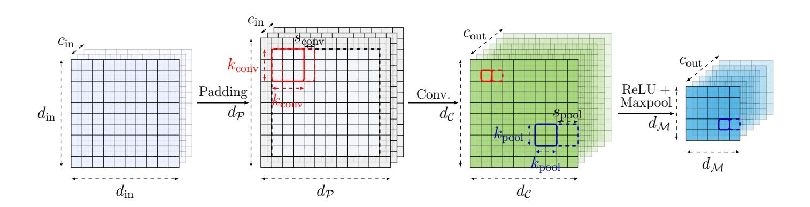
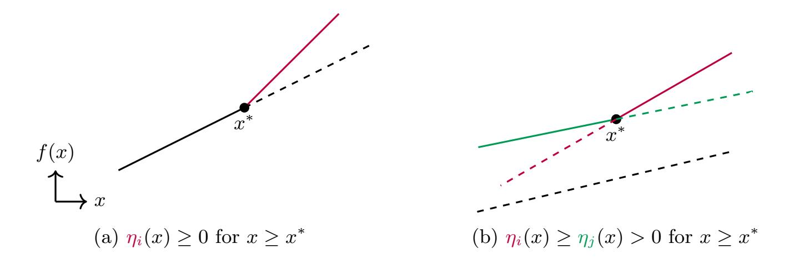
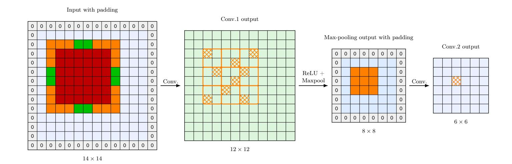
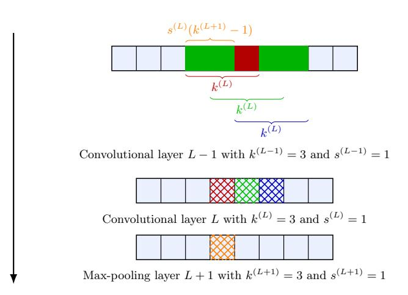
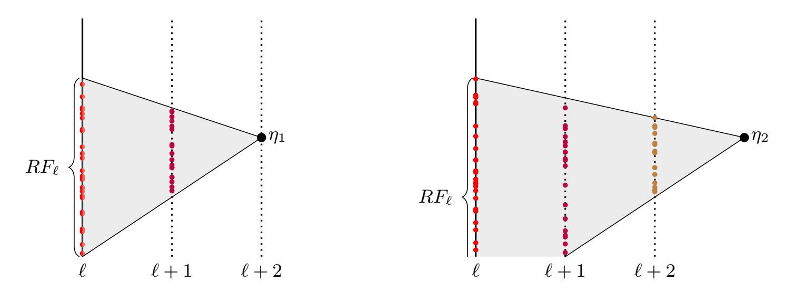
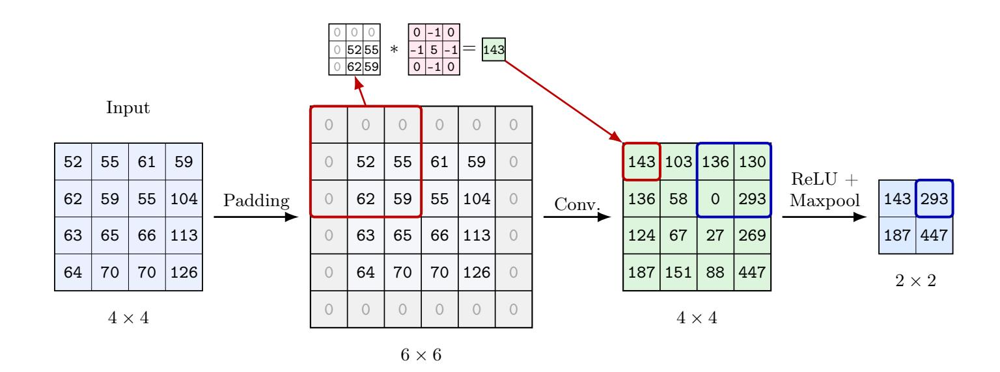
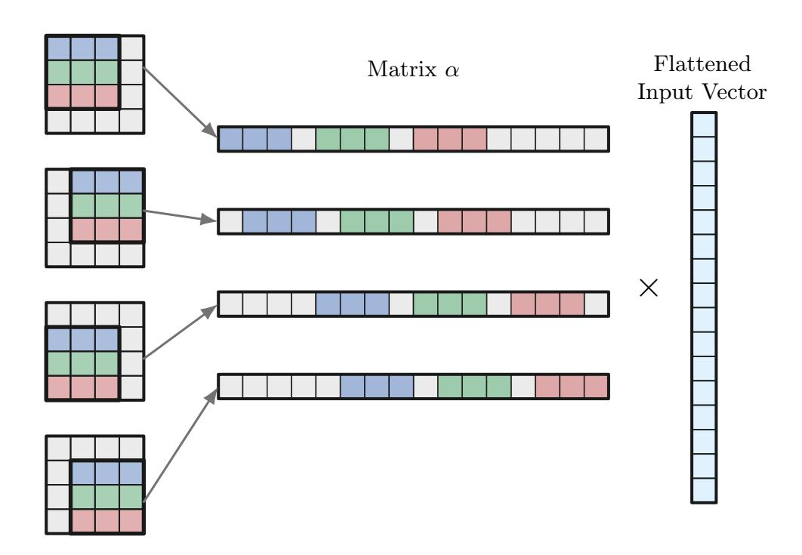
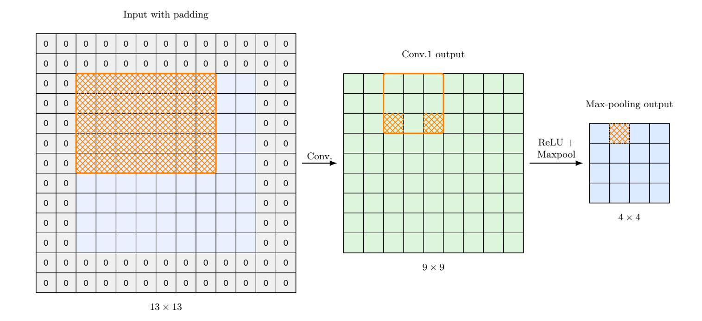
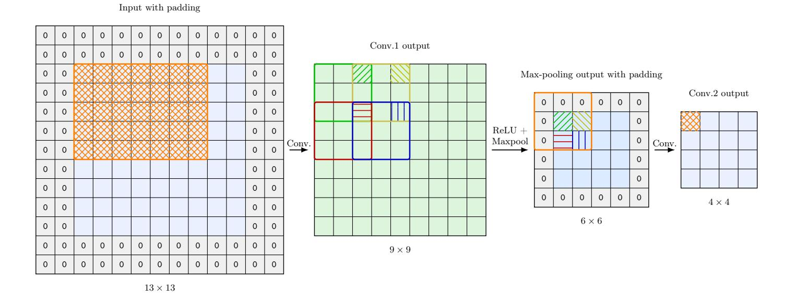

{0}------------------------------------------------

# Model Extraction of Convolutional Neural Networks with Max-Pooling

Haolin Liu<sup>1</sup>,<sup>2</sup> , Adrien Siproudhis<sup>1</sup> Christina Boura<sup>3</sup>,<sup>4</sup> , and Thomas Peyrin<sup>1</sup>

Nanyang Technological University, Singapore<sup>1</sup> <hliu033@e.ntu.edu.sg>, <sipr0001@e.ntu.edu.sg>, <thomas.peyrin@ntu.edu.sg> Shanghai Jiao Tong University, China<sup>1</sup> IRIF, Université Paris Cité, France<sup>3</sup> Institut universitaire de France (IUF), Paris, France<sup>4</sup> <christina.boura@irif.fr>

Keywords: model extraction · ReLU-based neural networks · CNNs · maxpooling

Abstract. Model extraction attacks aim to recover the internal parameters of neural networks through black-box queries. While significant progress has been achieved for fully connected ReLU networks, far less is known about structured architectures such as Convolutional Neural Networks (CNNs), which are widely used in practice. In particular, convolutional layers introduce locality and weight sharing, while max-pooling operations leak only relative activation information, both of which require rethinking and extending existing extraction techniques. In this work, we study the extraction of CNNs combining ReLU activations and max-pooling layers in the soft-label setting. We first demonstrate that max-pooling can be understood as a natural extension of the ReLU non-linear operation and classify the different types of critical points observed in this setting. We show that max-pooling critical points capture the difference between two convolutional neurons and that the local structure of convolution allows us to determine the shift between them and reconstruct the underlying convolutional kernel. We also introduce optimizations that take advantage of the specific structure of CNNs: by using receptive-field analysis, we design efficient methods to filter noise and localize critical points. These improvements significantly reduce the computational cost compared to a naive reduction to a large sparse fully connected network. Finally, we validate our approach experimentally on a compact VGG-style convolutional neural network trained on CIFAR-10. The results show that our methods permit accurate weight extraction in CNNs in practice, while correctly localizing critical points in convolutional layers.

# <span id="page-0-0"></span>1 Introduction

Model-extraction attacks against neural networks aim to recover the internal parameters of these models by interacting with them as a black box. Although 

{1}------------------------------------------------

neural networks were not designed with security in mind, such attacks can have significant consequences. Training neural networks for specific tasks is often timeconsuming and expensive, and these models are frequently deployed as paid services. As a result, the ability to reproduce near-identical copies of them represents a serious threat. Furthermore, if an attacker is able to extract the model of a neural network, additional attack scenarios become possible. Model extraction is rarely the end goal: once an attacker obtains an accurate copy of a target model, it can be used to carry out attacks that are much harder to perform using black-box access alone. These include generating adversarial examples, determining whether a specific data point was used during training, or running the model offline without query limits or input sanitization, thereby bypassing usage policies imposed by the API.

Over the last few years, significant progress has been made on model extraction attacks. The work of Carlini et al. [\[CJM20\]](#page-31-0) marked an important turning point, as it was the first to recover the internal parameters of ReLU-based fully connected neural networks with up to three hidden layers. By showing that model extraction can be viewed as a cryptanalytic problem in disguise, they argued that it should be approached using tools and techniques from cryptanalysis. Moreover, this work introduced several important techniques, most notably for signature extraction (i.e., recovering the absolute values of the weights), which form the basis of most follow-up attacks. On the other hand, for the sign extraction (i.e., recovering the signs of the weights), the method proposed in [\[CJM20\]](#page-31-0) relied, except for particular layer architectures, on a brute-force approach, which limits its applicability.

In 2024, Canales Martínez et al. [\[CMCSH](#page-31-1)+24] proposed several techniques for the sign-recovery problem, the most applicable of which is the so-called neuronwiggle technique. Subsequently, Foerster et al. [\[FMSH24\]](#page-31-2) combined the signature extraction approach of [\[CJM20\]](#page-31-0) with the sign-recovery methods of [\[CMCSH](#page-31-1)+24]. By introducing further improvements to the sign-recovery process, they reported end-to-end extraction attacks on neural networks with up to three hidden layers. Interestingly, this work was also the first to identify signature extraction as the main bottleneck of the attack procedure.

More recently, Liu et al. [\[LSE](#page-31-3)+25] identified several limitations of the signaturerecovery techniques introduced in [\[CJM20\]](#page-31-0), which prevented their application to neural networks with more than three layers. To address these issues, they proposed several new techniques that enable signature extraction to scale to deeper architectures. In addition, they improved the sign-extraction phase by successfully combining the neuron-wiggle technique with the so-called SOE method from the literature, resulting in end-to-end extraction attacks on fully connected neural networks with up to eight layers.

All the works cited above, notably [\[CJM20,](#page-31-0)[CMCSH](#page-31-1)<sup>+</sup>24[,FMSH24\]](#page-31-2) and [\[LSE](#page-31-3)<sup>+</sup>25], assume that the attacker has access to the network's pre-normalization outputs. This setting is commonly referred to as the soft-label or S5 setting, and it greatly facilitates the attacker's task, as it allows the computation of accurate derivatives needed to extract the internal parameters. A significantly harder, but also

{2}------------------------------------------------

more realistic, setting is the so-called hard-label or S1 setting, in which only the most likely class label (for classification tasks) is exposed. Several recent works have successfully addressed model extraction in this setting for small networks [\[CDG](#page-31-4)<sup>+</sup>24[,CCSH](#page-31-5)<sup>+</sup>25[,CMS23\]](#page-31-6).

However, all these works, whether in the soft-label or hard-label setting, have almost exclusively targeted fully connected network (FCN) architectures, i.e., architectures in which each neuron is connected to all neurons from the previous layer. These architectures are a natural starting point for analysis, as their simple and uniform connectivity makes both the behaviour of the network and the extraction problem easier to study. However, fully connected networks are rarely used in practice for real-world tasks, as they do not exploit the structure of the input data and scale poorly in terms of the number of parameters. Instead, modern neural networks typically rely on more structured architectures that are adapted to the nature of the data. These include models such as transformers, and convolutional neural networks, which are widely used in image, video, and signal-processing tasks. Among these, Convolutional Neural Networks (CNNs) play a central role, as they are specifically designed to capture local patterns and correlations in high-dimensional inputs. By combining locality, weight sharing, and pooling operations, CNNs achieve excellent performance while keeping the number of parameters manageable, which explains their success and widespread adoption in a broad range of practical applications.

From a methodological point of view, extracting CNNs raises obstacles that differ from those encountered in fully connected architectures. Although both models are piecewise-linear and can be analyzed through activation patterns and hyperplane arrangements, the structured nature of CNNs introduces additional challenges. In fully connected networks, each neuron depends on all outputs of the previous layer, so the weight matrix is dense. Convolutional layers, in contrast, rely on locality and weight sharing: each neuron depends only on a small part of the input, and the same kernel is reused across spatial positions. As a result, each parameter affects small local regions and is repeated across the grided input rather than acting on the entire input at once. This structure requires adapting existing extraction techniques.

Pooling operations add further difficulty. Max-pooling, the most utilized pooling technique in practice, does not reveal exact activation values, but only which one is largest within a pooling window. Breaks in linear behaviour may therefore occur either when a neuron crosses zero (as in the ReLU-only case) or when two neurons compete inside the same pooling window. Consequently, less information is directly visible at the output, and the geometry of the critical hyperplanes becomes more complex.

At the same time, the structure of CNNs creates useful regularities. Convolution produces sparse and repeated patterns in the weight matrices, pooling operates independently across channels and windows, and receptive fields grow predictably across layers depending only on kernel sizes, strides, and paddings. These properties provide additional information not available in fully connected networks and, if properly exploited, can help the attacker during extraction.

{3}------------------------------------------------

Our contributions. We investigate black-box model extraction of CNNs that incorporate max-pooling, the most common pooling method for CNNs in practice. Max-pooling introduces non-smoothness that is qualitatively different from pointwise activations: the network becomes piecewise-linear with boundaries defined by comparisons between multiple pre-activations. We show that these boundaries can be exploited to recover internal parameters, and we introduce new techniques specifically designed to exploit CNN locality. We validate our techniques through experiments on a VGG-style compact CNN.

- 1. Max-pooling non-linearities. We generalise core definitions of the literature, such as ReLU critical points, to the setting of max-pooling neural networks. We show that max-pooling critical points reveal relative information of the form |η<sup>a</sup> − ηb|, for two neurons η<sup>a</sup> and ηb, rather than absolute comparisons with zero.
- 2. Recovering convolutional rows. We give a simple reconstruction procedure that turns a recovered difference into an actual convolutional row with no sign ambiguity. The method exploits the staircase sparsity pattern of convolution and the spatial shift between neurons in the same pooling window.
- 3. Improved extraction pipeline for CNNs. We introduce a receptive-field analysis to identify the layer and associated neurons of critical points. This allows us to filter out points that belong to deeper layers while reducing extraction computations.

Related and concurrent work. A recent work [\[SLW](#page-32-0)+26] studies model extraction attacks against CNNs using average pooling. Their analysis is restricted to average-pooling architectures, and therefore does not address the additional complexity introduced by max-pooling operations (the most used pooling technique in practice), in particular the non-linearity and partial information loss they cause. More closely related to our contribution, an independent and concurrent work was very recently posted as a preprint [\[CTG](#page-31-7)+26]. That work also considers networks integrating max-pooling layers, and several of the underlying ideas are related. However, the extraction strategies differ in several aspects. We introduce a distinct localization strategy for critical points based on receptive-field analysis, which permits systematic noise detection and operates simultaneously across several layers. This aspect is not addressed in a comparable manner in [\[CTG](#page-31-7)<sup>+</sup>26]. Conceptually, the two approaches are also framed differently: while [\[CTG](#page-31-7)<sup>+</sup>26] analyzes max-pooling through the lens of internal differentials [\[Pey10\]](#page-32-1), we interpret it as a structural generalization of the ReLU setting and extend the geometric extraction framework accordingly.

Outline. The rest of this article is organized as follows. Section [2](#page-4-0) introduces CNN architectures and the different representations we use for our attacks. Section [3](#page-10-0) recalls the geometric framework for model extraction in piecewise-linear networks and reviews state-of-the-art techniques developed for fully connected architectures. Section [4](#page-13-0) then addresses the max-pooling setting: we reinterpret max-pooling as a generalization of ReLU, classify the different types of critical points that occur, and show how to recover convolutional parameters from 

{4}------------------------------------------------

them. Section [5](#page-18-0) presents improvements that significantly improve the extraction pipeline, due to localization techniques based on receptive-field analysis. Finally, Section [6](#page-27-0) describes our experimental setup and reports the results validating our approach.

# <span id="page-4-0"></span>2 Convolutional neural networks

Convolutional Neural Networks (CNNs) are a class of deep learning architectures specifically designed to process data that can be naturally represented on a grid, such as images, videos, or multidimensional signals. Their defining characteristic is the use of convolutional layers, which apply learnable filters locally across the input, permitting the network to capture structured patterns while keeping the number of parameters manageable.

The term CNN covers a wide range of architectural variants. Nevertheless, most modern CNNs follow a common high-level structure. A typical convolutional layer first applies a padding operation to the input. This is followed by a set of filters that extract local patterns by sliding convolutional kernels across the input, sharing parameters across different locations. The outputs of the convolutions are then passed through a pointwise nonlinear function, most commonly the Rectified Linear Unit (ReLU), which sets negative values to zero and introduces nonlinearity. Finally, a pooling operation is typically applied to reduce the spatial dimension of the grid by combining local information.

Over the years, several CNN architectures have had a strong influence on modern deep learning. Early models such as LeNet [\[LBBH98\]](#page-31-8) showed that convolutions and weight sharing are effective for tasks like digit recognition. Later, AlexNet [\[KSH12\]](#page-31-9) demonstrated that deep CNNs can achieve very strong performance on large-scale image classification problems, which led to their widespread use. Architectures such as VGG [\[SZ15\]](#page-32-2) focused on simple and deep designs, while ResNet [\[HZRS16\]](#page-31-10) introduced residual connections that made it possible to train much deeper networks. Despite these differences, most CNN architectures rely on the same core operations, convolution, nonlinearity, and pooling, which are the focus of this work.

In this work, we therefore consider a generic model of CNNs that captures the above common design principles. The attack we present does not rely on specific features of a particular architecture, but rather on structural properties shared by a wide class of CNNs. As a result, our approach applies to any CNN whose architecture can be described using the standard machine-learning notation introduced below.

To simplify the presentation, we restrict our focus to square inputs and square convolutional kernels. This choice reflects common practice and simplifies notation, but it is not fundamental to our approach. The techniques we develop naturally extend to rectangular inputs and kernels. We further focus on CNNs that combine ReLU activations with max-pooling operations, a widely used design choice in practice and one adopted, for example, by the popular VGG family 

{5}------------------------------------------------

of computer vision models as well as by architectures such as ResNet, which incorporate max-pooling in their early layers.

#### 2.1 CNN architecture

In this section, we describe the generic CNN architecture considered in our work. We begin with the standard grid-based description commonly used in the deep learning literature, and then introduce a matrix–vector representation that is more convenient for our analysis.

Standard (grid-based) description Unlike fully connected networks, which treat the input as a single flattened vector, CNNs process data as multidimensional arrays or grids. In the standard setting, the input is represented as a three-dimensional array with two spatial dimensions corresponding to the height and width of the input, each of size  $d_{\rm in}$ , and a third dimension corresponding to the number of channels, denoted by  $c_{\rm in}$ . For example, a color image of size  $32 \times 32$  pixels with three color components (red, green, and blue) can be represented as an array (or grid) of dimension  $d = c_{\rm in} \times d_{\rm in} \times d_{\rm in} = 3 \times 32 \times 32$ .

Padding. Each input channel is first optionally padded with values along its borders so that the convolution does not reduce the spatial dimensions of the output and so that the filters can properly cover edge regions. After padding, each of the  $c_{\rm in}$  channels is represented as a  $d_{\mathcal{P}} \times d_{\mathcal{P}}$  array, where  $d_{\mathcal{P}}$  denotes the spatial dimension (height and width) of the padded channel.

Convolution. The convolutional layer applies  $c_{\rm out}$  filters to the input. Each filter produces one output channel, also referred to as a feature map. A single filter consists of  $c_{\rm in}$  distinct kernels, one for each input channel. Each of these kernels is a square matrix of size  $k_{\rm conv} \times k_{\rm conv}$ , with its own independent learnable weights. At each spatial location, the filter extracts a  $k_{\rm conv} \times k_{\rm conv}$  patch from every input channel. Each patch is multiplied by its corresponding channel-specific kernel, and the resulting values are summed across all input channels to produce a single output value. The kernels of the filter are then shifted across the spatial grid with stride  $s_{\rm conv}$ , which determines the distance between two consecutive applications.

Formally, let  $X \in \mathbb{R}^{c_{\text{in}} \times d_{\mathcal{P}} \times d_{\mathcal{P}}}$  denote the padded input tensor, where  $X_{c,i,j}$  is the value at spatial location (i,j) in channel c. Let  $W \in \mathbb{R}^{c_{\text{out}} \times c_{\text{in}} \times k_{\text{conv}} \times k_{\text{conv}}}$  denote the collection of convolutional kernels. The output tensor  $Y \in \mathbb{R}^{c_{\text{out}} \times d_{\mathcal{C}} \times d_{\mathcal{C}}}$  is defined by

$$Y_{o,i,j} = \sum_{c=1}^{c_{\text{in}}} \sum_{p=0}^{k_{\text{conv}}-1} \sum_{q=0}^{k_{\text{conv}}-1} W_{o,c,p,q} X_{c, is_{\text{conv}}+p, js_{\text{conv}}+q},$$

for all output channels  $o \in \{1, \dots, c_{\text{out}}\}$  and spatial indices (i, j) such that the accessed entries of X are well-defined.

Consequently, the convolutional layer produces  $c_{\text{out}}$  output channels of spatial dimension  $d_{\mathcal{C}} \times d_{\mathcal{C}}$ , where  $d_{\mathcal{C}} = \lfloor \frac{d_{\mathcal{P}} - k_{\text{conv}}}{s_{\text{conv}}} \rfloor + 1$ .

{6}------------------------------------------------

Activation and pooling. After convolutional, a nonlinear activation (typically ReLU) is applied element-wise:

$$ReLU(x) = max(0, x).$$

A max-pooling operation is finally applied independently to each output channel. Each pooling operator takes the maximum value over a  $k_{\text{pool}} \times k_{\text{pool}}$  square region and moves by a stride  $s_{\text{pool}}$ . Therefore after the pooling layer we have  $c_{\text{out}}$  channels each of dimension  $d_{\mathcal{M}} \times d_{\mathcal{M}}$  where  $d_{\mathcal{M}} = \lfloor \frac{d_{\mathcal{C}} - k_{\text{pool}}}{s_{\text{pool}}} \rfloor + 1$ .

This describes a single layer of the CNN where the convolutions are followed by max-pooling. Figure 1 illustrates the sequence of operations performed in this layer, together with the notation introduced above for the dimensions and other parameters. We denote the parameters of the  $\ell$ -th layer using the superscript  $(\ell)$ . For instance,  $d_{\mathcal{M}}^{(\ell)} = d_{\text{in}}^{(\ell+1)}$ , and in order to make these operations concrete, Figure 6 from Appendix A shows a toy single-channel example.

<span id="page-6-0"></span>

Fig. 1: Example of a CNN layer and associated notation. An input of size  $c_{\rm in} \times d_{\rm in} \times d_{\rm in}$  is first padded to a grid of dimension  $c_{\rm in} \times d_{\mathcal{P}} \times d_{\mathcal{P}}$ . A convolution with kernel size  $k_{\rm conv} \times k_{\rm conv}$  and  $c_{\rm out}$  output channels produces feature maps of dimension  $d_{\mathcal{C}} \times d_{\mathcal{C}}$ . In the depicted example, the convolutional uses stride  $s_{\rm conv} = 1$ . A ReLU activation is then applied, followed by a max-pooling operation with kernel size  $k_{\rm pool} \times k_{\rm pool}$ . In this example, the pooling stride is  $s_{\rm pool} = 2$ , resulting in  $c_{\rm out}$  output feature maps of dimension  $d_{\mathcal{M}} \times d_{\mathcal{M}}$ .

<span id="page-6-1"></span>**Matrix description** For the purpose of the attack, we adopt throughout the rest of the paper a mathematical viewpoint and interpret all the operations described above as vector-matrix computations. In this abstraction, padding and pooling operations are represented by binary matrices, channel dimensions are flattened, and convolutional kernels are modeled as block-circulant matrices. Under this representation, the input to the *i*-th layer is a vector  $v \in \mathbb{R}^{d^{(i)}}$ , where  $d^{(i)} = c_{\text{in}}^{(i)} \times d_{\text{in}}^{(i)} \times d_{\text{in}}^{(i)}$ . To simplify notation, we omit the layer superscript (i) whenever the context is clear.

**Definition 1 (Padding).** Let  $v \in \mathbb{R}^d$  be the flattened input corresponding to  $c_{in}$  channels of size  $d_{in} \times d_{in}$ . The padding operation is the fixed linear map

{7}------------------------------------------------

 $\mathcal{P}: \mathbb{R}^d \to \mathbb{R}^{c_{in} \times d_{\mathcal{P}} \times d_{\mathcal{P}}}$  defined by  $\mathcal{P}(v) = Pv$ , where P is a sparse binary matrix encoding standard padding schemes (valid, zero, reflection, or replication).

Two common padding strategies are used in practice. In *valid* padding, the convolution is applied only where the kernel fully overlaps the input, reducing the spatial dimensions. In *same* padding, the input is extended so that the output has the same spatial dimensions as the input. Our attack does not depend on the specific padding scheme.

Convolutional matrix. The convolutional operation is the most central operation in CNNs. Its goal is to extract local features by applying learnable filters (each composed of channel-wise convolutional kernels) that respond to specific input patterns. For each pair (i, j) of output and input channels, let

$$k_{ij} = \begin{pmatrix} a_{1,1} & \cdots & a_{1,k} \\ \vdots & \ddots & \vdots \\ a_{k,1} & \cdots & a_{k,k} \end{pmatrix} \in \mathbb{R}^{k \times k}$$

denote the convolutional kernel associated to output channel i and input channel j, where for simplicity we write  $k = k_{\text{conv}}$ . The coefficients  $a_{u,v}$  depend on the pair (i,j), although we omit this dependence for readability. Flattening  $k_{ij}$  in row-major order results in the weight vector  $(a_1, \ldots, a_{k^2})$ , where  $a_{(u-1)k+v} = a_{u,v}$  for  $1 \le u, v \le k$ .

When applied to the j-th input channel of spatial dimension  $d_{\mathcal{P}} \times d_{\mathcal{P}}$  with stride  $s = s_{\text{conv}}$ , the convolutional by  $k_{ij}$  defines a linear operator that can be represented as multiplication by a matrix  $\alpha_{ij} \in \mathbb{R}^{d_c^2 \times d_{\mathcal{P}}^2}$ , acting on the flattened vector of that channel:

$$\alpha_{ij} = \begin{pmatrix} a_1 & \dots & a_s & a_{s+1} & \dots & a_k & 0_1 & \dots & 0_{d_C-k} & a_{k+1} & \dots \\ 0_1 & \dots & 0_s & a_1 & \dots & a_{k-s} & a_{k-s+1} & \dots \\ & & & \vdots & & & & \\ 0_1 & \dots & 0_s & 0_{s+1} & \dots & 0_k & 0_{k+1} & \dots & 0_{d_C-k} & a_1 & \dots \\ \hline & & & & & & & \\ 0_1 & \dots & 0_{s \cdot d_C} & a_1 & \dots & a_s & a_{s+1} & \dots \\ & & & & & \vdots & & & \\ \hline & & & & & & \\ 0_1 & \dots & 0_{2 \cdot s \cdot d_C} & a_1 & \dots & a_s & a_{s+1} & \dots \\ & & & & & \vdots & & & \\ \hline & & & & & & \\ 0_1 & \dots & 0_{2 \cdot s \cdot d_C} & a_1 & \dots & a_s & a_{s+1} & \dots \\ & & & & & & \vdots & & & \\ & & & & & & \vdots & & \\ \hline & & & & & & & \\ & & & & & & & \\ & & & & & & & \\ & & & & & & \\ & & & & & & \\ & & & & & & \\ & & & & & & \\ & & & & & & \\ & & & & & & \\ & & & & & & \\ & & & & & & \\ & & & & & \\ & & & & & \\ & & & & & \\ & & & & & \\ & & & & & \\ & & & & & \\ & & & & & \\ & & & & & \\ & & & & & \\ & & & & & \\ & & & & & \\ & & & & & \\ & & & & & \\ & & & & \\ & & & & \\ & & & & \\ & & & & \\ & & & & & \\ & & & & \\ & & & & \\ & & & & \\ & & & & \\ & & & & \\ & & & & \\ & & & & \\ & & & & \\ & & & & \\ & & & \\ & & & \\ & & & \\ & & & \\ & & & \\ & & & \\ & & & \\ & & & \\ & & & \\ & & & \\ & & & \\ & & & \\ & & & \\ & & & \\ & & & \\ & & & \\ & & & \\ & & & \\ & & & \\ & & & \\ & & \\ & & & \\ & & & \\ & & & \\ & & & \\ & & & \\ & & & \\ & & & \\ & & & \\ & & & \\ & & & \\ & & & \\ & & & \\ & & & \\ & & & \\ & & & \\ & & & \\ & & & \\ & & & \\ & & & \\ & & & \\ & & & \\ & & & \\ & & & \\ & & & \\ & & & \\ & & & \\ & & & \\ & & & \\ & & & \\ & & & \\ & & & \\ & & & \\ & & & \\ & & & \\ & & & \\ & & & \\ & & & \\ & & & \\ & & & \\ & & & \\ & & & \\ & & & \\ & & & \\ & & & \\ & & & \\ & & & \\ & & & \\ & & & \\ & & & \\ & & & \\ & & & \\ & & & \\ & & & \\ & & & \\ & & & \\ & & & \\ & & & \\ & & & \\ & & & \\ & & & \\ & & & \\ & & & \\ & & & \\ & & & \\ & & & \\ & & & \\ & & & \\ & & & \\ & & & \\ & & & \\ & & & \\ & & & \\ & & & \\ & & & \\ & & & \\ & & & \\ & & & \\ & & & \\ & & & \\ & & & \\ & & & \\ & & & \\ & & & \\ & & & \\ & & & \\ & & & \\ & & & \\ & & & \\ & & & \\ & & & \\ & & & \\ & & & \\ & & & \\ & & & \\ & & & \\ & & & \\ & & & \\ & & & \\ & & & \\ & & & \\ & & & \\ & & & \\ & & & \\ & & \\ & & & \\ & & & \\ & & & \\ & & & \\ & & & \\ & & & \\ & & & \\ & & &$$

Because we adopt a matrix-vector representation of the convolutional, blocks of zeros are inserted between the kernel coefficients to encode the shifts of the

{8}------------------------------------------------

convolutional window. For example,  $0_1 \dots 0_s$   $a_1$  at the start of the second row, indicates that the second row starts with  $s = s_{\text{conv}}$  0's before the first kernel coefficient  $a_1$ . This reflects the fact that the convolutional does not act on all input pixels simultaneously: as the kernel slides horizontally across a row of the input grid, its flattened representation is shifted to the right by s positions at each step. Once the convolutional has been applied across an entire row and reaches the right boundary of the input, the kernel is moved back to the left boundary and shifted down by s rows. In the matrix representation, this vertical displacement corresponds to an initial shift of  $s \cdot d_{\mathcal{C}}$  zeros.

Each horizontal separator in the matrix marks such a transition between successive rows of the input grid. After the second complete horizontal pass, the initial shift becomes  $2 \cdot s_{\text{conv}} \cdot d_{\mathcal{C}}$  and so on. A visual example of the matrix  $a_{ij}$  matrix can be found in Appendix B.

We recall that  $c_{\rm in}$  and  $c_{\rm out}$  denote the number of input and output channels, respectively. A convolutional operator  $\mathcal{C}^{(\ell)}$  defines a linear map from  $\mathbb{R}^{d_{\mathcal{P}}^2 \times c_{\rm in}}$  to  $\mathbb{R}^{d_{\mathcal{C}}^2 \times c_{\rm out}}$ , specified by its collection of kernels  $\{k_{ij}\}_{1 \leq i \leq c_{\rm out}, \, 1 \leq j \leq c_{\rm in}}$  and a bias vector  $b \in \mathbb{R}^{d_{\mathcal{C}}^2 \times c_{\rm out}}$ . For each pair (i,j), the kernel  $k_{ij}$  induces a matrix  $\alpha_{ij} \in \mathbb{R}^{d_{\mathcal{C}}^2 \times d_{\mathcal{P}}^2}$ , as defined above. Arranging these matrices into a block matrix  $A \in \mathbb{R}^{(d_{\mathcal{C}}^2 \times c_{\rm out}) \times (d_{\mathcal{P}}^2 \times c_{\rm in})}$  gives the linear map of the convolutional layer as follows:

$$C(x) := Ax + b := \begin{pmatrix} \alpha_{11} & \alpha_{12} & \cdots & \alpha_{1c_{\text{in}}} \\ \alpha_{21} & \alpha_{22} & \cdots & \alpha_{2c_{\text{in}}} \\ \vdots & \vdots & & \vdots \\ \alpha_{c_{\text{out}}1} & \alpha_{c_{\text{out}}2} & \cdots & \alpha_{c_{\text{out}}c_{\text{in}}} \end{pmatrix} x + b.$$

**Definition 2 (Filters and neurons).** Let  $A \in \mathbb{R}^{(d_{\mathcal{C}}^2 \times c_{out}) \times (d_{\mathcal{P}}^2 \times c_{in})}$  be the matrix representation of a convolutional layer, as defined above. We introduce the following terminology to refer to different components of the weight matrix A:

- For each output channel  $i \in \{1, \ldots, c_{out}\}$ , we define the i-th filter

$$\alpha_i := \alpha_{i1} \| \alpha_{i2} \| \cdots \| \alpha_{ic_{in}} \in \mathbb{R}^{d_{\mathcal{C}}^2 \times (d_{\mathcal{P}}^2 \times c_{in})},$$

obtained by concatenating the convolutional matrices associated with all input channels.

- For each output channel i and spatial position  $k \in \{1, \ldots, d_{\mathcal{C}}^2\}$ , we denote by  $\eta_{i,k} \in \mathbb{R}^{d_{\mathcal{P}}^2 c_{in}}$  the function  $\mathbb{R}^{d_{\mathcal{P}}^2 \times c_{in}} \to \mathbb{R}$  such that  $x \mapsto (\alpha_i)_k \cdot x + b_{i \cdot d_{\mathcal{C}}^2 + k}$  where  $(\alpha_i)_k$  is the k-th row of  $\alpha_i$ . We refer to  $\eta_{i,k}$  as a convolutional neuron. We also write it with a single index  $\eta_{i \cdot d_{\mathcal{C}}^2 + k}$  to mean the function  $x \mapsto A_{i \cdot d_{\mathcal{C}}^2 + k} \cdot x + b_{i \cdot d_{\mathcal{C}}^2 + k}$ .

**Definition 3 (Convolutional layer).** Using the notation introduced above, we define a convolutional layer  $\ell_{\mathcal{C}}$  from  $\mathbb{R}^d$  to  $\mathbb{R}^{d_{\mathcal{C}}^2 \times c_{out}}$  as the composition

$$\ell_{\mathcal{C}}(x) = \mathcal{C} \circ \mathcal{P}(x).$$

{9}------------------------------------------------

ReLU, max-pooling and pooling windows. We recall that  $k_{pool}$  and  $s_{pool}$  denote the pooling window size and pooling stride, respectively. Let  $x \in \mathbb{R}^{d_c^2 c_{out}}$  be the flattened output of a convolutional layer (after ReLU).

**Definition 4 (Pooling windows).** For each output channel, we partition the indices  $\{0, \ldots, d_{\mathcal{C}}^2 - 1\}$  into pooling windows of size  $k_{pool}^2$ . For  $m \in \mathbb{N}$ , we define

$$S_{m} = \{ s_{pool}m, \dots, s_{pool}m + (k_{pool-1}), \\ s_{pool}m + d_{\mathcal{C}}, \dots, s_{pool}m + d_{\mathcal{C}}(k_{pool} - 1), \\ \dots, s_{pool}m + d_{\mathcal{C}}(k_{pool} - 1) + (k_{pool} - 1) \}.$$

We refer to  $\{x_i : i \in S_m\}$  as the m-th pooling window (with indexing starting at m = 0). The spatial output dimension after pooling is  $d_{\mathcal{M}} = \lfloor \frac{d_{\mathcal{C}} - k_{pool}}{s_{real}} \rfloor + 1$ .

**Definition 5 (ReLU max-pooling operator).** For a given input x, we define a binary selection matrix  $I_x \in \mathbb{R}^{(d_{\mathcal{M}}^2 c_{out}) \times (d_{\mathcal{C}}^2 c_{out})}$ , whose entries satisfy

$$(I_x)_{mi} = 1 \iff i \in S_m, \ x_i > 0, \ and \ x_i = \max_{j \in S_m} x_j,$$

with ties broken by selecting the largest index. Each row of  $I_x$  contains exactly one non-zero entry.

The ReLU max-pooling operator is then defined as

$$\mathcal{M}: \mathbb{R}^{d_{\mathcal{C}}^2 \times c_{out}} \longrightarrow \mathbb{R}^{d_{\mathcal{M}}^2 \times c_{out}}, \qquad \mathcal{M}(x) = I_x x.$$

In summary, the pooling operates on groups of  $k_{\text{pool}}^2$  elements, referred to as pooling windows and denoted by  $S_m$ . An element  $x_i$  is selected by the pooling operation (i.e.,  $(I_x)_{ii} = 1$ ) if and only if it is the maximal element (with ties broken by selecting the largest index) within its pooling window, that is,  $x_i = \max_{j \in S_m} x_j$  for all  $j \in S_m$ , and if  $x_i > 0$  meaning that it passes the ReLU activation.

#### Definition 6 (Max-pooling convolutional network).

Let  $r \geq 1$  and let  $[d_0, \ldots, d_{r+1}]$  be positive integers. An r-deep max-pooling convolutional neural network of architecture  $[d_0, \ldots, d_{r+1}]$  is a function  $f: \mathbb{R}^{d_0} \to \mathbb{R}^{d_{r+1}}$  of the form  $f = \ell^{(r+1)} \circ \sigma^{(r)} \circ \ell^{(r)} \circ \cdots \circ \sigma^{(1)} \circ \ell^{(1)}$ , where for each  $i \in \{1, \ldots, r+1\}$ :

- $-\ell^{(i)}: \mathbb{R}^{d_{i-1}} \to \mathbb{R}^{d_i}$  is a linear layer, either
  - a convolutional layer  $\ell_{\mathcal{C}}^{(i)}$ , or
  - a fully connected layer  $\ell_{FC}^{(i)}(x) = A^{(i)}x + b^{(i)}$ , with  $A^{(i)} \in \mathbb{R}^{d_i \times d_{i-1}}$  and  $b^{(i)} \in \mathbb{R}^{d_i}$ ;
- $-\sigma^{(i)}$  is a non-linear function, either the ReLU activation function applied component-wise, ReLU(x) =  $\max(0, x)$ , or the max-pooling operator  $\mathcal{M}$ . Max-pooling layers can only follow convolutional layers.

{10}------------------------------------------------

The integer r is called the depth of the network, and d<sup>i</sup> is the width of the i-th layer.

We summarize in Appendix [C](#page-10-0) the notations used throughout the paper for a max-pooling convolutional network ℓC. In addition, when the context is ambiguous, we use a subscript (i) to indicate the layer under consideration. We denote by xˆ the extracted version of a quantity x obtained during the attack.

# <span id="page-10-0"></span>3 Model extraction of neural networks

We consider two parties in this model extraction attack: an oracle O and an adversary. The adversary generates queries x and sends them to the oracle, which then responds with the correct output f(x).

#### 3.1 Adversarial resources and goal

Adversarial resources. We make the following assumptions regarding the target neural network and the attacker's capabilities. Except for the architecture of the target neural network that is now different, these assumptions are identical to those commonly made in prior soft-label extraction works [\[CMCSH](#page-31-1)+24[,CJM20](#page-31-0)[,FMSH24,](#page-31-2)?]:

- Architecture. The target neural network f is a CNN with max-pooling layers.
- Known architecture. The attacker knows in detail the architecture of f. In particular, this includes the parameters introduced in Section [C](#page-10-0) (e.g., kconv, dout, npad, . . .), as well as the type and ordering of layers (convolutional, pooling, fully connected, etc.).
- Unrestricted input access. The attacker can query the network on any input x ∈ R d<sup>0</sup> .
- Raw output access. The oracle returns the complete raw output f(x), with no post-processing.
- Precise computations. The oracle computes f(x) using 64-bit arithmetic.

Adversarial goal. The objective of the extraction is not to recover the exact internal parameters of the target network, but rather to construct a model ˆf that is functionally equivalent to f on the considered input space [\[CJM20\]](#page-31-0). Informally, this means that ˆf reproduces the input–output behaviour of f up to a negligible error. We do not require the recovered weights to coincide with the original ones. Indeed, neural networks are not uniquely parameterized: different assignments of weights may implement exactly the same function. In particular, permutations of neurons within a layer or rescalings that are absorbed by subsequent layers lead to different parameter sets representing the same model. Therefore, recovering the parameters up to these inherent symmetries is sufficient to achieve a successful extraction. This notion differs from model distillation or high-fidelity approximation attacks, where the goal is to learn a function that approximates f empirically. Here, we aim to recover the internal structure of the network up to functional equivalence.

{11}------------------------------------------------

#### 3.2 Definitions for the extraction of piecewise-linear networks

We recall here the geometric framework underlying model extraction for piecewiselinear networks. The following notions are now standard in the literature [\[CJM20,](#page-31-0)[CMCSH](#page-31-1)<sup>+</sup>24[,LSE](#page-31-3)<sup>+</sup>25] and are required for our analysis.

A central notion in the analysis of [\[CJM20\]](#page-31-0) and all follow-up works is that of critical points of neurons. They permit the extraction of their corresponding neuron's weights through carefully chosen queries. The definition cannot be applied directly when max-pooling intervenes. We need to generalise the definition and this requires the introduction of activation patterns first. The activation pattern for a given input x is the set of all (active) neurons that contribute to the output f(x).

Definition 7 (activation pattern). For an input x and layer i, the activation pattern up to layer i is the set

$$P_f^{(i)}(x) = \{ \eta_k^{(j)} \mid \exists m \text{ such that } (I_x^{(j)})_{mk} = 1, \ 1 \le j \le i \}.$$

Neurons in P (i) f (x) are said to be active at x. For the last non-linear layer, r, we write P (r) f (x) as P<sup>f</sup> (x).

Definition 8 (critical point). An input x ∈ R d<sup>0</sup> is called a critical point of neuron η<sup>k</sup> if

$$P_f(x + \epsilon \delta) \Delta P_f(x - \epsilon \delta) = \{\eta_k\}$$

for all directions δ ∈ R <sup>d</sup><sup>0</sup> and all sufficiently small ϵ > 0, where ∆ denotes the symmetric difference: A∆B = (A \ B) ∪ (B \ A).

Such points lie on a hyperplane separating two linear regions of the network. Crossing this boundary changes the activation pattern and therefore the behaviour of the network locally.

Definition 9 (polytope). The polytope of x at layer i, is the largest connected open subset of

$$\{x' \in \mathbb{R}^{d_0} \mid P_f(x) = P_f(x')\}$$

containing x. On each such region, the activation pattern is constant.

Local affine behaviour. Because ReLU and max-pooling are piecewise-linear, the network behaves affinely inside each polytope. More precisely, for every x and 1 ≤ i ≤ r + 1, there exist matrices Γ<sup>x</sup> and vectors γ<sup>x</sup> such that

$$f(x') = \Gamma_x x' + \gamma_x$$

for all x ′ in the polytope of x at layer i. In particular, if x is not critical, there exists ϵ > 0 such that this affine representation holds in a ϵ-neighbourhood of x.

The extraction strategy relies on detecting changes of the local affine map Γx, which occur precisely when crossing critical hyperplanes. These transitions reveal information about the parameters of the corresponding neurons.

{12}------------------------------------------------

#### <span id="page-12-0"></span>3.3 Extraction without max-pooling

Before addressing explicitly max-pooling in the next section, we briefly recall the extraction procedure for FCNs as developed in [CJM20,CMCSH<sup>+</sup>24,LSE<sup>+</sup>25]. Since a convolutional network without max-pooling can be represented in matrix form as a fully connected network with sparse connections, these techniques form the basis of the extraction of CNNs.

The extraction proceeds layer by layer. Assuming that the first i-1 layers have been recovered, the goal is to extract the parameters of layer i.

Random search for critical points. Inside each polytope the network behaves affinely, hence the gradient of f is locally constant. Therefore, critical points can be identified when a change in the derivative occurs, indicating that a critical hyperplane has been crossed. In practice, such points are found by performing binary search along random directions in the input space.

Partial signature recovery. Let x be a critical point of a single neuron in layer i. Using a second-order finite-difference operator as in [CJM20], and assuming the previous layers are known, we can query the network in a small neighbourhood of x and construct a linear system that isolates the contribution of that neuron. This allows us to recover its weight vector  $A_k^{(i)}$  up to an unknown scaling factor (and up to a sign). Because neurons are not labelled, the extraction recovers the rows of  $A^{(i)}$  up to permutation. The unknown scaling factors are naturally absorbed by the extraction of the following layers, giving a functionally equivalent reconstruction.

Intersections and partial signatures. If too few neurons in the preceding layer are active at a critical point, the resulting linear system is rank-deficient and outputs a space of solutions rather than a unique row of  $A^{(i)}$ . To resolve this, we intersect the solution spaces obtained from multiple critical points. Intersections of dimension one correspond to a neuron recovered up to scaling.

Merging signatures into components. Because inactive neurons in layer i-1 may block some coordinates. Consequently, the recovered row may be only partial, with certain entries missing. Full signatures are reconstructed by merging compatible partial signatures obtained from different critical points of the same neuron. Each partial signature corresponds to a scaled version of  $A_k^{(i)}$  with some missing entries. Two partial signatures are merged whenever their overlapping non-zero coordinates are proportional, which identifies them as originating from the same neuron.

**Discarding deeper components.** Components that are too small or show unusual behaviour (e.g., merging with points from deeper layers) are discarded. After this filtering step, the remaining components correspond to neurons of the target layer.

**Recovering the bias.** Once a scaled signature  $c_k^{(i)}A_k^{(i)}$  has been recovered, the corresponding scaled bias  $c_k^{(i)}b_k^{(i)}$  can be obtained by evaluating the neuron at any associated critical point x.

{13}------------------------------------------------

Sign recovery. After recovering each neuron's signature up to a scaling factor c (i) k , the remaining task is to determine the sign of each constant. Canales-Martínez et al. [\[CMCSH](#page-31-1)<sup>+</sup>24] propose two complementary sign-extraction techniques: the system-of-equations (SOE) approach and the neuron wiggle. Liu et al. [\[LSE](#page-31-3)<sup>+</sup>25] combine both methods to yield a more robust one. We do not further detail these methods here, as sign recovery will be revisited in the max-pooling setting, where it becomes significantly simpler.

Last layer recovery. The oracle returns the complete raw outputs of f and the last output layer is a linear layer. Therefore, its extraction is straightforward. No additional query is needed for extraction, as we can reuse previously queried critical points to build the linear system and recover the last linear layer's weights.

# <span id="page-13-0"></span>4 Max-pooling in CNNs

In this section, we explain how max-pooling changes the geometry of non-linear boundaries and why standard ReLU-based extraction techniques do not directly extend. We then (i) classify the resulting critical points and show how to identify their type, and (ii) describe how to recover convolutional parameters from the relative information leaked at max-pooling boundaries by exploiting convolutional locality. We give experiments in Section [6.1.](#page-27-1)

#### 4.1 Max-pooling as a generalisation of ReLU

Max-pooling can be viewed as a generalization of the ReLU activation function. Indeed, while ReLU acts independently on each coordinate through v 7→ max(0, v), max-pooling acts on an entire pooling window: (v1, . . . , v<sup>k</sup> 2 pool ) 7→ max(0, v1, . . . , v<sup>k</sup> 2 pool ). However, the classical ReLU-based signature extraction strategy developed in [\[CJM20\]](#page-31-0), and recalled in Section [3.3,](#page-12-0) does not directly generalize to the max-pooling setting. Indeed, in networks with ReLU only, the method of [\[CJM20\]](#page-31-0) relies on the ability to isolate individual neurons. By carefully choosing inputs, an attacker can force a configuration in which exactly one neuron changes activation: |P<sup>f</sup> (x+ϵδ)∆P<sup>f</sup> (x−ϵδ)| = 1. At such a critical point, the network reveals information of the form |η<sup>i</sup> −0|, which permits to determine the absolute value of the corresponding weight vector.

In contrast, max-pooling discards absolute activation values and only reveals relative information: the output indicates which pre-activation within a pooling window is the largest and whether it is positive. As a result, the attacker only gains access to comparisons between activations, obtaining information of the form |η<sup>i</sup> − η<sup>j</sup> | where η<sup>j</sup> might or might not be the zero vector. Indeed, |P<sup>f</sup> (x + ϵδ)∆P<sup>f</sup> (x − ϵδ)| can be equal to 2 whereas it is always 1 for ReLU. As a mathematical problem in general, knowing all pairwise differences {ai−aj}i,j for elements a<sup>i</sup> , a<sup>j</sup> in a set S, is insufficient to reconstruct the set S. This is because adding a constant to all the elements of S does not change these differences: 

{14}------------------------------------------------

(a<sup>i</sup> + c) − (a<sup>j</sup> + c) = a<sup>i</sup> − a<sup>j</sup> . If we want to extract the kernel, the set S, we must therefore use some structural property of CNNs.

The central property we use is convolutional locality. Since each neuron depends only on a small input patch, a max-pooling critical point reveals the difference between two nearby neurons with almost identical receptive fields. This implies that the recovered vector is the difference of two shifted patterns, from which we can deduce the shift and reconstruct an actual convolutional row (up to a scalar), which removes the ambiguity due to knowing only differences.

<span id="page-14-0"></span>Property 1 (Locality of convolution). Let η be a neuron. Assume that the leftmost non-zero entry is at position i and the rightmost non-zero entry before entry d 2 <sup>P</sup> is at position j. Then the support size of η satisfies

$$j - i = (k_{\text{conv}} - 1) d_{\mathcal{P}} + (k_{\text{conv}} - 1).$$

Geometrically, this property captures the locality of convolutional: each neuron only depends on a small contiguous kconv × kconv patch of the input grid. When this patch is flattened row by row into a vector, each row of the kernel produces a contiguous block of kconv non-zero entries. Successive rows are shifted by d<sup>P</sup> positions in the flattened representation, resulting in a characteristic staircase-shaped sparse support. The above formula simply measures the distance between the first and last step of this staircase for the first input channel. The proof is straightforward and can be found in Appendix [D.](#page-13-0) See Fig. [7](#page-35-0) for illustration.

#### 4.2 Classification and identification of critical points

In networks with max-pooling, which is, similarly to ReLU, a non-linear operation, changes of linear behaviour can appear from two different phenomena. Recall that after convolutional and ReLU, each pooling window selects the largest positive pre-activation. A break in linearity therefore occurs either when a neuron crosses zero (as in the fully connected case), or when two neurons inside the same pooling window exchange dominance.

We therefore distinguish two types of critical points.

ReLU critical points. A point x <sup>∗</sup> ∈ R d<sup>0</sup> is a ReLU critical point if, for some neuron η<sup>i</sup> on layer n in a pooling window S,

$$\eta_i(F^{(n)}(x^*)) = 0$$
 and  $\eta_j(F^{(n)}(x^*)) < 0$  for all  $j \in S \setminus \{i\}$ .

Alternatively,

$$|P_f(x + \epsilon \delta)\Delta P_f(x - \epsilon \delta)| = 1,$$

where for 1 ≤ i ≤ r + 1, we define F (i) : R <sup>d</sup><sup>0</sup> → R <sup>d</sup><sup>i</sup> by F (i) := σ (i) ◦ ℓ (i) ◦ σ (i−1) ◦ · · · ◦ σ (1) ◦ ℓ (1) with F (0) the identity and F (r+1) = f. At such a point, exactly one pre-activation in the pooling window crosses zero while all others remain negative. The max-pooling output therefore changes because a single neuron becomes active (or inactive). These critical points are identical to those 

{15}------------------------------------------------

appearing in the ReLU-only setting. They provide information about |η<sup>i</sup> − 0|. Sign recovery is considerably simpler for ReLU critical points in convolutional layers. Indeed, we have the extra condition η<sup>j</sup> (F (n) (x ∗ )) < 0 for all j ∈ S \ {i}. For FCNs, the only defining condition is η(x ∗ ) = 0. This condition is invariant under the transformation η 7→ −η, since η(x ∗ ) = 0 ⇐⇒ −η(x ∗ ) = 0, so the sign of the neuron cannot be determined from the critical point alone. In contrast, the strict negativity condition here is not invariant under sign reversal, which removes the ambiguity and uniquely determines the correct sign. Consequently, we choose the sign of the recovered kernel so that η<sup>j</sup> (F (n) (x ∗ )) < 0 for some j ̸= i in S. This straightforward contribution is also present in [\[CTG](#page-31-7)<sup>+</sup>26].

Max-pooling critical points. A point x <sup>∗</sup> ∈ R d0 is a max-pooling critical point if there exist exactly two neurons η<sup>i</sup> and η<sup>j</sup> in the same pooling window S on layer n such that

$$\eta_i(F^{(n)}(x^*)) = \eta_j(F^{(n)}(x^*)) > \eta_k(F^{(n)}(x^*)) \text{ for all } k \in S \setminus \{i, j\}.$$

Alternatively,

$$|P_f(x + \epsilon \delta)\Delta P_f(x - \epsilon \delta)| = 2,$$

where F (n) is defined as above. At such a point, two neurons reach the same maximal value and exchange dominance. Although both are positive, the identity of the winner in the pooling operation changes, producing a break in the local affine behaviour of the network. These points reveal relative information of the form |η<sup>i</sup> − η<sup>j</sup> |, rather than an absolute comparison with zero. Situations where three or more neurons are equal in the same window occur with negligible probability in 64-bit floating point arithmetic and can be ignored in practice.

These two situations are illustrated in Figure [2.](#page-16-0) ReLU critical points correspond to crossings of hyperplanes of the form ηi(x) = 0, whereas max-pooling critical points correspond to hyperplanes of the form ηi(x) = η<sup>j</sup> (x). ReLU can be seen as a type of max-pooling point where the exchange of dominance is done with a neuron corresponding to the zero-function.

As we show in the rest of this section, these two types of critical points leak different kinds of information about the target network we aim to extract. To exploit the structure of a CNN as effectively as possible, it is therefore desirable to extract, for each neuron, at least one critical point of each type and to correctly identify which type we are dealing with. The information leaked by ReLU critical points is identical to that in the fully connected case and has been discussed above. We now turn to max-pooling critical points.

Identifying the type of a critical point The type of a critical point can be identified from the shape of the recovered neuron in the flattened representation. Assume first that all neurons in the previous layer are active, so that no coordinates are suppressed by ReLU. In this case, extraction from a ReLU critical point behaves exactly as in the fully connected setting: we recover a full row of the convolutional matrix. By Property [1,](#page-14-0) its support has the characteristic staircase shape corresponding to a single kconv × kconv patch. In particular,

{16}------------------------------------------------

<span id="page-16-0"></span>

Fig. 2: ReLU and max-pooling critical points. Solid lines represent the network output locally around a critical point x ∗ , while dashed lines indicate the behaviour that would occur if the switching event did not take place. Left (ReLU point): the neuron η<sup>i</sup> crosses zero and becomes active, creating a change in the local affine behaviour. Right (max-pooling point): two neurons η<sup>i</sup> and η<sup>j</sup> exchange dominance inside a pooling window; although both remain positive, the identity of the maximal neuron changes, producing a break in linearity.

if ˆi and ˆj denote the first and last non-zero indices of the recovered row, then ˆj −ˆi = (kconv − 1) d<sup>P</sup> + (kconv − 1).

In contrast, at a max-pooling critical point we recover not a single neuron, but the difference between two neurons inside the same pooling window, say |ηi−η<sup>j</sup> |. In the flattened representation, this corresponds to the union of two shifted staircase supports. If sab denotes the horizontal shift between the receptive fields of η<sup>a</sup> and η<sup>b</sup> (equal to (j − i)sconv), the span of the recovered support becomes

$$\hat{j} - \hat{i} = (k_{\text{conv}} - 1) d_{\mathcal{P}} + (k_{\text{conv}} - 1) + s_{ab}.$$

In other words, the support is strictly larger than that of a single convolutional neuron.

Geometrically, when viewed on the grid, a ReLU critical point produces a single kconv × kconv block, whereas a max-pooling critical point produces two neighbouring blocks whose distance reflects the stride between the two neurons.

In practice, some neurons in the previous layer may be inactive due to ReLUs. This does not impact the identification of the critical point for two main reasons. First, the previous layer outputs a vector with a 0-entry only if all the neurons in the corresponding pooling window are negative, whereas FCNs only require one neuron to be inactive. Second, the computation ˆj − ˆi is done over a single input channel. For each critical point (regardless of its type), it is induced by one or two convolutional neurons that take all input channels as input. Therefore, though we give the definition for the first channel (indices between 0 and d 2 C ), we check for the union of the indices of active entries in each channel. Doing this, we consider all input channels jointly and it becomes rare to have ˆj −ˆi ̸= j − i.

{17}------------------------------------------------

#### 4.3 Parameter recovery from max-pooling points

Neuron recovery through max-pooling points. Suppose that we have applied the extraction procedure at a max-pooling critical point. As explained above, we recover  $\eta^* = |\eta_i - \eta_j|$  for some (unknown) indices i < j corresponding to two neurons inside the same pooling window.

Step 1: Identifying the shift. Because pooling is performed independently in each channel,  $\eta_a$  and  $\eta_b$  belong to the same convolutional filter. Their convolutional windows are identical up to a horizontal shift. In the flattened representation, the entries of  $\eta_a$  are therefore equal to the entries of  $\eta_b$  shifted to the right by  $s_{ab} = (j-i)s_{\text{conv}}$ . By Property 1, the span of a single neuron is  $(k_{\text{conv}}-1)d_{\mathcal{P}}+(k_{\text{conv}}-1)$ . Since  $\eta^*$  contains the union of two shifted supports, its span satisfies  $|i-j| = (k_{\text{conv}}-1)d_{\mathcal{P}}+(k_{\text{conv}}-1)+s_{ab}$ , where i and j denote the first and last non-zero indices smaller than  $d_{\mathcal{C}}^2$  of  $\eta^*$ . Hence,  $s_{ab} = |i-j| - ((k_{\text{conv}}-1)d_{\mathcal{P}}+(k_{\text{conv}}-1))$ .

Step 2: Recovering the neuron. Once the shift  $s_{ab}$  is known, we can reconstruct  $\eta_a$  recursively from  $\eta^*$ . Denoting by  $\eta_{i,e}$  and  $\eta_e^*$  the e-th coordinates, we have

$$\eta_e^* = \begin{cases} \eta_{a,e} - \eta_{a,e-s_{ab}} & \text{if } e > s_{ab}, \\ \eta_{a,e} & \text{if } e \le s_{ab}. \end{cases}$$

This relation can be inverted to recover  $\eta_i$ :

$$\eta_{a,e} = \begin{cases} \eta_e^* + \eta_{a,e-s_{ab}} & \text{if } e > s_{ab}, \\ \eta_e^* & \text{if } e \le s_{ab}. \end{cases}$$

Thus, starting from the leftmost non-zero coordinate, we reconstruct the entire staircase support of  $\eta_i$ , and therefore recover the corresponding convolutional kernel.

In fully connected networks, functionally equivalent extraction permutes the rows of each recovered layer, which in turn permutes the columns of the next layer and prevents direct computation of shifts. In convolutional networks, however, the staircase structure fixes the relative order of neurons within each filter. As a result, once a filter is recovered, the ordering of its neurons is known, and the corresponding columns in the next layer are correctly aligned.

The extraction may still permute the different filters, since convolutional processes channels independently. This does not affect the recovery of individual kernels.

No bias recovery through max-pooling points. With ReLU points, we have  $x^*$  such that  $\lambda \hat{A}_i x^* + b_i = 0$  where  $\lambda$  is the scaling factor. Once we recover  $\lambda A_i$ , solving for  $b_i$  is immediate with  $b_i = -\lambda A_i x^*$ . However for max-pooling points, we have  $x^*$  such that  $A_a x^* + b_i = A_b x^* + b_i$ . The same strategy cannot be used. Max-pooling points only give us relative information between two neurons whereas ReLU points give us an absolute comparison with 0 which allows fixing the bias.

{18}------------------------------------------------

# <span id="page-18-0"></span>5 Extraction pipeline improvements in CNNs

As discussed above, CNNs are functionally equivalent to large fully connected networks. The authors of [\[LSE](#page-31-3)<sup>+</sup>25] show that, for wide FCNs, the runtime and memory requirements of the extraction procedure grow rapidly with the network width and can quickly become prohibitive. These computational limitations must therefore be addressed in order to handle even relatively small CNNs. The extraction procedure for large FCNs, as described in [\[LSE](#page-31-3)<sup>+</sup>25] and recalled in Section [3.3,](#page-12-0) consists of the following steps: finding critical points, extracting signatures (which is costly in terms of queries and memory), statistically removing noise, performing intersections (very costly computationally), performing merges (also computationally expensive), and finally removing remaining noise. This noise arises from critical points belonging to deeper layers, which may be mistakenly identified as originating from the target layer.

We exploit structural properties of CNNs to improve this process. We present a method to identify both the layer and the neuron, up to the filter, to which a critical point belongs. This procedure can be applied immediately after signature extraction. We refer to the last extracted layer as ℓ and to the layer of a critical point x corresponding to neurons {ηa, ηb}, possibly the same, as L. The advantages of our method are the following:

- 1. No false-positives: by ensuring the network satisfies some structural properties, all the critical points we classify to be on the target layer are indeed on the target layer. The bulk of the computation (intersections and merges) is thus only run over points on the layer.
- 2. Identification over next layers: by removing noise over the next few layers, we reduce the computation required to reassess noise at each layer. For example, if when targeting layer 1, we identify a point x on layer 3, when attacking layer 2, there is no need to reassess x.
- 3. Identifying ηa, η<sup>b</sup> up to the filter: the strategy provides the indices of the rows corresponding to η<sup>a</sup> and ηb, up to the filter, and therefore identifies the non-zero entries of |η<sup>a</sup> − ηb|, which do not depend on the specific filter. This enables significant memory savings across layers. Instead of storing the full set of 2d (ℓ+1) + 1 queries from signature extraction until reaching layer L (namely f(x), and f(x + ϵδ), f(x − ϵδ) for sufficiently many directions), we retain only the number of queries necessary to solve the linear system. In comparison, this number is at most 2|aˆ − ˆb|.

This improvement is important because methods from [\[SLW](#page-32-0)<sup>+</sup>26] and [\[CTG](#page-31-7)<sup>+</sup>26] overlook this issue. They correctly classify all points on the target layer as belonging to that layer, but they may also retain points that originate from deeper layers. This happens because they rely on the pattern of the recovered neurons, assuming that patterns extracted from deeper layers cannot coincide with those of the target layer. We provide a counterexample to this assumption in Appendix [E.](#page-18-0) In contrast, our strategy requires no additional queries or significant computations and allows us to detect when a critical point may belong to

{19}------------------------------------------------

a deeper layer. The attacker can then decide whether to discard points whose layer assignment is uncertain.

The tightest approach would consist in computing all possible patterns that could be extracted from deeper layers and keeping only the points whose signatures do not match any of them. However, this computation is exponential in the number of neurons: it would require considering all possible activation patterns, since we do not know in advance the linear dependencies shared by neurons in deeper layers before extracting them. To avoid this exhaustive procedure, we introduce the notion of the core receptive field, which is easily precomputable and allows reliable identification of a large number of critical points.

Our strategy exploits the locality inherent to convolutional networks. Neurons in deeper layers depend on increasingly large regions of the input, as their activations are influenced by progressively more neurons from preceding layers. To formalize this notion of "being influenced", we introduce the concepts of receptive field, effective receptive field, and core receptive field. The sizes of the receptive field and the core receptive field will serve respectively as upper and lower bounds on size of the effective receptive field. A simple example in Fig. [3](#page-20-0) provides an intuitive illustration of the relationship among RF, CRF, and ERF.

Before proceeding, we clarify our layer counting convention. In this section, we count max-pooling layers as separate layers. For instance, the network ℓ (2) ◦ M ◦ ℓ (1) is considered to have three layers, where the second layer is the maxpooling operator M. By adding conditions on the parameters of the neural network, we will be able to identify the exact neuron associated to a critical point before any intersections or merges are done. These conditions are in line with the locality CNNs aim at emulating: they are thus naturally met by many CNN structures such as the VGG neural networks or LeNet-5. AlexNet satisfies these conditions for all but the second layer. Experimental validation is provided in Section [6.2.](#page-29-0)

#### 5.1 RFs, ERFs, and CRFs

In the following, for simplicity, when referring to computation of the size and location of a receptive field or core receptive field, we always consider its component on a single output channel of layer ℓ, since the field components across all output channels are expected to be identical. We also depict 1-dimensional input signals and convolutional neurons. This 1-dimensional view is not the flattened version of the grid view. For higher-dimensional signals (e.g., 2D images), the derivations can be applied to each dimension independently. This dimension-wise analysis reconstructs the flattened field back into its original multi-dimensional matrix form.

Definition 10 (Receptive Field (RF)). Let η be a convolutional neuron in layer L, and let ℓ < L be an earlier layer (with ℓ = 0 denoting the input layer). The receptive field of η with respect to layer ℓ is the set of neurons in layer ℓ whose outputs can influence the output of η if they are active. We denote this set by RFℓ(η). By RFℓ(ηa, ηb) we mean RFℓ(ηa) ∪ RFℓ(ηb).

{20}------------------------------------------------

<span id="page-20-0"></span>

Fig. 3: A concrete example showing the relationship among RF, CRF, and ERF with the following layer settings: convolutional layers have padding = 1, stride = 1, and kernel size = 3; max-pooling layers have padding = 0, stride = 2, and kernel size = 2. Consider a ReLU critical point x corresponding to a Conv.2 neuron (orange crosses in the Conv.2 output). With respect to the max-pooling output, the ERF and CRF of this neuron and the ERF of the critical point all overlap, matching the  $3 \times 3$  convolutional window (orange region in the maxpooling output grid), since Conv.2 immediately follows the max-pooling layer. However, with respect to the input, these regions differ because max-pooling selects only the largest value. Conv.1 neurons with the largest outputs in each relevant max-pooling window are marked as orange crosses in the Conv.1 grid. The ERF of the critical point is the union of the convolutional windows of these Conv.1 neurons (red region plus four orange regions in the input grid). The CRF of the Conv.2 neuron is the red region, covering all inputs that must affect this neuron, regardless of which Conv.1 neuron is selected. The RF includes the CRF plus regions that could potentially affect the Conv.2 neuron (orange and green regions). Under x, the orange regions affect, but the green regions do not.

RF is generally a slightly larger set than

$$\left\{ \eta_k^{(\ell)} \,\middle|\, \exists x \in \mathbb{R}^{d_0} \text{ such that } \exists j \text{ such that } (I_x^{(\ell)})_{jk} = 1 \right\}.$$

By "can influence", we mean structural influence: we ignore the activation constraints imposed by ReLU and max-pooling, and we allow that, within any pooling window, each neuron may potentially be selected. Consequently,  $RF_{\ell}(\eta)$  depends only on the architectural parameters between layers  $\ell$  and L (kernel sizes, strides, and paddings), and not on the specific values of the weights nor on a particular input x. This convention ensures that receptive fields are computable a priori, purely from the network architecture. Thus,  $RF_{\ell}(\eta)$  represents the maximal subset of neurons in layer  $\ell$  whose outputs may, through the successive linear and pooling operations, contribute to the value of the neuron  $\eta$  in layer L.

{21}------------------------------------------------

Computation. For each layer  $i \in \{0, \ldots, L\}$  (convolutional or max-pooling), the spatial configuration is determined by three architectural parameters: the kernel size  $k^{(i)}$ , the stride  $s^{(i)}$ , and the padding  $p^{(i)}$  applied to each side of the input. From this configuration, we follow the standard derivation of receptive field formulas and refer the reader to [ANS19] for a detailed analysis. We use the notation  $|\cdot|$  not to denote the number of neurons in a set, but the length of the interval it spans, defined as the difference between the largest and smallest indices plus one. For example, if  $RF = \{\eta_2, \eta_3, \eta_7\}$ , then |RF| = (7-2) + 1 = 6, and not 3.

- 1-dimensional RF size: For any convolutional neuron  $\eta$  on layer L, the size of the receptive field with respect to a layer  $\ell < L$  is

$$|RF_{\ell}(\eta)| = \sum_{i=\ell+1}^{L} \left( (k^{(i)} - 1) \prod_{j=\ell+1}^{i-1} s^{(j)} \right) + 1.$$

We generalise this result to pairs of neurons,

$$|RF_{\ell}(\eta_a, \eta_b)| = |RF_{\ell}(\eta_a)| + S_{\ell,L}|i-j| = |RF_{\ell}(\eta_b)| + S_{\ell,L}|i-j|.$$

- **1-dimensional RF location:** Let  $u_{\ell}(\eta)$  and  $v_{\ell}(\eta)$  denote the leftmost and rightmost entry of  $RF_{\ell}(\eta)$  in layer  $\ell$ , respectively. Let  $u_{L}(\eta) = v_{L}(\eta)$  denote the index of the convolutional neuron  $\eta$  on layer L. All indices are zero-indexed. Then,

$$u_{\ell}(\eta) = u_{L}(\eta) \Pi_{i=\ell+1}^{L} s^{(i)} - \Sigma_{i=\ell+1}^{L} p^{(i)} \Pi_{j=\ell+1}^{i-1} s^{(j)} = u_{L}(\eta) S_{\ell,L} - P_{\ell,L}$$
$$v_{\ell}(\eta) = u_{\ell}(\eta) + |RF_{\ell}(\eta)|$$

where  $S_{\ell,L}$  and  $P_{\ell,L}$  denote the effective stride and padding between layers  $\ell$  and L, defined as  $S_{\ell,L} = \prod_{i=\ell+1}^L s^{(i)}$  and  $P_{\ell,L} = \sum_{i=\ell+1}^L p^{(i)} \prod_{j=\ell+1}^{i-1} s^{(j)}$ . The definition is the same for  $u_{\ell}(\eta_a, \eta_b)$  as  $RF_{\ell}(\eta_a, \eta_b)$  has been defined above.

Thus, for all convolutional neurons in layer L, the receptive fields have identical size, while their spatial locations differ according to their index  $u_L(\eta)$ . We next turn our attention to critical points.

**Definition 11 (Effective Receptive Field (ERF)).** Let  $\hat{v}$  be the recovered signature from x when extracting from layer  $\ell$ . The effective receptive field of x with respect to  $\ell$  is defined as  $ERF_{\ell}(x) = \left\{ \eta_k^{(\ell)} \middle| \hat{v}_k \neq 0 \right\}$ . In other words,  $ERF_{\ell}(x)$  consists of the neurons in layer  $\ell$  that effectively contribute to the local affine behaviour of the network around x.

 $RF_{\ell}$  represents (a bit more) than the union of all possible effective receptive fields  $ERF_{\ell}(x)$  over all critical points x. In this sense, it is the largest set that  $ERF_{\ell}(x)$  can theoretically attain. A natural question then arises: can we define, in a similar structural manner, the intersection of all possible  $ERF_{\ell}(x)$ ? In other words, does there exist a pre-computable minimal subset of layer  $\ell$  whose neurons are guaranteed to influence the output of  $\eta$ , independently of the specific weights

{22}------------------------------------------------

or inputs? Without any assumption on the weights, such an intersection need not exist. Indeed, it is possible that, for a given input, all neurons in a pooling window are inactive, in which case the effective receptive field may be empty. However looking across all channels, it is extremely unlikely that  $c_{\rm in}k_{\rm pool}^2$  neurons are all inactive for an input. It is therefore a reasonable assumption that each max-pooling window selects at least one non-zero element (across all channels).

Definition 12 (Core Receptive Field (CRF)). Let  $\eta$  be a convolutional neuron in layer L. The core receptive field of  $\eta$  with respect to layer  $\ell$  is the set of neurons in layer  $\ell$  whose outputs **must** influence the output of  $\eta$  if maxpooling selects at least one neuron per window. We denote this set by  $CRF_{\ell}(\eta)$ . Similarly we define,  $CRF_{\ell}(\eta_a, \eta_b) = CRF_{\ell}(\eta_a) \cup CRF_{\ell}(\eta_b)$ 

Bounding the size of ERFs. We now derive upper and lower bounds on the size of the effective receptive fields based on RF and CRF. Two cases arise, depending on the type of the subsequent layer L+1. In the first case, when layer L+1 is a convolutional or fully-connected layer, a critical point x in layer L must be a ReLU critical point. Hence it is associated with a single convolutional neuron  $\eta$  in layer L. Therefore,

$$|CRF_{\ell}(\eta)| \le |ERF_{\ell}(x)| \le |RF_{\ell}(\eta)|.$$

In the second case, when layer L+1 is a max-pooling layer, x may be either a ReLU critical point of  $\eta_a$  or a max-pooling critical point of  $\eta_a$  and  $\eta_b$  in layer L. ReLU points give the lower bound, whereas max-pooling points give the upper bound. The maximal size of  $ERF_{\ell}(x)$  is realized when  $\eta_a$  and  $\eta_b$  are positioned at the extremal locations within the pooling window. The upper bound is therefore given by  $|RF_{\ell}(\eta_a)| + (k^{(L+1)} - 1)S_{\ell,L}$ . The lower bound is likewise given by  $|CRF_{\ell}(\eta_a)|$ .

$$|CRF_{\ell}(\eta_a)| \le |ERF_{\ell}(x)| \le |RF_{\ell}(\eta_a)| + (k^{(L+1)} - 1)S_{\ell,L}.$$

The computation of CRFs in general is not easy, and we will come back to it when we have assumptions about the target network. As an example we have the following inclusions, for a given critical point x of neurons  $\eta_a$ ,  $\eta_b$ , potentially the same,

$$CRF_{\ell}(\eta_a, \eta_b) \subseteq ERF_{\ell}(x) \subseteq RF_{\ell}(\eta_a, \eta_b)$$

#### 5.2 Identifying the layer of a critical point

A first thing to note is if convolutions were performed on a torus rather than on a padded grid, then by symmetry the quantity  $|CRF_{\ell}(\eta^{(L)})|$  would be identical for all neurons  $\eta^{(L)}$  within the same layer. For the moment, we describe the idealized situation under this symmetry assumption and simplify the notation by writing  $|CRF_{\ell,L}|$  instead of  $|CRF_{\ell}(\eta^{(L)})|$ . We do similarly for receptive fields. Edge effects introduced by padding will be treated separately later in this section.

{23}------------------------------------------------

Suppose that, for all layers L, for any critical point x ∈ R <sup>d</sup><sup>0</sup> on L, and for the subsequent convolutional layer n the following inequalities hold:

$$|CRF_{\ell,L}| \le |ERF_{\ell}(x)| < |CRF_{\ell,n}|.$$

In such a situation, determining the layer to which x belongs would be easy. Indeed, we would extract the signature of x from ℓ, compute its ERF size, and compare it with the precomputed sizes of the core receptive fields. By inserting the recovered ERF size into the strictly increasing sequence of |CRFℓ,i| values, the predecessor in this sequence would identify the layer of x. Our objective is to place ourselves in such a setting.

The ideal condition above is not satisfied by every conceivable CNN. We therefore introduce the following structural condition on the target network.

<span id="page-23-0"></span>Condition 1. For each convolutional layer ℓ in the network, the subsequent convolutional layers i satisfy the following conditions:

1. For every convolutional layer i ≥ ℓ followed by a max-pooling layer i + 1, and a convolution layer n = i + 2.

$$|RF_{\ell,i}| + (k^{(i+1)} - 1)S_{\ell,i} < |CRF_{\ell,n}|$$

2. For every convolutional layer i ≥ ℓ followed by another convolutional layer n = i + 1,

$$|RF_{\ell,i}| < |CRF_{\ell,n}|$$

If ℓ (i+1) or ℓ (i+2) is a fully-connected layer then, trivially their CRF is their whole input region and thus naturally meet the bounds we are looking for. In a practical layer-by-layer attack, where all layers preceding the target layer ℓ + 1 have already been extracted, this condition implies that, with respect to the extracted layer ℓ, the upper bound of the ERF at any convolutional layer from the target layer ℓ+ 1 onward is strictly smaller than the lower bound of the ERF at the following convolutional layer.

Proposition 1 (Identification of layer). Let the network satisfy Condition [1,](#page-23-0) and assume that convolutions are performed on a torus. Then, for every convolutional layer L for the next convolutional layer n after L,

$$|CRF_{\ell,L}| \le |ERF_{\ell}(x)| < |CRF_{\ell,n}|$$

Proof. Let x be a critical point associated with η<sup>1</sup> and η<sup>2</sup> potentially the same in layer L. By definition of the core and effective receptive fields, CRFℓ(η1, η2) ⊆ ERFℓ(x) ⊆ RFℓ(ηk, η2). Thus, |CRFℓ,L| ≤ |ERFℓ(x)| < |RFℓ,L|. The result then follows directly from Condition [1](#page-23-0) by comparison with |CRFℓ,n|.

This proposition shows that, under Condition [1,](#page-23-0) the layer of any critical point can be determined entirely from the size of its effective receptive field. In practice, however, we do not have a direct and convenient method to compute |CRFℓ,L| in order to verify whether a given network satisfies Condition [1.](#page-23-0) We therefore introduce another structural condition.

{24}------------------------------------------------

<span id="page-24-0"></span>Condition 2. For every convolutional layer L that is followed by a max-pooling layer at L + 1, the architectural parameters satisfy k (L) ≥ s (L) (k (L+1) − 1).

This condition ensures that for the k (L+1) convolutional neurons on convolutional layer L within in the same max-pooling window corresponding to a neuron η on the max-pooling layer L + 1, their receptive fields with respect to layer L−1 overlap. This overlapping region consistently influences the output of η, no matter which convolutional neuron on layer L in the max-pooling window is selected. An illustration of this condition is shown in Fig. [4.](#page-25-0)

<span id="page-24-1"></span>Proposition 2. Let the network satisfy Condition [2,](#page-24-0) and let L be a target layer. Then, for every ℓ < L,

$$|CRF_{\ell,L}| = |RF_{\ell,L}| - \sum_{i=\ell+1}^{L-1} a_i,$$

where

$$a_i = \begin{cases} 2\left(k^{(l+1)} - 1\right) \prod_{j=\ell+1}^{i} s^{(j)}, & \text{if layer $i$ is convolutional and $i+1$ is max-pooling,} \\ 0, & \text{otherwise.} \end{cases}$$

Proof. If two convolutional layers i and i+1 are consecutive, then no max-pooling occurs between them, and therefore |CRFℓ,i| = |RFℓ,i|. Now suppose that i is followed by a max-pooling layer. In this situation, only those neurons in layer i−1 that contribute to all neurons of layer i within the same pooling window are guaranteed to influence the output. Consequently, the core receptive field shrinks compared to the full receptive field because the network satisfies Condition [2.](#page-24-0) Iterating this argument over all convolutional–max-pooling transitions between layers ℓ and L − 1 gives the stated formula.

Dealing with critical points of neurons on the edge. As defined above, the sizes of CRF and RF are computed only from the architectural parameters and do not account for situations where their leftmost or rightmost coordinates extend beyond the spatial boundaries of the input. Because of padding between layers, the RF and CRF regions may extend outside the valid input domain, and the ERF may not fully contain the CRF. Therefore, comparing the size of an ERF with the precomputed sizes of RF and CRF is meaningful only when the CRF is fully contained within the ERF. If the CRF region is connected, this full inclusion can be verified simply by checking whether any neuron in the ERF lies on the boundary of the input domain. However, if CRF is not connected, to prevent the distance between its connected parts from misleading the check, we require that the ERF maintains a margin from the border that is larger than the (constant) largest distance between the CRF components.

{25}------------------------------------------------

<span id="page-25-0"></span>

Fig. 4: Illustration of the condition for the existence of a CRF in CNNs. The condition states that the  $k^{(L+1)}$  convolutional neurons on layer L (marked by three colored crosses), which lie within the same max-pooling window corresponding to a neuron  $\eta$  (marked by the orange cross) on layer L+1, must have overlapping receptive fields with respect to layer L-1. The overlapped region (marked in red) forms the CRF, whereas the non-overlapping regions (marked in green) are discarded in the computation of Proposition 2.

How large can the separation between two connected components of an CRF be? As shown in Fig. 4, consider a convolutional layer i followed by a max-pooling layer i+1. The gap between two CRF components on layer i-1 can be derived from the gap  $G_{i+1}$  between the corresponding CRF components on layer i+1, together with the structural parameters on layers i and i+1, as follows:

$$G_{i-1} = \max(0, s^{(i)}(s^{(i+1)} + G_{i+1} * s^{(i+1)} + k^{(i+1)} - 1) - k^{(i)}).$$

Next, consider if i is followed by another convolutional layer. The gap between two CRF components on layer i-1 can be derived from the gap  $G_i$  between the corresponding CRF components on layer i, together with the structural parameters of layers i and i+1, as follows:

$$G_{i-1} = \max(0, (1+G_i) * s^{(i)} - k^{(i)})$$

By applying these two recursive formulas backward, starting from a deeper layer L (where  $G_L = 0$ ) and proceeding toward the target layer  $\ell$ , we can derive the gap between the CRF components at each preceding layer.

Progressing through the network. For a fixed layer  $\ell$ , the deeper a neuron in a layer  $L > \ell$  lies, the larger its effective receptive field becomes. Beyond a certain depth, determined by the architecture, this region grows so large that it reaches the boundaries of the grid and the torus assumption diverts from reality. Neurons in even deeper layers exhibit the same behaviour. As a consequence, our identification strategy has a limited range that depends on the architecture: we can reliably classify only critical points originating from the next few layers.

The workflow is therefore as follows. Starting from the first layer, we collect a large number of critical points and compute their ERFs and insert them in the

{26}------------------------------------------------

chain of CRFs. This allows us to classify the vast majority of points belonging to the next few layers. For points from layers close to the limit of our range, classification is possible only when the corresponding neurons lie near the centre of the grid. For points coming from deeper layers, we can only identify them as originating from a sufficiently deep layer, without determining the exact one. We then recover the first layer using only those critical points that have been identified as belonging to it. After this recovery step, we reassess all points previously marked as too deep. Since one layer has now been extracted, our effective range increases, allowing us to classify additional points. We repeat this process iteratively until the extraction is complete. This evolution of the effective range is illustrated in Fig. [5.](#page-26-0)

<span id="page-26-0"></span>

Fig. 5: Evolution of the ERFs, shown as coloured points, as we progress through the network. Each vertical line represents a single channel. Although |RFℓ(η2)| is much larger than |RFℓ(η1)|, this difference is not visible when observing ERFℓ(x1) and ERFℓ(x2) (both shown in red), where x<sup>1</sup> is a critical point of η<sup>1</sup> and x<sup>2</sup> of η2. Because these ERFs touch the border, they appear truncated and are therefore discarded. After progressing to layer ℓ+ 1, we reevaluate them. From |ERFℓ+1(x1)| (shown in purple), we infer that η<sup>1</sup> lies on layer ℓ + 2, while η<sup>2</sup> belongs to an even deeper layer.

Identifying the neuron of a critical point With the aim of reducing memory requirements, we present a method to identify, up to the filter, the neurons to which a deeper critical point belongs, assuming a condition on the target network.

Condition 3. On any convolutional layer i > ℓ, the sum of the center distance between the receptive fields of two nearby convolutional neurons and half of a neuron's CRF size must exceed half of the neuron's RF size. Formally, we require 

{27}------------------------------------------------

for any convolutional layer i > ℓ,

$$|CRF_{\ell,i}|/2 + S_{\ell,i} > |RF_{\ell,i}|/2.$$

This condition ensures that the CRF of one neuron does not lie entirely within the RF of a neighboring neuron, preventing ambiguity in identifying the associated convolutional neurons. Indeed, once we know the critical point is on layer i, we compute |CRFℓ,i| and identify which CRF regions fall within ERFℓ(x) by iterating over all possible CRF centers. In this way, we can precisely identify all CRF regions associated with x and determine their corresponding convolutional neurons, up to the filter.

# <span id="page-27-0"></span>6 Experiments

In this section, we experimentally evaluate our critical point localization and weight recovery techniques. We first experimentally analyze the distribution of the different types of critical points across layers and verify their identification, and then experimentally validate the effectiveness of our localization and reconstruction procedures on a realistic convolutional architecture.

We evaluate our critical point localization algorithm on a compact VGG-style CNN [\[SZ15\]](#page-32-2). The model is trained on the CIFAR-10 dataset, which consists of 32×32 RGB images of real-world objects from ten classes (airplane, automobile, bird, cat, deer, dog, frog, horse, ship, and truck) [\[KH09\]](#page-31-11). The network architecture used in our experiments follows the standard VGG design paradigm. A detailed description of the layer configuration and associated parameters is provided in Table [1.](#page-28-0)

This architecture contains two types of convolutional layers: those directly followed by a max-pooling layer and those followed by another convolutional layer.

#### <span id="page-27-1"></span>6.1 Experimental evaluation of the weight recovery

Demonstrating the existence of all types of critical points and the effectiveness of the search procedure. We applied the critical point search algorithm to the trained model and collected 1, 000 critical points. Their distribution across layers and types is reported in Table [2.](#page-28-1) Although 6 points are imprecise due to numerical errors, the overall results remain consistent with our expectations. On convolutional layers 1, 3, and 4, each of which is followed by a max-pooling layer, we observe two types of critical points. In contrast, convolutional layer 2 and the fully connected layer are followed only by ReLU activations, therefore, we observe exclusively ReLU critical points in these layers.

Example: recovering weights from a max-pooling critical point in the first convolutional layer. We illustrate the weight recovery process using a max-pooling critical point from the 4th filter. For clarity, we display only the values from the first input channel, the other channels behave identically.

{28}------------------------------------------------

<span id="page-28-0"></span>

| Block | Layer | Type         | Parameters                      | Output size | # Params |
|-------|-------|--------------|---------------------------------|-------------|----------|
| B1    | 1     | Conv         | 4 filters, 3 × 3, s = 1, p = 1  | 4 × 32 × 32 | 112      |
|       | 2     | MaxPool      | 2 × 2, s = 2                    | 4 × 16 × 16 | 0        |
| B2    | 3     | Conv         | 8 filters, 3 × 3, s = 1, p = 1  | 8 × 16 × 16 | 296      |
|       | 4     | Conv         | 8 filters, 3 × 3, s = 1, p = 1  | 8 × 16 × 16 | 584      |
|       | 5     | MaxPool      | 2 × 2, s = 2                    | 8 × 8 × 8   | 0        |
| B3    | 6     | Conv         | 16 filters, 3 × 3, s = 1, p = 1 | 16 × 8 × 8  | 1 168    |
|       | 7     | MaxPool      | 2 × 2, s = 2                    | 16 × 4 × 4  | 0        |
| FC    | 8     | FC + ReLU    | 256 → 16                        | 16          | 4 112    |
|       | 9     | FC + Softmax | 16 → 10                         | 10          | 170      |

Table 1: Architecture of the compact VGG-style CNN used in our experiments. For convolutional layers, p denotes the padding width applied to each side of the input, and s the convolutional stride. For max-pooling layers, s denotes the pooling stride.

<span id="page-28-1"></span>Table 2: Statistics of critical point distribution based on 994 precise critical points out of a total of 1,000.

| Type of critical point | Conv.1 | Conv.2 | Conv.3 | Conv.4 | FC.1 |
|------------------------|--------|--------|--------|--------|------|
| ReLU                   | 121    | 272    | 90     | 48     | 3    |
| Max-pooling            | 240    | 0      | 167    | 53     | 0    |

Conv. = convolutional layer, FC. = fully connected layer.

{29}------------------------------------------------

This critical point is caused by two convolutional neurons at positions (11, 5) and (11, 6) within the pooling window located at (6, 3) (row and column indices in the output feature map). The true kernel weights are:

```
0.83208459 0.96697978 0.55399803
0.34862656 0.53197297 0.37392191
0.07707245 −0.01195289 −0.25148758
```

Solving the linear system gives the recovered signature (non-zero entries only shown). The non-zero entries lie on rows 10 to 12 and columns 4 to 7. Taking padding into account, these indices correspond exactly to two neighboring neurons in the same row.

```
0.05302319 0.00859335 −0.02631167 −0.03530202
0.02221535 0.01168424 −0.01006625 −0.02381989
0.00490425 −0.00566750 −0.01525858 0.01602470
```

From this recovered difference, we reconstruct the convolutional kernel. The resulting weights are

```
 0.0530232 0.06161655 0.03530487
0.02221536 0.0338996 0.02383335
0.00490425 −0.00076326 −0.01602184
```

The entrywise ratio between recovered and true weights is:

```
0.06372332 0.06372062 0.06372744
0.06372251 0.06372429 0.06373885
0.06363169 0.06385568 0.06370829
```

Since the ratios are nearly constant, the recovery succeeds and the recovered kernel weights are scalar multiples of the true ones, as expected.

We now evaluate experimentally the effectiveness of our localization strategy.

#### <span id="page-29-0"></span>6.2 Experimental evaluation of the localization strategy

We evaluate our critical point localization algorithm in Table [3](#page-30-1) using two experimental settings. Each convolutional layer is treated as the current target layer, assuming all preceding layers have already been recovered. In the first setting, the effective receptive field (ERF) of each critical point is computed directly with respect to the input layer. In the second setting, the ERF is computed with respect to the previously extracted layer, and this information is used to detect the location of the critical point.

As predicted by the theory, two phenomena are observed. First, the identification succeeds for critical points beyond the next layer. Second, the number of correctly localized points increases as we progress through the network. For convolutional layer 3, some critical points can be assigned to the correct layer but not matched to a specific neuron. In the first setting, 2 out of 12 such points exhibit this behavior. In the second setting, 4 out of 22 do. This occurs when 

{30}------------------------------------------------

certain neurons in convolutional layer 2 remain inactive across all output channels within the relevant convolutional window. Because our toy model has only 8 filters (compared to 64–512 in VGG-16), this situation happens more frequently. As a result, the recovered ERF is incomplete and does not fully cover the corresponding core receptive field (CRF), preventing precise neuron identification.

When ERFs are computed with respect to the input layer, this incompleteness cannot be corrected. However, when working with respect to the previously extracted layer, we have access to its outputs and can explicitly incorporate nearby inactive neurons. After this correction step, all 22 critical points on convolutional layer 3 can be successfully localized.

<span id="page-30-1"></span>Table 3: Critical point localization results based on a total of 200 critical points.

| Computed from        | Metric                                    | Conv.1 | Conv.2 | Conv.3   | Conv.4 | FC.1 |
|----------------------|-------------------------------------------|--------|--------|----------|--------|------|
|                      | Distribution of 200 critical points       | 73     | 56     | 54       | 16     | 1    |
| First layer          | Critical points with distinguishable ERFs | 57     | 31     | 12       | 0      | -    |
|                      | Localized critical points                 | 57     | 31     | 10       | 0      | -    |
| Last extracted layer | Critical points with distinguishable ERFs | 57     | 31     | 22       | 4      | -    |
|                      | Localized critical points                 | 57     | 31     | 18 → 22‡ | 4      | -    |

Conv. denotes a convolutional layer. FC. denotes a fully connected layer. In this work, we focus exclusively on the localization of critical points in convolutional layers. The extraction of fully connected layers follows the standard techniques developed for fully connected networks and is therefore not detailed here. ‡ The increase is caused by observing which neurons are inactive on the previous layer, which can only be done from the last extracted layer.

# 7 Conclusion

In this work, we studied the extraction of convolutional neural networks with ReLU and max-pooling layers. We explained how max-pooling critical points behave and showed how the relative information they reveal can be turned into full convolutional rows by using locality. We also proposed structural improvements that make the extraction much more efficient than simply reducing the network to a large fully connected model.

Scaling to large architectures is still computationally challenging, mainly because convolutional layers generate many critical points. However, our results show that the specific structure of CNNs can be used to simplify extraction. We believe that better search and filtering methods could make full end-to-end extraction of practical CNNs feasible in the future.

# References

<span id="page-30-0"></span>ANS19. André Araujo, Wade Norris, and Jack Sim. Computing receptive fields of convolutional neural networks. Distill, 2019. [https://distill.pub/](https://distill.pub/2019/computing-receptive-fields)

{31}------------------------------------------------

- [2019/computing-receptive-fields](https://distill.pub/2019/computing-receptive-fields).
- <span id="page-31-5"></span>CCSH<sup>+</sup>25. Nicholas Carlini, Jorge Chávez-Saab, Anna Hambitzer, Francisco Rodríguez-Henríquez, and Adi Shamir. Polynomial time cryptanalytic extraction of deep neural networks in the hard-label setting. In Serge Fehr and Pierre-Alain Fouque, editors, EUROCRYPT 2025, Part I, volume 15601 of LNCS, pages 364–396. Springer, Cham, May 2025.
- <span id="page-31-4"></span>CDG<sup>+</sup>24. Yi Chen, Xiaoyang Dong, Jian Guo, Yantian Shen, Anyu Wang, and Xiaoyun Wang. Hard-label cryptanalytic extraction of neural network models. In Kai-Min Chung and Yu Sasaki, editors, ASIACRYPT 2024, Part VIII, volume 15491 of LNCS, pages 207–236. Springer, Singapore, December 2024.
- <span id="page-31-0"></span>CJM20. Nicholas Carlini, Matthew Jagielski, and Ilya Mironov. Cryptanalytic extraction of neural network models. In Daniele Micciancio and Thomas Ristenpart, editors, CRYPTO 2020, Part III, volume 12172 of LNCS, pages 189–218. Springer, Cham, August 2020.
- <span id="page-31-1"></span>CMCSH<sup>+</sup>24. Isaac A. Canales-Martínez, Jorge Chávez-Saab, Anna Hambitzer, Francisco Rodríguez-Henríquez, Nitin Satpute, and Adi Shamir. Polynomial time cryptanalytic extraction of neural network models. In Marc Joye and Gregor Leander, editors, EUROCRYPT 2024, Part III, volume 14653 of LNCS, pages 3–33. Springer, Cham, May 2024.
- <span id="page-31-6"></span>CMS23. Isaac A. Canales-Martínez and David Santos. Extracting some layers of deep neural networks in the hard-label setting. In Abdelrahaman Aly and Mehdi Tibouchi, editors, LATINCRYPT 2023, volume 14168 of LNCS, pages 399–421. Springer, Cham, October 2023.
- <span id="page-31-7"></span>CTG<sup>+</sup>26. Zirui Chen, Shi Tang, Zhengchao Gao, Yongjia Su, Lingyue Qin, and Xiaoyang Dong. Algebraic attack on convolutional neural network with max pooling. Cryptology ePrint Archive, Paper 2026/241, 2026.
- <span id="page-31-2"></span>FMSH24. Hanna Foerster, Robert Mullins, Ilia Shumailov, and Jamie Hayes. Beyond slow signs in high-fidelity model extraction. In Amir Globersons, Lester Mackey, Danielle Belgrave, Angela Fan, Ulrich Paquet, Jakub M. Tomczak, and Cheng Zhang, editors, NeurIPS 2024, 2024.
- <span id="page-31-10"></span>HZRS16. Kaiming He, Xiangyu Zhang, Shaoqing Ren, and Jian Sun. Deep residual learning for image recognition. In 2016 IEEE Conference on Computer Vision and Pattern Recognition, CVPR 2016, Las Vegas, NV, USA, June 27-30, 2016, pages 770–778. IEEE Computer Society, 2016.
- <span id="page-31-11"></span>KH09. Alex Krizhevsky and Geoffrey Hinton. Learning multiple layers of features from tiny images. Technical Report 0, University of Toronto, Toronto, Ontario, 2009. [https://www.cs.toronto.edu/~kriz/](https://www.cs.toronto.edu/~kriz/learning-features-2009-TR.pdf) [learning-features-2009-TR.pdf](https://www.cs.toronto.edu/~kriz/learning-features-2009-TR.pdf).
- <span id="page-31-9"></span>KSH12. Alex Krizhevsky, Ilya Sutskever, and Geoffrey E. Hinton. Imagenet classification with deep convolutional neural networks. In Peter L. Bartlett, Fernando C. N. Pereira, Christopher J. C. Burges, Léon Bottou, and Kilian Q. Weinberger, editors, Advances in Neural Information Processing Systems 25: 26th Annual Conference on Neural Information Processing Systems 2012., pages 1106–1114, 2012.
- <span id="page-31-8"></span>LBBH98. Yann LeCun, Léon Bottou, Yoshua Bengio, and Patrick Haffner. Gradient-based learning applied to document recognition. Proc. IEEE, 86(11):2278–2324, 1998.
- <span id="page-31-3"></span>LSE<sup>+</sup>25. Haolin Liu, Adrien Siproudhis, Samuel Experton, Peter Lorenz, Christina Boura, and Thomas Peyrin. Navigating the deep: End-to-end extraction

{32}------------------------------------------------

on deep neural networks. CoRR, abs/2506.17047, 2025. To appear. EUROCRYPT 2026.

<span id="page-32-1"></span>Pey10. Thomas Peyrin. Improved differential attacks for ECHO and Grøstl. In Tal Rabin, editor, CRYPTO 2010, volume 6223 of LNCS, pages 370–392. Springer, Berlin, Heidelberg, August 2010.

<span id="page-32-0"></span>SLW<sup>+</sup>26. Xiaohan Sun, Hao Lei, Longxiang Wei, Xiaokang Qi, Kai Hu, Meiqin Wang, and Wei Wang. Cryptanalytic extraction of convolutional neural networks. Cryptology ePrint Archive, Paper 2026/139, 2026.

<span id="page-32-2"></span>SZ15. Karen Simonyan and Andrew Zisserman. Very deep convolutional networks for large-scale image recognition. In Yoshua Bengio and Yann LeCun, editors, 3rd International Conference on Learning Representations, ICLR 2015, San Diego, CA, USA, May 7-9, 2015, Conference Track Proceedings, 2015.

# A An example of one CNN layer on a single-channel input

<span id="page-32-3"></span>

Fig. 6: Concrete example of the operations performed by one CNN layer on a single-channel input. A 4 × 4 image is first zero-padded (p = 1) to a 6 × 6 grid. A 3×3 convolutional kernel (shown above the padded grid) is then applied with stride sconv = 1, producing a 4×4 feature map. The red 3×3 region indicates the receptive field used to compute the top-left output value: the extracted patch is multiplied with the kernel to obtain 143, which is placed in the corresponding output entry. ReLU is applied element-wise, and a 2×2 max-pooling with stride spool = 2 produces a 2 × 2 output. The blue region shows one pooling window and the selected maximum.

{33}------------------------------------------------

### B An example of the convolutional matrix representation

To make explicit the matrix representation of convolutional introduced in Section 2.1, we present a simple single-channel example. Consider an input of spatial dimension  $d_{\mathcal{P}} \times d_{\mathcal{P}} = 4 \times 4$ , a convolutional kernel of size  $k_{\text{conv}} = 3$  with coefficients  $a_1, \ldots, a_9$ , and stride  $s_{\text{conv}} = 1$ . Since no padding is used, the output spatial dimension is  $d_{\mathcal{C}} = d_{\mathcal{P}} - k_{\text{conv}} + 1 = 2$ , and therefore the convolutional can be represented by a matrix  $\alpha \in \mathbb{R}^{d_{\mathcal{C}}^2 \times d_{\mathcal{P}}^2} = \mathbb{R}^{4 \times 16}$ .

Each row of  $\alpha$  corresponds to one spatial position of the convolutional window. It selects the appropriate  $3 \times 3$  patch of the flattened input (in row-major order), places the kernel coefficients at the corresponding positions, and fills the remaining entries with zeros.

$$k = \begin{pmatrix} a_1 & a_2 & a_3 \\ a_4 & a_5 & a_6 \\ a_7 & a_8 & a_9 \end{pmatrix}$$

$$\alpha = \begin{pmatrix} a_1 & a_2 & a_3 & 0 & a_4 & a_5 & a_6 & 0 & a_7 & a_8 & a_9 & 0 & 0 & 0 & 0 & 0 \\ 0 & a_1 & a_2 & a_3 & 0 & a_4 & a_5 & a_6 & 0 & a_7 & a_8 & a_9 & 0 & 0 & 0 & 0 \\ 0 & 0 & 0 & 0 & a_1 & a_2 & a_3 & 0 & a_4 & a_5 & a_6 & 0 & a_7 & a_8 & a_9 & 0 \\ 0 & 0 & 0 & 0 & 0 & a_1 & a_2 & a_3 & 0 & a_4 & a_5 & a_6 & 0 & a_7 & a_8 & a_9 \end{pmatrix}$$

# C Summary of notations

We summarize in Table 4 the notations used throughout the paper for a max-pooling convolutional network  $\ell_{\mathcal{C}}$ .

{34}------------------------------------------------

<span id="page-34-0"></span>

| Symbo                                                                                                                                                 | Symbol Description Dimension                                                                                                               |                                                                                            |  |  |  |
|-------------------------------------------------------------------------------------------------------------------------------------------------------|--------------------------------------------------------------------------------------------------------------------------------------------|--------------------------------------------------------------------------------------------|--|--|--|
| $\overline{d_{\rm in}}$                                                                                                                               | spatial dimension of each input channel                                                                                                    | $\mathbb{N}$                                                                               |  |  |  |
| $c_{\rm in}$                                                                                                                                          | number of input channels                                                                                                                   | $\mathbb{N}$                                                                               |  |  |  |
| $d_{\rm out}$                                                                                                                                         | spatial dimension of each output channel                                                                                                   | $\mathbb{N}$                                                                               |  |  |  |
| $c_{\rm out}$                                                                                                                                         | number of output channels                                                                                                                  | $\mathbb{N}$                                                                               |  |  |  |
|                                                                                                                                                       | $\textbf{Padding layer} \; \mathcal{P}: \mathbb{R}^{d_{\textbf{in}}^2 c_{\textbf{in}}} \to \mathbb{R}^{d_{\mathcal{P}}^2 c_{\textbf{in}}}$ |                                                                                            |  |  |  |
| $\overline{d_{\mathcal{P}}}$                                                                                                                          | spatial dimension after padding                                                                                                            | N                                                                                          |  |  |  |
| P                                                                                                                                                     | binary matrix implementing the padding operation                                                                                           | $\mathbb{R}^{c_{\text{in}}d_{\mathcal{P}}^2\times c_{\text{in}}d_{\text{in}}^2}$           |  |  |  |
| $n_{\rm pad}$                                                                                                                                         | padding width $\frac{1}{2}(d_{\mathcal{P}}-d_{\mathrm{in}})$                                                                               | N                                                                                          |  |  |  |
|                                                                                                                                                       | Convolution layer: $\mathcal{C}: \mathbb{R}^{d_{\mathcal{P}}^2 c_{\text{in}}} \to \mathbb{R}^{d_{\mathcal{C}}^2 c_{\text{out}}}$           |                                                                                            |  |  |  |
| $\overline{d_{\mathcal{C}}}$                                                                                                                          | spatial dimension after convolutional                                                                                                      | N                                                                                          |  |  |  |
| $k_{\mathrm{conv}}$                                                                                                                                   | convolutional kernel size                                                                                                                  | $\mathbb{N}$                                                                               |  |  |  |
| $s_{\rm conv}$                                                                                                                                        | convolutional stride                                                                                                                       | $\mathbb{N}$                                                                               |  |  |  |
| $\alpha_{ij}$                                                                                                                                         | i-th kernel matrix acting on the $j$ -th channel                                                                                           | $\mathbb{R}^{d_{\mathcal{C}}^2 \times d_{\mathcal{P}}^2}$                                  |  |  |  |
| $\alpha_i$                                                                                                                                            | filter made up of all the $c_{\rm in}$ kernels for output channel $i \mathbb{R}^{d_{\mathcal{C}}^2 \times d_{\mathcal{P}}^2 c_{\rm in}}$   |                                                                                            |  |  |  |
| A                                                                                                                                                     | global weight matrix                                                                                                                       | $\mathbb{R}^{d_{\mathcal{C}}^2 c_{\mathrm{out}} \times d_{\mathcal{P}}^2 c_{\mathrm{in}}}$ |  |  |  |
| a                                                                                                                                                     | entry of A (a weight of the network)                                                                                                       | $\mathbb{R}$                                                                               |  |  |  |
| b                                                                                                                                                     | bias vector                                                                                                                                | $\mathbb{R}^{d_{\mathcal{C}}^2 c_{\text{out}}}$                                            |  |  |  |
| $b_i$                                                                                                                                                 | i-th entry of $b$ (filter bias)                                                                                                            | $\mathbb{R}$                                                                               |  |  |  |
| $\eta_i$                                                                                                                                              | convolutional neuron, (function $x \mapsto A_i x + b_i$ )                                                                                  | $\mathbb{R}^{d_{\mathcal{P}}^2 \times c_{\text{in}}}$                                      |  |  |  |
| $\text{ReLU max-pooling layer } \mathcal{M}: \mathbb{R}^{d_{\mathcal{C}}^2 c_{\text{out}}} \rightarrow \mathbb{R}^{d_{\mathcal{M}}^2 c_{\text{out}}}$ |                                                                                                                                            |                                                                                            |  |  |  |
| $\overline{d_{\mathcal{M}}}$                                                                                                                          | spatial dimension after pooling (equals $d_{\text{out}}$ )                                                                                 | N                                                                                          |  |  |  |
| $k_{\mathrm{pool}}$                                                                                                                                   | pooling window size                                                                                                                        | $\mathbb{N}$                                                                               |  |  |  |
| $s_{\rm pool}$                                                                                                                                        | pooling stride                                                                                                                             | $\mathbb{N}$                                                                               |  |  |  |
| $I_x$                                                                                                                                                 | binary selection matrix (local mask at $x$ )                                                                                               | $\mathbb{R}^{d^2_{\mathcal{M}}c_{\mathrm{out}}\times d^2_{\mathcal{C}}c_{\mathrm{out}}}$   |  |  |  |
| $S_m$                                                                                                                                                 | m-th pooling window (set of indices pooled together)                                                                                       | $\subset \mathbb{N}$                                                                       |  |  |  |

Table 4: Summary of notations

{35}------------------------------------------------

<span id="page-35-0"></span>

Fig. 7: Illustration of the convolutional-to-matrix transformation. Each highlighted 3 × 3 receptive field in the 4 × 4 input corresponds to one row of the matrix α. Flattening the input in row-major order turns the convolutional into a matrix–vector multiplication α · x.

{36}------------------------------------------------

# D Proof of Property [1](#page-14-0)

Proof. When the kconv × kconv kernel is flattened row by row, moving one row down in the grid corresponds to skipping d<sup>P</sup> entries in the flattened representation. Starting from the first non-zero entry at index i, reaching the last row of the kernel requires kconv − 1 such row transitions, which accounts for (kconv − 1) d<sup>P</sup> indices. Within the last row, moving from the first to the last column of the kernel adds kconv − 1 additional indices. Therefore, the distance between the first and last non-zero entries is

$$j - i = (k_{\text{conv}} - 1) d_{\mathcal{P}} + (k_{\text{conv}} - 1),$$

which concludes the proof.

# E An example of shared recovered-neuron patterns across convolutional layers

We take the structural parameters of the second and third convolutional layers, together with the intermediate max-pooling layer of AlexNet, as an example to demonstrate that two critical points from different convolutional layers may share the same pattern of recovered neurons. The corresponding layer configuration and parameters are summarized in Table [5.](#page-37-0)

Next, we illustrate two specific critical points from different convolutional layers that produce the same recovered-neuron pattern on the input grid. For a max-pooling critical point x<sup>1</sup> in the first convolutional layer (Conv.1) and a ReLU critical point x<sup>2</sup> in the second convolutional layer (Conv.2), the neurons in each preceding layer that affect each critical point, along with the resulting pattern of recovered neurons on the input grid, are illustrated in Figs. [8](#page-37-1) and [9,](#page-38-0) respectively. Since their recovered-neuron patterns on the input grid are identical, simply matching the recovered pattern generally cannot avoid noise originating from deeper layers.

{37}------------------------------------------------

| Layer | Type    | Parameters                   |
|-------|---------|------------------------------|
| 1     | Conv    | $5 \times 5,  s = 1,  p = 2$ |
| 2     | MaxPool | $3 \times 3, s = 2$          |
| 3     | Conv    | $3 \times 3, s = 1, p = 1$   |

<span id="page-37-0"></span>Table 5: Architecture of the compact AlexNet-style CNN. For convolutional layers, p denotes the padding width applied to each side of the input, and s the convolutional stride. For max-pooling layers, s denotes the pooling stride.

<span id="page-37-1"></span>

Fig. 8: Derivation of the input-layer recovered-neuron pattern for a max-pooling critical point  $x_1$  on Conv.1. This critical point corresponds to two Conv.1 neurons (marked by orange crosses in the Conv.1 output grid) located within the same max-pooling window (also marked by orange crosses in the max-pooling output grid). Therefore, the pattern of recovered neurons on the input grid covers all inputs in the convolutional windows of these two neurons, highlighted with orange crosses on the input grid.

{38}------------------------------------------------

<span id="page-38-0"></span>

Fig. 9: Derivation of the input-layer recovered-neuron pattern for a ReLU critical point  $x_2$  on Conv.2. This critical point corresponds to a Conv.2 neuron (marked by orange crosses in the Conv.2 output grid) whose pre-ReLU activation is zero. Its convolutional window covers four valid max-pooling outputs (not padded zeros), marked by green, yellow, red, and blue lines in the max-pooling output grid, respectively. Within each of these max-pooling windows, the Conv.1 neuron with the largest output is marked using the same color and line style in the Conv.1 output grid. Therefore, the recovered-neuron pattern on the input grid includes all inputs within the convolutional windows of these four neurons with the largest outputs, excluding any zero paddings. This pattern is highlighted with orange crosses on the input grid.