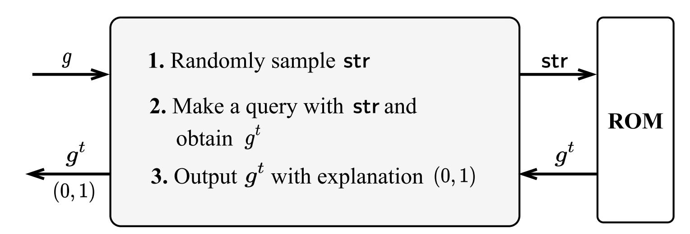
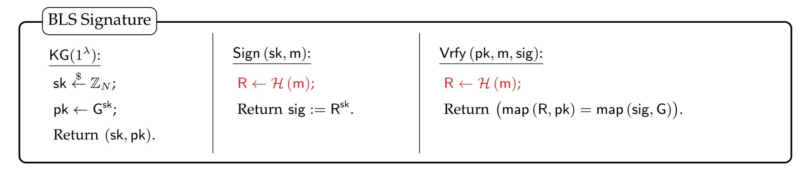

{0}------------------------------------------------

# Hashing in Generic Groups: Completing the AGM-to-GGM Transfer \*

Taiyu Wang† Cong Zhang† Hong-Sheng Zhou‡ Xin Wang§

Keyu Ji† Zhihong Jia† Li Lin§ Changzheng Wei§

Ying Yan§ Kui Ren† Chun Chen†

March 6, 2026

#### **Abstract**

The algebraic group model (AGM), formalized by Fuchsbauer, Kiltz, and Loss (Crypto 2018), has recently garnered significant attention. Notably, Katz, Zhang, and Zhou (Asiacrypt 2022) challenged a widely held belief: that hardness results proven in the AGM imply corresponding results in the generic group model (GGM). They showed that this implication fails under Shoup's GGM framework. In response, Jaeger and Mohan (Crypto 2024) proposed an alternative interpretation based on Maurer's GGM and proved that, under this interpretation, the implication indeed holds.

Many cryptographic applications analyzed in the AGM also rely on the random oracle model (ROM), which is largely absent from Jaeger and Mohan's framework. Because Maurer's GGM and the ROM are inherently incomparable, Jaeger and Mohan's framework may not capture AGM+ROM proofs. To bridge this gap and faithfully translate AGM+ROM proofs into the GGM setting, we make the following contributions:

- **Limitations of JM's framework:** Jaeger and Mohan's framework captures only those primitives that can be instantiated within Maurer's GGM. We identify a primitive—specifically, a public-key encryption scheme with short ciphertexts—whose security has been analyzed in the AGM, and establish a black-box separation between this primitive and Maurer's GGM, even when combined with the ROM. This result provides concrete evidence that JM's framework cannot encompass AGM+ROM proofs.
- **Augmented framework:** We propose an *augmented* framework that integrates Maurer's GGM with a carefully constructed ROM, enabling inputs and outputs to incorporate group elements defined within Maurer's model.
- **Transferring AGM+ROM proofs to the GGM setting:** Building on our augmented framework, we prove the lifting lemma from the AGM to our model, demonstrating that hardness results in the AGM+ROM directly carry over to our setting and thereby subsuming the prevailing AGM-based proof methodology.

<sup>\*</sup>The work was mainly supported by National Key Research and Development Program of China, Grant No. 2023YFB3106000.

<sup>†</sup>The State Key Laboratory of Blockchain and Data Security, Zhejiang University, and Hangzhou High-Tech Zone (Binjiang) Blockchain and Data Security Research Institute, congresearch@zju.edu.cn

<sup>‡</sup>Virginia Commonwealth University, hszhou@vcu.edu

<sup>§</sup>Ant Digital Technologies, Ant Group, wx352699@antgroup.com

{1}------------------------------------------------

## **Contents**

| 1 | Introduction<br>1                                |                                                      |  |  |        |  |  |
|---|--------------------------------------------------|------------------------------------------------------|--|--|--------|--|--|
|   | 1.1<br>Our Results                               |                                                      |  |  | 1      |  |  |
| 2 | Preliminaries                                    |                                                      |  |  |        |  |  |
|   | 2.1                                              | Generic group model                                  |  |  | 5<br>6 |  |  |
|   | 2.2                                              | Algebraic group model                                |  |  | 6      |  |  |
|   | 2.3                                              | Random oracle model<br>                              |  |  | 6      |  |  |
|   | 2.4                                              | Public-key encryption<br>                            |  |  | 6      |  |  |
| 3 | Interpretation of results in JM's framework<br>7 |                                                      |  |  |        |  |  |
|   | 3.1                                              | Universe of computation                              |  |  | 7      |  |  |
|   | 3.2                                              | Pseudocode framework<br>                             |  |  | 8      |  |  |
|   | 3.3                                              | Oracle framework                                     |  |  | 9      |  |  |
| 4 | Limitations of JM's framework<br>9               |                                                      |  |  |        |  |  |
|   | 4.1                                              | Hashing group elements                               |  |  | 9      |  |  |
|   | 4.2                                              | Hashing to group elements<br>                        |  |  | 11     |  |  |
|   | 4.3                                              | Impossibility in Maurer+ROM<br>                      |  |  | 11     |  |  |
| 5 |                                                  | Augmented models of computation                      |  |  | 16     |  |  |
|   | 5.1                                              | Augmented universe of computation                    |  |  | 16     |  |  |
|   | 5.2                                              | Augmented pseudocode framework<br>                   |  |  | 18     |  |  |
|   | 5.3                                              | Augmented oracle framework                           |  |  | 20     |  |  |
|   | 5.4                                              | Equivalence of the augmented frameworks<br>          |  |  | 21     |  |  |
| 6 |                                                  | Lifting result in the augmented model                |  |  | 23     |  |  |
|   | 6.1                                              | Example: reduction of Schnorr signature              |  |  | 23     |  |  |
|   | 6.2                                              | Inferring AGM security to GGM in the augmented model |  |  | 24     |  |  |

{2}------------------------------------------------

## <span id="page-2-0"></span>**1 Introduction**

Since the seminal work of Diffie and Hellman [\[DH76\]](#page-26-0), group-based cryptosystems have been a cornerstone of modern cryptography, enabling public-key exchange, encryption, and digital signatures based on the conjectured hardness of problems in cyclic groups. A fundamental limitation remains, however: we cannot establish the unconditional hardness of these problems for any *concrete* group. To gain confidence in assumptions and schemes, a long line of work has therefore studied restricted classes of algorithms, most notably *generic* algorithms and *algebraic* algorithms.

**Generic algorithms and the generic group model.** Generic algorithms abstract away concrete encodings of group elements and operate only on algebraic structure. This intuition is formalized by the *Generic Group Model* (GGM) in several variants [\[Nec94,](#page-27-0) [Sho97,](#page-27-1) [Mau05,](#page-27-2) [MPZ20\]](#page-27-3). Two widely used formulations are *Shoup's GGM* [\[Sho97\]](#page-27-1), which assigns random bit strings to group elements and exposes only blackbox group operations, and *Maurer's GGM* [\[Mau05\]](#page-27-2), which is stateful and lets algorithms refer to previously created elements by indices. Both enable unconditional lower bounds against generic adversaries and serve as a canonical test-bed for hardness assumptions and reductions.

**Algebraic algorithms and the algebraic group model.** Algebraic algorithms [\[BV98,](#page-26-1) [PV05\]](#page-27-4) may inspect encodings but are constrained to produce new group elements only by combining previously obtained ones via group operations. Fuchsbauer, Kiltz, and Loss formalized this as the *Algebraic Group Model* (AGM) [\[FKL18\]](#page-26-2). The AGM has seen wide adoption: it has been used to analyze abstract assumptions (e.g., Uber assumptions [\[BFL20\]](#page-26-3)) and practical primitives, including zkSNARKs [\[GWC19,](#page-27-5) [CHM](#page-26-4)+20] and signature schemes [\[FPS20,](#page-27-6) [KLX22\]](#page-27-7). Although the AGM does not yield unconditional lower bounds for concrete problems, it is a useful vehicle for reasoning about reductions—for example, DLOG and CDH are equivalent within the AGM [\[FKL18\]](#page-26-2).

A key methodological result in [\[FKL18\]](#page-26-2) is a *lifting lemma*, asserting that any generic reduction between two problems in the AGM transfers to a corresponding generic reduction in the GGM. This principle was challenged by Katz, Zhang, and Zhou [\[KZZ22,](#page-27-8) [ZZK22\]](#page-27-9) in the setting of Shoup's GGM, via a counterexample based on a *Binary Encoding Game*. In contrast, Jaeger and Mohan [\[JM24\]](#page-27-10) established that the lifting lemma *does* hold in Maurer's GGM and argued that this interpretation matches prevailing informal reasoning in AGM-based proofs. Taken together, these works suggest that Maurer's GGM is the right foundation for justifying AGM-based proofs.

**Why the random oracle model matters.** Many important AGM-based proofs also rely on the ROM—for example, analyses of zkSNARKs [\[GWC19,](#page-27-5) [CHM](#page-26-4)+20] and of signature and encryption schemes [\[FPS20,](#page-27-6) [KLX22\]](#page-27-7). However, Maurer's GGM and the ROM are known to be *incomparable* [\[IR89,](#page-27-11) [DHH](#page-26-5)+21, [Zha22\]](#page-27-12). Consequently, a framework that justifies lifting only within Maurer's GGM, but without a compatible treatment of random oracles, cannot capture AGM+ROM proofs in general. More importantly, to the best of our knowledge, existing AGM-based proofs are typically carried out either within the AGM itself or within the combined AGM+ROM framework.

**The question we address.** The discussion above motivates the following question:

*How can we extend the JM framework so as to capture AGM-based proofs that involve random oracles?*

At a high level, our answer is an augmented framework that integrates Maurer's GGM with a carefully designed ROM, allowing inputs and/or outputs to involve group elements while remaining faithful to the practical intuitions underlying AGM-based proofs.

### <span id="page-2-1"></span>**1.1 Our Results**

In this work, we answer the question above in the affirmative. Our contributions are threefold:

{3}------------------------------------------------

- 1. We provide evidence that JM's framework fails to capture AGM-based applications that rely on random oracles. In particular, we prove that it is impossible to construct an efficient public-key encryption scheme in Maurer's GGM, even when combined with an independent ROM<sup>1</sup>.
- 2. We identify the fundamental obstacle and propose an augmented framework that properly integrates Maurer's model with a carefully designed ROM.
- 3. We further show that our revised framework successfully captures AGM+ROM proofs, while the lifting lemma continues to hold.

To facilitate understanding of our results, we start with a concise overview of the JM framework; additional details are deferred to Section 3.

The JM framework provides three equivalent formulations for modeling computation over groups: the *pseudocode* framework, the *oracle* framework, and the *circuit* framework. In the following, we focus on the pseudocode formulation, where algorithms are expressed in a "typed" programming language. This language supports standard data types such as  $\langle int \rangle$  for integers and  $\langle bits \rangle$  for bitstrings, along with a special type  $\langle elem \rangle$  for group elements. While computations over  $\langle int \rangle$  and  $\langle bits \rangle$  are unrestricted, operations on  $\langle elem \rangle$  variables are confined to a predefined set of group operations.

Fix a cyclic group  $\mathbb G$  of order N with generator g, and consider the following functions: const, op, eq, Encode, and Decode. The function  $\operatorname{const}(x)$  takes an input  $x \in \mathbb Z_N$  of type  $\langle \operatorname{int} \rangle$  and outputs the group element  $g^x$  of type  $\langle \operatorname{elem} \rangle$ . The function  $\operatorname{op}(g^w,g^z)$  takes two group elements of type  $\langle \operatorname{elem} \rangle$  and returns their product  $g^{w+z}$ , corresponding to the group operation. The function  $\operatorname{eq}(g^w,g^z)$  compares two group elements and returns a bit b of type  $\langle \operatorname{bit} \rangle$  indicating whether they are equal. The functions Encode and Decode are defined with respect to a fixed group encoding  $\sigma$  for  $\mathbb G$ . Specifically, Encode maps a group element  $g^x$  of type  $\langle \operatorname{elem} \rangle$  to its binary representation  $\sigma(g^x)$  of type  $\langle \operatorname{bits} \rangle$ , while Decode maps a binary string  $\sigma(g^x)$  back to the corresponding group element  $g^x$  of type  $\langle \operatorname{elem} \rangle$ .

Within the JM framework, a hierarchy of algorithmic classes is defined by syntactically restricting the set of functions that an algorithm is allowed to access. Specifically, *type-safe generic* algorithms (those in Maurer's GGM) are restricted to using only const, op, and eq. *Algebraic* algorithms (those in AGM) may additionally access Encode, while *standard* algorithms (those in the standard model) are unrestricted and have access to the full set of functions, including Decode.

#### 1.1.1 Impossibility results in Maurer+ROM

The JM framework provides a transformation that converts an AGM-based proof into one in Maurer's GGM. Specifically, let G and H be two cryptographic games. The framework shows that if there exists a type-safe reduction from G to H, then a corresponding reduction also exists between G and G within Maurer's GGM. In this setting, both G and G must be *representable* in Maurer's GGM. However, the capacity of Maurer's GGM is quite limited. In what follows, we present evidence that—even when combined with an independent ROM—there exist cryptographic primitives, which have been analyzed within the AGM, cannot be captured in this setting. This implies that the security of such primitives cannot be formally justified within JM framework.

Our strategy proceeds in two steps: (1) identify a cryptographic primitive whose security is proven in the AGM; and (2) establish a black-box separation between this primitive and Maurer+ROM. In the literature, Fuchsbauer, Plouviez, and Seurin [FPS20] analyzed the signed ElGamal encryption scheme in the AGM. To strengthen our impossibility result, we identify the primitive as a public-key encryption scheme that (1) achieves security against message-recovery attacks (MRA) and (2) features efficient ciphertexts. Roughly speaking, a public-key encryption scheme is said to be MRA-secure if no efficient adversary, given the public key and ciphertexts, can recover the entire plaintext with non-negligible probability. By efficient ciphertexts, we mean that the ciphertext consists of only a constant number of group elements.

<span id="page-3-0"></span><sup>&</sup>lt;sup>1</sup>By "independent ROM" we mean a standard random oracle whose inputs and outputs are bitstrings and which is independent of Maurer's generic group.

{4}------------------------------------------------

Note that the primitive identified above requires only minimal security guarantees, and it is evident that the signed ElGamal encryption scheme [\[FPS20\]](#page-27-6) implies such a primitive. Therefore, it suffices to establish the following theorem.

**Theorem 1.1** (Informal)**.** *MRA-secure public-key encryption with a sufficiently large message space and efficient ciphertexts does not exist within Maurer's GGM combined with the ROM.*

At first glance, one might construct a PKE scheme in Maurer's GGM by encrypting the message bit by bit. Specifically, let m = m1| . . . |m<sup>n</sup> denote the binary representation of the plaintext. We then set

$$\mathsf{pk} = (g^{x_1}, \dots, g^{x_n}), \ \mathsf{c} = (\mathsf{c}_1, \dots, \mathsf{c}_n),$$

where each ciphertext component is given by c<sup>i</sup> = (g yi , gz<sup>i</sup> ), with z<sup>i</sup> = x<sup>i</sup> · y<sup>i</sup> if m<sup>i</sup> = 1, and z<sup>i</sup> chosen uniformly at random otherwise.

We note that both the public key and the ciphertext consist of n group elements, whereas the primitive identified above requires them to be efficient. In the literature, Zhandry [\[Zha22\]](#page-27-12) showed that this is impossible. Specifically, Zhandry demonstrated the limitations of Maurer's GGM and established a black-box separation for any PKE scheme that is secure against chosen-plaintext attacks within this model. The core idea is that, in Maurer's GGM, algorithms are prohibited from performing any non-group operations (such as hashing a group element, e.g., H(g x )). Consequently, each group element can carry at most one bit of information. However, to the best of our knowledge, a rigorous formalization or detailed analysis of this separation is *not explicitly provided* in [\[Zha22\]](#page-27-12).

In this work, following the spirit of Zhandry [\[Zha22\]](#page-27-12), we provide a formal analysis of this separation and extend the result to the Maurer+ROM setting. The details are deferred to Section [4.](#page-10-1)

### **1.1.2 Augmented JM's framework**

Based on the above impossibility analysis, we observe that overcoming this limitation essentially requires allowing hash operations on group elements (e.g., computing H(g x )). Furthermore, in many AGM-based applications, it is equally important to consider the opposite operation, namely, hashing to group elements. Specifically, Fuchsbauer, Kiltz, and Loss [\[FKL18\]](#page-26-2) analyzed the BLS signature scheme [\[BLS01\]](#page-26-6) in the AGM, where algebraic algorithms are permitted to query a random oracle that outputs random group elements, which can subsequently be used as valid inputs (see Figure [1\)](#page-4-0).



<span id="page-4-0"></span>Figure 1: An FKL-style algebraic algorithm enables oblivious sampling in ROM

Therefore, to fully capture the expressive power required to justify AGM+ROM proofs, we propose an augmented framework that equips the random oracle model with the following two capabilities:

- 1. *Hashing group elements:* the random oracle maps ⟨elem⟩ to ⟨bits⟩;
- 2. *Hashing to group elements:* the random oracle maps ⟨bits⟩ to ⟨elem⟩.

{5}------------------------------------------------

In what follows, we introduce two variants of the augmented JM framework, referred to as the augmented pseudocode framework and the augmented oracle framework.

**Augmented pseudocode framework.** In JM's pseudocode framework, let S denote the set of all group elements of type ⟨elem⟩, and let Π, Σ and σ denote the sets of allowed operations, relational predicates over S, and the group encoding, respectively. The group encoding σ, along with all functions defined in Π and Σ, is specified and fixed in advance. The tuple ⟨S, Π, Σ, σ⟩ constitutes the core of JM's framework, which categorizes algorithms into the type-safe generic, algebraic, and standard classes.

However, when attempting to extend this framework to incorporate the random oracle model, a fundamental challenge arises: the ROM is typically not a predetermined function. Consequently, it cannot be captured merely by adding functions to Π or Σ, since all functions in these sets are fixed in advance.

To address this, we introduce a new component, the set Λ, which consists of functions of a specified form. For example, to model hash-to-group computations, Λ can be defined as the set of all functions mapping inputs of type ⟨bits⟩ to outputs of type ⟨elem⟩. Within our augmented model ⟨S, Π, Σ, σ,Λ⟩, an algorithm's invocation of the random oracle can be uniformly represented by a pseudocode function HashΛ, since all functions in Λ share the same input-output structure (see Section [5](#page-17-0) for details). Because type-safe algorithms in this augmented model still lack access to the encoding σ, the KZZ counterexample remains inapplicable as in [\[JM24\]](#page-27-10). Fortunately, this extension preserves all of JM's original algorithmic interpretations and hierarchy.

Furthermore, our augmented framework offers a better interpretation on Shoup's algorithm. In JM's framework, a Shoup-style generic algorithm is treated as a standard algorithm with the group encoding σ left *unspecified*[2](#page-5-0) . As a result, generic and standard algorithms are indistinguishable within their pseudocode framework. In contrast, our augmented framework allows for a more explicit representation: a Shoup-style generic algorithm can be captured by defining Λ as the set of all injections from ⟨elem⟩ to fixed-length ⟨bits⟩.

**Augmented oracle framework.** We further develop the augmented oracle framework. In this setting, a designated oracle O samples a function uniformly at random from Λ and handles all computations over ⟨elem⟩. Algorithms may manipulate values of type ⟨elem⟩ only by querying the interfaces exposed by O. Due to the established equivalence between the pseudocode and oracle frameworks in our augmented model, one can switch freely between the two representations, using whichever is best suited for the analysis at hand.

#### **1.1.3 Lifting lemma in the augmented model**

Leveraging the hierarchy between type-safe generic and algebraic algorithms, the FKL lifting result naturally extends to our augmented framework (Section [6\)](#page-24-0). In essence, suppose there exists a type-safe generic reduction R that transforms any augmented algebraic adversary (possibly invoking a random oracle) against one game into an algebraic adversary against another. By this hierarchy, R also applies to any augmented type-safe generic adversary, and the resulting adversary remains type-safe.

**Theorem 1.2** (Informal)**.** *A type-safe generic reduction* R *between two games in AGM+ROM implies a corresponding reduction in GGM+ROM.*

We revisited several prior reductions listed in Table [1,](#page-6-1) originally proven in the AGM+ROM setting, and reinterpreted them in our augmented framework. Our analysis confirms that all these reductions are encompassed by our model and thus benefit from the lifting result established above.

Moreover, our augmented framework also encompasses the lifting lemma for non-programming reductions, where the type-safe generic reduction R additionally has access to the random oracle. This yields the following result:

**Theorem 1.3** (Informal)**.** *An augmented type-safe generic reduction* R *between two games in AGM+ROM implies a corresponding reduction in GGM+ROM.*

<span id="page-5-0"></span><sup>2</sup>From our perspective, the notion that a group encoding is unspecified is not rigorously defined in [\[JM24\]](#page-27-10).

{6}------------------------------------------------

<span id="page-6-1"></span>Table 1: Summary of some AGM+ROM reductions in literature

| Security property                                                    | Captured<br>by JM | Captured<br>by Ours | Category      |
|----------------------------------------------------------------------|-------------------|---------------------|---------------|
| Decisional Diffie-Hellman,<br>Square Diffie-Hellman [AHK20, FKL18]   | Yes               | Yes                 | None          |
| IND-CCA1 Security of ElGamal Encryption [FKL18]                      | Yes               | Yes                 | None          |
| UF-CMA Security of BLS [FKL18]                                       | No                | Yes                 | Hash-to-Group |
| UF-CMA Security of Threshold BLS Signature [BL22]                    | No                | Yes                 | Hash-to-Group |
| EUF-CMA Security of Schnorr Signature [FPS20]                        | No                | Yes                 | Hash-on-Group |
| Unforgeability of Clause Blind Schnorr Signature [FPS20]             | No                | Yes                 | Hash-on-Group |
| IND-CCA2 Security of<br>Signed ElGamal PKE [FPS20]                   | No                | Yes                 | Hash-on-Group |
| EUF-CMA Security of Schnorr Multi-Signature [NRS21]                  | No                | Yes                 | Hash-on-Group |
| Adaptive Security of Threshold Schnorr Signature [CKM23]             | No                | Yes                 | Hash-on-Group |
| One-More Unforgeability of Blind BLS Signature [KRB <sup>+</sup> 24] | No                | Yes                 | Hash-to-Group |

**Organization.** The remainder of the paper is organized as follows. Section 2 introduces the notation used throughout the paper and formalizes the idealized models. Section 3 reviews and clarifies the framework of JM. Section 4 analyzes the limitations of JM's framework in capturing all AGM-based applications. Section 5 presents our augmented model for faithfully representing random-oracle computations, and Section 6 establishes the corresponding lifting result.

### <span id="page-6-0"></span>2 Preliminaries

*Notations.* Let  $\lambda \in \mathbb{N}$  denote the security parameter. For a finite set S, we denote a random sample s from S according to the uniform distribution as  $s \stackrel{\$}{\leftarrow} S$ , and the size of the set S as |S|. We say a positive function  $\operatorname{negl}(\cdot)$  is negligible, if for all positive polynomial  $\operatorname{poly}(\cdot)$ , there exists a constant  $\lambda_0 > 0$  such that for all  $\lambda > \lambda_0$ , it holds that  $\operatorname{negl}(\lambda) < 1/\operatorname{poly}(\lambda)$ .

*Cryptographic Groups.* In this work, we focus on a cyclic group  $\mathbb{G}$  of prime order N with generator  $\mathbb{G}.g$  (also denoted by  $g_{\mathbb{G}}$ ). Let  $\mathbb{G}.S$  denote the set of all elements in  $\mathbb{G}$ . The associative group operation  $\mathbb{G}.\text{op}:\mathbb{G}.S\times\mathbb{G}.S$  maps two elements of  $\mathbb{G}$  to another element of  $\mathbb{G}$ . For any  $X,Y\in\mathbb{G}.S$ , we adopt multiplicative notation  $X\cdot Y=\mathbb{G}.\text{op}(X,Y)$ , and write  $X^a$  to represent the a-fold application of the group operation to X. We denote the identity element by  $X^0$  and the inverse of X by  $X^{-1}$ , satisfying  $X\cdot X^{-1}=X^{-1}\cdot X=X^0$ .

We further assume the existence of an injective encoding function  $\mathbb{G}.\sigma:\mathbb{G}.S\to 0,1^*$  that maps group elements to bitstrings, along with its inverse  $\mathbb{G}.\sigma^{-1}$ . If no  $X\in\mathbb{G}.S$  satisfies  $\mathbb{G}.\sigma(X)=$  str, we define  $\mathbb{G}.\sigma^{-1}(\text{str})=\bot$ ; this verification process is typically efficient. We refer to  $\mathbb{G}.\sigma(X)$  as the bitstring representation of X. For encodings used in practice, given  $\mathbb{G}.\sigma(X)$  and  $\mathbb{G}.\sigma(X)$ , it is often possible to efficiently compute  $\mathbb{G}.\sigma(X\cdot Y)$  and  $\mathbb{G}.\sigma(X^{-1})$ .

{7}------------------------------------------------

#### <span id="page-7-0"></span>2.1 Generic group model

The term *generic algorithms* denotes algorithms that do not exploit any particular representation of group elements but rather manipulate them "generically". To formalize this notion, several variants of the generic group model (GGM) have been introduced; while two of the most prominent are Shoup's model [Sho97] and Maurer's model [Mau05].

In Shoup's GGM, a "generic" algorithm Alg is given access to a random encoding rather than specific representations, which inherently requires Alg to work for all groups.

<span id="page-7-4"></span>**Definition 2.1** (Shoup's Generic Group Model [Sho97]). Let N be a positive integer, and let S be a set of bitstrings with  $|S| \geq N$ . Denote by  $\mathcal{I}_{N,S}$  the set of all injections from  $\mathbb{Z}_N$  to S. The Shoup's generic group model samples a random injection  $\sigma$  from  $\mathcal{I}_{N,S}$ , and provides two interfaces:

- The labeling interface takes as input  $x \in \mathbb{Z}_N$ , and returns  $\sigma(x)$ .
- The addition interface takes as input two bitstrings  $\operatorname{str}_1, \operatorname{str}_2 \in S$ , and behaves as follows: if there exists  $x_1, x_2 \in \mathbb{Z}_N$  such that  $\sigma(x_1) = \operatorname{str}_1$  and  $\sigma(x_2) = \operatorname{str}_2$ , it returns  $\sigma(x_1 + x_2)$ ; otherwise, it returns  $\bot$ .

Maurer's model is similar in spirit to Shoup's but differs technically. In Maurer's GGM, a generic algorithm has no encoding oracle; it interacts with group elements only via some abstract "handles".

**Definition 2.2** (Maurer's Generic Group Model [Mau05]). Let N be a positive integer. The Maurer's generic group model initializes a counter ctr to 1 and an empty table V consist of the tuples with form of  $(i, x) \in \mathbb{N} \times \mathbb{Z}_N$ , and provides three interfaces:

- The labeling interface takes as input  $x \in \mathbb{Z}_N$ . It stores  $(\mathsf{ctr}, x)$  in V, returns  $\mathsf{ctr}$ , and then increments  $\mathsf{ctr}$ .
- The group-operation interface takes as input two integers i, j < ctr. For (i, x) and (j, y) in V, it stores  $(\text{ctr}, x + y \mod N)$  in V, returns ctr, and then increments ctr.
- The equality interface takes as input two integers i, j < ctr. For (i, x) and (j, y) in V, it returns 1 if x = y and 0 otherwise.

### <span id="page-7-1"></span>2.2 Algebraic group model

The *algebraic* algorithms constitute another class of algorithms that, on the one hand, is restricted to performing only group operations on group elements—just as generic algorithms do—but, on the other hand, may exploit a specific group encoding.

<span id="page-7-5"></span>**Definition 2.3** (Algebraic Algorithm [FKL18]). Let  $\mathbb{G}$  be a cyclic group. An algorithm Alg is called algebraic if, whenever Alg outputs a group element  $X^* \in \mathbb{G}.S$ , it additionally provides an explicit representation of  $X^*$  as a combination of all group elements it has previously received. Concretely, suppose  $(X_1, \ldots, X_t)$ , where each  $X_i \in \mathbb{G}.S$  for  $i = 1, \ldots, t$ , denotes the list of all group elements given to Alg thus far. Then Alg must output a vector  $(z_1, \ldots, z_t)$  such that  $X^* = \prod_i X_i^{z_i}$ .

#### <span id="page-7-2"></span>2.3 Random oracle model

**Definition 2.4** (Random Oracle Model [BR93]). Let  $\mathcal{I}_{*,S}$  be the set of all functions  $h:\{0,1\}^* \to S$ , where  $S:=\{0,1\}^n$  for some integer n. The random oracle model samples a random function h from  $\mathcal{I}_{*,S}$ . All algorithms can query with  $x \in \{0,1\}^*$ , obtaining the corresponding value  $h(x) \in S$ .

### <span id="page-7-3"></span>2.4 Public-key encryption

**Definition 2.5** (Public-Key Encryption). Denote  $\mathcal{SK} := \{\mathcal{SK}_{\lambda}\}_{\lambda \in \mathbb{N}}$ ,  $\mathcal{PK} := \{\mathcal{PK}_{\lambda}\}_{\lambda \in \mathbb{N}}$ ,  $\mathcal{M} := \{\mathcal{M}_{\lambda}\}_{\lambda \in \mathbb{N}}$ , and  $\mathcal{C} := \{\mathcal{C}_{\lambda}\}_{\lambda \in \mathbb{N}}$  as the private-key space, public-key space, message space, randomness space, and ciphertext space, respectively. A public-key encryption scheme over  $\mathcal{SK}$ ,  $\mathcal{PK}$ ,  $\mathcal{M}$ ,  $\mathcal{R}$ , and  $\mathcal{C}$  is a tuple of algorithms  $\Pi_{\mathsf{PKE}} := (\mathsf{KG}, \mathsf{Enc}, \mathsf{Dec})$  defined as follows:

{8}------------------------------------------------

- The public-key generation algorithm KG takes as input a uniformly random private key  $sk \in \mathcal{SK}_{\lambda}$ , and outputs a public key  $pk \in \mathcal{PK}_{\lambda}$ .
- The encryption algorithm Enc takes as input a public key pk, a message  $m \in \mathcal{M}_{\lambda}$ , and a randomness  $r \in \mathcal{R}_{\lambda}$ , and outputs a ciphertext  $c \in \mathcal{C}_{\lambda}$ .
- The decryption algorithm Dec takes as input a private key sk and a ciphertext c, and outputs a message m or a symbol  $\perp$ , where  $\perp$  indicates a failed decryption.

**Correctness.** We say  $\Pi_{PKE}$  achieves perfect correctness if for any private key  $sk \in \mathcal{SK}_{\lambda}$ , message  $m \in \mathcal{M}_{\lambda}$ , and randomness  $r \in \mathcal{R}_{\lambda}$ , with  $pk \leftarrow KG(sk)$  and  $c \leftarrow Enc(pk, m, r)$ , it holds that

$$\Pr\left[\mathsf{Dec}\left(\mathsf{sk},\mathsf{c}\right)=\mathsf{m}\right]=1.$$

**Security.** We say  $\Pi_{PKE}$  is secure against message-recovery attack (MRA) if for any PPT adversary A, there exists a negligible function negl such that

$$\left| \Pr \left[ \mathcal{A} \left( \mathsf{pk}, \mathsf{c} \right) = \mathsf{m} \right] - 1 / |\mathcal{M}_{\lambda}| \right| \leq \mathsf{negl}(\lambda).$$

Here, for randomly chosen  $sk \stackrel{\$}{\leftarrow} \mathcal{SK}_{\lambda}$ ,  $m \stackrel{\$}{\leftarrow} \mathcal{M}_{\lambda}$ , and  $r \stackrel{\$}{\leftarrow} \mathcal{R}_{\lambda}$ , compute  $pk \leftarrow KG(sk)$  and  $c \leftarrow Enc(pk, m, r)$ , respectively.

## <span id="page-8-0"></span>3 Interpretation of results in JM's framework

In this section, we review and clarify the main contributions in JM's framework, setting the stage for the novel results presented in Section 5. For further details, we refer the interested reader to [JM24].

## <span id="page-8-1"></span>3.1 Universe of computation

Roughly speaking, a universe of computation (i) fixes a global set of elementary functions and then (ii) organizes a hierarchy of algorithmic classes by specifying, for each class, which subset of those functions it may invoke. This abstraction is drawn from Maurer's models of computation [Mau05]. Concretely, for any set S (e.g., the element set of a cyclic group), we define  $S_{\perp} := S \cup \{\bot\}$ , where  $\bot$  denotes computational failure or invalid input. Computations over S are then restricted to two fundamental types:

• **Operations** on S, formalized through operation set  $\Pi$ . Each operation  $f \in \Pi$  is of the form

$$S_{\perp} \times \cdots \times S_{\perp} \times \{0,1\}^* \to S_{\perp}.$$

• **Relation predicates** over S, defined via relation set  $\Sigma$ . Each relation  $\rho \in \Sigma$  adheres to

$$S_{\perp} \times \cdots \times S_{\perp} \times \{0,1\}^* \rightarrow \{0,1\}.$$

To further distinguish between the type-safe generic, algebraic, and standard models of computation over groups,<sup>3</sup> JM introduce an additional injective function  $\sigma: S \to \{0,1\}^*$  and its inverse  $\sigma^{-1}: \{0,1\}^* \to S_{\perp}$ . This pair serves as an encoding mechanism, specifying how group elements are represented as bitstrings.

**Definition 3.1** (Universe of Computation [JM24]). *A* universe of computation  $\mathbb{U}$  *is defined as a tuple*  $\langle \mathbb{U}.S, \mathbb{U}.\Pi, \mathbb{U}.\Sigma, \mathbb{U}.\sigma \rangle$ , *where:* 

•  $\mathbb{U}.S$  is the set of elements.

<span id="page-8-2"></span><sup>&</sup>lt;sup>3</sup>This universe of computation also applies to other idealized settings; however, we focus here exclusively on cyclic groups.

{9}------------------------------------------------

•  $\mathbb{U}.\Pi$  is the set of operations over  $\mathbb{U}.S$ , where each operation is a function of the form

$$\mathbb{U}.S_{\perp} \times \cdots \times \mathbb{U}.S_{\perp} \times \{0,1\}^* \to \mathbb{U}.S_{\perp}.$$

•  $\mathbb{U}.\Sigma$  is the set of relation predicates over  $\mathbb{U}.S$ , where each relation is a function of the form

$$\mathbb{U}.S_{\perp} \times \cdots \times \mathbb{U}.S_{\perp} \times \{0,1\}^* \to \{0,1\}.$$

•  $\mathbb{U}.\sigma: \mathbb{U}.S_{\perp} \to \{0,1\}^*$  is an injective encoding function.

When instantiating  $\mathbb{U}$  as a universe of computation for a cyclic group  $\mathbb{G}$ , we set  $\mathbb{U}.S=\mathbb{G}.S$  and  $\mathbb{U}.\sigma=\mathbb{G}.\sigma$ . The operation set is typically defined as

$$\mathbb{U}.\Pi := \{\mathsf{const}, \mathsf{op}\},\$$

where  $const(a) = g_{\mathbb{G}}^a$  for  $a \in \mathbb{Z}_N$ , and op(X,Y) = XY for  $X,Y \in \mathbb{U}.S$ . The set of relations usually includes only the equality predicate:

$$\mathbb{U}.\Sigma := \{eq\},$$

where eq(X, Y) = 1 if X = Y for  $X, Y \in \mathbb{U}.S$ , and eq(X, Y) = 0 otherwise.

**Intuition behind the model.** Within the universe of computation  $\mathbb{U}$  for a cyclic group, the set  $\mathbb{U}.S$  of group elements is treated as an abstract data type, distinct from the bit-string domain. The encoding function  $\mathbb{U}.\sigma$  serves only to bridge the abstract group elements and their concrete bit-string representations; all operations on  $\mathbb{U}.S$  are performed entirely at the abstract level.

A *type-safe generic* algorithm is one that (i) imposes no restrictions on its use of bit-string computations, yet (ii) interacts with group elements exclusively through the operations in  $\mathbb{U}.\Pi$  and the relation predicates in  $\mathbb{U}.\Sigma$ . This captures the essence of generic algorithms: independence from any particular encoding of group elements. An *algebraic* algorithm, by contrast, is additionally allowed to invoke the encoding function  $\mathbb{U}.\sigma$  to convert group elements into bit strings, but not its inverse  $\mathbb{U}.\sigma^{-1}$ . Consequently, the operations in  $\mathbb{U}.\Pi$  remain the only means of producing new group elements. Finally, a *standard* algorithm operates without any of these restrictions.

#### <span id="page-9-0"></span>3.2 Pseudocode framework

In the literature, one typically uses pseudocode to describe an algorithm's step-by-step behavior. Although it lacks a formal syntax, it often provides a clearer, more concise, and less ambiguous description than an actual programming languages.

To formally represent all computations related to the cyclic group, JM introduce a specialized data type  $\langle elem \rangle$  for the abstract group elements in  $\mathbb{U}.S$ , and impose restrictions on the computations associated with this type. Specifically, the expression " $\langle \mathbf{type} \rangle$  X" indicates that the data X is of type  $\langle \mathbf{type} \rangle$ , while " $\langle \mathbf{types} \rangle$  X" denotes a tuple  $\mathbf{X} = (\mathsf{X}_1, \dots, \mathsf{X}_n)$  in which each  $\mathsf{X}_i$  is of type  $\langle \mathbf{type} \rangle$ . Let  $\bot$  be a distinguished error symbol. By JM, each operation  $f \in \mathbb{U}.\Pi$  is represented in pseudocode as

$$\langle \mathbf{elem} \rangle \ \mathsf{Y} \leftarrow \mathsf{Func}_f \left( \langle \mathbf{elems} \rangle \ \mathbf{X}, \langle \mathbf{bits} \rangle \, \mathsf{str} \right),$$

and each relation predicate  $\rho \in \mathbb{U}.\Sigma$  as

$$\langle \mathbf{bit} \rangle \ \mathsf{b} \leftarrow \mathsf{Rel}_{\rho} \left( \langle \mathbf{elems} \rangle \ \mathbf{X}, \langle \mathbf{bits} \rangle \ \mathsf{str} \right).$$

Additionally, the encoding  $\mathbb{U}.\sigma$  is represented as

$$\langle \mathbf{bits} \rangle \ \mathsf{str} \leftarrow \mathsf{Encode}_{\mathbb{U}.\sigma} \left( \langle \mathbf{elem} \rangle \ \mathsf{X} \right),$$

with its inverse given by  $\mathsf{Decode}_{\mathbb{U}.\sigma}\left(\langle\mathbf{bits}\rangle\ \mathsf{str}\right)$ , which returns either a group element  $\langle\mathbf{elem}\rangle\ \mathsf{X}$  or a failure symbol  $\bot$ . The pseudocode framework in [JM24] is formally defined as follows:

{10}------------------------------------------------

**Definition 3.2** (Pseudocode Framework [JM24]). Let  $\mathbb{U}$  be a universe of computation with  $\langle \mathbb{U}.S, \mathbb{U}.\Pi, \mathbb{U}.\Sigma, \mathbb{U}.\sigma \rangle$ . An algorithm expressed in pseudocode with respect to  $\mathbb{U}$  is classified as follows:

- Type-safe generic algorithm: It can be expressed in pseudocode without invoking either  $\mathsf{Encode}_{\mathbb{U}.\sigma}$  or  $\mathsf{Decode}_{\mathbb{U}.\sigma}$ .
- **Algebraic algorithm:** *It can be expressed in pseudocode without invoking*  $\mathsf{Decode}_{\mathbb{U}.\sigma}$ .
- Standard algorithm: The corresponding pseudocode places no restrictions on calls to  $\mathsf{Encode}_{\mathbb{U}.\sigma}$  and  $\mathsf{Decode}_{\mathbb{U}.\sigma}$ .

#### <span id="page-10-0"></span>3.3 Oracle framework

When studying relationships between cryptographic primitives—such as proving feasibility or impossibility results—or when justifying the hardness of certain assumptions, it is common to use an oracle framework. In this setting, restricted computations are delegated to a designated oracle, and all algorithms interact with it via queries.

**Definition 3.3** (Oracle Framework [JM24]). Let  $\mathbb{U}$  be a universe of computation with  $\langle \mathbb{U}.S, \mathbb{U}.\Pi, \mathbb{U}.\Sigma, \mathbb{U}.\sigma \rangle$ . The oracle  $\mathcal{O}$  sets a counter  $\mathsf{ctr} \leftarrow 1$  and initializes an empty table V of entries  $V_i \in \mathbb{U}.S_{\perp}$ , indexed by integers  $i \in \mathbb{N}$ . For each operation  $f \in \mathbb{U}.\Pi$ , relation predicate  $\rho \in \mathbb{U}.\Sigma$ , and encoding  $\mathbb{U}.\sigma$ , the oracle provides corresponding interfaces:  $\mathcal{O}_f$ ,  $\mathcal{O}_{\rho}$ ,  $\mathcal{O}_{\sigma}$ , and  $\mathcal{O}_{\sigma}^{\mathsf{Inv}}$ , respectively. Specifically,

- Operate interface  $\mathcal{O}_f$ . On input indices  $i_1, \ldots, i_n < \operatorname{ctr}$  and  $\operatorname{str} \in \{0, 1\}^*$ , it computes  $\mathsf{X} \leftarrow f(V_{i_1}, \ldots, V_{i_n}, \operatorname{str})$ , sets  $V_{\operatorname{ctr}} \leftarrow \mathsf{X}$ , returns  $\operatorname{ctr}$ , and then increments  $\operatorname{ctr}$ .
- Relation predicate interface  $\mathcal{O}_{\rho}$ . On input indices  $i_1, \ldots, i_n < \operatorname{ctr}$  and  $\operatorname{str} \in \{0, 1\}^*$ , it returns  $\rho(V_{i_1}, \ldots, V_{i_n}, \operatorname{str})$ .
- Encoding interface  $\mathcal{O}_{\sigma}$ . On input indice  $i < \operatorname{ctr}$ , it returns  $\mathbb{U}.\sigma(V_i)$ .
- Decoding interface  $\mathcal{O}_{\sigma}^{\mathsf{Inv}}$ . On input  $\mathsf{str} \in \{0,1\}^*$ , it sets  $V_{\mathsf{ctr}} \leftarrow \mathbb{U}.\sigma^{-1}(\mathsf{str})$ , returns  $\mathsf{ctr}$ , and then increments  $\mathsf{ctr}$ .

Let  $\mathcal{O}_{\Pi}$  denote the set of all operation interfaces, and let  $\mathcal{O}_{\Sigma}$  be the set of all relation predicate interfaces. Then an oracle algorithm over  $\mathcal{O}$  is classified as follows:

- Type-safe generic algorithm: requires access only to  $\mathcal{O}_{\Pi}$  and  $\mathcal{O}_{\Sigma}$ .
- Algebraic algorithm: requires access to  $\mathcal{O}_{\Pi}$ ,  $\mathcal{O}_{\Sigma}$ , and  $\mathcal{O}_{\sigma}$ .
- Standard algorithm: requires access to  $\mathcal{O}_{\Pi}$ ,  $\mathcal{O}_{\Sigma}$ ,  $\mathcal{O}_{\sigma}$ , and  $\mathcal{O}_{\sigma}^{\mathsf{Inv}}$ .

## <span id="page-10-1"></span>4 Limitations of JM's framework

In this section, we explicitly elaborate on the limitations of JM's framework from both feasibility and impossibility perspectives.

### <span id="page-10-2"></span>4.1 Hashing group elements

We begin by examining a common use of the random oracle: hashing group elements to bit strings, using the Schnorr signature scheme as an illustrative example. Let  $\mathbb{G}$  be a cyclic group of order N with generator  $G := g_{\mathbb{G}}$ , and let  $\mathcal{H} : \{0,1\}^* \to \mathbb{Z}_N$  be a random oracle. The *untyped* pseudocode for the Schnorr signature scheme over  $\mathbb{G}$  is shown in Figure 2.

**Tight Reduction for Schnorr.** Fuchsbauer, Plouviez and Seurin [FPS20] present a tight unforgeability proof of the Schnorr signature scheme, reducing its security to the hardness of discrete logarithm (DLOG) in AGM+ROM. We now sketch the main ideas of their reduction.

{11}------------------------------------------------

<span id="page-11-0"></span>Figure 2: The Schnorr signature scheme based on group G

Let  $\mathcal{A}$  be any algebraic adversary against Schnorr that, given a public key  $\mathsf{pk} \in \mathbb{G}$ , interacts with both the signing oracle and the random oracle to forge a valid signature  $\mathsf{sig}^*$  on some message  $\mathsf{m}^*$  not previously signed by making query. There exists an adversary  $\mathcal{R}$  that breaks the DLOG game by using  $\mathcal{A}$  as a subroutine. Specifically,  $\mathcal{R}$  sets the public key to be the challenge element  $\mathsf{X} \in \mathbb{G}$  and runs  $\mathcal{A}(\mathsf{X})$ . For each random-oracle query on input  $(\mathsf{R}_i,\mathsf{m}_i)$ ,  $\mathcal{R}$  responds via lazy sampling. To answer a signing query on message  $\mathsf{m}_i$  without knowing the secret key (i.e., the discrete logarithm of  $\mathsf{X}$ ), it chooses random  $e_i, s_i \in \mathbb{Z}_N$ , computes  $\mathsf{R}_i := \mathsf{G}^{s_i} \cdot \mathsf{X}^{-e_i}$ , programs the random oracle so that  $\mathcal{H}(\mathsf{R}_i,\mathsf{m}_i) = e_i$ , and returns  $(\mathsf{R}_i,s_i)$  as a valid signature. Eventually the adversary outputs a forgery  $(\mathsf{m}^*,\mathsf{sig}^*)$  with  $\mathsf{sig}^* = (\mathsf{R}^*,s^*)$ , from which  $\mathcal{R}$  can recover the discrete logarithm of  $\mathsf{X}$  by forming following two equations:

• **Equation I**. Based on the adversary's winning condition, a valid forgery sig\* of m\* with sig\* =  $(R^*, s^*)$  and  $\mathcal{H}(R^*, m^*) = e^*$  satisfies

$$\mathsf{R}^* = \mathsf{G}^{s^*} \cdot \mathsf{X}^{-e^*}.$$

where  $s^*$  and  $e^*$  are known to  $\mathcal{R}$ .

• **Equation II**. Since sig\* is a valid signature,  $\mathcal{A}$  must have queried  $\mathcal{H}(\mathsf{R}^*,\mathsf{m}^*)$  with high probability. Because  $\mathcal{A}$  is algebraic, when making this random-oracle query it also provides a basis representation  $(a,b,c_1,\ldots,c_t)$  such that

$$\mathsf{R}^* = \mathsf{G}^a \cdot \mathsf{X}^b \cdot \prod_{i=1}^t \mathsf{R}_i^{c_i},$$

where each  $R_i$  corresponds to a previous signing query with  $R_i = G^{s_i} \cdot X^{-e_i}$  and the values  $e_i, s_i$  are known to  $\mathcal{R}$ .

**Interpreting Schnorr signature in JM's framework.** The Schnorr signature scheme invokes the random oracle  $\mathcal{H}$  on a group element (highlighted in red in Figure 2). Within the JM framework, let R denote a group element of type  $\langle elem \rangle$ . There are two natural ways to interpret this oracle query:

- 1.  $\mathcal{H}(\langle \mathbf{elem} \rangle \ \mathsf{R}, \langle \mathbf{bits} \rangle \ \mathsf{m})$ , where the abstract group element is passed directly as input to the oracle; and
- 2.  $\mathcal{H}(\langle \mathbf{bits} \rangle \ \sigma(R), \langle \mathbf{bits} \rangle \ m)$ , where the bit-string encoding of the group element is used instead.

Under the first interpretation—where the oracle takes an abstract group element of type  $\langle \mathbf{elem} \rangle$  as input—the query

$$\langle \mathbf{bits} \rangle \operatorname{str} \leftarrow \mathcal{H}(\langle \mathbf{elem} \rangle \, \mathsf{R}, \langle \mathbf{bits} \rangle \, \mathsf{m})$$

does not conform to the form of any operation in  $\mathbb{U}.\Pi$  or relation predicate in  $\mathbb{U}.\Sigma$  (see Section 3). Consequently, any algorithm issuing this form of query is neither type-safe nor even algebraic.

{12}------------------------------------------------

Under the second interpretation—where the oracle takes the explicit bit-string  $\langle bits \rangle$  as input—the query

```
\langle \mathbf{bits} \rangle \operatorname{str} \leftarrow \mathcal{H} \big( \langle \mathbf{bits} \rangle \, \sigma(\mathsf{R}), \langle \mathbf{bits} \rangle \, \mathsf{m} \big)
```

is permitted for algorithms. However, in the tight reduction above, once the adversary  $\mathcal{A}$  returns a forgery  $(m^*, R^*, s^*)$  with  $R^*$  of type  $\langle \text{elem} \rangle$ , the reduction must compute  $\sigma(R^*)$  to locate the corresponding oracle entry. This encoding step renders the reduction *algebraic* rather than type-safe, thereby violating the lifting lemma's requirement. Furthermore, a type-safe generic algorithm could not even verify a Schnorr signature, since verification itself requires encoding the group element.

### <span id="page-12-0"></span>4.2 Hashing to group elements

Next, we examine another use of the random oracle: hashing bit strings into group elements, using the BLS signature as an example. Let  $\mathbb{G}$  be a cyclic group of order N with generator  $\mathsf{G} := g_{\mathbb{G}}$ , equipped with a symmetric bilinear map map :  $\mathbb{G} \times \mathbb{G} \to \mathbb{G}_T$ , where  $\mathbb{G}_T$  is the target group. Let  $\mathcal{H} : \{0,1\}^* \to \mathbb{G}$  be a random oracle. The *untyped* pseudocode for the BLS scheme over  $(\mathbb{G}, \mathbb{G}_T, \mathsf{map})$  is given in Figure 3.



<span id="page-12-2"></span>Figure 3: The BLS signature scheme based on a pairing  $(\mathbb{G}, \mathbb{G}_T, \mathsf{map})$ 

Fuchsbauer, Kiltz, and Loss [FKL18] give a tight unforgeability reduction for the BLS scheme in AGM+ROM. As with Schnorr signatures, their proof extracts the discrete logarithm of the public key by combining two equations: one from the adversary's successful forgery (the verification equation) and the other from the algebraic representation of the forged signature.

**Interpreting BLS signature in JM's framework.** The BLS signature scheme invokes the random oracle  $\mathcal{H}$  to map a message to a random group element (highlighted in red in Figure 3). Within the JM framework, let R denote a group element of type  $\langle elem \rangle$ . There are two natural interpretations of the oracle's output:

- 1.  $\langle elem \rangle R \leftarrow \mathcal{H}(\langle bits \rangle m)$ , where the oracle returns an abstract group element; and
- 2.  $\langle \mathbf{bits} \rangle \ \sigma(\mathsf{R}) \leftarrow \mathcal{H}(\langle \mathbf{bits} \rangle \ \mathsf{m})$ , where the oracle returns the bit-string encoding of a group element.

Consider the first interpretation. According to the JM framework, all operations for generating group elements in  $\Pi$  must be fixed prior to defining the algorithm. However, the random oracle  $\mathcal{H}$  is not a fixed function and thus cannot be accommodated within  $\Pi$ .

Under the second interpretation, where the oracle returns a bit-string representation of group element with type  $\langle \mathbf{bits} \rangle$ , such queries are allowed for algorithms. However, this makes the signature sig a bitstring rather than an abstract group element. Consequently, to verify a signature  $\langle \mathbf{bits} \rangle$  sig under  $\langle \mathbf{elem} \rangle$  pk, the algorithm Vrfy must either encode the public key pk into a bit-string representation or decode  $\sigma(R)$  and sig back into abstract group elements, rendering Vrfy neither type-safe nor necessarily algebraic.

### <span id="page-12-1"></span>4.3 Impossibility in Maurer+ROM

In this section, we show that it is impossible to construct a MRA-secure public-key encryption scheme with a sufficiently large message space and efficient ciphertexts within the Maurer+ROM framework. We next specify some notations.

{13}------------------------------------------------

Let  $\mathbb U$  be a universe of computation for a cyclic group  $\mathbb G$  of order N. Following the JM framework, Maurer's GGM with respect to  $\mathbb U$  is an oracle  $\mathcal O$ , defined in Section 3.3, which provides three interfaces:  $\mathcal O_{\mathsf{const}}$ ,  $\mathcal O_{\mathsf{op}}$ , and  $\mathcal O_{\mathsf{eq}}$ . Let  $\mathcal H:\{0,1\}^* \to \{0,1\}^\lambda$  denote a random oracle. The PKE primitive in Maurer+ROM, denoted as

$$\Pi_{\mathsf{PKE}}^{\mathcal{O},\mathcal{H}} = (\mathsf{KG}^{\mathcal{O},\mathcal{H}},\mathsf{Enc}^{\mathcal{O},\mathcal{H}},\mathsf{Dec}^{\mathcal{O},\mathcal{H}}),$$

is described as follows:

- $KG^{\mathcal{O},\mathcal{H}}$  takes as input a private key sk and outputs a public key  $pk = (pk_{\mathbb{G}}, pk_{\mathsf{str}})$ , where  $pk_{\mathbb{G}}$  is a tuple of  $k_{\mathsf{pk}}$  abstract group elements, and  $pk_{\mathsf{str}}$  is a bitstring.
- $Enc^{\mathcal{O},\mathcal{H}}$  takes as input a public key pk, a message m, and randomness r, and outputs a ciphertext  $c = (c_{\mathbb{G}}, c_{\mathsf{str}})$ , where  $c_{\mathbb{G}}$  is a tuple of  $k_{\mathsf{c}}$  abstract group elements, and  $c_{\mathsf{str}}$  is a bitstring.
- $Dec^{\mathcal{O},\mathcal{H}}$  takes as input a private key sk and a ciphertext c, and outputs either the underlying plaintext m or the failure symbol  $\bot$ .

Note that, apart from the components  $pk_{\mathbb{G}}$  and  $c_{\mathbb{G}}$ , which are group elements of type  $\langle \mathbf{elem} \rangle$ , all other components are of type  $\langle \mathbf{bits} \rangle$ .

**Remark 4.1.** By definition in Section 3.3, all group elements accessible to algorithms are represented by indices corresponding to abstract group elements stored in the oracle's table. For clarity, we make the group elements in  $pk_{\mathbb{G}}$  and  $c_{\mathbb{G}}$  explicitly available to the algorithm, i.e.,  $pk_{\mathbb{G}} = (pk_1, \cdots pk_{k_{pk}})$  and  $c_{\mathbb{G}} = (c_1, \cdots c_{k_c})$ , while ensuring that they can still only be operated through queries to the oracle  $\mathcal{O}$ .

**Theorem 4.1.** Let n be a function such that  $n(\lambda) \geq \omega(\log \lambda)$ . Let  $\Pi_{\mathsf{PKE}}^{\mathcal{O},\mathcal{H}}$  be a PKE scheme in Maurer's GGM and the random oracle model, with message space  $\mathcal{M} = \{0,1\}^n$  and ciphertext consisting of  $k_{\mathsf{c}}$  group elements. If  $\Pi_{\mathsf{PKE}}^{\mathcal{O},\mathcal{H}}$  is secure against message recovery attack, then for any constant k,  $k_{\mathsf{c}} \geq k$ .

*Proof Sketch.* The theorem states that if  $\Pi_{PKE}^{\mathcal{O},\mathcal{H}}$  is a PKE scheme with efficient ciphertexts in the Maurer+ROM framework, then it cannot achieve MRA security. In the following, we construct a query-efficient adversary that breaks the MRA security of such a scheme.

To make the analysis more accessible, we highlight the core constraint inherent in Maurer's GGM. Specifically, in Maurer's GGM, given a group element, the only operations an algorithm can perform are group operations and equality tests. Consequently, a single group element can convey at most one bit of information. To formalize this limitation, we introduce a security game, referred to as the *partial ciphertext game*. Concretely, in such a game,

- 1. The challenger samples the private key sk, the message m, and the randomness r, then computes the public key and ciphertext as  $pk = (pk_{\mathbb{G}}, pk_{str})$  and  $c = (c_{\mathbb{G}}, c_{str})$ ;
- 2. The challenger sends sk, pk, and  $c_{str}$  to the adversary;
- 3. The adversary outputs a message m'.

We say that the adversary wins if m=m'. Note that the adversary already possesses the private key sk; the only element missing for decryption is  $c_{\mathbb{G}}$ , the group component of the ciphertext. Moreover, during decryption, the only contribution of  $c_{\mathbb{G}}$  to the output arises from the responses obtained via equality-test queries within Maurer's GGM. Thus, if the adversary can accurately simulate the equality-test interface, it can recover the underlying plaintext.

For each equality-test query, the decryption algorithm issues a query of the form

$$\alpha_0 \cdot 1 + \sum_{j=1}^{k_c} \alpha_j \cdot \mathsf{c}_j.$$

{14}------------------------------------------------

The oracle returns 1 if  $\alpha_0 \cdot 1 + \sum_{j=1}^{k_c} \alpha_j \cdot c_j = 0$ , and 0 otherwise. Observe that whenever the oracle returns 1, a linear constraint is imposed on the tuple  $(1, c_1, \ldots, c_{k_c})$ . Moreover, we assume, without loss of generality, that the decryption algorithm never issues *trivial* queries — i.e., queries whose answers are already determined by previous queries. Consequently, the oracle outputs 1 at most  $k_c$  times.

Assuming the decryption algorithm makes at most q queries, we can bound the total number of possible responses from the equality-test interface by

$$\binom{q}{0} + \binom{q}{1} + \dots + \binom{q}{k_{\mathsf{c}}} \le q^{k_{\mathsf{c}}+1}.$$

We now describe the adversary. With access to sk and  $c_{\rm str}$ , it simulates decryption across all possible equality-test outcomes, yielding at most  $q^{k_{\rm c}+1}$  messages, from which it randomly selects one to output. Consequently, the adversary succeeds with probability at least  $1/q^{k_{\rm c}+1}$ .

In the context of the message recovery attack, the main obstacle is that the adversary *does not possess* the private key. To proceed with the attack, the adversary must simulate an appropriate sk. In the following, we combine the analysis from [IR89] with that of the partial ciphertext game to establish the black-box separation.

**Preliminaries.** We assume that every algorithm in  $\Pi_{PKE}$  issues at most q queries to oracles  $\mathcal{O}$  and  $\mathcal{H}$ , where q is polynomial. When the encryption algorithm Enc(pk, m, r) issues an equality-test query to  $\mathcal{O}_{eq}$ , where  $pk = (pk_{\mathbb{G}}, pk_{str})$  and  $pk_{\mathbb{G}} = (pk_1, \ldots, pk_{k_{pk}})$  consists of abstract group elements, a positive answer to this query corresponds to an equation

$$\left(\alpha_0 \cdot 1 + \sum_{j=1}^{k_{\mathsf{pk}}} \alpha_j \cdot \mathsf{pk}_i = 0\right);$$

while a negative answer corresponds to an inequation

$$\left(\beta_0 \cdot 1 + \sum_{j=1}^{k_{\mathsf{pk}}} \beta_j \cdot \mathsf{pk}_i \neq 0\right).$$

We represent each such equation as a vector  $(\alpha_0, \dots, \alpha_{k_{pk}}) \in \mathbb{Z}^{k_{pk}+1}$ , and each inequation as  $(\beta_0, \dots, \beta_{k_{pk}}) \in \mathbb{Z}^{k_{pk}+1}$ . We denote

$$(\mathcal{L},\mathcal{T}) \xleftarrow{\mathcal{O}} \mathsf{Enc}^{\mathcal{O},\mathcal{H}}\left(\mathsf{pk},\mathsf{m},\mathsf{r}\right)$$

as the sets of all such vectors recorded during the execution, where  $\mathcal L$  collects equations and  $\mathcal T$  collects inequations. Similarly,

$$S := \left\{ \left(\mathsf{que}_1, \mathsf{res}_1\right), \dots, \left(\mathsf{que}_q, \mathsf{res}_q\right) \right\} \overset{\mathcal{H}}{\longleftarrow} \mathsf{Enc}^{\mathcal{O}, \mathcal{H}} \left(\mathsf{pk}, \mathsf{m}, \mathsf{r}\right)$$

denotes the set of random-oracle query-response pairs, where the algorithm issues the queries  $(que_1, \ldots, que_q)$  to  $\mathcal{H}$  and receives the corresponding responses  $(res_1, \ldots, res_q)$ .

*Proof.* To establish the proof, we formally describe the adversary  $\mathcal{A}$ , as illustrated in Figure 4. Here, t is a polynomially bounded integer, whose exact value will be specified later. We write  $\mathsf{Dec}^{\mathsf{B},\mathcal{H}}(\mathsf{sk},\mathsf{c})$  to denote a variant of the decryption algorithm in which the q equality-test queries to the generic group are answered not by  $\mathcal{O}$  but by a fixed bit vector  $\mathsf{B} = (\mathsf{b}_1,\ldots,\mathsf{b}_q) \in \{0,1\}^q$ . Specifically, upon the j-th equality-test query issued by  $\mathsf{Dec}(\mathsf{sk},\mathsf{c})$ , the response is forced to be  $\mathsf{b}_j$ . We denote by  $\mathsf{WT}(\mathsf{B})$  the Hamming weight of  $\mathsf{B}$ , i.e., the number of entries equal to 1 in the vector.

Trivial to note that the adversary  $\mathcal{A}^{\mathcal{O},\mathcal{H}}$  is query-efficient. We next prove that the adversary can successfully recover the message with non-negligible probability. Let  $\mathcal{L}_m$  denote the set of all coefficient vectors of equations obtained during the challenger's execution of Enc(pk, m, r), and let  $\mathcal{T}_m$  denote the corresponding set of vectors representing inequations; that is,

$$\left(\mathcal{L}_{\mathsf{m}} := \left\{ (\alpha_0, \dots, \alpha_{k_{\mathsf{pk}}}) \right\}, \mathcal{T}_{\mathsf{m}} := \left\{ (\beta_0, \dots, \beta_{k_{\mathsf{pk}}}) \right\} \right) \overset{\mathcal{O}}{\longleftarrow} \mathsf{Enc}^{\mathcal{O}, \mathcal{H}}(\mathsf{pk}, \mathsf{m}, \mathsf{r}).$$

{15}------------------------------------------------

```
Adversary \mathcal{A}^{\mathcal{O},\mathcal{H}}
    \mathcal{A}^{\mathcal{O},\mathcal{H}} (pk, c):
   \overline{\text{Let }\mathsf{pk} = (\mathsf{pk}_{\mathbb{G}}, \mathsf{pk}_{\mathsf{str}}) \text{ where } \mathsf{pk}_{\mathbb{G}} = (\mathsf{pk}_1, \dots, \mathsf{pk}_{k_{\mathsf{pk}}}) \text{ are group elements;}
   Let c = (c_{\mathbb{G}}, c_{\mathsf{str}}) where c_{\mathbb{G}} = (c_1, \dots, c_{k_{\mathsf{c}}}) are group elements;
    Initial phase: collect linear combinations and ROM query-response
    For i = 1 to t:
            m_i \leftarrow \mathcal{M}_{\lambda}, r_i \leftarrow \mathcal{R}_{\lambda};
           (\mathcal{L}_i, \mathcal{T}_i) \stackrel{\mathcal{O}}{\longleftarrow} \mathsf{Enc}^{\mathcal{O}, \mathcal{H}} (\mathsf{pk}, \mathsf{m}_i, \mathsf{r}_i); S_{\mathcal{H}, i} \stackrel{\mathcal{H}}{\longleftarrow} \mathsf{Enc}^{\mathcal{O}, \mathcal{H}} (\mathsf{pk}, \mathsf{m}_i, \mathsf{r}_i);
   Let \mathcal{L} = \bigcup_{i=1}^t \mathcal{L}_i, \mathcal{T} = \bigcup_{i=1}^t \mathcal{T}_i and S_{\mathcal{H}} = \bigcup_{i=1}^t S_{\mathcal{H},i};
    Iteration phase: compute candidate message
    For i = 1 to q + 1:
            Search a private key \widetilde{sk}, a set of query-response pairs \widetilde{S}_{\mathcal{H}}, and a fresh oracle \widetilde{\mathcal{O}}, satisfying the fol-
            lowing properties:
                1. \tilde{S}_{\mathcal{H}} is consistent with S_{\mathcal{H}} and |\tilde{S}_{\mathcal{H}}| \leq q^{k_c+2} + q;
                2. \widetilde{\mathsf{pk}} \leftarrow \mathsf{KG}^{\widetilde{\mathcal{O}}, \widetilde{S}_{\mathcal{H}} \cup S_{\mathcal{H}}}(\widetilde{\mathsf{sk}}) with \widetilde{\mathsf{pk}} = \left(\widetilde{\mathsf{pk}}_{\mathbb{G}}, \widetilde{\mathsf{pk}}_{\mathsf{str}}\right) satisfying that:
                            - for any (\alpha_0, \dots, \alpha_{k_{\mathsf{pk}}}) \in \mathcal{L} it holds that \alpha_0 \cdot 1 + \sum_{j=1}^{k_{\mathsf{pk}}} \alpha_j \cdot \widetilde{\mathsf{pk}}_j = 0;
                            - for any (\beta_0, \ldots, \beta_{k_{pk}}) \in \mathcal{T} it holds that \beta_0 \cdot 1 + \sum_{j=1}^{k_{pk}} \beta_j \cdot \widetilde{\mathsf{pk}}_j \neq 0;
                           - \widetilde{\mathsf{pk}}_{\mathsf{str}} = \mathsf{pk}_{\mathsf{str}};
                3. For any B \in \{0,1\}^q with WT(B) \leq k_c, when running the algorithm \text{Dec}^{\mathsf{B},\tilde{S}_{\mathcal{H}}\cup S_{\mathcal{H}}}(\widetilde{\mathsf{sk}},\mathsf{c}), the set
                       S_{\mathcal{H}} is sufficient such that: for a random oracle query que, there must be (que, res) in S_{\mathcal{H}} \cup S_{\mathcal{H}}.
            For each B \in \{0,1\}^q s.t. WT(B) \le k_c: traverse possible responses
                     Compute \widetilde{\mathsf{m}} \leftarrow \mathsf{Dec}^{\mathsf{B},\widetilde{S}_{\mathcal{H}} \cup S_{\mathcal{H}}}(\widetilde{\mathsf{sk}},\mathsf{c}), T_{\mathsf{m}} \leftarrow T_{\mathsf{m}} \cup \{\widetilde{\mathsf{m}}\};
           For each (que, res) \in \tilde{S}_{\mathcal{H}} \backslash S_{\mathcal{H}}: S_{\mathcal{H}} \leftarrow S_{\mathcal{H}} \cup (\text{que}, \mathcal{H} (\text{que}));
    Final phase: output the guessing message
    Return \widetilde{\mathsf{m}} \xleftarrow{\$} T_{\mathsf{m}}.
```

<span id="page-15-0"></span>Figure 4: The description of the  ${\cal A}$  that breaks the MRA-secure game of  $\Pi^{{\cal O},{\cal H}}_{PKE}$ 

Here  $pk = (pk_{\mathbb{G}}, pk_{str})$ , where  $pk_{\mathbb{G}} = (pk_1, \dots, pk_{k_{pk}})$  is a tuple of abstract group elements. Let  $S_m$  denote the set of all random-oracle query-response pairs that occur during the execution of Enc(pk, m, r), namely,

$$S_{\mathsf{m}} := \left\{ \left(\mathsf{que}_1, \mathsf{res}_1\right), \ldots, \left(\mathsf{que}_q, \mathsf{res}_q\right) \right\} \xleftarrow{\mathcal{H}} \mathsf{Enc}^{\mathcal{O}, \mathcal{H}} \left(\mathsf{pk}, \mathsf{m}, \mathsf{r}\right).$$

It is clear that  $|S_m| \leq q$ , since each algorithm makes at most q queries to  $\mathcal{H}$ .

Note that in each iteration, the adversary chooses a fresh private key  $\widetilde{\mathsf{sk}}$ , a fresh generic group  $\widetilde{\mathcal{O}}$ , and a set of simulated random-oracle query-response tuples  $\widetilde{S}_{\mathcal{H}}$ , such that

$$\widetilde{\mathsf{pk}} \leftarrow \mathsf{KG}^{\tilde{\mathcal{O}}, \tilde{S}_{\mathcal{H}} \cup S_{\mathcal{H}}}(\widetilde{\mathsf{sk}}) \text{ with } \widetilde{\mathsf{pk}} = \left(\widetilde{\mathsf{pk}}_{\mathbb{G}}, \mathsf{pk}_{\mathsf{str}}\right).$$

{16}------------------------------------------------

Consider now the real execution of EncO,H(pk, m,r), where pk = (pkG, pkstr). The bit-string component cstr of the output ciphertext is fully determined by pkstr, m, r, and the responses of equality-test and randomoracle queries. Moreover, each random-oracle query is itself a bit string determined by pkstr, m, r, and the preceding responses of equality-test and random-oracle queries. Therefore, although the discrete logarithms of the simulated group elements in pkf<sup>G</sup> may differ from those of pkG, the encryption procedure satisfies

$$\mathsf{Enc}^{\tilde{\mathcal{O}}, S_{\mathsf{m}}}\left(\widetilde{\mathsf{pk}}, \mathsf{m}, \mathsf{r}\right) = (\tilde{c}_{\mathbb{G}}, \tilde{c}_{\mathsf{str}}) \text{ with } \tilde{c}_{\mathsf{str}} = c_{\mathsf{str}},$$

as long as every vector in L<sup>m</sup> and T<sup>m</sup> is consistent with O˜. That is, for each α0, . . . , αkpk ∈ Lm,

$$\left(\alpha_0 \cdot 1 + \sum_{j=1}^{k_{\mathsf{pk}}} \alpha_j \cdot \widetilde{\mathsf{pk}}_j = 0\right),\,$$

and for each β0, . . . , βkpk ∈ Tm,

$$\left(\beta_0 \cdot 1 + \sum_{j=1}^{k_{\mathsf{pk}}} \beta_j \cdot \widetilde{\mathsf{pk}}_j \neq 0\right).$$

If the query–response pairs in S˜<sup>H</sup> are consistent with those in Sm, then it must hold that

$$\mathsf{m} = \mathsf{Dec}^{\tilde{\mathcal{O}}, \tilde{S}_{\mathcal{H}} \cup S_{\mathcal{H}}} \left( \widetilde{\mathsf{sk}}, \tilde{\mathsf{c}}_{\mathbb{G}}, \mathsf{c}_{\mathsf{str}} \right).$$

Specifically, in this case, there exists a random-oracle instance that is consistent with both S<sup>m</sup> and S˜H, and by the perfect correctness of the scheme, the decryption output necessarily equals the original message m. However, without knowledge of the private key sk and the discrete logarithms of pkG, one of the following may occur: (1) S˜<sup>H</sup> is inconsistent with Sm; or (2) L<sup>m</sup> and T<sup>m</sup> are inconsistent with O˜.

S˜<sup>H</sup> *is inconsistent with* Sm*.* For this case, two possible events may occur:

- Env<sup>H</sup>-1: There exists (que,res1) ∈ S˜<sup>H</sup> and (que,res2) ∈ S<sup>m</sup> s.t. res<sup>1</sup> ̸= res2.
- Env<sup>H</sup>-2: For any (que<sup>1</sup> ,res1) <sup>∈</sup> <sup>S</sup>˜<sup>H</sup> and (que<sup>2</sup> ,res2) ∈ S<sup>m</sup> it holds that que<sup>1</sup> = que<sup>2</sup> if and only if res<sup>1</sup> = res2.

Note that Env<sup>H</sup>-<sup>1</sup> can occur in at most q iterations, since |Sm| ≤ q. In particular, once this event occurs, that iteration necessarily absorbs at least one pair (que,res) ∈ S<sup>m</sup> into SH. Meanwhile, Env<sup>H</sup>-<sup>2</sup> corresponds to the case where another random-oracle instance exists that is consistent with both S˜<sup>H</sup> and Sm.

L<sup>m</sup> *and* T<sup>m</sup> *are inconsistent with* O˜*.* For this case, three possible events may occur:

- Env<sup>O</sup>-<sup>1</sup>: There exists α0, . . . , α<sup>k</sup>pk ∈ L<sup>m</sup> s.t. α<sup>0</sup> · 1 + P<sup>k</sup>pk <sup>j</sup>=1 <sup>α</sup><sup>j</sup> · pkf<sup>j</sup> ̸= 0 .
- Env<sup>O</sup>-<sup>2</sup>: There exists β0, . . . , β<sup>k</sup>pk ∈ T<sup>m</sup> s.t. β<sup>0</sup> · 1 + P<sup>k</sup>pk <sup>j</sup>=1 <sup>β</sup><sup>j</sup> · pkf<sup>j</sup> = 0 .
- Env<sup>O</sup>-<sup>3</sup>: For any α0, . . . , α<sup>k</sup>pk ∈ L<sup>m</sup> and β0, . . . , β<sup>k</sup>pk ∈ T<sup>m</sup> it holds that α<sup>0</sup> · 1 + P<sup>k</sup>pk <sup>j</sup>=1 <sup>α</sup><sup>j</sup> · pkf<sup>j</sup> = 0 and β<sup>0</sup> · 1 + P<sup>k</sup>pk <sup>j</sup>=1 <sup>β</sup><sup>j</sup> · pkf<sup>j</sup> ̸= 0 .

Note that Env<sup>O</sup>-<sup>3</sup> represents the event that L<sup>m</sup> and T<sup>m</sup> are consistent with O˜. We now show that, in any given iteration, the probability that Env<sup>O</sup>-<sup>3</sup> occurs is noticeable.

To this end, let t = (kpk + 1) · λ · q. As illustrated in Figure [4,](#page-15-0) during the initialization phase, the adversary A executes the encryption algorithm Enc with real public key pk for t iterations, each time on fresh, uniformly random message and randomness. In each iteration, it records all coefficient vectors of 

{17}------------------------------------------------

equations over pk<sup>G</sup> obtained from equality-test queries to the real O, thereby forming the set L. Let V<sup>L</sup> denote a basis of the collected vectors in L. We will show that, with good probability, L<sup>m</sup> lies in the span of VL, implying that neither EnvO-<sup>1</sup> nor EnvO-<sup>2</sup> occurs.

In the initialization phase, let p<sup>i</sup> denote the probability that the dimension of V<sup>L</sup> increases after the i-th iteration, and let p <sup>∗</sup> denote the probability that L<sup>m</sup> increases the dimension of VL. The sequence (p1, . . . , pt, p<sup>∗</sup> ) is non-increasing, since once V<sup>L</sup> expands, the chance of finding a new linearly independent equation can only decrease. Assume, for contradiction, that p <sup>∗</sup> > 1/q. Then p<sup>i</sup> > 1/q for every i ∈ {1, . . . , t}. Partition t into (kpk + 1) epochs, each consisting of λ · q iterations. Within any single epoch, the probability that at least one new dimension is added to V<sup>L</sup> is at least

$$1 - \left(1 - \frac{1}{q}\right)^{\lambda \cdot q} \ge 1 - e^{-\lambda}.$$

Hence, after (kpk + 1) epochs, the basis V<sup>L</sup> has at least kpk + 1 dimensions with probability at least 1−(kpk + 1)e −λ . This contradicts the fact that V<sup>L</sup> is a basis of L. Therefore, we have

$$\Pr[\mathsf{Env}_{\mathcal{O}\text{-}3}] \le \frac{1}{q}.$$

Based on the above analysis, there must exist at least one iteration in which S˜H is consistent with Sm. In such an iteration, provided that Env<sup>O</sup>-<sup>3</sup> does not occur, the execution

$$\mathsf{Dec}^{\tilde{\mathcal{O}},\tilde{S}_{\mathcal{H}}\cup S_{\mathcal{H}}}\left(\widetilde{\mathsf{sk}},\tilde{\mathsf{c}}_{\mathbb{G}},\mathsf{c}_{\mathsf{str}}\right)$$

would correctly recover the message. However, without knowing m and r, one cannot compute ˜c<sup>G</sup> even given sk<sup>e</sup> . Fortunately, the output of the decryption algorithm is entirely determined by sk<sup>e</sup> , <sup>c</sup>str, and the responses of random oracle and equality test queries. Without loss of generality, assume that Dec never issues an equality-test query that is linearly dependent on previous ones. Since ˜c<sup>G</sup> contains at most k<sup>c</sup> group elements, and each positive equality-test response introduces one independent linear equation in these elements, there can be at most k<sup>c</sup> positive responses in total. Therefore, the decryption algorithm can be executed by exhaustively traversing all possible equality-test response patterns, yielding at most

$$\sum_{j=0}^{k_{\rm c}} \binom{q}{j} \le q^{k_{\rm c}+1}$$

possible message candidates. Among these candidates exactly one is the correct m. Combining together, we have

$$\Pr[\mathcal{A} \text{ wins}] \ge \frac{1}{q} \cdot \frac{1}{q+1} \cdot \frac{1}{q^{k_{\mathsf{c}}+1}}.$$

## <span id="page-17-0"></span>**5 Augmented models of computation**

The analysis in the previous section reveals a clear incompleteness when only a basic, independent ROM (mapping bitstrings to bitstrings) is considered. This motivates the *augmentation* of the JM framework.

### <span id="page-17-1"></span>**5.1 Augmented universe of computation**

We extend the universe of computation by JM to natively support hashing on and to abstract group elements in the random oracle model. Our extension is motivated by following two key observations:

{18}------------------------------------------------

- 1. Hashing an abstract group element to random bitstring does not conform to the form of any computations in  $\Pi$  or  $\Sigma$ . In other words, such a hash cannot be modeled simply by enlarging  $\Pi$  or  $\Sigma$ .
- 2. A well-defined universe must enumerate all permitted functions ( $\Pi$ ,  $\Sigma$ , and the encoding  $\sigma$ ); but a random oracle is not a fixed function at all, rather it is chosen uniformly from a large *family of functions*.

To model the random oracle, we augment the universe of computation by introducing a new component,  $\Lambda$ , capturing this *unspecified* computational capability. Specifically,  $\Lambda$  can be defined as the description of a set containing all functions of a particular form. Within this augmented universe, we may permit algorithms to invoke an additional, unspecified function  $h \in \Lambda$ . Unlike standard operations in  $\Pi$  or  $\Sigma$ , the outputs of h are not predetermined, capturing the inherent randomness of the oracle while formally representing the algorithm's *invocation* of this capability.

**Definition 5.1** (Augmented Universe of Computation). *Let*  $\mathbb{U}$  *be a universe of computation with*  $\langle \mathbb{U}.S, \mathbb{U}.\Pi, \mathbb{U}.\Sigma, \mathbb{U}.\sigma \rangle$ . *An* augmented universe *adds a component*  $\mathbb{U}.\Lambda$ , *yielding* 

$$\langle \mathbb{U}.S, \mathbb{U}.\Pi, \mathbb{U}.\Sigma, \mathbb{U}.\sigma, \mathbb{U}.\Lambda \rangle$$
,

where 
$$\mathbb{U}.\Lambda \subseteq \{h: (\mathbb{U}.S_{\mathsf{ele}})^* \to (\mathbb{U}.S_{\mathsf{ele}})^*\}$$
 with  $\mathbb{U}.S_{\mathsf{ele}} = \mathbb{U}.S \cup \{0,1\}.$ 

For the Schnorr signature of Section 4.1, the random oracle maps group elements into  $\mathbb{Z}_N$ . We model this by setting

$$\mathbb{U}.\Lambda := \left\{ h : (\mathbb{U}.S_{\mathsf{ele}})^* \to \mathbb{Z}_N \right\}.$$

When considering BLS signature mentioned in Section 4.2, in which the random oracle maps messages to group elements, we instead take

$$\mathbb{U}.\Lambda := \{h : \{0,1\}^* \to \mathbb{U}.S\}.$$

**Shoup generic algorithms.** Jaeger and Mohan [JM24] view Shoup's generic group model as a standard model with a *semantic change*. Informally, they suggest that a Shoup generic algorithm is simply a standard algorithm in which the encoding function  $\mathbb{U}.\sigma$  remains unspecified.

Using our augmented universe formalism, we now provide a more precise definition of Shoup generic algorithms. As in Definition 2.1, such an algorithm interacts with an encoding function  $\tilde{\sigma}$ . Given two bit-string representations  $\mathsf{str}_1, \mathsf{str}_2$  of group elements, the algorithm may compute

$$\tilde{\sigma} \left( \mathsf{op} \left( \tilde{\sigma}^{-1}(\mathsf{str}_1), \tilde{\sigma}^{-1}(\mathsf{str}_2) \right) \right),$$

effectively invoking both  $\mathsf{Encode}_{\tilde{\sigma}}$  and  $\mathsf{Decode}_{\tilde{\sigma}}$ . The key distinction is that while a standard algorithm operates with a fixed encoding  $\sigma$ , the Shoup generic algorithm assumes  $\tilde{\sigma}$  is sampled uniformly at random from the set of all injective functions. In analogy to the modeling of a random oracle, we define  $\mathbb{U}.\Lambda$  to be the set of all invertible injections from  $\mathbb{U}.S$  to  $\{0,1\}^m$  for some integer m. We then define Shoup generic algorithms with respect to this set as follows:

**Definition 5.2** (Shoup Generic Algorithms). *Let*  $\mathbb{U}$  *be an augmented universe of computation* 

$$\langle \mathbb{U}.S, \mathbb{U}.\Pi, \mathbb{U}.\Sigma, \mathbb{U}.\sigma, \mathbb{U}.\Lambda \rangle$$
,

where  $\mathbb{U}.\Lambda := \{\tilde{\sigma} : \mathbb{U}.S \to \{0,1\}^m\}$ . For each  $\tilde{\sigma} \in \mathbb{U}.\Lambda$ , we assume the existence of a corresponding inverse

$$\tilde{\sigma}^{-1}: \{0,1\}^m \to \mathbb{U}.S \cup \{\bot\}$$

such that  $\tilde{\sigma}^{-1}(\tilde{\sigma}(X)) = X$  for all  $X \in \mathbb{U}.S$ , and  $\tilde{\sigma}^{-1}(\mathsf{str}) = \bot$  whenever  $\mathsf{str} \notin \mathrm{Im}(\tilde{\sigma})$ . The Shoup generic algorithm is one that has access to  $\mathbb{U}.\Pi$ ,  $\mathbb{U}.\Sigma$ , and  $\tilde{\sigma} \in \mathbb{U}.\Lambda$ .

For a more intuitive view, Table 2 provides a concise summary of the function-access privileges available to each algorithm class in our augmented universe of computation.

{19}------------------------------------------------

<span id="page-19-1"></span>Table 2: Comparison of Accessible Computations for Algorithms

| Algorithm Class             | $\mathbb{U}.\Pi$ | $\mathbb{U}.\Sigma$ | $\mathbb{U}.\sigma$ | $\mathbb{U}.\sigma^{-1}$ | $\mathbb{U}.\tilde{\sigma}$ | $\mathbb{U}.\tilde{\sigma}^{-1}$ |
|-----------------------------|------------------|---------------------|---------------------|--------------------------|-----------------------------|----------------------------------|
| Type-safe generic algorithm |                  |                     |                     |                          |                             |                                  |
| Shoup generic algorithm     | $\sqrt{}$        | $\sqrt{}$           |                     |                          | $\sqrt{}$                   | $\sqrt{}$                        |
| Algebraic algorithm         | $\sqrt{}$        | $\sqrt{}$           | $\sqrt{}$           |                          |                             |                                  |
| Standard algorithm          | $\sqrt{}$        | $\sqrt{}$           | $\sqrt{}$           | $\sqrt{}$                |                             |                                  |

### <span id="page-19-0"></span>5.2 Augmented pseudocode framework

In the remainder of this paper, we focus on a specific ROM-augmented universe of computation

$$\mathbb{U} = \langle \mathbb{U}.S, \ \mathbb{U}.\Pi, \ \mathbb{U}.\Sigma, \ \mathbb{U}.\sigma, \ \mathbb{U}.\Lambda \rangle$$

for a cyclic group  $\mathbb{G}$  of order N, which models a random oracle mapping from  $\mathbb{U}.S_{\mathsf{ele}}$  to  $\mathbb{Z}_N$ . Specifically, we set  $\mathbb{U}.\Pi := \{\mathsf{const}, \mathsf{op}\}$ ,  $\mathbb{U}.\Sigma := \{\mathsf{eq}\}$ , and  $\mathbb{U}.\Lambda$  to be the set  $\{h : (\mathbb{U}.S_{\mathsf{ele}})^* \to \mathbb{Z}_N\}$ . All results and conclusions derived in this setting extend directly to other random-oracle instantiations, as the underlying arguments apply directly.

Following the pseudocode framework of JM, let  $\langle \mathbf{bit} \rangle$  and  $\langle \mathbf{int} \rangle$  denote the canonical bit-string and integer datatypes, respectively. The type  $\langle \mathbf{elem} \rangle$  corresponds to abstract group elements in  $\mathbb{U}.S$ . We define the composite datatype

$$\langle \mathbf{comb} \rangle := \langle \mathbf{bit} \rangle \cup \langle \mathbf{elem} \rangle$$
,

so that an expression of the form " $\langle \mathbf{comb} \rangle$  X" indicates that X may hold a value of either type  $\langle \mathbf{elem} \rangle$  or  $\langle \mathbf{bit} \rangle$ . Under this convention, the  $\mathbb{U}.\Lambda$  component corresponds to the set of all pseudocode functions of the form

$$\langle \mathbf{int} \rangle x \leftarrow \mathsf{Hash}_{\mathbb{U}.\Lambda} (\langle \mathbf{combs} \rangle \ \mathbf{X}),$$

and any algorithm whose pseudocode invokes  $\mathsf{Hash}_{\mathbb{U}.\Lambda}$  is referred to as *ROM-augmented*.

**Definition 5.3** (ROM-Augmented Pseudocode Framework). *Let*  $\mathbb{U}$  *be an augmented universe of computation* 

$$\langle \mathbb{U}.S, \mathbb{U}.\Pi, \mathbb{U}.\Sigma, \mathbb{U}.\sigma, \mathbb{U}.\Lambda \rangle$$
,

where  $\mathbb{U}.\Lambda := \{h : (\mathbb{U}.S_{\mathsf{ele}})^* \to \mathbb{Z}_N\}$ . A ROM-augmented algorithm expressed in pseudocode with respect to  $\mathbb{U}$  is classified as follows:

- **ROM-augmented type-safe generic algorithm:** *It can be expressed in pseudocode without invoking either*  $\mathsf{Encode}_{\mathbb{U},\sigma}$  *or*  $\mathsf{Decode}_{\mathbb{U},\sigma}$ .
- **ROM-augmented algebraic algorithm:** *It can be expressed in pseudocode without invoking*  $Decode_{U.\sigma}$ .
- **ROM-augmented standard algorithm:** The corresponding pseudocode places no restrictions on calls to  $\mathsf{Encode}_{\mathbb{U},\sigma}$  and  $\mathsf{Decode}_{\mathbb{U},\sigma}$ .

**Example.** As an example, we present the Schnorr signature scheme in our pseudocode framework in Figure 5. In particular, both the signing and verification algorithms in Schnorr signature scheme are ROM-augmented type-safe generic algorithms.

**Remark 5.1.** Careful readers might argue that the pseudocode identifier  $\mathsf{Hash}_{\mathbb{G}.\Lambda}$  does not denote a concrete, fixed function. Consequently, the execution of the algorithm remains unclear; at first glance, this leaves the algorithm's execution somewhat abstract. However, the power of the pseudocode framework lies precisely in its capacity to describe an algorithm's behavior independent of any specific implementation. For instance, in the Schnorr scheme presented above, all functions in  $\mathbb{U}.\Lambda$  maintain the same form — despite none being fixed in advance — yet we can uniformly

{20}------------------------------------------------

```
Schnorr signature
  \mathsf{KG}(\langle \mathbf{bits} \rangle \ 1^{\lambda}):
    \langle \mathbf{int} \rangle sk \stackrel{\$}{\leftarrow} \mathbb{Z}_N;
    \langle \mathbf{elem} \rangle pk \leftarrow \mathsf{Func}_{\mathsf{const}}(\mathsf{sk}); // Compute pk = g^{\mathsf{sk}}_{\mathbb{G}}
    Return (sk, pk).
  Sign(\langle int \rangle sk, \langle bits \rangle m):
    \langle \mathbf{int} \rangle \ r \stackrel{\$}{\leftarrow} \mathbb{Z}_N;
    \langle \mathbf{elem} \rangle R \leftarrow Func<sub>const</sub>(r); // Compute R = g_{\mathbb{G}}^r
    \langle \mathbf{int} \rangle \ e \leftarrow \mathsf{Hash}_{\mathbb{U}.\Lambda}(\mathsf{R},\mathsf{m});
    \langle \mathbf{int} \rangle \ s := r + e \cdot x \mod N;
    Return (R, s).
  Vrfy(\langle elem \rangle pk, \langle elem \rangle R, \langle int \rangle s, \langle bits \rangle m):
   \langle \mathbf{int} \rangle \ e \leftarrow \mathsf{Hash}_{\mathbb{U}.\Lambda}(\mathsf{R},\mathsf{m});
    \langle \mathbf{elem} \rangle S \leftarrow Func<sub>const</sub>(s); // Compute S = g_{\mathbb{G}}^{s}
    \langle \mathbf{elem} \rangle \widetilde{\mathsf{S}} \leftarrow \mathsf{R} \cdot \mathsf{pk}^e; // Compute \widetilde{\mathsf{S}} by invoking \mathsf{Func_{op}}
   Return Rel_{eq}(S, S)
```

<span id="page-20-0"></span>Figure 5: Description of the Schnorr signature in pseudocode framework

represent their use of the random oracle by writing  $\mathsf{Hash}_{\mathbb{G}.\Lambda}$ . When it comes to proving the security of the Schnorr signature, we must evaluate the adversary's success probability under oracle queries. Accordingly, we adopt the oracle framework; its formal definition is developed in Section 5.3.

Mapping to FKL-style AGM+ROM. We now explain how our augmented framework faithfully captures the FKL-style AGM in the presence of a random oracle. The Definition 2.3 of FKL mandates that whenever an algebraic algorithm  $Alg_{FKL}$  outputs a group element, it must also supply an exponent vector  $\mathbf{z}$  detailing how that element was derived from the input group elements. If  $Alg_{FKL}$  can query a random oracle that hashes messages into group elements, then each element returned automatically becomes part of the basis for all future exponent-vector representations. Similarly, if the random oracle hashes group elements to bitstrings, then each query made by  $Alg_{FKL}$  must also include a representation vector of the queried element. In the FKL-style AGM, there is no datatype corresponding to abstract group elements — every element X is handled purely through its bit-string encoding  $\sigma(X)$ .

Given such an  $Alg_{FKL}$  in the random oracle model, we now construct an "equivalent" pseudocode algorithm  $Alg_{\mathbb{U}}$  in our ROM-augmented framework as follows:

• **Input encoding.** Suppose  $Alg_{\mathbb{U}}$  takes as input some abstract group elements  $\langle elems \rangle X_1, \dots, X_t$ . It first invokes

$$\langle \mathbf{bits} \rangle \sigma(\mathsf{X}_i) \leftarrow \mathsf{Encode}_{\mathbb{U},\sigma}(\mathsf{X}_i) \text{ for } i = 1,\ldots,t,$$

and then runs  $\mathsf{Alg}_{\mathsf{FKL}}$  on bit-string input  $\sigma(\mathsf{X}_1), \dots, \sigma(\mathsf{X}_t)$ . When  $\mathsf{Alg}_{\mathsf{FKL}}$  outputs a group element  $\sigma(\mathsf{Y})$  together with an explanation vector  $\mathbf{z}$ , the algorithm  $\mathsf{Alg}_{\mathbb{U}}$  reconstructs the corresponding output  $\langle \mathbf{elem} \rangle \, \mathsf{Y} = \prod_i \mathsf{X}_i^{z_i}$  using operations over abstract group elements.

{21}------------------------------------------------

• Hash-to-group queries. When  $Alg_{FKL}$  issues a random-oracle query on a bitstring str, the algorithm  $Alg_{\mathbb{U}}$  performs

$$\langle \mathbf{elem} \rangle \ \mathsf{X} \leftarrow \mathsf{Hash}_{\mathbb{U}.\Lambda}(\mathsf{str}),$$

and returns the encoding  $\sigma(X)$  to  $Alg_{FKL}$ .

• **Hash-on-group queries.** When  $Alg_{FKL}$  issues a random-oracle query on a bit-tring representation of group element, together with an explanation vector  $\mathbf{z}$ , the algorithm  $Alg_{\mathbb{U}}$  first reconstructs

$$\braket{\mathbf{elem}}{\mathsf{Y}} \leftarrow \prod_i \mathsf{X}_i^{z_i}$$

via the abstract group element operations, and then invokes  $\mathsf{Hash}_{\mathbb{U}.\Lambda}$  on Y to get the response.

Conversely, given a pseudocode algorithm  $\mathsf{Alg}_\mathbb{U}$  in our ROM-augmented framework, one can construct an FKL-style algorithm  $\mathsf{Alg}_\mathsf{FKL}$  that reproduces all  $\langle \mathbf{elem} \rangle$  computations through equivalent bit-string operations and oracle queries over the bit-string encodings of group elements.

### <span id="page-21-0"></span>5.3 Augmented oracle framework

We now present a framework that leverages a specialized oracle to realize constrained computations and random-oracle functionality over abstract group elements in the augmented universe.

**Definition 5.4** (ROM-Augmented Oracle Framework). *Let*  $\mathbb{U}$  *be an augmented universe of computation* 

$$\langle \mathbb{U}.S, \mathbb{U}.\Pi, \mathbb{U}.\Sigma, \mathbb{U}.\sigma, \mathbb{U}.\Lambda \rangle$$
,

where  $\mathbb{U}.\Lambda := \{h : (\mathbb{U}.S_{\mathsf{ele}})^* \to \mathbb{Z}_N\}$ . The oracle  $\mathcal{O}$  sets a counter  $\mathsf{ctr} \leftarrow 1$  and initializes an empty table V of entries  $V_i \in \mathbb{U}.S_{\perp}$ , indexed by integers  $i \in \mathbb{N}$ . It then samples a function  $\mathbb{U}.h$  uniformly at random from  $\mathbb{U}.\Lambda$ . For each operation  $f \in \mathbb{U}.\Pi$ , relation predicate  $\rho \in \mathbb{U}.\Sigma$ , encoding  $\mathbb{U}.\sigma$ , and hash function  $\mathbb{U}.h$ , the oracle provides corresponding interfaces:  $\mathcal{O}_f$ ,  $\mathcal{O}_\rho$ ,  $\mathcal{O}_\sigma$ ,  $\mathcal{O}_\sigma^{\mathsf{Inv}}$ , and  $\mathcal{O}_h$  respectively. Specifically,

- Operation interface  $\mathcal{O}_f$ . On input indices  $i_1, \ldots, i_n < \operatorname{ctr}$  and  $\operatorname{str} \in \{0,1\}^*$ , it computes  $\mathsf{X} \leftarrow f(V_{i_1}, \ldots, V_{i_n}, \operatorname{str})$ , sets  $V_{\operatorname{ctr}} \leftarrow \mathsf{X}$ , returns  $\operatorname{ctr}$ , and then increments  $\operatorname{ctr}$ .
- Relation predicate interface  $\mathcal{O}_{\rho}$ . On input indices  $i_1, \ldots, i_n < \operatorname{ctr}$  and  $\operatorname{str} \in \{0,1\}^*$ , it returns  $\rho(V_{i_1}, \ldots, V_{i_n}, \operatorname{str})$ .
- Encoding interface  $\mathcal{O}_{\sigma}$ . On input indices  $i < \operatorname{ctr}$ , it returns  $\mathbb{U}.\sigma(V_i)$ .
- Decoding interface  $\mathcal{O}_{\sigma}^{\mathsf{Inv}}$ . On input bitstring str, it sets  $V_{\mathsf{ctr}} \leftarrow \mathbb{U}.\sigma^{-1}(\mathsf{str})$ , returns ctr, and then increments ctr.
- Random-oracle interface  $\mathcal{O}_h$ . On input a sequence of indices  $i_1, \ldots, i_n < \operatorname{ctr}$  and bitstrings, it substitutes each indice  $i_j$  with the corresponding value  $V_{i_j}$  to form a query que, then returns  $\mathbb{U}.h$  (que).

Let  $\mathcal{O}_{\Pi}$  denote the set of all operation interfaces, and let  $\mathcal{O}_{\Sigma}$  be the set of all relation predicate interfaces. An oracle algorithm over  $\mathcal{O}$  is classified as follows:

- ROM-augmented type-safe generic algorithm: The algorithm has access only to  $\mathcal{O}_{\Pi}$ ,  $\mathcal{O}_{\Sigma}$ , and  $\mathcal{O}_{h}$ .
- **ROM-augmented algebraic algorithm:** The algorithm has access only to  $\mathcal{O}_{\Pi}$ ,  $\mathcal{O}_{\Sigma}$ ,  $\mathcal{O}_{\sigma}$ , and  $\mathcal{O}_{h}$ .
- **ROM-augmented standard algorithm:** *The algorithm has access to*  $\mathcal{O}_{\Pi}$ *,*  $\mathcal{O}_{\Sigma}$ *,*  $\mathcal{O}_{\sigma}$ *,*  $\mathcal{O}_{\sigma}^{\mathsf{Inv}}$ *, and*  $\mathcal{O}_{h}$ .

Query and response to random-oracle interface. Under the augmented oracle framework, the interfaces for group operations, relation predicates, encoding, and decoding align precisely with those in [JM24]. The

{22}------------------------------------------------

random-oracle interface, however, requires explicit conventions for both the form of algorithm's queries and the types of responses.

We assume that the format of each random-oracle query issued by an algorithm is fixed in advance. For instance, in the Schnorr signature scheme, each query consists of a group element and a message. Accordingly, in our framework, a random-oracle query is of the form (i, m), where i < ctr refers to a previously stored group element  $V_i \in \mathbb{U}.S$  and bit-string  $m \in \{0,1\}^*$ . Upon receiving the query (i, m), the oracle returns a bitstring res  $\leftarrow \mathbb{U}.h(V_i, m)$ . This convention ensures that both the syntax of queries and the semantics of responses are precisely specified.

In contrast, for the BLS signature scheme, each random-oracle query consists solely of a bitstring message  $m \in \{0,1\}^*$ , and the desired output is a uniformly random group element. In this case, the interface  $\mathcal{O}_h$  does not directly return a group element to the algorithm. Instead, it samples  $X \leftarrow \mathbb{U}.h(m)$ , stores X as  $V_{\mathsf{ctr}}$ , returns the index ctr to the algorithm, and then increments ctr.

### <span id="page-22-0"></span>5.4 Equivalence of the augmented frameworks

We now establish the algorithmic equivalence between the pseudocode framework and the oracle framework. Since  $\mathbb{U}.\Lambda$  represents a family of functions rather than a fixed function, we introduce the notion of an *instance* in the augmented universe of computation to formalize this equivalence.

**Definition 5.5** (Instance of Augmented Universe of Computation). *Let*  $\mathbb{U}$  *be an augmented universe of computation* 

$$\langle \mathbb{U}.S, \mathbb{U}.\Pi, \mathbb{U}.\Sigma, \mathbb{U}.\sigma, \mathbb{U}.\Lambda \rangle$$
,

where  $\mathbb{U}.\Lambda := \{h : (\mathbb{U}.S_{\mathsf{ele}})^* \to \mathbb{Z}_N\}$ . For any specific  $\mathbb{U}.h \in \mathbb{U}.\Lambda$ , we define the corresponding instance, as the tuple

$$\mathbb{U}[h] := \langle \mathbb{U}.S, \, \mathbb{U}.\Pi, \, \mathbb{U}.\Sigma, \, \mathbb{U}.\sigma, \, \mathbb{U}.h \rangle \,.$$

Under the pseudocode framework with respect to an instance  $\mathbb{U}[h]$  of the augmented universe of computation  $\mathbb{U}$ , the pseudocode function

$$\langle \mathbf{int} \rangle x \leftarrow \mathsf{Hash}_{\mathbb{U}.h} (\langle \mathbf{combs} \rangle \ \mathbf{X})$$

represents a call to the specific function  $\mathbb{U}.h$ . In the oracle framework over the same instance  $\mathbb{U}[h]$ , the random-oracle interface  $\mathcal{O}_h$  likewise responds according to this particular  $\mathbb{U}.h$ .

**Definition 5.6** (Equivalence w.r.t. a Universe Instance). Let  $\mathbb{U}[h]$  be an instance of the augmented universe of computation

$$\langle \mathbb{U}.S, \mathbb{U}.\Pi, \mathbb{U}.\Sigma, \mathbb{U}.\sigma, \mathbb{U}.h \rangle$$
,

where  $\mathbb{U}.h \in \mathbb{U}.\Lambda$  and  $\mathbb{U}.\Lambda := \{h : (\mathbb{U}.S_{\mathsf{ele}})^* \to \mathbb{Z}_N\}$ . The pseudocode framework and the oracle framework are said to be equivalent with respect to  $\mathbb{U}[h]$  if, for every algorithm Alg in the ROM-augmented pseudocode framework, there exists an algorithm  $\mathsf{Alg}'$  in the ROM-augmented oracle framework that produces identical outputs and belongs to the same algorithmic class, and vice versa.

**Theorem 5.1.** Let  $\mathbb{U}$  be an augmented universe of computation

$$\langle \mathbb{U}.S, \mathbb{U}.\Pi, \mathbb{U}.\Sigma, \mathbb{U}.\sigma, \mathbb{U}.\Lambda \rangle$$

for a cyclic group  $\mathbb{G}$  of order N, where  $\mathbb{U}.S = \mathbb{G}.S$ ,  $\mathbb{U}.\Pi = \{\text{const}, \mathsf{op}\}$ ,  $\mathbb{U}.\Sigma = \{\text{eq}\}$ ,  $\mathbb{U}.\sigma = \mathbb{G}.\sigma$ , and  $\mathbb{U}.\Lambda := \{h : (\mathbb{U}.S_{\mathsf{ele}})^* \to \mathbb{Z}_N\}$ . Then, for any instance  $\mathbb{U}[h]$  of the universe  $\mathbb{U}$ , the pseudocode framework and oracle framework are equivalent with respect to  $\mathbb{U}[h]$ .

*Proof.* Without loss of generality, we consider a ROM-augmented standard algorithm. The same construction readily extends to establish equivalence in the ROM-augmented type-safe generic and algebraic settings.

{23}------------------------------------------------

We first show that, for any standard algorithm Alg in the oracle framework relative to U[h], one can construct an "equivalent" pseudocode algorithm Alg′ . Concretely, Alg takes as input a tuple of indices (i1, . . . , it) and a bitstring str, and makes queries to the oracle

$$\mathcal{O} = (\mathcal{O}_{\mathsf{const}}, \mathcal{O}_{\mathsf{op}}, \mathcal{O}_{\mathsf{eq}}, \mathcal{O}_{\sigma}, \mathcal{O}_{\sigma}^{\mathsf{Inv}}, \mathcal{O}_{h}).$$

The construction of the corresponding pseudocode algorithm Alg′ is specified as follows:

```
Pseudocode Algorithm Alg′
Alg′

     ⟨elems⟩ X1, . . . , Xt,⟨bits⟩str
                                      :
  Initialize a table V ← ∅;
  ⟨int⟩ ctr ← 1;
  For i from 1 to t: Vctr ← Xi
                               , ctr ← ctr + 1;

   ⟨ints⟩ ℓ1, . . . , ℓn,⟨bits⟩str′

                                  ← AlgO (1, . . . , t,str);
  Return 
            ⟨elems⟩ Vℓ1
                         , . . . , Vℓn
                                  ,⟨bits⟩str′

                                               .
Interface Oconst
                 x

                    :
  ⟨elem⟩ X ← Funcconst (⟨int⟩ x);
  Vctr ← X; Return ctr; ctr ← ctr + 1.
Interface Oop
               i, j
                    :
  ⟨elem⟩ X ← Funcop (⟨elems⟩ Vi
                                    , Vj );
  Vctr ← X; Return ctr; ctr ← ctr + 1.
Interface Oeq
               i, j
                   :
  ⟨bit⟩ b ← Releq (⟨elems⟩ Vi
                                , Vj );
  Return b.
Interface Oσ

               i

                 :
  ⟨bits⟩str ← EncodeU.σ (⟨elem⟩ Vi);
  Return str.
Interface OInv
            σ

                str
                    :
  ⟨elem⟩ X ← DecodeU.σ (⟨bits⟩str);
  Vctr ← X; Return ctr; ctr ← ctr + 1.
```

{24}------------------------------------------------

```
\frac{\operatorname{Interface} \mathcal{O}_h(i_1, \cdots i_k, \operatorname{str}):}{\langle \operatorname{\mathbf{int}} \rangle \, x \leftarrow \operatorname{\mathsf{Hash}}_{\mathbb{U}.h} \left( \langle \operatorname{\mathbf{elems}} \rangle \, V_{i_1}, \cdots, V_{i_k}, \langle \operatorname{\mathbf{bits}} \rangle \operatorname{\mathsf{str}} \right);}
Return x.
```

The pseudocode algorithm  $\mathsf{Alg}'$  first initializes a table V by storing the t input group elements in its first t entries, and then hands those indices  $1,\ldots,t$  to the oracle algorithm  $\mathsf{Alg}$ . Whenever  $\mathsf{Alg}$  queries the oracle with some indices i,  $\mathsf{Alg}'$  takes the group element  $V_i$  at position i in the table, applies the corresponding computation on  $V_i$ , and returns the result. It follows immediately that for every query issued by  $\mathsf{Alg}$ , the pseudocode algorithm  $\mathsf{Alg}'$  invokes the corresponding pseudocode function. As a result, both algorithms carry out identical operations on identical inputs and consequently always produce the same outputs.

Conversely, given a pseudocode algorithm Alg, we can construct an oracle algorithm by having it query  $\mathcal{O}$  to emulate every group-related operation that Alg performs, and then output the corresponding indices.

## <span id="page-24-0"></span>6 Lifting result in the augmented model

In this section, we establish the FKL lifting result in our augmented framework, inferring security proofs in the AGM to the GGM within the random oracle model.

### <span id="page-24-1"></span>6.1 Example: reduction of Schnorr signature

Within our augmented framework, we first revisit the Schnorr signature proof in AGM+ROM, and subsequently show how to lift it to GGM+ROM.

**AGM security reduction.** As outlined in Section 4.1, an adversary  $\mathcal{A}$  against the Schnorr signature scheme takes a public key  $\langle elem \rangle$  pk as input and interacts with both the signing oracle and the random oracle to produce a valid forgery. We construct an adversary  $\mathcal{R}$  that takes as input a group element  $\langle elem \rangle$  X, internally runs the adversary  $\mathcal{A}(X)$ , and performs three main tasks:

- 1. Simulating the random oracle via lazy sampling;
- 2. Simulating the signing oracle; and
- 3. Extracting the discrete logarithm of X from the algebraic representation of the adversary's forgery.

Apparently, within our augmented framework, A is a ROM-augmented algebraic algorithm, whereas R is type-safe generic.

To simulate the random oracle, the adversary  $\mathcal{R}$  maintains a table  $T_{\mathcal{H}}$ , where each entry has the form  $(\langle elem \rangle R, \langle bits \rangle m, \langle int \rangle e)$ . Upon receiving a query (R, m), adversary  $\mathcal{R}$  searches for an entry  $(R_i, m_i, e_i)$  in  $T_{\mathcal{H}}$  such that  $R = R_i$  (checked via the relation predicate  $Rel_{eq}$ ) and  $m = m_i$ . If such an entry exists,  $\mathcal{R}$  returns  $e_i$ ; otherwise, it samples a fresh  $e \in \mathbb{Z}_N$ , records the tuple (R, m, e) in  $T_{\mathcal{H}}$ , and returns e. This simulation is inherently type-safe generic.

To simulate the signing oracle on message m, the adversary  $\mathcal{R}$  samples random values  $e, s \in \mathbb{Z}_N$ , computes  $\langle \mathbf{elem} \rangle \mathsf{R} \leftarrow g^s_{\mathbb{G}} \cdot \mathsf{X}^{-e}$  using the operations  $\mathsf{Func}_{\mathsf{const}}$  and  $\mathsf{Func}_{\mathsf{op}}$ , inserts the tuple  $(\mathsf{R}, \mathsf{m}, e)$  into  $T_{\mathcal{H}}$ , and returns the signature  $(\mathsf{R}, s)$ . This simulation is also type-safe generic.

To extract the discrete logarithm of X, the adversary  $\mathcal{R}$  must also obtain FKL-style explanation vectors for every group element output by  $\mathcal{A}$ . To achieve this, JM introduce an *extractor*  $\mathcal{X}$  that transforms any algebraic oracle algorithm Alg into a pseudocode algorithm  $\mathcal{X}[Alg]$ , which produces, alongside each group-element output, its corresponding algebraic explanation. Conceptually, the extractor  $\mathcal{X}$  behaves like the pseudocode algorithm described in Section 5.4: it uses the input group elements to simulate the oracle,

{25}------------------------------------------------

executes Alg without modification, and reproduces the same outputs. Meanwhile,  $\mathcal{X}$  maintains a table E that records an exponent-vector explanation for every group element it encounters. Accordingly, this extractor can be directly applied in our augmented framework to obtain explanations for group elements that appear either as outputs or within random-oracle queries.

**Lifting to GGM+ROM.** There exists a type-safe generic reduction  $\mathcal{R}$  such that, for any ROM-augmented algebraic adversary  $\mathcal{A}$  that breaks the unforgeability of the Schnorr signature, the composed adversary  $\mathcal{R}(\mathcal{A})$  breaks DLOG. Since the random oracle accessed by  $\mathcal{A}$  is internally simulated by  $\mathcal{R}$  in a type-safe generic manner, the composed algorithm  $\mathcal{R}(\mathcal{A})$  is itself algebraic. Now consider a ROM-augmented type-safe generic adversary  $\mathcal{A}$ . As previously explained, the reduction  $\mathcal{R}$  never invokes  $\mathsf{Encode}_{\mathbb{U}.\sigma}$  or  $\mathsf{Decode}_{\mathbb{U}.\sigma}$ , and hence  $\mathcal{R}[\mathcal{A}]$  remains a type-safe generic adversary against DLOG. This contradicts the assumed hardness of DLOG in the GGM.

### <span id="page-25-0"></span>6.2 Inferring AGM security to GGM in the augmented model

We now demonstrate that a (ROM-augmented) type-safe generic reduction between two problems in the AGM implies a corresponding reduction between those problems in the GGM, within our augmented framework.

Let  $\mathbb U$  be an ROM-augmented universe of computation. In the game  $\mathbf G^{\mathbb U}$  defined over  $\mathbb U$ , an adversarial algorithm  $\mathcal A$  interacts with a challenger and is said to win if the output of the game is 1, denoted  $\mathbf G^{\mathbb U}(\mathcal A)=1$ . The advantage of  $\mathcal A$  in  $\mathbf G^{\mathbb U}$  is defined as

$$\mathsf{Adv}_{\mathbf{G}^{\mathbb{U}}}\left(\mathcal{A}\right) := \Pr[\mathbf{G}^{\mathbb{U}}\left(\mathcal{A}\right) = 1].$$

Each game explicitly specifies whether the adversary may invoke functions in  $\mathbb{U}.\Lambda$ , i.e., whether it has access to the random oracle, in which case the adversary is referred to as ROM-augmented. For example, an adversary in the DLOG game typically has no access to the random oracle, whereas an adversary in the Schnorr unforgeability game does. We say that the game  $\mathbf{G}^{\mathbb{U}}$  is *generically hard* if  $\mathsf{Adv}_{\mathbf{G}^{\mathbb{U}}}(\mathcal{A})$  is "small" for any "efficient" (ROM-augmented) type-safe generic adversary  $\mathcal{A}^4$ .

**Definition 6.1** (ROM-Augmented Algebraic Reduction). Let  $\mathbb{U}$  be a ROM-augmented universe of computation, and  $\mathbf{G}_1^{\mathbb{U}}$  and  $\mathbf{G}_2^{\mathbb{U}}$  be two games defined over  $\mathbb{U}$ . An algorithm  $\mathcal{R}$  is called a  $\Delta$  ROM-augmented algebraic reduction from  $\mathbf{G}_2^{\mathbb{U}}$  to  $\mathbf{G}_1^{\mathbb{U}}$  if, for every ROM-augmented algebraic adversary  $\mathcal{A}$  against  $\mathbf{G}_2^{\mathbb{U}}$ , it holds that

$$\mathsf{Adv}_{\mathbf{G}_2^{\mathbb{U}}}\left(\mathcal{A}\right) \leq \Delta \cdot \mathsf{Adv}_{\mathbf{G}_1^{\mathbb{U}}}\left(\mathcal{R}[\mathcal{A}]\right).$$

<span id="page-25-2"></span>**Theorem 6.1** (Lifting Result in the Augmented Model). Let  $\mathbb{U}$  be a ROM-augmented universe of computation, and  $\mathbf{G}_1^{\mathbb{U}}$  and  $\mathbf{G}_2^{\mathbb{U}}$  be two games defined over  $\mathbb{U}$ , with  $\mathbf{G}_1^{\mathbb{U}}$  being generically hard. If there exists a type-safe generic algorithm  $\mathcal{R}$  that is a  $\Delta$  ROM-augmented algebraic reduction from  $\mathbf{G}_2^{\mathbb{U}}$  to  $\mathbf{G}_1^{\mathbb{U}}$ , then  $\mathbf{G}_2^{\mathbb{U}}$  is also generically hard.

*Proof.* The proof relies on the preserved hierarchy of algorithm classes in our augmented model. Let  $\mathcal{A}$  be any ROM-augmented type-safe generic adversary with respect to  $\mathbf{G}_2^{\mathbb{U}}$ . By the definition of a  $\Delta$  ROM-augmented algebraic reduction,

$$\mathsf{Adv}_{\mathbf{G}_2^{\mathbb{U}}}\left(\mathcal{A}\right) \leq \Delta \cdot \mathsf{Adv}_{\mathbf{G}_1^{\mathbb{U}}}\left(\mathcal{R}[\mathcal{A}]\right).$$

Since  $\mathcal{R}$  is type-safe generic,  $\mathcal{R}[\mathcal{A}]$  is a type-safe generic adversary for  $\mathbf{G}_1^{\mathbb{U}}$ . By the generic hardness of  $\mathbf{G}_1^{\mathbb{U}}$ , the advantage  $\mathsf{Adv}_{\mathbf{G}_1^{\mathbb{U}}}(\mathcal{R}[\mathcal{A}])$  is small, which implies that  $\mathsf{Adv}_{\mathbf{G}_2^{\mathbb{U}}}(\mathcal{A})$  is also small. Hence,  $\mathbf{G}_2^{\mathbb{U}}$  is generically hard.

**Remark 6.1.** In Theorem 6.1, we have only considered the case where the reduction  $\mathcal{R}$  is type-safe generic. For completeness, if  $\mathcal{R}$  itself is a ROM-augmented type-safe generic algorithm, the same conclusion holds trivially: applying  $\mathcal{R}$  to any ROM-augmented type-safe generic adversary preserves the algorithm class, and the argument of the proof remains unchanged.

<span id="page-25-1"></span><sup>&</sup>lt;sup>4</sup>The notions of "small" and "efficient" are left undefined, as they depend on the specific context and are not essential for the subsequent results.

{26}------------------------------------------------

#### **Acknowledgment**

Cong Zhang was supported by the National Key Research and Development Program of China (Grant No. 2023YFB3106000). This work was supported by the Open Research Fund of The State Key Laboratory of Blockchain and Data Security, Zhejiang University This work was supported by Ant Group through CCF-Ant Research Fund (Grant No. CCF-AFSG RF20230308). Hong-Sheng Zhou was supported in part by NSF grant CNS-1801470 and a VCU Research Quest grant.

## **References**

- <span id="page-26-7"></span>[AHK20] Thomas Agrikola, Dennis Hofheinz, and Julia Kastner. On instantiating the algebraic group model from falsifiable assumptions. In Anne Canteaut and Yuval Ishai, editors, *EURO-CRYPT 2020, Part II*, volume 12106 of *LNCS*, pages 96–126. Springer, Cham, May 2020.
- <span id="page-26-3"></span>[BFL20] Balthazar Bauer, Georg Fuchsbauer, and Julian Loss. A classification of computational assumptions in the algebraic group model. In Daniele Micciancio and Thomas Ristenpart, editors, *CRYPTO 2020, Part II*, volume 12171 of *LNCS*, pages 121–151. Springer, Cham, August 2020.
- <span id="page-26-8"></span>[BL22] Renas Bacho and Julian Loss. On the adaptive security of the threshold BLS signature scheme. In Heng Yin, Angelos Stavrou, Cas Cremers, and Elaine Shi, editors, *ACM CCS 2022*, pages 193–207. ACM Press, November 2022.
- <span id="page-26-6"></span>[BLS01] Dan Boneh, Ben Lynn, and Hovav Shacham. Short signatures from the Weil pairing. In Colin Boyd, editor, *ASIACRYPT 2001*, volume 2248 of *LNCS*, pages 514–532. Springer, Berlin, Heidelberg, December 2001.
- <span id="page-26-10"></span>[BR93] Mihir Bellare and Phillip Rogaway. Random oracles are practical: A paradigm for designing efficient protocols. In Dorothy E. Denning, Raymond Pyle, Ravi Ganesan, Ravi S. Sandhu, and Victoria Ashby, editors, *ACM CCS 93*, pages 62–73. ACM Press, November 1993.
- <span id="page-26-1"></span>[BV98] Dan Boneh and Ramarathnam Venkatesan. Breaking RSA may not be equivalent to factoring. In Kaisa Nyberg, editor, *EUROCRYPT'98*, volume 1403 of *LNCS*, pages 59–71. Springer, Berlin, Heidelberg, May / June 1998.
- <span id="page-26-4"></span>[CHM+20] Alessandro Chiesa, Yuncong Hu, Mary Maller, Pratyush Mishra, Psi Vesely, and Nicholas P. Ward. Marlin: Preprocessing zkSNARKs with universal and updatable SRS. In Anne Canteaut and Yuval Ishai, editors, *EUROCRYPT 2020, Part I*, volume 12105 of *LNCS*, pages 738–768. Springer, Cham, May 2020.
- <span id="page-26-9"></span>[CKM23] Elizabeth C. Crites, Chelsea Komlo, and Mary Maller. Fully adaptive Schnorr threshold signatures. In Helena Handschuh and Anna Lysyanskaya, editors, *CRYPTO 2023, Part I*, volume 14081 of *LNCS*, pages 678–709. Springer, Cham, August 2023.
- <span id="page-26-0"></span>[DH76] Whitfield Diffie and Martin E. Hellman. New directions in cryptography. *IEEE Trans. Inf. Theory*, 22(6):644–654, 1976.
- <span id="page-26-5"></span>[DHH<sup>+</sup>21] Nico Dottling, Dominik Hartmann, Dennis Hofheinz, Eike Kiltz, Sven Sch ¨ age, and Bogdan ¨ Ursu. On the impossibility of purely algebraic signatures. In Kobbi Nissim and Brent Waters, editors, *TCC 2021, Part III*, volume 13044 of *LNCS*, pages 317–349. Springer, Cham, November 2021.
- <span id="page-26-2"></span>[FKL18] Georg Fuchsbauer, Eike Kiltz, and Julian Loss. The algebraic group model and its applications. In Hovav Shacham and Alexandra Boldyreva, editors, *CRYPTO 2018, Part II*, volume 10992 of *LNCS*, pages 33–62. Springer, Cham, August 2018.

{27}------------------------------------------------

- <span id="page-27-6"></span>[FPS20] Georg Fuchsbauer, Antoine Plouviez, and Yannick Seurin. Blind Schnorr signatures and signed ElGamal encryption in the algebraic group model. In Anne Canteaut and Yuval Ishai, editors, *EUROCRYPT 2020, Part II*, volume 12106 of *LNCS*, pages 63–95. Springer, Cham, May 2020.
- <span id="page-27-5"></span>[GWC19] Ariel Gabizon, Zachary J. Williamson, and Oana Ciobotaru. PLONK: Permutations over Lagrange-bases for oecumenical noninteractive arguments of knowledge. Cryptology ePrint Archive, Report 2019/953, 2019.
- <span id="page-27-11"></span>[IR89] Russell Impagliazzo and Steven Rudich. Limits on the provable consequences of one-way permutations. In *21st ACM STOC*, pages 44–61. ACM Press, May 1989.
- <span id="page-27-10"></span>[JM24] Joseph Jaeger and Deep Inder Mohan. Generic and algebraic computation models: When AGM proofs transfer to the GGM. In Leonid Reyzin and Douglas Stebila, editors, *CRYPTO 2024, Part V*, volume 14924 of *LNCS*, pages 14–45. Springer, Cham, August 2024.
- <span id="page-27-7"></span>[KLX22] Julia Kastner, Julian Loss, and Jiayu Xu. On pairing-free blind signature schemes in the algebraic group model. In Goichiro Hanaoka, Junji Shikata, and Yohei Watanabe, editors, *PKC 2022, Part II*, volume 13178 of *LNCS*, pages 468–497. Springer, Cham, March 2022.
- <span id="page-27-14"></span>[KRB<sup>+</sup>24] Ioanna Karantaidou, Omar Renawi, Foteini Baldimtsi, Nikolaos Kamarinakis, Jonathan Katz, and Julian Loss. Blind multisignatures for anonymous tokens with decentralized issuance. In Bo Luo, Xiaojing Liao, Jun Xu, Engin Kirda, and David Lie, editors, *ACM CCS 2024*, pages 1508–1522. ACM Press, October 2024.
- <span id="page-27-8"></span>[KZZ22] Jonathan Katz, Cong Zhang, and Hong-Sheng Zhou. An analysis of the algebraic group model. Cryptology ePrint Archive, Report 2022/210, 2022.
- <span id="page-27-2"></span>[Mau05] Ueli M. Maurer. Abstract models of computation in cryptography (invited paper). In Nigel P. Smart, editor, *10th IMA International Conference on Cryptography and Coding*, volume 3796 of *LNCS*, pages 1–12. Springer, Berlin, Heidelberg, December 2005.
- <span id="page-27-3"></span>[MPZ20] Ueli Maurer, Christopher Portmann, and Jiamin Zhu. Unifying generic group models. Cryptology ePrint Archive, Report 2020/996, 2020.
- <span id="page-27-0"></span>[Nec94] Vassiliy Ilyich Nechaev. Complexity of a determinate algorithm for the discrete logarithm. *Mathematical Notes*, 55(2):165–172, February 1994.
- <span id="page-27-13"></span>[NRS21] Jonas Nick, Tim Ruffing, and Yannick Seurin. MuSig2: Simple two-round Schnorr multisignatures. In Tal Malkin and Chris Peikert, editors, *CRYPTO 2021, Part I*, volume 12825 of *LNCS*, pages 189–221, Virtual Event, August 2021. Springer, Cham.
- <span id="page-27-4"></span>[PV05] Pascal Paillier and Damien Vergnaud. Discrete-log-based signatures may not be equivalent to discrete log. In Bimal K. Roy, editor, *ASIACRYPT 2005*, volume 3788 of *LNCS*, pages 1–20. Springer, Berlin, Heidelberg, December 2005.
- <span id="page-27-1"></span>[Sho97] Victor Shoup. Lower bounds for discrete logarithms and related problems. In Walter Fumy, editor, *EUROCRYPT'97*, volume 1233 of *LNCS*, pages 256–266. Springer, Berlin, Heidelberg, May 1997.
- <span id="page-27-12"></span>[Zha22] Mark Zhandry. To label, or not to label (in generic groups). In Yevgeniy Dodis and Thomas Shrimpton, editors, *CRYPTO 2022, Part III*, volume 13509 of *LNCS*, pages 66–96. Springer, Cham, August 2022.
- <span id="page-27-9"></span>[ZZK22] Cong Zhang, Hong-Sheng Zhou, and Jonathan Katz. An analysis of the algebraic group model. In Shweta Agrawal and Dongdai Lin, editors, *ASIACRYPT 2022, Part IV*, volume 13794 of *LNCS*, pages 310–322. Springer, Cham, December 2022.