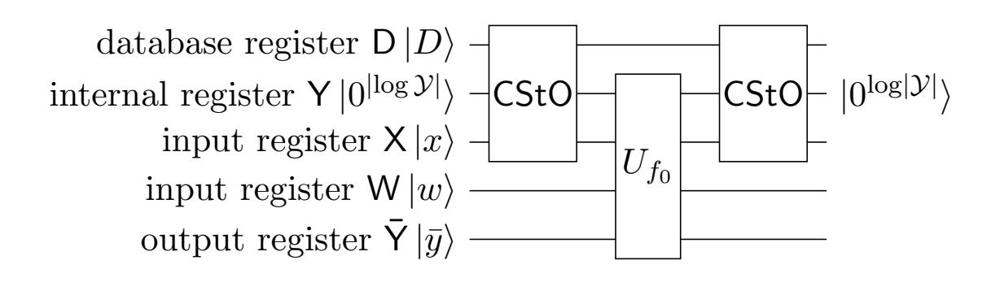

{0}------------------------------------------------

# Tighter Proofs for PKE-to-KEM Transformations under Average-Case Decryption Error and without $\gamma$ -Spread

Jinrong Chen \* Rongmao Chen <sup>(⊠)</sup> \* Yi Wang \* Haodong Jiang <sup>†</sup>
Cong Peng <sup>‡</sup> Xinyi Huang <sup>§</sup> Debiao He <sup>‡</sup> Xiaofeng Chen <sup>¶</sup>

March 23, 2026

#### Abstract

In the NIST post-quantum standardization process, Fujisaki-Okamoto-like (FO-like) transformation has become the de facto paradigm for constructing IND-CCA secure key encapsulation mechanisms (KEMs) from public-key encryption (PKE). However, most post-quantum PKE schemes exhibit decryption error, which poses significant challenges for the security proofs of FO-like PKE-to-KEM transformations, particularly in the quantum-accessible random oracle model (QROM). Hofheinz, Hövelmanns, and Kiltz (TCC 2017) gave the first QROM security proofs for PKE-to-KEM transformations under worst-case decryption error. To relax this to the more designer-friendly one of average-case decryption error, Duman et al. (PKC 2023) presented two transformations, FOAC<sub>0</sub> and FOAC, which are under average-case decryption error but introduce substantial loss in QROM reduction tightness ( $\mathcal{O}(q^8)$  for FOAC<sub>0</sub> and  $\mathcal{O}(q^6)$  for FOAC) and the need for the  $\gamma$ -spread assumption on the underlying PKEs. Very recently, Ge et al. (ePrint 2025) removed the  $\gamma$ -spread assumption for FOAC<sub>0</sub> and improved the QROM reduction tightness to  $\mathcal{O}(q^4)$  for both FOAC<sub>0</sub> and FOAC.

In this work, we make further advances by introducing two refined variants:  $\mathsf{FOAC}_0'$  and  $\mathsf{FOAC}'$ . We provide new security analyses in both the ROM and the QROM, and present the following key contributions: (1) Compared with previous transformations under average-case decryption error,  $\mathsf{FOAC}_0'$  and  $\mathsf{FOAC}'$  exhibit tighter security proofs with QROM reduction loss of only  $\mathcal{O}(q^2)$  for  $\mathsf{FOAC}_0'$  and  $\mathcal{O}(q^3)$  for  $\mathsf{FOAC}'$  when the underlying PKE is OW-CPA secure, and just  $\mathcal{O}(q)$  when it is deterministic or IND-CPA security; (2) Both  $\mathsf{FOAC}_0'$  and  $\mathsf{FOAC}'$  eliminate the  $\gamma$ -spread assumption entirely, further relaxing the requirements on the underlying PKE.

To support our QROM proofs, we provide three new QROM proof techniques that build on Zhandry's compressed oracle technique (CRYPTO 2019). These techniques may be of independent interest and could have broader applicability in post-quantum cryptography.

**Keywords:** Fujisaki-Okamoto transformation  $\cdot$  Key encapsulation mechanisms  $\cdot$  QROM  $\cdot$  Reduction tightness.

<sup>\*</sup> National University of Defense Technology, China. {jinrongchen,chromao,wangyi14}@nudt.edu.cn

<sup>†</sup> Information Engineering University, China. hdjiang13@163.com

<sup>&</sup>lt;sup>‡</sup> Wuhan University, China. {cpeng,hedebiao}@whu.edu.cn

<sup>§</sup> Nanjing University of Aeronautics and Astronautics, China. huangxinyi@nuaa.edu.cn

<sup>¶</sup> Xidian University, China. xfchen@xidian.edu.cn

{1}------------------------------------------------

# Contents

| 1 | Introduction           1.1 Our Contributions                               | 2<br>4<br>5          |
|---|----------------------------------------------------------------------------|----------------------|
| 2 | Technique Overview 2.1 Removing the $\gamma$ -spread Assumption from FOAC  | <b>6</b> 6 8         |
| 3 | Preliminaries  3.1 Notation                                                | 10<br>10<br>12       |
| 4 | 4.1 KEM := $FOAC'_0[PKE', F, H]$                                           | 14<br>14<br>19       |
| 5 | The QROM Proofs  5.1 Some Useful Lemmas                                    | 25                   |
| A | Supporting Material: Proof for the Lemmas in Sec. 5.1  A.1 Auxiliary Lemma | 48<br>51<br>53<br>55 |

{2}------------------------------------------------

# <span id="page-2-0"></span>1 Introduction

Indistinguishability against chosen-ciphertext attacks (IND-CCA) [40] is widely recognized as the standard security notion for public-key encryption (PKE) and key encapsulation mechanisms (KEM), while the Fujisaki-Okamoto (FO) transformation [12,13] is a well-known transformation that transforms a PKE scheme with weaker security into an IND-CCA secure PKE in the random oracle model (ROM) [2] by combining it with a symmetric encryption scheme. Since Dent [9] proposed its KEM variants, the FO transformation for KEM has become a de facto standard for constructing IND-CCA secure KEMs. It has been widely adopted in submissions [3, 8] to the NIST post-quantum standardization process [34], as well as in the design of the already standardized KEM ML-KEM [35] and the soon-to-be-standardized HQC [23]. Importantly, in the post-quantum setting, many PKE schemes intended to be transformed are not perfectly correct, i.e., they occasionally fail to decrypt their own ciphertexts. Moreover, to capture adversaries with potential quantum computing capabilities, security must be established in the quantum-accessible random oracle model (QROM) [5].

The Transformation under Worst-Case Decryption Error. Addressing these challenges, Hofheinz et al. [19] provided the first QROM security proofs for FO-like KEM transformations that tolerate imperfect correctness of the PKE. They formalized four transformations,  $\mathsf{FO}^{\perp}$ ,  $\mathsf{FO}^{\perp}_m$ , and  $\mathsf{FO}^{\perp}_m$ , which transform a PKE satisfying standard security notions (one-wayness against chosen-plaintext attacks (OW-CPA) or indistinguishability against chosen-plaintext attacks (IND-CPA)) into an IND-CCA secure KEM. Here, the superscripts  $\not\perp$  (or  $\perp$ ) indicate the rejection type, i.e., the scheme returns a pseudorandom value (or an explicit failure symbol  $\perp$ ) upon decapsulation failure, while the subscript m (or its absence) specifies the KEM key is derived as  $k \coloneqq H(m)$  (or  $k \coloneqq H(m,c)$ ). While subsequent works have made significant progress in tightening the QROM security reductions for FO-like KEM transformations [4, 10, 14, 15, 22, 26–29, 31, 41], progress on relaxing the required properties of the underlying PKE has been comparatively modest. For a PKE scheme PKE = (Gen, Enc, Dec) with message space  $\mathcal{M}$  and randomness space  $\mathcal{R}$ , the FO-like KEM transformations require that the worst-case decryption error rate [19]

$$\delta_{wc} \coloneqq \mathbb{E}_{(\mathsf{pk},\mathsf{sk}) \leftarrow \mathsf{Gen}(1^{\lambda})} \big[ \max_{m \in \mathcal{M}} \Pr_{\rho \leftarrow \$\mathcal{R}} [\mathsf{Dec}(\mathsf{sk},\mathsf{Enc}(\mathsf{pk},m;\rho)) \neq m] \big]$$

be negligible. This means that, to correctly apply the FO transformation, the scheme designer must control the decryption error probability for *every* possible message and bound the maximum error rate. This requirement imposes additional design effort and is not always straightforward. For instance, in the PKE schemes based on NTRU [18], reducing  $\delta_{wc}$  by increasing the modulus q makes lattice-reduction algorithms more effective, thereby weakening the overall security of the scheme [11].

The Transformation under Average-Case Decryption Error. In contrast to  $\delta_{wc}$ , the average-case decryption error rate

$$\delta_{ac} \coloneqq \mathbb{E}_{(\mathsf{pk},\mathsf{sk}) \leftarrow \mathsf{Gen}(1^{\lambda})} \big[ \mathrm{Pr}_{m \leftarrow \$\mathcal{M}, \rho \leftarrow \$\mathcal{R}} [ \mathsf{Dec}(\mathsf{sk}, \mathsf{Enc}(\mathsf{pk}, m; \rho)) \neq m] \big]$$

is far more designer-friendly. It requires only that the decryption error is negligible for random messages, thereby relaxing the parameter constraints and simplifying the design of the underlying PKE. To enable the use of PKE schemes with negligible average-case decryption error  $\delta_{ac}$ , Duman et al. [11] proposed and proved, in the QROM, two transformations, ACWC<sub>0</sub> and ACWC, that transform a PKE with negligible  $\delta_{ac}$  into one with negligible  $\delta_{wc}$ . By composing these with  $\mathsf{FO}_m^{\perp}$ , they obtained two FO-like KEM transformations under average-case decryption error:  $\mathsf{FOAC}_0 := \mathsf{FO}_m^{\perp} \circ \mathsf{ACWC}_0$  and  $\mathsf{FOAC} := \mathsf{FO}_m^{\perp} \circ \mathsf{ACWC}$ , as illustrated in Fig. 1 and 2, respectively.

{3}------------------------------------------------

```
Gen(1^{\lambda})
                                            \mathsf{Decaps}(\mathsf{sk},(c_1,c_2))
1: (\mathsf{pk}, \mathsf{sk}) \leftarrow \mathsf{Gen}'(1^{\lambda})
                                            1: m := \mathsf{Dec}'(\mathsf{sk}, c_1)
2: return (pk, sk)
                                             2: if m = \bot then : return \bot
                                            3: r \coloneqq c_2 \oplus F(m)
Encaps(pk)
                                            4: (m', \rho, k) \coloneqq H(r)
1: r \leftarrow \$ \{0,1\}^n
                                            5: \mathbf{if} \ r \oplus F(m') = c_2 \mathbf{and}
2: (m, \rho, k) \leftarrow H(r)
                                                   \mathsf{Enc}'(\mathsf{pk}, m'; \rho) = c_1 \ \mathbf{then}
3: c_1 \coloneqq \mathsf{Enc}'(\mathsf{pk}, m; \rho)
                                                      return k
4: c_2 \coloneqq r \oplus F(m)
                                             6: return \perp
5: return (k, (c_1, c_2))
```

<span id="page-3-0"></span>Figure 1: KEM := FOAC<sub>0</sub>[PKE', F, H], where  $F : \mathcal{M} \to \{0,1\}^n$  and  $H : \{0,1\}^n \to \mathcal{M} \times \mathcal{R} \times \mathcal{K}$  are hash functions. Here,  $\mathcal{M}$  is the message space of PKE' = (Gen', Enc', Dec'),  $\mathcal{R}$  is the randomness space of Enc', and  $\mathcal{K}$  is the key space of the derived KEM KEM.

| $Gen(1^\lambda)$                            | Decaps(sk, c)                                                                      |
|---------------------------------------------|------------------------------------------------------------------------------------|
| $1: (pk, sk) \leftarrow Gen'(1^{\lambda})$  | $1: m_1    m_2 \coloneqq Dec'(sk, c)$                                              |
| $2: \mathbf{return} (pk, sk)$               | 2: if $m_1    m_2 = \bot$ then : return $\bot$                                     |
| Encaps(pk)                                  | $3: r \coloneqq m_2 \oplus F(m_1)$                                                 |
| $1: r \leftarrow \mathcal{M}_2$             | $4: (m_1', \rho, k) := H(r)$                                                       |
| $2: (m_1, \rho, k) \leftarrow H(r)$         | 5: if $\operatorname{Enc}'(\operatorname{pk}, m_1'    m_2; \rho) = c \text{ then}$ |
| $3: m_2 \coloneqq r \oplus F(m_1)$          | ${\bf return}  k$                                                                  |
| $4: c \coloneqq Enc'(pk, m_1 \  m_2; \rho)$ | $6: \ \mathbf{return} \perp$                                                       |
| $5: \mathbf{return} (k, c)$                 |                                                                                    |

<span id="page-3-1"></span>Figure 2: KEM := FOAC[PKE', F, H], where  $F : \mathcal{M}_1 \to \mathcal{M}_2$  and  $H : \mathcal{M}_2 \to \mathcal{M}_1 \times \mathcal{R} \times \mathcal{K}$  are hash functions. Here,  $\mathcal{M}_1 \times \mathcal{M}_2$  is the message space of PKE' = (Gen', Enc', Dec'),  $\mathcal{R}$  is the randomness space of Enc', and  $\mathcal{K}$  is the key space of the derived KEM KEM.

Unfortunately, the reduction tightness of  $FOAC_0$  and FOAC given by Duman et al. [11] in both the ROM and QROM is significantly looser than that of the  $FO_m^{\perp}$  [21]. In particular,  $FOAC_0$  suffers from a QROM reduction loss factor as large as  $\mathcal{O}(q^8)$ , where q denotes the number of oracle queries made by the adversary, and a fourth-power degradation in the reduction loss exponent, which severely impairs its practical relevance.

State of the Art. To obtain tighter reductions, Ge et al. [16] revisited the security proofs of FOAC<sub>0</sub> and FOAC and derived tighter security bounds. Moreover, they showed that the  $\gamma$ -spread condition previously required for FOAC<sub>0</sub> can be entirely eliminated, further reducing the restrictions on the underlying PKE. Nevertheless, in the QROM, both schemes still incur a  $\mathcal{O}(q^4)$  loss factor for the randomized PKE, which still remains looser than the state-of-the-art security reductions for FO<sub>m</sub> [21]. The reduction tightness of these transformations for different types of underlying PKE, both in the ROM and the QROM, is summarized in Table 1.

Motivating Question. Although Ge et al. [16] made significant improvements over the work of Duman et al. [11], there remains considerable room for further improvement in reduction tightness. Specifically, the current security reductions for  $\mathsf{FOAC}_0$  and  $\mathsf{FOAC}$  remain looser than that of the original  $\mathsf{FO}_m^\perp$ . In practice, tight security reductions are highly desirable for

{4}------------------------------------------------

<span id="page-4-1"></span>Table 1: Reduction tightness from IND-CCA secure KEM to CPA-secure PKE.  $\epsilon_R$  is the advantage of the reduction w.r.t the CPA security of the underlying PKE,  $\epsilon_A$  denotes the advantage of the adversary  $\mathcal{A}$  w.r.t. the IND-CCA security of the resulting KEM, q is the number of  $\mathcal{A}$ 's oracle queries, and rPKE (or dPKE) indicates that the underlying PKE is randomized (or deterministic).

| Transformation              | Model | Assump.          | OW-CPA rPKE                                                                            | OW-CPA dPKE                                                                            | IND-CPA rPKE                                                  |
|-----------------------------|-------|------------------|----------------------------------------------------------------------------------------|----------------------------------------------------------------------------------------|---------------------------------------------------------------|
| FOAC <sub>0</sub> [11]      | ROM   | $\gamma$ -spread | $\epsilon_R \approx \mathcal{O}(1/q^2)\epsilon_{\mathcal{A}}$                          | -                                                                                      | -                                                             |
| $FOAC_0\left[16\right]$     | ROM   | /                | $\epsilon_R \! \approx \! \mathcal{O}\!\left(1/q^2\right) \! \epsilon_{\mathcal{A}}$   | $\epsilon_R\!\approx\!\epsilon_{\mathcal{A}}$                                          | -                                                             |
| $FOAC_0'(\mathrm{Thm}.4.1)$ | ROM   | /                | $\epsilon_R \approx \mathcal{O}(1/q)\epsilon_{\mathcal{A}}$                            | $\epsilon_R \! \approx \! \epsilon_{\mathcal{A}}$                                      | $\epsilon_R\!\approx\!\epsilon_{\mathcal{A}}$                 |
| FOAC <sub>0</sub> [11]      | QROM  | $\gamma$ -spread | $\epsilon_R \! \approx \! \mathcal{O}\!\left(1/q^8\right) \! \epsilon_{\mathcal{A}}^4$ | -                                                                                      | -                                                             |
| $FOAC_0\left[16\right]$     | QROM  | /                | $\epsilon_R \! \approx \! \mathcal{O}\!\left(1/q^4\right) \! \epsilon_{\mathcal{A}}^2$ | $\epsilon_R \! \approx \! \mathcal{O}\!\left(1/q^2\right) \! \epsilon_{\mathcal{A}}^2$ | -                                                             |
| $FOAC_0'(\mathrm{Thm}.5.4)$ | QROM  | /                | $\epsilon_R \! \approx \! \mathcal{O}\!\left(1/q^2\right) \! \epsilon_\mathcal{A}^2$   | $\epsilon_R \! \approx \! \mathcal{O}(1/q) \epsilon_{\mathcal{A}}^2$                   | $\epsilon_R \approx \mathcal{O}(1/q)\epsilon_{\mathcal{A}}^2$ |
| FOAC [11]                   | ROM   | $\gamma$ -spread | $\epsilon_R \! \approx \! \mathcal{O}\!\left(1/q^2\right) \! \epsilon_{\mathcal{A}}$   | -                                                                                      | -                                                             |
| $FOAC'(\mathrm{Thm.}4.2)$   | ROM   | /                | $\epsilon_R \! \approx \! \mathcal{O}\!\left(1/q^2\right) \! \epsilon_{\mathcal{A}}$   | $\epsilon_R\!\approx\!\epsilon_{\mathcal{A}}$                                          | $\epsilon_R\!\approx\!\epsilon_{\mathcal{A}}$                 |
| FOAC [11]                   | QROM  | $\gamma$ -spread | $\epsilon_R \! \approx \! \mathcal{O}\!\left(1/q^6\right) \! \epsilon_{\mathcal{A}}^2$ | -                                                                                      | -                                                             |
| FOAC [16]                   | QROM  | $\gamma$ -spread | $\epsilon_R \! \approx \! \mathcal{O}\!\left(1/q^4\right) \! \epsilon_\mathcal{A}^2$   | $\epsilon_R \! \approx \! \mathcal{O}\!\left(1/q^2\right) \! \epsilon_{\mathcal{A}}^2$ | -                                                             |
| FOAC'(Thm.5.5)              | QROM  | /                | $\epsilon_R \! \approx \! \mathcal{O}\!\left(1/q^3\right) \! \epsilon_{\mathcal{A}}^2$ | $\epsilon_R \! \approx \! \mathcal{O}(1/q) \epsilon_{\mathcal{A}}^2$                   | $\epsilon_R \approx \mathcal{O}(1/q)\epsilon_{\mathcal{A}}^2$ |
| $FO_m^\perp$ $[21]$         | ROM   | $\gamma$ -spread | $\epsilon_R \approx \mathcal{O}(1/q)\epsilon_{\mathcal{A}}$                            | -                                                                                      | $\epsilon_R \approx \epsilon_{\mathcal{A}}$                   |
| $FO_m^\perp \ [21]$         | QROM  | $\gamma$ -spread | $\epsilon_R \approx \mathcal{O}(1/q^2)\epsilon_A^2$                                    | -                                                                                      | $\epsilon_R \approx \mathcal{O}(1/q)\epsilon_{\mathcal{A}}^2$ |

efficiency reasons, as they avoid the need to increase security parameters merely to compensate for reduction loss [17,39]. This naturally raises the following question:

Is it possible to achieve a tighter PKE-to-KEM transformation under average-case decryption error with a reduction loss comparable to, or even matching, that of  $\mathsf{FO}_m^\perp$ ?

#### <span id="page-4-0"></span>1.1 Our Contributions

In this work, we provide an affirmative answer to the above question. We not only obtain two tighter PKE-to-KEM transformations that rely only on the average-case decryption error of the underlying PKE, but also completely eliminate the need for the  $\gamma$ -spread condition. To achieve this, we introduce *minor* modifications to FOAC<sub>0</sub> and FOAC and present new security proofs. To distinguish them from the original constructions, we denote our modified schemes by FOAC'<sub>0</sub> and FOAC', as illustrated in Fig. 3 and Fig. 4, respectively.

Firstly, as summarized in Table 1, we present tighter security proofs than prior works [11,16] in both the ROM and the QROM. In both models,  $\mathsf{FOAC}_0'$  achieves a reduction loss factor identical to that of  $\mathsf{FO}_m^\perp$ , while  $\mathsf{FOAC}'$  (which has a more compact ciphertext) incurs an additional  $\mathcal{O}(q)$  factor only when the underlying PKE is OW-CPA secure.

Secondly, like FOAC<sub>0</sub> and FOAC, both FOAC'<sub>0</sub> and FOAC' operate under the average-case decryption error  $\delta_{ac}$  rather than the worst-case error  $\delta_{wc}$  of the underlying PKE. Moreover,

{5}------------------------------------------------

```
Gen(1λ
       )
1 : (pk,sk) ← Gen′
                   (1λ
                      )
2 : return (pk,sk)
Encaps(pk)
1 : r ←$ {0, 1}
               n
2 : (m, ρ, k) ←$ H(r)
3 : c1 := Enc′
              (pk, m; ρ)
4 : c2 := r ⊕ F(m)
5 : return (k,(c1, c2))
                           Decaps(sk,(c1, c2))
                           1 : m := Dec′
                                          (sk, c1)
                           2 : if m = ⊥ then : return ⊥
                           3 : r := c2 ⊕ F(m)
                           4 : (m′
                                   , ρ, k) := H(r)
                           5 : if m = m′ and
                               Enc′
                                    (pk, m′
                                           ; ρ) = c1 then
                                  return k
                           6 : return ⊥
```

Figure 3: KEM := FOAC′ 0 [PKE′ , F, H]. Differences from FOAC<sup>0</sup> in Fig. [1](#page-3-0) are highlighted .

```
Gen(1λ
       )
1 : (pk,sk) ← Gen′
                   (1λ
                      )
2 : return (pk,sk)
Encaps(pk)
1 : r ←$ M2
2 : (m1, ρ, k) ←$ H(r)
3 : m2 := r ⊕ F(m1)
4 : c := Enc′
            (pk, m1∥m2; ρ)
5 : return (k, c)
                               Decaps(sk, c)
                               1 : m1∥m2 := Dec′
                                                  (sk, c)
                               2 : if m1∥m2 = ⊥ then : return ⊥
                               3 : r := m2 ⊕ F(m1)
                               4 : (m′
                                      1
                                       , ρ, k) := H(r)
                               5 : if m1 = m′
                                              1 and
                                   Enc′
                                       (pk, m′
                                             1∥m2; ρ) = c then
                                     return k
                               6 : return ⊥
```

<span id="page-5-2"></span>Figure 4: KEM := FOAC′ [PKE′ , F, H]. Differences from FOAC in Fig. [2](#page-3-1) are highlighted .

both transformations completely remove the need for the γ-spread condition, further relaxing the requirements on the PKE when constructing IND-CCA secure KEMs.

Thirdly, to support our QROM proofs, inspired by prior works [\[10,](#page-44-7)[15,](#page-45-4)[16,](#page-45-8)[32\]](#page-46-5), we distill and formalize three novel QROM proof techniques based on the compressed oracle technique [\[43\]](#page-47-5). These are the Switching Lemma (Lemma [5.1\)](#page-24-0), the Lookup Lemma (Lemma [5.2\)](#page-24-1), and the Puncturing Lemma (Lemma [5.3\)](#page-25-2). These tools allow us to lift ROM proof strategies to the QROM in a modular and conceptually simple manner, significantly simplifying security arguments. Due to their generality, we believe these lemmas are of independent interest and applicable to a wide range of other QROM proof scenarios.

# <span id="page-5-0"></span>1.2 Related Work

Research on building IND-CCA secure KEMs from weakly secure PKE has long been a major focus in academia. The FO-like KEM transformation, a KEM variant of the Fujisaki-Okamoto (FO) transform [\[12,](#page-44-0) [13\]](#page-45-0) introduced by Dent [\[9\]](#page-44-2) and proven secure in the random oracle model (ROM), is the most widely adopted paradigm. In the post-quantum setting, however, security must be established in the quantum-accessible random oracle model (QROM) [\[5\]](#page-44-5) to account for quantum adversaries, and several works [\[42,](#page-47-6) [44\]](#page-47-7) have shown that ROM security does not generally imply QROM security.

The first QROM security proof for FO-like KEM transformations, due to Hofheinz et al. [\[19\]](#page-45-2),

{6}------------------------------------------------

introduced an extra hash function and incurred a quartic loss. Subsequent works progressively improved the reduction: for OW-CPA PKE, Jiang et al. [26] removed the extra hash and achieved a quadratic loss, which was later shown to be inherent for black-box, non-rewinding reductions [29]. For IND-CPA PKE, the loss was further reduced [4, 28]. Saito et al. [41] introduced the tightly secure SXY transform via disjoint simulatability, later extended by Jiang et al. [27]. Recently, Kuchta et al. [31] and Ge et al. [14] developed the measure-rewind-measure and measure-rewind-extract techniques, respectively, to eliminate the quadratic loss. For the IND-1CCA setting<sup>1</sup>, even more efficient transforms have been proposed and subsequently tightened [7, 24, 25].

While prior works significantly tightened the security reductions, they all require the underlying PKE to have a negligible worst-case decryption error  $\delta_{wc}$ . To use PKEs with only negligible average-case decryption error  $\delta_{ac}$ , Hövelmanns [20] introduced ACWC<sub>1</sub><sup>2</sup>, which converts a  $\delta_{ac}$ -correct PKE into a  $\delta_{wc}$ -correct PKE; combined with FO $_m^{\chi}$ , this yields FOAC<sub>1</sub>. Later, Kim and Park [30] replaced the XOR in ACWC<sub>1</sub> with a semi-generalized one-time pad (SOTP), obtaining ACWC<sub>2</sub> and FOAC<sub>2</sub>. The latter was used to design NTRU+ [37], a winner of the Korean Post-Quantum Cryptography Competition [38]. However, both ACWC<sub>1</sub> and ACWC<sub>2</sub> demand that the underlying PKE supports randomness recovery, a restriction that limits their applicability.

To lift the randomness-recovery requirement, Duman et al. [11] generalized the technique of Lyubashevsky and Seiler [33] and proposed ACWC<sub>0</sub> (which increases ciphertext length) and its compact variant ACWC. Composing these with  $\mathsf{FO}_m^\perp$  gives  $\mathsf{FOAC}_0$  and  $\mathsf{FOAC}$ , respectively. They proved IND-CCA security in both the ROM and the QROM, relying only on the  $\delta_{ac}$ -correctness and the  $\gamma$ -spread property of the underlying PKE. Although these constructions remove the need for randomness recovery, their security reductions are substantially looser than that of  $\mathsf{FO}_m^\perp$ , and the additional  $\gamma$ -spread condition remains a burden. Subsequently, Ge et al. [16] revisited the proofs, achieving tighter bounds and eliminating the  $\gamma$ -spread requirement for  $\mathsf{FOAC}_0$ . However,  $\mathsf{FOAC}$  still relies on this condition, and the reduction loss for both schemes still lags behind that of  $\mathsf{FO}_m^\perp$ . Closing this gap is the central motivation of our work.

# <span id="page-6-0"></span>2 Technique Overview

#### <span id="page-6-1"></span>2.1 Removing the $\gamma$ -spread Assumption from FOAC

In this section, we first motivate the need for modifying the original FOAC<sub>0</sub> and FOAC and explain why, after our tweaks, the security of FOAC' no longer relies on the  $\gamma$ -spread condition of the underlying PKE. Before describing these modifications, we want to recall what  $\gamma$ -spread is and why it was required in the original security proofs of FO-like transformations.

Why  $\mathsf{FO}_m^\perp$  requires  $\gamma$ -spread? For a PKE scheme  $\mathsf{PKE} = (\mathsf{Gen}, \mathsf{Enc}, \mathsf{Dec})$  with message space  $\mathcal{M}$ , randomness space  $\mathcal{R}$  and ciphertext space  $\mathcal{C}$ , we say that  $\mathsf{PKE}$  is weakly  $\gamma$ -spread if

$$\mathbb{E}_{(\mathsf{pk},\mathsf{sk})\leftarrow\mathsf{Gen}(1^{\lambda})}\big[\mathrm{max}_{m\in\mathcal{M},\,c\in\mathcal{C}}\,\mathrm{Pr}_{\rho\leftarrow\$\mathcal{R}}\big[\mathsf{Enc}(\mathsf{pk},m;\rho)=c]\big]\leq 2^{-\gamma}\ .$$

As a concrete example, consider the security of  $\mathsf{FO}_m^\perp$  in the ROM. Applying  $\mathsf{FO}_m^\perp$  to  $\mathsf{PKE}$  yields  $\mathsf{KEM} \coloneqq \mathsf{FO}_m^\perp[\mathsf{PKE}, H]$ , where the hash function H is modeled as a random oracle. The reduction maintains an initially empty list  $\mathsf{List}^H$  to record the adversary's queries. The decapsulation algorithm  $\mathsf{Decaps}$  is shown in the left part of Fig. 5. A crucial step in the IND-CCA proof of  $\mathsf{KEM}$  is to establish that

$$\forall m \neq \bot, c \in \mathcal{C}$$
, if  $\operatorname{List}^H(m) = \bot$  then  $\Pr[\operatorname{Enc}(\mathsf{pk}, m; H(m)[0]) = c]$  is negligible,

<span id="page-6-2"></span><sup>&</sup>lt;sup>1</sup>I.e., at most one decapsulation query is allowed in the IND-CCA security game.

<span id="page-6-3"></span><sup>&</sup>lt;sup>2</sup>Originally named ACWC; we denote it as ACWC<sub>1</sub> to avoid confusion.

{7}------------------------------------------------

| Decaps(sk,c)                                                                    | $Enc^0_{\mathrm{ac}}(pk,m;\theta)$                                   |
|---------------------------------------------------------------------------------|----------------------------------------------------------------------|
| $1: \ m \coloneqq Dec(sk, c)$                                                   | $6: (m', \rho) \coloneqq \theta$                                     |
| $2: \mathbf{if} \ m = \perp \mathbf{then}$                                      | $7: c_1 \coloneqq Enc'(pk, m'; \rho), c_2 \coloneqq m \oplus F(m')$  |
| $\mathbf{return} \perp$                                                         | 8: <b>return</b> $c \coloneqq (c_1, c_2)$                            |
| $3: (\theta, k) \coloneqq H(m)$                                                 | $Enc_{\mathrm{ac}}(pk, m; \theta)$                                   |
| 4: <b>if</b> $\operatorname{Enc}(\operatorname{pk}, m; \theta) = c$ <b>then</b> | $9: (m'_1, \rho) \coloneqq \theta, \ m_2 \coloneqq m \oplus F(m'_1)$ |
| $\mathbf{return}\ k$                                                            | $10: c \coloneqq Enc'(pk, m_1' \  m_2; \rho)$                        |
| $5: \ \mathbf{return} \perp$                                                    | $11: \mathbf{return} \ c$                                            |

<span id="page-7-0"></span>Figure 5: Decapsulation algorithm Decaps of  $FO_m^{\perp}$ , and encryption algorithms  $Enc_{ac}^0$  and  $Enc_{ac}$  used by  $FOAC_0$  and FOAC, respectively.

where H(m)[0] denotes the first component of H(m). This ensures that, for any ciphertext passing the re-encryption check in line 4 of Fig. 5, its plaintext has been stored in List<sup>H</sup> with overwhelming probability. Consequently, the reduction can answer decapsulation queries without sk by retrieving the matching m from List<sup>H</sup>.

When  $\operatorname{List}^H(m) = \bot$  (i.e., the adversary has not queried H(m)), the value H(m) is uniformly random by the random oracle model. The weak  $\gamma$ -spread condition then can directly imply  $\Pr[\operatorname{Enc}(\operatorname{pk}, m; H(m)[0]) = c] \leq 2^{-\gamma}$ .

Why the proof of FOAC<sub>0</sub> in [16] does not require  $\gamma$ -spread? For KEM := FOAC<sub>0</sub>[PKE', F, H] = FO $_m^{\perp}$ [ACWC<sub>0</sub>[PKE', F], H], both the hash functions F and H are modeled as random oracles, with initially empty lists List H maintained by the reduction. The encryption algorithm  $\operatorname{Enc}_{\operatorname{ac}}^0$  used for the re-encryption step in Decaps is depicted in the upper right part of Fig. 5. The requirement on  $\operatorname{Enc}_{\operatorname{ac}}^0$  now becomes:

$$\forall m \neq \bot, c = (c_1, c_2), \text{ if } \operatorname{List}^H(m) = \bot$$
  
then  $\Pr[\operatorname{Enc}'(\operatorname{pk}, m'; \rho) = c_1 \land m \oplus F(m') = c_2] \text{ is negligible },$ 

where  $((m', \rho), k) := H(m)$ . If List<sup>H</sup> $(m) = \bot$ , the adversary has not queried H(m), so m' is uniformly random. Since a PPT adversary makes at most polynomially many queries to F, and the space of m' is sufficiently large, the probability that m' has been queried to F is also negligible. Hence, with overwhelming probability, F(m') is also uniformly random. That is, for fixed m and  $c_2$ ,

$$\Pr[m \oplus F(m') = c_2] \le 1/|\mathcal{Y}|,$$

where  $\mathcal{Y}$  denotes the codomain of F. Consequently,

$$\Pr[\mathsf{Enc}'(\mathsf{pk}, m'; \rho) = c_1 \land m \oplus F(m') = c_2] \le \Pr[m \oplus F(m') = c_2] \le 1/|\mathcal{Y}|,$$

and no  $\gamma$ -spread assumption is required.

Why the same technique does not apply to FOAC? For KEM := FOAC[PKE', F, H] =  $FO_m^{\perp}[ACWC[PKE', F], H]$ , F and H are again modeled as random oracles, maintaining lists  $List^F$  and  $List^H$ . The encryption algorithm  $Enc_{ac}$  used in the re-encryption step is shown in the lower right part of Fig. 5. The condition now becomes:

$$\forall m \neq \bot, c \in \mathcal{C}, \text{ if } \operatorname{List}^H(m) = \bot$$
  
then  $\Pr[\operatorname{Enc}'(\operatorname{pk}, m_1' || (m \oplus F(m_1')); \rho) = c] \text{ is negligible },$ 

{8}------------------------------------------------

where  $((m'_1, \rho), k) := H(m)$ . Here, if  $\operatorname{List}^H(m) = \bot$ ,  $m'_1$  is uniformly random, and with overwhelming probability,  $m'_1$  has not been queried to F, so  $F(m'_1)$  is also uniform, as in the case of  $\mathsf{FOAC}_0$ . Nevertheless, even under these conditions we cannot bound the above probability without invoking  $\gamma$ -spread.

In FOAC<sub>0</sub>, the event " $m \oplus F(m') = c_2$ " depends on a single random value; for fixed m and  $c_2$ , exactly one value of F(m') satisfies the equality. In contrast, for FOAC, the event involves three random variables  $(m'_1, F(m'_1), \rho)$ , and the set of tuples  $(m'_1, F(m'_1), \rho)$  satisfying  $\operatorname{Enc}'(\operatorname{pk}, m'_1 || (m \oplus F(m'_1)); \rho) = c$  is not a singleton. Its cardinality, and hence the probability, cannot be bounded a priori without a  $\gamma$ -spread assumption for fixed m and c.

How to modify FOAC to eliminate  $\gamma$ -spread? The fundamental reason for requiring  $\Pr[\mathsf{Enc}(\mathsf{pk}, m; H(m)[0]) = c]$  to be negligible when  $\mathsf{List}^H(m) = \bot$  is to guarantee that, whenever the decapsulation algorithm outputs a non- $\bot$  key k, the adversary must have queried H at the corresponding m with non-negligible probability. This allows the reduction, without  $\mathsf{sk}$ , to retrieve the appropriate entry from  $\mathsf{List}^H$  and answer the decapsulation query.

Our modification is simple: we insert an extra check  $m_1 = m_1'$  at line 5 of Fig. 2, requiring that the value  $m_1'$  obtained from H(r) equal the value  $m_1$  computed by  $\operatorname{Dec}'$  in line 1. This modification is shown in line 5 of Fig. 4. With this additional check, for any  $m_1 \| m_2 \neq \bot$  and any ciphertext c, if  $\operatorname{List}^H(r) = \bot$ , the probability that line 5 passes is at most  $1/|\mathcal{M}_1|$ , where  $\mathcal{M}_1$  is the space of  $m_1$ . This yields a clean, parameter-independent bound. In fact, relative to FOAC, the only case excluded by FOAC' is the pathological situation where  $m_1 \| m_2 = \operatorname{Dec}'(\mathsf{sk}, \operatorname{Enc}'(\mathsf{pk}, m_1' \| m_2, \rho))$  for some  $m_1' \neq m_1$ . In this scenario, the two parties attempting to establish a shared key via the KEM would very likely obtain inconsistent keys. Thus, our modification also enhances the correctness of the scheme.

We can also apply an analogous modification to  $\mathsf{FOAC}_0$ ; the revised condition is shown in line 5 of Fig. 3. This change both eliminates the pathological case where  $m \neq m'$  yet  $m = \mathsf{Dec'}(\mathsf{sk}, \mathsf{Enc'}(\mathsf{pk}, m'; \rho))$ , thereby enhancing correctness, and removes one hash evaluation, which makes the proof cleaner.

## <span id="page-8-0"></span>2.2 Tighter Proofs for FOAC and FOAC

In the security analyses of  $\mathsf{FOAC}_0 \coloneqq \mathsf{FO}_m^\perp \circ \mathsf{ACWC}_0$  and  $\mathsf{FOAC} \coloneqq \mathsf{FO}_m^\perp \circ \mathsf{ACWC}$  due to Duman et al. [11], a *modular* proof strategy is employed: the security of the intermediate transformations  $\mathsf{ACWC}_0$  and  $\mathsf{ACWC}$  is established first, and then combined with the existing bounds for  $\mathsf{FO}_m^\perp$  [10] to obtain the overall security guarantees. Ge et al. [16] adopt a similar modular approach for  $\mathsf{FOAC}$ , but treat  $\mathsf{FOAC}_0$  differently: they first reduce its IND-CCA security to IND-CPA security, and then further reduce IND-CPA security to the OW-CPA security of the underlying PKE.

The appeal of modular analysis lies in its reusability: it allows one to directly leverage established results, requiring proofs only for the missing or altered components. However, this modularity also obscures the algorithmic details of the underlying constructions, making it difficult to exploit their specific structural properties within the reduction. Such information loss often leads to unnecessary tightness degradation. As illustrated in the preceding discussion on eliminating the  $\gamma$ -spread assumption, a  $\gamma$ -spread-free security proof hinges on the fine-grained characteristics of the underlying PKE, which is precisely the kind of detail that modular reasoning tends to discard. Thus, in this work we adopt a holistic perspective: we treat FOAC'<sub>0</sub> and FOAC' as fully integrated constructions and analyze their IND-CCA security directly, in both the ROM and the QROM.

**ROM proofs for FOAC'** and FOAC'. At a high level, our ROM security proofs for  $FOAC'_0$  and FOAC' consist of three main stages.

Stage 1: Simulating decapsulation without the secret key. This stage is essential for reducing

{9}------------------------------------------------

IND-CCA security to the CPA security of the underlying PKE. We first argue that, whenever a decapsulation query returns a non-⊥ key k, all random oracle calls involved in its computation (e.g., (m′ , ρ, k) := H(r)) must have already been made. The reduction can then retrieve the corresponding entry from the random oracle's query history and compute the response without sk.

Stage 2: Removing challenger's footprint from the random oracle. In the IND-CCA game, the challenger itself queries the random oracle when generating the challenge ciphertext and the challenge key. These queries leave entries in the oracle history that are not attributable to the adversary. Since later reduction steps rely on the fact that all relevant oracle entries originate from the adversary, we must erase or puncture these challenger-induced records.

Stage 3: Reprogramming random oracle to decouple the challenge. In this stage, we reprogram the random oracle at a carefully selected point so that the generation of the challenge ciphertext and the challenge key becomes independent of the oracle's response. We show that, unless the adversary queries the reprogrammed point, this modification is undetectable. By linking the reprogramming point to the solution of the CPA game of the underlying PKE, we can leverage the adversary's ability to hit that point to construct a successful adversary against the CPA security of the PKE.

QROM proofs for FOAC′ <sup>0</sup> and FOAC′ . In the ROM, the reduction can freely read and exploit the adversary's classical query history. Lifting such an argument to the QROM is nontrivial: quantum adversaries can query the random oracle in superposition, and the no-cloning theorem prevents us from simply recording the queries without disturbing the adversary's state. Fortunately, Zhandry's compressed oracle technique [\[43\]](#page-47-5) allows us to implicitly and imperfectly record the adversary's queries in the database register. To turn this record-keeping into a usable reduction, we develop three new technical lemmas, each tailored to one of the three stages of our ROM proof.

Switching Lemma (Lemma [5.1\)](#page-24-0). This lemma allows us to switch each call to the quantumaccessible random oracle (QRO) in the decapsulation procedure into a check against the compressed oracle's database register. It corresponds to the first part of Stage 1, ensuring that a non-⊥ decapsulation response implies the relevant oracle query is already recorded in the database.

Lookup Lemma (Lemma [5.2\)](#page-24-1). Once all QRO calls have been switched to database checks, this lemma bounds the adversarial advantage when we replace the decapsulation logic with a direct lookup of a matching entry in the database, without using sk. This captures the second part of Stage 1 in the QROM setting.

Puncturing Lemma (Lemma [5.3\)](#page-25-2). This lemma implements Stage 2 in the QROM. It enables us to remove from the compressed oracle's database those entries inserted by the challenger during the generation of the challenge ciphertext and challenge key, thereby ensuring that the database reflects only the adversary's queries.

For the final stage (oracle reprogramming) and any other situation requiring reprogramming of the random oracle, we directly employ existing One-Way to Hiding (O2H) lemmas [\[1,](#page-44-10) [15\]](#page-45-4) adapted to the QROM. With these three new tools in hand, we are able to lift the entire ROM proof strategy to the quantum setting, yielding tighter QROM security proofs for both FOAC′ 0 and FOAC′ .

# <span id="page-9-0"></span>3 Preliminaries

This section reviews the basic notation, the (quantum-accessible) random oracle model, relevant cryptographic primitives, the compressed oracle technique, and some key lemmas.

{10}------------------------------------------------

#### <span id="page-10-0"></span>3.1 Notation

We write a function H with domain X and codomain Y as H : X → Y, and denote the set of all such functions by ΩH. The cardinality of a set S is denoted by |S|. The notation s ←\$ S means that s is sampled uniformly at random from S, while z ← D<sup>z</sup> indicates that z is sampled according to the distribution Dz. For an n-tuple T := (t0, . . . , tn−1), we denote by T[i] the (i + 1)-th element, i.e., t<sup>i</sup> , where 0 ≤ i ≤ n − 1. For a probabilistic (or deterministic) algorithm A on input x, we write y ← A(x) (or y := A(x)) to denote that A(x) outputs y. An oracle algorithm with classical (or quantum) access to an oracle H is denoted by A<sup>H</sup> (or A|H⟩ ). The notation [a = b] denotes the indicator function that outputs 1 if a = b and 0 otherwise. The security parameter is denoted by λ, and PPT stands for probabilistic polynomial time. The base of logarithm log is 2, unless stated otherwise.

## <span id="page-10-1"></span>3.2 The (Quantum-Accessible) Random Oracle Model

We refer the reader to [\[36\]](#page-46-11) for a standard introduction to quantum computation. In brief, the state space of a quantum system is a complex Hilbert space equipped with an inner product. Dirac notation is used to denote state vectors: |ψ⟩ represents a unit vector in the state space, and its dual is denoted ⟨ψ|. The space admits an orthonormal basis, called the computational basis. The joint state of two systems in states |ψ⟩ and |ϕ⟩ is given by the tensor product |ψ⟩⊗|ϕ⟩, often abbreviated as |ψ⟩ |ϕ⟩ or |ψ, ϕ⟩. The norm of |ψ⟩ is defined as ∥|ψ⟩∥ = p ⟨ψ|ψ⟩, where ⟨ψ|ϕ⟩ denotes the inner product of |ψ⟩ and |ϕ⟩.

The random oracle model (ROM), introduced by Bellare and Rogaway [\[2\]](#page-44-1), idealizes a hash function as a publicly accessible random oracle. In this model, an adversary can only obtain the value of a hash function H(x) by querying the oracle at x; as if H were a truly random function.

The quantum-accessible ROM (QROM) extends the ROM by allowing adversaries to query the random oracle in superposition. A quantum-accessible random oracle (QRO) H is implemented as a unitary operator U<sup>H</sup> acting as |x, y⟩ 7→ |x, y ⊕ H(x)⟩. Classical queries remain admissible; we write y := H(x) to denote a classical query to H at x that returns a classical output y. This can be viewed as querying the QRO with the state |x, 0⟩ and then measuring the second register in the computational basis to obtain the classical outcome [\[10\]](#page-44-7).

#### <span id="page-10-2"></span>3.3 Cryptographic Primitives

Definition 3.1 (Public-Key Encryption, PKE). The public-key encryption (PKE) scheme consists of three PPT algorithms with a security parameter λ, a message space M, and a ciphertext space C: (1) Key generation algorithm (pk,sk) ← Gen(1<sup>λ</sup> ) is a probabilistic algorithm that takes as input 1<sup>λ</sup> and outputs a public/private key pair (pk,sk), where pk implicitly defines a randomness space R := R(pk). (2) Encryption algorithm c ← Enc(pk, m) is a probabilistic algorithm that takes as input pk and a message m ∈ M and outputs a ciphertext c ∈ C. When necessary, we explicitly denote the randomness used for encryption as c := Enc(pk, m; ρ), where ρ ←\$ R and R is the randomness space. (3) Decryption algorithm m := Dec(sk, c) is a deterministic algorithm that takes as input sk and a ciphertext c ∈ C and outputs either a message m ∈ M or a special symbol ⊥ ∈ M/ . We say that PKE = (Gen, Enc, Dec) is defined over (M, C).

The correctness requirement of a PKE scheme is that for all (pk,sk) ← Gen(1<sup>λ</sup> ) and for all c ← Enc(pk, m), we have Dec(sk, c) = m. A PKE scheme is said to be deterministic if Enc is a deterministic algorithm.

Definition 3.2 (Worst/Average-Case Correctness of PKE [\[11\]](#page-44-8)). For a PKE scheme PKE = (Gen, Enc, Dec) defined over (M, C), we say it is δwc-worst-case-correct or has worst-case de

{11}------------------------------------------------

cryption error rate  $\delta_{wc}$  if

$$\mathbb{E}_{(\mathsf{pk},\mathsf{sk})\leftarrow\mathsf{Gen}(1^{\lambda})}\left[\max_{m\in\mathcal{M}}\Pr_{\rho\leftarrow\$\mathcal{R}}[\mathsf{Dec}(\mathsf{sk},\mathsf{Enc}(\mathsf{pk},m;\rho))\neq m]\right]\leq\delta_{wc}\ .\tag{1}$$

We say it is  $\delta_{ac}$ -average-case-correct or has average-case decryption error rate  $\delta_{ac}$  if

<span id="page-11-1"></span>
$$\mathbb{E}_{(\mathsf{pk},\mathsf{sk})\leftarrow\mathsf{Gen}(1^{\lambda})} \left[ \Pr_{m \leftarrow \$\mathcal{M}, \rho \leftarrow \$\mathcal{R}} \left[ \mathsf{Dec}(\mathsf{sk}, \mathsf{Enc}(\mathsf{pk}, m; \rho)) \neq m \right] \right] \leq \delta_{ac} \ . \tag{2}$$

**Definition 3.3** ((Weak)  $\gamma$ -spreadness of PKE [10]). For the PKE scheme PKE = (Gen, Enc, Dec) defined over  $(\mathcal{M}, \mathcal{C})$ , we say it is weakly  $\gamma$ -spread if

$$\mathbb{E}_{(\mathsf{pk},\mathsf{sk})\leftarrow\mathsf{Gen}(1^{\lambda})}\left[\max_{m\in\mathcal{M},\,c\in\mathcal{C}}\Pr_{\rho\leftarrow\$\mathcal{R}}[\mathsf{Enc}(\mathsf{pk},m;\rho)=c]\right]\leq 2^{-\gamma}\ .$$

When the context is clear, we omit the qualifier "weak" or "weakly".

**Definition 3.4** (Security of PKE). A PKE scheme PKE = (Gen, Enc, Dec) defined over  $(\mathcal{M}, \mathcal{C})$  is said to be OW-CPA (or IND-CPA) secure if for any PPT adversary  $\mathcal{A}$ , the advantage  $\mathsf{Adv}^{\mathrm{OW-CPA}}_{\mathsf{PKE}}(\mathcal{A})$  (or  $\mathsf{Adv}^{\mathrm{IND-CPA}}_{\mathsf{PKE}}(\mathcal{A})$ ) is negligible, where the security notions are defined via a game played between a challenger and the adversary  $\mathcal{A}$  as shown in Fig. 6. The adversary's ad-

| OW-CPA Game:                                      | IND-CPA Game:                                             |
|---------------------------------------------------|-----------------------------------------------------------|
| $\boxed{1: (pk, sk) \leftarrow Gen(1^{\lambda})}$ | $1: \; (pk, sk) \leftarrow Gen(1^{\lambda})$              |
| $2: m^* \leftarrow \mathcal{M}$                   | $2: (m_0, m_1, st) \leftarrow \mathcal{A}(pk)$            |
| $3: c^* \leftarrow Enc(pk, m^*)$                  | $3: b \leftarrow \$ \{0,1\}, c^* \leftarrow Enc(pk, m_b)$ |
| $4: \hat{m} \leftarrow \mathcal{A}(pk, c^*)$      | $4: \ \hat{b} \leftarrow \mathcal{A}(pk, c^*, st)$        |
| $5: \mathbf{return} \ [m^* = \hat{m}]$            | $5: \ \mathbf{return} \ [b = \hat{b}]$                    |

<span id="page-11-0"></span>Figure 6: Security games for OW-CPA and IND-CPA security of PKE = (Gen, Enc, Dec).

vantages are defined as  $\mathsf{Adv}_{\mathsf{PKE}}^{\mathsf{OW-CPA}}(\mathcal{A}) \coloneqq \Pr[m^* = \hat{m}]$  (or  $\mathsf{Adv}_{\mathsf{PKE}}^{\mathsf{IND-CPA}}(\mathcal{A}) \coloneqq |\Pr[b = \hat{b}] - 1/2|$ ). The message  $m^*$  and ciphertext  $c^*$  generated by the challenger are referred to as the challenge message and challenge ciphertext, respectively.

**Definition 3.5** (Key Encapsulation Mechanism, KEM). The key encapsulation mechanism (KEM) consists of three PPT algorithms with a security parameter  $\lambda$ , a key space  $\mathcal{K}$ , and a ciphertext space  $\mathcal{C}$ : (1) Key generation algorithm ( $\mathsf{pk}, \mathsf{sk}$ )  $\leftarrow \mathsf{Gen}(1^{\lambda})$  is a probabilistic algorithm that takes as input  $1^{\lambda}$  and outputs a public/private key pair ( $\mathsf{pk}, \mathsf{sk}$ ). (2) Encapsulation algorithm (k, c)  $\leftarrow \mathsf{Encaps}(\mathsf{pk})$  is a probabilistic algorithm that takes as input  $\mathsf{pk}$  and outputs a key-ciphertext pair (k, c)  $\in \mathcal{K} \times \mathcal{C}$ . (3) Decapsulation algorithm  $k := \mathsf{Decaps}(\mathsf{sk}, c)$  is a deterministic algorithm that takes as input  $\mathsf{sk}$  and  $c \in \mathcal{C}$  and outputs  $k \in \mathcal{K} \cup \{\bot\}$ . We say that  $\mathsf{KEM} = (\mathsf{Gen}, \mathsf{Encaps}, \mathsf{Decaps})$  is defined over ( $\mathcal{K}, \mathcal{C}$ ).

The correctness requirement of a KEM is that for all  $(pk, sk) \leftarrow Gen(1^{\lambda})$  and for all  $(k, c) \leftarrow Encaps(pk)$ , we have Decaps(sk, c) = k. A KEM is said to be with explicit rejection if  $\bot \notin \mathcal{K}$ , or with implicit rejection if  $\bot \in \mathcal{K}$  denotes a random value.

**Definition 3.6** (IND-CCA Security of KEM). The IND-CCA security of KEM = (Gen, Encaps, Decaps) defined over  $(\mathcal{K}, \mathcal{C})$  is defined via a game played between a challenger and an adversary  $\mathcal{A}$  as shown in Fig. 7. The adversary's advantage is defined as  $Adv_{KEM}^{IND-CCA}(\mathcal{A}) := |\Pr[b = \hat{b}] - 1/2|$ . If this advantage is negligible for any PPT adversary, then KEM is said to be IND-CCA secure. The keys  $k_0, k_1$  and ciphertext c generated by the challenger are referred to as the challenge keys and challenge ciphertext, respectively.

{12}------------------------------------------------

| IND-CCA Game:                      | ∈ C):<br>Decapsulation oracle<br>ODec(c |  |
|------------------------------------|-----------------------------------------|--|
| 1 : (pk,sk) ← Gen(1λ<br>)          | ∗<br>1 : if c = c<br>then               |  |
| 2 : (k0, c∗<br>) ← Encaps(pk)      | 2 :<br>return ⊥                         |  |
| 3 : k1<br>←\$ K, b ←\$ {0, 1}      | 3 : else                                |  |
| 4 : ˆb<br>← AODec (pk, c∗<br>, kb) | k := Decaps(sk, c)<br>4 :               |  |
| 5 : return [b = ˆb]                | 5 :<br>return k                         |  |

<span id="page-12-1"></span>Figure 7: Security games for IND-CCA security of KEM = (Gen, Encaps, Decaps).

#### <span id="page-12-0"></span>3.4 The Compressed Oracle Technique

In the classical ROM, reductions can record adversaries' queries. In the QROM, this ability was long considered unattainable due to the quantum no-cloning principle: any direct measurement of a quantum register inevitably disturbs the adversary's state. However, Zhandry [\[43\]](#page-47-5) circumvented this "recording barrier" by proposing the compressed oracle technique. The core idea is to purify the quantum random oracle and then record query information on the purified quantum random oracle.

<span id="page-12-2"></span>Definition 3.7 (Compressed Standard Oracle). Let D be a database comprising q entries of the form (x, y) ∈ (X ×Y)∪{(⊥, 0 n )}, where n := log |Y| and q is an upper bound on the number of quantum random oracle queries. The structure of D is

$$D = ((x_1, y_1), (x_2, y_2), \dots, (x_l, y_l), (\bot, 0^n), \dots, (\bot, 0^n)),$$

with 0 ≤ l ≤ q, (x<sup>i</sup> , yi) ∈ X × Y, x<sup>1</sup> < · · · < x<sup>l</sup> , and exactly q − l trailing copies of (⊥, 0 n ). We write D for the set of all such databases. We sometimes explicitly denote a database with q entries by Dq, and let D<sup>q</sup> be the set of such databases. For any x ∈ X , if there exists a pair (x, y) in D we set D(x) = y; otherwise D(x) = ⊥. By construction, no two distinct entries share the same x. The quantity |D| counts the entries with x ̸= ⊥. When |D| < q and D(x) = ⊥, the operation D ∪ (x, y) removes one (⊥, 0 n ) and inserts (x, y) while maintaining the ascending order of the x's.

Let D be a register with state space H = C[D]. For a basis state |D⟩ (D ∈ D), we define a unitary decompression operator F<sup>x</sup> as follows:

• If 
$$D(x) = \bot$$
 and  $|D| < q$ ,  

$$F_x |D\rangle = 2^{-n/2} \sum_y |D \cup (x, y)\rangle, \quad F_x \Big( 2^{-n/2} \sum_y |D \cup (x, y)\rangle \Big) = |D\rangle,$$

$$F_x \Big( 2^{-n/2} \sum_y (-1)^{z \cdot y} |D \cup (x, y)\rangle \Big) = 2^{-n/2} \sum_y (-1)^{z \cdot y} |D \cup (x, y)\rangle \quad (z \neq 0).$$

• If D(x) = ⊥ but |D| = q, then F<sup>x</sup> |D⟩ = |D⟩.

Let X and Y be the input and output registers of the quantum random oracle. We define a unitary O<sup>x</sup> acting on YD by

$$O_x: |y, D\rangle_{\mathsf{YD}} \mapsto |y \oplus D(x), D\rangle_{\mathsf{YD}}$$
,

where the XOR operation ⊕ is extended to ⊥ following the convention of [\[7\]](#page-44-9), i.e., 0<sup>n</sup> ⊕ ⊥ = ⊥, ⊥ ⊕ 0 <sup>n</sup> = ⊥, ⊥ ⊕ ⊥ = 0<sup>n</sup> , and for any y ̸= 0<sup>n</sup> , y ⊕ ⊥ = y, ⊥ ⊕ y = ⊥. Finally, the compressed standard oracle acting on XYD is defined as

$$\mathsf{CStO} := \sum_{x} |x\rangle\langle x| \otimes F_x O_x F_x \ .$$

{13}------------------------------------------------

When the context permits, we refer to the compressed standard oracle simply as the *compressed oracle*. Zhandry [43] proved that the compressed standard oracle is perfectly indistinguishable from the quantum-accessible random oracle.

<span id="page-13-4"></span>**Lemma 3.1** (Lemma 4 in [43]). The compressed oracle as defined in Definition 3.7 with D set  $as \bigotimes_{i=1}^q (\bot, 0^n)$  initially is perfectly indistinguishable from a quantum random oracle  $H: \mathcal{X} \to \mathcal{Y}$  for any quantum adversary making at most q random oracle queries.

#### <span id="page-13-0"></span>3.5 The One-Way to Hiding Lemma

<span id="page-13-2"></span>**Definition 3.8** (Semi-Classical Oracle [1], adapted). For a subset  $S \subseteq \mathcal{X}$ , define an indicator function  $f: \mathcal{X} \to \{0,1\}$  with f(x) = 1 iff  $x \in S$ . The *semi-classical oracle*  $\mathcal{O}_f^{SC}$  is a quantum-accessible oracle that, on a query state  $\sum_{x \in \mathcal{X}} \alpha_x |x\rangle$ , performs the following:

- 1. Initialize a single-qubit register B in  $|0\rangle_{\mathsf{B}}$ .
- 2. Transform  $\sum_{x} \alpha_x |x\rangle |0\rangle_{\mathsf{B}} \mapsto \sum_{x} \alpha_x |x\rangle |f_S(x)\rangle_{\mathsf{B}}$  and immediately measure B in the computational basis.

The measurement outcome is output by the oracle. Sometimes we also denote this semi-classical oracle by  $\mathcal{O}_S^{SC}$ . During the execution of a quantum oracle algorithm  $A^{|\mathcal{O}_S^{SC}\rangle}$ , we denote by Find the classical event that the measurement of  $\mathcal{O}_S^{SC}$  ever yields outcome 1. It is not hard to see that once the event Find occurs, immediately measuring the input register yields a value  $x \in S$ .

<span id="page-13-1"></span>**Lemma 3.2** (Semi-Classical One-Way to Hiding [1, Theorem 1], adapted). Let  $S \subseteq \mathcal{X}$  be a random set and let  $G, H : \mathcal{X} \to \mathcal{Y}$  be random functions such that G(x) = H(x) for all  $x \notin S$ . Let z be a random bitstring. The tuple (G, H, S, z) may follow an arbitrary joint distribution  $\mathfrak{D}$ . Denote by  $H \setminus S$  a punctured oracle that first queries  $\mathcal{O}_S^{SC}$  on the input register of H and then queries H itself. Let A be a quantum oracle algorithm that makes at most q queries. Define

$$\begin{split} P_{\text{left}} &\coloneqq \Pr[1 \leftarrow A^{|H\rangle}(z) : (G,H,S,z) \leftarrow \mathfrak{D}] \ , \\ P_{\text{right}} &\coloneqq \Pr[1 \leftarrow A^{|G\rangle} : (G,H,S,z) \leftarrow \mathfrak{D}] \ , \\ P_{\text{find}} &\coloneqq \Pr[\mathsf{Find} : A^{|G\backslash S\rangle}(z), (G,H,S,z) \leftarrow \mathfrak{D}] \ . \end{split}$$

Then we have

$$|P_{\text{left}} - P_{\text{right}}| \le 2\sqrt{(q+1) \cdot P_{\text{find}}}$$
,  $|\sqrt{P_{\text{left}}} - \sqrt{P_{\text{right}}}| \le 2\sqrt{(q+1) \cdot P_{\text{find}}}$ .

<span id="page-13-3"></span>**Lemma 3.3** (Search in a Semi-Classical Oracle [1, Theorem 2], adapted). Let  $S \subseteq \mathcal{X}$  be a random set and let z be a random bitstring. The pair (S, z) may follow an arbitrary joint distribution  $\mathfrak{D}$ . Let A be any quantum oracle algorithm that makes at most q queries to a semi-classical oracle with domain  $\mathcal{X}$ . Define an algorithm B which, on input z, proceeds as follows: it picks  $i^* \leftarrow \{1, \ldots, q\}$  uniformly at random, runs  $A^{|\mathcal{O}_0^{SC}\rangle}(z)$  until (just before) its  $i^*$ -th query, measures the input register of that query in the computational basis, and outputs the measured value x. Then

$$\Pr[\mathsf{Find}: A^{|\mathcal{O}_S^{SC}\rangle}(z), (S, z) \leftarrow \mathfrak{D}] \leq 4q \cdot \Pr[x \in S: x \leftarrow B(z), (S, z) \leftarrow \mathfrak{D}].$$

If S and z are independent, define  $P_{\max} := \max_{x \in \mathcal{X}} \Pr[x \in S]$ . Then we have

$$\Pr[x \in S : x \leftarrow B(z), (S, z) \leftarrow \mathfrak{D}] \leq P_{\max}$$
.

{14}------------------------------------------------

<span id="page-14-4"></span>**Definition 3.9** (Compressed Semi-Classical Oracle [15], adapted). Let  $\mathcal{D}_q$  be a set of databases and  $S \subseteq \mathcal{D}_q$ . Define a function  $f_S : \mathcal{D}_q \to \{0,1\}$  such that  $f_S(D) = 1$  if  $D \in S$  and  $f_S(D) = 0$  otherwise. The compressed semi-classical oracle  $\mathcal{O}_S^{CSC}$  operates on an input state  $\sum_{z \in \{0,1\}^*, D \in \mathcal{D}_q} \alpha_{z,D} |z,D\rangle$  as follows:

- 1. Initialize a single qubit register L as  $|0\rangle_{L}$ .
- 2. Transform  $\sum_{z,D} \alpha_{z,D} |z,D\rangle |0\rangle_{\mathsf{L}} \mapsto \sum_{z,D} \alpha_{z,D} |z,D\rangle |f_S(D)\rangle_{\mathsf{L}}$  and immediately measure L in the computational basis.

The measurement outcome is output by the oracle. During the execution of a quantum oracle algorithm  $A^{|\mathcal{O}_S^{CSC}\rangle}$ , we denote by Find the classical event that the measurement of  $\mathcal{O}_S^{CSC}$  (on L) ever has outcome 1.

<span id="page-14-5"></span>**Lemma 3.4** (Compressed Semi-Classical One-Way to Hiding [15, Theorem 1]). Let  $D_q$  be the database register defined over  $\mathcal{D}_q$  and let  $H_c: \{0,1\}^m \to \{0,1\}^n$  be the compressed standard oracle implemented on  $D_q$ . Let  $S \subseteq \mathcal{D}_q$  be a subset such that  $D_{\perp} \notin S$ , where  $D_{\perp}$  denotes the database containing only q pairs  $(\perp,0^n)$ , and let z be a random string. The pair (S,z) may follow an arbitrary joint distribution  $\mathfrak{D}$ . Define  $H_c \setminus S$  as an oracle that first queries  $H_c$  and then queries  $\mathcal{O}_S^{CSC}$  on the database register  $D_q$ . Let A be a quantum oracle algorithm (not necessarily unitary) that has oracle access to  $H_c$  and  $G_c$  and  $G_c$  and suppose  $G_c$  and  $G_c$  queries to  $G_c$  and  $G_c$  queries to  $G_c$  and  $G_c$  queries to  $G_c$  and  $G_c$  queries to  $G_c$  and  $G_c$  queries to  $G_c$  and  $G_c$  queries  $G_c$   $G_c$   $G_c$   $G_c$   $G_c$   $G_c$   $G_c$   $G_c$   $G_c$   $G_c$   $G_c$   $G_c$   $G_c$   $G_c$   $G_c$   $G_c$   $G_c$   $G_c$   $G_c$   $G_c$   $G_c$   $G_c$   $G_c$   $G_c$   $G_c$   $G_c$   $G_c$   $G_c$   $G_c$   $G_c$   $G_c$   $G_c$   $G_c$   $G_c$   $G_c$   $G_c$   $G_c$   $G_c$   $G_c$   $G_c$   $G_c$   $G_c$   $G_c$   $G_c$   $G_c$   $G_c$   $G_c$   $G_c$   $G_c$   $G_c$   $G_c$   $G_c$   $G_c$   $G_c$   $G_c$   $G_c$   $G_c$   $G_c$   $G_c$   $G_c$   $G_c$   $G_c$   $G_c$   $G_c$   $G_c$   $G_c$   $G_c$   $G_c$   $G_c$   $G_c$   $G_c$   $G_c$   $G_c$   $G_c$   $G_c$   $G_c$   $G_c$   $G_c$   $G_c$   $G_c$   $G_c$   $G_c$   $G_c$   $G_c$   $G_c$   $G_c$   $G_c$   $G_c$   $G_c$   $G_c$   $G_c$   $G_c$   $G_c$   $G_c$   $G_c$   $G_c$   $G_c$   $G_c$   $G_c$   $G_c$   $G_c$   $G_c$   $G_c$   $G_c$   $G_c$   $G_c$   $G_c$   $G_c$   $G_c$   $G_c$   $G_c$   $G_c$   $G_c$   $G_c$   $G_c$   $G_c$   $G_c$   $G_c$   $G_c$   $G_c$   $G_c$   $G_c$   $G_c$   $G_c$   $G_c$   $G_c$   $G_c$   $G_c$   $G_c$   $G_c$   $G_c$   $G_c$   $G_c$   $G_c$   $G_c$   $G_c$   $G_c$   $G_c$   $G_c$   $G_c$   $G_c$   $G_c$   $G_c$   $G_c$   $G_c$   $G_c$   $G_c$   $G_c$   $G_c$   $G_c$   $G_c$   $G_c$   $G_c$   $G_c$   $G_c$   $G_c$   $G_c$   $G_c$   $G_c$   $G_c$   $G_c$   $G_c$   $G_c$   $G_c$   $G_c$   $G_c$   $G_c$   $G_c$   $G_c$   $G_c$   $G_c$   $G_c$   $G_c$   $G_c$   $G_c$   $G_c$   $G_c$   $G_c$   $G_c$   $G_c$   $G_c$   $G_c$   $G_c$   $G_c$   $G_c$   $G_c$   $G_c$   $G_c$   $G_c$   $G_c$   $G_c$   $G_c$   $G_c$   $G_c$   $G_c$   $G_c$   $G_c$   $G_c$   $G_c$ 

$$\begin{split} P_{\mathrm{left}} := & \Pr[1 \leftarrow A^{|\mathsf{H_c}\rangle,|\mathsf{oRead}_f\rangle}(z) : (S,z) \leftarrow \mathfrak{D}] \ , \\ P_{\mathrm{right}} := & \Pr[1 \leftarrow A^{|\mathsf{H_c}\backslash S\rangle,|\mathsf{oRead}_f\rangle}(z) : (S,z) \leftarrow \mathfrak{D}] \ , \\ P_{\mathrm{find}} := & \Pr[\mathsf{Find} : A^{|\mathsf{H_c}\backslash S\rangle,|\mathsf{oRead}_f\rangle}(z), \ (S,z) \leftarrow \mathfrak{D}] \ . \end{split}$$

Then we have

$$|P_{\text{left}} - P_{\text{right}}| \le \sqrt{(q_H + 1) \cdot P_{\text{find}}}, \qquad |\sqrt{P_{\text{left}}} - \sqrt{P_{\text{right}}}| \le \sqrt{(q_H + 1) \cdot P_{\text{find}}}.$$

Define a projector on the database register  $\mathsf{D}_q$  as  $J_S := \sum_{D \in S} |D\rangle\langle D|$ . Then the probability  $P_{\mathrm{find}}$  defined above and the compressed standard oracle CStO given in Definition 3.7 satisfy

$$P_{\text{find}} \leq q_H \cdot \mathbb{E}_{(S,z) \leftarrow \mathfrak{D}}[\|[J_S, \mathsf{CStO}]\|^2],$$

where [A, B] := AB - BA denotes the commutator between A and B [36, (2.66)].

#### <span id="page-14-0"></span>3.6 Difference Lemma

**Lemma 3.5** (Difference Lemma [6, Theorem 4.7]). Let  $W_1$ ,  $W_2$ , and Z be events defined over some probability space, and let  $\overline{Z}$  denote the complement of Z. If  $\Pr[W_1 \wedge \overline{Z}] = \Pr[W_2 \wedge \overline{Z}]$ , then

$$\left|\Pr[W_2] - \Pr[W_1]\right| \le \Pr[Z] .$$

### <span id="page-14-1"></span>4 The ROM Proofs

<span id="page-14-2"></span>4.1 KEM :=  $FOAC'_0[PKE', F, H]$ 

<span id="page-14-3"></span>**Theorem 4.1** (ROM Security of FOAC<sub>0</sub>). Let  $F : \mathcal{M} \to \{0,1\}^n$  and  $H : \{0,1\}^n \to \mathcal{M} \times \mathcal{R} \times \mathcal{K}$  be modeled as random oracles. If the underlying PKE PKE' is  $\delta_{ac}$ -average-case-correct, for any

{15}------------------------------------------------

```
16: \mathbf{if} \ r \notin \mathrm{Domain}(Map_2) \ \mathbf{then}
Games G_0 to G_8:
                                                                                    Map_2[r] \leftarrow \mathcal{M} \times \mathcal{R} \times \mathcal{K}
1: (\mathsf{pk}, \mathsf{sk}) \leftarrow \mathsf{Gen}(1^{\lambda}), \ r^* \leftarrow \$ \{0, 1\}^n
                                                                         17 : \mathbf{return} \ Map_2[r]
2: initialize empty associative arrays
                                                                         Decapsulation Oracle O_{\mathsf{Dec}}(c_1, c_2):
      Map_1: \mathcal{M} \to \{0,1\}^n
      Map_2: \{0,1\}^n \to \mathcal{M} \times \mathcal{R} \times \mathcal{K}
                                                                         18: if (c_1, c_2) = (c_1^*, c_2^*) then
3: (m^*, \rho^*, k_0) \leftarrow \mathcal{M} \times \mathcal{R} \times \mathcal{K}
                                                                                    return \perp
      u^* \leftarrow \$ \{0,1\}^n, \ \hat{m}^* \leftarrow \$ \mathcal{M}
                                                                         19: m := \mathsf{Dec}'(\mathsf{sk}, c_1) \quad /\!\!/ G_0 - G_2
4: Map_2[r^*] := (m^*, \rho^*, k_0) / G_0 - G_3
                                                                         20: \mathbf{if} \ m = \bot \mathbf{then}
5: Map_1[m^*] := u^* / G_0 - G_5
                                                                                    \mathbf{return} \perp \ \ \ \ \ \ \ \ \ \ \ \ \ \ \ \ \ \ 
6: c_1^* := \mathsf{Enc}'(\mathsf{pk}, m^*; \rho^*) \ /\!\!/ G_0 - G_7
                                                                         21: \mathbf{if} \ m \notin \mathrm{Domain}(Map_1)
7: c_1^* := \operatorname{Enc}'(\operatorname{pk}, \hat{m}^*; \rho^*) / G_8
                                                                                   return \perp // G_2
8: c_2^* \coloneqq r^* \oplus u^*
                                                                         22: r \coloneqq c_2 \oplus F(m) \quad /\!\!/ G_0 - G_2
9: b \leftarrow \$ \{0,1\}, k_1 \leftarrow \$ \mathcal{K}
                                                                         23: \mathbf{if} \ r \notin \mathrm{Domain}(Map_2)
10: \hat{b} \leftarrow \mathcal{A}^{F,H,O_{\mathsf{Dec}}}(\mathsf{pk},(c_1^*,c_2^*),k_b)
                                                                                   return \perp // G_1–G_2
11 : \mathbf{return} \ [b = \hat{b}]
                                                                         24: (m', \rho, k) := H(r) / G_0 - G_2
Random Oracle F(m):
                                                                         25 : if \ m = m' \ and
                                                                                \mathsf{Enc}'(\mathsf{pk}, m'; \rho) = c_1 \ \mathbf{then}
12: if m = m^* then
                                                                                    return k / G_0 - G_2
          return u^* // G_6
                                                                         26: \mathbf{if} \ \exists (r, (m, \rho, k)) \in Map_2 \ \mathbf{and}
13: \mathbf{if} \ m \notin \mathrm{Domain}(Map_1) \mathbf{then}
                                                                                (m,u) \in Map_1 \text{ s.t. } r \oplus u = c_2 \text{ and }
          Map_1[m] \leftarrow \$ \{0,1\}^n
                                                                                \mathsf{Enc}'(\mathsf{pk}, m; \rho) = c_1 \ \mathbf{then}
14 : \mathbf{return} \ Map_1[m]
                                                                                   return k \ /\!\!/ G_3-G_8
Random Oracle H(r):
                                                                         27:\mathbf{return}\perp
15: if r = r^* then
          return (m^*, \rho^*, k_0)  // G_4
```

<span id="page-15-0"></span>Figure 8: Games  $G_0$  to  $G_8$  for the proof of Theorem 4.1.

PPT adversary  $\mathcal{A}$  against the IND-CCA security of KEM := FOAC'<sub>0</sub>[PKE', F, H], there exists a PPT OW-CPA (resp. IND-CPA) adversary  $\mathcal{B}$  (resp.  $\mathcal{B}'$ ) against PKE' such that

$$\mathsf{Adv}^{\mathrm{IND\text{-}CCA}}_{\mathsf{KEM}}(\mathcal{A}) \leq q_F \mathsf{Adv}^{\mathrm{OW\text{-}CPA}}_{\mathsf{PKE'}}(\mathcal{B}) + (q_H + 1)\delta_{ac} + (q_D + q_H)/|\mathcal{M}| + \Delta ,$$

$$\mathsf{Adv}^{\mathrm{IND\text{-}CCA}}_{\mathsf{KEM}}(\mathcal{A}) \leq 2\mathsf{Adv}^{\mathrm{IND\text{-}CPA}}_{\mathsf{PKE'}}(\mathcal{B'}) + (q_H + 1)\delta_{ac} + (q_D + q_H + q_F)/|\mathcal{M}| + \Delta ,$$

where  $q_F, q_H, q_D$  bound the number of queries made by  $\mathcal{A}$  to the random oracles F, H and the decapsulation oracle, respectively, and  $\Delta \leq (q_D + 1)(q_H + 1)/2^n$ .

If PKE' is deterministic, the bound can be improved to

$$\mathsf{Adv}^{\mathrm{IND\text{-}CCA}}_{\mathsf{KEM}}(\mathcal{A}) \leq \mathsf{Adv}^{\mathrm{OW\text{-}CPA}}_{\mathsf{dPKE'}}(\mathcal{B}) + (q_H + 3)\delta_{ac} + (q_D + q_H)/|\mathcal{M}| + \Delta \ .$$

Theorem 4.1. We define a sequence of games  $G_j$  (for j = 0, ..., 8) played between a challenger and an adversary  $\mathcal{A}$ , as shown in Fig. 8. In each game, b is a random bit sampled by the challenger, and  $\hat{b}$  is the bit output by  $\mathcal{A}$ . Let  $W_j$  be the event that  $b = \hat{b}$  in game  $G_j$ .

**Game**  $G_0$ . In this game, the challenger explicitly initializes two associative arrays,  $Map_1$ :  $\mathcal{M} \to \{0,1\}^n$  and  $Map_2: \{0,1\}^n \to \mathcal{M} \times \mathcal{R} \times \mathcal{K}$ , to simulate the random oracles F and H, respectively. During the initialization phase, the challenger randomly samples  $(m^*, \rho^*, k_0) \leftarrow \$$ 

{16}------------------------------------------------

 $\mathcal{M} \times \mathcal{R} \times \mathcal{K}$  and  $u^* \leftarrow \$\{0,1\}^n$ , and stores them in  $Map_2[r^*]$  and  $Map_1[m^*]$ , respectively. This effectively sets the responses of the random oracles H (resp. F) at the points  $r^*$  (resp.  $m^*$ ) to  $(m^*, \rho^*, k_0)$  (resp.  $u^*$ ). Note that although the challenger samples an extra  $\hat{m}^* \leftarrow \$ \mathcal{M}$ , it is never used. We can see that, apart from the additional bookkeeping for the random oracle responses, the challenger's behavior is identical to that in the IND-CCA game of the KEM KEM := FOAC'\_0[PKE', F, H]. Therefore,

$$|\Pr[W_0] - 1/2| = \mathsf{Adv}_{\mathsf{KFM}}^{\mathsf{IND-CCA}}(\mathcal{A})$$
.

Game  $G_1$ . In this game, we modify the decapsulation oracle as follows. For a query  $(c_1, c_2) \neq (c_1^*, c_2^*)$ , after computing  $m := \text{Dec}'(\mathsf{sk}, c_1)$  ( $\neq \bot$ ) and  $r := c_2 \oplus F(m)$ , if  $r \notin \text{Domain}(Map_2)$ , the oracle directly returns  $\bot$  (as shown in line 23 of Fig. 8). Let  $Z_1$  be the event that m = m' in this case, where  $(m', \rho, k) := H(r)$ . Clearly, the behavior of the decapsulation oracle in Game  $G_1$  is identical to that in Game  $G_0$ , if the event  $Z_1$  does not occur. However, by the simulation of the random oracle H, when  $r \notin \text{Domain}(Map_2)$ , the value m' is sampled uniformly at random from  $\mathcal{M}$ . Hence, for each decapsulation oracle query,  $\Pr[Z_1]$  is at most  $1/|\mathcal{M}|$ . Let  $q_D$  be the bounded number of decapsulation oracle queries made by  $\mathcal{A}$ . By the Difference Lemma and a union bound, we have

$$|\Pr[W_1] - \Pr[W_0]| \le q_D \cdot \Pr[Z_1] \le q_D/|\mathcal{M}|$$
.

Game  $G_2$ . This game further modifies the decapsulation oracle. For a query  $(c_1, c_2) \neq (c_1^*, c_2^*)$ , after computing  $m := \text{Dec}'(\mathsf{sk}, c_1)$ , if  $m \notin \text{Domain}(Map_1)$ , the oracle returns  $\bot$  directly (as shown in line 21 of Fig. 8). Let  $Z_2$  be the event that, in this case, it holds that  $r := c_2 \oplus F(m) \in \text{Domain}(Map_2)$ . It is clear to see that if the event  $Z_2$  does not occur, the behavior of the decapsulation oracle in Game  $G_2$  is identical to that in Game  $G_1$ . According to the simulation of the random oracle F, when  $m \notin \text{Domain}(Map_1)$ , the value F(m) is sampled uniformly at random from  $\{0,1\}^n$ . Let  $q_H$  be the bounded number of queries  $\mathcal{A}$  makes to the random oracle H. Then we have  $|\text{Domain}(Map_2)| \leq q_H + 1$  (where the extra 1 comes from the  $r^*$  stored during the challenger's initialization). Therefore, for each decapsulation oracle query,  $\Pr[Z_2] \leq (q_H + 1)/2^n$ . By the Difference Lemma and a union bound, we obtain

$$|\Pr[W_2] - \Pr[W_1]| \le q_D \cdot \Pr[Z_2] \le q_D(q_H + 1)/2^n$$
.

**Game**  $G_3$ . In this game, for a decapsulation oracle query  $(c_1, c_2) \neq (c_1^*, c_2^*)$ , the challenger no longer computes the return value via  $m := \mathsf{Dec}'(\mathsf{sk}, c_1)$  (i.e., lines 19–25 in Fig. 8 are removed). Instead, it directly searches whether there exist entries  $(r, (m, \rho, k)) \in Map_2$  and  $(m, u) \in Map_1$  such that  $r \oplus u = c_2$  and  $\mathsf{Enc}'(\mathsf{pk}, m; \rho) = c_1$ : if such entries exist, it returns k; otherwise, it returns  $\perp$ .

First, if the decapsulation oracle in Game  $G_3$  returns  $\bot$ , then the oracle in Game  $G_2$  must also return  $\bot$ . This holds because, if the oracle in Game  $G_2$  did not return  $\bot$ , then  $Map_1$  and  $Map_2$  would necessarily contain entries satisfying the above conditions, which would force the oracle in Game  $G_3$  not to return  $\bot$ .

Now the difference between Game  $G_3$  and Game  $G_2$  lies in the situation where the oracle in Game  $G_3$  returns some  $k \neq \bot$ , but the oracle in Game  $G_2$  does not return that k. This means that the m found in Game  $G_3$  is not equal to  $\mathsf{Dec}'(\mathsf{sk}, c_1)$ , i.e., there exists an entry  $(r, (m, \rho, k)) \in Map_2$  such that  $\mathsf{Dec}'(\mathsf{sk}, \mathsf{Enc}'(\mathsf{pk}, m; \rho)) \neq m$ . Denote this event by  $Z_3$ .

Given fixed (pk, sk), let  $\delta(\mathsf{pk}, \mathsf{sk}) = \Pr[\mathsf{Dec'}(\mathsf{sk}, \mathsf{Enc'}(\mathsf{pk}, m; \rho)) \neq m]$ , where the probability is taken over  $(m, \rho) \leftarrow \mathcal{M} \times \mathcal{R}$ . Thus,  $\Pr[Z_3 : (\mathsf{pk}, \mathsf{sk})] \leq |\mathsf{Domain}(Map_2)| \cdot \delta(\mathsf{pk}, \mathsf{sk}) = (q_H + 1)\delta(\mathsf{pk}, \mathsf{sk})$ . Then, by the Difference Lemma, we have  $|\Pr[W_3 : (\mathsf{pk}, \mathsf{sk})] - \Pr[W_2 : (\mathsf{pk}, \mathsf{sk})]| \leq \Pr[Z_3 : (\mathsf{pk}, \mathsf{sk})]$ . By averaging over  $(\mathsf{pk}, \mathsf{sk}) \leftarrow \mathsf{Gen}(1^{\lambda})$ , we can finally obtain

$$|\Pr[W_3] - \Pr[W_2]| \le \mathbb{E}[\Pr[Z_3 : (\mathsf{pk}, \mathsf{sk})]] \le \mathbb{E}[(q_H + 1)\delta(\mathsf{pk}, \mathsf{sk})] \le (q_H + 1)\delta_{ac}$$

{17}------------------------------------------------

where the last inequality follows from the definition of the  $\delta_{ac}$ -average-case correctness of PKE' (see (2)), i.e.,  $\mathbb{E}[\delta(\mathsf{pk},\mathsf{sk})] \leq \delta_{ac}$ , with the expectation taken over  $(\mathsf{pk},\mathsf{sk}) \leftarrow \mathsf{Gen}(1^{\lambda})$ .

Game  $G_4$ . Starting from Game  $G_3$ , the simulation of the decapsulation oracle no longer uses the secret key sk. We now focus on reducing  $\mathcal{A}$ 's advantage in distinguishing  $k_0$  and  $k_1$  to breaking the CPA security of the underlying PKE'. In this game, the challenger no longer stores the tuple  $(r^*, (m^*, \rho^*, k_0^*))$  in  $Map_2$  (i.e., line 4 in Fig. 8 is removed), but it still uses  $(m^*, \rho^*, k_0^*)$  as the value of  $H(r^*)$  (i.e., line 15 in Fig. 8). This means that in Game  $G_4$ , line 26 will not use  $(r^*, (m^*, \rho^*, k))$  to compute responses to decapsulation oracle queries. Note that in Game  $G_3$ , line 26 also would not use  $(r^*, (m^*, \rho^*, k))$  to compute responses to decapsulation oracle queries; otherwise, it would imply that for some decapsulation query  $(c_1, c_2) \neq (c_1^*, c_2^*)$ , there exist  $(r^*, (m^*, \rho^*, k)) \in Map_2$  and  $(m^*, u^*) \in Map_1$  such that  $r^* \oplus u^* = c_2$  and  $\operatorname{Enc}'(\operatorname{pk}, m^*; \rho^*) = c_1$ , which would contradict  $(c_1, c_2) \neq (c_1^*, c_2^*)$ . Therefore, from  $\mathcal{A}$ 's view, this modification does not actually change the behavior of the challenger in Game  $G_3$ . Hence,

$$\Pr[W_4] = \Pr[W_3] .$$

**Game**  $G_5$ . In this game, the challenger no longer uses  $(m^*, \rho^*, k_0)$  as the response to the random oracle query  $H(r^*)$ . Let  $X_j$  be the event that  $\mathcal{A}$  makes a random oracle H query on  $r^*$  in Game  $G_j$ . We can see that this game and Game  $G_4$  proceed identically until  $X_5$  occurs. By the Difference Lemma, we have

$$|\Pr[W_5] - \Pr[W_4]| \le \Pr[X_5].$$

Note that now both  $k_0$  and  $k_1$  are sampled independently and uniformly from  $\mathcal{K}$ , and are not used elsewhere in the game. Consequently, the bit b is independent and uniformly random from  $\mathcal{A}$ 's view. Therefore,

$$\Pr[W_5] = 1/2$$
.

Game  $G_6$ . Next, we perform a similar treatment for  $Map_1[m^*] := u^*$ . We delete line 5 in Fig. 8, i.e., we no longer store  $(m^*, u^*)$  in  $Map_1$ , while still setting  $u^*$  as the value of  $F(m^*)$  as indicated in line 12. Similarly, this means that in Game  $G_6$ , line 26 will no longer use  $(m^*, u^*)$  to compute responses for the decapsulation oracle queries. It is worth noting that Game  $G_5$  might still use  $(m^*, u^*)$  for computing the decapsulation oracle's response when there exists an entry  $(r, (m = m^*, \rho, k)) \in Map_2$ . However, since for every  $(r, (m, \rho, k))$  in  $Map_2$ , the value m is sampled uniformly at random from  $\mathcal{M}$ , and the number of queries  $\mathcal{A}$  makes to the random oracle H is at most  $q_H$ , the probability that there exists an entry  $(r, (m = m^*, \rho, k)) \in Map_2$  is at most  $q_H/|\mathcal{M}|$ . Therefore,

$$|\Pr[X_6] - \Pr[X_5]| \le q_H/|\mathcal{M}|$$
.

**Game**  $G_7$ . In this game, the challenger no longer uses  $u^*$  to answer the random oracle query  $F(m^*)$ , i.e., line 12 in Fig. 8 is removed. Let  $Y_j$  denote the event that the adversary  $\mathcal{A}$  makes a query to the random oracle F on  $m^*$  in Game  $G_j$ . Clearly, Game  $G_7$  and Game  $G_6$  proceed identically until the event  $Y_7$  occurs. By the Difference Lemma, we obtain

$$|\Pr[X_7] - \Pr[X_6]| \le \Pr[Y_7].$$

Note that in this game, both  $r^*$  and  $u^*$  are uniformly random values sampled from their respective spaces. They are used only to compute  $c_2^* := r^* \oplus u^*$  throughout the entire game, which can be viewed as a one-time pad encryption of  $r^*$  using  $u^*$ . Hence, the value of  $r^*$  is perfectly hidden from  $\mathcal{A}$ , so the probability that  $\mathcal{A}$  queries  $H(r^*)$  in Game  $G_7$  is

$$\Pr[X_7] \le q_H/2^n \ .$$

{18}------------------------------------------------

Since the challenger in Game  $G_7$  no longer requires the specific values of  $m^*$ ,  $\rho^*$ , and sk to interact with  $\mathcal{A}$ , if  $Y_7$  occurs, we can construct an adversary  $\mathcal{B}$  to attack the OW-CPA security of the underlying PKE'. Specifically, given  $(\mathsf{pk}, c^*)$  from the OW-CPA challenger,  $\mathcal{B}$  sets  $c_1^* := c^*$ , randomly chooses  $k \leftarrow \mathcal{K}$  and  $c_2^* \leftarrow \mathcal{G}$   $\{0,1\}^n$ , sends  $(\mathsf{pk}, (c_1^*, c_2^*), k)$  to  $\mathcal{A}$ , and then simulates the random oracles F, H and the decapsulation oracle to interact with  $\mathcal{A}$  according to the strategy of Game  $G_7$ . At the end of the game, if  $Y_7$  occurs,  $\mathcal{B}$  randomly selects an m from Domain  $(Map_1)$  and outputs it. Since  $\mathcal{A}$  makes at most  $q_F$  queries to the random oracle F, we have

$$\Pr[Y_7]/q_F \leq \mathsf{Adv}^{\mathrm{OW}\text{-}\mathrm{CPA}}_{\mathsf{PKE}'}(\mathcal{B})$$
.

When PKE' is deterministic, let  $\mathcal{R} = \emptyset$ . The reduction above still holds. The only difference is that when event  $Y_7$  occurs,  $\mathcal{B}$  no longer randomly selects an m from Domain $(Map_1)$  to output, but instead selects an m from it that satisfies  $\mathsf{Enc'}(\mathsf{pk},m) = c^*$  and outputs that m. Clearly, such an m equals  $m^*$ , unless for  $m^* \leftarrow \mathcal{M}$ , there exists an  $m' \neq m^*$  such that  $\mathsf{Enc'}(\mathsf{pk},m') = \mathsf{Enc'}(\mathsf{pk},m^*)$ . According to [16, Lemma G1], for a deterministic PKE', the probability of this event is at most  $2\delta_{ac}$ . Therefore, we have

$$\Pr[Y_7] \le \mathsf{Adv}_{\mathsf{dPKE}'}^{\mathsf{OW-CPA}}(\mathcal{B}) + 2\delta_{ac} .$$

**Game**  $G_8$ . We now further reduce the advantage to the IND-CPA security of the underlying PKE'. In this game, the challenger uses a fresh random message  $\hat{m}^*$  to compute  $c_1^* := \operatorname{Enc}'(\operatorname{pk}, \hat{m}^*; \rho^*)$ . Consequently,  $m^*$  is never used throughout the game, which implies that the probability that  $\mathcal{A}$  queries  $F(m^*)$  satisfies

$$\Pr[Y_8] \leq q_F/|\mathcal{M}|$$
.

Now, we proceed to construct an adversary  $\mathcal{B}'$  against the IND-CPA security of PKE'. Specifically, upon receiving  $\mathsf{pk}$  from the IND-CPA challenger,  $\mathcal{B}'$  randomly samples  $m^*, \hat{m}^* \leftarrow \mathcal{M}$ , sets  $m_0 \coloneqq m^*$  and  $m_1 \coloneqq \hat{m}^*$ , and sends  $(m_0, m_1)$  to the challenger. When receiving the challenge ciphertext  $c^* = \mathsf{Enc}'(\mathsf{pk}, m_{b'})$  (where b' is the challenger's random bit),  $\mathcal{B}'$  sets  $c_1^* \coloneqq c^*$ , samples  $k \leftarrow \mathcal{K}$  and  $c_2^* \leftarrow \{0,1\}^n$ , and sends  $(\mathsf{pk}, (c_1^*, c_2^*), k)$  to  $\mathcal{A}$ . It then simulates the random oracles F, H, and the decapsulation oracle for  $\mathcal{A}$  exactly as in Game  $G_7$ . At the end of the game,  $\mathcal{B}'$  checks whether  $m^* \in \mathsf{Domain}(Map_1)$ : if yes, it outputs  $\hat{b}' \coloneqq 1$ ; otherwise, it outputs  $\hat{b}' \coloneqq 0$ .

Observe that when b'=0, we have  $c_1^*=\operatorname{Enc}'(\operatorname{pk},m^*)$ ; hence,  $\mathcal{B}'$  simulates the challenger of Game  $G_7$ . When b'=1, we have  $c_1^*=\operatorname{Enc}'(\operatorname{pk},\hat{m}^*)$ ; thus,  $\mathcal{B}'$  simulates the challenger of Game  $G_8$ . Therefore,  $\Pr[\hat{b}'=1|b'=0]=\Pr[Y_7]$  and  $\Pr[\hat{b}'=1|b'=1]=\Pr[Y_8]$ . Consequently,

$$\begin{aligned} \mathsf{Adv}^{\text{IND-CPA}}_{\mathsf{PKE}'}(\mathcal{B}') &\geq \left| \Pr[b' = \hat{b}'] - 1/2 \right| \\ &= \left| \Pr[b' = \hat{b}' \land b' = 0] + \Pr[b' = \hat{b}' \land b' = 1] - 1/2 \right| \\ &= \frac{1}{2} \left| \Pr[\hat{b}' = 0 | b' = 0] + \Pr[\hat{b}' = 1 | b' = 1] - 1 \right| \\ &= \frac{1}{2} \left| \Pr[\hat{b}' = 1 | b' = 1] - \Pr[\hat{b}' = 1 | b' = 0] \right| \\ &= \frac{1}{2} |\Pr[Y_8] - \Pr[Y_7]| \ . \end{aligned}$$

Putting the bounds together, we have

$$\mathsf{Adv}_{\mathsf{KEM}}^{\mathsf{IND-CCA}}(\mathcal{A}) \leq q_F \mathsf{Adv}_{\mathsf{PKE}'}^{\mathsf{OW-CPA}}(\mathcal{B}) + (q_H + 1)\delta_{ac} + (q_D + q_H)/|\mathcal{M}| + \Delta$$

{19}------------------------------------------------

$$\mathsf{Adv}_{\mathsf{KEM}}^{\mathsf{IND-CCA}}(\mathcal{A}) \leq \mathsf{Adv}_{\mathsf{dPKF}'}^{\mathsf{OW-CPA}}(\mathcal{B}) + (q_H + 3)\delta_{ac} + (q_D + q_H)/|\mathcal{M}| + \Delta$$

and

$$\mathsf{Adv}^{\mathrm{IND\text{-}CCA}}_{\mathsf{KEM}}(\mathcal{A}) \leq 2\mathsf{Adv}^{\mathrm{IND\text{-}CPA}}_{\mathsf{PKE'}}(\mathcal{B'}) + (q_H + 1)\delta_{ac} + (q_D + q_H + q_F)/|\mathcal{M}| + \Delta ,$$

where 
$$\Delta \leq (q_D + 1)(q_H + 1)/2^n$$
.

#### <span id="page-19-0"></span>4.2 KEM := FOAC'[PKE', F, H]

<span id="page-19-1"></span>**Theorem 4.2** (ROM Security of FOAC'). Let  $F: \mathcal{M}_1 \to \mathcal{M}_2$  and  $H: \mathcal{M}_2 \to \mathcal{M}_1 \times \mathcal{R} \times \mathcal{K}$  be modeled as random oracles. If the underlying PKE scheme PKE' is  $\delta_{ac}$ -average-case correct, then for any PPT adversary  $\mathcal{A}$  against the IND-CCA security of the KEM KEM := FOAC'[PKE', F, H], there exists a PPT adversary  $\mathcal{B}$  (resp.  $\mathcal{B}'$ ) against the OW-CPA (resp. IND-CPA) security of PKE' such that

$$\mathsf{Adv}_{\mathsf{KEM}}^{\mathrm{IND\text{-}CCA}}(\mathcal{A}) \leq q_F q_H \mathsf{Adv}_{\mathsf{PKE}'}^{\mathrm{OW\text{-}CPA}}(\mathcal{B}) + (q_H + 1)\delta_{ac} + (q_D + q_H)/|\mathcal{M}_1| + \Delta ,$$

$$\mathsf{Adv}^{\mathrm{IND\text{-}CCA}}_{\mathsf{KEM}}(\mathcal{A}) \leq 2\mathsf{Adv}^{\mathrm{IND\text{-}CPA}}_{\mathsf{PKE}'}(\mathcal{B}') + (q_H + 1)\delta_{ac} + (q_D + q_H + q_F)/|\mathcal{M}_1| + \Delta \ ,$$

where  $q_F, q_H, q_D$  bound the number of queries made by  $\mathcal{A}$  to the random oracles F, H and the decapsulation oracle, respectively, and  $\Delta \leq (q_D + 1)(q_H + 1)/|\mathcal{M}_2|$ .

If PKE' is deterministic, the bound can be improved to

$$\mathsf{Adv}_{\mathsf{KEM}}^{\mathsf{IND-CCA}}(\mathcal{A}) \leq \mathsf{Adv}_{\mathsf{dPKE}'}^{\mathsf{OW-CPA}}(\mathcal{B}) + (q_H + 3)\delta_{ac} + (q_D + q_H)/|\mathcal{M}_1| + \Delta$$
.

**Proof Sketch.** The proof of Theorem 4.2 follows a similar structure to that of Theorem 4.1. We first simulate the decapsulation oracle without sk by retrieving responses from the random oracle query history. Next, we remove from the oracle history those entries that were inserted by the challenger during the generation of the challenge ciphertext and the challenge key. Then, we reprogram the oracle to decouple the challenge, and finally reduce to the CPA security of the underlying PKE via the adversary's ability to detect the reprogrammed point.

The main difference lies in the OW-CPA reduction. In FOAC', both  $r^*$  and  $m_1^*$  are tied to the challenge ciphertext  $c^*$  produced by the underlying PKE, whereas in FOAC', only  $m^*$  is linked to the PKE ciphertext  $c_1^*$ . Hence, the reduction must extract both  $r^*$  and  $m_1^*$  from the query history, incurring an  $\mathcal{O}(q^2)$  loss. For deterministic or IND-CPA secure PKE, the reduction can retrieve the exact values as in Theorem 4.1, preserving an  $\mathcal{O}(1)$  loss.

Theorem 4.2. We define a sequence of games  $G_j$  (for j = 0, ..., 7) played between a challenger and an adversary  $\mathcal{A}$ , as shown in Fig. 9. In each game, b denotes the random bit sampled by the challenger, and  $\hat{b}$  is the bit output by  $\mathcal{A}$ . We use  $W_j$  to denote the event that  $b = \hat{b}$  in game  $G_j$ .

Game  $G_0$ . The challenger's behavior in this game is depicted in Fig. 9. It initializes two associative arrays,  $Map_1: \mathcal{M}_1 \to \mathcal{M}_2$  and  $Map_2: \mathcal{M}_2 \to \mathcal{M}_1 \times \mathcal{R} \times \mathcal{K}$ , to simulate the random oracles F and H, respectively. The challenger first randomly samples  $(m_1^*, \rho^*, k_0) \leftarrow \mathcal{M}_1 \times \mathcal{R} \times \mathcal{K}$  and  $u^* \leftarrow \mathcal{M}_2$ , and immediately stores them in  $Map_2[r^*]$  and  $Map_1[m_1^*]$ , respectively. This is equivalent to setting  $H(r^*) := (m_1^*, \rho^*, k_0)$  and  $F(m_1^*) := u^*$ . It also samples  $\hat{m}^* \leftarrow \mathcal{M}_1$ , but this value is never used. From  $\mathcal{A}$ 's view, the challenger's behavior is identical to that in the IND-CCA game for KEM := FOAC'[PKE', F, H]. Therefore, we have

$$|\Pr[W_0] - 1/2| = \mathsf{Adv}^{\mathrm{IND-CCA}}_{\mathsf{KEM}}(\mathcal{A})$$
.

**Game**  $G_1$ . This game modifies the decapsulation oracle as follows. For a decapsulation oracle query  $c \neq c^*$ , after computing  $m_1 || m_2 := \text{Dec}'(\mathsf{sk}, c) \ (\neq \bot)$  and  $r := m_2 \oplus F(m_1)$ , if

{20}------------------------------------------------

```
Games G_0 to G_7:
                                                                             16: \mathbf{if} \ r \notin \mathrm{Domain}(Map_2) \ \mathbf{then}
                                                                                        Map_2[r] \leftarrow \mathcal{M}_1 \times \mathcal{R} \times \mathcal{K}
1: (\mathsf{pk}, \mathsf{sk}) \leftarrow \mathsf{Gen}(1^{\lambda}), \ r^* \leftarrow \mathcal{M}_2
                                                                             17: \mathbf{return} \ Map_2[r]
2: initialize empty associative arrays
      Map_1:\mathcal{M}_1\to\mathcal{M}_2
                                                                             Decapsulation Oracle O_{\mathsf{Dec}}(c):
      Map_2: \mathcal{M}_2 \to \mathcal{M}_1 \times \mathcal{R} \times \mathcal{K}
                                                                             18: if c = c^* then
3: (m_1^*, \rho^*, k_0) \leftarrow \mathcal{M}_1 \times \mathcal{R} \times \mathcal{K}
                                                                                       \operatorname{return} \perp
      u^* \leftarrow \mathcal{M}_2, \ \hat{m}_1^* \leftarrow \mathcal{M}_1
                                                                             19: m_1 || m_2 \coloneqq \mathsf{Dec'}(\mathsf{sk}, c) \quad /\!\!/ G_0 - G_2
4: Map_2[r^*] := (m_1^*, \rho^*, k_0) / G_0 - G_3
                                                                             20: \mathbf{if} \ m_1 || m_2 = \bot \ \mathbf{then}
5: Map_1[m_1^*] := u^* / G_0 - G_5
                                                                                        return \perp // G_0–G_2
6: m_2^* \coloneqq r^* \oplus u^*
                                                                             21: \mathbf{if} \ m_1 \notin \mathrm{Domain}(Map_1)
7: c^* := \mathsf{Enc}'(\mathsf{pk}, m_1^* || m_2^*; \rho^*) /\!\!/ G_0 - G_6
                                                                                       return \perp /\!\!/ G_2
8: c^* := \operatorname{Enc}'(\operatorname{pk}, \hat{m}_1^* || m_2^*; \rho^*) /| G_7
                                                                             22:r\coloneqq m_2\oplus F(m_1)\quad /\!\!/ \ G_0\text{--}G_2
9: b \leftarrow \$ \{0,1\}, k_1 \leftarrow \$ \mathcal{K}
                                                                             23: \mathbf{if} \ r \notin \mathrm{Domain}(Map_2)
10: \hat{b} \leftarrow \mathcal{A}^{F,H,O_{\mathsf{Dec}}}(\mathsf{pk},c^*,k_b)
                                                                                       return \perp // G_1–G_2
                                                                             24: (m'_1, \rho, k) := H(r) \ // G_0 - G_2
11 : return [b = \hat{b}]
Random Oracle F(m_1):
                                                                             25: \mathbf{if} \ m_1 = m_1' \ \mathbf{and}
                                                                                    \operatorname{Enc}'(\operatorname{pk}, m_1' || m_2; \rho) = c \operatorname{then}
12: if m_1 = m_1^* then
                                                                                       return k \ /\!\!/ G_0 - G_2
          Map_1[m_1^*] \coloneqq u^* \quad /\!\!/ G_6 - G_7
                                                                             26: if \exists (r, (m_1, \rho, k)) \in Map_2 and
13: \mathbf{if} \ m_1 \notin \mathrm{Domain}(Map_1) \mathbf{then}
                                                                                    (m_1, u) \in Map_1 s.t.
          Map_1[m_1] \leftarrow M_2
                                                                                    \mathsf{Enc}'(\mathsf{pk}, m_1 || (r \oplus u); \rho) = c \ \mathbf{then}
14 : \mathbf{return} \ Map_1[m_1]
                                                                                       return k / / G_3 - G_7
Random Oracle H(r):
                                                                             27:\mathbf{return}\perp
15: if r = r^* then
          return (m_1^*, \rho^*, k_0)  // G_4
```

<span id="page-20-0"></span>Figure 9: Games  $G_0$  to  $G_7$  for the proof of Theorem 4.2.

 $r \notin \text{Domain}(Map_2)$ , the oracle directly returns  $\bot$  (as shown in line 23 of Fig. 9). Let  $Z_1$  be the event that  $r \notin \text{Domain}(Map_2)$  yet  $m'_1 = m_1$ , where  $(m'_1, \rho, k) \coloneqq H(r)$ . According to the simulation of the random oracle H, since  $m'_1$  is sampled uniformly at random from  $\mathcal{M}_1$ , we have  $\Pr[Z_1] \leq 1/|\mathcal{M}_1|$ . If  $Z_1$  does not occur, then Games  $G_1$  and  $G_0$  proceed identically. By the Difference Lemma and a union bound, we obtain

$$|\Pr[W_1] - \Pr[W_0]| \le q_D \cdot \Pr[Z_1] \le q_D/|\mathcal{M}_1|$$
,

where  $q_D$  is the bounded number of decapsulation oracle queries made by  $\mathcal{A}$ .

Game  $G_2$ . This game continues the modification of the decapsulation oracle. For a decapsulation oracle query  $c \neq c^*$ , after computing  $m_1 || m_2 := \mathsf{Dec'}(\mathsf{sk}, c) \; (\neq \bot)$ , if  $m_1 \notin \mathsf{Domain}(Map_1)$ , the oracle directly outputs  $\bot$  (as shown in line 21 of Fig. 9). Let  $Z_2$  be the event that  $m_1 \notin \mathsf{Domain}(Map_1)$  but  $r := m_2 \oplus F(m_1) \in \mathsf{Domain}(Map_2)$ . Clearly, if event  $Z_2$  does not occur, the challenger's behavior in Game  $G_2$  is identical to that in Game  $G_1$ . According to the simulation of the random oracle F, when  $m_1 \notin \mathsf{Domain}(Map_1)$ , the value  $F(m_1)$  is uniformly random over  $\mathcal{M}_2$ . Therefore, for a fixed  $m_2$ , the probability that  $m_2 \oplus F(m_1)$  lies in  $\mathsf{Domain}(Map_2)$  is at most  $(q_H+1)/|\mathcal{M}_2|$ . Here,  $q_H$  is the bounded number of queries  $\mathcal{A}$  makes to the random oracle H, and the extra +1 in the numerator comes from the entry  $(r^*, (m^*, \rho^*, k_0))$  stored in  $Map_2$  during the challenger's initialization, which ensures  $|\mathsf{Domain}(Map_2)| \leq q_H + 1$ .

{21}------------------------------------------------

Consequently, by the Difference Lemma and a union bound, we have

$$|\Pr[W_2] - \Pr[W_1]| \le q_D \cdot \Pr[Z_2] \le q_D(q_H + 1)/|\mathcal{M}_2|$$
.

Game  $G_3$ . From this game onward, the decapsulation oracle no longer uses the computation  $m_1 \| m_2 := \mathsf{Dec'}(\mathsf{sk}, c)$  to obtain its response. Specifically, lines 19–25 of Fig. 9 are removed and replaced by a search through  $Map_2$  and  $Map_1$  for entries  $(r, (m_1, \rho, k))$  and  $(m_1, u)$  satisfying  $\mathsf{Enc'}(\mathsf{pk}, m_1 \| (r \oplus u); \rho) = c$  (as indicated in line 26 of Fig. 9): if such a pair of entries is found, the oracle returns k; otherwise, it returns  $\bot$ . It is clear that for the same decapsulation oracle query  $c \neq c^*$ , if the oracle in Game  $G_3$  returns  $\bot$ , then the oracle in Game  $G_2$  must also return  $\bot$ . This is because if the oracle in Game  $G_2$  did not return  $\bot$ , it implies that  $Map_2$  and  $Map_1$  must contain entries  $(r, (m_1, \rho, k))$  and  $(m_1, u)$  satisfying  $\mathsf{Enc'}(\mathsf{pk}, m_1 \| (r \oplus u); \rho) = c$ , which would in turn prevent the oracle in Game  $G_3$  from returning  $\bot$ .

Therefore, a difference in the behavior of the decapsulation oracles for a query  $c \neq c^*$  between Games  $G_3$  and  $G_2$  can only occur when the oracle in Game  $G_3$  returns some  $k \neq \bot$ , while the oracle in Game  $G_2$  does not return this k. This implies that the value  $m_1 \| (r \oplus u)$  found in Game  $G_3$  is not equal to  $\operatorname{Dec}'(\operatorname{sk}, c)$ . In other words, there exists an entry  $(r, (m_1, \rho, k)) \in \operatorname{Map}_2$  (with a corresponding  $(m_1, u) \in \operatorname{Map}_1$ ) such that  $\operatorname{Dec}'(\operatorname{sk}, \operatorname{Enc}'(\operatorname{pk}, m_1 \| (r \oplus u); \rho)) \neq m_1 \| (r \oplus u)$ . We denote this event by  $Z_3$ .

Given  $(\mathsf{pk}, \mathsf{sk})$ , define  $\delta(\mathsf{pk}, \mathsf{sk}) = \Pr[\mathsf{Dec'}(\mathsf{sk}, \mathsf{Enc'}(\mathsf{pk}, m_1 \| m_2; \rho)) \neq m_1 \| m_2]$ , where the probability is taken over  $m_1 \| m_2 \leftarrow \mathcal{M}_1 \times \mathcal{M}_2$  and  $\rho \leftarrow \mathcal{R}$ . For any fixed  $r \in \mathcal{M}_2$ , the random variable  $r \oplus u$ , where  $u \leftarrow \mathcal{M}_2$ , is uniformly distributed over  $\mathcal{M}_2$ . Thus, we have  $\Pr[Z_3 : (\mathsf{pk}, \mathsf{sk})] \leq |\mathsf{Domain}(Map_2)| \cdot \delta(\mathsf{pk}, \mathsf{sk}) = (q_H + 1) \delta(\mathsf{pk}, \mathsf{sk})$ . By the Difference Lemma and a union bound, it follows that  $|\Pr[W_3 : (\mathsf{pk}, \mathsf{sk})] - \Pr[W_2 : (\mathsf{pk}, \mathsf{sk})]| \leq \Pr[Z_3 : (\mathsf{pk}, \mathsf{sk})]$ . By averaging over  $(\mathsf{pk}, \mathsf{sk}) \leftarrow \mathsf{Gen}(1^{\lambda})$ , we can obtain

$$|\Pr[W_3] - \Pr[W_2]| \le \mathbb{E}\left[\Pr[Z_3 : (\mathsf{pk}, \mathsf{sk})]\right] \le \mathbb{E}\left[(q_H + 1)\delta(\mathsf{pk}, \mathsf{sk})\right] \le (q_H + 1)\delta_{ac}$$

where the last inequality follows from the definition of the  $\delta_{ac}$ -average-case correctness of PKE' (see (2)), i.e.,  $\mathbb{E}[\delta(\mathsf{pk},\mathsf{sk})] \leq \delta_{ac}$ , under the distribution  $(\mathsf{pk},\mathsf{sk}) \leftarrow \mathsf{Gen}(1^{\lambda})$ .

Game  $G_4$ . We now begin modifying the random oracles. In this game, the challenger no longer stores  $(r^*, (m_1^*, \rho^*, k_0))$  in  $Map_2$  during initialization (i.e., line 4 of Fig. 9 is removed), but still uses  $(m_1^*, \rho^*, k_0)$  as the value of  $H(r^*)$  (as shown in line 15 of Fig. 9). Consequently, in the simulation of the decapsulation oracle in Game  $G_4$ , line 26 will not use  $(r^*, (m_1^*, \rho^*, k_0))$  to compute responses to decapsulation oracle queries. It is important to note, however, that line 26 in Game  $G_3$  would not have used  $(r^*, (m_1^*, \rho^*, k_0))$  for such computations either. If it did, this would imply that for some decapsulation oracle query  $c \neq c^*$ , there exist entries  $(r^*, (m_1^*, \rho^*, k_0)) \in Map_2$  and  $(m_1^*, u^*) \in Map_1$  such that  $\operatorname{Enc}'(\operatorname{pk}, m_1^* || (r^* \oplus u^*); \rho^*) = c$ , which contradicts  $c \neq c^*$ . Therefore, from  $\mathcal{A}$ 's perspective, the challenger's behavior in Game  $G_4$  is identical to that in Game  $G_3$ . Hence, we have

$$\Pr[W_4] = \Pr[W_3] .$$

**Game**  $G_5$ . In this game, the challenger no longer uses  $(m_1^*, \rho^*, k_0)$  as the value of  $H(r^*)$ , i.e., line 15 of Fig. 9 is removed. Let  $X_j$  be the event that  $\mathcal{A}$  queries  $r^*$  to the random oracle H in Game  $G_j$ . Clearly, if  $X_j$  does not occur, then Games  $G_5$  and  $G_4$  proceed identically. Hence, by the Difference Lemma, we have

$$|\Pr[W_5] - \Pr[W_4]| \le \Pr[X_5].$$

Furthermore, note that at this point, both  $k_0$  and  $k_1$  are sampled independently and uniformly from  $\mathcal{K}$  and are not used elsewhere in the game. Therefore, the bit b is independent and

{22}------------------------------------------------

uniformly random from A's view. Consequently, we have

$$\Pr[W_5] = 1/2$$
.

Game  $G_6$ . We now analyze  $X_j$ . In the initialization phase, the challenger no longer stores  $(m_1^*, u^*)$  in  $Map_1$  (i.e., line 5 of Fig. 9 is removed). However, when  $\mathcal{A}$  queries  $F(m_1^*)$ , the random oracle F still returns  $u^*$  as the value of  $F(m_1^*)$  (as in line 12 of Fig. 9). Note that, in Game  $G_6$ , although  $(m_1^*, u^*) \notin Map_1$  at the beginning of the game, once  $\mathcal{A}$  queries  $F(m_1^*)$ , the pair  $(m_1^*, u^*)$  enters  $Map_1$ . This modification causes line 26 in the decapsulation oracle of Game  $G_6$  not to use  $(m_1^*, u^*)$  for response computation before  $\mathcal{A}$  queries  $F(m_1^*)$ . In Game  $G_5$ , however, line 26 might still use  $(m_1^*, u^*)$  when there exists an entry  $(r, (m_1 = m_1^*, \rho, k)) \in Map_2$ . Note that for all  $(r, (m_1, \rho, k)) \in Map_2$ , the value  $m_1$  is uniformly random over  $\mathcal{M}_1$ . Let  $q_H$  bound the number of queries  $\mathcal{A}$  makes to the random oracle H. The probability that there exists an entry  $(r, (m_1 = m_1^*, \rho, k)) \in Map_2$  is at most  $q_H/|\mathcal{M}_1|$ . Therefore,

$$|\Pr[X_6] - \Pr[X_5]| \le q_H/|\mathcal{M}_1|$$
.

Recall that  $X_6$  is the event in Game  $G_6$  where  $\mathcal{A}$  queries  $r^*$  to the random oracle H, with  $r^* = m_2^* \oplus u^* = m_2^* \oplus F(m_1^*)$ . Importantly,  $u^*$  is used only as the value of  $F(m_1^*)$ , and  $r^*$  is not used elsewhere in the game. Thus, if  $\mathcal{A}$  has not queried  $m_1^*$  to F, then  $u^*$  is independent of  $\mathcal{A}$ 's view, and consequently  $r^*$  is also independent of  $\mathcal{A}$ 's view. Let  $Y_j$  be the event that  $\mathcal{A}$  queries  $m_1^*$  to F in Game  $G_j$ . This implies  $\Pr[X_6 \wedge \overline{Y_6}] \leq q_H/|\mathcal{M}_2|$ , and so

$$\Pr[X_6] = \Pr[X_6 \wedge Y_6] + \Pr[X_6 \wedge \overline{Y_6}] \le \Pr[X_6 \wedge Y_6] + q_H/|\mathcal{M}_2|.$$

When the event  $X_6 \wedge Y_6$  occurs, it means  $\mathcal{A}$  has queried  $m_1^*$  to F and  $r^*$  to H, where  $r^* = m_2^* \oplus F(m_1^*)$ . In this case, we can construct an adversary  $\mathcal{B}$  against the OW-CPA security of the underlying PKE'. Specifically, given  $(\mathsf{pk}, c^*)$  from the OW-CPA challenger,  $\mathcal{B}$  samples  $k \leftarrow \mathcal{K}$ , sends  $(\mathsf{pk}, c^*, k)$  to  $\mathcal{A}$ , and then simulates the random oracle H and the decapsulation oracle for  $\mathcal{A}$  exactly as in Game  $G_6$ . For the random oracle F,  $\mathcal{B}$  simulates it as in Game  $G_6$  but with line 12 removed. Note that here  $\mathcal{B}$  implicitly chooses a random  $u^*$ ; when  $\mathcal{A}$  queries  $F(m_1^*)$ , the oracle responds with this  $u^*$ . From  $\mathcal{A}$ 's view,  $\mathcal{B}$ 's behavior is identical to the challenger in Game  $G_6$ . At the end of the game, if  $X_6 \wedge Y_6$  occurs,  $\mathcal{B}$  first randomly selects an  $m_1$  from Domain $(Map_1)$  and an r from Domain $(Map_2)$ , and then outputs  $m_1 || (r \oplus F(m_1))$  as its solution to the OW-CPA challenge  $(\mathsf{pk}, c^*)$ . Since  $|\text{Domain}(Map_1)| \leq q_F$  and  $|\text{Domain}(Map_2)| \leq q_H$ , we have

$$\Pr[X_6 \wedge Y_6]/q_F q_H \leq \mathsf{Adv}^{\mathrm{OW-CPA}}_{\mathsf{PKE}'}(\mathcal{B}) \ .$$

When PKE' is deterministic, let  $\mathcal{R} = \emptyset$ . The above reduction still holds. The only difference is that when  $X_6 \wedge Y_6$  occurs,  $\mathcal{B}$  does not randomly select  $m_1$  and r; instead, it searches for a pair  $(m_1 \in \text{Domain}(Map_1), r \in \text{Domain}(Map_2))$  satisfying  $\text{Enc'}(\mathsf{pk}, m_1 || (r \oplus F(m_1))) = c^*$ . Clearly, such  $m_1 || (r \oplus F(m_1)) = m_1^* || m_2^*$ , unless for  $m_1^* || m_2^* \leftarrow M_1 \times \mathcal{M}_2$ , there exists  $m_1 || m_2 \neq m_1^* || m_2^*$  such that  $\text{Enc'}(\mathsf{pk}, m_1 || m_2) = \text{Enc'}(\mathsf{pk}, m_1^* || m_2^*)$ . According to [16, Lemma G1], for a deterministic PKE', this probability is at most  $2\delta_{ac}$ . Therefore,

$$\Pr[X_6 \wedge Y_6] \le \mathsf{Adv}_{\mathsf{dPKE'}}^{\mathsf{OW-CPA}}(\mathcal{B}) + 2\delta_{ac} \ .$$

Game  $G_7$ . We now reduce the advantage further to the IND-CPA security of the underlying PKE'. In this game, the challenger uses another random message  $\hat{m}_1^* \leftarrow \mathcal{M}_1$  to compute  $c^* := \mathsf{Enc'}(\mathsf{pk}, \hat{m}_1^* || m_2^*; \rho^*)$  (as shown in line 8 of Fig. 9), instead of using  $m_1^*$  (i.e., line 7 is removed). Note that in this game, before  $\mathcal{A}$  queries  $F(m_1^*)$ , the value  $m_1^*$  is not involved in any computation and is independent of  $\mathcal{A}$ 's view. Therefore, we have

$$\Pr[X_7 \wedge Y_7] \le \Pr[Y_7] \le q_F/|\mathcal{M}_1|$$
.

{23}------------------------------------------------

We now construct a new adversary  $\mathcal{B}'$  against the IND-CPA security of PKE'. Upon receiving pk from the IND-CPA challenger,  $\mathcal{B}'$  randomly samples  $m_1^*, \hat{m}_1^* \leftarrow \mathcal{M}_1$  and  $r^*, u^* \leftarrow \mathcal{M}_2$ . It sets  $m_2^* := r^* \oplus u^*$ ,  $m_0 := m_1^* || m_2^*$ ,  $m_1 := \hat{m}_1^* || m_2^*$ , and sends  $(m_0, m_1)$  to the challenger. Upon receiving the challenge ciphertext  $c^* = \operatorname{Enc}'(\operatorname{pk}, m_{b'})$  (where b' is the challenger's random bit),  $\mathcal{B}'$  samples  $k \leftarrow \mathcal{K}$ , sends  $(\operatorname{pk}, c^*, k)$  to  $\mathcal{A}$ , and simulates the random oracles F, H, and the decapsulation oracle for  $\mathcal{A}$  exactly as in Game  $G_6$ . At the end of the game,  $\mathcal{B}'$  checks if both  $m_1^* \in \operatorname{Domain}(Map_1)$  and  $r^* \in \operatorname{Domain}(Map_2)$  hold. If yes, it outputs  $\hat{b}' := 1$ ; otherwise, it outputs  $\hat{b}' := 0$ .

Observe that when b'=0, we have  $c^*=\operatorname{Enc}'(\operatorname{pk},m_1^*\|m_2^*)$ , and  $\mathcal{B}'$  perfectly simulates the challenger of Game  $G_6$ . When b'=1,  $c^*=\operatorname{Enc}'(\operatorname{pk},\hat{m}_1^*\|m_2^*)$ , and  $\mathcal{B}'$  perfectly simulates the challenger of Game  $G_7$ . Therefore,  $\Pr[\hat{b}'=1|b'=0]=\Pr[X_6 \wedge Y_6]$  and  $\Pr[\hat{b}'=1|b'=1]=\Pr[X_7 \wedge Y_7]$ . Consequently,

$$\begin{aligned} \mathsf{Adv}^{\mathrm{IND\text{-}CPA}}_{\mathsf{PKE'}}(\mathcal{B}') &\geq \left| \Pr[b' = \hat{b}'] - 1/2 \right| \\ &= \left| \Pr[b' = \hat{b}' \land b' = 0] + \Pr[b' = \hat{b}' \land b' = 1] - 1/2 \right| \\ &= \frac{1}{2} \left| \Pr[\hat{b}' = 0 | b' = 0] + \Pr[\hat{b}' = 1 | b' = 1] - 1 \right| \\ &= \frac{1}{2} \left| \Pr[\hat{b}' = 1 | b' = 1] - \Pr[\hat{b}' = 1 | b' = 0] \right| \\ &= \frac{1}{2} |\Pr[X_7 \land Y_7] - \Pr[X_6 \land Y_6]| \ . \end{aligned}$$

Combining all bounds, we have

$$\mathsf{Adv}^{\mathrm{IND\text{-}CCA}}_{\mathsf{KEM}}(\mathcal{A}) \leq q_F q_H \mathsf{Adv}^{\mathrm{OW\text{-}CPA}}_{\mathsf{PKE'}}(\mathcal{B}) + (q_H + 1)\delta_{ac} + (q_D + q_H)/|\mathcal{M}_1| + \Delta ,$$

$$\mathsf{Adv}^{\mathrm{IND\text{-}CCA}}_{\mathsf{KEM}}(\mathcal{A}) \leq \mathsf{Adv}^{\mathrm{OW\text{-}CPA}}_{\mathsf{dPKE'}}(\mathcal{B}) + (q_H + 3)\delta_{ac} + (q_D + q_H)/|\mathcal{M}_1| + \Delta ,$$

and

$$\mathsf{Adv}^{\mathrm{IND\text{-}CCA}}_{\mathsf{KEM}}(\mathcal{A}) \leq 2\mathsf{Adv}^{\mathrm{IND\text{-}CPA}}_{\mathsf{PKE'}}(\mathcal{B'}) + (q_H + 1)\delta_{ac} + (q_D + q_H + q_F)/|\mathcal{M}_1| + \Delta \ ,$$
 where  $\Delta \leq (q_D + 1)(q_H + 1)/|\mathcal{M}_2|$ .

# <span id="page-23-0"></span>5 The QROM Proofs

#### <span id="page-23-1"></span>5.1 Some Useful Lemmas

We now introduce three lemmas that serve as the core technical tools for our QROM security proofs. As motivated in Section 2, lifting the ROM proof strategy for  $FOAC'_0$  and FOAC' to the quantum setting requires mechanisms to record and manage superposition queries to the random oracle. Such mechanisms are naturally supplied by the compressed oracle technique [43], and the lemmas below distill its essential features into three reusable statements. Each lemma directly mirrors a key step of the corresponding ROM argument and is tailored to the quantum setting. Their role will become evident in the detailed security analysis of  $FOAC'_0$  and FOAC' presented in the next sections.

The proof of each lemma proceeds by tracking the evolution of quantum states across all relevant registers, quantifying the effect of modifying the oracle behavior, and applying a general bound by Ambainis et al. [1, Lemma 4] that translates state distance into a bound on the distinguishing advantage. This yields clean, modular estimates that are readily applicable to our later proofs. The full proofs are provided in Appendix A.

{24}------------------------------------------------

<span id="page-24-0"></span>**Lemma 5.1** (Switching Lemma). Let  $H: \mathcal{X} \to \mathcal{Y}$  be a quantum-accessible random oracle, and let  $O_0$  be a quantum oracle acting on the input registers WX (defined over  $W \times \mathcal{X}$ ) and an output register  $\bar{Y}$  (defined over  $\bar{\mathcal{Y}}$ ) as

$$O_0: |w, x, \bar{y}\rangle_{\mathsf{WX}\bar{\mathbf{Y}}} \mapsto |w, x, \bar{y} \oplus f(\mathsf{H}(x))\rangle_{\mathsf{WX}\bar{\mathbf{Y}}} \ \ with \ f(y) = \begin{cases} g_{w,x}(y), & if \ y \in S_{w,x} \\ g_{w,x}(\bot), & otherwise \ , \end{cases}$$

where both the function  $g_{w,x}: \mathcal{Y} \cup \{\bot\} \to \bar{\mathcal{Y}}$  and the set  $S_{w,x} \subseteq \mathcal{Y}$  are determined by (w,x). Let  $\mathsf{H}_{\mathsf{c}}: \mathcal{X} \to \mathcal{Y}$  be a compressed standard oracle with a database register  $\mathsf{D}$  initialized to  $\bigotimes_{i=1}^{q_{\mathsf{H}}} |(\bot, 0^{\log|\mathcal{Y}|})$ , and let  $\mathsf{O}_1$  be the quantum oracle

$$\mathsf{O}_1: |w, x, D, \bar{y}\rangle_{\mathsf{WXD\bar{Y}}} \mapsto |w, x, D, \bar{y} \oplus f(D(x))\rangle_{\mathsf{WXD\bar{Y}}}$$

which uses the same input/output registers  $WX/\bar{Y}$  as  $O_0$  and additionally employs D as a work register.

Let A be a quantum oracle algorithm (not necessarily unitary) making at most  $q_H$  queries to  $H/H_c$  and at most  $q_O$  queries to  $O_0/O_1$ . For an arbitrary classical event Ev and a random z distributed according to  $\mathfrak{D}_z$ , define

$$P_{\mathrm{left}} \coloneqq \Pr[\mathsf{Ev} : A^{|\mathsf{H}\rangle, |\mathsf{O}_0\rangle}(z)] \ and \ P_{\mathrm{right}} \coloneqq \Pr[\mathsf{Ev} : A^{|\mathsf{H}_c\rangle, |\mathsf{O}_1\rangle}(z)] \ ,$$

where the probability is taken over  $z \leftarrow \mathfrak{D}_z$  and the internal randomness of A (including all quantum measurements). Setting  $\Gamma_S := \max_{w,x} |S_{w,x}|$ , we have

$$|P_{\text{left}} - P_{\text{right}}| \le 6q_{\text{O}}\sqrt{\Gamma_S/|\mathcal{Y}|}$$
 and  $|\sqrt{P_{\text{left}}} - \sqrt{P_{\text{right}}}| \le 6q_{\text{O}}\sqrt{\Gamma_S/|\mathcal{Y}|}$ .

<span id="page-24-1"></span>**Lemma 5.2** (Lookup Lemma). Let  $H_c: \mathcal{X} \to \mathcal{Y}$  be a compressed standard oracle with a database register D initialized to  $\bigotimes_{i=1}^{q_H} |(\bot, 0^{\log |\mathcal{Y}|})\rangle$ , and let  $O_0$  be a quantum oracle acting on the input register W (defined over  $\mathcal{W}$ ), the database register D, and an output register  $\bar{Y}$  (defined over  $\bar{\mathcal{Y}}$ ) as

$$O_0: |w, D, \bar{y}\rangle_{WD\bar{Y}} \mapsto |w, D, \bar{y} \oplus f_0(w, D)\rangle_{WD\bar{Y}}$$

with

$$f_0(w,D) = \begin{cases} g_{w,D}(x), & \text{if } (x,D(x)) \in S_w, \text{ where } x \coloneqq d(w) \\ g_{w,D}(\bot), & \text{otherwise }, \end{cases}$$

where each function  $g_{w,D}: \mathcal{X} \cup \{\bot\} \to \overline{\mathcal{Y}}$  and each set  $S_w \subseteq \mathcal{X} \times \mathcal{Y}$  are determined by (w,D) and by w, respectively, and  $d: \mathcal{W} \to \mathcal{X}$  is a fixed function. Let  $O_1$  be the quantum oracle

$$O_1: |w, D, \bar{y}\rangle_{WD\bar{Y}} \mapsto |w, D, \bar{y} \oplus f_1(w, D)\rangle_{WD\bar{Y}}$$

with

$$f_1(w,D) = \begin{cases} g_{w,D}(x), & \text{if } \exists (x,y) \in D \text{ s.t. } (x,y) \in S'_w \\ & \text{and } \forall x' < x, \ (x',y') \in D \implies (x',y') \notin S'_w \\ g_{w,D}(\bot), & \text{otherwise }, \end{cases}$$

which uses the same registers  $WD\bar{Y}$  and the same function  $g_{w,D}$  as  $O_0$ . It should be note that the set  $S'_w \subseteq \mathcal{X} \times \mathcal{Y}$  determined by w differs from  $S_w$  used in  $O_0$ .

Let A be a quantum oracle algorithm (not necessarily unitary) making at most  $q_H$  queries to  $H_c$  and at most  $q_O$  queries to  $O_0/O_1$ . For an arbitrary classical event  $E_V$  and a random z distributed according to  $\mathfrak{D}_z$ , define

$$P_{\mathrm{left}} \coloneqq \Pr[\mathsf{Ev}: A^{|\mathsf{H_c}\rangle, |\mathsf{O}_0\rangle}(z)] \ \ and \ P_{\mathrm{right}} \coloneqq \Pr[\mathsf{Ev}: A^{|\mathsf{H_c}\rangle, |\mathsf{O}_1\rangle}(z)] \ ,$$

{25}------------------------------------------------

where the probability is taken over  $z \leftarrow \mathfrak{D}_z$  and the internal randomness of A (including all quantum measurements). For each  $w \in \mathcal{W}$ , define the set

$$T_w := \{(x, y) \mid (x, y) \in S_w \text{ and } x = d(w)\}$$
.

Then, let  $R \subseteq \mathcal{X} \times \mathcal{Y}$  be the binary relation given by

$$R := \{(x,y) \mid \exists w \in \mathcal{W} \text{ s.t. } (x,y) \in T_w \triangle S'_w\},$$

where  $\triangle$  denotes the symmetric difference, i.e.,  $T_w \triangle S'_w \coloneqq (T_w \setminus S'_w) \cup (S'_w \setminus T_w)$ . Let  $\Gamma_R \coloneqq \max_x |\{y \mid (x,y) \in R\}|$ . Then, we have

$$|P_{\text{left}} - P_{\text{right}}| \le 16(q_{\mathsf{H}} + 1)\sqrt{\Gamma_R/|\mathcal{Y}|}, \ \left|\sqrt{P_{\text{left}}} - \sqrt{P_{\text{right}}}\right| \le 16(q_{\mathsf{H}} + 1)\sqrt{\Gamma_R/|\mathcal{Y}|}.$$

<span id="page-25-2"></span>**Lemma 5.3** (Puncturing Lemma). Let  $\mathsf{H}_{\mathsf{c}}: \mathcal{X} \to \mathcal{Y}$  be a compressed standard oracle with a database register D initialized to  $\bigotimes_{i=1}^{q_{\mathsf{H}}} |(\bot, 0^{\log |\mathcal{Y}|})\rangle$ . For a fixed pair  $(x^*, y^*) \in \mathcal{X} \times \mathcal{Y}$ , define a punctured oracle

$$\mathsf{H}'_{\mathsf{c}}: |x,y,D\rangle \mapsto \begin{cases} |x,y \oplus y^*,D\rangle \,, & \textit{if } x = x^* \,, \\ \mathsf{H}_{\mathsf{c}}\, |x,y,D\rangle \,, & \textit{otherwise} \,, \end{cases}$$

which answers queries to  $x^*$  without updating the database D. Let  $O_{x^*,y^*}$  be a quantum oracle acting on the input register W (defined over W), the database D, and an output register  $\bar{Y}$  (defined over  $\bar{\mathcal{Y}}$ ) as

$$O_{x^*,y^*}: |w,D,\bar{y}\rangle_{WD\bar{Y}} \mapsto |w,D,\bar{y}\oplus f_{x^*,y^*}(w,D)\rangle_{WD\bar{Y}}$$
,

where  $f_{x^*,y^*}: \mathcal{W} \times \mathcal{D} \to \bar{\mathcal{Y}}$  satisfies

$$f_{x^*,y^*}(w,D) = f_{x^*,y^*}(w,D \cup (x^*,y^*))$$
 for every D with  $D(x^*) = \bot$ .

Let A be a quantum oracle algorithm (not necessarily unitary) making at most  $q_H$  queries to  $H_c/H_c'$  and at most  $q_O$  queries to  $O_{x^*,y^*}$ . For an arbitrary classical event Ev, define

$$\begin{split} P_{\text{left}} &\coloneqq \Pr[\mathsf{Ev}: x^* \leftarrow \!\!\!\$ \, \mathcal{X}, \, y^* \coloneqq \mathsf{H_c}(x^*), \, z \leftarrow \mathfrak{D}_z, \, A^{|\mathsf{H_c}\rangle, |\mathsf{O}_{x^*, y^*}\rangle}(y^*, z)] \,\,, \\ P_{\text{right}} &\coloneqq \Pr[\mathsf{Ev}: x^* \leftarrow \!\!\!\$ \, \mathcal{X}, \, y^* \leftarrow \!\!\!\$ \, \mathcal{Y}, \, z \leftarrow \mathfrak{D}_z, \, A^{|\mathsf{H_c}\rangle, |\mathsf{O}_{x^*, y^*}\rangle}(y^*, z)] \,\,, \end{split}$$

where the probability is taken over all random coins. Then, we have

$$|P_{\text{left}} - P_{\text{right}}| \le 2q_{\text{O}}/\sqrt{|\mathcal{Y}|}$$
 and  $|\sqrt{P_{\text{left}}} - \sqrt{P_{\text{right}}}| \le 2q_{\text{O}}/\sqrt{|\mathcal{Y}|}$ .

#### <span id="page-25-0"></span>5.2 KEM := $FOAC'_0[PKE', F, H]$

<span id="page-25-1"></span>**Theorem 5.4** (QROM Security of FOAC'<sub>0</sub>). Assume that  $F : \mathcal{M} \to \{0,1\}^n$  and  $H : \{0,1\}^n \to \mathcal{M} \times \mathcal{R} \times \mathcal{K}$  are modeled as quantum-accessible random oracles. For any efficient adversary  $\mathcal{A}$  attacking the IND-CCA security of KEM := FOAC'<sub>0</sub>[PKE', F, H] with quantum access to the random oracles F and H, there exists an efficient adversary  $\mathcal{B}$  (resp.  $\mathcal{B}'$ ) against the OW-CPA (resp. IND-CPA) security of PKE', such that

$$\mathsf{Adv}_{\mathsf{KEM}}^{\mathsf{IND-CCA}}\!(\mathcal{A}) \leq 4(q_F + q_H + 1)\sqrt{\mathsf{Adv}_{\mathsf{PKE'}}^{\mathsf{OW-CPA}}\!(\mathcal{B})} + 16(q_H + 1)\sqrt{\delta_{ac}} + \frac{16(q_D + q_H + 1)}{\sqrt{|\mathcal{M}|}} + \Delta,$$

{26}------------------------------------------------

```
15: if x = r^* then
Games G_0 to G_8:
                                                                                  return |x,y \oplus (m^*,\rho^*,k_0)\rangle /\!\!/ G_2-G_7
1: (\mathsf{pk}, \mathsf{sk}) \leftarrow \mathsf{Gen}(1^{\lambda}), \ r^* \leftarrow \$ \{0, 1\}^n
                                                                        16 : perform H_c // G_1–G_8
2: \mathsf{F} \leftarrow \$ \Omega_F, \mathsf{H} \leftarrow \$ \Omega_H
                                                                        17 : perform \mathcal{O}_S^{CSC} // G_5–G_6
3: (m^*, \rho^*, k_0) := H(r^*) / G_{0} - G_{1}
                                                                        Decapsulation Oracle O_{\mathsf{Dec}}(c_1, c_2):
4: (m^*, \rho^*, k_0) \leftarrow \mathcal{M} \times \mathcal{R} \times \mathcal{K} / G_2 - G_8
                                                                        18: if (c_1, c_2) = (c_1^*, c_2^*) then
5: u^* := F(m^*) / G_0 - G_5
6: u^* \leftarrow \{0,1\} \ // G_6 - G_8
                                                                                  return \perp
7: c_1^* := \operatorname{Enc}'(\operatorname{pk}, m^*; \rho^*), c_2^* := r^* \oplus u^*
                                                                       19: m := \mathsf{Dec}'(\mathsf{sk}, c_1) \quad /\!\!/ G_0 - G_3
8: b \leftarrow \$ \{0,1\}, k_1 \leftarrow \$ \mathcal{K}
                                                                        20: \mathbf{if} \ m = \bot \mathbf{then}
9: \hat{b} \leftarrow \mathcal{A}^{|F\rangle,|H\rangle,O_{\text{Dec}}}(\mathsf{pk},(c_1^*,c_2^*),k_b)
                                                                                  return \perp // G_0–G_3
                                                                        21: r \coloneqq c_2 \oplus F(m) \quad /\!\!/ G_0 - G_2
10: \mathbf{return} \ [b = \hat{b}]
                                                                        22:r \coloneqq c_2 \oplus \mathsf{D}_{\mathsf{F}}(m) \quad /\!\!/ G_3
Random Oracle F(|x,y\rangle):
                                                                        23: (m', \rho, k) := H(r) / / G_0
11 : return |x, y \oplus \mathsf{F}(x)\rangle // |G_0 - G_2|
                                                                        24:(m',\rho,k)\coloneqq \mathsf{D}_\mathsf{H}(r)\quad /\!\!/ \ \mathit{G}_1\text{--}\mathit{G}_3
12: if x = m^* then
                                                                        25 : if \ m = m' \ and
          return |x, y \oplus u^*\rangle // G_6-G_7
                                                                              \operatorname{Enc}'(\operatorname{pk}, m'; \rho) = c_1 \operatorname{then}
13 : perform F_c // G_3–G_8
                                                                                  return k // G_0–G_3
Random Oracle H(|x,y\rangle):
                                                                        26: \mathbf{return} \perp \ \ \ \ \ \ \ \ \ \ \ \ \ \ \ \ \ \ 
                                                                        27 : return f_1((c_1, c_2, D_F), D_H) / G_{4}-G_8
14 : return |x, y \oplus \mathsf{H}(x)\rangle // G_0
```

<span id="page-26-0"></span>Figure 10: Games  $G_0$  to  $G_8$  for the proof of Theorem 5.4.

$$\mathsf{Adv}^{\mathsf{IND\text{-}CCA}}_{\mathsf{KEM}}(\mathcal{A}) \leq 2\sqrt{2(q_F + q_H + 1)\mathsf{Adv}^{\mathsf{IND\text{-}CPA}}_{\mathsf{PKE}'}(\mathcal{B}')} + 16(q_H + 1)\sqrt{\delta_{ac}} + 20(q_D + q_H + q_F + 1)/\sqrt{|\mathcal{M}|} + \Delta \ ,$$

where  $q_F$ ,  $q_H$ , and  $q_D$  are the bounded numbers of  $\mathcal{A}$ 's queries to F, H, and the decapsulation oracle, respectively, and  $\Delta \leq 8(q_D + q_H)\sqrt{q_F + q_H + 1}/\sqrt{2^n}$ ,

If PKE' is deterministic, the bound can be improved to

$$\mathsf{Adv}^{\mathrm{IND\text{-}CCA}}_{\mathsf{KEM}}(\mathcal{A}) \leq 2\sqrt{(q_F + q_H + 1)\mathsf{Adv}^{\mathrm{OW\text{-}CPA}}_{\mathsf{dPKE'}}(\mathcal{B})} + 20(q_F + q_H + 1)\sqrt{\delta_{ac}} + 16(q_D + q_H + 1)/\sqrt{|\mathcal{M}|} + \Delta \ .$$

Theorem 5.4. We define a series of games and describe in Fig. 10 how the challenger is simulated for the adversary  $\mathcal{A}$  in games  $G_j$ , where  $j = 0, \ldots, 8$ . In each game, let b denote the random bit sampled by the challenger and  $\hat{b}$  the bit output by  $\mathcal{A}$ . We define  $W_j$  as the event that  $b = \hat{b}$  in game  $G_j$ .

**Game**  $G_0$ . At the beginning of the game, the challenger samples two functions  $F \leftarrow \Omega_F$  and  $H \leftarrow \Omega_H$  to model the random oracles F and H, respectively. It is clear that the challenger's behavior in Game  $G_0$  is identical to that in the IND-CCA game for  $KEM := FOAC'_0[PKE', F, H]$ . Hence, we have

$$|\Pr[W_0] - 1/2| = \mathsf{Adv}_{\mathsf{KFM}}^{\mathsf{IND-CCA}}(\mathcal{A})$$
.

**Game**  $G_1$ . In this game, the random oracle H is simulated using a compressed oracle  $H_c$  (as shown in line 16 of Fig. 10), with a database register  $D_H$ . Note that in the decapsulation oracle of Game  $G_0$ , after computing  $m := \text{Dec}'(\mathsf{sk}, c_1) \ (\neq \bot)$  and  $r := c_2 \oplus F(m)$ , the oracle's behavior

{27}------------------------------------------------

is equivalent to first applying a unitary operator

$$|(c_1, m), r, 0^{\log|\mathcal{K}|}\rangle \mapsto \begin{cases} |(c_1, m), r, 0^{\log|\mathcal{K}|} \oplus H(r)[2]\rangle, & \text{if } H(r) \in S_{(c_1, m), r}, \\ |(c_1, m), r, 0^{\log|\mathcal{K}|} \oplus \bot\rangle, & \text{otherwise}, \end{cases}$$

where  $S_{(c_1,m),r} := \{(m',\rho,k) \mid m' = m \land \mathsf{Enc'}(\mathsf{pk},m';\rho) = c_1\}$ , and then measuring the last register in the computational basis to obtain a classical outcome (i.e.,  $k := H(r)[2] \text{ or } \bot$ ). In this game, we replace H(r) in this unitary with  $D_{\mathsf{H}}(r)$ , where  $|D_{\mathsf{H}}\rangle$  is the computational basis state of  $\mathsf{D}_{\mathsf{H}}$ . Line 24 of Fig. 10 indicates that in the unitary operator, the tuple  $(m', \rho, k)$  is now obtained from the value stored at position r in  $\mathsf{D}_{\mathsf{H}}$ , rather than from computing H(r). Since

$$\Gamma_{S_{(c_1,m),r}} = \max_{(c_1,m),r} \left| \{ (m',\rho,k) \mid m' = m \land \mathsf{Enc}'(\mathsf{pk}, m'; \rho) = c_1 \} \right|$$

$$\leq \max_{(c_1,m),r} \left| \{ (m',\rho,k) \mid m' = m \} \right|$$

$$= \left| \{ m \} \times \mathcal{R} \times \mathcal{K} \right| = \left| \mathcal{R} \times \mathcal{K} \right|,$$

by the Switching Lemma (Lemma 5.1), we have

$$|\Pr[W_1] - \Pr[W_0]| \le 6q_D \sqrt{\Gamma_{S_{(c_1,m),r}}/|\mathcal{M} \times \mathcal{R} \times \mathcal{K}|} = 6q_D \sqrt{1/|\mathcal{M}|}.$$

**Game**  $G_2$ . Observe that in Game  $G_1$ , the decapsulation oracle can be viewed as follows: given a query  $(c_1, c_2) \neq (c_1^*, c_2^*)$  and the database register  $D_H$ , after computing  $m := Dec'(sk, c_1) (\neq \bot)$  and  $r := c_2 \oplus F(m)$ , it applies a unitary operator

$$|(c_1, m, r), D_{\mathsf{H}}, 0^{\log|\mathcal{K}|}\rangle \mapsto |(c_1, m, r), D_{\mathsf{H}}, 0^{\log|\mathcal{K}|} \oplus f((c_1, m, r), D_{\mathsf{H}})\rangle$$

where

$$f((c_1, m, r), D_{\mathsf{H}}) = \begin{cases} D_{\mathsf{H}}(r)[2], & \text{if } m' = m \text{ and } \mathsf{Enc}'(\mathsf{pk}, m'; \rho) = c_1 \\ & \text{where } (m', \rho, k) \coloneqq D_{\mathsf{H}}(r) ,\\ \bot, & \text{otherwise }, \end{cases}$$

and then measures the last register in the computational basis to obtain the response of  $O_{\mathsf{Dec}}$ . Note that by the definition of f, we have

$$f((c_1, m, r), D_{\mathsf{H}}) = f((c_1, m, r), D_{\mathsf{H}} \cup (r^*, (m^*, \rho^*, k_0)))$$

for every  $D_{\mathsf{H}}$  with  $D_{\mathsf{H}}(r^*) = \bot$ . Otherwise, this would imply the existence of some  $(c_1, c_2) \neq (c_1^*, c_2^*)$  such that  $r^* = c_2 \oplus F(m^*)$  and  $\mathsf{Enc'}(\mathsf{pk}, m^*; \rho^*) = c_1$ , which contradicts  $(c_1, c_2) \neq (c_1^*, c_2^*)$ . Consequently, the function f here satisfies the property required for  $f_{x^*,y^*}$  in the Puncturing Lemma (Lemma 5.3), with  $x^* \coloneqq r^*$  and  $y^* \coloneqq (m^*, \rho^*, k_0)$ .

In this game, we sample  $(m^*, \rho^*, k_0)$  uniformly at random (as shown in line 4 of Fig. 10) and modify the behavior of the random oracle H to

$$|x, y, D_{\mathsf{H}}\rangle \mapsto \begin{cases} |x, y \oplus (m^*, \rho^*, k_0), D_{\mathsf{H}}\rangle &, & \text{if } x = r^*, \\ H|x, y, D_{\mathsf{H}}\rangle, & & \text{otherwise}. \end{cases}$$

That is, we add line 15 in Fig. 10.

Note that this modification is a direct application of the Puncturing Lemma. Therefore, by Lemma 5.3, we have

$$|\Pr[W_2] - \Pr[W_1]| \le 2q_D/\sqrt{|\mathcal{M} \times \mathcal{R} \times \mathcal{K}|}$$
.

**Game**  $G_3$ . In this game, we simulate the random oracle F using a compressed oracle  $F_c$  (as shown in line 13 of Fig. 10), with a database register  $D_F$ . In the decapsulation oracle, after

{28}------------------------------------------------

computing  $m := \text{Dec}'(\mathsf{sk}, c_1) \ (\neq \bot)$ , the behavior of the decapsulation oracle in Game  $G_2$  can be viewed as first applying a unitary operator

$$|(c_1, c_2, D_{\mathsf{H}}), m, 0^{\log|\mathcal{K}|}\rangle \mapsto \begin{cases} |(c_1, c_2, D_{\mathsf{H}}), m, 0^{\log|\mathcal{K}|} \oplus D_{\mathsf{H}}(c_2 \oplus F(m))[2]\rangle, \\ & \text{if } F(m) \in S_{(c_1, c_2, D_{\mathsf{H}}), m}, \\ |(c_1, c_2, D_{\mathsf{H}}), m, 0^{\log|\mathcal{K}|} \oplus \bot\rangle, & \text{otherwise}, \end{cases}$$

where  $S_{(c_1,c_2,D_{\mathsf{H}}),m} \coloneqq \{u \mid (m',\rho,k) \coloneqq D_{\mathsf{H}}(c_2 \oplus u) \text{ s.t. } m' = m \land \mathsf{Enc'}(\mathsf{pk},m';\rho) = c_1\}$ , and then measuring the last register in the computational basis to obtain the classical response of  $O_{\mathsf{Dec}}$ . In this game, we replace F(m) in this unitary with  $D_{\mathsf{F}}(m)$ , where  $|D_{\mathsf{F}}\rangle$  is the computational basis state of  $\mathsf{D}_{\mathsf{F}}$ . We indicate this modification in Fig. 10 by using  $r \coloneqq c_2 \oplus \mathsf{D}_{\mathsf{F}}(m)$  (line 22) instead of  $r \coloneqq c_2 \oplus F(m)$  (line 21). Because

$$\Gamma_{S_{(c_1,c_2,D_{\mathsf{H}}),m}} = \max_{(c_1,c_2,D_{\mathsf{H}}),m} |S_{(c_1,c_2,D_{\mathsf{H}}),m}|$$

$$\leq \max_{(c_1,c_2,D_{\mathsf{H}}),m} |\{u \mid D_{\mathsf{H}}(c_2 \oplus u) \neq \bot\}| \leq q_H + 1$$

(where  $q_H$  is the number of queries made by  $\mathcal{A}$  to the random oracle H, and the extra 1 comes from the challenger's generation of the challenge key), applying the Switching Lemma (Lemma 5.1), we have

$$|\Pr[W_3] - \Pr[W_2]| \le 6q_D \sqrt{\Gamma_{S_{(c_1, c_2, D_H), m}}/2^n} \le 6q_D \sqrt{(q_H + 1)/2^n}$$
.

**Game**  $G_4$ . In Game  $G_3$ , the decapsulation oracle can be viewed as follows: given a query  $(c_1, c_2) \neq (c_1^*, c_2^*)$  and given the database registers  $D_F$  and  $D_H$ , it applies the unitary operator

$$|(c_1, c_2, D_{\mathsf{F}}), D_{\mathsf{H}}, 0^{\log|\mathcal{K}|}\rangle \mapsto |(c_1, c_2, D_{\mathsf{F}}), D_{\mathsf{H}}, 0^{\log|\mathcal{K}|} \oplus f_0((c_1, c_2, D_{\mathsf{F}}), D_{\mathsf{H}})\rangle$$
,

with

$$f_0((c_1, c_2, D_{\mathsf{F}}), D_{\mathsf{H}}) = \begin{cases} D_{\mathsf{H}}(r)[2], & \text{if } (r, D_{\mathsf{H}}(r)) \in S_{(c_1, c_2, D_{\mathsf{F}})}, \\ & \text{where } r = c_2 \oplus D_{\mathsf{F}}(\mathsf{Dec}'(\mathsf{sk}, c_1)), \\ \bot, & \text{otherwise,} \end{cases}$$

for  $S_{(c_1,c_2,D_F)} := \{(r,(m',\rho,k)) \mid m' = \mathsf{Dec'}(\mathsf{sk},c_1) \land \mathsf{Enc'}(\mathsf{pk},m';\rho) = c_1\}$ , and then measures the last register in the computational basis to obtain the classical response of  $O_{\mathsf{Dec}}$ . In this game, we replace  $f_0$  with

$$f_1((c_1, c_2, D_{\mathsf{F}}), D_{\mathsf{H}}) = \begin{cases} D_{\mathsf{H}}(r)[2], & \text{if } \exists (r, D_{\mathsf{H}}(r)) \in S'_{(c_1, c_2, D_{\mathsf{F}})}, \\ & \text{and } \forall r' < r, (r', D_{\mathsf{H}}(r')) \notin S'_{(c_1, c_2, D_{\mathsf{F}})}, \\ \bot, & \text{otherwise}, \end{cases}$$

where  $S'_{(c_1,c_2,D_{\mathsf{F}})} := \{(r,(m',\rho,k)) \mid r \oplus D_{\mathsf{F}}(m') = c_2 \land \mathsf{Enc}'(\mathsf{pk},m';\rho) = c_1\}.$ According to the Lookup Lemma (Lemma 5.2), we can first define a set

$$T_{(c_1,c_2,D_{\mathsf{F}})} \coloneqq \{(r,(m',\rho,k)) \in S_{c_1,c_2,D_{\mathsf{F}}} \mid r = c_2 \oplus D_{\mathsf{F}}(\mathsf{Dec}'(\mathsf{sk},c_1))\}$$

for each  $(c_1, c_2, D_F)$ , and then define the binary relation

$$R := \{ (r, (m', \rho, k)) \mid \exists (c_1, c_2, D_{\mathsf{F}}) \text{ s.t. } (r, (m', \rho, k)) \in T_{(c_1, c_2, D_{\mathsf{F}})} \triangle S'_{(c_1, c_2, D_{\mathsf{F}})} \}$$
.

For any  $(r, (m', \rho, k)) \in T_{(c_1, c_2, D_F)}$ , it necessarily holds that  $r = c_2 \oplus D_F(m')$  and  $Enc'(pk, m'; \rho) = c_1$ . This implies  $(r, (m', \rho, k)) \in S'_{(c_1, c_2, D_F)}$ ; hence  $T_{(c_1, c_2, D_F)} \setminus S'_{(c_1, c_2, D_F)} = \emptyset$ . On the other hand,

{29}------------------------------------------------

for any  $(r, (m', \rho, k)) \in S'_{(c_1, c_2, D_F)}$  with  $(r, (m', \rho, k)) \notin T_{(c_1, c_2, D_F)}$ , we must have  $\mathsf{Dec}'(\mathsf{sk}, \mathsf{Enc}'(\mathsf{pk}, m'; \rho)) \neq m'$ . Therefore, we have

$$\begin{split} &\Gamma_{R} = \max_{r} \left| \{ (m', \rho, k) \mid (r, (m', \rho, k)) \in R \} \right| \\ &\leq \max_{r} \left| \{ (m', \rho, k) \mid \exists (c_{1}, c_{2}, D_{\mathsf{F}}) \text{ s.t. } (r, (m', \rho, k)) \in T_{(c_{1}, c_{2}, D_{\mathsf{F}})} \backslash S'_{(c_{1}, c_{2}, D_{\mathsf{F}})} \} \right| \\ &+ \max_{r} \left| \{ (m', \rho, k) \mid \exists (c_{1}, c_{2}, D_{\mathsf{F}}) \text{ s.t. } (r, (m', \rho, k)) \in S'_{(c_{1}, c_{2}, D_{\mathsf{F}})} \backslash T_{(c_{1}, c_{2}, D_{\mathsf{F}})} \right\} \right| \\ &\leq \left| \{ (m', \rho) \mid \mathsf{Dec'}(\mathsf{sk}, \mathsf{Enc'}(\mathsf{pk}, m'; \rho)) \neq m' \} \right| \cdot |\mathcal{K}|. \end{split}$$

For a given key pair (pk, sk), define  $\delta(pk, sk) := \Pr[\mathsf{Dec'}(sk, \mathsf{Enc'}(pk, m; \rho)) \neq m]$ , where the probability is taken over  $(m, \rho) \leftarrow \mathcal{M} \times \mathcal{R}$ . Then, we have

$$\frac{\Gamma_R}{|\mathcal{M} \times \mathcal{R} \times \mathcal{K}|} \leq \frac{\left| \left\{ (m', \rho) \mid \mathsf{Dec'}(\mathsf{sk}, \mathsf{Enc'}(\mathsf{pk}, m'; \rho)) \neq m' \right\} \right|}{|\mathcal{M} \times \mathcal{R}|} \leq \delta(\mathsf{pk}, \mathsf{sk}) \ .$$

By the Lookup Lemma (Lemma 5.2), we can obtain

$$|\Pr[W_4:(\mathsf{pk},\mathsf{sk})] - \Pr[W_3:(\mathsf{pk},\mathsf{sk})]| \le 16(q_H+1)\sqrt{\Gamma_R/|\mathcal{M}\times\mathcal{R}\times\mathcal{K}|}$$
  
  $\le 16(q_H+1)\sqrt{\delta(\mathsf{pk},\mathsf{sk})}$ .

Averaging over  $(pk, sk) \leftarrow Gen(1^{\lambda})$ , we obtain

$$\begin{aligned} |\Pr[W_4] - \Pr[W_3]| &\leq 16(q_H + 1)\mathbb{E}\big[\sqrt{\delta(\mathsf{pk}, \mathsf{sk})}\big] \\ &\overset{(a)}{\leq} 16(q_H + 1)\sqrt{\mathbb{E}\big[\delta(\mathsf{pk}, \mathsf{sk})\big]} \overset{(b)}{=} 16(q_H + 1)\sqrt{\delta_{ac}} \;, \end{aligned}$$

where (a) follows from Jensen's inequality, and (b) holds by the definition of the  $\delta_{ac}$ -average-case correctness of PKE'.

Note that from this game onward,  $O_{Dec}$  can be simulated without sk. Game  $G_5$ . We first define a set

$$S := \{D_{\mathsf{H}} \mid \exists (r, (m', \rho, k)) \in D_{\mathsf{H}} \text{ such that } m' = m^* \}$$
.

In this game, after each query to the random oracle H, we immediately query the compressed semi-classical oracle  $\mathcal{O}_S^{CSC}$  (as defined in Definition 3.9) on the database register  $\mathsf{D}_\mathsf{H}$  of  $\mathsf{H}_\mathsf{c}$  (as in Line 17 of Fig. 10). This effectively checks, for each computational basis state  $|D_\mathsf{H}\rangle$ , whether  $D_\mathsf{H}$  contains an entry  $(r, (m', \rho, k))$  with  $m' = m^*$ . Let Find be the event that  $\mathcal{O}_S^{CSC}$  ever outputs 1. By the Compressed Semi-Classical One-Way to Hiding Lemma (Lemma 3.4), we obtain<sup>3</sup>

$$\left|\Pr[W_5 \wedge \overline{\mathsf{Find}}] - \Pr[W_4]\right| \le \sqrt{q_H(q_H + 1)\mathbb{E}[\|[J_S, \mathsf{CStO}]\|^2]}$$

where  $J_S := \sum_{D \in S} |D\rangle\langle D|$ , CStO is the unitary implementing  $H_c$ , and the expectation is taken over the randomness of S and the input to A. Next, we define a binary relation

$$R := \{(r, (m', \rho, k)) \mid m' = m^*\}.$$

Clearly,  $\Gamma_R := \max_r |\{(m', \rho, k) | (r, (m', \rho, k)) \in R\}| = |\{m^*\} \times \mathcal{R} \times \mathcal{K}| = |\mathcal{R} \times \mathcal{K}|.$ 

Define the projector  $\Sigma^{\perp} \coloneqq \sum_{D_{\mathsf{H}}: \not\equiv (r, D_{\mathsf{H}}(r)) \in R} |D_{\mathsf{H}}\rangle\langle D_{\mathsf{H}}|$ . It is evident that  $I - J_S = \Sigma^{\perp}$ , where  $I \coloneqq \sum_{D_{\mathsf{H}}} |D_{\mathsf{H}}\rangle\langle D_{\mathsf{H}}|$ . Consequently,

$$\|[J_S, \mathsf{CStO}]\| \stackrel{(c)}{=} \|[I - J_S, \mathsf{CStO}]\| = \|[\Sigma^{\perp}, \mathsf{CStO}]\| \stackrel{(d)}{\leq} 8\sqrt{\frac{\Gamma_R}{|\mathcal{M} \times \mathcal{R} \times \mathcal{K}|}} = 8\sqrt{\frac{1}{|\mathcal{M}|}},$$

<span id="page-29-0"></span><sup>&</sup>lt;sup>3</sup>When applying Lemma 3.4, we can view  $\mathcal{A}$  as outputting 1 if  $b = \hat{b} \wedge \overline{\mathsf{Find}}$ , and 0 otherwise. By the definition of Find, if the compressed semi-classical oracle  $\mathcal{O}_S^{CSC}$  is never queried, Find never occurs.

{30}------------------------------------------------

where (c) follows from basic properties of commutators, and (d) follows from [15, Lemma 4]. Therefore, we have

$$\left|\Pr[W_5 \wedge \overline{\mathsf{Find}}] - \Pr[W_4]\right| \le 8(q_H + 1)\sqrt{1/|\mathcal{M}|}$$
.

**Game**  $G_6$ . When Find occurs, in the computational basis every component  $|D_{\mathsf{H}}\rangle$  of the state in register  $\mathsf{D}_{\mathsf{H}}$  is a database  $D_{\mathsf{H}}$  that contains no entry  $(r, (m', \rho, k))$  with  $m' = m^*$ . Hence, by the definition of the function  $f_1$  used in  $O_{\mathsf{Dec}}$ , we have

$$f_1(c_1, c_2, D_{\mathsf{F}}, D_{\mathsf{H}}) = f_1(c_1, c_2, D_{\mathsf{F}} \cup \{(m^*, u^*)\}, D_{\mathsf{H}}) \text{ for every } D_{\mathsf{F}} \text{ with } D_{\mathsf{F}}(m^*) = \bot.$$

Thus, the conditions of the Puncturing Lemma is satisfied. We therefore sample  $u^*$  uniformly (line 6 of Fig. 10) and modify the behavior of the random oracle F to

$$|x, y, D_{\mathsf{F}}\rangle \mapsto \begin{cases} |x, y \oplus u^*, D_{\mathsf{F}}\rangle, & \text{if } x = m^*, \\ F|x, y, D_{\mathsf{F}}\rangle, & \text{otherwise}. \end{cases}$$

By Lemma 5.3 we obtain

$$\left|\Pr[W_6 \wedge \overline{\mathsf{Find}}] - \Pr[W_5 \wedge \overline{\mathsf{Find}}]\right| \leq 2q_D/\sqrt{2^n}$$
.

**Game**  $G_7$ . In this game, we remove the queries to the semi-classical oracle  $\mathcal{O}_S^{CSC}$  that followed each call to the random oracle H (i.e., we delete line 17 of Fig. 10). This effectively reverts the modification made in Game  $G_5$  relative to Game  $G_4$ . Repeating the same analysis as in Game  $G_5$  and applying the Compressed Semi-Classical One-Way to Hiding Lemma (Lemma 3.4), we obtain

$$\left|\Pr[W_7] - \Pr[W_6 \wedge \overline{\mathsf{Find}}]\right| \le 8(q_H + 1)\sqrt{1/|\mathcal{M}|}$$
.

**Game**  $G_8$ . This game is identical to Game  $G_7$ , except that we restore the random oracles F and H to be simulated *solely* by the compressed oracles  $F_c$  and  $H_c$ , respectively. That is, we remove lines 12 and 15 from Fig. 10, which is equivalent to reprogramming the random oracles F at  $m^*$  and H at  $r^*$  simultaneously. To capture both reprogrammings in a unified manner, we define a combined random oracle  $G: \mathcal{M} \times \{0,1\}^n \to \{0,1\}^n \times (\mathcal{M} \times \mathcal{R} \times \mathcal{K})$  as

$$G(x) := \begin{cases} F(x), & \text{if } x \in \mathcal{M}, \\ H(x), & \text{if } x \in \{0, 1\}^n, \end{cases}$$

where F and H are simulated by the compressed oracles  $F_c$  and  $H_c$ , respectively, as in Game  $G_8$ . Let G' be another oracle such that G'(x) = G(x) for all  $x \notin \{m^*, r^*\}$ , while  $G'(m^*) = u^*$  and  $G'(r^*) = (m^*, \rho^*, k_0)$ , matching the behavior in Game  $G_7$ . Now, we can construct two oracle algorithms  $A^{|G\rangle,O_{Dec}}(z)$  and  $A^{|G'\rangle,O_{Dec}}(z)$  to simulate Games  $G_8$  and  $G_7$ , respectively, and then use the Semi-Classical One-Way to Hiding Lemma (Lemma 3.2) to bound  $|\Pr[W_8] - \Pr[W_7]|$ .

Let  $z := (\mathsf{pk}, c_1^*, c_2^*, k_0, k_1, b)$ , where  $(\mathsf{pk}, \mathsf{sk}) \leftarrow \mathsf{Gen}(1^{\lambda})$ ,  $r^*, u^* \leftarrow \$\{0, 1\}^n$ ,  $(m^*, \rho^*, k_0) \leftarrow \$\mathcal{M} \times \mathcal{R} \times \mathcal{K}$ ,  $c_1^* := \mathsf{Enc}'(\mathsf{pk}, m^*; \rho^*)$ ,  $c_2^* := r^* \oplus u^*$ ,  $k_1 \leftarrow \$\mathcal{K}$ , and  $b \leftarrow \$\{0, 1\}$ . The algorithm  $A^{|G\rangle,O_{\mathsf{Dec}}}(z)$  (resp.  $A^{|G'\rangle,O_{\mathsf{Dec}}}(z)$ ) runs  $\hat{b} \leftarrow \$\mathcal{A}^{|F\rangle,|H\rangle,O_{\mathsf{Dec}}}(\mathsf{pk}, c_1^*, c_2^*, k_b)$  and outputs  $[b = \hat{b}]$ , where A uses the random oracle G (resp. G') to answer A's queries to F and H, and  $O_{\mathsf{Dec}}$  behaves as in Game  $G_7$ . Clearly, we have

$$\Pr[1 \leftarrow A^{|G\rangle,O_{\mathsf{Dec}}}(z)] = \Pr[W_8] \text{ and } \Pr[1 \leftarrow A^{|G'\rangle,O_{\mathsf{Dec}}}(z)] = \Pr[W_7].$$

By the Semi-Classical One-Way to Hiding lemma (Lemma 3.2), we have<sup>4</sup>

$$\begin{split} \left| \Pr[1 \leftarrow A^{|G\rangle,O_{\mathsf{Dec}}}(z)] - \Pr[1 \leftarrow A^{|G'\rangle,O_{\mathsf{Dec}}}(z)] \right| \\ & \leq 2\sqrt{(q_F + q_H + 1)\Pr[\mathsf{Find}_{m^*,r^*} : A^{|G\backslash\{m^*,r^*\}\rangle,O_{\mathsf{Dec}}}(z)]} \;, \end{split}$$

<span id="page-30-0"></span><sup>&</sup>lt;sup>4</sup>When applying Lemma 3.2,  $O_{Dec}$  is treated as internal oracle of A, and the total number of queries to the combined oracle G made by  $A^{|G\rangle,O_{Dec}}(z)$  is  $q_F + q_H$ , comprising A's  $q_F$  queries to F and  $q_H$  queries to H.

{31}------------------------------------------------

| Games $G_9$ to $G_{10}$ :                                                                                           | Punctured Oracle $F \setminus \{m^*\}( x,y\rangle)$ :                                                           |
|---------------------------------------------------------------------------------------------------------------------|-----------------------------------------------------------------------------------------------------------------|
| $1: (pk, sk) \leftarrow Gen(1^{\lambda}), \ r^* \leftarrow \$ \{0, 1\}^n$                                           | 10: <b>perform</b> $\mathcal{O}^{SC}_{\{m^*\}}$ $\#$ $G_9, G_{10}$                                              |
| $2: (m^*, \rho^*, k_0) \leftarrow \mathcal{M} \times \mathcal{R} \times \mathcal{K}$                                | 10': <b>perform</b> $\mathcal{O}^{SC}_{[Enc'(pk,\cdot)=c_1^*]}$ $\# G_9'$                                       |
| $3: u^* \leftarrow \$ \{0,1\}^n, \hat{m}^* \leftarrow \$ \mathcal{M}$                                               | 11 : perform F <sub>c</sub>                                                                                     |
| $4: c_1^* := Enc'(pk, m^*; \rho^*)$                                                                                 | Punctured Oracle $H \setminus \{r^*\}( x,y\rangle)$ :                                                           |
| $5: c_1^* := Enc'(pk, \hat{m}^*; \rho^*)  \# G_{10}$                                                                | $\frac{12 : \mathbf{perform} \ \mathcal{O}^{SC}_{\{r^*\}}}{12 : \mathbf{perform} \ \mathcal{O}^{SC}_{\{r^*\}}}$ |
| $6: c_2^* \coloneqq r^* \oplus u^*$                                                                                 | (, )                                                                                                            |
| $7: b \leftarrow \$ \{0,1\}, k_1 \leftarrow \$ \mathcal{K}$                                                         | 13 : perform H <sub>c</sub>                                                                                     |
| $8: \hat{b} \leftarrow \mathcal{A}^{ F\setminus\{m^*\}\rangle, H\setminus\{r^*\}\rangle,O_{Dec}}(pk,(c_1^*,c_2^*),$ | Decapsulation Oracle $O_{Dec}(c_1, c_2)$ :                                                                      |
| $k_b$                                                                                                               | $14: \mathbf{if} \ (c_1, c_2) = (c_1^*, c_2^*) \ \mathbf{then}$                                                 |
| $9: \mathbf{if} \; Find_{m^*} \; \mathbf{or} \; Find_{r^*} \; \mathbf{then} \; : \mathbf{return} \; 1$              | $\mathbf{return} \perp$                                                                                         |
| else : return 0                                                                                                     | 15 : <b>return</b> $f_1(c_1, c_2, D_F, D_H)$                                                                    |

<span id="page-31-0"></span>Figure 11: Games  $G_9$  to  $G_{10}$  for the proof of Theorem 5.4.

where the notation  $A^{|G\setminus\{m^*,r^*\}\rangle,O_{Dec}}(z)$  means that before each query to the oracle G, A first applies a semi-classical oracle  $\mathcal{O}^{SC}_{\{m^*,r^*\}}$  (as defined in Definition 3.8) to its input register, and then proceeds with the usual query to G; Find<sub> $m^*,r^*$ </sub> is the classical event that the measurement of  $\mathcal{O}^{SC}_{\{m^*,r^*\}}$  ever outputs 1 (as defined in Definition 3.8).

Note that in Game  $G_8$ , the values  $k_0$  and  $k_1$  are sampled independently and uniformly at random, and are independent of all oracle responses and other public information. Hence, the bit b is uniformly random and independent of  $\mathcal{A}$ 's view, yielding

$$\Pr[W_8] = 1/2$$
.

Next, we define games  $G_j$  (for j = 9, 10) played by the challenger against the adversary  $\mathcal{A}$ , as shown in Fig. 11.

Game  $G_9$ . This game is defined in Fig. 11. In this game, before each query to the random oracle F (resp. H), the adversary  $\mathcal{A}$  first applies the semi-classical oracle  $\mathcal{O}^{SC}_{\{m^*\}}$  (resp.  $\mathcal{O}^{SC}_{\{r^*\}}$ ) to its input register, and then proceeds with the usual query to F (resp. H). Let  $\mathsf{Find}_{\{m^*\}}$  (resp.  $\mathsf{Find}_{\{r^*\}}$ ) denote the event that the measurement of  $\mathcal{O}^{SC}_{\{m^*\}}$  (resp.  $\mathcal{O}^{SC}_{\{r^*\}}$ ) ever outputs 1 (as defined in Definition 3.8). Note that the challenger samples a random  $\hat{m}^* \leftarrow \mathcal{M}$ , but it is not used within this game. The rest of the challenger's behavior is identical to that in Game  $G_8$ . From the definitions of the oracles G and  $G \setminus \{m^*, r^*\}$  and the events  $\mathsf{Find}_{m^*, r^*}$  in Game  $G_8$ , we can see that

$$\begin{split} \Pr[\mathsf{Find}_{m^*} \vee \mathsf{Find}_{r^*}: \mathcal{A}^{|F \setminus \{m^*\}\rangle, |H \setminus \{r^*\}\rangle, O_{\mathsf{Dec}}}(\mathsf{pk}, (c_1^*, c_2^*), k_b)] \\ &= \Pr[\mathsf{Find}_{m^*, r^*}: A^{|G \setminus \{m^*, r^*\}\rangle, O_{\mathsf{Dec}}}(z)] \;. \end{split}$$

Note that in Game  $G_9$ , the value  $r^*$  is used only to compute  $c_2^* := r^* \oplus u^*$ , which can be viewed as a one-time pad encryption of  $r^*$  using  $u^*$ . Since  $u^*$  is chosen uniformly at random by the challenger and never used elsewhere,  $c_2^*$  perfectly hides  $r^*$ . Since  $r^*$  is independent of all oracles except  $H \setminus \{r^*\}$  and other public values, by Lemma 3.3, we have

$$\Pr[\mathsf{Find}_{r^*}: \mathcal{A}^{|F\setminus\{m^*\}\rangle, |H\setminus\{r^*\}\rangle, O_{\mathsf{Dec}}}(\mathsf{pk}, (c_1^*, c_2^*), k_b)] \le 4q_H/2^n.$$

{32}------------------------------------------------

Let  $Z_j$  be the event that  $Find_{m^*}$  occurs in Game  $G_j$ . Then, we have

$$\begin{split} \Pr[\mathsf{Find}_{m^*} \vee \mathsf{Find}_{r^*} : \mathcal{A}^{|F \setminus \{m^*\} \rangle, |H \setminus \{r^*\} \rangle, O_{\mathsf{Dec}}}(\mathsf{pk}, (c_1^*, c_2^*), k_b)] \\ & \leq \Pr[\mathsf{Find}_{m^*} : \mathcal{A}^{|F \setminus \{m^*\} \rangle, |H \setminus \{r^*\} \rangle, O_{\mathsf{Dec}}}(\mathsf{pk}, (c_1^*, c_2^*), k_b)] \\ & \qquad \qquad + \Pr[\mathsf{Find}_{r^*} : \mathcal{A}^{|F \setminus \{m^*\} \rangle, |H \setminus \{r^*\} \rangle, O_{\mathsf{Dec}}}(\mathsf{pk}, (c_1^*, c_2^*), k_b)] \\ & \leq \Pr[Z_9] + 4q_H/2^n \; . \end{split}$$

Next, we bound  $\Pr[Z_9]$ . Let  $B^{|F\rangle,|H\setminus\{r^*\}\rangle,O_{Dec}}(z')$  be the oracle algorithm defined as follows: on input  $z' := (\mathsf{pk}, (c_1^*, c_2^*), k_b)$ , it picks a random  $i^* \leftarrow \{1, \ldots, q_F\}$ , runs the adversary  $\mathcal{A}^{|F\rangle,|H\setminus\{r^*\}\rangle,O_{Dec}}(z')$  until (just before) its  $i^*$ -th query to the random oracle F, measures the input register in the computational basis, and outputs the measurement outcome. Here, F behaves the same as  $F\setminus\{m^*\}$  except that the semi-classical oracle  $\mathcal{O}_{m^*}^{SC}$  is not applied. By Lemma 3.3, we have

$$\Pr[Z_9] \le 4q_F \cdot \Pr[\hat{m} = m^* : \hat{m} \leftarrow B^{|F\rangle, |H\backslash \{r^*\}\rangle, O_{\mathsf{Dec}}}(z')].$$

Since the simulation of all oracles for B does not require  $(m^*, \rho^*)$  nor  $\mathsf{sk}$ , we can argue that whenever the event  $\hat{m} = m^*$  occurs, we can construct an adversary  $\mathcal{B}$  that breaks the OW-CPA security of the underlying PKE'. Concretely, upon receiving  $(\mathsf{pk}, c^*)$  from its OW-CPA challenger,  $\mathcal{B}$  sets  $c_1^* \coloneqq c^*$ , generates  $c_2^*, k_0, k_1, b$  as in Game  $G_9$ , runs  $\hat{m} \leftarrow B^{|F\rangle, |H\setminus\{r^*\}\rangle, O_{\mathsf{Dec}}}(z')$  with input  $z' \coloneqq (\mathsf{pk}, (c_1^*, c_2^*), k_b)$ , and outputs  $\hat{m}$  as the solution to the OW-CPA challenge  $(\mathsf{pk}, c^*)$ . Consequently, we have

$$\Pr[\hat{m} = m^* : \hat{m} \leftarrow B^{|F\rangle, |H\backslash \{r^*\}\rangle, O_{\mathsf{Dec}}}(z')] \leq \mathsf{Adv}_{\mathsf{PKE}'}^{\mathsf{OW-CPA}}(\mathcal{B}) \ .$$

Therefore,

$$\Pr[Z_9] \leq 4q_F \cdot \mathsf{Adv}_{\mathsf{PKF}'}^{\mathsf{OW-CPA}}(\mathcal{B}) \ .$$

Putting everything together, we obtain

$$\begin{split} \mathsf{Adv}^{\mathrm{IND\text{-}CCA}}_{\mathsf{KEM}}(\mathcal{A}) & \leq 2 \sqrt{(q_F + q_H + 1)(4q_F \mathsf{Adv}^{\mathrm{OW\text{-}CPA}}_{\mathsf{PKE'}}(\mathcal{B}) + \frac{4q_H}{2^n})} + 16(q_H + 1)\sqrt{\delta_{ac}} \\ & + \frac{6q_D + 16(q_H + 1)}{\sqrt{|\mathcal{M}|}} + \frac{2q_D}{\sqrt{|\mathcal{M} \times \mathcal{R} \times \mathcal{K}|}} + \frac{6q_D\sqrt{q_H + 1} + 2q_D}{\sqrt{2^n}} \\ & \leq 4(q_F + q_H + 1)\sqrt{\mathsf{Adv}^{\mathrm{OW\text{-}CPA}}_{\mathsf{PKE'}}(\mathcal{B})} + 16(q_H + 1)\sqrt{\delta_{ac}} \\ & + 16(q_D + q_H + 1)/\sqrt{|\mathcal{M}|} + 8(q_D + q_H)\sqrt{q_F + q_H + 1}/\sqrt{2^n} \ . \end{split}$$

When PKE' is deterministic (so that  $\mathcal{R}=\emptyset$ ), the same reduction essentially remains valid. We can further replace the semi-classical oracle  $\mathcal{O}^{SC}_{\{m^*\}}$  in the punctured oracle  $F\setminus\{m^*\}$  with  $\mathcal{O}^{SC}_{[\mathsf{Enc'}(\mathsf{pk},\cdot)=c_1^*]}$ , i.e., a semi-classical oracle defined via the indicator function  $f(\cdot) \coloneqq [\mathsf{Enc'}(\mathsf{pk},\cdot)=c_1^*]$  (see Definition 3.8). We denote this modified game by  $G_9'$ , as illustrated in Figure 11. Clearly,  $\mathcal{O}^{SC}_{\{m^*\}}$  and  $\mathcal{O}^{SC}_{[\mathsf{Enc'}(\mathsf{pk},\cdot)=c_1^*]}$  are equivalent unless for the randomly sampled  $m^*$  there exists a different  $m \in \mathcal{M}$  such that  $\mathsf{Enc'}(\mathsf{pk},m) = \mathsf{Enc'}(\mathsf{pk},m^*)$ . For a deterministic PKE', the probability of such a collision is at most  $2\delta_{ac}$  according to [16, Lemma G1]. Hence,

$$\left|\Pr[Z_9'] - \Pr[Z_9]\right| \le 2\delta_{ac} .$$

Here,  $Z_9'$  is the event that the measurement of  $\mathcal{O}_{[\mathsf{Enc'}(\mathsf{pk},\cdot)=c_1^*]}^{SC}$  ever outputs 1 in Game  $G_9'$ .

{33}------------------------------------------------

Since in Game  $G_9'$  the simulation of all oracles for  $\mathcal{A}$  does not require  $m^*$  nor  $\mathsf{sk}$ , upon receiving  $(\mathsf{pk}, c^*)$  from its OW-CPA challenger, the adversary  $\mathcal{B}$  can set  $c_1^* := c^*$ , obtain  $c_2^*, k_b$  exactly as the challenger does in Game  $G_9'$ , and then simulate the oracles as in Game  $G_9'$  while interacting with  $\mathcal{A}^{|F\setminus\{m^*\}\rangle,|H\setminus\{r^*\}\rangle,|O_{\mathsf{Dec}}(\mathsf{pk},(c_1^*,c_2^*),k_b)$ . Whenever  $Z_9'$  occurs, i.e., the measurement of  $\mathcal{O}_{[\mathsf{Enc'}(\mathsf{pk},\cdot)=c_1^*]}^{SC}$  outputs 1,  $\mathcal{B}$  can immediately measure  $\mathcal{A}$ 's input register to obtain  $\hat{m} \in \mathcal{M}$  as the solution to the OW-CPA challenge. In this case,  $\hat{m} = m^*$  unless for the randomly sampled  $m^*$  there exists a different  $m \in \mathcal{M}$  with  $\mathsf{Enc'}(\mathsf{pk},m) = \mathsf{Enc'}(\mathsf{pk},m^*)$ . This probability is at most  $2\delta_{ac}$  according to [16, Lemma G1]. Therefore,

$$\Pr[Z_9'] \le \mathsf{Adv}_{\mathsf{dPKE}'}^{\mathsf{OW-CPA}}(\mathcal{B}) + 2\delta_{ac} \ .$$

Putting all the bounds together, we have

$$\begin{split} \mathsf{Adv}^{\text{IND-CCA}}_{\mathsf{KEM}}(\mathcal{A}) & \leq 2 \sqrt{(q_F + q_H + 1)(\mathsf{Adv}^{\text{OW-CPA}}_{\mathsf{dPKE'}}(\mathcal{B}) + 4\delta_{ac} + \frac{4q_H}{2^n})} + 16(q_H + 1)\sqrt{\delta_{ac}} \\ & + \frac{6q_D + 16(q_H + 1)}{\sqrt{|\mathcal{M}|}} + \frac{2q_D}{\sqrt{|\mathcal{M} \times \mathcal{R} \times \mathcal{K}|}} + \frac{6q_D\sqrt{q_H + 1} + 2q_D}{\sqrt{2^n}} \\ & \leq 2\sqrt{(q_F + q_H + 1)\mathsf{Adv}^{\text{OW-CPA}}_{\mathsf{dPKE'}}(\mathcal{B})} + 20(q_F + q_H + 1)\sqrt{\delta_{ac}} \\ & + 16(q_D + q_H + 1)/\sqrt{|\mathcal{M}|} + 8(q_D + q_H)\sqrt{q_F + q_H + 1}/\sqrt{2^n} \ . \end{split}$$

**Game**  $G_{10}$ . We now further reduce the advantage to the IND-CPA security of PKE'. This game is identical to Game  $G_9$ , except that the challenger uses a fresh random message  $\hat{m}^*$  to compute  $c_1^* := \operatorname{Enc}'(\operatorname{pk}, \hat{m}^*; \rho^*)$ , as shown in line 5 of Fig. 11. Since  $m^*$  is never used in the game except within the punctured oracle  $F \setminus \{m^*\}$ , by Lemma 3.3, we have

$$\Pr[Z_{10}] \le 4q_F/|\mathcal{M}| .$$

Note that in both Games  $G_9$  and  $G_{10}$ , all oracles can be simulated without sk. We now argue that if  $\mathcal{A}$  can distinguish between  $G_9$  and  $G_{10}$ , we can construct an adversary  $\mathcal{B}'$  that breaks the IND-CPA security of PKE'. Concretely, upon receiving pk from its IND-CPA challenger,  $\mathcal{B}'$  first picks two random messages  $m_0 := m^*$  and  $m_1 := \hat{m}^*$  from  $\mathcal{M}$ , and sends  $(m_0, m_1)$  to the challenger. Upon receiving the challenge ciphertext  $c^* = \operatorname{Enc}'(\operatorname{pk}, m_{b'})$  (where b' is the challenger's random bit),  $\mathcal{B}'$  sets  $c_1^* := c^*$ , generates  $c_2^*$ ,  $k_0$ ,  $k_1$ , b as in Game  $G_9$ , and runs  $\mathcal{A}^{|F\setminus\{m^*\}\rangle,|H\setminus\{r^*\}\rangle,O_{\operatorname{Dec}}}(\operatorname{pk},(c_1^*,c_2^*),k_b)$ . The oracles  $F\setminus\{m^*\}$ ,  $H\setminus\{r^*\}$ , and  $O_{\operatorname{Dec}}$  are simulated by  $\mathcal{B}'$  exactly as in Game  $G_9$  without using sk. Whenever the event  $\operatorname{Find}_{m^*}$  occurs,  $\mathcal{B}'$  outputs  $\hat{b}' := 1$ .

Note that if b' = 0, then  $c_1^* = \operatorname{Enc}'(\operatorname{pk}, m^*)$ , and  $\mathcal{B}'$  behaves exactly like the challenger in Game  $G_9$ ; if b' = 1, then  $c_1^* = \operatorname{Enc}'(\operatorname{pk}, \hat{m}^*)$ , and  $\mathcal{B}'$  behaves exactly like the challenger in Game  $G_{10}$ . Thus, we have  $\Pr[\hat{b}' = 1 | b' = 0] = \Pr[Z_9]$  and  $\Pr[\hat{b}' = 1 | b' = 1] = \Pr[Z_{10}]$ . Now, we have

$$\begin{aligned} \mathsf{Adv}^{\mathrm{IND\text{-}CPA}}_{\mathsf{PKE'}}(\mathcal{B}') &\geq \left| \Pr[b' = \hat{b}'] - 1/2 \right| \\ &= \left| \Pr[b' = \hat{b}' \land b' = 0] + \Pr[b' = \hat{b}' \land b' = 1] - 1/2 \right| \\ &= \frac{1}{2} \left| \Pr[\hat{b}' = 0 | b' = 0] + \Pr[\hat{b}' = 1 | b' = 1] - 1 \right| \\ &= \frac{1}{2} \left| \Pr[\hat{b}' = 1 | b' = 1] - \Pr[\hat{b}' = 1 | b' = 0] \right| \\ &= \frac{1}{2} |\Pr[Z_{10}] - \Pr[Z_{9}]| \ . \end{aligned}$$

{34}------------------------------------------------

Combining all bounds, we obtain

$$\begin{split} \mathsf{Adv}^{\text{IND-CCA}}_{\mathsf{KEM}}(\mathcal{A}) \leq & 2 \sqrt{(q_F + q_H + 1)(2\mathsf{Adv}^{\text{IND-CPA}}_{\mathsf{PKE'}}(\mathcal{B'}) + \frac{4q_F}{|\mathcal{M}|} + \frac{4q_H}{2^n})} + 16(q_H + 1)\sqrt{\delta_{ac}} \\ & + \frac{6q_D + 16(q_H + 1)}{\sqrt{|\mathcal{M}|}} + \frac{2q_D}{\sqrt{|\mathcal{M} \times \mathcal{R} \times \mathcal{K}|}} + \frac{6q_D\sqrt{q_H + 1} + 2q_D}{\sqrt{2^n}} \\ \leq & 2\sqrt{2(q_F + q_H + 1)\mathsf{Adv}^{\text{IND-CPA}}_{\mathsf{PKE'}}(\mathcal{B'})} + 16(q_H + 1)\sqrt{\delta_{ac}} \\ & + 20(q_D + q_H + q_F + 1)/\sqrt{|\mathcal{M}|} + 8(q_D + q_H)\sqrt{q_F + q_H + 1}/\sqrt{2^n}. \end{split}$$

#### <span id="page-34-0"></span>5.3 KEM := FOAC'[PKE', F, H]

<span id="page-34-1"></span>**Theorem 5.5** (QROM Security of FOAC'). Assume that  $F: \mathcal{M}_1 \to \mathcal{M}_2$  and  $H: \mathcal{M}_2 \to \mathcal{M}_1 \times \mathcal{R} \times \mathcal{K}$  are modeled as quantum-accessible random oracles. For any efficient adversary  $\mathcal{A}$  with quantum access to the random oracles F and H that attacks the IND-CCA security of KEM := FOAC'[PKE', F, H], there exist efficient adversaries  $\mathcal{B}$  (resp.  $\mathcal{B}'$ ) against the OW-CPA (resp. IND-CPA) security of PKE', such that

$$\mathsf{Adv}_{\mathsf{KEM}}^{\mathsf{IND-CCA}}(\mathcal{A}) \leq 4(q_F + q_H + 1)^{1.5} \sqrt{\mathsf{Adv}_{\mathsf{PKE'}}^{\mathsf{OW-CPA}}(\mathcal{B})} + 16(q_H + 1)\sqrt{\delta_{ac}} + \frac{8q_D}{\sqrt{|\mathcal{M}_1|}} + \Delta,$$

$$\begin{split} \mathsf{Adv}^{\mathrm{IND\text{-}CCA}}_{\mathsf{KEM}}(\mathcal{A}) &\leq 2\sqrt{2(q_H + 1)}\sqrt{\mathsf{Adv}^{\mathrm{IND\text{-}CPA}}_{\mathsf{PKE'}}(\mathcal{B'})} + 16(q_H + 1)\sqrt{\delta_{ac}} \\ &\qquad \qquad + (8q_D + 4(q_F + q_H + 1)^{1.5})/\sqrt{|\mathcal{M}_1|} + \Delta, \end{split}$$

where  $q_F$ ,  $q_H$ ,  $q_D$  are the bounded numbers of  $\mathcal{A}$ 's queries to the random oracles F, H, and the decapsulation oracle, respectively, and  $\Delta \leq 24(q_H+1)/\sqrt{|\mathcal{M}_2|}$ .

If PKE' is deterministic, the bound can be improved to

$$\mathsf{Adv}^{\mathrm{IND\text{-}CCA}}_{\mathsf{KEM}}(\mathcal{A}) \leq 2\sqrt{q_H + 1}\sqrt{\mathsf{Adv}^{\mathrm{OW\text{-}CPA}}_{\mathsf{dPKE'}}(\mathcal{B})} + 20(q_H + 1)\sqrt{\delta_{ac}} + \frac{8q_D}{\sqrt{|\mathcal{M}_1|}} + \Delta/2.$$

Theorem 5.5. We define a sequence of games  $G_j$ , played by the challenger and the adversary  $\mathcal{A}$ , as shown in Fig. 12 for  $j = 0, \ldots, 4$ . In each game, let b be the random bit sampled by the challenger and  $\hat{b}$  the bit output by  $\mathcal{A}$ . Denote by  $W_j$  the event that  $b = \hat{b}$  in game  $G_j$ .

**Game**  $G_0$ . At the beginning of the game, the challenger randomly samples two functions  $F \leftarrow \Omega_F$  and  $H \leftarrow \Omega_H$  to model the random oracles F and H, respectively. We can see that the behavior of the challenger in Game  $G_0$  is identical to that in the IND-CCA game for KEM := FOAC'[PKE', F, H]. Hence,

$$|\Pr[W_0] - 1/2| = \mathsf{Adv}^{\mathrm{IND\text{-}CCA}}_{\mathsf{KEM}}(\mathcal{A})$$
 .

**Game**  $G_1$ . This game first simulates the random oracle H using the compressed oracle  $H_c$  with database register  $D_H$  (as shown in line 13 of Fig. 12), and then modifies the decapsulation oracle. Given a query  $c \neq c^*$ , after computing  $m_1 || m_2 := \text{Dec}'(\mathsf{sk}, c) \ (\neq \bot)$  and  $r := m_2 \oplus F(m_1)$ , the behavior of the decapsulation oracle in Game  $G_0$  is equivalent to first applying a unitary operator

$$|(c, m_1, m_2), r, 0^{\log|\mathcal{K}|}\rangle \mapsto \begin{cases} |(c, m_1, m_2), r, 0^{\log|\mathcal{K}|} \oplus H(r)[2]\rangle, \\ & \text{if } H(r) \in S_{(c, m_1, m_2), r}, \\ |(c, m_1, m_2), r, 0^{\log|\mathcal{K}|} \oplus \bot\rangle, & \text{otherwise}, \end{cases}$$

{35}------------------------------------------------

```
12: if x = r^* then
Games G_0 to G_4:
                                                                                     return |x,y \oplus (m^*,\rho^*,k_0)\rangle /\!\!/ G_2 - G_3
1: (\mathsf{pk}, \mathsf{sk}) \leftarrow \mathsf{Gen}(1^{\lambda}), \ r^* \leftarrow \mathcal{M}_2
                                                                           13 : perform H_c // G_1-G_4
2: \mathsf{F} \leftarrow \$ \Omega_F, \mathsf{H} \leftarrow \$ \Omega_H
                                                                           Decapsulation Oracle O_{\mathsf{Dec}}(c):
3: (m_1^*, \rho^*, k_0) \coloneqq H(r^*) / / G_0 - G_1
4: (m_1^*, \rho^*, k_0) \leftarrow M_1 \times \mathcal{R} \times \mathcal{K} / G_2 - G_4
                                                                           14 : \mathbf{if} \ c = c^* \ \mathbf{then} \ : \mathbf{return} \perp
                                                                           15: m_1 \parallel m_2 := \mathsf{Dec}'(\mathsf{sk}, c) \ \ \ \ \ \ \ \ \ \ \ \ \ \ \ \ \ \ 
5: m_2^* := r^* \oplus F(m_1^*)
6: c^* \coloneqq \operatorname{Enc}'(\operatorname{pk}, m_1^* || m_2^*; \rho^*)
                                                                           16: if m_1 || m_2 = \bot then
7: b \leftarrow \$ \{0,1\}, k_1 \leftarrow \$ \mathcal{K}
                                                                                     return \perp // G_0–G_2
8: \hat{b} \leftarrow \mathcal{A}^{|F\rangle,|H\rangle,O_{\text{Dec}}}(\mathsf{pk},c^*,k_b)
                                                                           17: r := m_2 \oplus F(m_1) / G_0 - G_2
                                                                           18: (m'_1, \rho, k) := H(r) // G_0
9: return [b = \hat{b}]
                                                                          19: (m'_1, \rho, k) := D_H(r) / G_{1}-G_{2}
Random Oracle F(|x,y\rangle):
                                                                           20: \mathbf{if} \ m_1 = m_1' \ \mathbf{and}
10 : return |x, y \oplus \mathsf{F}(x)\rangle
                                                                                 \operatorname{Enc}'(\operatorname{pk}, m_1' || m_2; \rho) = c \text{ then }
                                                                                      return k \ /\!\!/ G_0 - G_2
Random Oracle H(|x,y\rangle):
                                                                           21: \mathbf{return} \perp \ \ /\!\!/ \ G_0 - G_2
11 : return |x, y \oplus \mathsf{H}(x)\rangle // G_0
                                                                           22 : return f_1(c, D_{\mathsf{H}}) // G_3-G_4
```

<span id="page-35-0"></span>Figure 12: Games  $G_0$  to  $G_4$  for the proof of Theorem 5.5.

where  $S_{(c,m_1,m_2),r} := \{(m'_1,\rho,k) \mid m'_1 = m_1 \land \mathsf{Enc'}(\mathsf{pk},m'_1 \| m_2;\rho) = c\}$ , and then measuring the last register in the computational basis to obtain the output of  $O_{\mathsf{Dec}}$ . In this game, we replace H(r) in the unitary with  $D_{\mathsf{H}}(r)$ , where  $|D_{\mathsf{H}}\rangle$  is the computational basis state of  $\mathsf{D}_{\mathsf{H}}$ . We indicate this change in line 19 of Fig. 12 by writing  $(m'_1,\rho,k) \coloneqq \mathsf{D}_{\mathsf{H}}(r)$ , meaning that the tuple  $(m'_1,\rho,k)$  is now from the value stored at position r in  $\mathsf{D}_{\mathsf{H}}$ , rather than from H(r). Since

$$\Gamma_{S_{(c,m_1,m_2),r}} = \max_{(c,m_1,m_2),r} \left| \{ (m'_1, \rho, k) \mid m'_1 = m_1 \land \mathsf{Enc'}(\mathsf{pk}, m'_1 || m_2; \rho) = c \} \right|$$

$$\leq \max_{(c,m_1,m_2),r} \left| \{ (m'_1, \rho, k) \mid m'_1 = m_1 \} \right|$$

$$= \left| \{ m_1 \} \times \mathcal{R} \times \mathcal{K} \right| = \left| \mathcal{R} \times \mathcal{K} \right|,$$

by the Switching Lemma (Lemma 5.1), we have

$$|\Pr[W_1] - \Pr[W_0]| \le 6q_D \sqrt{\Gamma_{S_{(c,m_1,m_2),r}}/|\mathcal{M}_1 \times \mathcal{R} \times \mathcal{K}|} = 6q_D \sqrt{1/|\mathcal{M}_1|}.$$

**Game**  $G_2$ . Note that in Game  $G_1$ , given a query  $c \neq c^*$  and the database register  $D_H$ , after computing  $m_1 || m_2 := \text{Dec}'(\mathsf{sk}, c) \ (\neq \bot)$  and  $r := m_2 \oplus F(m_1)$ , the decapsulation oracle can be viewed as applying a unitary operator

$$|(c, m_1, m_2, r), D_{\mathsf{H}}, 0^{\log|\mathcal{K}|}\rangle \mapsto |(c, m_1, m_2, r), D_{\mathsf{H}}, 0^{\log|\mathcal{K}|} \oplus f((c, m_1, m_2, r), D_{\mathsf{H}})\rangle$$

where

$$f\big((c,m_1,m_2,r),D_{\mathsf{H}}\big) = \begin{cases} D_{\mathsf{H}}(r)[2], & \text{if } m_1' = m_1 \text{ and } \mathsf{Enc}'(\mathsf{pk},m_1' \| m_2; \rho) = c \\ & \text{with } (m_1',\rho,k) \coloneqq D_{\mathsf{H}}(r) \ , \\ \bot, & \text{otherwise} \ , \end{cases}$$

and then measuring the last register in the computational basis to obtain the response of  $O_{\mathsf{Dec}}$ . Observe that by the definition of f we have

$$f((c, m_1, m_2, r), D_{\mathsf{H}}) = f((c, m_1, m_2, r), D_{\mathsf{H}} \cup \{(r^*, (m_1^*, \rho^*, k_0))\})$$

{36}------------------------------------------------

for every  $D_{\mathsf{H}}$  with  $D_{\mathsf{H}}(r^*) = \bot$ . Otherwise, there would exist some  $c \neq c^*$  such that  $r^* = m_2 \oplus F(m_1^*)$  (implying  $m_2 = m_2^*$ ) and  $\mathsf{Enc'}(\mathsf{pk}, m_1^* \| m_2; \rho^*) = c$ , which contradicts  $c \neq c^*$ . Hence the function f satisfies the conditions required by the Puncturing Lemma (Lemma 5.3).

Consequently, in this game we sample  $(m_1^*, \rho^*, k_0)$  uniformly at random (as shown in line 4 of Fig. 12) and modify the behavior of the random oracle H to

$$|x, y, D_{\mathsf{H}}\rangle \mapsto \begin{cases} |x, y \oplus (m_1^*, \rho^*, k_0), D_{\mathsf{H}}\rangle, & \text{if } x = r^*, \\ H|x, y, D_{\mathsf{H}}\rangle, & \text{otherwise}, \end{cases}$$

i.e., we add line 12 in Fig. 12. By the Puncturing Lemma (Lemma 5.3), we have

$$|\Pr[W_2] - \Pr[W_1]| \le 2q_D/\sqrt{|\mathcal{M}_1 \times \mathcal{R} \times \mathcal{K}|}$$
.

**Game**  $G_3$ . Note that in Game  $G_2$ , after receiving a query  $c \neq c^*$  and given the database register  $D_H$ , the decapsulation oracle can be viewed as first applying a unitary operator

$$|(c, D_{\mathsf{H}}, 0^{\log|\mathcal{K}|})\rangle \mapsto |c, D_{\mathsf{H}}, 0^{\log|\mathcal{K}|} \oplus f_0(c, D_{\mathsf{H}})\rangle$$
,

with<sup>5</sup>

$$f_0(c, D_{\mathsf{H}}) = \begin{cases} D_{\mathsf{H}}(r)[2], & \text{if } (r, D_{\mathsf{H}}(r)) \in S_c, \\ & \text{where } r = \mathsf{Dec'}(\mathsf{sk}, c)[1] \oplus F(\mathsf{Dec'}(\mathsf{sk}, c)[0]) \ , \\ \bot, & \text{otherwise} \ , \end{cases}$$

where  $S_c := \{(r, (m'_1, \rho, k)) \mid m'_1 = \mathsf{Dec'}(\mathsf{sk}, c)[0] \land \mathsf{Enc'}(\mathsf{pk}, m'_1 \| (r \oplus F(m'_1)); \rho) = c\}$ . Here,  $\mathsf{Dec'}(\mathsf{sk}, c)[0]$  (resp.  $\mathsf{Dec'}(\mathsf{sk}, c)[1]$ ) denotes the first part  $m_1$  (resp. the second part  $m_2$ ) for  $\mathsf{Dec'}(\mathsf{sk}, c) = m_1 \| m_2$ . The oracle then measures the last register in the computational basis to obtain the classical response of  $O_{\mathsf{Dec}}$ . In this game, we replace  $f_0$  by

$$f_1(c, D_{\mathsf{H}}) = \begin{cases} D_{\mathsf{H}}(r)[2], & \text{if } \exists (r, D_{\mathsf{H}}(r)) \in S'_c, \\ & \text{and } \forall r' < r, \ (r', D_{\mathsf{H}}(r')) \notin S'_c, \\ \bot, & \text{otherwise}, \end{cases}$$

where  $S'_c := \{(r, (m'_1, \rho, k)) \mid \mathsf{Enc'}(\mathsf{pk}, m'_1 || (r \oplus F(m'_1)); \rho) = c\}.$ 

To apply the Lookup Lemma (Lemma 5.2), we first define, for each c, the set

$$T_c := \{(r, (m'_1, \rho, k)) \in S_c \mid r = \mathsf{Dec'}(\mathsf{sk}, c)[1] \oplus F(\mathsf{Dec'}(\mathsf{sk}, c)[0])\}$$
.

We then introduce the binary relation

$$R := \{ (r, (m'_1, \rho, k)) \mid \exists c \text{ s.t. } (r, (m'_1, \rho, k)) \in T_c \triangle S'_c \} .$$

For every  $(r, (m'_1, \rho, k)) \in T_c$ , the relation  $\operatorname{Enc}'(\operatorname{pk}, m'_1 || (r \oplus F(m'_1)); \rho) = c$  necessarily holds, which implies  $(r, (m'_1, \rho, k)) \in S'_c$ ; consequently,  $T_c \setminus S'_c = \emptyset$ . On the other hand, for any  $(r, (m'_1, \rho, k)) \in S'_c$  with  $(r, (m'_1, \rho, k)) \notin T_c$ , we must have

$$\mathsf{Dec'}(\mathsf{sk}, \mathsf{Enc'}(\mathsf{pk}, m_1' \| (r \oplus F(m_1')); \rho)) \neq m_1' \| (r \oplus F(m_1')) .$$

Therefore,

$$\Gamma_{R} = \max_{r} \left| \{ (m'_{1}, \rho, k) \mid (r, (m'_{1}, \rho, k)) \in R \} \right|$$

$$\leq \max_{r} \left| \{ (m'_{1}, \rho, k) \mid \exists c \text{ s.t. } (r, (m'_{1}, \rho, k)) \in T_{c} \setminus S'_{c} \} \right|$$

$$+ \max_{r} \left| \{ (m'_{1}, \rho, k) \mid \exists c \text{ s.t. } (r, (m'_{1}, \rho, k)) \in S'_{c} \setminus T_{c} \} \right|$$

$$\leq \max_{r} |\Theta_{r}| \cdot |\mathcal{K}| ,$$

<span id="page-36-0"></span><sup>&</sup>lt;sup>5</sup>For technical convenience, we extend the definition of the random oracle F by the convention  $F(\bot) := \bot$ .

{37}------------------------------------------------

where the set  $\Theta_r := \{(m'_1, \rho) \mid \text{Dec}'(\mathsf{sk}, \mathsf{Enc}'(\mathsf{pk}, m'_1 || (r \oplus F(m'_1)); \rho)) \neq m'_1 || (r \oplus F(m'_1)) \}$ . For a fixed key pair  $(\mathsf{pk}, \mathsf{sk})$  and a fixed function F that is used to simulated the random oracle F, the Lookup Lemma (Lemma 5.2) yields

$$\begin{aligned} &|\Pr[W_3:(\mathsf{pk},\mathsf{sk},\mathsf{F})] - \Pr[W_2:(\mathsf{pk},\mathsf{sk},\mathsf{F})]| \\ &\leq 16(q_H+1)\sqrt{\Gamma_R/|\mathcal{M}_1\times\mathcal{R}\times\mathcal{K}|} \leq 16(q_H+1)\sqrt{\max_r|\Theta_r|/|\mathcal{M}_1\times\mathcal{R}|} \ . \end{aligned}$$

For a given (pk, sk), define

$$\delta(\mathsf{pk}, \mathsf{sk}) \coloneqq \Pr[\mathsf{Dec'}(\mathsf{sk}, \mathsf{Enc'}(\mathsf{pk}, m_1 || m_2; \rho)) \neq m_1 || m_2],$$

where the probability is taken over  $m_1 || m_2 \leftarrow \mathcal{S} \mathcal{M}_1 \times \mathcal{M}_2$  and  $\rho \leftarrow \mathcal{R}$ . Note that for any fixed  $r \in \mathcal{M}_2$  and any  $m_1 \in \mathcal{M}_1$ , the variable  $r \oplus \mathsf{F}(m_1)$  (with  $\mathsf{F} \leftarrow \mathcal{S} \Omega_F$ ) is also uniformly distributed over  $\mathcal{M}_2$ . Hence, we have

$$\mathbb{E}_{\mathsf{F} \leftarrow \$\Omega_F}[|\Theta_r|/|\mathcal{M}_1 \times \mathcal{R}|] \leq \delta(\mathsf{pk}, \mathsf{sk}) \quad \text{for every } r \ .$$

Thus, by averaging over  $\mathsf{F} \leftarrow \$ \Omega_F$  and using Jensen's inequality, we can obtain

$$\begin{split} &|\Pr[W_3:(\mathsf{pk},\mathsf{sk})] - \Pr[W_2:(\mathsf{pk},\mathsf{sk})]| \\ &\leq 16(q_H+1)\mathbb{E}_{\mathsf{F}\leftarrow\$\Omega_F}[\sqrt{\max_r|\Theta_r|/|\mathcal{M}_1\times\mathcal{R}|}] \\ &\leq 16(q_H+1)\sqrt{\mathbb{E}_{\mathsf{F}\leftarrow\$\Omega_F}[\max_r|\Theta_r|/|\mathcal{M}_1\times\mathcal{R}|]} \leq 16(q_H+1)\sqrt{\delta(\mathsf{pk},\mathsf{sk})} \ . \end{split}$$

Finally, by averaging over the key pair  $(pk, sk) \leftarrow Gen(1^{\lambda})$  and applying Jensen's inequality once more, we have

$$\begin{aligned} |\Pr[W_3] - \Pr[W_2]| &\leq 16(q_H + 1) \mathbb{E}_{(\mathsf{pk}, \mathsf{sk})}[\sqrt{\delta(\mathsf{pk}, \mathsf{sk})}] \\ &\leq 16(q_H + 1) \sqrt{\mathbb{E}_{(\mathsf{pk}, \mathsf{sk})}[\delta(\mathsf{pk}, \mathsf{sk})]} \stackrel{(a)}{=} 16(q_H + 1) \sqrt{\delta_{ac}}, \end{aligned}$$

where (a) follows from the definition of the  $\delta_{ac}$ -average-case correctness of PKE'.

Note that from this game onward,  $O_{Dec}$  can be simulated without sk.

**Game**  $G_4$ . In this game, we remove line 12 of Fig. 12, which is equivalent to reprogramming the random oracle H at the point  $r^*$ . Now, we can construct two oracle algorithms,  $A^{|F\rangle,|H\rangle,O_{Dec}}(z)$  and  $A^{|F\rangle,|H'\rangle,O_{Dec}}(z)$ , to simulate Games  $G_3$  and  $G_2$ , respectively, and then apply the Semi-Classical One-Way to Hiding Lemma (Lemma 3.2) to bound  $|\Pr[W_4] - \Pr[W_3]|$ .

Let  $z := (\mathsf{pk}, c^*, k_0, k_1, b)$ , where  $(\mathsf{pk}, \mathsf{sk}) \leftarrow \mathsf{Gen}(1^{\lambda})$ ,  $r^* \leftarrow \mathcal{M}_2$ ,  $(m_1^*, \rho^*, k_0) \leftarrow \mathcal{M}_1 \times \mathcal{R} \times \mathcal{K}$ ,  $m_2^* := r^* \oplus F(m_1^*)$ ,  $c^* := \mathsf{Enc}'(\mathsf{pk}, m_1^* || m_2^*; \rho^*)$ ,  $k_1 \leftarrow \mathcal{K}$ , and  $b \leftarrow \mathcal{G}_1$ . Let the random oracle H be simulated by the compressed oracle  $H_c$  (as in Game  $G_4$ ), and let H' be an oracle such that H'(r) = H(r) for all  $r \neq r^*$  and  $H'(r^*) = (m_1^*, \rho^*, k_0)$  (as in Game  $G_3$ ). The behaviors of the random oracle F and the decapsulation oracle  $O_{\mathsf{Dec}}$  are the same as in Game  $G_3$ . The algorithm  $A^{|F\rangle,|H\rangle,O_{\mathsf{Dec}}(z)}$  (or  $A^{|F\rangle,|H'\rangle,O_{\mathsf{Dec}}(z)$ ) runs  $\hat{b} \leftarrow \mathcal{A}^{|F\rangle,|H\rangle,O_{\mathsf{Dec}}(z)}$  (or  $\hat{b} \leftarrow \mathcal{A}^{|F\rangle,|H'\rangle,O_{\mathsf{Dec}}(z)}$ ) and then outputs  $[b = \hat{b}]$ . Note that the behaviors of H and  $O_{\mathsf{Dec}}$  in Games  $G_4$  and  $G_3$  are identical. It is easy to see that

$$\Pr[1 \leftarrow A^{|F\rangle,|H\rangle,O_{\mathsf{Dec}}}(z)] = \Pr[W_4] \text{ and } \Pr[1 \leftarrow A^{|F\rangle,|H'\rangle,O_{\mathsf{Dec}}}(z)] = \Pr[W_3].$$

By the Semi-Classical One-Way to Hiding lemma (Lemma 3.2), we can obtain<sup>6</sup>

$$\begin{split} \left| \Pr[1 \leftarrow A^{|F\rangle,|H\rangle,O_{\mathsf{Dec}}}(z)] - \Pr[1 \leftarrow A^{|F\rangle,|H'\rangle,O_{\mathsf{Dec}}}(z)] \right| \\ & \leq 2\sqrt{(q_H+1)\Pr[\mathsf{Find}_{r^*}:A^{|F\rangle,|H\backslash\{r^*\}\rangle,O_{\mathsf{Dec}}}(z)]} \;. \end{split}$$

<span id="page-37-0"></span><sup>&</sup>lt;sup>6</sup>When applying Lemma 3.2, F and  $O_{\mathsf{Dec}}$  can be treated as  $\mathcal{A}$ 's internal oracles.

{38}------------------------------------------------

```
Games G_5 to G_7:
                                                                                 Random Oracle F(|x,y\rangle):
1: (\mathsf{pk}, \mathsf{sk}) \leftarrow \mathsf{Gen}(1^{\lambda})
                                                                                 11 : return |x, y \oplus \mathsf{F}(x)\rangle
2: \mathsf{F} \leftarrow \Omega_F, \; \hat{m}_1^* \leftarrow \mathcal{M}_1
3: (m_1^*, \rho^*, k_0) \leftarrow \mathcal{M}_1 \times \mathcal{R} \times \mathcal{K}
                                                                                 Punctured Oracle H \setminus \{r^*\}(|x,y\rangle):
4: r^* \leftarrow M_2, m_2^* := r^* \oplus F(m_1^*) // G_5
                                                                                 12 : perform \mathcal{O}^{SC}_{\{r^*\}} // G_5
5: m_2^* \leftarrow M_2 / G_6 - G_8
                                                                                 13 : perform \mathcal{O}^{SC}_{\{m_2^* \oplus F(m_1^*)\}} \# G_6-G_7
6: c^* := \operatorname{Enc}'(\operatorname{pk}, m_1^* || m_2^*; \rho^*) /| G_5 - G_6
                                                                                 14: perform H<sub>c</sub>
7: c^* := \operatorname{Enc}'(\operatorname{pk}, \hat{m}_1^* || m_2^*; \rho^*) /| G_7
8: b \leftarrow \$ \{0,1\}, k_1 \leftarrow \$ \mathcal{K}
9: \hat{b} \leftarrow \mathcal{A}^{|F\rangle,|H\setminus\{r^*\}\rangle,O_{\mathrm{Dec}}}(\mathsf{pk},c^*,k_b)
                                                                                 Decapsulation Oracle O_{\mathsf{Dec}}(c):
10: if Find then : return 1
                                                                                 15: \mathbf{if} \ c = c^* \ \mathbf{then} \ : \mathbf{return} \ \bot
       else : return 0
                                                                                 16: \mathbf{return} \ f_1(c, \mathsf{D_H})
```

<span id="page-38-0"></span>Figure 13: Games  $G_5$  to  $G_7$  for the proof of Theorem 5.5.

where  $H \setminus \{r^*\}$  denotes a punctured oracle that, before each query to H, first applies a semiclassical oracle  $\mathcal{O}^{SC}_{\{r^*\}}$  (as defined in Definition 3.8) to the input, and then proceeds with the usual query to H; Find<sub> $r^*$ </sub> is the classical event that the measurement of  $\mathcal{O}^{SC}_{\{r^*\}}$  ever outputs 1 (as defined in Definition 3.8).

Note that in this game, both  $k_0$  and  $k_1$  are sampled uniformly at random and are independent of all other oracle answers and public values; therefore, the bit b is uniformly random and independent of  $\mathcal{A}$ 's view. Consequently,

$$\Pr[W_4] = 1/2 .$$

We next define a sequence of games  $G_j$  (for  $j=5,\ldots,7$ ) played between the challenger and the adversary  $\mathcal{A}$ , as depicted in Fig. 13. In each game, Find denotes the event that the measurement of the semi-classical oracle inside the punctured oracle  $H\setminus\{r^*\}$  ever outputs 1. Let  $Z_j$  be the event that Find occurs in Game  $G_j$ .

**Game**  $G_5$ . This game is defined as in Fig. 13. Compared to the challenger in Game  $G_4$ , it additionally samples  $\hat{m}_1^* \leftarrow M_1$ , which is never used in the game, and swaps the order of sampling  $(m_1^*, \rho^*, k_0)$  and  $r^*$ . It is easy to see that these changes do not affect the behavior of the challenger from  $\mathcal{A}$ 's view. By the definitions of the punctured oracle  $H \setminus \{r^*\}$  and the event Find in Game  $G_5$  (depicted in Fig. 13), we can see that

$$\Pr[Z_5] = \Pr[\mathsf{Find}_{r^*} : A^{|F\rangle, |H\setminus \{r^*\}\rangle, O_{\mathsf{Dec}}}(z)]$$
.

Game  $G_6$ . In this game, we make a conceptual change to the challenger's description. Recall that in Game  $G_5$  the challenger samples  $r^* \leftarrow \mathcal{M}_2$  uniformly and then sets  $m_2^* \coloneqq r^* \oplus F(m_1^*)$  (line 4 of Fig. 13). Because  $r^*$  is uniform and independent of  $F(m_1^*)$ , the value  $m_2^*$  is itself uniformly distributed over  $\mathcal{M}_2$ . Hence, we can replace that two-step procedure with the direct sampling  $m_2^* \leftarrow \mathcal{M}_2$  (now line 5 of Fig. 13), which also implicitly defines  $r^* \coloneqq m_2^* \oplus F(m_1^*)$ . Consequently, the semi-classical oracle  $\mathcal{O}_{\{r^*\}}^{SC}$  (line 12) is modified to  $\mathcal{O}_{\{m_2^* \oplus F(m_1^*)\}}^{SC}$  (line 13). Since this alteration is purely a reformulation of the same process, we have

$$\Pr[Z_6] = \Pr[Z_5] .$$

Now we can bound  $\Pr[Z_6]$  if PKE' is OW-CPA. Let  $B^{|F\rangle,|H\rangle,O_{Dec}}(z')$  be an oracle algorithm that takes  $z' \coloneqq (\mathsf{pk},c^*,k_b)$  as input, randomly picks  $i^* \leftarrow \{1,\ldots,q_H\}$ , runs  $\mathcal{A}^{|F\rangle,|H\rangle,O_{Dec}}(z)$ 

{39}------------------------------------------------

```
Games G_6^A to G_7^A:
                                                                                   Random Oracle F(|x,y\rangle):
1: (\mathsf{pk}, \mathsf{sk}) \leftarrow \mathsf{Gen}(1^{\lambda})
                                                                                    10 : return |x, y \oplus \mathsf{F}(x)\rangle // G_6^A
2: \mathsf{F} \leftarrow \$ \Omega_F, \; \hat{m}_1^* \leftarrow \$ \mathcal{M}_1
                                                                                    11 : perform F_c // G_7^A
3: (m_1^*, \rho^*, k_0) \leftarrow \mathcal{M}_1 \times \mathcal{R} \times \mathcal{K}
                                                                                   Random Oracle H(|x,y\rangle):
4: m_2^* \leftarrow \mathcal{M}_2
5: c^* := \mathsf{Enc}'(\mathsf{pk}, m_1^* || m_2^*; \rho^*)
                                                                                    12: perform H<sub>c</sub>
6: b \leftarrow \$ \{0,1\}, k_1 \leftarrow \$ \mathcal{K}
7: \hat{r} \leftarrow B^{|F\rangle,|H\rangle,O_{\mathsf{Dec}}}(\mathsf{pk},c^*,k_b)
                                                                                   Decapsulation Oracle O_{\mathsf{Dec}}(c):
8: return [\hat{r} = (m_2^* \oplus F(m_1^*))] // G_6^A
                                                                                   13: \mathbf{if} \ c = c^* \ \mathbf{then} \ : \mathbf{return} \ \bot
9: return [\hat{r} = (m_2^* \oplus \mathsf{D}_\mathsf{F}(m_1^*))] \ /\!\!/ G_7^A
                                                                                    14 : \mathbf{return} \ f_1(c, \mathsf{D_H})
```

<span id="page-39-0"></span>Figure 14: Games  $G_6^A$  to  $G_7^A$  for the proof of Theorem 5.5.

until (just before) the  $i^*$ -th query to the random oracle H, measures the input register in the computational basis, and outputs the measurement result. Here H behaves the same as  $H \setminus \{r^*\}$ , except that it does not query the semi-classical oracle  $\mathcal{O}^{SC}_{\{m_2^* \oplus F(m_1^*)\}}$ . By Lemma 3.3, we have

$$\Pr[Z_6] \leq 4q_H \cdot \Pr[\hat{r} = (m_2^* \oplus F(m_1^*)) : \hat{r} \leftarrow B^{|F\rangle,|H\rangle,O_{\mathsf{Dec}}}(z')]$$
.

Consider a game  $G_6^A$  played between the challenger and B, as shown in Fig. 14, and let  $Z_j^A$  be the event that the challenger outputs 1 at the end of game  $G_j^A$ . It is clear that

$$\Pr[Z_6^A] = \Pr[\hat{r} = \left(m_2^* \oplus F(m_1^*)\right) : \hat{r} \leftarrow B^{|F\rangle, |H\rangle, O_{\mathsf{Dec}}}(z')].$$

Now we modify  $G_6^A$  to obtain  $G_7^A$ , as shown in Fig. 14. In this game, we further simulate the random oracle F using the compressed oracle  $F_c$  with database register  $D_F$  (line 11 of Fig. 14). Note that in Game  $G_6^A$ , after the oracle algorithm B outputs  $\hat{r}$ , the challenger is equivalent to applying the unitary operator

$$|(m_2^*, \hat{r}), m_1^*, 0\rangle \mapsto \begin{cases} |(m_2^*, \hat{r}), m_1^*, 1\rangle, & \text{if } F(m_1^*) \in S_{(m_2^*, \hat{r}), m_1^*}, \\ |(m_2^*, \hat{r}), m_1^*, 0\rangle, & \text{otherwise}, \end{cases}$$

where  $S_{(m_2^*,\hat{r}),m_1^*} \coloneqq \{u \mid m_2^* \oplus u = \hat{r}\}$ , and then measures the last register in the computational basis to obtain the final outcome of the game. We replace  $F(m_1^*)$  in this unitary by  $D_{\mathsf{F}}(m_1^*)$ , where  $|D_{\mathsf{F}}\rangle$  is the computational-basis state of  $\mathsf{D}_{\mathsf{F}}$ . We denote the challenger's check on  $\hat{r}$  output by B in Game  $G_7^A$  as  $\hat{r} = \left(m_2^* \oplus \mathsf{D}_{\mathsf{F}}(m_1^*)\right)$  (line 9 of Fig. 14). Clearly, exactly one value  $u = m_2^* \oplus \hat{r}$  satisfies  $m_2^* \oplus u = \hat{r}$ ; hence  $\Gamma_{S_{(m_2^*,\hat{r}),m_1^*}} = \max_{(m_2^*,\hat{r}),m_1^*} \left|S_{(m_2^*,\hat{r}),m_1^*}\right| = 1$ . Therefore, by the Switching Lemma (Lemma 5.1) we obtain

$$\left| \sqrt{\Pr[Z_7^A]} - \sqrt{\Pr[Z_6^A]} \right| \le 6\sqrt{1/|\mathcal{M}_2|}.$$

By the basic principles of quantum computation, the challenger's verification of the value  $\hat{r}$  output by B in Game  $G_7^A$  is equivalent to first measuring the register  $D_F$  in the computational basis, obtaining a classical database  $D_F$ , and then checking whether  $m_2^* \oplus D_F(m_1^*) = \hat{r}$ . If the equality holds, it means there exists an entry  $(m_1^*, D_F(m_1^*))$  in  $D_F$  such that  $m_2^* = \hat{r} \oplus D_F(m_1^*)$ .

Based on this observation, and since now the values  $m_1^*, m_2^*, \rho^*$  are used only to compute  $c^* := \mathsf{Enc'}(\mathsf{pk}, m_1^* \| m_2^*; \rho^*)$  while the challenger's simulation does not require  $\mathsf{sk}$ , we can construct an adversary  $\mathcal B$  that attacks the OW-CPA security of  $\mathsf{PKE'}$  whenever the event  $Z_7^A$ 

{40}------------------------------------------------

| Games $G_6^B$ to $G_8^B$ :                                                                                                                                                                                                                                                                                                                      | Random Oracle $F( x,y\rangle)$ :                                                               |
|-------------------------------------------------------------------------------------------------------------------------------------------------------------------------------------------------------------------------------------------------------------------------------------------------------------------------------------------------|------------------------------------------------------------------------------------------------|
| $1: (pk, sk) \leftarrow Gen(1^{\lambda})$                                                                                                                                                                                                                                                                                                       | 9: <b>return</b> $ x, y \oplus F(x)\rangle$ // $G_6^B$                                         |
| $2: F \leftarrow \$ \Omega_F, \ \hat{m}_1^* \leftarrow \$ \mathcal{M}_1$                                                                                                                                                                                                                                                                        | 10 : <b>perform</b> $F_c$ $/\!\!/ G_7^B - G_8^B$                                               |
| $3: (m_1^*, k_0) \leftarrow \mathcal{M}_1 \times \mathcal{K}$                                                                                                                                                                                                                                                                                   | Punctured Oracle $H \setminus \{r^*\}( x,y\rangle)$ :                                          |
| $4: m_2^* \leftarrow \mathcal{M}_2$                                                                                                                                                                                                                                                                                                             | $11: \mathbf{perform} \ \mathcal{O}^{SC}_{\{m_2^* \oplus F(m_1^*)\}} \ \ \# \ G_6^B$           |
| $5: c^* := \operatorname{Enc}'(\operatorname{pk}, m_1^*    m_2^*)$ $6: b \leftarrow \$ \{0, 1\}, k_1 \leftarrow \$ \mathcal{K}$ $7: \hat{b} \leftarrow \mathcal{A}^{ F\rangle,  H\setminus \{r^*\}\rangle, O_{\operatorname{Dec}}}(\operatorname{pk}, c^*, k_b)$ $8: \mathbf{if} \ \operatorname{Find} \ \mathbf{then} \ : \mathbf{return} \ 1$ | $12:\mathbf{perform}\ \mathcal{O}^{SC}_{\{m_2^*\oplus D_F(m_1^*)\}} \#\ G_7^B$                 |
|                                                                                                                                                                                                                                                                                                                                                 | 13: <b>perform</b> $\mathcal{O}^{SC}_{[Enc'(pk,m_1\ (\cdot\oplusD_F(m_1)))=c^*]} /\!\!/ G_8^B$ |
|                                                                                                                                                                                                                                                                                                                                                 | 14 : <b>perform</b> H <sub>c</sub>                                                             |
| else : return 0                                                                                                                                                                                                                                                                                                                                 | Decapsulation Oracle $O_{Dec}(c)$ :                                                            |
|                                                                                                                                                                                                                                                                                                                                                 | $\overline{15: \mathbf{if} \ c = c^* \ \mathbf{then} \ : \mathbf{return} \ \bot}$              |
|                                                                                                                                                                                                                                                                                                                                                 | $16: \mathbf{return} \ f_1(c, D_H)$                                                            |

<span id="page-40-0"></span>Figure 15: Games  $G_6^B$  to  $G_8^B$  for the proof of Theorem 5.5.

occurs. Concretely, upon receiving the challenge  $(pk, c^*)$  from its OW-CPA challenger,  $\mathcal{B}$  samples  $k_0, k_1 \leftarrow \mathcal{K}$  and  $b \leftarrow \mathcal{S}$  {0,1}, forms  $z' := (pk, c^*, k_b)$ , and interacts with  $B^{|F\rangle,|H\rangle,O_{Dec}}(z')$  by simulating the oracles  $F, H, O_{Dec}$  exactly as in Game  $G_7^A$ . After B outputs  $\hat{r}$ ,  $\mathcal{B}$  measures  $D_F$  in the computational basis to obtain a classical  $D_F$ , randomly chooses a pair  $(m_1, u)$  from  $D_F$ , computes  $m_2 := \hat{r} \oplus u$ , and outputs  $m_1 || m_2$  as the solution to the OW-CPA challenge. Clearly, if the event  $\hat{r} = (m_2^* \oplus D_F(m_1^*))$  holds and  $\mathcal{B}$  happens to pick the correct pair  $(m_1^*, D_F(m_1^*))$ , then  $m_1 || m_2$  is indeed a valid solution. This occurs with probability  $\Pr[Z_7^A]/|D_F|$ .

Recall that during the simulation of the decapsulation oracle, each evaluation of  $f_1$  requires queries to the random oracle F for every entry in  $D_H$  with  $D_H(r) \neq \bot$ . Since B makes at most  $q_H$  queries to H, we have  $|D_H| \leq q_H$ . Moreover, by the property of the compressed oracle, all first components  $m_1$  stored in  $D_F$  are distinct. Consequently, the number of entries added to  $D_F$  via the F-queries inside  $O_{Dec}$  is at most  $q_H$ ; together with at most  $q_F$  direct queries of B to F, we obtain  $|D_F| \leq q_F + q_H$ . Therefore,

$$\Pr[Z_7^A]/(q_F + q_H) \le \mathsf{Adv}_{\mathsf{PKE'}}^{\mathsf{OW-CPA}}(\mathcal{B})$$
.

Putting all bounds together, we have

$$\begin{split} \mathsf{Adv}_{\mathsf{KEM}}^{\mathsf{IND-CCA}}(\mathcal{A}) & \leq 2\sqrt{4q_H(q_H+1)}(\sqrt{(q_F+q_H)}\mathsf{Adv}_{\mathsf{PKE'}}^{\mathsf{OW-CPA}}(\mathcal{B}) + \frac{6}{\sqrt{|\mathcal{M}_2|}}) \\ & + 16(q_H+1)\sqrt{\delta_{ac}} + \frac{6q_D}{\sqrt{|\mathcal{M}_1|}} + \frac{2q_D}{\sqrt{|\mathcal{M}_1 \times \mathcal{R} \times \mathcal{K}|}} \\ & \leq 4(q_F+q_H+1)^{1.5}\sqrt{\mathsf{Adv}_{\mathsf{PKE'}}^{\mathsf{OW-CPA}}(\mathcal{B})} + 16(q_H+1)\sqrt{\delta_{ac}} \\ & + 8q_D/\sqrt{|\mathcal{M}_1|} + 24(q_H+1)/\sqrt{|\mathcal{M}_2|} \; . \end{split}$$

When PKE' is deterministic, consider the game  $G_6^B$  played by the challenger and the adversary  $\mathcal{A}$ , as depicted in Fig. 15, where the randomness space  $\mathcal{R} = \emptyset$  of PKE' is omitted. Let  $Z_j^B$  be the event that Find occurs in Game  $G_j^B$ . Clearly,

$$\Pr[Z_6^B] = \Pr[Z_6] .$$

In Game  $G_7^B$  of Fig. 15, the random oracle F is simulated using the compressed oracle  $F_c$  with database register  $D_F$  (line 10 of Fig. 14). Recall that, in Game  $G_6^B$ , for a query x, the semi-

{41}------------------------------------------------

classical oracle  $\mathcal{O}^{SC}_{\{m_2^* \oplus F(m_1^*)\}}$  inside the punctured oracle  $H \setminus \{r^*\}$  is equivalent to applying a unitary operator

$$|(m_2^*, x), m_1^*, 0\rangle \mapsto \begin{cases} |(m_2^*, x), m_1^*, 1\rangle, & \text{if } F(m_1^*) \in S_{(m_2^*, x), m_1^*}, \\ |(m_2^*, x), m_1^*, 0\rangle, & \text{otherwise}, \end{cases}$$

where  $S_{(m_2^*,x),m_1^*} := \{u \mid m_2^* \oplus u = x\}$ , and then measures the last register in the computational basis. In Game  $G_7^B$ , we replace  $F(m_1^*)$  in this unitary by  $D_{\mathsf{F}}(m_1^*)$ , where  $|D_{\mathsf{F}}\rangle$  is the computational basis state of  $\mathsf{D}_{\mathsf{F}}$ . We denote the modified semi-classical oracle by  $\mathcal{O}^{SC}_{\{m_2^* \oplus \mathsf{D}_{\mathsf{F}}(m_1^*)\}}$  (as shown in line 12 of Fig. 14). Clearly, exactly one value  $u = m_2^* \oplus x$  satisfies  $m_2^* \oplus u = x$ ; hence  $\Gamma_{S_{(m_2^*,x),m_1^*}} = \max_{(m_2^*,x),m_1^*} \left|S_{(m_2^*,x),m_1^*}\right| = 1$ . Therefore, by the Switching Lemma (Lemma 5.1) we obtain

 $\left| \sqrt{\Pr[Z_7^B]} - \sqrt{\Pr[Z_6^B]} \right| \le 6q_H \sqrt{1/|\mathcal{M}_2|}.$ 

We now modify  $G_7^B$  to obtain  $G_8^B$ , depicted in Fig. 15. Note that in Game  $G_7^B$ , for a query x, the semi-classical oracle  $\mathcal{O}_{\{m_2^* \oplus \mathsf{D}_\mathsf{F}(m_1^*)\}}^{SC}$  is equivalent to applying the unitary operator

$$|x, D_{\mathsf{F}}, 0\rangle \mapsto \begin{cases} |x, D_{\mathsf{F}}, 1\rangle, & \text{if } x \oplus D_{\mathsf{F}}(m_1^*) = m_2^*, \\ |x, D_{\mathsf{F}}, 0\rangle, & \text{otherwise}. \end{cases}$$

In Game  $G_8^B$ , we replace the condition in this unitary to obtain

$$|x, D_{\mathsf{F}}, 0\rangle \mapsto \begin{cases} |x, D_{\mathsf{F}}, 1\rangle, & \text{if } \exists (m_1, D_{\mathsf{F}}(m_1)) \in D_{\mathsf{F}} \\ & \text{s.t. } \mathsf{Enc}'(\mathsf{pk}, m_1 \| (x \oplus D_{\mathsf{F}}(m_1))) = c^*, \\ |x, D_{\mathsf{F}}, 0\rangle, & \text{otherwise}. \end{cases}$$

We denote by  $\mathcal{O}^{SC}_{[\mathsf{Enc'}(\mathsf{pk},m_1|(\cdot\oplus\mathsf{DF}(m_1)))=c^*]}$  the resulting modified semi-classical oracle. Clearly,  $\mathcal{O}^{SC}_{\{m_2^*\oplus\mathsf{DF}(m_1^*)\}}$  and  $\mathcal{O}^{SC}_{[\mathsf{Enc'}(\mathsf{pk},m_1\|(\cdot\oplus\mathsf{DF}(m_1)))=c^*]}$  are identical unless for the randomly sampled  $m_1^*\|m_2^*$  there exists a different pair  $m_1\|m_2$  such that  $\mathsf{Enc'}(\mathsf{pk},m_1^*\|m_2^*)=\mathsf{Enc'}(\mathsf{pk},m_1\|m_2)$ . For a deterministic PKE', the probability of such a collision is at most  $2\delta_{ac}$  according to [16, Lemma G1]. Hence,

$$\left|\Pr[Z_8^B] - \Pr[Z_7^B]\right| \le 2\delta_{ac}$$
.

Since in Game  $G_8^B$  the simulation of all oracles does not require  $m_1^*, m_2^*$  nor sk, once  $Z_8^B$  occurs we can construct an adversary  $\mathcal{B}$  against the OW-CPA security of PKE'. Concretely, upon receiving the challenge  $(\mathsf{pk}, c^*)$  from its OW-CPA challenger,  $\mathcal{B}$  sets  $c_1^* \coloneqq c^*$ , generates  $c_2^*, k_0, k_1, b$  as in Game  $G_8^B$ , and interacts with B by simulating the oracles as in that game. When  $Z_8^B$  occurs, i.e., the measurement of  $\mathcal{O}_{[\mathsf{Enc'}(\mathsf{pk},m_1\|(\cdot\oplus \mathsf{D_F}(m_1)))=c^*]}^{SC}$  outputs 1,  $\mathcal{B}$  immediately measures  $\mathcal{A}$ 's input register to obtain  $\hat{r}$  and then measures  $\mathsf{D_F}$  to obtain a classical database  $D_\mathsf{F}$ . It then iterates over all entries  $(m_1,D_\mathsf{F}(m_1))$  in  $D_\mathsf{F}$ , finds one satisfying  $\mathsf{Enc'}(\mathsf{pk},m_1\|(\hat{r}\oplus D_\mathsf{F}(m_1)))=c^*$ , and outputs  $m_1\|(\hat{r}\oplus D_\mathsf{F}(m_1))$  as the solution to the OW-CPA challenge. Evidently, this candidate equals  $m_1^*\|m_2^*$  unless for the randomly sampled  $m_1^*\|m_2^* \leftarrow \mathcal{M}_1 \times \mathcal{M}_2$  there exists a different pair  $m_1\|m_2 \neq m_1^*\|m_2^*$  with  $\mathsf{Enc'}(\mathsf{pk},m_1\|m_2) = \mathsf{Enc'}(\mathsf{pk},m_1^*\|m_2^*)$ . For a deterministic PKE', this probability is at most  $2\delta_{ac}$  according to [16, Lemma G1]. Hence,

$$\Pr[Z_8^B] \le \mathsf{Adv}_{\mathsf{dPKE'}}^{\mathsf{OW-CPA}}(\mathcal{B}) + 2\delta_{ac} \ .$$

{42}------------------------------------------------

Putting all bounds together, we have

$$\begin{split} \mathsf{Adv}^{\mathrm{IND\text{-}CCA}}_{\mathsf{KEM}}(\mathcal{A}) &\leq 2\sqrt{q_H + 1}(\sqrt{\mathsf{Adv}^{\mathrm{OW\text{-}CPA}}_{\mathsf{dPKE'}}}(\mathcal{B}) + 4\delta_{ac} + \frac{6q_H}{\sqrt{|\mathcal{M}_2|}}) \\ &\quad + 16(q_H + 1)\sqrt{\delta_{ac}} + \frac{6q_D}{\sqrt{|\mathcal{M}_1|}} + \frac{2q_D}{\sqrt{|\mathcal{M}_1|} \times \mathcal{R} \times \mathcal{K}|} \\ &\leq 2\sqrt{q_H + 1}\sqrt{\mathsf{Adv}^{\mathrm{OW\text{-}CPA}}_{\mathsf{dPKE'}}(\mathcal{B})} + 20(q_H + 1)\sqrt{\delta_{ac}} \\ &\quad + 8q_D/\sqrt{|\mathcal{M}_1|} + 12(q_H + 1)/\sqrt{|\mathcal{M}_2|} \; . \end{split}$$

**Game**  $G_7$ . We now consider the case where PKE' is IND-CPA secure. In this game, the challenger uses another random message  $\hat{m}_1^* \leftarrow \mathcal{M}_1$  to compute  $c^* := \mathsf{Enc'}(\mathsf{pk}, \hat{m}_1^* || m_2^*; \rho^*)$  (line 7 of Fig. 13) instead of  $m_1^*$  (i.e., line 6 is removed).

Note that in both Games  $G_6$  and  $G_7$ , the simulation of the oracles does not require  $\mathsf{sk}$ . We now argue that if  $\mathcal{A}$  can detect this modification, then we can construct a new adversary  $\mathcal{B}'$  that attacks the IND-CPA security of PKE'. Upon receiving  $\mathsf{pk}$  from the IND-CPA challenger,  $\mathcal{B}'$  randomly chooses  $m_1^*$ ,  $\hat{m}_1^* \leftarrow \mathcal{M}_1$  and  $m_2^* \leftarrow \mathcal{M}_2$ , sets  $m_0 \coloneqq m_1^* \| m_2^*$  and  $m_1 \coloneqq \hat{m}_1^* \| m_2^*$ , and sends  $(m_0, m_1)$  to the challenger. Once it receives the challenge ciphertext  $c^* \coloneqq \mathsf{Enc}'(\mathsf{pk}, m_{b'})$  (where b' is the challenger's random bit),  $\mathcal{B}'$  samples  $k_0, k_1 \leftarrow \mathcal{K}$  and  $b \leftarrow \{0, 1\}$ , sends  $z \coloneqq (\mathsf{pk}, c^*, k_b)$  to  $\mathcal{A}$ , and simulates the oracles for  $\mathcal{A}$  exactly as in Game  $G_6$ . Whenever the event Find occurs,  $\mathcal{B}'$  outputs  $\hat{b}' = 1$ ; otherwise, it outputs  $\hat{b}' = 0$ . Clearly, when b' = 0, the ciphertext  $c^*$  corresponds to  $m_0$ , so  $\mathcal{B}'$  behaves exactly as the challenger in Game  $G_6$ ; when b' = 1,  $c^*$  corresponds to  $m_1$ , so  $\mathcal{B}'$  behaves as the challenger in Game  $G_7$ . Hence, we have  $\Pr[\hat{b}' = 1 | b' = 0] = \Pr[Z_6]$  and  $\Pr[\hat{b}' = 1 | b' = 1] = \Pr[Z_7]$ . Therefore,

$$\begin{aligned} \mathsf{Adv}^{\mathrm{IND-CPA}}_{\mathsf{PKE'}}(\mathcal{B}') &\geq \left| \Pr[b' = \hat{b}'] - 1/2 \right| \\ &= \left| \Pr[b' = \hat{b}' \land b' = 0] + \Pr[b' = \hat{b}' \land b' = 1] - 1/2 \right| \\ &= \frac{1}{2} \left| \Pr[\hat{b}' = 0 | b' = 0] + \Pr[\hat{b}' = 1 | b' = 1] - 1 \right| \\ &= \frac{1}{2} \left| \Pr[\hat{b}' = 1 | b' = 1] - \Pr[\hat{b}' = 1 | b' = 0] \right| \\ &= \frac{1}{2} |\Pr[Z_7] - \Pr[Z_6]| \ . \end{aligned}$$

Now we only need to bound  $\Pr[Z_7]$  to complete the proof. Let  $C^{|F\rangle,|H\rangle,O_{Dec}}(z')$  be the oracle algorithm that, on input  $z' := (\mathsf{pk}, c^*, k_b)$ , picks a random  $i^* \leftarrow \{1, \ldots, q_H\}$ , runs  $\mathcal{A}^{|F\rangle,|H\rangle,O_{Dec}}(z')$  until (just before) its  $i^*$ -th query to the random oracle H, measures  $\mathcal{A}$ 's input register in the computational basis, and outputs the measurement outcome. Here, H behaves identically to  $H\setminus\{r^*\}$ , except that it does not query the semi-classical oracle  $\mathcal{O}^{SC}_{\{m_2^*\oplus F(m_1^*)\}}$ . By Lemma 3.3,

$$\Pr[Z_7] \leq 4q_H \cdot \Pr[\hat{r} = (m_2^* \oplus F(m_1^*)) : \hat{r} \leftarrow C^{|F\rangle, |H\rangle, O_{\mathsf{Dec}}}(z')].$$

Consider a game  $G_7^C$  played between the challenger and C, as depicted in Fig. 16, and let  $Z_j^C$  denote the event that the challenger outputs 1 in Game  $G_j^C$ . Clearly,

$$\Pr[Z_7^C] = \Pr[\hat{r} = (m_2^* \oplus F(m_1^*)) : \hat{r} \leftarrow C^{|F\rangle, |H\rangle, O_{\mathsf{Dec}}}(z')].$$

Now we modify Game  $G_7^C$  to obtain  $G_8^C$ , as shown in Fig. 16. In this game, the random oracle F is simulated using the compressed oracle  $\mathsf{F_c}$  with database register  $\mathsf{D_F}$  (line 11 of Fig. 16).

{43}------------------------------------------------

| Games $G_7^C$ to $G_8^C$ :                                                               | Random Oracle $F( x,y\rangle)$ :                                                  |
|------------------------------------------------------------------------------------------|-----------------------------------------------------------------------------------|
| $\boxed{1: (pk, sk) \leftarrow Gen(1^{\lambda})}$                                        | $10: \mathbf{return} \  x, y \oplus F(x)\rangle \ \ /\!\!/ \ \mathit{G}_7^C$      |
| $2: F \leftarrow \$ \Omega_F, \; \hat{m}_1^* \leftarrow \$ \mathcal{M}_1$                | 11 : <b>perform</b> $F_c$ // $G_8^C$                                              |
| $3: (m_1^*, \rho^*, k_0) \leftarrow \mathcal{M}_1 \times \mathcal{R} \times \mathcal{K}$ |                                                                                   |
| $4: m_2^* \leftarrow \mathcal{M}_2$                                                      | Random Oracle $H( x,y\rangle)$ :                                                  |
| $5: c^* \coloneqq Enc'(pk, \hat{m}_1^* \  m_2^*; \rho^*)$                                | 12 : perform H <sub>c</sub>                                                       |
| $6: b \leftarrow \$ \{0,1\}, k_1 \leftarrow \$ \mathcal{K}$                              |                                                                                   |
| 7: $\hat{r} \leftarrow C^{ F\rangle, H\rangle,O_{Dec}}(pk,c^*,k_b)$                      | Decapsulation Oracle $O_{Dec}(c)$ :                                               |
| 8: <b>return</b> $[\hat{r} = (m_2^* \oplus F(m_1^*))] \ \ \# G_7^C$                      | $\overline{13: \mathbf{if} \ c = c^* \ \mathbf{then} \ : \mathbf{return} \ \bot}$ |
| 9: return $[\hat{r} = (m_2^* \oplus D_F(m_1^*))]$ // $G_8^C$                             | $14: \mathbf{return}\ f_1(c,D_H)$                                                 |

<span id="page-43-0"></span>Figure 16: Games  $G_7^C$  to  $G_8^C$  for the proof of Theorem 5.5.

Note that in Game  $G_7^C$ , after C outputs  $\hat{r}$ , the challenger effectively applies the unitary operator

$$|(m_2^*, \hat{r}), m_1^*, 0\rangle \mapsto \begin{cases} |(m_2^*, \hat{r}), m_1^*, 1\rangle, & \text{if } F(m_1^*) \in S_{(m_2^*, \hat{r}), m_1^*}, \\ |(m_2^*, \hat{r}), m_1^*, 0\rangle, & \text{otherwise}, \end{cases}$$

where  $S_{(m_2^*,\hat{r}),m_1^*} := \{u \mid m_2^* \oplus u = \hat{r}\}$ , and then measures the last register in the computational basis to obtain the final outcome of the game. We replace  $F(m_1^*)$  in this unitary by  $D_{\mathsf{F}}(m_1^*)$ , where  $|D_{\mathsf{F}}\rangle$  is the computational-basis state of  $\mathsf{D}_{\mathsf{F}}$ . The modified check is denoted by  $\hat{r} = (m_2^* \oplus \mathsf{D}_{\mathsf{F}}(m_1^*))$  (line 9 of Fig. 16). Since only one value  $u = m_2^* \oplus \hat{r}$  satisfies  $m_2^* \oplus u = \hat{r}$ , we have  $\Gamma_{S_{(m_2^*,\hat{r}),m_1^*}} = \max_{(m_2^*,\hat{r}),m_1^*} \left| S_{(m_2^*,\hat{r}),m_1^*} \right| = 1$ . Therefore, by the Switching Lemma (Lemma 5.1),

$$\left| \sqrt{\Pr[Z_8^C]} - \sqrt{\Pr[Z_7^C]} \right| \le 6\sqrt{1/|\mathcal{M}_2|} .$$

Note that in Game  $G_8^C$ , when  $Z_8^C$  occurs, it means that if we further measure the register  $D_F$  in the computational basis, any resulting classical database  $D_F$  must necessarily contain  $m_1^*$ . However, in Game  $G_8^C$ ,  $m_1^*$  is not used during the interaction between the challenger and C, so the probability that  $m_1^*$  appears in  $D_F$  is at most  $|D_F|/|\mathcal{M}_1|$  by a union bound. According to the earlier analysis in Game  $G_7^A$ , we have  $|D_F| \leq q_F + q_H$ . Consequently,

$$\Pr[Z_8^C] \le (q_F + q_H)/|\mathcal{M}_1| .$$

Combining all bounds, we obtain

$$\begin{split} \mathsf{Adv}_{\mathsf{KEM}}^{\mathsf{IND-CCA}}(\mathcal{A}) & \leq 2\sqrt{q_H + 1} \Big( \sqrt{2\mathsf{Adv}_{\mathsf{PKE'}}^{\mathsf{IND-CPA}}(\mathcal{B'})} + \sqrt{4q_H} \big( \frac{\sqrt{q_F + q_H}}{\sqrt{|\mathcal{M}_1|}} + \frac{6}{\sqrt{|\mathcal{M}_2|}} \big) \big) \\ & + 16(q_H + 1)\sqrt{\delta_{ac}} + \frac{6q_D}{\sqrt{|\mathcal{M}_1|}} + \frac{2q_D}{\sqrt{|\mathcal{M}_1|} \times \mathcal{R} \times \mathcal{K}|} \\ & \leq 2\sqrt{2(q_H + 1)}\sqrt{\mathsf{Adv}_{\mathsf{PKE'}}^{\mathsf{IND-CPA}}(\mathcal{B'})} + 16(q_H + 1)\sqrt{\delta_{ac}} \\ & + (8q_D + 4(q_F + q_H + 1)^{1.5})/\sqrt{|\mathcal{M}_1|} + 24(q_H + 1)/\sqrt{|\mathcal{M}_2|} \; . \end{split}$$

{44}------------------------------------------------

# References

- <span id="page-44-10"></span>[1] Ambainis, A., Hamburg, M., Unruh, D.: Quantum security proofs using semi-classical oracles. In: Boldyreva, A., Micciancio, D. (eds.) CRYPTO 2019, Part II. LNCS, vol. 11693, pp. 269–295. Springer, Cham (Aug 2019). [https://doi.org/10.1007/978-3-030-26951-7\\_](https://dx.doi.org/10.1007/978-3-030-26951-7_10) [10](https://dx.doi.org/10.1007/978-3-030-26951-7_10)
- <span id="page-44-1"></span>[2] Bellare, M., Rogaway, P.: Random oracles are practical: A paradigm for designing efficient protocols. In: Denning, D.E., Pyle, R., Ganesan, R., Sandhu, R.S., Ashby, V. (eds.) ACM CCS 93. pp. 62–73. ACM Press (Nov 1993). [https://doi.org/10.1145/168588.168596](https://dx.doi.org/10.1145/168588.168596)
- <span id="page-44-3"></span>[3] BIKE team : Bike: Bit flipping key encapsulation (2024), available at [https://bikesuite.](https://bikesuite.org/files/v5.2/BIKE_Spec.2024.10.10.1.pdf) [org/files/v5.2/BIKE\\_Spec.2024.10.10.1.pdf](https://bikesuite.org/files/v5.2/BIKE_Spec.2024.10.10.1.pdf)
- <span id="page-44-6"></span>[4] Bindel, N., Hamburg, M., H¨ovelmanns, K., H¨ulsing, A., Persichetti, E.: Tighter proofs of CCA security in the quantum random oracle model. In: Hofheinz, D., Rosen, A. (eds.) TCC 2019, Part II. LNCS, vol. 11892, pp. 61–90. Springer, Cham (Dec 2019). [https:](https://dx.doi.org/10.1007/978-3-030-36033-7_3) [//doi.org/10.1007/978-3-030-36033-7\\_3](https://dx.doi.org/10.1007/978-3-030-36033-7_3)
- <span id="page-44-5"></span>[5] Boneh, D., Dagdelen, O., Fischlin, M., Lehmann, A., Schaffner, C., Zhandry, M.: Random ¨ oracles in a quantum world. In: Lee, D.H., Wang, X. (eds.) ASIACRYPT 2011. LNCS, vol. 7073, pp. 41–69. Springer, Berlin, Heidelberg (Dec 2011). [https://doi.org/10.1007/](https://dx.doi.org/10.1007/978-3-642-25385-0_3) [978-3-642-25385-0\\_3](https://dx.doi.org/10.1007/978-3-642-25385-0_3)
- <span id="page-44-11"></span>[6] Boneh, D., Shoup, V.: A Graduate Course in Applied Cryptography (2023), available at <http://toc.cryptobook.us/>
- <span id="page-44-9"></span>[7] Chen, J., Wang, Y., Chen, R., Huang, X., Peng, W.: Tighter proofs for PKE-to-KEM transformation in the quantum random oracle model. In: Chung, K.M., Sasaki, Y. (eds.) ASIACRYPT 2024, Part IV. LNCS, vol. 15487, pp. 101–133. Springer, Singapore (Dec 2024). [https://doi.org/10.1007/978-981-96-0894-2\\_4](https://dx.doi.org/10.1007/978-981-96-0894-2_4)
- <span id="page-44-4"></span>[8] Classic McEliece team : Classic mceliece: conservative code-based cryptography: cryptosystem specification (2022), available at [https://classic.mceliece.org/](https://classic.mceliece.org/mceliece-spec-20221023.pdf) [mceliece-spec-20221023.pdf](https://classic.mceliece.org/mceliece-spec-20221023.pdf)
- <span id="page-44-2"></span>[9] Dent, A.W.: A designer's guide to KEMs. In: Paterson, K.G. (ed.) 9th IMA International Conference on Cryptography and Coding. LNCS, vol. 2898, pp. 133–151. Springer, Berlin, Heidelberg (Dec 2003). [https://doi.org/10.1007/978-3-540-40974-8\\_12](https://dx.doi.org/10.1007/978-3-540-40974-8_12)
- <span id="page-44-7"></span>[10] Don, J., Fehr, S., Majenz, C., Schaffner, C.: Online-extractability in the quantum randomoracle model. In: Dunkelman, O., Dziembowski, S. (eds.) EUROCRYPT 2022, Part III. LNCS, vol. 13277, pp. 677–706. Springer, Cham (May / Jun 2022). [https://doi.org/10.](https://dx.doi.org/10.1007/978-3-031-07082-2_24) [1007/978-3-031-07082-2\\_24](https://dx.doi.org/10.1007/978-3-031-07082-2_24)
- <span id="page-44-8"></span>[11] Duman, J., H¨ovelmanns, K., Kiltz, E., Lyubashevsky, V., Seiler, G., Unruh, D.: A thorough treatment of highly-efficient NTRU instantiations. In: Boldyreva, A., Kolesnikov, V. (eds.) PKC 2023, Part I. LNCS, vol. 13940, pp. 65–94. Springer, Cham (May 2023). [https:](https://dx.doi.org/10.1007/978-3-031-31368-4_3) [//doi.org/10.1007/978-3-031-31368-4\\_3](https://dx.doi.org/10.1007/978-3-031-31368-4_3)
- <span id="page-44-0"></span>[12] Fujisaki, E., Okamoto, T.: Secure integration of asymmetric and symmetric encryption schemes. In: Wiener, M.J. (ed.) CRYPTO'99. LNCS, vol. 1666, pp. 537–554. Springer, Berlin, Heidelberg (Aug 1999). [https://doi.org/10.1007/3-540-48405-1\\_34](https://dx.doi.org/10.1007/3-540-48405-1_34)

{45}------------------------------------------------

- <span id="page-45-0"></span>[13] Fujisaki, E., Okamoto, T.: Secure integration of asymmetric and symmetric encryption schemes. Journal of Cryptology 26(1), 80–101 (Jan 2013). [https://doi.org/10.1007/](https://dx.doi.org/10.1007/s00145-011-9114-1) [s00145-011-9114-1](https://dx.doi.org/10.1007/s00145-011-9114-1)
- <span id="page-45-3"></span>[14] Ge, J., Liao, H., Xue, R.: Measure-rewind-extract: Tighter proofs of one-way to hiding and CCA security in the quantum random oracle model. In: Chung, K.M., Sasaki, Y. (eds.) ASIACRYPT 2024, Part IV. LNCS, vol. 15487, pp. 3–34. Springer, Singapore (Dec 2024). [https://doi.org/10.1007/978-981-96-0894-2\\_1](https://dx.doi.org/10.1007/978-981-96-0894-2_1)
- <span id="page-45-4"></span>[15] Ge, J., Shan, T., Xue, R.: Tighter QCCA-secure key encapsulation mechanism with explicit rejection in the quantum random oracle model. In: Handschuh, H., Lysyanskaya, A. (eds.) CRYPTO 2023, Part V. LNCS, vol. 14085, pp. 292–324. Springer, Cham (Aug 2023). [https://doi.org/10.1007/978-3-031-38554-4\\_10](https://dx.doi.org/10.1007/978-3-031-38554-4_10)
- <span id="page-45-8"></span>[16] Ge, J., Yang, K., Yu, Y., Yu, Y.: Fujisaki-okamoto transformation under average-case decryption error: Tighter and more general proofs with applications to PQC. Cryptology ePrint Archive, Report 2025/1641 (2025), <https://eprint.iacr.org/2025/1641>
- <span id="page-45-9"></span>[17] Guo, F., Chen, R., Susilo, W., Lai, J., Yang, G., Mu, Y.: Optimal security reductions for unique signatures: Bypassing impossibilities with a counterexample. In: Katz, J., Shacham, H. (eds.) CRYPTO 2017, Part II. LNCS, vol. 10402, pp. 517–547. Springer, Cham (Aug 2017). [https://doi.org/10.1007/978-3-319-63715-0\\_18](https://dx.doi.org/10.1007/978-3-319-63715-0_18)
- <span id="page-45-6"></span>[18] Hoffstein, J., Pipher, J., Silverman, J.H.: NTRU: A ring-based public key cryptosystem. In: Third Algorithmic Number Theory Symposium (ANTS). LNCS, vol. 1423, pp. 267–288. Springer (Jun 1998)
- <span id="page-45-2"></span>[19] Hofheinz, D., H¨ovelmanns, K., Kiltz, E.: A modular analysis of the Fujisaki-Okamoto transformation. In: Kalai, Y., Reyzin, L. (eds.) TCC 2017, Part I. LNCS, vol. 10677, pp. 341–371. Springer, Cham (Nov 2017). [https://doi.org/10.1007/978-3-319-70500-2\\_](https://dx.doi.org/10.1007/978-3-319-70500-2_12) [12](https://dx.doi.org/10.1007/978-3-319-70500-2_12)
- <span id="page-45-11"></span>[20] H¨ovelmanns, K.: Generic constructions of quantum-resistant cryptosystems. Ph.D. thesis, Ruhr University Bochum, Germany (2021), available at [https://hss-opus.ub.](https://hss-opus.ub.ruhr-uni-bochum.de/opus4/frontdoor/deliver/index/docId/7758/file/diss.pdf) [ruhr-uni-bochum.de/opus4/frontdoor/deliver/index/docId/7758/file/diss.pdf](https://hss-opus.ub.ruhr-uni-bochum.de/opus4/frontdoor/deliver/index/docId/7758/file/diss.pdf)
- <span id="page-45-7"></span>[21] H¨ovelmanns, K., H¨ulsing, A., Majenz, C.: Failing gracefully: Decryption failures and the Fujisaki-Okamoto transform. In: Agrawal, S., Lin, D. (eds.) ASIACRYPT 2022, Part IV. LNCS, vol. 13794, pp. 414–443. Springer, Cham (Dec 2022). [https://doi.org/10.1007/](https://dx.doi.org/10.1007/978-3-031-22972-5_15) [978-3-031-22972-5\\_15](https://dx.doi.org/10.1007/978-3-031-22972-5_15)
- <span id="page-45-5"></span>[22] H¨ovelmanns, K., Kiltz, E., Sch¨age, S., Unruh, D.: Generic authenticated key exchange in the quantum random oracle model. In: Kiayias, A., Kohlweiss, M., Wallden, P., Zikas, V. (eds.) PKC 2020, Part II. LNCS, vol. 12111, pp. 389–422. Springer, Cham (May 2020). [https://doi.org/10.1007/978-3-030-45388-6\\_14](https://dx.doi.org/10.1007/978-3-030-45388-6_14)
- <span id="page-45-1"></span>[23] HQC team: Hamming quasi-cyclic (HQC) (2025), available at [http://pqc-hqc.org/doc/](http://pqc-hqc.org/doc/hqc_specifications_2025_08_22.pdf) [hqc\\_specifications\\_2025\\_08\\_22.pdf](http://pqc-hqc.org/doc/hqc_specifications_2025_08_22.pdf)
- <span id="page-45-10"></span>[24] Huguenin-Dumittan, L., Vaudenay, S.: On IND-qCCA security in the ROM and its applications - CPA security is sufficient for TLS 1.3. In: Dunkelman, O., Dziembowski, S. (eds.) EUROCRYPT 2022, Part III. LNCS, vol. 13277, pp. 613–642. Springer, Cham (May / Jun 2022). [https://doi.org/10.1007/978-3-031-07082-2\\_22](https://dx.doi.org/10.1007/978-3-031-07082-2_22)

{46}------------------------------------------------

- <span id="page-46-8"></span>[25] Jiang, H., Ma, Z., Zhang, Z.: Post-quantum security of key encapsulation mechanism against CCA attacks with a single decapsulation query. In: Guo, J., Steinfeld, R. (eds.) ASIACRYPT 2023, Part IV. LNCS, vol. 14441, pp. 434–468. Springer, Singapore (Dec 2023). [https://doi.org/10.1007/978-981-99-8730-6\\_14](https://dx.doi.org/10.1007/978-981-99-8730-6_14)
- <span id="page-46-2"></span>[26] Jiang, H., Zhang, Z., Chen, L., Wang, H., Ma, Z.: IND-CCA-secure key encapsulation mechanism in the quantum random oracle model, revisited. In: Shacham, H., Boldyreva, A. (eds.) CRYPTO 2018, Part III. LNCS, vol. 10993, pp. 96–125. Springer, Cham (Aug 2018). [https://doi.org/10.1007/978-3-319-96878-0\\_4](https://dx.doi.org/10.1007/978-3-319-96878-0_4)
- <span id="page-46-7"></span>[27] Jiang, H., Zhang, Z., Ma, Z.: Key encapsulation mechanism with explicit rejection in the quantum random oracle model. In: Lin, D., Sako, K. (eds.) PKC 2019, Part II. LNCS, vol. 11443, pp. 618–645. Springer, Cham (Apr 2019). [https://doi.org/10.1007/](https://dx.doi.org/10.1007/978-3-030-17259-6_21) [978-3-030-17259-6\\_21](https://dx.doi.org/10.1007/978-3-030-17259-6_21)
- <span id="page-46-6"></span>[28] Jiang, H., Zhang, Z., Ma, Z.: Tighter security proofs for generic key encapsulation mechanism in the quantum random oracle model. In: Ding, J., Steinwandt, R. (eds.) Post-Quantum Cryptography - 10th International Conference, PQCrypto 2019. pp. 227–248. Springer, Cham (2019). [https://doi.org/10.1007/978-3-030-25510-7\\_13](https://dx.doi.org/10.1007/978-3-030-25510-7_13)
- <span id="page-46-3"></span>[29] Jiang, H., Zhang, Z., Ma, Z.: On the non-tightness of measurement-based reductions for key encapsulation mechanism in the quantum random oracle model. In: Tibouchi, M., Wang, H. (eds.) ASIACRYPT 2021, Part I. LNCS, vol. 13090, pp. 487–517. Springer, Cham (Dec 2021). [https://doi.org/10.1007/978-3-030-92062-3\\_17](https://dx.doi.org/10.1007/978-3-030-92062-3_17)
- <span id="page-46-9"></span>[30] Kim, J., Park, J.H.: NTRU++: compact construction of NTRU using simple encoding method. IEEE Trans. Inf. Forensics Secur. 18, 4760–4774 (2023)
- <span id="page-46-4"></span>[31] Kuchta, V., Sakzad, A., Stehl´e, D., Steinfeld, R., Sun, S.: Measure-rewind-measure: Tighter quantum random oracle model proofs for one-way to hiding and CCA security. In: Canteaut, A., Ishai, Y. (eds.) EUROCRYPT 2020, Part III. LNCS, vol. 12107, pp. 703–728. Springer, Cham (May 2020). [https://doi.org/10.1007/978-3-030-45727-3\\_24](https://dx.doi.org/10.1007/978-3-030-45727-3_24)
- <span id="page-46-5"></span>[32] Liao, H., Ge, J., Cao, S., Xue, R.: New proof for plain OAEP: Post-quantum security without parameter restrictions or collision-resistance. Cryptology ePrint Archive, Report 2025/1288 (2025), <https://eprint.iacr.org/2025/1288>
- <span id="page-46-10"></span>[33] Lyubashevsky, V., Seiler, G.: NTTRU: Truly fast NTRU using NTT. IACR TCHES 2019(3), 180–201 (2019). [https://doi.org/10.13154/tches.v2019.i3.180-201](https://dx.doi.org/10.13154/tches.v2019.i3.180-201), <https://tches.iacr.org/index.php/TCHES/article/view/8293>
- <span id="page-46-0"></span>[34] National Institute of Standards and Technology: Post-quantum cryptography project (2017), available at <https://www.nist.gov/pqcrypto>
- <span id="page-46-1"></span>[35] National Institute of Standards and Technology: Module-lattice-based key-encapsulation mechanism standard. Tech. Rep. Federal Information Processing Standards Publications (FIPS) 203, U.S. Department of Commerce, Washington, D.C. (2024). [https://doi.org/](https://dx.doi.org/10.6028/NIST.FIPS.203) [10.6028/NIST.FIPS.203](https://dx.doi.org/10.6028/NIST.FIPS.203)
- <span id="page-46-11"></span>[36] Nielsen, M.A., Chuang, I.L.: Quantum Computation and Quantum Information (10th Anniversary edition). Cambridge University Press (2016)

{47}------------------------------------------------

- <span id="page-47-8"></span>[37] NSR, NIS: National security research institute and national intelligence service: Korean post-quantum cryptography (KpqC) competition (2021), available at [https://kpqc.or.](https://kpqc.or.kr/competition.html) [kr/competition.html](https://kpqc.or.kr/competition.html)
- <span id="page-47-9"></span>[38] NSR, NIS: National security research institute and national intelligence service: Selected algorithms from the KpqC competition round 2 (2025), available at [https://kpqc.or.](https://kpqc.or.kr/competition_02.html) [kr/competition\\_02.html](https://kpqc.or.kr/competition_02.html)
- <span id="page-47-4"></span>[39] Pan, J., Riepel, D., Zeng, R.: Key exchange with tight (full) forward secrecy via key confirmation. In: Joye, M., Leander, G. (eds.) EUROCRYPT 2024, Part VII. LNCS, vol. 14657, pp. 59–89. Springer, Cham (May 2024). [https://doi.org/10.1007/978-3-031-58754-2\\_](https://dx.doi.org/10.1007/978-3-031-58754-2_3) [3](https://dx.doi.org/10.1007/978-3-031-58754-2_3)
- <span id="page-47-2"></span>[40] Rackoff, C., Simon, D.R.: Non-interactive zero-knowledge proof of knowledge and chosen ciphertext attack. In: Feigenbaum, J. (ed.) CRYPTO'91. LNCS, vol. 576, pp. 433–444. Springer, Berlin, Heidelberg (Aug 1992). [https://doi.org/10.1007/3-540-46766-1\\_35](https://dx.doi.org/10.1007/3-540-46766-1_35)
- <span id="page-47-3"></span>[41] Saito, T., Xagawa, K., Yamakawa, T.: Tightly-secure key-encapsulation mechanism in the quantum random oracle model. In: Nielsen, J.B., Rijmen, V. (eds.) EUROCRYPT 2018, Part III. LNCS, vol. 10822, pp. 520–551. Springer, Cham (Apr / May 2018). [https://](https://dx.doi.org/10.1007/978-3-319-78372-7_17) [doi.org/10.1007/978-3-319-78372-7\\_17](https://dx.doi.org/10.1007/978-3-319-78372-7_17)
- <span id="page-47-6"></span>[42] Yamakawa, T., Zhandry, M.: Classical vs quantum random oracles. In: Canteaut, A., Standaert, F.X. (eds.) EUROCRYPT 2021, Part II. LNCS, vol. 12697, pp. 568–597. Springer, Cham (Oct 2021). [https://doi.org/10.1007/978-3-030-77886-6\\_20](https://dx.doi.org/10.1007/978-3-030-77886-6_20)
- <span id="page-47-5"></span>[43] Zhandry, M.: How to record quantum queries, and applications to quantum indifferentiability. In: Boldyreva, A., Micciancio, D. (eds.) CRYPTO 2019, Part II. LNCS, vol. 11693, pp. 239–268. Springer, Cham (Aug 2019). [https://doi.org/10.1007/978-3-030-26951-7\\_9](https://dx.doi.org/10.1007/978-3-030-26951-7_9)
- <span id="page-47-7"></span>[44] Zhang, J., Yu, Y., Feng, D., Fan, S., Zhang, Z.: On the (quantum) random oracle methodology: New separations and more. Cryptology ePrint Archive, Report 2019/1101 (2019), <https://eprint.iacr.org/2019/1101>

# <span id="page-47-0"></span>A Supporting Material: Proof for the Lemmas in Sec. [5.1](#page-23-1)

#### <span id="page-47-1"></span>A.1 Auxiliary Lemma

For density operators ρ and σ, the fidelity is defined as

<span id="page-47-11"></span>
$$F(\rho, \sigma) := \text{tr}\sqrt{\rho^{1/2}\sigma\rho^{1/2}}$$
, [36, (9.53)]

and the Bures distance is defined as

$$B(\rho, \sigma) \coloneqq \sqrt{2 - 2F(\rho, \sigma)}$$
. [1, Section 5.1]

<span id="page-47-10"></span>Lemma A.1 (Bures Distance Bound for Convex Mixtures). Let {pi}<sup>i</sup> be a probability distribution, and let {|ψi⟩}i, {|ϕi⟩}<sup>i</sup> be two families of pure states. Define the corresponding density operators

$$\rho_1 := \sum_i p_i |\psi_i\rangle\langle\psi_i|, \quad \rho_2 := \sum_i p_i |\phi_i\rangle\langle\phi_i|.$$

Then the Bures distance between ρ<sup>1</sup> and ρ<sup>2</sup> satisfies

$$B(\rho_1, \rho_2) \le \max_i |||\psi_i\rangle - |\phi_i\rangle||$$
.

{48}------------------------------------------------

Lemma A.1. Using the relation  $B(\rho, \sigma) = \sqrt{2 - 2F(\rho, \sigma)}$ , we have

$$B(\rho_1, \rho_2)^2 = 2 - 2F\left(\sum_i p_i |\psi_i\rangle\langle\psi_i|, \sum_i p_i |\phi_i\rangle\langle\phi_i|\right)$$

$$\stackrel{(a)}{\leq} 2 - 2\sum_i p_i F(|\psi_i\rangle\langle\psi_i|, |\phi_i\rangle\langle\phi_i|),$$

where (a) follows from the joint concavity of fidelity [36, (9.95)]. For pure states,

$$F(|\psi_i\rangle\langle\psi_i|, |\phi_i\rangle\langle\phi_i|) \ge 1 - \frac{1}{2} ||\psi_i\rangle - |\phi_i\rangle||^2$$

as shown in [1, Lemma 3]. Combining this with the previous step, we obtain

$$B(\rho_1, \rho_2)^2 \le \sum_i p_i |||\psi_i\rangle - |\phi_i\rangle||^2.$$

Because the weights  $\{p_i\}$  form a probability distribution, the right-hand side is at most  $\max_i ||\psi_i\rangle - |\phi_i\rangle||^2$ . Taking the square root completes the proof.

#### <span id="page-48-0"></span>A.2 Proof for the Switching Lemma

**Lemma 5.1** (Switching Lemma). Let  $H : \mathcal{X} \to \mathcal{Y}$  be a quantum-accessible random oracle, and let  $O_0$  be a quantum oracle acting on the input registers WX (defined over  $W \times \mathcal{X}$ ) and an output register  $\bar{Y}$  (defined over  $\bar{\mathcal{Y}}$ ) as

$$O_0: |w, x, \bar{y}\rangle_{\mathsf{WX}\bar{\mathbf{Y}}} \mapsto |w, x, \bar{y} \oplus f(\mathsf{H}(x))\rangle_{\mathsf{WX}\bar{\mathbf{Y}}} \ \ with \ f(y) = \begin{cases} g_{w,x}(y), & if \ y \in S_{w,x} \\ g_{w,x}(\bot), & otherwise \ , \end{cases}$$

where both the function  $g_{w,x}: \mathcal{Y} \cup \{\bot\} \to \bar{\mathcal{Y}}$  and the set  $S_{w,x} \subseteq \mathcal{Y}$  are determined by (w,x). Let  $\mathsf{H}_{\mathsf{c}}: \mathcal{X} \to \mathcal{Y}$  be a compressed standard oracle with a database register  $\mathsf{D}$  initialized to  $\bigotimes_{i=1}^{q_{\mathsf{H}}} |(\bot, 0^{\log|\mathcal{Y}|})$ , and let  $\mathsf{O}_1$  be the quantum oracle

$$O_1: |w, x, D, \bar{y}\rangle_{WXD\bar{Y}} \mapsto |w, x, D, \bar{y} \oplus f(D(x))\rangle_{WXD\bar{Y}}$$

which uses the same input/output registers  $WX/\bar{Y}$  as  $O_0$  and additionally employs D as a work register.

Let A be a quantum oracle algorithm (not necessarily unitary) making at most  $q_H$  queries to  $H/H_c$  and at most  $q_O$  queries to  $O_0/O_1$ . For an arbitrary classical event Ev and a random z distributed according to  $\mathfrak{D}_z$ , define

$$P_{\mathrm{left}} \coloneqq \Pr[\mathsf{Ev} : A^{|\mathsf{H}\rangle, |\mathsf{O}_0\rangle}(z)] \ \ and \ \ P_{\mathrm{right}} \coloneqq \Pr[\mathsf{Ev} : A^{|\mathsf{H}_c\rangle, |\mathsf{O}_1\rangle}(z)] \ ,$$

where the probability is taken over  $z \leftarrow \mathfrak{D}_z$  and the internal randomness of A (including all quantum measurements). Setting  $\Gamma_S := \max_{w,x} |S_{w,x}|$ , we have

$$|P_{\text{left}} - P_{\text{right}}| \le 6q_{\text{O}}\sqrt{\Gamma_S/|\mathcal{Y}|}$$
 and  $|\sqrt{P_{\text{left}}} - \sqrt{P_{\text{right}}}| \le 6q_{\text{O}}\sqrt{\Gamma_S/|\mathcal{Y}|}$ .

Lemma 5.1. For the quantum oracle algorithm  $A^{|\mathsf{H}\rangle,|\mathsf{O}_0\rangle}(z)$  with quantum access to the random oracle  $\mathsf{H}:\mathcal{X}\to\mathcal{Y}$  and the quantum oracle  $\mathsf{O}_0$ , we perform the following replacement. Let  $q_\mathsf{H}$  and  $q_\mathsf{O}$  be the bounded number of queries that A makes to  $\mathsf{H}$  and to  $\mathsf{O}_0$ , respectively. First,  $\mathsf{H}$  is replaced with the compressed standard oracle  $\mathsf{H}_\mathsf{c}$ , which is implemented with a database

{49}------------------------------------------------

register D initialized to  $\bigotimes_{i=1}^{q_{\mathsf{H}}+2q_{\mathsf{O}}} |(\bot,0^{\log|\mathcal{Y}|})\rangle$ . Then, every call to H inside the oracle  $\mathsf{O}_0$  is replaced by a call to  $\mathsf{H}_{\mathsf{c}}$ ; the resulting oracle is denoted by  $\mathsf{O}_0^{\mathsf{c}}$ . Note that, in addition to the at most  $q_{\mathsf{H}}$  direct queries that A makes to  $\mathsf{H}_{\mathsf{c}}$ , each execution of  $\mathsf{O}_0^{\mathsf{c}}$  itself requires two queries to  $\mathsf{H}_{\mathsf{c}}$  (as will be shown below). Consequently, during the whole execution of A, the oracle  $\mathsf{H}_{\mathsf{c}}$  is invoked at most  $q_{\mathsf{H}}+2q_{\mathsf{O}}$  times, which explains the chosen dimension of the database register D. Since this modification only replaces calls to H with calls to  $\mathsf{H}_{\mathsf{c}}$  (and leaves all other operations unchanged), Lemma 3.1 directly gives

$$\Pr[\mathsf{Ev}: A^{|\mathsf{H}\rangle, |\mathsf{O}_0\rangle}(z)] = \Pr[\mathsf{Ev}: A^{|\mathsf{H}_\mathsf{c}\rangle, |\mathsf{O}_0^\mathsf{c}\rangle}(z)] \ . \tag{3}$$

Without loss of generality, the execution of  $A^{|\mathsf{H}_c\rangle,|\mathsf{O}_0^c\rangle}(z)$  can be formulated as  $U_{q_0+1} \circ \prod_{i=1}^{q_0} \left(\mathsf{O}_0^c \circ U_i\right) |\psi_z\rangle$ , where  $|\psi_z\rangle$  is the initial state of  $A^{|\mathsf{H}_c\rangle,|\mathsf{O}_0^c\rangle}(z)$  that depends on the input z, and for  $i=1,\ldots,q_0+1$ , each  $U_i$  is a unitary operator<sup>7</sup> that encompasses all operations of A (including queries to the random oracle  $\mathsf{H}_c$ ) except the queries to  $\mathsf{O}_0^c$ . Furthermore, by the principle of deferred measurement [36], any intermediate measurement can be postponed to the end of the circuit. Thus, the classical event  $\mathsf{Ev}$  can be regarded as the outcome of a projective measurement on the final state of  $A^{|\mathsf{H}_c\rangle,|\mathsf{O}_0^c\rangle}(z)$ .

Let  $f_0: \mathcal{W} \times \mathcal{X} \times \mathcal{Y} \to \bar{\mathcal{Y}}$  be the function defined as

$$f_0(w, x, y) = \begin{cases} g_{w,x}(y), & \text{if } y \in S_{w,x}, \\ g_{w,x}(\perp), & \text{otherwise}, \end{cases}$$

where the functions  $g_{w,x}: \mathcal{Y} \cup \{\bot\} \to \bar{\mathcal{Y}}$  and sets  $S_{w,x}$  are as defined in Lemma 5.1. Since  $f_0$  can be computed efficiently, the unitary operation  $U_{f_0}: |w,x,y,\bar{y}\rangle \mapsto |w,x,y,\bar{y}\oplus f_0(w,x,y)\rangle$  can also be implemented efficiently based on the quantum computation theory. Let CStO be the unitary operator that implements  $H_c$ . Then the quantum circuit realizing the oracle  $O_0^c$  can be constructed as shown in Fig. 17, i.e.,

- 1. Initialize an internal register Y defined over  $\mathcal{Y}$  to  $|0^{\log|\mathcal{Y}|}\rangle$ .
- 2. Apply CStO to registers XYD, with Y as the target output register.
- 3. Apply  $U_{f_0}$  to registers WXY $\bar{Y}$ , with  $\bar{Y}$  as the target output register.
- 4. Apply CStO again to registers XYD, with Y as the target output register. This step uncomputes Y, returning it to  $|0^{\log |\mathcal{Y}|}\rangle$ , so it can be discarded.



<span id="page-49-1"></span>Figure 17: The quantum circuit diagram for  $O_0^c$ .

Let  $|\Psi\rangle$  denote the state of  $A^{|\mathsf{H_c}\rangle,|\mathsf{O_0^c}\rangle}(z)$  immediately before an (arbitrary) query to the quantum oracle  $\mathsf{O_0^c}$ , i.e.,

$$|\Psi\rangle\coloneqq U_j\circ\prod_{i=1}^{j-1}\!\left(\mathsf{O}_0^{\mathsf{c}}\circ U_i\right)|\psi_z\rangle$$

<span id="page-49-0"></span><sup>&</sup>lt;sup>7</sup>This follows from the fact that any quantum oracle algorithm can be transformed into a *unitary* quantum oracle algorithm with only constant factor computational overhead and the same number of oracle queries [1,15].

{50}------------------------------------------------

for some  $j \leq q_{\rm O}$ . This state resides in registers WXD $\bar{\rm Y}$ P, where WX/ $\bar{\rm Y}$  are the input/output registers of  ${\rm O_0^c}$ , D is the database register used by CStO, and P contains all remaining registers. Let  $n \coloneqq \log |\mathcal{Y}|$ . We can decompose  $|\Psi\rangle$  into three mutually orthogonal components  $|\Psi\rangle = |\Psi_1\rangle + |\Psi_2\rangle + |\Psi_3\rangle$ , with

$$\begin{split} |\Psi_{1}\rangle &= \sum_{\substack{w,x,D,\bar{y},p,\\D(x)=\bot}} \beta_{\bar{y}p}^{wxD} |w,x,D,\bar{y},p\rangle \ , \\ |\Psi_{2}\rangle &= \sum_{\substack{w,x,D,\bar{y},p,\\D(x)=\bot,r\in\mathcal{Y}\backslash\{0^{n}\}}} \frac{\beta_{\bar{y}pr}^{wxD}}{\sqrt{2^{n}}} \sum_{y_{1}\in\mathcal{Y}} (-1)^{r\cdot y_{1}} |w,x,D\cup(x,y_{1}),\bar{y},p\rangle \ , \\ |\Psi_{3}\rangle &= \sum_{\substack{w,x,D,\bar{y},p,\\D(x)=\bot,r=0^{n}}} \frac{\beta_{\bar{y}p0}^{wxD}}{\sqrt{2^{n}}} \sum_{y_{1}\in\mathcal{Y}} |w,x,D\cup(x,y_{1}),\bar{y},p\rangle \ . \end{split}$$

Since D is an internal register of CStO, no operation in  $U_i$  other than CStO acts on D. As shown in Fig. 17, the register D accessed by  $O_0^c$  is likewise only used by CStO. Thus, it follows from [10, Section 2.2] that the component  $|\Psi_3\rangle$  does not appear in  $|\Psi\rangle$ . Hence,

$$|\Psi\rangle = |\Psi_1\rangle + |\Psi_2\rangle$$
.

Based on the analysis in section A.3, we have

<span id="page-50-0"></span>
$$\|(\mathsf{O}_0^{\mathsf{c}} - \mathsf{O}_1) \,|\Psi\rangle\| \le 6\sqrt{\Gamma_S/|\mathcal{Y}|} \ . \tag{4}$$

For a fixed input z, we denote the final state of  $A^{|\mathsf{H}_\mathsf{c}\rangle,|\mathsf{O}_0^\mathsf{c}\rangle}(z)$  by  $|\Psi_z^0\rangle \coloneqq U_{q_0+1} \circ \prod_{i=1}^{q_0} \left(\mathsf{O}_0^\mathsf{c} \circ U_i\right) |\psi_z\rangle$ . Replacing every call to  $\mathsf{O}_0^\mathsf{c}$  with  $\mathsf{O}_1$  yields the corresponding final state of  $A^{|\mathsf{H}_\mathsf{c}\rangle,|\mathsf{O}_1\rangle}(z)$ , defined as  $|\Psi_z^1\rangle \coloneqq U_{q_0+1} \circ \prod_{i=1}^{q_0} \left(\mathsf{O}_1 \circ U_i\right) |\psi_z\rangle$ . We now aim to bound  $\||\Psi_z^0\rangle - |\Psi_z^1\rangle\|$ . To simplify the notation, we define  $\Delta_j^k \coloneqq \prod_{i=j}^k \left(\mathsf{O}_0^\mathsf{c} \circ U_i\right)$  and  $\Upsilon_j^k \coloneqq \prod_{i=j}^k \left(\mathsf{O}_1 \circ U_i\right)$ , with the convention that  $\Delta_j^k = \Upsilon_j^k = I$  (the identity operator) whenever k < j. Then, we have

$$\begin{aligned} & \left\| |\Psi_{z}^{0}\rangle - |\Psi_{z}^{1}\rangle \right\| \\ &= \left\| U_{q_{O}+1} \circ \Delta_{1}^{q_{O}} |\psi_{z}\rangle - U_{q_{O}+1} \circ \Upsilon_{1}^{q_{O}} |\psi_{z}\rangle \right\| \\ &\stackrel{(a)}{=} \left\| \Delta_{1}^{q_{O}} |\psi_{z}\rangle - \Upsilon_{1}^{q_{O}} |\psi_{z}\rangle \right\| \\ &\stackrel{(b)}{=} \left\| \sum_{i=1}^{q_{O}} \left( \Upsilon_{i+1}^{q_{O}} \circ (O_{0}^{\mathsf{c}} \circ U_{i}) \circ \Delta_{1}^{i-1} |\psi_{z}\rangle - \Upsilon_{i+1}^{q_{O}} \circ (O_{1} \circ U_{i}) \circ \Delta_{1}^{i-1} |\psi_{z}\rangle ) \right) \right\| \\ &\stackrel{(c)}{\leq} \sum_{i=1}^{q_{O}} \left\| \Upsilon_{i+1}^{q_{O}} \circ (O_{0}^{\mathsf{c}} \circ U_{i}) \circ \Delta_{1}^{i-1} |\psi_{z}\rangle - \Upsilon_{i+1}^{q_{O}} \circ (O_{1} \circ U_{i}) \circ \Delta_{1}^{i-1} |\psi_{z}\rangle \right\| \\ &\stackrel{(d)}{=} \sum_{i=1}^{q_{O}} \left\| (O_{0}^{\mathsf{c}} - O_{1}) \circ U_{i} \circ \Delta_{1}^{i-1} |\psi_{z}\rangle \right\| \stackrel{(e)}{\leq} \sum_{i=1}^{q_{O}} 6\sqrt{\Gamma_{S}/|\mathcal{Y}|} = 6q_{O}\sqrt{\Gamma_{S}/|\mathcal{Y}|} , \end{aligned}$$

where (a) and (d) follow from the norm-preserving property of the unitary operators  $U_{q_0+1}$  and  $\Upsilon_{i+1}^{q_0}$ ; (b) follows from  $\Upsilon_{i+1}^{q_0} \circ (\mathsf{O}_0^{\mathsf{c}} \circ U_i) \circ \Delta_1^{i-1} |\psi_z\rangle = \Upsilon_{i+2}^{q_0} \circ (\mathsf{O}_1 \circ U_{i+1}) \circ \Delta_1^i |\psi_z\rangle$  for  $i = 1, \ldots, q_0 - 1$ ; (c) uses the triangle inequality; and (e) applies (4), with the observation that  $U_i \circ \Delta_1^{i-1} |\psi_z\rangle$  is exactly the state of  $A^{|\mathsf{H}_c\rangle,|\mathsf{O}_0^{\mathsf{c}}\rangle}(z)$  just before the i-th call to  $\mathsf{O}_0^{\mathsf{c}}$ .

For a random input  $z \leftarrow \mathfrak{D}_z$ , the final states of  $A^{|\mathsf{H}_\mathsf{c}\rangle,|\mathsf{O}_0^\mathsf{c}\rangle}(z)$  and  $A^{|\mathsf{H}_\mathsf{c}\rangle,|\mathsf{O}_1\rangle}(z)$  are the density operators  $\rho_0 \coloneqq \sum_z p_z \, |\Psi_z^0\rangle\langle\Psi_z^0|$  and  $\rho_1 \coloneqq \sum_z p_z \, |\Psi_z^1\rangle\langle\Psi_z^1|$  respectively, where  $p_z = \Pr_{z \leftarrow \mathfrak{D}_z}[z]$ . By Lemma A.1, we have

$$B(\rho_0, \rho_1) \le \max_z \||\Psi_z^0\rangle - |\Psi_z^1\rangle\| \le 6q_{\mathsf{O}}\sqrt{\Gamma_S/|\mathcal{Y}|}$$
.

{51}------------------------------------------------

<span id="page-51-1"></span>Consequently, we can obtain

$$\left| \Pr[\mathsf{Ev} : A^{|\mathsf{H}_{\mathsf{c}}\rangle, |\mathsf{O}_{0}^{\mathsf{c}}\rangle}(z)] - \Pr[\mathsf{Ev} : A^{|\mathsf{H}_{\mathsf{c}}\rangle, |\mathsf{O}_{1}\rangle}(z)] \right| \overset{(f)}{\leq} B(\rho_{0}, \rho_{1}) \leq 6q_{\mathsf{O}}\sqrt{\Gamma_{S}/|\mathcal{Y}|} ,$$

$$\left| \sqrt{\Pr[\mathsf{Ev} : A^{|\mathsf{H}_{\mathsf{c}}\rangle, |\mathsf{O}_{0}^{\mathsf{c}}\rangle}(z)]} - \sqrt{\Pr[\mathsf{Ev} : A^{|\mathsf{H}_{\mathsf{c}}\rangle, |\mathsf{O}_{1}\rangle}(z)]} \right| \overset{(g)}{\leq} B(\rho_{0}, \rho_{1}) \leq 6q_{\mathsf{O}}\sqrt{\Gamma_{S}/|\mathcal{Y}|} ,$$

$$(5)$$

where (f) and (g) follow from [1, Lemma 4]. Note that the execution of  $O_1$  does *not* require calls to the random oracle  $H_c$ . Consequently, the database register D used by  $H_c$  within  $A^{|H_c\rangle,|O_1\rangle}(z)$  only needs  $q_H$  entries. Combining (5) with (3), we complete the proof of Lemma 5.1.

## <span id="page-51-0"></span>**A.3** Bound on $\|(\mathsf{O}_0^\mathsf{c} - \mathsf{O}_1) |\psi\rangle\|$

From the decryption of  $O_0^c$ ,  $O_1$ ,  $|\Psi_1\rangle$ , and  $|\Psi_2\rangle$  in the proof of Lemma 5.1 and the definition of CStO in Definition 3.7, we obtain<sup>8</sup>

$$\begin{split} & \mathsf{O}_{0}^{\mathsf{c}} \, | \Psi_{1} \rangle = \mathsf{CStO} \circ U_{f_{0}} \circ \mathsf{CStO} \sum_{w,x,D,g,p,} \beta_{\overline{yp}}^{wxD} \, | w,x,D,\bar{y},p \rangle \\ & = \sum_{w,x,D,\bar{y},p,} \frac{\beta_{\overline{yp}}^{wxD}}{\sqrt{2^{n}}} \sum_{y_{1} \in S_{w,x}} F_{x} \, | w,x,D \cup (x,y_{1}), \bar{y} \oplus g(y_{1}),p \rangle \\ & + \sum_{w,x,D,\bar{y},p,} \frac{\beta_{\overline{yp}}^{wxD}}{\sqrt{2^{n}}} \sum_{y_{1} \in S_{w,x}} F_{x} \, | w,x,D \cup (x,y_{1}), \bar{y} \oplus g(\bot),p \rangle \\ & = \sum_{w,x,D,\bar{y},p,} \frac{\beta_{\overline{yp}}^{wxD}}{\sqrt{2^{n}}} \sum_{y_{1} \in S_{w,x}} F_{x} \, | w,x,D \cup (x,y_{1}), \bar{y} \oplus g(\bot),p \rangle \\ & + \sum_{w,x,D,\bar{y},p} \beta_{\overline{yp}}^{wxD} \, | w,x,D, \bar{y} \oplus g(\bot),p \rangle \\ & - \sum_{w,x,D,\bar{y},p,} \frac{\beta_{\overline{yp}}^{wxD}}{\sqrt{2^{n}}} \sum_{y_{1} \in S_{w,x}} F_{x} \, | w,x,D \cup (x,y_{1}), \bar{y} \oplus g(\bot),p \rangle \; , \\ & \mathsf{O}_{1} \, | \Psi_{1} \rangle = \mathsf{O}_{1} \sum_{w,x,D,\bar{y},p,} \beta_{\overline{yp}}^{wxD} | w,x,D, \bar{y},p \rangle = \sum_{w,x,D,\bar{y},p,} \beta_{\overline{yp}}^{wxD} | w,x,D, \bar{y} \oplus g(\bot),p \rangle \; , \\ & \mathsf{O}_{0}^{\mathsf{c}} \, | \Psi_{2} \rangle = \mathsf{CStO} \circ U_{f_{0}} \circ \mathsf{CStO} \sum_{D(x)=\bot,r \in \mathcal{V} \setminus \{0^{n}\}} \frac{\beta_{\overline{yp}}^{wxD}}{\sqrt{2^{n}}} \sum_{y_{1} \in S_{w,x}} (-1)^{r\cdot y_{1}} F_{x} \, | w,x,D \cup (x,y_{1}), \bar{y} \oplus g(\bot),p \rangle \\ & = \sum_{D(x)=\bot,r \in \mathcal{V} \setminus \{0^{n}\}} \frac{\beta_{\overline{yp}}^{wxD}}{\sqrt{2^{n}}} \Big( \sum_{y_{1} \in S_{w,x}} (-1)^{r\cdot y_{1}} F_{x} \, | w,x,D \cup (x,y_{1}), \bar{y} \oplus g(\bot),p \rangle \\ & + \sum_{D(x)=\bot,r \in \mathcal{V} \setminus \{0^{n}\}} \frac{\beta_{\overline{yp}}^{wxD}}{\sqrt{2^{n}}} \Big( \sum_{y_{1} \in S_{w,x}} (-1)^{r\cdot y_{1}} F_{x} \, | w,x,D \cup (x,y_{1}), \bar{y} \oplus g(\bot),p \rangle \\ & + \sum_{D(x)=\bot,r \in \mathcal{V} \setminus \{0^{n}\}} \frac{\beta_{\overline{yp}}^{wxD}}{\sqrt{2^{n}}} \Big( \sum_{y_{1} \in S_{w,x}} (-1)^{r\cdot y_{1}} | w,x,D \cup (x,y_{1}), \bar{y} \oplus g(\bot),p \rangle \\ & + \sum_{y_{1} \notin S_{w,x}} (-1)^{r\cdot y_{1}} \sum_{y_{2} \in \mathcal{V}} \frac{1}{\sqrt{2^{n}}} \, | w,x,D \cup (x,y_{2}), \bar{y} \oplus g(\bot),p \rangle \\ & - \sum_{y_{1} \notin S_{w,x}} (-1)^{r\cdot y_{1}} | w,x,D, \bar{y} \oplus g(\bot),p \rangle \\ & - \sum_{y_{1} \notin S_{w,x}} (-1)^{r\cdot y_{1}} \sum_{y_{2} \in \mathcal{V}} \frac{1}{\sqrt{2^{n}}} \, | w,x,D \cup (x,y_{2}), \bar{y} \oplus g(\bot),p \rangle \Big) \\ & - \sum_{y_{1} \notin S_{w,x}} (-1)^{r\cdot y_{1}} \sum_{y_{2} \in \mathcal{V}} \frac{1}{\sqrt{2^{n}}} | w,x,D \cup (x,y_{2}), \bar{y} \oplus g(\bot),p \rangle \Big) \\ & - \sum_{y_{1} \notin S_{w,x}} (-1)^{r\cdot y_{1}} \sum_{y_{2} \in \mathcal{V}} \frac{1}{\sqrt{2^{n}}} | w,x,D \cup (x,y_{2}), \bar{y} \oplus g(\bot),p \rangle \Big) \\ & - \sum_{y_{1} \notin S_{w,x}} (-1)^{r\cdot y_{1}} \sum_{y_{2} \in \mathcal{V}} \frac{1}{$$

<span id="page-51-2"></span><sup>&</sup>lt;sup>8</sup>In the following derivation, we omit the subscript of  $g_{w,x}$  for notational simplicity.

{52}------------------------------------------------

$$\begin{split} \stackrel{(a)}{=} \sum\nolimits_{D(x) = \bot, r \in \mathcal{Y} \backslash \{0^n\}} \frac{\beta_{\bar{y}pr}^{wxD}}{\sqrt{2^n}} \Big( \sum\nolimits_{y_1 \in S_{w,x}} (-1)^{r \cdot y_1} | w, x, D \cup (x, y_1), \bar{y} \oplus g(y_1), p \rangle \\ &+ \sum\nolimits_{y_1 \notin S_{w,x}} (-1)^{r \cdot y_1} | w, x, D \cup (x, y_1), \bar{y} \oplus g(\bot), p \rangle \Big) \\ &+ \sum\nolimits_{D(x) = \bot, r \in \mathcal{Y} \backslash \{0^n\}} \frac{\beta_{\bar{y}pr}^{wxD}}{2^n} \Big( \sum\nolimits_{y_1 \in S_{w,x}} (-1)^{r \cdot y_1} | w, x, D, \bar{y} \oplus g(y_1), p \rangle \\ &- \sum\nolimits_{y_1 \in S_{w,x}} (-1)^{r \cdot y_1} \sum\nolimits_{y_2 \in \mathcal{Y}} \frac{1}{\sqrt{2^n}} | w, x, D \cup (x, y_2), \bar{y} \oplus g(y_1), p \rangle \\ &- \sum\nolimits_{y_1 \in S_{w,x}} (-1)^{r \cdot y_1} | w, x, D, \bar{y} \oplus g(\bot), p \rangle \\ &+ \sum\nolimits_{y_1 \in S_{w,x}} (-1)^{r \cdot y_1} \sum\nolimits_{y_2 \in \mathcal{Y}} \frac{1}{\sqrt{2^n}} | w, x, D \cup (x, y_2), \bar{y} \oplus g(\bot), p \rangle \Big) \,, \end{split}$$

$$\mathbf{O}_1 |\Psi_2\rangle = \sum\nolimits_{D(x) = \bot, r \in \mathcal{Y} \backslash \{0^n\}} \frac{\beta_{\bar{y}pr}^{wxD}}{\sqrt{2^n}} \Big( \sum\nolimits_{y_1 \in S_{w,x}} (-1)^{r \cdot y_1} | w, x, D \cup (x, y_1), \bar{y} \oplus g(\bot), p \rangle \Big) \,, \\ + \sum\nolimits_{y_1 \notin S_{w,x}} (-1)^{r \cdot y_1} | w, x, D \cup (x, y_1), \bar{y} \oplus g(\bot), p \rangle \Big) \,, \end{split}$$

where  $F_x$  is s the decompression procedure applied to D as defined in Definition 3.7, and (a) uses the fact that for any  $r \neq 0^n$ ,  $\sum_{y_1 \in \mathcal{Y}} (-1)^{r \cdot y_1} = 0$ .

Then we have

$$\begin{split} \|(\mathsf{O}_{0}^{\mathsf{c}} - \mathsf{O}_{1}) \, |\Psi_{1}\rangle \|^{2} &= \Big\| \sum_{\substack{w,x,D,\bar{y},p,\\D(x) = \bot}} \frac{\beta_{yp}^{wxD}}{\sqrt{2^{n}}} \sum_{y_{1} \in S_{w,x}} F_{x} \, |w,x,D \cup (x,y_{1}), \bar{y} \oplus g(y_{1}), p \rangle \\ &- \sum_{\substack{w,x,D,\bar{y},p,\\D(x) = \bot}} \frac{\beta_{yp}^{wxD}}{\sqrt{2^{n}}} \sum_{y_{1} \in S_{w,x}} F_{x} \, |w,x,D \cup (x,y_{1}), \bar{y} \oplus g(\bot), p \rangle \Big\|^{2} \\ &\stackrel{(b)}{\leq} 2 \Big\| \sum_{\substack{w,x,D,\bar{y},p,\\D(x) = \bot}} \frac{\beta_{yp}^{wxD}}{\sqrt{2^{n}}} \sum_{y_{1} \in S_{w,x}} F_{x} \, |w,x,D \cup (x,y_{1}), \bar{y} \oplus g(\bot), p \rangle \Big\|^{2} \\ &+ 2 \Big\| \sum_{\substack{w,x,D,\bar{y},p,\\D(x) = \bot}} \frac{\beta_{yp}^{wxD}}{\sqrt{2^{n}}} \sum_{y_{1} \in S_{w,x}} F_{x} \, |w,x,D \cup (x,y_{1}), \bar{y} \oplus g(\bot), p \rangle \Big\|^{2} \\ &= 2 \sum_{\substack{w,x,D,\bar{y},p,\\D(x) = \bot}} \frac{|\beta_{yp}^{wxD}|^{2}}{2^{n}} \sum_{y_{1} \in S_{w,x}} \Big\| F_{x} \, |w,x,D \cup (x,y_{1}), \bar{y} \oplus g(\bot), p \rangle \Big\|^{2} \\ &+ 2 \sum_{\substack{w,x,D,\bar{y},p,\\D(x) = \bot}} \frac{|\beta_{yp}^{wxD}|^{2}}{2^{n}} \sum_{y_{1} \in S_{w,x}} \Big\| F_{x} \, |w,x,D \cup (x,y_{1}), \bar{y} \oplus g(\bot), p \rangle \Big\|^{2} \\ &= 4 \sum_{\substack{w,x,D,\bar{y},p,\\D(x) = \bot}} \frac{|\beta_{yp}^{wxD}|^{2}}{2^{n}} |S_{w,x}| \leq \frac{4}{2^{n}} \Gamma_{S} \sum_{\substack{w,x,D,\bar{y},p,\\D(x) = \bot}} \Big|\beta_{yp}^{wxD}\Big|^{2} \stackrel{(c)}{=} \frac{4}{2^{n}} \Gamma_{S} \||\Psi_{1}\rangle\|^{2}, \\ &= \|\sum_{\substack{w,x,D,\bar{y},p,\\D(x) = \bot}} \frac{\beta_{yp}^{wxD}}{2^{n}} \Big(\sum_{y_{1} \in S_{w,x}} (-1)^{r\cdot y_{1}} \, |w,x,D,\bar{y} \oplus g(y_{1}),p \rangle \\ &- \sum_{y_{1} \in S_{w,x}} (-1)^{r\cdot y_{1}} \, |w,x,D,\bar{y} \oplus g(\bot),p \rangle \\ &+ \sum_{y_{1} \in S_{w,x}} (-1)^{r\cdot y_{1}} \sum_{y_{2} \in \mathcal{Y}} \frac{1}{\sqrt{2^{n}}} \, |w,x,D \cup (x,y_{2}),\bar{y} \oplus g(\bot),p \rangle \Big) \Big\|^{2} \end{aligned}$$

{53}------------------------------------------------

$$\begin{split} &\overset{(d)}{\leq} 4 \left\| \sum_{D(x) = \bot, r \in \mathcal{Y} \setminus \{0^n\}} \frac{\beta_{\overline{y}pr}^{wxD}}{2^n} \sum_{y_1 \in S_{w,x}} (-1)^{r \cdot y_1} \left| w, x, D, \overline{y} \oplus g(y_1), p \right\rangle \right\|^2 \\ &+ 4 \left\| \sum_{\substack{w, x, D, \overline{y}, p, \\ D(x) = \bot, r \in \mathcal{Y} \setminus \{0^n\}}} \frac{\beta_{\overline{y}pr}^{wxD}}{2^n} \sum_{y_1 \in S_{w,x}} (-1)^{r \cdot y_1} \sum_{y_2 \in \mathcal{Y}} \frac{1}{\sqrt{2^n}} \left| w, x, D \cup (x, y_2), \overline{y} \oplus g(y_1), p \right\rangle \right\|^2 \\ &+ 4 \left\| \sum_{\substack{w, x, D, \overline{y}, p, \\ D(x) = \bot, r \in \mathcal{Y} \setminus \{0^n\}}} \frac{\beta_{\overline{y}pr}^{wxD}}{2^n} \sum_{y_1 \in S_{w,x}} (-1)^{r \cdot y_1} \sum_{y_2 \in \mathcal{Y}} \frac{1}{\sqrt{2^n}} \left| w, x, D \cup (x, y_2), \overline{y} \oplus g(\bot), p \right\rangle \right\|^2 \\ &+ 4 \left\| \sum_{\substack{w, x, D, \overline{y}, p, \\ D(x) = \bot, r \in \mathcal{Y} \setminus \{0^n\}}} \frac{\beta_{\overline{y}pr}^{wxD}}{2^n} \sum_{y_1 \in S_{w,x}} (-1)^{r \cdot y_1} \sum_{y_2 \in \mathcal{Y}} \frac{1}{\sqrt{2^n}} \left| w, x, D \cup (x, y_2), \overline{y} \oplus g(\bot), p \right\rangle \right\|^2 \\ &= 8 \sum_{\substack{w, x, D, \overline{y}, \\ p, D(x) = \bot}} \sum_{\overline{y}_1 \in g(\mathcal{Y})} \left| \sum_{y_1 \in S_{w,x}} \sum_{r \in \mathcal{Y} \setminus \{0^n\}} \frac{\beta_{\overline{y}pr}^{wxD}}{2^n}}{2^n} (-1)^{r \cdot y_1} \right|^2 \\ &+ 8 \sum_{\substack{w, x, D, \overline{y}, \\ p, D(x) = \bot}} \sum_{y_1 \in S_{w,x}} \sum_{x_1 \in \mathcal{Y} \setminus \{0^n\}} \frac{\beta_{\overline{y}pr}^{wxD}}{2^n} (-1)^{r \cdot y_1} \right|^2 \\ &\leq \frac{16}{2^n} \sum_{\substack{w, x, D, \overline{y}, \\ p, D(x) = \bot}} \sum_{y_1 \in \mathcal{Y}} \left| \sum_{r \in \mathcal{Y} \setminus \{0^n\}} \frac{\beta_{\overline{y}pr}^{wxD}}{\sqrt{2^n}} (-1)^{r \cdot y_1} \right|^2 \frac{16}{2^n} \Gamma_S ||\Psi_2\rangle||^2 \;. \end{split}$$

Here, (b) and (d) follow from  $\|\sum_{i=1}^{q} |\psi_i\rangle\|^2 \le q \sum_{i=1}^{q} \||\psi_i\rangle\|^2$  for arbitrary states  $|\psi_i\rangle$ ; (c) and (f) arise from the definitions of  $\||\Psi_1\rangle\|^2$  and  $\||\Psi_2\rangle\|^2$ , respectively; and (e) is obtained by first applying Jensen's inequality and then bounding the coefficient of the former term by  $|S_{w,x}|$ . Therefore, we obtain

$$\begin{split} & \| (\mathsf{O}_0^\mathsf{c} - \mathsf{O}_1) \, |\Psi\rangle \| \overset{(g)}{\leq} \| (\mathsf{O}_0^\mathsf{c} - \mathsf{O}_1) \, |\Psi_1\rangle \| + \| (\mathsf{O}_0^\mathsf{c} - \mathsf{O}_1) \, |\Psi_2\rangle \| \\ &= 2\sqrt{\Gamma_S/2^n} \|\Psi_1\| + 4\sqrt{\Gamma_S/2^n} \|\Psi_2\| \overset{(h)}{\leq} 6\sqrt{\Gamma_S/|\mathcal{Y}|} \; . \end{split}$$

Here, (g) comes from the triangle inequality, and (h) uses the fact that  $||\Psi_i\rangle|| \leq 1$ . This completes the proof.

#### <span id="page-53-0"></span>A.4 Proof for the Lookup Lemma

**Lemma 5.2** (Lookup Lemma). Let  $H_c: \mathcal{X} \to \mathcal{Y}$  be a compressed standard oracle with a database register D initialized to  $\bigotimes_{i=1}^{q_H} |(\bot, 0^{\log |\mathcal{Y}|})\rangle$ , and let  $O_0$  be a quantum oracle acting on the input register W (defined over  $\mathcal{W}$ ), the database register D, and an output register  $\bar{Y}$  (defined over  $\bar{\mathcal{Y}}$ ) as

$$O_0: |w, D, \bar{y}\rangle_{WD\bar{Y}} \mapsto |w, D, \bar{y} \oplus f_0(w, D)\rangle_{WD\bar{Y}}$$

with

$$f_0(w,D) = \begin{cases} g_{w,D}(x), & \text{if } (x,D(x)) \in S_w, \text{ where } x \coloneqq d(w) \\ g_{w,D}(\perp), & \text{otherwise }, \end{cases}$$

where each function  $g_{w,D}: \mathcal{X} \cup \{\bot\} \to \bar{\mathcal{Y}}$  and each set  $S_w \subseteq \mathcal{X} \times \mathcal{Y}$  are determined by (w,D) and by w, respectively, and  $d: \mathcal{W} \to \mathcal{X}$  is a fixed function. Let  $\mathsf{O}_1$  be the quantum oracle

$$O_1: |w, D, \bar{y}\rangle_{WD\bar{Y}} \mapsto |w, D, \bar{y} \oplus f_1(w, D)\rangle_{WD\bar{Y}}$$

{54}------------------------------------------------

with

$$f_1(w,D) = \begin{cases} g_{w,D}(x), & \text{if } \exists (x,y) \in D \text{ s.t. } (x,y) \in S'_w \\ & \text{and } \forall x' < x, \ (x',y') \in D \implies (x',y') \notin S'_w \\ g_{w,D}(\bot), & \text{otherwise }, \end{cases}$$

which uses the same registers WD $\bar{Y}$  and the same function  $g_{w,D}$  as  $O_0$ . It should be note that the set  $S'_w \subseteq \mathcal{X} \times \mathcal{Y}$  determined by w differs from  $S_w$  used in  $O_0$ .

Let A be a quantum oracle algorithm (not necessarily unitary) making at most  $q_H$  queries to  $H_c$  and at most  $q_O$  queries to  $O_0/O_1$ . For an arbitrary classical event  $E_V$  and a random z distributed according to  $\mathfrak{D}_z$ , define

$$P_{\mathrm{left}} \coloneqq \Pr[\mathsf{Ev} : A^{|\mathsf{H_c}\rangle, |\mathsf{O}_0\rangle}(z)] \ \ and \ \ P_{\mathrm{right}} \coloneqq \Pr[\mathsf{Ev} : A^{|\mathsf{H_c}\rangle, |\mathsf{O}_1\rangle}(z)] \ ,$$

where the probability is taken over  $z \leftarrow \mathfrak{D}_z$  and the internal randomness of A (including all quantum measurements). For each  $w \in \mathcal{W}$ , define the set

$$T_w := \{(x,y) \mid (x,y) \in S_w \text{ and } x = d(w)\}$$
.

Then, let  $R \subseteq \mathcal{X} \times \mathcal{Y}$  be the binary relation given by

$$R := \{(x,y) \mid \exists w \in \mathcal{W} \text{ s.t. } (x,y) \in T_w \triangle S'_w\}$$

where  $\triangle$  denotes the symmetric difference, i.e.,  $T_w \triangle S'_w \coloneqq (T_w \setminus S'_w) \cup (S'_w \setminus T_w)$ . Let  $\Gamma_R \coloneqq \max_x |\{y \mid (x,y) \in R\}|$ . Then, we have

$$|P_{\mathrm{left}} - P_{\mathrm{right}}| \le 16(q_{\mathsf{H}} + 1)\sqrt{\Gamma_R/|\mathcal{Y}|}, \ \left|\sqrt{P_{\mathrm{left}}} - \sqrt{P_{\mathrm{right}}}\right| \le 16(q_{\mathsf{H}} + 1)\sqrt{\Gamma_R/|\mathcal{Y}|}.$$

Lemma 5.2. We will prove this lemma by means of the compressed semi-classical one-way to hiding lemma (Lemma 3.4). Let  $\mathcal{D}$  be the set of classical database D in register D (as given in Definition 3.7). Using the relation R, we define the subset

$$S_R := \{ D \in \mathcal{D} \mid \exists (x, D(x)) \in R \}$$
.

Let  $\hat{A}$  be a quantum oracle algorithm that behaves exactly like A, except that after each query to  $\mathsf{H}_\mathsf{c}$  it immediately makes a query to the compressed semi-classical oracle  $\mathcal{O}_{S_R}^{CSC}$  on register D. At the end, if  $\mathsf{Ev}$  occurs and the event  $\mathsf{Find}$  (defined in Definition 3.9) never occurs,  $\hat{A}$  outputs 1; otherwise, it outputs 0. It is clear that  $\mathsf{Find}$  does not occur if  $\mathcal{O}_{S_R}^{CSC}$  is never queried. Thus, we have

$$\Pr[1 \leftarrow \hat{A}^{|\mathsf{H}_{\mathsf{c}} \backslash S_{R} \rangle, |\mathsf{O}_{0} \rangle}(z)] = \Pr[\mathsf{Ev} \wedge \overline{\mathsf{Find}} : A^{|\mathsf{H}_{\mathsf{c}} \backslash S_{R} \rangle, |\mathsf{O}_{0} \rangle}(z)] ,$$

$$\Pr[1 \leftarrow \hat{A}^{|\mathsf{H}_{\mathsf{c}} \backslash S_{R} \rangle, |\mathsf{O}_{1} \rangle}(z)] = \Pr[\mathsf{Ev} \wedge \overline{\mathsf{Find}} : A^{|\mathsf{H}_{\mathsf{c}} \backslash S_{R} \rangle, |\mathsf{O}_{1} \rangle}(z)] ,$$

$$\Pr[1 \leftarrow \hat{A}^{|\mathsf{H}_{\mathsf{c}} \rangle, |\mathsf{O}_{0} \rangle}(z)] = \Pr[\mathsf{Ev} : A^{|\mathsf{H}_{\mathsf{c}} \rangle, |\mathsf{O}_{0} \rangle}(z)] ,$$

$$\Pr[1 \leftarrow \hat{A}^{|\mathsf{H}_{\mathsf{c}} \rangle, |\mathsf{O}_{1} \rangle}(z)] = \Pr[\mathsf{Ev} : A^{|\mathsf{H}_{\mathsf{c}} \rangle, |\mathsf{O}_{1} \rangle}(z)] .$$
(6)

<span id="page-54-0"></span>Note that if  $D \notin S_R$ , then  $O_0 | w, D, \bar{y} \rangle = O_1 | w, D, \bar{y} \rangle$ . Hence, if Find never occurs, the behaviours of  $A^{|\mathsf{H}_\mathsf{c} \backslash S_R \rangle, |\mathsf{O}_0 \rangle}(z)$  and  $A^{|\mathsf{H}_\mathsf{c} \backslash S_R \rangle, |\mathsf{O}_1 \rangle}(z)$  are identical. Thus,

$$\Pr[\mathsf{Ev} \wedge \overline{\mathsf{Find}} : A^{|\mathsf{H_c} \setminus S_R\rangle, |\mathsf{O}_0\rangle}(z)] = \Pr[\mathsf{Ev} \wedge \overline{\mathsf{Find}} : A^{|\mathsf{H_c} \setminus S_R\rangle, |\mathsf{O}_1\rangle}(z)] \ . \tag{7}$$

{55}------------------------------------------------

By the compressed semi-classical one-way to hiding lemma (Lemma 3.4), we have

$$\begin{aligned}
\left|\Pr[1 \leftarrow \hat{A}^{|\mathsf{H}_{\mathsf{c}}\rangle,|\mathsf{O}_{0}\rangle}(z)] - \Pr[1 \leftarrow \hat{A}^{|\mathsf{H}_{\mathsf{c}}\backslash S_{R}\rangle,|\mathsf{O}_{0}\rangle}(z)]\right| &\leq \sqrt{q_{\mathsf{H}}(q_{\mathsf{H}} + 1)\Delta} , \\
\left|\Pr[1 \leftarrow \hat{A}^{|\mathsf{H}_{\mathsf{c}}\rangle,|\mathsf{O}_{1}\rangle}(z)] - \Pr[1 \leftarrow \hat{A}^{|\mathsf{H}_{\mathsf{c}}\backslash S_{R}\rangle,|\mathsf{O}_{1}\rangle}(z)]\right| &\leq \sqrt{q_{\mathsf{H}}(q_{\mathsf{H}} + 1)\Delta} , \\
\left|\sqrt{\Pr[1 \leftarrow \hat{A}^{|\mathsf{H}_{\mathsf{c}}\rangle,|\mathsf{O}_{0}\rangle}(z)]} - \sqrt{\Pr[1 \leftarrow \hat{A}^{|\mathsf{H}_{\mathsf{c}}\backslash S_{R}\rangle,|\mathsf{O}_{0}\rangle}(z)]}\right| &\leq \sqrt{q_{\mathsf{H}}(q_{\mathsf{H}} + 1)\Delta} , \\
\left|\sqrt{\Pr[1 \leftarrow \hat{A}^{|\mathsf{H}_{\mathsf{c}}\rangle,|\mathsf{O}_{1}\rangle}(z)]} - \sqrt{\Pr[1 \leftarrow \hat{A}^{|\mathsf{H}_{\mathsf{c}}\backslash S_{R}\rangle,|\mathsf{O}_{1}\rangle}(z)]}\right| &\leq \sqrt{q_{\mathsf{H}}(q_{\mathsf{H}} + 1)\Delta} ,
\end{aligned} (8)$$

where  $\Delta$  denotes  $\mathbb{E}[\|[J_{S_R},\mathsf{CStO}]\|^2]$ ,  $J_{S_R} \coloneqq \sum_{D \in S_R} |D\rangle\langle D|$ ,  $\mathsf{CStO}$  is the unitary operator implementing  $\mathsf{H}_{\mathsf{c}}$ , and the expectation is taken over the randomness of  $(S_R, z)$ . Define the projection  $\Sigma^{\perp} \coloneqq \sum_{D \in \mathcal{D}: \not\equiv (x, D(x)) \in R} |D\rangle\langle D|$ . Clearly  $I - J_{S_R} = \Sigma^{\perp}$  with  $I \coloneqq \sum_{D \in \mathcal{D}} |D\rangle\langle D|$ . Hence, we have

<span id="page-55-1"></span>
$$\|[J_{S_R}, \mathsf{CStO}]\| \stackrel{(a)}{=} \|[I - J_{S_R}, \mathsf{CStO}]\| = \|[\Sigma^{\perp}, \mathsf{CStO}]\| \stackrel{(b)}{\leq} 8\sqrt{\Gamma_R/|\mathcal{Y}|}, \qquad (9)$$

where (a) follows from a basic property of commutators and (b) is given by [15, Lemma 4], with  $\Gamma_R := \max_x |\{y \mid (x,y) \in R\}|$ . Finally, set

$$P_{\text{left}} := \Pr[\mathsf{Ev} : A^{|\mathsf{H_c}\rangle, |\mathsf{O}_0\rangle}(z)] \text{ and } P_{\text{right}} := \Pr[\mathsf{Ev} : A^{|\mathsf{H_c}\rangle, |\mathsf{O}_1\rangle}(z)].$$

Combining (6)–(9) along with the triangle inequality, we obtain

$$|P_{\text{left}} - P_{\text{right}}| \le 16(q_{\mathsf{H}} + 1)\sqrt{\Gamma_R/|\mathcal{Y}|}, \ \left|\sqrt{P_{\text{left}}} - \sqrt{P_{\text{right}}}\right| \le 16(q_{\mathsf{H}} + 1)\sqrt{\Gamma_R/|\mathcal{Y}|},$$

which completes the proof.

#### <span id="page-55-0"></span>A.5 Proof for the Puncturing Lemma

**Lemma 5.3** (Puncturing Lemma). Let  $\mathsf{H}_{\mathsf{c}}: \mathcal{X} \to \mathcal{Y}$  be a compressed standard oracle with a database register D initialized to  $\bigotimes_{i=1}^{q_{\mathsf{H}}} |(\bot, 0^{\log |\mathcal{Y}|})\rangle$ . For a fixed pair  $(x^*, y^*) \in \mathcal{X} \times \mathcal{Y}$ , define a punctured oracle

$$\mathsf{H}'_{\mathsf{c}}:|x,y,D\rangle\mapsto \begin{cases} |x,y\oplus y^*,D\rangle\,, & \textit{if } x=x^*\;, \\ \mathsf{H}_{\mathsf{c}}\,|x,y,D\rangle\,, & \textit{otherwise}\;, \end{cases}$$

which answers queries to  $x^*$  without updating the database D. Let  $O_{x^*,y^*}$  be a quantum oracle acting on the input register W (defined over W), the database D, and an output register  $\bar{Y}$  (defined over  $\bar{y}$ ) as

$$O_{x^*,y^*}: |w,D,\bar{y}\rangle_{WD\bar{Y}} \mapsto |w,D,\bar{y}\oplus f_{x^*,y^*}(w,D)\rangle_{WD\bar{Y}}$$
,

where  $f_{x^*,y^*}: \mathcal{W} \times \mathcal{D} \to \bar{\mathcal{Y}}$  satisfies

$$f_{x^*,y^*}(w,D) = f_{x^*,y^*}(w,D \cup (x^*,y^*))$$
 for every D with  $D(x^*) = \bot$ .

Let A be a quantum oracle algorithm (not necessarily unitary) making at most  $q_H$  queries to  $H_c/H'_c$  and at most  $q_O$  queries to  $O_{x^*,y^*}$ . For an arbitrary classical event  $E_V$ , define

$$\begin{split} P_{\text{left}} \coloneqq \Pr[\mathsf{Ev}: x^* &\leftarrow \$ \, \mathcal{X}, \, y^* \coloneqq \mathsf{H_c}(x^*), \, z \leftarrow \mathfrak{D}_z, \, A^{|\mathsf{H_c}\rangle, |\mathsf{O}_{x^*, y^*}\rangle}(y^*, z)] \,\,, \\ P_{\text{right}} \coloneqq \Pr[\mathsf{Ev}: x^* \leftarrow \$ \, \mathcal{X}, \, y^* \leftarrow \$ \, \mathcal{Y}, \, z \leftarrow \mathfrak{D}_z, \, A^{|\mathsf{H_c}\rangle, |\mathsf{O}_{x^*, y^*}\rangle}(y^*, z)] \,\,, \end{split}$$

where the probability is taken over all random coins. Then, we have

$$|P_{\text{left}} - P_{\text{right}}| \le 2q_{\text{O}}/\sqrt{|\mathcal{Y}|}$$
 and  $|\sqrt{P_{\text{left}}} - \sqrt{P_{\text{right}}}| \le 2q_{\text{O}}/\sqrt{|\mathcal{Y}|}$ .

{56}------------------------------------------------

Lemma 5.3. Let CStO denote the unitary operator implementing  $H_c$ . First, we can modify the generation of  $y^*$  in  $P_{\text{left}}$  as follows: sample  $y^* \leftarrow \mathcal{Y}$ , then immediately apply  $F_{x^*}U_{x^*}^{y^*}$  to the database register D. Here,  $F_{x^*}$  is the decompression procedure at point  $x^*$  (as defined in Definition 3.7) applied to the database register D, and  $U_{x^*}^{y^*}$  is a unitary operator acting on D defined by

$$U_{x^*}^{y^*} |D\rangle_{\mathsf{D}} \mapsto \begin{cases} |D \cup (x^*, y^*)\rangle_{\mathsf{D}}, & \text{if } D(x^*) = \bot, \\ |D \setminus (x^*, y^*)\rangle_{\mathsf{D}}, & \text{if } D(x^*) = y^*, \\ |D\rangle_{\mathsf{D}}, & \text{otherwise}. \end{cases}$$

Recall that initially D is set to  $|D_{\perp}\rangle$ , where  $D_{\perp}$  denotes a database containing  $q_{\mathsf{H}}$  pairs  $(\perp, 0^{\log|\mathcal{Y}|})$ . In  $P_{\mathrm{left}}$ , for a classical  $\mathsf{H}_{\mathsf{c}}(x^*)$  query, we first prepare the state  $|x^*, 0^{\log|\mathcal{Y}|}\rangle_{\mathsf{XY}}$  on the input/output registers X/Y of  $\mathsf{H}_{\mathsf{c}}$ , then apply CStO to  $|x^*, 0^{\log|\mathcal{Y}|}\rangle_{\mathsf{XY}} |D_{\perp}\rangle_{\mathsf{D}}$  to obtain

$$\begin{aligned} \mathsf{CStO} \, |x^*, 0^{\log|\mathcal{Y}|} \rangle \, |D_{\perp}\rangle &= F_{x^*} O_{x^*} F_{x^*} \, |x^*, 0^{\log|\mathcal{Y}|} \rangle \, |D_{\perp}\rangle \\ &= \frac{1}{\sqrt{|\mathcal{Y}|}} F_{x^*} O_{x^*} \sum_{y_1 \in \mathcal{Y}} |x^*, 0^{\log|\mathcal{Y}|} \rangle \, |D_{\perp} \cup (x^*, y_1)\rangle \\ &= \frac{1}{\sqrt{|\mathcal{Y}|}} F_{x^*} \sum_{y_1 \in \mathcal{Y}} |x^*, y_1\rangle \, |D_{\perp} \cup (x^*, y_1)\rangle \ . \end{aligned}$$

Then we measure Y in the computational basis, obtaining some  $y^* \in \mathcal{Y}$  with probability  $\frac{1}{\sqrt{|\mathcal{Y}|}}$ , and the database register collapses to  $F_{x^*} | D_{\perp} \cup (x^*, y^*) \rangle$ . Obviously, sampling  $y^*$  directly uniformly from  $\mathcal{Y}$  also has probability  $\frac{1}{\sqrt{|\mathcal{Y}|}}$ , and directly applying  $F_{x^*}U_{x^*}^{y^*}$  to D yields

$$F_{x^*}U_{x^*}^{y^*}|D_{\perp}\rangle = F_{x^*}|D_{\perp}\cup(x^*,y^*)\rangle$$
.

Hence, this modification does not affect the joint distribution of  $y^*$  and the state of D before A starts. Let

$$P_1 \coloneqq \Pr[\mathsf{Ev}: x^* \leftarrow \$ \, \mathcal{X}, \ y^* \leftarrow \$ \, \mathcal{Y}, \ F_{x^*} U_{x^*}^{y^*} \mathsf{D}, \ z \leftarrow \$ \, \mathfrak{D}_z, \ A^{|\mathsf{H}_\mathsf{c}\rangle, |\mathsf{O}_{x^*, y^*}\rangle}(y^*, z)] \ ,$$

where the notation  $F_{x^*}U_{x^*}^{y^*}\mathsf{D}$  indicates the application of  $F_{x^*}U_{x^*}^{y^*}$  to register  $\mathsf{D}$ . Therefore we have

<span id="page-56-0"></span>
$$P_{\text{left}} = P_1 . \tag{10}$$

Recall that D is an internal register of  $H_c$  and  $O_{x^*,y^*}$  does not modify D. Thus, apart from  $H_c$  queries,  $A^{|H_c\rangle,|O_{x^*,y^*}\rangle}(y^*,z)$  never performs any operation on D. Since for any  $D_{q_H-1} \in \mathcal{D}_{q_H-1}$  with  $D(x^*) = \bot$  we have

$$\begin{split} \mathsf{CStO}\big(|x,y,D_{q_{\mathsf{H}}-1}\rangle\otimes F_{x^*}\,|(x^*,y^*)\rangle\big) \\ &= \begin{cases} F_xO_xF_x(|x,y,D_{q_{\mathsf{H}}-1}\rangle)\otimes F_{x^*}\,|(x^*,y^*)\rangle\,, & \text{if } x\neq x^*,\\ |x,y\oplus y^*,D_{q_{\mathsf{H}}-1}\rangle\otimes F_{x^*}\,|(x^*,y^*)\rangle\,, & \text{if } x=x^*, \end{cases} \end{split}$$

the database register D always contains the component  $F_{x^*} | (x^*, y^*) \rangle$  during the execution of A. Note that the unitary operator implementing  $\mathsf{H}'_\mathsf{c}$  can be written as  $\mathsf{CStO}_{x^*}^{y^*} \coloneqq |x^*\rangle \langle x^*| \otimes O^{y^*} + \sum_{x \in \mathcal{X} \setminus \{x^*\}} |x\rangle \langle x| \otimes F_x O_x F_x$ , where  $O^{y^*} : |y\rangle_\mathsf{Y} \mapsto |y \oplus y^*\rangle_\mathsf{Y}$ . Thus, for any  $D_{q_\mathsf{H}-1} \in \mathcal{D}_{q_\mathsf{H}-1}$ , if  $x \neq x^*$ , we have

$$\mathsf{CStO}_{x^*}^{y^*} \big( |x, y, D_{q_{\mathsf{H}}-1} \rangle \otimes F_{x^*} | (x^*, y^*) \rangle \big) = F_x O_x F_x (|x, y, D_{q_{\mathsf{H}}-1} \rangle) \otimes F_{x^*} | (x^*, y^*) \rangle \ ,$$

{57}------------------------------------------------

and if  $x = x^*$ , we have

$$\mathsf{CStO}_{x^*}^{y^*}(|x,y,D_{q_{\mathsf{H}}-1}\rangle \otimes F_{x^*}|(x^*,y^*)\rangle) = |x,y \oplus y^*,D_{q_{\mathsf{H}}-1}\rangle \otimes F_{x^*}|(x^*,y^*)\rangle$$
.

Hence, from A's perspective,  $H_c$  and  $H_c'$  are indistinguishable. Let

$$P_2 \coloneqq \Pr[\mathsf{Ev} : x^* \leftarrow \$ \, \mathcal{X}, \ y^* \leftarrow \$ \, \mathcal{Y}, \ F_{x^*} U_{x^*}^{y^*} \mathsf{D}, \ z \leftarrow \$ \, \mathfrak{D}_z, \ A^{|\mathsf{H}_\mathsf{c}'\rangle, |\mathsf{O}_{x^*, y^*}\rangle}(y^*, z)] \ .$$

We have

<span id="page-57-2"></span>
$$P_1 = P_2 (11)$$

Next, we replace the oracle  $O_{x^*,y^*}$  accessed by A with  $\hat{O}_{x^*,y^*} \coloneqq (F_{x^*}U_{x^*}^{y^*}) \circ O_{x^*,y^*} \circ (U_{x^*}^{y^*}F_{x^*})$ . Without loss of generality, the execution of  $A^{|\mathsf{H}'_\mathsf{c}\rangle,|\mathsf{O}_{x^*,y^*}\rangle}(y^*,z)$  can be represented as  $U_{q_\mathsf{O}+1} \circ \prod_{i=1}^{q_\mathsf{O}}(\mathsf{O}_{x^*,y^*} \circ U_i) |\psi_{y^*,z}\rangle$ , where  $|\psi_{y^*,z}\rangle$  is the initial state of  $A^{|\mathsf{H}'_\mathsf{c}\rangle,|\mathsf{O}_{x^*,y^*}\rangle}(y^*,z)$  depending on input  $(y^*,z)$ , and for  $i=1,\ldots,q_\mathsf{O}+1$ , each  $U_i$  is a unitary operator encompassing all operations of A (including queries to the random oracle  $\mathsf{H}'_\mathsf{c}\rangle$  except the  $\mathsf{O}_{x^*,y^*}$  queries. Moreover, by the principle of deferred measurement [36], any intermediate measurement can be postponed to the end of the circuit. Thus, the classical event  $\mathsf{Ev}$  can be viewed as the outcome of a projective measurement on the final state of  $A^{|\mathsf{H}'_\mathsf{c}\rangle,|\mathsf{O}_{x^*,y^*}\rangle}(y^*,z)$ . Let  $|\Psi\rangle$  denote the state of  $A^{|\mathsf{H}'_\mathsf{c}\rangle,|\mathsf{O}_{x^*,y^*}\rangle}(y^*,z)$  immediately before an arbitrary query to  $\mathsf{O}_{x^*,y^*}$ , i.e.,

$$|\Psi\rangle \coloneqq U_j \circ \prod_{i=1}^{j-1} (\mathsf{O}_{x^*,y^*} \circ U_i) |\psi_{y^*,z}\rangle$$

for some  $j \leq q_0$ . This state resides in registers WD $\bar{Y}$ P, where W/ $\bar{Y}$  are the input/output registers of  $O_{x^*,y^*}$ , D is the database register used by H'<sub>c</sub>, and P contains all remaining registers. Since the database register D always contains the component  $F_{x^*} | (x^*, y^*) \rangle$  during the execution of A, we can write  $|\Psi\rangle$  as

$$|\Psi\rangle = \sum_{\substack{w,\bar{y},p,D,\\D(x^*)=\bot}} \beta_{p,D}^{w,\bar{y}} |w,\bar{y},p\rangle_{\mathsf{W\bar{Y}P}} \otimes F_{x^*} |D \cup (x^*,y^*)\rangle_{\mathsf{D}}.$$

From the analysis in section A.6, we have

<span id="page-57-1"></span>
$$\left\| \left( \mathsf{O}_{x^*,y^*} - \hat{\mathsf{O}}_{x^*,y^*} \right) |\Psi\rangle \right\| \le 2/\sqrt{|\mathcal{Y}|} \ . \tag{12}$$

For a fixed input  $(y^*,z)$ , denote the final state of  $A^{|\mathsf{H}'_\mathsf{c}\rangle,|\mathsf{O}_{x^*,y^*}\rangle}(y^*,z)$  by  $|\Psi^0_{y^*,z}\rangle \coloneqq U_{q_\mathsf{O}+1} \circ \prod_{i=1}^{q_\mathsf{O}}(\mathsf{O}_{x^*,y^*} \circ U_i) |\psi_{y^*,z}\rangle$ . Replacing every call to  $\mathsf{O}_{x^*,y^*}$  with  $\hat{\mathsf{O}}_{x^*,y^*}$  yields the final state of  $A^{|\mathsf{H}'_\mathsf{c}\rangle,|\hat{\mathsf{O}}_{x^*,y^*}\rangle}(y^*,z)$ , denoted by  $|\Psi^1_{y^*,z}\rangle \coloneqq U_{q_\mathsf{O}+1} \circ \prod_{i=1}^{q_\mathsf{O}}(\hat{\mathsf{O}}_{x^*,y^*} \circ U_i) |\psi_{y^*,z}\rangle$ . We now aim to bound  $\||\Psi^0_{y^*,z}\rangle - |\Psi^1_{y^*,z}\rangle\|$ . To simplify notation, define  $\Delta^k_j \coloneqq \prod_{i=j}^k (\mathsf{O}_{x^*,y^*} \circ U_i)$  and  $\Upsilon^k_j \coloneqq \prod_{i=j}^k (\hat{\mathsf{O}}_{x^*,y^*} \circ U_i)$ , with the convention that  $\Delta^k_j = \Upsilon^k_j = I$  (the identity operator) whenever

<span id="page-57-0"></span><sup>&</sup>lt;sup>9</sup>This follows because any quantum oracle algorithm can be transformed into a unitary quantum oracle algorithm with only a constant factor computational overhead and the same number of oracle queries [1,15].

{58}------------------------------------------------

k < j. Then,

$$\begin{split} & \left\| |\Psi_{y^*,z}^{0}\rangle - |\Psi_{y^*,z}^{1}\rangle \right\| \\ &= \left\| U_{q_{O}+1} \circ \Delta_{1}^{q_{O}} |\psi_{y^*,z}\rangle - U_{q_{O}+1} \circ \Upsilon_{1}^{q_{O}} |\psi_{y^*,z}\rangle \right\| \\ &\stackrel{(a)}{=} \left\| \Delta_{1}^{q_{O}} |\psi_{y^*,z}\rangle - \Upsilon_{1}^{q_{O}} |\psi_{y^*,z}\rangle \right\| \\ &\stackrel{(b)}{=} \left\| \sum_{i=1}^{q_{O}} \left( \Upsilon_{i+1}^{q_{O}} \circ (\mathcal{O}_{x^*,y^*} \circ U_{i}) \circ \Delta_{1}^{i-1} |\psi_{y^*,z}\rangle - \Upsilon_{i+1}^{q_{O}} \circ (\hat{\mathcal{O}}_{x^*,y^*} \circ U_{i}) \circ \Delta_{1}^{i-1} |\psi_{y^*,z}\rangle \right) \right\| \\ &\stackrel{(c)}{\leq} \sum_{i=1}^{q_{O}} \left\| \Upsilon_{i+1}^{q_{O}} \circ (\mathcal{O}_{x^*,y^*} \circ U_{i}) \circ \Delta_{1}^{i-1} |\psi_{y^*,z}\rangle - \Upsilon_{i+1}^{q_{O}} \circ (\hat{\mathcal{O}}_{x^*,y^*} \circ U_{i}) \circ \Delta_{1}^{i-1} |\psi_{y^*,z}\rangle \right\| \\ &\stackrel{(d)}{=} \sum_{i=1}^{q_{O}} \left\| (\mathcal{O}_{x^*,y^*} - \hat{\mathcal{O}}_{x^*,y^*}) \circ U_{i} \circ \Delta_{1}^{i-1} |\psi_{y^*,z}\rangle \right\| \\ &\stackrel{(e)}{\leq} \sum_{i=1}^{q_{O}} 2/\sqrt{|\mathcal{Y}|} = 2q_{O}/\sqrt{|\mathcal{Y}|} , \end{split}$$

where (a) and (d) use the norm-preserving property of the unitaries  $U_{q_0+1}$  and  $\Upsilon_{i+1}^{q_0}$ ; (b) follows from a telescoping sum decomposition; (c) applies the triangle inequality; and (e) uses (12), noting that  $U_i \circ \Delta_1^{i-1} |\psi_{y^*,z}\rangle$  is exactly the state of  $A^{|\mathsf{H}'_c\rangle,|\mathsf{O}_{x^*,y^*}\rangle}(y^*,z)$  just before the *i*-th call to  $\mathsf{O}_{x^*,y^*}$ .

For random  $y^* \leftarrow \mathcal{Y}$  and  $z \leftarrow \mathcal{D}_z$ , the final states of  $A^{|\mathsf{H}_\mathsf{c}'\rangle,|\mathsf{O}_{x^*,y^*}\rangle}(y^*,z)$  and  $A^{|\mathsf{H}_\mathsf{c}'\rangle,|\hat{\mathsf{O}}_{x^*,y^*}\rangle}(y^*,z)$  are the density operators  $\rho_0 \coloneqq \sum_{y^*,z} p_{y^*,z} |\Psi^0_{y^*,z}\rangle \langle \Psi^0_{y^*,z}|$  and  $\rho_1 \coloneqq \sum_{y^*,z} p_{y^*,z} |\Psi^1_{y^*,z}\rangle \langle \Psi^1_{y^*,z}|$ , respectively, with  $p_{y^*,z} = \Pr_{y^* \leftarrow \mathcal{Y},z \leftarrow \mathcal{D}_z}[(y^*,z)]$ . By Lemma A.1, we have

$$B(\rho_0, \rho_1) \le \max_{y^*, z} \| |\Psi_{y^*, z}^0\rangle - |\Psi_{y^*, z}^1\rangle \| \le 2q_0/\sqrt{|\mathcal{Y}|}.$$

Let

$$P_3 \coloneqq \Pr[\mathsf{Ev}: x^* \leftarrow \$ \, \mathcal{X}, \ y^* \leftarrow \$ \, \mathcal{Y}, \ F_{x^*} U_{x^*}^{y^*} \mathsf{D}, \ z \leftarrow \$ \, \mathfrak{D}_z, \ A^{|\mathsf{H}_\mathsf{c}'\rangle, |\hat{\mathsf{O}}_{x^*, y^*}\rangle}(y^*, z)] \ .$$

Then, we have

<span id="page-58-0"></span>
$$|P_2 - P_3| \stackrel{(f)}{\leq} B(\rho_0, \rho_1) \leq 2q_{\mathsf{O}}\sqrt{|\mathcal{Y}|} \text{ and } |\sqrt{P_2} - \sqrt{P_3}| \stackrel{(g)}{\leq} B(\rho_0, \rho_1) \leq 2q_{\mathsf{O}}\sqrt{|\mathcal{Y}|},$$
 (13)

where (f) and (g) follow from [1, Lemma 4].

Note that the final state of  $A^{|\mathsf{H}'_{\mathsf{c}}\rangle,|\hat{\mathsf{O}}_{x^*,y^*}\rangle}(y^*,z)$  in  $P_3$  is

$$\begin{split} |\Psi^{1}_{y^{*},z}\rangle &\coloneqq U_{q_{\mathsf{O}}+1} \circ \prod_{i=1}^{q_{\mathsf{O}}} (\hat{\mathsf{O}}_{x^{*},y^{*}} \circ U_{i}) \, |\psi_{y^{*},z}\rangle \\ &\stackrel{(h)}{=} U_{q_{\mathsf{O}}+1} \big( (F_{x^{*}}U_{x^{*}}^{y^{*}}) \mathsf{O}_{x^{*},y^{*}} (U_{x^{*}}^{y^{*}}F_{x^{*}}) U_{q_{\mathsf{O}}} \big) \big( (F_{x^{*}}U_{x^{*}}^{y^{*}}) \mathsf{O}_{x^{*},y^{*}} (U_{x^{*}}^{y^{*}}F_{x^{*}}) U_{q_{\mathsf{O}}-1} \big) \\ & \cdots \big( (F_{x^{*}}U_{x^{*}}^{y^{*}}) \mathsf{O}_{x^{*},y^{*}} (U_{x^{*}}^{y^{*}}F_{x^{*}}) U_{2} \big) \big( (F_{x^{*}}U_{x^{*}}^{y^{*}}) \mathsf{O}_{x^{*},y^{*}} (U_{x^{*}}^{y^{*}}F_{x^{*}}) U_{1} \big) \, |\psi_{y^{*},z}\rangle \\ &\stackrel{(i)}{=} (F_{x^{*}}U_{x^{*}}^{y^{*}}) U_{q_{\mathsf{O}}+1} \big( \mathsf{O}_{x^{*},y^{*}} (U_{x^{*}}^{y^{*}}F_{x^{*}}) (F_{x^{*}}U_{x^{*}}^{y^{*}}) U_{q_{\mathsf{O}}} \big) \big( \mathsf{O}_{x^{*},y^{*}} (U_{x^{*}}^{y^{*}}F_{x^{*}}) (F_{x^{*}}U_{x^{*}}^{y^{*}}) U_{q_{\mathsf{O}}-1} \big) \\ & \cdots \big( \mathsf{O}_{x^{*},y^{*}} (U_{x^{*}}^{y^{*}}F_{x^{*}}) (F_{x^{*}}U_{x^{*}}^{y^{*}}) U_{2} \big) \big( \mathsf{O}_{x^{*},y^{*}} U_{1} (U_{x^{*}}^{y^{*}}F_{x^{*}}) \big) \, |\psi_{y^{*},z}\rangle \\ &= (F_{x^{*}}U_{x^{*}}^{y^{*}}) U_{q_{\mathsf{O}}+1} \circ \prod_{i=1}^{q_{\mathsf{O}}} (\mathsf{O}_{x^{*},y^{*}} \circ U_{i}) (U_{x^{*}}^{y^{*}}F_{x^{*}}) \, |\psi_{y^{*},z}\rangle \,, \end{split}$$

where (h) follows from the definition of  $\hat{\mathsf{O}}_{x^*,y^*}$ , and (i) holds because  $F_{x^*}$  and  $U_{x^*}^{y^*}$  act only on the database register  $\mathsf{D}$  and both commute with  $\mathsf{CStO}_{x^*}^{y^*}$ , hence they commute with all  $U_i$ .

Note that this is equivalent to saying that the algorithm A in  $P_3$  replaces each query to  $\hat{\mathsf{O}}_{x^*,y^*}$  with a query to  $\mathsf{O}_{x^*,y^*}$  while inserting an extra  $(U_{x^*}^{y^*}F_{x^*})$  before the algorithm starts and a final  $(F_{x^*}U_{x^*}^{y^*})$  after it ends. Note that applying  $(U_{x^*}^{y^*}F_{x^*})$  to the database register  $\mathsf{D}$  before

{59}------------------------------------------------

the execution is equivalent to uncomputing  $(F_{x^*}U_{x^*}^{y^*})D$ ; moreover, the final  $(F_{x^*}U_{x^*}^{y^*})$  does not act on A's registers and therefore does not affect the probability of the event Ev. Consequently,

$$\Pr[\mathsf{Ev}: x^* \leftarrow \$ \, \mathcal{X}, \, y^* \leftarrow \$ \, \mathcal{Y}, \, z \leftarrow \mathfrak{D}_z, \, A^{|\mathsf{H'_c}\rangle, |\mathsf{O}_{x^*, y^*}\rangle}(y^*, z)] = P_3 \,\,,$$

that is,

<span id="page-59-1"></span>
$$P_{\text{right}} = P_3. \tag{14}$$

Combining equations (10), (11), (13) and (14), we conclude

$$|P_{\text{left}} - P_{\text{right}}| \le 2q_{\text{O}}/\sqrt{|\mathcal{Y}|}$$
 and  $|\sqrt{P_{\text{left}}} - \sqrt{P_{\text{right}}}| \le 2q_{\text{O}}/\sqrt{|\mathcal{Y}|}$ .

# <span id="page-59-0"></span>**A.6** Bound on $\left\| \left( \mathsf{O}_{x^*,y^*} - \hat{\mathsf{O}}_{x^*,y^*} \right) |\Psi\rangle \right\|$

Let  $n := \log |\mathcal{Y}|$ . Define  $|\hat{D}_x\rangle := \frac{1}{\sqrt{2^n}} \sum_{y_1 \in \mathcal{Y}} |D \cup (x, y_1)\rangle$  for any D such that  $D(x) = \bot$ . Following  $O_{x^*,y^*}$ ,  $\hat{O}_{x^*,y^*}$ , and  $|\Psi\rangle$  in the proof of Lemma 5.3, we have

$$\begin{split} \mathsf{O}_{x^{*},y^{*}} & |\Psi\rangle = \mathsf{O}_{x^{*},y^{*}} \sum_{\substack{w,\bar{y},p,D,\\D(x^{*})=\bot}} \beta_{p,D}^{w,\bar{y}} | w,\bar{y},p\rangle \otimes F_{x^{*}} | D \cup (x^{*},y^{*})\rangle \\ & = \mathsf{O}_{x^{*},y^{*}} \sum_{\substack{w,\bar{y},p,D,\\D(x^{*})=\bot}} \beta_{p,D}^{w,\bar{y}} | w,\bar{y},p\rangle \otimes \left( |D \cup (x^{*},y^{*})\rangle + \frac{1}{\sqrt{2^{n}}} |D\rangle - \frac{1}{\sqrt{2^{n}}} |\hat{D}_{x^{*}}\rangle \right) \\ & \stackrel{(a)}{=} \sum_{\substack{w,\bar{y},p,D,\\D(x^{*})=\bot}} \left( \beta_{p,D}^{w,\bar{y}} | w,\bar{y} \oplus f_{x^{*},y^{*}}(w,D),p,D \cup (x^{*},y^{*})\rangle \right. \\ & \left. + \frac{\beta_{p,D}^{w,\bar{y}}}{\sqrt{2^{n}}} |w,\bar{y} \oplus f_{x^{*},y^{*}}(w,D),p,D\rangle - \frac{\beta_{p,D}^{w,\bar{y}}}{\sqrt{2^{n}}} O_{x^{*},y^{*}} | w,\bar{y},p,\hat{D}_{x^{*}}\rangle \right) \,, \end{split}$$

and

$$\begin{split} \hat{\mathsf{O}}_{x^*,y^*} & | \Psi \rangle = (F_{x^*} U_{x^*}^{y^*}) \mathsf{O}_{x^*,y^*} (U_{x^*}^{y^*} F_{x^*}) \sum_{\substack{w, \bar{y}, p, D, \\ D(x^*) = \bot}} \beta_{p,D}^{w,\bar{y}} | w, \bar{y}, p \rangle \otimes F_{x^*} | D \cup (x^*, y^*) \rangle \\ & \stackrel{(b)}{=} (F_{x^*} U_{x^*}^{y^*}) \mathsf{O}_{x^*,y^*} \sum_{\substack{w, \bar{y}, p, D, \\ D(x^*) = \bot}} \beta_{p,D}^{w,\bar{y}} | w, \bar{y}, p \rangle \otimes | D \rangle \\ & \stackrel{(c)}{=} (F_{x^*} U_{x^*}^{y^*}) \sum_{\substack{w, \bar{y}, p, D, \\ D(x^*) = \bot}} \beta_{p,D}^{w,\bar{y}} | w, \bar{y} \oplus f_{x^*,y^*} (w, D), p \rangle \otimes | D \rangle \\ & \stackrel{(d)}{=} \sum_{\substack{w, \bar{y}, p, D, \\ D(x^*) = \bot}} \left( \beta_{p,D}^{w,\bar{y}} | w, \bar{y} \oplus f_{x^*,y^*} (w, D), p, D \cup (x^*, y^*) \right) \\ & + \frac{\beta_{p,D}^{w,\bar{y}}}{\sqrt{2^n}} | w, \bar{y} \oplus f_{x^*,y^*} (w, D), p, D \rangle - \frac{\beta_{p,D}^{w,\bar{y}}}{\sqrt{2^n}} | w, \bar{y} \oplus f_{x^*,y^*} (w, D), p, \hat{D}_{x^*} \rangle \right), \end{split}$$

where (a) and (c) follow from the definition of  $O_{x^*,y^*}$ ; (b) and (d) follow from the definitions of  $U_{x^*}^{y^*}$  and  $F_{x^*}$ .

{60}------------------------------------------------

Consequently,

$$\begin{split} & \left\| \left( \mathcal{O}_{x^*,y^*} - \hat{\mathcal{O}}_{x^*,y^*} \right) |\Psi\rangle \right\|^2 \\ &= \left\| \mathcal{O}_{x^*,y^*} \sum_{\substack{w,\bar{y},p,D,\\D(x^*) = \bot}} \frac{\beta_{p,D}^{w,\bar{y}}}{\sqrt{2^n}} \left| w, \bar{y}, p, \hat{D}_{x^*} \right\rangle - \sum_{\substack{w,\bar{y},p,D,\\D(x^*) = \bot}} \frac{\beta_{p,D}^{w,\bar{y}}}{\sqrt{2^n}} \left| w, \bar{y} \oplus f_{x^*,y^*}(w,D), p, \hat{D}_{x^*} \right\rangle \right\|^2 \\ &\leq 2 \left\| \mathcal{O}_{x^*,y^*} \sum_{\substack{w,\bar{y},p,D,\\D(x^*) = \bot}} \frac{\beta_{p,D}^{w,\bar{y}}}{\sqrt{2^n}} \left| w, \bar{y}, p, \hat{D}_{x^*} \right\rangle \right\|^2 + 2 \left\| \sum_{\substack{w,\bar{y},p,D,\\D(x^*) = \bot}} \frac{\beta_{p,D}^{w,\bar{y}}}{\sqrt{2^n}} \left| w, \bar{y} \oplus f_{x^*,y^*}(w,D), p, \hat{D}_{x^*} \right\rangle \right\|^2 \\ &\stackrel{(f)}{=} \frac{2}{2^n} \left\| \sum_{\substack{w,\bar{y},p,D,\\D(x^*) = \bot}} \beta_{p,D}^{w,\bar{y}} \left| w, \bar{y} \oplus f_{x^*,y^*}(w,D), p, \hat{D}_{x^*} \right\rangle \right\|^2 \\ &\stackrel{(g)}{=} \frac{2}{2^n} \sum_{\substack{w,\bar{y},p,D,\\D(x^*) = \bot}} \left\| \beta_{p,D}^{w,\bar{y}} \left| w, \bar{y} \oplus f_{x^*,y^*}(w,D), p, \hat{D}_{x^*} \right\rangle \right\|^2 \\ &= \frac{2}{2^n} \sum_{\substack{w,\bar{y},p,D,\\D(x^*) = \bot}} \left\| \beta_{p,D}^{w,\bar{y}} \left| w, \bar{y} \oplus f_{x^*,y^*}(w,D), p, \hat{D}_{x^*} \right\rangle \right\|^2 \\ &= \frac{2}{2^n} \sum_{\substack{w,\bar{y},p,D,\\D(x^*) = \bot}} \left\| \beta_{p,D}^{w,\bar{y}} \left| w, \bar{y} \oplus f_{x^*,y^*}(w,D), p, \hat{D}_{x^*} \right\rangle \right\|^2 \\ &= \frac{2}{2^n} \sum_{\substack{w,\bar{y},p,D,\\D(x^*) = \bot}} \left\| \beta_{p,D}^{w,\bar{y}} \left| w, \bar{y} \oplus f_{x^*,y^*}(w,D), p, \hat{D}_{x^*} \right\rangle \right\|^2 \\ &= \frac{2}{2^n} \sum_{\substack{w,\bar{y},p,D,\\D(x^*) = \bot}} \left\| \beta_{p,D}^{w,\bar{y}} \left| w, \bar{y} \oplus f_{x^*,y^*}(w,D), p, \hat{D}_{x^*} \right\rangle \right\|^2 \\ &= \frac{2}{2^n} \sum_{\substack{w,\bar{y},p,D,\\D(x^*) = \bot}} \left\| \beta_{p,D}^{w,\bar{y}} \left| w, \bar{y} \oplus f_{x^*,y^*}(w,D), p, \hat{D}_{x^*} \right\rangle \right\|^2 \\ &= \frac{2}{2^n} \sum_{\substack{w,\bar{y},p,D,\\D(x^*) = \bot}} \left\| \beta_{p,D}^{w,\bar{y}} \left| w, \bar{y} \oplus f_{x^*,y^*}(w,D), p, \hat{D}_{x^*} \right\rangle \right\|^2 \\ &= \frac{2}{2^n} \sum_{\substack{w,\bar{y},p,D,\\D(x^*) = \bot}} \left\| \beta_{p,D}^{w,\bar{y}} \left| w, \bar{y} \oplus f_{x^*,y^*}(w,D), p, \hat{D}_{x^*} \right\rangle \right\|^2 \\ &= \frac{2}{2^n} \sum_{\substack{w,\bar{y},p,D,\\D(x^*) = \bot}} \left\| \beta_{p,D}^{w,\bar{y}} \left| w, \bar{y} \oplus f_{x^*,y^*}(w,D), p, \hat{D}_{x^*} \right\rangle \right\|^2 \\ &= \frac{2}{2^n} \sum_{\substack{w,\bar{y},p,D,\\D(x^*) = \bot}} \left\| \beta_{p,D}^{w,\bar{y}} \left| w, \bar{y} \oplus f_{x^*,y^*}(w,D), p, \hat{D}_{x^*,y^*} \right\|^2 \right\|^2 \\ &= \frac{2}{2^n} \sum_{\substack{w,\bar{y},p,D,\\D(x^*) = \bot}} \left\| \beta_{p,D}^{w,\bar{y}} \left| w, \bar{y} \oplus f_{x^*,y^*}(w,D), p, \hat{D}_{x^*,y^*} \right\|^2 \right\|^2 \\ &= \frac{2}{2^n} \sum_{\substack{w,\bar{y},p,D,\\D(x^*) = \bot}} \left\| \beta_{p,D}^{w,\bar{y}} \left| w, \bar{y} \oplus f_{x^*,$$

where (e) uses  $||\psi\rangle - |\phi\rangle||^2 \le 2||\psi\rangle||^2 + 2||\phi\rangle||^2$  for any states  $|\psi\rangle, |\phi\rangle$ ; (f) holds because the unitary  $O_{x^*,y^*}$  preserves the norm; (g) follows since  $||\psi\rangle + |\phi\rangle||^2 = ||\psi\rangle||^2 + ||\phi\rangle||^2$  for any orthogonal states  $|\psi\rangle, |\phi\rangle$ ; and (h) uses the definition  $||\psi\rangle||^2 = \sum_{w,\bar{y},p,D,D(x^*)=\perp} ||\beta_{p,D}^{w,\bar{y}}||^2$ . Taking the square root completes the proof.