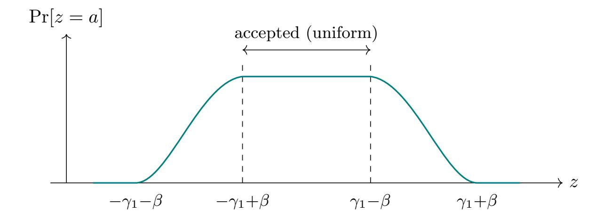

{0}------------------------------------------------

# Descent into Broken Trust: Uncovering ML-DSA Subkeys with Scarce Leakage and Local Optimization

Carsten Schubert [1](https://orcid.org/0009-0004-2795-3650) , Niklas Julius Müller [2](https://orcid.org/0009-0006-6156-9075) , Jean-Pierre Seifert [3](https://orcid.org/0000-0002-5372-4825) , and Marian Margraf [4](https://orcid.org/0009-0005-8577-1318)

Technische Universität Berlin, Berlin, Germany, carsten.gm.schubert@tu-berlin.de Freie Universität Berlin, Berlin, Germany, niklas.mueller@fu-berlin.de Technische Universität Berlin, Berlin, Germany, jean-pierre.seifert@tu-berlin.de Freie Universität Berlin, Berlin, Germany, marian.margraf@fu-berlin.de

#### Abstract

ML-DSA (formerly CRYSTALS-Dilithium), the primary NIST post-quantum signature standard, relies on rejection sampling to ensure that released signatures are statistically independent of the secret key. Recent work by Liu et al. and Damm et al. showed that this protection breaks down as soon as an attacker obtains even a single bit of the generated masking randomness per signature, enabling key recovery via linear regression over the resulting noisy linear system. However, this regression approach requires the attacker to collect a large number of such leaky signatures—up to 2.4 million so-called informative relations for ML-DSA-65—thereby limiting the attack's practical applicability.

We dramatically reduce this cost by reformulating the key recovery as a constraint-satisfaction problem solvable by local optimization. Our approach rests on two contributions. First, we construct a verification routine that checks candidate subkeys using only the collected leakage relations, i.e. without knowledge of the remaining secret-key components or relying on computation-intensive reductions. Second, building on theoretical insights from this verification method, we design a multi-tier hill-climbing algorithm that iteratively refines candidates by minimizing a scoring function.

In the exact leakage setting, our attack recovers ML-DSA subkeys from as few as 5 000 to 35 000 informative relations across all parameter sets and leakage bit indices the attack is applicable for, constituting a reduction by a factor of 37–68× over the previous state of the art. We further extend the attack to a noisy leakage model, where the leaked bit is flipped independently with error probability p. We demonstrate experimentally that key recovery remains feasible even at noise rates as high as 45%, again with substantially fewer leakage information than prior work.

# 1 Introduction

ML-DSA [\[1\]](#page-21-0), standardized by NIST as the primary post-quantum digital signature scheme, derives its security from the hardness of the Module Learning with Errors problem. A central design element is rejection sampling in the Fiat-Shamir-with-aborts paradigm introduced by Lyubashevsky [\[2\]](#page-21-1) and Lyubashevsky [\[3\]](#page-21-2): Every released signature is statistically independent of the secret key, because the signer discards any output whose distribution would betray the signing randomness. This guarantee, however, rests on the assumption that the masking randomness y used during signing remains entirely hidden from an adversary.

Liu et al. [\[4\]](#page-21-3) demonstrated that this assumption is more fragile than it appears: Access to a single leaked bit of y per signature suffices, in principle, to mount a key-recovery attack. Damm et al. [\[5\]](#page-21-4) subsequently refined the approach into a practical regression-based attack applicable to all three ML-DSA parameter sets and across a wide range of leakage bit positions. Yet their method remains data-hungry: Depending on the parameter set, between 500 000 and 2 400 000 informative relations—and correspondingly many more raw signatures—are needed to reliably recover a single subkey at high leakage indices. This large signature requirement constitutes the main practical barrier to exploiting the attack, and closing the gap between the theoretical threat ("one bit per signature is enough") and a realistic attack scenario is the central motivation for our work.

We address this gap by replacing the linear-regression step with an iterative local-optimization procedure. Two ingredients make this possible. First, we develop a lightweight verification routine that 

{1}------------------------------------------------

decides, using only the informative relations pertaining to a single module component of the secret key, whether a candidate subkey is correct—without requiring knowledge of the remaining components or performing lattice reduction (Section [3\)](#page-4-0). This routine yields a natural scoring function whose theoretical properties (monotonicity, convexity) we establish formally. Second, we build a multi-tier hill-climbing algorithm that minimizes this score over the coefficient space of the subkey, employing adaptive block sizes, lateral moves, frequency-based diversification, and perturbation-based restarts to navigate the search landscape reliably (Section [4\)](#page-8-0). In the exact leakage setting, these techniques reduce the number of required informative relations by a factor of 37–68× compared to the regression attack of Damm et al. [\[5\]](#page-21-4), depending on the parameter set. We further extend the attack to the noisy leakage model that Damm et al. [\[6\]](#page-21-5) introduced in their latest paper revision, i.e. where the leaked bits are independently flipped with some error probability p (Section [5\)](#page-11-0). We analyze how noise affects all relevant leakage index regimes, show that our excess-based scoring function becomes unreliable and must be replaced by count-based scoring in the presence of noise, and demonstrate experimentally that the attack remains viable even at substantial noise rates—again requiring significantly fewer signatures than prior work.

### 1.1 Outline

Section [1.2](#page-1-0) fixes notation. Section [2](#page-1-1) reviews the ML-DSA scheme and the leakage-based attacks of Liu et al. [\[4\]](#page-21-3) and Damm et al. [\[5\]](#page-21-4). Section [3](#page-4-0) develops the subkey verification routine. Section [4](#page-8-0) presents the hill-climbing key-recovery algorithm. Section [5](#page-11-0) extends the analysis and the algorithm to noisy leakage. Section [6](#page-15-0) reports experimental results for both the exact and the noisy setting. Section [7](#page-18-0) discusses implications and open directions.

### <span id="page-1-0"></span>1.2 Preliminaries

We denote vectors by bold lowercase letters (e.g. v) and matrices by bold uppercase letters (e.g. A). The standard inner product of two vectors of equal dimension is written ⟨a, b⟩ := P i aib<sup>i</sup> , and ∥v∥<sup>∞</sup> := max<sup>i</sup> |vi | denotes the infinity norm.

For a finite set S, we write x \$ ←− S for uniformly random sampling from S, and x \$ ←− D for sampling from a distribution D. The notation \$ ←− S<sup>m</sup> denotes uniform sampling from a set S restricted to elements with ∥a∥ ≤ m. We write Ber(p) for the Bernoulli distribution with success probability p.

We use standard interval notation for integers: [a, b] denotes the integer interval {a, a+1, . . . , b} unless the real-valued interval is clear from context, [n] is shorthand for [1, n], and [±n] abbreviates [−n, n]. The set [±1]<sup>n</sup> <sup>τ</sup> ⊂ {−1, 0, 1} <sup>n</sup> consists of all vectors with exactly τ nonzero entries. For an integer a and a positive modulus m, the centered reduction [a]<sup>m</sup> denotes the unique representative of a mod m in the half-open interval (−m/2, m/2]. The symbol ⌊x⌉ denotes rounding to the nearest integer.

Finally, EX[·] denotes the expectation taken over the randomness of the random variable X while all other random variables are held fixed, and sign(x) returns +1 if x > 0, −1 if x < 0, and 0 if x = 0.

# <span id="page-1-1"></span>2 Attack Setting and Review of the Attack of Damm et al.

Our attack aims for a (partial) key recovery of an ML-DSA key using leakage information. We therefore use the same attack setting as Damm et al. [\[5\]](#page-21-4). In this secter we review this setting and their attack.

### 2.1 ML-DSA

ML-DSA (formerly CRYSTALS-Dilithium) is a lattice-based digital signature scheme following the Fiat-Shamir-with-aborts paradigm introduced by Lyubashevsky [\[2\]](#page-21-1) and Lyubashevsky [\[3\]](#page-21-2). The central idea is to combine the Fiat-Shamir transform [\[7\]](#page-21-6) with rejection sampling, ensuring that released signatures do not leak information about the secret key. The scheme was proposed by Ducas et al. [\[8\]](#page-21-7) and subsequently standardized by the National Institute of Standards and Technology (NIST) [\[1\]](#page-21-0) as part of their postquantum cryptography standardization project. Its security relies on the hardness of the Module Learning with Errors (Module-LWE) problem [\[3\]](#page-21-2).

Scheme overview. The full ML-DSA algorithms are given in fig. [2;](#page-22-0) we summarize the aspects relevant to the leakage attack below. All algebraic operations take place in the polynomial ring R := Zq[x]/(x <sup>n</sup> + 1), where an element of R can equivalently be viewed as an n-dimensional integer vector of its coefficients.

{2}------------------------------------------------

<span id="page-2-1"></span>

Figure 1: Distribution of  $z = \langle \mathbf{c}, \mathbf{x} \rangle + y$  before rejection sampling. The shape features a flat central region (where y dominates) and smooth transitional edges (where the inner product  $\langle \mathbf{c}, \mathbf{x} \rangle$  causes the support to vary across keys). Rejection sampling discards all signatures outside the dashed lines ( $|z| > \gamma_1 - \beta$ ), retaining only the flat central portion where the distribution is uniform and independent of the secret key.

Key generation. The signer samples a public matrix  $\mathbf{A} \stackrel{\$}{\leftarrow} R_q^{k \times \ell}$  and two secret vectors  $\mathbf{s}_1 \stackrel{\$}{\leftarrow} R_\eta^\ell$ ,  $\mathbf{s}_2 \stackrel{\$}{\leftarrow} R_\eta^k$ , where every coefficient of  $\mathbf{s}_1$  and  $\mathbf{s}_2$  is bounded by  $\eta$  in absolute value. The public key is  $(\mathbf{A}, \mathbf{t} := \mathbf{A}\mathbf{s}_1 + \mathbf{s}_2)$ .

Signing. To sign a message, the signer repeatedly:

- 1. samples masking randomness  $\mathbf{y} \in \mathbb{R}^{\ell}$  with coefficients drawn uniformly from  $\{-(\gamma_1 1), \dots, \gamma_1 1\}$ ,
- 2. derives a challenge polynomial  $\mathbf{c} \in R$  with exactly  $\tau$  coefficients equal to  $\pm 1$  and the rest zero,
- 3. computes the signature vector  $\mathbf{z} := \mathbf{y} + \mathbf{c}\mathbf{s}_1$ .

The signature  $(\mathbf{z}, \mathbf{h}, \mathbf{c})$  is released only if the rejection condition  $\|\mathbf{z}\|_{\infty} \leq \gamma_1 - \beta$  is satisfied, where  $\beta = \eta \cdot \tau$  is an upper bound on  $\|\mathbf{c}\mathbf{s}_1\|_{\infty}$ . Otherwise the signer aborts and restarts with fresh randomness.

Role of rejection sampling. The rejection condition is the mechanism that protects the secret key: It ensures that every coefficient z of the released signature vector  $\mathbf{z}$  is uniformly distributed on  $[-(\gamma_1 - \beta), \ \gamma_1 - \beta]$ , regardless of the secret key<sup>1</sup>. Figure 1 illustrates this effect. Since the attack operates at the level of individual polynomial coefficients, we note that the k-th coefficient of the polynomial product  $\mathbf{c} \cdot \mathbf{x}$  in R can be written as an inner product  $\langle \mathbf{c}^{(k)}, \mathbf{x} \rangle$ , where  $\mathbf{c}^{(k)} \in \{-1, 0, 1\}^n$  is the k-th row of the negacyclic matrix associated with  $\mathbf{c}$ ; it retains exactly  $\tau$  nonzero entries. For notational simplicity, following [5], we henceforth write  $\mathbf{c}$  for the relevant row vector and  $z = \langle \mathbf{c}, \mathbf{x} \rangle + y$  for a single coefficient of the signature vector. Without rejection, the distribution of  $z = y + \langle \mathbf{c}, \mathbf{x} \rangle$  (where  $\mathbf{x}$  is a coefficient polynomial of  $\mathbf{s}_1$  and y the corresponding coefficient of  $\mathbf{y}$ ) would be a shifted version of the uniform distribution of y, and the shift  $\langle \mathbf{c}, \mathbf{x} \rangle$  would reveal information about the secret. The rejection step eliminates these outliers: Only the flat central portion of the distribution survives, making z seemingly independent of  $\mathbf{x}$ .

As we show in the next section, this guarantee breaks down when the attacker obtains additional leakage information about the masking randomness y.

**Parameter sets.** NIST standardized three ML-DSA parameter sets [1], targeting security categories 2, 3, and 5. The parameters relevant to the leakage attack are listed in table 1. In all variants, the ring dimension is n = 256.

#### 2.2 Leakage-Based Attack by Liu et al. and Damm et al.

We now review the leakage-based attacks of Liu et al. [4] and Damm et al. [5] against ML-DSA, which form the basis for our work. The attack of Damm et al. [5] already is a direct improvement of the attack by Liu et al. [4]; therefore we focus primarily on their formulation.

<span id="page-2-0"></span><sup>&</sup>lt;sup>1</sup>Strictly, FIPS 204 accepts signatures satisfying  $\|\mathbf{z}\|_{\infty} < \gamma_1 - \beta$  (open interval). Following [5], we use the closed interval  $[-(\gamma_1 - \beta), \gamma_1 - \beta]$  throughout, as the difference of a single integer value is negligible.

{3}------------------------------------------------

<span id="page-3-0"></span>

| Parameter                                                            | ML-DSA-44 | ML-DSA-65 | ML-DSA-87 |
|----------------------------------------------------------------------|-----------|-----------|-----------|
| n  (ring dimension)                                                  | 256       | 256       | 256       |
| $q \pmod{\text{ulus}}$                                               | 8380417   | 8380417   | 8380417   |
| $(k,\ell)$ (dimensions of <b>A</b> )                                 | (4,4)     | (6, 5)    | (8,7)     |
| $\eta$ (secret key position bound)                                   | 2         | 4         | 2         |
| $\tau \ (\# \ {\rm of} \ \pm 1 {\rm 's} \ {\rm in} \ {\rm {\bf c}})$ | 39        | 49        | 60        |
| $\gamma_1$ (randomness range)                                        | $2^{17}$  | $2^{19}$  | $2^{19}$  |
| $\beta = \tau \cdot \eta \text{ (norm bound)}$                       | 78        | 196       | 120       |
| Security category                                                    | 2         | 3         | 5         |

Table 1: ML-DSA parameter sets relevant to the leakage attack [1]. Parameters not directly used in the attack  $(d, \gamma_2, \lambda, \omega, \zeta)$  are omitted; see [1] for the complete specification.

**Problem setting.** We first formalize the problem of recovering a secret key component from leakage information obtained during signing.

<span id="page-3-1"></span>**Definition 2.1** (Leaky-Signature-LWE Problem). Let  $(\mathbf{A}, \mathbf{t}) \in R_q^{k \times \ell} \times R_q^k$  be an ML-DSA public key with corresponding secret key  $(\mathbf{s}_1, \mathbf{s}_2) \in R^{\ell} \times R^k$ , where  $\|\mathbf{s}_1\|_{\infty}, \|\mathbf{s}_2\|_{\infty} \leq \eta$ . Let  $\mathbf{x} \in \{-\eta, \dots, \eta\}^n$  be the coefficient vector of one of the  $\ell$  polynomials in  $\mathbf{s}_1$ .

During each signature computation, the signer samples a masking randomness vector  $\mathbf{y} \in R^{\ell}$  with coefficients drawn uniformly from  $\{-(\gamma_1 - 1), \dots, \gamma_1 - 1\}$ , computes a challenge polynomial  $\mathbf{c} \in [\pm 1]_{\tau}^n$  (having exactly  $\tau$  nonzero entries, each  $\pm 1$ ), and produces a signature component  $z = \langle \mathbf{c}, \mathbf{x} \rangle + y$ , where y is the coefficient of  $\mathbf{y}$  corresponding to  $\mathbf{x}$ . Rejection sampling ensures that only signatures with  $|z| \leq \gamma_1 - \beta$  are released, so that z is uniformly distributed on  $[-(\gamma_1 - \beta), \gamma_1 - \beta]$  and reveals no information about  $\mathbf{x}$  on its own.

The attacker observes the public values  $\mathbf{c}$  and z from each released signature. In our leakage model, they additionally obtain a fixed bit  $y_j$  of the used randomness y (i.e. the j-th bit in its binary representation). Given  $(\mathbf{A}, \mathbf{t})$  and arbitrarily many such tuples  $(\mathbf{c}, z, y_j)$ , the attacker's goal is then to find  $\mathbf{s}_1$ .

Note that  $|\langle c, x \rangle| \leq \eta \cdot \tau = \beta$  since c has  $\tau$  entries of  $\pm 1$  and  $||x||_{\infty} \leq \eta$ . The uniform distribution of z is a consequence of the rejection sampling in ML-DSA (cf. fig. 1).

Remark 2.2. Definition 2.1 models the leakage information abstractly as access to a fixed bit  $y_j$  of the masking randomness. The formulation is agnostic to the physical origin of this information: It may arise from a classical side channel, from a fault attack that introduces a deterministic stuck-at fault on bit j of y, or from any other mechanism that reliably reveals individual bits of the randomness used during signing. Our analysis and all subsequent results apply equally to any such source.

From leakage to LWE relations. The key idea, introduced by Liu et al. [4], is to use the leaked bit  $y_j$  to extract information from the signature component z that would otherwise be hidden by the masking randomness. Specifically, using the bit  $y_j$  and the public value z, one computes a transformed value

<span id="page-3-3"></span>
$$\overline{z} = \langle c, x \rangle + [y]_{2^j}, \tag{1}$$

where  $[y]_{2^j}$  denotes the reduction of y modulo  $2^j$  (centered). This yields an Integer LWE instance with error  $[y]_{2^j}$ , which is uniformly distributed over  $[-2^{j-1}, 2^{j-1}]$ . We regard this relation extraction procedure as a black box and refer to Damm et al. [5] for the algorithmic details.

<span id="page-3-6"></span>The *j*-independence transformation. A crucial observation by Damm et al. [5] is that not all extracted relations are useful. Those with  $|\overline{z}| < 2^{j-1} - \beta$  carry no information about x, since the inner product  $\langle c, x \rangle$  is completely masked by the error.

<span id="page-3-5"></span>**Definition 2.3** (Informative relation). Following Damm et al. [5], a relation  $(c, z, y_j)$  is called *informative* if  $|\overline{z}| \geq 2^{j-1} - \beta$ .

Damm et al. [5] then introduce a transformation that, in the high-leakage regime  $(2^{j-1} > \beta)$ , maps all informative relations to a canonical form with error independent of j. Specifically, they compute

<span id="page-3-2"></span>
$$\tilde{z} = \begin{cases}
\overline{z} - 2^{j-1} + \beta, & \text{if } \overline{z} \ge 2^{j-1} - \beta, \\
\overline{z} + 2^{j-1} - \beta & \text{if } \overline{z} \le -(2^{j-1} - \beta),
\end{cases}$$
(2)

<span id="page-3-4"></span>and obtain  $\tilde{z} = \langle c, x \rangle + \tilde{y}$  for some error  $\tilde{y}$  uniformly distributed over  $[-\beta, \beta]$ .

{4}------------------------------------------------

**Theorem 2.4** (Theorem 3 in [5], restated). If  $2^{j-1} > \beta$  and  $(\mathbf{c}, \overline{z}, y_j)$  is an informative relation, then the transformation (2) yields  $\tilde{z} = \langle \mathbf{c}, x \rangle + \tilde{y}$  where  $\tilde{y} \leftarrow [\pm \beta]$ .

This result is meaningful as it makes the error size—and thus the number of informative relations needed for key recovery—independent of the leakage index j when  $2^{j-1} > \beta$ .

We further note that the relation extraction (1) itself requires a minimum leakage index: Damm et al. [5] formally require  $j \ge \lceil \log_2(\beta) \rceil + 1$  for their extraction to be exact, but show that this is a worst-case condition and the attack succeeds in practice for all  $j \ge 6$  across ML-DSA parameter sets, since  $\langle \mathbf{c}, \mathbf{x} \rangle$  concentrates well below  $\beta$  by the central limit theorem. We refer to [5] for the detailed analysis.

**Generalized error bound.** Theorem 2.4 requires  $2^{j-1} > \beta$  and thus only covers the high-leakage regime. In the *low-leakage regime* where  $2^{j-1} \le \beta$ , the transformation (2) is not applicable. However, this situation is in fact *more favorable* for the attacker: The resulting LWE error  $[y]_{2^j}$  is then uniform on  $[\pm 2^{j-1}]$ , that is, a *smaller* interval than  $[\pm \beta]$ . Moreover, since  $2^{j-1} \le \beta$ , the informativeness condition  $|\overline{z}| \ge 2^{j-1} - \beta$  is trivially satisfied by all relations, meaning no leaked signature is discarded.

We can unify both regimes by defining the effective error bound

<span id="page-4-1"></span>
$$\beta_{\text{eff}} = \min\left(\beta, \ 2^{j-1}\right). \tag{3}$$

In both cases, the attacker obtains relations of the form  $\tilde{z} = \langle c, x \rangle + \tilde{y}$  with  $\tilde{y}$  uniform on  $[\pm \beta_{\text{eff}}]$ : In the high-leakage regime via the transformation of Theorem 2.4, and in the low-leakage regime directly from the extraction (1). The smaller error is one of the factors that enable improved key recovery with fewer relations in the low-leakage regime, as we later exploit in our attack (Section 4).

**Key recovery via linear regression.** Given sufficiently many informative relations, the transformed system  $\tilde{z}_i = \langle \mathbf{c}_i, \mathbf{x} \rangle + \tilde{y}_i$  is a noisy linear system that can be solved for  $\mathbf{x}$  via ordinary least-squares regression followed by rounding to the nearest integer in  $\{-\eta, \ldots, \eta\}$ .

While polynomial in complexity, this regression approach requires a large number of informative relations to overcome the noise—on the order of hundreds of thousands for the ML-DSA parameter sets considered by Damm et al. [5]. This constitutes a practical limitation, as the total number of *signatures* required to obtain sufficiently many informative relations can be substantially larger, depending on the leakage index.

From subkey to full key recovery. The procedure described above recovers a single coefficient polynomial  $\mathbf{x}$  of the secret key  $\mathbf{s_1} \in R^{\ell}$ . Damm et al. [5] describe in their Section 4.3 how to recover the full key  $\mathbf{s_1}$  from  $\mathbf{x}$  using the lattice reduction with side information framework of Dachman-Soled et al. [9], Dachman-Soled et al. [10], and May and Nowakowski [11]. Each of the n known coordinates of  $\mathbf{x}$  constitutes a perfect hint that reduces the effective dimension of the underlying lattice problem, enabling recovery of the remaining secret key components via lattice reduction. Since this step is unchanged in our work, we refer to the respective literature for details.

Limitations and motivation for our improvements. The regression-based attack of Damm et al. [5] is highly effective when sufficient leakage is available: It runs in polynomial time, applies to all ML-DSA parameter sets, and handles all leakage bit positions  $j \geq 6$ . However, the number of informative relations required for reliable key recovery is substantial—even for the easiest variant (ML-DSA 44) they report 0.5 million needed informative relations in the higher leakage index regimes. Moreover, the fraction of informative relations among all released signatures decreases exponentially with the leakage index j, since the non-informative range  $[\pm(2^{j-1}-\beta)$  covers a growing share of the support of z. As a result, the total number of signatures required grows exponentially in j even though the number of informative relations stays roughly constant [5].

Our work addresses this limitation by replacing the linear regression with an iterative optimization procedure. As we demonstrate in subsequent sections (see Section 6 in particular), this approach reduces the number of required informative relations by a factor of up to  $68 \times$  while maintaining practical attack speeds.

# <span id="page-4-0"></span>3 ML-DSA Subkey Verification Routine

Before presenting the improved key-recovery algorithm itself, we develop a self-contained verification subroutine that will serve two roles: First, it allows the attacker to check a candidate subkey without

{5}------------------------------------------------

assembling the full secret key or performing lattice reduction. Second—and more importantly for the remainder of this paper—it provides the theoretical foundation for the scoring functions that drive the hill-climbing optimizer of Section 4. We present this verification result in full generality here, so that it can be applied both in isolation and as a conceptual basis of the more powerful algorithm to follow.

As explained before, the attack of Damm et al. [5] targets only a single  $\frac{1}{\ell}$ -fraction of the ML-DSA secret key at a time. Concretely, for a fixed secret  $\mathbf{s_1}$ , the attacker collects informative relations involving only the corresponding n-dimensional subkey  $\mathbf{x}$  of  $\mathbf{s_1}$ , and then (in their version) recovers  $\mathbf{x}$  via linear regression followed by coordinate-wise rounding. Since the  $\ell$  subkeys are structurally independent in this leakage model – each depends on its own block of randomness – the attack naturally decomposes into  $\ell$  independent sub-problems.

However, Damm et al. [5] left open how to verify such a candidate subkey  $\mathbf{x}'$  without first assembling the full secret key  $\mathbf{s_1}$  first. Their original attack does not provide a subkey verification procedure; correctness is instead inferred globally once all components have been recovered, at which point the complete signing key can be tested against a known public key. This coarse verification strategy has two drawbacks. First, it is unnecessarily slow in their own setting: Full-key assembly via a costly lattice reduction is required before any feedback is available on the individual component  $\mathbf{x}$ , so if one has slightly too little leakage information and cannot correctly reconstruct every position of  $\mathbf{x}$ , then one also cannot re-guess the remaining wrong positions without re-iterating that computation-intensive lattice reduction over and over. Second, and more fundamentally, it forecloses a natural generalization: In the less restrictive leakage model of Liu et al. [4], the attacker receives comparable leakage on all components of  $\mathbf{s_1}$  simultaneously. In this setting, the attacker wants to verify each subkey individually in order to distinguish for which of the subkeys they already have enough collected leakage information and for which they do not.

We resolve this gap by constructing an efficient verification subroutine that decides correctness of a candidate  $\mathbf{x}'$  using only the informative relations pertaining to the corresponding module component  $\mathbf{x}$ . The key insight, formalised in theorem 3.1 below, is that the same *informative relations* which the attacker already collected and transformed using the methods of Damm et al. [5] can be repurposed as a verification oracle: A candidate  $\mathbf{x}'$  "satisfies" all relations associated with the true subkey  $\mathbf{x}$  if and only if  $\mathbf{x}' = \mathbf{x}$ , assuming the attacker has access to enough of such relations. This results in a lightweight, self-contained correctness check that requires no additional side-channel queries and no knowledge of the remaining subkeys.

<span id="page-5-0"></span>**Theorem 3.1.** Given  $\alpha$  random informative relations in a LEAKY-SIGNATURE-LWE setting with  $\ell > 1$ , one can check in linear time whether a given candidate  $\mathbf{x}^*$  is equal to  $\mathbf{x}$  with a success probability of at least  $1 - \left(1 - \left(2n\eta + \frac{n}{\tau}\right)^{-1}\right)^{\alpha}$ , without having access to any additional information about  $\mathbf{s_1}$ .

The proof of Theorem 3.1 requires some intermediate results—most notably, Algorithm 1 and two lemmas (Lemma 3.3 and Lemma 3.6). We start by developing the former, which in turn relies on the related main result of [5] (restated once again to ensure consistent structural flow):

<span id="page-5-2"></span>**Theorem 3.2** (Theorem 3 in [5], restated). If  $2^{j-1} > \beta$  and  $(\mathbf{c}, \overline{z} = \langle \mathbf{c}, \mathbf{x} \rangle + y, y_j)$  is an informative relation (see definition 2.3) in the Leaky-Signature-LWE problem, then it can be transformed into  $(\mathbf{c}, \widetilde{z} = \langle \mathbf{c}, \mathbf{x} \rangle + \widetilde{y})$  where  $\widetilde{y} \leftarrow [\pm \beta]$ . To do so, let  $\widetilde{z} = \overline{z} - 2^{j-1} + \beta$  if  $\overline{z} > 2^{j-1} - \beta$ , and  $\widetilde{z} = \overline{z} + 2^{j-1} - \beta$  otherwise.

Using the relations produced by Theorem 3.2 – and their low-leakage analogues as described in eq. (3) – we construct a probabilistic verification routine for  $\mathbf{x}$  with a one-sided error, depicted in Algorithm 1.

#### **Algorithm 1:** ML-DSA subkey verification step

<span id="page-5-1"></span>**Input:** Preprocessed informative relation  $(\mathbf{c}, \tilde{z})$ , effective bound  $\beta_{\text{eff}}$ , leakage index j, verification candidate  $\mathbf{x}^*$ 

**Output:** False if  $\mathbf{x}^* \neq \mathbf{x}$  with positive probability, True otherwise

```
1 \delta \leftarrow \langle \mathbf{c}, \mathbf{x}^* \rangle - \widetilde{z}
2 if 2^{j-1} \leq \beta then \delta \leftarrow [\delta]_{2^{j+1}} /* centered reduction mod M = 2^{j+1} */
3 if |\delta| > \beta_{\text{eff}} then return False
4 return True
```

{6}------------------------------------------------

<span id="page-6-2"></span>Regime-dependent constraint checking. Algorithm 1 checks whether the residual  $\delta$  between the candidate's inner product  $\langle \mathbf{c}, \mathbf{x}^* \rangle$  and the preprocessed relation value  $\widetilde{z}$  exceeds the effective error bound  $\beta_{\text{eff}} = \min \left(\beta, 2^{j-1}\right)$  (cf. eq. (3)). In the high-leakage regime  $(2^{j-1} > \beta)$ , the j-independence transformation of Theorem 3.2 yields relations with error  $\widetilde{y} \stackrel{\$}{\leftarrow} [\pm \beta]$  over the integers, so  $\beta_{\text{eff}} = \beta$  and the residual  $\delta = \langle \mathbf{c}, \mathbf{x}^* \rangle - \widetilde{z}$  requires no further processing. In the low-leakage regime  $(2^{j-1} \le \beta)$ , the transformation is not applied and the error is the smaller quantity  $[y]_{2^j} \in [\pm 2^{j-1}]$ , yielding  $\beta_{\text{eff}} = 2^{j-1} < \beta$ . However, since the relation extraction (1) in this regime involves a centered reduction modulo  $M := 2^{j+1}$ , the relation  $\overline{z} = \langle \mathbf{c}, \mathbf{x} \rangle + [y]_{2^j}$  holds modulo M rather than over the integers. The residual must therefore be centered-reduced modulo M before comparison, as reflected in Line 2 of algorithm 1.

Correctness of algorithm 1. If  $\mathbf{x}^*$  equals the true key  $\mathbf{x}$ , then  $\langle \mathbf{c}, \mathbf{x}^* \rangle = \langle \mathbf{c}, \mathbf{x} \rangle$  for all  $\mathbf{c}$ , so the residual (before or after any modular reduction) equals  $\widetilde{y}$ . Since  $|\widetilde{y}| \leq \beta_{\text{eff}}$ , the algorithm always returns True.

Given a false candidate  $\mathbf{x}^* \neq \mathbf{x}$ , the algorithm will still output  $\mathit{True}$  if  $\langle \mathbf{c}, \mathbf{x}^* \rangle = \langle \mathbf{c}, \mathbf{x} \rangle$  (which happens when  $\mathbf{c}$  places no nonzero entry on a differing position). However, when  $\mathbf{x}^* \neq \mathbf{x}$ , we have  $\langle \mathbf{c}, \mathbf{x}^* \rangle \neq \langle \mathbf{c}, \mathbf{x} \rangle$  with positive probability, since  $\mathbf{c}$  randomly  $\mathit{selects}$  and  $\mathit{signs}$  exactly  $\tau$  positions. Additionally, for the algorithm to output  $\mathit{False}$ ,  $\widetilde{y}$  must satisfy  $|\delta| > \beta_{\text{eff}}$ . Since  $\widetilde{y} = -\beta_{\text{eff}}$  with probability  $\frac{1}{2\beta_{\text{eff}}+1}$ , this happens with positive probability whenever  $\langle \mathbf{c}, \mathbf{x}^* \rangle \neq \langle \mathbf{c}, \mathbf{x} \rangle$ .

Monotonicity of detection. The following lemma establishes that correcting an erroneous position in a candidate subkey can only decrease the detection probability. We state and prove the result for the error bound  $\beta$  (i.e. the high-leakage regime where  $\beta_{\text{eff}} = \beta$ ), since in that regime the per-relation detection function is genuinely convex and the proof rests on a clean application of Jensen's inequality. Proposition 3.5 below extends the conclusion to the low-leakage regime where  $\beta_{\text{eff}} < \beta$ .

<span id="page-6-0"></span>**Lemma 3.3.** Let  $\mathbf{x}^*$  be a candidate subkey that differs from  $\mathbf{x}$  in a set of positions S with  $|S| \geq 2$ . Let  $\mathbf{x}^{**}$  be another candidate obtained from  $\mathbf{x}^*$  by correcting one of those positions, i.e. by setting  $x_i^{**} = x_i$  for some  $i \in S$  and having  $x_k^{**} = x_k^*$  for all  $k \neq i$ . Then, when the verification of algorithm 1 is performed with error bound  $\beta$ , the probability of receiving a False output for  $\mathbf{x}^*$  is at least as large as for  $\mathbf{x}^{**}$ .

*Proof.* Let  $\mathbf{e}' \coloneqq \mathbf{x}^* - \mathbf{x}$  and write  $e'_k \coloneqq x_k^* - x_k$  for its components, so that  $e'_k \neq 0$  if and only if  $k \in S$ . Define  $\epsilon \coloneqq \langle \mathbf{c}, \mathbf{e}' \rangle = \langle \mathbf{c}, \mathbf{x}^* \rangle - \langle \mathbf{c}, \mathbf{x} \rangle$ . From

$$\langle \mathbf{c}, \mathbf{x}^* \rangle \not\in [\widetilde{z} - \beta, \widetilde{z} + \beta]$$

$$\Leftrightarrow \langle \mathbf{c}, \mathbf{x}^* \rangle \not\in [\langle \mathbf{c}, \mathbf{x} \rangle + \widetilde{y} - \beta, \langle \mathbf{c}, \mathbf{x} \rangle + \widetilde{y} + \beta]$$

$$\Leftrightarrow \langle \mathbf{c}, \mathbf{x}^* \rangle - \langle \mathbf{c}, \mathbf{x} \rangle - \widetilde{y} \not\in [-\beta, \beta]$$

$$\Leftrightarrow |\epsilon - \widetilde{y}| > \beta,$$

we obtain the detection probability  $p_{\text{detect}}(\mathbf{x}^*) := \Pr[|\epsilon - \widetilde{y}| > \beta]$  with randomness drawn from  $\mathbf{c}$  and  $\widetilde{y}$ . With  $\widetilde{y} \stackrel{\$}{\leftarrow} [\pm \beta]$  the complementary probability is

$$p_{\text{miss}} = \Pr[|\epsilon - \widetilde{y}| \le \beta] = |[-\beta, \beta] \cap [\epsilon - \beta, \epsilon + \beta]| \cdot \frac{1}{2\beta + 1},$$

i.e. the overlap length of the intervals  $[-\beta, \beta]$  and  $[\epsilon - \beta, \epsilon + \beta]$ , normalised. Since the second interval is just the first shifted by  $\epsilon$ , the length of the overlap is  $2\beta + 1 - |\epsilon|^2$ 

Therefore we get

$$p_{\text{miss}} = 1 - \frac{|\epsilon|}{2\beta + 1}$$

$$\Rightarrow p_{\text{detect}}(\mathbf{x}^*) = \frac{|\epsilon|}{2\beta + 1} =: f(\epsilon).$$

Note that f is a convex function of  $\epsilon$  on its entire domain  $|\epsilon| \leq 2\beta$ . (Convexity follows from the fact that the absolute-value function  $|\cdot|$  is convex on  $\mathbb{R}$  and positive scaling preserves convexity.)

In particular, for any fixed **c** the detection probability (over the randomness of  $\widetilde{y}$ ) is  $f(\langle \mathbf{c}, \mathbf{e}' \rangle)$ , and hence

$$p_{\text{detect}}(\mathbf{x}^*) = \mathbb{E}_{\mathbf{c}}[f(\langle \mathbf{c}, \mathbf{e}' \rangle)].$$
 (4)

<span id="page-6-1"></span><sup>&</sup>lt;sup>2</sup>Since each of the  $\tau$  nonzero entries of **c** contributes at most  $2\eta$  through  $\mathbf{e}'$ , we have  $|\epsilon| \leq 2\tau \eta = 2\beta$ , so the overlap is always non-negative and, in particular,  $f(\epsilon) \leq 2\beta/(2\beta+1) < 1$ .

{7}------------------------------------------------

By the same reasoning, since  $\mathbf{x}^{**} - \mathbf{x}$  agrees with  $\mathbf{e}'$  everywhere except that position i is zeroed out,

$$p_{\text{detect}}(\mathbf{x}^{**}) = \mathbb{E}_{\mathbf{c}}[f(\epsilon_{-i})], \quad \text{where } \epsilon_{-i} \coloneqq \sum_{k \neq i} c_k e'_k.$$
 (5)

To compare these two expectations, fix any assignment of which positions  $k \neq i$  carry a nonzero entry in  $\mathbf{c}$  and what their signs are. This determines both  $\epsilon_{-i}$  and the number  $T := |\{k \neq i : c_k \neq 0\}|$  of nonzero entries already placed. Since  $\mathbf{c}$  has exactly  $\tau$  nonzero entries in total, there are two cases for the remaining randomness in  $c_i$ :

- Case  $T = \tau$ : Then  $c_i = 0$  deterministically, so  $f(\epsilon_{-i} + c_i e'_i) = f(\epsilon_{-i})$ .
- Case  $T = \tau 1$ : Then  $c_i \in \{-1, +1\}$  each with probability  $\frac{1}{2}$ . By Jensen's inequality applied to the convex function f,

$$\mathbb{E}_{c_i}[f(\epsilon_{-i} + c_i e_i')] = \frac{1}{2} f(\epsilon_{-i} + e_i') + \frac{1}{2} f(\epsilon_{-i} - e_i') \ge f(\epsilon_{-i}).$$

In both cases the contribution is at least  $f(\epsilon_{-i})$ . Averaging over all valid assignments of the remaining entries of  $\mathbf{c}$  (i.e. taking the outer expectation) yields  $p_{\text{detect}}(\mathbf{x}^*) \geq p_{\text{detect}}(\mathbf{x}^{**})$ .

We note that in all practically relevant cases – where the candidate  $\mathbf{x}^*$  is close to the true key  $\mathbf{x}$  – the inequality of Lemma 3.3 is in fact strict:

<span id="page-7-2"></span>**Corollary 3.4.** If additionally  $|S| \le n - \tau + 1$ , then the inequality in Lemma 3.3 is strict, i.e. the detection probability of  $\mathbf{x}^{**}$  is strictly smaller than that of  $\mathbf{x}^{*}$ .

*Proof.* It suffices to exhibit a realisation of  $\mathbf{c}$  for which the Jensen inequality in Case 2 of the proof of Lemma 3.3 is strict. Consider the event

$$\mathcal{E} := \{c_i \neq 0\} \cap \{c_k = 0 \text{ for all } k \in S \setminus \{i\}\}.$$

Since  $|S \setminus \{i\}| = D - 1$  and  $|S| \le n - \tau + 1$ , the  $n - D \ge \tau - 1$  positions outside S can accommodate the remaining  $\tau - 1$  nonzero entries of  $\mathbf{c}$ , so  $\mathcal{E}$  has positive probability. On  $\mathcal{E}$  we have  $\epsilon_{-i} = 0$  and  $c_i \in \{-1, +1\}$ , which gives

$$\frac{1}{2}f(e_i') + \frac{1}{2}f(-e_i') = \frac{|e_i'|}{2\beta + 1} > 0 = f(0) = f(\epsilon_{-i}),$$

where the strict inequality uses  $e'_i \neq 0$  (since  $i \in S$ ). Since the Jensen bound is strict on an event of positive probability and non-strict everywhere else, the overall expectation is strictly larger.

<span id="page-7-1"></span>**Proposition 3.5** (Extension to the low-leakage regime). When  $\beta_{\text{eff}} = 2^{j-1} < \beta$ , the per-relation detection function becomes  $f_{\text{eff}}(\epsilon) = \min(1, |\epsilon|/(2\beta_{\text{eff}} + 1))$ , which is concave for  $|\epsilon| > 2\beta_{\text{eff}} + 1$  and therefore not amenable to the Jensen argument of Lemma 3.3. Nonetheless, the conclusion that the worst-case detection is attained at Hamming distance 1 carries over to this regime. Since  $\beta_{\text{eff}} \leq \beta$ , the  $\beta_{\text{eff}}$ -verification imposes a strictly tighter acceptance window, giving  $p_{\text{detect}}^{(\beta_{\text{eff}})}(\mathbf{x}^*) \geq p_{\text{detect}}^{(\beta)}(\mathbf{x}^*)$  for every candidate  $\mathbf{x}^*$ . Combining this with the monotonicity established in Lemma 3.3 yields, for any  $\mathbf{x}^* \neq \mathbf{x}$ ,

$$p_{\mathrm{detect}}^{(\beta_{\mathrm{eff}})}(\mathbf{x}^*) \geq p_{\mathrm{detect}}^{(\beta)}(\mathbf{x}^*) \geq \min_{\mathbf{x}'} p_{\mathrm{detect}}^{(\beta)}(\mathbf{x}'),$$

where the right-hand side is the minimum over all wrong candidates  $\mathbf{x}'$  with Hamming distance D=1 from the true key  $\mathbf{x}$  (by Lemma 3.3). Hence, any lower bound on the per-relation detection probability derived at D=1 with error bound  $\beta$  is automatically a valid – and conservative – lower bound for the  $\beta_{\text{eff}}$ -verification as well.

As a consequence of Lemma 3.3 (extended to arbitrary  $\beta_{\text{eff}}$  by Proposition 3.5), we thus know that the worst-case detection probability over all  $\mathbf{x}^* \neq \mathbf{x}$  is lower-bounded by the detection probability at Hamming distance D = 1 from the true key  $\mathbf{x}$ . We use that insight to prove the following:

<span id="page-7-0"></span>**Lemma 3.6.** Given a random (valid) informative relation and input  $\mathbf{x}^* \neq \mathbf{x}$ , algorithm 1 returns False with probability at least  $\left(2n\eta + \frac{n}{\tau}\right)^{-1}$ .

{8}------------------------------------------------

*Proof.* Let D be the number of positions in which x and  $\mathbf{x}^*$  differ, which is positive as  $\mathbf{x}^* \neq \mathbf{x}$ . Because of Lemma 3.3 we assume D = 1 without loss of generality.

If x and  $\mathbf{x}^*$  diverge in exactly one position i, then  $\langle \mathbf{c}, \mathbf{x} \rangle \neq \langle \mathbf{c}, \mathbf{x}^* \rangle$  if and only if  $\mathbf{c}_i \neq 0$ , which clearly happens with probability  $\frac{\tau}{n}$ . In those cases, let  $\epsilon = \langle \mathbf{c}, \mathbf{x}^* \rangle - \langle \mathbf{c}, \mathbf{x} \rangle$ . For the check in Line 2 of algorithm 1 to succeed, we additionally need the independent random variable  $\tilde{y}$  to be small or large enough such that either  $\epsilon > \tilde{y} + \beta$  or  $\epsilon < \tilde{y} - \beta$  (depending on the sign of  $\epsilon$ ). The marginal probability for such a  $\tilde{y}$  is at least  $\frac{1}{2\beta+1}$ . Therefore, the overall probability of the algorithm correctly identifying any false candidate  $\mathbf{x}^* \neq \mathbf{x}$  is at least  $\frac{\tau}{n} \cdot \frac{1}{2\beta+1} = \frac{1}{2n\eta + \frac{n}{\tau}} = \left(2n\eta + \frac{n}{\tau}\right)^{-1}$ .

Remark 3.7 (Tightness in the low-leakage regime). The bound of Lemma 3.6 uses  $\beta$  (i.e. the worst case  $\beta_{\text{eff}} = \beta$ ). In the low-leakage regime where  $\beta_{\text{eff}} = 2^{j-1} < \beta$ , the per-relation detection probability is at least  $\frac{\tau}{n} \cdot \frac{1}{2\beta_{\text{eff}}+1} > \frac{\tau}{n} \cdot \frac{1}{2\beta+1}$ , so the bound of theorem 3.1 is conservative. In particular, fewer informative relations suffice for a given confidence level when  $\beta_{\text{eff}} < \beta$ .

Using algorithm 1 and Lemma 3.6, we can now easily show theorem 3.1.

Proof of theorem 3.1. Since the random outcome of algorithm 1 only depends on the randomness of the input informative relation, we can just repeat it on  $\alpha$  many informative relations which are stochastically independent from each other (using the same  $\beta$  and  $\mathbf{x}^*$  in each call). If  $\mathbf{x}^* = \mathbf{x}$ , then each iteration will output True, as described. If  $\mathbf{x}^* \neq \mathbf{x}$ , the probability that every iteration still outputs True is at most  $\left(1-\left(2n\eta+\frac{n}{\tau}\right)^{-1}\right)^{\alpha}$  by application of the complementary probability of Lemma 3.6. Thus, we can distinguish the two cases with a probability of at least  $1-\left(1-\left(2n\eta+\frac{n}{\tau}\right)^{-1}\right)^{\alpha}$ , finishing the proof.  $\square$ 

Wrapping up, we complementarily want to mention that if algorithm 1 is run repeatedly to verify some candidate  $\mathbf{x}^*$  with high probability, then the single iterations may of course also be processed in parallel, linked with logical AND-gates. As a verification routine, it may also make sense to pre-compute  $\tilde{z} \pm \beta$  for each input relation, such that only the scalar product  $\langle \mathbf{c}, \mathbf{x}^* \rangle$  has to be computed and its two bound checks performed at each iteration.

# <span id="page-8-0"></span>4 An Improved ML-DSA Subkey Finder

The verification routine of section 3 provides a binary test: Given a candidate  $\mathbf{x}^*$ , it detects  $\mathbf{x}^* \neq \mathbf{x}$  with positive probability by checking whether  $\langle \mathbf{c}, \mathbf{x}^* \rangle$  falls outside the interval  $[\tilde{z} - \beta_{\text{eff}}, \tilde{z} + \beta_{\text{eff}}]$ , where  $\beta_{\text{eff}} = \min(\beta, 2^{j-1})$  is the regime-dependent error bound (cf. eq. (3)). A natural extension is to use this test not merely to accept or reject a candidate, but to compare candidates: A candidate that triggers more violations across a collection of informative relations is, on expectation, farther from the true key. This idea is justified by Lemma 3.3 and corollary 3.4, which together establish that correcting any single wrong position in a candidate strictly reduces its expected detection rate (in most practically relevant cases). In this section, we formalize this comparison as a scoring function and build a hill-climbing algorithm that iteratively improves a candidate by optimizing the score position by position.

#### <span id="page-8-1"></span>4.1 ML-DSA Subkey Evaluation

Count-based scoring. The most direct way to turn the verification routine into a scoring function is to run Algorithm 1 on  $\alpha$  independent informative relations and count how many return False. The resulting count is a random variable whose expectation, by Lemma 3.3 (extended to arbitrary  $\beta_{\text{eff}}$  via Proposition 3.5), is monotonically related to the error structure of  $\mathbf{x}^*$ : Correcting any one wrong position can only decrease the expected count, and by Corollary 3.4 does so strictly. Thus, for sufficiently large  $\alpha$ , the empirical count serves as a proxy for distance from the true key.

**Excess-based scoring.** The count-based score treats every constraint violation equally, regardless of how far  $\langle \mathbf{c}, \mathbf{x}^* \rangle$  falls outside the acceptance window  $[\tilde{z} - \beta_{\text{eff}}, \tilde{z} + \beta_{\text{eff}}]$ . A more informative variant accumulates the excess by which the constraint is violated:

$$r_t(\mathbf{x}^*) := \max(0, |\delta_t| - \beta_{\text{eff}}),$$

where  $\delta_t$  denotes the residual of algorithm 1. In addition to the merits of the previous count metric, the excess scoring also carries gradient-like information: A candidate that violates a constraint by a large

{9}------------------------------------------------

#### Algorithm 2: ML-DSA Subkey Evaluation (count-based)

```
Input: \alpha preprocessed informative relations (\mathbf{c}_t, \widetilde{z}_t)_{t=1,\dots,\alpha}, effective bound \beta_{\text{eff}}, leakage index j, verification candidate \mathbf{x}^*

Output: score, the number of constraint violations (0 \text{ if } \mathbf{x}^* = \mathbf{x})

1 score \leftarrow 0

2 for t = 1, \dots, \alpha do

3 Compute residual \delta_t as in algorithm 1

4 if |\delta_t| > \beta_{\text{eff}} then

5 score \leftarrow score + 1

6 return score
```

margin receives a higher penalty than one that barely violates it – which in practice leads to better discrimination between candidates of similar quality.

Moreover, for a single relation, the expected excess  $g(\epsilon) := \mathbb{E}_{\widetilde{y}}[r_t(\mathbf{x}^*)]$  is a convex function of  $\epsilon = \langle \mathbf{c}, \mathbf{x}^* - \mathbf{x} \rangle$ , since it is the expectation of the composition of the convex non-decreasing function  $u \mapsto \max(0, u - \beta_{\text{eff}})$  with the convex function  $\epsilon \mapsto |\epsilon - \widetilde{y}|$ . Consequently, the same type of Jensen-based argument as in the proof of Lemma 3.3 applies in all leakage regimes: Correcting a wrong position can only ever decrease the expected cumulative excess. This convexity, in fact, gives the excess score a structural benefit over the count-based score within the low leakage-index regime (i.e. when  $\beta_{\text{eff}} < \beta$ ). With the count-based indicator, the per-relation detection function  $f_{\text{eff}}(\epsilon) = \min\left(1, \frac{|\epsilon|}{2\beta_{\text{eff}}+1}\right)$  saturates at 1 for large  $|\epsilon|$  and is therefore not convex on its entire domain when  $\beta_{\text{eff}} < \beta$  (cf. ??). The hinge function underlying the excess, by contrast, grows without bound: For each fixed  $\widetilde{y}$ , the map  $\epsilon \mapsto \max\left(0, |\epsilon - \widetilde{y}| - \beta_{\text{eff}}\right)$  is convex on all of  $\mathbb{R}$ , and so is its expectation  $g(\epsilon)$ . The Jensen-based monotonicity argument therefore applies to the excess score directly in both leakage regimes, without the indirect comparison via ?? that the count-based score requires.

#### **Algorithm 3:** ML-DSA Subkey Evaluation (excess-based)

```
Input: \alpha preprocessed informative relations (\mathbf{c}_t, \widetilde{z}_t)_{t=1,...,\alpha}, effective bound \beta_{\text{eff}}, leakage index j, verification candidate \mathbf{x}^*

Output: score, the cumulative constraint excess (0 \text{ if } \mathbf{x}^* = \mathbf{x})

1 score \leftarrow 0

2 for t = 1, ..., \alpha do

3 Compute residual \delta_t as in algorithm 1

4 if |\delta_t| > \beta_{\text{eff}} then

5 score \leftarrow score + |\delta_t| - \beta_{\text{eff}}

6 return score
```

In our experimental evaluation (see section 6), we found that the excess-based score of algorithm 3 consistently yields better discrimination between candidates and we therefore use it as the default scoring function for the hill-climbing algorithm introduced next. We note, however, that in the presence of noise – where the informative relations are not exact – the count-based score of algorithm 2 is needed; we revisit this observation in section 5.

### <span id="page-9-4"></span>4.2 Hill-Climbing Algorithm<sup>3</sup>

With a scoring function that assigns lower values to better candidates and reaches zero exactly at the true key, we can formulate the key recovery as a local optimization problem: Starting from an initial guess, we iteratively modify the intermediate candidate to reduce its score. The theoretical grounding for this approach is provided by the following assumption, which we derive from the monotonicity results of section 3.

<span id="page-9-3"></span>**Assumption 4.1.** Given a fixed set of  $\alpha$  informative relations and two subkey candidates  $\mathbf{x}', \mathbf{x}''$  for the correct subkey  $\mathbf{x}$  such that  $x_i' = x_i \neq x_i''$  for one position i and  $x_j' = x_j''$  for all  $j \neq i$ , the candidate with

<span id="page-9-2"></span><sup>&</sup>lt;sup>3</sup>As the name of our paper already suggests, *hill descending* would be a more apt description—we are, after all, *minimizing* a cost function. Nevertheless, we adhere to the conventional terminology.

{10}------------------------------------------------

the correct value at position i receives a strictly lower score:

```
SubkeyEvaluation(\mathbf{x}') < SubkeyEvaluation(\mathbf{x}'').
```

By Lemma 3.3 and corollary 3.4, this ordering holds in expectation over the randomness of the informative relations. Assumption 4.1 strengthens this to the realized score for a *fixed* set of  $\alpha$  relations, which amounts to assuming that  $\alpha$  is large enough for the empirical score to concentrate around its expectation. In practice, this assumption does not always hold, which is why we formulate some optimization strategies for our algorithm later. It is still instructive to delineate the base algorithm first.

Under assumption 4.1, the following greedy strategy recovers the true key: For each position i in turn, evaluate all  $(2\eta + 1)$  possible values and keep the one that minimizes the overall score. Since the true value at each position is by assumption the unique minimizer, a single pass through all n positions suffices.

```
Algorithm 4: ML-DSA Subkey Finder (under assumption 4.1)
```

```
Input: \alpha preprocessed informative relations (\mathbf{c}_t, \widetilde{z}_t)_{t=1,\dots,\alpha}, effective bound \beta_{\text{eff}}, leakage index j,
                  bound \eta, initial candidate \mathbf{x}^*
    Output: ML-DSA subkey x
1 score \leftarrow SubkeyEvaluation((\mathbf{c}_t, \widetilde{z}_t)_{t \in [\alpha]}, \beta_{eff}, j, \mathbf{x}^*)
2 for i \in \{1, ..., n\} do
          for v \in \{-\eta, \dots, \eta\} \setminus \{x_i^*\} do
3
                \mathbf{x}' \leftarrow \mathbf{x}^* \text{ with } x_i' \leftarrow v
4
                score' \leftarrow \text{SubkeyEvaluation}((\mathbf{c}_t, \widetilde{z}_t)_{t \in [\alpha]}, \ \beta_{\text{eff}}, \ j, \ \mathbf{x}')
5
                if score' < score then
6
                      score \leftarrow score'
7
                      \mathbf{x}^* \leftarrow \mathbf{x}'
8
9 return x*
```

A natural choice for the initial candidate is the rounded output of a linear regression similar to that of Damm et al. [5], which already places many positions at their correct values and thus reduces the number of corrections needed.

Complexity. Each evaluation of a candidate requires computing  $\langle \mathbf{c}_t, \mathbf{x}^* \rangle$  for all  $\alpha$  relations. However, when sweeping position i, we can precompute  $\langle \mathbf{c}_t, \mathbf{x}^* \rangle$  once and then, for each candidate value v, update it incrementally as  $\langle \mathbf{c}_t, \mathbf{x}^* \rangle + c_{t,i} \cdot (v - x_i^*)$ , which costs  $\mathcal{O}(\alpha)$  per candidate value. A single sweep through all n positions therefore requires  $\mathcal{O}(n \cdot \eta \cdot \alpha)$  operations. Under assumption 4.1, one sweep suffices, giving a total complexity of  $\mathcal{O}(n \cdot \eta \cdot \alpha)$ .

Limitations of the base algorithm. In practice, assumption 4.1 does not hold for the amounts of informative relations that are of interest to us: With moderate  $\alpha$ , the stochastic evaluation score does not always preserve the expected ordering, and the single-pass algorithm may fix a position to an incorrect value. In the following subsection, we describe several optimisation strategies that make the algorithm robust to violations of assumption 4.1, enabling reliable key recovery even in settings with comparatively little leakage information.

#### <span id="page-10-0"></span>4.3 Optimization Strategies

The base algorithm of Section 4.2 can get trapped in local minima when Assumption 4.1 is violated. We address this with a layered optimization scheme: The algorithm first exhausts cheap single-position sweeps, then gradually increases the search radius through adaptive block sizes and lateral moves, with frequency-based diversification guiding position selection throughout, and finally resorts to perturbations when local methods fail. We now describe each component in turn.

Multiple sweep rounds. The most immediate extension is to repeat the sweep multiple times rather than stopping after a single pass. In each round, we visit all n positions in order and, for each position, try all  $(2\eta+1)$  values, keeping any improvement found. Multiple rounds are necessary because correcting position i can change the score landscape at position j: A value that appeared optimal for j in an earlier round may no longer be so once i has been corrected. The algorithm terminates as soon as the score reaches zero, indicating that the candidate satisfies all  $\alpha$  constraints.

{11}------------------------------------------------

Adaptive block size. When single-position sweeps stall – no position can be improved in isolation – the algorithm may be trapped in a local minimum caused by compensating errors: Two or more wrong positions whose individual contributions to the score cancel each other. To escape such configurations, we increase the block size w, i.e. the number of positions varied simultaneously: rather than trying all values for a single position, we select w positions and enumerate all (2η + 1)<sup>w</sup> joint assignments. Since the cost grows exponentially in w, the algorithm starts with w = 1 (standard sweeps) and increases w only after a configurable number of rounds without improvement. This ensures that the expensive multi-position search is only invoked when cheaper strategies have been exhausted.

Lateral moves. Even with multiple sweeps, the algorithm may reach a plateau: A region of the search space where no single-position change (or small-block change) yields a strict improvement, yet the current candidate is not the true key (which we can recognize by our score not hitting 0). For those situations, we allow lateral moves by default – accepting a new candidate x ′ with the same score as the current candidate x ∗ , provided x ′ ̸= x ∗ . By traversing the plateau rather than stalling on it, the algorithm can reach a point from which further descent becomes possible.

Perturbation-based restarts. If the algorithm remains stuck despite increased block sizes and lateral moves, a more drastic intervention is needed. A perturbation randomly resets a configurable number of positions in the current candidate to fresh values drawn from {−η, . . . , η}, effectively teleporting the search to a different region of the solution space. After a perturbation, the block size is reset to w = 1 and normal sweeps resume, in the hope that the new starting point lies in a basin of attraction that leads to the true key. The number of perturbed positions (the perturbation strength) controls the trade-off between exploration and the risk of undoing previous progress; in our experiments, moderate perturbation strengths (changing a small fraction of positions) work well.

Frequency-based diversification. Random position sampling may repeatedly revisit the same positions while neglecting others. To counteract this effect, the algorithm maintains a visit counter for each position and penalises frequently selected positions when drawing the next block: Given base sampling weights p<sup>i</sup> , the diversified weight for position i is

$$p_i^{\mathrm{div}} \propto \frac{p_i}{1 + \lambda_{\mathrm{div}} \cdot freq_i},$$

where freq<sup>i</sup> counts how often position i has been selected and λdiv > 0 controls the penalization strength. In our experiments we just set λdiv = 1, so it did not need to be custom-tailored. This biases sampling toward under-explored positions without excluding any position entirely. The visit counters are reset after each perturbation or improvement, so they do not carry stale information across search phases.

Taken together, these strategies form a layered optimization scheme: The algorithm first exhausts cheap single-position sweeps, then gradually increases the search radius through adaptive block sizes and lateral moves, with frequency-based diversification guiding position selection throughout, and finally resorts to perturbations when local methods fail. We evaluate the effectiveness of these strategies and quantify the number of informative relations required for reliable key recovery in section [6.](#page-15-0)

# <span id="page-11-0"></span>5 Presence of Noise

In practice, the leaked bit y<sup>j</sup> may be corrupted by noise in the side channel. Damm et al. [\[6\]](#page-21-5) address this setting in their revised ePrint version for the high-leakage regime (2 <sup>j</sup>−<sup>1</sup> > β) with experiments on a single parameter set (ML-DSA-44 at j = 8). In this section we extend their treatment to both leakage regimes, analyze the implications for our scoring functions, and describe the resulting algorithmic adaptations.

Noisy leakage model. We generalize definition [2.1](#page-3-1) by replacing the exact bit y<sup>j</sup> with a noisy observation.

<span id="page-11-1"></span>Definition 5.1 (Noisy Leaky-Signature-LWE). In the setting of definition [2.1,](#page-3-1) let p ∈ [0, 1 2 ) be an error rate. Instead of the true bit y<sup>j</sup> , the attacker receives y (p) <sup>j</sup> = y<sup>j</sup> ⊕ ζ with ζ ∼ Ber(p). Given (A, t) and arbitrarily many tuples (c, z, y (p) j ), the attacker's goal is to find s1.

{12}------------------------------------------------

As a consequence, a fraction of approximately (1-p) of the collected relations carry the correct bit  $y_j^{(p)} = y_j$ , and the remaining fraction p carry the flipped bit  $y_j^{(p)} = y_j \oplus 1$ . Since the attacker cannot distinguish the two types at first glance, all of those relations are processed by the extraction and transformation procedures of section 2.

#### 5.1 Effect of a Bit Flip on the Extracted Relation

The following result, due to Damm et al. [6] for the high-leakage regime, characterises how a flipped bit affects the extracted value  $\bar{z}$ .

<span id="page-12-1"></span>**Theorem 5.2** (Theorem 9 in [6], restated and extended). Let  $\overline{z}^{(c)}$  denote the extraction result when the correct bit  $y_j$  is used, and let  $\overline{z}^{(f)}$  denote the result when the flipped bit  $y_j \oplus 1$  is used. Then

<span id="page-12-0"></span>
$$\overline{z}^{(f)} = \overline{z}^{(c)} - \operatorname{sign}(\overline{z}^{(c)}) \cdot 2^{j}. \tag{6}$$

In the high-leakage regime  $(2^{j-1} > \beta)$ , this identity holds over  $\mathbb{Z}$ . In the low-leakage regime  $(2^{j-1} \le \beta)$ , it holds modulo  $M = 2^{j+1}$ .

*Proof.* The high-leakage case is established by Damm et al. [6]. We now give a self-contained argument that covers both regimes.

Recall from section 2 that the extraction procedure computes  $\overline{z} = \langle \mathbf{c}, \mathbf{x} \rangle + [y]_{2^j}$  from  $(z, y_j)$  by reducing z modulo  $M = 2^{j+1}$  and using the leaked bit  $y_j$  to select the correct branch of the centered reduction. Concretely,  $y_j$  determines whether the quotient  $\lfloor y/2^j \rfloor$  is even or odd, which corresponds to a correction of either  $2^j$  or  $-2^j$  in the centered reduction.

When the attacker uses the flipped bit  $y_j \oplus 1$ , the correction is reversed: the procedure applies  $+2^j$  where it should have applied  $-2^j$ , or vice versa. The net effect is a shift of  $\pm 2^j$  in the output, i.e.

$$\overline{z}^{(f)} \equiv \overline{z}^{(c)} \pm 2^j \pmod{M}.$$

Since the centered reduction places  $\overline{z}^{(c)}$  in  $(-M/2, M/2] = (-2^j, 2^j]$ , the shift by  $+2^j$  pushes a positive  $\overline{z}^{(c)}$  out of the centered range (requiring a wrap-around subtraction of M), while  $-2^j$  pushes a negative  $\overline{z}^{(c)}$  out (requiring an addition of M). In both cases the direction of the shift is  $-\operatorname{sign}(\overline{z}^{(c)}) \cdot 2^j$ , yielding (6).

In the high-leakage regime, the values involved satisfy  $|\overline{z}^{(c)}| \leq 2^{j-1} + \beta < 2^j$  (since  $\beta < 2^{j-1}$ ), so the shift does not wrap modulo M and the identity holds over  $\mathbb{Z}$ . In the low-leakage regime, the arithmetic is inherently modular (cf. the modular reduction in Line 2 of algorithm 1), and therefore (6) holds modulo M.

#### 5.2 Consequences by Leakage Regime

The bit-flip shift (6) has structurally different consequences in the two leakage regimes, which we now analyze in turn.

### 5.2.1 High-Leakage Regime $(2^{j-1} > \beta)$

In this regime the j-independence transformation of theorem 3.2 is applied,  $\beta_{\text{eff}} = \beta$ , and not all relations are informative. The noise-flipped relations split into two categories depending on whether the underlying correct extraction  $\overline{z}^{(c)}$  was informative.

**Identifiable noise.** If  $\overline{z}^{(c)}$  was not informative, i.e.  $|\overline{z}^{(c)}| < 2^{j-1} - \beta$ , then theorem 5.2 gives  $|\overline{z}^{(f)}| = |\overline{z}^{(c)}| + 2^j > 2^{j-1} + \beta$ . Since under correct extraction we always have  $|\overline{z}| \leq 2^{j-1} + \beta$ , such values are impossible in the noiseless setting and can therefore be identified and discarded. Formally, we refine the notion of informative relations in the presence of noise:

<span id="page-12-3"></span>**Definition 5.3** (Informative relation under noise, high-leakage regime). In the high-leakage regime with noise rate p, an extracted relation is called *informative* if  $2^{j-1} + \beta \ge |\overline{z}| \ge 2^{j-1} - \beta$ . Relations with  $|\overline{z}| > 2^{j-1} + \beta$  are identifiably noise-corrupted and discarded. Relations with  $|\overline{z}| < 2^{j-1} - \beta$  are non-informative (as in the noiseless case) and also discarded<sup>4</sup>.

<span id="page-12-2"></span><sup>&</sup>lt;sup>4</sup>This mechanism can also be used to estimate the noise rate p if it is unknown: The fraction of identifiably noise-corrupted relations  $|\overline{z}| > 2^{j-1} + \beta$  among all discarded relations approximates the noise rate p.

{13}------------------------------------------------

This filtering is specific to the high-leakage regime. In particular, it is a strict extension of definition 2.3: In the noiseless case (p = 0) the upper bound is automatically satisfied by all relations and definition 5.3 reduces to definition 2.3.

**Unidentifiable noise.** If  $\overline{z}^{(c)}$  was informative, i.e.  $2^{j-1} + \beta \ge |\overline{z}^{(c)}| \ge 2^{j-1} - \beta$ , then the flipped extraction  $\overline{z}^{(f)}$  also satisfies the informativeness criterion of definition 5.3, but falls in the opposite half of the informative window. The noise is then invisible to the attacker. In this case the *j*-independence transformation is applied to the (incorrectly extracted) value, and we can characterize its effect on  $\tilde{z}$ :

**Corollary 5.4.** In the high-leakage regime, let  $\tilde{z}^{(c)}$  and  $\tilde{z}^{(f)}$  denote the transformed values (via (2)) for the correct and flipped bit respectively, where the underlying  $\overline{z}^{(c)}$  is informative. Then

$$\tilde{z}^{(f)} = \tilde{z}^{(c)} - \operatorname{sign}(\overline{z}^{(c)}) \cdot 2\beta.$$

This follows by substituting the shift of Theorem 5.2 into the two branches of the j-independence transformation (2): The flipped  $\bar{z}^{(f)}$  lands in the opposite branch, and the  $2^j$  shift reduces to  $2\beta$  after the branch offsets cancel.

For the correct key  $\mathbf{x}^* = \mathbf{x}$ , the residual of an unidentifiably noisy relation is therefore  $\delta^{(f)} = \operatorname{sign}(\overline{z}^{(c)}) \cdot 2\beta - \tilde{y}$ , where  $\tilde{y} \in [\pm \beta]$  is the original error. In particular,  $|\delta^{(f)}| \in [\beta, 3\beta]$ , so every such relation triggers a constraint violation even for the correct key.

### 5.2.2 Low-Leakage Regime $(2^{j-1} \le \beta)$

In this regime the j-independence transformation is not applied,  $\beta_{\text{eff}} = 2^{j-1}$ , and all relations are informative (cf. section 2). We work with the extracted value  $\overline{z}$  directly, and all arithmetic is modulo  $M = 2^{j+1}$ .

No identifiable noise. Since all relations are informative and  $\overline{z}$  is always taken modulo M with values in  $(-2^j, 2^j]$ , a noise-flipped relation produces a value  $[\overline{z}^{(f)}]_M$  that is again a valid element of this range. There exists no value of  $\overline{z}$  that would be impossible under correct extraction, so the attacker cannot distinguish noisy from clean relations. In particular, the filtering mechanism of definition 5.3 is not available in this regime.

**Residual analysis.** For the correct key  $\mathbf{x}^* = \mathbf{x}$  with a noise-flipped relation, the residual before modular reduction is

$$\delta^{(f)} = \langle \mathbf{c}, \mathbf{x} \rangle - \overline{z}^{(f)} = -[y]_{2^j} + \operatorname{sign}(\overline{z}^{(c)}) \cdot 2^j,$$

where  $[y]_{2^j} \in [-2^{j-1}, 2^{j-1}]$ . After centered reduction modulo M (as in Line 2 of algorithm 1), the absolute value of the residual is

$$|[\delta^{(f)}]_M| = 2^j - |[y]_{2^j}|. \tag{7}$$

To see this, consider the case  $\operatorname{sign}(\overline{z}^{(c)}) = +1$  (the negative case is symmetric). If  $[y]_{2^j} \geq 0$ , then  $\delta^{(f)} = 2^j - [y]_{2^j} \in [2^{j-1}, 2^j]$ ; since  $2^j = M/2$ , this already lies in the centered range (-M/2, M/2], so  $[\delta^{(f)}]_M = \delta^{(f)}$  and  $|[\delta^{(f)}]_M| = 2^j - [y]_{2^j}$ . If  $[y]_{2^j} < 0$ , then  $\delta^{(f)} = 2^j + |[y]_{2^j}| \in (2^j, 3 \cdot 2^{j-1}]$ ; this exceeds  $M/2 = 2^j$ , so centered reduction yields  $[\delta^{(f)}]_M = \delta^{(f)} - M = |[y]_{2^j}| - 2^j$ , and  $|[\delta^{(f)}]_M| = 2^j - |[y]_{2^j}|$ .

In both sub-cases,  $|[\delta^{(f)}]_M| \in [2^{j-1}, 2^j]$ , which exceeds  $\beta_{\text{eff}} = 2^{j-1}$  unless  $|[y]_{2^j}| = 2^{j-1}$  (attained for exactly 2 out of  $2^j + 1$  possible values of  $[y]_{2^j}$ ). Thus a noise-flipped relation triggers a constraint violation for the correct key with probability

$$\Pr[\text{violation } | \text{ noisy, correct key}] = \frac{2^{j} - 1}{2^{j} + 1}, \tag{8}$$

which approaches 1 rapidly (e.g.  $\approx 96.9\%$  for j=6). The behavior is thus nearly identical to the high-leakage regime: Noise-flipped relations almost always lead to constraint violations for the correct key.

### 5.3 Scoring Under Noise

The preceding analysis shows that in both leakage regimes, a fraction p of relations produce large constraint violations for any candidate – including the correct key  $\mathbf{x}$ . This has direct consequences for the choice of scoring function.

{14}------------------------------------------------

Remark 5.5 (Excess-based scoring is unreliable under noise). The excess-based score (algorithm [3\)](#page-9-0) accumulates the violation magnitude max(0, |δ| − βeff). Under noise, each flipped relation contributes an excess of up to 2β (high-leakage) or βeff = 2<sup>j</sup>−<sup>1</sup> (low-leakage) for the correct key. In contrast, a single wrong position at Hamming distance 1 contributes at most 2η of additional excess per relation (when c<sup>i</sup> ̸= 0). Since β = ητ ≫ η and 2 <sup>j</sup>−<sup>1</sup> ≫ 2η for practical parameters, a single noisy relation can induce more excess than many relations' combined signal from a genuinely wrong position. Concretely, during optimization an intermediate candidate may have a noisy relation whose excess penalty exceeds the combined discriminative signal from several correctly satisfied constraints. The optimizer could then reduce its score by moving toward a wrong key that happens to reduce this one large excess, even though this worsens the fit on many clean relations by a small amount each. The excess-based score therefore does not reliably preserve the monotonicity of Lemma [3.3](#page-6-0) under noise, and using it in this setting would misdirect the hill-climbing algorithm.

Count-based scoring. The count-based score (algorithm [2\)](#page-9-1) counts the number of violated constraints without regard to the violation magnitude. Each relation – whether clean or noisy – contributes at most +1 to the score. The noisy fraction contributes a violation count of approximately p · α for any candidate (correct or wrong), since the large shift from the bit flip dominates the small perturbation ϵ = ⟨c, x <sup>∗</sup> − x⟩. The clean fraction, in contrast, discriminates between candidates exactly as in the noiseless case: An incorrect candidate receives an additional expected count of (1 − p) · α · feff(ϵ) violations beyond what the correct key would incur (where feff is the per-relation detection function of section [3\)](#page-4-0). Since (1 − p) > p, this gap grows linearly with α and eventually dominates the statistical fluctuations, so that the count-based score reliably identifies the correct key for sufficiently large α.

For this reason, the count-based score of algorithm [2](#page-9-1) is the appropriate – and, in our setting, the only reliable – scoring function in the presence of noise.

Remark 5.6 (ILP formulation). The key recovery problem also admits natural integer linear programming formulations both in the noisy and in the exact setting. In the non-noisy case, the constraint system from Algorithm [1](#page-5-1) translates directly into an ILP feasibility problem: Find a x ∈ {−η, . . . , η} <sup>n</sup> that satisfies all leakage inequality constraints. In the noisy case, one additionally introduces binary indicator variables δ<sup>i</sup> ∈ {0, 1} for each constraint, where δ<sup>i</sup> = 0 enforces the i-th inequality and δ<sup>i</sup> = 1 allows it to be violated; the objective then minimizes P i δi , thereby mirroring the count-based scoring. However, the ILP solvers we tested required noticeably more computation time without yielding meaningful reductions in the required number of informative relations compared to our hill-climbing approach, which is why we omit dedicated ILP results from this paper. Also, in the low-leakage regime, the constraints hold modulo 2 j+1 (cf. Section [3\)](#page-6-2) and would require modular integer programming (or adequate reformulation), thereby further complicating the approach.

### <span id="page-14-0"></span>5.4 Algorithmic Adaptations

The presence of noise requires several modifications to the hill-climbing algorithm of section [4.](#page-8-0)

Absence of a zero-score termination condition. In the noiseless case, the correct key x achieves a score of exactly zero, providing an unambiguous termination signal. Under noise, the correct key incurs a positive expected count of approximately p · α · Pr[violation | noisy], which is strictly positive for p > 0. The attacker does not know this noise floor a priori (unless the above probabilities are computed and the attacker uses the result as approximate termination condition), so they need a different termination condition.

Patience-based termination. We replace the zero-score termination with a patience-based criterion: The algorithm records the best score encountered so far and maintains a counter of consecutive full sweep rounds without improvement. If this counter exceeds a configurable patience parameter, the algorithm terminates and returns the best candidate found.

This design reflects an inherent time–accuracy trade-off. A low patience value yields fast termination but risks stopping prematurely – the algorithm may be on a plateau from which further descent is possible (via block-size increases or perturbations), but the patience budget is exhausted before these mechanisms take effect. A high patience value gives the optimization strategies more time to escape local minima but may waste computation if the algorithm has in fact already found the correct key and the remaining score is entirely due to noise. The attacker cannot distinguish these two situations from the score alone, 

{15}------------------------------------------------

and the optimal patience value depends on the (often not exactly known) noise rate p, the number of informative relations α, and the leakage regime.

Perturbation-based restarts. The perturbation mechanism of section [4.3](#page-10-0) becomes more important under noise. Since the termination condition is no longer exact, the algorithm cannot distinguish a genuine local minimum (where a perturbation is needed to escape) from the correct key surrounded by noise-induced violations (where a perturbation would be counterproductive). The patience-based termination mitigates this by ensuring that the algorithm explores perturbation-based restarts before giving up, while always retaining the best candidate across all restarts.

Remaining optimisation strategies. The other optimization strategies described in section [4.3](#page-10-0) – multiple sweep rounds, adaptive block sizes, lateral moves, and frequency-based diversification – remain applicable without modification.

Warm start. As in the non-noisy case, the OLS regression of Damm et al. [\[6\]](#page-21-5) can be used to initialize the hill-climbing candidate. In the high-leakage regime, the identifiable-noise filter of definition [5.3](#page-12-3) should be applied before the regression to remove provably corrupted relations from the OLS input. In the low-leakage regime, no such filtering is available, and the regression operates on all (potentially noisy) relations directly. In both regimes, the unidentifiable noise-flipped relations bias the OLS estimator toward zero: Since each flipped relation effectively reverses the sign of ⟨c, x⟩, the expected estimate satisfies E[xˆ] = (1 − 2p) x (Theorem 12 in [\[6\]](#page-21-5)). We therefore rescale xˆ 7→ x/ˆ (1 − 2p) before rounding, following their Algorithm 3.

# <span id="page-15-0"></span>6 Results

This section presents the experimental evaluation of our hill-climbing attack. Section [6.1](#page-15-1) covers the non-noisy setting, in which the leakage measurements are assumed to be exact; Section [6.2](#page-17-0) extends the evaluation to the noisy leakage model. Our Python reference implementation, experiment scripts, and all raw data described in this section are publicly available at [https://github.com/D-VAmpire/](https://github.com/D-VAmpire/mldsa-hill-climbing) [mldsa-hill-climbing](https://github.com/D-VAmpire/mldsa-hill-climbing).

Test setup. All experiments were executed on an Apple MacBook Pro equipped with an M4 Max chip and 128 GB of RAM. Each experiment run uses 16 parallel worker threads. The fixed random seed 42 is used both for key generation and for all stochastic components of the hill-climbing procedures.

### <span id="page-15-1"></span>6.1 Exact Setting: Minimum Leakage Requirements

We evaluate our hill-climbing attack across all three ML-DSA parameter sets (ML-DSA-44, ML-DSA-65, and ML-DSA-87) and four leakage indices (j ∈ {6, 7, 8, 9}) in the non-noisy setting, sweeping the number of informative relations downward – in decrements of 500 informative relations each – to identify the minimum count at which all tested keys can still be recovered. We chose those four leakage indices for the reasons outlined in Section [2.2.](#page-3-6)

Success criterion. We say that a key recovery is successful if, for a given subkey, the hill-climbing procedure recovers the true secret subkey within a budget of T = 100,000 iterations, where one iteration counts either as a full parallel sweep over all n positions at block size w = 1 or as a single block evaluation at adaptive block size w ≥ 2. More precisely, one of the following two conditions must hold:

- Unique recovery: the constraint system admits exactly one feasible solution which is found at termination and coincides with the true secret subkey; or
- Ambiguous recovery: the constraint system admits more than one feasible solution, yet the number of found candidates is at most 20, and the true secret subkey is among them.[5](#page-15-2)

<span id="page-15-2"></span><sup>5</sup>We chose this notion of ambiguous recovery to mimic the real-world-scenario where even though the constraint system is underdetermined (and thus our Algorithm [1](#page-5-1) accepts multiple distinct keys) the attacker can still recover s<sup>1</sup> and verify it via a signature with comparatively reasonable effort.

{16}------------------------------------------------

Reporting in a conservative fashion, we define a parameter configuration (i.e. a pair of an ML-DSA-variant and a leakage-index) to be successful if all of ten independently generated keys (using the seed 42 as stated above) satisfy this criterion. As described in Section [4.1,](#page-8-1) we used excess-based scoring for all subkey evaluations. Additionally, all optimizations described in Section [4.3](#page-10-0) (adaptive block size, lateral moves, diversification, and perturbation-based restarts) are enabled throughout.

Results. Table [2](#page-16-0) reports, for each parameter configuration, the minimum number of informative relations at which a 10/10 success rate is achieved, together with the corresponding average number of signatures required, the average initial linear-regression accuracy pˆ used as the warm start (for reference), the average hill-climbing time per key, and the average number of iterations to success. The signature count equals the informative-relation count for j ∈ {6, 7} across all variants and additionally at j = 8 for ML-DSA-65, since every signature in those configurations is informative (cf. Definition [2.3\)](#page-3-5). For higher j the acceptance probability decreases and therefore additional signatures must be collected to accumulate the required number of informative relations. The raw experiment logs are available at [https://github.](https://github.com/D-VAmpire/mldsa-hill-climbing/blob/main/hillclimb_sweep_results.txt) [com/D-VAmpire/mldsa-hill-climbing/blob/main/hillclimb\\_sweep\\_results.txt](https://github.com/D-VAmpire/mldsa-hill-climbing/blob/main/hillclimb_sweep_results.txt). We also observed that with additional increases in the number of informative relations, for any given parameter configuration, the average time to find a key rapidly decreases because fewer perturbations are needed in the process.

Comparison with Damm et al. Our main contribution compared to the previous work is a reduction in the number of informative relations required to recover the subkey x. For the regime 2 <sup>j</sup>−<sup>1</sup> < β, Damm et al. report only approximate informative relation requirements via a figure rather than explicit numerical thresholds, precluding a precise comparison. For the high-leakage-index regime, where Damm et al. [\[5\]](#page-21-4) state precise requirements, we provide a direct numerical comparison including concrete reduction factors in Table [3.](#page-17-1) Since both attacks collect informative relations at the same acceptance probability for a given leakage index, these reduction factors apply equally to the required number of leaky signatures.

<span id="page-16-0"></span>Table 2: Minimum informative-relation counts for 10/10 key recovery in the non-noisy setting, with all default hill-climbing optimizations enabled (seed 42, T = 100,000, 16 threads). For each parameter set and leakage index j, we report the minimum number of informative relations m<sup>∗</sup> at which all ten keys were successfully recovered under our success criterion, together with the corresponding average number of signatures Nsig, average initial regression accuracy pˆ, average hill-climbing time per key t, and average number of iterations to success Tsucc.

|           |                   | Parameter set |           |           |
|-----------|-------------------|---------------|-----------|-----------|
| Leakage j | Metric            | ML-DSA-44     | ML-DSA-65 | ML-DSA-87 |
|           | m∗<br>(inf. rels) | 6,000         | 5,500     | 5,000     |
|           | Nsig              | 6,000         | 5,500     | 5,000     |
| 6         | pˆ                | 66.9%         | 51.8%     | 71.7%     |
|           | t                 | 9.26 s        | 57.73 s   | 4.21 s    |
|           | Tsucc             | 566           | 3,021     | 282       |
|           | m∗<br>(inf. rels) | 11,500        | 11,500    | 9,500     |
|           | Nsig              | 11,500        | 11,500    | 9,500     |
| 7         | pˆ                | 52.9%         | 51.8%     | 58.4%     |
|           | t                 | 299.84 s      | 18.49 s   | 85.80 s   |
|           | Tsucc             | 14,351        | 886       | 4,561     |
|           | m∗<br>(inf. rels) | 13,500        | 22,500    | 17,500    |
|           | Nsig              | 22,329        | 22,500    | 18,740    |
| 8         | pˆ                | 50.7%         | 40.3%     | 47.1%     |
|           | t                 | 309.10 s      | 115.98 s  | 284.81 s  |
|           | Tsucc             | 15,846        | 2,860     | 12,502    |
|           | m∗<br>(inf. rels) | 14,500        | 35,000    | 17,500    |
|           | Nsig              | 48,105        | 45,818    | 37,517    |
| 9         | pˆ                | 52.4%         | 36.5%     | 47.9%     |
|           | t                 | 24.24 s       | 32.62 s   | 256.79 s  |
|           | Tsucc             | 1,241         | 588       | 10,278    |

{17}------------------------------------------------

<span id="page-17-1"></span>

| Number of informative relations | <b>ML-DSA-44</b> $(j \ge 8)$ | <b>ML-DSA-65</b> $(j \ge 9)$ | <b>ML-DSA-87</b> $(j \ge 8)$ |
|---------------------------------|------------------------------|------------------------------|------------------------------|
| Attack of Damm et al. [5]       | 500 000                      | 2400000                      | 750000                       |
| Our Attack                      | 13500                        | 35000                        | 17500                        |
| Improvement Factor $\geq$       | 37.0                         | 68.5                         | 42.8                         |

Table 3: Results Comparison for High Leakage Indices with [5]

#### <span id="page-17-0"></span>6.2 Noisy Setting: Leakage Requirement Analysis

We now evaluate the hill-climbing attack under the noisy leakage model introduced by Definition 5.1. All experiments conducted in this section use a noise level of p = 0.45, which exceeds the maximum of p = 0.43 tested by Damm et al.

**Scope and limitations.** In this preprint version, the experiments reported here cover only ML-DSA-44 and ML-DSA-87 at leakage indices  $j \in \{6, 7, 8\}$ . As in the exact setting, the number of informative relations required for subkey recovery at those parameter sets stabilizes for  $j \geq 8$  (owing to the j-independence transformation described in Section 2.2), so covering  $j \leq 8$  is sufficient to characterize the attack across all leakage indices. These results are preliminary: A subsequent version of this paper will extend the evaluation to ML-DSA-65 and additional noise levels.

**Experimental design choices.** As described in Section 5.4, we use a patience of 1,000 (global best-ever stagnation) as termination criterion, which was chosen to be intentionally conservative for computational budget reasons; a real-world attacker investing more time per key would benefit from a higher patience budget (leading to more internal perturbations) and may thus succeed at even fewer informative relations. Informative relation counts were swept downward in decrements of 500,000.

**Success criterion.** We adopt the same per-key success criterion as in the exact setting (cf. Section 6.1), but relax the aggregate threshold: A parameter configuration is considered successful if at least four out of five independently generated keys are recovered. The reduced number of keys per configuration (five instead of ten) and the relaxed threshold are due to the substantially higher computational cost per experiment in the 45% noisy regime.

**Results.** Table 4 summarizes the minimum number of informative relations at which each configuration meets the success criterion. In addition to the metrics reported in the exact setting, we include two convergence indicators derived from the *first-recovery iteration*  $t_k^*$ , defined as the earliest iteration at which the estimate for key k first coincides with the true subkey (i.e. reaches Hamming distance zero). Specifically,  $\overline{t^*}$  denotes the average of  $t_k^*$  over all recovered keys in a configuration, while  $t_{\max}^*$  denotes the maximum, capturing typical and worst-case convergence behavior, respectively.

Observations. Several patterns emerge from table 4. The required number of informative relations at p=0.45 is roughly two orders of magnitude larger than in the exact setting for the same variant and leakage index, reflecting the fundamental cost of recovering information from heavily corrupted leakage. ML-DSA-87 at j=6 is the most efficient configuration: Its larger  $\beta=\eta\tau=120$  yields a high fraction of informative relations per signature, and the bias-corrected OLS estimate achieves an average accuracy of 72.9% already at r=2,000,000, providing a warm start close enough for the hill climber to converge quickly (average first- $D_0$  iteration of 61.2). In contrast, the hardest configuration is ML-DSA-87 at j=8, where the 4/5 success rate at r=6,500,000 and the maximum first- $D_0$  iteration being as high as 1,780 (significantly above the allocated patience budget) suggest that higher patience would likely improve the success rate.

Comparison with Damm et al. The noisy experiments of Damm et al. [5] tested ML-DSA-44 up to a noise level of p = 0.43 using OLS regression, reporting a requirement of approximately 47 million informative relations at p = 0.40 (see Table 4 and Figure 11 in their paper). Their Figure 11 further indicates that the number of required relations grows steeply between p = 0.40 and p = 0.43, with at least a factor-of-two increase visible already over that interval. Our attack recovers ML-DSA-44 subkeys at the *higher* noise level p = 0.45 using at most 5 million informative relations (at j = 8), representing an improvement along two axes simultaneously: tolerance to a higher noise rate and (still) a reduction in the

{18}------------------------------------------------

<span id="page-18-1"></span>Table 4: Minimum informative relation requirements in the noisy setting (p = 0.45, patience = 1,000). For each ML-DSA variant and leakage index j, we report the smallest number of informative relations r ∗ at which at least four of five keys are recovered, together with the initial least squares regression accuracy pˆ after bias correction, the average Hamming distance D<sup>0</sup> of the warm start, the average and maximum iteration at which recovery first occurs, and the average wall-clock time. Rows marked with † achieved 4/5 rather than 5/5 key recoveries; all unmarked rows achieved 5/5.

|           |                       | Parameter set |            |
|-----------|-----------------------|---------------|------------|
| Leakage j | Metric                | ML-DSA-44     | ML-DSA-87  |
|           | ∗<br>r<br>(inf. rels) | 2,000,000     | 2,000,000  |
|           | pˆ                    | 64.5%         | 72.9%      |
|           | D0                    | 91.0          | 69.4       |
| 6         | ∗<br>t                | 369.8         | 61.2       |
|           | ∗<br>t<br>max         | 1,013         | 112        |
|           | t                     | 1,810 s       | 880 s      |
| 7         | ∗<br>r<br>(inf. rels) | 4,000,000†    | 4,000,000  |
|           | pˆ                    | 53.6%         | 58.2%      |
|           | D0                    | 118.8         | 107.0      |
|           | ∗<br>t                | 178.8         | 172.2      |
|           | ∗<br>t<br>max         | 440           | 486        |
|           | t                     | 2,343 s       | 2,053 s    |
| 8         | ∗<br>r<br>(inf. rels) | 5,000,000     | 6,500,000† |
|           | pˆ                    | 51.4%         | 46.2%      |
|           | D0                    | 124.4         | 137.8      |
|           | ∗<br>t                | 170.0         | 897.0      |
|           | ∗<br>t<br>max         | 442           | 1,780      |
|           | t                     | 2,136 s       | 6,854 s    |

number of required relations by more than an order of magnitude. A precise single-number comparison analogous to the exact-setting reduction factors in Table [3](#page-17-1) is not possible at this stage, since the two attacks were evaluated at different noise levels and Damm et al. [\[6\]](#page-21-5) do not report any results at p = 0.45. A controlled comparison at matched noise levels is left for the subsequent extended version of this paper.

# <span id="page-18-0"></span>7 Conclusion and Discussion

We have shown that the leakage-based attack on ML-DSA introduced by Liu et al. [\[4\]](#page-21-3) and substantially refined by Damm et al. [\[5\]](#page-21-4) becomes dramatically more potent when the linear-regression key-recovery step is replaced by an iterative local-optimization procedure. The original insight of these works—that rejection sampling can be "circumvented" by exploiting even a single leaked bit of the signing randomness per signature—already established a powerful attack paradigm. Our contribution demonstrates that the information extracted through this paradigm can be exploited far more efficiently than regression alone allows: By formulating the key-recovery problem as the minimization of a constraint-violation score over the coefficient space of the subkey, and solving it with a multi-tier hill-climbing algorithm guided by scoring functions based on theoretical insights, we reduce the number of required signatures in the exact setting by a factor of roughly 37–68× compared to the regression attack of Damm et al. [\[5\]](#page-21-4), depending on the parameter set and leakage index.

A theoretical building block for this improvement is the verification routine developed in section [3.](#page-4-0) This routine enables the attacker to evaluate the quality of a subkey candidate using only the informative relations pertaining to the corresponding module component—without requiring knowledge of the remaining subkeys or performing lattice reduction. In the exact leakage model, the verification is complete: A candidate satisfies all constraints if and only if it equals the true subkey (with probability approaching 1 as the number of relations grows; cf. Theorem [3.1\)](#page-5-0). In the noisy leakage model, the verification still provides meaningful quality assessment: The count-based scoring (Algorithm [2\)](#page-9-1) yields an approximate ranking of candidate quality even when some fraction of the informative relations carries corrupted information. Beyond its role in the optimization loop, this verification capability is of independent practical interest. 

{19}------------------------------------------------

For instance, in the less restrictive leakage model of Liu et al. [\[4\]](#page-21-3), where the attacker receives comparable leakage on all components of s<sup>1</sup> simultaneously, independent subkey verification allows identifying which components have already been recovered and which require additional signatures—without the overhead of assembling and testing the full key.

Practical implications. In the most favorable regime (leakage index j = 6, where every signature yields an informative relation), our attack reliably recovers a 256-dimensional ML-DSA subkey from approximately 5 000 signatures for ML-DSA-87, 5 500 signatures for ML-DSA-65, and 6 000 signatures for ML-DSA-44.[6](#page-19-0) These recovered subkeys, each constituting one of ℓ coefficient polynomials of s1, then provide perfect hints for the lattice reduction framework [\[9\]](#page-21-8), [\[10\]](#page-21-9), [\[11\]](#page-21-10), in turn substantially reducing the remaining computational hardness for recovering the full signing key.

These signature counts are well within reach in many practical deployment scenarios. Organizations maintaining certificate authorities, code-signing infrastructure, or automated authentication services routinely produce thousands of signatures per day with the same key. An attacker with access to a side channel that reliably exposes a single bit of the signing randomness per signature—whether through a hardware fault, electromagnetic emanation, or any other source of information—could accumulate the required number of leaky signatures within hours to days of normal operation, depending on the signing and leakage rate, as well as the leakage bit position.

Robustness to noisy leakage. The threat is not limited to idealized leakage scenarios. Our noisyleakage extension (section [5\)](#page-11-0) demonstrates that the attack remains effective when the leaked bit is independently flipped with some error probability p, which we could verify to be conceivable as high as 45% while still keeping our attack viable to be computed on a standard Apple notebook. The key algorithmic adaptations—outlier rejection, count-based scoring, and patience-based termination—allow the hill climber to navigate the corrupted constraint landscape and recover the subkey even for such non-trivial noise rates, of course at the cost of requiring significantly more leaky signatures.

Masking and other countermeasures. These results are also indirectly relevant to the security of masked implementations, which constitute the most widely deployed countermeasures against side-channel attacks. For example, a d-th order masking scheme splits sensitive intermediates into d + 1 shares, so that an attacker must combine leakage from all shares to extract useful information—a task whose difficulty grows rapidly with d (see e.g. [\[12\]](#page-21-11) and [\[13\]](#page-21-12) for foundational work on masking; as well as a more recent survey in [\[14\]](#page-21-13)). However, we note that even masking only raises the cost of extraction, it cannot eliminate the leakage outright—so higher-order attacks that try to overcome masking are still a possibility. For instance, Qiao et al. [\[15\]](#page-21-14) demonstrated a practical template attack that recovers randomness bits from a masked Dilithium implementation, confirming that this threat is not merely theoretical.

If such a higher-order attack produces per-signature bit estimates with some error rate, and if those errors are reasonably modeled as independent across signatures, then our noisy-leakage framework applies directly, with the error probability p reflecting the residual inaccuracy of the extraction. However, it should be mentioned that this mapping depends on many factors: In practice, the error characteristics of higher-order attacks rest on the physical noise level, the number of traces available per signing operation, and the leakage model (e.g. Hamming weight vs. identity leakage), etc. Also, the resulting errors may deviate from the i.i.d. Bernoulli model assumed in Section [5.](#page-11-0)

Despite these caveats, the broader conclusion stands: Masking is an important but in some cases insufficient countermeasure when long-lived signing keys are used at high signing volumes. Our experiments in both the exact and the noisy case demonstrate that the hill-climbing attack degrades gracefully with decreasing leakage information rather than failing abruptly, meaning that even imperfect settings for the attacker may pose a statistically credible threat. Therefore, a defense-in-depth strategy that combines higher-order masking with additional measures, such as hardware-level shielding, is advisable.

Open directions. A particularly promising direction for future work is the adaptation of belief propagation (BP) to our setting. Hermelink et al. [\[16\]](#page-21-15) recently introduced a generic framework based on distribution hints for recovering LWE secrets from side-channel information in the ML-KEM setting, proposing both a BP-based solver and a greedy solver. Their Theorem 3 establishes a precise connection

<span id="page-19-0"></span><sup>6</sup>The somewhat higher requirement for ML-DSA-44 reflects its smaller β = 78, which reduces per-relation information content in comparison to the other ML-DSA variants in the low-leakage-index regime (i.e. if 2 <sup>j</sup>−<sup>1</sup> > β). As a consequence, we found that in this particular setting, and just for subkey recovery, the ML-DSA variant with the highest intended security level, i.e. ML-DSA-87 in NIST security category 5, is actually the most vulnerable.

{20}------------------------------------------------

between the two: The greedy solver is the algorithm obtained by replacing all sum distributions by their modes, collapsing probability distributions after each step, and updating only a limited number of variables at a time. In this sense, our hill-climbing algorithm may be viewed as an instance of such a "collapsed BP" specialized to two-sided interval constraints arising from ML-DSA's ILWE relations.

Intriguingly, Hermelink et al. [\[16\]](#page-21-15) consistently observe that BP requires fewer hints than greedy solvers across their experimental settings at the cost of higher computational effort and, in some cases, numerical stability. If a comparable reduction carries over to our setting, it could push the signature requirements even further below our current results. However, we note that at least in the exact setting, we often observed the case in our experiments where keys could only be recovered ambiguously, because the constraint systems were underdetermined and thus indeed admitted multiple keys as solutions, suggesting that our attack may be nearly-optimal regarding those constraint systems after all.

Still, on the other hand, several structural features of our ML-DSA setting (especially the noisy one) suggest that BP may in fact be more tractable here than in the ML-KEM context studied in [\[16\]](#page-21-15):

- Sparse factor graph. Each ML-DSA challenge vector c has exactly τ nonzero entries, so each factor node connects to only a τ /n-fraction of the variable nodes. This stands in contrast to the fully connected graphs arising in ML-KEM, where every noise-term coefficient depends on all 2kn secret key components.
- Small partial-sum support. The partial sums s<sup>k</sup> = P <sup>j</sup≯=k, c<sup>j</sup> ̸=0 cjx<sup>j</sup> required in the factor-node update (cf. Theorem 1 in [\[16\]](#page-21-15)) range over at most [−η(τ − 1), η(τ − 1)], yielding relatively small support sizes, compared to the numbers they reported for ML-KEM, making the Fourier-domain convolutions in the factor-node update comparatively inexpensive.
- Manageable variable-node fan-in. Each variable node connects to roughly α · τ /n factor nodes, where α is the number of informative relations. For typical values in our experiments this amounts to a few thousand incoming messages per variable node—again substantially fewer than in the fully connected ML-KEM setting (where each variable node connects to all factor nodes), reducing the numerical precision issues that are flagged as a practical limitation of BP when the number of hints is large [\[16\]](#page-21-15).

These observations suggest that an information-efficient and numerically stable BP instantiation may be achievable especially in our noise-affected setting, though questions about convergence speed and the precise information–computation trade-off remain open and warrant further investigation. A hybrid approach—using BP output as a warm start for the hill climber rather than relying on OLS regression could potentially combine the information efficiency of BP with the speed of local optimization for the final refinement.

Takeaway for implementors. Our results strengthen the case that even minimal side-channel leakage poses a serious threat to ML-DSA deployments. The original attacks of Liu et al. [\[4\]](#page-21-3) and Damm et al. [\[5\]](#page-21-4) already demonstrated that leaking a single bit per signature is, in principle, sufficient for key recovery; our work shows that the practical barrier—the number of signatures an attacker must observe—is considerably lower than previously understood. Implementors must therefore treat the protection of even individual bits of the signing randomness as security-critical, and deploy an accordingly sophisticated defense strategy.

Reproducibility. Our reference implementation of the hill-climbing attack, as well as its noisy leakage extension, together with all scripts needed to reproduce the experimental results reported in this paper, are publicly available (see Section [6](#page-15-0) and <https://github.com/D-VAmpire/mldsa-hill-climbing>).

# Acknowledgements

We thank Maximilian J. Kramer, Jonas Thietke and Nicolai Kraus for insightful discussions.

Carsten Schubert is funded by the "Deutsche Forschungsgemeinschaft" (German Research Foundation, DFG) program SPP2514, project number 563143113, as well as by the PQ-CCA project of the German Federal Ministry of Research, Technology and Space ("BMFTR"). Niklas Julius Müller is also funded by the BMFTR's PQ-CCA project.

{21}------------------------------------------------

# References

- <span id="page-21-0"></span>[1] N. I. O. Standards and Technology, "Module-Lattice-Based Digital Signature Standard," U.S. Department of Commerce, Tech. Rep. Federal Information Processing Standard (FIPS) 204, Aug. 2024. DOI: 10.6028/NIST.FIPS.204.
- <span id="page-21-1"></span>[2] V. Lyubashevsky, "Fiat-Shamir with Aborts: Applications to Lattice and Factoring-Based Signatures," in *Advances in Cryptology – ASIACRYPT 2009*, M. Matsui, Ed., Berlin, Heidelberg: Springer, 2009, pp. 598–616, ISBN: 978-3-642-10366-7. DOI: 10.1007/978-3-642-10366-7\_35.
- <span id="page-21-2"></span>[3] V. Lyubashevsky, "Lattice Signatures without Trapdoors," in *Advances in Cryptology – EURO-CRYPT 2012*, D. Pointcheval and T. Johansson, Eds., Berlin, Heidelberg: Springer, 2012, pp. 738–755, ISBN: 978-3-642-29011-4. DOI: 10.1007/978-3-642-29011-4\_43.
- <span id="page-21-3"></span>[4] Y. Liu, Y. Zhou, S. Sun, T. Wang, R. Zhang, and J. Ming, "On the Security of Lattice-Based Fiat-Shamir Signatures in the Presence of Randomness Leakage," *IEEE Transactions on Information Forensics and Security*, vol. 16, pp. 1868–1879, 2021, ISSN: 1556-6021. DOI: 10.1109/TIFS.2020.3045904.
- <span id="page-21-4"></span>[5] S. Damm, N. Kraus, A. May, J. Nowakowski, and J. Thietke, "One Bit to Rule Them All – Imperfect Randomness Harms Lattice Signatures," in *Public-Key Cryptography – PKC 2025*, T. Jager and J. Pan, Eds., Cham: Springer Nature Switzerland, 2025, pp. 284–316, ISBN: 978-3-031-91820-9. DOI: 10.1007/978-3-031-91820-9\_10.
- <span id="page-21-5"></span>[6] S. Damm, N. Kraus, A. May, J. Nowakowski, and J. Thietke, Less than a bit to rule them all – key recovery from randomness leakage in ML-DSA, Cryptology ePrint Archive, Paper 2025/820, 2026.
- <span id="page-21-6"></span>[7] A. Fiat and A. Shamir, "How To Prove Yourself: Practical Solutions to Identification and Signature Problems," in *Advances in Cryptology* — *CRYPTO'* 86, A. M. Odlyzko, Ed., Berlin, Heidelberg: Springer, 1987, pp. 186–194, ISBN: 978-3-540-47721-1. DOI: 10.1007/3-540-47721-7\_12.
- <span id="page-21-7"></span>[8] L. Ducas, E. Kiltz, T. Lepoint, V. Lyubashevsky, P. Schwabe, G. Seiler, and D. Stehlé, "CRYSTALS-Dilithium: A Lattice-Based Digital Signature Scheme," *IACR Transactions on Cryptographic Hardware and Embedded Systems*, pp. 238–268, Feb. 2018, ISSN: 2569-2925. DOI: 10.13154/tches.v2018.i1.238-268.
- <span id="page-21-8"></span>[9] D. Dachman-Soled, L. Ducas, H. Gong, and M. Rossi, "LWE with side information: Attacks and concrete security estimation," in *Advances in Cryptology – CRYPTO 2020*, Cham: Springer International Publishing, 2020, pp. 329–358, ISBN: 978-3-030-56880-1. DOI: 10.1007/978-3-030-56880-1\_12.
- <span id="page-21-9"></span>[10] D. Dachman-Soled, H. Gong, T. Hanson, and H. Kippen, "Revisiting security estimation for LWE with hints from a geometric perspective," in *Advances in Cryptology - CRYPTO 2023*, Cham: Springer Nature Switzerland, 2023, pp. 748–781, ISBN: 978-3-031-38554-4. DOI: 10.1007/978-3-031-38554-4\_24.
- <span id="page-21-10"></span>[11] A. May and J. Nowakowski, "Too many hints – when LLL breaks LWE," in *Advances in Cryptology* – *ASIACRYPT 2023*, Singapore: Springer Nature, 2023, pp. 106–137, ISBN: 978-981-99-8730-6. DOI: 10.1007/978-981-99-8730-6\_4.
- <span id="page-21-11"></span>[12] Y. Ishai, A. Sahai, and D. Wagner, "Private circuits: Securing hardware against probing attacks," in *Advances in Cryptology - CRYPTO 2003*, Berlin, Heidelberg: Springer, 2003, pp. 463–481, ISBN: 978-3-540-45146-4. DOI: 10.1007/978-3-540-45146-4\_27.
- <span id="page-21-12"></span>[13] M. Rivain and E. Prouff, "Provably secure higher-order masking of AES," in *Cryptographic Hardware* and *Embedded Systems*, *CHES 2010*, Berlin, Heidelberg: Springer, 2010, pp. 413–427. DOI: 10.1007/978-3-642-15031-9\_28.
- <span id="page-21-13"></span>[14] A. Covic, F. Ganji, and D. Forte, Circuit masking: From theory to standardization, a comprehensive survey for hardware security researchers and practitioners, Jun. 30, 2021. DOI: 10.48550/arXiv. 2106.12714. eprint: 2106.12714[cs].
- <span id="page-21-14"></span>[15] Z. Qiao, Y. Liu, Y. Zhou, M. Shao, and S. Sun, When NTT meets SIS: Efficient side-channel attacks on dilithium and kyber, 2023.
- <span id="page-21-15"></span>[16] J. Hermelink, S. Streit, E. Mårtensson, and R. Petri, "A generic framework for side-channel attacks against LWE-based cryptosystems," in *Advances in Cryptology – EUROCRYPT 2025*, Cham: Springer Nature Switzerland, 2025, pp. 3–32. DOI: 10.1007/978-3-031-91101-9\_1.

{22}------------------------------------------------

```
ML-DSA (CRYSTALS-Dilithium)
\mathtt{setup}(1^{\kappa}) \rightarrow (pk, sk):
      1. Sample \mathbf{A} \stackrel{\$}{\leftarrow} R^{k \times \ell} with R := \mathbb{Z}_q[x]/(x^n + 1)
      2. Sample two small secret vectors \mathbf{s}_1 \stackrel{\$}{\leftarrow} R_{\eta}^{\ell}, \mathbf{s}_2 \stackrel{\$}{\leftarrow} R_{\eta}^{k}
      3. Compute \mathbf{t} \coloneqq \mathbf{A}\mathbf{s}_1 + \mathbf{s}_2 \in R_q^k
      4. Output: pk = (\mathbf{A}, \mathbf{t}), sk = (\mathbf{s}_1, \mathbf{s}_2)
sign(m, sk, pk) \rightarrow (\mathbf{z}, \mathbf{h}, \mathbf{c}):
Repeat until output:
      1. Sample \mathbf{y} \stackrel{\$}{\leftarrow} R_{\gamma_1}^{\ell}
      2. Compute \mathbf{w} := \mathbf{A}\mathbf{y} \in R_q^k
      3. Split \mathbf{w}_1 = \text{HighBits}(\mathbf{w}) \text{ and } \mathbf{w}_0 = \text{LowBits}(\mathbf{w})
      4. Compute \mathbf{c} := \mathcal{H}(m, \mathbf{w}_1)
      5. Compute \mathbf{z} := \mathbf{y} + \mathbf{c}\mathbf{s}_1
      6. If \|\mathbf{z}\|_{\infty} \geq \gamma_1 - \beta restart
      7. Compute \mathbf{h} := \text{MakeHint}(\mathbf{w}_0 - \mathbf{cs}_2, \mathbf{w}_1)
      8. If |\mathbf{h}| < \omega: Output signature (\mathbf{z}, \mathbf{h}, \mathbf{c})
\operatorname{verify}(pk, m, (\mathbf{z}, \mathbf{h}, \mathbf{c})) \rightarrow \operatorname{accept} \operatorname{or} \operatorname{reject}:
      1. Check validity of \mathbf{z}, \mathbf{h}, \mathbf{c}
      2. Compute \mathbf{w}' := \mathbf{Az} - \mathbf{ct} \in \mathbb{R}^k
      3. Recompute high bits using hint: \mathbf{w}_1' := \text{UseHint}(\mathbf{h}, \mathbf{w}')
      4. Compute \mathbf{c}' = \mathcal{H}(m, \mathbf{w}_1')
      5. If \mathbf{c}' = \mathbf{c} accept, else reject
```

Figure 2: ML-DSA (Dilithium) as proposed by Ducas et al. [8] and standardized by NIST [1]. The MakeHint and UseHint functions serve only to compress the signature and are not relevant to the leakage attack; see [8] for details.