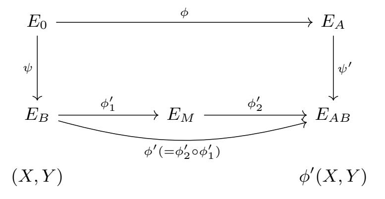
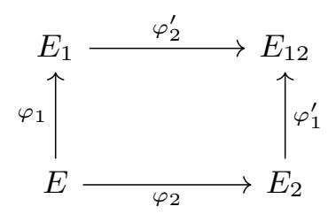
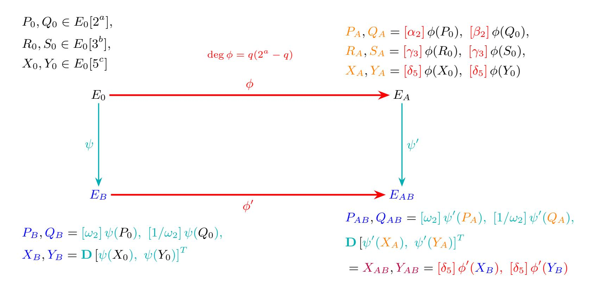
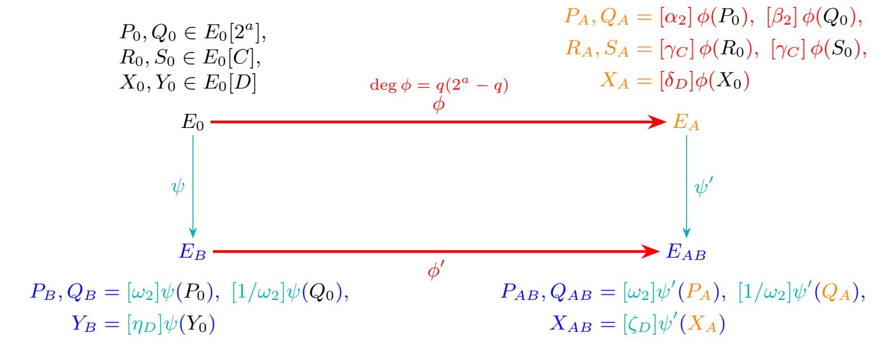
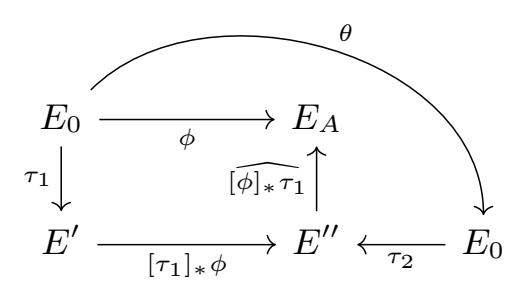

{0}------------------------------------------------

# PIKE: Faster Isogeny-Based Public Key Encryption with Pairing-Assisted Decryption

Shiping Cai<sup>1</sup>, Mingjie Chen<sup>2</sup>, Yi-Fu Lai<sup>2</sup>, Kaizhan Lin⊠<sup>3</sup>

<sup>1</sup> School of Mathematics, Sun Yat-sen University, Guangzhou, China caishp6@mail2.sysu.edu.cn

<sup>2</sup> KU Leuven, Belgium

mjchennn555@gmail.com

27182818284fu.lai@gmail.com

<sup>3</sup> College of Computer Science and Artificial Intelligence, Fudan University, Shanghai, China

linkzh@fudan.edu.cn

**Abstract.** Recent work at Eurocrypt 2025 by Basso and Maino introduced POKÉ, an isogeny-based public key encryption (PKE) scheme. POKÉ shows how two parties can derive a shared secret on a higher-dimensional, SIDH-like commutative diagram via basis evaluations, giving the fastest isogeny-based PKE to date with performance comparable to the original SIDH.

In this paper we present PIKE, a new isogeny-based PKE obtained by tweaking the POKÉ design. Our key change is to use pairings to derive the shared secret while preserving post-quantum security. This brings two benefits: (i) decryption is directly faster, and (ii) by relaxing the required prime form, we can choose smaller primes, further improving overall runtime.

We provide a proof-of-concept implementation in SageMath. Under the NIST I setting, our benchmarks show speedups of  $1.30\times$  (key generation),  $1.24\times$  (encryption), and  $1.47\times$  (decryption) over POKÉ, while maintaining competitive public key and ciphertext sizes. In addition, we provide a C implementation. The encryption and decryption take 53 Mcycles (23 ms) and 34 Mcycles (15 ms) on an Intel i7 2.3 GHz CPU, respectively.

# 1 Introduction

Public key encryption (PKE) is the cornerstone of modern cryptography, securing digital communication and enabling a wide range of higher-level protocols and services. With the progress of quantum computing, there is an urgent need to transition classical infrastructures to quantum-resistant ones [40,39]. In particular, quantum-safe PKE is a pressing concern, as large-scale adversaries may store encrypted data today and decrypt it later once cryptographically relevant quantum computers become available.

Among various post-quantum candidates, isogeny-based cryptography not only provides diversity in the assumptions but also stands out for its compact

{1}------------------------------------------------

key and ciphertexts/signatures sizes [\[30](#page-33-0)[,10,](#page-31-0)[20,](#page-32-0)[33,](#page-33-1)[36,](#page-33-2)[5\]](#page-31-1), making it appealing for communication-constrained environments and an attractive option to mitigate the communication overhead inherent in other quantum-safe infrastructures.

The supersingular isogeny Diffie-Hellman (SIDH) protocol, introduced by De Feo and Jao [\[30\]](#page-33-0), initiated practical research on isogeny-based public-key encryption. Subsequent works expanded this line of research in many directions [\[28,](#page-33-3)[15,](#page-32-1)[14,](#page-32-2)[13](#page-32-3)[,18\]](#page-32-4). However, recent cryptoanalysis [\[9,](#page-31-2)[35,](#page-33-4)[45\]](#page-34-2) has demonstrated powerful key-recovery attacks that make SIDH insecure, necessitating new approaches to building secure isogeny-based PKE schemes.

Early countermeasures [\[25,](#page-32-5)[4\]](#page-31-3) followed the same design paradigm as SIDH key exchange, focusing on degree-hiding or torsion-masking strategies to neutralize attacks that rely on knowledge of the isogeny degree and the image of torsion points. Although effective in principle, these approaches introduced substantial performance overheads across all operations. On the cryptoanalysis side, some variants of the original attacks were later proposed [\[11](#page-31-4)[,19\]](#page-32-6), though their effectiveness was limited to specific parameter choices.

The mathematical insight behind the SIDH attacks, often referred to as Kani's lemma, has in fact become a central tool in the design of isogeny-based protocols [\[16](#page-32-7)[,3,](#page-31-5)[24,](#page-32-8)[38,](#page-33-5)[33](#page-33-1)[,2\]](#page-31-6). In the PKE regime, there are two research lines realizing it with distinct approaches, leading to significant efficiency improvements [\[6](#page-31-7)[,36,](#page-33-2)[37,](#page-33-6)[5\]](#page-31-1). Basso, Maino, and Pope [\[6\]](#page-31-7) introduced the FESTA framework by constructing trapdoored one-way functions directly from the SIDH attack mechanism; their approach was later improved by Nakagawa and Onuki [\[37\]](#page-33-6). Another approach, represented by LIT-SiGamal [\[36\]](#page-33-2) and POKE [ ´ [5\]](#page-31-1), uses this tool to realize an ElGamal-type encryption scheme where the shared secret is not a curve (the case for SIDH), but torsion points. Remarkably, as shown in [\[5\]](#page-31-1), the POKE scheme achieves ciphertext and key sizes comparable to the original ´ SIDH.

Can we go further? In this work, we aim to push this direction by improving the runtime efficiency of isogeny-based public-key encryption, while preserving the compactness feature.

### 1.1 Contribution

In this paper, we propose PIKE—a new Pairing-assisted, Isogeny-based Key Encryption scheme. PIKE continues the ElGamal-type design paradigm of POKE. ´ Our new scheme introduces a new and careful use of pairings to obtain the shared secret while preserving the post-quantum security. This gives twofold benefits:

- 1. faster decryption by avoiding the discrete-logarithm step; and
- 2. relaxed prime-form requirements, enabling smaller primes and further improving overall runtime.

We provide a proof-of-concept implementation in SageMath. Under the NIST I setting, our experiments show speedups of 1.30× (key generation), 1.24× (encryption), and 1.47× (decryption) over POKE. Our scheme remains comparable ´

{2}------------------------------------------------

in compactness as POKÉ. Concretely, in the uncompressed case, the public key (480 B) and the ciphertext (576 B) are  $1.48 \times$  larger and  $1.12 \times$  smaller. In the compressed case, they are only  $1.008 \times$  and  $1.28 \times$  larger, respectively.

On security, we formalize the underlying problem as the computational-PIKE assumption and prove the IND-CPA security of the scheme under the assumption, which can be turned into an IND-CCA KEM using the Fujisaki-Okamoto transform [26,27,29]. We further scrutinize known attacks from the literature and show the hardness of the assumption.

#### <span id="page-2-1"></span>1.2 Technical overview

The two main ingredients in POKÉ are: a SIDH-like commutative diagram that can be jointly constructed by two parties Alice and Bob while keeping their secret isogenies secure, and a way to obtain a shared secret between the two parties.

Let us recall that in POKÉ, the field characteristic p is chosen to be of the form  $p = f2^a3^b5^c - 1$ , among which the rational  $2^a$ ,  $3^b$ -torsions are needed to build the commutative diagram and the  $5^c$ -torsions are needed to establish a shared secret. In the end, the shared key consists of the masked images of the basis points  $X_0, Y_0$  of  $E_0[5^c]$  under  $\phi' \circ \psi$  (=  $\psi' \circ \phi$ ) (see Fig. 1).

<span id="page-2-0"></span>

Fig. 1: Simplified POKÉ diagram.  $\phi' \circ \psi = \psi' \circ \phi$  and  $\phi' = \phi'_2 \circ \phi'_1$ . deg  $\phi'_1 = q$  and deg  $\phi'_2 = 2^a - q$ .

A natural question to ask is whether one could exploit existing  $\mathbb{F}_{p^2}$ -rational torsion points to obtain a shared secret, instead of making the additional  $5^c$ -torsion points rational — an approach that increases the field size. Given a prime of the form  $p = f2^a3^b-1$ , the straightforward candidates, namely the  $2^a$ - and  $3^b$ -torsion points, are quickly ruled out due to security or feasibility reasons, leaving only the  $\mathbb{F}_{p^2}$ -rational torsion points on the quadratic twist  $E_0^t$  of  $E_0$ . Indeed, as we will see in Section 2.1, such points correspond to elements of  $E_0(\mathbb{F}_{p^4})$ , yet their x-coordinates are defined over  $\mathbb{F}_{p^2}$ . To compute a shared secret using these points, the main required operations are the evaluation of 1-dimensional and 2-dimensional isogenies on them. The evaluation of 1-dimensional isogenies on

{3}------------------------------------------------

 $\mathbb{F}_{p^2}$ -rational points of quadratic twists can be carried out over  $\mathbb{F}_{p^2}$  using x-only arithmetic. Thanks to the recent work by Duparc [22], the evaluation of 2-dimensional isogenies on  $\mathbb{F}_{p^2}$ -rational points of quadratic twists can be also done efficiently on  $\mathbb{F}_{p^2}$ . Therefore, employing  $\mathbb{F}_{p^2}$ -rational torsion points on quadratic twists does not introduce any additional computational overhead that could have been caused by the need to go to  $\mathbb{F}_{p^4}$ .

Let us now take D to be a factor of p-1 and as an application of Theorem 2,  $E^t[D] \subseteq E(\mathbb{F}_{p^2})$  for a supersingular elliptic curve  $E/\mathbb{F}_{p^2}$ . Following the same approach for shared secret computation as in POKÉ, one party (say, Alice) must evaluate  $\phi'(X)$  and  $\phi'(Y)$  for  $\langle X, Y \rangle = E_B[D]$ . The information Bob sends to Alice contains sufficient torsion point information for Alice to recover these evaluations through the use of  $\phi'_1$  and  $\phi'_2$  (Fig. 1) via Kani's lemma. A subtlety arises here: a single application of Kani's lemma enables the evaluation of only one pair, either  $(\phi'_1, \widehat{\phi}'_2)$  or  $(\widehat{\phi}'_1, \phi'_2)$  (see Theorem 4), so Alice has to invoke it twice to obtain both  $\phi'_1$  and  $\phi'_2$  in general.

Since using Kani's lemma is the most computationally expensive component of the protocol, POKÉ employs a clever trick as follows. Instead of invoking it twice, Alice applies Kani's lemma once to compute  $\phi'_1(X)$ ,  $\phi'_1(Y)$  and  $\widehat{\phi}'_2(U)$ ,  $\widehat{\phi}'_2(V)$ , where  $\langle U, V \rangle = E_{AB}[D]$ . Because  $D = 5^c$  is smooth in the POKÉ setting, Alice can efficiently solve discrete logarithms over  $\mathbb{Z}/D\mathbb{Z}$  to find a  $2 \times 2$  matrix  $\mathbf{M}$  such that

$$\phi_1'(X,Y)^T = \mathbf{M} \,\widehat{\phi}_2'(U,V)^T.$$

This relation then gives the desired evaluation

$$\phi_2' \circ \phi_1'(X, Y)^T = [\deg(\phi_2')] \mathbf{M} (U, V)^T.$$

In short, POKÉ reduces the two most expensive Kani-lemma calls to one by exploiting the smoothness of D and solving a 2-dimensional discrete logarithm over  $\mathbb{Z}/D\mathbb{Z}$ . Unfortunately, this method does not apply in our case since we are not able to control the smoothness of the factor D.

To circumvent this issue in efficiency when using  $D \mid p-1$ , we propose a novel way to obtain a shared secret. Our method still uses D-torsions, but the secret no longer consists of masked image points, instead, we use the pairing value  $e_D(X_0, Y_0)^{\eta_D \zeta_D} \in \mu_D$  where  $\{X_0, Y_0\}$  is a basis of  $E_0[D]$  and  $\eta_D, \zeta_D \in (\mathbb{Z}/D\mathbb{Z})^{\times}$ . The two scalars  $\eta_D, \zeta_D$  are chosen by Bob alone, for Alice to obtain the same value, Alice sends Bob  $X_A = [\delta_D]\phi(X_0)$  on  $E_A$  with  $\delta_D \in (\mathbb{Z}/D\mathbb{Z})^{\times}$ , a secret scalar chosen by her. Bob sends back to Alice  $Y_B = [\eta_D]\psi(Y_0)$  on  $E_B$  together with  $X_{AB} = [\zeta_D]\psi'(X_A)$  on  $E_{AB}$ . Alice then computes

$$e_D(\widehat{\phi}'_2(X_{AB}), \phi'_1(Y_B))$$
, which equals to  $e_D(X_0, Y_0)^{q(2^a-q)3^b\delta_D\eta_D\zeta_D}$ 

Alice can also compute the same value  $e_D(X_0, Y_0)^{\eta_D \zeta_D}$  since  $q, \delta_D$  are known to her and  $2^a, 3^b$  are public information. This way, only one  $(2^a, 2^a)$ -isogeny computation is needed. The public parameters are formalized as follows. Now, the shared value is essentially the scalar  $\eta_D \zeta_D \in (\mathbb{Z}/D\mathbb{Z})^{\times}$  instead of the pairing

{4}------------------------------------------------

value  $e_D(X_0, Y_0)^{\eta_D \zeta_D}$  since  $e_D(X_0, Y_0)$  is public information. Hence, we only choose to use  $e_D(X_0, Y_0)^{\eta_D \zeta_D}$  to avoid discrete logarithm computations.

For a security level  $\lambda$ , we need D to be an integer of size at least  $2^{\lambda}$  to ensure security, and as close to  $2^{\lambda}$  as possible for efficiency and compactness reasons. However, it is not likely that a prime of the form  $p = f2^a3^b - 1$  contains such a factor, and finding such a factor also involves integer factorization. Thanks to (again) x-only arithmetic, we can in fact relax the requirements on parameter to  $2^aCD \mid p^2 - 1$ , here C denotes a smooth integer which is a relaxation of the original  $3^b$ . We propose a simple method in Appendix A to find such parameters.

#### 1.3 Related work

Very recently, Kim, Hong, Kim, and Lee proposed INKE [31], also a variant of POKÉ. INKE avoids the discrete-logarithm step without adding the number of 2-dimensional isogeny computations by using the "middle" curve  $E_M$  as the shared secret obtained. This design choice improves performance at the cost of larger public keys. While our work is independent and the approaches are distinct, in Section 6 we present a detailed comparison between INKE and PIKE in terms of public key/ciphertext sizes and runtime efficiency.

Roadmap. The paper is structured as follows. In Section 2, we present the essential preliminaries for isogenies and security notions for public key encryption. We introduce our new scheme PIKE and all the subroutines in Section 3. A security analysis of our scheme and the formalized assumption are provided in Section 4. Section 6 provides the implementations and offers a detailed comparison between POKÉ, INKE and PIKE. Finally, we draw our conclusions in Section 7.

### <span id="page-4-1"></span>2 Preliminary

Notation. We denote the set of natural numbers by  $\mathbb{N}$ .  $\mathcal{M}_2(n)$  denotes the set of 2 by 2 matrix defined over  $\mathbb{Z}/n\mathbb{Z}$ . We denote the multiplicative group of  $\mathbb{Z}/n\mathbb{Z}$  by  $(\mathbb{Z}/n\mathbb{Z})^{\times}$ . For  $\mathbf{M} = \begin{pmatrix} a & b \\ c & d \end{pmatrix} \in \mathcal{M}_2(n)$  and elliptic curve points P, Q we denote  $\mathbf{M}(P,Q)^T = ([a]P + [b]Q, [c]P + [d]Q)^T$ .

#### <span id="page-4-0"></span>2.1 Quaternion Algebra, Elliptic Curves and Isogenies

We introduce the mathematical background necessary for the construction, focusing particularly on the basic theory of elliptic curves. We refer the reader to [48] for a more detailed exposition.

Quaternion algebras. Let p be a prime and let  $\mathcal{B}_{p,\infty}$  denote the unique (up to isomorphism) quaternion algebra ramified precisely at p and  $\infty$ . We fix a  $\mathbb{Q}$ -basis  $\langle 1, \mathbf{i}, \mathbf{j}, \mathbf{k} \rangle$  of  $\mathcal{B}_{p,\infty}$  that satisfies  $\mathbf{i}^2 = -q$ ,  $\mathbf{j}^2 = -p$  and  $\mathbf{k} = \mathbf{i}\mathbf{j} = -\mathbf{j}\mathbf{i}$  for some integer q. A fractional ideal I in  $B_{p,\infty}$  is a  $\mathbb{Z}$ -lattice of rank 4. We denote by n(I)

{5}------------------------------------------------

the norm of I as the largest rational number such that  $n(\alpha) \in n(I)\mathbb{Z}$  for any  $\alpha \in I$ . An order  $\mathcal{O}$  is a subring of  $B_{p,\infty}$  that is also a fractional ideal. An order is called maximal when it is not contained in any other larger order. A fractional ideal is integral if it is contained in its left order  $\mathcal{O}_L(I) = \{\alpha \in \mathcal{B}_{p,\infty} \mid \alpha I \subset I\}$ , or equivalently in its right order  $\mathcal{O}_R(I) = \{\alpha \in \mathcal{B}_{p,\infty} \mid I\alpha \subset I\}$ .

Elliptic curves and isogenies. Every elliptic curve E over  $\mathbb{F}_q$  of characteristic p>3 admits a short Weierstrass equation

$$y^2 = x^3 + Ax + B$$

with  $A, B \in \mathbb{F}_q$ . The set of  $\mathbb{F}_q$ -rational points of E is defined as

$$E(\mathbb{F}_q) = \{(x, y) \in (\mathbb{F}_q)^2 : y^2 = x^3 + Ax + B\} \cup \{O_E\},\$$

where  $O_E$  is the *point at infinity*. This set is a finite abelian group with respect to elliptic curve point addition and  $O_E$  the neutral element.

Let  $E, E_1, E_2$  be elliptic curves over  $\mathbb{F}_q$ . An isogeny from  $E_1$  to  $E_2$  is a non-constant rational map that is simultaneously a group homomorphism. An isogeny from a curve E to itself is an endomorphism. The kernel of an isogeny is a finite subgroup of  $E(\overline{\mathbb{F}}_q)$ , and when the size of kernel is coprime to p, the degree of this isogeny is the size of the kernel subgroup. When an isogeny has degree 1, we say it is an isomorphism. The set  $\operatorname{End}(E)$  of all endomorphisms of E forms a ring under addition and composition.  $\operatorname{End}(E)$  is either an order in an imaginary quadratic field and E is called ordinary, or a maximal order in  $\mathcal{B}_{p,\infty}$ , in which case E is called supersingular.

Example 1. Let p be a prime such that  $p \equiv 3 \pmod{4}$ . The curve  $E_0/\mathbb{F}_p : y^2 = x^3 + x$  is a supersingular elliptic curve. Throughout this paper,  $E_0$  represents this curve. One algorithm we will use later on this curve is the algorithm [21, Algorithm 1] called as FullRepresentInteger to select a fixed norm (> p) endomorphism of  $E_0$ .

Given a supersingular elliptic curve E, a maximal order  $\mathcal{O} \subseteq \mathcal{B}_{p,\infty}$  that is isomorphic to  $\operatorname{End}(E)$ , and a left  $\mathcal{O}$ -ideal I, one can define the isogeny  $\varphi_I$  associated to I as the isogeny with kernel  $E[I] = \bigcap_{\alpha \in I} \ker(\alpha)$ . Computing this isogeny  $\varphi_I$  from I is called as the *ideal-to-isogeny* translation.

Quadratic twist. A twist of an elliptic curve  $E/\mathbb{F}_q$  is another elliptic curve  $E^t/\mathbb{F}_q$  that is isomorphic to  $E/\mathbb{F}_q$ , and the isomorphism itself is not defined over  $\mathbb{F}_q$ , meaning the kernel subgroup is not defined over  $\mathbb{F}_q$ . The curve  $E^t$  is called a quadratic twist of E if it becomes isomorphic to E over a quadratic extension of  $\mathbb{F}_q$ , but not over  $\mathbb{F}_q$  itself. More explicitly, the quadratic twist (up to  $\mathbb{F}_q$ -isomorphisms) of  $y^2 = x^3 + Ax + B$  is of the form  $Cy^2 = x^3 + Ax + B$  for any  $C \in \mathbb{F}_q$  that is not a square, and their isomorphism is defined by  $(x,y) \mapsto (x,\sqrt{C}y)$ .

<span id="page-5-0"></span>The following theorem is in particularly useful in understanding the parameter choices of PIKE.

{6}------------------------------------------------

**Theorem 2 (Lemma 4.8 of [47]).** Let E be a supersingular elliptic curve defined over  $\mathbb{F}_{p^2}$  such that the  $p^2$ -power Frobenius  $\pi:(x,y)\mapsto(x^{p^2},y^{p^2})$  equals -p. Then

$$E(\mathbb{F}_{n^{2k}}) \cong \mathbb{Z}/(p^k - (-1)^k) \oplus \mathbb{Z}/(p^k - (-1)^k).$$

Moreover, the quadratic twist over  $\mathbb{F}_{p^{2k}}$  of E satisfies

$$E^{t}(\mathbb{F}_{p^{2k}}) \cong \mathbb{Z}/(p^{k} + (-1)^{k}) \oplus \mathbb{Z}/(p^{k} + (-1)^{k}).$$

In particular, this means that

$$E(\mathbb{F}_{p^2}) \cong (\mathbb{Z}/(p+1)\mathbb{Z})^2, E^t(\mathbb{F}_{p^2}) \cong (\mathbb{Z}/(p-1)\mathbb{Z})^2.$$

Let  $D \mid p-1$ , and  $P \in E^t[D]$ . Then the corresponding point of P (via the isomorphism of the quadratic twist defined above) in E[D] has its x-coordinate defined over  $\mathbb{F}_{p^2}$ .

Weil pairing. For  $N \in \mathbb{N}$ , the N-torsion subgroup of E is defined as

$$E[N] = \{ P \in E(\overline{\mathbb{F}}_q) \mid [N]P = O_E \}.$$

If  $N \neq 0$  and  $p \nmid N$ , then  $E[N] \cong (\mathbb{Z}/N\mathbb{Z})^2$ . There exists the Weil pairing  $e_N : E[N] \times E[N] \to \mu_N$  where  $\mu_N$  denotes a multiplicative group of order N in  $\overline{\mathbb{F}}_q$ . The Weil pairing is a computationally feasible bilinear map and for an isogeny  $\phi : E \to E'$ ,  $P \in E[N]$ ,  $Q \in E'[N]$  we have

$$e_N(P,\widehat{\phi}(Q)) = e_N(\phi(P),Q),$$

where  $\widehat{\cdot}$  denotes the dual isogeny. When  $N|(p^2-1)$ , we have  $\mu_N \subset \mathbb{F}_{p^2}$ , which is the case we will use in the paper. Moreover, in the case that the pairing value w=a+bi is defined over  $\mathbb{F}_{p^2} \cong \mathbb{F}_p[i]/\langle i^2+1\rangle$  with  $a,b\in\mathbb{F}_p$ , its  $\mathbb{F}_p$ -trace is the sum of the conjugates, i.e.,  $\operatorname{tr}(w)=w+w^p=2a$ . From the equation above, we immediately have  $e_N(\phi(P),\phi(Q))=e_N(P,Q)^{\deg(\phi)}$ .

Kani's lemma. Let  $\phi: E \to E_1$  and  $\psi: E \to E_2$  be two isogenies with the same domain and coprime degrees. We use the conventional notion  $[\phi]_*\psi$  to represent the pushforward of  $\psi$  under  $\phi$ , i.e., the isogeny  $\psi': E_1 \to E_{12}$  such that

$$\ker(\psi') = \phi(\ker(\psi)).$$

In this case, the isogenies  $\psi$  and  $\psi'$  are said to be *parallel* with respect to the isogeny  $\phi$ . For simplicity, the reference to  $\phi$  may be omitted if it is clear from the context in this paper.

Two sets of parallel isogenies, i.e.,

$$\phi: E \to E_1, \qquad \psi: E \to E_2, \qquad \phi': E_2 \to E_{12}, \qquad \psi': E_1 \to E_{12},$$

where  $\phi' = [\psi]_* \phi$  and  $\psi' = [\phi]_* \psi$ , form a *commutative* diagram.

{7}------------------------------------------------



Fig. 2: Commutative diagram.

<span id="page-7-1"></span>**Definition 3** ( $(d_1, d_2)$ -isogeny diamond). Let  $E, E_1, E_2, E_{12}$  be elliptic curves defined over the same field. If the following diagram (Fig. 2) commutes: where  $\varphi_1: E \to E_1$  and  $\varphi_1': E_2 \to E_{12}$  are  $d_1$ -isogenies, and  $\varphi_2: E \to E_2$  and  $\varphi_2': E_1 \to E_{12}$  are  $d_2$ -isogenies, then the commutative diagram is called a ( $d_1, d_2$ )-isogeny diamond.

<span id="page-7-0"></span>**Theorem 4 (Kani's lemma).** Let  $d_1, d_2$  be positive coprime integers, and let the  $(d_1, d_2)$ -isogeny diamond be given. Define the map  $\Phi$ , written in matrix form,

$$\Phi = \begin{pmatrix} \varphi_1 - \widehat{\varphi}_2' \\ \varphi_2 & \widehat{\varphi}_1' \end{pmatrix} : E \times E_{12} \longrightarrow E_1 \times E_2.$$

Then  $\Phi$ , viewed with respect to the product principal polarization, is a  $(d_1 + d_2)$ -\nisogeny. Its kernel is

$$Ker(\Phi) = \{ ([-d_1]P, \varphi_2' \circ \varphi_1(P)) \mid P \in E[d_1 + d_2] \}.$$

For computational details on higher-dimensional isogenies see [17]. The lemma enables us to evaluate the isogeny  $\Phi$  using the evaluation information of the isogeny  $\varphi = \varphi'_2 \circ \varphi_1 = \varphi'_1 \circ \varphi_2$  on the  $(d_1 + d_2)$ -torsion basis. Conversely, one can also evaluate  $\varphi$  from the knowledge of  $\Phi$ . A 2-dimensional representation of  $\varphi$  is characterized by a description of the kernel of an isogeny  $\Phi$ , e.g.,

$${E, P, Q, E_{12}, P_{12}, Q_{12}, d_1, d_2},$$

where  $\{P,Q\}$  is a torsion basis of  $E[d_1+d_2]$  and  $P_{12}=\varphi(P),\ Q_{12}=\varphi(Q)$ .

#### 2.2 Public Key Encryption

**Definition 5 (Public-Key Encryption).** A public-key encryption  $\Pi_{PKE}$  over a message space  $\mathcal{M}$  consists of four algorithms  $\Pi_{PKE} = (\mathsf{Setup}, \mathsf{KeyGen}, \mathsf{Enc}, \mathsf{Dec})$ :

- $\mathsf{Setup}(1^{\lambda}) \to \mathsf{pp} : On \ input \ the \ security \ parameter \ 1^{\lambda}, \ it \ outputs \ a \ public \ parameter \ \mathsf{pp}.$
- KeyGen(pp) → (pk, sk): On input a public parameter pp, it outputs a pair of public key and secret key (pk, sk).
- $Enc(pk, msg) \rightarrow ct$ : On input a public key pk and a message  $msg \in \mathcal{M}$ , it outputs a ciphertext ct.

{8}------------------------------------------------

-  $\mathsf{Dec}(\mathsf{sk},\mathsf{ct}) \to \mathsf{msg}\ or\ \bot : On\ input\ a\ secret\ key\ \mathsf{sk}\ and\ a\ ciphertext\ \mathsf{ct},\ it$  outputs either  $\mathsf{msg} \in \mathcal{M}\ or\ a\ special\ symbol\ \bot \not\in \mathcal{M}.$ 

The subroutines Enc, Dec also use pp implicitly. When the context is clear, we may drop pp.

**Definition 6 (Correctness).** A public-key encryption scheme  $\Pi_{PKE} = (Setup, KeyGen, Enc, Dec)$  over message space  $\mathcal{M}$  is said to be correct if, for all security parameters  $\lambda \in \mathbb{N}$ , and all messages  $msg \in \mathcal{M}$ , the following holds:

$$\Pr[\mathsf{Dec}(\mathsf{sk},\mathsf{Enc}(\mathsf{pk},\mathsf{msg})) = \mathsf{msg} \mid \mathsf{pp} \leftarrow (\mathsf{Setup}(1^{\lambda}),(\mathsf{pk},\mathsf{sk}) \leftarrow \mathsf{KeyGen}(\mathsf{pp}))] = 1.$$

That is, decrypting a ciphertext generated honestly under the same public key always recovers the original message.

**Definition 7 (IND-CPA Security).** A PKE scheme  $\Pi_{PKE} = (Setup, KeyGen, Enc, Dec)$  is IND-CPA secure if, for any  $\lambda \in \mathbb{N}$ , any PPT adversary  $\mathcal{A}$  has at most a negligible advantage in the following game played against a challenger.

- (i) The challenger runs  $pp \leftarrow \mathsf{Setup}(1^{\lambda})$ ,  $(pk, sk) \leftarrow \mathsf{KeyGen}(pp)$  and samples a bit  $b \in \{0, 1\}$ . The challenger provides (pp, pk) to  $\mathcal{A}$ .
- (ii) A can query the challenge oracle by sending a pair of messages  $(\mathsf{msg}_0, \mathsf{msg}_1) \in \mathcal{M}^2$ , and the challenger returns  $\mathsf{ct}_b \leftarrow \mathsf{Enc}(\mathsf{pk}, \mathsf{msg}_b)$  to  $\mathcal{A}$ .
- (iii)  $\mathcal{A}$  outputs a bit  $b^* \in \{0,1\}$ . We say  $\mathcal{A}$  wins if  $b^* = b$ .

The advantage of  $\mathcal{A}$  is defined as  $\mathsf{Adv}^{\mathsf{IND-CPA}}_{\Pi_{\mathsf{PKE}}}(\mathcal{A}) = |\Pr[\mathcal{A} \ wins] - 1/2|$  where the probability is taken over the randomness used in the game and by  $\mathcal{A}$ .

### **2.3** POKÉ

POKÉ [5], as illustrated in Fig. 3, is a public-key encryption protocol based on higher-dimensional isogenies. It constructs a commutative diagram where one party uses  $\phi$ , an isogeny of non-smooth degree, represented efficiently in dimension 2, while the other uses a smooth-degree isogeny  $\psi'$ , represented in dimension 1. The public parts of both parties can be pushed forward through the other party's isogeny, allowing both parties to compute their respective isogenies  $\phi'$  and  $\psi'$  without revealing their secrets.

Since all curves in the diagram become public, the shared secret is not the final curve  $E_{AB}$ . Instead, both parties derive a shared basis  $\{X_{AB}, Y_{AB}\}$  by commuting the action of their secret isogenies on a public torsion basis, masked with random scalars and matrices. The procedures are as follows:

**Setup**: Select a prime  $p = f2^a 3^b 5^c - 1$  and define  $E_0 : y^2 = x^3 + x$  to be a supersingular curve defined over  $\mathbb{F}_p$  with j-invariant 1728. Let  $\{P_0, Q_0\}, \{R_0, S_0\}$  and  $\{X_0, Y_0\}$  be the  $2^a$ -,  $3^b$ - and  $5^c$ -torsion bases of  $E_0$ , respectively. Let KDF be a fixed key-derivation function.

**Key Generation**: Firstly, the receiver Alice samples a positive integer  $q < 2^a$  such that  $q(2^a - q)$  is coprime to 2, 3 and 5. Then, compute a random isogeny  $\phi$ :

{9}------------------------------------------------

<span id="page-9-0"></span>

Fig. 3: A sketch of POKÉ. Black: pk parameter; red: secret key; orange: public key; lightblue: nonce; blue: ciphertext purple: the shared key.

 $E_0 \to E_A$  of degree  $q(2^a - q)$ , and then evaluate  $\phi$  at the torsion bases  $\{P_0, Q_0\}$ ,  $\{R_0, S_0\}$  and  $\{X_0, Y_0\}$ . Finally, Alice selects  $\alpha_2, \beta_2 \in (\mathbb{Z}/2^a\mathbb{Z})^{\times}$ ,  $\gamma_3 \in (\mathbb{Z}/3^b\mathbb{Z})^{\times}$  and  $\delta_5 \in (\mathbb{Z}/5^c\mathbb{Z})^{\times}$  to mask the evaluated points:

$$P_A = [\alpha_2]\phi(P_0), \quad Q_A = [\beta_2]\phi(Q_0);$$
  
 $R_A = [\gamma_3]\phi(R_0), \quad S_A = [\gamma_3]\phi(S_0);$   
 $X_A = [\delta_5]\phi(X_0), \quad Y_A = [\delta_5]\phi(Y_0).$ 

The secret key is  $\mathsf{sk} = \{q, \alpha_2, \beta_2, \delta_5\}$ , and the public key involves the codomain of  $\phi$  and the masked evaluated points, i.e.,  $\mathsf{pk} = \{E_A, P_A, Q_A, R_A, S_A, X_A, Y_A\}$ .

**Encryption**: The sender Bob first samples  $r_3 \in \mathbb{Z}/3^b\mathbb{Z}$  uniformly at random. Then he generates two 1-dimensional isogenies  $\psi : E_0 \to E_B$  with kernel  $\langle R_0 + [r_3]S_0 \rangle$ , and  $\psi' : E_A \to E_{AB}$  with kernel  $\langle R_A + [r_3]S_A \rangle$ . After that, Bob evaluates  $\psi$  at the torsion bases  $\{P_0, Q_0\}$ ,  $\{X_0, Y_0\}$  and  $\psi'$  at  $\{R_A, S_A\}$ ,  $\{X_A, Y_A\}$ . After that, Bob computes

$$P_{B} = [\omega_{2}]\psi(P_{0}), Q_{B} = [1/\omega_{2}]\psi(Q_{0});$$

$$P_{AB} = [\omega_{2}]\psi'(P_{A}), Q_{AB} = [1/\omega_{2}]\psi'(Q_{A});$$

$$(X_{B}, Y_{B})^{T} = \mathbf{D_{5}}(\psi(X_{0}), \psi(Y_{0}))^{T};$$

$$(X_{AB}, Y_{AB})^{T} = \mathbf{D_{5}}(\psi'(X_{A}), \psi'(Y_{A}))^{T};$$

where  $\omega_2 \in (\mathbb{Z}/2^a\mathbb{Z})^{\times}$  and  $\mathbf{D_5}$  is a 2 by 2 matrix of determinant 1 drawn uniformly at random. After computing  $\mathsf{ct'} = \mathsf{KDF}(X_{AB}, Y_{AB}) \oplus \mathsf{msg}$ , Bob transmits

$$ct = (E_B, P_B, Q_B, X_B, Y_B, E_{AB}, P_{AB}, Q_{AB}, ct')$$

{10}------------------------------------------------

to the receiver Alice.

**Decryption**: After receiving the ciphertext, Alice constructs the isogeny  $\phi'$ :  $E_B \to E_{AB}$  with respect to its 2-dimensional representation

$$\{E_B, P_B, Q_B, E_{AB}, [1/\alpha_2]P_{AB}, [1/\beta_2]Q_{AB}, q, 2^a - q\}.$$

She evaluates  $\phi'$  at  $X_B$  and  $Y_B$ , and reveals

$$X_{AB} = [\delta_5]\phi'(X_B), Y_{AB} = [\delta_5]\phi'(Y_B).$$

Lastly, Alice reveals the plaintext by  $\mathsf{msg} = \mathsf{KDF}(X_{AB}, Y_{AB}) \oplus \mathsf{ct}'$ .

### <span id="page-10-0"></span>3 The PIKE protocol

In this section, we introduce our new Pairing-assisted, Isogeny-based Key Encryption scheme — PIKE. Similar to POKÉ, PIKE follows the ElGamal approach, where the ciphertext is obtained by combining the shared secret with the message. A sketch of PIKE is provided in Fig. 4. We present the detailed algorithms  $\Pi_{PKE} = \{\text{KeyGen, Enc, Dec}\}\$ in the subsequent subsections.

In what follows, we use the public parameter denoted by  $pp = (p, a, C, D, E_0, (P_0, Q_0), (R_0, S_0), (X_0, Y_0), e_D(X_0, Y_0))$  as the setup for the scheme. As mentioned in Section 1.2, we choose p to be a prime such that  $2^aCD \mid p^2 - 1$ . We fix  $\{P_0, Q_0\}, \{R_0, S_0\}$  and  $\{X_0, Y_0\}$  to be bases of  $E_0[2^a], E_0[C]$  and  $E_0[D]$ , respectively. We also include the precomputed value  $w_0 = e_D(X_0, Y_0)$  to pp. Under the setting that  $D \mid p^2 - 1$ , the pairing value  $w_0$  is defined over  $\mathbb{F}_{p^2}$ . We use the hash function  $H: \{0,1\}^* \to \{0,1\}^{2\lambda}$  in our scheme, which will be modeled as a random oracle. To clarify the purpose, we add a prefix as  $H(\mathsf{KDF} \mid \cdot)$ .

<span id="page-10-1"></span>

Fig. 4: A sketch of PIKE. Black: pk parameter; red: secret key; orange: public key; lightblue: encryption nonce; blue: ciphertext.

{11}------------------------------------------------

#### 3.1 Key Generation

The key generation phase greatly resembles that of POKÉ. At its core, it computes an isogeny  $\phi$  of degree  $q(2^a-q)$  for some secret prime q and computes its masked evaluation on different torsion bases. To be more precise:

- The secret key of PIKE consists of a random integer q that is less than  $2^a$  such that  $q(2^a q)$  is coprime to 2, C and D, together with randomly sampled scalars  $\alpha_2, \beta_2 \in (\mathbb{Z}/2^a\mathbb{Z})^{\times}$  and  $\delta_D \in (\mathbb{Z}/D\mathbb{Z})^{\times}$ . Additionally, we require  $\gamma_C \in (\mathbb{Z}/C\mathbb{Z})^{\times}$ , which does not need to be stored but should be treated as sensitive information as the secret key in generation.
- The public key of PIKE consists of the codomain curve  $E_A$  of  $\phi$ , and points  $P_A$ ,  $Q_A \in E_A[2^a]$ ,  $R_A$ ,  $S_A \in E_A[C]$ ,  $X_A \in E_A[D]$  as defined in Fig. 4.

As mentioned in POKÉ, there are two approaches to generate  $\phi$ . The rigorous one samples a random ideal left  $\mathcal{O}_0$ -ideal I of norm  $q(2^a-q)$ , and then use the ideal-to-isogeny algorithm [3,8] to translate I to a  $q(2^a-q)$ -isogeny  $\phi$ . Despite the ideal-to-isogeny algorithms being highly efficient, they require  $2^a$  to be of the same size as p. As we will see later in Section 6.1, this requirement is not met by our parameter choices, and we have to either perform 2-dimensional isogeny computations with factors in C, or adopt the ideal-to-isogeny algorithm from [41]. Both options suffer from great efficiency loss.

The second approach is to use the heuristic non-smooth isogeny generation algorithm in POKÉ [5, Algorithm 3], which is based on Randlsoglmages [37, Algorithm 2]. The core of this algorithm is generating an endomorphism  $\theta$  whose degree is divisible by  $q(2^a-q)$ , then decomposing it to obtain the  $q(2^a-q)$ -degree component. We will use this method in our key generation implementation. Even though in our setting this algorithm is a lot like [5, Algorithm 3], we still provide its description in Algorithm 1 for completeness, considering that we have different parameter choices compared to POKÉ.

```
Algorithm 1: Genlso: Generating a q(2^a-q)-isogeny (heuristic)

Input: An integer q, a torsion base \{P_0,Q_0\}\subseteq E_0[2^a], and a point X_0\in E_0[D].

Output: A 2-dimensional isogeny encoding an isogeny \phi:E_0\to * of degree q(2^a-q), and \phi(P_0,Q_0,X_0).

1 \theta\leftarrow \text{FullRepresentInteger}_{\mathcal{O}_0}(q(2^a-q)C).

2 K\leftarrow \ker(\hat{\theta})\cap E_0[C].

3 Compute \tau:E_0\to E_A with kernel K.

4 P_A,\,Q_A,X_A\leftarrow [1/C]\tau\circ\theta(P_0),\,[1/C]\tau\circ\theta(Q_0),\,[1/C]\tau\circ\theta(X_0).

5 Compute the 2-dimensional isogeny \Phi:E_0\times E_A\to * with kernel \langle ([-q]P_0,P_A),\,([-q]Q_0,Q_A)\rangle.

6 return \Phi,P_A,Q_A,X_A.
```

We will see in Section 6.1 that  $q(2^a-q)C > p$  and therefore the input in Step 1 to FullRepresentInteger is valid. Moreover, let us note that this algorithm also

{12}------------------------------------------------

outputs image points of  $\phi$  evaluated on  $2^a$ - and D-torsions already, purely using 1-dimensional isogeny computations. What is left in the key generation phase is to evaluate  $\phi$  on C-torsion bases, besides the sampling and masking steps. Even though done in the same way as in POKÉ, we present this evaluation step in Algorithm 2 for convenience. With these two important algorithmic components in hand, we finally present the key generation algorithm in Algorithm 3.

#### **Algorithm 2:** EvalFromDimTwo: Evaluation of $\phi$

```
Input: An isogeny \Phi: E \times F \to * of the form \begin{pmatrix} \phi_1 & -\hat{\phi}_2 \\ * & * \end{pmatrix} such that
                 \phi = \phi_2 \circ \phi_1 : E \to F, and a set of points \{P_1, P_2, \cdots, P_n\} \subset E where
                 \operatorname{ord}(P_i) is coprime to \operatorname{deg} \Phi and \operatorname{deg} \phi, i = 1, 2, \dots, n.
     Output: \phi(P_i), i = 1, 2, \dots, n.
 1 for i = 1, 2, \dots, n do
 \mathbf{2} \quad | \quad (P_i', \underline{\ }) \leftarrow \varPhi(P_i, O_E).
 3 end
 4 Generate a basis U, V of F[C].
 5 (-U', \_) \leftarrow \Phi(O_F, U), (-V', \_) \leftarrow \Phi(O_F, V).
 6 for i = 1, 2, \dots, n do
        Find x, y such that P'_i = [x]U' + [y]V'.
 7
          Q_i \leftarrow [x]U + [y]V.
 8
 9 end
10 return Q_1, Q_2, \cdots, Q_n.
```

#### **Algorithm 3:** KeyGen

```
Input: The public parameter pp = (p, a, C, D, E_0, (P_0, Q_0), (R_0, S_0), (X_0, Y_0)).
Output: The secret key sk and the public key pk.

1 Sample a prime q < 2^a such that q(2^a - q), 2, C, D are mutually coprime.

2 \Phi, P_A, Q_A, X_A \leftarrow \text{Genlso}(q, P_0, Q_0, X_0).

3 R_A, S_A \leftarrow \text{EvalFromDimTwo}(\Phi, \{R_0, S_0\}).

4 Sample randomly \alpha_2, \beta_2 \in (\mathbb{Z}/2^a\mathbb{Z})^{\times}, \gamma_C \in (\mathbb{Z}/C\mathbb{Z})^{\times}, \delta_D \in (\mathbb{Z}/D\mathbb{Z})^{\times}.

5 P_A, Q_A \leftarrow [\alpha_2]P_A, [\beta_2]Q_A.

6 R_A, S_A \leftarrow [\gamma_C]R_A, [\gamma_C]S_A.

7 X_A \leftarrow [\delta_D]X_A.

8 sk \leftarrow (q, \alpha_2, \beta_2, \delta_D), \text{ pk} \leftarrow (E_A, P_A, Q_A, R_A, S_A, X_A).

9 return sk, pk.
```

#### <span id="page-12-1"></span>3.2 Encryption

The encryption phase consists of computing the two vertical parallel isogenies  $\psi$  and  $\psi'$  in Fig. 4 and computing their masked evaluations on torsion points. To be

{13}------------------------------------------------

more precise, the sender generates a secret isogeny  $\psi: E_0 \to E_B$  of degree C by sampling  $r_3 \in \mathbb{Z}/C\mathbb{Z}$  and specifying the kernel as  $\langle R_0 + [r_3]S_0 \rangle$ . Then the sender also computes the parallel isogeny  $\psi': E_A \to E_{AB}$  with kernel  $\langle R_A + [r_3]S_A \rangle$ . Alongside the 1-dimensional isogeny computations, the sender also computes masked image points  $P_B, Q_B, Y_B \in E_B(\overline{\mathbb{F}}_p)$  and  $P_{AB}, Q_{AB}, X_{AB} \in E_{AB}(\overline{\mathbb{F}}_p)$  of these two isogenies as defined in Fig. 4. The ciphertext ct then consists of the two curves  $E_B, E_{AB}$ , the six torsion points, and the value  $w_0^{\eta_D \zeta_D}$  where  $\eta_D, \zeta_D \in (\mathbb{Z}/D\mathbb{Z})^{\times}$  are scalars used in the masking of  $Y_B$  and  $X_{AB}$ , respectively. We provide the detailed descriptions of the encryption phase in Algorithm 4.

```
Algorithm 4: Enc

Input: The public key pk = (E_A, P_A, Q_A, R_A, S_A, X_A) and a message msg \in \{0, 1\}^{2\lambda}.

Output: The ciphertext ct.

1 Sample uniformly at random r_3 \in \mathbb{Z}/C\mathbb{Z}, \omega_2 \in (\mathbb{Z}/2^a\mathbb{Z})^{\times}, \eta_D, \zeta_D \in (\mathbb{Z}/D\mathbb{Z})^{\times}.

2 Compute the plaintext pad \leftarrow \mathsf{H}(\mathsf{KDF} \| \mathsf{tr}(w_0^{\eta_D \zeta_D})).

3 Compute \psi : E_0 \to E_B with \ker(\psi) = \langle R_0 + [r_3]S_0 \rangle.

4 Compute \psi' : E_A \to E_{AB} with \ker(\psi') = \langle R_A + [r_3]S_A \rangle.

5 P_B \leftarrow [\omega_2]\psi(P_0), Q_B \leftarrow [1/\omega_2]\psi(Q_0), Y_B \leftarrow [\eta_D]\psi(Y_0).

6 P_{AB} \leftarrow [\omega_2]\psi'(P_A), Q_{AB} \leftarrow [1/\omega_2]\psi(Q_A), X_{AB} \leftarrow [\zeta_D]\psi(X_A).

7 \mathsf{ct} \leftarrow (E_B, P_B, Q_B, Y_B, E_{AB}, P_{AB}, Q_{AB}, X_{AB}, \mathsf{pad} \oplus \mathsf{msg}).

8 \mathsf{return} ct.
```

<span id="page-13-0"></span>As one might have noticed in Step 2 of Algorithm 4, instead of using  $w_0^{\eta_D\zeta_D}$ , we actually use  $\operatorname{tr}(w_0^{\eta_D\zeta_D})$ . This choice is made due to efficiency reasons: we want to only send x-coordinates of torsion points in ct, but this leads to ambiguity in the pairing value  $e_D(\hat{\phi}_2'(X_{AB}), \phi_1'(Y_B))$  being computed in the decryption phase (see Algorithm 5) as it could also be its inverse. Hence, we use  $\operatorname{tr}(w_0^{\eta_D\zeta_D}) = w_0^{\eta_D\zeta_D} + w_0^{-\eta_D\zeta_D}$ . As a result, this value is now over  $\mathbb{F}_p$  instead of  $\mathbb{F}_{p^2}$ .

#### 3.3 Decryption

In essence, the decryption phase is about computing the same (trace of the) pairing value  $w_0^{\eta_D\zeta_D}$  from pk, sk and ct, without knowing  $\eta_D$  and  $\zeta_D$ . This in fact can be done by pairing computations on  $E_M$  or  $E_{AB}$  as

$$e_D(\hat{\phi}_2'(X_{AB}), \phi_1'(Y_B)) = e_D(X_{AB}, \phi(Y_B)),$$

and both are equal to  $w_0^{q(2^a-q)C\delta_D\eta_D\zeta_DC}$ , as shown in the proof of Proposition 8. Therefore, as soon as the receiver computes one of the two pairing values, they can get  $w_0^{\eta_D\zeta_D}$  from the knowledge of  $q(2^a-q)C\delta_D$  and then successfully decrypt.

The novelty of PIKE lies in utilizing the flexibility of the pairing value computation observed above to reduce computational cost. Indeed, operating with

{14}------------------------------------------------

points on  $E_{AB}$ , which is the way that POKÉ obtained the shared secret, is expensive in our case. As discussed in Section 1.2, there are two ways to compute the evaluation  $\phi'(Y_B)$ : the first method requires computing two  $(2^a, 2^a)$ -isogenies, and the second method requires solving the 2-dimensional discrete logarithms in a cyclic group of order D, which can be quite inefficient as we do not require the smoothness of D in order to have a smaller field size compared to POKÉ.

Instead, we adopt the option of working with the middle curve  $E_M$  as both  $\phi'_1(Y_B)$  and  $\hat{\phi}'_2(X_{AB})$  can be computed by one  $(2^a, 2^a)$ -isogeny computation. Moreover, this process does not impose additional requirements on KeyGen and Enc. The decryption algorithm is summarized in Algorithm 5.

#### Algorithm 5: Dec

```
Input: The ciphertext ct = (E_B, P_B, Q_B, Y_B, E_{AB}, P_{AB}, Q_{AB}, X_{AB}, pad \oplus msg) and the secret key sk = (q, \alpha_2, \beta_2, \delta_D).
```

Output: The message msg.

```
1 Compute the 2-dimensional isogeny \Phi = \begin{pmatrix} \phi_1' & -\hat{\phi}_2' \\ * & * \end{pmatrix} : E_B \times E_{AB} \to * \text{ with } kernel \langle ([-q]P_B, [1/\alpha_2]P_{AB}), ([-q]Q_B, [1/\beta_2]Q_{AB}) \rangle.
```

- 2  $(Y_M, \_) \leftarrow \Phi(Y_B, O_{E_{AB}}), (-X_M, \_) \leftarrow \Phi(O_{E_B}, X_{AB}).$
- 3  $t \leftarrow 1/\delta_D Cq(2^a q) \pmod{D}$ .
- **4** Compute  $w \leftarrow e_D(X_M, Y_M)$ .
- <span id="page-14-2"></span>6 pad  $\leftarrow \mathsf{H}(\mathsf{KDF} \| \mathrm{tr}(w^t)).$
- <span id="page-14-0"></span>7 return  $\widetilde{\mathsf{pad}} \oplus (\mathsf{pad} \oplus \mathsf{msg})$ .

<span id="page-14-1"></span>**Proposition 8.** The scheme  $\Pi_{PKE} = (KeyGen, Enc, Dec)$  defined above is correct.

Proof. It suffices to show  $e_D(X_M, Y_M)^t$  computed in Algorithm 5 is identical to  $w_0^{\eta_D\zeta_D}$  in Step 2 of Algorithm 4. From the decryption algorithm, we have  $X_M = \widehat{\phi}_2'(X_{AB})$  and  $Y_M = \phi_1'(Y_B)$  where  $\widehat{\phi}_2, \phi_1'$  are of degrees  $2^a - q$  and q respectively. Besides, by the nature of commutativity,  $\phi_2' \circ \phi_1' \circ \psi = \psi' \circ \phi$  where  $\psi, \phi$  are defined in Algorithms 3 and 4 respectively. Then we have

$$e_{D}(X_{M}, Y_{M}) = e_{D}(\widehat{\phi}'_{2}(X_{AB}), \phi'_{1}(Y_{B}))$$

$$= e_{D}(\phi'_{2} \circ \widehat{\phi}'_{2}(X_{AB}), \phi'_{2} \circ \phi'_{1}(Y_{B}))^{1/(2^{a}-q)}$$

$$= e_{D}(X_{AB}, \phi'_{2} \circ \phi'_{1}(Y_{B}))$$

$$= e_{D}([\delta_{D}\zeta_{D}]\psi' \circ \phi(X_{0}), [\eta_{D}]\phi'_{2} \circ \phi'_{1} \circ \psi(Y_{0}))$$

$$= e_{D}(X_{0}, Y_{0})^{q(2^{a}-q\cdot C\cdot \eta_{D}\cdot \delta_{D}\cdot \zeta_{D})}.$$

Therefore, the value w computed in Step 5 equals  $e_D(X_0, Y_0)^{q(2^a - q \cdot C \cdot \eta_D \cdot \delta_D \cdot \zeta_D)}$ , and thereby  $\operatorname{tr}(w^t) = w_0^{\eta_D \zeta_D} + w_0^{-\eta_D \zeta_D}$ .

{15}------------------------------------------------

### <span id="page-15-0"></span>4 Security analysis

This section gives the security analysis of our scheme in terms of the theoretical notions and the concrete strength. With the analysis, we give the concrete size for each parameter.

#### 4.1 On IND-CPA Security of PIKE

<span id="page-15-1"></span>We formalize the underlying hard problem of PIKE as follows.

Problem 9 (C-PIKE). The problem is parameterized by pp. pp =  $(p, a, C, D, E_0, (P_0, Q_0), (R_0, S_0), (X_0, Y_0))$  where  $E_0$  is a supersingular elliptic curve defined over  $\mathbb{F}_{p^2}$  with known endomorphism ring,  $\{P_0, Q_0\}, \{R_0, S_0\}$  and  $\{X_0, Y_0\}$  are the bases of  $E_0[2^a], E_0[C]$  and  $E_0[D]$  respectively.

The challenger first randomly generates an isogeny  $\phi: E_0 \to E_A$  of degree  $q(2^a-q)$  for some unknown value  $q \in [0,2^a]$  coprime to 2, C and D, then compute  $\mathsf{x}_1 = (E_A, P_A, Q_A, R_A, S_A, X_A)$  where

$$P_A, Q_A, R_A, S_A, X_A = \phi([\alpha_2]P_0, [\beta_2]Q_0, [\gamma_C]R_0, [\gamma_C]S_0, [\delta_D]X_0)$$

and  $\alpha_2, \beta_2, \gamma_C, \delta_D$  are sampled uniformly at random from  $(\mathbb{Z}/n\mathbb{Z})^{\times}$  for  $n = 2^a, 2^a, C, D$ , respectively.

Then, the challenger generates an isogeny  $\psi: E_0 \to E_B$  of degree C randomly, and writes  $\psi': E_A \to E_{AB}$  for its pushforward  $[\phi]_*\psi$ . Then, the challenger computes  $\mathsf{x}_2 = (P_B, Q_B, Y_B, P_{AB}, Q_{AB}, X_{AB})$  defined as follows:

$$P_B, Q_B, Y_B, P_{AB}, Q_{AB}, X_{AB}$$

$$= \psi([\omega_2]P_0, [\omega_2^{-1}]Q_0, [\eta_D]Y_0), \ \psi'([\omega_2]P_A, [\omega_2^{-1}]Q_A, [\zeta_D]X_A),$$

where  $\omega_2, \eta_D, \zeta_D$  are drawn uniformly random from  $(\mathbb{Z}/n\mathbb{Z})^{\times}$  for  $n = 2^a, D, D$  respectively.

Given  $pp, x_1, x_2$ , compute  $e(X_0, Y_0)^{\eta_D \zeta_D}$ .

We denote the advantage of the adversary  $\mathcal{A}$  by  $\mathsf{Adv}^{\mathsf{CPIKE}}_{\mathsf{pp}}(\mathcal{A}) = \Pr[\mathcal{A} \text{ win.}]$  where the probability is taken over the randomness used in the game and by  $\mathcal{A}$ .

**Theorem 10.** If Problem 9 is hard, then the PKE scheme  $\Pi_{PKE}$  described in Section 3 is IND-CPA by modeling H as a random oracle. Precisely, given an adversary  $\mathcal{A}$  against IND-CPA of  $\Pi_{PKE}$  with advantage  $\epsilon$ , Q queries to the random oracle and running in time T, we can construct an adversary  $\mathcal{B}$  running in time O(T) against Problem 9 such that

$$\mathsf{Adv}^{\mathsf{IND\text{-}CPA}}_{\varPi_{\mathsf{PKE}},\mathsf{pp}}(\mathcal{A}) \leq 2Q \cdot \mathsf{Adv}^{\mathsf{CPIKE}}_{\mathsf{pp}}(\mathcal{B}).$$

*Proof.* Given oracle access to  $\mathcal{A}$ , the algorithm  $\mathcal{B}$  in Problem 9 plays the game as follows.

{16}------------------------------------------------

 $\mathcal{B}$  first chooses an index  $i \in \{1, ..., Q\}$  uniformly at random prior to the start. Then, it receives a Problem 9 challenge consisting of the public key  $\mathsf{pk}$  and the tuples  $(E_B, P_B, Q_B, Y_B)$ ,  $(E_{AB}, P_{AB}, Q_{AB}, X_{AB})$ . Let  $w_0 = e_D(X_0, Y_0)$  and let  $\eta_D, \zeta_D$  be the randomness used by the CPIKE challenger (hence the hidden target is  $w = w_0^{\eta_D \zeta_D}$ ). Then  $\mathcal{B}$  runs  $\mathcal{A}$  on  $\mathsf{pk}$ . Besides,  $\mathcal{B}$  also reads the random oracle queries from  $\mathcal{A}$ .

When  $\mathcal{A}$  submits the challenge  $(m_0, m_1)$ ,  $\mathcal{B}$  samples  $b \leftarrow \{0, 1\}$  uniformly and forwards to  $\mathcal{A}$  the challenge ciphertext  $(E_B, P_B, Q_B, Y_B, E_{AB}, P_{AB}, Q_{AB}, X_{AB}, m_b \oplus \operatorname{str})$ , where str is sampled uniformly at random from  $\mathbb{F}_{p^2}$ . The ciphertext is distributed the same as an encryption of  $m_b$  under  $\operatorname{pk}$  until the hash of  $\operatorname{tr}(w)$  is queried. Regardless of the output of  $\mathcal{A}$ , the adversary  $\mathcal{B}$  takes the *i*-th hash query input, denoted as  $\widetilde{t} \in \mathbb{F}_p$ , and solves  $x^2 - \widetilde{t}x + 1 = 0$  over  $\mathbb{F}_{p^2}$  (abort if not solvable), and return a solution uniformly at random.

If  $\operatorname{tr}(w)$  has been queried to  $H(\mathsf{KDF} \mid \cdot)$ , then  $\widetilde{t} = \operatorname{tr}(w)$  holds with probability 1/Q. Then,  $\mathcal{B}$  chooses the right one from  $w_0^{\eta_D\zeta_D}$  and  $w_0^{-\eta_D\zeta_D}$  with probability 1/2. Note that if  $\operatorname{tr}(w)$  has not been queried to  $H(\mathsf{KDF} \mid \cdot)$ , then the dummy ciphertext with respect to b is distributed the same, due to the random oracle H. Hence, the advantage of  $\mathcal{A}$  in this case will be zero. Therefore, we obtain

$$\mathsf{Adv}^{\mathsf{IND-CPA}}_{\Pi_{\mathsf{PKF}},\mathsf{pp}}(\mathcal{A}) \leq 2Q \cdot \mathsf{Adv}^{\mathsf{CPIKE}}_{\mathsf{pp}}(\mathcal{B}).$$

The scheme above, with IND-CPA security, can be turned into a IND-CCA KEM using the Fujisaki-Okamoto transform [26,27,29].

#### <span id="page-16-0"></span>4.2 Concrete attacks

We analyze the following generic attacks on the scheme. We use the notations from Fig. 4.

- 1. **Key-recovery attack.** To use the SIDH key-recovery attack, an adversary must determine the secret degree q and recover at least one of the masking scalars  $\alpha_2$ ,  $\beta_2$  or  $\gamma_C$ . The degree information via pairing has been hidden by  $\alpha_2, \beta_2, \gamma_C, \delta_D$ , which are drawn uniformly at random from the corresponding domain. The classical complexities of using the exhaustive search are linear in these values  $q, 2^a$ , and C. For  $\lambda$ -bit security against this attack we require  $q, 2^a, C \gtrsim 2^{\lambda}$ .
- 2. Nonce (isogeny  $\psi$ ) recovery via meet-in-the-middle (MITM). The nonce isogeny  $\psi$  can be recovered by a meet-in-the-middle attack between  $E_0$  and  $E_B$  (or between  $E_A$  and  $E_{AB}$ ). A MITM on a space of size C costs  $O(\sqrt{C})$  classically, so reaching a  $\lambda$ -bit work factor requires  $C \gtrsim 2^{2\lambda}$ .
- 3. Message-recovery attacks. An adversary may attempt (i) a brute-force search over the masking nonce  $\omega_2 \in (\mathbb{Z}/2^a\mathbb{Z})^{\times}$  together with the SIDH attack trials, or (ii) a direct guess of the shared pairing value  $e_D(X_0, Y_0)^{\eta_D \zeta_D}$ , which is uniformly distributed in the group of size D. Hence, to achieve  $\lambda$ -bit resistance one therefore needs  $2^a \gtrsim 2^{\lambda}$  and  $D \gtrsim 2^{\lambda}$ .

{17}------------------------------------------------

**Parameter summary.** In summary, the above considerations motivate choosing  $2^a \gtrsim 2^{\lambda}$ ,  $C \gtrsim 2^{2\lambda}$ , and  $D \gtrsim 2^{\lambda}$ .

### 5 On the hardness of the C-PIKE problem

We discuss the hardness of the C-PIKE problem. We first analyze the similarities and difference of C-PIKE with assumptions made in other isogeny-based PKEs such as POKÉ and LIT-SiGamal. We then discuss hardness of the C-PIKE problem directly by discussing the hardness of recovering the sender and receiver's secret keys.

# 5.1 C-PIKE, C-POKÉ and C-LIT-SiGamal

The underlying assumptions of PIKE are closely related to those of POKÉ and LIT-SiGamal, but with some subtle differences. For clarity, we abstract the computational POKÉ and LIT-SiGamal problems as follows. To improve readability, we highlight in red the components that are not in PIKE, and we show in gray with a *cartcel* mark the components that appear in PIKE but not in those of POKÉ or LIT-SiGamal.

Problem 11 (C-POKÉ). The problem is parameterized by pp. pp =  $(p, a, C, D, E_0, (P_0, Q_0), (R_0, S_0), (X_0, Y_0))$  where  $\{P_0, Q_0\}, \{R_0, S_0\}$  and  $\{X_0, Y_0\}$  are the bases of  $E_0[2^a], E_0[C]$  and  $E_0[D]$  respectively.

The challenger first randomly generates an isogeny  $\phi: E_0 \to E_A$  of degree  $q(2^a-q)$  for some unknown value  $q \in [0,2^a]$  coprime to 2, C and D, then compute  $\mathsf{x}_1 = (E_A, P_A, Q_A, R_A, S_A, X_A, Y_A)$  where

$$P_A, Q_A, R_A, S_A = \phi([\alpha_2]P_0, [\beta_2]Q_0, [\gamma_C]R_0, [\gamma_C]S_0),$$

$$X_A, Y_A = \phi([\delta_D]X_0, [\delta_D]Y_0)$$

and  $\alpha_2, \beta_2, \gamma_C, \delta_D$  are sampled uniformly at random from  $(\mathbb{Z}/n\mathbb{Z})^{\times}$  for  $n = 2^a, 2^a, C, D$  respectively.

Then, the challenger generates an isogeny  $\psi: E_0 \to E_B$  of degree C randomly, and writes  $\psi': E_A \to E_{AB}$  for its pushforward  $[\phi]_*\psi$ . Then, the challenger computes  $\mathsf{x}_2 = (P_B, Q_B, X_B, Y_B, P_{AB}, Q_{AB}, X_{AB})$  defined as follows:

$$P_{B}, Q_{B}, P_{AB}, Q_{AB}, X_{AB} = \psi([\omega_{2}]P_{0}, [\omega_{2}^{-1}]Q_{0}), \psi'([\omega_{2}]P_{A}, [\omega_{2}^{-1}]Q_{A}, [\omega_{B}]X_{A}),$$
$$(X_{B}, Y_{B})^{T} = \mathbf{D}\psi(X_{0}, Y_{0})^{T}$$

where  $\omega_2$ ,  $\mathbf{D}$  are drawn uniformly random from  $(\mathbb{Z}/2^a\mathbb{Z})^{\times}$  and  $\mathrm{SL}_2(\mathbb{Z}/D\mathbb{Z})$  respectively. Given  $\mathsf{pp}, \mathsf{x}_1, \mathsf{x}_2$ , compute  $\mathbf{D}\psi'(X_A, Y_A)^T$ .

{18}------------------------------------------------

Problem 12 (C-LIT-SiGamal). The setting is the same as above, except that  $x_1 = (E_A, P_A, Q_A, R_A, S_A, X_A)$  where

$$P_A, Q_A, R_A, S_A = \phi([\alpha_2]P_0, [\beta_2]Q_0, [\alpha_0]R_0, [\alpha_0]S_0)$$

$$X_A = \phi([\delta_D]X_0), \text{ and}$$

 $x_2 = (P_B, Q_B, X_B, Y_B, P_{AB}, Q_{AB}, X_{AB})$  defined as follows:

$$P_{B}, Q_{B}, P_{AB}, Q_{AB} = \psi([\omega_{2}]P_{0}, [\omega_{2}^{-1}]Q_{0}), \psi'([\omega_{2}]P_{A}, [\omega_{2}^{-1}]Q_{A})$$

$$X_{B}, Y_{B}, X_{AB} = \psi([\eta_{D}]X_{0}), \psi([\eta_{D}]Y_{0}), \psi'([\zeta_{D}][\eta_{D}]X_{A})$$

where  $\omega_2, \eta_D, \zeta_D$  are drawn uniformly random from  $(\mathbb{Z}/2^a\mathbb{Z})^{\times}, (\mathbb{Z}/D\mathbb{Z})^{\times}, (\mathbb{Z}/D\mathbb{Z})^{\times}$ respectively. Given  $pp, x_1, x_2$ , compute  $[\zeta_D]$ .

C-POKÉ and C-LIT-SiGamal and C-PIKE share a strong structural resemblance. All three problems reveal points of three coprime torsion degrees:  $2^a$ , Cand D. They also all concern isogenies in a SIDH-like commutative diagram (Fig. 1), with  $\phi, \phi'$  being isogenies of 2D isogeny friendly degrees and  $\psi, \psi'$  being isogenies of degree C (taken to be  $\ell$ -power where  $\ell$  is small prime coprime to 2). Finally, all three problems ultimately seek to recover information related to the D-torsion: D-torsion points in POKE, and secret scalars modulo D in LIT-SiGamal and PIKE<sup>2</sup>.

Comparison with C-POKÉ A natural question is whether there exists a onesided reduction between the C-PIKE and C-POKE assumptions. We believe the answer is negative even in a loose sense. C-POKE reveals masked images of the full torsion basis  $X_0, Y_0$  on curves  $E_A$  and  $E_B$ , while PIKE reveals only one point of the D-torsion basis on all the three curves  $E_A, E_B$  and  $E_{AB}$ . Since this imbalance is not simulatable in general, the resulting mismatch of available information prevents the possibility of one-sided reduction in either direction.

Comparison with C-LIT-SiGamal In contrast, C-PIKE and C-LIT-SiGamal are more closely related. They are not fully consistent in their formulations: in C-PIKE, the revealed data consist of  $X_A$  on  $E_A$ ,  $Y_B$  on  $E_B$ , and  $X_{AB}$  on  $E_{AB}$ , whereas in C-LIT-SiGamal, the revealed points are  $X_A$  on  $E_A$ ,  $X_B$  on  $E_B$ , and  $X_{AB}$  on  $E_{AB}$ . Interestingly, these pieces of information appear to be interchangeable in the following sense.

Assuming that D is smooth, given  $X_0, Y_0, \psi([\eta_D]X_0)$ , Cor. 13 of [19] implies that one can derive  $(E'_0, X'_0, Y'_0, E'_B, X'_B, Y'_B)$  such that  $[\eta'_D]\psi''(X'_0) = X'_B$  and  $[\eta_D'^{-1}]\psi''(Y_0') = Y_B'$ , where  $\{X_0', Y_0'\}$  is a basis for  $E_0'[\ell^d]$ , together with known parallel isogenies  $f: E_0 \to E_0'$  and  $f': E_B \to E_B'$ .

In short, this shows that the masked image of a single point is sufficient to recover the masked images of a full torsion basis, at the cost of reducing the

<span id="page-18-1"></span><span id="page-18-0"></span>

<sup>&</sup>lt;sup>1</sup> In PIKE and POKÉ, it is  $q(2^a - q)$ , and in LIT-SiGamal, it is  $2^{2a} - n^2$  Quantumly, computing  $e(X_0, Y_0)^{\eta_D \zeta_D}$  is equivalent to computing  $\eta_D \zeta_D$ .

{19}------------------------------------------------

torsion degree and moving to different curves. Therefore, we believe that the hardness of C-PIKE and C-LIT-SiGamal is closely related. At the same time, we emphasize that this connection is only heuristic and assumptional at present. Although the problems appear closely related, it is not clear whether a rigorous reduction can be established, and many technical obstacles may remain.

#### 5.2 The hardness of each component in the PIKE Problem.

To the best of our knowledge, essentially all known attacks on isogeny-based public-key encryption always reduce to recovering the secret isogeny [42,43,32,35,9,45,11]. This includes early torsion-point attacks [42,43], the recent SIDH key-recovery attacks [35,9,45], and several variants and extensions [11,19,5]. Motivated by this, in this subsection we relax the C-PIKE problem and analyze the hardness of isogeny recovery separately for the receiver (Alice) and the sender (Bob).

<span id="page-19-0"></span>Problem 13 (Reciever Isogeny Recovery Problem). The problem parameterized by the same  $pp = (p, a, C, D, E_0, (P_0, Q_0), (R_0, S_0), (X_0, Y_0))$  as Problem 9.

The challenger samples an isogeny  $\phi: E_0 \to E_A$  of degree  $q(2^a - q)$ , where the value  $q \in [0, 2^a]$  is unknown to the adversary and is coprime to 2, C, and D. It then samples masking scalars  $\alpha_2, \beta_2 \leftarrow (\mathbb{Z}/2^a\mathbb{Z})^{\times}, \gamma_C \leftarrow (\mathbb{Z}/C\mathbb{Z})^{\times}$ , and  $\delta_D \leftarrow (\mathbb{Z}/D\mathbb{Z})^{\times}$  uniformly at random, and sets  $\mathsf{x}_1 := (E_A, P_A, Q_A, R_A, S_A, X_A)$  where

<span id="page-19-2"></span>
$$\begin{pmatrix} P_A \\ Q_A \end{pmatrix} = \begin{pmatrix} \alpha_2 & 0 \\ 0 & \beta_2 \end{pmatrix} \phi \begin{pmatrix} P_0 \\ Q_0 \end{pmatrix}, \quad \begin{pmatrix} R_A \\ S_A \end{pmatrix} = \begin{pmatrix} \gamma_C & 0 \\ 0 & \gamma_C \end{pmatrix} \phi \begin{pmatrix} R_0 \\ S_0 \end{pmatrix}, \quad X_A = [\delta_D] \phi(X_0).$$

$$\tag{1}$$

<span id="page-19-1"></span>Problem 14 (Sender Isogeny Recovery Problem). The problem parameterized by the same  $pp = (p, a, C, D, E_0, (P_0, Q_0), (R_0, S_0), (X_0, Y_0))$  as Problem 9.

Given  $(pp, x_1)$ , to recover  $\phi$ .

The challenger generates  $x_1 := (E_A, P_A, Q_A, R_A, S_A, X_A)$  as Problem 13.

Then, the challenger generates an isogeny  $\psi: E_0 \to E_B$  of degree C randomly, and writes  $\psi': E_A \to E_{AB}$  for its pushforward  $[\phi]_*\psi$ . Then, the challenger computes  $\mathsf{x}_2 = (E_B, P_B, Q_B, Y_B, E_{AB}, P_{AB}, Q_{AB}, X_{AB})$  defined as follows:

<span id="page-19-3"></span>
$$\begin{pmatrix}
P_B \\
Q_B
\end{pmatrix} = \begin{pmatrix}
\omega_2 & 0 \\
0 & \omega_2^{-1}
\end{pmatrix} \cdot \psi \begin{pmatrix}
P_0 \\
Q_0
\end{pmatrix}, \qquad \begin{pmatrix}
P_{AB} \\
Q_{AB}
\end{pmatrix} = \begin{pmatrix}
\omega_2 & 0 \\
0 & \omega_2^{-1}
\end{pmatrix} \cdot \psi' \begin{pmatrix}
P_A \\
Q_A
\end{pmatrix}, \qquad (2)$$

$$Y_B = [\eta_D] \psi(Y_0), \qquad X_{AB} = [\zeta_D] \psi'(X_A).$$

where  $\omega_2, \eta_D, \zeta_D$  are drawn uniformly random from  $(\mathbb{Z}/n\mathbb{Z})^{\times}$  for  $n = 2^a, D, D$  respectively. Given  $pp, x_1, x_2$ , recover  $\psi$  or  $\psi'$ .

We analyze the problems above by scrutinizing all other known isogeny-recovery attacks in the literature, primarily the three attacks in [11,19,5].

The first attack [11,19] generalizes the SIDH key-recovery attack with a combination of the torsion point attack [42] against M-SIDH [25] when a curve is

{20}------------------------------------------------

defined over the prime field. The target of the attack is a known-degree isogeny  $\varphi \colon E \to E'$  when an adversary is given a masked basis evaluation

$$(P', Q')^T = \mathbf{M} \varphi (P, Q)^T$$
, where  $\mathbf{M} = \begin{pmatrix} c & 0 \\ 0 & c \end{pmatrix}$ .

Since M commutes with any 2 by 2 matrix, one can find a suitably small-degree endomorphism  $\sigma$  of E when E is defined over the prime field and an attacker is able to evaluate  $\varphi \circ \sigma \circ \widehat{\varphi}$  on  $\{P', Q'\}$  to reduce to the standard SIDH key-recovery attack. They further extend this reduction to the case when E is linked to its Frobenius conjugate by a small-degree isogeny. This does not apply to our case against Problems 13 and 14. For Problem 13, the equations Eq. (1) the critical information of the degree of  $\phi$  is hidden. The information cannot be recovered by using the pairing because the determinant of the masking matrices are uniformly random distributed. For Problem 14, this is not the case because the masking matrix of Eq. (2) is not of the form.

The second attack [11,19], by extending the same idea to the FESTA setting [11] using a diagonal matrix of determinant 1 for masking, in a malicious setup setting. Concretely an adversary who chooses the public torsion basis so that P, Q are eigenvectors of a small-degree endomorphism, can re-introduce the vulnerability. This attack does not apply to Problem 14 on  $E_B$  or  $E_{AB}$ . The primary reason is that if the public torsion points are generated deterministically by using the canonical basis, the probability that the prerequisite holds is exponential in -a, which is negligible. Besides, the evaluations do not give sufficiently many torsion points. The third attack proposed in [5] shows an efficient isogeny-recovery attack against the  $(q, 2^a - q)$ -isogeny when the masking matrix is of the form  $\mathbf{M}$  described above when evaluating  $2^a$ -torsion basis. It is not the case of Problem 13 as the first equation in Eq. (1) is not of the form.

More generally, as illustrated in Fig.1 of [19], the best known isogeny-recovery attack against the masked isogeny used in this work still requires exponential time. Consequently, to the best of our knowledge, no individual component is currently known to be susceptible to an isogeny-recovery attack.

### <span id="page-20-0"></span>6 Implementation and results

Section 6.1 gives the parameter choices of PIKE at different security levels. Section 6.2 theoretically analyzes the compressed public key and ciphertext sizes. The implementation results are reported in Section 6.3, together with a performance comparison with POKÉ and INKE.

#### <span id="page-20-1"></span>6.1 Parameters

So far, we have established from Sections 3 and 4.2 that we need a prime p such that  $2^aCD \mid p^2 - 1$ , where  $a \approx \lambda$ ,  $C \approx 2^{2\lambda}$  is a smooth integer, and  $D \approx 2^{\lambda}$ . The optimal choice seems to have p of size  $2^{2\lambda}$ , however, such parameters are

{21}------------------------------------------------

not likely to be found (or even exist) for a small smoothness bound on C. We thereby further specify C in pp as  $(C_1, C_2)$  such that  $C = C_1C_2$ . As we will see in Remark 16, for compactness reasons, we would prefer to have  $2^aD \mid p+1$ . In the end, given a and  $C = C_1C_2$  with coprime factors  $C_1, C_2 \approx 2^{\lambda}$ , we can find primes of size  $2^{3\lambda}$  satisfying

$$p+1=2^a DC_1$$
 and  $C_2 \mid p-1$ ,

using the prime-finding method described in Appendix A. We provide the parameters that we find that achieve the NIST-I, NIST-III and NIST-V security levels, respectively.

#### NIST-I

$$p = 2^{128} \cdot 5^{54} \cdot \texttt{0x431f02bece864e37106046ae9c675bf5d} - 1, \\ \log p = 384, \quad C_2 = 3^{80}.$$

#### **NIST-III**

 $p = 2^{192} \cdot 5^{84} \cdot \texttt{0x10fc1ba2bf4e94b49d1b207716d2a7d76e48ab93574} \\ 8840d - 1,$ 

$$\log p = 576, \quad C_2 = 3^{119}.$$

#### **NIST-V**

 $p = 2^{256} \cdot 5^{112} \cdot 0 \times 36 \text{b} 522434 \text{d} d7 \text{deca} 95 \text{c} 4324 \text{caa} 63 \text{f} 855 \text{a} 8 \text{b} 5 \text{e} 36 \text{d} \text{f} \text{c} \\ 7 \text{b} 1 \text{d} 685566 \text{a} \text{f} 600 \text{c} 9 \text{daee} 3 - 1,$ 

$$\log p = 770, \quad C_2 = 3^{159}.$$

#### <span id="page-21-0"></span>6.2 Public key and ciphertext compression

We analyze the sizes of public key and ciphertext of PIKE, as well as their sizes after compression and compare them with POKÉ [5]. We also provide the comparison with INKE [31].

### Uncompressed sizes

Public key. Recall that the public key  $\mathsf{pk} = (E_A, P_A, Q_A, R_A, S_A, X_A)$ , where  $\langle P_A, Q_A \rangle = E_A[2^a], \langle R_A, S_A \rangle = E_A[C], X_A \in E_A[D]$ . In order to precisely determine the public key size, we further decompose  $(R_A, S_A)$  into  $(R_A^1, S_A^1) \in E_A[C_1] \times E_A[C_1]$  and  $(R_A^2, S_A^2) \in E_A^t[C_2] \times E_A^t[C_2]$ .

The curve  $E_A$  requires  $2 \log p$  bits to be represented. In terms of torsion points, one can store the addition of points  $P_A + R_A^1 + X_A$  and  $Q_A + S_A^1$  instead of individual points, since they are defined on the same curve  $E_A$ . The points  $R_A^2$  and  $S_A^2$  are stored individually since they are defined on the quadratic twist  $E_A^t$  of  $E_A/\mathbb{F}_{p^2}$ . In total, the public-key size is approximately  $10 \log p \approx 30\lambda$  bits.

{22}------------------------------------------------

Ciphertext. The ciphertext  $\mathsf{ct} = (E_B, P_B, Q_B, Y_B, E_{AB}, P_{AB}, Q_{AB}, X_{AB})$ , where  $\langle P_B, Q_B \rangle = E_B[2^a], \langle P_{AB}, Q_{AB} \rangle = E_{AB}[2^a], Y_B \in E_B[D], X_{AB} \in E_{AB}[D]$ . Same as above, the points  $P_B + Y_B, Q_B, P_{AB} + X_{AB}$  and  $Q_{AB}$  requires  $8 \log p$  bits to be stored. Therefore, the uncompressed ciphertext size is approximately  $12 \log p \approx 36\lambda$  bits.

#### Compressed sizes

Public key. The compressed public key is of size  $17\lambda$  bits, and it breaks down as follows:

- The curve  $E_A$  takes  $2 \log p$  bits to represent.
- The x-coordinate of the summation  $P_A + R_A^1 + X_A$  takes  $2 \log p$  bits to represent.
- We write  $Q_A$  as a linear combination of a deterministic basis of  $E_A[2^a]$ , and scale  $Q_A$  by the inverse of one of the invertible coordinates (denoted by  $s_Q$ ). Then we can store  $Q_A$  with one coefficient in  $\mathbb{Z}/2^a\mathbb{Z}$ , which is of a bits. Note that this requires adding  $s_Q$  to be the secret key sk so that one can perform the decryption algorithm correctly.
- Similarly, we store the point  $S_A^1$  with  $\log C_1$  bits. Suppose that the scaling factor is  $s_{R_2}$ , we need to also scale  $R_A^1$  with the same scalar to ensure the correctness of encryption, and the point  $R_A^1$  appearing above in  $P_A + R_A^1 + X_A$  should be understood as the scaled version.
- The two points  $R_A^2$ ,  $S_A^2$  can be stored with  $3 \log C_2$  bits by writing down their coordinates in terms of a deterministic basis and noticing that knowing  $R_A^2$ ,  $S_A^2$  up to the same scalar is sufficient for the encryption algorithm to work.

In total, this gives  $2 \log p + 2 \log p + a + \log C_1 + 3 \log C_2 \approx 17\lambda$  bits.

Ciphertext. The compressed ciphertext is of  $26\lambda$  bits, and it breaks down as follows:

- The two curves  $E_B, E_{AB}$  take  $4 \log p$  bits to represent.
- The x-coordinate of  $Y_B$  takes  $2 \log p$  bits to represent.
- Let  $P_B^{\dagger}$ ,  $Q_B^{\dagger}$  be a deterministic basis of  $E_B[2^a]$ . In fact, it suffices to provide the two points  $\phi'(P_B^{\dagger}, Q_B^{\dagger})$  instead of the four points  $P_B, Q_B, P_{AB}, Q_{AB}$  in ciphertext to have a 2-dimensional representation of  $\phi'$ . Let  $P_{AB}^{\dagger}, Q_{AB}^{\dagger}$  be a deterministic basis of  $E_{AB}[2^a]$ . Using this basis and the pairing values  $e_{2^a}(P_B^{\dagger}, Q_B^{\dagger})$ ,  $e_{2^a}(P_{AB}^{\dagger}, Q_{AB}^{\dagger})$ , these two points  $\phi'(P_B^{\dagger}, Q_B^{\dagger})$  require three scalars in  $\mathbb{Z}/2^a\mathbb{Z}$  to be represented. In fact, we can get rid of two such scalars by storing the x-coordinate of the resulting point (denoted by  $T_{AB}$ ) on  $E_{AB}$  together with that of  $X_{AB}$ , leading to  $2\log p + a$  bits.

In total, this gives  $4 \log p + 2 \log p + 2 \log p + a \approx 25\lambda$  bits.

{23}------------------------------------------------

Remark 15. We sometimes omit the need for one extra bit in the compression methods described above, focusing on the core ideas rather than low-level technicalities. For example, in ciphertext compression, correctly recovering the points  $\phi'(P_B^{\dagger}, Q_B^{\dagger})$  also requires the y-coordinate of  $T_{AB}$ . For further details on such techniques, we refer the reader to [1,15,34].

<span id="page-23-1"></span>Remark 16. Under the parameter setting that  $p+1=2^aC$  and  $D\mid p-1$ , the D-torsion is defined on the twisted curve, while other torsions are defined on the original curve. Using key compression, the size of the smooth-order torsions  $E_A[2^a]$  and  $E_A[C]$  can be compressed to 3a and  $3\log(C)$  bits, respectively, and the x-coordinate of the point  $X_A$  has size  $2\log p$  bits. In total, the compressed public key size is  $4\log p + 3a + 3\log(C) \approx 21\lambda$  bits. Similarly, one can deduce that the compressed ciphertext size is  $8\log p + 3a \approx 27\lambda$  bits. Both sizes are larger than those under the parameter setting that  $p+1=2^aC_1D$  and  $C_2\mid p-1$ .

#### <span id="page-23-0"></span>6.3 Implementation Results

We provide a proof-of-concept implementation of uncompressed version of PIKE in SageMath<sup>3</sup>, built upon the publicly available POKÉ codebase<sup>4</sup>. For a more comprehensive evaluation, we also reimplemented the concurrent INKE framework in SageMath. A detailed comparison is presented in Table 1, reporting the public key size, ciphertext size (both compressed and uncompressed), as well as the runtimes for key generation, encryption, and decryption.

Our SageMath implementations have a few distinctions from the C implementation of INKE<sup>5</sup>, resulting in distinct implementation outcomes. For example, computing discrete logarithms on elliptic curves is one of the costly operations in KeyGen, Dec of POKÉ. In our current benchmark, pairings are used to convert discrete logarithms on elliptic curves into discrete logarithms over the finite fields, reducing the computational costs of KeyGen, Dec. The experimental results are reported in Table 1. We also develop a C implementation<sup>6</sup> based on the INKE implementation. The experimental results are illustrated in Table 2.

From Table 1, in terms of computational efficiency we observe that, across all security levels, PIKE consistently achieves faster runtimes in all subroutines than POKÉ. Concretely, at the NIST I level, PIKE attains a  $1.30 \times$  speedup in key generation and a  $1.24 \times$  improvement in encryption; moreover, decryption is  $1.47 \times$  faster than in POKÉ, while remaining competitive with INKE.

Regarding compactness, for the uncompressed case, PIKE uses a larger public key by a factor of 1.48, but achieves a smaller ciphertext by a factor of 1.12. This favors bandwidth in settings where ciphertexts are transmitted more frequently than public keys. With compression, PIKE's public-key size becomes comparable to  $POK\acute{E}$ ; however, its compressed ciphertext remains larger, primarily because the D-torsion component cannot be compressed under non-smooth D.

<span id="page-23-2"></span><sup>3</sup> https://github.com/Kaizhan-Lin/PIKE-SageMath-Implementation

<span id="page-23-3"></span><sup>4</sup> https://github.com/andreavico/POKE-PKE

<span id="page-23-4"></span><sup>5</sup> https://github.com/gusgkr0117/poke

<span id="page-23-5"></span><sup>6</sup> https://github.com/Kaizhan-Lin/PIKE-C-Implementation

{24}------------------------------------------------

<span id="page-24-0"></span>Table 1: Compactness and efficiency comparison among PIKE, POKE, and ´ INKE across all three NIST security levels. Key and ciphertext sizes are measured in bytes; runtimes are in milliseconds. Benchmarks were performed using SageMath on an Apple M3 processor, averaged over 100 runs.

| Metric  | NIST I |       |       | NIST III |       |       | NIST V |       |       |
|---------|--------|-------|-------|----------|-------|-------|--------|-------|-------|
|         | PIKE   | POKE´ | INKE  | PIKE     | POKE´ | INKE  | PIKE   | POKE´ | INKE  |
| log p   | 384    | 431   | 392   | 576      | 648   | 583   | 770    | 863   | 777   |
| pk      | 480    | 324   | 588   | 720      | 486   | 875   | 963    | 648   | 1166  |
| ct      | 576    | 648   | 588   | 864      | 972   | 876   | 1156   | 1296  | 1166  |
| pkcmp   | 272    | 270   | 440   | 408      | 405   | 656   | 545    | 540   | 873   |
| ctcmp   | 400    | 312   | 292   | 600      | 468   | 436   | 802    | 624   | 581   |
| KeyGen  | 323.7  | 422.0 | 386.0 | 673.5    | 996.6 | 877.7 | 1311   | 1895  | 1657  |
| Encrypt | 92.7   | 115.2 | 140.1 | 180.9    | 229.0 | 263.4 | 345.9  | 379.1 | 436.0 |
| Decrypt | 63.5   | 93.6  | 56.3  | 122.9    | 192.8 | 111.2 | 225.6  | 322.3 | 190.1 |

<span id="page-24-1"></span>Table 2: C-implementation runtime comparison for the NIST I parameter set. Runtimes are reported in Mcycles, averaged over 100 executions on an Intel i7 Core 2.30 GHz CPU under the same compilation flags. The POKE´ and INKE numbers are obtained by running the reference codes from [\[31\]](#page-33-10).

| Metric  | NIST I |        |        |  |  |  |  |
|---------|--------|--------|--------|--|--|--|--|
|         | PIKE   | POKE´  | INKE   |  |  |  |  |
| KeyGen  | 365.80 | 442.26 | 373.35 |  |  |  |  |
| Encrypt | 53.02  | 71.12  | 57.30  |  |  |  |  |
| Decrypt | 34.54  | 82.76  | 31.93  |  |  |  |  |

Remark 17. Very recently, Duparc [\[23\]](#page-32-12) introduced a novel gluing isogeny method for computing 2-dimensional isogenies, which allows points on the quadratic twist to be evaluated at negligible additional cost without requiring operations in an extension field. Nevertheless, we did not adopt this approach in our SageMath implementation. The main limitation stems from the fact that SageMath's elliptic curve constructor does not natively support twisted Montgomery curves of the form By<sup>2</sup> = x <sup>3</sup>+Ax2+x. To avoid evaluating the 2-dimensional isogeny at points R<sup>2</sup> 0 , S<sup>2</sup> <sup>0</sup> on the twisted curve, we also slightly modify the key generation algorithm, as illustrated in Appendix [B.](#page-27-1) We believe that a low-level implementation (e.g. on C) will address the issue naturally.

Remark 18 (B-SIDH Approach). Of independent interest, we investigate the application and the gain of the B-SIDH approach [\[13\]](#page-32-3) to our scheme. By using the approach, the parameter p can be reduced to approximately merely 2λ bits, further optimizing the decryption performance but causing slowdown in encryption. We leave the details in Appendix [C.](#page-29-0)

{25}------------------------------------------------

### <span id="page-25-0"></span>7 Conclusion and Future work

#### 7.1 Conclusion

In this paper, we introduce a new isogeny-based key encryption PIKE. Taking full advantage of bilinear pairings, PIKE relaxes the torsion order requirements, reducing the size of the characteristic p to approximately 3λ bits. With a careful treatment, PIKE avoids costly isogeny evaluation overheads and does not compromise the post-quantum security, leading to a substantial improvement in overall performance. According to our experiments, at NIST-I security level PIKE exhibits 1.30×, 1.24×, and 1.47× speedups over POKE in key generation, ´ encryption, and decryption respectively. We formalize the underlying problem and propose it as the computational PIKE problem. Based on it, we show the fundamental IND-CPA security. We argue the hardness by scrutinizing the attacks in the literature.

### 7.2 Future work

Future research will focus on developing a low-level optimized PIKE implementation. Although PIKE achieves notable speedups over POKE, there are various ´ techniques in the literature to further optimize our implementation.

Pairing Computation. In our scheme, we use the Weil pairing to compute the shared value. In fact, the cubical arithmetic [\[46\]](#page-34-8) could be used to further improve the pairing computations in the implementation. Furthermore, by using the technique in [\[34\]](#page-33-12), one could consider applying the reduced Tate pairing instead of the Weil pairing to halve the Miller function evaluation, and then to use the Lucas sequences [\[44\]](#page-34-9) to efficiently compute the trace of the pairing value.

Parameter modification. We expect that the prime size p can be further reduced with additional design refinements, potentially giving smaller public keys/ciphertexts and faster computations. As discussed in Appendix [C,](#page-29-0) adopting the B-SIDH prime minimizes p and gives faster decryption, but the resulting key generation and encryption do not give satisfying gains. Identifying an optimal trade-off between compactness and efficiency therefore remains open.

### Acknowledgement

Kaizhan Lin is supported by the National Key Research and Development Program of China (No.2022YFB2701601), Shanghai Collaborative Innovation Fund (No.XTCX-KJ-2023-54), Special Fund for Key Technologies in Blockchain of Shanghai Scientific and Technological Committee (No.23511100300), and National Natural Science Foundation of China (No. 12441107). Mingjie Chen and 

{26}------------------------------------------------

Yi-Fu Lai are supported in part by the European Research Council (ERC) under the European Union's Horizon 2020 research and innovation programme (grant agreement ISOCRYPT – No. 101020788), by the Research Council KU Leuven grant C14/24/099, as well as by CyberSecurity Research Flanders with reference number VOEWICS02, and Chen is supported in part by Fonds voor Wetenschappelijk Onderzoek (FWO) with reference number 12A4L26N. Yi-Fu Lai was also funded by the Deutsche Forschungsgemeinschaft (DFG, German Research Foundation) under Germany's Excellence Strategy - EXC 2092 CASA - 390781972.

{27}------------------------------------------------

# **Appendix**

## <span id="page-27-0"></span>A Prime-Finding

This subsection introduces a simple prime-finding algorithm for our purpose, which benefits PIKE in efficiency and compactness. Our prime-finding problem can be generalized as:

Problem 19. Given  $N_1, N_2 \in \mathbb{N}$ , find a prime p such that  $N_1 \mid p+1$  and  $N_2 \mid p-1$ .

Algorithm 6 tackles this problem in the case that  $p \approx N_1 N_2$ , and terminates in polynomial time.

#### **Algorithm 6:** Prime finding

```
Input: Integers N_1, N_2 \in \mathbb{N} where \gcd(N_1, N_2) = 1.

Output: A prime p such that N_1|p+1 and N_2|p-1.

1 c \leftarrow 2N_1^{-1} \mod N_2.

2 p \leftarrow cN_1 - 1.

3 while p is not a prime do

4 c \leftarrow c + N_2.

5 p \leftarrow cN_1 - 1.

6 end

7 return p.
```

Recall from Section 6.1 that the parameter p is a prime such that

$$p+1=2^{a}C_{1}D$$
, and  $C_{2} \mid p-1$ ,

for a positive integer a, two smooth integers  $C_1, C_2$  and some integer D. Given  $N_1 = 2^a C_1 \approx 2^{2\lambda}$  and  $N_2 = C_2 \approx 2^{\lambda}$ , the output p of Algorithm 6 has size  $\log(p) \approx \log(N_1 N_2) \approx 3\lambda$ .

# <span id="page-27-1"></span>**B** Key Generation Modification

Defining p such that  $p+1=2^aC_1D$  and  $C_2\mid p-1$ , we have the following accessible torsion bases:

$$\langle P_0, Q_0 \rangle = E_0[2^a],$$
  $\langle R_0^1, S_0^1 \rangle = E_0[C_1],$   $\langle R_0^2, S_0^2 \rangle = E_0^t[C_2],$   $\langle X_0, Y_0 \rangle = E_0[D].$ 

At Step 3 in Algorithm 3, the isogeny evaluations are replaced by evaluating  $\phi$  at four points  $R_0^1$ ,  $S_0^1$ ,  $R_0^2$  and  $S_0^2$ . Note that  $R_0^2$  and  $S_0^2$  are defined on the twisted curve of  $E_0/\mathbb{F}_{p^2}$ . To avoid evaluating the 2-dimensional isogeny at the

{28}------------------------------------------------

<span id="page-28-0"></span>

Fig. 5: A sketch of modified key generation.

points on the twisted curve in our SageMath implementation, in the following we propose a modified algorithm for key generation, which is inspired by auxiliary path generation in the signing phase of SQIsign2D<sup>2</sup> [49, Algorithm 2]. A sketch of our modified algorithm is illustrated in Fig. 5.

Firstly, we randomly select an integer  $q < 2^a$  such that  $q(2^a - q)$  is coprime to  $2^a CD$ , and generate an endomorphism  $\theta \in \operatorname{End}(E_0)$  of norm  $q(2^a - q)C_1^2$  instead of  $q(2^a - q)C$  by FullRepresentInteger. Then one can decompose  $\theta$  to obtain two  $C_1$ -isogenies  $\tau_1 : E_0 \to E_1$  and  $\tau_2 : E_0 \to E_2$  with kernel  $E_0[C_1] \cap \ker(\theta)$  and  $E_0[C_1] \cap \ker(\hat{\theta})$ , respectively. By evaluating  $\tau_1$  and  $\tau_2$  at the  $2^a$ -torsion, the receiver Alice has a 2-dimensional representation of  $[\tau_1]_*\phi$ :

$$\{E_1, \tau_1(P_0), \tau_1(Q_0), E_2, \left[\frac{1}{C_1}\right] \tau_2 \circ \theta(P_0), \left[\frac{1}{C_1}\right] \tau_2 \circ \theta(Q_0), q, 2^a - q\}.$$

Since the degree of  $[\tau_1]_*\phi$  is coprime to  $\tau_1$ , Alice can push forward the dual of  $\tau_1$  through  $[\tau_1]_*\phi$ . With the knowledge of  $\widehat{[\phi]_*\tau_1}$ , one can obtain a 2-dimensional representation of  $\phi$ :

$$\{E_0, P_0, Q_0, E_A, \sigma(P_0), \sigma(Q_0), q, 2^a - q\},\$$

where 
$$\sigma = \left[\frac{1}{C_1^2}\right] \widehat{[\phi]_* \tau_1} \circ \tau_2 \circ \theta$$
.

It remains to evaluate the isogeny  $\phi$ . The evaluations at  $P_0, Q_0$  are done when constructing  $\phi$ . Since  $\deg(\sigma)$  is coprime to  $C_2$  and D, the  $C_2$ -torsion basis  $\{R_0^2, S_0^2\}$  and  $X_0$  can also be evaluated by  $\sigma$ . On the other hand, the  $C_1$ -torsion points  $R_0^1$  and  $S_0^1$  are evaluated by 2-dimensional isogeny computations. Algorithm 7 summarizes our modified key generation.

Essentially, we replace the 2-dimensional isogeny with the 1-dimensional isogeny  $\sigma$  to evaluate  $R_0^2$  and  $S_0^2$  which are defined on the twisted curve. In the original key generation, the endomorphism  $\theta$  has degree  $q(2^a - q)C$ . Since  $deg(\theta)$  is not coprime to the order of  $R_0^2$  and  $S_0^2$ , Alice cannot evaluate the 1-dimensional isogeny decomposed from  $\theta$ , at the  $C_2$ -torsion. This is the main reason why Algorithm 7 modifies the degree of the endomorphism  $\theta$ .

{29}------------------------------------------------

#### **Algorithm 7:** KeyGen (modified)

```
Input: A supersingular curve E_0 with known endomorphism ring, accessible
                   torsion bases \{P_0, Q_0\} \subset E_0[2^a], \{R_0^1, S_0^1\} \subset E_0[C_1], \{R_0^1, S_0^1\} \subset E_0[C_2],
                   and a point X_0 \in E_0[D].
      Output: The secret key sk and the public key pk.
  1 Sample a prime q < 2^a such that q(2^a - q), 2, C, D are mutually coprime.
  2 \theta \leftarrow \text{FullRepresentInteger}_{\mathcal{O}_0}(q(2^a - q)C_1^2).
  3 Compute the isogeny \tau_1: E_0 \to E' with kernel \ker(\theta) \cap E_0[C_1].
  4 Compute the isogeny \tau_2: E_0 \to E'' with kernel \ker(\hat{\theta}) \cap E_0[C_1].
  5 Generate a point K_0 such that \langle K_0 \rangle \cap \ker(\tau_1) = \{O_{E_0}\}.
  6 P_0', Q_0', K_0' \leftarrow \tau_1(P_0), \tau_1(Q_0), \tau_1(K_0).
  7 P_0'', Q_0'' \leftarrow \left[\frac{1}{C}\right] \tau_2 \circ \theta(P_0), \left[\frac{1}{C}\right] \tau_2 \circ \theta(Q_0).
  8 Compute the 2-dimensional isogeny \Phi_1: E' \times E'' \to * with kernel
        \langle ([-q]P_0', P_0''), ([-q]Q_0', Q_0'') \rangle.
  9 K_0'' \leftarrow \mathsf{EvalFromDimTwo}(\Phi_1, \{K_0'\}).
10 Compute the isogeny \tau_3: E'' \to E_A with kernel \langle T_0'' \rangle.
11 P_A, Q_A \leftarrow \tau_3(P_0''), \tau_3(Q_0'').
12 Compute the 2-dimensional isogeny \Phi_2: E_0 \times E_A \to * with kernel
\langle ([-q]P_0, P_A), ([-q]Q_0, Q_A) \rangle.
13 R_A^1, S_A^1 \leftarrow \text{EvalFromDimTwo}(\Phi_2, \{R_0^1, S_0^1\}).
14 Sample randomly \alpha_2, \beta_2 \in (\mathbb{Z}/2^a\mathbb{Z})^{\times}, \gamma_C \in (\mathbb{Z}/C\mathbb{Z})^{\times}, \delta_D \in (\mathbb{Z}/D\mathbb{Z})^{\times}.
15 P_A, Q_A \leftarrow [\alpha_2] P_A, [\beta_2] Q_A.
16 X_A \leftarrow \left[\frac{\delta_D}{C_1^2}\right] \tau_3 \circ \tau_2 \circ \theta(X_0).
17 R_A^1, S_A^1 \leftarrow [\gamma_C] R_A^1, [\gamma_C] S_A^1.
18 R_A^2, S_A^2 \leftarrow \left[\frac{\gamma_C}{C_1^2}\right] \tau_3 \circ \tau_2 \circ \theta(R_0^2), \left[\frac{\gamma_C}{C_1^2}\right] \tau_3 \circ \tau_2 \circ \theta(S_0^2).
19 sk \leftarrow (q, \alpha, \beta, \delta_D), pk \leftarrow (E_A, P_A, Q_A, R_A^1, S_A^1, R_A^2, S_A^2, X_A).
20 return sk, pk.
```

### <span id="page-29-1"></span><span id="page-29-0"></span>C B-SIDH approach

In this section we investigate a PIKE variant using the B-SIDH approach. Roughly speaking, the B-SIDH approach [13] relaxes the "smoothness" of C (cf. Section 3): instead of restricting to  $C = 3^c$  or  $C = 3^{c_1}5^{c_2}$ , it permits C whose prime factors are all bounded by a threshold T. This relaxation reduces the constraints on the prime p and typically allows choosing a smaller p. The trade-off is that both parties must evaluate T'-isogeny chains for primes  $T' \leq T$ . While the asymptotic cost per prime is  $\tilde{O}(\sqrt{T'})$  [7], empirical performance for small T' is closer to linear.

In our setting (see Table 3), the effect is mixed: public keys and ciphertexts are reduced and verification becomes faster, but the encryption phase slows down markedly due to the extra T'-isogeny evaluations described above.

**Technical Details.** In key generation, Alice computes an endomorphism  $\theta$  of degree  $q(2^a-q)C$ , where  $C \approx p$  is smooth. Applying the same idea of the heuristic

{30}------------------------------------------------

key generation, Alice can decompose  $\theta$  to obtain a C-isogeny  $\varphi: E_0 \to E_A$ . Note that in this case the kernel of  $\varphi$  might be of the form  $\langle [k_1]P + [k_2]Q \rangle$  with  $k_1, k_2 \notin (\mathbb{Z}/C\mathbb{Z})^{\times}$ , where  $\langle P, Q \rangle = E_0[C]$ . In addition, although C is smooth, the isogeny computations are much more expensive compared to the original case, and discrete logarithm computations are much more complicated.

In encryption, Bob should compute two C-isogenies. Since C has relatively large factors, the isogeny computations are expensive and thus the encryption performance is slower. The decryption algorithm remains the same and the smaller p thereby benefits the computation directly.

For the concrete parameter, we choose the 247-bit prime  $p_{1373}^{\text{POKE}}$  found in [12] with the bound T = 1373. An advantage of using this prime is that D is relatively smooth. One can reduce the public key and the ciphertext sizes to approximately  $2\log(p) + 3a + 3\log(C_1) + 3\log(C_2) + \log(D) \approx 14\lambda$  bits and  $4\log(p) + 3a + 2\log(D) \approx 13\lambda$  bits, respectively. Yet, the smoothness of D might not be always viable. In the case that  $X_A$  is not compressed, the public key and ciphertext sizes are about  $4\log(p) + 3a + 3\log(C_1) + \log(C_2) \approx 16\lambda$  bits and  $8\log(p) + 3\log(a) \approx 19\lambda$  bits, respectively.

Due to the SageMath limitations discussed in the main text, we cannot fully showcase the efficiency of this variant. Specifically, in PIKE's key-generation and decryption phases, certain 2-dimensional isogenies must be evaluated at points on the quadratic twist. In our implementation this forces computations over  $\mathbb{F}_{p^4}$  (while x-coordinates are in  $\mathbb{F}_{p^2}$ ). To estimate the efficiency benefit gained from the B-SIDH approach, we therefore lift the original PIKE implementation to  $\mathbb{F}_{p^4}$  and compare the two in Table 3.

The lifted setting improves the uncompressed public key and ciphertext sizes by factors of 1.29 and 1.16, respectively, and speeds up decryption by  $1.31\times$ ; however, encryption becomes slower by about  $2.3\times$ .

<span id="page-30-0"></span>Table 3: Key Sizes and Performance of PIKE with and without adapting the B-SIDH approach targeting the NIST I security level. When employing the B-SIDH approach, we use the prime  $p_{1373}^{\rm POKE}$  as the characteristic of the base field. The numbers in parentheses are the public key/ciphertext sizes involving the D-torsion compression. Benchmarks were performed using SageMath on an Apple M3 processor, averaged over 100 runs. Note that our implementations operate in  $\mathbb{F}_{p^4}$ .

| Setting               | Size(bytes) |     |            |                   | Time(ms) |       |       |
|-----------------------|-------------|-----|------------|-------------------|----------|-------|-------|
| Betting               | pk          | ct  | $pk_{cmp}$ | ct <sub>cmp</sub> | KeyGen   | Enc   | Dec   |
| Original              | 480         | 576 | 272        | 400               | 588.9    | 204.5 | 108.3 |
| Using B-SIDH approach | 371         | 494 | 251/221    | 297/203           | 581.8    | 484.8 | 82.1  |

{31}------------------------------------------------

### References

- <span id="page-31-9"></span>1. Azarderakhsh, R., Jao, D., Kalach, K., Koziel, B., Leonardi, C.: Key Compression for Isogeny-Based Cryptosystems. In: Proceedings of the 3rd ACM International Workshop on ASIA Public-Key Cryptography. p. 1–10. AsiaPKC '16, Association for Computing Machinery, New York, NY, USA (2016). [https://doi.org/10.](https://doi.org/10.1145/2898420.2898421) [1145/2898420.2898421](https://doi.org/10.1145/2898420.2898421)
- <span id="page-31-6"></span>2. Basso, A., Borin, G., Castryck, W., Corte-Real Santos, M., Invernizzi, R., Leroux, A., Maino, L., Vercauteren, F., Wesolowski, B.: PRISM: Simple and compact identification and signatures from large prime degree isogenies. In: Jager, T., Pan, J. (eds.) PKC 2025, Part III. LNCS, vol. 15676, pp. 300–332. Springer, Cham (May 2025). [https://doi.org/10.1007/978-3-031-91826-1\\_10](https://doi.org/10.1007/978-3-031-91826-1_10)
- <span id="page-31-5"></span>3. Basso, A., Dartois, P., De Feo, L., Leroux, A., Maino, L., Pope, G., Robert, D., Wesolowski, B.: SQIsign2D-West - the fast, the small, and the safer. In: Chung, K.M., Sasaki, Y. (eds.) ASIACRYPT 2024, Part III. LNCS, vol. 15486, pp. 339–370. Springer, Singapore (Dec 2024). [https://doi.org/10.1007/978-981-96-0891-1\\_](https://doi.org/10.1007/978-981-96-0891-1_11) [11](https://doi.org/10.1007/978-981-96-0891-1_11)
- <span id="page-31-3"></span>4. Basso, A., Fouotsa, T.B.: New SIDH countermeasures for a more efficient key exchange. In: Guo, J., Steinfeld, R. (eds.) ASIACRYPT 2023, Part VIII. LNCS, vol. 14445, pp. 208–233. Springer, Singapore (Dec 2023). [https://doi.org/10.](https://doi.org/10.1007/978-981-99-8742-9_7) [1007/978-981-99-8742-9\\_7](https://doi.org/10.1007/978-981-99-8742-9_7)
- <span id="page-31-1"></span>5. Basso, A., Maino, L.: POKE: A compact and efficient PKE from higher- ´ dimensional isogenies. In: Fehr, S., Fouque, P.A. (eds.) EUROCRYPT 2025, Part II. LNCS, vol. 15602, pp. 94–123. Springer, Cham (May 2025). [https://doi.org/10.](https://doi.org/10.1007/978-3-031-91124-8_4) [1007/978-3-031-91124-8\\_4](https://doi.org/10.1007/978-3-031-91124-8_4)
- <span id="page-31-7"></span>6. Basso, A., Maino, L., Pope, G.: FESTA: Fast encryption from supersingular torsion attacks. In: Guo, J., Steinfeld, R. (eds.) ASIACRYPT 2023, Part VII. LNCS, vol. 14444, pp. 98–126. Springer, Singapore (Dec 2023). [https://doi.org/10.1007/](https://doi.org/10.1007/978-981-99-8739-9_4) [978-981-99-8739-9\\_4](https://doi.org/10.1007/978-981-99-8739-9_4)
- <span id="page-31-10"></span>7. Bernstein, D.J., De Feo, L., Leroux, A., Smith, B.: Faster computation of isogenies of large prime degree. Cryptology ePrint Archive, Report 2020/341 (2020), [https:](https://eprint.iacr.org/2020/341) [//eprint.iacr.org/2020/341](https://eprint.iacr.org/2020/341)
- <span id="page-31-8"></span>8. Borin, G., Corte-Real Santos, M., Eriksen, J.K., Invernizzi, R., Mula, M., Schaeffler, S., Vercauteren, F.: Qlapoti: Simple and efficient translation of quaternion ideals to isogenies. In: Hanaoka, G., Yang, B.Y. (eds.) ASIACRYPT 2025, Part IV. LNCS, vol. 16248, pp. 174–205. Springer, Singapore (Dec 2025). [https:](https://doi.org/10.1007/978-981-95-5113-2_6) [//doi.org/10.1007/978-981-95-5113-2\\_6](https://doi.org/10.1007/978-981-95-5113-2_6)
- <span id="page-31-2"></span>9. Castryck, W., Decru, T.: An efficient key recovery attack on SIDH. In: Hazay, C., Stam, M. (eds.) EUROCRYPT 2023, Part V. LNCS, vol. 14008, pp. 423–447. Springer, Cham (Apr 2023). [https://doi.org/10.1007/978-3-031-30589-4\\_15](https://doi.org/10.1007/978-3-031-30589-4_15)
- <span id="page-31-0"></span>10. Castryck, W., Lange, T., Martindale, C., Panny, L., Renes, J.: CSIDH: An efficient post-quantum commutative group action. In: Peyrin, T., Galbraith, S. (eds.) ASIACRYPT 2018, Part III. LNCS, vol. 11274, pp. 395–427. Springer, Cham (Dec 2018). [https://doi.org/10.1007/978-3-030-03332-3\\_15](https://doi.org/10.1007/978-3-030-03332-3_15)
- <span id="page-31-4"></span>11. Castryck, W., Vercauteren, F.: A polynomial time attack on instances of M-SIDH and FESTA. In: Guo, J., Steinfeld, R. (eds.) ASIACRYPT 2023, Part VII. LNCS, vol. 14444, pp. 127–156. Springer, Singapore (Dec 2023). [https://doi.org/10.](https://doi.org/10.1007/978-981-99-8739-9_5) [1007/978-981-99-8739-9\\_5](https://doi.org/10.1007/978-981-99-8739-9_5)
- <span id="page-31-11"></span>12. Corte-Real Santos, M., Eriksen, J.K., Meyer, M., Rodr´ıguez-Henr´ıquez, F.: Finding practical parameters for isogeny-based cryptography. CiC 1(3), 39 (2024). [https:](https://doi.org/10.62056/ayojbhey6b) [//doi.org/10.62056/ayojbhey6b](https://doi.org/10.62056/ayojbhey6b)

{32}------------------------------------------------

- <span id="page-32-3"></span>13. Costello, C.: B-SIDH: Supersingular isogeny Diffie-Hellman using twisted torsion. In: Moriai, S., Wang, H. (eds.) ASIACRYPT 2020, Part II. LNCS, vol. 12492, pp. 440–463. Springer, Cham (Dec 2020). [https://doi.org/10.1007/](https://doi.org/10.1007/978-3-030-64834-3_15) [978-3-030-64834-3\\_15](https://doi.org/10.1007/978-3-030-64834-3_15)
- <span id="page-32-2"></span>14. Costello, C., Hisil, H.: A simple and compact algorithm for SIDH with arbitrary degree isogenies. In: Takagi, T., Peyrin, T. (eds.) ASIACRYPT 2017, Part II. LNCS, vol. 10625, pp. 303–329. Springer, Cham (Dec 2017). [https://doi.org/](https://doi.org/10.1007/978-3-319-70697-9_11) [10.1007/978-3-319-70697-9\\_11](https://doi.org/10.1007/978-3-319-70697-9_11)
- <span id="page-32-1"></span>15. Costello, C., Jao, D., Longa, P., Naehrig, M., Renes, J., Urbanik, D.: Efficient compression of SIDH public keys. In: Coron, J.S., Nielsen, J.B. (eds.) EURO-CRYPT 2017, Part I. LNCS, vol. 10210, pp. 679–706. Springer, Cham (Apr / May 2017). [https://doi.org/10.1007/978-3-319-56620-7\\_24](https://doi.org/10.1007/978-3-319-56620-7_24)
- <span id="page-32-7"></span>16. Dartois, P., Leroux, A., Robert, D., Wesolowski, B.: SQIsignHD: New dimensions in cryptography. In: Joye, M., Leander, G. (eds.) EUROCRYPT 2024, Part I. LNCS, vol. 14651, pp. 3–32. Springer, Cham (May 2024). [https://doi.org/10.](https://doi.org/10.1007/978-3-031-58716-0_1) [1007/978-3-031-58716-0\\_1](https://doi.org/10.1007/978-3-031-58716-0_1)
- <span id="page-32-11"></span>17. Dartois, P., Maino, L., Pope, G., Robert, D.: An algorithmic approach to (2, 2)-isogenies in the theta model and applications to isogeny-based cryptography. In: Chung, K.M., Sasaki, Y. (eds.) ASIACRYPT 2024, Part III. LNCS, vol. 15486, pp. 304–338. Springer, Singapore (Dec 2024). [https://doi.org/10.1007/](https://doi.org/10.1007/978-981-96-0891-1_10) [978-981-96-0891-1\\_10](https://doi.org/10.1007/978-981-96-0891-1_10)
- <span id="page-32-4"></span>18. De Feo, L., Dobson, S., Galbraith, S.D., Zobernig, L.: SIDH proof of knowledge. In: Agrawal, S., Lin, D. (eds.) ASIACRYPT 2022, Part II. LNCS, vol. 13792, pp. 310–339. Springer, Cham (Dec 2022). [https://doi.org/10.1007/](https://doi.org/10.1007/978-3-031-22966-4_11) [978-3-031-22966-4\\_11](https://doi.org/10.1007/978-3-031-22966-4_11)
- <span id="page-32-6"></span>19. De Feo, L., Fouotsa, T.B., Panny, L.: Isogeny problems with level structure. In: Joye, M., Leander, G. (eds.) EUROCRYPT 2024, Part VII. LNCS, vol. 14657, pp. 181–204. Springer, Cham (May 2024). [https://doi.org/10.1007/](https://doi.org/10.1007/978-3-031-58754-2_7) [978-3-031-58754-2\\_7](https://doi.org/10.1007/978-3-031-58754-2_7)
- <span id="page-32-0"></span>20. De Feo, L., Kohel, D., Leroux, A., Petit, C., Wesolowski, B.: SQISign: Compact post-quantum signatures from quaternions and isogenies. In: Moriai, S., Wang, H. (eds.) ASIACRYPT 2020, Part I. LNCS, vol. 12491, pp. 64–93. Springer, Cham (Dec 2020). [https://doi.org/10.1007/978-3-030-64837-4\\_3](https://doi.org/10.1007/978-3-030-64837-4_3)
- <span id="page-32-10"></span>21. De Feo, L., Leroux, A., Longa, P., Wesolowski, B.: New algorithms for the Deuring correspondence - towards practical and secure SQISign signatures. In: Hazay, C., Stam, M. (eds.) EUROCRYPT 2023, Part V. LNCS, vol. 14008, pp. 659–690. Springer, Cham (Apr 2023). [https://doi.org/10.1007/978-3-031-30589-4\\_23](https://doi.org/10.1007/978-3-031-30589-4_23)
- <span id="page-32-9"></span>22. Duparc, M.: Superglue: Fast formulae for (2,2)-gluing isogenies. Cryptology ePrint Archive, Report 2025/736 (2025), <https://eprint.iacr.org/2025/736>
- <span id="page-32-12"></span>23. Duparc, M.: Superglue: Fast formulae for (2,2)-gluing isogenies. In: Hanaoka, G., Yang, B.Y. (eds.) ASIACRYPT 2025, Part IV. LNCS, vol. 16248, pp. 372–400. Springer, Singapore (Dec 2025). [https://doi.org/10.1007/978-981-95-5113-2\\_](https://doi.org/10.1007/978-981-95-5113-2_12) [12](https://doi.org/10.1007/978-981-95-5113-2_12)
- <span id="page-32-8"></span>24. Duparc, M., Fouotsa, T.B.: SQIPrime: A dimension 2 variant of SQISignHD with non-smooth challenge isogenies. In: Chung, K.M., Sasaki, Y. (eds.) ASI-ACRYPT 2024, Part III. LNCS, vol. 15486, pp. 396–429. Springer, Singapore (Dec 2024). [https://doi.org/10.1007/978-981-96-0891-1\\_13](https://doi.org/10.1007/978-981-96-0891-1_13)
- <span id="page-32-5"></span>25. Fouotsa, T.B., Moriya, T., Petit, C.: M-SIDH and MD-SIDH: Countering SIDH attacks by masking information. In: Hazay, C., Stam, M. (eds.) EUROCRYPT 2023, Part V. LNCS, vol. 14008, pp. 282–309. Springer, Cham (Apr 2023). [https:](https://doi.org/10.1007/978-3-031-30589-4_10) [//doi.org/10.1007/978-3-031-30589-4\\_10](https://doi.org/10.1007/978-3-031-30589-4_10)

{33}------------------------------------------------

- <span id="page-33-7"></span>26. Fujisaki, E., Okamoto, T.: Secure integration of asymmetric and symmetric encryption schemes. In: Wiener, M.J. (ed.) CRYPTO'99. LNCS, vol. 1666, pp. 537–554. Springer, Berlin, Heidelberg (Aug 1999). [https://doi.org/10.1007/](https://doi.org/10.1007/3-540-48405-1_34) [3-540-48405-1\\_34](https://doi.org/10.1007/3-540-48405-1_34)
- <span id="page-33-8"></span>27. Fujisaki, E., Okamoto, T.: Secure integration of asymmetric and symmetric encryption schemes. Journal of Cryptology 26(1), 80–101 (Jan 2013). [https://doi.](https://doi.org/10.1007/s00145-011-9114-1) [org/10.1007/s00145-011-9114-1](https://doi.org/10.1007/s00145-011-9114-1)
- <span id="page-33-3"></span>28. Galbraith, S.D., Petit, C., Shani, B., Ti, Y.B.: On the security of supersingular isogeny cryptosystems. In: Cheon, J.H., Takagi, T. (eds.) ASIACRYPT 2016, Part I. LNCS, vol. 10031, pp. 63–91. Springer, Berlin, Heidelberg (Dec 2016). [https://doi.org/10.1007/978-3-662-53887-6\\_3](https://doi.org/10.1007/978-3-662-53887-6_3)
- <span id="page-33-9"></span>29. Hofheinz, D., H¨ovelmanns, K., Kiltz, E.: A modular analysis of the Fujisaki-Okamoto transformation. In: Kalai, Y., Reyzin, L. (eds.) TCC 2017, Part I. LNCS, vol. 10677, pp. 341–371. Springer, Cham (Nov 2017). [https://doi.org/10.1007/](https://doi.org/10.1007/978-3-319-70500-2_12) [978-3-319-70500-2\\_12](https://doi.org/10.1007/978-3-319-70500-2_12)
- <span id="page-33-0"></span>30. Jao, D., De Feo, L.: Towards quantum-resistant cryptosystems from supersingular elliptic curve isogenies. In: Yang, B.Y. (ed.) Post-Quantum Cryptography - 4th International Workshop, PQCrypto 2011. pp. 19–34. Springer, Berlin, Heidelberg (Nov / Dec 2011). [https://doi.org/10.1007/978-3-642-25405-5\\_2](https://doi.org/10.1007/978-3-642-25405-5_2)
- <span id="page-33-10"></span>31. Kim, H., Hong, S., Kim, S., Lee, S.: INKE: Fast isogeny-based PKE using intermediate curves. Cryptology ePrint Archive, Paper 2025/1458 (2025), [https:](https://eprint.iacr.org/2025/1458) [//eprint.iacr.org/2025/1458](https://eprint.iacr.org/2025/1458)
- <span id="page-33-11"></span>32. Kutas, P., Merz, S.P., Petit, C., Weitk¨amper, C.: One-way functions and malleability oracles: Hidden shift attacks on isogeny-based protocols. In: Canteaut, A., Standaert, F.X. (eds.) EUROCRYPT 2021, Part I. LNCS, vol. 12696, pp. 242–271. Springer, Cham (Oct 2021). [https://doi.org/10.1007/978-3-030-77870-5\\_9](https://doi.org/10.1007/978-3-030-77870-5_9)
- <span id="page-33-1"></span>33. Leroux, A.: Verifiable random function from the deuring correspondence and higher dimensional isogenies. In: Fehr, S., Fouque, P.A. (eds.) EUROCRYPT 2025, Part VII. LNCS, vol. 15607, pp. 167–194. Springer, Cham (May 2025). [https:](https://doi.org/10.1007/978-3-031-91098-2_7) [//doi.org/10.1007/978-3-031-91098-2\\_7](https://doi.org/10.1007/978-3-031-91098-2_7)
- <span id="page-33-12"></span>34. Lin, K., Lin, J., Cai, S., Wang, W., Zhao, C.A.: Compressed M-SIDH: an instance of compressed SIDH-like schemes with isogenies of highly composite degrees. DCC 92(6), 1823–1843 (2024). <https://doi.org/10.1007/s10623-024-01368-z>
- <span id="page-33-4"></span>35. Maino, L., Martindale, C., Panny, L., Pope, G., Wesolowski, B.: A direct key recovery attack on SIDH. In: Hazay, C., Stam, M. (eds.) EUROCRYPT 2023, Part V. LNCS, vol. 14008, pp. 448–471. Springer, Cham (Apr 2023). [https://](https://doi.org/10.1007/978-3-031-30589-4_16) [doi.org/10.1007/978-3-031-30589-4\\_16](https://doi.org/10.1007/978-3-031-30589-4_16)
- <span id="page-33-2"></span>36. Moriya, T., Stopar, M.: LIT-SiGamal: An efficient isogeny-based PKE based on a LIT diagram. In: Hanaoka, G., Yang, B.Y. (eds.) ASIACRYPT 2025, Part IV. LNCS, vol. 16248, pp. 275–306. Springer, Singapore (Dec 2025). [https://doi.](https://doi.org/10.1007/978-981-95-5113-2_9) [org/10.1007/978-981-95-5113-2\\_9](https://doi.org/10.1007/978-981-95-5113-2_9)
- <span id="page-33-6"></span>37. Nakagawa, K., Onuki, H.: QFESTA: Efficient algorithms and parameters for FESTA using quaternion algebras. In: Reyzin, L., Stebila, D. (eds.) CRYPTO 2024, Part V. LNCS, vol. 14924, pp. 75–106. Springer, Cham (Aug 2024). [https:](https://doi.org/10.1007/978-3-031-68388-6_4) [//doi.org/10.1007/978-3-031-68388-6\\_4](https://doi.org/10.1007/978-3-031-68388-6_4)
- <span id="page-33-5"></span>38. Nakagawa, K., Onuki, H., Castryck, W., Chen, M., Invernizzi, R., Lorenzon, G., Vercauteren, F.: SQIsign2D-East: A new signature scheme using 2-dimensional isogenies. In: Chung, K.M., Sasaki, Y. (eds.) ASIACRYPT 2024, Part III. LNCS, vol. 15486, pp. 272–303. Springer, Singapore (Dec 2024). [https://doi.org/10.](https://doi.org/10.1007/978-981-96-0891-1_9) [1007/978-981-96-0891-1\\_9](https://doi.org/10.1007/978-981-96-0891-1_9)

{34}------------------------------------------------

- <span id="page-34-1"></span>39. NIS Cooperation Group: A coordinated implementation roadmap for the transition to post-quantum cryptography. [https://ec.europa.eu/newsroom/dae/](https://ec.europa.eu/newsroom/dae/redirection/document/117507) [redirection/document/117507](https://ec.europa.eu/newsroom/dae/redirection/document/117507) (2025)
- <span id="page-34-0"></span>40. NIST: Mappings of migration to pqc project capabilities to nist cybersecurity framework 2.0 and to security and privacy controls for information systems and organizations. <https://nvlpubs.nist.gov/nistpubs/CSWP/NIST.CSWP.48.ipd.pdf> (2025)
- <span id="page-34-5"></span>41. Onuki, H., Nakagawa, K.: Ideal-to-isogeny algorithm using 2-dimensional isogenies and its application to SQIsign. In: Chung, K.M., Sasaki, Y. (eds.) ASI-ACRYPT 2024, Part III. LNCS, vol. 15486, pp. 243–271. Springer, Singapore (Dec 2024). [https://doi.org/10.1007/978-981-96-0891-1\\_8](https://doi.org/10.1007/978-981-96-0891-1_8)
- <span id="page-34-6"></span>42. Petit, C.: Faster algorithms for isogeny problems using torsion point images. In: Takagi, T., Peyrin, T. (eds.) ASIACRYPT 2017, Part II. LNCS, vol. 10625, pp. 330–353. Springer, Cham (Dec 2017). [https://doi.org/10.1007/](https://doi.org/10.1007/978-3-319-70697-9_12) [978-3-319-70697-9\\_12](https://doi.org/10.1007/978-3-319-70697-9_12)
- <span id="page-34-7"></span>43. de Quehen, V., Kutas, P., Leonardi, C., Martindale, C., Panny, L., Petit, C., Stange, K.E.: Improved torsion-point attacks on SIDH variants. In: Malkin, T., Peikert, C. (eds.) CRYPTO 2021, Part III. LNCS, vol. 12827, pp. 432–470. Springer, Cham, Virtual Event (Aug 2021). [https://doi.org/10.1007/978-3-030-84252-9\\_15](https://doi.org/10.1007/978-3-030-84252-9_15)
- <span id="page-34-9"></span>44. Richard Crandall, C.B.P.: Prime numbers: a computational perspective. Springer, 2nd ed edn. (2005)
- <span id="page-34-2"></span>45. Robert, D.: Breaking SIDH in polynomial time. In: Hazay, C., Stam, M. (eds.) EUROCRYPT 2023, Part V. LNCS, vol. 14008, pp. 472–503. Springer, Cham (Apr 2023). [https://doi.org/10.1007/978-3-031-30589-4\\_17](https://doi.org/10.1007/978-3-031-30589-4_17)
- <span id="page-34-8"></span>46. Robert, D.: Fast pairings via biextensions and cubical arithmetic. Cryptology ePrint Archive, Report 2024/517 (2024), <https://eprint.iacr.org/2024/517>
- <span id="page-34-4"></span>47. Schoof, R.: Nonsingular plane cubic curves over finite fields. Journal of combinatorial theory, Series A 46(2), 183–211 (1987)
- <span id="page-34-3"></span>48. Silverman, J.H.: The Arithmetic of Elliptic Curves, 2nd Edition. Graduate Texts in Mathematics. Springer (2009)
- <span id="page-34-10"></span>49. Xu, Z., Lin, K., Zhao, C.A., Ouyang, Y.: SQIsign2D<sup>2</sup> : New SQIsign2D variant by leveraging power smooth isogenies in dimension one. In: Hanaoka, G., Yang, B.Y. (eds.) ASIACRYPT 2025, Part IV. LNCS, vol. 16248, pp. 341–371. Springer, Singapore (Dec 2025). [https://doi.org/10.1007/978-981-95-5113-2\\_11](https://doi.org/10.1007/978-981-95-5113-2_11)