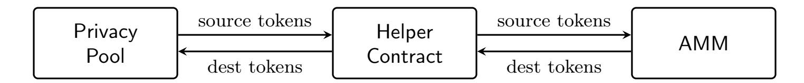

{0}------------------------------------------------

# Scalable Compliant Privacy on Starknet

Lior Goldberg\*, Maya Dotan, Ittay Dror, Gideon Kaempfer, Nir Levi, Noa Oved, Arad Reder, Anat Veredgorn, Noa Wolfgor

March 2026

#### Abstract

We present a privacy protocol implemented on Starknet that enables confidential transactions while maintaining regulatory compliance. Transfers hide the sender, receiver, and amount from external observers, with validity enforced by zero-knowledge proofs generated on the client side using the Stwo STARK prover.

The protocol introduces three key innovations: (1) an efficient note discovery mechanism, (2) a practical compliance framework that enables an auditing entity to selectively unshield transactions upon legitimate regulatory request, and (3) anonymous integration with existing Starknet DeFi contracts. The system supports multiple token types in a single pool and leverages Starknet's native account abstraction for transaction authorization. All proof logic and contract code are written in Cairo, providing a unified codebase that simplifies auditing and development.

## 1 Introduction

#### 1.1 Motivation

Privacy is a prerequisite for mainstream blockchain adoption. Enterprises cannot expose sensitive financial data to competitors, employees expect salary payments to remain confidential, and individuals deserve control over their financial information. Yet, most existing blockchain systems make all transaction details publicly visible, creating a fundamental barrier to adoption.

Today, users seeking privacy often rely on centralized exchanges (CEXs) to obscure their onchain activity. This undermines the core value proposition of blockchain technology – self-custody and trustless transactions – by reintroducing reliance on trusted intermediaries.

Existing privacy solutions often suffer from limited scalability, high cost, poor usability (such as fixed denominations), or require users to move to dedicated chains, sacrificing access to established DeFi ecosystems. Systems that lack compliance mechanisms, or limit compliance to screening funds at the boundary, put user funds at risk.

This paper presents a compliant privacy solution built on Starknet that addresses these challenges. Users gain strong privacy guarantees, with direct access to existing Starknet DeFi contracts and a compliance mechanism that preserves the privacy of non-audited users.

## 1.2 Protocol Properties

Our design achieves the following key properties:

<sup>\*</sup>lior@starkware.co

<sup>†</sup>mayadotan@mail.huji.ac.il

{1}------------------------------------------------

- Private transfers. Sender, receiver, and amount are hidden from external observers. Only the transacting parties and authorized auditors can view transaction details.
- Regulatory compliance. An auditing entity can trace transaction history upon legitimate regulatory request, without compromising privacy for uninvolved users. See Section [9.](#page-18-0)
- Efficient note discovery. Recipients discover incoming funds in time proportional to their own activity, not the total activity in the pool.
  - To achieve this, encrypted information is stored on-chain in locations derived from a shared secret between the sender and the recipient. See Section [5.](#page-8-0)
- Multi-asset support. A single privacy pool supports multiple token types, eliminating the need for separate pools per asset and enabling private multi-token transactions.
- DeFi integration. Starknet has a rich ecosystem with DeFi smart contracts. Users can interact with these contracts directly from the privacy pool, without exposing their identity. In particular, users can perform anonymous[1](#page-1-0) AMM (Automated Market Maker) swaps within a single atomic transaction. See Section [10.](#page-19-0)
- Account abstraction support. Starknet natively supports account abstraction: every account is a smart contract that defines its own signature-verification logic. Our protocol leverages this so that users can transact using their existing Starknet accounts – including multisig wallets, smart accounts, and accounts with social recovery. See Section [8.](#page-17-0)
- Secretless transactions. The protocol does not require users to handle secrets. All information can be derived from their private viewing key, which can itself be derived from their Starknet account private key or be maintained by the wallet operator.

## 1.3 Protocol Overview

At a high level, the protocol works as follows. Users deposit tokens into a privacy pool – a smart contract on Starknet that holds assets on behalf of users while concealing ownership. Inside the pool, assets are represented as encrypted notes, stored on-chain. Each note records an owner, token type, and amount.

To transfer funds privately, a user spends their existing notes and creates new notes for the recipients. Spending a note publishes a nullifier – a value derived from the note that marks it as used. The nullifier is computed in a way that prevents observers from linking it back to the original note, preserving privacy while preventing double-spending.

The validity of each transaction is ensured by a zero-knowledge proof [\[8\]](#page-25-0) (ZK-proof) generated by the user. This proof attests that the notes being spent exist and belong to the user, that the nullifiers are correctly computed, and that the total input value equals the total output value – all without revealing which notes are spent or who the recipients are.

Transactions are submitted through a paymaster service that broadcasts them on behalf of users, allowing users to avoid paying Starknet fees from their own accounts, which would reveal their identity.

A key challenge in privacy systems is note discovery: how do recipients find notes addressed to them? In non-private systems this is straightforward: Bitcoin users scan the blockchain, filtering

<span id="page-1-0"></span><sup>1</sup>We use anonymous to mean that the user's identity is hidden, while amounts may remain publicly visible. Section [10.1](#page-19-1) formalizes the distinction between anonymous and private.

{2}------------------------------------------------

transactions by their address, and Ethereum users simply read their balance from a known storage location. In privacy systems, however, recipients cannot be publicly identified. Systems like Zcash address this by having users attempt to decrypt every transaction in the pool. Our protocol introduces a mechanism that avoids this scalability bottleneck. Senders store encrypted note information in locations derived from a shared secret with the recipient. Thus, recipients know where to look, avoiding the need to scan all transactions.

For compliance, each user registers an encrypted copy of their viewing key on-chain. Upon legitimate regulatory request, a designated auditing entity can decrypt this key to trace a specific user's transaction history, without affecting the privacy of uninvolved users.

## 2 Background

## 2.1 Starknet Overview

Starknet is a Layer 2 validity rollup on Ethereum that uses STARK proofs [\[3\]](#page-24-0) to achieve scalability while inheriting Ethereum's security. Smart contracts on Starknet are written in Cairo, a highlevel programming language whose execution can be efficiently proven using STARK proofs. Cairo programs compile down to a dedicated CPU architecture [\[7\]](#page-25-1), and the prover attests to the correctness of the execution trace.

Starknet supports protocol-level general-purpose proof verification, enabling users to generate STARK proofs locally and submit them to the network for verification. This capability is powered by Stwo, a high-performance STARK prover developed by StarkWare that generates proofs for arbitrary Cairo programs. Notably, Stwo is also used internally by Starknet to prove the correctness of block execution, providing a unified proving infrastructure across both the network and client applications.

Using Stwo offers several advantages: users benefit from the same battle-tested prover that secures Starknet itself, as well as from seamless integration with the Cairo programming language and Starknet contracts.

#### 2.1.1 Data Types

The primitive data type in Starknet is felt252, a field element in the prime field F<sup>p</sup> where

$$p = 2^{251} + 17 \cdot 2^{192} + 1.$$

All storage values, addresses, and cryptographic operations use this type. The STARK curve, used for elliptic curve cryptography on Starknet, is defined over this field.

## 2.1.2 Storage Model

Starknet provides a key-value storage model where each contract has access to a mapping from felt252 keys to felt252 values. The underlying implementation uses a Patricia tree [\[11\]](#page-25-2) to compute state commitments, but this is abstracted away from contract code.

This storage model influenced our protocol design:

- We store encrypted notes directly in contract storage rather than maintaining a separate Merkle tree of commitments.
- Note existence is verified by checking storage values rather than providing Merkle inclusion proofs. The ZK-proof does internally include a Patricia inclusion proof as part of the Starknet

{3}------------------------------------------------

infrastructure to attest to the storage values, but this is abstracted away by the virtual execution model (Section [8\)](#page-17-0) – the Cairo code simply reads from storage.

## 2.2 Related Work

Privacy-preserving systems can be built using various cryptographic techniques, including multiparty computation (MPC), fully homomorphic encryption (FHE), trusted execution environments (TEEs), and zero-knowledge proofs (ZK-proofs). Our protocol is based on ZK-proofs, which allow users to prove transaction validity without revealing sensitive information. We therefore focus our comparison on other ZK-proof-based privacy solutions.

#### 2.2.1 Zerocash and Zcash

Zcash [\[9\]](#page-25-3) is a privacy-focused cryptocurrency that implements the Zerocash protocol [\[4\]](#page-24-1). Zerocash introduced the note-based model with nullifiers that forms the foundation of modern cryptocurrency privacy. Each private asset is represented as a note containing an owner, value, and random nonce. Notes are spent by revealing a nullifier – a deterministic value derived from the note that prevents double-spending while preserving unlinkability.

Our protocol adopts this model with the following modifications:

- Multiple tokens: We support multiple token types within a single privacy pool, whereas Zerocash handles only a single currency.
- Note discovery: In Zerocash, recipients must attempt to decrypt every transaction output to find notes addressed to them, resulting in cost proportional to the total pool activity. We introduce a discovery mechanism (Section [5\)](#page-8-0) that scales with the user's own activity instead.
- No note commitments: Zerocash stores a cryptographic commitment (a binding, hiding hash of the note's contents) for each note in a Merkle tree, and separately transmits the encrypted note to the recipient. Our protocol eliminates note commitments entirely – only the encrypted note is stored on-chain. This reduces storage costs and simplifies the protocol.

#### 2.2.2 Tornado Cash

Tornado Cash [\[14\]](#page-25-4) popularized privacy pools on Ethereum using a mixer approach. Users deposit fixed denominations (e.g., 0.1, 1, 10, or 100 ETH) into separate pools and later withdraw to a different address using a zero-knowledge proof of deposit.

Key differences from our approach:

- Fixed denominations: Tornado Cash requires using the supported fixed denominations, limiting flexibility and usability, and increasing cost. Our protocol supports arbitrary amounts through note splitting and merging.
- Single-use: Each Tornado Cash deposit is withdrawn exactly once. Our notes can be transferred multiple times within the pool (between multiple users) before withdrawal.
- No compliance: Tornado Cash provides no mechanism for regulatory compliance. Our compliance framework (Section [9\)](#page-18-0) enables an auditing entity to selectively unshield transactions upon legitimate regulatory request, while preserving privacy for uninvolved users.

{4}------------------------------------------------

#### 2.2.3 Privacy Pools and Association Sets

The Privacy Pools proposal [\[5\]](#page-25-5) introduced the concept of association sets – users prove their funds are associated with a set of "good" deposits while excluding sanctioned addresses. This provides a middle ground between full anonymity and full transparency.

Our compliance framework takes a different approach: rather than requiring users to prove association set membership, we encrypt viewing keys to an auditing entity that can trace transactions upon legitimate regulatory request. This provides stronger compliance guarantees as it allows the auditing entity to retroactively trace illicit funds, even if the funds were identified as illicit after the withdrawal.

#### 2.2.4 Haze and Daze

The Haze and Daze paper [\[2\]](#page-24-2) proposes compliant privacy mixers built on top of Tornado Cash's design. Daze extends Haze with retroactive de-anonymization: a committee can publicly link the deposit and withdrawal of a non-compliant user, revoking their privacy even if they withdrew before being flagged. We extend Daze's theoretical construction into an efficient implementation leveraging Starknet's capabilities.

#### 2.2.5 Aztec Network

Aztec Network [\[13\]](#page-25-6) is a privacy-focused Layer 2 using a UTXO-based note model similar to Zerocash. It supports private smart contract execution and programmable privacy.

Our protocol differs in its integration approach:

- We build on Starknet's existing infrastructure rather than creating a separate privacy-focused chain.
- While Aztec screens funds upon entering the network, our protocol additionally allows the auditing entity to trace illicit funds inside the pool.

Both protocols address the note discovery problem using shared secrets between sender and recipient. Notably, among the several discovery approaches Aztec explores (trial decryption, offchain secret exchange, and on-chain handshaking), one variant reveals the recipient address on-chain upon first contact – the same tradeoff our channel creation mechanism makes. The two protocols differ, however, in two fundamental ways.

Tag-indexed vs. location-indexed discovery. Aztec is tag-indexed: the sender attaches a tag – derived from the shared secret and a sequential index – to each encrypted log. Wallets query the node for logs matching expected tags, then decrypt only the matching candidates. This avoids brute-force decryption but depends on a tag-query layer, exposes a dedicated tag field in the log stream, and requires a sliding-window scan to handle in-flight logs. Our protocol is location-indexed: the sender stores the encrypted note data directly in contract storage locations derived from the shared secret. The recipient knows where to look rather than searching a global log stream, leveraging Starknet's native key-value storage model. Combined with sequential index enforcement (Theorem [1\)](#page-10-0), this yields a deterministic discovery algorithm with formal completeness guarantees.

Compliance as a first-class feature. Our protocol pairs the discovery mechanism with an onchain compliance layer: each user's private viewing key is encrypted to an auditing entity as part of the protocol design (Section [6.2.2\)](#page-14-0), making selective disclosure a built-in feature rather than an 

{5}------------------------------------------------

external add-on. The sequential index enforcement further ensures that no notes can be hidden from the auditing entity – a property that Aztec's tagging mechanism does not address.

## 3 System Architecture

This section presents the high-level architecture of the privacy solution. The system enables private asset transfers on Starknet while maintaining regulatory compliance.

## 3.1 Overview

The architecture is composed of three core pillars:

- 1. Privacy Pool Contract. A canonical smart contract deployed on Starknet that stores encrypted notes, nullifiers, and (encrypted) metadata required for note discovery. The contract enforces correctness of private transfers by verifying that nullifiers are fresh and that encrypted notes are properly formed. The contract enforces a write-once policy on its storage cells: values can be written to empty cells but never overwritten, ensuring immutability of the on-chain state.
- 2. Client-Side Proving. Users generate zero-knowledge proofs off-chain attesting to the validity of their transactions. The proofs are generated by executing a virtual Starknet transaction within a simulated environment, then proving correctness of that execution using the Stwo prover.
- 3. Compliance Framework. Each user registers an encrypted viewing key with the privacy pool. The viewing key is encrypted to the public key of an auditing entity, enabling selective disclosure of transaction history in response to legitimate regulatory requests. This design preserves privacy for ordinary users while maintaining a compliance path for institutions.

## 3.2 Key Concepts

Viewing Keys. Each user has a viewing key pair : a private viewing key k and a corresponding public viewing key K. The private key enables decrypting notes and transaction history; the public key allows others to encrypt data for the user. Viewing keys are immutable once registered, to simplify the design of the protocol.

Notes, Channels, and Subchannels. Private assets are represented as notes, each encoding an owner, token type, and amount. Notes are organized hierarchically for efficient discovery:

- A channel (Section [5.1\)](#page-8-1) is a unidirectional link from a sender to a recipient, created when the sender first transfers to that recipient.
- A subchannel (Section [5.2\)](#page-9-0) organizes notes within a channel by token type.
- Notes (Section [4\)](#page-6-0) are stored within subchannels, indexed sequentially.

Discovery. Recipients discover their notes by scanning their channel list, then iterating through subchannels and notes within each channel. This hierarchical structure ensures discovery cost scales with the user's own activity rather than the total pool activity.

{6}------------------------------------------------

## <span id="page-6-0"></span>4 Note Model

Private assets in the system are represented as notes. A note is an immutable record encoding ownership of a specific quantity of a specific token. This section defines the note structure, describes the note lifecycle, and introduces nullifiers – the mechanism that enables spending notes without revealing which note is being spent. The note-nullifier model follows the approach introduced by Zerocash [\[4\]](#page-24-1).

## 4.1 Note Structure

A note is defined by three fields:

- Owner: A Starknet address that has the authority to spend the note. Only the owner (or more precisely, those who can produce a valid signature for the owner's account and know the owner's viewing key) can spend the note.
- Token: The contract address of an ERC-20 token (the standard fungible-token interface), identifying the asset type. The privacy pool supports multiple token types within the pool contract.
- Amount: A 128-bit unsigned integer representing the quantity of tokens held in the note.

Notes are immutable: once created, a note cannot be modified. To transfer a portion of a note's value, the owner must spend the entire note and create new notes for the transferred amount and any remainder. This is analogous to the UTXO (Unspent Transaction Output) model used in Bitcoin [\[12\]](#page-25-7).

Immutability serves two purposes:

- 1. Proof consistency: The ZK-proof references storage state from a recent block. Since notes are immutable, any note that existed in the referenced block will have the same value when the transaction executes. This ensures that values used in the proof are still valid when the transaction is executed.
- 2. Privacy: Modifying a storage cell multiple times would create links between transactions that touch the same cell, complicating privacy analysis.

## 4.2 Note Identifier

A note's on-chain location is derived from a channel key – a shared secret between the sender and the recipient, unique to each (sender, recipient) pair. This ensures that only the two parties can locate the note, enabling efficient discovery without scanning the entire pool. The channel key construction and the discovery mechanism built on top of it are described in Section [5.](#page-8-0) For the purpose of this section, it suffices to treat the channel key c as a shared secret known only to the sender and recipient.

<span id="page-6-1"></span>Definition 1. Each note is assigned a unique identifier, which determines the storage location of the encrypted note value. This identifier is computed as:

$$\mathsf{note\_id} = \mathsf{H}_0(c, \mathsf{token}, i)$$

where:

{7}------------------------------------------------

- 1. c is the channel key.
- 2. token is the token address.
- 3. i is a sequential index within the corresponding subchannel.

Throughout, H<sup>x</sup> denotes a domain-separated hash function with tag x; see Section [6](#page-12-0) for details.

On-Chain Representation. Notes are not stored in plaintext on-chain. Instead, only the encrypted amount (see Section [6.1.1\)](#page-12-1) is stored at the location determined by the note identifier: notes[note\_id]. The owner, token, and other metadata are implicit in the note's position within the channel and subchannel structure. This design minimizes storage costs and information leakage.

## <span id="page-7-1"></span>4.3 Nullifiers

Nullifiers solve the double-spending problem while preserving unlinkability between note creation and spending.

<span id="page-7-0"></span>Definition 2 (Nullifier). The nullifier of a note is computed as:

$$\mathsf{nullifier} = \mathsf{H}_1(c,\mathsf{token},i,k)$$

where

- 1. c is the channel key.
- 2. token is the token address.
- 3. i is the note index in the subchannel.
- 4. k is the owner's private viewing key.

#### 4.3.1 Properties

The nullifier construction satisfies the following properties:

- 1. Determinism: Given the (immutable) note parameters and the owner's (immutable) private viewing key, the nullifier is uniquely determined. This ensures that each note has exactly one valid nullifier. To guarantee this, the protocol requires that viewing keys satisfy 0 < k < curve\_order/2 (where curve\_order is the order of the STARK curve, see Section [6.2\)](#page-13-0), ensuring a canonical representation.
- 2. Uniqueness: The nullifier is unique across all notes.
- 3. Unlinkability: The nullifier reveals nothing about the note it spends. An observer seeing a nullifier cannot determine which note identifier it corresponds to, because the nullifier definition includes the private viewing key that only the owner knows. Importantly, the note creator (sender) cannot compute the nullifier and therefore cannot determine when the note is spent.

{8}------------------------------------------------

## <span id="page-8-0"></span>5 Note Discovery Mechanism

A key challenge in privacy systems is enabling recipients to efficiently discover their notes. In systems like Zcash, users must process every transaction to find notes belonging to them, resulting in O(total transactions) discovery cost.

Our protocol introduces a channel-based discovery mechanism where the discovery cost scales with the user's own activity: O(user's channels + user's subchannels + user's notes), rather than O(total transactions).

The key idea is that notes are stored in locations derived from a shared secret between the sender and the recipient, which the recipient knows to look in. The secret is shared on-chain (in encrypted form) upon the first transfer between the parties.

## <span id="page-8-1"></span>5.1 Channels

A channel is a unidirectional link from a sender to a recipient. When Alice sends to Bob for the first time, she creates a channel from herself to Bob. This channel is then used for all future transfers from Alice to Bob, regardless of token type.

Definition 3 (Channel Key). The channel key is a shared secret between the sender and the recipient, computed as:

$$c = \mathsf{H}_2(\mathsf{addr}_{sender}, k_{sender}, \mathsf{addr}_{recipient}, K_{recipient})$$

where:

- 1. addrsender is the sender's Starknet address.
- 2. ksender is the sender's private viewing key.
- 3. addrrecipient is the recipient's Starknet address.
- 4. Krecipient is the recipient's public viewing key.

#### 5.1.1 Channel Registration

The channel key includes the sender's private viewing key. This ensures that only the sender (and the auditing entity) can generate this key[2](#page-8-2) . To give the recipient access to the channel key, the sender publishes the encrypted key using the recipient's public viewing key. The computation of the channel key and its encryption is enforced as part of the ZK-proof.

When opening a channel, the sender stores the encrypted channel information in a list associated with the recipient's address:

$$\mathsf{channels}[\mathsf{addr}_{\mathsf{recipient}}].\mathsf{append}(\mathsf{Enc}_{K_{\mathsf{recipient}}}(c,\mathsf{addr}_{\mathsf{sender}}))$$

The recipient can later scan this list to discover all channels directed to them.

Note that this step reveals addrrecipient on-chain. No other information is revealed (such as the sender's identity or any token types or amounts).

<span id="page-8-2"></span><sup>2</sup>Note that the account contract's signature is required to open a channel. Thus, the auditing entity cannot open a channel on behalf of the sender.

{9}------------------------------------------------

#### 5.1.2 Privacy-Efficiency Tradeoff

Revealing the recipient address when opening a channel is a deliberate tradeoff between privacy and usability. Alternative designs that hide the recipient would require scanning O(total transactions) data or using out-of-band communication, both of which impair usability.

The approach presented in this paper solves the note discovery problem and limits the information leaked: only the fact that someone sent to this address is revealed, not the sender, the token, or the amount. Subsequent transfers through the same channel reveal nothing additional.

## 5.1.3 Channel Markers

When opening a channel, we store a marker in the pool contract:

$$\mathsf{channel\_markers}[\mathsf{H}_3(c,\mathsf{addr}_{\mathsf{sender}},\mathsf{addr}_{\mathsf{recipient}},K_{\mathsf{recipient}})] = true$$

The marker serves two purposes:

- 1. Preventing duplicate channels. The marker is written using WriteOnce semantics (see Section [7.2\)](#page-15-0), which fails if the slot is non-empty. This ensures that at most one channel can be created for any (sender, recipient) pair.
- 2. Prerequisite for opening subchannels. Subchannels organize notes within a channel by token type. The ZK-proof for opening a subchannel verifies that the corresponding channel marker exists. This enforces that subchannels can only be created within an existing channel.

### <span id="page-9-2"></span>5.1.4 Outgoing Channels

Senders also maintain an encrypted list of their outgoing channels. This enables both the user and the auditing entity to see where the user's funds were sent ("forward-tracing", see Section [9.2\)](#page-18-1). Note that the user can only see the addresses of the immediate recipients they sent to.

<span id="page-9-1"></span>Definition 4. The outgoing channel identifier is computed as:

outgoing\_channel\_id = 
$$H_4(addr_{sender}, k_{sender}, q)$$

where q is the sequential index of the outgoing channel for this sender.

When opening a channel, the sender stores the encrypted recipient address:

```
outgoing_channels[outgoing_channel_id] = (salt, H5(addrsender, ksender, q,salt) + addrrecipient)
```

where salt is a random value providing freshness.

The outgoing channel information is encrypted using the sender's private viewing key, so only the sender (and the auditing entity, via the escrowed viewing key) can decrypt it.

## <span id="page-9-0"></span>5.2 Subchannels

A subchannel organizes notes within a channel by token type. For each (channel, token) pair, there is a corresponding subchannel that indexes notes of that token.

{10}------------------------------------------------

<span id="page-10-1"></span>Definition 5. The subchannel identifier and subchannel marker are computed as:

$$\begin{split} & \mathsf{subchannel\_id} = \mathsf{H}_6(c,\ell) \\ & \mathsf{subchannel\_marker} = \mathsf{H}_7(c,\mathsf{addr}_{recipient},K_{recipient},\mathsf{token}) \end{split}$$

where ℓ is a sequential index inside the channel.

When a subchannel is created, the following information is stored:

```
subchannels[subchannel_id] = (salt, H8(c, ℓ,salt) + token)
subchannel_markers[subchannel_marker] = true
```

The ZK-proof verifies that the corresponding channel exists by checking the channel marker. Similarly, when a note is created, the ZK-proof verifies that the corresponding subchannel exists through the subchannel marker (it is not necessary to check the channel marker again).

Why Subchannels? Subchannels offer an efficient privacy-preserving organization of the notes. Compare this to the following two other approaches that do not use subchannels:

- (A) Add the token to the channel information.
- (B) Add the token to each note.

For option (A), consider the case where Alice is transferring BTC for the first time, say to Bob. Alice would need to create a channel to Bob for the transfer, and simultaneously create a channel to herself for the remainder note. Creating two channels in one transaction links Alice's "self-channel" to her channel to Bob, compromising privacy. With subchannels, this problem does not arise. Alice's self-channel is created only once – when she registers to the pool.

Option (B) is less efficient, as it requires storing the token in each note.

## 5.3 Sequential Index Enforcement

The note discovery algorithm relies on items being stored at sequential indices: outgoing channels use index q, subchannels use index ℓ, and notes use index i (see Definitions [1,](#page-6-1) [4,](#page-9-1) and [5\)](#page-10-1). The algorithm (to be presented in Section [5.4\)](#page-11-0) iterates through indices 0, 1, 2, . . . and terminates upon encountering an empty slot. This design critically depends on indices being assigned sequentially without gaps.

Sequential indexing is enforced through two complementary checks (for simplicity, we only describe the check for notes, but the same logic applies to outgoing channels and subchannels):

- 1. Current slot is empty. The pool contract enforces that the storage value at the target index is zero: notes[H0(c,token, i)] = 0. (See the WriteOnce server-side action in Section [7.2\)](#page-15-0).
- 2. Previous slot is occupied. The ZK-proof verifies that either the index is 0, or the slot at index i − 1 is non-empty: i = 0 ∨ notes[H0(c,token, i − 1)] ̸= 0.

<span id="page-10-0"></span>Theorem 1 (Index Continuity). For every c and token, there exists I such that for all i < I, notes[H0(c,token, i)] ̸= 0 and for all i ≥ I, notes[H0(c,token, i)] = 0. The same property holds for subchannels and outgoing channels.

{11}------------------------------------------------

Proof. By induction on the sequence of state-changing actions.

For the base case, choose I = 0 as all storage slots are empty.

For the inductive step, assume the property holds with threshold I. Consider an action that creates a note at index i. The enforcement checks require: (1) slot i is empty, hence i ≥ I; and (2) either i = 0, or slot i − 1 is non-empty, hence i ≤ I. Together, i = I. After writing to slot I, the property holds with threshold I ′ = I + 1.

Without sequential enforcement, a user could skip an index and share the note location out-ofband with the recipient. The recipient could still spend the note, but the auditing entity's tracing algorithm would fail to discover it – enabling evasion of regulatory oversight.

## <span id="page-11-0"></span>5.4 Note Discovery Algorithm

A recipient discovers their notes through a systematic scan of channels, subchannels, and notes.

- 1. Scan channels. For j = 0, 1, 2, . . .:
  - Read channels[addrrecipient][j]
  - If empty, stop (no more channels)
  - Decrypt to obtain channel key c<sup>j</sup> and sender address
- 2. Scan subchannels. For each channel key c, for ℓ = 0, 1, 2, . . .:
  - Read subchannels[H6(c, ℓ)]
  - If empty, stop (no more subchannels for this c)
  - Decrypt to obtain token address
- 3. Scan notes. For each subchannel (c, token), for i = 0, 1, 2, . . .:
  - Compute note\_id = H0(c,token, i)
  - Read notes[note\_id]
  - If empty, stop (no more notes for this subchannel)
  - Decrypt to obtain amount
  - Check if the note is spent (nullifier exists)

<span id="page-11-1"></span>Theorem 2 (Note Discoverability). If a note addressed to addrrecipient was created with channel key c, token token and index i, then the note-discovery algorithm will discover the note.

Proof. Creating a note requires that the channel and subchannel already exist (through the channel and subchannel markers). We show each component is discovered:

Channel discovery: When the channel was opened, the encrypted channel key c was appended to channels[addrrecipient]. The algorithm iterates through this list sequentially and will therefore reach this entry.

Subchannel discovery: When the subchannel was opened, it was stored at some index ℓ ′ . By Theorem [1,](#page-10-0) all indices 0, . . . , ℓ′ − 1 are non-empty. The algorithm iterates ℓ = 0, 1, 2, . . . and stops only at an empty slot, so it will reach index ℓ ′ and discover the subchannel.

Note discovery: Applying Theorem [1](#page-10-0) for the notes in the subchannel, we obtain the requested result.

{12}------------------------------------------------

Complexity. The total work is:

$$O(\# \text{ channels} + \# \text{ subchannels} + \# \text{ notes})$$

In most cases, this is dominated by the number of notes the user has received.

This is a significant improvement over scanning the entire pool, enabling responsive user experience even as the privacy pool grows.

## <span id="page-12-0"></span>6 Encryption Schemes

This section details the encryption schemes used to protect sensitive data in the protocol. We employ two main approaches: symmetric encryption based on hash-and-add for note amounts and subchannel tokens, and asymmetric encryption based on ECDH for channel information and compliance data.

All hash computations use domain-separation tags to ensure distinct outputs for different purposes. We write H<sup>i</sup> to denote the hash function with domain-separation tag i. All H<sup>i</sup> may use the same underlying hash function, but each includes a unique tag as the first input, ensuring that it is infeasible to find x and y such that Hi(x) = H<sup>j</sup> (y) for i ̸= j.

## 6.1 Symmetric Encryption

The symmetric encryption schemes rely on H behaving as a pseudorandom function (PRF) when keyed with the channel key. Specifically, for an adversary who does not know the channel key c, the output H(c, . . .) must be indistinguishable from random.

#### <span id="page-12-1"></span>6.1.1 Note Encryption

Note amounts are encrypted using a symmetric scheme based on hash-and-add. The encryption key is derived from the channel key, which is known only to the sender and recipient.

Definition 6 (Note Encryption). Given a note with channel key c, token token, index i, and amount v ∈ [0, 2 <sup>128</sup>), the encrypted note value is:

$$Enc(v) = salt \cdot 2^{128} + ((H_9(c, token, i, salt) + v) \mod 2^{128})$$

where salt is a random 120-bit value.

The result is packed into a single felt252: the upper 120 bits store the salt, and the lower 128 bits store the encrypted amount.

Decryption The recipient, knowing the channel key c, token token, and index i, decrypts by:

- 1. Unpacking the stored value to extract salt and the encrypted amount e.
- 2. Recovering the amount as v = e − H9(c,token, i,salt) mod 2<sup>128</sup> .

#### Security Properties

Confidentiality Without the channel key, the encrypted amount is indistinguishable from random.

Freshness The salt and index ensure that encrypting the same amount twice produces different ciphertexts.

Revert safety If a transaction is reverted and retried with the same note index, a new salt must be used to prevent information leakage from the previously published ciphertext.

{13}------------------------------------------------

#### 6.1.2 Subchannel Encryption

Subchannel information (specifically, the token address) is encrypted using a similar hash-and-add scheme:

$$\mathsf{enc\_token} = (\mathsf{salt}, \mathsf{H}_8(c,\ell,\mathsf{salt}) + \mathsf{token})$$

where c is the channel key, ℓ is the subchannel index, and salt is a random value. Here the addition is modulo the Starknet field size, and the result is two felt252 elements.

#### 6.1.3 Outgoing Channels

Senders maintain an encrypted list of their outgoing channels on-chain. See Section [5.1.4](#page-9-2) for more details.

## <span id="page-13-0"></span>6.2 Asymmetric Encryption

Asymmetric encryption uses viewing key pairs on the STARK curve. The STARK curve [\[1\]](#page-24-3) is a fixed elliptic curve given by the equation y <sup>2</sup> = x <sup>3</sup> + x + β over the field felt252 (see [\[1\]](#page-24-3) for the value of β). For a user with private viewing key krecipient, the corresponding public viewing key is Krecipient = (krecipient · G).x, where G is a fixed curve generator and .x denotes the x-coordinate. We denote by lift(x) either of the two curve points with x-coordinate x.

#### <span id="page-13-1"></span>6.2.1 Channel Encryption

Channel information must be encrypted such that only the recipient can decrypt it. We cannot use a symmetric scheme because the sender and recipient do not have a shared key yet. Therefore we use an asymmetric encryption scheme based on Elliptic Curve Diffie-Hellman (ECDH) [\[6,](#page-25-8) [10\]](#page-25-9) over the STARK curve.

Definition 7 (Channel Encryption). To encrypt channel information (c, addrsender) for a recipient with public viewing key Krecipient:

- 1. Generate a random ephemeral secret r.
- 2. Compute the ephemeral public key R = rG, where G is the curve generator.
- 3. Compute the shared secret s = (r · lift(Krecipient)).x. Note that s does not depend on the choice of lift(Krecipient).
- 4. The encryption is: (R.x, H10(s) + c, H11(s) + addrsender).

Decryption The recipient, knowing their private viewing key krecipient, decrypts by:

- 1. Recovering the curve point R from its x-coordinate (up to sign; both choices yield the same shared secret s).
- 2. Computing the shared secret s = (krecipient · R).x.
- 3. Subtracting the hash masks H10(s) and H11(s) to recover c and addrsender.

{14}------------------------------------------------

#### <span id="page-14-0"></span>6.2.2 Viewing Key Encryption for Compliance

Each user's private viewing key is encrypted to the auditing entity's public key Kaudit = (kaudit ·G).x, where kaudit is the corresponding private key. This enables selective disclosure for compliance.

Definition 8 (Viewing Key Encryption). When the user registers, they encrypt their private viewing key k as follows:

- 1. As in Section [6.2.1,](#page-13-1) compute r, R, and s = (r · lift(Kaudit)).x.
- 2. The encryption is: (R.x, H12(s) + k).

The auditing entity can decrypt any user's viewing key using their private key kaudit, then use it to scan all of that user's channels, subchannels, and notes.

## 7 Transaction Flow

This section describes the transaction flow, including the actions available to users (which we call client-side actions) and the primitive operations executed by the Starknet contract (server-side actions).

The high-level flow is as follows:

- 1. The user constructs a list of client-side actions.
- 2. The user generates a ZK-proof that compiles the client-side actions into a list of corresponding server-side actions and attests that:
  - The user's signature on the list of client-side actions is valid with respect to the user's Starknet account contract. This ensures that only the account owner can spend notes, create channels, etc.
  - The client-side actions are valid (e.g., balance is conserved, notes exist, nullifiers are correctly computed).

The proof's output is the list of server-side actions.

- 3. The user submits the proof and server-side actions to a paymaster, which broadcasts the transaction to Starknet on the user's behalf.
- 4. The proof is verified on Starknet and the server-side actions are executed.

## 7.1 Client-Side Actions

Users construct transactions by specifying a sequence of client-side actions. A high-level operation such as a transfer of funds is converted into a sequence of client-side actions. See Section [7.5](#page-16-0) for a complete transfer example.

The following client-side actions are supported:

SetViewingKey Register the user's viewing key with the privacy pool. This action stores the public viewing key and an encrypted copy of the private viewing key (for compliance). Each user can only register once; the viewing key is immutable.

{15}------------------------------------------------

- OpenChannel Create a new channel from the user to a recipient. Required when sending to a recipient for the first time. Stores encrypted channel information in the recipient's channel list.
- OpenSubchannel Create a new subchannel within an existing channel. Required when sending a token type for the first time through that channel. Stores encrypted token information indexed by subchannel identifier.
- CreateNote Create a new encrypted note for a recipient. The note amount is encrypted using the channel key.
- UseNote Spend an existing note by publishing its nullifier. The nullifier is computed from the note parameters and the owner's private viewing key.
- Deposit (Shielding) Transfer public tokens into the privacy pool. This action is usually paired with a corresponding CreateNote action.
- Withdraw (Unshielding) Transfer tokens from the pool to a public recipient outside of the pool. This action is usually paired with a corresponding UseNote action.

The last four actions (CreateNote, UseNote, Deposit, and Withdraw) operate on a pertoken temporary balance that is tracked during transaction compilation. Deposit and UseNote increase the balance; CreateNote and Withdraw decrease it. The balance must remain nonnegative throughout and must be zero at the end of the transaction, ensuring that all funds are accounted for.

## <span id="page-15-0"></span>7.2 Server-Side Actions

Client-side actions are compiled into server-side actions – primitive operations that the privacy pool contract executes. A single client-side action may compile to multiple server-side actions. The server-side actions are:

- WriteOnce Write a value to a storage cell. Fails if the cell is non-empty (non-zero). This enforces the immutability invariant: once a value is written, it cannot be changed. Used for notes, nullifiers, subchannels, and other immutable data.
- AppendToVec Append an entry to a recipient's channel list. Used when opening a new channel to store encrypted channel information.
- TransferFrom Transfer tokens from a user to the privacy pool contract (ERC-20 transferFrom). Used for deposits.
- TransferTo Transfer tokens from the privacy pool contract to a recipient (ERC-20 transfer). Used for withdrawals.

## <span id="page-15-1"></span>7.3 Action Ordering and Phases

Actions within a transaction must follow a specific ordering:

SetViewingKey → OpenChannel → OpenSubchannel → Deposit → UseNote → CreateNote → Withdraw

Multiple actions of the same type (except SetViewingKey) are allowed.

A fixed ordering reduces the number of possible execution scenarios, simplifying security analysis and formal verification.

{16}------------------------------------------------

## 7.4 Paymaster

The paymaster is a service that helps users send private transactions on Starknet, without revealing their identity when paying the transaction fee.

The paymaster sends the transaction from its own account, and pays the transaction fee from its own balance. In order to reimburse the paymaster, the user performs a withdrawal to the paymaster's account as part of the transaction's actions.

## <span id="page-16-0"></span>7.5 Private Transfer Flow

We illustrate the flow with a complete private transfer example. Suppose Alice wants to send 500 tokens to Bob, and Alice currently holds two notes worth 400 tokens each.

#### Step 1: Construct Client-Side Actions

Alice constructs the following client-side actions:

- 1. UseNote: Spend Alice's 400-token first note.
- 2. UseNote: Spend Alice's 400-token second note.
- 3. CreateNote: Create a 500-token note for Bob.
- 4. CreateNote: Create a 299-token note for Alice (remainder).
- 5. Withdraw: Withdraw 1 token to the paymaster's address (reimbursement).

Remark. If this is Alice's first transfer to Bob, she prepends:

- 1. OpenChannel: Create a channel from Alice to Bob.
- 2. OpenSubchannel: Create a subchannel for this token type.

#### Step 2: Compute Server-Side Actions and Generate a ZK-Proof

Each client-side action is compiled into one or more server-side actions. In our case, we have a total of four WriteOnce actions and one TransferTo action:

- UseNote: Compiles to a single WriteOnce action to check that the nullifier of the spent note was not previously used, and mark it as used.
- CreateNote: Compiles to a single WriteOnce action to write the encrypted note, verifying that the note was not previously created.
- Withdraw: Compiles to a single TransferTo action to transfer tokens from the pool to the paymaster.

Alice generates a zero-knowledge proof attesting that:

- Alice's signature on the list of client-side actions is valid with respect to Alice's Starknet account contract.
- The notes being spent exist and belong to Alice.
- The nullifiers are correctly computed.
- Balance is conserved: 400 + 400 − 500 − 299 − 1 = 0.
- All encryption is performed correctly.

{17}------------------------------------------------

#### Step 3: Submit Transaction

Alice submits the proof and its output (the list of server-side actions) to a paymaster service. The paymaster submits a transaction to Starknet on Alice's behalf, hiding Alice's identity from the network.

#### Step 4: Server Execution

The privacy pool contract executes the server-side actions. After execution, Alice's original notes are marked as spent, Bob has a new 500-token note, Alice has a new 299-token remainder note, and the paymaster's public balance has been increased by 1 token.

## <span id="page-17-0"></span>8 Virtual StarknetOS Execution Model

This section describes the proof generation architecture. Unlike dedicated ZK circuits used by other privacy solutions, proofs in our system are generated by locally executing and proving Cairo code within a simulated Starknet environment, anchored to a recent Starknet block (e.g., within the past few minutes).

This approach provides several key advantages over traditional privacy circuit designs.

Native Starknet Storage The privacy pool stores encrypted notes and nullifiers directly in Starknet contract storage, rather than maintaining a separate Merkle tree as in systems like Zcash.

The proof references storage values from a recent block, and the contract guarantees that referenced cells have not changed (via the WriteOnce server-side action).

Signature Abstraction Users can authorize privacy transactions using their existing Starknet accounts. The proof verifies the user's signature by calling the account contract's is\_valid\_signature function within the simulated environment.

This enables support for all Starknet account types for the purpose of authorization: simple accounts, multisig, smart contract wallets, hardware wallets, MPC wallets, and social recovery accounts.

Users do not need separate key pairs for authorization. The viewing key provides read access; the existing account provides spend authority.

Remark. Accounts must implement the standard is\_valid\_signature interface (SNIP-6 [\[15\]](#page-25-10)) for compatibility with the privacy pool.

Unified Cairo Codebase Both the client-side proof logic and the server-side contract are written in Cairo:

- 1. Single language: No separate circuit language (such as Circom or Noir) is required.
- 2. Shared logic: Common computations (hash functions, encryption, key derivation) use identical implementations in both contexts.
- 3. Easier to audit: A single codebase rather than separate circuit and contract implementations. Additionally, high-level Cairo code is generally easier to audit than low-level circuit constraints.

{18}------------------------------------------------

## <span id="page-18-0"></span>9 Compliance Framework

The protocol includes a compliance framework that enables selective transparency in response to legitimate regulatory requests, while preserving privacy for uninvolved users.

Privacy without accountability can enable illicit activity and may face regulatory restrictions. The compliance framework addresses this by enabling authorized parties to audit specific users when legally required, while ensuring that ordinary users retain their privacy. This design allows enterprises and institutions with regulatory obligations to use the privacy pool.

## 9.1 Auditing Entity

An auditing entity holds a private key kaudit whose corresponding public key Kaudit is known to all participants. When a user registers with the privacy pool, they encrypt their private viewing key to Kaudit (see Section [6.2.2\)](#page-14-0).

The auditing entity can respond to legitimate legal or regulatory requests by decrypting the viewing key of a specific user. This allows the entity to:

- Scan all incoming channels to see who sent funds to the user.
- Scan all outgoing channels to see where the user sent funds.
- Decrypt all note amounts to determine the user's transaction history.

Importantly, responding to a request about one user does not reveal information about other uninvolved users. The auditing entity only decrypts the viewing keys of the users under investigation.

The auditing entity can be implemented as a threshold encryption scheme with multiple parties, requiring a quorum to decrypt any viewing key. This provides additional safeguards against misuse.

## <span id="page-18-1"></span>9.2 How It Works

As part of the client-side actions, important compliance-related information is stored on-chain or emitted as Starknet events by the pool contract. Revealing this information is enforced as part of the ZK-proof that the user provides during the transaction:

Registration When a user registers, they must encrypt their private viewing key to the auditing entity's public key Kaudit. The encrypted viewing key is stored on-chain and emitted as a Starknet event.

Deposit For each Deposit action, an event is emitted with the unencrypted user address.

Withdrawal For each Withdraw action, an event containing an encryption of the user address to the auditing entity's public key is emitted.

Note spending For each UseNote action, an event is emitted with the nullifier.

Theorem 3. The auditing entity can perform the following tracing operations:

- Forward tracing: Starting from a deposit event, find the current location of the funds either as unspent notes or public withdrawals.
- Backward tracing: Starting from a withdrawal event, find the public origin of the funds (a sequence of deposits).

{19}------------------------------------------------

Proof. We provide a sketch of the algorithm for both tracing operations. We assume the auditing entity has access to all on-chain data, including the ability to group events by transaction. Both parts rely on three key properties: (a) since the protocol requires registration before any other action, the auditing entity can recover any user's viewing key from the encrypted registration data (Section [6.2.2\)](#page-14-0), (b) with a viewing key, all channels and notes are discoverable (see Theorem [2;](#page-11-1) a similar property holds for outgoing channels), and (c) for each user and token, the total outgoing amount (new notes plus withdrawals) equals the total amount obtained from spent notes and deposits.

Forward tracing. Start from a deposit event, which reveals the depositor's address and the deposited amount. Decrypt the depositor's viewing key using (a), then scan all notes sent by the depositor using (b). For each note, decrypt the viewing key of the recipient using (a). Check whether the note has been spent by computing its nullifier and checking it against emitted UseNote events. If the note is unspent, its current location is known. If it is spent, follow the funds to the outgoing notes and withdrawals. To find the withdrawals, look for all Withdraw events emitted by the same transaction that emitted the corresponding UseNote event. Continue recursively by decrypting the viewing keys of the recipients until the funds are found.

Backward tracing. Start from a withdrawal event. Decrypt the user's address from the event, then recover the user's viewing key using (a). Scan the user's incoming channels using (b) to find all notes received, and continue recursively by decrypting the viewing keys of the senders. For each user found in the process, go over all Deposit events of that user (a Deposit event contains the user's unencrypted address).

## <span id="page-19-0"></span>10 Anonymous DeFi

This section demonstrates how the privacy protocol integrates with existing DeFi infrastructure. We use AMM swaps as a concrete example, though the techniques generalize to other DeFi interactions. Specifically, we show how users can perform anonymous token swaps through existing AMM contracts directly from the privacy pool – within a single atomic transaction and without requiring a temporary public account.

## <span id="page-19-1"></span>10.1 Anonymous vs. Private

We distinguish between anonymous and private transactions:

Private Both parties and amounts are hidden.

Anonymous Parties are hidden, but amounts are visible.

Full privacy is difficult to achieve with standard AMMs because the swap amounts affect the AMM's public state (reserves, price). An observer can typically infer swap details from price changes. Therefore, we target anonymity: the user's identity remains hidden while the swap amounts are revealed.

## 10.2 The Challenge

The standard withdraw-swap-deposit flow requires the user to know the output amount when constructing the ZK-proof, since the proof must create an encrypted note for the received tokens. However, for AMM swaps:

1. The exact output amount depends on the AMM state at execution time.

{20}------------------------------------------------

- 2. The AMM state may change between proof generation and execution (due to other swaps).
- 3. The user cannot predict the precise output amount.

This means the normal CreateNote action cannot be used for the output, as it requires knowing the amount at proof time.

## <span id="page-20-1"></span>10.3 Open Notes

To solve this, we introduce open notes – notes where the amount and token are stored in plaintext, while the owner remains private. The key insight is that open notes can be filled later via a serverside deposit action that requires no ZK-proof. This decouples note creation (done in the user's proof with amount = 0) from the actual deposit (done by an external contract after the swap executes). Since the deposit happens outside the ZK-proof, the exact amount need not be known at proof time.

Definition 9 (Open Note). An open note is a note with salt = 1 (a reserved value). Instead of storing an encrypted amount, an open note stores:

- The plaintext amount (initially zero).
- The token address (stored separately).
- The depositor's public Starknet address (stored separately).

The note identifier (Definition [1\)](#page-6-1) and nullifier (Definition [2\)](#page-7-0) are computed identically to regular notes.

The note encryption formula (Section [6.1.1\)](#page-12-1) is revised to:

$$\mathsf{Enc}(v) = \begin{cases} 1 \cdot 2^{128} + v, & \text{if salt} = 1 \text{ (open note)} \\ \mathsf{salt} \cdot 2^{128} + \left( (\mathsf{H}_9(c, \mathsf{token}, i, \mathsf{salt}) + v) \bmod 2^{128} \right), & \text{if salt} \ge 2 \end{cases}$$

For open notes, the amount is stored in plaintext. For regular notes, it is encrypted as before.

#### 10.3.1 Open Note Deposit

The pool contract allows an external contract to deposit funds into an open note:

- 1. Input: note identifier, amount, and token.
- 2. Verifies that the note is an empty open note with salt = 1 and v = 0.
- 3. Verifies that the token and caller address match the note's stored token and depositor's address.
- 4. Modifies the note's amount according to the amount of the deposited tokens[3](#page-20-0) .

Unlike the flows described so far, open note deposits are performed directly on the pool contract, without the need for a ZK-proof.

<span id="page-20-0"></span><sup>3</sup>Note that while this step breaks the immutability of the corresponding storage cell, the immutability invariant still holds for both components of the cell separately: the high bits (salt) change only once, from 0 to 1, and the low bits (amount) change only once, from 0 to the deposited amount.

{21}------------------------------------------------

<span id="page-21-1"></span>

Figure 1: Anonymous AMM swap flow. Source tokens move from the privacy pool through the helper contract to the AMM, where the swap is performed. Destination tokens are deposited into the user's open note.

#### 10.4 Invoke Action

We introduce a new client-side action, **Invoke**, that takes an arbitrary contract address and a list of arguments. The client-side action compiles to a new server-side action of the same name. When executed by the pool contract, the server-side action invokes a specific entrypoint on the given contract, sending it the given arguments. We use this action to invoke a helper contract that will perform the actual swap and deposit the result into the open note (see Section 10.5). This is done through an action in order to guarantee atomicity of the entire swap flow. In terms of action ordering (Section 7.3), **Invoke** is executed after **Withdraw**.

#### <span id="page-21-0"></span>10.5 Swap Flow

A user performs an anonymous AMM swap as follows (see Figure 1):

**Step 1: User Creates Proof.** The user generates a ZK-proof for the following client-side actions:

- 1. Spends existing notes (source token) via **UseNote**.
- 2. Creates an empty open note for the destination token (CreateNote).
- 3. Withdraws the source tokens to a helper contract (Withdraw).
- 4. Invokes the helper contract with the swap parameters (**Invoke**).

**Step 2: User Executes the Transaction.** Executing the transaction invokes the following server-side actions:

- 1. Nullifiers of the spent notes are marked on-chain.
- 2. The empty open note is registered.
- 3. The funds are withdrawn from the privacy pool to the helper contract.
- 4. The helper contract performs the following:
  - (a) Calls the AMM to swap source tokens for destination tokens, according to the user's specified swap parameters.
  - (b) Invokes the pool contract to deposit the received destination tokens into the open note.

After execution, the user owns a (now non-empty) open note containing the destination tokens, which they can spend like any other note.

#### 10.6 Protocol Changes to Support Open Notes

We modify the protocol presented so far as follows:

{22}------------------------------------------------

Creating an Open Note. Similar to CreateNote, but with salt = 1, amount = 0, and the token and depositor's address stored in a separate storage location.

Spending an Open Note. When spending a note with salt = 1:

- Read the plaintext amount directly from storage.
- Verify amount > 0 a note cannot be used before it is filled.

## 10.7 Security Considerations

#### Amount Visibility

Open notes reveal their amount and token to all observers. Users should be aware that using open notes for AMM swaps exposes these values, though their identity remains protected.

#### Immutability

Once an open note is filled (amount ̸= 0), it cannot be modified.

### Linkability

- 1. The transaction creating the open note is linked to the transaction making the deposit. In the case of an anonymous swap, the two operations are performed in a single transaction anyway.
- 2. The nullifier definition for an open note includes the owner's private viewing key, just like regular notes. An observer seeing the nullifier cannot determine which open note was spent, preserving unlinkability between the swap and subsequent usage.

## 11 Security Analysis

This section analyzes the security properties of the protocol, covering privacy guarantees, fund security, and known limitations.

## 11.1 Privacy Guarantees

We formalize the information protected by the protocol:

Sender Identity. The sender's identity is hidden from external observers. Transactions are submitted through a paymaster, which pays gas fees on behalf of users. The paymaster is reimbursed from the privacy pool through a withdrawal operation. From the blockchain's perspective, the paymaster is the transaction sender, not the user.

The paymaster learns the user's IP address (as it receives the transaction directly from the user), but cannot determine the user's on-chain identity or the transaction contents beyond what is publicly visible.

Receiver Identity. The receiver's identity is protected through the channel structure. When Alice sends funds to Bob on an existing channel, no identifying information about Bob is revealed. The only exception occurs when Alice creates a new channel to Bob: in this case, Bob's Starknet address appears in the channel creation transaction. This happens only the first time Alice sends funds to Bob.

{23}------------------------------------------------

Amount Privacy. Note amounts are encrypted using the scheme in Section [6.1.1.](#page-12-1) Only the note owner, the sender, and the auditing entity can decrypt the amount.

#### Exceptions.

- Deposits: The deposited amount, the token, and the depositor address are visible on-chain as they are part of a public token transfer.
- Withdrawals: The withdrawn amount, the token, and the recipient address are visible onchain. Note that the sender address is not visible on-chain, and a channel to the recipient is not required. For unlinkability, it is possible to create a new account and withdraw funds to it.
- Open notes: Amounts and token types are stored in plaintext by design (Section [10.3\)](#page-20-1).
- AMM swap: The swapped amounts and tokens are visible on-chain, but the user identity is not visible (a channel is not required).

## 11.2 Fund Security

No Double-Spending. Each note can be spent exactly once, enforced by the nullifier scheme:

- 1. Each note has exactly one valid nullifier, deterministically computed from the note's parameters and the owner's private viewing key (Section [4.3\)](#page-7-1).
- 2. The contract maintains a set of revealed nullifiers and rejects any transaction attempting to reveal an already-used nullifier.
- 3. The ZK-proof ensures the nullifier corresponds to an existing note.

#### No Unauthorized Spending. Only the owner can spend a note:

- 1. The proof includes a signature verification using the owner's Starknet account.
- 2. The auditing entity cannot spend a note, as it does not have access to the private signing key (it only has access to the private viewing key).

## 11.3 Limitations and Known Issues

#### 11.3.1 Channel Creation

When Alice creates a new channel to Bob, Bob's address appears unencrypted in the transaction. For this reason, users are discouraged from creating a new channel and performing a deposit or withdrawal operation in a single transaction, or within a short timeframe, as this creates a link between the channel recipient and the public deposit or withdrawal address.

Remark. When used properly, this privacy leakage is minimal – only the recipient's address is leaked, and it is not linked to any other information. Effectively, this means that an external observer can only learn the number of senders for a given recipient (and the times the channels were created). In our view, this is the right tradeoff between privacy and user experience, to allow efficient note discovery for the recipient.

{24}------------------------------------------------

#### 11.3.2 Deposit/Withdrawal Correlation

As with any privacy pool, depositing and withdrawing the same distinctive amount (e.g., 123.456789 tokens) will likely link the two transactions. Similarly, immediate withdrawal after deposit weakens privacy.

The protocol is designed for users who hold funds in the privacy pool over time, and use it to interact with other parties inside the pool, rather than as a mixer for quick in-and-out transactions. Extended holding periods and multiple intermediate in-protocol transfers to other parties significantly reduce the risk of correlation.

#### 11.3.3 Reverted Transactions

A subtle privacy leak occurs when transactions are reverted. If a transaction creating a note is reverted, the note identifier becomes publicly visible (as it was written to storage before the revert). A subsequent transaction using the same note identifier can then be linked to the reverted transaction.

Example 1. Alice deposits 100 tokens, creating a note with identifier note\_id<sup>1</sup> . The transaction reverts due to insufficient gas.

Alice decides not to retry, and instead sends a completely new transaction that creates a new channel to Bob and sends him some funds. The new transaction leaks Bob's address and creates a note at note\_id<sup>1</sup> .

As both transactions mention note\_id<sup>1</sup> , an observer can link them and conclude that Alice (through the reverted deposit) and Bob (through the channel in the new transaction) are linked.

Mitigation. Wallets can mitigate this by creating a "dummy" transaction that writes empty notes to the exposed note identifiers, effectively "burning" them. Future transactions then use fresh, unexposed identifiers.

## Acknowledgements

We thank StarkWare's engineers, who gave useful advice during the design process and helped to implement the system. We also thank the Starknet Foundation for their support of this project.

## References

- <span id="page-24-3"></span>[1] STARK curve. <https://docs.starkware.co/starkex/crypto/stark-curve.html>.
- <span id="page-24-2"></span>[2] Stanislaw Baranski, Maya Dotan, Ayelet Lotem, and Margarita Vald. Haze and daze: Compliant privacy mixers. Cryptology ePrint Archive, Paper 2023/1152, 2023.
- <span id="page-24-0"></span>[3] Eli Ben-Sasson, Iddo Bentov, Yinon Horesh, and Michael Riabzev. Scalable, transparent, and post-quantum secure computational integrity. Cryptology ePrint Archive, Paper 2018/046, 2018.
- <span id="page-24-1"></span>[4] Eli Ben-Sasson, Alessandro Chiesa, Christina Garman, Matthew Green, Ian Miers, Eran Tromer, and Madars Virza. Zerocash: Decentralized anonymous payments from bitcoin. In 2014 IEEE Symposium on Security and Privacy, pages 459–474, 2014.

{25}------------------------------------------------

- <span id="page-25-5"></span>[5] Vitalik Buterin, Jacob Illum, Matthias Nadler, Fabian Schär, and Ameen Soleimani. Blockchain privacy and regulatory compliance: Towards a practical equilibrium. Blockchain: Research and Applications, 5(1), 2024.
- <span id="page-25-8"></span>[6] Whitfield Diffie and Martin E. Hellman. New directions in cryptography. IEEE Transactions on Information Theory, 22(6):644–654, 1976.
- <span id="page-25-1"></span>[7] Lior Goldberg, Shahar Papini, and Michael Riabzev. Cairo – a Turing-complete STARKfriendly CPU architecture. Cryptology ePrint Archive, Paper 2021/1063, 2021.
- <span id="page-25-0"></span>[8] Shafi Goldwasser, Silvio Micali, and Charles Rackoff. The knowledge complexity of interactive proof systems. SIAM Journal on Computing, 18(1):186–208, 1989.
- <span id="page-25-3"></span>[9] Daira-Emma Hopwood, Sean Bowe, Taylor Hornby, and Nathan Wilcox. Zcash protocol specification. <https://zips.z.cash/protocol/protocol.pdf>, 2016.
- <span id="page-25-9"></span>[10] Victor S Miller. Use of elliptic curves in cryptography. In Advances in Cryptology – CRYPTO '85 Proceedings, pages 417–426. Springer, 1986.
- <span id="page-25-2"></span>[11] Donald R. Morrison. PATRICIA – practical algorithm to retrieve information coded in alphanumeric. Journal of the ACM, 15(4):514–534, 1968.
- <span id="page-25-7"></span>[12] Satoshi Nakamoto. Bitcoin: A peer-to-peer electronic cash system, 2008.
- <span id="page-25-6"></span>[13] Aztec Network. Aztec protocol documentation. <https://docs.aztec.network>, 2024.
- <span id="page-25-4"></span>[14] Alexey Pertsev, Roman Semenov, and Roman Storm. Tornado cash privacy solution, 2019.
- <span id="page-25-10"></span>[15] Martín Triay, Julien Niset, Eric Nordelo, Sergio Garcia, and Yoav Gaziel. SNIP-6: Standard account interface. <https://github.com/starknet-io/SNIPs/blob/main/SNIPS/snip-6.md>, 2023.