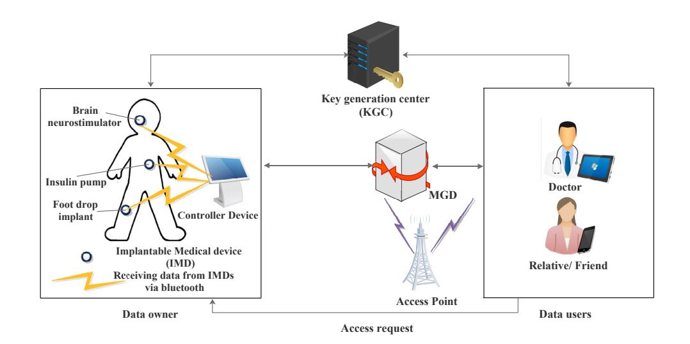
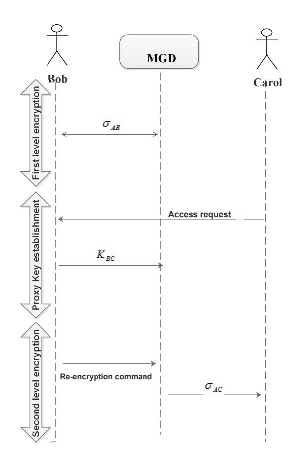
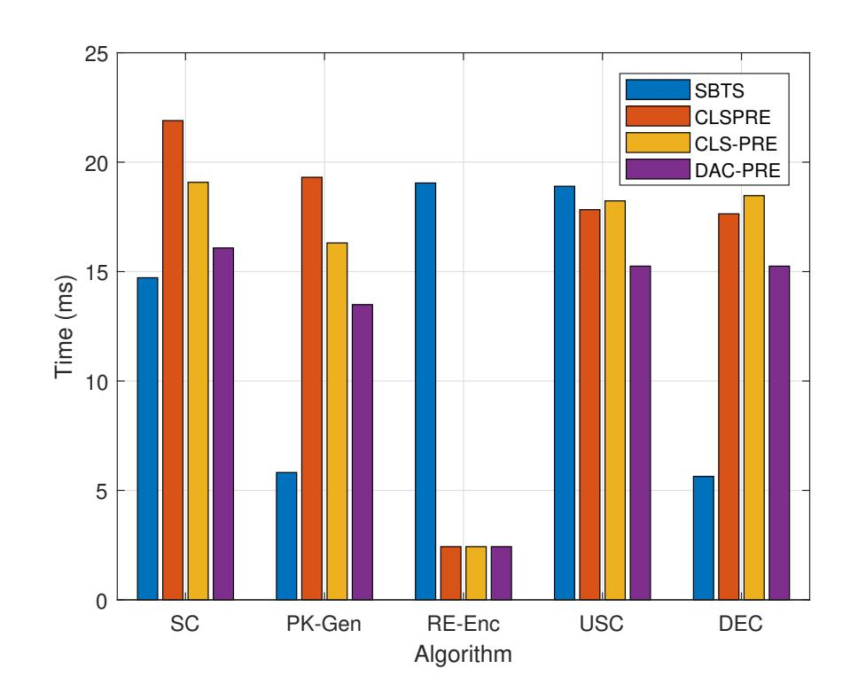
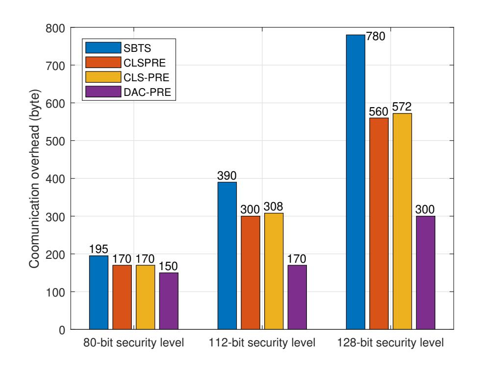
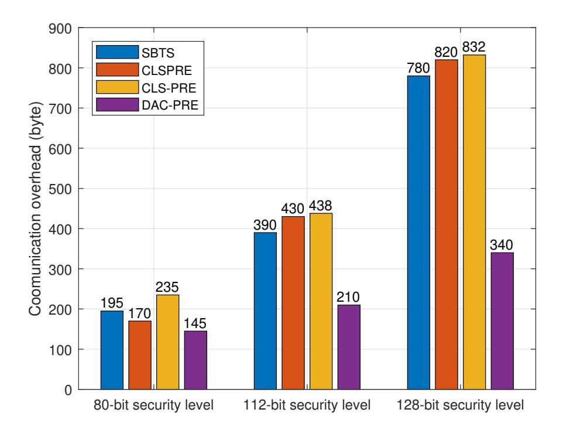

{0}------------------------------------------------

1

# DAC-PRE: Practical Anonymous Data Access Scheme Control with Proxy Re-encryption for Implantable Medical Devices

Jayaprakash Kar<sup>1</sup> , Xiaoguang Liu2,3, and Fagen Li2,4

<sup>1</sup>Centre for Cryptology, Cyber Security and Digital Forensics, Department of Computer Science & Engineering, The LNM Institute of Information Technology, Jaipur(Raj), India

<sup>2</sup>Guangxi Key Laboratory of Cryptography and Information Security, Guilin University of Electronic Technology, Guilin, Guangxi 541004, P. R. China

<sup>3</sup>School of Mathematics, Southwest Minzu University, Chengdu,610041, China <sup>4</sup>School of Computer Science and Engineering University of Electronic Science and Technology of China Chengdu, China

*Abstract*—One of the most important fundamental elements in guaranteeing data security is data access management. The two primary security components of data access control are typically authorisation and authentication. Data access control is the selective restriction of data access. First, we present an effective data access control mechanism for medical devices that are implanted in this study. Through a signcryption method with proxy reencryption (DAC-PRE), the protocol guarantees anonymous data access control and supports the user's anonymity behaviour. The security is proven in oracle model. Our experimental analysis shows the proposed protocol has low computational cost.

*Index Terms*—Data access control, Privacy, Signcryption, reencryption, security.

# I. INTRODUCTION

Surgically implanted into patients' bodies, implantable medical devices (IMDs) track internal physiological characteristics. Examples of these devices are implanted cardiac defibrillators (ICDs), pacemakers, nero-simulators, drug delivery systems, and other devices. Several illnesses, including diabetes, Parkinson's disease, and cardiac arrhythmia, can also be treated with it. Along with supporting telemetry transmission across long-range, high-bandwidth wireless networks for remote monitoring, IMDs enable new devices to communicate with other inter operating IMDs. Thus, the main issues affecting patient safety and the efficacy of treatment are data security and privacy protection. As IMDs become more technologically advanced, it is critical to enhance security and efficacy. Wireless sensor networks (WSNs) have become increasingly common in the healthcare industry during the past ten years. WSNs cut expenses and make it possible for doctors to offer their services in remote locations. IMD implantation is a common application of WSNs in healthcare. These IMDs continuously check vital signs and, in certain situations, provide the necessary therapies. This is especially important for older individuals who live independently and struggle with self-care. These days, implantable devices—like pacemakers—have radio transceivers built in to enable data transmission and communication. Thanks to these interfaces, medical personnel can access the data anytime they need it. Nevertheless, this raises a number of security and privacy concerns, including unauthorized access to patient data and modification of IMD parameters [\[1\]](#page-9-0) [\[2\]](#page-9-1) [\[3\]](#page-9-2). The traditional methods of preventing unauthorised access to IMDs, which involve public-key cryptosystems or pre-loaded secret keys, cannot be directly implemented because they usually prohibit ambulance personnel from accessing the IMD during an emergency. [\[4\]](#page-9-3). As a result, IMDs tightened the security between patient privacy and safety and access control.

# *A. Motivation and contribution*

One of the most important cryptographic primitives is proxy re-encryption (PRE), which enables an outsider to change or modify a ciphertext that has been encrypted for a user so that another user involved in the protocol can decrypt it. This approach is highly helpful for a number of security applications involving the access and storage of data [\[5\]](#page-9-4) [\[6\]](#page-9-5). While PRE protects secrecy, it does not guarantee other security needs that are necessary for IMD security, including integrity, non-repudiation, and authentication. In 2017, Li et al. [\[7\]](#page-9-6) proposed a signcryption scheme with PRE based on IBSC. The authorized user decrypts various ciphertexts created with the data owner's public key by delegating authority from the data owner to a selected proxy in this work. Unlike the traditional PRE, the authorized user's only capabilities are verification and decryption. In terms of computing and communication overheads, the approach is quite expensive. Furthermore, this identity-based method has problems with key management and storage. Certificateless cryptosystem can solve the key escrow problem. Based on the certificateless system, the storage space and computational cost can be greatly reduced. Sensitive patient data is sent through untrusted public channels, while interactive components of IMDs converse via a wireless link. The data could be removed, tampered with, changed, or intercepted. Thus, it is crucial to maintain the data's secrecy, integrity, authentication, and non-repudiation in order to achieve the security aim. The public key encryption and digital signature functionality should be provided by the 

{1}------------------------------------------------

designed scheme. Thus, it is crucial to create lightweight cryptographic primitives for data access control that guarantee all security objectives, given the vulnerability of patient data. These are the things we have contributed.

- 1) We introduce a unique low-cost signcryption method with proxy re-encryption in a certificateless environment and prove security under the random oracle model. The security analysis indicates that the proposed plan simultaneously ensures integrity, authentication, nonrepudiation, and secrecy.
- 2) For IMDs, we create a secure data access control system. Patient data is accessed securely thanks to the proxy re-encryption technology. Our plan does away with the need for a key escrow because it is based on the certificateless method, which significantly lowers the cost of key management and storage.
- 3) We selected and implemented the strategy on a system with a configuration of a core i7-5500U 2.4 GHz processor and 16GB of RAM. Furthermore, computing expense, communication overhead, and energy use are assessed in order to do empirical analysis.

# *B. Organization*

This is how the paper is structured. The past work in this area is described in Section II. The network and its functions are covered in Section [III.](#page-2-0) The general paradigm of certificateless signcryption using a proxy re-encryption technique is defined in Section [IV-A.](#page-2-1) The models of adversaries and security are introduced in Section [IV-B.](#page-3-0) In section [V,](#page-5-0) we design the protocol. The empirical study of the suggested scheme (DAC-PRE) is covered in Section [VI.](#page-7-0) Lastly, we summarise the conclusion in Section [VII](#page-9-7) in summary.

# II. RELATED WORK

There are two ways that implantable medical devices are framed. The first model permits the complete implantation of medical equipment into the human body, including pacemakers and ICDs. Medical devices, including insulin pump systems, that are partially implanted fall within the second category of joints. Sensors and simulators are the parts that are implanted. A battery and processing unit are fastened to the patient's body externally. The current research focuses on wireless interfaces to communicate IMDs for secure communications, which exposes the devices to various assaults. These models are categorised based on their aims and objectives and how they affect medical devices and patient health data. Among these is the eavesdropping assault, in which a hostile party listens in on communications sent and received by the programmers and the IMDs and between the IMD's component parts, like the MICS transceivers and sensor devices. The adversary can collect and analyse data, including information linked to IMD identity, physiological data about the patient, a history of healthcarerelated information and treatment, therapy information, etc. because the transmitting messages are not encrypted. In addition, the adversary can obtain sensitive data, including the authentication credentials (IMD ID numbers, for example). Unauthorised access to the IMD components via the PIN is another significant attack. The opponent effectively changes or modifies crucial data, including therapeutic settings and patient health information. Following successful access, the adversary might halt or interrupt the insulin infusion, which would cause the patient's blood glucose level to rise. In addition, the attacker can disable the IMD, change the data stored within, update the firmware, and execute unauthorized commands. Unauthorized IMD programmers or a Universal Software Radio Peripheral can launch these attacks. According to the CIA trinity, IMD security necessitates the proper ratio of secrecy, integrity, and availability. Strong access control measures are also necessary, which presents a difficult tradeoff between security and safety. Therefore, creating effective access control strategies for IMDs is crucial. Numerous writers presented schemes for access restriction. Rasmussen *e*t al. designed an ultrasonic distance-bounding access control system [\[8\]](#page-9-8). The system enabled an IMD to provide secure access to an IMD programmer (reader) within close proximity. By employing this technique, the IMD programmer does not lose any computing power. However, neither the non-traceability property nor session key security is guaranteed, nor is it safe against replay and man-in-the-middle attacks. Ellouze et al. [\[9\]](#page-9-9) suggested wireless identification and sensing platform for secure cardiac IMDs. To produce the key and authenticate in order to harvest energy for the IMD's battery life, they used radio frequency signals from the UHF RFID reader. Then, they created the bio-metric cryptographic key and an authentication system. As a result, the IMD programmer and the IMD sensing platform can communicate securely. Nevertheless, this approach is not secure against reply attacks and fails to meet the security features of anonymity and non-traceability.

# *A. Signcryption with certificateless setting*

A cryptographic primitive called signcryption combines public-key encryption with digital signature functionality in a single logical step. Compared to the conventional "sign and encrypt" method, it has a lower computational cost and transmission overhead. This is first introduced by Zheng [\[10\]](#page-9-10). The first identity-based signcryption with a constraint device security architecture was created by Malone-Lee [\[11\]](#page-9-11). However, this scheme suffers from a key escrow problem. Subsequently, this key management and storage issue is eliminated by [\[7\]](#page-9-6) [\[12\]](#page-9-12). Further, After pointing out several weaknesses in the plan, Libert and Quisquater created a new one in [\[13\]](#page-9-13). Barbos and Farshim designed the first signcryption scheme with certificates setting [\[14\]](#page-9-14). Subsequently, many authors have proposed a certificateless signcryption scheme (CLSC) for various security applications [\[15\]](#page-9-15) [\[16\]](#page-9-16).

# *B. Proxy re-encryption for data access control*

There are numerous applications of PRE. This includes a parallel distribution system, e-mail forwarding broadcast encryption with the key establishment for wireless sensor networks, digital rights management, etc. Many authors [\[17\]](#page-9-17)[\[18\]](#page-9-18) proposed signcryption with PRE having an identity-based setting. However, these schemes burden key management and suffer the key-escrow problem. Furthermore, these schemes are mathematically not correct[\[19\]](#page-9-19). Chandrasekhar *e*t al. proved these schemes are insecure against chosen-ciphertext attacks. Subsequently, Fagen Li *e*t al.[\[7\]](#page-9-6) designed an access control for 

{2}------------------------------------------------

cloud computing that works through IBSC with PRE. Many access control schemes have been proposed which also work via PRE techniques for cloud computing [\[6\]](#page-9-5)[\[20\]](#page-9-20). Many constructions are also based on either attribute-based encryption (ABE) or the combination of both ABE and PRE [\[21\]](#page-9-21).

# III. NETWORK ARCHITECTURE AND COMPONENTS

<span id="page-2-0"></span>This section discusses how the proposed protocol DAC-PRE can work in the network model [1.](#page-2-2) The model consists of the following communicating devices and entities:

- Key Generator Center: All entities, including data owners and users, register their identities with this reliable third-party registration center. KGC then creates the dual users' partial private keys. The full private keys are generated using a combination function on the secret values and the received partial private keys because our protocol is based on the certificateless configuration.
- Implantable Medical device: The implantable medical device (IMD) is designed with sensors that gather multiple psychological metrics, including blood pressure, temperature, and heart rate. The patient has an implanted IMD with a controller.
- Data owner: A controller is attached to the data owner. Patient data is collected by the IMD and sent to the controller. The controller is under the data owner's jurisdiction.
- Medical gateway device (MGD): High-power servers are what the medical gateway device (MGD) uses. It is a very considerate and reliable support for enhancing implantable medical device dependability. It runs proxy re-encryption, data storage services, and visualization. It has interfaces with the data user and stores the signcrypted data. We take it that the waiter is sincere and inquisitive.
- Data user: Every organization and service involved in medical care is a data user. This covers the physician, the patient's family members, and any emergency medical assistance, such as an ambulance. These entities always need the patient's data in real-world medical and healthcare applications in order to improve diagnosis and treatment. For instance, the patient's medical history is required, medication is administered, etc.

The model operates through the following steps:

- 1) The medical gateway device (MGD) sends a query message to the data owner when a user—who could be a patient, physician, or other medical service—wants to access the data. He or she gives the order to sign the data that was obtained from IMD. The MGD have high computational power which can store, process, and send the user's signed data. The MGD is seen as both inquisitive and honest.
- 2) The MGD belongs to the patients, who are thought to be the data owners. It uses Transmission Layer Security (TLS) to establish safe online or offline connection with the patient's IMD. It has a database installed, which holds encrypted data.
- 3) Following receipt of the request, the data owner instructs the MGD to re-encrypt signed data that is stored there

- and sends it to the data user. We presume that the owner of the data is prohibited from attempting to attach or remove the information gathered from the IMD.
- 4) The data user uses the TLS protocol to conduct the decryption process and acquire the signcrypted data, which is then transmitted to the cloud server via a secure channel using either an offline or online manner. The decryption algorithm is executed by the cloud server in order to validate and permit the data user or requester to do so.

# *A. Security requirements*

The proposed protocol DAC-PRE is deployed in the model, ensuring data privacy and authentication. Additionally, it preserves the integrity of the data and prevents non-repudiation.

- Data Privacy: Data privacy should be ensured when the data is stored as confidential from unauthorized users.
- Integrity is preserved when the data is transmitted from the data owner (the patient) to the data user doctor, and other medical services remain unchanged for illegitimate users.
- Authentication: This security goal is achieved when the data remains valid and can be verified by the data owner.
- Non-repudiation: This security goal can be ensured when the patient is undeniably linked to past activities with the signcryption of the data.



Fig. 1. Network model of IMDs

# <span id="page-2-2"></span>IV. A GENERIC FRAMEWORK OF SIGNCRYPTION WITH PROXY RE-ENCRYPTION

This section describes a formal design of the signcryption scheme with proxy re-encryption and discusses the adversary model works in this scheme.

# <span id="page-2-1"></span>*A. Framework*

The following nine algorithms make up a proxy reencryption method for certificateless signcryption.

- Setup: The KGC executes this algorithm using the secret parameter ψ. The master public key Ppub is set and the master secret key s is chosen by the KGC. KGC generates param, the global system parameters.
- PPr-Ext: This approach generates partial private keys. The master secret key s and the user's identification ID<sup>u</sup> are inputs to the KGC. This generates the partial private key D<sup>u</sup> for the relevant user.

{3}------------------------------------------------

- PubK-Gen: The user runs this algorithm to produce a public key. The secret value x<sup>u</sup> is selected by the user. After receiving x<sup>u</sup> as input, the algorithm generates pku, his public key.
- PrK-Gen: The user's whole private key is generated by this algorithm. The algorithm selects the secret value x<sup>u</sup> and creates the full private key after receiving the partial private key Du.
- SC: This signcryption algorithm generates the signcrypt on a given message and works in a designed protocol. The protocol involves two communicating entities, Alice and Bob, regarded as sender and receiver, respectively, along with another entity, Carlo, who can re-encrypt the generated ciphertext. This algorithm generates a ciphertext σAB using Alice's identity IDA, private key SA, public key pkA, Bob's identity IDB, public key pkB, and the message as input.
- PK-Gen: This algorithm generates a proxy key run by the receiver Bob and establishes the proxy key KBC . The algorithm takes the global system parameters param, private key S<sup>B</sup> together with Carlo's identity ID<sup>C</sup> and public key pk<sup>C</sup> as inputs.
- RE-Enc: This algorithm, which is executed by a proxy and requires the first level ciphertext σAB and proxy key KBC as input, is used to re-encrypt ciphertexts. As a result, Alice and Carlo can use the second level ciphertext, σAC .
- USC: Bob, the recipient, uses this deterministic technique to get the message. This accepts the following inputs: σAB, IDA, pkA, pkB, and SB. If σAB is an invalid ciphertext, it returns the symbol ⊥.
- DEC: The message encrypted at the second level is decrypted using this algorithm. Using the proxy user Carlo's private key S<sup>C</sup> , this accepts σAB, IDA, andID<sup>B</sup> long as input and, in the event that σAC is an invalid ciphertext, returns m or the symbol ⊥.

Formally, we can summarize these algorithms as follows: if σAB = SC(m, SA, IDA, pkA, pkB, IDB), then m = USC(σAB, IDA, SB, pkB, IDB). Additionally, if KBC = PK-Gen(SB, pk<sup>C</sup> , ID<sup>C</sup> ) and σAC = RE-Enc(σAB, KBC ), then m = Dec(σAC , IDA, IDB, S<sup>C</sup> ). For the sake of simplicity, we have omitted the system parameter param.

# <span id="page-3-0"></span>*B. Adversary Model*

Both confidentiality and unforgeability must be met by a proxy re-encryption system used with certificateless signcryption. Unforgeability against adaptive selected message attack (EUF-CMA) and chosen ciphertext attack (IND-iCCA-I/II) are the two definitions of confidentiality. For insider security, the concept of strong existential unforgeability is represented by sUF-iCMA-I/II. The confidentiality and unforgeability models are defined in the ensuing subsections [IV-C](#page-3-1) and [IV-D,](#page-4-0) respectively. We consider the Type-I and Type-II adversaries defined in [\[14\]](#page-9-14). The master key cannot be accessed by a Type-I attacker. He can, however, change the user's public key to the value of his choice. An adversary of Type-II prevents the user's public key from being changed to anything. He has access to the master secret key, though. The adversary paradigm is based on the adversary and challenger gameplay. Every hash function is represented as an arbitrary oracle. The challenger attempts to compute a solution to the intractable mathematical hard problem by using the adversary as a subroutine.

# <span id="page-3-1"></span>*C. Model for Confidentiality*

This model is described to ensure IND-iCCA-I/II security. Let A<sup>I</sup> denotes Type-I adversary, whereas AII denotes for Type-II adversary. Furthermore, the interaction between the challenger C and forger B with A<sup>I</sup> is modeled by Game-I, whereas the interaction with AII is as Game-II.

Game-I: This game is played between A<sup>I</sup> and the challenger C . The following steps and phases are to be performed.

- Setup: The challenger C takes the security parameter ψ and executes the setup algorithm, returns the system global parameter param, and provides to A<sup>I</sup> .
- Phase-I: A<sup>I</sup> interacts with C with submitting polynomially bounded queries in an adaptive manner.
  - Partial private key queries: A<sup>I</sup> submits queries with ID. C runs the PPr-Ext, obtains DID and sends to A<sup>I</sup> .
  - Private key queries: A<sup>I</sup> submits queries with identity ID. C runs Pr-Gen algorithm, returns the full private key SID and sends it to A<sup>I</sup> .
  - Public key queries: A<sup>I</sup> submits queries with identity ID. C runs PubK-Gen algorithm, returns the public key pkID and sends it to A<sup>I</sup> .
  - Public key replacement queries: A<sup>I</sup> intends to replace the value of pkID with a suitable key.
  - Proxy key construction queries: A<sup>I</sup> chooses two distinct identifies ID<sup>i</sup> and ID<sup>j</sup> . C runs PK-Gen and PrK-Gen algorithms, obtains deligator's public key pk<sup>j</sup> and private key S<sup>i</sup> respectively. Then C runs PubK-Gen algorithms with these input and obtains the encryption key Kij . Formally PK-Gen(S<sup>i</sup> , pk<sup>j</sup> , ID<sup>j</sup> ) = Kij . Finally C sends it to A<sup>I</sup> .
  - Signcryption queries: In this oracle, A<sup>I</sup> submits the queries with tuples (m, ID<sup>i</sup> , ID<sup>j</sup> ). C generates the sender's private and public key pairs (S<sup>i</sup> , pki) by running the PrK-Gen and PubK-Gen algorithms respectively. C calls SC(m, S<sup>i</sup> , pk<sup>i</sup> , ID<sup>i</sup> , ID<sup>j</sup> ), generates σij and sends it to A<sup>I</sup> . The oracle accepts A<sup>I</sup> to reveal any secret value if the user's public key is replaced with a preferred value.
  - Re-encryption queries: In this oracle, A<sup>I</sup> submits the queries with σij along with three identities ID<sup>i</sup> , ID<sup>j</sup> and ID<sup>u</sup> as input. C first runs PrK-Gen and PubK-Gen algorithms and obtains the private key S<sup>j</sup> and the user's public key pku. Then C obtains the proxy key Kju by running the algorithm PK-Gen. Formally, we say PK-Gen(S<sup>j</sup> , pku, IDu) = Kju.
  - Unsigncryption queries: A<sup>I</sup> submits the queries with tuples (σij , ID<sup>i</sup> , ID<sup>j</sup> ). C first runs PrK-Gen and PubK-Gen algorithms and obtains the receiver's private and public key pairs (S<sup>j</sup> , pk<sup>j</sup> ). Then C calls

{4}------------------------------------------------

USC(σij , S<sup>j</sup> , ID<sup>i</sup> , pk<sup>j</sup> , ID<sup>j</sup> ), obtains the message m or the symbol ⊥ for invalid σij and sends it to A<sup>I</sup> .

- Decryption queries: In this oracle, A<sup>I</sup> submits queries with tuples (σiu, ID<sup>i</sup> , ID<sup>j</sup> , IDu). C first obtains the user's private key S<sup>u</sup> by running PrK-Gen algorithm. The C calls DEC(σiu, Su, ID<sup>i</sup> , ID<sup>j</sup> ) and obtains m, the symbol ⊥ for invalid ciphertext σiu.
- Challenge: Here, A<sup>I</sup> aborts the simulation knowingly. For which it selects the challenged identities ID<sup>A</sup> and IDB. Additionally, it chooses two distinct messages m<sup>0</sup> and m<sup>1</sup> of equal lengths with the following conditions.
  - 1) A<sup>I</sup> does not submit any query with ID<sup>B</sup> for private key oracle.
  - 2) A<sup>I</sup> does not submit query with ID<sup>B</sup> for partial private key and key-replacement oracle.
  - 3) A<sup>I</sup> does not submit query with the tuples (IDB, IDu) proxy key and ID<sup>u</sup> for private key oracle.
- Phase-II: Similar to the interaction performed in Phase-I between C and A<sup>I</sup> via queries. A<sup>I</sup> runs the polynomially bounded queries adaptively. But the following constraints are to be applied.
  - 1) A<sup>I</sup> is not allowed to submit private key query with IDB.
  - 2) A<sup>I</sup> is not allowed to submit the partial private key and public key replacement query on IDB.
  - 3) A<sup>I</sup> is not allowed to submit the proxy-key generation queries with (IDB, IDu) and private key queries on IDu.
  - 4) A<sup>I</sup> is not allowed to submit the query to Unsigncryption oracle with tuple (σAB, IDA, IDB) when the sender's public key pk<sup>A</sup> is replaced after the Challenge phase.
  - 5) A<sup>I</sup> is not allowed to submit the queries to re-encryption oracle with tuple (σAB, IDA, IDB, IDu) and private key oracles with IDu.
  - 6) A<sup>I</sup> is not allowed to submit the queries to re-encryption oracle with tuple (σAB, IDA, IDB, ID)u). Where the response is σAu. Additionally A<sup>I</sup> is not allowed to submit private key oracles with (σAu, IDA, IDB, IDu).
- Guess: A<sup>I</sup> obtains a bit β ′ and wins the game when β ′ = β. The A<sup>I</sup> 's advantages is defined as

$$\operatorname{Adv_{DAC-PRE}^{IND-iCCA-I}}(A_I) = |2\Pr[\beta' = \beta] - 1|,$$

where Pr[β ′ = β] denotes the probability that β ′ = β. Game-II: AII plays this game with C via the polynomially bounded queries in an adaptive manner similar to the Game-I.

- Setup: The challenger C takes security parameter ψ as input, executes the Setup algorithm and obtains the system global parameter param. Then sends it to A<sup>I</sup> .
- Phase-I: AII interacts with C with submitting polynomially bounded queries in an adaptive manner.

Note that here AII does not submit partial private key queries since AII possesses the master secret key s and can generated partial private key.

- Challenge: Here, AII aborts the simulation knowingly. For which it selects the challenged identities ID<sup>A</sup> and IDB. Additionally, it chooses two distinct messages m<sup>0</sup> and m<sup>1</sup> of equal lengths with the following conditions.
  - 1) AII does not submit any query with ID<sup>B</sup> for private key oracle.
  - 2) AII does not submit query with (IDB, IDu) for proxy key and does not submits queries with ID<sup>u</sup> private key oracle.
  - 3) AII does not submit query with the tuples (IDB, IDu) proxy key and ID<sup>u</sup> for private key oracle.
- Phase-II: Similar to the interaction performed in Phase-I between C and AII via queries. AII runs the polynomially bounded queries adaptively with the following constraints:
  - 1) AII is not allowed to submit private key query with IDB.
  - 2) AII is not allowed to submit the proxy-key generation queries with (IDB, IDu) and private key queries on IDu.
  - 3) AII is not allowed to submit the query to Unsigncryption oracle with tuple (σAB, IDA, IDB) when the sender's public key pk<sup>A</sup> is replaced after the Challenge phase.
  - 4) AII is not allowed to submit the queries to re-encryption oracle with tuple (σAB, IDA, IDB, IDu) and private key oracles with IDu.
  - 5) AII is not allowed to submit the queries to re-encryption oracle with tuple (σAB, IDA, IDB, ID)u). Where the response is σAu. Additionally AII is not allowed to submit decryption oracle with (σAu, IDA, IDB, IDu) for identity IDu.
- Guess: AII obtains a bit β ′ and wins the game when β ′ = β. The AII 's advantages is defined as

Adv<sup>IND-iCCA-II</sup><sub>DAC-PRE</sub> 
$$(\mathcal{A}_{II}) = |2\text{Pr}[\beta' = \beta] - 1|$$
, where  $\text{Pr}[\beta' = \beta]$  denotes the probability that  $\beta' = \beta$ .

Definition 1. An certificateless signcryption with proxy re-encryption achieves IND-iCCA-I/II security with respect to Game-I and Game-II, if there exists the polynimially bounded adversaries A<sup>I</sup> and AII have negligible advantage in these games.

# <span id="page-4-0"></span>*D. Model for Unforgeability*

In this model, the security is sUF-iCMA-I/II. Similarly, here we also describe two games Game-I played between F<sup>I</sup> and C and Game-II, played between FII and C .

• Setup: The challenger C takes the security parameter ψ as input, executes the setup and returns the system global parameter param. Then send it to F<sup>I</sup> .

{5}------------------------------------------------

- Attack:  $\mathcal{F}_I$  interacts with  $\mathscr{C}$  with submitting polynomially bounded queries in an adaptive manner.
- Forgery: Here,  $\mathscr{F}_I$  obtains a tuples  $(ID_A, ID_B, \sigma_{AB})$  and wins the game with the following conditions.
  - 1)  $m = \text{USC}(\sigma_{AB}, ID_A, S_B, ID_B)$ .
  - 2)  $\mathscr{F}_I$  does not submit query with  $ID_A$  to private key oracle.
  - 3)  $\mathscr{F}_I$  does not submit query with  $(ID_A, ID_u)$  for proxy key and also does not submits queries with  $ID_u$  to private key oracle.
  - 4)  $\mathscr{F}_I$  does not submit signcryption queries with  $(m,ID_A,ID_u)$  that generates the ciphertext  $\sigma_{Au}$ . Note that the decryption of the corresponding ciphertext is a valid one, where both  $ID_u$  and  $ID_B$  are distinct.

The  $\mathscr{F}_I$ 's advantage is defined by the probability of success. Now we discuss the Game-II played between  $\mathscr{F}_{II}$  and  $\mathscr{C}$ .

- Setup: The challenger  $\mathscr{C}$  takes the security parameter  $\psi$  as input, executes the setup algorithm and obtains the system global parameter param. Then sends it to  $\mathscr{F}_{II}$ .
- Attack:  $\mathscr{F}_{II}$  interacts with  $\mathscr{C}$  with submitting polynomially bounded queries in an adaptive manner.
- Forgery: Here,  $\mathscr{F}_{II}$  obtains a tuples  $(ID_A, ID_B, \sigma_{AB})$  and wins the game with the following conditions.
  - 1)  $m = USC(\sigma_{AB}, ID_A, S_B, ID_B)$ .
  - 2)  $\mathscr{F}_{II}$  does not submit query with  $ID_A$  to private key oracle.
  - 3)  $\mathscr{F}_{II}$  does not submit query with  $(ID_A, ID_u)$  for proxy key and also does not submits queries with  $ID_u$  to private key oracle.
  - 4)  $\mathscr{F}_{II}$  does not submit signcryption query with  $(m, ID_A, ID_u)$  that generates the ciphertext  $\sigma_{Au}$ . Note that the decryption of the corresponding ciphertext is a valid one, where both  $ID_u$  and  $ID_B$  are distinct.

The  $\mathcal{F}_{II}$ 's advantage is the probability of success.

**Definition 2.** A certificateless signcryption with proxy reencryption achieves sUF-iCMA-I/II security with respect to the unforgeability Game-I and Game-II, if there exists the polynimially bounded adversaries  $\mathscr{F}_I$  and  $\mathscr{F}_{II}$  have negligible advantage in these games.

# V. CONSTRUCTION OF PROTOCOL

<span id="page-5-0"></span>The protocol are being executed in three different phases as **Protocol Initialization**, **Protocol messages** and **Protocol action**. All global system parameters are set by KGC in the protocol initialization and it is one-time setup. The proposed scheme comprises the following six algorithms namely **Sign-cryption**, **Proxy-key construction**, **Re-encryption**, **Unsign-cryption** and **Decryption**. These are executed via three phases that are described in subsection V-A, V and V-B.

### <span id="page-5-1"></span>A. Protocol Initialization

This is the system initialization phase which is performed by Setup algorithm taking a security parameter  $\psi$ , where

 $\psi \geq 160$  bits. The KGC sets two groups as  $G_1$  and  $G_2$ of prime order  $q \geq 2^{\psi}$ , where the group  $G_1$  is an additive group with generator P and  $G_2$  is a multiplicative group. The KGC selects a bilinear map  $\hat{e}: G_1 \times G_1 \to G_2$ . This also chooses collision resistant hash functions  $H_1: \{0,1\}^* \to \mathbb{Z}_q^*$  $H_2: \{0,1\}^* \times G_2 \times G_1 \rightarrow \mathbb{Z}_q^*, H_3: G_2 \rightarrow \mathbb{Z}_q^*, H_4:$  $\{0,1\}^* \to \mathbb{Z}_q^*$ , where n denotes the size of the message on which the algorithm works to generate the signcrypt. The KGC constructs the master public key  $P_{pub} = s \cdot P$ , where  $s \in \mathbb{Z}_q^*$  is chosen at random as the master secret key. The KGC publishes  $\{G_1, G_2, P_{pub}, n, H_1, H_2, H_3, H_4\}$  as the system parameters and keeps master secret key s as secret. The protocol works through the KGC. The user participating in this protocol has to use his identity to register with KGC. The KGC uses the master secret key and computes the partial private key  $D_u$  of the corresponding user which is given by  $D_u = sQ_u$ , where  $Q_u = H_1(ID_u)$  and u denotes to any arbitrary user. Then  $D_u$  is transmitted to the corresponding user via secure channel using TLS protocol. After received the partial private key, the user randomly selects  $x_u \in \mathbb{Z}_q^*$  and constructs full private key as  $S_u = (x_u, D_u)$ . The user's public key is  $pk_u = x_u P$ .

#### <span id="page-5-2"></span>B. Protocol action

The following four algorithms are run in this phase by three users. Let the users which participate in this protocol are Alice, Bob and Carlo. Let the identity of these users are denoted by  $ID_A$ ,  $ID_B$  and  $ID_C$  respectively.

1) Signcryption: The algorithm is executed by Alice. It takes the identity  $ID_A$ , private key  $S_A$  of Alice, the public key, identity  $ID_B$  of Bob, and the public system parameter U as inputs, then return the ciphertext. The algorithm details are as follows.

# **Algorithm 1** Signcrypt

17: **end** 

1: : INPUT:  $(m, S_A, pk_B, U, ID_B)$ 

```
2: : OUTPUT: \sigma_{AB} \leftarrow (C_1, C_2, Z)
 3: begin
         Chooses r \in \mathbb{Z}_q^* at random.
 4:
 5:
          Compute U \leftarrow r \cdot P.
         Compute T \leftarrow \hat{e}(P_{pub}, Q_B)^r.
 6:
          Compute T_1 \leftarrow rpk_B.
 7:
          Set h \leftarrow H_2(U, T, T_1, ID_B, pk_A, pk_B)
 8:
         Compute C_1 \leftarrow m \oplus h
 9:
10:
          Set W_1 \leftarrow H_3(U, C_1, T_1, ID_A, pk_A).
          Set W_2 \leftarrow H_4(U, C_1, T_1, ID_A, pk_A)
11:
         Set W \leftarrow W_1 \oplus W_2.
12:
         Set k \leftarrow H_5(U,T).
13:
         Compute C_2 \leftarrow W \oplus k.
14:
         Compute Z \leftarrow D_A + rW_1 + x_AW_2
15:
         Return: \sigma_{AB} \leftarrow (C_1, C_2, Z)
16:
```

2) Proxy-key construction: The protocol allows both Bob and Carlo to generate proxy-key  $k_{BC}$ . The algorithm takes Bob's private key  $S_B = (x_B, D_B)$ , additionally Carlo's public key  $pk_C$  as input and construct  $k_{BC}$ . The algorithm proceeds as Algorithm 2.

{6}------------------------------------------------

# Algorithm 2 Proxy-key Construction

```
1: : INPUT: S_B = (x_B, D_B), U, pk_C
 2: OUTPUT: k_{BC}
 3: begin
         Compute T_1 \leftarrow x_B U.
 4:
         Compute T \to \hat{e}(D_B, U).
 5:
         Compute W_1 \leftarrow H_3(U, C_1, T_1, ID_A, pk_A).
 6:
         Compute W_2 \leftarrow H_4(U, C_1, T_1, ID_A, pk_A).
 7:
         Choose r_1 \in \mathbb{Z}_q^* and compute T_2 \leftarrow r_1 p k_C.
 8:
         Compute R \leftarrow r_1 P.
 9:
         Compute T^{'} \leftarrow \hat{e}(P_{pub}, Q_C)^{r_1}.
10:
         Set \overline{W} \leftarrow H_5(T', U, R, T_2, ID_B, pk_C).
11:
         Compute W \leftarrow W_1 \oplus W_2.
12:
         Compute X = \bar{W} \oplus W.
13:
         Compute k_{BC} \leftarrow (T_2, X).
14:
15: end
```

3) Re-encryption : The algorithm takes  $\sigma_{AB}$  and  $k_{BC}$  as input and re-encrypts the ciphertext  $\sigma_{AC}$  . The algorithm proceeds as

# Algorithm 3 Re-encryption

```
1: : INPUT: \sigma_{AB} \leftarrow (C_1, C_2, Z)

2: : OUTPUT: \sigma_{AC} \leftarrow (C_1, C_1', C_2, Z)

3: begin

4: Compute C_1' \leftarrow C_1 + T_2.

5: Compute C_2' \leftarrow C_2 \oplus X.

6: Return : \sigma_{AC} \leftarrow (C_1, C_1', C_2, C_2', Z).

7: end
```

- 4) Unsigncryption: The algorithm is run by Bob with his own private and public key and additionally Alice's public key. The key k used for decryption is verified and is used in the deciphering process. The algorithm produces the ciphertext and signature for the given message. This proceeds as
- 5) Decryption: This algorithm takes  $\sigma_{AC}$  and Carlo's private and public key. Additionally this takes Bob's public as input. This decipher obtains the message and verifies the signature.

**Theorem 1.** In the random oracle model, the proposed **DAC-PRE** protocol is IND-iCCA-I/ II secure under the assumption that the GBDH problem is intractable in the underline bilinear group.

This is followed from Lemma -1 and Lemma -2

<span id="page-6-0"></span>**Lemma 1.** In random oracle model, suppose there is an probabilistic polynomial time adversary of Type-I denoted by  $\mathscr{A}_I$  has advantage  $\epsilon$  win the IND-iCCA-I game against the proposed protocol **DAC-PRE** at a time t while submitting the  $q_s$  signcryption queries,  $q_{pk}$  proxy key queries,  $q_u$  unsigncryption queries,  $q_e$  re-encryption queries,  $q_d$  decryption queries and hash queries  $q_{H_i}$ , for i=1,2,3,4,5 where the hash functions are modelled as random oracle, then there exists an algorithm  $\mathscr{B}$  which uses  $\mathscr{A}_I$  to solve GBDH problem with advantage

# Algorithm 4 Unsigncrypt

```
1: INPUT: \sigma_{AB} \leftarrow (C_1, C_2, Z)
 2: OUTPUT: (0/1)
 3: begin
        Compute T_1 \leftarrow x_B U.
 4:
        Compute T = \hat{e}(D_B, U).
 5:
        Compute h \leftarrow H_2(U, T, T_1, ID_B, pk_A, pk_B)
 6:
        Compute W_1 \leftarrow H_3(U, C_1, T_1, ID_A, pk_A).
 7:
        Compute W_2 \leftarrow H_4(U, C_1, T_1, ID_B, pk_B).
 8:
        Set W \leftarrow W_1 \oplus W_2.
 9:
        Compute k \leftarrow H_5(U,T).
10:
        if W = C_2 \oplus k then
11:
             Return "1"
12:
        else
13:
             Return "0"
14:
        end if
15:
        Compute m \leftarrow C_1 \oplus h
16:
        if \hat{e}(P,Z) = \hat{e}(P_{pub},Q_A)\hat{e}(U,W_1)\hat{e}(pk_A,W_2) then.
17:
             Return "1" and Accept m.
18:
        else
19:
20:
             Return "0" and Reject.
        end if
21:
22: end
```

# **Algorithm 5** Decryption

end

```
: INPUT: \{\sigma_{AC} = (C_1, C_1', C_2, C_2', Z)\}, k_{BC}
: OUTPUT: (0/1).
begin
     Compute T_2 \leftarrow x_C R.
     Compute T' \leftarrow \hat{e}(D_C, R).
     Compute h \leftarrow H_2(U, T, T_1, ID_B, pk_A, pk_B)
     Compute W_1 \leftarrow H_3(U, C_1, T_1, ID_B, pk_B).
     Compute W_2 \leftarrow H_4(U, C_1, T_1, ID_A, pk_A).
     \bar{W} \leftarrow H_5(T', U, R, T_2, ID_B, pk_C).
     Compute C_1 \leftarrow C_1' - T_2.
    Compute m \leftarrow C_1 \oplus h.
     Compute k \leftarrow C_{2}^{'} \oplus \bar{W}.
     if \hat{e}(P,Z) = \hat{e}(P_{pub},Q_A)\hat{e}(U,W_1)\hat{e}(pk_A,W_2) then
         Return "1" and Accept m.
     else
         Return "0" and Reject.
     end if
```

$$\epsilon_{gbdh} \ge \left(\frac{\epsilon}{q_{H_1}}\right) \left(1 - \frac{q_s(q_{H_2} + q_{H_3} + q_{H_4} + q_{H_5})}{2^{\psi}}\right) \left(1 - \frac{q_u}{2^{\psi}}\right)$$

in a time  $t^{'} \leq t + \mathcal{O}(q_{pk} + q_s + q_e + q_u + q_d)t_p$ , where  $t_p$  denotes the computational cost for pairing operation.

<span id="page-6-1"></span>**Lemma 2.** In random oracle model, suppose there is an probabilistic polynomial time adversary of type-II denoted by  $\mathcal{A}_{II}$  has advantage  $\epsilon$  win the IND-iCCA-II game against the proposed protocol **DAC-PRE** at a time t, while submitting  $q_s$  signcryption queries, proxy key construction queries  $q_{pk}$ ,  $q_u$  unsigncryption queries,  $q_e$  re-encryption queries,  $q_d$  decryption queries and hash queries  $q_{H_i}$ , for i = 1, 2, 3, 4 in which

{7}------------------------------------------------



Fig. 2. Data access control in IMD

the hash functions are modelled as random oracle, then there exists an algorithm  $\mathcal{B}$  which uses  $\mathcal{A}_{II}$  to solve CDH problem with advantage

$$\epsilon_{cdh} \ge \left(\frac{\epsilon}{q_{H_1}^2}\right) \left(1 - \frac{q_s(q_{H_2} + q_{H_3} + q_{H_4} + q_{H_5})}{2^{\psi}}\right) \left(1 - \frac{q_u}{2^{\psi}}\right)$$

in a time  $t^{'} \leq t + \mathcal{O}(q_{pk} + q_s + q_e + q_u + q_d)t_p$ , where  $t_p$  denotes the cost of one pairing operation.

In above equation,  $q_{\delta} = q_{H_1} + q_{H_2} + 2q_{ppk} + q_s + q_u$  denotes the maximum number of queries the adversary could submit to  $H_1, H_2$ , partial private key oracle, signcryption oracle and unsigncryption oracle.

*Proof.* See Appendix 2 
$$\Box$$

**Theorem 2.** In the random oracle model, the proposed **DAC-PRE** protocol is sUF-iCMA-I/II secure under the assumption that the CDH problem is intractable in the additive group  $G_1$ .

This is followed from Lemma -3 and Lemma -4

<span id="page-7-1"></span>**Lemma 3.** Under random oracle model, suppose there is an probabilistic polynomial time adversary of Type-I denoted by  $\mathcal{F}_I$  has advantage  $\epsilon$  wins the sUF-iCMA-I game against the proposed protocol **DAC-PRE** at a time t submitting  $q_s$  signcryption queries,  $q_{pk}$  proxy key generation queries,  $q_u$  unsigncryption queries,  $q_{re}$  re-encryption queries,  $q_d$  decryption queries and hash queries  $q_{H_i}$ , for i=1,2,3,4,5 where the hash functions are modelled as random oracle, then there exists an algorithm  $\mathcal{B}$  which uses  $\mathcal{F}_I$  to solve CDH problem with advantage

$$\epsilon_{cdh} \geq \frac{10(q_s+1)(q_s+q_{H_3}+q_{H_4})q_{H_1}}{2^{\psi}-1}$$

in a time  $t^{'} \leq \Psi q_{H_1 q_{H_3} q_{H_4}}(t + \mathcal{O}(q_{pk} + q_s + q_e + q_u + q_d)t_p/\epsilon(1 - \frac{1}{2^{\psi}})$ 

where  $\Psi = 120686$  and  $t_p$  denotes the pairing cost.

<span id="page-7-2"></span>**Lemma 4.** In random oracle model, suppose there is an probabilistic polynomial time adversary of type-II having probabilistic polynomial time denoted by  $\mathcal{F}_{II}$  has advantage  $\epsilon$  wins the sUF-iCMA-II game against the proposed protocol **DAC-PRE** at a time t submitting  $q_s$  signcryption queries,  $q_{pk}$  proxy key generation queries,  $q_u$  unsigncryption queries,  $q_r$  re-encryption queries,  $q_d$  decryption queries and hash queries  $q_{H_i}$ , for i=1,2,3,4,5 where the hash functions are modelled as random oracle, then there exists an algorithm  $\mathcal{B}$  which uses  $\mathcal{A}_I$  to solve CDH problem with advantage

$$\epsilon_{cdh} \ge \left(\frac{\epsilon}{q_{H_1}^2}\right) \left(1 - \frac{q_s(q_{H_2} + q_{H_5})}{2^{\psi}}\right) \left(1 - \frac{q_u}{2^{\psi}}\right)$$

in a time  $t^{'} \leq t + \mathcal{O}(q_{pk} + q_s + q_e + q_u + q_d)t_p$ , where  $t_p$  denotes the cost of pairing operation.

<span id="page-7-0"></span>

We evaluate the computational and communication overhead of our DAC-PRE scheme and assess against the certificateless scheme SBTS [18] and CLSPRE [22] as indicated in Table III and Table V respectively. For empirical analysis, we evaluate the computational cost of all these three schemes. The implementation is done using PBC library [23]. We have chosen Type A following elliptic curve with embedding degree is two. The additive group  $G_1$  of order p of size 160 bit with generator P consists of the elements with points lies on the elliptic curve defined over 512-bit prime finite field. The elliptic curve considered is  $y^2 \equiv (x^3 + x) \mod q$ where  $q \equiv 3 \mod 4$ . Let we denote the operation of ECC point multiplication in the additive group  $G_1$  as M, pairing as P, hashing as H and modular exponentiation as ME. Table III represents the computational cost evaluated in term of the cryptographic operations. The configurations of the machine used in our experiment is (i) core i7-5500U 2.4 2.4 GHz processor with RAM of 16GB. In order to evaluate the execution time, each algorithm is run 4000 times and the average is taken. From table IV, we can observe that the our scheme DAC-PRE is (64.13 - 62.50)/64.13 = 2.54% faster than SBTS [18], (79.11 - 62.50)/79.11 = 20.99% faster than CLSPRE [22] and (74.52 - 62.50)/74.52 = 16.12%faster than CLS-PRE [24]. Therefore, our scheme DAC-PRE is more efficient with respect to the execution time than the other certificateless schemes on access control designed on the random oracle model. The communication overhead is evaluated for  $\sigma_{AB}$  and  $\sigma_{AC}$  at 80-bit, 112-bit and 128-bit key size security levels. According to these security level specification, the size of the two prime p and q are given in Table I [25]. Similarly the size of the group elements, integers and message sizes are specified in Table II at 80-bit, 112bit and 128-bit key size security levels. The communication overhead for  $\sigma_{AB}$  and  $\sigma_{AC}$  are based on Table I and Table II. Let the size of the arbitrary element  $Q \in G_1$  is denoted by |Q|. Similarly |u| and |x| denote the size of element belonging to group  $G_2$  and  $\mathbb{Z}_q^*$  respectively. Assume that the size of the message  $\mid m \mid = 160$  bits. When we measure the security strength of 80-bit security, the size of p, q,  $G_1$  and  $G_2$  is 160, 512, 1024 and 1024 bits respectively. The size of the group element in  $G_1$  can be reduced to size 65 bytes by using

{8}------------------------------------------------

the compression technique [26]. Therefore the communication overhead at 80-bit security level of SBTS [18] is  $3 * |G_1| =$ 3\*65 = 195 bytes for  $\sigma_{AB}$ . Similarly the communication overhead of CLSPRE [22], CLS-PRE [24] and our scheme DAC-PRE are  $2*|G_1|+2*|m| = 2*65+2*20 = 170$  bytes,  $2*|G_1|+|\mathbb{Z}_q^*|+|m|=2*65+2*20+2*20=170$  bytes and  $|G_1| + 2*|m| = 2*65 + 20 = 150$  bytes for  $\sigma_{AB}$  respectively. The communication overhead of SBTS [18], CLSPRE [22], CLS-PRE [24] and DAC-PRE for  $sigma_{AC}$  are  $3*|G_1| =$ 3\*65 = 195 bytes,  $3*|G_1|+2*|m| = 3*65+2*20 = 170$ bytes,  $3*|G_1|+|\mathbb{Z}_q^*|+|m|=3*65+20+20=235$  bytes and  $|G_1|+4*|m|=65+4*20=145$  bytes for  $\sigma_{AC}$  respectively at 80-bit security level. Similarly the communication overhead is evaluated at 112-bit and 128-bit security level. Fig 4 and Fig 5 summarize the communication overhead of SBTS [18], CLSPRE [22], CLS-PRE [24] and DAC-PRE for  $\sigma_{AB}$  and  $\sigma_{AC}$  respectively at 80-bit, 112-bit and 128-bit security level.

<span id="page-8-3"></span>TABLE I SECURITY LEVEL SPECIFICATION IN BITS

| Security level | Size of p | Size of q |
|----------------|-----------|-----------|
| 80-bit         | 512       | 160       |
| 112-bit        | 1024      | 224       |
| 128-bit        | 1536      | 256       |

<span id="page-8-4"></span>TABLE II
SIZE OF GROUP ELEMENTS AND OTHER PARAMETERS (BYTE)

| size             | 80-bit | 112-bit | 128-bit |
|------------------|--------|---------|---------|
| $\overline{ Q }$ | 65     | 130     | 260     |
| u                | 128    | 256     | 384     |
| x                | 20     | 28      | 32      |

TABLE III
COMPUTATION COST

<span id="page-8-0"></span>

| Scheme       | SC    | PK-Gen | RE-Enc | USC   | DEC   |
|--------------|-------|--------|--------|-------|-------|
| SBTS [18]    | 3M    | 1M     | 5M     | 4M    | 1M    |
| CLSPRE [22]  | 1P+3M | 2P+3M  | N/A    | 1P+2M | 1P+2M |
| CLS-PRE [24] | 4M    | 6M     | N/A    | 4M    | 4M    |
| DAC-PRE      | 1P+2M | 2P+2M  | N/A    | 1P+1M | 1P+1M |

TABLE IV
COMPUTATIONAL TIME IN SECOND

<span id="page-8-2"></span>

| Scheme       | SC    | PK-Gen | RE-Enc | USC   | DEC   |
|--------------|-------|--------|--------|-------|-------|
| SBTS [18]    | 14.72 | 5.82   | 19.05  | 18.9  | 5.64  |
| CLSPRE [22]  | 21.9  | 19.31  | 2.43   | 17.83 | 17.64 |
| CLS-PRE [24] | 19.08 | 16.31  | 2.43   | 18.23 | 18.47 |
| DAC-PRE      | 16.08 | 13.49  | 2.43   | 15.25 | 15.25 |

TABLE V
COMMUNICATION OVERHEAD

<span id="page-8-1"></span>

|              | Communication overhead |                          | Formal security |         |
|--------------|------------------------|--------------------------|-----------------|---------|
| Scheme       | $\sigma_{AB}$          | $\sigma_{AC}$            | IND-<br>CCA2    | EUF-CMA |
|              |                        |                          |                 |         |
| SBTS [18]    | $  \ 3 G_1 $           | $  \ 3 G_1 $             | ×               |         |
| CLSPRE [22]  | $ 2 G_1  +$            | $ 3 G_1  +$              |                 |         |
|              | 2 m                    | 2 m                      |                 |         |
| CLS-PRE [24] | $2 G_1  +$             | $ 3 G_1  +$              |                 |         |
|              | $ \mathbb{Z}_q^* $ +   | $ \mathbb{Z}_q^*  +  m $ |                 |         |
|              | m                      |                          |                 |         |
| DAC-PRE      | $ G_1  +$              | $ G_1  +$                |                 |         |
|              | 2 m                    | 4 m                      |                 |         |



Fig. 3. The computational time in mili second



<span id="page-8-5"></span>Fig. 4. The communication overhead for  $\sigma_{AB}$ 

{9}------------------------------------------------



Fig. 5. The communication overhead for  $\sigma_{AC}$ 

#### <span id="page-9-27"></span>VII. CONCLUSION

<span id="page-9-7"></span>We have designed an efficient and low-cost data access control scheme for IMDs. The proposed scheme is based on the certificateless signcryption with proxy re-encryption technique. The security is proven under the random oracle model. The scheme provides IND-CCA2 and EUF-CMA security under the assumption of GBDH and CDH problems. The experimental analysis shows that the proposed scheme is more efficient to computational cost than the other relevant schemes.

# REFERENCES

- <span id="page-9-0"></span>[1] R. Spring, E. Freudenthal, and L. Estevez, "Practical techniques for limiting disclosure of rf-equipped medical devices," in 2007 IEEE Dallas Engineering in Medicine and Biology Workshop. IEEE, 2007, pp. 82– 85.
- <span id="page-9-1"></span>[2] D. Halperin, T. S. Heydt-Benjamin, K. Fu, T. Kohno, and W. H. Maisel, "Security and privacy for implantable medical devices," *IEEE pervasive* computing, vol. 7, no. 1, pp. 30-39, 2008.
- <span id="page-9-2"></span>[3] D. Halperin, T. S. Heydt-Benjamin, B. Ransford, S. S. Clark, B. Defend, W. Morgan, K. Fu, T. Kohno, and W. H. Maisel, "Pacemakers and implantable cardiac defibrillators: Software radio attacks and zero-power defenses," in 2008 IEEE Symposium on Security and Privacy (sp 2008). IEEE, 2008, pp. 129–142.
- <span id="page-9-3"></span>[4] S. K. Gupta, T. Mukherjee, and K. Venkatasubramanian, "Criticality aware access control model for pervasive applications," in Fourth Annual IEEE International Conference on Pervasive Computing and Communications (PERCOM'06). IEEE, 2006, pp. 5-pp.
- <span id="page-9-4"></span>[5] L. Jiang, L. Da Xu, H. Cai, Z. Jiang, F. Bu, and B. Xu, "An iotoriented data storage framework in cloud computing platform," IEEE Transactions on Industrial Informatics, vol. 10, no. 2, pp. 1443–1451, 2014.
- <span id="page-9-5"></span>[6] A. N. Khan, M. M. Kiah, S. A. Madani, M. Ali, S. Shamshirband et al., "Incremental proxy re-encryption scheme for mobile cloud computing environment," The Journal of Supercomputing, vol. 68, no. 2, pp. 624– 651, 2014.
- <span id="page-9-6"></span>[7] F. Li, B. Liu, and J. Hong, "An efficient signcryption for data access control in cloud computing," Computing, vol. 99, no. 5, pp. 465-479, 2017.
- <span id="page-9-8"></span>[8] K. B. Rasmussen, C. Castelluccia, T. S. Heydt-Benjamin, and S. Capkun, "Proximity-based access control for implantable medical devices," in Proceedings of the 16th ACM conference on Computer and communications security, 2009, pp. 410–419.
- <span id="page-9-9"></span>[9] N. Ellouze, M. Allouche, H. Ben Ahmed, S. Rekhis, and N. Boudriga, "Securing implantable cardiac medical devices: Use of radio frequency energy harvesting," in *Proceedings of the 3rd international workshop on* Trustworthy embedded devices, 2013, pp. 35–42.

- <span id="page-9-10"></span>[10] Y. Zheng, "Digital signcryption or how to achieve cost (signature & encryption) ≪ cost (signature)+ cost (encryption)," in *Annual interna*tional cryptology conference. Springer, 1997, pp. 165–179.
- <span id="page-9-11"></span>[11] J. Malone-Lee, "Identity-based signcryption." IACR Cryptol. ePrint Arch., vol. 2002, p. 98, 2002.
- <span id="page-9-12"></span>[12] C. Wang and X. Cao, "An improved signcryption with proxy reencryption and its application," in 2011 Seventh International Conference on Computational Intelligence and Security. IEEE, 2011, pp. 886-890.
- <span id="page-9-13"></span>[13] C. Wu and Z. Chen, "A new efficient certificateless signcryption scheme," in 2008 International Symposium on Information Science and Engineering, vol. 1. IEEE, 2008, pp. 661–664.
- <span id="page-9-14"></span>[14] M. Barbosa and P. Farshim, "Certificateless signcryption," in Proceedings of the 2008 ACM symposium on Information, computer and communications security, 2008, pp. 369–372.
- <span id="page-9-15"></span>[15] Z. Cheng and R. Comley, "Efficient certificateless public key encryption." IACR Cryptol. ePrint Arch., vol. 2005, p. 12, 2005.
- <span id="page-9-16"></span>[16] W. Xie and Z. Zhang, "Efficient and provably secure certificateless signcryption from bilinear maps," in 2010 IEEE International Conference on Wireless Communications, Networking and Information Security. IEEE, 2010, pp. 558–562.
- <span id="page-9-17"></span>[17] V. Kirtane and C. P. Rangan, "Rsa-tbos signcryption with proxy reencryption," in Proceedings of the 8th ACM workshop on Digital rights management, 2008, pp. 59-66.
- <span id="page-9-18"></span>[18] P. Shabisha, A. Braeken, A. Touhafi, and K. Steenhaut, "Elliptic curve qu-vanstone based signcryption schemes with proxy re-encryption for secure cloud data storage," in International Conference of Cloud Computing Technologies and Applications. Springer, 2017, pp. 1–18.
- <span id="page-9-19"></span>[19] W. Huige, W. Caifen, and C. Hao, "Id-based proxy re-signcryption scheme," in 2011 IEEE International Conference on Computer Science and Automation Engineering, vol. 2. IEEE, 2011, pp. 317–321.
- <span id="page-9-20"></span>[20] X. Tian, X. Wang, and A. Zhou, "Dsp re-encryption: A flexible mechanism for access control enforcement management in daas," in 2009 *IEEE International Conference on Cloud Computing.* IEEE, 2009, pp. 25–32.
- <span id="page-9-21"></span>[21] S. Yu, C. Wang, K. Ren, and W. Lou, "Achieving secure, scalable, and fine-grained data access control in cloud computing," in 2010 *Proceedings IEEE INFOCOM.* Ieee, 2010, pp. 1–9.
- <span id="page-9-22"></span>[22] E. Ahene, Z. Qin, A. K. Adusei, and F. Li, "Efficient signcryption with proxy re-encryption and its application in smart grid," IEEE Internet of Things Journal, vol. 6, no. 6, pp. 9722–9737, 2019.
- <span id="page-9-23"></span>[23] B. Lynn, "Pbc library manual 0.5. 11," 2006.
- <span id="page-9-24"></span>[24] E. Ahene, J. Dai, H. Feng, and F. Li, "A certificateless signcryption with proxy re-encryption for practical access control in cloud-based reliable smart grid," Telecommunication Systems, vol. 70, no. 4, pp. 491–510, 2019.
- <span id="page-9-25"></span>[25] J. Kar, K. Naik, and T. Abdelkader, "An efficient and lightweight deniably authenticated encryption scheme for e-mail security," IEEE Access, vol. 7, pp. 184 207–184 220, 2019.
- <span id="page-9-26"></span>[26] N.-W. Lo and J.-L. Tsai, "An efficient conditional privacy-preserving authentication scheme for vehicular sensor networks without pairings," IEEE Transactions on Intelligent Transportation Systems, vol. 17, no. 5, pp. 1319–1328, 2015.
- <span id="page-9-28"></span>[27] D. Pointcheval and J. Stern, "Security arguments for digital signatures and blind signatures," *Journal of cryptology*, vol. 13, no. 3, pp. 361–396, 2000.


**Jayaprakash Kar** is working as Professor in the Department of Computer Science & Engineering, The LNM Institute of Information Technology, Jaipur, India. His current research interests are on Cryptographic protocols and primitives using Elliptic Curve and Pairing based Cryptography in Random Oracle and Standard model, Zero-knowledge proofs, secret sharing, and multi-party computation.


Xiaoguang Liu is now a lecturer in the School of Mathematics, Southwest Minzu University, Chengdu, P.R. China. He received his Ph.D. degree in mathematics from Shaanxi normal university, Xi'an, P.R. China in 2014. From 2017 to 2020, he is a postdoctoral fellow in the School of Computer Science and Engineering, University of Electronic Science and Technology of China (UESTC), Chengdu, P.R. China. His recent research interests include cryptography, network security, and optimization computation.

{10}------------------------------------------------


Fagen Li (Member, IEEE) received the Ph.D. degree in cryptography from Xidian University, Xi'an, China, in 2007. He is currently a Professor with the School of Computer Science and Engineering, University of Electronic Science and Technology of China, Chengdu, China. From 2008 to 2009, he was a Postdoctoral Fellow with Future University-Hakodate, Hokkaido, Japan, which is supported by the Japan Society for the Promotion of Science. From 2010 to 2012, he was a Research Fellow with the Institute of Mathematics for Industry, Kyushu

University, Fukuoka, Japan. He has authored or coauthored more than 110 papers in international journals and conferences. His research interests include cryptography and network security.

{11}------------------------------------------------

#### **APPENDIX**

#### Proof of Lemma: 1

*Proof.* The algorithm  $\mathscr{B}$  uses  $\mathscr{A}_I$  as subroutine to solve GBDH problem on the given instances (P, aP, bP, cP).  $\mathscr{B}$  interacts with  $\mathscr{A}_I$  in the following ways.

Setup: The Setup in the initialization phase is run by  $\mathscr{B}$  with the security parameter  $\psi$  taking as input, obtains the param. The algorithm  $\mathscr{B}$  sets  $P_{pub}=aP$  and  $params=(\psi,P_{pub})$ , then transmits them to  $\mathscr{A}_I$ . The hash functions  $H_i,\ i=1,2,3,4,5$  are modelled as random oracle. For consistency in the answer of hash queries,  $\mathscr{B}$  maintains the lists  $L_i$  i=1,2,3,4,5 to store the answer that are being submitted to the respective oracles.

Phase-I:  $\mathscr{A}_I$  submits polynomially bounded queries to all oracles and  $\mathscr{B}$  answers all queries in the following ways:

- $H_1$  Queries: Algorithm  $\mathscr{B}$  selects an index l uniformly at random in  $\{1,2\dots q_{H_1}\}$ . Assume that  $\mathscr{A}_I$  submits queries to  $H_1$ -oracle on distinct identities  $ID_i$ , where i sets to counter 1.  $\mathscr{A}_1$  does not submit the query on an identity in , if it has been queried and answers the stored value in  $L_1$  for that particular identity.  $\mathscr{B}$  picks  $ID_l$  at random from  $\{1,2\dots q_{H_1}\}$  as the challenged identity.  $\mathscr{B}$  answers  $\mathscr{A}_I$  as
  - 1) At the  $l^{th}$  query,  $\mathscr{B}$  answers with  $H_1(ID_l) = bP$  and adds the tuple  $(ID_l, bP, \bot)$  to  $L_1$ .
  - 2) For other queries submitted on  $ID_i$  to  $H_1$  oracle i.e for  $H_1(ID_i)$  queries, where  $i \neq l \in \{1, 2 \dots q_{H_1}\}$ .  $\mathscr{B}$  chooses  $b_i \in \mathbb{Z}_q^*$  at random, adds the tuples  $(ID_i, b_iP, b_i)$  to  $L_1$  and answers  $H_1(ID_i) = b_iP$  to  $\mathscr{A}_I$ .
- $H_2$  Queries:  $\mathscr{A}_I$  submits the queries with  $(U, T, T_1, ID_B, pk_A, pk_B)$  to  $H_2$  oracle. Algorithm  $\mathscr{B}$  proceeds as follows:
  - 1) It verifies if the DBDH oracle returns 1, when the query is being submitted with tuple (aP, bP, cP, T), if it true then  $\mathscr{B}$  returns T and abort.
  - 2) Algorithm  $\mathscr{B}$  searches through the list  $L_2$  with entries  $(U, *, T_1, ID_B, pk_B, W_1)$  for distinct values of  $W_1$ , such that the DBDH oracle returns 1 when the query is submitted with tuple (aP, bP, cP, T). In this case, note that  $ID_B = ID_l$ . If such a tuple exists, then it returns  $W_1$  and replaces the symbol \* with T.
  - 3) If the algorithm  $\mathcal{B}$  founds this stage, it generates a  $W_1$  at random and updates the list  $L_2$ , which is initially empty with the respective tuple that compromises the input and returns values.
- $H_3$  Queries: When  $\mathscr{A}_I$  submits queries with  $(U, C_1, T_1, ID_A, pk_A)$  to  $H_3$  oracle, algorithm  $\mathscr{B}$  first searches the tuple in  $L_3$ ,  $\mathscr{B}$  returns the answer if there exists such a tuple in  $L_3$ . Otherwise,  $\mathscr{B}$  selects a random value t, return tP, and updates the list  $L_3$ .
- $H_4$  Queries:  $\mathscr{A}_I$  submits queries with  $(U,C_1,T_1,ID_A,pk_A)$  to  $H_4$  oracle, algorithm  $\mathscr{B}$  first searches the tuple in  $L_4$ , if founds return the

- answer, otherwise picks a random value w, returns wP and update the list  $L_4$ .
- $H_5$  Queries:  $\mathscr{A}_I$  submits queries with (U,T). Algorithm  $\mathscr{B}$  first searches the tuple in  $L_5$ , if founds, then reply k to  $\mathscr{A}_I$ . Else  $\mathscr{B}$  chooses  $k \in \{0,1\}^n$  at random, outputs k and update  $L_5$  with (U,T,k).
- Partial Private Key Queries:  $\mathscr{A}_I$  submits queries with  $ID_i$ , algorithm  $\mathscr{B}$  call  $H_1$  with  $ID_i$  and proceeds as
  - 1) If  $ID_i = ID_l$ ,  $\mathscr{B}$  aborts the simulation.
  - 2) If  $ID_i \neq ID_l$ , then  $\mathscr{B}$  computes  $D_i = b_i aP$  and adds the tuple  $(ID_i, \perp, D_i, \perp)$  to  $L_{pk}$ . Where  $L_k$  is used for private key oracle that store all the answers and the identity  $ID_i$  on which the queries is submitted.
- Public Key Queries:  $\mathscr{A}_I$  submits queries with  $ID_i$ . Algorithm  $\mathscr{B}$  searches the entry  $(ID_i, D_i, pk_i, x_i)$  in  $L_{ppk}$ , if found then  $\mathscr{B}$  sends  $pk_i$  to  $\mathscr{A}_I$ . Else  $\mathscr{B}$  generates a new tuple by choosing  $x_i \in \mathbb{Z}_q^*$  at random, compute  $pk_i = x_i P$ , adds  $(ID_i, \bot, pk_i, x_i)$  to  $L_k$  and sends to  $\mathscr{A}_I$ .
- Public Key Replacement Queries:  $\mathscr{A}_I$  submits queries with  $ID_i$  for replacement of a valid public key, algorithm  $\mathscr{B}$  updates  $L_{pk}$  with  $(ID_i, \bot, pk_i, \bot)$ . Algorithm  $\mathscr{B}$  can use this value for subsequent computations.
- Private Key Queries:  $\mathscr{A}_I$  submits queries with  $ID_i$ . Assume that there will no replacement of a valid public key queries is submitted with  $ID_i$  and  $ID_i \neq ID_l$ . Algorithm  $\mathscr{B}$  searches the entry  $(ID_i, pk_i, x_i)$  in  $L_{pk}$  and answers with  $S_i = (x_i, b_i a P)$  to  $\mathscr{A}_I$ . If the query for public key replacement is not submitted with  $ID_i$ , then  $\mathscr{A}_I$  will not be allowed to access the private key  $S_i$ . If  $ID_i = ID_l$ , then algorithm  $\mathscr{B}$  aborts the simulation and stop.
- Proxy Key Construction Queries:  $\mathscr{A}_I$  submits queries with  $ID_i$  and  $ID_j$ . Algorithm  $\mathscr{B}$  computes the delegater's private key  $S_i$ . It chooses randomly  $\alpha, \beta \in \mathbb{Z}_q^*$  and the element  $W_2$  from  $G_1$  at random. Then sets  $Z = \beta P_{pub} + x_i W_2, W_1 = \alpha P_{pub}$  and  $U = (\beta P Q_i)\alpha^{-1}$ . Computes  $R = r_1 P$ ,  $T' = \hat{e}(D_j, R)$  and  $T_2 = r_1 p k_j$ .  $\mathscr{C}$  retrieves  $\bar{W}$  from  $L_5$  list and computes  $X = \bar{W} \oplus W$ . Finally this will return the proxy key  $k_{ij} = (T_2, X)$  as answer. Consequently  $\mathscr{B}$  fails to return the proxy key when i = l.
- Signcryption Queries: Let the sender and receiver's identities are denoted by  $ID_A$  and  $ID_B$  respectively. Let the m denote the message on which the cipher is to be generated.  $\mathscr{A}_I$  submits queries with the tuple  $(m, ID_A, ID_B)$ . The algorithm  $\mathscr{B}$  executes and returns an answer in the following ways. There are two cases in this simulation.
  - 1) If  $ID_A \neq ID_l$ , algorithm  $\mathscr{B}$  can obtain the private key  $S_A$  and computes  $\sigma_{AB}$ . Then  $\mathscr{B}$  answers  $\sigma_{AB}$  to  $\mathscr{A}_I$ .
  - 2) If  $ID_A = ID_l$ , algorithm  $\mathscr{B}$  chooses  $r \in \mathbb{Z}_q^*$  at random and computes  $U = rP, T = \hat{e}(D_B, U)$  and  $T_1 = rpk_B$ . Selects the two elements

{12}------------------------------------------------

 $W_1$  and  $W_2$  at random from  $G_1$  and computes  $W=W_1\oplus W_2$ . Then computes  $Z=bP_{pub}+x_AW_2+rW_1$ . Sets  $k=H_4(U,T)$  and defines  $h=H_2(U,T,T_1,ID_B,pk_A,pk_B)$ . Finally computes  $C_1=m\oplus h$  and  $C_2=W\oplus k$ . The algorithm returns  $\sigma_{AB}=(C_1,C_2,Z)$  to  $\mathscr{A}_I$ .

- Re-encryption Queries:  $\mathscr{A}_I$  submits the queries with  $(\sigma_{AB}, ID_A, ID_B, ID_C)$ . Algorithm  $\mathscr{B}$  proceeds on the following two cases:
  - 1) If  $ID_B \neq ID_l$ , It executes re-encryption and generates  $\sigma_{AC}$  through the queries submitted with  $(ID_B, ID_C)$ .
  - 2) If  $ID_B = ID_l$ ,  $\mathscr{B}$  chooses the element  $T_2 \in G_1$ , define  $W_1 = H_3(U, C_1, T_1, ID_B, pk_B)$  and  $W_2 = H_4(U, C_1, T_1, ID_A, pk_A)$ . Then computes  $W = W_1 \oplus W_2$  and define  $\bar{W} = H_5(T^{'}, U, R, T_2, ID_B, pk_C)$ . Finally computes  $X = \bar{W} \oplus W$ , compute  $C_1' = C_1 + T_2$  and  $C_2' = C_2 \oplus X$ . Finally, the algorithm  $\mathscr{B}$  returns  $\sigma_{AC} = (C_1, C_1', C_2, Z)$  to  $\mathscr{A}_I$ .
- Unsigncryption Queries:  $\mathscr{A}_I$  submits the queries on  $\sigma_{AB}=(C_1,C_1^{'},C_2,Z)$  with  $ID_A$  and  $ID_B$ . Algorithm  $\mathscr{B}$  proceeds as:
  - 1) If  $ID_B \neq ID_l$ , then it obtains  $S_B$  by calling private key oracle with  $ID_B$ , completes Unsigncryption and returns m to  $\mathscr{A}_I$ .
  - 2) When  $ID_B = ID_l$ , then the pairing cannot be computed. In order to follow consistency in the answer,  $\mathscr{B}$  searches the entry  $(U, T, T_1, ID_B, pk_B, h)$ for distinct value of T such that the decision bilinear Diffie-Hellman oracle returns 1 when the query submitted with (aP, bP, cP, U, T). If such an entry exists, then the corresponding value of U and T can be found. Algorithm  $\mathscr{B}$  calls  $H_4$  and obtains k. The checks whether  $W = C_2 \oplus k$ holds. If it false then  $\mathscr{B}$  returns "0" and aborts the simulations. Otherwise, algorithm  $\mathscr{B}$  calls  $H_2$ , obtains h, computes  $C_1 \oplus h$  and obtains m. Finally to accept m, algorithm  $\mathscr{B}$  checks if  $\hat{e}(P,Z) =$  $\hat{e}(P_{pub},Q_A)\hat{e}(U,W_1)\hat{e}(pk_A,W_2)$  holds and returns m to  $\mathcal{A}_I$ , otherwise it returns "0" for invalid ciphertext.
  - 3) If  $\mathscr{B}$  searches this point of execution, it chooses a random h on the list  $L_2$  and places the entry  $(U,*,T_1,ID_B,pk_B)$  and decrypts using this h as  $C_1\oplus h$ . Note that the symbol \* denotes the unknown value of pairing. Finally verifies if  $\hat{e}(P,Z)=\hat{e}(P_{pub},Q_A)\hat{e}(U,W_1)\hat{e}(pk_A,W_2)$  holds and returns m to  $\mathscr{A}_I$ . Otherwise it returns "0" for invalid ciphertext.
- Decryption Queries:  $\mathscr{A}_I$  submits the queries on  $\sigma_{AC}=(C_1,C_1^{'},C_2,Z)$  with  $ID_A$ ,  $ID_B$  and  $ID_C$ . Algorithm  $\mathscr{B}$  proceeds as:
  - 1) If  $ID_C \neq ID_l$ , it requests private key oracles and obtains  $S_C$ . Then computes m and returns to  $\mathscr{A}_I$ .
  - 2) If  $ID_C = ID_l$ , then  $\mathscr{B}$  goes to  $L_5$  and looks for the tuple  $(T_{\xi}^{'}, U, R_{\xi}, T_{2\xi}, ID_B, pk_C, \bar{W}_{\xi})$  indexed

by  $\xi \in \{1, 2 \dots q_{H_5}\}$ . The algorithm  $\mathscr{B}$  takes  $T_2$  and computes  $C_1 = C_1' - T_2$  for  $T_2 = T_{2\xi}$ . If  $T_2 \neq T_{2\xi}$  then the algorithm  $\mathscr{B}$  looks for next element of  $L_5$ , else computes  $m = C_1 \oplus h$  and  $k = C_2' \oplus \bar{W}_{\xi}$ ). The algorithm  $\mathscr{B}$  defines  $h = H_2(U, T, T_1, ID_B, pk_A, pk_B)$  and checks if  $\hat{e}(P, Z) = \hat{e}(P_{pub}, Q_A)\hat{e}(U, W_1)\hat{e}(pk_A, W_2)$  holds. Then returns m to  $\mathscr{A}_I$ . Else  $\mathscr{B}$  looks next element of  $L_5$ , if it does not found such message m in the complete searching then it returns "0" and terminate the simulation.

- Challenge: Eventually,  $\mathscr{A}_I$  returns two messages  $(m_0,m_1)$  of equal length, and two identities  $ID_A^*$  and  $ID_B^*$ . Algorithm  $\mathscr{B}$  looks the list  $L_1$  with input  $ID_B^*$ . If  $ID_B^* \neq ID_l$ , then  $\mathscr{B}$  fails and aborts the simulation. Otherwise it proceeds to generate a challenge as follows:
  - 1)  $\mathscr{B}$  looks the public key  $pk_A^*$  corresponding to  $ID_A^*$  in  $L_{pk}$ . Then it sets  $U^*=cP$ , chooses the elements  $T_1^*, W_1^*, W_2^* \in G_1$  at random and  $k^* \in \{0,1\}^n$ . Then chooses hash value  $h^*$  and set  $W^*=W_1^* \oplus W_2^*$ .
  - 2) Picks a random bit  $\varphi \in \{0,1\}$  and set  $C_1^* = m_{\varphi} \oplus h^*$ ,  $C_2^* = W^* \oplus k^*$ .
  - 3) The component  $Z^*$  is set to  $D_A + rW_1 + x_AW_2 = D_A + \omega cP + \tau pk_A^*$ . Where  $\mathscr{B}$  takes  $\omega$  and  $\tau$  from  $L_3$  and  $L_4$  respectively.  $D_A$  is computed by calling partial private key extraction oracle on  $ID_A^*$ . Note that, since  $ID_A^* \neq ID_B^*$ , the partial private key extraction oracles returns correct value of  $D_A$ . Finally  $\mathscr{B}$  returns  $\sigma_{AB}^* = (C_1^*, C_2^*, Z^*)$  to  $\mathscr{A}_I$ .
- Phase-II: As in Phase-I,  $\mathcal{A}_I$  submits a polynomial number of queries adaptively and the algorithm  $\mathcal{B}$  answers as a response to all queries to  $\mathcal{A}_I$ .
- Guess: Eventually,  $\mathscr{A}_I$  returns its guess as to which message is signcrypted during the challenge. The adversary returns an identity  $ID_B^*$  with index l, since l is independent of adversary's view with probability  $\frac{1}{q_{H_1}}$ . If this event occurs, the simulation would be success unless it submits the queries with challenged-related tuples  $(U^*, T^*, T_1^*, ID_B^*, pk_B^*)$  to  $H_2$  oracle. However  $H_2$  is modelled as random oracle, if the tuples does not belong to  $L_2$  list, the adversary does not have any advantage. In this case  $\mathscr{B}$  will win the game by solving **GBDH** problem in the simulation of  $H_2$  oracle. The total number of **DBDH** oracle calls, that  $\mathscr{B}$  can perform is bounded by at most  $q_u^2 + q_u q_{H_2} + q_{H_2}$ .

Probability analysis: Consider the following independent events that occur in the simulation. Now based on these events, we evaluate  $\mathscr{B}$ 's success.

- $E_1: \mathcal{A}_I$  does not take  $ID_l$  as the challenged identity.
- $E_2$ :  $\mathscr{A}_I$  submits the queries with  $ID_l$  to Partial private key oracle.
- $E_3$  :  $\mathscr{A}_I$  submits the queries with  $ID_l$  to Private key oracle.
- $E_4: \mathscr{A}_I$  submits the queries with  $(ID_l, ID_j)$  to Proxy key oracle.

{13}------------------------------------------------

- $E_5$ : Due to collision resistant properties of all  $H_i$ , i = 2, 3, 4, 5.  $\mathscr{B}$  aborts the simulation in signcryption query.
- $E_6$ : The algorithm  $\mathscr{B}$  aborts the simulation in unsigncryption query because it might reject a valid cipher text. Note that the occurring of events  $\neg E_1 \Rightarrow \neg E_2, \neg E_3, \neg E_4$ and  $\neg E_5$ . So the probability of occurring these events are given by

- 
$$\Pr[\neg E_1] = \Pr[\neg E_2] = \Pr[\neg E_3] = \Pr[\neg E_4] = \frac{1}{q_{H_1}}$$
  
-  $\Pr[\neg E_5] = 1 - \frac{q_s(q_{H_2} + q_{H_3} + q_{H_4} + q_{H_5})}{2^{\psi}}$   
-  $\Pr[\neg E_6] = (1 - \frac{q_u}{2^{\psi}}).$ 

Hence 
$$\Pr[\neg E_1 \neg E_2 \neg E_3 \neg E_4 \neg E_5 \neg E_6] = \left(\frac{1}{q_{H_1}}\right) \left(1 - \frac{q_s(q_{H_2} + q_{H_3} + q_{H_4} + q_{H_5})}{2^{\psi}}\right) \left(1 - \frac{q_u}{2^{\psi}}\right)$$
. This implies,

$$\begin{split} \epsilon_{gbdh} &\geq \left(\frac{\epsilon}{q_{H_1}}\right) \left(1 - \frac{q_s(q_{H_2} + q_{H_3} + q_{H_4} + q_{H_5})}{2^{\psi}}\right) \left(1 - \frac{q_u}{2^{\psi}}\right) \\ &\text{in a time } t^{'} \leq t + \mathcal{O}(q_{pk} + q_s + q_e + q_u + q_d) t_p \end{split}$$

#### Proof of Lemma: 2

*Proof.* The algorithm  $\mathscr{B}$  uses  $\mathscr{A}_{II}$  as a subroutine to solve CDH problem on the given instances (P, aP, bP).  $\mathscr{B}$  is allowed to access CDH oracle and interacts with  $\mathscr{A}_{II}$  in the following ways.

Setup: The Setup in the initialization phase is run by  $\mathscr{B}$  with the security parameter  $\psi$  taking as input, to obtain the param. The algorithm  $\mathscr{B}$  sets  $P_{pub}=sP$  and  $params=(\psi,P_{pub})$ . Then transmit to  $\mathscr{A}_{II}$ . The hash functions  $H_i,\ i=1,2,3,4,5$  are modelled as random oracles. For consistency in the answer of hash queries,  $\mathscr{B}$  maintains the lists  $L_i$  i=1,2,3,4,5 to store the answer that of the queries submitted to the respective oracles. The algorithm  $\mathscr{B}$  also maintains one more list  $L_k$  for private key oracle.

Phase-I:  $\mathcal{A}_{II}$  submits polynomially bounded queries in an adaptive manner to all oracles and  $\mathcal{B}$  answers these queries in the following ways:

- $H_1$  Queries: Algorithm  $\mathscr{B}$  selects an index l uniformly at random in  $\{1, 2 \dots q_{H_1}\}$ . Assume that  $\mathscr{A}_{II}$  submits queries to  $H_1$ -oracle on distinct identities  $ID_i$ , where i sets to counter 1.  $\mathscr{A}_{II}$  does not submit the query on an identity , if it has been queried and answers the stored value in  $L_1$  for that particular identity as described in lemma 1.  $\mathscr{A}_{II}$  chooses  $(ID_l, ID_\gamma)$  as challenge identities from the set  $\{1, 2 \dots q_{H_1}\}$ . The algorithm  $\mathscr{B}$  chooses  $b_i \in \mathbb{Z}_q^*$  at random, and sets  $H_1(ID_i) = b_i P$ , then add  $(ID_i, b_i P, b_i)$  to list  $L_1$  which is initially empty and returns  $b_i P$  to  $\mathscr{A}_{II}$  as answer to the query submitting with  $ID_i$ .
- Public Key Queries:  $\mathscr{A}_{II}$  submits queries with  $ID_i$ . The algorithm  $\mathscr{B}$  call private key oracle and searches the entry  $(ID_i, pk_i, x_i)$  in  $L_k$ , if found then  $\mathscr{B}$  sends  $pk_i$  to  $\mathscr{A}_{II}$ . Else  $\mathscr{B}$  chooses  $x_i \in \mathbb{Z}_q^*$  at random and performs the following
  - 1) If  $ID_i = ID_l$ , algorithm  $\mathscr{B}$  answers  $pk_l = x_i aP$  and if  $ID_i = ID_{\gamma}$ ,  $\mathscr{B}$  responses as  $pk_{\gamma} = x_i bP$ .

- 2) If  $ID_i \neq ID_l$  and If  $ID_i \neq ID_{\gamma}$ , algorithm constructs a new pairs  $(x_i, pk_i)$ , where  $pk_i = x_iP$  and add the tuple  $(ID_i, pk_i, x_i)$  to  $L_k$ .
- $H_2$  Queries:  $\mathscr{A}_{II}$  submits the queries with  $(U,T,T_1,ID_B,pk_A,pk_B)$  to  $H_2$  oracle. Algorithm  $\mathscr{B}$  proceeds as follows:
  - 1) It searches the tuples  $(U, T, *, ID_B, pk_B, h)$  for distinct value of h, where  $\hat{e}(x_i a P, x_i b P) = \hat{e}(x_i^2 P, T_1)$ . If so, there exists such tuple and replace \* with  $T_1$ . Note that  $ID_i = ID_l$  and  $ID_i = ID_\gamma$ .
  - 2) If  $\mathscr{B}$  searches this point of execution, It generates a random h and updates the list  $L_2$  with this tuple and the answer value h. Note that initially, the list was empty.
- $H_3$  Queries:  $\mathscr{A}_{II}$  submits queries with  $(U, C_1, T_1, ID_A, pk_A)$  to  $H_3$  oracle, algorithm  $\mathscr{B}$  first searches the tuple in  $L_3$ , if founds return the answer, otherwise picks a random value t, returns tP and update the list  $L_3$ .
- $H_4$  Queries:  $\mathscr{A}_{II}$  submits queries with  $(U, C_1, T_1, ID_A, pk_A)$  to  $H_4$  oracle, algorithm  $\mathscr{B}$  first searches the tuple in  $L_4$ , if founds return the answer, otherwise picks a random value w, returns wP and update the list  $L_4$ .
- $H_5$  Queries:  $\mathscr{A}_{II}$  submits queries with (U,T), algorithm  $\mathscr{B}$  searches the list  $L_5$  for the tuples (U,T,k), if it founds, then return k to  $\mathscr{A}_{II}$ . Else  $\mathscr{B}$  picks  $k \in \{0,1\}^n$  at random and replies this to  $\mathscr{A}_{II}$  and update  $L_5$  with (U,T,k).
- Private Key Queries:  $\mathscr{A}_{II}$  submits queries with  $(x_i, D_i)$ , algorithm  $\mathscr{B}$  calls  $H_1$  with  $ID_i$  and proceeds as
  - 1) If  $ID_i = ID_l$  or  $ID_i = ID_\gamma$ ,  $\mathscr{B}$  aborts the simulation and stop.
  - 2) If  $ID_i \neq ID_l$ ,  $ID_{\gamma}$ ,  $\mathscr{B}$  searches the list  $L_k$  and returns  $S_i = (x_i, D_i)$  to  $\mathscr{A}_{II}$ .
- Proxy Key Construction Queries:  $\mathscr{A}_{II}$  submits queries with  $ID_i$  and  $ID_j$ . Algorithm  $\mathscr{B}$  computes the delegater's private key  $S_i$ . It chooses randomly  $\alpha, \beta \in \mathbb{Z}_q^*$  and the element  $W_2$  from  $G_1$  at random. Then sets  $Z = \beta P_{pub} + x_i W_2, W_1 = \alpha P_{pub}$  and  $U = (\beta P Q_i)\alpha^{-1}$ . Computes  $R = r_1 P, T' = \hat{e}(D_j, R)$  and  $T_2 = r_1 p k_j$ .  $\mathscr{C}$  retrieves  $\bar{W}$  from  $L_5$  list and computes  $X = \bar{W} \oplus W$ . Finally this will return the proxy key  $k_{ij} = (T_2, X)$  as answer. Consequently  $\mathscr{C}$  fails to return the proxy key when i = l or  $i = \gamma$ .
- Signcryption Queries: Let the sender and receiver's identities be denoted by  $ID_A$  and  $ID_B$  respectively. Let the m denote the message on which the cipher is to be generate.  $\mathscr{A}_{II}$  submits queries with the tuple  $(m,ID_A,ID_B)$ . The algorithm  $\mathscr{B}$  executes and answers in this ways. It has two cases.
  - 1) If  $ID_A \neq ID_l$  and  $ID_A \neq ID_{\gamma}$ , algorithm  $\mathscr{B}$  can obtain the private key  $S_A$  and computes  $\sigma_{AB}$ . Then  $\mathscr{B}$  answers  $\sigma_{AB}$  to  $\mathscr{A}_{II}$ .
  - 2) If  $ID_A = ID_l$  or  $ID_A = ID_{\gamma}$ , algorithm  $\mathscr{B}$  chooses  $r \in \mathbb{Z}_q^*$  at random and computes  $U = rP, T = \hat{e}(D_B, U)$  and  $T_1 = rpk_B$ . Selects

{14}------------------------------------------------

the two elements  $W_1$  and  $W_2$  at random from  $G_1$  and computes  $W=W_1\oplus W_2$ . Then computes  $Z=bP_{pub}+x_AW_2+rW_1$ . Sets  $k=H_4(U,T)$  and define  $h=H_2(U,T,T_1,ID_B,pk_A,pk_B)$ . Finally computes  $C_1=m\oplus h$  and  $C_2=W\oplus k$ . The algorithm returns  $\sigma_{AB}=(C_1,C_2,Z)$  to  $\mathscr{A}_{II}$ .

- Re-encryption Queries:  $\mathscr{A}_{II}$  submits the queries with  $(\sigma_{AB}, ID_A, ID_B, ID_C)$ . Algorithm  $\mathscr{B}$  proceeds on the following two cases:
  - 1) If  $ID_B \neq ID_l$ ,  $ID_{\gamma}$ , It executes re-encryption and generates  $\sigma_{AC}$  through the queries submitted with  $(ID_B, ID_C)$ .
  - 2) If  $ID_B = ID_l$  or  $ID_B = ID_\gamma$  and  $ID_C \neq ID_l, ID_\gamma$ ,  $\mathscr{B}$  chooses the element  $T_2 \in G_1$ , define  $W_1 = H_3(U, C_1, T_1, ID_B, pk_B)$  and  $W_2 = H_4(U, C_1, T_1, ID_A, pk_A)$ . Then computes  $W = W_1 \oplus W_2$  and define  $\bar{W} = H_5(T', U, R, T_2, ID_B, pk_C)$ . Finally computes  $X = \bar{W} \oplus W$ , compute  $C'_1 = C_1 + T_2$  and  $C'_2 = C_2 \oplus X$ . So finally, the algorithm  $\mathscr{B}$  returns  $\sigma_{AC} = (C_1, C'_1, C_2, Z)$  to  $\mathscr{A}_{II}$ .
- Unsigncryption Queries:  $\mathscr{A}_{II}$  submits the queries on  $\sigma_{AB}=(C_1,C_1^{'},C_2,Z)$  with  $ID_A$  and  $ID_B$ . Algorithm  $\mathscr{B}$  proceeds as:
  - 1) If  $ID_B \neq ID_l$ , then it obtains  $S_B$  by calling private key oracle with  $ID_B$ , runs Unsigncryption and returns m to  $\mathscr{A}_{II}$ .
  - 2) When  $ID_B = ID_l$  or  $ID_B = ID_{\gamma}$ , the pairing cannot be computed. In order to follow consistency in all answers,  $\mathscr{B}$  searches the entry  $(U, T, T_1, ID_B, pk_A, pk_B, h)$  for distinct value of T such that the decision bilinear Diffie-Hellman oracle returns 1 when the query submitted with (aP, bP, cP, U, T). If such an entry exists, the corresponding value of U and T can be found. Algorithm  $\mathscr{B}$  calls  $H_4$  and obtains k. The checks whether  $W = C_2 \oplus k$  holds. If it fails then  $\mathscr{B}$  returns "0" and aborts the simulations. Otherwise, algorithm  $\mathscr{B}$ calls  $H_2$ , obtains h, computes  $C_1 \oplus h$  and recovers m. Finally to accept m, algorithm  $\mathscr{B}$  checks if  $\hat{e}(P,Z) = \hat{e}(P_{pub},Q_A)\hat{e}(U,W_1)\hat{e}(pk_A,W_2)$  holds and returns m to  $\mathcal{A}_I$ , otherwise it returns "0" for invalid ciphertext.
  - 3) If  $\mathscr{B}$  searches this point of execution, it chooses a random h on the list  $L_2$  and puts the entry  $(U,*,T_1,ID_B,pk_B)$  and decrypts using this h as  $C_1 \oplus h$ . Note that the symbol \* denotes the un-known value of pairing. Finally it verifies if  $\hat{e}(P,Z) = \hat{e}(P_{pub},Q_A)\hat{e}(U,W_1)\hat{e}(pk_A,W_2)$  holds and returns m to  $\mathscr{A}_I$ . Otherwise it returns "0" for invalid ciphertext.
- Decryption Queries:  $\mathscr{A}_{II}$  submits the queries on  $\sigma_{AC}=(C_1,C_1^{'},C_2,Z)$  with  $ID_A,\ ID_B$  and  $ID_C$ . Algorithm  $\mathscr{B}$  proceeds as:
  - 1) If  $ID_C \neq ID_l$ , it requests private key oracles and obtains  $S_C$ . Then it computes m and returns to  $\mathscr{A}_I$ .

- 2) If  $ID_C = ID_l$ , then  $\mathscr{B}$  goes to  $L_5$  and looks for the tuple  $(T'_{\xi}, U, R_{\xi}, T_{2\xi}, ID_B, pk_C, \bar{W}_{\xi})$  indexed by  $\xi \in \{1, 2 \dots q_{H_5}\}$ . The algorithm  $\mathscr{B}$  takes  $T_2$  and computes  $C_1 = C'_1 T_2$  for  $T_2 = T_{2\xi}$ . If  $T_2 \neq T_{2\xi}$  then the algorithm  $\mathscr{B}$  looks for next element of  $L_5$ , else computes  $m = C_1 \oplus h$  and  $k = C'_2 \oplus \bar{W}_{\xi}$ ). The algorithm  $\mathscr{B}$  defines  $h = H_2(U, T, T_1, ID_B, pk_A, pk_B)$  and checks if  $\hat{e}(P, Z) = \hat{e}(P_{pub}, Q_A)\hat{e}(U, W_1)\hat{e}(pk_A, W_2)$  holds. Then returns m to  $\mathscr{A}_I$ . Else  $\mathscr{B}$  looks next element of  $L_5$ , if it does not found such message m in the complete searching then it returns "0" and terminate the simulation.
- Challenge: Eventually,  $\mathscr{A}_{II}$  returns two messages  $(m_0, m_1)$  of equal length, and two identities  $ID_A^*$  and  $ID_B^*$ . Algorithm  $\mathscr{B}$  looks the list  $L_1$  with input  $ID_B^*$ . If  $ID_B^* \neq ID_l$ , then  $\mathscr{B}$  fails and aborts the simulation. Otherwise it proceeds to generate a challenge as follows:
  - 1)  $\mathscr{B}$  looks the public key  $pk_A^*$  corresponding to  $ID_A^*$  in  $L_k$ . Then it sets  $U^*=cP$ , chooses the elements  $T_1^*, W_1^*, W_2^* \in G_1$  at random and  $k^* \in \{0,1\}^n$ . Then chooses hash value  $h^*$  and set  $W^* = W_1^* \oplus W_2^*$ .
  - 2) Picks a random bit  $\varphi \in \{0,1\}$  and set  $C_1^* = m_{\varphi} \oplus h^*$ ,  $C_2^* = W^* \oplus k^*$ .
  - 3) The component  $Z^*$  is set to  $D_A + rW_1 + x_AW_2 = D_A + \omega cP + \tau pk_A^*$ , where  $\mathscr{B}$  takes  $\omega$  and  $\tau$  from  $L_3$  and  $L_4$  respectively.  $D_A$  is computed by calling partial private key extraction oracle on  $ID_A^*$ . Note that, since  $ID_A^* \neq ID_B^*$ , the partial private key extraction oracles returns correct value of  $D_A$ . Finally  $\mathscr{B}$  returns  $\sigma_{AB}^* = (C_1^*, C_2^*, Z^*)$  to  $\mathscr{A}_{II}$ .
- Phase-II: As in Phase-I,  $\mathscr{A}_{II}$  submits a polynomial number of queries adaptively and the algorithm  $\mathscr{B}$  answers as a response to all queries to  $\mathscr{A}_{I}$ .
- Guess: Eventually,  $\mathscr{A}_{II}$  returns its guess as to which message is signcrypted during the challenge. The adversary returns an identity  $ID_B^*$  with index l, since l is independent of adversary's view with probability  $\frac{1}{q_{H_1}}$ . If this event occurs, the simulation would be success unless it submits the queries with challenged-related tuples  $(U^*, T^*, T_1^*, ID_B^*, pk_A^*, pk_B^*)$  to  $H_2$  oracle. Where  $T_1 = x_i^2 abP, pk_A^* = x_i aP$  and  $pk_B^* = x_i bP$ . Note that  $H_2$  is modelled as random oracle, if the tuples does not belong to  $L_2$  list, the adversary does not have any advantage. The algorithm  $\mathscr{B}$  checks the following equation

$$\hat{e}(x_i^2 P, T_1) = \hat{e}(x_i a P, x_i b P).$$

If it holds then the algorithm aborts and stops the simulation. This returns the output  $T_1^* = abP$ . Thus one of them would be the answer to the CDH problem. Thus  $\mathscr B$  returns wins the IND-iCCA-II game solving **CDH** problem in the simulation of  $H_2$ .

Probability analysis: Consider the following independent events that occur in the simulation. Now based on these events, we evaluate  $\mathscr{B}$ 's successfully.

•  $E_1: \mathcal{A}_I$  does not take  $ID_l$  as the challenged identity.

{15}------------------------------------------------

- $E_2: \mathscr{A}_I$  submits the queries with  $ID_l$  to Partial private key oracle.
- $E_3$  :  $\mathscr{A}_I$  submits the queries with  $ID_l$  to Private key oracle.
- $E_4$ :  $\mathscr{A}_I$  submits the queries with  $(ID_l, ID_j)$  to Proxy key oracle.
- $E_5$ : Due to collision resistant properties of all  $H_i$ , i = 2, 3, 4, 5.  $\mathcal{B}$  aborts the simulation in signcryption query.
- $E_6$ : The algorithm  $\mathscr{B}$  aborts the simulation in unsigncryption query because it might reject a valid cipher text. Note that the occurring of events  $\neg E_1 \Rightarrow \neg E_2, \neg E_3, \neg E_4$ and  $\neg E_5$ . So the probability of occurring these events are given by

- 
$$\Pr[\neg E_1] = \Pr[\neg E_2] = \Pr[\neg E_3] = \Pr[\neg E_4] = \frac{1}{q_{H_1}}$$
  
-  $\Pr[\neg E_5] = 1 - \frac{q_s(q_{H_2} + q_{H_3} + q_{H_4} + q_{H_5})}{2^{\psi}}$   
-  $\Pr[\neg E_6] = (1 - \frac{q_u}{2^{\psi}}).$ 

Hence 
$$\Pr[\neg E_1 \neg E_2 \neg E_3 \neg E_4 \neg E_5 \neg E_6]$$
  
=  $\left(\frac{1}{q_{H_1}^2}\right) \left(1 - \frac{q_s(q_{H_2} + q_{H_3} + q_{H_4} + q_{H_5})}{2^{\psi}}\right) \left(1 - \frac{q_u}{2^{\psi}}\right)$ . This implies,

$$\begin{split} \epsilon_{cdh} &\geq \left(\frac{\epsilon}{q_{H_1}}\right) \left(1 - \frac{q_s(q_{H_2} + q_{H_3} + q_{H_4} + q_{H_5})}{2^{\psi}}\right) \left(1 - \frac{q_u}{2^{\psi}}\right) \\ &\text{in a time } t^{'} \leq t + \mathcal{O}(q_{pk} + q_s + q_e + q_u + q_d)t_p \end{split}$$

# Proof of Lemma: 3

*Proof.* The algorithm  $\mathscr{B}$  uses  $\mathscr{F}_I$  which takes the CDH instances (P, aP, bP) as input and computes abP. In the proposed scheme (**DAC-PRE**), to show the authenticity property, the signature is simulated without using the sender's private key and master secret key. The simulation shows how to solve the CDH problem in counterfeiting. The algorithm  $\mathscr{B}$  uses  $\mathscr{F}_I$  and proceeds as follows.

- Setup: Algorithm  $\mathscr{B}$  takes the CDH instances (P, aP, bP).  $\mathscr{B}$  sets  $P_{pub} = bP$ ,  $b \in \mathbb{Z}_q^*$  and provides  $P_{pub}$  with system parameters param.
- $H_1$  Queries: Algorithm  $\mathscr{B}$  selects an index l uniformly at random in  $\{1, 2 \dots q_{H_1}\}$ . Assume that  $\mathscr{F}_I$  submits queries to  $H_1$ -oracle on distinct identities  $ID_i$ . Where i sets to counter 1.  $\mathscr{F}_I$  does not submit the query on an identity, if it has been queried and answers the stored value in  $L_1$  for that particular identity as described in lemma 1.  $\mathscr{F}_I$  chooses  $(ID_l, ID_\gamma)$  as challenge identities from the set  $\{1, 2 \dots q_{H_1}\}$ . The algorithm  $\mathscr{B}$  chooses  $b_i \in \mathbb{Z}_q^*$  at random, and sets  $H_1(ID_i) = b_i P$ , then adds  $(ID_i, b_i P, b_i)$  to list  $L_1$  which is initially empty and returns  $b_i P$  to  $\mathscr{A}_{II}$  as the answer to the query submitting with  $ID_i$ .
- Public Key Queries:  $\mathscr{F}_I$  submits queries with  $ID_i$ . The algorithm  $\mathscr{B}$  calls private key oracle and searches the entry  $(ID_i, pk_i, x_i)$  in  $L_k$ , if found then  $\mathscr{B}$  sends  $pk_i$  to  $\mathscr{F}_I$ . Else  $\mathscr{B}$  chooses  $x_i \in \mathbb{Z}_q^*$  at random and performs the following operations.
  - 1) If  $ID_i = ID_l$ , algorithm  $\mathscr{B}$  answers  $pk_l = x_i aP$  and if  $ID_i = ID_{\gamma}$ ,  $\mathscr{B}$  responses as  $pk_{\gamma} = x_i bP$ .

- 2) If  $ID_i \neq ID_l$  and If  $ID_i \neq ID_{\gamma}$ , algorithm constructs a new pairs  $(x_i, pk_i)$ , where  $pk_i = x_iP$  and adds the tuple  $(ID_i, pk_i, x_i)$  to  $L_k$ .
- $H_2$  Queries:  $\mathscr{F}_I$  submits the queries with  $(U,T,T_1,ID_B,pk_A,pk_B)$  to  $H_2$  oracle. Algorithm  $\mathscr{B}$  proceeds as follows:
  - 1) It searches the tuples  $(U, T, *, ID_B, pk_A, pk_B, h)$  for distinct value of h, where  $\hat{e}(x_i a P, x_i b P) = \hat{e}(x_i^2 P, T_1)$ . If there exists such tuples, it replace \* with  $T_1$ . Note that  $ID_i = ID_l$  and  $ID_i = ID_{\gamma}$ .
  - 2) If  $\mathscr{B}$  searches this point of execution, It generates a random h and updates the list  $L_2$  with this tuples and the answer value h. Note that initially the list is empty.
- $H_3$  Queries:  $\mathscr{F}_I$  submits queries with  $(U, C_1, T_1, ID_A, pk_A)$  to  $H_3$  oracle, algorithm  $\mathscr{B}$  first searches the tuple in  $L_3$ , if founds return the answer, otherwise picks a random value t, returns tP and updates the list  $L_3$ .
- $H_4$  Queries:  $\mathscr{F}_I$  submits queries with  $(U, C_1, T_1, ID_A, pk_A)$  to  $H_4$  oracle, algorithm  $\mathscr{B}$  first searches the tuple in  $L_4$ , if founds return the answer, otherwise picks a random value w, returns wP and updates the list  $L_4$ .
- $H_5$  Queries:  $\mathscr{F}_I$  submits queries with (U,T), algorithm  $\mathscr{B}$  searches the list  $L_5$  for the tuples (U,T,k), if it founds, then returns k to  $\mathscr{F}_I$ . Else  $\mathscr{B}$  picks  $k \in \{0,1\}^n$  at random and replies this to  $\mathscr{A}_{II}$  and updates  $L_5$  with (U,T,k).
- $\bullet$  Private Key Queries:  $\mathscr{F}_I$  submits queries with  $(x_i,D_i)$ , algorithm  $\mathscr{B}$  calls  $H_1$  with  $ID_i$  and proceeds as
  - 1) If  $ID_i = ID_l$  or  $ID_i = ID_\gamma$ ,  $\mathscr{B}$  aborts the simulation and stop.
  - 2) If  $ID_i \neq ID_l$ ,  $ID_{\gamma}$ ,  $\mathscr{B}$  searches the list  $L_k$  and returns  $S_i = (x_i, D_i)$  to  $\mathscr{F}_I$ .
- Proxy Key Construction Queries:  $\mathscr{F}_I$  submits queries with  $ID_i$  and  $ID_j$ . Algorithm  $\mathscr{B}$  computes the delegater's private key  $S_i$ . It chooses randomly  $\alpha, \beta \in \mathbb{Z}_q^*$  and the element  $W_2$  from  $G_1$  at random. Then sets  $Z = \beta P_{pub} + x_i W_2, W_1 = \alpha P_{pub}$  and  $U = (\beta P Q_i)\alpha^{-1}$ . Computes  $R = r_1 P, T' = \hat{e}(D_j, R)$  and  $T_2 = r_1 p k_j$ .  $\mathscr{C}$  retrieves  $\bar{W}$  from  $L_5$  list and computes  $X = \bar{W} \oplus W$ . Finally this will return the proxy key  $k_{ij} = (T_2, X)$  as answer. Consequently  $\mathscr{C}$  fails to return the proxy key when i = l or  $i = \gamma$ .
- Signcryption Queries: Let the sender and receiver's identities are denoted by  $ID_A$  and  $ID_B$  respectively. Let the m denotes the message on which the cipher is to be generated.  $\mathscr{F}_I$  submits queries with the tuple  $(m,ID_A,ID_B)$ . The algorithm  $\mathscr{B}$  executes and answers in this ways. This has two cases.
  - 1) If  $ID_A \neq ID_l$  and  $ID_A \neq ID_{\gamma}$ , algorithm  $\mathscr{B}$  can obtain the private key  $S_A$  and computes  $\sigma_{AB}$ . Then  $\mathscr{B}$  answers  $\sigma_{AB}$  to  $\mathscr{A}_{II}$ .
  - 2) If  $ID_A = ID_l$  or  $ID_A = ID_{\gamma}$ , algorithm  $\mathscr{B}$  chooses  $r \in \mathbb{Z}_q^*$  at random and computes  $U = rP, T = \hat{e}(D_B, U)$  and  $T_1 = rpk_B$ . Selects

{16}------------------------------------------------

the two elements  $W_1$  and  $W_2$  at random from  $G_1$  and computes  $W=W_1\oplus W_2$ . Then computes  $Z=bP_{pub}+x_AW_2+rW_1$ . Sets  $k=H_4(U,T)$  and defines  $h=H_2(U,T,T_1,ID_B,pk_A,pk_B)$ . Finally computes  $C_1=m\oplus h$  and  $C_2=W\oplus k$ . The algorithm returns  $\sigma_{AB}=(C_1,C_2,Z)$  to  $\mathscr{F}_I$ .

- Re-encryption Queries:  $\mathscr{F}_I$  submits the queries with  $(\sigma_{AB}, ID_A, ID_B, ID_C)$ . Algorithm  $\mathscr{B}$  proceeds on the following two cases:
  - 1) If  $ID_B \neq ID_l$ ,  $ID_{\gamma}$ , It executes re-encryption and generates  $\sigma_{AC}$  through the queries submitted with  $(ID_B, ID_C)$ .
  - 2) If  $ID_B = ID_l$  or  $ID_B = ID_\gamma$  and  $ID_C \neq ID_l, ID_\gamma$ ,  $\mathscr{B}$  chooses the element  $T_2 \in G_1$ , defines  $W_1 = H_3(U, C_1, T_1, ID_B, pk_B)$  and  $W_2 = H_4(U, C_1, T_1, ID_A, pk_A)$ . Then computes  $W = W_1 \oplus W_2$  and defines  $\bar{W} = H_5(T', U, R, T_2, ID_B, pk_C)$ . Finally computes  $X = \bar{W} \oplus W$ , compute  $C'_1 = C_1 + T_2$  and  $C'_2 = C_2 \oplus X$ . So finally, the algorithm  $\mathscr{B}$  returns  $\sigma_{AC} = (C_1, C'_1, C_2, Z)$  to  $\mathscr{F}_I$ .
- Unsigncryption Queries:  $\mathscr{F}_I$  submits the queries on  $\sigma_{AB}=(C_1,C_1^{'},C_2,Z)$  with  $ID_A$  and  $ID_B$ . Algorithm  $\mathscr{B}$  proceeds as:
  - 1) If  $ID_B \neq ID_l$ , then it obtains  $S_B$  by calling private key oracle with  $ID_B$ , runs Unsigncryption and returns m to  $\mathscr{A}_{II}$ .
  - 2) When  $ID_B = ID_l$  or  $ID_B =$  $ID_{\gamma}$ , then the pairing cannot be computed. In order to follow consistency in all answers,  $\mathscr{B}$  searches the entry  $(U, T, T_1, ID_B, pk_A, pk_B, h)$  for distinct value of T such that the decision bilinear Diffie-Hellman oracle returns 1 when the query submitted with (aP, bP, cP, U, T). If such an entry exists, then the corresponding value of U and T can be found. Algorithm  $\mathscr{B}$  calls  $H_4$  and obtains k. Then checks whether  $W = C_2 \oplus k$  holds. If it fails, then  $\mathcal{B}$  returns "0" and aborts the simulations. Otherwise, algorithm  $\mathscr{B}$  calls  $H_2$ , obtains h, computes  $C_1 \oplus h$  and recovers m. Finally to accept m, algorithm  $\mathscr{B}$  checks if  $\hat{e}(P,Z) =$  $\hat{e}(P_{pub},Q_A)\hat{e}(U,W_1)\hat{e}(pk_A,W_2)$  holds and returns m to  $\mathscr{F}_I$ , otherwise it returns "0" for invalid ciphertext.
  - 3) If  $\mathscr{B}$  searches this point of execution, it chooses a random h on the list  $L_2$  and places the entry  $(U,*,T_1,ID_B,pk_B)$  and decrypts using this h as  $C_1\oplus h$ . Note that the symbol \* denotes the unknown value of pairing. Finally verifies if  $\hat{e}(P,Z)=\hat{e}(P_{pub},Q_A)\hat{e}(U,W_1)\hat{e}(pk_A,W_2)$  holds and returns m to  $\mathscr{F}_I$ . Otherwise it returns "0" for invalid ciphertext.
- Decryption Queries:  $\mathscr{A}_{II}$  submits the queries on  $\sigma_{AC}=(C_1,C_1^{'},C_2,Z)$  with  $ID_A,\ ID_B$  and  $ID_C$ . Algorithm  $\mathscr{B}$  proceeds as:
  - 1) If  $ID_C \neq ID_l$ , it requests private key oracles and obtains  $S_C$ . Then computes m and returns to  $\mathscr{F}_I$ .

- 2) If  $ID_C = ID_l$ , then  $\mathscr{B}$  goes to  $L_5$  and looks for the tuple  $(T'_{\xi}, U, R_{\xi}, T_{2\xi}, ID_B, pk_C, \bar{W}_{\xi})$  indexed by  $\xi \in \{1, 2 \dots q_{H_5}\}$ . The algorithm  $\mathscr{B}$  takes  $T_2$  and computes  $C_1 = C'_1 T_2$  for  $T_2 = T_{2\xi}$ . If  $T_2 \neq T_{2\xi}$  then the algorithm  $\mathscr{B}$  looks for next element of  $L_5$ , else computes  $m = C_1 \oplus h$  and  $k = C'_2 \oplus \bar{W}_{\xi}$ ). The algorithm  $\mathscr{B}$  defines  $h = H_2(U, T, T_1, ID_B, pk_A, pk_B)$  and checks if  $\hat{e}(P, Z) = \hat{e}(P_{pub}, Q_A)\hat{e}(U, W_1)\hat{e}(pk_A, W_2)$  holds. Then returns m to  $\mathscr{F}_I$ . Else  $\mathscr{B}$  looks next element of  $L_5$ , if it does not found such message m in the complete searching, then it returns "0" and terminates the simulation.
- Challenge: Eventually,  $\mathscr{F}_I$  returns two messages  $(m_0, m_1)$  of equal length, and two identities  $ID_A^*$  and  $ID_B^*$ . Algorithm  $\mathscr{B}$  looks the list  $L_1$  with input  $ID_B^*$ . If  $ID_B^* \neq ID_l$ , then  $\mathscr{B}$  fails and aborts the simulation. Otherwise it proceeds to generate a challenge as follows:
  - 1)  $\mathscr{B}$  looks the public key  $pk_A^*$  corresponding to  $ID_A^*$  in  $L_k$ . Then it sets  $U^*=cP$ , chooses the elements  $T_1^*, W_1^*, W_2^* \in G_1$  at random and  $k^* \in \{0,1\}^n$ . Then a hash value  $h^*$  is chosen and  $W^* = W_1^* \oplus W_2^*$  is computed.
  - 2)  $\mathscr{B}$  picks a random bit  $\varphi \in \{0,1\}$  and sets  $C_1^* = m_{\varphi} \oplus h^*$ ,  $C_2^* = W^* \oplus k^*$ .
  - 3) The component  $Z^*$  is set to  $D_A + rW_1 + x_AW_2 = D_A + \omega cP + \tau pk_A^*$ . Where  $\mathscr B$  takes  $\omega$  and  $\tau$  from  $L_3$  and  $L_4$  respectively.  $D_A$  is computed by calling partial private key extraction oracle on  $ID_A^*$ . Note that, since  $ID_A^* \neq ID_B^*$ , the partial private key extraction oracles returns correct value of  $D_A$ . Finally  $\mathscr B$  returns  $\sigma_{AB}^* = (C_1^*, C_2^*, Z^*)$  to  $\mathscr F_I$ .
- Phase-II: As in Phase-I,  $\mathscr{F}_I$  submits polynomial number of queries in an adaptive manner and the algorithm  $\mathscr{B}$  answers as a response to all queries to  $\mathscr{F}_I$ .
- Guess: Eventually,  $\mathscr{F}_I$  returns its guess as to which message is signcrypted during the challenge. The adversary returns an identity  $ID_B^*$  with index l, since l is independent of adversary's view with probability  $\frac{1}{q_{H_1}}$ . If this event occurs, the simulation would be success unless it submits the queries with challenged-related tuples  $(U^*, T^*, T_1^*, ID_B^*, pk_A^*, pk_B^*)$  to  $H_2$  oracle. Where  $T_1 = x_i^2 abP, pk_A^* = x_i aP$  and  $pk_B^* = x_i bP$ . Note that  $H_2$  is modelled as random oracle, if the tuples does not belong to  $L_2$  list, the adversary does not have any advantage. The algorithm  $\mathscr{B}$  checks the following equation

$$\hat{e}(x_i^2 P, T_1) = \hat{e}(x_i a P, x_i b P)$$

If it holds then the algorithm aborts and stops the simulation. This returns the output  $T_1^*=abP$ . Thus one of the it would be answer of CDH problem. Thus  $\mathscr B$  returns wins the IND-iCCA-II game solving **CDH** problem in the simulation of  $H_2$ .

Attack: The algorithm sets challenged identity  $ID_A = ID_l$  in  ${\cal H}_1$  oracle.

Forgery:  $\mathscr{F}_I$  outputs a signcryption  $\sigma_{AB}^*$ , where  $\sigma_{AB}^* = (C_1^*, C_2^*, Z^*)$ . Here the Alice's and Bob's identity are  $ID_A^*$ 

{17}------------------------------------------------

and  $ID_B^*$ . Algorithm  $\mathscr{B}$  calls  $H_1$  oracle on  $ID_A^*$  and checks if  $ID_A^* \neq ID_l$ , then aborts the simulation and stops. Else,  $\mathscr{B}$  calls public key oracles on  $ID_A$  and obtains  $pk_A^*$ . Takes  $t^*$  and  $w^*$  from  $L_3$  and  $L_4$  respectively by submitting queries on  $(U^*, C_1^*, T_1^*, ID_l, pk_A^*)$ . Note that  $\mathscr{F}_I$  wins if the following verification equation holds.

 $\begin{array}{ll} \hat{e}(P,Z^*) = & \hat{e}(P_{pub},Q_l) \hat{e}(U^*,W_1^*) \hat{e}(pk_l^*,W_2^*) \\ \hat{e}(P,Z^*) = & \hat{e}(aP,bP) \hat{e}(U^*,t^*P) \hat{e}(pk_l^*,w^*P). \\ \hat{e}(P,Z^*) = & \hat{e}(P,abP) \hat{e}(P,t^*U^*) \hat{e}(P,w^*pk_l^*). \\ \text{This implies } Z^* = & abP + t^*U^* + w^*pk_l^*. \\ \Longrightarrow & abP = & Z^* - t^*U^* - w^*pk_l^*. \end{array}$ 

By applying forking lemma [27]  $\mathscr{F}_I$  successes in time t with probability  $\epsilon_{cdh} \geq \frac{10(q_s+1)(q_s+q_{H_3}+q_{H_4})q_{H_1}}{2^{\psi}-1}$ , then  $\mathscr{C}$  can solve the mathematical hard CDH problem in a time  $t^{'} \leq \Psi q_{H_1q_{H_3}q_{H_4}}(t+\mathcal{O}(q_{pk}+q_s+q_e+q_u+q_d)t_p/\epsilon(1-\frac{1}{2^{\psi}})$ , where  $\Psi=120686$  and  $t_p$  denotes the pairing cost.

# Proof of Lemma: 4

*Proof.* The simulation shows, how the CDH problem is solved on the forgery. The algorithm  $\mathcal{B}$  uses  $\mathcal{F}_{II}$  and proceeds as:

- Setup: Algorithm  $\mathscr{B}$  takes the CDH instances (P, aP, bP). This sets  $P_{pub} = sP$  and provides  $P_{pub}$  with system parameters param. Where s is considered as master secret key.
- $H_1$  Queries: Algorithm  $\mathscr{B}$  selects an index l uniformly at random in  $\{1,2\ldots q_{H_1}\}$ . Assume that  $\mathscr{F}_{II}$  submits queries to  $H_1$ -oracle on distinct identities  $ID_i$ . Where i sets to counter 1.  $\mathscr{F}_{II}$  does not submit the query on an identity , if it has been queried and answers the stored value in  $L_1$  for that particular identity as described in lemma 1.  $\mathscr{F}_{II}$  chooses  $(ID_l, ID_\gamma)$  as challenge identities from the set  $\{1, 2 \ldots q_{H_1}\}$ . The algorithm  $\mathscr{B}$  chooses  $b_i \in \mathbb{Z}_q^*$  at random, and sets  $H_1(ID_i) = b_i P$ , then adds  $(ID_i, b_i P, b_i)$  to list  $L_1$  which is initially empty and returns  $b_i P$  to  $\mathscr{F}_{II}$  as answer to the query submitting with  $ID_i$ .
- Public Key Queries:  $\mathscr{F}_{II}$  submits queries with  $ID_i$ . The algorithm  $\mathscr{B}$  calls private key oracle and searches the entry  $(ID_i, pk_i, x_i)$  in  $L_k$ , if found then  $\mathscr{B}$  sends  $pk_i$  to  $\mathscr{F}_{II}$ . Else  $\mathscr{B}$  chooses  $x_i \in \mathbb{Z}_q^*$  at random and performs the following
  - 1) If  $ID_i = ID_l$ , algorithm  $\mathscr{B}$  answers  $pk_l = x_i aP$  and if  $ID_i = ID_{\gamma}$ ,  $\mathscr{B}$  responses as  $pk_{\gamma} = x_i bP$ .
  - 2) If  $ID_i \neq ID_l$  and If  $ID_i \neq ID_{\gamma}$ , algorithm constructs a new pairs  $(x_i, pk_i)$ , where  $pk_i = x_iP$  and adds the tuple  $(ID_i, pk_i, x_i)$  to  $L_k$ .
- $H_2$  Queries:  $\mathscr{A}_{II}$  submits the queries with  $(U,T,T_1,ID_B,pk_A,pk_B)$  to  $H_2$  oracle. Algorithm  $\mathscr{B}$  proceeds as follows:
  - 1) It searches the tuples  $(U, T, *, ID_B, pk_B, h)$  for distinct value of h, where  $\hat{e}(x_i a P, x_i b P) = \hat{e}(x_i^2 P, T_1)$ . If there there exists such tuple, it replaces \* with  $T_1$ . Note that  $ID_i = ID_l$  and  $ID_i = ID_\gamma$ .
  - 2) If  $\mathcal{B}$  searches this point of execution, It generates a random h and updates the list  $L_2$  with this tuples

and the answer value h. Note that initially the list is empty.

- $H_3$  Queries:  $\mathscr{A}_{II}$  submits queries with  $(U, C_1, T_1, ID_A, pk_A)$  to  $H_3$  oracle, algorithm  $\mathscr{B}$  first searches the tuple in  $L_3$ , if founds return the answer, otherwise picks a random value t, returns tP and updates the list  $L_3$ .
- $H_4$  Queries:  $\mathscr{A}_{II}$  submits queries with  $(U, C_1, T_1, ID_A, pk_A)$  to  $H_4$  oracle, algorithm  $\mathscr{B}$  first searches the tuple in  $L_4$ , if founds return the answer, otherwise picks a random value w, returns wP and updates the list  $L_4$ .
- $H_5$  Queries:  $\mathscr{A}_{II}$  submits queries with (U,T), algorithm  $\mathscr{B}$  searches the list  $L_5$  for the tuples (U,T,k), if it founds, then return k to  $\mathscr{A}_{II}$ . Else  $\mathscr{B}$  picks  $k \in \{0,1\}^n$  at random and replies this to  $\mathscr{A}_{II}$  and updates  $L_5$  with (U,T,k).
- Private Key Queries:  $\mathscr{A}_{II}$  submits queries with  $(x_i, D_i)$ , algorithm  $\mathscr{B}$  calls  $H_1$  with  $ID_i$  and proceeds as
  - 1) If  $ID_i = ID_l$  or  $ID_i = ID_\gamma$ ,  $\mathcal{B}$  aborts the simulation and stop.
  - 2) If  $ID_i \neq ID_l$ ,  $ID_{\gamma}$ ,  $\mathscr{B}$  searches the list  $L_k$  and returns  $S_i = (x_i, D_i)$  to  $\mathscr{A}_{II}$ .
- Proxy Key Construction Queries:  $\mathscr{A}_{II}$  submits queries with  $ID_i$  and  $ID_j$ . Algorithm  $\mathscr{B}$  computes the delegater's private key  $S_i$ . It chooses randomly  $\alpha, \beta \in \mathbb{Z}_q^*$  and the element  $W_2$  from  $G_1$  at random. Then sets  $Z = \beta P_{pub} + x_i W_2, W_1 = \alpha P_{pub}$  and  $U = (\beta P Q_i)\alpha^{-1}$ . Computes  $R = r_1 P, T' = \hat{e}(D_j, R)$  and  $T_2 = r_1 p k_j$ .  $\mathscr{C}$  retrieves  $\bar{W}$  from  $L_5$  list and computes  $X = \bar{W} \oplus W$ . Finally this returns the proxy key  $k_{ij} = (T_2, X)$  as answer. Consequently  $\mathscr{C}$  fails to return the proxy key when i = l or  $i = \gamma$ .
- Signcryption Queries: Let the sender and receiver's identities are denoted by  $ID_A$  and  $ID_B$  respectively. Let the m denotes the message on which the cipher is to be generate.  $\mathscr{A}_{II}$  submits queries with the tuple  $(m,ID_A,ID_B)$ . The algorithm  $\mathscr{B}$  executes and answers in this ways. This is having two cases.
  - 1) If  $ID_A \neq ID_l$  and  $ID_A \neq ID_{\gamma}$ , algorithm  $\mathscr{B}$  can obtain the private key  $S_A$  and computes  $\sigma_{AB}$ . Then  $\mathscr{B}$  answers  $\sigma_{AB}$  to  $\mathscr{A}_{II}$ .
  - 2) If  $ID_A = ID_l$  or  $ID_A = ID_\gamma$ , algorithm  $\mathscr{B}$  chooses  $r \in \mathbb{Z}_q^*$  at random and computes  $U = rP, T = \hat{e}(D_B, U)$  and  $T_1 = rpk_B$ . Selects the two elements  $W_1$  and  $W_2$  at random from  $G_1$  and computes  $W = W_1 \oplus W_2$ . Then computes  $Z = bP_{pub} + x_AW_2 + rW_1$ . Sets  $k = H_4(U, T)$  and defines  $h = H_2(U, T, T_1, ID_B, pk_A, pk_B)$ . Finally computes  $C_1 = m \oplus h$  and  $C_2 = W \oplus k$ . The algorithm returns  $\sigma_{AB} = (C_1, C_2, Z)$  to  $\mathscr{A}_{II}$ .
- Re-encryption Queries:  $\mathscr{A}_{II}$  submits the queries with  $(\sigma_{AB}, ID_A, ID_B, ID_C)$ . Algorithm  $\mathscr{B}$  proceeds on the following two cases:
  - 1) If  $ID_B \neq ID_l$ ,  $ID_{\gamma}$ , It executes re-encryption and generates  $\sigma_{AC}$  through the queries submitted with  $(ID_B, ID_C)$ .

{18}------------------------------------------------

- 2) If  $ID_B = ID_l$  or  $ID_B = ID_\gamma$  and  $ID_C \neq ID_l, ID_\gamma$ ,  $\mathscr{B}$  chooses the element  $T_2 \in G_1$ , defines  $W_1 = H_3(U, C_1, T_1, ID_B, pk_B)$  and  $W_2 = H_4(U, C_1, T_1, ID_A, pk_A)$ . Then computes  $W = W_1 \oplus W_2$  and defines  $\bar{W} = H_5(T', U, R, T_2, ID_B, pk_C)$ . Finally computes  $X = \bar{W} \oplus W$ ,  $C_1' = C_1 + T_2$  and  $C_2' = C_2 \oplus X$ . So finally, the algorithm  $\mathscr{B}$  returns  $\sigma_{AC} = (C_1, C_1', C_2, Z)$  to  $\mathscr{A}_{II}$ .
- Unsigncryption Queries:  $\mathscr{A}_{II}$  submits the queries on  $\sigma_{AB}=(C_1,C_1^{'},C_2,Z)$  with  $ID_A$  and  $ID_B$ . Algorithm  $\mathscr{B}$  proceeds as:
  - 1) If  $ID_B \neq ID_l$ , then it obtains  $S_B$  by calling private key oracle with  $ID_B$ , runs Unsigncryption and returns m to  $\mathscr{A}_{II}$ .
  - 2) When  $ID_B = ID_l$  or  $ID_B =$  $ID_{\gamma}$ , then the pairing cannot be computed. In order to follow consistency in all answers,  $\mathscr{B}$  searches the entry  $(U, T, T_1, ID_B, pk_A, pk_B, h)$  for distinct value of T such that the decision bilinear Diffie-Hellman oracle returns 1 when the query submitted with (aP, bP, cP, U, T). If such an entry exists, then the corresponding value of U and T can be found. Algorithm  $\mathscr{B}$  calls  $H_4$  and obtains k. Then checks whether  $W = C_2 \oplus k$  holds. If it false then  $\mathscr{B}$  returns "0" and aborts the simulations. Otherwise, algorithm  $\mathscr{B}$  calls  $H_2$ , obtains h, computes  $C_1 \oplus h$  and recovers m. Finally to accept m, algorithm  $\mathscr{B}$  checks if  $\hat{e}(P,Z) =$  $\hat{e}(P_{pub},Q_A)\hat{e}(U,W_1)\hat{e}(pk_A,W_2)$  holds and returns m to  $\mathcal{A}_I$ , otherwise it returns "0" for invalid ciphertext.
  - 3) If  $\mathscr{B}$  searches this point of execution, it chooses a random h on the list  $L_2$  and places the entry  $(U,*,T_1,ID_B,pk_B)$  and decrypts using this h as  $C_1\oplus h$ . Note that the symbol \* denotes the unknown value of pairing. Finally verifies if  $\hat{e}(P,Z)=\hat{e}(P_{pub},Q_A)\hat{e}(U,W_1)\hat{e}(pk_A,W_2)$  holds and returns m to  $\mathscr{A}_I$ . Otherwise it returns "0" for invalid ciphertext.
- Decryption Queries:  $\mathscr{A}_{II}$  submits the queries on  $\sigma_{AC}=(C_1,C_1^{'},C_2,Z)$  with  $ID_A,\ ID_B$  and  $ID_C$ . Algorithm  $\mathscr{B}$  proceeds as:
  - 1) If  $ID_C \neq ID_l$ , it requests private key oracles and obtains  $S_C$ . Then computes m and returns to  $\mathscr{A}_I$ .
  - 2) If  $ID_C = ID_l$ , then  $\mathscr{B}$  goes to  $L_5$  and looks for the tuple  $(T'_{\xi}, U, R_{\xi}, T_{2\xi}, ID_B, pk_C, \bar{W}_{\xi})$  indexed by  $\xi \in \{1, 2 \dots q_{H_5}\}$ . The algorithm  $\mathscr{B}$  takes  $T_2$  and computes  $C_1 = C'_1 T_2$  for  $T_2 = T_{2\xi}$ . If  $T_2 \neq T_{2\xi}$  then the algorithm  $\mathscr{B}$  looks for next element of  $L_5$ , else computes  $m = C_1 \oplus h$  and  $k = C'_2 \oplus \bar{W}_{\xi}$ ). The algorithm  $\mathscr{B}$  defines  $h = H_2(U, T, T_1, ID_B, pk_A, pk_B)$  and checks if  $\hat{e}(P, Z) = \hat{e}(P_{pub}, Q_A)\hat{e}(U, W_1)\hat{e}(pk_A, W_2)$  holds. Then returns m to  $\mathscr{A}_I$ . Else  $\mathscr{B}$  looks next element of  $L_5$ , if it does not found such message m in the complete searching, then it returns "0" and

terminates the simulation.

- Attack:  $\mathscr{F}_{II}$  submits polynomially bounded number of queries as in Phase-I of Game-II.
- Forgery: Eventually,  $\mathscr{F}_{II}$  returns the output a signcryption  $\sigma_{AB}^*$ , where  $\sigma_{AB}^* = (C_1^*, C_2^*, Z^*)$ . Here the Alice's and Bob's identity are  $ID_A^*$  and  $ID_B^*$ . Algorithm  $\mathscr{B}$  calls public key oracle on  $ID_A^*$  and checks if  $ID_A^* \neq ID_l$ , then aborts the simulation and stop. Else,  $\mathscr{B}$  calls public key oracles on  $ID_A$  and obtains  $pk_A^*$ . Takes  $t^*$  and  $w^*$  from  $L_3$  and  $L_4$  respectively by submitting queries on  $(U^*, C_1^*, T_1^*, ID_l, pk_A^*)$ . Note that  $\mathscr{F}_{II}$  wins if the following verification equation holds.

$$\hat{e}(P, Z^*) = \hat{e}(P_{pub}, Q_l)\hat{e}(U^*, W_1^*)\hat{e}(pk_l^*, W_2^*) 
\hat{e}(P, Z^*) = \hat{e}(sP, Q_l)\hat{e}(U^*, t^*P)\hat{e}(aP, w^*bP). 
\hat{e}(P, Z^*) = \hat{e}(P, sQ_l)\hat{e}(P, t^*U^*)\hat{e}(aP, w^*bP). 
This implies  $Z^* = D_l + t^*U^* + w^*abP.$   

$$\implies w^*abP = Z^* - D_l - t^*U^* 
\implies abP = (Z^* - D_l - t^*U^*)w^{*-1}$$$$