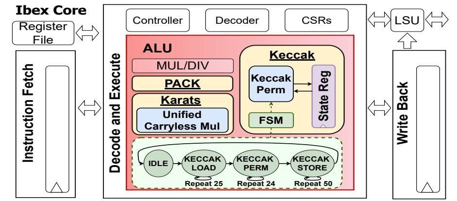
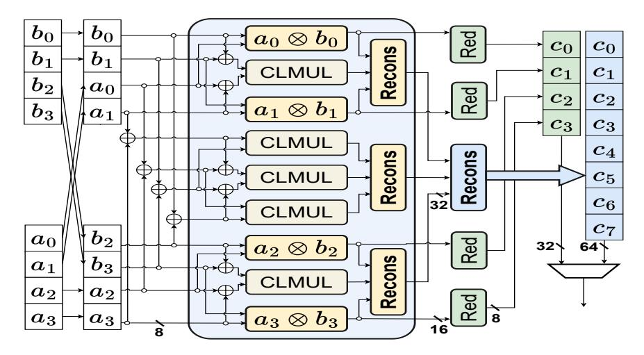
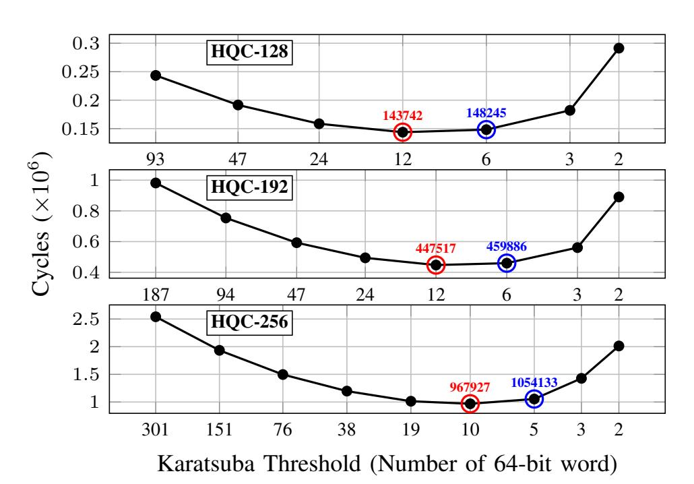
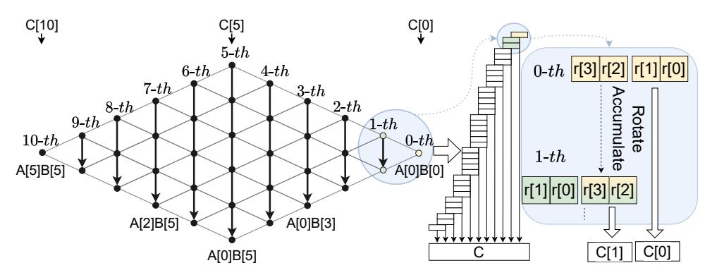

{0}------------------------------------------------

# A Hardware/Software Co-Optimization of HQC Using Tightly-Coupled Accelerators on a 32-bit Ibex Core

Seog Chung Seo and YoungBeom Kim\*

Abstract—We present Hardware/Software co-optimization of Hamming Quasi-Cyclic (HQC) enabled by tightly coupled accelerators implemented on a 32-bit Ibex RISC-V core. On the hardware side, we propose a unified multiplier capable of efficiently performing carryless multiplication for both polynomial multiplication over  $\mathbb{F}_2[X]/(X^n-1)$  and multiplication over  $\mathbb{F}_{2^8}$ . We also design a Keccak permutation accelerator to support efficient randomness sampling. On the software side, we identify the optimal combination of Toom—Cook and Karatsuba methods for efficient polynomial multiplication on the Ibex core and enhance its performance by minimizing the number of memory accesses during its execution. With our co-optimization strategies, our HQC implementation achieves a performance improvement of several tens of times over the reference implementation.

Index Terms—PQC, HQC, RISC-V, Ibex-core, Accelerator, ISE

#### I. Introduction

Amming Quasi-Cyclic (HQC) is a recently NIST-selected standard key encapsulation mechanism (KEM) [1]–[3]. Unlike ML-KEM [4], which is based on the Learning With Errors problem and was standardized earlier, HQC is code-based and is expected to complement ML-KEM from a crypto-agility perspective [5]. However, HQC is slower than ML-KEM on typical PCs because it relies heavily on large-degree polynomial multiplication (PM) over  $\mathbb{F}_2[X]/(X^n-1)^1$ . This gap becomes even larger on embedded devices, as Table I shows that HQC is roughly  $\times 47.00-108.96$  slower than ML-KEM, hindering HQC deployment in many Internet-of-Things (IoT) applications. This widening disparity stems from the fact that typical PCs provide carryless multiplication instructions whereas embedded processors usually lack such support  $^2$ .

RISC-V is an open instruction set architecture that enables application-specific customization via custom instruction extensions, making it attractive for IoT platforms. Several studies have proposed custom instructions to accelerate PQC workloads on RISC-V [7]–[12]. However, most prior work [7]–[11] has focused on lattice-based schemes, including ML-KEM [4] and ML-DSA [13]. Recently, A. Dolmeta et al. [12] proposed the first tightly coupled accelerators targeting large-degree PM,  $\mathbb{F}_{2^8}$  arithmetic, and the Keccak permutation, integrated via the CV-X-IF [14] interface on the CV32E40PX RISC-V core [15]. As follow-up work, they also presented tightly coupled unified accelerators for both HQC and ML-KEM on the same CV32E40PX core [16]. Although their approach

This research was supported by Basic Science Research Program through the National Research Foundation of Korea (NRF) funded by the Ministry of Education (No. RS-2025-25411243,100%). Seog Chung Seo and YoungBeom Kim are with the Department of Cyber Security, Kookmin University, Seoul 02707, Republic of Korea (e-mail: scseo, darania@kookmin.ac.kr). (Corresponding author: YoungBeom Kim.)

 $^{1}$ According to [2], HQC is about 4.4–11.9× slower than ML-KEM on a typical PC.

2Some RISC-V cores, including Ibex, provide carryless multiplication instructions, but enabling them via advanced synthesis configurations can significantly increase hardware resource usage [6].

TABLE I
RUNNING TIME COMPARISON BETWEEN ML-KEM AND HQC FOR
SECURITY LEVEL 1 ON IBEX CORE (COMPILED WITH OPTIMIZATION
LEVEL -O3 ON IBEX CONFIGURED WITH MAXPERF. cc: CLOCK CYCLE)

1

|                 | KeyGen (cc) | Encaps (cc) | Decaps (cc) |
|-----------------|-------------|-------------|-------------|
| HQC1 (Ibex)     | 47,761,436  | 95,293,337  | 14,4408,626 |
| ML-KEM 1 (Ibex) | 1,016,171   | 1,127,706   | 1,325,329   |

TABLE II
PERFORMANCE PROFILING OF HQC-128 ON IBEX CORE

| Function | KeyGen (cc, portion)      | Encaps (cc, portion)      | Decaps (cc, portion)       |
|----------|---------------------------|---------------------------|----------------------------|
| Poly_Mul | 46,430,152 <b>97.21</b> % | 92,860,298 <b>97.45</b> % | 139,290,450 <b>96.46</b> % |
| Sampling | 1,261,041 <b>2.64%</b>    | 1,779,581 <b>1.87</b> %   | 2,165,924 <b>1.5</b> %     |
| Encode   | -                         | 95,292 <b>0.10</b> %      | 95,292 <b>0.07</b> %       |
| Decode   | -                         | -                         | 1,289,817 <b>0.89</b> %    |
| Total    | 47,761,436                | 95,293,337                | 144,408,626                |

achieves  $\times 17-\times 21$  speedups in [12] and  $\times 21-\times 34$  in [16] over the HQC reference implementation, it considers only the Karatsuba-based PM in the reference software and largely applies the proposed custom instructions in a straightforward manner. Moreover, in their work, the multiplier for PM and the multiplier for  $\mathbb{F}_{2^8}$  arithmetic are implemented as separate units, and thus the hardware resource usage is not optimized.

In this paper, we present a highly optimized HQC implementation on a 32-bit Ibex core via HW/SW co-optimization. On the HW side, we propose (i) a unified carryless multiplier supporting both PM over  $\mathbb{F}_2[X]/(X^n-1)$  and multiplication over  $\mathbb{F}_{2^8}$ , and (ii) a Keccak permutation accelerator to speed up randomness sampling. On the SW side, we apply the optimal combination of Toom–Cook and Karatsuba methods for efficient PM and enhance its performance by minimizing the number of memory accesses during its execution. With only the carryless multiplier, we achieve speedups of  $\times 26.80-\times 39.52$  (KeyGen),  $\times 29.06-\times 41.88$  (Encaps), and  $\times 24.96-\times 39.22$  (Decaps) over the HQC reference, with 686 LUTs and 126 FFs overhead. With both accelerators, speedups increase to  $\times 40.58-\times 48.21$ ,  $\times 42.94-\times 51.47$ , and  $\times 37.56-\times 50.31$ , at an additional cost of 4,550 LUTs and 1,757 FFs.

## II. BACKGROUND

### A. Hamming Quasi-Cyclic (HQC)

HQC is a NIST-selected KEM and its security is based on the hardness of syndrome decoding over linear quasi-cyclic codes [1]. The KEM version of HQC consists of KeyGen, Encaps, and Decaps and it operates over  $\mathcal{R} = \mathbb{F}_2[X]/(X^n-1)$  where n=17,669,35,851, and 57,637, for security level 1, 3, and 5, respectively.

1) Profiling of HQC: To find performance bottlenecks, we conducted a profiling of the latest official HQC-128 reference from [17] on the Ibex-core. From the table II, we find that PM accounts for the majority of HQC's execution time. Sampling

{1}------------------------------------------------

accounts for the second-largest portion and internally invokes a number of Keccak-related functions [18]. The next are encoding and decoding, which internally perform a number of multiplications over  $\mathbb{F}_{2^8}$ . Thus, we aim at optimizing the performance of PM, Keccak permutation, and multiplication over  $\mathbb{F}_{2^8}$  with our custom instruction sets.

2) Polynomial Multiplication (PM): The core operation of HQC is the PM over  $\mathcal{R} = \mathbb{F}_2[X]/(X^n-1)$ . Since multiplication over  $\mathbb{F}_2[X]$  does not involve carry propagation, it is called carryless multiplication. The basic method to compute a PM over  $\mathbb{F}_2[X]$  is the schoolbook method: it scans the multiplier bits and conditionally XORs the multiplicand into the accumulator only when the scanned bit is 1. The complexity of schoolbook multiplication is  $\mathcal{O}(n^2)$ .

**Karatsuba Algorithm** (*KA*): *KA* is a divide-and-conquer method that reduces the number of multiplications using additional additions [19]. Karatsuba 2-way (*KA2*) replaces four degree-n/2 multiplications with three, at the cost of extra additions, and can be applied recursively until a threshold where schoolbook becomes faster (This threshold marks the point at which the overhead incurred by applying *KA* recursively outweighs the performance gains it provides). Its asymptotic complexity is  $\mathcal{O}(n^{1.585})$ .

**Toom–Cook Algorithm** (TC): TC generalizes KA by splitting operands into k parts and performing evaluation, pointwise multiplication, and interpolation, trading multiplications for more additions and constant multiplications [19]. As k increases, the number of multiplications can be further reduced; however, the numbers of additions and constant multiplications increase, and thus Toom-Cook 3-way (TC3) or Toom-Cook 4-way (TC4) is commonly used. While recursive TC3 yields  $\mathcal{O}(n^{1.46})$ , it is typically combined with KA; e.g., applying TC3 once reduces nine degree-n/3 multiplications to five, after which KA is applied to the sub-multiplications.

The official HQC implementation provides two variants: the C-based ref using recursive KA and  $\times 86/64$  using TC3+KA with Advanced Vector eXtensions 2 (AVX2) and carryless multiplication instruction (PCLMULQDQ). Since  $\times 86\_64$  cannot run on the Ibex core, we use ref as our software baseline.

# B. Keccak

HQC uses several hash functions—SHAKE256, SHA3-256, and SHA3-512—to expand random seeds and to sample random vectors. Keccak permutation (Keccak-f1600) dominates the cost of these hash functions: it applies 24 rounds of six steps (pre- $\theta$ ,  $\theta$ ,  $\pi$ ,  $\rho$ ,  $\chi$ , and  $\iota$ ) to a 1600-bit internal state [18].

# C. 32-bit Ibex Core

Ibex is an open-source 32-bit RISC-V core developed by lowRISC, featuring a configurable 2-stage (small) or 3-stage (maxperf) pipeline [20]. Designed for low power and area, it is well suited to IoT devices. Since ARM Cortex-M4, a common PQC benchmarking platform, is a 32-bit MCU with a 3-stage pipeline, we use Ibex in the maxperf configuration as our target. Ibex also provides 32 general-purpose registers (R0-R31), which we exploit for software optimization.

Fig. 1. Proposed Tightly-coupled Accelerators (yellow box) on Ibex Core

Similar to the Cortex-M4, Ibex in the maxperf configuration does not support carryless multiplication. However, the maxperf-pmp-bmbalanced configuration enables some carryless multiplication instructions along with additional bitmanipulation features [6], at the cost of a substantial increase in hardware resources (Refer to Table IV).

#### III. PROPOSED HW/SW OPTIMIZATION STRATEGIES

Fig. 1 shows the overall structure of the proposed *HW* accelerators: a Karatsuba-based carryless multiplier and a Keccak permutation accelerator.

#### A. Proposed Hardware Accelerators and Related Instructions

- 1) Karatsuba-based 64-bit by 64-bit Carryless Multiplier: HQC represents polynomials as 64-bit words, but the Ibex Rtype instruction format provides only two 32-bit inputs and one 32-bit output (i.e., a single 32-bit result per instruction) [7], [12], [20]. Therefore, a 64-bit  $\times$  64-bit carryless multiplication cannot output the full 128-bit product in one step and requires at least four instructions. To this end, we adopt a 2-way Karatsuba-based carryless multiplier, similar to [12], that completes a 64-bit by 64-bit carryless multiplication in four custom instructions (Karat1-Karat4). The design combines a 32bit by 32-bit combinational multiplier with 128-bit internal sequential registers to buffer partial results across instructions. For  $R \leftarrow A \cdot B$ , where  $R = (R_3 || R_2 || R_1 || R_0)$ ,  $A = (A_1 || A_0)$ , and  $B = (B_1 || B_0)$  ( $A_i$ ,  $B_i$ , and  $R_i$  are all 32-bit registers), we execute Karat1 $(R_0, A_0, B_0)$ , Karat2 $(R_3, A_1, B_1)$ , Karat $3(R_1, A_0, B_0)$ , and Karat $4(R_2, x, x)$  in order. Karat1 and Karat2 compute  $A_0B_0$  and  $A_1B_1$ , respectively, exposing only the lower (resp. upper) one 32-bit word to the register file and buffering the remaining 32-bit internally. Karat 3 uses the previously supplied  $(A_1, B_1)$  to form the Karatsuba cross term via XOR with  $(A_0, B_0)$ , returns the lower 32-bit, and stores the upper 32-bit internally. Finally, Karat 4 outputs this stored upper 32-bit word.
- 2) Unified Carryless Multiplier: Unlike the work in [12], which designs schoolbook-based 32-bit by 32-bit carryless multiplier and a  $\mathbb{F}_{2^8}$  multiplier as separate units, we present a unified carryless multiplier that can compute either a 32-bit by 32-bit carryless multiplication or four multiplications over  $\mathbb{F}_{2^8}$ . To integrate these two modes, we derive a unified hardware datapath based on 8-bit carryless multiplication. A 32-bit by 32-bit carryless multiplication is computed with nine 8-bit by 8-bit carryless multiplication (CLMUL). The 32-bit operands A and B are split into 16-bit halves  $(\mathbf{a}_i, \mathbf{b}_i)$  and further into 8-bit bytes  $(a_i, b_i)$ :  $A = (\mathbf{a}_1 || \mathbf{a}_0) = (a_3 || a_2 || a_1 || a_0)$  and

{2}------------------------------------------------

 $B = (\mathbf{b}_1 || \mathbf{b}_0) = (b_3 || b_2 || b_1 || b_0)$ . Applying the first layer of 2-way Karatsuba, the 32-bit product C is computed using three 16-bit intermediate products  $(T_0, T_1, T_2)$ :

$$C = T_2 2^{32} \oplus (T_2 \oplus T_1 \oplus T_0) 2^{16} \oplus T_0,$$
where  $T_0 = \mathbf{a}_0 \cdot \mathbf{b}_0, T_2 = \mathbf{a}_1 \cdot \mathbf{b}_1, T_1 = (\mathbf{a}_1 \oplus \mathbf{a}_0) \cdot (\mathbf{b}_1 \oplus \mathbf{b}_0).$ 

Fig. 2. Proposed Unified 32-bit Carryless Multiplier (Among nine CLMUL units, yellow-colored four are used for four multiplication in  $\mathbb{F}_{28}$ )

Each 16-bit multiplication  $(T_k)$  is again decomposed into 8-bit operations using a second layer of Karatsuba. The terms  $T_0$  and  $T_2$  are expanded as:

$$T_0 = (a_1b_1)2^{16} \oplus (a_{10}b_{10} \oplus a_1b_1 \oplus a_0b_0)2^8 \oplus (a_0b_0), \quad (2a)$$

$$T_2 = (a_3b_3)2^{16} \oplus (a_{32}b_{32} \oplus a_3b_3 \oplus a_2b_2)2^8 \oplus (a_2b_2). \quad (2b)$$

Similarly, the middle term  $T_1$  is computed using recursive terms  $t_0, t_1, t_2$ :

$$T_1 = (t_2)2^{16} \oplus (t_2 \oplus t_1 \oplus t_0)2^8 \oplus (t_0),$$
 (3)

where the auxiliary 8-bit terms and products are defined as:

$$t_0 = (a_{20}) \cdot (b_{20}), \quad t_1 = (a_{3210} \cdot b_{3210}), \quad t_2 = a_{31} \cdot b_{31}$$
  
 $a_{ij} = a_i \oplus a_j, b_{ij} = b_i \oplus b_j, a_{3210} = \bigoplus_{i=0}^3 a_i, b_{3210} = \bigoplus_{i=0}^3 b_i$ 

The proposed unified multiplier requires nine 8-bit by 8bit carryless multiplication units CLMUL; among them, four CLMUL units (blue-colored  $a_0 \cdot b_0$  and  $a_1 \cdot b_1$  in  $T_0$ , and  $a_2 \cdot b_2$ and  $a_3 \cdot b_3$  in  $T_2$ ) are reused to compute four simultaneous multiplications over  $\mathbb{F}_{2^8}$ . The detailed structure is given in Fig. 2. In the figure, Recons is the Karatsuba reconstruction unit and Red is the reduction unit which reduces the result of multiplication in  $\mathbb{F}_{2^8}$ . Since the irreducible polynomial used in  $\mathbb{F}_{2^8}$  is  $f(X) = X^8 + X^4 + X^3 + X^2 + 1$ , we optimize its hardware logic by using its special structure. In the case of 64-bit by 64-bit carryless multiplications (e.g., Karat1/2/3), the unified multiplier outputs a 64-bit result. For multiplications over  $\mathbb{F}_{2^8}$ , the operands  $a_0$ – $a_3$  and  $b_0$ – $b_3$ are first loaded into the multiplier via the PACK instruction in Fig. 1. The multiplier then computes the four products  $a_0b_0$ ,  $a_1b_1$ ,  $a_2b_2$ , and  $a_3b_3$ , reduces them using the Red unit, and packs the reduced results into a single 32-bit return value.

3) Keccak Operation: Since the Keccak permutation operates on a 1600-bit state, it cannot be kept in  $32 \times 32$ -bit registers in the Ibex core. Therefore, our accelerator offers dedicated 1600-bit state registers. As shown in

TABLE III

PERFORMANCE IMPROVEMENT WITH PROPOSED ACCELERATORS
(PARENTHESES DENOTE THE EXECUTION TIME AND SPEEDUP WHEN

GF\_MUL IS EXECUTED FOUR TIMES)

| Function                      | SW (cc)   | ISE-based (cc) | Improvements   |
|-------------------------------|-----------|----------------|----------------|
| MULT_64                       | 2,444     | 31             | ×78.84         |
| GF_MUL                        | 179 (716) | 24 (24)        | ×7.46 (×29.83) |
| $\operatorname{Keccak}$ - $f$ | 25,447    | 245            | ×103.87        |

Fig. 3. Computation time as a function of the Karatsuba threshold. The red and blue circles denote the optimal and sub-optimal thresholds, respectively.

Fig. 1, its finite state machine consists of four states (KECCAK\_IDLE, KECCAK\_LOAD, KECCAK\_PERM, and KECCAK\_STORE) each corresponding to a dedicated instruction. KECCAK\_IDLE resets the internal state. The input is then loaded by issuing KECCAK\_LOAD 25 times, where each invocation transfers 64-bit (two 32-bit source registers) into the state registers. The 24-round permutation is executed by invoking KECCAK\_PERM 24 times (one round per instruction), and the final 1600-bit state is exported back to the register file via 50 KECCAK\_STORE instructions.

Table III compares the (64-bit by 64-bit carryless multiplication (MULT\_64),  $\mathbb{F}_{2^8}$  multiplication (GF\_MUL), and the Keccak permutation) through the proposed accelerators with baseline C implementations and reports substantial speedups. The latency of GF\_MUL includes both the 8-bit by 8-bit carryless multiplication and the  $\mathbb{F}_{2^8}$  reduction.

#### B. Software Optimization Techniques

From a *SW* perspective, we apply a hybrid of *TC3* and *KA2* to the ref version of HQC 3, which originally relied solely on *KA* for computing *PM*. Furthermore, we accelerate *PM* using the proposed carryless multiplication instruction by minimizing memory-access operations.

1) Finding an Optimal Threshold in Karatsuba: To optimize PM, we apply TC3 at the top level and then apply recursive KA2 in the subsequent levels. To achieve optimal performance with recursive KA2, it is necessary to identify a threshold at which the recursion should stop and switch to the schoolbook method. For HQC-128/192/256, n = 17,669,

 $^3$ Actually, we evaluated the performance of the HQC implementation after applying the TC3 + KA2 and the TC4 + KA2 combinations, respectively, and confirmed that the former achieves better performance on the Ibex core.

{3}------------------------------------------------

35, 851, and 57, 637, corresponding to 277, 561, and 901 64-bit words. With *TC3*, this leads to five *KA* applications on sub-polynomials of 93, 187, and 301 words, respectively. We determine the optimal *KA* threshold by measuring execution time while sweeping the threshold (using the ISE-based 64-bit by 64-bit carryless multiplication with our proposed accelerator). Fig. 3 shows how the execution time varies as the threshold value is changed. Although using thresholds of 6, 6, and 5 in *KA* for HQC-128, HQC-192, and HQC-256 is slightly slower than using 12, 12, and 10, we adopt these values as the thresholds in our implementation. The rationale is that they enable a memory-access—optimized design, allowing us to minimize load/store operations by keeping operands and intermediate values in registers as much as possible.

Fig. 4. Proposed PS-based 6-word Schoolbook Multiplication

2) Memory-access Minimization Strategy for PM: In the previous section, we selected KA thresholds of 6, 6, and 5 for HQC-128, HQC-192, and HQC-256, respectively, although they are not optimal. These thresholds, however, enable a highly efficient schoolbook multiplication by minimizing memory accesses, yielding better overall performance. For 5-or 6-word (64-bit) polynomial products, we propose a product-scanning (PS)—based carryless multiplication method (Fig. 4) [21]. Both input polynomials are first fully loaded into the Ibex general-purpose registers, after which 64-bit by 64-bit carryless multiplications are executed column-wise from left to right, and within each column from top to bottom.

To accumulate partial products efficiently, we propose a rotating-accumulator scheme that requires only four registers, rather than the n accumulators typically used in naive implementations. After completing the *i*-th column, the lower two accumulators are written to C[i] and then rotated to serve as the upper accumulators for the (i+1)-th column (Right side in Fig. 4 shows the example for first two columns); this procedure repeats until the final column is processed. Overall, our method fits within 30 registers (12 for the multiplicand, 12 for the multiplier, 4 for the accumulators, and 2 for temporaries), so memory accesses occur only when loading operands and storing the per-column outputs. Consequently, the number of memory-access operations is reduced from 120 (resp. 85) in the conventional *PS* approach to 46 (resp. 38) for 6-word (resp. 5-word) multiplication [21]. As a result, KA with threshold 6 (security levels 1 and 3) and threshold 5 (security level 5) consumes 91,449, 288,214, and 783,935 cycles, providing performance improvements of 38.3%, 37.3%, and 25.6% over KA with the optimal threshold shown in Fig. 3.

TABLE IV RESOURCE UTILIZATION ON ARTIX-7 FPGA (ISE M: UNIFIED CARRYLESS MULTIPLIER, ISE K: KECCAK ACCELERATOR.)

| Components                    | LUTs            | Regs           | DSPs | BRAM |
|-------------------------------|-----------------|----------------|------|------|
| Ibex †             | 7,014           | 6,200          | 10   | 32   |
| Ibex $^{\dagger}$ + $M$       | 7,700 (+9.8%)   | 6,326 (+2.1%)  | 10   | 32   |
| Ibex $^{\dagger}$ + $M$ + $K$ | 11,564 (+64.9%) | 8,083 (+30.4%) | 10   | 32   |
| Ibex ‡             | 12,780 (+82.2%) | 6,882 (+11%)   | 10   | 32   |

†:maxperf, ‡: maxperf-pmp-bmbalanced

#### IV. EXPERIMENTAL RESULTS

Table IV summarizes the area overhead of the proposed accelerators synthesized using Xilinx Vivado v2022.02 with xc7a35tcg324-1. The carryless multiplier adds 686 LUTs (Look-Up Tables) and 126 FFs (Flip-Flops), increasing LUT and FF utilization by 9.8% and 2.1% over the baseline, respectively. Integrating both the carryless multiplier and the Keccak accelerator increases the overhead to 4,550 LUTs and 1,757 FFs, corresponding to 64.9% and 30.4% increases. The higher cost is mainly due to the complexity of the Keccak permutation and its 1600-bit internal state. Ibex core synthesized with maxperf-pmp-bmbalanced option (denoted as  $Ibex^{\ddagger}$ ) provides several bit-manipulation instructions [6] including native carryless multiplication instructions such as clmul, clmulh, and clmulr 4 with the increase of the hardware resources compared to the maxperf which is our baseline hardware option.

TABLE V EXECUTION TIME (KCYCLES) AND PERFORMANCE GAIN (THE SPEEDUP OF THIS WORKS IS MEASURED RELATIVE TO THE HQC BASELINE. ISE M: UNIFIED CARRYLESS MULTIPLIER, ISE K: KECCAK ACCELERATOR)

| - UNITIED CARRILESS MOLITICIER, ISL II. RECCAR ACCELERATOR) |         |                            |                            |                            |
|-------------------------------------------------------------|---------|----------------------------|----------------------------|----------------------------|
| Version                                                     | Level   | KeyGen                     | Encaps                     | Decaps                     |
| HQC Baseline                                                | HQC-128 | 47,761.4                   | 95,293.3                   | 144,408.6                  |
|                                                             | HQC-192 | 144,247.3                  | 288,153.0                  | 434,200.3                  |
| (SW: <i>KA</i> ) [1]                                        | HQC-256 | 349,089.3                  | 697,532.4                  | 1,050,061.7                |
| This work                                                   | HQC-128 | 19,412.5 [× <b>2.46</b> ]  | 38,600.4 [× <b>2.47</b> ]  | 59,367.0 [× <b>2.43</b> ]  |
| (SW: TC+KA)                                                 | HQC-192 | 59,210.4 [× <b>2.44</b> ]  | 118,079.2 [ <b>×2.44</b> ] | 179,089.6 [ <b>×2.42</b> ] |
| (SW. IC+KA)                                                 | HQC-256 | 136,028.9 [× <b>2.57</b> ] | 271,412.0 [× <b>2.57</b> ] | 410,800.7 [× <b>2.56</b> ] |
| This work                                                   | HQC-128 | 2,397.3 [× <b>19.92</b> ]  | 4,542.3 [× <b>20.98</b> ]  | 8,074.7 [× <b>17.88</b> ]  |
| (SW: <i>KA</i> ,                                            | HQC-192 | 6,390.6 [ <b>×22.57</b> ]  | 12,370.1 [ <b>×23.29</b> ] | 20,161.4 [ <b>×21.54</b> ] |
| ISE: native $M$ )                                           | HQC-256 | 13,639.2 [× <b>25.59</b> ] | 26,407.4 [× <b>26.41</b> ] | 42,608.1 [× <b>24.64</b> ] |
| This work                                                   | HQC-128 | 2,285.2 [× <b>20.90</b> ]  | 4,291.8 [× <b>22.20</b> ]  | 7,715.9 [× <b>18.72</b> ]  |
| (SW: <i>KA</i> ,                                            | HQC-192 | 6,042.1 [ <b>×23.87</b> ]  | 11,617.5 [ <b>×24.80</b> ] | 19,089.8 [ <b>×22.75</b> ] |
| ISE: $M$ )                                                  | HQC-256 | 12,491.8 [ <b>×27.95</b> ] | 24,044.6 [× <b>29.01</b> ] | 39,068.1 [× <b>26.88</b> ] |
| This work                                                   | HQC-128 | 1,679.1 [× <b>28.44</b> ]  | 3,232.1 [× <b>29.48</b> ]  | 5,774.2 [× <b>25.01</b> ]  |
| (SW: <i>KA</i> ,                                            | HQC-192 | 5,011.2 [ <b>×28.78</b> ]  | 9,604.0 [ <b>×30.00</b> ]  | 15,312.2 [ <b>×28.36</b> ] |
| ISE: $M, K$ )                                               | HQC-256 | 10,925.3 [ <b>×31.95</b> ] | 20,940.5 [ <b>×33.31</b> ] | 33,191.8 [ <b>×31.64</b> ] |
| This work                                                   | HQC-128 | 1,782.4 [× <b>26.80</b> ]  | 3,278.9 [× <b>29.06</b> ]  | 5,785.1 [× <b>24.96</b> ]  |
| (SW: $TC+KA$ ,                                              | HQC-192 | 4,455.6 [ <b>×32.37</b> ]  | 8,402.6 [× <b>34.29</b> ]  | 13,776.9 [ <b>×31.52</b> ] |
| ISE: $M$ )                                                  | HQC-256 | 8,832.5 [× <b>39.52</b> ]  | 16,655.3 [× <b>41.88</b> ] | 26,772.2 [× <b>39.22</b> ] |
| This work                                                   | HQC-128 | 1,144.2 [× <b>40.58</b> ]  | 2,153.5 [× <b>42.94</b> ]  | 3,746.5 [× <b>37.56</b> ]  |
| (SW: $TC+KA$ ,                                              | HQC-192 | 3,309.5 [× <b>42.33</b> ]  | 6,192.1 [× <b>45.10</b> ]  | 9,687.1 [× <b>43.50</b> ]  |
| ISE: $M, K$ )                                               | HQC-256 | 6,979.5 [× <b>48.21</b> ]  | 13,028.7 [× <b>51.47</b> ] | 20,086.9 [× <b>50.31</b> ] |

Table V summarizes the speedups of our HW/SW cooptimized HQC over the baseline HQC software (all code compiled with the 32-bit RISC-V GCC toolchain at -03). On the SW side, we enhance PM by incorporating a hybrid TC+KA scheme, whereas the HQC reference uses KA only; this SW using TC+KA improves the performance by at least

&lt;sup>4*clmul* (resp. *clmulh*) returns the lower (higher) 32-bit of 32-bit by 32-bit carryless multiplication.

{4}------------------------------------------------

TABLE VI RESOURCES, *speedup/eSlice* COMPARISON FOR HQC-128

| Version                           | LUT/FF/BRAM eSlice |        | speedup [×] (K/E/D) [speedup/eSlice]             |
|-----------------------------------|--------------------|--------|-----------------------------------------------------|
| [12] (SW: KA, ISE: M)             | 3464/3168/0        | 866    | 16.95 / 16.37 / 15.70 [19.57 / 18.90 / 18.13]    |
| [12] (SW: KA, ISE: M, K)          | 8894/3710/0        | 2224   | 21.24 / 21.15 / 18.80 [9.55 / 9.51 / 8.45]       |
| [16] (SW: KA, ISE: M, K)          | 1535/466/0         | 383.75 | 23.60 / 24.5 / 21.70 [61.50 / 63.84 / 56.55]     |
| This work (SW: KA, ISE: native M) | 5766/682/0         | 1441.5 | 19.92 / 20.98 / 17.88 [13.82 / 14.55 / 12.41]    |
| This work (SW: KA, ISE: M)        | 686/126/0          | 171.5  | 20.90 / 22.20 / 18.72 [121.87 / 129.45 / 109.15] |
| This work (SW: KA, ISE: M, K)     | 4550/1757/0        | 1137.5 | 28.44 / 29.48 / 25.01 [25.00 / 25.92 / 21.99]    |
| This work (SW: TC+KA, ISE: M)     | 686/126/0          | 171.5  | 10.89 / 11.77 / 10.26 [63.50 / 68.63 / 59.83]    |
| This work (SW: TC+KA, ISE: M, K)  | 4550/1757/0        | 1137.5 | 16.49 / 17.39 / 15.44 [14.50 / 15.29 / 13.57]    |

×2.4 over the baseline. On the *HW* side, we evaluate two accelerator configurations: (i) the proposed carryless multiplier only and (ii) both the carryless multiplier and the Keccak accelerator. For *PM*, we consider two algorithmic variants: *KA*-only and *TC*+*KA*. With both accelerators, the *KA*-only implementation achieves speedups of ×28.44–×31.95, ×29.48– ×33.31, and ×25.01–×31.64 for KeyGen, Encaps, and Decaps, respectively. The best results are obtained by combining *TC*+*KA* with both accelerators, reaching ×40.58–×48.21, ×42.94–×51.47, and ×37.56–×50.31 speedups. Moreover, this substantially narrows the performance gap between HQC and ML-KEM (Table [I\)](#page-0-1) from ×47/×84.5/×108.96 to ×1.13/×1.91/×2.83 for KeyGen/Encaps/Decaps, respectively, making HQC practical for real embedded deployments from a crypto-agility perspective. The HQC software using the maxperf-pmp-bmbalanced configuration can substantially improve performance over the baseline; however, we confirm that the HQC software leveraging the proposed unified multiplier, which is the core contribution of this paper, still achieves higher performance.

Table [VI](#page-4-18) compares our HQC implementations against the latest HQC designs with tightly coupled accelerators [\[12\]](#page-4-5), [\[16\]](#page-4-10). Because a direct comparison is challenging due to differences in the target core, synthesis toolchain, and the polynomial multiplication strategy, we report *speedup/eSlices*—the achieved speedup normalized by the hardware cost in eSlices[5](#page-4-19)—to provide a fairer comparison. Since [\[12\]](#page-4-5) and [\[16\]](#page-4-10) uses *KA*-based *PM*, we evaluate two software variants of our implementation: *KA*-only and a *TC*+*KA* hybrid. To enable a clear comparison of hardware efficiency, the speedups reported in Table [VI](#page-4-18) are measured against HQC *SW* using the same *PM* method. Namely, speedups for the last two rows in Table [VI](#page-4-18) are computed based on the performance of HQC SW with T C+KA presented in the third row in Table [V](#page-3-3) as a baseline. This is why the speedups between Table [V](#page-3-3) and Table [VI](#page-4-18) are different when T C+KA is used. For the same accelerator configuration, our design consistently achieves higher speedup/eSlices than [\[12\]](#page-4-5) and [\[16\]](#page-4-10). This demonstrates the efficiency of the proposed unified carryless multiplier.

## REFERENCES

- [1] N. A. e. a. Philippe Gaborit, Carlos Aguilar-Melchor, "Hamming quasicyclic (hqc)." [https://pqc-hqc.org/.](https://pqc-hqc.org/)
- [2] N. I. of Standards and Technology, "Nist ir 8545 : Status report on the fourth round of the nist post-quantum cryptography standardization process," tech. rep., NIST, 2025.
- [3] J. Xie, W. Zhao, H. Lee, D. B. Roy, and X. Zhang, "Hardware circuits and systems design for post-quantum cryptography - A tutorial brief," *IEEE Trans. Circuits Syst. II Express Briefs*, vol. 71, no. 3, pp. 1670– 1676, 2024.
- [4] National Institute of Standards and Technology (NIST), "FIPS 203: Module-lattice-based key-encapsulation mechanism standard," Tech. Rep. 203, NIST, 2024.
- [5] D. C. D. M. A. R. M. S. W. N. R. H. Elaine Barker, Lily Chen and S. Turner, "Considerations for achieving cryptographic agility: Strategies and practices (draft). technical report, us department of commerce," tech. rep., NIST, 2025.
- [6] RISC-V International, "B Extension for Bit Manipulation." [https://docs.](https://docs.riscv.org/reference/isa/unpriv/b-st-ext.html ) [riscv.org/reference/isa/unpriv/b-st-ext.html.](https://docs.riscv.org/reference/isa/unpriv/b-st-ext.html )
- [7] T. Fritzmann, G. Sigl, and J. Sepulveda, "RISQ-V: tightly coupled RISC- ´ V accelerators for post-quantum cryptography," *IACR Trans. Cryptogr. Hardw. Embed. Syst.*, vol. 2020, no. 4, pp. 239–280, 2020.
- [8] P. Nannipieri, S. D. Matteo, L. Zulberti, F. Albicocchi, S. Saponara, and L. Fanucci, "A RISC-V post quantum cryptography instruction set extension for number theoretic transform to speed-up CRYSTALS algorithms," *IEEE Access*, vol. 9, pp. 150798–150808, 2021.
- [9] K. Miteloudi, J. W. Bos, O. Bronchain, B. Fay, and J. Renes, "PQ.V.ALU.E: post-quantum RISC-V custom ALU extensions on dilithium and kyber," *IACR Cryptol. ePrint Arch.*, p. 1505, 2023.
- [10] Z. Ye, R. Song, H. Zhang, D. Chen, R. C. Cheung, and K. Huang, "A highly-efficient lattice-based post-quantum cryptography processor for iot applications," *IACR Trans. Cryptogr. Hardw. Embed. Syst.*, vol. 2024, no. 2, pp. 130–153, 2024.
- [11] J. Zhang, J. Lu, A. Li, M. Wang, X. Li, T. Huang, L. Chen, and D. Liu, "Super-k: A superscalar CRYSTALS-KYBER processor based on efficient arithmetic array," *IEEE Trans. Circuits Syst. II Express Briefs*, vol. 71, no. 9, pp. 4286–4290, 2024.
- [12] A. Dolmeta, S. D. Matteo, E. Valea, M. Carmona, A. Loiseau, M. Martina, and G. Masera, "TYRCA: A RISC-V tightly-coupled accelerator for code-based cryptography," in *Design, Automation & Test in Europe Conference, DATE 2025*, pp. 1–7, 2025.
- [13] National Institute of Standards and Technology (NIST), "FIPS 204: Module-lattice-based digital signature standard," Tech. Rep. 204, 2024.
- [14] OpenHW Group, "Core-V eXtension interface (CV-X-IF)." [https://](https://github.com/openhwgroup/core-v-xif) [github.com/openhwgroup/core-v-xif.](https://github.com/openhwgroup/core-v-xif)
- [15] OpenHW Group, "CORE-V CV32E40PX RISC-V IP." [https://github.](https://github.com/x-heep/cv32e40px) [com/x-heep/cv32e40px.](https://github.com/x-heep/cv32e40px)
- [16] A. Dolmeta, V. Piscopo, G. Masera, M. Martina, and M. Hutter, "HOR-CRUX - a lightweight PQC-RISC-v eXtension architecture." Cryptology ePrint Archive, Paper 2025/1934, 2025.
- [17] HQC Team, "Hamming Quasi-Cyclic (HQC) Official Implementation, Released on 19th August, 2025." [https://gitlab.com/pqc-hqc/hqc.](https://gitlab.com/pqc-hqc/hqc)
- [18] National Institute of Standards and Technology (NIST), "FIPS 202: Sha-3 standard: Permutation-based hash and extendable-output functions," Tech. Rep. 202, NIST, 2015.
- [19] J. M. B. Mera, A. Karmakar, and I. Verbauwhede, "Time-memory tradeoff in toom-cook multiplication: an application to module-lattice based cryptography," *IACR Trans. Cryptogr. Hardw. Embed. Syst.*, vol. 2020, no. 2, pp. 222–244, 2020.
- [20] lowRISC CIC, "Ibex: 32-bit RISC-V Core." [https://github.com/](https://github.com/lowRISC/ibex) [lowRISC/ibex.](https://github.com/lowRISC/ibex)
- [21] M. Hutter and E. Wenger, "Fast multi-precision multiplication for publickey cryptography on embedded microprocessors," *J. Cryptol.*, vol. 33, no. 4, pp. 1442–1460, 2020.
- [22] F. Antognazza, A. Barenghi, G. Pelosi, and R. Susella, "A high efficiency hardware design for the post-quantum KEM HQC," in *IEEE International Symposium on Hardware Oriented Security and Trust, HOST 2024, Tysons Corner, VA, USA, May 6-9, 2024*, pp. 431–441, IEEE, 2024.

5 eSlices is computed as max{ LUT 4 + BRAM × 128, F F 8 } from [\[22\]](#page-4-20)