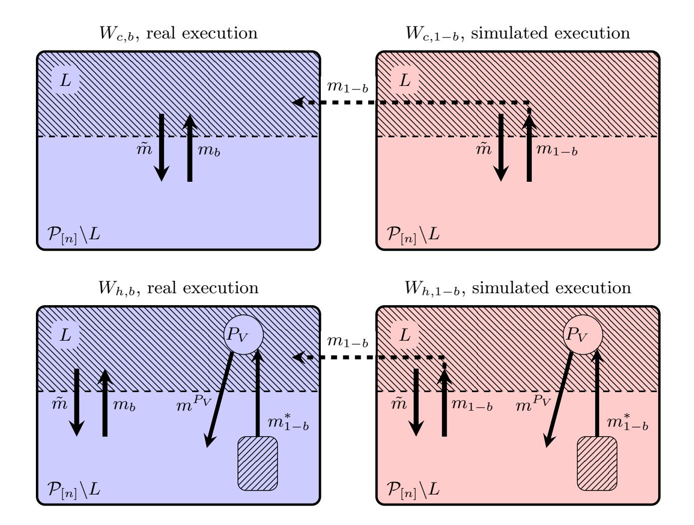
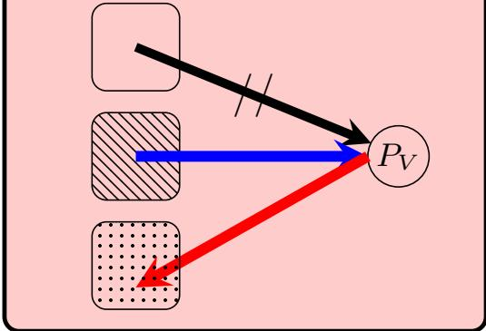
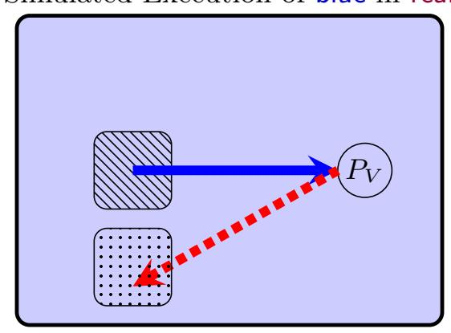
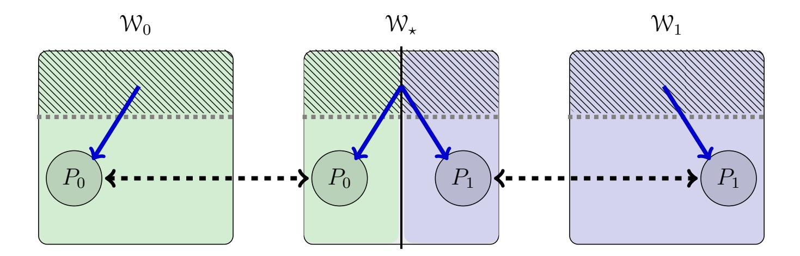

{0}------------------------------------------------

# <span id="page-0-1"></span>Strong Efficiency Lower Bounds for Byzantine Agreement

Clément Ducros<sup>1</sup> , Julian Loss<sup>2</sup> , and Matthieu Rambaud<sup>3</sup>

<sup>1</sup> CISPA Helmoltz Center for Information Security clement.ducros@cispa.de <sup>2</sup> Ruhr University Bochum lossjulian@gmail.com <sup>3</sup> Télécom Paris matthieu.rambaud@telecom-paris.fr

Abstract. Understanding the complexity of Byzantine agreement (BA) is a fundamental problem in distributed computing and cryptography. Existing round- or communication lower bounds either restrict the class of protocols they apply to in terms of communication, setup assumptions, or determinism. Another class of lower bounds holds only with respect to a very powerful (arguably unrealistic) adaptive adversary that can delete undelivered messages sent by a newly corrupted party while it was still honest. On the other hand, many popular BA protocols including the consensus protocol underlying the Algorand cryptocurrency assume only a standard adaptive adversary which cannot perform afterthe-fact message removals. In this work, we aim to further narrow the gap between existing upper and lower bounds. We first revisit existing communication lower bounds of Abraham et al. (PODC 2019) and Blum et al. (TCC 2020) which show that, under certain conditions, Ω(t 2 ) messages are necessary in expectation for randomized BA protocols with security against t adaptive corruptions. We give two new lower bounds on the communication complexity of randomized BA protocols that hold against even a standard adaptive adversary, for previously unexplored settings of practical interest. Our bounds assume a complete network of authenticated communication channels. Our first bound improves over Abraham et al. when the setup is limited to a common reference string (CRS), and the second one improves the bit complexity of Blum et al since in the authenticated setting, i.e., we allow idealized signatures. As a technical contribution, we present a new formal model for protocols using idealized signatures, which may be of independent interest. We then turn our attention to the round complexity of randomized BA protocols in which only a subset of parties may speak. We show that such protocols must either rely on erasures or determine whether or not to first speak in the protocol and decide in dependence the parties' inputs. We discuss in detail how both of these design paradigms have been used in prior work and how they lead to efficiency and design-related issues for practical BA protocols.

# <span id="page-0-0"></span>1 Introduction

Byzantine Agreement (BA) (a.k.a. consensus) is one of the fundamental problems in distributed computing. It involves n parties, P1, . . . , Pn, each holding an input bit b<sup>i</sup> . The parties must agree on a common output bit o by executing a distributed protocol. The main challenge lies in achieving agreement in spite of up to t corrupted parties who may behave arbitrarily. Byzantine Broadcast is a variant of this problem in which only a single party (the sender) holds an input b, and the goal is for all parties to agree on a common output o that must be b if the sender is honest. A key efficiency metric for a BA/BC protocol is its communication complexity, i.e., the number of bits honest parties send to each other over the course of the protocol.

Delineating the bit complexity requirements of BA protocols under different setup and network assumptions has been the subject of a long line of research going back to the 1980s. For the deterministic setting, the bound of Dolev and Reischuk [\[13\]](#page-33-0) gives a more or less complete picture by showing that Ω(t 2 ) messages are necessary to achieve BC. (A lower bound on the message complexity trivially implies the same bound on its bit communication complexity.) Their works also gives a lower bound for the authenticated setting showing that O(n·t) signatures must be exchanged by any authenticated broadcast protocol. Their lower bounds are very strong in the sense that hold even against a static adversary that chooses the parties it wants to corrupt at the onset of the protocol execution. The situation is far more nuanced, however, for randomized protocols. Here, protocols achieving o(n 2 ) bit complexity are known against even adaptive adversaries and have been part 

{1}------------------------------------------------

of a renewed wave of interest in Byzantine Agreement and related variants of consensus. However, many of these protocols come with a wide gamut of setup assumptions and subtle restrictions on the exact adversarial behaviour that they are able to tolerate. This is mirrored by a similarly complex landscape of lower bounds for randomized protocols which, by comparison, has only recently begun to be explored. To the best of our knowledge, this line of work was initiated by Abraham et al. [\[1\]](#page-32-0). By introducing several elegant novel techniques, their paper proved two distinct Ω(t 2 ) communication lower bounds for randomized BA protocols, the first such bounds in the literature. Despite the importance of these bounds, their scope is somewhat limited. Namely, they apply only to protocols that assume either (i) a restricted type of communication pattern in which parties communicate exclusively in send-to-all fashion or (ii) a very powerful adaptive adversary with the capability of deleting undelivered messages from the network which a party sent prior to becoming corrupted. Many recent protocols in the literature, however, assume a standard adaptive adversary, i.e., an adversary that can corrupt parties at any point of a protocol execution, but cannot take back messages that parties sent while they were honest. Inspired by this gap between upper and lower bounds from the literature, we seek to answer the following question:

What is the communication complexity of randomized Byzantine agreement/broadcast with a standard adaptive adversary?

## 1.1 Our Results

We present three new lower bounds that significantly narrow the aforementioned gap between known upper and (new) lower bounds on randomized BA/BC protocols. All of our results apply to a standard adaptive adversary without after-the-fact message removal (henceforth referred to as takeback).

New Communication Lower Bounds. In the synchronous model, we show that O(t 2 ) messages are necessary in expectation for BC protocols that assume only a common reference string (CRS) as their setup. Our result improves over the two aforementioned bounds of Abraham et al. when restricting to plain CRS setup as follows.

- The first of Abraham et al.'s bounds (Theorem 1 and 4 in their paper), assumes an adversary with takeback. It applies very broadly to randomized protocols with arbitrary cryptogrpahic setup, erasures, and even secret channels. By comparison, our bound applies only to randomized protocol which are limited to plain CRS setup and in which communication takes place over public channels. (Our bound can also handle erasures.) However, our bound requires only a standard adaptive adversary without after the fact removal.
- Our bound simultaneously improves the second bound of Abraham et al. (Theorem 3 and 13 of their paper). Like our bound, this bound of Abraham et al. also assumes only a standard adaptive adversaries (i.e., no takeback) and only applies to protocols with setup limited to plain CRS setup. However, their bound comes with a major caveat: it applies only to protocols in which parties communicate exclusively in send-to-all fashion. By comparison, our bound applies to protocols with plain CRS setup and arbitrary communication patterns. Interestingly, our new bound therefore newly rules out randomized protocols that are based on a recursive protocol structure in which communication takes place within small sub-committees of parties, i.e., explicitly not in send-to-all fashion. This exact approach is heavily leveraged in the deterministic protocols of Coan-Welch and Berman-Garay-Perry. In this light, our bound shows these latter protocols to already be optimal for the setting with plain CRS setup a standard adaptive adversary, i.e., without even applying any randomized techniques.

{2}------------------------------------------------

We also give improvements on communication lower bounds for protocols the partially synchronous model. That is, we consider randomized BA protocols with a PKI setup and show that O(t 2 ) signature transmissions are necessary in expectation if signatures are treated as abstract and incompressible tokens. We elaborate further on our precise metric in the technical overview.

Here, we improve over the lower bound of Blum et al. which applies only to setup-free protocols and in the asynchronous model. To prove this bound, our work introduces a clean formal model for reasoning about idealized signatures in the context of lower bounds. We believe this to be an important technical contribution of independent interest.

A Lower Bound for Input-Independent First Speakers. We identify a limitation of a broad design pattern used in communication-efficient BA protocols, including committee/subsamplingbased approaches (as in, e.g., Algorand). Our result is not tied to any particular notion of rounds or eligibility mechanism. Instead, it targets the following simple property: for an honest party, the instruction to send a protocol message for the first time as well as the time it decides is independent of its input bit.

Concretely, we show that for any erasure-free protocol satisfying this property, there exists an adaptive adversary under which, with non-negligible probability, some honest party can decide only after at least t other honest parties have already sent a message. The intuition is that the adversary corrupts parties as soon as they reveal themselves by speaking for the first time, and then uses their non-erasable state to equivocate across different input worlds; avoiding the resulting indistinguishability contradiction forces sufficiently many distinct honest first-time speakers before an honest decision. Protocols can bypass this attack either by using erasures (as in Algorand, via forward-secure key evolution and deletion), or by making eligibility depend on the message to be sent (as in Abraham et al. [\[1\]](#page-32-0), termed message-dependent eligibility). Our bound also does not apply to broadcast due to the asymmetry induced by a designated sender (see, e.g., Chan et al. [\[7\]](#page-32-1)).

# 2 Technical Overview

In the following, we give an overview of our key techniques. Throughout the paper, we rely extensively on the notion of worlds, that we define as being probabilistic executions of distributed protocols that are defined via fixed inputs and some adversarial behavior.

## 2.1 Lower Bound for Protocols with Plain CRS Setup

As our first result, we prove the impossibility of achieving subquadratic Byzantine Broadcast with plain CRS setup against a standard adaptive adversary in the synchronous setting. Our overview assumes basic familiarity with consensus terminology.

<span id="page-2-0"></span>Theorem 1. Let 0 < ϵ < 1. Consider a protocol Π that solves byzantine broadcast among n parties with success probability p in the synchronous model with plain CRS setup, with a standard adaptive adversary corrupting at most t < n parties. If the expected collective number of messages sent by forever-honest parties in Π is at most (ϵt) 2 , then p ⩽ 1 <sup>2</sup> + 8ϵ.

Let us first recall the attack considered in the lower bound of Theorems 3 and 13 in the work of Abraham et al. [\[1,](#page-32-0) Thm 3]. Like our attack, this attack assumes a standard adaptive adversary without takeback. However, their attack crucially leverages the so-called multicast communication model in which parties are restricted to sending messages in send-to-all fashion. Their attack shows that Ω(t) such multicasts are necessary to achieve broadcast, which translates to Ω(t · n) total messages being sent. Notably, their attack therefore does not apply to randomized protocols following 

{3}------------------------------------------------

the blueprint of Berman–Garay–Perry[\[3\]](#page-32-2) and Coan–Welch [\[9\]](#page-32-3), as these protocols crucially leverage the ability to send only to a few parties at a time. (It should be noted however, that both of these protocols do, in fact, incur quadratic communication complexity). The same applies to protocols using gossip style communication to reduce the redundancy of echoing messages over the network.

Let P<sup>V</sup> be any fixed party that is not the designated sender P<sup>s</sup> of the broadcast protocol Π. The attack of Abraham et al. considers four worlds Wh,0, Wh,1, Wc,0, Wc,1. In worlds Wc,∗, the party P<sup>V</sup> is corrupted and all other parties are forever honest. In worlds Wh,∗, the party P<sup>V</sup> is forever-honest. The designated sender P<sup>s</sup> is initially honest and has input bit b in world W∗,b. At any point of the attack, let H be the set of parties that are currently honest (but may in the future become corrupted). The goal of the proof is, by supposing low communication, to establish indistinguishability between the worlds as illustrated in fig. [1](#page-3-0) and then show that it raises a contradiction. We provide further details on these worlds below.

$$W_{c,0} \xrightarrow{\mathcal{H} \setminus \{P_V\}} W_{h,0} \xleftarrow{\{P_V\}} W_{h,1} \xleftarrow{\mathcal{H} \setminus \{P_V\}} W_{c,1}$$

<span id="page-3-0"></span>Fig. 1. View indistinguishability between Worlds. <sup>S</sup>←→ denotes an identical distribution of views in an execution of Π toward a subset S of forever honest parties.

The World Wh,0. The first step of their attack considers World Wh,0. Here, all parties are initially honest, including the sender PS, who holds input 0. In particular, P<sup>V</sup> remains forever honest in this world. The adversary A internally simulates an alternative execution of Π where the (simulated) sender P<sup>S</sup> has input 1. It simulates all parties in that execution except P<sup>V</sup> . We remark that this is possible only due to the fact that the attack considers plain CRS setup. If parties instead had pre-established keys, it would not be possible for A to carry out this simulation.

Looking forward, all n − 1 simulated parties are forever-honest in the simulated execution, whereas their counterparts in the real execution of Π may become corrupted. At the start of each round of Π, A simulates this round for all parties except P<sup>V</sup> in the simulated execution and observes which parties send messages. When a party P<sup>Q</sup> sends a message m to P<sup>V</sup> in the simulated execution, A adaptively corrupts the real counterpart P<sup>Q</sup> in the real execution Wh,<sup>0</sup> (if not already corrupted) and forwards m to P<sup>V</sup> in the real execution Wh,<sup>0</sup> on behalf of PQ.

For now, assume the adversary has sufficient corruption budget to carry out these corruptions. We elaborate below on this point. When P<sup>V</sup> sends a message in the real execution Wh,0, that message is also sent on behalf of P<sup>V</sup> in the simulated execution. Upon corruption, a party P<sup>Q</sup> in the real execution Wh,<sup>0</sup> of Π behaves according to two simultaneous threads:

- The honest thread of P<sup>Q</sup> follows Π in the real execution Wh,0, based on its pre-corruption state and incoming messages received in the real execution Wh,0.
- The simulation-based thread of P<sup>Q</sup> sends (through the real PQ) all messages to P<sup>V</sup> that the simulated P<sup>Q</sup> sends in the simulated execution.

The analysis of Abraham et al. [\[2,](#page-32-4) Thm. 3], which we outline below, establishes world indistinguishability.

The World Wc,0. In Wc,0, the party P<sup>V</sup> is the only corrupted party and is simulating an alternative execution in its head where the designated P<sup>s</sup> holds input 1. In particular, as for the simulation strategy corresponding to Wh,0, any message that P<sup>V</sup> sends in Wc,<sup>0</sup> is also sent on behalf of P<sup>V</sup> in the simulated execution that corresponds to Wc,0. However, instead of the strategy described above for Wh,0, it is now exclusively P<sup>V</sup> who is faking the reception of simulated messages in the real execution Wc,0. In more detail, P<sup>V</sup> behaves exactly as we have outlined for a corrupted party P<sup>Q</sup> above: it 

{4}------------------------------------------------

simultaneously runs an honest and a simulation-based thread of P<sup>V</sup> and sends messages/reacts to messages as prescribed by these threads. All other parties (including the sender P<sup>s</sup> who holds input 0 in Wc,0) honestly follow the protocol Π in the real execution Wc,0. It is easy to see that the views of the forever-honest parties are therefore the same across the two worlds Wc,<sup>0</sup> and Wh,0. By termination and validity, the forever-honest parties in Wc,<sup>0</sup> must output 0 with high probability. Thus, by consistency, the forever-honest parties in Wh,0, including P<sup>V</sup> , must also output 0.

The Worlds Wc,<sup>1</sup> and Wh,1. By applying a symmetrical argument as above to Wc,<sup>1</sup> and Wh,1, we can argue that forever-honest parties in Wh,1, including P<sup>V</sup> , must output 1. At this point in the explanation, let us once again consider the view of the party P<sup>V</sup> in Wh,<sup>0</sup> (which remains forever honest in this world). To P<sup>V</sup> , it may instead appear that it is running in yet another alternative world Wh,1, which is defined symmetrically to Wh,0, but where the input bit of P<sup>s</sup> is flipped from 0 to 1. More precisely, the execution in which P<sup>s</sup> holds input 1 is the now real execution in Wh,1, whereas the corrupted parties pretend to receive spurious messages from a simulated execution of Π where P<sup>s</sup> has input 0. It is easy to verify that the views of P<sup>V</sup> are the same in Wh,<sup>0</sup> and Wh,1. Hence, P<sup>V</sup> must output 0 in Wh,1. This contradicts the fact that P<sup>V</sup> must output 1 in Wh,1.

Maintaining the Corruption Budget. We have yet to argue that the corruption budget t of the adversary suffices to carry out the strategy sketched above. Namely, we must show that over the course of the attack, at most t (simulated) honest parties will send messages to P<sup>V</sup> , although P<sup>V</sup> is the only party exhibiting strange behaviour in the simulated execution. To this end, Abraham et al.'s attack restricts the total number of parties that send messages in Π to t. Therefore, the above attack strategy must carry out at most t corruptions. This, however, turns out to be a subtle point in their analysis which crucially leverages the assumption that all send operations in Π are actually send-to-all operations/multicasts in Π. Namely, what their bound actually assumes is that at most t multicast operations are ever performed in Π. This is indeed the same as requiring that at most t parties ever send messages in Π, given that communication is restricted to multicast. Moreover, translating their multicast complexity to the bilateral channels model, this results in a message lower bound of the form Ω(t · n). Contrary to this, assuming that a total of Ω(t · n) messages in Π are sent over point-to-point channels (as opposed to multicast) does not carry over into a similar attack. Namely, it could actually be that all n parties send messages to only a subset of t parties, which includes P<sup>V</sup> . In this case, the above attack would fail since it cannot corrupt all n > t parties who have sent a message to P<sup>V</sup> !

Overcoming the Multicast Restriction. In order to overcome the issue sketched above, our attack strategy deviates from that of Abraham et al. in a crucial way. Our key idea is to modify Wh,b and Wc,b, b ∈ {0, 1}, by adding many other corrupted parties that will have the same strange behaviour as P<sup>V</sup> . We call these parties lures: they will all act as if they were honest and attacked in the same way as P<sup>V</sup> . The set of lures is denoted by L. The party P<sup>V</sup> is then chosen uniformly at random from among the (fixed) set L. In this manner, the honest parties other than P<sup>V</sup> will not know which one of the parties in L is the honest P<sup>V</sup> . Hence, they will send to P<sup>V</sup> similarly few messages as they send to the other lures. In total, there will be O(t/2) lures, and hence since we aim to lower bound the number of messages to O(t 2 ), we can expect P<sup>V</sup> to receive O(t/2) messages. Since our attack (which follows the same simulation in the head strategy as outlined above) corrupts those parties who send to P<sup>V</sup> and the initial lures, we can implement our attack with a total corruption budget of t without assuming the multicast model. If we assume stronger setup, this may no longer hold. In particular, the above argument relies crucially on the fact that we work in the plain CRS model. For example, under a PKI setup and idealized signatures, the proof fails for the following reasons: if the simulated messages that the adversary has to mimic in the real execution contain signatures, then the adversary would additionally be forced to corrupt all the signers that contributed signatures to such a message in order to send it in the real world. This 

{5}------------------------------------------------

seems hard to pursue within the adversary's limited corruption budget. The attacks in the different worlds are depicted in fig. [3.](#page-15-0)

# 2.2 Partially Synchronous Lower Bound for Idealized Signatures

Our second lower bound concerns Byzantine Agreement in the partially synchronous model (introduced in [\[16\]](#page-33-1)). Under partial synchrony there exists an unknown global stabilization time (GST) after which the network becomes synchronous (messages are delivered within a fixed time ∆), while before GST the adversary may arbitrarily delay message deliveries (but not erase them). Partial synchrony is the main model of interest for many practical protocols, as it supports highly efficient protocols that progress at the speed of the network.

The goal here is to understand whether subquadratic authenticated communication is possible in this model against a standard adaptive adversary (without takeback), when authentication is provided via idealized signatures, i.e., signatures which are treated as abstract tokens. Concretely, we distinguish between plain-message transmissions and signature transmissions between parties, and we count both categories. Our proof strategy refines the earlier ones [\[5\]](#page-32-5) [\[22,](#page-33-2) Theorem 8] which applied only to the unauthenticated setting, i.e., which did not assume access to digital signatures. It complements the communication lower bounds of Abraham et al. [\[1\]](#page-32-0) by targeting the standard adaptive adversary in partial synchrony. On the positive side, Abraham et al. [\[1\]](#page-32-0) proposed a protocol achieving subquadratic BA in partial synchrony but with stronger setup (e.g., VRFs and NIZKs); our result below shows that in contrast, plain CRS plus idealized signatures does not suffice to reach subquadratic BA in partial synchrony, even if the adversary is not allowed to do takebacks after GST. Determining the minimal setup required to reach subquadratic BA in partial synchrony is yet to be discover.

<span id="page-5-0"></span>Theorem 2. Consider a Byzantine agreement protocol Π among n parties in the plain-CRS, partially synchronous model (as defined in section [5\)](#page-18-0) against a standard adaptive adversary corrupting at most t < n parties. Parties communicate over pairwise authenticated channels, and we count both plain-message transmissions and signature transmissions. Then, in the world where the network is synchronous from the start (GST= 0) and where no corruptions occur and all parties have the same input bit, any (possibly randomized) protocol that achieves agreement with overwhelming probability must incur Ω(nt) total transmissions in expectation.

A more detailed version of that statement is given by theorem [13.](#page-18-1)

From classical authenticated lower bounds to the randomized setting. As a starting point, consider deterministic protocols. In authenticated consensus/broadcast, lower bounds such as Dolev–Reischuk [\[13\]](#page-33-0) can be viewed as requiring that some party receive sufficiently many authenticated pieces of evidence (signatures, or signature-bearing messages) to rule out conflicting executions. In deterministic protocols, the communication pattern is predictable enough that an adversary can often anticipate which parties' authenticated evidence could become decisive for a given target party, enabling a direct indistinguishability argument.

Considering randomized protocols changes the picture: the predictability disappears. The signers whose signatures eventually reach a given party may depend on private coins, and as a consequence the adversary will not be able to a priori guess from whom a designated target will receive signatures. We rely on two different points to get around that problem. (i) Isolation via partial synchrony: By relying on partial synchrony the adversary can first isolate a given target party P<sup>V</sup> by delaying all transmissions to and from P<sup>V</sup> until after GST. This makes P<sup>V</sup> appear silent to the other parties before GST, i.e., indistinguishable from a crashed party. We couple this pre-GST view of honest 

{6}------------------------------------------------

parties apart from P<sup>V</sup> in our main attack world to an execution in which P<sup>V</sup> is corrupted and silent. (ii) Simulation-driven, on-demand corruption: Once the adversary has isolated P<sup>V</sup> , the next step is to adaptively corrupt some parties in order to fool P<sup>V</sup> . We emphasize that, even if we have isolated P<sup>V</sup> , it will not just output silently. Indeed, the situation, although similar on the surface, is more complicated than in Abraham et al.'s Theorem 1. Since their adversary could take-back messages, their isolated P<sup>V</sup> still (correctly) believes it was in a synchronous execution and therefore eventually outputs. This is no longer the case in our model: since the adversary cannot take back messages after GST, P<sup>V</sup> is expecting to exchange messages with other players in order to be convinced that GST happened and eventually output. This is what we describe below. To achieve this, the adversary runs an internal honest simulation (which we call the blue execution) and delivers to P<sup>V</sup> exactly the messages that P<sup>V</sup> would receive in blue before GST. Whenever such a delivered message contains idealized signatures (possibly bundled), the adversary corrupts only the corresponding signers at that moment in order to instantiate those signatures. This is necessary because in randomized protocols the set of signatures that eventually reach P<sup>V</sup> is not predictable in advance and may depend on private coins and forwarding.

Discussion of our Complexity Metric. Similar to or Theorem 2, Dolev and Reischuk [\[13\]](#page-33-0) (Theorem 1) give a communication lower bound that using a complexity metric which counts the number of signatures exchanged. This complexity metric is a middle ground between the bit complexity and the message complexity. Namely, it counts as one the sending of a signed message, (m, σ), consisting of (i) a payload m, (ii) appended with a digital signature, σ, which we dub "signature token". It also counts as one the sending of a payload m without any signature token appended. Their model treats digital signatures as incompressible tokens, i.e., when P receives messages from P1. . . P<sup>r</sup> with identical payload m, appended with the corresponding signatures tokens σ1. . . σr, and wishes to convince some other player that all P1. . . P<sup>r</sup> signed m, then P has to forward the payload m together with the full list of signature tokens, i.e., m, σ1, ..., σr. This is counted as r in their complexity metric. Importantly, this model and complexity metric does not encompass cryptographic tools such as threshold signatures, that enable to compress many signature tokens σ1. . . σr, over an identical payload m, into one single token. Such tools have been since incorporated into a popular complexity metric in consensus protocols called the authenticator complexity [\[24\]](#page-33-3), which counts as only one single token the compressed list of several signature tokens on the same payload m. Although the Hotstuff consensus protocol [\[24\]](#page-33-3) achieves linear authenticator complexity O(n), provided a static adversary, black box random leader election, and cryptographic threshold signatures, it has a quadratic complexity Ω(n 2 ) in the signatures exchanged metric of Dolev-Reischuk. In other words, the latter metric treats a protocol relying on threshold signatures as if they had used a naive implementation of threshold signatures consisting simply of the concatenation of signature tokens. We believe that the number of signatures exchanged is a more relevant metric than the "authenticator complexity" for practical implementations, for at least three reasons.

- First, most of the experiments in research papers, such as [\[18\]](#page-33-4), demonstrate that protocols perform faster with the naive implementation of threshold signatures consisting of the naive concatenation of signature tokens, i.e., without applying signature compression techniques. This is experimentally due to the heavy cryptographic overhead of these techniques (pairings).
- Second, threshold signatures require an interactive distributed key generation (DKG) setup which costs at least Ω(n 2 ) messages, and which is ruled-out in large scale systems with frequently rotating validators such as Ethereum.
- Third, standard post-quantum signatures do not currently enable compression.

Idealized Signatures and Counting Signature Transmissions. To state a lower bound on "signature transmissions," one must distinguish signatures from plain messages. We therefore work in 

{7}------------------------------------------------

an idealized-signature model. As already explained, in our model, signatures are treated as abstract, incompressible tokens that generated and verified via an ideal interface and we restrict parties to accessing signatures only through per-party buffers (section [5\)](#page-18-0). This formalism lets us count signature transmissions and plain-message transmissions separately. It also permits the transmission of a bundle of signatures, where we count a bundled transmission carrying k signatures as k signature transmissions. The buffer layer is what makes signature-counting well-defined in our lower bound: signatures are obtained and released only via explicit, per-party interfaces.

We instantiate the underlying signing/verification interface using the ideal signature functionality of Cohen et al. [\[10\]](#page-33-5). In this model, honest parties can always obtain signatures that verify correctly, independent of adversarial behavior. We inherit therefore the property of that idealized signature proven by [\[10\]](#page-33-5): because this functionality is UC-realizable by standard signature schemes, it supports a modular UC analysis of signature-based protocols (e.g., Dolev–Strong broadcast [\[14\]](#page-33-6)). By adding the signature buffer described above as a layer of indirection between a protocol party and the interface of this ideal-signature interface we are able to syntactically distinguish signatures output by Cohen et al.'s functionality and other, non-signature components of protocol messages. Our restricted subclass of protocols lets us state and prove (i) the classical Dolev–Reischuk signaturecounting lower bound, and (ii) the new randomized bound (Theorem 2).

Attack overview. Fix a uniformly random target party P<sup>V</sup> ∈ P[n] and consider three executions of Π, denoted blue, still, and real.

- World blue. The network is synchronous from the start (GST = 0), no corruptions occur, and all parties have input 0.
- World still. The network is synchronous from the start (GST = 0), the adversary corrupts only P<sup>V</sup> and makes it remain silent, and all other parties are forever-honest with input 1.
- World real. All parties start honest; P<sup>V</sup> has input 0 and all others have input 1. The adversary sets GST to be larger than a high-probability termination bound for both blue and still (formalized via an "essential" round bound as in [\[22\]](#page-33-2)). Intuitively, before GST the adversary wants the parties other than P<sup>V</sup> to experience still, while P<sup>V</sup> experiences blue.

The adversary in real runs an internal simulation of an honest execution corresponding to blue where the adversary controls all parties except P<sup>V</sup> before GST; see Figure [6.](#page-24-0)

- Isolating P<sup>V</sup> before GST. Any transmission sent to P<sup>V</sup> by a real honest party is delayed until after GST, and similarly any transmission sent from P<sup>V</sup> to any other party is delayed until after GST. Consequently, up to GST the other parties cannot distinguish whether P<sup>V</sup> is faulty or simply isolated by delays, and their joint view matches that of still.
- Feeding P<sup>V</sup> the simulated blue transcript. Whenever the blue simulation dictates that some simulated party would deliver a (possibly bundled) signature transmission (or a plain-message transmission) to P<sup>V</sup> , the adversary causes the same transmission to be delivered to the real P<sup>V</sup> in real, using corrupted senders as in Figure [6.](#page-24-0) The adversary also takes care to forward the messages of P<sup>V</sup> by corrupting the recipient in real, and by forwarding the message to the appropriate recipients in blue to carry on the simulation.
- A posteriori corruptions to instantiate signatures. To deliver to P<sup>V</sup> a simulated message that contains idealized signatures, the adversary ensures these signature tokens exist in the real execution by corrupting, on demand, the parties whose signatures appear in the simulated bundle, and having their buffers produce/forward the required tokens.

Corruption accounting and contradiction. Under the low-communication hypothesis in the detailed statement (Theorem [13\)](#page-18-1), i.e., the bound (ϵnt/3) on the total plain-message and signature 

{8}------------------------------------------------

transmissions by a (large enough) round R in the (GST = 0) benchmark execution (up to a small enough probability ν), an averaging argument over the random choice of P<sup>V</sup> bounds the expected number of distinct signers whose signatures must be instantiated in the simulation toward P<sup>V</sup> . A Markov bound then implies that, except with probability at most ϵ, the adversary remains within its corruption budget t while reproducing P<sup>V</sup> 's pre-GST view from blue.

On this event, in real all parties other than P<sup>V</sup> have a pre-GST view distributed as in still and therefore decide 1 with probability close to the protocol's success probability, while P<sup>V</sup> has a pre-GST view distributed as in blue and therefore decides 0 with comparable probability. This yields a consistency violation with probability Ω(1), implying the claimed upper bound on the success probability of the BA p ≤ (2 + ϵ)/3 (plus ν/3). We provide the full formalization in section [5.1.](#page-19-0)

# 2.3 A Lower Bound for Protocols with Input-Independent First Speakers

Finally, we identify a limitation of a broad design pattern that appears in many protocols aimed at reducing communication, including so-called committee-based approaches [\[17,](#page-33-7) [1,](#page-32-0) [6\]](#page-32-6). Such protocols often ensure that, at any given stage of an execution, only a subset of parties speaks, which is useful in large-scale settings (e.g., blockchains). Existing abstractions for such mechanisms include the Fmine functionality of Abraham et al. [\[1\]](#page-32-0) and, in other works such as Ouroboros Praos [\[12\]](#page-33-8), publicly verifiable eligibility proofs (e.g., via VRFs). Our result, however, does not assume any particular eligibility mechanism, nor any particular notion of rounds.

Instead, it targets a simple property: for an honest party, the instruction to send a protocol message for the first time is independent of its input bit (even though the content of messages, and the final output, may of course depend on that bit). For the proof below, we use the stronger assumption that an honest party's decision time is independent of its input bit. A more natural formulation would only require this independence conditional on the party's local transcript, since in many protocols the time to terminate may depend on the messages received, for instance in executions where all parties start with the same input. We adopt the stronger unconditional version here only for technical convenience. This stronger symmetry requirement is nevertheless satisfied by many standard round-based BA protocols, including Algorand-style committee protocols. Concretely, we prove the following statement:

<span id="page-8-0"></span>Theorem 3. Assume that t < n/2. Let Π be a protocol that solves Byzantine Agreement against adaptive corruptions of up to t parties with success probability at least p. Assume moreover that both the time at which an honest party is first instructed to send a protocol message and its decision time are independent of its input bit. Then there exists an adversary A such that, with probability at least 3p − 2, there exists an honest party P for which at least t other honest parties sent at least one protocol message strictly before the event that P decides.

Our attack works for protocols with any form of setup but such that messages are instantaneous to form, i.e., without restricted resources such as proofs of work, nor verifiable delay functions. It does not allow for the use of erasures.

We now provide a sketch of the adversary underlying theorem [3.](#page-8-0) Fix an execution of Π in which half of the parties hold input 0 and the other half holds input 1. The adversary proceeds as follows:

- 1. Wait until a still-honest party P<sup>i</sup> sends a protocol message for the first time, thereby revealing itself as a first-time speaker. Upon observing such a first-time speaker, adaptively corrupt it provided the corruption budget allows it.
- 2. Just after corrupting P<sup>i</sup> , the adversary learns P<sup>i</sup> 's internal state, including any secret parameters, which by assumption cannot be erased. Thus it can compute the batch of messages prescribed

{9}------------------------------------------------

- by Π for P<sup>i</sup> under input 1 − b<sup>i</sup> , where b<sup>i</sup> is P<sup>i</sup> 's input. It then delivers both batches of messages on behalf of P<sup>i</sup> , i.e., the one prescribed under input b<sup>i</sup> that P<sup>i</sup> did send, together with the batch prescribed for input 1 − b<sup>i</sup> that the adversary just computed.
- 3. After corruption, the adversary generates and sends on behalf of P<sup>i</sup> the messages that P<sup>i</sup> would send both with input b<sup>i</sup> and with input 1 − b<sup>i</sup> , delivering them to the appropriate recipients.

Thus, as long as the number of first-time speakers observed before an honest decision stays below t, the adversary can corrupt all of them within its budget.

In contrast, the Algorand protocol avoids this attack precisely due to the use of erasures. A participant signs its message using a secret key sk<sup>i</sup> derived from a forward-secure signature scheme, then updates sk<sup>i</sup> to ski+1 and securely deletes sk<sup>i</sup> before an adversarial corruption can reveal it. In this setting, our attack becomes infeasible: the adversary cannot send another conflicting message with the opposite input bit, because it corrupts parties only after they speak, i.e., after they have erased the signing key needed to authenticate the first message. Note also that our result does not apply to broadcast, due to the asymmetry induced by the sender (see the work of Chan et al. [\[7\]](#page-32-1)).

If, up to the point where some honest party decides, the number of distinct first-time speakers is at most t, then the adversary can corrupt all of them and enforce an indistinguishability argument across different input worlds, leading to a violation of Byzantine Agreement. To formalize the contradiction that occurs, consider three worlds, all subjected to the above attack strategy:

- W0: all parties start with input 0;
- W1: all parties start with input 1;
- W⋆: half the parties start with input 0 and half with input 1.

A key step is that, as long as the adversary can corrupt every first-time speaker (i.e., as long as the number of distinct first-time speakers stays within its budget), it can ensure that forever-honest parties see identically distributed messages across the three worlds. However, parties may still decide on different outputs in these executions as they hold different input values across them. We argue as follows to arrive at a contradiction. Validity demands that forever-honest parties must output 0 in W<sup>0</sup> and 1 in W1. Moreover, note that because t < n/2, there is a forever-honest party P<sup>0</sup> in W<sup>⋆</sup> that has input 0 and another forever-honest party P<sup>1</sup> in W<sup>⋆</sup> that has input 1. Because these parties have the same respective inputs as they hold in W<sup>0</sup> and W<sup>1</sup> and parties receive identically distributed messages in all three executions, P<sup>0</sup> has the same view as P<sup>0</sup> in W<sup>0</sup> (in executions where P<sup>0</sup> stays forever-honest), whereas P<sup>1</sup> in W<sup>⋆</sup> has the same view as P<sup>1</sup> in W1. Because of this, P<sup>0</sup> in W<sup>⋆</sup> must output 0 due to P<sup>0</sup> outputting 0 in W0, whereas P<sup>1</sup> in W<sup>⋆</sup> is forced to output 1 by a symmetric argument. This violates consistency of Π.

Why Does It Matter? We believe that the input-independence assumption on first-time speakers captures an important class of protocols for the following reasons.

– First, and perhaps more importantly, existing protocols that tie the decision to speak for the first time to the message a party intends to send (and therefore, implicitly, to the protocol input of parties), may incur a sharp penalty to the efficiency of the protocol. Intuitively, this message-dependent eligibtiliy rule can be exploited by the adversary: it effectively gives a party a second "attempt" to become an early speaker for a conflicting payload, which reduces the probability that a randomized step succeeds. For example, Lemma 2 in Abraham et al.'s paper calculates a probability of roughly 0.111 that an iteration of their protocol uniquely identifies an honest proposer. Thus, their protocol requires about 9 iterations in expectation to terminate. By comparison, when the first-speak event is input-independent, each party effectively gets only a

{10}------------------------------------------------

- single "attempt" to become an early speaker, which (for the corresponding parameters) increases the probability of uniquely obtaining an honest proposer to roughly 0.184 and decreases the expected number of iterations to about 5.43, a substantial gain in efficiency.
- Second, input-independent first-time speaking is a very natural way of designing BA protocols that notably include the Algorand protocol. One of the main features of this simple design pattern is that one can apply it rather easily to a broad range of base BA protocols. In this way, it is often possible to obtain a protocol that runs in subquadratic communication complexity without modifying the logic of the original protocol too drastically. This is particularly apparent for multivalued protocols, to which message-dependent first-time speaking surprisingly does not easily extend. Our bound shows that this simplicity in transforming a base protocol comes at the price of relying on erasures.

## 2.4 Related Work

We provide an overview of existing upper and lower bounds in Figures [1.](#page-11-0) Several works have shown that subquadratic communication in BA is achievable when randomization is allowed. King et al. [\[20,](#page-33-9) [19\]](#page-33-10) showed protocols with subquadratic communication complexity for the setting of t < n/3 with no cryptographic setup against an unbounded adversary. The adaptively secure version of their protocol, however, relies on a strong type of secret channel (sometimes referred to as 'hidden channel' [\[8\]](#page-32-7)) which hides that messages are being sent over the channel.

We have already discussed at length the lower bounds of Abraham et al. [\[1\]](#page-32-0). On the positive side their paper gives the first player replaceable (and thus subquadratic) protocols for synchrony and partial synchrony which do not rely on erasures. These types of protocols were first proposed by Micali in the context of the Algorand protocol [\[21\]](#page-33-11).

A more recent work of Rambaud [\[23\]](#page-33-12) shows how to extend the multicast-based lower bound of Abraham et al. to the setting with signatures and possible additional setup (e.g., NIZKs). He also presents a result in partial synchrony which shows that any BA protocol with linear message complexity must run for at least log(t) rounds. Moreover, his work shows that subquadratic BA protocols with weak setup are possible in the random oracle model.

Regarding asynchrony, the work of Blum et al. gives the first subquadratic protocol as well as a matching lower bound against an adaptive adversary when no setup is assumed [\[5\]](#page-32-5). Our bound improves on theirs by allowing for idealized signatures as a form of setup. In later work, Blum et al. [\[4\]](#page-32-8) studied the communication complexity of broadcast in the synchronous model in the presence of dishonest majority. They showed that, assuming an adaptive adversary with no take-back, some classes of low-communication protocols are not feasible (namely, protocols whose communication is balanced between the parties).

# <span id="page-10-0"></span>3 Preliminaries

In this section, we define notation, explain the network model, our setup assumptions, and state some basic concentration inequalities from probability theory. In our proofs, we consider different probabilistic executions of distributed protocols on fixed inputs and with respect to some adversarial behavior, which we refer to as worlds.

## 3.1 Network and Adversary Model

For all of our bounds, we assume as setup an arbitrarily distributed common reference string (CRS), generated independently from the parties by some trusted setup or a public source of randomness. We next describe the network and adversary model.

{11}------------------------------------------------

<span id="page-11-0"></span>Table 1. Communication upper and lower bounds for BA protocols

| Ref.                                                                 | Task  | Rand.<br>Prot. | Adv. Model            | Com.<br>Model      | Resilience                             | Setup                        | Com                                               |
|----------------------------------------------------------------------|-------|----------------|-----------------------|--------------------|----------------------------------------|------------------------------|---------------------------------------------------|
| Dolev,Reischuk [13,<br>Theorem 1]                                    | ВС    | ×              | Static                | Sync               | t < n                                  | Idealized<br>Signatures      | $\Omega(n \cdot t)$ signature transmissions       |
| Dolev,Reischuk [13,<br>Theorem 2]                                    | ВС    | X              | Static                | Sync               | t < n                                  | Arbitrary                    | $\Omega(t^2)$ messages                            |
| Berman et al. [3,<br>Remark 4.1],<br>Coan, Welch [9,<br>Corollary 1] | BC/BA | ×              | Strongly<br>Adaptive  | Sync               | n = 3t + 1                             | ×                            | $O(t^2)$ bits                                     |
| Abraham et al. [1,<br>Theorem 1, 4]                                  | ВС    | ✓              | Strongly-<br>Adaptive | Sync               | t < n                                  | PKI                          | $\Omega(t^2)$ messages                            |
| Abraham et al. [1,<br>Theorem 3, 13]                                 | BC    | $\checkmark$   | Adaptive              | Sync,<br>Multicast | t < n                                  | CRS                          | $\Omega(t^2)$ messages                            |
| Abraham et al. [1,<br>Theorem 2, 12]                                 | BA    | $\checkmark$   | Adaptive              | Sync               | $t < \frac{n \cdot (1 - \epsilon)}{2}$ | PKI                          | $o(t^2)$ bits                                     |
| Abraham et al. [2][Theorem 12]                                       | BA    | ✓              | Adaptive              | Partial-<br>Sync   | $t < \frac{n \cdot (1 - \epsilon)}{3}$ | PKI                          | $o(t^2)$ bits                                     |
| Blum et al. [5,<br>Theorem 17]                                       | BA    | <b>√</b>       | Adaptive              | Async              | t < n                                  | ×                            | $\Omega(t^2)$ messages                            |
| Blum et al. [5,<br>Theorem 12]                                       | BA    | $\checkmark$   | Adaptive              | Async,<br>Secret   | $t < \frac{n \cdot (1 - \epsilon)}{3}$ | Trusted Dealer,<br>Erasures  | $o(t^2)$ messages                                 |
| Blum et al. [4,<br>Theorem 1.2]                                      | ВС    | ✓              | Static                | -                  | $t = (1 - \alpha)n$                    | Any                          | $\Omega\left(\frac{n}{\alpha(n)}\right)$ messages |
| Blum et al. [4,<br>Proposition 5.1]                                  | ВС    | $\checkmark$   | Static                | -                  | $t = (1 - \alpha)n$                    | PKI, VRF,<br>Erasures        | $\widetilde{O}(n)$ bits                           |
| King and Saia [19,<br>Theorem 1]                                     | BA    | $\checkmark$   | Adaptive              | Sync,<br>Hidden    | $t < \frac{n \cdot (1 - \epsilon)}{3}$ | Erasures                     | $O(n^{1.5})$ bits                                 |
| Theorem 1 (This paper)                                               | BC    | ✓              | Adaptive              | Public             | t < n                                  | CRS                          | $\Omega(t^2)$ messages                            |
| Theorem 13 (This paper)                                              | BA    | ✓              | Adaptive              | Partial-<br>Sync   | t < n                                  | CRS, Idealized<br>Signatures | $\Omega(n \cdot t)$ signature transmissions       |

The lower bounds are displayed in red, the upper bounds in black.

**Network Model.** We assume a network of n different parties parties  $\mathcal{P}_{[n]} = \{P_1, \dots, P_n\}$ , which are connected via point-to-point bilateral authenticated communication channels. Parties may also be labeled with letters: mainly  $P_S$  for the sender, and  $P_R$  and  $P_Q$  for some special parties. We are mainly interested in the *synchronous* model of communication. In the synchronous model, we assume that the time messages take to be delivered is bounded from above by a known quantity  $\Delta$ . The adversary can schedule the delivery of messages arbitrarily, as long as it respects this bound.

In the synchronous model, we assume that parties have synchronized clocks and begin running the protocol at the same time. This makes it possible to run protocol executions in rounds of length

{12}------------------------------------------------

∆, which guarantees that all messages sent at the beginning of a round are delivered by the end of that round. The first round starts at time 0 and finishes at time ∆, and the rth round starts at time (r − 1)· ∆ and finishes at time r · ∆. We say that a party receives a message in round r if they receive it between time (r − 1) · ∆ and r · ∆.

Adversary Model. We consider an adaptive adversary, which is able to corrupt at most t different parties at any point of the protocol execution. We say that a party is forever-honest if it is never corrupted during the entire protocol execution. When we simply say "honest" without qualification, we mean a party that is honest at the current point in time, but which may be corrupted later. When a party is corrupted, the adversary learns its internal state and gains complete control of that party from that point onward. We assume that the adversary is rushing and can choose its own messages for a round of a protocol execution (synchronous or asynchronous) after seeing the honest parties' messages for that round. Moreover, as already explained, we allow the adversary to schedule messages arbitrarily (and that includes re-ordering the messages), subject to the restrictions of the model that we are considering. However, we assume that the adversary cannot perform after-thefact removal of undelivered messages once they are sent: if a newly corrupted party P<sup>i</sup> had sent a message while it was still honest, that message will eventually be delivered. In addition, we assume that parties can perform atomic multisends, meaning they can send messages to multiple parties in a single atomic step, during which they cannot be corrupted.[4](#page-12-0)

## 3.2 Important Problems and Definitions

In this section, we formally define the two central notions considered in this work: Byzantine Agreement and Byzantine Broadcast.

Definition 4 (Byzantine Agreement). Let Π be a protocol run among parties P1, ..., P<sup>n</sup> in which each party P<sup>i</sup> starts with an input bit b<sup>i</sup> ∈ {0, 1} and produces an output bit o<sup>i</sup> upon terminating. We say that Π solves Byzantine Agreement against t corruptions with success probability p if, for any adversary corrupting at most t parties, the following properties hold with probability at least p over the randomness of the protocol and the adversary:

- Termination: Every forever-honest party terminates.
- Consistency: All forever-honest parties output the same bit, i.e., if P<sup>i</sup> and P<sup>j</sup> are forever honest, then o<sup>i</sup> = o<sup>j</sup> .
- Validity: If all forever-honest parties begin with the same input bit b, then all of them output o<sup>i</sup> = b.

We also define Byzantine Broadcast. The main difference is that in BC, only a single party has input.

Definition 5 (Byzantine Broadcast). Let Π be a protocol run among parties P1, ..., P<sup>n</sup> where a designated sender P<sup>s</sup> starts with an input bit b ∈ {0, 1} and all parties produce an output bit o<sup>i</sup> upon terminating. We say that Π solves Byzantine Broadcast against t corruptions with success probability at least p if, for any adversary corrupting at most t parties, the following properties hold with probability at least p:

- Termination: Every forever-honest party terminates.
- Consistency: All forever-honest parties output the same bit, i.e., if P<sup>i</sup> and P<sup>j</sup> are forever honest, then o<sup>i</sup> = o<sup>j</sup> .
- Validity: If the sender P<sup>s</sup> is forever honest and starts with input b, then all forever-honest parties output b.

<span id="page-12-0"></span><sup>4</sup> This prevents the adversary from corrupting a party in the middle of a broadcast and selectively controlling delivery.

{13}------------------------------------------------

## 3.3 Probability Tool

<span id="page-13-2"></span>**Lemma 6 (Markov Inequality).** Let X be a positive random variable with finite expected value  $\mu$ . Then for any k > 0,

$$\Pr[X \geqslant k] \leqslant \frac{\mu}{k}.$$

# 3.4 $\mathcal{F}_{\text{vrf}}^{\ell_{\text{VRF}}}$ -Driven BA protocol protocols

# 4 BC with an Adaptive Adversary Lower Bound

In this section, we demonstrate the impossibility of subquadratic Broadcast against an adaptive adversary, under the synchronous model described in section 3.

**Theorem 1.** Let  $0 < \epsilon < 1$ . Consider a protocol  $\Pi$  that solves byzantine broadcast among n parties with success probability p in the synchronous model with plain CRS setup, with a standard adaptive adversary corrupting at most t < n parties. If the expected collective number of messages sent by forever-honest parties in  $\Pi$  is at most  $(\epsilon t)^2$ , then  $p \leq \frac{1}{2} + 8\epsilon$ .

*Proof.* Let  $\Pi$  be a BC protocol in which forever-honest parties collectively send at most  $(\epsilon t)^2$  messages in expectation<sup>5</sup>. We will show that the probability of success of  $\Pi$  is at most  $\frac{1}{2} + 8\epsilon$ .

We will consider four different instance worlds (corresponding to different executions of BC and different attack strategies of the adversary), namely  $W_{c,0}, W_{h,0}, W_{h,1}, W_{c,1}$ . We will show that different groups of honest parties share the same views in different worlds. This will enable us to identify a contradiction. The high-level relationship between those four executions is depicted in fig. 2 Throughout the proof, we fix a subset L of parties of size t/2 not containing the sender.

$$W_{c,0} \xrightarrow{\mathcal{H} \setminus L} W_{h,0} \xleftarrow{\{P_V\}} W_{h,1} \xleftarrow{\mathcal{H} \setminus L} W_{c,1}$$

<span id="page-13-1"></span>**Fig. 2.** View indistinguishability between worlds.  $\stackrel{S}{\longleftrightarrow}$  denotes an identical distribution of views for the subset S of forever honest parties across the different worlds.

Let  $b \in \{0, 1\}$ . In the world  $W_{c,b}$ , all the parties in L are corrupted and all the other parties are forever-honest. In the world  $W_{h,b}$ , the adversary samples a party  $P_V$  at random in L and leaves it forever-honest, whereas it initially corrupts the other parties in L, that is, it corrupts all the parties in  $L \setminus \{P_V\}$ . The designated sender is initially honest and is assigned input bit  $b \in \{0, 1\}$  in both worlds  $W_{h,b}$  and  $W_{c,b}$ . The parties L are called the *lures*.

We now describe the worlds and the associated strategy of the adversary.

• World  $W_{c,b}$ . The adversary simulates in its head an execution of the protocol in which the designated sender holds input bit 1-b. The simulation proceeds until the simulated parties have collectively sent at most  $\epsilon t^2/2$  messages to parties in L. In the real execution of  $W_{c,b}$ , the adversary corrupts all the parties in L, while all parties in  $\mathcal{P}_{[n]}\backslash L$  remain forever-honest. Each corrupted party  $P \in L$  maintains the simulated execution in parallel with the real execution: in every round it (i) receives the real messages directed to it in the real execution, and (ii) also records the messages that its simulated counterpart would receive in the simulated execution (until the

<span id="page-13-0"></span><sup>&</sup>lt;sup>5</sup> over the randomness of the protocol and of the honest parties

{14}------------------------------------------------

 $\frac{\varepsilon}{2}$  t<sup>2</sup> simulation budget is exhausted). The corrupted parties treat real and simulated incoming messages as if they originate from the same single real execution, and they use those messages to compute and send their outgoing messages exactly as an honest party would do. Whenever a corrupted party in L sends a message in the real execution, the adversary sends exactly the same message in the simulated execution on behalf of that party as well.

- World  $W_{h,b}$ . The adversary samples a party  $P_V$  uniformly at random in L and corrupts every other parties in L, i.e., all parties in  $L \setminus \{P_V\}$  are corrupted. The designated sender is honest in the real execution and holds input b. As in  $W_{c,b}$ , the adversary simulates in its head an execution where the sender's input is 1-b. The corrupted parties in  $L \setminus \{P_V\}$  behave toward external observers exactly as in  $W_{c,b}$ . In the simulation, whenever a party  $P_Q \in \mathcal{P}_{[n]} \setminus L$  sends a message m to  $P_V$ , the adversary checks how many simulated-to- $P_V$  messages have been already performed, if fewer than t/2 such deliveries have been carried out so far in the simulation, then the adversary adaptively corrupts the real party  $P_Q$  (unless it is already corrupted) and has the real  $P_Q$  deliver m to  $P_V$  in the real execution. Those adaptive corruptions are done with respect to the global constraint on the corruption budget t. When the adversary's global number of corruptions reaches t, it stops doing those corruptions. When corrupted (either as part of  $L \setminus \{P_V\}$  or along the way in  $\mathcal{P}_{[n]} \setminus L$ ), a party  $P_Q$  maintains two logical threads:
  - The unchanged thread of  $P_Q$ . It continues to honestly follow the protocol, based on the internal state just before corruption and based on: (i) the messages received in the real execution, (ii) if  $P_Q \in L$ , also based on the messages received by its counterpart in the simulated execution.
  - The simulation-based thread of  $P_Q$ . Its sole role is to ensure that every message the simulated  $P_Q$  would send to  $P_V$  is sent to  $P_V$  in the real execution.

Finally, whenever  $P_V$  sends a message in the real execution, the adversary mirrors that behaviour into its simulation, so that the simulated party sees the same message as the real parties. The attack is depicted with fig. 3.

#### Analysis. Remark on notation.

Define for a fixed  $b \in \{0, 1\}$ :

- Let  $z_b$  be the number of messages that, in the adversary's simulated execution (run in world  $W_{c,b}$ ), are sent by the simulated forever-honest parties  $\mathcal{P}_{[n]} \setminus L$  to the set L. By hypothesis,  $\mathbb{E}[z_b] \leq (\epsilon t)^2$ .
- Let  $X_{c,b}$  be the event  $z_b \leq \frac{\epsilon}{2}t^2$  in that simulated execution.
- Let  $Y_{c,b}$  be the event that among the first  $\frac{\epsilon}{2}t^2$  simulated messages delivered to L from  $\mathcal{P}_{[n]} \setminus L$ , a uniformly chosen  $P_V \in L$  receives fewer than t/2 such messages.
- $-X_{h,b}, Y_{h,b}$  are defined analogously as the same simulated-execution events but in the world  $W_{h,b}$ .
- We denote by  $X'_{h,b}, Y'_{h,b}$  the corresponding event in the real execution of the world  $W_{h,b}$ .

Whenever we say that the views of some forever-honest parties are identical in two worlds, we mean that their *joint distribution* is identical, and hence any event measurable with respect to those views has the same probability in both worlds.

# <span id="page-14-0"></span>**Lemma 7.** $\Pr[X_{c,b}] \ge 1 - 2\epsilon$ .

*Proof.* We use Markov's inequality (lemma 6) and the hypothesis  $\mathbb{E}[z_b] \leqslant (\varepsilon t)^2$ :

{15}------------------------------------------------



Fig. 3. Our adapted attack of the adversary in  $W_{h,b}$ , with the lures L: the real world in blue, the simulation in red. The hatched zone represents the corrupted parties - the north west hatched zone are the lures (without special party  $P_V$ ), and the north east hatched represent the set of parties sending messages to  $P_V$  in the simulation, that the adversary corrupts dynamically in the real execution.  $m_b$  represents all the messages sent by parties in  $\mathcal{P}_{[n]} \setminus L$  to the lures L during an execution where the senders has input bit b. The dotted arrow indicates that the adversary fakes the reception of the messages  $m_{1-b}$  he obtains from his simulation.  $\tilde{m}$  is the message that the lures respond in the both the real world and the simulation (note that it is the same message).  $m_{1-b}^*$  represents the messages sent by parties to  $P_V$  in the simulation, which are corrupted in the real world to be also transmitted to the real world  $P_V$ .  $m^{P_V}$  represents the message that  $P_V$  sent in the real world, which are mirrors in the simulated execution.

<span id="page-15-0"></span>
$$\Pr[z_b \geqslant \frac{\epsilon}{2}t^2] \leqslant \frac{\mathbb{E}(z_b)}{\frac{\epsilon}{2}t^2} = 2\epsilon.$$

$$\Pr[z_b \leqslant \frac{\epsilon}{2}t^2] = 1 - \Pr[z_b \geqslant \frac{\epsilon}{2}t^2] \geqslant 1 - 2\epsilon.$$

<span id="page-15-1"></span>Lemma 8.

$$\Pr[Y_{c,b}] \ge 1 - (\epsilon t) / \frac{t}{2} = 1 - 2\epsilon.$$

*Proof.* Observe that among the first  $\frac{\epsilon}{2}t^2$  messages received by L from  $\mathcal{P}_{[n]}\setminus L$ , there are at most  $\frac{\epsilon}{2}t^2/(t/2) = \epsilon t$  parties that receive more than t/2 of those messages, by the pigeonhole principle. Since  $P_V$  was sampled uniformly in L,

$$\Pr[Y_{c,b}] \ge 1 - (\epsilon t) / \frac{t}{2} = 1 - 2\epsilon.$$

Note that although Lemma 7 and Lemma 8 both yield the same lower bound  $1-2\epsilon$ , they arise from independent arguments: Lemma 7 relies on Markov's inequality, while Lemma 8 is purely combinatorial. Recall that at this point  $X_{c,b}, Y_{c,b}$  refer to the adversary's simulated execution.

<span id="page-15-2"></span>Corollary 9. It stands that

$$\Pr\left[X_{c,b} \cap Y_{c,b}\right] \geqslant 1 - 4\epsilon.$$

{16}------------------------------------------------

Similarly,

$$\Pr\left[X_{h,b} \cap Y_{h,b}\right] \geqslant 1 - 4\epsilon.$$

Proof.

$$\Pr[X_{c,b} \cap Y_{c,b}] \ge \Pr[X_{c,b}] + \Pr[Y_{c,b}] - 1 \ge 1 - 4\epsilon.$$

The second inequality is derived from the same reasons.

Let S<sup>b</sup> denote the set of parties in P\L that send a message to P<sup>V</sup> in the simulated execution before t/2 such deliveries occur and which are therefore corrupted adaptively by the adversary Wh,b. Let F<sup>b</sup> = P[n]\{S<sup>b</sup> ∪ L}, the set of parties which are forever-honest in both Wc,b and Wh,b. We continue by showing that the parties in F<sup>b</sup> have the same view distribution.

<span id="page-16-0"></span>Lemma 10. Conditioned on the event Xc,b ∩ Yc,b in Wc,b and Xh,b ∩ Yh,b in Wh,b, the joint distribution of the views of the parties in F<sup>b</sup> is identical in the two worlds.

Proof. We first show that the adversary is able to finish his strategy in Wh,b without running out of corruption capacity, conditioned on the event Xh,b ∩ Yh,b. The set of parties the adversary corrupts in Wh,b is formed by parties in L\ {P<sup>V</sup> } and by the parties in Sb, and no more, because conditioned on Yh,b party P<sup>V</sup> receives fewer than t/2 such messages in the simulated execution, and hence the adversary never needs to go beyond the first t/2 adaptive corruptions (i.e., beyond Sb) in order to carry out the strategy. We have that |L\{P<sup>V</sup> }| + |Sb| ⩽ t/2 − 1 + t/2 < t. Therefore, the number of corruptions respects the corruption capacity of the adversary. In Wc,b, the adversary never runs out of corruption capacity, as it only corrupts parties in L, that is t/2 parties maximum.

Next, in both scenarios:

- the parties in Sb\L follow the protocol honestly towards Fb;
- the parties in L follow the protocol honestly towards Fb—up to their reception of the messages received by their counterparts in the simulated execution. Note that in the world Wh,b, the honest party P<sup>V</sup> does receive these messages in the real execution, whereas L\{P<sup>V</sup> } simulate their reception (while in Wc,b, all the parties in L simulate their reception).

Let Zh,b and Zc,b denote the parties in F<sup>b</sup> = P\{S<sup>b</sup> ∪ L} output b in Wh,b and Wc,b respectively, and U<sup>b</sup> denote the event that the honest party P<sup>V</sup> outputs b in Wh,b.

Lemma 11. Let p ′ = 1 − p. It holds that :

<span id="page-16-1"></span>
$$\Pr\left[X_{h,b} \cap Y_{h,b} \cap Z_{h,b}\right] \geqslant 1 - 4\epsilon - p'$$

and

$$\Pr\left[X_{h,b} \cap Y_{h,b} \cap U_b\right] \geqslant 1 - 4\epsilon - p'.$$

Proof. Recall that p is the probability that BC succeeds. We let p ′ = 1 − p. By termination and validity in Wc,b, with probability 1 − p ′ , the parties in F<sup>b</sup> will output b in Wc,b. Using corollary [9,](#page-15-2) it holds that

$$\Pr\left[X_{c,b} \cap Y_{c,b} \cap Z_{c,b}\right] \geqslant 1 - 4\epsilon - p'.$$

Since Pr[Xc,b ∩ Yc,b] ≥ 1 − 4ϵ, we can deduce the conditional probability:

{17}------------------------------------------------

(1) 
$$\Pr[Z_{c,b} \mid X_{c,b} \cap Y_{c,b}] = \frac{\Pr[X_{c,b} \cap Y_{c,b} \cap Z_{c,b}]}{\Pr[X_{c,b} \cap Y_{c,b}]}$$

(2) 
$$\Pr[Z_{c,b} \mid X_{c,b} \cap Y_{c,b}] \ge \frac{1 - 4\epsilon - p'}{1 - 4\epsilon}.$$

By Lemma 10, it holds that

(3) 
$$\Pr[Z_{h,b} \mid X_{h,b} \cap Y_{h,b}] = \Pr[Z_{c,b} \mid X_{c,b} \cap Y_{c,b}] \ge \frac{1 - 4\epsilon - p'}{1 - 4\epsilon}.$$

Using again the conditional probability formula we get

$$\Pr[X_{h,b} \cap Y_{h,b} \cap Z_{h,b}] = \Pr[X_{h,b} \cap Y_{h,b}] \cdot \Pr[Z_{h,b} \mid X_{h,b} \cap Y_{h,b}]$$

Using again corollary 9 but applied on  $X_{h,b} \cap Y_{h,b}$ , we have

$$\Pr[X_{h,b} \cap Y_{h,b} \cap Z_{h,b}] \ge 1 - 4\epsilon - p'.$$

Because of termination and consistency, party  $P_V$ , must output b as well in  $W_{h,b}$  (remember that  $P_V$  is honest in  $W_{h,b}$ ). Therefore

$$\Pr\left[X_{h,b} \cap Y_{h,b} \cap U_b\right] \geqslant 1 - 4\epsilon - p'.$$

We now consider  $P_V$ 's view in  $W_{h,b}$  and  $W_{h,1-b}$ . Remember that  $X'_{h,b}, Y'_{h,b}$  correspond to the same event but in the real execution of the protocol, not in the simulation.

<span id="page-17-0"></span>**Lemma 12.**  $P_V$ 's view is distributed identically between worlds  $W_{h,b}$  and  $W_{h,1-b}$  when conditioning on the following events (respectively in each world):  $X_{h,b} \cap Y_{h,b} \cap X'_{h,b} \cap Y'_{h,b}$  in  $W_{h,b}$ , and  $X_{h,1-b} \cap Y'_{h,1-b} \cap X'_{h,1-b} \cap Y'_{h,1-b}$  in  $W_{h,1-b}$ .

Proof. In  $W_{h,b}$ , the adversary simulates in its head an execution of the protocol where the sender holds a bit 1-b, and it essentially sends the same messages to  $P_V$  as the honest parties do in  $W_{h,1-b}$ . Therefore, the views of  $P_V$  in  $W_{h,b}$  and  $W_{h,1-b}$  are perfectly symmetrical: the real messages in one world are the simulated messages in the other, and vice versa. Because  $P_V$  has the same view under these conditions, it follows that  $P_V$ 's output has the same distribution in both worlds. Moreover, for the same reasons, the event  $X'_{h,b} \cap Y'_{h,b}$  in  $W_{h,b}$  corresponds to  $X_{h,1-b} \cap Y_{h,1-b}$  in  $W_{h,1-b}$ , and therefore, the two events  $(X_{h,b} \cap Y_{h,b} \cap X'_{h,b} \cap Y'_{h,b})$  and  $X_{h,1-b} \cap Y_{h,1-b} \cap X'_{h,1-b} \cap Y'_{h,1-b}$  correspond under the symmetry. In particular, under this symmetry, conditioning on  $X_{h,b} \cap Y_{h,b} \cap X'_{h,b} \cap Y'_{h,b}$  in  $W_{h,b}$  corresponds to conditioning on  $X_{h,1-b} \cap Y_{h,1-b} \cap X'_{h,1-b}$  in  $W_{h,1-b}$ .

To conclude, combining Corollary 9 (applied to the real execution, i.e.,  $X'_{h,b}, Y'_{h,b}$ ) and Lemma 11, we obtain that

$$\Pr\left[X_{h,b} \cap Y_{h,b} \cap X'_{h,b} \cap Y'_{h,b} \cap U_b\right] \geq 1 - 8\epsilon - p'.$$

Indeed,

<span id="page-17-1"></span>
$$\Pr[X_{h,b} \cap Y_{h,b} \cap X'_{h,b} \cap Y'_{h,b} \cap U_b] \ge \Pr[X_{h,b} \cap Y_{h,b} \cap U_b] + \Pr[X'_{h,b} \cap Y'_{h,b}] - 1.$$

{18}------------------------------------------------

We can use Lemma 12 to transform (4) into:

$$\Pr[X_{h,b} \cap Y_{h,b} \cap X'_{h,b} \cap Y'_{h,b} \cap U_{1-b}] \ge 1 - 8\epsilon - p'.$$

From there, remark that the events  $X_{h,b} \cap Y_{h,b} \cap X'_{h,b} \cap Y'_{h,b} \cap U_b$  and  $X_{h,b} \cap Y_{h,b} \cap X'_{h,b} \cap Y'_{h,b} \cap U_{1-b}$  are disjoint. Therefore, their probabilities must sum to at most 1. This gives:

$$1 \geqslant 1 - 8\epsilon - p' + 1 - 8\epsilon - p' = 2 - 16\epsilon - 2p'$$

which in turns gives

$$p' \geqslant \frac{1}{2}(1 - 16\epsilon).$$

From there we obtain that

$$p = 1 - p' \leqslant \frac{1}{2} + 8\epsilon.$$

# <span id="page-18-0"></span>5 Bounds for Idealized Signatures in Partial Synchrony

In this section, we tackle our lower bound for idealized signatures in partial synchrony. We give thereafter the detailed version of Theorem 2. Theorem 13 is written with respect to partial-synchrony, introduced by [16], that we recall now. In comparison to synchrony and asynchrony, partial synchrony is an in between situation: first the system appears to be asynchronous, but it turns to be synchronous after a certain time. To be more precise, in partial synchrony, there exists an unknown global stabilization time (GST), such that the adversary can delay arbitrarily any messages sent  $\leq$  GST, but where any messages sent at times  $\geq$  GST are delivered between time  $\Delta$ . Importantly, honest parties do not know when GST occurs: nothing distinguishes an execution where GST = 0 from one where GST is high but the adversary synchronously delivers the messages from the beginning. Also, all messages sent prior GST are not erased: they will be delivered at most at GST + $\Delta$ . We adopt the standard UC-style definition from [11], and let GST be at most a polynomial in some security parameter.

Theorem 13 is stated in the idealized-signatures model of section 5.1, where signatures are treated as abstract tokens.

<span id="page-18-1"></span>**Theorem 13.** Consider a protocol  $\Pi$  for Byzantine agreement among n parties in the model with plain CRS and under partial synchrony (as defined in section 5), against a standard adaptive adversary corrupting at most t < n parties. Parties communicate over pairwise authenticated channels, and we distinguish between signature transmissions and plain-message transmissions. Let R be a round bound such that, in the world where the network is synchronous from the start (GST = 0) and no corruptions occur and all parties have the same input bit, the protocol terminates by round R except with negligible probability.

We show the following:

- (i) In the case where all transmissions are signatures transmissions, and assuming, moreover, that in that same world (where GST=0), by round R the total number of signature transmissions between parties is at most  $\epsilon nt/3$ , except with small enough probability  $\nu$ . Then, the success probability p of  $\Pi$  satisfies

$$p \le \frac{2+\epsilon}{3} + \frac{\nu}{3}.$$

{19}------------------------------------------------

– (ii) More generally, assume moreover that, in that same world, by round R the total number of plain-message transmissions plus signature transmissions between parties is at most ϵnt/3, except with small enough probability ν. Then, the success probability p of Π satisfies

$$p \le \frac{2+\epsilon}{3} + \frac{\nu}{3}.$$

The setting of theorem [13](#page-18-1) is very close to that of Abraham et al. [\[2\]](#page-32-4)[Theorem 12]. Under partial synchrony, and assuming a stronger cryptographic setup (VRFs and NIZKs), they show that there exists a subquadratic BA protocol, against an adversary without after-the-fact removal. Our lower bound demonstrates that some form of additional setup is necessary to reach subquadratic BA. The question of the minimal setup required is however still open, and an interesting research direction.

# <span id="page-19-0"></span>5.1 Idealized Message-Authentication Functionality

In this subsection, we explain how we formalize idealized signatures in order to precisely count them. We build our model upon the ideal signature functionality Fsig recently introduced by Cohen et al. [\[10\]](#page-33-5). The functionality is displayed in section [A](#page-0-0) section [A.](#page-0-0) Signatures are bitstrings provided to parties by Fsig. The current description of the signature functionality lacks some details for our goal of establishing a lower bound on the number of signatures transmitted in the protocol. Namely, while a party can forward signatures to another party to demonstrate receipt of a message signed by a third party, this transmission process itself is not formally captured. The main challenge arises from the fact that messages and signatures are both represented as bit strings, making it difficult to precisely distinguish whether a signature or a message was actually sent.

The new modeling which we make in this work solves this challenge by further abstracting-out cryptography. Let us first summarize it. We assume that parties do not see the raw signatures from Fsig. Instead, they can only obtain and forward these raw signatures through their local buffers, of which they do not see the raw content. In this abstraction, players can only create/copy/verify the signatures one-by-one via their local buffer. Said intuitively, the buffers somehow provide a "glovebox for cryptographic signatures". Hence, our model captures rigorously the Dolev-Reschuk model where several signatures cannot be compressed in short size, but instead need to be treated one by one as incompressible tokens. To upgrade our model into a communication model, we introduce a functionality that allows a party to forward (via its buffer) a batch of stored signatures as part an atomic operation, while still allowing to keep track of how many signatures where part of this operation. This will be relevant below, since a simulated message m may contain multiple signatures that the adversary must instantiate when delivering the corresponding real-world message.

Let us know describe our model in more detail. To rigorously count the signature transmissions and plain-message transmissions in the protocol, we give each party two buffers. The first buffer, denoted Fi,sig-buf, is described in section [5.1.](#page-19-0) The goal of Fi,sig-buf is to clearly define what it means to transmit signatures between parties, while preventing any party from having direct access to the signatures. The second buffer, denoted Fi,plain-buf, formalizes the transmission of plain messages and is described in fig. [5.](#page-21-0)

We restrict our results to protocols that do not require prior setup, and whose parties exhibit the following behavior:

- Plain messages: The parties can send and receive plain messages using Fi,plain-buf.
- Signatures: The parties can interact with Fi,sig-buf, which regulates all access to the idealized signature functionality Fsig—generating, verifying, and storing signatures. In addition, the communication model allows a party to send several (m, σ) pairs together in a single operation.

{20}------------------------------------------------

Note that party P<sup>i</sup> never accesses Fsig and never obtains the raw signature string. The party P<sup>i</sup> operates solely through this buffer, using indexes to refer to signatures. By precisely specifying how parties interact with Fsig through intermediary buffers, we obtain two guarantees: (i) parties never see the signatures—hence an adversary can simulate any signature without secret access, and (ii) a clear method for counting the transmissions of signatures and plain messages between parties.

# Signature Buffer Functionality Fi,sig-buf

State: Local message–signature store Si, mapping indexes h to tuples (sid, m, σ). We assume the buffer have already executed the initialization and key generation phase, and we assume the buffer has access to all the public-keys (pkj)1⩽j⩽n. The buffer as a per-session memory as the Fsig functionality. The functionality is in the Fsig-hybrid world. Parties never access raw signatures.

Signing. On input (sign-request,sid, m) from Pi:

- Send (sign,sid, pki, m) (sign − request,sid, m) to Fsig.
- Upon receiving (signature,sid, pk, m, σ), generate a fresh index h, store (sid, m, σ, Pi) in Si[h], and return h to Pi.

Sending. On input (send-sig, P<sup>j</sup> , {hα}α∈A) from Pi:

- Retrieve (mα, σα, Pα) from Si[hα] for all α ∈ A.
- If a message m<sup>α</sup> embeds placeholders, parse it as

$$m_{\alpha} = (m_{\alpha}^*, \{\mathsf{PH}_k\}_{k \in K}),$$

where each PH<sup>k</sup> denotes "signed by Pk, see attachment".

- For each placeholder PHk, retrieve from S<sup>i</sup> a tuple (sidk, mk, σk, Pk) signed by party Pk, if available.
- Include all such retrieved signatures as attachments in the transmission.
- Send a single message

(buffer-send-sig, sid, 
$$\{(m_{\alpha}, \sigma_{\alpha}, P_{\alpha})\}_{\alpha \in A} \cup \{(m_k, \sigma_k)\}_{k \in K}$$
)

to Fj,sig-com.

Receiving. On input (buffer-send-sig,sid, {(mℓ, σℓ, Pℓ)}ℓ∈L) from Fj,sig-buf :

- For each (mℓ, σℓ, Pℓ), forward (verify,sid, pkℓ, mℓ, σℓ) to Fsig. Reject the entire message if any verification fails.
- If a message m<sup>ℓ</sup> embeds placeholders, check that each placeholder PH<sup>k</sup> is matched by one verified attached signature from the claimed signer. Reject otherwise.
- All verified pairs (mℓ, σℓ, Pℓ) are stored in S<sup>i</sup> under fresh local indexes.

Verification. On input (verify, h) from Pi:

– If Si[h] = (sid, m, σ, Pk), forward (verify,sid, pk, m, σ) to Fsig and return the resulting bit.

Fig. 4. Per-party signature buffer Fi,sig-buf supporting placeholders for nested signatures: messages may reference other parties' signatures, which are automatically retrieved, attached, and verified by the buffers.

Simplifying Notation for Readability. While the formalization provides fine-grained control, it can be cumbersome to work with during proofs. To maintain both clarity and alignment with standard terminology, we adopt the following informal conventions:

{21}------------------------------------------------

# Plain Message Buffer Functionality $\mathcal{F}_{i,\mathsf{plain-buf}}$

**Behavior: Send:** On input (send-plain,  $P_j$ , sid, m) from  $P_i$ :

- Forward (buffer-send-plain, sid, m) to  $\mathcal{F}_{j, plain}$ .

**Receive:** On input (buffer-send-plain, sid, m) from  $\mathcal{F}_{j, \mathsf{plain}}$ :

- Deliver (deliver-plain,  $sid, m, P_i$ ) to  $P_i$ .

<span id="page-21-0"></span>Fig. 5. Per-party plain-message buffer  $\mathcal{F}_{i,\text{plain-buf}}$ .

– We say that a party  $P_i$  sends or forwards signatures to party  $P_j$  when its buffer  $\mathcal{F}_{i,\mathsf{sig-buf}}$  sends a message

(buffer-send-sig, 
$$sid$$
,  $\{(m_{\alpha}, \sigma_{\alpha})\}_{\alpha \in A}$ )

to  $\mathcal{F}_{j,\text{sig-buf}}$ , i.e., a set of one or more  $(m_{\alpha}, \sigma_{\alpha})$  pairs bundled together.

- The number of signature transmissions is defined as the total number of individual signatures  $\sigma_{\alpha}$  sent from one honest party's buffer to that of another honest party (we count each  $\sigma_{\alpha}$  separately, even if multiple appear in the same buffered message). In particular, we count signature transmission rather than "signed messages," since in our model messages and signatures are separate objects, and parties only ever attach signatures via the buffers.
- Similarly, we say that a party  $P_i$  receives signatures from  $P_j$  when its buffer receives

(buffer-send-sig, 
$$sid$$
,  $\{(m_{\alpha}, \sigma_{\alpha})\}_{\alpha \in A}$ )

from  $\mathcal{F}_{j,\text{sig-buf}}$ ; each  $\sigma_{\alpha}$  counts individually toward the total.

- We say that the adversary makes a party P create signatures when, having corrupted P, it requests P's buffer to send (sign-request, sid, m) to  $\mathcal{F}_{sig}$ , and the resulting signature is received in P's buffer.
- We say that the adversary can cause signatures to be sent or forwarded to  $P_i$  from  $P_j$  by using buffers under its control to send signatures to  $P_j$  (unless already present), and then having  $P_j$ 's buffer forward them to  $P_i$ .
- We say  $P_i$  sends a plain (unsigned) message to  $P_j$  when  $\mathcal{F}_{i,\mathsf{plain-buf}}$  forwards (buffer-send-plain,  $sid, m, P_j$ ) to  $\mathcal{F}_{j,\mathsf{plain}}$ .
- The number of *plain-message transmissions* is defined as the total number of messages containing buffer-send-plain sent from an honest party's buffer to that of another honest party.
- Similarly, we say that a party  $P_i$  receives a plain message from  $P_j$  when its buffer receives (buffer-send-plain, sid, m) from  $\mathcal{F}_{j,\mathsf{plain-buf}}$ .
- We handle nested signatures using a system of placeholders: if a party wants to sign over a message  $m_k$  that it previously received together with a signature  $\sigma_k$  from party  $P_k$ , it constructs the message  $m^* = (m_k \parallel \mathsf{PH}_k)$ , where  $\mathsf{PH}_k$  is a placeholder meaning "signed by  $P_k$ , see attachment." Then it signs  $m^*$  to obtain its signature  $\sigma$  and sends  $m^*, \sigma, \sigma_k$ .

## 5.2 Partial-synchrony BA with Idealized Signatures Lower Bound

We finally prove theorem 13, that we recall here.

**Theorem 13.** Consider a protocol  $\Pi$  for Byzantine agreement among n parties in the model with plain CRS and under partial synchrony (as defined in section 5), against a standard adaptive adversary corrupting at most t < n parties. Parties communicate over pairwise authenticated channels,

{22}------------------------------------------------

and we distinguish between signature transmissions and plain-message transmissions. Let R be a round bound such that, in the world where the network is synchronous from the start (GST = 0) and no corruptions occur and all parties have the same input bit, the protocol terminates by round R except with negligible probability.

We show the following:

– (i) In the case where all transmissions are signatures transmissions, and assuming, moreover, that in that same world (where GST = 0), by round R the total number of signature transmissions between parties is at most ϵnt/3, except with small enough probability ν. Then, the success probability p of Π satisfies

$$p \le \frac{2+\epsilon}{3} + \frac{\nu}{3}.$$

– (ii) More generally, assume moreover that, in that same world, by round R the total number of plain-message transmissions plus signature transmissions between parties is at most ϵnt/3, except with small enough probability ν. Then, the success probability p of Π satisfies

$$p \le \frac{2+\epsilon}{3} + \frac{\nu}{3}.$$

The theorem comes in two flavors, depending on whether all transmissions are signature transmissions, or whether parties may use a mix of signature transmissions and plain-message transmissions. We first tackle an restricted version of theorem [13](#page-18-1) in which every transmission carries signatures (the "all-signature" case), and then show that this version implies the second, more general case with mixed communication.

# <span id="page-22-2"></span>Lemma 14. (i) of theorem [13](#page-18-1) is true.

Proof. First, we prove the case where all parties sign every message (equivalently, every transmission to an honest party carries at least one signature). Our proof follows the approach of [\[22,](#page-33-2) Theorem 8], extended to handle signatures. We work in the partial-synchrony model ("∆ holds eventually"): there exists a global stabilization time (GST) after which every message is delivered within a fixed bound ∆, while before GST the adversary may delay deliveries. Following DLS [\[15\]](#page-33-14), we assume that the adversary picks GST once and for all prior to the start of the protocol execution. Allowing the adversary to pick GST adaptively during execution would only strengthen it and make the lower bound weaker, but our argument holds under the fixed-GST model.

For each fixed world W, we define an essential upper bound R<sup>W</sup> (n) such that a random execution of W terminates within R<sup>W</sup> (n) rounds with probability at least 1−µ. Concretely, the adversary can estimate R<sup>W</sup> (n) by simulating 1/µ independent executions of W and taking the maximum number of rounds among them. The adversary can conduct the simulations because we assume only CRS as setup[6](#page-22-0) , and the idealized signatures functionality can be simulated internally by the adversary. Note that µ can be chosen arbitrarily small, and will therefore be omitted in the rest of the analysis[7](#page-22-1) . This upper bound allows the adversary to simulate multiple concurrent worlds and plan message deliveries consistently, ensuring the target party's view can be manipulated while other parties' views remain unaffected.

Fix a uniformly random target party P<sup>V</sup> ∈ P[n] , which the adversary will attempt to isolate using the simulation strategy described above. To formalize this, we consider three different worlds:

<span id="page-22-0"></span><sup>6</sup> It would be a priori untractable to simulate an execution for fixed public key without knowing the associated secret keys

<span id="page-22-1"></span><sup>7</sup> It would only lead in the end to p ≤ 2+ϵ <sup>3</sup> + O(µ), where µ is as small as desired.

{23}------------------------------------------------

- In the blue world, the adversary sets GST = 0. All parties remain honest, and they all hold input 0.
- In the still world, the adversary sets GST = 0. Only  $P_V$  is corrupt, and it does not send any message. Every other party is honest and holds input 1.
- In world real, the adversary sets GST =  $\max(R_{\text{blue}}(n), R_{\text{still}}(n)) + \Delta$ . All parties start honest. All parties have input 1, except that  $P_V$  holds input 0. The strategy of the adversary is the following: intuitively, it wants to make the honest parties think that they are in still until GST, while at the same time make  $P_V$  believe it is in blue until GST. To achieve this, the adversary initiates a simulation of the world blue: it initializes all the parties except  $P_V$  with input 0 and GST = 0 in a simulation, and for each round, it simulates all parties but  $P_V$ . The adversary interacts with the real parties in the following way:
  - If a real honest party sends a signature to  $P_V$  in real, then the adversary delays the delivery of that signature (and of the message) until GST  $+\Delta$ .
  - If a simulated party  $P_Q \in \mathcal{P}_{[n]}$  in the blue simulation sends a signature (or a message carrying signatures) to  $P_V$  in the simulation of blue, then the adversary adaptively corrupts, assuming it respects its corruption budget, the corresponding real counterpart party  $P_Q$  and makes  $P_Q$  cause the identical signature(s) to be delivered to the real  $P_V$ .
    - \* If the simulated signature was forwarded by  $P_Q$  to  $P_V$  in the simulation (i.e., produced by some signer and then forwarded by intermediate parties), the adversary corrupts the real counterpart of the original signer, and makes it send the signature to the corrupt party  $P_Q$ . For messages carrying multiple signatures, the adversary corrupts all the different signers whose signature is in the message, so as to reproduce the same multiple signatures delivered in the simulation.
  - If the real  $P_V$  sends a message carrying signatures to a real party  $P_Q$ , the adversary adaptively corrupts  $P_Q$  (if within its budget) to learn the signature(s) (and the message) and delivers m to the counterpart of  $P_Q$  in the simulation of blue, so the simulated run observes the same signatures sent by  $P_V$ .
  - All interactions between two parties that do not include  $P_V$  are left untouched: upon corruption a party preserves its honest thread which continues to behave honestly toward others—it acts corrupt only toward  $P_V$ .

The attack is depicted in fig. 6.

For each set of signatures delivered to  $P_V$  in the blue world via a message

(buffer-send-sig, 
$$sid$$
,  $\{(m_{\alpha}, \sigma_{\alpha})\}_{\alpha \in A}$ )

there exists, for each  $\sigma_{\alpha}$ , a forwarding chain of parties

$$P_{Q_0} \longrightarrow P_{Q_1} \longrightarrow \cdots \longrightarrow P_{Q_k} = P_V,$$

where  $P_{Q_0}$  is the original signer of  $\sigma_{\alpha}$ , and each arrow represents either a direct delivery or a forwarding of  $\sigma_{\alpha}$  (possibly bundled with other signatures). Each directed delivery along such a chain may require corrupting both the sender/forwarder and the receiving endpoint that currently holds the signature; counting sends+receives therefore already captures these endpoints and upper-bounds the adversary's required corruptions.

For a world  $W \in \{\text{blue}, \text{still}, \text{real}\}$  and a party  $P_Q$ , let  $RT_W^{\text{sig}}(P_Q)$  denote the set of parties that either (i) signed a signature that appears in a message delivered to  $P_Q$ , or (ii) sent (as a forwarder) on the final hop to  $P_Q$  a message carrying such a signature (iii) received signatures sent by  $P_Q$ ; each party is counted at most once. Define  $C_{P_Q} := |RT_{\text{blue}}^{\text{sig}}(P_Q)|$ . By the above discussion,  $C_{P_V}$  provides

{24}------------------------------------------------



Execution of real

Simulated Execution of blue in real



**Fig. 6.** Attack of the adversary in real. The real execution is depicted in red, and the simulation of blue in blue. The north-west cross-hatched areas represent the set of corrupted parties in the real execution—and the set of parties that send signatures to  $P_V$  in the simulation. The dotted areas represent the parties that receive messages (signed & unsigned) from  $P_V$  in the real world. The blank area represents the honest parties that send messages (signed & unsigned) to  $P_V$  in the real world and whose messages are delayed. The crossed-out arrow indicates that messages from honest parties in real to  $P_V$  are delayed. The blue arrows in the real execution indicate that the corrupted parties send the same messages as in the other world. The red arrow corresponds to the messages sent by  $P_V$ . The dotted red arrow indicates that they are virtually received in the simulation.

<span id="page-24-0"></span>a conservative upper bound on the number of corruptions the adversary needs in real to reproduce all of  $P_V$ 's signature deliveries. This bound will be used in the subsequent counting argument.

For a world W, let  $S_W^{\leqslant R}$  denote the total number of signature transmissions between honest parties in that execution up to round R. Concretely,  $S_W^{\leqslant R}$  counts each signature  $\sigma_{\alpha}$  appearing in a message of the form

(buffer-send-sig, 
$$sid$$
,  $\{(m_{\alpha}, \sigma_{\alpha})\}_{\alpha \in A}$ )

sent from one honest party's  $\mathcal{F}_{i,sig-buf}$  to another's, counting each  $\sigma_{\alpha}$  separately. Signatures that are created or forwarded only among corrupted parties are not included in  $S_W^{\leq R}$ . In particular we write  $S_{\text{blue}}^{\leq R}$  for the blue execution.

We define the following events for the blue world:

$$G_{\mathsf{blue}} \,:=\, \left\{\, S^{\leq R}_{\mathsf{blue}} \leq \frac{\epsilon n t}{3} \,\right\}, \qquad X_{\mathsf{blue}} \,:=\, \left\{\, C_{P_{V}} \leq t \,\right\}.$$

By assumption,  $\Pr[G_{\mathsf{blue}}] \geq 1 - \nu$ .

<span id="page-24-1"></span>Let  $G_{real}$  and  $X_{real}$  denote the analogous events evaluated on the adversary's internal simulation of the blue execution inside real (in particular,  $X_{\text{real}}$  is defined using the corresponding  $C_{P_V}$  in that simulation). Crucially, because parties only interact with signatures via the per-party signature buffer  $\mathcal{F}_{i,\mathsf{sig-buf}}$  (and never learn raw signing keys), corrupting every party in  $RT^{\mathrm{sig}}_{\mathsf{blue}}(P_V)$  suffices to cause the identical signature deliveries to  $P_V$ ; hence the adversary's required number of corruptions is at most  $C_{P_V}$ .

{25}------------------------------------------------

**Lemma 15.** In the real execution, assuming  $X_{\text{real}}$  holds, the joint distribution of the views (local histories up to GST) of all so-far honest parties other than  $P_V$  is identical to their joint distribution in the still execution.

Proof. Consider any honest party  $P_Q \neq P_V$ . Under the adversary strategy in real: (i)  $P_Q$  has the same input as in still. (ii) any signature that  $P_V$  attempts to send to an honest party is intercepted by the adversary and delivered only into the adversary's internal simulation. Otherwise, it is delayed until after GST. (iii) deliveries between  $P_Q$  and another honest party  $P_{Q'} \neq P_V$  unfold unaffected - even if  $P_{Q'}$  is corrupted. Because all signatures are delivered via the per-party signature buffer  $\mathcal{F}_{i,\text{sig-buf}}$  and plain messages via  $\mathcal{F}_{i,\text{plain-buf}}$ , each honest  $P_Q \neq P_V$  receives the same messages and signatures at the same times in real and still. With identical local randomness, their local states and joint distribution of views up to GST therefore coincide.

<span id="page-25-0"></span>**Lemma 16.** Conditioned on  $G_{\text{real}} \cap X_{\text{real}}$ , the local view of  $P_V$  in the real execution up to GST is identically distributed to its local view up to GST in the blue execution. In particular, for any event T that depends only on  $P_V$ 's local view up to GST (including  $P_V$ 's output if it terminates by GST),

$$\Pr[T \mid G_{\mathsf{real}} \cap X_{\mathsf{real}}] = \Pr[T \mid G_{\mathsf{blue}} \cap X_{\mathsf{blue}}].$$

Proof. Fix the adversary's internal simulation of the blue world inside the real execution, and condition on  $G_{\text{real}} \cap X_{\text{real}}$ . By definition of  $X_{\text{real}}$ , the set  $RT_{\text{blue}}^{\text{sig}}(P_V)$  has size at most t, hence the adversary can corrupt all parties in this set while staying within its corruption budget. These corruptions suffice to reproduce, in the real execution, exactly the same signature deliveries to  $P_V$  as in the simulated blue execution: whenever the simulation schedules a delivery of a message carrying signatures to  $P_V$ , the adversary corrupts the corresponding parties so that the same message/signatures are delivered to the real  $P_V$  at the same round. Conversely, any messages/signatures sent by honest parties to  $P_V$  in real are delayed until after GST by the adversary strategy and therefore do not affect  $P_V$ 's view up to GST. Finally,  $P_V$ 's local randomness is coupled identically in both executions. It follows that  $P_V$  receives the same sequence of inputs from  $\mathcal{F}_{i,\text{sig-buf}}$  (and  $\mathcal{F}_{i,\text{plain-buf}}$ , if relevant) up to GST as in blue, and thus its local view up to GST is identically distributed in real and blue under the stated conditioning.

**Reaching conclusion of lemma 14.** By hypothesis, the protocol achieves success probability p; let  $\eta := 1 - p$ .

Lower bounding  $\Pr[G_{\mathsf{real}} \cap X_{\mathsf{real}}]$ . Since  $G_{\mathsf{real}}$  and  $X_{\mathsf{real}}$  are evaluated on the adversary's internal simulation of the blue execution, and this simulation is distributed identically to blue,

(5) 
$$\Pr[G_{\mathsf{real}} \cap X_{\mathsf{real}}] = \Pr[G_{\mathsf{blue}} \cap X_{\mathsf{blue}}].$$

By assumption,  $\Pr[G_{\mathsf{blue}}] \geq 1 - \nu$ . On  $G_{\mathsf{blue}}$ , we have  $S_{\mathsf{blue}}^{\leq R} \leq \epsilon nt/3$ . Also

$$\sum_{Q \in [n]} C_{P_Q} \leq 3 S_{\mathsf{blue}}^{\leq R}.$$

The last inequality follows from the following: each signature transmission counted in  $S_{\text{blue}}^{\leq R}$  can contribute to at most one new signer, at most one new last-hop forwarder, and at most one new recipient (of a signature sent by  $P_V$ ), so summing over all Q yields  $\sum_{Q \in [n]} C_{P_Q} \leq 3S_{\text{blue}}^{\leq R}$ . Hence, by symmetry in blue,

{26}------------------------------------------------

(7) 
$$\mathbb{E}[C_{P_V} \mid G_{\mathsf{blue}}] \le \frac{3 \,\mathbb{E}[S_{\mathsf{blue}}^{\le R} \mid G_{\mathsf{blue}}]}{n} \le \epsilon t,$$

and Markov gives Pr[CP<sup>V</sup> > t | Gblue] ≤ ϵ. Therefore,

(8) 
$$\Pr[G_{\mathsf{real}} \cap X_{\mathsf{real}}] = \Pr[G_{\mathsf{blue}} \cap X_{\mathsf{blue}}] \ge (1 - \nu)(1 - \epsilon) \ge 1 - \nu - \epsilon.$$

Outputs and contradiction. Let A be the event that all forever-honest parties other than P<sup>V</sup> output 1, and let B be the event that P<sup>V</sup> outputs 0. By Lemma [15,](#page-24-1) Pr[A | Xreal] ≥ 1 − η, and since Greal concerns only the internal blue-simulation,

$$\Pr[A \mid G_{\mathsf{real}} \cap X_{\mathsf{real}}] \ge 1 - \eta.$$

By Lemma [16,](#page-25-0) Pr[B | Greal ∩ Xreal] ≥ 1 − η. Thus, by a union bound,

$$\Pr[A \wedge B \mid G_{\text{real}} \cap X_{\text{real}}] \ge 1 - 2\eta,$$

and consequently

$$\Pr[A \wedge B] \ge (1 - \nu - \epsilon)(1 - 2\eta) \ge 1 - 2\eta - \nu - \epsilon.$$

In real, P<sup>V</sup> is forever-honest, so A∧B violates BA Consistency and hence Pr[A∧B] ≤ η. Therefore,

$$1 - 2\eta - \nu - \epsilon \le \eta \implies \eta \ge \frac{1 - \nu - \epsilon}{3},$$

and recalling p = 1 − η, we obtain the result of lemma [14.](#page-22-2)

$$p \le \frac{2+\epsilon+\nu}{3} = \frac{2+\epsilon}{3} + \frac{\nu}{3}.$$

⊓⊔

<span id="page-26-0"></span>Lemma 17 (Generic signing compiler). Let A be the assumption that all transmissions in the protocol are signature transmissions. If, under A, any protocol must in expectation perform at least k signature transmissions between honest parties, then the same lower bound k applies to any protocol that may mix plain-message and signature transmissions: for every such protocol, the expected total number of plain-message transmissions plus signature transmissions between honest parties is at least k.

Proof. Assume toward a contradiction that there exists a protocol Π (possibly mixing plain-message and signature transmissions) whose expected number of counted transmissions (each plain-message transmission and each send/forward of a signature transmission originating from an honest party) is < k. Fix a special compiler tag τ not used by mesages in Π (or using another alphabet). We construct a protocol Π′ that satisfies assumption A while preserving the expected number of counted transmissions of Π, thereby contradicting lemma [14.](#page-22-2)

Protocol Π′ locally simulates the execution of Π step by step, modifying only the sending and receiving interface so as to enforce that all transmissions are signature transmissions. Whenever, in Π, a party performs a plain-message transmission of a message m, in Π′ it instead sends (τ∥m), σ , where σ is a valid signature on (τ∥m), as a single signature transmission. Whenever a signature transmission occurs in Π, it is carried out unchanged in Π′ . Upon receiving a transmission, the 

{27}------------------------------------------------

receiver checks whether it has the form (τ∥m), σ and whether σ verifies for (τ∥m). If so, Π′ strips both τ and σ and delivers m as a plain (i.e., unsigned) message to its local copy of P; otherwise, it delivers the received signature-carrying content as is (including any existing signature).

By construction, Π′ perfectly simulates Π (same scheduling, randomness) and thus follows the same control flow and produces the same outputs. All transmissions sent in Π′ are signature transmissions, but the tag τ distinguishes those signatures introduced only by the compiler (corresponding to plain-message transmissions in Π from the original signature transmissions of Π. Therefore, in every execution, the number of signature transmissions between honest parties in Π′ coincides exactly with the number of counted transmissions in Π (that is, the sum of plain-message transmissions and signature transmissions between honest parties in Π. Since this number is < B in expectation, Π′ would, under A, use fewer than k signature transmissions in expectation, contradicting the first part of Theorem [2.](#page-0-1) Therefore, every mixed protocol must have expected count at least k.

Combining lemma [14](#page-22-2) and lemma [17](#page-26-0) we deduce the (ii) of theorem [13.](#page-18-1)

# Lemma 18. (ii) of theorem [13](#page-18-1) is true.

Proof. We have already proven the first part of Theorem [2,](#page-0-1) which establishes the bound under the assumption that all transmissions are signature transmissions. Lemma [17](#page-26-0) extends this bound to the general case where the protocol may mix plain-message and signature transmissions.

# 6 An Attack on Protocols with Input-Independent First Speakers

In this section, we present an adversarial strategy against a broad class of Byzantine Agreement protocols in which the instruction for an honest party to send a protocol message for the first time is independent of its input bit. Parties may of course send messages whose content depends on their input bit; the restriction is only on the event of speaking for the first time.

Specific Possible Setup. Our theorem [3](#page-8-0) holds with respect to any kind of setup as long as we assume that the creation of protocol messages is instantaneous, i.e., we do not assume proof of work or verifiable delay functions. In our model we also assume that parties do not have access to an ideal memory-erasure oracle that would allow them to irrevocably delete secret state after sending a message but before an adversarial corruption. This non-erasure assumption prevents honest parties from obtaining an advantage by erasing private keys or state in a way that would be incompatible with standard adaptive-adversary models.

## 6.1 Proof of Theorem theorem [3](#page-8-0)

We now recall theorem [3.](#page-8-0)

Theorem 3. Assume that t < n/2. Let Π be a protocol that solves Byzantine Agreement against adaptive corruptions of up to t parties with success probability at least p. Assume moreover that both the time at which an honest party is first instructed to send a protocol message and its decision time are independent of its input bit. Then there exists an adversary A such that, with probability at least 3p − 2, there exists an honest party P for which at least t other honest parties sent at least one protocol message strictly before the event that P decides.

{28}------------------------------------------------

Proof. Let Π be a protocol that solves BA with probability p for at most t corruptions. We consider three different worlds. The worlds differ solely in the parties' initial inputs. We consider the following situation:

```
W0 : 0n
         (all parties have input 0), W1 : 1n
                                                (all parties have input 1),
W⋆ : 0n/2
          1
           n/2
               (half have input 0, the other half have input 1).
```

We couple the executions in W0, W1, W<sup>⋆</sup> by sampling the randomness of Π, the randomness of A, and the network schedule once, and running the three worlds with the same sampled randomness and schedule, differing only in the initial inputs; hence all events below are defined on a common probability space.

Adversarial Strategy Across All Worlds. Each party P<sup>i</sup> starts the protocol with input b<sup>i</sup> . The adversary proceeds as follows.

- The adversary waits until some still-honest party P<sup>i</sup> sends a protocol message for the first time.
- If the total number of corruptions so far remains below t, the adversary immediately corrupts P<sup>i</sup> (before delivering P<sup>i</sup> 's first message to honest recipients).
- After corruption, the adversary generates and sends on behalf of P<sup>i</sup> the messages that P<sup>i</sup> would send both with input b<sup>i</sup> and with input 1 − b<sup>i</sup> , delivering them to the appropriate recipients.

Let τ0, τ<sup>1</sup> and τ<sup>∗</sup> denote the respective points in the executions in worlds W0, W1, W<sup>⋆</sup> at which the last forever-honest party decides. Let X0, X<sup>1</sup> and X<sup>⋆</sup> be the number of distinct parties that send a protocol message for the first time while still honest (i.e., before being corrupted) strictly before τ0, τ<sup>1</sup> or τ∗, respectively. Let E denote the event that (X<sup>0</sup> ≤ t) ∧ (X<sup>1</sup> ≤ t) ∧ (X<sup>∗</sup> ≤ t). Let τ := min{τ0, τ1, τ∗}.

<span id="page-28-0"></span>Lemma 19. Conditioned on E, the messages received by forever-honest parties and their protocol states strictly before time τ are identical across all three worlds W0, W1, W⋆. Moreover, by the assumption that an honest party's decision time is independent of its input bit, we have

$$\tau = \tau_0 = \tau_1 = \tau_*.$$

Proof. Condition on E, i.e., in each of the three worlds, at most t distinct parties send their first protocol message strictly before τ while still honest. Then the adversary can corrupt every such first-time speaker within its budget, and it does so immediately after the party first speaks and before delivering its first message to honest recipients. After corrupting a party P<sup>i</sup> , the adversary can compute the messages that P<sup>i</sup> would send if it had input 1 − b<sup>i</sup> , and together with the alreadycomputed message for input b<sup>i</sup> , deliver both messages to the appropriate recipients.

Since the instruction for an honest party to speak for the first time is independent of its input bit, and the executions are otherwise fully determined by the parties random coins (which are the same across all worlds), the set of first-time speakers strictly before τ is the same across the three worlds. Therefore, the messages received by forever-honest parties, and hence their local protocol states, are identical strictly before time τ in W0, W1, and W⋆. By the additional assumption that an honest party's decision time is independent of its input bit, it follows that forever-honest parties decide at the same times in the three worlds. In particular, τ = τ<sup>0</sup> = τ<sup>1</sup> = τ∗.

The attack is represented in fig. [7.](#page-29-0)

Lemma 20. The probability q<sup>b</sup> that P<sup>b</sup> outputs b in W<sup>∗</sup> is at least p · (Pr[Eb] + p − 1)

{29}------------------------------------------------



Fig. 7. Illustration of the adversarial attack. Each rounded rectangle depicts the set of parties in a given world. The green region depicts parties whose initial input is 0, while the blue region denotes those with input 1. Cross-hatched regions indicate parties corrupted by the adversary. The blue arrows represent the messages received in the different worlds (identically distributed across the worlds). The dashed black arrows represent the indistinguishability of the views across the corresponding worlds for the honest parties.

<span id="page-29-0"></span>Proof.

<span id="page-29-3"></span>Proposition 21. The event E ∧ S<sup>0</sup> ∧ S<sup>1</sup> ∧ S<sup>⋆</sup> cannot occur.

Proof. Assume toward a contradiction that E ∧ S<sup>0</sup> ∧ S<sup>1</sup> ∧ S<sup>⋆</sup> occurs.

Let v ∈ {0, 1} denote the common output of all forever-honest parties in W⋆. Such a common output exists under S<sup>⋆</sup> by Termination and Consistency.

We claim that E ∧ S<sup>0</sup> ∧ S<sup>⋆</sup> implies v = 0, while E ∧ S<sup>1</sup> ∧ S<sup>⋆</sup> implies v = 1. By Lemma [19](#page-28-0) this yields a contradiction.

<span id="page-29-1"></span>Lemma 22. On the event E ∧ S<sup>0</sup> ∧ S⋆, we have v = 0.

Proof. Assume that E ∧ S<sup>0</sup> ∧ S<sup>⋆</sup> occurs. Since t < n/2, there exists a forever-honest party P<sup>0</sup> in W<sup>⋆</sup> with input 0. Under S⋆, party P<sup>0</sup> terminates and outputs v in W⋆. Moreover, by definition of τ (the last forever-honest decision time in W⋆), P<sup>0</sup> decides no later than time τ .

By Lemma [19,](#page-28-0) conditioned on E, the distribution of the view of any forever-honest party strictly before time τ is identical across W<sup>0</sup> and W⋆. In particular, the information available to P<sup>0</sup> at the moment it decides in W<sup>⋆</sup> (which is contained in its view strictly before τ ) is the same to that of P<sup>0</sup> in W<sup>0</sup> (in executions where P<sup>0</sup> stays forever-honest).

Under S<sup>0</sup> and Validity in W0, every forever-honest party outputs 0 in W0, hence P<sup>0</sup> outputs 0 in W0. Therefore P<sup>0</sup> must also output 0 in W⋆, and since P<sup>0</sup> outputs v in W⋆, we conclude v = 0.

<span id="page-29-2"></span>Lemma 23. On the event E ∧ S<sup>1</sup> ∧ S⋆, we have v = 1.

Proof. The proof is symmetric to Lemma [22.](#page-29-1)

Under E ∧ S<sup>0</sup> ∧ S<sup>1</sup> ∧ S⋆, both Lemma [22](#page-29-1) and Lemma [23](#page-29-2) apply, forcing v = 0 and v = 1, a contradiction. Hence E ∧ S<sup>0</sup> ∧ S<sup>1</sup> ∧ S<sup>⋆</sup> cannot occur.

We conclude the proof of theorem [3.](#page-8-0) By Proposition [21,](#page-29-3) the event

$$\mathcal{E} \wedge \mathcal{S}_0 \wedge \mathcal{S}_1 \wedge \mathcal{S}_\star$$

cannot occur. Hence, on S<sup>0</sup> ∧ S<sup>1</sup> ∧ S<sup>⋆</sup> the event E must fail, i.e., we must have X<sup>0</sup> ≥ t + 1, or X<sup>1</sup> ≥ t + 1, or X<sup>∗</sup> ≥ t + 1. So without loss of generality, suppose that X<sup>∗</sup> ≥ t + 1.

{30}------------------------------------------------

Since Π solves Byzantine Agreement against A with probability at least p in each world (where the probability is over the sampled randomness of Π, A, and the network schedule in the above coupling), we have Pr[S0] ≥ p, Pr[S1] ≥ p, and Pr[S⋆] ≥ p.

By a union bound,

$$\Pr[S_0 \wedge S_1 \wedge S_{\star}] \geq 3p - 2,$$

and therefore

$$\Pr[X \ge t + 1] \ge 3p - 2.$$

Let P be a forever-honest party in W<sup>⋆</sup> that decides at time τ (i.e., one of the last forever-honest deciders). On the event X<sup>∗</sup> ≥ t + 1, at least t other parties have sent a protocol message while still honest strictly before τ , and thus strictly before the event that P decides. This is exactly the conclusion of theorem [3.](#page-8-0)

⊓⊔

31

{31}------------------------------------------------

# A Idealized Message-Authentication Functionality from [\[10\]](#page-33-5)

We describe thereafter the signature functionality we use, taking it at verbatim from [\[10\]](#page-33-5). Importantly that ideal functionality for signatures can be instantiated by real signatures schemes in the UC-model, and can used to provide a modular analysis of the Dolev-Strong Broadcast protocol [\[14\]](#page-33-6) in the UC framework.

# Functionality Fsig from [\[10\]](#page-33-5)

This functionality interacts with an ideal adversary A and a number of real parties (all of them denoted P) that is not a-priori known. For simplicity of description, we asume this functionality has per-session memory. That is, all stored and recalled values are associated with the particular session ID sid of the query that generated them. Note that P may refer to a different party in every interaction.

#### Initialization.

- 1. Ignore any message from any party P that contains some session ID sid until after party P sends (init,sid) to Fsig.
- 2. Upon receiving (init,sid) for the first time for some particular sid send (init,sid) to A and wait.
- 3. Upon receiving any scond message that contains the session ID sid after the first (init,sid) message (regardless of whether the same party transmitted the two messages):
  - (a) If the message arrived from A and is of the form algs,sid, Σ where (Gen, Sign,Verify) := Σ is the description of three probabilistic Turing machines, store (Gen, Sign,Verify) and s := |Σ| in memory and set the flag rmode := 0.
  - (b) Otherwise, set the flag rmode := 1.

regardless, set the integers lpk := 1 and lsig := 1, and initialize the set of assigned public keys K := ∅ and set of assigned signatures Q := ∅. If rmode = 1, process the second message for sid using the interfaces below.

#### Key Generation.

- 4. Upon receiving (keygen,sid) from a party P,
  - (a) If rmode = 0, then sample a uniformly random bit-string r<sup>k</sup> of appropriate length,[a](#page-32-9) and compute (sk, pk) := Gen(rk). If pk ∈ K or Gen does not terminate in s computational steps, then switch to random mode by setting rmode := 1 and following the instruction below for the case that rmode = 1.
  - (b) If rmode = 0, then sample pk ← {0, 1} <sup>l</sup>pk \K uniformly and set sk := ⊥ and r<sup>k</sup> := ⊥. Regardless, update K := K∪{pk} in memory and increment lpk until {0, 1} <sup>l</sup>pk \K ̸= ∅. Store (key,sid, P, pk,sk, rk) in memory and send (public-key, sid, pk) to the caller P.

#### Signing.

- 5. Upon receiving (sign, sid, pk, m) from a party P, update K := K∪{pk}, and increment lsk until {0, 1} <sup>l</sup>skK ̸= ∅. Check if a record of the form (key,sid, P, pk,sk, rk) exists in memory for any sk ∈ {0, 1} <sup>∗</sup> ∪ {⊥} and any rk. If not, return ⊥ to P. Otherwise:
  - (a) If rmode = 0, then sample a uniformly random bit-string r<sup>σ</sup> of appropriate length, compute σ := Sign(sk, m, rσ) and check the following conditions:
    - (sid, pk, m′ , σ, rσ) exists in memory such that m ̸= m′ .
    - (bad − sig,sid, pk, m, σ) exists in memory.
    - Sign does not terminate in (|m| + 1) · s computational steps.

If any of the above conditions holds, then switch to random mode by setting rmode := 1 and following the instruction belowfor the case that rmode = 1.

(b) If rmode = 1, then sample σ ← {0, 1} <sup>l</sup>sig \Q and set r<sup>σ</sup> := ⊥.

Regardless, update Q := Q∪ {σ} and increment lsig until {0, 1} <sup>l</sup>sigQ ̸= ∅. Store (sig,sid, pk, m, σ, rσ) in memory and return (signature,sid, pk, m, σ) to the caller P.

## Verification.

{32}------------------------------------------------

- 6. Upon receiving (verify,sid, pk, m, σ) from some party P, update K := K ∪ {pk}, and increment lpk\K ̸= ∅. Next, scan the memory for records of the form (sig,sid, pk, m, σ, ∗) or (bad − sig,sid, pk, m, σ), for any σ, and for a record of the form (key,sid, P′ , pk, ∗, ∗) for any P ′ . [b](#page-32-10)
  - (a) If the sig record exists, then set b := 1.
  - (b) If there is no sig record, but there is a key record and P ′ is an honest pary, then set b := 0.
  - (c) If there is no sig record, but the bad − sig record exists, then set b := 0.
  - (d) If Steps 6a through 6c do not apply, and rmode = 1, then set b := 0.
  - (e) if Steps 6a through 6c do not apply, and rmode = 0, then set b ← Verify(pk, m, σ). If Verify does not produce output before (|m| + 1) · s computational steps have elapsed, then terminate its execution, set b := 0, and switch to random mode by setting rmode:=1 in memory.

If, after evaluating the above conditions, b = 0 but the record (bad − sig,sid, pk, m, σ) is not stored in the memory, then store it. If, after evaluating the above conditions, b = 1 but no record of the form (sig,sid, pk, m, σ, ∗) exists in memory, then store (sig,sid, pk, m, σ, ⊥).

Regardless, update Q := Q ∪ {σ} and increment lsig until {0, 1} <sup>l</sup>sigQ ̸= ∅.

Finally, return (verified,sid, pk, m, σ, b) to P.

#### Corruption.

7. Upon receiving (corrupt,sid, P) from A, search the memory far all records of the form (key,sid, P, pk,sk, rk), and for each such record compute the set Cpk of all (m, σ, rσ) such that there exists a record of the form (sig,sid,pk, m, σ, rσ) in memory. Return (corrupt, sid, P, C) to C is a set containing (pk,sk, rk, Cpk) for every (key,sid, P, pk,sk, rk) that was found.

# References

- <span id="page-32-0"></span>[1] I. Abraham, T.-H. H. Chan, D. Dolev, K. Nayak, R. Pass, L. Ren, and E. Shi. "Communication Complexity of Byzantine Agreement, Revisited". In: 2019, pp. 317–326. doi: [10.1145/](https://doi.org/10.1145/3293611.3331629) [3293611.3331629](https://doi.org/10.1145/3293611.3331629).
- <span id="page-32-4"></span>[2] I. Abraham, T. H. Chan, D. Dolev, K. Nayak, R. Pass, L. Ren, and E. Shi. "Communication complexity of byzantine agreement, revisited". In: Distributed Comput. (2023).
- <span id="page-32-2"></span>[3] P. Berman, J. Garay, and K. Perry. "Towards Optimal Distributed Consensus". In: Proceedings of the 30th Annual Symposium on Foundations of Computer Science (FOCS). 1989.
- <span id="page-32-8"></span>[4] E. Blum, E. Boyle, R. Cohen, and C.-D. Liu-Zhang. Communication Lower Bounds for Cryptographic Broadcast Protocols. Cryptology ePrint Archive, Report 2023/1316. 2023. url: [https:](https://eprint.iacr.org/2023/1316) [//eprint.iacr.org/2023/1316](https://eprint.iacr.org/2023/1316).
- <span id="page-32-5"></span>[5] E. Blum, J. Katz, C.-D. Liu-Zhang, and J. Loss. "Asynchronous Byzantine Agreement with Subquadratic Communication". In: 2020, pp. 353–380. doi: [10.1007/978-3-030-64375-1\\_13](https://doi.org/10.1007/978-3-030-64375-1_13).
- <span id="page-32-6"></span>[6] T.-H. H. Chan, R. Pass, and E. Shi. "Sublinear-Round Byzantine Agreement Under Corrupt Majority". In: 2020, pp. 246–265. doi: [10.1007/978-3-030-45388-6\\_9](https://doi.org/10.1007/978-3-030-45388-6_9).
- <span id="page-32-1"></span>[7] T.-H. H. Chan, R. Pass, and E. Shi. "Sublinear-Round Byzantine Agreement Under Corrupt Majority". In: Public-Key Cryptography – PKC 2020. Vol. 12111. Lecture Notes in Computer Science. 2020, pp. 246–265. doi: [10.1007/978-3-030-45388-6\\_9](https://doi.org/10.1007/978-3-030-45388-6_9). url: [https://iacr.org/](https://iacr.org/archive/pkc2020/12110236/12110236.pdf) [archive/pkc2020/12110236/12110236.pdf](https://iacr.org/archive/pkc2020/12110236/12110236.pdf).
- <span id="page-32-7"></span>[8] N. Chandran, W. Chongchitmate, J. A. Garay, S. Goldwasser, R. Ostrovsky, and V. Zikas. "The Hidden Graph Model: Communication Locality and Optimal Resiliency with Adaptive Faults". In: 2015, pp. 153–162. doi: [10.1145/2688073.2688102](https://doi.org/10.1145/2688073.2688102).
- <span id="page-32-3"></span>[9] B. A. Coan and J. L. Welch. "Modular Construction of Nearly Optimal Byzantine Agreement Protocols". In: Information and Computation (1992). (see Coan & Welch 1992).

<span id="page-32-9"></span><sup>a</sup> We assume that the amount of randomness that Gen, Sign, and Verify need is part of their description.

<span id="page-32-10"></span><sup>b</sup> P ′ may or may not be the same as P.

{33}------------------------------------------------

- <span id="page-33-5"></span>[10] R. Cohen, J. Doerner, E. Lee, A. Lysyanskaya, and L. Roy. "An Unstoppable Ideal Functionality for Signatures and a Modular Analysis of the Dolev-Strong Broadcast". In: 2025, pp. 675–708. doi: [10.1007/978-3-032-12290-2\\_22](https://doi.org/10.1007/978-3-032-12290-2_22).
- <span id="page-33-13"></span>[11] S. Coretti, J. A. Garay, M. Hirt, and V. Zikas. "Constant-Round Asynchronous Multi-Party Computation Based on One-Way Functions?" In: ASIACRYPT (2) (Lecture Notes in Computer Science, vol. 10032). 2016, pp. 998–1021. doi: [10.1007/978-3-662-53890-6\\_33](https://doi.org/10.1007/978-3-662-53890-6_33).
- <span id="page-33-8"></span>[12] B. David, P. Gav zi, A. Kiayias, and A. Russell. Ouroboros Praos: An adaptively-secure, semisynchronous proof-of-stake protocol. Cryptology ePrint Archive, Report 2017/573. 2017. url: <https://eprint.iacr.org/2017/573>.
- <span id="page-33-0"></span>[13] D. Dolev and R. Reischuk. "Bounds on Information Exchange for Byzantine Agreement". In: J. ACM 32.1 (1985), pp. 191–204.
- <span id="page-33-6"></span>[14] D. Dolev and H. Strong. "Authenticated Algorithms for Byzantine Agreement". In: SIAM J. Comput. 12 (Nov. 1983), pp. 656–666. doi: [10.1137/0212045](https://doi.org/10.1137/0212045).
- <span id="page-33-14"></span>[15] C. Dwork, N. Lynch, and L. Stockmeyer. "Consensus in the Presence of Partial Synchrony". In: Journal of the ACM 35.2 (1988), pp. 288–323.
- <span id="page-33-1"></span>[16] C. Dwork, N. A. Lynch, and L. J. Stockmeyer. "Consensus in the Presence of Partial Synchrony (Preliminary Version)". In: 1984, pp. 103–118. doi: [10.1145/800222.1599406](https://doi.org/10.1145/800222.1599406).
- <span id="page-33-7"></span>[17] Y. Gilad, R. Hemo, S. Micali, G. Vlachos, and N. Zeldovich. Algorand: Scaling Byzantine Agreements for Cryptocurrencies. Cryptology ePrint Archive, Report 2017/454. 2017. url: <https://eprint.iacr.org/2017/454>.
- <span id="page-33-4"></span>[18] B. Guo, Y. Lu, Z. Lu, Q. Tang, J. Xu, and Z. Zhang. "Speeding Dumbo: Pushing Asynchronous BFT Closer to Practice". In: 2022.
- <span id="page-33-10"></span>[19] V. King and J. Saia. "Breaking the O(n 2 ) bit barrier: scalable byzantine agreement with an adaptive adversary". In: 2010, pp. 420–429. doi: [10.1145/1835698.1835798](https://doi.org/10.1145/1835698.1835798).
- <span id="page-33-9"></span>[20] V. King, J. Saia, V. Sanwalani, and E. Vee. "Scalable leader election". In: 2006, pp. 990–999.
- <span id="page-33-11"></span>[21] S. Micali. "ALGORAND: The Efficient and Democratic Ledger". In: CoRR abs/1607.01341 (2016). arXiv: [1607.01341](https://arxiv.org/abs/1607.01341). url: <http://arxiv.org/abs/1607.01341>.
- <span id="page-33-2"></span>[22] M. Rambaud. Adaptively Secure Consensus with Linear Complexity and Constant Round under Honest Majority in the Bare PKI Model, and Separation Bounds from the Idealized Message-Authentication Model. Cryptology ePrint Archive, Paper 2023/1757. 2023. url: [https : / /](https://eprint.iacr.org/2023/1757) [eprint.iacr.org/2023/1757](https://eprint.iacr.org/2023/1757).
- <span id="page-33-12"></span>[23] M. Rambaud. Adaptively Secure Consensus with Linear Complexity and Constant Round under Honest Majority in the Bare PKI Model, and Separation Bounds from the Idealized Message-Authentication Model. Cryptology ePrint Archive, Report 2023/1757. 2023. url: [https://](https://eprint.iacr.org/2023/1757) [eprint.iacr.org/2023/1757](https://eprint.iacr.org/2023/1757).
- <span id="page-33-3"></span>[24] M. Yin, D. Malkhi, M. K. Reiter, G. Golan-Gueta, and I. Abraham. "HotStuff: BFT Consensus with Linearity and Responsiveness". In: 2019, pp. 347–356. doi: [10.1145/3293611.3331591](https://doi.org/10.1145/3293611.3331591).