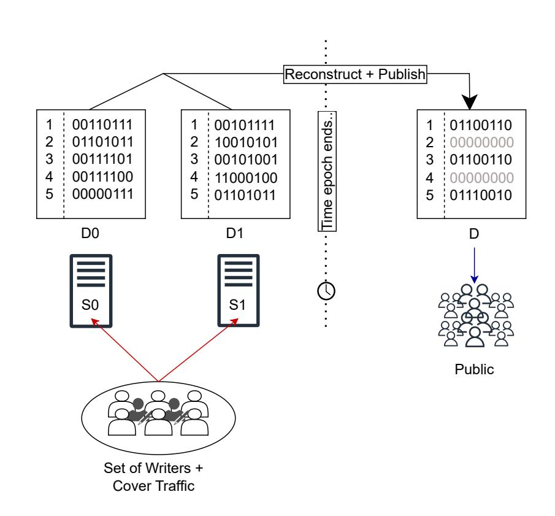
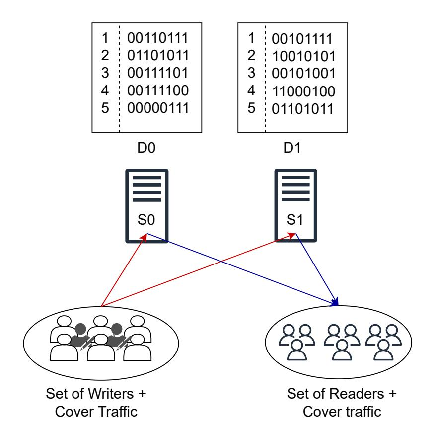
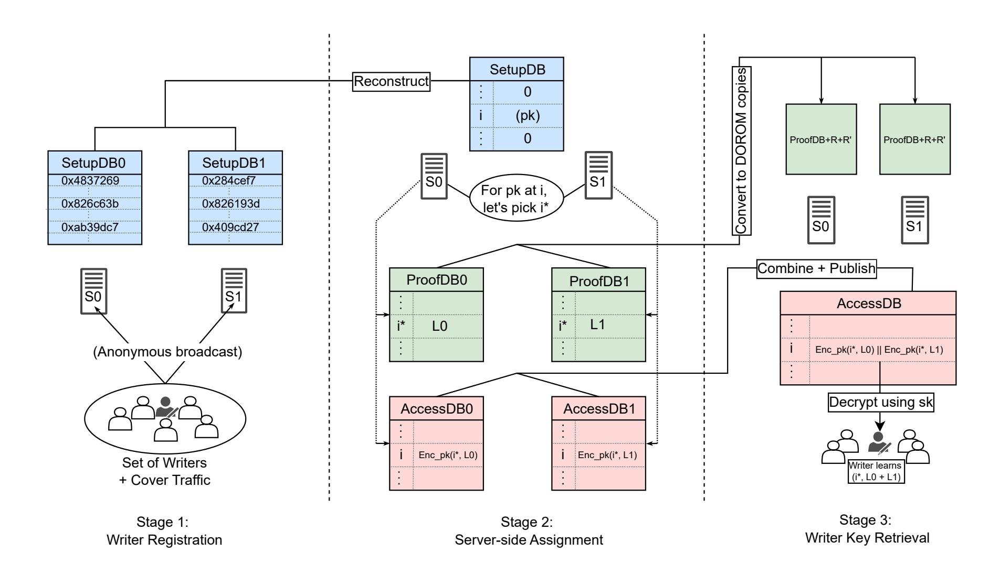
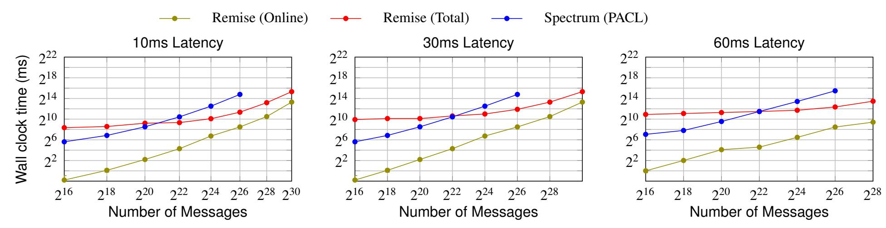
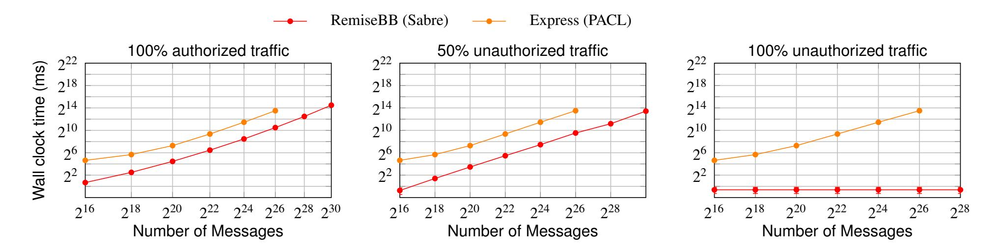
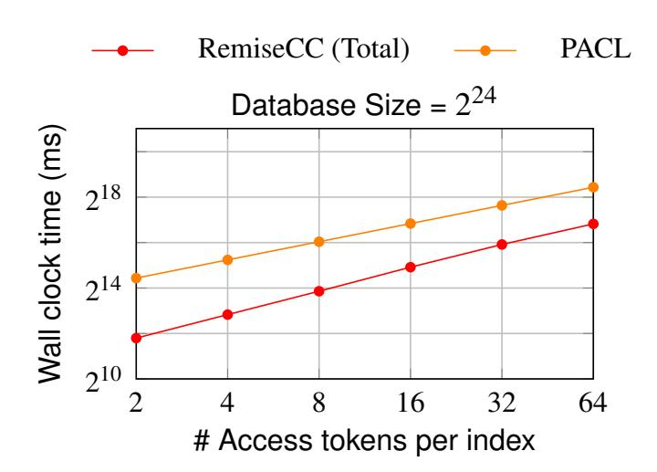

{0}------------------------------------------------

## Remise: Authorized Anonymous Communication Systems

*Rohan Ravi IIT Kanpur rohanra@cse.iitk.ac.in*

*Paritosh Shukla IIT Kanpur paritoshs24@cse.iitk.ac.in*

*Adithya Vadapalli IIT Kanpur avadapalli@cse.iitk.ac.in*

## Abstract

We present Remise, a two-server authorized anonymous communication system built on Distributed Oblivious RAM (DORAM). Remise supports two modes of operation: (i) an anonymous bulletin board, where messages are publicly revealed at the end of each epoch without linking senders to messages, and (ii) anonymous communication channels, where messages remain secret-shared, and writers selectively grant and revoke read access to chosen readers. In both modes, the two servers execute read and write operations without learning which indices are accessed, which authorization tokens are used, or which relationships exist between writers and readers, assuming at least one honest server. A central contribution of Remise is a lightweight and efficient accesscontrol mechanism. Authorization proofs are maintained in secret-shared form across the two servers, enabling oblivious verification while preventing leakage even under client–server collusion. Unlike prior DPF-based systems, Remise provides built-in auditing by having the semi-honest servers generate standard-basis vector shares internally, eliminating the need for server-side DPF validity checks. We implement a prototype of Remise and evaluate it under realistic network conditions. Our experiments show 80× improvement in online server time when compared to PACL (Spectrum) (IEEE S&P 2023) for databases of size 2<sup>24</sup> .

## 1 Introduction

The birth of the Internet was accompanied by great optimism [\[21\]](#page-14-0). It was envisioned as a democratizing force—one that would enable free exchange of ideas, universal access to information, and participation independent of geography or social status. While this vision has been realized in many respects, the modern Internet also exposes users to pervasive surveillance, manipulation, and censorship [\[25\]](#page-15-0). As a result, users increasingly

feel compelled to self-censor and communicate with caution. In this context, *anonymous communication systems* offer a compelling response. By decoupling identities from messages, such systems protect users from surveillance and retaliation and play a critical role in preserving free expression. They are particularly valuable for journalists, whistleblowers, activists, and ordinary users operating in adversarial environments.

## 1.1 Anonymous Communication Systems

Sasy and Goldberg [\[28\]](#page-15-1) classify anonymous communication systems into (i) sender-unlinkable broadcast systems (SUBS), (ii) sender-unlinkable messaging systems (SUMS), (iii) relationship-unobservable systems (RUS), and (iv) communication-unobservable systems (CUS). In this work, we focus on the first three categories. In a SUBS, users anonymously post messages to a public bulletin board that is typically secret-shared across multiple servers and reconstructed at fixed epochs. While the set of messages and the anonymity set of broadcasters are public, the link between a message and its author is hidden; cover traffic further prevents distinguishing real messages from dummy ones. Conceptually, SUBS resemble an anonymous microblogging platform. In a SUMS, receivers own mailboxes identified by secret mailbox IDs that are shared out of band with intended senders. Senders remain anonymous, only authorized senders can write to a mailbox, and receivers obtain only messages addressed to them, though receiver anonymity is not provided. This model is commonly used for confidential disclosures, such as journalist–source communication (e.g., SecureDrop [\[15\]](#page-14-1)). RUS extend SUMS by additionally ensuring that even a global adversary cannot link senders to receivers.

Sender Anonymous Communication Channels: This work introduces a new type of RUS that has not been studied hitherto, namely, Sender Anonymous Communication

{1}------------------------------------------------

Channels. In this model, a set of senders posts messages on a secret message board shared by two parties. However, the parties never reconstruct the messages to post them to the public. Instead, writers give read access to readers of their choice. Furthermore, the writers can revoke the access whenever they wish to do so. We could also think about this as an anonymous *Substack* or *Blog*. The subscribers (of the *Substack* or *Blog*) are the readers who have been granted read access by the authors. The authors (the writers) are granted write access by the service provider (the Remise servers). The writers have "ownership" of that space in the sense that they can write messages of their choice in the space, allow only the people of their choice to read messages from that space, and can remove read access for any reader at any point.

## 1.2 Review of State-of-the-Art

Remise follows the lineage of Anonymous Communication Systems like Riposte, Express, Sabre, and Spectrum, which are based on the so-called Distributed Point Functions (DPFs). We will go into the details of DPFs in Appendix [B;](#page-15-2) however, for now, it suffices to regard a DPF as a functional, succinct representation of secret shares of a 1-hot vector. The servers use shares of a 1-hot vector produced by DPFs to perform read and write operations on a database without revealing which element was accessed. Performing a write operation can be done by adding shares of the 1-hot vector component-wise to the shares of the bulletin board that the servers are holding. Such systems typically need to perform two checks before allowing a write request to be executed: (i) the DPFs are valid, i.e., they will expand to the shares of a 1-hot vector *(audit)*, and (ii) the user is allowed to access at the index at which they are attempting to do so *(authorization)*.

Riposte: Corrigan-Gibbs, Boneh, and Mazières, presented Riposte [\[6\]](#page-14-2), a sender-anonymous broadcasting system that works in the bulletin board model. In Riposte, the writers (or broadcasters) submit write requests, creating a DPF at a random location and sending it to the servers. The servers reconstruct and publish all the messages that were received during each epoch. A problem with users writing at random locations on the bulletin board is that a broadcaster could overwrite a message written by another broadcaster. To reduce the probability of such a write-collision to 5%, the size of the Riposte servers is 19.5 times the number of messages to be posted [1](#page-1-0) . Riposte runs an audit protocol to ascertain that the write requests submitted are well-formed DPFs. One major weakness of Riposte is that it uses *O*( √ *n*)- sized

DPFs, where *n* is the size of the database. This is because the structure of these DPFs make their auditing protocol efficient.

Express: In Express [\[14\]](#page-14-3), each receiver is assigned a mailbox together with a λ = 128-bit mailbox ID by the servers. Receivers share this mailbox ID with intended senders, who write messages by generating DPFs targeting the corresponding ID. Although senders generate DPFs over a domain of size 2 <sup>128</sup>, the Express servers evaluate them only at registered mailbox IDs. Express improves upon Riposte by using logarithmic-sized DPFs together with SNIPs for auditing. However, auditing requires the servers to evaluate each submitted DPF at all registered mailbox IDs, incurring work linear in the number of mailboxes. As a result, Express is vulnerable to DoS attacks in which malicious clients submit malformed DPFs that force expensive evaluations before rejection. Moreover, Express disallows server–client collusion, since servers know all registered mailbox IDs and can thereby derive write authorization for any mailbox.

Sabre: The work by Vadapalli, Storrier, and Henry, Sabre [\[33\]](#page-15-3) extends the work by Express and prevents DoS attacks by presenting *O*(lg*n*) auditing. For authorization, Sabre uses a mailbox ID verification using pseudorandom functions. If a writer is authorized to write at the i <sup>∗</sup>th location, the writer should know PRF(k,i ∗ ) while only the servers know the secret key, k. The writer submits the additive shares of PRF(k,i ∗ ) along with the shares of i ∗ to the Sabre servers. Then, the Sabre servers use MPC to compute the shares of PRF(k,i ∗ ), and check for equality. However, this requires the servers to compute a PRF in a secure Multiparty Computation (MPC), and therefore, the underlying cipher chosen needs to have a low multiplicative depth. Like Express, Sabre also disallows collusion between a server and a user, as the servers can calculate the authorization proof, PRF(k,i), for all index i, by virtue of knowing the key k.

Spectrum: Spectrum [\[24\]](#page-15-4) is an anonymous broadcasting system introduced by Newman, Servan-Schreiber, and Devadas with a low number of broadcasters. Each broadcaster in Spectrum is allotted a "channel" in the database, where they are authorized to write. Spectrum presents a blind access control mechanism which allows the servers to perform auditing and authorization over the DPFs in the same protocol. In addition, Spectrum has a Blame-Game protocol that protects against malicious Spectrum servers from rejecting valid write requests. Unlike Express and Sabre, Spectrum allows for server-writer collusion under the discrete log hardness assumption.

PACL: Unlike prior work on anonymous communication, PACL [\[29\]](#page-15-5) addresses access control for Function Secret Sharing, which can also be applied to DPFbased communication systems. It builds on the Spectrum method for blind access control and introduces more effi-

<span id="page-1-0"></span><sup>1</sup>Riposte mitigates collisions by sending (*M*,*M*<sup>2</sup> ), enabling recovery from two-way collisions. A board of size 2.7*n* yields a 5% collision rate, where *n* is the expected number of messages per epoch.

{2}------------------------------------------------

<span id="page-2-0"></span>Table 1: Comparison of Remise with prior systems. N = database size, L = number of registered writers,  $\lambda =$  security parameter. "Auth Secret Hiding" indicates whether per-index authorization material is hidden from individual servers. "Auth Update Privacy" indicates whether authorization state can be updated or revoked without revealing to the servers. For Riposte, N > L, while for all other systems N = L. Riposte does not have an authorization mechanism. \* Express authorization overlaps with database write. \*\* Spectrum and PACL have unified audit and authorization mechanism. \*\*\* Clients send secret shares of index (instead of DPF keys), requiring log L bits.

| System          | Client<br>Req. Size      | Server<br>Audit Work  | Server<br>Auth Work     | Auth Secret<br>Hiding | Auth Update<br>Privacy |
|-----------------|--------------------------|-----------------------|-------------------------|-----------------------|------------------------|
| Riposte         | $O(\sqrt{N})$            | O(N)                  | -                       | -                     | -                      |
| Express         | $\mathcal{O}(\lambda^2)$ | $\mathcal{O}(L)$      | ${\mathcal O}(L)^*$     | ×                     | ×                      |
| Sabre           | $O(\log L)$              | $\mathcal{O}(\log L)$ | $\mathcal{O}(1)$        | ×                     | ×                      |
| Spectrum        | $O(\log L)$              | $\mathcal{O}(L)$      | $O(L)^{**}$             | ✓ (DL-Hard)           | ×                      |
| Spectrum + PACL | $O(\log L)$              | $\mathcal{O}(L)$      | ${\mathcal{O}(L)}^{**}$ | ✓ (DL-Hard)           | ×                      |
| Remise          | $O(\log L)^{***}$        | -                     | O(L)                    | ✓ (Secret-shared)     | ✓                      |

cient techniques. In the basic setup, servers hold a vector of verification keys  $\Lambda = \{g^{\alpha_1}, \dots, g^{\alpha_n}\}$ , where secret key  $\alpha_i$  authorizes access to index i (DPF generation at i). The DPF is used to locally select (multiplicative) secret shares of  $g^{[\alpha_i]}$ , enabling verification through additive shares of a proof  $[\Pi]_k \leftarrow [-\alpha_i]_k$ . The servers then check that  $(g^{[\alpha_i]_k}) \cdot g^{[\Pi]_k}$  yields additive shares of 1. This essentially generalizes the Spectrum protocol to multiple channels, allowing simultaneous auditing and authorization. PACL improves efficiency by replacing exponentbased checks with a Schnorr proof over secret shares, which proves knowledge of the discrete logarithm of an additively shared element. A second construction, the inclusion predicate, supports multiple access keys per index. Here, servers store an  $n \times \ell$  matrix of verification keys and use one DPF to select the ith row and another to pick the correct column via correction terms, yielding the required shares for the audit.

We compare Remise and prior systems in Table 1. We only consider variants that use 2 main servers (for example, Spectrum can be instantiated with more than 2 servers).

#### 1.3 System Overview

Remise is a two-server anonymous communication system that enforces authorization for both read and write operations while providing anonymity. The servers verify authorization without learning the accessed index, the message or the authorization proof. The system supports two instantiations: a public bulletin board model (RemiseBB) and a communication channels model (RemiseCC). In RemiseBB, authorized writers anonymously post messages to pre-assigned slots in the bulletin board. This bulletin board is periodically reconstructed and published. All write requests made by writers (actual or cover traffic), look indistinguishable to the servers or

an adversary observing the network. As a result, the link between the writers and the published messages is severed. In RemiseCC, the messages posted by the writers are not published. Instead, writers can selectively grant and revoke read access to chosen readers and only an authorized reader can read from a given index. RemiseCC allows writers to update (grant or revoke) read permissions. The RemiseCC servers remain oblivious to both the identities of authorized readers and any changes in the authorization state. Here, all read and write requests (actual and cover traffic) are indistinguishable to the servers and the network, which hides writer-reader link.

Figure 1 gives a brief overview of RemiseBB and RemiseCC and its interaction with users.

Contributions We make the following contributions: (i) We introduce a DORAM-based authorization mechanism for message boards that provides built-in auditability, (ii) We design communication channels in which writers can grant read permissions to readers without servers learning which reader received access, and (iii) We support revocation of access privileges while hiding from the servers whose permissions were modified.

#### 1.3.1 Main ideas in realizing Remise

Distributed ORAM for hidden accesses: Remise is a Distributed Oblivious Random Access Memory (DORAM) based Anonymous Communication System. While we defer the detailed discussion of DORAMs to Section 2.3, it suffices for now to know that DORAMs enable multiple parties, each holding secret shares of a memory and an index, to perform an oblivious (write or read) access to the memory at the index. Remise servers act like DORAM parties and perform operations on the secret shared database and secret shared inputs.

Built-in Auditing: In previous systems that use

{3}------------------------------------------------

<span id="page-3-0"></span>



- (a) RemiseBB: Remise instantiated in the anonymous bulletin board model. To any adversary or servers, all write requests from the set of (Writers + Cover Traffic) look indistinguishable. Writers write to allocated space, which the servers reconstruct and publish after every time epoch.
- (b) RemiseCC: Remise instantiated in the anonymous communication channels model. Authorized writers post messages that can only be accessed by authorized readers. All requests from the set of (Writers + Cover traffic) is indistinguishable. Similarly, all read requests made from the set of (Readers + Cover traffic) is indistinguishable. The messages are hidden from any other entity and writer-reader link is hidden.

Figure 1: Remise system overview

DPFs [\[6,](#page-14-2) [14,](#page-14-3) [24,](#page-15-4) [33\]](#page-15-3) to perform an access on the secret shared databases held by the servers, the client provides the DPF keys for the servers to evaluate. Consequently, the servers have to perform an *audit* check to ensure that the DPF keys evaluate to valid shares of a 1-hot vector, otherwise malformed DPFs could corrupt the entire database. A consequence of using DORAMs (like Floram [\[10\]](#page-14-4) and Duoram [\[32\]](#page-15-6), which Remise does) is that the shares of the standard-basis vector are generated by the servers themselves, thereby offloading this computation from potentially malicious clients to the servers.

Resistance to Client–Server Collusion: In Remise, authorization proofs are stored as secret shares across servers, ensuring that authorization secrets remain hidden as long as at least one server is semi-honest, even under client–server collusion. In contrast, Express and Sabre store authorization material in the clear, allowing colluding servers to leak authorization secrets. While Spectrum (and PACL) prevent this leakage under computational assumptions, Remise provides information-theoretic security.

Authorization Revocability Remise (as RemiseCC) supports authorization revocability by allowing writers to obliviously update read authorization tokens associated with messages they authored. This functionality is essential in anonymous communication settings where a writer controls read access for a dynamic set of readers. Writers may grant access to new readers or revoke access from previously authorized readers, while preserving unlinkability between writers, readers, and database indices. As a consequence of authorization proofs being maintained in secret-shared form, Remise enables these updates to be performed via oblivious DORAM update operations, without exposing which authorization state was modified. In contrast, while Spectrum (and PACL) hide the secret key used for authorization, any modification to the vector of verification keys is directly visible to the servers, precluding oblivious authorization updates.

## 2 Background

## 2.1 Secret Shares

Secret sharing is a cryptographic mechanism for distributing a secret among multiple parties such that any subset of fewer than *t* parties learns no information about the secret, while any subset of *t* or more parties can reconstruct it. The parameter *t* is called the *threshold* of the secret-

{4}------------------------------------------------

sharing scheme. Secret-sharing schemes come in many flavors. We denote additive secret sharing of a value x modulo  $2^r$  by  $x^{AS}$ . When using (k,k) additive sharing among k parties, the individual shares are denoted by  $x_0^{AS}, \dots, x_{k-1}^{AS}$ , and satisfy  $\sum_{i=0}^{k-1} x_i^{AS} \equiv x \pmod{2^r}$ . We use  $b^{BS}$  to denote a Boolean share, and  $x^{GS}$  to denote a generic (secret) sharing of x. An alternative way to secret-share an index i\* is via shares of a one-hot vector, i.e., a vector that is zero everywhere except at the position corresponding to i\*. Shares of one-hot vectors are particularly useful in sender-anonymous communication. Distributed Point Functions (DPFs) provide a succinct mechanism for secret-sharing standard-basis vectors. In particular, (2,2)-DPFs allow two parties to share a standard-basis vector. DPFs form a core building block of the Distributed ORAM constructions used in Remise. Since DPFs are used only as a black box in our construction, we defer their formal definition to Appendix B. For our purposes, it suffices to note that DPFs enable sharing a standard-basis vector of length n with  $O(\log n)$ communication.

#### 2.2 Secure Multiparty Computation

Secure Multiparty Computation (MPC) is a cryptographic technique that allows two or more parties to compute a function on secret inputs. A somewhat more formal definition of MPC is as follows:

**Definition 1** (Secure Multi-Party Computation). *In a multi-party computation (MPC) protocol, parties*  $S_1, ..., S_n$  *holding private inputs*  $x_1, ..., x_n$  *jointly compute a function*  $f(x_1, ..., x_n)$  *such that no party learns anything beyond what can be learned from the output.* 

Measuring the performance of MPC: There are three main metrics to evaluate the performance of an MPC protocol, namely, (i) local computation, (ii) bandwidth, and (iii) round complexity. Local computation like the name suggests is the total amount of computational work the parties in the MPC protocol do. The bandwidth consumption is total packet size that needs to be communicated throughout the protocol. The round complexity is the number of Internet latencies that need to be spent to execute the protocol. In the following we will present some of the MPC protocols that will be used in the paper.

**Multiplication:** We denote the multiplication operation as  $z^{GS} \leftarrow \text{MULT}(x^{GS}, y^{GS})$ . Du-Atallah [12] is a variant of the classic Beaver's method [11] to do multiplication on secret shares, which we use in this paper.

**EQZ Protocol:** The *Equal to Zero* checks if the given value is equal to zero. We denote operation is  $b^{AS} \leftarrow$ 

EQZ( $x^{AS}$ ). The two parties who hold the shares of a variable x, who run the EQZ protocol. The protocol results in them getting shares of a bit b, such that b=1 if x=0, else b=0. Our implementation uses the EQZ protocol from Damgård et al [9].

The EQZand Multiplication protocols are described in Appendix C.

### <span id="page-4-0"></span>2.3 Oblivious Memory Access

**Distributed Oblivious Random Access Memory (DO-RAM).** DORAM is a special case of Secure Multiparty Computation (MPC) in which the computed functionality is a memory access. In this work, we consider two-party DORAMs.

Let  $D \in \mathbb{F}^n$  be a database and  $i^* \in [n]$  be an index. Two servers  $S_0$  and  $S_1$  hold additive shares  $D_0^{AS}, D_1^{AS}$  of D, and additive shares  $i^*_0{}^{AS}, i^*_1{}^{AS}$  of  $i^*$ . A DORAM read protocol outputs read<sub>0</sub>, read<sub>1</sub> such that read<sub>0</sub> + read<sub>1</sub> =  $D[i^*]$ , which we denote by  $D^{AS}[i^{*AS}]$ . Given additive shares  $M^{AS}$  of a value M, a DORAM write produces updated database shares  $D'^{AS}$  satisfying D'[i] = D[i] for all  $i \neq i^*$ , and  $D'[i^*] = D[i^*] + M$ .

**Read-Only and Write-Only Instantiations.** We also consider restricted instantiations of DORAM supporting only a single operation.

In a *Distributed Oblivious Read-Only Memory* (DOROM), the database is fixed after setup. An access to a read-only database at a secret-shared index  $i^{*AS}$  is denoted by  $D^{RO}[i^{*AS}]$ . Both servers hold an encrypted copy of the database: for all  $i \in [n]$ ,  $D[i] + PRF(k_0, i) + PRF(k_1, i)$ , where  $S_0$  holds key  $k_0$  and  $S_1$  holds  $k_1$ . A read operation is implemented via PIR on the encrypted database, followed by an MPC step to obtain additive shares of  $D[i^*]$ .

In a *Distributed Oblivious Write-Only Memory* (DOWOM), the servers hold additive shares of the database (notice that this is different from how it is stored in DOROM!). An update to a write-only database at a secret-shared index  $i^{*AS}$  by a value  $M^{AS}$  is denoted by  $D^{WO}[i^{*AS}] \leftarrow D^{WO}[i^{*AS}] + M^{AS}$ . Such an update is implemented by locally adding additive shares of  $\mathbf{e}_{i^*} \cdot M$  to the database shares. It is easy to switch from the memory layout for DOWOM to DOROM. Parties choose a PRF key  $k_b$  and exchange  $D_b^{AS} + PRF(k_b)$  to compute  $D_0^{AS} + PRF(k_0) + D_0^{AS} + PRF(k_0)$ .

DOROM and DOWOM are naturally more efficient than a full DORAM. This is because supporting both read and update operations necessitates either switching between distinct memory layouts, as in Floram [10], or maintaining additional auxiliary state such as blinds and blind shares, as in Duoram [32].

{5}------------------------------------------------

In this paper, we instantiate DOROM and DOWOM using the protocols in Floram due to Doerner and shelat (see §3 in the Floram paper [10]). When we need a DORAM (that supports both read and write operations), we use 2P-Duoram [32].

**Preprocessing in DORAMs** All the standard-basis vector shares needed in DORAMs (including read only and write only) are produced using DPFs. It is important to note that we produce the DPFs in a preprocessing phase (before we know where to write and what to write) and adjust them to the correct index and value in the online phase with constant communication. For more details we refer the reader to §4.1 in the Duoram paper [32].

#### 3 Authorized Messaging

Remise operates with two non-colluding servers,  $S_0$  and  $S_1$ , and can be instantiated in two models: (i) the *Anonymous Bulletin Board* model, denoted as RemiseBB, and (ii) the *Anonymous Communication Channels* model, denoted as RemiseCC. Two main types of users interact with Remise, namely, (i) writers, and (ii) readers. A subset of the users also send *zero* messages. Such messages are called cover traffic and serve the purpose of increasing the size of the anonymity set. For the Remise servers, cover messages are information-theoretically indistinguishable from real write requests.

**Setup Phase** The functioning of Remise (both RemiseBB and RemiseCC) begins with a setup phase, during which writers obtain authorization to write at specific indices, while the servers remain oblivious to which index was assigned to which writer. In particular, the setup ensures that none of the Remise servers learn (i) which users (from the superset of users including cover traffic and actual writers) are authorized to write messages, or (ii) which indices belong to which writers.

**RemiseBB** In RemiseBB, writers post messages on a shared bulletin board held by the servers which are reconstructed and published after every epoch. A writer submits a write request by sending shares of the message, shares of the index, and shares of the write authorization proof. The servers accept the request if the proof corresponds to the index (of course, without learning either the proof or the index). Authorized indices in RemiseBB allow for preventing write-collisions as writers are only allowed to write at their assigned index. It also capitalizes on the asymmetry of real-world broadcasting, similar to what Spectrum does, where there are fewer writers than total users in a system. Thus while keeping the server computation only be influenced by the number of real writers, we can still derive anonymity from all users without reserving extra space.

**RemiseCC** In contrast, in RemiseCC, while writers post messages similar to RemiseBB, the two servers never reconstruct the message database. Instead, the writers grant reading rights to specific readers of their choice, and this information is conveyed to the RemiseCC servers obliviously. Similar to write authorization proofs, the servers in RemiseCC also hold shares of read authorization proofs and the writer has control over the values of the read authorization proofs for the index they own. Readers submit read requests by sending shares of the index and shares of the read authorization proofs to the servers (e.g., i\*) in order to retrieve a message. Upon receiving a read request, the RemiseCC servers verify (obliviously) whether the reader has permission to read from i\*. If the permission is not granted, the read request is dropped.

**Notation** Throughout, for any value, array, or database D, we denote its additive sharing between servers  $S_0$ and  $S_1$  by  $D = D_0^{AS} + D_1^{AS}$ , where  $S_b$  holds  $D_b^{AS}$  for  $b \in \{0,1\}$ . If D is an array or database, then for every index i,  $D[i] = D_0^{AS}[i] + D_1^{AS}[i]$ . We use D to denote both the bulletin board in RemiseBB and the message board in RemiseCC. Servers  $S_0$  and  $S_1$  hold additive shares of D, as well as PRF-encrypted versions of the writeauthorization proof database, denoted by PROOFDB. For each index i, the entry PROOFDB[i] encodes the writeauthorization proof required to write to the ith location of D. The database PROOFDB is read-only. In RemiseCC, the servers additionally hold additive shares of the readauthorization proof database, denoted by  $\mathcal{T}$ . We use the terms token and read-authorization proof interchangeably. Each entry  $\mathcal{T}[i]$  consists of a list of m tokens, where possession of any one token suffices to prove authorization to read the contents of D[i]. During the setup phase, servers  $S_0$  and  $S_1$  hold additive shares of the setup database Setupdb, to which writers post their public keys. At the end of setup, each writer learns its assigned indices via a published database denoted by ACCESSDB.

Threat Model The Remise clients (writers, readers and cover traffic) are completely untrusted. They may deviate arbitrarily from the protocol, form collusion with other clients or with malicious servers. For metadata privacy, Remise requires at least one server to be honest. For integrity, Remise requires both the servers to execute the protocols as specified. We assume a global network adversary that observers all communication between clients and servers. We assume the existence of pseudorandom generators and pseudorandom functions for any randomness and key generation used in the protocols. We assume the existence of secure channels between each client and each server, providing confidentiality, integrity and replay protection for communicated messages.

{6}------------------------------------------------

#### 3.1 Remise APIs

Remise exposes a set of APIs that the users use to interact with the system in both RemiseBB and RemiseCC. In this section, we describe each API by first explaining its purpose and behaviour, and then stating an informal security claim that it is designed to achieve.

#### <span id="page-6-2"></span>3.1.1 Writer Registration: The Setup Phase

Overview Remise (both RemiseBB and RemiseCC) provides a registration API that writers invoke during a one-time setup phase to obtain authorization to write to the database D. Each registered writer is assigned a database index together with a corresponding write authorization proof, which must be presented with every write request. The setup phase hides from the servers both the set of registered writers and the indices assigned to them: while the servers may observe a superset of users submitting requests (including cover traffic), they cannot distinguish registered writers from non-writers.

**Description** The setup phase of Remise begins with a writer registration phase, which follows a bootstrapping mechanism similar to that of Spectrum [24] and relies on an anonymous broadcast system such as Riposte [6].

The setup phase begins with writer registration. Here, servers  $S_0$  and  $S_1$  hold additive shares of an anonymous bulletin board SETUPDB. Writers express their intent to reserve database indices by anonymously writing their public keys to random locations in SETUPDB using a Riposte-style write. A writer may reserve multiple indices by writing multiple public keys to different locations. The servers accept writes to SETUPDB for a fixed time window, after which all further requests are dropped, marking the end of the writer registration phase.

Once the writer registration phase ends, the servers reconstruct SETUPDB and recover the set of public keys written at random locations. Each public key pk appearing in SETUPDB corresponds to a writer requesting write authorization. For each such pk, the servers deterministically assign a unique database index i\* using a fixed, agreed-upon ordering. The servers jointly initialize the write-authorization proof database PROOFDB, for which they hold additive shares. To generate a write authorization proof for index i\* without revealing it to either server,  $S_0$  and  $S_1$  sample random strings  $\ell_0$  and  $\ell_1$  such that  $\ell_0 + \ell_1 = \ell$ , where  $\ell$  is the authorization proof for i\*. They locally update their shares by setting PROOFDB<sub>0</sub>[ $i^*$ ]  $\leftarrow \ell_0$  and PROOFDB<sub>1</sub>[ $i^*$ ]  $\leftarrow \ell_1$ . After initializing all entries, the servers convert their additive shares of PROOFDB into encrypted form. Each server  $S_b$  applies a PRF under its secret key to encrypt its share  $PROOFDB_h^{AS}$  and exchanges the resulting encrypted shares with the other server. Both servers then reconstruct the database, obtaining a doubly encrypted,

read-only proof database denoted by PROOFDB<sup>RO</sup>. Finally, for each writer with public key pk, each server encrypts its share of the authorization proof together with the assigned index i\* under pk. These ciphertexts are written to a separate database ACCESSDB at the same position from which pk was read in SETUPDB. The published database ACCESSDB concludes the setup phase, enabling each writer to decrypt and learn its assigned index and corresponding write authorization proof.

Figure 2 illustrates the setup phase in Remise.

Security Claim An adversary controlling all but one server and a strict subset of writers (excluding at least two honest writers), and observing the network cannot determine which indices and write authorization proofs are assigned to an honest writer, beyond what is inferred from the published ACCESSDB. Definition 3 formalizes this notion.

#### <span id="page-6-1"></span>3.1.2 Write Operation in Remise

Overview In both RemiseBB and RemiseCC, registered writers are allowed to submit messages at their assigned locations. The system checks each submission and, if permitted, stores it in the message database. In the RemiseBB variant, a bulletin board is published at the end of each epoch, whereas in RemiseCC, no bulletin board is published. Users willing to provide cover traffic may also send write requests by sending *zero* messages.

**Description** A user submits a write request to servers  $S_0$  and  $S_1$  by sending  $(i^{*AS}, \Delta M^{AS}, \omega^{AS})$ , which are additive shares of the target index, the value update, and the corresponding write authorization proof. Here, i\* is the write index and  $\Delta M = M' - M$ , where M' is the new message and M is the current value of D[i\*].2 Since only the authorized writer may modify  $D[i^*]$ , we assume the writer knows M. Remise permits any user, authorized or not, to submit a zero write with  $\Delta M = 0$  at any index as cover traffic; the servers cannot distinguish such requests from authorized non-zero writes, and higher cover traffic increases the anonymity set. The servers hold additive shares of the write authorization proof database PROOFDB, where PROOFDB[i] stores the authorization proof for index i. Upon receiving a write request, S<sub>0</sub> and S<sub>1</sub> perform a DOROM read on PROOFDB using shares of i\* to obtain shares of the expected authorization proof. Since PROOFDB is read-only, this operation is more efficient. The servers then use MPC to check whether either the retrieved authorization proof matches the writer-supplied proof or the request corresponds to cover traffic; in other words, they verify that  $(\omega = PROOFDB[i^*]) \vee (\Delta M = 0)$ . If the check succeeds, the write is applied. In RemiseBB, the message database

<span id="page-6-0"></span><sup>&</sup>lt;sup>2</sup>Writes are implemented as DORAM updates, which add secret shares to the existing database shares.

{7}------------------------------------------------

<span id="page-7-0"></span>

Figure 2: Remise setup phase: In Stage 1: writers post their public keys using an anonymous broadcast system like Riposte. In Stage 2: servers get the value of public key and assign an index  $i^*$ . They also sample their respective shares of the write authorization proof (L0 and L1), so that no single server knows the actual value of the proof. In Stage 3: the servers combine their respective encrypted shares and publish it. They also convert PROOFDB into DOROM copies.

is write-only: servers batch write requests (including cover traffic) into fixed epochs and publish  $D_0^{AS} + D_1^{AS}$  at the end of each epoch. In contrast, RemiseCC supports read access to the secret-shared database; consequently, writes are performed using a full DORAM write. The message database is not published, and writers may grant read access to their messages to selected readers.

Security Claim An adversary controlling all but one server, any subset of clients, and observing the network cannot, with more than negligible advantage, link a write access by an honest user to a particular database index or message, beyond what is implied by the set of participating users. Additionally, only a writer who knows the correct write authorization proof for an index (for i, it is PROOFDB[i]) can cause a non-zero message to be written at that index. All other write requests leave the database unchanged. Definition 4 in Appendix D formalizes this notion.

#### 3.1.3 Updating Read Authorization in RemiseCC

**Overview** Writers can decide who can read the messages they write. They do this by updating the values of the read authorization proofs for the locations they are assigned to write at. Writers can then communicate values of the proofs to new readers, using some out-of-band method.

This step ensures that message access remains controlled and private.

**Description** Granting read access to an index  $i^*$  in RemiseCC consists of two steps: (i) issuing the reader a read-authorization token (a  $\lambda$ -bit string), and (ii) obliviously informing the servers that possession of this token grants read access to  $i^*$ .

A writer may share the token with a reader either via an initial in-person exchange or by using an expensive dialing protocol as in Express [14].<sup>3</sup> After distributing the token, the writer must inform the servers that possession of the token  $t_{i^*}$  authorizes reading index  $i^*$ .

Servers  $S_0$  and  $S_1$  hold additive shares of a token database  $\mathcal{T}$ . Each entry  $\mathcal{T}[\mathtt{i}]$  consists of a list of m tokens, where possession of any one token suffices to read  $D[\mathtt{i}]$ . To add or revoke read access at index  $\mathtt{i}^*$ , the writer generates a fresh list of m tokens and sends additive shares of this list to the servers; revocation is achieved by replacing tokens in the list.

Before updating  $\mathcal{T}$ , the servers verify that the requester is authorized to write to index  $i^*$  by checking the supplied write-authorization proof, exactly as in the write operation (Section 3.1.2). If the check succeeds,  $S_0$  and

<span id="page-7-1"></span><sup>&</sup>lt;sup>3</sup>While one may ask why messages themselves are not shared this way, note that in-person contact or dialing is required only once.

{8}------------------------------------------------

 $S_1$  update their shares of T via a DORAM write.

To support cover traffic, RemiseCC designates a public-update index  $i_{upd}$  whose write-authorization proof is public. Any user may submit updates to  $T[i_{upd}]$ , ensuring that valid token updates do not reveal the set of writers.

**Security Claim** Only a writer who has the value  $PROOFDB[i^*]$  can make changes to  $\mathcal{T}[i^*]$  when all servers act honestly. Also an adversary cannot with more than negligible advantage, determine which row (if any) of  $\mathcal{T}$  was updated, after a valid request. This notion is formalized in Definition 6 in Appendix D.

#### 3.1.4 Read Operation in RemiseCC

Overview Readers who have been granted read access can request to retrieve messages using the read authorization proofs provided by the writer. The servers checks their authorization, and if valid, provides the reader with the message content.

**Description** A reader submits a *read* request by sending  $(i^{*AS}, t^{AS})$ , consisting of additive shares of the target index and a read-authorization token received from the writer. Upon receiving the request, the RemiseCC servers perform a DORAM read on the token database at index  $i^*$  to obtain shares of the corresponding m tokens. They then use MPC to verify that the supplied token matches at least one entry in this list. If the check succeeds, the servers carry out a DORAM read on the message database; otherwise, the request is dropped.

To hide the set of readers, RemiseCC supports cover traffic for read operations. Specifically, the servers reserve a public-read index  $\mathbf{i}_{read}$  whose read-authorization tokens are publicly known and whose write-authorization proof is undisclosed, preventing updates to  $\mathcal{T}[\mathbf{i}_{read}]$ . Any user may submit cover read requests to  $\mathbf{i}_{read}$  using one of the public tokens. The index  $\mathbf{i}_{read}$  is never assigned to any writer during the setup phase.

**Security Claim** An adversary controlling all but one server, any subset of clients, and the network cannot, with more than negligible advantage, link a read access by an honest user to a particular database index. Additionally, only a reader who holds one of the m tokens in  $\mathcal{T}[i^*]$  can read  $D[i^*]$ . Definition 5 in Appendix D formalizes this notion.

#### 4 Remise: The Details

#### 4.1 Writing in Remise

Protocol 1 describes the process of writing in Remise. w has full control over the value  $D[i^*]$  and thus we assume it knows the value M before making write request. Before any write is made D[i] = 0 for all index i. Line 3

checks if the payload value ( $\Delta M$ ), is zero. If  $\Delta M$  is zero,  $z^{AS} \leftarrow 1^{AS}$ , otherwise  $z^{AS} \leftarrow 0^{AS}$ . Line 4 does a DOROM read into the proof database to get shares of the actual proof of write authorization. Line 6 computes an MPC OR of two check values, z and auth, to ensure either a zero message is provided or the authorization passed. In RemiseBB, Line 9 is a write-only memory access, while in RemiseCC, it is a DORAM write.

<span id="page-8-0"></span>**Protocol 1** WRITE IN REMISE: Writer w wants to write M' at  $i^{*th}$  index of the database D. w knows the current value of  $D[i^*]$  as M and holds  $\omega$  as write authorization proof.  $S_0$  and  $S_1$  hold shares of D and PROOFDB. At the end of the protocol, if the write authorization passes,  $S_0$  and  $S_1$  will end up with new shares of D, such that  $D[i^*] \leftarrow M'$ 

```
1: w calculates \Delta M \leftarrow M' - M // \text{ new val.} - curr. val.
 2: For each b \in \{0,1\}, w sends (i_h^{*AS}, \Delta M_h^{AS}, \omega_h^{AS}) to
      S_b.
      // Servers obliviously check for zero message
 3: z^{AS} \leftarrow \text{Eoz}(\Delta M^{AS})
     // Servers do DOROM read on the proofs database
 4: \mathcal{F}^{AS} \leftarrow PROOFDB^{RO}[i^{*AS}]
 5: \operatorname{auth}^{AS} \leftarrow \operatorname{EQZ}(\mathcal{F}^{AS} - \omega^{AS})
      // MPC OR operation
 6: \operatorname{audit}^{AS} \leftarrow \operatorname{auth}^{AS} \vee z^{AS}
      // Servers reconstruct audit
 7: audit \leftarrow REC(audit<sup>AS</sup>)
 8: if audit = 1 then
           D^{AS}[\mathtt{i}^{*AS}] \leftarrow D^{AS}[\mathtt{i}^{*AS}] + \Delta \mathtt{M}^{AS} \ /\!/ \ D[\ \mathtt{i}^{*}\ ] = \mathtt{M}
 9:
10: else
11:
            return // Reject the request and perform no write
12: end if
```

#### **4.2 Providing Read Authorization**

Recall that providing read access has two main parts. Firstly, the writer has to do an out-of-band communication to give the reader a new read authorization token. Secondly, the writer updates the token database  $\mathcal{T}$  at the RemiseCC servers, to add the new read authorization token. Protocol 2 describes the protocol that allows a writer to update the values of read authorization tokens for an index. A writer can use the same protocol to revoke access as well. The writer may replace the value of an existing token, as a result of which, any reader holding that token will no longer be able to make authorized reads. The RemiseCC servers have to first ascertain, that the writer updating the tokens for an index, is indeed the author of the messages at that index (say i\*). Lines 4 to 6 authenticate the writer. Once the writer is authenticated, in Line 8 T is updated via a DORAM update operation, such that the list of tokens at index i\* holds new token

{9}------------------------------------------------

values that the writer wants. Cover traffic is provided by having a reserved index  $i_{upd}$ , whose write authorization proof is made public, at the end of the setup phase. Any user willing to provide cover traffic can make updates to  $i_{upd}$  using the same protocol.

<span id="page-9-0"></span>**Protocol 2** UPDATE READ AUTHORIZATION IN REMISECC: Writer w has write authorization to index  $i^*$  and knows the current list of m tokens at  $\mathcal{T}[i^*]$  denoted by  $R_{i^*}$ .  $S_0$  and  $S_1$  hold shares of a token database  $\mathcal{T}$ . w wants to write new list  $R'_{i^*}$  at  $\mathcal{T}[i^*]$ .

```
// w prepares new tokens for i^*.
 1: w constructs R'_{i^*} = \{t_1, \dots, t_m\}.
     // w computes the element-wise difference
 2: \Delta R_{i^*} \leftarrow R'_{i^*} - R_{i^*}.
 3: For each b \in \{0,1\}, w sends (i^{*AS}, \Delta R_{i^*}{}^{AS}, \omega^{AS})
     // Servers check writer's authorization.
 4: \mathcal{F}^{AS} \leftarrow PROOFDB^{AS}[i^{*AS}]
 5: \operatorname{check}^{\operatorname{AS}} \leftarrow \operatorname{EQZ}(\mathcal{F}^{\operatorname{AS}} - \omega^{\operatorname{AS}})
 6: check \leftarrow REC(check^{AS})
 7: if check = 1 then
     // Authorized: update token list at i*.
            \mathcal{T}^{\mathrm{AS}}[\mathtt{i}^*] \leftarrow \mathcal{T}^{\mathrm{AS}}[\mathtt{i}^*] + \Delta R_{\mathtt{i}^*}{}^{\mathrm{AS}}
 8:
 9: else
10:
            return // Reject the request
11: end if
     // Cover traffic: any user may run the same protocol
     with i^* = i_{upd}, using the public write-proof for i_{upd}.
```

#### 4.3 Reading in RemiseCC

Protocol 3 describes the protocol to read in RemiseCC. We first remark that the notion of reading in RemiseBB does not exist since that is a broadcasting system, where the messages are published. Lines 2 to 11 authenticate the reader. To authenticate, the servers obviously check that the reader knows at least one of the read tokens associated with the index they are trying to access. The read tokens of a special index,  $i_{read}$ , are made public. Readers providing cover traffic simply send read requests at  $i_{read}$  using one of the known tokens. The write proof for  $i_{read}$ , however, must be hidden by the servers. This is to prevent any malicious user from updating  $\mathcal{T}[i_{read}]$  using Protocol 2.

# 4.4 RemiseBB (Sabre): Authorization w/o DORAMs

If we relax our threat model to disallow collusion between a Remise server and a writer, we can achieve authorization without relying on DORAMs by borrowing Sabre's authorization check. Let  $F: \{0,1\}^{\lambda} \times I \rightarrow$ 

<span id="page-9-1"></span>**Protocol 3** READ IN REMISECC: A reader r wants to read content D[ $i^*$ ] using read authorization token t. Servers hold shares of D and  $\mathcal{T}$ . At the end of the protocol, r reads D[ $i^*$ ] if  $t \in \mathcal{T}[i^*]$ .

// Reader sends shares of index and its read authorization token to the servers
// Readers providing cover traffic would send same request for the reserved index i<sub>read</sub>
1: For each b ∈ {0,1}, r sends (i\*AS , t<sub>b</sub>AS) to S<sub>b</sub>
// Servers do a DORAM read to get shares of the list

2: T<sup>AS</sup> ← T<sup>AS</sup>[i\*<sup>AS</sup>]
3: Parse T<sup>AS</sup> = {t<sub>1</sub><sup>AS</sup>,...,t<sub>m</sub><sup>AS</sup>}
// Servers calculate additive shares of the check value for each of the token in the list

4: for all t<sub>i</sub> ∈ T do
5: check<sub>i</sub><sup>AS</sup> ← t<sub>i</sub><sup>AS</sup> − t<sup>AS</sup>
6: end for

// Servers check if any token matches
7: for i = 1 to m do
8: z<sub>i</sub><sup>AS</sup> ← EQZ(check<sub>i</sub><sup>AS</sup>)
9: end for
10: auth<sup>AS</sup> ← V<sub>i=1</sub><sup>m</sup> z<sub>i</sub><sup>AS</sup>
11: auth ← REC(auth<sup>AS</sup>) // servers reconstruct
12: if auth = 0 then

// Allow read operation
13: read<sup>AS</sup> ← D<sup>AS</sup>[i\*<sup>AS</sup>]

14:  $S_0$  and  $S_1$  send read<sup>AS</sup> and read<sup>AS</sup> to the reader.

// Reconstruction of the shares

15: The reader computes: read ← read<sub>0</sub><sup>AS</sup> + read<sub>1</sub><sup>AS</sup>
16: else // Drop the read request

17: return
18: end if

of tokens for i\*

 $\{0,1\}^{\lambda}$  be a PRF. The authorization token for an index i is defined as  $\tau_i = F_k(i)$ , where the PRF key k is known to the two servers. A client authorized to access index  $i^*$  is given the token  $\tau_{i^*} = F_k(i^*)$  during setup. To make an access, the client submits additive shares of the target index  $i_0^{*AS}$ ,  $i_1^{*AS}$ , along with additive shares of the token  $\tau_0^{AS}$ ,  $\tau_1^{AS}$ . Using their shares of i\*, the servers jointly evaluate the PRF under MPC to compute  $\tau^* = F_k(i^*)$ , and then perform an MPC equality check to verify that  $\tau^* = \tau_{i^*}$ . If the check succeeds, the access is authorized. The authorization check has constant computational complexity and communication complexity. As in Sabre, collusion between a server and a client is out of scope: since the servers know the PRF key, they can compute valid authorization tokens for any index, and therefore such collusion trivially enables unauthorized access. Unlike Sabre, RemiseBB (Sabre) does not need to perform an audit to check the validity of the DPFs. We remark that com

{10}------------------------------------------------

bining RemiseCC with Sabre does not yield an efficient construction. To preserve writer–reader unlinkability, the PRF key must be hidden from the servers and generated by the writer. As a result, the servers would need to obliviously select the correct key during authorization, which incurs significant overhead. Consequently, the DORAMbased authorization mechanism presented earlier is more efficient.

We end this section by remarking that throughout all our protocols, although the outcome of the audit (i.e., whether it succeeds or fails) is revealed to the servers at the end of the protocol, this leakage can be eliminated by having the servers perform a no-operation when the audit fails. Similarly, the distinction between read and write requests can be hidden using the same technique. We defer further discussion of these extensions to Appendix [E.](#page-19-0)

## 5 Implementation and Evaluation

Analytical Evaluation Before presenting the experimental evaluation, we discuss the asymptotic costs. Table [2](#page-11-0) describes the asymptotic costs in realizing Remise. DPF evaluation in MPC accounts for the preprocessing cost. Notice that the costs in RemiseCC have factor of *m*, the number of read tokens per database index.

Implementation We implemented a proof-of-concept prototype[4](#page-10-0) . All experiments were conducted on a server equipped with two *Intel® Xeon® Gold 6430* processors, 251 GiB of RAM, and running a 64-bit *Linux* operating system. Network latency and bandwidth were emulated using tc netem, and all experiments were run on an otherwise idle system.

## 5.1 Comparisons with Comparators

In this section, we compare Remise with the various anonymous communication systems in PACL's codebase[5](#page-10-1) , namely Spectrum and Express.

#### 5.1.1 RemiseBB vs. Spectrum (PACL)

In this section, we compare RemiseBB with Spectrum (PACL), i.e., Spectrum integrated with PACL [\[29\]](#page-15-5). Both systems operate under a similar threat model that allows client–server collusion. Figure [3a](#page-11-1) compares the wallclock time for servers to *check the validity* of a single write request in RemiseBB and Spectrum (PACL) under three network latencies: 10 ms, 30 ms, and 60 ms. We do not include a comparison with plain Spectrum, since

integrating PACL improves its performance by nearly 40×. For smaller database sizes, Spectrum (PACL) outperforms the *total* cost (preprocessing plus online) of RemiseBB. This behavior is expected. The preprocessing phase of RemiseBB —specifically, the MPC-based generation of shares of a standard-basis vector—requires *O*(log*n*) rounds of communication. In contrast, Spectrum (PACL) relies on the evaluation of a verifiable DPF, which, while computationally more expensive than a standard DPF, avoids this additional round complexity. As the database size increases, computational overhead begins to dominate latency-induced costs. This trend is reflected in our results: at lower latencies, the crossover point at which RemiseBB outperforms Spectrum (PACL) occurs at smaller database sizes. For a database of size 2 <sup>24</sup>, RemiseBB achieves a 5× improvement over Spectrum (PACL), and this improvement increases to approximately 11× at size 2 <sup>26</sup>. We were unable to execute the Spectrum (PACL) implementation beyond 2 <sup>26</sup>; however, extrapolating from existing measurements, the performance gap is expected to further favor RemiseBB at larger scales. Finally, when considering only the online phase, the gains are substantially larger. For example, at a database size of 2 <sup>24</sup>, RemiseBB provides nearly an 80× speedup over Spectrum (PACL).

#### 5.1.2 RemiseBB (Sabre) vs. Express (PACL)

Figure [3b](#page-11-1) compares the the wall-clock time for servers to *check the validity* of a single write request in RemiseBB (Sabre) with Express (PACL) under three traffic mixes: (i) 100% authorized writes, (ii) 50% unauthorized writes, and (iii) 100% unauthorized writes. Recall that both RemiseBB (Sabre) and Express (PACL) operate under a threat model in which server–client collusion is disallowed. We do not plot the online time for RemiseBB (Sabre), as it would be similar to the plot for 100% unauthorized writes. The difference in total time comes from the amount of DPFs generated in the preprocessing phase. The main observation from Figure [3b](#page-11-1) is that the fraction of unauthorized writes has a significant impact on the running time of RemiseBB (Sabre). Since the authorization check in RemiseBB (Sabre) takes *O*(1) time, unauthorized requests can be rejected early, well before any expensive cryptographic processing. In contrast, Express (PACL) must perform a full DPF evaluation before authorization can be verified. When all writes are authorized, RemiseBB (Sabre) outperforms Express (PACL) by approximately 8×. When 50% of the writes are unauthorized, this gap widens to 16×. In the extreme case where all writes are unauthorized, RemiseBB (Sabre) is approximately 18,000× faster than Express (PACL). Notably, the running time of Express (PACL) remains essentially unchanged across these settings, as it incurs the

<span id="page-10-0"></span><sup>4</sup>An anonymized implementation is available at: [https://github.](https://github.com/anonymoususer99946996/anonymous) [com/anonymoususer99946996/anonymous](https://github.com/anonymoususer99946996/anonymous)

<span id="page-10-1"></span><sup>5</sup>Code from [https://github.com/sachaservan/pacl/tree/](https://github.com/sachaservan/pacl/tree/main/bench-anon) [main/bench-anon](https://github.com/sachaservan/pacl/tree/main/bench-anon)

{11}------------------------------------------------

<span id="page-11-0"></span>Table 2: Cost Comparison of Remise Variants. Cost mentioned in gray is the preprocessing cost.

| Operation                     | Local Computation | Bandwidth   | Rounds      |
|-------------------------------|-------------------|-------------|-------------|
| Remise Write                  | O(n)+O(n)         | O(lgn)+O(1) | O(lgn)+O(1) |
| RemiseCC Read                 | O(n)+O(n ·m)      | O(lgn)+O(m) | O(lgn)+O(1) |
| RemiseCC Update Authorization | O(n)+O(n ·m)      | O(lgn)+O(m) | O(lgn)+O(1) |

<span id="page-11-1"></span>

(a) RemiseBB vs. Spectrum (PACL); experiments for Spectrum (PACL) were limited to size 2<sup>26</sup> due to infrastructure constraints.



(b) RemiseBB (Sabre) vs. Express (PACL); experiments for Express (PACL) were limited to size 2 due to infrastructure constraints.

Figure 3: Performance comparison of a write operation in RemiseBB with Spectrum (PACL) for different latencies.

same cost to process both authorized and unauthorized requests.

<span id="page-11-2"></span>

Figure 4: Comparing RemiseCC and PACL's read authorization.

#### 5.1.3 RemiseCC vs. PACL-Inclusion Predicate

In Figure [4,](#page-11-2) we evaluate the time taken by the servers to perform authorization checks on read requests in RemiseCC. We compare against PACL's inclusion predicate access control, as it provides the same functionality of having multiple read authorization tokens per index. The experiment is done on a database of size 2 while varying the number access tokens per index. For tokens per index, RemiseCC is 3× faster than PACL's inclusion predicate. We do not plot the online time for RemiseCC as it is close to the total time because we use a 2 party Duoram, which uses a Computationally symmetric PIR (CSPIR) [\[32\]](#page-15-6).

{12}------------------------------------------------

## 6 Related Work

DC-nets based Systems: Anonymous communication systems often use dining cryptographer networks (DCnets) to achieve sender-recipient unobservability, where only one participant sends a real message per round while others send cover traffic. DC-nets, however, suffer from high communication overhead and poor scalability. They are also vulnerable to disruption, as any malicious participant can corrupt a broadcast by sending an invalid share. Dissent [\[7\]](#page-14-8) addresses this with a costly blame protocol to detect disruptors but cannot prevent disruptions. Verdict [\[8\]](#page-14-9) improves on this by requiring participants to submit proofs of correctness, enabling verifiable DC-nets that can prevent malformed contributions.

PIR-based Systems: Pynchon Gate [\[27\]](#page-15-7) uses private information retrieval (PIR) to privately fetch messages, making it suitable for pseudonymous mail retrieval. Pung [\[1\]](#page-13-0) extends this with a PIR-based key-value store: each round, a client privately retrieves a single message, using a key derived from a shared secret and receiving the encrypted value. Talek [\[5\]](#page-14-10) supports private group messaging in a publish-subscribe model, functionally similar to RemiseCC. A writer communicates with multiple readers via a private log indexed using a blocked cuckoo hash table [\[26\]](#page-15-8), with clients applying a PRF to a secret log handle to determine pseudorandom locations. Distributed-PIR [\[30\]](#page-15-9) aims to reduce server computation in private messaging systems by offloading computation to the client, at the cost of increasing client overhead.

Mix-Net Based Systems: Mix-net systems obfuscate message sources, enabling anonymous messaging. In Riffle [\[19\]](#page-14-11), servers perform verifiable shuffles of messages in each round and forward them, relying on the *anytrust* model—anonymity is preserved as long as one server is honest. Cmix [\[4\]](#page-14-12) and Trellis [\[22\]](#page-14-13) improves efficiency by using a precomputation phase. Atom [\[18\]](#page-14-14) uses multiple server groups that shuffle messages iteratively. Security holds if each group has at least one honest server. XRD [\[20\]](#page-14-15) assigns each client a mailbox and ensures uniform traffic by using loopback messages for non-communicating users. Communication occurs via shared chains between user pairs, hiding communication patterns.

Differential Privacy based Systems: Vuvuzela [\[34\]](#page-15-10) pioneered this approach, where users communicate via shared drop locations derived from a shared key. Karaoke [\[23\]](#page-15-11) builds on Vuvuzela with an efficient noise verification mechanism. Groove [\[2\]](#page-13-1) further improves DPbased systems by adding user flexibility.

ORAM-based Systems: Myco [\[17\]](#page-14-16) introduces ORAM-based metadata-private messaging system using an asymmetric two server model. Here, the servers act like an ORAM-like client and server. Myco achieves

polylogarithmic per-access server work, outperforming PIR and DPF-based systems. Myco does not provide server enforced access control: any client can read messages from any location but must trial-decrypt each entry. While Remise presents a *Distributed*-ORAM based communication system, it aims to improve access control mechanisms on DPF-based communication systems, where servers enforce which locations a read/write access can be made. Any unauthorized access in Remise is rejected by the servers.

## 7 Conclusion

Remise enforces that only authorized clients can read from or write to the database. Importantly, the Remise servers perform access control checks without learning (i) the content of the messages written, (ii) which messages are being read, or (iii) any linkage between reads and writes. Furthermore, Remise can be easily extended to i) hide even whether an authorization check succeeded, adding an additional layer of access privacy, ii) hide whether a read or write operation was performed, and iii) achieve robustness.

## Ethical Considerations

Stakeholder Identification and Impacts. We structure this section as a stakeholder-based analysis, distinguishing between *direct stakeholders*—those who design, implement, or deploy Remise —and *indirect stakeholders*—those affected by systems built using Remise. Direct stakeholders include the research team and organizations that deploy anonymous communication services based on Remise. Indirect stakeholders include end users who rely on such systems for private and anonymous communication, journalists and whistleblowers who may depend on strong sender anonymity, regulators and auditors responsible for oversight, and adversaries who may attempt to disrupt or misuse anonymous communication infrastructures.

Research Team. This work involves no human subjects, no physical experiments, and no collection of realworld private data. All evaluation is conducted using synthetic workloads and controlled experimental settings. We explicitly acknowledge and respect the intellectual contributions of all authors, and authorship reflects substantive technical involvement.

Service Providers and System Deployers. Organizations deploying Remise (e.g., operators of anonymous bulletin boards or private communication platforms) may benefit from improved efficiency, fast auditing, and strong

{13}------------------------------------------------

authorization privacy. At the same time, deployment requires careful engineering, cryptographic review, and parameter selection. Misconfiguration or incomplete implementation of the protocols—particularly those involving authorization proofs, preprocessing, or blame mechanisms—could lead to service disruption, denial of access for honest users, or weakened anonymity guarantees. To mitigate these risks, we document system assumptions, protocol tradeoffs, and performance characteristics in detail.

End Users and Society. *Beneficence.* Remise is designed to strengthen privacy and freedom of expression by enabling authorized anonymous communication without revealing access patterns, sender–receiver relationships, or authorization state. The system is particularly relevant for high-risk users such as journalists, whistleblowers, activists, and individuals operating under surveillance.

*Respect for Persons.* We carefully cite prior work in anonymous communication, DPF-based systems, and DORAMs to ensure accurate attribution and to avoid misrepresentation of related techniques. The design of Remise explicitly avoids requiring users to reveal identities, long-term metadata, or sensitive personal information to the servers.

*Justice.* The protocols underlying Remise rely only on standard cryptographic primitives and do not require specialized hardware or proprietary infrastructure. Our goal is to keep the core techniques accessible to researchers and system designers worldwide, reducing barriers to entry and enabling independent verification and reuse.

Respect for Law and Public Interest. We recognize that anonymous communication systems may raise concerns for regulators and law-enforcement agencies. Remise is designed to operate within the bounds of applicable law, assuming lawful deployment and governance by service providers. The system includes explicit mechanisms—such as authorization controls and blame protocols—to prevent unauthorized writes, mitigate denial-of-service attacks, and detect malicious behavior by clients or servers. These features are intended to balance anonymity with accountability at the system level, without enabling surveillance of honest users.

Publication and Research Impact. This work contributes new techniques for combining DORAMs, authorization, and anonymous communication, and may influence future research on privacy-preserving systems. To reduce misuse or misinterpretation, we document key design decisions and tradeoffs, including the efficiency benefits of read-only and write-only memory instantiations, the assumption of at least one honest server, and the limitations of the threat model.

Potential Harms and Dual-Use Risks. We acknowledge that anonymous communication systems can be misused by malicious actors to conceal unlawful activities. Additionally, immature or unreviewed deployments of Remise could harm honest users by causing loss of availability, incorrect blame attribution, or weakened anonymity. We therefore strongly encourage responsible deployment, thorough security auditing, and integration with appropriate legal, organizational, and governance frameworks. We emphasize that Remise is a research prototype and that production deployments should be preceded by careful review.

Decision to Conduct and Publish. This research was initiated to improve the efficiency, robustness, and accountability of anonymous communication systems. We considered the dual-use nature of such systems and concluded that the benefits to privacy, free expression, and secure communication outweigh the potential risks when the system is deployed responsibly. The decision to publish followed internal review, correctness validation, and performance evaluation. We believe that open dissemination of our results promotes transparency, reproducibility, and informed discussion within the research community, consistent with established norms in security and privacy research.

Open Science Our code is available at [https://](https://github.com/anonymoususer99946996/anonymous) [github.com/anonymoususer99946996/anonymous](https://github.com/anonymoususer99946996/anonymous).

Acknowledgments The authors used generative AIbased tools to revise the text, improve flow and correct any typos, grammatical errors, and awkward phrasing.

## References

- <span id="page-13-0"></span>[1] Sebastian Angel and Srinath Setty. Unobservable Communication over Fully Untrusted Infrastructure. In *12th USENIX Symposium on Operating Systems Design and Implementation (OSDI 16)*, 2016.
- <span id="page-13-1"></span>[2] Ludovic Barman, Moshe Kol, David Lazar, Yossi Gilad, and Nickolai Zeldovich. Groove: Flexible Metadata-Private messaging. In *16th USENIX Symposium on Operating Systems Design and Implementation (OSDI 22)*, 2022.
- <span id="page-13-2"></span>[3] Elette Boyle, Niv Gilboa, and Yuval Ishai. Function Secret Sharing: Improvements and Extensions. In

{14}------------------------------------------------

- *Proceedings of the 23rd ACM Conference on Computer and Communications Security (CCS)*, pages 1292–1303. ACM, 2016.
- <span id="page-14-12"></span>[4] David Chaum, Debajyoti Das, Farid Javani, Aniket Kate, Anna Krasnova, Joeri de Ruiter, and Alan T. Sherman. cMix: Mixing with minimal real-time asymmetric cryptographic operations. Cryptology ePrint Archive, Paper 2016/008, 2016.
- <span id="page-14-10"></span>[5] Raymond Cheng, William Scott, Elisaweta Masserova, Irene Zhang, Vipul Goyal, Thomas Anderson, Arvind Krishnamurthy, and Bryan Parno. Talek: Private Group Messaging with Hidden Access Patterns. In *Proceedings of the 36th Annual Computer Security Applications Conference*, ACSAC '20, page 84–99, 2020.
- <span id="page-14-2"></span>[6] Henry Corrigan-Gibbs, Dan Boneh, and David Mazières. Riposte: An Anonymous Messaging System Handling Millions of Users. In *2015 IEEE Symposium on Security and Privacy, SP 2015, San Jose, CA, USA, May 17-21, 2015*, pages 321–338. IEEE Computer Society, 2015.
- <span id="page-14-8"></span>[7] Henry Corrigan-Gibbs and Bryan Ford. Dissent: accountable anonymous group messaging. In Ehab Al-Shaer, Angelos D. Keromytis, and Vitaly Shmatikov, editors, *Proceedings of the 17th ACM Conference on Computer and Communications Security, CCS 2010, Chicago, Illinois, USA, October 4-8, 2010*, pages 340–350. ACM, 2010.
- <span id="page-14-9"></span>[8] Henry Corrigan-Gibbs, David Isaac Wolinsky, and Bryan Ford. Proactively accountable anonymous messaging in verdict. In Samuel T. King, editor, *Proceedings of the 22th USENIX Security Symposium, Washington, DC, USA, August 14-16, 2013*, pages 147–162. USENIX Association, 2013.
- <span id="page-14-7"></span>[9] Ivan Damgård, Daniel Escudero, Tore Kasper Frederiksen, Marcel Keller, Peter Scholl, and Nikolaj Volgushev. New primitives for actively-secure MPC over rings with applications to private machine learning. *Proc. IEEE Symp. Security and Privacy*, 2019, 2019.
- <span id="page-14-4"></span>[10] Jack Doerner and Abhi Shelat. Scaling ORAM for Secure Computation. In *CCS*, pages 523–535. ACM, 2017.
- <span id="page-14-6"></span>[11] Donald Beaver. Efficient Multiparty Protocols Using Circuit Randomization. In *CRYPTO*, pages 420–432, 1991.
- <span id="page-14-5"></span>[12] Wenliang Du and Mikhail J. Atallah. Protocols for Secure Remote Database Access with Approximate

- Matching. In *E-Commerce Security and Privacy (Part II)*, Advances in Information Security, Feb 2001.
- <span id="page-14-18"></span>[13] Elette Boyle, Niv Gilboa, and Yuval Ishai. Function Secret Sharing. In *Advances in Cryptology - EUROCRYPT 2015*, pages 337–367, 2015.
- <span id="page-14-3"></span>[14] Saba Eskandarian, Henry Corrigan-Gibbs, Matei Zaharia, and Dan Boneh. Express: Lowering the Cost of Metadata-hiding Communication with Cryptographic Privacy. In *30th USENIX Security Symposium, USENIX Security 2021, August 11- 13, 2021*, pages 1775–1792. USENIX Association, 2021.
- <span id="page-14-1"></span>[15] Freedom of the Press Foundation. Securedrop, 2025. Open-source whistleblower submission system. Latest release: 2.12.8 (May 8, 2025).
- <span id="page-14-17"></span>[16] Niv Gilboa and Yuval Ishai. Distributed Point Functions and Their Applications. In *Advances in Cryptology - EUROCRYPT 2014*, 2014.
- <span id="page-14-16"></span>[17] Darya Kaviani, Deevashwer Rathee, Bhargav Annem, and Raluca Ada Popa. Myco: Unlocking polylogarithmic accesses in metadata-private messaging. In *2025 IEEE Symposium on Security and Privacy (SP)*, pages 4419–4437, 2025.
- <span id="page-14-14"></span>[18] Albert Kwon, Henry Corrigan-Gibbs, Srinivas Devadas, and Bryan Ford. Atom: Horizontally scaling strong anonymity. In *Proceedings of the 33rd ACM Symposium on Operating Systems Principles (SOSP)*, pages 463–480. ACM, 2017.
- <span id="page-14-11"></span>[19] Albert Kwon, David Lazar, Srinivas Devadas, and Bryan Ford. Riffle: An Efficient Communication System With Strong Anonymity. *Proc. Priv. Enhancing Technol.*, 2016(2), 2016.
- <span id="page-14-15"></span>[20] Albert Kwon, David Lu, and Srinivas Devadas. XRD: scalable messaging system with cryptographic privacy. In Ranjita Bhagwan and George Porter, editors, *17th USENIX Symposium on Networked Systems Design and Implementation, NSDI 2020, Santa Clara, CA, USA, February 25-27, 2020*, pages 759–776. USENIX Association, 2020.
- <span id="page-14-0"></span>[21] Emily B. Laidlaw. *Regulating Speech in Cyberspace: Gatekeepers, Human Rights and Corporate Responsibility*. Cambridge University Press, 2015.
- <span id="page-14-13"></span>[22] Simon Langowski, Sacha Servan-Schreiber, and Srinivas Devadas. Trellis: Robust and scalable metadata-private anonymous broadcast. Cryptology ePrint Archive, Paper 2022/1548, 2022.

{15}------------------------------------------------

- <span id="page-15-11"></span>[23] David Lazar, Yossi Gilad, and Nickolai Zeldovich. Karaoke: Distributed private messaging immune to passive traffic analysis. In *13th USENIX Symposium on Operating Systems Design and Implementation (OSDI 18)*, pages 711–725, Carlsbad, CA, October 2018. USENIX Association.
- <span id="page-15-4"></span>[24] Zachary Newman, Sacha Servan-Schreiber, and Srinivas Devadas. Spectrum: High-bandwidth anonymous broadcast. In *19th USENIX Symposium on Networked Systems Design and Implementation (NSDI 22)*, 2022.
- <span id="page-15-0"></span>[25] Jason R. C. Nurse. Cybercrime and you: How criminals attack and the human factors that they seek to exploit, October 2018.
- <span id="page-15-8"></span>[26] Rasmus Pagh and Flemming Friche Rodler. Cuckoo hashing. *Journal of Algorithms*, 51(2):122–144, 2004.
- <span id="page-15-7"></span>[27] Len Sassaman, Bram Cohen, and Nick Mathewson. The pynchon gate: a secure method of pseudonymous mail retrieval. In *Proceedings of the 2005 ACM Workshop on Privacy in the Electronic Society*, WPES '05, page 1–9, New York, NY, USA, 2005. Association for Computing Machinery.
- <span id="page-15-1"></span>[28] Sajin Sasy and Ian Goldberg. Sok: Metadataprotecting communication systems. *Proc. Priv. Enhancing Technol.*, 2024(1):509–524, 2024.
- <span id="page-15-5"></span>[29] Sacha Servan-Schreiber, Simon Beyzerov, Eli Yablon, and Hyojae Park. Private access control for function secret sharing. In *2023 IEEE Symposium on Security and Privacy (SP)*, 2023.
- <span id="page-15-9"></span>[30] Elkana Tovey, Jonathan Weiss, and Yossi Gilad. Distributed pir: Scaling private messaging via the users' machines. In *Proceedings of the 2024 on ACM SIGSAC Conference on Computer and Communications Security*, CCS '24, page 1967–1981, New York, NY, USA, 2024. Association for Computing Machinery.
- <span id="page-15-12"></span>[31] Adithya Vadapalli, Fattaneh Bayatbabolghani, and Ryan Henry. You May Also Like... Privacy: Recommendation Systems Meet PIR. *Proc. Priv. Enhancing Technol.*, 2021(4):30–53, 2021.
- <span id="page-15-6"></span>[32] Adithya Vadapalli, Ryan Henry, and Ian Goldberg. Duoram: A Bandwidth-Efficient Distributed ORAM for 2- and 3-Party Computation. Cryptology ePrint Archive, Paper 2022/1747, 2022. [https:](https://eprint.iacr.org/2022/1747) [//eprint.iacr.org/2022/1747](https://eprint.iacr.org/2022/1747).

- <span id="page-15-3"></span>[33] Adithya Vadapalli, Kyle Storrier, and Ryan Henry. Sabre: Sender-Anonymous Messaging with Fast Audits. In *IEEE Symposium on Security and Privacy (SP)*, pages 1953–1970, 2022.
- <span id="page-15-10"></span>[34] Jelle van den Hooff, David Lazar, Matei Zaharia, and Nickolai Zeldovich. Vuvuzela: scalable private messaging resistant to traffic analysis. In Ethan L. Miller and Steven Hand, editors, *Proceedings of the 25th Symposium on Operating Systems Principles, SOSP 2015, Monterey, CA, USA, October 4-7, 2015*, pages 137–152. ACM, 2015.

## A Setup Phase Details

In this Appendix we will present the detailed exposition of the Setup Pahse of Remise that we described in Section [3.1.1.](#page-6-2)

Protocol [4](#page-16-0) describes in detail how a writer can register to write to the database D in Remise (both RemiseBB and RemiseCC). In stage 1, writers post their public keys to SETUPDB, which is held in shares by S<sup>0</sup> and S1. The Remise servers can announce a time window within which writers (and users providing cover traffic) can post to SETUPDB, after which the servers do not accept any requests. Although the protocol shows, *w* registering for a single index, any writer can reserve multiple indices by making more than one request. The servers can also set a maximum limit to the number of requests made during the setup phase in order to not let a user exhaust server resources. In line [6,](#page-16-0) the servers jointly assign each posted public key to a unique database index by evaluating an agreed-upon deterministic function ASSIGN on a common counter ctr. The function ASSIGN(ctr) can, for example, enumerate database indices in a fixed order or apply a fixed permutation.

In lines [9-10](#page-16-0) each server samples a random string ℓ*b*, which are indeed the secret shares of the write authorization proof, as we can see PROOFDB0[i ∗ ] + PROOFDB1[i ∗ ] = ℓ<sup>0</sup> + ℓ1. This is done so that neither of the servers learn the actual value of the proof. Lines [16-19](#page-16-0) shows how the servers convert secret shares of PROOFDB into encrypted copies which is necessary to perform DOROM operations.

## <span id="page-15-2"></span>B Distributed Point Function

A point function is a function across a domain that evaluates to 0 at every point in the domain, except at one special point where it evaluates to a non-zero value. Observe that the evaluation of the point functions over their entire domain can be viewed as 1-hot vectors. Distributed functions are an efficient way to secret share these 1-hot vectors in a succinct way. Gilboa and Ishai introduced

{16}------------------------------------------------

<span id="page-16-0"></span>**Protocol 4** SETUP PHASE IN REMISE: A writer w requests write authorization to an index in D. Servers  $S_0$  and  $S_1$  hold secret shares of a setup bulletin board, SETUPDB. A write authorization proof database, PROOFDB, is also secret shared between the two servers. PROOFDB is empty at the start of the protocol.

#### **STAGE 1: Writer Registration**

- 1: w generates key pair (pk, sk)
- 2: w writes pk to a random location i in SETUPDB, i.e. SETUPDB[i]  $\leftarrow$  pk, using a Riposte-styled write

#### **STAGE 2: Server-Side Assignment**

// After the writer-registration window ends

- 3: S<sub>0</sub> and S<sub>1</sub> reconstruct SETUPDB
- 4:  $S_0$  and  $S_1$  set ctr  $\leftarrow 0$
- 5: **for all**  $i \in [N]$  such that SETUPDB[i] is valid public key pk **do**

// Servers compute deterministic assignment of index

```
S_0 and S_1 compute i^* \leftarrow Assign(ctr)
 6:
 7:
           ctr \leftarrow ctr + 1
           for b \in \{0,1\} do
 8:
                S_b samples a random string \ell_b \stackrel{\$}{\leftarrow} \{0,1\}^{\lambda}
 9:
                S_b stores PROOFDB<sub>b</sub>[i*] \leftarrow \ell_b
10:
                S_b computes c_b \leftarrow ENC_{pk}(i^* || \ell_b)
11:
12:
           end for
           S_0 and S_1 write (c_0 \mid\mid c_1) to ACCESSDB<sub>b</sub>[i]
13:
14: end for
```

- 15:  $S_0$  and  $S_1$  publish ACCESSDB<sub>b</sub>
- // servers convert PROOFDB shares into encrypted copies
- 16: For each  $b \in \{0,1\}$ ,  $S_b$  samples key  $k_b$
- 17:  $S_b$ , constructs vector  $R_b[i] = PRF(k_b, i)$  for all index i
- 18:  $S_b$  sends  $(PROOFDB_b + R_b)$  to  $S_{1-b}$  //  $S_0$ ,  $S_1$  hold  $(PROOFDB_0 + R_0)$ ,  $(PROOFDB_1 + R_1)$
- 19: Servers calculate and store (PROOFDB +  $R_0$  +  $R_1$ )  $\leftarrow$  PROOFDB $_0$  +  $R_0$  + PROOFDB $_1$  +  $R_1$

#### **STAGE 3: Writer Key Retrieval**

- 20: w retrieves ACCESSDB[i]
- 21: w decrypts using sk to obtain  $(i^*, \ell_0, \ell_1)$
- 22: *w* reconstructs  $\ell \leftarrow \ell_0 + \ell_1 // \ell$  is the write authorization proof for i\*

Distributed Point Functions (DPFs) [16], with further improvements by Boyle et al. [3,13]. In this paper, we only concern ourselves with DPFs that share a point function between exactly two parties. Definition 2 (a restatement of Vadapalli et al. [33, Def 4]) formally defines (2,2)-DPFs.

<span id="page-16-1"></span>**Definition 2.** A (2,2)-distributed point function, or (2,2)-DPF, is a pair of PPT algorithms (Gen, Eval) defining an infinite family of secret-shared representations of generalized point functions; that is, given (i) a security parameter  $\lambda \in \mathbb{N}$ , (ii) a domain D and range R, and (iii) a distinguished point  $(x,y) \in D \times R$ , we have

• If  $(dpf_0, dpf_1) \leftarrow Gen(1^{\lambda}, D, R; x, y)$ , then, for all  $i \in D$ .

$$Eval(dpf_0, i) + Eval(dpf_1, i) := \begin{cases} y & \text{if } i = x, \text{ and } \\ \mathbf{0} & \text{otherwise.} \end{cases}$$

• There exists a PPT simulator S such that, for any given domain D, range R, distinguished point  $(x,y) \in D \times R$ , and bit  $b \in \{0,1\}$ , the distribution ensembles:

1. 
$$\left\{ \mathcal{S}(1^{\lambda}, D, R; b) \right\}_{\lambda \in \mathbb{N}}$$
 and  
2.  $\left\{ dpf_b \mid (dpf_0, dpf_1) \leftarrow Gen(1^{\lambda}, D, R; x, y) \right\}_{\lambda \in \mathbb{N}}$ 

are computationally indistinguishable.

The  $dpf_b$  output by Gen are called (2,2)-DPF keys. We note that, the x-coordinate of the distinguished point is the distinguished input.

Evaluating the DPF over the entire domain is done by a function Evalfull. Observe that,  $Evalfull(dpf_0)$  and  $Evalfull(dpf_1)$  are the shares of a 1-hot vector. For the finer details of DPF construction, we refer the reader to the original DPF paper [3] and some other manuscripts, which use DPFs [31–33].

## **B.1** Generating DPFs via Secure Computation

Consider the following problem, where two servers,  $S_0$  and  $S_1$  hold additive secret shares of an index  $i^*$  and M. Their goal is to obtain secret shares of a 1-hot vector at  $i^*$  with the non-zero value being M. In this paper, we discuss two main ways to achieve this goal.

**Local DPF Computation:** This method requires a third trusted party, namely,  $S_2$ .  $S_2$  produces DPF pairs  $(dpf_0^{(\alpha)}, dpf_1^{(\alpha)})$  at a random location  $\alpha$  and sends  $(dpf_0^{(\alpha)}, \alpha_0^{AS})$  to  $S_0$  and  $(dpf_1^{(\alpha)}, \alpha_1^{AS})$  to  $S_1$ . The parties then compute  $\alpha - i^*$  and compute Evalfull $(dpf_b) >>>$ 

{17}------------------------------------------------

 $(\alpha - i^*)$ , where >>> is a cyclic right shift. The protocol requires: (i) O(1) rounds of communication, (ii)  $O(\lg n)$  bandwidth consumption, and (iii) O(n) local computation.

**MPC-based DPF Computation:** Doerner and shelat [10], presented an MPC algorithm to generate a DPF. Their protocol not only produces the DPF but also generates a full domain evaluation of the DPF. We will not go into the details of the algorithm, but would point to the original paper and recent manuscript by Vadapalli, Henry, and Goldberg [32] for an exposition of the protocol. The procol requires: (i)  $O(\lg n)$  rounds of communication, (ii)  $O(\lg n)$  bandwidth consumption, and (iii) O(n) local computation.

#### <span id="page-17-0"></span>**C** MPC Protocols

**Multiplication Protocol** The Du-Atallah protocol begins with a trusted dealer, sampling random values  $(X_0, Y_0, X_1, Y_1, \alpha)$ . The trusted dealer sends  $(X_0, Y_0, X_0, Y_0, X_0, Y_0, X_0, Y_0, X_0, Y_0, X_0, Y_0, X_0, Y_0, X_0, Y_0, X_0, Y_0, Y_0, Y_0, Y_0, Y_0, Y_0, Y_0, Y$ 

**Protocol EQZ**(·) The protocol takes in as input, additive shares of a. It outputs additive shares of b, where b = (a = 0).

- The parties locally sample additive shares  $r_0^{AS}, \dots, r_{k-1}^{AS} \leftarrow \Pi_{\mathsf{RandBit}}()$ .
- They compute additive shares of  $r \leftarrow \sum_{i=0}^{k-1} 2^i r_i$  as  $r^{\text{AS}} \leftarrow \sum_{i=0}^{k-1} 2^i r_i^{\text{AS}}$ .
- The parties compute  $c^{\text{AS}} \leftarrow a^{\text{AS}} + r^{\text{AS}}$  and open c to all parties.
- Let  $(c_0, \ldots, c_{k-1})$  denote the binary representation of c.
- The parties locally compute additive shares of  $b_2 \leftarrow 1 \prod_{i=0}^{k-1} (c_i + r_i 2c_i r_i)$ .
- The parties invoke  $\Pi_{B2A}$  on  $b_2^{AS}$  to obtain the final additive shares  $b^{AS}$ , where  $\Pi_{B2A}$  is Boolean to Arithmetic Conversion.

## <span id="page-17-3"></span>**D** Security Analysis

<span id="page-17-1"></span>**Definition 3** (Setup Anonymity). Let W denote the set of users who participate in the setup phase. Consider an adversary A that corrupts all but one server, corrupts any

strict subset  $W_C \subset W$  of users, and observes the network. At the end of the setup phase, let  $View_A$  denote the joint view of A, consisting of:

- the published ACCESSDB.
- the internal states of the corrupted servers and the corrupted users in  $W_C$ .

We say that the setup phase satisfies setup anonymity if there exists a probabilistic polynomial-time simulator S such that  $View_{\mathcal{A}} \approx_{c} S(1^{\lambda}, AccessDB, W_{C})$ , where  $\lambda$  is the security parameter. In particular, for any two honest writers  $w_0, w_1 \in W \setminus W_{C}$ , the adversary cannot determine which database indices or write-authorization proofs are assigned to  $w_0$  versus  $w_1$ , except with negligible advantage over random guessing.

**Simulator Construction (for Definition 3).** The simulator S proceeds as follows to generate a view that is computationally indistinguishable from the real execution:

- To simulate a dishonest server, S encrypts the indices and authorization-proof shares chosen by the adversary using the public key corresponding to the target index.
- To simulate the view of an honest server, S samples the corresponding authorization-proof share uniformly at random.
- To simulate dishonest writers, S decrypts the submitted encrypted indices and proof shares using the writers' private keys, thereby recovering the adversary-chosen inputs.
- For honest writers, S samples a uniformly random value as the decryption of the encrypted index. Since the adversary does not possess the private keys of honest writers, this simulated value is computationally indistinguishable from the real execution.

<span id="page-17-2"></span>**Definition 4** (Write Authorization). A write request in Remise is a 3-tuple  $(i^{*AS}, M^{AS}, \omega^{AS})$  of additive shares of the target index  $i^*$ , a message M, and a purported write-authorization proof  $\omega$ . Let PROOFDB $[i^*]$  denote the write-authorization proof associated with index  $i^*$ . We say that Remise satisfies write authorization if the following properties hold.

**Correctness.** For each processed write request  $(i^{*AS}, M^{AS}, \omega^{AS})$ :

- If M = 0, then the request has no effect on D.
- If  $M \neq 0$  and  $\omega = PROOFDB[i^*]$ , then  $D[i^*] \leftarrow M$ .
- If  $M \neq 0$  and  $\omega \neq PROOFDB[i^*]$ , then the request has no effect on D.

{18}------------------------------------------------

**Privacy.** Consider an adversary  $\mathcal{A}$  that corrupts all but one server. Let  $View_{\mathcal{A}}$  denote the joint view of  $\mathcal{A}$  in an execution of Remise. There exists a probabilistic polynomial-time simulator  $\mathcal{S}$  such that, for every write request  $(i^*, M, \omega)$  and every database state (D, PROOFDB),

$$View_{\mathcal{A}} \approx_{c} \mathcal{S}(1^{\lambda}, out),$$

where  $\lambda$  is the security parameter and out  $\in$  {accept, reject} indicates whether the write is authorized, i.e., whether  $M \neq 0$  and  $\omega = PROOFDB[i^*]$ . In particular, except for the leakage of out, the adversary learns no additional information about  $i^*$ , M, or  $\omega$ .

**Simulator Construction (for Definition 4).** Given input  $(1^{\lambda}, \text{out})$ , the simulator S proceeds as follows:

- Random sampling. S samples the following values independently and uniformly at random: (i) an index  $i^{*'} \in [|D|]$ , (ii) an additive share of a message, and (iii) an additive share of a write-authorization proof. Since the corrupted servers only observe uniformly random additive shares, the resulting simulated view is perfectly indistinguishable from the view in a real execution, regardless of whether out = accept or out = reject.
- **First zero-test simulation.** S invokes the simulator to generate the adversary's view of the first execution of the EQZ protocol.
- Read-phase simulation. S invokes the simulator to generate the adversary's view of the Distributed Oblivious Read protocol.
- **Second zero-test simulation.** S invokes the simulator to generate the adversary's view of the second execution of the EQZ protocol.
- **Multiplication simulation.** S invokes the simulator to generate the adversary's view of the multiplication protocol.
- **Conditional update.** If out = accept, S invokes the simulator to generate the adversary's view of the Distributed Oblivious Update protocol. Otherwise, if out = reject, S aborts.

<span id="page-18-1"></span>**Definition 5** (Read Authorization). *In RemiseCC*, each index  $i^*$  has an associated list  $T[i^*]$  of m read-authorization tokens. A read request is a 2-tuple  $(i^{*AS}, t^{AS})$  of additive shares of the target index  $i^*$  and a purported read-authorization token t.

We say that RemiseCC satisfies read authorization if the following properties hold.

**Correctness.** For each processed read request  $(i^{*AS}, t^{AS})$ :

- If  $t \in \mathcal{T}[i^*]$ , then the reader receives  $D[i^*]$ .
- If  $t \notin T[i^*]$ , then the reader receives no information about  $D[i^*]$ .

**Privacy.** Consider an adversary  $\mathcal{A}$  that corrupts all but one server. Let  $View_{\mathcal{A}}$  denote the joint view of  $\mathcal{A}$  in an execution of RemiseCC's Read Authorization. There exists a probabilistic polynomial-time simulator  $\mathcal{S}$  such that, for every read request  $(i^*,t)$  and every database state  $(D,\mathcal{T})$ ,

$$View_{\mathcal{A}} \approx_{c} \mathcal{S}(1^{\lambda}, out),$$

where  $\lambda$  is the security parameter and out  $\in$  {accept, reject} indicates whether  $t \in T[i^*]$ . In particular, except for the leakage of out, the adversary learns no additional information about  $i^*$ , t, or  $D[i^*]$ .

**Simulator Construction (for Definition 5).** Given input  $(1^{\lambda}, \text{out})$ , the simulator S proceeds as follows:

- Random sampling.  $\mathcal{S}$  samples the following values independently and uniformly at random: (i) an index  $i^{*'} \in [|D|]$ , and (ii) an additive share of a readauthorization token. Since the corrupted servers only observe uniformly random additive shares, the resulting simulated view is perfectly indistinguishable from the view in a real execution. In particular, the simulated view is independent of  $i^*$ , the authorization token t, and the database value  $D[i^*]$ , and depends only on the value of out.
- **Read-phase simulation.** S invokes the simulator to generate the adversary's view of the Distributed Oblivious Read protocol.
- **Zero-test simulation.** S invokes the simulator to generate the adversary's view of the EQZ protocol *m* times.
- Multiplication simulation. S invokes the simulator to generate the adversary's view of the multiplication protocol m times.
- **Conditional update.** If out = accept, S runs a simulation of the Distributed Oblivious Read Protocol, if out = reject, S aborts.

<span id="page-18-0"></span>**Definition 6** (Access Update Privacy). Let RemiseCC be the access-update protocol maintaining a token database  $\mathcal{T}$  and a write-authorization database PROOFDB. A read-access update request is a 3-tuple ( $i^{*AS}$ ,  $\omega^{AS}$ ,  $R^{AS}$ ), where these are additive shares of the target index  $i^*$ , a

{19}------------------------------------------------

purported write-authorization proof  $\omega$ , and a new token list R, respectively. We say that RemiseCC satisfies access update correctness and privacy if the following properties hold.

**Correctness.** Consider any update request denoted as  $(i^{*AS}, \omega^{AS}, R^{AS})$ :

- If  $\omega = \text{PROOFDB}[i^*]$ , then  $\mathcal{T}[i^*] \leftarrow R$ .
- Otherwise, the request is rejected and  $\mathcal{T}$  remains unchanged.

**Privacy.** Consider an adversary  $\mathcal{A}$  that corrupts all but one server and controls the network. Let  $View_{\mathcal{A}}$  denote the joint view of  $\mathcal{A}$  in an execution of RemiseCC, consisting of the internal states of corrupted servers, all messages sent or received by them, and the adversary's randomness. There exists a probabilistic polynomial-time simulator  $\mathcal{S}$  such that, for every update request  $(i^*, \omega, R)$  and every initial database state  $(\mathcal{T}, PROOFDB)$ ,

$$View_{\mathcal{A}} \approx_c \mathcal{S}(1^{\lambda}, out),$$

where  $\lambda$  is the security parameter and out  $\in$  {accept, reject} is the outcome of the authorization check. In particular, the distribution of  $View_{\mathcal{A}}$  depends only on out and the public parameters, and is independent of  $\mathbf{i}^*$ ,  $\omega$ , and R.

#### **Simulator Construction (for Definition 6)**

- Random sampling. S samples the following values independently and uniformly at random: (i) an index i\*' ∈ [|D|], and (ii) an additive share of a read-authorization token. Since the corrupted servers only observe uniformly random additive shares, the resulting simulated view is perfectly indistinguishable from the view in a real execution. In particular, the simulated view is independent of i\*, the authorization token t, and the database value D[i\*], and depends only on the value of out.
- **Read-phase simulation.** S invokes the simulator to generate the adversary's view of the Distributed Oblivious Read protocol.
- **Zero-test simulation.** S invokes the simulator to generate the adversary's view of the EQZ protocol.
- Conditional update. If out = accept, S invokes the simulator to generate the adversary's view of the Distributed Oblivious Update protocol. Otherwise, if out = reject, S aborts.

#### <span id="page-19-0"></span>**E** Remise Extensions

Hiding whether it is a read or write request Observe that it is not very difficult to construct RemiseCC so that the servers are oblivious to whether it is a read request or a write request. The following changes have to be made: (i) requests are always a 3-tuple ( $i^*$ , PROOF<sup>AS</sup>, MAS). If it is a read request, the client shares a read authorization token, and if it is a write request, a write proof is shared. Additionally, if it is a read request, the reader sets M = 0, and (ii) any request is processed as both a write and a read request. The servers always return (ReadAuthCheck(PROOF)) · D[ $i^*$ ] and the write is always D[ $i^*$ ] + (WriteAuthCheck(PROOF)) · M.

**Robust Remise** Robustness in Remise can be easily achieved by introducing multiple server pairs. For example, consider  $2 \cdot k$  main servers arranged as k pairs:  $(S_0^{(1)}, S_1^{(1)}), \ldots, (S_0^{(k)}, S_1^{(k)})$ . If each request is sent to all k pairs, then Remise can tolerate multiple server failures as long as at least one pair has both servers remaining operational.

Remise. Remise incurs  $O(\lg n)$  rounds in the preprocessing phase. These  $O(\lg n)$  are due to the Doerner-shelat MPC DPF generation. However, in RemiseBB if we have an additional third party, the DPF can be produced in the by the third party locally and sent to the two parties incurring just one round of communication. This procedure is described in Appendix B in the paragraph Local DPF Generation. We cannot get this advantage in RemiseCC, since, it uses DORAM that should support both read and write operations and this would still require  $O(\lg n)$  rounds even with the third party [32].