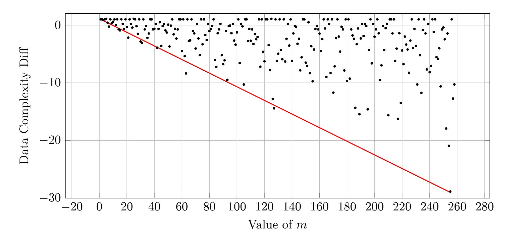

{0}------------------------------------------------

# <span id="page-0-0"></span>**Cryptanalysis of Two Alternating Moduli Weak PRFs**

Kai Hu<sup>1</sup>*,*6*,*<sup>7</sup> [,](https://orcid.org/0000-0003-3552-7200) Gregor Leander<sup>2</sup> [,](https://orcid.org/0000-0002-2579-8587) Håvard Raddum<sup>3</sup> [,](https://orcid.org/0000-0001-9779-5986) Arne Sandrib[4](https://orcid.org/0009-0009-1437-199X) and Aleksei Udovenko[5](https://orcid.org/0000-0001-8318-6274)

[gregor.leander@rub.de](mailto:gregor.leander@rub.de)

<sup>3</sup> Simula UiB, Bergen, Norway.

[haavardr@simula.no](mailto:haavardr@simula.no)

<sup>4</sup> Department of Informatics, University of Bergen, Bergen, Norway.

[arne.sandrib@student.uib.no](mailto:arne.sandrib@student.uib.no)

<sup>5</sup> SnT, University of Luxembourg, Esch-sur-Alzette, Luxembourg.

[aleksei@affine.group](mailto:aleksei@affine.group)

**Abstract.** In this work, we present new cryptanalytic attacks on recently proposed, theory-inspired constructions of weak pseudorandom functions (weak-PRFs). We demonstrate attacks on several such designs, showing that the initial security arguments require significant refinement. Methodologically, our approach relies on novel observations about the structure of cyclic matrices, applications of Wagner's generalized birthday technique, and conversion into polynomial systems over F3. These findings highlight the need for a more careful analysis of those weak-PRF candidates.

**Keywords:** Cryptanalysis · Weak PRF · Alternating Moduli · DarkMatter

# **1 Introduction**

Pseudorandom functions (PRFs) are a fundamental primitive in modern cryptography, with applications ranging from encryption and authentication to secure multiparty computation and fully homomorphic encryption. Designing PRFs that are both efficient and provably secure has been a central challenge for decades.

Boneh et al. [\[BIP](#page-22-0)<sup>+</sup>18a] categorized the state of the art into two largely disjoint approaches [[ABG](#page-21-0)<sup>+</sup>14]: (i) practice-oriented designs that prioritize efficiency and simplicity, often guided by heuristics and cryptanalytic experience, and (ii) provability-oriented designs whose security is reduced to well-studied hardness assumptions. While the latter provides stronger theoretical guarantees, the former has proven more successful in practice, often yielding schemes that are several orders of magnitude faster.

The new direction proposed in [[BIP](#page-22-0)<sup>+</sup>18a] and refined in a CRYPTO paper [[DGH](#page-22-1)<sup>+</sup>21a] was to maximize simplicity by employing linear operations over different algebraic structures, more concretely computations modulo 2 and modulo 3, combined in simple ways. While in general not entirely new (similar mixing of algebraic domains can be traced back to ARX ciphers and even to IDEA (1991) [\[LM90\]](#page-23-0)), in contrast to classical block ciphers that iterate a round function the weak PRF (wPRF) designs considered here rely on flat

<sup>1</sup> School of Cyber Science and Technology, Shandong University, Qingdao, Shandong, China. [kai.hu@sdu.edu.cn](mailto:kai.hu@sdu.edu.cn)

<sup>2</sup> Faculty of Computer Science, Ruhr Bochum University, Bochum, Germany.

<sup>6</sup> State Key Laboratory of Cryptography and Digital Economy Security, Shandong University, Qingdao, China.

<sup>7</sup> Suzhou Research Institute, Shandong University, Suzhou, China.

{1}------------------------------------------------

<span id="page-1-0"></span>circuits with no round iteration. This arithmetization-oriented style is reminiscent of recent MPC- and FHE-friendly ciphers such as Rasta [\[DEG](#page-22-2)+18], LowMC [[ARS](#page-22-3)+15], and their successors that equally aim at minimizing the multiplicative depth of the circuit.

The main attraction of these wPRF constructions is their simplicity and efficiency. Yet, their security is not reducible to standard hardness assumptions and instead must be justified empirically through cryptanalysis, just as any classic design. Previous works have already contributed in this regard. In [\[CCKK21](#page-22-4)], the authors presented distinguishers for the two single-output wPRF variants originally proposed in [[BIP](#page-22-0)+18a]. Specifically, they analyzed: (i) The *circulant Mod2/Mod3 wPRF* (Construction 3.1 in [[BIP](#page-22-0)+18a]), for which they identified a bias of *O*(2*−*0*.*21*n*), and (ii) The *alternative Mod-2/Mod-3 wPRF* (Construction 5.3 in [\[BIP](#page-22-0)<sup>+</sup>18a]), for which they identified a bias of *O*(2*−*0*.*105*n*), where *n* is the length of the input. Thus, the two wPRFs can be distinguished with respective complexities of *O*(20*.*42*n*) and *O*(20*.*21*n*). In a following work [[JMN23\]](#page-23-1), Johansson, Meier, and Nguyen improved the distinguishing attacks on the alternative Mod-2/Mod-3 wPRF with *O*(20*.*166*n*) samples.

Recently, in [\[APRR24](#page-21-1)], a new wPRF was proposed as a generalisation of wPRF in [[BIP](#page-22-0)+18a, [DGH](#page-22-1)+21a]. However, this new design has been broken by two key-recovery attacks [[AR25,](#page-22-5) [SW26\]](#page-23-2) that exploit the fact that key and input bits are combined using the AND operation, which causes any input bit multiplied by a zero key bit to have no influence on the output. More introductions to the development of the wPRF can be found in a recent Systematization of Knowledge paper [\[BCPR25\]](#page-22-6).

This paper focuses on the following two wPRF variants.

- **(2,3)-wPRF:** This construction was formally described in [[DGH](#page-22-1)+21a, Construction 1] ([\[DGH](#page-22-7)+21b, Construction 3.1]), but its single-output version was originally introduced in [[BIP](#page-22-0)<sup>+</sup>18a, Construction 3.1]; [\[BIP](#page-22-0)+18a, Remark 3.3] also suggested an option with multiple outputs. There is no known attack on this multiple-output construction. We focus on the case of a circulant key matrix.
- **LPN-wPRF:** This corresponds to the "alternative" Mod-2/Mod-3 wPRF from [[BIP](#page-22-0)+18a, Construction 5.3] ([\[BIP](#page-22-8)+18b, Construction 6.3]), with a single-bit output and no compression. We adopt the naming convention from [[DGH](#page-22-1)<sup>+</sup>21a] and refer to it as LPN-wPRF, as it is regarded as a construction based on the Learning Parity with Noise (LPN) problem (in the latter, it was generalized to a multiple-output variant which we do not consider).

[Table 1](#page-2-0) summarizes the state-of-the-art cryptanalysis and our results on these two types of weak PRFs.

### **Our contributions**

**(2***,* **3)-wPRF** We present the first cryptanalytic result on (2*,* 3)-wPRF based on nontrivial observations on circulant matrices and their row-spaces. Our contributions can be summarized as follows. We present attacks on (2*,* 3)-wPRF with circulant keys where *n* is a power of 2. We show that the variant proposed in [[DGH](#page-22-1)<sup>+</sup>21a] remains insecure for certain parameter choices. For the security level denoted by *λ*, we get

- For aggressive parameters (*n* = 2*λ*), we obtain attacks of complexity 2 0*.*685*λ* .
- For conservative parameters (*n* = 2*.*5*λ*), our attacks run in 2 0*.*935*λ* time.

Even when the query complexity is capped at 2 <sup>40</sup>, as suggested in [[DGH](#page-22-1)<sup>+</sup>21a], our results imply that the aggressive parameter set is insecure for practical choices such as *λ* = 80 or *λ* = 96. Furthermore, we generalise the attack to any dimension *n* that is divisible 

{2}------------------------------------------------

<span id="page-2-3"></span>by 4. This attack has been practically implemented and the source codes are provided in  $[KGH^+25]^1$ .

**LPN-wPRF** For the case of LPN-wPRF [BIP<sup>+</sup>18a] we are not able to improve upon earlier proposed methods, in particular upon the BKW algorithm [BKW00]. However, our approach deviates sharply from a technical perspective. For this reason, we hope that it can be used as a source of inspiration for future improvements.

More precisely, building on Wagner's generalized birthday technique [Wag02], we show how to eliminate the inner product over  $\mathbb{F}_2$  and convert the problem into solving a polynomial equation system algebraically over  $\mathbb{F}_3$ , for instance using linearization. Unlike prior work, our attack does not rely on assumptions about the Hamming weight of the key.

- For  $\lambda = 128$  and n = 384 (the parameters suggested in [BIP<sup>+</sup>18a]), the attack has complexity about  $2^{149.2}$  and is not competitive.
- Generalizing in the natural way to  $\lambda = 256$  and n = 768, however, gives a complexity of about  $2^{207.9}$ , which is lower than the given security level.

<span id="page-2-0"></span>

| Weak PRF                   | Ref.                   | Type          | $ \lambda, n $                                                | Time                                                                  | Queries                                                                  | Ref.                   |  |
|----------------------------|------------------------|---------------|---------------------------------------------------------------|-----------------------------------------------------------------------|--------------------------------------------------------------------------|------------------------|--|
| (2,3)-wPRF single-output   | [BIP <sup>+</sup> 18a] | distinguisher | any                                                           | $2^{0.42n}$                                                           | $2^{0.42n}$                                                              | [CCKK21]               |  |
| (2,3)-wPRF<br>multi-output | [DGH <sup>+</sup> 21a] | key-recovery  |                                                               | $\begin{array}{ c c } 2^{0.69\lambda} \\ 2^{0.94\lambda} \end{array}$ | $\begin{array}{ c c } 2^{0.32\lambda} \\ 2^{0.32\lambda} \end{array}$    | Section 3<br>Section 3 |  |
| LPN-wPRF single-output     | [BIP <sup>+</sup> 18a] | distinguisher | any any                                                       | $\begin{array}{ c c c } 2^{0.21n} \\ 2^{0.17n} \end{array}$           | $\begin{array}{ c c c c c } 2^{0.21n} \\ 2^{0.17n} \end{array}$          | [CCKK21]<br>[JMN23]    |  |
|                            |                        | key-recovery  | $ \begin{array}{ c c c c c } 128,384 \\ 256,768 \end{array} $ | $\begin{array}{ c c c } 2^{149.2} \\ 2^{207.9} \end{array}$           | $\begin{array}{ c c c c }\hline 2^{108.31} \\ 2^{206.31} \\ \end{array}$ | Section 5<br>Section 5 |  |

**Table 1:** Summary of attacks on the (2,3)-wPRF and LPN-wPRF variants.

Taking our results on (2,3)-wPRF and LPN-wPRF together, we show that the some of the given parameter sets for wPRFs fail to meet their targeted security levels for key-recovery attacks. This underlines the importance of continued scrutiny of arithmetic-oriented PRF designs and contributes to a better understanding of their true security margins.

Organization of the paper. Section 2 introduces the notations as well as the wPRF targets of our attacks. We present our main attacks on the (2,3)-wPRF in Section 3 where the input length should be a power of 2. In Section 4, a more general case where the input length is a multiple of 4 is considered. We give our cryptanalysis result on the LPN-wPRF in Section 5, and the conclusions in Section 6.

## <span id="page-2-2"></span>2 Preliminaries

#### 2.1 Notation

We now introduce the notation used in this paper. The finite fields with 2 and 3 elements are denoted by  $\mathbb{F}_2$  and  $\mathbb{F}_3$ , respectively. For  $p \in \{2,3\}$  and  $x,y \in \mathbb{F}_p^n$ ,  $x \cdot_p y = \langle x,y \rangle_p = \sum_{i=0}^{n-1} x_i \cdot_p y_i$  is the inner product of x and y, where  $\cdot_p$  and  $\sum$  are the multiplication and

<span id="page-2-1"></span><sup>&</sup>lt;sup>1</sup>The codes are also available at https://github.com/hukaisdu/Cryptanalysis-of-2-3-wPRF

{3}------------------------------------------------

<span id="page-3-1"></span>addition in  $\mathbb{F}_p$ , and  $x_i$  is the *i*-th element of x. For additions, we always add the subscript  $+_p$  to emphasize in which field we are working. In some special cases in Section 5, we still use  $\oplus$  for the addition for elements in  $\mathbb{F}_2$ . For the sake of simplicity, the notation  $\cdot_p$  is used not only for multiplication between two elements from  $\mathbb{F}_p$ , but also for matrix/vector products.

For  $x \in \mathbb{F}_p^n$ , let  $(x \gg i)$  and  $(x \ll i)$  represent the cyclic rotations of x by i positions to the right and left, respectively. By  $\operatorname{circ}_{\ll}(x)$  we mean a circulant matrix in  $\mathbb{F}_p^{n \times n}$  whose i-th row is  $x \ll i$ , and similarly for  $\operatorname{circ}_{\gg}(x)$  and  $x \gg i$ .

### 2.2 Weak pseudo-random functions

In essence, a pseudorandom function is a family of functions that is hard to tell apart from a random function. A *weak* pseudorandom function (wPRF) is a family of functions that is hard to tell apart from a random function for *random* inputs.

Thus, the distinction between a *weak* PRF and a *(strong)* PRF lies in the adversarial query model: with wPRFs, the adversaries are restricted to query only random inputs, whereas with strong PRFs, the adversaries are permitted to query adaptive, chosen inputs.

Thus, a wPRF is a keyed function  $f: \mathcal{K} \times \mathcal{X} \to \mathcal{Y}$  that, when queried on random inputs  $x \in \mathcal{X}$ , is computationally indistinguishable from a truly random function.

More formally, for a randomly chosen  $k \in \mathcal{K}$ , the pairs (x, f(k, x)) for  $x \in \mathcal{X}$  sampled uniformly at random is indistinguishable from the pairs (x, g(x)) of a random function  $g: \mathcal{X} \to \mathcal{Y}$  to any adversary running in time  $t(\lambda)$  with access to an oracle for f. We refer to e.g. [BIP<sup>+</sup>18a] for more details and exact definitions.

**Security Notion of a wPRF.** The security of a wPRF f is quantified by the advantage an adversary  $\mathcal{A}$  running in time  $t(\lambda)$  has in distinguishing f(k,x) from a random function on randomly given inputs. We say that f is secure if

$$\operatorname{Adv}_{f,\mathcal{A}}^{\operatorname{wPRF}} = \left| \Pr[\mathcal{A}^{f(k,\cdot)} = 1] - \Pr[\mathcal{A}^{g(\cdot)} = 1] \right| \le \epsilon(\lambda),$$

where g is a function drawn uniformly at random from the space of all functions mapping  $\mathcal{X} \to \mathcal{Y}$  and  $\epsilon(\lambda)$  is negligible in  $\lambda$ . If a wPRF claims to give  $\lambda$ -bit security, it means that the above security notion holds when  $t(\lambda) = 2^{\lambda}$ . That is,  $\mathcal{A}$  is allowed to make up to  $2^{\lambda}$  queries to the oracle and can run in time up to the time to make  $2^{\lambda}$  calls to the wPRF.

#### <span id="page-3-0"></span>2.3 Targets of this paper

(2,3)-wPRF. The basic form of the (2,3)-wPRF was proposed for the first time in [BIP<sup>+</sup>18a], where the output has only 1 bit. They also mentioned the possibility of adapting it to a variant with multiple output bits. In [DGH<sup>+</sup>21a], Dinur et al. formally described this construction. It can be described as follows,

$$F(\mathbf{K}, x) : \mathbb{F}_2^{n \times n} \times \mathbb{F}_2^n \to \mathbb{F}_3^t$$
  
 $(\mathbf{K}, x) \mapsto \mathbf{B} \cdot_3 (\mathbf{K} \cdot_2 x),$ 

where  $K \in \mathbb{F}_2^{n \times n}$  is a secret full-rank matrix generated from the secret key and  $B \in \mathbb{F}_3^{t \times n}$  is a public matrix. In the single-output-bit version, B is a  $1 \times n$  matrix whose elements are all 1 (so the output bit is the sum of all coordinates of  $K \cdot_2 x$ ). In the multiple-output-bit version, B is a matrix of rank t chosen randomly from  $\mathbb{F}_3^{t \times n}$ .

The original design in [BIP<sup>+</sup>18a] suggested to use some structural matrices for K such as Toeplitz or block-circulant matrices for more efficient computation of  $K \cdot_2 x$ . About the block-circulant matrices, the authors say [BIP<sup>+</sup>18a, p. 718] that "the key can be compactly represented by a single vector  $k \in \mathbb{Z}_2^n$ ". This suggests K can be a bit-circulant matrix, and

{4}------------------------------------------------

<span id="page-4-2"></span>in [CCKK21] the authors attacked the (2,3)-wPRF in [BIP<sup>+</sup>18a] under this assumption. In [DGH<sup>+</sup>21a] the authors suggest that using a circulant matrix as K indeed should be secure. In this work we follow suit and consider the variant where K is a circulant matrix  $K = \text{circ}_{\ll}(k)$ , given by its top row  $k \in \mathbb{F}_2^n$ . The construction of this wPRF is shown in Figure 1.

<span id="page-4-0"></span>
$$y \in \mathbb{F}_{3}^{t} \qquad B \in \mathbb{F}_{3}^{t \times n} \qquad K \in \mathbb{F}_{2}^{n \times n} \qquad x \in \mathbb{F}_{2}^{n}$$

$$\begin{bmatrix} y_{1} \\ y_{2} \\ \vdots \\ y_{t} \end{bmatrix} = \begin{bmatrix} b_{1,1} & b_{1,2} & \cdots & b_{1,n} \\ \vdots & \vdots & \ddots & \vdots \\ b_{t,1} & b_{t,2} & \cdots & b_{t,n} \end{bmatrix} \cdot 3 \begin{bmatrix} k_{1} & k_{2} & \cdots & k_{n} \\ k_{2} & k_{3} & \cdots & k_{1} \\ \vdots & \vdots & \ddots & \vdots \\ \vdots & \vdots & \ddots & \vdots \\ k_{n} & k_{1} & \cdots & k_{n-1} \end{bmatrix} \cdot 2 \begin{bmatrix} x_{1} \\ x_{2} \\ \vdots \\ x_{n} \end{bmatrix}$$

**Figure 1:** Construction of the (2,3)-wPRF from [BIP<sup>+</sup>18a] with a circulant K. The blue and red colors represent elements or operations in  $\mathbb{F}_2$  and  $\mathbb{F}_3$ , respectively.

In [BIP<sup>+</sup>18a, CCKK21, DGH<sup>+</sup>21a], different parameters for the (2,3)-wPRF were suggested. This paper takes the security parameters set in [DGH<sup>+</sup>21a, Table 1], where two parameter sets for  $\lambda$ -bit security are given as

- The aggressive setting:  $n = 2\lambda$ ,  $t = \lambda/\log_2 3 \approx 0.63\lambda$ ;
- The conservative setting:  $n = 2.5\lambda$ ,  $t = \lambda/\log_2 3 \approx 0.63\lambda$ .

**LPN-wPRF.** A different type of wPRF named LPN-wPRF was also proposed in [BIP<sup>+</sup>18a]. The abbreviation LPN stands for Learning Parity with Noise as the mapping resembles an LPN instance. The LPN-wPRF is given by

$$F(k,x): \mathbb{F}_2^n \times \mathbb{F}_2^n \to \mathbb{F}_2: (k,x) \mapsto \langle k, x \rangle_2 +_2 (\langle k, x \rangle_3 \bmod 2) \tag{1}$$

The output is essentially the inner product of k and x over  $\mathbb{F}_2$  with the "noise" being the inner product of k and x over  $\mathbb{F}_3$  followed by a mod2 operation. An illustration of the LPN-wPRF is given in Figure 2.

<span id="page-4-1"></span>
$$k \in \mathbb{F}_2^n$$
  $x \in \mathbb{F}_2^n$   $k \in \mathbb{F}_3^n$   $x \in \mathbb{F}_2^3$   $y = \begin{bmatrix} x_1 \\ x_2 \\ \vdots \\ x_n \end{bmatrix} \cdot 2 \begin{bmatrix} x_1 \\ x_2 \\ \vdots \\ x_n \end{bmatrix} + 2 \left( \begin{bmatrix} k_1 & k_2 & \cdots & k_n \end{bmatrix} \cdot 3 \begin{bmatrix} x_1 \\ x_2 \\ \vdots \\ x_n \end{bmatrix} \mod 2 \right)$ 

**Figure 2:** Construction of the LPN-wPRF. The blue and red colors represent elements or operations in  $\mathbb{F}_2$  and  $\mathbb{F}_3$ , respectively.

Concrete limit of samples. For both kinds of wPRF, there is no data limit that was put in [BIP<sup>+</sup>18a], while in [DGH<sup>+</sup>21a] a concrete limit of 2<sup>40</sup> on the number of samples generated by the target wPRF is placed. In this paper, we will consider the general security of both wPRFs, and discuss the influence of the data limit afterwards.

{5}------------------------------------------------

# <span id="page-5-2"></span><span id="page-5-0"></span>3 Cryptanalysis of the (2,3)-wPRF with Circulant K

In this section, we show our attack on the (2,3)-wPRF with t > 1. Let us represent the (2,3)-wPRF as follows:

$$y \stackrel{B}{\longleftarrow} w \stackrel{K}{\longleftarrow} x$$
.

As stated in [DGH<sup>+</sup>21a], a naive idea is to recover w by guessing n-t elements of w and solve the resulting determined nonhomogeneous linear system like  $y = \mathbf{B} \cdot_3 w'$  over  $\mathbb{F}_3$ . The authors of [DGH<sup>+</sup>21a] had realized that using the low-rank  $\mathbf{K}$  (equivalently,  $\operatorname{circ}_{\gg}(x)$ )) to reduce the guessing efforts of w; however, they did not go further in this direction, leaving it as an open question.

Our idea is to combine the low-rank property of w (by seeing w as n linear combinations of key bits), with the feature that the difference of two halves of the output of a circulant matrix is only determined by the difference of two halves of the input. With knowing the difference of the two halves of the input, the second half of w is the XOR of the first half of w and the difference between the two halves. Although the difference is unknown, because of keys and the circulant structure, the linear relationship of the difference between the halves of w is the same as the difference between the halves of the input. When the input difference has lower-rank we can solve the equation  $y = \mathbf{B} \cdot_3 w$  with less effort. This observation is the basis of the attack.

#### <span id="page-5-1"></span>3.1 Properties of circulant matrices

Property 1: Self-symmetry property of the circulant K. The inner product is invariant under rotations of both arguments:

$$\langle x, y \rangle = \langle x \ll i, y \ll i \rangle = \sum_{j=0}^{n-1} x_j y_j$$

for any x, y, i. Using this, we can write

$$K \cdot_{2} x = \operatorname{circ}_{\ll}(k) \cdot_{2} x$$

$$= \begin{bmatrix} \langle k, x \rangle_{2} \\ \langle (k \ll 1), x \rangle_{2} \\ \vdots \\ \langle (k \ll (n-1)), x \rangle_{2} \end{bmatrix} = \begin{bmatrix} \langle k, x \rangle_{2} \\ \langle k, (x \gg 1) \rangle_{2} \\ \vdots \\ \langle k, (x \gg (n-1)) \rangle_{2} \end{bmatrix} = \operatorname{circ}_{\gg}(x) \cdot_{2} k, \quad (2)$$

and redefine the scheme to be

$$y = \mathbf{B} \cdot_3 (\operatorname{circ}_{\gg}(x) \cdot_2 k).$$

Our main attack idea is based on an observation of the circulant matrix when n is even. Let  $k \in \mathbb{F}_2^n$  where n is even and  $\mathbf{K} = \operatorname{circ}_{\ll}(k)$ . For any  $x = (a||a+\delta)$  where  $a, \delta \in \mathbb{F}_2^{n/2}$ , the difference of the two halves of

$$w = \mathbf{K} \cdot_2 x = \operatorname{circ}_{\mathscr{M}}(k) \cdot_2 x = \operatorname{circ}_{\mathscr{M}}(x) \cdot_2 k \tag{3}$$

is independent of a, and is only related to k and  $\delta$ . This fact can be seen from the following calculation.

For  $0 \le i < n/2$ , the *i*-th element of w is

$$\langle (x \gg i), k \rangle_2 = \langle ((a \gg i) || (a \gg i)) + ((0 || \delta) \gg i), k \rangle_2.$$

{6}------------------------------------------------

The *n/*2 + *i*-th element of *w*, i.e. the *i*-th element of the second half, is computed as

$$\langle x \ggg (n/2+i), k \rangle_2 = \langle ((a \ggg i) || (a \ggg i)) + ((\delta || 0) \ggg i), k \rangle_2$$

thus, the sum of the two elements is

<span id="page-6-2"></span>
$$\langle x \gg i, k \rangle_2 + \langle x \gg (n/2 + i), k \rangle_2 = \langle (\delta \gg i) || (\delta \gg i), k \rangle_2. \tag{4}$$

**Property 2: Low-rank circulant matrices and their row space structure.**

For *x* = (*a||a* + *δ*), the dimension of

<span id="page-6-0"></span>
$$D_x = \operatorname{span}\{(\delta \gg i | | \delta \gg i), 0 \le i < n/2\}$$
(5)

is equal to the rank of circ≫(*δ*) *∈* F *n/*2*×n/*2 2 . The following proposition of circulant matrices helps us to obtain the values of all the *h*(*δ* ≫ *i||δ* ≫ *i*)*, ki*<sup>2</sup> for 0 *≤ i < n/*2 by guessing less than *n/*2 bits, via a time-data trade-off.

The proposition below shows a very useful property of random circulant matrices: when *n* is a power of 2, then with quite high probability (compared to general random matrices) the dimension of the row space is low. What is more surprising, the number of spaces spanned by its rows is equal to the number of possible ranks, i.e. the dimension of the row space uniquely determines the space itself. We will treat the case of more general *n* in [Section 4.](#page-12-0)

<span id="page-6-1"></span>**Proposition 1.** *Let n* = 2*<sup>ℓ</sup> for some integer ℓ >* 0*. Let x be sampled uniformly at random from* F *n* <sup>2</sup> *and let A* = circ≫(*x*)*. Then, all of the following holds:*

- *i For any r,* 1 *≤ r ≤ n, we have* Pr[rank *A* = *r*] = 2*r−*1*−n.*
- *ii The row space of A only depends on the rank of A.*
- *iii For x* = (*a||a* + *δ*)*, a, δ ∈* F *n/*2 2 *, we have*

$$\operatorname{rank}\operatorname{circ}_{\gg}(x) = \begin{cases} \operatorname{rank}\operatorname{circ}_{\gg}(\delta) + \frac{n}{2}, & \delta \neq 0, \\ \operatorname{rank}\operatorname{circ}_{\gg}(a), & \delta = 0. \end{cases}$$

*Proof.* (*i*) Define a correspondence between F *n* <sup>2</sup> and *R* := F2[*z*]*/hz <sup>n</sup> −* 1*i* by

$$(u_0, u_1, \dots, u_{n-1}) \leftrightarrow u_0 + u_1 z + \dots + u_{n-1} z^{n-1}.$$

The row space of *A* is isomorphic to the ideal *hf*(*z*)*i* in *R*, where the polynomial *f*(*z*) is given as *f*(*z*) := *x*0+*x*1*z*+*· · ·*+*xn−*1*z n−*1 . This ideal is generated by *g*(*z*) := gcd(*f*(*z*)*, z<sup>n</sup>−* 1). Indeed, by the extended Euclidian algorithm we can compute *d*1(*z*)*, d*2(*z*) *∈* F2[*z*] such that *d*1(*z*)*f*(*z*) +*d*2(*z*)(*z <sup>n</sup> −*1) = *g*(*z*) and *g*(*z*) is such a polynomial combination of lowest possible degree; any polynomial combination of *f*(*z*) and *z <sup>n</sup> −* 1 is divisible by *g*(*z*) and thus is covered.

The immediate consequence is that the rank of *A*, which is equal to the dimension of *hg*(*z*)*i* as a vector space over F2, is equal to *n −* deg *g*(*z*). We compute the probability that deg(*g*(*z*)) = *n − r*:

Note that *z <sup>n</sup> −* 1 = (*z* + 1)*<sup>n</sup>* in F2[*z*] when *n* = 2*<sup>ℓ</sup>* . We compute the probability that (*z*+1)*<sup>n</sup>−<sup>r</sup>* divides *f*(*z*) and (*z*+1)*<sup>n</sup>−r*+1 does not divide *f*(*z*). Write *f*(*z*) = (*z*+1)*<sup>n</sup>−<sup>r</sup> g*(*z*). There are exactly 2 *<sup>r</sup>* possible polynomials *g*(*z*). For *f*(*z*) = (*z* + 1)*<sup>n</sup>−r*+1*h*(*z*), there are 2 *<sup>r</sup>−*<sup>1</sup> possible polynomials *h*(*z*). The number of desirable polynomials giving rank exactly *r* is 2 *<sup>r</sup> −*2 *<sup>r</sup>−*<sup>1</sup> = 2*<sup>r</sup>−*<sup>1</sup> and the total number of distinct polynomials mod *z <sup>n</sup> −*1 is 2 *<sup>n</sup>*. Thus

$$\Pr[\operatorname{rank} \mathbf{A} = r] = \Pr[(z+1)^{n-r} \mid f(z) \text{ and } (z+1)^{n-r+1} \nmid f(z)]$$
$$= 2^{r-1}/2^n = 2^{r-n-1}.$$

{7}------------------------------------------------

- (ii) When  $n=2^{\ell}$ , the row space will be just  $\langle g(z)\rangle = \langle (z+1)^r\rangle$  in R, so the row space is completely determined by the rank r.
  - (iii) Abusing notation, we can write

$$f(z) = a(z) + z^{n/2}(a(z) + \delta(z)) = a(z)(z^{n/2} + 1) + \delta(z)z^{n/2},$$

where  $a(z), \delta(z)$  are of degree at most n/2 - 1. If  $\delta = 0$ , we have  $f(z) = a(z)(z^{n/2} + 1)$  and it follows that the degree of g(z) is equal to n/2 plus the degree of  $\gcd(a(z), z^{n/2} + 1)$ , which shows that the rank is equal  $n - \operatorname{rank}(\operatorname{circ}(a))$ . If  $\delta \neq 0$ , we can see that the degree of g(z) is upper bounded by n/2 - 1, since  $f(z) \neq 0 \pmod{z^{n/2} + 1}$  unless  $\delta = 0$  (here we use the fact that n/2 is a power of two and thus  $(z^{n/2} + 1) = (z + 1)^{n/2}$ ). For all lower possibilities of the degree, it is clear that the degree of g(z) is equal to the degree of  $\gcd(\delta(z), z^{n/2-1})$ , implying the statement.

### <span id="page-7-1"></span>3.2 Recovering w

As mentioned above, our attack is based on a time-data trade-off. The first step of the attack is to sample one  $x = (a||a + \delta)$  that leads to an r-rank  $\operatorname{circ}_{\gg}(\delta)$ , or equivalently, to an r-dimensional subspace  $D_x$  (as in (5)), for some chosen r < n/2. By Proposition 1, we need to sample on average  $2^{n/2+1-r}$  queries to the wPRF to find such an x.

Let  $\{(v_0||v_0), \ldots, (v_{r-1}||v_{r-1})\}$  be a basis for  $D_x$ . Then, for all i, the vector  $((\delta \gg i)||(\delta \gg i))$  can be written as  $((\delta \gg i)||(\delta \gg i)) = \sum_{j=0}^{r-1} a_{i,j} \cdot_2 (v_j||v_j), \ a_{i,j} \in \mathbb{F}_2$ , so guessing the values of  $\langle v_j||v_j,k\rangle_2$  for  $0 \leq j < r$  is sufficient to compute  $\langle (\delta \gg i)||(\delta \gg i)),k\rangle_2$  for all  $i, 0 \leq i < n/2$ .

The first goal of the attack is to recover  $w = \operatorname{circ}_{\ll}(k) \cdot_2 x$ , as knowing w corresponding to some x makes it easier to recover k. We proceed by guessing the r bits  $\langle (v_j||v_j), k \rangle_2$  for  $0 \le j < r$ , as described above. From the guessed values, let  $c_i = \langle (\delta \gg i) || (\delta \gg i), k \rangle_2$  for  $0 \le i < n/2$ . Using (4) we then have  $w_{n/2+i} = w_i +_2 c_i$  for  $0 \le i < n/2$ , that is, the second half of w is given by the first half and the guesses for  $\langle v_j || v_j, k \rangle_2$ .

We guess another n/2-t bits of w as  $w_i=g_i$  for  $0 \le i < n/2-t$ . To sum up and ease notation, let  $\mathbf{g}=(g_0,\ldots,g_{n/2-t-1}), \mathbf{z}=(z_0,\ldots,z_{t-1}), \mathbf{c}_{\mathbf{g}}=(c_0,\ldots,c_{n/2-t-1}),$  and  $\mathbf{c}_{\mathbf{z}}=(c_{n/2-t},\ldots,c_{n/2-1})^2$ . The whole vector  $w \in \{0,1\}^n$  can then be written as

$$w = \left[ \begin{array}{c} \mathbf{g} \ \mathbf{z} \ \mathbf{g} +_2 \mathbf{c_g} \ \mathbf{z} +_2 \mathbf{c_z} \end{array} \right],$$

where  $\mathbf{z} = (z_0, z_1, \dots, z_{t-1})$  are t unknown variables.

Recall that the output y of the (2,3)-wPRF is computed as  $y = \mathbf{B} \cdot_3 w$ , where the bits in w are treated as elements of  $\mathbb{F}_3$ . With the guessed bits there is now enough information to recover the remaining unknown parts  $z_0, \ldots, z_{t-1}$  of w from the known output y, but the addition of the constants in  $\mathbf{c}_{\mathbf{z}}$  causes a problem in the transition from  $\mathbb{F}_2$  to  $\mathbb{F}_3$  that needs to be worked out first.

The part of w consisting of  $\mathbf{g}$  and  $\mathbf{g} +_2 \mathbf{c_g}$  are fully known bits and can be considered as elements in  $\mathbb{F}_3$  directly. In the following let  $\mathbf{g}' = \mathbf{g} +_2 \mathbf{c_g}$ . The variables in  $\mathbf{z}$  can also readily be treated as elements of  $\mathbb{F}_3$ . For the last part of w consisting of  $z_i +_2 c_{i+n/2-t}$  for  $0 \le i < t$ , there is no problem when  $c_{i+n/2-t} = 0$ , as then  $z_i$  is equal to 0 or 1 whether it is viewed as over  $\mathbb{F}_2$  or  $\mathbb{F}_3$ . However, when  $c_{i+n/2-t} = 1$  and  $z_i = 1$ , then  $z_i +_2 c_{i+n/2-t}$  should be treated as 0 (and not 2) when viewed as an element in  $\mathbb{F}_3$ . So we can not treat the  $+_2$ 's in w as a  $+_3$  and just solve  $y = \mathbf{B}w$  over  $\mathbb{F}_3$  with the w given above.

<span id="page-7-0"></span><sup>&</sup>lt;sup>2</sup>In this subsection, we have deliberately set these four variables in boldface to remind readers that they are vectors, thereby enhancing readability.

{8}------------------------------------------------

Let b be an entry in **B** that is multiplied with an element  $z_i +_2 1$  from w. Then we need

$$b \cdot_3 (z_i +_2 1) = \begin{cases} b, & z_i = 0 \\ 0, & z_i = 1. \end{cases}$$

This can be achieved by replacing every  $z_i +_2 1$  in w with  $2 \cdot_3 z_i +_3 1$ . Leaving all other bits and variables in w in place, we then get a linear system entirely over  $\mathbb{F}_3$ :

$$\begin{bmatrix} y_0 \\ \vdots \\ y_{t-1} \end{bmatrix} = [\boldsymbol{B}_g | \boldsymbol{B}_z | \boldsymbol{B}_{g'} | \boldsymbol{B}_{c_z}] \begin{bmatrix} \mathbf{g} \\ \mathbf{z} \\ \mathbf{g'} \\ \vdots \\ z_i \text{ or } 2z_i +_3 1 \\ \vdots \end{bmatrix},$$

where the last part of w has the entry  $z_i$  in positions where  $c_i = 0$  and  $2z_i +_3 1$  in positions where  $c_i = 1$ .

For completeness, we explicitly give the system to be solved. Let  $\boldsymbol{B}_{c_z}^0$  be the columns of  $\boldsymbol{B}_{c_z}$  that are multiplied with  $z_i$ , and let  $\boldsymbol{B}_{c_z}^1$  be the columns of  $\boldsymbol{B}_{c_z}$  that are multiplied with  $2z_i +_3 1$ . The columns in  $\boldsymbol{B}_{c_z}^0$  and  $\boldsymbol{B}_{c_z}^1$  are interleaved and do not appear in blocks, but with a slight abuse of notation we can write the equation system as

$$\left[\begin{array}{c} y_0 \ \vdots \ y_{t-1} \end{array}\right] = \left[\boldsymbol{B}_g | \boldsymbol{B}_z | \boldsymbol{B}_{g'} | \boldsymbol{B}_{c_z}^0 | \boldsymbol{B}_{c_z}^1 \right] \left[\begin{array}{c} \mathbf{g} \ \mathbf{z}^0 \ \mathbf{z}^1 +_3 \mathbf{1} \end{array}\right]$$

where it is understood that the entries in  $(\mathbf{z^0}, 2\mathbf{z^1} + \mathbf{3} \mathbf{1})$  and columns in  $(\boldsymbol{B}_{c_z}^0, \boldsymbol{B}_{c_z}^1)$  are interleaved in the same way, depending on which indices have  $c_i = 1$ . Rearranging and isolating the unknown vector  $\mathbf{z}$  on the right hand side we get the following linear equation system to solve

<span id="page-8-0"></span>
$$\begin{bmatrix} y_0 \\ \vdots \\ y_{t-1} \end{bmatrix} - (\boldsymbol{B}_g \mathbf{g} +_3 \boldsymbol{B}_{g'} \mathbf{g}' +_3 \boldsymbol{B}_{c_z}^1 \mathbf{1}) = [[\boldsymbol{B}_z] +_3 [\boldsymbol{B}_{c_z}^0 | 2\boldsymbol{B}_{c_z}^1]] \mathbf{z},$$
 (6)

where all operations are over  $\mathbb{F}_3$  and  $\mathbf{1} = (1, \dots, 1)^{\top}$ . The solution of the system recovers a candidate for the full w, under the current guesses of  $\langle v_j || v_j, k \rangle_2$  and g.

Filtering candidate w's. When solving (6) the recovered values in  $\mathbf{z}$  can take all possible values in  $\mathbb{F}_3$ . However, we know that the correct guess will give  $\mathbf{z} \in \{0,1\}^t$ . Therefore, any guess that produces a  $\mathbf{z}$  containing the value 2 must be wrong and can be discarded. This happens with probability  $1 - (\frac{2}{3})^t$  so the probability of a w passing the  $\{0,1\}$ -filter is  $(\frac{2}{3})^t$ .

The number of guessed bits is r + n/2 - t, so the number of candidate w's remaining after trying all possible guesses for the  $g_i$  and  $\langle v_i || v_i, k \rangle_2$  is

$$2^{r+n/2-t} \left(\frac{2}{3}\right)^t \approx 2^{r+n/2-1.58t}.$$

### 3.3 Complete attack

Recall that  $w = \operatorname{circ}_{\ll}(x) \cdot_2 k$ . Unfortunately, due to the constraint imposed on x during sampling (the dimension r of the space  $D_x$ ), the matrix  $\operatorname{circ}_{\ll}(x)$  has rank n/2 + r

{9}------------------------------------------------

(by Proposition 1). This implies that each candidate for w yields  $2^{n/2-r}$  candidates for the key k. The number of possible k's we will produce from one single x is therefore  $2^{n/2+r-1.58t} \cdot 2^{n/2-r} = 2^{n-1.58t}$ . For  $n = 2\lambda$  and  $t = 0.63\lambda$  this translates into  $2^{\lambda}$  candidates for k to check, which is not lower than the claimed security level.

However, we can sample another input x' with the same property as x (i.e., r-dimensional space  $D_{x'}$ ) to lower the number of key candidates. The idea is to repeat the procedure from Subsection 3.2 producing a second list of candidate w''s, and efficiently intersecting the solution sets of k produced by the two lists.

Let x, x' be such that the dimensions of  $D_x$  and  $D_{x'}$  are both equal to r. Let  $X = \operatorname{span}\{(x \gg i), 0 \leq i < n\}$ , which coincides with  $\operatorname{span}\{(x' \gg i), 0 \leq i < n\}$  by Proposition 1, since both are of dimension n/2 + r. Let  $\{u_0, \ldots, u_{n/2+r-1}\}$  be a basis for X and  $U, U' : \mathbb{F}_2^n \to \mathbb{F}_2^{n/2+r}$  be linear projections onto the basis satisfying  $U \cdot_2 \operatorname{circ}_{\gg}(x) = U' \cdot_2 \operatorname{circ}_{\gg}(x')$ . Then, for the correct values of  $w = \operatorname{circ}_{\gg}(x) \cdot_2 k$  and  $w' = \operatorname{circ}_{\gg}(x') \cdot_2 k$  we will have

<span id="page-9-0"></span>
$$U \cdot_2 w = U' \cdot_2 w'. \tag{7}$$

Denote by  $W, W' \subseteq \mathbb{F}_2^n$  the respective lists of candidates for w, w' recovered by the method from Subsection 3.2. (7) allows us to intersect the solution spaces for the partial information on the key k available from w and w'. Namely, we compute the set

$$\tilde{W} = \{(w, w') \in W \times W' \mid U \cdot_2 w = U' \cdot_2 w'\}.$$

The spaces  $D_x$  and  $D_{x'}$  are equal, so the values guessed for  $\langle v_j || v_j, k \rangle_2$  must be the same when computing the lists W and W'. Only the guesses for the other n/2-t bits in w and w' are done independently of each other, and the  $\{0,1\}$ -filter applies independently to both w and w'. The number of pairs (w,w') to consider is therefore  $2^r \left(2^{n/2-1.58t}\right)^2 = 2^{n+r-3.17t}$ . The length of the vectors  $U \cdot_2 w$  and  $U' \cdot_2 w'$  are n/2+r, but each pair will pass the test  $U \cdot_2 w = U' \cdot_2 w'$  with probability  $2^{-n/2}$ , and not  $2^{-n/2-r}$ . This is because both w and w' use the same guess for the r bits  $\langle v_j || v_j, k \rangle_2$ , meaning they are ineffective for filtering. Only the n/2-t bits guessed independently in w and w' plus the t bits coming from solving the  $\mathbb{F}_3$ -linear system are effective for filtering. The expected size of  $\tilde{W}$  is then

$$|\tilde{W}| = 2^{n+r-3.17t} \cdot 2^{-n/2} = 2^{n/2+r-3.17t}$$

We have  $t = 0.63\lambda$  and  $n \leq 2.5\lambda$ . In the complexity analysis below we will set r to  $r = 0.315\lambda$ . With these parameters we find that the expected size of  $\tilde{W}$  is at most  $2^{-0.435\lambda}$ , which is (much) smaller than one. That is, with very high probability only the correct values of w and w' will remain in  $\tilde{W}$ .

The procedure for finding the correct (w, w') pair is done by first guessing the r bits of the first step. Under this guess, the following is performed: First, the list W of size  $2^{n/2-1.58t}$  is produced and the values  $U \cdot_2 w$  for  $w \in W$  are stored in a hash table. For each candidate w', we then look up  $U' \cdot_2 w'$  in the hash table until we get a match, recovering a candidate pair w and w'.

After recovering the correct (w, w')-pair matching x and x' we can solve for k. As the spaces  $D_x$  and  $D_{x'}$  are equal and of dimension n/2 + r, the left-hand side matrix in the combined linear system

$$\left[\begin{array}{c} \operatorname{circ}_{\ll}(x) \\ \operatorname{circ}_{\ll}(x') \end{array}\right] \cdot_2 k = \left[\begin{array}{c} w \\ w' \end{array}\right]$$

still only has rank n/2+r and will produce n/2-r candidates for the correct key k. Each candidate can be verified as right or wrong by testing it on one other known input/output pair of the (2,3)-wPRF. The complete attack recovering the secret key k is given in Algorithm 1.

{10}------------------------------------------------

## <span id="page-10-0"></span>**Algorithm 1** Key recovery attack on basic (2,3)-wPRF

```
Require: Dimension r < n/2
Ensure: Recover correct key in (2,3)-wPRF
   dim \leftarrow n/2
   while dim \neq r do
        Sample input/output pair (x = (a||a + 2 \delta), y) from (2,3)-wPRF
        dim \leftarrow \dim(\operatorname{span}\{(\delta \gg i) | 0 \le i < n/2\})
   end while
   dim \leftarrow n/2
   U \leftarrow \text{projection matrix } \mathbb{F}_2^n \rightarrow \text{span}\{(x \ggg i) | 0 \le i < n\}
   while dim \neq r do
        Sample input/output pair (x' = (a'||a' + \delta'), y') from (2,3)-wPRF
        dim \leftarrow \dim(\operatorname{span}\{(\delta' \ggg i) | 0 \le i < n/2\})
   end while
   U' \leftarrow \text{projection matrix } \mathbb{F}_2^n \rightarrow \text{span}\{(x' \ggg i) | 0 \le i < n\}
   Sample (x_0, y_0) from (2,3)-wPRF

    ▶ used later for key verification

   (v_0, \dots, v_{r-1}) \leftarrow \text{basis of span}\{(\delta \gg i) | 0 \le i < n/2\})
   for h \in \mathbb{F}_2^r do
        \langle v_j || v_j, k \rangle_2 \leftarrow h_j \text{ for } j = 0, \dots, r-1
        c_i \leftarrow \langle (\delta \gg i) | | (\delta \gg i), k \rangle_2 \text{ for } i = 0, \dots, n/2 - 1  \triangleright Computed from \langle v_j | | v_j, k \rangle_2
        for g \in \mathbb{F}_2^{n/2-t} do
             w \leftarrow \text{Build and solve equation system (6) using } (c_0, \dots, c_{n/2-1}) \text{ and } g
             if w \in \{0,1\}^n then
                  store (w, U \cdot_2 w) in table T
             end if
        end for
        c_i' \leftarrow \langle (\delta' \gg i) | | (\delta' \gg i), k \rangle_2 \text{ for } i = 0, \dots, n/2 - 1 \quad \triangleright \text{ Computed from } (v_j || v_j) \cdot_2 k
        for g' \in \mathbb{F}_2^{n/2-t} do
             w' \leftarrow \text{Build and solve equation system (6) using } (c'_0, \dots, c'_{n/2-1}) \text{ and } g'
             if w' \in \{0,1\}^n and (w, U' \cdot_2 w') \in T then
                                                                                                 \triangleright correct (w, w') found
                  \tilde{K} \leftarrow \text{solution space of } \operatorname{circ}_{\ll}(x) \cdot_2 k = w
                  for k \in K do
                       if F(k, x_0) = y_0 then
                             Return k
                       end if
                  end for
             end if
        end for
        Clear table T
   end for
```

{11}------------------------------------------------

<span id="page-11-0"></span>**Complexity.** The complexity of the attack depends on the parameter *r*, which determines a time-data trade-off. A small *r* means lower complexity for the exhaustive search in the main for-loop, but more iterations in the two first while-loops until *x* and *x <sup>0</sup>* giving a space of dimension *r* has been sampled. Vice versa, a large *r* means less queries to sample suitable *x, x<sup>0</sup>* , but higher complexity in the exhaustive search part. The lowest total complexity is when the sampling and exhaustive search parts take the same amount of time. Note that the sampling requires both time and data while the exhaustive search only requires time. The attack therefore has a time/data tradeoff, where less data leads to higher time complexity. We elaborate more on this below when considering a 2 <sup>40</sup> data limit.

By [Proposition 1,](#page-6-1) the expected complexity for sampling an *x* giving dim *D* = *r* is 2 *n/*2+1*−r* , so doing it twice for *x* and *x <sup>0</sup>* has complexity 2 *n/*2*−r*+2. The complexity of guessing the values of *w* and *w 0* is 2 *r* for the main for loop, and then 2*·*2 *n/*2*−t* for guessing *g* and *g 0* . The total complexity for executing the main for loop is therefore 2 *r*+*n/*2*−t*+1 , where we tacitly assume that one call to the (2,3)-wPRF has the same complexity as solving ([6\)](#page-8-0). The number of the final key candidates to test is equal to 2 *n/*2*−r* , which is one quarter of the complexity for sampling *x, x<sup>0</sup>* . We should choose the parameter *r* such that the sampling and the guessing complexity are roughly the same to achieve the lowest complexity. Equating the exponents *n/*2 + 1 *− r* and *n/*2 + *r − t* + 1 means we should take *r* = (*t* + 1)*/*2. For both the aggressive and conservative parameters, we have *t* = *λ/* log<sup>2</sup> (3) *≈* 0*.*63*λ*, giving *r ≈* 0*.*315*λ*.

*Aggressive parameters:* The aggressive parameters have *n* = 2*λ*, so the total complexity for the attack is then

$$2^{n/2-r+2} + 2^{n/2+r-t+1} = 2^{0.685\lambda+2} + 2^{0.685\lambda+1} = \mathcal{O}(2^{0.685\lambda}).$$

*Conservative parameters:* The conservative parameters have *n* = 2*.*5*λ*, so repeating the same calculation as above gives the time complexity *O*(20*.*935*<sup>λ</sup>* ).

The attack is efficient and breaks the security claim against both parameter sets if there is no bound on the number of queries an attacker is allowed to make. In order to reach full security, one has to set *n ≥* 2*.*63*λ*, which is slightly above the conservative parameter, which would lead to attack complexity *O*(2*<sup>λ</sup>* ).

**Limited queries.** In [[DGH](#page-22-1)<sup>+</sup>21a] the authors set a limit on the number of queries an attacker can make to 2 <sup>40</sup>. Respecting that bound means the query complexity is given as 2 *n/*2+1*−<sup>r</sup>* = 240, which translates to *r* = *n/*2 *−* 39. The exhaustive search part will then dominate the total complexity and be given as 2 *n/*2+*r−<sup>t</sup>* = 2*n−*0*.*63*λ−*39. For the aggressive parameters we then get a complexity of 2 <sup>2</sup>*λ−*0*.*63*λ−*<sup>39</sup> = 21*.*37*λ−*39. This complexity is lower than the security bound 2 *λ* for *λ <* 105. For the conservative parameters we get an exhaustive search complexity of 2 <sup>2</sup>*.*5*λ−*0*.*63*λ−*<sup>39</sup> = 21*.*87*λ−*39, which is smaller than the security bound when *λ <* 45.

To conclude, if the query complexity is capped to 2 <sup>40</sup> we do not get any meaningful attack on the basic (2*,* 3)-wPRF with the conservative parameter set. For the aggressive parameters, the attack may still be valid even under the query limit if the security target is set too low, like *λ* = 80 or *λ* = 96.

**Experimental verification.** We have tested the attack as described on small versions of the (2*,* 3)-wPRF, and verified that it works as expected. Table [2](#page-12-1) shows both the numbers as predicted by our formulas as well as the numbers observed in practice. The observed numbers match our analysis well and verify the correctness of the attack.

{12}------------------------------------------------

<span id="page-12-1"></span>**Table 2:** The experimental results of our attacks on small variants of (2,3)-wPRF with n being a power of 2. For each parameter set the top line gives the numbers as predicted by our theory, while the lower line gives the numbers observed in our implementation (average values of 100 different random keys). Note that when  $\lambda, r$  and t are fractions, we take their floor function values in our experiments, which sometimes makes the experimental numbers be slightly larger than the theoretical ones. This does not influence the validity of our theory. Interestingly, our attack also works well on the case of n=40, which inspires us to study the generalized attack in the next section.

| Parameters                                            | Sampling $x$ $(2^{n/2+1-r})$ | $#w(before filter)$ $(2^{r+n/2-t})$ | $#w(after filter) $ $(2^{r+n/2-1.58t})$ | #keys from $w$ $(2^{n/2-r})$ |  |  |  |
|-------------------------------------------------------|------------------------------|-------------------------------------|-----------------------------------------|------------------------------|--|--|--|
| Aggressive: $(n,t) = (2\lambda, \lambda/\log 3)$      |                              |                                     |                                         |                              |  |  |  |
| $\overline{n=32}$                                     | $2^{11.45}$                  | $2^{11.45}$                         | $2^{5.59}$                              | $2^{10.45}$                  |  |  |  |
| $\lambda = 16$                                        | $2^{11.857}$                 | $2^{11.00}$                         | $2^{5.20}$                              | $2^{11}$                     |  |  |  |
| $\overline{n = 40}$                                   | $2^{14.19}$                  | $2^{14.19}$                         | $2^{6.87}$                              | $2^{13.19}$                  |  |  |  |
| $\lambda = 20$                                        | $2^{14.99}$                  | $2^{13.99}$                         | $2^{6.99}$                              | $2^{14}$                     |  |  |  |
| n = 64                                                | $2^{22.40}$                  | $2^{22.40}$                         | $2^{10.67}$                             | $2^{21.41}$                  |  |  |  |
| $\lambda = 32$                                        | $2^{22.91}$                  | $2^{22.00}$                         | $2^{10.30}$                             | $2^{22}$                     |  |  |  |
| Conservative: $(n, t) = (2.5\lambda, \lambda/\log 3)$ |                              |                                     |                                         |                              |  |  |  |
| n=32                                                  | $2^{12.46}$                  | $2^{12.46}$                         | $2^{7.77}$                              | $2^{11.46}$                  |  |  |  |
| $\lambda = 12.8$                                      | $2^{12.98}$                  | $2^{12.99}$                         | $2^{8.90}$                              | $2^{12}$                     |  |  |  |
| n = 40                                                | $2^{15.45}$                  | $2^{15.45}$                         | $2^{9.59}$                              | $2^{14.45}$                  |  |  |  |
| $\lambda = 16$                                        | $2^{15.97}$                  | $2^{15.00}$                         | $\overset{-}{2}^{9.15}$                 | $2^{15}$                     |  |  |  |
| n = 64                                                | $2^{24.42}$                  | $2^{24.42}$                         | $2^{15.06}$                             | $2^{23.42}$                  |  |  |  |
| $\lambda = 25.6$                                      | $2^{25.04}$                  | $2^{25.00}$                         | $2^{16.23}$                             | $2^{24}$                     |  |  |  |

# <span id="page-12-0"></span>4 Alternative Attack with Quartet-Word Symmetry

The complexity analysis for our primary attack from the previous section relies on Proposition 1 where  $n = 2^{\ell}$  is a prerequisite. However, for many other values of n, the attack may still work as is or with some adaptations to the choice of r. As can be noticed from the previous proofs and will become more clear from this section, the available options depend on the factorization of  $z^n + 1$  over  $\mathbb{F}_2$ , which varies a lot in structure for different n.

In this section, we analyze the more general case of n being a multiple of four. It turns out to be more challenging to handle in a closed form, as the row spaces of circulant matrices in this case behave much less uniform – but at the same time more interesting from a methodological perspective. We focus on the choice r = n/4 which simplifies the analysis. Note that it is suboptimal with respect to time complexity, but has lower data complexity than  $r = 0.315\lambda$  used in the previous section.

In Subsection 4.1, we study a special case based on quarter-word symmetry of the input x, which leads to simple analysis and a provable application of the primary attack to the case n=4m and r=n/4. In Subsection 4.2, we study a more general case where the circulant matrix has rank 3n/4 and show that it often appears with higher probability than expected. While having a closed-form complexity analysis of this case seems challenging, it shows that there is further potential for improved attacks.

{13}------------------------------------------------

# <span id="page-13-0"></span>4.1 Quarter-word symmetry ( $\delta = (\sigma || \sigma)$ )

As a special case of Property 1 in Section 3.1, a circulant matrix of order n=4m may have the following property.

Property 3: Quarter-word symmetry of the circulant K. According to Property 1, for any  $x = (a||a+\delta) \in \mathbb{F}_2^n$  where  $a, \delta \in \mathbb{F}_2^{n/2}$ , we have

$$w_i + w_{i+n/2} = \langle (\delta \gg i) || (\delta \gg i), k \rangle_2.$$

When  $\delta = (\sigma || \sigma)$  with  $\sigma \in \mathbb{F}_2^{n/4}$ ,  $((\sigma || \sigma) \gg i) = ((\sigma \gg i) || (\sigma \gg i))$ . Thus,

$$w_i + w_{i+n/2} = \langle (\sigma \gg i) || (\sigma \gg i) || (\sigma \gg i) || (\sigma \gg i), k \rangle_2.$$

That is, when we have an input x that satisfies the form  $x=(a||b||a+\sigma||b+\sigma)$ , we have

$$D_x = \text{span}\{(\sigma \gg i) | | (\sigma \gg i) | | (\sigma \gg i) | | (\sigma \gg i), 0 \le i < n/4 \}$$

whose dimension is at most r = n/4. The following proposition bounds the probability of  $D_x$  to be of maximum rank.

**Proposition 2.** Let n = 4m for some positive integer m. Let  $x = (a||a + \delta)$  be sampled uniformly at random from  $\mathbb{F}_2^n$  and let  $\mathbf{A} = \operatorname{circ}_{\gg}(x)$ . Then the probability of  $\delta = (\sigma||\sigma)$  and  $\operatorname{rank}(\operatorname{circ}_{\gg}(\delta)) = n/4$  is between  $2^{-n/4+1}/n - \mathcal{O}(2^{-n/2})$  and  $2^{-n/4}$ . Furthermore, when this holds, the row space of  $\mathbf{A}$  is uniquely determined and has dimension 3n/4.

*Proof.* Clearly, the probability of  $\delta$  having the form  $(\sigma||\sigma)$  is equal to  $2^{-n/4}$  (it is equivalent to the four quartets of x summing to zero). This yields the upper bound on the probability. It is also clear that A has rank at most 3n/4 due to the quartet-zerosum relation, which is invariant under rotations.

We now prove the lower bound on the probability. We assume  $\delta = (\sigma||\sigma)$ . As in the proof of Proposition 1, the row space is given by  $\langle g(z) \rangle$ , where  $g(z) = \gcd(f(z), z^n + 1) = \gcd(f(z), (z^{n/4} + 1)^4)$  and f(z) is the polynomial representation of x. We have

$$f(z) = a(z)(z^{n/2} + 1) + \delta(z)z^{n/2} = a(z)(z^{n/4} + 1)^2 + \delta(z)z^{n/2},$$

and  $\delta(z) = (z^{n/4} + 1) \cdot \sigma(z)$ . Therefore,

$$g(z) = \gcd(f(z), z^n + 1) = (z^{n/4} + 1) \cdot \gcd(a(z)(z^{n/4} + 1) + \sigma(z)z^{n/2}, (z^{n/4} + 1)^3).$$

It follows that g(z) has degree n/4 if and only if  $g(z) = z^{n/4} + 1$  if and only if  $\sigma(z)$  is coprime to  $z^{n/4} + 1$ . It is only left to lower bound the probability of the latter condition. Indeed, g(z) defines the row space (and thus, the rank) of  $\mathbf{A}$ ; coprimality of  $\sigma(z)$  and  $z^{n/4} + 1$  ensures rank(circ  $\mathfrak{P}(\sigma)$ ) = n/4.

Let d be a maximum integer below n/4 such that  $z^{n/4}+1$  does not have an irreducible factor of degree d. Clearly,  $d \in \{n/4-1, n/4-2\}$ , since  $z^{n/4}+1$  can not have two irreducible factors of such large degrees. Then, we consider  $\sigma(z)$  of degree d and require it to be irreducible, which happens with probability<sup>3</sup>

$$\frac{(1/d)\sum_{b|d}\mu(d/b)\cdot 2^b}{2^d} = \frac{(1/d)(2^d - \mathcal{O}(2^{d/2}))}{2^d} = \frac{1}{d}\left(1 - \mathcal{O}\left(2^{-d/2}\right)\right),$$

where  $\mu$  is the Möbius function. The probability is lower bounded by  $\frac{2}{n} - \mathcal{O}(2^{-n/4}/n)$  by setting d = n/2. By simplifying to  $\frac{2}{n} - \mathcal{O}(2^{-n/4})$  and multiplying with the base probability  $2^{-n/4}$  that  $\delta$  has the form  $\delta = (\sigma||\sigma)$ , we obtain the claim.

<span id="page-13-1"></span><sup>&</sup>lt;sup>3</sup>See e.g. https://oeis.org/A001037

{14}------------------------------------------------

<span id="page-14-1"></span>**Table 3:** The experimental results of our attacks on small variants of (2,3)-wPRF with n being a multiple of 4 (but not a power of 2). For each parameter set the top line gives the numbers as predicted by our theory, while the lower line gives the numbers observed in our implementation (average values of 100 different random keys). Note that when  $\lambda, r$  and t are fractions, we take their floor function values in our experiments, which sometimes makes the experimental numbers be slightly larger than the theoretical ones. This does not influence the validity of our theory.

| Parameters                                            | Sampling $x$ $(\leq 2^{n/4+4})$ | # $w$ (before filter) $(2^{r+n/2-t})$ | $#w(after filter) $ $(2^{r+n/2-1.58t})$ | #keys from $w$ $(2^{n/2-r})$ |  |  |  |
|-------------------------------------------------------|---------------------------------|---------------------------------------|-----------------------------------------|------------------------------|--|--|--|
| Aggressive: $(n,t) = (2\lambda, \lambda/\log 3)$      |                                 |                                       |                                         |                              |  |  |  |
| n = 28                                                | $\leq 2^{11}$                   | $2^{12.18}$                           | 27.06                                   | $2^7$                        |  |  |  |
| $\lambda = 14$                                        | $2^{8.40}$                      | $2^{12.99}$                           | $2^{8.31}$                              | $2^7$                        |  |  |  |
| $\overline{n=40}$                                     | $< 2^{14}$                      | $2^{17.4}$                            | $2^{10.09}$                             | $2^{10}$                     |  |  |  |
| $\lambda = 20$                                        | $2^{11.15}$                     | $2^{17.99}$                           | $2^{10.98}$                             | $2^{10}$                     |  |  |  |
| $\overline{n=44}$                                     | $< 2^{15}$                      | $2^{19.14}$                           | $2^{11.10}$                             | ${2^{11}}$                   |  |  |  |
| $\lambda = 22$                                        | $\overline{2}^{12.10}$          | $2^{20.00}$                           | $2^{12.40}$                             | $2^{11}$                     |  |  |  |
| Conservative: $(n, t) = (2.5\lambda, \lambda/\log 3)$ |                                 |                                       |                                         |                              |  |  |  |
| n = 28                                                | $< 2^{11}$                      | $2^{13.94}$                           | $2^{9.85}$                              | $2^7$                        |  |  |  |
| $\lambda = 11.2$                                      | $\frac{-}{2}$ 8.50              | $2^{15}$                              | $2^{11.50}$                             | $2^7$                        |  |  |  |
| $\overline{n=40}$                                     | $< 2^{14}$                      | $2^{19.92}$                           | $2^{14.07}$                             | $2^{10}$                     |  |  |  |
| $\lambda = 16$                                        | $\frac{1}{2}$ 11.09             | $2^{19.99}$                           | $2^{14.15}$                             | $2^{10}$                     |  |  |  |
| $\overline{n=44}$                                     | $\leq 2^{15}$                   | $2^{21.92}$                           | $2^{15.48}$                             | $2^{11}$                     |  |  |  |
| $\lambda = 17.6$                                      | $\frac{-}{2}$ 12.01             | $2^{23.00}$                           | $2^{17.15}$                             | $2^{11}$                     |  |  |  |

The following proposition allows to compute the exact probability for concrete n.

**Proposition 3.** Let  $z^m + 1 = \prod_i r_i(z)^{e_i}$  where each  $r_i(z)$  is irreducible over  $\mathbb{F}_2$ , all  $e_i$  are positive integers. Then, the probability of sampling a polynomial  $\sigma(z)$  of degree at most m-1 that is coprime to  $z^m + 1$  is equal to

$$\prod_{i} \left( 1 - \frac{1}{2^{\deg r_i}} \right).$$

*Proof.* Consider  $\sigma(z)$  modulo each  $r_i(z)$ . As long as it is not equal to zero modulo all  $r_i(z)$ , it is coprime to  $z^m + 1$ . Therefore, we can choose  $2^{\deg r_i} - 1$  polynomial residues (out of  $2^{\deg r_i}$ ) for each  $r_i$  and extend to a degree m-1 arbitrarily. Since all the choices are independent by the Chinese remainder theorem, the statement follows.

Among all  $m \leq 1024$ , the probability in question varies from  $2^{-3.29}$  to  $2^{-2}$ , the minimum achieved for m = 945. In more than half of the cases the probability is larger than 1/5. Note that the considered values of m correspond to n = 4m in Proposition 4. For simplicity, we will use the bound  $2^{-4}$  for the attack and analysis.

<span id="page-14-0"></span>**Corollary 1.** With the same setup as in Proposition 4, and  $n \leq 4096$ , the probability of  $\delta = (\sigma||\sigma)$  and rank(circ<sub>>>></sub> $(\delta)$ ) = n/4 is at least  $2^{-n/4-4}$ , in which case the row space of circ<sub>>>></sub> $((a||a+\delta))$  is unique (independent of concrete  $\delta$  and a).

**Attack complexity** We can now reapply the attack from Section 3 to the more general case of n = 4m, whereas the restriction to the quarter-word symmetry implies r = n/4.

{15}------------------------------------------------

From Corollary 1 we can see that the cost of sampling a fitting pair (x, x') is decreased by a factor at most 4 (for  $n \leq 4096$ , 1/n otherwise). The rest of the attack applies directly, since the row space of the matrices  $\operatorname{circ}_{\gg}(x), \operatorname{circ}_{\gg}(x')$  is unique and the corresponding sets  $D_x, D_{x'}$  have rank n/4.

With  $t = \lambda/\log_2(3) \approx 0.63\lambda$ , the time complexity for the aggressive parameters  $(n = 2\lambda)$  is

$$\max\{2^{0.5\lambda}, 2^{1.5\lambda - 0.63\lambda}\} = 2^{0.87\lambda}$$

for the conservative parameters  $(n = 2.5\lambda)$ , the time complexity is

$$\max\{2^{0.625\lambda}, 2^{1.875\lambda - 0.63\lambda}\} = 2^{1.245\lambda}.$$

Therefore, for n being a multiple of 4, this alternative attack, as presented, only works for the aggressive parameters. However, we made the choice of r = n/4 for the ease of general attack exposition. Other choices are possible, but the probability analysis depends significantly on the factorization of  $z^n - 1$ .

**Experimental verification.** Table 3 shows both the numbers as predicted by our formulas as well as the numbers observed in practice for the (2,3)-wPRF with n being a multiple of 4. The observed numbers match our analysis well and verify the correctness of the attack.

#### <span id="page-15-0"></span>4.2 General case analysis

In this section, we study the probability of the matrix A to have rank exactly 3n/4. We will show that this probability is higher than  $2^{-n/4}$  used above for some concrete values, which suggests that improved attacks can be possible.

<span id="page-15-1"></span>**Proposition 4.** Let n = 4m for some integer m > 0. Let a be sampled uniformly at random from  $\mathbb{F}_2^n$  and let  $\mathbf{A} = \operatorname{circ}_{\ll}(a)$ . Then, the probability that rank A = 3n/4 is given by the formula

$$\Pr[\operatorname{rank} A = 3n/4] = \sum_{\substack{(e_1, \dots, e_t) \in \{0, \dots, 4s\}^t \\ \sum_{j=1}^t e_i d_i = m}} \prod_{i=1}^t p(e_i, d_i)$$
(8)

where  $z^m - 1 = \prod_i^t h_i(z)^s$  is a factorization in  $\mathbb{F}_2[x]$  into irreducible factors, each of degree  $d_i$  and multiplicity s, and

$$p(e,d) = \begin{cases} 2^{-ed} - 2^{-(e+1)d} & e < 4s \\ 2^{-4ds} & e = 4s \\ 0 & \text{otherwise.} \end{cases}$$
 (9)

Furthermore,  $\Pr[\operatorname{rank} A = 3n/4] = 2^{-n/4}$  implies that the row space of  $\boldsymbol{A}$  is uniquely determined.

*Proof.* Consider R as in the proof of Proposition 1 with n = 4m for some m > 0. Then  $a \in \mathbb{F}_2^n$  determines a polynomial  $f_a(z)$  which determines  $g(z) = \gcd(f_a(z), z^n - 1)$ . We compute the probability that  $\deg g(z) = 4m - 3m = m$ .

Let  $h_i(z)$  be the *i*-th irreducible factor of  $z^m - 1$  and denote its degree by  $d_i$ . It is generally known that for any m, all irreducible factors of  $z^m - 1$  have the same multiplicity, say, s. Then we have

$$z^{m} - 1 = \prod_{i=1}^{t} h_{i}(z)^{s}$$
 and  $\sum_{i=1}^{t} sd_{i} = m$ .

{16}------------------------------------------------

Note that  $z^n - 1 = (z^m - 1)^4$ , so every  $h_i(z)$  appears in its factorization with multiplicity 4s. Now g(z) has exactly the same factors, but each with possibly lower multiplicity (including 0). What we want to compute is

<span id="page-16-0"></span>
$$\Pr[\operatorname{rank} A = 3m] = \sum_{\substack{(e_0, \dots, e_t) \in \{0, \dots, 4s\}^t \\ \sum_{j=1}^t e_i d_i = m}} \Pr[g(z) = \prod h_i(z)^{e_i}].$$
 (10)

From the proof of Proposition 1, we know that the probability that the multiplicity  $e_i$  of  $g_i$  in g is k for a randomly sampled a is

$$\Pr[e_i = k] = \begin{cases} 2^{-d_i k} - 2^{d_i (k+1)} & k < 4s \\ 2^{-4sd_i} & k = 4s. \end{cases}$$

The main statement of the proposition follows after inserting this into Equation 10.

The number of possible row spaces determined by a is the number of (monic) divisors of  $z^n - 1$ . In our case, this will be the number of terms in the sum of Equation 10.

While it seems difficult to establish a meaningful bound for the probability in Proposition 4 there are some general points to be made. Analysing the impact of the factorization of  $P(z) = z^{4m} - 1$  in  $\mathbb{F}_2[x]$ , we observe that when P(z) has many different irreducible divisors, a random choice of a tends to have a much higher probability of producing a circulant matrix A whose rank is 3n/4. In particular for choices of n where the number of possible row spaces of dimension 3n/4 that a randomly sampled a can produce increases, the probability that A has this rank also increases. For example, cf. the cases m = 29, 31, 32 in Table 4.

Furthermore, we are interested in the expected number of samples before we get two  $x, x' \in \mathbb{F}_2^n$  such that  $\operatorname{rank}\operatorname{circ}_{\ll}(x) = \operatorname{rank}\operatorname{circ}_{\ll}(x')$ . Let T' be the number of samples from  $\mathbb{F}_2^n$  such that  $\operatorname{rank}\operatorname{circ}(x) = 3n/4$  before we have two samples creating identical row spaces. For simplicity, we assume that the probability that a sample  $a \in \mathbb{F}_2^n$  gives any particular 3n/4-dimensional is uniform, but remark that this gives an upper bound on the expected number of samples before collision. By the tail sum formula,  $E[T'] = \sum_{k\geq 0} \Pr[T'>m] = \sum_{i=0}^N \frac{(N)_i}{N^i}$  where  $(N)_i$  is the falling factorial, and N is the number of possible row spaces that a randomly sampled  $a \in \mathbb{F}_2^n$  can produce. Let p be the probability that a rowspace of dimension 3m occurs. Then we have E[T] = (1/p)E[T'], where T is the number of actual samples until we get a collision. This number can be computed with a tool like SageMath or Magma. See Table 4 for selected results.

**Table 4:** Probability that rank A = 3n/4 for select values of m.

<span id="page-16-1"></span>

| $\overline{m}$                                   | 7    | 8    | 14    | 20    | 29    | 31    | 32    |
|--------------------------------------------------|------|------|-------|-------|-------|-------|-------|
| $-\log_2\Pr[\operatorname{rank} A = 3n/4]$       | 5.58 | 9.00 | 11.48 | 18.51 | 30.00 | 23.53 | 33.00 |
| # row spaces                                     | 5    | 1    | 12    | 5     | 1     | 426   | 1     |
| # irreducible factors                            | 3    | 1    | 3     | 2     | 2     | 7     | 1     |
| $\log_2(E[ \# \text{ calls before collision }])$ | 7.39 | 10   | 13.81 | 20.32 | 31.00 | 28.26 | 34.00 |

<span id="page-16-2"></span>Remark 1. The data complexity of the attack can be estimated by the expected time it takes to get two matrices that span the same space of dimension 3n/4. If the probability of having row space of that dimension is p and the number of different spaces of that dimension is c, due to the birthday paradox, the data complexity becomes  $\sqrt{c/p}$ . In Figure 3 we plot the  $(\log_2)$ -difference of this value to  $2^{-(m+1)}$ . As can be seen, experimentally, there are some values of p that are significantly weaker with respect to that (and none that is stronger). It seems that values p are especially weak.

{17}------------------------------------------------

<span id="page-17-0"></span>

**Figure 3:** Difference in the Data Complexity (in bits) for general m compared to powers of two (as explained in Remark 1)

Knowing the probability that  $\operatorname{circ}_{\ll}(x)$  has a particular rank for a randomly sampled  $x \in \mathbb{F}_2^{4m}$  is, however, not sufficient to compute the expected running time of a successful attack. We must also know the rank of the difference of the two halves of x:

**Proposition 5.** Assume  $x \in \mathbb{F}_2^{4m}$  with rank  $\operatorname{circ}_{\ll}(x) = 3m$  and write the difference of the two halves of x as  $\delta \in \mathbb{F}_2^{2m}$ . Then

$$m \leq \operatorname{rank}\operatorname{circ}_{\operatorname{esc}}(\delta) \leq \frac{3m}{2}.$$

*Proof.* We already know that rank  $\operatorname{circ}_{\ll}(\delta) \geq m$ . As in the proof of Proposition 1, write

$$f_x(z) = f_a(z)(z^{2m} + 1) + f_{\delta}(z)z^{2m}.$$

Since we have  $f_x(z) \equiv f_{\delta}(z) \mod z^{2m} - 1$ , we get

$$\gcd(f_x(z), z^{2m} - 1) = \gcd(f_\delta(z), z^{2m} - 1).$$

Using the fact that  $(z^{2m}-1)^2=z^{4m}-1$ , we know by assumption that  $\deg \gcd(f_x(z),(z^{2m}-1)^2)=m$ , so  $\deg \gcd(f_x(z),z^{2m}-1)\geq m/2$ . I.e.,  $\deg \gcd(f_x(z),(z^{2m}-1)^2)\leq m/2$ , and hence

$$m \le \operatorname{rank}\operatorname{circ}(\delta) \le 2m - \frac{m}{2} = \frac{3m}{2}.$$

While the range of rank  $\operatorname{circ}_{\ll}(\delta)$  is quite big, the probability of attaining the lowest possible rank, i.e. m, is often reasonably high. According to the previous complexity analysis, the rank of  $\operatorname{circ}_{\ll}(\delta)$  should be even lower in order to balance the workload between the sampling phase and the main loop of the attack. Since we benefit from having a lower than expected number of samples before we have  $(a||a+\delta), (a'||a'+\delta')$  where rank  $\operatorname{circ}_{\ll}(\delta) = \operatorname{rank} \operatorname{circ}_{\ll}(\delta')$ , the total complexity will be dominated by the exhaustive search part, which for  $n = 2\lambda$  has a complexity of  $2^{r+n/2-t+1} = 2^{m+2m-0.63\lambda+1} = 2^{3/2\lambda-0.63\lambda+1} = 2^{0.87\lambda+1}$  operations.

{18}------------------------------------------------

# <span id="page-18-3"></span><span id="page-18-0"></span>5 Algebraic Cryptanalysis of LPN-wPRF

As introduced in Subsection 2.3, a particular type of wPRF called LPN-wPRF was proposed in [BIP<sup>+</sup>18a, Construction 5.3] (known as "alternative candidate"). The wPRF gives a single-bit output given by

$$F(k,x) = \langle k, x \rangle_2 +_2 (\langle k, x \rangle_3 \bmod 2),$$

where  $k, x \in \{0,1\}^n$ . Previous cryptanalysis of this LPN-wPRF includes a substantial analysis of solving the LPN problem in [EKM17]. In addition, there is a weak-key statistical attack based on the possibility of the key having a low weight [CCKK21]. This last paper suggests repairing the scheme by enforcing a high enough weight of the key and enlarging it in order to have enough entropy for the required security.

In this section, we will show an attack based on Wagner's generalized birthday technique [Wag02] which can be used to eliminate the inner product over  $\mathbb{F}_2$  and then solve the remaining equations algebraically over  $\mathbb{F}_3$  via the linearization method. Our attack starts out similarly to the BKW algorithm [BKW00] in finding sparse sums of inputs with a special property, but then deviates sharply in how these sums are used. The BKW algorithm has a lower complexity than the algorithm proposed in this section, but we still find the algebraic approach interesting, and a source for future work.

#### 5.1 Attack description

We describe the attack in three steps: elimination, creating polynomials over  $\mathbb{F}_3$ , and linearization.

**Step 1: eliminating**  $\mathbb{F}_2$ -sum. Fix  $s = 2^{\ell}$  for some integer  $\ell > 0$ . Our goal is to find s input samples  $x_i$  that sum to zero over  $\mathbb{F}_2$ :  $\sum_{i=0}^{s-1} x_i = 0$ . We will search for a set of s inputs  $x_i$  in the full pool of all q queried samples (q to be determined later). This search can be done using Wagner's generalized birthday method [Wag02].

<span id="page-18-1"></span>**Proposition 6** ([Wag02, pp.292-293]). Let  $s = 2^{\ell}$  for an integer  $\ell > 0$ . One can probabilistically solve the s-zerosum problem in a random list  $L \subseteq \mathbb{F}_2^n$  of size  $q = \mathcal{O}(2^{\frac{n}{1+\ell}})$  in time  $\mathcal{O}(\ell \cdot 2^{\frac{n}{1+\ell}})$ .

Furthermore, one can find  $\alpha \geq 1$  solutions to the problem with  $q = \mathcal{O}(\alpha^{1/(1+\ell)} \cdot 2^{\frac{n}{1+\ell}})$  samples and time  $\mathcal{O}(\alpha^{1/(1+\ell)} \cdot \ell \cdot 2^{\frac{n}{1+\ell}})$ .

The algorithm for finding s samples  $x_i$  that sum to zero is done by merging lists. Since we consider the same list in the s-zerosum problem, we only need one merge operation per depth, replacing the factor  $s=2^{\ell}$  in the general complexity by  $\ell$ . Furthermore, using the same list reduces the output of each merge by a factor of 2 since  $a \oplus b = b \oplus a$  for  $a, b \in L$  lead to the same value. This can be accounted for by doubling the size of the initial list, which doubles sizes of all of the intermediate lists. This does not affect the asymptotic complexity but needs to be taken into account.

When a set of s inputs  $\{x_0, \ldots, x_{s-1}\}$  that sum to 0 has been found, we obtain

<span id="page-18-2"></span>
$$y = \left(\sum_{i=0}^{s-1} F(k, x_i)\right) \bmod 2 = \sum_{i=0}^{s-1} \langle x_i, k \rangle_2 + 2 \sum_{i=0}^{s-1} (\langle x_i, k \rangle_3 \bmod 2) = \bigoplus_{i=0}^{s-1} (\langle x_i, k \rangle_3 \bmod 2)$$
(11)

where y is a known constant from the sum of the corresponding LPN-wPRF outputs.

Step 1 is practically the same as the sparse sampling done in BKW and has the same complexity. In BKW one is not looking for vectors that sum to the 0-vector, but vectors that sum to vectors of Hamming weight 1. This difference has no noticeable impact on the complexity, so BKW has the same complexity as Proposition 6 for this part.

{19}------------------------------------------------

<span id="page-19-2"></span>Step 2: algebraic expression over  $\mathbb{F}_3$ . Let  $\phi : \mathbb{F}_2 \to \mathbb{F}_3^*$  be given by  $x \mapsto (-1)^x$ , i.e.,  $0 \mapsto 1$  and  $1 \mapsto -1 (= 2 \in \mathbb{F}_3)$ . The map  $\phi$  is a group isomorphism, satisfying  $\phi(x +_2 y) = \phi(x) \cdot_3 \phi(y)$ . Also, note that  $\phi(x) = x +_3 1$ .

We now apply  $\phi$  to both sides of (11), to transfer all operations into the  $\mathbb{F}_3$  domain:

<span id="page-19-0"></span>
$$\phi(y) = \phi\left(\bigoplus_{i=0}^{s-1} (x_i \cdot_3 k \bmod 2)\right) = \prod_{i=0}^{s-1} \phi(\langle x_i, k \rangle_3 \bmod 2). \tag{12}$$

The mod 2 on the right-hand side needs to be handled to produce a pure algebraic expression over  $\mathbb{F}_3$ . We have that  $\langle x_i, k \rangle_3$  is an element of  $\mathbb{F}_3$ , so what is needed is an algebraic expression  $\tau : \mathbb{F}_3 \to \mathbb{F}_3$  that maps  $z \mapsto z \mod 2$ . Since  $\tau(0) = 0, \tau(1) = 1$ , and  $\tau(2) = 0$ , by Lagrange interpolation one can derive

$$\tau(z) = 2z^2 +_3 2z.$$

Letting  $z_i = \langle x_i, k \rangle_3$  for  $i = 0, 1, \dots, s - 1$ , Equation 12 becomes

<span id="page-19-1"></span>
$$\phi(y) = y +_3 1 = \prod_{i=0}^{s-1} \phi(\tau(z_i)) = \prod_{i=0}^{s-1} (2z_i^2 +_3 2z_i +_3 1),$$
 (13)

where the products are over  $\mathbb{F}_3$ . This is a polynomial equation of degree 2s in the secret variables  $k_i \in \{0,1\} \subset \mathbb{F}_3$ . We notice that  $(\phi \circ \tau)^2(z) = z$  in  $\mathbb{F}_3$ , so  $\phi \circ \tau$  is its own multiplicative inverse. We may reduce the degree of the equation to s by multiplying through with  $\prod_{i=0}^{s/2-1} \phi(\tau(z_i))$ . This results in the following polynomial equation of degree s in the key k when plugging in  $\langle x_i, k \rangle_3$  for  $z_i$ :

$$(y +_3 1) \cdot_3 \prod_{i=0}^{s/2-1} (2z_i^2 +_3 2z_i +_3 1) = \prod_{i=s/2}^{s-1} (2z_i^2 +_3 2z_i +_3 1).$$

To reduce the degree to s, we may choose any set of s/2 factors from the right hand side of Equation 13, it does not have to be the s/2 first as described above. From one zero-sum we can therefore generate  $\binom{s}{s/2}$  different polynomials of degree s. Each of these  $\binom{s}{s/2}$  polynomials will be generated twice when traversing all choices for s/2 factors from the right-hand side of Equation 13, since selecting the complement of each choice will generate the same polynomial equation. We therefore get  $\binom{s}{s/2}/2$  different polynomials in  $k_0, \ldots, k_{n-1}$  from each zero-sum of s inputs  $x_i$ . We have checked on a small example that all of these polynomials are linearly independent.

Step 3: linearization. Note that all key bits belong to  $\{0,1\}$ , thus  $k_i^d = k_i$  for any  $d \geq 1$ . Consequently, the number of monomials of degree at most s is given by  $m = \binom{n}{\leq s} = \sum_{i=0}^{s} \binom{n}{i}$ . The complete attack is done by collecting m such equations using the second part of Proposition 6 with  $\alpha = \frac{2m}{\binom{s}{s/2}}$ , and applying linearization on the resulting system of polynomial equations. More precisely, we can linearise the system by introducing a new variable for each monomial and solve the resulting system of equations using basic linear algebra in time  $\mathcal{O}(m^{2.8})$ , where the Strassen algorithm [Str69] is applied to solve the linearized system. Since each equation in this system involves a fresh query, we expect the coefficient matrix of the equation system to be of full-rank and therefore solvable by linear algebra.

#### 5.2 Complexity analysis

The complexity of the algorithm can be expressed as

$$\mathcal{O}(m^{2.8} + \alpha^{\frac{1}{1+\ell}} \cdot \ell \cdot 2^{\frac{n}{1+\ell}}).$$

{20}------------------------------------------------

<span id="page-20-0"></span>The first term is the complexity of solving the linearized system, and the second term is the generalised birthday complexity for generating enough zero-sums.

The value of n proposed in [BIP<sup>+</sup>18a] is  $n=3\lambda$  when  $\lambda=128$ . This choice is taken from Table 4 in [EKM17], as the error rate 1/3 should give bit-security approximately 128 according to that table. From the same table, the bit-security for n=768 is given to be between 250 and 357. This also matches  $n=3\lambda$  well, so we therefore take  $n=3\lambda$  in our analysis below.

Setting  $s = 2^{\ell} = 2^2 = 4$  leads to complexities proportional to  $\mathcal{O}(n^{4/3}2^{n/3})$  for the second term. This complexity is already higher than the  $\lambda$ -bit security claim, and so does not lead to an efficient attack.

Incrementing  $\ell$  to  $\ell=3$ , giving s=8, leads to a complexity of  $\mathcal{O}(\max\{m^{2.8}, 3\alpha^{1/4}2^{n/4}\})$ . For  $\lambda=128$  we have n=384, resulting in a complexity of  $\max\{(2^{53.3})^{2.8}, 2^{13.9} \cdot 2^{96}\} = 2^{149.2}$  and an inefficient attack. For  $\lambda=256$ , however, we get an overall complexity of  $\max\{(2^{61.3})^{2.8}, 2^{15.9} \cdot 2^{192}\} = 2^{207.9}$ , and hence an attack with lower complexity than the security claim. Note that solving the re-linearized system is the most expensive step for  $\lambda=128$ , while the sampling complexity is most expensive for  $\lambda=256$ .

Comparison with BKW The number of queries we need to make in our attack is of the order  $\mathcal{O}(\alpha^{\frac{1}{1+\ell}} \cdot 2^{\frac{n}{1+\ell}})$ . The number of queries BKW needs is of the same shape  $\mathcal{O}(\beta^{\frac{1}{1+\ell}} \cdot 2^{\frac{n}{1+\ell}})$ , due to the similar first step consisting in finding  $2^{\ell}$  inputs that sum to a unit vector, and  $\beta$  such sums are needed. The value  $\beta$  is inverse proportional to the squared bias  $\epsilon^{-2}$ , where  $\epsilon = 1/2 \cdot (1-2\rho)^s$  for the LPN error rate  $\rho$ . For the LPN-wPRF we have  $\rho = 1/3$ , so the parameter  $\beta$  of BKW is  $\mathcal{O}(9^s)$ . Writing

$$\alpha = \frac{2\binom{n}{\leq s}}{\binom{s}{s/2}} = \tilde{\mathcal{O}}\left(\left(\frac{en}{2s}\right)^s\right)$$

for our attack, where e=2.718... is Euler's number, we see that BKW has lower second step query complexity unless  $s \geq \frac{ne}{18} \approx 0.151n$ , which is too large for our linearization approach. Here, we used standard approximations

$$\binom{n}{\leq s} \approx \binom{n}{s} \approx \frac{n^s}{s!} \approx \frac{e^s n^s}{s^s}$$
 and  $\binom{s}{s/2} = \mathcal{O}\left(\frac{2^s}{\sqrt{s}}\right)$ .

The algebraic attack is still interesting to study, as it allows for more sophisticated solving methods than re-linearization. In principle, after sampling only  $\alpha' = \frac{2n}{\binom{s}{s/2}}$  zerosums the polynomial system produced by Equation 13 becomes fully determined. One may then attempt to use a Gröbner basis algorithm to solve the system. A system made up of a number of polynomials as given in Equation 13 is of a very structured nature, and there may be specialized algorithms that solve it more efficiently than general solving algorithms. Analyzing the complexity of applying more advanced solving algorithms on the system is a non-trivial task, beyond the scope of this paper, and left for future work.

**Experimental verification.** The sole point that can affect the validity of this attack is whether the system of equations, after linearisation in Step 3, is solvable. We construct the systems with small n and s and find that the coefficient matrix has a great chance to be full-rank. For example, when (n,s) = (8,4) and (n,s) = (10,4), and sampling until we have exactly n zero-sums we get matrices of full rank approximately half of the time. By producing a few more zero-sums we quickly get overdetermined systems giving only full-rank matrices.

{21}------------------------------------------------

# <span id="page-21-3"></span><span id="page-21-2"></span>6 Conclusions

In this work we have studied the security of two alternating-moduli weak-PRFs proposed in [BIP<sup>+</sup>18a] and further refined and analyzed in [DGH<sup>+</sup>21a].

For the first one, the (2,3)-wPRF, we considered the optimization suggested by both works, namely, the use of structured (circulant) matrices for the secret key. Our result shows that this offers an attacker an exploitable structure, which leads to cryptanalysis of suggested parameters. We considered the cases of  $n=2^{\ell}$  as the easiest to study, and n=4m as a more general case. As a result, the schemes should be adjusted to thwart the attacks, which can be done in several ways:

- Increasing parameters with respect to the security parameter (from  $n=2.5\lambda$  to at least  $n=2.63\lambda$ ).
- Imposing a strict query limit, as was suggested in [DGH<sup>+</sup>21a].
- Using an odd value of n, for which our main attack idea can not be directly applied. However, further analysis would be needed to ensure that a variation of the attack is not possible.

For the LPN-wPRF, we proposed an attack based on Wagner's generalized birthday technique for finding s-zerosums and linearization. Complexity-wise the attack using re-linearization is not as strong as BKW, but turning the key-recovery problem into a polynomial equation system over  $\mathbb{F}_3$  opens for further study using more advanced solvers. One option to secure the LPN-wPRF scheme is to impose a strict query limit. Another approach is to use the multiple-output variant from [DGH<sup>+</sup>21a], to which we could not directly generalize our methods.

#### **Acknowledgments**

This work started at the ALPSY 2025 workshop organized by Arnab Roy and Christian Rechberger at the Obergurgl center of the University of Innsbruck. We are grateful for the organizers for providing a great opportunity for joint research. Kai Hu is supported by the National Cryptologic Science Fund of China (2025NCSF02007), the Natural Science Foundation of Shandong Province (2025HWYQ-025), and the Natural Science Foundation of Jiangsu Province (BK20240420). This work was (in part) supported by the European Research Council (ERC) project 101097056 (SYMTRUST). Aleksei Udovenko was supported by Luxembourg's FNR project PQseal (C24/IS/18978392).

### References

- <span id="page-21-0"></span>[ABG<sup>+</sup>14] Adi Akavia, Andrej Bogdanov, Siyao Guo, Akshay Kamath, and Alon Rosen. Candidate weak pseudorandom functions in AC<sup>0</sup> o MOD<sub>2</sub>. In Moni Naor, editor, Innovations in Theoretical Computer Science, ITCS'14, Princeton, NJ, USA, January 12-14, 2014, pages 251–260. ACM, 2014. doi:10.1145/2554797.2554821. 0
- <span id="page-21-1"></span>[APRR24] Navid Alamati, Guru-Vamsi Policharla, Srinivasan Raghuraman, and Peter Rindal. Improved Alternating-Moduli PRFs and Post-quantum Signatures. In Advances in Cryptology - CRYPTO 2024 - 44th Annual International Cryptology Conference, Santa Barbara, CA, USA, August 18-22, 2024, Proceedings, Part VIII, volume 14927 of Lecture Notes in Computer Science, pages 274–308. Springer, 2024. doi:10.1007/978-3-031-68397-8\_9. 1

{22}------------------------------------------------

- <span id="page-22-5"></span>[AR25] Irati Manterola Ayala and Håvard Raddum. Zeroed Out: Cryptanalysis of Weak PRFs in Alternating Moduli. *IACR Trans. Symmetric Cryptol.*, 2025(2):1–15, 2025. [doi:10.46586/TOSC.V2025.I2.1-15](https://doi.org/10.46586/TOSC.V2025.I2.1-15). [1](#page-1-0)
- <span id="page-22-3"></span>[ARS+15] Martin R. Albrecht, Christian Rechberger, Thomas Schneider, Tyge Tiessen, and Michael Zohner. Ciphers for MPC and FHE. In Elisabeth Oswald and Marc Fischlin, editors, *Advances in Cryptology - EUROCRYPT 2015 - 34th Annual International Conference on the Theory and Applications of Cryptographic Techniques, Sofia, Bulgaria, April 26-30, 2015, Proceedings, Part I*, volume 9056 of *Lecture Notes in Computer Science*, pages 430–454. Springer, 2015. [doi:10.1007/978-3-662-46800-5\\_17](https://doi.org/10.1007/978-3-662-46800-5_17). [1](#page-1-0)
- <span id="page-22-6"></span>[BCPR25] Christina Boura, Geoffroy Couteau, Léo Perrin, and Yann Rotella. SoK: On Shallow Weak PRFs A Common Symmetric Building Block for MPC Protocols. *IACR Trans. Symmetric Cryptol.*, 2025(3):289–336, 2025. [doi:](https://doi.org/10.46586/TOSC.V2025.I3.289-336) [10.46586/TOSC.V2025.I3.289-336](https://doi.org/10.46586/TOSC.V2025.I3.289-336). [1](#page-1-0)
- <span id="page-22-0"></span>[BIP+18a] Dan Boneh, Yuval Ishai, Alain Passelègue, Amit Sahai, and David J. Wu. Exploring crypto dark matter: New simple PRF candidates and their applications. In Amos Beimel and Stefan Dziembowski, editors, *TCC 2018, Part II*, volume 11240 of *LNCS*, pages 699–729. Springer, Cham, November 2018. [doi:10.1007/978-3-030-03810-6\\_25](https://doi.org/10.1007/978-3-030-03810-6_25). [0](#page-0-0), [1](#page-1-0), [2](#page-2-3), [3,](#page-3-1) [4,](#page-4-2) [18,](#page-18-3) [20,](#page-20-0) [21](#page-21-3)
- <span id="page-22-8"></span>[BIP+18b] Dan Boneh, Yuval Ishai, Alain Passelègue, Amit Sahai, and David J. Wu. Exploring crypto dark matter: New simple PRF candidates and their applications. Cryptology ePrint Archive, Report 2018/1218, 2018. URL: <https://eprint.iacr.org/2018/1218>. [1](#page-1-0)
- <span id="page-22-9"></span>[BKW00] Avrim Blum, Adam Kalai, and Hal Wasserman. Noise-tolerant learning, the parity problem, and the statistical query model. In *32nd Annual ACM Symposium on Theory of Computing*, pages 435–440, Portland, OR, USA, May 21– 23, 2000. ACM Press. [doi:10.1145/335305.335355](https://doi.org/10.1145/335305.335355). [2,](#page-2-3) [18](#page-18-3)
- <span id="page-22-4"></span>[CCKK21] Jung Hee Cheon, Wonhee Cho, Jeong Han Kim, and Jiseung Kim. Adventures in crypto dark matter: Attacks and fixes for weak pseudorandom functions. In Juan Garay, editor, *PKC 2021, Part II*, volume 12711 of *LNCS*, pages 739–760. Springer, Cham, May 2021. [doi:10.1007/](https://doi.org/10.1007/978-3-030-75248-4_26) [978-3-030-75248-4\\_26](https://doi.org/10.1007/978-3-030-75248-4_26). [1](#page-1-0), [2,](#page-2-3) [4,](#page-4-2) [18](#page-18-3)
- <span id="page-22-2"></span>[DEG+18] Christoph Dobraunig, Maria Eichlseder, Lorenzo Grassi, Virginie Lallemand, Gregor Leander, Eik List, Florian Mendel, and Christian Rechberger. Rasta: A Cipher with Low ANDdepth and Few ANDs per Bit. In *Advances in Cryptology - CRYPTO 2018 - 38th Annual International Cryptology Conference, Santa Barbara, CA, USA, August 19-23, 2018, Proceedings, Part I*, volume 10991 of *Lecture Notes in Computer Science*, pages 662–692. Springer, 2018. [doi:10.1007/978-3-319-96884-1\\_22](https://doi.org/10.1007/978-3-319-96884-1_22). [1](#page-1-0)
- <span id="page-22-1"></span>[DGH<sup>+</sup>21a] Itai Dinur, Steven Goldfeder, Tzipora Halevi, Yuval Ishai, Mahimna Kelkar, Vivek Sharma, and Greg Zaverucha. MPC-friendly symmetric cryptography from alternating moduli: Candidates, protocols, and applications. In Tal Malkin and Chris Peikert, editors, *CRYPTO 2021, Part IV*, volume 12828 of *LNCS*, pages 517–547, Virtual Event, August 2021. Springer, Cham. [doi:](https://doi.org/10.1007/978-3-030-84259-8_18) [10.1007/978-3-030-84259-8\\_18](https://doi.org/10.1007/978-3-030-84259-8_18). [0](#page-0-0), [1](#page-1-0), [2](#page-2-3), [3](#page-3-1), [4](#page-4-2), [5](#page-5-2), [11](#page-11-0), [21](#page-21-3)
- <span id="page-22-7"></span>[DGH<sup>+</sup>21b] Itai Dinur, Steven Goldfeder, Tzipora Halevi, Yuval Ishai, Mahimna Kelkar, Vivek Sharma, and Greg Zaverucha. MPC-friendly symmetric cryptography

{23}------------------------------------------------

- from alternating moduli: Candidates, protocols, and applications. Cryptology ePrint Archive, Report 2021/885, 2021. URL: [https://eprint.iacr.](https://eprint.iacr.org/2021/885) [org/2021/885](https://eprint.iacr.org/2021/885). [1](#page-1-0)
- <span id="page-23-5"></span>[EKM17] Andre Esser, Robert Kübler, and Alexander May. LPN decoded. In Jonathan Katz and Hovav Shacham, editors, *Advances in Cryptology – CRYPTO 2017, Part II*, volume 10402 of *Lecture Notes in Computer Science*, pages 486–514, Santa Barbara, CA, USA, August 20–24, 2017. Springer, Cham, Switzerland. [doi:10.1007/978-3-319-63715-0\\_17](https://doi.org/10.1007/978-3-319-63715-0_17). [18](#page-18-3), [20](#page-20-0)
- <span id="page-23-1"></span>[JMN23] Thomas Johansson, Willi Meier, and Vu Nguyen. Differential cryptanalysis of Mod-2/Mod-3 constructions of binary weak PRFs. In *IEEE International Symposium on Information Theory, ISIT 2023, Taipei, Taiwan, June 25-30, 2023*, pages 477–482. IEEE, 2023. [doi:10.1109/ISIT54713.2023.10206853](https://doi.org/10.1109/ISIT54713.2023.10206853). [1,](#page-1-0) [2](#page-2-3)
- <span id="page-23-3"></span>[KGH+25] Hu Kai, Leander Gregor, Raddum Håvard, Sandrib Arne, and Udovenko Aleksei. Cryptanalysis of (2,3)-wPRF: Supporting code, September 2025. [doi:10.5281/zenodo.18677322](https://doi.org/10.5281/zenodo.18677322). [2](#page-2-3)
- <span id="page-23-0"></span>[LM90] Xuejia Lai and James L. Massey. A proposal for a new block encryption standard. In Ivan Damgård, editor, *Advances in Cryptology - EU-ROCRYPT '90, Workshop on the Theory and Application of of Cryptographic Techniques, Aarhus, Denmark, May 21-24, 1990, Proceedings*, volume 473 of *Lecture Notes in Computer Science*, pages 389–404. Springer, 1990. [doi:10.1007/3-540-46877-3\\_35](https://doi.org/10.1007/3-540-46877-3_35). [0](#page-0-0)
- <span id="page-23-6"></span>[Str69] Volker Strassen. Gaussian elimination is not optimal. *Numerische Mathematik*, 1969. [19](#page-19-2)
- <span id="page-23-2"></span>[SW26] Antoine Sidem and Qingju Wang. General key recovery attack on pointwisekeyed functions. In Goichiro Hanaoka and Bo-Yin Yang, editors, *Advances in Cryptology – ASIACRYPT 2025*, pages 131–154, Singapore, 2026. Springer Nature Singapore. [doi:10.1007/978-981-95-5018-0\\_5](https://doi.org/10.1007/978-981-95-5018-0_5). [1](#page-1-0)
- <span id="page-23-4"></span>[Wag02] David Wagner. A generalized birthday problem. In Moti Yung, editor, *CRYPTO 2002*, volume 2442 of *LNCS*, pages 288–303. Springer, Berlin, Heidelberg, August 2002. [doi:10.1007/3-540-45708-9\\_19](https://doi.org/10.1007/3-540-45708-9_19). [2](#page-2-3), [18](#page-18-3)