{0}------------------------------------------------

# Debt-Aware Bonding Curves: Non-Decreasing Floor Prices and Non-Liquidatable Borrowing<sup>∗</sup>

Omer Demirel ¨ †

Michael Lewkowitz‡

Tiago Santana§

Floors Finance House Markets Floors Finance

February 2026

#### Abstract

Decentralized lending protocols rely on liquidation mechanisms tied to volatile oracle-derived prices, creating cascading systemic risk during market downturns. We introduce debt-aware discrete bonding curves (DABC)—piecewise-linear bonding curves with a distinguished floor segment whose price is provably non-decreasing. A reserve invariant couples the curve's collateral to outstanding debt, enabling a credit facility for issuance-native collateral in which borrowing capacity is anchored to the endogenous floor price rather than a market oracle. We prove that no loan originated at or below the floor-anchored LTV can become under-collateralized due to collateral price declines—eliminating protocol-triggered liquidation for this borrowing model. The trade-off: non-repayment results in permanent token lock, not forced sale. By internalizing issuance, trading, and borrowing in a single contract, the mechanism captures fee revenue that would otherwise accrue to external parties, directing it toward floor elevation. A recursive buy-lock-borrow-buy loop enables leveraged positions without liquidation risk; token launches are the most compelling application. To the best of our knowledge, this work provides the first fully formalized treatment in which borrowing safety is derived from a debt-aware reserve invariant and a provably non-decreasing endogenous floor price. We verify the mechanism through stateful fuzz testing and formal verification of a concrete Solidity implementation.

# 1 Introduction

# 1.1 The Liquidation Problem in DeFi

Decentralized lending protocols—most prominently Aave [\[Aave,](#page-48-0) [2020\]](#page-48-0), Compound [\[Leshner](#page-50-0) [and Hayes,](#page-50-0) [2019\]](#page-50-0), and MakerDAO[1](#page-0-0) [\[MakerDAO,](#page-50-1) [2017\]](#page-50-1)—enable permissionless borrowing

<sup>∗</sup>Formal verification artifacts (Certora CVL, Halmos): <https://github.com/demirelo/dabc-proofs>

<sup>†</sup>omer@floors.finance

<sup>‡</sup>michael@house.markets

<sup>§</sup>tiago@floors.finance

<span id="page-0-0"></span><sup>1</sup>MakerDAO rebranded to Sky (<https://sky.money>) in 2024.

{1}------------------------------------------------

against onchain collateral. These protocols share a common architectural choice: collateral is valued at a market price obtained from an external oracle, and a liquidation mechanism forcibly closes positions whose collateralization ratio falls below a safety threshold.

This design creates several well-documented systemic risks. During periods of rapid price decline, liquidations generate cascading sell pressure that depresses prices further, triggering additional liquidations in a self-reinforcing loop [\[Perez et al.,](#page-50-2) [2021,](#page-50-2) [Tian and Zhu,](#page-51-0) [2025\]](#page-51-0). The March 2020 "Black Thursday" event liquidated over \$8 million in MakerDAO positions, with some collateral sold for near-zero bids [\[Perez et al.,](#page-50-2) [2021\]](#page-50-2). More recently, research from the Bank for International Settlements has documented how DeFi leverage amplifies volatility transmission across protocols [\[Heimbach and Huang,](#page-50-3) [2024,](#page-50-3) [Aramonte](#page-49-0) [et al.,](#page-49-0) [2022\]](#page-49-0); Werner et al. [\[Werner et al.,](#page-51-1) [2023\]](#page-51-1) systematize these risks across the broader DeFi landscape. Liquidation events also attract MEV extraction, with searchers competing to front-run liquidation transactions for profit [\[Daian et al.,](#page-49-1) [2020\]](#page-49-1).

A natural question arises: can we design a token issuance mechanism in which the collateral's price floor is contractually guaranteed and borrowing against it provably never requires protocol-triggered liquidation due to collateral price declines?

Scope. The mechanism we present applies to issuance-native collateral: tokens minted through the protocol's own bonding curve and redeemable at its primary-market floor price. The floor price guarantee is enforced through the protocol's redemption mechanism; secondary markets (decentralized exchanges, order books) may temporarily trade below the floor, with convergence dependent on arbitrageur capital and transaction costs. The tradeoff for eliminating liquidation is that non-repayment results in permanent token lock, not forced sale—a design choice we analyze in detail in Section [4](#page-18-0) and Section [6.](#page-36-0) Floor appreciation is not automatic; it requires fee revenue or other collateral injection to fund step absorption. The guarantees apply exclusively to tokens issued through the protocol's own bonding curve and redeemable at its primary-market floor price.

# 1.2 Floor-Price Mechanisms: An Emerging Design Pattern

Several protocols have explored floor-price guarantees as an alternative to liquidation-based lending. Nirvana [\[Nirvana Finance,](#page-50-4) [2022\]](#page-50-4) introduced a virtual AMM on Solana with a ratcheting floor price, enabling users to borrow its stablecoin NIRV against ANA tokens valued at the floor. Baseline [\[Baseline Markets,](#page-49-2) [2024\]](#page-49-2) initially managed concentrated liquidity on Uniswap V3 across three ranges (Floor, Anchor, Discovery) but later migrated to a proprietary reserve-backed AMM (BMM) with a Baseline Value (BLV) floor enforced through backing reserves. Olympus [\[Olympus DAO,](#page-50-5) [2021\]](#page-50-5) backs its OHM token with a diversified treasury, employing Range Bound Stability (RBS) as an automated monetary policy to defend a backing price. Each approach represents a distinct point in the design space. Virtual AMM-based floors (Nirvana) were exploited via a flash loan that inflated the curve price within a single transaction, draining \$3.5M from protocol reserves [\[Nirvana Finance,](#page-50-4) [2022\]](#page-50-4). Baseline's initial Uniswap V3 architecture required 22 high-severity fixes before launch and was subsequently replaced. Treasury-backed floors (Olympus) are policy-dependent and subject to governance risk.

These systems show that floor-price mechanisms are an emerging design pattern rather than an isolated idea. Our contribution is therefore not the introduction of floor-backed

{2}------------------------------------------------

<span id="page-2-0"></span>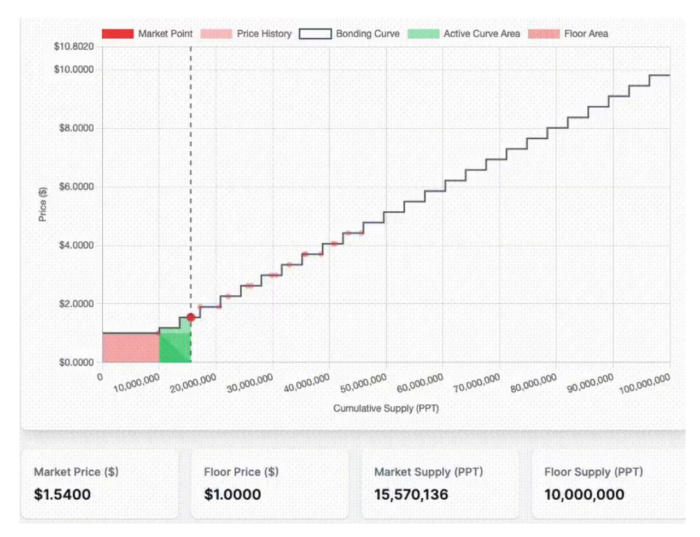

Figure 1: Overview of a debt-aware discrete bonding curve. The floor area (pink) represents collateral backing all tokens at the floor price P<sup>f</sup> . The active curve area (green) shows the premium segments where new tokens are minted. The market point (red dot) marks the current supply and spot price. The dashed bonding curve traces the full price schedule.

token design per se, but a formalization of one particular point in that design space: a primary-market issuance mechanism with debt-aware reserve accounting, theorem-backed floor monotonicity, and borrowing safety anchored to an endogenous floor rather than to oracle-valued collateral.

Figure [1](#page-2-0) illustrates the bonding curve structure: the flat floor area (pink) guarantees a minimum redemption price for all tokens, while the stepped active curve area (green) represents premium segments where new tokens are minted at progressively higher prices.

The present work builds on the discrete bonding curve (DBC) [\[Demirel,](#page-49-3) [2023a\]](#page-49-3) and the dynamic discrete bonding curve (DDBC) [\[Demirel,](#page-49-4) [2023b\]](#page-49-4), which established stepped bonding curves as gas-efficient, protocol-owned issuance mechanisms [\[Demirel,](#page-49-5) [2024b,](#page-49-5)[a\]](#page-49-6). Unlike secondary-market AMMs (e.g., Uniswap), which trade pre-existing token inventories, a bonding curve acts as a primary-market issuer: tokens are minted on purchase and burned on sale, with collateral flowing into and out of a protocol-controlled reserve. This mint/burn architecture is what makes the floor price enforceable—the protocol controls the entire token supply. We term this property token-owned liquidity: the reserve backing each token is embedded in its issuance mechanism rather than held in an external treasury or rented from liquidity providers. A key economic consequence is that trading fees, origination fees, and interest revenue—value streams that would ordinarily accrue to external market makers, AMM liquidity providers, or lending protocols—are captured by the token's own issuance contract and directed toward floor elevation, creating a self-reinforcing value accrual loop (Section [6\)](#page-36-0). We extend these foundations with a debt-aware reserve invariant and a floor segment whose price is provably monotonic, enabling non-liquidatable borrowing as a direct consequence of the curve's mathematical properties.

{3}------------------------------------------------

#### 1.3 Contributions

This paper makes the following contributions:

- 1. We formalize debt-aware discrete bonding curves (DABC): a class of piecewise-linear bonding curves with a distinguished floor segment whose price is monotonically nondecreasing (Section [3\)](#page-7-0).
- 2. We state and prove a reserve invariant that ensures solvency under all protocol operations, including buying, selling, borrowing, and curve reconfiguration (Section [3.3\)](#page-10-0).
- 3. We design a credit facility for issuance-native collateral in which borrowing capacity is anchored to the endogenous floor price rather than oracle-marked spot valuation, and prove that loans originated within the floor-anchored LTV cannot become undercollateralized due to collateral price declines (Section [4\)](#page-18-0).
- 4. We introduce a step-absorption algorithm for floor elevation that greedily absorbs premium curve steps into the floor segment (Section [3.4\)](#page-11-0).
- 5. We present invariant-preserving curve reconfiguration as a general primitive for adapting premium-segment shape while preserving reserve solvency, floor monotonicity, and bounded holder harm under the admissibility constraints of Definition [3.5](#page-15-0) (Section [3.5\)](#page-14-0).
- 6. We validate the mechanism through invariant-based stateful fuzz testing, formal verification (Appendix [A\)](#page-44-0), and comparative analysis against adjacent floor-price and oraclefree lending designs (Section [5\)](#page-26-0).
- 7. We identify non-liquidatable leveraged positions as an emergent application: the recursive leverage loop enables participants to amplify exposure without liquidation risk at any point in the curve's lifecycle, with token launches as the most compelling use case, enabling debt-based position design as a structural primitive for token economies (Section [4.6\)](#page-25-0).

Claims ledger. Table [1](#page-3-0) maps each formal claim to its evidence class, location, and key assumptions to aid reviewer navigation.

Table 1: Summary of formal claims, evidence class, and assumptions.

<span id="page-3-0"></span>

| Claim                   | Evidence                        | Reference       | Key assumptions                           |
|-------------------------|---------------------------------|-----------------|-------------------------------------------|
| Reserve solvency        | Invariant                       | Inv.<br>3.1     | Correct implementation                    |
| Redemption liquidity    | Proposition                     | Prop.<br>3.1    | Unlocked supply;<br>A<br>=<br>V<br>−<br>D |
| Floor elevation         | Proposition                     | Prop.<br>3.3    | Collateral budget<br>c ><br>0             |
| Reconfiguration safety  | Proposition                     | Prop.<br>3.4    | Def.<br>3.5<br>constraints                |
| Floor monotonicity      | Theorem                         | Thm.<br>4.1     | Correct implementation                    |
| Non-liquidatable safety | Theorem                         | Thm.<br>4.2     | Issuance-native;<br>γ <<br>1              |
| Leverage bound          | Proposition                     | Prop.<br>4.1    | γ <<br>1 or<br>ϕ ><br>0                   |
| Invariant verification  | Fuzz + formal (Certora, Halmos) | §5.3, App.<br>A | Implementation fidelity                   |
| Dynamic fee outcomes    | Simulation                      | §5.7            | Parameter-dependent                       |

{4}------------------------------------------------

#### Mechanism at a Glance

What it is. A piecewise-linear bonding curve with a distinguished floor segment whose price P<sup>f</sup> is provably non-decreasing, coupled with a credit facility for issuance-native collateral (tokens minted through the curve itself).

Core invariant. At every state transition, the virtual collateral supply satisfies V = R(Γ, S), where R is the reserve function and Γ the active curve. Outstanding debt D is backed by locked tokens whose floor-price value exceeds D; actual reserves A = V − D cover all unlocked-supply redemptions while debt is outstanding. Virtual reserves are fully restored upon repayment (Proposition [3.1\)](#page-10-2).

#### Key results.

- Floor price is non-decreasing under all operations (Theorem [4.1\)](#page-20-0).
- No loan originated at or below the floor-anchored LTV can become under-collateralized due to collateral price declines (Theorem [4.2\)](#page-21-0).
- Recursive leverage converges to a finite bound Lnet = 1/(1 − γ(1 − ϕ)) (Proposition [4.1\)](#page-22-0).

The trade-off. Non-repayment results in permanent token lock, not forced sale. Floor appreciation requires fee revenue or other collateral injection; it is not automatic.

Scope. Guarantees apply exclusively to issuance-native collateral redeemable at the primarymarket floor price. Secondary markets may temporarily trade below P<sup>f</sup> .

Evidence classes. Proved: floor monotonicity, non-liquidatable safety, redemption liquidity, reconfiguration safety, leverage bounds. Formally verified: 24 rules across 6 property groups via Certora CVL (algebraic reasoning); 8 properties independently confirmed via Halmos symbolic execution (Appendix [A\)](#page-44-0). Implementation-verified: invariant-based stateful fuzz testing of ∼20k-line Solidity implementation. Simulation: dynamic fee multiplier study (supplementary).

# 2 Related Work

## 2.1 Bonding Curves and AMMs

Bonding curves define a deterministic relationship between token supply and price, enabling automated market making without external liquidity providers. Bancor [\[Hertzog et al.,](#page-50-6) [2017\]](#page-50-6) introduced continuous bonding curves with a connector-weight model, where price is a power function of supply. Uniswap V2 [\[Adams et al.,](#page-48-1) [2020\]](#page-48-1) established the constantproduct invariant (x · y = k) as the dominant secondary-market AMM design; Angeris et al. [\[Angeris et al.,](#page-49-7) [2021\]](#page-49-7) provided the first formal analysis of its price-tracking and arbitrage properties. Uniswap V3 [\[Adams et al.,](#page-48-2) [2021\]](#page-48-2) introduced concentrated liquidity, allowing liquidity providers to allocate capital within specific price ranges—a technique leveraged by Baseline for floor enforcement. Angeris et al. [\[Angeris et al.,](#page-49-8) [2022\]](#page-49-8) study curvature in constant-function market makers, establishing conditions under which AMM design choices affect capital efficiency and impermanent loss. Cartea et al. [\[Cartea et al.,](#page-49-9) [2024\]](#page-49-9) study strategic bonding curves in AMMs, generalizing constant-function markets to decentralized liquidity pools with configurable impact and quote functions.

The discrete bonding curve (DBC) [\[Demirel,](#page-49-3) [2023a\]](#page-49-3) proposed a piecewise-constant price function where price changes at specific supply intervals, yielding zero slippage within each

{5}------------------------------------------------

Table 2: Taxonomy of floor-price mechanisms.

<span id="page-5-0"></span>

| Protocol      | Floor mechanism          | Guarantee        | Borrowing                  |
|---------------|--------------------------|------------------|----------------------------|
| Nirvana (ANA) | Virtual AMM + reserves   | Algorithmic      | NIRV stablecoin            |
| Baseline      | Reserve-backed AMM       | Algorithmic      | Non-liquidatable           |
| Olympus (OHM) | Treasury + RBS           | Policy-dependent | None                       |
| Ajna          | Discrete price buckets   | Bucket-dependent | Liquidatable (oracle-free) |
| Timeswap      | Three-variable AMM       | Maturity-based   | Collateral forfeiture      |
| This work     | Discrete curve invariant | Formally proven  | No protocol-triggered liq. |

step and eliminating the need for external liquidity providers. The dynamic DBC [\[Demirel,](#page-49-4) [2023b\]](#page-49-4) extended this with KPI-based segment reconfiguration, and protocol-owned AMMs [\[Demirel,](#page-49-5) [2024b\]](#page-49-5) formalized the concept of protocol-controlled primary issuance. (These three references are technical reports by the present authors; the present paper formalizes and extends the ideas introduced in those reports.) Independently, Kirste et al. [\[Kirste et al.,](#page-50-7) [2025\]](#page-50-7) formalized supply-sovereign AMMs with undergirding bonding curves in a peer-reviewed venue (ACM DLT), analyzing value accumulation properties analogous to share-based companies and providing external corroboration of the protocol-owned issuance paradigm.

Our work extends the DBC family by introducing a floor segment with a formal monotonicity guarantee and a reserve invariant that accounts for outstanding debt—properties absent from prior bonding curve designs.

Discrete vs. continuous invariants. Modern continuous-invariant implementations (e.g., constant-product, concentrated-liquidity, and polynomial bonding curves) can be computed efficiently onchain and represent an important part of the current DeFi design space. Our choice of a discrete curve is not motivated by an inability to implement continuous methods; it is a design choice that prioritizes formal tractability and deterministic issuance behavior over price smoothness. Specifically, the discrete segment schedule yields (i) exact step prices without iterative convergence tolerance, (ii) explicit, auditable state transitions at the segment/step level that simplify invariant reasoning for floor monotonicity and debt safety, and (iii) a transparent price ladder suited to primary-market issuance rather than a reversible two-sided AMM inventory process. Section [3.6](#page-16-1) elaborates on these trade-offs. Continuous-invariant approaches remain viable for secondary-market AMMs and for protocols that prioritize price continuity over the formal properties our mechanism is designed to guarantee.

#### 2.2 Floor-Price Protocols

Table [2](#page-5-0) summarizes the floor-price design space.

Nirvana. Nirvana [\[Nirvana Finance,](#page-50-4) [2022\]](#page-50-4) implemented a virtual AMM on Solana in which ANA tokens are minted on purchase and burned on sale, with the protocol's reserve backing a ratcheting floor price. Users could borrow the NIRV stablecoin against ANA at the floor value. In July 2022, a flash loan exploit inflated ANA's curve price within a single transaction and extracted \$3.5M from the protocol's reserves. The exploit demonstrated the vulnerability 

{6}------------------------------------------------

of bonding curve mechanisms that lack adequate atomic-transaction protections.

Baseline. Baseline [\[Baseline Markets,](#page-49-2) [2024\]](#page-49-2) originally deployed protocol-owned liquidity across three Uniswap V3 concentrated liquidity positions—Floor, Anchor, and Discovery but the V3-based architecture required 22 high-severity fixes before its initial launch and was subsequently replaced by a proprietary reserve-backed AMM (BMM). The current design splits reserves into backing (guaranteeing a Baseline Value floor) and buffer (enabling price discovery via a power-law curve), with non-liquidatable lending and recursive leverage. Like our work, the current Baseline is oracle-free and internalizes its own market making, though it lacks formal monotonicity guarantees for the floor price.

Olympus. Olympus [\[Olympus DAO,](#page-50-5) [2021\]](#page-50-5) backs OHM with a diversified treasury and uses Range Bound Stability (RBS) as automated monetary policy. The "liquid backing price" serves as a dynamic floor, with the protocol buying OHM when the price falls below this threshold. BlockScience modeled the system using cadCAD simulations [\[Olympus DAO,](#page-50-5) [2021\]](#page-50-5). The floor guarantee is policy-dependent: it holds only as long as treasury assets retain their value and governance maintains the RBS parameters.

### 2.3 DeFi Lending and Liquidation

Aave [\[Aave,](#page-48-0) [2020\]](#page-48-0) and Compound [\[Leshner and Hayes,](#page-50-0) [2019\]](#page-50-0) are overcollateralized lending protocols where collateral is marked to market via external oracles. When the health factor (collateral value divided by debt) falls below a threshold, liquidators can repay a portion of the debt in exchange for discounted collateral. Gudgeon et al. [\[Gudgeon et al.,](#page-50-8) [2020\]](#page-50-8) formalized interest rate dynamics in loanable-fund protocols and identified procyclical feedback loops between utilization, rates, and liquidation thresholds. Perez et al. [\[Perez et al.,](#page-50-2) [2021\]](#page-50-2) conducted an empirical study showing that liquidations exhibit strong procyclical effects. The Bank of Canada [\[Tian and Zhu,](#page-51-0) [2025\]](#page-51-0) analyzed how liquidation mechanism design fixed-spread versus auction-based—affects price impact, finding that auction-based liquidations reduce cascading effects when participation costs are low. Chitra and Evans [\[Chitra](#page-49-10) [and Evans,](#page-49-10) [2021\]](#page-49-10) analyzed the feedback between staking yields and DeFi borrowing demand, highlighting how leverage amplifies systemic risk when collateral values are market-derived. For a broader taxonomy of DeFi risks including oracle manipulation, smart-contract exploits, and governance attacks, see Xu et al. [\[Xu et al.,](#page-51-2) [2023\]](#page-51-2).

MakerDAO [\[MakerDAO,](#page-50-1) [2017\]](#page-50-1) uses Collateralized Debt Positions (CDPs) with keeperbased liquidation auctions. Curve's crvUSD [\[Egorov,](#page-49-11) [2023\]](#page-49-11) introduced LLAMMA, a soft liquidation mechanism that continuously converts collateral into the borrowed asset as prices decline, avoiding discrete liquidation events.

A separate line of work removes oracle dependency but retains liquidation or forced conversion. Timeswap [\[Timeswap Labs,](#page-51-3) [2022\]](#page-51-3) uses a three-variable AMM (X·Y ·Z = K) with fixed-maturity loans; non-repayment at maturity constitutes default and collateral forfeiture. Ajna [\[Ajna Labs,](#page-48-3) [2023\]](#page-48-3) implements peer-to-pool lending with discrete price buckets and no external oracle, but liquidation is triggered when the market price falls below a borrower's bucket price. Both designs demonstrate that removing oracles alone does not eliminate liquidation.

{7}------------------------------------------------

Table 3: Principal notation.

<span id="page-7-1"></span>

| Symbol                    | Meaning                                                           |
|---------------------------|-------------------------------------------------------------------|
| Γ                         | Bonding curve (ordered sequence of segments)                      |
| σ<br>= (p0,<br>∆p, q, n)  | Segment: initial price, increment, supply/step, steps             |
| (0)<br>:=<br>Pf<br>p<br>0 | Floor price (initial price of floor segment<br>σ0)                |
| S0                        | Floor supply (capacity of<br>σ0)                                  |
| S                         | Current total token supply                                        |
| R(Γ, S)                   | Reserve function: collateral required to back supply<br>S         |
| V                         | Virtual collateral supply (onchain counter;<br>V<br>=<br>R(Γ, S)) |
| −<br>A<br>=<br>V<br>D     | Actual reserve balance                                            |
| P<br>D<br>=<br>di<br>i    | Aggregate outstanding debt                                        |
| ℓi<br>, di                | Locked tokens and debt of loan<br>i                               |
| γ                         | ∈<br>Loan-to-value ratio (LTV;<br>γ<br>(0,<br>1))                 |
| ϕ                         | Origination fee rate                                              |
| δmax                      | Maximum spot-price loss per reconfiguration                       |
| Bmax                      | Cumulative dilution budget                                        |

Transaction fee mechanism design [\[Roughgarden,](#page-50-9) [2021\]](#page-50-9) provides a broader theoretical framework for analyzing incentive-compatible fee structures in blockchain protocols.

Werner et al. [\[Werner et al.,](#page-51-1) [2023\]](#page-51-1) provide a comprehensive systematization of DeFi protocols, identifying liquidation cascades, oracle dependence, and governance risk as recurring architectural vulnerabilities. Klages-Mundt et al. [\[Klages-Mundt et al.,](#page-50-10) [2020\]](#page-50-10) formalize collateral-backed stablecoin designs and their failure modes under deleveraging spirals—a dynamic our mechanism structurally avoids for issuance-native collateral by anchoring LTV to a non-decreasing floor. Kozhan and Viswanath-Natraj [\[Kozhan and Viswanath-Natraj,](#page-50-11) [2024\]](#page-50-11) empirically analyze collateral risk in decentralized stablecoins, documenting how endogenous collateral creates reflexive feedback loops that amplify instability—a risk our mechanism addresses by construction through the non-decreasing floor. Bartoletti et al. [\[Bartoletti et al.,](#page-49-12) [2021\]](#page-49-12) provide a systematization of lending pool designs, identifying liquidation mechanics as a recurring architectural vulnerability across protocols.

All lending protocols we surveyed require some form of liquidation, forced conversion, or maturity-based default when collateral values decline. For loans against issuance-native collateral, our mechanism eliminates protocol-triggered liquidation by anchoring LTV to a monotonically non-decreasing endogenous price, removing the need for external oracles, liquidation infrastructure, and fixed loan maturities.

# <span id="page-7-0"></span>3 Model

We now formalize the discrete bonding curve mechanism, the reserve function that underpins solvency, the floor-elevation algorithm, and the reconfiguration principle that makes the curve a configurable liquidity primitive. Throughout, we denote by Z<sup>≥</sup><sup>0</sup> the non-negative integers. Table [3](#page-7-1) summarizes the principal symbols.

Primary-market semantics. The bonding curve operates as a primary-market issuer. Buying mints new tokens and deposits collateral into the reserve; selling burns tokens 

{8}------------------------------------------------

and withdraws collateral. Unlike secondary-market AMMs (e.g., Uniswap constant-product pools), which trade pre-existing token inventories, the protocol controls the entire token supply. This is what makes the floor price enforceable: because every token was minted through the curve, every unlocked token can be redeemed through it at or above P<sup>f</sup> (Proposition [3.1\)](#page-10-2); locked tokens are redeemable upon loan repayment.

#### 3.1 Discrete Bonding Curve Segments

Definition 3.1 (Segment). A segment is a tuple

$$\sigma = (p_0, \ \Delta p, \ q, \ n),$$

where p<sup>0</sup> ∈ Z><sup>0</sup> is the initial price, ∆p ∈ Z<sup>≥</sup><sup>0</sup> the price increment per step, q ∈ Z><sup>0</sup> the supply per step, and n ∈ Z><sup>0</sup> the number of steps. The price at step i (0 ≤ i < n) is

$$p(i) = p_0 + i \, \Delta p, \tag{1}$$

and the segment capacity is C(σ) = n · q. A segment is flat when ∆p = 0; it is sloped otherwise. If n = 1, the segment must be flat (∆p = 0).

<span id="page-8-0"></span>Definition 3.2 (Discrete Bonding Curve). A discrete bonding curve is an ordered sequence of segments

$$\Gamma = (\sigma_0, \, \sigma_1, \, \dots, \, \sigma_{k-1}), \qquad k \leq K_{\text{max}},$$

satisfying the price-progression constraint: for every adjacent pair σ<sup>i</sup> = (p (i) 0 , ∆p (i) , q(i) , n(i) ) and σi+1 = (p (i+1) 0 , . . .),

$$p_0^{(i)} + (n^{(i)} - 1) \Delta p^{(i)} \le p_0^{(i+1)}.$$
 (2)

The total curve capacity is C(Γ) = P<sup>k</sup>−<sup>1</sup> <sup>j</sup>=0 C(σ<sup>j</sup> ).

# 3.2 Floor Segment and Reserve Function

Definition 3.3 (Floor Curve). A curve Γ = (σ0, σ1, . . . , σk−1) is a floor curve if the distinguished first segment σ<sup>0</sup> satisfies n<sup>0</sup> = 1 and ∆p<sup>0</sup> = 0. The constant P<sup>f</sup> := p (0) 0 is the floor price and S<sup>0</sup> := q<sup>0</sup> is the floor supply.

The floor segment establishes a flat price band at the base of the curve. Because n<sup>0</sup> = 1 and ∆p<sup>0</sup> = 0, every token within the floor segment is redeemable at exactly P<sup>f</sup> .

Figure [2](#page-9-0) illustrates two distinct curve states. In the left panel, the floor has risen to absorb several premium steps, yielding a higher floor price relative to the market price. In the right panel, the market has advanced further along the curve while the floor remains lower, resulting in a larger active curve area.

<span id="page-8-1"></span>Definition 3.4 (Reserve Function). Let Γ = (σ0, . . . , σk−1) be a discrete bonding curve and let S be the current token supply with 0 ≤ S ≤ C(Γ). The reserve function R(Γ, S) gives the total collateral required to back supply S. It is computed segment by segment.

For a single segment σ = (p0, ∆p, q, n) processing a supply portion s (0 ≤ s ≤ C(σ)), let m = ⌊s/q⌋ (full steps) and r = s mod q (partial-step remainder).

{9}------------------------------------------------

<span id="page-9-0"></span>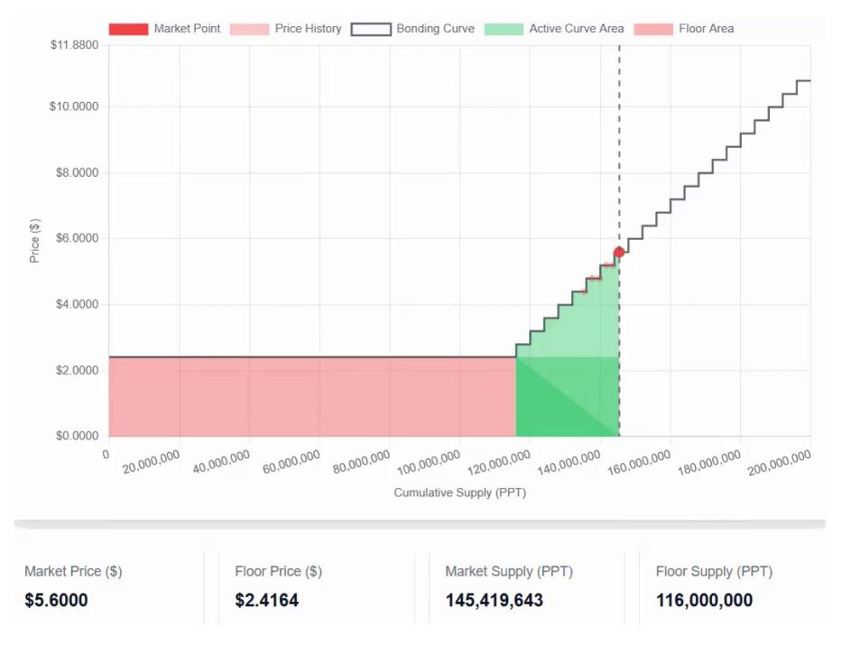

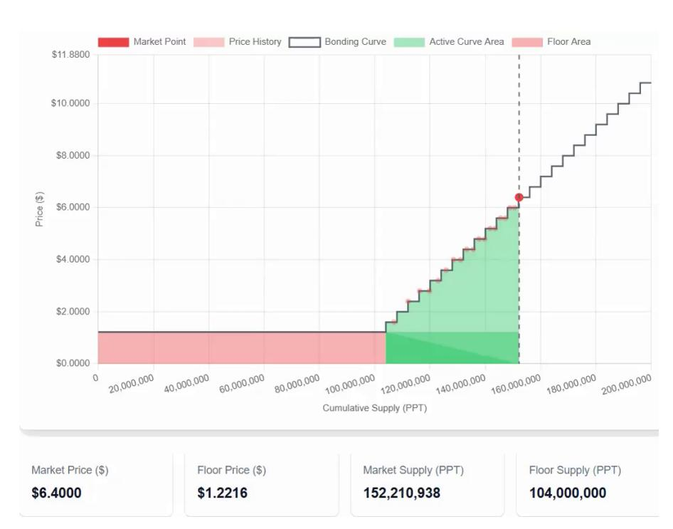

(a) High floor-to-spot ratio (P<sup>f</sup> = \$2.42, Pspot = \$5.60). Several premium steps have been absorbed into the floor.

(b) Low floor-to-spot ratio (P<sup>f</sup> = \$1.22, Pspot = \$6.40). The active curve area dominates, with more premium steps above the floor.

Figure 2: Two states of a debt-aware bonding curve. Pink: floor area (collateral backing all tokens at P<sup>f</sup> ). Green: active curve area (premium segments above the floor). The red dot marks the current market point.

(i) Flat segment 
$$(\Delta p = 0)$$
:

$$R_{\sigma}(s) = s \cdot p_0. \tag{3}$$

(ii) Sloped segment (∆p > 0). The full-step cost uses the arithmetic-series identity:

$$R_{\sigma}^{\text{full}}(m) = \frac{q \cdot m \left(2 p_0 + (m-1) \Delta p\right)}{2}, \tag{4}$$

and the partial-step cost at step m is

$$R_{\sigma}^{\text{part}}(r) = r \cdot (p_0 + m \,\Delta p).$$
 (5)

The total segment reserve is Rσ(s) = Rfull σ (m) + Rpart σ (r).

The global reserve is computed by iterating over segments in order, allocating min(s<sup>j</sup> , C(σ<sup>j</sup> )) supply to each segment σ<sup>j</sup> until all supply is assigned:

$$R(\Gamma, S) = \sum_{j=0}^{k-1} R_{\sigma_j} \left( \min(s_j, C(\sigma_j)) \right), \tag{6}$$

where s<sup>0</sup> = S and sj+1 = s<sup>j</sup> − min(s<sup>j</sup> , C(σ<sup>j</sup> )); that is, s<sup>j</sup> is the supply not yet assigned when processing segment σ<sup>j</sup> .

Unit conventions. All formulas are stated in abstract units in which price × quantity yields collateral directly. Prices (p0, ∆p, P<sup>f</sup> ), token amounts (S, q, ℓ), and reserve/debt quantities (R, V , d) are commensurable without an explicit scaling factor.

{10}------------------------------------------------

Implementation mapping. The Solidity implementation maps these abstract quantities to fixed-point integer arithmetic: prices are stored in WAD (×10<sup>18</sup>), token amounts in tokenwei (18 decimals), and collateral in collateral-wei. Every price–quantity product is divided by 10<sup>18</sup> using a mulDivUp helper (ceiling, protocol-favorable) for collateral computations and floor division for token computations, ensuring the contract never under-collateralizes at wei-level precision.

### <span id="page-10-0"></span>3.3 The Solvency Invariant

The protocol maintains a virtual collateral supply V , an onchain counter that tracks the total collateral backing the issued tokens.

<span id="page-10-1"></span>Invariant 3.1 (Solvency). At every state transition,

<span id="page-10-4"></span>
$$V = R(\Gamma, S), \tag{7}$$

where S is the current token supply and Γ the active curve.

Here V is the virtual collateral supply, an onchain counter. During borrowing, the contract's actual reserve balance may be lower: bal = V − P i di , where d<sup>i</sup> denotes the outstanding debt of loan i. The locked issuance tokens backing those loans have a floor-price value of at least P i di , so the full reserve can be restored upon repayment (see Section [4\)](#page-18-0).

Invariant [3.1](#page-10-1) is enforced by the reconfiguration check (Section [3.5\)](#page-14-0): any proposed curve Γ ′ is accepted if and only if R(Γ′ , S) = V .

<span id="page-10-3"></span>Lemma 3.1 (Reserve Lower Bound). For any floor curve Γ with floor price P<sup>f</sup> and any x ≥ 0, R(Γ, x) ≥ x · P<sup>f</sup> .

Proof. By the monotone ordering constraint (Definition [3.2\)](#page-8-0), every segment σ<sup>j</sup> has p (j) <sup>0</sup> ≥ P<sup>f</sup> . Each unit of supply is therefore priced at least P<sup>f</sup> .

<span id="page-10-2"></span>Proposition 3.1 (Redemption Liquidity). Let D = P i d<sup>i</sup> denote the total outstanding debt and A = V −D the actual reserve balance held by the contract. Let Sfree = S− P i ℓ<sup>i</sup> denote the unlocked (freely tradable) supply. Locked tokens cannot be sold or transferred; only unlocked supply may be burned for collateral. The protocol enforces this by holding locked tokens in custody: they are transferred to the credit facility contract at loan creation and returned only upon repayment. No approval, delegation, or wrapping mechanism can bypass this custody. Then the actual reserves are sufficient to cover any sale or redemption of unlocked tokens:

$$A \geq R(\Gamma, S) - R(\Gamma, S - S_{\text{free}}).$$

Proof. By Theorem [4.2,](#page-21-0) each active loan satisfies d<sup>i</sup> ≤ γ · P<sup>f</sup> · ℓ<sup>i</sup> < P<sup>f</sup> · ℓ<sup>i</sup> (since γ < 1). Summing over all loans gives D < P i ℓi · P<sup>f</sup> . By Lemma [3.1,](#page-10-3) the reserve value of the locked supply satisfies R(Γ, S − Sfree) ≥ P i ℓi · P<sup>f</sup> > D. Since V = R(Γ, S), we have A = V − D = R(Γ, S)−D. The maximum payout for selling all unlocked supply is R(Γ, S)−R(Γ, S−Sfree). Combining: A = R(Γ, S) − D ≥ R(Γ, S) − R(Γ, S − Sfree).

{11}------------------------------------------------

<span id="page-11-1"></span>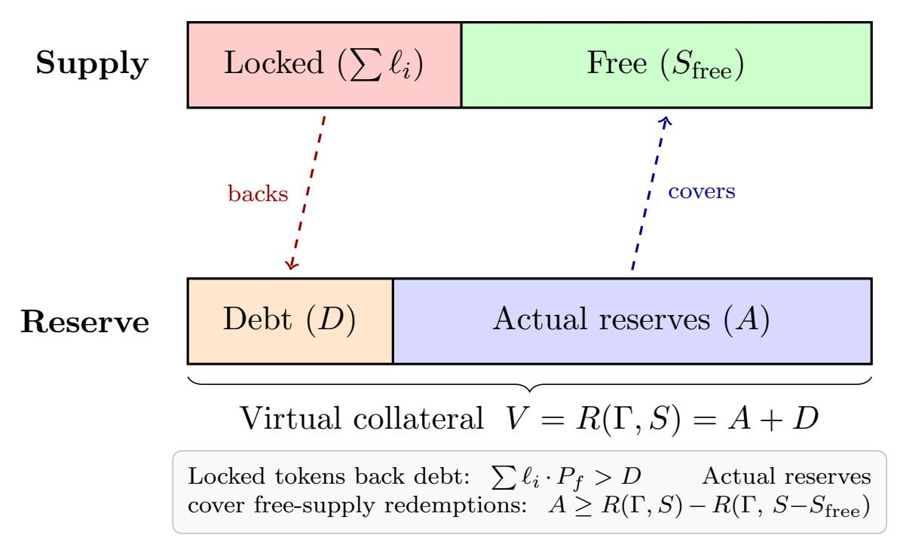

Figure 3: Locked vs. free supply and redemption coverage (Proposition [3.1\)](#page-10-2). The locked supply is held in custody by the credit facility, backing outstanding debt. The actual reserves (A = V − D) are sufficient to cover all redemptions of the unlocked (free) supply.

Figure [3](#page-11-1) illustrates the relationship between locked supply, free supply, virtual collateral, actual reserves, and outstanding debt. The locked tokens are held in custody by the credit facility and cannot be sold; the actual reserves (A = V − D) need only cover redemptions of the unlocked (free) supply.

<span id="page-11-2"></span>Proposition 3.2 (Redemption Preserves Floor Backing Ratio). If x tokens are redeemed at the floor price P<sup>f</sup> , the post-redemption floor ratio is unchanged:

$$\frac{A_f - x \cdot P_f}{S_0 - x} = P_f,$$

where A<sup>f</sup> = P<sup>f</sup> · S<sup>0</sup> denotes the floor-tier collateral.

Proof. By the floor-segment definition, A<sup>f</sup> = P<sup>f</sup> · S0. After redeeming x tokens:

$$\frac{A_f'}{S_0'} = \frac{P_f \cdot S_0 - x \cdot P_f}{S_0 - x} = \frac{P_f (S_0 - x)}{S_0 - x} = P_f.$$

The equality holds in exact arithmetic; with integer-arithmetic rounding (floor division), rounding cannot decrease the enforced floor price parameter P<sup>f</sup> , since P<sup>f</sup> is a configured segment price rather than a value computed from A<sup>f</sup> /S<sup>0</sup> onchain.

## <span id="page-11-0"></span>3.4 Floor Elevation: Step-Absorption Algorithm

When external collateral is injected (e.g., from protocol fees or surplus reallocation), the floor price can be raised by absorbing premium steps into the floor segment. Algorithm [1](#page-12-0) formalizes this procedure.

{12}------------------------------------------------

#### <span id="page-12-0"></span>Algorithm 1 StepAbsorption: Raise the floor price by injecting collateral

```
Require: Current segments Γ = (σ0, σ1, . . . , σk−1); collateral budget c > 0; actual issuance
  supply Sactual > 0
Ensure: New segments Γ′
                    ; updated floor price P
                                     ′
                                     f ≥ Pf
1: (Pf , S0) ← (initialPrice(σ0), supplyPerStep(σ0))
2: S0 ← min(S0, Sactual) ▷ Cap floor supply at actual issuance
3: capped ← (S0 = Sactual) ▷ One-way flag: once set, S0 is frozen
4: j ← 1 ▷ Index into premium segments
5: Load (pj
         , ∆pj
             , qj
               , nj ) ← σj
6: while c > 0 do
7: Seff ← S0 ▷ Effective supply (already capped by lines 2–3 or 17–18)
8: raisable ← c/Seff ▷ Max price increase affordable
9: gap ← pj − Pf ▷ Price distance to next premium step
10: if raisable < gap then
11: Pf ← Pf + raisable
12: break ▷ Budget exhausted within gap
13: end if
14: cost ← gap · Seff ▷ Collateral to absorb this step
15: c ← c − cost; Pf ← pj
16: if ¬ capped then
17: S0 ← S0 + qj
18: if S0 ≥ Sactual then
19: S0 ← Sactual; capped ← true
20: end if
21: end if
22: nj ← nj − 1
23: if nj = 0 then
24: j ← j + 1
25: if j ≥ k then break ▷ No more premium segments
26: end if
27: Load (pj
              , ∆pj
                  , qj
                    , nj ) ← σj ▷ Advance to next segment
28: else
29: pj ← pj + ∆pj ▷ Advance within current segment
30: end if
31: end while
32: cactual ← R(Γ′
             , S) − V ▷ Exact collateral via reserve function
33: Construct Γ′
            : new floor σ
                      ′
                      0 = (Pf , 0, S0, 1), followed by the remaining (possibly partially
  consumed) premium segments
34: return (Γ′
           , cactual)
```

Figure [4](#page-13-0) visualizes the step-absorption process. In the initial state (left), the floor sits at \$1.00 with no tiers merged. After \$2,400 in fees are injected (right), three premium tiers have been absorbed into the floor segment, raising the floor price to \$2.93.

The algorithm operates in two modes. In normal mode (S<sup>0</sup> < Sactual), absorbing a step

{13}------------------------------------------------

<span id="page-13-0"></span>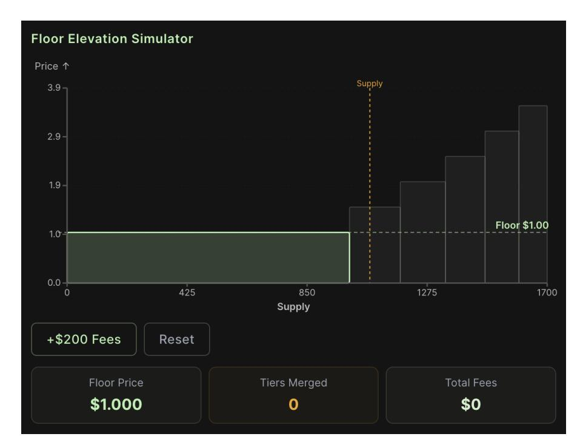

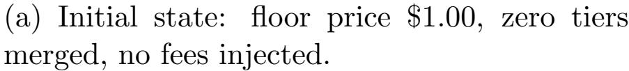

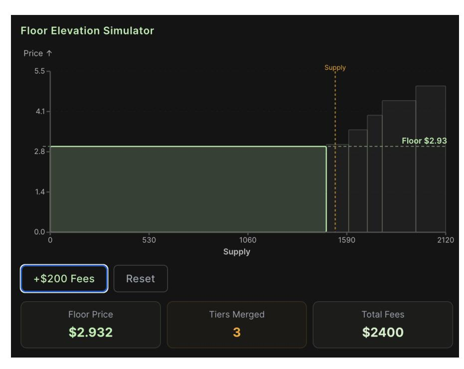

(b) After \$2,400 in fees: floor price raised to \$2.93, three tiers absorbed into the floor segment.

Figure 4: Floor elevation via step absorption (Algorithm [1\)](#page-12-0). Injected collateral raises the floor by absorbing premium steps. The green-shaded area grows as the floor expands.

increases both the floor price and the floor supply. In capped mode (S<sup>0</sup> = Sactual), the floor supply is frozen at Sactual and only the price increases; the denominator Seff remains fixed, ensuring that collateral is never spent backing unminted tokens. The capped flag is one-way: once set, it cannot be cleared within the same invocation.

Capped-mode dynamics. In capped mode, the floor supply S<sup>0</sup> = Sactual is fixed, so each unit of injected collateral produces a price increase of ∆P<sup>f</sup> = c/Sactual. Because Sactual is typically small in this regime (supply has contracted through redemptions), a given injection produces a larger floor-price jump than it would under normal mode with a larger S0. This acceleration is self-limiting: larger floor-price jumps increase borrowing capacity (Equation [10\)](#page-18-1), which may encourage new minting that pushes Sactual > S<sup>0</sup> and exits capped mode. For leverage loops, the floor-price jump from a capped-mode raise increases maxBorrow for existing loans but does not change their outstanding debt d, so all loans become better collateralized (passive de-risking holds a fortiori). No adverse second-order effect on leverage bounds arises: the leverage bound Lnet = 1/(1 − γ(1 − ϕ)) depends only on γ and ϕ, not on the absolute floor price.

Post-absorption reserve reconciliation. In abstract units, the loop arithmetic is exact. The Solidity implementation, operating in fixed-point integers, may accumulate rounding errors across iterations; it therefore recomputes the exact collateral requirement cactual = R(Γ′ , S)−V via the reserve function (Definition [3.4\)](#page-8-1) after the loop, and transfers only cactual. This two-phase design ensures Invariant [3.1](#page-10-1) holds regardless of intermediate rounding in the integer implementation.

Harmonic step sizing. In normal mode, each absorbed step adds its capacity q<sup>j</sup> to S0. The collateral cost of raising the floor by one price unit is proportional to S0, so unchecked growth of the floor supply makes future elevations progressively more expensive. If all steps 

{14}------------------------------------------------

have equal capacity q, absorbing m steps yields  $S_0 \propto mq$  and the cumulative cost scales as  $O(m^2)$ . A natural mitigation is to set step capacities that decrease with price level—for instance,  $q_j \propto 1/j$  (harmonic sizing). Under harmonic capacities,  $S_0$  after absorbing m steps grows as the harmonic sum  $\sum_{j=1}^m 1/j = O(\log m)$ , and the cumulative elevation cost scales as  $O(m \log m)$  rather than  $O(m^2)$ . To see this, note that each absorption costs  $\Delta P_f \cdot S_0$  collateral (the step gap times the current floor supply). With uniform q,  $S_0 = \Theta(m)$  after m absorptions, so cumulative cost is  $\Theta(\sum_{j=1}^m j) = \Theta(m^2)$ . With  $q_j \propto 1/j$ ,  $S_0 = \Theta(\log m)$ , yielding cumulative cost  $\Theta(m \log m)$ . This ensures that long-term floor appreciation remains feasible even after many steps have been absorbed. The reference Solidity implementation supports arbitrary per-segment capacities and can be configured with harmonic sizing at deployment; the choice of step-size schedule is a deployment parameter, not a protocol constraint.

<span id="page-14-1"></span>**Proposition 3.3** (Floor Elevation Correctness). Let  $\Gamma'$  be the curve produced by Algorithm 1 with collateral injection c. Then:

- (a)  $P'_f \ge P_f$  (floor price is non-decreasing);
- (b)  $S'_0 \geq S_0$  (floor supply is non-decreasing);
- (c)  $R(\Gamma', S) = V + c_{\text{actual}}$ , where  $c_{\text{actual}} \leq c$  is the collateral actually consumed (accounting for rounding).

*Proof.* We prove each claim by analyzing the algorithm's control flow.

- (a) Floor price is non-decreasing. The variable  $P_f$  is modified in exactly two places: line 14  $(P_f \leftarrow p_j, \text{ where } p_j \geq P_f \text{ by the gap computation } gap = p_j P_f \geq 0)$  and line 11  $(P_f \leftarrow P_f + raisable, \text{ where } raisable = c/S_{\text{eff}} > 0 \text{ since } c > 0 \text{ and } S_{\text{eff}} > 0)$ . Both updates strictly increase or maintain  $P_f$ ; no branch decreases it.
- (b) Floor supply is non-decreasing.  $S_0$  is modified only by addition of  $q_j > 0$  (line 16). The one-way cap (lines 17–18) may reduce  $S_0$  to  $S_{\text{actual}}$ , but only if the addition caused  $S_0 > S_{\text{actual}}$ ; the resulting  $S_0 = S_{\text{actual}}$  still satisfies  $S_0 \geq S_0^{\text{init}}$  because  $S_0^{\text{init}} \leq S_{\text{actual}}$  by line 2. Once the capped flag is set,  $S_0$  is never modified again, so subsequent iterations preserve  $S_0 \geq S_0^{\text{init}}$ .
- (c) Reserve invariant is preserved. After the loop terminates, the algorithm constructs  $\Gamma'$  with the new floor segment  $\sigma'_0 = (P_f, 0, S_0, 1)$  and the remaining premium segments. The post-loop reconciliation (line 27) computes  $c_{\text{actual}} = R(\Gamma', S) V$  exactly via the reserve function (Definition 3.4). The protocol transfers exactly  $c_{\text{actual}}$  into the reserve and updates  $V \leftarrow V + c_{\text{actual}}$ , yielding  $V = R(\Gamma', S)$ , which is Invariant 3.1. The bound  $c_{\text{actual}} \leq c$  holds because the loop exits when the budget is exhausted (line 12) or no premium segments remain (line 24), and no iteration consumes more than  $gap \cdot S_{\text{eff}}$  collateral per step.

# <span id="page-14-0"></span>3.5 Invariant-Preserving Curve Reconfiguration

Prior work introduced discrete (stepped) bonding curves as a gas-efficient alternative to continuous price functions Demirel [2023a], and subsequently demonstrated that segments can be dynamically reconfigured in response to external performance indicators Demirel

{15}------------------------------------------------

[\[2023b\]](#page-49-4). The solvency invariant (Equation [7\)](#page-10-4) suggests a strict generalization of this approach: the curve may be reconfigured arbitrarily—not only in response to specific KPIs—provided the reserve invariant is preserved.

<span id="page-15-0"></span>Definition 3.5 (Valid Reconfiguration). Given current state (V, S, Γ), a configured maximum spot-loss parameter δmax ≥ 0, and a cumulative dilution budget Bmax ≥ 0, a new curve Γ ′ is a valid reconfiguration if and only if

(i) Reserve invariance:

$$R(\Gamma', S) = V. (8)$$

If additional collateral δ is supplied alongside the reconfiguration, the check becomes R(Γ′ , S) = V + δ.

(ii) Bounded spot-price loss: for every supply level s ≤ S (i.e., within the circulating supply range),

<span id="page-15-1"></span>
$$P(\Gamma', s) \ge P(\Gamma, s) - \delta_{\max},$$
 (9)

where P(Γ, s) denotes the step price at supply level s.

(iii) Cumulative budget: the protocol maintains a running counter ∆cum incremented by the worst-case spot-price loss of each reconfiguration. A reconfiguration is rejected if it would cause ∆cum > Bmax. The budget is resettable only via governance vote.

Setting δmax = 0 makes the reconfiguration spot-price non-dilutive: no minted token may have its price reduced. A positive δmax permits gradual reshaping within a known perinvocation bound; Bmax caps the total dilution across all invocations.

The bounded spot-loss constraint prevents a single reconfiguration from redistributing premiumtier value to the floor. Without it, the reserve invariant alone admits curve flattenings that preserve R(Γ′ , S) = V while collapsing the spot price—a vector by which a reconfiguration could inflate floor-locked borrowing capacity at the expense of premium holders.

Governance risk warning. Reconfiguration is the largest governance-controlled attack surface in the mechanism. Token holders should be aware that each invocation may reduce spot prices by up to δmax; this parameter is part of the curve's public configuration. The cumulative budget Bmax (condition (iii) above) is an onchain-enforced bound on total dilution across all invocations, preventing unbounded accumulation of spot-price loss through repeated reconfigurations. We recommend the following additional safeguards, in order of increasing holder protection:

- (a) Default δmax = 0. This restricts reconfiguration to unminted supply regions, preventing any spot-price reduction for existing holders. It is the safest posture and should be the default unless active reshaping is an explicit protocol feature.
- (b) Epoch-based rate limits. Bound the number of reconfiguration calls per epoch (e.g., at most one per 24-hour window), so that even with δmax > 0, cumulative dilution per epoch is bounded by δmax.

{16}------------------------------------------------

(c) Timelock. Subject all reconfigurations with δmax > 0 to a timelock delay (e.g., 48–72 hours), giving holders an exit window before the change takes effect.

The reserve invariant protects solvency and the cumulative budget protects against unbounded dilution, but neither by itself prevents all forms of value redistribution across holder classes. Deployments should pair reconfiguration authority with appropriate constraints to match their trust model.

Floor elevation (Algorithm [1\)](#page-12-0) is a special case of reconfiguration that satisfies both constraints by construction: it only increases prices within the circulating range, and the algorithm computes Γ′ such that δ = R(Γ′ , S) − V , with the caller supplying exactly δ.

<span id="page-16-0"></span>Proposition 3.4 (Reconfiguration Safety). Any reconfiguration satisfying Definition [3.5](#page-15-0) preserves:

- (i) Solvency: Invariant [3.1](#page-10-1) holds for Γ ′ ;
- (ii) Floor monotonicity: the floor is non-decreasing (P ′ <sup>f</sup> ≥ P<sup>f</sup> ), enforced as an onchain precondition;
- (iii) Redemption coverage: every holder of unlocked tokens can redeem at or above the floor price (Proposition [3.1\)](#page-10-2); locked tokens are redeemable at or above the floor conditional on loan repayment;
- (iv) Bounded dilution: no minted token's step price decreases by more than δmax per invocation, and cumulative dilution is bounded by Bmax.

Proof. (i) holds by construction of the reserve check. (ii) is enforced as an onchain precondition (the transaction reverts if P ′ <sup>f</sup> < P<sup>f</sup> ). (iii) follows from (i) and Proposition [3.1:](#page-10-2) the actual reserve A = V − D covers all redemptions of unlocked supply. Locked tokens retain floor-price redeemability conditional on repayment, since V = R(Γ′ , S) is preserved. (iv) the per-invocation bound follows from the spot-loss check (Equation [9\)](#page-15-1); the cumulative bound follows from the onchain ∆cum ≤ Bmax counter (Definition [3.5\(](#page-15-0)iii)).

This reconfiguration principle elevates the bonding curve from a static price–supply schedule to a configurable liquidity primitive. Whereas the original DBC design [Demirel](#page-49-3) [\[2023a\]](#page-49-3) fixes segments at deployment, and the DDBC extension [Demirel](#page-49-4) [\[2023b\]](#page-49-4) permits KPI-triggered adjustments, the present work removes the trigger constraint entirely: reshaping of the premium tiers is valid—floor elevation, liquidity reallocation toward the floor, adaptive curve reshaping—so long as Definition [3.5](#page-15-0) is satisfied. We refer to authorized reconfigurations as Liquidity Reallocation Events (LREs).

## <span id="page-16-1"></span>3.6 Why Discrete? Continuous vs. Discrete Bonding Curves

The choice of a discrete (stepped) bonding curve over a continuous one (e.g., polynomial or exponential) is deliberate and motivated by the following considerations.

1. Deterministic pricing. Within each step, the price is constant. Buyers and sellers know the exact price before submitting a transaction; there is no slippage within a step.

{17}------------------------------------------------

Table 4: Discrete vs. continuous bonding curves.

<span id="page-17-0"></span>

| Property                 | Discrete                | Continuous                  |
|--------------------------|-------------------------|-----------------------------|
| Intra-step slippage      | None                    | Proportional to order size  |
| Floor segment            | Native (flat step)      | Requires auxiliary contract |
| Onchain math             | Integer arithmetic      | Transcendental functions    |
| Floor elevation          | Step iteration          | Integral solving            |
| Rounding control         | Per-step boundaries     | Distributed error           |
| Fuzz/formal verification | Finite state space      | Infinite state space        |
| Granularity trade-off    | Arbitrarily small steps | Inherently smooth           |

- 2. Natural floor segment. A flat step (∆p = 0, n = 1) maps directly to a guaranteed floor price. Continuous curves have no canonical flat region and require auxiliary mechanisms to enforce a price floor.
- 3. Step-absorption tractability. Raising the floor reduces to iterating over a small number of discrete steps (Algorithm [1\)](#page-12-0), each requiring only integer arithmetic. A continuous analogue would require solving integrals onchain—prohibitively expensive in gas.
- 4. Onchain computability. Reserve computations use only addition, multiplication, and integer division (with explicit rounding). No transcendental functions (ln, exp, fractional exponents) are needed, eliminating fixed-point approximation errors.
- 5. Composability with borrowing. The discrete structure confines rounding discrepancies to step boundaries, simplifying the invariant checks required when the credit facility (Section [4\)](#page-18-0) withdraws or deposits collateral.
- 6. Formal verifiability. Discrete state spaces are amenable to exhaustive fuzz testing and bounded model checking. The reference implementation has been verified against segment-level invariants under randomized inputs.
- 7. Approximation of continuity. The loss of granularity is negligible in practice: by choosing sufficiently small step sizes (q and ∆p), the discrete curve can approximate any continuous price function to arbitrary precision while retaining all the above advantages.

Table [4](#page-17-0) summarizes the trade-offs.

Positioning relative to continuous designs. We emphasize that continuous bonding curves and constant-function market makers are efficient, well-understood, and appropriate for many applications—particularly two-sided secondary-market trading. The discrete design is not a computational regression but a mechanism choice: our protocol's primary issuance market uses a transparent price ladder with exact step prices rather than a reversible AMM inventory process, and the formal tractability of discrete state transitions is essential for the floor monotonicity and debt safety proofs that constitute the paper's core contributions. By choosing sufficiently small step sizes (q and ∆p), the discrete curve approximates any 

{18}------------------------------------------------

continuous price function to arbitrary precision while retaining deterministic pricing and integer-only onchain arithmetic.

# <span id="page-18-0"></span>4 Non-Liquidatable Borrowing

We now introduce the credit facility that allows token holders to borrow the reserve asset against their issuance-native holdings—tokens minted through the bonding curve itself. The key design insight is that borrowing capacity is evaluated at the floor price—not the market price—and the floor is non-decreasing. Consequently, no protocol-triggered liquidation mechanism is required for this specific borrowing model.

The permanent-lock trade-off. The absence of liquidation comes with an explicit tradeoff: non-repayment results in permanent token lock, not forced sale. No protocol operation forcibly seizes or sells a borrower's locked tokens. Borrowers repay voluntarily to unlock their position; if they choose not to repay, the tokens remain locked indefinitely and the borrowed collateral is not recovered. This is a deliberate design choice, not an oversight: any mechanism that forcibly closes positions reintroduces liquidation risk. The economic consequences of dormant loans—their impact on floor supply, elevation cost, and liquidity velocity—are analyzed in Section [6.](#page-36-0)

### 4.1 Credit Facility Design

<span id="page-18-2"></span>Definition 4.1 (Loan). A loan is a tuple

$$L = (borrower, \ell, d, active),$$

where borrower is the owner address, ℓ ∈ Z><sup>0</sup> is the number of locked issuance tokens, d ∈ Z><sup>0</sup> is the outstanding debt denominated in the reserve asset, and active ∈ {true, false} records whether the loan is open.

<span id="page-18-3"></span>Definition 4.2 (Borrowing Power). Given ℓ locked tokens, a loan-to-value ratio γbps ∈ [1, 10,000) (equivalently γ = γbps/10,000 ∈ (0, 1)), and the current floor price P<sup>f</sup> , the maximum borrowing power is

<span id="page-18-1"></span>
$$\max Borrow(\ell) = \gamma \cdot P_f \cdot \ell. \tag{10}$$

Key design choice. Borrowing power is computed against the floor price P<sup>f</sup> , not the spot (market) price. Since P<sup>f</sup> is monotonically non-decreasing (Theorem [4.1\)](#page-20-0), borrowing power can only stay constant or increase over time—never decrease due to market volatility. The LTV ratio γbps may be adjusted by governance; lowering it affects only future borrows, not existing loan safety (see Theorem [4.2\)](#page-21-0). The one-time origination fee ϕ > 0 is charged at loan creation; no streaming interest accrues. This is not merely a simplification—it is a prerequisite for non-liquidatable safety. If interest accrued continuously at rate r, the outstanding debt would grow as d(t) = d<sup>0</sup> e r(t−t0) , and Theorem [4.2](#page-21-0) would require P˙ <sup>f</sup> /P<sup>f</sup> ≥ r at all times. Since floor elevation depends on fee revenue that is neither guaranteed nor predictable, no protocol can ensure this bound under all market conditions. By fixing d at origination, the debt-to-collateral ratio can only improve as P<sup>f</sup> rises, making non-liquidatable safety a permanent invariant rather than a conditional guarantee.

{19}------------------------------------------------

Collateral flow. When a loan is originated, the credit facility calls withdrawCollateralTo on the bonding curve to obtain reserve tokens without reducing the virtual collateral supply V . On repayment, depositCollateralFrom returns reserve tokens without increasing V . This preserves the solvency invariant (Invariant [3.1\)](#page-10-1) across borrowing operations: the virtual supply V remains unchanged, while the physical reserve balance temporarily decreases by the amount lent out. The locked issuance tokens serve as a claim that guarantees the reserve can be restored upon repayment.

Non-rivalrous borrowing capacity. Unlike pooled lending protocols (Aave, Compound) where all borrowers draw from a shared liquidity pool—and one borrower's utilization reduces the capacity available to others—this credit facility provides non-rivalrous borrowing capacity. Each minter's locked tokens represent collateral they individually contributed to the reserve, and their borrowing power is derived solely from their own position via Equation [\(10\)](#page-18-1). One borrower's loan does not diminish another's credit limit. This follows from the per-loan accounting structure (Definition [4.1\)](#page-18-2): each loan's (ℓ, d) pair is independent, and the aggregate reserve impact is the sum of individual withdrawals. Total debt is bounded by the reserve value of locked supply, which preserves solvency and redemption coverage of unlocked tokens (Proposition [3.1\)](#page-10-2). Borrow execution, however, is subject to the contract's current collateral balance and may revert if insufficient liquidity is available at that moment.

## 4.2 End-to-End Lifecycle Example

We trace a single position through the full protocol lifecycle to illustrate how Definitions [4.1–](#page-18-2) [4.2,](#page-18-3) Proposition [3.1,](#page-10-2) and Theorems [4.1–](#page-20-0)[4.2](#page-21-0) interact in practice.

Setup. P<sup>f</sup> = \$1.00, S<sup>0</sup> = 5,000, γ = 0.80, ϕ = 0.02 (origination fee). Alice has \$500 in reserve tokens.

{20}------------------------------------------------

#### Step Action and state change

- 1 Mint. Alice buys 500 tokens at \$1.00 each, depositing \$500 into the reserve. S → 5,500; V → R(Γ, 5,500). (Invariant [3.1](#page-10-1) holds.)
- 2 Lock & borrow. Alice locks all 500 tokens and borrows γ ·P<sup>f</sup> · 500 = 0.80×1.00×500 = \$400, minus origination fee ϕ·400 = \$8, receiving \$392. Loan: (ℓ = 500, d = 400). A = V − 400; locked tokens back the debt since 500 × \$1.00 = \$500 > \$400 (Theorem [4.2\)](#page-21-0).
- 3 Floor raise. Protocol fees accumulate and StepAbsorption raises P<sup>f</sup> to \$1.20. Alice's debt is still \$400, but her collateral is now valued at 500 × \$1.20 = \$600. Effective LTV drops from 80% to 400/600 = 66.7% (passive de-risking).
- 4 Rebalance (optional). Alice's new maxBorrow = 0.80 × 1.20 × 500 = \$480. She can borrow an additional \$480 − \$400 = \$80 (minus fees) without adding collateral.
- 5 Repay. Alice repays \$400. The protocol unlocks all 500 tokens proportionally (⌊400 × 500/400⌋ = 500). Loan closed; A restored; tokens freely tradable.
- 6 Redeem. Alice sells 500 tokens at market price (≥ P<sup>f</sup> = \$1.20), receiving ≥ \$600. S → 5,000; reserve decreases by sell payout; Invariant [3.1](#page-10-1) holds.

Key observations. (i) At no point does the protocol require a price oracle; all valuations use the endogenous P<sup>f</sup> . (ii) The floor raise at step 3 improves Alice's position without any action on her part. (iii) If Alice never repays, her 500 tokens remain locked permanently—the permanent-lock trade-off—but solvency and floor monotonicity are unaffected (Section [6\)](#page-36-0).

## 4.3 Floor Price Monotonicity

<span id="page-20-0"></span>Theorem 4.1 (Floor Price Monotonicity). Under the protocol operations buy, sell, raise-Floor, and reconfigure (subject to the onchain precondition P ′ <sup>f</sup> ≥ P<sup>f</sup> ), the floor price P<sup>f</sup> is monotonically non-decreasing:

$$P_f^{(t+1)} \ge P_f^{(t)}$$
 for all time steps  $t$ .

Proof. We analyze each operation individually.

- (i) Buy. A purchase adds collateral to V and mints tokens (increasing S) along premium segments. The floor segment σ<sup>0</sup> is not modified; hence P<sup>f</sup> is unchanged.
- (ii) Sell. A sale burns tokens and returns collateral proportional to the reserve difference R(Γ, S) − R(Γ, S − x). If selling reduces the total supply S below the floor supply S0, the protocol invokes AdjustFloorToSupply, which sets S ′ <sup>0</sup> = S while keeping P<sup>f</sup> fixed:

$$\sigma'_0 = (P_f, 0, S, 1).$$

{21}------------------------------------------------

This adjustment ensures that any subsequent minting resumes on premium segments rather than the floor, preventing floor-supply dilution. The floor backing ratio is preserved as a side effect (Proposition [3.2\)](#page-11-2): ⌊A′ f /S′ 0 ⌋ ≥ P<sup>f</sup> due to rounding. Hence P<sup>f</sup> does not decrease.

- (iii) raiseFloor. By Proposition [3.3\(](#page-14-1)a), the step-absorption algorithm only increases P<sup>f</sup> .
- (iv) Reconfigure. By Proposition [3.4,](#page-16-0) any valid reconfiguration preserves solvency. The implementation enforces P ′ <sup>f</sup> ≥ P<sup>f</sup> as an onchain precondition (the transaction reverts otherwise).

Sell-below-floor and outstanding loans. When AdjustFloorToSupply shrinks S<sup>0</sup> to match S, locked tokens from outstanding loans may constitute a large fraction of the remaining floor supply. This does not create tension with the redemption liquidity guarantee (Proposition [3.1\)](#page-10-2): locked tokens cannot be sold (they are held in custody by the credit facility), so Sfree = S − P i ℓi is the only redeemable quantity. After the adjustment, A = V − D still satisfies A ≥ R(Γ, S) − R(Γ, S − Sfree) because D < P i ℓi · P<sup>f</sup> ≤ R(Γ, S − Sfree) (by Theorem [4.2](#page-21-0) and Lemma [3.1\)](#page-10-3). The adjustment shrinks S<sup>0</sup> but does not release locked tokens or alter any loan's (ℓ, d) pair, so all loan safety invariants are preserved.

### 4.4 Non-Liquidatable Safety

<span id="page-21-0"></span>Theorem 4.2 (Non-Liquidatable Safety). An active loan L = (borrower , ℓ, d, true) satisfies d < P<sup>f</sup> · ℓ for all t ≥ tcreation. That is, the floor-price value of the locked tokens always exceeds the outstanding debt, regardless of any subsequent changes to γbps.

<span id="page-21-1"></span>
$$d \leq \text{maxBorrow}(\ell) = \gamma \cdot P_f \cdot \ell < P_f \cdot \ell \quad \text{for all } t \geq t_{\text{creation}}.$$
 (11)

The first inequality is weak (d ≤ γP<sup>f</sup> ℓ by construction) and the second is strict (γ < 1), yielding d < P<sup>f</sup> ℓ overall. Consequently, no protocol-triggered liquidation mechanism is required for loans against issuance-native collateral.

Proof. We establish the invariant by induction on protocol events.

Base case (loan creation). At origination, the required issuance tokens are computed as

$$\ell \geq \frac{d}{\gamma \cdot P_f},$$

which satisfies d ≤ maxBorrow(ℓ) = γ · P<sup>f</sup> · ℓ by construction.

Inductive step—partial repayment. When the borrower repays an amount r < d, the protocol unlocks tokens proportionally:

$$\ell' = \ell - \left\lfloor \frac{r \cdot \ell}{d} \right\rfloor, \qquad d' = d - r.$$

We verify:

$$\frac{d'}{\ell'} = \frac{d-r}{\ell - |r\ell/d|} \le \frac{d}{\ell},$$

{22}------------------------------------------------

Table 5: Comparison of borrowing designs.

<span id="page-22-1"></span>

| Property              | Proposed mechanism          | Aave / Compound        | MakerDAO             |
|-----------------------|-----------------------------|------------------------|----------------------|
| Collateral valuation  | Floor price<br>Pf           | Spot oracle            | Spot oracle          |
| Price monotonicity    | Guaranteed                  | Not guaranteed         | Not guaranteed       |
| Liquidation mechanism | No protocol-triggered liq.  | Health-factor auction  | Keeper auction       |
| Interest accrual      | None (one-time fee)         | Variable / stable rate | Stability fee        |
| Loan term             | Open-ended                  | Open-ended             | Open-ended           |
| Oracle dependency     | None (endogenous<br>Pf<br>) | External price feeds   | External price feeds |

where the inequality follows because ⌊rℓ/d⌋ ≤ rℓ/d, so the denominator shrinks by at most rℓ/d while the numerator shrinks by exactly r. Since d/ℓ < P<sup>f</sup> held before repayment (by γ < 1), it continues to hold after, preserving Equation [\(11\)](#page-21-1).

Inductive step—floor elevation. By Theorem [4.1,](#page-20-0) P<sup>f</sup> can only increase. Since d < P<sup>f</sup> · ℓ at origination (because γ < 1), and P<sup>f</sup> only grows, the inequality d < P′ f · ℓ is strengthened at every floor raise. The debt d remains fixed between borrower actions; therefore the loan becomes better collateralized over time (passive de-risking).

LTV parameter changes. Even if γbps is lowered after origination, the bound d < P<sup>f</sup> · ℓ is γ-independent and continues to hold. A reduction in γ affects only future borrows, not existing loan safety.

No other events modify loan state. Buy, sell, and reconfiguration operations do not alter the locked tokens ℓ or the debt d of any loan. Combined with floor monotonicity, this ensures Equation [\(11\)](#page-21-1) is a global invariant.

Comparison with existing protocols. Table [5](#page-22-1) contrasts the proposed credit facility with established DeFi lending protocols.

# 4.5 Recursive Leverage and Bounds

The credit facility enables a recursive leverage strategy: a participant can buy tokens, lock them, borrow against the floor, and use the proceeds to buy more tokens. This buy→lock→borrow→buy loop can be iterated to amplify exposure.

Let γ denote the LTV ratio and ϕ the effective fee rate per iteration, encompassing the origination fee and any trading fees incurred during the buy step. The reinvestment fraction per loop is

$$\eta = \gamma (1 - \phi). \tag{12}$$

Since each loop reinvests a fraction η of the previous round's position, the total leverage follows a geometric series.

<span id="page-22-0"></span>Proposition 4.1 (Leverage Bound). The net leverage achievable through recursive looping is

$$L_{\text{net}} = \sum_{i=0}^{\infty} \eta^i = \frac{1}{1-\eta} = \frac{1}{1-\gamma(1-\phi)},$$
 (13)

provided η < 1, which holds whenever γ < 1 or ϕ > 0.

{23}------------------------------------------------

*Proof.* At loop i, the participant's incremental position is proportional to  $\eta^i$  times the initial deposit. The sum converges to a standard geometric series. The constraint  $\eta < 1$  is ensured by the protocol:  $\gamma_{\rm bps} < 10{,}000$  (i.e.,  $\gamma < 1$ ), giving  $\eta = \gamma(1 - \phi) \le \gamma < 1$ .

<span id="page-23-0"></span>**Proposition 4.2** (Leverage Decay under Discrete Steps). Let  $P_{\text{spot}}^{(i)}$  denote the effective purchase price at loop iteration i. Because each successive buy traverses higher-priced premium steps, the per-iteration reinvestment fraction decays:

$$\eta_i = \gamma (1 - \phi) \frac{P_f}{P_{\text{spot}}^{(i)}}, \qquad \eta_i \leq \eta_{i-1} \leq \eta_0 = \gamma (1 - \phi).$$
(14)

The realized leverage is therefore strictly bounded above by the geometric series:

$$L_{\text{realized}} = 1 + \sum_{i=0}^{N} \prod_{k=0}^{i} \eta_k < \frac{1}{1 - \eta_0} = L_{\text{net}}.$$

This monotonic decay provides an algorithmic containment of leveraged supply expansion: a participant cannot achieve unbounded leverage because the DBC's natural slippage compresses their effective LTV on each sequential purchase.

Proof. At origination, the borrowing capacity is  $\gamma \cdot P_f \cdot \ell$ . The proceeds are reinvested at  $P_{\text{spot}}^{(i)} \geq P_f$ , yielding  $\ell_{i+1} \propto P_f/P_{\text{spot}}^{(i)}$  tokens per unit of capital. Since the DBC is monotonically non-decreasing in price along the supply axis (Definition 3.2),  $P_{\text{spot}}^{(i+1)} \geq P_{\text{spot}}^{(i)}$ , giving  $\eta_{i+1} \leq \eta_i$ . The product  $\prod_{k=0}^i \eta_k \leq \eta_0^i$  yields  $L_{\text{realized}} = 1 + \sum_{i=0}^N \prod_{k=0}^i \eta_k < 1 + \sum_{i=0}^\infty \eta_0^i = 1/(1-\eta_0)$ .

 ${\bf Remark.}$  Proposition 4.2 is a *strength* of the DBC architecture: leveraged supply expansion is algorithmically self-limiting without requiring external circuit breakers.

**Example.** With  $\gamma = 0.90$  and  $\phi = 0.03$ :

$$\eta = 0.90 \times 0.97 = 0.873, \qquad L_{\text{net}} = \frac{1}{1 - 0.873} \approx 7.87 \times .$$

Figure 5 illustrates the recursive leverage loop for two parameter configurations. With  $\gamma=0.90$  and  $\phi=0.03$  (left), each iteration reinvests 87.3% of the previous round's capital, converging to 7.9× leverage. A more conservative setting of  $\gamma=0.78$  and  $\phi=0.02$  (right) yields  $4.2\times$  leverage, with capital per iteration decaying more rapidly.

Table 6 shows leverage sensitivity to parameter choices.

Worked example: step-by-step leverage loop. Suppose  $P_f = \$1.00$ ,  $P_{\text{spot}} = \$1.00$  (buying at the floor),  $\gamma = 0.90$ ,  $\phi = 0.03$ , and initial capital  $C_0 = \$1,000$ .

{24}------------------------------------------------

<span id="page-24-0"></span>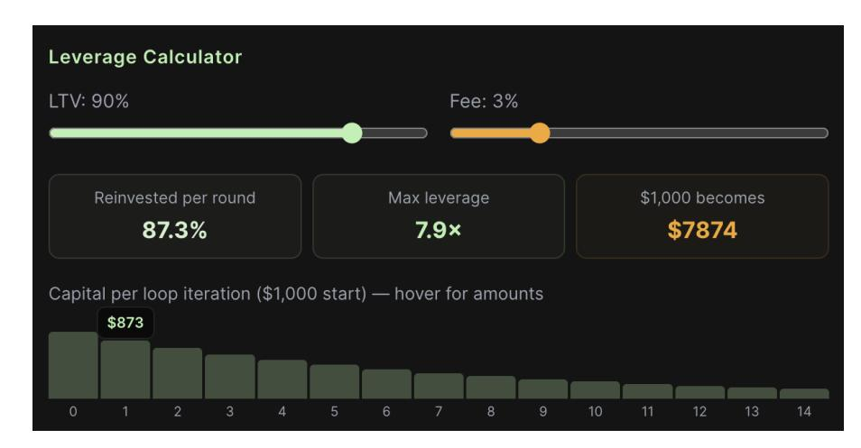

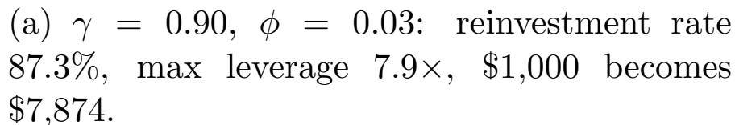

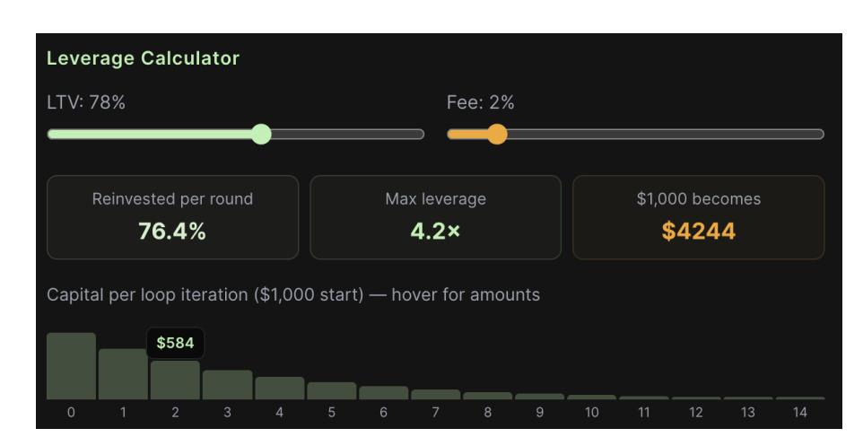

(b)  $\gamma=0.78,\ \phi=0.02$ : reinvestment rate 76.4%, max leverage 4.2×, \$1,000 becomes \$4,244.

Figure 5: Recursive leverage convergence. Bar charts show capital deployed at each loop iteration from a \$1,000 initial deposit. The geometric decay of per-iteration capital (Proposition 4.1) is visible in both configurations.

<span id="page-24-1"></span>Table 6: Net leverage  $L_{\text{net}} = 1/(1 - \gamma(1 - \phi))$  for selected parameter combinations.

| $\gamma$ (LTV) | $\phi$ (fee) | $\eta = \gamma(1 - \phi)$ | $L_{\rm net}$  |
|----------------|--------------|---------------------------|----------------|
| 0.90           | 0.03         | 0.873                     | $7.87 \times$  |
| 0.90           | 0.04         | 0.864                     | $7.35 \times$  |
| 0.85           | 0.03         | 0.8245                    | $5.70 \times$  |
| 0.80           | 0.03         | 0.776                     | $4.46 \times$  |
| 0.95           | 0.03         | 0.9215                    | $12.74 \times$ |

| Loop     | Action        | Capital in | Tokens | Borrow | Debt    |
|----------|---------------|------------|--------|--------|---------|
| 0        | Buy           | \$1,000    | 1,000  |        |         |
| 0        | Lock + Borrow |            |        | \$873  | \$873   |
| 1        | Buy           | \$873      | 873    |        |         |
| 1        | Lock + Borrow |            |        | \$762  | \$762   |
| 2        | Buy           | \$762      | 762    |        |         |
| 2        | Lock + Borrow |            |        | \$665  | \$665   |
| 3        | Buy           | \$665      | 665    |        |         |
|          | :             | :          | :      | :      | ÷       |
| $\infty$ | Total         | \$7,874    | 7,874  |        | \$6,874 |

At each iteration, the borrower receives  $\gamma(1-\phi)=0.873$  of the previous round's capital. The total converges to  $C_0/(1-0.873)\approx\$7,874$  in tokens, with cumulative debt  $\approx\$6,874$ . Every individual loan satisfies  $d_i < P_f \cdot \ell_i$  (since  $\gamma=0.90<1$ ), so no loan in the loop can become under-collateralized due to collateral price declines, even if the spot price subsequently falls to the floor. If the spot price rises above the floor (as it does in practice on later iterations), the effective reinvestment fraction  $\eta_i = \gamma(1-\phi) \cdot P_f/P_{\rm spot}^{(i)}$  decays (Proposition 4.2), and the realized leverage is strictly less than  $L_{\rm net}$ .

Safety at each iteration. The coverage check (Invariant 3.1) is verified at every loop

{25}------------------------------------------------

iteration. If the remaining collateral is insufficient to maintain the solvency invariant after a proposed borrow, the loop terminates early. This bounds the actual leverage to at most Lnet and prevents system insolvency even under adversarial looping.

### <span id="page-25-0"></span>4.6 Application: Leveraged Token Launches

The recursive leverage mechanism enables non-liquidatable leveraged positions at any point in the curve's lifecycle. Token launches are the most compelling application: the floor-tospot gap is smallest early in the curve, maximizing looping efficiency, and no external oracle exists for newly issued tokens.

The problem. In oracle-based DeFi, a participant wishing to amplify exposure to a newly launched token follows the same buy-deposit-borrow-buy loop through Aave or Compound. However, the collateral is valued at the spot oracle price, which for a newly launched token is maximally volatile. A downward price movement triggers liquidation—the participant loses both the position and a liquidation penalty [\[Perez et al.,](#page-50-2) [2021\]](#page-50-2).

Floor-anchored leverage. In our mechanism, borrowing capacity is evaluated against P<sup>f</sup> , not the spot price. Because P<sup>f</sup> is monotonically non-decreasing (Theorem [4.1\)](#page-20-0) and every loan remains safe (Theorem [4.2\)](#page-21-0), no loan in the loop can become under-collateralized due to collateral price declines, regardless of subsequent market-price movements—even if the market price falls to the floor itself. The total position converges to C<sup>0</sup> ·Lnet/P<sup>f</sup> tokens, where C<sup>0</sup> is initial capital and Lnet = 1/(1−γ(1−ϕ)). At every iteration, the collateral buffer—the excess of floor-valued collateral over outstanding debt—grows with each subsequent floor elevation.

Anti-front-running for presale leverage. During presale periods, a time-decaying fee multiplier is applied to origination and trading fees. The multiplier follows a quartic decay from an initial premium (e.g., 5×) to the base rate (1×) over the presale duration:

$$\mu(t) = 1 + (\mu_0 - 1) \left( \frac{t_{\text{end}} - t}{t_{\text{end}} - t_{\text{start}}} \right)^4,$$

where µ<sup>0</sup> is the initial multiplier. The quartic exponent (rather than linear or quadratic) is chosen because it front-loads the decay: over 90% of the premium is shed by the midpoint, then the remainder converges slowly to 1×. This profile maximizes the deterrent for early front-runners while allowing late presale participants to enter at near-normal fees. Lower exponents (e.g., quadratic) distribute the decay too evenly, leaving a material premium at the midpoint; exponential decay would require transcendental arithmetic onchain. The quartic power law is the simplest integer-exponent choice that achieves aggressive early decay with pure integer multiplication.

Fee-funded bootstrapping. The one-time origination fee serves a dual role in this context: beyond pricing credit risk, it functions as an algorithmic bootstrapping mechanism. Each leverage loop iteration generates origination fees that are directed to the floor reserve,

{26}------------------------------------------------

<span id="page-26-1"></span>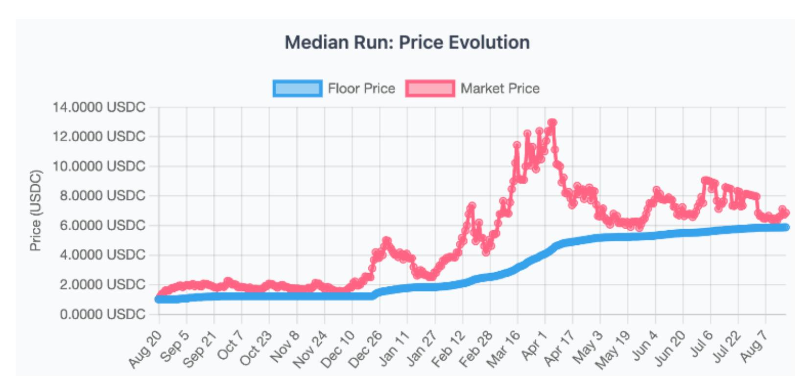

Figure 6: Median simulation run: floor price (blue) and market price (pink) over approximately one year. The floor price rises monotonically as trading fees are absorbed, while the market price fluctuates freely above the floor. The narrowing gap between floor and market price illustrates the passive capital-efficiency improvement described in Section [5.2.](#page-28-0)

funding subsequent floor elevation. This replaces the inflationary token emissions commonly used to bootstrap DeFi protocols [\[Heimbach and Huang,](#page-50-3) [2024\]](#page-50-3): rather than diluting existing holders to attract liquidity, the mechanism channels leverage demand into floor appreciation that benefits all token holders. The result is a non-dilutive bootstrapping loop in which early leveraged participation directly strengthens the protocol's price-floor guarantee.

# <span id="page-26-0"></span>5 Analysis and Evaluation

Figure [6](#page-26-1) shows the price evolution from a median simulation run, illustrating how the floor price (blue) rises monotonically over time while the market price (pink) fluctuates above it.

Evidence classification. This paper presents three distinct classes of evidence, and the reader should weigh them accordingly:

- Mathematically proved (Sections [3](#page-7-0) and [4\)](#page-18-0): floor monotonicity (Theorem [4.1\)](#page-20-0), nonliquidatable safety (Theorem [4.2\)](#page-21-0), redemption liquidity (Proposition [3.1\)](#page-10-2), reconfiguration safety (Proposition [3.4\)](#page-16-0), and the leverage bound (Propositions [4.1](#page-22-0) and [4.2\)](#page-23-0). These hold for any correct implementation under the stated assumptions.
- Implementation-verified (§[5.3\)](#page-29-0): the reserve solvency invariant, floor monotonicity, segment validity, collateral backing, and loan safety are checked via stateful invariantbased fuzz testing of a concrete Solidity implementation. This provides high confidence but not formal proof of implementation correctness.
- Simulation evidence (§[5.7\)](#page-34-0): the dynamic fee multiplier study uses agent-based simulation to evaluate revenue and floor-appreciation outcomes. These results are empirical, dependent on simulation assumptions, and should be interpreted as illustrative rather than as formal guarantees.

{27}------------------------------------------------

Three distinct axes. The mechanism's properties decompose into three axes that should not be conflated:

- Safety: the reserve invariant holds and no loan becomes under-collateralized (Theorem [4.2\)](#page-21-0). Safety holds regardless of repayment behavior or activity level.
- Liquidity: actual reserves A = V − D cover all free-supply redemptions (Proposition [3.1\)](#page-10-2). Liquidity is temporarily reduced when debt is outstanding—the reserve is solvent but partially deployed.
- Efficiency: borrowing capacity per locked token grows as P<sup>f</sup> rises. Efficiency improves passively but depends on fee revenue; dormant loans drag on floor-elevation velocity without affecting safety.

Safe does not imply liquid in the pooled sense; liquid does not imply efficient. The subsequent analysis evaluates each axis independently.

We evaluate the debt-aware bonding curve mechanism along five axes: comparative positioning against related floor-price designs (§[5.1\)](#page-27-0), capital efficiency properties (§[5.2\)](#page-28-0), invariant-based verification of a concrete implementation (§[5.3\)](#page-29-0), failure-mode analysis (§[5.4\)](#page-30-0), and an agent-based simulation study of dynamic fee multipliers (§[5.7\)](#page-34-0).

### <span id="page-27-0"></span>5.1 Comparative Analysis

Table [7](#page-27-1) positions the present work against five representative systems that incorporate floorprice or reserve-backed token mechanics.

<span id="page-27-1"></span>

| Table 7: Comparison of floor-price and reserve-backed token designs. | •<br>= present,<br>◦<br>= absent, |
|----------------------------------------------------------------------|-----------------------------------|
| △<br>= partial.                                                      |                                   |

| Property                | This work    | Nirvana     | Baseline    | Olympus  | Aave |
|-------------------------|--------------|-------------|-------------|----------|------|
| Floor enforcement       | •            | •           | •           | ◦        | ◦    |
| Guarantee strength      | Reserve inv. | Algorithmic | Algorithmic | Treasury | N/A  |
| Borrowing integration   | •            | •           | •           | ◦        | •    |
| Oracle dependency       | ◦            | ◦           | ◦           | •        | •    |
| Floor monotonicity      | Proven       | Claimed     | Claimed     | ◦        | N/A  |
| Curve reconfigurability | •            | ◦           | ◦           | ◦        | N/A  |

Floor enforcement. Nirvana [\[Nirvana Finance,](#page-50-4) [2022\]](#page-50-4) and Baseline [\[Baseline Markets,](#page-49-2) [2024\]](#page-49-2) enforce a floor through algorithmic stabilization and reserve-backed pricing, respectively. Our mechanism enforces the floor through a discrete curve segment with an onchain reserve invariant V = R(Γ, S) (Invariant [3.1\)](#page-10-1). Proposition [3.1](#page-10-2) guarantees that actual reserves (V − D, where D is aggregate outstanding debt) cover all redemptions of unlocked supply. This makes the guarantee constructive rather than emergent.

Guarantee strength. Olympus [\[Olympus DAO,](#page-50-5) [2021\]](#page-50-5) relies on treasury backing whose value fluctuates with external asset prices. Our reserve invariant ensures that the actual collateral held by the contract, net of outstanding debt, always covers the floor segment's obligation, providing a deterministic, per-token guarantee.

{28}------------------------------------------------

Borrowing integration. Aave [\[Aave,](#page-48-0) [2020\]](#page-48-0) is the canonical oracle-based lending protocol: collateral is marked to market and positions are liquidated when health factors breach a threshold. Nirvana offered non-liquidatable borrowing of the NIRV stablecoin against ANA at the floor value, though NIRV saw limited DeFi integration beyond the Nirvana ecosystem itself. Baseline's current design offers non-liquidatable lending against the BLV floor. Both are close comparable systems; neither provides the same reserve-invariant-based safety framing for issuance-native collateral. Our design anchors loan-to-value to the floor price P<sup>f</sup> rather than the spot price, and additionally provides formal proofs of floor monotonicity and reserve solvency that neither offers.

Oracle dependency. Our mechanism requires no external price oracle. The floor price is an endogenous quantity derived from the reserve invariant and the current segment configuration. Nirvana and the current Baseline are similarly oracle-free, pricing tokens through their own reserve-backed curves. Nirvana's lack of atomic-transaction protections enabled the flash loan exploit that drained its reserves. Olympus and Aave depend on external oracles for collateral valuation, creating an additional attack surface.

Floor monotonicity. We prove (Theorem [4.1\)](#page-20-0) that P<sup>f</sup> is non-decreasing under all protocol operations. Both Nirvana and Baseline claim a non-decreasing floor, but neither provides a formal monotonicity proof; the guarantees are algorithmic rather than invariant-based.

Curve reconfigurability. Our reconfiguration primitive (Definition [3.5\)](#page-15-0) allows reshaping the premium segments of Γ while preserving all invariants, including floor monotonicity and reserve solvency. We are not aware of a directly comparable reconfiguration primitive in the surveyed floor-price literature.

Among the systems surveyed, this mechanism is distinguished not by floor support alone, nor by lending alone, but by the combination of: (i) primary-market token issuance, (ii) debtaware reserve accounting, (iii) a provably non-decreasing endogenous floor, and (iv) a borrowing safety result that removes protocol-triggered liquidation for issuance-native collateral without relying on oracle-marked collateral valuation.

# <span id="page-28-0"></span>5.2 Capital Efficiency Analysis

LTV at floor versus market price. In oracle-based protocols, the loan-to-value ratio is computed against the current spot price Pspot, which can decline precipitously. In our design the LTV is computed against P<sup>f</sup> :

$$\max Borrow = \gamma \cdot P_f \cdot S_{locked}$$

where γ is the protocol-configured LTV ratio and Slocked is the quantity of locked issuance tokens. Because P<sup>f</sup> ≤ Pspot by construction, the effective utilization at origination is conservative. This conservatism is a deliberate safety-first choice, not accidental inefficiency: flooranchored collateral valuation is the structural source of the non-liquidatability guarantee (Theorem [4.2\)](#page-21-0). However, as the floor price increases (through fee-funded step absorption) the borrower's capacity increases without additional collateral, enabling rebalancing—extracting additional collateral from the same locked position.

{29}------------------------------------------------

Effective capital utilization improves as the floor price increases. Let P<sup>f</sup> (t0) and P<sup>f</sup> (t1) denote the floor price at loan origination and a later time t<sup>1</sup> > t<sup>0</sup> respectively. The borrowing capacity grows by the factor P<sup>f</sup> (t1)/P<sup>f</sup> (t0) ≥ 1, while the original debt remains fixed. At origination, D<sup>0</sup> ≤ maxBorrow = γ · P<sup>f</sup> (t0) · Slocked, and since no interest accrues, Dremaining ≤ D0. The effective LTV at time t<sup>1</sup> is therefore:

$$LTV_{eff}(t_1) = \frac{D_{\text{remaining}}}{P_f(t_1) \cdot S_{\text{locked}}} \le \frac{D_0}{P_f(t_1) \cdot S_{\text{locked}}} \le \gamma \cdot \frac{P_f(t_0)}{P_f(t_1)} \le \gamma$$

Hence the loan becomes more collateralized over time without any action from the borrower, a property we term passive de-risking.

Bear-market floor-raise efficiency. Redemptions that reduce the total supply below the floor supply trigger AdjustFloorToSupply, which reduces S<sup>0</sup> to match. Since the cost to raise the floor by one price tick is proportional to S0, a smaller floor supply makes future floor raises cheaper. Concretely, if the treasury allocates a fraction α of each trade's fee (at rate f) to floor reserves, the annual floor lift is approximately

$$\Delta P_f^{\rm annual} \approx \frac{V_{\rm daily} \cdot f \cdot \alpha \cdot 365}{S_0}$$

where Vdaily is average daily trading volume (all quantities in base units; the result is in collateral-wei per token-wei, i.e., a raw price increment, not WAD-scaled). Bear-market redemptions shrink S0, reducing the cost of future floor elevation for remaining holders. Note that the floor price is non-decreasing by construction (Theorem [4.1\)](#page-20-0), but actual increases require collateral injection from fees or other sources; the floor does not rise on its own.

### <span id="page-29-0"></span>5.3 Invariant-Based Verification

We verify the mechanism's critical properties through stateful invariant-based fuzz testing supplemented by formal verification via Certora CVL specifications (24 rules across 6 property groups) and Halmos symbolic execution (8 properties independently confirmed; Appendix [A;](#page-44-0) specifications at <https://github.com/demirelo/dabc-proofs>) of a concrete Solidity implementation named Floors, comprising approximately 20,000 lines of Solidity across 30+ contracts (smart contracts and testing framework alike licensed under BUSL-1.1).

Testing framework. The verification suite uses the Foundry stateful fuzzing engine. Handler contracts wrap each protocol module (bonding curve, credit facility, presale, access control) and expose fuzzer-callable entry points that execute bounded, randomized sequences of protocol operations. Ghost variables in each handler track cumulative collateral flows, issuance minting and burning, and loan lifecycle state, enabling the test harness to assert invariants after every operation sequence.

Key invariants tested. The following invariants are checked after every fuzz-generated operation sequence:

{30}------------------------------------------------

- 1. Reserve solvency. The virtual collateral supply V<sup>c</sup> matches the reserve computed from the current segment configuration and total issuance supply, within a tolerance of 100 wei: |V<sup>c</sup> − R(Γ, totalSupply)| ≤ 100. The protocol maintains exact equality (V<sup>c</sup> = R(Γ, S)) by recomputing the reserve function atomically; the tolerance is a conservative detection margin for the fuzz harness, not an acknowledgment of drift.
- 2. Floor monotonicity. The floor price P<sup>f</sup> never falls below its value at deployment. A dedicated ghost variable tracks the high-water mark and asserts P<sup>f</sup> (t) ≥ P<sup>f</sup> (0) for all t.
- 3. Segment validity. The curve always has at least two segments. The floor segment has exactly one step with zero price increment. Every segment has positive supply per step, positive step count, and positive initial price.
- 4. Collateral backing. The actual collateral token balance of the curve contract, plus cumulative withdrawals, equals the virtual collateral supply plus cumulative deposits: bal + Σwithdrawn = V<sup>c</sup> + Σdeposited. This accounting identity ensures no collateral is created or destroyed.
- 5. Loan safety. Every active loan satisfies D<sup>i</sup> ≤ γ · P<sup>f</sup> · S locked i , where D<sup>i</sup> and S locked i are the i-th loan's remaining debt and locked issuance tokens, respectively. The sum of locked tokens across all active loans equals the credit facility's issuance token balance.

Workflow-level testing. Beyond per-module invariant tests, a full-protocol workflow handler orchestrates multi-step scenarios—buy-and-borrow, full loan lifecycles (borrow → rebalance → repay), price appreciation through floor raises, leveraged loop positions, and concurrent multi-user operation sequences. System-wide invariants (full backing guarantee, floor monotonicity) are checked after every workflow invocation.

Test infrastructure. The handler base contract provides actor management (up to 2<sup>16</sup> deterministic addresses), bounded time and block warping, and realistic amount bounding. All handlers operate under fail on revert = true, meaning the fuzzer treats unexpected reverts as failures rather than silently discarding them.

# <span id="page-30-0"></span>5.4 Failure Mode Analysis

We distinguish between properties that can be violated under certain conditions and those that cannot be violated under a correct implementation.

#### Properties vulnerable to implementation errors.

- Smart contract bugs. Implementation errors could violate any invariant. The fuzztesting suite and formal verification artifacts (Certora CVL, Halmos; Appendix [A\)](#page-44-0) mitigate but do not eliminate this risk.
- Operator misconfiguration. Premium segments may be reshaped within the bound δmax, and floor raises may be delayed. Onchain validation constraints prevent any reconfiguration from lowering the floor or violating the reserve invariant.

{31}------------------------------------------------

• Collateral token failures. The mechanism assumes a well-behaved ERC-20 collateral token. Fee-on-transfer tokens would cause the actual collateral balance to diverge from the virtual supply, violating the reserve invariant. Rebasing tokens would similarly break the accounting identity. The implementation explicitly does not support these token types.

#### Properties invariant under correct implementation.

- Floor monotonicity. The floor price  $P_f$  is non-decreasing by construction. raiseFloor can only increase  $P_f$ . Redemptions at the floor leave  $P_f$  unchanged (Theorem 4.1). reconfigureSegments enforces  $P_f^{\text{new}} \geq P_f^{\text{old}}$  as a precondition.
- Reserve solvency. The virtual collateral supply is updated atomically with every buy and sell. Credit facility withdrawals and deposits do not alter the virtual supply, preserving the curve invariant. Segment reconfiguration checks  $R(\Gamma', S) = V$  (or  $V + \delta$  if collateral is injected) before committing (Definition 3.5).
- Loan safety. Because the LTV is anchored to  $P_f$  and  $P_f$  is non-decreasing, no active loan can become under-collateralized through market movements. The protocol contains no liquidation mechanism; repayment is the only path to loan closure.

Trust assumptions. The mechanism assumes: (i) the smart contract implementation is correct, (ii) the collateral token conforms to the ERC-20 standard (an implementation constraint, not a fundamental limitation), and (iii) the underlying blockchain provides liveness and finality. Onchain preconditions ensure the floor can never be lowered; floor raises are the only operation that requires periodic invocation. The current design assumes authorized invocation; deployments may automate this with threshold-based keepers (e.g., trigger when accumulated fee revenue exceeds a configurable threshold) or time-locked schedules.

# 5.5 Adversarial Stress Analysis

We analyze the mechanism's behavior under three adversarial scenarios that target the core invariants rather than the supplementary fee policy.

Scenario 1: Maximal reconfiguration exploitation. An adversary with governance access repeatedly invokes reconfiguration with the maximum allowed spot-price loss  $\delta_{\text{max}}$  per invocation. By Definition 3.5(iii), cumulative dilution is bounded by  $B_{\text{max}}$ , so after at most  $N_{\text{max}} = \lfloor B_{\text{max}}/\delta_{\text{max}} \rfloor$  invocations the budget is exhausted and no further reconfigurations are accepted until governance resets it.

Multi-round damage bound. Let  $P_{\rm spot}^{(0)}$  be the spot price before the attack. After  $k \leq N_{\rm max}$  invocations, the worst-case spot price is  $P_{\rm spot}^{(k)} \geq P_{\rm spot}^{(0)} - k \cdot \delta_{\rm max} \geq P_{\rm spot}^{(0)} - B_{\rm max}$ . The maximum dollar loss per token for a premium holder is therefore  $B_{\rm max}$ , regardless of the number of rounds. For a representative deployment with  $B_{\rm max} = 0.10 \, P_{\rm spot}^{(0)}$  and  $\delta_{\rm max} = 0.02 \, P_{\rm spot}^{(0)}$ , the adversary exhausts the budget in 5 invocations and can reduce spot prices by at most 10%.

Invariants preserved during the attack: (i) the floor price  $P_f$  is unaffected (onchain precondition  $P'_f \geq P_f$ ); (ii) the reserve invariant  $V = R(\Gamma', S)$  holds at every step; (iii) existing

{32}------------------------------------------------

loans remain safe because loan safety depends only on P<sup>f</sup> and γ (Theorem [4.2\)](#page-21-0), not on premium-tier spot prices.

Budget-reset governance risk. If governance can reset Bmax, the adversary can repeat the attack. This is mitigated by standard governance safeguards (timelocks, multisig thresholds, veto periods). Setting δmax = 0 eliminates this attack surface entirely at the cost of restricting reconfiguration to unminted supply regions.

Scenario 2: Reserve drain via maximal borrowing. All token holders simultaneously lock their positions and borrow at the maximum LTV γ. The aggregate debt becomes D = γ ·P<sup>f</sup> ·S, and the actual reserve drops to A = V − D. By Proposition [3.1,](#page-10-2) A still covers all free-supply redemptions—but since all supply is locked, Sfree = 0 and no redemptions are possible until some borrower repays. This is an extreme form of the solvency-vs-redeemability distinction emphasized in Section [5:](#page-26-0) the mechanism remains solvent (virtual reserves cover all obligations) but temporarily non-redeemable (all supply is locked as collateral, so Sfree = 0 and no tokens can be presented for redemption until a borrower repays). Recovery occurs when any borrower repays, restoring actual reserves proportionally. Crucially, no loan becomes under-collateralized during this period: d<sup>i</sup> = γ · P<sup>f</sup> · ℓ<sup>i</sup> < P<sup>f</sup> · ℓ<sup>i</sup> for all i.

Scenario 3: Secondary-market divergence under stress. If the secondary-market price drops below P<sup>f</sup> , rational arbitrageurs buy on the secondary market and redeem on the primary market at P<sup>f</sup> , capturing the spread. In the worst case, arbitrageur capital is limited and the secondary price remains below P<sup>f</sup> for an extended period.

Convergence model. Let Psec(t) denote the secondary-market price at block t, ∆(t) = Pf− Psec(t) > 0 the discount, f the round-trip transaction cost (gas + fees), and K the arbitrageur capital available per block. Profitable arbitrage requires ∆(t) > f. Each arbitrage cycle purchases q(t) = K/Psec(t) tokens on the secondary market and redeems them on the primary market, extracting q(t) from the circulating secondary-market supply Ssec(t).

Assuming the secondary market follows a constant-product invariant (x · y = kpool), each redemption of q(t) tokens increases Psec by approximately ∆Psec ≈ 2 q(t) Psec(t)/Ssec(t) (firstorder price impact). The discount shrinks as ∆(t + 1) ≈ ∆(t) − 2K/Ssec(t). Since Ssec also decreases by q(t) per round, the convergence accelerates: the number of blocks to close the gap from ∆<sup>0</sup> to the friction threshold f is bounded by

$$T_{\text{conv}} \leq \frac{(\Delta_0 - f) \cdot S_{\text{sec}}(0)}{2K},$$

which is finite for any K > 0.

Worst-case persistence. If K is small relative to pool depth, Tconv can span many blocks. For example, with ∆<sup>0</sup> = 0.05 P<sup>f</sup> , f = 0.005 P<sup>f</sup> , Ssec = 100,000, and K = 100: Tconv ≤ (0.045 · 100,000)/200 = 22,500 blocks (∼3 days on Ethereum at 12s blocks). During this window, holders who sell on the secondary market realize a loss relative to the primarymarket floor—a practical caveat not mitigated by the mechanism itself. The primary-market redemption guarantee is unconditional for unlocked supply, so the divergence cannot persist indefinitely under any positive arbitrageur capital (Theorem [4.1\)](#page-20-0).

Table [8](#page-33-0) summarizes the three scenarios.

{33}------------------------------------------------

Table 8: Adversarial scenario summary.

<span id="page-33-0"></span>

| Scenario                             | Attack path                                                 | Invariant de-<br>fence                                         | Residual risk                                                          |
|--------------------------------------|-------------------------------------------------------------|----------------------------------------------------------------|------------------------------------------------------------------------|
| Reconfig. exploitation Reserve drain | Repeated $\delta_{\text{max}}$ reconfigs All holders lock + | $B_{\text{max}}$ budget;<br>$P'_f \ge P_f$<br>A = V - D covers | Spot loss $\leq B_{\text{max}}$ for premium holders  Zero free supply; |
|                                      | borrow at $\gamma$                                          | free supply                                                    | redemptions blocked<br>until repayment                                 |
| Secondary divergence                 | Market price $< P_f$                                        | Unconditional primary redemption                               | Slow convergence if arb. capital is low                                |

These scenarios confirm that the mechanism's safety properties (floor monotonicity, loan safety, reserve solvency) are robust under adversarial conditions, while the efficiency and liquidity axes degrade gracefully under stress without compromising the core invariants.

### 5.6 Dormant-Loan Accumulation Analysis

The core borrowing guarantee (Theorem 4.2) holds regardless of repayment behavior, but the efficiency axis is sensitive to dormant-loan accumulation. We analyze how the dormancy rate  $\rho$  (fraction of floor supply locked in non-repaid loans) affects floor-elevation velocity, the primary measure of long-term mechanism health.

**Model.** Let  $S_0$  be the current floor supply, F the daily fee revenue directed to floor elevation, and  $\Delta P_f$  the price gap to the next premium step. The cost of one floor-price tick is  $C_{\text{tick}} = \Delta P_f \cdot S_0$ , and the time to accumulate this cost is  $T = C_{\text{tick}}/F$  days. Dormant loans do not change  $S_0$  directly (locked tokens remain counted in floor supply), but governance-gated buyouts that burn freed tokens reduce  $S_0$ , lowering future  $C_{\text{tick}}$ .

Quantitative impact. Table 9 illustrates the interaction between dormancy, buyout coverage, and floor-elevation velocity for a representative parameterization ( $S_0 = 10,000, P_f = \$1.00, \Delta P_f = \$0.10, F = \$50/\text{day}$ ).

{34}------------------------------------------------

<span id="page-34-1"></span>Table 9: Dormancy drag on floor-elevation velocity and buyout mitigation. ρ: dormancy rate; β: buyout fraction; S ′ 0 : post-buyout floor supply; T: days per tick.

| ρ   | β   | S′<br>0 | Ctick<br>(\$) | T<br>(days) |
|-----|-----|---------|---------------|-------------|
| 0%  | —   | 10,000  | 1,000         | 20.0        |
| 20% | 0   | 10,000  | 1,000         | 20.0        |
| 20% | 1.0 | 8,000   | 800           | 16.0        |
| 50% | 0   | 10,000  | 1,000         | 20.0        |
| 50% | 0.5 | 7,500   | 750           | 15.0        |
| 50% | 1.0 | 5,000   | 500           | 10.0        |
| 80% | 0   | 10,000  | 1,000         | 20.0        |
| 80% | 1.0 | 2,000   | 200           | 4.0         |

Key observations. (i) Without buyouts (β = 0), dormancy has no effect on tick cost because dormant tokens still occupy S0; the drag is latent rather than immediate. (ii) Buyouts unlock the dormancy drag by burning freed tokens, reducing S<sup>0</sup> and hence Ctick. At ρ = 50% with full buyout, elevation velocity doubles (20 → 10 days per tick). (iii) At extreme dormancy (ρ = 80%, full buyout), the floor supply drops to 2,000 and tick cost to \$200, producing a 5× acceleration—illustrating the self-correcting nature of the buyout mechanism. (iv) The safety axis (Theorem [4.2\)](#page-21-0) and the liquidity axis (Proposition [3.1\)](#page-10-2) are unaffected by dormancy: locked tokens back debt regardless of repayment intent, and actual reserves cover unlocked supply.

Steady-state equilibrium. In a running deployment, dormancy accumulates at some origination rate and is cleared by buyouts. Let λ denote the rate at which new loans become dormant (tokens per day) and µ the buyout clearance rate (tokens per day, governancegated). The dormant supply evolves as S˙ dorm = λ − µ, reaching steady state when µ = λ, i.e., ρ <sup>∗</sup> = λ τ/S ¯ <sup>0</sup> where ¯τ is the mean time-to-buyout. If buyout throughput exceeds the dormancy inflow (µ > λ), dormancy converges to zero; if µ < λ, dormancy grows linearly until governance increases buyout capacity or origination slows due to rising fees.

For the parameterization in Table [9,](#page-34-1) if λ = 10 tokens/day and ¯τ = 90 days, the steadystate dormant supply is S ∗ dorm = 10 × 90 = 900 tokens (ρ <sup>∗</sup> = 9%), well within the range where floor-elevation drag is modest. At λ = 50 tokens/day (extreme stress), ρ <sup>∗</sup> = 45%, motivating aggressive buyout scheduling to avoid the doubling of elevation time shown in the table.

This analysis confirms that dormant-loan accumulation is primarily an efficiency concern, not a safety or liquidity concern, and that governance-gated buyouts are the appropriate mitigation lever. The steady-state model provides deployments with a quantitative framework for calibrating buyout parameters against expected dormancy inflow.

## <span id="page-34-0"></span>5.7 Dynamic Fee Multiplier: Simulation Study

Note: This subsection is an illustrative policy layer, not part of the core mechanism. The DABC and its non-liquidatable borrowing guarantees (Theorems [4.1–](#page-20-0)[4.2\)](#page-21-0) hold regardless of fee policy—including the static baseline. The dynamic fee model below is supplemen

{35}------------------------------------------------

tary simulation evidence for one possible extension and should be evaluated as empirical, parameter-dependent analysis rather than as a formal result. Readers primarily interested in the mechanism's formal properties may skip to Section [6](#page-36-0) without loss of continuity.

The discussion in Section [6](#page-36-0) identifies dynamic fee multipliers as a natural extension of the mechanism. We now present a concrete instantiation and evaluate it through agent-based simulation.

#### 5.7.1 Fee Model

We decompose the effective fee into a static base fee fbase and a state-dependent multiplier m:

$$f_{\text{eff}} = f_{\text{base}} \cdot \frac{m}{10,000} \tag{15}$$

where m is expressed in basis points (BPS; 10,000 = 1×). The multiplier is the product of two independent components:

Premium multiplier h(π). Let π = Pspot/Pfloor denote the premium ratio. We define asymmetric buy-side and sell-side multipliers using Michaelis–Menten kinetics:

$$h_{\text{buy}}(\pi) = 1 + \alpha_{\text{buy}} \cdot \frac{\pi - 1}{\pi - 1 + c_{\text{buy}}}$$
 (16)

$$h_{\text{sell}}(\pi) = 1 + \alpha_{\text{sell}} \cdot \frac{c_{\text{sell}}}{\max(0, \pi - 1) + c_{\text{sell}}}$$

$$(17)$$

where α controls the saturation ceiling and c the half-saturation constant. The buy-side multiplier hbuy saturates at 1 + αbuy for large premiums, incentivizing buying near the floor. The sell-side multiplier hsell is maximal at the floor (π = 1, yielding 1 + αsell) and decays toward 1 at high premiums, penalizing sells near the floor to protect its integrity.

Size multiplier g(s). Let s = qlast/S denote the ratio of the most recent trade size to the total supply, lagged by one trade. The size multiplier applies a quadratic penalty:

$$g(s) = \min\left(1 + \beta \cdot \frac{s^2}{s_{\text{ref}}^2}, \ g_{\text{max}}\right) \tag{18}$$

where β scales the penalty, sref is the reference size, and gmax caps the multiplier. The quadratic scaling penalizes large trades super-linearly while remaining negligible for small trades. The one-step lag ensures the multiplier is deterministic at execution time.

Combined multiplier. The final multipliers for buy and sell are:

$$m_{\text{buy}} = h_{\text{buy}} \cdot g, \qquad m_{\text{sell}} = h_{\text{sell}} \cdot g$$
 (19)

capped at 15× (150,000 BPS) to bound worst-case fees.

{36}------------------------------------------------

Rationale. This two-input model was selected through an ablation study over a fivecomponent multiplicative fee framework (premium, size, volatility, spread, and momentum). The two-input variant h(π) · g(s) captures 95.8% of the full model's protocol revenue while requiring only BPS integer arithmetic (additions, multiplications, divisions—no transcendentals) and a single EVM storage slot (8 × uint32 = 256 bits) for all parameters.

#### 5.7.2 Simulation Results

We evaluate the two-input model against six alternative fee strategies (static, premiumaware, volatility-responsive, spread-aware, asymmetric accumulator, and adaptive hybrid) across six market regimes using 20 independent seeds per regime (840 total simulations of 10,000 steps). Floors Dynamic ranks first in all six regimes, achieving a grand average revenue of 261.2 collateral units—a +17.1% uplift over the static baseline (223.1) and +9.3% over the next-best strategy (premium-aware, 238.9). The uplift is statistically significant (bootstrapped 95% CIs exclude zero) in 11 of 12 pairwise comparisons. The model's functional form produces emergent fee asymmetry: sell fees spike near the floor (π ≈ 1) to deter extraction, while buy fees dominate in bull trends (π ≫ 1)—adapting to regime changes without parameter tuning. Full per-regime revenue tables, statistical significance analysis (Cohen's d, confidence intervals), fee asymmetry data, and head-to-head win rates are reported in Appendix [B.](#page-45-0)

#### 5.7.3 Implementation Note

The two-input fee model is implemented as a reusable abstract Solidity contract. All eight parameters pack into a single 256-bit storage slot (uint32 × 8), adding approximately 8,000 gas overhead per trade. The combined multiplier is capped at 15× (150,000 BPS) to bound worst-case effective fees. Setting αbuy = αsell = 0 and β = 0 recovers the static fee baseline.

# <span id="page-36-0"></span>6 Discussion and Limitations

Reconfiguration bounds. Onchain preconditions ensure that no reconfiguration can lower the floor price or violate the reserve invariant. Reshaping premium segments can reduce spot prices for existing holders within the bound δmax (Definition [3.5\)](#page-15-0). Each LRE may decrease the spot price by up to δmax; setting δmax = 0 eliminates this risk entirely but restricts reconfiguration to unminted supply regions. In all cases, existing holders' floor guarantees and borrowing positions remain unaffected.

Primary-market-only guarantee (important caveat). The floor price guarantee applies exclusively to the bonding curve's primary issuance market—i.e., to redemptions executed through the protocol's own burn mechanism. Secondary markets (decentralized exchanges, order books) may temporarily trade below P<sup>f</sup> . The protocol does not and cannot control prices on external venues. Rational arbitrageurs can buy on the secondary market and redeem on the primary market to capture the spread, which exerts upward pressure on the secondary price toward P<sup>f</sup> . However, the speed and completeness of this 

{37}------------------------------------------------

convergence depend on arbitrageur capital availability, transaction costs, and cross-chain latency. During extreme events (gas spikes, bridge delays, exchange downtime), the secondary price may diverge from P<sup>f</sup> for extended periods. Readers should not interpret "floor price" as a guarantee of the token's trading price on any venue; it is a guarantee of the minimum redemption price available through the protocol's primary market.

Fee-dependent sustainability. The floor price increases only when trading and credit activity generates fee revenue that is subsequently directed to the floor reserve. In a sustained zero-activity regime, P<sup>f</sup> remains constant—though it never decreases. This dependency can be mitigated by denominating the bonding curve's reserve in yield-bearing assets (e.g., staked ETH, tokenized treasuries): the yield accrues to the reserve independently of trading volume, providing a baseline source of floor appreciation even during prolonged low-activity periods. Such assets must preserve instant redeemability (e.g., liquid staking tokens rather than natively staked assets with withdrawal delays) to maintain the liquidity guarantee of Proposition [3.1.](#page-10-2) If eligible reserve assets lose instant redeemability under stress (e.g., LST depegging or redemption caps), sells may require queuing or throttling until liquidity is restored.

Value internalization. A structural consequence of coupling issuance, trading, and borrowing in a single contract is that the protocol captures value streams that would otherwise flow to external intermediaries. In a conventional token economy, trading fees accrue to AMM liquidity providers or centralized market makers; origination and interest fees accrue to lending protocols such as Aave or Compound; and arbitrage profits accrue to external searchers. By contrast, a bonding curve that acts as both primary issuer and credit facility internalizes all three revenue channels: (i) buy and sell fees on the primary curve, (ii) origination fees from the credit facility, and (iii) interest payments from outstanding loans. These fees are directed to the protocol's reserve, funding floor elevation via the step-absorption algorithm (Section [3.4\)](#page-11-0). The result is a self-reinforcing loop: protocol usage generates fees, fees raise the floor, a higher floor increases collateral quality and borrowing capacity, and increased borrowing generates further fees. This internalization means that the token itself rather than external liquidity providers or lending platforms—is the primary beneficiary of its own economic activity.

Curve expressiveness. The number of piecewise-linear segments is bounded by a configurable parameter Kmax. Increasing Kmax improves the expressiveness of the price function but increases gas costs linearly with the number of segments. Richer curve families (e.g., polynomial or exponential segments) could improve price continuity at the cost of increased verification complexity.

Token compatibility. The current implementation assumes a standard ERC-20 collateral token without transfer fees or rebasing behavior. This is an implementation constraint, not a fundamental limitation of the mechanism: balance-change detection and adjusted accounting can extend support to non-standard token types without altering the reserve invariant or floor monotonicity properties.

{38}------------------------------------------------

Open-ended debt incentives. The credit facility charges a one-time origination fee ϕ at loan creation with no streaming interest, producing open-ended loans. We intentionally prohibit streaming or compounding interest because compounding debt growth can reintroduce liquidation pressure under adverse paths: if interest accrued continuously at rate r, the outstanding debt would grow as d(t) = d<sup>0</sup> e r(t−t0) , requiring P˙ <sup>f</sup> /P<sup>f</sup> ≥ r at all times—a bound no protocol can guarantee. This prohibition is an essential assumption for non-liquidatable safety.

While this simplifies the mechanism, borrowers face no time penalty for leaving debt open indefinitely, which introduces two interrelated concerns: repayment incentive weakening and collateral stranding.

Repayment incentive mechanisms. The origination fee can be scaled with per-borrower utilization—for instance, increasing ϕ as a borrower's aggregate debt approaches the LTV limit—to discourage over-concentration of reserve withdrawals without compromising the non-liquidatable guarantee. Defining per-borrower utilization as u<sup>i</sup> = di/ maxBorrow(ℓi) and setting ϕ(ui) = ϕmin + (ϕmax − ϕmin) · u 2 i creates a convex penalty that remains negligible at low utilization but rises sharply near the LTV ceiling. Additional non-liquidation-compatible incentive mechanisms include: (i) utilization-aware origination terms that increase fees as aggregate protocol utilization rises, (ii) governance-gated dormant-loan buyout paths (discussed below), and (iii) fee rebates or priority access for borrowers who maintain active repayment histories, creating positive incentives for capital recycling.

Dormant-loan impact on liquidity velocity. If many positions become dormant (e.g., lost private keys or abandoned positions), their collateral remains locked and reserve liquidity velocity falls. This does not by itself invalidate solvency guarantees—the reserve invariant and floor monotonicity hold regardless of repayment behavior—but it is an important throughput problem. Locked tokens remain in S<sup>0</sup> indefinitely, inflating the floor supply and thus the collateral cost of future floor elevations via Algorithm [1.](#page-12-0) A governance-gated buyout mechanism—allowing anyone to repay a dormant loan's debt and burn the freed tokens after a sufficiently long inactivity period—could clear this deadweight without reintroducing oracle risk, since repayment is denominated in the same collateral and the floor price is unaffected. We formalize the impact: let ρ ∈ [0, 1] denote the fraction of floor supply locked in dormant loans. The effective floor supply available for active circulation is S active <sup>0</sup> = (1 − ρ) S0, and the collateral cost of a floor raise of ∆P<sup>f</sup> is ∆P<sup>f</sup> ·S<sup>0</sup> (not ∆P<sup>f</sup> ·S active 0 ), since dormant tokens still occupy floor supply. High dormancy thus acts as a drag on floor appreciation velocity, even though the floor itself remains sound. If dormant buyouts clear a fraction β of dormant supply, the effective cost of future floor raises decreases by βρS<sup>0</sup> · ∆P<sup>f</sup> , directly improving floor elevation throughput.

Worked example: dormancy drag on floor elevation. Suppose S<sup>0</sup> = 10,000 tokens, P<sup>f</sup> = \$1.00, daily fee revenue F = \$50, and the next step costs ∆P<sup>f</sup> = \$0.10 per token. The cost to raise the floor by one tick is ∆P<sup>f</sup> · S<sup>0</sup> = \$1,000, requiring 1,000/50 = 20 days of fee accumulation.

{39}------------------------------------------------

Table 10: Dormancy drag on floor elevation and buyout mitigation. Parameters: S<sup>0</sup> = 10,000, P<sup>f</sup> = \$1.00, ∆P<sup>f</sup> = \$0.10, F = \$50/day. Without buyouts, dormancy has no effect on tick cost. Buyouts burn freed tokens, reducing S<sup>0</sup> and accelerating floor elevation.

| Dormancy<br>ρ | Buyout<br>β | Post-buyout<br>S0 | Tick cost (\$) | Days/tick |
|---------------|-------------|-------------------|----------------|-----------|
| 0%            | —           | 10,000            | 1,000          | 20        |
| 20%           | 0           | 10,000            | 1,000          | 20        |
| 20%           | 1.0         | 8,000             | 800            | 16        |
| 50%           | 0           | 10,000            | 1,000          | 20        |
| 50%           | 0.5         | 7,500             | 750            | 15        |
| 50%           | 1.0         | 5,000             | 500            | 10        |

Without buyouts (β = 0), dormancy has no effect on tick cost because dormant tokens still occupy S0. Buyouts burn freed tokens, reducing S<sup>0</sup> and thus the collateral cost of future floor raises. At ρ = 50% with full buyout (β = 1), tick cost halves from \$1,000 to \$500, cutting elevation time from 20 to 10 days.

Primary-secondary arbitrage and throughput. When secondary prices deviate from primary pricing (below or above), arbitrage routes order flow through the primary market (issuance or redemption paths depending on direction). Under sufficient market activity, this can increase protocol throughput and fee generation, which supports floor growth. This is a conditional mechanism: its effectiveness depends on secondary-market liquidity depth, arbitrageur capital availability, and transaction costs. We frame it as a contributing factor to floor appreciation, not as an unconditional guarantee.

Additional sources of floor appreciation. Floor appreciation is not solely driven by trading and borrowing fees. Additional sources include: (i) liquidity reshifts—invariant-preserving reconfigurations (LREs) that reallocate virtual collateral from premium segments toward the floor segment without external capital injection (see the idle premium harvesting discussion below); (ii) yield on reserve assets—if the reserve is denominated in yield-bearing assets (e.g., staked ETH, tokenized treasuries), the yield accrues to the reserve independently of trading volume, subject to liquidity and redeemability constraints (see fee-dependent sustainability above). These sources can provide baseline floor appreciation even during prolonged lowactivity periods, though they do not guarantee any specific appreciation rate.

MEV at step boundaries. Discrete steps create deterministic price transitions at known supply thresholds, which can attract MEV attempts [\[Qin et al.,](#page-50-12) [2022,](#page-50-12) [Daian et al.,](#page-49-1) [2020\]](#page-49-1). We distinguish three MEV surfaces and analyze each separately.

Primary-curve MEV. Buy transactions on the bonding curve that cross a step boundary are predictably more expensive per token on the higher step, creating sandwich opportunities concentrated at discrete cliffs. However, the primary issuance market is structurally different from two-sided AMMs: issuance is unidirectional along the curve, and value extraction requires secondary-market exit assumptions not guaranteed by protocol mechanics. A sufficient condition to make round-trip sandwich attacks strictly unprofitable is to ensure that the fee friction exceeds the step delta: for a step at price p<sup>j</sup> with increment ∆p and 

{40}------------------------------------------------

one-way fee rate f (so the round-trip cost is 2f), the protocol should enforce

<span id="page-40-0"></span>
$$\Delta p < 2 f p_j. \tag{20}$$

Under this constraint, the profit from front-running a step crossing is strictly dominated by the fees paid on the buy and sell legs. The protocol's existing fee infrastructure (origination and trading fees) provides a natural enforcement hook; curve designers should parameterize ∆p and f jointly to satisfy Equation [\(20\)](#page-40-0) at every step.

Secondary-pool MEV. If the token trades on a secondary-market AMM (e.g., a Uniswap pool), that pool is subject to the standard MEV taxonomy: sandwich attacks, just-in-time liquidity, and loss-versus-rebalancing (LVR) [\[Milionis et al.,](#page-50-13) [2024\]](#page-50-13). These are properties of the secondary pool's invariant, not of the bonding curve, and the same mitigations apply (e.g., private order flow, batch auctions, protocol-owned concentrated liquidity positioning).

Cross-market coupling. The interaction between primary and secondary markets introduces a coupling surface: when secondary prices deviate from primary pricing (above or below), arbitrage routes order flow through the primary market (issuance or redemption paths depending on direction). This coupling can increase protocol throughput and fee generation under sufficient market activity, but it also creates cross-market sandwich vectors that exploit the latency between the two venues. Precise characterization of cross-market MEV leakage under various fee regimes remains an open research direction. We note that canonical LVR [\[Milionis et al.,](#page-50-13) [2024\]](#page-50-13) is defined for passive LP inventory in two-sided AMMs; applying it directly to unidirectional primary issuance is not directly transferable and requires a modified analytical framework.

Capital efficiency trade-off. Anchoring LTV to P<sup>f</sup> rather than the spot price yields a conservative effective LTV at origination: when the spot price significantly exceeds the floor, the borrowable amount per token is lower than under oracle-based lending. This conservatism is intentional: floor-anchored collateral valuation is the structural source of non-liquidatability. Borrowing against the spot price (or a spot-linked proxy) introduces path-dependent under-collateralization risk and therefore requires liquidation logic. Our design explicitly avoids that class of risk by construction, and the capital-efficiency reduction at origination is the cost of this guarantee. Over time, however, as P<sup>f</sup> rises through fee accumulation and step absorption, the gap narrows and capital efficiency improves passively without any borrower action—a property absent from oracle-based systems where capital efficiency degrades with volatility. The premium-curve shape can be parameterized so that as new buys arrive, premium liquidity is progressively absorbed and the floor-to-spot gap narrows over time, improving effective loan efficiency relative to the floor at larger adoption scales. We also note that even conservative floor-anchored borrowing can remain competitive in practice: typical altcoin lending on Aave and Compound operates at LTV ranges of 50– 75% with liquidation risk, while our mechanism provides LTVs in a comparable range without liquidation, and the effective LTV improves monotonically over time as the floor appreciates.

Adaptive fee design. The current origination fee is a static, one-time charge—a conservative, simple policy aligned with oracle-independence and non-liquidation goals [\[Evans](#page-49-13) [et al.,](#page-49-13) [2021\]](#page-49-13). We acknowledge that a static fee does not dynamically track volatility regimes; 

{41}------------------------------------------------

this is a parameterization choice, not a claim of optimal risk pricing. Two classes of extensions are natural. Endogenous (oracle-free) policies can adjust the origination fee based on protocol-internal signals: aggregate utilization (total debt divided by total reserve), perborrower utilization (as in the convex penalty discussed above), or flow-based multipliers that increase fees during high lending activity and decrease them during lulls. External-ratereferenced policies can use observable lending market rates (e.g., Aave borrow rates for the reserve asset) as inputs to the fee function. Importantly, any external reference would tune pricing terms only—the origination fee level—and would not be used for collateral valuation or liquidation triggers. The non-liquidatability guarantee remains anchored entirely to the endogenous floor, preserving the mechanism's core safety property regardless of the fee policy chosen.

Idle premium harvesting. When tokens are locked as loan collateral, the premium capital backing those tokens above the floor becomes idle: it cannot be redeemed (the tokens are encumbered) yet it contributes to the reserve. The protocol can harvest this idle premium through an invariant-preserving reconfiguration (Definition [3.5\)](#page-15-0): the premium steps backing locked supply are collapsed to the floor level, freeing surplus virtual collateral that is then injected into the floor segment via Algorithm 1 (step absorption), raising P<sup>f</sup> without any external capital injection. The resulting feedback loop is reflexive: a floor-price increase raises every borrower's capacity via Equation [\(10\)](#page-18-1), enabling additional borrowing that generates origination fees, which fund further floor elevation. The DABC architecture enables this optimization because it decouples virtual pricing (the curve geometry) from physical reserve management: the reconfiguration is a purely virtual accounting operation that preserves all invariants (Proposition [3.4\)](#page-16-0) while unlocking capital that would otherwise sit idle for the duration of the loan. Importantly, idle premium harvesting is itself a reconfiguration and therefore subject to the same safeguards as any other LRE: the cumulative dilution budget Bmax (Definition [3.5\(](#page-15-0)iii)) bounds the total spot-price reduction, and the reserve invariance check ensures solvency. The optimization is not "free accounting"—it redistributes premium-tier value to the floor within the governance-controlled bounds, and deployments should calibrate those bounds accordingly.

Leveraged positions as a design primitive. The recursive leverage loop (Section [4.6\)](#page-25-0) enables a pattern not possible under oracle-based lending: leveraged positions where every loan in the loop is provably safe, available at any point in the curve's lifecycle. Token launches are the most compelling application due to maximal looping efficiency, opening design questions around optimal LTV schedules during presale phases and the interaction between decaying fee multipliers and leverage convergence rates. The premium gap between spot and floor creates a self-reinforcing engine: looping efficiency attracts participants, generating trading and origination fees that fund floor elevation, which in turn narrows the gap and improves capital efficiency for future participants.

Future directions. Four avenues offer the highest return for extending the present work:

1. Extended formal verification. We provide Certora CVL specifications covering 24 verification rules across six property groups (segment validity, floor monotonic

{42}------------------------------------------------

ity, reserve solvency, loan safety, repayment ratio preservation, and buy/sell safety), complemented by Halmos symbolic tests that independently confirm 8 of these properties (Appendix [A\)](#page-44-0). Extending verification to full contract-level properties (e.g., multioperation invariant preservation across the complete protocol state machine) remains the highest-priority future work.

- 2. Repayment-rate sensitivity. Quantifying how floor appreciation velocity depends on the fraction of active vs. dormant loans would tighten the throughput analysis begun in the dormant-loan discussion above.
- 3. Secondary-market convergence. Deeper integration with secondary markets through protocol-owned liquidity positions could tighten the convergence between secondary prices and the floor and reduce the primary-market-only caveat's practical impact.
- 4. Cross-market MEV characterization. Precise analysis of value leakage between primary and secondary venues under various fee regimes—including a modified LVR framework for unidirectional primary issuance—remains an open analytical challenge.

What this mechanism does not solve. We separate intrinsic mechanism limits from current implementation/deployment limits.

Mechanism limits (fundamental to the design):

- 1. General external-asset lending. The non-liquidatable guarantee applies only to issuance-native collateral—tokens minted through the protocol's own bonding curve. Lending against external assets (ETH, stablecoins, other ERC-20 tokens) is not addressed and would require oracle-based valuation.
- 2. Secondary-market price support. The floor price is enforceable only through the protocol's primary-market redemption mechanism. Secondary markets may trade below P<sup>f</sup> ; convergence depends on arbitrageur capital, transaction costs, and crossvenue latency.
- 3. Dormant-loan capital drag. Permanently locked tokens (from non-repaid loans) inflate the floor supply, increasing the collateral cost of future floor elevation and reducing liquidity velocity. The governance-gated buyout mechanism discussed above mitigates but does not eliminate this problem.
- 4. Guaranteed floor appreciation. The floor price is non-decreasing by construction, but actual increases require collateral injection from trading fees, origination fees, or external sources. In a sustained zero-activity regime, P<sup>f</sup> remains constant indefinitely.
- 5. Open-ended repayment incentives. No streaming interest accrues, so borrowers face no time penalty for leaving debt open—an essential assumption for nonliquidatable safety, but one that weakens repayment urgency.

Implementation and deployment limits (addressable in engineering scope):

6. Smart contract risk. All guarantees are conditional on a correct implementation. The fuzz-testing suite and formal verification artifacts (Certora CVL, Halmos) provide 

{43}------------------------------------------------

high confidence but do not cover the full protocol state machine. Implementation bugs could violate any invariant.

- 7. Collateral token compatibility. The implementation assumes a standard ERC-20 collateral token. Fee-on-transfer and rebasing tokens require balance-change detection and adjusted accounting.
- 8. Governance-free operation. Curve reconfiguration and floor-raise scheduling require authorized invocation. The mechanism constrains the actions governance may take (it cannot lower the floor or violate the reserve invariant), but it does not eliminate governance as a trust assumption. Deployments may automate floor raises via threshold-based keepers or time-locked schedules.
- 9. Reserve-asset liquidity. If the reserve is denominated in yield-bearing assets (e.g., LSTs), temporary loss of instant redeemability under stress may require sell queuing until liquidity is restored.

# 7 Conclusion

We have presented debt-aware discrete bonding curves, a mechanism that augments piecewiselinear bonding curves with a monotonically non-decreasing floor segment and a reserve invariant that accounts for outstanding debt. The key insight is that anchoring loan-to-value ratios to an endogenous, non-decreasing floor price—rather than to an external oracle—eliminates protocol-triggered liquidation due to collateral price declines for loans against issuance-native collateral. Borrowing capacity is derived from a quantity that, by construction, never declines, ensuring that no loan originated at or below the floor-anchored LTV can become under-collateralized through market movements. The trade-off is explicit: non-repayment results in permanent token lock, not forced sale.

We proved that the floor price is non-decreasing under all protocol operations (Theorem [4.1\)](#page-20-0) and that, for loans against issuance-native collateral originated at or below the floor-anchored LTV, no loan can become under-collateralized due to collateral price declines (Theorem [4.2\)](#page-21-0). Invariant-preserving curve reconfiguration (Definition [3.5\)](#page-15-0) provides a new primitive for adaptive market making on bonding curves, enabling dynamic reshaping of price discovery without violating safety properties.

For issuance-native collateral, the mechanism formalizes a debt-aware bonding-curve design in which floor monotonicity, free-supply redemption coverage, and non-liquidatable borrowing safety follow from explicit invariants rather than from policy rules, oracle-marked collateral values, or range-management heuristics. Capital efficiency improves passively as the floor price increases (contingent on fee-funded step absorption), and redemption-driven supply reduction reduces the cost of future floor elevation—a bear-market efficiency property absent from the surveyed designs.

More broadly, the work demonstrates that for issuance-native assets, DeFi lending need not rely on liquidation cascades as the fundamental solvency mechanism. By coupling token issuance with a deterministic, non-decreasing price floor, we open a design space in which borrowing against protocol-issued collateral is structurally safe and collateral quality improves with protocol usage rather than degrading with market volatility. The guarantees 

{44}------------------------------------------------

are specific to this setting: they do not extend to lending against external assets, and floor appreciation remains contingent on fee revenue or other collateral injection.

# <span id="page-44-0"></span>A Implementation and Verification Artifacts

The implementation and testing artifacts referenced in this paper are summarized below to support reproducibility. All Certora CVL specifications, Halmos test contracts, and configuration files are available at <https://github.com/demirelo/dabc-proofs>.

Smart contract implementation. The Floors protocol comprises approximately 20,000 lines of Solidity across 30+ contracts (smart contracts and testing framework alike licensed under BUSL-1.1). The implementation covers the bonding curve engine, credit facility, presale module, access control, and the dynamic fee multiplier.

Invariant-based fuzz testing. The verification suite uses the Foundry stateful fuzzing engine (§[5.3\)](#page-29-0). Handler contracts wrap each protocol module and expose fuzzer-callable entry points. The following invariants are checked after every fuzz-generated operation sequence:

- 1. Reserve solvency: |V<sup>c</sup> − R(Γ, S)| ≤ 100 wei.
- 2. Floor monotonicity: P<sup>f</sup> (t) ≥ P<sup>f</sup> (0) for all t.
- 3. Segment validity: floor segment has one step with ∆p = 0.
- 4. Collateral backing: accounting identity across deposits and withdrawals.
- 5. Loan safety: d<sup>i</sup> ≤ γ · P<sup>f</sup> · ℓ<sup>i</sup> for all active loans.

All handlers operate under fail on revert = true.

Simulation framework. The dynamic fee multiplier study (§[5.7\)](#page-34-0) uses an agent-based simulation with heterogeneous traders (informed, noise, and arbitrage agents) across six market regimes (low/high volatility, bull/bear trend, mean-reverting, liquidity shock). Each of the seven fee strategies is evaluated over 20 independent random seeds per regime (common random numbers for pairwise comparisons), yielding 840 total simulations of 10,000 steps each. Detailed simulation results are reported in Appendix [B.](#page-45-0)

Reproduction commands. Key results can be reproduced with:

- forge test --match-contract Invariant runs the full invariant-based fuzz suite.
- python sim/run all regimes.py reproduces Table [11](#page-46-0) (dynamic fee comparison).
- forge test --match-contract Workflow runs multi-step lifecycle scenarios.

Formal verification with Certora CVL. We provide Certora CVL specifications (certora/specs/) for formal verification of the mechanism's core arithmetic properties via the Certora Prover [\[To](#page-51-4)l[mach et al.,](#page-51-4) [2022\]](#page-51-4). Six specification files target six property groups with 24 verification rules total:

- 1. SegmentValidity.spec (5 rules): floor and sloped segment round-trip encoding, rejection of multi-step flat, single-step-with-increase, and free segments.
- 2. FloorMonotonicity.spec (3 rules): partial raise monotonicity, reserve zero at zero supply, and step absorption increases the floor price.

{45}------------------------------------------------

- 3. ReserveSolvency.spec (5 rules): reserve monotonicity for flat segments and sloped segments (R(Sh) ≥ R(Sl) for S<sup>h</sup> ≥ Sl), verified via direct segment-level reserve calculation to avoid prover timeouts from loop unrolling; reserve zero at zero supply for single-segment and two-segment curves; and segment reserve zero at zero supply.
- 4. LoanSafety.spec (3 rules): floor-division bound on required tokens (no overshoot and tight remainder), non-zero token requirement, and more debt requires more collateral.
- 5. RepaymentRatio.spec (3 rules): partial repayment preserves the d/ℓ ratio (d ′ · ℓ ≤ d · ℓ ′ ), unlock does not exceed locked balance, and no underflow on repayment.
- 6. BuySellSafety.spec (5 rules): collateral spent never exceeds budget (no overspend), minting tokens always costs collateral (no free tokens), sale never returns more collateral than the reserve holds, tokens burned never exceed tokens offered, and buy-thensell round trip produces no profit.

Each spec is paired with a minimal Solidity harness contract (certora/harnesses/) that exposes the relevant pure arithmetic as external functions, and a JSON configuration file (certora/conf/). The Certora Prover uses an algebraic (rather than bitvector) reasoning engine, making it well-suited for the division-heavy and mulDiv-based properties central to reserve solvency, loan safety, and repayment ratio preservation.

Complementary symbolic testing with Halmos. As a complementary open-source check, we provide Halmos v0.3.3 symbolic test contracts (test/formal/) that independently verify 8 of the 24 properties via bounded symbolic execution (Z3 SMT solver), organized across five test files:

- 1. Segment validity (4/4 proven): floor segment round-trip encoding, rejection of multistep flat segments, rejection of single-step segments with price increase, and rejection of free segments.
- 2. Floor monotonicity (1/1 proven): partial collateral distribution can only increase the floor price.
- 3. Reserve solvency (1/1 proven): reserve at zero supply is always zero.
- 4. Loan safety (1/1 proven): non-zero issuance tokens are always required for valid loans.
- 5. Repayment safety (1/1 proven): full repayment clears all locked tokens.

The remaining 16 properties involve 256-bit integer division (e.g., repayment-ratio preservation, mulDiv-based borrowing power bounds, reserve monotonicity, buy/sell safety), which exceed the Z3 solver's bitvector decision procedure timeout due to the NP-hardness of 256 bit division constraints. These properties are covered by the Certora specifications above. The Halmos tests serve as an independent, locally reproducible verification layer that does not require cloud access.

Reproduction (Certora): certoraRun certora/conf/RepaymentRatio.conf (and analogously for the other five configurations; requires a Certora Prover API key).

<span id="page-45-0"></span>Reproduction (Halmos): python3 -m halmos --contract HalmosSegmentValidity (and analogously for the other four test contracts; runs locally, no API key required).

{46}------------------------------------------------

# B Dynamic Fee Simulation: Detailed Results

This appendix provides the full simulation setup, per-regime revenue tables, statistical significance analysis, fee asymmetry data, and floor-appreciation results for the dynamic fee multiplier study introduced in Section [5.7.](#page-34-0)

### B.1 Simulation Setup

Seven fee strategies are evaluated in an agent-based framework with three agent types (informed, noise, and arbitrage) operating on a discrete bonding curve with floor elevation:

- Static: Fixed symmetric fees (fbuy = fsell = 300 BPS).
- Premium-aware: Fees scale linearly with the premium ratio π.
- Volatility-responsive: Fees increase with realized volatility.
- Spread-aware: Fees adjust based on bid-ask spread.
- Asymmetric accumulator: Low buy fees (150 BPS), high sell fees (500 BPS).
- Adaptive hybrid: Combines premium and volatility signals.
- Floors Dynamic: The two-input model from Section [5.7,](#page-34-0) with parameters αbuy = 4.0, cbuy = 0.2, αsell = 1.5, csell = 0.3, β = 4.0, sref = 5%, gmax = 3.0.

Each strategy is evaluated across six market regimes—low volatility, high volatility, bull trend, bear trend, mean-reverting, and liquidity shock—using 20 independent random seeds per regime (common random numbers for pairwise comparisons), yielding 840 total simulations of 10,000 steps each.

#### B.2 Protocol Revenue

Table [11](#page-46-0) reports the mean protocol revenue (collateral units) across 20 seeds per regime.

<span id="page-46-0"></span>Table 11: Mean protocol revenue ± standard deviation across 20 seeds. Bold indicates the highest revenue per regime. Floors Dynamic ranks #1 in all six regimes.

| Regime     | Static | Premaware | Asym. accum. | Adapt. hybrid | Floors Dyn. |
|------------|--------|-----------|--------------|---------------|-------------|
| Low vol.   | ±      | ±         | ±            | ±             | ±           |
|            | 116.8  | 107.6     | 122.0        | 112.2         | 137.3       |
|            | 49.9   | 45.5      | 50.1         | 49.4          | 64.3        |
| High vol.  | 261.3  | 275.0     | 266.4        | 271.9         | 309.1       |
|            | ±      | ±         | ±            | ±             | ±           |
|            | 206.4  | 227.6     | 205.9        | 223.2         | 235.9       |
| Bull trend | ±      | ±         | ±            | ±             | ±           |
|            | 608.9  | 673.0     | 483.9        | 571.2         | 711.5       |
|            | 78.4   | 45.6      | 76.8         | 49.1          | 65.1        |
| Bear trend | ±      | ±         | ±            | ±             | ±           |
|            | 24.9   | 20.2      | 30.0         | 18.3          | 38.2        |
|            | 13.9   | 12.2      | 19.0         | 11.3          | 21.4        |
| Mean-rev.  | 102.7  | 101.4     | 104.3        | 102.2         | 107.4       |
|            | ±      | ±         | ±            | ±             | ±           |
|            | 4.2    | 1.0       | 2.3          | 1.2           | 5.3         |
| Liq. shock | ±      | ±         | ±            | ±             | ±           |
|            | 224.0  | 256.5     | 193.4        | 240.6         | 263.6       |
|            | 118.4  | 146.9     | 108.5        | 132.7         | 133.3       |
| Grand avg. | 223.1  | 238.9     | 200.0        | 219.4         | 261.2       |

{47}------------------------------------------------

<span id="page-47-0"></span>Table 12: Statistical significance of Floors Dynamic vs. competitors. Mean uplift in collateral units, 95% bootstrap CI, and Cohen's d. All CIs exclude zero except the one marked with † .

| Regime     | vs.            | Mean uplift | 95% CI           | Cohen's<br>d |
|------------|----------------|-------------|------------------|--------------|
| Low vol.   | Static         | +20.4       | [5.2,<br>37.4]   | 0.54         |
|            | Premium-aware  | +29.6       | [13.7,<br>47.1]  | 0.75         |
| High vol.  | Static         | +47.8       | [26.8,<br>72.7]  | 0.88         |
|            | Premium-aware  | +34.0       | [5.4,<br>65.9]   | 0.48         |
| Bull trend | Static         | +102.6      | [83.3,<br>120.0] | 2.38         |
|            | Premium-aware  | +38.5       | [17.5,<br>60.4]  | 0.77         |
| Bear trend | Static         | +13.3       | [8.7,<br>18.5]   | 1.16         |
|            | Premium-aware  | +18.0       | [12.9,<br>23.7]  | 1.43         |
| Mean-rev.  | Static         | +4.7        | [1.5,<br>7.8]    | 0.63         |
|            | Premium-aware  | +6.0        | [3.9,<br>8.5]    | 1.11         |
| Liq. shock | Static         | +39.6       | [27.8,<br>51.3]  | 1.42         |
|            | Premium-aware† | +7.2        | [−11.3,<br>22.9] | 0.18         |

### B.3 Statistical Significance

Table [12](#page-47-0) reports pairwise comparisons using common random numbers (CRN) with bootstrapped 95% confidence intervals and Cohen's d effect sizes.

The uplift is statistically significant in 11 of 12 pairwise comparisons. The sole exception is Floors Dynamic vs. Premium-aware under the liquidity shock regime (d = 0.18), where the CI includes zero; note, however, that Floors Dynamic still achieves a higher point estimate.

## B.4 Fee Asymmetry

Table [13](#page-47-1) illustrates the adaptive fee asymmetry produced by the model. The buy–sell fee split adjusts endogenously to market conditions: bull markets see elevated buy fees (capturing surplus from eager buyers) with reduced sell fees (encouraging holding), while bear markets exhibit the reverse pattern, sharply penalizing sells near the floor.

<span id="page-47-1"></span>Table 13: Average effective buy and sell fees (BPS) for the Floors Dynamic strategy across regimes. Fees are asymmetric and regime-dependent.

| Regime     | Buy fee | Sell fee | Dominant side |
|------------|---------|----------|---------------|
| Low vol.   | 450     | 929      | Sell-heavy    |
| High vol.  | 475     | 697      | Sell-heavy    |
| Bull trend | 531     | 297      | Buy-heavy     |
| Bear trend | 480     | 1013     | Sell-heavy    |
| Mean-rev.  | 499     | 933      | Sell-heavy    |
| Liq. shock | 427     | 564      | Sell-heavy    |

The sell-heavy pattern in most regimes reflects the floor-protection mechanism of hsell: when the premium ratio π is close to 1, sell fees spike to deter extraction near the floor. In bull trends, the premium is large (π ≫ 1), so hsell decays toward 1 while hbuy saturates upward, reversing the asymmetry.

{48}------------------------------------------------

#### B.5 Arbitrage Leakage

The higher revenue of Floors Dynamic comes with increased arbitrage activity: arbitrageurs extract an average of 34.1 collateral units across all regimes, compared to 3.5 for Static. This is a design-aware trade-off: the dynamic fees intentionally widen the effective spread in certain states, creating round-trip arbitrage opportunities. However, the net effect on protocol revenue remains strongly positive, as the fee revenue captured from arbitrageurs exceeds the leakage. In the bear trend regime—where floor protection is most critical—both strategies exhibit zero arbitrage leakage.

#### B.6 Floor Price Appreciation

Table [14](#page-48-4) reports the average number of floor raises and floor price appreciation per regime. Floors Dynamic achieves the highest number of floor raises in the bull trend regime (6.50 vs. 5.55 for Static), consistent with its higher fee revenue funding more frequent floor elevation.

|            | Static |       | Floors Dynamic |       |
|------------|--------|-------|----------------|-------|
| Regime     | Raises | ∆Pf   | Raises         | ∆Pf   |
| Low vol.   | 0.90   | 0.205 | 1.05           | 0.171 |
| High vol.  | 2.20   | 0.208 | 2.65           | 0.208 |
| Bull trend | 5.55   | 0.338 | 6.50           | 0.316 |
| Bear trend | 0.00   | 0.000 | 0.00           | 0.000 |
| Mean-rev.  | 1.00   | 0.211 | 1.00           | 0.186 |
| Liq. shock | 1.65   | 0.194 | 2.15           | 0.205 |

<span id="page-48-4"></span>Table 14: Average floor raises (count) and floor price appreciation (∆P<sup>f</sup> ) per regime.

### B.7 Head-to-Head Win Rates

Using common random numbers across all 120 seed–regime pairs, Floors Dynamic wins the head-to-head protocol revenue comparison against every competitor with the following rates: 91.7% vs. Static, 84.2% vs. Premium-aware, 95.0% vs. Spread-aware, 88.3% vs. Adaptive hybrid, 83.3% vs. Asymmetric accumulator, and 80.8% vs. Volatility-responsive.

# References

<span id="page-48-0"></span>Aave. Aave protocol whitepaper, version 1.0. Whitepaper, 2020. URL [https://github.](https://github.com/aave/aave-protocol/blob/master/docs/Aave_Protocol_Whitepaper_v1_0.pdf) [com/aave/aave-protocol/blob/master/docs/Aave\\_Protocol\\_Whitepaper\\_v1\\_0.pdf](https://github.com/aave/aave-protocol/blob/master/docs/Aave_Protocol_Whitepaper_v1_0.pdf).

<span id="page-48-1"></span>Hayden Adams, Noah Zinsmeister, and Dan Robinson. Uniswap v2 core. Whitepaper, 2020. URL <https://docs.uniswap.org/whitepaper.pdf>.

<span id="page-48-2"></span>Hayden Adams, Noah Zinsmeister, Moody Salem, River Keefer, and Dan Robinson. Uniswap v3 core. Whitepaper, 2021. URL <https://app.uniswap.org/whitepaper-v3.pdf>.

<span id="page-48-3"></span>Ajna Labs. Ajna protocol: Peer-to-pool lending without oracles. Whitepaper, 2023. URL [https://www.ajna.finance/pdf/Ajna\\_Protocol\\_Whitepaper\\_01-11-2024.pdf](https://www.ajna.finance/pdf/Ajna_Protocol_Whitepaper_01-11-2024.pdf).

{49}------------------------------------------------

- <span id="page-49-7"></span>Guillermo Angeris, Hsien-Tang Kao, Rei Chiang, Charlie Noyes, and Tarun Chitra. An analysis of Uniswap markets. In Cryptoeconomic Systems, 2021. doi: 10.21428/58320208. c9738e64.
- <span id="page-49-8"></span>Guillermo Angeris, Tarun Chitra, and Alex Evans. When does the tail wag the dog? curvature and market making. Cryptoeconomic Systems, 2022. doi: 10.21428/58320208. 28e49e50.
- <span id="page-49-0"></span>Sirio Aramonte, Wenqian Huang, and Andreas Schrimpf. DeFi risks and the decentralisation illusion. BIS Quarterly Review, 2022. URL [https://www.bis.org/publ/qtrpdf/r\\_](https://www.bis.org/publ/qtrpdf/r_qt2112b.htm) [qt2112b.htm](https://www.bis.org/publ/qtrpdf/r_qt2112b.htm).
- <span id="page-49-12"></span>Massimo Bartoletti, James Hsin-yu Chiang, and Alberto Lluch-Lafuente. SoK: Lending pools in decentralized finance. In Financial Cryptography and Data Security (FC), 2021. doi: 10.1007/978-3-662-64331-0 28.
- <span id="page-49-2"></span>Baseline Markets. Baseline protocol: Automated tokenomics engine. Protocol Documentation, 2024. URL <https://docs.baseline.markets/>.
- <span id="page-49-9"></span>Alvaro Cartea, Fay¸cal Drissi, Leandro S´anchez-Betancourt, David Siska, and Lukasz Szpruch. ´ Strategic bonding curves in automated market makers. SSRN Electronic Journal, 2024. doi: 10.2139/ssrn.5018420.
- <span id="page-49-10"></span>Tarun Chitra and Alex Evans. Why stake when you can borrow? arXiv preprint arXiv:2006.11156, 2021.
- <span id="page-49-1"></span>Philip Daian, Steven Goldfeder, Tyler Kell, Yunqi Li, Xueyuan Zhao, Iddo Bentov, Lorenz Breidenbach, and Ari Juels. Flash boys 2.0: Frontrunning in decentralized exchanges, miner extractable value, and consensus instability. In IEEE Symposium on Security and Privacy (SP), 2020. doi: 10.1109/SP40000.2020.00040.
- <span id="page-49-3"></span>Omer Demirel. Discrete bonding curves. Medium, 2023a. URL [https://medium.com/](https://medium.com/@demirelo/piecewise-constant-bonding-curves-fcc826449acd) [@demirelo/piecewise-constant-bonding-curves-fcc826449acd](https://medium.com/@demirelo/piecewise-constant-bonding-curves-fcc826449acd).
- <span id="page-49-4"></span>Omer Demirel. Dynamic discrete bonding curves. Medium, 2023b. URL [https://medium.](https://medium.com/@demirelo/dynamic-kpi-bonding-curves-55b3bf5602bc) [com/@demirelo/dynamic-kpi-bonding-curves-55b3bf5602bc](https://medium.com/@demirelo/dynamic-kpi-bonding-curves-55b3bf5602bc).
- <span id="page-49-6"></span>Omer Demirel. Bonding curves for L1 token economies. Medium, 2024a. URL [https:](https://medium.com/@demirelo/bonding-curves-for-l1-token-economies-7afb60f392e1) [//medium.com/@demirelo/bonding-curves-for-l1-token-economies-7afb60f392e1](https://medium.com/@demirelo/bonding-curves-for-l1-token-economies-7afb60f392e1).
- <span id="page-49-5"></span>Omer Demirel. Protocol-owned automated market makers. Medium, 2024b. URL [https://](https://medium.com/@demirelo/protocol-owned-automated-market-makers-0cfdb110f5a3) [medium.com/@demirelo/protocol-owned-automated-market-makers-0cfdb110f5a3](https://medium.com/@demirelo/protocol-owned-automated-market-makers-0cfdb110f5a3).
- <span id="page-49-11"></span>Michael Egorov. crvUSD: Llamma and stablecoin design. Whitepaper, 2023. URL [https://](https://github.com/curvefi/curve-stablecoin/blob/master/doc/curve-stablecoin.pdf) [github.com/curvefi/curve-stablecoin/blob/master/doc/curve-stablecoin.pdf](https://github.com/curvefi/curve-stablecoin/blob/master/doc/curve-stablecoin.pdf).
- <span id="page-49-13"></span>Alex Evans, Guillermo Angeris, and Tarun Chitra. Optimal fees for geometric mean market makers. arXiv preprint arXiv:2104.00446, 2021.

{50}------------------------------------------------

- <span id="page-50-8"></span>Lewis Gudgeon, Sam Werner, Daniel Perez, and William J. Knottenbelt. DeFi protocols for loanable funds: Interest rates, liquidity and market efficiency. ACM Conference on Advances in Financial Technologies (AFT), 2020. doi: 10.1145/3419614.3423254.
- <span id="page-50-3"></span>Lioba Heimbach and Wenqian Huang. DeFi leverage. Working Paper 1171, Bank for International Settlements, 2024. URL <https://www.bis.org/publ/work1171.pdf>.
- <span id="page-50-6"></span>Eyal Hertzog, Guy Benartzi, and Galia Benartzi. Bancor protocol: Continuous liquidity for cryptographic tokens through their smart contracts. Whitepaper, 2017. URL [https:](https://resources.bancor.network/pages/BancorProtocolWhitepaper.pdf) [//resources.bancor.network/pages/BancorProtocolWhitepaper.pdf](https://resources.bancor.network/pages/BancorProtocolWhitepaper.pdf).
- <span id="page-50-7"></span>Dennis Kirste, Alexander Poddey, and Ali Sunyaev. Undergirding bonding curves: Supplysovereign automated market makers enabling liquidity and sustainable financing. Distributed Ledger Technologies: Research and Practice, 2025. doi: 10.1145/3716177.
- <span id="page-50-10"></span>Ariah Klages-Mundt, Dominik Harz, Lewis Gudgeon, Jun-You Liu, and Andreea Minca. Stablecoins 2.0: Economic foundations and risk-based models. ACM Conference on Advances in Financial Technologies (AFT), 2020. doi: 10.1145/3419614.3423261.
- <span id="page-50-11"></span>Roman Kozhan and Ganesh Viswanath-Natraj. Decentralized stablecoins and collateral risk. Management Science, 2024. doi: 10.1287/mnsc.2023.01713.
- <span id="page-50-0"></span>Robert Leshner and Geoffrey Hayes. Compound: The money market protocol. Whitepaper, 2019. URL [https://github.com/compound-finance/compound-money-market/blob/](https://github.com/compound-finance/compound-money-market/blob/master/docs/CompoundWhitepaper.pdf) [master/docs/CompoundWhitepaper.pdf](https://github.com/compound-finance/compound-money-market/blob/master/docs/CompoundWhitepaper.pdf).
- <span id="page-50-1"></span>MakerDAO. The Maker protocol: MakerDAO's multi-collateral Dai (MCD) system. Whitepaper, 2017. URL <https://makerdao.com/whitepaper/DaiDec17WP.pdf>.
- <span id="page-50-13"></span>Jason Milionis, Ciamac C. Moallemi, Tim Roughgarden, and Anthony Lee Zhang. Automated market making and loss-versus-rebalancing. Journal of the ACM, 2024. doi: 10.1145/3690000. Earlier version: arXiv:2208.06046, 2022.
- <span id="page-50-4"></span>Nirvana Finance. Nirvana protocol documentation. Protocol Documentation, 2022. URL <https://docs.nirvana.finance/>.
- <span id="page-50-5"></span>Olympus DAO. Olympus protocol: OHM is smart money. Protocol Documentation, 2021. URL <https://docs.olympusdao.finance/>. Includes cadCAD modeling by BlockScience.
- <span id="page-50-2"></span>Daniel Perez, Sam M. Werner, Jiahua Xu, and Benjamin Livshits. Liquidations: DeFi on a knife-edge. In Financial Cryptography and Data Security (FC), 2021. doi: 10.1007/ 978-3-662-64331-0 24.
- <span id="page-50-12"></span>Kaihua Qin, Liyi Zhou, and Arthur Gervais. Quantifying blockchain extractable value: How dark is the forest? In IEEE Symposium on Security and Privacy (SP), 2022. doi: 10.1109/SP46214.2022.9833734.
- <span id="page-50-9"></span>Tim Roughgarden. Transaction fee mechanism design. In ACM Conference on Economics and Computation (EC), 2021. doi: 10.1145/3465456.3467591.

{51}------------------------------------------------

- <span id="page-51-0"></span>Phoebe Tian and Yu Zhu. Liquidation mechanisms and price impacts in DeFi. Staff Working Paper 2025-12, Bank of Canada, 2025. URL [https://www.bankofcanada.ca/2025/03/](https://www.bankofcanada.ca/2025/03/staff-working-paper-2025-12/) [staff-working-paper-2025-12/](https://www.bankofcanada.ca/2025/03/staff-working-paper-2025-12/).
- <span id="page-51-3"></span>Timeswap Labs. Timeswap: Permissionless, oracle-less, non-liquidatable fixed maturity lending & borrowing. Whitepaper, 2022. URL <https://timeswap.io/whitepaper.pdf>.
- <span id="page-51-4"></span>Palina Tolmach, Yi Li, Shang-Wei Lin, Yang Liu, and Zengxiang Li. A survey of smart contract formal specification and verification. In ACM Computing Surveys, 2022. doi: 10.1145/3464421.
- <span id="page-51-1"></span>Sam M. Werner, Daniel Perez, Lewis Gudgeon, Ariah Klages-Mundt, Dominik Harz, and William J. Knottenbelt. SoK: Decentralized finance (DeFi). ACM Computing Surveys, 2023. doi: 10.1145/3558535.
- <span id="page-51-2"></span>Jiahua Xu, Krzysztof Vavryk, Krzysztof Paruch, and Simon Cousaert. SoK: Decentralized finance (DeFi)—fundamentals, taxonomy and risks. IEEE Symposium on Security and Privacy (SP), 2023.