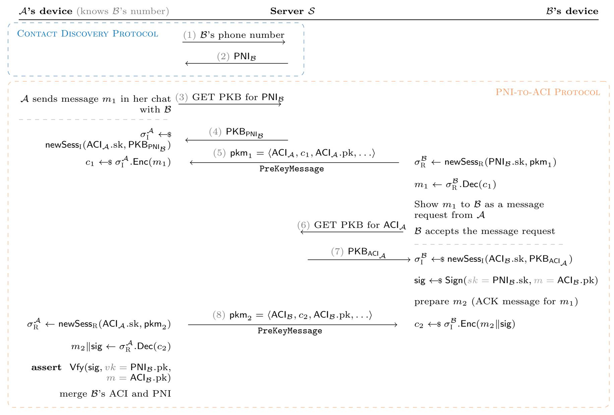
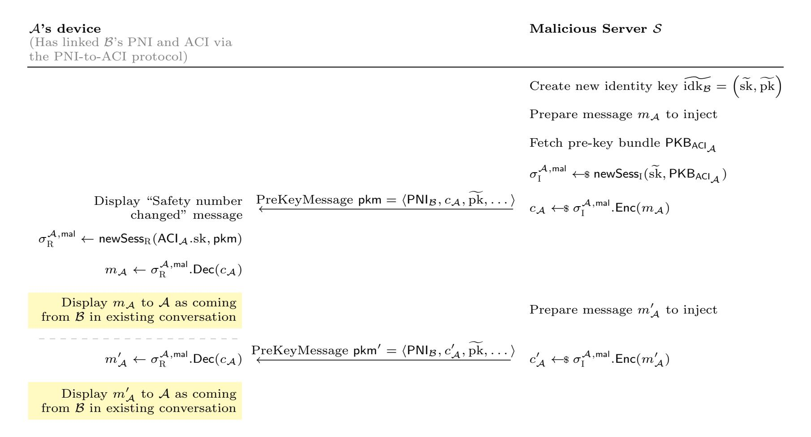

{0}------------------------------------------------

# Signal Lost (Integrity): The Signal App is More than the Sum of its Protocols

Kien Tuong Truong<sup>1</sup> , Noemi Terzo<sup>2</sup> , and Kenneth G. Paterson<sup>1</sup>

> <sup>1</sup> ETH Zurich <sup>2</sup> Max Planck Institute for Security and Privacy

Abstract. Signal is a secure messaging app offering end-to-end security for pairwise and group communications. It has tens of millions of users, and has heavily influenced the design of other secure messaging apps (including WhatsApp). Signal has been heavily analysed and, as a result, is rightly regarded as setting the "gold standard" for messaging apps by the scientific community. We present two practical attacks that break the integrity properties of Signal in its advertised threat model. Each attack arises from different features of Signal that are poorly documented and have eluded formal security analyses. The first attack, affecting Android and Desktop, arises from Signal's introduction of identities based on usernames (instead of phone numbers) in early 2022. We show that the protocol for resolving identities based on usernames and on phone numbers introduced a vulnerability that allows a malicious server to inject arbitrary messages into one-toone conversations under specific circumstances. The injection causes a user-visible alert about a change of safety numbers, but if the users compare their safety numbers, they will be correct. The second attack is even more severe. It arises from Signal's Sealed Sender (SSS) feature, designed to allow sender identities to be hidden. We show that a combination of two errors in the SSS implementation in Android allows a malicious server to inject arbitrary messages into both oneto-one and group conversations. The errors relate to missing key checks and the loss of context when cryptographic processing is distributed across multiple software components. The attack is undetectable by users and can be mounted at any time, without any preconditions. As far as we can tell, the vulnerability has been present since the introduction of SSS in 2018. We disclosed both attacks to Signal. The vulnerabilities were promptly acknowledged and patched: the first vulnerability was fixed two days after disclosure, while the second one was patched after eight days. Beyond presenting these devastating attacks on Signal's end-to-end security guarantees, we discuss more broadly what can be learned about the challenges of deploying new security features in complex software projects.

## 1 Introduction

The Signal messenger application is widely regarded as setting the gold standard for secure messaging today. The X3DH key agreement protocol [58], its post-quantum variant PQXDH [52], the Double Ratchet protocol [65], the Sesame protocol for session management [59], the Sender Keys protocol [55], the Signal Sealed Sender (SSS) protocol [53], the SVR2 protocol [68, 54], Signal's anonymous-credential-based secure group management protocol [48, 28], and yet more protocols besides, are combined in Signal in an effort to achieve a collection of strong security properties. The targeted properties include end-to-end confidentiality and integrity for conversations, forward secrecy, and post-compromise security, even in the setting of an active adversary who has compromised the Signal server (the so-called malicious server setting). Informally, we speak of Signal as offering end-to-end security in this setting.

A continuous, joint effort between the Signal developers and the scientific community has provided security assurance for some of Signal's protocols. Indeed, some of the protocols have been extensively analysed and proven to be secure in both computational models [28, 38, 39, 47, 29, 18, 25, 24, 45, 36, 30, 27] and symbolic models [24, 34, 51, 31].

This process of validation has, at first glance, been very fruitful: today, the Signal messenger app has an active user base of between 40 and 70 million people per month [40], including journalists, activists, and even high-profile government officials. Moreover, Signal has been influential on the design of other secure messaging apps, not least WhatsApp with its several billion users, which has adopted the Double Ratchet protocol [56]. Meanwhile, libsignal, the core library implementing cryptographic algorithms and protocols in Signal, has been forked more than 650 times and has received 5.3k stars [7]. It is used in multiple other projects, including Bridgefy [5], Keychat [6], signal-cli [19], and Whisperfish [69].

{1}------------------------------------------------

Complexity in Signal. However, the Signal app is not just a collection of cryptographic protocols. It is a complex piece of software, with many features and functionalities, as well as critical code that glues the different protocols together. With the tools available today, no single analysis can meaningfully capture all of the security-relevant features of Signal and their interactions. Even more importantly, the Signal app is constantly evolving, with new features being added and existing ones being modified over time, making it a moving target for any kind of security analysis. And, to cap it all, the Signal app is supported on three different platforms (Android, iOS and Desktop), each with a different application written in a different language, each connecting to libsignal via a different piece of bridging software.

In this paper, we highlight the limitations of prior security analyses of Signal by presenting two practical attacks against the integrity of Signal conversations that can be carried out by a malicious server. In short, our attacks show that such an adversary can inject arbitrary messages into Signal conversations in an undetectable fashion (given this attack capability, one could also label the attacks as breaking data origin authentication for Signal conversations). We stress that our attacks do not directly compromise the confidentiality of messages exchanged over Signal. However, the consequences of the attacks could be severe. For example, a sensitive journalistic source could be tricked into attending a physical meeting at a specific time and location, or a group of government officials could be ordered to share information about an upcoming military operation via a secondary, insecure medium. Moreover, an injection attack may lead indirectly to a confidentiality violation. For example, the adversary could use the injection capability to pose a question to a victim, where the length of the answer to that question reveals critical information. Signal's default message encryption is based on AES-256-CBC so does not fully hide plaintext lengths. In any case, users of Signal should have the reasonable expectation that integrity of their conversations is assured, and our attacks both violate this promise.

The attacks target weaknesses in the implementation of two different Signal protocols and their integration into the overall Signal app. Both attacks target component protocols that were not formally documented in detail by Signal and that have not been fully analysed in prior research. And, as we argue in detail below, it seems likely that neither attack would have been detected by a formal security analysis unless comprehensive and implementation-oriented models of the relevant Signal protocols and their interactions had been constructed.

Our First Attack. The first attack, present in both Android and Desktop version of the Signal app, arises from Signal supporting two forms of identities in an effort to improve Signal's privacy properties. Until relatively recently, all identities in Signal were based on phone numbers but since 2022, Signal started adding support for a new form of identity based only on usernames [42] (a phone number is still needed to use Signal, but that phone number no longer needs to be revealed to other users of the app). This new feature was then officially rolled out in 2024, and enabled Signal to gain feature parity with other secure messengers. Pairs of devices running Signal can have multiple Signal sessions open at any one time and, with the introduction of the new form of identity, session initiators and responders can be identified by either form of address: username (via an "Account Identifier" or ACI), or phone number (via a "Phone Number Identifier" or PNI). Although these two identities are separate, Signal uses a protocol that links them together so that a message can be sent using either identity, and any incoming message will be recognised as belonging to the same user regardless of which identity was used. However, there are two critical caveats. First, sessions established using different identities remain distinct. That is, given that each user has two identities, there are four possible types of sessions between any two users, depending on the identities used by the initiator and responder. Second, the only session protected by the safety number mechanism is the one established using the ACI identities of both sides. A malicious server can then impersonate a sender and initiate a new session with the sender's PNI as source and with key material of its choosing. This gives the server control over a session which is not protected by safety numbers and, yet, is still associated with the same sender. The establishment of a new session with completely new key material does cause a "safety number changed" alert to be displayed to the targeted recipient, but the actual safety number remains unchanged as the session between ACIs is unaffected. Therefore, trying to detect the attack by comparing safety numbers fails. Our attack and a bidirectional variant of it – where messages can be injected to both sides of a conversation – are described in full detail in Section 3. For technical reasons that we also describe there, group conversations are not affected.

Our Second Attack. Our first attack requires the victim to have established contact with the alleged sender using the latter's PNI prior to the attack. This is in order for the victim to have linked the PNI 

{2}------------------------------------------------

and ACI identities of the alleged sender. By contrast, our second attack has no pre-conditions, and affects the integrity of both one-to-one and group conversations on Android. As such, it is even more severe than our first attack. It exploits implementation issues in the SSS protocol [53], which was introduced by Signal to reduce the amount of metadata transmitted by communicating parties in Signal. The SSS protocol works by using a form of signcryption to encrypt the sender's public key and identity information to the intended receiver, along with the message to be delivered (which itself may be a one-to-one message protected by Double Ratchet keys or a group message protected using Sender Keys). SSS exists in two forms, one form for one-to-one messages and the other for group communications. The first form is described at a high level in a Signal blog [53] but the second form we extracted from the source code of libsignal.

We found two critical issues in the SSS implementation: one in the implementation of SSS in libsignal that then applies across all three platforms (Android, iOS and Desktop) and the other in how SSS is integrated into the wider codebase (but specific to Android). The first issue is that the SSS receiver implementation in libsignal fails to check that the public key used to "verify" the SSS messages (ostensibly signed using the sender's corresponding private key) is the same as the long-term key associated with the claimed identity of the sender (originally delivered in a pre-key bundle and protected by comparison of safety numbers). The key is certified by means of a server-issued certificate, but that has no value in the malicious server setting. This issue enables a malicious server to forge arbitrary SSS messages. The second issue is that, on Android, the receiver fails to properly validate the type of the message that is wrapped by the SSS signcryption ciphertext. In particular, Signal allows messages of type PLAINTEXT CONTENT in order to facilitate the transfer of error messages (where shared keys may not be available to protect the messages). Presumably the intention was that the only messages of type PLAINTEXT CONTENT that should be allowed are error messages, but the required checks are not performed when the message is protected by SSS. Instead, on Android, any message of type PLAINTEXT CONTENT that passes the signcryption verification step of SSS is accepted and subsequently displayed on screen to the user in the regular context of a Signal conversation.

In combination, these two issues allow a malicious server to deliver arbitrary (plaintext) messages to a targeted user of Signal on Android. This enables another injection attack to be performed, this time without any preconditions or safety number warnings. This attack is applicable for both one-to-one conversations and groups. The attack is described in full detail in Section 4.

Wider Implications. Our attacks have wider repercussions for Signal and the secure messaging ecosystem beyond their immediate impact on the end-to-end security guarantees of Signal. We organise our discussion of these around three themes in Section 5.

First, given, the wide adoption of Signal's protocols in other systems, we investigated whether some of these systems might also be affected by our attacks.

Second, our attacks highlight limitations of prior formal analysis of Signal, in terms of both breadth and depth. Specifically, only some aspects of some of Signal's component protocols have been analysed up till now, and only using abstract models of the running code. In particular, SSS has only been briefly analysed in [60] (the main focus of that paper was attacks) while the PNI-to-ACI protocol we exploit in our first attack had not been previously identified in the literature at all. As an additional point of complexity, Signal is a moving target, with new, security-relevant features being added regularly, with the security consequences of interactions between all Signal's features having hardly been studied at all to date. This leads to the question: how can we formally reason with high fidelity about systems having the scale and complexity of Signal? And what can we learn from these attacks to improve future formal analyses of complex cryptographic systems?

Third, while building a secure messenger like Signal is without question a hard task, several observations we made while developing our attacks caused us to wonder about how and why the issues enabling our attacks came to be introduced into the Signal codebase, and what this tells us about the Signal organisation's approach to secure software development. Above all, we stress that we find Signal's approach of making client source code publicly available and responding quickly and co-operatively to disclosures to be commendable.

### 1.1 Responsible Disclosure

We disclosed our first attack to Signal on 2025-09-22, with a proposal for mitigation. They acknowledged the issue and released a fix for the Desktop version [46] on the same day and for the Android version [17]

{3}------------------------------------------------

on 2025-09-24. The patches, which make clients reject messages coming from a PNI address, were deployed in versions v7.74.0-beta.1 [4] and v7.58.0 [3] for Desktop and Android, respectively. The iOS version was unaffected.

We disclosed our second attack to Signal on 2026-01-20, with proposals for mitigation. They acknowledged the issue and discussed possible mitigations with us. Signal released a patch for the Android version [44] on 2026-01-28. The patch was deployed in version v7.72.2 [10] for Android. It performs plaintext validation for SSS-wrapped messages. This addresses the second issue and is sufficient to prevent our second attack. The iOS and Desktop versions were unaffected.

After investigating whether other projects that are based on libsignal were also vulnerable to our attacks, we discovered that Whisperfish [69] was vulnerable to our first attack and signal-cli [19] was vulnerable to our second attack. We contacted both projects' developers on 2026-02-05, The developer of signal-cli promptly patched the code on the same day. This patch was deployed in signal-cli v0.13.24 [8] and in the unofficial library it uses, libsignal-service-java v2.15.3 unofficial 137 [9]. The developers of Whisperfish acknowledged the issue on 2026-02-06. After discussing mitigations, a patch has been introduced on 2026-02-28 on the main branch of Whisperfish [73, 72].

For more information on our approach to disclosure, see the ethical considerations appendix.

#### 1.2 Related Work

Given the central role of instant messaging apps in modern communication, there is a growing body of literature focusing on the security analysis of deployed messengers.

Telegram in particular has been studied extensively. In [15], Albrecht et al. identified four attacks targeting both the specification and implementation of Telegram's MTProto protocol, and proved secure a repaired version of MTProto. In [70], von Arx and Paterson analysed the wider Telegram implementation ecosystem, uncovering major flaws in several implementations, while in [14], Albrecht et al. gave security proofs for Telegram's key exchange protocols.

WhatsApp has also received significant analysis. Beyond analyses of the Signal protocol that WhatsApp employs (see [29, 18, 25]), prior work has investigated WhatsApp's group messaging protocol [67, 20, 13] as well as its backup protocol [35].

The Matrix protocol has also been subjected to analysis. In [11], Albrecht et al. presented several devastating attacks exploiting vulnerabilities in Matrix's end-to-end encryption protocol, while Albrecht et al. [12] gave a formal analysis of the security of the Matrix core and Jaeger and Kumar [47] of its group chat encryption.

Threema has been analysed from multiple perspectives. The end-to-end-security of its group chats was analysed by R¨osler et al. in [67], while Cremers et al. [31] reported black-box experiments demonstrating the absence of post-compromise security (PCS) in Threema. Paterson et al. [63] presented several practical attacks against Threema's client-to-server and end-to-end protocols.

Much of this work can be viewed as following the attack branch of the "Cryptography in the Wild" methodology laid out by Albrecht and Paterson in [16]. This treats the object of study as a target to be investigated with the explicit goal of breaking it. We followed the same methodology in our work: first, we investigated the target system, then we built pseudo-code modelling its observed behaviour, and finally we developed concrete attacks, validated through proof-of-concept attack implementations.

The work of Cremers et al. [34], analysing Signal's session-handling Sesame protocol, is related to our first attack. Using the Tamarin prover and running black-box experiments, Cremers et al. demonstrated that while PCS is achieved at the protocol level, these PCS guarantees do not extend to the application when considering the system as a whole. This work was the first to highlight the distinction between sessions and conversations in Signal, an aspect we also exploit in our first attack. It also shows how the complexity of secure messaging applications places limits on the formal security analyses of standalone components. Since [34] was published before ACIs and the PNI-to-ACI protocol were officially introduced into the deployed app, it did not analyse these features. Another point of contrast between [34] and our work is that the study of PCS (by definition) considers whether security can be regained after a key compromise, while our attacks do not require any key compromise capabilities.

#### 1.3 Paper Organization

The remainder of this paper is organised as follows. Section 2 gives further background on Signal, in particular its use of cryptography, sufficient to make the paper self-contained. Section 3 describes our

{4}------------------------------------------------

first attack, arising from the PNI-to-ACI protocol. Section 4 describes our second attack arising from the implementation of SSS. Section 5 discusses the limitations of prior security analyses of Signal and reflects on the wider lessons that the community can glean from the attacks in this paper.

## 2 Background

In this section, we first give a high-level description of parts of Signal's cryptographic core that are important for understanding the scope of our attacks. Secondly, we highlight the methodology we employed to discover our attacks.

We denote communicating parties in calligraphic font. In particular, we reserve A and B to denote two honest users and S to denote the (possibly malicious) Signal server.

#### 2.1 Cryptographic Overview of Signal

We describe features of Signal's cryptographic design on which the later description of our attacks rely. The information on this section is compiled from blog posts on Signal's website, the scientific literature, and the Signal app and libsignal source code.

User Identifiers. Rather than identifying users by their public keys, which would be impractical since users may lose access to their cryptographic keys, Signal uses addresses to identify users. Addresses are implemented as Universally Unique Identifiers (UUIDs) and are chosen by the Signal server when a user creates an account. While each user initially had a single address tied to their phone number, Signal started adding support for two distinct addresses per user since 2022. This change is due to the introduction of usernames as a way for users to be contacted without sharing their phone numbers [42]. Behind the scenes, this translates into two separate identifiers for every user, one tied to their phone number (the PNI, or Phone Number Identifier ) and one tied to their username (the ACI, or Account Identifier ). We denote the PNI and ACI addresses (i.e. the UUIDs) of user U by PNI<sup>U</sup> and ACI<sup>U</sup> respectively. Note that the domain of PNIs and ACIs are disjoint due to PNIs being prefixed by a special string "PNI:" while ACIs are raw UUIDs. Each identifier is associated with independent identity keys, as well as distinct cryptographic material for the X3DH protocol (i.e. the pre-key bundles). We denote the identity key pairs corresponding to the PNI and ACI of user U by (PNI<sup>U</sup> .sk, PNI<sup>U</sup> .pk) and (ACI<sup>U</sup> .sk, ACI<sup>U</sup> .pk) respectively. Of the two types of identifier, the ACI is considered to be the user's stable identifier. This implies, crucially, that the safety number associated with a conversation is exclusively based on the ACI identity keys of the two users involved.

Despite this feature of dual identities being officially rolled out in 2024, no analysis that we are aware of has included it so far. In fact, to the best of our knowledge, all analyses including X3DH published after the introduction of usernames to the source code – such as those by Bhargavan et al. [24], and Jaeger and Kumar [47] – implicitly assume that users have a single identity key, tied to a single identifier, which is typically abstracted away or assumed to correspond to the public identity key.

Sessions. When two users communicate in Signal for the first time, their devices establish a cryptographic session via the X3DH [58] (or PQXDH [52]) key agreement protocol. This session provides a one-to-one secure channel which evolves continuously using the Double Ratchet protocol [65], ensuring forward secrecy and post-compromise security<sup>3</sup> .

A session is created by combining, via X3DH, the long-term identity keys of both users along with some ephemeral and medium-term keys. The cryptographic material of the responder is collected in a structure called a pre-key bundle. A user creates a collection of pre-key bundles, which are published to the Signal server. Other users wishing to initiate a session with them can retrieve a pre-key bundle via the server. We denote pre-key bundles corresponding to the PNI and ACI of user U by PKBPNI<sup>U</sup> and PKBACI<sup>U</sup> respectively.

In our notation, when user A wishes to initiate a session with user B by sending a message m, A invokes the session initiation algorithm newSess<sup>I</sup> , which takes as input A's identity secret key and one of B's pre-key bundles, and outputs a session state σ A I . This session state can be used to encrypt and decrypt messages via σ A I .Enc and σ A I .Dec respectively. Concretely, encryption (resp. decryption) consists

<sup>3</sup> At least in theory, because in practice PCS is not provided, as shown by Cremers et al. [31]

{5}------------------------------------------------

of choosing the appropriate message key from the symmetric ratchet and using it to encrypt (resp. decrypt) the message, plus managing the ratchet state. The first message from A is a PreKeyMessage pkm = ⟨addr, c, pk, . . .⟩, which includes A's address (PNI or ACI), the encryption of m using the sesson state, the A's identity public key, and other necessary information for Bob to complete the session establishment, which we omit here for simplicity. Upon receiving a pkm from A, user B invokes the session responder algorithm newSessR, which takes as input B's identity secret key and the received PreKeyMessage, and outputs a receiver session state σ B <sup>R</sup> which can also be used to encrypt and decrypt messages via σ B <sup>R</sup>.Enc and σ B <sup>R</sup>.Dec respectively.

Multiple sessions can coexist simultaneously between two devices. These sessions are coordinated by the Sesame protocol [59], which decides which session to use for encrypting messages. On any given device, Sesame stores at most 40 sessions per peer address. Multiple sessions can arise for various reasons, for example when two users simultaneously try to initiate a conversation with each other, or if one device's cryptographic state is lost or corrupted, in which case it must establish a new session with the other device. Concretely, this means that users can attempt to establish a new session, even if an existing session is already present between them. On the responder side, on receipt of a PreKeyMessage, a new session is created using the cryptographic material contained in it, regardless of whether a session already exists. If the identity key contained in the PreKeyMessage is different from the one stored locally for the sender, the user is notified that the safety number has changed and the new identity key is marked as untrusted. This status will persist until the user either manually marks it as verified or they try to send a new message in the conversation, which will then trigger a pop-up asking them to confirm their intention to send a message to an untrusted recipient. If the user confirms, the new identity key is marked as trusted. Note that, if a key is marked as untrusted, no messages can be sent in any conversation involving that identity key without explicit user confirmation.

Contact Establishment. Different identifiers are used depending on the way users contact each other for the first time. When user A contacts user B by using B's username, A first queries the Signal server to obtain B's ACI address associated with B's username. Then, A uses B's ACI address to query the server for a pre-key bundle corresponding to B's ACI, and A sends a PreKeyMessage to B to initiate a session with B. This PreKeyMessage has A's ACI address as the sender and B's ACI address as the recipient.

If, instead, A contacts B by using B's phone number, A obtains B's PNI address by executing the private contact discovery protocol [57]. At this point, A will try to initiate a protocol, which we call the "PNI-to-ACI protocol" (explained in detail below) with B. From a high-level perspective, A wants to obtain the ACI address of B, as it is the stable identifier for B and the one for which the associated identity key will be used to compute the safety number. At the end of the protocol, A will have established a session with B, where both parties are using their ACI addresses, ending up in the same situation as if A had contacted B using B's username in the first place.

From PNI to ACI. We provide an illustration of the protocol interaction between A and B when A initiates the conversation using B's phone number in Figure 1. At a high level, this interaction involves the creation of two sessions: one combining the initiator's ACI key with the responder's PNI key, followed by one combining the ACI keys of both parties.

The main rules that the clients follow are:

- (i) messages are sent exclusively from an ACI address,
- (ii) when sending a message, if no session exists between the address of the sender and the address of the receiver, a new session is created,
- (iii) if a message is received at a PNI address, the recipient marks the sender as needing to be informed of the PNI-ACI association,
- (iv) when sending a message, if the recipient needs to be informed of the PNI-ACI association, then a "PNI signature" (more details below) is included in that message and all subsequent messages sent to that user until any of the messages is acknowledged, and
- (v) when given the choice of sending to a PNI or an ACI, prefer the ACI address.

First, A performs the contact discovery protocol with the server to map B's phone number to B's PNI (messages 1 and 2 in Figure 1). At some point, A will decide to send a message m<sup>1</sup> to B. Since no session exists yet between A's ACI and B's PNI, a new session must be established (rule (ii)). Therefore, A fetches a pre-key bundle corresponding to B's PNI (messages 3 and 4) and sends a first PreKeyMessage

{6}------------------------------------------------



Fig. 1: A run of the session establishment protocol between A and B when A knows B's phone number.

to B in order to establish a session (message 5). The PreKeyMessage is marked as coming from A's ACI and contains the ciphertext c<sup>1</sup> – computed by encrypting m<sup>1</sup> using the session's cryptographic material – her ACI public key, and the cryptographic material needed to establish the session. On receiving this message, B's device notices that the message was addressed to B's PNI, and marks A as needing to be informed of the ACI-PNI association of B (rule (iii)). Then, B invokes the session responder algorithm to create a new session between A's ACI and B's PNI, and attempts to decrypt c<sup>1</sup> using this session. If the decryption of c<sup>1</sup> succeeds, the corresponding plaintext is displayed to B as part of a message request from A. B can then either reject the message request, in which case the protocol is aborted, or accept it. In the meantime, A will continue using this session to send further messages to B, so long as B does not accept the contact request. If B accepts, an acknowledgment message for m<sup>1</sup> must be sent back to A. This acknowledgment must be sent from B's ACI address (rule (i)), and must include a signature binding B's PNI and ACI addresses (rule (iv)). Since no session exists yet between B's ACI and A's ACI, a new session must be established (again, rule (ii)). Therefore, B fetches a pre-key bundle for A's ACI (messages 6 and 7) and sends a PreKeyMessage back to A to establish a session between B's ACI and A's ACI (message 8). This PreKeyMessage contains the encryption of a structure containing B's ACK message and B's PNI signature, which is a signature computed over B's ACI public key using B's PNI secret key. This last session between B's ACI and A's ACI is used for all future communications between A and B (as per rule (v)). The receipt and verification of the PNI signature by A allows her to link the two identifiers of B together. From this point on, the two identifiers for B are associated with the same conversation on A's device.

Notably, this PNI-to-ACI protocol and the rules that govern client behaviour are not specified in Signal's documentation. Rather, we extracted their description from a careful examination of Signal client source code.

As a special case, if A first contacts B via B's username (i.e. using his ACI as a destination) and then contacts B via B's phone number (i.e. using his PNI as a destination), A will see two separate conversations in their chat list until B accepts the contact request to his PNI. This is because the established sessions

{7}------------------------------------------------

## SSSv1.Enc(skS, pkR, certS, m)

```
Input: Sender's secret key skS,
      receiver's public key pkR,
      sender certificate certS,
      payload m
Output: Sealed sender ciphertext c
1 : skeph, pkeph ←$ X25519.KeyGen()
2 : ss1 ← ECDH(skeph, pkR)
    |kchain| = 32B, |keph| = 64B
3 : kchain, keph ← HKDF(salt=
         label∥pkR∥pkeph, ss1)
4 : c1 ←$ AE.Enc(keph, msg=pkS)
5 : ss2 ← ECDH(skS, pkR)
6 : kmsg ← HKDF(salt=kchain∥c1, ss2)
7 : c2 ←$ AE.Enc(kmsg, msg=certS∥m)
8 : return c = ⟨pkeph, c1, c2⟩
```

#### SSSv1.Dec(skR, pkroot, c)

```
Input: Receiver's secret key skR,
       root of trust key pkroot,
       ciphertext c = ⟨pkeph, c1, c2⟩
 Output: Payload m and sender address
       addr, or error ⊥
 9 : ss1 ← ECDH(skR, pkeph)
10 : kchain, keph ← HKDF(salt=
          label∥pkR∥pkeph, ss1)
11 : pkS ← AE.Dec(keph, c1)
12 : ss2 ← ECDH(skR, pkS)
13 : kmsg ← HKDF(salt=kchain∥c1, ss2)
14 : certS∥m ← AE.Dec(kmsg, c2)
15 : pkstored ← DB.Query(certS.ACI)
16 : assert pkS = pkstored
17 : assert pkS = certS.pk
18 : assert Vfy(pkroot, pkS, certS)
19 : return ⟨m, certS.ACI⟩
```

Fig. 2: Encryption and decryption schemes for SSSv1. If any AE decryption fails, the algorithm returns ⊥. The code in the gray boxes is not present in the codebase and is added as a possible patch that prevents our attack from Section 4. The Vfy function verifies the Sender certificate by checking that (1) the embedded sender public key pk<sup>S</sup> is signed by a server key pkserver (contained in a Server certificate which is embedded in the Sender certificate), (2) the Server certificate verifies under the root of trust key pkroot, (3) the Server certificate has not been revoked by checking against a list of certificate IDs embedded in the app, (4) the Sender certificate has not expired. The value of label is "UnidentifiedDelivery". The AE scheme used is an encrypt-then-MAC construction with AES-256 in CTR mode (which uses the first 32 bytes of the key) and HMAC-SHA256 (which uses the last 32 bytes of the key). The HKDF instance uses SHA-256 as the underlying hash function.

are independent, and, if B does not accept and therefore does not continue with the PNI-to-ACI protocol, then A has way of knowing the connection between B's PNI and ACI addresses.

Signal Sealed Sender. The Signal Sealed Sender (SSS) protocol hides metadata concerning the identity of the sender from the Signal server. It uses a non-interactive protocol that is executed on top of the end-toend encryption provided by the Double Ratchet and Sender Keys protocols, wrapping their ciphertexts in an additional signcryption layer. The SSS protocol exists in two versions: one for one-to-one messages (so called SSSv1) and another for group messages (so called SSSv2).

SSSv1 uses two symmetric keys. The first one is derived by combining an ephemeral key sampled by the sender with the identity key of the receiver. The second key results from combining the private and public components of the two identity keys of sender and receiver. The first key is used to encrypt the identity key of the sender using an authenticated encryption scheme, while the second key is used to encrypt the actual message ciphertext, as well as a so-called SenderCertificate. The SenderCertificate is a short-lived certificate attesting the sender's identity key and ACI address, computed using a key owned by the Signal server. The server key is itself signed with another "root" key, whose public key is hard-coded in the Signal app, to obtain a ServerCertificate, which is then embedded in the SenderCertificate. We present the pseudocode for SSSv1 in Figure 2.

SSSv2 is an optimization for group messages based on the randomness reuse technique of Barbosa and Farshim [22]. For the purposes of our attacks, there is no significant difference in the exploitation of SSSv1 versus SSSv2. For this reason, and due to lack of space, we leave the pseudocode for SSSv2 to Section 6. In a nutshell, in SSSv2, the ciphertext is split into a part which depends on the receiver and a part which is common to all receivers. The common part contains the SenderCertificate, which is used to determine the sender's identity.

Users can restrict who is allowed to send SSS messages to them. In the so-called "restricted" mode, users are required to present to the server a recipient-dependent pseudo-random value known only to the

{8}------------------------------------------------

recipient and their contacts. Importantly, this mechanism is enforced uniquely by the server, therefore it is irrelevant for our setting, where we assume a malicious server.

Sender Keys. When Signal users want to communicate in a group chat, they use the Sender Keys protocol, which is studied by [20, 47, 55]. The protocol begins by having each member of a group share their sender key with the other members. These keys are used for symmetric signcryption (formalised in [47]) of messages. A user's sender key is of the form (vk, ck), where vk is the verification key and ck is the socalled chain key. This sender key is distributed by the user when they send their first message to the group (via a SenderKeyDistributionMessage), and is resampled and redistributed when another user leaves the group in order to prevent the user from reading messages sent after their exit. The distribution of the Sender Keys occurs over secure one-to-one channels, using the sessions established between all pairs of users in the group.

To encrypt a group message, the user derives a message key mk by applying the function H<sup>1</sup> to the chain key ck, where H<sup>1</sup> is instantiated as HKDF with SHA-256 as the underlying hash function. The message is then encrypted under mk using AES-256 in CBC mode. The resulting ciphertext is authenticated by signing it along with the message index and the sender's identity, using XEdDSA and the private key corresponding to vk. Afterwards, the sender ratchets their chain key ck via the function H2, instantiated with HMAC-SHA256.

Upon receiving the ciphertext and signature, the recipient verifies the signature, aborting if verification fails. The recipient then computes the message key mk by using H<sup>1</sup> and the sender's chain key ck, and uses mk to decrypt the message. Finally, the receiver ratchets the sender's chain key ck using H<sup>2</sup> to update to the new sender's chain key.

#### 2.2 Attack Methodology

Our attacks were discovered by carefully inspecting the Signal app's source code, focussing mostly on the Android version, and documenting its behaviour. We confirmed our understanding of the code by running the application in debug mode on real devices under our possession. We also inspected the contents of the databases used by the app by logging the encryption keys, extracting the database files from the device using adb [1], and decrypting them outside of the device.

Whenever we identified a vulnerability, we developed a proof-of-concept exploit to validate it. Since we do not have access to the Signal servers, we emulated the message injection capability by operating a proxy server that intercepted the websocket connection between our devices and the Signal server. Messages were injected exclusively in the server-to-client direction in order to mimic a malicious server. We did not send any malformed or maliciously-crafted messages to the Signal infrastructure. In order for the client to accept the certificate presented by our proxy server, and because Signal employs certificate pinning, we modified the source code of the Signal app to additionally trust our proxy's certificate. For the second attack, we also modified the Signal app to include a custom Ed25519 public key as a trust root, in order to replicate the Signal server's capability of creating arbitrary sender certificates. No further modifications to the Signal app are necessary to carry out our attacks.

## 3 The First Attack: Exploiting the PNI-to-ACI Protocol

The existence of dual identifiers for a given user leads to three additional types of sessions – each comprising the PNI keys of one or both users. These additional sessions coexist with the ACI-ACI sessions previously examined in [34]. We show that the interaction between all these sessions allows a malicious server S to break the integrity of Signal conversations. We first describe an attack that allows S to inject messages from B to A, assuming that A has previously linked B's PNI and ACI addresses by executing the PNI-to-ACI protocol. This version of the attack requires no user interaction from the victim. Then, we describe an extension of the attack that allows S to inject messages in the other direction as well (i.e. from A to B) at the cost of requiring B to accept a message request from an unknown user and send a message to them.

Unidirectional Attack. Our attack starts from the assumption that an honest and non-compromised user A has previously linked the PNI and ACI addresses of an honest and non-compromised user B via the PNI-to-ACI protocol. This leaves the victim A with two active sessions: one between A's ACI and B's PNI 

{9}------------------------------------------------

 $(\sigma_{\mathrm{I}}^{\mathcal{A}})$ , and another between both parties' ACIs  $(\sigma_{\mathrm{R}}^{\mathcal{A}})$ . The objective of the malicious server  $\mathcal{S}$  is to force the creation of a third session,  $\sigma_{\mathrm{R}}^{\mathcal{A},\mathsf{mal}}$ , between  $\mathcal{A}$ 's ACI and  $\mathcal{B}$ 's PNI, but controlled by  $\mathcal{S}$ . As we show in Figure 3, this session uses a new identity key, denoted by  $\widetilde{\mathrm{idk}}_{\mathcal{B}}$ , which is generated by the adversary and claimed to be associated with  $\mathcal{B}$ 's PNI address.

When  $\mathcal{A}$  receives the first message from  $\mathcal{B}$ 's PNI address but with a PNI identity key that differs from the one  $\mathcal{A}$  knows from previous interactions, a "safety number changed" warning is displayed in her conversation with  $\mathcal{B}$ . However, from  $\mathcal{A}$ 's perspective, this message appears to be a false alarm: if  $\mathcal{A}$  attempts to compare her safety number with  $\mathcal{B}$ 's, the two coincide. This is because safety numbers are computed solely from the ACI identity keys of the communicating parties, while in our attack only the PNI identity keys are modified. Even further,  $\mathcal{A}$  is still able to send messages to  $\mathcal{B}$  without receiving any warning, as she will send messages to  $\mathcal{B}$ 's ACI address (as per rule (v)), which is still associated with the same ACI identity key as before and is therefore still trusted.

As a result of the attack,  $\mathcal{A}$  establishes a new session with  $\mathcal{S}$ , thinking that the session is with  $\mathcal{B}$ . Furthermore, as  $\mathcal{A}$  has previously linked  $\mathcal{B}$ 's PNI and ACI together, the first forged message injected by  $\mathcal{S}$  is accepted as authentic and is displayed in  $\mathcal{A}$ 's conversation with  $\mathcal{B}$ . From this point onwards,  $\mathcal{S}$  can use the corresponding session,  $\sigma_{\rm I}^{\mathcal{S},\mathsf{mal}}$ , to inject messages into the existing conversation between  $\mathcal{A}$  and  $\mathcal{B}$ , from  $\mathcal{B}$  to  $\mathcal{A}$ , without  $\mathcal{A}$  receiving any further warnings about changed safety numbers. These messages continue to be displayed in the conversation with  $\mathcal{B}$ .



Fig. 3: The flow of the first attack (unidirectional version), executed by a malicious server  $\mathcal{S}$  who injects two messages  $m_{\mathcal{A}}$  and  $m'_{\mathcal{A}}$  into  $\mathcal{A}$ 's existing conversation with  $\mathcal{B}$ , which are highlighted in yellow. Note that the second message does not cause a "Safety number changed" warning to be displayed again.

Bidirectional Extension. An extension of the attack above enables  $\mathcal{S}$  to additionally inject messages in the other direction, impersonating  $\mathcal{A}$  to  $\mathcal{B}$ . As previously mentioned, this variant requires  $\mathcal{B}$  to accept a message request from an unknown user and reply to it. While this is a stronger assumption, it is not completely unrealistic as the message may contain social engineering content that is convincing enough for  $\mathcal{B}$  to accept it. Nevertheless, the onus to avoid harm should not fall on the user, and clearly the mere act of responding to a message request should not expose them to risk.

We first run the unidirectional version of the attack, establishing a malicious session between  $\mathcal{S}$  and  $\mathcal{A}$ . This allows the server to inject messages on behalf of  $\mathcal{B}$  to  $\mathcal{A}$ . To establish a malicious session with  $\mathcal{B}$ , the server sends a PreKeyMessage to  $\mathcal{B}$ 's PNI address as if it were coming from  $\mathcal{A}$ 's PNI address. This message contains a new identity key,  $idk_{\mathcal{A}}$ , generated by the adversary and claimed to be associated with

{10}------------------------------------------------

A's PNI address. At this point, B shares a malicious session with S. Unfortunately, B does not know A's PNI, so this message appears to come from an unknown user. The remainder of the attack focuses on merging A's PNI and ACI addresses on B's device, such that the messages injected on the malicious session will be displayed in the conversation with A.

If B decides to accept the message request from this unknown user, then B's device will try to send an acknowledgment back, from B's ACI, addressed to A's PNI. Note that, at this point, B does not know that the two addresses correspond to the same user, therefore rule (v) does not apply. To send the acknowledgment, B's device queries the server for a pre-key bundle associated with A's PNI address, to which the server responds by providing a legitimate pre-key bundle for A's PNI. When this happens, B's device will display a "safety number changed" notification. Again, comparing safety numbers will not reveal anything suspicious, both because the pre-key bundle is legitimate and because the safety number is computed using the ACI identity keys, which have not changed. The key in the prekey bundle – A's legitimate PNI identity key – will be marked as untrusted. This means that the acknowledgment will not be sent, as sending a message to an untrusted key requires explicit user approval (as described in Section 2.1).

If now B tries to send a message to this unknown user, a warning about sending a message to an untrusted identity key will be displayed. If B ignores the warning and elects to send a message regardless, the key will be marked as trusted, and the message will be sent as part of a new PreKeyMessage. The server forwards this message to A. Now A receives a message from B's ACI address, addressed to her PNI address, triggering rule (iii) and thus marking B as requiring a PNI signature. As soon as A's device sends an acknowledgment back to B, this acknowledgment will include a valid PNI signature. This finally allows B to merge A's PNI and ACI addresses. As a result, S now shares a malicious session with B, which B believes to be with A's PNI which, in turn, has been now linked to A's ACI. This allows S to inject messages on behalf of A to B.

As an interesting side-effect of the merging of A's PNI and ACI addresses, the pre-existing conversation with A and the conversation with the unknown user are merged into a single conversation in B's chat list.

Group Setting. Endowed with the ability to inject messages in a one-to-one channel, it is natural to consider whether the same attack can be extended to group chats. This could allow a malicious server to, e.g., distribute adversary-controlled Sender Keys to group members and therefore impersonate other users. Our results show that it is possible to inject a SenderKeyDistributionMessage as part of a PreKeyMessage using the attack mentioned above. However, group messages require the use of the SSS protocol, which mandates the source address to be an ACI, but the gadget above only allow message injection from a PNI address. This means that a malicious server does not have the capability of injecting group messages. Even if the server was able to inject a SenderKeyDistributionMessage, the latter would be associated with the PNI address of the sender, rather than their ACI.

Patching the Vulnerability. Signal has patched the vulnerability by ignoring messages sent from a PNI address. This is coherent with rule (i), therefore this fix does not change the behaviour of honest clients. The patch was introduced in version v7.58.0 [3] of the Android app, and in version v7.74.0-beta [4] of the Desktop app.

On the Binding Properties of the Signature Scheme in the PNI-to-ACI Protocol. During the course of our analysis, we identified a subtle and non-standard binding property that the signature scheme used in the PNI-to-ACI protocol must fulfill in order for the protocol to be secure. We believe this property to be satisfied for the concrete scheme used by Signal (XEdDSA, a variation of EdDSA proposed in [64]). However, it is still an interesting point to consider, especially in the context of developing formal security proofs of the protocol. Further details are given in Section 7.

## 4 The Second Attack: Exploiting the SSS Protocol

The second attack exploits a combination of two issues in the Signal app. The first issue is in the implementation of both SSS versions in the libsignal library, which means that it is present in all Signal clients, including Android, iOS, and Desktop. The second issue is specific to Android, both the code in the app and the bridging code for libsignal, and concerns message types and their validation.

{11}------------------------------------------------

Issue 1: Identity Forgery in SSS. The first issue lies in the way the identity of the sender is inferred from the certificate  $\mathsf{cert}_S$  contained in the SSS ciphertext. We explain the issue for SSSv1, but the same reasoning applies to SSSv2. When decrypting, the receiver first decrypts  $c_1$  to obtain the public key of the sender  $\mathsf{pk}_S$  (line 11 in Figure 2). This public key is used to decrypt and verify the authenticity of the second part of the ciphertext  $c_2$  (line 14), to obtain the sender certificate  $\mathsf{cert}_S$  which contains the purported identity of the sender  $\mathsf{cert}_S$ .ACI. Furthermore, the receiver also checks that  $\mathsf{pk}_S$  matches the one contained in the  $\mathsf{cert}_S$  (line 17) and that the certificate is itself valid. However, none of these checks ensure that the alleged public key  $\mathsf{pk}_S$  actually corresponds to the actual identity key of the sender. From the perspective of a malicious server  $\mathcal{S}$ , the  $\mathsf{cert}_S$  provides no guarantee, as  $\mathcal{S}$  can issue arbitrary certificates.

Given this observation, the first part of the attack is straightforward: the malicious server  $\mathcal{S}$  generates a new key pair ( $\mathrm{sk_{mal}}$ ,  $\mathrm{pk_{mal}}$ ) and issues a  $\mathrm{cert_S^{mal}}$  that binds  $\mathrm{pk_{mal}}$  to  $\mathcal{B}$ 's ACI address. When  $\mathcal{A}$  receives an SSS message from  $\mathcal{B}$ , but with  $\mathrm{pk_{mal}}$  in place of  $\mathcal{B}$ 's actual identity key, she will successfully decrypt the message and verify the  $\mathrm{cert_S^{mal}}$ . The decryption function will then successfully return the message, as well as the identity contained in the certificate, which is  $\mathcal{B}$ 's ACI address. As a result,  $\mathcal{A}$  will accept the message as coming from  $\mathcal{B}$ , even though it was sent by the malicious server  $\mathcal{S}$ . Going even further, the malicious key  $\mathrm{pk_{mal}}$  is never surfaced to the function that called SSSv1.Dec, meaning that it has no way to check the identity at a later point.

Issue 2: Bypassing Plaintext Type Validation. While powerful, the gadget exposed in issue 1 above by itself does not seem give any useful power to the adversary, since SSS is normally used to wrap Double Ratchet or Sender Keys ciphertexts, and these provide another level of authentication that is dependent on the actual identity key of the sender. To complete the attack, we must bypass this second level of encryption by exploiting a problem in the way the Android implementation validates different types of messages.

Signal supports messages of type PLAINTEXT\_CONTENT which are — at the time of writing — exclusively used to indicate decryption errors. However, PLAINTEXT\_CONTENT type messages wrap a protobuf structure (of type Content) with many different fields, for example a DataMessage (i.e. a regular chat message) or a DecryptionError. This same Content structure can be obtained as a result of decrypting a Double Ratchet ciphertext or a Sender Keys ciphertext. When a Content message is processed, the application checks if it contains a DataMessage field. If so, the contents of the DataMessage will be displayed as a regular chat message in the appropriate conversation. In order to prevent abuse of the PLAINTEXT\_CONTENT message type, and in particular ensure that they are only used to signal a decryption error, all clients include a validation step when receiving PLAINTEXT\_CONTENT messages. In Android, the client first checks the type of the envelope containing the message and, if it is of type PLAINTEXT\_CONTENT (see Figure 4a), it verifies that the only field present in the Content structure is a DecryptionError. If it contains other fields the message is rejected and not displayed to the user. This validation protects against a malicious server injecting arbitrary messages in conversations.

We stress that this validation step on Android is done by exclusively checking the type in the envelope. This behaviour turns out to be erroneous when handling PLAINTEXT\_CONTENT messages wrapped by using the SSS protocol. In this case, the envelope type is UNIDENTIFIED\_SENDER (see Figure 4b), which does not match PLAINTEXT\_CONTENT, and therefore bypasses the validation described above. Remarkably, the inner type wrapped by SSS – which could be PLAINTEXT\_CONTENT – is available for inspection, but the validation logic only relies on the envelope type, rather than the inner type. Combined with the gadget described above, this allows  $\mathcal S$  to inject PLAINTEXT\_CONTENT containing a DataMessage into  $\mathcal A$ 's conversation with  $\mathcal B$ , as long as  $\mathcal S$  wraps it using SSS.

This concludes the description of our second attack, allowing unconditional message injection into arbitrary Signal conversations on Android.

Correctly Performing Plaintext Validation. While the first issue is present in all Signal clients (as it is an issue in the Rust core of libsignal), the second issue is specific to Android. There, the validation for PLAINTEXT\_CONTENT messages is spread across two different components: the Java bridging code of libsignal, and the Android app itself. The bridging code is responsible for calling the Rust core to remove the SSS wrapping and returning the inner Content to the Java code. After removing the SSS encryption, the resulting structure, called UnidentifiedSenderMessageContent, might need to be decrypted again (e.g., if it is a Double Ratchet ciphertext), or it might be a PLAINTEXT\_CONTENT message,

{12}------------------------------------------------

content: type: PLAINTEXT CONTENT Envelope Plaintext [Content]

(a) Plaintext message without Sealed Sender.

 SSSv1.Enc content: type: UNIDENTIFIED SENDER Envelope Plaintext [Content] content: type: PLAINTEXT CONTENT TYPE Unidentified Sender Message Content

(b) Plaintext message, wrapped in a Sealed Sender ciphertext.

Fig. 4: The structure of an end-to-end encrypted message containing plaintext, with and without SSS. Note the difference in the envelope type.

which does not undergo further processing. The decision is taken by inspecting the type contained in the UnidentifiedSenderMessageContent (see Figure 4b). As mentioned before, we discovered that the bridging code correctly surfaces this type to the Java code but the latter fails to use it to perform validation.

We verified that the second issue is not present in the iOS and Desktop clients. They do surface the inner type correctly (though in different ways depending on the platform) and perform the necessary validation on it.

Attack Validation. We implemented a proof-of-concept of the second attack, confirming its feasibility using the setup described in Section 2.2. We verified that messages can be injected such that they appear as coming from any user, even users with whom the victim has never interacted before.<sup>4</sup>

Attack Archaeology. Interestingly, the first issue enabling the attack has been present in the Android codebase since the introduction of SSS in 2018 [62].

The second issue was introduced in June 2021 when support for PLAINTEXT CONTENT type messages was added for libsignal [50] and for Signal-Android [41]. In fact, between June 2021 and May 2023, there were no checks at all on messages of PLAINTEXT CONTENT type in Android, meaning that the first issue in SSS was not needed to mount the attack (since receivers would accept non-SSS messages anyway). Consequently, Signal on Android was vulnerable to a trivial injection attack during that 23-month period. Notably, the wrapped type was not even surfaced to the Java code until February 2022, meaning that validation was impossible until that point. In May 2023 some checks on messages of PLAINTEXT CONTENT type were introduced [43] restricting them to decryption errors. But the checks were not applied for messages arising from SSS processing at the receiver. Thus, just the right conditions for our second attack were enabled at this point: the ability to forge SSS messages (since 2018) and a bypass on checking of messages of PLAINTEXT CONTENT type coming out of SSS processing (since May 2023).

Patching the Vulnerability. Signal patched the vulnerability by performing appropriate validation of PLAINTEXT CONTENT messages wrapped in SSS. This fix was introduced in version v7.72.2 [10] of the Android app. While this is sufficient to prevent exploitation, the first issue in SSS remains. However, now a malicious server can now only inject decryption error messages, since one-on-one messages and group messages have an additional layer of authentication. We are not aware of any practical attack that could be mounted using this capability. We do propose a fix for the first issue in Figure 2 and Figure 5, but we note that our suggestion is conservative in terms of security, and it may cause reliability issues if the

<sup>4</sup> It is worth noting that, in this case, the profile picture and username of the impersonated user are only shown if the injected message contains their profile key, which encrypts this information. All users send their profile key along with their messages, meaning that the adversary can also obtain it for any user, as long as they have sent at least one message to the adversary or to any group of which the adversary is a member. If the victim has already interacted with the impersonated user, this is not necessary.

{13}------------------------------------------------

sender has recently changed their key material. If the receiver has not yet updated their database with the sender's new identity key, they might reject a legitimate message. An alternative fix could involve accepting the new key but warning the user about their safety number changing. This is in-line with the behaviour of Signal when receiving a PreKeyMessage with a new identity key.

## 5 Discussion

Our attacks have wider repercussions for Signal and the secure messaging ecosystem beyond their immediate impact on the end-to-end security guarantees of Signal. We focus our discussion around three topics. Firstly, we discuss how our attacks impact some of the other deployed systems based on libsignal. Secondly, we reflect on the role of formal analysis techniques in providing verification of security properties of messaging systems. Lastly, we discuss the challenges faced by Signal as an organisation.

Impact of our Attacks on other Deployed Systems. Given the wide adoption of Signal's protocols in other systems, we investigated whether some of these systems might also be affected by our attacks.

Whisperfish [69], an unofficial Signal client implemented in Rust and based on libsignal, is vulnerable to our first attack. Our second attack does not work because Whisperfish does not support PLAINTEXT CONTENT for SSS messages. We contacted the project's main developer to inform them of the issue (see Section 1.1 for details) and they have now introduced a patch that rejects messages coming from a PNI address.

Keychat [6] is immune to our attacks because it uses only the X3DH and Double Ratchet protocols from libsignal.

signal-cli [19], a command-line interface for Signal, is secure against our first attack because it only accepts messages coming from an ACI address. However, signal-cli is based on an unofficial version of libsignal-service-java that presents the same SSS issue. Furthermore, the code also lacks proper plaintext validation, making signal-cli vulnerable to our second attack. We contacted the project's developer to inform them of the issue and they immediately fixed it (see Section 1.1 for details).

We cannot determine whether WhatsApp is vulnerable to our attacks due to our lack of visibility into WhatsApp's design, as it is closed-source. However, we can be reasonably sure that the second attack would not work, since, to the best of our knowledge, WhatsApp does not use SSS. The feasibility of our first attack is unclear because we do not know which identifiers are used in WhatsApp.

Formal Analysis in Cryptographic Systems. Our attacks against Signal raise an important question: how is it possible that a messenger that has undergone such rigorous academic and industrial scrutiny in the form of formal analyses and audits could still present the vulnerabilities that we exploited?

For the first attack, we recall that the PNI-to-ACI protocol and the existence of multiple identities had never been identified as targets for formal analysis prior to our work. Additionally, Signal has never published documentation pointing to the existence of the PNI-to-ACI protocol, making it available only to those who inspected the source code of the app. This lack of visibility is problematic, as most of Signal's features could be regarded as being security-relevant. More importantly, Signal is a moving target, whose source code is under active development, and thus security-relevant features are introduced, modified, and removed on a regular basis. Nevertheless, this dynamic setting is fertile ground for the application of formal methods, since models can be updated to reflect new features and verified again to ensure that no new vulnerabilities have been introduced, as was the case for TLS 1.3 [21].

Takeaway 1: In large cryptographic systems, most features are security-relevant. This puts an onus on vendors – ideally in partnership with the academic community – to build, maintain, and continuously assess feature-rich models of their systems. Vendors should document new features, making them available to the research community for analysis.

We are confident that, had the PNI-to-ACI protocol been modelled as integral part of the Sesame protocol, our first attack could have been identified using existing tools, such as the Tamarin prover [2]. On the other hand, our second attack appears more subtle, as it exploits different levels of abstraction and it hinges on implementation details of the different types of messages that Signal supports and how precisely they are validated. We believe that modeling techniques that work at the design and specification levels would not have caught our second attack, as likely they would have abstracted away

{14}------------------------------------------------

the low-level details of message formatting and validation. Unfortunately, it is in the complex interactions between different levels of abstraction that many vulnerabilities arise. In [21], Barbosa et al. argue that, to guarantee high assurance, formal analyses must consider design, implementation, and deployment levels simultaneously. Therefore a formal analysis can be performed at varying degrees of depth, spanning from the high-level abstraction of a system and drilling down to the low-level implementation details. A complete (but rather challenging) analysis would start by proving that a protocol design provides certain security properties. Then, it should verify that the code properly implements the protocol specification, and thus carries over the previously proved security properties. For example, this means verifying that the implementation properly parses and validates messages in a way that satisfies the specification. Finally, at the deployment level, it must verify that the code does not introduce low-level vulnerabilities that would enable e.g. side-channel attacks.

Takeaway 2: Operating at the protocol specification level is insufficient. Vulnerabilities may lie in the interactions between different levels of abstraction. Analyses that fail to fully capture complexity in low-level details can miss critical flaws.

On the positive side, efforts in this direction are already being pursued by the research community. For example Wallez et al. [71] propose a framework to systematically reason about message formats in formal verification tools, and the analysis of PQXDH in [24] found vulnerabilities related to ambiguous encodings, though they were not exploitable in practice. By contrast, our second attack showcases that such vulnerabilities can sometimes be exploited in practice.

However, even if one were able to fully model all components in Signal in its minutiae, this would not be sufficient. Consider, for example, the PNI-to-ACI protocol. On its own it does not seem particularly interesting cryptographically and an isolated analysis is unlikely to reveal any vulnerabilities. However, it is the PNI-to-ACI protocol's interaction with session management and conversation merging logic that introduces the attack vector we exploited.

The current approach of the scientific community has been to modularise the analysis, examining components of Signal in isolation and establishing their individual security properties. This is valuable, and gives strong guarantees about individual components. But this approach can only take us so far, since it cannot capture the security-critical interactions between components. By increasing the breadth of the analysis, we are able to capture more of these interactions between components, while remaining at the same level of abstraction. Approaches like Universal Composability [26] and Constructive Cryptography [61] have been proposed in the cryptographic literature as a means of taming this complexity, but have never been applied at the scale needed to handle "all of Signal". The closest these approaches have come so far is represented by [49, 27, 25] but these works addressed only a limited subset of Signal's full cryptographic functionality. For protocols like TLS 1.3, pen-and-paper approaches such as game-based security proofs [37] and automated reasoning tools like Tamarin [33, 32] have had notable success (at varying levels of detail and scope). However, these analyses are of objects much smaller in scale than "all of Signal".

Takeaway 3: Modelling components in isolation is insufficient. Often, the interaction between cryptographic components is security-critical. At the same time, reasoning about entire systems still seems prohibitively complex to work for human-powered analyses, and likely for automated analysis tools too.

Extending analyses both in terms of depth and breadth is a daunting task. The authors of [24] note that analysing the entire Signal ecosystem would be a "major challenge" for their tools. Yet, our attacks show that operating on both dimensions is necessary to provide real-world security guarantees. This points to a grand challenge for the research community: how can we formally reason with high fidelity about systems having the scale and complexity of Signal?

Signal's Challenges. Building and maintaining a full-featured secure messenger is undoubtedly hard. Signal is a non-profit and its engineering team is said to be small.<sup>5</sup> Signal has to support multiple platforms, respond to pressure to add features to stay competitive with other messengers, and maintain some forms of backwards compatibility (e.g. supporting different kinds of user identifier, leading to the

<sup>5</sup> See https://signal.org/workworkwork/.

{15}------------------------------------------------

introduction of the PNI-to-ACI protocol and the subsequent session handling vulnerability enabling our first attack).

At the same time, the security issues that we found are not deep-lying. Nor are they cryptographically sophisticated. Yet some of the issues had lain undiscovered (so far as we know) in the Signal codebase for many years. For example, the SSS key validation flaw was introduced as part of the first commit for the SSS feature in 2018. And the issues resulted in severe vulnerabilities. They might have been uncovered by standard security auditing procedures having the right scope. The Signal organisation does not appear to have published any reports from security audits.

We also found that Signal was vulnerable to our attacks on some platforms but not others, hinting at a lack of uniform application of secure coding practices or a lack of a shared understanding of the possibility of security risks being introduced with new features within the Signal organisation. We note, also, that having security-relevant code on three different platforms means that there are now three possible points of failure. This is especially true if they are developed somewhat independently, as appears to be the case for Signal. A better approach which would mitigate this issue would be to incorporate most of the logic of the application into libsignal, leaving only a thin platform-specific layer on top. This would also solve the issue in Signal of having security-critical checks being spread over multiple software layers, as we observed in the Android app with respect to PLAINTEXT CONTENT message validation. A single, shared core library would centralise such checks, making it less likely that they would be missed or incorrectly implemented on some platforms. Nonetheless, we understand that the original code was written in Java, and migrating to a different language would be a major undertaking, infeasible for a small team to do quickly.

These observations in turn raised questions in our minds about the secure software development processes being followed internally at Signal. However, this is something we can only observe indirectly and we refrain from speculating further about exactly how the various vulnerabilities came to be introduced or why they were not detected sooner. Above all, we wish to commend Signal for making source code publicly available, and for responding quickly and co-operatively when we disclosed the attacks to them. This combination of behaviours is rare in the world of secure messaging.

## Acknowledgments

We are grateful to the team at Signal, in particular Rolfe Schmidt, for maintaining open channels for communication and for their speedy response to our disclosures. We also thank Peter Schwabe, Andrea Byku, and Matteo Scarlata for important discussions and feedback on the paper.

{16}------------------------------------------------

```
SSSv2.Enc(sk_S, [pk_R]_{R \in \mathcal{R}}, cert_S, m)
                                                                                                                      \mathsf{SSSv2.Dec}(\mathsf{sk}_\mathsf{R},\mathsf{pk}_\mathsf{root},\tau,c,c')
                                                                                                                         Input: Receiver's secret key sk<sub>R</sub>,
  Input: Sender's secret key sk<sub>S</sub>,
              receivers keys [pk_R]_{R \in \mathcal{R}},
                                                                                                                                     root of trust key pk<sub>root</sub>,
              sender certificate certs,
                                                                                                                                      receiver ciphertext c = \langle \tau, c_1 \rangle,
               payload m
                                                                                                                                      common ciphertext c' = \langle pk_{eph}, c_2 \rangle
  Output: Sealed sender ciphertext c
                                                                                                                         Output: Payload m and sender address
  1: \quad M \leftarrow \$ \left\{ 0,1 \right\}^{256}
                                                                                                                                     addr, or error ⊥
  2: // 32B, interpreted as a X25519
                                                                                                                      16: ss_1 \leftarrow \mathsf{ECDH}(sk_R, pk_{eph})
          // private key
                                                                                                                      17: \quad k_{\mathrm{mask}} \leftarrow \mathsf{HKDF}(ss_1 \| pk_{\mathrm{eph}} \| pk_{\mathrm{R}},
  3: \operatorname{sk_{eph}} \leftarrow \mathsf{HKDF}(M, \operatorname{info=label_R})
                                                                                                                                          info=label<sub>DH</sub>)
  4: pk_{eph} \leftarrow X25519.PubKey(sk_{eph})
                                                                                                                      18: M \leftarrow c_1 \oplus \mathbf{k_{mask}}
  5: k_{msg} \leftarrow \mathsf{HKDF}(M, info=label_{\mathsf{K}})
                                                                                                                                sk_{eph} \leftarrow \mathsf{HKDF}(M, info=label_R)
                                                                                                                      19:
  6: c_2 \leftarrow AES-GCM-SIV.Dec(k_{msg},
                                                                                                                                \mathbf{assert} \ \mathrm{pk}_{\mathrm{eph}} = \mathsf{X25519}.\mathsf{PubKey}(\mathrm{sk}_{\mathrm{eph}})
                                                                                                                      20:
                   0^{96}, \operatorname{cert}_{\mathbf{S}} || m)
                                                                                                                      21: \quad k_{msg} \leftarrow \mathsf{HKDF}(M, info{=}\mathsf{label}_{\mathsf{K}})
  7: \text{ ctxts} \leftarrow [\ ]
                                                                                                                      22: \operatorname{cert}_{\mathbf{S}} || m
          foreach R \in \mathcal{R} do
  8:
                                                                                                                                   \leftarrow \mathsf{AES}\text{-}\mathsf{GCM}\text{-}\mathsf{SIV}.\mathsf{Dec}(k_{\mathrm{msg}},0^{96},c_2)
              ss_1 \leftarrow \mathsf{ECDH}(sk_{eph}, pk_{R})
 9:
                                                                                                                      23: pk_S \leftarrow cert_S.pk
              k_{mask} \leftarrow \mathsf{HKDF}(ss_1 || pk_{eph} ||
10:
                                                                                                                      24: ss_2 \leftarrow \mathsf{ECDH}(sk_R, pk_S)
                       pk<sub>B</sub>, info=label<sub>DH</sub>)
                                                                                                                                  // |\tau'| = 16B
              c_1 \leftarrow M \oplus k_{\text{mask}}
11:
                                                                                                                                \tau' \leftarrow \mathsf{HKDF}(\mathrm{ss}_2 \| \mathrm{pk}_{\mathrm{eph}} \| c_1 \| \mathrm{pk}_{\mathrm{S}} \| \mathrm{pk}_{\mathrm{R}},
                                                                                                                      25:
12:
              ss_2 \leftarrow \mathsf{ECDH}(sk_R, pk_S)
                                                                                                                                          info=label_{DH-S})
               // |\tau| = 16B
                                                                                                                                 assert \tau = \tau'
                                                                                                                      26:
13:
              \tau \leftarrow \mathsf{HKDF}(\mathrm{ss}_2 \| \mathrm{pk}_{\mathrm{eph}} \| c_1 \|
                       pk_S || pk_R, info=label_{DH-S})
                                                                                                                                  pk_{stored} \leftarrow \mathsf{DB.Query}(\mathsf{cert}_S.ACI)
                                                                                                                      27:
              ctxts.append(\langle R, \tau, c_1 \rangle)
14:
                                                                                                                                  \mathbf{assert} \ \mathrm{pk}_{\mathrm{S}} = \mathrm{pk}_{\mathrm{stored}}
                                                                                                                      28:
15: return c = \langle pk_{eph}, ctxts, c_2 \rangle
                                                                                                                                 \mathbf{assert}\ \mathrm{pk}_{\mathrm{S}} = \mathsf{cert}_{\mathrm{S}}.\mathrm{pk}
                                                                                                                      29:
                                                                                                                      30:
                                                                                                                                 \mathbf{assert} \ \mathsf{Vfy}(\mathrm{pk}_{\mathrm{root}}, \mathrm{pk}_{\mathrm{S}}, \mathsf{cert}_{\mathrm{S}})
                                                                                                                      31:
                                                                                                                                 return \langle m, \text{cert}_S.ACI \rangle
```

Fig. 5: Encryption and decryption schemes for SSSv2. If any AE decryption fails, the algorithm returns  $\bot$ . The code in the gray boxes is not present in the ocdebase and is added as a possible patch that prevents our attack from Section 4. The values of labels are all distinct.

#### 6 Signal Sealed Sender Version 2

We depict the encryption and decryption schemes for SSSv2 in Figure 5.

### 7 Further Details On the Binding Properties of the Signature Scheme in the PNI-to-ACI Protocol

Recall that, to link the PNI and ACI identities, the protocol uses a signature scheme to sign the ACI public key using the PNI secret key. We show that the security of the protocol relies on a non-standard property of the signature scheme, related to binding of signatures to public keys. If this property is not satisfied, then there are situations in which a malicious server could force  $\mathcal{A}$  to accept a public key of the server's choice as  $\mathcal{B}$ 's legitimate PNI identity key, without triggering any warning about changed safety numbers.

To illustrate the issue, assume that it is possible to create a public key  $\widetilde{pk}$  under which any messagesignature pair  $(m, \sigma)$  verifies. In this case, the server could claim to  $\mathcal{A}$  that  $\widetilde{pk}$  is associated with  $\mathcal{B}$ 's PNI address. Suppose  $\mathcal{B}$  at some point in time sends a PNI signature to  $\mathcal{A}$ . This would be done over a secure channel into which the malicious server cannot directly inject messages at this point in the attack. But  $\mathcal{A}$  would try to verify the signature using  $\widetilde{pk}$  and, by assumption, it would successfully verify.  $\mathcal{A}$  would then accept the binding between  $\mathcal{B}$ 's ACI and PNI addresses and, more importantly, would accept  $\widetilde{pk}$  as the legitimate PNI identity key of  $\mathcal{B}$ . Then the server could inject messages into  $\mathcal{A}$ 's conversation with  $\mathcal{B}$ by using  $\widetilde{pk}$ . Most importantly, given that  $\mathcal{A}$  has never seen  $\mathcal{B}$ 's legitimate PNI identity key, she would not receive any warnings about changed safety numbers. To our knowledge, no commonly-used signature scheme has such a weakness. Nevertheless, it's worth highlighting that a security notion implying the 

{17}------------------------------------------------

absence of such malformed keys pk is not implied by standard security notions for signature schemes, <sup>f</sup> such as SUF-CMA.

Furthermore, if the signature scheme is deterministic (as would be the case with, e.g., Ed25519 [23]), then only a weaker property of the signature scheme would be required in order to mount the attack. First, note that the determinism of the signature scheme implies that the PNI signature created by each user would always be the same, as it is always computed over the same message (the user's ACI public key). At this point, the malicious key pk need not successfully verify all message-signature pairs, but <sup>f</sup> only the unique PNI signature of B. The property required to prevent this attack is called conservative exclusive ownership [66] (or CEO, for short). Once again, this property is not implied by the SUF-CMA security notion. Note, however, that the XEdDSA scheme is probabilistic and therefore only needs to satisfy the weaker security property mentioned above in order to prevent the attack.

{18}------------------------------------------------

## References

- 1. Android Debug Bridge (adb). https://developer.android.com/tools/adb. Accessed: 2026-02-02.
- 2. The Tamarin Prover. https://tamarin-prover.com/. Accessed: 2026-02-05.
- 3. Version 7.58.0 of Signal-Android. https://github.com/signalapp/Signal-Android/releases/tag/v7.58. 0, 2025. Published: 2025-09-24. Accessed: 2026-02-02.
- 4. Version 7.74.0-beta.1 of Signal-Desktop. https://github.com/signalapp/Signal-Desktop/releases/tag/ v7.74.0-beta.1, 2025. Published: 2025-11-02. Accessed: 2026-02-02.
- 5. Bridgefy website. https://bridgefy.me/, 2026. Accessed: 2026-01-26.
- 6. Keychat website. https://keychat.io/, 2026. Accessed: 2026-02-02.
- 7. libsignal. https://github.com/signalapp/libsignal, 2026. Accessed: 2026-01-26.
- 8. Version 0.13.24 of signal-cli. https://github.com/AsamK/signal-cli/releases/tag/v0.13.24, 2026. Published: 2026-02-05. Accessed: 2026-02-05.
- 9. Version 2.15.3 unofficial 137 of unofficial libsignal-service-java. https://github.com/Turasa/libsignal-s ervice-java/releases/tag/v2.15.3\_unofficial\_137, 2026. Published: 2026-02-05. Accessed: 2026-02-05.
- 10. Version 7.72.2 of Signal-Android. https://github.com/signalapp/Signal-Android/releases/tag/v7.72. 2, 2026. Published: 2026-01-28. Accessed: 2026-02-02.
- 11. Martin R. Albrecht, Sofi´ıa Celi, Benjamin Dowling, and Daniel Jones. Practically-exploitable cryptographic vulnerabilities in Matrix. In 2023 IEEE Symposium on Security and Privacy, pages 164–181. IEEE Computer Society Press, May 2023.
- 12. Martin R. Albrecht, Benjamin Dowling, and Daniel Jones. Device-Oriented Group Messaging: A formal cryptographic analysis of Matrix' core. In 2024 IEEE Symposium on Security and Privacy, pages 2666–1685. IEEE Computer Society Press, May 2024.
- 13. Martin R. Albrecht, Benjamin Dowling, and Daniel Jones. Formal analysis of multi-device group messaging in WhatsApp. In Serge Fehr and Pierre-Alain Fouque, editors, EUROCRYPT 2025, Part VIII, volume 15608 of LNCS, pages 242–271. Springer, Cham, May 2025.
- 14. Martin R. Albrecht, Lenka Marekov´a, Kenneth G. Paterson, Eyal Ronen, and Igors Stepanovs. Analysis of the Telegram key exchange. In Serge Fehr and Pierre-Alain Fouque, editors, EUROCRYPT 2025, Part VIII, volume 15608 of LNCS, pages 212–241. Springer, Cham, May 2025.
- 15. Martin R. Albrecht, Lenka Marekov´a, Kenneth G. Paterson, and Igors Stepanovs. Four attacks and a proof for Telegram. In 2022 IEEE Symposium on Security and Privacy, pages 87–106. IEEE Computer Society Press, May 2022.
- 16. Martin R. Albrecht and Kenneth G. Paterson. Analysing cryptography in the wild A retrospective. Cryptology ePrint Archive, Report 2024/532, 2024.
- 17. alex-signal and jeffrey-signal. Ignore PNI messages for everything except server delivery receipts. https: //github.com/signalapp/Signal-Android/commit/228a993237036bdb9ad5203530947fc11d950b78, 2025. Published: 2025-09-24. Accessed: 2026-02-02.
- 18. Jo¨el Alwen, Sandro Coretti, and Yevgeniy Dodis. The double ratchet: Security notions, proofs, and modularization for the Signal protocol. In Yuval Ishai and Vincent Rijmen, editors, EUROCRYPT 2019, Part I, volume 11476 of LNCS, pages 129–158. Springer, Cham, May 2019.
- 19. AsamK. signal-cli. https://github.com/AsamK/signal-cli, 2026. Accessed: 2026-02-02.
- 20. David Balb´as, Daniel Collins, and Phillip Gajland. WhatsUpp with sender keys? Analysis, improvements and security proofs. In Jian Guo and Ron Steinfeld, editors, ASIACRYPT 2023, Part V, volume 14442 of LNCS, pages 307–341. Springer, Singapore, December 2023.
- 21. Manuel Barbosa, Gilles Barthe, Karthik Bhargavan, Bruno Blanchet, Cas Cremers, Kevin Liao, and Bryan Parno. SoK: Computer-aided cryptography. In 2021 IEEE Symposium on Security and Privacy, pages 777– 795. IEEE Computer Society Press, May 2021.
- 22. Manuel Barbosa and Pooya Farshim. Randomness reuse: Extensions and improvements. In Steven D. Galbraith, editor, 11th IMA International Conference on Cryptography and Coding, volume 4887 of LNCS, pages 257–276. Springer, Berlin, Heidelberg, December 2007.
- 23. Daniel J. Bernstein, Niels Duif, Tanja Lange, Peter Schwabe, and Bo-Yin Yang. High-speed high-security signatures. Journal of Cryptographic Engineering, 2(2):77–89, September 2012.
- 24. Karthikeyan Bhargavan, Charlie Jacomme, Franziskus Kiefer, and Rolfe Schmidt. Formal verification of the PQXDH post-quantum key agreement protocol for end-to-end secure messaging. In Davide Balzarotti and Wenyuan Xu, editors, USENIX Security 2024. USENIX Association, August 2024.
- 25. Alexander Bienstock, Jaiden Fairoze, Sanjam Garg, Pratyay Mukherjee, and Srinivasan Raghuraman. A more complete analysis of the Signal double ratchet algorithm. In Yevgeniy Dodis and Thomas Shrimpton, editors, CRYPTO 2022, Part I, volume 13507 of LNCS, pages 784–813. Springer, Cham, August 2022.
- 26. Ran Canetti. Universally composable security: A new paradigm for cryptographic protocols. In 42nd FOCS, pages 136–145. IEEE Computer Society Press, October 2001.

{19}------------------------------------------------

- 27. Ran Canetti, Palak Jain, Marika Swanberg, and Mayank Varia. Universally composable end-to-end secure messaging. In Yevgeniy Dodis and Thomas Shrimpton, editors, CRYPTO 2022, Part II, volume 13508 of LNCS, pages 3–33. Springer, Cham, August 2022.
- 28. Melissa Chase, Trevor Perrin, and Greg Zaverucha. The Signal private group system and anonymous credentials supporting efficient verifiable encryption. In Jay Ligatti, Xinming Ou, Jonathan Katz, and Giovanni Vigna, editors, ACM CCS 2020, pages 1445–1459. ACM Press, November 2020.
- 29. Katriel Cohn-Gordon, Cas Cremers, Benjamin Dowling, Luke Garratt, and Douglas Stebila. A formal security analysis of the Signal messaging protocol. In 2017 IEEE European Symposium on Security and Privacy, pages 451–466. IEEE Computer Society Press, April 2017.
- 30. Katriel Cohn-Gordon, Cas Cremers, Benjamin Dowling, Luke Garratt, and Douglas Stebila. A formal security analysis of the Signal messaging protocol. Journal of Cryptology, 33(4):1914–1983, October 2020.
- 31. Cas Cremers, Jaiden Fairoze, Benjamin Kiesl, and Aurora Naska. Clone detection in secure messaging: Improving post-compromise security in practice. In Jay Ligatti, Xinming Ou, Jonathan Katz, and Giovanni Vigna, editors, ACM CCS 2020, pages 1481–1495. ACM Press, November 2020.
- 32. Cas Cremers, Marko Horvat, Jonathan Hoyland, Sam Scott, and Thyla van der Merwe. A comprehensive symbolic analysis of TLS 1.3. In Bhavani M. Thuraisingham, David Evans, Tal Malkin, and Dongyan Xu, editors, ACM CCS 2017, pages 1773–1788. ACM Press, October / November 2017.
- 33. Cas Cremers, Marko Horvat, Sam Scott, and Thyla van der Merwe. Automated analysis and verification of TLS 1.3: 0-RTT, resumption and delayed authentication. In 2016 IEEE Symposium on Security and Privacy, pages 470–485. IEEE Computer Society Press, May 2016.
- 34. Cas Cremers, Charlie Jacomme, and Aurora Naska. Formal analysis of session-handling in secure messaging: Lifting security from sessions to conversations. In Joseph A. Calandrino and Carmela Troncoso, editors, USENIX Security 2023, pages 1235–1252. USENIX Association, August 2023.
- 35. Gareth T. Davies, Sebastian H. Faller, Kai Gellert, Tobias Handirk, Julia Hesse, M´at´e Horv´ath, and Tibor Jager. Security analysis of the WhatsApp end-to-end encrypted backup protocol. In Helena Handschuh and Anna Lysyanskaya, editors, CRYPTO 2023, Part IV, volume 14084 of LNCS, pages 330–361. Springer, Cham, August 2023.
- 36. Yevgeniy Dodis, Daniel Jost, Shuichi Katsumata, Thomas Prest, and Rolfe Schmidt. Triple ratchet: A bandwidth efficient hybrid-secure Signal protocol. In Serge Fehr and Pierre-Alain Fouque, editors, EURO-CRYPT 2025, Part VIII, volume 15608 of LNCS, pages 302–331. Springer, Cham, May 2025.
- 37. Benjamin Dowling, Marc Fischlin, Felix G¨unther, and Douglas Stebila. A cryptographic analysis of the TLS 1.3 handshake protocol candidates. In Indrajit Ray, Ninghui Li, and Christopher Kruegel, editors, ACM CCS 2015, pages 1197–1210. ACM Press, October 2015.
- 38. Rune Fiedler and Felix G¨unther. Security analysis of Signal's PQXDH handshake. In Tibor Jager and Jiaxin Pan, editors, PKC 2025, Part II, volume 15675 of LNCS, pages 137–169. Springer, Cham, May 2025.
- 39. Rune Fiedler and Christian Janson. A deniability analysis of Signal's initial handshake PQXDH. PoPETs, 2024(4):907–928, October 2024.
- 40. Tom Gerken. What is the Signal messaging app and how secure is it? https://www.bbc.com/news/article s/c1kjd091019o/, 2025. Published: 2025-04-21. Accessed: 2026-01-28.
- 41. greyson-signal. Initial pre-alpha support for sender key. https://github.com/signalapp/Signal-Android /commit/57c0b8fd0f896206f5c09eb78df751ac03ef607c, 2021. Published: 2021-06-08. Accessed: 2026-02-03.
- 42. greyson-signal. Add basic support for receiving messages at your PNI. http://github.com/signalapp/Sig nal-Android/commit/35a9fddbb24c5d6d300beef1f7beaf8d2845d4ed#diff-9057d7592f03805eb4185ae6b65 f21287bb2e420f073d0f9bebe417b1adf3f7b, 2022. Published: 2022-04-13. Accessed: 2026-01-28.
- 43. greyson-signal. Show toast to internal users for invalid messages. https://github.com/signalapp/Signa l-Android/commit/78b530f8b89b7c2c50ae937624904560a8d27c8e, 2023. Published: 2023-05-05. Accessed: 2026-02-03.
- 44. greyson-signal. Use both envelope.type and ciphertextMessageType in the validator. https://github.com /signalapp/Signal-Android/commit/d9dba897813838ea9ffeb31e34f20d34f82b7a95, 2026. Published: 2026-01-28. Accessed: 2026-02-02.
- 45. Keitaro Hashimoto, Shuichi Katsumata, and Thom Wiggers. Bundled authenticated key exchange: A concrete treatment of Signal's handshake protocol and post-quantum security. In Lujo Bauer and Giancarlo Pellegrino, editors, USENIX Security 2025, pages 6777–6796. USENIX Association, August 2025.
- 46. indutny-signal. Improve delivery receipt processing. https://github.com/signalapp/Signal-Desktop/com mit/af1125d4e449585dc48517e0c0668da0c8955784, 2025. Published: 2025-09-22. Accessed: 2026-02-02.
- 47. Joseph Jaeger and Akshaya Kumar. Analyzing group chat encryption in MLS, Session, Signal, and Matrix. In Serge Fehr and Pierre-Alain Fouque, editors, EUROCRYPT 2025, Part VIII, volume 15608 of LNCS, pages 272–301. Springer, Cham, May 2025.
- 48. jim.oleary. Technology Preview: Signal Private Group System. https://signal.org/blog/signal-private -group-system/, 2014. Published: 2019-12-09. Accessed: 2026-01-26.

{20}------------------------------------------------

- 49. Daniel Jost, Ueli Maurer, and Marta Mularczyk. A unified and composable take on ratcheting. In Dennis Hofheinz and Alon Rosen, editors, TCC 2019, Part II, volume 11892 of LNCS, pages 180–210. Springer, Cham, December 2019.
- 50. jrose-signal. Expose DecryptionErrorMessage and PlaintextContent to Java/Swift/TS. https://github .com/signalapp/libsignal/commit/3f3a6e1aca74e024adbb53e6e3b5b7e1491e9dc9, 2021. Published: 2021-05-26. Accessed: 2026-02-03.
- 51. Nadim Kobeissi, Karthikeyan Bhargavan, and Bruno Blanchet. Automated verification for secure messaging protocols and their implementations: A symbolic and computational approach. In 2017 IEEE European Symposium on Security and Privacy, pages 435–450. IEEE Computer Society Press, April 2017.
- 52. Ehren Kret and Rolfe Schmidt. The PQXDH Key Agreement Protocol. https://signal.org/docs/specif ications/pqxdh/, 2023. Revision 3, published: 2023-05-24. Accessed: 2026-01-28.
- 53. Joshua Lund. Technology preview: Sealed sender for Signal. https://signal.org/blog/sealed-sender/, 2018. Published: 2018-10-29. Accessed: 2026-01-26.
- 54. Joshua Lund. Technology Preview for secure value recovery. https://signal.org/blog/secure-value-rec overy/, 2019. Published: 19 Dec 2019. Accessed: 2026-01-28.
- 55. Moxie Marlinspike. Private Group Messaging. https://signal.org/blog/private-groups/, 2014. Published: 2014-05-05. Accessed: 2026-01-23.
- 56. Moxie Marlinspike. WhatsApp's Signal Protocol integration is now complete. https://signal.org/blog/wh atsapp-complete/, 2016. Published: 2016-04-05. Accessed: 2026-02-05.
- 57. Moxie Marlinspike. Technology preview: Private contact discovery for Signal. https://signal.org/blog/pr ivate-contact-discovery/, 2017. Published: 2017-09-26. Accessed: 2026-01-10.
- 58. Moxie Marlinspike and Trevor Perrin. The X3DH Key Agreement Protocol. https://signal.org/docs/sp ecifications/x3dh/, 2016. Revision 1, published: 2016-11-04. Accessed: 2026-01-28.
- 59. Moxie Marlinspike and Trevor Perrin. The Sesame Algorithm: Session Management for Asynchronous Message Encryption. https://signal.org/docs/specifications/sesame/, 2017. Revision 2, published: 2017-04-14. Accessed: 2026-01-28.
- 60. Ian Martiny, Gabriel Kaptchuk, Adam J. Aviv, Daniel S. Roche, and Eric Wustrow. Improving Signal's sealed sender. In NDSS 2021. The Internet Society, February 2021.
- 61. Ueli Maurer. Constructive cryptography a primer (invited paper). In Radu Sion, editor, FC 2010, volume 6052 of LNCS, page 1. Springer, Berlin, Heidelberg, January 2010.
- 62. moxie-signal. Big bang. https://github.com/signalapp/libsignal-metadata-java/commit/09938ab16cf 16eb8e7d8ddc752eb89b34e23ca0d, 2018. Published: 2018-10-24. Accessed: 2026-02-03.
- 63. Kenneth G. Paterson, Matteo Scarlata, and Kien T. Truong. Three lessons from Threema: Analysis of a secure messenger. In Joseph A. Calandrino and Carmela Troncoso, editors, USENIX Security 2023, pages 1289–1306. USENIX Association, August 2023.
- 64. Trevor Perrin and Moxie Marlinspike. The XEdDSA and VXEdDSA Signature Schemes. https://signal.o rg/docs/specifications/xeddsa/, 2016. Revision 1, published: 2016-10-20. Accessed: 2026-01-28.
- 65. Trevor Perrin, Moxie Marlinspike, and Rolfe Schmidt. The Double Ratchet Algorithm. https://signal.org /docs/specifications/doubleratchet/, 2025. Revision 3, published: 2025-09-26. Accessed: 2026-01-28.
- 66. Thomas Pornin and Julien P. Stern. Digital signatures do not guarantee exclusive ownership. In John Ioannidis, Angelos Keromytis, and Moti Yung, editors, ACNS 2005, volume 3531 of LNCS, pages 138–150. Springer, Berlin, Heidelberg, June 2005.
- 67. Paul R¨osler, Christian Mainka, and J¨org Schwenk. More is less: On the end-to-end security of group chats in Signal, WhatsApp, and Threema. In 2018 IEEE European Symposium on Security and Privacy, pages 415–429. IEEE Computer Society Press, April 2018.
- 68. signalapp. signalapp/SecureValueRecovery2 GitHub Repository. https://github.com/signalapp/SecureV alueRecovery2, 2023. Accessed: 2026-01-28.
- 69. Ruben De Smet. Whisperfish. https://github.com/whisperfish, 2026. Accessed: 2026-02-02.
- 70. Theo von Arx and Kenneth G. Paterson. On the cryptographic fragility of the Telegram ecosystem. In Joseph K. Liu, Yang Xiang, Surya Nepal, and Gene Tsudik, editors, ASIACCS 23, pages 328–341. ACM Press, July 2023.
- 71. Th´eophile Wallez, Jonathan Protzenko, and Karthikeyan Bhargavan. Comparse: Provably secure formats for cryptographic protocols. In Weizhi Meng, Christian Damsgaard Jensen, Cas Cremers, and Engin Kirda, editors, ACM CCS 2023, pages 564–578. ACM Press, November 2023.
- 72. whisperfish. Commit 9ccda95 to whisperfish/libsignal-service-rs. https://github.com/whisperfish/lib signal-service-rs/commit/9ccda95ad8483debf477a395ede1c96b26052bf2, 2026. Published: 2026-02-28. Accessed: 2026-03-08.
- 73. whisperfish. Commit ebe743d to whisperfish/whisperfish. https://github.com/whisperfish/whisperfish /commit/ebe743d0411e6ff4c1be5446cf62bcc6f4dcdb1d#diff-13ee4b2252c9e516a0547f2891aa2105c3ca7 1c6d7a1e682c69be97998dfc87eR2435-R3267, 2026. Published: 2026-02-28. Accessed: 2026-03-08.