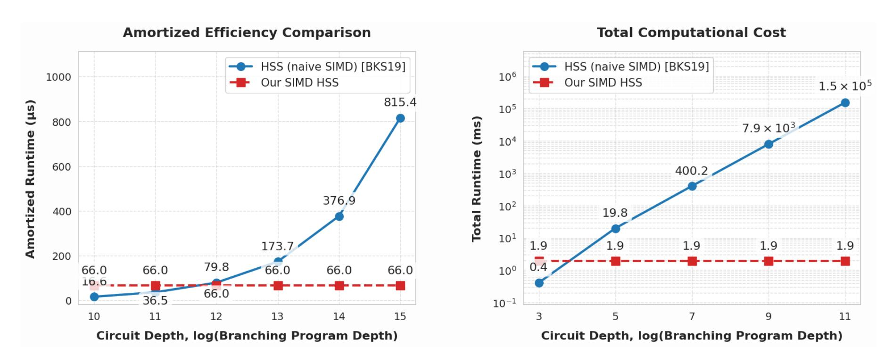
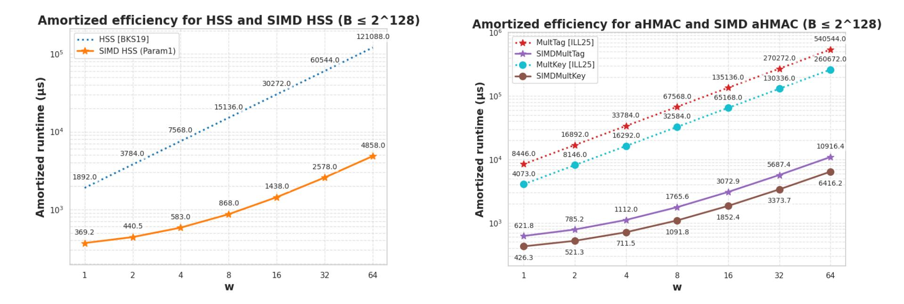

{0}------------------------------------------------

# SIMD HSS and aHMAC from Interval Encoding with Application to One-Bit-Per-Gate Garbling

Jaehyung Kim<sup>1</sup>, Hanjun Li<sup>2</sup>, Huijia Lin<sup>3</sup>, Zeyu Liu<sup>4</sup>

Stanford University
 Carnegie Mellon University
 University of Washington, Seattle
 Yale University

**Abstract.** Primitives enabling homomorphic computation over *secret-shared* values—Homomorphic Secret Sharing (HSS) and algebraic Homomorphic MACs (aHMAC)—have recently emerged as efficient alternatives to ciphertext-based primitives such as fully homomorphic encryption (FHE) and attribute-based encryption (ABE). Leveraging the distributed nature of secret sharing, direct constructions of HSS and aHMAC are simple, lightweight, avoid costly bootstrapping, and have many applications including one-bit-per-gate garbled circuits.

Despite encouraging progress, all existing direct schemes still lack one key feature: efficient *Single Instruction Multiple Data (SIMD) evaluation*, a capability that has been critical to the efficiency of FHE. This gap leaves the potential of substantial efficiency improvements untapped.

We present the first SIMD evaluation techniques for HSS and aHMAC, based on variants of the RLWE assumption. Using a new interval coefficient encoding, our approach embeds  $\sqrt{n}$  integer-valued slots per ring element and supports  $\sqrt{n}$ -fold batch addition and multiplication in just  $O(\log n)$  ring operations, achieving a multiplicative  $\tilde{O}(\sqrt{n})$  improvement in amortized efficiency over prior direct constructions. Building on top of these improvements, we show a streamlined one-bit-per-gate SIMD garbling scheme with similar efficiency gains in the online phase.

Our efficiency gains are concrete. Concrete operation counts and microbenchmark based estimates show  $6\times-10\times$  improvements in amortized multiplication cost over prior non-SIMD constructions, with up to  $25\times-50\times$  speedups for aggregation-heavy workloads such as matrix–vector multiplication. These results demonstrate the practical potential of SIMD techniques for secret-sharing-based homomorphic computation.

{1}------------------------------------------------

## Table of Contents

| 1 |                        | Introduction<br><br>3                                        |  |  |  |  |  |
|---|------------------------|--------------------------------------------------------------|--|--|--|--|--|
|   | 1.1                    | Our Results in More Detail<br><br>4                          |  |  |  |  |  |
|   | 1.2                    | Related Works<br><br>7                                       |  |  |  |  |  |
| 2 | Technical Overview<br> |                                                              |  |  |  |  |  |
|   | 2.1                    | The Challenge of SIMD HSS/aHMAC<br><br>9                     |  |  |  |  |  |
|   | 2.2                    | Our New Interval Encoding for HSS and aHMAC<br><br>10        |  |  |  |  |  |
|   | 2.3                    | Realization of Our Interval Encoding<br><br>11               |  |  |  |  |  |
|   | 2.4                    | SIMD One-Bit-Per-Gate Garbled Circuits.<br><br>12            |  |  |  |  |  |
| 3 | Preliminaries<br>      |                                                              |  |  |  |  |  |
|   | 3.1                    | SIMD Computation<br><br>14                                   |  |  |  |  |  |
|   | 3.2                    | Hard Problems<br><br>14                                      |  |  |  |  |  |
|   | 3.3                    | Fully Homomorphic Encryption<br><br>16                       |  |  |  |  |  |
| 4 |                        | SIMD for Authenticated Shares from RLWE<br><br>17            |  |  |  |  |  |
|   | 4.1                    | Interval Embeddings into<br>R<br><br>17                      |  |  |  |  |  |
|   | 4.2                    | Authenticated Share Conversion over<br>R<br><br>18           |  |  |  |  |  |
|   | 4.3                    | Our RLWE Assumption<br><br>23                                |  |  |  |  |  |
|   | 4.4                    | Concrete Efficiency of SIMD Operations<br><br>23             |  |  |  |  |  |
| 5 |                        | SIMD HSS and aHMAC<br><br>25                                 |  |  |  |  |  |
|   | 5.1                    | HSS Definitions<br><br>25                                    |  |  |  |  |  |
|   | 5.2                    | SIMD HSS Multiplication<br><br>27                            |  |  |  |  |  |
|   | 5.3                    | SIMD HSS for Bounded Integer RMS<br><br>29                   |  |  |  |  |  |
|   | 5.4                    | aHMAC Definitions<br><br>32                                  |  |  |  |  |  |
|   | 5.5                    | SIMD aHMAC Multiplication<br><br>34                          |  |  |  |  |  |
|   | 5.6                    | SIMD aHMAC for Bounded Integer Arithmetic Circuits<br><br>36 |  |  |  |  |  |
|   | 5.7                    | Concrete Efficiency<br><br>39                                |  |  |  |  |  |
| 6 |                        | SIMD Garbling with Amortized 1-Bit per Gate<br><br>40        |  |  |  |  |  |
|   | 6.1                    | Garbling Definitions<br><br>40                               |  |  |  |  |  |
|   | 6.2                    | The Overall Garbling Protocol<br><br>41                      |  |  |  |  |  |
|   | 6.3                    | The Gate Evaluation Sub-protocol<br><br>42                   |  |  |  |  |  |
|   | 6.4                    | Security Proof<br><br>45                                     |  |  |  |  |  |
|   | 6.5                    | Concrete Efficiency Analaysis<br><br>48                      |  |  |  |  |  |
| 7 |                        | Evaluation<br><br>49                                         |  |  |  |  |  |
|   | 7.1                    | Comparisons with non-SIMD HSS, aHMAC, and Garbling<br><br>49 |  |  |  |  |  |
|   | 7.2                    | Comparisons with SIMD HSS<br>51                              |  |  |  |  |  |
|   | 7.3                    | Additional Comparisons and Discussion<br><br>52              |  |  |  |  |  |
| A |                        | SIMD Techniques Continued<br><br>60                          |  |  |  |  |  |
|   | A.1                    | Non-SIMD Operations<br><br>60                                |  |  |  |  |  |
|   | A.2                    | Efficiency Analysis<br><br>63                                |  |  |  |  |  |
|   | A.3                    | Additional Discussions<br><br>63                             |  |  |  |  |  |

{2}------------------------------------------------

## <span id="page-2-0"></span>1 Introduction

Homomorphic secret sharing (HSS) [\[BGI16\]](#page-55-0) can be viewed as a secret-sharing analogue of homomorphic encryption (HE) and provides an alternative approach to communication-efficient privacy-preserving two-party computation. At a high level, an HSS scheme enables two parties to locally evaluate functions on secret-shared inputs while keeping the evaluated shares compact, hence enabling efficient output reconstruction. A related primitive, algebraic homomorphic MACs (aHMAC) [\[ILL25a\]](#page-57-0), can be seen as a secret-sharing analogue of attribute-based encryption (ABE) [\[SW05\]](#page-59-0) and offers a method for computation over authenticated data. Here, an evaluator locally computes on the plaintext data and their Message Authentication Codes (MACs), while the authenticator locally updates the corresponding MAC keys, again maintaining compact evaluated output MAC and MAC keys, hence supporting efficient verification.

Beyond their conceptual relation to HE and ABE, HSS and aHMAC admit direct constructions that exploit the distributed nature of secret sharing. These constructions are often simpler, concretely more efficient [\[BGI16,](#page-55-0) [BKS19,](#page-55-1) [ACK23,](#page-54-0) [ILL25b\]](#page-57-1), and can be based on diverse assumptions such as DDH and DCR [\[BGI16,](#page-55-0) [FGJS17,](#page-56-0) [OSY21,](#page-59-1) [ILL25a\]](#page-57-0). A notable feature is that their parameters remain independent of computation depth, in contrast to HE and ABE constructions that require either parameter growth proportional to the depth or costly bootstrapping [\[Gen09,](#page-57-2) [HLL23\]](#page-57-3). As a result, HSS and aHMAC have found applications where the distributed setup arises naturally, including private outsourcing of computation to multiple servers, multi-server PIR [\[GI14,](#page-57-4) [BGI15,](#page-55-2) [WYG](#page-59-2)+17], sublinear-communication multiparty computation [\[BGI16,](#page-55-0) [Cou19,](#page-56-1) [CM21\]](#page-56-2), generating correlated pseudorandomness [\[BCGI18,](#page-54-1) [BCG](#page-54-2)+19], and constraint PRFs [\[ILL25a\]](#page-57-0).

Together, they offer both privacy and integrity guarantees and yield surprising applications. Notably, a recent line of works [\[MORS24,](#page-58-0) [ILL25a,](#page-57-0) [ILL25b,](#page-57-1) [MORS25\]](#page-58-1) combined HSS and aHMAC to construct succinct Boolean garbled circuits containing only one bit per gate, instead of Ω(λ) bits as in Yao's garbled circuits [\[Yao82\]](#page-59-3), and orders of magnitude more efficient than fully succinct garbled circuits from FHE plus ABE [\[GKP](#page-57-5)+13, [BGG](#page-55-3)+14, [HLL23\]](#page-57-3) or iO [\[KLW15,](#page-58-2) [BCG](#page-54-3)+18].

Despite this progress, existing direct constructions of HSS and aHMAC lack efficient support for SIMD-style evaluation, which has become a central source of efficiency in FHEbased computation. In FHE (e.g., [\[CKKS17,](#page-56-3) [BGV14,](#page-55-4) [Bra12,](#page-55-5) [FV12,](#page-57-6) [SV14\]](#page-59-4)), SIMD efficiency is achieved by packing many plaintext values into a single encrypted ring element and evaluating them simultaneously via a single homomorphic operation. However, SIMD techniques in FHE rely on NTT or canonical embeddings in the plaintext space R<sup>q</sup> = Zq[x]/ϕ(x). In contrast, existing direct constructions of HSS, aHMAC, and one-bit-per-gate garbling only support messages in R = Z[x]/ϕ(x), i.e., coefficient-bounded ring elements. This mismatch prevents a natrual transfer of FHE-style SIMD methods.

Indeed, prior HSS work [\[BKS19\]](#page-55-1) attempts such a transfer by embedding computations in R<sup>q</sup> into the integer ring R, which leads to exponentially growing coefficient bounds–on the order of q d for degree-d computations–making the method practical only for low-degree computations and unable to support SIMD evaluation at unbounded depth.[1](#page-2-1) This leaves open the central question:

Can we obtain efficient constructions of HSS and aHMAC that support SIMD evaluation at unbounded depth, without relying on SIMD FHE?

<span id="page-2-1"></span><sup>1</sup> Unbounded-depth SIMD evaluation requires parameters that remain independent of the computation depth.

{3}------------------------------------------------

<span id="page-3-1"></span>

|                                                                               | $ $ NTT/iNTT $(\mathcal{R}_q)$ | Elm-Mult $(\mathcal{R}_q)$ | Elm-Add $(\mathcal{R})$ | Rounding                     | $Automorphism (\mathcal{R} \text{ or } \mathcal{R}')$ |  |  |  |  |  |  |
|-------------------------------------------------------------------------------|--------------------------------|----------------------------|-------------------------|------------------------------|-------------------------------------------------------|--|--|--|--|--|--|
| Non-SIMD Homomorphic Evaluation per Mult or Gate                              |                                |                            |                         |                              |                                                       |  |  |  |  |  |  |
| HSS mult [BKS19]                                                              | 4                              | 4                          | 4                       | 2                            | 0                                                     |  |  |  |  |  |  |
| aHMAC mult [ILL25a]                                                           | 6                              | 7                          | 4                       | 1                            | 0                                                     |  |  |  |  |  |  |
| Bit-GC, online [ILL25b, LWYY25]                                               | 26                             | 27                         | 24                      | 11                           | 0                                                     |  |  |  |  |  |  |
| $\sqrt{n}$ -fold SIMD Homomorphic Evaluation per Mult or Gate                 |                                |                            |                         |                              |                                                       |  |  |  |  |  |  |
| HSS $\sqrt{n}$ -mult Construction 7                                           | $7 + \frac{3\log(n)}{2}$       | $6 + \log(n)$              | $6 + \log(n)$           | $3 + \frac{\log(n)}{2}$      | $1 + \frac{\log(n)}{2}$                               |  |  |  |  |  |  |
| aHMAC $\sqrt{n}$ -mult<br>Construction 10                                     | $12 + \frac{3\log(n)}{2}$      | $11 + \log(n)$             | $8 + \log(n)$           | $3 + \frac{\log(n)}{2}$      | $2 + \frac{\log(n)}{2}$                               |  |  |  |  |  |  |
| Bit-GC, online, $\sqrt{n}$ -gate Figure 5                                     | $41 + 12\log(n)$               | $37 + 8\log(n)$            | $34 + 8\log(n)$         | $16 + 4\log(n)$              | $7 + 2\log(n)$                                        |  |  |  |  |  |  |
| $\sqrt{n}$ -fold SIMD Homomorphic Evaluation per Dimension- $w$ Inner Product |                                |                            |                         |                              |                                                       |  |  |  |  |  |  |
| HSS $\sqrt{n}$ -mult Section 5.7                                              | $4w + \frac{3\log(n)}{2} + 3$  | $4w + \log(n) + 2$         | $4w + \log(n) + 2$      | $2w + \frac{\log(n)}{2} + 1$ | $\frac{\log(n)}{2} + 1$                               |  |  |  |  |  |  |
| aHMAC $\sqrt{n}$ -mult<br>Section 5.7                                         | $6w + \frac{3\log(n)}{2} + 3$  | $7w + \log(n) + 4$         | $4w + \log(n) + 4$      | $w + \log(n) + 3$            | $\frac{\log(n)}{2} + 2$                               |  |  |  |  |  |  |

Table 1: We list concrete number of different ring operations needed for homomorphic evaluation per multiplication/gate of the state-of-the-art non-SIMD schemes and our SIMD schemes. We also show the optimized number of operations for SIMD inner product of our HSS and aHMAC. Each scheme has two algorithms (two parties in HSS, key and tag evaluation algorithms in aHMAC, garbling and evaluation algorithms in garbling schemes). The numbers listed for each primitive are the maximum among the two algorithms.  $\mathcal{R}_q = \mathbb{Z}_q[X]/X^n + 1$  is the ring associated with RLWE, while  $\mathcal{R}'$  is a related ring  $\mathcal{R}' = \mathbb{Z}[X]/X^{n'} - 1$  for n' > n.

Our contributions. We present the first direct constructions of SIMD HSS and SIMD aHMAC that do not rely on FHE, together with corresponding SIMD acceleration for one-bit-per-gate garbling. Our approach is based on a new packing method, which we call interval coefficient encoding, that enables  $\sqrt{n}$ -way SIMD evaluation while operating entirely within the message space  $\mathcal{R}$ . Our homomorphic batch addition and multiplication then achieve a multiplicative factor of  $\tilde{O}(\sqrt{n})$  improvement in amortized efficiency over prior state-of-the-art lattice-based HSS and aHMAC schemes [BKS19, ILL25a], and yield improvements of the same order in the online phase of one-bit-per-gate Boolean garbling and evaluation over [ILL25b, LWYY25]. Concretely, we demonstrate a  $\sim 6 \times$  improvement over plain HSS and  $\sim 10 \times$  improvements over plain aHMAC and one-bit-per-gate garbling in Section 7 and Table 2.

The new interval encoding method relies on circular RLWE with entropic secrets satisfying mild requirements (formally described in Figure 1). We discuss the assumptions in more detail later in the introduction.

#### <span id="page-3-0"></span>1.1 Our Results in More Detail

We briefly summarize the main guarantees achieved by our SIMD constructions. All of our schemes support arithmetic over bounded integers in a range [B], composed of addition and multiplication operations. Such bounded integer computation suffices to realize arbitrary Boolean computation with B=2 and only constant overhead, and therefore captures the primary use cases of HSS, aHMAC, and one-bit-per-gate garbling.

SIMD HSS. Prior direct HSS constructions without FHE (e.g., [BGI16, ADOS22, BKS19]) support only Restricted Multiplication Straightline (RMS) programs, where each multiplication

{4}------------------------------------------------

involves at least one input element. Building on the RLWE-based construction of [BKS19], we obtain the first construction that additionally enables efficient  $\sqrt{n}$ -fold SIMD evaluation while maintaining parameters independent of computation depth.

**Theorem 1 (Informal).** Assuming circular RLWE with entropic secrets over a ring  $\mathcal{R}_q$  of dimension n, the scheme in Section 5 is a (direct) HSS scheme supporting  $\sqrt{n}$ -fold SIMD evaluation of restricted multiplication programs, where batched addition requires a single local ring addition, and batched multiplication requires  $O(\log n)$  local ring operations, summarized in Table 1.

This yields an amortized  $\tilde{O}(\sqrt{n})$  improvement per arithmetic operation over prior direct HSS schemes [BKS19]. The primary tradeoff is that our construction relies on circular RLWE with entropic secrets satisfying mild additional requirements, rather than plain (circular) RLWE. Our SIMD extensions for aHMAC and one-bit-per-gate garbling below require analogous strengthenings of the underlying assumptions used in the corresponding prior works. We discuss these assumption refinements and their standard mitigations in more detail later in the introduction.

**SIMD aHMAC.** The algebraic homomorphic MAC (aHMAC) [ILL25a] supports two complementary forms of homomorphism. First, tag evaluation transforms input tags  $\sigma_{\mathbf{x}}$  into an algebraic output tag of the form  $\sigma_f = \mathbf{s} \cdot y + \mathbf{k}_f$  for  $y = f(\mathbf{x})$ , while using the input  $\mathbf{x}$  in the clear. Second, key evaluation derives the corresponding MAC key  $\mathbf{k}_f$  directly from the secret MAC key, without access to  $\mathbf{x}$ . We extend the RLWE-based construction of [ILL25a] to support the same  $\sqrt{n}$ -fold SIMD evaluation.

**Theorem 2 (SIMD, aHMAC, Informal).** Assuming circular power RLWE with entropic secrets over a ring of dimension n, the scheme in Section 5 is an algebraic homomorphic MAC scheme supporting  $\sqrt{n}$ -fold SIMD evaluation for both homomorphic tag and key evaluation. In both homomorphic procedures, batched addition requires one ring addition and batched multiplication requires  $O(\log n)$  ring operations.

As summarized in Table 1, this gives an amortized  $\tilde{O}(\sqrt{n})$  reduction in per-operation complexity compared to prior work [ILL25a].

SIMD One-Bit-Per-Gate Garbled Circuits. Our SIMD HSS and SIMD aHMAC constructions together yield a corresponding acceleration for one-bit-per-gate Boolean garbling in the standard offline/online model. This online-offline paradigm is common across cryptography, appearing in secure multiparty computation, garbling schemes, fully homomorphic encryption, and SNARKs, where a relatively expensive preprocessing phase is acceptable provided that the latency-critical online phase remains lightweight. In our garbling scheme, an offline phase (independent of both the circuit C and the input x) expands PRG seeds into one pseudorandom bit per wire using FHE, while the online phase evaluates only a constant number of HSS and aHMAC operations per gate, which is efficient. We improve the online efficiency, through batched garbling and evaluation enabled by  $\sqrt{n}$ -fold SIMD HSS and aHMAC.

**Theorem 3 (Informal).** Assume circular power RLWE with entropic secrets as in the HSS and aHMAC constructions above. There exists a one-bit-per-gate garbling scheme for Boolean circuits in the offline/online model that supports  $\sqrt{n}$ -fold SIMD garbling and evaluation in the online phase, with

- garbled circuit size  $\sqrt{n} \cdot |C| + \text{poly}(n)$ , and
- online garbling and evaluation of each  $\sqrt{n}$ -fold Boolean gates using  $O(\log n)$  ring operations.

{5}------------------------------------------------

Consequently, the amortized online cost per Boolean gate improves by a factor of  $\tilde{O}(\sqrt{n})$  over prior RLWE-based one-bit-per-gate garbling schemes [LWYY25, ILL25b]. Table 1 shows concrete operation counts for a more computationally optimized version that sends 2 bits per gate described in Section 6.5.

Our focus is on improving online efficiency. For the offline phase, we modularize the required interface and provide a compatible instantiation using general FHE, without attempting further optimization. A recent independent work [ZLY<sup>+</sup>26] gives a concretely efficient SIMD-FHE-based realization of the offline phase, but does not accelerate the online phase and therefore achieves online efficiency comparable to prior RLWE-based constructions [LWYY25, ILL25b]. Their offline optimizations compose directly with our SIMD online algorithms.

<u>SIMD Inner Products.</u> Beyond gate-by-gate SIMD evaluation, our HSS and aHMAC schemes are particularly efficient for workloads in which many products are aggregated by sums<sup>2</sup>. Such patterns, including matrix-vector multiplication, convolutions, and inner products, are central to applications such as privacy-preserving machine learning [BCH<sup>+</sup>24, jLHH<sup>+</sup>21, HS18, VZ25, BN25, BCH<sup>+</sup>25, LKL<sup>+</sup>22, LLKN23]. In these settings, most of the cost of each SIMD multiplication can be deferred until after aggregation, yielding an additional factor-w, overall factor- $\tilde{O}(\sqrt{n} \cdot w)$ , improvement (see Table 1 and Figure 7), where w denotes the number of aggregated products.

<u>Non-SIMD Computations</u>. We also develop homomorphic rotation, selection, and packing/unpacking procedures over the  $\sqrt{n}$  SIMD slots. These operations, combined with standard techniques such as in [GHS12a], extend our framework to support general non-SIMD computations.

Performance Evaluation via Microbenchmarking. A central feature of our work is that the efficiency gains are concrete. In Section 7, we estimate the amortized runtime per multiplication under a workload of  $2^{20}$  multiplications, targeting 40-bit statistical security and 128-bit computational security. Our methodology benchmarks the runtime of basic ring operations on a CPU implementation and extrapolates to multiplication in each scheme using the operation counts reported in Table 2. This yields estimated amortized costs of approximately  $60\mu s$  per multiplication for SIMD HSS,  $138\mu s$  for SIMD aHMAC, and  $381\mu s$  for the online phase of SIMD garbling. These correspond to empirical improvements of roughly  $6\times$  to  $10\times$  over the corresponding non-SIMD constructions in [BKS19, ILL25a, ILL25b]. Compared with the prior SIMD HSS approach for low-degree polynomials in [BKS19], our scheme achieves more than a 100× advantage when evaluating a restricted-multiplication straightline (RMS) program implementing a shallow Boolean circuit of depth D=15 (see Figure 6). For workloads that aggregate many products by summation, such as matrix-vector multiplication and inner products, our HSS and aHMAC constructions become even more efficient, achieving speedups of up to  $25\times$ for HSS and 50× for aHMAC. Table 2 also shows amortized runtime on GPU and dedicated hardware estimated using existing micro-benchmarks in the literature. These results highlight that SIMD interval encoding can substantially improve the practical performance of HSS and aHMAC in real-world applications.

Our Interval Encoding. At the heart of our construction is a new packing method, interval encoding, which directly embeds  $\sqrt{n}$  integer plaintext slots into the coefficients of a ring element in  $\mathcal{R}$ . Unlike the canonical or NTT embeddings used in FHE, ring multiplication translates to convolution on coefficients, which at first glance seems ill-suited for SIMD computation.

<span id="page-5-0"></span><sup>&</sup>lt;sup>2</sup> Note that this additional improvement is achieved over bounded integer computations, which is not applicable to SIMD Boolean garbling.

{6}------------------------------------------------

To address the gap between SIMD and convolution, we design three encodings, Types A, B, and C, that place  $\sqrt{n}$ -dimensional vectors into different subsets of coefficients. Multiplying a Type A and Type B polynomial yields a polynomial with tensor product of the input vectors as the coefficients. We then apply a homomorphic clear-coefficient procedure to filter out irrelevant terms, retaining only the coordinate-wise products encoded in Type C. Finally, a homomorphic type-conversion step maps Type C encodings back into Type A (or B), thereby enabling iterative SIMD computation.

To implement these procedures efficiently, we introduce new techniques that leverage ring automorphisms, trace maps, and a novel use of ring switching. While automorphisms and trace have appeared in the FHE literature, they have not been used to support SIMD, nor in secret-sharing based primitives, and ring switching is entirely new. The latter exploits the distributed nature of secret sharing to temporarily switch to rings  $\mathcal{R}'$ , that are different from the RLWE ring  $\mathcal{R}$ , which provides additional algebraic structure that make the overall construction possible.

**Discussion on assumptions.** Prior efficient lattice-based constructions of HSS, aHMAC, and one-bit-per-gate garbling already rely on two refinements of the standard RLWE assumption:

- Circular security. RLWE samples are used in a circular manner to hide functions of the secret. Circular security is standard in the literature, particularly in FHE constructions.
- Power variant. A power variant of RLWE—where the adversary observes samples of the form  $(a, sa+e, s^2a+e)$  (Definition 2)—is required for existing aHMAC and garbling schemes. This assumption was introduced in [ILL25b], inspired by the power-DDH assumption.

To enable SIMD evaluation via interval coefficient encoding, our work requires an additional refinement:

- Entropic secrets, satisfying that a fixed subset of coefficients is set to zero (while the remaining coefficients have no constraints except for being small relative to the modulus); see Requirement 1.

Entropic RLWE has been studied previously, with reductions to standard RLWE known for the *search* problem but not for the *decision* problem (see [BD20]). Our specific entropic distribution is closely related to structured secret distributions widely used in the FHE literature (e.g., [GHPS12, BCK<sup>+</sup>23, LW23, CKP25, LW24]), as discussed in Section 3.2.

Combining these refinements yields concretely efficient SIMD constructions of HSS, aH-MAC, and one-bit-per-gate garbling. The asymptotic efficiency gain, however, can still be based on weaker assumptions, namely entropic RLWE, via standard transformations. In particular, circular security can be removed in leveled variants of SIMD HSS, SIMD aHMAC, and SIMD garbling using known techniques [MORS25, ILL25b, ILL25a], at the cost of increasing the size of the public parameters (ie., evaluation keys) in aHMAC, shares in aHMAC, and garbled circuits, by a depth-dependent term, and increased computation in aHMAC and garbling. The power variant can be circumvented using the transformation introduced in [MORS25] and later applied in [ILL25a], while roughly doubling the computation costs. The resulting constructions after these two transformations still achieve the  $\tilde{O}(\sqrt{n})$ -factor improvement on amortized cost.

We present our schemes under the stronger assumptions, for simplicity of exposition and consistency with our concrete efficiency evaluation.

#### <span id="page-6-0"></span>1.2 Related Works

In the introduction, we compared our SIMD schemes with prior direct RLWE-based HSS, aH-MAC, and succinct garbling schemes, as they provide the most meaningful baseline. Schemes

{7}------------------------------------------------

based on other assumptions, such as DDH, DCR, or plain LWE (e.g., [\[BGI16,](#page-55-0) [BGI17,](#page-55-8) [ADOS22,](#page-54-4) [MORS24,](#page-58-0) [MORS25,](#page-58-1) [ILL25a,](#page-57-0) [ILL25b\]](#page-57-1)), are far less efficient in practice since their underlying operations (e.g., group exponentiation, matrix–matrix multiplication) are significantly more expensive than ring operations.

Comparison with SIMD FHE. It is well known that HSS can be constructed from special FHE [\[BGI15,](#page-55-2) [BGI](#page-55-9)+18, [DHRW16\]](#page-56-5). Compared to SIMD FHE, which can achieve full n-fold packing, our scheme supports only <sup>√</sup> n-fold packing. However, this is not a major limitation in practice: for common parameters n = 2<sup>13</sup> or 214, our schemes achieve SIMD widths of 64–128, which is a natural scale for applications such as (single or multi-server) batch-PIR, where a user simultaneously fetches many entries from a database. Indeed, FHE with sparse (rather than full) packing has been considered, but comes with much worse amortized efficiency [\[CHK](#page-56-6)+18, [CH18\]](#page-56-7).

From an efficiency standpoint, a fully fair comparison is difficult, but the following gives a useful baseline: without SIMD, TFHE costs ∼10ms per Boolean gate [\[CGGI20\]](#page-56-8); with medium SIMD (≤ 2 <sup>11</sup>), amortized TFHE bootstrapping achieves ∼4ms per gate [\[GP25\]](#page-57-10); and with very large SIMD (≥ 2 <sup>15</sup>), the CKKS-based bootstrapping achieves ∼20µs per gate [\[BCKS24\]](#page-54-8). In contrast, our SIMD HSS/aHMAC achieves tens of microseconds per multiplication, amortized over only 2<sup>6</sup> inputs, and for structured computations such as matrix–vector multiplication the cost drops to ∼13µs per multiplication (see Table [2](#page-50-1) and Fig. [7\)](#page-52-0). Thus, for applications where massive SIMD is unnecessary or low latency is preferred (e.g., [\[LT22,](#page-58-9) [LTW24,](#page-58-10) [Zam22\]](#page-59-7)), our approach offers better amortized efficiency.

Last but not least, our approach offers other important advantages: simplicity, low latency (no bootstrapping), and integrity guarantees.

Comparison with Garbling Schemes. Compared to Yao's garbled circuits and its optimizations, our scheme is more succinct (one bit per gate vs. Ω(λ) bits), but per-gate evaluation is slower. Yao's scheme, relying only on symmetric-key primitives, can garble/evaluate each gate in ∼100ns using AES-NI [\[BHKR13\]](#page-55-10), while our estimates for the online phase, amortized, are ∼400µs on CPU, ∼30µs on GPU, and ∼400ns on dedicated hardware. These numbers nevertheless indicate clear potential for practical deployments where communication, not local computation, is the main bottleneck (e.g., blockchain).

Fully succinct garbled circuits achieve theoretically optimal size, but because they rely on heavy machinery such as FHE+ABE or iO, their concrete costs remain prohibitively large. In contrast, our scheme strikes a favorable balance, combining succinctness with concrete efficiency.

Recent work on one-bit-per-gate garbling A very recent work also improves one-bit-pergate garbling [\[ZLY](#page-59-5)+26]. However, its primary focus lies in the offline phase. In particular, it proposes concretely efficient methods for instantiating the offline phase of such garbling using SIMD-capable FHE, while the online phase remains non-SIMD, as in prior works [\[ILL25b,](#page-57-1) [LWYY25,](#page-58-3) [MORS25\]](#page-58-1). Additionally, it introduces techniques enabling free-XOR for this class of low-communication garbling, as well as an alternative construction that achieves improved runtime at the cost of increasing communication to five bits per gate instead of one. These techniques are complementary to our results, as our work focuses on enabling SIMD in the online phase, and we expect that our techniques could similarly accelerate their online phase, yielding an amortized efficiency improvement of approximately ∼10× per gate, as shown in Table [2.](#page-50-1) In Section [7.3,](#page-51-0) we further discuss (1) how their offline-phase instantiation can be integrated into our construction to support SIMD evaluation online, and (2) how our SIMD techniques for the online phase could potentially accelerate their offline-phase instantiation as well.

{8}------------------------------------------------

#### <span id="page-8-0"></span>2 Technical Overview

Our starting points are the existing RLWE-based constructions of a homomorphic secret sharing (HSS) scheme from [BKS19] and an algebraic homomorphic MAC (aHMAC) scheme from [ILL25b]. We observe that while both schemes focus on realizing arithmetic computations, i.e. additions and multiplications, over bounded integers or over  $\mathbb{Z}_2$ , their underlying constructions actually natively support computations over polynomial ring elements with bounded coefficients. The polynomial ring  $\mathcal{R} = \mathbb{Z}[X]/(X^n+1)$  is the ring  $\mathcal{R}_q$  associated with the underlying RLWE without modulo q, where n is a power-of-two; only the constant coefficient is utilized for computation in those constructions. Our goal is to efficiently embed multiple instances of computations over bounded integers into a single instance of computation over  $\mathcal{R}$ .

#### <span id="page-8-1"></span>2.1 The Challenge of SIMD HSS/aHMAC

Using computation over  $\mathcal{R}$  to realize SIMD computations over bounded integers has been studied extensively in the fully homomorphic encryption (FHE) literature. However, as we explain below, the techniques developed in the context of FHE cannot be efficiently applied in the context of HSS or aHMAC. We therefore develop new embedding and evaluation techniques in this work, as explained in the next subsections. We now review the HSS and aHMAC constructions in more detail.

In the setting of HSS, two parties  $P_0, P_1$  are initially both provided with some ciphertexts  $\mathsf{ct}_s(x_i)$  of the inputs  $\{x_i \in \mathcal{R}\}$  under a (global) RLWE secret s. Additionally, they are respectively provided with additive shares of the secret  $\langle s \rangle_0, \langle s \rangle_1$  over  $\mathcal{R}$ , representing an authenticated share  $\langle \mathbf{s} \cdot \mathbf{1} \rangle$  of an initial value 1 with respect to the global secret  $\mathbf{s} := (1, s)$ . Two types of computations are supported:

- Addition between two authenticated shares  $\langle \mathbf{s} \cdot y \rangle$ ,  $\langle \mathbf{s} \cdot y' \rangle$  (jointly held by the parties) gives  $\langle \mathbf{s} \cdot (y + y') \rangle$ .
- Multiplication between an authenticated share  $\langle \mathbf{s} \cdot y \rangle$ , and an input ciphertext  $\mathsf{ct}_s(x_i)$  gives another share  $\langle \mathbf{s} \cdot x_i \cdot y \rangle$  of the product  $x_i \cdot y$ .

Starting from the initial authenticated share  $\langle \mathbf{s} \cdot 1 \rangle$  of 1, the parties can locally evaluate any restricted multiplication straightline (RMS) program P, consisting of a sequence of the above supported computations, to derive an authenticated share  $\langle \mathbf{s} \cdot z \rangle$  of the final result  $z = P(\{x_i\})$ . To reveal z, the parties reconstruct to each other the first component of the authenticated share, which is  $\langle z \rangle$ .

The setting of aHMAC similarly involves two parties  $P_0, P_1$ , who are initially both provided with some public data  $pd_s$ , which can be viewed as a circular ciphertext of a global secret s, and jointly authenticated shares  $\{\langle \mathbf{s} \cdot x_i \rangle\}$  with respect to the global secret  $\mathbf{s} := (1, s)$ . Additionally,  $P_1$  is provided with the inputs  $\{x_i \in \mathcal{R}\}$  in clear, and  $P_0$  is provided with the global secret s. Two types of computations are supported (using only local evaluations by the parties):

- Addition between authenticated shares  $\langle \mathbf{s} \cdot y \rangle$ ,  $\langle \mathbf{s} \cdot y' \rangle$  gives  $\langle \mathbf{s} \cdot (y + y') \rangle$ .
- Multiplication between authenticated shares  $\langle \mathbf{s} \cdot y \rangle$ ,  $\langle \mathbf{s} \cdot y' \rangle$  gives  $\langle \mathbf{s} \cdot y \cdot y' \rangle$ .

In the end, the parties can locally evaluate any arithmetic circuit C to derive an authenticated share  $\langle \mathbf{s} \cdot z \rangle$  of the final result  $z = C(\{x_i\})$ .  $P_1$  can then authenticate this result z to  $P_0$  by revealing its share.

{9}------------------------------------------------

We now explain why SIMD techniques from FHE literature fail. They fall into two categories. The first method relies on FHE schemes to implement a message space  $\mathcal{R}_p$  for some prime p such that the polynomial ring splits completely [SV14, BV11, Bra12, FV12]:  $\mathcal{R}_p \simeq \mathbb{Z}_p \times \ldots \times \mathbb{Z}_p$ . Homomorphic computations over  $\mathcal{R}_p$  can therefore implement n SIMD computations over  $\mathbb{Z}_p$ . However, adapting this technique in the context of HSS or aHMAC would require efficiently implementing homomorphic modulo reduction by p on authenticated shares over  $\mathcal{R}$ , which is a difficult open problem.

We note that the work of [BKS19] proposes a work-around for HSS by delaying the modulo reduction till the end, when the parties jointly hold authenticated shares  $\langle \mathbf{s} \cdot z \rangle$  of the final result z. Since the parties only need  $\langle z \rangle$  for reconstruction, they can easily do modulo reduction on  $\langle z \rangle$  before reconstruction. The downside is that without modulo reductions on intermediate values y, their coefficients grow exponentially in the computation depth, requiring huge parameter settings and slow computations in the HSS scheme.

The second method relies on FHE schemes with message space  $\mathcal{R}$  to approximately implement SIMD computations over complex numbers [CKKS17]:  $\mathbb{C} \times \ldots \times \mathbb{C}$ . This method avoids homomorphic modulo reduction (by p) over the message space, but instead needs homomorphic rounding to prevent exponentially growing coefficients in the intermediate evaluation results. Again, adapting this technique in the context of HSS or aHMAC would require efficiently implementing homomorphic rounding over authenticated shares over  $\mathcal{R}$ , which is basically equivalent to implementing homomorphic modulo reduction.

#### <span id="page-9-0"></span>2.2 Our New Interval Encoding for HSS and aHMAC

Instead of relying on the above techniques from FHE, we design a new packing technique, called interval encodings, that embeds  $T = O(\sqrt{n})$  bounded integers directly in the coefficients of an element in  $\mathcal{R}$  in some special structures. We give more details on this encoding below, and then present homomorphic evaluation procedures over such encodings.

**Interval Encodings.** To motivate our interval encoding, first consider two arbitrary subsets of coefficient positions,  $A = \{a_0, \ldots, a_{T-1}\}, B = \{b_0, \ldots, b_{T-1}\} \subseteq [n]$ , each of size T, and embed two integer vectors  $\mathbf{x}, \mathbf{y} \in \mathbb{Z}^T$  respectively into the coefficients of two ring elements  $\mathcal{E}_{\mathbf{x}}^A, \mathcal{E}_{\mathbf{y}}^B \in \mathcal{R}$ :

$$\mathcal{E}_{\mathbf{x}}^A := \sum_{i \in [T]} \mathbf{x}[i] \cdot X^{a_i = i} \text{ and } \mathcal{E}_{\mathbf{x}}^B := \sum_{i \in [T]} \mathbf{y}[i] \cdot X^{b_i = (S-1) \cdot i}.$$

We observe the coefficients of the product  $\mathcal{E}_{\mathbf{x}}^A \cdot \mathcal{E}_{\mathbf{y}}^B$  contain all of the desired SIMD multiplication results  $\mathbf{x}[i] \cdot \mathbf{y}[i]$  at positions  $a_i + b_i$ , as long as there are no overlaps between  $a_i + b_j$  for  $i, j \in [T]$ . Choosing  $A := \{0, 1, \ldots, T-1\}$ , and  $B = \{0, (S-1), \ldots, (T-1) \cdot (S-1)\}$ , for some  $\sqrt{n} \geq S \geq T$  satisfy this requirement. We call the embedding of integer vectors into coefficient positions in A, B respectively Type A and Type B encodings.

While the product between a Type A and Type B encoding contains all neccessary information of the desired SIMD (i.e. element-wise) product  $\mathbf{z} = \mathbf{x} \odot \mathbf{y}$ , it is no longer a Type A or Type B encoding and cannot be used for further SIMD evaluations. In the following, we describe two homomorphic procedures (on authenticated shares) that converts such a product back into a Type A encoding (which can then be converted to Type B as described below):

- Trace: removes (i.e., sets to 0) coefficients other than the positions in  $C := \{c_i = a_i + b_i = S \cdot i\}_{i \in [T]}$ . We call such an encoding, with only non-zero coefficients at positions in C a Type

{10}------------------------------------------------

C encoding.

$$\mathcal{E}_{\mathbf{x} \odot \mathbf{y}}^C = \mathsf{Trace}(\mathcal{E}_{\mathbf{x}}^A \cdot \mathcal{E}_{\mathbf{y}}^B), \text{ where } \mathcal{E}_{\mathbf{z}}^C := \sum_{i \in [T]} \mathbf{x}[i] \cdot X^{c_i = S \cdot i}.$$

- ConvCA: converts a Type C encoding back to Type A.

Using interval encoding for HSS and aHMAC. Implementing the two homomorphic operations above over authenticated shares suffice for SIMD HSS over bounded integers. In particular, the two parties initially will both hold ciphertexts of Type B encodings of SIMD inputs  $\mathsf{ct}_s(\mathcal{E}^B_\mathbf{x})$ , and jointly an authenticated share of 1, in Type A encoding  $\langle \mathbf{s} \cdot \mathcal{E}^A_1 \rangle$ . Two types of SIMD computations are supported:

- Addition between two authenticated shares  $\langle \mathbf{s} \cdot \mathcal{E}_{\mathbf{y}}^{A} \rangle$ ,  $\langle \mathbf{s} \cdot \mathcal{E}_{\mathbf{y}'}^{A} \rangle$  gives  $\langle \mathbf{s} \cdot \mathcal{E}_{\mathbf{y}+\mathbf{y}'}^{A} \rangle$ .
- Multiplication (using the original HSS over  $\mathcal{R}$ ) between an authenticated share  $\langle \mathbf{s} \cdot \mathcal{E}_{\mathbf{y}}^{A} \rangle$ , and an input ciphertext  $\mathsf{ct}_{s}(\mathcal{E}_{\mathbf{x}}^{B})$ , gives  $\langle \mathbf{s} \cdot \mathcal{E}_{\mathbf{y}}^{A} \cdot \mathcal{E}_{\mathbf{x}}^{B} \rangle$ . Then applying homomorphic Trace and ConvCA over this authenticated share gives  $\langle \mathbf{s} \cdot \mathcal{E}_{\mathbf{y} \odot \mathbf{x}}^{A} \rangle$ , where  $\odot$  denotes component-wise (i.e. SIMD) products.

On the other hand, for SIMD aHMAC over bounded integers, we need one more procedure: ConvAB from Type A encoding to Type B. This is because in aHMAC, the two parties initially both hold authenticated shares of Type A encoding  $\langle \mathbf{s} \cdot \mathcal{E}_{\mathbf{x}_i}^A \rangle$  (instead of one Type B ciphertext as for HSS). Thus, we need to first transform one of the shares to Type B. Given ConvAB (discussed in more detail below), aHMAC can be achieved, where two types of SIMD computations are supported as follows:

- Addition is the same as SIMD HSS.
- Multiplication between two authenticated shares  $\langle \mathbf{s} \cdot \mathcal{E}_{\mathbf{y}}^{A} \rangle$ ,  $\langle \mathbf{s} \cdot \mathcal{E}_{\mathbf{y}'}^{A} \rangle$  involve first converting one of them into Type B:  $\langle \mathbf{s} \cdot \mathcal{E}_{\mathbf{y}}^{B} \rangle$ . Then, applying the original aHMAC multiplication over  $\mathcal{R}$  gives  $\langle \mathbf{s} \cdot \mathcal{E}_{\mathbf{y}'}^{A} \cdot \mathcal{E}_{\mathbf{y}}^{B} \rangle$ . Finally, applying homomorphic Trace and ConvCA gives  $\langle \mathbf{s} \cdot \mathcal{E}_{\mathbf{y} \odot \mathbf{y}'}^{A} \rangle$ .

#### <span id="page-10-0"></span>2.3 Realization of Our Interval Encoding

With these in mind, the remaining step is to show how homomorphic trace and type conversions are realized.

**Realizing homomorphic trace.** Homomorphic trace evaluation is widely used in the context of fully homomorphic encryption (such as [CDKS19]). It can be implemented efficiently via roughly log S iterative evaluation of homomorphic automorphisms, assuming S is a power-of-two.

We now describe homomorphic automorphism implemented using the original HSS multiplication over  $\mathcal{R}$ . It converts an authenticated share  $\langle \mathbf{s} \cdot v \rangle$  into  $\langle \mathbf{s} \cdot \varphi(v) \rangle$  for a given ring automorphism  $\varphi$ .

- Initially prepare a (circular) ciphertext  $\operatorname{ct}_s(\varphi^{-1}(s))$ .
- Apply the original HSS multiplication over  $\mathcal{R}$  between  $\langle \mathbf{s} \cdot v \rangle$  and  $\mathsf{ct}_s(\varphi^{-1}(s))$  to derive  $\langle \mathbf{s} \cdot \varphi^{-1}(s) \cdot v \rangle$ , the first component of which is  $\langle \varphi^{-1}(s) \cdot v \rangle$ .
- Both parties locally apply  $\varphi$  on their shares of  $\langle \varphi^{-1}(s) \cdot v \rangle$  to derive  $\langle s \cdot \varphi(v) \rangle$ . The parties also take their given share  $\langle v \rangle$  and apply  $\varphi$  to derive  $\langle \varphi(v) \rangle$ . Combining the two results gives the desired  $\langle \mathbf{s} \cdot \varphi(v) \rangle$ .

<span id="page-10-1"></span>Although the described homomorphic automorphism uses HSS multiplications over  $\mathcal{R}$ , it's also compatible with aHMAC.

{11}------------------------------------------------

Homomorphic trace can then be relized through  $\log S$  such automorphism steps.

**Type Conversions.** Conversion from Type A to Type B and vice versa are relatively simple, as they can be defined via a single (homomorphic) automorphism. Let  $\psi_S : \mathcal{R} \to \mathcal{R}$  be defined as  $X \mapsto X^{(S-1)}$ :

$$\psi_S(\mathcal{E}_{\mathbf{x}}^A) = \mathcal{E}_{\mathbf{x}}^B \text{ and } \psi_S^{-1}(\mathcal{E}_{\mathbf{x}}^B) = \mathcal{E}_{\mathbf{x}}^A$$

Applying the above homomorphic automorphism gives the desired conversions.

The Type C to Type A conversion is more involved, because our desired mapping  $\psi: X^S \mapsto X$  is not an automorphism over  $\mathcal{R}$ , where S is a power-of-two. Applying the above homomorphic automorphism procedure does not work. To solve this issue, we apply a special type of "ring switching" on the authenticated share of Type C encodings for this conversion.<sup>4</sup> We choose a different ring  $\mathcal{R}' = \mathbb{Z}[X]/(X^{n'}-1)$  in which the mapping  $X^S \mapsto X$  is an automorphism. In more detail:

- Parties start with authenticated shares  $\langle \mathbf{s} \cdot \mathcal{E}_{\mathbf{z}}^C \rangle$  over  $\mathcal{R}$ . It first key switches to  $\tilde{\psi}(s)$  where  $\tilde{\psi} = X \mapsto X^S : \mathcal{R}' \to \mathcal{R}'$  is an automorphism over  $\mathcal{R}'$ . They obtain  $\langle \tilde{\psi}(s) \cdot \mathcal{E}_{\mathbf{z}}^C \rangle$
- Assuming the degree of  $\tilde{\psi}(s)$  and  $\mathcal{E}_{\mathbf{z}}^{C}$  are both small, in particular their sum is smaller than n, then the share  $\langle \tilde{\psi}(s) \cdot \mathcal{E}_{\mathbf{z}}^{C} \rangle$  can be viewed as over  $\mathbb{Z}[X]$  instead of  $\mathcal{R}$ .
- Parties locally reduce their shares over  $\mathcal{R}'$ , and apply  $\psi^{-1}$  locally to derive shares  $\langle \mathbf{s} \cdot \tilde{\psi}^{-1}(\mathcal{E}_{\mathbf{z}}^C) \rangle$  over  $\mathcal{R}'$ . Note that  $\mathcal{E}_{\mathbf{z}}^A = \tilde{\psi}^{-1}(\mathcal{E}_{\mathbf{z}}^C)$  over  $\mathcal{R}'$  as desired. Assuming again the degree of  $\mathbf{s}$  and  $\mathcal{E}_{\mathbf{z}}^A$  over  $\mathcal{R}'$  are small, in particular their sum smaller than n', then the share  $\langle \mathbf{s} \cdot \tilde{\psi}^{-1}(\mathcal{E}_{\mathbf{z}}^C) \rangle = \langle \mathbf{s} \cdot \mathcal{E}_{\mathbf{z}}^A \rangle$  can again be viewed as over  $\mathbb{Z}[X]$  instead of  $\mathcal{R}'$ .
- Parties locally reduce the shares over  $\mathcal{R}$  gives  $\langle \mathbf{s} \cdot \mathcal{E}_{\mathbf{z}}^{A} \rangle$  in  $\mathcal{R}$ .

Note that this ring switching process is possible because the shares are simply shares of the coefficients of the ring elements, which allows the elements to be seamlessly transformed among different rings. Furthermore, crucially, the RLWE assumption we need does *not* rely on this intermediate  $\mathcal{R}'$ , since the ring is only used for the shares, not the ciphertexts.

To satisfy the low-degree requirements from the above, we can set, for example,  $S=T \le \sqrt{n/2}$  such that S=T are powers-of-two and s to satisfy  $\deg(\tilde{\psi}(s)) < n/2 + S$  and  $\deg(s) < n'-T$  so that we have

$$\deg(\tilde{\psi}(s)) + \deg(\mathcal{E}_{\mathbf{z}}^{C}) < n/2 + S + S \cdot (T - 1) \le n,$$
$$\deg(s) + \deg(\mathcal{E}_{\mathbf{z}}^{A}) < n' - T + T \le n'.$$

Note that s can satisfy the requirements by setting at most n/2 coefficients to zero. In other words, s can have at least n/2 non-zero coefficients. Due to this restriction on the distribution of s, we need a circular secure entropic RLWE assumption with such secret distributions for our SIMD HSS scheme. We need an analogous circular power-RLWE for our SIMD aHMAC and GC schemes.

#### <span id="page-11-0"></span>2.4 SIMD One-Bit-Per-Gate Garbled Circuits.

Lastly, we briefly discuss how our garbled circuit is constructed. Recent works [LWYY25, ILL25b, MORS25] show how to garble Boolean circuits by sending essentially one-bit-per-gate, based on a variety of (circular variants of) assumptions DDH, DCR, NTRU, or RLWE. We present a scheme that draws inspiration from the two lattice-based constructions of [LWYY25, ILL25b].

<span id="page-11-1"></span><sup>&</sup>lt;sup>4</sup> Note that the ring switching technique in FHE [GHPS12] greatly differs from our scheme.

{12}------------------------------------------------

In more detail, the scheme of [\[ILL25b\]](#page-57-1) combines HSS and aHMAC, while the scheme of [\[LWYY25\]](#page-58-3) relies on the Gentry-Sahai-Waters (GSW) FHE [\[GSW13\]](#page-57-11) with additionally designed distributed decryption algorithms. [5](#page-12-0) Towards better concrete efficiency and conceptual clarity, our scheme splits the garbling and evaluation algorithms into pre-processing (independent of C or x) and online phases.

- The pre-processing phases perform FHE evaluation of a PRG, similarly to [\[LWYY25\]](#page-58-3), producing ciphertexts of pseudorandom wire masks.
- The online phases perform aHMAC and HSS evaluations, similarly to [\[ILL25b\]](#page-57-1), using the evaluated FHE ciphertexts of wire masks.

We now give more detail on our garbling scheme with pre-processing. We first briefly recall the framework of [\[ILL25b\]](#page-57-1) as our starting point. Assuming appropriate setup steps, the garbler and the evaluator respectively take the following steps for each gate g ∈ C (with input wires i, j and output k):

0. The parties jointly hold authenticated shares ⟨s · x (i) ⟩, ⟨s · x (j) ⟩ w.r.t. a global secret s = (1, s) of masked inputs x (i) , x (j) , where each wire mask is derived from a PRF or local PRG:

$$\overline{x}^{(i)} \leftarrow x^{(i)} \oplus r^{(i)}$$
, where  $r^{(i)} \leftarrow \mathsf{PRF}(\mathsf{key}, i)$ .

The evaluator additionally holds x, y in the clear.

- 1. The parties first apply aHMAC evalautions to derive shares of an one-hot vector ⟨s · z⟩ where z[i] = 1 if and only if the two masked input values (x (i) , x (j) ) encode the index i, for i ∈ [4].
- 2. The parties then apply HSS evaluations between the authenticated shares ⟨s · z⟩ and a set of ciphertexts {cts(key[i])} encrypting the PRF key to evaluate the following function f (k)

<span id="page-12-1"></span>
$$f^{(k)}(\text{key}, \mathbf{z}) := \sum_{i \in [4]} \mathbf{z}[i] \cdot \mathsf{Table}^{(k)}[i] = \mathsf{Table}^{(k)}[(\overline{x}^{(i)}, \overline{x}^{(j)})], \tag{1}$$

where Table(k) is a masked truth table corresponding to the current gate, adjusted for the wire masks:

$$\mathsf{Table}^{(k)}[(\overline{x}^{(i)},\overline{x}^{(j)})] := g(\overline{x}^{(i)} \oplus r^{(i)},\overline{x}^{(j)} \oplus r^{(j)}) \oplus r^{(k)} = \overline{x}^{(k)}.$$

The result is another authenticated share ⟨s · x (k) ⟩.

3. The garbler reveals its share of ⟨x (k) ⟩ (mod 2) as part of the garbled circuit to the evaluator, who can recover the masked output x (k) . This step contributes to the 1-bit per gate garbling size.

We observe the most heavy computation by both the garbler and the evaluator are the HSS evaluation in step 2, in particular, evaluating the PRF inside HSS to derive the wire masks r (i) , r(j) , r(k) .

Our scheme instead move the heavy PRF evaluations to a preprocessing stage. In more detail, both the garbler and evaluator initially hold FHE ciphertexts {cts(key[i])}, and homomorphically evaluate PRF over them via FHE in the preprocessing phase. They derive ciphertexts {cts(r (i) )} of all wire masks {r (i)} after pre-processing. Assuming the derived FHE ciphertexts are compatible with HSS evaluations, the gate evaluation step 2 now proceeds as follows:

<span id="page-12-0"></span><sup>5</sup> The distributed decryption algorithms use similar techniques to aHMAC evalutaions in hindsight.

{13}------------------------------------------------

2'. Apply HSS evaluations between the authenticates shares  $\langle \mathbf{s} \cdot \mathbf{z} \rangle$  and ciphertexts  $\mathsf{ct}_s(r^{(i)})$ ,  $\mathsf{ct}_s(r^{(j)})$ ,  $\mathsf{ct}_s(r^{(k)})$  to evaluate the function  $f^{(k)}$  (Equation 1).

The HSS evaluation is now much simpler, consisting only of a constant number of HSS multiplications.

We emphasize that our modular separation of the garbling scheme into preprocessing and online phases allows separately optimizing each phase. The focus of this work is achieving a SIMD online phase, using our SIMD HSS and aHMAC presented earlier. Achieving SIMD in the offline phase is conceptually simple: just using a SIMD FHE scheme. A recent independent work [ZLY<sup>+</sup>26] explores this approach to improve concrete efficiency.

#### <span id="page-13-0"></span>3 Preliminaries

**Notations.** We use bold letters  $\mathbf{x}$  to denote a vector, and write  $\mathbf{x}[i]$  to denote its i-th component. We write  $\mathbf{x} \otimes \mathbf{y}$  to denote the tensor product between two vectors. For an integer B > 0, we write [B] to denote the set  $\{0, 1, \dots, B-1\}$ . For an integer value within some range  $x \in [B]$ , we write  $\mathsf{Bits}(x)$  to denote its bit-representation as a Boolean vector of dimension  $\lceil \log B \rceil$ , and  $\mathsf{BitComp}(\mathbf{x} \in \{0, 1\}^{\lceil \log B \rceil})$  to denote the linear function that recovers x from its bit-representation.

When describing invocations of (sub-)protocols between two parties  $P_G, P_E$ , we write

$$(P_G:O_G), (P_E:O_E) \leftarrow \mathsf{Protocol}\left((P_G:I_G), (P_E:I_E)\right)$$

to mean the parties respectively hold inputs  $I_G, I_E$  when entering the protocol, and obtain outputs  $O_G, O_E$  after the protocol.

#### <span id="page-13-1"></span>3.1 SIMD Computation

For every program  $P: \mathcal{M}^{\ell_x} \to \mathcal{M}^{\ell_y}$  and integer  $T \in \mathbb{Z}$ , the T-SIMD version of P, denoted as  $P^{\times T}: \mathcal{M}^{\ell_x \times T} \to \mathcal{M}^{\ell_y \times T}$  computing:

$$P^{\times T}(\{\mathbf{x}^{(t)}\}) := (P(\mathbf{x}^{(0)}, \dots, P(\mathbf{x}^{T-1})))$$

where  $P(\mathbf{x}^{(t)})$  as the t'th instance.

For a class of program  $\mathcal{P}$ , and a polynomial  $T(\cdot)$ , define  $\mathcal{P}^{\times T} = \{\mathcal{P}^{T(\lambda)}\}_{\lambda}$  to be the class consisting of programs  $P^{\times T(\lambda)}$  where  $P \in \mathcal{P}$ .

In this work, we will consider base programs that are integer arithmetic circuits. An arithmetic circuit C consists of addition and multiplication gates evaluated over  $\mathbb{Z}$ ; denote by  $\mathcal{C}$  the class of all integer arithmetic circuits. An arithmetic RMS program is a special case where multiplications are restricted to be between an intermediate wire value and an input value; denote by  $\mathcal{P}_{\text{RMS}}$  the class of all integer RMS programs. Similar to prior works, schemes designed for these classes of programs only work when the inputs are B-admissible w.r.t. a known upper bound  $B \in \mathbb{Z}$ , i.e.,  $\mathsf{adm}_B(C, \mathbf{x}) = 1$  iff all intermediate and input values are bounded by B.

#### <span id="page-13-2"></span>3.2 Hard Problems

**Definition 1 (RLWE).** Let  $\mathcal{R}(\lambda)$  be a ring,  $q(\lambda)$  be a modulus,  $\mathcal{D}_{\mathsf{sk}}(\lambda), \mathcal{D}_{\mathsf{err}}(\lambda) \subseteq \mathcal{R}(\lambda)$ , be distributions for secrets and errors. The decisional ring learning with error (RLWE) problem

{14}------------------------------------------------

RLWER,q,Dsk,Derr is the following: distinguish {a<sup>i</sup> , a<sup>i</sup> ·s+ei}i∈[m] and {a<sup>i</sup> , bi}[m] for any polynomial m(λ) number of samples with with noticeable advantage, where a<sup>i</sup> ←\$ Rq, s ← Dsk, e<sup>i</sup> ← Derr and b<sup>i</sup> ←\$ Rq.

<span id="page-14-0"></span>Definition 2 (PRLWE). Let R(λ) be a ring, q(λ) be a modulus, Dsk(λ), Derr(λ) ⊆ R(λ), be distributions for secrets and errors. The decisional power ring learning with error (PRLWE) problem PRLWER,q,Dsk,Derr is the following: distinguish (a<sup>i</sup> , a<sup>i</sup> · s + ei,1, s<sup>2</sup> · a<sup>i</sup> + ei,2) and (a<sup>i</sup> , b<sup>i</sup> , ci) for any polynomial m(λ) number of samples with with noticeable advantage, where a<sup>i</sup> ←\$ Rq, s ← Dsk, ei,1, ei,<sup>2</sup> ← Derr and b<sup>i</sup> , c<sup>i</sup> ←\$ Rq.

Entropic secrets. We consider a polynomial ring R = Z[X]/(X<sup>n</sup> + 1) where n is a powerof-two, and require a specific secret distribution Dsk formally describled in Figure [1.](#page-22-2) At a high level, for every secret s ∈ Dsk, we require a fixed subset of coefficients in s to always be zero. We don't impose requirements on the remaining coefficients, except they should have bounded magnitude sufficiently smaller than the modulus q, as descrbied in Figure [2.](#page-23-0)

We believe that this is a reasonable assumption since a similar requirement has been widely used in the FHE literature (e.g., [\[GHPS12,](#page-57-9) [BCK](#page-54-7)+23, [LW23,](#page-58-7) [CKP25,](#page-56-4) [LW24\]](#page-58-8)), where the subset of low-degree coefficients is set to zero (e.g., imagine a ring element in R := Z[X]/(X<sup>n</sup> + 1) where only the first n/2 coefficients are short elements, while the second half being 0). This is assumed to be as secure as a normal secret, with an effective dimension equal to the number of non-zero coefficients.

Circular assumption. We additionally need circular assumptions, where the adversary is additionally given evaluations ψ(s) of the secret s, masked by RLWE and PRLWE samples respectively. More formally, they are defined as follows:

Definition 3 (Circular RLWE). Let R(λ) be a ring, q(λ) be a modulus, Dsk(λ), Derr(λ) ⊆ R(λ), be distributions for secrets and errors, and F(λ) be a set of functions ψ : R<sup>q</sup> → Rq. The circular RLWE problem cRLWER,q,Dsk,Derr,<sup>F</sup> is the following: distinguish {a<sup>i</sup> , a<sup>i</sup> ·s+ei+ψi(s)}i∈[m] and {a<sup>i</sup> , bi}i∈[m] for any polynomial m(λ) number of samples and sequence of functions {ψ<sup>i</sup> ∈ F}i∈[m] , where a<sup>i</sup> ←\$ Rq, s ← Dsk, e<sup>i</sup> ← Derr and b<sup>i</sup> ←\$ Rq.

Definition 4 (Circular PRLWE). Let R(λ) be a ring, q(λ) be a modulus, Dsk(λ), Derr(λ) ⊆ R(λ), be distributions for secrets and errors, and F(λ) be a set of functions ψ : R<sup>q</sup> → Rq. The circular PRLWE problem cPRLWER,q,Dsk,Derr,<sup>F</sup> is the following: distinguish {a<sup>i</sup> , a<sup>i</sup> · s+ei,<sup>1</sup> + ψi,1(s), s<sup>2</sup> ·ai+ei,2+ψi,2(s)}i∈[m] and {a<sup>i</sup> , b<sup>i</sup> , ci}i∈[m] for any polynomial m(λ) number of samples and sequence of functions {ψi,1, ψi,<sup>2</sup> ∈ F }i∈[m] , where a<sup>i</sup> ←\$ Rq, s ← Dsk, ei,1, ei,<sup>2</sup> ← Derr and b<sup>i</sup> ←\$ Rq.

The specific functions ψ we consider are permutations of coefficients and scalar multiplication by a constant factor.

We note that circular assumptions are widely used in practice, especially in fully homomorphic encryption (FHE) [\[BGV14,](#page-55-4) [Bra12,](#page-55-5) [FV12,](#page-57-6) [CKKS17,](#page-56-3) [DM15,](#page-56-10) [CGGI20\]](#page-56-8) since we only know how to build FHE from circular assumptions.

Looking ahead, we will rely on entropic-circular-RLWE for type converstion and SIMD-HSS (Sections [4](#page-16-0) and [5](#page-24-0) ), and entropic-circular-PRLWE for SIMD-aHMAC and SIMD-Garbling (Section [5](#page-24-0) and [6\)](#page-39-0). As discussed in the introduction, both assumptions can be weakened to entropic-RLWE using existing techniques at the cost of increasing the size of public parameters by a depth-dependent term.

{15}------------------------------------------------

#### <span id="page-15-0"></span>3.3 Fully Homomorphic Encryption

**Definition 5 (Fully Homomorphic Encryption).** A fully homomorphic encryption scheme consists of the following efficient algorithms:

- pk, evk, sk  $\leftarrow$  KeyGen(pp): which consists of the following two subroutines:
  - $sk \leftarrow SKGen(pp)$ : takes the public parameter pp; outputs a secret key sk.
  - pk, evk ← PKGen(pp, sk): takes the public parameter pp, a secret key sk; outputs a public key pair (pk, evk).
  - KeyGen(pp) := Output pk, evk, sk where sk  $\leftarrow$  SKGen(pp), pk, evk  $\leftarrow$  PKGen(pp, sk)
- $\mathsf{ct} \leftarrow \mathsf{Enc}(\mathsf{pp}, \mathsf{pk}, m)$ : takes the public parameter  $\mathsf{pp}$  and the public key  $\mathsf{pk}$ , generates the ciphertext c for the message m in plaintext space  $\mathcal{P}$ ; outputs  $\mathsf{ct}$ .
- $-m \leftarrow \mathsf{Dec}(\mathsf{pp}, \mathsf{sk}, \mathsf{ct})$ : takes the public parameter  $\mathsf{pp}$ , decrypts the ciphertext  $\mathsf{ct}$  into a plaintext message m based on the secret key  $\mathsf{sk}$ ; outputs the message m.
- $-\operatorname{ct}_1',\ldots,\operatorname{ct}_{w'}' \leftarrow \operatorname{Eval}(\operatorname{pp},\operatorname{evk},f,\operatorname{ct}_1,\ldots,\operatorname{ct}_w)\colon takes\ the\ public\ parameter\ \operatorname{pp},\ an\ evaluation\ key\ \operatorname{evk},\ a\ function\ f:\mathcal{P}^w\to\mathcal{P}^{w'},\ and\ ciphertexts\ \operatorname{ct}_1,\ldots,\operatorname{ct}_w;\ output\ ciphertexts\ \operatorname{ct}_1',\ldots,\operatorname{ct}_{w'}'.$

**Correctness:** For every polynomial  $p(\lambda)$ , let pp be public parameters dependent on  $\lambda$ , there exists a negligible function  $\operatorname{negl}(\lambda)$  such that: for all  $\lambda \in \mathbb{N}$ , and any function  $f: \mathcal{P}^w \to \mathcal{P}^{w'}$  where  $w, w' \leq p(\lambda)$ , and inputs  $m_0, \ldots, m_w \in \mathcal{P}^w$ , the following holds:

$$\Pr \begin{bmatrix} \mathsf{Dec}(\mathsf{pp},\mathsf{sk},\mathsf{ct}_1'),\dots,\mathsf{Dec}(\mathsf{pp},\mathsf{sk},\mathsf{ct}_{w'}') \\ = f(m_1,\dots,m_w) \end{bmatrix} \overset{\mathsf{(pk},\mathsf{evk},\mathsf{sk})}{\underset{\mathsf{ct}_i}{\mathsf{ct}}} \leftarrow \mathsf{Enc}(\mathsf{pp},\mathsf{pk},m_i), \forall i \in [w] \\ \underset{\mathsf{ct}_0',\dots,\mathsf{ct}_{w'-1}'}{\mathsf{ct}} \leftarrow \mathsf{Eval}(\mathsf{pp},\mathsf{evk},f,\mathsf{ct}_1,\dots,\mathsf{ct}_w) \end{bmatrix} \geq 1 - \operatorname{negl}(\lambda).$$

**Security:** Security is standard semantic security (IND-CPA security) of PKE schemes, so we omit the details.

**Key switching** We additionally key switching, which transforms a ciphertext under secret key  $\mathsf{sk}_1$  to a ciphertext under  $\mathsf{sk}_2$  without changing the underlying plaintext. To achieve this, we additionally define two algorithms  $\mathsf{KSKGen}(\mathsf{pp},\mathsf{sk}_1,\mathsf{sk}_2) \to \mathsf{ksk}$  and  $\mathsf{KeySW}(\mathsf{pp},\mathsf{ksk},\mathsf{ct}) \to \mathsf{ct'}$ . These two algorithms satisfy the following property: for any ciphertext  $\mathsf{ct} := (a,b) \in \mathcal{R}_q$  satisfying  $b - a\mathsf{sk}_1 = m \cdot \Delta + e$  where  $m \in \mathcal{R}_t$  (for plaintext space  $\mathcal{R}_t$  and  $\Delta = \lceil q/t \rfloor$ ) is a message and  $||e|| \leq B$  for some error bound  $B \leq \Delta/2$ , it holds that  $\mathsf{ct'} := (a',b') \in \mathcal{R}_q$  satisfies that  $b' - a'\mathsf{sk}_2 = m \cdot \Delta + e'$  for  $||e'|| \leq B_{\mathsf{err}}$  for some  $B \leq B_{\mathsf{err}} \leq \Delta/2$ . This is achievable in standard RLWE-based FHE systems [Bra12, FV12, BGV14, CKKS17, DM15, CGGI20].

In this work, we need something slightly stronger: let KSKGen'(pp, sk<sub>1</sub>, sk<sub>2</sub>)  $\rightarrow$  ksk', KeySW'(pp, ksk', ct)  $\rightarrow$  ct' := (ct<sub>1</sub> =  $(a_1, b_1)$ , ct<sub>2</sub> =  $(a_2, b_2)$ )  $\in \mathcal{R}_q^4$ , it holds that  $b_1 - a_1$ sk<sub>2</sub> = sk<sub>2</sub>  $\cdot$   $m \cdot \Delta + e'_1 \in \mathcal{R}_q$ , and  $b_2 - a_2$ sk<sub>2</sub> =  $m \cdot \Delta + e'_2 \in \mathcal{R}_q$ , for  $||e_1, e_2|| \leq B_{\text{err}}$ . We show below that this is indeed achievable.

<span id="page-15-2"></span>**Lemma 1.** There exists an FHE scheme with the KSKGen', KeySW' algorithms above with plaintext space  $\mathcal{R}_t$  and public parameter  $pp := (\mathcal{R}, q, t, \mathcal{D}_{sk}, \mathcal{D}_{err})$ , assuming the hardness of entropic  $\mathsf{RLWE}_{\mathcal{R},q,\mathcal{D}_{sk},\mathcal{D}_{err}}$  (with  $\mathcal{D}_{sk} \subseteq \mathcal{R}_t$ )<sup>6</sup> and circular security.

*Proof sketch.* Proof is simple: given RLWE with circular security, there exist FHE schemes with standard key switching [Bra12, FV12, BGV14, CGGI20]. Then, let  $sk_i \leftarrow SKGen(pp)$ , we can define KSKGen'(pp,  $sk_1$ ,  $sk_2$ ) as

<span id="page-15-1"></span>We slightly abuse the notation here.  $\mathcal{D}_{\mathsf{sk}} \subseteq \mathcal{R}_t$  means that for all  $x \leftarrow_{\$} \mathcal{D}_{\mathsf{sk}}$ ,  $x \in \mathcal{R}_t$  except for  $\mathsf{negl}(\lambda)$  probability.

{16}------------------------------------------------

```
\begin{split} &-\mathsf{pk}_2, \mathsf{evk}_2 \leftarrow \mathsf{PKGen}(\mathsf{pp}, \mathsf{sk}_2) \\ &-\mathsf{ct}_{\mathsf{sk}_2} \leftarrow \mathsf{Enc}(\mathsf{pk}_2, \mathsf{sk}_2) \\ &-\mathsf{ksk} \leftarrow \mathsf{KSKGen}(\mathsf{pp}, \mathsf{sk}_1, \mathsf{sk}_2) \\ &-\mathsf{Output}\; \mathsf{ksk}' := (\mathsf{evk}_2, \mathsf{ct}_{\mathsf{sk}_2}, \mathsf{ksk}) \end{split}
```

Then, let  $\mathsf{ct} \leftarrow \mathsf{Enc}(\mathsf{pp}, \mathsf{pk}_1, m)$  for any plaintext  $m \in \mathcal{R}_t$ , then, we can define  $\mathsf{KeySW}'(\mathsf{pp}, \mathsf{ksk}', \mathsf{ct})$  as follows:

```
 \begin{array}{l} -\mathsf{ct}_2 \leftarrow \mathsf{KeySW}(\mathsf{pp},\mathsf{ksk},\mathsf{ct}) \\ -\mathsf{ct}_1 \leftarrow \mathsf{Eval}(\mathsf{pp},\mathsf{evk}_2,\times,\mathsf{ct}_2,\mathsf{ct}_{\mathsf{sk}_2}) \\ -\mathsf{Output}\;\mathsf{ct}' := (\mathsf{ct}_1,\mathsf{ct}_2) \end{array}
```

This achieves what we need in a straightforward way.

Note that here the keys have the following form:  $\mathsf{ksk} := (a_i, \mathsf{sk}_2 a_i + e_i + \mathsf{sk}_1 \cdot 2^i)$  for  $i \in [\log(q)]$ ,  $\mathsf{evk}_2 := (a'_i, \mathsf{sk}_2 a'_i + e'_i + \mathsf{sk}_2^2 \cdot 2^i)$  for  $i \in [\log(q)]$ ,  $\mathsf{pk}_2 := (a'', a'' \mathsf{sk}_2 + e'')$ , and  $\mathsf{ct}_{\mathsf{sk}_2} := (a''', a''' \mathsf{sk}_2 + e''' + \mathsf{sk}_2 \cdot \Delta)$ , where  $a_i, a'_i, a'', a''' \leftarrow_{\$} \mathcal{R}_q$ . There are alternative ways to generate such keys [GHS12b], but since this is not the main focus our this work, for simplicity, we assuem these keys have such forms.

Format of the key-switching key ksk' simply contains ksk, evk<sub>2</sub>, ct<sub>sk<sub>2</sub></sub>, which are RLWE ciphertexts (i.e., RLWE samples) encrypting  $f_{ksk}(s_1)$  and  $g_{evk}(s_2)$ ,  $g_{Enc}(sk_2)$  for some functions  $f_{ksk}$ ,  $g_{evk}$ ,  $g_{Enc}$ . By RLWE with circular assumption, these are indistinguishable from (a vector of) uniformly random  $\mathcal{R}_q$  elements.

#### <span id="page-16-0"></span>4 SIMD for Authenticated Shares from RLWE

Authenticated share [NNOB12] is an additive secret share of an authenticated value  $\mathbf{s} \cdot x$  where  $\mathbf{s} = (1, s) \in \mathcal{R}^2$  is a RLWE secret and x is a message. That is, we have shares  $\langle x \rangle_0, \langle sx \rangle_0$  for one party and  $\langle x \rangle_1, \langle sx \rangle_1$  for the other, so that  $\langle x \rangle_1 - \langle x \rangle_0 = x$  and  $\langle sx \rangle_1 - \langle sx \rangle_0 = sx$ . For simplicity, we use the notation  $\langle x \rangle$  and  $\langle sx \rangle$  without specifying 0,1 to denote both shares simultaneously. For a function  $f(\langle \mathbf{s} \cdot x \rangle, \ldots)$  on authenticated share(s), omitting b = 0, 1 refers to applying a function f on both shares.  $f_0$  and  $f_1$  denote local evaluations of f with respect to each party. If we use a different base ring other than  $\mathcal{R}$ , we specify it as a superscript (e.g.  $\langle sx \rangle^{\mathcal{R}'}$ ). In this section, we introduce some gadgets/tools for authenticated shares that is used as key building blocks for SIMD computations in the later sections.

#### <span id="page-16-1"></span>4.1 Interval Embeddings into $\mathcal{R}$

Let  $S, T \in \mathbb{Z}_{>0}$  be integers such that  $S \geq T$ , S is a power-of-two, and  $ST \leq n/2$ . In our SIMD computation over  $\mathcal{R}$ , T is a SIMD factor and S is a parameter for clearing out some of the coefficients. Data is encrypted in the coefficients of polynomials in  $\mathcal{R}$ , and it is bounded by  $B \in \mathbb{Z}_{>0}$  so that we support vectorized operations over  $[B]^T$ .

Given a vector  $\mathbf{x} = (x_i)_i \in [B]^T$ , we consider three types of encodings, namely **Type A**, **Type B**, and **Type C**, defined as

$$\mathcal{E}_{\mathbf{x}}^{A} := \sum_{i=0}^{T-1} x_i \cdot X^i \in \mathcal{R}, \quad \mathcal{E}_{\mathbf{x}}^{B} := \sum_{i=0}^{T-1} x_i \cdot X^{(S-1) \cdot i} \in \mathcal{R}, \quad \mathcal{E}_{\mathbf{x}}^{C} := \sum_{i=0}^{T-1} x_i \cdot X^{S \cdot i} \in \mathcal{R},$$

{17}------------------------------------------------

respectively. To understand the underlying intuition of these encodings, we consider two vectors  $\mathbf{x}, \mathbf{y} \in [B]^T$  encoded in Type A and Type B, respectively. When we multiply  $\mathcal{E}_{\mathbf{x}}^A$  and  $\mathcal{E}_{\mathbf{y}}^B$  over  $\mathcal{R}$ , we get the following polynomial

$$\sum_{i=0}^{T-1} x_i \cdot X^i \times \sum_{i=0}^{T-1} y_i \cdot X^{(S-1) \cdot i} = \sum_{i=0}^{T-1} \sum_{j=0}^{T-1} (x_i y_j) \cdot X^{i+(S-1)j}.$$

Our key observation is that i + (S - 1)j is divisible by S if and only if i = j. Furthermore, the coefficient of the monomial  $X^{S \cdot i}$  is exactly  $x_i y_i$ , meaning that theses coefficients give a Hadamard multiplication of two vectors  $\mathbf{x}$  and  $\mathbf{y}$ .

To write down this formally, let  $\mathsf{ClearCoeff}_S : \mathcal{R} \to \mathcal{R}$  be a function

$$\sum_{i=0}^{n-1} m_i \cdot X^i \quad \mapsto \quad \sum_{0 \le i < n, \ S|i} m_i \cdot X^i$$

that zeros out all the coefficients other than whose degrees are multiple of S. Let  $S = \mathbb{Z}[X^S]/(X^n + 1) \subseteq \mathcal{R}$ , then this function can be understood as a trace evaluation of  $\mathcal{R}$  over S. In particular, it can be efficiently instantiated with automorphisms over  $\mathcal{R}$ . The discussion above implies that

$$\mathcal{E}_{\mathbf{x} \odot \mathbf{y}}^C = \mathsf{ClearCoeff}_S(\mathcal{E}_{\mathbf{x}}^A \cdot \mathcal{E}_{\mathbf{y}}^B),$$

where  $\mathbf{x} \odot \mathbf{y}$  denotes the Hadamard product between  $\mathbf{x}$  and  $\mathbf{y}$ . Note that all of the encodings are additive, directly giving SIMD additions. We write down the algorithms in Algorithm 1 and 2.

## <span id="page-17-1"></span> $\overline{\mathbf{Algorithm}}$ 1 RingSIMDAdd $(\mathcal{E}_{\mathbf{x}}^*, \mathcal{E}_{\mathbf{v}}^*)$

Input:  $\mathbf{x}, \mathbf{y} \in [B]^T, \mathcal{E}^*_{\mathbf{x}}, \mathcal{E}^*_{\mathbf{y}} \in \mathcal{R} \text{ where } * \in \{A, B, C\}.$ 

 $\begin{aligned} \textbf{Output:} \ \ \mathcal{E}^*_{\mathbf{x}+\mathbf{y}}. \\ \textbf{return} \ \ \mathcal{E}^*_{\mathbf{x}} + \mathcal{E}^*_{\mathbf{y}} \end{aligned}$ 

# <span id="page-17-2"></span> $\overline{\mathbf{Algorithm} \ \mathbf{2} \ \mathsf{RingSIMDMult}(\mathcal{E}_{\mathbf{x}}^{\mathsf{A}}, \mathcal{E}_{\mathbf{y}}^{\mathsf{B}})}$

Input:  $\mathbf{x}, \mathbf{y} \in [B]^T, \mathcal{E}_{\mathbf{x}}^A, \mathcal{E}_{\mathbf{y}}^B \in \mathcal{R}$ .

Output:  $\mathcal{E}_{\mathbf{x}\odot\mathbf{y}}^C$ , where  $\mathbf{x}\odot\mathbf{y}$  denotes Hadamard multiplication.

 $\mathbf{return} \ \mathsf{ClearCoeff}_S(\mathcal{E}_{\mathbf{x}}^A \cdot \mathcal{E}_{\mathbf{y}}^B)$ 

Although these operations already define SIMD addition and multiplication, it is not repeatable as input and output encoding types for multiplication are different. In the following section, we discuss how we define type conversions between different encodings, providing a complete framework for SIMD operations.

#### <span id="page-17-0"></span>4.2 Authenticated Share Conversion over $\mathcal{R}$

We explore homomorphic evaluation of automorphisms on authenticated shares via HSS multiplication, and use it to define type conversions between different encoding types. These conversions are key ingredients of our SIMD HSS and aHMAC in the following sections.

{18}------------------------------------------------

Key Switching. Given an authenticated share ⟨s · x⟩ with a secret s = (1, s), key switching converts it to an authenticated share ⟨s ′ · x⟩ for another secret s ′ = (1, s′ ). This is analogous to the key switching in the context of fully homomorphic encryption [\[Gen09\]](#page-57-2): We multiply an encryption of s under the secret s ′ .

<span id="page-18-0"></span>Construction 1 (Authenticated Share Key Switching). The construction is with respect to the following public parameters pp = (R, p, q, Derr, Dsk, B):

- an input bound B < 2 poly(λ) ;
- a polynomial ring R = Z[X]/(X<sup>n</sup> + 1) where n(λ) < poly(λ) is a power-of-two;
- error and secret distribution Derr, Dsk ⊆ R with coefficients bounded by Berr, Bsk ≤ poly(λ), respectively.
- two moduli p, q, where q = ∆ · p for a scaling factor ∆.
- A pseudo random function PRF : K × Sid → R where K and Sid are PRF key and operation id spaces, respectively. For simplicity, we omit it from the description of pp, but implicitly assume its existence in the following functions.

evk ← KeyGen(s, s′ ): Given two secrets s, s′ ∈ R sampled from Dsk, the evaluation key evk is a RLWE encryption of s ′ under s. That is,

$$\mathsf{evk} = (-as + \Delta \cdot s' + e, a)$$

where a ← R<sup>q</sup> and e ← Derr. We additionally generate a PRF key K ← K which is implicitly included in the evaluation key evk but omitted for simplicity.

⟨s ′ · v⟩ ← KeySwitch(evk,⟨s · v⟩): Given an authenticated share ⟨s · v⟩, an evaluation key evk, a PRF key K ∈ K), and an operation id id ∈ Sid, output an authenticated share ⟨s ′ · v⟩. This is instantiated via a multiplication between evk and ⟨s · v⟩:

$$(-as + \Delta \cdot s' + e, a) \cdot \langle (1, s) \cdot v \rangle = \langle (\Delta \cdot s' + e) \cdot v \rangle.$$

The distributed rounding is taken afterwards to remove the error term e and get ⟨s ′ · v⟩. Since we already had ⟨v⟩, we have ⟨s · v⟩. Finally, we add a common pseudo-random shift two both parties' shares. This re-randomizes the share without affecting the shared value. The shift factor is obtained as PRF(K, id).

<span id="page-18-2"></span>Lemma 2 (Key Switching Correctness). The authenticated key switching in Construction [1](#page-18-0) is correct up to a negligible failure probability 2 −κ ′ as long as it satisfies the following properties:

<span id="page-18-1"></span>
$$p \ge n^2 \cdot B \cdot B_{\mathsf{sk}} \cdot 2^{\kappa'} \ and \ \Delta \ge n^2 \cdot B_{\mathsf{err}} \cdot B \cdot 2^{\kappa'}.$$
 (2)

Proof. We assume that PRF is evaluated every time we perform an operation so that input authenticated shares are always randomized. The distributed rounding happens once, when multiplying evk with ⟨(1, s) · x⟩. Here, we have

$$(-as + \Delta \cdot s' + e) \cdot \langle x \rangle + a \cdot \langle sx \rangle = (s'\Delta + e) \cdot \langle x \rangle.$$

In other words, the two shares t0, t<sup>1</sup> satisfy

$$t_1 - t_0 \equiv_q \Delta \cdot (s'x) + ex.$$

{19}------------------------------------------------

According to [BKS19, Lemma 1], the rounding failure probability is  $n \cdot (\|ex\|_{\infty} + 1) \cdot p/q$  which has to be negligible  $(\leq 2^{-\kappa'})$ . According to [BKS19], the modulus lifting failure probability is  $n \cdot (\|s'x\|_{\infty} + 1)/p$  which has to be negligible  $(\leq 2^{-\kappa'})$ . To summarize, it suffices to have

$$q \ge n^2 \cdot ||e||_{\infty} \cdot B \cdot p \cdot 2^{\kappa'}$$
 and  $p \ge n^2 \cdot ||s'||_{\infty} \cdot B \cdot 2^{\kappa'}$ 

which follows from the Equation 2. The final randomization from a PRF evaluation does not change the result.  $\Box$ 

**Automorphism.** Let  $\varphi : \mathcal{R} \to \mathcal{R}$  be a ring automorphism. A homomorphic automorphism Aut converts an authenticated share  $\langle \mathbf{s} \cdot v \rangle$  into an authenticated share  $\langle \mathbf{s} \cdot \varphi(v) \rangle$ . It can be instantiated with a key switching from s to  $\varphi^{-1}(s)$ .

<span id="page-19-0"></span>Construction 2 (Automorphism for Authenticated Shares). Let the parameters  $pp = (\mathcal{R}, p, q, \mathcal{D}_{err}, \mathcal{D}_{sk}, B)$  be the same as in Construction 1.

evk  $\leftarrow$  KeyGen $(s, \varphi^{-1}(s))$ : Inherited from key switching, except that we convert from s to  $\varphi^{-1}(s)$ .  $\langle \mathbf{s} \cdot \varphi(v) \rangle \leftarrow \mathsf{Aut}^{\varphi}(\mathsf{evk}, \langle \mathbf{s} \cdot v \rangle)$ : Given  $\langle \mathbf{s} \cdot v \rangle$ , we first apply a key switching from s to  $\varphi^{-1}(s)$  and get  $\langle \varphi^{-1}(\mathbf{s}) \cdot v \rangle$ . Next, we apply  $\varphi$  and get  $\langle \mathbf{s} \cdot \varphi(v) \rangle$ . Therefore,

$$\mathsf{Aut}^{\varphi}(\mathsf{evk}, \langle \mathbf{s} \cdot v \rangle) = \varphi \circ \mathsf{KeySwitch}(\mathsf{evk}, \langle \mathbf{s} \cdot v \rangle).$$

The correctness of automorphism automatically follows from Lemma 2.

Corollary 1 (Automorphism Correctness). The automorphism for authenticated shares defined in Construction 2 is correct, as long as it satisfies the properties in Equation 2.

Clearing Coefficients. Given a authenticated share  $\langle \mathbf{s} \cdot v \rangle$  where  $v \in \mathcal{R}$ , we may use homomorphic automorphisms to zero out some of the coefficients. In particular, we consider removing all the coefficients other than whose degree are multiples of S. To be explicit, a polynomial  $v = \sum_{i=0}^{n-1} v_i \cdot X^i$  is reduced to

$$\mathsf{ClearCoeff}(v) := \sum_{0 \leq i < n, S | i} v_i \cdot X^i.$$

This operation can be efficiently instantiated with  $\log S$  automorphisms.

Construction 3 (Clearing Coefficients). Let the parameters  $pp = (\mathcal{R}, p, q, \mathcal{D}_{err}, \mathcal{D}_{sk}, B)$  be the same as in Construction 1.

evk  $\leftarrow$  TraceKeyGen(s, S): Input a parameter S for clearing coefficients, the evaluation keys are generated by generating keys for the automorphisms  $\varphi_i = X \mapsto X^{n/2^i+1}$  for each  $0 \le i < \log S$ . That is,

$$\mathsf{TraceKeyGen}(S) = \left(\mathsf{KeyGen}(s, \varphi_i^{-1}(s))\right)_{0 \leq i < \log S}$$

 $\langle \mathbf{s} \cdot v' \rangle \leftarrow \mathsf{ClearCoeff}(\mathsf{evk}, S, \langle \mathbf{s} \cdot v \rangle)$ : Input an evaluation key  $\mathsf{evk}$  generated via TraceKeyGen, the clearing coefficients parameter S, and an authenticated share  $\langle \mathbf{s} \cdot v \rangle$ , output an authenticated share  $\langle \mathbf{s}' \cdot v' \rangle$  where  $v' = \mathsf{ClearCoeff}(v)$ . This is instantiated via the algorithm in Algorithm 3.

**Type A to B.** Converting Type A to Type B simply requires substituting X with  $X^{S-1}$ . We observe that  $\psi_S = X \mapsto X^{S-1}$  is an automorphism over  $\mathcal{R}$ , and a homomorphic evaluation of  $\psi_S$  directly gives a conversion.

{20}------------------------------------------------

#### <span id="page-20-0"></span>Algorithm 3 ClearCoeff

```
Input: u = \langle s \cdot v \rangle, \operatorname{evk}_i = \operatorname{KeyGen}(s, \varphi_i^{-1}(s)) \ (i \in [\log(S)]), where \varphi_i = X \mapsto X^{N/2^i + 1}.

Output: \langle s \cdot \operatorname{Tr}_{\mathcal{R}/\mathcal{S}}(v)/2^S \rangle.

for i \leftarrow 0 to \log S - 1 do
u' \leftarrow \operatorname{Aut}^{\varphi_i}(\operatorname{evk}_i, u);
u \leftarrow u + u';\nend for
u \leftarrow u/2^S;
return u
```

Construction 4 (Type A to B Conversion). Let the parameters  $pp = (\mathcal{R}, p, q, \mathcal{D}_{err}, \mathcal{D}_{sk}, B)$  be the same as in Construction 1. Let  $\psi_S : \mathcal{R} \to \mathcal{R}$  be defined as  $X \mapsto X^{S-1}$ .

evk  $\leftarrow$  KeyGen $(s, \psi_S^{-1}(s))$ : The evaluation key is generated by the switching key generation algorithm KeyGen with respect to secret keys s and  $\psi_S^{-1}(s)$ .  $\langle \mathbf{s} \cdot \mathcal{E}_{\mathbf{x}}^B \rangle \leftarrow \mathsf{ConvAB}(\mathsf{evk}, \langle \mathbf{s} \cdot \mathcal{E}_{\mathbf{x}}^A \rangle)$ : This is instantiated as

$$\mathsf{ConvAB}(\mathsf{evk},v) = \mathsf{Aut}^{\psi_S}(\mathsf{evk},v).$$

Given an input v encoding a vector  $\mathbf{x}$  via Type A encoding, it outputs an authenticated share that encodes  $\mathbf{x}$  via Type B encoding.

**Theorem 4 (Type A to B Correctness).** Let  $\langle s \cdot \mathcal{E}_{\mathbf{x}}^A \rangle$  be a pair of input authenticated shares that encrypts a vector  $\mathbf{x} \in [B]^T$  via the Type A encoding. Let  $\mathsf{evk} = \mathsf{KeyGen}(s, \psi_S^{-1}(s))$ . Then we have

$$\langle s \cdot \mathcal{E}_{\mathbf{x}}^B \rangle = \mathsf{Aut}^{\psi_S}(\mathsf{evk}, \langle s \cdot \mathcal{E}_{\mathbf{x}}^A \rangle).$$

*Proof.* It suffices to show that  $\psi_S(\mathcal{E}_{\mathbf{x}}^A) = \mathcal{E}_{\mathbf{x}}^B$  which is true. The remaining part is checked by the correctness of the homomorphic automorphism.

**Type C to A.** In order to convert Type C to Type A, we need to substitute  $X^S$  with X. However, unlike Type A to Type B conversion, this is not an automorphism. To solve the problem, we ring switch to a larger ring where  $X^S \mapsto X$  is an automorphism, evaluate this automorphism, and switch back to the original ring. To do this, we use a secret that is sparser than the binary uniform secret but still secure under entropic LWE assumption.

<span id="page-20-1"></span>Construction 5 (Type C to A Conversion). Let the parameters  $pp = (\mathcal{R}, p, q, \mathcal{D}_{err}, \mathcal{D}_{sk}, B)$  be as in Construction 1. Let n' > n be an odd integer and  $\mathcal{R}' = \mathbb{Z}[X]/(X^{n'} - 1)$ . Let  $\tilde{\psi} := X \mapsto X^S$  be the automorphism over  $\mathcal{R}'$ .

evk  $\leftarrow$  ConvCAKeyGen: It runs KeyGen(s, s') where  $s' = (\tilde{\psi}(s))_{\mathcal{R}}$ .

- $\langle \mathbf{s} \cdot \mathcal{E}_{\mathbf{x}}^{A} \rangle \leftarrow \mathsf{ConvCA}(\mathsf{evk}, \langle \mathbf{s} \cdot \mathcal{E}_{\mathbf{x}}^{C} \rangle)$ : Let  $v = \mathcal{E}_{\mathbf{x}}^{C}$ . The conversion is instantiated with the following step by step algorithms:
  - 1. **Key Switching**: We key switch from s to s', getting  $\langle s' \cdot v \rangle^{\mathcal{R}}$ .
  - 2. **Embedding to**  $\mathbb{Z}[X]$ : Given an authenticated share pair  $\langle s' \cdot v \rangle^{\mathcal{R}}$  (with  $v = \mathcal{E}_{\mathbf{x}}^{C}$ ), we regard it as a share over  $\mathbb{Z}[X]$ .

$$\langle s' \cdot v \rangle^{\mathcal{R}} = \langle s' \cdot v \rangle^{\mathbb{Z}[X]}$$
 [when  $\deg(s') + \deg(v) < n$ ]

{21}------------------------------------------------

3. Reduce it to  $\mathcal{R}'$ : We regard  $\langle s' \cdot v \rangle^{\mathbb{Z}[X]}$  as a valid element over  $\mathcal{R}'$ .

$$\langle s' \cdot v \rangle^{\mathbb{Z}[X]} = \langle s' \cdot v \rangle^{\mathcal{R}'}.$$

4. Automorphism over  $\mathcal{R}'$ : Apply  $\tilde{\psi}^{-1}$  on the share and get

$$\tilde{\psi}^{-1}\langle s' \cdot v \rangle^{\mathcal{R}'} = \langle \tilde{\psi}^{-1}(s' \cdot v)_{\mathcal{R}'} \rangle^{\mathcal{R}'} = \langle \tilde{\psi}^{-1}(\tilde{\psi}(s))_{\mathcal{R}'} \cdot \tilde{\psi}(v)_{\mathcal{R}'} \rangle^{\mathcal{R}'} = \langle s \cdot \tilde{\psi}(v) \rangle^{\mathcal{R}'}$$

5. **Embedding to**  $\mathbb{Z}[X]$ : We embed it to  $\mathbb{Z}[X]$  and get

$$\langle s \cdot \tilde{\psi}(v)_{\mathcal{R}'} \rangle^{\mathbb{Z}[X]}$$
. [when  $\deg(s) + \deg(\tilde{\psi}(v)) < n'$ .]

6. Reduce it to  $\mathcal{R}$ : By reducing to  $\mathcal{R}$ , we get  $\langle s \cdot \tilde{\psi}(v)_{\mathcal{R}'} \rangle^{\mathcal{R}} = \langle s \cdot \mathcal{E}_{\mathbf{x}}^{A} \rangle$ .

<span id="page-21-0"></span>**Theorem 5 (Type C to A Correctness).** Let  $s \in \mathcal{R}$  be a secret key such that  $\deg(\tilde{\psi}(s)) < n/2 + S$  and  $\deg(s) < n' - T$ . Then the conversion from Type C to A, defined in Construction 5 is correct.

*Proof.* We check the correctness step by step.

- 1. The key switching correctness automatically checks the first step.
- 2. We check the embedding correctness. Let  $w_i = \langle s' \cdot v \rangle_i^{\mathcal{R}}$  for i = 0, 1 so that  $w_1 w_0 \equiv_{\mathcal{R}} s' \cdot v$ . Let us regard  $w_0, w_1$  as elements of  $\mathbb{Z}[X]$  instead of  $\mathcal{R}$ , by identifying  $\mathcal{R}$  with polynomials of degree less than n. Since  $w_1 w_0 \equiv_{\mathcal{R}} s \cdot v$ , we have  $w_1 w_0 = s \cdot v + e \cdot (X^n + 1)$  for some  $e \in \mathbb{Z}[X]$ . Since

$$\deg(s') + \deg(v) \le \deg(s') + S(T-1) < (n/2 + S) + (n/2 - S) = n,$$

we have that  $\deg(s' \cdot v) < n$ . Since

$$\deg(w_1 - w_0) \le \max(\deg(w_1), \deg(w_2)) < n,$$

this implies that e = 0.

- 3. Reduction to  $\mathcal{R}'$  is automatic, as one can simply take  $[\cdot]_{\mathcal{R}'}$  on both shares.
- 4. As stated in the equation,  $\tilde{\psi}$  and  $\tilde{\psi}^{-1}$  cancels out and gets the correct result.
- 5. Similar to Step 1, it suffices to check that  $\deg(s) + \deg(\tilde{\psi}(v)) < n'$ . By the definition of  $\tilde{\psi}$ , we have that  $\tilde{\psi}(\mathcal{E}_{\mathbf{x}}^C) = (\mathcal{E}_{\mathbf{x}}^A)_{\mathcal{R}'}$ . Therefore,

$$\deg(s) + \deg(\tilde{\psi}(v)) < (n' - T) + T = n'.$$

6. Reducing to  $\mathcal{R}$  is automatic, as one can simply take  $[\cdot]_{\mathcal{R}}$  on both shares. We finally check that

$$\langle s \cdot \tilde{\psi}(v)_{\mathcal{R}'} \rangle^{\mathcal{R}} = \langle s \cdot (\mathcal{E}_{\mathbf{x}}^{A})_{\mathcal{R}'} \rangle^{\mathcal{R}} = \langle s \cdot \mathcal{E}_{\mathbf{x}}^{A} \rangle$$

as desired. This finishes the proof.

In addition to SIMD addition and multiplication, our technique extends to other operations like packing, unpacking, rotation, and general computations. We detail the discussions in Appendix A.1.

{22}------------------------------------------------

<span id="page-22-2"></span>Given a SIMD factor T > 0, a SIMD parameter  $T \leq S \leq n/(2 \cdot T)$ , and a ring  $\mathcal{R} =$  $\mathbb{Z}[X]/(X^n+1)$  with a power-of-two dimension n, define:

- A helper ring  $\mathcal{R}' = \mathbb{Z}[X]/(X^{n'}-1)$  where n'=n+1; An automorphism (over  $\mathcal{R}'$ )  $\tilde{\psi} = X \mapsto X^S : \mathcal{R}' \to \mathcal{R}'.$

We require a secret distribution  $\mathcal{D}_{\mathsf{sk}} \subseteq \mathcal{R}$  such that:

• For all  $s \in \mathcal{D}_{\mathsf{sk}}$ ,  $\deg(\tilde{\psi}(s)) < n/2 + S$  and  $\deg(s) < n' - T$ .

For example, consider  $S = T = \lfloor \sqrt{n/2} \rfloor$ , and the subset bad  $= \{i \in [n] : i \cdot S \mod n' \geq 1\}$ n/2+S}. We have  $|\mathsf{bad}| \leq n/2 - \sqrt{n/2} + 1$ . We can choose  $\mathcal{D}_{\mathsf{sk}}$  to sample from independent discrete gaussian for every coefficient with index < n' - T excluding those indexed by bad. (The rest are set to zero.) This results in at least n/2 non-zero coefficients.

Fig. 1: Our requirement on RLWE secret distribution.

#### <span id="page-22-0"></span>4.3 Our RLWE Assumption

At a high level, our SIMD type conversion algorithms impose two types of requirements on the underlying RLWE assumption.

- Correctness of the key-switching procedure requires a RLWE modulus  $q = p \cdot \Delta$  composed from sufficiently large modulus p and scaling factor  $\Delta$ .
- Correctness of our ring-switching procedure (used for Type-C-to-A conversions) require a sufficiently low degree on RLWE secrets s after being transformed by the mapping  $\psi: X \mapsto$  $X^{S}$ . For a fixed ring  $\mathcal{R}$  and SIMD parameter S, this translates to requiring a fixed subset of coefficients in s to zero.

Different applications considered in this work impose further requirements on the RLWE modulus, (see Figure 2) while the same degree requirement on RLWE (in Figure 1) secrets suffices for all of them.

#### <span id="page-22-1"></span>4.4 Concrete Efficiency of SIMD Operations

Now, we move to analyze the concrete efficiency of these SIMD operations.

Unit operations. For our constructions, we need (1) ring additions, (2) ring multiplications, (3) division-and-rounding, (4) ring automorphisms, and (5) PRF calls. Since ring automorphisms (simply rearranging the ring coefficients) and PRF calls are essentially for free, we do not count these two operations.

One thing to note specifically is that for ring multiplications, instead of doing it naively, costing  $\Omega(n^2)$  time (for ring with dimension n), we use the number theoretic transform (NTT) followed by element-wise multiplications, followed by inverse NTT (INTT), which costs  $O(n \log(n))$ time. We call the ring element after NTT transformation to be in its "NTT" form, and before transformation to be in its "coefficient form" (see more discussion in Remark 1). Thus, when counting operations, we count the number of:

<span id="page-22-3"></span><sup>&</sup>lt;sup>a</sup> More generally, n' can be any odd n' > n.

{23}------------------------------------------------

<span id="page-23-0"></span>Given a SIMD factor T > 0, a SIMD parameter T ≤ S ≤ n/(2·T), a ring R = Z[X]/(Xn+1) with a power-of-two dimension n, and magnitude bounds B, Berr, Bsk on messages, RLWE errors and RLWE secrets, we require a RLWE modulus q = p · ∆ satsifying the following requirements, respectively for different applications:

```
SIMD-HSS: p > Ω(n
                       2
                         · B · Bsk · log n · 2
                                          κ
                                           ′
                                            ); ∆ > Ω(n
                                                       2
                                                         · B · Berr · log n · 2
                                                                           κ
                                                                            ′
                                                                             ).
SIMD-aHMAC: Same p as SIMD-HSS; ∆ > Ω(·n
                                                     3
                                                      · p · B · Berr · log n · 2
                                                                           κ
                                                                            ′
                                                                             ).
SIMD-Garbling: Same p, ∆ as SIMD-aHMAC, but with B = 2. a
```

2 −κ ′ represents the failure probability for a single multiplication in SIMD-HSS and SIMDaHAMC, and a single Boolean gate in SIMD-Garbling. One should set 2−<sup>κ</sup> ′ sufficiently small to account for a union bound over the entire computation.

Fig. 2: Our requirements on RLWE modulus.

- Ring addition, which can be done in both NTT and coefficient forms.
- NTT/INTT, transforming a ring element between NTT and coefficient forms.
- Element-wise multiplication, between two NTT form ring elements.
- Division-and-rounding (rounding for short) of a coefficient form ring element.

<span id="page-23-1"></span>Remark 1 (Ring multiplication). To multiply two ring elements x, y ∈ R<sup>q</sup> := Z[X]/(X<sup>n</sup> + 1), the most straightforward way is to compute xy being a degree 2n polynomial and then perform the modulo operation over X<sup>n</sup> + 1. However, this process takes O(n 2 ) time. Instead, one could use Number Theoretic Transform (NTT) and inverse NTT (INTT) to reduce this cost to O(n log(n)).[7](#page-23-3) Specifically, NTT(x) → x ′ transforms a R<sup>q</sup> element into a vector x ′ ∈ Z n q . Note that this change simply change x from "coefficient" representation to "slot" representation. Then, INTT(NTT(x)) → x ′′ is a symmetric operation of NTT that ensures that x ′′ = x. Both INTT and NTT take O(n log(n)) time (and essentially the same amount of time since they are symmetric). Then, to compute xy ∈ Rq, we can compute INTT(NTT(x) ⊙ NTT(y)) where ⊙ is the element-wise multiplication. This process then takes O(n log(n)) time.

More precisely, NTT/INTT takes n log(n)/2 of Z<sup>q</sup> multiplications while ⊙ takes n such multiplications. Thus, to analyze our concrete efficiency, we count the number of NTTs needed and the number of element-wise multiplications. This is equivalent to counting the number of Z<sup>q</sup> operations. We may additionally count the ring division and rounding operation. This takes n operations as well but in real numbers. In particular, for large q (e.g., ≫ 64 bits), the rounding operation is costly due to the Chinese Remainder Theorem interpolation/reconstruction procedure, which we will discuss in more detail in Section [7.](#page-48-0)

Throughout the analysis, we omit the count of additions (more than 10× faster in representative implementations, e.g., [\[BAB](#page-54-9)+22]), since additions are a lot faster than multiplications, while they have roughly the same amount. For simplicity, we call NTT(x) the "NTT form" of x, which is in "coefficient form" to begin with.

<span id="page-23-2"></span><sup>a</sup> Bounded integer arithmetics can emulate Boolean gates with B = 2.

<span id="page-23-3"></span><sup>7</sup> For simplicity, let R fully split over q.

{24}------------------------------------------------

Key Switching. We start by analyzing the key switching operation in Lemma [2.](#page-18-2) It has input ⟨s · v⟩ = (⟨v⟩,⟨s · v⟩) ∈ R<sup>2</sup> q (both in coefficient form), and evk := (a, b) ∈ R<sup>2</sup> q (in NTT form).[8](#page-24-2) Then, key switching multiplies ⟨s · v⟩ with evk followed by a rerandomization and a rounding-anddivision operation, which takes 3 NTT/INTT transformations (2NTTs for the share and 1INTT to transform key switched share back to its coefficient form), 2 element-wise multiplications, 2 ring additions, and 1 rounding.

In some cases (e.g., for the SIMDMultKey for our aHMAC), ⟨v⟩ can be zero. With this constraint, we can save one NTT and one element-wise multiplication.

Automorphism. Automorphism has the same cost as key switching: recall that we ignore the runtime of ring element automorphism as discussed above. Note that the only automorphism we use is substitution, i.e., replacing X with some X<sup>k</sup> , for which the automorphism of the ring element is self is almost free (since it only requires rearranging the coefficients, for both coefficient and NTT forms). Thus, one automorphism has the same cost as one key-switching.

Clearing Coefficients. The most costly process in this section is clearing coefficients ClearCoeff (Algorithm [3\)](#page-20-0). It takes log(S) automorphisms, thus has the cost of log(S) key-switching. Looking ahead, we have S = p n/2 for a ring of dimension n. Thus, the cost of ClearCoeff is log(n/2)/2 key-switching (for simplicity, we may write it as log(n)/2).

Encoding Type Conversions. The conversion from type A to B requires only an automorphism, thus having the same cost as a single key-switching. The conversion from type C to A is slightly more complicated. Specifically, in addition to key-switching, it also requires the input shares to be in coefficient form to perform automorphism in a larger ring.

## <span id="page-24-0"></span>5 SIMD HSS and aHMAC

We use authenticated shares and the homomorphic evaluation procedures defined in Section [4](#page-16-0) to construct HSS and aHMAC supporting efficient SIMD evaluations. Our constructions is built upon the RLWE-based HSS and aHMAC schemes by [\[BKS19,](#page-55-1) [ILL25a\]](#page-57-0) designed for (non-SIMD) evaluation of bounded integer arithmetic computation (RMS and circuits respectively). In these schemes, intermediate wire values are bounded integers, and encoded in separate authenticated shares over R, leading to large shares per value and high computational cost.

Towards more efficient SIMD evaluations, we pack T values x ∈ [B] T into a ring element using our special type-A, B, C encodings E A x , E B x , E C <sup>x</sup> described in Section [4,](#page-16-0) and hide them in a single authenticated share over R. As shown in Table [1,](#page-3-1) SIMD multiplication over such SIMD encodings can be carried out using a few operations over the encodings, including ring multiplication, ClearCoeff, and ConvCA. Thus to have efficient SIMD multiplication, it boils down to designing efficient homomorphic evaluation algorithms for these three subroutines. Homomorphic procedure for ClearCoeff, and ConvCA are designed in the previous section. Below, we further observe that the homomorphic multiplication procedures in prior HSS and aHMAC [\[BKS19,](#page-55-1) [ILL25a\]](#page-57-0) already naitively supports ring multiplication. Putting them together gives our new HSS and aHMAC schemes with efficient SIMD evaluations.

## <span id="page-24-1"></span>5.1 HSS Definitions

An HSS scheme consists of three algorithms Setup, Input, and Eval that's supposed to run by a trusted dealer and two parties P0, P1. Initially, the dealer runs Setup to produce a public key

<span id="page-24-2"></span><sup>8</sup> evk can be generated in NTT form during key generation.

{25}------------------------------------------------

pk, together with two (private) evalution keys  $\operatorname{evk}_0$ ,  $\operatorname{evk}_1$ , respectively for  $P_0$  and  $P_1$ . Then, the dealer runs Input to create secret shares  $I_0^{(i)}, I_1^{(i)}$  of inputs  $x_i$  over some ring  $\mathcal{M}$ . Finally, each party  $P_b$  locally runs Eval over its input shares  $\{I_b^{(i)}\}$  to homomorphically evaluate a program P. Correctness requires the evaluation results  $\mathbf{z}_0, \mathbf{z}_1$  form a pair of additive secret shares of  $\mathbf{z} = P(\mathbf{x})$ . Security requires each party  $P_b$  learns no information about the shared inputs. We give the formal definition now.

<span id="page-25-0"></span>**Definition 6 (Homomorphic Secret Sharing (HSS)).** Let  $\mathcal{P}$  be a class of program over  $a \ ring \ \mathcal{M}$ , and  $\mathsf{adm} = \{\mathsf{adm}_{\lambda}\}_{{\lambda} \in \mathbb{Z}} \ a \ class \ of \ predicates \ where \ \mathsf{adm}_{\lambda} : \mathcal{P} \times \mathcal{M}^* \to \{0,1\}.$  A homomorphic secret sharing scheme for a class of programs  $\mathcal{P}$  with admissible inputs defined by  $\mathsf{adm}$  consists of three efficient algorithms:

- Setup( $1^{\lambda}$ ) outputs a public key pk, and a pair of evaluation keys evk<sub>0</sub>, evk<sub>1</sub>.
- Input(pk,  $x \in \mathcal{M}$ ) takes as inputs the public key pk and an input x. It outputs a pair of input shares  $I_0, I_1$ .
- Eval $(b \in \{0,1\}, \text{evk}_b, P \in \mathcal{P}, \mathbf{I}_b)$  takes as inputs a party identity b, its evaluation key  $\text{evk}_b$ , a program  $P: \{0,1\}^{\ell_x} \to \{0,1\}^{\ell_z}$ , and input shares  $\mathbf{I}_b$ . It outputs its share of the evaluation results  $\mathbf{z}_b \in \mathcal{M}^{\ell_z}$ .

**Correctness:** For all polynomial  $p(\lambda)$ , there exists a negligible function  $\operatorname{negl}(\lambda)$  such that for all  $\lambda \in \mathbb{N}$ , any program  $P \in \mathcal{P}$  with  $\ell_x$  inputs and  $\ell_z$  outputs, and with size  $|P| \leq p(\lambda)$ , and any admissible inputs  $\mathbf{x} \in \mathcal{M}^{\ell_x}$  such that  $\operatorname{adm}_{\lambda}(P, \mathbf{x}) = 1$ , the following holds:

$$\Pr \begin{bmatrix} \mathbf{z}_1 - \mathbf{z}_0 = P(\mathbf{x}) & (\mathsf{pk}, \mathsf{evk}_0, \mathsf{evk}_1) \leftarrow \mathsf{Setup}(1^\lambda) \\ (\mathsf{over} \ \mathbb{Z}) & (I_0^{(i)}, I_1^{(i)}) \leftarrow \mathsf{Input}(\mathsf{pk}, \mathbf{x}[i]) \\ \mathbf{I}_b := (\dots, I_b^{(i)}, \dots,) \\ \mathbf{z}_b \leftarrow \mathsf{Eval}(b, \mathsf{evk}_b, P, \mathbf{I}_b) \end{bmatrix} \ge 1 - \mathsf{negl}(\lambda).$$

**Security:** For any efficient adversary A, there exists a negligible function  $negl(\lambda)$  such that for all  $\lambda \in \mathbb{N}$  and for all  $b \in \{0,1\}$ :

$$\left| \Pr[\operatorname{Exp}_{\operatorname{HSS}}^{\mathcal{A},b,0}(\lambda) = 1] - \Pr[\operatorname{Exp}_{\operatorname{HSS}}^{\mathcal{A},b,1}(\lambda) = 1] \right| \le \operatorname{negl}(\lambda),$$

where the experiment  $\operatorname{Exp}_{\mathrm{HSS}}^{\mathcal{A},b,\beta}$  is as follows:

- 1. Launch  $\mathcal{A}(1^{\lambda})$  and receive challenge inputs  $x_0, x_1 \in \mathcal{M}$ .
- 2.  $Run (\mathsf{pk}, \mathsf{evk}_0, \mathsf{evk}_1) \leftarrow \mathsf{Setup}(1^{\lambda}) \ and \ (I_0, I_1) \leftarrow \mathsf{Input}(\mathsf{pk}, x_{\beta}). \ Then \ send (\mathsf{pk}, \mathsf{evk}_b, I_b) \ to \ \mathcal{A}.$
- 3. In the end, A outputs a bit  $\beta'$  as the experiment result.

In this work, we will implement SIMD HSS for bounded integer RMS programs, meaning the scheme supports integer RMS programs  $\mathcal{P}_{\text{RMS}}$  and inputs that are B-admissible for some apriori known upper bound B. The SIMD aspect means algorithms further takes in a SIMD factor T and evaluation is tailored to SIMD-programs  $P^{\times T}$ .

<span id="page-25-1"></span>**Definition 7 (SIMD HSS for Bounded-Integer RMS Programs).** A SIMD HSS scheme for bounded-integer RMS programs, is a tuple of algorithms (Setup, Input, Eval) such that for every efficiently computable polynomial  $T: \mathbb{Z} \to \mathbb{Z}$  and exponential function  $B: \mathbb{Z} \to \mathbb{Z}$  bounded by  $2^{\text{poly}(\lambda)}$ , the algorithms (Setup<sup>T,B</sup>, Input, Eval) where  $\text{Setup}^{T,B}(1^{\lambda}) = \text{Setup}(1^{\lambda}, 1^{T(\lambda)}, B(\lambda))$  is

{26}------------------------------------------------

an HSS scheme (Definition 6) for the class of T-SIMD programs  $\mathcal{P}_{RMS}^{\times T}$  with admissible inputs defined by  $\{\mathsf{adm}_{B(\lambda)}\}_{\lambda \in \mathbb{Z}}$ .

To make explicit the SIMD syntax, we rewrite the Eval algorithm with the following interface:  $\mathsf{SIMDEval}(b,\mathsf{evk}_b,P^{\times T},\{\mathbf{I}_b^{(t)}\}_{t\in[T]}), \text{ where } \mathbf{I}_b^{(t)} \text{ denotes the shares for input to the } t\text{-th instance}.$ 

#### <span id="page-26-0"></span>5.2 SIMD HSS Multiplication

We first present the key component of our SIMD-HSS for bounded integer RMS programs – the SIMD homomorphic multiplication algorithm. As mentioned above, our construction uses the HSS construction [BKS19] based on RLWE to support homomorphic ring multiplications between a ciphertext (of appropriate form) and an authenticated share. We recall necessary preliminaries of [BKS19] below in Construction 6 and Lemma 3. Then, we describe in Construction 7 how to additionally apply the ClearCoeff and ConvCA algorithms to maintain proper SIMD encodings in our homomorphic multiplication algorithm.

<span id="page-26-1"></span>Construction 6 (HSS Multiplication [BKS19]). The construction is with respect to the following public parameters  $pp = (\mathcal{R}, p, q, \mathcal{D}_{err}, \mathcal{D}_{sk}, B)$ :

- an input bound  $B < 2^{\text{poly}(\lambda)}$ ;
- a polynomial ring  $\mathcal{R} = \mathbb{Z}[X]/(X^n+1)$  where  $n(\lambda) < \text{poly}(\lambda)$  is a power-of-two;
- two modulus  $p > B \cdot \lambda^{\omega(1)}$ , and  $q = p \cdot \Delta$ , where  $\Delta > B \cdot \lambda^{\omega(1)}$ ;
- error and secret distribution  $\mathcal{D}_{err}, \mathcal{D}_{sk} \subseteq \mathcal{R}$  with coefficients bounded by  $poly(\lambda)$ .

It uses a PRF:  $\{0,1\}^{\lambda} \times \{0,1\}^{\lambda} \to \mathcal{R}_p$  as an ingradient.

In the following, we only recall the interfaces of  $Mult_b$  here, and refer readers to [BKS19] for construction details. We expose the details on PDGen, which is use in later constructions.

 $\mathsf{pd} \leftarrow \mathsf{PDGen}(\mathsf{pp})$ : Outputs  $\mathsf{pd} = (\mathsf{pp}, \mathsf{seed})$ , where  $\mathsf{seed} \leftarrow \{0,1\}^\lambda$  is a PRF key.  $\langle \mathbf{s} \cdot z \rangle_b \leftarrow \mathsf{Mult}_b(\mathsf{pd}, \mathsf{ct}_{s,x}, \langle \mathbf{s} \cdot y \rangle_b)$ : takes public data  $\mathsf{pd}$ , a ciphertext  $\mathsf{ct}_{s,x} \in \mathcal{R}_q^{2 \times 2}$ , and the b-share of an authenticated share  $\langle \mathbf{s} \cdot y \rangle_b$  w.r.t. some secret  $\mathbf{s} \in \mathcal{R}^2$ . It outputs the b-share of an authenticated share  $\langle \mathbf{s} \cdot z \rangle_b$ .

We have the following correctness lemma.

Lemma 3 (Correctness of HSS Multiplication [BKS19]). Let  $B_{\text{err}}(\lambda) < \text{poly}(\lambda)$  be an error bound. There exists a negligible function  $\text{negl}(\lambda)$  such that for every  $\lambda \in \mathbb{N}$ , public parameters pp as specified, secret elements  $s \in \mathcal{D}_{\text{sk}}$ , message elements  $x, y \in \mathcal{R}_B$  such that  $\|xy\|_{\infty} < B$ , authenticated shares (over  $\mathcal{R}$ )  $\langle \mathbf{s} \cdot y \rangle_0$ ,  $\langle \mathbf{s} \cdot y \rangle_1$  under  $\mathbf{s} := (1, s)$ , and ciphertexts  $\text{ct}_{s,x} \in \mathcal{R}_q^{2 \times 2}$  satisfying the following decryption equation:

<span id="page-26-2"></span>
$$\mathsf{ct}_{s,x} \cdot \mathbf{s} = \mathbf{s} \cdot x \cdot \Delta + \mathbf{e}, \text{ for some } \|\mathbf{e}\|_{\infty} \leq \mathsf{B}_{\mathsf{err}},$$

the following holds:

$$\Pr\begin{bmatrix} \mathbf{w}_1^z = \mathbf{w}_0^z + \mathbf{s} \cdot z \middle| & \mathsf{pd} \leftarrow \mathsf{PDGen}(\mathsf{pp}), \\ (\mathsf{over} \ \mathcal{R}) & \mathbf{w}_b^z, = \mathsf{Mult}_b(\mathsf{pd}, \mathsf{ct}_{s,x}, \langle \mathbf{s} \cdot y \rangle_b) \\ z := xy \, (\mathsf{over} \ \mathcal{R}). & \\ \end{bmatrix} > 1 - \mathsf{negl}(\lambda),$$

{27}------------------------------------------------

Next, we present our SIMD homomorphic multiplication algorithms between a ciphertext  $\mathsf{ct}_{s,u}$  and an authenticated share  $\langle \mathbf{s} \cdot v \rangle$ , where  $u = \mathcal{E}^B_{\mathbf{y}} \in \mathcal{R}$  should be a Type-B encoding of some vector  $\mathbf{y} \in [B]^T$ , and  $v = \mathcal{E}^A_{\mathbf{x}}$  should be a Type-A encoding of some vector  $\mathbf{x}$ . The multiplication results should again form an authenticated share of a Type-A encoding  $\mathcal{E}^A_{\mathbf{z}}$  of the SIMD product  $\mathbf{z} = \mathbf{x} \odot \mathbf{y} \in [B]^T$ .

Construction 7 (SIMD HSS Multiplication). The construction is with respect to the same public parameters  $pp = (\mathcal{R}, p, q, \mathcal{D}_{err}, \mathcal{D}_{sk}, B)$  as in Construction 6, except additionally the secret distribution  $\mathcal{D}_{sk}$  should satisfy the requirement from Section 4.

The construction uses Construction 6, the ClearCoeff, ConvCA algorithms and their respective KeyGen algorithms as ingradients.

 $pd \leftarrow SIMDPDGen(pp, s)$ : Sample public evaluation keys for clearing coefficients and authenticated share conversions, and public data for HSS multiplication:

<span id="page-27-0"></span>
$$\begin{aligned} &\mathsf{CC}.\mathsf{evk} \leftarrow \mathsf{TraceKeyGen}(s,T), \\ &\mathsf{CA}.\mathsf{evk} \leftarrow \mathsf{ConvCAKeyGen}(s), \\ &\mathsf{HSS}.\mathsf{pd} \leftarrow \mathsf{PDGen}(\mathsf{pp}), \\ &\mathsf{pd} := (\mathsf{CC}.\mathsf{evk}, \mathsf{CA}.\mathsf{evk}, \mathsf{HSS}.\mathsf{pd}). \end{aligned} \tag{3}$$

 $\langle \mathbf{s} \cdot \mathcal{E}_{\mathbf{z}}^{A} \rangle_{b} \leftarrow \mathsf{SIMDMult}_{b}(\mathsf{pd}, \mathsf{ct}_{s,\mathcal{E}_{\mathbf{x}}^{B}}, \langle \mathbf{s} \cdot \mathcal{E}_{\mathbf{y}}^{A} \rangle_{b})$ : Frist parse  $\mathsf{pd} = (\mathsf{CC}.\mathsf{evk}, \mathsf{CA}.\mathsf{evk}, \mathsf{HSS}.\mathsf{pd})$ , and run HSS multiplication over  $\mathcal{R}$ :

$$\langle \mathbf{s} \cdot w \rangle_b \leftarrow \mathsf{HSS.Mult}_b(\mathsf{HSS.pd}, \mathsf{ct}_{\mathbf{s}, \mathcal{E}_{\mathbf{x}}^B}, \langle \mathbf{s} \cdot \mathcal{E}_{\mathbf{y}}^A \rangle_b),$$

where w is supposed to be the product of  $\mathcal{E}_{\mathbf{x}}^{A}$  and  $\mathcal{E}_{\mathbf{y}}^{B}$  over  $\mathcal{R}$ . In particular, the first  $T^{2}$  coefficients of v should encode  $\mathbf{x} \otimes \mathbf{y}$ .

Next run ClearCoeff to set coefficients of v to zero, except those of  $X^0, X^T, X^{2T}, \dots, X^{(T-1)T}$ . The remaining coefficients should encode the SIMD product  $\mathbf{z} = \mathbf{x} \odot \mathbf{y}$  as a Type-C encoding.

$$\langle \mathbf{s} \cdot \mathcal{E}_{\mathbf{z}}^C \rangle_b \leftarrow \mathsf{ClearCoeff}_b(\mathsf{CC.evk}, \langle \mathbf{s} \cdot w \rangle_b).$$

Finally, run ConvCA to convert the obtained authenticated share of Type-C encoding to a Type-A encoding.

<span id="page-27-1"></span>
$$\langle \mathbf{s} \cdot \mathcal{E}_{\mathbf{z}}^A \rangle_b \leftarrow \mathsf{ConvCA}_b(\mathsf{CA.evk}, \langle \mathbf{s} \cdot \mathcal{E}_{\mathbf{z}}^C \rangle_b).$$

We note the following correctness lemma, which follows directly from Lemma 3 and the correctness of ClearCoeff, and ConvCA.

Lemma 4 (Correctness of SIMD HSS Multiplication). Let  $B_{\text{err}}(\lambda) < \text{poly}(\lambda)$  be an error bound. There exists a negligible function  $\text{negl}(\lambda)$  such that for every  $\lambda \in \mathbb{N}$ , public parameters pp as specified, secret elements  $s \in \mathcal{D}_{\text{sk}}$ , message vectors  $\mathbf{x}, \mathbf{y} \in [B]^T$  such that their SIMD product  $\mathbf{z} := \mathbf{x} \odot \mathbf{y}$  satisfy  $\|\mathbf{z}\|_{\infty} < B$ , authenticated shares (over  $\mathcal{R}$ )  $\langle \mathbf{s} \cdot \mathcal{E}_{\mathbf{y}}^A \rangle_0$ ,  $\langle \mathbf{s} \cdot \mathcal{E}_{\mathbf{y}}^A \rangle_1$  under  $\mathbf{s} := (1, s)$ , and ciphertexts  $\text{ct}_{s,\mathcal{E}_{\mathbf{x}}^B} \in \mathcal{R}_q^{2 \times 2}$  satisfying the following decryption equation:

$$\mathsf{ct}_{s,\mathcal{E}^B_\mathbf{x}} \cdot \mathbf{s}^\intercal = \mathbf{s}^\intercal \cdot \mathcal{E}^B_\mathbf{x} \cdot \Delta + \mathbf{e}, \text{ for some } \|\mathbf{e}\|_\infty \leq \mathsf{B}_{\mathsf{err}},$$

the following holds:

$$\Pr\left[ \begin{array}{c|c} \mathbf{w}_{1}^{z} = \mathbf{w}_{0}^{z} + \mathbf{s} \cdot \mathcal{E}_{\mathbf{z}}^{A} & \mathsf{pd} \leftarrow \mathsf{SIMDPDGen}(\mathsf{pp}, s) \\ (\mathsf{over} \ \mathcal{R}) & \mathbf{w}_{b}^{z} = \mathsf{SIMDMult}_{b}(\mathsf{pd}, \mathsf{ct}_{s, \mathcal{E}_{\mathbf{x}}^{B}}, \langle \mathbf{s} \cdot \mathcal{E}_{\mathbf{y}}^{A} \rangle_{b}) \\ \mathbf{z} := \mathbf{x} \odot \mathbf{y} \left( \mathsf{SIMD} \ \mathsf{product} \ \mathsf{over} \ \mathbb{Z} \right). \end{array} \right] > 1 - \mathsf{negl}(\lambda),$$

{28}------------------------------------------------

#### <span id="page-28-0"></span>5.3 SIMD HSS for Bounded Integer RMS

Now, we show in Construction 8 how to build a SIMD HSS scheme for bounded integer RMS programs as defined in Definition 7. We use the following representation of RMS programs.

**Definition 8 (RMS Programs [Cle90, BGI16]).** The class of restricted multiplication straight-line (RMS) programs over integers consists of an arbitrary sequence of the following instructions, each with a unique identifier  $id \in \mathbb{N}$ :

(id, Load, i, j): Load an input  $x^{(i)}$  into a memory value  $y^{(j)}$ ;

(id, Add, i, j, k): Add two memory values  $y^{(i)}, y^{(j)}$  to obtain another  $y^{(k)}$ ;

(id, Mult, i, j, k): Multiply an input  $x^{(i)}$  with a memory value  $y^{(j)}$  to obtain a memory value  $y^{(k)}$ ; (id, Out, i, j): Output a memory value  $y^{(i)}$  as an output  $z^{(j)}$ .

<span id="page-28-1"></span>Construction 8 (SIMD HSS for Bounded Integer RMS Programs). The construction uses Construction 7 (with public parameters specified in Setup) and a PRF :  $\{0,1\}^{\lambda} \times [2^{\lambda}] \rightarrow \{0,1\}^{\lambda}$  as ingradients.

- $(\mathsf{pk}, \mathsf{evk}_0, \mathsf{evk}_1) \leftarrow \mathsf{Setup}(1^\lambda, 1^T, B)$ : Let  $\mathcal{R} = \mathbb{Z}[X]/(X^n + 1)$  be a polynomial ring where n is a power-of-two that's sufficiently large for SIMD encodings with factor T and interval S = T, as specified in Section 4. Let  $\mathsf{pp} = (\mathcal{R}, p, q, \mathcal{D}_{\mathsf{err}}, \mathcal{D}_{\mathsf{sk}}, B)$  be public parameters specified in Figure 1 and 2.
  - Prepare pk to contain an RLWE public element a and sample b:

<span id="page-28-4"></span>
$$s \leftarrow \mathcal{D}_{\mathsf{sk}}, \ a \leftarrow \mathcal{R}_q, \ e \leftarrow \mathcal{D}_{\mathsf{err}},$$
$$\mathsf{pk} := (a, b), \ \text{where} \ b \leftarrow s \cdot a + e. \tag{4}$$

- Prepare  $evk_0$ ,  $evk_1$  to contain public data pd for SIMDMult and an authenticated share of  $\mathcal{E}_1^A$  under  $\mathbf{s} := (1, s)$ .

$$\begin{split} \operatorname{pd} &\leftarrow \operatorname{SIMDPDGen}(\operatorname{pp}, s), \\ \langle \mathbf{s} \cdot \mathcal{E}_{\mathbf{1}}^{A} \rangle_{0} &\leftarrow \mathcal{R}_{p}^{2}, \ \langle \mathbf{s} \cdot \mathcal{E}_{\mathbf{1}}^{A} \rangle_{1} \leftarrow \langle \mathbf{s} \rangle_{0} + \mathbf{s} \cdot \mathcal{E}_{\mathbf{1}}^{A} \ \operatorname{over} \ \mathcal{R}, \\ \operatorname{evk}_{b} &:= (\operatorname{pd}, \langle \mathbf{s} \cdot \mathcal{E}_{\mathbf{1}}^{A} \rangle_{b}). \end{split}$$

 $(I_0, I_1) \leftarrow \mathsf{Input}(\mathsf{pk}, x)$ : Parse  $\mathsf{pk} = (a, b)$ , and compute a ciphertext  $\mathsf{ct}_{s,x} \in \mathcal{R}_q^{2 \times 2}$  as follows. Output  $I_0 = I_1 := \mathsf{ct}_{s,x}$ .

<span id="page-28-2"></span>
$$r_{1}, r_{2} \leftarrow \mathcal{D}_{sk}, e_{1}, e_{2}, e'_{1}, e'_{2} \leftarrow \mathcal{D}_{err},$$

$$\mathsf{ct}_{s,x} := \begin{bmatrix} -c'_{1}, & c_{1} \\ c'_{2}, & -c_{2} \end{bmatrix}, \text{ where } \begin{cases} c_{1} \leftarrow r_{1} \cdot a + e_{1}, & c'_{1} \leftarrow r_{1} \cdot b + e'_{1} + x \cdot \Delta, \\ c_{2} \leftarrow r_{2} \cdot a + e_{2} + x \cdot \Delta, & c'_{2} \leftarrow r_{2} \cdot b + e'_{2}, \end{cases}$$
(5)

 $\mathbf{z}_b \leftarrow \mathsf{SIMDEval}(b, \mathsf{evk}_b, P, T, \{\mathbf{I}_b^{(t)}\}_{t \in [T]})$ : First parse the input shares as  $\mathbf{I}^{(t)}[i]_b = \mathsf{ct}_{s,x^{(i,t)}}$  for  $i \in [\ell_x], t \in [T]$ , and pack them into SIMD ciphertexts:

<span id="page-28-3"></span>
$$\operatorname{ct}_{s,\mathcal{E}_{\mathbf{x}^{(i)}}^{B}} \leftarrow \sum_{t \in [T]} \operatorname{ct}_{s,x^{(i,t)}} \cdot X^{(T-1) \cdot t}. \tag{6}$$

Next parse  $\operatorname{evk}_b = (\operatorname{pd}, \langle \mathbf{s} \cdot \mathcal{E}_1^A \rangle_b)$ , and read seed from pd. (See Construction 6.) For each of the id in P, prepare Prepare  $\operatorname{pd}^{\operatorname{id}}$  by replacing the seed in pd with  $\operatorname{seed}^{\operatorname{id}} \leftarrow \operatorname{PRF}(\operatorname{seed}, \operatorname{id})$ . Finally process each instruction in P (over SIMD inputs and memory wires) as follows. We maintain the invariant that each SIMD memory wire corresponds to an authenticated share of a Type-A SIMD encoding.

{29}------------------------------------------------

(id, Load, i, j): Compute an authenticated share  $\langle \mathbf{s} \cdot \mathcal{E}_{\mathbf{y}^{(j)}}^A \rangle_b$  corresponding to the j-th memory wire.

<span id="page-29-0"></span>
$$\langle \mathbf{s} \cdot \mathcal{E}_{\mathbf{y}^{(j)}}^{A} \rangle_{b} \leftarrow \mathsf{SIMDMult}_{b}(\mathsf{pd}^{\mathsf{id}}, \mathsf{ct}_{s, \mathcal{E}_{\mathbf{x}^{(i)}}^{B}}, \langle \mathbf{s} \cdot \mathcal{E}_{\mathbf{1}}^{A} \rangle_{b}).$$
 (7)

(id, Add, i, j, k): Let  $\langle \mathbf{s} \cdot \mathcal{E}_{\mathbf{y}^{(i)}}^A \rangle_b$ ,  $\langle \mathbf{s} \cdot \mathcal{E}_{\mathbf{y}^{(j)}}^A \rangle_b$  be the authenticated shares corresponding to the i, j-th memory wires, and compute

<span id="page-29-1"></span>
$$\langle \mathbf{s} \cdot \mathcal{E}_{\mathbf{y}^{(k)}}^{A} \rangle_{b} \leftarrow \langle \mathbf{s} \cdot \mathcal{E}_{\mathbf{y}^{(i)}}^{A} \rangle_{b} + \langle \mathbf{s} \cdot \mathcal{E}_{\mathbf{y}^{(j)}}^{A} \rangle_{b} \text{ over } \mathcal{R}.$$
 (8)

(id, Mult, i, j, k): Let  $\langle \mathbf{s} \cdot \mathcal{E}_{\mathbf{y}^{(j)}}^A \rangle_b$  be the authenticated share corresponding to the j-th memory wire and compute

<span id="page-29-2"></span>
$$\langle \mathbf{s} \cdot \mathcal{E}_{\mathbf{y}^{(k)}}^{A} \rangle_{b} \leftarrow \mathsf{SIMDMult}_{b}(\mathsf{pd}^{\mathsf{id}}, \mathsf{ct}_{s, \mathcal{E}_{\mathbf{x}^{(i)}}^{B}}, \langle \mathbf{s} \cdot \mathcal{E}_{\mathbf{y}^{(j)}}^{A} \rangle_{b}).$$
 (9)

(id, Out, i, j): Let  $\langle \mathbf{s} \cdot \mathcal{E}_{\mathbf{y}^{(i)}}^A \rangle_b$  be the authenticated share corresponding to the *i*-th memory wire. By definition, the share contains two elements over  $\mathcal{R}$ , we take the first T coefficients of the first element to be the output share  $\mathbf{z}_b^{(j)} \in \mathbb{Z}^T$  of the j-th wire.

<span id="page-29-3"></span>
$$\mathbf{z}_{b}^{(j)} \leftarrow \mathsf{Coeff}(\langle \mathcal{E}_{\mathbf{z}^{(j)}}^{A} \rangle_{b})[:T], \ \langle \mathcal{E}_{\mathbf{z}^{(j)}}^{A} \rangle_{b} \leftarrow \langle \mathbf{s} \cdot \mathcal{E}_{\mathbf{y}^{(i)}}^{A} \rangle_{b}[0]. \tag{10}$$

In the end, for the t-th SIMD instance of the program, collect the t-th component of the output shares on all output wires into a vector  $\mathbf{z}_b^{(t)} \in \mathbb{Z}^{\ell_z}$ . Output  $\{\mathbf{z}_b^{(t)}\}_{t \in [T]}$ .

**Correctness:** Let  $\{\mathbf{x}^{(t)}\}_{t\in[T]}$  be inputs to a SIMD RMS program  $P^{\times T}$ . We first argue that the ciphertexts computed by Equation 5 and 6 encrypts type-B encodings of the SIMD inputs  $\mathbf{x}^{(i)} = (\dots, x^{(i,t)}, \dots)_{t\in[T]}$ , where  $x^{(i,t)} := \mathbf{x}^{(t)}[i]$ .

Claim. Let  $p(\lambda), q(\lambda) \leq \text{poly}(\lambda)$  be the coefficient bound on distributions  $\mathcal{D}_{\mathsf{sk}}, \mathcal{D}_{\mathsf{err}}$ , and n be the degree of  $\mathcal{R}$ . The ciphertexts  $\mathsf{ct}_{s,\mathcal{E}_{\mathsf{rr}}^B}$  computed by Equation 5 and 6 satisfy

$$\mathsf{ct}_{s,\mathcal{E}^B_{\mathbf{x}^{(i)}}} \cdot \mathbf{s}^\intercal = \mathbf{s}^\intercal \cdot \mathcal{E}^B_{\mathbf{x}^{(i)}} \cdot \Delta + \mathbf{e}, \text{ for some } \|\mathbf{e}\|_{\infty} \leq B_{\mathsf{err}} = O(t \cdot n \cdot p \cdot q),$$

where  $\mathbf{s} := (1, s)$ , and s is the secret sampled during Setup (Equation 4).

*Proof.* Write out the LHS according to Eq. 6:

$$LHS = \mathsf{ct}_{s,\mathcal{E}_{\mathbf{x}^{(i)}}^B} \cdot \mathbf{s}^\intercal = \sum_t \underbrace{\mathsf{ct}_{s,x^{(i,t)}} \cdot \mathbf{s}^\intercal}_{\mathrm{res}^{(i,t)}} \cdot X^{(T-1) \cdot t}.$$

Then we examine  $res^{(i,t)}$  according to Eq. 5:

$$\operatorname{res}^{(i,t)} = \begin{bmatrix} -c'_1^{(i,t)} + c_1^{(i,t)} \cdot s, \\ c'_2^{(i,t)} - c_2^{(i,t)} \cdot s \end{bmatrix}$$

$$(\operatorname{Simplify}) = \begin{bmatrix} r_1^{(i,t)} \\ -r_2^{(i,t)} \end{bmatrix} \cdot (b - s \cdot a) + \mathbf{s}^{\mathsf{T}} \cdot x^{(i,t)} \cdot \Delta + \mathbf{e}^{(i,t)}$$

$$// \|\mathbf{e}^{(i,t)}\|_{\infty} < O(n \cdot p \cdot q)$$

$$(\operatorname{Eq.} 4) = \mathbf{s}^{\mathsf{T}} \cdot x^{(i,t)} \cdot \Delta + \mathbf{e}'^{(i,t)} \qquad // \|\mathbf{e}'^{(i,t)}\|_{\infty} < O(n \cdot p \cdot q)$$

{30}------------------------------------------------

Now we can verify the claim:

$$LHS = \sum_{t} \mathbf{s}^{\mathsf{T}} \cdot \left( x^{(i,t)} \cdot X^{(T-1)\cdot t} \right) \cdot \Delta + \sum_{t} \mathbf{e}'^{(i,t)} \cdot X^{(T-1)\cdot t}$$
$$= \sum_{t} \mathbf{s}^{\mathsf{T}} \cdot \mathcal{E}_{\mathbf{x}^{(i)}}^{B} \cdot \Delta + \mathbf{e} \qquad // \|\mathbf{e}\|_{\infty} < O(t \cdot n \cdot p \cdot q)$$

<span id="page-30-0"></span>

We next denote  $\mathbf{y}^{(i)} = (\dots, y^{(i,t)}, \dots)_{i \in [T]}$  the correct j-th memory values when evaluating the SIMD program P. We argue the invariant that the SIMDEval algorithm correctly associates an authenticated share  $\langle \mathbf{s}, \mathcal{E}_{\mathbf{y}^{(i)}}^A \rangle$  with every memory wire i. We examine the evaluation procedure for every gate inductively.

- (id, Load, i, j): By the above claim and Lemma 4, the output memory share computed by Equation 7 is an authenticated share of  $\mathcal{E}_{\mathbf{x}^{(i)}}^{A}$ .
- (id, Add, i, j, k): By assumption, the output memory share computed by Equation 8 is an authenticated share of  $\mathcal{E}_{\mathbf{z}}^{A}$ , where  $\mathbf{z} = \mathbf{y}^{(i)} + \mathbf{y}^{(j)}$  over  $\mathbb{Z}$ .
- (id, Mult, i, j, k): Similarly by the above claim and Lemma 4, the output memory share computed by Equation 9 is an authenticated share of  $\mathcal{E}_{\mathbf{z}}^{A}$  where  $\mathbf{z} = \mathbf{y}^{(i)} \odot \mathbf{y}^{(j)}$ .

Finally, we have verified every output wire j is associated with an authenticated share of the correct encoding  $\mathcal{E}_{\mathbf{z}^{(j)}}^{A}$ , we can conclude Equation 10 indeed computes an additive share of  $\mathbf{z}^{(j)}$ . Hence we have verified correctness.

**Security:** We prove security of Construction 8 and hence Theorem 6.

**Theorem 6.** Construction 8 is a SIMD HSS scheme for bounded integer RMS programs per Definition 7, assuming RLWE with circular security with respect to  $(\mathcal{R}, p, q, \mathcal{D}_{err}, \mathcal{D}_{sk})$  as specified in Figure 1 and 2.

Proof of Theorm 6. We have verified correctness above, and now fouse on proving security. For any SIMD factor  $T(\lambda) < \text{poly}(\lambda)$  input bound  $B(\lambda) < 2^{\text{poly}(\lambda)}$ , and a bit  $b \in \{0,1\}$ , we show a series of hybrid experiments that transitions from  $\mathsf{Hyb}_0 = \mathsf{Exp}_{\mathsf{HSS}}^{\mathcal{A},b,0}(\lambda)$  to  $\mathsf{Hyb}_3 = \mathsf{Exp}_{\mathsf{HSS}}^{\mathcal{A},b,1}(\lambda)$ .

Hyb<sub>0</sub>: The experiment  $\operatorname{Exp}_{HSS}^{\mathcal{A},b,0}(\lambda)$ , receives two inputs  $x_0, x_1 \in \mathbb{Z}$  from  $\mathcal{A}$ , and sends (pk, evk<sub>b</sub>,  $I_b$ ) to  $\mathcal{A}$  computed as follows.

- Determine public parameters  $pp = (\mathcal{R}, p, q, \mathcal{D}_{err}, \mathcal{D}_{sk}, B)$  as in Setup.
- Compute pk = (a, b) as follows:

$$s \leftarrow \mathcal{D}_{\mathsf{sk}}, \ a \leftarrow \mathcal{R}_a, \ e \leftarrow \mathcal{D}_{\mathsf{err}}, \ b \leftarrow s \cdot a + e.$$

- Compute  $I_b = (-c'_1, c_1, c'_2, -c_2)$  as follows:

$$r_1, r_2 \leftarrow \mathcal{D}_{sk}, e_1, e_2, e'_1, e'_2 \leftarrow \mathcal{D}_{err},$$

$$c_1 \leftarrow r_1 \cdot a + e_1, c'_2 \leftarrow r_2 \cdot b + e'_2,$$

$$c'_1 \leftarrow r_1 \cdot b + e'_1 + x_0 \cdot \Delta, c_2 \leftarrow r_2 \cdot a + e_2 + x_0 \cdot \Delta.$$

{31}------------------------------------------------

$$- \text{ Prepare evk}_b = (\mathsf{pd} := (\mathsf{CC.evk}, \mathsf{CA.evk}, \mathsf{HSS.pd}), \mathbf{v}_b) \text{ as follows:} \\ a^{(i)} \leftarrow \mathcal{R}_q, \ e^{(i)} \leftarrow \mathcal{D}_{\mathsf{err}}, \ b^{(i)} \leftarrow s \cdot a^{(i)} + e^{(i)} + \varphi^{(-1)}(s) \cdot \Delta, \\ \text{ for } i \in [\lceil \log T \rceil], \\ \mathsf{CC.evk} := \{a^{(i)}, b^{(i)}\}_{i \in [\lceil \log T \rceil]}, \\ a' \leftarrow \mathcal{R}_q, \ e' \leftarrow \mathcal{D}_{\mathsf{err}}, \ b' \leftarrow s \cdot a' + e' + \varphi'(s) \cdot \Delta, \\ \end{array}$$

CA.evk := (a', b')

 $\mathsf{HSS.pd} := (\mathsf{pp}, \mathsf{seed} \leftarrow \{0, 1\}^{\lambda}).$ 

where  $\varphi_i$  are ring automorphisms specified by ClearCoeff, and  $\varphi'$  is an one-to-one coefficient mapping specified by ConvCA. (See Section 4). Sample  $\mathbf{v}_0 \leftarrow \mathcal{R}_q^2$  and set  $\mathbf{v}_1 \leftarrow \mathbf{v}_0 + \mathbf{s} \cdot \mathcal{E}_1^A$ .

Hyb<sub>1</sub>: This hybrid samples b,  $\{b^{(i)}\}$  and b' uniformly at random from  $\mathcal{R}_q$ , instead of computing them as RLWE with circular security samples. In particular,  $I_b = (-c'_1, c_1, c'_2, -c_2)$  where  $c'_1, c_1, c'_2, c_2 \leftarrow \mathcal{R}_q$ , and  $\mathsf{pd} := (\mathsf{CC.evk}, \mathsf{CA.evk}, \mathsf{HSS.pd})$  where

<span id="page-31-2"></span>
$$CC.evk := \{a^{(i)}, b^{(i)}\}_{i \in [\lceil \log T \rceil]}, \text{ for } a^{(i)}, b^{(i)} \leftarrow \mathcal{R}_q,$$

$$CA.evk := (a', b') \text{ for } a', b' \leftarrow \mathcal{R}_q,$$

$$HSS.pd := (pp, seed \leftarrow \{0, 1\}^{\lambda}).$$

$$(11)$$

By our RLWE with circular security assumption, we have  $\mathsf{Hyb}_1 \approx_c \mathsf{Hyb}_0$ .

Hyb<sub>2</sub>: This hybrid samples  $c_1, c_2, c'_1, c'_2$  uniformly at random from  $\mathcal{R}_q$ , instead of computing then as RLWE ciphertexts encrypting  $x_0$ . By standard RLWE (which is implied by our RLWE with circular security), we have  $\mathsf{Hyb}_2 \approx_c \mathsf{Hyb}_1$ .

Hyb<sub>3</sub>: This hybrid runs the experiment  $\operatorname{Exp}_{HSS}^{\mathcal{A},b,1}(\lambda)$ . By the same and symmetric arguments as the previous two hybrids, we have  $\operatorname{Hyb}_3 \approx_c \operatorname{Hyb}_2$ .

By a standard hybrid argument, we conclude  $\mathsf{Hyb}_0 = \mathrm{Exp}_{\mathrm{HSS}}^{\mathcal{A},b,0}(\lambda) \approx_c \mathsf{Hyb}_3 = \mathrm{Exp}_{\mathrm{HSS}}^{\mathcal{A},b,1}(\lambda)$ .

#### <span id="page-31-0"></span>5.4 aHMAC Definitions

An aHMAC scheme consists of four algorithms KeyGen, Input, EvalTag and EvalKey that's supposed to run by two parties  $P_0$ ,  $P_1$ . Initially, the authenticator  $P_0$  runs KeyGen to produce a secret key sk for itself and an evaluation key evk for  $P_1$ . Then,  $P_0$  runs Auth to create authentication tags  $\sigma^{(i)}$  for inputs  $x_i$  over some ring  $\mathcal{M}$  and sends them to  $P_1$ . The evaluator  $P_1$  can run EvalTag over authenticated inputs and tags to evaluate an arithmetic circuit C to derive a final tag  $\sigma^*$  that authenticates the result  $C(\mathbf{x})$ . In particular,  $\sigma^*$  should satisfy an algebraic format  $\sigma^* = s^* \cdot C(\mathbf{x}) + k_C$ , where  $s^*$  is chosen by  $P_0$  during KeyGen, and  $k_C$  can be derived by  $P_0$  by running EvalKey over C. Security requires that the global secret  $\Delta$  chosen by  $P_0$  remain hidden to  $P_1$ . (See [ILL25a] for its connection to standard unforgeability security of homomorphic MACs.) We give the formal definition now.

<span id="page-31-1"></span>**Definition 9 (Algebraic Homomorphic MACs (aHMAC)).** let C be a class of arithmetic circuits over a ring  $\mathcal{M}$ ,  $\mathsf{adm} = \{\mathsf{adm}_{\lambda}\}_{\lambda \in \mathbb{Z}}$  a class of predicates where  $\mathsf{adm}_{\lambda} : C \times \mathcal{M}^* \to \{0,1\}$ , and  $S \subseteq \mathcal{M}$  be a secret domain. An algebraic homomorphic MAC scheme for a class of arithmetic circuit C with admissible inputs defined by  $\mathsf{adm}$ , and secret domain S consists of four efficient algorithms:

{32}------------------------------------------------

- KeyGen $(1^{\lambda}, \mathbf{s}^* \in \mathcal{S}^{\ell_z})$  takes a vector of global secrets  $\mathbf{s}^* \in \mathcal{S}^{\ell_z}$ , (one for each evaluation output bit,) and outputs a secret key sk and evaluation key evk.
- Auth(sk,  $x \in \mathcal{M}$ , id  $\in \{0,1\}^{\lambda}$ ) takes as inputs the secret key sk, a bit x to be authenticated, and an id associated with the bit. It outputs a tag  $\sigma_x$ . We will write  $\sigma_{\mathbf{x}} = (\dots, \sigma_x^{(i)}, \dots)$  to mean a vector of such tags.
- EvalTag(evk,  $C \in \mathcal{C}, \mathbf{x}, \sigma_{\mathbf{x}}$ ) takes as inputs the evaluation key evk, a circuit  $C : \mathcal{M}^{\ell_x} \to \mathcal{M}^{\ell_z}$ , input bits  $\mathbf{x}$ , and their associated tags  $\sigma_{\mathbf{x}}$ . It outputs tags  $\sigma_{\mathbf{z}} \in \mathcal{M}^{\ell_z}$  authenticating the outputs of  $C(\mathbf{x})$ .
- EvalKey(sk, C, id) takes as inputs the secret key sk, a circuit C and the ids associated with its inputs. It outputs MAC keys  $\mathbf{k}_C \in \mathcal{M}^{\ell_z}$  for the outputs of C.

**Correctness:** For every polynomial  $p(\lambda)$ , there exists a negligible function  $\operatorname{negl}(\lambda)$  such that for all  $\lambda \in \mathbb{N}$ , arithmetic circuits  $C \in \mathcal{C}$ , where  $C : \mathcal{M}^{\ell_x} \to \mathcal{M}^{\ell_z}$  and  $|C| \leq p(\lambda)$ , global secrets  $\mathbf{s}^* \in \mathcal{S}^{\ell_z}$ , admissible inputs  $\mathbf{x} \in \mathcal{M}^{\ell_x}$  such that  $\operatorname{adm}_{\lambda}(C, \mathbf{x}) = 1$ , and ids  $\operatorname{id} \in \{0, 1\}^{\ell_x \times \lambda}$ , the following holds:

$$\Pr \begin{bmatrix} \sigma_{\mathbf{z}} = \mathbf{s}^* \odot C(\mathbf{x}) + \mathbf{k}_C \\ (\text{over } \mathcal{M}^{\ell_z}, \odot \text{ means} \\ \text{component-wise mult}) \end{bmatrix} \begin{pmatrix} (\mathsf{sk}, \mathsf{evk}) \leftarrow \mathsf{KeyGen}(1^\lambda, \mathbf{s}^*) \\ \sigma^{(i)} \leftarrow \mathsf{Auth}(\mathsf{sk}, \mathbf{x}[i], \mathsf{id}[i]) \\ \sigma_{\mathbf{x}} := (\sigma^{(0)}, \dots, \sigma^{(\ell_x - 1)}) \\ \sigma_{\mathbf{z}} \leftarrow \mathsf{EvalTag}(\mathsf{evk}, C, \mathbf{x}, \sigma_{\mathbf{x}}) \\ \mathbf{k}_C \leftarrow \mathsf{EvalKey}(\mathsf{sk}, C, \mathsf{id}) \end{bmatrix} \geq 1 - \operatorname{negl}(\lambda).$$

**Security:** There exists a pair of efficient simulators  $\mathsf{Sim}_1, \mathsf{Sim}_2$  such that for every efficient adversary  $\mathcal{A}$ , there exists a negligible function  $\mathsf{negl}(\lambda)$  such that for all  $\lambda \in \mathbb{N}$ , the following holds

$$\left| \Pr[\operatorname{Exp}_{\operatorname{priv}}^{\mathcal{A},0}(\lambda) = 1] - \Pr[\operatorname{Exp}_{\operatorname{priv}}^{\mathcal{A},1}(\lambda) = 1] \right| \le \operatorname{negl}(\lambda),$$

where the experiment  $\operatorname{Exp}_{\operatorname{priv}}^{\mathcal{A},b}$  is as follows:

1. Launch  $\mathcal{A}(1^{\lambda})$ . Receive from  $\mathcal{A}$  a vector  $\mathbf{s}^* \in \mathcal{M}^{\ell_z}$ , compute evk as follows and send it to  $\mathcal{A}$ .

$$\begin{cases} \mathsf{evk}, \mathsf{sk} \leftarrow \mathsf{KeyGen}(1^\lambda, \mathbf{s}^*) & \textit{if } b = 0, \\ \mathsf{evk}, \mathsf{st} \leftarrow \mathsf{Sim}_1(1^{\ell_z}) & \textit{if } b = 1, \end{cases}$$

2. Receive any number of adaptively chosen queries  $(x \in \mathcal{M}, id \in \{0,1\}^{\lambda})$  with distinct ids from  $\mathcal{A}$ , and answer each with a tag  $\sigma$  computed as follows.

$$\begin{cases} \sigma \leftarrow \mathsf{Auth}(\mathsf{sk}, x, \mathsf{id}) & \textit{if } b = 0, \\ \sigma, \mathsf{st} \leftarrow \mathsf{Sim}_2(\mathsf{st}) & \textit{if } b = 1. \end{cases}$$

(Queries with previously used ids are ignored.)

3. A outputs a bit b' as the output of the experiment.

**Succinctness:** The tags produced by Auth and EvalTag have bounded sizes by some fixed poly( $\lambda$ ).

<span id="page-32-0"></span>In this work, we will implement SIMD HSS for bounded integer arithmetic circuits, meaning the scheme supports arithmetic circuits  $C_{Arith}$  and integer inputs that are B-admissible for some apriori known upper bound B. The SIMD aspect means algorithms further takes in a SIMD factor T and evaluation is tailored to SIMD-programs  $C^{\times T}$ .

{33}------------------------------------------------

Definition 10 (SIMD aHMAC for Bounded Integer Arithmetic Circuits). A SIMD HSS scheme for bounded-integer arithmetic circuits, is a tuple of algorithms (KeyGen, Auth, EvalTag, EvalKey) such that for every efficiently computable polynomial  $T: \mathbb{Z} \to \mathbb{Z}$  and exponential function  $B: \mathbb{Z} \to \mathbb{Z}$  bounded by  $2^{\text{poly}(\lambda)}$ , the algorithms (KeyGen<sup>T,B</sup>, Auth, EvalTag, EvalKey) where KeyGen<sup>T,B</sup> $(1^{\lambda}, \mathbf{s}^*) = \text{KeyGen}(1^{\lambda}, 1^{T(\lambda)}, B(\lambda), \mathbf{s}^*)$  is an aHMAC scheme (Definition 9) for the class of T-SIMD circuits  $\mathcal{C}_{Arith}^{\times T}$  with admissible inputs defined by  $\{\text{adm}_{B(\lambda)}\}_{\lambda \in \mathbb{Z}}$ , and secret domain  $\mathcal{S} = [2^{\lambda}]$ .

To make explicit the SIMD syntax, we rewrite the KeyGen, EvalTag, and EvalKey algorithms with the following interfaces: KeyGen $(1^{\lambda}, 1^{T}, B, \{\mathbf{s}^{*,(t)}\}_{t \in [T]})$ , EvalTag(evk,  $C^{\times T}, \{\mathbf{x}^{(t)}\}, \{\sigma_{\mathbf{x}}^{(t)}\})$ , and EvalKey(sk,  $C^{\times T}, \{\mathbf{id}^{(t)}\}$ ), where the superscripts (t) denote the t-th instance.

#### <span id="page-33-0"></span>5.5 SIMD aHMAC Multiplication

Similarly to our SIMD-HSS construction, we first present a key component which is a pair of SIMD homomorphic multiplication algorithms on authentication keys and tags. Due to their algebraic formats in our constructions, a pair of key and tag of some value x can be viewed as a pair of authenticated shares  $\langle s \cdot x \rangle_0$ ,  $\langle s \cdot x \rangle_1$  with respect to some secret s. We explicitly write them as shares in the following to emphasize their algebraic properties.

As mentioned above, our construction uses the aHMAC construction [ILL25b] based on RLWE to implement multiplications of tags and keys of polynomial ring  $\mathcal{R}$  elements. We recall necessary preliminaries below in Construction 9 and Lemma 5. Then, we describe in Construction 10 how to additionally apply the ClearCoeff, ConvAB and ConvCA algorithms to maintain proper SIMD encodings in our authentication tags and keys.

<span id="page-33-1"></span>Construction 9 (aHMAC Multiplication [ILL25b]). The construction is with respect to the same public parameters  $pp = (\mathcal{R}, p, q, \mathcal{D}_{\sf err}, \mathcal{D}_{\sf sk}, B)$  as Construction 6, except the scaling factor  $\Delta = q/p$  additionally needs to satisfy  $\Delta > B \cdot p \cdot \lambda^{\omega(1)}$  (instead of  $\Delta > B \cdot \lambda^{\omega(1)}$ ). It uses a PRF:  $\{0,1\}^{\lambda} \times \{0,1\}^{\lambda} \to \mathcal{R}_p$  as an ingradient.

In the following, we only recall the interfaces of MultTag, MultKey here, and refer readers to [ILL25b] for construction details. We expose the details on PDGen, which is use in later constructions.

PDGen(pp, s): takes a secret  $s \in \mathcal{D}_{sk}$ , and computes pd as follows.

$$a \leftarrow \mathcal{R}_q, \, e_1, e_2 \leftarrow \mathcal{D}_{\mathsf{err}}, \, \mathsf{seed} \leftarrow \{0, 1\}^{\lambda},$$
  $b \leftarrow s \cdot a + e_1, \, c \leftarrow s^2 \cdot a + e_2 - s \cdot \Delta,$   $\mathsf{pd} := (\mathsf{pp}, \mathsf{seed}, a, \, b, \, c).$ 

MultKey(pd,  $\langle s \cdot x \rangle_0$ ,  $\langle s \cdot y \rangle_0$ ): takes as inputs public data pd and two ring elements representing the 0-shares of some authenticated shares  $\langle s \cdot x \rangle_0$ ,  $\langle s \cdot y \rangle_0 \in \mathcal{R}$  w.r.t. some secrets  $s \in \mathcal{R}$ . It outputs the 0-share of an authenticated share  $\langle s \cdot z \rangle_0$ .

MultTag(pd,  $\langle s \cdot x \rangle_1$ ,  $\langle s \cdot y \rangle_1$ , x, y): takes as input public data pd, the 1-shares of some authenticated shares  $\langle s \cdot x \rangle_1$ ,  $\langle s \cdot y \rangle_1$  w.r.t. some secret s, and the shared values  $x, y \in \mathcal{R}$ . It outputs the 1-share of an authenticated share  $\langle s \cdot z \rangle_1$ .

<span id="page-33-2"></span>Lemma 5 (Correctness of aHMAC Multiplication [ILL25a]). There exists a negligible function  $negl(\lambda)$  such that for every  $\lambda \in \mathbb{N}$ , public parameters pp as specified, secret elements  $s \in \mathcal{D}_{sk}$ , inputs  $x, y \in \mathcal{R}_B$  such that  $||xy||_{\infty} < B$ , and additive shares (over  $\mathcal{R}$ )

{34}------------------------------------------------

 $\langle sx \rangle_0, \langle sx \rangle_1, \langle sy \rangle_0, \langle sy \rangle_1,$  the following holds:

$$\Pr\begin{bmatrix} w_1 = w_0 + s \cdot xy \\ (\text{over } \mathcal{R}) \end{bmatrix} \begin{vmatrix} \mathsf{pd} \leftarrow \mathsf{PDGen}(\mathsf{pp}, s) \\ w_0 = \mathsf{MultKey}(\mathsf{pd}, \langle sx \rangle_0, \langle sy \rangle_0) \\ w_1 = \mathsf{MultTag}(\mathsf{pd}, \langle sx \rangle_1, \langle sy \rangle_1, x, y) \end{bmatrix} > 1 - \operatorname{negl}(\lambda).$$

Next, we present our SIMD multiplication algorithms for authentication tags and keys of Type-A encodings  $\mathcal{E}_{\mathbf{x}}^{A}, \mathcal{E}_{\mathbf{x}}^{B} \in \mathcal{R}$  of some vectors  $\mathbf{x}, \mathbf{y} \in [B]^{T}$ . The multiplication results should again form a pair of tag and key of a Type-A encoding  $\mathcal{E}_{\mathbf{z}}^{A}$  of the SIMD product  $\mathbf{z} = \mathbf{x} \odot \mathbf{y} \in [B]^{T}$ .

<span id="page-34-0"></span>Construction 10 (SIMD aHMAC Multiplication). The construction is with respect to the same public parameters pp as in Construction 9, except additionally the secret distribution  $\mathcal{D}_{sk}$  should satisfy the requirement from Section 4.

The construction uses Construction 9, the ClearCoeff, ConvCA, ConvAB algorithms and their respective KeyGen algorithms ingradients.

 $pd \leftarrow SIMDPDGen(pp, s)$ : Sample public evaluation keys for clearing coefficients and authenticated share conversions, and sample public data for aHMAC multiplications:

$$\begin{aligned} &\mathsf{CC.evk} \leftarrow \mathsf{TraceKeyGen}(s,T), \\ &\mathsf{CA.evk} \leftarrow \mathsf{ConvCAKeyGen}(s), \ \mathsf{AB.evk} \leftarrow \mathsf{ConvABKeyGen}(s), \\ &\mathsf{aHMAC.pd} \leftarrow \mathsf{PDGen}(\mathsf{pp},s). \end{aligned} \tag{12}$$

 $\langle s \cdot \mathcal{E}_{\mathbf{z}}^{A} \rangle_{0} \leftarrow \mathsf{SIMDMultKey}(\mathsf{pd}, \langle s \cdot \mathcal{E}_{\mathbf{x}}^{A} \rangle_{0}, \langle s \cdot \mathcal{E}_{\mathbf{y}}^{A} \rangle_{0})$ : first convert the left multiplicand from a Type-A to a Type-B encoding.

$$\langle s \cdot \mathcal{E}_{\mathbf{x}}^B \rangle_0 \leftarrow \mathsf{ConvAB}(\mathsf{AB.evk}, \langle s \cdot \mathcal{E}_{\mathbf{x}}^A \rangle_0).$$

Then, analogously to our SIMD HSS construction (Construction 7), run aHMAC mult to homomorphically multiply  $\mathcal{E}_{\mathbf{x}}^{B}$  and  $\mathcal{E}_{\mathbf{y}}^{A}$ , and run ClearCoeff to derive a Type-C encoding of  $\mathbf{z} = \mathbf{x} \odot \mathbf{y}$ .

<span id="page-34-1"></span>
$$\langle s \cdot w \rangle_0 \leftarrow \mathsf{MultKey}(\mathsf{aHMAC.pd}, \langle s \cdot \mathcal{E}_{\mathbf{x}}^B \rangle_0, \langle s \cdot \mathcal{E}_{\mathbf{y}}^A \rangle_0),$$

$$\langle \mathbf{s} \cdot \mathcal{E}_{\mathbf{z}}^C \rangle_0 \leftarrow \mathsf{ClearCoeff}_0(\mathsf{CC.evk}, \langle \mathbf{s} \cdot w \rangle_0), \text{ where } \mathbf{s} := (1, s), \text{ and } \langle w \rangle_0 \leftarrow 0.$$

$$(13)$$

Finally, run ConvCA to convert the authenticated share of a Type-C encoding to Type-A.

$$\langle \mathbf{s} \cdot \mathcal{E}_{\mathbf{z}}^{A} \rangle_{0} \leftarrow \mathsf{ConvCA}_{0}(\mathsf{CA.evk}, \langle \mathbf{s} \cdot \mathcal{E}_{\mathbf{z}}^{C} \rangle_{0}),$$
  
 $\langle s \cdot \mathcal{E}_{\mathbf{z}}^{A} \rangle_{0} \leftarrow \langle \mathbf{s} \cdot \mathcal{E}_{\mathbf{z}}^{A} \rangle_{0}[1].$ 

 $\langle s \cdot \mathcal{E}_{\mathbf{z}}^{A} \rangle_{1} \leftarrow \mathsf{SIMDMultTag}(\mathsf{pd}, \langle s \cdot \mathcal{E}_{\mathbf{x}}^{A} \rangle_{1}, \langle s \cdot \mathcal{E}_{\mathbf{y}}^{A} \rangle_{1}, \mathcal{E}_{\mathbf{x}}^{A}, \mathcal{E}_{\mathbf{y}}^{A})$ : Analogous to SIMDMultKey, except the second step (Equation 13) differs as follows.

$$\begin{split} \langle s \cdot w \rangle_1 \leftarrow \mathsf{MultTag}(\mathsf{aHMAC.pd}, \langle s \cdot \mathcal{E}^B_{\mathbf{x}} \rangle_1, \langle s \cdot \mathcal{E}^A_{\mathbf{y}} \rangle_1, \boxed{\mathcal{E}^B_{\mathbf{x}}, \mathcal{E}^A_{\mathbf{y}}}), \\ \langle \mathbf{s} \cdot \mathcal{E}^C_{\mathbf{z}} \rangle_1 \leftarrow \mathsf{ClearCoeff}_1(\mathsf{CC.evk}, \langle \mathbf{s} \cdot w \rangle_1), \text{ where } \mathbf{s} := (1, s), \text{ and } \boxed{\langle w \rangle_1 \leftarrow w}. \end{split}$$

where  $\mathcal{E}_{\mathbf{x}}^{B}$ ,  $\mathcal{E}_{\mathbf{y}}^{A}$  and  $w := \mathcal{E}_{\mathbf{x}}^{B} \cdot \mathcal{E}_{\mathbf{y}}^{A}$  over  $\mathcal{R}$  can be derived from the inputs  $\mathcal{E}_{\mathbf{x}}^{A}$ ,  $\mathcal{E}_{\mathbf{y}}^{A}$ .

{35}------------------------------------------------

<span id="page-35-2"></span>We note the following correctness lemma, which follows from Lemma 5 and the correctness of ClearCoeff, ConvCA, ConvAB.

Lemma 6 (Correctness of SIMD aHMAC Multiplication). There exists a negligible function  $\operatorname{negl}(\lambda)$  such that for every  $\lambda \in \mathbb{N}$ , public parameters  $\operatorname{pp}$  as specified, secret elements  $s \in \mathcal{D}_{\operatorname{sk}}$ , inputs  $\mathbf{x}, \mathbf{y} \in [B]^T$  such that their SIMD product  $\mathbf{z} := \mathbf{x} \odot \mathbf{y}$  satisfy  $\|\mathbf{z}\|_{\infty} < B$ , and additive shares (over  $\mathcal{R}$ )  $\langle s \cdot \mathcal{E}_{\mathbf{x}}^A \rangle_0$ ,  $\langle s \cdot \mathcal{E}_{\mathbf{y}}^A \rangle_0$ ,  $\langle s \cdot \mathcal{E}_{\mathbf{x}}^A \rangle_1$ ,  $\langle s \cdot \mathcal{E}_{\mathbf{y}}^A \rangle_1$ , the following holds:

$$\Pr\begin{bmatrix} w_1 = w_0 + s \cdot \mathcal{E}_{\mathbf{x} \odot \mathbf{y}}^A & \mathsf{pd} \leftarrow \mathsf{SIMDPDGen}(\mathsf{pp}, s), \\ w_0 = \mathsf{SIMDMultKey}(\mathsf{pd}, \langle s \cdot \mathcal{E}_{\mathbf{x}}^A \rangle_0, \langle s \cdot \mathcal{E}_{\mathbf{y}}^A \rangle_0), \\ w_1 = \mathsf{SIMDMultTag}(\mathsf{pd}, \langle s \cdot \mathcal{E}_{\mathbf{x}}^A \rangle_1, \langle s \cdot \mathcal{E}_{\mathbf{y}}^A \rangle_1, \mathcal{E}_{\mathbf{x}}^A, \mathcal{E}_{\mathbf{y}}^A) \end{bmatrix} > 1 - \operatorname{negl}(\lambda).$$

#### <span id="page-35-0"></span>5.6 SIMD aHMAC for Bounded Integer Arithmetic Circuits

Now, we show in Construction 11 how to build a SIMD aHMAC scheme for B-bounded integer arithmetic circuits with secret domain  $S = [2^{\lambda}]$  as defined in Definition 10.

Construction 11 (SIMD aHMAC for Bounded Integer Arithmetic Circuits). The construction uses Construction 10 (with public parameters specified in KeyGen), PRF:  $\{0,1\}^{\lambda} \times [2^{\lambda}] \to \{0,1\}^{\lambda}$ , PRF':  $\{0,1\}^{\lambda} \times \{0,1\}^{\lambda} \to \mathcal{R}_p$ , the KeySW, UnPack algorithms and their corresponding KeyGen algorithm as ingradients.

- (evk, sk)  $\leftarrow$  KeyGen(1 $^{\lambda}$ , 1 $^{T}$ , B, {s\*,(t)}<sub>t\in[T]</sub>): Let  $\mathcal{R} = \mathbb{Z}[X]/(X^n+1)$  be a polynomial ring where n is a power-of-two sufficiently large for SIMD encodings with factor T and interval S = T as specified in Section 4. Let  $pp = (\mathcal{R}, p, q, \mathcal{D}_{err}, \mathcal{D}_{sk}, B)$  be public parameters specified in Figure 1 and 2.
  - Prepare evaluation keys for KeySW, UnPack, and public data for SIMD aHMAC multiplication:

<span id="page-35-1"></span>
$$s \leftarrow \mathcal{D}_{\mathsf{sk}}, \, \mathsf{UP.evk} \leftarrow \mathsf{UP.KeyGen}(s)$$
 
$$\mathsf{KS.evk}^{(i,j,t)} \leftarrow \mathsf{KS.KeyGen}(s,\mathsf{Bits}(\mathbf{s}^{*,(t)}[i])[j]) \,\, \mathrm{for} \,\, t \in [T], i \in [\ell_z], j \in [\lambda],$$
 
$$\mathsf{pd} \leftarrow \mathsf{SIMDPDGen}(\mathsf{pp},s).$$

- Sample two PRF keys key, key'  $\leftarrow \{0,1\}^{\lambda}$ , and outputs

$$\mathsf{evk} := (\mathsf{key}, \mathsf{pd}, \mathsf{UP}.\mathsf{evk}, \{\mathsf{KS}.\mathsf{evk}^{(i,j,t)}\}), \, \mathsf{sk} := (\mathsf{key}', \mathsf{evk}).$$

 $\sigma_x \leftarrow \text{Auth}(\mathsf{sk}, x, \mathsf{id})$ : (Unchanged from [ILL25a].) Read s, key' from  $\mathsf{sk}$  and compute

$$\sigma_x = s \cdot x + \mathsf{PRF}'(\mathsf{key}',\mathsf{id}) \text{ over } \mathcal{R}_p.$$

 $\{\mathbf{k}_C^{(t)}\}\$   $\leftarrow$  EvalKey(sk,  $C^{\times T}$ ,  $\{\mathbf{id}^{(t)}\}$ ): Read key' from sk, and for every input wire i, compute the keys for all SIMD instances and pack them. View the packed key as the 0-share of an authenticated share: (Denote  $\mathbf{x}^{(i)} := (\mathbf{x}^{(0)}[i], \dots, \mathbf{x}^{(T-1)}[i])$  the SIMD values on i-th wire.)

$$k^{(i,t)} \leftarrow \mathsf{PRF'}(\mathsf{key'}, \mathsf{id}^{(t)}[i]),$$
$$\langle s \cdot \mathcal{E}_{\mathbf{x}^{(i)}}^A \rangle_0 \leftarrow \sum_{t \in [T]} k^{(i,t)} \cdot X^t \text{ over } \mathcal{R}.$$

Next process every gate g in C, with input wires i, j and output wire k in topological order. We maintain the invariant that each SIMD (intermediate) wire corresponds to an authenticated share of a Type-A SIMD encoding.

{36}------------------------------------------------

- Read key, pd from evk, and prepare  $pd^{(k)}$  by replacing the seed in pd (See Construction 9) with  $seed^{(k)} \leftarrow PRF(key, k)$ .
- For addition gate, compute

<span id="page-36-0"></span>
$$\langle s \cdot \mathcal{E}_{\mathbf{x}^{(k)}}^A \rangle_0 \leftarrow \langle s \cdot \mathcal{E}_{\mathbf{x}^{(i)}}^A \rangle_0 + \langle s \cdot \mathcal{E}_{\mathbf{x}^{(j)}}^A \rangle_0 \text{ over } \mathcal{R}.$$
 (14)

- For multiplication gate, compute

<span id="page-36-1"></span>
$$\langle s \cdot \mathcal{E}_{\mathbf{x}^{(k)}}^A \rangle_0 \leftarrow \mathsf{SIMDMultKey}(\mathsf{pd}^{(k)}, \langle s \cdot \mathcal{E}_{\mathbf{x}^{(i)}}^A \rangle_0, \langle s \cdot \mathcal{E}_{\mathbf{x}^{(j)}}^A \rangle_0).$$
 (15)

Finally, for the *i*-th output wire, unpack the corresponding authenticated shares of SIMD encodings  $\langle s \cdot \mathbf{z}^{(i)} \rangle$ , and key-switch to the desired secrets  $\mathbf{s}^{*,(t)}$  chosen during KeyGen.

$$\begin{split} \{\langle s \cdot z^{(i,t)} \rangle\}_{0,t \in [T]} \leftarrow \text{UP.UnPack}(\text{UP.evk}, \langle s \cdot \mathbf{z}^{(i)} \rangle_0), \\ \langle \text{Bits}(\mathbf{s}^{*,(t)}[i])[j] \cdot z^{(i,t)} \rangle_0 \leftarrow \text{KS.KeySW}_0(\text{KS.evk}^{(i,j,t)}, \langle s \cdot z^{(i,t)} \rangle_0), \\ \mathbf{k}_C^{(t)}[i] := \langle \mathbf{s}^{*,(t)}[i] \cdot z^{(i,t)} \rangle_0 \leftarrow \sum_{j \in [\lambda]} 2^j \cdot \langle \text{Bits}(\mathbf{s}^{*,(t)}[i])[j] \cdot z^{(i,t)} \rangle_0. \end{split}$$

Output  $\{\mathbf{k}^{(t)}\}$ .

 $\{\sigma_{\mathbf{z}}^{(t)}\}\$   $\leftarrow$  EvalTag(evk,  $C^{\times T}$ ,  $\{\mathbf{x}^{(t)}\}$ ,  $\{\sigma_{\mathbf{x}}^{(t)}\}$ ): For every input wire i, pack the inputs and tags across SIMD instances, and view the packed tag as the 1-share of an authenticated share: (We abuse notations to denote  $\mathbf{x}^{(i)}:=(\mathbf{x}^{(0)}[i],\ldots,\mathbf{x}^{(T-1)}[i])$  the SIMD values on i-th wire.)

$$\langle s \cdot \mathcal{E}_{\mathbf{x}^{(i)}}^A \rangle_1 \leftarrow \sum_{t \in [T]} \sigma_{\mathbf{x}}^{(t)}[i] \cdot X^t \text{ over } \mathcal{R}.$$

Then, proceed analogously to EvalKey to derive  $\sigma_{\mathbf{z}}^{(t)}[i] := \langle \mathbf{s}^{*,(t)}[i] \cdot z^{(i,t)} \rangle_1$  for  $i \in [\ell_z], t \in [T]$ , and output  $\{\sigma_{\mathbf{z}}^{(t)}\}$ .

Correctness: Let  $\{\mathbf{x}^{(t)}\}_{t\in[T]}$  be an admissible input to a SIMD arithmetic circuit  $C^{\times T}$ . We write  $\mathbf{x}^{(i)} = (\dots, x^{(i,t)}, \dots)_{t\in[T]}$ , where  $x^{(i,t)} := \mathbf{x}^{(t)}[i]$ , to denote the SIMD values on the *i*-th input wire. We argue the invariant that for every intermediate wire i in C, EvalKey and EvalTag respectively derive the 0-th and 1-th share of an authenticated share  $\langle s \cdot \mathcal{E}_{\mathbf{x}^{(i)}}^A \rangle$ , where  $\mathbf{x}^{(i)}$  are the correct SIMD values on wire i, and s is the secret sampled during KeyGen.

– For an input wire i, the EvalKey, EvalTag algorithms first derive  $k^{(i,t)}$  and  $\sigma_{\mathbf{x}}^{(t)}[i]$  from their inputs. By construction, they form additive shares of  $s \cdot x^{(i,t)}$  over  $\mathcal{R}_p$ :

$$\sigma_{\mathbf{x}}^{(i)}[i] = s \cdot x^{(i,t)} + k^{(i,t)} \text{ over } \mathcal{R}_p$$

$$\Rightarrow \sum_{t} \sigma_{\mathbf{x}}^{(i)}[i] \cdot X^t = \sum_{t} (s \cdot x^{(i,t)} + k^{(i,t)}) \cdot X^t = s \cdot \mathcal{E}_{\mathbf{x}^{(i)}} + \sum_{t} k^{(i,t)} \cdot X^t \text{ over } \mathcal{R}_p$$

This means the initial packed keys and tags derived in EvalKey, EvalTag form additive shares of  $s \cdot \mathcal{E}_{\mathbf{x}^{(i)}}^{A}$  over  $\mathcal{R}_{p}$ . By the setting of  $p = B \cdot \lambda^{\omega(1)}$ , we have

$$\|s \cdot \mathcal{E}_{\mathbf{x}^{(i)}}^A\|_{\infty} < B \cdot T \cdot \operatorname{poly}(\lambda) \ll p.$$

Hence the additive shares over  $\mathcal{R}_p$  also form additive shares over  $\mathcal{R}$  with overwhelming probability over the (pseudo-)randomness of  $k^{(i,t)}$ .

{37}------------------------------------------------

- For an output wire k of addition gate (see Equation [14\)](#page-36-0), the invariant holds trivially.
- For an output wire k of multiplication gate (see Equation [15\)](#page-36-1), the invariant holds with overwhelming probability over the (pseudo-)randomness of pd(k) , by Lemma [6.](#page-35-2)

Finally, by the correctness of UnPack and KeySW, the output shares by EvalKey and EvalTag satisfy the desired algebraic format with overwhelming probability.

Security: We prove security of Construction [11](#page-35-1) and hence Theorem [7.](#page-37-0)

Theorem 7. Construction [11](#page-35-1) is a SIMD aHMAC scheme for bounded integer arithmetic circuits, with secret domain S = [2<sup>λ</sup> ], per Definition [10,](#page-32-0) assuming circular-secure PRLWE with respect to (R, p, q, Derr, Dsk) as specified in Figure [1](#page-22-2) and [2.](#page-23-0)

Proof of Theorem [7.](#page-37-0) We have verified correctness above, and now fouse on proving security. For any SIMD factor T(λ) < poly(λ) input bound B(λ) < 2 poly(λ) , and a secret domain S = [2<sup>λ</sup> ], we first describe the simulators Sim1, Sim<sup>2</sup> required by security.

- Sim1(1ℓ<sup>z</sup> ) simulates evk = (key <sup>f</sup> , pdf,UP^.evk, {KS^.evk (i,j,t) }) as follows.
  - Determine public parameters pp = (R, p, q, Derr, Dsk, B) as in KeyGen.
  - Simulate key <sup>f</sup> ← {0, <sup>1</sup>} <sup>λ</sup> at random.
  - Simulate pd<sup>f</sup> := (CC^.evk, CA^.evk, AB^.evk, aHMAC ^.pd) as follows:

<span id="page-37-1"></span><span id="page-37-0"></span>
$$\widetilde{\mathsf{CC.evk}} := \{a^{(i)}, b^{(i)}\})_{i \in [\lceil \log T \rceil]} \text{ for } a^{(i)}, b^{(i)} \leftarrow \mathcal{R}_q,$$

$$\widetilde{\mathsf{CA.evk}} := (a', b') \text{ for } a', b' \leftarrow \mathcal{R}_q,$$

$$\widetilde{\mathsf{AB.evk}} := (a'', b'') \text{ for } a'', b'' \leftarrow \mathcal{R}_q,$$

$$\mathsf{aHMAC.pd} := (\mathsf{pp}, \mathsf{seed}, a, b, c), \text{ for seed} \leftarrow \{0, 1\}^{\lambda}, a, b, c \leftarrow \mathcal{R}_q,$$

$$(16)$$

• Simulate UP^.evk as follows

$$\widetilde{\mathsf{UP.evk}} := \{a'^{(i)}, b'^{(i)}\}_{i \in [\lceil \log T \rceil]}, \text{ where } a'^{(i)}, b'^{(i)} \leftarrow \mathcal{R}_q.$$

• Simulate {KS^.evk (i,j,t) } as follows

$$\widetilde{\mathsf{KS.evk}}^{(i,j,t)} := (a''', b''') \text{ where } a''', b''' \leftarrow \mathcal{R}_q.$$

– Sim2() simulates authentication tags for (distinct) ids as <sup>σ</sup><sup>e</sup> ← Rp.

We show a series of hybrid experiments that transitions from Hyb<sup>0</sup> = ExpA,<sup>0</sup> priv(λ) to Hyb<sup>3</sup> = ExpA,<sup>1</sup> priv(λ).

Hyb<sup>0</sup> : The experiment ExpA,<sup>0</sup> priv(λ) first receives a vectors s <sup>∗</sup>,(t) ∈ [2<sup>λ</sup> ] <sup>ℓ</sup><sup>z</sup> and computes a evaluation key evk = (key, pd,UP.evk, {KS.evk(i,j,t) }) that's sent to the adversary. We briefly recall the components in evk:

- key is a random (λ-bit) string;
- pd := (CC.evk, CA.evk, AB.evk, aHMAC.pd), where
  - The evalaution keys CC.evk, CA.evk, AB.evk consists of RLWE with circular security samples of the form a, b = s · a + e + φ(s) · ∆, for a (global) secret s sampled from Dsk as specified in Section [4,](#page-16-0) and various coefficient mappings φ.

{38}------------------------------------------------

- The aHMAC.pd consists of a random seed and circular-secure PRLWE samples of the form  $a, b = s \cdot a + e_1, c = s^2 + e_2 s \cdot \Delta$ .
- UP.evk consists of RLWE with circular security samples of the form  $a, b = s \cdot a + e + \varphi(s) \cdot \Delta$ , similarly to the other SIMD encoding conversion keys.
- KS.evk<sup>(i,j,t)</sup> consists of RLWE ciphertexts of the form  $a, b = s \cdot a + e + \mathsf{Bits}(\mathbf{s}^{*,(t)}[i])[j] \cdot \Delta$ . Then, the experiment samples a secret PRF key', and for every received query  $x \in [B]$ , id, computes a tag  $\sigma \leftarrow s \cdot x + \mathsf{PRF}'(\mathsf{key}', \mathsf{id})$  over  $\mathcal{R}_p$ .

Hyb<sub>2</sub>: This hybrid simulates all tags at random:  $\sigma \leftarrow \mathcal{R}_q$ . By the security of PRF', we have Hyb<sub>2</sub>  $\approx_c$  Hyb<sub>1</sub>. Note that the global secret s is only used in the circular-secure PRLWE samples and ciphertexts as described above, and in particular no longer used for computing the tags.

Hyb<sub>3</sub>: This hybrid simulates all circular-secure PRLWE samples and ciphertexts as random elements from  $\mathcal{R}_q$ , as described in the construction of  $\mathsf{Sim}_1$ . By the circular-secure PRLWE assumption, we have  $\mathsf{Hyb}_3 \approx_c \mathsf{Hyb}_2$ . Note that  $\mathsf{Hyb}_3$  is the as  $\mathsf{Exp}_{\mathsf{HSS}}^{\mathcal{A},1}(\lambda)$ .

By a standard hybrid argument, we conclude  $\mathsf{Hyb}_0 = \mathrm{Exp}_{\mathrm{priv}}^{\mathcal{A},0}(\lambda) \approx_c \mathsf{Hyb}_3 = \mathrm{Exp}_{\mathrm{HSS}}^{\mathcal{A},1}(\lambda)$ .

#### <span id="page-38-0"></span>5.7 Concrete Efficiency

Now, we move to the concrete efficiency analysis of our SIMD constructions. **SIMD HSS.** We start with the concrete efficiency analysis of our SIMD HSS compared to directly using [BKS19]. We focus on the Mult and SIMDMult comparisons as this operation is the most time-consuming step for HSS evaluation.

We first count HSS.Mult in [BKS19]: A single multiplication takes a share of two ring elements (both in coefficient form) and a ciphertext of 4 ring elements (all in NTT form), to produce a new share of two ring elements (in coefficient form). Thus, the whole process takes 4 of NTT/INTT, 4 element-wise multiplications, 4 additions, and 2 roundings.

For our construction, the multiplication takes an additional process of ClearCoeff and ConvCA. Since Mult outputs both shares in NTT form, we can directly input them into ClearCoeff. In total, these two processes require  $\log(n)/2 + 1$  key-switchings for ClearCoeff and one ConvCA. Therefore, our entire process takes  $4 + 3 \cdot (\log(n)/2 + 1)$  of NTT/INTTs,  $4 + 2 \cdot (\log(n)/2 + 1)$  element-wise multiplications,  $4 + 2 \cdot (\log(n)/2 + 1)$  additions, and  $2 + (\log(n)/2 + 1)$  roundings.

However, recall that our secrets require the second half to be zeros. Therefore, the ring dimension needed for SIMDMult is  $2\times$  the ring dimension needed for Mult. Overall, our construction has an overhead of  $\lesssim \log(n) \times$  compared to [BKS19], while supporting a SIMD factor of  $\sqrt{n/2}$ , thus achieving a speed up of  $\approx \sqrt{n/2}/\log(n)$  (in terms of amortized efficiency). The counts are summarized in Table 1. We discuss the concrete parameter selections together with some imeplementation-level optimizations in Section 7.

Now, we move to the concrete efficiency analysis of our SIMD aHMAC compared to directly using [ILL25a]. Mainly, we compare our SIMDMultKey and SIMDMultTag with MultKey and MultTag from [ILL25a] for the same reason.

SIMDMultTag versus MultTag In [ILL25a], a single multiplication of tag MultTag takes two secret shares  $\langle x \rangle_1$  and  $\langle y \rangle_1$  and their corresponding values x, y all in  $\mathcal{R}$  (again, all in NTT form). These can also be seen as  $\langle \mathbf{s} \cdot x \rangle_1$  and  $\langle \mathbf{s} \cdot y \rangle_1$  with  $\langle x \rangle_0$ ,  $\langle y \rangle_0 = 0$  (i.e., a trivial share of x, y). It also takes public data  $(a, b, c) \in \mathcal{R}_q^3$  (in NTT form) and outputs  $\langle z \rangle$  and z (in NTT form).

{39}------------------------------------------------

Essentially, it computes d ← −a · ⟨x⟩ 1 · ⟨y⟩ <sup>1</sup> + b · (x · ⟨x⟩ <sup>1</sup> + y · ⟨y⟩ 1 ) − c · x · y followed by a rounding and rerandomization. In total, this process takes 6 NTT/INTT operations, 7 element-wise multiplications, 4 ring additions (1 from rerandomization), and 1 rounding.

For our SIMDMultTag, it takes an additional ConvAB, ClearCoeff and ConvCA, which together takes log(n)/2+2 key-switchings. Thus, for us, in total, it takes 6+3·(log(n)/2+2) NTT/INTTs, 7 + 2 · (log(n)/2 + 2) element-wise multiplications, 4 + 2 · (log(n)/2 + 2) ring additions, and 1 + log(n)/2 + 2 rounding operations. With a SIMD factor of p n/2, we achieve the amortized efficiency improvement of ≈ p n/2/ log(n).

SIMDMultKey for our SIMD aHMAC. On the other hand, SIMDMultKey is more lightweight. In [\[ILL25a\]](#page-57-0), MultKey takes two shares in R as input (in NTT form), and a in pd to ouptut one share in R (in NTT form). It can be achieved in 3 NTT/INTT, 2 element-wise multiplications, 1 addition, plus 1 rounding.

For our SIMDMultKey, it requires log(n)/2 + 2 additional key-switchings. However, recall that ⟨v⟩ 0 is zero, thus making the key-switching slightly cheaper, as analyzed in Section [4.4.](#page-22-1) In total, for our SIMDMultKey, it requires 3 + 2 ·(log(n)/2 + 2) of NTT/INTT, 2 + log(n)/2 + 2 of element-wise multiplications, 1 + 2 ·(log(n)/2 + 2) additions, and 1 + log(n)/2 + 2 of roundings. Hence, similarly, we have the amortized efficiency improvement of ≈ p n/2/ log(n).

Lazy coefficient clearance. Recall that in HSS and aHAMC, we need to compute ClearCoeff and ConvCA after calling the underlying HSS mult or aHAMC mult. However, this does not have to be done immediately. For example, if an addition is followed by two multiplications, the ClearCoeff and ConvCA can be computed after the additions are done. More formally, suppose the circuit needs to compute x · y + x ′ · y ′ , a regular (non-SIMD) multiplication can be used to first compute v ← xy, v′ ← x ′y ′ . Instead of computing ConvCA(ClearCoeff(xy)) + ConvCA(ClearCoeff(x ′y ′ )), we can first compute v ′′ ← v+v ′ and then compute ConvCA(ClearCoeff(v ′′)). This saves one set of ClearCoeff and ConvCA, which is the most expensive component of our constructions. This can be generalized to w multiplications, followed by w − 1 additions, for any w > 1. Let us call a circuit with such a special structure (i.e., on average, w multiplications are summed right after these multiplications) a w-wide circuit. For a w-circuit, our efficiency improvement for HSS and aHMAC, is instead ≈ p n/2 ·(w −1)/ log(n). Later in Section [6.5,](#page-47-0) we use this optimization to reduce the cost of garbling.

## <span id="page-39-0"></span>6 SIMD Garbling with Amortized 1-Bit per Gate

In this section, we follow the framework of [\[ILL25b\]](#page-57-1) to combine our SIMD aHMAC (Construction [11\)](#page-35-1) and SIMD HSS (Construction [8\)](#page-28-1) evaluation procedures to obtain a SIMD Boolean garbling scheme with a 1-bit per gate amortized garbling size.

As an practical optimization, we consider a variant with a preprocessing phase (Definition [12\)](#page-40-1) where the garbler sends a message to the evaluator, independent of the circuit C except for an upperbound on its size, and both parties can perform possibly heavy precomputations.

#### <span id="page-39-1"></span>6.1 Garbling Definitions

Definition 11 (Boolean Garbling). A Boolean garbling scheme for a class of Boolean circuit C consists of two efficient algorithms:

– Garb(1<sup>λ</sup> , C ∈ C) takes a circuit C : {0, 1} <sup>ℓ</sup><sup>x</sup> → {0, 1} ℓz , and outputs a garbling <sup>C</sup>b, and input key functions {K(i)}i∈[ℓx] , where each key function K(i) maps an input bit x[i] to a label L (i) ∈ {0, 1} λ .

{40}------------------------------------------------

- Eval $(C, \widehat{C}, \{L^{(i)}\}_{i \in [\ell_x]})$  takes a circuit C, a garbling  $\widehat{C}$ , and input labels  $L^{(i)}$  (corresponding to some input  $\mathbf{x} \in \{0, 1\}^{\ell_x}$ ). It outputs the evaluation result  $\mathbf{z} \in \{0, 1\}^{\ell_z}$ .

**Correctness:** For every polynomial  $p(\lambda)$ , there exists a negligible function  $\operatorname{negl}(\lambda)$  such that for all  $\lambda \in \mathbb{N}$ , circuits  $C \in \mathcal{C}$  with size  $|C| \leq p(\lambda)$ , and inputs  $\mathbf{x} \in \{0,1\}^{\ell_x}$ , the following holds:

$$\Pr \begin{bmatrix} \mathsf{Eval}(C, \widehat{C}, \{L^{(i)}\}) & (\widehat{C}, \{K^{(i)}\}) \leftarrow \mathsf{Garb}(1^{\lambda}, C), \\ = C(\mathbf{x}) & L^{(i)} = K^{(i)}(\mathbf{x}[i]). \end{bmatrix} \ge 1 - \mathrm{negl}(\lambda).$$

**Security:** There exists an efficient simulator Sim such that for every polynomial  $p(\lambda)$  sequence of circuits  $\{C_{\lambda}\}$  where  $|C_{\lambda}| \leq p(\lambda)$ , and sequence of inputs  $\{\mathbf{x}_{\lambda}\}$ , the following holds (suppressing the subscript  $\lambda$  for brevity):

$$\left\{ \mathsf{Sim}(1^{\lambda}, C, C(\mathbf{x})) \right\}_{\lambda} \approx_c \left\{ \widehat{C}, \{L^{(i)}\}, \, \left| \begin{array}{c} (\widehat{C}, \{K^{(i)}\}) \leftarrow \mathsf{Garb}(1^{\lambda}, C), \\ L^{(i)} = K^{(i)}(\mathbf{x}[i]). \end{array} \right\}_{\lambda} \right\}_{\lambda} = C \left\{ \widehat{C}, \{L^{(i)}\}, \, \left| \begin{array}{c} (\widehat{C}, \{K^{(i)}\}) \leftarrow \mathsf{Garb}(1^{\lambda}, C), \\ L^{(i)} = K^{(i)}(\mathbf{x}[i]). \end{array} \right\}_{\lambda} \right\}_{\lambda} = C \left\{ \widehat{C}, \{L^{(i)}\}, \, \left| \begin{array}{c} (\widehat{C}, \{K^{(i)}\}) \leftarrow \mathsf{Garb}(1^{\lambda}, C), \\ L^{(i)} = K^{(i)}(\mathbf{x}[i]). \end{array} \right\}_{\lambda} \right\}_{\lambda} = C \left\{ \widehat{C}, \{L^{(i)}\}, \, \left| \begin{array}{c} (\widehat{C}, \{K^{(i)}\}) \leftarrow \mathsf{Garb}(1^{\lambda}, C), \\ L^{(i)} = K^{(i)}(\mathbf{x}[i]). \end{array} \right\}_{\lambda} \right\}_{\lambda} = C \left\{ \widehat{C}, \{L^{(i)}\}, \, \left| \begin{array}{c} (\widehat{C}, \{K^{(i)}\}) \leftarrow \mathsf{Garb}(1^{\lambda}, C), \\ L^{(i)} = K^{(i)}(\mathbf{x}[i]). \end{array} \right\}_{\lambda} = C \left\{ \widehat{C}, \{L^{(i)}\}, \, \left| \begin{array}{c} (\widehat{C}, \{K^{(i)}\}) \leftarrow \mathsf{Garb}(1^{\lambda}, C), \\ L^{(i)} = K^{(i)}(\mathbf{x}[i]). \end{array} \right\}_{\lambda} = C \left\{ \widehat{C}, \{L^{(i)}\}, \, \left| \begin{array}{c} (\widehat{C}, \{K^{(i)}\}) \leftarrow \mathsf{Garb}(1^{\lambda}, C), \\ L^{(i)} = K^{(i)}(\mathbf{x}[i]). \end{array} \right\}_{\lambda} = C \left\{ \widehat{C}, \{L^{(i)}\}, \, \left| \begin{array}{c} (\widehat{C}, \{K^{(i)}\}) \leftarrow \mathsf{Garb}(1^{\lambda}, C), \\ L^{(i)} = K^{(i)}(\mathbf{x}[i]). \end{array} \right\}_{\lambda} = C \left\{ \widehat{C}, \{L^{(i)}\}, \, \left| \begin{array}{c} (\widehat{C}, \{K^{(i)}\}) \leftarrow \mathsf{Garb}(1^{\lambda}, C), \\ L^{(i)} = K^{(i)}(\mathbf{x}[i]). \end{array} \right\}_{\lambda} = C \left\{ \widehat{C}, \{L^{(i)}\}, \, \left| \begin{array}{c} (\widehat{C}, \{K^{(i)}\}) \leftarrow \mathsf{Garb}(1^{\lambda}, C), \\ L^{(i)} = K^{(i)}(\mathbf{x}[i]). \end{array} \right\}_{\lambda} = C \left\{ \widehat{C}, \{L^{(i)}\}, \, \left| \begin{array}{c} (\widehat{C}, \{K^{(i)}\}) \leftarrow \mathsf{Garb}(1^{\lambda}, C), \\ L^{(i)} = K^{(i)}(\mathbf{x}[i]). \end{array} \right\}_{\lambda} = C \left\{ \widehat{C}, \{L^{(i)}\}, \, \left| \begin{array}{c} (\widehat{C}, \{K^{(i)}\}) \leftarrow \mathsf{Garb}(1^{\lambda}, C), \\ L^{(i)} = K^{(i)}(\mathbf{x}[i]). \end{array} \right\}_{\lambda} = C \left\{ \widehat{C}, \{L^{(i)}\}, \, \left| \begin{array}{c} (\widehat{C}, \{K^{(i)}\}) \leftarrow \mathsf{Garb}(1^{\lambda}, C), \\ L^{(i)} = K^{(i)}(\mathbf{x}[i]). \end{array} \right\}_{\lambda} = C \left\{ \widehat{C}, \{L^{(i)}\}, \, \left| \begin{array}{c} (\widehat{C}, \{K^{(i)}\}) \leftarrow \mathsf{Garb}(1^{\lambda}, C), \\ L^{(i)} = K^{(i)}(\mathbf{x}[i]). \end{array} \right\}_{\lambda} = C \left\{ \widehat{C}, \{L^{(i)}\}, \, \left| \begin{array}{c} (\widehat{C}, \{K^{(i)}\}, L^{(i)}) \leftarrow \mathsf{Garb}(1^{\lambda}, C), \\ L^{(i)} = K^{(i)}(\mathbf{x}[i]). \end{array} \right\}_{\lambda} = C \left\{ \widehat{C}, \{L^{(i)}\}, L^{(i)} = L^{(i)}(\mathbf{x}[i]) \right\}_{\lambda} = C \left\{ C, \{L^{(i)}\}, L^{(i)} = L^{(i)}(\mathbf{x}[i]) \right\}_{\lambda} = C \left\{ C, \{L^{(i)}\}, L^{(i)} = L^{(i)}(\mathbf{x}[i]) \right\}_{\lambda} = C \left\{ C, \{L^{(i)}\}, L^{(i)} = L^{(i)}(\mathbf{x}[i]) \right\}_{\lambda} = C \left\{ C, \{L^{(i)}\}, L^{(i)} = L^{(i)}(\mathbf{x}[i]) \right\}_{\lambda} = C \left\{ C, \{L^$$

<span id="page-40-1"></span>**Definition 12 (SIMD Boolean Garbling with Preprocessing).** A SIMD Boolean garbling scheme with preprocessing is a tuple of algorithms (GarbPre, GarbC, EvalPre, EvalC) with the following syntax

- GarbPre $(1^{\lambda}, 1^T, B_C)$  takes a SIMD factor T and an upperbound  $B_C$  on the size of C as inputs. It outputs a public data pd and a private state st.
- $\mathsf{GarbC}(\mathsf{st}, C^{\times T})$  takes a state  $\mathsf{st}$  and a SIMD Boolean circuit  $C^{\times T}$  as input, and outputs a garbled circuit  $\widehat{C}$  and input key functions  $\{K^{(i,t)}\}_{i\in[\ell_x],t\in[T]}$ .
- EvalPre(pd) takes the public data pd as input, and outputs a state st' as output.
- $\mathsf{GarbC}(\mathsf{st}',\widehat{C},\{L^{(i,t)}\}_{i\in[\ell_x],t\in[T]})$  takes the state  $\mathsf{st}',$  a garbled circuit  $\widehat{C},$  and input labels  $\{L^{(i,t)}\}$ . It outputs the evaluation results  $\{\mathbf{z}^{(t)}\}_{t\in[T]}$ .

For every efficiently computable polynomial  $T: \mathbb{Z} \to \mathbb{Z}$ , we require the composed algorithms (Garb<sup>T</sup>, Eval), respectively from (GarbPre, GarbC) and (EvalPre, EvalC), to be a garbling scheme for the class of T-SIMD Boolean circuits  $\mathcal{C}^{\times T}$ . The composition is as follows.

- $\mathsf{Garb}^T(1^\lambda, C^{\times T})$ :  $Run\ (\mathsf{st}, \mathsf{pd}) \leftarrow \mathsf{GarbPre}(1^\lambda, 1^T, |C|), \ and\ (\widehat{C}, \{K^{(i,t)}\}) \leftarrow \mathsf{GarbC}(\mathsf{st}, C^{\times T}).$   $Output\ \widehat{C}' = (\mathsf{pd}, \widehat{C}), \ and\ \{K^{(i,t)}\}.$
- $\ \mathsf{Eval}(\widehat{C}', \{L^{(i,t)}\}) \colon Read \ \mathsf{pd}, \widehat{C} \ \mathit{from} \ \widehat{C}', \ \mathit{and} \ \mathit{run} \ \mathsf{st}' \leftarrow \mathsf{EvalPre}(\mathsf{pd}). \ \mathit{Then} \ \mathit{output} \ \{\mathbf{z}^{(t)}\} \leftarrow \mathsf{EvalC}(\mathsf{st}', \widehat{C}, \{L^{(i,t)}\}).$

#### <span id="page-40-0"></span>6.2 The Overall Garbling Protocol

We follow the view of [ILL25b] to present our SIMD garbling scheme with preprocessing as a 2PC protocol (Figure 3, 4) between a garbler  $P_G$  and an evaluator  $P_E$  with the following structure.

- In a Preprocess phase, both parties only knows a SIMD factor T and an upperbound  $B_C$  of the size of a SIMD circuit  $C^{\times T}$ . The garbler  $P_G$  sends public data pd to  $P_E$ , and both parties perform local computations to derive states st, st' respectively.
- In an Init phase, the garbler  $P_G$  knows SIMD inputs  $\{\mathbf{x}^{(t)}\}$ , and sends shares of the inputs to the evaluator  $P_E$ ;

{41}------------------------------------------------

- In an Eval phase, the two parties jointly evaluate gates of a SIMD Boolean circuit  $C^{\times T}$ :  $\{0,1\}^{\ell_x \times T} \to \{0,1\}^{\ell_z \times T}$  in topological order;
- In a Final phase, the garbler  $P_G$  sends some decryption data to reveal the final output  $\mathbf{z} \in \{0,1\}^{\ell_z}$  to the evaluator  $P_E$ .

We note that all messages in this protocol are from the garbler  $P_G$  to the evaluator  $P_E$ . We further divide them into three parts, each satisfying a special property.

- 1. Public data. This is prepared by  $P_G$  during Preprocess. We require them to only depend on the SIMD factor T and an upperbound  $B_C$  of the circuit size.
- 2. Input shares w.r.t. to the vector  $\mathbf{x}$ . We require they are decomposable, i.e., each bit in this communication depends only on a single bit of  $\mathbf{x}$ .
- 3. Garbling materials. These include the decryption data during Final, and all communication during Eval. We require they are independent of the input  $\mathbf{x}$ .

Now, we can directly "compile" the above 2PC protocol into a SIMD garbling scheme with preprocessing as follows.

- The GarbPre algorithm outputs the public data pd prepared by the garbler  $P_G$  during Preprocess and its state st.
- The EvalPre algorithm outputs the state st' of the evaluator  $P_E$  during Preprocess.
- The GarbC algorithm outputs (1) key functions  $\{K_x^{(i)}\}$  such that labels  $\{L_x^{(i)} := K_x^{(i)}(\mathbf{x}[i])\}$  exactly equal to the input shares w.r.t.  $\mathbf{x}$ , and (2) a garbled circuit  $\widehat{C}$  that contains the garbling materials.
- The EvalC algorithm performs all steps of  $P_E$  in the 2PC protocol (after Preprocess) to recover the final output.

#### <span id="page-41-0"></span>6.3 The Gate Evaluation Sub-protocol

We describe our core sub-protocol SIMDGateEval for SIMD evaluation of an arbitrary Boolean gate (with 2 inputs and 1 output) in Figure 5.

At highlevel, our construction modifies the blueprint of [ILL25b] by leveraging our preprocessing phase to minimize the computation during (online) gate evaluations. In more detail, the construction proceeds in two steps:

- 1. Two parties start holding authenticated shares  $\langle s\mathcal{E}_{\overline{\mathbf{x}}^{(i)}}^A \rangle$ ,  $\langle s\mathcal{E}_{\overline{\mathbf{x}}^{(j)}}^A \rangle$  of the masked SIMD inputs  $\overline{\mathbf{x}}^{(i)}$ ,  $\overline{\mathbf{x}}^{(j)}$ , and  $P_E$  also holds  $\overline{\mathbf{x}}^{(i)}$ ,  $\overline{\mathbf{x}}^{(i)}$ . They derive authenticated shares (under  $\mathbf{s} := (1, s)$ )  $\langle \mathbf{s} \cdot \mathcal{E}_{\overline{\mathbf{x}}^{(k)}}^A \rangle$  of the masked SIMD output through *local* computation.
- 2. The garbler  $P_G$  reveals its share  $\langle \mathcal{E}_{\overline{\mathbf{x}}^{(k)}}^A \rangle_0$  to the evaluator  $P_E$ , who recovers  $\overline{\mathbf{x}}^{(k)}$  in the clear.

Our modification applies to the first step, which we explain below.

- The parties first run SIMD aHMAC multiplications (and additions) to evaluate the indicator polynomial  $p_{\alpha,\beta}:\{0,1\}^2 \to \{0,1\}$  for  $\alpha,\beta \in \{0,1\}$  over the input shares. The results are  $\{\langle \mathbf{s} \cdot \mathcal{E}^A_{\mathbf{z}_{\alpha,\beta}} \rangle\}_{\alpha,\beta \in \{0,1\}}$ , where

<span id="page-41-1"></span>
$$z_{\alpha,\beta}^{(t)} := \mathbf{z}_{(\alpha,\beta)}[t] = 1 \iff (\alpha,\beta) = (\mathbf{x}^{(i)}[t], \mathbf{x}^{(j)}[t]). \tag{19}$$

{42}------------------------------------------------

#### Protocol SIMD2PC

<span id="page-42-0"></span>The protocol runs between a garbler  $P_G$  and an evaluator  $P_E$ , to evaluate a SIMD Boolean circuit  $C^{\times T}$ :  $\{0,1\}^{\ell_x \times T} \to \{0,1\}^{\ell_z \times T}$ . It uses the following ingradients:

- SIMD HSS multiplication procedures SIMDPDGen, SIMDMult<sub>b</sub> (Construction 7);
- SIMD aHMAC multiplication procedures SIMDPDGen, SIMDMultKey, SIMDMultTag (Construction 10);
- A suitable FHE scheme FHE supporting key-switching (Lemma 1);
- A PRF:  $\{0,1\}^{\lambda} \times [2^{\lambda}]^2 \to \{0,1\}.$

#### Preprocess:

**Inputs:**  $P_G$ ,  $P_E$  hold the SIMD factor T and a bound  $B_C$  on the circuit size of C. **Outputs:**  $P_G$ ,  $p_E$  hold states  $\mathsf{st}$ ,  $\mathsf{st}'$  respectively.

- 1.  $P_G$  Let  $pp = (\mathcal{R}, p, q, \mathcal{D}_{err}, \mathcal{D}_{sk}, B)$ , be public parameters specified in Figure 1 and 2.
- 2.  $P_G$  samples a PRF key key  $\leftarrow \{0,1\}^{\lambda}$  and prepares the public data pd as follows.

<span id="page-42-1"></span>
$$\begin{split} (\mathsf{pk},\mathsf{FHE}.\mathsf{evk},s') \leftarrow \mathsf{FHE}.\mathsf{KeyGen}(\mathsf{pp}),\, \mathsf{ct}_{s'}^{(i)} \leftarrow \mathsf{FHE}.\mathsf{Enc}(\mathsf{pp},\mathsf{pk},\mathsf{key}[i]) \,\, \mathrm{for} \,\, i \in [\lambda], \\ s \leftarrow \mathcal{D}_{\mathsf{sk}},\, \mathsf{ksk'} \leftarrow \mathsf{KSKGen'}(\mathsf{pp},s',s), \\ \mathsf{pd'} \leftarrow \mathsf{HSS}.\mathsf{SIMDPDGen}(\mathsf{pp},s),\, \mathsf{pd''} \leftarrow \mathsf{aHMAC}.\mathsf{SIMDPDGen}(\mathsf{pp},s), \\ \mathsf{pd} := (\mathsf{pp},\mathsf{FHE}.\mathsf{evk},\mathsf{ksk'},\{\mathsf{ct}_i\},\mathsf{pd'},\mathsf{pd''}) \end{split} \end{split}$$

 $P_G$  sends pd to  $P_E$ .

- 3. Both  $P_G$ ,  $P_E$  locally computes the following.
  - Run FHE. Eval on  $\{\mathsf{ct}_{s'}^{(i)}\}$  to derive encryptions  $\{\mathsf{ct}_{s'}^{(i,t)}\}$  of  $\mathsf{PRF}(\mathsf{key},i,t)$  for  $i \in [B_C], t \in [T]$ .
  - Key-switch and pack the evaluated ciphertexts:

$$\mathsf{ct}_s^{(i,t)} \leftarrow \mathsf{KeySW}'(\mathsf{pp}, \mathsf{ksk}', \mathsf{ct}_{s'}^{(i,t)}), \, \mathsf{ct}_s^{(i)} \leftarrow \sum_{t \in [T]} \mathsf{ct}_{s'}^{(i,t)} \cdot X^{(T-1) \cdot t}.$$

 $P_E$  outputs  $\mathsf{st}' = (\mathsf{pd}, \{\mathsf{ct}_s^{(i)}\}_{i \in [B_C]}); P_G$  outputs  $\mathsf{st} = (\mathsf{st}', s, \mathsf{key}).$ 

Fig. 3: The Preprocess phase of our SIMD 2PC protocol for Boolean circuits.

{43}------------------------------------------------

#### Protocol SIMD2PC Continued

<span id="page-43-0"></span>Init: (Unchanged from [\[ILL25b\]](#page-57-1).)

Inputs: P<sup>G</sup> holds st and SIMD inputs {x (t) }t∈[<sup>T</sup> ] ; P<sup>E</sup> holds st′ .

Outputs: PG, P<sup>E</sup> jointly holds additive shares {⟨sx (t) ⟩}t∈[<sup>T</sup> ] (over R); P<sup>E</sup> also holds {x (t) }t∈[<sup>T</sup> ] . P<sup>G</sup> sends masked inputs x (t) and additive shares ⟨sx (t) ⟩1 to PE. [a](#page-43-1)

$$\begin{split} & \overline{\mathbf{x}}^{(t)}[i] \leftarrow \mathbf{x}[i] \oplus \mathsf{PRF}(\mathsf{key}, i, t), \ \langle s \overline{\mathbf{x}}^{(t)}[i] \rangle_0 \leftarrow \mathcal{R}_p, \\ & \langle s \overline{\mathbf{x}}^{(t)}[i] \rangle_1 \leftarrow s \overline{\mathbf{x}}^{(t)}[i] + \langle s \overline{\mathbf{x}}^{(t)}[i] \rangle_0 \ (\mathsf{over} \ \mathcal{R}), \ \mathsf{for} \ i \in [\ell_x], t \in [T]. \end{split}$$

Eval:

Inputs: PG, P<sup>E</sup> both holds C ×T , and jointly, {⟨sx (t) ⟩}; P<sup>G</sup> also holds st; P<sup>E</sup> also holds st′ and {x (t) }. Outputs: P<sup>E</sup> holds {z (t) }t∈[<sup>T</sup> ] .

1. PG, P<sup>E</sup> locally pack the shares of inputs into shares of SIMD encodings.

$$\langle s \mathcal{E}_{\overline{\mathbf{x}}^{(i)}}^A \rangle \leftarrow \sum_{t \in [T]} \langle s \overline{\mathbf{x}}^{(t)}[i] \rangle \cdot X^t \text{ for } i \in [\ell_x].$$

- 2. PG, P<sup>E</sup> evaluate gates g ∈ C, with input wires i, j and output wire k, in the topological order while maintaining the following invariant:
  - (a) PG, P<sup>E</sup> jointly hold ⟨sE A <sup>x</sup>(i) ⟩, ⟨sE A <sup>x</sup>(j) ⟩, where x (i) denotes the SIMD values on wire i, and

$$\overline{\mathbf{x}}^{(i)}[t] = \mathbf{x}^{(i)}[i] \oplus \mathsf{PRF}(\mathsf{sk}, i, t). \tag{18}$$

(b) P<sup>E</sup> holds the masked wire values x (i) , x (j) .

To evaluate the gate g, PG, P<sup>E</sup> jointly call the sub-protocol SIMDGateEval.

$$\begin{split} &(P_G: \left\langle s\mathcal{E}^A_{\overline{\mathbf{x}}^{(k)}} \right\rangle_0), (P_E: \left\langle s\mathcal{E}^A_{\overline{\mathbf{x}}^{(k)}} \right\rangle_1, \overline{\mathbf{x}}^{(k)}) \\ &\leftarrow \mathsf{SIMDGateEval}^{C,g} \left( (P_G: \mathsf{st}, \left\langle s\mathcal{E}^A_{\overline{\mathbf{x}}^{(i)}} \right\rangle_0, \left\langle s\mathcal{E}^A_{\overline{\mathbf{x}}^{(j)}} \right\rangle_0), \\ &(P_E: \mathsf{st}', \left\langle s\mathcal{E}^A_{\overline{\mathbf{x}}^{(i)}} \right\rangle_1, \left\langle s\mathcal{E}^A_{\overline{\mathbf{x}}^{(j)}} \right\rangle_1, \overline{\mathbf{x}}^{(i)}, \overline{\mathbf{x}}^{(j)}) \right) \end{split}$$

Final: (Unchanged from [\[ILL25b\]](#page-57-1).)

Inputs: P<sup>G</sup> holds st; P<sup>E</sup> holds {z (t) }t∈[<sup>T</sup> ] .

Outputs: P<sup>E</sup> holds {z (t) }t∈[<sup>T</sup> ] .

P<sup>G</sup> sends masks PRF(key, o, t) on all output wires o to PE, who recovers z (t) by removing the masks. [b](#page-43-2)

Fig. 4: The Init, Eval, Final phases of our SIMD 2PC protocol for Boolean circuits.

<span id="page-43-1"></span>a (x,⟨sx⟩ 1 ) jointly is what we call input shares in the overview text.

<span id="page-43-2"></span><sup>b</sup> The Final phase can be avoided via an optimization: let SIMDGateEval compute z, instead of masked z, for values on the output wires.

{44}------------------------------------------------

- Next, the parties run SIMD HSS multiplications (and additions) to evaluate the function  $f_g: \{0,1\}^7 \to \{0,1\}$  defined as follows:

$$f_g(r^{(i,t)}, r^{(j,t)}, r^{(k,t)}, \{z_{\alpha,\beta}^{(t)}\}) := \sum_{\alpha,\beta} z_{\alpha,\beta}^{(t)} \cdot \underbrace{g(\alpha \oplus r^{(i,t)}, \beta \oplus r^{(j,t)}) \oplus r^{(k,t)}}_{f'_{\alpha,\alpha,\beta}} \text{ over } \mathbb{Z}.$$

over SIMD ciphertexts  $\mathsf{ct}_s^{(i)}$ ,  $\mathsf{ct}_s^{(j)}$ ,  $\mathsf{ct}_s^{(k)}$ , and authenticated shares  $\{\langle \mathbf{s} \cdot \mathcal{E}_{\mathbf{z}^{(\alpha,\beta)}}^A \rangle\}$  for  $\alpha, \beta \in \{0,1\}$ . The ciphertexts  $\mathsf{ct}_s^{(i)}$  are prepared in the preprocessing phase (using FHE) such that they encrypt Type-B SIMD encodings of the masks  $\mathbf{r}^{(i)}$  on wire i. We note two facts about  $P_g$ :

- If  $\mathbf{r}^{(i)}$ ,  $\mathbf{r}^{(j)}$ ,  $\mathbf{r}^{(k)}$ , are the masks on wires i, j, k, then  $\overline{\mathbf{x}}^{(k)} \leftarrow f_g^{(\times T)}(\mathbf{r}^{(i)}, \mathbf{r}^{(j)}, \mathbf{r}^{(k)}, \{\mathbf{z}_{\alpha,\beta}\})$  outputs the desired masked SIMD outputs  $\overline{\mathbf{x}}^{(k)}$ .
- $f_g^{\times T}$  can be written as a sum of SIMD monomials as follows: (over  $\mathbb{Z}$ )

<span id="page-44-3"></span>
$$f_g^{\times T}(\mathbf{r}^{(i)}, \mathbf{r}^{(j)}, \mathbf{r}^{(k)}, \{\mathbf{z}_{\alpha,\beta}\}) := \sum_{\alpha,\beta} \sum_{\gamma \in [8]} \underbrace{c_{\alpha,\beta,\gamma} \cdot \mathbf{z}_{\alpha,\beta} \odot f_{\gamma}^{\times T}(\mathbf{r}^{(i)}, \mathbf{r}^{(j)}, \mathbf{r}^{(k)})}_{m_{\alpha,\beta,\gamma}^{(t)}}$$
(20)

where  $c_{\alpha,\beta,\gamma}$  are integer coefficients and  $f_{\gamma}(r^{(i,t)},r^{(j,t)},r^{(k,t)})$  are monomials <sup>9</sup> such that

<span id="page-44-2"></span>
$$f'_{g,\alpha,\beta} \equiv \sum_{\gamma} c_{\alpha,\beta,\gamma} \cdot f_{\gamma} \text{ over } \mathbb{Z}.$$

It follows from the above facts that the parties can derive authenticated shares  $\langle \mathbf{s} \cdot \mathcal{E}_{\mathbf{m}_{\alpha,\beta,\gamma}}^{A} \rangle$  by running iterated SIMD HSS multiplications between a share  $\langle \mathbf{s} \cdot \mathcal{E}_{\mathbf{z}_{(\alpha,\beta)}}^{A} \rangle$  and the ciphertexts  $\mathsf{ct}_s^{(i)}, \, \mathsf{ct}_s^{(j)}, \, \mathsf{ct}_s^{(k)}$ . Summing the shares of the monomials gives the desired share  $\langle \mathbf{s} \cdot \mathcal{E}_{\overline{\mathbf{x}}^{(k)}}^{A} \rangle$ .

#### <span id="page-44-0"></span>6.4 Security Proof

We show the following theorem.

**Theorem 8.** The SIMD garbling scheme with preprocessing compiled from the SIMD2PC protocol (Figure 3, and 4) satisfy Definition 12, assuming KDM-PRLWE with respect to  $(\mathcal{R}, p, q, \mathcal{D}_{err}, \mathcal{D}_{sk})$  specified in Figure 1 and 2.

Proof of Theorem 8. The correctness of the SIMD garbling scheme follows from those of the SIMD aHMAC and SIMD HSS multiplication procedures. We focus on showing security. In particular, we construct a simulation simulator  $Sim(1^{\lambda}, C, C^{\times T}(\{\mathbf{x}^{(t)}\}))$  as follows:

- Simulate input labels at random  $L^{(i,t)} := (r \leftarrow \{0,1\}, l \leftarrow \mathcal{R}_p)$  for  $i \in [\ell_x], t \in [T]$ .
- The garbled circuit  $\widehat{C}$  consists of three parts:
  - Public data  $pd = (FHE.evk, ksk', \{ct_i\}_{i \in [\lambda]}, pd', pd'')$  as defined in Equation 17.
  - Strings  $\mathbf{b}^{(i)} \in \{0,1\}^T$  for all intermediate (including output) wires in C, corresponding to the communication from  $P_G$  in the sub-protocol SIMDGateEval (Figure 5).
  - Strings  $\mathbf{r}^{(o)} \in \{0,1\}^T$  for all output wires of C, corresponding to the communication from  $P_G$  in the Final phase (Figure 4).

<span id="page-44-1"></span>There are at most  $2^3 = 8$  of them, as the input variables are Boolean.

{45}------------------------------------------------

#### $\textbf{Sub-protocol} \ \mathsf{SIMDGateEval}^{C,g}$

<span id="page-45-0"></span>The sub-protocol runs between a garbler  $P_G$  and an evaluator  $P_E$ , to evaluate the gate g in a Boolean circuit C with SIMD inputs and outputs. Let the input wires be i, j and the output wire, k. It uses the same ingradients as the main protocol (Figure 3).

Inputs:  $P_G$ ,  $P_E$  jointly hold shares  $\langle s\mathcal{E}_{\overline{\mathbf{x}}^{(i)}}^A \rangle$ ,  $\langle s\mathcal{E}_{\overline{\mathbf{x}}^{(j)}}^A \rangle$ ;  $P_G$ ,  $p_E$  hold states  $\mathsf{st}$ ,  $\mathsf{st}'$  respectively. Outputs:  $P_G$ ,  $P_E$  jointly hold share  $\langle s\mathcal{E}_{\overline{\mathbf{x}}^{(k)}}^A \rangle$ ;  $P_E$  also holds  $\overline{\mathbf{x}}^{(k)}$ .

- 1.  $P_G, P_E$  obtain additive shares  $\langle s\overline{\mathbf{x}}^{(k)}\rangle$  and  $\langle \overline{\mathbf{x}}^{(k)}\rangle$ . through the following local computations.
  - Run SIMD aHMAC multiplications and additions to derive shares  $\langle s \cdot \mathcal{E}_{\mathbf{z}_{\alpha,\beta}}^{A} \rangle$  as defined in Equation 19, for  $\alpha, \beta \in \{0, 1\}$ .

  - $P_E$  derives  $\mathbf{z}_{\alpha,\beta}$  in the clear. The parties locally define  $\langle \mathcal{E}_{\mathbf{z}_{\alpha,\beta}}^A \rangle_0 \leftarrow 0$ , and  $\langle \mathcal{E}_{\mathbf{z}_{\alpha,\beta}}^A \rangle_1 \leftarrow \mathcal{E}_{\mathbf{z}_{\alpha,\beta}}^A$ .

     Run iterated SIMD HSS multiplications between the above shares  $\langle \mathbf{s} \cdot \mathcal{E}_{\mathbf{z}_{\alpha,\beta}}^A \rangle$ , where  $\mathbf{s} := (1,s)$ , and the ciphertexts  $\mathsf{ct}_s^{(i)}$ ,  $\mathsf{ct}_s^{(j)}$ ,  $\mathsf{ct}_s^{(k)}$  prepared in the Preprocess phase (and stored in  $\mathsf{st}$ ,  $\mathsf{st}'$ ). Derive shares of SIMD monomials  $\langle \mathbf{s} \cdot \mathcal{E}_{\mathbf{m}_{\alpha,\beta,\gamma}}^{A} \rangle$  for  $\alpha,\beta \in \{0,1\}$  and  $\gamma \in [8]$  as defined in Equation 20. Then sum them to obtain  $\langle \mathbf{s} \cdot \mathcal{E}_{\overline{\mathbf{x}}^{(k)}}^A \rangle \leftarrow \sum_{\alpha,\beta \in \{0,1\},\gamma \in [8]} \langle \mathbf{s} \cdot \mathcal{E}_{\mathbf{m}_{\alpha,\beta,\gamma}}^A \rangle$ .
- 2.  $P_G$  sends T bits  $\mathbf{b} \in \{0,1\}^T$ , to  $P_E$ , who can then locally recover  $\overline{\mathbf{x}}^{(k)}$ :

$$\mathbf{b} \leftarrow \langle \mathcal{E}_{\overline{\mathbf{x}}^{(k)}}^A \rangle_0 [:T] \bmod 2, \qquad \overline{\mathbf{x}}^{(k)} \leftarrow \langle \mathcal{E}_{\overline{\mathbf{x}}^{(k)}}^A \rangle_1 [:T] - \mathbf{b} \bmod 2.$$

Fig. 5: The Preprocess phase of our SIMD 2PC protocol for Boolean circuits.

Simulate the public data (FHE.evk, ksk',  $\{ct_{s'}^{(i)}\}$ ) related to FHE as follows. (See the KSKGen' specified in the proof of Lemma 1.)

$$\begin{split} (\mathsf{FHE}.\mathsf{pk},\mathsf{FHE}.\mathsf{evk},\mathsf{FHE}.\mathsf{sk}) \leftarrow \mathsf{FHE}.\mathsf{KeyGen}(\mathsf{pp}), \\ \mathsf{ct}_{s'}^{(i)} \leftarrow \mathsf{FHE}.\mathsf{Enc}(\mathsf{pp},\mathsf{FHE}.\mathsf{pk},0), \ \text{for} \ i \in [\lambda], \\ \mathsf{ksk} := \{a_i,b_i \leftarrow \mathcal{R}_q\}_{i \in [\lceil \log q \rceil]}, \ \mathsf{evk}_2 := \{a_i',b_i'\}_{i \in [\lceil \log q \rceil]}, \\ \mathsf{pk}_2 := (a'',b'') \leftarrow \mathcal{R}_q^2, \ \mathsf{ct}_s := (a''',b''') \leftarrow \mathcal{R}_q^2, \\ \mathsf{ksk}' := (\mathsf{ksk},\mathsf{evk}_2,\mathsf{pk}_2,\mathsf{ct}_s). \end{split}$$

Simulate the public data pd', pd" for SIMD HSS and aHMAC at random, as described in Equation 11 and 16 respectively. Then simulate the strings as  $\mathbf{b}^{(i)} \leftarrow \{0,1\}^T$ , and program  $\mathbf{r}^{(o)}$  such the evaluation over the simulated materials produces exactly the correct evaluation results  $C^{\times T}(\{\mathbf{x}^{(t)}\})$ .

Next, we show a series of hybrid experiments that transitions from generating the garbling materials  $\widehat{C}$ ,  $\{L^{(i,t)}\}$  honestly  $(\mathsf{Hyb}_0)$  to simulating them as in  $\mathsf{Sim}\ (\mathsf{Hyb}_5)$ .

 $\mathsf{Hyb}_0$ : We briefly review the honest computation of  $\{L^{(i,t)}\}\$ and  $\widehat{C}:=(\mathsf{pd},\{\mathbf{b}^{(i)}\},\{\mathbf{r}^{(o)}\})$ :

– Sample a private PRF key  $\leftarrow \{0,1\}^{\lambda}$  at random, and a global secret  $s \leftarrow \mathcal{D}_{\mathsf{sk}}$ . Compute the labels as follows:

<span id="page-45-1"></span>
$$\overline{\mathbf{x}}^{(t)}[i] \leftarrow \mathbf{x}[i] \oplus \mathsf{PRF}(\mathsf{key}, i, t), \ \langle s\overline{\mathbf{x}}^{(t)}[i] \rangle_0 \leftarrow \mathcal{R}_p, 
\langle s\overline{\mathbf{x}}^{(t)}[i] \rangle_1 \leftarrow s\overline{\mathbf{x}}^{(t)}[i] + \langle s\overline{\mathbf{x}}^{(t)}[i] \rangle_0 \ (\text{over } \mathcal{R}), \ \text{for } i \in [\ell_x], t \in [T], 
L^{(i,t)} := (\overline{\mathbf{x}}^{(t)}[i], \langle s\overline{\mathbf{x}}^{(t)}[i] \rangle_1).$$
(21)

{46}------------------------------------------------

- The public data (FHE.evk, ksk',  $\{ct_{s'}^{(i)}\}$ ) in pd related to FHE are computed as follows:

$$\begin{split} (\mathsf{pk}, \mathsf{FHE}.\mathsf{evk}, s') &\leftarrow \mathsf{FHE}.\mathsf{KeyGen}(\mathsf{pp}), \\ \mathsf{ct}_{s'}^{(i)} &\leftarrow \mathsf{FHE}.\mathsf{Enc}(\mathsf{pp}, \mathsf{pk}, \mathsf{key}[i]) \text{ for } i \in [\lambda]. \\ \mathsf{ksk'} &\leftarrow \mathsf{KSKGen'}(\mathsf{pp}, s', s), \end{split}$$

where  $\mathsf{ksk}' = (\mathsf{ksk}, \mathsf{evk}_2, \mathsf{pk}_2, \mathsf{ct}_{\mathsf{sk}_2})$  are as follows: (See the  $\mathsf{KSKGen}'$  in the proof of Lemma 1.)

- ksk consists of RLWE ciphertexts of the form  $(a_i, b_i = s \cdot a_i + e_i + s' \cdot 2^i)$  for  $i \in [\lceil \log q \rceil]$ , with freshly sampled public element  $a_i \leftarrow \mathcal{R}_q$  and noises  $e_i \leftarrow \mathcal{D}_{err}$ . (All RLWE / RLWE with circular security / KDM-PRLWE samples described below also have fresh public elements and noises.)
- evk<sub>2</sub> consists of RLWE with circular security samples of the form  $(a_i, b_i = s \cdot a_i + e_i + s^2 \cdot 2^i)$  for  $i \in [\lceil \log q \rceil]$ .
- $\mathsf{pk}_2$  consists of a RLWE sample of the form  $(a, b = s \cdot a + e)$ .
- ct<sub>s</sub> consits of a RLWE with circular security sample of the form  $(a, b = s \cdot a + e + s \cdot \Delta)$ .
- Public data pd' = (CC.evk, CA.evk, HSS.pd) in pd for SIMD HSS are as follows:
  - The evaluation keys CC.evk, CA.evk consists of RLWE with circular security samples of the form  $a, b = s \cdot a + e + \varphi(s) \cdot \Delta$ , for various coefficient mappings  $\varphi$ .
  - HSS.pd consists of a random seed and public parameters pp.
- Public data pd'' = (CC.evk, CA.evk', AB.evk, aHMAC.pd) in pd for SIMD aHMAC are as
  - The evaluation keys CC.evk, CA.evk', AB.evk consists of RLWE with circular security samples of the form  $a, b = s \cdot a + e + \varphi(s) \cdot \Delta$ , for various coefficient mappings  $\varphi$ .
  - The aHMAC.pd consists of a random seed and KDM-PRLWE samples of the form a,  $b = s \cdot a + e_1$ ,  $c = s^2 + e_2 s \cdot \Delta$ .
- The strings  $\mathbf{b}^{(i)}$  for every intermediate wires, (including output wires) are computed by deriving garbler's  $(P_G)$  share  $\langle \mathcal{E}_{\overline{\mathbf{x}}^{(i)}}^A \rangle_0$  according to the garbler's steps, and set

$$\mathbf{b}^{(i)} \leftarrow \langle \mathcal{E}_{\overline{\mathbf{x}}^{(i)}}^A \rangle_0 [:T] \mod 2.$$

- The strings  $\{\mathbf{r}^{(o)}\}$  for every output wire o are computed as

$$\mathbf{r}^{(o)}[t] \leftarrow \mathsf{PRF}(\mathsf{key}, o, t) \text{ for } t \in [T].$$

 $\mathsf{Hyb_1}$ : This hybrid computes the strings  $\{\mathbf{b}^{(i)}\}$  and  $\{\mathbf{r}^{(o)}\}$  differently.

– For every wire intermediate i, derive the evaluator's  $(P_E)$  share  $\langle \mathcal{E}_{\overline{\mathbf{x}}}^A \rangle_1$  according to the evaluator's steps, and set

$$\mathbf{b}^{(i)} \leftarrow \left\langle \mathcal{E}_{\overline{\mathbf{x}}^{(i)}}^{A} \right\rangle_{1} [:T] - \overline{\mathbf{x}}^{(i)} \bmod 2, \text{ where}$$

$$\overline{\mathbf{x}}^{(i)} \leftarrow \mathbf{x}^{(i)} [t] \leftarrow \mathsf{PRF}(\mathsf{key}, i, t) \text{ for } t \in [T].$$

- For every output wire o, set

$$\mathbf{r}^{(o)}[t] \leftarrow \overline{\mathbf{x}}^{(o)}[t] - \mathbf{z}^{(o)}[t],$$

where  $\mathbf{z}^{(o)}[t]$  are the correct evaluation results of the SIMD circuit. By the correctness of our garbling protocol, we have  $\mathsf{Hyb}_1 \approx \mathsf{Hyb}_0$ . 

{47}------------------------------------------------

Hyb<sub>2</sub>: This hybrid computes the evaluator's  $(P_E)$  shares of the inputs at random  $\langle s\overline{\mathbf{x}}^{(t)}[i]\rangle_1 \leftarrow \mathcal{R}_p$  instead of following Equation 21. This way of deriving the evaluator's share is statistically close to following Equation 21. In particular, the statistical distance is bounded by  $n \cdot ||s\overline{\mathbf{x}}^{(t)}[i]||_{\infty}/p$ , which is negligible in our setting. Therefore, we have  $\mathsf{Hyb}_2 \approx \mathsf{Hyb}_1$ .

We note that the global secret s is now only used for generating the various RLWE, RLWE with circular security, KDM-PRLWE samples and ciphertexts as described in  $\mathsf{Hyb}_0$ . In particular, it's not used for deriving the evaluator's shares anymore.

Hyb<sub>3</sub>: This hybrid samples all RLWE, RLWE with circular security, KDM-PRLWE samples and ciphertexts at random from  $\mathcal{R}_q$ . By the KDM-PRLWE assumption, we have  $\mathsf{Hyb}_3 \approx_c \mathsf{Hyb}_2$ . We note that the FHE secret key s' is no longer used anywhere in this hybrid, in particular not for generating  $\mathsf{ksk}'$  anymore. ( $\mathsf{ksk}'$  now consists of random elements in  $\mathcal{R}_q$  instead of RLWE / RLWE with circular security samples.)

Hyb<sub>4</sub>: This hybrid samples the FHE ciphertexts  $\{\mathsf{ct}_{s'}^{(i)}\}$  in pd as encryptions of 0, instead of bits of the PRF key:

$$\mathsf{ct}_{s'}^{(i)} \leftarrow \mathsf{FHE}.\mathsf{Enc}(\mathsf{pp},\mathsf{FHE}.\mathsf{pk},0), \ \text{for} \ i \in [\lambda].$$

By the semantic security of FHE, we have  $\mathsf{Hyb}_4 \approx_c \mathsf{Hyb}_3$ .

We note that the PRF key is only used for PRF evaluations (which produces masks on the wire values) in this hybrid, and in particular not used for generating the FHE ciphertexts anymore.

Hyb<sub>5</sub>: This hybrid sets all masked wire values to be random:  $\overline{\mathbf{x}}^{(i)} \leftarrow \{0,1\}^T$  for all intermediate wire *i*. By the security of PRF, we have Hyb<sub>5</sub>  $\approx_c$  Hyb<sub>4</sub>.

We note that  $\mathsf{Hyb}_5$  exactly corresponds to simulating the labels  $\{L^{(i,t)}\}$  and garbled circuit  $\widehat{C}$  according to  $\mathsf{Sim}$ .

By a standard hybrid argument, we conclude  $\mathsf{Hyb}_0 \approx_c \mathsf{Hyb}_5$ , which concludes the proof.  $\square$ 

#### <span id="page-47-0"></span>6.5 Concrete Efficiency Analaysis

Lastly, we discuss the concrete efficiency. To this end, we first introduce an additional optimization. Currently, each gate takes one bit of communication at the cost of having 1 aHMAC multiplication plus 8 HSS multiplication calls. However, instead, we can use FHE to precompute the masks, which further reduces the number of HSS calls. This comes with a cost: the masks of input x, y are only known during online time. Thus, we cannot directly preprocess the correct mask, but instead precompute a totally different mask and substitute during the online time. This costs an extra bit per gate.

With this optimization, to perform a gate operation, with input  $\langle s \cdot \mathcal{E}_{\bar{x}}^A \rangle_b$  and  $\langle s \cdot \mathcal{E}_{\bar{y}}^A \rangle_b$  (both in NTT form). In total, we need 1 aHMAC multiplication call, and 5 HSS multiplication calls. It also requires aHMAC and HSS addition calls, but they are almost for free compared to the multiplications, and thus for readability, we do not count them. Overall, we similarly achieve  $\sqrt{N/2}/\log(N)$  of efficiency improvement. However, note that this can be further improved using the idea below.

One example of such a circuit is our Garbling method. In our garbling gate operation, 3 of the 5 HSS multiplications are simply standard HSS multiplications. After the multiplication results are added, we can perform ClearCoeff and ConvCA. Thus, in total, one SIMD garbling gate evaluation for  $P_E$  takes  $41 + 12 \cdot \log(N)$  of NTT/INTTs,  $37 + 8 \cdot \log(N)$  element-wise multiplications,  $34 + 8 \cdot \log(N)$  additions, and  $16 + 4 \cdot \log(N)$  roundings. In comparison, one regular garbling gate evaluation (without SIMD) requires 26 of NTT/INTTs, 27 element-wise

{48}------------------------------------------------

multiplications, 24 additions, and 11 roundings. For  $P_G$ , it takes slightly fewer operations, since aHMAC for  $P_G$  is slightly cheaper. However, since the difference is little, we omit the difference.

#### <span id="page-48-0"></span>7 Evaluation

Now, we evaluate the runtime of our constructions with concrete parameters.

#### <span id="page-48-1"></span>7.1 Comparisons with non-SIMD HSS, aHMAC, and Garbling

We start by discussing how we choose parameters and then analyze the concrete runtime of each operation according to the analysis in Sections 4.4 and 5.7.

Trade-off between secret entropy and SIMD factor T. Before doing parameter analysis, we first introduce an additional optimization for concrete parameter selection. Recall that T needs to be a power of two to allow coefficient clearance. Furthermore, recall that as in Theorem 5, we require  $T^2 + D \le n$  where  $D \le n$  is the number of coefficients where the secret s is non-zero (since  $\deg(s') \le n - T^2 + T$  and  $\deg(s) \le D - T)^{10}$ . In prior sections, we use  $T = \sqrt{n/2}$  to maximize efficiency. However, in practice, this may not be achievable. Specifically, for RLWE, n is usually a power-of-two while  $\sqrt{n/2}$  might not be. Thus, in this case, we choose a smaller T but at the same time can have larger D such that the secret has higher entropy, providing better security according to LWE-estimator [APS15].<sup>11</sup>

**Parameter analysis.** To choose parameters, we need to first choose the minimum ciphertext modulus q needed to guarantee the correctness of our constructions: i.e., each independent instance (among T SIMD instances) of circuit C evaluation is correct with probability  $1 - 2^{-\kappa}$  for statistical security parameter  $\kappa$ . Then, we choose the smallest ring dimension n to guarantee sufficient computational security.

Let B be the input norm bound,  $\sigma$  be the error standard deviation of the RLWE ciphertexts (with error distribution  $\mathcal{D}_{\mathsf{err}}$  being Gaussian error with mean 0 and standard deviation  $\sigma$ ). We start with aHMAC parameter setting. To this end, we start with the parameter analysis for the Auth operation (which is needed for every input) followed by the parameter analysis for SIMDMultTag (which imposes the strongest requirements during circuit evaluation).

- 1. To start, in Auth, we need to determine the modulus p such that  $|s \cdot \mathcal{E}_x^A + k| \leq p$  (except for negligible probability), where  $k \leftarrow_{\$} \mathcal{R}_p$ . We know that  $B_1 = |s \cdot \mathcal{E}_x^A| \leq T \cdot B \cdot |s|$ . Then, for a circuit C with |C| gates, each ring element with n coefficients, and  $\log(n)$  rerandomizations<sup>12</sup>, we need to apply the union bound to make sure that  $|s \cdot \mathcal{E}_x^A + k| \leq p$  for each gate. Thus, we set  $p \geq B_1 \cdot 2^{\kappa} \cdot |C| \cdot n \cdot \log(n)$ .
- 2. Then, inside SIMDMultTag, recall that we need to call MultTag in [ILL24]: with input  $\langle s \cdot \mathcal{E}_x^A \rangle_1 \cdot \langle s \cdot \mathcal{E}_y^B \rangle_1, \mathcal{E}_x^A, \mathcal{E}_y^B$ , it computes  $-a \cdot \langle s \cdot \mathcal{E}_x^A \rangle_1 \cdot \langle s \cdot \mathcal{E}_y^B \rangle_1 + b \cdot (\mathcal{E}_x^A \cdot \langle s \cdot \mathcal{E}_x^A \rangle_1 + \mathcal{E}_y^B \cdot \langle s \cdot \mathcal{E}_y^B \rangle_1) c \cdot \mathcal{E}_x^A \cdot \mathcal{E}_y^B$ .

<span id="page-48-2"></span>In the theorem, we require  $\deg(s') \leq n/2 + S$ , and this is because we let  $S \cdot T = T^2 = n/2$  to allow  $T = \sqrt{n/2}$  to maximize the SIMD factor for efficiency. However, as we are about to explain, this can be tuned in a more fine-grained way.

<span id="page-48-3"></span>Note secrets with the last n-D coefficients being 0 and the first D coefficients being regular secrets are widely used in FHE works Section 3.2, so similar to these works, we assume that this provides the same security as a ternary secret used sampled from the ring with dimension D.

<span id="page-48-4"></span>Recall that after each rounding, we need to perform one rerandomization. For each multiplication, we require  $\log(n)/2 + c$  roundings, where c is a small constant. For better readability, we use  $\log(n)$  directly, and this is reasonable since as shown in Table 1,  $c \leq \log(n)/2$  for the n we choose below.

{49}------------------------------------------------

After this operation, we obtain  $\langle \Delta \cdot v + e \rangle$  for some intended value v and error e. This error e has standard deviation  $\sigma' = 2 \cdot p \cdot B \cdot T \cdot \sqrt{n} \cdot \sigma$ . Error bound  $B_e$  is such that  $1 - \text{erf}(B_e/(\sqrt{2} \cdot \sigma')) \leq 2^{-\kappa \cdot \log(|C|) \cdot \log(n) \cdot \log\log(n)}$  (where erf is the error function) [CGGI20]. To make sure that the rounding later can be done correctly, again, counting the circuit size |C|, number of coefficients n, and number of roundings per operation  $\log(n)$ , we need  $\Delta \geq 2 \cdot B_e \cdot 2^{\kappa} \cdot |C| \cdot n \cdot \log(n)$ .

3. Lastly, we just need to set the ciphertext modulus q. As mentioned in Requirement 2, we set  $q = p \cdot \Delta$ .

For HSS (Construction 8), the parameters are slightly different. In short, the error  $B_e$  is smaller: it is only  $B \cdot \sqrt{n} \cdot B_{\sigma}$  (since inside HSS.Mult, we obtain  $\langle \Delta \cdot x \cdot y + e_{\mathsf{input}} \cdot y \rangle$ ). Thus, for q, we need  $\log(p) + 1$  less bits.

For garbling (Fig. 5), recall that when switch between HSS and aHMAC for garbling, we only need to be in  $\mathcal{R}$  in coefficient form, so even if they share different modulus, the switch between them can be easily done as long as they share the same T. Thus, we directly use the parameters for each primitive with  $T = 2^6$ .

Concrete parameters. For statistical security of 40 bits,  $\kappa = 40$ , We first set B = |s| = 1 (binary input, and  $\mathcal{D}_{sk}$  generating a ring element where  $D = n - T^2$  slots are uniform binary),  $|C| = 2^{20}$  (as in [ACK23, GBK<sup>+</sup>24, ZWL<sup>+</sup>25]), and  $\sigma = 3.2$  (for  $\mathcal{D}_{err}$  being Gaussian error distribution with standard deviation being 3.2). With this, we set p to be 84 bits,  $B_e$  to be 97 bits,  $\Delta$  to be 182 bits, and q to be 266 bits; then,  $n = 2^{14}$ ,  $T = 2^6$ ,  $D = 3 \cdot 2^{12}$ . This guarantees > 128-bit computational security according to [APS15].

For HSS, we can use q being 175 bits (saving  $\log(p) + 1$  bits). In this case, we can either set  $n = 2^{13}, T = 2^5, D = 7 \cdot 2^{10}$ , or  $n = 2^{14}, T = 2^6, D = 3 \cdot 2^{12}$ . These two parameter sets would yield similar amortized efficiency, but the former has slightly better total runtime. Thus, we provide runtime estimation for both, and use the latter for our garbling runtime estimation, to make sure that the HSS and aHMAC schemes share the same SIMD factor T.

**Parameters for prior works.** For prior aHAMC construction [ILL25a], parameters would be slightly different. Specifically, (1) they do not need to consider the SIMD factor T for norm growth (i.e.,  $B_1 = |B| \cdot |s|$  above), (2) they do not need to consider the  $\log(n)$  rounding/rerandomization but instead only have 1 rounding/rerandomization, and (3) their secret key can be non-zero for all the n coefficients instead of only  $n - T^2$ . Therefore, for them, they can set q to be 236 bits. However, due to the inflexibility of RLWE, to guarantee >128-bit security, they also need  $n = 2^{14}$ .

For HSS [BKS19], similarly, q can be similarly reduced by 75 bits compared to prior aHMAC, and n can be reduced to  $2^{13}$ .

Microbenchmarks. With these parameters, we can perform some microbenchmarks over the unit operations for us to estimate the overall runtime. Note that for our  $q \approx 2^{266}$ , we use  $q = q_1 \cdot q_2 \cdot \cdots \cdot q_6$ , where  $q_1 \cdot q_2 = p$ , each with  $\approx 42$  bits while  $q_3, q_4, q_5, q_6$  each has  $\approx 45$  bits. This is so-called the Residue Number System (RNS), widely used in lattice-based cryptosystems to divide a huge number into smaller prime numbers using the Chinese Remainder Theorem. Each  $q_i$  is called an RNS limb. RNS ensures that the runtime of each  $\mathcal{R}_q$  operation can be divided into several  $\mathcal{R}_{q_i}$  operations, and each  $q_i$  can be < 64 bits within modern machine word size to guarantee satisfactory efficiency. Furthermore, for HEXL [BKS<sup>+</sup>21], NTT/INTT runtime is maximized with < 50-bit primes, so instead of choosing  $q_3, q_4, q_5$  each with  $\approx 59$  bits, we use  $q_3, q_4, q_5, q_6$ . For HSS, we can use 4 RNS limbs (with  $q_3, q_4$  being  $\approx 46$  bits).

{50}------------------------------------------------

<span id="page-50-1"></span>

|                                                                            |         | HSS       | aHMAC    |             |          |             | Garbling         |              |
|----------------------------------------------------------------------------|---------|-----------|----------|-------------|----------|-------------|------------------|--------------|
|                                                                            | Mult    | SIMDMult  | MultKey  | SIMDMultKey | MultTag  | SIMDMultTag | GateEval         | SIMDGateEval |
|                                                                            | [BKS19] | Const. 10 | [ILL25a] | Const. 7    | [ILL25a] | Const. 7    | [LWYY25, ILL25b] | Fig. 5       |
| Total runtime<br>(microsecond, µs)                                         | 392     | 1912      | 1755     | 8811        | 853      | 6013        | 3855             | 24357        |
| Amortized efficiency<br>(µs per input)                                     | 392     | 60        | 1755     | 138         | 853      | 94          | 3855             | 381          |
| Amortized efficiency<br>with GPU<br>(µs per input)                         | 67      | 7         | 96       | 8           | 49       | 6           | 439              | 30           |
| Amortized efficiency<br>with dedicated hardware<br>(nanoseconds per input) | 392     | 60        | 1755     | 138         | 853      | 94          | 3855             | 381          |

Table 2: Efficiency comparisons with prior works. See Section [7.1](#page-48-1) for our parameter settings.

For prior aHMAC, similarly, 6 RNS limbs are necessary where q<sup>1</sup> · q<sup>2</sup> = p each with ≈ 37 bits and q3, . . . , q<sup>6</sup> have ≈ 41 bits. For prior HSS, 4 RNS limbs are sufficient, where q1, q<sup>2</sup> have ≈ 37 bits and q3, q<sup>4</sup> have ≈ 44 bits.

Based on our benchmark on GCP C4-standard-2 Instance using SEAL library [\[SEA25\]](#page-59-10) (with HEXL acceleration [\[BKS](#page-55-12)+21]), for n = 214, each main operation has the following runtime:

- NTT/INTT: 185 microseconds (6 RNS limbs), 129 microseconds (4 RNS limbs)
- Element-wise multiplication: 52 microseconds (6 RNS limbs), 38 microseconds (4 RNS limbs)
- Addition: 29 microseconds (6 RNS limbs), 17 microseconds (4 RNS limbs)
- Rounding: 165 microseconds (6 RNS limbs), 105 microseconds (4 RNS limbs)

Additionally, we benchmark for n = 2<sup>13</sup> as well.

- NTT/INTT: 58 microseconds (4 RNS limbs)
- Element-wise multiplication: 16 microseconds (4 RNS limbs)
- Addition: 7 microseconds (4 RNS limbs)
- Rounding: 48 microseconds (4 RNS limbs)

General performance. As shown in Table [2,](#page-50-1) in terms of amortized efficiency, our schemes are 6-13 times faster than prior works, since we supports SIMD over 2<sup>6</sup> = 64 inputs.[13](#page-50-2) Note that these runtime remains the same for B ≤ 2 <sup>10</sup> since it does not change n nor the number of RNS limbs for B ≤ 2 <sup>10</sup> (and all the RNS limbs remain ≤ 50 bits for best HEXL performance). Additionally, for more specially structured circuits, we can achieve ∼50× speedup, as discussed below.

#### <span id="page-50-0"></span>7.2 Comparisons with SIMD HSS

As mentioned, [\[BKS19\]](#page-55-1) supports naive SIMD of size n for ring dimension n. However, it requires an intermediate bound β > n<sup>d</sup> for branching program depth d, even for Boolean inputs, and an RLWE modulus being at least q ≥ n 2d . This means that for a Boolean circuit of depth dc, after compiled into an RMS program required by HSS, the modulus needs to be at least n 2 <sup>d</sup>c+1 . We

<span id="page-50-2"></span><sup>13</sup> Our estimation is consistent with the implementation evaluation reported in [\[ZLY](#page-59-5)<sup>+</sup>26]. For example, their "BitGC-fast Eval" procedure effectively performs three HSS multiplications, taking a total of 1.66 ms, i.e., approximately ∼0.55 ms per HSS multiplication. Our estimated cost is about ∼0.4 ms per HSS multiplication, which is very close to their reported performance. The remaining difference mainly stems from the choice of ciphertext modulus q: their implementation uses a 240-bit modulus, whereas ours uses a 161-bit modulus, leading to an expected slowdown of roughly 1.5× in their setting.

{51}------------------------------------------------

<span id="page-51-1"></span>

Fig. 6: Comparison with the naive SIMD HSS in [\[BKS19\]](#page-55-1).

use this to give a generous estimation on the runtime of [\[BKS19\]](#page-55-1), and show it in Fig. [6,](#page-51-1) where the amortized efficiency is shown in log-linear scale and total runtime in log-log scale.

Observe that for a Boolean circuit of depth d<sup>c</sup> = 12 or larger, our SIMD HSS outperforms the naive SIMD method in terms of amortized computational efficiency. This gap becomes > 100× for a depth of d<sup>c</sup> = 15. Furthermore, even at a smaller depth, e.g. d<sup>c</sup> = 11, the naive SIMD HSS achieves better amortized efficiency at the cost of a large latency of 150 seconds per operation (while ours remain 1.9ms). Such a high latency could be a concern in many applications, despite its slightly better throughput.

#### <span id="page-51-0"></span>7.3 Additional Comparisons and Discussion

w-wide circuits. As discussed in Section [5.7,](#page-38-0) our SIMD HSS and aHMAC shines for w-wide circuits – circuits where on average, every w multiplications get summed. For example, an inner product between two vectors of length w: P <sup>i</sup>∈[w] x[i] · y[i] is a w-wide circuit, or more generally, a matrix multiplication between a matrix of size k × w and a vector of size w × 1 for any k ≥ 1. Such circuits are widely studied in the context of secure computation since it is widely applicable [\[VZ25,](#page-59-6) [BN25,](#page-55-6) [BCH](#page-54-6)+25, [jLHH](#page-58-4)+21, [BCH](#page-54-5)+24, [HS18\]](#page-57-7).

For such circuits, we can perform the lazy coefficient clearance technique (see Section [5.7\)](#page-38-0). Since for such circuits, it makes more sense to consider bounded integer operations, following prior works [\[BKS19,](#page-55-1) [ACK23\]](#page-54-0), we choose an input bound of 2<sup>128</sup> and choose the rest of the parameters similarly as discussed above , except that now we have B = 2<sup>128</sup> instead of B = 2.

We show the amortized efficiency of our constructions compared to prior works for an inner product of size w in Fig. [7](#page-52-0) (we only compute the cost for multiplications since additions are almost for free in comparison). As w increases, our HSS and aHMAC obtain better speedup comparing to prior non-SIMD schemes, since the cost of coefficient clearance is amortized across more multiplications. As shown, with a w = 64, our SIMD aHMAC is ∼50× faster than plain aHMAC [\[ILL24\]](#page-57-13) and our SIMD HSS is ∼25× faster than plain HSS [\[BKS19\]](#page-55-1).

With hardware acceleration. In Table [2,](#page-50-1) we additionally show the runtime with hardware acceleration. For hardware acceleration, we start by considering GPU. According to [\[OS23](#page-59-11) ¨ ], one NTT/INTT is ∼7.65 microseocds for n = 2<sup>13</sup> and 4 RNS limbs (i.e., 4 NTT/INTT in parallel),

{52}------------------------------------------------

<span id="page-52-0"></span>

Fig. 7: Amortized efficiency as a function of parameter w (log-log scale). On the left, we compare HSS (dotted) and SIMD HSS (solid). On the right, we compare aHAMC (dotted) and SIMD aHMAC (solid).

∼8 for n = 2<sup>14</sup> and 4 RNS limbs, ∼8.5 for n = 2<sup>14</sup> and 6 RNS limbs[14](#page-52-1). Then, according to [\[OS24](#page-59-12) ¨ ], element-wise multiplications and additions are both ∼2 microseconds for n = 2<sup>13</sup> and ∼2.65 microseconds for n = 214; rounding is ∼11 microseconds for n = 2<sup>13</sup> and ∼16 microseconds for n = 214. We assume these runtime remain similar for 4 and 6 limbs, which is reasonable as for the NTT/INTT, it has limited difference. With GPU, we can achieve an amortized efficiency on the order of several microseconds per multiplication.

Additionally, there exist works that use dedicated hardware to improve the efficiency of ring operations [\[SFK](#page-59-13)+21, [JCT](#page-58-11)+25]. Based on [\[SFK](#page-59-13)+21], per NTT operation takes only ∼45 nano seconds for n = 2<sup>13</sup> and ∼179 nanoseconds for n = 214, which are both roughly 1000× faster than a single CPU benchmark below. While unfortunately, in [\[SFK](#page-59-13)+21], there are no direct benchmarks on the speedup of the other unit operations, based on their overall tests [\[SFK](#page-59-13)+21, Tab. 4], NTT in general has a much smaller improvement over CPU compared to other operations. Similarly, in [\[JCT](#page-58-11)+25], the overall improvements over CPU is > 1000× for an FHE bootstrapping. Thus, for simplicity, we assume that such dedicated hardware is 1000× faster for all the other unit operations, and estimate our runtime accordingly.

Relaxed HSS and aHMAC. In [\[ACK23\]](#page-54-0), the authors introduced an alternative way to perform rounding and lifting to reduce the ciphertext modulus (from super-polynomial to polynomial) for HSS. However, it requires a change in reconstruction. At a high-level, the idea is to have a smaller modulus and a non-negligible rounding error probability. However, party 1 can see when the error is likely to happen. If it is in the range where the error is likely to happen, party 1 makes two separate roundings where one of them is correct. Then, party 0 is able to determine which one is correct and therefore recover using the correct share. If m ≥ 2 errors happen, party 1 would keep a list of shares of 2<sup>m</sup> size. Each operation following m errors has a computation overhead of 2<sup>m</sup> as well (since all the shares need to be evaluated). In [\[ACK23\]](#page-54-0), the authors provide a way to make sure 2<sup>m</sup> = O(1) in expectation.

While this could improve the efficiency, this technique also imposes challenges to applications like secure 2-party computation, since the reconstruction algorithm should not have any privacy

<span id="page-52-1"></span><sup>14</sup> Note that they do not have 6 NTT/INTT in parallel, so we estimate using their runtime for 4 and 16 NTT/INTTs in parallel.

{53}------------------------------------------------

requirement. Thus, we see this as a relaxed HSS instead of a full HSS. With this relaxed HSS, we are able to reduce the ciphertext modulus by  $\sim 70$  bits (therefore only 2 RNS limbs required), therefore making  $n \ 2 \times$  smaller as well. This allows our SIMD HSS to be roughly  $4 \times$  faster.

Similarly, this idea can be applied to aHMAC, achieving a similar improvement as well. However, due to the same issue, the resulting aHMAC no longer satisfies the requirement of aHMAC, thereby only a relaxed version of aHMAC. Due to this limitation, we do not discuss the concrete efficiency of such a relaxed version in detail.

Offline Costs. As discussed, our work primarily focuses on online efficiency. For completeness, we briefly address the efficiency of the offline garbling phase. As illustrated in Fig. 3 (in Section 2.4), the offline phase, both in our construction and in prior work, can be instantiated using any FHE scheme that supports a *key-switching* interface (cf. Appendix 3.3). This requirement is satisfied by BGV [BGV14] and BFV [Bra12, FV12], both of which support SIMD operations.

Indeed, a recent independent work [ZLY<sup>+</sup>26] presents a concretely efficient instantiation of the offline garbling phase. This work is fully complementary to ours: while it does not support SIMD during the online phase, thereby achieving online efficiency comparable to [LWYY25, ILL25b], its offline techniques are directly applicable to our construction. In particular, their extract procedure corresponds to the key-switching and packing step described in Fig. 3 (which is the dominating cost of their offline phase).

Based on their implementation results, the offline extraction cost is on the order of tens of milliseconds per gate. However, we expect our extraction to be  $\tilde{O}(\sqrt{n})$  times faster. Specifically, their extraction involves (1) a homomorphic unpacking phase, which involves  $2\sqrt{n}$  keyswitchings, and (2) a coefficient-extracting phase, which transforms an RLWE ciphertext encrypting n coefficients into n RLWE ciphertexts each encrypting a single coefficient, taking O(n) of key-switchings. The cost for (2) dominates. For us however, step (2) can be simplified: we only need to transform an RLWE ciphertext encrypting n coefficients into n/T RLWE ciphertexts each encrypting T coefficients, where  $T = O(\sqrt{n})$ , which can be achieved using only  $\tilde{O}(n/T)$  key-switching. Therefore, we expect our extract procedure to be faster.

#### Acknowledgements

Jaehyung Kim was supported by the Stanford Graduate Fellowship. Hanjun Li and Huijia Lin were supported by a Simons Collaboration on the Theory of Algorithmic Fairness and an Amazon Research Award. Zeyu Liu was supported by Yale CADMY.

{54}------------------------------------------------

## Bibliography

- <span id="page-54-0"></span>[ACK23] Thomas Attema, Pedro Capit˜ao, and Lisa Kohl. On homomorphic secret sharing from polynomial-modulus LWE. In Alexandra Boldyreva and Vladimir Kolesnikov, editors, PKC 2023, Part II, volume 13941 of LNCS, pages 3–32. Springer, Cham, May 2023.
- <span id="page-54-4"></span>[ADOS22] Damiano Abram, Ivan Damg˚ard, Claudio Orlandi, and Peter Scholl. An algebraic framework for silent preprocessing with trustless setup and active security. In Yevgeniy Dodis and Thomas Shrimpton, editors, CRYPTO 2022, Part IV, volume 13510 of LNCS, pages 421–452. Springer, Cham, August 2022.
  - [APS15] Martin R. Albrecht, Rachel Player, and Sam Scott. On the concrete hardness of learning with errors. Journal of Mathematical Cryptology, 9(3):169–203, 2015. https://github.com/malb/lattice-estimator/tree/main.
- <span id="page-54-10"></span><span id="page-54-9"></span>[BAB+22] Ahmad Al Badawi, Andreea Alexandru, Jack Bates, Flavio Bergamaschi, David Bruce Cousins, Saroja Erabelli, Nicholas Genise, Shai Halevi, Hamish Hunt, Andrey Kim, Yongwoo Lee, Zeyu Liu, Daniele Micciancio, Carlo Pascoe, Yuriy Polyakov, Ian Quah, Saraswathy R.V., Kurt Rohloff, Jonathan Saylor, Dmitriy Suponitsky, Matthew Triplett, Vinod Vaikuntanathan, and Vincent Zucca. OpenFHE: Open-source fully homomorphic encryption library. WAHC'22, 2022.
- <span id="page-54-3"></span>[BCG+18] Nir Bitansky, Ran Canetti, Sanjam Garg, Justin Holmgren, Abhishek Jain, Huijia Lin, Rafael Pass, Sidharth Telang, and Vinod Vaikuntanathan. Indistinguishability obfuscation for RAM programs and succinct randomized encodings. SIAM J. Comput., 47(3):1123–1210, 2018.
- <span id="page-54-2"></span>[BCG+19] Elette Boyle, Geoffroy Couteau, Niv Gilboa, Yuval Ishai, Lisa Kohl, and Peter Scholl. Efficient pseudorandom correlation generators: Silent OT extension and more. In Alexandra Boldyreva and Daniele Micciancio, editors, CRYPTO 2019, Part III, volume 11694 of LNCS, pages 489–518. Springer, Cham, August 2019.
- <span id="page-54-1"></span>[BCGI18] Elette Boyle, Geoffroy Couteau, Niv Gilboa, and Yuval Ishai. Compressing vector OLE. In David Lie, Mohammad Mannan, Michael Backes, and XiaoFeng Wang, editors, ACM CCS 2018, pages 896–912. ACM Press, October 2018.
- <span id="page-54-5"></span>[BCH+24] Youngjin Bae, Jung Hee Cheon, Guillaume Hanrot, Jai Hyun Park, and Damien Stehl´e. Plaintext-ciphertext matrix multiplication and FHE bootstrapping: Fast and fused. In Leonid Reyzin and Douglas Stebila, editors, CRYPTO 2024, Part III, volume 14922 of LNCS, pages 387–421. Springer, Cham, August 2024.
- <span id="page-54-6"></span>[BCH+25] Fabrice Benhamouda, Caicai Chen, Shai Halevi, Yuval Ishai, Hugo Krawczyk, Tamer Mour, Tal Rabin, and Alon Rosen. Encrypted matrix-vector products from secret dual codes. CCS'25, 2025.
- <span id="page-54-7"></span>[BCK+23] Youngjin Bae, Jung Hee Cheon, Jaehyung Kim, Jai Hyun Park, and Damien Stehl´e. HERMES: Efficient ring packing using MLWE ciphertexts and application to transciphering. In Helena Handschuh and Anna Lysyanskaya, editors, CRYPTO 2023, Part IV, volume 14084 of LNCS, pages 37–69. Springer, Cham, August 2023.
- <span id="page-54-8"></span>[BCKS24] Youngjin Bae, Jung Hee Cheon, Jaehyung Kim, and Damien Stehl´e. Bootstrapping bits with CKKS. In Marc Joye and Gregor Leander, editors, EUROCRYPT 2024, Part II, volume 14652 of LNCS, pages 94–123. Springer, Cham, May 2024.

{55}------------------------------------------------

- <span id="page-55-7"></span>[BD20] Zvika Brakerski and Nico D¨ottling. Lossiness and entropic hardness for ring-LWE. In Rafael Pass and Krzysztof Pietrzak, editors, TCC 2020, Part I, volume 12550 of LNCS, pages 1–27. Springer, Cham, November 2020.
- <span id="page-55-3"></span><span id="page-55-2"></span><span id="page-55-0"></span>[BGG+14] Dan Boneh, Craig Gentry, Sergey Gorbunov, Shai Halevi, Valeria Nikolaenko, Gil Segev, Vinod Vaikuntanathan, and Dhinakaran Vinayagamurthy. Fully keyhomomorphic encryption, arithmetic circuit ABE and compact garbled circuits. In Phong Q. Nguyen and Elisabeth Oswald, editors, EUROCRYPT 2014, volume 8441 of LNCS, pages 533–556. Springer, Berlin, Heidelberg, May 2014.
  - [BGI15] Elette Boyle, Niv Gilboa, and Yuval Ishai. Function secret sharing. In Elisabeth Oswald and Marc Fischlin, editors, EUROCRYPT 2015, Part II, volume 9057 of LNCS, pages 337–367. Springer, Berlin, Heidelberg, April 2015.
  - [BGI16] Elette Boyle, Niv Gilboa, and Yuval Ishai. Breaking the circuit size barrier for secure computation under DDH. In Matthew Robshaw and Jonathan Katz, editors, CRYPTO 2016, Part I, volume 9814 of LNCS, pages 509–539. Springer, Berlin, Heidelberg, August 2016.
  - [BGI17] Elette Boyle, Niv Gilboa, and Yuval Ishai. Group-based secure computation: Optimizing rounds, communication, and computation. In Jean-S´ebastien Coron and Jesper Buus Nielsen, editors, EUROCRYPT 2017, Part II, volume 10211 of LNCS, pages 163–193. Springer, Cham, April / May 2017.
- <span id="page-55-9"></span><span id="page-55-8"></span>[BGI+18] Elette Boyle, Niv Gilboa, Yuval Ishai, Huijia Lin, and Stefano Tessaro. Foundations of homomorphic secret sharing. In Anna R. Karlin, editor, ITCS 2018, volume 94, pages 21:1–21:21. LIPIcs, January 2018.
- <span id="page-55-4"></span>[BGV14] Zvika Brakerski, Craig Gentry, and Vinod Vaikuntanathan. (leveled) fully homomorphic encryption without bootstrapping. ACM Trans. Comput. Theory, 6(3), July 2014.
- <span id="page-55-10"></span><span id="page-55-1"></span>[BHKR13] Mihir Bellare, Viet Tung Hoang, Sriram Keelveedhi, and Phillip Rogaway. Efficient garbling from a fixed-key blockcipher. In 2013 IEEE Symposium on Security and Privacy, pages 478–492. IEEE Computer Society Press, May 2013.
  - [BKS19] Elette Boyle, Lisa Kohl, and Peter Scholl. Homomorphic secret sharing from lattices without FHE. In Yuval Ishai and Vincent Rijmen, editors, EUROCRYPT 2019, Part II, volume 11477 of LNCS, pages 3–33. Springer, Cham, May 2019.
- <span id="page-55-12"></span><span id="page-55-11"></span><span id="page-55-6"></span><span id="page-55-5"></span>[BKS+21] Fabian Boemer, Sejun Kim, Gelila Seifu, Fillipe D.M. de Souza, and Vinodh Gopal. Intel hexl: Accelerating homomorphic encryption with intel avx512-ifma52. In Proceedings of the 9th on Workshop on Encrypted Computing & Applied Homomorphic Cryptography, WAHC '21, page 57–62, New York, NY, USA, 2021. Association for Computing Machinery.
  - [BN25] Mark Braverman and Stephen Newman. Practical secure delegated linear algebra with trapdoored matrices, 2025.
  - [Bra12] Zvika Brakerski. Fully homomorphic encryption without modulus switching from classical GapSVP. In Reihaneh Safavi-Naini and Ran Canetti, editors, CRYPTO 2012, volume 7417 of LNCS, pages 868–886. Springer, Berlin, Heidelberg, August 2012.
  - [BV11] Zvika Brakerski and Vinod Vaikuntanathan. Fully homomorphic encryption from ring-LWE and security for key dependent messages. In Phillip Rogaway, editor, CRYPTO 2011, volume 6841 of LNCS, pages 505–524. Springer, Berlin, Heidelberg, August 2011.

{56}------------------------------------------------

- <span id="page-56-9"></span>[CDKS19] Hao Chen, Wei Dai, Miran Kim, and Yongsoo Song. Efficient multi-key homomorphic encryption with packed ciphertexts with application to oblivious neural network inference. In Lorenzo Cavallaro, Johannes Kinder, XiaoFeng Wang, and Jonathan Katz, editors, ACM CCS 2019, pages 395–412. ACM Press, November 2019.
- <span id="page-56-12"></span>[CDKS21] Hao Chen, Wei Dai, Miran Kim, and Yongsoo Song. Efficient homomorphic conversion between (ring) LWE ciphertexts. In Kazue Sako and Nils Ole Tippenhauer, editors, ACNS 2021, Part I, volume 12726 of LNCS, pages 460–479. Springer, Cham, June 2021.
- <span id="page-56-8"></span><span id="page-56-7"></span>[CGGI20] Ilaria Chillotti, Nicolas Gama, Mariya Georgieva, and Malika Izabach`ene. TFHE: Fast fully homomorphic encryption over the torus. Journal of Cryptology, 33(1):34– 91, January 2020.
  - [CH18] Hao Chen and Kyoohyung Han. Homomorphic lower digits removal and improved FHE bootstrapping. In Jesper Buus Nielsen and Vincent Rijmen, editors, EU-ROCRYPT 2018, Part I, volume 10820 of LNCS, pages 315–337. Springer, Cham, April / May 2018.
- <span id="page-56-6"></span>[CHK+18] Jung Hee Cheon, Kyoohyung Han, Andrey Kim, Miran Kim, and Yongsoo Song. Bootstrapping for approximate homomorphic encryption. In Jesper Buus Nielsen and Vincent Rijmen, editors, EUROCRYPT 2018, Part I, volume 10820 of LNCS, pages 360–384. Springer, Cham, April / May 2018.
- <span id="page-56-11"></span><span id="page-56-4"></span><span id="page-56-3"></span><span id="page-56-2"></span>[CKKS17] Jung Hee Cheon, Andrey Kim, Miran Kim, and Yong Soo Song. Homomorphic encryption for arithmetic of approximate numbers. In Tsuyoshi Takagi and Thomas Peyrin, editors, ASIACRYPT 2017, Part I, volume 10624 of LNCS, pages 409–437. Springer, Cham, December 2017.
  - [CKP25] Jung Hee Cheon, Minsik Kang, and Jai Hyun Park. Towards lightweight CKKS: On client cost efficiency. Cryptology ePrint Archive, Paper 2025/720, 2025.
    - [Cle90] Richard Cleve. Towards optimal simulations of formulas by bounded-width programs. In 22nd ACM STOC, pages 271–277. ACM Press, May 1990.
  - [CM21] Geoffroy Couteau and Pierre Meyer. Breaking the circuit size barrier for secure computation under quasi-polynomial LPN. In Anne Canteaut and Fran¸cois-Xavier Standaert, editors, EUROCRYPT 2021, Part II, volume 12697 of LNCS, pages 842– 870. Springer, Cham, October 2021.
  - [Cou19] Geoffroy Couteau. A note on the communication complexity of multiparty computation in the correlated randomness model. In Yuval Ishai and Vincent Rijmen, editors, EUROCRYPT 2019, Part II, volume 11477 of LNCS, pages 473–503. Springer, Cham, May 2019.
- <span id="page-56-10"></span><span id="page-56-5"></span><span id="page-56-1"></span><span id="page-56-0"></span>[DHRW16] Yevgeniy Dodis, Shai Halevi, Ron D. Rothblum, and Daniel Wichs. Spooky encryption and its applications. In Matthew Robshaw and Jonathan Katz, editors, CRYPTO 2016, Part III, volume 9816 of LNCS, pages 93–122. Springer, Berlin, Heidelberg, August 2016.
  - [DM15] L´eo Ducas and Daniele Micciancio. FHEW: Bootstrapping homomorphic encryption in less than a second. In Elisabeth Oswald and Marc Fischlin, editors, EU-ROCRYPT 2015, Part I, volume 9056 of LNCS, pages 617–640. Springer, Berlin, Heidelberg, April 2015.
  - [FGJS17] Nelly Fazio, Rosario Gennaro, Tahereh Jafarikhah, and William E. Skeith, III. Homomorphic secret sharing from paillier encryption. In Tatsuaki Okamoto, Yong Yu, Man Ho Au, and Yannan Li, editors, ProvSec 2017, volume 10592 of LNCS, pages 381–399. Springer, Cham, October 2017.

{57}------------------------------------------------

- <span id="page-57-6"></span>[FV12] Junfeng Fan and Frederik Vercauteren. Somewhat practical fully homomorphic encryption. Cryptology ePrint Archive, Report 2012/144, 2012.
- <span id="page-57-14"></span>[GBK+24] Mariana Gama, Emad Heydari Beni, Jiayi Kang, Jannik Spiessens, and Frederik Vercauteren. Blind zkSNARKs for private proof delegation and verifiable computation over encrypted data. Cryptology ePrint Archive, Report 2024/1684, 2024.
  - [Gen09] Craig Gentry. Fully homomorphic encryption using ideal lattices. In Michael Mitzenmacher, editor, 41st ACM STOC, pages 169–178. ACM Press, May / June 2009.
- <span id="page-57-9"></span><span id="page-57-2"></span>[GHPS12] Craig Gentry, Shai Halevi, Chris Peikert, and Nigel P. Smart. Ring switching in BGV-style homomorphic encryption. In Ivan Visconti and Roberto De Prisco, editors, SCN 12, volume 7485 of LNCS, pages 19–37. Springer, Berlin, Heidelberg, September 2012.
- <span id="page-57-8"></span>[GHS12a] Craig Gentry, Shai Halevi, and Nigel P. Smart. Fully homomorphic encryption with polylog overhead. In David Pointcheval and Thomas Johansson, editors, EURO-CRYPT 2012, volume 7237 of LNCS, pages 465–482. Springer, Berlin, Heidelberg, April 2012.
- <span id="page-57-12"></span><span id="page-57-4"></span>[GHS12b] Craig Gentry, Shai Halevi, and Nigel P. Smart. Homomorphic evaluation of the AES circuit. In Reihaneh Safavi-Naini and Ran Canetti, editors, CRYPTO 2012, volume 7417 of LNCS, pages 850–867. Springer, Berlin, Heidelberg, August 2012.
  - [GI14] Niv Gilboa and Yuval Ishai. Distributed point functions and their applications. In Phong Q. Nguyen and Elisabeth Oswald, editors, EUROCRYPT 2014, volume 8441 of LNCS, pages 640–658. Springer, Berlin, Heidelberg, May 2014.
- <span id="page-57-5"></span>[GKP+13] Shafi Goldwasser, Yael Tauman Kalai, Raluca A. Popa, Vinod Vaikuntanathan, and Nickolai Zeldovich. Reusable garbled circuits and succinct functional encryption. In Dan Boneh, Tim Roughgarden, and Joan Feigenbaum, editors, 45th ACM STOC, pages 555–564. ACM Press, June 2013.
  - [GP25] Antonio Guimar˜aes and Hilder V. L. Pereira. Fast amortized bootstrapping with small keys and polynomial noise overhead. CCS'25, 2025.
- <span id="page-57-11"></span><span id="page-57-10"></span>[GSW13] Craig Gentry, Amit Sahai, and Brent Waters. Homomorphic encryption from learning with errors: Conceptually-simpler, asymptotically-faster, attribute-based. In Ran Canetti and Juan A. Garay, editors, CRYPTO 2013, Part I, volume 8042 of LNCS, pages 75–92. Springer, Berlin, Heidelberg, August 2013.
- <span id="page-57-7"></span><span id="page-57-3"></span>[HLL23] Yao-Ching Hsieh, Huijia Lin, and Ji Luo. Attribute-based encryption for circuits of unbounded depth from lattices. In 64th FOCS, pages 415–434. IEEE Computer Society Press, November 2023.
  - [HS18] Shai Halevi and Victor Shoup. Faster homomorphic linear transformations in HElib. In Hovav Shacham and Alexandra Boldyreva, editors, CRYPTO 2018, Part I, volume 10991 of LNCS, pages 93–120. Springer, Cham, August 2018.
- <span id="page-57-13"></span>[ILL24] Yuval Ishai, Hanjun Li, and Huijia Lin. Succinct partial garbling from groups and applications. Cryptology ePrint Archive, Report 2024/2073, 2024.
- <span id="page-57-0"></span>[ILL25a] Yuval Ishai, Hanjun Li, and Huijia Lin. Succinct Homomorphic MACs from Groups and Applications . In 2025 IEEE 66th Annual Symposium on Foundations of Computer Science (FOCS), pages 2505–2545, Los Alamitos, CA, USA, December 2025. IEEE Computer Society.
- <span id="page-57-1"></span>[ILL25b] Yuval Ishai, Hanjun Li, and Huijia Lin. A unified framework for succinct garbling from homomorphic secret sharing. In Yael Tauman Kalai and Seny F. Kamara, editors, CRYPTO 2025, Part IV, volume 16003 of LNCS, pages 390–425. Springer, Cham, August 2025.

{58}------------------------------------------------

- <span id="page-58-11"></span>[JCT+25] Siddharth Jayashankar, Edward Chen, Tom Tang, Wenting Zheng, and Dimitrios Skarlatos. Cinnamon: A framework for scale-out encrypted ai. In Proceedings of the 30th ACM International Conference on Architectural Support for Programming Languages and Operating Systems, Volume 1, ASPLOS '25, page 133–150, New York, NY, USA, 2025. Association for Computing Machinery.
- <span id="page-58-4"></span><span id="page-58-2"></span>[jLHH+21] Wen jie Lu, Zhicong Huang, Cheng Hong, Yiping Ma, and Hunter Qu. PEGASUS: Bridging polynomial and non-polynomial evaluations in homomorphic encryption. In 2021 IEEE Symposium on Security and Privacy, pages 1057–1073. IEEE Computer Society Press, May 2021.
  - [KLW15] Venkata Koppula, Allison Bishop Lewko, and Brent Waters. Indistinguishability obfuscation for Turing machines with unbounded memory. In Rocco A. Servedio and Ronitt Rubinfeld, editors, 47th ACM STOC, pages 419–428. ACM Press, June 2015.
- <span id="page-58-5"></span>[LKL+22] Joon-Woo Lee, Hyungchul Kang, Yongwoo Lee, Woosuk Choi, Jieun Eom, Maxim Deryabin, Eunsang Lee, Junghyun Lee, Donghoon Yoo, Young-Sik Kim, and Jong-Seon No. Privacy-preserving machine learning with fully homomorphic encryption for deep neural network. IEEE Access, 10:30039–30054, 2022.
- <span id="page-58-6"></span>[LLKN23] Joon-Woo Lee, Eunsang Lee, Young-Sik Kim, and Jong-Seon No. Rotation key reduction for client-server systems of deep neural network on fully homomorphic encryption. In Jian Guo and Ron Steinfeld, editors, Advances in Cryptology – ASI-ACRYPT 2023, pages 36–68, Singapore, 2023. Springer Nature Singapore.
  - [LT22] Zeyu Liu and Eran Tromer. Oblivious message retrieval. In Yevgeniy Dodis and Thomas Shrimpton, editors, CRYPTO 2022, Part I, volume 13507 of LNCS, pages 753–783. Springer, Cham, August 2022.
- <span id="page-58-10"></span><span id="page-58-9"></span><span id="page-58-7"></span>[LTW24] Zeyu Liu, Eran Tromer, and Yunhao Wang. Group oblivious message retrieval. In 2024 IEEE Symposium on Security and Privacy, pages 4367–4385. IEEE Computer Society Press, May 2024.
  - [LW23] Zeyu Liu and Yunhao Wang. Amortized functional bootstrapping in less than 7 ms, with O(1) polynomial multiplications. In Jian Guo and Ron Steinfeld, edi- ˜ tors, ASIACRYPT 2023, Part VI, volume 14443 of LNCS, pages 101–132. Springer, Singapore, December 2023.
  - [LW24] Zeyu Liu and Yunhao Wang. Relaxed functional bootstrapping: A new perspective on BGV/BFV bootstrapping. In Kai-Min Chung and Yu Sasaki, editors, ASI-ACRYPT 2024, Part I, volume 15484 of LNCS, pages 208–240. Springer, Singapore, December 2024.
- <span id="page-58-8"></span><span id="page-58-3"></span>[LWYY25] Hanlin Liu, Xiao Wang, Kang Yang, and Yu Yu. BitGC: Garbled circuits with 1 bit per gate. In Serge Fehr and Pierre-Alain Fouque, editors, EUROCRYPT 2025, Part VII, volume 15607 of LNCS, pages 437–466. Springer, Cham, May 2025.
- <span id="page-58-0"></span>[MORS24] Pierre Meyer, Claudio Orlandi, Lawrence Roy, and Peter Scholl. Rate-1 arithmetic garbling from homomorphic secret sharing. In Elette Boyle and Mohammad Mahmoody, editors, TCC 2024, Part IV, volume 15367 of LNCS, pages 71–97. Springer, Cham, December 2024.
- <span id="page-58-1"></span>[MORS25] Pierre Meyer, Claudio Orlandi, Lawrence Roy, and Peter Scholl. Silent circuit relinearisation: Sublinear-size (boolean and arithmetic) garbled circuits from DCR. In Yael Tauman Kalai and Seny F. Kamara, editors, CRYPTO 2025, Part IV, volume 16003 of LNCS, pages 426–458. Springer, Cham, August 2025.

{59}------------------------------------------------

- <span id="page-59-12"></span><span id="page-59-11"></span><span id="page-59-8"></span>[NNOB12] Jesper Buus Nielsen, Peter Sebastian Nordholt, Claudio Orlandi, and Sai Sheshank Burra. A new approach to practical active-secure two-party computation. In Reihaneh Safavi-Naini and Ran Canetti, editors, CRYPTO 2012, volume 7417 of LNCS, pages 681–700. Springer, Berlin, Heidelberg, August 2012.
  - [OS23] ¨ Ali S¸ah Ozcan and Erkay Sava¸s. Two algorithms for fast GPU implementation of ¨ NTT. Cryptology ePrint Archive, Report 2023/1410, 2023.
  - [OS24] ¨ Ali S¸ah Ozcan and Erkay Sava¸s. HEonGPU: a GPU-based fully homomorphic en- ¨ cryption library 1.0. Cryptology ePrint Archive, Report 2024/1543, 2024.
  - [OSY21] Claudio Orlandi, Peter Scholl, and Sophia Yakoubov. The rise of paillier: Homomorphic secret sharing and public-key silent OT. In Anne Canteaut and Fran¸cois-Xavier Standaert, editors, EUROCRYPT 2021, Part I, volume 12696 of LNCS, pages 678– 708. Springer, Cham, October 2021.
  - [SEA25] Microsoft SEAL, 2025. <https://github.com/Microsoft/SEAL>.
- <span id="page-59-13"></span><span id="page-59-10"></span><span id="page-59-4"></span><span id="page-59-1"></span>[SFK+21] Nikola Samardzic, Axel Feldmann, Aleksandar Krastev, Srinivas Devadas, Ronald Dreslinski, Christopher Peikert, and Daniel Sanchez. F1: A fast and programmable accelerator for fully homomorphic encryption. In MICRO-54: 54th Annual IEEE/ACM International Symposium on Microarchitecture, MICRO '21, page 238–252, New York, NY, USA, 2021. Association for Computing Machinery.
  - [SV14] Nigel P. Smart and Frederik Vercauteren. Fully homomorphic SIMD operations. DCC, 71(1):57–81, 2014.
  - [SW05] Amit Sahai and Brent Waters. Fuzzy identity based encryption. Eurocrypt, 2005.
  - [VZ25] Vinod Vaikuntanathan and Or Zamir. Improving algorithmic efficiency using cryptography, 2025.
- <span id="page-59-6"></span><span id="page-59-3"></span><span id="page-59-2"></span><span id="page-59-0"></span>[WYG+17] Frank Wang, Catherine Yun, Shafi Goldwasser, Vinod Vaikuntanathan, and Matei Zaharia. Splinter: practical private queries on public data. In Proceedings of the 14th USENIX Conference on Networked Systems Design and Implementation, NSDI'17, page 299–313, USA, 2017. USENIX Association.
  - [Yao82] Andrew Chi-Chih Yao. Protocols for secure computations (extended abstract). In 23rd FOCS, pages 160–164. IEEE Computer Society Press, November 1982.
  - [Zam22] Zama. Concrete: TFHE Compiler that converts python programs into FHE equivalent, 2022. <https://github.com/zama-ai/concrete>.
  - [ZLY+26] Wenhao Zhang, Hanlin Liu, Kang Yang, Wen jie Lu, Yu Yu, Xiao Wang, and Chenkai Weng. BitGC made (more) efficient. Eurocrypt 2026 (To appear), 2026.
- <span id="page-59-9"></span><span id="page-59-7"></span><span id="page-59-5"></span>[ZWL+25] Xinxuan Zhang, Ruida Wang, Zeyu Liu, Binwu Xiang, Yi Deng, Ben Fisch, and Xianhui Lu. Phalanx: An FHE-friendly SNARK for verifiable computation on encrypted data. CCS'25, 2025.

## A SIMD Techniques Continued

#### A.1 Non-SIMD Operations

Packing and Unpacking. Although our SIMD arithmetic is complete in the sense that it supports (polynomially) unbounded number of vectorized operations, one may want to combine SIMD arithmetic with non-SIMD, individual arithmetic. In that case, we need conversions between SIMD and non-SIMD packing structures, which can be denoted as packing and unpacking. For non-SIMD packing structure, we mean by putting a bounded integer x ∈ [B] into a constant term coefficient.

{60}------------------------------------------------

Suppose we have authenticated shares  $\langle \mathbf{s} \cdot x_i \rangle$  for  $0 \leq i < T$ , where  $x_i \in [B]$  is identified as an element in  $\mathcal{R}$  for each i. To convert these authenticated shares into a single authenticated share with respect to the Type A encoding, we can compute

$$\langle \mathbf{s} \cdot \mathcal{E}_{\mathbf{s}}^A \rangle = \sum_{i=0}^{T-1} \langle \mathbf{s} \cdot x_i \rangle \cdot X^i \in \mathcal{R}$$

where  $\mathbf{x} = (x_0, x_1, \dots, x_{T-1}) \in [B]^T$ . This automatically gives the packing algorithm. For unpacking, we use homomorphic trace evaluation in an iterative manner.

<span id="page-60-1"></span>Construction 12 (Unpacking). Let the parameters  $pp = (\mathcal{R}, p, q, \mathcal{D}_{err}, \mathcal{D}_{sk}, B)$  be the same as in Construction 1.

evk  $\leftarrow$  UnpackKeyGen(s,S): Input a parameter  $T' \geq T$  which is a power-of-two for unpacking, the evaluation keys are generated by generating keys for the automorphisms  $\varphi_i = X \mapsto X^{N/2^i+1}$  for each  $0 \leq i < \log T'$ . That is,

$$\mathsf{UnpackKeyGen}(S) = (\mathsf{KeyGen}(\varphi_i(s), s))_{0 \leq i < \log T'}$$

 $(\langle \mathbf{s} \cdot x_i \rangle)_{0 \leq i < T} \leftarrow \mathsf{Unpack}^A(\mathsf{evk}, T', \langle \mathbf{s} \cdot \mathcal{E}_{\mathbf{x}}^A \rangle)$ : Input an evaluation key  $\mathsf{evk}$  generated via  $\mathsf{UnpackKeyGen}$ , the unpacking parameter T', and an authenticated share  $\langle \mathbf{s} \cdot \mathcal{E}_{\mathbf{x}}^A \rangle$ , output an authenticated shares  $(\langle \mathbf{s}' \cdot x_i \rangle)_{0 \leq i < T}$  where  $\mathbf{x} = (x_0, x_1, \dots, x_{T-1}) \in [B]^T$ . This is instantiate via the algorithm in Algorithm 4.

## <span id="page-60-0"></span> $\mathbf{Algorithm} \ \mathbf{4} \ \mathsf{Unpack}^A$

```
Input: u = \langle s \cdot \mathcal{E}_{\mathbf{x}}^A \rangle, \operatorname{evk}_i = \operatorname{KeyGen}(\varphi_i(s), s) \ (0 \leq i < \log T'), where \varphi_i = X \mapsto X^{N/2^i + 1}.

Output: (\langle s \cdot x_i \rangle)_{0 \leq i < T}.

u_{0,0} \leftarrow u;
for i \leftarrow 0 to \log T' - 1 do

for j \leftarrow 0 to 2^i - 1 do

u' \leftarrow \operatorname{Aut}^{\varphi_i}(\operatorname{evk}_i, u_{i,j});
u_{i+1,2j} \leftarrow u_{i,j} + u';
u_{i+1,2j+1} \leftarrow X^{-2^i} \cdot (u_{i,j} - u');\nend for\nend for
\mathbf{u} \leftarrow (u_{\log T',i})_{0 \leq i < T};
\mathbf{u} \leftarrow \mathbf{u}/T';
return \mathbf{u}
```

Theorem 9 (Unpacking Correctness). The unpacking algorithm according to Construction 12 is correct.

*Proof.* Since key switching, addition, and scalar multiplication correctness ensures individual operations to be correct, it suffices to check that the resulting authenticated share vector has the desired values  $\langle \mathbf{s} \cdot x_i \rangle$  for each  $0 \le i < T$ .

{61}------------------------------------------------

To prove this, we claim that  $u_{i,j}$  contains  $x_{\alpha}$ 's with indices  $\alpha \equiv_{2^{i}} j$ , encoded as

$$2^{i} \cdot \sum_{k=0}^{T'/2^{i}-1} x_{2^{i} \cdot k+j} \cdot X^{2^{i} \cdot k}.$$

We prove this by mathematical induction on i. For i=0, it is clear because  $u_{0,0}=u$ . If the property was true for i, then we prove for i+1. For an integer  $0 \le j < 2^i$ , we check both for  $u_{i+1,2j}$  and  $u_{i+1,2j+1}$ . We observe that  $u' \leftarrow \mathsf{Aut}^{\varphi_i}(\mathsf{evk}_i, u_{i,j})$  has

$$2^{i} \cdot \sum_{k=0}^{T'/2^{i}-1} (-1)^{k} \cdot x_{2^{i} \cdot k+j} \cdot X^{2^{i} \cdot k}$$

by definition of  $\varphi_i$ . Hence, we have that  $u_{i+1,2j}$  and  $u_{i+1,2j+1}$  have

$$2^{i+1} \cdot \sum_{k=0}^{T'/2^{i+1}-1} x_{2^{i+1} \cdot k+2j} \cdot X^{2^{i+1} \cdot k} \text{ and } 2^{i+1} \cdot \sum_{k=0}^{T'/2^{i+1}-1} x_{2^{i+1} \cdot k+2j+1} \cdot X^{2^{i+1} \cdot k},$$

respectively. By mathematical induction, we have that  $u_{\log T',j}$  containing the desired elements  $x_j$ 's. This finishes the proof.

Of course, unpacking naturally give rotation and permutation over packed authenticated shares. We provide a more efficient instantiation of rotation.

Construction 13 (Rotation). Let the parameters  $pp = (\mathcal{R}, p, q, \mathcal{D}_{err}, \mathcal{D}_{sk}, B)$  be the same as in Construction 1.

 $(\text{evk}, \text{evk}') \leftarrow \text{RotKeyGen: } \text{It } \text{runs } \text{TraceKeyGen}(S) \text{ and } \text{ConvCAKeyGen}(S).$ 

- $\langle \mathbf{s} \cdot \mathcal{E}_{\mathsf{Rot}_{\mathsf{idx}}(\mathbf{x})}^A \rangle \leftarrow \mathsf{RightRotate}(\mathsf{evk}, \langle \mathbf{s} \cdot \mathcal{E}_{\mathbf{x}}^A \rangle, \mathsf{idx})$ : Given an Type A encoded authenticated share pair, it outputs an authenticated share pair with right-rotated underlying vector by a rotation index idx. Let  $\mathbf{m} = (1, 1, \dots, 1, 0, 0, \dots, 0) \in [B]^T$  be the masking vector with idx many ones. Homomorphic rotation is instantiated by the following protocol:
  - 1. Multiply Masking Vector: Output

$$\mathcal{E}_{\mathbf{m}}^{B} \cdot \langle \mathbf{s} \cdot \mathcal{E}_{\mathbf{x}}^{A} \rangle = \langle \mathbf{s} \cdot \mathcal{E}_{\mathbf{x}}^{A} \cdot \mathcal{E}_{\mathbf{m}}^{B} \rangle.$$

2. **Apply** ClearCoeff: Output

$$\mathsf{ClearCoeff}(\mathsf{evk}, \langle \mathbf{s} \cdot \mathcal{E}_{\mathbf{x}}^A \cdot \mathcal{E}_{\mathbf{m}}^B \rangle) = \langle \mathbf{s} \cdot \mathcal{E}_{\mathbf{x} \odot \mathbf{m}}^C \rangle.$$

3. **Apply ConvCA:** Output

$$\mathsf{ConvCA}(\mathsf{evk}', \langle \mathbf{s} \cdot \mathcal{E}^{C}_{\mathbf{x} \odot \mathbf{m}} \rangle) = \langle \mathbf{s} \cdot \mathcal{E}^{A}_{\mathbf{x} \odot m} \rangle.$$

This extracts the first idx of the vector  $\mathbf{x}$ .

4. Subtract from  $\langle \mathbf{s} \cdot \mathcal{E}_{\mathbf{x}}^{A} \rangle$ : Get the latter half by subtraction.

$$\langle \mathbf{s} \cdot \mathcal{E}_{\mathbf{x}}^A \rangle - \langle \mathbf{s} \cdot \mathcal{E}_{\mathbf{x} \odot \mathbf{m}}^A \rangle = \langle \mathbf{s} \cdot \mathcal{E}_{\mathbf{x} \odot (1-\mathbf{m})}^A \rangle.$$

5. Shift and Add: We compute

$$X^{-\mathsf{idx}} \cdot \langle \mathbf{s} \cdot \mathcal{E}_{\mathbf{x} \odot (1-\mathbf{m})}^A \rangle + X^{\mathsf{idx}} \cdot \langle \mathbf{s} \cdot \mathcal{E}_{\mathbf{x} \odot \mathbf{m}}^A \rangle,$$

which encrypts the desired result.

The correctness of rotation is automatically checked by the correctness of the individual components. The cost of rotation is roughly the same as the cost of multiplication. Given unpacking, packing, and rotation, addition, and multiplication, we can handle arbitrary arithmetic operations with respect to the encoded vectors.

{62}------------------------------------------------

#### A.2 Efficiency Analysis

Similar to Section 4.4, we analyze the concrete efficiency of these additional SIMD operations.

**Unpacking.** Observe that unpacking only requires a monomial by ring element multiplication. In this case, NTT/INTT is not necessary: such multiplication requires a simple coefficient shifting (plus negation) as automorphisms, thus resulting in negligible costs. Thus, unpacking essentially costs 2T of ring additions.

**Rotation.** Rotation is, however, more scheme dependent. Specifically, we need to be able to multiply the two shares, which have different runtimes for different schemes. Thus, one can view rotation as the same cost as a single SIMD multiplication in the corresponding applications.

#### <span id="page-62-0"></span>A.3 Additional Discussions

Mathematical Definition of Trace. Recall the definition of ClearCoeff, which sends

$$v = \sum_{i=0}^{N-1} v_i \cdot X^i$$

to

$$\mathsf{ClearCoeff}(v) := \sum_{0 \leq i < N, S | i} v_i \cdot X^i.$$

The detailed mathematical explanation can be written as follows. For a power-of-two integer m > 1, the ring  $\mathbb{Q}[X]/(X^m+1)$  is identified as an  $(\mathbb{Q}$ -)extension ring  $\mathbb{Q}[\zeta_{2m}]$  for a primitive 2m-th root of unity  $\zeta_{2m}$ . The trace of  $\hat{\mathcal{R}} := \mathcal{R} \otimes_{\mathbb{Z}} \mathbb{Q} = \mathbb{Q}[X]/(X^n+1)$  over  $\hat{\mathcal{S}} := \mathcal{S} \otimes_{\mathbb{Z}} \mathbb{Q} = \mathbb{Q}[X^S]/(X^n+1)$  is well defined as

$$\operatorname{Tr}_{\hat{\mathcal{R}}/\hat{\mathcal{S}}}(\alpha(X)) = \sum_{\substack{\sigma: \hat{\mathcal{R}} \to \bar{\mathbb{Q}} \\ \sigma | \hat{\mathcal{S}} = \operatorname{id}}} \sigma(\alpha(X)) = \sum_{i=0}^{S} \alpha(X^{(2n/S) \cdot i + 1}) \in \hat{\mathcal{S}}$$

for any  $\alpha(X) \in \hat{\mathcal{R}}$ . Such a trace is inherited to ring of integers  $\mathcal{R} = \mathcal{O}_{\hat{\mathcal{R}}}$  and  $\mathcal{S} = \mathcal{O}_{\hat{\mathcal{S}}}$ . Since trace removes all the coefficients except whose degrees are multiples of S, it has been widely used in FHE (e.g. [CDKS21]). Homomorphic trace can be efficiently instantiated with  $\log S$  automorphisms.

**Understanding Algorithm 3.** To briefly understand Algorithm 3, the polynomial at the beginning of step i has nonzero coefficients only for degrees multiple of  $2^i$ :

$$u(X) = \sum_{j=0}^{N/2^{i}} u_j \cdot X^{2^{i} \cdot j}.$$

The automorphism  $\varphi_i$  flips the sign of the coefficients whose degrees are odd multiples of  $2^i$ :

$$u'(X) = \sum_{j=0}^{n/2^{i}} (-1)^{j} \cdot u_{i} \cdot X^{2^{i} \cdot j}.$$

When added with the initial polynomial, this removes the degrees that are odd multiples of  $2^{i}$ .