{0}------------------------------------------------

# White-Box Attacks on PhotoDNA Perceptual Hash Function

Maxime Deryck1 , Diane Leblanc-Albarel2 , and Bart Preneel2

> 1 UGent, Belgium 2 COSIC, KU Leuven, Belgium Maxime.Deryck@UGent.be diane.leblanc-albarel@esat.kuleuven.be

Abstract. PhotoDNA is a widely deployed perceptual hash function used for the detection of illicit content such as Child Sexual Abuse Material (CSAM). This paper presents the first mathematical description of Alleged PhotoDNA, a new function which has identical outputs to that of PhotoDNA for a large database of test images. From this description, several design weaknesses are identified: the algorithm is piece-wise linear and differentiable, the hash value only depends on the sum of the RGB values of each pixel, and it is trivial to find images with hash value equal to all zeroes. The paper further demonstrates that gradientbased optimization techniques and quadratic programming can exploit the mathematical weaknesses of Alleged PhotoDNA and PhotoDNA to produce visually appealing exact collisions and second preimages; for near-collisions and near-second-preimages the image quality can be further improved. The same techniques can be used to recover the rough shapes of an image from its hash value, disproving the claim from the designer that PhotoDNA is irreversible. Finally, it is also shown that it is easy to produce high-quality perceptually identical images with a hash value that is far from the original image allowing to avoid detection. We have implemented our attacks on a large set of varied images and we have tested them on both Alleged PhotoDNA and PhotoDNA. Our attacks have success rates close or equal to 100% and run in seconds or minutes on a personal laptop; they present a substantial improvement over earlier work that requires hours on parallel machines and that results only in near-collisions. We believe that with additional optimization of the parameters, the image quality and/or the attack performance can be further improved. Our work demonstrates that PhotoDNA is unreliable for the detection of illicit content: it is easy to incriminate someone by sending them false content with a hash value close to illicit content (a false positive) and to avoid detection of illicit content with minimal modifications to an image (a false negative). False positives and leakage of information are particularly problematic in a Client Side Scanning (CSS) scenario as envisaged by several countries, where large hash databases would be stored on every user device and billions of images would be hashed with PhotoDNA every day. Overall, our research cast serious doubts on the suitability of PhotoDNA for the large-scale detection of illicit content.

{1}------------------------------------------------

Coordinated Vulnerability Disclosure. Because PhotoDNA is widely deployed today for the detection of Child Sexual Abuse Material (CSAM), our work is particularly sensitive and potentially high-impact. For this reason, a full coordinated vulnerability disclosure process was carried out with Microsoft to minimize the negative impact of our work on CSAM victims. Numerous exchanges took place with Microsoft engineers and the creators of PhotoDNA. All our results have been communicated to Microsoft, and Microsoft is aware of the publication of this paper.

We have received confirmation that some of our attacks affect the currently deployed version of PhotoDNA; for ethical reasons, we do not disclose which ones. Corresponding mitigation strategies were discussed with Microsoft and are therefore not disclosed in this work.

We rigorously considered the ethical implications of this research before and throughout its execution. In agreement with Microsoft, artifacts will be made available to reviewers only and, upon request, to other researchers for research purposes only.

### This paper leaves out some of the technical details to make it harder to exploit the weaknesses identified.

Disclaimer. This work does not intend to harm CSAM victims or to facilitate criminal activity. The cryptanalysis of PhotoDNA was conducted without any intention of preventing the detection of CSAM already present online. The purpose of this work is to identify weaknesses in currently deployed systems so that they can be taken into consideration by stakeholders before deploying PhotoDNA in new systems, and to warn them of the possibility that such attacks may already be carried out by criminals. This, in turn, aims to support the adaptation and strengthening of existing detection systems against such adversaries.

# 1 Introduction

Perceptual hash functions are designed to generate hash values of media content, producing close outputs for similar inputs. This property enables systems to identify visually similar content despite the application of benign transformations such as resizing, compression, or minor color adjustments. As a result, perceptual hash functions are widely used to detect illicit content including terrorism-related content, copyright-infringing content, and, most prominently, CSAM.

Providers store databases of perceptual hash values corresponding to already known illicit content. When new content is uploaded by a user, its perceptual hash value is computed and compared to the stored hash values. If the computed perceptual hash value is equal to, or within a threshold distance τ of a hash value in the database, the uploaded content is flagged as illegal.

The perceptual hash function PhotoDNA [\[34\]](#page-36-0), created by Microsoft and Darthmouth College's Farid in 2009, is the most widely used and deployed function for detecting CSAM online. It is the main function used by the U.S. National 

{2}------------------------------------------------

Center for Missing & Exploited Children (NCMEC), a non-profit organization that is a central actor in the global fight against the spread of CSAM. The NCMEC database is shared by a majority of electronic service providers, This includes major technology leaders such as Google [\[21\]](#page-35-0) and Meta [\[32\]](#page-36-1) (Facebook, WhatsApp, and Instagram) among numerous others [\[37\]](#page-36-2). In particular, the NCMEC database stores the PhotoDNA hash values of known CSAM content. It is worth noting that known CSAM represents the vast majority of CSAM content uploaded today [\[33,](#page-36-3) [46\]](#page-37-0).

According to NCMEC [\[38\]](#page-37-1), the number of CSAM shared online has increased dramatically over the last few years. For this reason, countries such as the USA [\[48\]](#page-37-2), UK [\[47\]](#page-37-3), and Australia [\[4\]](#page-34-0) already introduced mandatory detection mandates to service providers, in particular for social network sites. In Europe, an exception, introduced in 2021 [\[16\]](#page-35-1) and extended in 2024 [\[17\]](#page-35-2), to the ePrivacy Directive [\[15\]](#page-35-3) allows providers to voluntarily detect CSAM online. This exception is intended to be temporary, pending the adoption of a new EU regulation governing the detection of CSAM. Despite strong concerns expressed by experts and researchers in the field, discussions at the European level are still ongoing.

EU Member States have, however, struggled to agree on a final version of the new regulation. One of the main blocking factors is the requirement for providers to adopt mechanisms to automatically detect new CSAM across all services, potentially including messaging services. Despite the fact that some messaging services, such as Signal [\[42\]](#page-37-4) and WhatsApp [\[50\]](#page-37-5), currently implement End-to-End Encryption (E2EE), these services could still be required to comply with the regulation and find mechanisms to detect CSAM. In this context, several EU studies [\[14,](#page-35-4) [26\]](#page-36-4) have been conducted proposing technical solutions for this problem. The only feasible approach consists of CSS; however, experts have expressed concerns about accuracy, privacy implications and risks of function creep and abuse [\[25\]](#page-36-5). Messaging services such as Signal have announced that they would leave Europe if such a mandatory requirement were adopted [\[51\]](#page-37-6).

The most deployed and widely used function for CSAM detection today is the perceptual hash function PhotoDNA. To the best of our knowledge, recent EU reports [\[11,](#page-35-5)[39\]](#page-37-7) investigating technological solutions for the automatic detection of CSAM assume the use of PhotoDNA. However, the internal design of the PhotoDNA function has never been disclosed. Only companies willing to detect CSAM online are granted access to an executable version of the function. Nevertheless, in 2021, a leaked binary of PhotoDNA was published on GitHub [\[27\]](#page-36-6) and has remained publicly available since then. As a result several papers [\[2,](#page-34-1)[40,](#page-37-8)[44,](#page-37-9)[54\]](#page-38-0) cryptanalyzing PhotoDNA have been published in recent years but always considering PhotoDNA in a black-box setting.

Contributions. The main contributions of this work, which advance the understanding of the security and limitations of PhotoDNA, are summarized below.

1. White-Box Function Design. We introduce the design of Alleged Photo-DNA, a perceptual hash function that produces exactly the same outputs as the currently available black-box implementation of PhotoDNA.

{3}------------------------------------------------

2. Attacks. We present the design and implementation of the following attacks:

**Exact collision attacks.** Generation of two minimally modified images whose hash values are exactly identical.

Targeted second-preimage attacks. Minimal visual modification of an image to force its hash value to match that of a chosen target image.

**Preimage attack.** Reconstruction of significant visual information from a given *Alleged PhotoDNA* or *PhotoDNA* hash value.

**Detection avoidance attack.** Minimal modification of an image to make its hash value significantly different from its original value.

3. **Results and Implications.** We analyze the impact of our results on the widely deployed *PhotoDNA*, showing that it enables powerful attacks that severely threaten both CSAM victims (notably through detection-avoidance attacks) and innocent users (notably through targeted second-preimage attacks).

The remainder of this paper is structured as follows. Section 2 introduces perceptual hash function matching and Microsoft *PhotoDNA*. The design of *Alleged PhotoDNA* is described in Sect. 3. Building on this knowledge, Sect. 5 presents white-box attacks on *Alleged PhotoDNA* that transfer to *PhotoDNA*. The implementation, evaluation, and results of the proposed methods are detailed in Sect. 6. Section 7 discusses these results and compares them to prior work. Section 8 concludes the paper by summarizing and interpreting our findings in the context of the deployment of *PhotoDNA*.

### 2 Background

This section presents the mathematical framework underlying perceptual hash functions, defining the relevant distance metrics and security properties. An overview of PhotoDNA is then provided, with particular focus on detection thresholds reported in the literature. Finally, we review related work on the robustness and security of perceptual hash functions.

#### 2.1 Perceptual Hash Metrics and Properties

Given  $\mathbb{I}$ , the space of possible media (e.g., the space of all images), and  $\mathbb{H} = \{0,1\}^n$ , the space of hash values of n bits, a perceptual hash function  $\mathcal{H} \colon \mathbb{I} \to \mathbb{H}$  computes the hash value h of a media I such that  $\mathcal{H}(I) = h$ . A metric d, with  $d \colon \mathbb{H} \times \mathbb{H} \to \mathbb{R}^+$ , is commonly used to evaluate the distance between two hash values. Typically, d is compared to a threshold  $\tau$ , where  $\tau \in \mathbb{R}^+$ .

We now define perceptual similarity between media, and then introduce the definitions and properties used to evaluate perceptual hash functions.

{4}------------------------------------------------

Perceptual Similarity. Given two media I, I′ ∈ I, they are considered perceptually similar if, to a human observer, I and I ′ appear identical or nearly identical. This similarity is typically characterized by factors such as color consistency, i.e., media that differ only in color; structural similarity, i.e., media with identical structure but variations in shape, texture, size, or orientation; content preservation, i.e., media depicting the same content despite differences in resolution or the addition of overlays such as watermarks or logos; and noise robustness, i.e., media that remain visually similar despite distortions such as blurring or pixel-level variations.

Previous works [\[7,](#page-34-2) [10,](#page-35-6) [53\]](#page-38-1) have proposed mathematical metrics for automatically capturing some of these factors. However, to the best of our knowledge, there exists no mathematical tool that can detect all of these characteristics simultaneously. For this reason, in this paper, perceptual similarity between media is evaluated according to our own assessment. To be conservative, we only categorize media as perceptually different when they depict entirely different content (e.g., a cat and a car), and we consider media as perceptually similar when they correspond to the same image with only minor modifications (e.g., small color or pixel alterations).

Perceptual Hash Value Matching. For two media I and I ′ , a match between the hash value of I and the hash value of I ′ is determined by the chosen threshold value τ ∈ R +, as defined in Def. [1.](#page-4-0)

Definition 1. Given I, I′ ∈ I, a distance function d: H × H → R +, and a threshold τ ∈ R +, a match between the hash values H(I) and H(I ′ ) occurs when

$$d(\mathcal{H}(I), \mathcal{H}(I')) \le \tau. \tag{1}$$

Although many distance functions d exist, the L1 and L2 distances are the most commonly used. In the following, we use the notation d to denote a generic distance function, while dL1 and dL2 denote the L1, respectively, L2 distances. They are introduced in Defs. [2](#page-4-1) and [3.](#page-4-2)

Definition 2. Given two hash values h, h′ ∈ H, the distance dL1 between h and h ′ is given by

$$d_{L_1}(h, h') = \sum_{i=1}^{n} |h_i - h'_i| . (2)$$

Definition 3. Given two hash values h, h′ ∈ H, the distance dL2 between h and h ′ is given by

$$d_{L_2}(h, h') = \sqrt{\sum_{i=1}^{n} (h_i - h'_i)^2}.$$
 (3)

Accordingly, τ is used for an unspecified distance threshold, while τL1 and τL2 denote the thresholds for the distances dL1 and dL2 , respectively.

{5}------------------------------------------------

**Perceptual Hash Value Properties.** Despite some similarities between cryptographic hash functions and perceptual hash functions, the latter should satisfy different (security) properties presented below.

- **Preimage resistance:** Given any hash value  $h \in \mathbb{H}$  and a threshold  $\tau \in \mathbb{R}^+$ , it should be computationally infeasible to find any  $I \in \mathbb{I}$  such that  $d(h, \mathcal{H}(I)) \leq \tau$ .
- Second preimage resistance: Given a media  $I \in \mathbb{I}$ , its hash value  $\mathcal{H}(I)$ , and a threshold  $\tau \in \mathbb{R}^+$ , it should be computationally infeasible to find any  $I' \in \mathbb{I}$ , perceptually different from I, such that  $d(\mathcal{H}(I), \mathcal{H}(I')) \leq \tau$ .
- Illegitimate collision resistance: Given a threshold  $\tau \in \mathbb{R}^+$ , it should be computationally infeasible to find two perceptually different media  $I, I' \in \mathbb{I}$  such that  $d(\mathcal{H}(I), \mathcal{H}(I')) \leq \tau$ .
- **Accuracy:** Given two perceptually similar media  $I, I' \in \mathbb{I}$  and a threshold  $\tau \in \mathbb{R}^+$ , the distance between the hash values  $\mathcal{H}(I)$  and  $\mathcal{H}(I')$  should satisfy  $d(\mathcal{H}(I), \mathcal{H}(I')) \leq \tau$ .
- **Distinguishability:** Given two perceptually different media  $I, I' \in \mathbb{I}$ , and a threshold  $\tau \in \mathbb{R}^+$ , the distance between the hash values  $\mathcal{H}(I)$  and  $\mathcal{H}(I')$  should satisfy  $d(\mathcal{H}(I), \mathcal{H}(I')) > \tau$ .

Attacks on perceptual hash functions typically attempt to infer information about a media I from its hash value  $\mathcal{H}(I)$ , so-called information leakage attacks. Two other main classes of attacks are the creation of false positives, leading to the flagging of non-illegal media as illegal, and false negatives, i.e., detection avoidance, where media are not flagged despite being illicit. Defs. 4 and 5 formally introduce false positive and false negative events.

**Definition 4.** Given two perceptually **different** media  $I, I' \in \mathbb{I}$ , a distance metric d, and a threshold  $\tau \in \mathbb{R}^+$ , a false **positive** event occurs if  $d(\mathcal{H}(I), \mathcal{H}(I')) \leq \tau$ .

**Definition 5.** Given two perceptually **similar** media  $I, I' \in \mathbb{I}$ , a distance metric d, and a threshold  $\tau \in \mathbb{R}^+$ , a false **negative** event occurs if  $d(\mathcal{H}(I), \mathcal{H}(I')) > \tau$ .

#### 2.2 Microsoft PhotoDNA

Introduced in 2009 to combat the proliferation of CSAM-imagery, Microsoft *PhotoDNA* [34] became the de facto industry standard adopted by NCMEC [35], and was made widely accessible via a cloud service in 2015 [36]. Over the years, some high-level algorithmic descriptions of *PhotoDNA* have been released [18,29]; however, the exact algorithmic design has never been disclosed.

PhotoDNA produces hash values of n=1,152 bits in the form of 144 integer values between 0 and 255 (8 bits each). Consequently, given two images  $I, I' \in \mathbb{I}$ , the event  $d(\mathcal{H}(I), \mathcal{H}(I')) = 0$  is expected to occur only when I = I'. Thus, quantifying the perceptual similarity requires a distance metric and a threshold  $\tau$ ; however, both remain proprietary. Recent works [30,44] suggest that a threshold between  $\tau_{L_2} = 150$  and  $\tau_{L_2} = 175$  could be used. This aligns with the threshold

{6}------------------------------------------------

τL1 = 1,800 used in [\[40\]](#page-37-8), as the thresholds τL2 = 150 and τL1 = 1,800 can be considered equivalent in practice. In contrast, [\[54\]](#page-38-0) employs a significantly higher threshold τL1 = 3,855, which we regard as overly permissive. Based on these considerations, we use τL1 = 1,800 throughout this paper.

### 2.3 Related Work

Recent years have seen a growing interest in extending the scope of symmetrickey cryptanalysis to areas such as neural networks, leading to the development of innovative techniques for analyzing piece-wise linear functions, see e.g., [\[8,](#page-34-3)[9,](#page-35-8)[31\]](#page-36-11).

Perceptual hash functions have been studied since the early 2000s and are widely used in image, audio, and video analysis. The survey [\[13\]](#page-35-9) presents a broad range of perceptual hash designs and their corresponding applications, while Farid [\[19\]](#page-35-10) provides a comprehensive overview of design principles, tradeoffs, and limitations. During the last few years several papers [\[2,](#page-34-1)[24,](#page-36-12)[28,](#page-36-13)[40,](#page-37-8)[45,](#page-37-10)[54\]](#page-38-0) have focused on the cryptanalysis of perceptual hash functions.

The robustness of these algorithms against non-malicious transformations (such as compression or resizing) has been extensively examined, both for Photo-DNA [\[44\]](#page-37-9) and other perceptual hash functions [\[12,](#page-35-11) [52\]](#page-37-11). Beyond baseline robustness, adversarial properties have received increased attention in recent works. Early work identified vulnerabilities for some functions regarding detection avoidance, where adversaries manipulate images to evade matching [\[49\]](#page-37-12). Later, second preimage attacks were demonstrated, showing that adversaries can generate collisions to force malicious inputs to match benign targets [\[23\]](#page-36-14). More recent works expose structural flaws in learning-based perceptual hash functions, such as NeuralHash, including second preimage and classification attacks [\[3,](#page-34-4) [28,](#page-36-13) [45\]](#page-37-10).

Finally, several attacks on PhotoDNA have been published in recent years, notably neural-network-based partial inversion of PhotoDNA hash values [\[2,](#page-34-1)[24\]](#page-36-12), which enables information leakage about the input media, as well as detectionavoidance and second preimage attacks [\[40,](#page-37-8)[54\]](#page-38-0). However, the latter attacks were performed using machine-learning techniques in a black-box setting. Although these attacks consider a reasonable threshold τ , they achieve imperfect success rates, require considerable computational resources, and take from tens of minutes to several hours to perform. Moreover, none of these works succeed in attacking PhotoDNA with a threshold very close or equal to 0.

### 3 Alleged PhotoDNA Design

This section details the design of Alleged PhotoDNA, hereafter referred to as A-PhotoDNA.

As PhotoDNA and A-PhotoDNA are applied to images, we will identify in the following I with the set of images. For any image I ∈ I, the width w corresponds to the number of pixels along the horizontal dimension of I while ℓ corresponds to the number of pixels along the vertical dimension of I. The notation p(x, y) corresponds to the pixel p with coordinates (x, y) ∈ {0, 1, . . . , w−1}×{0, 1, . . . , ℓ−1}. 

{7}------------------------------------------------

The origin (0, 0) of I is located at the top-left pixel, in accordance with standard image processing conventions.

The computation of A-PhotoDNA hash value consists of four steps: preprocessing, feature extraction, gradient processing, and hash normalization. A graphical overview of these steps is provided in Fig. [1.](#page-7-0)

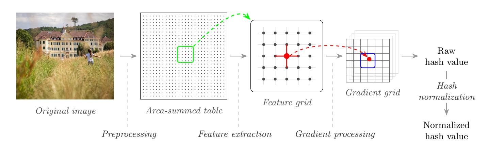

Fig. 1: High-level overview of the Alleged PhotoDNA algorithm.

#### 3.1 Preprocessing

The preprocessing step begins with a dimension check. When the the width w and the length ℓ of I are smaller than 50 × 50, a zero hash value, i.e., 144 zero bytes, is returned.

If the width w and length ℓ of I are sufficiently large, a coordinate (x, y) is assigned to each pixel p of I, with 0 ≤ x ≤ w − 1 and 0 ≤ y ≤ ℓ − 1. Every pixel p(x, y) can be represented in a 24-bit RGB format, corresponding to a one-byte value (0-255) for each of the three color channels. The pixel value P(x, y) is computed by summing the values of the three color channels of p(x, y); thus, P(x, y) lies in the integer range J0, 765K. The pixel values P(x, y) are then used to create a summed-area table or integral image I, with values I(x, y) equal to

$$J(x,y) = \sum_{x'=0}^{x} \sum_{y'=0}^{y} P(x',y').$$
 (4)

#### 3.2 Feature Extraction

The second step of A-PhotoDNA is the feature extraction. This step consists of transforming the integral image I into a feature grid F, with the value corresponding to Fu,v denoted by F(u, v).

Intuitively, the value of each grid point F(u, v) captures local texture and brightness information from the original image. This is achieved by calculating a weighted average R of the mean pixel intensities across three concentric rectangular regions centered at each of the grid points. For smaller images, these sampling areas may overlap, meaning some image regions can contribute to multiple

{8}------------------------------------------------

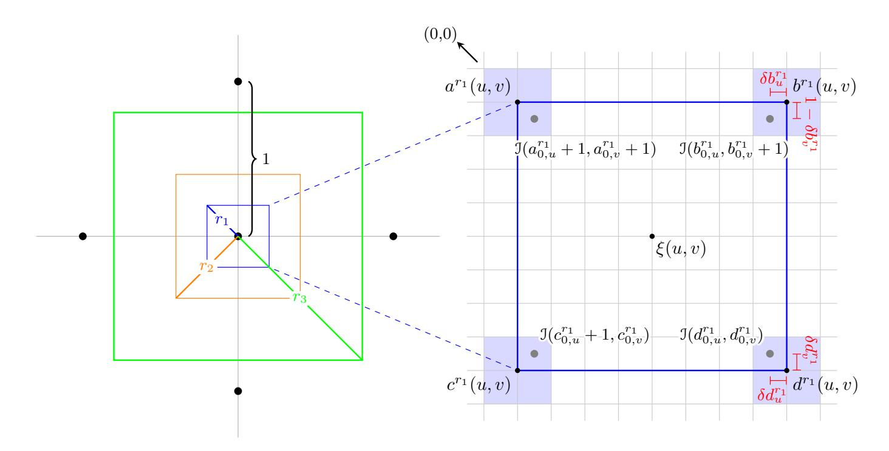

Fig. 2: Graphical representation of the feature extraction process. The right panel represents a zoomed-in view of the radius  $r_1$  rectangle on the integral image grid. The center of each cell represents an integer coordinate. Detailed annotations for the bilinear interpolation step are selectively shown.

feature points. A graphical representation of this process is provided in Fig. 2. We now proceed through the computation of every variable allowing to obtain the feature grid F.

**Grid Points.** First, a horizontal grid step size  $\Delta_w$ , and a vertical grid step size  $\Delta_\ell$  are computed based on the image content dimension w and  $\ell$ .

The real-valued grid point coordinates  $(g_u, g_v)$  are then defined as

$$\begin{cases}
g_u = (u + \zeta) \, \Delta_w, \\
g_v = (v + \zeta) \, \Delta_\ell,
\end{cases}$$
(5)

with  $\zeta$  a fixed constant.

**Rectangle Regions.** For each grid point  $(g_u, g_v)$ , three regions defined by radii  $r_i$ ,  $i \in \{1, 2, 3\}$ , are sampled. Each region is associated to a weight  $w_{r_i}$ . For a given radius  $r_i$ , a rectangular sampling area is defined by its four corners  $a^{r_i}, b^{r_i}, c^{r_i}$ , and  $d^{r_i}$ . Their coordinates, where subscripts u and v denote the horizontal and vertical components respectively, are given by

$$a_{u}^{r_{i}} = c_{u}^{r_{i}} = g_{u} - r_{i}\Delta_{w} - 1,$$

$$b_{u}^{r_{i}} = d_{u}^{r_{i}} = g_{u} + r_{i}\Delta_{w},$$

$$a_{v}^{r_{i}} = b_{v}^{r_{i}} = g_{v} - r_{i}\Delta_{\ell} - 1,$$

$$c_{v}^{r_{i}} = d_{v}^{r_{i}} = g_{v} + r_{i}\Delta_{\ell}.$$

$$(6)$$

{9}------------------------------------------------

Since these corner coordinates are real-valued, the corresponding positions in the integral image I cannot be accessed directly. Therefore, we first decompose each coordinate into its integer and fractional parts and subsequently apply bilinear interpolation.

**Definition 6.** Let trunc denote the operator that removes the fractional part of a number. The integer coordinate corresponding to the corner  $z \in \{a, b, c, d\}$  of the rectangle of radius  $r_i$ ,  $i \in \{1, 2, 3\}$ , is then given by

$$\begin{cases}
z_{c,u}^{r_i} = \operatorname{trunc}(z_u^{r_i}), \\
z_{c,v}^{r_i} = \operatorname{trunc}(z_v^{r_i}),
\end{cases}$$
(7)

together with their fractional parts  $\delta z_u^{r_i}$  and  $\delta z_v^{r_i}$  such that

$$\delta z_u^{r_i} = z_u^{r_i} - z_{c,u}^{r_i} \quad and \quad \delta z_v^{r_i} = z_v^{r_i} - z_{c,v}^{r_i}.$$
 (8)

**Bilinear Interpolation.** The corresponding value  $Z \in \{A, B, C, D\}$  of each corner  $z \in \{a, b, c, d\}$  is estimated by interpolating between the four nearest neighbors in the integral image  $\mathcal{I}$ :

$$Z^{r_{i}}(u,v) = \Im(z_{c,u}^{r_{i}}, z_{c,v}^{r_{i}}) \cdot (1 - \delta z_{u}^{r_{i}}) \cdot (1 - \delta z_{v}^{r_{i}}) + \Im(z_{c,u}^{r_{i}} + 1, z_{c,v}^{r_{i}}) \cdot \delta z_{u}^{r_{i}} \cdot (1 - \delta z_{v}^{r_{i}}) + \Im(z_{c,u}^{r_{i}}, z_{c,v}^{r_{i}} + 1) \cdot (1 - \delta z_{u}^{r_{i}}) \cdot \delta z_{v}^{r_{i}} + \Im(z_{c,u}^{r_{i}} + 1, z_{c,v}^{r_{i}} + 1) \cdot \delta z_{u}^{r_{i}} \cdot \delta z_{v}^{r_{i}}.$$

$$(9)$$

Precautions are taken to ensure that all coordinates remain within the bounds of the integral image J. Specifically, each coordinate is clipped to the valid range; negative values are set to zero, and values beyond the image extent are replaced by the nearest in-bounds coordinate.

Using the interpolation values  $Z \in \{A, B, C, D\}$ , a box sum  $R^{r_i}(u, v)$  is calculated for each radius  $r_i$ ,  $i \in \{1, 2, 3\}$ , and coordinates (u, v):

$$R^{r_i}(u,v) = D^{r_i}(u,v) - C^{r_i}(u,v) - B^{r_i}(u,v) + A^{r_i}(u,v).$$
(10)

**Feature Grid.** The feature grid values F(u, v) are finally computed as the weighted sum of every box sum  $R^{r_i}(u, v)$ , for each  $r_i$ ,  $i \in \{1, 2, 3\}$ :

$$F(u,v) = w_{r_1} \cdot R^{r_1}(u,v) + w_{r_2} \cdot R^{r_2}(u,v) + w_{r_3} \cdot R^{r_3}(u,v).$$
 (11)

The specific weights  $w_{r_i}$ ,  $i \in \{1,2,3\}$ , are chosen to configure the three rectangular regions as a discrete approximation of a Gaussian smoothing kernel (Gaussian blur).

{10}------------------------------------------------

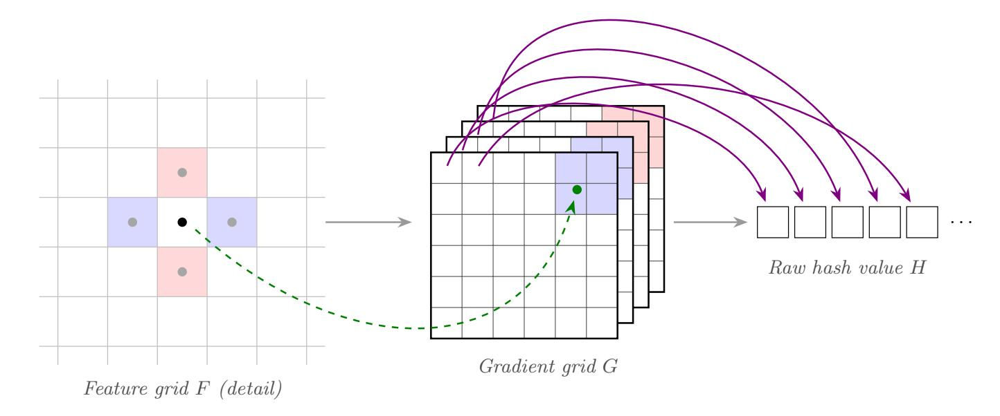

Fig. 3: Gradient processing and subsequent raw hash vector flattening.

### 3.3 Gradient Processing

The second to last step of the computation of A-PhotoDNA is gradient processing, resulting in the 144-byte raw hash value H. Firstly, a Sobel-like operator [\[43\]](#page-37-13) is applied to the feature grid F. This phase transforms the feature grid F into a three-dimensional structure, denoted by G. The structure G is composed of four channels {G0 , G1 , G2 , G3}. Each channel accumulates gradients in a specific direction; positive horizontal, negative horizontal, positive vertical, and negative vertical. Afterwards, G is flattened into a 144-byte array H. Figure [3](#page-10-0) shows a graphical overview of this procedure.

Calculating Gradients. Starting from the feature grid F, gradient values are not computed along the outermost rows and columns, as computing gradient requires access to the values above, below, to the left, and to the right of the central location. As features grid points on the boundary lack one or more of these neighbors, the computation of gradient is impossible for these points. Consequently, gradients are only computed for the interior region.

For each point Fu∗,v∗ , with u ∗ , v∗ in the interior region, the horizontal and vertical gradients, denoted ∇u and ∇v respectively, are calculated as

$$\begin{cases} \nabla_u(u^*, v^*) = F_{u^*-1, v^*} - F_{u^*+1, v^*}, \\ \nabla_v(u^*, v^*) = F_{u^*, v^*-1} - F_{u^*, v^*+1}. \end{cases}$$
(12)

Gradients are then separated into their positive and negative components:

$$\nabla_u^+(u^*, v^*) = \max(0, \nabla_u(u^*, v^*)), \quad \nabla_u^-(u^*, v^*) = \max(0, -\nabla_u(u^*, v^*)), 
\nabla_v^+(u^*, v^*) = \max(0, \nabla_v(u^*, v^*)), \quad \nabla_v^-(u^*, v^*) = \max(0, -\nabla_v(u^*, v^*)).$$
(13)

{11}------------------------------------------------

**Distribution in Gradient Grid.** At this stage, four values have been derived from a single point in the feature grid and must be distributed onto the final grid (each gradient in a different channel). The coordinates  $(u^*, v^*)$  of the feature grid F are mapped to real-valued coordinates (s, t) in the gradient grid F by

$$\begin{cases}
s(u^*) = (u^* - \chi) \cdot \psi, \\
t(v^*) = (v^* - \chi) \cdot \psi.
\end{cases}$$
(14)

The constants  $\chi$  and  $\psi$  serve to center and scale the feature grid onto the gradient grid.

Because the resulting coordinates are real-valued, the gradient's contribution is not assigned to a single coordinate in G, but is instead distributed across multiple integer coordinates in its corresponding channel.

**Flattening.** At last, the gradient grid G is flattened into a 144-element raw hash vector H. This serialization is performed by iterating through each channel, then through the horizontal index s, and finally through the vertical index t.

#### 3.4 Hash Normalization

The final step converts the raw hash vector H into the final 144-byte normalized hash value h. The procedure is broken down into three distinct stages; initial scaling, iterative normalization loop, and a final quantization step.

First, an initial scaling factor S is calculated to account for the original image dimensions. Each of the 144 components of the vector H is then divided by the scaling factor S. This step ensures that the overall magnitude of H is decoupled from the resolution of the original image. Next, an iterative procedure is applied to the scaled hash vector  $\overline{H}$  to constrain its overall magnitude and the value of each component. This process is repeated for a maximum number of iterations with two operations per iteration.

1. **L2 normalization:** Every 144-element is normalized to have unit length. Given the vector H at the start of an iteration (starting with  $\overline{H}$  in the first iteration),  $H_i$  the value of the i-th element of H, with  $i \in \{0, 1, \ldots, 143\}$ , and given  $||H||_2$  the  $L_2$ -norm of H, the value of each component  $H'_i$  of the updated hash vector H' is equal to

$$H_i' = \frac{H_i}{\|H\|_2} \,. \tag{15}$$

2. Component clipping: Each  $H'_i$  of the resulting vector is then clipped at a predefined ceiling  $\kappa$ . The value  $H_i$  used at the next iteration equals

$$H_i = \min(H_i', \kappa) \,. \tag{16}$$

The loop consisting of the repetition of the steps above terminates if a full iteration completes without any component being clipped (i.e., each  $H_i$  is such that  $H_i \leq \kappa$ ) or after the maximum number of iterations is completed.

{12}------------------------------------------------

Finally, the resulting hash vector H∗ is quantized to produce the final 144 byte hash value h. First, each component H∗ i is scaled to map the clipping threshold κ to the upper end of the byte range:

$$h_i = \frac{H_i^* \cdot 256}{\kappa} \,. \tag{17}$$

Each hi is then clamped to the valid byte range J0, 255K, and converted to 8-bit integers, resulting in the final A-PhotoDNA hash value.

### 3.5 Correctness of Alleged PhotoDNA

To verify the correspondence between A-PhotoDNA and the available implementation of PhotoDNA [\[27\]](#page-36-6), we compared the hash values for the 50,000 images of the ILSVRC 2012 validation set [\[41\]](#page-37-14) obtained with both functions. The hash values produced by A-PhotoDNA and PhotoDNA are identical for every image, without exception. We therefore consider A-PhotoDNA to be a reliable white-box model for conducting attacks against PhotoDNA, believing that it constitutes a faithful re-implementation of PhotoDNA.

# 4 Robustness Properties and Weaknesses

This section analyzes the strengths and weaknesses of the A-PhotoDNA design. Assuming that PhotoDNA operates in a similar manner, these robustness properties and limitations are expected to apply equally to Microsoft's PhotoDNA. In particular, the differentiability and piecewise-linearity characteristics discussed in this section form the foundation of the attacks presented in Sect. [5.](#page-14-0)

Robustness Properties. A major strength of A-PhotoDNA is its reliance on the integral image representation I. All computations are performed on I, consequently, any local modification to the input image I is propagated throughout the integral image I. Therefore, individual pixel changes have a distributed influence on the final hash value, contributing to robustness against minor local perturbations. Moreover, the use of the integral image I, renders the computation of optimal adversarial perturbations computationally infeasible.

Indeed, the integral image is constructed via cumulative sums of pixel values, see Eqn. [\(4\)](#page-7-1). Modeling the dependencies between the individual pixel values of the original image and the resulting integral image values that are sampled during feature extraction (see Sect. [3.2\)](#page-7-2), requires a dense set of optimization constraints. Moreover, the pixel values, and thus integral image values, are integers. Therefore, finding an exact solution to such optimization problem requires substantial memory resources, making it impractical for images of realistic sizes.

A-PhotoDNA further incorporates several design choices that enhance robustness to common image transformations. In particular, scaling the raw hash vector H by the initial scaling factor S, which relies on the step sizes ∆w and ∆ℓ, 

{13}------------------------------------------------

reduces sensitivity to the original image resolution. The use of a splatting technique during gradient processing, whereby gradients are smoothly redistributed onto a lower-resolution grid G, improves robustness to small spatial shifts of image features. Finally, the reliance on gradient-based features, combined with an iterative normalization procedure that repeatedly rescales the raw hash vector H to unit norm and clips large values, confers robustness to global variations in brightness and contrast.

Weaknesses. Despite the aforementioned strengths, A-PhotoDNA design entails notable weaknesses. First, the apparent absence of a cropping procedure implies that the hash value is always computed over the entire image, including borders or frames. As a result, simple operations such as adding a border can induce substantial changes in the hash value. Similar limitations regarding robustness to cropping have previously been observed for PhotoDNA in black-box settings [\[44\]](#page-37-9).

Secondly, the feature extraction step (see Sect. [3.2\)](#page-7-2) relies on a fixed grid F (see Eqn. [\(11\)](#page-9-0)), independent of the image resolution or content. This leads, for high-resolution images, to sparse spatial sampling, with large regions contributing only indirectly through the integral image representation, potentially missing perceptually relevant details. As an example, in a 1,000 × 1,000 image, only approximately 3% of integral image values are sampled. A graph of the percentage of integral image values used in the computation of a A-PhotoDNA hash value as a function of the total number of pixels in the image is provided in Fig. [12](#page-33-0) in App. [B.](#page-3-0)

Crucially, A-PhotoDNA does not employ any content-aware feature detection, which increases susceptibility to adversarial manipulations targeting specific grid locations.

Finally, the high dimensionality of resulting hash values necessitates the use of a distance matching threshold τ , such as an dL2 distance (see Def. [3\)](#page-4-2). Overly strict thresholds increase the probability of false negatives, while looser thresholds raise the risk of false positives. This reliance on a manually chosen threshold introduces an inherent degree of subjectivity into the matching process.

Differentiability and Piecewise-Linearity. Many optimization-based attacks rely on differentiability or linearity properties of the target function. A-PhotoDNA is composed entirely of differentiable operations, with the exception of the final truncation step used to produce the 144-byte integer hash value. This structural property enables the use of gradient-based optimization techniques to perform collision, preimage, and second preimage attacks (see Sects. [5.2,](#page-16-0) [5.3,](#page-17-0) and [5.4,](#page-18-0) respectively).

Despite this, the hash normalization step is not linear, as a result, a direct linear mapping from pixel values to final hash bytes does not exist. Nevertheless, up to the normalization stage, the A-PhotoDNA pipeline exhibits piecewise linear behavior. All operations are linear except for the separation of horizontal and vertical gradients into positive and negative components over the feature grid. By 

{14}------------------------------------------------

observing the signs of the gradients for a given image, the corresponding linear region of the hash function can be identified. This piecewise-linear structure is exploited in the detection avoidance attack described in Sect. 5.5.

First-Order Approximation of Alleged PhotoDNA. When performing a forward pass through the A-PhotoDNA function, a mapping from each pixel value to its influence to each raw hash vector component is obtained. This can be represented by a Jacobian matrix J, where each row  $J_j$  corresponds to the gradient of the j-th raw hash vector component with respect to all pixel values. For a given perturbation, the resulting change in the raw hash vector  $\mathbf{h}_{\text{raw}}$  induced by a pixel perturbation vector  $\mathbf{x}$  can be approximated using a first-order Taylor expansion:

$$\Delta \mathbf{h}_{\text{raw}} \approx J \mathbf{x} \,.$$
 (18)

This first-order approximation is used in the detection avoidance attack presented in Sect. 5.5.

# 5 Attacking Alleged PhotoDNA and PhotoDNA

Insights into A-PhotoDNA are used to design effective white-box attacks on PhotoDNA. Both will be referred to as the hash function  $\mathcal{H}$ , as the attacks on A-PhotoDNA transfer seamlessly to PhotoDNA (see Sect. 3.5). In the following, we introduce the mathematical frameworks used and then describe the attacks performed using these frameworks.

#### 5.1 Mathematical Frameworks

Two distinct mathematical frameworks are used to generate adversarial images: gradient-based optimization and quadratic programming (QP). The former exploits the differentiability of the operations within the hash value computation, while the latter exploits the piecewise-linear nature of the function.

**Gradient-Based Optimization.** Differentiable objective functions allow for the use of gradient descent [6], a first-order iterative algorithm that minimizes a function by updating variables in the direction of the steepest descent. Since A-PhotoDNA is almost entirely differentiable (see App. 4), we can leverage this property to perform a guided search. The non-differentiable truncation operator is handled using a straight-through estimator (STE) [5].

Formally, let the input image  $I \in \mathbb{N}^{L \times W \times C}$ , with  $L \in \mathbb{N}$  the length,  $W \in \mathbb{N}$  the width, and  $C \in \mathbb{N}$  the number of color channels of the image, be represented as a flattened vector  $\mathbf{x} \in \mathbb{R}^d$ , where  $d = L \cdot W \cdot C$ . The vector  $\mathbf{x}$  is obtained by flattening the image I by concatenating the numerical values of every color channel for each pixel, traversing the image row by row. Let  $\mathcal{L} \colon \mathbb{R}^d \to \mathbb{R}$  denote a loss function to minimized, and let  $\eta \in \mathbb{R}^+$  denote the learning rate (representing the step size taken along the negative gradient direction). Furthermore, let  $\mathbf{x}_k$ 

{15}------------------------------------------------

represent the optimization variable at iteration k, and let  $\nabla \mathcal{L}(\mathbf{x}_k)$  denote the gradient of  $\mathcal{L}$  at  $\mathbf{x}_k$ . The update rule for gradient descent is then given by

$$\mathbf{x}_{k+1} = \mathbf{x}_k - \eta \, \nabla \mathcal{L}(\mathbf{x}_k) \,. \tag{19}$$

Three loss functions are used in this work to guide the optimization.

**Definition 7.** Given two vectors  $\mathbf{y}, \mathbf{y}' \in \mathbb{R}^n$ , the mean absolute error (MAE), is defined as

$$\mathcal{L}_{MAE}(\mathbf{y}, \mathbf{y}') = \frac{1}{n} \sum_{i=1}^{n} |y_i - y_i'|.$$
(20)

**Definition 8.** Given two vectors  $\mathbf{y}, \mathbf{y}' \in \mathbb{R}^n$ , the mean squared error (MSE), is defined as

$$\mathcal{L}_{MSE}(\mathbf{y}, \mathbf{y}') = \frac{1}{n} \sum_{i=1}^{n} (y_i - y_i')^2.$$
 (21)

**Definition 9 (Girshick [20]).** Given two vectors  $\mathbf{y}, \mathbf{y}' \in \mathbb{R}^n$  and an individual component difference  $z_i = y_i - y_i'$ , the smooth  $L_1$  loss is defined as

$$\mathcal{L}_{smooth}(\mathbf{y}, \mathbf{y}') = \sum_{i=1}^{n} smooth_{L_1}(z_i), \qquad (22)$$

where

$$smooth_{L_1}(z) = \begin{cases} \frac{1}{2}z^2, & |z| < 1, \\ |z| - \frac{1}{2}, & otherwise. \end{cases}$$
 (23)

Finally, to ensure the optimized variables remain within the valid image domain (e.g., [0,1]), we define the element-wise clamping function.

**Definition 10.** Given a vector  $\mathbf{v} \in \mathbb{R}^d$  and bounds  $a, b \in \mathbb{R}$ , the element-wise clamping function  $\operatorname{clamp}(\mathbf{v}, a, b)$  is defined for each component  $v_i$  as

$$clamp(v_i, a, b) = \min(\max(v_i, a), b). \tag{24}$$

To facilitate convergence in this gradient-based approach, we use a scheduler to adapt the hyperparameters (including the learning rate  $\eta$ ) during the optimization. Let  $\xi \in \mathbb{N}$  denote the patience and  $\gamma \in (0,1)$  denote the decay factor. If the loss  $\mathcal{L}$  does not improve for  $\xi$  consecutive iterations, the hyperparameter  $\rho$  is updated as  $\rho \mapsto \gamma \rho$ .

Quadratic Programming. In a quadratic program (QP), the objective function is quadratic and the constraints are linear. Formally, let  $\mathbf{x} \in \mathbb{R}^d$  denote the vector of optimization variables. Let  $Q \in \mathbb{R}^{d \times d}$  be a symmetric matrix and  $\mathbf{c} \in \mathbb{R}^d$  be a vector which together define the quadratic objective function. Furthermore, let  $A \in \mathbb{R}^{m \times d}$ ,  $E \in \mathbb{R}^{p \times d}$ ,  $\mathbf{b} \in \mathbb{R}^m$ , and  $\mathbf{f} \in \mathbb{R}^p$  be matrices and vectors

{16}------------------------------------------------

defining the sets of m linear inequality and p equality constraints, respectively. With  $\leq$  denoting component-wise inequality, the standard QP is written as

minimize 
$$\frac{1}{2}\mathbf{x}^{\mathrm{T}}Q\mathbf{x} + \mathbf{c}^{\mathrm{T}}\mathbf{x}$$
  
subject to  $A\mathbf{x} \leq \mathbf{b}$ , (25)  
 $E\mathbf{x} = \mathbf{f}$ .

While gradient-based optimization directly operates on 8-bit RGB images, the QP approach yields an optimal floating-point change vector  $\mathbf{x}$ . When added to the original image, the resulting pixel values lie in the summed domain range [0,765]. These values must be converted to integers via rounding and subsequently distributed into three integer RGB channels (r,g,b) such that  $r,g,b \in [0,255]$ . To resolve this ambiguity in a visually appealing way, we use a reference image (e.g., the target image) as a color guide. An "ideal" floating-point color is calculated for each pixel by distributing the required sum according to the hue and saturation of the reference pixel. This ideal color is clipped and rounded, and a final correction is applied to ensure the sum of the integer channels exactly matches the (rounded) value required by the optimization solution.

### 5.2 Collision Attack

Given a threshold  $\tau \in \mathbb{R}^+$ , a collision attack succeeds if an attacker can find two perceptually different images  $I, I' \in \mathbb{I}$  such that  $d(\mathcal{H}(I), \mathcal{H}(I')) \leq \tau$ . In the case of an exact collision attack, I and I must satisfy  $d(\mathcal{H}(I), \mathcal{H}(I')) = 0$ .

Let  $\mathbf{x}, \mathbf{x}' \in [0, 1]^d$  denote the flattened vector representations of two initial images I and I', scaled to the range [0, 1]. Furthermore, two perturbation vectors  $\boldsymbol{\delta}, \boldsymbol{\delta}' \in \mathbb{R}^d$  are initialized to zero and updated each iteration k according to the gradient descent rule described in Eqn. (19). At iteration k, the modified image vectors, denoted as  $\mathbf{x}_{m,k}$  and  $\mathbf{x}'_{m,k}$ , are obtained by applying the current perturbations and constraining the result to the valid scaled image domain. Using the clamping function defined in Def. 10,  $\mathbf{x}_{m,k}$  and  $\mathbf{x}'_{m,k}$  are computed as

$$\begin{cases} \mathbf{x}_{m,k} = \operatorname{clamp}(\mathbf{x} + \boldsymbol{\delta}_k, 0, 1), \\ \mathbf{x}'_{m,k} = \operatorname{clamp}(\mathbf{x}' + \boldsymbol{\delta}'_k, 0, 1). \end{cases}$$
(26)

The hash values of the modified images, denoted  $h_{m,k}$  and  $h'_{m,k}$ , are obtained by multiplying the (down)scaled vectors  $\mathbf{x}_{m,k}$  and  $\mathbf{x}'_{m,k}$  by 255, rounding the results element-wise to the nearest integer, and applying the hash function  $\mathcal{H}$ . The optimization problem is formulated as minimizing the composite loss function  $\mathcal{L}$ given in Eqn. (27) that balances hash convergence, visual fidelity, and sparsity of changes through tradeoff parameters  $\lambda, \mu \in \mathbb{R}^+$ :

$$\mathcal{L} = \mathcal{L}_{\text{hash}} + \lambda \mathcal{L}_{\text{visual}} + \mu \mathcal{L}_{\text{pixel}}. \tag{27}$$

The components are instantiated as follows:

&lt;sup>3 A mixed-integer quadratic program is infeasible to solve with realistic image dimensions.

{17}------------------------------------------------

- 1. Hash Loss ( $\mathcal{L}_{hash}$ ): To drive the hashes towards a collision, the loss between the hash values  $h_{m,k}$  and  $h'_{m,k}$  (seen as vectors) is minimized.
- 2. Visual Loss ( $\mathcal{L}_{visual}$ ): To ensure the modified images  $\mathbf{x}_{m,k}$  and  $\mathbf{x}'_{m,k}$  remain visually close to the originals  $\mathbf{x}$  and  $\mathbf{x}'$ , the sum of the losses between them in the scaled domain is minimized.
- 3. **Pixel Loss** ( $\mathcal{L}_{pixel}$ ): To encourage sparsity and prevent high-frequency noise, the sum of the losses applied to the magnitude of the perturbation vectors  $\boldsymbol{\delta}_k$  and  $\boldsymbol{\delta}'_k$  is minimized.

The hyperparameters  $\lambda, \mu \in \mathbb{R}^+$  control the trade-off between visual imperceptibility and hash value collision. We use a dynamic scheduling strategy for these parameters. Initially,  $\lambda$  and  $\mu$  are set to large values to prioritize visual quality. During optimization, if  $\mathcal{L}_{\text{hash}}$  fails to improve for a predefined number of steps (patience), both  $\lambda$  and  $\mu$  are multiplied by a decay factor  $\gamma \in (0,1)$ . This relaxation allows the optimizer to sacrifice a (minimum) degree of visual fidelity to overcome local minima in the space of hash values. The optimization terminates when a collision is achieved, that is,  $d(h_{m,k}, h'_{m,k}) \leq \tau$ , or after a predetermined number K of iterations.

### 5.3 Preimage Attack

Given a threshold  $\tau \in \mathbb{R}^+$ , a preimage attack succeeds if, given any hash value  $h \in \mathbb{H}$ , an attacker can find an image  $I \in \mathbb{I}$  such that  $d(h, \mathcal{H}(I)) \leq \tau$ . In the case of an exact preimage attack, I must satisfy  $d(h, \mathcal{H}(I)) = 0$ .

Let  $h_t$  denote the target hash value. We define an optimization variable  $\mathbf{x} \in \mathbb{R}^d$  (see Sect. 5.1), representing the flattened vector representation of the generated image. The vector  $\mathbf{x}$  is initialized to random noise image (or a specific starting image) and updated at each iteration k according to the gradient descent rule described in Eqn. (19). At iteration k, the candidate image vector, denoted as  $\mathbf{x}_{m,k}$ , is obtained by constraining the optimization variable  $\mathbf{x}_k$  to the scaled image domain  $[0,1]^d$ . Using the clamping function defined in Def. 10, the candidate image vector is equal to

$$\mathbf{x}_{m,k} = \operatorname{clamp}(\mathbf{x}_k, 0, 1). \tag{28}$$

The hash value of the candidate image vector, denoted  $h_{m,k}$ , is obtained by multiplying the (down)scaled vector  $\mathbf{x}_{m,k}$  by 255, rounding the result elementwise to the nearest integer, and applying the hash function  $\mathcal{H}$ . The optimization problem is formulated as minimizing the loss function  $\mathcal{L}(h_t, h_{m,k})$  that quantifies the deviation from the target hash value  $h_t$ :

To avoid converging to a local minimum, a restart strategy is employed. If the optimization terminates without reaching the target threshold  $\tau$ , the process is re-initiated with a new random initialization for  $\mathbf{x}$ . Additionally, the learning rate  $\eta$  is adaptively reduced if the loss plateaus, allowing for fine-grained convergence towards the target. The optimization terminates when a valid preimage is obtained, i.e.,  $d(h_t, h_{m,k}) \leq \tau$ , or after a predetermined number K of iterations.

{18}------------------------------------------------

#### 5.4 Second Preimage Attack

Given a threshold  $\tau \in \mathbb{R}^+$ , a second preimage attack succeeds if, given an image  $I \in \mathbb{I}$  and its hash value  $\mathcal{H}(I)$ , an attacker can find another image  $I' \in \mathbb{I}$ , perceptually different from I, such that  $d(\mathcal{H}(I), \mathcal{H}(I')) \leq \tau$ . In the case of an exact second preimage attack, the attack succeeds if  $d(\mathcal{H}(I), \mathcal{H}(I')) = 0$ .

We adapt the optimization framework from Sect. 5.2 to a single-image setting. Let  $h = \mathcal{H}(I)$  denote the fixed hash value of the source image I. Let  $\mathbf{x} \in [0,1]^d$  denote the flattened, scaled vector representation of a chosen target image  $I_{\text{target}}$  (where  $I_{\text{target}}$  is perceptually different from I). We introduce a single perturbation vector  $\boldsymbol{\delta} \in \mathbb{R}^d$ , initialized to zero and updated via the gradient descent rule described in Eqn. (19).

At any iteration k, the modified image  $\mathbf{x}_{m,k}$  is obtained using Eqn. (26). The optimization problem minimizes the same composite loss structure  $\mathcal{L} = \mathcal{L}_{\text{hash}} + \lambda \mathcal{L}_{\text{visual}} + \mu \mathcal{L}_{\text{pixel}}$  as Eqn. (27). The individual components are instantiated as follows.

- 1. Hash Loss ( $\mathcal{L}_{hash}$ ): The loss is minimized between the hash value of the modified image  $h_{m,k}$  and the fixed source hash value h (both seen as vectors).
- 2. Visual Loss ( $\mathcal{L}_{visual}$ ): The loss is minimized between the modified image  $\mathbf{x}_{m,k}$  and the original target  $\mathbf{x}$ .
- 3. Pixel Loss ( $\mathcal{L}_{pixel}$ ): The loss is applied to the magnitude of the perturbation vector  $\boldsymbol{\delta}_k$ .

The dynamic scheduling strategy for the tradeoff parameters  $\lambda, \mu \in \mathbb{R}^+$ , as well as the termination conditions (reaching the threshold  $\tau$  or a maximum iteration count), are identical to those described in Sect. 5.2.

#### 5.5 Detection Avoidance

Given a threshold  $\tau \in \mathbb{R}^+$ , a detection avoidance attack succeeds if, given an image  $I \in \mathbb{I}$ , an attacker can construct a modified image  $I' \in \mathbb{I}$  that remains perceptually similar to I while satisfying  $d(\mathcal{H}(I), \mathcal{H}(I')) > \tau$ .

We employ the quadratic programming (QP) framework introduced in Sect. 5.1, together with the first-order approximation in (18). In particular, the problem is formulated as an iterative sequence of local QP solves to exploit the piecewise-linear nature of the hash function.

Let  $\mathbf{x}_0 \in \mathbb{R}^d$  denote the flattened vector representation of the source media I. We define  $\mathbf{x}_k \in \mathbb{R}^d$  as the vector representation of the modified media  $I_{m,k}$  at iteration k, initialized with  $\mathbf{x}_0$ . At each iteration, we seek an optimal incremental perturbation  $\boldsymbol{\delta}_k \in \mathbb{R}^d$  that moves the raw hash vector  $\mathbf{h}_{\text{raw},k}$  in a specific direction  $\mathbf{v}_k$  while maintaining visual fidelity. The change in the raw hash vector is estimated as  $J_k \boldsymbol{\delta}_k$ .

The optimization problem at step k is formulated to minimize the following combined objective w.r.t.  $\delta_k$ , where the hyperparameter  $\lambda \in \mathbb{R}^+$  controls

{19}------------------------------------------------

the trade-off between visual distortion (first term) and directional hash vector movement (second term):

$$\min_{\boldsymbol{\delta}_k} \quad \boldsymbol{\delta}_k^{\mathrm{T}} \boldsymbol{\delta}_k - \lambda \mathbf{v}_k^{\mathrm{T}} J_k \boldsymbol{\delta}_k.$$
 (29)

This formulation corresponds to the standard QP form given in Eqn. (25), defined by the diagonal matrix  $Q = 2\mathbb{I}$  (where  $\mathbb{I}$  is the identity matrix) and the linear vector  $\mathbf{c} = -\lambda J_k^{\mathrm{T}} \mathbf{v}_k$ .

To ensure the linear approximation holds and the modified image remains within the valid domain, we impose inequality constraints. For a step size bound  $\delta_{\text{step}} \in \mathbb{R}^+$ , the constraints ensure:

$$-\delta_{\text{step}} \leq \delta_k \leq \delta_{\text{step}}$$
. (30)

The update rule for the image vector is  $\mathbf{x}_{k+1} = \mathbf{x}_k + \boldsymbol{\delta}_k$ , which corresponds to updating the image from  $I_{m,k}$  to  $I_{m,k+1}$ . The process repeats (re-linearizing the hash function at each step), until the distance condition  $d(\mathcal{H}(I), \mathcal{H}(I_{m,k})) > \tau$  is met. The success of this approach depends crucially on the choice of the target direction  $\mathbf{v}_k$ , for which we propose two strategies.

Orthogonal Direction. This strategy selects  $\mathbf{v}_k$  to be orthogonal to the current raw hash vector  $\mathbf{h}_{\text{raw},k}$ . By driving the perturbation along an orthogonal path, the subsequent normalization step in A-PhotoDNA forces the final hash vector to drift substantially from its original position. The vector  $\mathbf{v}_k$  is constructed by projecting a basis vector onto the null space of  $\mathbf{h}_{\text{raw},k}$  (via a Gram-Schmidt process) and normalizing it. To ensure numerical stability, the basis vector chosen is the standard unit vector corresponding to the component of  $\mathbf{h}_{\text{raw},k}$  with the smallest absolute magnitude (i.e., the least aligned dimension).

**Origin Direction.** This strategy selects  $\mathbf{v}_k = -\mathbf{h}_{\text{raw},k}$ , directing the raw hash vector toward the origin of the (hash) vector space. As the magnitude of the raw hash vector decreases, the signal-to-noise ratio drops, and the individual components of the hash vector become increasingly sensitive to small perturbations during the quantization and normalization phases. While this approach typically results in smaller overall pixel changes, the modifications are diffuse and not confined to specific image regions.

### 6 Attack Implementation and Evaluation

In this section, we present the implemented attacks together with their results, as well as an evaluation of their performance and efficiency. Two straightforward attacks that require neither computation nor knowledge of the internal design of A-PhotoDNA are also described in Sect. 6.6.

All experiments were conducted using the PhotoDNA implementation available on GitHub [27], as well as our own implementation of A-PhotoDNA. We first

{20}------------------------------------------------

describe the experimental setup and then present the results of the attacks performed. Each attack is presented following the same structure. We first describe the attack and its success conditions, then specify the parameters used, followed by the presentation of the obtained results, and, when relevant, conclude with a discussion of these results.

### 6.1 Experimental Setup

For our experiments, we use the validation set of the 2012 ImageNet Large Scale Visual Recognition Challenge (ILSVRC 2012) [\[41\]](#page-37-14). This dataset has been chosen because the images are highly diverse, both in term of size and visual complexity. In addition, ILSVRC has been used in recent attacks on PhotoDNA [\[40,](#page-37-8) [54\]](#page-38-0).

For each attack, we randomly select a subset of 1,000 images, no larger than 600 × 600 pixels, which is used as the image pool. This choice is motivated by the necessity of precise hyperparameter tuning for high-dimensional outlier and the associated computational cost. For the preimage attack, 1,000 hash values are randomly selected from the hash values calculated over the entire validation set as the images are generated directly from the hash values, thus avoiding the issue of high-dimensional images.

As the proposed attacks are intended as proof-of-concept, the parameters used in all attacks are selected manually based on limited empirical experimentation. We therefore believe that more optimal parameter choices may exist and could be explored in future work.

All experiments are performed using Python 3.12, PyTorch 2.8 [\[1\]](#page-34-7), and the Python API of Gurobi version 12 [\[22\]](#page-35-13). The attacks are conducted using a single CPU core of an AMD EPYC 7552 processor (2.2 GHz), without a dedicated graphics card, and with 16 GB of RAM.

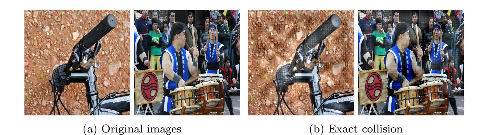

Fig. 4: Exact collision attack. The two distinct original images on the left are modified to produce the two images on the right, which share exactly the same hash value after modification, despite remaining perceptually different.

{21}------------------------------------------------

### 6.2 Exact Collision Attack

We execute the exact collision attack as presented in Sect. [5.2](#page-16-0) using 1,000 image pairs selected as described in Sect. [6.1.](#page-20-0) We consider an attack successful when both images in a pair are modified such that their hash values coincide.

Parameters. The maximum number of iterations is set to K = 100,000. In practice, this limit is never reached in any of our experiments. The initial learning rate η is set to 0.1. A learning rate scheduler is used to adapt η, reducing it by a factor of 0.25 whenever the total loss L stagnated for 250 consecutive steps. The initial trade-off parameters for the visual and pixel penalties are set to λ = 106 and µ = 2.5 × 107 , respectively. These parameters are dynamically reduced by a factor of 0.5 whenever the hash loss Lhash failed to improve for 500 consecutive steps, at which point the learning rate is also reset to η = 0.1.

Results. The attack produces exact collisions for all evaluated image pairs, yielding a success rate of 100%. Convergence is relatively fast as the average number of iterations required is 4,159, with a standard deviation of 1,055.78 iterations. Execution times range from 97.29 s for the fastest image pair to 420.69 s for the slowest, with an average execution time of 215.14 s. A qualitative example of an exact collision is shown in Fig. [4,](#page-20-1) where the two original images on the left are modified to produce the two images on the right. The resulting images on the right have exactly the same hash value.

### 6.3 Preimage Attack

We execute the preimage attack presented in Sect. [5.3](#page-17-0) using 1,000 hash values sampled from the dataset described in Sect. [6.1.](#page-20-0) For each hash value, a 300×300 image whose hash value matches the target is generated. The attack is considered successful if such an image (with the exact same hash value) can be found. Moreover, we consider it extra successful when information about the original image that produced the hash value can be inferred from the generated 300×300 image.

Parameters. As described in Sect. [5.3,](#page-17-0) the attack starts from a randomly generated image, which is iteratively modified to match the target hash value. If an exact preimage is not found for a given initialization, the process is restarted with a new random image, up to a maximum of 100 restarts. The attack uses a starting learning rate η = 0.01, including a learning rate scheduler with patience 250 and decay factor 0.25, and a maximum of K = 10,000 iterations per attempt.

Results. The attack successfully and automatically finds preimages for 99.5% of the target hash values. This percentage corresponds to the fully automated success rate; the remaining 0.5% can be achieved by slightly adjusting the attack parameters, as discussed below. Among the successful cases, an exact preimage

{22}------------------------------------------------

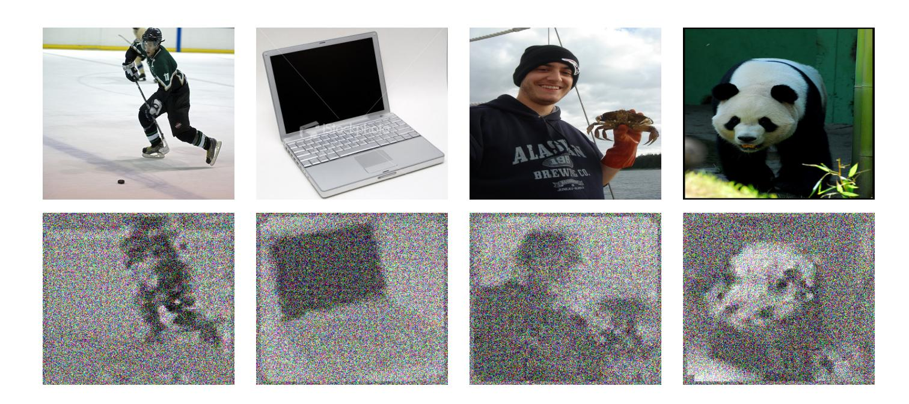

Fig. 5: Examples of information leakage through the hash value. The composition and shapes of the original image (top) are easily discernible in the generated preimage (bottom). The original images are resized to a 1 : 1 aspect ratio for direct comparison.

Table 1: Counts and average execution times for the preimage attack as a function of the number of restarts.

| Number of restarts          | 1     | 2    | 3     | 4    | 5-100 | >100 |
|-----------------------------|-------|------|-------|------|-------|------|
| Percentage of images        | 88.0% | 6.4% | 2.1%  | 0.8% | 2.2%  | 0.5% |
| Avg. execution time (mm:ss) | 00:11 | 2:06 | 04:04 | 5:56 | 26:22 | –    |

was found on the first attempt for 88.0% of the hash values, with an average execution time of 11.22 s.

Table [1](#page-22-0) summarizes the distribution of successful attempts and their corresponding average execution times. The last column corresponds to failure cases, in which the attack did not complete within the maximum number of allowed restarts. Notably, each additional restart incurs an execution time of approximately two minutes.

The attack consistently generates square preimages, regardless of the original image aspect ratio, which varies across the dataset (see Fig. [13](#page-33-1) in App. [B\)](#page-3-0). This indicates that prior knowledge of the original image dimensions is not required for a successful attack, which constitutes a realistic adversarial assumption. Visual inspection of the generated preimages reveals that certain structural features of the original images can be inferred. Examples are shown in Fig. [5.](#page-22-1) In the vast majority of cases, the overall composition, layout, and prominent shapes of the original images remain recognizable.

{23}------------------------------------------------

**Discussion.** It is worth noting that for the five hash values that initially failed, manually adjusting the initial learning rate was sufficient to generate a preimage. Further analysis shows that the loss function converged within 2,357 iterations for all successful restarts, suggesting that the maximum iteration count could be significantly reduced to improve efficiency without affecting the success rate.

Some preimages appear distorted due to the enforced 1:1 aspect ratio. Nevertheless, this artifact could be mitigated by targeting different output dimensions. Also note that the information leakage is fundamentally limited by the internal  $26 \times 26$  gradient grid of the A-PhotoDNA algorithm. As a result, structural features are more discernible in smaller preimages, where this grid is more prominent relative to background noise.

#### 6.4 Second Preimage Attack

We carry out the second preimage attack described in Sect. 5.4 using 1,000 randomly sampled image pairs. For each pair, the hash value of the target image  $I_t$  is taken as the target value  $h_t$ . The second image  $I_o$  is subsequently modified to produce a new image  $I_m$  with a hash value  $h_m$ . We evaluate two success criteria.

- The attack succeeds if the original image  $I_o$  is modified into  $I_m$  such that  $d(h_t, \mathcal{H}(I_m)) = 0$ , i.e., the modified image produces exactly the same hash value as the target hash value, with (limited) visual degradation considered acceptable.
- The attack succeeds if the original image  $I_o$  is modified into  $I_m$  such that  $d_{L_1}(h_t, \mathcal{H}(I_m)) \leq \tau_{L_1}$ , with  $\tau_{L_1} = 1,800$ . The value of  $\tau_{L_1}$  is chosen following the rationale provided in Sect. 2.2. In this case, the modified image  $I_m$  is required to preserve visual similarity with the original image  $I_o$ .

**Parameters.** For the success condition  $d(h_t, \mathcal{H}(I_m)) = 0$ , the initial learning rate is set to  $\eta = 0.1$ , with initial tradeoff parameters  $\lambda = 10.0$  and  $\mu = 500.0$ . For the success condition  $d_{L_1}(h_t, \mathcal{H}(I_m)) \leq \tau_{L_1}$  with  $\tau_{L_1} = 1,800$ , the initial learning rate is reduced to  $\eta = 10 \times 0.1/\tau_{L_1} \approx 5.6 \times 10^{-4}$ . The tradeoff parameters are increased to  $\lambda = 10.0 + \tau_{L_1} = 1,810$  and  $\mu = 500 + \tau_{L_1} = 2,300$ . These choices impose a substantially stronger penalty on visual and pixel-level distortions to prevent "overshooting" the target threshold  $\tau$ .

For both success criteria, the learning rate  $\eta$  is reduced with a factor of 0.25 if the total loss  $\mathcal{L}$  stagnates for 250 consecutive steps. Additionally, if the hash loss  $\mathcal{L}_{\text{hash}}$  fails to improve for 500 consecutive steps, the tradeoff parameters  $\lambda$  and  $\mu$  are reduced by a factor of 0.5. When this happens, the learning rate stagnation counter towards 250 steps is also reset to zero. The maximum number of iterations is set, in both cases, to  $K = 100{,}000$ .

**Results.** For the success condition  $d(h_t, \mathcal{H}(I_m)) = 0$ , the achieved success rate is 98.6%. Among successful attacks, convergence requires on average 5,580

{24}------------------------------------------------

iterations and 2.88 tradeoff parameter reductions per instance. The mean (resp. median) execution time for a successful attack is 150.11 s (135.73 s).

For the success condition dL1 (ht, H(Im)) ≤ 1,800, the achieved success rate is 99.7%. Among successful attacks, convergence requires on average 4,342 iterations and 2.28 tradeoff parameter reductions. The mean (resp. median) execution time for a successful attack is 117.73 s (103.69 s).

Discussion. For the failed exact-collision attempts, although the condition d(ht, H(Im)) = 0 was not met, the final dL1 distances exhibit a mean of 17.5 and a maximum value of 44.0, which is substantially below any threshold previously considered. As noted earlier, all attacks are performed automatically, without modifying hyperparameters during execution. Restarting the attack for the 14 failed cases with slightly adjusted parameters would likely yield a 100% success rate or very close to it.

For the success condition dL1 (ht, H(Im)) ≤ 1,800, the three failing cases terminate with dL1 distances of 2,441, 2,548, and 2,691. As in the preimage attack, we deliberately use a single parameter configuration for all instances to remain conservative. Further parameter tuning would likely allow these remaining cases to succeed. As discussed in Sect. [6.1,](#page-20-0) identifying optimal parameter settings is left for future work.

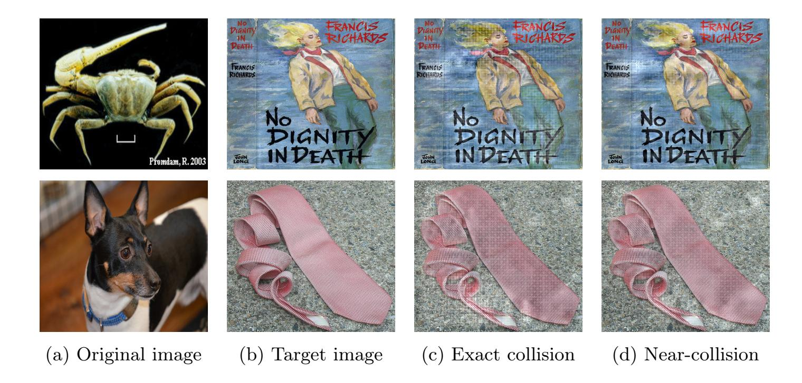

Fig. 6: Two examples of a second preimage attack showing an exact collision and a near-collision (τL1 < 1,800). The target image (b) represents the visual goal, while the original image (a) provides the target hash value. In each row, the hash value of image (c) coincides with the hash value of image (a). The hash value of the original image was used, not the image itself.

{25}------------------------------------------------

### 6.5 Detection Avoidance

To perform this attack, we implement two distinct strategies, as described in Sect. [5.5.](#page-18-1) The first strategy, denoted Sorigin, follows the origin direction approach, while the second strategy, denoted Sorthogonal, follows the orthogonal direction approach. We conduct the attack using 1,000 randomly sampled images for each strategy (2,000 images in total). Each original image Io, with original hash value ho, is minimally modified into an image Im with hash value hm.

The attack succeeds if dL1 (ho, hm) > τL1 while Io and Im remain perceptually similar, with τL1 = 1,800. As this attack is particularly relevant for real-world scenarios, we also perform the same attack using the dL2 distance with τL2 = 150. For brevity and to remain conservative, we only present results for the dL1 distance, as the attack using dL2 , achieves higher success rates with lower execution times. Results for the dL2 distance are provided in App. [A.](#page-1-0)

Parameters. For both strategies, Sorigin and Sorthogonal, the maximum number of iterations is set to K = 100. The per-pixel step-size limit is set to δ = 765, and the tradeoff parameter is set to λ = 103 .

Results. Fig. [7](#page-26-1) shows qualitative examples of the attack results. With the Sorigin strategy, we obtain a success rate of 100%. With the Sorthogonal strategy, we obtain a success rate of 93.4%, which corresponds to 66 failures in 1,000 attacks. As explained in the discussion below, a success rate of 100% can be obtained for the Sorthogonal strategy by incorporating an extra step in the attack procedure.

The average execution time for the Sorigin strategy is 11 s, while that of the Sorthogonal strategy is 110 s. Although the initial success rate and execution time for the Sorthogonal strategy are worse, the visual quality of the resulting images is significantly better, as only a small area of the image is altered. However, the visual quality of the images produced by the Sorigin strategy remains realistic and convincing.

Discussion. The Sorthogonal strategy does not succeed in 66 out of 1,000 instances. In these instances, the fixed orthogonal vector vk, which is calculated only once from the initial raw hash vector h0, is unable to move the hash value sufficiently far within the 100-iteration limit. This issue can be resolved by recalculating an orthogonal vector and performing another modification, which adds a second localized "patch" on the image, as shown in Fig. [8.](#page-26-2) The original image (Fig. [8\(a\)\)](#page-26-2) is first transformed into an intermediate image (Fig. [8\(b\)\)](#page-26-2). Since the dL1 distance between the original and intermediate images does not exceed 1,800, a second localized modification is added to the intermediate image, resulting in a final image (Fig. [8\(c\)\)](#page-26-2) that meets the condition dL1 (ho, hm) > 1,800. By adopting this recalculation method, a 100% success rate is achieved for the Sorthogonal strategy.

{26}------------------------------------------------

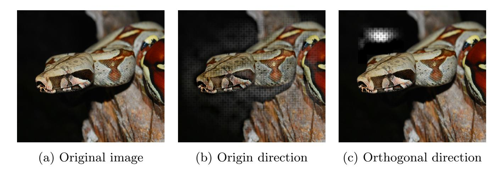

Fig. 7: Examples of the detection avoidance attack. For the original image (left), the result of the origin direction approach (middle) and the orthogonal direction approach (right) is shown.

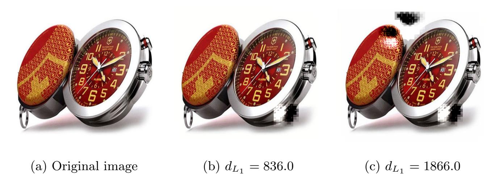

Fig. 8: Example of an initially failed orthogonal attack (b) and the successful result after re-computing an orthogonal vector and applying a second "patch" (c).

### 6.6 Additional Attacks

Two computationally inexpensive attacks exploiting specific design choices in the PhotoDNA pipeline have been identified. The first one is using the addition of a solid color border to evade detection, while the second attack uses recoloring the obtain an all-zero hash value, i.e., a hash value of 144 zero bytes.

Border attack. A simple yet effective evasion strategy against A-PhotoDNA consists in adding a solid-color (e.g., black) border to the image. Due to the absence of a standardized cropping or centering procedure in the algorithm, this manipulation shifts the sampling grid relative to the image content, thereby significantly altering the computed hash value.

Two variants of this attack are considered:

- Outward extension: The canvas size is increased by placing the border outside the original image. This method is fully reversible.
- Inward insertion: A narrow peripheral strip of the original image is replaced by the border, while preserving the nominal image dimensions.

{27}------------------------------------------------

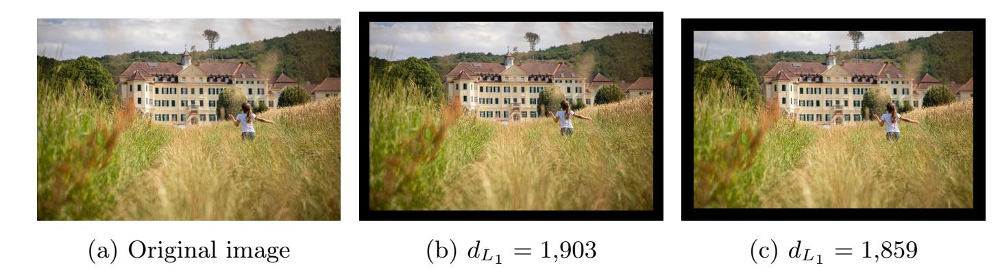

Fig. 9: An example of evading detection by adding a border outward (middle) or inward (right).

Both variants demonstrate the fragility of PhotoDNA to low-effort, perceptually negligible modifications that preserve the semantic content of the image.

In our experiments, we applied an equal-width border on all four sides of each image. This attack is always successful in producing a hash value distance above τL1 = 1,800, enabling to evade detection. The attack is performed on 1,000 random images in the chosen set. On average, a border width of 4.09% of the larger image dimension (e.g., 4.09% of 500 for a 500 × 200 image) is sufficient to obtain a distance above the threshold in the outward direction. The inward extension required slightly thicker borders, with an average of 5.56% of the larger dimension. Figure [14](#page-34-8) (in App. [B\)](#page-3-0) shows the complete distribution for both variants.

The running time of this attack is instantaneous, and the success rate is 100%. An example image after applying this attack is shown in Fig. [9.](#page-27-1)

Zero Hash Attack. Because the preprocessing step sums all color channels, if every pixel in an image has the same RGB sum (i.e., the sum of the red, green, and blue channels is identical across all pixels), the resulting feature grid contains identical values, leading to gradients equal to zero. Consequently, by recoloring an input image such that all pixels share an RGB triplet with the same channel sum, an adversary can deterministically force the A-PhotoDNA output to an all-zero hash value.

An example of this attack is shown in Fig. [10.](#page-28-0) The execution time of this attack is negligible, and the success rate is 100%.

### 7 Discussion and Comparison to Prior Work

This section situates our work within the existing literature. We identify the works [\[2,](#page-34-1) [24,](#page-36-12) [40,](#page-37-8) [54\]](#page-38-0) as the strongest attacks against PhotoDNA to date. Therefore, we evaluate our results against these prior works. Finally, we highlight contributions that, to the best of our knowledge, have not been previously presented or addressed.

{28}------------------------------------------------

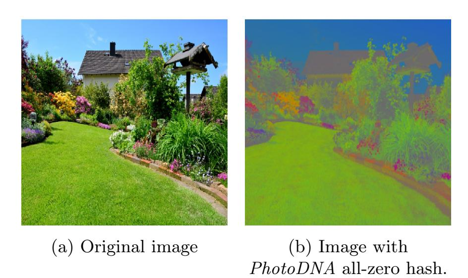

Fig. 10: Modification of colors of an image to obtain 144 zero bytes as hash value.

### 7.1 Positioning with Respect to Previous Work

The primary contribution of our work is the transition of the analysis of Photo-DNA from a black-box setting to a white-box setting. In doing so, the implicit security through obscurity is removed. This allows for new adversarial attacks that are based on the internal structure of the algorithm, which remain largely unexplored in our work. It is likely that such information could become available to an adversary, which could potentially undermine the security of PhotoDNA.

The attacks described in Sect. [5](#page-14-0) are proof-of-concept attacks and are not optimized. Therefore, there is likely room for improvement in the performance described in this work, such as through the use of hyperparameter optimization. Additionally, our attacks are primarily designed to find exact collisions, while in practice, threshold-based matching is used; relaxing this requirement would further improve attack efficiency.

#### 7.2 Comparison with Attacks performed in Previous Works

We compare our second preimage, detection avoidance and preimage attack on PhotoDNA with existing work in these domains.

Second Preimage Attack. Regarding second preimage attacks, [\[40\]](#page-37-8) presents black-box gradient-based approaches targeting a success condition of dL1 ≤ 1,800. The authors report near-collisions with distances ranging from dL1 = 342 to dL1 = 1,720. While the resulting images exhibit high visual quality and remain very close to the original images, the reported distances are still significantly higher than those achieved in our work. Moreover, the reported success rate is 56.6%, corresponding to 17 successful attacks out of 30. The average execution time is also substantially higher, at approximately four hours on multi-core consumer-grade hardware.

In [\[54\]](#page-38-0), the authors also propose a black-box second preimage attack and report a 100% success rate over 50 attacks. However, the matching threshold is 

{29}------------------------------------------------

set to τL1 = 3,855, which is considerably higher than both our work and that of [\[40\]](#page-37-8). A threshold of τL1 = 1,800 is considered, but no visual examples are provided, preventing a direct comparison of perceptual quality. The reported average execution time per attack is approximately 30 minutes.

In contrast, our experiments are conducted on a substantially larger dataset of 1,000 image pairs and achieve execution times on the order of seconds using a single CPU core. Moreover, we observe a 99.7% success rate under the thresholds considered in both prior studies, and a 98.6% success rate for exact collisions, a result that has not been previously reported.

Detection Avoidance Attack. Both [\[40\]](#page-37-8) and [\[54\]](#page-38-0) also investigate detection avoidance attacks. In [\[40\]](#page-37-8), the authors achieve visually high-quality results while reaching dL1 distances ranging from 1,800 to 4,000, which are substantially higher than the distances considered in our work, where attacks terminate at dL1 = 1,800. However, the authors do not report a success rate and only state that the average execution time is "less than one hour", which remains significantly higher than in our setting.

In [\[54\]](#page-38-0), the authors again target a high threshold of dL1 = 3,870 and report a 100% success rate, but do not provide execution times. In addition, based on the reported examples, the visual quality appears noticeably worse than that achieved in [\[40\]](#page-37-8) and in our own results.

Preimage Attack. The blog post [\[2\]](#page-34-1) presents partial inversion results for PhotoDNA using neural networks. However, the attack is first trained on a specific dataset and then evaluated on images drawn from the same dataset. Moreover, no information is provided to reproduce the experiment. While the reported visual results appear sharper than ours, the generated preimages are always limited to a fixed resolution of 100 × 100 pixels. Finally, no success rates, execution times, hash value distances, or hardware specifications are reported.

In [\[24\]](#page-36-12), the authors present neural-network-based preimage attacks against several perceptual hash functions, including PhotoDNA, using only the CelebA dataset. The reported results are similar to those of [\[2\]](#page-34-1). While the authors state that training required 86 hours and that generated images have a resolution of 256 × 256, no per-instance execution time is reported. A direct comparison with this line of work is not meaningful, as both the objective and the evaluation methodology differ substantially from ours. In particular, "success" is evaluated using the Hamming distance of aHash, NeuralHash, and PDQ applied to the original and generated images, rather than using PhotoDNA itself. Since perceptual hash functions do not define a metric space, the interpretation of such distances is unclear. On average, approximately 25.96% of the hash values differ between the original and generated images across the three functions (aHash, NeuralHash and PDQ) used as metric by the authors.

As a result, these approaches primarily demonstrate information leakage rather than strict preimage recovery. Their evaluation focuses on visual similarity instead of hash consistency, and the reported results may be influenced 

{30}------------------------------------------------

by training-set bias, making them incomparable to our PhotoDNA preimage attacks.

While a full hash inversion attack is outside the scope of our work, our exact preimage attack demonstrate that PhotoDNAhash values can leak information such as global composition and rough structural features. As our work is intended as a proof of concept, whether the observed leakage is sufficient to enable full hash inversion without training-set bias remains an open question. Nevertheless, even without extending this observation to a full inversion attack, our results directly challenge Microsoft's claim that PhotoDNA is irreversible [\[34\]](#page-36-0).

### 7.3 Novel Contributions

We now state some contributions that, to the best of our knowledge, are not addressed before.

Formal White-Box Design of PhotoDNA. We provide the first complete and faithful design of a function that produces exactly the same hash values as PhotoDNA, which has previously only been studied in a black-box setting.

Exact Collisions. To the best of our knowledge, this work is the first to generate exact collisions either in the case of the collision attack or the second preimage attack. In particular, our collision attacks achieve a 100% success rate with an average execution time of 215 s, using a Python implementation executed on a personal laptop with a single CPU core.

Optimization-Based Preimage. To the best of our knowledge, only [\[40\]](#page-37-8) does not rely on machine-learning-based techniques to attack PhotoDNA. However, that work only considers second preimage and detection-avoidance attacks. All other known attacks on PhotoDNA employ machine-learning techniques. In contrast, our work is the first to propose a preimage attack based exclusively on optimization methods. Notably, prior learning-based approaches train models on a given dataset and subsequently evaluate attacks on the same dataset (see Sect. [7.2\)](#page-28-1), which may introduce training-set bias that is absent from our approach.

More Powerful Attacks. To the best of our knowledge, across all considered attacks, our work operates at the same or smaller matching thresholds compared to prior work. Our results improve upon existing approaches in terms of execution time, while using significantly fewer hardware resources and producing visually comparable or superior results.

### 8 Conclusion

Our work shows that it is fast and easy to create convincing false positives for PhotoDNA. An attacker can imperceptibly modify an innocent image to force 

{31}------------------------------------------------

its hash value to exactly match that of illegal content, potentially leading to the unjust flagging of innocent users. Conversely, we demonstrate that adversaries can easily apply minimal modifications to illegal images to evade detection, facilitating the rapid dissemination of illicit content. Furthermore, our preimage attacks reveal that leakage of PhotoDNA hash values may pose serious privacy risks, as meaningful information about the original images can be inferred from the hash values. While the attacks presented here are proof-of-concept demonstrations, we believe that more sophisticated adversarial techniques could lead to even more severe exploits.

We conclude that the security of PhotoDNA largely relies on the secrecy of its design. Once analyzed in a white-box setting, fundamental and critical flaws are revealed. As a result, we do believe that the current widespread deployment and use of PhotoDNA represent a significant and concerning threat, both for innocent users of these platforms and for victims of illegal content dissemination.

Several open problems remain, including the optimization of the attacks proposed in this paper. Beyond such improvements, determining whether the observed information leakage is sufficient to enable full hash inversion without training-set bias would represent a significant advance compared to existing work on the subject. A further challenging research direction consists in establishing the possibility or impossibility of designing perceptual hash functions that satisfy all the properties defined in Sect. [2.1.](#page-3-1) In particular, constructing a secure perceptual hash function constitutes a difficult open problem, especially in the context of client-side scanning, where the design is public.

{32}------------------------------------------------

# Appendix

# A Detection Avoidance with L2 Distance

The detection avoidance attack as presented in Sect. [5.5](#page-18-1) and for which the results using an L1 threshold of τL1 = 1800 are presented in Sect. [6.5,](#page-25-0) is also executed for τL2 = 150 in exactly the same manner. Therefore, we only present the results here, together with a short discussion.

Results. Fig. [11](#page-32-0) shows qualitative examples of the attack results using L2 distance threshold τL2 . In this setting, with the Sorigin strategy, we obtain a success rate of 100%. With the Sorthogonal strategy, we obtain a success rate of 99.4%, which corresponds to only 6 failures in 1,000 attacks.

The average execution time for the Sorigin strategy is 8.75 s, while that of the Sorthogonal strategy is 46.41 s. The same remarks as before can be made: while Sorthogonal provides better visuals, the execution time and success rate are worse.

Discussion. The aforementioned results highlight the necessity of a good distance metric and corresponding threshold. The τL2 = 150 is weaker then τL1 = 1,800 for the detection avoidance attack, meaning that less modifications need to be performed before deceiving the hashing function. Therefore, the attack becomes easier and more visually convincing in this setting.

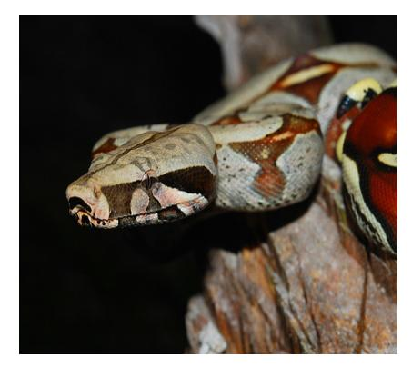

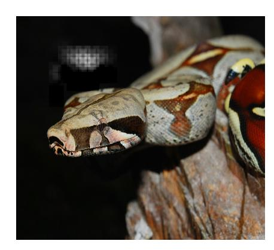

(a) Original image (b) Origin direction (c) Orthogonal direction

Fig. 11: Examples of the detection avoidance attack (with τL2 = 150). For the original image (left), the result of the origin direction approach (middle) and the orthogonal direction approach (right) is shown.

{33}------------------------------------------------

### B Supplementary figures

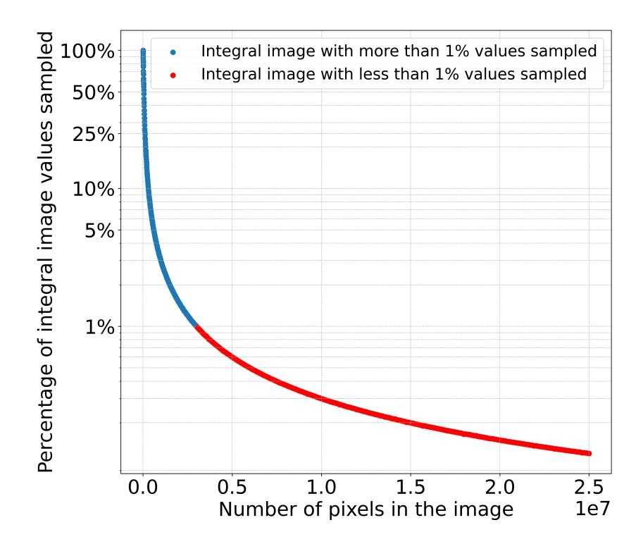

Fig. 12: Percentage of integral image values sampled (used) in the computation of a A-PhotoDNA hash value as a function of the total number of pixels in the image.

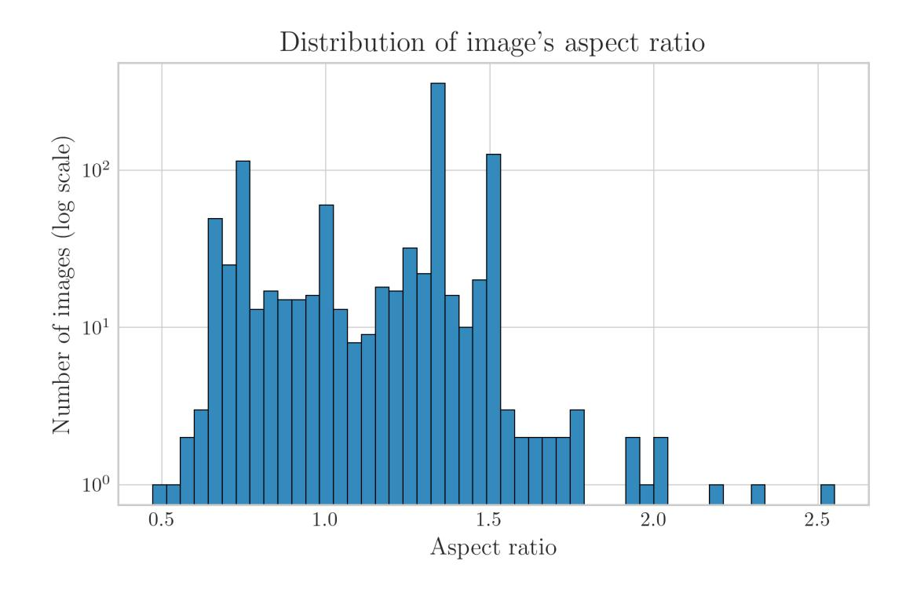

Fig. 13: Distribution of aspect ratios of original images from which hash values were derived for the preimage attack.

{34}------------------------------------------------

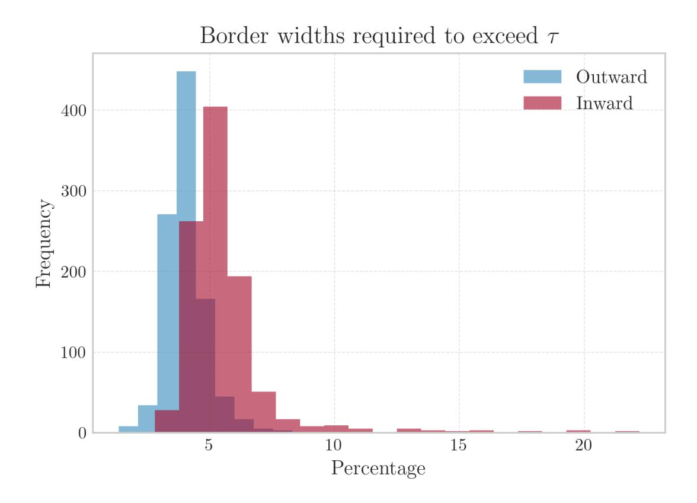

Fig. 14: Distributions of the required border width (expressed as a percentage of the image's larger dimension) needed to exceed the hash distance threshold τL1 = 1,800 for both outward and inward extensions.

### References

- 1. Ansel, J., Yang, E., He, H., Gimelshein, N., Jain, A., Voznesensky, M., Bao, B., Bell, P., Berard, D., Burovski, E., et al.: PyTorch 2: Faster Machine Learning Through Dynamic Python Bytecode Transformation and Graph Compilation. In: Proceedings of the 29th ACM International Conference on Architectural Support for Programming Languages and Operating Systems. vol. 2, pp. 929–947 (2024). [https : / / doi . org / 10 . 1145 / 3620665 . 3640366](https://doi.org/10.1145/3620665.3640366)
- 2. Athalye, A.: Inverting PhotoDNA (2021), [https : / / anishathalye . com /](https://anishathalye.com/inverting-photodna/) [inverting - photodna/](https://anishathalye.com/inverting-photodna/), last accessed 2026/02/02
- 3. Athalye, A.: NeuralHash Collider (2021), [https : / / github . com / anishathalye /](https://github.com/anishathalye/neural-hash-collider) [neural - hash - collider](https://github.com/anishathalye/neural-hash-collider), last accessed 2026/02/02
- 4. Australian Government: Online Safety Act 2021 (2021), [https : / / www .](https://www.legislation.gov.au/C2021A00076/latest/text) [legislation . gov . au / C2021A00076 / latest / text](https://www.legislation.gov.au/C2021A00076/latest/text), last accessed 2026/02/02
- 5. Bengio, Y., Léonard, N., Courville, A.: Estimating or Propagating Gradients Through Stochastic Neurons for Conditional Computation (2013). [https : / /](https://doi.org/10.48550/arXiv.1308.3432) [doi . org / 10 . 48550 / arXiv . 1308 . 3432](https://doi.org/10.48550/arXiv.1308.3432), [https : / / arxiv . org / abs / 1308 . 3432](https://arxiv.org/abs/1308.3432)
- 6. Boyd, S., Vandenberghe, L.: Convex optimization. Cambridge University Press (2013). [https : / / doi . org / 10 . 1017 / CBO9780511804441](https://doi.org/10.1017/CBO9780511804441)
- 7. Brunet, D., Vrscay, E.R., Wang, Z.: On the Mathematical Properties of the Structural Similarity Index. IEEE Transactions on Image Processing 21(4), 1488–1499 (2012). [https : / / doi . org / 10 . 1109 / TIP . 2011 . 2173206](https://doi.org/10.1109/TIP.2011.2173206)
- 8. Carlini, N., Chávez-Saab, J., Hambitzer, A., Rodríguez-Henríquez, F., Shamir, A.: Polynomial time cryptanalytic extraction of deep neural networks in the

{35}------------------------------------------------

- hard-label setting. In: Fehr, S., Fouque, P. (eds.) Advances in Cryptology EU-ROCRYPT 2025 - 44th Annual International Conference on the Theory and Applications of Cryptographic Techniques, Madrid, Spain, May 4-8, 2025, Proceedings, Part I. Lecture Notes in Computer Science, vol. 15601, pp. 364–396. Springer (2025). [https : / / doi . org / 10 . 1007 / 978 - 3 - 031 - 91107 - 1 \\_ 13](https://doi.org/10.1007/978-3-031-91107-1\_13), [https : / / doi . org / 10 . 1007 / 978 - 3 - 031 - 91107 - 1 \\_ 13](https://doi.org/10.1007/978-3-031-91107-1_13)
- 9. Carlini, N., Jagielski, M., Mironov, I.: Cryptanalytic extraction of neural network models. In: Micciancio, D., Ristenpart, T. (eds.) Advances in Cryptology - CRYPTO 2020 - 40th Annual International Cryptology Conference, CRYPTO 2020, Santa Barbara, CA, USA, August 17-21, 2020, Proceedings, Part III. Lecture Notes in Computer Science, vol. 12172, pp. 189–218. Springer (2020). [https : / / doi . org / 10 . 1007 / 978 - 3 - 030 - 56877 - 1 \\_ 7](https://doi.org/10.1007/978-3-030-56877-1\_7), [https : / / doi . org / 10 . 1007 / 978 - 3 - 030 - 56877 - 1 \\_ 7](https://doi.org/10.1007/978-3-030-56877-1_7)
- 10. Chandler, D.M., Hemami, S.S.: VSNR: A Wavelet-Based Visual Signal-to-Noise Ratio for Natural Images. IEEE Transactions on Image Processing 16(9), 2284– 2298 (2007). [https : / / doi . org / 10 . 1109 / TIP . 2007 . 901820](https://doi.org/10.1109/TIP.2007.901820)
- 11. Commission Staff: Impact assessment report on "laying down rules to prevent and combat child sexual abuse"'. Tech. rep., European Commission (2022), [https : / / eur - lex . europa . eu / legal - content / EN / TXT/?uri = celex :](https://eur-lex.europa.eu/legal-content/EN/TXT/?uri=celex:52022SC0209) [52022SC0209](https://eur-lex.europa.eu/legal-content/EN/TXT/?uri=celex:52022SC0209), last accessed 2026/02/06
- 12. Drmic, A., Silic, M., Delac, G., Vladimir, K., Kurdija, A.S.: Evaluating robustness of perceptual image hashing algorithms. In: 2017 40th International Convention on Information and Communication Technology, Electronics and Microelectronics (MIPRO). pp. 995–1000. IEEE (2017). [https : / / doi . org / 10 . 23919 /](https://doi.org/10.23919/MIPRO.2017.7973569) [MIPRO . 2017 . 7973569](https://doi.org/10.23919/MIPRO.2017.7973569)
- 13. Du, L., Ho, A.T., Cong, R.: Perceptual hashing for image authentication: A survey. Signal Processing: Image Communication 81, 115713 (2020). [https :](https://doi.org/10.1016/j.image.2019.115713) [/ / doi . org / 10 . 1016 / j . image . 2019 . 115713](https://doi.org/10.1016/j.image.2019.115713)
- 14. European Data Protection Board: EDPB-EDPS Joint Opinion 04/2022. Tech. rep., European Commission (2022), [https : / / www . edpb . europa . eu / our](https://www.edpb.europa.eu/our-work-tools/our-documents/edpbedps-joint-opinion/edpb-edps-joint-opinion-042022-proposal_en)  [work - tools / our - documents / edpbedps - joint - opinion / edpb - edps - joint](https://www.edpb.europa.eu/our-work-tools/our-documents/edpbedps-joint-opinion/edpb-edps-joint-opinion-042022-proposal_en)  [opinion - 042022 - proposal \\_ en](https://www.edpb.europa.eu/our-work-tools/our-documents/edpbedps-joint-opinion/edpb-edps-joint-opinion-042022-proposal_en), last accessed 2026/02/02
- 15. European Parliament: Directive 2002/58/EC (2002), [https : / / eur - lex .](https://eur-lex.europa.eu/eli/dir/2002/58/oj) [europa . eu / eli / dir / 2002 / 58 / oj](https://eur-lex.europa.eu/eli/dir/2002/58/oj), last accessed 2026/02/02
- 16. European Parliament: Regulation (EU) 2021/1232 (2021), [https : / / eur - lex .](https://eur-lex.europa.eu/eli/reg/2021/1232/oj) [europa . eu / eli / reg / 2021 / 1232 / oj](https://eur-lex.europa.eu/eli/reg/2021/1232/oj), last accessed 2026/02/02
- 17. European Parliament: Regulation (EU) 2024/1307 (2024), [https : / / eur - lex .](https://eur-lex.europa.eu/eli/reg/2024/1307/oj) [europa . eu / eli / reg / 2024 / 1307 / oj](https://eur-lex.europa.eu/eli/reg/2024/1307/oj), last accessed 2026/02/02
- 18. Farid, H.: Reining in online abuses. Technology and Innovation 19(3), 249–255 (2017). [https : / / doi . org / 10 . 21300 / 19 . 3 . 2018 . 593](https://doi.org/10.21300/19.3.2018.593)
- 19. Farid, H.: An overview of perceptual hashing. Journal of Online Trust and Safety 1(1) (2021). [https : / / doi . org / 10 . 54501 / jots . v1i1 . 24](https://doi.org/10.54501/jots.v1i1.24)
- 20. Girshick, R.: Fast R-CNN. In: 2015 IEEE International Conference on Computer Vision (ICCV). pp. 1440–1448. IEEE (2015). [https : / / doi . org / 10 . 1109 /](https://doi.org/10.1109/ICCV.2015.169) [ICCV . 2015 . 169](https://doi.org/10.1109/ICCV.2015.169)
- 21. Google LLC: Google Transparency Report on CSAM, [https : / /](https://transparencyreport.google.com/child-sexual-abuse-material/reporting) [transparencyreport . google . com / child - sexual - abuse - material /](https://transparencyreport.google.com/child-sexual-abuse-material/reporting) [reporting](https://transparencyreport.google.com/child-sexual-abuse-material/reporting), last accessed 2026/02/02
- 22. Gurobi Optimization, LLC: Gurobi Optimizer Reference Manual (2025), [https :](https://www.gurobi.com) [/ / www . gurobi . com](https://www.gurobi.com)

{36}------------------------------------------------

- 23. Hao, Q., Luo, L., Jan, S.T., Wang, G.: It's Not What It Looks Like: Manipulating Perceptual Hashing based Applications. In: Proceedings of the 2021 ACM SIGSAC Conference on Computer and Communications Security. pp. 69–85 (2021). [https : / / doi . org / 10 . 1145 / 3460120 . 3484559](https://doi.org/10.1145/3460120.3484559)
- 24. Hawkes, S., Weinert, C., Almeida, T., Mehrnezhad, M.: Perceptual Hash Inversion Attacks on Image-Based Sexual Abuse Removal Tools. IEEE Security & Privacy 23(3), 64–73 (2024). [https : / / doi . org / 10 . 1109 / MSEC . 2024 . 3485497](https://doi.org/10.1109/MSEC.2024.3485497)
- 25. Internet Society: Breaking encryption myths, [https : / / www . internetsociety .](https://www.internetsociety.org/wp-content/uploads/2020/11/2020-Breaking-Encryption-Myths-EN.pdf) [org / wp - content / uploads / 2020 / 11 / 2020 - Breaking - Encryption - Myths -](https://www.internetsociety.org/wp-content/uploads/2020/11/2020-Breaking-Encryption-Myths-EN.pdf) [EN . pdf](https://www.internetsociety.org/wp-content/uploads/2020/11/2020-Breaking-Encryption-Myths-EN.pdf), last accessed 2026/02/02
- 26. Joint Research Centre: Technical solutions to detect child sexual abuse in encrypted communications. Tech. rep., European Commission (2020), [https :](https://www.politico.eu/wp-content/uploads/2020/09/SKM_C45820090717470-1_new.pdf) [/ / www . politico . eu / wp - content / uploads / 2020 / 09 / SKM \\_ C45820090717470 -](https://www.politico.eu/wp-content/uploads/2020/09/SKM_C45820090717470-1_new.pdf) [1 \\_ new . pdf](https://www.politico.eu/wp-content/uploads/2020/09/SKM_C45820090717470-1_new.pdf), last accessed 2026/02/02
- 27. Kaiser, J.: pyPhotoDNA (2021), [https : / / github . com / jankais3r /](https://github.com/jankais3r/pyPhotoDNA) [pyPhotoDNA](https://github.com/jankais3r/pyPhotoDNA), last accessed 2026/02/02
- 28. Kilcher, Y.: Neural Hash Collision Creator (2021), [https : / / github . com / yk /](https://github.com/yk/neural_hash_collision) [neural \\_ hash \\_ collision](https://github.com/yk/neural_hash_collision), last accessed 2026/02/02
- 29. Krawetz, N.: PhotoDNA and Limitations (2021), [https : / / www . hackerfactor .](https://www.hackerfactor.com/blog/index.php?/archives/931-PhotoDNA-and-Limitations.html) [com / blog / index . php? / archives / 931 - PhotoDNA - and - Limitations . html](https://www.hackerfactor.com/blog/index.php?/archives/931-PhotoDNA-and-Limitations.html), last accessed 2026/02/02
- 30. Leblanc-Albarel, D., Preneel, B.: Black-box Collision Attacks on Widely Deployed Perceptual Hash Functions. Cryptology ePrint Archive, Paper 2024/1869 (2024), [https : / / eprint . iacr . org / 1990 / 001](https://eprint.iacr.org/1990/001)
- 31. Martinez, I.A.C., Chávez-Saab, J., Hambitzer, A., Rodríguez-Henríquez, F., Satpute, N., Shamir, A.: Polynomial time cryptanalytic extraction of neural network models. In: Joye, M., Leander, G. (eds.) Advances in Cryptology - EURO-CRYPT 2024 - 43rd Annual International Conference on the Theory and Applications of Cryptographic Techniques, Zurich, Switzerland, May 26-30, 2024, Proceedings, Part III. Lecture Notes in Computer Science, vol. 14653, pp. 3–33. Springer (2024). [https : / / doi . org / 10 . 1007 / 978 - 3 - 031 - 58734 - 4 \\_ 1](https://doi.org/10.1007/978-3-031-58734-4\_1), [https : / / doi . org / 10 . 1007 / 978 - 3 - 031 - 58734 - 4 \\_ 1](https://doi.org/10.1007/978-3-031-58734-4_1)
- 32. Meta Platforms Inc.: Building the child protection ecosystem, [https : / / www .](https://www.meta.com/en-gb/safety/topics/online-child-protection/partners/) [meta . com / en - gb / safety / topics / online - child - protection / partners/](https://www.meta.com/en-gb/safety/topics/online-child-protection/partners/), last accessed 2026/02/02
- 33. Meta Platforms Inc.: Preventing Child Exploitation on Our Apps (2021), [https :](https://about.fb.com/news/2021/02/preventing-child-exploitation-on-our-apps/) [/ / about . fb . com / news / 2021 / 02 / preventing - child - exploitation - on](https://about.fb.com/news/2021/02/preventing-child-exploitation-on-our-apps/)  [our - apps/](https://about.fb.com/news/2021/02/preventing-child-exploitation-on-our-apps/), last accessed 2026/02/02
- 34. Microsoft Corporation: PhotoDNA, [https : / / www . microsoft . com / en - us /](https://www.microsoft.com/en-us/photodna) [photodna](https://www.microsoft.com/en-us/photodna), last accessed 2026/02/02
- 35. Microsoft Corporation: Microsoft and NCMEC Push for Action to Fight Child Pornography (2009), [https : / / news . microsoft . com / source / 2009 / 12 / 15 /](https://news.microsoft.com/source/2009/12/15/microsoft-and-national-center-for-missing-exploited-children-push-for-action-to-fight-child-pornography/) [microsoft - and - national - center - for - missing - exploited - children](https://news.microsoft.com/source/2009/12/15/microsoft-and-national-center-for-missing-exploited-children-push-for-action-to-fight-child-pornography/)  [push - for - action - to - fight - child - pornography/](https://news.microsoft.com/source/2009/12/15/microsoft-and-national-center-for-missing-exploited-children-push-for-action-to-fight-child-pornography/), last accessed 2026/02/02
- 36. Microsoft Corporation: Microsoft's PhotoDNA: Protecting children and businesses in the cloud (2015), [https : / / news . microsoft . com / features /](https://news.microsoft.com/features/microsofts-photodna-protecting-children-and-businesses-in-the-cloud/) [microsofts - photodna - protecting - children - and - businesses - in - the](https://news.microsoft.com/features/microsofts-photodna-protecting-children-and-businesses-in-the-cloud/)  [cloud/](https://news.microsoft.com/features/microsofts-photodna-protecting-children-and-businesses-in-the-cloud/), last accessed 2026/02/02
- 37. National Center for Missing & Exploited Children: CyberTipline Report 2024, [https : / / www . missingkids . org / gethelpnow / cybertipline /](https://www.missingkids.org/gethelpnow/cybertipline/cybertiplinedata) [cybertiplinedata](https://www.missingkids.org/gethelpnow/cybertipline/cybertiplinedata), last accessed 2026/02/02

{37}------------------------------------------------

- 38. National Center for Missing & Exploited Children: End-To-End Encryption, [https : / / www . missingkids . org / theissues / end - to - end - encryption](https://www.missingkids.org/theissues/end-to-end-encryption), last accessed 2026/02/02
- 39. op 't Hoog, G., de Swart, L., Essink, J., van der Born, G., Ritmeester, Y., Sekuła, A., Smit, G., Vavoula, N., Karapatakis, A., Mifsud-Bonnici, J., Preneel, B.: Proposal for a regulation laying down the rules to prevent and combat child sexual abuse. Tech. rep., European Parliamentary Research Service (2023), [https : / / www . europarl . europa . eu / RegData / etudes / STUD / 2023 / 740248 /](https://www.europarl.europa.eu/RegData/etudes/STUD/2023/740248/EPRS_STU(2023)740248_EN.pdf) [EPRS \\_ STU\(2023\)740248 \\_ EN . pdf](https://www.europarl.europa.eu/RegData/etudes/STUD/2023/740248/EPRS_STU(2023)740248_EN.pdf), last accessed 2026/02/06
- 40. Prokos, J., Fendley, N., Green, M., Schuster, R., Tromer, E., Jois, T., Cao, Y.: Squint Hard Enough: Attacking Perceptual Hashing with Adversarial Machine Learning. In: Proceedings of the 32th USENIX Conference on Security Symposium. pp. 211–228 (2023)
- 41. Russakovsky, O., Deng, J., Su, H., Krause, J., Satheesh, S., Ma, S., Huang, Z., Karpathy, A., Khosla, A., Bernstein, M., Berg, A.C., Fei-Fei, L.: ImageNet Large Scale Visual Recognition Challenge. International Journal of Computer Vision (IJCV) 115(3), 211–252 (2015). [https : / / doi . org / 10 . 1007 / s11263 - 015 -](https://doi.org/10.1007/s11263-015-0816-y) [0816 - y](https://doi.org/10.1007/s11263-015-0816-y)
- 42. Signal Messenger: Technical information, [https : / / signal . org / docs/](https://signal.org/docs/), last accessed 2026/02/02
- 43. Sobel, I., Feldman, G.: A 3x3 Isotropic Gradient Operator for Image Processing. Presentation at the Stanford Artificial Intelligence Project (SAIL) (1968)
- 44. Steinebach, M.: An Analysis of PhotoDNA. In: Proceedings of the 18th International Conference on Availability, Reliability and Security. pp. 1–8 (2023). [https : / / doi . org / 10 . 1145 / 3600160 . 3605048](https://doi.org/10.1145/3600160.3605048)
- 45. Struppek, L., Hintersdorf, D., Neider, D., Kersting, K.: Learning to Break Deep Perceptual Hashing: The Use Case NeuralHash. In: Proceedings of the 2022 ACM Conference on Fairness, Accountability, and Transparency. pp. 58–69 (2022). [https : / / doi . org / 10 . 1145 / 3531146 . 3533073](https://doi.org/10.1145/3531146.3533073)
- 46. Tech Coalition: Child Sexual Abuse Material (CSAM): Identification and Reporting for U.S. Based Companies (2022), [https : / / technologycoalition .](https://technologycoalition.org/wp-content/uploads/CSAM-Identification_Reporting_R3-1.pdf) [org / wp - content / uploads / CSAM - Identification \\_ Reporting \\_ R3 - 1 . pdf](https://technologycoalition.org/wp-content/uploads/CSAM-Identification_Reporting_R3-1.pdf), last accessed 2026/02/02
- 47. UK Parliament: Online Safety Act 2023 (2023), [https : / / www . legislation .](https://www.legislation.gov.uk/ukpga/2023/50/contents) [gov . uk / ukpga / 2023 / 50 / contents](https://www.legislation.gov.uk/ukpga/2023/50/contents), last accessed 2026/02/02
- 48. US Government: S.474 - REPORT Act (2024), [https : / / www . congress . gov /](https://www.congress.gov/bill/118th-congress/senate-bill/474) [bill / 118th - congress / senate - bill / 474](https://www.congress.gov/bill/118th-congress/senate-bill/474), last accessed 2026/02/02
- 49. Weng, L., Preneel, B.: Attacking some perceptual image hash algorithms. In: 2007 IEEE International Conference on Multimedia and Expo. pp. 879–882. IEEE (2007). [https : / / doi . org / 10 . 1109 / ICME . 2007 . 4284791](https://doi.org/10.1109/ICME.2007.4284791)
- 50. WhatsApp LLC: WhatsApp security overview, [https : / / www . whatsapp . com /](https://www.whatsapp.com/security/) [security/](https://www.whatsapp.com/security/), last accessed 2026/02/02
- 51. Whittaker, M.: For a future with privacy, not mass surveillance, Germany must stand firmly against client-side scanning in the Chat Control proposal, [https :](https://signal.org/blog/pdfs/germany-chat-control.pdf) [/ / signal . org / blog / pdfs / germany - chat - control . pdf](https://signal.org/blog/pdfs/germany-chat-control.pdf), last accessed 2026/02/02
- 52. Zauner, C.: Implementation and Optimization of Perceptual Hashing Algorithms. Tech. rep., University of Applied Sciences Upper Austria, Hagenberg (2010), [https : / / www . phash . org / docs / pubs / thesis \\_ zauner . pdf](https://www.phash.org/docs/pubs/thesis_zauner.pdf), last accessed 2026/02/02

{38}------------------------------------------------

- 53. Zhang, R., Isola, P., Efros, A.A., Shechtman, E., Wang, O.: The Unreasonable Effectiveness of Deep Features as a Perceptual Metric. In: 2018 IEEE/CVF Conference on Computer Vision and Pattern Recognition (CVPR). pp. 586–595. IEEE Computer Society (2018). [https : / / doi . org / 10 . 1109 / CVPR . 2018 .](https://doi.org/10.1109/CVPR.2018.00068) [00068](https://doi.org/10.1109/CVPR.2018.00068)
- 54. Zhang, Y., Sun, Y., Qi, S., Hua, Z., Wen, W., Fang, Y.: Atkscopes: Multiresolution Adversarial Perturbation as a Unified Attack on Perceptual Hashing and Beyond. In: Proceedings of the 34th USENIX Conference on Security Symposium. pp. 5913–5930 (2025)