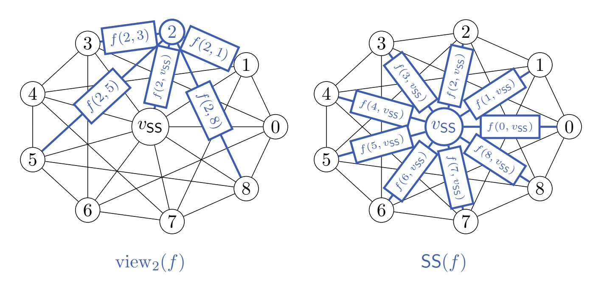
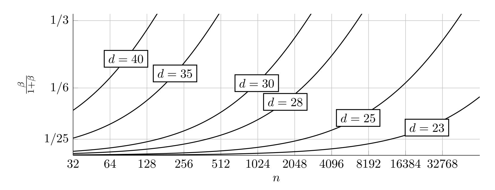

{0}------------------------------------------------

# Graph-based Asynchrony with Quasilinear Complexity for Any Linear Verifiable Secret Sharing Scheme

Hugo Delavenne1,2 and Lola-Baie Mallordy1,2

<sup>1</sup>LIX, Ecole Polytechnique, Institut Polytechnique de Paris ´ 2 Inria

#### Abstract

Verifiable Secret Sharing (VSS) schemes usually consider synchronous communication, which cannot always be the case on real networks where packets can be lost or parties arbitrarily delayed. Allowing asynchrony adds a large overhead complexity cost: the dealer and communication complexity is in O(n 2 log n) in state of the art nparties Asynchronous VSS (AVSS) schemes [\[ABDM25\]](#page-14-0), whereas there are synchronous schemes with only linear communications. To ensure that all honest parties agree on the same secret and are ready for reconstruction, AVSS schemes essentially perform a protocol similar to Bracha's broadcast [\[Bra87\]](#page-15-0). While this immediately bounds the overall communication complexity of the protocol to be at least in O(n 2 ), this method enables to reach the maximum threshold of malicious parties of t = n/3. However, a smaller threshold t may be sufficient for some use cases, and one may want to take advantage of this. We consider a statistical scheme, meaning that the correctness and termination properties are only guaranteed with good probability. We propose a new method to transform any linear VSS scheme into a statistical AVSS. We build a statistical AVSS protocol Bonneval-on-Arc where each party only communicates with d neighbours, a situation that we model by a d-regular graph. We obtain quasilinear communication complexity for the dealer, and sublinear complexity for each party, and a corruption threshold t < n/(d + 2) as a tradeoff.

### 1 Introduction

Secret sharing is a fundamental primitive, that enables a dealer to distribute shares of a secret among a set of participants in such a way that combining a sufficient number shares reconstructs the secret, while any other subsets of fewer shares do not reveal any information. Introduced by Shamir and Blakley in 1979 [\[Sha79,](#page-16-0) [Bla79\]](#page-15-1), secret sharing schemes have become a cornerstone of secure multiparty computation, threshold cryptography, and distributed trust protocols. To prevent a malicious dealer from sending corrupted shares, Chor et al. extended secret sharing to Verifiable Secret Sharing (VSS) [\[CGMA85\]](#page-15-2), where the dealer is required to commit to the secret such that each party can verify their share.

The classical model of secret sharing assumes a synchronous network, meaning that all parties have a global, reliable clock. However, this is not representative of the real world, where there is no global clock, and the messages can be arbitrarily delayed and not received in order. Asynchronous Verifiable Secret Sharing (AVSS) [\[BCG93\]](#page-15-3) was introduced to generalize secret sharing to this asynchronous network setting, where the only guarantee is that all messages will eventually be delivered. AVSS protocols ensure agreement, meaning that the completion of the protocol guarantees that all honest parties agree on a single

{1}------------------------------------------------

value. More precisely, the dealer generates a sharing and commits to it such that even if the dealer is corrupt, if an honest party completes the protocol then there exists a unique s˜ such that ˜s can be recovered by any large enough subset of parties. In AVSS schemes, parties typically send a message to every other party to reach agreement (similarly to Bracha's reliable broadcast [\[Bra87\]](#page-15-0)), which forces their communication complexity to be at least in Ω(n) for n participants. As for the dealer, its communication complexity is typically in O(n 2 ) as it sends to each party a commitment to its sharing, which is usually of linear size.

#### 1.1 Contributions

To lower communication costs, we propose a protocol where each party is no longer required to communicate with every other party. We consider a sparse network where each party only communicates with d participants, on γ different graphs. This repetition parameter γ allows us to get better termination properties. We aim for a small constant d with respect to n. Due to this additional communication constraint, we cannot achieve an optimal resilience against t = n/3 corrupted parties, but we obtain quasilinear complexities in communication as a tradeoff. We focus on networks with large membership, where lots of independent parties could participate, but each execution of the protocol only requires a relatively small subset of participants. Essentially, a small working committee is chosen each round from a wide population, keeping the execution cheap but resilient to loss of participants. We consider statistical AVSS, which is a weaker version of AVSS where the correctness and agreement properties are only ensured with good probability.

We introduce our statistical AVSS scheme Bonneval-on-Arc[1](#page-1-0) . It is a generic construction from any linear VSS scheme. We obtain a scheme light in communications, which is only resilient to a small set of malicious parties. Our construction can be instantiated as a statistical AVSS scheme, but also a weaker version that we introduce as follow:

- Statistical AVSS: a variant of AVSS introduced in [\[BCG93\]](#page-15-3), where the properties of termination and agreement are achieved only with good probability.
- Weak Statistical AVSS: we propose a further relaxation of the properties of statistical AVSS, such that the privacy is also achieved only with overwhelming probability against static adversaries. Essentially, this means that if the adversary statically choses corrupted parties before the protocol, then once the dealer assigns each graph nodes to a party, there is a negligible probability that its choice leaks information on the secret to the adversary. This approach allows our protocol to be resilient against a higher number of corruptions.

In AVSS protocols, the agreement property relies on the fact that the parties signal to each other whenever enough of them obtained a valid share and are ready for reconstruction. In our protocol, the parties can no longer notify directly every other party whenever they are ready, since they only communicate with their d neighbours. To fix this issue, we use a gossip protocol [\[ADH05\]](#page-15-4), where each party signals to its neighbours that it obtained its share with a signed message. Upon receiving such a message, each node fowards it to its own neighbours. That way, the ready messages disseminate quickly along the graph, and the parties can verify the identity of the senders (to avoid taking into account several times the same message) by checking the signatures. This method requires to use graphs

<span id="page-1-0"></span><sup>1</sup>Bandwidth-Optimized Non-blocking Network-based Extension of VSS to Asynchrony by sharing Labels ON ARCs. By Non-blocking Network, we mean that even after removing the vertices corresponding to malicious parties, the graph modeling the communications is still connected.

{2}------------------------------------------------

with good expansion properties to keep the graph connected even if some malicious parties refuse to relay the gossip messages.

#### 1.2 Related Work

Standard AVSS. A common approach in AVSS is to rely on bivariate polynomials to share the secret, and polynomial commitments to prove the dealer's honesty [\[BDK13,](#page-15-5) [AVZ21,](#page-15-6) [AJM](#page-15-7)+23, [ZLG](#page-16-1)+24, [ABDM25\]](#page-14-0). Using proximity tests to codes, recent works managed to achieve quadratic communications on the dealer side, and quasilinear communications on the parties side [\[ZLG](#page-16-1)+24, [ABDM25\]](#page-14-0).

Statistical AVSS. In statistical AVSS [\[BCG93,](#page-15-3) [Can96\]](#page-15-8) schemes, the agreement, correctness and commitment properties are allowed to be achieved only with a good probability 1 − 2 κ , where we call κ the statistical parameter. Canetti and Rabin [\[CR93\]](#page-16-2) were the first to propose to build AVSS schemes from an Information Checking Protocol (ICP). An ICP is a tool for authenticating messages, even in the presence of computationally unbounded corrupted parties. However, this design was very intensive in communications, and resulted in a O(n 9κ 2 log n) communication complexity. This method was later refined in [\[PCPR09\]](#page-16-3), resulting in a communication complexity of only O((ℓn<sup>3</sup> + n 4 )κ) for sharing ℓ secrets. They provide unconditional security as they do not rely on any computational assumption, and have an optimal resilience against t = n/3 malicious parties. However, even if their protocol terminates, the recovered secret s might be ⊥ ̸∈ F. The work of [\[PCPR15\]](#page-16-4) lowers even more the complexity to O(ℓn<sup>2</sup> + n 3 ), but their scheme is only robust against t = n/4 corrupted parties. Later, the authors of [\[CP23\]](#page-16-5) proposed a tradeoff between the two, and obtained a complexity of O(ℓn3κ + n 5 ) for a complete statistical AVSS protocol, meaning that the secret committed by the dealer cannot be ⊥ ∈ F, while maintaining an optimal resilience of t = n/3. The work of [\[JLS24\]](#page-16-6) proposed a scheme with amortized linear complexity, which is in O(ℓn + n <sup>12</sup>). However, the complexity cannot be considered linear unless the number of secret is at least in ℓ = Ω(n <sup>11</sup>), which is not realistic for practical use even for small values of n.

We summarize these comparisons in Table [1,](#page-3-0) with statistical and standard AVSS protocols. We give the complexity of our generic protocol, and then propose two different instantiation to compare with other works, which can be found in [Appendix A.](#page-17-0) Our first instantiation relies on the hash-based VSS scheme ΠLA [\[Bag25\]](#page-15-9), while the second one relies on Merkle tree commitments and the third one on the KZG VSS scheme [\[KZG10\]](#page-16-7). These parameters are for a standard statistical AVSS protocol, and not our weaker variant with statistical privacy.

Outline. We introduce the different flavours of VSS in [Section 2.](#page-2-0) We define the graph structure and the creation of a sharing in [Section 3.](#page-5-0) We describe our generic statistical AVSS scheme and prove its security in [Section 4.](#page-8-0)

### <span id="page-2-0"></span>2 Preliminaries

#### 2.1 Notations and graph terminology

Denote by [n] the set {1, . . . , n}. Denote by F a finite field of characteristic > 2. The log is always used in base 2. Denote by H the set of honest parties and M the set of malicious parties. Denote by λ the security parameter.

{3}------------------------------------------------

<span id="page-3-0"></span>

| Scheme                       | Co       | ommunication cost                                  | Assumption          | Stat. | Resilience |
|------------------------------|----------|----------------------------------------------------|---------------------|-------|------------|
| CPR09 [PCPR09]               |          | $O((\ell n^3 + n^4)\kappa)$                        | IT                  | Y     | n/3        |
| CPR15 [PCPR15]               |          | $O(\ell n^2 + n^3)$                                | $\operatorname{IT}$ | Y     | n/4        |
| CP23 [CP23]                  |          | $O(\ell n^3 \kappa + n^4 \kappa^2 + n^5)$          | $\operatorname{IT}$ | Y     | n/3        |
| JLS24 [JLS24]                |          | $O(\ell n + n^{12})$                               | $\operatorname{IT}$ | Y     | n/3        |
| ZLG+24 [ZLG <sup>+</sup> 24] | D:       | $O(n^2 \log(n))$                                   | ROM                 | N     | n/3        |
|                              | P:       | $O(n\log^2(n))$                                    |                     |       |            |
| ABD+25 [ABDM25]              | D:       | $O(n^2)$                                           | ROM                 | N     | n/3        |
|                              | P:       | $O(n \log n)$                                      |                     |       |            |
| Bonneval-on-Arc (this work)  | D:<br>P: | $O(n(\gamma d  sh  +  com )) \\ O(d\gamma r  sh )$ | ROM,                |       |            |
|                              |          |                                                    | underlying          | Y     | n/(d+2)    |
|                              |          |                                                    | VSS assump.         |       |            |
| Instantiation 1              | D:       | $O(n^2)$                                           | ROM                 | Y     | n/30       |
|                              | P:       | O(t)                                               |                     |       |            |
| Instantiation 2              | D:       | $O(n(\log n + t))$                                 | ROM                 | Y     | n/30       |
|                              | P:       | $O(t \log n)$                                      |                     |       |            |
| Instantiation 3              | D:       | O(n)                                               | ROM, DL             | Y     | n/30       |
|                              | P:       | O(t)                                               |                     |       | 11/30      |

Table 1: A comparison of the communication costs of existing AVSS protocols for n parties. For the protocols with amortization, let  $\ell$  be the number of secrets being shared. When we could, we specified the communication cost of the dealer by D and of a single party by P. The third column provides the security assumptions, IT stands for information-theoretic security. The last column specifies whether the scheme is statistical or not. We give parameters for an instantiation of our scheme that provides a standard statistical AVSS protocol. Let  $\kappa$  be the statistical parameter such that  $2^{-\kappa}$  is the abort probability, d be the graph regularity,  $\gamma$  be a repetition parameter and r be the threshold for reconstruction and t be the resilience threshold. For our generic protocol, we denote by  $|\mathbf{sh}|$  and  $|\mathbf{com}|$  the sizes of the shares and the dealer's commitment in the underlying VSS scheme. We use an regularity d=28 for our instantiations.

Let G = (V, E) be a graph, where V is its set of vertices and  $E \subseteq V^2$  is its set of edges. Let  $V' \subseteq V$  and denote  $G \setminus V'$  the graph with vertices  $V \setminus V'$  and edges  $\{(v, v') \in E \mid v, v' \notin V'\}$ , the edges of G not connected to V'. We say that a vertex  $v \in V$  is isolated by V' whenever the graph  $G \setminus V'$  is split into two or more connected components, and v is not in the largest one. Define the outer boundary of V' as  $\partial V' := \{v \in V \setminus V' \mid \exists v' \in V', (v, v') \in E\}$ . The edge expansion of G is  $h := \min_{|V'| \leq |V|/2} \frac{|\partial V'|}{|V'|}$ . A graph G is degeneral if all vertices have d edges. In this case, define  $\Lambda_1 = d \geq \Lambda_2 \geq ... \geq \Lambda_{\min} \geq -d$  the eigenvalues of the adjacency matrix of G. The spectral expansion of G is  $\max(|\Lambda_2|, |\Lambda_{\min}|)$ . A good expander graph has high edge expansion and low spectral expansion.

#### 2.2 Verifiable Secret Sharing

Our scheme builds upon a Verifiable Secret Sharing (VSS) scheme. A (t, r, n)-VSS scheme allows a dealer to share a secret among n parties, such that all parties can verify the validity of their shares and detect a malicious dealer sending corrupted shares. Any subset of less than t parties cannot learn any information on the secret, while any subset of at least r+1 parties can recover the secret. We provide the definition in the non-interactive case, where a single message from the dealer to the shareholders is sufficient, and the dealer broadcasts

{4}------------------------------------------------

public values that let the parties verify their shares. First, we define linear secret sharing. Massey [Mas93] gave a generic construction to obtain a secret sharing scheme from any nondegenerate linear code with coordinates depending on each other.

**Definition 1** (Massey secret sharing [Mas93]). Let  $C \subseteq \mathbb{F}^{n+1}$  be a linear code and  $C^{\perp}$  be its dual. Denote  $d_{\min}$  (resp.  $d_{\min}^{\perp}$ ) the minimal distance of C (resp.  $C^{\perp}$ ). A (n, r, t)-Massey secret sharing of a secret  $s \in \mathbb{F}$  consists of choosing a random codeword  $c = (c_0, \ldots, c_n) \in C$  conditionned on  $c_0 = s$ , and setting  $c_v$  to be the share of the v-th party. Then, the reconstruction threshold is given by  $r = n - d_{\min} + 2$  and the privacy threshold is given by  $t = d_{\min}^{\perp} - 2$ .

A Massey secret sharing scheme is an ideal linear secret sharing *i.e.*, a player's share, given by a linear function  $\text{view}_v : C \to \mathbb{F}$ , is the same size as the secret. Our scheme needs a *verifiable* LSSS (Linear Secret Sharing Scheme), where the dealer additionally broadcasts values that lets parties verify their shares. We propose different instantiations in Appendix A.

<span id="page-4-0"></span>**Definition 2** (Verifiable LSSS [GIKR01]). A (t, r, n)-Verifiable LSSS consists of three algorithms  $\Pi = \{Sh, Rec, Verif\}$  defined as:

- $\Pi.\mathsf{Sh}(n,t,r,s) \to ((s_i)_{i\in[n]},(p_i)_{i\in[n]},\mathsf{com})$ : given the number of parties n, the threshold r and the maximum number of corrupted parties t, the algorithm outputs n shares  $(s_i,p_i)$  of s where the  $s_i$  are shares of a linear secret sharing,  $p_i$  verification information, and a commitment  $\mathsf{com}$  to the sharing.
- $\Pi.\mathsf{Rec}(s_1,\ldots,s_{r+1})\to s/\bot$ : given any subset of r+1 shares, return either the secret or  $\bot$ .
- $\Pi$ .Verif $(s_i, p_i, \mathsf{com}) \to \bot/\top$ : given a share  $(s_i, p_i)$  and the dealer's commitment  $\mathsf{com}$ , outputs  $\top$  if the share is consistent with  $\mathsf{com}$ , otherwise  $\bot$ .

It must verify the following properties:

- **Privacy:** if the dealer is honest, then the adversary's view during the sharing phase reveals no information on the secret s. More formally, the adversary's view is identically distributed under all values of s.
- Correctness: if the dealer is honest, the reconstructed value is always equal to the dealer's secret.
- Commitment: even if the dealer is dishonest, the honest parties will reconstruct a unique value s'. More formally, they will reconstruct the same value s', regardless of the inputs provided by the adversary in Rec.

#### 2.3 Asynchronous Verifiable Secret Sharing

A (t, r, n)-AVSS scheme generalizes verifiable secret sharing to the asynchronous setting. The sharing phase and the reconstruction phase are now two interactive protocols. In the sharing phase, the dealer first distributes subshares to each party with an algorithm Deal, then the parties obtain their share by talking to each other in a protocol GetShare. In the reconstruction phase, the parties recover the secret by sending their shares in a protocol Recover. We assume the parties are connected by an asynchronous channel providing authenticity and privacy, and the dealer can broadcast messages to all parties by reliable broadcast [ADD<sup>+</sup>22]. A statistical AVSS scheme [BCG93, PCR09] is an AVSS scheme where the termination and correctness properties are only achieved with good probability.

{5}------------------------------------------------

**Definition 3** (Statistical AVSS [BCG93, PCR09]). A  $\varepsilon$ -statistical (t, r, n)-Asynchronous Verifiable Secret Sharing scheme must verify the following properties with probability at least  $1 - \varepsilon$ :

- Correctness: If the dealer is honest, the reconstructed value is equal to the dealer's secret s.
- Liveness: If the dealer is honest, all honest parties complete the GetShare algorithm.
- **Agreement:** If some honest party completes the **GetShare** algorithm, then all honest parties will eventually complete the **GetShare** algorithm. Then, if at least r honest parties subsequently start the Recover protocol, they will complete the Recover protocol.

Additionally, it must always provide privacy:

• **Privacy:** Any subset of less than t parties cannot learn any information on the secret.

We build a (t, r, n)-weak statistical AVSS scheme, by relaxing the definition of statistical AVSS to a statistical privacy. In this variant, some information on the secret can be leaked with negligible probability  $\varepsilon$ .

**Definition 4** (Weak Statistical AVSS). A (t, r, n)-Weak Statistical Asynchronous Verifiable Secret Sharing scheme satisfies the following properties:

- Correctness: If the dealer is honest, an honest party will complete the sharing and reconstruction phase with probability at least  $p_{Rec}$ . All parties that terminate will reconstruct the dealer's secret s.
- Liveness: If the dealer is honest, all honest parties complete the GetShare algorithm with probability at least  $p_{\mathsf{Share}}$ .
- Agreement: If some honest party completes the GetShare algorithm, then any other honest party will eventually complete the GetShare algorithm with probability at least  $p_{\mathsf{Share}}$ . Then, if at least r honest parties subsequently start the Recover protocol, they will complete the Recover protocol with probability at least  $p_{\mathsf{Rec}}$ . Those who terminate will obtain the same secret.
- **Privacy:** Any random subset of less than t parties, with probability at least  $1 \varepsilon$  over the choice of subset, cannot learn any information on the secret.

The probabilities  $p_{\mathsf{Rec}}$  and  $p_{\mathsf{Share}}$  are taken over the choice of party in H and  $\varepsilon$  is taken over the choice of M among the n participants.

## <span id="page-5-0"></span>3 Graph structure

We build our generic construction on a Massey secret sharing scheme on a code  $C_{SS} \subseteq \mathbb{F}^{n+1}$  of dimension  $k_{SS}$ , with recovery threshold r and privacy threshold t. Our construction could use any linear scheme with views in  $\mathbb{F}^{\ell}$ , by considering shares in  $\mathbb{F}^{\ell}$  instead of  $\mathbb{F}$ , but for clarity we consider an ideal scheme.

{6}------------------------------------------------

#### 3.1 Graph and code used

Let G = (V, E) be a connected non-directed non-bipartite d-regular graph, with |V| = n and  $E \subseteq V^2$ . Let  $v_{SS} \notin V$  and  $E_{SS} := E \cup \{(v, v_{SS}) \mid v \in V\}$ . For  $v \in V$ , denote  $E(v) := \{v' \in V \mid (v, v') \in E\}$  the neighbours of v, and similarly for  $E_{SS}$ .

Our AVSS scheme is an LSSS on a code  $C \subseteq \mathbb{F}^{E_{SS}}$  which is a subspace of the functions  $E_{SS} \to \mathbb{F}$ . For any  $f: E_{SS} \to \mathbb{F}$  and  $v \in V$ , define  $\text{view}_v(f) := (f(v, v'))_{v' \in E_{SS}(v)} \in \mathbb{F}^{d+1}$  the vector of edges around v, and define  $SS(f) := ((f(v, v_{SS}))_{v \in V})$  the vector of the secret and the values of edges around  $v_{SS}$ , as illustrated in Figure 1.

<span id="page-6-0"></span>

Figure 1: Example of a view and a secret sharing of a sharing  $f \in C$ .

**Definition 5.** Let  $C_{\text{loc}} \subseteq \mathbb{F}^{d+1}$  be the parity check code  $C_{\text{loc}} := \{u \in \mathbb{F}^{d+1} \mid u_0 = \sum_{i=1}^d u_i\}$ . The code C is defined as

$$C := \{ f : E_{SS} \to \mathbb{F} \mid SS(f) \in C_{SS} \text{ and } \forall v \in V, \text{view}_v(f) \in C_{loc} \},$$

i.e., 
$$f \in C$$
 iff  $SS(f) \in C_{SS}$  and  $f(v, v_{SS}) = \sum_{v' \in E(v)} f(v, v')$  for all  $v \in V$ .

The length of C is  $\frac{1}{2}n(d+2)$ . The dimension of C is  $k := \frac{1}{2}n(d-2) + k_{SS}$  as proven in Proposition 8. By considering a cycle alternating +1 and -1, the minimum distance of C is at most the minimum length of an even-length cycle of G, which is  $O(\log n)$  for graphs with good expansion, but the minimum weight of a codeword of non-null secret is at least twice the minimum distance of  $C_{SS}$ .

Choice of the graph. The graph G has to be fixed before the protocol, offline, once n and d are fixed. It can be either chosen on online tables of graphs with good expansion properties (e.g. on https://houseofgraphs.org), or chosen randomly to have good expansion properties. When  $d = o(\sqrt{n})$  as it will be the case here, the complexity to generate a random regular graph uniformly at random is  $O(nd^3)$  [GW17]. The expansion is given by Proposition 6, and can be checked by computing  $\Lambda_2$  and  $\Lambda_{\min}$  in O(nd) [Saa11, Algorithm 6.5], in order to apply a Las Vegas algorithm and make sure that the expected expansion is reached.

<span id="page-6-1"></span>**Proposition 6** ([Bor15, Theorem 1]). Let  $\mathcal{G}_{n,d}$  be the set of d-regular graphs with n vertices. Let  $\varepsilon > 0$ . Then

<span id="page-6-2"></span>
$$\Pr_{G \in \mathcal{G}_{n,d}} \left( \max(|\Lambda_2|, |\Lambda_{\min}|) \leqslant 2\sqrt{d-1} + \varepsilon \right) \ge 1 - o_{\varepsilon,d}(1). \tag{1}$$

{7}------------------------------------------------

To make the probability of eq. (1) very large in practice, we consider  $\varepsilon = 1$ . Therefore in the following, we will assume that G satisfies  $\max(|\Lambda_2|, |\Lambda_{\min}|) \leq 2\sqrt{d-1} + 1$  and thus  $h \geq \frac{d-2\sqrt{d-1}-1}{2}$ .

#### 3.2 Encoding algorithm

We define an efficient encoding for C that will be used to generate a sharing. Since G is not bipartite, there exists odd cycles. If  $T = (V, E_T) \subseteq G$  is a spanning tree and  $e \in E$  such that  $(V, E_T \cup \{e\})$  contains an odd-length cycle, we say that  $T^e$  is a cycled-tree.

<span id="page-7-2"></span>**Proposition 7.** Let  $T^e = (V, E_{T^e}) \subseteq G$  be a cycled-tree. Given  $u \in C_{SS}$  and  $f_0 : E \setminus E_{T^e} : \to \mathbb{F}$ , one can uniquely extend  $f_0$  to  $f := \operatorname{Enc}_{T^e}(u, f_0) : E_{SS} \to \mathbb{F} \in C$  such that  $f_{|E \setminus E_{T^e}} = f_0$  and SS(f) = u. Furthermore, for v a leaf of  $T^e$ , if  $u_v = 0$  and  $f_0(v, v') = 0$  for all  $(v, v') \notin E_{T^e}$ , then  $\operatorname{view}_v(f) = 0$ . This extension is linear and can be computed in O(dn).

Proof. First extend  $f_0$  to  $E_{SS} \setminus E_{T^e}$  by defining  $f(v, v_{SS}) := u_v$  for  $v \in V$ . Let  $V_0 \subseteq V$  be the odd-length cycle of  $T^e$ . Let  $\operatorname{dist}_{T^e}$  be the distance on the cycled-tree  $T^e$  and  $D := \max_{v \in V} (\operatorname{dist}_{T^e}(v, V_0))$ . For  $i \in [D+1]$ , define  $V_i := \{v \mid \operatorname{dist}_{T^e}(v, V_0) = i\}$ . We will define  $f_i : E_{SS} \to \mathbb{F}$  by induction on i = 0, ..., D-1 satisfying

<span id="page-7-1"></span>
$$SS(f_i) = u \quad \text{and} \quad \forall v \in \bigcup_{j=0}^{i-1} V_{D-j}, \text{view}_v(f_i) \in C_{loc}.$$
 (2)

Extend  $f_0$  to  $E_{SS}$  by defining  $f_0(v, v') = 0$  when  $(v, v') \in E_{T^e}$ . Since  $SS(f_0) = u$  and the second condition of eq. (2) is empty,  $f_0$  satisfies eq. (2). Assume  $i \geq 1$  and  $f_{i-1}$  satisfies eq. (2). If  $v \in V_i$  and  $v' \in V_{i+1}$ , define

$$f_i(v, v') := u_v - \sum_{v'' \in E(v) \setminus \{v'\}} f_{i-1}(v, v''),$$

and otherwise define  $f_i(v, v') := f_{i-1}(v, v')$ . By induction,  $f_i$  satisfies eq. (2).

Once  $f_D$  is defined and satisfies eq. (2), we use it to define  $f \in C$ . For  $v, v' \notin V_0$ , define  $f(v, v') := f_D(v, v')$ . Assume the cycle is  $v_1 \to v_2 \to \dots \to v_\ell \to v_1$ . Let  $f(v_1, v_2)$  to be defined later. For  $i = 2, \dots, \ell$ , define

$$f(v_i, v_{i+1}) := u_{v_i} - f(v_{i-1}, v_i) - \sum_{v \in E(v_i) \setminus \{v_{i-1}, v_{i+1}\}} f_D(v_i, v),$$

so that  $\operatorname{view}_{v_i}(f) \in C_{\mathsf{loc}}$ . One can then check that there exists  $F: (E_{\mathsf{SS}} \to \mathbb{F}) \to \mathbb{F}$  such that  $f(v_\ell, v_1) = (-1)^{\ell+1} f(v_1, v_2) + F(f_D)$ . Since  $\ell$  is odd,

$$\sum_{v \in E(v_1)} f(v_1, v) = 2f(v_1, v_2) + F(f_D) + \sum_{v \in E(v_1) \setminus \{v_2, v_\ell\}} f_D(v_1, v),$$

hence by defining  $f(v_1, v_2) := \frac{1}{2} \Big( u_{v_1} - F(f_D) - \sum_{v \in E(v_1) \setminus \{v_2, v_\ell\}} f_D(v_1, v) \Big)$ , view<sub> $v_1$ </sub>  $(f) \in C_{loc}$  and hence  $f \in C$ .

Furthermore, remark that if  $v \in V_i$  is a leaf, then v does not have a neighbour in  $V_{i+1}$ . If  $\text{view}_v(f_0) = 0$  and  $u_v = 0$  then the encoding defines  $\text{view}_v(f) = 0$ .

<span id="page-7-0"></span>We prove in Proposition 8 that the encoding defined in Proposition 7 is surjective and does not depend on the cycled-tree chosen.

{8}------------------------------------------------

Proposition 8. For any spanning cycled-tree T e , EncT<sup>e</sup> (CSS, F n(d−2)/2 ) = C.

Proof. By [Proposition 7,](#page-7-2) EncT<sup>e</sup> (CSS, F n(d−2)/2 ) ⊆ C. Let g ∈ C and f<sup>0</sup> : E \ ET<sup>e</sup> → F defined by f<sup>0</sup> = g|E\E<sup>T</sup> <sup>e</sup> . Let f = EncT<sup>e</sup> (SS(g), f0). In the construction by induction in [Proposition 7,](#page-7-2) at each step there is a single possible choice for the vertices of the graph to satisfy SS(f) = SS(g). Therefore f = g ∈ EncT<sup>e</sup> (CSS, F n(d−2)/2 ).

[Proposition 8](#page-7-0) proves that dim C ⩽ kSS + n(d − 2)/2, and counting the constraints given by the definition of C, we have dim C ≥ n(d + 2)/2 − n − (n − kSS). Hence dim C = n(d − 2)/2 + kSS =: k.

### <span id="page-8-0"></span>4 Asynchronous Verifiable Secret Sharing

We now define the Bonneval-on-Arc protocol and establish its security properties.

### 4.1 Bonneval-on-Arc protocol

Let n be the total number of parties, each one corresponding to a given vertex v ∈ V . Let t < n be the maximal number of corrupted parties, and r ⩽ n be the minimal number of parties needed for recovery. We build our construction on a verifiable LSSS. We denote by Π = {Sh, Rec, Verif} the VSS scheme obtained from the LSSS defined by CSS with added verifiability, as in [Definition 2.](#page-4-0) We detail the dealer's algorithm Deal and the parties algorithm Recover in [Figure 2,](#page-9-0) and the parties algorithm GetShare in [Figure 3.](#page-9-1) We provide an instantiation of our protocol in the [Appendix A.](#page-17-0)

Let Σ = {KeyGen, Sign, Verif} be a signature scheme, and let PRNG be a pseudorandom generator modeled as a random oracle. In a setup phase, each party generates a pair of signing keys (vk<sup>v</sup> ,sk<sup>v</sup> ) ← Σ.KeyGen(λ), and publish their public key vk<sup>v</sup> . The dealer chooses a base graph G = (V, E), and makes it public. All of this can be done offline.

Let γ ≥ 1 be a repetition parameter. The dealer computes γ encodings of the same Massey secret sharing u of the secret, on permutations G<sup>j</sup> of G for j ∈ [γ]. As a result, each party can recompute its share u<sup>v</sup> of the VSS from γ any sets of subshares viewv(f<sup>j</sup> ) for j ∈ [γ], each corresponding to different sets of neighbours E<sup>j</sup> (v). This allows to get a better liveness parameter, as the adversary must corrupt at least one party in each E<sup>j</sup> (v) for j ∈ [γ] to prevent an honest party v from getting its share. To avoid blowing up the communications, we only use the edges E of the base graph for the gossipping protocol i.e., to forward Echo and Ready messages and for secret reconstruction.

Definition 9 (Encoding). Let u ∈ CSS. We define how to generate f ∈ C from u a linear secret sharing. Generate a cycled-tree T <sup>e</sup> ⊆ G by doing a Breadth First Search (BFS). Choose f<sup>0</sup> : E \ET<sup>e</sup> → F at random. Compute f = EncT<sup>e</sup> (u, f0). Define EncodeG(u) := f.

A BFS tree can de computed in time O(dn), therefore by [Proposition 7,](#page-7-2) Encode can be computed in O(dn).

Dealer sharing phase. The dealer computes a (t, r, n)-verifiable sharing of its secret s. It uses the commitment com as a seed to generate γ permutations G<sup>j</sup> = (π<sup>j</sup> (V ), E) for j ∈ [γ] of the graph G. Then, it encodes the vector of the linear shares u on the graph with f<sup>j</sup> ← EncodeG<sup>j</sup> (u), for j ∈ [γ]. It broadcasts the value com output by the verifiable secret sharing scheme, and sends to each party v their subshares viewv(f). If Π is an ideal secret sharing, the dealer broadcasts |com| bits and sends a total of dγn · |sh| bits in one-to-one communications, where |sh| denotes the size of a share in Π.

{9}------------------------------------------------

```
Recover(com, sk_v, u_v, p_v) for v
\mathsf{Deal}(s \in \mathbb{F})
 1: (u, p, \mathsf{com}) \leftarrow \mathsf{\Pi}.\mathsf{Sh}(n, t, r, s)
                                                           1: S \leftarrow \emptyset
 2: \quad \pi_1, \dots, \pi_\gamma \leftarrow \mathsf{PRNG}(\mathsf{com})
                                                           2: if (u_v,p_v)\neq \perp:
                                                                 S \leftarrow S \cup \{u_v\}
 3: \quad \mathbf{for} \ j \in [\gamma]:
                                                           3:
                                                                     Send (u_v, p_v) to each v' \in E(v)
          f_j \leftarrow \mathsf{Encode}_{G_i}(u)
                                                           4:
 4:
 5: Broadcast com
                                                           5: Upon receiving u_{v'} for the first
 6: Send \{ \{ \text{view}_v(f_j) \mid j \in [\gamma] \}, p_v \}
                                                                  time:
                                                                     if \Pi. Verif(com, u_{v'}, p_{v'}) = \top:
                                                           6:
       to each v \in V
                                                                         S \leftarrow S \cup \{u_{v'}\}
                                                           7:
                                                                         Send (u_{v'}, p_{v'}) to each v' \in E(v)
                                                           8:
                                                                  Wait until |S| > r:
                                                           9:
                                                                      return \Pi.Rec(com, S)
                                                          10:
```

<span id="page-9-1"></span>Figure 2: The Deal and Recover algorithms for our statistical (t, r, n)-AVSS protocol.

```
GetShare(sk_n) for v
                                                                 12: Upon receiving ((tag, v'), \sigma_{v'}) for
 1: for j \in [\gamma]: V_i \leftarrow \emptyset
                                                                          v' for the first time for
 2: N_{\mathsf{Readv}} \leftarrow 0, N_{\mathsf{Echo}} \leftarrow 0
                                                                          tag \in \{Echo, Ready\}:
 3: Upon receiving com and
                                                                             if \Sigma. Verif(\mathsf{vk}_{v'}, (tag, v'), \sigma_{v'}) = \top:
                                                                 13:
        (\{\operatorname{view}_v(f_i) \mid j \in [\gamma]\}, p_v):
                                                                             N_{\mathsf{tag}} \leftarrow N_{\mathsf{tag}} + 1
                                                                 14:
        \pi_1, \ldots, \pi_{\gamma} \leftarrow \mathsf{PRNG}(\mathsf{com})
 4:
                                                                                Send ((\mathsf{tag}, v'), \sigma_{v'}) to each
                                                                 15:
           Send (Forward, f_i(v, v')) to
 5:
                                                                                v'' \in E(v)
            each v' \in E_i(v), for j \in [\gamma]
                                                                 16: if (N_{\mathsf{Echo}} > t + r) \lor (N_{\mathsf{Ready}} > t):
 6: Upon receiving (Forward,
                                                                         \sigma_v \leftarrow \Sigma.\mathsf{Sign}((\mathsf{Ready},v),\mathsf{sk}_v)
                                                                 17:
        f_i(v, v') from v' \in E_i(v) for
                                                                             Send ((Ready, v), \sigma_v) to each
                                                                 18:
        the first time:
                                                                             v' \in E(v)
        V_i \leftarrow V_i \cup \{f_i(v, v')\}
 7:
                                                                 19: if N_{\mathsf{Ready}} > t:
         if (|V_j| = d):
 8:
                                                                             Wait until \exists j \in [\gamma], |V_i| = d
                                                                 20:
            u_v \leftarrow \sum_{v' \in E_j(v)} f_j(v, v')
 9:
                                                                            u_v \leftarrow \sum_{v' \in E_j(v)} f_j(v, v')
                                                                 21:
               if \Pi. Verif(com, u_v, p_v) = \top:
10:
                                                                             if \Pi. Verif(com, u_v, p_v) = \bot:
                                                                 22:
                   \sigma_v \leftarrow \Sigma.\mathsf{Sign}((\mathsf{Echo}, v), \mathsf{sk}_v)
11:
                                                                                \operatorname{return} \perp
                                                                 23:
                   Send ((Echo, v), \sigma_v) to
12:
                                                                             return (u_v, p_v)
                                                                 24:
                   each v' \in E(v)
```

Figure 3: The GetShare algorithm for our statistical (t, r, n)-AVSS protocol. The  $E_j(v)$  are the sets of neighbours of v in the permuted graphs  $G_j = (\pi_j(V), E)$ .

Parties sharing phase. The parties recover the  $\gamma$  permutations  $\pi_j$  of G from PRNG(com). Upon receiving their share  $\operatorname{view}_v(f_j)$  from the dealer, they forward each  $f_j(v,v')$  to their corresponding neighbour in  $G_j$ . They receive subshares  $f_j(v,v')$  from their neighbours. Each subset  $E_j(v)$  for  $j \in [\gamma]$  constitutes a valid sharing of  $u_v$ , such that it suffices that all d parties in a single  $E_j(v)$  send valid shares for v to be able to recover  $u_v$ . The honest parties can deduce their share  $u_v$  from  $\Pi$  from any  $|V_j| = d$  with  $u_v \leftarrow \sum_{v' \in E_j(v)} f(v, v')$ , and check with  $\Pi$ . Verif if it is valid. In this case, they signal to other parties that they

{10}------------------------------------------------

succeeded, by sending an Echo message to their neighbours in the base graph G. Each party forwards the Echo messages they receive to their neighbours, as in a gossip protocol. Since these messages are signed, the corrupted parties cannot impersonnate honest parties. To complete the protocol, the parties send Ready messages when enough Echo messages were received from honest parties i.e. enough valid shares were obtained globally for reconstruction. Thus, each party sends at most  $d\gamma |\mathrm{sh}| + d(2t+r) \cdot |\sigma|$  bits, where  $|\sigma|$  is the signature size in  $\Sigma$ .

**Reconstruction phase.** To recover the secret, each party v sends their share  $u_v$  to their neighbour. When they receive a share, they forward it to their neighbours. When they gathered at least r shares, they can recover the secret. Hence, the communication complexity for each party in recovery is of  $dr|\mathbf{sh}|$  bits.

#### 4.2 Privacy

We establish the privacy parameter using Lemmas 10 and 11.

<span id="page-10-0"></span>**Lemma 10** (Privacy of linear secret sharing schemes). Let  $\mathcal{C} \subseteq \mathbb{F}^N$  be a linear code, secret :  $\mathcal{C} \to \mathbb{F}$  and, for  $v \in [N]$ , view<sub>v</sub> :  $\mathcal{C} \to \mathbb{F}^d$  be linear functions. Let  $M \subseteq [N]$ . Then

$$\Pr_{u \in \mathcal{C}}(\operatorname{secret}(u) = s \mid (\operatorname{view}_v(u))_{v \in M}) = \Pr_{u \in \mathcal{C}}(\operatorname{secret}(u) = s) = 1/|\mathbb{F}|$$

if, and only if, there exists  $u \in \mathcal{C}$  such that  $\operatorname{secret}(u) \neq 0$  and  $(\operatorname{view}_v(u))_{v \in M} = 0$ .

*Proof.* Denote  $\operatorname{view}_M : \mathcal{C} \to (\mathbb{F}^d)^M$  such that for  $u \in \mathcal{C}$ ,  $\operatorname{view}_M(u) = (\operatorname{view}_v(u))_{v \in M}$ . Let  $y \in \operatorname{view}_M(\mathcal{C})$  and  $u_0 \in \mathcal{C}$  such that  $y = \operatorname{view}_M(u_0)$ . Then

$$\Pr_{u \in \mathcal{C}}(\operatorname{secret}(u) = s \mid \operatorname{view}_{M}(u) = y) = \Pr_{u' \in \ker(\operatorname{view}_{M})}(\operatorname{secret}(u_{0} + u') = s)$$
$$= \Pr_{u' \in \ker(\operatorname{view}_{M})}(\operatorname{secret}(u') = s - \operatorname{secret}(u_{0})).$$

Hence this probability is uniform if, and only if,  $\operatorname{secret}(\ker(\operatorname{view}_M)) = \mathbb{F}$ , i.e. there exists  $u \in \mathcal{C}$  such that  $\operatorname{secret}(u) \neq 0$  and  $\operatorname{view}_M(u) = 0$ .

<span id="page-10-1"></span>**Lemma 11** (Some privacy sets of C). Let  $M \subseteq V$ . If  $|M| \leqslant t$ , the privacy threshold of  $C_{SS}$ , and  $G \setminus M$  is connected and contains an odd-length cycle, then there exists  $f \in C$  such that  $\operatorname{secret}(f) \neq 0$  and  $\forall v \in M, \operatorname{view}_v(f) = 0$ .

Proof. By Lemma 10, if  $|M| \leq t$  then there exists a codeword  $u \in C_{SS}$  such that  $\operatorname{secret}(u) \neq 0$  and  $\forall v \in M, u_v = 0$ . If  $G \setminus M$  contains an odd-length cycle, then there exists a cycled-tree  $T^e$  covering  $G \setminus M$ . Thus by Proposition 7, there exists  $f = \operatorname{Enc}_{T^e}(u,0) \in C$  such that  $\operatorname{secret}(f) = \operatorname{secret}(u) \neq 0$  and  $\forall v \in M, \operatorname{view}_v(f) = 0$ .

The expansion of the graph gives the existence of odd-length cycles in Lemma 12.

<span id="page-10-2"></span>**Lemma 12.** Let  $M \subseteq V$ . If  $|M| < \frac{d + \Lambda_{\min}}{d - \Lambda_{\min}} n$  then there exists an odd-length cycle in  $G \setminus M$ .

Proof. Let  $\alpha(G) := \max\{|V'| \mid V' \subseteq V, \forall v, v' \in V', (v, v') \notin E\}$  be the independence number of G. Then by the Hoffman's ratio bound [Hae21],  $\alpha(G) \leqslant \frac{-\Lambda_{\min}}{d-\Lambda_{\min}} n$ . For  $M \subseteq V$ , assuming that  $G \setminus M$  is bipartite,  $G \setminus M$  can be divided in two disjoint independent sets, which entails that  $\alpha(G \setminus M) \geq (n - |M|)/2$ , thus

$$|M| \ge n - 2\alpha(G) \ge \left(1 + \frac{2\Lambda_{\min}}{d - \Lambda_{\min}}\right) n = \frac{d + \Lambda_{\min}}{d - \Lambda_{\min}} n.$$

{11}------------------------------------------------

By contrapositive, if  $|M| < \frac{d + \Lambda_{\min}}{d - \Lambda_{\min}} n$  then  $G \setminus M$  is not bipartite and thus contains an odd-length cycle.

<span id="page-11-0"></span>**Lemma 13** ([Bol06, p. 130]). Given a graph of degree  $d \ge 3$ , there are at most  $(\exp(1)(d-1))^{\ell-1}$  connected components of size  $\ell$  containing a given vertex.

Hence, there are at most  $n(\exp(1)(d-1))^{\ell-1}$  connected components of size  $\ell$ .

<span id="page-11-1"></span>**Lemma 14.** Let  $M \subseteq V$  of  $size \leqslant t$ . If  $t \leqslant d-1$  then  $G \setminus M$  is connected. If  $t \leqslant \frac{\beta}{1+\beta}n$  and  $n \leqslant \frac{2^{\lambda}}{\exp(1)(d-1)}$ , with  $\beta := 2^{-\frac{\lambda+1}{h}}n^{\frac{h-1}{h}}$  then for a random M, the probability that  $G \setminus M$  is connected is  $\geq 1-2^{-\lambda}$ .

*Proof.* The case  $t \leq d-1$  is straighforward because removing t edges from any vertex keeps it connected to the graph  $G \setminus M$ .

The case  $t \leqslant \frac{\beta}{1+\beta}n$  uses the edge expansion h. For  $V' \subseteq V$  a connected component of size  $\leqslant n/2$ , we upper-bound the probability that V' is not connected to any vertex of  $V \setminus (M \cup V')$ , i.e. that  $\partial V' \subseteq M$ . The number of sets M that contains  $\partial V'$  is the number of extra  $t - |\partial V'|$  vertices that can be chosen in  $V \setminus \partial V'$ , which is  $\binom{n-|\partial V'|}{t-|\partial V'|}$ . Therefore

$$\Pr_{M \subseteq V}(\partial V' \subseteq M) = \frac{\binom{n-|\partial V'|}{t}}{\binom{n}{t}}$$

$$= \frac{(n-|\partial V'|)!}{n!} \frac{t!}{(t-|\partial V'|)!} \frac{(n-t)!}{(n-t+|\partial V'|)!}$$

$$= \prod_{i=0}^{|\partial V'|-1} \frac{t-i}{(n-i)(n-t+i+1)}$$

$$\leqslant \prod_{i=0}^{h|V'|-1} \frac{t-i}{(n-i)(n-t+i+1)}$$

$$\leqslant \left(\frac{t}{n(n-t)}\right)^{h|V'|}.$$

By union bound and Lemma 13, the probability that there exists a connected component V' of size  $\ell$  not connected to  $V \setminus (M \cup V')$  is at most

$$n(e(d-1))^{\ell-1}\left(\frac{t}{n(n-t)}\right)^{h\ell}.$$

By union bound on all possible size of connected component, the probability that  $G \setminus M$  is not connected is at most

$$\sum_{\ell=1}^{n} n(e(d-1))^{\ell-1} \left(\frac{t}{n(n-t)}\right)^{h\ell}$$

$$= n \left(\frac{t}{n(n-t)}\right)^{h} \cdot \sum_{\ell=1}^{n} \left(e(d-1) \left(\frac{t}{n(n-t)}\right)^{h}\right)^{\ell-1}$$

$$\leqslant \frac{1}{n^{h-1}} \left(\frac{t}{n-t}\right)^{h} \left(1 - e(d-1) \left(\frac{t}{n(n-t)}\right)^{h}\right)^{-1}$$

{12}------------------------------------------------

$$\leqslant \frac{\beta^h}{n^{h-1}} \left( 1 - \underbrace{e(d-1)n\frac{\beta^h}{n^{h-1}}}_{\leqslant e(d-1)n2^{-\lambda-1} \leqslant 1/2} \right)^{-1} \qquad \text{(since } \frac{t}{n-t} \leqslant \frac{\frac{\beta}{1+\beta}n}{n-\frac{\beta}{1+\beta}n} = \beta \text{)}$$

$$\leqslant 2^{-\lambda-1} \cdot 2 = 2^{-\lambda}.$$

#### 4.3 Security analysis

We prove that Bonneval-on-Arc achieves the correctness, liveness, agreement and privacy properties under the unforgeability of the signature scheme Σ and the properties of correctness, privacy and commitment of the VSS scheme Π.

<span id="page-12-0"></span>Lemma 15 (Gossipping). The probability pGossip, for a set of M ⊆ V of size t, that an Echo or Ready message eventually reaches an honest party is

- 1. if t ⩽ d − 1 then pGossip = 1,
- 2. if t ⩽ β 1+β n, with β defined in [Lemma 14,](#page-11-1) then pGossip ≥ 1 − 2 −λ .

Proof. Let M ⊂ V be the malicious parties. If G \ M is connected then any honest party will eventually receive and forward the messages. pGossip is then at least the probability that G \ M is connected, which is given by [Lemma 14.](#page-11-1)

We note that in the worse case, the probability that an honest party does not eventually receive a message through the gossip protocol is negligible. From now on, we assume that t is in one of those two regimes.

<span id="page-12-1"></span>Proposition 16 (Liveness). Assume that n > t(1 + d) and that Σ is an unforgeable signature scheme. If the dealer is honest, all the honest parties complete the GetShare algorithm with probability at least 1 − ( dt n ) γ .

Proof. As the dealer is honest, all of the commitments are consistent with the shares viewv(f). Hence, all honest parties v ∈ H will send Forward messages to each neighbour v ′ ∈ E<sup>j</sup> (v) for j ∈ [γ]. Fix v ∈ V . For j ∈ [γ], denote A<sup>j</sup> the event M ∩ E<sup>j</sup> (v) ̸= ∅. As the dealer is honest, the probability that an honest v does not receive d valid shares from E<sup>j</sup> (v) is Pr M⊆V (A<sup>j</sup> ) ⩽ dt n by union bound. Since the distribution of parties among the graphs G<sup>j</sup> are taken independently, the probability that v does not receive a valid shares in any of the E<sup>j</sup> for j ∈ [γ] is

$$\Pr_{M\subseteq V}\left(\bigcap_{j=1}^{\gamma}A_j\right) = \prod_{j=1}^{\gamma}\Pr_{M\subseteq V}(A_j) \leqslant \left(\frac{dt}{n}\right)^{\gamma}.$$

Given that there are at most t corrupted parties each with d neighbours in each G<sup>i</sup> for i ∈ [γ], at most dt honest parties will fail to get a valid share uv. By [Lemma 15,](#page-12-0) we can assume that the graph of honest parties G \ M is connected and thus that the Ready messages of the n − dt honest parties that obtained a valid share will eventually reach all other honest parties. Hence, if n > t(1 + d), even the parties that could not get a valid share u<sup>v</sup> will also start sending Ready messages. Hence, all of the parties will eventually get at least n−t ≥ t+r + 1 Ready messages, and those who have |V<sup>j</sup> | = d for some j ∈ [γ] can complete GetShare. Hence, each honest party will complete the sharing phase with probability at least 1 − dt n γ .

{13}------------------------------------------------

**Proposition 17** (Correctness). Assume that t < (n-r)/(d+1). If the dealer is honest, any honest party will reconstruct the dealer's secret s with probability at least  $p_{\mathsf{Gossip}}$ .

Proof. By Proposition 16, we known that any honest party terminates GetShare with probability at least  $1 - (\frac{dt}{n})^{\gamma}$ . Let  $u \in C_{SS}$  be the vector of shares sampled by the dealer with  $\Pi$ .Sh for its secret s. As the dealer is honest, the commitment com to the sharing is consistent with the shares. Hence, all  $v \in H$  with no corrupted neighbours will recover their correct  $u_v$ , which is a valid share.

In the reconstruction phase, the corrupted parties send at most t out of n wrong shares which will not be accepted by honest parties under the soundness of  $\Pi$ , and at most dt honest parties cannot participate as they did not complete the sharing phase. Hence, all honest parties as in Lemma 15 that receive gossip messages will receive at least n-t(d+1) valid shares  $u_v$ . It results that the dealer's secret s can be recovered by an honest party with probability  $\geq p_{\mathsf{Gossip}}$  as long as n-t(d+1) > r, under the correctness property of  $\Pi$ .

**Proposition 18** (Agreement). Let  $\Sigma$  be a signature scheme with unforgeability. If some honest party completes the GetShare algorithm, then any honest party will eventually complete the GetShare algorithm with probability at least  $1-(\frac{td}{n})^{\gamma}+1-p_{\mathsf{Gossip}}\geq 1-(\frac{td}{n})^{\gamma}-2^{-\lambda}$ . If all the honest parties completing the GetShare algorithm subsequently start the Recover protocol, then each honest party completes the Recover protocol with overwhelming probability  $p_{\mathsf{Gossip}}$ , and they all reconstruct the same secret.

*Proof.* If a honest party completes the GetShare algorithm, it means that it has received at least t+r+1 Ready messages, with at least r+1 of them resulting from honest parties. If a honest party that has not sent Ready receives t+1 Ready messages, it will also send Ready.

Thus, every non-isolated honest party will eventually receive t+r+1 Ready messages since  $r \geq t$ . If some  $v \in H$  sends Ready messages because  $N_{\mathsf{Ready}} > t$ , that means that strictly more than t Ready messages were sent by corrupted parties under more than t identities, which is impossible under the unforgeability of  $\Sigma$ . Hence, at least one honest party sent Ready because it received r+t+1 Echo messages, which means that at least r+1 parties sent valid Echo messages.

All honest parties will eventually complete GetShare, except the parties  $v \in H$  with a corrupted neighbour in each subset  $E_j(v)$  for  $j \in [\gamma]$ , which happens with probability at most  $(\frac{td}{n})^{\gamma}$  as shown in Proposition 16. Therefore, a party  $v \in H$  will complete the GetShare algorithm if it is not isolated and if it has no corrupted neighbour in some neighbourhood  $E_j(v)$ , thus with probability  $\geq 1 - (\frac{td}{n})^{\gamma} + 1 - p_{\mathsf{Gossip}}$ .

Lastly, assume that all honest parties start the Recover protocol. As we saw above, at least r+1 honest parties sent valid Echo messages, hence at least r+1 honest parties will send valid shares that verify under com. Hence, eventually all honest parties that are not isolated will receive at least r+1 valid shares, and reconstruct the same secret under the commitment property of  $\Pi$ .

<span id="page-13-0"></span>**Proposition 19** (Privacy). Let  $\beta$  be as in Lemma 14, assume that  $t < \frac{d + \Lambda_{\min}}{d - \Lambda_{\min}} n$ .

- 1. If t < d then the AVSS protocol has perfect privacy t.
- 2. If  $t < \frac{\beta}{1+\beta}n$ , with  $\beta$  defined in Lemma 14, then the AVSS protocol has  $(1-2^{\log \gamma \lambda})$ -statistical privacy t.

14

{14}------------------------------------------------

Proof. [Lemmas 10](#page-10-0) to [12](#page-10-2) and [14](#page-11-1) give the privacy for a single G. The statistical privacy for γ graphs is is obtained by union bound and is 1 − γ2 −λ .

Finally, we obtain the following security by combining all of the above. More details on the possible choice of the constant d are given in [Appendix B.](#page-17-1)

<span id="page-14-1"></span>Theorem 20. Let β as defined in [Lemma 14.](#page-11-1) Suppose that t < min n−r <sup>d</sup>+1 , d+Λmin d−Λmin n . Note that if t = r, this rewrites as t < min n <sup>d</sup>+2 , d+Λmin d−Λmin n . Then

- if t < d, Bonneval-on-Arc is a standard statistical AVSS scheme,
- if t < <sup>β</sup> 1+β n, Bonneval-on-Arc is a weak statistical AVSS scheme.

### 5 Conclusion

We introduced a framework to transform any linear VSS scheme into an AVSS without introducing additionnal cryptographic assumptions, and with a low communication complexity for the players. The shares of each players are distributed as small secret sharings featuring only a small number of participants, on an expander graph structure. The expansion of the graph prevents malicious parties to retrieve shares of honest parties by using the graph structure, except with negligible probability. The protocol induces a much lower threshold of number of malicious parties: t < n/(d + 2), with d ≈ 30, instead of t < n/3. This is due to the method for participants to retrieve their share from their neighbours: their share is split with a (n, n)-secret sharing, with no corruption resilience. We counter this limitation by performing multiple secret sharing of the shares on random permutations of a base graph to lower that probability. The next study direction is to let the player recover their share using more redudancy than simply the sum of their neighbours' information (e.g. with Reed-Solomon codes), which would provide a much higher resilience to corruption when players retrieve their share. However this also spreads a lot of redundancy through the graph, and we do not know how to maintain privacy with such codes.

Acknowledgement. The authors thank Matthieu Rivain, Thibauld Feneuil and a person that asked a question for the presentation of [\[ABDM25\]](#page-14-0) for the discussions that led to writting this article. The authors also thank Gilles Z´emor for his help to solve the privacy issue with the graph structure, and Daniel Augot for his deep proofreadings.

Use of AI tools. An LLM tool was used to efficiently search bibliography and discard obvious questions, and those already answered in bibliography. No content of the article was written by an AI tool.

### References

<span id="page-14-0"></span>[ABDM25] Daniel Augot, Olivier Blazy, Hugo Delavenne, and Lola-Baie Mallordy. Bivariate Proximity Test-Based Asynchronous Verifiable Secret Sharing. In International Conference on Cryptology in Africa, pages 319–342, 2025.

{15}------------------------------------------------

- <span id="page-15-10"></span>[ADD+22] Nicolas Alhaddad, Sourav Das, Sisi Duan, Ling Ren, Mayank Varia, Zhuolun Xiang, and Haibin Zhang. Balanced Byzantine Reliable Broadcast with Near-Optimal Communication and Improved Computation. In Proceedings of the 2022 ACM Symposium on Principles of Distributed Computing, pages 399– 417, 2022.
- <span id="page-15-4"></span>[ADH05] Andr´e Allavena, Alan Demers, and John E Hopcroft. Correctness of a Gossip Based Membership Protocol. In Proceedings of the twenty-fourth annual ACM symposium on Principles of distributed computing, pages 292–301, 2005.
- <span id="page-15-7"></span>[AJM+23] Ittai Abraham, Philipp Jovanovic, Mary Maller, Sarah Meiklejohn, and Gilad Stern. Bingo: Adaptivity and Asynchrony in Verifiable Secret Sharing and Distributed Key Generation. In Annual International Cryptology Conference, pages 39–70, 2023.
- <span id="page-15-6"></span>[AVZ21] Nicolas Alhaddad, Mayank Varia, and Haibin Zhang. High-Threshold AVSS with Optimal Communication Complexity. In Financial Cryptography and Data Security: 25th International Conference, FC 2021, Virtual Event, March 1–5, 2021, Revised Selected Papers, Part II 25, pages 479–498, 2021.
- <span id="page-15-9"></span>[Bag25] Karim Baghery. Π: A Unified Framework for Computational Verifiable Secret Sharing. In Tibor Jager and Jiaxin Pan, editors, Public-Key Cryptography - PKC 2025 - 28th IACR International Conference on Practice and Theory of Public-Key Cryptography, Røros, Norway, May 12-15, 2025, Proceedings, Part IV, Lecture Notes in Computer Science, pages 110–142. Springer, 2025.
- <span id="page-15-3"></span>[BCG93] Michael Ben-Or, Ran Canetti, and Oded Goldreich. Asynchronous secure computation. In Proceedings of the twenty-fifth annual ACM symposium on Theory of computing, pages 52–61, 1993.
- <span id="page-15-5"></span>[BDK13] Michael Backes, Amit Datta, and Aniket Kate. Asynchronous computational VSS with reduced communication complexity. In Cryptographers' Track at the RSA Conference, pages 259–276, 2013.
- <span id="page-15-1"></span>[Bla79] George Robert Blakley. Safeguarding cryptographic keys. In 1979 International workshop on managing requirements knowledge, pages 313–318, 1979.
- <span id="page-15-12"></span>[Bol06] B´ela Bollob´as. The Art of Mathematics - Coffee Time in Memphis. Cambridge University Press, 2006.
- <span id="page-15-11"></span>[Bor15] Charles Bordenave. A new proof of Friedman's second eigenvalue Theorem and its extension to random lifts. arXiv preprint arXiv:1502.04482, 2015.
- <span id="page-15-0"></span>[Bra87] Gabriel Bracha. Asynchronous Byzantine agreement protocols. Information and computation, 75(2):130–143, 1987.
- <span id="page-15-8"></span>[Can96] Ran Canetti. Studies in secure multiparty computation and applications. Scientific Council of The Weizmann Institute of Science, 1996.
- <span id="page-15-2"></span>[CGMA85] Benny Chor, Shafi Goldwasser, Silvio Micali, and Baruch Awerbuch. Verifiable secret sharing and achieving simultaneity in the presence of faults. In 26th Annual Symposium on Foundations of Computer Science (sfcs 1985), pages 383–395, 1985.

{16}------------------------------------------------

- <span id="page-16-5"></span>[CP23] Ashish Choudhury and Arpita Patra. On the communication efficiency of statistically secure asynchronous MPC with optimal resilience. Journal of Cryptology, 36(2):13, 2023.
- <span id="page-16-2"></span>[CR93] Ran Canetti and Tal Rabin. Fast asynchronous Byzantine agreement with optimal resilience. In Proceedings of the twenty-fifth annual ACM symposium on Theory of computing, pages 42–51, 1993.
- <span id="page-16-9"></span>[GIKR01] Rosario Gennaro, Yuval Ishai, Eyal Kushilevitz, and Tal Rabin. The Round Complexity of Verifiable Secret Sharing and Secure Multicast. In Proceedings of the thirty-third annual ACM symposium on Theory of computing, pages 580–589, 2001.
- <span id="page-16-11"></span>[GW17] Pu Gao and Nicholas Wormald. Uniform Generation of Random Regular Graphs. SIAM Journal on Computing, 46(4):1395–1427, 2017.
- <span id="page-16-13"></span>[Hae21] Willem H. Haemers. Hoffman's ratio bound. Linear Algebra and its Applications, 617:215–219, 2021.
- <span id="page-16-6"></span>[JLS24] Xiaoyu Ji, Junru Li, and Yifan Song. Linear-Communication Asynchronous Complete Secret Sharing with Optimal Resilience. In Annual International Cryptology Conference, pages 418–453, 2024.
- <span id="page-16-7"></span>[KZG10] Aniket Kate, Gregory M Zaverucha, and Ian Goldberg. Constant-Size Commitments to Polynomials and Their Applications. In International conference on the theory and application of cryptology and information security, pages 177–194, 2010.
- <span id="page-16-8"></span>[Mas93] James L Massey. Minimal codewords and secret sharing. In Proceedings of the 6th joint Swedish-Russian international workshop on information theory, pages 276–279, 1993.
- <span id="page-16-3"></span>[PCPR09] Arpita Patra, Ashish Choudhary, and Chandrasekharan Pandu Rangan. Simple and Efficient Asynchronous Byzantine Agreement with Optimal Resilience. In Proceedings of the 28th ACM symposium on Principles of distributed computing, pages 92–101, 2009.
- <span id="page-16-4"></span>[PCPR15] Arpita Patra, Ashish Choudhury, and C Pandu Rangan. Efficient Asynchronous Verifiable Secret Sharing and Multiparty Computation. Journal of Cryptology, 28(1):49–109, 2015.
- <span id="page-16-10"></span>[PCR09] Arpita Patra, Ashish Choudhary, and C Pandu Rangan. Efficient Statistical Asynchronous Verifiable Secret Sharing and Multiparty Computation with Optimal Resilience. In International Conference on Information Theoretic Security, pages 74–92, 2009.
- <span id="page-16-12"></span>[Saa11] Yousef Saad. Numerical Methods for Large Eigenvalue Problems: revised edition. SIAM, 2011.
- <span id="page-16-0"></span>[Sha79] Adi Shamir. How to share a secret. Communications of the ACM, 22(11):612– 613, 1979.
- <span id="page-16-1"></span>[ZLG+24] Zongyang Zhang, Weihan Li, Yanpei Guo, Kexin Shi, Sherman SM Chow, Ximeng Liu, and Jin Dong. Fast RS-IOP Multivariate Polynomial Commitments and Verifiable Secret Sharing. In 33rd USENIX Security Symposium (USENIX Security 24), pages 3187–3204, 2024.

{17}------------------------------------------------

### <span id="page-17-0"></span>A Instantiation

**Instantiation 1.** By using the Verifiable Secret Sharing scheme  $\Pi_{LA}$  from [Bag25], we can obtain quadratic communications on the dealer side, and O(d(t+r)) communication for each parties. It is an ideal secret sharing where each share is of the size of the secret *i.e.*, is in  $\mathbb{F}$ , and the dealer broadcasts a commitment of linear size. The dealer's commitment contains  $c_1, \ldots, c_n$  hashes of each share, and a polynomial of degree r.

Let  $|\mathcal{H}|$  be the size of a hash. The exact communication cost of our protocol instantiated with  $\Pi_{LA}$  is given by

- The dealer broadcasts  $n|\mathcal{H}| + r \log |\mathbb{F}|$  bits, and sends a total of  $nd\gamma \log |\mathbb{F}|$  bits in private communications.
- Each party sends  $\gamma d \log |\mathbb{F}| + d(2t+r) \cdot |\sigma|$  bits in the sharing phase.
- Each party sends  $dr \log |\mathbb{F}|$  bits in the reconstruction phase.

Instantiation 2. Assuming that we consider a low recovery threshold, in terms of  $r = O(\log n)$ , we can obtain quasi-linear broadcast sizes by using Merkle trees on top of this construction. The dealer broadcasts a Merkle root of the hashes  $c_1, \ldots, c_n$  and sends a Merkle tree opening to each party for their corresponding  $c_i$  to verify their share, such that the dealer's commitment size is now dominated by the polynomial of degree r. This brings down the broadcast cost of the dealer to  $|\mathcal{H}| + r \log |\mathbb{F}|$  bits, which is in  $O(nr) = O(n \log n)$ . On the other side, the size of the shares grow up from constant to  $O(\log n)$  because of the Merkle openings, hence the party's communication would grow up to  $d\gamma r(\log |\mathbb{F}| + \log n|\mathcal{H}|) = O(\log^2 n)$ , as  $\gamma$  and d are constants.

**Instantiation 3.** On the other hand, if one accepts classical (non post-quantum) security, the DL-based KZG VSS scheme [KZG10] provides constant broadcast size and constant size shares. By relying on their scheme, the communication cost of our protocol would be lowered to a linear complexity O(n) on the dealer's side, and to O(r) for each party.

# <span id="page-17-1"></span>B Choice of arity d

As stated in Theorem 20, the maximum number of malicious parties t has to satisfy  $t < \min\left(\frac{n}{d+2}, \frac{d+\Lambda_{\min}}{d-\Lambda_{\min}}n\right)$ , and either t < d or  $t < \frac{\beta}{1+\beta}n$ , with  $\beta$  defined in Lemma 14. We give here parameters so that the limitating upper bound is d or  $\frac{n}{d+2}$ .

Since  $|\Lambda_{\min}| \leq 2\sqrt{d-1} + 1$  as assumed from Proposition 6,  $\frac{d+\Lambda_{\min}}{d-\Lambda_{\min}} \geq \frac{1}{d+2}$  whenever  $d \geq 8$ . In this case, the statistical AVSS has to satisfy  $t < \min(d, \frac{n}{d+2})$ .

For the weak statistical AVSS,  $\frac{\beta}{1+\beta}$  is increasing in n. With  $\lambda=100$ , if d=30 and  $n\geq 118$ , or d=25 and  $n\geq 2171$ , then  $\frac{\beta}{1+\beta}\geq \frac{1}{d+2}$ . Therefore in the general case, d=30 suffices to reach a weak statistical AVSS where t has to satisfy  $t<\frac{n}{d+2}$ . See Figure 4 for more plots of  $\frac{\beta}{1+\beta}$  as a function of n and d.

{18}------------------------------------------------

<span id="page-18-0"></span>

Figure 4: Maximum proportion of malicious parties t/n as a function of the number of participants n to reach a  $(1-2^{-\lambda})$ -statistical privacy in Proposition 19 for some choices of d and  $\lambda=100$ .