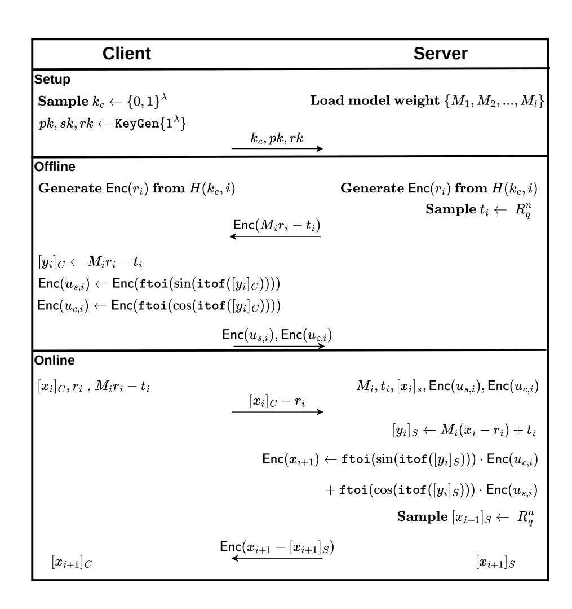
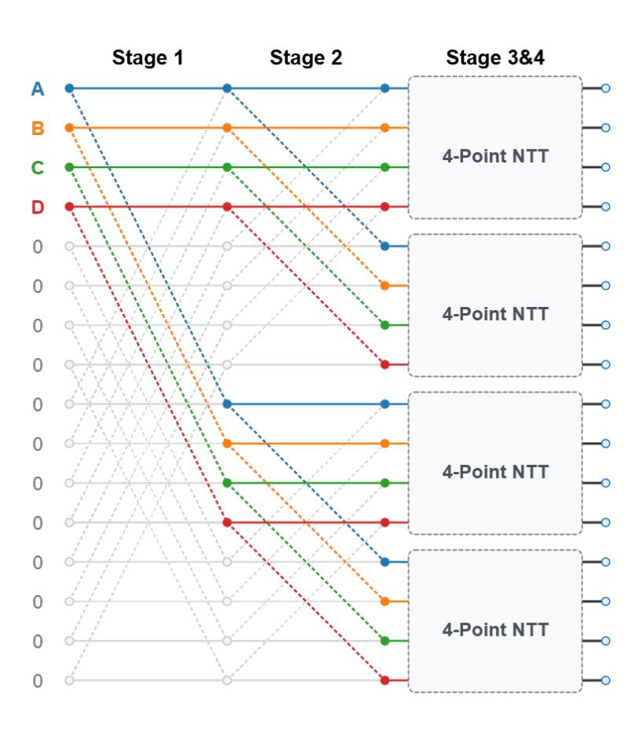
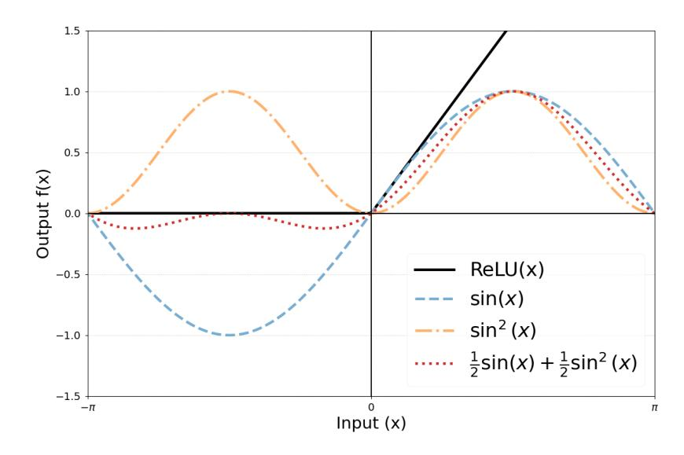
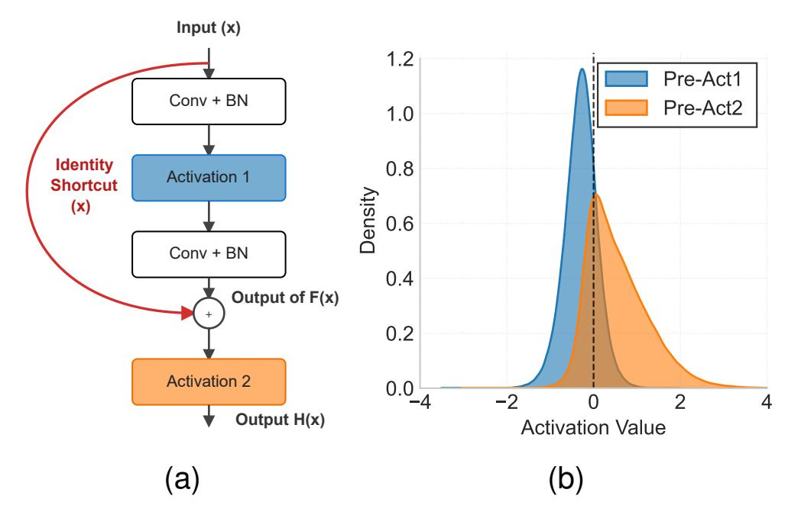
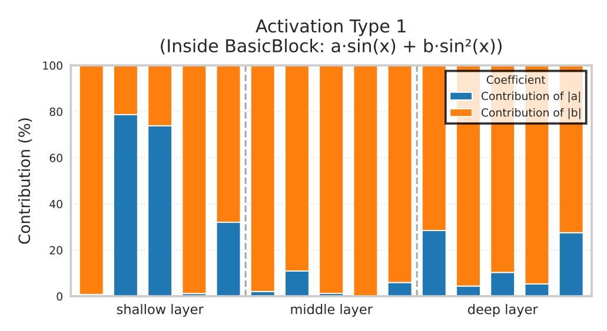
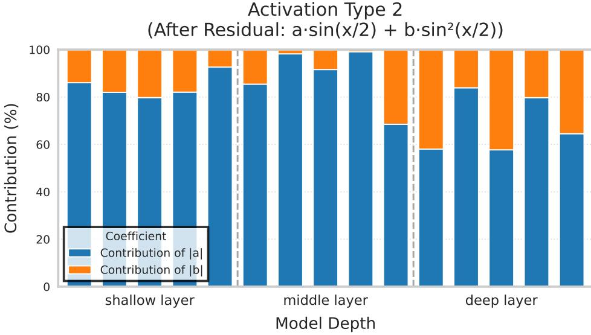

{0}------------------------------------------------

# PrivaLean: Low-Latency and High-Accuracy System for Secure 2PC Inference

Jinghao Zhao, Hongwei Yang, Bobo Wang, Lichunxi Yang, Juncheng Li, Xiangrui Zeng, Meng Hao, Desheng Wang, Hui He, Weizhe Zhang

*Abstract*—Secure multi-party computation offers a powerful paradigm for protecting private information. However, its significant computational overhead and high communication latency limit its further application. To address these challenges, we present PrivaLean, an innovative framework designed for lowround and high-accuracy secure two-party inference under the semi-honest model. The core design of PrivaLean focuses on two main dimensions. First, for linear layer evaluation, we propose two distinct optimizations: a local random ciphertext generation mechanism that avoids massive offline interactions to drastically reduce communication rounds, and an intermediate encoding method that significantly minimizes memory overhead for lowmemory devices. Second, to conquer non-linear evaluation bottlenecks, we design a co-optimized scheme featuring a novel trigonometric activation protocol and a data-distribution-aware training strategy. The activation requires only a single communication round and avoids expensive online truncation, while the training strategy can adapt to the precise data distribution and mitigate overfitting through knowledge distillation. The final accuracy is even higher than that of the ReLU-based baseline. Comprehensive evaluations on large-scale networks (e.g., MiniONN, ResNet-32/-50) demonstrate that in a Wide Area Network setting, PrivaLean completes a single ResNet-50 inference in 125.02 seconds. Compared to the state-of-the-art system Cheetah, PrivaLean achieves significantly fewer communication rounds and a 50.5% reduction in inference latency.

*Index Terms*—Secure multi-party computation, privacy preserving, homomorphic encryption, neural network.

## I. INTRODUCTION

P RIVACY-PRESERVING Machine Learning (PPML) is a computational paradigm designed to enable servers to perform machine learning tasks on encrypted data, thereby protecting the privacy of users' raw data. However, existing

This work was supported in part by the National Key R&D Program of China (Grant No. 2023YFB4503205), the National Natural Science Foundation of China (Grant No. U22A2036, 62202123, 62472122), the Natural Science Foundation of Heilongjiang Province (Grant No. LH2024F022), and the Fundamental Research Funds for the Central Universities (Grant No. HIT.NSFJG202433). (Corresponding author: Weizhe Zhang)

Jinghao Zhao, Hongwei Yang, Bobo Wang, Lichunxi Yang, Juncheng Li, Xiangrui Zeng, Meng Hao, Hui He, and Weizhe Zhang are with the School of Cyberspace Science, Harbin Institute of Technology, Harbin 150001, China (e-mail: zhaojinghao@stu.hit.edu.cn; yanghongwei@hit.edu.cn; wangbobochn@hit.edu.cn; 8201880106@stu.hit.edu.cn; lijuncheng@stu.hit.edu.cn; zengxrtih@stu.hit.edu.cn; haomeng@hit.edu.cn; hehui@hit.edu.cn; wzzhang@hit.edu.cn).

Desheng Wang is with the School of Computer Science and Technology, Harbin Institute of Technology, Shenzhen 518055, China (e-mail: wangdesheng@hit.edu.cn).

This work has been submitted to the IEEE for possible publication. Copyright may be transferred without notice, after which this version may no longer be accessible.

PPML approaches suffer from a long-standing performance bottleneck: the enormous overhead introduced by encryption operations leads to a significant increase in computational and communication latency during the model inference phase, severely hindering its practical adoption. This overhead exacerbates interaction delays, which significantly degrades service efficiency. To address this challenge, two-party privacypreserving inference methods aim to leverage collaborative computation between the client and server, combining various cryptographic tools (e.g., homomorphic encryption (HE) [1], garbled circuits [2] or secret sharing [3]), to reduce the substantial overhead in PPML while ensuring the privacy of user data during inference. Consequently, two-party privacypreserving inference has emerged as a prominent research area within privacy computing. It plays an important role in many real-world scenarios, including medical diagnosis [4], [5] and financial risk control [6]. In this study, we focus on the twoparty privacy-preserving inference scenario utilizing HE.

Based on the cryptographic protocols used, existing approaches can be classified into the following two groups: (1) the single-server architecture based approaches [7]–[9] and (2) the client-server architecture based approaches [10]–[13]. The single-server architecture based approaches, e.g., the HE-based schemes, are motivated by the intuition that linear layers in neural networks (e.g., fully connected layers and convolutional layers) are naturally compatible with the algebraic structure of HE. However, these algorithms cannot perform efficiently when evaluating non-linear activation functions because HE has limited support for non-linear operations. For example, a scheme relying solely on HE encounters difficulties when handling ReLU activation functions, as the server cannot easily perform comparison operations on ciphertexts. When we perform inference using pure linear layer evaluation approaches, the evaluation of non-linear layers becomes difficult due to the need for high-cost polynomial approximations or complex cryptographic techniques. The client-server architecture based approaches are proposed to address the above problem, which aim to leverage the advantages of multiple cryptographic tools, i.e., (1) HE for linear layers, (2) secure multi-party computation for non-linear layers, and (3) inter-layer interactions in neural networks, based on the intuition that different network layers and operation types can be efficiently implemented through interactions to refresh ciphertexts or switch between different cryptographic schemes. Such approaches can balance the overhead of different protocols and thus be used to achieve end-to-end privacy-preserving inference and have been widely

0000–0000/00\$00.00 © 2021 IEEE used and comprehensively studied in the literature.

{1}------------------------------------------------

It is worth noting that, to the best of our knowledge, almost all studies on two-party privacy-preserving inference methods often optimize from one perspective at the expense of creating bottlenecks elsewhere. Namely, existing studies on linear layer optimization primarily focus on the encoding and computational efficiency of HE itself but generally overlook the ciphertext expansion problem it introduces, which leads to prohibitive communication latency between the client and server. In non-linear layer optimization, existing schemes fall into a trilemma: they either adopt communication-intensive secure multi-party computation protocols (e.g., beaver triple generation [14] and oblivious transfer [15]) to maintain model accuracy, incurring excessive communication rounds; or use low-order polynomials (e.g., quadratic functions) to approximate activation functions to reduce communication rounds, sacrificing prediction accuracy [11], [16]; or employ highorder polynomials to pursue approximation precision, thereby introducing unbearable homomorphic computation complexity [8], [17]. Fundamentally, these methods are confined to the reliance of polynomial approximation. Such a difficult trade-off among accuracy, communication rounds, and computational complexity severely constrains the practicality of twoparty privacy-preserving inference. Nevertheless, achieving efficient and accurate two-party privacy-preserving inference remains an open problem, particularly in scenarios sensitive to interaction latency and requiring high model accuracy.

*Challenges:* There are two core problems in two-party privacy-preserving inference: (1) *the overhead of linear layers and* (2) *the accuracy-efficiency trade-off of non-linear layers.* In linear layers, conventional HE schemes generate massive ciphertexts. Transmitting these ciphertexts consumes significant communication time and storing them requires substantial server memory. Such overhead makes deploying two-party privacy-preserving inference services in resourceconstrained environments extremely difficult. Hence, the first challenge is as follows. (CH1): *How can we mitigate the substantial communication latency and memory overhead from HE ciphertexts in linear layers to improve overall efficiency and deployability?* In addition, the evaluation of non-linear layers is another severe challenge. Among existing methods, secure multi-party computation-based schemes (e.g., garbled circuits and secret sharing) can compute functions like ReLU with high accuracy but require multiple communication rounds, leading to high interaction overhead; whereas polynomial approximation-based schemes can reduce communication rounds but low-order polynomials harm accuracy, and highorder polynomials explode computational complexity. Such an irreconcilable trilemma among accuracy, communication rounds, and computational complexity constitutes the second challenge. (CH2): *How to break the reliance of polynomial approximation and design a non-linear function evaluation scheme that can simultaneously achieve high model accuracy, low communication rounds, and low computational complexity?*

*Our Solution and Contributions:* In this study, we first analyze the core challenges faced by efficient and accurate two-party privacy-preserving inference. Then, we propose an efficient privacy two-party inference framework named PrivaLean to address the above challenges through a design that coordinates communication and computation optimization. The characteristics and contributions of our study are summarized as follows:

- Targeting CH1, we propose an optimization scheme for linear layers to mitigate both communication latency and memory overhead. Specifically, we design a local random ciphertext generation mechanism. This protocol abandons the traditional idea of transmitting large amounts of HE random ciphertexts online, instead adopting a local ciphertext generation technique based on pseudo-random number generators. This operation avoids unnecessary transmission, significantly reduces the interaction rounds of linear layer evaluation and alleviates sensitivity to network latency. Furthermore, for the memory overhead issue, we propose an intermediate encoding method for low-memory devices, which leverages the characteristic of NTT intermediate states containing substantial redundant data to significantly reduce encoding overhead.
- Targeting CH2, we design a co-optimized non-linear function evaluation scheme to simultaneously achieve high model accuracy, low communication rounds, and low computational complexity. First, we propose a highly efficient trigonometric activation function protocol that fundamentally breaks the traditional reliance on polynomial approximations. It replaces standard ReLU functions with carefully designed trigonometric functions, and innovatively fuses the activation evaluation with the necessary truncation step, which reduces the communication to only one round. In addition, to guarantee model accuracy, we propose a data-distribution-aware training strategy. We adaptively tailor the activation's properties to match the precise pre-activation data distributions of different network layers and simultaneously mitigate the overfitting issue using knowledge distillation.
- Extensive experiments on standard models such as ResNet demonstrate that our PrivaLean framework significantly outperforms the state-of-the-art two-party privacypreserving inference schemes. For example, on ResNet-50, PrivaLean reduces computation time by 50.5% and significantly cuts down communication rounds, while achieving accuracy higher than models based on ReLU activation. PrivaLean also achieves an accuracy of 78.06% on CIFAR-100, surpassing the standard ReLU baseline of 75.39%.

The rest of this paper is organized as follows. Sections II and III introduce the related work and necessary preliminaries. Section IV details our linear layer protocol, which mitigates preprocessing overhead via local random ciphertext generation. Section V proposes our non-linear layer design using trigonometric activation functions to replace costly ReLUs, and Section VI further analyzes their parameter design based on data distributions. Section VII provides a comprehensive evaluation of the PrivaLean framework, and finally, we conclude the paper in Section VIII.

{2}------------------------------------------------

## II. RELATED WORK

At present, studies on two-party privacy-preserving inference mainly investigate the optimization of linear and nonlinear computational layers under two primary system models: the single-server architecture and the client-server architecture. In this work, we primarily build upon the client-server model, while strategically incorporating efficient optimization techniques from single-server designs to further enhance overall performance.

## *A. Single-Server Architecture*

In the single-server architecture, the client handles data encryption and result decryption, while a single, key-holding server performs all computational tasks. Under this model, optimizations are generally divided into handling regular linear computations and complex non-linear approximations.

For linear layers, the earliest implementation, CryptoNet [7], optimized linear layers using batch encoding, where pixels from multiple images are packed into a single ciphertext. While this reduces the amortized cost, its advantage is diminished by small client-side data batches. This approach was adopted by CryptoDL [18] and FastCryptoNet [19]. To address the high latency of batch encoding, LoLa [20] introduced a scheme for smaller data batches, but this required costly ciphertext rotation operations. Lee *et al.* [21] later mitigated this issue using multiplexed parallel convolutions to reduce rotations. Further optimizations include converting convolutions to matrix-vector multiplications (Orion [22]) and using novel packing algorithms based on the Walsh-Hadamard transform (Hyena [23]). Kim *et al.* [8] focused on maximizing channel packing within a ciphertext to improve utilization. In parallel, for graph convolutions, optimizations include leveraging data sparsity (CryptoGCN [24], LinGCN [25]). Hardware acceleration is another key direction, with works like CraterLake [26], F1 [27], and BTS [28] developing custom hardware, as well as GPU-based accelerators such as Neujeans [9] and Hyphen [29], for core HE operations.

For non-linear layers, one mainstream approach is to approximate them with low-degree polynomials, such as the square function in CryptoNet [7] or other approximations in CryptoDL [18]. This method is computationally efficient but often degrades model accuracy. Another approach uses high-degree polynomial approximations for better precision. Cheon *et al.* [30] first designed an iterative algorithm for the comparison function, and later optimized its complexity with a composite polynomial approximation for the sign function [31]. This direction was further explored in works like [17] and [8].

## *B. Client-Server Architecture*

Conversely, the client-server architecture is epitomized by Gazelle [32], which is characterized by the use of hybrid protocols: employing HE for linear layers and leveraging techniques like Garbled Circuits [2] or Secret Sharing [3] for non-linear layers. Although client participation significantly reduces the server's computational load, the primary bottleneck becomes communication overhead, which scales with network depth.

For linear layers, Gazelle [32] introduced a Hybrid Encoding scheme to effectively reduce the number of required ciphertext rotations. Delphi [11] introduced an extensive offline pre-processing stage to complete heavy ciphertext computations in advance, allowing the online phase to be completed with minimal interaction. Although this reduced the online communication load, the communication and computation overhead of the offline phase remained substantial. AutoPrivacy [33] focused on the automatic selection of HE parameters, using deep reinforcement learning to find the optimal HE parameters for each linear layer, thereby avoiding the high costs associated with using a single, oversized set of parameters for the entire network.

For the computation of non-linear layers, Delphi [11], CryptoNAS [16] and Flash [34] effectively reduced the computational overhead by using low-degree polynomials or by optimizing the number of ReLU functions. Circa [35] further proposed replacing ReLU with a stochastic sign function, introducing a probabilistic computation model to trade some accuracy for improved overall efficiency. Iron [36] introduced custom protocols for Transformer models, using a compact packing method to accelerate matrix multiplication and designing specialized secure protocols for complex functions like Softmax, GELU, and LayerNorm. Subsequent studies have further advanced these optimizations. For instance, THE-X [37] replaced GELU with ReLU, while MPCFormer [38] employed polynomials to replace complex non-linear computations. To achieve a better balance between efficiency and accuracy, researchers have also performed piecewise approximations over the domain of GELU. For example, BOLT [12] divided the domain of GELU into three segments and approximated only the middle part that exhibits higher non-linearity. Compared to BOLT, BumbleBee [13] used a finer segmentation, dividing the domain into four parts for approximation to achieve higher accuracy. Furthermore, lookup table-based methods have been explored, such as CipherGPT [39], which leveraged the properties of piecewise linear approximation to effectively reduce the number of required LUT invocations.

Furthermore, the client-server architecture must carefully handle truncation errors. Different studies have varying tolerances for these errors. For instance, CryptoFlow2 [40] proposed a "Faithful Truncation" mechanism to precisely control errors, but at the cost of heavier communication loads. In contrast, Cheetah [10] achieved a better trade-off between accuracy and communication complexity by tolerating minor computational errors.

## III. PRELIMINARIES

## *A. Notations*

Throughout this study, we adopt the following notation. An additive secret share of a value m is denoted by [m]. To distinguish the holder, we use [m]C for a share held by the client and [m]S for a share held by the server. For cryptographic schemes, we denote the HE of a message m as Enc(m) and the decryption of a ciphertext c as Dec(c). H(·) represents a cryptographic hash function, used to derive pseudorandom numbers within the protocol. Our protocols for 

{3}------------------------------------------------

PPML rely on fixed-point arithmetic. We use  $\Delta_{\rm encode}$  for the scale factor that converts floating-point inputs into fixed-point numbers, and  $\Delta_{\rm param}$  for the scale factor applied to model parameters. The combined scale for linear operations is thus  $\Delta = \Delta_{\rm encode} \cdot \Delta_{\rm param}$ . The  ${\tt itof}(m)$  operation converts an integer to its floating-point representation, which is defined as:  ${\tt itof}(m) = \frac{m}{\Delta}$ . A separate scale factor,  $\Delta_{\rm act}$ , is used to quantize the outputs of non-linear activation functions, satisfying the relation  $\Delta_{\rm act}^2 = \Delta_{\rm encode}$ . Conversely, the  ${\tt ftoi}(m)$  operation converts a floating-point number to an integer representation, which is defined as:  ${\tt ftoi}(m) = \lfloor m \cdot \Delta_{\rm act} \rfloor$ . For efficient homomorphic convolutions, we encode images and kernels into polynomials. The underlying mathematical structure for many of our constructions is the polynomial ring  $R_q$ , formally defined as the quotient ring  $\mathbb{Z}_q[x]/\langle x^N+1\rangle$ .

## B. Homomorphic Encryption

For the secure evaluation of linear layers (such as convolutional and fully connected layers), we employ the symmetric Ring Learning With Errors (RLWE) encryption scheme. In this scheme, data vectors are mapped directly into polynomials via coefficient encoding. The encryption of a message polynomial  $m \in R_p$  with a secret key sk and the corresponding decryption are defined as:

$$\mathsf{Enc}(m) = (c_0, c_1) = (-a \cdot sk + e + m, a) \bmod q,$$
  $\mathsf{Dec}(c_0, c_1) = (c_0 + c_1 \cdot sk) \bmod q \approx m.$ 

The homomorphic multiplication of an RLWE ciphertext and a plaintext polynomial natively corresponds to a convolution operation on the underlying data vectors, making it highly optimal and efficient for linear computations.

Conversely, for the execution of non-linear layers, we utilize the BFV encryption scheme. BFV inherently supports slot encoding (also known as SIMD encoding). With a plaintext modulus q and a ciphertext modulus p, the BFV encryption and decryption for a plaintext  $m \in R_q$  are defined as:

$$\operatorname{Enc}(m) = (c_0, c_1) = \left( -a \cdot sk + e + \left\lfloor \frac{p}{q} \right\rfloor \cdot m, a \right) \bmod p,$$
$$\operatorname{Dec}(c_0, c_1) = \left\lfloor \frac{q}{p} ((c_0 + c_1 \cdot sk) \bmod p) \right\rfloor \bmod q = m.$$

This property enables parallel element-wise homomorphic operations between corresponding slots, significantly accelerating the evaluation of polynomial approximations for non-linear activation functions.

## C. Threat Model

Our threat model is based on a two-party collaboration framework. The server holds a private deep neural network model as its input, and the client provides private input data (such as images). The two parties implement secure inference by executing a specific protocol. We assume the semi-honest threat model, where parties follow the protocol faithfully but may attempt to infer additional information from the observed messages. In terms of privacy protection, the client is only allowed to know the neural network architecture

Fig. 1. Overall protocol diagram.

(including the number, type, and size of each layer) and the final inference results. The server may or may not learn the results, depending on the application requirements. All other sensitive elements, such as the client's original input data and the server's model parameters (weights), are completely hidden through the encryption mechanisms.

#### D. Overall Design

Fig. 1 illustrates the overall workflow of our proposed system, which is primarily divided into an offline phase and an online phase. A key characteristic of the offline phase is the independence of operations between different neural network layers, which do not rely on actual data and can be performed at any time. The online phase features a relatively small computational load and involves data dependencies between layers. The detailed protocols for the linear and non-linear layers are presented in Section IV and Section V, respectively.

#### IV. LINEAR LAYER

## A. Linear Layer Protocol

Many privacy-preserving protocols based on HE, such as Delphi [11], rely on a pre-processing phase to generate correlated randomness, which reduces online latency. However, this pre-processing often introduces substantial overhead, limiting its practicality.

The primary bottleneck is the inefficient, interactive generation of encrypted random values. Typically, a client must generate a random plaintext  $r_i$ , encrypt it to  $\operatorname{Enc}(r_i)$ , and transmit the ciphertext to the server, incurring significant computational and communication costs.

Our efficient pre-processing protocol is built on the following observation: the security of these steps only requires 

{4}------------------------------------------------

that the plaintext  $r_i$  be uniformly random. We note that for the coefficient-encoded RLWE scheme, a ciphertext sampled uniformly from the ciphertext space already decrypts to a uniformly random plaintext.

**Lemma 1.** Let  $R_q$  be a polynomial ring. If  $(c_0, c_1) \leftarrow R_q^2$  is sampled uniformly and independently, then for any fixed secret key  $sk \in R_q$ , the decryption result

$$m = c_0 + c_1 \cdot sk \pmod{q}$$

is uniformly distributed over  $R_q$ .

*Proof.* For any fixed realization of  $c_1 \cdot sk$ , the map  $c_0 \mapsto c_0 + c_1 \cdot sk$  is a bijection on  $R_q$ . Since  $c_0$  is uniform over  $R_q$  and independent of  $c_1$ , the result follows.

Leveraging this observation, we optimize the generation of cryptographic materials. Instead of the client encrypting and transmitting random plaintexts, the server non-interactively and locally samples ciphertexts uniformly from  $R_q^2$  via a pseudorandom generator (PRG). By Lemma 1, these ciphertexts decrypt to uniformly distributed values in  $R_q$ , perfectly fulfilling the requirement for the random masks  $r_i$ . Crucially, lacking the client's secret key sk, the server cannot recover  $r_i$ , thereby preserving protocol security. This non-interactive approach eliminates client-side encryption and the associated communication round, significantly reducing pre-processing overhead.

We present the complete linear layer protocol flow below:

- 1) The client generates a homomorphic encryption key pair (pk, sk) and an automorphism key rk. The client also chooses a PRF key  $k_c \leftarrow \{0, 1\}^{\lambda}$ . The client sends  $(pk, rk, k_c)$  to the server. The server encodes the neural network weights as matrices  $M_i$  for each layer  $i \in \{1, 2, ..., l\}$ .
- 2) For each layer  $i \in \{1, 2, ..., l\}$ , the client and the server both generate the ciphertext  $Enc(r_i)$  locally.
- 3) The client obtains the plaintext  $r_i$  by decrypting  $Enc(r_i)$ .
- 4) The server generates a random mask  $t_i \leftarrow R_q^n$ , computes  $\operatorname{Enc}(M_i r_i t_i)$  via homomorphic operations and sends the result to the client.
- 5) The client decrypts the received  $Enc(M_ir_i-t_i)$  to obtain its plaintext value  $M_ir_i-t_i$ .
- 6) The client sends its input masked with  $r_i$ , which is the value  $[x_i]_C r_i$  ( $[x_i]_C = x$  for i = 1). Upon receiving this, the server computes its output share:  $M_i(x_i r_i) + t_i$ .
- 7) At the conclusion of the protocol, for each layer  $i \in \{1, 2, ..., l\}$ , the client and server respectively hold additive shares of the linear layer result  $M_i x_i$ : the client holds  $[y_i]_C \leftarrow [M_i x_i]_C = M_i r_i t_i$ , while the server holds  $[y_i]_S \leftarrow [M_i x_i]_S = M_i (x_i r_i) + t_i$ .

**Remark 1** (Fixed-Point Scaling). In our protocol, the input x and the matrix  $M_i$  are represented as fixed-point numbers with scale factors  $\Delta_{encode}$  and  $\Delta_{param}$ , respectively. Consequently, after the matrix-vector multiplication, the resulting shares represent the value  $M_i x$  with a composite scale factor of  $\Delta_{encode} \cdot \Delta_{param}$ . We will detail the secure truncation protocol used to restore the original scale in Section V.

Fig. 2. Data flow of a 16-point NTT. An initially sparse input is rapidly diffused into a dense representation. Caching an intermediate stage rather than the fully dense output helps balance memory usage and computational cost.

## B. Convolution Kernel Encoding and Memory Optimization

We adopt the polynomial coefficient encoding from Cheetah [10] and the PackLWEs algorithm [8]. To accelerate polynomial multiplications, the Number Theoretic Transform (NTT) is employed. Since weights are fixed during inference, pre-computing the NTT of convolutional kernels avoids runtime overhead.

However, caching full NTT representations causes severe memory bloat. Small convolution kernels (e.g.,  $3 \times 3$ ) map to highly sparse N-degree polynomials. The NTT butterfly operations rapidly diffuse these few non-zero coefficients, transforming sparse vectors into completely dense ones (Fig. 2) and resulting in inefficient memory usage.

To solve this, we propose an intermediate encoding method. Since the data after early NTT stages is merely a replication and diffusion of the original sparse data (containing many repeated values from zero-multiplications), we cache and compress only these intermediate states by storing unique values. During inference, this compressed data is fetched, and only the remaining NTT stages are computed on-the-fly. This approach significantly reduces the memory footprint while maintaining low computational latency.

#### C. Other optimizations

To adapt the deep learning model for efficient homomorphic evaluation (HE), we employ standard preprocessing and parameter transformation techniques. Specifically, we address the HE-incompatible division and square root operations in Batch Normalization (BN) layers by algebraically folding their linear transformations into the preceding convolutional weights, effectively removing BN layers from the evaluation graph to preserve multiplicative depth without compromising accuracy. Furthermore, we minimize the encryption modulus

{5}------------------------------------------------

to the lowest value required for security and correctness, the details of which are discussed in Section V.

#### V. NON-LINEAR LAYER

Existing studies on secure computation for non-linear layers either use Neural Architecture Search (NAS) to reduce ReLU activations [11], [16], [41], [42] or employ the original functions directly [10]. However, both strategies face significant drawbacks. Accurately implementing ReLU often requires multiple rounds of communication, while NAS-based methods reduce this cost by replacing them with cheaper approximations. Unfortunately, this process often impairs model accuracy. In contrast, we adopt the sine function as our basic activation function, a choice motivated by the following three key observations:

First, the sine function offers strong performance and stability. A significant body of research in PPML has focused on approximating non-linear functions with polynomials. However, such activations are seldom employed outside the PPML domain and often result in degraded model accuracy. In contrast, the sine function is an effective activation function, in some cases outperforming ReLU [43]. Furthermore, unlike polynomial gradients, the gradients of trigonometric functions remain bounded as the input increases, which inherently mitigates the risk of the exploding gradient problem during training.

Second, it demonstrates high efficiency in communication rounds. In a two-party secure computation setting, the goal is to compute  $\operatorname{Enc}((\sin(\alpha+\beta)))$  where the client holds  $\alpha$  and the server holds  $\beta$ . This can be efficiently achieved using the angle sum identity, which allows the computation to be distributed between the two parties:

$$\mathsf{Enc}(\sin(\alpha+\beta)) = \mathsf{Enc}(\sin(\alpha)) \cdot \cos(\beta) \\ + \mathsf{Enc}(\cos(\alpha)) \cdot \sin(\beta).$$

Since the client can transmit all values related to  $\alpha$  simultaneously, the computation of trigonometric functions over ciphertexts can be completed in a single communication round. This single-round property is highly advantageous in latency-sensitive networks. In standard 2PC settings, evaluating complex functions typically requires a massive number of communication rounds, making network latency the primary bottleneck. For instance, evaluating ResNet-50 using Cheetah [10] requires transmitting approximately 2.2 GB of data but incurs around 1000 communication rounds. On a 10 Gbps inter-city backbone network with a 20 ms RTT, the pure data transmission takes only 1.76 seconds, whereas the round-trip latency overhead skyrockets to 20 seconds.

Finally, using sine helps to circumvent fixed-point truncation errors. Protocols for linear layers typically operate over fixed-point arithmetic, where the multiplication of inputs and parameters results in an output with a composite scale factor of  $\Delta = \Delta_{\text{encode}} \cdot \Delta_{\text{param}}.$  To bypass the complexities of truncation, our protocol employs an alternative approach.

Let the true floating-point output of the linear layer be z. Its fixed-point representation is  $[z]_{\Delta}$ , and its secret shares satisfy  $[z]_C + [z]_S = [z]_{\Delta} + w \cdot q$  over  $\mathbb{Z}_q$ . Our objective is to compute

 $\sin(z)$ . We recover the floating-point value by summing the shares and then dividing by the scale factor  $\Delta$ . The input to the activation function thus becomes:

$$\frac{[z]_C + [z]_S}{\Delta} = \frac{[z]_\Delta + w \cdot q}{\Delta} \approx z + w \cdot \frac{q}{\Delta}.$$

This introduces an error term,  $w \cdot (q/\Delta)$ . To eliminate this error, we leverage the sine function's periodicity and strategically select the modulus q such that  $q/\Delta$  is approximately an integer multiple of  $2\pi$  (denoted as T). Consequently, when a wraparound occurs (w=1), the computation is as follows:

$$\sin\left(z + w \cdot \frac{q}{\Delta}\right) \approx \sin(z + w \cdot T) = \sin(z).$$

This method entirely obviates the need for a truncation protocol while ensuring the accuracy of the final result. Since truncation protocols also require a large amount of interaction, this further reduces the number of communication rounds.

The overall protocol, executed between a client and a server, proceeds as follows:

- 1) The server and the client hold their respective secret shares of the input  $y_i$ , denoted as  $[y_i]_S$  and  $[y_i]_C$ .
- 2) The client computes and encrypts the trigonometric values of its own share, then sends the following ciphertexts to the server:

$$\operatorname{Enc}(u_{s,i}) \leftarrow \operatorname{Enc}(\operatorname{ftoi}(\sin(\operatorname{itof}([y_i]_C)))),$$
  
 $\operatorname{Enc}(u_{c,i}) \leftarrow \operatorname{Enc}(\operatorname{ftoi}(\cos(\operatorname{itof}([y_i]_C)))).$ 

3) The server applies the angle sum identity, combining the received ciphertexts with the trigonometric values of its own share  $[y_i]_S$ , to compute the final encrypted activation value:

$$\operatorname{Enc}(x_{i+1}) \leftarrow \operatorname{ftoi}(\sin(\operatorname{itof}([y_i]_S))) \cdot \operatorname{Enc}(u_{s,i}) + \operatorname{ftoi}(\cos(\operatorname{itof}([y_i]_S))) \cdot \operatorname{Enc}(u_{c,i}).$$

4) The server generates its local output share  $[x_{i+1}]_S$ . It then computes and sends a masked ciphertext to the client:

$$Enc(x_{i+1}) - [x_{i+1}]_S.$$

5) The client decrypts the ciphertext and holds its share:

$$[x_{i+1}]_C \leftarrow x_{i+1} - [x_{i+1}]_S.$$

**Remark 2** (Extension to compute  $\sin^2(x)$ ). Our framework readily extends to computing other functions, such as  $\sin^2(x)$ , by leveraging the power-reduction identity  $\sin^2(x) = (1 - \cos(2x))/2$ . The core task transforms into securely computing  $\cos(2x)$ . A crucial consideration is that locally doubling the shares introduces a modular wraparound error, resulting in an effective input of  $2x + \frac{2wq}{\Delta}$ .

However, our initial  $\overline{d}esign$  choice, where the ratio  $q/\Delta$  approximates the period  $2\pi$ , elegantly handles this. The activation becomes:

$$\cos\left(2x + \frac{2wq}{\Delta}\right) \approx \cos\left(2x\right).$$

Since  $2w \cdot (q/\Delta)$  remains an integer multiple of the period, the error is eliminated. This demonstrates that our protocol

{6}------------------------------------------------

*can support such functions without modification, highlighting the robustness of its design.*

Remark 3 (Offline/Online Phase Partition). *The client's input,* [yi ]C *, is in fact the output from the preceding linear layer, taking the form* Miri − ti *. As this value is independent of the user's input during the online phase, our non-linear layer protocol can, similar to linear layers, be partitioned into offline and online phases. The protocol steps leading up to the client's data transmission can be defined as the offline phase, which effectively reduces the overhead of the online phase.*

Fig. 3. A comparison of three different trigonometric activation function combinations and the ReLU activation. The combinations are for the function f(x) = a · sin(x) + b · sin2 (x).

## VI. ANALYSIS OF PERIODIC ACTIVATION FUNCTIONS

## *A. Parameter Design of Trigonometric Activation Function*

Compared to traditional activation functions, trigonometric functions possess unique properties that, while offering optimization potential, also introduce distinct challenges. Our analysis reveals that a naive application of sin(x) is suboptimal due to two primary issues: instability caused by its periodicity and limited expressiveness from its near-origin linearity. To address these, we propose and analyze a more robust activation function.

The first challenge stems from periodicity. While potentially beneficial for periodic data, in general tasks like image classification, an excessively short period can cause training nonconvergence. We observed this by examining the input distribution to activation layers in a ResNet model. As illustrated in the residual block (Fig. 4a), the input to the second activation layer, after summing with the identity shortcut, exhibits a significantly wider distribution. To mitigate instability, we use the form sin(x/w), where the parameter w adjusts the period. For the remainder of this analysis, we assume w = 1 without loss of generality to focus on the function's core shape.

The second challenge persists even after period adjustment: the near-origin linearity of sin(x), where sin(x) ≈ x. Since a substantial portion of inputs to activation layers is concentrated around zero, this linearity severely weakens the network's non-linear modeling capability, which is critical for learning complex features. To address this, we propose enhancing the function's non-linearity by introducing a quadratic term,

Fig. 4. The architecture of a ResNet bottleneck block and the resulting preactivation data distributions for its two internal activation layers, act1 and act2. Due to the addition of the identity shortcut, the input distribution to the second activation layer (act2) is significantly wider and shifted towards positive values compared to that of the first (act1).

resulting in the form a · sin(x) + b · sin2 (x). For efficient implementation, the quadratic term is computed using the powerreduction technique detailed in Remark 2, which transforms sin2 (x) into a function of cos(2x). Consequently, the system must compute both sin(x) and cos(2x).

## *B. Layer-wise Behavior in Residual Blocks*

We now explore the influence of the two parameters, a and b, of our trigonometric activation function on the results. Fig. 3 displays three different combinations of the function alongside the standard ReLU activation: (a = 1, b = 0; a = 0.5, b = 0.5; and a = 0, b = 1). As can be seen from the figure, the parameter combination a = 0.5, b = 0.5 yields a function shape that is quite similar to ReLU. This might suggest that this combination is the optimal choice. However, the opposite is true, as the other two combinations are more frequently employed in training. This indicates that the success of trigonometric-based activations does not come from approximating ReLU; rather, trigonometric functions are inherently superior. Experimental results confirm that using trigonometric functions leads to better performance than ReLU. Therefore, a more effective strategy is to tailor different layers according to their specific needs, pruning some to use a · sin(x) and others to use b · sin2 (x). A direct benefit of this approach is the potential to reduce the model's communication overhead.

To explain this phenomenon, we use the ResNet bottleneck block as an example. As depicted in Fig. 4a, a bottleneck block contains two activation functions. The core principle of ResNet is the use of a shortcut connection to bypass layers. This ensures that if a particular layer proves to be detrimental to training, the shortcut allows it to be effectively transformed into an identity layer, thereby preventing any negative impact on the model's performance. Our analysis of the data distribution in deep networks provides a clue as to how this can be achieved.

At the first activation function, we observe from Fig. 4b that a large portion of the input has negative values. This suggests that the model is inclined to bypass this layer. After replacing 

{7}------------------------------------------------

the activation function with  $a \cdot \sin(x) + b \cdot \sin^2(x)$ , the model learns to favor the  $b \cdot \sin^2(x)$  component. A key property of this function is that at the origin (x=0), both its value and its derivative are zero  $(\sin^2(0) = 0$ , and  $\frac{d}{dx}(\sin^2(x))\big|_{x=0} = 0$ ). This means the function effectively suppresses the neuron's activation when the input is close to zero. This suppressive effect is functionally analogous to ReLU's zeroing of negative values, but it achieves this in a smoother manner. This aligns perfectly with the design principle of ResNet: to suppress potentially harmful layers.

At the second activation function, the situation is entirely different. Fig. 4b shows that the vast majority of the input data here is positive. For positive inputs, the ReLU function behaves almost identically to a linear layer (y=x), with its primary role being to allow information to pass through directly. To achieve a similar linear-like behavior, the model learns to favor the  $a \cdot \sin(x)$  component. The rationale is that near the origin, the curve of  $\sin(x)$  closely approximates the line y=x. Consequently,  $a \cdot \sin(x)$  can effectively mimic the linear transmission behavior of ReLU in this context.

## C. Generalization and Knowledge Distillation

Furthermore, we investigated the generalization behavior of the proposed activation when trained from scratch. Our experiments reveal an intriguing phenomenon: networks with  $a \cdot \sin(x) + b \cdot \sin^2(x)$  achieve higher training accuracy than ReLU-based counterparts, yet exhibit lower testing accuracy. This indicates that the enhanced non-linear expressiveness, while powerful, acts as a double-edged sword, fitting the training data exceptionally well but leading to overfitting on unseen data without explicit constraints.

To address this, we employ Knowledge Distillation (KD). Remarkably, when a pre-trained ReLU model serves as the teacher for a trigonometric student, the resulting performance surpasses that of ReLU self-distillation. The ReLU teacher provides well-generalized soft targets that act as a strong regularizer, preventing the trigonometric student from memorizing noise. Simultaneously, the highly expressive trigonometric student possesses sufficient capacity to faithfully capture the nuanced distribution of these soft targets, something a piecewise-linear ReLU student is less equipped to do. This strategy thus successfully combines the generalization strength of ReLU with the superior representational capacity of trigonometric functions.

#### VII. EVALUATION

In this section, we present a comprehensive evaluation of PrivaLean. Our experiments are designed to answer the following key research questions:

- Q1: What is PrivaLean's performance at different layers?
- **Q2:** What is the memory overhead introduced by our convolution kernel encoding scheme?
- **Q3:** How do our proposed trigonometric activation functions affect the accuracy of different models?
- Q4: What are the advantages of PrivaLean in terms of communication and latency on models of different sizes?

## A. Experiment Setup

- 1) Implementation Details: The experiments were conducted on a computer equipped with an 8-core 3.4 GHz CPU and 32 GB of RAM, running Ubuntu 24.04. Our system was configured to use four threads. For HE, we used the Microsoft SEAL library1, adapted to our requirements. We set the homomorphic encryption parameters with a polynomial ring dimension of N=4,096 and a 39-bit plaintext modulus q and a 108-bit ciphertext modulus p. We configured two network environments: Network A with 1000 MBps bandwidth and 10 ms latency, and Network B with 100 MBps bandwidth and 100 ms latency. We utilized LibTorch to accelerate the online inference stage. We evaluated our framework on two datasets, CIFAR10 and CIFAR100, to test on three models: MiniONN [44], ResNet-32, and ResNet-50 [45]. All single operations were not counted in time, such as key transmission, model weight loading, and encoding. For neural network training, we constructed an experimental framework that first used ReLU as the activation function to train a benchmark model. After convergence, this model served as a teacher for knowledge distillation, with hyperparameters set to  $\alpha = 0.5$ and T = 4 [46].
- 2) Baselines and Configurations: To comprehensively evaluate PrivaLean, we compare it against several state-of-the-art methods and configurations grouped by evaluation focus.
- a) System Performance Baselines: For evaluating the performance of core components and end-to-end models, we compare PrivaLean against the following systems:
  - **Delphi** [11]: Delphi reduces online communication and computation load by moving the transmission of homomorphically encrypted ciphertexts to the offline phase. For non-linear layers, it replaces ReLU with a quadratic function, which improves efficiency but can negatively impact accuracy.
  - Cheetah [10]: Implements linear layers with coefficientencoded HE. For non-linear layers, ReLU is implemented using the millionaire protocol, requiring multiple rounds of communication.
  - **Optimized** [8]: For non-linear layers, it approximates ReLU using higher-order polynomials, which tend to consume a lot of multiplicative depth, so bootstrapping is often needed after the multiplication.
- b) Memory Footprint Benchmarks: To evaluate the memory footprint of our encoding scheme, we compare the storage requirements of the following three methods:
  - Unencoded Model Parameters: The standard memory usage of the model with 4-byte floating-point weights.
  - Full NTT Representation: A naive baseline where all network parameters are stored in their expanded NTT-transformed format.
  - Intermediate NTT Encoding (Ours): Our proposed scheme, which only stores the pre-computed encoded kernels.
- c) Accuracy Evaluation Configurations: To assess the impact of our proposed activation function on model accuracy, we compare the performance of several model configurations:

&lt;sup>1Microsoft SEAL, available at: https://github.com/microsoft/SEAL

{8}------------------------------------------------

TABLE I PERFORMANCE FOR PRIVALEAN AND DELPHI ON RESNET-32 CONVOLUTIONAL LAYERS.

| Layer Config        | Method    | Offline |       | Online |       |
|---------------------|-----------|---------|-------|--------|-------|
|                     |           | Time    | Comm. | Time   | Comm. |
| Input: 32 × 32 × 16 | Delphi*   | 1236.0  | 10.48 | 15.90  | 0.065 |
| Kernel: 16 × 3 × 3  | PrivaLean | 38.0    | 0.36  | 20.00  | 0.250 |
| Input: 16 × 16 × 32 | Delphi*   | 1262.5  | 15.64 | 15.64  | 0.020 |
| Kernel: 32 × 3 × 3  | PrivaLean | 39.0    | 0.18  | 15.00  | 0.125 |
| Input: 8 × 8 × 64   | Delphi*   | 2662.0  | 5.24  | 15.60  | 0.036 |
| Kernel: 64 × 3 × 3  | PrivaLean | 47.0    | 0.90  | 15.00  | 0.062 |

\* All Delphi results use a US West (us-west-1/2) network, while PrivaLean uses a Net. A setup.

- ReLU Baseline: The original model using the standard ReLU activation function.
- ReLU + Self-Distillation: Applies self-distillation to the ReLU baseline. Since some works [47], [48] suggest that self-distillation can improve model performance. This is included to account for performance gains from selfdistillation alone, enabling a fairer comparison.
- Trigonometric Function (Ours): Employs our learnable trigonometric activation function, a · sin(x/w) + b · sin2 (x/w). Based on our experimental setup, the parameter w for the act1 layer in ResNet-32 was set to 1, while for all other activation functions, w was set to 2.
- Pruned Trigonometric (Ours): A variant of our model where a significant portion of the trigonometric activation functions are pruned.

## *B. Performance Comparison and Analysis*

To answer the four key questions (*Q1-Q4*), we conducted the following experiments and analyzed the corresponding results.

*Result 1 Core Components Performance (for Q1):* To answer Q1, we compared our linear layer protocol with Delphi [11] and Cheetah [10]. Tables I and II show a comparison of PrivaLean regarding convolutional layers. Compared to Delphi and Cheetah, PrivaLean offers two advantages: first, in the offline phase, it transmits ciphertext data only once; second, it employs a batch normalization fusion strategy, which eliminates the need for additional batch normalization operations.

As shown in Table I, compared to Delphi, PrivaLean outperforms Delphi in both communication overhead and execution time during the offline phase, due to the adoption of offline ciphertext generation and optimization of ciphertext bit width. However, there is no advantage in the online phase, primarily because Delphi leverages GPU acceleration, while PrivaLean transfers a larger volume of data. In summary, as offline phase communication and computation are performed on ciphertexts, this overhead dominates the protocol. Therefore, our optimization of the offline phase leads to a more significant overall performance improvement. According to Table II, PrivaLean's advantage over Cheetah is more pronounced under Net. B conditions. Since PrivaLean does not need to send ciphertext to the server and reduces communication traffic through ciphertext packaging, it has significant advantages in high-latency wide area network environments.

We also benchmarked PrivaLean's non-linear layer protocol against other schemes, with the results in Table III highlighting their distinct trade-offs. Existing approaches present a difficult choice between computation, accuracy, and communication overhead. For instance, the "Optimized" scheme approximates ReLU with composite functions, eliminating network communication but incurring a major computational bottleneck due to its reliance on costly bootstrapping operations. The Delphi scheme shifts the burden to an offline phase for generating multiplication triples but compromises model accuracy by using a simpler quadratic activation function. Finally, Cheetah significantly reduces communication volume using VOLEstyle OT but remains sensitive to network latency due to its high number of communication rounds.

PrivaLean addresses these limitations by adopting a trigonometric activation function. This approach has two key advantages. Computationally, it only requires ciphertextplaintext multiplications, which are far more efficient than the ciphertext-ciphertext multiplications found in polynomial approximations, thereby avoiding the need for bootstrapping. In terms of communication, PrivaLean is designed for a single round of interaction. Consequently, while its total data volume may be greater than Cheetah's, its single-round nature provides a significant advantage in high-latency network environments, directly countering a key weakness of multi-round protocols.

*Analysis and Summary 1:* In summary, PrivaLean's performance gains stem from a synergistic optimization of both linear and non-linear layers. By offloading expensive computations for linear layers to the offline phase and minimizing communication rounds for non-linear layers, our design strikes an effective balance between performance, accuracy, and communication efficiency. This makes PrivaLean particularly wellsuited for high-latency environments, a key advantage over competing frameworks.

*Result 2 Memory Overhead (for Q2):* To answer Q2, we evaluated the memory footprint of our kernel encoding method. Since neural network parameters are invariant during inference, the encoded kernels can be pre-computed and stored in memory. As shown in Table IV, our intermediate NTT encoding has a larger memory footprint than the original model parameters, mainly because it uses fixed-point numbers instead of the more compact 4-byte floating-point format. However, it is still significantly more memory-efficient than storing the entire network in its full NTT representation. The table also shows some special cases: if a polynomial encodes only one element, all its values after NTT are identical, and the fully encoded space remains very small.

*Analysis and Summary 2:* Our memory overhead analysis confirms that the proposed encoding scheme presents a practical trade-off. This balance makes the pre-computation and in-memory storage of encoded kernels feasible.

*Result 3 Trigonometric Activation Performance (for Q3):* To answer Q3, we investigated the impact of the periodicity of trigonometric activation functions on the neural network training process mentioned in Section VI-A. To systematically

† Time in milliseconds; Data in megabytes.

{9}------------------------------------------------

| TABLE II                                                                 |
|--------------------------------------------------------------------------|
| PERFORMANCE FOR PRIVALEAN AND CHEETAH ON RESNET-50 CONVOLUTIONAL LAYERS. |

| Input Shape Kernel Shape |             | Network          | Cheetah               |            | PrivaLean  |               |           |              |  |
|-----------------------------|-------------|------------------|-----------------------|------------|------------|---------------|-----------|--------------|--|
|                             |             |                  | (Overall Performance) |            |            | Offline Phase |           | Online Phase |  |
| H × W × Ci                  | Co × h × w  |                  | Time (ms)             | Comm. (MB) | Time (ms)  | Comm. (MB)    | Time (ms) | Comm. (MB)   |  |
| 28 × 28 × 128               | 128 × 3 × 3 | Net. A Net. B | 144 532            | 6.25       | 120 390 | 1.45          | 36 137 | 1.00         |  |
| 14 × 14 × 256               | 256 × 3 × 3 | Net. A Net. B | 200 746            | 8.6        | 140 412 | 0.75          | 30 121 | 0.50         |  |

TABLE III COMPARISON OF AMORTIZED OVERHEAD IN NONLINEAR LAYER PROTOCOLS.

| Scheme    | Activation Func. | Network | Time (µs) | Comm. (B) |
|-----------|------------------|---------|-----------|-----------|
| Optimized | Poly. Approx.    | -       | 270       | -         |
| Cheetah   | ReLU             | Net. A  | 1.40      | 30        |
| Cheetah   | ReLU             | Net. B  | 10.43     | 30        |
| Delphi    | Quad             | Net. B  | 6         | 163       |
| PrivaLean | Trigonometric    | Net. A  | 1.27      | 90        |
| PrivaLean | Trigonometric    | Net. B  | 7.68      | 90        |

TABLE IV MEMORY FOOTPRINT COMPARISON OF ENCODING METHODS (MB).

| Kernel Shape      | Plaintext | Intermediate | Full  |
|-------------------|-----------|--------------|-------|
| 256 × 64 × 1 × 1  | 0.06      | 2.95         | 2.90  |
| 64 × 64 × 3 × 3   | 0.14      | 0.51         | 93.51 |
| 128 × 128 × 3 × 3 | 0.56      | 0.82         | 93.51 |

TABLE V CONVERGENCE RESULTS FOR DIFFERENT ACTIVATION FUNCTION COMBINATIONS IN A C T1 AND A C T2 OF THE RESNET-32 MODEL. 'S' DENOTES SUCCESS, 'F' DENOTES FAILURE.

|            | act2 Layer |          |        |         |
|------------|------------|----------|--------|---------|
| act1 Layer | ReLU       | sin(x/2) | sin(x) | sin(2x) |
| ReLU       | S          | S        | S      | F       |
| sin(x/2)   | S          | S        | S      | F       |
| sin(x)     | S          | S        | S      | F       |
| sin(2x)    | S          | F        | F      | F       |

evaluate this characteristic, we conducted tests on a ResNet-32 model by assigning different activation function combinations to two distinct layers, designated act1 and act2. The selected activation functions include ReLU and three sinusoidal variants with different periods: sin(x/2), sin(x), and sin(2x). We denote successful model convergence as "S" (Success) and divergence as "F" (Failure). The experimental results, presented in Table V, reveal a significant correlation between the activation function's period and the model's training difficulty. As the period shortens (e.g., from sin(x) to sin(2x)), the input data are more likely to fall into non-monotonic intervals of the function, posing a substantial challenge to the overall training process. Furthermore, we observe that the adaptability to periodic functions varies depending on the activation layer's position. Specifically, the act2 layer, due to its residual connection design, tends to receive inputs with a wider numer-

Fig. 5. Contribution ratio of parameter a and parameter b in the trained ResNet-32.

ical range. As shown in the table, when act2 uses a highfrequency function, it leads to failure more often than when act1 uses the same function. This phenomenon indicates that the neural network's training does not effectively leverage the periodicity of trigonometric functions; instead, it is adversely affected by their high-frequency characteristics.

To investigate the differentiated requirements for activation function properties across various network layers mentioned in Section VI-B, we designed a novel activation function: a·sin(x/w) +b ·sin2 (x/w), where the parameters a and b are adaptively learned during the training process. As illustrated in Fig. 5, we analyzed the forms of the activation functions (act1 and act2) and their parameter contribution across the shallow, middle, and deep layers of a ResNet-32 model. This analysis reveals a distinct behavioral pattern. Specifically, the act1 activation function, located within the residual block, tends to learn a form that approximates b · sin2 (x/w). In contrast, the act2 activation, which integrates the output

{10}------------------------------------------------

TABLE VI PERFORMANCE COMPARISON OF ACTIVATION FUNCTIONS ACROSS DIFFERENT MODELS AND DATASETS.

| Model     | Dataset   | Activation Scheme                                                      | Accuracy (%)                     |
|-----------|-----------|------------------------------------------------------------------------|----------------------------------|
| MiniONN   | CIFAR-10  | ReLU (Baseline) ReLU + Self-Dist. Ours (Trig.)                   | 87.61 88.15 88.54          |
| ResNet-32 | CIFAR-100 | ReLU (Baseline) ReLU + Self-Dist. Ours (Trig.) Ours + Pruning | 70.94 73.34 73.70 73.65 |
| ResNet-50 | CIFAR-100 | ReLU (Baseline) ReLU + Self-Dist. Ours (Trig.) Ours + Pruning | 75.39 76.08 78.06 76.99 |

from the residual connection, is inclined to evolve into a form resembling a · sin(x/w). This functional differentiation is particularly prominent in the middle layers of the network, suggesting that within the ResNet architecture, when a block's complex non-linear transformation is suboptimal, the optimizer tends to adopt a "layer-skipping" strategy. It achieves this by adjusting the activation function to weaken the module's non-linear capabilities.

We systematically evaluated our proposed knowledge distillation strategy mentioned in Section VI-C on three neural network architectures: MiniONN, ResNet-32, and ResNet-50. The MiniONN model was trained and evaluated on the CIFAR-10 dataset, whereas the ResNet-32 and ResNet-50 models were tested on the more challenging CIFAR-100 dataset. We compared the "ReLU Baseline", "ReLU + Self-Distillation", and our "Trigonometric Function" configurations, as detailed in the setup. Furthermore, we investigated the impact of activation function pruning on the ResNet architectures with our "Pruned Trigonometric" configuration. During training, if the learnable parameters a and b of an activation function were determined to be negligibly small, the corresponding branch was pruned. Through this strategy, we pruned approximately 70% of the activation functions in ResNet-32 and about 63% in ResNet-50. The experimental results are presented in Table VI. The data analysis indicates that knowledge distillation consistently enhances model performance, regardless of whether the student model employs ReLU or our proposed trigonometric activation. Critically, our activation function outperforms both the standard ReLU baseline and its self-distilled counterpart across all tested architectures. The experiments also reveal a trade-off in pruning: while applying it to our activation function causes a minor drop in accuracy for ResNet models, the performance remains substantially higher than the original ReLU baseline.

*Analysis and Summary 3:* The evaluation confirms that our learnable trigonometric activation function is a highly effective alternative to ReLU. The analysis of its periodicity and layerspecific adaptation demonstrates its flexibility within deep architectures, where it automatically balances non-linearity and identity mapping through learnable parameters. Critically, our function consistently surpasses both standard and self-distilled ReLU baselines in accuracy. Even with aggressive pruning, which simplifies the model, performance remains superior, highlighting its potential as a robust, drop-in replacement for privacy-preserving inference.

TABLE VII PERFORMANCE COMPARISON OF DIFFERENT SECURE INFERENCE SYSTEMS ACROSS NEURAL NETWORK MODELS.

| Model     | System    | Time (s) |        | Comm. (MB) |
|-----------|-----------|----------|--------|------------|
|           |           | Net. A   | Net. B |            |
| MiniONN   | Delphi    | 40       | -      | 256        |
|           | PrivaLean | 1.16     | 6.27   | 35         |
| ResNet-32 | Delphi    | 100      | -      | 2,048      |
|           | PrivaLean | 2.56     | 21.03  | 81         |
| ResNet-50 | Cheetah   | 52.24    | 252.71 | 2,249      |
|           | PrivaLean | 36.15    | 125.02 | 1,406      |

*Result 4 Overall Communication and Latency Evaluation (for Q4):* Finally, to answer Q4, we conducted a comprehensive performance evaluation of our proposed system on three neural network models: MiniONN, ResNet-32, and ResNet-50. As presented in Table VII, PrivaLean consistently outperforms prior works across all tested models. Compared to the baseline, Delphi, our system achieves a 97.1% reduction in inference time and a 86.3% reduction in communication volume on the MiniONN network. On ResNet-32, it similarly reduces inference time by 97.44% and communication by 96.0%. This performance advantage validates the effectiveness of our strategy of locally generating ciphertext for random numbers. Furthermore, in our comparison with Cheetah, we standardized the input image size to 224×224 to ensure a fair comparison. The results show that our system's superiority is particularly pronounced in Net. B environments, which are characterized by low bandwidth and high latency. This is primarily attributed to two factors: first, our protocol incurs lower communication overhead; second, its handling of non-linear layers requires only a single round of communication, which significantly mitigates the performance bottleneck caused by high network latency.

*Analysis and Summary 4:* PrivaLean's design is shown to effectively address key performance bottlenecks in secure inference. By optimizing ciphertext handling and minimizing communication rounds for non-linear layers, our system achieves significant performance gains and demonstrates robustness in latency-sensitive network conditions.

## VIII. CONCLUSION

In this paper, we propose PrivaLean, an efficient two-party secure inference framework. We tackle existing overhead bottlenecks through two main dimensions. For linear layers, our local random ciphertext generation and intermediate encoding elegantly reduce HE communication rounds and memory usage. For non-linear layers, we introduce a novel trigonometric activation protocol combined with a data-distributionaware training strategy, enabling single-round, truncation-free evaluation while actually boosting model accuracy. Compared to the state-of-the-art Cheetah, PrivaLean cuts communication by 30.8% and latency by 50.5% while maintaining or even improving the model's accuracy, demonstrating its superiority as 

{11}------------------------------------------------

a low-overhead, high-performance, and high-accuracy secure inference solution.

## APPENDIX SECURITY PROOF

We prove security via a standard simulation-based argument, closely following the proof strategy from Delphi [11], from which we also borrow notation like  $Sim_{FP}$ .

- a) Corrupted Client: We prove via a hybrid argument that the real-world distribution is computationally indistinguishable from a simulated distribution. In the final simulated distribution, the simulator does not use the server's model weights. Therefore, a corrupted client in the real world learns no additional information beyond the final output prediction and the model architecture.
  - **Hyb0:** This hybrid corresponds to the real-world distribution, where the server uses its private input matrices  $M_i$ .
  - **Hyb1:** This hybrid involves only a syntactic change. In the output phase, the simulator sends  $y-r_l$  to the client, where y is the true output of the neural network on input x. Furthermore, the simulator, leveraging its knowledge of the client's random tape, already knows the client's inputs  $x_i-r_i$ , and the ciphertexts  $\operatorname{Enc}(u_{s,i})$  and  $\operatorname{Enc}(u_{c,i})$  for the evaluation of layer i. As this is merely a change in the simulator's internal perspective and does not affect the actual protocol transcript, the distribution of Hyb1 is identical to that of Hyb0.
  - **Hyb2:** In this hybrid, we use the function privacy simulator,  $Sim_{FP}$ , of the HE scheme for every homomorphic evaluation in both the offline and online phases. Note that  $Sim_{FP}$  only requires the output  $M_i \cdot r_i t_i$  in the linear layer and  $[x_{i+1}]_C$  in the non-linear layer to generate the post-evaluation ciphertext. By the function privacy of HE, Hyb2 is computationally indistinguishable from Hyb1.
  - **Hyb3:** In this hybrid, we replace the inputs given to the  $Sim_{FP}$  simulator with values sampled uniformly at random from  $R_q^n$ , instead of using the real values  $M_i \cdot r_i t_i$  and  $[x_{i+1}]_C$ . Since the server's secret shares,  $t_i$  and  $[x_{i+1}]_S$ , are chosen uniformly at random in the protocol, the values they mask are statistically indistinguishable from uniform random values. Therefore, the distribution of Hyb3 is identical to that of Hyb2. We note that the final Hyb3 distribution matches the simulator's output, thus completing the proof.
- b) Corrupted Server: We prove via a hybrid argument that the real-world distribution is computationally indistinguishable from a simulated distribution. In the final simulated distribution, the simulator does not use the client's input. Therefore, a corrupted server in the real world learns no information about the client's input.
  - **Hyb0:** This hybrid corresponds to the real-world distribution, where the client uses its true input x.
  - **Hyb1:** This hybrid involves only a syntactic change. The simulator, leveraging its full knowledge of the client's true input x, the model matrices  $M_i$ , and the server's random tape, directly computes and sends messages like

- $x_i r_i$ ,  $\operatorname{Enc}(u_{s,i})$ , and  $\operatorname{Enc}(u_{c,i})$  that the client would have sent during the offline phase of each layer. Since this change is purely syntactic and generates an identical transcript, the distribution of Hyb1 is identical to that of Hyb0.
- **Hyb2:** In this hybrid, the simulator uses a newly sampled random seed  $k'_c$  instead of the real seed  $k_c$ . Since  $k_c$  is chosen uniformly at random from  $\{0,1\}^{\lambda}$  in the real protocol, the re-sampled seed comes from the same distribution. Thus, the distribution of Hyb2 is identical to that of Hyb1.
- **Hyb3:** In this hybrid, we change how the random masks (e.g.,  $r_i$ ) are generated by the simulator. In Hyb2, these masks are obtained by decrypting uniformly random ciphertexts (generated using the seed  $k'_c$ ) with the client's secret key. In Hyb3, the simulator instead samples uniformly random plaintexts  $r'_i$  directly from the plaintext space and uses them as masks. The messages sent to the server are computed as  $x_i r'_i$ , etc. According to lemma 1, a plaintext resulting from the decryption of a uniformly random ciphertext is computationally indistinguishable from a uniformly random plaintext. Therefore, from the server's perspective, the view in Hyb3 is computationally indistinguishable from the view in Hyb2.
- **Hyb4:** In this hybrid, we replace the messages sent from the client to the server, namely  $x_i - r'_i$ ,  $Enc(u_{s,i})$ , and  $\mathsf{Enc}(u_{c,i})$ , with simulated values. For  $x_i - r_i'$ , we replace it with a value sampled uniformly at random from its space. Due to the one-time pad property, the true masked value  $x_i - r_i'$  is perfectly uniformly distributed. For  $Enc(u_{s,i})$ and  $Enc(u_{c,i})$ , the simulator replaces them with encryptions of dummy values (e.g., encryptions of zeros). By the IND-CPA security of the underlying Homomorphic Encryption scheme, these simulated ciphertexts are computationally indistinguishable from the real encryptions. Therefore, the distribution of Hyb4 is computationally indistinguishable from that of Hyb3. We note that the final Hyb4 distribution matches the simulator's output and that the client's true input x was not used in the simulation, thus completing the proof.

## REFERENCES

- [1] C. Gentry, "Fully homomorphic encryption using ideal lattices," in *Proc.* 41st Annu. ACM Symp. Theory Comput., 2009, pp. 169–178.
- [2] Y. Lindell and B. Pinkas, "A proof of security of Yao's protocol for two-party computation," *J. Cryptol.*, vol. 22, no. 2, pp. 161–188, 2009.
- [3] D. Demmler, T. Schneider, and M. Zohner, "ABY a framework for efficient mixed-protocol secure two-party computation," in *Proc. Netw. Distrib. Syst. Secur. Symp. (NDSS)*, 2015, pp. 1–15.
- [4] S. Carpov, T. H. Nguyen, R. Sirdey, G. Constantino, and F. Martinelli, "Practical privacy-preserving medical diagnosis using homomorphic encryption," in *Proc. 9th IEEE Int. Conf. Cloud Comput. (CLOUD)*, 2016, pp. 593–599.
- [5] J. A. Alzubi, O. A. Alzubi, M. Beseiso, A. K. Budati, and K. Shankar, "Optimal multiple key-based homomorphic encryption with deep neural networks to secure medical data transmission and diagnosis," *Expert Syst.*, vol. 39, no. 4, p. e12879, 2022.
- [6] O. Masters, H. Hunt, E. Steffinlongo, J. Crawford, F. Bergamaschi, M. E. D. Rosa, C. C. Quini, C. T. Alves, F. de Souza, and D. G. Ferreira, "Towards a homomorphic machine learning big data pipeline for the financial services sector," *Cryptol. ePrint Arch., Paper*, 2019.

{12}------------------------------------------------

- [7] R. Gilad-Bachrach, N. Dowlin, K. Laine, K. Lauter, M. Naehrig, and J. Wernsing, "CryptoNets: Applying neural networks to encrypted data with high throughput and accuracy," in *Proc. Int. Conf. Mach. Learn.*, 2016, pp. 201–210.
- [8] D. Kim and C. Guyot, "Optimized privacy-preserving CNN inference with fully homomorphic encryption," *IEEE Trans. Inf. Forensics Security*, vol. 18, pp. 2175–2187, 2023.
- [9] J. H. Ju, J. Park, J. Kim, M. Kang, D. Kim, J. H. Cheon, and J. H. Ahn, "Neujeans: Private neural network inference with joint optimization of convolution and fhe bootstrapping," in *Proc. ACM SIGSAC Conf. Comput. Commun. Secur.*, 2024, pp. 4361–4375.
- [10] Z. Huang, W.-j. Lu, C. Hong, and J. Ding, "Cheetah: Lean and fast secure two-party deep neural network inference," in *Proc. 31st USENIX Secur. Symp. (USENIX Secur.)*, 2022, pp. 809–826.
- [11] P. Mishra, R. Lehmkuhl, A. Srinivasan, W. Zheng, and R. A. Popa, "Delphi: A cryptographic inference system for neural networks," in *Proc. Workshop Privacy-Preserv. Mach. Learn. Pract.*, 2020, pp. 27–30.
- [12] Q. Pang, J. Zhu, H. Mollering, W. Zheng, and T. Schneider, "BOLT: ¨ Privacy-preserving, accurate and efficient inference for transformers," in *Proc. IEEE Symp. Secur. Privacy (SP)*, 2024, pp. 4753–4771.
- [13] W.-j. Lu, Z. Huang, Z. Gu, J. Li, J. Liu, C. Hong, K. Ren, T. Wei, and W. Chen, "Bumblebee: Secure two-party inference framework for large transformers," *Cryptol. ePrint Arch., Paper*, 2023.
- [14] D. Beaver, "Efficient multiparty protocols using circuit randomization," in *Proc. Annu. Int. Cryptol. Conf.*, 1991, pp. 420–432.
- [15] M. O. Rabin, "How to exchange secrets with oblivious transfer," *Cryptology ePrint Archive*, 2005.
- [16] Z. Ghodsi, A. K. Veldanda, B. Reagen, and S. Garg, "CryptoNAS: Private inference on a ReLU budget," in *Proc. Adv. Neural Inf. Process. Syst.*, 2020, pp. 16 961–16 971.
- [17] E. Lee, J.-W. Lee, J.-S. No, and Y.-S. Kim, "Minimax approximation of sign function by composite polynomial for homomorphic comparison," *IEEE Trans. Dependable Secure Comput.*, vol. 19, no. 6, pp. 3711–3727, 2021.
- [18] E. Hesamifard, H. Takabi, and M. Ghasemi, "CryptoDL: Deep neural networks over encrypted data," 2017, arXiv:1711.05189.
- [19] E. Chou, J. Beal, D. Levy, S. Yeung, A. Haque, and L. Fei-Fei, "Faster CryptoNets: Leveraging sparsity for real-world encrypted inference," 2018, arXiv:1811.09953.
- [20] A. Brutzkus, R. Gilad-Bachrach, and O. Elisha, "Low latency privacy preserving inference," in *Proc. Int. Conf. Mach. Learn.*, 2019, pp. 812– 821.
- [21] E. Lee, J.-W. Lee, J. Lee, Y.-S. Kim, Y. Kim, J.-S. No, and W. Choi, "Low-complexity deep convolutional neural networks on fully homomorphic encryption using multiplexed parallel convolutions," in *Proc. Int. Conf. Mach. Learn.*, 2022, pp. 12 403–12 422.
- [22] A. Ebel, K. Garimella, and B. Reagen, "Orion: A fully homomorphic encryption framework for deep learning," in *Proc. 30th ACM Int. Conf. Archit. Support Program. Lang. Oper. Syst.*, 2025, pp. 734–749.
- [23] H. Roh and W.-S. Choi, "Hyena: Optimizing homomorphically encrypted convolution for private CNN inference," in *Proc. 43rd IEEE/ACM Int. Conf. Comput.-Aided Design*, 2024, pp. 1–9.
- [24] R. Ran, W. Wang, Q. Gang, J. Yin, N. Xu, and W. Wen, "CryptoGCN: Fast and scalable homomorphically encrypted graph convolutional network inference," in *Proc. Adv. Neural Inf. Process. Syst.*, vol. 35, 2022, pp. 37 676–37 689.
- [25] H. Peng, R. Ran, Y. Luo, J. Zhao, S. Huang, K. Thorat, T. Geng, C. Wang, X. Xu, W. Wen *et al.*, "LinGCN: Structural linearized graph convolutional network for homomorphically encrypted inference," in *Proc. Adv. Neural Inf. Process. Syst.*, vol. 36, 2023, pp. 20 679–20 694.
- [26] N. Samardzic, A. Feldmann, A. Krastev, N. Manohar, N. Genise, S. Devadas, K. Eldefrawy, C. Peikert, and D. Sanchez, "CraterLake: A hardware accelerator for efficient unbounded computation on encrypted data," in *Proc. 49th Annu. Int. Symp. Comput. Archit.*, 2022, pp. 173– 187.
- [27] N. Samardzic, A. Feldmann, A. Krastev, S. Devadas, R. Dreslinski, C. Peikert, and D. Sanchez, "F1: A fast and programmable accelerator for fully homomorphic encryption," in *Proc. 54th Annu. IEEE/ACM Int. Symp. Microarchit. (MICRO)*, 2021, pp. 238–252.
- [28] S. Kim, J. Kim, M. J. Kim, W. Jung, J. Kim, M. Rhu, and J. H. Ahn, "BTS: An accelerator for bootstrappable fully homomorphic encryption," in *Proc. 49th Annu. Int. Symp. Comput. Archit.*, 2022, pp. 711– 725.
- [29] D. Kim, J. Park, J. Kim, S. Kim, and J. H. Ahn, "Hyphen: A hybrid packing method and its optimizations for homomorphic encryptionbased neural networks," *IEEE Access*, vol. 12, pp. 3024–3038, 2023.

- [30] J. H. Cheon, D. Kim, D. Kim, H. H. Lee, and K. Lee, "Numerical method for comparison on homomorphically encrypted numbers," in *Proc. Int. Conf. Theory Appl. Cryptol. Inf. Security*, 2019, pp. 415–445.
- [31] J. H. Cheon, D. Kim, and D. Kim, "Efficient homomorphic comparison methods with optimal complexity," in *Proc. Int. Conf. Theory Appl. Cryptol. Inf. Security*, 2020, pp. 221–256.
- [32] C. Juvekar, V. Vaikuntanathan, and A. Chandrakasan, "GAZELLE: A low latency framework for secure neural network inference," in *Proc. 27th USENIX Secur. Symp. (USENIX Secur.)*, 2018, pp. 1651–1669.
- [33] Q. Lou, S. Bian, and L. Jiang, "AutoPrivacy: Automated layer-wise parameter selection for secure neural network inference," in *Proc. Adv. Neural Inf. Process. Syst.*, vol. 33, 2020, pp. 8638–8647.
- [34] H. Roh, J. Yeo, Y. Ko, G.-Y. Wei, D. Brooks, and W.-S. Choi, "Flash: a hybrid private inference protocol for deep cnns with high accuracy and low latency on cpu," *arXiv preprint arXiv:2401.16732*, 2024.
- [35] Z. Ghodsi, N. K. Jha, B. Reagen, and S. Garg, "CIRCA: Stochastic ReLUs for private deep learning," in *Proc. Adv. Neural Inf. Process. Syst.*, vol. 34, 2021, pp. 2241–2252.
- [36] M. Hao, H. Li, H. Chen, P. Xing, G. Xu, and T. Zhang, "Iron: Private inference on transformers," in *Proc. Adv. Neural Inf. Process. Syst.*, vol. 35, 2022, pp. 15 718–15 731.
- [37] T. Chen, H. Bao, S. Huang, L. Dong, B. Jiao, D. Jiang, H. Zhou, J. Li, and F. Wei, "THE-X: Privacy-preserving transformer inference with homomorphic encryption," in *Findings Assoc. Comput. Linguist. (ACL)*, 2022, pp. 3510–3520.
- [38] D. Li, R. Shao, H. Wang, H. Guo, E. P. Xing, and H. Zhang, "MPC-Former: Fast, performant and private transformer inference with MPC," in *Proc. Int. Conf. Learn. Represent. (ICLR)*, 2023.
- [39] X. Hou, J. Liu, J. Li, Y. Li, W.-j. Lu, C. Hong, and K. Ren, "CipherGPT: Secure two-party GPT inference," *Cryptol. ePrint Arch., Paper*, 2023.
- [40] D. Rathee, M. Rathee, N. Kumar, N. Chandran, D. Gupta, A. Rastogi, and R. Sharma, "CrypTFlow2: Practical 2-party secure inference," in *Proc. ACM SIGSAC Conf. Comput. Commun. Secur.*, 2020, pp. 325– 342.
- [41] H. Peng, S. Huang, T. Zhou, Y. Luo, C. Wang, Z. Wang, J. Zhao, X. Xie, A. Li, T. Geng *et al.*, "AutoRep: Automatic ReLU replacement for fast private network inference," in *Proc. IEEE/CVF Int. Conf. Comput. Vis.*, 2023, pp. 5178–5188.
- [42] N. K. Jha, Z. Ghodsi, S. Garg, and B. Reagen, "DeepReduce: ReLU reduction for fast private inference," in *Proc. Int. Conf. Mach. Learn.*, 2021, pp. 4839–4849.
- [43] V. Sitzmann, J. Martel, A. Bergman, D. Lindell, and G. Wetzstein, "Implicit neural representations with periodic activation functions," in *Proc. Adv. Neural Inf. Process. Syst.*, vol. 33, 2020, pp. 7462–7473.
- [44] J. Liu, M. Juuti, Y. Lu, and N. Asokan, "Oblivious neural network predictions via Minionn transformations," in *Proc. ACM SIGSAC Conf. Comput. Commun. Secur.*, 2017, pp. 619–631.
- [45] K. He, X. Zhang, S. Ren, and J. Sun, "Deep residual learning for image recognition," in *Proc. IEEE Conf. Comput. Vis. Pattern Recognit. (CVPR)*, 2016, pp. 770–778.
- [46] G. Hinton, O. Vinyals, and J. Dean, "Distilling the knowledge in a neural network," 2015, arXiv:1503.02531.
- [47] L. Zhang, J. Song, A. Gao, J. Chen, C. Bao, and K. Ma, "Be your own teacher: Improve the performance of convolutional neural networks via self distillation," in *Proc. IEEE/CVF Int. Conf. Comput. Vis.*, 2019, pp. 3713–3722.
- [48] D. Pareek, S. S. Du, and S. Oh, "Understanding the gains from repeated self-distillation," in *Proc. Adv. Neural Inf. Process. Syst.*, vol. 37, 2024, pp. 7759–7796.