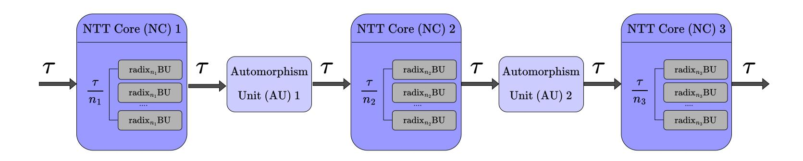
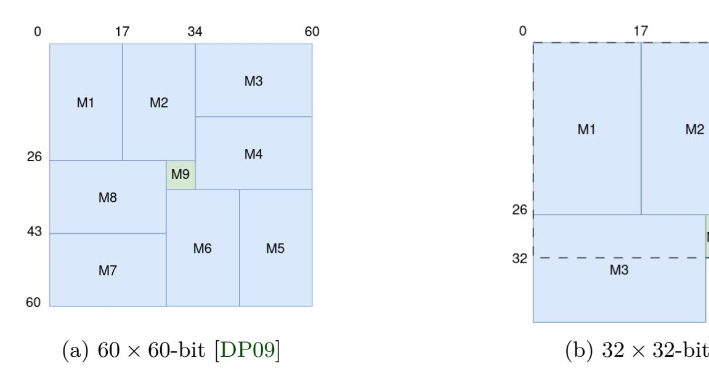
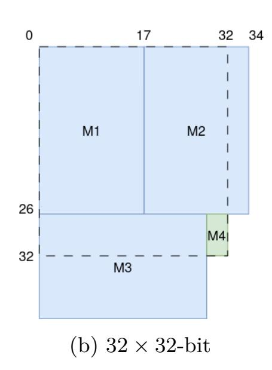
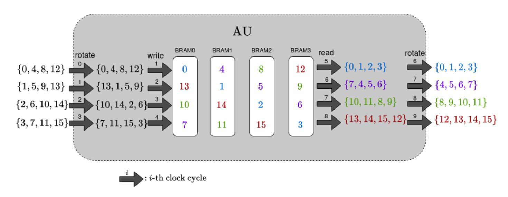
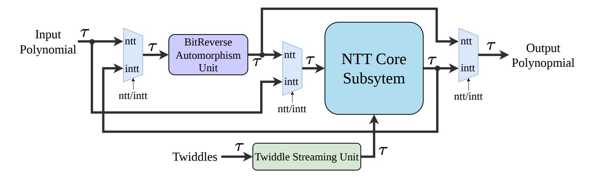
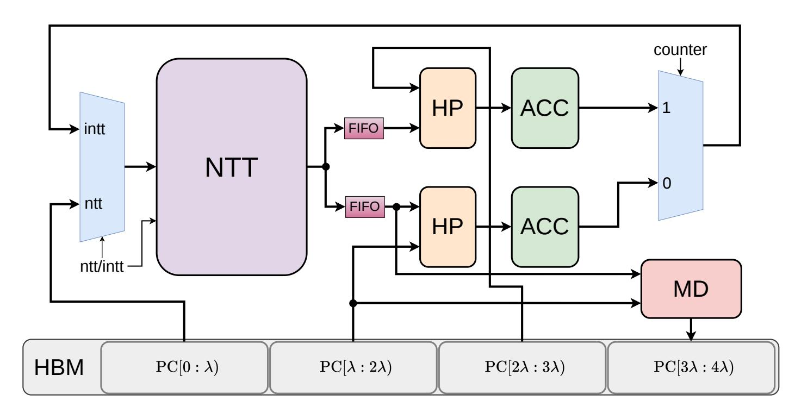

{0}------------------------------------------------

# TP-NTT: Batch NTT Hardware with Application to Relinearization

Emre Koçer<sup>1</sup>, Tolun Tosun<sup>1</sup>, Beren Aydoğan<sup>1</sup>, Erkay Savaş<sup>1</sup>, Furkan Turan<sup>2</sup> and Ingrid Verbauwhede<sup>2</sup>

**Abstract.** Fully Homomorphic Encryption (FHE) enables arbitrary computation on encrypted data without decryption, providing strong privacy guarantees for secure cloud computing, encrypted analytics, and privacy-preserving machine learning However, practical deployment of FHE remains limited by the high computational cost of polynomial arithmetic over large modular rings. In particular, Number Theoretic Transform (NTT)-based polynomial multiplication dominates the execution time of modern lattice-based FHE schemes. In this work, we present TP-NTT, a scalable, throughput-optimized NTT architecture supporting a wide range of ring dimensions used in FHE, from 2<sup>10</sup> to 2<sup>16</sup>. Our design applies optimizations at multiple levels, from modular arithmetic to the NTT algorithm itself, including multi-dimensional decomposition without requiring additional multiplication blocks. The decomposition dimensionality is configurable at design time, supporting 2-D, 3-D, and 4-D decompositions, each advantageous in specific scenarios. Furthermore, TP-NTT provides design-time configurable throughput. Combined with its scalable architecture, this enables significant advantages for batch NTT operations compared to other works in the literature. At  $n=2^{16}$ , it outperforms the best-performing prior design by  $8.03\times$  in average latency while achieving  $1.26\times$  better area-time-product (ATP). To demonstrate its efficiency, we present a case-study on FHE relinearization. focusing on the BFV scheme. We propose a relinearization accelerator that leverages TP-NTT's fast batch NTT capability, achieving a 34.65× speed-up over state-of-theart software implementations and highlighting TP-NTT's effectiveness in real-world FHE applications.

**Keywords:** FPGA · NTT · DSP · FHE · BFV

## 1 Introduction

Fully Homomorphic Encryption (FHE) enables arbitrary computations to be performed directly on encrypted data without requiring decryption, thereby preserving confidentiality throughout the entire computation process. Since Gentry's seminal construction [Gen09], lattice-based FHE schemes such as BFV, BGV, and CKKS [Bra12,FV12,BGV12,CKKS17] have evolved into practical cryptographic tools supporting privacy-preserving cloud computing, secure outsourced analytics, and encrypted machine learning. These schemes rely heavily on arithmetic over large polynomial rings of the form  $R_{q,n} = \mathbb{Z}_q[X]/(X^N+1)$ , where polynomial degrees are typically required ranging from  $2^{10}$  to  $2^{16}$ . In most FHE settings, the Number Theoretic Transform (NTT) dominates the computation and becomes the primary bottleneck. Designing a high-performance NTT unit is therefore critical for building efficient and scalable FHE architectures. In certain higher-level operations, such as the so-called relinearization operation, batch NTTs must be performed efficiently.

<sup>&</sup>lt;sup>1</sup> Sabancı University, Istanbul, Türkiye

<sup>&</sup>lt;sup>2</sup> COSIC, KU Leuven, Leuven, Belgium

{1}------------------------------------------------

While significant progress has been made in optimizing FHE software libraries, CPU [\[BKS](#page-18-5)<sup>+</sup>21] and GPU [\[DÖS15\]](#page-18-6) platforms remain limited by instruction-level parallelism, memory bottlenecks, and power inefficiency when executing large-degree polynomial multiplication and heavy modular arithmetic operations. In contrast, FPGAs offer fine-grained spatial parallelism, customizable datapaths, and deterministic low-latency execution, which makes them particularly attractive for FHE workloads. Prior FPGA-based accelerators span a wide design spectrum, ranging from low-latency architectures [\[KLP19\]](#page-19-0) to deeply pipelined high-throughput designs [\[WYW20\]](#page-19-1). Hierarchical NTT methods, such as four-step and its recursive application seven-step decomposes a large NTT into smaller sub-NTTs with multidimensional decomposition such as 2-D ord 4-D. Architectures implementing this algorithm such as [\[Bai90,](#page-17-0)[KKT](#page-19-2)<sup>+</sup>24,[YCH22,](#page-19-3)[SFK](#page-19-4)<sup>+</sup>21], improve memory locality but introduce additional intermediate modular multiplication blocks, increasing arithmetic complexity. Iterative NTT algorithm [\[RVM](#page-19-5)<sup>+</sup>14], on the other hand, avoid the additional multiplication stages needed by the four-step. Although many studies build upon multidimensional decomposition within the four-step NTT algorithm [\[WG23,](#page-19-6)[GZH](#page-18-7)<sup>+</sup>24,[KKK](#page-18-8)+22], the multidimensional decomposition with iterative NTT is not deeply explored.

To enable efficient batch operations, a natural solution in hardware is pipelining. In the context of NTT architectures, although fully pipelined designs exist [\[YKKP22,](#page-19-7) [GZH](#page-18-7)<sup>+</sup>24], they are limited to small ring sizes, e.g., 2 <sup>12</sup>. There remains significant room for improvement in FPGA-based NTT designs to achieve fully pipelined architectures for large ring dimensions, e.g., 2 16 .

Another critical performance factor in FHE hardware is modular multiplication and reduction. While special-form primes and Goldilocks moduli can simplify reduction [\[BGH17\]](#page-17-1), they limit parameter flexibility and hardware portability [\[TCW](#page-19-8)<sup>+</sup>24]. Recent work on modular reduction in FPGAs has shown that further DSP savings can be achieved by adapting the reduction algorithm to the available DSP sizes [\[TKKA26\]](#page-19-9). On the other hand, conventional uniform-radix multipliers under-utilize FPGA DSP resources when operand sizes do not match native word widths. Recent non-standard integer multiplication techniques demonstrate that carefully tailored DSP multipliers can significantly improve efficiency [\[DP09\]](#page-18-9). Leveraging the most efficient modular arithmetic modules in the butterfly units of an NTT design directly scales to the overall hardware complexity of the entire architecture.

## **1.1 Our Contributions**

In this work, we address these challenges and bridge the gaps in existing NTT literature. In summary:

- We propose a scalable, throughput-optimized NTT architecture, TP-NTT. The design applies optimizations at multiple levels, from DSP-optimized modular arithmetic to multi-dimensional decomposition of the iterative NTT. TP-NTT is unique in the literature in that it supports 2-D, 3-D, and 4-D decompositions without requiring additional multiplication blocks. The decomposition is configurable at design time, including the size along each dimension. Leveraging this flexibility, we formulate the hardware complexity with respect to the desired throughput and target ring dimension, enabling systematic optimization. Furthermore, the design-time configurable throughput allows tuning to match the input/output bandwidth of the target platform.
- Our design methodology reveals how to scale a pipelined NTT to high levels of parallelism, thereby increasing throughput. Furthermore, our design supports large ring degrees such as 2 <sup>16</sup> in a fully pipelined manner.

{2}------------------------------------------------

• We propose a hardware accelerator for FHE relinearization that leverages the fast batch NTTs performed by TP-NTT. The design is throughput-oriented and can easily scale to different throughput settings, tuned according to available FPGA resources and global memory input/output bandwidth.

• We evaluate TP-NTT and the relinearization accelerator across a wide range of ring sizes and moduli, demonstrating up to an order-of-magnitude improvement in average latency and substantial area—time-product gains. The designs are fully open source, enabling reproducibility and further research.

## <span id="page-2-0"></span>2 Background

#### 2.1 Notation

Lowercase italic letters denote integers, such as a. Bold lowercase letters denote vectors and matrices, such as  $\mathbf{a}$ . Elements of vectors and matrices are accessed using sub-scripts, e.g.,  $\mathbf{a}_i$ . Sometimes, we use ":" along an axis to denote all elements on that axis; for example,  $\mathbf{a}_{:,i}$  denotes the i-th column of  $\mathbf{a}$ . Element-wise multiplication is denoted by  $\odot$ .  $R_{q,n} = \mathbb{Z}_q[x]/(x^n+1)$  denotes the cyclotomic ring of polynomials of degree n, where n is a power of two and q is the coefficient modulus. Most of the time, we omit the indeterminate (x) when representing polynomials to simplify the notation. Logarithm function is base-2  $(\log = \log_2)$  unless otherwise stated.

# 2.2 Number Theoretic Transform (NTT)

Polynomial multiplication is the dominant operation in lattice-based FHE schemes. Given two polynomials  $\mathbf{a}(x), \mathbf{b}(x) \in R_{q,n}$ , their product can be computed efficiently using the Number Theoretic Transform (NTT) algorithm:

$$\mathbf{a}(x) \cdot \mathbf{b}(x) = \mathsf{INTT} \Big( \mathsf{NTT}(\mathbf{a}(x)) \odot \mathsf{NTT}(\mathbf{b}(x)) \Big).$$
 (1)

This multiplication corresponds to a negacyclic convolution. NTT requires  $q \equiv 1 \pmod{2n}$ , so a primitive 2n-th root of unity  $\psi \in \mathbb{Z}_q$  exists such that  $\psi^n \equiv -1 \pmod{q}$ . The forward NTT evaluates the polynomial at odd powers of  $\psi$ , i.e.,

$$\hat{\mathbf{a}}[i] = \mathbf{a}(\psi^{2i+1}), \quad i = 0, \dots, n-1.$$
 (2)

Both forward and inverse NTT can be implemented efficiently using so called butterfly circuits. In general, Cooley–Tukey [CT65] (CT) butterflies are used for the forward transform and Gentleman–Sande [GS66] (GS) butterflies for the inverse transform. The butterfly operation is the fundamental computational primitive of the NTT and FFT.

A radix-2 CT butterfly computes

<span id="page-2-1"></span>
$$(u, v) \mapsto (u + \psi \cdot v, u - \psi \cdot v) \mod q$$
 (3)

where  $\psi$  is known as the twiddle factor. A radix-2 GS butterfly computes

<span id="page-2-2"></span>
$$(u,v) \mapsto (u+v,(u-v)\cdot\psi^{-1}) \mod q$$
 (4)

Leveraging the butterfly circuits, NTT can be computed in  $\log n$  stages, each containing n/2 butterfly operations, resulting in  $O(n\log n)$  complexity. This represents a significant advantage over the naive schoolbook approach, which has  $O(n^2)$  complexity.

{3}------------------------------------------------

#### 2.3 BFV Homomorphic Encryption Scheme

The Brakerski–Fan–Vercauteren [Bra12, FV12] (BFV) scheme is a lattice-based FHE scheme designed for exact arithmetic over integers. It is based on the Ring Learning With Errors (RLWE) problem and operates over the ring  $R_{q,n}$ . In BFV, a plaintext polynomial  $\mathbf{m}(x) \in R_{t,n}$  is encrypted into a ciphertext consisting of two polynomials  $(\mathbf{c}_0(x), \mathbf{c}_1(x)) \in R_{Q,n}^2$ , where t is the plaintext modulus and Q is the ciphertext modulus.

Modern BFV implementations employ a Residue Number System (RNS) representation, where the large modulus Q is decomposed into a product of smaller primes  $Q = \prod_{i=0}^{L-1} q_i$ . Each polynomial coefficient is represented by its residues modulo the  $q_i$ , enabling parallel and machine word size modular arithmetic.

BFV enables efficient homomorphic addition and multiplication over ciphertexts. While the former is relatively inexpensive, the latter introduces additional nois. Therefore, the complexity of a homomorphic computation is typically determined by its multiplicative depth. Moreover, after homomorphic multiplication between ciphertexts  $(\mathbf{a}_0, \mathbf{a}_1)$  and  $(\mathbf{b}_0, \mathbf{b}_1)$ , the resulting ciphertext consists of three polynomial components  $(\mathbf{c}_0, \mathbf{c}_1, \mathbf{c}_2)$ . The operation known as relinearization reduces this back to the standard two-component form  $(\mathbf{c}'_0, \mathbf{c}'_1)$  using public relinearization keys. In the linear form, the decryption formula is linear in the secret polynomial s:

$$t = \mathbf{c}_0' + \mathbf{c}_1' \cdot s \tag{5}$$

On the other hand, in the three component form, it is quadratic:

$$t = \mathbf{c}_0 + \mathbf{c}_1 \cdot s + \mathbf{c}_2 \cdot s^2 \tag{6}$$

Therefore, for relinearization,  $\mathbf{c}_2 \cdot s^2$  is computed homomorphically and aggregated into  $(\mathbf{c}_0, \mathbf{c}_1)$ . The encryption of  $s^2$  is known as the relinearization key,  $\mathbf{r}\mathbf{k}$ . In RNS form, to improve noise management,  $\mathbf{r}\mathbf{k}$  is typically stored in a special matrix of dimension  $L \times (L+1)$ , and  $\mathbf{c}_2 \cdot s^2$  is computed using a specialized technique referred to as the external product.

# 3 Proposed NTT Architecture: TP-NTT

In this section, we present the hardware architecture of our proposed NTT design, TP-NTT (ThroughPut-optimizedNTT). In a nutshell, the architecture decomposes large-size negacyclic NTTs into pipelined, throughput-oriented processing units. The design supports flexible ring sizes n and throughput parameters (denoted by  $\tau$ ), enabling adaptation to diverse resource budgets and application requirements. n,  $\tau$ , and  $\log q$  are design-time parameters, while q and the direction of the NTT (forward or backward) can be configured at run-time. It is composed of two main building blocks: NTT Cores (NCs) and Automorphism Units (AUs). NCs are responsible for performing butterfly operations, while AUs handle the permutation of data arrays between NCs. For a 3-D decomposition, the main hardware architecture of TP-NTT is illustrated in Figure 1. The design is fully pipelined, enabling highly efficient batch NTT operations. Accordingly, both NCs and AUs are implemented as fully pipelined modules.

#### 3.1 Multi-Dimensional Decomposition

TP-NTT decomposes the NTT size n into a product of smaller radices across d-dimensions,

$$n = \left(\prod_{i=1}^{d} n_i\right) = n_1 \cdot n_2 \cdot \dots \cdot n_d, \quad d \in \{2, 3, 4\}, \tag{7}$$

{4}------------------------------------------------

<span id="page-4-0"></span>

Figure 1: TP-NTT architecture for 3-D decomposition

where each *n<sup>i</sup>* denotes the radix of an NC execution stage. As shown, our design supports 2-D, 3-D, and 4-D decompositions, which we show to be sufficient for the range of *n* used in FHE, as discussed in [Section 5.](#page-12-0) Along each dimension, TP-NTT computes radix-*n<sup>i</sup>* butterfly circuits in a fully-pipelined manner, processing *τ* input and output elements per clock cycle. In this paper, we consider radix-*n<sup>i</sup>* butterfly circuits as compositions of *ni/*2 radix-2 butterfly circuits across log *n<sup>i</sup>* stages, without writing intermediate data to memory structures such as BRAM.

The desired decomposition is configured at design-time. However, there exist certain constraints and design guidelines on the choice of the dimension *d* and the radices *n<sup>i</sup>* . The dimension *d* is selected based on the target *n*, *τ* and architectural constraints such as available FPGA resources, allowing the same hardware to support multiple parameter sets by adjusting the decomposition. The choice of *n<sup>i</sup>* is non-uniform and architecture-driven. A constraint in our design is that each dimension must satisfy *n<sup>i</sup>* ≤ *τ* . Otherwise, it is not possible to perform a radix-*n<sup>i</sup>* butterfly circuit in a fully pipelined manner, as the required input/output bandwidth of size *n<sup>i</sup>* cannot be sustained with the given throughput parameter *τ* . In such cases, one must increase *d* to reduce each *n<sup>i</sup>* . TP-NTT includes *d* NCs and *d* − 1 AUs for a *d*-dimensional decomposition. Therefore, as a rule of thumb, the smallest *d* satisfying this constraint should be chosen, as it minimizes the aggregated cost of AUs. In contrast, the aggregated cost of the NCs is independent of *d* (in terms of butterfly circuits). In [Table 1,](#page-4-1) we present the optimal decompositions of *n* with respect to different *τ* used in this work. In many cases, multiple decompositions may be equally optimal; here, we show only one representative option for each scenario. The reasoning behind these selections is provided in [Subsection 3.2](#page-5-0) and [Subsection 3.4.](#page-7-0)

Table 1: Optimal decompositions

<span id="page-4-1"></span>

|         |                                            | τ                                          |                              |
|---------|--------------------------------------------|--------------------------------------------|------------------------------|
| n       | 4<br>2                                     | 5<br>2                                     | 6<br>2                       |
| 10<br>2 | 4<br>2<br>4<br>2<br>, 2<br>, 2             | 5<br>5<br>2<br>, 2                         | 5<br>5<br>2<br>,2            |
| 11<br>2 | 4<br>3<br>4<br>2<br>, 2<br>, 2             | 5<br>1<br>5<br>2<br>, 2<br>, 2             | 6<br>5<br>2<br>,2            |
| 12<br>2 | 4<br>4<br>4<br>2<br>, 2<br>, 2             | 5<br>2<br>5<br>2<br>, 2<br>, 2             | 6<br>6<br>2<br>,2            |
| 13<br>2 | 4<br>2<br>3<br>4<br>2<br>, 2<br>, 2<br>, 2 | 5<br>3<br>5<br>2<br>, 2<br>, 2             | 6<br>1<br>6<br>2<br>,2<br>,2 |
| 14<br>2 | 4<br>3<br>3<br>4<br>2<br>, 2<br>, 2<br>, 2 | 5<br>4<br>5<br>2<br>, 2<br>, 2             | 6<br>2<br>6<br>2<br>,2<br>,2 |
| 15<br>2 | 4<br>3<br>4<br>4<br>2<br>, 2<br>, 2<br>, 2 | 5<br>5<br>5<br>2<br>, 2<br>, 2             | 6<br>3<br>6<br>2<br>,2<br>,2 |
| 16<br>2 | 4<br>4<br>4<br>4<br>2<br>, 2<br>, 2<br>, 2 | 5<br>3<br>3<br>5<br>2<br>, 2<br>, 2<br>, 2 | 6<br>4<br>6<br>2<br>,2<br>,2 |

{5}------------------------------------------------

# <span id="page-5-0"></span>**3.2 NTT Core (NC)**

The NTT Cores (NCs) implement the pipelined radix-*n<sup>i</sup>* butterfly stages of the negacyclic NTT. Each NC includes *τ /n<sup>i</sup>* independent and identical pipelined radix-*n<sup>i</sup>* Butterfly Units (BUs). Each radix-*n<sup>i</sup>* BU contains log *n<sup>i</sup>* · *ni/*2 radix-2 BUs. In our terminology, BUs (when the radix is not specified) refer to units that implement radix-2 butterfly circuits, presented in [Subsection 3.3.](#page-6-0)

Because each radix-*n<sup>i</sup>* stage operates on relatively small sub-transforms, it requires fewer computational resources while still contributing to the overall pipeline throughput. Each NC requires

$$\frac{\tau}{n_i} \cdot \frac{n_i}{2} \cdot \log n_i = \frac{\tau}{2} \log n_i \tag{8}$$

BUs. Summing across NCs in all dimensions stages, the total number of BUs required for the overall NTT design is

$$\frac{\tau}{2} \cdot \log n. \tag{9}$$

Therefore, the total resource requirement is independent of the specific decomposition parameters *n<sup>i</sup>* and *d* and depends only on *τ* . As a result, the decomposition strategy does not affect the overall resource usage in terms of BUs.

**Twiddle Factor Storage.** The NCs utilize on-chip memory resources such as Block RAM (BRAM) or UltraRAM (URAM) to store the twiddle factors required for the corresponding sub-transforms. This approach eliminates the need to store the complete set of twiddle factors for all NTT stages in a central manner, thereby providing more flexible on-chip memory requirements. For a radix-*n<sup>i</sup>* butterfly structure, the number of required twiddle factors is *n<sup>i</sup>* −1. However, each radix-*n<sup>i</sup>* butterfly is executed with a different set of twiddle factors. Therefore, the number of twiddle factors that must be stored in the memory of an NC depends on the dimension index *i* of the NC. For instance, the first dimension always uses the same set of twiddle factors, whereas the last dimension uses *n/nd*−<sup>1</sup> different sets of twiddle factors, resulting in a total of (*n<sup>d</sup>* − 1) · *n/n<sup>d</sup>* twiddle factors to be stored. In general, the number of distinct twiddle factors used by NC *i* for the forward NTT is given by

$$\left(\prod_{k=1}^{i-1} n_k\right) \cdot \left(n_i - 1\right) \tag{10}$$

The above analysis considers a forward NTT. On the other hand, in the backward NTT, the storage requirements are reversed. The last dimension uses the least distinct twiddles while the number of distinct twiddle factors increases towards the first dimension. The number of required distinct twiddle factors for the *i*-th NC in the backward NTT is given by

$$\left(\prod_{k=i+1}^{d} n_k\right) \cdot \left(n_i - 1\right) \tag{11}$$

Since our proposed architecture is unified for both forward and backward NTTs, we take the maximum of the two cases:

$$\mathsf{R}_d(i) = \max\left(\left(\prod_{k=1}^{i-1} n_k\right), \left(\prod_{k=i+1}^d n_k\right)\right) \cdot \left(n_i - 1\right) \tag{12}$$

{6}------------------------------------------------

The second term, (*n<sup>i</sup>* − 1), specifies the number of independent RAMs, while the first term determines the depth of each RAM. *τ* does not affect the storage requirements of the twiddle factors, as it does not impact the stage indices of the NTT handled by an NC. For the 2-D case, it is straightforward to see that R2(*i*) is independent of the radices *n<sup>i</sup>* . The same observation holds for the first and last dimensions in 3-D and 4-D decompositions, namely R3(1), R3(3), R4(1) and R4(4) for 4-D. On the other hand, R*d*(*i*) for intermediate dimension indices *i* is minimized when the radices of the first and last dimensions are maximized. In particular, R3(2) is minimized when *n*<sup>1</sup> and *n*<sup>3</sup> are maximized. The same observation applies to R4(2) and R4(3) in the 4-D case.

# <span id="page-6-0"></span>**3.3 Butterfly Unit (BU)**

Recall from [Section 2](#page-2-0) that every NTT stage computes *n/*2 butterfly circuits. The butterfly circuit is the core operation in any NTT design, and consequently, its complexity directly affects the overall NTT implementation. In our architecture, we refer to the units responsible for implementing these circuits as Butterfly Units (BUs). These implement both CT butterflies [\(Equation 3\)](#page-2-1) and GS butterflies [\(Equation 4\)](#page-2-2) used in forward and backward NTTs, respectively, in a unified architecture.

From a hardware perspective, the performance of a butterfly is dominated by modular multiplication, which itself consists of two main steps: integer multiplication and modular reduction. Optimizing these operations has a direct impact on the overall NTT design. In our work, we optimize the integer multiplication and modular reduction strategies with respect to DSP operand sizes in FPGA architectures to minimize the DSP usage of BUs.

**Integer Multiplication.** Standard integer multiplication techniques often assume fixed word sizes aligned with processor architectures, such as partitioning a 64 × 64-bit integer multiplication to 16 core multiplications of 16 × 16-bit. In contrast, DSPs in FPGA architecture offer asymmetric operand sizes, such as 27×18 in DSP48E2[1](#page-6-1) . A trivial strategy to partition a 64 × 64 by 27 × 18 operand sizes would lead to 12 = ⌈64*/*27⌉ × ⌈64*/*18⌉ core multiplications executed by DSPs, which is known as standard tiling. However, more efficient approaches exist. [\[DP09\]](#page-18-9) demonstrates that a non-standard tiling approach can further reduce the number of DSP multiplications required. For operand sizes 27 × 18, a 60 × 60-bit multiplication can be realized using 8 DSPs along with a small LUT-based multiplier. This strategy is illustrated in [Figure 2a.](#page-7-1) Using a similar approach, a 32 ×32-bit multiplication can be implemented with 3 DSPs instead of 4 DSPs required by standard tiling, as shown in [Figure 2b.](#page-7-2)

**Modular Reduction.** After computing the double-width integer product during modular multiplication, the result must be reduced modulo *q*. Optimized reduction techniques such as Montgomery [\[Mon85\]](#page-19-10) or Barrett [\[Bar86\]](#page-17-2) reduction are often employed. To further reduce DSP utilization, we utilize the mixed-radix Montgomery reduction algorithm presented in [\[TKKA26\]](#page-19-9), which is a modified variant of the word-level Montgomery reduction approach [\[MÖS20\]](#page-19-11). In the employed variant, the word-level reduction iterations are arranged according to DSP operand sizes, at the cost of slightly reducing the number of primes used given the ring dimension *n* and modulus *q*. It is shown by [\[TKKA26\]](#page-19-9) that this decrease in the number of primes does not affect the correctness of the FHE construction, as there are still significantly more primes than required for the RNS representation. For example, in the case of a 60-bit modulus and 27 × 18 DSP operand sizes, the reduction iteration lengths are 34-bit and 26-bit, requiring 3 DSPs in total for modular reduction. In this configuration, *q* is formed as *q<sup>h</sup>* · 2 <sup>43</sup> + 1, with the lower 43 bits fixed. For the 32-bit case, 2 DSPs are sufficient for modular reduction. With different DSP operand sizes, the

<span id="page-6-1"></span><sup>1</sup>https://docs.amd.com/r/en-US/ug958-vivado-sysgen-ref/DSP48E2

{7}------------------------------------------------



<span id="page-7-2"></span>

<span id="page-7-1"></span>Figure 2: Non-standard tiling for integer multiplication. DSP multiplication (blue), LUT-based multiplication (green).

configuration may vary slightly but can be adapted with similar advantages. We refer the reader to [\[TKKA26\]](#page-19-9) for a detailed breakdown of DSP usage in both scenarios. Notably, this reduction approach allows the modulus to be defined efficiently at run-time, which is essential for batch NTTs and FHE schemes, whereas some NTT implementations hardcode the modulus [\[ACM](#page-17-3)<sup>+</sup>23].

# <span id="page-7-0"></span>**3.4 Automorphism Unit (AU)**

Data rearrangement is essential in hierarchical NTTs to avoid pipeline stalls and maintain data locality. Authomorphism Units (AUs) are used in hierarchical execution to permute input vectors according to the processing pattern of the next stage. Specifically, they adjust the stride of input data vectors in a fully pipelined manner. To illustrate the functionality of AUs, we present a toy example in [Figure 3.](#page-8-0) The example considers an NTT with *n* = 16 and *τ* = *n*<sup>1</sup> = *n*<sup>2</sup> = 4. The input data stride is 4, corresponding to entries at indices *k, k* + 4*, k* + 8*, k* + 12 for *k* ∈ {0*,* 1*,* 2*,* 3}. Before the next phase of computation, however, the coefficients must be realigned into contiguous blocks with a stride of 1, i.e., *k* ′ *, k*′ + 1*, k*′ + 2*, k*′ + 3 for *k* ′ ∈ {0*,* 4*,* 8*,* 12}. Without this realignment, the pipeline would incur idle cycles while waiting for data in the required order. The AU performs this task, permuting vector elements to satisfy interstage access patterns.

AUs employ on-chip memory (BRAMs or URAMs) along with two rotation circuits. The rotations are performed both before writing to RAM and after reading from RAM. To meet the throughput constraint, *τ* independent RAMs are used. The depth of each RAM depends on the decomposition parameters as well as the AU index *i*. For a 2-D decomposition, the depth of each RAM in an AU is 2 · *n/τ* , resulting in 2*n* total entries. The factor of 2 arises from using a ping-pong memory scheme to support pipelining: one half of the memory stores the coefficients for the current NTT operation, while the other half is used by the subsequent operation.

AU 2 in a 4-D decomposition operates in the same manner, with identical RAM requirements and operating principles. Note that AU 2 is the middle unit in the design over all AUs. Conceptually, the 4-D decomposition can be viewed as a recursive application of 2-D decompositions. Consequently, the RAM requirements for AU 1 and AU 3 follow immediately. The total RAM size in AU 1 is 2 · *n*<sup>1</sup> · *n*2, while for AU 3 it is 2 · *n*<sup>3</sup> · *n*4.

For a 3-D decomposition, the situation is similar but asymmetric. We consider AU 2 as the middle AU, analogous to AU 2 in the 4-D case. Consequently, the total RAM size of AU 2 is 2 · *n*. For AU 1, we treat it as a recursive application of a 2-D decomposition. The total RAM size for AU 1 is therefore 2 · *n*<sup>1</sup> · *n*2. Notice that the size of the sub-transforms

{8}------------------------------------------------

<span id="page-8-0"></span>

Figure 3: Illustration of AU for *n* = 16, *n*<sup>1</sup> = *n*<sup>2</sup> = 4 and *τ* = 4.

prior to AU 2 is *n*<sup>1</sup> · *n*2.

The RAM sizes for AU 1 in the 2-D case, and for the middle AU (namely AU 2) in 3-D and 4-D, are independent of the selected *n<sup>i</sup>* . In contrast, the RAM size for AU 1 in the 3-D case is minimized when *n*<sup>3</sup> is maximized. For the 4-D case, the total RAM size of AU 1 and AU 3 is minimized when *n*<sup>1</sup> · *n*<sup>2</sup> and *n*<sup>3</sup> · *n*<sup>4</sup> are close, i.e., when the radices are symmetric or nearly symmetric.

## <span id="page-8-1"></span>**3.5 Extended Architecture**

In this section, we present an extended architecture as a wrapper layer for the TP-NTT architecture, which can be useful in certain scenarios. The extended architecture is illustrated in [Figure 4.](#page-9-0) In the figure, NTT Core Subsystem refers to the TP-NTT architecture presented in [Figure 1.](#page-4-0) One of the units in the extended architecture is the BitReverse AU. Recall that TP-NTT is a unified architecture for both forward and backward NTTs, with the direction determined at run-time. Therefore, a bit-reversal mechanism is required to ensure a consistent data access pattern for both transformations. The operating principle of the BitReverse AU is same as that of the AUs described in [Subsection 3.4.](#page-7-0) However, it represents a special case, as it permutes the input vectors by bit-reversing their indices. Specifically, for the forward NTT, the input coefficients are first sent to the BitReverse AU for pre-processing, while the output of the NTT Core Subsystem is used directly. In contrast, for the backward NTT, the input is left unchanged, and the output of the NTT Core Subsystem is forwarded to the BitReverse AU. The RAM cost of the BitReverse AU is 2*n*, implemented using *τ* independent memory banks. The BitReverse AU ensures consistency between the input and output orders of NTT operations with respect to the normal order. Without it, the input of the forward NTT and the output of the backward NTT would be in bit-reverse order, which is acceptable for some applications. Therefore, we retain the BitReverse AU in the extended architecture.

Another unit in the extended architecture is the Twiddle Streamer Unit. Recall from [Subsection 3.2](#page-5-0) that the number of independent RAMs used in each NC for twiddle storage is strictly less than the data throughput, i.e., *n<sup>i</sup> < τ* . On the other hand, *τ* is conceptually the data input/output bandwidth. Therefore, it is reasonable to assume that twiddle factors are received in batches of *τ* elements per clock cycle. Since the number of independent RAMs also constrains the maximum number of write operations that can be performed in a single cycle, a mechanism is needed to systematically store the incoming *τ* twiddle factors and distribute them to the NCs according to their respective *n<sup>i</sup>* . This is the role of the Twiddle Streamer Unit. We retain this unit in the extended architecture because many applications can tolerate receiving twiddle factors at a slightly reduced rate, avoiding the need for additional hardware.

{9}------------------------------------------------

<span id="page-9-0"></span>

Figure 4: TP-NTT extended architecture.

## <span id="page-9-1"></span>**3.6 Relation to Hierarchical NTTs**

Our formulation is similar to the classical four-step FFT algorithm introduced by Bailey [\[Bai89\]](#page-17-4), which decomposes a large NTT into smaller sub-NTTs to improve data locality and reduce global data movement. Hierarchical NTT architectures implementing the four-step algorithm, such as in [\[KKT](#page-19-2)<sup>+</sup>24], which is the preliminary version of this study, demonstrate improved performance over purely iterative designs by exploiting data locality and reducing global memory traffic. However, these approaches require an additional *n* modular multiplications with twiddle factors between sub-NTTs. In contrast, the architecture presented in this work preserves the advantages of hierarchical execution while eliminating intermediate twiddle multiplications between blocks. Specifically, we implement the iterative NTT algorithm [\[RVM](#page-19-5)<sup>+</sup>14] by decomposing it into radix-*n<sup>i</sup>* butterfly circuits, which are analogous to the smaller sub-NTTs in the four-step algorithm. The data access pattern of our approach is identical to that of the four-step algorithm.

For example, with a 4-D decomposition, *n* = 2<sup>16</sup>, and *τ* = 2<sup>4</sup> , a recursive application of the four-step NTT would be required, as in [\[KKT](#page-19-2)<sup>+</sup>24]. In that case, three intermediate multiplication blocks would be needed, and the modular multiplication cost for each block is equivalent to that of two NTT stages, as each NTT stage performs *τ /*2 modular multiplications, whereas the intermediate multiplication blocks perform *τ* . This results in a 6*/*16 increase in total modular multiplication related hardware cost. A drawback of our approach is that it requires more storage, since the twiddle factors must be stored explicitly, whereas in the four-step algorithm some twiddle factors can be computed onthe-fly. Nevertheless, as we show in [Section 5,](#page-12-0) trading memory for modular multiplication units leads to better area outcomes.

# <span id="page-9-2"></span>**4 Relinearization Accelerator**

As a case study application of the proposed batch NTT architecture, we consider the relinearization operation in BFV. Recall from [Section 2](#page-2-0) that this operation is typically performed after each homomorphic multiplication to restore the ciphertext to linear form. The relinearization is carried out via an external product with the relinearization keys [\[FV12\]](#page-18-2), which is highly NTT-dominant, making it a suitable use case for the proposed batch NTT hardware.

We present the relinearization process in [Algorithm 1.](#page-10-0) Given an extended RNS base *Q*˜ = *q*0*, . . . , qL*, the external product proceeds independently for each modulus *q<sup>i</sup>* , as reflected in the main loop of the algorithm. For each modulus, *L* consecutive forward NTTs are performed in a batched manner, taking **c**2*,j* , the *j*-th polynomial of the quadratic term of the ciphertext, as input. In total, *L* · (*L* + 1) forward NTTs are required.

In addition to forward NTTs, the procedure involves Hadamard products, accumulations, and inverse NTTs. Furthermore, a modulus switching operation, referred to as

{10}------------------------------------------------

#### <span id="page-10-0"></span>Algorithm 1 NTT-Based Relinearization

Input: Ciphertext components  $(\mathbf{c}_0, \mathbf{c}_1, \mathbf{c}_2)$  in RNS form over base  $Q = \{q_j\}_{j=0}^{L-1}$ , relinearization keys  $(\mathbf{rk}_0, \mathbf{rk}_1)$ , extended base  $\tilde{Q} = \{q_i\}_{i=0}^{L}$ Output: Relinearized ciphertext  $(\mathbf{c}'_0, \mathbf{c}'_1)$  over base Q1: for i' = 0 to L do

```
i \leftarrow (i' == 0) ? L - 1 : i' - 1
  2:
               \hat{\mathbf{a}}_0 \leftarrow \mathbf{0}, \, \hat{\mathbf{a}}_1 \leftarrow \mathbf{0}
  3:
               for j = 0 to L - 1 do
  4:
                      \hat{\mathbf{c}}_{2,j} \leftarrow \mathsf{NTT}_{q_i}(\mathbf{c}_{2,j})
                                                                                                                                                                       ▷ NTT Unit
  5:
                      \hat{\mathbf{d}}_{0,j} \leftarrow \hat{\mathbf{c}}_{2,j} \odot \mathbf{r} \mathbf{k}_{0,i,j} \bmod q_i
                                                                                                                                                           ▶ Hadamard Unit
  6:
                      \hat{\mathbf{d}}_{1,j} \leftarrow \hat{\mathbf{c}}_{2,j} \odot \mathbf{rk}_{1,i,j} \bmod q_i
                                                                                                                                                           ▶ Hadamard Unit
  7:
                     \hat{\mathbf{a}}_0 \leftarrow \hat{\mathbf{a}}_0 + \hat{\mathbf{d}}_{0,j} \mod q_i
  8:
                                                                                                                                                                 ▶ Accum. Unit
                     \hat{\mathbf{a}}_1 \leftarrow \hat{\mathbf{a}}_1 + \hat{\mathbf{d}}_{1,i} \mod q_i
                                                                                                                                                                 ▶ Accum. Unit
  9:
              \mathbf{a}_0 \leftarrow \mathsf{INTT}_{q_i}(\hat{\mathbf{a}}_0)
                                                                                                                                                                       ▶ NTT Unit
10:
              \mathbf{a}_1 \leftarrow \mathsf{INTT}_{q_i}(\hat{\mathbf{a}}_1)
                                                                                                                                                                       ▷ NTT Unit
11:
               if (i' == 0) then
12:
                      \mathbf{t}_0 \leftarrow \mathbf{a}_0 + q_L/2 \bmod q_L
                                                                                                                                                 ▶ Modulus-Down Unit
13:
                      \mathbf{t}_1 \leftarrow \mathbf{a}_1 + q_L/2 \bmod q_L
                                                                                                                                                 ▶ Modulus-Down Unit
14:
               else
15:
                      \mathbf{c}'_{0,i} \leftarrow ((\mathbf{a}_0 - (\mathbf{t}_0 - q_L/2)) \cdot q_L^{-1}) \bmod q_i
                                                                                                                                                 ▶ Modulus-Down Unit
16:
                     \mathbf{c}'_{1,i} \leftarrow ((\mathbf{a}_1 - (\mathbf{t}_1 - q_L/2)) \cdot q_L^{-1}) \bmod q_i
\mathbf{c}'_{0,i} \leftarrow \mathbf{c}'_{0,i} + \mathbf{c}_{0,i} \bmod q_i
\mathbf{c}'_{1,i} \leftarrow \mathbf{c}'_{1,i} + \mathbf{c}_{1,i} \bmod q_i
                                                                                                                                                 ▶ Modulus-Down Unit
17:
                                                                                                                                                 ▶ Modulus-Down Unit
18:
                                                                                                                                                 ▶ Modulus-Down Unit
19:
20: return (\mathbf{c}'_0, \mathbf{c}'_1)
```

Modulus-Down, is performed at the end (Lines 12–17). The extended base  $\tilde{Q}$ , which augments the original RNS basis with an additional modulus  $q_L$  and is introduced during homomorphic multiplication. The Modulus-Down operation removes this extra modulus, enabling improved noise management. Finally, in Lines 18–19, the relinearization output is aggregated into the constant and linear components ( $\mathbf{c}_0, \mathbf{c}_1$ ) of the input ciphertext. Note that after the forward NTT stage, all subsequent operations are duplicated for both components.

Hardware Architecture. We design a hardware architecture that executes all steps of Algorithm 1 under a single command. A simplified view of the architecture is shown in Figure 5. Note that the control path is largely omitted for clarity. The proposed relinearization accelerator is organized as a collection of streaming hardware modules, each specialized for a distinct computational phase of the relinearization procedure. Similar to our NTT design, the remaining units in the architecture follow a throughput-oriented datapath, where all modules operate in a pipelined manner and exchange data through on-chip buffers, enabling continuous processing of ciphertext polynomials. In Figure 5, HP, ACC, and MD denote the Hadamard Product, Accumulation, and Modulus-Down units, respectively. In Algorithm 1, each line is annotated with the corresponding command to indicate which hardware unit is responsible for the associated operation.

## 4.1 HBM and Global Data Access

Since our design targets large-scale FPGAs, we assume that both input and output data reside in the HBM. As shown in Figure 5, the aggregate HBM bandwidth is partitioned into

{11}------------------------------------------------

<span id="page-11-0"></span>

Figure 5: Relinearization simplified architecture.

four segments to support continuous streaming of input and output data. Each segment comprises *λ* pseudo-channels (PCs), which are mapped to dedicated banks in HBM to enable parallel data access. To efficiently utilize the pipelined NTT units, we generalize the throughput parameter *τ* from the NTT architecture to the relinearization design. We set *τ* as *τ* = ⌊*λ* · Ω*/β*⌋, where Ω denotes the bit-width of each PC at the desired frequency and *β* denotes the bit-length of the polynomial coefficients, which is either 32 or 60 in our study. With this formulation, we maximize the achievable degree of parallelism under the constraint of the global data access bandwidth.

The first PC segment PC[0 : *λ*) is used to read the input polynomials **c**2*,j* and the twiddle factors. PC[*λ,* 2*λ*) and PC[2*λ,* 3*λ*) are used for reading the relinearization keys **rk**0*,i,j* and **rk**1*,i,j* , respectively (see [Algorithm 1\)](#page-10-0). We should note that **c**2*,j* and **rk**:*,i,j* accessed in parallel necessitating the need for allocating separate PC segments to them. After the accumulation is done, PC[*λ,* 2*λ*) is repurposed to fetch **c**0*,i* and **c**1*,i* which are used in Modulus-Down operation. At this stage, **rk**:*,i,j* is no longer needed. The last PC segment PC[3*λ,* 4*λ*) is dedicated to writing the output data back to the HBM.

For synchronizing the data in-between different modules, we employ on-chip RAMs (BRAMs or URAMs) based FIFOs. Specifically, consider the output of the NTT, **c**ˆ2*,j* , which is forwarded to the HP unit, where it is multiplied by **rk**0*,i,j* (see Lines 5-6 of [Algorithm 1\)](#page-10-0). We use the FIFO buffer to temporarily store **c**ˆ2*,j* . Once **c**ˆ2*,j* is produced, the data is written into the FIFO. A read request to the HBM is issued to fetch **rk**0*,i,j* with the first valid-output clock cycle for **c**ˆ2*,j* . Recall that **c**ˆ2*,j* is output from NTT in *n/τ* cycles. When the HBM starts sending valid data as response to read request, **c**ˆ2*,j* is subsequently read from the FIFO and used in the multiplication stage. The same synchronization mechanism is used with an independent FIFO for the linear term, **rk**1*,i,j* (Line 7). In addition, this mechanism is reused to synchronize INTT(**a**ˆ0) and INTT(**a**ˆ1) with **c**0*,i* and **c**1*,i*, respectively, during the Modulus-Down operation and the final accumulation stage. Specifically, the FIFO previously used for **rk**0*,i,j* is repurposed for this synchronization.

## **4.2 Main Operation Flow**

We separate the steps of [Algorithm 1](#page-10-0) into two parts. The first part consists of Lines 4–9, where the input polynomials **c**ˆ2*,j* are continuously read from the HBM and sent to the NTT unit. Similarly, the relinearization keys **rk**:*,i,j* are continuously read from the HBM and forwarded to the HP units, synchronized with the NTT outputs as described in the previous section. The ACC units then continuously accumulate the valid inputs. The second part

{12}------------------------------------------------

consists of Lines 10–19. Based on a 1-bit counter, the accumulated polynomials  $\hat{\mathbf{a}}_0$  and  $\hat{\mathbf{a}}_1$  are sent to the NTT unit to perform backward NTT. The outputs of the backward NTT are then sequentially sent to the MD Unit, which finalizes the computation and produces the result.

We note that the twiddle factors for forward NTT in  $R_{q_i,n}$  are fetched prior to the loading of  $\hat{\mathbf{c}}_{2,j}$ , while the twiddle factors for backward NTT are fetched afterwards. Furthermore, the first part reads data from HBM and produces intermediate results in on-chip RAMs (such as BRAMs or URAMs, within the ACC units), whereas the second part reads from both on-chip RAMs and HBM and writes the final results back to HBM.

# 4.3 Hadamard Product (HP) Unit

As previously described, the Hadamard Product (HP) units perform coefficient-wise modular multiplications between  $\hat{\mathbf{c}}_{2,j}$  and the relinearization keys  $\mathbf{r}\mathbf{k}_{0,i,j}$  and  $\mathbf{r}\mathbf{k}_{1,i,j}$  (see Lines 6–7 of Algorithm 1). Each HP unit consists of an array of parallel modular multipliers, identical to those employed in the BUs of the proposed NTT design. Our architecture incorporates two HP units, each equipped with  $\tau$  modular multipliers, resulting in a total of  $2\tau$  modular multipliers. This matches the modular multiplier utilization across the four layers of the NTT.

# 4.4 Accumulation (ACC) Unit

The Accumulation (ACC) units are responsible for combining partial products across the modulus  $q_i$  (see Lines 6–7 of Algorithm 1). Each unit is implemented using an array of parallel modular adders that perform accumulation over  $\tilde{q}_i$ . These modular adders are identical to those employed in the BUs of the proposed NTT design. Our architecture employs two ACC units to process the constant and linear terms in parallel. Each ACC unit contains  $\tau$  modular adders and  $\tau$  independent BRAMs for storing intermediate accumulation results. Each BRAM consists of  $n/\tau$  instead of  $n/\tau$ , can we write  $\frac{n}{\tau}$ ? rows, enabling the storage of all coefficient of the accumulation polynomials (i.e.,  $\hat{\mathbf{a}}_0$  or  $\hat{\mathbf{a}}_1$ ) across the memory banks. The row address is determined by an internal counter during both read and write operations, as the input and output data are organized sequentially. The use of parallel BRAMs enables simultaneous read and write operations at the target throughput of  $\tau$ .

# 4.5 Modulus-Down (MD) Unit

The Modulus-Down (MD) Unit is responsible for Lines 12–19 of Algorithm 1, performing the modular arithmetic for modulus switching as well as the final addition. It contains  $\tau$  modular multiplication units,  $2\tau$  modular subtraction units, and  $\tau$  modular addition units. The MD unit also stores intermediate results  $\mathbf{t}_0$  and  $\mathbf{t}_1$ , which are computed over the auxiliary modulus  $q_L$ . These are held in a set of BRAMs. As in the ACC units, we employ  $\tau$  independent BRAMs to meet the throughput constraint. Distinctively, each BRAM has  $2 \cdot n/\tau$  rows, since it stores two polynomials. Because these polynomials are not processed in parallel, increasing the depth of the BRAMs is sufficient.

Additionally, the modular multipliers in the MD unit could be shared with one of the HP units, potentially reducing the overall number of modular multipliers by  $\tau$ . We leave this optimization for future work.

## <span id="page-12-0"></span>5 Evaluation

In this section, we first evaluate the performance of TP-NTT in a standalone setting, and then assess the proposed relinearization architecture built upon it. The TP-NTT hardware 

{13}------------------------------------------------

and the overall relinearization architecture are implemented using Verilog/SystemVerilog HDL. The design-time parameters n,  $\log q$ ,  $n_i$ , and L are implemented as Verilog parameters. The project is fully open-source and will be made available at will be provided soon.

The evaluated configurations span ring sizes from  $n=2^{10}$  to  $n=2^{16}$  and coefficient moduli with  $\log q \in 32,60$ . All hardware designs are synthesized and implemented using the AMD-Xilinx Vivado Design Suite 2023.2  $^2$  and the Vitis 2023.2 toolchain. The primary target platform is the AMD-Xilinx Alveo U280 FPGA accelerator card (XCU280)  $^3$ , which provides HBM along with abundant DSP and BRAM resources suitable for high-throughput cryptographic workloads. The device includes 1303K LUTs, 2607K FFs, 9024 DSPs (DSP48E2s), 2016 BRAMs (BRAM36E2s<sup>4</sup>), 960 URAMs. HBM provides an aggregate bandwidth of 8192 bits operating at 450 MHz. Software implementation is tested on Ubuntu 22.04.5 with Intel(R) Xeon(R) w3-2423 CPU.

## 5.1 NTT Evaluation

We compare our proposed TP-NTT architecture with prior FPGA-based implementations across multiple parameter sets in terms of average latency and area—time product (ATP), as summarized in Table 2. Average latency is computed as the mean execution time over 100 consecutive NTT operations whereas ATP, a commonly used metric in the literature [YCH22], is defined as ATP = Latency  $(\mu s) \times (\text{LUT} + \frac{\text{FF}}{2} + 100 \times \text{DSP} + 300 \times \text{BRAM})$  We only consider works targeting large-scale FPGAs capable of high performance, rather than resource-constrained devices, as such architectures are fundamentally limited by the significantly lower availability of FPGA resources. For example, [HMR24] is excluded from our comparison table, since the target FPGA used in that work includes only 303K LUTs, which is insufficient for use as a high-performance accelerator. To enable a fair comparison with such works, either our design would need to operate at a very low  $\tau$ , which conflicts with our design goals, or those designs would need to be scaled to the  $\tau$  values considered in this work. The latter is non-trivial and would require substantial engineering effort, and is therefore beyond the scope of this paper.

The decomposition of n with respect to the given  $\tau$  is chosen based on Table 1. Accordingly, in the presented results, TP-NTT uses a 2-D decomposition for  $n=2^{10}$ , a 3-D decomposition for  $n=2^{11}$  to  $2^{15}$ , and a 4-D decomposition for  $n=2^{16}$ . An exception is that, for  $n=2^{16}$ , we use  $n_1=n_4=2^5$ ,  $n_2=2^1$ , and  $n_3=2^4$ , as this configuration is more engineering-friendly, although slightly less efficient.

Recall that [KKT<sup>+</sup>24] represents the preliminary version of TP-NTT. Compared to that work, due to reduced area requirements such as the elimination of additional multiplication steps (see Subsection 3.6) and more efficient modular arithmetic, TP-NTT achieves  $1.23 \times 1.85 \times 1.85 \times 1.85 \times 1.85 \times 1.85 \times 1.85 \times 1.85 \times 1.85 \times 1.85 \times 1.85 \times 1.85 \times 1.85 \times 1.85 \times 1.85 \times 1.85 \times 1.85 \times 1.85 \times 1.85 \times 1.85 \times 1.85 \times 1.85 \times 1.85 \times 1.85 \times 1.85 \times 1.85 \times 1.85 \times 1.85 \times 1.85 \times 1.85 \times 1.85 \times 1.85 \times 1.85 \times 1.85 \times 1.85 \times 1.85 \times 1.85 \times 1.85 \times 1.85 \times 1.85 \times 1.85 \times 1.85 \times 1.85 \times 1.85 \times 1.85 \times 1.85 \times 1.85 \times 1.85 \times 1.85 \times 1.85 \times 1.85 \times 1.85 \times 1.85 \times 1.85 \times 1.85 \times 1.85 \times 1.85 \times 1.85 \times 1.85 \times 1.85 \times 1.85 \times 1.85 \times 1.85 \times 1.85 \times 1.85 \times 1.85 \times 1.85 \times 1.85 \times 1.85 \times 1.85 \times 1.85 \times 1.85 \times 1.85 \times 1.85 \times 1.85 \times 1.85 \times 1.85 \times 1.85 \times 1.85 \times 1.85 \times 1.85 \times 1.85 \times 1.85 \times 1.85 \times 1.85 \times 1.85 \times 1.85 \times 1.85 \times 1.85 \times 1.85 \times 1.85 \times 1.85 \times 1.85 \times 1.85 \times 1.85 \times 1.85 \times 1.85 \times 1.85 \times 1.85 \times 1.85 \times 1.85 \times 1.85 \times 1.85 \times 1.85 \times 1.85 \times 1.85 \times 1.85 \times 1.85 \times 1.85 \times 1.85 \times 1.85 \times 1.85 \times 1.85 \times 1.85 \times 1.85 \times 1.85 \times 1.85 \times 1.85 \times 1.85 \times 1.85 \times 1.85 \times 1.85 \times 1.85 \times 1.85 \times 1.85 \times 1.85 \times 1.85 \times 1.85 \times 1.85 \times 1.85 \times 1.85 \times 1.85 \times 1.85 \times 1.85 \times 1.85 \times 1.85 \times 1.85 \times 1.85 \times 1.85 \times 1.85 \times 1.85 \times 1.85 \times 1.85 \times 1.85 \times 1.85 \times 1.85 \times 1.85 \times 1.85 \times 1.85 \times 1.85 \times 1.85 \times 1.85 \times 1.85 \times 1.85 \times 1.85 \times 1.85 \times 1.85 \times 1.85 \times 1.85 \times 1.85 \times 1.85 \times 1.85 \times 1.85 \times 1.85 \times 1.85 \times 1.85 \times 1.85 \times 1.85 \times 1.85 \times 1.85 \times 1.85 \times 1.85 \times 1.85 \times 1.85 \times 1.85 \times 1.85 \times 1.85 \times 1.85 \times 1.85 \times 1.85 \times 1.85 \times 1.85 \times 1.85 \times 1.85 \times 1.85 \times 1.85 \times 1.85 \times 1.85 \times 1.85 \times 1.85 \times 1.85 \times 1.85 \times 1.85 \times 1.85 \times 1.85 \times 1.85 \times 1.85 \times 1.85 \times 1.85 \times 1.85 \times 1.85 \times 1.85 \times 1.85 \times 1.85 \times 1.85 \times 1.85 \times 1.85 \times 1.85 \times 1.85 \times 1.85 \times 1.85 \times 1.85 \times 1.85 \times 1.85 \times 1.85 \times 1.85 \times 1.85 \times 1.85 \times 1.85 \times 1.85 \times 1.85 \times 1.85 \times 1.85 \times 1.85 \times 1.85 \times 1.85 \times 1.85 \times 1.85 \times 1.85 \times 1.85 \times 1.85 \times 1.85 \times 1.85 \times 1.85 \times 1.85 \times 1.85 \times 1.85 \times 1.85 \times 1.85 \times 1.85 \times 1.85 \times 1.85 \times 1.85 \times 1.85 \times 1.85 \times 1.85 \times 1.85 \times 1.85 \times 1.85 \times 1.85 \times 1.85 \times 1.85 \times 1.85 \times 1.85 \times 1.85 \times$ 

Qualitatively, only [YKKP22] and [GZH<sup>+</sup>24] provide fully pipelined architectures similar to our design. However, their implementations are limited to  $n=2^{10}$  and  $n=2^{12}$ , respectively. This highlights the unique capability of TP-NTT in scaling pipelined

<span id="page-13-0"></span><sup>&</sup>lt;sup>2</sup>https://www.xilinx.com/products/design-tools/vivado.html

<span id="page-13-1"></span> $<sup>^3 \</sup>verb|https://www.xilinx.com/products/boards-and-kits/alveo/u280.html|$ 

<span id="page-13-2"></span><sup>&</sup>lt;sup>4</sup>https://docs.amd.com/r/en-US/ug953-vivado-7series-libraries/RAMB36E2

{14}------------------------------------------------

Table 2: NTT comparison with literature

<span id="page-14-0"></span>

| Work          | Platform               | log q | n       | τ  | LUT/FF/DSP/RAM§             | Freq. | Avg. Lat.     | ATP (·10−3<br>)               |
|---------------|------------------------|-------|---------|----|-----------------------------|-------|---------------|-------------------------------|
|               |                        |       |         |    |                             | (MHz) | (µs)          |                               |
| †<br>[YKKP22] | XCU200                 | 28    | 10<br>2 | 32 | 95 / 104 / 640 / 80         | 210   | 1.12 (8.00x)  | 0.263 (8.57x)                 |
| [KKT+24]<br>† | XCU280                 | 32    | 10<br>2 | 16 | 76 / 94 / 864 / 24          | 250   | 0.26 (1.85x)  | 0.056 (1.83x)                 |
| TP-NTT†       | XCU280                 | 32    | 10<br>2 | 32 | 94 / 90 / 800 / 0           | 250   | 0.14 (1.00x)  | 0.030 (1.00x)                 |
| [KKT+24]<br>† | XCU280                 | 64    | 11<br>2 | 16 | 185 / 204 / 2640 / 40       | 250   | 0.52 (2.00x)  | 0.293 (2.05x)                 |
| TP-NTT†       | XCU280                 | 60    | 11<br>2 | 32 | 233 / 212 / 1936 / 0        | 250   | 0.26 (1.00x)  | 0.143 (1.00x)                 |
| †<br>[KKT+24] | XCU280                 | 32    | 12<br>2 | 32 | 137 / 160 / 1632 / 40       | 250   | 0.52 (1.94x)  | 0.203 (1.40x)                 |
| TP-NTT†       | XCU280                 | 32    | 12<br>2 | 64 | 242 / 212 / 1920 / 0        | 250   | 0.27 (1.00x)  | 0.144 (1.00x)                 |
|               | [KDNL23] V.Ultrascale+ | 60    | 12<br>2 | -  | 74 / 61 / 288 / 155         | 250   | 3.80 (11.35x) | 0.686 (2.24x)                 |
| †<br>[GZH+24] | XCU280                 | 64    | 12<br>2 | -  | 523 / 1478 / 6518 / 34      | 300   | 1.17 (3.49x)  | 2.25 (7.35x)                  |
| [GZX26]       | XCZU15EG               | 64    | 12<br>2 | -  | 119 / 110 / 1536 / 174      | 300   | 1.537 (4.58x) | 0.583 (1.90x)                 |
| [KKT+24]<br>† | XCU280                 | 64    | 12<br>2 | 32 | 356 / 375 / 5040 / 72       | 250   | 0.524 (1.56x) | 0.556 (1.81x)                 |
| TP-NTT†       | XCU280                 | 60    | 12<br>2 | 32 | 250 / 226 / 2112 / 32       | 250   | 0.52 (1.56x)  | 0.305 (1.00x)                 |
| TP-NTT†       | XCU280                 | 60    | 12<br>2 | 64 | 532 / 434 / 4224 / 0        | 200   | 0.33 (1.00x)  | 0.305 (1.28x)                 |
| [AKK+23]      | XCU280                 | 32    | 13<br>2 | -  | 29 / 21 / 224 / 64          | 181.8 | 9.29 (17.73x) | 0.756 (2.43x)                 |
| †<br>[KKT+24] | XCU280                 | 32    | 13<br>2 | 16 | 89 / 107 / 1008 / 32        | 250   | 2.07 (3.98x)  | 0.526 (1.69x)                 |
| TP-NTT†       | XCU280                 | 32    | 13<br>2 | 64 | 257 / 238 / 2080 / 32       | 250   | 0.52 (1.00x)  | 0.311 (1.00x)                 |
| TP-NTT†       | XCU280                 | 60    | 13<br>2 | 32 | 287 / 250 / 2288 / 37       | 250   | 1.03 (1.58x)  | 0.675 (1.00x)                 |
| TP-NTT†       | XCU280                 | 60    | 13<br>2 | 64 | 576 / 488 / 4576 / 64       | 200   | 0.65 (1.00x)  | 0.849 (1.25x)                 |
| [AKK+23]      | XCU280                 | 32    | 14<br>2 | -  | 29 / 21 / 224 / 96          | 181.8 | 19.87 (9.65x) | 1.809 (1.61x)                 |
| [KKT+24]<br>† | XCU280                 | 32    | 14<br>2 | 16 | 94 / 112 / 1056 / 48        | 250   | 4.14 (2.01x)  | 1.119 (1.00x)                 |
| TP-NTT†       | XCU280                 | 32    | 14<br>2 | 64 | 294 / 260 / 2240 / 34       | 250   | 2.06 (1.00x)  | 1.356 (1.21x)                 |
|               | [KDNL23] V.Ultrascale+ | 60    | 14<br>2 | -  | 74 / 61 / 288 / 155         | 250   | 17.36 (8.43x) | 3.133 (2.13x)                 |
| [KKT+24]<br>† | XCU280                 | 64    | 14<br>2 | 16 | 234 / 255 / 3280 / 96       | 250   | 4.14 (2.01x)  | 2.975 (2.02x)                 |
| TP-NTT†       | XCU280                 | 60    | 14<br>2 | 32 | 311 / 268 / 2464 / 69       | 250   | 2.06 (1.00x)  | 1.466 (1.00x)                 |
| TP-NTT†       | XCU280                 | 32    | 15<br>2 | 64 | 303 / 278 / 2400 / 66.5     | 250   | 4.14 (1.00x)  | 2.908 (1.00x)                 |
|               | [KDNL23] V.Ultrascale+ | 60    | 15<br>2 | -  | 74.5 / 61 / 288 / 155       | 250   | 33.74 (8.14x) | 6.089 (1.80x)                 |
| †<br>[KKT+24] | XCU280                 | 64    | 15<br>2 | 32 | 444.6 / 459.6 / 6160 / 176  | 250   | 4.14 (1.00x)  | 5.566 (1.65x)                 |
| TP-NTT†       | XCU280                 | 60    | 15<br>2 | 32 | 326 / 286 / 2640 / 268      | 250   | 4.14 (1.00x)  | 3.370 (1.00x)                 |
| [KKT+24]<br>† | XCU280                 | 32    | 16<br>2 | 32 | 169.5 / 191.5 / 2016 / 152  | 250   | 8.28 (2.00x)  | 4.243 (1.33x)                 |
| TP-NTT†       | XCU280                 | 32    | 16<br>2 | 64 | 324 / 296 / 2560 / 133      | 250   | 4.14 (1.00x)  | 3.182 (1.00x)                 |
|               | [KDNL23] V.Ultrascale+ | 60    | 16<br>2 | -  | 74.5 / 61.4 / 288 / 155     | 250   | 66.50 (8.03x) | 12.004 (1.26x)                |
| [WG23]        | XCU250                 | 64    | 16<br>2 | -  | 267.1 / 328.4 / 2736 / 2126 | 165   |               | 380 (45.89x) 510.226 (53.54x) |
| †<br>[KKT+24] | XCU280                 | 64    | 16<br>2 | 32 | 460 / 470 / 6320 / 280      | 248   | 8.34 (1.01x)  | 11.777 (1.23x)                |
| TP-NTT†       | XCU280                 | 60    | 16<br>2 | 32 | 361 / 340 / 2816 / 1128     | 250   | 8.28 (1.00x)  | 9.530 (1.00x)                 |

LUTs and FFs are in thousands. § BRAM equivalent calculated as BRAM+8·URAM. † fully-pipelined. 

{15}------------------------------------------------

architectures to large ring degrees. Moreover, TP-NTT achieves significantly better latency and ATP results compared to these works.

For the smallest ring size, where  $n=2^{10}$ , TP-NTT achieves an average latency of  $0.14~\mu s$ , which is  $8.00\times$  lower than [YKKP22]. In terms of ATP, our design achieves  $8.57\times$  improvement over [YKKP22], demonstrating significantly more efficient resource utilization even at small ring sizes.

For moderate sizes, particularly  $n=2^{12}$  and  $\log q=60$ , TP-NTT achieves an average latency of 0.33  $\mu s$ , improving upon the fastest prior design, [GZX26], by 4.58×. Our design provides 1.9× and 1.48× ATP improvements for  $\tau=32$  and  $\tau=64$ , respectively. Compared to the most area-efficient prior work, [KDNL23], TP-NTT achieves 11.35× lower latency at  $\tau=64$ , along with 2.24× and 1.75× ATP improvements for  $\tau=32$  and  $\tau=64$ , respectively. These results demonstrate that our architecture attains both state-of-the-art latency and superior ATP for different parameters simultaneously, highlighting an effective balance between parallelism, memory bandwidth, and hardware resource utilization for mid-size NTTs.

For larger ring sizes, namely  $n=2^{13}$  and  $n=2^{14}$ , under  $\log q=32$ , our design consistently outperforms iterative approaches such as [AKK<sup>+</sup>23], achieving up to 17.73× and  $9.65\times$  lower latency, respectively, along with  $2.43\times$  and  $1.61\times$  reductions in ATP.

For high-dimensional NTTs, the advantages of our architecture become more pronounced. At  $n=2^{15}$ , our design achieves  $8.14\times$  lower latency than [KDNL23] while improving ATP by  $1.80\times$ . Compared to [KKT<sup>+</sup>24], our design maintains identical latency while improving ATP by  $1.65\times$ , indicating a more efficient use of FPGA resources.

For the case of  $n=2^{16}$  and  $\log q=60$ , our design, when compared to [KDNL23], achieves  $8.03\times$  lower latency and  $1.26\times$  improvement in ATP. On the other hand, [WG23] is similar to our design in that it supports decomposition with different numbers of dimensions. However, our design achieves  $45.89\times$  lower latency and  $53.54\times$  lower ATP compared to [WG23].

Overall, the results demonstrate that our architectures achieve significantly lower latency while maintaining superior ATP across a wide range of parameter sets. This highlights the effectiveness of our design in balancing parallelism, memory bandwidth, and hardware resource utilization, particularly for large-scale NTT computations.

## 5.2 Relinearization Evaluation

Next, we evaluate the relinearization architecture presented in Section 4 that leverages the fast batch NTTs performed by TP-NTT. For evaluation, we integrated the proposed relinearization architecture as a Vitis kernel targeting the Alveo U280 platform, with host-to-device communication handled via XRT. For different ring dimensions, we adopt corresponding L values following standard parameter selection in homomorphic encryption schemes, where  $\tilde{L}=L+1$ . In particular, for  $n\in 2^{12},2^{13},2^{14},2^{15},2^{16}$ , we use  $\tilde{L} \in 3, 5, 8, 15, 30$ , respectively. Table 3 presents the FPGA resource utilization of the relinearization design. Notice that, for all n, the additional modules beyond TP-NTT nearly double the total area cost of TP-NTT for the given n and  $\tau$ , highlighting the importance of optimizing the NTT unit to reduce overall design congestion. As a reference, we provide the detailed breakdown of the FPGA resource utilization in Table 4 for  $n = 2^{16}$ . Note that, as the NTT unit, we employ the extended TP-NTT architecture presented in Subsection 3.5 to reduce engineering effort during testing. However, this is not strictly necessary, as long as the normal-domain polynomials (before the forward NTT) can be maintained in bit-reverse order throughout execution. The total utilization of the two instances of both the ACC and HP is reported, as required in our design. The HBM Adapter corresponds to the resources required for HBM communication, including FIFO buffers for transferring data between clock domains and control circuits. Others category

{16}------------------------------------------------

<span id="page-16-0"></span>refers to all additional components that Vitis includes in its platform module to enable communication with the host via XRT.

|  |  | Table 3: FPGA resource utilization for relinearization |
|--|--|--------------------------------------------------------|
|  |  |                                                        |

|   | d log q | n | τ     | LUT<br>·10−3 | FF<br>·10−3 |      | DSP BRAM URAM |     | Freq.<br>(MHz) |
|---|---------|---|-------|--------------|-------------|------|---------------|-----|----------------|
| 3 | 60      | 2 | 12 32 | 626          | 701         | 3172 | 893.5         | 0   | 200            |
| 3 | 60      | 2 | 13 32 | 638          | 732         | 3348 | 1014.5        | 0   | 200            |
| 3 | 60      | 2 | 14 32 | 641          | 741         | 3524 | 1160          | 0   | 200            |
| 3 | 60      | 2 | 15 32 | 666          | 769         | 3700 | 1049.5        | 145 | 200            |
| 4 | 60      | 2 | 16 32 | 698          | 798         | 3879 | 695.5         | 339 | 200            |

<span id="page-16-1"></span>Table 4: Breakdown of FPGA resource utilization for relinearization, *n* = 2<sup>16</sup> and *τ* = 32

| Module          | LUT | FF  | DSP   | BRAM  | URAM |
|-----------------|-----|-----|-------|-------|------|
| Kernel          | 502 | 518 | 3,875 | 496   | 339  |
| HBM Adapter     | 2,4 | 8,6 | 3     | 464   | 0    |
| Relinearization | 485 | 506 | 3,872 | 32    | 339  |
| TP-NTT Ext.     | 386 | 396 | 2,816 | 31    | 204  |
| HP x2           | 44  | 4   | 754   | 0     | 0    |
| ACC x2          | 11  | 11  | 0     | 0     | 54   |
| MD              | 36  | 42  | 352   | 0     | 27   |
| Others          | 196 | 280 | 4     | 199.5 | 0    |

We evaluate the proposed design against the state-of-the-art FHE library, OpenFHE, under varying parameter configurations. Table [5](#page-17-6) presents a comparison between the proposed FPGA-based relinearization accelerator and the OpenFHE software implementation across different parameter sets. The results clearly demonstrate the efficiency and scalability of the proposed architecture. For smaller parameter sizes, such as *n* = 2<sup>12</sup> with *L*˜ = 3, the OpenFHE implementation requires 0*.*57 ms, whereas our hardware achieves the same operation in 0*.*13 ms, corresponding to approximately 4*.*4× speedup. While the performance gain is moderate at this scale due to relatively lower computational intensity, the advantage of hardware acceleration is already evident through reduced latency and efficient parallel working of NTT, HP, and ACC units.

As the parameters *n* and *L*˜ increase, the performance gap becomes more pronounced. Note that the advantage of TP-NTT becomes more significant particularly as the batch size increases, which is *L*˜ in this application. In particular, for *n* = 2<sup>16</sup> and *L*˜ = 30, the OpenFHE implementation requires approximately 916 ms, while our FPGA-based design completes the operation in 26*.*9 ms, yielding a speedup of approximately 34*.*05×. This substantial improvement highlights the limitations of general-purpose processors in handling largescale homomorphic encryption workloads, where repeated modular arithmetic operations, memory accesses, and sequential execution lead to significant overhead.

# **6 Conclusion**

In this work, we presented TP-NTT, a scalable, throughput-optimized NTT architecture. We applied optimizations at both the low level, such as DSP-optimized modular arithmetic, and at the algorithm level, including multi-dimensional decomposition of iterative NTT. These optimizations significantly reduced the hardware complexity of the fully pipelined architecture, enabling higher parallelism. Our highly parametric design supports 2-D, 3-D,

{17}------------------------------------------------

<span id="page-17-6"></span>

| log q | log n | τ ˜<br>L |    | OpenFHE (ms) | FPGA (ms) |
|-------|-------|----------|----|--------------|-----------|
| 60    | 12    | 3        | 32 | 0.57         | 0.13      |
| 60    | 13    | 5        | 32 | 2.29         | 0.26      |
| 60    | 14    | 8        | 32 | 13.94        | 0.88      |
| 60    | 15    | 15       | 32 | 540          | 4.18      |
| 60    | 16    | 30       | 32 | 916          | 26.9      |
|       |       |          |    |              |           |

Table 5: Relinearization time performance comparison

and 4-D decompositions configurable at design time. We also showed that the flexibility in the number of dimensions and choice of radices allows further area optimization. We leave a fully parametric decomposition supporting an arbitrary number of dimensions as future work. TP-NTT specifically targets batch NTT operations due to its pipelined design and outperforms other works from the literature by up to an order of magnitude in average latency, while achieving substantial improvements in the area–time product.

To assess the effectiveness of TP-NTT in a real-world batch NTT scenario, we developed a case study application on the FHE relinearization function. We proposed an efficient hardware architecture for BFV relinearization that leverages the fast batch NTTs performed by TP-NTT. Our relinearization hardware achieved a 34*.*65× speed-up over state-of-the-art software implementations. Notably, our solution can be extended to other FHE schemes.

# **7 Acknowledgments**

This work is partially supported by the European Union's Horizon Europe research and innovation program under grant agreement No: 101079319 and Horizon 2020 ERC Advanced Grant (101020005 Belfort).

# **References**

- <span id="page-17-3"></span>[ACM<sup>+</sup>23] Kaveh Aasaraai, Emanuele Cesena, Rahul Maganti, Nicolas Stalder, Javier Varela, and Kevin Bowers. Cyclone-ntt: An ntt/fft architecture using quasistreaming of large datasets on ddr- and hbm-based fpga platforms. In *Proceedings of the 2023 ACM/SIGDA International Symposium on Field Programmable Gate Arrays*, FPGA '23, page 47, New York, NY, USA, 2023. Association for Computing Machinery.
- <span id="page-17-5"></span>[AKK<sup>+</sup>23] Can Ayduman, Emre Koçer, Selim Kırbıyık, Ahmet Can Mert, and Erkay Savaş. Efficient design-time flexible hardware architecture for accelerating homomorphic encryption. In *2023 IFIP/IEEE VLSI-SoC*, 2023.
- <span id="page-17-4"></span>[Bai89] David H. Bailey. Ffts in external or hierarchical memory. In E. Oran Brigham, editor, *Fast Fourier Transform—Algorithms and Applications*. Prentice Hall, 1989.
- <span id="page-17-0"></span>[Bai90] Bailey. Fft algorithms for vector computers. *Parallel Computing*, 1990.
- <span id="page-17-2"></span>[Bar86] Paul Barrett. Implementing the rivest shamir and adleman public key encryption algorithm on a standard digital signal processor. In *Conference on the Theory and Application of Cryptographic Techniques*, pages 311–323. Springer, 1986.
- <span id="page-17-1"></span>[BGH17] Sean Bowe, Jack Grigg, and Daira Hopwood. The goldilocks field. *IACR Cryptology ePrint Archive*, 2017. Report 2017/109.

{18}------------------------------------------------

<span id="page-18-3"></span>[BGV12] Zvika Brakerski, Craig Gentry, and Vinod Vaikuntanathan. Fully homomorphic encryption without bootstrapping. *ITCS*, 2012.

- <span id="page-18-5"></span>[BKS<sup>+</sup>21] Fabian Boemer, Sejun Kim, Gelila Seifu, Fillipe D.M. de Souza, and Vinodh Gopal. Intel hexl: Accelerating homomorphic encryption with intel avx512 ifma52. In *Proceedings of the 9th on Workshop on Encrypted Computing & Applied Homomorphic Cryptography*, WAHC '21, page 57–62, New York, NY, USA, 2021. Association for Computing Machinery.
- <span id="page-18-1"></span>[Bra12] Zvika Brakerski. Fully homomorphic encryption without modulus switching from classical GapSVP. In Reihaneh Safavi-Naini and Ran Canetti, editors, *CRYPTO 2012*, volume 7417 of *LNCS*, pages 868–886. Springer, Heidelberg, August 2012.
- <span id="page-18-4"></span>[CKKS17] Jung Hee Cheon, Andrey Kim, Miran Kim, and Yong Soo Song. Homomorphic encryption for arithmetic of approximate numbers. In Tsuyoshi Takagi and Thomas Peyrin, editors, *ASIACRYPT 2017, Part I*, volume 10624 of *LNCS*, pages 409–437. Springer, Heidelberg, December 2017.
- <span id="page-18-10"></span>[CT65] James W. Cooley and John W. Tukey. An algorithm for the machine calculation of complex fourier series. *Mathematics of Computation*, 19(90):297–301, 1965.
- <span id="page-18-6"></span>[DÖS15] Y. Doröz, Erdinç Öztürk, and B. Sunar. Accelerating fully homomorphic encryption in hardware. In *HOST*, 2015.
- <span id="page-18-9"></span>[DP09] Florent Dinechin and Bogdan Pasca. Large multipliers with fewer dsp blocks. pages 250 – 255, 10 2009.
- <span id="page-18-2"></span>[FV12] Junfeng Fan and Frederik Vercauteren. Somewhat practical fully homomorphic encryption. Cryptology ePrint Archive, Report 2012/144, 2012. [https://](https://eprint.iacr.org/2012/144) [eprint.iacr.org/2012/144](https://eprint.iacr.org/2012/144).
- <span id="page-18-0"></span>[Gen09] Craig Gentry. Fully homomorphic encryption using ideal lattices. *STOC*, 2009.
- <span id="page-18-11"></span>[GS66] W. M. Gentleman and G. Sande. Fast fourier transforms: for fun and profit. In *Proceedings of the 1966 Fall Joint Computer Conference*, 1966.
- <span id="page-18-7"></span>[GZH<sup>+</sup>24] Zhenyu Guan, Yongqing Zhu, Yicheng Huang, Luchang Lei, Xueyan Wang, Hongyang Jia, Yi Chen, Bo Zhang, Jin Dong, and Song Bian. Esc-ntt: An elastic, seamless and compact architecture for multi-parameter ntt acceleration. In *DATE 2024*, 2024.
- <span id="page-18-14"></span>[GZX26] Jianbo Guo, Jiaoyang Zhu, and Hao Xiao. A high-performance and configurable ntt accelerator based on scalable 2-d architecture. *IEEE Transactions on Very Large Scale Integration (VLSI) Systems*, 34(2):506–518, 2026.
- <span id="page-18-12"></span>[HMR24] Florian Hirner, Ahmet Can Mert, and Sujoy Sinha Roy. Proteus: A pipelined ntt architecture generator. *IEEE Transactions on Very Large Scale Integration (VLSI) Systems*, 32(7):1228–1238, 2024.
- <span id="page-18-13"></span>[KDNL23] Stefanus Kurniawan, Phap Duong-Ngoc, and Hanho Lee. Configurable memorybased ntt architecture for homomorphic encryption. *IEEE Transactions on Circuits and Systems II: Express Briefs*, 2023.
- <span id="page-18-8"></span>[KKK<sup>+</sup>22] Sangpyo Kim, Jongmin Kim, Michael Jaemin Kim, Wonkyung Jung, John Kim, Minsoo Rhu, and Jung Ho Ahn. Bts: an accelerator for bootstrappable fully homomorphic encryption. In *Proceedings of the 49th Annual International Symposium on Computer Architecture*, ISCA '22, page 711–725, New York, NY, USA, 2022. Association for Computing Machinery.

{19}------------------------------------------------

- <span id="page-19-2"></span>[KKT<sup>+</sup>24] Emre Koçer, Selim Kırbıyık, Tolun Tosun, Ersin Alaybeyoğlu, and Erkay Savaş. IO-optimized design-time configurable negacyclic seven-step NTT architecture for FHE applications. Cryptology ePrint Archive, Paper 2024/1889, 2024.
- <span id="page-19-0"></span>[KLP19] Sungwoo Kim, Yongwoo Lee, and Jongsun Park. A low-latency and scalable number theoretic transform architecture for homomorphic encryption. In *IEEE FCCM*, 2019.
- <span id="page-19-10"></span>[Mon85] Peter Montgomery. Modular multiplication without trial division. *Mathematics of Computation*, 1985.
- <span id="page-19-11"></span>[MÖS20] Ahmet Can Mert, Erdinç Öztürk, and Erkay Savaş. Design and implementation of encryption/decryption architectures for bfv homomorphic encryption scheme. *IEEE Transactions on Very Large Scale Integration (VLSI) Systems*, 28(2):353– 362, 2020.
- <span id="page-19-5"></span>[RVM<sup>+</sup>14] Sujoy Sinha Roy, Frederik Vercauteren, Nele Mentens, Donald Donglong Chen, and Ingrid Verbauwhede. Compact ring-lwe cryptoprocessor. In Lejla Batina and Matthew Robshaw, editors, *Cryptographic Hardware and Embedded Systems – CHES 2014*, pages 371–391, Berlin, Heidelberg, 2014. Springer Berlin Heidelberg.
- <span id="page-19-4"></span>[SFK<sup>+</sup>21] Nikola Samardzic, Axel Feldmann, Aleksandar Krastev, Srinivas Devadas, Ronald Dreslinski, Christopher Peikert, and Daniel Sanchez. F1: A fast and programmable accelerator for fully homomorphic encryption. In *MICRO-54: 54th Annual IEEE/ACM International Symposium on Microarchitecture*, MI-CRO '21, page 238–252, New York, NY, USA, 2021. Association for Computing Machinery.
- <span id="page-19-8"></span>[TCW<sup>+</sup>24] Weihang Tan, Sin-Wei Chiu, Antian Wang, Yingjie Lao, and Keshab K. Parhi. Parentt: Low-latency parallel residue number system and ntt-based long polynomial modular multiplication for homomorphic encryption. *IEEE Transactions on Information Forensics and Security*, 19:1646–1659, 2024.
- <span id="page-19-9"></span>[TKKA26] Tolun Tosun, Selim Kırbıyık, Emre Koçer, and Ersin Alaybeyoğlu. Optimized fpga architecture for modular reduction in ntt. In Erkay Savas, Amir Moradi, and Gregor Leander, editors, *Lightweight Cryptography for Security and Privacy*, pages 117–137, Cham, 2026. Springer Nature Switzerland.
- <span id="page-19-6"></span>[WG23] Cheng Wang and Mingyu Gao. Sam: A scalable accelerator for number theoretic transform using multi-dimensional decomposition. In *2023 IEEE/ACM ICCAD*, 2023.
- <span id="page-19-1"></span>[WYW20] Shuai Wang, Shouyi Yin, and Shaojun Wei. A high-throughput fpga architecture for number theoretic transform in homomorphic encryption. In *FPL*, 2020.
- <span id="page-19-3"></span>[YCH22] Zewen Ye, Ray C. C. Cheung, and Kejie Huang. Pipentt: A pipelined number theoretic transform architecture. *IEEE Transactions on Circuits and Systems II: Express Briefs*, 69:4068–4072, 2022.
- <span id="page-19-7"></span>[YKKP22] Yang Yang, Sanmukh R. Kuppannagari, Rajgopal Kannan, and Viktor K. Prasanna. Nttgen: a framework for generating low latency ntt implementations on fpga. In *19th ACM International Conference on Computing Frontiers*. ACM, 2022.