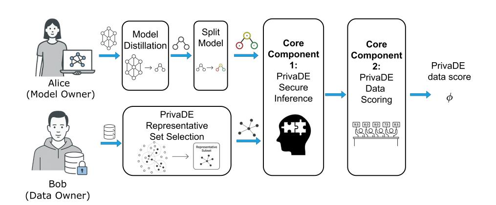
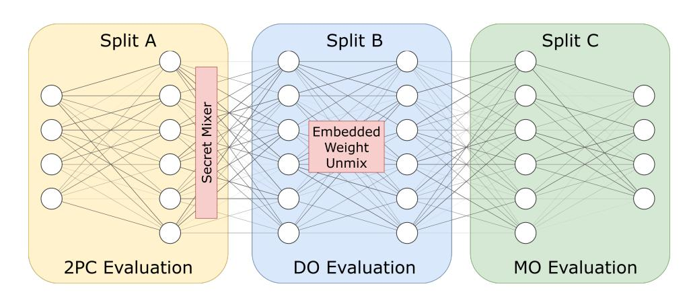
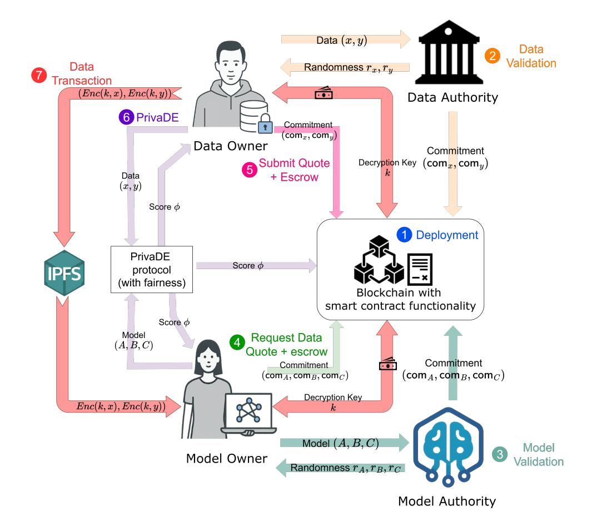
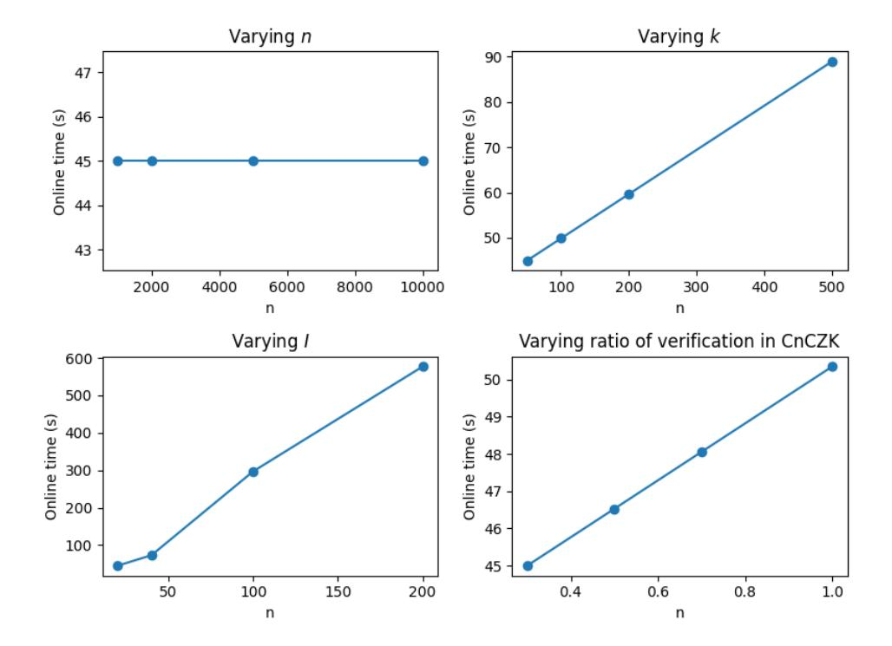
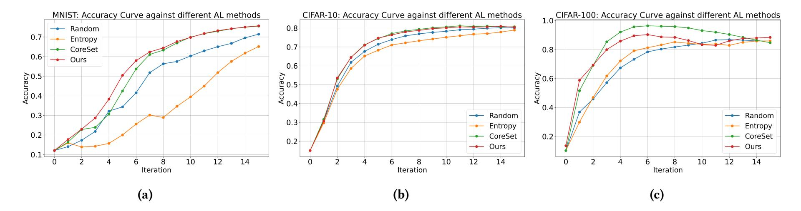

{0}------------------------------------------------

# PrivaDE: Privacy-preserving Data Evaluation for Blockchain-based Data Marketplaces

Wan Ki Wong thomas.wong@ed.ac.uk University of Edinburgh Edinburgh, United Kingdom

Michele Ciampi michele.ciampi@ed.ac.uk University of Edinburgh Edinburgh, United Kingdom Edinburgh, United Kingdom Rik Sarkar rik.sarkar@ed.ac.uk University of Edinburgh

Security (ASIA CCS '26), June 01–05, 2026, Bangalore, India. ACM, New York, NY, USA, 19 pages. https://doi.org/10.1145/3779208.3785393

Edinburgh, United Kingdom

Sahel Torkamani

sahel.torkamani@ed.ac.uk University of Edinburgh

#### **Abstract**

Evaluating the usefulness of data before purchase is essential when obtaining data for high-quality machine learning models, yet both model builders and data providers are often unwilling to reveal their proprietary assets.

We present PrivaDE, a privacy-preserving protocol that allows a model owner and a data owner to jointly compute a utility score for a candidate dataset without fully exposing model parameters, raw features, or labels. PrivaDE provides strong security against malicious behavior and can be integrated into blockchain-based marketplaces, where smart contracts enforce fair execution and payment. To make the protocol practical, we propose optimizations to enable efficient secure model inference, and a model-agnostic scoring method that uses only a small, representative subset of the data while still reflecting its impact on downstream training. Evaluation shows that PrivaDE performs data evaluation effectively, achieving online runtimes within 15 minutes even for models with millions of parameters.

Our work lays the foundation for fair and automated data marketplaces in decentralized machine learning ecosystems.

## **CCS** Concepts

• Security and privacy  $\rightarrow$  Privacy-preserving protocols; Security protocols; Cryptography; • Computing methodologies  $\rightarrow$  Supervised learning; • Information systems  $\rightarrow$   $Data\ mining$ .

#### **Keywords**

Privacy-preserving machine learning, Secure data valuation, Zero-knowledge proofs, Secure model inference, Active learning, Data marketplaces, Blockchain-based systems, Decentralized machine learning, Cryptographic protocols

#### **ACM Reference Format:**

Wan Ki Wong, Sahel Torkamani, Michele Ciampi, and Rik Sarkar. 2026. PrivaDE: Privacy-preserving Data Evaluation for Blockchain-based Data Marketplaces. In *ACM Asia Conference on Computer and Communications* 

This work is licensed under a Creative Commons Attribution 4.0 International License. *ASIA CCS '26, Bangalore, India* 

© 2026 Copyright held by the owner/author(s). ACM ISBN 979-8-4007-2356-8/2026/06 https://doi.org/10.1145/3779208.3785393

#### 1 Introduction

As machine learning (ML) systems proliferate and generate substantial value, concerns have grown over large-scale, uncompensated data collection and the need to return value to original contributors. Collaborative learning frameworks [52], in which multiple parties pool data via a decentralized ledger, offer one remedy: trainers publish data requests, contributors opt in, and contributions are compensated in a transparent and fair manner. Despite the rise of blockchain-based data and ML marketplaces (e.g., [46]), rigorous mechanisms for data evaluation remain largely overlooked.

The central challenge of data evaluation in collaborative learning is how to select high-quality samples that most improve model performance while preserving the confidentiality of both data and model assets. The problem is magnified in decentralized, privacy-sensitive marketplaces, where neither contributors nor model owners are willing to reveal raw features, labels, or model parameters prior to payment. It is therefore essential to design cryptographically secure protocols that compute data-utility scores under strong confidentiality guarantees while ensuring correctness in a trustless environment.

In this paper, we design a secure protocol that enables a model owner (MO) and a data owner (DO) to jointly compute a data-utility score  $\phi(M,D)$  for a model M and dataset D, with practical applicability to blockchain-based data marketplaces. This score can subsequently serve as the basis for negotiation or automated payment for data acquisition in such marketplaces.

Our Contributions. We introduce PrivaDE, a two-party, maliciously secure protocol for dataset scoring. PrivaDE has two main components: (i) an improved and more efficient secure model inference protocol that obtains the model's predictions on the dataset, and (ii) a data scoring protocol that takes the data points and model predictions as input and outputs a score  $\phi$  representing the usefulness of the data.

Secure model inference under malicious security, e.g., with SPDZ [26] or MASCOT [27], is known to incur very high overhead. We introduce three optimization techniques (Section 5) that make the secure inference component of Privade practical under a strict malicious-adversary assumption. In particular, we combine model distillation (to shrink the model), model splitting (to reduce the

{1}------------------------------------------------

portion of computation run in secure environments), and a cut-and-choose ZKP audit (to reduce verification cost) to carefully balance efficiency and security.

We further design a novel, model-agnostic scoring function (Alg. 1) for the data scoring component, which evaluates data points and yields a score that correlates with downstream training performance. The scoring function builds on active learning criteria, namely diversity (how spread out the points are) and uncertainty (how uncertain the model's predictions are), which have been empirically shown to be effective heuristics for data quality. Our scoring function is easy to compute under maliciously secure protocols and minimizes passive information leakage by operating on a *representative subset* of the dataset. The scoring procedure is constructed so that the subset-derived score accurately reflects the full dataset.

We provide a brief proof-of-concept integration of PrivaDE into a blockchain-based data marketplace. Smart contracts deter misuse and enforce fairness in MPC by penalizing uncooperative parties via escrow slashing, and the protocol can be tightly coupled with the data transaction to streamline the end-to-end marketplace workflow.

Finally, we prove security in the simulation-based paradigm and demonstrate practicality through extensive experiments (Section 7) on real-world datasets and standard model architectures. Our results show that Privade can be flexibly tuned to achieve reasonable runtimes (as low as 45 seconds of online time for MNIST with LeNet), and that the scoring protocol is robust, effectively identifying high-value datasets.

To our knowledge, this is the first work to propose a secure data evaluation scheme in the malicious setting together with a model-agnostic, crypto-friendly scoring function. Prior work (e.g., [45, 53, 54]) either operates in the semi-honest model or relies on a trusted third party (TTP) for most protocol steps. An overview of PRIVADE is shown in Fig. 1.

Figure 1: Overall design of PRIVADE. The core protocol consists of two parts: a secure inference of the data points and a scoring function that takes the inference results and labeled data points as input. Several optimization components, detailed in Section 5, are applied before secure inference to reduce the overhead of the first component.

*Organization.* Section 2 reviews background on machine learning, cryptography, and blockchain. Section 3 formalizes the problem and threat model. Section 4 presents the full protocol and security proofs. Section 5 explains optimization techniques applied that reduce the overhead of secure inference. Section 6 describes a

proof-of-concept integration of Privade into a blockchain-based marketplace, Section 7 evaluates the practicality and robustness of our construction, and Section 8 discusses related work.

## 2 Preliminaries

## 2.1 Machine learning

In supervised machine learning, we compute a model h from a training set  $D = \{(x_i, y_i)\}_{i=1}^n$ , where each  $x_i$  has label  $y_i$  (sometimes  $z_i = (x_i, y_i)$ ). An algorithm A searches a hypothesis space  $\mathcal{H}$  for h minimizing empirical loss  $L_D(h) = \frac{1}{n} \sum_{i=1}^n \ell(h(x_i), y_i)$ , where  $\ell$  quantifies the error between prediction y' = h(x) and true y. Common choices include squared loss  $\ell(y', y) = (y' - y)^2$  for regression and zero-one loss  $\ell(y', y) = \mathbf{1}[y' \neq y]$  for classification. For probabilistic outputs  $\vec{y}'$ , cross-entropy  $\ell_{\text{CE}}(\vec{y}', \vec{y}) = -\sum_{i=1}^d \vec{y}^i \ln \vec{y}'^i$  is typical, where  $\vec{y}$  is a one-hot vector. We denote models by M and, when parameterized by  $\theta$ , by  $M_{\theta}$ .

# 2.2 Cryptographic protocols

This section reviews commitment schemes, zero-knowledge proofs (ZKPs), and multi-party computation (MPC). We use  $\lambda$  as the security parameter and assume familiarity with computational indistinguishability and negligible functions  $\nu$ .

- 2.2.1 *Commitment schemes.* Informally, a commitment scheme is a tuple  $\Gamma = (\text{Setup, Commit, Open})$  of PPT algorithms where:
  - Setup( $1^{\lambda}$ )  $\rightarrow$  pp takes security parameter  $\lambda$  and generates public parameters pp;
  - Commit(pp; m)  $\rightarrow$  (com, r) takes a secret message m, outputs a public commitment Com and a randomness r used in the commitment.
  - Open(pp, com; m, r)  $\rightarrow b \in \{0, 1\}$  verifies the opening of the commitment C to the message m with the randomness r.

We require two main security properties: *hiding* and *binding*. Hiding ensures no PPT adversary can determine the committed message from com. Binding ensures com can be opened to only one specific message. See App. C.1 for formal definitions.

2.2.2 Merkle Tree Commitments. A Merkle tree commitment uses a collision-resistant hash function H to commit to a vector  $(m_1, \ldots, m_n)$  by hashing leaves and iteratively hashing pairs up a binary tree; the commitment is the root, and an opening is the  $O(\log n)$ -length authentication path for an index i.

A merkle tree commitment is a tuple of PPT algorithms  $\Gamma = (mtSetup, mtCommit, mtOpen, mtVerify)$  where:

- mtSetup $(1^{\lambda}) \rightarrow pp$ : generates public parameters pp./
- mtCommit(pp;  $m_1, \ldots, m_n$ )  $\rightarrow$  (com, st): compute leaf and internal hashes; output root com and state st.
- mtOpen(pp, st; i)  $\rightarrow \pi_i$ : output the sibling-hash path authenticating position i.
- mtVerify(pp, com;  $i, m_i, \pi_i$ )  $\rightarrow$  b: recompute the root from  $(i, m_i, \pi_i)$  and accept iff it equals com.

The position-binding property (no two different m open at the same i) holds under collision resistance of H. We refer to App. C.2 for the formal definition.

2.2.3 Zero-knowledge proofs. A non-interactive zero-knowledge proof-of-knowledge system (NIZKPoK) for an NP-language L with the

{2}------------------------------------------------

corresponding relation  $\mathcal{R}_L$  is represented by a tuple of algorithms  $\Pi = (\mathsf{Setup}, \mathcal{P}, \mathcal{V})$ , where:

- Setup( $1^{\lambda}$ )  $\rightarrow$  CRS takes as the input a security parameter  $\lambda$ . It outputs a common reference string CRS.
- $\mathcal{P}(CRS, x, w) \to \pi$  takes as the input CRS, the statement x and the witness w, s.t.  $(x, w) \in \mathcal{R}_L$ . It outputs the proof  $\pi$ .
- $\mathcal{V}(\mathsf{CRS}, x, \pi) \to b \in \{0, 1\}$  takes as the input CRS, x and  $\pi$ . It outputs 1 to accept and 0 to reject.

Informally, a NIZK proof is secure if it satisfies *completeness*, *zero-knowledge*, and *soundness*. Completeness requires honest verifiers always accept honest proofs. Zero-knowledge ensures proofs leak no information about the witness w, even to malicious verifiers. Soundness requires verifiers reject proofs of false statements. We refer to App. C.3 for the formal definition.

2.2.4 Multi-party computation. We prove that our results are secure under the simulation-based paradigm of secure Multi-Party Computation (MPC). In secure multiparty computation (MPC) multiple parties aim to compute a function f together while keeping their inputs private. The goal is to ensure the result is correct while revealing no extra information. We say that a protocol is secure if whatever can be inferred by an adversary attacking the protocol can also be inferred by an adversary attacking a so-called *ideal-world*. In this, there is an ideal trusted third party that receives the inputs of the parties evaluates the function f, and returns the output of the computation back to the parties

In short, a protocol is secure if a real-world adversary cannot gain an advantage over what they would learn in the ideal-world setting (that trivially captures the best possible security guarantee). When defining the security of a protocol  $\Pi$ , we will say that  $\Pi$  securely realizes the function f, if  $\Pi$  guarantees the above. In this paper we focus on the two-party setting, considering security against malicious adversaries. Parties can deviate arbitrarily from what the protocol prescribes. In App. C.4 we provide a formal definition of secure MPC and its variants.

#### 2.3 Blockchain and Smart Contracts

A *blockchain* is a decentralized, append-only ledger storing an ordered sequence of blocks; each block includes transactions, a timestamp, and the previous block's hash, yielding immutability [6, 37]. A *smart contract* is a program replicated and executed by blockchain nodes, enforcing state transitions without intermediaries [7, 58].

PrivaDE targets an EVM-compatible chain, which provides a secure, verifiable substrate for data exchange and computation. We use the chain to:

- **Commit inputs.** Data contributions and model parameters are posted as cryptographic commitments, creating a binding, immutable audit trail.
- Enforce MPC fairness. Contracts escrow deposits and impose penalties for deviations, discouraging aborts and enforcing compliance during MPC [28].
- **Enable atomic payment.** Transfers to data contributors trigger only on verifiable completion (e.g., successful checks/proofs), preventing unilateral defection.

## 3 Problem Description and Threat Model

Consider a scenario in which Alice owns a model M trained on her dataset  $D_A$  and seeks additional data to further improve it. Bob holds a relevant dataset  $D_B$  that could enhance M when combined with  $D_A$  (i.e.,  $D_A \cup D_B$ ). Bob seeks fair compensation for his contribution, while Alice aims to pay in proportion to the improvement attributable to  $D_B$ . We assume  $D_B$  is authentic and pertinent to Alice's task; authenticity can be attested, for example, via signatures by the original data source or a trusted authority (Sec. 6).

Our objective is to compute a score  $\phi = \operatorname{Score}(M, D_B)$  that quantifies the improvement  $D_B$  affords to M, approximating the net gain in model performance (e.g., increased accuracy on a held-out test set). In pursuit of this goal, we address two coupled questions:

- (1) What criterion should define the scoring function Score?
- (2) How can we compute Score securely while protecting both Alice's and Bob's private data?

The challenge is to devise a criterion that reliably reflects true improvement—ordinarily requiring retraining—while remaining simple enough for efficient secure computation within practical runtimes. Consequently, we co-design the scoring rule and the secure protocol to yield a feasible and efficient scoring system.

We assume Bob contributes a dataset with multiple points ( $|D_B| > 1$ ), reflecting practical scenarios such as a company representative contributing bulk records (e.g., sales data). To facilitate deployment on blockchain-based systems, PrivaDE is maliciously secure: it executes in the presence of a PPT adversary  $\mathcal A$  who may arbitrarily deviate from the protocol, with the identity of the corrupted party fixed prior to execution. The protocol protects the honest party by detecting any deviation and safely aborting. PrivaDE requires no trusted party beyond the setup and preprocessing stages.

PrivaDE assumes the model architecture is public, while the model weights  $\theta$  are Alice's private input. Bob's private input is the dataset  $D_B$ , formally represented by the sequences  $(\overrightarrow{x}, \overrightarrow{y})$ . The i-th sample is  $(x_i, y_i)$ , the i-th entries of  $\overrightarrow{x}$  and  $\overrightarrow{y}$ .

The primary goal of our protocols is to protect  $\theta$  and  $(\overrightarrow{x}, \overrightarrow{y})$ . For efficiency, we allow carefully bounded, protocol-specified leakage, supported by prior work and experiments, which does not reveal the full model  $\theta$  or any individual sample  $(x_i, y_i)$ . The remaining, unleaked components are proven secure via formal, simulation-based arguments; see Sec. 4 for definitions and proofs.

#### 4 PrivaDE: The Data Evaluation Protocol

In this section, we describe the end-to-end workflow of PRIVADE.

#### 4.1 Dataset Scoring Algorithm

As proven in numerous active-learning literature (e.g. [13, 50]), the use of active learning heuristics often gives good indicator of the overall dataset quality. Hence, given a representative set  $D_R$ , the parties compute a score using three criteria - diversity, uncertainty, and loss, where diversity and uncertainty follow standard active-learning practice.

**Diversity.** The subset should be diverse, with elements sufficiently different to avoid redundancy. We denote diversity by  $\mathcal{D}$ , instantiated as a statistic (mean, median) of pairwise distances, common in coreset and batch active learning [49].

{3}------------------------------------------------

**Uncertainty.** Uncertainty indicates potential informativeness: high uncertainty suggests the model benefits from training on such samples. Typical measures include entropy of M's predictive distribution or margin-based variants. We write the uncertainty functional as  $\mathcal{U}$ .

**Loss.** Relevance is captured by loss M incurs on Bob's data [60]. If  $y' = M_{\theta}(x)$ , then  $\ell(y', y)$  quantifies prediction-label discrepancy; larger loss indicates greater potential training value.

Let

$$l = \frac{1}{|D_R|} \sum_{(x,y) \in D_R} \ell(M_\theta(x), y),$$
  

$$u = \mathcal{U}(M_\theta[D_R]),$$
  

$$d = \mathcal{D}(D_R^x, D_R^x).$$

The overall score is  $\phi = f(l, u, d)$  for a pre-agreed aggregator f. Algorithm 1 summarizes the cleartest procedure, where  $D_B^x = \{x \mid (x, y) \in D_B\}$  and  $D_B^y = \{y \mid (x, y) \in D_B\}$ .

## Algorithm 1 Cleartext dataset scoring Scoremulti

**Input:** model  $M_{\theta}$ , dataset  $D_B$ , loss  $\ell$ , uncertainty  $\mathcal{U}$ , diversity  $\mathcal{D}$ , scoring f, representative sampler  $\mathcal{R}$ 

Output: score  $\phi$  of  $D_B$ 1:  $D_R \leftarrow \mathcal{R}(D_B, k)$ 2: For each  $(x_i, y_i) \in D_R$ , compute  $y_i' \leftarrow M_\theta(x_i)$ 3:  $l \leftarrow \frac{1}{k} \sum_i \ell(y_i', y_i)$ ;  $u \leftarrow \mathcal{U}(\{y_i'\}_{i=1}^k)$ ;  $d \leftarrow \mathcal{D}(D_R^x, D_R^x)$ 

4:  $\phi \leftarrow f(l, u, d)$ 

5: **return**  $\phi$ 

*Example.* For multi-class image classification, one can choose cross-entropy loss  $\ell_{\text{CE}}$ , margin-based uncertainty  $u=\frac{1}{k}\sum_{i}(\max p_{i}-\max p_{i})$  second-max  $p_{i}$ ) [50], diversity  $d=\max$  pairwise  $\|x-x'\|$  over  $D_{R}^{x}$ , and  $f(l,u,d)=\alpha l+\beta u+\gamma d$  for weights  $\alpha,\beta,\gamma$ .

The exact choices of  $\ell$ ,  $\mathcal{U}$ ,  $\mathcal{D}$ , f are decided case-by-case. For example, an untrained model may benefit from higher diversity, while a fine-tuned model may benefit from higher uncertainty or loss. The model owner tunes the scoring function to their needs; our protocol construction and security are oblivious to this choice.

## 4.2 Supplementary Components

Before presenting the full protocol, we briefly introduce three supplementary components of Privade, shown in Fig. 1 preceding the two core components. These components form part of the optimization techniques of Privade, which are described in greater detail in Sec. 5.

**Model Distillation.** The model owner may optionally perform distillation on their model M, training a smaller model that closely approximates the performance of the original. In the remainder of this section, we assume Alice's model M denotes this distilled (smaller) model. See Sec. 5.1 for more details.

**Split Model.** We require Alice, the model owner, to partition the model M into three blocks:  $M = C \circ B \circ A$ , where block B is revealed to Bob while A and C remain private to Alice. This design reduces cryptographic overhead while balancing the leakage of the protocol. The detailed security analysis and splitting methodology are presented in Sec. 5.2.

**Representative Set Selection.** We require Bob to select a *representative subset*  $D_R \subset D_B$  before running the core protocol, specifically a  $(d, \delta)$ -representative subset:

Definition 4.1 (Representativeness of  $D_R$  to  $D_B$ ). Let  $D_R \subset D_B$ , and fix a distance threshold d > 0 and outlier tolerance  $\delta \in [0, 1]$ . Then  $D_R$  is  $(d, \delta)$ -representative if

$$\Pr_{x \sim D_B} \left[ \exists x' \in D_R : ||x - x'|| < d \right] \ge 1 - \delta,$$

where the probability is taken with respect to the empirical distribution over  $D_B$ .

We write  $\mathcal{R}(D_B)$  for any algorithm that, given  $|D_B| = n > k$ , returns  $D_R \subset D_B$  of size k. Bob may use any appropriate algorithm  $\mathcal{R}$ ; we only verify the representativeness of the selected subset.

To verify representativeness, we propose a *challenge protocol* CP. Bob commits each  $x_i \in D_B^x$  via  $\mathsf{com}_1, \ldots, \mathsf{com}_n$  and publishes the representative set  $D_R$  by revealing indices  $I_R := \{i | x_i \in D_R^x\}$ . Alice samples random  $i \in [n]$  and challenges Bob to prove in zero knowledge that committed  $x_i$  is well represented by  $D_R$ . Bob recovers  $x_i$ , computes  $d_i' = \min_{x_j' \in D_R} \|x_j'' - x_i\|$ , and:

- if  $d_i' < d$ , returns a ZK proof  $\pi_i$  attesting that  $\exists j, r_i : ||x_j^r x_i|| \le d \land \operatorname{Open}(\mathsf{pp}, \mathsf{com}_i, x_i, r_i) = 1;$
- otherwise, replies faili.

By repeating this challenge, Alice gains confidence that  $D_R$  is representative of  $D_B$ . A detailed analysis of representative set selection and the challenge protocol is given in Sec. 5.3.

## 4.3 The PRIVADE Protocol

We now give a secure realization of Algorithm 1. At a high level, the protocol proceeds in four stages:

- (i) **Setup.** Public parameters, keys, and any preprocessing required by the underlying secure primitives are initialized.
- (ii) **Representative selection & audit.** Bob computes a representative set  $D_R$ , and Alice audits it using the challenge protocol CP (Sec. 5.3.2) to ensure  $(d, \delta)$ -representativeness on sufficiently many points.
- (iii) **Verified inference.** The model is evaluated on  $D_R$ , and a corresponding zero-knowledge proof is used to verify computation.
- (iv) **Secure scoring.** Alice and Bob invoke a maliciously secure 2PC that realizes  $\mathcal{F}_{SubScore}$  (Fig. 4) to compute the final score from loss, uncertainty, and diversity statistics.

Formally, we prove that the protocol realizes  $\mathcal{F}^k_{Score}$ , which securely computes Algorithm 1. In particular, Alice's input (the model weights) and Bob's input (dataset) are protected except for some intended leakage, to which the degree is primarily tuned by the parameter k (size of the representative set). This leakage profile is fully specified by  $\mathcal{F}^k_{Score}$  in Fig. 2.

Functionality 
$$\mathcal{F}_{\text{Score}}^{k}$$

**Parameters:** model  $M = C \circ B \circ A$ , loss  $\ell$ , uncertainty function  $\mathcal{U}$ , diversity function  $\mathcal{D}$ , scoring function f, representative set selection function  $\mathcal{R}$ , representative set size k, distance threshold d, outlier ratio  $\delta$ , commitment parameter pp

(1)  $\mathcal{F}_{\text{Score}}^k$  receives  $I_R$  of size k (indices of representative set) from  $P_2$ .

{4}------------------------------------------------

- (2)  $\mathcal{F}_{Score}^k$  receives a list of challenge indices I from  $P_1$ , and sends I to  $P_2$ .
- (3)  $\mathcal{F}_{\mathsf{Score}}^k$  receives  $D_{B|I}^x$  (The set  $D_B^x$  indiced by I) and  $D_{R|I}^x$  (respective points in  $D_R^x$  closest to each  $D_{B|I}^x$ ) from  $P_2$ . For each  $i \in I$  ( $x_i \in D_{B|I}^x$ ),  $\mathcal{F}_{\mathsf{Score}}^k$  checks that there exists some  $x_j \in D_{R|I}^x$  such that  $||x_i x_j|| < d$ . If this check fails for at least  $\delta \cdot |I|$  indices, the functionality sends abort to both  $P_1$  and  $P_2$ .
- (4)  $\mathcal{F}_{Score}^k$  receives  $\theta_A$  from  $P_1$  and  $D_R^x$  (of size k) from  $P_2$ , then computes  $\overrightarrow{a_A} \leftarrow A_{\theta_A}(D_R^x)$  and sends  $\overrightarrow{a_A}$  to  $P_2$ .
- (5)  $\mathcal{F}_{\text{Score}}^k$  receives  $\theta_B$  from  $P_1$ , sends  $\theta_B$  to  $P_2$ , then computes  $\overrightarrow{a_B} \leftarrow B_{\theta_B}(\overrightarrow{a_A})$  and sends  $\overrightarrow{a_B}$  to  $P_1$  and  $P_2$ .
- (6)  $\mathcal{F}_{\text{Score}}^k$  receives  $\theta_C$  from  $P_1$ , computes  $\overrightarrow{y}' \leftarrow C_{\theta_C}(\overrightarrow{a_B})$ .
- (7)  $\mathcal{F}_{\text{Score}}^k$  receives  $D_B^x$ ,  $D_R^y$  from  $P_2$  and calculates the score:  $l = \frac{1}{k} \sum_{i=1}^k \ell(y_i', y_i)$ ,  $u = \mathcal{U}(\{y_1', \dots, y_k'\})$ ,  $d = \mathcal{D}(D_B^x, D_R^x)$ , and finally  $\phi \leftarrow f(l, u, d)$ . It then sends  $\phi$  to both  $P_1$  and  $P_2$ .

Figure 2: Functionality  $\mathcal{F}_{Score}^k$  for computing the score of a dataset.

We are now ready to formally describe the protocol Privade that realizes  $\mathcal{F}^k_{\mathsf{Score}}$  (Fig. 2). Privade uses the following tools:

- (SetupCom, Commit, Open) is a commitment scheme satisfying Definition C.1.
- (SetupZKP,  $\mathcal{P}$ ,  $\mathcal{V}$ ) is an NIZKPoK system satisfying Definition 2.2.3, defined for the NP language  $L_{\text{ML-Inf}}$ . We consider two scenarios: (1) the model weights and outputs are hidden as part of the witness and the data point is public (blue); (2) the data point is hidden as part of the witness and the model weights and outputs are public (red). For each scenario, read the black text together with the text in the corresponding colour.

$$L_{\text{ML-Inf}} = \begin{cases} (\mathsf{pp}, \overrightarrow{x}, \mathsf{com}_{\theta}, \overrightarrow{\mathsf{com}}_{y'}, \theta, \overrightarrow{\mathsf{com}}_{x}, \overrightarrow{y'}) : \\ \exists \, (\theta, r_{\theta}, \overrightarrow{y'}, \overrightarrow{r_{y'}}, \overrightarrow{x}, \overrightarrow{r_{x}}) \text{ s.t.} \\ M_{\theta}(x) = y', \\ \mathsf{Open}(\mathsf{pp}, \mathsf{com}_{\theta}, \theta, r_{\theta}) = 1, \\ \forall y' \, \mathsf{Open}(\mathsf{pp}, \mathsf{com}_{y'}, y', r_{y'}) = 1, \\ \forall x \, \mathsf{Open}(\mathsf{pp}, \mathsf{com}_{x}, x, r_{x}) = 1 \end{cases}.$$

Our proof-of-concept implementation uses EZKL [70].

- $\Pi_{\text{Inference}}$  is a 2-party protocol satisfying Definition 2.2.4, which securely realizes  $\mathcal{F}_{\text{Inference}}$  (Fig. 3) with malicious security. We instantiate this with SPDZ2k [12] in MP-SPDZ [26].
- $\Pi_{\text{SubScore}}$  is a 2-party protocol satisfying Definition 2.2.4, which securely realizes  $\mathcal{F}_{\text{SubScore}}$  (Fig. 4); also instantiated with SPDZ2k.

## Functionality $\mathcal{F}_{Inference}$

**Parameters.** Description of the model A; model owner  $P_1$ ; data owner  $P_2$ ; commitments  $com_A$ ,  $\overrightarrow{com_x}$ ; commitment parameter pp.

- (1)  $\mathcal{F}_{Inference}$  receives private input  $(\theta_A, r_A)$  from  $P_1$  and  $(\overrightarrow{x}, \overrightarrow{r_x})$  from  $P_2$ .
- (2) it verifies the commitments  $b_A \leftarrow \operatorname{Open}(\operatorname{pp}, \operatorname{com}_A, \theta_A, r_A)$  and  $b_{x_i} \leftarrow \operatorname{Open}(\operatorname{pp}, \operatorname{com}_{x_i}, x_i, r_{x_i})$  for all i. If  $b_A \neq 1$  or  $b_{x_i} \neq 1$  for any i, it sends abort to both  $P_1$  and  $P_2$ .
- (3) It computes  $\overrightarrow{y'} \leftarrow A(\overrightarrow{x})$ , commits  $com_{a_i}, r_{a_i} \leftarrow Commit(pp, y_i)$  for each  $y_i \in \overrightarrow{y'}$
- (4) It delivers  $\overrightarrow{y}'$ ,  $\{com_{a_i}, r_{a_i}\}_i$ , to  $P_2$ , and only  $\{com_{a_i}\}_i$  to  $P_1$ .

Table 1: Public protocol parameters agreed by Alice (model owner) and Bob (data owner) before running PrivaDE.

| Symbol                                       | Description                                                                                                                                               |
|----------------------------------------------|-----------------------------------------------------------------------------------------------------------------------------------------------------------|
| $m_{CP}$                                     | Number of challenges in the CP protocol.                                                                                                                  |
| d                                            | Distance threshold used in CP and in the $(d, \delta)$ -representativeness condition.                                                                     |
| $\delta$                                     | Allowed outlier ratio in the representativeness guarantee.                                                                                                |
| k                                            | Size of the representative set $D_R$ (i.e., $ D_R  = k$ ).                                                                                                |
| R                                            | Public algorithm for selecting the representative set $D_R$ from $D_B$ .                                                                                  |
| $\ell$ , $\mathcal{U}$ , $\mathcal{D}$ , $f$ | Public definition of the scoring function: loss $\ell$ , uncertainty functional $\mathcal{U}$ , diversity functional $\mathcal{D}$ , and aggregator $f$ . |

Figure 3: Functionality  $\mathcal{F}_{Inference}$  for maliciously secure 2PC.

## Functionality $\mathcal{F}_{SubScore}$

**Parameters.** Loss  $\ell$ ; uncertainty  $\mathcal{U}$ ; diversity  $\mathcal{D}$ ; aggregator f; model owner  $P_1$ ; data owner  $P_2$ ; commitment parameter pp; public representative features  $D_R^x$ .

- (1)  $\mathcal{F}_{\text{SubScore}}$  receives private input  $(y'_1, \ldots, y'_k, r_{y'_1}, \ldots, r_{y'_k}, \mathsf{com}_{y_1}, \ldots, \mathsf{com}_{y_k})$  from  $P_1$  and  $(D_B^x, y_1, \ldots, y_k, r_{y_1}, \ldots, r_{y_k}, \mathsf{com}_{y'_1}, \ldots, \mathsf{com}_{y'_k})$  from  $P_2$ .
- (2) It verifies the commitments  $b_{y_i} \leftarrow \text{Open}(\text{pp}, \text{com}_{y_i}, y_i, r_{y_i})$  and  $b_{y_i'} \leftarrow \text{Open}(\text{pp}, \text{com}_{y_i'}, y_i', r_{y_i'})$  for all i. If  $b_{y_i} \neq 1$  or  $b_{y_i'} \neq 1$  for any i, it sends abort to both  $P_1$  and  $P_2$ .
- (3) It computes the average loss  $l = \frac{1}{k} \sum_{i=1}^{k} \ell(y_i', y_i)$ , the uncertainty score  $u = \mathcal{U}(\{y_1', \ldots, y_k'\})$ , the diversity score  $d = \mathcal{D}(D_B^x, D_R^x)$  and finally  $\phi \leftarrow f(l, u, d)$ . It then outputs  $\phi$  to both  $P_1$  and  $P_2$ .

Figure 4: Functionality  $\mathcal{F}_{SubScore}$  for maliciously secure 2PC.

**The Setup phase.** The setup phase is an offline stage before Alice and Bob run the protocol. In this phase:

- Alice and Bob communicate with a trusted third party to obtain cryptographic parameters  $pp \leftarrow SetupCom(1^{\lambda})$  and  $CRS \leftarrow SetupZKP(1^{\lambda})$ .
- Bob verifies the authenticity of his dataset  $D_B$  with a data authority, which issues a signature attesting to the authenticity of  $D_B$ .
- Alice may optionally perform model distillation locally, then interacts with a model authority that splits M into  $C \circ B \circ A$  and certifies that the model split is valid (Sec. 5.2.1).
- Alice and Bob jointly fix the non-cryptographic public parameters listed in Table 1, decided out-of-band before the main protocol.

This is the only phase that involves a trusted third party. The main protocol then proceeds as in Fig. 5.

## **Protocol** PrivaDE

**Parties:** Model owner  $P_1$ , data owner  $P_2$ **Private parameters:** Dataset  $D_B$  (held by  $P_2$ ); model weights  $\theta_A$ ,  $\theta_C$  (held by  $P_1$ ) 

{5}------------------------------------------------

**Public parameters:** Commitment parameter pp, representative set size k, distance threshold d, outlier ratio  $\delta$ , model architecture M, number of challenges  $m_{\text{CP}}$ , model weights  $\theta_B$ 

#### **Stage 0: Commitments**

- (1)  $P_1$  computes  $(com_A, r_A) \leftarrow Commit(pp, \theta_A)$  and  $(com_C, r_C) \leftarrow Commit(pp, \theta_C)$ , and sends  $com_A, com_C$  to  $P_2$ .
- (2) For each  $(x_i, y_i) \in D_B$ ,  $P_2$  computes  $(com_{x_i}, r_{x_i}) \leftarrow Commit(pp, x_i)$  and  $(com_{y_i}, r_{y_i}) \leftarrow Commit(pp, y_i)$ , and sends  $com_{x_i}, com_{y_i}$  to  $P_1$ .

#### **Stage 1: Representative Set Selection**

- (3)  $P_2$  runs the representative set selection algorithm  $\mathcal{R}$  locally to select a subset  $D_R$  of size k from  $D_B$ . It then computes d' as the  $(1-\delta)$ -th percentile of the pairwise distances  $\left\{\min_{b\in D_R^x}\|a-b\|:a\in D_B^x\setminus D_R^x\right\}$ . If d'>d,  $P_2$  aborts the protocol. Otherwise, he sends indices  $I_R$  to  $P_1$ .
- (4)  $P_1$  and  $P_2$  runs the challenge protocol CP, where  $P_1$  supplies a list of challenge indices I of size m. If the challenge protocol fails,  $P_1$  aborts.

#### **Stage 2: Secure Model Inference (Core Component 1)**

- (5)  $P_1$  and  $P_2$  run the 2PC protocol  $\Pi_{\mathsf{Inference}}$  to evaluate block A on  $D_R^x$ .  $P_1$  inputs  $(\theta_A, r_A)$ ;  $P_2$  inputs  $D_R^x$  (and the corresponding opening randomness).  $P_2$  receives the activations  $\overrightarrow{a_A} = \{a_{A,i}\}_i$  and per-sample commitments  $\{(\mathsf{com}_{a_i}, r_{a_i})\}_i$ ; both parties obtain  $\{\mathsf{com}_{a_i}\}_i$ .
- (6)  $P_2$  locally computes  $\overrightarrow{a_B} \leftarrow B_{\theta_B}(\overrightarrow{a_A})$ . He generates a ZK proof  $\pi_B$  for the language  $L_{\text{ML-Inf}}$  (public weights, hidden inputs) with witness  $(\overrightarrow{a_A}, \{r_{a_i}\}_i)$ , and sends  $(\overrightarrow{a_B}, \pi_B)$  to  $P_1$ .
- (7)  $P_1$  verifies  $\pi_B$ ; if verification fails, she aborts.
- (8)  $P_1$  computes  $\overrightarrow{y'} \leftarrow C_{\theta_C}(\overrightarrow{a_B})$  and for each i computes  $(\text{com}_{y_i'}, r_{y_i'}) \leftarrow \text{Commit}(\text{pp}, y_i')$ . She then produces a ZK proof  $\pi_C$  for  $L_{\text{ML-Inf}}$  (hidden weights, public inputs) with witness  $(\theta_C, r_C, y_1', \ldots, y_k', r_{y_1'}, \ldots, r_{y_k'})$ , and sends  $\{\text{com}_{y_i'}\}_{i=1}^k$  and  $\pi_C$  to  $P_2$ .
- (9)  $P_2$  verifies  $\pi_C$ ; if verification fails, he aborts.

#### **Stage 3: Dataset Scoring (Core Component 2)**

(10)  $P_1$  and  $P_2$  run the maliciously secure 2PC protocol  $\Pi_{\text{SubScore}}$ .  $P_1$  inputs  $(y'_1,\ldots,y'_k,\,r_{y'_1},\ldots,r_{y'_k},\,\text{com}_{y'_1},\ldots,\text{com}_{y'_k});\,P_2$  inputs  $(D^x_B,\,y_1,\ldots,y_k,\,r_{y_1},\ldots,r_{y_k},\,\text{com}_{y_1},\ldots,\text{com}_{y_k})$ . Both parties receive the score  $\phi$ .

Figure 5: PrivaDE for secure dataset scoring.

Theorem 4.2. PrivaDE securely realizes  $\mathcal{F}_{Score}^k$  with malicious security.

The proof of Theorem 4.2 will be provided in Appendix D.1.

#### 5 Practical Optimizations for PrivaDE

In this section, we introduce the design techniques that make PrivaDE's secure model inference practical in terms of computation and communication.

#### 5.1 Model Distillation

Model distillation for modern neural networks, introduced by Hinton et al. [20], is widely used to reduce model size and inference cost. The original (teacher) model guides training of a smaller (student) model, typically by matching the teacher's logits.

Distillation is also common in secure inference (e.g., [42]) to lower protocol runtime. Empirical studies, such as [10, 47], showed

that student models with over  $10\times$  fewer parameters can retain accuracy comparable to the teacher, depending on task and architecture.

In Privade, we include optional local distillation by the model owner prior to data evaluation, where the choice of student model balances accuracy loss and size reduction. Beyond efficiency, distillation can reduce leakage: limited-capacity students cannot faithfully encode all teacher information [10]. We deliberately select a student size tolerating minor accuracy loss for substantial runtime savings and reduced leakage. Section 7 shows reduced models still support effective data evaluation.

## 5.2 Split Model

Figure 6: Conceptual diagram of split model in PrivaDE: Split A evaluated in a secure 2PC; split B evaluated by the data owner; split C evaluated by the model owner.

Most ML models, particularly neural networks, compose layers: one layer's output feeds the next until the final layer. This enables *split learning* [56], partitioning a network at a cut layer. Typically, the data owner trains the front segment and the model owner trains the back segment, coordinating to reduce data exposure.

In secure inference, this yields *split inference* (e.g., [42, 65]): the front segment executes within a secure protocol, while remaining layers run in the clear, reducing cryptographic workload and latency while limiting input leakage to the (carefully chosen) intermediate activations at the cut layer.

In PrivaDE, we also employ split-model inference, but use a three-way split that factorizes M as  $C \circ B \circ A$  (Figure 6):

- (1) **Block** A. Contains the initial layers up to (and including) the first activation. We insert a *secret mixer* that permutes A's outputs; this mixer is an invertible linear layer or an invertible  $1 \times 1$  convolution that mixes channels [29]. Block A is evaluated via a maliciously secure 2PC: Alice supplies weights, Bob supplies inputs, and only Bob learns the output of A.
- (2) **Block** *B*. Comprises the intermediate layers. Its first layer incorporates the inverse mixer to undo *A*'s permutation. The *B*–*C* cut is chosen by the C2PI boundary-search procedure [65]. Bob executes *B* locally after receiving the corresponding weights from Alice.
- (3) **Block** *C*. Contains the remaining layers up to the output. Alice executes *C* after receiving the activations produced by *B* from Bob.

The B–C split follows prior work that balances input-leakage mitigation and runtime. We adopt the C2PI boundary search [65],

{6}------------------------------------------------

which probes candidate cut layers by attempting input reconstruction from cut-layer activations; for images, a split is accepted when the structural similarity index with the original input falls below 0.3, which represents the image not being recognizable by human eye.

The A–B split further reduces 2PC overhead by restricting cryptographic computation to the minimal front segment (up to the first activation), leaving the remainder in B. Because B's weights are sent in the clear to Bob, A prevents him from obtaining a self-sufficient front model that yields reusable embeddings on arbitrary inputs.

Finally, we attach zero-knowledge proofs to the evaluations of B and C to enforce correctness and deter cheating; see Sec. 4 for protocol details.

5.2.1 Leakage Analysis. In our split-model framework, partial leakage of models and activations is unavoidable as it is not protected by zero-knowledge proofs or multiparty computation. Following [65], we therefore adopt an empirically defined client data privacy model to justify and quantify the leakage.

Before executing PrivaDE, both parties must decide whether the resulting leakages are acceptable according to metrics obtained from experimental attacks; if not, they abort the protocol.

**Leakage of model** B **to Bob:** Yosinski et al. [61] show that later layers are more task-specific, while early layers capture generic features. Since neither the weights of C nor the model outputs are revealed, Bob cannot reconstruct the full task model. However,  $B \circ A$  may still provide useful embeddings and thus be valuable for fine-tuning on related domains; we therefore need to bound the transferability of B.

To repurpose the model, Bob must

- (1) reconstruct A to map raw inputs into B's input space; and
- (2) apply transfer learning to  $B \circ A$  on new tasks.

We summarize model leakage as a tuple ( $\Delta$ Acc, LogME), where  $\Delta$ Acc captures the reconstruction quality of A and LogME scores the transferability of  $B \circ A$ . Alice deems the leakage acceptable or not by comparing ( $\Delta$ Acc, LogME) to baselines from other marketplace models.

For reconstructing A, Bob observes only his inputs and the corresponding outputs of A. We assume each contributor issues at most k queries through A. A secret mixer (which may vary across runs) applies a random invertible permutation to A's outputs, hindering plug-and-play attacks (e.g., attaching public pretrained fronts to B) and collusion by contributors pooling I/O pairs.

Empirical studies [40] report that successful extraction typically requires on the order of  $10^4$  queries; hence security improves when  $k \ll 10^4$ . To evaluate robustness at query budget k, we run a reconstruction-under-budget experiment: sample  $\{x_i\}_{i=1}^k$  from  $D_A$  and train a re-initialized copy A' by minimizing

$$\min_{\theta} \frac{1}{k} \sum_{i=1}^{k} \|A'(x_i; \theta) - u_i\|_2^2 + \lambda \|B(A'(x_i; \theta)) - B(u_i)\|_2^2,$$

where  $\lambda > 0$  enforces feature consistency through B. After training, we fix B and C, replace A by A', and measure top-1 test accuracy. Our metric is

$$\Delta Acc = Acc(C \circ B \circ A') - Acc(C \circ B \circ A).$$

A split is deemed robust if  $\Delta Acc$  is substantially negative at practical k, indicating that A cannot be effectively reconstructed and B is not easily reused under the stated constraints (cf. the privacy criterion in 65).

We also assess the transferability of  $B \circ A$  (assuming A is known). Following You et al. [62], we compute LogME, the log marginal evidence that a Bayesian linear regressor explains labels given features. Concretely, we pass labeled images through B(A(x)) to obtain features and evaluate LogME on these embeddings; lower scores imply weaker linear transfer and thus lower leakage risk. **Leakage of activations** B(A(x)) **to Alice:** We quantify input leakage via reconstruction quality, training an inverse model that maps B(A(x)) back to x. For images, we adopt the distillationbased inverse-network attack (DINA) [65] and report the mean structural similarity index (SSIM) on a test set. SSIM, valued in [0, 1], measures perceptual similarity in terms of luminance, contrast, and local structure, with higher scores indicating more recognizable reconstructions. We deem a split privacy-preserving when the mean SSIM < 0.3, corresponding to low-fidelity, structurally dissimilar reconstructions.

*Justification of the 0.3 SSIM threshold.* Following conventions in prior work on model inversion [19, 65], reconstructions with SSIM < 0.3 are visually unrecognizable. SSIM is calibrated to human perception, and values around 0.3 fall in the "very poor" quality regime in subjective studies [18, 21]. We adopt this threshold for direct comparability with C2PI.

## 5.3 Representative Set Selection

Because Bob contributes a dataset  $D_B$ , scoring every point in  $D_B$  is costly and increases leakage: repeated inferences can expose information about Alice's model and Bob's data distribution.

To mitigate this, our protocol requires Bob to extract a much smaller representative subset  $D_R \subset D_B$ , and then jointly and securely evaluate Alice's model only on  $D_R$ . To ensure correctness even if Bob is malicious, we enforce honest sampling via a cut-and-choose subroutine (Sec. 5.3.2). Similar representative-sampling strategies (without security) are standard in batch active learning [49] and related ML tasks [36]. While our protocol allows Bob to choose any algorithm that achieves  $(d, \delta)$ -representativeness, common methods include k-center clustering and submodular maximization [36, 38].

5.3.1 Dimension Reduction. Selection involves pairwise distances (Def. 4.1), which becomes expensive as d grows. We apply random linear projections [4]:

$$x' = R x, \qquad R \in \mathbb{R}^{m \times d}, \ m \ll d,$$

which preserve distances up to  $\varepsilon$ -distortion by the Johnson - Lindenstrauss lemma [24]. Alice and Bob jointly sample R via md secure coin flips [5], deriving a shared pseudorandom seed. Bob projects locally and runs representative-selection on  $\{x'\}$ , reducing computation and communication while retaining fidelity.

5.3.2 Challenge Protocol for Representative Set Selection. A naive way to securely implement the representative-set algorithm  $\mathcal R$  is via a maliciously secure two-party computation (2PC). However, because state-of-the-art clustering typically relies on costly Euclidean distance computations, this approach incurs substantial overhead.

{7}------------------------------------------------

As an alternative, we introduce the *challenge protocol* CP, which does not verify the correct execution of R directly but instead tests whether the resulting subset satisfies  $(d, \delta)$ -representativeness. A brief overview of CP was given in Sec. 4.2, and the full protocol appears in Fig. 10 (App. A.1). Here, we discuss the theoretical guarantees of CP.

Theorem 5.1. Let  $D_B$  be a dataset of size n, and let  $D_R \subset D_B$  be a purported  $(d, \delta)$ -representative subset. For any constant c > 0, if Alice runs the challenge protocol CP with  $|I| = \lceil c \ln n/\delta \rceil$  uniformly random challenges and all challenges succeed, then with probability at least  $1 - n^{-c}$ ,  $D_R$  is  $(d, \delta)$ -representative.

The proof appears in Appendix B.1. This theorem shows that  $\Theta(\ln n/\delta)$  challenges suffice to verify  $(d, \delta)$ -representativeness with high confidence.

#### **Audit-Style Cut-and-Choose for ML 5.4** Inference

While significant research has focused on zero-knowledge proofs (ZKPs) for verifying ML inference (e.g., [22, 25, 35]), constructing end-to-end proofs remains memory- and computation-intensive.

Taking advantage of the fact that ML models are usually a composition of layers, instead of requiring a full proof, we propose a lightweight protocol that detects incorrect batched inference with tunable detection probability (e.g., 80-95%) by sampling and proving only a small, random subset of local layer transitions. The protocol CnCZK serves as a drop-in replacement for a NIZKPoK of the language  $L_{\text{ML-Inf}}$  defined in Sec. 4.3.

CnCZK allows partial verification of the inference process as follows: The prover first commits to the model parameters, inputs, and all intermediate activations of a forward pass using Merkle trees, and the verifier then samples a random subset of inputs  $(D_S \subset D_R)$ and layers  $T \subset \{1, ..., L\}$  to audit. For each sampled position (i, l)(where  $i \in D_S$ ,  $l \in T$ ), the prover provides a zero-knowledge proof that the corresponding commitments (of  $\theta_l$ ,  $a_{l-1,i}$ ,  $a_{l,i}$ ) and the layer computation  $m_l(\theta_l, a_{l-1,i}) = a_{l,i}$  is consistent, where  $a_{l,i}$  denotes the activation (output) of the model at layer l, on the input i. The full protocol is specified in Fig. 11 (App. A.2).

In our experiments (Sec. 7), we replace full ZKP verifications with the cut-and-choose protocol CnCZK to explore practical privacy-efficiency trade-offs. When all layers and data points are verified, CnCZK is equivalent to the full PrivaDE protocol in Fig. 5.

5.4.1 Cheating-detection probability. Because the scoring protocol aggregates all evaluated points, altering a single point has limited impact on the final score. We therefore consider an adversary that corrupts a fraction  $\rho \in (0, 1)$  of the N inputs.

THEOREM 5.2. Consider CnCZK on a model with L layers and N inference points, auditing m points and s layers per audited point (both sampled uniformly without replacement). If an adversary corrupts  $N\rho$  points, the probability of detecting cheating is bounded below by

$$\Pr[\textit{detect}] \geq \sum_{k=0}^{\min(N\rho, m)} \frac{\binom{N\rho}{k} \binom{N(1-\rho)}{m-k}}{\binom{N}{m}} \left[1 - \left(\frac{L-s}{L}\right)^{k}\right].$$

The proof appears in Appendix B.2. As an illustration, with N =100, L = 10,  $\rho = 0.10$ , m = 25, and s = 6, the detection probability exceeds 80%. This setting audits only ms/(NL) = 150/1000 = 15%of all layer evaluations, yielding about an 85% reduction relative to checking every layer of every point.

#### **Blockchain Integration for PrivaDE** 6

In this section, we describe how PrivaDE can be integrated into a blockchain-based decentralized data marketplace. This is a proofof-concept; detailed implementation aspects are out of scope.

Using a blockchain brings four major advantages. First, commitments and data requests can be posted on-chain, enhancing transparency and guaranteeing input immutability even before evaluation begins. Second, the fairness of MPC within PrivaDE—not typically guaranteed—can be enforced by slashing escrow from dishonest parties. Third, ZKP generation in CP and CnCZK can be tied to on-chain payments, deterring overuse and improving efficiency. Finally, data transactions can be integrated with evaluation so that, for example, when the score produced by PrivaDE exceeds a threshold, the transaction is triggered atomically.

Figure 7: Decentralized Data Marketplace Workflow with PrivaDE integration. Commitments and protocol results are posted on-chain for transparency, and data transaction is seamlessly integrated.

## Step 1: Public Parameter Generation / Smart Contract Deployment

Before the genesis block, the creator chooses a security parameter  $\lambda$  and runs pp  $\leftarrow$  SetupCom(1 $^{\lambda}$ ). The parameters ( $\lambda$ , pp) are embedded as chain parameters. Once the chain is live, a marketplace smart contract is deployed to record commitments and interactions.

#### **Step 2: Data Validation**

Before responding to quotes, a data owner must validate their data with a data authority. The data owner sends (x, y) to the authority for validation. The authority verifies authenticity and ownership and, if successful, computes  $com_x, r_x \leftarrow Commit(pp, x)$ 

{8}------------------------------------------------

and  $com_y, r_y \leftarrow Commit(pp, y)$ , then submits  $(com_x, com_y)$  to the marketplace contract from the authority's contract address (serving as a signature). The authority notifies the data owner of the outcome and, if successful, returns  $(r_x, r_y)$ .

#### **Step 3: Model Validation**

Model owners prepare a model suitable for evaluation (including preprocessing such as distillation and splitting) and submit it to a model authority for validation. The authority verifies the reconstruction quality at the B-C split. If successful, it computes  $com_{\theta_s}, r_s \leftarrow Commit(pp, \theta_s)$  for  $s \in \{A, B, C\}$  and submits  $(com_{\theta_A}, com_{\theta_B}, com_{\theta_C})$  on-chain from the *model authority*'s contract address. The authority notifies the *model owner* and, if successful, returns  $(r_A, r_B, r_C)$ .

#### **Step 4: Request Data Quotes**

A model owner requests quotes by calling the marketplace contract, which emits an event that contributors can monitor. The request includes data requirements, model commitments ( $com_A$ ,  $com_B$ ,  $com_C$ ), and an escrow that is forfeited if the model owner deviates from the protocol.

#### **Step 5: Submit Data Quotes**

Data contributors respond by submitting their commitments  $(com_x, com_y)$  and an escrow to the contract. Submissions must match the authority-published commitments from Step 2; otherwise, the quote is automatically rejected.

#### **Step 6: Data Evaluation Protocol**

For each accepted quote, the data owner and model owner run PRIVADE, with two blockchain-oriented refinements:

- (1) MPC fairness. In  $\Pi_{SubScore}$ , the final protocol message and output can be escrow-enforced: the last-sender must precommit (e.g., via an on-chain encrypted blob or hash-locked reference) to the final message/output by a deadline. Failure to comply triggers escrow slashing and compensates the counterparty, preventing an unfair abort after learning  $\phi$ .
- (2) Payment for ZKP generation. In CP and CnCZK, verifiers may over-request proofs to raise the security if there is no cost attached. The contract can require proportional payment from the verifier before proof generation, aligning incentives and reducing prover load.

#### **Step 7: Data Transaction**

After scoring (potentially across multiple contributors), the model owner proceeds with transactions to selected data owners. Transactions can use hash-locked exchanges [43]:

- (1) The data owner uploads an encrypted dataset to IPFS, submits H(k) on-chain, and privately sends the CID and a ZKP attesting that the ciphertext decrypts under k;
- (2) The model owner retrieves the CID, verifies the ZKP, and escrows payment to the contract;
- (3) The data owner reveals k on-chain; the contract checks H(k), releases escrow to the data owner, and the model owner decrypts the data—completing the transaction.

#### 7 Evaluation

To assess feasibility, we benchmark runtime, memory, communication cost, and scalability by varying model size and dataset complexity. We compare our active data selection against entropy-based sampling and Core-Set [49].

Our open-source implementation is publicly available [55]. We instantiate SMPC using the SPDZ2k protocol within MP-SPDZ [26], employ EZKL [70] for ZKP-based inference, and implement the challenge protocol in Circom [3].

We validate on MNIST [34], CIFAR-10 [33], and CIFAR-100, testing three representative models: LeNet (61,706 parameters), ResNet-20 (272,474 parameters), and VGG-8 (4,506,276 parameters).

## 7.1 Practicality of PrivaDE

We implement PrivaDE in a two-party simulation. Each party executes as a separate process on a single host (32-core Intel Core i9, 128 GB RAM), communicating over TCP ports. Loss is crossentropy  $\mathcal{L}_{\text{CE}}$ ; uncertainty is average prediction entropy; diversity is average feature-wise standard deviation. Representative sets use k-center greedy.

An overview of the experimental setup is shown in Table 2. For each dataset we employed models of increasing size, then applied distillation to reduce them. We did not tune model accuracy deliberately, reflecting real-world scenarios where data shortages motivate evaluation of new contributions.

Parameters reflect typical data valuation exchanges. Dataset size  $|D_B|$  and model sizes are use-case dependent, while others (representative set size k, layers sampled for CNCZK) achieve reasonable security—we require over 85% cheating detection when adversaries corrupt 15% of points.

Table 3 reports CP protocol results. Setup includes SRS generation, key generation, and compilation; online includes proof generation and verification. Performance is stable across experiments, as CP runtime is model-size independent; all online times remain below 60 seconds.

The model split (A–B–C) is precomputed and validated (App. E). Table 4 shows part A inference within malicious 2PC. Online timings are consistently low (sub-20 seconds), with offline phase dominating due to communication overhead. Offline consists of input-independent randomness generation, hence completable prior to execution.

Inference for parts B and C, executed locally but verified via CnCZK (Tables 4, 5), show modest resource requirements. Cut-and-choose verification (CnCZK) significantly reduces time, memory, and communication while providing reasonable assurance.

Finally, Table 5 shows the timings of 2PC data scoring. Runtimes are stable, though CIFAR-100 incurs higher overhead due to its larger output dimension.

Table 6 summarizes end-to-end runtime. While PRIVADE requires nontrivial resources, it is feasible: smaller models need only about one minute online and less than 15 minutes total. Further optimizations—reducing block A size or lowering CP and CnCZK checks—can trade privacy leakage for reduced runtime.

7.1.1 Scalability Test. We also evaluate how different parameter choices affect the overall online runtime, and hence the scalability, of PrivaDE. Using the MNIST experiment as a representative case, Figure 8 shows how the online runtime scales with n (Bob's dataset size), k (representative set size), |I| (number of points in the challenge protocol CP), and the ratio of verified computation in CnCZK for model B (the behaviour for model C is analogous).

{9}------------------------------------------------

Table 2: Overview of datasets and model variants tested in section 7.1. Models are tested with increasing size; with distillation that brings 60-90% reduction in model sizes.

| Dataset   | Original Model | Distilled Model | Bob Dataset Size | Original Model Size (# Params) | Distilled Model Size (# Params) | Reduction (%) | Teacher Accuracy | Student Accuracy |
|-----------|-------------------|--------------------|---------------------|-----------------------------------|------------------------------------|---------------|---------------------|---------------------|
| MNIST     | LeNet-5           | LeNetXS            | 1000                | 61,706                            | 3,968                              | 93.57         | 0.91                | 0.91                |
| CIFAR-10  | ResNet20          | LeNet-5            | 1000                | 272,474                           | 83,126                             | 69.49         | 0.37                | 0.27                |
| CIFAR-100 | VGG8              | 5-Layer CNN        | 1000                | 4,506,276                         | 1,727,588                          | 61.66         | 0.1                 | 0.05                |

Table 3: Overview of parameters and runtime performances of the CP challenge protocol. Results are stable across different experiments as the protocol is independent of model sizes.

| Dataset   | Representative Set Size | Data Dimension | # Challenges | CP Setup Time (s) | CP Online Time (s) | Memory Usage (MB) | Communication Overhead (MB) |
|-----------|----------------------------|-------------------|--------------|----------------------|-----------------------|----------------------|--------------------------------|
| MNIST     | 50                         | 35                | 20           | 456                  | 28.0                  | 2,579                | 0.0153                         |
| CIFAR-10  | 50                         | 50                | 20           | 435                  | 50.1                  | 2,505                | 0.0154                         |
| CIFAR-100 | 50                         | 50                | 20           | 435                  | 56.1                  | 2,501                | 0.0154                         |

Table 4: Model A and Model B inference performance across experiments. 2PC inference of model A incurs significant communication overhead but online runtimes are small. ZKP verification required for model B inference are all within practical runtimes.

| Model A (2PC) |               |                | Model B (CnCZK) |                               |                   |                        |                   |                    |                      |               |
|---------------|---------------|----------------|-----------------|-------------------------------|-------------------|------------------------|-------------------|--------------------|----------------------|---------------|
| Dataset       | Online (s) | Offline (s) | Comm. (MB)   | % of Computations Verified | Layers Sampled | Data points Sampled | Setup Time (s) | Online Time (s) | Memory Usage (MB) | Comm. (MB) |
| MNIST         | 4.43          | 193            | 402,343         | 30                            | 1/2               | 30/50                  | 2.12              | 2.29               | 4,130                | 0.353         |
| CIFAR-10      | 5.14          | 193            | 346,774         | 25.7                          | 3/7               | 30/50                  | 5.75              | 6.63               | 5,508                | 1.25          |
| CIFAR-100     | 20.2          | 761            | 1,355,480       | 30                            | 1/2               | 30/50                  | 19                | 15                 | 10,429               | 6.1           |

Table 5: Model C and 2PC Scoring performance across experiments. Model C inference verification scaled with the number of layers sampled, while 2PC scoring scaled with the number of classes.

|           | Model C (CnCZK)     |                   |                        |                   |                   |                      |            |                     | 2PC Data Scoring   |               |  |
|-----------|---------------------|-------------------|------------------------|-------------------|-------------------|----------------------|------------|---------------------|--------------------|---------------|--|
| Dataset   | % Comp. Verified | Layers Sampled | Data points Sampled | Setup Time (s) | Online Time(s) | Memory Usage (MB) | Comm. (MB) | Offline Time (s) | Online Time (s) | Comm. (MB) |  |
| MNIST     | 0.257               | 3/7               | 30/50                  | 9.56              | 9.84              | 4,312                | 1.05       | 90.6                | 0.45               | 33,825        |  |
| CIFAR-10  | 0.2                 | 1/3               | 30/50                  | 3.42              | 3.57              | 6,314                | 0.362      | 90.9                | 0.44               | 33,825        |  |
| CIFAR-100 | 0.3                 | 11/22             | 30/50                  | 657               | 779               | 14,962               | 60.9       | 618                 | 2.94               | 230,798       |  |

Table 6: Overall running times per dataset. Results show a satisfactory online runtime.

| Dataset   | Online (s) | Total (s) |
|-----------|------------|-----------|
| MNIST     | 45.0       | 778       |
| CIFAR-10  | 65.9       | 794       |
| CIFAR-100 | 873.0      | 3,360     |

Bob's dataset size n has almost no effect on the online runtime because only the representative set is used in the scoring protocol;

increasing the number of data points does not increase the online phase runtime.

All other parameters scale approximately linearly with the online runtime. The representative set size k directly affects the amount of computation required for 2PC inference of model A and the scoring component, while |I| and the verification ratio for CnCZK increase the runtime of their respective parts of the protocol.

Ultimately, the choice of parameters reflects a security–efficiency trade-off. Verifying more computations on more data points increases both parties' confidence in the scoring result and reduces

{10}------------------------------------------------

the probability that either party can cheat, but the overall online runtime grows proportionally.

Figure 8: Online runtime versus choices of n, k, |I|, and the verification ratio in CnCZK. All parameters except n exhibit approximately linear scaling.

#### 7.2 Robustness of the scoring algorithm

The scoring algorithm (Algorithm 1) is evaluated against entropy-based sampling [51] and core-set sampling [49] on MNIST, CIFAR-10 and CIFAR-100. After normalization and Gaussian blurring, each dataset is split into a pre-training set (Alice's initial data), a held-out test set, and N contributing sets.

To simulate heterogeneous contributors, the contributing sets are randomly skewed: some contain only one labeled class, some consist of a single data point repeated multiple times, and others contain mixed classes with random label distributions. The scoring algorithm is expected to prioritize datasets that most improve the model and thus boost test accuracy.

Using LeNet for MNIST, ResNet20 for CIFAR-10 and VGG-8 for CIFAR-100 (same setup as above), our framework comprises: representative selection  $\mathcal S$  via K-Center-Greedy [49]; loss  $\ell=\mathcal L_{\text{CE}}$ ; uncertainty  $\mathcal U$  as Shannon entropy; diversity

 $\mathcal{D}(D_B^x, D_R^x) = \max_{a \in D_B^x \setminus D_R^x} \min_{b \in D_R^x} \|a - b\|; \text{ and scoring } f(\ell, u, d) = \alpha_1 \ell + \alpha_2 u + \alpha_3 d \text{ with } \alpha_1 = 0.2, \alpha_2 = 0.1, \alpha_3 = 0.7 \text{ via grid search.}$ 

We simulate sequential acquisition: at each iteration, Alice scores each contributing set, acquires the top batch via our protocol, augments her training data, retrains, and records test accuracy until all N batches are processed. For baselines, entropy sampling uses mean batch entropy, while core-set sampling selects ten cluster centers (K-Center-Greedy) and scores batches by the maximum sample-to-center distance. Accuracy curves are shown in Figure 9. **Analysis.** As Figure 9 shows, our method consistently outperforms random and entropy sampling. On MNIST (Figure 9a), it yields the largest early gains; on CIFAR-10 (Figure 9b), it matches core-set sampling. These results highlight that, under batch constraints,

Table 7: Correlation between teacher and student produced scores across 5 runs (mean  $\pm$  SD). Results show that all models generally have high correlation, with slightly lower correlation seen in CIFAR-100, possibly attributing to lower accuracy of the initial model.

| Dataset   | Teacher  | Student     | Mean $\pm$ SD       |
|-----------|----------|-------------|---------------------|
| MNIST     | LeNet5   | LeNetXS     | $0.8742 \pm 0.0592$ |
| CIFAR-10  | resnet20 | LeNet5      | $0.8478 \pm 0.1199$ |
| CIFAR-100 | VGG8     | 5-layer CNN | $0.6285 \pm 0.1158$ |

diversity drives early improvements more than uncertainty, and integrating loss, uncertainty, and diversity produces a robust selection criterion across architectures and datasets.

Effect of using distilled models. We further assess the impact of using a distilled model in place of the original teacher model by measuring the Spearman correlation between the scores produced by both. Using the same setup as in the feasibility tests, Table 7 reports the results: all teacher–student pairs exhibit high correlation. The only exception is a reduced correlation in the CIFAR-100 setting, which we attribute to the higher class uncertainty and lower baseline accuracy of the original model.

#### 8 Related Works

**Privacy-preserving Data Evaluation.** Prior work has explored privacy-preserving data valuation and selection.

Song et al. [53] propose a data evaluation protocol based on uncertainty sampling, later refined by Qian et al. [45] with an inner-product-based functional encryption scheme. However, both adopt the semi-honest model, insufficient for blockchain deployments.

Tian et al. [54] estimate Shapley values via a learned *Data Utility Model* and execute custom MPC. However, this requires sharing data samples and additional labeling to train the utility model; moreover, end-to-end MPC cost remains high (e.g.,  $\sim$ 16 hours for 2,000 CIFAR-10 images), ill-suited for quick marketplace assessments.

Zhou et al. [69] and Zheng et al. [68] propose secure data valuation schemes for federated learning setups. Zhou et al. use mutual information to quantify contributions within data coalitions, providing a computationally efficient surrogate for the Shapley value. Zheng et al. build on Federated Shapley Value (FSV) [57] and design a homomorphic-encryption-based protocol with two central servers to compute FSV. However, both approaches rely on a semi-honest adversarial model and assume trusted servers.

**Data pricing.** Data pricing is usually concerned with setting a price for data in a standard currency. The research in this area adapts economic principles of pricing and markets to data [64], and is concerned with the data-specific challenges such as duplication and arbitrage [9, 39]. These works take the perspective of the broker and consider the seller and buyer's market separately. The actual utility of the data to the consumer is assumed to be determined by simple attributes [32].

Game theoretic fair data valuation. This topic emerged with the popularity of machine learning and demand for data [16, 17, 23], and can be seen as an aspect of explainable machine learning [48]. The aim of game theoretic data valuation is to determine fair value

{11}------------------------------------------------

Figure 9: Robustness of our multi-point scoring algorithm vs. other active learning methods. The results show our method is comparable to core-set and outperforms random and entropy sampling.

for data points (or subsets) in a multiple data contributor setting. These works make use of Shapley Value [\[48\]](#page-12-43) with its Fairness properties to ensure fair valuation for all. Crucially, in these problems the fairness consideration is between different data contributors, as Shapley Value is a mechanism for determining fair share between multiple players. Several associated approaches exist for evaluating data, such as leave-one-out testing [\[11\]](#page-12-44) and influence function estimation [\[14,](#page-12-45) [30,](#page-12-46) [44\]](#page-12-47), with similar objectives. Shapley value and similar techniques tend to be computationally expensive – repeatedly training and testing models on different subsets of data – and require a trusted party to carry out the computation.

Active learning. We borrowed several ideas from this area, such as the use of uncertainty and diversity [\[13,](#page-12-11) [50\]](#page-12-12). Methods that use both are called hybrid methods. There are algorithms incorporating different scoring values non-linearly [\[2,](#page-12-48) [59,](#page-13-15) [67\]](#page-13-16) and linearly [\[8\]](#page-12-49). In the standard active learning paradigm, loss is not a decision criterion, because loss computation requires the ground truth labels, which are assumed to be expensive, and the algorithms aim to minimize the use of labels. In [\[60\]](#page-13-1), a loss predictor is trained simultaneously with the model to inform the active selection process.

Zero knowledge proofs in Machine learning. Researches in this area have been mainly focused on generalizability and efficiency. For generalizability, there are works mapping machine learning operations into suitable zero-knowledge circuit, and translation of non-linear and floating point operations into suitable approximate encryption-friendly circuits (e.g. [\[15\]](#page-12-50)). Other researches in this area have approached the efficiency problem by making use of specific features of models and training algorithms [\[1\]](#page-12-51). However, current zero knowledge proof systems are considered useful mainly for model inference and they are not efficiently supporting the training process. Commonly they affect the model's accuracy or can be too slow for training even moderate sized models.

Our setting of data scoring using zero knowledge proofs creates some unique challenges and possibilities. It allows the use of labels and loss in ways that are not possible in standard active learning, and ensures the transmission of enough information to make decision without revealing secret data.

Secure MPC Inference Methods.Although zero-knowledge proofs (ZKPs) protect model weights and guarantee correctness of inference, they do not by themselves ensure privacy of the query input

. An alternative is to employ maliciously-secure multiparty computation (MPC) under a dishonest–majority model, which provides both confidentiality and integrity in a two-party setting. The most prominent example here is MD-ML [\[63\]](#page-13-17), which optimizes cryptographic primitives to minimize online inference latency. While MD-ML achieves low absolute latency on small models, its performance degrades sharply with complexity––incurring roughly a 40× slowdown from a Linear SVM to LeNet.

Many other maliciously-secure inference frameworks assume an honest–majority among three or more parties, which is incompatible with two-party scenarios. Representative systems in this category include Helix [\[66\]](#page-13-18), Blaze [\[41\]](#page-12-52), and SWIFT [\[31\]](#page-12-53). Because these require a strict majority of honest participants, their security and performance guarantees do not directly translate to our setting.

## 9 Conclusion

Large-scale AI models and training data remain concentrated among major corporations and institutions. Decentralized data marketplaces aim to lower this barrier by establishing trust and incentivizing data sharing, thereby enabling individual data owners and model builders to collaboratively develop advanced models.

This paper introduced PrivaDE, a practical and efficient protocol for privacy-preserving data evaluation in decentralized marketplaces. PrivaDE operates in the malicious-adversary setting with explicitly bounded leakage, combining representative-set selection, verified split inference, and secure scoring to deliver actionable utility signals. Our experiments demonstrate its feasibility and efficiency.

Future directions include optimizing cryptographic subroutines for lower latency and communication, improving scalability to ever-larger datasets and models, and building fully decentralized (blockchain-based) deployments that integrate data validation, payments, fair MPC, and model training into a cohesive end-to-end workflow.

## Acknowledgments

This work is supported by the Input Output Research Hub (IORH) of the University of Edinburgh.

{12}------------------------------------------------

## References

- [1] Sebastian Angel, Andrew J. Blumberg, Eleftherios Ioannidis, and Jess Woods. 2022. Efficient Representation of Numerical Optimization Problems for SNARKs. In 31st USENIX Security Symposium (USENIX Security 22). 4273–4290.
- [2] Jordan T. Ash, Chicheng Zhang, Akshay Krishnamurthy, John Langford, and Alekh Agarwal. 2020. Deep Batch Active Learning by Diverse, Uncertain Gradient Lower Bounds.
- [3] Marta Bellés-Muñoz, Miguel Isabel, Jose Luis Muñoz-Tapia, Albert Rubio, and Jordi Baylina. 2023. Circom: A Circuit Description Language for Building Zero-Knowledge Applications. IEEE Transactions on Dependable and Secure Computing 20, 6 (2023), 4733–4751.
- [4] Ella Bingham and Heikki Mannila. 2001. Random projection in dimensionality reduction: Applications to image and text data. In Proceedings of the ACM SIGKDD International Conference on Knowledge Discovery and Data Mining. 245–250.
- [5] Manuel Blum. 1981. Coin Flipping by Telephone. In Advances in Cryptology – Proceedings of CRYPTO '81 (Lecture Notes in Computer Science, Vol. 196). 11–15.
- [6] Joseph Bonneau, Andrew Miller, Jeremy Clark, Arvind Narayanan, Joshua A Kroll, and Edward W Felten. 2015. SoK: Research Perspectives and Challenges for Bitcoin and Cryptocurrencies. In 2015 IEEE Symposium on Security and Privacy. 104–121.
- [7] Vitalik Buterin. 2014. A Next-Generation Smart Contract and Decentralized Application Platform.
- [8] Thiago N.C. Cardoso, Rodrigo M. Silva, Sérgio Canuto, Mirella M. Moro, and Marcos A. Gonçalves. 2017. Ranked batch-mode active learning. Information Sciences 379 (2017), 313–337.
- [9] Lingjiao Chen, Paraschos Koutris, and Arun Kumar. 2019. Towards model-based pricing for machine learning in a data marketplace. In Proceedings of the 2019 international conference on management of data. 1535–1552.
- [10] Jang Hyun Cho and Bharath Hariharan. 2019. On the Efficacy of Knowledge Distillation. In 2019 IEEE/CVF International Conference on Computer Vision (ICCV). 4793–4801. [doi:10.1109/ICCV.2019.00489](https://doi.org/10.1109/ICCV.2019.00489)
- [11] R Dennis Cook. 1977. Detection of influential observation in linear regression. Technometrics 19, 1 (1977), 15–18.
- [12] R. Cramer, I. Damgård, D. Escudero, P. Scholl, and C. Xing. 2018. SpdZ2k: Efficient MPC mod 2k for Dishonest Majority. In Advances in Cryptology – CRYPTO 2018. 769–798.
- [13] Sanjoy Dasgupta. 2011. Two faces of active learning. Theoretical computer science 412, 19 (2011), 1767–1781.
- [14] Amit Datta, Anupam Datta, Ariel D Procaccia, and Yair Zick. 2015. Influence in classification via cooperative game theory. arXiv preprint arXiv:1505.00036 (2015).
- [15] Zahra Ghodsi, Tianyu Gu, and Siddharth Garg. 2017. SafetyNets: verifiable execution of deep neural networks on an untrusted cloud. In Proceedings of the 31st International Conference on Neural Information Processing Systems (NIPS'17). 4675–4684.
- [16] Amirata Ghorbani, Michael Kim, and James Zou. 2020. A distributional framework for data valuation. In International Conference on Machine Learning. 3535–3544.
- [17] Amirata Ghorbani and James Zou. 2019. Data Shapley: Equitable Valuation of Data for Machine Learning. In International Conference on Machine Learning (ICML). 2242–2251.
- [18] Mohamed E. Hanafy, Hossam Eldin A. Hassan, Mohamed S. Abdel-Latif, and Sherif A. Elgamel. 2018. Performance evaluation of deceptive and noise jamming on SAR focused image. In Proceedings of the 11th International Conference on Electrical Engineering (ICEENG 2018). 1–11.
- [19] Zecheng He, Tianwei Zhang, and Ruby B. Lee. 2019. Model inversion attacks against collaborative inference. In Proceedings of the 35th Annual Computer Security Applications Conference (ACSAC '19). 148–162.
- [20] Geoffrey Hinton, Oriol Vinyals, and Jeff Dean. 2015. Distilling the Knowledge in a Neural Network. arXiv preprint arXiv:1503.02531 (2015).
- [21] Tong-Yu Hsieh, Shang-En Chan, Chao-Ru Chen, Pao-Chien Li, and Chi-Hsuan Ho. 2018. No-Reference Error-Tolerability Evaluation for Videos via Edge and Extreme-Value Checking. In Proceedings of the 2018 Workshop on Approximate Computing Across the Stack (WAX 2018). 1–6.
- [22] Chenyu Huang, Jianzong Wang, Huangxun Chen, Shijing Si, Zhangcheng Huang, and Jing Xiao. 2022. zkMLaaS: a Verifiable Scheme for Machine Learning as a Service. In GLOBECOM 2022 - 2022 IEEE Global Communications Conference. 5475–5480. [doi:10.1109/GLOBECOM48099.2022.10000784](https://doi.org/10.1109/GLOBECOM48099.2022.10000784)
- [23] Ruoxi Jia, Xuehui Sun, Jiacen Xu, Ce Zhang, Bo Li, and Dawn Song. 2019. An empirical and comparative analysis of data valuation with scalable algorithms. (2019).
- [24] William B. Johnson and Joram Lindenstrauss. 1984. Extensions of Lipschitz mappings into a Hilbert space. In Conference in Modern Analysis and Probability, Vol. 26. 189–206.
- [25] Daniel Kang, Tatsunori Hashimoto, Ion Stoica, and Yi Sun. 2022. Scaling up Trustless DNN Inference with Zero-Knowledge Proofs.
- [26] Marcel Keller. 2020. MP-SPDZ: A Versatile Framework for Multi-Party Computation.

- [27] Marcel Keller, Emmanuela Orsini, and Peter Scholl. 2016. MASCOT: Faster Malicious Arithmetic Secure Computation with Oblivious Transfer. In Proceedings of the 2016 ACM SIGSAC Conference on Computer and Communications Security (CCS '16). 830–842. [doi:10.1145/2976749.2978357](https://doi.org/10.1145/2976749.2978357)
- [28] Aggelos Kiayias, Hong-Sheng Zhou, and Vassilis Zikas. 2015. Fair and Robust Multi-Party Computation using a Global Transaction Ledger.
- [29] Durk P Kingma and Prafulla Dhariwal. 2018. Glow: Generative Flow with Invertible 1x1 Convolutions. In Advances in Neural Information Processing Systems, Vol. 31.
- [30] Pang Wei Koh and Percy Liang. 2017. Understanding black-box predictions via influence functions. In International conference on machine learning. 1885–1894.
- [31] Nishat Koti, Mahak Pancholi, Arpita Patra, and Ajith Suresh. 2021. SWIFT: Superfast and Robust Privacy-Preserving Machine Learning. In 30th USENIX Security Symposium (USENIX Security 21). 2651–2668.
- [32] Paraschos Koutris, Prasang Upadhyaya, Magdalena Balazinska, Bill Howe, and Dan Suciu. 2015. Query-based data pricing. Journal of the ACM (JACM) 62, 5 (2015), 1–44.
- [33] Alex Krizhevsky. 2009. Learning Multiple Layers of Features from Tiny Images. Technical Report. Citeseer.
- [34] Yann LeCun and Corinna Cortes. 2010. MNIST Handwritten Digit Database.
- [35] Tianyi Liu, Xiang Xie, and Yupeng Zhang. 2021. zkCNN: Zero Knowledge Proofs for Convolutional Neural Network Predictions and Accuracy. In CCS '21. 2968– 2985. [doi:10.1145/3460120.3485379](https://doi.org/10.1145/3460120.3485379)
- [36] Baharan Mirzasoleiman, Amin Karbasi, Rik Sarkar, and Andreas Krause. 2013. Distributed submodular maximization: Identifying representative elements in massive data. Advances in Neural Information Processing Systems 26 (2013).
- [37] Satoshi Nakamoto. 2008. Bitcoin: A Peer-to-Peer Electronic Cash System.
- [38] George L Nemhauser, Laurence A Wolsey, and Marshall L Fisher. 1978. An analysis of approximations for maximizing submodular set functions—I. Mathematical programming 14 (1978), 265–294.
- [39] Olga Ohrimenko, Shruti Tople, and Sebastian Tschiatschek. 2019. Collaborative machine learning markets with data-replication-robust payments. arXiv preprint arXiv:1911.09052 (2019).
- [40] Tribhuvanesh Orekondy, Bernt Schiele, and Mario Fritz. 2019. Knockoff Nets: Stealing Functionality of Black-Box Models. In CVPR.
- [41] Arpita Patra and Ajith Suresh. 2020. BLAZE: Blazing Fast Privacy-Preserving Machine Learning. In Network and Distributed System Security Symposium (NDSS). [doi:10.14722/ndss.2020.24202](https://doi.org/10.14722/ndss.2020.24202)
- [42] George-Liviu Pereteanu, Amir Alansary, and Jonathan Passerat-Palmbach. 2022. Split HE: Fast Secure Inference Combining Split Learning and Homomorphic Encryption. In PPAI'22: Proceedings of the Third AAAI Workshop on Privacy-Preserving Artificial Intelligence. [doi:10.48550/arXiv.2202.13351](https://doi.org/10.48550/arXiv.2202.13351)
- [43] Joseph Poon and Thaddeus Dryja. 2016. The Bitcoin Lightning Network: Scalable Off-Chain Instant Payments.
- [44] Garima Pruthi, Frederick Liu, Satyen Kale, and Mukund Sundararajan. 2020. Estimating training data influence by tracing gradient descent. Advances in Neural Information Processing Systems 33 (2020), 19920–19930.
- [45] Xinyuan Qian, Hongwei Li, Guowen Xu, Haoyong Wang, Tianwei Zhang, Xianhao Chen, and Yuguang Fang. 2024. Privacy-Preserving Data Evaluation via Functional Encryption, Revisited. In IEEE INFOCOM 2024 - IEEE Conference on Computer Communications. 11–20. [doi:10.1109/INFOCOM52122.2024.10621262](https://doi.org/10.1109/INFOCOM52122.2024.10621262)
- [46] Yuma Rao. [n.d.]. Bittensor: A Peer-to-Peer Intelligence Market.
- [47] Adriana Romero, Nicolas Ballas, Samira Ebrahimi Kahou, Antoine Chassang, Carlo Gatta, and Yoshua Bengio. 2015. FitNets: Hints for Thin Deep Nets. In International Conference on Learning Representations (ICLR).
- [48] Benedek Rozemberczki, Lauren Watson, Péter Bayer, Hao-Tsung Yang, Olivér Kiss, Sebastian Nilsson, and Rik Sarkar. 2022. The Shapley Value in Machine Learning.
- [49] Ozan Sener and Silvio Savarese. 2018. Active Learning for Convolutional Neural Networks: A Core-Set Approach.
- [50] Burr Settles. 2009. Active Learning Literature Survey. Technical Report 1648. University of Wisconsin–Madison.
- [51] Burr Settles and Mark Craven. 2008. An Analysis of Active Learning Strategies for Sequence Labeling Tasks. In Proceedings of the Conference on Empirical Methods in Natural Language Processing. 1070–1079.
- [52] Rachael Hwee Ling Sim, Yehong Zhang, Mun Choon Chan, and Bryan Kian Hsiang Low. 2020. Collaborative Machine Learning with Incentive-Aware Model Rewards. In Proceedings of the 37th International Conference on Machine Learning (ICML'20).
- [53] Qiyang Song, Jiahao Cao, Kun Sun, Qi Li, and Ke Xu. 2021. Try before You Buy: Privacy-preserving Data Evaluation on Cloud-based Machine Learning Data Marketplace. In Proceedings of the 37th Annual Computer Security Applications Conference (ACSAC '21). 260–272. [doi:10.1145/3485832.3485921](https://doi.org/10.1145/3485832.3485921)
- [54] Zhihua Tian, Jian Liu, Jingyu Li, Xinle Cao, Ruoxi Jia, and Kui Ren. 2022. Private Data Valuation and Fair Payment in Data Marketplaces. CoRR abs/2210.08723 (2022). [doi:10.48550/ARXIV.2210.08723](https://doi.org/10.48550/ARXIV.2210.08723)

{13}------------------------------------------------

- [55] tpmmthomas. 2025. Secure Data Valuation. https://github.com/tpmmthomas/secure-data-valuation/tree/asiaccs2026. GitHub repository, accessed 13 December 2025.
- [56] Praneeth Vepakomma, Otkrist Gupta, Tristan Swedish, and Ramesh Raskar. 2018. Split learning for health: Distributed deep learning without sharing raw patient data. *CoRR* abs/1812.00564 (2018).
- [57] Tianhao Wang, Johannes Rausch, Ce Zhang, Ruoxi Jia, and Dawn Song. 2020. A Principled Approach to Data Valuation for Federated Learning.
- [58] Gavin Wood. 2014. Ethereum: A Secure Decentralised Generalised Transaction Ledger.
- [59] Lin Yang, Yizhe Zhang, Jianxu Chen, Siyuan Zhang, and Danny Z. Chen. 2017. Suggestive Annotation: A Deep Active Learning Framework for Biomedical Image Segmentation.
- [60] Donggeun Yoo and In So Kweon. 2019. Learning loss for active learning. In *Proceedings of the IEEE/CVF conference on computer vision and pattern recognition*. 93–102.
- [61] Jason Yosinski, Jeff Clune, Yoshua Bengio, and Hod Lipson. 2014. How transferable are features in deep neural networks?. In *Proceedings of the 28th International Conference on Neural Information Processing Systems - Volume 2 (NIPS'14)*. 3320–3328.
- [62] Kaichao You, Yong Liu, Jianmin Wang, and Mingsheng Long. 2021. LogME: Practical Assessment of Pre-trained Models for Transfer Learning. In *Proceedings of the 38th International Conference on Machine Learning (Proceedings of Machine Learning Research, Vol. 139*). 12133–12143.
- [63] Boshi Yuan, Shixuan Yang, Yongxiang Zhang, Ning Ding, Dawu Gu, and Shi-Feng Sun. 2024. MD-ML: Super Fast Privacy-Preserving Machine Learning for Malicious Security with a Dishonest Majority. In 33rd USENIX Security Symposium. 2227–2244.
- [64] Mengxiao Zhang, Fernando Beltrán, and Jiamou Liu. 2023. A survey of data pricing for data marketplaces. *IEEE Transactions on Big Data* 9, 4 (2023), 1038–1056.
- [65] Yuke Zhang, Dake Chen, Souvik Kundu, Haomei Liu, Ruiheng Peng, and Peter A. Beerel. 2025. C2PI: An Efficient Crypto-Clear Two-Party Neural Network Private Inference. In *Proceedings of the 60th Annual ACM/IEEE Design Automation Conference (DAC '23)*. 1–6. doi:10.1109/DAC56929.2023.10247682
- [66] Yansong Zhang, Xiaojun Chen, Qinghui Zhang, Ye Dong, and Xudong Chen. 2025. Helix: Scalable Multi-Party Machine Learning Inference against Malicious Adversaries.
- [67] Fedor Zhdanov. 2019. Diverse mini-batch Active Learning.
- [68] Shuyuan Zheng, Yang Cao, and Masatoshi Yoshikawa. 2023. Secure Shapley Value for Cross-Silo Federated Learning. *Proc. VLDB Endow.* 16, 7 (2023), 1657–1670. doi:10.14778/3587136.3587141
- [69] Xiaokai Zhou, Xiao Yan, Fangcheng Fu, Ziwen Fu, Tieyun Qian, Yuanyuan Zhu, Qinbo Zhang, Bin Cui, and Jiawei Jiang. 2025. PS-MI: Accurate, Efficient, and Private Data Valuation in Vertical Federated Learning. *Proc. VLDB Endow.* 18, 10 (2025), 3559–3572. doi:10.14778/3748191.3748215
- [70] zkonduit. 2023. ezkl. https://github.com/zkonduit/ezkl. Accessed: 20 February 2025.

## A Subprotocol definitions

## A.1 The CP Protocol

The CP protocol, as mentioned in section 5.3.2, is used to verify the correctness of representative set selection. Its full definition is shown in Fig. 10.

## **Protocol** CP

**Parties:** Model owner  $P_1$ , data owner  $P_2$ 

**Public parameters:** Indices  $I_R = \{i_1, \dots, i_k\}$ ; commitments of  $D_B^x$ :  $COM_B = \{com_1, \dots, com_n\}$ ; commitment parameter pp; maximum distance d; outlier ratio  $\delta$ 

- (1)  $P_1$  samples a set of indices  $I \subset [n]$  uniformly at random and sends it to  $P_2$ .
- (2) For each  $j \in I$ ,  $P_2$  recovers  $x_i \in D_B^x$  and computes  $d_i' = \min_{x_i^r \in D_D^x} ||x_j^r x_i||$ .
- (3) For each  $i \in I$ :

- If 
$$d_i' < d$$
,  $P_2$  sends a ZK proof  $\pi_i$  for the language  $L_{\text{CP}} = \Big\{ (\mathsf{pp}, d, i, \mathsf{COM}_B, I_R) \ \Big| \ \exists j, x_i, r_i, x_j, r_j \text{ s.t.}$   $j \in I_R, \quad \|x_j^r - x_i\| \le d,$   $\mathsf{Open}(\mathsf{pp}, \mathsf{com}_i, x_i, r_i) = 1, \quad \mathsf{Open}(\mathsf{pp}, \mathsf{com}_j, x_j, r_j) = 1 \Big\}.$  - Otherwise,  $P_2$  replies fail  $i$ . (4)  $P_1$  verifies each  $\pi_i$ . If at least  $(1 - \delta) |I|$  proofs succeed, the

**Figure 10:** Challenge Protocol CP for  $D_R$  representativeness verification.

protocol accepts; otherwise,  $P_1$  aborts.

#### A.2 The CnCZK Protocol

The CnCZK protocol, as introduced in Sec. 5.4, is used for partial verification of the ML inference process.

We consider two scenarios: (1) the model weights and outputs are hidden as part of the witness and the data point is public (blue); (2) the data point is hidden as part of the witness and the model weights and outputs are public (red). For each scenario, read the black text together with the text in the corresponding colour.

**Notation.** Let  $M_{\theta}$  be a fixed L-layer network with parameters  $\theta$  (with  $\theta_{\ell}$  the weights at layer  $\ell$ ), inputs  $\{x_i\}_{i=1}^N$ , intermediate activations  $a_{\ell,i}$  for  $\ell \in \{0, \ldots, L\}$  (with  $a_{0,i} = x_i$ ), and outputs  $y'_i = a_{L,i}$ . Denote the  $\ell$ -th layer by  $m_{\ell}(\theta_{\ell}; \cdot)$ , so  $a_{\ell,i} = m_{\ell}(\theta_{\ell}; a_{\ell-1,i})$ .

## Protocol CnCZK

**Parties:** Prover  $P_1$ , Verifier  $P_2$ 

**Public parameters:** Public parameter pp; audit sizes m (checked points) and s (checked layers per point); the inputs  $\{x_i\}_{i=1}^N$ ; the model weights  $\{\theta_j\}_{j=1}^L$ .

- (1a) **Model binding.** The prover fixes the model parameters  $\{\theta_j\}_{j=1}^L$  for the audit window and publishes a *model commitment* as a Merkle root  $R_\theta \colon R_\theta$ ,  $\operatorname{st}_m \leftarrow \operatorname{mtCommit}(\operatorname{pp}; \theta_1, \dots, \theta_L)$ .
- (1b) **Data binding.** The prover fixes the inputs  $\{x_i\}_{i=1}^N$  for the audit window and publishes a *data commitment* as a Merkle root  $R_X$ :  $R_X$ ,  $\operatorname{st}_d \leftarrow \operatorname{mtCommit}(\operatorname{pp}; x_1, \ldots, x_N)$ .
- (2) **Compute and commit the full trace.** The prover runs a full forward pass on all N inputs, obtaining  $\{a_{\ell,i}\}$  and  $\{y_i'\}$ , and publishes Merkle commitments  $\{R_{\ell}\}_{\ell}$ :

 $R_{\ell}$ , st $\ell$   $\leftarrow$  mtCommit(pp;  $a_{\ell,1}, \ldots, a_{\ell,N}$ ) for all  $\ell \in \{0, \ldots, L\}$ , where  $a_{0,i} = x_i$  and  $a_{L,i} = y_i'$ .

- (3) **Challenge sampling.** The verifier samples a set  $S \subseteq [N]$  of m distinct datapoints (uniform without replacement). For each  $x_i \in S$ , the verifier independently samples a set  $T_i \subseteq \{1, \ldots, L\}$  of s distinct layers (uniform without replacement).
- (4) **Prove local correctness on sampled layers.** For each  $x_i \in S$  and each  $\ell \in T_i$ , the prover produces a ZKP for the NP language  $L_{\mathsf{CnCZK}}$  and sends to the verifier:

$$L_{\mathsf{CnCZK}} = \left\{ \begin{array}{l} \exists \; (\theta_{\ell}, \pi_{\theta}, a_{\ell-1,i}, a_{\ell,i}, \pi_{\ell-1}, \pi_{\ell}) \; \text{s.t.} \\ (\mathsf{pp}, i, \ell, R_{\theta}, \\ \theta_{\ell}, R_{\ell-1}, R_{\ell}) \end{array} \right. \\ \vdots \\ mtVerify(\mathsf{pp}, R_{\theta}, \ell, \theta_{\ell}, \pi_{\ell}) = 1, \\ mtVerify(\mathsf{pp}, R_{\ell-1}, i, a_{\ell-1,i}, \pi_{\ell-1}) = 1, \\ mtVerify(\mathsf{pp}, R_{\ell}, i, a_{\ell,i}, \pi_{\ell}) = 1 \end{array}$$

{14}------------------------------------------------

Additionally, the prover sends to the verifier a Merkle opening for  $R_0$  to show that  $x_i$  is included in  $R_0$ :  $\pi \leftarrow \mathsf{mtOpen}(\mathsf{pp}, \mathsf{st}_0, i)$ 

Additionally, the prover sends to the verifier a ZKP for the input-consistency language  $L_{in}$  to ensure the correct inputs are used:

$$L_{\mathsf{in}} = \left\{ (\mathsf{pp}, R_0, R_X, i) : & \mathsf{mtVerify}(\mathsf{pp}, R_0, i, x_i, \pi_1) = 1, \\ & \mathsf{mtVerify}(\mathsf{pp}, R_X, i, x_i, \pi_2) = 1 \end{array} \right\}.$$

(5) **Verification and decision.** The verifier checks all proofs and merkle openings. Accept if and only if *all* sampled checks pass; otherwise, reject.

Figure 11: Cut-and-choose Protocol CnCZK for model inference verification.

#### **B** Proofs of Theorems

## **B.1** Proof of Theorem 5.1

We prove that the challenge protocol CP detects violations of  $(d, \delta)$ -representativeness with high probability.

Suppose Bob claims that  $D_R$  is  $(d, \delta)$ -representative of  $D_B$ , but in reality a fraction  $\rho > \delta$  of points in  $D_B$  are  $(d, D_R)$ -outliers (i.e., have distance > d from every point in  $D_R$ ). We will show that with  $|I| = \lceil c \ln n/\delta \rceil$  uniform random challenges, Alice detects this cheating with probability at least  $1 - n^{-c}$ .

Let  $O \subset D_B$  denote the set of outlier points, so  $|O| = \rho n$  with  $\rho > \delta$ . For each challenge index  $i \in I$ , either:

- (1) i indexes a non-outlier point, in which case Bob can provide a valid ZK proof  $\pi_i$  for language  $L_{\text{CP}}$ , showing that i has a neighbor in  $D_R$  within distance d; or
- (2) i indexes an outlier point, in which case Bob cannot produce a valid proof (by soundness of the ZK proof system) and must reply faili.

Alice accepts if and only if at least  $(1-\delta)|I|$  proofs succeed. If the true outlier fraction is  $\rho > \delta$ , then the expected number of outliers in I is  $\rho|I|$ . Since each outlier in I causes Bob to fail that challenge, the expected number of failures is  $\rho|I|$ .

For Alice to erroneously accept, the number of outliers sampled in I must be at most  $\delta |I|$  (so that at least  $(1-\delta)|I|$  challenges succeed). Let X denote the number of outliers sampled in I. Then X follows a hypergeometric distribution with parameters  $(n, \rho n, |I|)$ , and in the limit of large n (or by a Chernoff-type bound for sampling without replacement), we have

$$\Pr[X \le \delta |I|] \le \exp\left(-\frac{(\rho - \delta)^2 |I|}{2}\right).$$

Substituting  $|I|=c\ln n/\delta$  and using  $\rho>\delta$  (so  $\rho-\delta>0$ ), we obtain

$$\Pr[X \le \delta |I|] \le \exp\left(-\frac{(\rho - \delta)^2 c \ln n}{2\delta}\right) = n^{-\frac{c(\rho - \delta)^2}{2\delta}}.$$

In particular, when  $\rho \geq 2\delta$  (a substantial violation), the exponent satisfies

$$\frac{c(\rho-\delta)^2}{2\delta} \geq \frac{c\delta^2}{2\delta} = \frac{c\delta}{2}.$$

For any constant c > 2, this yields a detection probability exponentially close to 1.

More generally, even for  $\rho = \delta + \varepsilon$  with small  $\varepsilon > 0$ , we have

$$\Pr[\text{Alice accepts } | \rho > \delta] \leq n^{-\Omega(c)},$$

so the probability that Alice detects the cheating is

$$\Pr[\text{detect}] = 1 - \Pr[\text{Alice accepts } | \rho > \delta] \ge 1 - n^{-c}.$$

This completes the proof.

#### **B.2** Proof of Theorem 5.2

In the worst case, for each corrupted point i, the adversary modifies only a single value—either one activation  $a_{l,i}$  among the L+1 activations ( $l \in \{0, \ldots, L\}$ ) or one layer weight  $\theta_j$  among the L weights. Because altering activations can be caught with slightly higher probability (if  $l \in \{1, \ldots, L-1\}$ , detection occurs when either layer l or l+1 is checked), we analyze the stronger adversary that alters only a weight.

Hence, the detection probability for a *single* corrupted point, *conditioned* on that point being audited, is bounded by

$$p_{\text{single}} \geq \frac{s}{L}$$
.

If k corrupted points are audited, the probability of detecting at least one of them is

$$1 - \Pr[\text{no corrupted point detected}] = 1 - (1 - p_{\text{single}})^k$$
.

Let K be the number of corrupted points drawn into the audit set S; then K follows a hypergeometric distribution with

$$\Pr[K=k] = \frac{\binom{N\rho}{k}\binom{N(1-\rho)}{m-k}}{\binom{N}{m}}, \qquad k=0,1,\ldots,\min(N\rho,m).$$

Therefore,

$$\begin{aligned} \Pr[\text{detect}] &= \sum_{k=0}^{\min(N\rho, m)} \Pr[K = k] \cdot \left[1 - (1 - p_{\text{single}})^k\right] \\ &\geq \sum_{k=0}^{\min(N\rho, m)} \frac{\binom{N\rho}{k} \binom{N(1-\rho)}{m-k}}{\binom{N}{m}} \left[1 - \left(\frac{L-s}{L}\right)^k\right], \end{aligned}$$

which proves the claim.

#### **C** Security Definitions

#### **C.1** Commitment Schemes

Definition C.1 (Commitment Schemes). A commitment scheme is a tuple  $\Gamma = (\text{Setup}, \text{Commit}, \text{Open})$  of PPT algorithms where:

- Setup( $1^{\lambda}$ )  $\rightarrow$  pp takes security parameter  $\lambda$  and generates public parameters pp;
- Commit(pp; m)  $\rightarrow$  (com, r) takes a secret message m, outputs a public commitment Com and a randomness r used in the commitment.
- Open(pp, com; m, r)  $\rightarrow b \in \{0, 1\}$  verifies the opening of the commitment C to the message m with the randomness r.

 $\Gamma$  has the following properties:

{15}------------------------------------------------

• **Binding.** For all PPT adversaries  $\mathcal{A}$ , it holds that:

$$\Pr \begin{bmatrix} b_0 = b_1 \neq 0 \land m_0 \neq m_1 : & \mathsf{pp} \leftarrow \mathsf{Setup}(1^{\lambda}) \\ b_0 \leftarrow \mathsf{Open}(\mathsf{pp}, \mathsf{com}, m_0, r_0) \\ b_1 \leftarrow \mathsf{Open}(\mathsf{pp}, \mathsf{com}, m_1, r_1) \end{bmatrix} \leq \nu(\lambda)$$

• **Hiding.** For all PPT adversaries  $\mathcal{A}$ , it holds that:

$$\left| \Pr \begin{bmatrix} \operatorname{pp} \leftarrow \operatorname{Setup}(1^{\lambda}) \\ (m_0, m_1, \operatorname{st}) \leftarrow \mathcal{A}(\operatorname{pp}) \\ b_0 = b' : b \xleftarrow{\$} \{0, 1\} \\ (C_b, r_b) \leftarrow \operatorname{Commit}(\operatorname{pp}, m_b) \\ b' \leftarrow \mathcal{A}(\operatorname{pp}, \operatorname{st}, C_b) \end{bmatrix} - \frac{1}{2} \right| = \nu(\lambda)$$

#### C.2 Merkle Tree

Definition C.2 (Merkle Tree Commitments). Fix a collision-resistant hash function family  $\mathcal{H} = \{H_{pp}: \{0,1\}^* \to \{0,1\}^\kappa\}$  with public parameter pp and domain-separation tags leaf, node  $\in \{0,1\}^*$ . A (binary) Merkle tree commitment scheme is a tuple

 $\Delta = (mtSetup, mtCommit, mtOpen, mtVerify)$ 

of PPT algorithms where:

- mtSetup $(1^{\lambda}) \rightarrow$  pp: samples pp for  $H_{pp} \leftarrow \mathcal{H}$
- mtCommit(pp;  $m_1, \ldots, m_n$ )  $\rightarrow$  (com, st): on inputs  $m_1, \ldots, m_n$  (the "leaves"), compute for each  $i \in [n]$  a leaf hash

$$\ell_i = H_{pp}(\text{leaf} || \text{enc}(i) || m_i)$$

, then iteratively compute internal nodes

$$v = H_{pp}(\text{node} || v_L || v_R)$$

up to the root  $v_{\text{root}}$ . Output the commitment com  $\leftarrow v_{\text{root}}$  and opening state st containing the tree (or any data sufficient to derive authentication paths).

• mtOpen(pp, st; i)  $\rightarrow \pi_i$ : outputs a Merkle *opening* for position  $i \in [n]$ , namely the authentication path

$$\pi_i = ((s_1, b_1), \ldots, (s_h, b_h)),$$

where  $s_j$  is the sibling hash at level j and  $b_j \in \{L, R\}$  indicates whether the running value is a left or right child;  $h = \lceil \log_2 n \rceil$ .

• mtVerify(pp, com;  $i, m_i, \pi_i$ )  $\rightarrow b \in \{0, 1\}$ : recompute

$$x_0 \leftarrow H_{\mathrm{pp}}\big(\mathsf{leaf} \parallel \mathsf{enc}(i) \parallel m_i\big), \ x_j \leftarrow \begin{cases} H_{\mathrm{pp}}\big(\mathsf{node} \parallel x_{j-1} \parallel s_j\big) & \text{if } b_j = L, \\ H_{\mathrm{pp}}\big(\mathsf{node} \parallel s_j \parallel x_{j-1}\big) & \text{if } b_j = R, \end{cases}$$

and output b = 1 iff  $x_h = com$ .

Let  $\Delta$  be as in Definition C.2. Then:

- **Completeness.** For all n and  $\vec{m} \in (\{0,1\}^*)^n$ , if  $pp \leftarrow \mathsf{mtSetup}(1^\lambda)$ ,  $(\mathsf{com}, \mathsf{st}) \leftarrow \mathsf{mtCommit}(pp, \vec{m})$ , and  $\pi_i \leftarrow \mathsf{mtOpen}(pp, \mathsf{st}; i)$ , then  $\mathsf{mtVerify}(pp, \mathsf{com}; i, m_i, \pi_i) = 1$  for every  $i \in [n]$ .
- **Position-Binding.** For all PPT adversaries  $\mathcal{A}$ , the probability that mtVerify(pp, com; i,  $m_0$ ,  $\pi_0$ ) = mtVerify(pp, com; i,  $m_1$ ,  $\pi_1$ ) = 1 with  $m_0 \neq m_1$  is at most  $\nu(\lambda)$ , given pp  $\leftarrow$  mtSetup(1 $^{\lambda}$ ) and (com, i,  $m_0$ ,  $\pi_0$ ,  $m_1$ ,  $\pi_1$ )  $\leftarrow \mathcal{A}$ (pp). (By collision resistance of H.)

## C.3 Zero-Knowledge Proofs

Definition C.3 (Non-Interactive Zero-Knowledge proof-of-knowledge Systems). A non-interactive zero-knowledge proof-of-knowledge system (NIZKPoK) for an NP-language L with the corresponding relation  $\mathcal{R}_L$  is a non-interactive protocol  $\Pi = (\operatorname{Setup}, \mathcal{P}, \mathcal{V})$ , where:

- Setup( $1^{\lambda}$ )  $\rightarrow$  CRS takes as the input a security parameter  $\lambda$ . It outputs a common reference string CRS.
- $\mathcal{P}(CRS, x, w) \to \pi$  takes as the input CRS, the statement x and the witness w, s.t.  $(x, w) \in \mathcal{R}_L$ . It outputs the proof  $\pi$ .
- $\mathcal{V}(\mathsf{CRS}, x, \pi) \to b \in \{0, 1\}$  takes as the input CRS, x and  $\pi$ . It outputs 1 to accept and 0 to reject.

 $\Pi$  has the following properties:

• Completeness. For all  $\lambda \in \mathbb{N}$ , and all  $(x, w) \in \mathcal{R}_L$ , it holds that:

$$\Pr\bigg[\mathcal{V}(\mathsf{CRS}, x, \mathcal{P}(\mathsf{CRS}, x, w)) = 1 \ \bigg| \ \mathsf{CRS} \xleftarrow{\$} \mathsf{Setup}(1^{|x|}, 1^{\lambda}) \ \bigg] = 1 - \nu(\lambda)$$

• **Soundness.** For all PPT provers  $\mathcal{P}^*$ , s.t. for all  $\lambda \in \mathbb{N}$ , and all  $x \notin L$ , it holds that:

$$\Pr\bigg[\mathcal{V}(\mathsf{CRS},x,\pi) = 1 \ \bigg| \ \mathsf{CRS} \xleftarrow{\$} \mathsf{Setup}(1^{|x|},1^{\lambda}); \pi \xleftarrow{\$} \mathcal{P}^{\star}(\mathsf{CRS}) \ \bigg] \leq \nu(\lambda).$$

- **Zero knowledge.** There exists a PPT simulator Sim such that for every  $(x, w) \in \mathcal{R}_L$ , the distribution ensembles  $\{(\mathsf{CRS}, \pi) : \mathsf{CRS} \xleftarrow{\$} \mathsf{Setup}(1^{|x|}, 1^{\lambda}); \pi \xleftarrow{\$} \mathcal{P}(\mathsf{CRS}, x, w)\}_{\lambda \in \mathbb{N}} \text{ and } \{\mathsf{Sim}(1^{\lambda}, x)\}_{\lambda \in \mathbb{N}}$  are computationally indistinguishable.
- **Proof of Knowledge.** For all PPT provers  $\mathcal P$ , there exists an extractor  $\mathcal E$  such that

$$\Pr[\mathcal{E}(x,\mathcal{P}) = w \mid (x,w) \in \mathcal{R}_L] = 1 - \nu(\lambda)$$

## C.4 Multi-Party Computation

Here, we provide a formal definition of secure multiparty computation, with emphasis on the two-party scenario.

A multiparty protocol is cast by specifying a random process that maps tuples of inputs to tuples of outputs (one for each party). We refer to such a process as a functionality. The security of a protocol is defined with respect to a functionality f. In particular, let n denote the number of parties. A (non-reactive) n-party functionality f is a (possibly randomized) mapping of n inputs to n outputs. A multiparty protocol with security parameter  $\lambda$  for computing the functionality f is a protocol running in time  $poly(\lambda)$  and satisfying the following correctness requirement: if  $parties\ P_1, \ldots, P_n$  with inputs  $x_1, \ldots, x_n$  respectively, all run an honest execution of the protocol, then the joint distribution of the outputs  $y_1, \ldots, y_n$  of the parties is statistically close to  $f(x_1, \ldots, x_n)$ .

The security of a protocol (w.r.t. a functionality f) is defined by comparing the real-world execution of the protocol with an ideal-world evaluation of f by a trusted party. More concretely, it is required that for every adversary  $\mathcal{A}$ , which attacks the realworld execution of the protocol, there exists an adversary  $\mathcal{S}$ , also referred to as the simulator, which can *achieve the same effect* in the ideal-world execution. We denote  $\vec{x} = (x_1, \dots, x_n)$ .

**Malicious MPC.** In the real execution for the malicious assumption, the n-party protocol  $\Pi$  for computing f is executed in the presence of an adversary  $\mathcal{A}$ . The honest parties follow the instructions of  $\Pi$ . The adversary  $\mathcal{A}$  takes as input the security parameter  $\lambda$ , the

{16}------------------------------------------------

set  $I \subset [n]$  of corrupted parties, the inputs of the corrupted parties, and an auxiliary input z.  $\mathcal{A}$  sends all messages in place of corrupted parties and may follow an arbitrary polynomial-time strategy.

The above interaction of  $\mathcal{A}$  with a protocol  $\Pi$  defines a random variable  $\mathsf{REAL}_{\Pi,\mathcal{A}(z),I}(\lambda,\vec{x})$  whose value is determined by the coin tosses of the adversary and the honest players. This random variable contains the output of the adversary (which may be an arbitrary function of its view) as well as the outputs of the uncorrupted parties.

An ideal execution for a function f proceeds as follows:

- Send inputs to the trusted party: As before, the parties send their inputs to the trusted party, and we let  $x'_i$  denote the value sent by  $P_i$ .
- Trusted party sends output to the adversary: The trusted party computes  $f(x'_1, ..., x'_n) = (y_1, ..., y_n)$  and sends  $\{y_i\}_{i \in I}$  to the adversary.
- Adversary instructs trusted party to abort or continue: This is formalized by having the adversary send either a continue or abort message to the trusted party. (A semi-honest adversary never aborts.) In the former case, the trusted party sends to each uncorrupted party  $P_i$  its output value  $y_i$ . In the latter case, the trusted party sends the special symbol  $\bot$  to each uncorrupted party.
- **Outputs:** S outputs an arbitrary function of its view, and the honest parties output the values obtained from the trusted party.

In the case of secure two-party computation, where an adversary corrupts only one of the two parties, the above behavior of an ideal-world trusted party is captured by functionality  $\mathcal{F}_{2PC}$ , described in Figure 12 below.

## Functionality $\mathcal{F}_{2PC}$

**Parameters.** Description of function f. Let  $\mathcal{H} \in \{1,2\}$  and  $\mathcal{M} \in \{1,2\} \setminus \{\mathcal{H}\}$  denote the index of honest party and corrupt party, respectively.

- (1)  $\mathcal{F}_{2PC}$  receives input  $x_{\mathcal{H}}$  from honest party  $P_{\mathcal{H}}$  and input  $x_{\mathcal{M}}$  of the corrupt party from simulator S.
- (2)  $\mathcal{F}_{2PC}$  computes  $y \leftarrow f(x_1, x_2)$  and sends y to S.
- (3) If  $\mathcal{F}_{2PC}$  receives abort from  $\mathcal{S}$ , it sends abort to honest party  $P_{\mathcal{H}}$ . Otherwise,  $\mathcal{F}_{2PC}$  sends y to honest party  $P_{\mathcal{H}}$ .

Figure 12: Functionality  $\mathcal{F}_{2PC}$  for maliciously secure 2PC.

As before, the interaction of S with the trusted party defines a random variable  $\mathsf{IDEAL}_{f,S(z),I}(\lambda,\vec{x})$ . Having defined the real and the ideal world executions, we can now proceed to define the security notion.

Definition C.4. Let  $\lambda$  be the security parameter, f an n-party randomized functionality, and  $\Pi$  an n-party protocol for  $n \in \mathbb{N}$ . We say that  $\Pi$  t-securely realizes f in the presence of malicious adversaries if for every PPT adversary  $\mathcal A$  there exists a PPT adversary  $\mathcal S$  such that, for any  $I \subset [n]$  with  $|I| \leq t$ , the following quantity is negligible in  $\lambda$ :

$$|\Pr[\mathsf{REAL}_{\Pi,\mathcal{A}(z),I}(\lambda,\vec{x}) = 1] - \Pr[\mathsf{IDEAL}_{f,\mathcal{S}(z),I}(\lambda,\vec{x}) = 1]|,$$
  
where  $\vec{x} = \{x_i\}_{I \in [n]} \in \{0,1\}^*$  and  $z \in \{0,1\}^*$ .

Note that for two-party computation, n=2 and t=1 in Definition C.4.

## **D** Security Proofs

## D.1 Proof of Thm. 4.2

Let  $\mathcal{A}$  be a PPT adversary. We first consider the case in which  $P_2$  (Bob) is corrupted (i.e.,  $\mathcal{A}$  controls  $P_2$ ). The simulator  $\mathcal{S}_{Bob}$  works as follows:

- (1)  $S_{\text{Bob}}$  computes  $(\text{com}_0^A, r_0^A) \leftarrow \text{Commit}(\text{pp}, 0)$  and  $(\text{com}_0^C, r_0^C) \leftarrow \text{Commit}(\text{pp}, 0)$ , then invokes  $\mathcal{A}$  with inputs  $\text{com}_0^A, \text{com}_0^C$ .
- (2)  $\mathcal{A}$  replies with  $com_{x_i}$ ,  $com_{y_i}$  for  $i \in [n]$ , and the representative set indices  $I_R$ .
- (3)  $S_{\text{Bob}}$  sends  $I_R$  to the trusted party to obtain I, and forwards I to  $\mathcal{A}$ .
- (4)  $S_{\text{Bob}}$  receives the list of ZKPs  $\pi_i$  from  $\mathcal{A}$ . For each  $\pi_i$ , it verifies the proof and runs the extractor  $(j, x_i, r_i, x_j, r_j) \leftarrow \mathcal{E}((\text{pp}, d, i, \{\text{com}_{x_i}\}, I_R), \mathcal{A}).$
- (5)  $S_{\text{Bob}}$  sends  $D_{R|I}^x = \{x_j\}_{j=1}^m$  and  $D_{B|I}^x = \{x_i\}_{i=1}^m$  to the trusted party. If the trusted party replies with abort,  $S_{\text{Bob}}$  aborts.
- (6)  $S_{\text{Bob}}$  invokes  $S_{\text{Bob}}^{\text{Inf}}$  for subprotocol  $\Pi_{\text{Inference}}$  to obtain  $D_R^x$ ,  $\{r_i\}_i$ . It then sends  $D_R^x$  to the trusted party, receives activations  $\overrightarrow{a_A}$ , and computes commitments  $\text{com}_{a_i}, r_{a_i} \leftarrow \text{Commit}(\text{pp}, a_i)$ .
- (7) It checks each commitment Open(pp, comi,  $x_i$ ,  $r_i$ ) for  $i \in I_R$ . If any are invalid, it sends abort to  $\mathcal{S}^{lnf}_{Bob}$ . Otherwise, it sends  $(\overrightarrow{a}, \{com_{a_i}, r_{a_i}\}_i)$  to  $\mathcal{S}^{lnf}_{Bob}$  and forwards its output to  $\mathcal{A}$ .
- (8)  $S_{\text{Bob}}$  receives  $(\overrightarrow{a_B}, \pi_B)$  from  $\mathcal{A}$  and  $(\theta_B, \overrightarrow{a_B}')$  from the trusted party. It verifies  $\pi_B$  (for  $L_{\text{ML-Inf}}$  with public weights, hidden inputs) using  $(\text{pp}, \theta_B, \{\text{com}_{a_i}\}, \overrightarrow{a_B})$  and checks  $\overrightarrow{a_B} = \overrightarrow{a_B}'$ . If verification fails, it aborts.
- (9)  $S_{\text{Bob}}$  creates k dummy commitments  $(\text{com}_{y'_i}, r_{y'_i}) \leftarrow \text{Commit}(\text{pp}, 0)$  for  $i \in [k]$ . It then invokes  $S_{\text{ZK}}$  for  $L_{\text{ML-Inf}}$  (hidden weights, public inputs) to generate  $\pi \leftarrow S_{\text{ZK}}(\text{pp}, \overrightarrow{a_B}, \text{com}_0^C, \{\text{com}_{y'_i}\}_i)$ . It sends  $\pi, \text{com}_{y'_1}, \ldots, \text{com}_{y'_k}$  to  $\mathcal{A}$ . If  $\mathcal{A}$  aborts, it aborts.
- (10)  $S_{\text{Bob}}$  invokes  $\mathcal{A}$  to obtain  $(D_B^x, y_1, \ldots, y_k, r_{y_1}, \ldots, r_{y_k}, \text{com}_{y'_1}, \ldots, \text{com}_{y'_k})$  for scoring.
- (11)  $S_{\text{Bob}}$  sends  $(D_B^{x}, D_R^{y})$  to the trusted party and receives score  $\phi$ .
- (12) Finally,  $S_{\text{Bob}}$  checks  $\text{Open}(\text{pp}, \text{com}_{y_i}, y_i, r_{y_i})$  for each  $\text{com}_{y_i}$ . If any fail, it invokes  $S_{\text{Bob}}^{\text{Score}}$  for  $\Pi_{\text{SubScore}}$  with input abort, otherwise with  $\phi$ . It outputs whatever  $S_{\text{Bob}}^{\text{Score}}$  outputs.

We now define the hybrids:

- $\mathcal{H}_0^b$ : Real-world execution.
- $\mathcal{H}_1^b$ : Messages for  $\Pi_{\text{SubScore}}$  are computed by  $\mathcal{S}_{\text{Bob}}^{\text{Score}}$ . Transition by security of  $\Pi_{\text{SubScore}}$ .
- $\mathcal{H}_2^b$ : The ZKP  $\pi$  for model C inference is simulated by  $\mathcal{S}_{\mathsf{ZK}}$ . Transition by zero-knowledge.
- $\mathcal{H}_3^b$ : Model weights  $\theta_A$ ,  $\theta_C$  are replaced by 0; inference computed as  $y' \leftarrow C_0(x)$  and committed. Transition by hiding of commitments.
- $\mathcal{H}_4^b$ : Inference of C is skipped; commitments of y' replaced by commitments of 0. Transition by hiding.
- $\mathcal{H}_5^b$ : Messages for  $\Pi_{\mathsf{Inference}}$  are simulated by  $\mathcal{S}^{\mathsf{Inf}}_{\mathsf{Bob}}$ . Transition by security of  $\Pi_{\mathsf{Inference}}$ .

{17}------------------------------------------------

Each transition is justified by standard properties of the underlying protocols. Hence  $\mathcal{H}_0^b \approx \mathcal{H}_5^b$ , and the real and ideal executions are indistinguishable when Bob is corrupted.

Now consider the case where Alice is corrupted (i.e.,  $\mathcal{A}$  controls  $P_1$ ). The simulator  $\mathcal{S}_{Alice}$  works as follows:

- (1)  $S_{Alice}$  invokes  $\mathcal{A}$ , which replies with  $com_A$ ,  $com_C$ .
- (2) For each  $i \in [n]$ , it creates dummy commitments  $(com_{x_i}, r_{x_i}) \leftarrow Commit(pp, 0)$  and  $(com_{y_i}, r_{y_i}) \leftarrow Commit(pp, 0)$ , sending them to  $\mathcal{A}$ .
- (3)  $S_{Alice}$  queries the trusted party for  $I_R$  and forwards  $I_R$  to  $\mathcal{A}$ .
- (4)  $\mathcal{A}$  replies with indices I.  $\mathcal{S}_{\mathsf{Alice}}$  forwards I to the trusted party. If it replies with abort,  $\mathcal{S}_{\mathsf{Alice}}$  aborts.
- (5) For each  $i \in I$ , it invokes  $S_{ZK}$  of CP to generate  $\pi_i \leftarrow S_{ZK}(pp, d, i, \{com_{x_j}\}_j, I_R)$  and sends all  $\pi_i$  to  $\mathcal{A}$ . If  $\mathcal{A}$  aborts, it aborts.
- (6)  $S_{Alice}$  invokes  $S_{Alice}^{Inf}$  to obtain  $(\theta_A, r_A)$  and sends  $\theta_A$  to the trusted party.
- (7) It checks  $\mathsf{Open}(\mathsf{pp}, \mathsf{com}_A, \theta_A, r_A)$ . If invalid, it sends abort to  $\mathcal{S}^{\mathsf{Inf}}_{\mathsf{Alice}}$ . Otherwise, it creates dummy commitments  $\mathsf{com}_{a_i}, r_{a_i} \leftarrow \mathsf{Commit}(\mathsf{pp}, 0)$  and sends  $\{\mathsf{com}_{a_i}\}$  to  $\mathcal{S}^{\mathsf{Inf}}_{\mathsf{Alice}}$ , forwarding its output to  $\mathcal{A}$ .
- (8)  $S_{Alice}$  sends  $\theta_B$  to the trusted party, receives  $\overrightarrow{a_B}$ , and invokes  $S'_{ZK}$  for  $L_{ML-Inf}$  (hidden inputs, public weights) to generate  $\pi \leftarrow S'_{ZK}(pp, \theta_B, \{com_{a_i}\}_i, \overrightarrow{a_B})$ . It sends  $(\overrightarrow{a_B}, \pi)$  to  $\mathcal{A}$ . If  $\mathcal{A}$  aborts, it aborts.
- (9)  $S_{\text{Alice}}$  queries  $\mathcal{A}$  for  $\pi_C$  and commitments  $\text{com}_{y'_1}, \ldots, \text{com}_{y'_k}$ . It verifies  $\pi_C$ ; if invalid, aborts.
- (10) It extracts  $\theta_C$  and  $\overrightarrow{y'}$  openings from the ZKP, sends  $\theta_C$  to the trusted party, and receives score  $\phi$ .
- (11) Finally, it checks  $\operatorname{Open}(\operatorname{pp}, \operatorname{com}_{y_i'}, y_i', r_{y_i'})$  for each i. If any fail, it invokes  $\mathcal{S}^{\operatorname{Score}}_{\operatorname{Alice}}$  for  $\Pi_{\operatorname{SubScore}}$  with abort, otherwise with  $\phi$ . It outputs whatever  $\mathcal{S}^{\operatorname{Score}}_{\operatorname{Alice}}$  outputs.

#### The hybrids are:

- $\mathcal{H}_0^a$ : Real-world execution.
- $\mathcal{H}_{1}^{a}$ : Messages for  $\Pi_{\text{SubScore}}$  are simulated by  $\mathcal{S}_{\text{Alice}}^{\text{Score}}$ . Transition by security of  $\Pi_{\text{SubScore}}$ .
- $\mathcal{H}_2^a$ : ZKP for model B inference replaced by  $\mathcal{S}'_{\mathsf{ZK}}$ . Transition by zero-knowledge.
- $\mathcal{H}_3^a$ : Activations from model *a* replaced by 0. Transition by hiding.
- $\mathcal{H}_4^a$ : Messages for  $\Pi_{\mathsf{Inference}}$  simulated by  $\mathcal{S}_{\mathsf{Alice}}^{\mathsf{Inf}}$ . Transition by security of  $\Pi_{\mathsf{Inference}}$ .
- $\mathcal{H}_5^a$ : ZKP for challenge protocol CP simulated by  $\mathcal{S}_{ZK}$ . Transition by zero-knowledge.
- $\mathcal{H}_6^a$ : Identical to ideal world except data points (x, y) replaced by 0. Transition by hiding.

Transitions are justified as above. Thus the adversary's view is indistinguishable from the ideal execution. This completes the proof that PrivaDE securely computes  $\mathcal{F}_{Score}$ .

#### **E** Model Definitions

Table 8 shows the LeNetXS model (used with MNIST dataset), table 9 shows the LeNet5 model (used with CIFAR-10) and table 10 shows the 5-layer CNN model (used with CIFAR-100).

Table 8: LeNetXS architecture with split bands.

|   | #  | Layer (type)        | Output Shape    | Param # |
|---|----|---------------------|-----------------|---------|
| A | 1  | Conv2d-1            | [-1, 3, 24, 24] | 78      |
|   | 2  | ReLU-2              | [-1, 3, 24, 24] | 0       |
| В | 3  | AvgPool2d-3         | [-1, 3, 12, 12] | 0       |
|   | 4  | Conv2d-4            | [-1, 6, 8, 8]   | 456     |
| C | 5  | ReLU-5              | [-1, 6, 8, 8]   | 0       |
|   | 6  | AvgPool2d-6         | [-1, 6, 4, 4]   | 0       |
|   | 7  | AdaptiveAvgPool2d-7 | [-1, 6, 4, 4]   | 0       |
|   | 8  | Flatten-8           | [-1, 96]        | 0       |
|   | 9  | Linear-9            | [-1, 32]        | 3,104   |
|   | 10 | ReLU-10             | [-1, 32]        | 0       |
|   | 11 | Linear-11           | [-1, 10]        | 330     |

Table 9: LeNet5 architecture with split bands.

|   | #  | Layer (type) | Output Shape     | Param # |
|---|----|--------------|------------------|---------|
| A | 1  | Conv2d-1     | [-1, 6, 28, 28]  | 156     |
|   | 2  | ReLU-2       | [-1, 6, 28, 28]  | 0       |
| В | 3  | AvgPool2d-3  | [-1, 6, 14, 14]  | 0       |
|   | 4  | Conv2d-4     | [-1, 16, 10, 10] | 2,416   |
|   | 5  | ReLU-5       | [-1, 16, 10, 10] | 0       |
|   | 6  | AvgPool2d-6  | [-1, 16, 5, 5]   | 0       |
|   | 7  | Flatten-7    | [-1, 400]        | 0       |
|   | 8  | Linear-8     | [-1, 120]        | 48,120  |
|   | 9  | ReLU-9       | [-1, 120]        | 0       |
| C | 10 | Linear-10    | [-1, 84]         | 10,164  |
|   | 11 | ReLU-11      | [-1, 84]         | 0       |
|   | 12 | Linear-12    | [-1, 10]         | 850     |

{18}------------------------------------------------

Table 10: 5-layer CNN architecture with split bands.

| Param #   | Output Shape     | Layer (type)   | #  |   |
|-----------|------------------|----------------|----|---|
| 896       | [-1, 32, 32, 32] | Conv2d-1       | 1  | A |
| 0         | [-1, 32, 32, 32] | ReLU-2         | 2  |   |
| 64        | [-1, 32, 32, 32] | BatchNorm2d-3  | 3  | B |
| 0         | [-1, 32, 16, 16] | MaxPool2d-4    | 4  |   |
| 18,496    | [-1, 64, 16, 16] | Conv2d-5       | 5  | C |
| 0         | [-1, 64, 16, 16] | ReLU-6         | 6  |   |
| 128       | [-1, 64, 16, 16] | BatchNorm2d-7  | 7  |   |
| 0         | [-1, 64, 8, 8]   | MaxPool2d-8    | 8  |   |
| 73,856    | [-1, 128, 8, 8]  | Conv2d-9       | 9  |   |
| 0         | [-1, 128, 8, 8]  | ReLU-10        | 10 |   |
| 256       | [-1, 128, 8, 8]  | BatchNorm2d-11 | 11 |   |
| 0         | [-1, 128, 4, 4]  | MaxPool2d-12   | 12 |   |
| 295,168   | [-1, 256, 4, 4]  | Conv2d-13      | 13 |   |
| 0         | [-1, 256, 4, 4]  | ReLU-14        | 14 |   |
| 512       | [-1, 256, 4, 4]  | BatchNorm2d-15 | 15 |   |
| 0         | [-1, 256, 2, 2]  | MaxPool2d-16   | 16 |   |
| 1,180,160 | [-1, 512, 2, 2]  | Conv2d-17      | 17 |   |
| 0         | [-1, 512, 2, 2]  | ReLU-18        | 18 |   |
| 1,024     | [-1, 512, 2, 2]  | BatchNorm2d-19 | 19 |   |
| 0         | [-1, 512, 1, 1]  | MaxPool2d-20   | 20 |   |
| 0         | [-1, 512]        | Flatten-21     | 21 |   |
| 0         | [-1, 512]        | Dropout-22     | 22 |   |
| 131,328   | [-1, 256]        | Linear-23      | 23 |   |
| 0         | [-1, 256]        | ReLU-24        | 24 |   |
| 0         | [-1, 256]        | Dropout-25     | 25 |   |
| 25,700    | [-1, 100]        | Linear-26      | 26 |   |